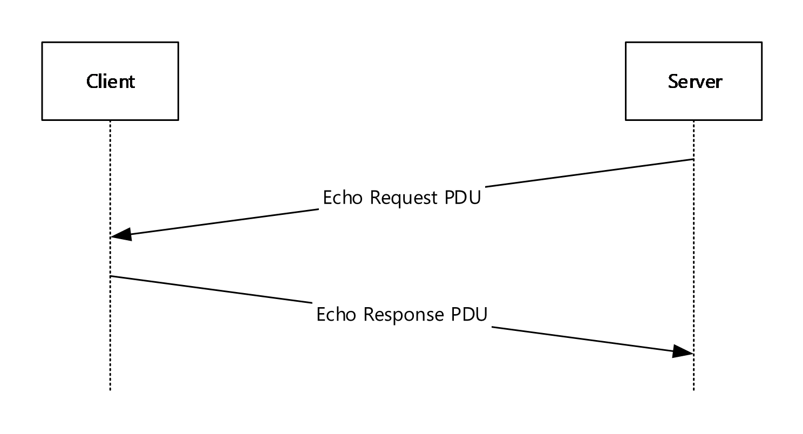
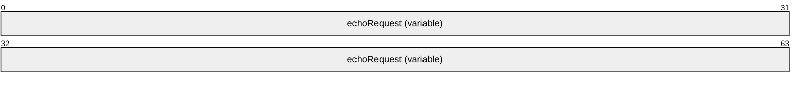

# [MS-RDPEECO]: Remote Desktop Protocol: Virtual Channel Echo Extension

Table of Contents

1 Introduction

- [1 Introduction](#Section_1)
  - [1.1 Glossary](#Section_1.1)
  - [1.2 References](#Section_1.2)
    - [1.2.1 Normative References](#Section_1.2.1)
    - [1.2.2 Informative References](#Section_1.2.2)
  - [1.3 Overview](#Section_1.3)
  - [1.4 Relationship to Other Protocols](#Section_1.4)
  - [1.5 Prerequisites/Preconditions](#Section_1.5)
  - [1.6 Applicability Statement](#Section_1.6)
  - [1.7 Versioning and Capability Negotiation](#Section_1.7)
  - [1.8 Vendor-Extensible Fields](#Section_1.8)
  - [1.9 Standards Assignments](#Section_1.9)

2 Messages

- [2 Messages](#Section_2)
  - [2.1 Transport](#Section_2.1)
  - [2.2 Message Syntax](#Section_2.2)
    - [2.2.1 ECHO_REQUEST_PDU](#Section_2.2.1)
    - [2.2.2 ECHO_RESPONSE_PDU](#Section_2.2.2)

3 Protocol Details

- [3 Protocol Details](#Section_3)
  - [3.1 Server Details](#Section_3.1)
    - [3.1.1 Abstract Data Model](#Section_3.1.1)
    - [3.1.2 Timers](#Section_3.1.2)
    - [3.1.3 Initialization](#Section_3.1.3)
    - [3.1.4 Higher-Layer Triggered Events](#Section_3.1.4)
    - [3.1.5 Message Processing Events and Sequencing Rules](#Section_3.1.5)
      - [3.1.5.1 Sending ECHO_REQUEST_PDU](#Section_3.1.5.1)
      - [3.1.5.2 Processing ECHO_RESPONSE_PDU](#Section_3.1.5.2)
    - [3.1.6 Timer Events](#Section_3.1.6)
    - [3.1.7 Other Local Events](#Section_3.1.7)
  - [3.2 Client Details](#Section_3.2)
    - [3.2.1 Abstract Data Model](#Section_3.2.1)
      - [3.2.1.1 Echo Byte Stream](#Section_3.2.1.1)
    - [3.2.2 Timers](#Section_3.2.2)
    - [3.2.3 Initialization](#Section_3.2.3)
    - [3.2.4 Higher-Layer Triggered Events](#Section_3.2.4)
    - [3.2.5 Processing Events and Sequencing Rules](#Section_3.2.5)
      - [3.2.5.1 Processing ECHO_REQUEST_PDU](#Section_3.2.5.1)
      - [3.2.5.2 Sending ECHO_RESPONSE_PDU](#Section_3.2.5.2)
    - [3.2.6 Timer Events](#Section_3.2.6)
    - [3.2.7 Other Local Events](#Section_3.2.7)

4 Protocol Examples

- [4 Protocol Examples](#Section_4)
  - [4.1 ECHO_REQUEST_PDU](#Section_4.1)
  - [4.2 ECHO_RESPONSE_PDU](#Section_4.2)

5 Security

- [5 Security](#Section_5)
  - [5.1 Security Considerations for Implementers](#Section_5.1)
  - [5.2 Index of Security Parameters](#Section_5.2)

6 Appendix A: Product Behavior

- [6 Appendix A: Product Behavior](#Section_6)

7 Change Tracking

- [7 Change Tracking](#Section_7)

For the legal notice and IP terms, see [LEGAL.md](../LEGAL.md).
Last updated: 4/23/2024.
See [Revision History](#revision-history) for full version history.

# 1 Introduction

This document specifies the Remote Desktop Protocol: Virtual Channel Echo Extension to Remote Desktop Protocol: Basic Connectivity and Graphics Remoting, as specified in [MS-RDPBCGR](../MS-RDPBCGR/MS-RDPBCGR.md). The echo messages defined in section [2.2](#Section_2.2) are used to bounce a payload sent by a [**terminal server**](#gt_terminal-server) off of a connected terminal-server client, thereby providing a simple mechanism to determine network characteristics such as [**round-trip time (RTT)**](#gt_round-trip-time-rtt).

Sections 1.5, 1.8, 1.9, 2, and 3 of this specification are normative. All other sections and examples in this specification are informative.

## 1.1 Glossary

This document uses the following terms:

**ANSI character**: An 8-bit Windows-1252 character set unit.

**protocol data unit (PDU)**: Information that is delivered as a unit among peer entities of a network and that can contain control information, address information, or data. For more information on remote procedure call (RPC)-specific PDUs, see [[C706]](https://go.microsoft.com/fwlink/?LinkId=89824) section 12.

**round-trip time (RTT)**: The time that it takes a packet to be sent to a remote partner and for that partner's acknowledgment to arrive at the original sender. This is a measurement of latency between partners.

**terminal server**: A computer on which terminal services is running.

**MAY, SHOULD, MUST, SHOULD NOT, MUST NOT:** These terms (in all caps) are used as defined in [[RFC2119]](https://go.microsoft.com/fwlink/?LinkId=90317). All statements of optional behavior use either MAY, SHOULD, or SHOULD NOT.

## 1.2 References

Links to a document in the Microsoft Open Specifications library point to the correct section in the most recently published version of the referenced document. However, because individual documents in the library are not updated at the same time, the section numbers in the documents may not match. You can confirm the correct section numbering by checking the [Errata](https://go.microsoft.com/fwlink/?linkid=850906).

### 1.2.1 Normative References

We conduct frequent surveys of the normative references to assure their continued availability. If you have any issue with finding a normative reference, please contact [dochelp@microsoft.com](mailto:dochelp@microsoft.com). We will assist you in finding the relevant information.

[MS-DTYP] Microsoft Corporation, "[Windows Data Types](../MS-DTYP/MS-DTYP.md)".

[MS-RDPEDYC] Microsoft Corporation, "[Remote Desktop Protocol: Dynamic Channel Virtual Channel Extension](../MS-RDPEDYC/MS-RDPEDYC.md)".

[RFC2119] Bradner, S., "Key words for use in RFCs to Indicate Requirement Levels", BCP 14, RFC 2119, March 1997, [https://www.rfc-editor.org/info/rfc2119](https://go.microsoft.com/fwlink/?LinkId=90317)

### 1.2.2 Informative References

[MS-RDPBCGR] Microsoft Corporation, "[Remote Desktop Protocol: Basic Connectivity and Graphics Remoting](../MS-RDPBCGR/MS-RDPBCGR.md)".

## 1.3 Overview

The sequence of messages exchanged by the Remote Desktop Protocol: Virtual Channel Echo Extension is described in the following figure. The messages exchanged in this diagram are strictly sequential.

Figure 1: The echo message sequence

The [**terminal server**](#gt_terminal-server) originates all Echo Request [**protocol data units (PDUs)**](#gt_protocol-data-unit-pdu) (section [2.2.1](#Section_2.2.1)). Each Echo Request PDU sent to a terminal-server client contains a sequence of bytes ([MS-DTYP](../MS-DTYP/MS-DTYP.md) section 2.1.2) that is sent back to the server in an Echo Response PDU (section [2.2.2](#Section_2.2.2)).

## 1.4 Relationship to Other Protocols

The Remote Desktop Protocol: Virtual Channel Echo Extension is embedded in a dynamic virtual channel transport, as specified in [MS-RDPEDYC](../MS-RDPEDYC/MS-RDPEDYC.md) sections 1 to 3.

## 1.5 Prerequisites/Preconditions

The Remote Desktop Protocol: Virtual Channel Echo Extension operates only after the dynamic virtual channel transport, as specified in [MS-RDPEDYC](../MS-RDPEDYC/MS-RDPEDYC.md) sections 1 to 3, is fully established. If the dynamic virtual channel transport is terminated, the Remote Desktop Protocol: Virtual Channel Echo Extension is also terminated. The protocol is terminated by closing the underlying dynamic virtual channel. For details about closing the dynamic virtual channel, refer to [MS-RDPEDYC] section 3.2.5.2.

## 1.6 Applicability Statement

The Remote Desktop Protocol: Virtual Channel Echo Extension is applicable in scenarios where a simple mechanism to determine network characteristics (such as [**round-trip time (RTT)**](#gt_round-trip-time-rtt)) between a [**terminal server**](#gt_terminal-server) and a terminal server client is required.

## 1.7 Versioning and Capability Negotiation

None.

## 1.8 Vendor-Extensible Fields

None.

## 1.9 Standards Assignments

None.

# 2 Messages

## 2.1 Transport

The Remote Desktop Protocol: Virtual Channel Echo Extension is designed to operate over a dynamic virtual channel, as specified in [MS-RDPEDYC](../MS-RDPEDYC/MS-RDPEDYC.md) sections 1 to 3. The dynamic virtual channel name is the null-terminated [**ANSI character**](#gt_ansi-character) string "ECHO". The channel is opened by the server and accepted by client<1> as described in [MS-RDPEDYC] section 3.3.3.2. The usage of channel names in the context of opening a dynamic virtual channel is specified in [MS-RDPEDYC] section 2.2.2.1.

## 2.2 Message Syntax

The following sections specify the Remote Desktop Protocol: Virtual Channel Echo Extension message syntax.

### 2.2.1 ECHO_REQUEST_PDU

The ECHO_REQUEST_PDU message is a server-to-client [**PDU**](#gt_protocol-data-unit-pdu) that is used to transmit a sequence of bytes that MUST be echoed back to the server using an ECHO_RESPONSE_PDU message (section [2.2.2](#Section_2.2.2)).

**echoRequest (variable):** A variable-length array of bytes containing a message that MUST be replayed by the client using an ECHO_RESPONSE_PDU message (section 2.2.2).

### 2.2.2 ECHO_RESPONSE_PDU

The ECHO_RESPONSE_PDU message is a client-to-server [**PDU**](#gt_protocol-data-unit-pdu) that is used to echo the sequence of bytes transmitted in an ECHO_REQUEST_PDU message (section [2.2.1](#Section_2.2.1)). The ECHO_RESPONSE_PDU message MUST be sent only in response to an ECHO_REQUEST_PDU message.

**echoResponse (variable):** A variable-length array of bytes containing the message that was transmitted in the **echoRequest** field of an ECHO_REQUEST_PDU message (section 2.2.1).

# 3 Protocol Details

## 3.1 Server Details

### 3.1.1 Abstract Data Model

None.

### 3.1.2 Timers

None.

### 3.1.3 Initialization

None.

### 3.1.4 Higher-Layer Triggered Events

None.

### 3.1.5 Message Processing Events and Sequencing Rules

#### 3.1.5.1 Sending ECHO_REQUEST_PDU

The structure and fields of the ECHO_REQUEST_PDU message are specified in section [2.2.1](#Section_2.2.1). The **echoRequest** field of the ECHO_REQUEST_PDU message MUST be populated with a byte stream of at least one byte in size.

#### 3.1.5.2 Processing ECHO_RESPONSE_PDU

The structure and fields of the ECHO_RESPONSE_PDU message are specified in section [2.2.2](#Section_2.2.2). Upon receiving the ECHO_RESPONSE_PDU message, the server MAY inspect the data in the **echoResponse** field.

### 3.1.6 Timer Events

None.

### 3.1.7 Other Local Events

None.

## 3.2 Client Details

### 3.2.1 Abstract Data Model

This section describes a conceptual model of possible data organization that an implementation maintains to participate in this protocol. The described organization is provided to facilitate the explanation of how the protocol behaves. This document does not mandate that implementations adhere to this model as long as their external behavior is consistent with that described in this document.

**Note** It is possible to implement the following conceptual data by using a variety of techniques as long as the implementation produces external behavior that is consistent with that described in this document.

#### 3.2.1.1 Echo Byte Stream

The **Echo Byte Stream** store contains the stream of bytes that was embedded in the **echoRequest** field of the most recently received ECHO_REQUEST_PDU message (section [2.2.1](#Section_2.2.1)).

### 3.2.2 Timers

None.

### 3.2.3 Initialization

None.

### 3.2.4 Higher-Layer Triggered Events

None.

### 3.2.5 Processing Events and Sequencing Rules

#### 3.2.5.1 Processing ECHO_REQUEST_PDU

The structure and fields of the ECHO_REQUEST_PDU message are specified in section [2.2.1](#Section_2.2.1). Upon receiving the ECHO_REQUEST_PDU message, the client MUST save the byte stream that is embedded in the **echoRequest** field to the **Echo Byte Stream** store (section [3.2.1.1](#Section_3.2.1.1)). The client then uses this saved data to construct an ECHO_RESPONSE_PDU message (section [2.2.2](#Section_2.2.2)), which it transmits to the server (section [3.2.5.2](#Section_3.2.5.2)).

#### 3.2.5.2 Sending ECHO_RESPONSE_PDU

The structure and fields of the ECHO_RESPONSE_PDU message are specified in section [2.2.2](#Section_2.2.2). The **echoResponse** field of the ECHO_RESPONSE_PDU message MUST be populated with the data that was stored in the **Echo Byte Stream** store (section [3.2.1.1](#Section_3.2.1.1)) during the processing of the ECHO_REQUEST_PDU message (section [3.2.5.1](#Section_3.2.5.1)).

### 3.2.6 Timer Events

None.

### 3.2.7 Other Local Events

None.

# 4 Protocol Examples

## 4.1 ECHO_REQUEST_PDU

The following is an annotated dump of an ECHO_REQUEST_PDU message (section [2.2.1](#Section_2.2.1)).

00000000 48 65 6c 6c 6f 20 77 6f 72 6c 64 21 Hello world!

48 65 6c 6c 6f 20 77 6f 72 6c 64 21 -> ECHO_REQUEST_PDU::echoRequest

## 4.2 ECHO_RESPONSE_PDU

The following is an annotated dump of the ECHO_RESPONSE_PDU message (section [2.2.2](#Section_2.2.2)) sent in response to the PDU in section [4.1](#Section_4.1).

00000000 48 65 6c 6c 6f 20 77 6f 72 6c 64 21 Hello world!

48 65 6c 6c 6f 20 77 6f 72 6c 64 21 -> ECHO_RESPONSE_PDU::echoResponse

# 5 Security

## 5.1 Security Considerations for Implementers

None.

## 5.2 Index of Security Parameters

None.

# 6 Appendix A: Product Behavior

The information in this specification is applicable to the following Microsoft products or supplemental software. References to product versions include updates to those products.

- Windows Vista operating system
- Windows Server 2008 operating system
- Windows 7 operating system
- Windows Server 2008 R2 operating system
- Windows 8 operating system
- Windows Server 2012 operating system
- Windows 8.1 operating system
- Windows Server 2012 R2 operating system
- Windows 10 operating system
- Windows Server 2016 operating system
- Windows Server operating system
- Windows Server 2019 operating system
- Windows Server 2022 operating system
- Windows 11 operating system
- Windows Server 2025 operating system
Exceptions, if any, are noted in this section. If an update version, service pack or Knowledge Base (KB) number appears with a product name, the behavior changed in that update. The new behavior also applies to subsequent updates unless otherwise specified. If a product edition appears with the product version, behavior is different in that product edition.

Unless otherwise specified, any statement of optional behavior in this specification that is prescribed using the terms "SHOULD" or "SHOULD NOT" implies product behavior in accordance with the SHOULD or SHOULD NOT prescription. Unless otherwise specified, the term "MAY" implies that the product does not follow the prescription.

<1> Section 2.1: All Windows clients accept connections on the ECHO channel. The ECHO channel is not opened by Windows Vista, Windows Server 2008, Windows 7, and Windows Server 2008 R2.

# 7 Change Tracking

This section identifies changes that were made to this document since the last release. Changes are classified as Major, Minor, or None.

The revision class **Major** means that the technical content in the document was significantly revised. Major changes affect protocol interoperability or implementation. Examples of major changes are:

- A document revision that incorporates changes to interoperability requirements.
- A document revision that captures changes to protocol functionality.
The revision class **Minor** means that the meaning of the technical content was clarified. Minor changes do not affect protocol interoperability or implementation. Examples of minor changes are updates to clarify ambiguity at the sentence, paragraph, or table level.

The revision class **None** means that no new technical changes were introduced. Minor editorial and formatting changes may have been made, but the relevant technical content is identical to the last released version.

The changes made to this document are listed in the following table. For more information, please contact [dochelp@microsoft.com](mailto:dochelp@microsoft.com).

| Section | Description | Revision class |
| --- | --- | --- |
| [6](#Section_6) Appendix A: Product Behavior | Added Windows Server 2025 to the list of applicable products. | Major |

## Revision History

| Date | Version | Revision Class | Comments |
| --- | --- | --- | --- |
| 12/16/2011 | 1.0 | New | Released new document. |
| 3/30/2012 | 1.0 | None | No changes to the meaning, language, or formatting of the technical content. |
| 7/12/2012 | 1.0 | None | No changes to the meaning, language, or formatting of the technical content. |
| 10/25/2012 | 1.0 | None | No changes to the meaning, language, or formatting of the technical content. |
| 1/31/2013 | 1.0 | None | No changes to the meaning, language, or formatting of the technical content. |
| 8/8/2013 | 1.0 | None | No changes to the meaning, language, or formatting of the technical content. |
| 11/14/2013 | 1.0 | None | No changes to the meaning, language, or formatting of the technical content. |
| 2/13/2014 | 1.0 | None | No changes to the meaning, language, or formatting of the technical content. |
| 5/15/2014 | 1.0 | None | No changes to the meaning, language, or formatting of the technical content. |
| 6/30/2015 | 2.0 | Major | Significantly changed the technical content. |
| 10/16/2015 | 2.0 | None | No changes to the meaning, language, or formatting of the technical content. |
| 7/14/2016 | 2.0 | None | No changes to the meaning, language, or formatting of the technical content. |
| 6/1/2017 | 2.0 | None | No changes to the meaning, language, or formatting of the technical content. |
| 9/15/2017 | 3.0 | Major | Significantly changed the technical content. |
| 9/12/2018 | 4.0 | Major | Significantly changed the technical content. |
| 4/7/2021 | 5.0 | Major | Significantly changed the technical content. |
| 6/25/2021 | 6.0 | Major | Significantly changed the technical content. |
| 4/23/2024 | 7.0 | Major | Significantly changed the technical content. |
