# [MS-RDPEGDI]: Remote Desktop Protocol: Graphics Device Interface (GDI) Acceleration Extensions

Table of Contents

<details>
<summary>1 Introduction</summary>

- [1 Introduction](#Section_1)
  - [1.1 Glossary](#Section_1.1)
  - [1.2 References](#Section_1.2)
    - [1.2.1 Normative References](#Section_1.2.1)
    - [1.2.2 Informative References](#Section_1.2.2)
  - [1.3 Overview](#Section_1.3)
    - [1.3.1 Accelerated Graphics](#Section_1.3.1)
      - [1.3.1.1 Caches](#Section_1.3.1.1)
      - [1.3.1.2 Drawing Orders](#Section_1.3.1.2)
        - [1.3.1.2.1 Primary Drawing Orders](#Section_1.3.1.2.1)
        - [1.3.1.2.2 Secondary Drawing Orders](#Section_1.3.1.2.2)
        - [1.3.1.2.3 Alternate Secondary Drawing Orders](#Section_1.3.1.2.3)
      - [1.3.1.3 Error Conditions](#Section_1.3.1.3)
    - [1.3.2 Bulk Data Compression](#Section_1.3.2)
      - [1.3.2.1 RDP 6.0](#Section_1.3.2.1)
      - [1.3.2.2 RDP 6.1](#Section_1.3.2.2)
  - [1.4 Relationship to Other Protocols](#Section_1.4)
  - [1.5 Prerequisites/Preconditions](#Section_1.5)
  - [1.6 Applicability Statement](#Section_1.6)
  - [1.7 Versioning and Capability Negotiation](#Section_1.7)
  - [1.8 Vendor-Extensible Fields](#Section_1.8)
  - [1.9 Standards Assignments](#Section_1.9)
</details>

<details>
<summary>2 Messages</summary>

- [2 Messages](#Section_2)
  - [2.1 Transport](#Section_2.1)
  - [2.2 Message Syntax](#Section_2.2)
    - [2.2.1 Capability Sets](#Section_2.2.1)
      - [2.2.1.1 Color Table Cache Capability Set (TS_COLORTABLE_CAPABILITYSET)](#Section_2.2.1.1)
      - [2.2.1.2 DrawNineGrid Cache Capability Set (TS_DRAW_NINEGRID_CAPABILITYSET)](#Section_2.2.1.2)
      - [2.2.1.3 Draw GDI+ Capability Set (TS_DRAW_GDIPLUS_CAPABILITYSET)](#Section_2.2.1.3)
        - [2.2.1.3.1 GDI+ Cache Entries (TS_GDIPLUS_CACHE_ENTRIES)](#Section_2.2.1.3.1)
        - [2.2.1.3.2 GDI+ Cache Chunk Size (TS_GDIPLUS_CACHE_CHUNK_SIZE)](#Section_2.2.1.3.2)
        - [2.2.1.3.3 GDI+ Image Cache Properties (TS_GDIPLUS_IMAGE_CACHE_PROPERTIES)](#Section_2.2.1.3.3)
    - [2.2.2 Accelerated Graphics](#Section_2.2.2)
      - [2.2.2.1 Orders Update (TS_UPDATE_ORDERS_PDU_DATA)](#Section_2.2.2.1)
        - [2.2.2.1.1 Drawing Order (DRAWING_ORDER)](#Section_2.2.2.1.1)
      - [2.2.2.2 Fast-Path Orders Update (TS_FP_UPDATE_ORDERS)](#Section_2.2.2.2)
        - [2.2.2.2.1 Drawing Order (DRAWING_ORDER)](#Section_2.2.2.2.1)
          - [2.2.2.2.1.1 Primary Drawing Orders](#Section_2.2.2.2.1.1)
            - [2.2.2.2.1.1.1 Common Data Types](#Section_2.2.2.2.1.1.1)
              - [2.2.2.2.1.1.1.1 Coord Field (COORD_FIELD)](#Section_2.2.2.2.1.1.1.1)
              - [2.2.2.2.1.1.1.2 One-Byte Header Variable Field (VARIABLE1_FIELD)](#Section_2.2.2.2.1.1.1.2)
              - [2.2.2.2.1.1.1.3 Two-Byte Header Variable Field (VARIABLE2_FIELD)](#Section_2.2.2.2.1.1.1.3)
              - [2.2.2.2.1.1.1.4 Delta-Encoded Points (DELTA_PTS_FIELD)](#Section_2.2.2.2.1.1.1.4)
              - [2.2.2.2.1.1.1.5 Delta-Encoded Rectangles (DELTA_RECTS_FIELD)](#Section_2.2.2.2.1.1.1.5)
              - [2.2.2.2.1.1.1.6 Binary Raster Operation (ROP2_OPERATION)](#Section_2.2.2.2.1.1.1.6)
              - [2.2.2.2.1.1.1.7 Ternary Raster Operation Index (ROP3_OPERATION_INDEX)](#Section_2.2.2.2.1.1.1.7)
              - [2.2.2.2.1.1.1.8 Generic Color (TS_COLOR)](#Section_2.2.2.2.1.1.1.8)
              - [2.2.2.2.1.1.1.9 Fill Mode (FILL_MODE)](#Section_2.2.2.2.1.1.1.9)
            - [2.2.2.2.1.1.2 Primary Drawing Order (PRIMARY_DRAWING_ORDER)](#Section_2.2.2.2.1.1.2)
              - [2.2.2.2.1.1.2.1 DstBlt (DSTBLT_ORDER)](#Section_2.2.2.2.1.1.2.1)
              - [2.2.2.2.1.1.2.2 MultiDstBlt (MULTI_DSTBLT_ORDER)](#Section_2.2.2.2.1.1.2.2)
              - [2.2.2.2.1.1.2.3 PatBlt (PATBLT_ORDER)](#Section_2.2.2.2.1.1.2.3)
              - [2.2.2.2.1.1.2.4 MultiPatBlt (MULTI_PATBLT_ORDER)](#Section_2.2.2.2.1.1.2.4)
              - [2.2.2.2.1.1.2.5 OpaqueRect (OPAQUERECT_ORDER)](#Section_2.2.2.2.1.1.2.5)
              - [2.2.2.2.1.1.2.6 MultiOpaqueRect (MULTI_OPAQUERECT_ORDER)](#Section_2.2.2.2.1.1.2.6)
              - [2.2.2.2.1.1.2.7 ScrBlt (SCRBLT_ORDER)](#Section_2.2.2.2.1.1.2.7)
              - [2.2.2.2.1.1.2.8 MultiScrBlt (MULTI_SCRBLT_ORDER)](#Section_2.2.2.2.1.1.2.8)
              - [2.2.2.2.1.1.2.9 MemBlt (MEMBLT_ORDER)](#Section_2.2.2.2.1.1.2.9)
              - [2.2.2.2.1.1.2.10 Mem3Blt (MEM3BLT_ORDER)](#Section_2.2.2.2.1.1.2.10)
              - [2.2.2.2.1.1.2.11 LineTo (LINETO_ORDER)](#Section_2.2.2.2.1.1.2.11)
              - [2.2.2.2.1.1.2.12 SaveBitmap (SAVEBITMAP_ORDER)](#Section_2.2.2.2.1.1.2.12)
              - [2.2.2.2.1.1.2.13 GlyphIndex (GLYPHINDEX_ORDER)](#Section_2.2.2.2.1.1.2.13)
              - [2.2.2.2.1.1.2.14 FastIndex (FASTINDEX_ORDER)](#Section_2.2.2.2.1.1.2.14)
              - [2.2.2.2.1.1.2.15 FastGlyph (FASTGLYPH_ORDER)](#Section_2.2.2.2.1.1.2.15)
              - [2.2.2.2.1.1.2.16 PolygonSC (POLYGON_SC_ORDER)](#Section_2.2.2.2.1.1.2.16)
              - [2.2.2.2.1.1.2.17 PolygonCB (POLYGON_CB_ORDER)](#Section_2.2.2.2.1.1.2.17)
              - [2.2.2.2.1.1.2.18 Polyline (POLYLINE_ORDER)](#Section_2.2.2.2.1.1.2.18)
              - [2.2.2.2.1.1.2.19 EllipseSC (ELLIPSE_SC_ORDER)](#Section_2.2.2.2.1.1.2.19)
              - [2.2.2.2.1.1.2.20 EllipseCB (ELLIPSE_CB_ORDER)](#Section_2.2.2.2.1.1.2.20)
              - [2.2.2.2.1.1.2.21 DrawNineGrid (DRAWNINEGRID_ORDER)](#Section_2.2.2.2.1.1.2.21)
              - [2.2.2.2.1.1.2.22 MultiDrawNineGrid (MULTI_DRAWNINEGRID_ORDER)](#Section_2.2.2.2.1.1.2.22)
          - [2.2.2.2.1.2 Secondary Drawing Orders](#Section_2.2.2.2.1.2)
            - [2.2.2.2.1.2.1 Common Data Types](#Section_2.2.2.2.1.2.1)
              - [2.2.2.2.1.2.1.1 Secondary Drawing Order Header (SECONDARY_DRAWING_ORDER_HEADER)](#Section_2.2.2.2.1.2.1.1)
              - [2.2.2.2.1.2.1.2 Two-Byte Unsigned Encoding (TWO_BYTE_UNSIGNED_ENCODING)](#Section_2.2.2.2.1.2.1.2)
              - [2.2.2.2.1.2.1.3 Two-Byte Signed Encoding (TWO_BYTE_SIGNED_ENCODING)](#Section_2.2.2.2.1.2.1.3)
              - [2.2.2.2.1.2.1.4 Four-Byte Unsigned Encoding (FOUR_BYTE_UNSIGNED_ENCODING)](#Section_2.2.2.2.1.2.1.4)
            - [2.2.2.2.1.2.2 Cache Bitmap - Revision 1 (CACHE_BITMAP_ORDER)](#Section_2.2.2.2.1.2.2)
            - [2.2.2.2.1.2.3 Cache Bitmap - Revision 2 (CACHE_BITMAP_REV2_ORDER)](#Section_2.2.2.2.1.2.3)
            - [2.2.2.2.1.2.4 Cache Color Table (CACHE_COLOR_TABLE_ORDER)](#Section_2.2.2.2.1.2.4)
              - [2.2.2.2.1.2.4.1 Color Quad (TS_COLOR_QUAD)](#Section_2.2.2.2.1.2.4.1)
            - [2.2.2.2.1.2.5 Cache Glyph - Revision 1 (CACHE_GLYPH_ORDER)](#Section_2.2.2.2.1.2.5)
              - [2.2.2.2.1.2.5.1 Cache Glyph Data (TS_CACHE_GLYPH_DATA)](#Section_2.2.2.2.1.2.5.1)
            - [2.2.2.2.1.2.6 Cache Glyph - Revision 2 (CACHE_GLYPH_REV2_ORDER)](#Section_2.2.2.2.1.2.6)
              - [2.2.2.2.1.2.6.1 Cache Glyph Data - Revision 2 (TS_CACHE_GLYPH_DATA_REV2)](#Section_2.2.2.2.1.2.6.1)
            - [2.2.2.2.1.2.7 Cache Brush (CACHE_BRUSH_ORDER)](#Section_2.2.2.2.1.2.7)
              - [2.2.2.2.1.2.7.1 Compressed Color Brush (COMPRESSED_COLOR_BRUSH)](#Section_2.2.2.2.1.2.7.1)
            - [2.2.2.2.1.2.8 Cache Bitmap - Revision 3 (CACHE_BITMAP_REV3_ORDER)](#Section_2.2.2.2.1.2.8)
          - [2.2.2.2.1.3 Alternate Secondary Drawing Orders](#Section_2.2.2.2.1.3)
            - [2.2.2.2.1.3.1 Common Data Types](#Section_2.2.2.2.1.3.1)
              - [2.2.2.2.1.3.1.1 Alternate Secondary Drawing Order Header (ALTSEC_DRAWING_ORDER_HEADER)](#Section_2.2.2.2.1.3.1.1)
            - [2.2.2.2.1.3.2 Create Offscreen Bitmap (CREATE_OFFSCR_BITMAP_ORDER)](#Section_2.2.2.2.1.3.2)
              - [2.2.2.2.1.3.2.1 Offscreen Cache Delete List (OFFSCR_DELETE_LIST)](#Section_2.2.2.2.1.3.2.1)
            - [2.2.2.2.1.3.3 Switch Surface (SWITCH_SURFACE_ORDER)](#Section_2.2.2.2.1.3.3)
            - [2.2.2.2.1.3.4 Create NineGrid Bitmap (CREATE_NINEGRID_BITMAP_ORDER)](#Section_2.2.2.2.1.3.4)
              - [2.2.2.2.1.3.4.1 NineGrid Bitmap Information (NINEGRID_BITMAP_INFO)](#Section_2.2.2.2.1.3.4.1)
                - [2.2.2.2.1.3.4.1.1 Color Reference (TS_COLORREF)](#Section_2.2.2.2.1.3.4.1.1)
            - [2.2.2.2.1.3.5 Stream Bitmap Orders](#Section_2.2.2.2.1.3.5)
              - [2.2.2.2.1.3.5.1 Stream Bitmap First (STREAM_BITMAP_FIRST_ORDER)](#Section_2.2.2.2.1.3.5.1)
              - [2.2.2.2.1.3.5.2 Stream Bitmap Next (STREAM_BITMAP_NEXT_ORDER)](#Section_2.2.2.2.1.3.5.2)
            - [2.2.2.2.1.3.6 GDI+ Orders](#Section_2.2.2.2.1.3.6)
              - [2.2.2.2.1.3.6.1 Common Data Types](#Section_2.2.2.2.1.3.6.1)
                - [2.2.2.2.1.3.6.1.1 GDI+ Cache Type (DRAW_GDIPLUS_CACHE_TYPE)](#Section_2.2.2.2.1.3.6.1.1)
              - [2.2.2.2.1.3.6.2 Draw GDI+ Cache First (DRAW_GDIPLUS_CACHE_FIRST_ORDER)](#Section_2.2.2.2.1.3.6.2)
              - [2.2.2.2.1.3.6.3 Draw GDI+ Cache Next (DRAW_GDIPLUS_CACHE_NEXT_ORDER)](#Section_2.2.2.2.1.3.6.3)
              - [2.2.2.2.1.3.6.4 Draw GDI+ Cache End (DRAW_GDIPLUS_CACHE_END_ORDER)](#Section_2.2.2.2.1.3.6.4)
              - [2.2.2.2.1.3.6.5 Draw GDI+ First (DRAW_GDIPLUS_FIRST_ORDER)](#Section_2.2.2.2.1.3.6.5)
              - [2.2.2.2.1.3.6.6 Draw GDI+ Next (DRAW_GDIPLUS_NEXT_ORDER)](#Section_2.2.2.2.1.3.6.6)
              - [2.2.2.2.1.3.6.7 Draw GDI+ End (DRAW_GDIPLUS_END_ORDER)](#Section_2.2.2.2.1.3.6.7)
            - [2.2.2.2.1.3.7 Frame Marker](#Section_2.2.2.2.1.3.7)
      - [2.2.2.3 Error Conditions](#Section_2.2.2.3)
        - [2.2.2.3.1 Client Bitmap Cache Error PDU](#Section_2.2.2.3.1)
          - [2.2.2.3.1.1 Bitmap Cache Error PDU Data (TS_BITMAP_CACHE_ERROR_PDU)](#Section_2.2.2.3.1.1)
            - [2.2.2.3.1.1.1 Bitmap Cache Error Info (TS_BITMAP_CACHE_ERROR_INFO)](#Section_2.2.2.3.1.1.1)
        - [2.2.2.3.2 Client Offscreen Bitmap Cache Error PDU](#Section_2.2.2.3.2)
          - [2.2.2.3.2.1 Offscreen Bitmap Cache Error PDU Data (TS_OFFSCRCACHE_ERROR_PDU)](#Section_2.2.2.3.2.1)
        - [2.2.2.3.3 Client DrawNineGrid Cache Error PDU](#Section_2.2.2.3.3)
          - [2.2.2.3.3.1 DrawNineGrid Cache Error PDU Data (TS_DRAWNINEGRID_ERROR_PDU)](#Section_2.2.2.3.3.1)
        - [2.2.2.3.4 Client GDI+ Error PDU](#Section_2.2.2.3.4)
          - [2.2.2.3.4.1 GDI+ Error PDU Data (TS_DRAWGDIPLUS_ERROR_PDU)](#Section_2.2.2.3.4.1)
      - [2.2.2.4 Bulk Data Compression](#Section_2.2.2.4)
        - [2.2.2.4.1 RDP 6.1 Compressed Data (RDP61_COMPRESSED_DATA)](#Section_2.2.2.4.1)
          - [2.2.2.4.1.1 RDP 6.1 Match Details (RDP61_MATCH_DETAILS)](#Section_2.2.2.4.1.1)
      - [2.2.2.5 Bitmap Compression](#Section_2.2.2.5)
        - [2.2.2.5.1 RDP 6.0 Bitmap Compressed Bitmap Stream (RDP6_BITMAP_STREAM)](#Section_2.2.2.5.1)
          - [2.2.2.5.1.1 RDP 6.0 RLE Segments (RDP6_RLE_SEGMENTS)](#Section_2.2.2.5.1.1)
          - [2.2.2.5.1.2 RDP 6.0 RLE Segment (RDP6_RLE_SEGMENT)](#Section_2.2.2.5.1.2)
</details>

<details>
<summary>3 Protocol Details</summary>

- [3 Protocol Details](#Section_3)
  - [3.1 Common Details](#Section_3.1)
    - [3.1.1 Abstract Data Model](#Section_3.1.1)
      - [3.1.1.1 Caches](#Section_3.1.1.1)
        - [3.1.1.1.1 Bitmap Caches](#Section_3.1.1.1.1)
        - [3.1.1.1.2 Glyph and Fragment Caches](#Section_3.1.1.1.2)
        - [3.1.1.1.3 Color Table Cache](#Section_3.1.1.1.3)
        - [3.1.1.1.4 Brush Caches](#Section_3.1.1.1.4)
        - [3.1.1.1.5 Offscreen Bitmap Cache](#Section_3.1.1.1.5)
        - [3.1.1.1.6 NineGrid Bitmap Cache](#Section_3.1.1.1.6)
        - [3.1.1.1.7 GDI+ Caches](#Section_3.1.1.1.7)
    - [3.1.2 Timers](#Section_3.1.2)
    - [3.1.3 Initialization](#Section_3.1.3)
    - [3.1.4 Higher-Layer Triggered Events](#Section_3.1.4)
    - [3.1.5 Processing Events and Sequencing Rules](#Section_3.1.5)
    - [3.1.6 Timer Events](#Section_3.1.6)
    - [3.1.7 Other Local Events](#Section_3.1.7)
    - [3.1.8 Bulk Data Compression](#Section_3.1.8)
      - [3.1.8.1 RDP 6.0](#Section_3.1.8.1)
        - [3.1.8.1.1 Abstract Data Model](#Section_3.1.8.1.1)
        - [3.1.8.1.2 Compressing Data](#Section_3.1.8.1.2)
        - [3.1.8.1.3 Decompressing Data](#Section_3.1.8.1.3)
        - [3.1.8.1.4 Wire Format](#Section_3.1.8.1.4)
          - [3.1.8.1.4.1 Literal, EOS, and Copy-Offset Tables](#Section_3.1.8.1.4.1)
          - [3.1.8.1.4.2 Length-of-Match Tables](#Section_3.1.8.1.4.2)
          - [3.1.8.1.4.3 Encoding the Logically Compressed Stream](#Section_3.1.8.1.4.3)
            - [3.1.8.1.4.3.1 Encoding the Copy-Offset](#Section_3.1.8.1.4.3.1)
              - [3.1.8.1.4.3.1.1 Examples of Copy-Offset Encoding](#Section_3.1.8.1.4.3.1.1)
            - [3.1.8.1.4.3.2 Encoding the Length-of-Match](#Section_3.1.8.1.4.3.2)
              - [3.1.8.1.4.3.2.1 Examples of Length-of-Match Encoding](#Section_3.1.8.1.4.3.2.1)
          - [3.1.8.1.4.4 Decoding a Compressed Stream](#Section_3.1.8.1.4.4)
            - [3.1.8.1.4.4.1 Decoding the Copy-Offset](#Section_3.1.8.1.4.4.1)
              - [3.1.8.1.4.4.1.1 Examples of Copy-Offset Decoding](#Section_3.1.8.1.4.4.1.1)
            - [3.1.8.1.4.4.2 Decoding the Length-of-Match](#Section_3.1.8.1.4.4.2)
              - [3.1.8.1.4.4.2.1 Examples of Length-of-Match Decoding](#Section_3.1.8.1.4.4.2.1)
      - [3.1.8.2 RDP 6.1](#Section_3.1.8.2)
        - [3.1.8.2.1 Abstract Data Model](#Section_3.1.8.2.1)
        - [3.1.8.2.2 Compressing Data](#Section_3.1.8.2.2)
          - [3.1.8.2.2.1 Data Compression Example](#Section_3.1.8.2.2.1)
          - [3.1.8.2.2.2 Setting Compression and Extended Compression Flags](#Section_3.1.8.2.2.2)
        - [3.1.8.2.3 Decompressing Data](#Section_3.1.8.2.3)
          - [3.1.8.2.3.1 Data Decompression Example](#Section_3.1.8.2.3.1)
    - [3.1.9 RDP 6.0 Bitmap Compression](#Section_3.1.9)
      - [3.1.9.1 Bitmap Compression Techniques](#Section_3.1.9.1)
        - [3.1.9.1.1 Splitting and Combining Color Planes](#Section_3.1.9.1.1)
        - [3.1.9.1.2 Color Space Conversion](#Section_3.1.9.1.2)
        - [3.1.9.1.3 Chroma Subsampling and Super-Sampling](#Section_3.1.9.1.3)
        - [3.1.9.1.4 Color Loss Reduction](#Section_3.1.9.1.4)
      - [3.1.9.2 Run-Length Encoding](#Section_3.1.9.2)
        - [3.1.9.2.1 Encoding Run-Length Sequences](#Section_3.1.9.2.1)
        - [3.1.9.2.2 Extra Long RUN Sequences](#Section_3.1.9.2.2)
        - [3.1.9.2.3 Decoding Run-Length Sequences](#Section_3.1.9.2.3)
      - [3.1.9.3 Compressing a Bitmap](#Section_3.1.9.3)
      - [3.1.9.4 Decompressing a Bitmap](#Section_3.1.9.4)
  - [3.2 Client Details](#Section_3.2)
    - [3.2.1 Abstract Data Model](#Section_3.2.1)
      - [3.2.1.1 Primary Drawing Order History](#Section_3.2.1.1)
      - [3.2.1.2 Save Bitmap](#Section_3.2.1.2)
      - [3.2.1.3 Bitmap Cache](#Section_3.2.1.3)
      - [3.2.1.4 Persistent Bitmap Cache](#Section_3.2.1.4)
      - [3.2.1.5 Persisted Bitmap Keys](#Section_3.2.1.5)
    - [3.2.2 Timers](#Section_3.2.2)
    - [3.2.3 Initialization](#Section_3.2.3)
    - [3.2.4 Higher-Layer Triggered Events](#Section_3.2.4)
    - [3.2.5 Processing Events and Sequencing Rules](#Section_3.2.5)
      - [3.2.5.1 Drawing Orders](#Section_3.2.5.1)
        - [3.2.5.1.1 Primary Drawing Orders](#Section_3.2.5.1.1)
          - [3.2.5.1.1.1 Processing Primary Drawing Orders](#Section_3.2.5.1.1.1)
            - [3.2.5.1.1.1.1 Processing of DstBlt](#Section_3.2.5.1.1.1.1)
            - [3.2.5.1.1.1.2 Processing of MultiDstBlt](#Section_3.2.5.1.1.1.2)
            - [3.2.5.1.1.1.3 Processing of PatBlt](#Section_3.2.5.1.1.1.3)
            - [3.2.5.1.1.1.4 Processing of MultiPatBlt](#Section_3.2.5.1.1.1.4)
            - [3.2.5.1.1.1.5 Processing of OpaqueRect](#Section_3.2.5.1.1.1.5)
            - [3.2.5.1.1.1.6 Processing of MultiOpaqueRect](#Section_3.2.5.1.1.1.6)
            - [3.2.5.1.1.1.7 Processing of ScrBlt](#Section_3.2.5.1.1.1.7)
            - [3.2.5.1.1.1.8 Processing of MultiScrBlt](#Section_3.2.5.1.1.1.8)
            - [3.2.5.1.1.1.9 Processing of MemBlt](#Section_3.2.5.1.1.1.9)
            - [3.2.5.1.1.1.10 Processing of Mem3Blt](#Section_3.2.5.1.1.1.10)
            - [3.2.5.1.1.1.11 Processing of LineTo](#Section_3.2.5.1.1.1.11)
            - [3.2.5.1.1.1.12 Processing of SaveBitmap](#Section_3.2.5.1.1.1.12)
            - [3.2.5.1.1.1.13 Processing of GlyphIndex](#Section_3.2.5.1.1.1.13)
            - [3.2.5.1.1.1.14 Processing of FastIndex](#Section_3.2.5.1.1.1.14)
            - [3.2.5.1.1.1.15 Processing of FastGlyph](#Section_3.2.5.1.1.1.15)
            - [3.2.5.1.1.1.16 Processing of PolygonSC](#Section_3.2.5.1.1.1.16)
            - [3.2.5.1.1.1.17 Processing of PolygonCB](#Section_3.2.5.1.1.1.17)
            - [3.2.5.1.1.1.18 Processing of Polyline](#Section_3.2.5.1.1.1.18)
            - [3.2.5.1.1.1.19 Processing of EllipseSC](#Section_3.2.5.1.1.1.19)
            - [3.2.5.1.1.1.20 Processing of EllipseCB](#Section_3.2.5.1.1.1.20)
            - [3.2.5.1.1.1.21 Processing of DrawNineGrid](#Section_3.2.5.1.1.1.21)
            - [3.2.5.1.1.1.22 Processing of MultiDrawNineGrid](#Section_3.2.5.1.1.1.22)
        - [3.2.5.1.2 Secondary Drawing Orders](#Section_3.2.5.1.2)
          - [3.2.5.1.2.1 Processing Secondary Drawing Orders](#Section_3.2.5.1.2.1)
            - [3.2.5.1.2.1.1 Processing of Cache Bitmap (Revision 1)](#Section_3.2.5.1.2.1.1)
            - [3.2.5.1.2.1.2 Processing of Cache Bitmap (Revision 2)](#Section_3.2.5.1.2.1.2)
            - [3.2.5.1.2.1.3 Processing of Cache Color Table](#Section_3.2.5.1.2.1.3)
            - [3.2.5.1.2.1.4 Processing of Cache Glyph (Revision 1)](#Section_3.2.5.1.2.1.4)
            - [3.2.5.1.2.1.5 Processing of Cache Glyph (Revision 2)](#Section_3.2.5.1.2.1.5)
            - [3.2.5.1.2.1.6 Processing of Cache Brush](#Section_3.2.5.1.2.1.6)
            - [3.2.5.1.2.1.7 Processing of Cache Bitmap (Revision 3)](#Section_3.2.5.1.2.1.7)
        - [3.2.5.1.3 Alternate Secondary Drawing Orders](#Section_3.2.5.1.3)
          - [3.2.5.1.3.1 Processing Alternate Secondary Drawing Orders](#Section_3.2.5.1.3.1)
            - [3.2.5.1.3.1.1 Processing of Create Offscreen Bitmap](#Section_3.2.5.1.3.1.1)
            - [3.2.5.1.3.1.2 Processing of Switch Surface](#Section_3.2.5.1.3.1.2)
            - [3.2.5.1.3.1.3 Processing of Create NineGrid Bitmap](#Section_3.2.5.1.3.1.3)
            - [3.2.5.1.3.1.4 Processing of Stream Bitmap Orders](#Section_3.2.5.1.3.1.4)
            - [3.2.5.1.3.1.5 GDI+ Orders](#Section_3.2.5.1.3.1.5)
              - [3.2.5.1.3.1.5.1 Processing of Draw GDI+ Cache Orders](#Section_3.2.5.1.3.1.5.1)
              - [3.2.5.1.3.1.5.2 Processing of Draw GDI+ Orders](#Section_3.2.5.1.3.1.5.2)
      - [3.2.5.2 Error Conditions](#Section_3.2.5.2)
        - [3.2.5.2.1 Sending of Bitmap Cache Error PDU](#Section_3.2.5.2.1)
        - [3.2.5.2.2 Sending of the Offscreen Bitmap Cache Error PDU](#Section_3.2.5.2.2)
        - [3.2.5.2.3 Sending of the DrawNineGrid Cache Error PDU](#Section_3.2.5.2.3)
        - [3.2.5.2.4 Sending of the GDI+ Error PDU](#Section_3.2.5.2.4)
    - [3.2.6 Timer Events](#Section_3.2.6)
    - [3.2.7 Other Local Events](#Section_3.2.7)
  - [3.3 Server Details](#Section_3.3)
    - [3.3.1 Abstract Data Model](#Section_3.3.1)
      - [3.3.1.1 Cached Bitmap Keys](#Section_3.3.1.1)
      - [3.3.1.2 Primary Drawing Order History](#Section_3.3.1.2)
      - [3.3.1.3 Bitmap Cache Wait List](#Section_3.3.1.3)
    - [3.3.2 Timers](#Section_3.3.2)
    - [3.3.3 Initialization](#Section_3.3.3)
    - [3.3.4 Higher-Layer Triggered Events](#Section_3.3.4)
    - [3.3.5 Processing Events and Sequencing Rules](#Section_3.3.5)
      - [3.3.5.1 Drawing Orders](#Section_3.3.5.1)
        - [3.3.5.1.1 Primary Drawing Orders](#Section_3.3.5.1.1)
          - [3.3.5.1.1.1 Construction of a Primary Drawing Order](#Section_3.3.5.1.1.1)
            - [3.3.5.1.1.1.1 Construction of DstBlt](#Section_3.3.5.1.1.1.1)
            - [3.3.5.1.1.1.2 Construction of MultiDstBlt](#Section_3.3.5.1.1.1.2)
            - [3.3.5.1.1.1.3 Construction of PatBlt](#Section_3.3.5.1.1.1.3)
            - [3.3.5.1.1.1.4 Construction of MultiPatBlt](#Section_3.3.5.1.1.1.4)
            - [3.3.5.1.1.1.5 Construction of OpaqueRect](#Section_3.3.5.1.1.1.5)
            - [3.3.5.1.1.1.6 Construction of MultiOpaqueRect](#Section_3.3.5.1.1.1.6)
            - [3.3.5.1.1.1.7 Construction of ScrBlt](#Section_3.3.5.1.1.1.7)
            - [3.3.5.1.1.1.8 Construction of MultiScrBlt](#Section_3.3.5.1.1.1.8)
            - [3.3.5.1.1.1.9 Construction of MemBlt](#Section_3.3.5.1.1.1.9)
            - [3.3.5.1.1.1.10 Construction of Mem3Blt](#Section_3.3.5.1.1.1.10)
            - [3.3.5.1.1.1.11 Construction of LineTo](#Section_3.3.5.1.1.1.11)
            - [3.3.5.1.1.1.12 Construction of SaveBitmap](#Section_3.3.5.1.1.1.12)
            - [3.3.5.1.1.1.13 Construction of GlyphIndex](#Section_3.3.5.1.1.1.13)
            - [3.3.5.1.1.1.14 Construction of FastIndex](#Section_3.3.5.1.1.1.14)
            - [3.3.5.1.1.1.15 Construction of FastGlyph](#Section_3.3.5.1.1.1.15)
            - [3.3.5.1.1.1.16 Construction of PolygonSC](#Section_3.3.5.1.1.1.16)
            - [3.3.5.1.1.1.17 Construction of PolygonCB](#Section_3.3.5.1.1.1.17)
            - [3.3.5.1.1.1.18 Construction of PolyLine](#Section_3.3.5.1.1.1.18)
            - [3.3.5.1.1.1.19 Construction of EllipseSC](#Section_3.3.5.1.1.1.19)
            - [3.3.5.1.1.1.20 Construction of EllipseCB](#Section_3.3.5.1.1.1.20)
            - [3.3.5.1.1.1.21 Construction of DrawNineGrid](#Section_3.3.5.1.1.1.21)
            - [3.3.5.1.1.1.22 Construction of MultiDrawNineGrid](#Section_3.3.5.1.1.1.22)
        - [3.3.5.1.2 Secondary Drawing Orders](#Section_3.3.5.1.2)
          - [3.3.5.1.2.1 Construction of Secondary Drawing Orders](#Section_3.3.5.1.2.1)
            - [3.3.5.1.2.1.1 Construction of Cache Bitmap (Revision 1)](#Section_3.3.5.1.2.1.1)
            - [3.3.5.1.2.1.2 Construction of Cache Bitmap (Revision 2)](#Section_3.3.5.1.2.1.2)
            - [3.3.5.1.2.1.3 Construction of Cache Color Table](#Section_3.3.5.1.2.1.3)
            - [3.3.5.1.2.1.4 Construction of Cache Glyph (Revision 1)](#Section_3.3.5.1.2.1.4)
            - [3.3.5.1.2.1.5 Construction of Cache Glyph (Revision 2)](#Section_3.3.5.1.2.1.5)
            - [3.3.5.1.2.1.6 Construction of Cache Brush](#Section_3.3.5.1.2.1.6)
            - [3.3.5.1.2.1.7 Construction of Cache Bitmap (Revision 3)](#Section_3.3.5.1.2.1.7)
        - [3.3.5.1.3 Alternate Secondary Drawing Orders](#Section_3.3.5.1.3)
          - [3.3.5.1.3.1 Construction of Alternate Secondary Drawing Orders](#Section_3.3.5.1.3.1)
            - [3.3.5.1.3.1.1 Construction of Create Offscreen Bitmap](#Section_3.3.5.1.3.1.1)
            - [3.3.5.1.3.1.2 Construction of Switch Surface](#Section_3.3.5.1.3.1.2)
            - [3.3.5.1.3.1.3 Construction of Create NineGrid Bitmap](#Section_3.3.5.1.3.1.3)
            - [3.3.5.1.3.1.4 Construction of Stream Bitmap Orders](#Section_3.3.5.1.3.1.4)
            - [3.3.5.1.3.1.5 GDI+ Orders](#Section_3.3.5.1.3.1.5)
              - [3.3.5.1.3.1.5.1 Construction of Draw GDI+ Cache Orders](#Section_3.3.5.1.3.1.5.1)
              - [3.3.5.1.3.1.5.2 Construction of Draw GDI+ Orders](#Section_3.3.5.1.3.1.5.2)
      - [3.3.5.2 Error Conditions](#Section_3.3.5.2)
        - [3.3.5.2.1 Processing of Bitmap Cache Error PDU](#Section_3.3.5.2.1)
        - [3.3.5.2.2 Processing of the Offscreen Bitmap Cache Error PDU](#Section_3.3.5.2.2)
        - [3.3.5.2.3 Processing of the DrawNineGrid Cache Error PDU](#Section_3.3.5.2.3)
        - [3.3.5.2.4 Processing of the GDI+ Error PDU](#Section_3.3.5.2.4)
    - [3.3.6 Timer Events](#Section_3.3.6)
    - [3.3.7 Other Local Events](#Section_3.3.7)
</details>

<details>
<summary>4 Protocol Examples</summary>

- [4 Protocol Examples](#Section_4)
  - [4.1 Annotated Primary Drawing Orders](#Section_4.1)
    - [4.1.1 DstBlt](#Section_4.1.1)
    - [4.1.2 MultiDstBlt](#Section_4.1.2)
    - [4.1.3 PatBlt](#Section_4.1.3)
    - [4.1.4 MultiPatBlt](#Section_4.1.4)
    - [4.1.5 OpaqueRect](#Section_4.1.5)
    - [4.1.6 MultiOpaqueRect](#Section_4.1.6)
    - [4.1.7 ScrBlt](#Section_4.1.7)
    - [4.1.8 MultiScrBlt](#Section_4.1.8)
    - [4.1.9 MemBlt](#Section_4.1.9)
    - [4.1.10 Mem3Blt](#Section_4.1.10)
    - [4.1.11 LineTo](#Section_4.1.11)
    - [4.1.12 SaveBitmap](#Section_4.1.12)
    - [4.1.13 GlyphIndex](#Section_4.1.13)
      - [4.1.13.1 Example 1](#Section_4.1.13.1)
      - [4.1.13.2 Example 2](#Section_4.1.13.2)
    - [4.1.14 FastIndex](#Section_4.1.14)
      - [4.1.14.1 Example 1](#Section_4.1.14.1)
      - [4.1.14.2 Example 2](#Section_4.1.14.2)
    - [4.1.15 FastGlyph](#Section_4.1.15)
    - [4.1.16 PolygonSC](#Section_4.1.16)
    - [4.1.17 PolygonCB](#Section_4.1.17)
    - [4.1.18 Polyline](#Section_4.1.18)
    - [4.1.19 EllipseSC](#Section_4.1.19)
    - [4.1.20 EllipseCB](#Section_4.1.20)
    - [4.1.21 DrawNineGrid](#Section_4.1.21)
    - [4.1.22 MultiDrawNineGrid](#Section_4.1.22)
  - [4.2 Annotated Secondary Drawing Orders](#Section_4.2)
    - [4.2.1 Cache Bitmap (Revision 1)](#Section_4.2.1)
    - [4.2.2 Cache Bitmap (Revision 2)](#Section_4.2.2)
    - [4.2.3 Cache Color Table](#Section_4.2.3)
    - [4.2.4 Cache Glyph (Revision 1)](#Section_4.2.4)
    - [4.2.5 Cache Glyph (Revision 2)](#Section_4.2.5)
    - [4.2.6 Cache Brush](#Section_4.2.6)
    - [4.2.7 Cache Bitmap (Revision 3)](#Section_4.2.7)
  - [4.3 Annotated Alternate Secondary Drawing Orders](#Section_4.3)
    - [4.3.1 Create Offscreen Bitmap](#Section_4.3.1)
    - [4.3.2 Switch Surface](#Section_4.3.2)
    - [4.3.3 Create NineGrid Bitmap](#Section_4.3.3)
    - [4.3.4 Stream Bitmap First](#Section_4.3.4)
    - [4.3.5 Stream Bitmap Next](#Section_4.3.5)
    - [4.3.6 Draw GDI+ Cache First](#Section_4.3.6)
      - [4.3.6.1 Example 1](#Section_4.3.6.1)
      - [4.3.6.2 Example 2](#Section_4.3.6.2)
    - [4.3.7 Draw GDI+ Cache Next](#Section_4.3.7)
    - [4.3.8 Draw GDI+ Cache End](#Section_4.3.8)
    - [4.3.9 Draw GDI+ First](#Section_4.3.9)
    - [4.3.10 Draw GDI+ Next](#Section_4.3.10)
    - [4.3.11 Draw GDI+ End](#Section_4.3.11)
  - [4.4 NineGrid Examples](#Section_4.4)
  - [4.5 Save Bitmap Example](#Section_4.5)
  - [4.6 Glyph Image Data](#Section_4.6)
    - [4.6.1 "d" Character](#Section_4.6.1)
    - [4.6.2 "p" Character](#Section_4.6.2)
  - [4.7 RDP 6.1 Bulk Compression Example](#Section_4.7)
  - [4.8 Error Conditions](#Section_4.8)
    - [4.8.1 Bitmap Cache Error PDU](#Section_4.8.1)
    - [4.8.2 Offscreen Bitmap Cache Error PDU](#Section_4.8.2)
    - [4.8.3 DrawNineGrid Cache Error PDU](#Section_4.8.3)
    - [4.8.4 GDI+ Error PDU](#Section_4.8.4)
</details>

<details>
<summary>5 Security</summary>

- [5 Security](#Section_5)
  - [5.1 Security Considerations for Implementers](#Section_5.1)
  - [5.2 Index of Security Parameters](#Section_5.2)
</details>

<details>
<summary>6 Appendix A: Product Behavior</summary>

- [6 Appendix A: Product Behavior](#Section_6)
</details>

<details>
<summary>7 Change Tracking</summary>

- [7 Change Tracking](#Section_7)
</details>

For the legal notice and IP terms, see [LEGAL.md](../LEGAL.md).
Last updated: 4/23/2024.
See [Revision History](#revision-history) for full version history.

<a id="Section_1"></a>
# 1 Introduction

The Remote Desktop Protocol: Graphics Devices Interfaces (GDI) Acceleration Extension is an extension to the Remote Desktop Protocol: Basic Connectivity and Graphics Remoting (as specified in [MS-RDPBCGR](../MS-RDPBCGR/MS-RDPBCGR.md)). The aim of the Remote Desktop Protocol: GDI Acceleration Extension is to reduce the bandwidth associated with graphics remoting by encoding the drawing operations that produce an image instead of encoding the actual image.

Sections 1.5, 1.8, 1.9, 2, and 3 of this specification are normative. All other sections and examples in this specification are informative.

<a id="Section_1.1"></a>
## 1.1 Glossary

This document uses the following terms:

<a id="gt_ansi-character"></a>
**ANSI character**: An 8-bit Windows-1252 character set unit.

<a id="gt_argb"></a>
**ARGB**: A color space wherein each color is represented as a quad (A, R, G, B), where A represents the alpha (transparency) component, R represents the red component, G represents the green component, and B represents the blue component. The ARGB value is typically stored as a 32-bit integer, wherein the alpha channel is stored in the highest 8 bits and the blue value is stored in the lowest 8 bits.

<a id="gt_asn1"></a>
**ASN.1**: Abstract Syntax Notation One. ASN.1 is used to describe Kerberos datagrams as a sequence of components, sent in messages. ASN.1 is described in the following specifications: [[ITUX660]](https://go.microsoft.com/fwlink/?LinkId=89922) for general procedures; [[ITUX680]](https://go.microsoft.com/fwlink/?LinkId=89923) for syntax specification, and [[ITUX690]](https://go.microsoft.com/fwlink/?LinkId=89924) for the Basic Encoding Rules (BER), Canonical Encoding Rules (CER), and Distinguished Encoding Rules (DER) encoding rules.

<a id="gt_aycocg"></a>
**AYCoCg**: A color space in which each color is represented as a quad (A, Y, Co, Cg), where A represents the alpha (transparency) component, Y represents the luma (intensity) component, and Co and Cg represent the two chrominance (color) components orange and green, respectively.

<a id="gt_brush"></a>
**brush**: An 8-by-8-pixel bitmap that is repeated horizontally and vertically to fill an area.

<a id="gt_client"></a>
**client**: A computer on which the remote procedure call (RPC) client is executing.

<a id="gt_color-plane"></a>
**color plane**: A two-dimensional surface containing a collection of values that represent a single component of the [**ARGB**](#gt_argb) or [**AYCoCg**](#gt_aycocg) color space.

<a id="gt_color-space"></a>
**color space**: Any method of representing colors for printing or electronic display.

<a id="gt_packed-encoding-rules-per"></a>
**Packed Encoding Rules (PER)**: A set of encoding rules for [**ASN.1**](#gt_asn1) notation, specified in [[ITUX691]](https://go.microsoft.com/fwlink/?LinkId=192078). These rules enable the identification, extraction, and decoding of data structures.

<a id="gt_protocol-data-unit-pdu"></a>
**protocol data unit (PDU)**: Information that is delivered as a unit among peer entities of a network and that can contain control information, address information, or data. For more information on remote procedure call (RPC)-specific PDUs, see [[C706]](https://go.microsoft.com/fwlink/?LinkId=89824) section 12.

<a id="gt_red-green-blue-rgb"></a>
**red-green-blue (RGB)**: A color model that describes color information in terms of the red (R), green (G), and blue (B) intensities in a color.

<a id="gt_reverse-polish-notation-rpn"></a>
**Reverse Polish Notation (RPN)**: A mathematical notation wherein each operator follows all of its operands. Also known as postfix notation.

<a id="gt_screen-tearing"></a>
**screen tearing**: A phenomenon in video rendering where a newly rendered frame partially overlaps with a previously rendered frame, creating a torn look as graphical objects do not line up.

<a id="gt_server"></a>
**server**: A computer on which the remote procedure call (RPC) server is executing.

<a id="gt_unicode-character"></a>
**Unicode character**: Unless otherwise specified, a 16-bit UTF-16 code unit.

<a id="gt_ycocg"></a>
**YCoCg**: A color space wherein each color is represented as a triple (Y, Co, Cg), where Y represents the luma (intensity) component, and Co and Cg represent the two chrominance (color) components orange and green, respectively.

**MAY, SHOULD, MUST, SHOULD NOT, MUST NOT:** These terms (in all caps) are used as defined in [[RFC2119]](https://go.microsoft.com/fwlink/?LinkId=90317). All statements of optional behavior use either MAY, SHOULD, or SHOULD NOT.

<a id="Section_1.2"></a>
## 1.2 References

Links to a document in the Microsoft Open Specifications library point to the correct section in the most recently published version of the referenced document. However, because individual documents in the library are not updated at the same time, the section numbers in the documents may not match. You can confirm the correct section numbering by checking the [Errata](https://go.microsoft.com/fwlink/?linkid=850906).

<a id="Section_1.2.1"></a>
### 1.2.1 Normative References

We conduct frequent surveys of the normative references to assure their continued availability. If you have any issue with finding a normative reference, please contact [dochelp@microsoft.com](mailto:dochelp@microsoft.com). We will assist you in finding the relevant information.

[MS-EMFPLUS] Microsoft Corporation, "[Enhanced Metafile Format Plus Extensions](../MS-EMFPLUS/MS-EMFPLUS.md)".

[MS-RDPBCGR] Microsoft Corporation, "[Remote Desktop Protocol: Basic Connectivity and Graphics Remoting](../MS-RDPBCGR/MS-RDPBCGR.md)".

[MS-RDPEDC] Microsoft Corporation, "[Remote Desktop Protocol: Desktop Composition Virtual Channel Extension](../MS-RDPEDC/MS-RDPEDC.md)".

[MS-RDPERP] Microsoft Corporation, "[Remote Desktop Protocol: Remote Programs Virtual Channel Extension](../MS-RDPERP/MS-RDPERP.md)".

[PETZOLD] Petzold, C., "Programming Windows, Fifth Edition", Microsoft Press, 1998, ISBN: 157231995X.

[RFC2119] Bradner, S., "Key words for use in RFCs to Indicate Requirement Levels", BCP 14, RFC 2119, March 1997, [https://www.rfc-editor.org/info/rfc2119](https://go.microsoft.com/fwlink/?LinkId=90317)

[T123] ITU-T, "Network-Specific Data Protocol Stacks for Multimedia Conferencing", Recommendation T.123, May 1999, [http://www.itu.int/rec/T-REC-T.123/en](https://go.microsoft.com/fwlink/?LinkId=90541)

**Note** There is a charge to download the specification.

[T125] ITU-T, "Multipoint Communication Service Protocol Specification", Recommendation T.125, February 1998, [http://www.itu.int/rec/T-REC-T.125-199802-I/en](https://go.microsoft.com/fwlink/?LinkId=90543)

**Note** There is a charge to download the specification.

[T128] ITU-T, "Multipoint Application Sharing", Recommendation T.128, February 1998, [http://www.itu.int/rec/T-REC-T.128-199802-S/en](https://go.microsoft.com/fwlink/?LinkId=90544)

**Note** There is a charge to download the specification.

[X224] ITU-T, "Information technology - Open Systems Interconnection - Protocol for Providing the Connection-Mode Transport Service", Recommendation X.224, November 1995, [http://www.itu.int/rec/T-REC-X.224-199511-I/en](https://go.microsoft.com/fwlink/?LinkId=90588)

**Note** There is a charge to download the specification.

[YUAN] Yuan, F., "Windows Graphics Programming - Win32 GDI and DirectDraw", Prentice Hall PTR, 2000, ISBN: 0130869856.

<a id="Section_1.2.2"></a>
### 1.2.2 Informative References

[MSDN-ABLEND] Microsoft Corporation, "AlphaBlend function (wingdi.h)", [https://learn.microsoft.com/en-us/windows/win32/api/wingdi/nf-wingdi-alphablend](https://go.microsoft.com/fwlink/?LinkId=89948)

[MSDN-BitBlt] Microsoft Corporation, "BitBlt function", [http://msdn.microsoft.com/en-us/library/dd183370.aspx](https://go.microsoft.com/fwlink/?LinkId=89958)

[MSDN-CW] Microsoft Corporation, "Character Widths", [http://msdn.microsoft.com/en-us/library/dd183418.aspx](https://go.microsoft.com/fwlink/?LinkId=196874)

[MSDN-SWH] Microsoft Corporation, "String Widths and Heights", [http://msdn.microsoft.com/en-us/library/dd145122.aspx](https://go.microsoft.com/fwlink/?LinkId=196875)

[MSDN-TransparentBlt] Microsoft Corporation, "TransparentBlt function", [http://msdn.microsoft.com/en-us/library/dd145141.aspx](https://go.microsoft.com/fwlink/?LinkId=90146)

[NINEGRID] Microsoft Corporation, "Using Nine-Grid Rendering", [http://msdn.microsoft.com/en-us/library/bb189722.aspx](https://go.microsoft.com/fwlink/?LinkId=90233)

[SAYOOD] Sayood, K., "Lossless Compression Handbook, First Edition", Academic Press, August 2002, ISBN: 0126208611.

<a id="Section_1.3"></a>
## 1.3 Overview

The Remote Desktop Protocol: GDI Acceleration Extension reduces the bandwidth associated with graphics remoting. The following sections provide an overview of the major components of this protocol and how bandwidth reduction is achieved.

<a id="Section_1.3.1"></a>
### 1.3.1 Accelerated Graphics

The remoting of graphics images (see [MS-RDPBCGR](../MS-RDPBCGR/MS-RDPBCGR.md) sections 2.2.9.1.1.3.1.2 and 2.2.9.1.2.1.2) is accomplished by continuously sending updated bitmap images from [**server**](#gt_server) to [**client**](#gt_client). Even though these bitmaps can be compressed, it is still not a bandwidth-efficient mechanism to employ, especially when dealing with graphics-intensive applications that refresh regularly.

The Remote Desktop Protocol: GDI Acceleration Extension aims to reduce the bandwidth associated with graphics remoting by encoding the drawing operations that produce an image instead of encoding the actual image.

For example, instead of sending the bitmap image of a filled rectangle from server to client, an order to render a rectangle at coordinate (X, Y) with a given width, height, and fill color is sent to the client. The client then executes the drawing order to produce the intended graphics result.

In addition to defining how to encode common drawing operations, the Remote Desktop Protocol: GDI Acceleration Extension also facilitates the use of caches to store drawing primitives such as bitmaps, color tables, and characters. The effective use of caching techniques helps to reduce wire traffic by ensuring that items used in multiple drawing operations are sent only once from server to client (retransmission of these items for use in conjunction with future drawing operations is not required after the item has been cached on the client).

<a id="Section_1.3.1.1"></a>
#### 1.3.1.1 Caches

The Remote Desktop Protocol: GDI Acceleration Extension defines a number of caches that can be leveraged by [**clients**](#gt_client) and [**servers**](#gt_server):

- Bitmap Cache: Stores bitmap images.
- Color Table Cache: Stores color palettes.
- Glyph Cache: Stores character images.
- Fragment Cache: Stores collections of glyphs.
- Brush Cache: Stores 8-by-8-pixel bitmaps used to fill regions.
- Offscreen Bitmap Cache: Stores writable bitmaps.
- GDI+ Caches: Used to cache GDI+ 1.1 primitives:
- Graphics Cache
- Brush Cache
- Pen Cache
- Image Attributes Cache
- Image Cache
- NineGrid Bitmap Cache: Stores NineGrid-compliant bitmaps. For more information about nine-grid bitmaps, see [[NINEGRID]](https://go.microsoft.com/fwlink/?LinkId=90233).
All of the caches (except the bitmap cache) are memory-based and are not persisted across connections. The use of caches is optional and is specified through the use of capability sets.

Encoded drawing operations that use cached items refer to these items by specifying the cache entry in which the item is stored (if there are multiple caches, the cache ID also needs to be specified). This implies that an item has to first be cached (by the server and client) before any drawing operations that reference it can be sent.

For example, a server can instruct a client to cache a particular [**brush**](#gt_brush) pattern in the Brush Cache, for example, at index location 23. Then, in a subsequent drawing operation that involves a brush pattern, the server can instruct the client to use the brush pattern stored in the Brush Cache at index location 23.

Entries can be evicted from a cache if room needs to be made for new items. The server determines what entries will be evicted and then instructs the client to perform the eviction. In this way, the client and server caches remain in sync.

<a id="Section_1.3.1.2"></a>
#### 1.3.1.2 Drawing Orders

Drawing orders are used to perform the following operations:

- Transport bitmap data
- Encode graphics rendering primitives
- Manipulate data caches
- Manage rendering surfaces
- Support application remoting ([MS-RDPERP](../MS-RDPERP/MS-RDPERP.md) section 1.3)
- Support desktop composition ([MS-RDPEDC](../MS-RDPEDC/MS-RDPEDC.md) section 1.3)
There are three classes of drawing orders:

- Primary
- Secondary
- Alternate secondary
These three classes of drawing orders are described in sections [1.3.1.2.1](#Section_1.3.1.2.1) through to [1.3.1.2.3](#Section_1.3.1.2.3).

<a id="Section_1.3.1.2.1"></a>
##### 1.3.1.2.1 Primary Drawing Orders

Primary orders are mainly used to encode drawing operations. Each primary order is organized into a set of fields to which field-compression algorithms are applied. These algorithms are designed to eliminate sending a field if it has not changed since the last time the order was sent and to reduce the size of the field encoding for certain field types when they can be represented by smaller sized data.

The following are the broad categories of drawing operations that primary orders encode.

- Combining bitmap patterns using raster operations (called a "blit").
- Drawing graphic objects:
- Rectangles
- Lines
- Polygons
- Ellipses
- Displaying text fragments
- Transferring portions of the screen area from one point to another
- Temporarily saving obscured regions of the screen
- Rendering cached bitmaps
- Rendering cached NineGrid bitmaps
A subset of the primary drawing operations requires rendering data to be present in a specific cache. For example, to render a NineGrid bitmap, it has to be present in the NineGrid cache. This implies that some of the primary drawing orders have a dependency on the secondary orders to first transmit the data necessary to complete a drawing operation to the client.

If a given primary drawing order cannot be constructed, the server sends screen bitmap data in a Bitmap Update (see [MS-RDPBCGR](../MS-RDPBCGR/MS-RDPBCGR.md) sections 2.2.9.1.1.3.1.2 and 2.2.9.1.2.1.2) for the screen area affected by the primary drawing order. The use of the primary drawing orders is specified by using capability sets.

<a id="Section_1.3.1.2.2"></a>
##### 1.3.1.2.2 Secondary Drawing Orders

Secondary drawing orders are primarily used to manage the addition and removal of items from the following four caches:

- Bitmap Cache
- Color Table Cache
- Glyph Cache
- Brush Cache
Use of the secondary orders is specified through capabilities. If the existence of one of the previous four caches is specified, the secondary orders associated with that cache are presumed to be supported.

<a id="Section_1.3.1.2.3"></a>
##### 1.3.1.2.3 Alternate Secondary Drawing Orders

Alternate secondary drawing orders are used to extend the existing set of Primary and Secondary RDP drawing orders. The alternate secondary drawing orders described in this document are used to manage the Offscreen and NineGrid Bitmap Caches and to transport opaque EMF+ records that contain GDI+ 1.1 primitives (as specified in [MS-EMFPLUS](../MS-EMFPLUS/MS-EMFPLUS.md) section 2.3.1).

Using these orders, a bitmap can be created in the Offscreen Bitmap Cache, and then set as the target drawing surface on the client. Alternate secondary drawing orders also enable the creation and efficient population of NineGrid bitmaps in the NineGrid bitmap cache. Besides creating and updating entries in these two caches, the alternate secondary orders also support deletion of entries.

GDI+ 1.1 remoting is enabled through the use of alternate secondary drawing orders. In this scenario, the orders are used to transport opaque GDI+ 1.1 records between endpoints, in addition to caching instructions to store GDI+ 1.1 primitives.

Other alternate secondary drawing orders added by RDP extensions are used to support remoting applications ([MS-RDPERP](../MS-RDPERP/MS-RDPERP.md) section 2.2.1.3) and desktop composition ([MS-RDPEDC](../MS-RDPEDC/MS-RDPEDC.md) section 2.2).

Use of the alternate secondary orders is specified through capabilities.

<a id="Section_1.3.1.3"></a>
#### 1.3.1.3 Error Conditions

The Remote Desktop Protocol: GDI Acceleration Extension enables the client to inform the server of errors in the following areas:

- Bitmap caching
- Offscreen bitmap caching
- NineGrid caching
- GDI+ 1.1 remoting
If a client encounters an error in any one of these areas, it can send an appropriate [**protocol data unit (PDU)**](#gt_protocol-data-unit-pdu) to the server to notify it of this issue and ensure that appropriate action is taken, such as disabling features within the area.

<a id="Section_1.3.2"></a>
### 1.3.2 Bulk Data Compression

<a id="Section_1.3.2.1"></a>
#### 1.3.2.1 RDP 6.0

The Remote Desktop Protocol: GDI Acceleration Extension builds on the bulk data compression mechanisms described in [MS-RDPBCGR](../MS-RDPBCGR/MS-RDPBCGR.md) section 3.1.8 to create a compressor that employs Huffman encoding algorithms [HUFFCODE]. This new bulk compression technique (known as "RDP 6.0 Bulk Compression") produces higher compression ratios, and as a result, improves the overall bandwidth consumption of server-to-client traffic (it is not used for client-to-server traffic).

<a id="Section_1.3.2.2"></a>
#### 1.3.2.2 RDP 6.1

Remote Desktop Protocol: GDI Acceleration Extension supports an efficient large history bulk data (pre)compressor that is serially chained with the pre-existing bit-level RDP 5.0 bulk compressor (described in [MS-RDPBCGR](../MS-RDPBCGR/MS-RDPBCGR.md) section 3.1.8). The RDP 6.1 bulk compression technique produces better compression ratios than the RDP 6.0 bulk compressor, but also consumes significantly more memory, which can affect scalability of multi-user servers. This compressor is only used for server-to-client traffic (it is not used for client-to-server traffic).

<a id="Section_1.4"></a>
## 1.4 Relationship to Other Protocols

This protocol extends the Remote Desktop Protocol: Basic Connectivity and Graphics Remoting (as specified in [MS-RDPBCGR](../MS-RDPBCGR/MS-RDPBCGR.md)) by adding advanced drawing order capabilities and compression techniques.

<a id="Section_1.5"></a>
## 1.5 Prerequisites/Preconditions

All the packets defined by this protocol are tunneled within the RDP transport ([MS-RDPBCGR](../MS-RDPBCGR/MS-RDPBCGR.md) section 2.1). Hence, this protocol only operates after the RDP transport has been fully established.

<a id="Section_1.6"></a>
## 1.6 Applicability Statement

This protocol is applicable in situations in which it is necessary to optimize the bandwidth required for graphics remoting. The advanced drawing orders specified in this document enable drawing operations to be sent using compact representations, eliminating the need to send bitmaps in many common drawing operations.

<a id="Section_1.7"></a>
## 1.7 Versioning and Capability Negotiation

This protocol builds on the basic Remote Desktop Protocol. The features provided by this extension are selected during the Capabilities Exchange Phase of the RDP Connection Sequence (see [MS-RDPBCGR](../MS-RDPBCGR/MS-RDPBCGR.md) section 1.3.1.1). In effect, this extension merely expands the set of capabilities used by the base RDP. (RDP versioning and capability exchange is described in [MS-RDPBCGR] section 1.7.)

<a id="Section_1.8"></a>
## 1.8 Vendor-Extensible Fields

None.

<a id="Section_1.9"></a>
## 1.9 Standards Assignments

None.

<a id="Section_2"></a>
# 2 Messages

<a id="Section_2.1"></a>
## 2.1 Transport

This protocol is an extension to the Remote Desktop Protocol: Basic Connectivity and Graphics Remoting, and all packets are tunneled within the RDP transport ([MS-RDPBCGR](../MS-RDPBCGR/MS-RDPBCGR.md) section 2.1).

<a id="Section_2.2"></a>
## 2.2 Message Syntax

All multiple-byte fields within a message MUST be marshaled in little-endian byte order, unless otherwise specified.

Version 2 MCS Encoding Rules (defined in [[T125]](https://go.microsoft.com/fwlink/?LinkId=90543) section 9) are used in encoding MCS structures defined in [T125].

<a id="Section_2.2.1"></a>
### 2.2.1 Capability Sets

<a id="Section_2.2.1.1"></a>
#### 2.2.1.1 Color Table Cache Capability Set (TS_COLORTABLE_CAPABILITYSET)

The TS_COLORTABLE_CAPABILITYSET structure is an unused capability set that advertises the size of the color table cache used in conjunction with the Cache Color Table Secondary Drawing Order (see section [2.2.2.2.1.2.4](#Section_4.2.3)) and is based on the capability set in [[T128]](https://go.microsoft.com/fwlink/?LinkId=90544) section 8.2.8. This capability is sent by both client and server.

Instead of being specified by the Color Table Cache Capability Set, the existence of color table caching is tied to support for the [MemBlt (section 2.2.2.2.1.1.2.9)](../MS-RDPBCGR/MS-RDPBCGR.md) and [Mem3Blt (section 2.2.2.2.1.1.2.10)](../MS-RDPBCGR/MS-RDPBCGR.md) Primary Drawing orders. If support for these orders is advertised in the Order Capability Set (see [MS-RDPBCGR](../MS-RDPBCGR/MS-RDPBCGR.md) section 2.2.7.1.3), the existence of a color table cache with entries for six palettes is implied when palettized color is being used.

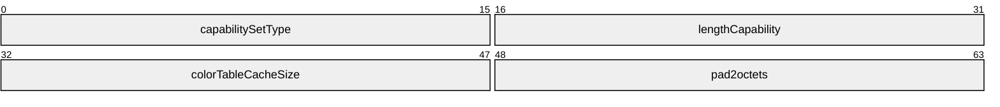

**capabilitySetType (2 bytes):** A 16-bit, unsigned integer. The type of the capability set. This field MUST be set to CAPSTYPE_COLORCACHE (0x000A).

**lengthCapability (2 bytes):** A 16-bit, unsigned integer. The length, in bytes, of the capability data, including the size of the **capabilitySetType** and **lengthCapability** fields.

**colorTableCacheSize (2 bytes):** A 16-bit, unsigned integer. The number of entries in the color table cache (each entry stores a color table). This value MUST be ignored during capability exchange and is assumed to be 0x0006.

**pad2octets (2 bytes):** A 16-bit, unsigned integer used as padding. Values in this field are arbitrary and MUST be ignored.

<a id="Section_2.2.1.2"></a>
#### 2.2.1.2 DrawNineGrid Cache Capability Set (TS_DRAW_NINEGRID_CAPABILITYSET)

The TS_DRAW_NINEGRID_CAPABILITYSET structure is used to advertise support for NineGrid bitmap caching and rendering (see sections [2.2.2.2.1.1.2.21](#Section_4.1.21), [2.2.2.2.1.1.2.22](#Section_4.1.22), and [2.2.2.2.1.3.4](#Section_4.3.3)). This capability set is sent only from client to server.

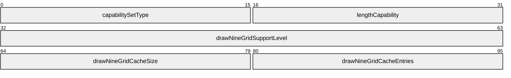

**capabilitySetType (2 bytes):** A 16-bit, unsigned integer. The type of the capability set. This field MUST be set to CAPSTYPE_DRAWNINEGRIDCACHE (0x0015).

**lengthCapability (2 bytes):** A 16-bit, unsigned integer. The length, in bytes, of the capability data, including the size of the **capabilitySetType** and **lengthCapability** fields.

**drawNineGridSupportLevel (4 bytes):** A 32-bit, unsigned integer. The level of support for NineGrid drawing. This field MUST be set to one of the following values.

| Value | Meaning |
| --- | --- |
| DRAW_NINEGRID_NO_SUPPORT 0x00000000 | NineGrid bitmap caching and rendering is not supported. |
| DRAW_NINEGRID_SUPPORTED 0x00000001 | Revision 1 NineGrid bitmap caching and rendering is supported. The Revision 1 versions of the stream bitmap alternate secondary orders (see section [2.2.2.2.1.3.5](#Section_2.2.2.2.1.3.5)) MUST be used to send the NineGrid bitmap from server to client. |
| DRAW_NINEGRID_SUPPORTED_REV2 0x00000002 | Revision 2 NineGrid bitmap caching and rendering is supported. The Revision 2 versions of the stream bitmap alternate secondary orders (see section 2.2.2.2.1.3.5) MUST be used to send the NineGrid bitmap from server to client. |

**drawNineGridCacheSize (2 bytes):** A 16-bit, unsigned integer. The maximum size of the NineGrid Bitmap Cache. The largest size allowed by current RDP servers is 2,560 kilobytes.

**drawNineGridCacheEntries (2 bytes):** A 16-bit, unsigned integer. The maximum number of entries allowed in the NineGrid Bitmap Cache. The maximum number of entries allowed by current RDP servers is 256.

<a id="Section_2.2.1.3"></a>
#### 2.2.1.3 Draw GDI+ Capability Set (TS_DRAW_GDIPLUS_CAPABILITYSET)

The TS_DRAW_GDIPLUS_CAPABILITYSET structure is used to advertise the level of GDI+ 1.1 rendering and caching support and the GDI+ cache configuration. This capability is sent by both client and server. However, only the client initializes the **GdipVersion**, **GdipCacheEntries**, **GdipCacheChunkSize**, and **GdipImageCacheProperties** fields. The server uses this capability set only to advertise its level of GDI+ 1.1 rendering and caching support.

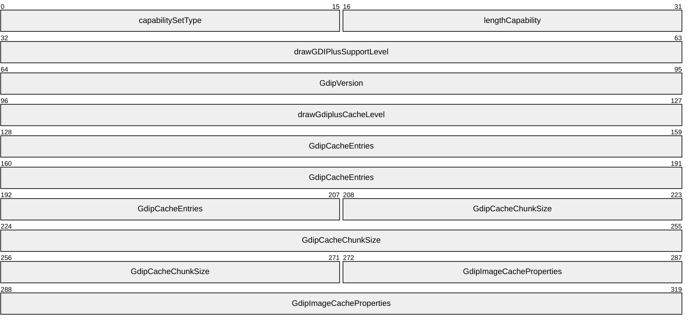

**capabilitySetType (2 bytes):** A 16-bit, unsigned integer. The type of the capability set. This field MUST be set to CAPSTYPE_DRAWGDIPLUS (0x0016).

**lengthCapability (2 bytes):** A 16-bit, unsigned integer. The length, in bytes, of the capability data, including the size of the **capabilitySetType** and **lengthCapability** fields.

**drawGDIPlusSupportLevel (4 bytes):** A 32-bit, unsigned integer. The level of support for GDI+ 1.1 remoting. This field MUST be set to one of the following values.

| Value | Meaning |
| --- | --- |
| TS_DRAW_GDIPLUS_DEFAULT 0x00000000 | GDI+ 1.1 is not supported. |
| TS_DRAW_GDIPLUS_SUPPORTED 0x00000001 | GDI+ 1.1 is supported. |

**GdipVersion (4 bytes):** A 32-bit, unsigned integer. The build number of the underlying GDI+ 1.1 subsystem. Only the client-to-server instance of the GDI+ Capability Set MUST contain a valid value for this field.

**drawGdiplusCacheLevel (4 bytes):** A 32-bit, unsigned integer. The level of support for the caching of GDI+ 1.1 rendering primitives. This field MUST be set to one of the following values.

| Value | Meaning |
| --- | --- |
| TS_DRAW_GDIPLUS_CACHE_LEVEL_DEFAULT 0x00000000 | Caching of GDI+ 1.1 rendering primitives is not supported. |
| TS_DRAW_GDIPLUS_CACHE_LEVEL_ONE 0x00000001 | Caching of GDI+ 1.1 rendering primitives is supported. |

**GdipCacheEntries (10 bytes):** A [GDI+ Cache Entries (section 2.2.1.3.1)](#Section_2.2.1.3.1) structure that specifies the total number of entries within the GDI+ Graphics, Pen, Brush, Image, and Image Attributes caches. Only the client-to-server instance of the GDI+ Capability Set MUST contain a valid value for this field.

**GdipCacheChunkSize (8 bytes):** A [GDI+ Cache Chunk Size](#Section_2.2.1.3.2) structure that specifies the size of individual entries in the GDI+ Graphics, Brush, Pen, and Image Attributes caches. Only the client-to-server instance of the GDI+ Capability Set MUST contain a valid value for this field.

**GdipImageCacheProperties (6 bytes):** A [GDI+ Image Cache Properties](#Section_2.2.1.3.3) structure that contains sizing information for the GDI+ Image cache. Only the client-to-server instance of the GDI+ Capability Set MUST contain a valid value for this field.

<a id="Section_2.2.1.3.1"></a>
##### 2.2.1.3.1 GDI+ Cache Entries (TS_GDIPLUS_CACHE_ENTRIES)

The TS_GDIPLUS_CACHE_ENTRIES structure specifies the total number of cache entries for the GDI+ Graphics, Brush, Pen, Image, and Image Attributes caches.

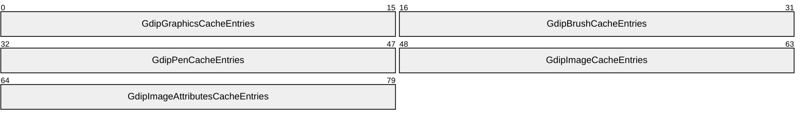

**GdipGraphicsCacheEntries (2 bytes):** A 16-bit, unsigned integer. The total number of entries allowed in the GDI+ Graphics cache. The maximum allowed value is 10 entries.

**GdipBrushCacheEntries (2 bytes):** A 16-bit, unsigned integer. The total number of entries allowed in the GDI+ Brush cache. The maximum allowed value is 5 entries.

**GdipPenCacheEntries (2 bytes):** A 16-bit, unsigned integer. The total number of entries allowed in the GDI+ Pen cache. The maximum allowed value is 5 entries.

**GdipImageCacheEntries (2 bytes):** A 16-bit, unsigned integer. The total number of entries allowed in the GDI+ Image cache. The maximum allowed value is 10 entries.

**GdipImageAttributesCacheEntries (2 bytes):** A 16-bit, unsigned integer. The total number of entries allowed in the GDI+ Image Attributes cache. The maximum allowed value is 2 entries.

<a id="Section_2.2.1.3.2"></a>
##### 2.2.1.3.2 GDI+ Cache Chunk Size (TS_GDIPLUS_CACHE_CHUNK_SIZE)

The TS_GDIPLUS_CACHE_CHUNK_SIZE structure specifies the maximum size of individual entries in the GDI+ Graphics, Brush, Pen, and Image Attributes caches.

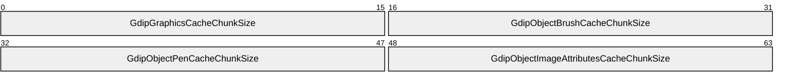

**GdipGraphicsCacheChunkSize (2 bytes):** A 16-bit, unsigned integer. The maximum size in bytes of a GDI+ Graphics cache entry. The maximum allowed value is 512 bytes.

**GdipObjectBrushCacheChunkSize (2 bytes):** A 16-bit, unsigned integer. The maximum size in bytes of a GDI+ Brush cache entry. The maximum allowed value is 2,048 bytes.

**GdipObjectPenCacheChunkSize (2 bytes):** A 16-bit, unsigned integer. The maximum size in bytes of a GDI+ Pen cache entry. The maximum allowed value is 1,024 bytes.

**GdipObjectImageAttributesCacheChunkSize (2 bytes):** A 16-bit, unsigned integer. The maximum size in bytes of a GDI+ Image Attributes cache entry. The maximum allowed value is 64 bytes.

<a id="Section_2.2.1.3.3"></a>
##### 2.2.1.3.3 GDI+ Image Cache Properties (TS_GDIPLUS_IMAGE_CACHE_PROPERTIES)

The TS_GDIPLUS_IMAGE_CACHE_PROPERTIES structure contains sizing information for the GDI+ Image cache.

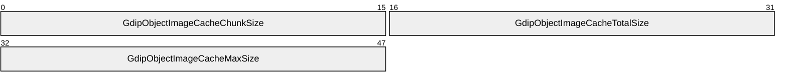

**GdipObjectImageCacheChunkSize (2 bytes):** A 16-bit, unsigned integer. The maximum size in bytes of a chunk in the GDI+ Image cache. The maximum allowed value is 4,096 bytes.

**GdipObjectImageCacheTotalSize (2 bytes):** A 16-bit, unsigned integer. The total number of chunks in the GDI+ Image cache. The maximum allowed value is 256 chunks.

**GdipObjectImageCacheMaxSize (2 bytes):** A 16-bit, unsigned integer. The total number of chunks that can be used by an entry in the GDI+ Image cache. The maximum allowed value is 128 chunks.

<a id="Section_2.2.2"></a>
### 2.2.2 Accelerated Graphics

<a id="Section_2.2.2.1"></a>
#### 2.2.2.1 Orders Update (TS_UPDATE_ORDERS_PDU_DATA)

The TS_UPDATE_ORDERS_PDU_DATA structure contains primary, secondary, and alternate secondary drawing orders aligned on byte boundaries. This structure conforms to the layout of a Slow Path Graphics Update (see [MS-RDPBCGR](../MS-RDPBCGR/MS-RDPBCGR.md) section 2.2.9.1.1.3.1) and is encapsulated within a Graphics Update [**PDU**](#gt_protocol-data-unit-pdu) (see [MS-RDPBCGR] section 2.2.9.1.1.3.1.1).

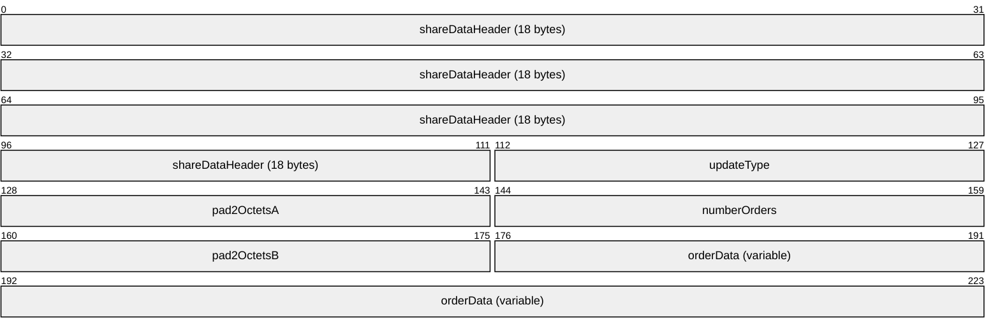

**shareDataHeader (18 bytes):** Share Data Header (see [MS-RDPBCGR], section 2.2.8.1.1.1.2) containing information about the packet. The type subfield of the pduType field of the Share Control Header (section 2.2.8.1.1.1.1) MUST be set to PDUTYPE_DATAPDU (7). The pduType2 field of the Share Data Header MUST be set to PDUTYPE2_UPDATE (2).

**updateType (2 bytes):** A 16-bit, unsigned integer. The field contains the graphics update type. This field MUST be set to UPDATETYPE_ORDERS (0x0000).

**pad2OctetsA (2 bytes):** A 16-bit, unsigned integer used as a padding field. Values in this field are arbitrary and MUST be ignored.

**numberOrders (2 bytes):** A 16-bit, unsigned integer. The number of [Drawing Order (section 2.2.2.1.1)](#Section_2.2.2.1.1) structures contained in the **orderData** field.

**pad2OctetsB (2 bytes):** A 16-bit, unsigned integer used as a padding field. Values in this field are arbitrary and MUST be ignored.

**orderData (variable):** A variable-sized array of Drawing Order (section 2.2.2.1.1) structures packed on byte boundaries. Each structure contains a primary, secondary, or alternate secondary drawing order. The **controlFlags** field of the Drawing Order identifies the type of drawing order.

<a id="Section_2.2.2.1.1"></a>
##### 2.2.2.1.1 Drawing Order (DRAWING_ORDER)

The DRAWING_ORDER structure encapsulated by the [Orders Update (section 2.2.2.1)](#Section_2.2.2.1) is identical to the DRAWING_ORDER structure used in conjunction with the [Fast-Path Orders Update (section 2.2.2.2)](#Section_2.2.2.2).

<a id="Section_2.2.2.2"></a>
#### 2.2.2.2 Fast-Path Orders Update (TS_FP_UPDATE_ORDERS)

The TS_FP_UPDATE_ORDERS structure contains primary, secondary, and alternate secondary drawing orders aligned on byte boundaries. This structure conforms to the layout of a Fast-Path Update (see [MS-RDPBCGR](../MS-RDPBCGR/MS-RDPBCGR.md) section 2.2.9.1.2.1) and is encapsulated within a Fast-Path Update [**PDU**](#gt_protocol-data-unit-pdu) (see [MS-RDPBCGR] section 2.2.9.1.2.1.1).

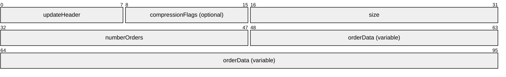

**updateHeader (1 byte):** An 8-bit, unsigned integer. The format of this field is the same as the **updateHeader** byte field described in the Fast-Path Update structure (see [MS-RDPBCGR] section 2.2.9.1.2.1). The **updateCode** bitfield (4 bits in size) MUST be set to FASTPATH_UPDATETYPE_ORDERS (0x0).

**compressionFlags (1 byte):** An 8-bit, unsigned integer. The format of this optional field (as well as the possible values) is the same as the **compressionFlags** field described in the Fast-Path Update structure specified in [MS-RDPBCGR] section 2.2.9.1.2.1.

**size (2 bytes):** A 16-bit, unsigned integer. The format of this field (as well as the possible values) is the same as the **size** field described in the Fast-Path Update structure specified in [MS-RDPBCGR] section 2.2.9.1.2.1.

**numberOrders (2 bytes):** A 16-bit, unsigned integer. The number of [Drawing Order (section 2.2.2.1.1)](#Section_2.2.2.1.1) structures contained in the **orderData** field.

**orderData (variable):** A variable-sized array of Drawing Order (section 2.2.2.1.1) structures packed on byte boundaries. Each structure contains a primary, secondary, or alternate secondary drawing order. The **controlFlags** field of the Drawing Order identifies the type of drawing order.

<a id="Section_2.2.2.2.1"></a>
##### 2.2.2.2.1 Drawing Order (DRAWING_ORDER)

The DRAWING_ORDER structure is used to describe and encapsulate a single primary, secondary, or alternate secondary drawing order sent from server to client. All drawing orders conform to this basic structure (see sections [2.2.2.2.1.1.2](#Section_2.2.2.2.1.1.2), [2.2.2.2.1.2.1.1](#Section_2.2.2.2.1.2.1.1), and [2.2.2.2.1.3.1.1](#Section_2.2.2.2.1.3.1.1)).

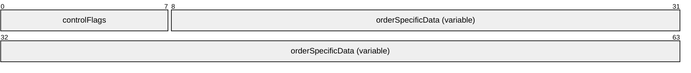

**controlFlags (1 byte):** An 8-bit, unsigned integer. A control byte that identifies the class of the drawing order.

If the TS_STANDARD (0x01) flag is set, the order is a primary drawing order. If both the TS_STANDARD (0x01) and TS_SECONDARY (0x02) flags are set, the order is a secondary drawing order. Finally, if only the TS_SECONDARY (0x02) flag is set, the order is an alternate secondary drawing order.

More flags MAY be present, depending on the drawing order class. The flags listed are common to all three classes of drawing orders.

| Name | Value |
| --- | --- |
| TS_STANDARD | 0x01 |
| TS_SECONDARY | 0x02 |

**orderSpecificData (variable):** Variable-length data specific to the drawing order class and the drawing order itself.

<a id="Section_2.2.2.2.1.1"></a>
###### 2.2.2.2.1.1 Primary Drawing Orders

<a id="Section_2.2.2.2.1.1.1"></a>
Common Data Types

<a id="Section_2.2.2.2.1.1.1.1"></a>
Coord Field (COORD_FIELD)

The COORD_FIELD structure is used to describe a value in the range -32768 to 32767.


**signedValue (variable):** A signed, 1-byte or 2-byte value that describes a coordinate in the range -32768 to 32767.

When the **controlFlags** field (see section [2.2.2.2.1.1.2](#Section_2.2.2.2.1.1.2)) of the primary drawing order that contains the COORD_FIELD structure has the TS_DELTA_COORDINATES flag (0x10) set, the **signedValue** field MUST contain a signed 1-byte value. If the TS_DELTA_COORDINATES flag is not set, the **signedValue** field MUST contain a 2-byte signed value.

The 1-byte format contains a signed delta from the previous value of the Coord field. To obtain the new value of the field, the decoder MUST increment the previous value of the field by the signed delta to produce the current value. The 2-byte format is simply the full value of the field that MUST replace the previous value.

<a id="Section_2.2.2.2.1.1.1.2"></a>
One-Byte Header Variable Field (VARIABLE1_FIELD)

TheVARIABLE1_FIELD structure is used to encode a variable-length byte-stream that will hold a maximum of 255 bytes. This structure is always situated at the end of an order.

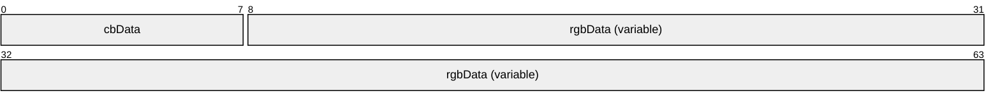

**cbData (1 byte):** An 8-bit, unsigned integer. The number of bytes present in the **rgbData** field.

**rgbData (variable):** Variable-length, binary data. The size of this data, in bytes, is given by the **cbData** field.

<a id="Section_2.2.2.2.1.1.1.3"></a>
Two-Byte Header Variable Field (VARIABLE2_FIELD)

The VARIABLE2_FIELD structure is used to encode a variable-length byte-stream that holds a maximum of 32,767 bytes. This structure is always situated at the end of an order.

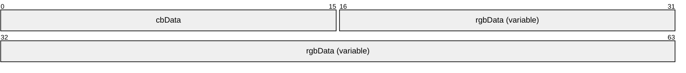

**cbData (2 bytes):** A 16-bit, unsigned integer. The number of bytes present in the **rgbData** field.

**rgbData (variable):** Variable-length, binary data. The size of this data, in bytes, is given by the **cbData** field.

<a id="Section_2.2.2.2.1.1.1.4"></a>
Delta-Encoded Points (DELTA_PTS_FIELD)

The DELTA_PTS_FIELD structure is used to encode a series of points. Each point is expressed as an X and Y delta from the previous point in the series (the first X and Y deltas are relative to a base point that MUST be included in the order that contains the DELTA_PTS_FIELD structure). The number of points is order-dependent and is not specified by any field within the DELTA_PTS_FIELD structure. Instead, a separate field within the order that contains the DELTA_PTS_FIELD structure MUST be used to specify the number of points (this field SHOULD<1> be placed immediately before the DELTA_PTS_FIELD structure in the order encoding).

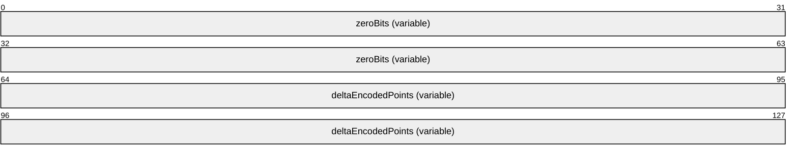

**zeroBits (variable):** A variable-length byte field. The **zeroBits** field is used to indicate the absence of an X or Y delta value for a specific point in the series. The size in bytes of the **zeroBits** field is given by ceil(NumPoints / 4) where NumPoints is the number of points being encoded. Each point in the series requires two zero-bits (four points per byte) to indicate whether an X or Y delta value is zero (and not present), starting with the most significant bits, so that for the first point the X-zero flag is set at (zeroBits[0] & 0x80), and the Y-zero flag is set at (zeroBits[0] & 0x40).

**deltaEncodedPoints (variable):** A variable-length byte field. The **deltaEncodedPoints** field contains a series of (X, Y) pairs, each pair specifying the delta from the previous pair in the series (the first pair in the series contains a delta from a pre-established coordinate).

The presence of the X and Y delta values for a given pair in the series is dictated by the individual bits of the **zeroBits** field. If the zero bit is set for a given X or Y component, its value is unchanged from the previous X or Y component in the series (a delta of zero), and no data is provided. If the zero bit is not set for a given X or Y component, the delta value it represents is encoded in a packed signed format:

- If the high bit (0x80) is not set in the first encoding byte, the field is 1 byte long and is encoded as a signed delta in the lower 7 bits of the byte.
- If the high bit of the first encoding byte is set, the lower 7 bits of the first byte and the 8 bits of the next byte are concatenated (the first byte containing the high-order bits) to create a 15-bit signed delta value.
<a id="Section_2.2.2.2.1.1.1.5"></a>
Delta-Encoded Rectangles (DELTA_RECTS_FIELD)

The DELTA_RECTS_FIELD structure is used to encode a series of rectangles. Each rectangle is encoded as a (left, top, width, height) quadruple with the left and top components of each quadruple containing the delta from the left and top components of the previous rectangle; the first rectangle in the series is implicitly assumed to be (0, 0, 0, 0). The number of rectangles is order-dependent and not specified by any field within the DELTA_RECTS_FIELD structure. Instead, a separate field within the order that contains the DELTA_RECTS_FIELD structure MUST be used to specify the number of rectangles (this field SHOULD be placed immediately before the DELTA_RECTS_FIELD structure in the order encoding). The maximum number of rectangles that can be encoded by this structure is 45.


**zeroBits (variable):** A variable-length byte field. The **zeroBits** field is used to indicate the absence of a left, top, width, or height component. The size, in bytes, of the **zeroBits** field is given by ceil(NumRects / 2) where NumRects is the number of rectangles being encoded. Each rectangle in the series requires four zero-bits (two rectangles per byte) to indicate whether a left, top, width, or height component is zero (and not present), starting with the most significant bits, so that for the first rectangle the left-zero flag is set at (**zeroBits**[0] & 0x80), the top-zero flag is set at (**zeroBits**[0] & 0x40), the width-zero flag is set at (**zeroBits**[0] & 0x20), and the height-zero flag is set at (**zeroBits**[0] & 0x10).

**deltaEncodedRectangles (variable):** A variable-length byte field. The **deltaEncodedRectangles** field contains a series of (left, top, width, height) quadruples with the left and top components in each quadruple specifying the delta from the left and top components of the previous rectangle in the series; the first rectangle in the series is implicitly assumed to be (0, 0, 0, 0).

Assume there are two rectangles specified in (left, top, right, bottom) quadruples:

1: (L1, T1, R1, B1)

2: (L2, T2, R2, B2)

Assuming Rectangle 1 is the first in the series, and by using the (left, top, width, height) quadruple encoding scheme, these two rectangles would be specified as:

1: (L1, T1, R1 - L1, B1 - T1)

2: (L2 - L1, T2 - T1, R2 - L2, B2 - T2)

The presence of the left, top, width, or height component for a given quadruple is dictated by the individual bits of the **zeroBits** field. If the zero bit is set for a given left, top, width, or height component, its value is unchanged from the previous corresponding left, top, width, or height value in the series (a delta of zero), and no data is provided. If the zero bit is not set for a left, right, width, or height component, its value is encoded in a packed signed format:

- If the high bit (0x80) is not set in the first encoding byte, the field is 1 byte long and is encoded as a signed delta in the lower 7 bits of the byte.
- If the high bit of the first encoding byte is set, the lower 7 bits of the first byte and the 8 bits of the next byte are concatenated (the first byte containing the high order bits) to create a 15-bit signed delta value.
<a id="Section_2.2.2.2.1.1.1.6"></a>
Binary Raster Operation (ROP2_OPERATION)

The ROP2_OPERATION structure is used to define how the bits in a destination bitmap and a selected [**brush**](#gt_brush) or pen are combined by using Boolean operators.


**rop2Operation (1 byte):** An 8-bit, unsigned integer. A raster-operation code that describes a Boolean operation, in [**Reverse Polish Notation**](#gt_reverse-polish-notation-rpn), to perform on the bits in a destination bitmap (D) and selected brush or pen (P). This operation is a combination of the AND (a), OR (o), NOT (n), and XOR (x) Boolean operators.

| Value | Meaning |
| --- | --- |
| R2_BLACK 0x01 | 0 |
| R2_NOTMERGEPEN 0x02 | DPon |
| R2_MASKNOTPEN 0x03 | DPna |
| R2_NOTCOPYPEN 0x04 | Pn |
| R2_MASKPENNOT 0x05 | PDna |
| R2_NOT 0x06 | Dn |
| R2_XORPEN 0x07 | DPx |
| R2_NOTMASKPEN 0x08 | DPan |
| R2_MASKPEN 0x09 | DPa |
| R2_NOTXORPEN 0x0A | DPxn |
| R2_NOP 0x0B | D |
| R2_MERGENOTPEN 0x0C | DPno |
| R2_COPYPEN 0x0D | P |
| R2_MERGEPENNOT 0x0E | PDno |
| R2_MERGEPEN 0x0F | PDo |
| R2_WHITE 0x10 | 1 |

For example, by using the previous table, it can be determined that the R2_MERGEPEN (0x0F) operation replaces the values of the pixels in the destination bitmap with a combination of pixel values of the destination and pen.

For more information about binary raster operations, see the material on binary raster operations in [YUAN] section 8.1.

<a id="Section_2.2.2.2.1.1.1.7"></a>
Ternary Raster Operation Index (ROP3_OPERATION_INDEX)

The ROP3_OPERATION_INDEX structure is used to define how the bits in a source bitmap, destination bitmap, and a selected [**brush**](#gt_brush) or pen are combined by using Boolean operators.


**rop3Index (1 byte):** An 8-bit, unsigned integer. This field contains an index of a raster operation code that describes a Boolean operation, in [**Reverse Polish Notation**](#gt_reverse-polish-notation-rpn), to perform on the bits in a source bitmap (S), destination bitmap (D), and selected brush or pen (P). This operation is a combination of the AND (a), OR (o), NOT (n), and XOR (x) Boolean operators.

| Value | Raster-operation Code (ROP) / Boolean Function in Reverse Polish Notation (RPN) |
| --- | --- |
| 0x00 | ROP: 0x00000042 (BLACKNESS) RPN: 0 |
| 0x01 | ROP: 0x00010289 RPN: DPSoon |
| 0x02 | ROP: 0x00020C89 RPN: DPSona |
| 0x03 | ROP: 0x000300AA RPN: PSon |
| 0x04 | ROP: 0x00040C88 RPN: SDPona |
| 0x05 | ROP: 0x000500A9 RPN: DPon |
| 0x06 | ROP: 0x00060865 RPN: PDSxnon |
| 0x07 | ROP: 0x000702C5 RPN: PDSaon |
| 0x08 | ROP: 0x00080F08 RPN: SDPnaa |
| 0x09 | ROP: 0x00090245 RPN: PDSxon |
| 0x0A | ROP: 0x000A0329 RPN: DPna |
| 0x0B | ROP: 0x000B0B2A RPN: PSDnaon |
| 0x0C | ROP: 0x000C0324 RPN: SPna |
| 0x0D | ROP: 0x000D0B25 RPN: PDSnaon |
| 0x0E | ROP: 0x000E08A5 RPN: PDSonon |
| 0x0F | ROP: 0x000F0001 RPN: Pn |
| 0x10 | ROP: 0x00100C85 RPN: PDSona |
| 0x11 | ROP: 0x001100A6 (NOTSRCERASE) RPN: DSon |
| 0x12 | ROP: 0x00120868 RPN: SDPxnon |
| 0x13 | ROP: 0x001302C8 RPN: SDPaon |
| 0x14 | ROP: 0x00140869 RPN: DPSxnon |
| 0x15 | ROP: 0x001502C9 RPN: DPSaon |
| 0x16 | ROP: 0x00165CCA RPN: PSDPSanaxx |
| 0x17 | ROP: 0x00171D54 RPN: SSPxDSxaxn |
| 0x18 | ROP: 0x00180D59 RPN: SPxPDxa |
| 0x19 | ROP: 0x00191CC8 RPN: SDPSanaxn |
| 0x1A | ROP: 0x001A06C5 RPN: PDSPaox |
| 0x1B | ROP: 0x001B0768 RPN: SDPSxaxn |
| 0x1C | ROP: 0x001C06CA RPN: PSDPaox |
| 0x1D | ROP: 0x001D0766 RPN: DSPDxaxn |
| 0x1E | ROP: 0x001E01A5 RPN: PDSox |
| 0x1F | ROP: 0x001F0385 RPN: PDSoan |
| 0x20 | ROP: 0x00200F09 RPN: DPSnaa |
| 0x21 | ROP: 0x00210248 RPN: SDPxon |
| 0x22 | ROP: 0x00220326 RPN: DSna |
| 0x23 | ROP: 0x00230B24 RPN: SPDnaon |
| 0x24 | ROP: 0x00240D55 RPN: SPxDSxa |
| 0x25 | ROP: 0x00251CC5 RPN: PDSPanaxn |
| 0x26 | ROP: 0x002606C8 RPN: SDPSaox |
| 0x27 | ROP: 0x00271868 RPN: SDPSxnox |
| 0x28 | ROP: 0x00280369 RPN: DPSxa |
| 0x29 | ROP: 0x002916CA RPN: PSDPSaoxxn |
| 0x2A | ROP: 0x002A0CC9 RPN: DPSana |
| 0x2B | ROP: 0x002B1D58 RPN: SSPxPDxaxn |
| 0x2C | ROP: 0x002C0784 RPN: SPDSoax |
| 0x2D | ROP: 0x002D060A RPN: PSDnox |
| 0x2E | ROP: 0x002E064A RPN: PSDPxox |
| 0x2F | ROP: 0x002F0E2A RPN: PSDnoan |
| 0x30 | ROP: 0x0030032A RPN: PSna |
| 0x31 | ROP: 0x00310B28 RPN: SDPnaon |
| 0x32 | ROP: 0x00320688 RPN: SDPSoox |
| 0x33 | ROP: 0x00330008 (NOTSRCCOPY) RPN: Sn |
| 0x34 | ROP: 0x003406C4 RPN: SPDSaox |
| 0x35 | ROP: 0x00351864 RPN: SPDSxnox |
| 0x36 | ROP: 0x003601A8 RPN: SDPox |
| 0x37 | ROP: 0x00370388 RPN: SDPoan |
| 0x38 | ROP: 0x0038078A RPN: PSDPoax |
| 0x39 | ROP: 0x00390604 RPN: SPDnox |
| 0x3A | ROP: 0x003A0644 RPN: SPDSxox |
| 0x3B | ROP: 0x003B0E24 RPN: SPDnoan |
| 0x3C | ROP: 0x003C004A RPN: PSx |
| 0x3D | ROP: 0x003D18A4 RPN: SPDSonox |
| 0x3E | ROP: 0x003E1B24 RPN: SPDSnaox |
| 0x3F | ROP: 0x003F00EA RPN: PSan |
| 0x40 | ROP: 0x00400F0A RPN: PSDnaa |
| 0x41 | ROP: 0x00410249 RPN: DPSxon |
| 0x42 | ROP: 0x00420D5D RPN: SDxPDxa |
| 0x43 | ROP: 0x00431CC4 RPN: SPDSanaxn |
| 0x44 | ROP: 0x00440328 (SRCERASE) RPN: SDna |
| 0x45 | ROP: 0x00450B29 RPN: DPSnaon |
| 0x46 | ROP: 0x004606C6 RPN: DSPDaox |
| 0x47 | ROP: 0x0047076A RPN: PSDPxaxn |
| 0x48 | ROP: 0x00480368 RPN: SDPxa |
| 0x49 | ROP: 0x004916C5 RPN: PDSPDaoxxn |
| 0x4A | ROP: 0x004A0789 RPN: DPSDoax |
| 0x4B | ROP: 0x004B0605 RPN: PDSnox |
| 0x4C | ROP: 0x004C0CC8 RPN: SDPana |
| 0x4D | ROP: 0x004D1954 RPN: SSPxDSxoxn |
| 0x4E | ROP: 0x004E0645 RPN: PDSPxox |
| 0x4F | ROP: 0x004F0E25 RPN: PDSnoan |
| 0x50 | ROP: 0x00500325 RPN: PDna |
| 0x51 | ROP: 0x00510B26 RPN: DSPnaon |
| 0x52 | ROP: 0x005206C9 RPN: DPSDaox |
| 0x53 | ROP: 0x00530764 RPN: SPDSxaxn |
| 0x54 | ROP: 0x005408A9 RPN: DPSonon |
| 0x55 | ROP: 0x00550009 (DSTINVERT) RPN: Dn |
| 0x56 | ROP: 0x005601A9 RPN: DPSox |
| 0x57 | ROP: 0x00570389 RPN: DPSoan |
| 0x58 | ROP: 0x00580785 RPN: PDSPoax |
| 0x59 | ROP: 0x00590609 RPN: DPSnox |
| 0x5A | ROP: 0x005A0049 (PATINVERT) RPN: DPx |
| 0x5B | ROP: 0x005B18A9 RPN: DPSDonox |
| 0x5C | ROP: 0x005C0649 RPN: DPSDxox |
| 0x5D | ROP: 0x005D0E29 RPN: DPSnoan |
| 0x5E | ROP: 0x005E1B29 RPN: DPSDnaox |
| 0x5F | ROP: 0x005F00E9 RPN: DPan |
| 0x60 | ROP: 0x00600365 RPN: PDSxa |
| 0x61 | ROP: 0x006116C6 RPN: DSPDSaoxxn |
| 0x62 | ROP: 0x00620786 RPN: DSPDoax |
| 0x63 | ROP: 0x00630608 RPN: SDPnox |
| 0x64 | ROP: 0x00640788 RPN: SDPSoax |
| 0x65 | ROP: 0x00650606 RPN: DSPnox |
| 0x66 | ROP: 0x00660046 (SRCINVERT) RPN: DSx |
| 0x67 | ROP: 0x006718A8 RPN: SDPSonox |
| 0x68 | ROP: 0x006858A6 RPN: DSPDSonoxxn |
| 0x69 | ROP: 0x00690145 RPN: PDSxxn |
| 0x6A | ROP: 0x006A01E9 RPN: DPSax |
| 0x6B | ROP: 0x006B178A RPN: PSDPSoaxxn |
| 0x6C | ROP: 0x006C01E8 RPN: SDPax |
| 0x6D | ROP: 0x006D1785 RPN: PDSPDoaxxn |
| 0x6E | ROP: 0x006E1E28 RPN: SDPSnoax |
| 0x6F | ROP: 0x006F0C65 RPN: PDSxnan |
| 0x70 | ROP: 0x00700CC5 RPN: PDSana |
| 0x71 | ROP: 0x00711D5C RPN: SSDxPDxaxn |
| 0x72 | ROP: 0x00720648 RPN: SDPSxox |
| 0x73 | ROP: 0x00730E28 RPN: SDPnoan |
| 0x74 | ROP: 0x00740646 RPN: DSPDxox |
| 0x75 | ROP: 0x00750E26 RPN: DSPnoan |
| 0x76 | ROP: 0x00761B28 RPN: SDPSnaox |
| 0x77 | ROP: 0x007700E6 RPN: DSan |
| 0x78 | ROP: 0x007801E5 RPN: PDSax |
| 0x79 | ROP: 0x00791786 RPN: DSPDSoaxxn |
| 0x7A | ROP: 0x007A1E29 RPN: DPSDnoax |
| 0x7B | ROP: 0x007B0C68 RPN: SDPxnan |
| 0x7C | ROP: 0x007C1E24 RPN: SPDSnoax |
| 0x7D | ROP: 0x007D0C69 RPN: DPSxnan |
| 0x7E | ROP: 0x007E0955 RPN: SPxDSxo |
| 0x7F | ROP: 0x007F03C9 RPN: DPSaan |
| 0x80 | ROP: 0x008003E9 RPN: DPSaa |
| 0x81 | ROP: 0x00810975 RPN: SPxDSxon |
| 0x82 | ROP: 0x00820C49 RPN: DPSxna |
| 0x83 | ROP: 0x00831E04 RPN: SPDSnoaxn |
| 0x84 | ROP: 0x00840C48 RPN: SDPxna |
| 0x85 | ROP: 0x00851E05 RPN: PDSPnoaxn |
| 0x86 | ROP: 0x008617A6 RPN: DSPDSoaxx |
| 0x87 | ROP: 0x008701C5 RPN: PDSaxn |
| 0x88 | ROP: 0x008800C6 (SRCAND) RPN: DSa |
| 0x89 | ROP: 0x00891B08 RPN: SDPSnaoxn |
| 0x8A | ROP: 0x008A0E06 RPN: DSPnoa |
| 0x8B | ROP: 0x008B0666 RPN: DSPDxoxn |
| 0x8C | ROP: 0x008C0E08 RPN: SDPnoa |
| 0x8D | ROP: 0x008D0668 RPN: SDPSxoxn |
| 0x8E | ROP: 0x008E1D7C RPN: SSDxPDxax |
| 0x8F | ROP: 0x008F0CE5 RPN: PDSanan |
| 0x90 | ROP: 0x00900C45 RPN: PDSxna |
| 0x91 | ROP: 0x00911E08 RPN: SDPSnoaxn |
| 0x92 | ROP: 0x009217A9 RPN: DPSDPoaxx |
| 0x93 | ROP: 0x009301C4 RPN: SPDaxn |
| 0x94 | ROP: 0x009417AA RPN: PSDPSoaxx |
| 0x95 | ROP: 0x009501C9 RPN: DPSaxn |
| 0x96 | ROP: 0x00960169 RPN: DPSxx |
| 0x97 | ROP: 0x0097588A RPN: PSDPSonoxx |
| 0x98 | ROP: 0x00981888 RPN: SDPSonoxn |
| 0x99 | ROP: 0x00990066 RPN: DSxn |
| 0x9A | ROP: 0x009A0709 RPN: DPSnax |
| 0x9B | ROP: 0x009B07A8 RPN: SDPSoaxn |
| 0x9C | ROP: 0x009C0704 RPN: SPDnax |
| 0x9D | ROP: 0x009D07A6 RPN: DSPDoaxn |
| 0x9E | ROP: 0x009E16E6 RPN: DSPDSaoxx |
| 0x9F | ROP: 0x009F0345 RPN: PDSxan |
| 0xA0 | ROP: 0x00A000C9 RPN: DPa |
| 0xA1 | ROP: 0x00A11B05 RPN: PDSPnaoxn |
| 0xA2 | ROP: 0x00A20E09 RPN: DPSnoa |
| 0xA3 | ROP: 0x00A30669 RPN: DPSDxoxn |
| 0xA4 | ROP: 0x00A41885 RPN: PDSPonoxn |
| 0xA5 | ROP: 0x00A50065 RPN: PDxn |
| 0xA6 | ROP: 0x00A60706 RPN: DSPnax |
| 0xA7 | ROP: 0x00A707A5 RPN: PDSPoaxn |
| 0xA8 | ROP: 0x00A803A9 RPN: DPSoa |
| 0xA9 | ROP: 0x00A90189 RPN: DPSoxn |
| 0xAA | ROP: 0x00AA0029 RPN: D |
| 0xAB | ROP: 0x00AB0889 RPN: DPSono |
| 0xAC | ROP: 0x00AC0744 RPN: SPDSxax |
| 0xAD | ROP: 0x00AD06E9 RPN: DPSDaoxn |
| 0xAE | ROP: 0x00AE0B06 RPN: DSPnao |
| 0xAF | ROP: 0x00AF0229 RPN: DPno |
| 0xB0 | ROP: 0x00B00E05 RPN: PDSnoa |
| 0xB1 | ROP: 0x00B10665 RPN: PDSPxoxn |
| 0xB2 | ROP: 0x00B21974 RPN: SSPxDSxox |
| 0xB3 | ROP: 0x00B30CE8 RPN: SDPanan |
| 0xB4 | ROP: 0x00B4070A RPN: PSDnax |
| 0xB5 | ROP: 0x00B507A9 RPN: DPSDoaxn |
| 0xB6 | ROP: 0x00B616E9 RPN: DPSDPaoxx |
| 0xB7 | ROP: 0x00B70348 RPN: SDPxan |
| 0xB8 | ROP: 0x00B8074A RPN: PSDPxax |
| 0xB9 | ROP: 0x00B906E6 RPN: DSPDaoxn |
| 0xBA | ROP: 0x00BA0B09 RPN: DPSnao |
| 0xBB | ROP: 0x00BB0226 (MERGEPAINT) RPN: DSno |
| 0xBC | ROP: 0x00BC1CE4 RPN: SPDSanax |
| 0xBD | ROP: 0x00BD0D7D RPN: SDxPDxan |
| 0xBE | ROP: 0x00BE0269 RPN: DPSxo |
| 0xBF | ROP: 0x00BF08C9 RPN: DPSano |
| 0xC0 | ROP: 0x00C000CA (MERGECOPY) RPN: PSa |
| 0xC1 | ROP: 0x00C11B04 RPN: SPDSnaoxn |
| 0xC2 | ROP: 0x00C21884 RPN: SPDSonoxn |
| 0xC3 | ROP: 0x00C3006A RPN: PSxn |
| 0xC4 | ROP: 0x00C40E04 RPN: SPDnoa |
| 0xC5 | ROP: 0x00C50664 RPN: SPDSxoxn |
| 0xC6 | ROP: 0x00C60708 RPN: SDPnax |
| 0xC7 | ROP: 0x00C707AA RPN: PSDPoaxn |
| 0xC8 | ROP: 0x00C803A8 RPN: SDPoa |
| 0xC9 | ROP: 0x00C90184 RPN: SPDoxn |
| 0xCA | ROP: 0x00CA0749 RPN: DPSDxax |
| 0xCB | ROP: 0x00CB06E4 RPN: SPDSaoxn |
| 0xCC | ROP: 0x00CC0020 (SRCCOPY) RPN: S |
| 0xCD | ROP: 0x00CD0888 RPN: SDPono |
| 0xCE | ROP: 0x00CE0B08 RPN: SDPnao |
| 0xCF | ROP: 0x00CF0224 RPN: SPno |
| 0xD0 | ROP: 0x00D00E0A RPN: PSDnoa |
| 0xD1 | ROP: 0x00D1066A RPN: PSDPxoxn |
| 0xD2 | ROP: 0x00D20705 RPN: PDSnax |
| 0xD3 | ROP: 0x00D307A4 RPN: SPDSoaxn |
| 0xD4 | ROP: 0x00D41D78 RPN: SSPxPDxax |
| 0xD5 | ROP: 0x00D50CE9 RPN: DPSanan |
| 0xD6 | ROP: 0x00D616EA RPN: PSDPSaoxx |
| 0xD7 | ROP: 0x00D70349 RPN: DPSxan |
| 0xD8 | ROP: 0x00D80745 RPN: PDSPxax |
| 0xD9 | ROP: 0x00D906E8 RPN: SDPSaoxn |
| 0xDA | ROP: 0x00DA1CE9 RPN: DPSDanax |
| 0xDB | ROP: 0x00DB0D75 RPN: SPxDSxan |
| 0xDC | ROP: 0x00DC0B04 RPN: SPDnao |
| 0xDD | ROP: 0x00DD0228 RPN: SDno |
| 0xDE | ROP: 0x00DE0268 RPN: SDPxo |
| 0xDF | ROP: 0x00DF08C8 RPN: SDPano |
| 0xE0 | ROP: 0x00E003A5 RPN: PDSoa |
| 0xE1 | ROP: 0x00E10185 RPN: PDSoxn |
| 0xE2 | ROP: 0x00E20746 RPN: DSPDxax |
| 0xE3 | ROP: 0x00E306EA RPN: PSDPaoxn |
| 0xE4 | ROP: 0x00E40748 RPN: SDPSxax |
| 0xE5 | ROP: 0x00E506E5 RPN: PDSPaoxn |
| 0xE6 | ROP: 0x00E61CE8 RPN: SDPSanax |
| 0xE7 | ROP: 0x00E70D79 RPN: SPxPDxan |
| 0xE8 | ROP: 0x00E81D74 RPN: SSPxDSxax |
| 0xE9 | ROP: 0x00E95CE6 RPN: DSPDSanaxxn |
| 0xEA | ROP: 0x00EA02E9 RPN: DPSao |
| 0xEB | ROP: 0x00EB0849 RPN: DPSxno |
| 0xEC | ROP: 0x00EC02E8 RPN: SDPao |
| 0xED | ROP: 0x00ED0848 RPN: SDPxno |
| 0xEE | ROP: 0x00EE0086 (SRCPAINT) RPN: DSo |
| 0xEF | ROP: 0x00EF0A08 RPN: SDPnoo |
| 0xF0 | ROP: 0x00F00021 (PATCOPY) RPN: P |
| 0xF1 | ROP: 0x00F10885 RPN: PDSono |
| 0xF2 | ROP: 0x00F20B05 RPN: PDSnao |
| 0xF3 | ROP: 0x00F3022A RPN: PSno |
| 0xF4 | ROP: 0x00F40B0A RPN: PSDnao |
| 0xF5 | ROP: 0x00F50225 RPN: PDno |
| 0xF6 | ROP: 0x00F60265 RPN: PDSxo |
| 0xF7 | ROP: 0x00F708C5 RPN: PDSano |
| 0xF8 | ROP: 0x00F802E5 RPN: PDSao |
| 0xF9 | ROP: 0x00F90845 RPN: PDSxno |
| 0xFA | ROP: 0x00FA0089 RPN: DPo |
| 0xFB | ROP: 0x00FB0A09 (PATPAINT) RPN: DPSnoo |
| 0xFC | ROP: 0x00FC008A RPN: PSo |
| 0xFD | ROP: 0x00FD0A0A RPN: PSDnoo |
| 0xFE | ROP: 0x00FE02A9 RPN: DPSoo |
| 0xFF | ROP: 0x00FF0062 (WHITENESS) RPN: 1 |

For example, by using the previous table, it can be determined that the raster operation at index 0xEE (SRCPAINT) replaces the values of the pixels in the destination bitmap with a combination of pixel values of the destination and source bitmaps.

For more information about ternary raster operations, see the material on ternary raster operations in [YUAN] section 11.1.

<a id="Section_2.2.2.2.1.1.1.8"></a>
Generic Color (TS_COLOR)

The TS_COLOR structure holds a 3-byte RGB color triplet (the red, green, and blue components necessary to reproduce a color in the additive RGB space) or a 1-byte palette index.


**RedOrPaletteIndex (1 byte):** An 8-bit, unsigned integer. **RedOrPaletteIndex** is used as a palette index for 16-color and 256-color palettized color schemes. If the RGB color scheme is in effect, this field contains the red RGB component. To determine whether a palettized or RGB color scheme is in effect, the client MUST examine the **preferredBitsPerPixel** field of the Bitmap Capability Set ([MS-RDPBCGR](../MS-RDPBCGR/MS-RDPBCGR.md) section 2.2.7.1.2). If **preferredBitsPerPixel** is less than or equal to 8, then a palettized color scheme is in effect; otherwise, an RGB color scheme is in effect.

**Green (1 byte):** An 8-bit, unsigned integer. **Green** contains the green RGB color component.

**Blue (1 byte):** An 8-bit, unsigned integer. **Blue** contains the blue RGB color component.

<a id="Section_2.2.2.2.1.1.1.9"></a>
Fill Mode (FILL_MODE)

The FILL_MODE structure specifies the algorithm used to determine if a given point is contained within a polygon.


**FillMode (1 byte):** An 8-bit, unsigned integer that specifies the fill mode. **FillMode** MUST be one of the following values.

| Value | Meaning |
| --- | --- |
| ALTERNATE 0x01 | Alternate fill mode. To test if a point is inside a polygon, a ray is drawn from that point parallel to the x-axis to infinity, and the number of intersections between the ray and the polygon outline is counted. If the number of intersections is odd, the point is inside the polygon, and, if it is even, the point is outside. |
| WINDING 0x02 | Winding fill mode. To determine if a point is within a polygon, a ray is drawn from that point parallel to the x-axis to infinity, and its intersections with the outline are examined. A count that starts from 0 is kept for the ray. Each intersection with a clockwise polygon outline increments the count, and each intersection with a counterclockwise polygon outline decrements the count. If the final value of the count is nonzero, the point is inside the polygon; otherwise, it is outside. |

For alternate and winding fill modes, see [YUAN] section 9.4 and [PETZOLD] pages 169–171.

<a id="Section_2.2.2.2.1.1.2"></a>
Primary Drawing Order (PRIMARY_DRAWING_ORDER)

The PRIMARY_DRAWING_ORDER structure encapsulates a primary drawing order. All primary drawing orders employ special field encoding to reduce the number of bytes sent on the wire. Field encoding maintains a copy of the most recent field values that were used in each primary drawing order, in addition to common state information such as the last bounding rectangle used across all orders and the last order type. Only the fields that have changed are sent on the wire. This implies that all the fields in a primary drawing order are optional, their presence being denoted by the **controlFlags** and **fieldFlags** fields.

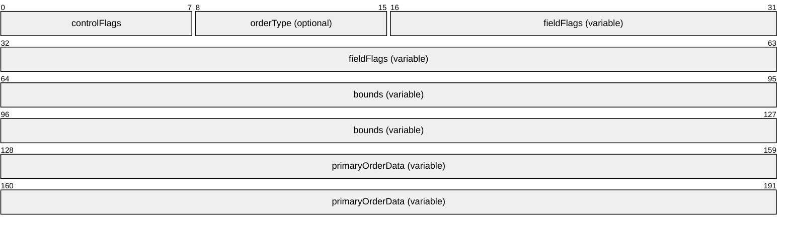

**controlFlags (1 byte):** An 8-bit, unsigned integer. A control byte that identifies the class of the drawing order and describes the fields that are included in the order and the type of coordinates being used. This field MUST contain a combination of the following flags.

| Value | Meaning |
| --- | --- |
| TS_STANDARD 0x01 | Indicates that the order is a primary drawing order. This flag MUST be set. |
| TS_BOUNDS 0x04 | Indicates that the order has a bounding rectangle. |
| TS_TYPE_CHANGE 0x08 | Indicates that the order type has changed and that the **orderType** field is present. |
| TS_DELTA_COORDINATES 0x10 | Indicates that all of the Coord-type fields in the order (see section [2.2.2.2.1.1.1.1](#Section_2.2.2.2.1.1.1.1)) are specified as 1-byte signed deltas from their previous values. |
| TS_ZERO_BOUNDS_DELTAS 0x20 | Indicates that the previous bounding rectangle MUST be used, as the bounds have not changed (this implies that the bounds field is not present). This flag is only applicable if the TS_BOUNDS (0x04) flag is set. |
| TS_ZERO_FIELD_BYTE_BIT0 0x40 | Used in conjunction with the TS_ZERO_FIELD_BYTE_BIT1 (0x80) flag to form a 2-bit count (so maximum of 3) of the number of field flag bytes (present in the **fieldFlags** field) that are zero and not present, counted from the end of the set of field flag bytes. This flag is the least significant bit of the count. |
| TS_ZERO_FIELD_BYTE_BIT1 0x80 | Used in conjunction with the TS_ZERO_FIELD_BYTE_BIT0 (0x40) flag to form a 2-bit count (so maximum of 3) of the number of field flag bytes (present in the **fieldFlags** field) that are zero and not present, counted from the end of the set of field flag bytes. This flag is the most significant bit of the count. |

For the use of the TS_ZERO_FIELD_BYTE_BIT0 (0x40) and TS_ZERO_FIELD_BYTE_BIT1 (0x80) flags, see the **fieldFlags** field.

**orderType (1 byte):** An 8-bit, unsigned integer. An optional identifier describing the type of primary drawing order. The initial value for the **orderType** agreed on by both the server and client is TS_ENC_PATBLT_ORDER (0x01) for the PatBlt primary drawing order.

| Value | Meaning |
| --- | --- |
| TS_ENC_DSTBLT_ORDER 0x00 | [DstBlt (section 2.2.2.2.1.1.2.1)](#Section_2.2.2.2.1.1.2.1) Primary Drawing Order. |
| TS_ENC_PATBLT_ORDER 0x01 | [PatBlt (section 2.2.2.2.1.1.2.3)](#Section_2.2.2.2.1.1.2.3) Primary Drawing Order. |
| TS_ENC_SCRBLT_ORDER 0x02 | [ScrBlt (section 2.2.2.2.1.1.2.7)](#Section_2.2.2.2.1.1.2.7) Primary Drawing Order. |
| TS_ENC_DRAWNINEGRID_ORDER 0x07 | [DrawNineGrid (section 2.2.2.2.1.1.2.21)](#Section_4.1.21) Primary Drawing Order. |
| TS_ENC_MULTI_DRAWNINEGRID_ORDER 0x08 | [MultiDrawNineGrid (section 2.2.2.2.1.1.2.22)](#Section_4.1.22) Primary Drawing Order. |
| TS_ENC_LINETO_ORDER 0x09 | [LineTo (section 2.2.2.2.1.1.2.11)](#Section_2.2.2.2.1.1.2.11) Primary Drawing Order. |
| TS_ENC_OPAQUERECT_ORDER 0x0A | [OpaqueRect (section 2.2.2.2.1.1.2.5)](#Section_4.1.5) Primary Drawing Order. |
| TS_ENC_SAVEBITMAP_ORDER 0x0B | [SaveBitmap (section 2.2.2.2.1.1.2.12)](#Section_4.1.12) Primary Drawing Order. |
| TS_ENC_MEMBLT_ORDER 0x0D | [MemBlt (section 2.2.2.2.1.1.2.9)](#Section_2.2.2.2.1.1.2.9) Primary Drawing Order. |
| TS_ENC_MEM3BLT_ORDER 0x0E | [Mem3Blt (section 2.2.2.2.1.1.2.10)](#Section_2.2.2.2.1.1.2.10) Primary Drawing Order. |
| TS_ENC_MULTIDSTBLT_ORDER 0x0F | [MultiDstBlt (section 2.2.2.2.1.1.2.2)](#Section_4.1.2) Primary Drawing Order. |
| TS_ENC_MULTIPATBLT_ORDER 0x10 | [MultiPatBlt (section 2.2.2.2.1.1.2.4)](#Section_4.1.4) Primary Drawing Order. |
| TS_ENC_MULTISCRBLT_ORDER 0x11 | [MultiScrBlt (section 2.2.2.2.1.1.2.8)](#Section_4.1.8) Primary Drawing Order. |
| TS_ENC_MULTIOPAQUERECT_ORDER 0x12 | [MultiOpaqueRect (section 2.2.2.2.1.1.2.6)](#Section_4.1.5) Primary Drawing Order. |
| TS_ENC_FAST_INDEX_ORDER 0x13 | [FastIndex (section 2.2.2.2.1.1.2.14)](#Section_4.1.14) Primary Drawing Order. |
| TS_ENC_POLYGON_SC_ORDER 0x14 | [PolygonSC (section 2.2.2.2.1.1.2.16)](#Section_4.1.16) Primary Drawing Order. |
| TS_ENC_POLYGON_CB_ORDER 0x15 | [PolygonCB (section 2.2.2.2.1.1.2.17)](#Section_4.1.17) Primary Drawing Order. |
| TS_ENC_POLYLINE_ORDER 0x16 | [Polyline (section 2.2.2.2.1.1.2.18)](#Section_4.1.18) Primary Drawing Order. |
| TS_ENC_FAST_GLYPH_ORDER 0x18 | [FastGlyph (section 2.2.2.2.1.1.2.15)](#Section_4.1.15) Primary Drawing Order. |
| TS_ENC_ELLIPSE_SC_ORDER 0x19 | [EllipseSC (section 2.2.2.2.1.1.2.19)](#Section_4.1.19) Primary Drawing Order. |
| TS_ENC_ELLIPSE_CB_ORDER 0x1A | [EllipseCB (section 2.2.2.2.1.1.2.20)](#Section_4.1.20) Primary Drawing Order. |
| TS_ENC_INDEX_ORDER 0x1B | [GlyphIndex (section 2.2.2.2.1.1.2.13)](#Section_4.1.13) Primary Drawing Order. |

**fieldFlags (variable):** A variable-length, 1-byte to 3-byte field. The optional **fieldFlags** field is used to indicate the presence of an order field in the encoded fields portion of the packet (represented by the **primaryOrderData** field). Each bit in the **fieldFlags** field functions as a flag and indicates if a particular order field is present.

The number of bytes used to represent the field flags will vary based on the maximum number of fields that a primary drawing order can hold. For any given drawing order, the size (in bytes) of the **fieldFlags** field MUST be computed with the following formula.

ceil(((numberOfOrderFields) + 1) / 8)

The maximum number of allowed fields is 23, which corresponds to three field flags bytes. The "+ 1" in the equation indicates that for seven fields there is one field flags byte; however, for eight fields, there are 2 bytes. (This drives some of the specialized orders in RDP where a special case can be used to reduce the number of fields below 7 or 15, thereby reducing the number of field flags bytes sent.)

The individual field flags bytes are arranged in little-endian order; the low order byte is first. The order of the flags proceeds from 0x01 (the least significant bit), which corresponds to the first field in the order, 0x02 the second field in the order, 0x04 the third field in the order, and so on.

The presence of the **fieldFlags** field is also governed by the **controlFlags** field ZERO_FIELD_BYTE_BIT0 (0x40) and ZERO_FIELD_BYTE_BIT1 (0x80) flags (known as the "zero flags"). These flags are used as a 2-bit count of the number of field flags bytes that are zero and not present, counted from the end of the set of flag bytes.

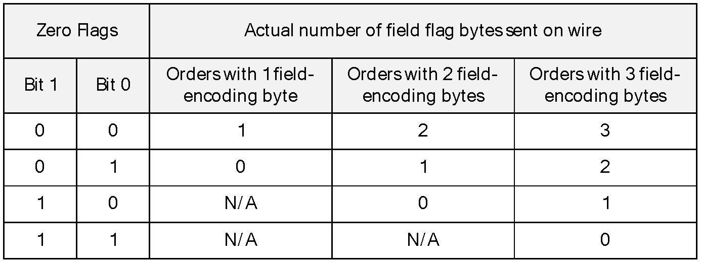

Figure 1: Relationship between zero flags and the number of flag field bytes sent on the wire

For example, assume that a given order has nine fields. Hence, there can be up to two bytes in the fieldFlags field. Assume further that the fieldFlags field has the field-encoding bytes {0x20, 0x00}. In this case, there is 1 zero byte (counting from the end backward); thus, the **controlFlags** field contains the ZERO_FIELD_BYTE_BIT0 flag (0x40), and the order is sent on the wire with a **fieldFlags** value of 0x20.

**bounds (variable)**: A variable-length, 1-byte to 9-byte field. The presence of the optional **bounds** field is governed by the TS_BOUNDS (0x04) flag in the **controlFlags** field, which indicates that the order MUST have a bounding region applied. If the **controlFlags** field TS_ZERO_BOUNDS_DELTAS (0x20) flag is also set, the previous bounding rectangle MUST be used, as the bounds have not changed (this implies that the bounds field is not present). Otherwise, the bounds are encoded as an encoding description byte followed by one or more encoded bounds (written in the order: left, top, right, bottom). The description byte MUST contain a TS_BOUND_XXX or TS_BOUND_DELTA_XXX flag to describe each of the encoded bounds that are present.

| Flag | Meaning |
| --- | --- |
| TS_BOUND_LEFT 0x01 | Indicates that the left bound is present and encoded as a 2-byte, little-endian ordered value. |
| TS_BOUND_TOP 0x02 | Indicates that the top bound is present and encoded as a 2-byte, little-endian ordered value. |
| TS_BOUND_RIGHT 0x04 | Indicates that the right bound is present and encoded as a 2-byte, little-endian ordered value. |
| TS_BOUND_BOTTOM 0x08 | Indicates that the bottom bound is present and encoded as a 2-byte, little-endian ordered value. |
| TS_BOUND_DELTA_LEFT 0x10 | Indicates that the left bound is present and encoded as a 1-byte signed value used as an offset (-128 to 127) from the previous value. |
| TS_BOUND_DELTA_TOP 0x20 | Indicates that the top bound is present and encoded as a 1-byte signed value used as an offset (-128 to 127) from the previous value. |
| TS_BOUND_DELTA_RIGHT 0x40 | Indicates that the right bound is present and encoded as a 1-byte, signed value used as an offset (-128 to 127) from the previous value. |
| TS_BOUND_DELTA_BOTTOM 0x80 | Indicates that the bottom bound is present and encoded as a 1-byte, signed value used as an offset (-128 to 127) from the previous value. |

If for a given component a TS_BOUND_XXX or TS_BOUND_DELTA_XXX flag is not present, the component value is the same as the last one used, and no value is included in the encoded bounds. If both the TS_BOUND_XXX and TS_BOUND_DELTA_XXX flags are present, the TS_BOUND_XXX flag is ignored. Hence, to avoid parsing errors, only one flag MUST be used to describe the format of a given encoded bound.

The initial value for the bounds agreed on by both the server and client is the following zero rectangle.

(left, top, right, bottom) = (0, 0, 0, 0)

**primaryOrderData (variable):** A variable-length byte field. The **primaryOrderData** field contains the encoded order field values whose presence is governed by the **fieldFlags** field. The encoded fields, if present, MUST be encoded in the same order as the order description (see sections 2.2.2.2.1.1.2.1 through 2.2.2.2.1.1.2.22). If a field is not present, its value is the same as the last value sent for that order. The initial values for all fields are zero.

<a id="Section_2.2.2.2.1.1.2.1"></a>
DstBlt (DSTBLT_ORDER)

The DstBlt Primary Drawing Order is used to paint a rectangle by using a destination-only raster operation.

Encoding order number: 0 (0x00)

Negotiation order number: 0 (0x00)

Number of fields: 5

Number of field encoding bytes: 1

Maximum encoded field length: 9 bytes

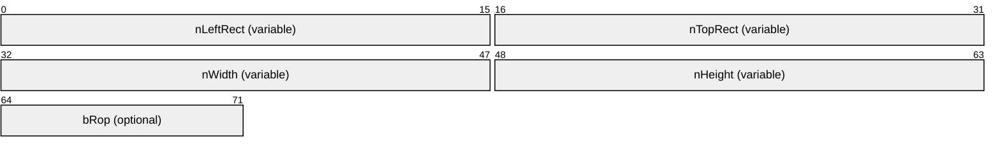

**nLeftRect (variable):** Left coordinate of the destination rectangle specified using a [Coord Field (section 2.2.2.2.1.1.1.1)](#Section_2.2.2.2.1.1.1.1).

**nTopRect (variable):** Top coordinate of the destination rectangle specified using a Coord Field (section 2.2.2.2.1.1.1.1).

**nWidth (variable):** Width of the destination rectangle specified by using a Coord Field (section 2.2.2.2.1.1.1.1).

**nHeight (variable):** Height of the destination rectangle specified by using a Coord Field (section 2.2.2.2.1.1.1.1).

**bRop (1 byte):** Index of the ternary raster operation to perform (see section [2.2.2.2.1.1.1.7](#Section_2.2.2.2.1.1.1.7)). The resultant ROP3 operation MUST only depend on the destination bits (there MUST NOT be any dependence on source or pattern bits).

<a id="Section_2.2.2.2.1.1.2.2"></a>
MultiDstBlt (MULTI_DSTBLT_ORDER)

The MultiDstBlt Primary Drawing Order is used to paint multiple rectangles by using a destination-only raster operation.

Encoding order number: 15 (0x0F)

Negotiation order number: 15 (0x0F)

Number of fields: 7

Number of field encoding bytes: 1

Maximum encoded field length: 395 bytes

```mermaid
packet-beta
  0-15: "nLeftRect (variable)"
  16-31: "nTopRect (variable)"
  32-47: "nWidth (variable)"
  48-63: "nHeight (variable)"
  64-71: "bRop (optional)"
  72-79: "nDeltaEntries (optional)"
  80-95: "CodedDeltaList (variable)"
```

**nLeftRect (variable):** A signed, 1-byte or 2-byte field. Left coordinate of the destination rectangle specified using a [Coord Field (section 2.2.2.2.1.1.1.1)](#Section_2.2.2.2.1.1.1.1).

**nTopRect (variable):** A signed, 1-byte or 2-byte field. Top coordinate of the destination rectangle specified using a Coord Field (section 2.2.2.2.1.1.1.1).

**nWidth (variable):** A signed, 1-byte or 2-byte field. Width of the destination rectangle specified using a Coord Field (section 2.2.2.2.1.1.1.1).

**nHeight (variable):** A signed, 1-byte or 2-byte field. Height of the destination rectangle specified using a Coord Field (section 2.2.2.2.1.1.1.1).

**bRop (1 byte):** Index of the ternary raster operation to perform (see section [2.2.2.2.1.1.1.7](#Section_2.2.2.2.1.1.1.7)). The resultant ROP3 operation MUST only depend on the destination bits (there MUST NOT be any dependence on source or pattern bits).

**nDeltaEntries (1 byte):** An 8-bit, unsigned integer. The number of bounding rectangles described by the **CodedDeltaList** field.

**CodedDeltaList (variable):** A [Two-Byte Header Variable Field (section 2.2.2.2.1.1.1.3)](#Section_2.2.2.2.1.1.1.3) structure that encapsulates a [Delta-Encoded Rectangles (section 2.2.2.2.1.1.1.5)](#Section_2.2.2.2.1.1.1.5) structure that contains bounding rectangles to use when rendering the order. The number of rectangles described by the Delta-Encoded Rectangles structure is specified by the **nDeltaEntries** field.

<a id="Section_2.2.2.2.1.1.2.3"></a>
PatBlt (PATBLT_ORDER)

The PatBlt Primary Drawing Order is used to paint a rectangle by using a specified [**brush**](#gt_brush) and three-way raster operation.

Encoding order number: 1 (0x01)

Negotiation order number: 1 (0x01)

Number of fields: 12

Number of field encoding bytes: 2

Maximum encoded field length: 26 bytes

Note that the negotiation order number for the PatBlt Primary Drawing Order (0x01) is the same as that for the [OpaqueRect Primary Drawing Order (section 2.2.2.2.1.1.2.5)](#Section_4.1.5). Hence support for PatBlt implies support for OpaqueRect. The converse is also true.

```mermaid
packet-beta
  0-15: "nLeftRect (variable)"
  16-31: "nTopRect (variable)"
  32-47: "nWidth (variable)"
  48-63: "nHeight (variable)"
  64-71: "bRop (optional)"
  72-95: "BackColor (optional)"
  96-119: "ForeColor (optional)"
  120-127: "BrushOrgX (optional)"
  128-135: "BrushOrgY (optional)"
  136-143: "BrushStyle (optional)"
  144-151: "BrushHatch (optional)"
  152-207: "BrushExtra"
```

**nLeftRect (variable):** Left coordinate of the destination rectangle specified using a [Coord Field (section 2.2.2.2.1.1.1.1)](#Section_2.2.2.2.1.1.1.1).

**nTopRect (variable):** Top coordinate of the destination rectangle specified using a Coord Field (section 2.2.2.2.1.1.1.1).

**nWidth (variable):** Width of the destination rectangle specified using a Coord Field (section 2.2.2.2.1.1.1.1).

**nHeight (variable):** Height of the destination rectangle specified using a Coord Field (section 2.2.2.2.1.1.1.1).

**bRop (1 byte):** Index of the ternary raster operation to perform (see section [2.2.2.2.1.1.1.7](#Section_2.2.2.2.1.1.1.7)).

**BackColor (3 bytes):** Background color described using a [Generic Color (section 2.2.2.2.1.1.1.8)](#Section_2.2.2.2.1.1.1.8) structure.

**ForeColor (3 bytes):** Foreground color described using a Generic Color (section 2.2.2.2.1.1.1.8) structure.

**BrushOrgX (1 byte):** An 8-bit, signed integer. The x-coordinate of the point where the top leftmost pixel of a brush pattern MUST be anchored.

**BrushOrgY (1 byte):** An 8-bit, signed integer. The y-coordinate of the point where the top leftmost pixel of a brush pattern MUST be anchored.

**BrushStyle (1 byte):** An 8-bit, unsigned integer. The style of the brush used in the drawing operation.

If the TS_CACHED_BRUSH (0x80) flag is set in the most significant bit of the BrushStyle field, a brush that was previously cached using the Cache Bitmap Secondary Order (see section [2.2.2.2.1.2.7](#Section_4.2.6)) MUST be used. In this case, the BrushHatch field MUST contain the index of the Brush Cache entry that holds the selected brush to use, and the low nibble of the BrushStyle field MUST contain an identifier describing the color depth of the cached brush.

| Value | Meaning |
| --- | --- |
| BMF_1BPP 0x1 | 1 bit per pixel |
| BMF_8BPP 0x3 | 8 bits per pixel |
| BMF_16BPP 0x4 | 15 or 16 bits per pixel |
| BMF_24BPP 0x5 | 24 bits per pixel |
| BMF_32BPP 0x6 | 32 bits per pixel |

If the TS_CACHED_BRUSH (0x80) flag is not set in the most significant bit of the BrushStyle field, an 8-by-8-pixel brush MUST be used, and one of the following style identifiers MUST be present in the field.

| Value | Meaning |
| --- | --- |
| BS_SOLID 0x00 | Solid color brush. The BrushHatch field SHOULD be set to 0. |
| BS_NULL 0x01 | Hollow brush. The BrushHatch field SHOULD be set to 0. |
| BS_HATCHED 0x02 | Hatched brush. The hatch pattern MUST be described by the BrushHatch field (there are six possible hatch patterns). |
| BS_PATTERN 0x03 | Pattern brush. The pixel pattern MUST be described by the BrushExtra and BrushHatch fields. |

**BrushHatch (1 byte):** An 8-bit, unsigned integer. Holds a brush hatch identifier or a Brush Cache index, depending on the contents of the BrushStyle field.

If the TS_CACHED_BRUSH (0x80) flag is set in the most significant bit of the BrushStyle field, the BrushHatch value MUST contain the index of the Brush Cache entry that holds the selected brush to use.

If the BrushStyle field is set to BS_SOLID (0x00) or BS_NULL (0x01), the BrushHatch field SHOULD be set to 0.

If the BrushStyle field is set to BS_HATCHED (0x02), the BrushHatch field MUST contain one of the following hatch constants.

| Value | Meaning |
| --- | --- |
| HS_HORIZONTAL 0x00 | Horizontal hatching as in the following figure. 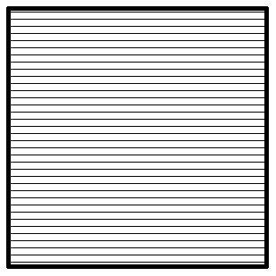 Figure 2: Horizontal hatch |
| HS_VERTICAL 0x01 | Vertical hatching as in the following figure. 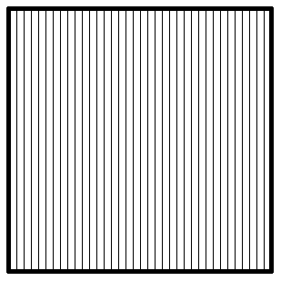 Figure 3: Vertical hatch |
| HS_FDIAGONAL 0x02 | Diagonal hatching as in the following figure. 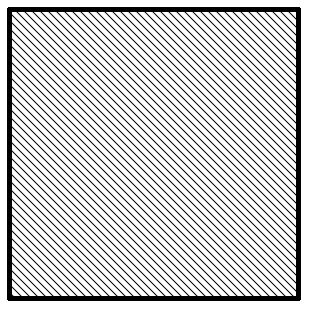 Figure 4: 45-degree downward, left-to-right hatch |
| HS_BDIAGONAL 0x03 | Diagonal hatching as in the following figure. 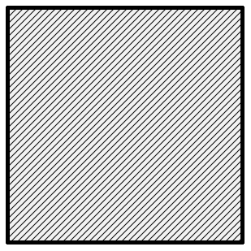 Figure 5: 45-degree upward, left-to-right hatch |
| HS_CROSS 0x04 | Cross-hatching as in the following figure. 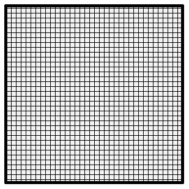 Figure 6: Horizontal and vertical cross-hatch |
| HS_DIAGCROSS 0x05 | Cross-hatching as in the following figure. 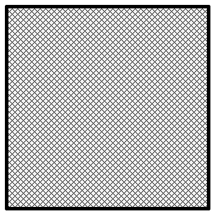 Figure 7: 45-degree cross-hatch |

If the **BrushStyle** field is set to BS_PATTERN (0x03), the **BrushHatch** field MUST encode the pixel pattern present in the bottom row of the 8x8 pattern brush (the pixel patterns in the top seven rows MUST be encoded in the BrushExtra field). For example, if the bottom row of the pattern brush contains an alternating series of black and white pixels, **BrushHatch** will contain either 0xAA or 0x55.

**BrushExtra (7 bytes):** A byte array of length 7. **BrushExtra** contains an array of bitmap bits that encodes the pixel pattern present in the top seven rows of the 8x8 pattern brush. The pixel pattern present in the bottom row is encoded in the **BrushHatch** field. The **BrushExtra** field is only present if the **BrushStyle** is set to BS_PATTERN (0x03). The rows are encoded in reverse order, that is, the pixels in the penultimate row are encoded in the first byte, and the pixels in the top row are encoded in the seventh byte. For example, a 45-degree downward sloping left-to-right line would be encoded in **BrushExtra** as { 0x02, 0x04, 0x08, 0x10, 0x20, 0x40, 0x80 } with **BrushHatch** containing the value 0x01 (the bottom row).

<a id="Section_2.2.2.2.1.1.2.4"></a>
MultiPatBlt (MULTI_PATBLT_ORDER)

The MultiPatBlt Primary Drawing Order is used to paint multiple rectangles by using a specified [**brush**](#gt_brush) and three-way raster operation.

Encoding order number: 16 (0x10)

Negotiation order number: 16 (0x10)

Number of fields: 14

Number of field encoding bytes: 2

Maximum encoded field length: 412 bytes

```mermaid
packet-beta
  0-15: "nLeftRect (variable)"
  16-31: "nTopRect (variable)"
  32-47: "nWidth (variable)"
  48-63: "nHeight (variable)"
  64-71: "bRop (optional)"
  72-95: "BackColor (optional)"
  96-119: "ForeColor (optional)"
  120-127: "BrushOrgX (optional)"
  128-135: "BrushOrgY (optional)"
  136-143: "BrushStyle (optional)"
  144-151: "BrushHatch (optional)"
  152-207: "BrushExtra (optional)"
  208-215: "nDeltaEntries (optional)"
  216-255: "CodedDeltaList (variable)"
```

**nLeftRect (variable):** The left coordinate of the destination rectangle specified by using a [Coord Field (section 2.2.2.2.1.1.1.1)](#Section_2.2.2.2.1.1.1.1).

**nTopRect (variable):** The top coordinate of the destination rectangle specified by using a Coord Field (section 2.2.2.2.1.1.1.1).

**nWidth (variable):** The width of the destination rectangle specified by using a Coord Field (section 2.2.2.2.1.1.1.1).

**nHeight (variable):** The height of the destination rectangle specified by using a Coord Field (section 2.2.2.2.1.1.1.1).

**bRop (1 byte):** The index of the ternary raster operation to perform (see section [2.2.2.2.1.1.1.7](#Section_2.2.2.2.1.1.1.7)).

**BackColor (3 bytes):** The background color described by using a [Generic Color (section 2.2.2.2.1.1.1.8)](#Section_2.2.2.2.1.1.1.8) structure.

**ForeColor (3 bytes):** The foreground color described by using a Generic Color (section 2.2.2.2.1.1.1.8) structure.

**BrushOrgX (1 byte):** An 8-bit, signed integer. The x-coordinate of the point where the top leftmost pixel of a brush pattern MUST be anchored.

**BrushOrgY (1 byte):** An 8-bit, signed integer. The y-coordinate of the point where the top leftmost pixel of a brush pattern MUST be anchored.

**BrushStyle (1 byte):** An 8-bit, unsigned integer. The contents and format of this field are the same as the **BrushStyle** field of the [PatBlt (section 2.2.2.2.1.1.2.3)](#Section_2.2.2.2.1.1.2.3) Primary Drawing Order.

**BrushHatch (1 byte):** An 8-bit, unsigned integer. The contents and format of this field are the same as the **BrushHatch** field of the PatBlt (section 2.2.2.2.1.1.2.3) Primary Drawing Order.

**BrushExtra (7 bytes):** The contents and format of this field are the same as the **BrushExtra** field of the PatBlt (section 2.2.2.2.1.1.2.3) Primary Drawing Order.

**nDeltaEntries (1 byte):** An 8-bit, unsigned integer. The number of bounding rectangles described by the **CodedDeltaList** field.

**CodedDeltaList (variable):** A [Two-Byte Header Variable Field (section 2.2.2.2.1.1.1.3)](#Section_2.2.2.2.1.1.1.3) structure that encapsulates a [Delta-Encoded Rectangles (section 2.2.2.2.1.1.1.5)](#Section_2.2.2.2.1.1.1.5) structure that contains bounding rectangles to use when rendering the order. The number of rectangles described by the Delta-Encoded Rectangles structure is specified by the **nDeltaEntries** field.

<a id="Section_2.2.2.2.1.1.2.5"></a>
OpaqueRect (OPAQUERECT_ORDER)

The OpaqueRect Primary Drawing Order is used to paint a rectangle by using an opaque [**brush**](#gt_brush).

Encoding order number: 10 (0x0A)

Negotiation order number: 1 (0x01)

Number of fields: 7

Number of field encoding bytes: 1

Maximum encoded field length: 11 bytes

Note that the negotiation order number for the OpaqueRect Primary Drawing Order (0x01) is the same as that for the [PatBlt Primary Drawing Order (section 2.2.2.2.1.1.2.3)](#Section_2.2.2.2.1.1.2.3). Hence support for OpaqueRect implies support for PatBlt. The converse is also true.

```mermaid
packet-beta
  0-15: "nLeftRect (variable)"
  16-31: "nTopRect (variable)"
  32-47: "nWidth (variable)"
  48-63: "nHeight (variable)"
  64-71: "RedOrPaletteIndex (optional)"
  72-79: "Green (optional)"
  80-87: "Blue (optional)"
```

**nLeftRect (variable):** The left coordinate of the destination rectangle specified by using a [Coord Field (section 2.2.2.2.1.1.1.1)](#Section_2.2.2.2.1.1.1.1).

**nTopRect (variable):** The top coordinate of the destination rectangle specified by using a Coord Field (section 2.2.2.2.1.1.1.1).

**nWidth (variable):** The width of the destination rectangle specified by using a Coord Field (section 2.2.2.2.1.1.1.1).

**nHeight (variable):** The height of the destination rectangle specified by using a Coord Field (section 2.2.2.2.1.1.1.1).

**RedOrPaletteIndex (1 byte):** An 8-bit, unsigned integer. Used as a palette index for 16-color and 256-color palettized color schemes. If the RGB color scheme is in effect, this field holds the red RGB component.

**Green (1 byte):** An 8-bit, unsigned integer. The green RGB color component.

**Blue (1 byte):** An 8-bit, unsigned integer. The blue RGB color component.

<a id="Section_2.2.2.2.1.1.2.6"></a>
MultiOpaqueRect (MULTI_OPAQUERECT_ORDER)

The MultiOpaqueRect Primary Drawing Order is used to paint multiple rectangles by using an opaque [**brush**](#gt_brush).

Encoding order number: 18 (0x12)

Negotiation order number: 18 (0x12)

Number of fields: 9

Number of field encoding bytes: 2

Maximum encoded field length: 397 bytes

```mermaid
packet-beta
  0-15: "nLeftRect (variable)"
  16-31: "nTopRect (variable)"
  32-47: "nWidth (variable)"
  48-63: "nHeight (variable)"
  64-71: "RedOrPaletteIndex (optional)"
  72-79: "Green (optional)"
  80-87: "Blue (optional)"
  88-95: "nDeltaEntries (optional)"
  96-159: "CodedDeltaList (variable)"
```

**nLeftRect (variable):** The left coordinate of the destination rectangle specified by using a [Coord Field (section 2.2.2.2.1.1.1.1)](#Section_2.2.2.2.1.1.1.1).

**nTopRect (variable):** The top coordinate of the destination rectangle specified by using a Coord Field (section 2.2.2.2.1.1.1.1).

**nWidth (variable):** The width of the destination rectangle specified by using a Coord Field (section 2.2.2.2.1.1.1.1).

**nHeight (variable):** The height of the destination rectangle specified by using a Coord Field (section 2.2.2.2.1.1.1.1).

**RedOrPaletteIndex (1 byte):** An 8-bit, unsigned integer. Used as a palette index for 16-color and 256-color palettized color schemes. If the RGB color scheme is in effect, it holds the red RGB component.

**Green (1 byte):** An 8-bit, unsigned integer. The green RGB color component.

**Blue (1 byte):** An 8-bit, unsigned integer. The blue RGB color component.

**nDeltaEntries (1 byte):** An 8-bit, unsigned integer. The number of bounding rectangles described by the **CodedDeltaList** field.

**CodedDeltaList (variable):** A [Two-Byte Header Variable Field (section 2.2.2.2.1.1.1.3)](#Section_2.2.2.2.1.1.1.3) structure that encapsulates a [Delta-Encoded Rectangles (section 2.2.2.2.1.1.1.5)](#Section_2.2.2.2.1.1.1.5) structure that contains bounding rectangles to use when rendering the order. The number of rectangles described by the Delta-Encoded Rectangles structure is specified by the **nDeltaEntries** field.

<a id="Section_2.2.2.2.1.1.2.7"></a>
ScrBlt (SCRBLT_ORDER)

The ScrBlt Primary Drawing Order is used to perform a bit-block transfer from a source region to a destination region. The source surface is always the primary drawing surface, while the target surface is the current target surface—specified by the [Switch Surface Alternate Secondary Drawing Order (section 2.2.2.2.1.3.3)](#Section_4.3.2).

Encoding order number: 2 (0x02)

Negotiation order number: 2 (0x02)

Number of fields: 7

Number of field encoding bytes: 1

Maximum encoded field length: 13 bytes

```mermaid
packet-beta
  0-15: "nLeftRect (variable)"
  16-31: "nTopRect (variable)"
  32-47: "nWidth (variable)"
  48-63: "nHeight (variable)"
  64-71: "bRop (optional)"
  72-87: "nXSrc (variable)"
  88-103: "nYSrc (variable)"
```

**nLeftRect (variable):** The left coordinate of the destination rectangle specified by using a [Coord Field (section 2.2.2.2.1.1.1.1)](#Section_2.2.2.2.1.1.1.1).

**nTopRect (variable):** The top coordinate of the destination rectangle specified by using a Coord Field (section 2.2.2.2.1.1.1.1).

**nWidth (variable):** The width of the destination rectangle specified by using a Coord Field (section 2.2.2.2.1.1.1.1).

**nHeight (variable):** The height of the destination rectangle specified by using a Coord Field (section 2.2.2.2.1.1.1.1).

**bRop (1 byte):** The index of the ternary raster operation to perform (see section [2.2.2.2.1.1.1.7](#Section_2.2.2.2.1.1.1.7)). The resultant ROP3 operation MUST only depend on the destination and source bits. (There MUST NOT be any dependence on pattern bits.)

**nXSrc (variable):** The x-coordinate of the source rectangle specified by using a Coord Field (section 2.2.2.2.1.1.1.1).

**nYSrc (variable):** The y-coordinate of the source rectangle specified by using a Coord Field (section 2.2.2.2.1.1.1.1).

<a id="Section_2.2.2.2.1.1.2.8"></a>
MultiScrBlt (MULTI_SCRBLT_ORDER)

The MultiScrBlt Primary Drawing Order is used to perform multiple bit-block transfers from source regions to destination regions of the screen.

Encoding order number: 17 (0x11)

Negotiation order number: 17 (0x11)

Number of fields: 9

Number of field encoding bytes: 2

Maximum encoded field length: 399 bytes

```mermaid
packet-beta
  0-15: "nLeftRect (variable)"
  16-31: "nTopRect (variable)"
  32-47: "nWidth (variable)"
  48-63: "nHeight (variable)"
  64-71: "bRop (optional)"
  72-87: "nXSrc (variable)"
  88-103: "nYSrc (variable)"
  104-111: "nDeltaEntries (optional)"
  112-159: "CodedDeltaList (variable)"
```

**nLeftRect (variable):** The left coordinate of the destination rectangle specified by using a [Coord Field (section 2.2.2.2.1.1.1.1)](#Section_2.2.2.2.1.1.1.1).

**nTopRect (variable):** The top coordinate of the destination rectangle specified by using a Coord Field (section 2.2.2.2.1.1.1.1).

**nWidth (variable):** The width of the destination rectangle specified by using a Coord Field (see section 2.2.2.2.1.1.1.1).

**nHeight (variable):** The height of the destination rectangle specified by using a Coord Field (section 2.2.2.2.1.1.1.1).

**bRop (1 byte):** The index of the ternary raster operation to perform (see section [2.2.2.2.1.1.1.7](#Section_2.2.2.2.1.1.1.7)). The resultant ROP3 operation MUST only depend on the destination and source bits. (There MUST NOT be any dependence on pattern bits.)

**nXSrc (variable):** The x-coordinate of the source rectangle specified by using a Coord Field (section 2.2.2.2.1.1.1.1).

**nYSrc (variable):** The y-coordinate of the source rectangle specified by using a Coord Field (section 2.2.2.2.1.1.1.1).

**nDeltaEntries (1 byte):** An 8-bit, unsigned integer. The number of bounding rectangles described by the **CodedDeltaList** field.

**CodedDeltaList (variable):** A [Two-Byte Header Variable Field (section 2.2.2.2.1.1.1.3)](#Section_2.2.2.2.1.1.1.3) structure that encapsulates a [Delta-Encoded Rectangles (section 2.2.2.2.1.1.1.5)](#Section_2.2.2.2.1.1.1.5) structure that contains bounding rectangles to use when rendering the order. The number of rectangles described by the Delta-Encoded Rectangles structure is specified by the **nDeltaEntries** field.

<a id="Section_2.2.2.2.1.1.2.9"></a>
MemBlt (MEMBLT_ORDER)

The MemBlt Primary Drawing Order is used to render a bitmap stored in the bitmap cache or offscreen bitmap cache to the screen.

Encoding order number: 13 (0x0D)

Negotiation order number: 3 (0x03)

Number of fields: 9

Number of field encoding bytes: 2

Maximum encoded field length: 17 bytes

```mermaid
packet-beta
  0-15: "cacheId (optional)"
  16-31: "nLeftRect (variable)"
  32-47: "nTopRect (variable)"
  48-63: "nWidth (variable)"
  64-79: "nHeight (variable)"
  80-87: "bRop (optional)"
  88-103: "nXSrc (variable)"
  104-119: "nYSrc (variable)"
  120-135: "cacheIndex (optional)"
```

**cacheId (2 bytes):** A 16-bit, unsigned integer. The **cacheId** field contains the encoded bitmap cache ID and Color Table Cache entry.

The high byte contains the index of the color table entry to use (cached previously with a [Cache Color Table (section 2.2.2.2.1.2.4)](#Section_4.2.3) Secondary Drawing Order), and the low byte contains the ID of the bitmap cache in which the source bitmap is stored (cached previously with a Cache Bitmap - Revision 1 (section [2.2.2.2.1.2.2)](#Section_c9365b320be547c9af1afeba2ea1ee9f) or Cache Bitmap - Revision 2 (section [2.2.2.2.1.2.3)](#Section_3c76f8fbfcaa4ca69d2e3f449bdbed40) Secondary Drawing Order).

The color table entry MUST be in the range 0 to 5 (inclusive).

If the client advertised support for the Revision 1 bitmap caches (section [3.1.1.1.1](#Section_3.1.1.1.1)) by sending the server the Revision 1 Bitmap Cache Capability Set ([MS-RDPBCGR](../MS-RDPBCGR/MS-RDPBCGR.md) section 2.2.7.1.4.1), then the cache ID MUST be in the range 0 to 2 (inclusive). However, if the client advertised support for the Revision 2 bitmap caches (section 3.1.1.1.1) by sending the server the Revision 2 Bitmap Cache Capability Set ([MS-RDPBCGR] section 2.2.7.1.4.2), then the cache ID MUST be greater than or equal to 0 and less than the number of bitmap caches being used for the connection (specified by the **NumCellCaches** field of the Revision 2 Bitmap Cache Capability Set).

If the bitmap cache ID is set to TS_BITMAPCACHE_SCREEN_ID (0xFF), the **cacheIndex** field MUST contain the index of an entry in the Offscreen Bitmap Cache that contains the source bitmap.

**nLeftRect (variable):** Left coordinate of the blit rectangle specified using a [Coord Field (section 2.2.2.2.1.1.1.1)](#Section_2.2.2.2.1.1.1.1).

**nTopRect (variable):** Top coordinate of the blit rectangle specified using a Coord Field (section 2.2.2.2.1.1.1.1).

**nWidth (variable):** Width of the blit rectangle specified using a Coord Field (section 2.2.2.2.1.1.1.1).

**nHeight (variable):** Height of the blit rectangle specified using a Coord Field (section 2.2.2.2.1.1.1.1).

**bRop (1 byte):** Index of the ternary raster operation to perform (see section [2.2.2.2.1.1.1.7](#Section_2.2.2.2.1.1.1.7)). The resultant ROP3 operation MUST only depend on the destination and source bits (there MUST NOT be any dependence on pattern bits).

**nXSrc (variable):** The x-coordinate of the source rectangle within the source bitmap specified by using a Coord Field (section 2.2.2.2.1.1.1.1).

**nYSrc (variable):** The inverted y-coordinate of the source rectangle within the source bitmap specified by using a Coord Field (section 2.2.2.2.1.1.1.1). The actual value of the y-coordinate MUST be computed using the following formula.

ActualYSrc = (SourceBitmapHeight - nHeight) - nYSrc

**cacheIndex (2 bytes):** A 16-bit, unsigned integer. The index of the source bitmap in the bitmap cache specified by the **cacheId** field.

If this field is set to BITMAPCACHE_WAITING_LIST_INDEX (32767), the last bitmap cache entry MUST contain the bitmap data. Otherwise, this field MUST contain a value that is greater than or equal to 0 and less than the maximum number of entries allowed in the source bitmap cache. If the client advertised support for the Revision 1 bitmap caches (section 3.1.1.1.1) by sending the server the Revision 1 Bitmap Cache Capability Set ([MS-RDPBCGR] section 2.2.7.1.4.1), then the maximum number of entries allowed in each individual Revision 1 bitmap cache is specified in the Revision 1 Bitmap Cache Capability Set by the **Cache0Entries**, **Cache1Entries**, and **Cache2Entries** fields. If the client advertised support for the Revision 2 bitmap caches (section 3.1.1.1.1) by sending the server the Revision 2 Bitmap Cache Capability Set ([MS-RDPBCGR] section 2.2.7.1.4.2), then the maximum number of entries allowed in each individual Revision 2 bitmap cache is specified in the Revision 2 Bitmap Cache Capability Set ([MS-RDPBCGR] section 2.2.7.1.4.2) by the **BitmapCache0CellInfo**, **BitmapCache1CellInfo**, **BitmapCache2CellInfo**, **BitmapCache3CellInfo**, and **BitmapCache4CellInfo** fields.

If the bitmap cache ID (specified in the **cacheId** field) is set to TS_BITMAPCACHE_SCREEN_ID (0xFF), this field MUST contain the index of an entry in the Offscreen Bitmap Cache that contains the source bitmap.

<a id="Section_2.2.2.2.1.1.2.10"></a>
Mem3Blt (MEM3BLT_ORDER)

The Mem3Blt Primary Drawing Order is used to render a bitmap stored in the bitmap cache or offscreen bitmap cache to the screen by using a specified [**brush**](#gt_brush) and three-way raster operation.

Encoding order number: 14 (0x0E)

Negotiation order number: 4 (0x04)

Number of fields: 16

Number of field encoding bytes: 3

Maximum encoded field length: 34 bytes

```mermaid
packet-beta
  0-15: "cacheId (optional)"
  16-31: "nLeftRect (variable)"
  32-47: "nTopRect (variable)"
  48-63: "nWidth (variable)"
  64-79: "nHeight (variable)"
  80-87: "bRop (optional)"
  88-103: "nXSrc (variable)"
  104-119: "nYSrc (variable)"
  120-143: "BackColor (optional)"
  144-167: "ForeColor (optional)"
  168-175: "BrushOrgX (optional)"
  176-183: "BrushOrgY (optional)"
  184-191: "BrushStyle (optional)"
  192-199: "BrushHatch (optional)"
  200-255: "BrushExtra (optional)"
  256-271: "cacheIndex (optional)"
```

**cacheId (2 bytes):** A 16-bit, unsigned integer. The **cacheId** field contains the encoded bitmap cache ID and Color Table Cache entry. The high byte contains the index of the color table entry to use (cached previously with a [Cache Color Table (section 2.2.2.2.1.2.4)](#Section_4.2.3) Secondary Drawing Order), and the low byte contains the ID of the bitmap cache in which the source bitmap is stored (cached previously with a Cache Bitmap - Revision 1 (section [2.2.2.2.1.2.2)](#Section_c9365b320be547c9af1afeba2ea1ee9f) or Cache Bitmap - Revision 2 (section [2.2.2.2.1.2.3)](#Section_3c76f8fbfcaa4ca69d2e3f449bdbed40) Secondary Drawing Order).

The color table entry MUST be in the range 0 to 5 (inclusive).

If the client advertised support for the Revision 1 bitmap caches (section [3.1.1.1.1](#Section_3.1.1.1.1)) by sending the server the Revision 1 Bitmap Cache Capability Set ([MS-RDPBCGR](../MS-RDPBCGR/MS-RDPBCGR.md) section 2.2.7.1.4.1), then the cache ID MUST be in the range 0 to 2 (inclusive). However, if the client advertised support for the Revision 2 bitmap caches (section 3.1.1.1.1) by sending the server the Revision 2 Bitmap Cache Capability Set ([MS-RDPBCGR] section 2.2.7.1.4.2), then the cache ID MUST be greater than or equal to 0 and less than the number of bitmap caches being used for the connection (specified by the **NumCellCaches** field of the Revision 2 Bitmap Cache Capability Set).

If the bitmap cache ID is set to TS_BITMAPCACHE_SCREEN_ID (0xFF), the **cacheIndex** field MUST contain the index of an entry in the Offscreen Bitmap Cache that contains the source bitmap.

**nLeftRect (variable):** The left coordinate of the blit rectangle specified by using a [Coord Field (section 2.2.2.2.1.1.1.1)](#Section_2.2.2.2.1.1.1.1).

**nTopRect (variable):** The top coordinate of the blit rectangle specified by using a Coord Field (section 2.2.2.2.1.1.1.1).

**nWidth (variable):** The width of the blit rectangle specified by using a Coord Field (section 2.2.2.2.1.1.1.1).

**nHeight (variable):** The height of the blit rectangle specified by using a Coord Field (section 2.2.2.2.1.1.1.1).

**bRop (1 byte):** The index of the ternary raster operation to perform (see section [2.2.2.2.1.1.1.7](#Section_2.2.2.2.1.1.1.7)).

**nXSrc (variable):** The x-coordinate of the source rectangle within the source bitmap specified by using a Coord Field (section 2.2.2.2.1.1.1.1).

**nYSrc (variable):** The inverted y-coordinate of the source rectangle within the source bitmap specified using a Coord Field (section 2.2.2.2.1.1.1.1). The actual value of the y-coordinate MUST be computed using the following formula:

ActualYSrc = (SourceBitmapHeight - nHeight) - nYSrc

**BackColor (3 bytes):** Background color described by using a [Generic Color (section 2.2.2.2.1.1.1.8)](#Section_2.2.2.2.1.1.1.8) structure.

**ForeColor (3 bytes):** Foreground color described by using a Generic Color (section 2.2.2.2.1.1.1.8) structure.

**BrushOrgX (1 byte):** An 8-bit, signed integer. The x-coordinate of the point where the top leftmost pixel of a brush pattern MUST be anchored.

**BrushOrgY (1 byte):** An 8-bit, signed integer. The y-coordinate of the point where the top leftmost pixel of a brush pattern MUST be anchored.

**BrushStyle (1 byte):** An 8-bit, unsigned integer. The contents and format of this field are the same as the **BrushStyle** field of the [PatBlt (section 2.2.2.2.1.1.2.3)](#Section_2.2.2.2.1.1.2.3) Primary Drawing Order.

**BrushHatch (1 byte):** An 8-bit, unsigned integer. The contents and format of this field are the same as the **BrushHatch** field of the PatBlt (section 2.2.2.2.1.1.2.3) Primary Drawing Order.

**BrushExtra (7 bytes):** The contents and format of this field are the same as the **BrushExtra** field of the PatBlt (section 2.2.2.2.1.1.2.3) Primary Drawing Order.

**cacheIndex (2 bytes):** A 16-bit, unsigned integer. The index of the source bitmap within the bitmap cache specified by the **cacheId** field.

If this field is set to BITMAPCACHE_WAITING_LIST_INDEX (32767), the last bitmap cache entry MUST contain the bitmap data. Otherwise, this field MUST contain a value that is greater than or equal to 0 and less than the maximum number of entries allowed in the source bitmap cache. If the client advertised support for the Revision 1 bitmap caches (section 3.1.1.1.1) by sending the server the Revision 1 Bitmap Cache Capability Set ([MS-RDPBCGR] section 2.2.7.1.4.1), then the maximum number of entries allowed in each individual Revision 1 bitmap cache is specified in the Revision 1 Bitmap Cache Capability Set by the **Cache0Entries**, **Cache1Entries** and **Cache2Entries** fields. If the client advertised support for the Revision 2 bitmap caches (section 3.1.1.1.1) by sending the server the Revision 2 Bitmap Cache Capability Set ([MS-RDPBCGR] section 2.2.7.1.4.2), then the maximum number of entries allowed in each individual Revision 2 bitmap cache is specified in the Revision 2 Bitmap Cache Capability Set ([MS-RDPBCGR] section 2.2.7.1.4.2) by the **BitmapCache0CellInfo**, **BitmapCache1CellInfo**, **BitmapCache2CellInfo**, **BitmapCache3CellInfo** and **BitmapCache4CellInfo** fields.

If the bitmap cache ID (specified in the **cacheId** field) is set to TS_BITMAPCACHE_SCREEN_ID (0xFF), this field MUST contain the index of an entry in the Offscreen Bitmap Cache that contains the source bitmap.

<a id="Section_2.2.2.2.1.1.2.11"></a>
LineTo (LINETO_ORDER)

The LineTo Primary Drawing Order encodes a single line drawing order that is restricted to solid color lines, one pixel wide.

Encoding order number: 9 (0x09)

Negotiation order number: 8 (0x08)

Number of fields: 10

Number of field encoding bytes: 2

Maximum encoded field length: 19 bytes

```mermaid
packet-beta
  0-15: "BackMode (optional)"
  16-31: "nXStart (variable)"
  32-47: "nYStart (variable)"
  48-63: "nXEnd (variable)"
  64-79: "nYEnd (variable)"
  80-103: "BackColor (optional)"
  104-111: "bRop2 (optional)"
  112-119: "PenStyle (optional)"
  120-127: "PenWidth (optional)"
  128-151: "PenColor (optional)"
```

**BackMode (2 bytes):** An unsigned, 16-bit integer. This field contains the background mix mode and MUST be one of the following values.

| Value | Meaning |
| --- | --- |
| TRANSPARENT 0x0001 | Background remains untouched. |
| OPAQUE 0x0002 | Background is filled with the current background color before the pen is drawn. |

**nXStart (variable):** The x-coordinate of the starting point of the line specified by using a [Coord Field (section 2.2.2.2.1.1.1.1)](#Section_2.2.2.2.1.1.1.1).

**nYStart (variable):** The y-coordinate of the starting point of the line specified by using a Coord Field (section 2.2.2.2.1.1.1.1).

**nXEnd (variable):** The x-coordinate of the ending point of the line specified by using a Coord Field (section 2.2.2.2.1.1.1.1).

**nYEnd (variable):** The y-coordinate of the ending point of the line specified by using a Coord Field (section 2.2.2.2.1.1.1.1).

**BackColor (3 bytes):** The background color described by using a [Generic Color (section 2.2.2.2.1.1.1.8)](#Section_2.2.2.2.1.1.1.8) structure. This field MUST be zeroed out.

**bRop2 (1 byte):** The binary raster operation to perform (see section [2.2.2.2.1.1.1.6](#Section_2.2.2.2.1.1.1.6)).

**PenStyle (1 byte):** An 8-bit, unsigned integer. The drawing style of the pen. This field MUST be set to PS_SOLID (0x00).

**PenWidth (1 byte):** An 8-bit, unsigned integer. The width of the pen. This field MUST be set to 0x01.

**PenColor (3 bytes):** The foreground color described by using a Generic Color (section 2.2.2.2.1.1.1.8) structure.

<a id="Section_2.2.2.2.1.1.2.12"></a>
SaveBitmap (SAVEBITMAP_ORDER)

The SaveBitmap Primary Drawing Order encodes a rectangle of the screen image for saving or restoring by the client.

Encoding order number: 11 (0x0B)

Negotiation order number: 11 (0x0B)

Number of fields: 6

Number of field encoding bytes: 1

Maximum encoded field length: 13 bytes

```mermaid
packet-beta
  0-31: "SavedBitmapPosition (optional)"
  32-47: "nLeftRect (variable)"
  48-63: "nTopRect (variable)"
  64-79: "nRightRect (variable)"
  80-95: "nBottomRect (variable)"
  96-103: "Operation (optional)"
```

**SavedBitmapPosition (4 bytes):** A 32-bit, unsigned integer. Encoded start position of the rectangle in the Saved Bitmap that will be read from (in the case of a bitmap restore operation) or written to (in the case of a bitmap save operation), depending on the value of the **Operation** field.

The **SavedBitmapPosition** field is constructed by using the **desktopSaveXGranularity** and **desktopSaveYGranularity** values specified in the Order Capability Set (see [MS-RDPBCGR](../MS-RDPBCGR/MS-RDPBCGR.md) section 2.2.7.1.3). The size of the Save Bitmap MUST be 480 x 480 pixels.

Specification [[T128]](https://go.microsoft.com/fwlink/?LinkId=90544) section 8.16.17 shows how to compute the value to insert into the **SavedBitmapPosition** field. When performing a save operation, the **SavedBitmapPosition** field contains the cumulative area of the virtual desktop rectangles already in the Save Bitmap (the area of the rectangle being written to the Save Bitmap is excluded). When performing a restore operation, the **SavedBitmapPosition** field contains the cumulative area of all the rectangles that were written to the Save Bitmap before the rectangle being restored was saved.

The functions used to compute the area by using the specified X and Y granularity are as follows.

AreaWidthInPixels = [(width + XGranularity - 1) / XGranularity] * XGranularity

AreaHeightInPixels = [(height + YGranularity - 1) / YGranularity] * YGranularity

Area = AreaWidthInPixels * AreaHeightInPixels

To determine the X and Y position in the Save Bitmap using the YGranularity and the Save Bitmap width of 480, the following functions are used.

Y = [SaveBitmapPosition / (480 * YGranularity)] * YGranularity

X = [SaveBitmapPosition - (Y * 480)] / YGranularity

An example of calculations to obtain the X and Y positions from the **SavedBitmapPosition** field are defined visually in section [4.5](#Section_4.1.12).

**nLeftRect (variable):** The left coordinate of the virtual desktop rectangle to save specified by using a [Coord Field (section 2.2.2.2.1.1.1.1)](#Section_2.2.2.2.1.1.1.1).

**nTopRect (variable):** The top coordinate of the virtual desktop rectangle to save specified by using a Coord Field (section 2.2.2.2.1.1.1.1).

**nRightRect (variable):** The right inclusive coordinate of the virtual desktop rectangle to save specified by using a Coord Field (section 2.2.2.2.1.1.1.1).

**nBottomRect (variable):** The bottom inclusive coordinate of the virtual desktop rectangle to save specified by using a Coord Field (section 2.2.2.2.1.1.1.1).

**Operation (1 byte):** An 8-bit, unsigned integer. The operation to perform that MUST be one of the following values.

| Value | Meaning |
| --- | --- |
| SV_SAVEBITS 0x00 | Save bitmap operation. |
| SV_RESTOREBITS 0x01 | Restore bitmap operation. |

<a id="Section_2.2.2.2.1.1.2.13"></a>
GlyphIndex (GLYPHINDEX_ORDER)

The GlyphIndex Primary Drawing Order encodes a set of glyph indices at a specified position.

Encoding order number: 27 (0x1B)

Negotiation order number: 27 (0x1B)

Number of fields: 22

Number of field encoding bytes: 3

Maximum encoded field length: 297 bytes

```mermaid
packet-beta
  0-7: "cacheId (optional)"
  8-15: "flAccel (optional)"
  16-23: "ulCharInc (optional)"
  24-31: "fOpRedundant (optional)"
  32-55: "BackColor (optional)"
  56-79: "ForeColor (optional)"
  80-95: "BkLeft (optional)"
  96-111: "BkTop (optional)"
  112-127: "BkRight (optional)"
  128-143: "BkBottom (optional)"
  144-159: "OpLeft (optional)"
  160-175: "OpTop (optional)"
  176-191: "OpRight (optional)"
  192-207: "OpBottom (optional)"
  208-215: "BrushOrgX (optional)"
  216-223: "BrushOrgY (optional)"
  224-231: "BrushStyle (optional)"
  232-239: "BrushHatch (optional)"
  240-295: "BrushExtra (optional)"
  296-311: "X (optional)"
  312-327: "Y (optional)"
  328-343: "VariableBytes (variable)"
```

**cacheId (1 byte):** An 8-bit, unsigned integer. The ID of the glyph cache in which the glyph data MUST be stored. This value MUST be in the range 0 to 9 (inclusive).

**flAccel (1 byte):** An 8-bit, unsigned integer. Accelerator flags. For glyph related terminology, see [YUAN] figures 14-17 and 15-1. For information about string widths and heights, see [[MSDN-SWH]](https://go.microsoft.com/fwlink/?LinkId=196875). For information about character widths, see [[MSDN-CW]](https://go.microsoft.com/fwlink/?LinkId=196874). This field MUST contain a combination of the following flags.

| Value | Meaning |
| --- | --- |
| SO_FLAG_DEFAULT_PLACEMENT 0x01 | This flag MUST be set. |
| SO_HORIZONTAL 0x02 | Text is horizontal, left-to-right or right-to-left, depending on SO_REVERSED. |
| SO_VERTICAL 0x04 | Text is vertical, top-to-bottom or bottom-to-top, depending on SO_REVERSED. |
| SO_REVERSED 0x08 | Set if horizontal text is right-to-left or vertical text is bottom-to-top. |
| SO_ZERO_BEARINGS 0x10 | For a given glyph in the font, the A-width (left-side bearing) and C-width (right-side bearing) associated with the glyph have a value of zero. |
| SO_CHAR_INC_EQUAL_BM_BASE 0x20 | For a given glyph in the font, the B-width associated with the glyph equals the advance width of the glyph. |
| SO_MAXEXT_EQUAL_BM_SIDE 0x40 | The height of the bitmap associated with a given glyph in the font is always equal to the sum of the ascent and descent. This implies that the tops and bottoms of all glyph bitmaps lie on the same line in the direction of writing. |

**ulCharInc (1 byte):** An 8-bit, unsigned integer. Specifies whether or not the font is a fixed-pitch (monospace) font. If so, this member is equal to the advance width of the glyphs in pixels (see [YUAN] figures 14-17); if not, this field is set to 0x00. The minimum value for this field is 0x00 (inclusive), and the maximum value is 0xFF (inclusive).

**fOpRedundant (1 byte):** An 8-bit, unsigned integer. A Boolean value indicating whether or not the opaque rectangle is redundant. Redundant, in this context, means that the text background is transparent.

| Value | Meaning |
| --- | --- |
| FALSE 0x00 | Rectangle is not redundant. |
| TRUE 0x01 | Rectangle is redundant. |

**BackColor (3 bytes):** The text color described by using a [Generic Color (section 2.2.2.2.1.1.1.8)](#Section_2.2.2.2.1.1.1.8) structure.

**ForeColor (3 bytes):** Color of the opaque rectangle described by using a Generic Color (section 2.2.2.2.1.1.1.8) structure.

**BkLeft (2 bytes):** A 16-bit, signed integer. The left coordinate of the text background rectangle.

**BkTop (2 bytes):** A 16-bit, signed integer. The top coordinate of the text background rectangle.

**BkRight (2 bytes):** A 16-bit, signed integer. The right coordinate of the text background rectangle.

**BkBottom (2 bytes):** A 16-bit, signed integer. The bottom coordinate of the text background rectangle.

**OpLeft (2 bytes):** A 16-bit, signed integer. The left coordinate of the opaque rectangle. This field MUST be set to 0 if the fOpRedundant flag is set.

**OpTop (2 bytes):** A 16-bit, signed integer. The top coordinate of the opaque rectangle. This field MUST be set to 0 if the fOpRedundant flag is set.

**OpRight (2 bytes):** A 16-bit, signed integer. The right coordinate of the opaque rectangle. This field MUST be set to 0 if the fOpRedundant flag is set.

**OpBottom (2 bytes):** A 16-bit, signed integer. The bottom coordinate of the opaque rectangle. This field MUST be set to 0 if the fOpRedundant flag is set.

**BrushOrgX (1 byte):** An 8-bit, signed integer. The x-coordinate of the point where the top leftmost pixel of a brush pattern MUST be anchored.

**BrushOrgY (1 byte):** An 8-bit, signed integer. The y-coordinate of the point where the top leftmost pixel of a brush pattern MUST be anchored.

**BrushStyle (1 byte):** An 8-bit, unsigned integer. This field MUST be set to BS_SOLID (0x00), as the GlyphIndex Primary Drawing Order MUST only use solid color brushes to render the opaque rectangle.

**BrushHatch (1 byte):** An 8-bit, unsigned integer. This field MUST be set to 0x00, as the GlyphIndex Primary Drawing Order MUST only use solid color brushes to render the opaque rectangle.

**BrushExtra (7 bytes):** This field is not used, as the GlyphIndex Primary Drawing Order MUST only use solid color brushes to render the opaque rectangle.

**X (2 bytes):** A 16-bit, signed integer. The x-coordinate of the point where the origin of the starting glyph MUST be positioned.

**Y (2 bytes):** A 16-bit, signed integer. The y-coordinate of the point where the origin of the starting glyph MUST be positioned.

**VariableBytes (variable):** A [One-Byte Header Variable Field (section 2.2.2.2.1.1.1.2)](#Section_2.2.2.2.1.1.1.2) structure. This field MUST contain glyph fragments (which are composed of a series of one or more glyph cache indices) and instructions to use entries previously stored in the glyph fragment cache. Multiple glyph fragments can be contained in this field. The first byte of each fragment is either a USE (0xFE) operation byte or a glyph index (0x00 to 0x0FD) byte:

- A value of 0xFE (USE) indicates that a previously stored fragment MUST be displayed. The byte following the USE byte is the index in the fragment cache where the fragment is located. This fragment MUST be read and displayed. If the **ulCharInc** field is set to 0 and the **flAccel** field does not contain the SO_CHAR_INC_EQUAL_BM_BASE (0x20) flag, then the index byte MUST be followed by a delta byte that indicates the distance between two consecutive fragments; this distance is measured in pixels from the beginning of the first fragment to the beginning of the next. If the distance is greater than 127 (0x7F), then the value 0x80 MUST be used, and the following two bytes will be set to contain the actual distance formatted as an unsigned integer in little-endian order.
- If not preceded by 0xFE, a value of 0x00 to 0xFD identifies a glyph stored at the given index in the glyph cache. Multiple glyphs can be sent at one time. If the **ulCharInc** field is set to 0 and the **flAccel** field does not contain the SO_CHAR_INC_EQUAL_BM_BASE (0x20) flag, then the index byte MUST be followed by a delta byte that indicates the distance between two consecutive glyphs; this distance is measured in pixels from the beginning of the first glyph to the beginning of the next. If the distance is greater than 127 (0x7F), then the value 0x80 MUST be used, and the following two bytes will be set to contain the actual distance formatted as an unsigned integer in little-endian order.
If a series of glyph indices ends with an ADD (0xFF) operation byte, the preceding glyph information MUST be collected, displayed, and then stored in the fragment cache. The byte following the ADD byte is the index of the cache where the fragment MUST be stored. A final byte that indicates the size of the fragment follows the index byte. (The ADD byte, index byte, and size byte MUST NOT be counted when calculating the value of the size byte.)

All glyph cache indices MUST be greater than or equal to 0, and less than the maximum number of entries allowed in the glyph cache with the ID specified by the **cacheId** field. The maximum number of entries allowed in each of the ten glyph caches is specified in the **GlyphCache** field of the Glyph Cache Capability Set ([MS-RDPBCGR](../MS-RDPBCGR/MS-RDPBCGR.md) section 2.2.7.1.8).

All fragment cache indices MUST be in the range 0 to 255 (inclusive).

<a id="Section_2.2.2.2.1.1.2.14"></a>
FastIndex (FASTINDEX_ORDER)

The FastIndex Primary Drawing Order encodes a set of glyph indices at a specified position. This order is an improved version of the [GlyphIndex (section 2.2.2.2.1.1.2.13)](#Section_4.1.13) Primary Drawing Order. The regular GlyphIndex order contains five [**brush**](#gt_brush) fields that the FastIndex order does not: **BrushOrgX**, **BrushOrgY**, **BrushStyle**, **BrushHatch**, and **BrushExtra**. These extra fields MUST all be implicitly assumed to exist and contain default values of zero (implying that a solid color brush will be used).

Encoding order number: 19 (0x13)

Negotiation order number: 19 (0x13)

Number of fields: 15

Number of field encoding bytes: 2

Maximum encoded field length: 285 bytes

```mermaid
packet-beta
  0-7: "cacheId (optional)"
  8-23: "fDrawing (optional)"
  24-47: "BackColor (optional)"
  48-71: "ForeColor (optional)"
  72-87: "BkLeft (variable)"
  88-103: "BkTop (variable)"
  104-119: "BkRight (variable)"
  120-135: "BkBottom (variable)"
  136-151: "OpLeft (variable)"
  152-167: "OpTop (variable)"
  168-183: "OpRight (variable)"
  184-199: "OpBottom (variable)"
  200-215: "X (optional)"
  216-231: "Y (optional)"
  232-247: "VariableBytes (variable)"
```

**cacheId (1 byte):** An 8-bit, unsigned integer. The ID of the glyph cache in which the glyph data MUST be stored. This value MUST be in the range 0 to 9 (inclusive).

**fDrawing (2 bytes):** A 16-bit, unsigned integer. Combined **flAccel** and **ulCharInc** fields from the GlyphIndex (section 2.2.2.2.1.1.2.13) Primary Drawing Order. The high-order byte contains the **flAccel** field, and the low-order byte contains the **ulCharInc** field.

**BackColor (3 bytes):** The text color described by using a [Generic Color (section 2.2.2.2.1.1.1.8)](#Section_2.2.2.2.1.1.1.8) structure.

**ForeColor (3 bytes):** Opaque rectangle color described by using a Generic Color (section 2.2.2.2.1.1.1.8) structure.

**BkLeft (variable):** Left coordinate of the text background rectangle specified by using a [Coord Field (section 2.2.2.2.1.1.1.1)](#Section_2.2.2.2.1.1.1.1).

**BkTop (variable):** Top coordinate of the text background rectangle specified by using a Coord Field (section 2.2.2.2.1.1.1.1).

**BkRight (variable):** Right coordinate of the text background rectangle specified by using a Coord Field (section 2.2.2.2.1.1.1.1).

**BkBottom (variable):** Bottom coordinate of the text background rectangle specified by using a Coord Field (section 2.2.2.2.1.1.1.1).

**OpLeft (variable):** Left coordinate of the opaque rectangle specified by using a Coord Field (section 2.2.2.2.1.1.1.1). This field MUST be set to 0 if it is the same as **BkLeft**.

**OpTop (variable):** The top coordinate of the opaque rectangle specified by using a Coord Field (section 2.2.2.2.1.1.1.1).

This field MUST contain opaque rectangle encoding flags if the **OpBottom** field is set to be the value of -32768. In this case, **OpTop** holds the encoding flags in the low 4 bits.

| Value | Meaning |
| --- | --- |
| OPRECT_BOTTOM_ABSENT 0x01 | Bottom coordinate of the opaque rectangle is the same as **BkBottom**. |
| OPRECT_RIGHT_ABSENT 0x02 | Right coordinate of the opaque rectangle is the same as **BkRight**. |
| OPRECT_TOP_ABSENT 0x04 | Top coordinate of the opaque rectangle is the same as **BkTop**. |
| OPRECT_LEFT_ABSENT 0x08 | Left coordinate of the opaque rectangle is the same as **BkLeft**. |

The only valid combinations of the encoding flags that are currently supported are as follows:

- 0x0F: The left, top, right, and bottom coordinates of the opaque rectangle all match the background text rectangle and are absent.
- 0x0D: The left, top, and bottom coordinates of the opaque rectangle all match the background text rectangle and are absent. The actual value of the right coordinate is present.
**OpRight (variable):** The right coordinate of the opaque rectangle specified using a Coord Field (section 2.2.2.2.1.1.1.1). This field MUST be set to 0 if it is the same as **BkRight**.

**OpBottom (variable):** The bottom coordinate of the opaque rectangle specified using a Coord Field (section 2.2.2.2.1.1.1.1). This field MUST be set to -32768 if **OpTop** contains opaque rectangle encoding flags (see the **OpTop** field).

**X (2 bytes):** A 16-bit, signed integer. The x-coordinate of the point where the origin of the starting glyph MUST be positioned specified using a Coord Field (section 2.2.2.2.1.1.1.1). This field MUST be set to -32768 if it is the same as **BkLeft**.

**Y (2 bytes):** A 16-bit, signed integer. The y-coordinate of the point where the origin of the starting glyph MUST be positioned specified using a Coord Field (section 2.2.2.2.1.1.1.1). This field MUST be set to -32768 if it is the same as **BkTop**.

**VariableBytes (variable):** A [One-Byte Header Variable Field (section 2.2.2.2.1.1.1.2)](#Section_2.2.2.2.1.1.1.2) structure. The contents and format of this field are the same as the **VariableBytes** field of the GlyphIndex (section 2.2.2.2.1.1.2.13) Primary Drawing Order.

<a id="Section_2.2.2.2.1.1.2.15"></a>
FastGlyph (FASTGLYPH_ORDER)

The FastGlyph Primary Drawing Order encodes a single glyph at a specified position. This primary drawing order is a fast way of outputting a single glyph and bypasses having to send a Cache Glyph Secondary Drawing Order (see sections [2.2.2.2.1.2.5](#Section_2.2.2.2.1.2.5) and [2.2.2.2.1.2.6](#Section_2.2.2.2.1.2.6)) followed by a [GlyphIndex (section 2.2.2.2.1.1.2.13)](#Section_4.1.13) or [FastIndex (section 2.2.2.2.1.1.2.14)](#Section_4.1.14) Primary Drawing Order.

Encoding order number: 24 (0x18)

Negotiation order number: 24 (0x18)

Number of fields: 15

Number of field encoding bytes: 2

Maximum encoded field length: 285 bytes

```mermaid
packet-beta
  0-7: "cacheId (optional)"
  8-23: "fDrawing (optional)"
  24-47: "BackColor (optional)"
  48-71: "ForeColor (optional)"
  72-87: "BkLeft (variable)"
  88-103: "BkTop (variable)"
  104-119: "BkRight (variable)"
  120-135: "BkBottom (variable)"
  136-151: "OpLeft (variable)"
  152-167: "OpTop (variable)"
  168-183: "OpRight (variable)"
  184-199: "OpBottom (variable)"
  200-215: "X (variable)"
  216-231: "Y (variable)"
  232-247: "VariableBytes (variable)"
```

**cacheId (1 byte):** An 8-bit, unsigned integer. The ID of the glyph cache in which the glyph data MUST be stored. This value MUST be in the range 0 to 9 (inclusive).

**fDrawing (2 bytes):** A 16-bit, unsigned integer. Combined **flAccel** and **ulCharInc** fields from the GlyphIndex (section 2.2.2.2.1.1.2.13) Primary Drawing Order. The high-order byte contains the **flAccel** field, and the low-order byte contains the **ulCharInc** field.

**BackColor (3 bytes):** Text color described by using a [Generic Color (section 2.2.2.2.1.1.1.8)](#Section_2.2.2.2.1.1.1.8) structure.

**ForeColor (3 bytes):** The opaque rectangle color described by using a Generic Color (section 2.2.2.2.1.1.1.8) structure.

**BkLeft (variable):** The left coordinate of the text background rectangle specified by using a [Coord Field (section 2.2.2.2.1.1.1.1)](#Section_2.2.2.2.1.1.1.1).

**BkTop (variable):** The top coordinate of the text background rectangle specified by using a Coord Field (section 2.2.2.2.1.1.1.1).

**BkRight (variable):** The right coordinate of the text background rectangle specified by using a Coord Field (section 2.2.2.2.1.1.1.1).

**BkBottom (variable):** The bottom coordinate of the text background rectangle specified by using a Coord Field (section 2.2.2.2.1.1.1.1).

**OpLeft (variable):** The left coordinate of the opaque rectangle specified by using a Coord Field (section 2.2.2.2.1.1.1.1). This field MUST be set to 0 if it is the same as **BkLeft**.

**OpTop (variable):** The top coordinate of the opaque rectangle specified by using a Coord Field (section 2.2.2.2.1.1.1.1). This field MUST contain opaque rectangle encoding flags if the **OpBottom** field is set to -32768. For details on the opaque rectangle encoding flags, see the **OpTop** field of the FastIndex (section 2.2.2.2.1.1.2.14) Primary Drawing Order.

**OpRight (variable):** The right coordinate of the opaque rectangle specified by using a Coord Field (section 2.2.2.2.1.1.1.1). This field MUST be set to 0 if it is the same as **BkRight**.

**OpBottom (variable):** The bottom coordinate of the opaque rectangle specified by using a Coord Field (section 2.2.2.2.1.1.1.1). This field MUST be set to -32768 if **OpTop** contains opaque rectangle encoding flags (see the **OpTop** field).

**X (variable):** A 16-bit, signed integer. The x-coordinate of the point where the origin of the starting glyph MUST be positioned, specified by using a Coord Field (section 2.2.2.2.1.1.1.1). This field MUST be set to -32768 if it is the same as **BkLeft**.

**Y (variable):** A 16-bit, signed integer. The y-coordinate of the point where the origin of the starting glyph MUST be positioned, specified by using a Coord Field (section 2.2.2.2.1.1.1.1). This field MUST be set to -32768 if it is the same as **BkTop**.

**VariableBytes (variable):** A [One-Byte Header Variable Field (section 2.2.2.2.1.1.1.2)](#Section_2.2.2.2.1.1.1.2) structure. If the size of this **VariableBytes** field is 1 byte, it contains a 1-byte glyph cache index from which the glyph data MUST be retrieved. However, if the size is larger than 1 byte, this field contains a Cache Glyph Data - Revision 2 (section [2.2.2.2.1.2.6.1)](#Section_7facfe557db14a47a38ebc223cce5dc4) structure. The glyph data MUST be stored in the glyph cache specified by the **cacheId** field in the entry indicated by the **cacheIndex** field of the glyph data. The Cache Glyph Data - Revision 2 structure MUST be followed by 2 bytes of padding that MAY<2> contain a little-endian encoded [**Unicode character**](#gt_unicode-character) representing the glyph (this Unicode character MUST NOT be null-terminated).

All glyph cache indices MUST be greater than or equal to 0, and less than the maximum number of entries allowed in the glyph cache with the ID specified by the **cacheId** field. The maximum number of entries allowed in each of the ten glyph caches is specified in the **GlyphCache** field of the Glyph Cache Capability Set ([MS-RDPBCGR](../MS-RDPBCGR/MS-RDPBCGR.md) section 2.2.7.1.8).

<a id="Section_2.2.2.2.1.1.2.16"></a>
PolygonSC (POLYGON_SC_ORDER)

The PolygonSC Primary Drawing Order encodes a solid-color polygon consisting of two or more vertices connected by straight lines.

Encoding order number: 20 (0x14)

Negotiation order number: 20 (0x14)

Number of fields: 7

Number of field encoding bytes: 1

Maximum encoded field length: 249 bytes

```mermaid
packet-beta
  0-15: "xStart (variable)"
  16-31: "yStart (variable)"
  32-39: "bRop2 (optional)"
  40-47: "FillMode (optional)"
  48-71: "BrushColor (optional)"
  72-79: "NumDeltaEntries (optional)"
  80-95: "CodedDeltaList (variable)"
```

**xStart (variable):** The x-coordinate of the starting point of the polygon path specified by using a [Coord Field (section 2.2.2.2.1.1.1.1)](#Section_2.2.2.2.1.1.1.1).

**yStart (variable):** The y-coordinate of the starting point of the polygon path specified by using a Coord Field (section 2.2.2.2.1.1.1.1).

**bRop2 (1 byte):** The binary raster operation to perform (see section [2.2.2.2.1.1.1.6](#Section_2.2.2.2.1.1.1.6)).

**FillMode (1 byte):** The polygon filling algorithm described using a [Fill Mode (section 2.2.2.2.1.1.1.9)](#Section_2.2.2.2.1.1.1.9) structure.

**BrushColor (3 bytes):** Foreground color described by using a [Generic Color (section 2.2.2.2.1.1.1.8)](#Section_2.2.2.2.1.1.1.8) structure.

**NumDeltaEntries (1 byte):** An 8-bit, unsigned integer. The number of points along the polygon path described by the **CodedDeltaList** field.

**CodedDeltaList (variable):** A [One-Byte Header Variable Field (section 2.2.2.2.1.1.1.2)](#Section_2.2.2.2.1.1.1.2) structure that encapsulates a [Delta-Encoded Points (section 2.2.2.2.1.1.1.4)](#Section_2.2.2.2.1.1.1.4) structure that contains the points along the polygon path. The number of points described by the Delta-Encoded Points structure is specified by the **NumDeltaEntries** field.

<a id="Section_2.2.2.2.1.1.2.17"></a>
PolygonCB (POLYGON_CB_ORDER)

The PolygonCB Primary Drawing Order encodes a color [**brush**](#gt_brush) polygon consisting of two or more vertices connected by straight lines.

Encoding order number: 21 (0x15)

Negotiation order number: 21 (0x15)

Number of fields: 13

Number of field encoding bytes: 2

Maximum encoded field length: 263 bytes

```mermaid
packet-beta
  0-15: "xStart (variable)"
  16-31: "yStart (variable)"
  32-39: "bRop2 (optional)"
  40-47: "FillMode (optional)"
  48-71: "BackColor (optional)"
  72-95: "ForeColor (optional)"
  96-103: "BrushOrgX (optional)"
  104-111: "BrushOrgY (optional)"
  112-119: "BrushStyle (optional)"
  120-127: "BrushHatch (optional)"
  128-183: "BrushExtra (optional)"
  184-191: "NumDeltaEntries (optional)"
  192-207: "CodedDeltaList (variable)"
```

**xStart (variable):** The x-coordinate of the starting point of the polygon path specified using a [Coord Field (section 2.2.2.2.1.1.1.1)](#Section_2.2.2.2.1.1.1.1).

**yStart (variable):** The y-coordinate of the starting point of the polygon path specified using a Coord Field (section 2.2.2.2.1.1.1.1).

**bRop2 (1 byte):** The binary raster operation to perform (see section [2.2.2.2.1.1.1.6](#Section_2.2.2.2.1.1.1.6)). The ROP2 field for the PolygonCB Primary Drawing Order has two bitfields within it. The low 5 bits (mask 0x1F) identify the real ROP2 operation. The high bit (mask 0x80) indicates whether the background drawing mode MUST be set to TRANSPARENT or OPAQUE (see section [2.2.2.2.1.1.2.11](#Section_2.2.2.2.1.1.2.11)). The background drawing mode is only significant if the **BrushStyle** field indicates that the brush is a BS_HATCHED (0x02) or BS_PATTERN (0x03) brush.

**FillMode (1 byte):** The polygon filling algorithm described by using a [Fill Mode (section 2.2.2.2.1.1.1.9)](#Section_2.2.2.2.1.1.1.9) structure.

**BackColor (3 bytes):** The background color described by using a [Generic Color (section 2.2.2.2.1.1.1.8)](#Section_2.2.2.2.1.1.1.8) structure.

**ForeColor (3 bytes):** The foreground color described by using a Generic Color (section 2.2.2.2.1.1.1.8) structure.

**BrushOrgX (1 byte):** An 8-bit, signed integer. The x-coordinate of the point where the top leftmost pixel of a brush pattern MUST be anchored.

**BrushOrgY (1 byte):** An 8-bit, signed integer. The y-coordinate of the point where the top leftmost pixel of a brush pattern MUST be anchored.

**BrushStyle (1 byte):** An 8-bit, unsigned integer. The contents and format of this field are the same as the **BrushStyle** field of the [PatBlt (section 2.2.2.2.1.1.2.3)](#Section_2.2.2.2.1.1.2.3) Primary Drawing Order.

**BrushHatch (1 byte):** An 8-bit, unsigned integer. The contents and format of this field are the same as the **BrushHatch** field of the PatBlt (section 2.2.2.2.1.1.2.3) Primary Drawing Order.

**BrushExtra (7 bytes):** A byte array of length 7. The contents and format of this field are the same as the **BrushExtra** field of the PatBlt (section 2.2.2.2.1.1.2.3) Primary Drawing Order.

**NumDeltaEntries (1 byte):** An 8-bit, unsigned integer. The number of points along the polygon path described by the **CodedDeltaList** field.

**CodedDeltaList (variable):** A [One-Byte Header Variable Field (section 2.2.2.2.1.1.1.2)](#Section_2.2.2.2.1.1.1.2) structure that encapsulates a [Delta-Encoded Points (section 2.2.2.2.1.1.1.4)](#Section_2.2.2.2.1.1.1.4) structure that contains the points along the polygon path. The number of points described by the Delta-Encoded Points structure is specified by the **NumDeltaEntries** field.

<a id="Section_2.2.2.2.1.1.2.18"></a>
Polyline (POLYLINE_ORDER)

The Polyline Primary Drawing Order encodes a solid color polyline consisting of two or more vertices connected by straight lines.

Encoding order number: 22 (0x16)

Negotiation order number: 22 (0x16)

Number of fields: 7

Number of field encoding bytes: 1

Maximum encoded field length: 148 bytes

```mermaid
packet-beta
  0-15: "xStart (variable)"
  16-31: "yStart (variable)"
  32-39: "bRop2 (optional)"
  40-55: "BrushCacheEntry (optional)"
  56-79: "PenColor (optional)"
  80-87: "NumDeltaEntries (optional)"
  88-103: "CodedDeltaList (variable)"
```

**xStart (variable):** The x-coordinate of the starting point of the polygon path specified by using a [Coord Field (section 2.2.2.2.1.1.1.1)](#Section_2.2.2.2.1.1.1.1).

**yStart (variable):** The y-coordinate of the starting point of the polygon path specified by using a Coord Field (section 2.2.2.2.1.1.1.1).

**bRop2 (1 byte):** The binary raster operation to perform (see section [2.2.2.2.1.1.1.6](#Section_2.2.2.2.1.1.1.6)).

**BrushCacheEntry (2 bytes):** A 16-bit unsigned integer. The brush cache entry. This field is unused (as only solid color polylines are drawn) and SHOULD<3> be set to 0x0000.

**PenColor (3 bytes):** The foreground color described by using a [Generic Color (section 2.2.2.2.1.1.1.8)](#Section_2.2.2.2.1.1.1.8) structure.

**NumDeltaEntries (1 byte):** An 8-bit, unsigned integer. The number of points along the polyline path described by the **CodedDeltaList** field.

**CodedDeltaList (variable):** A [One-Byte Header Variable Field (section 2.2.2.2.1.1.1.2)](#Section_2.2.2.2.1.1.1.2) structure that encapsulates a [Delta-Encoded Points (section 2.2.2.2.1.1.1.4)](#Section_2.2.2.2.1.1.1.4) structure that contains the points along the polyline path. The number of points described by the Delta-Encoded Points structure is specified by the **NumDeltaEntries** field.

<a id="Section_2.2.2.2.1.1.2.19"></a>
EllipseSC (ELLIPSE_SC_ORDER)

The EllipseSC Primary Drawing Order encodes a single, solid-color ellipse.

Encoding order number: 25 (0x19)

Negotiation order number: 25 (0x19)

Number of fields: 7

Number of field encoding bytes: 1

Maximum encoded field length: 13 bytes

```mermaid
packet-beta
  0-15: "LeftRect (variable)"
  16-31: "TopRect (variable)"
  32-47: "RightRect (variable)"
  48-63: "BottomRect (variable)"
  64-71: "bRop2 (optional)"
  72-79: "FillMode (optional)"
  80-103: "Color (optional)"
```

**LeftRect (variable):** The left coordinate of the inclusive rectangle for the ellipse specified by using a [Coord Field (section 2.2.2.2.1.1.1.1)](#Section_2.2.2.2.1.1.1.1).

**TopRect (variable):** The top coordinate of the inclusive rectangle for the ellipse specified by using a Coord Field (section 2.2.2.2.1.1.1.1).

**RightRect (variable):** The right coordinate of the inclusive rectangle for the ellipse specified by using a Coord Field (section 2.2.2.2.1.1.1.1).

**BottomRect (variable):** The bottom coordinate of the inclusive rectangle for the ellipse specified by using a Coord Field (section 2.2.2.2.1.1.1.1).

**bRop2 (1 byte):** The binary raster operation to perform (see section [2.2.2.2.1.1.1.6](#Section_2.2.2.2.1.1.1.6)).

**FillMode (1 byte):** An 8-bit, unsigned integer that specifies the fill mode. **FillMode** MUST be one of the following values.

| Value | Meaning |
| --- | --- |
| NOFILLL 0x00 | A polyline ellipse (that is, a non-filled ellipse) MUST be drawn. |
| ALTERNATE 0x01 | See section [2.2.2.2.1.1.1.9](#Section_2.2.2.2.1.1.1.9) for an explanation of this value. |
| WINDING 0x02 | See section 2.2.2.2.1.1.1.9 for an explanation of this value. |

**Color (3 bytes):** The foreground color described by using a [Generic Color (section 2.2.2.2.1.1.1.8)](#Section_2.2.2.2.1.1.1.8) structure.

<a id="Section_2.2.2.2.1.1.2.20"></a>
EllipseCB (ELLIPSE_CB_ORDER)

The EllipseCB Primary Drawing Order encodes a color [**brush**](#gt_brush) ellipse.

Encoding order number: 26 (0x1A)

Negotiation order number: 26 (0x1A)

Number of fields: 13

Number of field encoding bytes: 2

Maximum encoded field length: 27 bytes

```mermaid
packet-beta
  0-15: "LeftRect (variable)"
  16-31: "TopRect (variable)"
  32-47: "RightRect (variable)"
  48-63: "BottomRect (variable)"
  64-71: "bRop2 (optional)"
  72-79: "FillMode (optional)"
  80-103: "BackColor (optional)"
  104-127: "ForeColor (optional)"
  128-135: "BrushOrgX (optional)"
  136-143: "BrushOrgY (optional)"
  144-151: "BrushStyle (optional)"
  152-159: "BrushHatch (optional)"
  160-215: "BrushExtra (optional)"
```

**LeftRect (variable):** The left coordinate of the inclusive rectangle for the ellipse specified by using a [Coord Field (section 2.2.2.2.1.1.1.1)](#Section_2.2.2.2.1.1.1.1).

**TopRect (variable):** The top coordinate of the inclusive rectangle for the ellipse specified by using a Coord Field (section 2.2.2.2.1.1.1.1).

**RightRect (variable):** The right coordinate of the inclusive rectangle for the ellipse specified by using a Coord Field (section 2.2.2.2.1.1.1.1).

**BottomRect (variable):** The bottom coordinate of the inclusive rectangle for the ellipse specified by using a Coord Field (section 2.2.2.2.1.1.1.1).

**bRop2 (1 byte):** The binary raster operation to perform (see section [2.2.2.2.1.1.1.6](#Section_2.2.2.2.1.1.1.6)). The ROP2 field for the EllipseCB Primary Drawing Order has two bitfields within it. The low 5 bits (mask 0x1F) identify the real ROP2 operation. The high bit (mask 0x80) indicates whether the background drawing mode MUST be set to TRANSPARENT or OPAQUE (see section [2.2.2.2.1.1.2.11](#Section_2.2.2.2.1.1.2.11)). The background drawing mode is only significant if the **BrushStyle** field indicates that the brush is a BS_HATCHED (0x02) or BS_PATTERN (0x03) brush.

**FillMode (1 byte):** The ellipse filling algorithm described by using a [Fill Mode (section 2.2.2.2.1.1.1.9)](#Section_2.2.2.2.1.1.1.9) structure.

**BackColor (3 bytes):** The background color described by using a [Generic Color (section 2.2.2.2.1.1.1.8)](#Section_2.2.2.2.1.1.1.8) structure.

**ForeColor (3 bytes):** The foreground color described by using a Generic Color (section 2.2.2.2.1.1.1.8) structure.

**BrushOrgX (1 byte):** An 8-bit, signed integer. The x-coordinate of the point where the top leftmost pixel of a brush pattern MUST be anchored.

**BrushOrgY (1 byte):** An 8-bit, signed integer. The y-coordinate of the point where the top leftmost pixel of a brush pattern MUST be anchored.

**BrushStyle (1 byte):** An 8-bit, unsigned integer. The contents and format of this field are the same as the **BrushStyle** field of the [PatBlt (section 2.2.2.2.1.1.2.3)](#Section_2.2.2.2.1.1.2.3) Primary Drawing Order.

**BrushHatch (1 byte):** An 8-bit, unsigned integer. The contents and format of this field are the same as the **BrushHatch** field of the PatBlt (section 2.2.2.2.1.1.2.3) Primary Drawing Order.

**BrushExtra (7 bytes):** A byte array of length 7. The contents and format of this field are the same as the **BrushExtra** field of the PatBlt (section 2.2.2.2.1.1.2.3) Primary Drawing Order.

<a id="Section_2.2.2.2.1.1.2.21"></a>
DrawNineGrid (DRAWNINEGRID_ORDER)

The DrawNineGrid Primary Drawing Order encodes a single NineGrid drawing command with a single bounding rectangle.

Encoding order number: 7 (0x07)

Negotiation order number: 7 (0x07)

Number of fields: 5

Number of field encoding bytes: 1

Maximum encoded field length: 10 bytes

```mermaid
packet-beta
  0-15: "srcLeft (variable)"
  16-31: "srcTop (variable)"
  32-47: "srcRight (variable)"
  48-63: "srcBottom (variable)"
  64-79: "bitmapId"
```

**srcLeft (variable):** The left coordinate of the clipping rectangle to be applied to the bitmap stored at the entry given by the **bitmapId** field. The coordinate is specified by using a [Coord Field (section 2.2.2.2.1.1.1.1)](#Section_2.2.2.2.1.1.1.1).

**srcTop (variable):** The top coordinate of the clipping rectangle to be applied to the bitmap stored at the entry given by the **bitmapId** field. The coordinate is specified by using a Coord Field (section 2.2.2.2.1.1.1.1).

**srcRight (variable):** The right coordinate of the clipping rectangle to be applied to the bitmap stored at the entry given by the **bitmapId** field. The coordinate is specified by using a Coord Field (section 2.2.2.2.1.1.1.1).

**srcBottom (variable):** The bottom coordinate of the clipping rectangle to be applied to the bitmap stored at the entry given by the **bitmapId** field. The coordinate is specified by using a Coord Field (section 2.2.2.2.1.1.1.1).

**bitmapId (2 bytes):** A 16-bit, unsigned integer. The index of the NineGrid Bitmap Cache entry wherein the bitmap and NineGrid transformation information are stored. This value MUST be greater than or equal to 0 and less than the maximum number of entries allowed in the NineGrid Bitmap Cache as specified by the **drawNineGridCacheEntries** field of the [DrawNineGrid Cache Capability Set (section 2.2.1.2)](#Section_4.1.21). The bitmap and transformation information stored in the cache MUST have already been cached in response to a [Create NineGrid Bitmap (section 2.2.2.2.1.3.4)](#Section_4.3.3) Alternate Secondary Drawing Order.

<a id="Section_2.2.2.2.1.1.2.22"></a>
MultiDrawNineGrid (MULTI_DRAWNINEGRID_ORDER)

The MultiDrawNineGrid Primary Drawing Order encodes a single NineGrid drawing command with multiple clipping rectangles.

Encoding order number: 8 (0x08)

Negotiation order number: 9 (0x09)

Number of fields: 7

Number of field encoding bytes: 1

Maximum encoded field length: 396 bytes

```mermaid
packet-beta
  0-15: "srcLeft (variable)"
  16-31: "srcTop (variable)"
  32-47: "srcRight (variable)"
  48-63: "srcBottom (variable)"
  64-79: "bitmapId (optional)"
  80-87: "nDeltaEntries (optional)"
  88-103: "CodedDeltaList (variable)"
```

**srcLeft (variable):** The left coordinate of the clipping rectangle to be applied to the bitmap stored at the entry given by the **bitmapId** field. The coordinate is specified by using a [Coord Field (section 2.2.2.2.1.1.1.1)](#Section_2.2.2.2.1.1.1.1).

**srcTop (variable):** The top coordinate of the clipping rectangle to be applied to the bitmap stored at the entry given by the **bitmapId** field. The coordinate is specified by using a Coord Field (section 2.2.2.2.1.1.1.1).

**srcRight (variable):** The right coordinate of the clipping rectangle to be applied to the bitmap stored at the entry given by the **bitmapId** field. The coordinate is specified by using a Coord Field (section 2.2.2.2.1.1.1.1).

**srcBottom (variable):** The bottom coordinate of the clipping rectangle to be applied to the bitmap stored at the entry given by the **bitmapId** field. The coordinate is specified by using a Coord Field (section 2.2.2.2.1.1.1.1).

**bitmapId (2 bytes):** A 16-bit, unsigned integer. The index of the NineGrid Bitmap Cache entry wherein the bitmap and NineGrid transformation information are stored. This value MUST be greater than or equal to 0 and less than the maximum number of entries allowed in the NineGrid Bitmap Cache as specified by the **drawNineGridCacheEntries** field of the [DrawNineGrid Cache Capability Set (section 2.2.1.2)](#Section_4.1.21). The bitmap and transformation information stored in the cache MUST have already been cached in response to a [Create NineGrid Bitmap (section 2.2.2.2.1.3.4)](#Section_4.3.3) Alternate Secondary Drawing Order.

**nDeltaEntries (1 byte):** An 8-bit, unsigned integer. The number of bounding rectangles described by the **CodedDeltaList** field.

**CodedDeltaList (variable):** A [Two-Byte Header Variable Field (section 2.2.2.2.1.1.1.3)](#Section_2.2.2.2.1.1.1.3) structure that encapsulates a [Delta-Encoded Rectangles (section 2.2.2.2.1.1.1.5)](#Section_2.2.2.2.1.1.1.5) structure that contains bounding rectangles to use when rendering the order. The number of rectangles described by the Delta-Encoded Rectangles structure is specified by the **nDeltaEntries** field.

<a id="Section_2.2.2.2.1.2"></a>
###### 2.2.2.2.1.2 Secondary Drawing Orders

<a id="Section_2.2.2.2.1.2.1"></a>
Common Data Types

<a id="Section_2.2.2.2.1.2.1.1"></a>
Secondary Drawing Order Header (SECONDARY_DRAWING_ORDER_HEADER)

The SECONDARY_DRAWING_ORDER_HEADER structure is included in all secondary drawing orders.

```mermaid
packet-beta
  0-7: "controlFlags"
  8-23: "orderLength"
  24-39: "extraFlags"
  40-47: "orderType"
```

**controlFlags (1 byte):** An 8-bit, unsigned integer. The control byte that identifies the class of the drawing order. This field MUST contain the TS_STANDARD (0x01) and TS_SECONDARY (0x02) flags to indicate that the order is a secondary drawing order (see section [2.2.2.1.1](#Section_2.2.2.1.1)).

**orderLength (2 bytes):** A 16-bit, signed integer. The encoded length in bytes of the secondary drawing order, including the size of the header. When constructing the order, the value in the **orderLength** field MUST be 13 bytes less than the actual order length. Hence, when decoding the order, the **orderLength** field MUST be adjusted by adding 13 bytes. These adjustments are for historical reasons.

**extraFlags (2 bytes):** A 16-bit, unsigned integer. Flags specific to each secondary drawing order.

**orderType (1 byte):** An 8-bit, unsigned integer. Identifies the type of secondary drawing order. MUST be one of the following values.

| Value | Meaning |
| --- | --- |
| TS_CACHE_BITMAP_UNCOMPRESSED 0x00 | Cache Bitmap - Revision 1 (section [2.2.2.2.1.2.2)](#Section_c9365b320be547c9af1afeba2ea1ee9f) Secondary Drawing Order with an uncompressed bitmap. |
| TS_CACHE_COLOR_TABLE 0x01 | [Cache Color Table (section 2.2.2.2.1.2.4)](#Section_4.2.3) Secondary Drawing Order. |
| TS_CACHE_BITMAP_COMPRESSED 0x02 | Cache Bitmap - Revision 1 (section 2.2.2.2.1.2.2) Secondary Drawing Order with a compressed bitmap. |
| TS_CACHE_GLYPH 0x03 | Cache Glyph - Revision 1 (section [2.2.2.2.1.2.5)](#Section_6dc06088b1124f4fb0bcb97bba621a0c) or Cache Glyph - Revision 2 (section [2.2.2.2.1.2.6)](#Section_ffc80435136e442e908540ca1d27a413) Secondary Drawing Order. The version is indicated by the extraFlags field. |
| TS_CACHE_BITMAP_UNCOMPRESSED_REV2 0x04 | Cache Bitmap - Revision 2 (section [2.2.2.2.1.2.3)](#Section_3c76f8fbfcaa4ca69d2e3f449bdbed40) Secondary Drawing Order with an uncompressed bitmap. |
| TS_CACHE_BITMAP_COMPRESSED_REV2 0x05 | Cache Bitmap - Revision 2 (section 2.2.2.2.1.2.3) Secondary Drawing Order with a compressed bitmap. |
| TS_CACHE_BRUSH 0x07 | [Cache Brush (section 2.2.2.2.1.2.7)](#Section_4.2.6) Secondary Drawing Order. |
| TS_CACHE_BITMAP_COMPRESSED_REV3 0x08 | Cache Bitmap - Revision 3 (section [2.2.2.2.1.2.8)](#Section_710cf5c26a0c4cea8d62fa4f639d7c5a) Secondary Drawing Order with a compressed bitmap. |

<a id="Section_2.2.2.2.1.2.1.2"></a>
Two-Byte Unsigned Encoding (TWO_BYTE_UNSIGNED_ENCODING)

The TWO_BYTE_UNSIGNED_ENCODING structure is used to encode a value in the range 0x0000 to 0x7FFF by using a variable number of bytes. For example, 0x1A1B is encoded as { 0x9A, 0x1B }. The most significant bit of the first byte encodes the number of bytes in the structure.

```mermaid
packet-beta
  0-0: "c"
  1-7: "val1"
  8-15: "val2 (optional)"
```

**c (1 bit):** A 1-bit, unsigned integer field that contains an encoded representation of the number of bytes in this structure.

| Value | Meaning |
| --- | --- |
| ONE_BYTE_VAL 0 | Implies that the optional **val2** field is not present. Hence, the structure is 1 byte in size. |
| TWO_BYTE_VAL 1 | Implies that the optional **val2** field is present. Hence, the structure is 2 bytes in size. |

**val1 (7 bits):** A 7-bit, unsigned integer field containing the most significant 7 bits of the value represented by this structure.

**val2 (1 byte):** An 8-bit, unsigned integer containing the least significant bits of the value represented by this structure.

<a id="Section_2.2.2.2.1.2.1.3"></a>
Two-Byte Signed Encoding (TWO_BYTE_SIGNED_ENCODING)

The TWO_BYTE_SIGNED_ENCODING structure is used to encode a value in the range -0x3FFF to 0x3FFF by using a variable number of bytes. For example, -0x1A1B is encoded as { 0xDA, 0x1B }, and -0x0002 is encoded as { 0x42 }. The most significant bits of the first byte encode the number of bytes in the structure and the sign.

```mermaid
packet-beta
  0-0: "c"
  1-1: "s"
  2-7: "val1"
  8-15: "val2 (optional)"
```

**c (1 bit):** A 1-bit, unsigned integer field containing an encoded representation of the number of bytes in this structure.

| Value | Meaning |
| --- | --- |
| ONE_BYTE_VAL 0 | Implies that the optional **val2** field is not present. Hence, the structure is 1 byte in size. |
| TWO_BYTE_VAL 1 | Implies that the optional **val2** field is present. Hence, the structure is 2 bytes in size. |

**s (1 bit):** A 1-bit, unsigned integer field containing an encoded representation of whether the value is positive or negative.

| Value | Meaning |
| --- | --- |
| POSITIVE_VAL 0 | Implies that the value represented by this structure is positive. |
| NEGATIVE_VAL 1 | Implies that the value represented by this structure is negative. |

**val1 (6 bits):** A 6-bit, unsigned integer field containing the most significant 6 bits of the value represented by this structure.

**val2 (1 byte):** An 8-bit, unsigned integer containing the least significant bits of the value represented by this structure.

<a id="Section_2.2.2.2.1.2.1.4"></a>
Four-Byte Unsigned Encoding (FOUR_BYTE_UNSIGNED_ENCODING)

The FOUR_BYTE_UNSIGNED_ENCODING structure is used to encode a value in the range 0x00000000 to 0x3FFFFFFF by using a variable number of bytes. For example, 0x001A1B1C is encoded as { 0x9A, 0x1B, 0x1C }. The two most significant bits of the first byte encode the number of bytes in the structure.

```mermaid
packet-beta
  0-1: "c"
  2-7: "val1"
  8-15: "val2 (optional)"
  16-23: "val3 (optional)"
  24-31: "val4 (optional)"
```

**c (2 bits):** A 2-bit, unsigned integer field containing an encoded representation of the number of bytes in this structure.

| Value | Meaning |
| --- | --- |
| ONE_BYTE_VAL 0 | Implies that the optional **val2**, **val3**, and **val4** fields are not present. Hence, the structure is 1 byte in size. |
| TWO_BYTE_VAL 1 | Implies that the optional **val2** field is present while the optional **val3** and val4 fields are not present. Hence, the structure is 2 bytes in size. |
| THREE_BYTE_VAL 2 | Implies that the optional **val2** and **val3** fields are present while the optional **val4** fields are not present. Hence, the structure is 3 bytes in size. |
| FOUR_BYTE_VAL 3 | Implies that the optional **val2**, **val3**, and **val4** fields are all present. Hence, the structure is 4 bytes in size. |

**val1 (6 bits):** A 6-bit, unsigned integer field containing the most significant 6 bits of the value represented by this structure.

**val2 (1 byte):** An 8-bit, unsigned integer containing the second most significant bits of the value represented by this structure.

**val3 (1 byte):** An 8-bit, unsigned integer containing the third most significant bits of the value represented by this structure.

**val4 (1 byte):** An 8-bit, unsigned integer containing the least significant bits of the value represented by this structure.

<a id="Section_2.2.2.2.1.2.2"></a>
Cache Bitmap - Revision 1 (CACHE_BITMAP_ORDER)

The Cache Bitmap - Revision 1 Secondary Drawing Order is used by the server to instruct the client to store a bitmap in a particular Bitmap Cache entry. This order only supports memory-based bitmap caching. Support for the Revision 1 bitmap caches (section [3.1.1.1.1](#Section_3.1.1.1.1)) is specified in the Revision 1 Bitmap Cache Capability Set ([MS-RDPBCGR](../MS-RDPBCGR/MS-RDPBCGR.md) section 2.2.7.1.4.1).

```mermaid
packet-beta
  0-47: "header"
  48-55: "cacheId"
  56-63: "pad1Octet"
  64-71: "bitmapWidth"
  72-79: "bitmapHeight"
  80-87: "bitmapBitsPerPel"
  88-103: "bitmapLength"
  104-119: "cacheIndex"
  120-183: "bitmapComprHdr (optional)"
  184-223: "bitmapDataStream (variable)"
```

**header (6 bytes):** The [Secondary Drawing Order Header (section 2.2.2.2.1.2.1.1)](#Section_2.2.2.2.1.2.1.1). The embedded **orderType** field MUST be set to one of the following values.

| Value | Meaning |
| --- | --- |
| TS_CACHE_BITMAP_UNCOMPRESSED 0x00 | The bitmap data in the bitmapDataStream field is uncompressed. |
| TS_CACHE_BITMAP_COMPRESSED 0x02 | The bitmap data in the bitmapDataStream field is compressed. |

The embedded **extraFlags** field MAY contain the following flag.

| Value | Meaning |
| --- | --- |
| NO_BITMAP_COMPRESSION_HDR 0x0400 | Indicates that the **bitmapComprHdr** field is not present (removed for bandwidth efficiency to save 8 bytes). |

**cacheId (1 byte):** An 8-bit, unsigned integer. The ID of the bitmap cache in which the bitmap data MUST be stored. This value MUST be in the range 0 to 2 (inclusive).

**pad1Octet (1 byte):** An 8-bit, unsigned integer. Padding. Values in this field are arbitrary and MUST be ignored.

**bitmapWidth (1 byte):** An 8-bit, unsigned integer. The width of the bitmap in pixels.

**bitmapHeight (1 byte):** An 8-bit, unsigned integer. The height of the bitmap in pixels.

**bitmapBitsPerPel (1 byte):** An 8-bit, unsigned integer. The color depth of the bitmap data in bits per pixel. This field MUST be one of the following values.

| Value | Meaning |
| --- | --- |
| 0x08 | 8-bit color depth. |
| 0x10 | 16-bit color depth. |
| 0x18 | 24-bit color depth. |
| 0x20 | 32-bit color depth. |

**bitmapLength (2 bytes):** A 16-bit, unsigned integer. The size in bytes of the data in the **bitmapComprHdr** and **bitmapDataStream** fields.

**cacheIndex (2 bytes):** A 16-bit, unsigned integer. The index of the target entry in the destination bitmap cache (specified by the **cacheId** field) where the bitmap data MUST be stored. This value MUST be greater than or equal to 0 and less than the maximum number of entries allowed in the destination bitmap cache. The maximum number of entries allowed in each individual bitmap cache is specified in the Revision 1 Bitmap Cache Capability Set ([MS-RDPBCGR] section 2.2.7.1.4.1) by the **Cache0Entries**, **Cache1Entries**, and **Cache2Entries** fields.

**bitmapComprHdr (8 bytes):** Optional Compressed Data Header structure (see [MS-RDPBCGR] section 2.2.9.1.1.3.1.2.3) describing the bitmap data in the **bitmapDataStream**. This field MUST be present if the TS_CACHE_BITMAP_COMPRESSED (0x02) flag is present in the header field, but the NO_BITMAP_COMPRESSION_HDR (0x0400) flag is not.

**bitmapDataStream (variable):** A variable-length byte array containing bitmap data (the format of this data is defined in [MS-RDPBCGR] section 2.2.9.1.1.3.1.2.2).

<a id="Section_2.2.2.2.1.2.3"></a>
Cache Bitmap - Revision 2 (CACHE_BITMAP_REV2_ORDER)

The Cache Bitmap - Revision 2 Secondary Drawing Order is used by the server to instruct the client to store a bitmap in a particular Bitmap Cache entry. This order supports persistent disk bitmap caching and uses a compact encoding format. Support for the Revision 2 bitmap caches (section [3.1.1.1.1](#Section_3.1.1.1.1)) is specified in the Revision 2 Bitmap Cache Capability Set ([MS-RDPBCGR](../MS-RDPBCGR/MS-RDPBCGR.md) section 2.2.7.1.4.2).

```mermaid
packet-beta
  0-47: "header"
  48-79: "key1 (optional)"
  80-111: "key2 (optional)"
  112-159: "bitmapWidth (variable)"
  160-223: "bitmapHeight (variable)"
  224-287: "bitmapLength (variable)"
  288-351: "cacheIndex (variable)"
  352-415: "bitmapComprHdr (optional)"
  416-479: "bitmapDataStream (variable)"
```

**header (6 bytes):** A [Secondary Drawing Order Header (section 2.2.2.2.1.2.1.1)](#Section_2.2.2.2.1.2.1.1). The embedded **orderType** field MUST be set to one of the following values.

| Value | Meaning |
| --- | --- |
| TS_CACHE_BITMAP_UNCOMPRESSED_REV2 0x04 | The bitmap data in the **bitmapDataStream** field is uncompressed. |
| TS_CACHE_BITMAP_COMPRESSED_REV2 0x05 | The bitmap data in the **bitmapDataStream** field is compressed. |

The format of the embedded **extraFlags** field is specified by the following bitmask diagram.

```mermaid
packet-beta
  0-2: "cacheId"
  3-6: "bitsPerPixelId"
  7-15: "flags"
```

**cacheId (3 bits):** A 3-bit, unsigned integer. The ID of the bitmap cache in which the bitmap data MUST be stored. This value MUST be greater than or equal to 0 and less than the number of bitmap caches being used for the connection. The number of bitmap caches being used is specified by the **NumCellCaches** field of the Revision 2 Bitmap Cache Capability Set ([MS-RDPBCGR] section 2.2.7.1.4.2).

**bitsPerPixelId (4 bits):** A 4-bit, unsigned integer. The color depth of the bitmap data in bits per pixel. MUST be one of the following values.

| Value | Meaning |
| --- | --- |
| CBR2_8BPP 0x3 | 8 bits per pixel |
| CBR2_16BPP 0x4 | 16 bits per pixel |
| CBR2_24BPP 0x5 | 24 bits per pixel |
| CBR2_32BPP 0x6 | 32 bits per pixel |

**flags (9 bits):** A 9-bit, unsigned integer. Operational flags.

| Value | Meaning |
| --- | --- |
| CBR2_HEIGHT_SAME_AS_WIDTH 0x01 | Implies that the bitmap height is the same as the bitmap width. If this flag is set, the **bitmapHeight** field MUST NOT be present. |
| CBR2_PERSISTENT_KEY_PRESENT 0x02 | Implies that the bitmap is intended to be persisted, and the **key1** and **key2** fields MUST be present. |
| CBR2_NO_BITMAP_COMPRESSION_HDR 0x08 | Indicates that the **bitmapComprHdr** field is not present (removed for bandwidth efficiency to save 8 bytes). |
| CBR2_DO_NOT_CACHE 0x10 | Implies that the **cacheIndex** field MUST be ignored, and the bitmap MUST be placed in the last entry of the bitmap cache specified by **cacheId** field. |

**key1 (4 bytes):** A 32-bit, unsigned integer. The low 32 bits of the 64-bit persistent bitmap cache key.

**key2 (4 bytes):** A 32-bit, unsigned integer. The high 32 bits of the 64-bit persistent bitmap cache key.

**bitmapWidth (variable):** A [Two-Byte Unsigned Encoding (section 2.2.2.2.1.2.1.2)](#Section_2.2.2.2.1.2.1.2) structure. The width of the bitmap in pixels.

**bitmapHeight (variable):** A Two-Byte Unsigned Encoding (section 2.2.2.2.1.2.1.2) structure. The height of the bitmap in pixels.

**bitmapLength (variable):** A [Four-Byte Unsigned Encoding (section 2.2.2.2.1.2.1.4)](#Section_2.2.2.2.1.2.1.4) structure. The size in bytes of the data in the **bitmapComprHdr** and **bitmapDataStream** fields.

**cacheIndex (variable):** A Two-Byte Unsigned Encoding (section 2.2.2.2.1.2.1.2) structure. The index of the target entry in the destination bitmap cache (specified by the **cacheId** field) where the bitmap data MUST be stored. If the CBR2_DO_NOT_CACHE flag is not set in the **header** field, the bitmap cache index MUST be greater than or equal to 0 and less than the maximum number of entries allowed in the destination bitmap cache. The maximum number of entries allowed in each individual bitmap cache is specified in the Revision 2 Bitmap Cache Capability Set ([MS-RDPBCGR] section 2.2.7.1.4.2) by the **BitmapCache0CellInfo**, **BitmapCache1CellInfo**, **BitmapCache2CellInfo**, **BitmapCache3CellInfo**, and **BitmapCache4CellInfo** fields. If the CBR2_DO_NOT_CACHE flag is set, the **cacheIndex** MUST be set to BITMAPCACHE_WAITING_LIST_INDEX (32767).

**bitmapComprHdr (8 bytes):** Optional Compressed Data Header structure (see [MS-RDPBCGR] section 2.2.9.1.1.3.1.2.3) describing the bitmap data in the **bitmapDataStream**. This field MUST be present if the TS_CACHE_BITMAP_COMPRESSED_REV2 (0x05) flag is present in the header field, but the CBR2_NO_BITMAP_COMPRESSION_HDR (0x08) flag is not.

**bitmapDataStream (variable):** A variable-length byte array containing bitmap data (the format of this data is defined in [MS-RDPBCGR] section 2.2.9.1.1.3.1.2.2).

<a id="Section_2.2.2.2.1.2.4"></a>
Cache Color Table (CACHE_COLOR_TABLE_ORDER)

The Cache Color Table Secondary Drawing Order is used by the server to instruct the client to store a color table in a particular Color Table Cache entry. Color tables are used in the [MemBlt (section 2.2.2.2.1.1.2.9)](#Section_2.2.2.2.1.1.2.9) and [Mem3Blt (section 2.2.2.2.1.1.2.10)](#Section_2.2.2.2.1.1.2.10) Primary Drawing Orders.

Support for color table caching is not specified in the [Color Table Cache Capability Set (section 2.2.1.1)](#Section_3.1.1.1.3), but is instead implied by support for the MemBlt (section 2.2.2.2.1.1.2.9) and Mem3Blt (section 2.2.2.2.1.1.2.10) Primary Drawing Orders. If support for these orders is advertised in the Order Capability Set (see [MS-RDPBCGR](../MS-RDPBCGR/MS-RDPBCGR.md) section 2.2.7.1.3), the existence of a color table cache with entries for six palettes is assumed when palettized color is being used, and the Cache Color Table is used to update these palettes.

```mermaid
packet-beta
  0-47: "header"
  48-55: "cacheIndex"
  56-71: "numberColors"
  72-127: "colorTable (variable)"
```

**header (6 bytes):** A Secondary Order Header, as defined in section [2.2.2.2.1.2.1.1](#Section_2.2.2.2.1.2.1.1). The embedded **orderType** field MUST be set to TS_CACHE_COLOR_TABLE (0x01).

**cacheIndex (1 byte):** An 8-bit, unsigned integer. An entry in the Cache Color Table where the color table MUST be stored. This value MUST be in the range 0 to 5 (inclusive).

**numberColors (2 bytes):** A 16-bit, unsigned integer. The number of [Color Quad (section 2.2.2.2.1.2.4.1)](#Section_2.2.2.2.1.2.4.1) structures in the **colorTable** field. This field MUST be set to 256 entries.

**colorTable (variable):** A Color Table composed of an array of Color Quad (section 2.2.2.2.1.2.4.1) structures. The number of entries in the array is given by the **numberColors** field.

<a id="Section_2.2.2.2.1.2.4.1"></a>
Color Quad (TS_COLOR_QUAD)

The TS_COLOR_QUAD structure is used to express the red, green, and blue components necessary to reproduce a color in the additive RGB space.

```mermaid
packet-beta
  0-7: "blue"
  8-15: "green"
  16-23: "red"
  24-31: "pad1Octet"
```

**blue (1 byte):** An 8-bit, unsigned integer. The blue RGB color component.

**green (1 byte):** An 8-bit, unsigned integer. The green RGB color component.

**red (1 byte):** An 8-bit, unsigned integer. The red RGB color component.

**pad1Octet (1 byte):** An 8-bit, unsigned integer. Padding. Values in this field are arbitrary and MUST be ignored.

<a id="Section_2.2.2.2.1.2.5"></a>
Cache Glyph - Revision 1 (CACHE_GLYPH_ORDER)

The Cache Glyph - Revision 1 Secondary Drawing Order is used by the server to instruct the client to store a glyph in a particular glyph cache entry (section [3.1.1.1.2](#Section_3.1.1.1.2)). Support for glyph caching is specified in the Glyph Cache Capability Set ([MS-RDPBCGR](../MS-RDPBCGR/MS-RDPBCGR.md) section 2.2.7.1.8).

```mermaid
packet-beta
  0-47: "header"
  48-55: "cacheId"
  56-63: "cGlyphs"
  64-127: "glyphData (variable)"
  128-191: "unicodeCharacters (variable)"
```

**header (6 bytes):** A Secondary Order Header, as defined in section [2.2.2.2.1.2.1.1](#Section_2.2.2.2.1.2.1.1). The embedded **orderType** field MUST be set to TS_CACHE_GLYPH (0x03).

The embedded **extraFlags** field MAY contain the following flags.

| Value | Meaning |
| --- | --- |
| CG_GLYPH_UNICODE_PRESENT 0x0100 | Indicates that the **unicodeCharacters** field is present. |

**cacheId (1 byte):** An 8-bit, unsigned integer. The ID of the glyph cache in which the glyph data MUST be stored. This value MUST be in the range 0 to 9 (inclusive).

**cGlyphs (1 byte):** An 8-bit, unsigned integer. The number of glyph entries in the **glyphData** field.

**glyphData (variable):** An array of Cache Glyph Data (section [2.2.2.2.1.2.5.1](#Section_2.2.2.2.1.2.5.1)) structures that describes each of the glyphs contained in this order (the number of glyphs is specified by the **cGlyphs** field).

**unicodeCharacters (variable):** An array of Unicode characters. Contains the Unicode character representation of each glyph in the **glyphData** field. The number of bytes in the field is given by **cGlyphs** * 2. This field MUST NOT be null-terminated. This string is used for diagnostic purposes only and is not necessary for successfully decoding and caching the glyphs in the **glyphData** field.

<a id="Section_2.2.2.2.1.2.5.1"></a>
Cache Glyph Data (TS_CACHE_GLYPH_DATA)

The TS_CACHE_GLYPH_DATA structure contains information describing a single glyph that is to be stored in a glyph cache (section [3.1.1.1.2](#Section_3.1.1.1.2)). The ID of this destination glyph cache is specified by the **cacheId** field of the container Cache Glyph (Revision 1) Order (section [2.2.2.2.1.2.5](#Section_2.2.2.2.1.2.5)).

```mermaid
packet-beta
  0-15: "cacheIndex"
  16-31: "x"
  32-47: "y"
  48-63: "cx"
  64-79: "cy"
  80-127: "aj (variable)"
```

**cacheIndex (2 bytes):** A 16-bit, unsigned integer. The index of the target entry in the destination glyph cache where the glyph data MUST be stored. This value MUST be greater than or equal to 0, and less than the maximum number of entries allowed in the destination glyph cache. The maximum number of entries allowed in each of the ten glyph caches is specified in the **GlyphCache** field of the Glyph Cache Capability Set ([MS-RDPBCGR](../MS-RDPBCGR/MS-RDPBCGR.md) section 2.2.7.1.8).

**x (2 bytes):** A 16-bit, signed integer. The X component of the coordinate that defines the origin of the character within the glyph bitmap. The top-left corner of the bitmap is (0, 0).

**y (2 bytes):** A 16-bit, signed integer. The Y component of the coordinate that defines the origin of the character within the glyph bitmap. The top-left corner of the bitmap is (0, 0).

**cx (2 bytes):** A 16-bit, unsigned integer. The width of the glyph bitmap in pixels.

**cy (2 bytes):** A 16-bit, unsigned integer. The height of the glyph bitmap in pixels.

**aj (variable):** A variable-sized byte array containing a 1-bit-per-pixel bitmap of the glyph. The individual scan lines are encoded in top-down order, and each scan line MUST be byte-aligned. Once the array has been populated with bitmap data, it MUST be padded to a double-word boundary (the size of the structure in bytes MUST be a multiple of 4). For examples of 1-bit-per-pixel encoded glyph bitmaps, see sections [4.6.1](#Section_4.6.1) and [4.6.2](#Section_4.6.2).

<a id="Section_2.2.2.2.1.2.6"></a>
Cache Glyph - Revision 2 (CACHE_GLYPH_REV2_ORDER)

The Cache Glyph - Revision 2 Secondary Drawing Order is used by the server to instruct the client to store a glyph in a particular Glyph Cache entry. This order is similar to the Cache Glyph - Revision 1 Secondary Drawing Order (section [2.2.2.2.1.2.5](../MS-RDPBCGR/MS-RDPBCGR.md)) except that it represents glyphs using a more compact format and moves a number of fields into the **extraFlags** field of the secondary order header. Support for glyph caching is specified in the Glyph Cache Capability Set ([MS-RDPBCGR](../MS-RDPBCGR/MS-RDPBCGR.md) section 2.2.7.1.8).

```mermaid
packet-beta
  0-47: "header"
  48-95: "glyphDataRev2 (variable)"
  96-159: "unicodeCharacters (variable)"
```

**header (6 bytes):** A Secondary Order Header, as defined in section [2.2.2.2.1.2.1.1](#Section_2.2.2.2.1.2.1.1). The embedded **orderType** field MUST be set to TS_CACHE_GLYPH (0x03).

The format of the embedded **extraFlags** word is described by the following bitmask diagram.

```mermaid
packet-beta
  0-3: "cacheId"
  4-7: "flags"
  8-15: "cGlyphs"
```

**cacheId (4 bits):** A 4-bit unsigned integer. The ID of the glyph cache in which the glyph data MUST be stored. This value MUST be in the range 0 to 9 (inclusive).

**flags (4 bits):** A 4-bit, unsigned integer. Various operational flags.

| Value | Meaning |
| --- | --- |
| CG2_GLYPH_UNICODE_PRESENT 0x1 | Indicates that the **unicodeCharacters** field is present. |
| GLYPH_ORDER_REV2 0x2 | Indicates that this is a Cache Glyph - Revision 2 Order; the Cache Glyph - Revision 1 (section 2.2.2.2.1.2.5) **extraFlags** header field does not contain a flag with this value. |

**cGlyphs (1 byte):** An 8-bit, unsigned integer. The number of glyph entries in the **glyphData** field.

**glyphDataRev2 (variable):** The specification for each of the glyphs in this order (the number of glyphs is given by the **cGlyphs** field embedded in the **header** field) defined using Cache Glyph Data - Revision 2 (section [2.2.2.2.1.2.6.1)](#Section_7facfe557db14a47a38ebc223cce5dc4) structures.

**unicodeCharacters (variable):** An array of Unicode characters. Contains the Unicode character representation of each glyph in the **glyphData** field. The number of bytes in the field is given by **cGlyphs** * 2 (where **cGlyphs** is embedded in the **header** field). This field MUST NOT be null-terminated. This string is used for diagnostic purposes only and is not necessary for successfully decoding and caching the glyphs in the **glyphData** field.

<a id="Section_2.2.2.2.1.2.6.1"></a>
Cache Glyph Data - Revision 2 (TS_CACHE_GLYPH_DATA_REV2)

The TS_CACHE_GLYPH_DATA_REV2 structure contains information describing a single glyph that is to be stored in a glyph cache (section [3.1.1.1.2](#Section_3.1.1.1.2)). The ID of this destination glyph cache is specified by the **cacheId** field of the container Cache Glyph (Revision 2) Order (section [2.2.2.2.1.2.6](#Section_2.2.2.2.1.2.6)).

```mermaid
packet-beta
  0-7: "cacheIndex"
  8-63: "x (variable)"
  64-127: "y (variable)"
  128-191: "cx (variable)"
  192-255: "cy (variable)"
  256-319: "aj (variable)"
```

**cacheIndex (1 byte):** An 8-bit, unsigned integer. The index of the target entry in the destination glyph cache where the glyph data MUST be stored. This value MUST be greater than or equal to 0, and less than the maximum number of entries allowed in the destination glyph cache. The maximum number of entries allowed in each of the ten glyph caches is specified in the **GlyphCache** field of the Glyph Cache Capability Set ([MS-RDPBCGR](../MS-RDPBCGR/MS-RDPBCGR.md) section 2.2.7.1.8).

**x (variable):** A [Two-Byte Signed Encoding (section 2.2.2.2.1.2.1.3)](#Section_2.2.2.2.1.2.1.3) structure. The X component of the coordinate that defines the origin of the character within the glyph bitmap. The top-left corner of the bitmap is (0, 0).

**y (variable):** A Two-Byte Signed Encoding (section 2.2.2.2.1.2.1.3) structure. The Y component of the coordinate that defines the origin of the character within the glyph bitmap. The top-left corner of the bitmap is (0, 0).

**cx (variable):** A [Two-Byte Unsigned Encoding (section 2.2.2.2.1.2.1.2)](#Section_2.2.2.2.1.2.1.2) structure. The width of the glyph bitmap in pixels.

**cy (variable):** A Two-Byte Unsigned Encoding (section 2.2.2.2.1.2.1.2) structure. The height of the glyph bitmap in pixels.

**aj (variable):** A variable-sized byte array containing a 1-bit-per-pixel bitmap of the glyph.

The individual scan lines are encoded in top-down order, and each scan line MUST be byte-aligned. After the array has been populated with bitmap data, it MUST be padded to a double-word boundary (the size of the structure in bytes MUST be a multiple of 4). The size, in bytes, of the glyph data is given by the following function.

ROUND_UP_TO_NEAREST_MULTIPLE_OF_4(((cx + 7) / 8) * cy)

For examples of 1-bit-per-pixel encoded glyph bitmaps, see sections [4.6.1](#Section_4.6.1) and [4.6.2](#Section_4.6.2).

<a id="Section_2.2.2.2.1.2.7"></a>
Cache Brush (CACHE_BRUSH_ORDER)

The Cache Brush Secondary Drawing Order is used by the server to instruct the client to store a [**brush**](#gt_brush) in a particular Brush Cache entry. Support for brush caching is specified in the Brush Cache Capability Set (see [MS-RDPBCGR](../MS-RDPBCGR/MS-RDPBCGR.md) section 2.2.7.1.7).

```mermaid
packet-beta
  0-47: "header"
  48-55: "cacheEntry"
  56-63: "iBitmapFormat"
  64-71: "cx"
  72-79: "cy"
  80-87: "Style"
  88-95: "iBytes"
  96-159: "brushData (variable)"
```

**header (6 bytes):** Secondary Order Header, as defined in section [2.2.2.2.1.2.1.1](#Section_2.2.2.2.1.2.1.1). The embedded **orderType** field MUST be set to TS_CACHE_BRUSH (0x07).

**cacheEntry (1 byte):** An 8-bit, unsigned integer. The entry in a specified Brush Cache where the brush data MUST be stored. This value MUST be in the range 0 to 63 (inclusive).

**iBitmapFormat (1 byte):** An 8-bit, unsigned integer. The color depth of the brush bitmap data. This field MUST be one of the following values.

| Value | Meaning |
| --- | --- |
| BMF_1BPP 0x01 | 1 bit per pixel |
| BMF_8BPP 0x03 | 8 bits per pixel |
| BMF_16BPP 0x04 | 15 or 16 bits per pixel |
| BMF_24BPP 0x05 | 24 bits per pixel |
| BMF_32BPP 0x06 | 32 bits per pixel |

**cx (1 byte):** An 8-bit, unsigned integer. The width of the brush bitmap.

**cy (1 byte):** An 8-bit, unsigned integer. The height of the brush bitmap.

**Style (1 byte):** An 8-bit, unsigned integer. This field is not used, and SHOULD<4> be set to 0x00.

**iBytes (1 byte):** An 8-bit, unsigned integer. The size of the **brushData** field in bytes.

**brushData (variable):** A variable-sized byte array containing binary brush data that represents an 8-by-8-pixel bitmap image. There are 64 pixels in a brush bitmap, and the space used to represent each pixel depends on the color depth of the brush bitmap and the number of colors used. The size of the **brushData** field in bytes is given by the **iBytes** field.

In general, most brushes only use two colors (mono format), and the majority of the remaining ones use four colors or fewer.

For mono format brushes (**iBitmapFormat** is BMF_1BPP), **brushData** contains 8 bytes of 1-bit-per-pixel data, each byte corresponding to a row of pixels in the brush. The rows are encoded in reverse order; that is, the pixels in the bottom row of the brush are encoded in the first byte of the **brushData** field, and the pixels in the top row are encoded in the eighth byte.

For color brushes, a compression algorithm is used. If the data is compressed, the **iBytes** field is 20 for 256-color (**iBitmapFormat** is BMF_8BPP), 24 for 16-bit color (**iBitmapFormat** is BMF_16BPP), 28 for 24-bit color (**iBitmapFormat** is BMF_24BPP), and 32 for 32-bit color (**iBitmapFormat** is BMF_32BPP). The compression algorithm reduces brush data size by storing each brush pixel as a 2-bit index (four possible values) into a translation table containing four entries. This equates to 2 bytes per brush bitmap line (16 bytes in total) followed by the translation table contents. This layout for four-color brushes conforms to the [Compressed Color Brush (section 2.2.2.2.1.2.7.1)](#Section_2.2.2.2.1.2.7.1) structure.

For brushes using more than four colors, the data is simply copied uncompressed into the **brushData** at the appropriate color depth.

<a id="Section_2.2.2.2.1.2.7.1"></a>
Compressed Color Brush (COMPRESSED_COLOR_BRUSH)

The COMPRESSED_COLOR_BRUSH structure is used to hold a compressed version of a four-color 8-by-8-pixel [**brush**](#gt_brush).

```mermaid
packet-beta
  0-1: "P1"
  2-3: "P2"
  4-5: "P3"
  6-7: "P4"
  8-9: "P5"
  10-11: "P6"
  12-13: "P7"
  14-15: "P8"
  16-17: "P9"
  18-19: "P10"
  20-21: "P11"
  22-23: "P12"
  24-25: "P13"
  26-27: "P14"
  28-29: "P15"
  30-31: "P16"
  32-33: "P17"
  34-35: "P18"
  36-37: "P19"
  38-39: "P20"
  40-41: "P21"
  42-43: "P22"
  44-45: "P23"
  46-47: "P24"
  48-49: "P25"
  50-51: "P26"
  52-53: "P27"
  54-55: "P28"
  56-57: "P29"
  58-59: "P30"
  60-61: "P31"
  62-63: "P32"
  64-65: "P33"
  66-67: "P34"
  68-69: "P35"
  70-71: "P36"
  72-73: "P37"
  74-75: "P38"
  76-77: "P39"
  78-79: "P40"
  80-81: "P41"
  82-83: "P42"
  84-85: "P43"
  86-87: "P44"
  88-89: "P45"
  90-91: "P46"
  92-93: "P47"
  94-95: "P48"
  96-97: "P49"
  98-99: "P50"
  100-101: "P51"
  102-103: "P52"
  104-105: "P53"
  106-107: "P54"
  108-109: "P55"
  110-111: "P56"
  112-113: "P57"
  114-115: "P58"
  116-117: "P59"
  118-119: "P60"
  120-121: "P61"
  122-123: "P62"
  124-125: "P63"
  126-127: "P64"
  128-191: "color1 (variable)"
  192-255: "color2 (variable)"
  256-319: "color3 (variable)"
  320-383: "color4 (variable)"
```

**P1 (2 bits):** A 2-bit, unsigned integer field. A 2-bit value indicating the translation table entry to use for the first pixel.

| Bit Range | Field | Description |
| --- | --- | --- |
| Variable | 0 | Use the first value in the translation table (**color1**). |
| Variable | 1 | Use the second value in the translation table (**color2**). |
| Variable | 2 | Use the third value in the translation table (**color3**). |
| Variable | 3 | Use the fourth value in the translation table (**color4**). |

**P2 (2 bits):** A 2-bit, unsigned integer field. A 2-bit value indicating the translation table entry to use for the second pixel. The possible values for this field are identical to those for P1.

**P3 (2 bits):** A 2-bit, unsigned integer field. A 2-bit value indicating the translation table entry to use for the third pixel. The possible values for this field are identical to those for P1.

**P4 (2 bits):** A 2-bit, unsigned integer field. A 2-bit value indicating the translation table entry to use for the fourth pixel. The possible values for this field are identical to those for P1.

**P5 (2 bits):** A 2-bit, unsigned integer field. A 2-bit value indicating the translation table entry to use for the fifth pixel. The possible values for this field are identical to those for P1.

**P6 (2 bits):** A 2-bit, unsigned integer field. A 2-bit value indicating the translation table entry to use for the sixth pixel. The possible values for this field are identical to those for P1.

**P7 (2 bits):** A 2-bit, unsigned integer field. A 2-bit value indicating the translation table entry to use for the seventh pixel. The possible values for this field are identical to those for P1.

**P8 (2 bits):** A 2-bit, unsigned integer field. A 2-bit value indicating the translation table entry to use for the eighth pixel. The possible values for this field are identical to those for P1.

**P9 (2 bits):** A 2-bit, unsigned integer field. A 2-bit value indicating the translation table entry to use for the ninth pixel. The possible values for this field are identical to those for P1.

**P10 (2 bits):** A 2-bit, unsigned integer field. A 2-bit value indicating the translation table entry to use for the tenth pixel. The possible values for this field are identical to those for P1.

**P11 (2 bits):** A 2-bit, unsigned integer field. A 2-bit value indicating the translation table entry to use for the 11th pixel. The possible values for this field are identical to those for P1.

**P12 (2 bits):** A 2-bit, unsigned integer field. A 2-bit value indicating the translation table entry to use for the 12th pixel. The possible values for this field are identical to those for P1.

**P13 (2 bits):** A 2-bit, unsigned integer field. A 2-bit value indicating the translation table entry to use for the 13th pixel. The possible values for this field are identical to those for P1.

**P14 (2 bits):** A 2-bit, unsigned integer field. A 2-bit value indicating the translation table entry to use for the 14th pixel. The possible values for this field are identical to those for P1.

**P15 (2 bits):** A 2-bit, unsigned integer field. A 2-bit value indicating the translation table entry to use for the 15th pixel. The possible values for this field are identical to those for P1.

**P16 (2 bits):** A 2-bit, unsigned integer field. A 2-bit value indicating the translation table entry to use for the 16th pixel. The possible values for this field are identical to those for P1.

**P17 (2 bits):** A 2-bit, unsigned integer field. A 2-bit value indicating the translation table entry to use for the 17th pixel. The possible values for this field are identical to those for P1.

**P18 (2 bits):** A 2-bit, unsigned integer field. A 2-bit value indicating the translation table entry to use for the 18th pixel. The possible values for this field are identical to those for P1.

**P19 (2 bits):** A 2-bit, unsigned integer field. A 2-bit value indicating the translation table entry to use for the 19th pixel. The possible values for this field are identical to those for P1.

**P20 (2 bits):** A 2-bit, unsigned integer field. A 2-bit value indicating the translation table entry to use for the 20th pixel. The possible values for this field are identical to those for P1.

**P21 (2 bits):** A 2-bit, unsigned integer field. A 2-bit value indicating the translation table entry to use for the 21st pixel. The possible values for this field are identical to those for P1.

**P22 (2 bits):** A 2-bit, unsigned integer field. A 2-bit value indicating the translation table entry to use for the 22nd pixel. The possible values for this field are identical to those for P1.

**P23 (2 bits):** A 2-bit, unsigned integer field. A 2-bit value indicating the translation table entry to use for the 23rd pixel. The possible values for this field are identical to those for P1.

**P24 (2 bits):** A 2-bit, unsigned integer field. A 2-bit value indicating the translation table entry to use for the 24th pixel. The possible values for this field are identical to those for P1.

**P25 (2 bits):** A 2-bit, unsigned integer field. A 2-bit value indicating the translation table entry to use for the 25th pixel. The possible values for this field are identical to those for P1.

**P26 (2 bits):** A 2-bit, unsigned integer field. A 2-bit value indicating the translation table entry to use for the 26th pixel. The possible values for this field are identical to those for P1.

**P27 (2 bits):** A 2-bit, unsigned integer field. A 2-bit value indicating the translation table entry to use for the 27th pixel. The possible values for this field are identical to those for P1.

**P28 (2 bits):** A 2-bit, unsigned integer field. A 2-bit value indicating the translation table entry to use for the 28th pixel. The possible values for this field are identical to those for P1.

**P29 (2 bits):** A 2-bit, unsigned integer field. A 2-bit value indicating the translation table entry to use for the 29th pixel. The possible values for this field are identical to those for P1.

**P30 (2 bits):** A 2-bit, unsigned integer field. A 2-bit value indicating the translation table entry to use for the 30th pixel. The possible values for this field are identical to those for P1.

**P31 (2 bits):** A 2-bit, unsigned integer field. A 2-bit value indicating the translation table entry to use for the 31st pixel. The possible values for this field are identical to those for P1.

**P32 (2 bits):** A 2-bit, unsigned integer field. A 2-bit value indicating the translation table entry to use for the 32nd pixel. The possible values for this field are identical to those for P1.

**P33 (2 bits):** A 2-bit, unsigned integer field. A 2-bit value indicating the translation table entry to use for the 33rd pixel. The possible values for this field are identical to those for P1.

**P34 (2 bits):** A 2-bit, unsigned integer field. A 2-bit value indicating the translation table entry to use for the 34th pixel. The possible values for this field are identical to those for P1.

**P35 (2 bits):** A 2-bit, unsigned integer field. A 2-bit value indicating the translation table entry to use for the 35th pixel. The possible values for this field are identical to those for P1.

**P36 (2 bits):** A 2-bit, unsigned integer field. A 2-bit value indicating the translation table entry to use for the 36th pixel. The possible values for this field are identical to those for P1.

**P37 (2 bits):** A 2-bit, unsigned integer field. A 2-bit value indicating the translation table entry to use for the 37th pixel. The possible values for this field are identical to those for P1.

**P38 (2 bits):** A 2-bit, unsigned integer field. A 2-bit value indicating the translation table entry to use for the 38th pixel. The possible values for this field are identical to those for P1.

**P39 (2 bits):** A 2-bit, unsigned integer field. A 2-bit value indicating the translation table entry to use for the 39th pixel. The possible values for this field are identical to those for P1.

**P40 (2 bits):** A 2-bit, unsigned integer field. A 2-bit value indicating the translation table entry to use for the 40th pixel. The possible values for this field are identical to those for P1.

**P41 (2 bits):** A 2-bit, unsigned integer field. A 2-bit value indicating the translation table entry to use for the 41st pixel. The possible values for this field are identical to those for P1.

**P42 (2 bits):** A 2-bit, unsigned integer field. A 2-bit value indicating the translation table entry to use for the 42nd pixel. The possible values for this field are identical to those for P1.

**P43 (2 bits):** A 2-bit, unsigned integer field. A 2-bit value indicating the translation table entry to use for the 43rd pixel. The possible values for this field are identical to those for P1.

**P44 (2 bits):** A 2-bit, unsigned integer field. A 2-bit value indicating the translation table entry to use for the 44th pixel. The possible values for this field are identical to those for P1.

**P45 (2 bits):** A 2-bit, unsigned integer field. A 2-bit value indicating the translation table entry to use for the 45th pixel. The possible values for this field are identical to those for P1.

**P46 (2 bits):** A 2-bit, unsigned integer field. A 2-bit value indicating the translation table entry to use for the 46th pixel. The possible values for this field are identical to those for P1.

**P47 (2 bits):** A 2-bit, unsigned integer field. A 2-bit value indicating the translation table entry to use for the 47th pixel. The possible values for this field are identical to those for P1.

**P48 (2 bits):** A 2-bit, unsigned integer field. A 2-bit value indicating the translation table entry to use for the 48th pixel. The possible values for this field are identical to those for P1.

**P49 (2 bits):** A 2-bit, unsigned integer field. A 2-bit value indicating the translation table entry to use for the 49th pixel. The possible values for this field are identical to those for P1.

**P50 (2 bits):** A 2-bit, unsigned integer field. A 2-bit value indicating the translation table entry to use for the 50th pixel. The possible values for this field are identical to those for P1.

**P51 (2 bits):** A 2-bit, unsigned integer field. A 2-bit value indicating the translation table entry to use for the 51st pixel. The possible values for this field are identical to those for P1.

**P52 (2 bits):** A 2-bit, unsigned integer field. A 2-bit value indicating the translation table entry to use for the 52nd pixel. The possible values for this field are identical to those for P1.

**P53 (2 bits):** A 2-bit, unsigned integer field. A 2-bit value indicating the translation table entry to use for the 53rd pixel. The possible values for this field are identical to those for P1.

**P54 (2 bits):** A 2-bit, unsigned integer field. A 2-bit value indicating the translation table entry to use for the 54th pixel. The possible values for this field are identical to those for P1.

**P55 (2 bits):** A 2-bit, unsigned integer field. A 2-bit value indicating the translation table entry to use for the 55th pixel. The possible values for this field are identical to those for P1.

**P56 (2 bits):** A 2-bit, unsigned integer field. A 2-bit value indicating the translation table entry to use for the 56th pixel. The possible values for this field are identical to those for P1.

**P57 (2 bits):** A 2-bit, unsigned integer field. A 2-bit value indicating the translation table entry to use for the 57th pixel. The possible values for this field are identical to those for P1.

**P58 (2 bits):** A 2-bit, unsigned integer field. A 2-bit value indicating the translation table entry to use for the 58th pixel. The possible values for this field are identical to those for P1.

**P59 (2 bits):** A 2-bit, unsigned integer field. A 2-bit value indicating the translation table entry to use for the 59th pixel. The possible values for this field are identical to those for P1.

**P60 (2 bits):** A 2-bit, unsigned integer field. A 2-bit value indicating the translation table entry to use for the 60th pixel. The possible values for this field are identical to those for P1.

**P61 (2 bits):** A 2-bit, unsigned integer field. A 2-bit value indicating the translation table entry to use for the 61st pixel. The possible values for this field are identical to those for P1.

**P62 (2 bits):** A 2-bit, unsigned integer field. A 2-bit value indicating the translation table entry to use for the 62nd pixel. The possible values for this field are identical to those for P1.

**P63 (2 bits):** A 2-bit, unsigned integer field. A 2-bit value indicating the translation table entry to use for the 63rd pixel. The possible values for this field are identical to those for P1.

**P64 (2 bits):** A 2-bit, unsigned integer field. A 2-bit value indicating the translation table entry to use for the 64th pixel. The possible values for this field are identical to those for P1.

**color1 (variable):** Translation table entry 1. This entry is an index into the current color palette or an RGB triplet value; the actual interpretation depends on the color depth of the bitmap data.

| Bit Range | Field | Description |
| --- | --- | --- |
| 1 byte | 8 bpp | Index into the current color palette. |
| RGB color triplet expressed in 5-5-5 format (5 bits for red, 5 bits for green, and 5 bits for blue). | 15 bpp | 2 bytes |
| RGB color triplet expressed in 5-6-5 format (5 bits for red, 6 bits for green, and 5 bits for blue). | 16 bpp | 2 bytes |
| RGB color triplet (1 byte per component). | 24 bpp | 3 bytes |

**color2 (variable):** Translation table entry 2. This entry is an index into the current color palette or an RGB triplet value; the actual interpretation depends on the color depth of the bitmap data. The possible values for this field are identical to those for **color1**.

**color3 (variable):** Translation table entry 3. This entry is an index into the current color palette or an RGB triplet value; the actual interpretation depends on the color depth of the bitmap data. The possible values for this field are identical to those for **color1**.

**color4 (variable):** Translation table entry 4. This entry is an index into the current color palette or an RGB triplet value; the actual interpretation depends on the color depth of the bitmap data. The possible values for this field are identical to those for **color1**.

<a id="Section_2.2.2.2.1.2.8"></a>
Cache Bitmap - Revision 3 (CACHE_BITMAP_REV3_ORDER)

The Cache Bitmap - Revision 3 Secondary Drawing Order is used by the server to instruct the client to store a bitmap in a particular Bitmap Cache entry. This order supports persistent disk bitmap caching and also enables the use of the bitmap codecs specified in the Bitmap Codec Capability Set (see [MS-RDPBCGR](../MS-RDPBCGR/MS-RDPBCGR.md) section 2.2.7.2.10). Support for the Cache Bitmap - Revision 3 Secondary Drawing Order is specified in the Order Capability Set (see [MS-RDPBCGR] section 2.2.7.1.3).

```mermaid
packet-beta
  0-47: "header"
  48-63: "cacheIndex"
  64-95: "key1"
  96-127: "key2"
  128-191: "bitmapData (variable)"
```

**header (6 bytes):** A Secondary Drawing Order Header (see section [2.2.2.2.1.2.1.1](#Section_2.2.2.2.1.2.1.1)). The embedded **orderType** field MUST be set to TS_CACHE_BITMAP_COMPRESSED_REV3 (8).

The format of the embedded **extraFlags** field is specified by the following bitmask diagram.

```mermaid
packet-beta
  0-2: "cacheId"
  3-6: "bitsPerPixelId"
  7-15: "flags"
```

**cacheId (3 bits):** A 3-bit, unsigned integer. The ID of the bitmap cache in which bitmap data MUST be stored. This value MUST be greater than or equal to 0 and less than the number of bitmap caches being used for the connection. The number of bitmap caches being used is specified by the **NumCellCaches** field of the Revision 2 Bitmap Cache Capability Set ([MS-RDPBCGR] section 2.2.7.1.4.2).

**bitsPerPixelId (4 bits):** A 4-bit, unsigned integer. The color depth of the bitmap data in bits per pixel. It MUST be one of the following values.

| Value | Meaning |
| --- | --- |
| CBR23_8BPP 0x3 | 8 bits per pixel |
| CBR23_16BPP 0x4 | 16 bits per pixel |
| CBR23_24BPP 0x5 | 24 bits per pixel |
| CBR23_32BPP 0x6 | 32 bits per pixel |

**flags (9 bits):** A 9-bit, unsigned integer. Operational flags.

| Value | Meaning |
| --- | --- |
| CBR3_IGNORABLE_FLAG 0x08 | This flag has no meaning and its value is ignored by the client. |
| CBR3_DO_NOT_CACHE 0x10 | Implies that the cacheIndex field MUST be ignored, and the bitmap MUST be placed in the last entry of the bitmap cache specified by the cacheId field. |

**cacheIndex (2 bytes):** A 16-bit unsigned integer. The index of the target entry in the destination bitmap cache (specified by the **cacheId** field) where the bitmap data MUST be stored. If the CBR3_DO_NOT_CACHE flag is not set in the **header** field, the bitmap cache index MUST be greater than or equal to 0 and less than the maximum number of entries allowed in the destination bitmap cache. The maximum number of entries allowed in each individual bitmap cache is specified in the Revision 2 Bitmap Cache Capability Set ([MS-RDPBCGR] section 2.2.7.1.4.2) by the **BitmapCache0CellInfo**, **BitmapCache1CellInfo**, **BitmapCache2CellInfo**, **BitmapCache3CellInfo**, and **BitmapCache4CellInfo** fields. If the CBR3_DO_NOT_CACHE flag is set, the **cacheIndex** MUST be set to BITMAPCACHE_WAITING_LIST_INDEX (32767).

**key1 (4 bytes):** A 32-bit, unsigned integer. The low 32 bits of the 64-bit persistent bitmap cache key.

**key2 (4 bytes):** A 32-bit, unsigned integer. The high 32 bits of the 64-bit persistent bitmap cache key.

**bitmapData (variable):** An Extended Bitmap Data (see [MS-RDPBCGR] section 2.2.9.2.1.1) structure that contains an encoded bitmap image.

<a id="Section_2.2.2.2.1.3"></a>
###### 2.2.2.2.1.3 Alternate Secondary Drawing Orders

<a id="Section_2.2.2.2.1.3.1"></a>
Common Data Types

<a id="Section_2.2.2.2.1.3.1.1"></a>
Alternate Secondary Drawing Order Header (ALTSEC_DRAWING_ORDER_HEADER)

The ALTSEC_DRAWING_ORDER_HEADER structure is included in all alternate secondary drawing orders.

```mermaid
packet-beta
  0-7: "controlFlags"
```

**controlFlags (1 byte):** An 8-bit, unsigned integer. The control byte that identifies the class and type of the drawing order.

The format of the **controlFlags** byte is described by the following bitmask diagram.

```mermaid
packet-beta
  0-1: "class"
  2-7: "orderType"
```

**class (2 bits):** A 2-bit, unsigned integer. This field MUST contain only the TS_SECONDARY (0x02) flag to indicate that the order is an alternate secondary drawing order (see section [2.2.2.2.1](#Section_2.2.2.2.1)).

**orderType (6 bits):** A 6-bit, unsigned integer. Identifies the type of alternate secondary drawing order.

| Value | Meaning |
| --- | --- |
| TS_ALTSEC_SWITCH_SURFACE 0x00 | Switch Surface Alternate Secondary Drawing Order (see section [2.2.2.2.1.3.3](#Section_4.3.2)). |
| TS_ALTSEC_CREATE_OFFSCR_BITMAP 0x01 | Create Offscreen Bitmap Alternate Secondary Drawing Order (see section [2.2.2.2.1.3.2](#Section_4.3.1)). |
| TS_ALTSEC_STREAM_BITMAP_FIRST 0x02 | Stream Bitmap First (Revision 1 and 2) Alternate Secondary Drawing Order (see section [2.2.2.2.1.3.5.1](#Section_4.3.4)). |
| TS_ALTSEC_STREAM_BITMAP_NEXT 0x03 | Stream Bitmap Next Alternate Secondary Drawing Order (see section [2.2.2.2.1.3.5.2](#Section_4.3.5)). |
| TS_ALTSEC_CREATE_NINEGRID_BITMAP 0x04 | Create NineGrid Bitmap Alternate Secondary Drawing Order (see section [2.2.2.2.1.3.4](#Section_4.3.3)). |
| TS_ALTSEC_GDIP_FIRST 0x05 | Draw GDI+ First Alternate Secondary Drawing Order (see section [2.2.2.2.1.3.6.2](#Section_4.3.6)). |
| TS_ALTSEC_GDIP_NEXT 0x06 | Draw GDI+ Next Alternate Secondary Drawing Order (see section [2.2.2.2.1.3.6.3](#Section_4.3.7)). |
| TS_ALTSEC_GDIP_END 0x07 | Draw GDI+ End Alternate Secondary Drawing Order (see section [2.2.2.2.1.3.6.4](#Section_4.3.8)). |
| TS_ALTSEC_GDIP_CACHE_FIRST 0x08 | Draw GDI+ First Alternate Secondary Drawing Order (see section 2.2.2.2.1.3.6.2). |
| TS_ALTSEC_GDIP_CACHE_NEXT 0x09 | Draw GDI+ Cache Next Alternate Secondary Drawing Order (see section 2.2.2.2.1.3.6.3). |
| TS_ALTSEC_GDIP_CACHE_END 0x0A | Draw GDI+ Cache End Alternate Secondary Drawing Order (see section 2.2.2.2.1.3.6.4). |
| TS_ALTSEC_WINDOW 0x0B | Windowing Alternate Secondary Drawing Order (see [MS-RDPERP](../MS-RDPERP/MS-RDPERP.md) section 2.2.1.3). |
| TS_ALTSEC_COMPDESK_FIRST 0x0C | Desktop Composition Alternate Secondary Drawing Order (see [MS-RDPEDC](../MS-RDPEDC/MS-RDPEDC.md) section 2.2.1.1). |
| TS_ALTSEC_FRAME_MARKER 0x0D | Frame Marker Alternate Secondary Drawing Order (see section [2.2.2.2.1.3.7](#Section_2.2.2.2.1.3.7)). |

<a id="Section_2.2.2.2.1.3.2"></a>
Create Offscreen Bitmap (CREATE_OFFSCR_BITMAP_ORDER)

The Create Offscreen Bitmap Alternate Secondary Drawing Order is used by the server to instruct the client to create a bitmap of a particular width and height in the Offscreen Bitmap Cache. Support for offscreen bitmap caching is specified in the Offscreen Bitmap Cache Capability Set (see [MS-RDPBCGR](../MS-RDPBCGR/MS-RDPBCGR.md) section 2.2.7.1.9).

```mermaid
packet-beta
  0-7: "header"
  8-23: "flags"
  24-39: "cx"
  40-55: "cy"
  56-95: "deleteList (variable)"
```

**header (1 byte):** Alternate Secondary Order Header, as defined in section [2.2.2.2.1.3.1.1](#Section_2.2.2.2.1.3.1.1). The embedded orderType field MUST be set to TS_ALTSEC_CREATE_OFFSCR_BITMAP (0x01).

**flags (2 bytes):** A 16-bit, unsigned integer. Operational flags. The format of the flags field is described by the following bitmask diagram:

```mermaid
packet-beta
  0-14: "offscreenBitmapId"
  15-15: "d"
```

**offscreenBitmapId (15 bits):** A 15-bit unsigned integer. The index of the Offscreen Bitmap Cache entry wherein the bitmap MUST be created. This value MUST be greater than or equal to 0 and less than the maximum number of entries allowed in the Offscreen Bitmap Cache as specified by the **offscreenCacheEntries** field of the Offscreen Bitmap Cache Capability Set ([MS-RDPBCGR] section 2.2.7.1.9).

**d (1 bit):** A 1-bit field. Indicates that the **deleteList** field is present.

**cx (2 bytes):** A 16-bit, unsigned integer. The width in pixels of the offscreen bitmap to create.

**cy (2 bytes):** A 16-bit, unsigned integer. The height in pixels of the offscreen bitmap to create.

**deleteList (variable):** A collection of Offscreen Bitmap Cache entries that MUST be deleted, stored in an [Offscreen Cache Delete List (section 2.2.2.2.1.3.2.1)](#Section_2.2.2.2.1.3.2.1) structure.

<a id="Section_2.2.2.2.1.3.2.1"></a>
Offscreen Cache Delete List (OFFSCR_DELETE_LIST)

The OFFSCR_DELETE_LIST structure is used to encode a collection of Offscreen Bitmap Cache indices that MUST be deleted.

```mermaid
packet-beta
  0-15: "cIndices"
  16-63: "indices (variable)"
```

**cIndices (2 bytes):** A 16-bit, unsigned integer. The number of 2-byte indices held in the **indices** field.

**indices (variable):** A collection of offscreen bitmap cache indices that identify cache entries that MUST be deleted. Each index is a 16-bit unsigned integer and MUST be greater than or equal to 0, and less than the maximum number of entries allowed in the Offscreen Bitmap Cache, as specified by the **offscreenCacheEntries** field of the Offscreen Bitmap Cache Capability Set ([MS-RDPBCGR](../MS-RDPBCGR/MS-RDPBCGR.md) section 2.2.7.1.9). The number of indices in this list is specified by the **cIndices** field.

<a id="Section_2.2.2.2.1.3.3"></a>
Switch Surface (SWITCH_SURFACE_ORDER)

The Switch Surface Alternate Secondary Drawing Order is used by the server to instruct the client to switch the target drawing surface either to the primary drawing surface (screen desktop) or to an entry in the Offscreen Bitmap Cache. Support for offscreen bitmap caching is specified in the Offscreen Bitmap Cache Capability Set (see [MS-RDPBCGR](../MS-RDPBCGR/MS-RDPBCGR.md) section 2.2.7.1.9).

```mermaid
packet-beta
  0-7: "header"
  8-23: "bitmapId"
```

**header (1 byte):** An Alternate Secondary Order Header, as defined in section [2.2.2.2.1.3.1.1](#Section_2.2.2.2.1.3.1.1). The embedded **orderType** field MUST be set to TS_ALTSEC_SWITCH_SURFACE (0x00).

**bitmapId (2 bytes):** A 16-bit, unsigned integer. The new target drawing surface. If this field has a value less than SCREEN_BITMAP_SURFACE (0xFFFF), it SHOULD<5> identify an entry in the Offscreen Bitmap Cache that contains a bitmap surface that MUST become the new target drawing surface. This value MUST be greater than or equal to 0 and less than the maximum number of entries allowed in the Offscreen Bitmap Cache as specified by the **offscreenCacheEntries** field of the Offscreen Bitmap Cache Capability Set ([MS-RDPBCGR] section 2.2.7.1.9). Otherwise, if this field has the value SCREEN_BITMAP_SURFACE, the target drawing surface MUST be changed to the primary drawing surface (screen desktop).

<a id="Section_2.2.2.2.1.3.4"></a>
Create NineGrid Bitmap (CREATE_NINEGRID_BITMAP_ORDER)

The Create NineGrid Bitmap Alternate Secondary Drawing Order is used by the server to instruct the client to create a NineGrid bitmap of a particular width and height in the NineGrid Bitmap Cache (the color depth MUST be 32 bpp). Support for NineGrid drawing is specified in the [DrawNineGrid Cache Capability Set (section 2.2.1.2)](#Section_4.1.21).

```mermaid
packet-beta
  0-7: "header"
  8-15: "BitmapBpp"
  16-31: "BitmapId"
  32-47: "cx"
  48-63: "cy"
  64-159: "nineGridInfo (16 bytes)"
```

**header (1 byte):** An Alternate Secondary Order Header, as defined in section [2.2.2.2.1.3.1.1](#Section_2.2.2.2.1.3.1.1). The embedded **orderType** field MUST be set to TS_ALTSEC_CREATE_NINEGRID_BITMAP (0x04).

**BitmapBpp (1 byte):** An 8-bit, unsigned integer. The color depth in bits per pixel of the NineGrid bitmap to create. Currently, all NineGrid bitmaps are sent in 32 bpp, so this field MUST be set to 0x20.

**BitmapId (2 bytes):** A 16-bit, unsigned integer. The index of the NineGrid Bitmap Cache entry wherein the bitmap and NineGrid transformation information MUST be stored. This value MUST be greater than or equal to 0 and less than the maximum number of entries allowed in the NineGrid Bitmap Cache as specified by the **drawNineGridCacheEntries** field of the DrawNineGrid Cache Capability Set (section 2.2.1.2).

**cx (2 bytes):** A 16-bit, unsigned integer. The width in pixels of the NineGrid bitmap to create.

**cy (2 bytes):** A 16-bit, unsigned integer. The height in pixels of the NineGrid bitmap to create.

**nineGridInfo (16 bytes):** A [NineGrid Bitmap Information (section 2.2.2.2.1.3.4.1)](#Section_2.2.2.2.1.3.4.1) structure that describes properties of the NineGrid bitmap to be created.

<a id="Section_2.2.2.2.1.3.4.1"></a>
NineGrid Bitmap Information (NINEGRID_BITMAP_INFO)

The NINEGRID_BITMAP_INFO structure is used to describe a NineGrid source bitmap (see section [4.4](#Section_4.4)). For more information about NineGrid bitmaps, see [[NINEGRID]](https://go.microsoft.com/fwlink/?LinkId=90233).

```mermaid
packet-beta
  0-31: "flFlags"
  32-47: "ulLeftWidth"
  48-63: "ulRightWidth"
  64-79: "ulTopHeight"
  80-95: "ulBottomHeight"
  96-127: "crTransparent"
```

**flFlags (4 bytes):** A 32-bit, unsigned integer. Option flags for the NineGrid bitmap represented by this structure.

| Value | Meaning |
| --- | --- |
| DSDNG_STRETCH 0x00000001 | Indicates that the center portion of the source bitmap MUST be stretched to fill the center of the destination NineGrid. |
| DSDNG_TILE 0x00000002 | Indicates that the center portion source bitmap MUST be tiled to fill the center of the destination NineGrid. |
| DSDNG_PERPIXELALPHA 0x00000004 | Indicates that an AlphaBlend operation MUST be used to compose the destination NineGrid. The source bitmap is expected to have per-pixel alpha values. For a description of the AlphaBlend operation, see [[MSDN-ABLEND]](https://go.microsoft.com/fwlink/?LinkId=89948). |
| DSDNG_TRANSPARENT 0x00000008 | Indicates that a TransparentBlt operation MUST be used to compose the destination NineGrid. The **crTransparent** field MUST contain the transparent color. For a description of the TransparentBlt operation, see [[MSDN-TransparentBlt]](https://go.microsoft.com/fwlink/?LinkId=90146). |
| DSDNG_MUSTFLIP 0x00000010 | Indicates that the source NineGrid MUST be flipped on a vertical axis. |
| DSDNG_TRUESIZE 0x00000020 | Indicates that the source bitmap MUST be transferred without stretching or tiling. |

If the DSDNG_TILE (0x00000002) flag is not set, the DSDNG_STRETCH (0x00000001) flag is implied. If neither the DSDNG_PERPIXELALPHA (0x00000004) nor DSDNG_TRANSPARENT (0x00000008) is indicated, a BitBlt operation MUST be applied. For a description of the BitBlt operation, see [[MSDN-BitBlt]](https://go.microsoft.com/fwlink/?LinkId=89958).

**ulLeftWidth (2 bytes):** A 16-bit, unsigned integer. The width of the left-side NineGrid border. For a visual illustration of this field, see section 4.4.

**ulRightWidth (2 bytes):** A 16-bit, unsigned integer. The width of the right-side NineGrid border. For a visual illustration of this field, see section 4.4.

**ulTopHeight (2 bytes):** A 16-bit, unsigned integer. The height of the top NineGrid border. For a visual illustration of this field, see section 4.4.

**ulBottomHeight (2 bytes):** A 16-bit, unsigned integer. The height of the bottom NineGrid border. For a visual illustration of this field, see section 4.4.

**crTransparent (4 bytes):** The RGB color in the source bitmap to treat as transparent represented using a [Color Reference (section 2.2.2.2.1.3.4.1.1)](#Section_2.2.2.2.1.3.4.1.1) structure. This field is used if the DSDNG_TRANSPARENT (0x00000008) flag is set in the **flFlags** field.

<a id="Section_2.2.2.2.1.3.4.1.1"></a>
Color Reference (TS_COLORREF)

The TS_COLORREF structure is used to express the red, green, and blue components necessary to reproduce a color in the additive RGB space.

```mermaid
packet-beta
  0-7: "red"
  8-15: "green"
  16-23: "blue"
  24-31: "zeroPad"
```

**red (1 byte):** An 8-bit, unsigned integer. The red RGB color component.

**green (1 byte):** An 8-bit, unsigned integer. The green RGB color component.

**blue (1 byte):** An 8-bit, unsigned integer. The blue RGB color component.

**zeroPad (1 byte):** An 8-bit, unsigned integer. Padding. Values in this field MUST be ignored. This field MUST be set to zero.

<a id="Section_2.2.2.2.1.3.5"></a>
Stream Bitmap Orders

The stream bitmap alternate secondary orders (added in RDP version 5.1) enable bitmaps of arbitrary size to be broken up into 4,096-byte blocks and streamed from server to client, each block being sent in a separate stream bitmap order. All of the bitmap blocks MUST be sent in sequence. The bitmaps can be sent either compressed or uncompressed.

None of the stream bitmap alternate secondary orders include the cache entry in which to store the streamed bitmap. This is because the server MUST always send a bitmap creation order that contains the bitmap cache entry data immediately after streaming the bitmap bits to the client.

If support for NineGrid rendering is specified using the [DrawNineGrid Cache Capability Set (section 2.2.1.2)](#Section_4.1.21), the support for bitmap streaming is implicitly assumed to be the case, as the NineGrid bitmaps are transported using bitmap streaming.

<a id="Section_2.2.2.2.1.3.5.1"></a>
Stream Bitmap First (STREAM_BITMAP_FIRST_ORDER)

The Stream Bitmap First Alternate Secondary Drawing Order is used by the server to send the client the first block in a streamed bitmap and information describing the bitmap (such as color depth, width, and height).

```mermaid
packet-beta
  0-7: "header"
  8-15: "BitmapFlags"
  16-23: "BitmapBpp"
  24-39: "BitmapType"
  40-55: "BitmapWidth"
  56-71: "BitmapHeight"
  72-127: "BitmapSize (variable)"
  128-143: "BitmapBlockSize"
  144-191: "BitmapBlock (variable)"
```

**header (1 byte):** An Alternate Secondary Order Header, as specified in section [2.2.2.2.1.3.1.1](#Section_2.2.2.2.1.3.1.1). The embedded **orderType** field MUST be set to TS_ALTSEC_STREAM_BITMAP_FIRST (0x02).

**BitmapFlags (1 byte):** An 8-bit, unsigned integer. Flags describing the order contents and layout.

| Value | Meaning |
| --- | --- |
| STREAM_BITMAP_END 0x01 | Indicates that the bitmap fits into one stream bitmap block (4,096 bytes). |
| STREAM_BITMAP_COMPRESSED 0x02 | Indicates that the bitmap data is compressed. |
| STREAM_BITMAP_REV2 0x04 | Indicates that the BitmapSize field is 4 bytes. If this flag is not set, the **BitmapSize** field is 2 bytes. |

**BitmapBpp (1 byte):** An 8-bit, unsigned integer. The color depth in bits per pixel of the streamed bitmap.

**BitmapType (2 bytes):** A 16-bit, unsigned integer. The type of the streamed bitmap.

| Value | Meaning |
| --- | --- |
| TS_DRAW_NINEGRID_BITMAP_CACHE 0x0001 | Indicates that the data in the **BitmapBlock** field is a NineGrid source bitmap. |

**BitmapWidth (2 bytes):** A 16-bit, unsigned integer. The width in pixels of the streamed bitmap.

**BitmapHeight (2 bytes):** A 16-bit, unsigned integer. The height in pixels of the streamed bitmap.

**BitmapSize (variable):** A variable-length field containing the total size in bytes of the streamed bitmap. If the STREAM_BITMAP_REV2 (0x04) flag is set in the **BitmapFlags** field, this field MUST contain a 32-bit unsigned integer. If the STREAM_BITMAP_REV2 flag is not set, this field MUST contain a 16-bit unsigned integer.

**BitmapBlockSize (2 bytes):** A 16-bit, unsigned integer. The size in bytes of the bitmap stream data block contained in the **BitmapBlock** field. This value MUST be less than or equal to the value contained in the **BitmapSize** field; if the STREAM_BITMAP_END (0x01) flag is set in the **BitmapFlags** field, the two values MUST be equal.

**BitmapBlock (variable):** A variable-length byte array. The first block of the streamed bitmap (also the last if the STREAM_BITMAP_END (0x01) flag is set in the **BitmapFlags** field). The size of this block is given by the **BitmapBlockSize** field.

<a id="Section_2.2.2.2.1.3.5.2"></a>
Stream Bitmap Next (STREAM_BITMAP_NEXT_ORDER)

The Stream Bitmap Next Alternate Secondary Drawing Order is used by the server to send the client intermediate and final blocks in a streamed bitmap.

```mermaid
packet-beta
  0-7: "header"
  8-15: "BitmapFlags"
  16-31: "BitmapType"
  32-47: "BitmapBlockSize"
  48-95: "BitmapBlock (variable)"
```

**header (1 byte):** An Alternate Secondary Order Header, as defined in section [2.2.2.2.1.3.1.1](#Section_2.2.2.2.1.3.1.1). The embedded **orderType** field MUST be set to TS_ALTSEC_STREAM_BITMAP_NEXT (0x03).

**BitmapFlags (1 byte):** An 8-bit, unsigned integer. Flags describing the order contents and layout.

| Value | Meaning |
| --- | --- |
| STREAM_BITMAP_END 0x01 | Indicates that this packet contains the final stream bitmap block. |
| STREAM_BITMAP_COMPRESSED 0x02 | Indicates that the bitmap data is compressed. |

**BitmapType (2 bytes):** A 16-bit, unsigned integer. The type of the streamed bitmap.

| Value | Meaning |
| --- | --- |
| TS_DRAW_NINEGRID_BITMAP_CACHE 0x0001 | Indicates that the data in the BitmapBlock field is a NineGrid source bitmap. |

**BitmapBlockSize (2 bytes):** A 16-bit, unsigned integer. The size in bytes of the bitmap stream data block contained in the **BitmapBlock** field.

**BitmapBlock (variable):** A variable-length byte array. The intermediate or final block of the streamed bitmap. The size of this block is given by the **BitmapBlockSize** field.

<a id="Section_2.2.2.2.1.3.6"></a>
GDI+ Orders

<a id="Section_2.2.2.2.1.3.6.1"></a>
Common Data Types

<a id="Section_2.2.2.2.1.3.6.1.1"></a>
GDI+ Cache Type (DRAW_GDIPLUS_CACHE_TYPE)

The DRAW_GDIPLUS_CACHE_TYPE structure stores a GDI+ cache type identifier. The Cache Type is derived from the Type field of an EMF+ Record (see [MS-EMFPLUS](../MS-EMFPLUS/MS-EMFPLUS.md) section 2.3). Only a subset of these types are cacheable.

```mermaid
packet-beta
  0-15: "cacheType"
```

**cacheType (2 bytes):** A 16-bit, unsigned integer. The GDI+ cache type MUST be one of the following values.

| Value | Meaning |
| --- | --- |
| GDIP_CACHE_GRAPHICS_DATA 0x0001 | GDI+ Graphics Cache. This cache type is associated with EMF+ Records of type EmfPlusSetTSGraphics (see [MS-EMFPLUS] section 2.3.8.2). |
| GDIP_CACHE_OBJECT_BRUSH 0x0002 | GDI+ Brush Cache. This cache type is associated with EMF+ Records of type EmfPlusObject (see [MS-EMFPLUS] section 2.3.5.1) where the object type is ObjectTypeBrush (see [MS-EMFPLUS] section 2.1.1.21). |
| GDIP_CACHE_OBJECT_PEN 0x0003 | GDI+ Pen Cache. This cache type is associated with EMF+ Records of type EmfPlusObject (see [MS-EMFPLUS] section 2.3.5.1) where the object type is ObjectTypePen (see [MS-EMFPLUS] section 2.1.1.21). |
| GDIP_CACHE_OBJECT_IMAGE 0x0004 | GDI+ Image Cache. This cache type is associated with EMF+ Records of type EmfPlusObject (see [MS-EMFPLUS] section 2.3.5.1) where the object type is ObjectTypeImage (see [MS-EMFPLUS] section 2.1.1.21). |
| GDIP_CACHE_OBJECT_IMAGEATTRIBUTES 0x0005 | GDI+ Image Attributes Cache. This cache type is associated with EMF+ Records of type EmfPlusObject (see [MS-EMFPLUS] section 2.3.5.1) where the object type is ObjectTypeImageAttributes (see [MS-EMFPLUS] section 2.1.1.21). |

<a id="Section_2.2.2.2.1.3.6.2"></a>
Draw GDI+ Cache First (DRAW_GDIPLUS_CACHE_FIRST_ORDER)

The Draw GDI+ Cache First Alternate Secondary Drawing Order contains the first batch of GDI+ 1.1 cacheable drawing primitives that comprise a rendering update sent by the server to the client. Support for GDI+ 1.1 rendering and primitive caching is specified in the [Draw GDI+ Capability Set (section 2.2.1.3)](#Section_2.2.1.3).

```mermaid
packet-beta
  0-7: "header"
  8-15: "Flags"
  16-31: "CacheType"
  32-47: "CacheIndex"
  48-63: "cbSize"
  64-95: "cbTotalSize"
  96-159: "emfRecords (variable)"
```

**header (1 byte):** An Alternate Secondary Order Header, as specified in section [2.2.2.2.1.3.1.1](#Section_2.2.2.2.1.3.1.1). The embedded **orderType** field MUST be set to TS_ALTSEC_GDIP_CACHE_FIRST (0x08).

**Flags (1 byte):** An 8-bit, unsigned integer. Flags indicating instructions on how to handle previous cache orders in relation to this one.

| Value | Meaning |
| --- | --- |
| GDIP_REMOVE_CACHEENTRY 0x01 | Remove the cache entry item at the index specified by **CacheIndex** before caching the one contained in this order. |

**CacheType (2 bytes):** A [GDI+ Cache Type (section 2.2.2.2.1.3.6.1.1)](#Section_2.2.2.2.1.3.6.1.1) structure. GDI+ cache in which to store the EMF+ Records contained in the **emfRecords** field.

**CacheIndex (2 bytes):** A 16-bit, unsigned integer. The index of the cache entry into which to write the primitive. This value MUST be greater than or equal to 0 and less than the maximum number of entries allowed in the GDI+ Graphics, Pen, Brush, Image and Image Attributes caches. The maximum number of entries allowed in each of these caches is specified by the **GdipCacheEntries** field of the Draw GDI+ Capability Set (section 2.2.1.3).

**cbSize (2 bytes):** A 16-bit, unsigned integer. The size in bytes of the **emfRecords** field.

**cbTotalSize (4 bytes):** A 32-bit, unsigned integer. The cumulative size in bytes of the data in all of the **emfRecords** fields in this and subsequent [Draw GDI+ Cache Next](#Section_4.3.7) and [Draw GDI+ Cache End](#Section_4.3.8) Orders.

**emfRecords (variable):** A collection of EMF+ Records specified in [MS-EMFPLUS](../MS-EMFPLUS/MS-EMFPLUS.md) section 2.3. The size of the **emfRecords** field is given by the **cbSize** field.

<a id="Section_2.2.2.2.1.3.6.3"></a>
Draw GDI+ Cache Next (DRAW_GDIPLUS_CACHE_NEXT_ORDER)

The Draw GDI+ Cache Next Alternate Secondary Drawing Order contains the second or subsequent batch of GDI+ 1.1 cacheable drawing primitives that comprise a rendering update sent by the server to the client. The first primitive in the sequence MUST have been transmitted with the [Draw GDI+ Cache First](#Section_4.3.6) Alternate Secondary Drawing Order. Support for GDI+ 1.1 rendering and primitive caching is specified in the [Draw GDI+ Capability Set (section 2.2.1.3)](#Section_2.2.1.3).

```mermaid
packet-beta
  0-7: "header"
  8-15: "Flags"
  16-31: "CacheType"
  32-47: "CacheIndex"
  48-63: "cbSize"
  64-127: "emfRecords (variable)"
```

**header (1 byte):** An Alternate Secondary Order Header, as defined in section [2.2.2.2.1.3.1.1](#Section_2.2.2.2.1.3.1.1). The embedded **orderType** field MUST be set to TS_ALTSEC_GDIP_CACHE_NEXT (0x09).

**Flags (1 byte):** An 8-bit, unsigned integer. Flags indicating instructions on how to handle previous cache orders in relation to this one.

| Value | Meaning |
| --- | --- |
| GDIP_REMOVE_CACHEENTRY 0x01 | Remove the cache entry item at the index specified by **CacheIndex** before caching the one contained in this order. |

**CacheType (2 bytes):** A [GDI+ Cache Type (section 2.2.2.2.1.3.6.1.1)](#Section_2.2.2.2.1.3.6.1.1) structure. GDI+ cache in which to store the EMF+ Records contained in the **emfRecords** field.

**CacheIndex (2 bytes):** A 16-bit, unsigned integer. The index of the cache entry into which to write the primitive. This value MUST be greater than or equal to 0 and less than the maximum number of entries allowed in the GDI+ Graphics, Pen, Brush, Image and Image Attributes caches. The maximum number of entries allowed in each of these caches is specified by the **GdipCacheEntries** field of the Draw GDI+ Capability Set (section 2.2.1.3).

**cbSize (2 bytes):** A 16-bit, unsigned integer. The size in bytes of the **emfRecords** field.

**emfRecords (variable):** A collection of EMF+ Records specified in [MS-EMFPLUS](../MS-EMFPLUS/MS-EMFPLUS.md) section 2.3. The size of the **emfRecords** field is given by the **cbSize** field.

<a id="Section_2.2.2.2.1.3.6.4"></a>
Draw GDI+ Cache End (DRAW_GDIPLUS_CACHE_END_ORDER)

The Draw GDI+ Cache End Alternate Secondary Drawing Order contains the final batch of GDI+ 1.1 cacheable drawing primitives that comprise a rendering update sent by the server to the client. Support for GDI+ 1.1 rendering and primitive caching is specified in the [Draw GDI+ Capability Set (section 2.2.1.3)](#Section_2.2.1.3).

```mermaid
packet-beta
  0-7: "header"
  8-15: "Flags"
  16-31: "CacheType"
  32-47: "CacheIndex"
  48-63: "cbSize"
  64-95: "cbTotalSize"
  96-159: "emfRecords (variable)"
```

**header (1 byte):** An Alternate Secondary Order Header, as defined in section [2.2.2.2.1.3.1.1](#Section_2.2.2.2.1.3.1.1). The embedded **orderType** field MUST be set to TS_ALTSEC_GDIP_CACHE_END (0x0A).

**Flags (1 byte):** An 8-bit, unsigned integer. Flags indicating instructions on how to handle previous cache orders in relation to this one.

| Value | Meaning |
| --- | --- |
| GDIP_REMOVE_CACHEENTRY 0x01 | Remove the cache entry item at the index specified by **CacheIndex** before caching the one contained in this order. |

**CacheType (2 bytes):** A [GDI+ Cache Type (section 2.2.2.2.1.3.6.1.1)](#Section_2.2.2.2.1.3.6.1.1) structure. GDI+ cache in which to store the EMF+ Records contained in the **emfRecords** field.

**CacheIndex (2 bytes):** A 16-bit, unsigned integer. The index of the cache entry into which to write the primitive. This value MUST be greater than or equal to 0 and less than the maximum number of entries allowed in the GDI+ Graphics, Pen, Brush, Image and Image Attributes caches. The maximum number of entries allowed in each of these caches is specified by the **GdipCacheEntries** field of the Draw GDI+ Capability Set (section 2.2.1.3).

**cbSize (2 bytes):** A 16-bit, unsigned integer. The size in bytes of the **emfRecords** field.

**cbTotalSize (4 bytes):** A 32-bit, unsigned integer. The cumulative size in bytes of the data in all of the **emfRecords** fields in this and previous [Draw GDI+ Cache Next](#Section_4.3.7) and Draw GDI+ Cache End Orders.

**emfRecords (variable):** A collection of EMF+ Records as defined in [MS-EMFPLUS](../MS-EMFPLUS/MS-EMFPLUS.md) section 2.3. The size of the **emfRecords** field is given by the **cbSize** field.

<a id="Section_2.2.2.2.1.3.6.5"></a>
Draw GDI+ First (DRAW_GDIPLUS_FIRST_ORDER)

The Draw GDI+ First Alternate Secondary Drawing Order contains the first batch of GDI+ 1.1 drawing primitives that comprise a rendering update sent by the server to the client. Support for GDI+ 1.1 rendering is specified in the [Draw GDI+ Capability Set (section 2.2.1.3)](#Section_2.2.1.3).

```mermaid
packet-beta
  0-7: "header"
  8-15: "pad1Octet"
  16-31: "cbSize"
  32-63: "cbTotalSize"
  64-95: "cbTotalEmfSize"
  96-159: "emfRecords (variable)"
```

**header (1 byte):** An Alternate Secondary Order Header, as defined in section [2.2.2.2.1.3.1.1](#Section_2.2.2.2.1.3.1.1). The embedded **orderType** field MUST be set to TS_ALTSEC_GDIP_FIRST (0x05).

**pad1Octet (1 byte):** An 8-bit, unsigned integer. Padding. Values in this field MUST be ignored.

**cbSize (2 bytes):** A 16-bit, unsigned integer. The size in bytes of the **emfRecords** field.

**cbTotalSize (4 bytes):** A 32-bit, unsigned integer. The cumulative size in bytes of the data in all of the **emfRecords** fields in this and subsequent Draw GDI+ Next and Draw GDI+ End orders.

**cbTotalEmfSize (4 bytes):** A 32-bit, unsigned integer. The cumulative size, in bytes, of the EMF+ record data (in this and subsequent [Draw GDI+ Next](#Section_4.3.10) and [Draw GDI+ End](#Section_4.3.11) Orders) that MUST be passed to the GDI+ subsystem for rendering. Because references to GDI+ primitives cached with Draw GDI+ Cache Orders (sections [2.2.2.2.1.3.6.2](#Section_4.3.6), [2.2.2.2.1.3.6.3](#Section_4.3.7), and [2.2.2.2.1.3.6.4](#Section_4.3.8)) can be contained in the EMF+ Records embedded in the **emfRecords** field, the total size of the EMF+ Records passed to the GDI+ subsystem for rendering can be larger than what was sent on the wire.

**emfRecords (variable):** A collection of EMF+ Records specified in [MS-EMFPLUS](../MS-EMFPLUS/MS-EMFPLUS.md) section 2.3. The size of the **emfRecords** field is given by the **cbSize** field. If the most significant bit of the **Size** field of an EMF+ Record is set, the EMF+ Record data contains a 16-bit cache index that MUST be used to retrieve a cached GDI+ 1.1 primitive from the appropriate GDI+ cache; the primitive MUST then be embedded in the EMF+ Record stream.

<a id="Section_2.2.2.2.1.3.6.6"></a>
Draw GDI+ Next (DRAW_GDIPLUS_NEXT_ORDER)

The Draw GDI+ Next Alternate Secondary Drawing Order contains the second or subsequent batch of GDI+ 1.1 drawing primitives that comprise a rendering update sent by the server to the client. The first primitive in the sequence MUST have been transmitted with the [Draw GDI+ First](#Section_4.3.9) Alternate Secondary Drawing Order. Support for GDI+ 1.1 rendering is specified in the [Draw GDI+ Capability Set (section 2.2.1.3)](#Section_2.2.1.3).

```mermaid
packet-beta
  0-7: "header"
  8-15: "pad1Octet"
  16-31: "cbSize"
  32-95: "emfRecords (variable)"
```

**header (1 byte):** An Alternate Secondary Order Header, as defined in section [2.2.2.2.1.3.1.1](#Section_2.2.2.2.1.3.1.1). The embedded **orderType** field MUST be set to TS_ALTSEC_GDIP_NEXT (0x06).

**pad1Octet (1 byte):** An 8-bit, unsigned integer. Padding. Values in this field MUST be ignored.

**cbSize (2 bytes):** A 16-bit, unsigned integer. The size in bytes of the **emfRecords** field.

**emfRecords (variable):** Collection of EMF+ Records specified in [MS-EMFPLUS](../MS-EMFPLUS/MS-EMFPLUS.md) section 2.3. The size of the **emfRecords** field is given by the **cbSize** field. If the most significant bit of the **Size** field of an EMF+ Record is set, the EMF+ Record data contains a 16-bit cache index that MUST be used to retrieve a cached GDI+ 1.1 primitive from the appropriate GDI+ cache; the primitive MUST then be embedded in the EMF+ Record stream.

<a id="Section_2.2.2.2.1.3.6.7"></a>
Draw GDI+ End (DRAW_GDIPLUS_END_ORDER)

The Draw GDI+ End Alternate Secondary Drawing Order contains the final batch of GDI+ 1.1 drawing primitives that comprise a rendering update sent by the server to the client. Support for GDI+ 1.1 rendering is specified in the [Draw GDI+ Capability Set (section 2.2.1.3)](#Section_2.2.1.3).

```mermaid
packet-beta
  0-7: "header"
  8-15: "pad1Octet"
  16-31: "cbSize"
  32-63: "cbTotalSize"
  64-95: "cbTotalEmfSize"
  96-159: "emfRecords (variable)"
```

**header (1 byte):** An Alternate Secondary Order Header, as defined in section [2.2.2.2.1.3.1.1](#Section_2.2.2.2.1.3.1.1). The embedded **orderType** field MUST be set to TS_ALTSEC_GDIP_END (0x07).

**pad1Octet (1 byte):** An 8-bit, unsigned integer. Padding. Values in this field MUST be ignored.

**cbSize (2 bytes):** A 16-bit, unsigned integer. The size in bytes of the **emfRecords** field.

**cbTotalSize (4 bytes):** A 32-bit, unsigned integer. The cumulative size in bytes of the data in all of the **emfRecords** fields in this and previous [Draw GDI+ First](#Section_4.3.9) and [Draw GDI+ Next](#Section_4.3.10) Orders.

**cbTotalEmfSize (4 bytes):** A 32-bit, unsigned integer. The cumulative size, in bytes, of the EMF+ record data (in this and previous Draw GDI+ First and Draw GDI+ Next Orders) that MUST be passed to the GDI+ subsystem for rendering. Because references to GDI+ primitives cached with Draw GDI+ Cache Orders (sections [2.2.2.2.1.3.6.2](#Section_4.3.6), [2.2.2.2.1.3.6.3](#Section_4.3.7), and [2.2.2.2.1.3.6.4](#Section_4.3.8)) can be contained in the EMF+ Records embedded in the **emfRecords** field, the total size of the EMF+ Records passed to the GDI+ subsystem for rendering can be larger than what was sent on the wire.

**emfRecords (variable):** A collection of EMF+ Records specified in [MS-EMFPLUS](../MS-EMFPLUS/MS-EMFPLUS.md) section 2.3. The size of the **emfRecords** field is given by the **cbSize** field. If the most significant bit of the **Size** field of an EMF+ Record is set, the EMF+ Record data contains a 16-bit cache index that MUST be used to retrieve a cached GDI+ 1.1 primitive from the appropriate GDI+ cache; the primitive MUST then be embedded in the EMF+ Record stream.

<a id="Section_2.2.2.2.1.3.7"></a>
Frame Marker

The Frame Marker Alternate Secondary Drawing Order is used by the server to indicate to the client the beginning and end of a logical frame of graphics data. Breaking graphics data up into logical frames indicates to the client which orders SHOULD be rendered as a logical unit, hence helping to prevent [**screen tearing**](#gt_screen-tearing). Support for frame markers is specified in the Order Capability Set (see [MS-RDPBCGR](../MS-RDPBCGR/MS-RDPBCGR.md) section 2.2.7.1.3).

```mermaid
packet-beta
  0-7: "header"
  8-39: "action"
```

**header (1 byte):** An Alternate Secondary Drawing Order Header, as defined in section [2.2.2.2.1.3.1.1](#Section_2.2.2.2.1.3.1.1). The embedded **orderType** field MUST be set to TS_ALTSEC_FRAME_MARKER (0x0D).

**action (4 bytes):** A 32-bit, unsigned integer. Indicates the start or end of a logical frame.

| Value | Meaning |
| --- | --- |
| TS_FRAME_START 0x00000000 | Start of a logical frame of graphics data. All drawing orders from this point in the graphics stream are part of the same logical frame and can be rendered as one cohesive unit to prevent tearing. |
| TS_FRAME_END 0x00000001 | End of a logical frame of graphics data. |

<a id="Section_2.2.2.3"></a>
#### 2.2.2.3 Error Conditions

<a id="Section_2.2.2.3.1"></a>
##### 2.2.2.3.1 Client Bitmap Cache Error PDU

The Bitmap Cache Error [**PDU**](#gt_protocol-data-unit-pdu) is sent by clients that support persistent bitmap caching and encounter caching errors. RDP 4.0, 5.0, 5.1, 5.2, 6.0, 6.1 and 7.0 servers honor up to five Bitmap Cache Error PDUs in a session.

```mermaid
packet-beta
  0-31: "tpktHeader"
  32-55: "x224Data"
  56-95: "mcsSDrq (variable)"
  96-159: "securityHeader (variable)"
  160-223: "bitmapCacheErrorPduData (variable)"
```

**tpktHeader (4 bytes):** A TPKT Header, as specified in [[T123]](https://go.microsoft.com/fwlink/?LinkId=90541) section 8.

**x224Data (3 bytes):** An X.224 Class 0 Data TPDU, as specified in [[X224]](https://go.microsoft.com/fwlink/?LinkId=90588) section 13.7.

**mcsSDrq (variable):** Variable-length, [**Packed Encoding Rules**](#gt_packed-encoding-rules-per) encoded (PER-encoded) MCS Domain PDU (DomainMCSPDU) that encapsulates an MCS Send Data Request structure (SDrq, choice 25 from DomainMCSPDU), as specified in [[T125]](https://go.microsoft.com/fwlink/?LinkId=90543) section 11.32 (the [**ASN.1**](#gt_asn1) structure definitions are specified in [T125] section 7, parts 7 and 10). The **userData** field of the MCS Send Data Request PDU contains a Security Header and a [Bitmap Cache Error PDU Data (section 2.2.2.3.1.1)](#Section_2.2.2.3.1.1) structure.

**securityHeader (variable):** Optional security header. The presence and format of the security header depends on the Encryption Level and Encryption Method selected by the server ([MS-RDPBCGR] sections 5.3.2 and 2.2.1.4.3). If the Encryption Level selected by the server is greater than ENCRYPTION_LEVEL_NONE (0) and the Encryption Method selected by the server is greater than ENCRYPTION_METHOD_NONE (0) then this field MUST contain one of the following headers:

- Non-FIPS Security Header ([MS-RDPBCGR](../MS-RDPBCGR/MS-RDPBCGR.md) section 2.2.8.1.1.2.2) if the Encryption Method selected by the server is ENCRYPTION_METHOD_40BIT (0x00000001), ENCRYPTION_METHOD_56BIT (0x00000008), or ENCRYPTION_METHOD_128BIT (0x00000002).
- FIPS Security Header ([MS-RDPBCGR] section 2.2.8.1.1.2.3) if the Encryption Method selected by the server is ENCRYPTION_METHOD_FIPS (0x00000010).
If the Encryption Level selected by the server is ENCRYPTION_LEVEL_NONE (0) and the Encryption Method selected by the server is ENCRYPTION_METHOD_NONE (0), then this header MUST NOT be included in the PDU.

**bitmapCacheErrorPduData (variable):** The actual contents of the Bitmap Cache Error PDU, as specified in section 2.2.2.3.1.1.

<a id="Section_2.2.2.3.1.1"></a>
###### 2.2.2.3.1.1 Bitmap Cache Error PDU Data (TS_BITMAP_CACHE_ERROR_PDU)

The TS_BITMAP_CACHE_ERROR_PDU structure contains the contents of the Bitmap Cache Error [**PDU**](#gt_protocol-data-unit-pdu), which is essentially a Share Data Header (see [MS-RDPBCGR](../MS-RDPBCGR/MS-RDPBCGR.md) section 2.2.8.1.1.1.2) and an array of [Bitmap Cache Error Info (section 2.2.2.3.1.1.1)](#Section_3.2.1.3) structures.

```mermaid
packet-beta
  0-111: "shareDataHeader (18 bytes)"
  112-119: "NumInfoBlocks"
  120-127: "Pad1"
  128-143: "Pad2"
  144-191: "Info (variable)"
```

**shareDataHeader (18 bytes):** A Share Data Header (as specified in [MS-RDPBCGR] section 2.2.8.1.1.1.2) containing information on the packet. The type subfield of the **pduType** field of the Share Control Header within the Share Data Header MUST be set to PDUTYPE_DATAPDU (7). The **pduType2** field of the Share Data Header MUST be set to PDUTYPE2_BITMAPCACHE_ERROR_PDU (44).

**NumInfoBlocks (1 byte):** An 8-bit, unsigned integer. The number of Bitmap Cache Error Info (section 2.2.2.3.1.1.1) structures in the **Info** field.

**Pad1 (1 byte):** An 8-bit, unsigned integer. Padding. Values in this field are arbitrary and MUST be ignored.

**Pad2 (2 bytes):** A 16-bit, unsigned integer. Padding. Values in this field are arbitrary and MUST be ignored.

**Info (variable):** An array of Bitmap Cache Error Info (section 2.2.2.3.1.1.1) structures, each structure specifying what actions to take with each of the bitmap caches.

<a id="Section_2.2.2.3.1.1.1"></a>
Bitmap Cache Error Info (TS_BITMAP_CACHE_ERROR_INFO)

The TS_BITMAP_CACHE_ERROR_INFO structure specifies what actions are to be taken on a particular bitmap cache when a caching error occurs.

```mermaid
packet-beta
  0-7: "CacheID"
  8-15: "bBitField"
  16-31: "Pad"
  32-63: "NewNumEntries"
```

**CacheID (1 byte):** An 8-bit, unsigned integer. ID of the bitmap cache represented by this block.

**bBitField (1 byte):** An 8-bit, unsigned integer. A bit field containing several flags.

| Value | Meaning |
| --- | --- |
| BC_ERR_FLUSH_CACHE 0x01 | Indicates that the contents of the cache MUST be emptied. |
| BC_ERR_NEWNUMENTRIES_VALID 0x02 | Indicates that the **NewNumEntries** field is valid. If the BC_ERR_FLUSH_CACHE (0x01) flag is not set, and the **NewNumEntries** field specifies a new non-zero size, the previous cache contents in the initial **NewNumEntries** cells MUST be preserved. |

**Pad (2 bytes):** A 16-bit, unsigned integer. Padding. Values in this field are ignored.

**NewNumEntries (4 bytes):** A 32-bit, unsigned integer. The new number of entries in the cache. This value MUST be less than or equal to the number of entries specified in the Revision 2 Bitmap Cache Capability Set ([MS-RDPBCGR](../MS-RDPBCGR/MS-RDPBCGR.md) section 2.2.7.1.4.2).

<a id="Section_2.2.2.3.2"></a>
##### 2.2.2.3.2 Client Offscreen Bitmap Cache Error PDU

The Offscreen Bitmap Cache Error [**PDU**](#gt_protocol-data-unit-pdu) is sent by clients that support offscreen bitmap caching and encounter caching errors.

```mermaid
packet-beta
  0-31: "tpktHeader"
  32-55: "x224Data"
  56-95: "mcsSDrq (variable)"
  96-159: "securityHeader (variable)"
  160-271: "offscreenBitmapCacheErrorPduData (22 bytes)"
```

**tpktHeader (4 bytes):** A TPKT Header as specified in [[T123]](https://go.microsoft.com/fwlink/?LinkId=90541) section 8.

**x224Data (3 bytes):** An X.224 Class 0 Data TPDU, as specified in [[X224]](https://go.microsoft.com/fwlink/?LinkId=90588) section 13.7.

**mcsSDrq (variable):** Variable-length PER-encoded MCS Domain PDU (DomainMCSPDU) that encapsulates an MCS Send Data Request structure (SDrq, choice 25 from DomainMCSPDU), as specified in [[T125]](https://go.microsoft.com/fwlink/?LinkId=90543) section 11.32 (the [**ASN.1**](#gt_asn1) structure definitions are specified in [T125] section 7, parts 7 and 10). The **userData** field of the MCS Send Data Request PDU contains a Security Header and an Offscreen Bitmap Cache Error PDU Data (section [2.2.2.3.2.1](#Section_2.2.2.3.2.1)) structure.

**securityHeader (variable):** Optional security header. The presence and format of the security header depends on the Encryption Level and Encryption Method selected by the server ([MS-RDPBCGR] sections 5.3.2 and 2.2.1.4.3). If the Encryption Level selected by the server is greater than ENCRYPTION_LEVEL_NONE (0) and the Encryption Method selected by the server is greater than ENCRYPTION_METHOD_NONE (0), then this field MUST contain one of the following headers:

- Non-FIPS Security Header ([MS-RDPBCGR](../MS-RDPBCGR/MS-RDPBCGR.md) section 2.2.8.1.1.2.2) if the Encryption Method selected by the server is ENCRYPTION_METHOD_40BIT (0x00000001), ENCRYPTION_METHOD_56BIT (0x00000008), or ENCRYPTION_METHOD_128BIT (0x00000002).
- FIPS Security Header ([MS-RDPBCGR] section 2.2.8.1.1.2.3) if the Encryption Level selected by the server is ENCRYPTION_METHOD_FIPS (0x00000010).
If the Encryption Level selected by the server is ENCRYPTION_LEVEL_NONE (0) and the Encryption Method selected by the server is ENCRYPTION_METHOD_NONE (0), then this header MUST NOT be included in the PDU.

**offscreenBitmapCacheErrorPduData (22 bytes):** The actual contents of the Offscreen Bitmap Cache Error PDU, as specified in section 2.2.2.3.2.1.

<a id="Section_2.2.2.3.2.1"></a>
###### 2.2.2.3.2.1 Offscreen Bitmap Cache Error PDU Data (TS_OFFSCRCACHE_ERROR_PDU)

The TS_OFFSCRCACHE_ERROR_PDU structure contains the contents of the Offscreen Bitmap Cache Error [**PDU**](#gt_protocol-data-unit-pdu), which is essentially a Share Data Header (see [MS-RDPBCGR](../MS-RDPBCGR/MS-RDPBCGR.md) section 2.2.8.1.1.1.2) and a flags field.

```mermaid
packet-beta
  0-111: "shareDataHeader (18 bytes)"
  112-143: "flags"
```

**shareDataHeader (18 bytes):** A Share Data Header (as specified in [MS-RDPBCGR] section 2.2.8.1.1.1.2) containing information on the packet. The type subfield of the **pduType** field of the Share Control Header within the Share Data Header MUST be set to PDUTYPE_DATAPDU (7). The **pduType2** field of the Share Data Header MUST be set to PDUTYPE2_OFFSCRCACHE_ERROR_PDU (46).

**flags (4 bytes):** A 32-bit, unsigned integer. Indicates the support for offscreen bitmap caching. This field MUST be set to **OC_ERR_FLUSH_AND_DISABLE_OFFSCREEN** (0x00000001), which specifies that the offscreen cache MUST be flushed and that further offscreen bitmap caching MUST be disabled.

| Name | Value |
| --- | --- |
| OC_ERR_FLUSH_AND_DISABLE_OFFSCREEN | 0x00000001 |

<a id="Section_2.2.2.3.3"></a>
##### 2.2.2.3.3 Client DrawNineGrid Cache Error PDU

The DrawNineGrid Cache Error [**PDU**](#gt_protocol-data-unit-pdu) is sent by clients that support NineGrid bitmap caching and encounter caching errors.

```mermaid
packet-beta
  0-31: "tpktHeader"
  32-55: "x224Data"
  56-95: "mcsSDrq (variable)"
  96-159: "securityHeader (variable)"
  160-271: "drawNineGridErrorPduData (22 bytes)"
```

**tpktHeader (4 bytes):** A TPKT Header, as specified in [[T123]](https://go.microsoft.com/fwlink/?LinkId=90541) section 8.

**x224Data (3 bytes):** An X.224 Class 0 Data TPDU, as specified in [[X224]](https://go.microsoft.com/fwlink/?LinkId=90588) section 13.7.

**mcsSDrq (variable):** Variable-length PER-encoded MCS Domain PDU (DomainMCSPDU) that encapsulates an MCS Send Data Request structure (SDrq, choice 25 from DomainMCSPDU), as specified in [[T125]](https://go.microsoft.com/fwlink/?LinkId=90543) section 11.32 (the [**ASN.1**](#gt_asn1) structure definitions are specified in [T125] section 7, parts 7 and 10). The **userData** field of the MCS Send Data Request contains a Security Header and a DrawNineGrid Cache Error PDU Data (section [2.2.2.3.3.1](#Section_2.2.2.3.3.1)) structure.

**securityHeader (variable):** Optional security header. The presence and format of the security header depends on the Encryption Level and Encryption Method selected by the server ([MS-RDPBCGR] sections 5.3.2 and 2.2.1.4.3). If the Encryption Level selected by the server is greater than ENCRYPTION_LEVEL_NONE (0) and the Encryption Method selected by the server is greater than ENCRYPTION_METHOD_NONE (0), then this field MUST contain one of the following headers:

- Non-FIPS Security Header ([MS-RDPBCGR](../MS-RDPBCGR/MS-RDPBCGR.md) section 2.2.8.1.1.2.2) if the Encryption Method selected by the server is ENCRYPTION_METHOD_40BIT (0x00000001), ENCRYPTION_METHOD_56BIT (0x00000008), or ENCRYPTION_METHOD_128BIT (0x00000002).
- FIPS Security Header ([MS-RDPBCGR] section 2.2.8.1.1.2.3) if the Encryption Method selected by the server is ENCRYPTION_METHOD_FIPS (0x00000010).
If the Encryption Level selected by the server is ENCRYPTION_LEVEL_NONE (0) and the Encryption Method selected by the server is ENCRYPTION_METHOD_NONE (0), then this header MUST NOT be included in the PDU.

**drawNineGridErrorPduData (22 bytes):** The actual contents of the DrawNineGrid Cache Error PDU, as specified in section 2.2.2.3.3.1.

<a id="Section_2.2.2.3.3.1"></a>
###### 2.2.2.3.3.1 DrawNineGrid Cache Error PDU Data (TS_DRAWNINEGRID_ERROR_PDU)

The TS_DRAWNINEGRID_ERROR_PDU structure contains the contents of the DrawNineGrid Cache Error [**PDU**](#gt_protocol-data-unit-pdu), which is essentially a Share Data Header (see [MS-RDPBCGR](../MS-RDPBCGR/MS-RDPBCGR.md) section 2.2.8.1.1.1.2) and a flags field.

```mermaid
packet-beta
  0-111: "shareDataHeader (18 bytes)"
  112-143: "flags"
```

**shareDataHeader (18 bytes):** A Share Data Header (as specified in [MS-RDPBCGR] section 2.2.8.1.1.1.2) containing information on the packet. The type subfield of the **pduType** field of the Share Control Header within the Share Data Header MUST be set to PDUTYPE_DATAPDU (7). The **pduType2** field of the Share Data Header MUST be set to PDUTYPE2_DRAWNINEGRID_ERROR_PDU (48).

**flags (4 bytes):** A 32-bit, unsigned integer. Indicates support for NineGrid bitmap caching. This field MUST be set to DNG_ERR_FLUSH_AND_DISABLE_DRAWNINEGRID (0x00000001), which means that the NineGrid bitmap cache MUST be flushed and that further NineGrid bitmap caching MUST be disabled.

| Name | Value |
| --- | --- |
| DNG_ERR_FLUSH_AND_DISABLE_DRAWNINEGRID | 0x00000001 |

<a id="Section_2.2.2.3.4"></a>
##### 2.2.2.3.4 Client GDI+ Error PDU

The GDI+ Error [**PDU**](#gt_protocol-data-unit-pdu) is sent by clients that support GDI+ 1.1 rendering and encounter errors.

```mermaid
packet-beta
  0-31: "tpktHeader"
  32-55: "x224Data"
  56-95: "mcsSDrq (variable)"
  96-159: "securityHeader (variable)"
  160-271: "gdiplusErrorPduData (22 bytes)"
```

**tpktHeader (4 bytes):** A TPKT Header, as specified in [[T123]](https://go.microsoft.com/fwlink/?LinkId=90541) section 8.

**x224Data (3 bytes):** An X.224 Class 0 Data TPDU, as specified in [[X224]](https://go.microsoft.com/fwlink/?LinkId=90588) section 13.7.

**mcsSDrq (variable):** Variable-length PER-encoded MCS Domain PDU (DomainMCSPDU) that encapsulates an MCS Send Data Request structure (SDrq, choice 25 from DomainMCSPDU), as specified in [[T125]](https://go.microsoft.com/fwlink/?LinkId=90543) section 11.32 (the [**ASN.1**](#gt_asn1) structure definitions are specified in [T125] section 7, parts 7 and 10). The **userData** field of the MCS Send Data Request contains a Security Header and a GDI+ Error PDU Data (section [2.2.2.3.4.1](#Section_2.2.2.3.4.1)) structure.

**securityHeader (variable):** Optional security header. The presence and format of the security header depends on the Encryption Level and Encryption Method selected by the server ([MS-RDPBCGR] sections 5.3.2 and 2.2.1.4.3). If the Encryption Level selected by the server is greater than ENCRYPTION_LEVEL_NONE (0) and the Encryption Method selected by the server is greater than ENCRYPTION_METHOD_NONE (0) then this field MUST contain one of the following headers:

- Non-FIPS Security Header ([MS-RDPBCGR](../MS-RDPBCGR/MS-RDPBCGR.md) section 2.2.8.1.1.2.2) if the Encryption Method selected by the server is ENCRYPTION_METHOD_40BIT (0x00000001), ENCRYPTION_METHOD_56BIT (0x00000008), or ENCRYPTION_METHOD_128BIT (0x00000002).
- FIPS Security Header ([MS-RDPBCGR] section 2.2.8.1.1.2.3) if the Encryption Method selected by the server is ENCRYPTION_METHOD_FIPS (0x00000010).
If the Encryption Level selected by the server is ENCRYPTION_LEVEL_NONE (0) and the Encryption Method selected by the server is ENCRYPTION_METHOD_NONE (0), then this header MUST NOT be included in the PDU.

**gdiplusErrorPduData (22 bytes):** The actual contents of the GDI+ Error PDU, as specified in section 2.2.2.3.4.1.

<a id="Section_2.2.2.3.4.1"></a>
###### 2.2.2.3.4.1 GDI+ Error PDU Data (TS_DRAWGDIPLUS_ERROR_PDU)

The TS_DRAWGDIPLUS_ERROR_PDU structure contains the contents of the GDI+ Error [**PDU**](#gt_protocol-data-unit-pdu), which is essentially a Share Data Header (see [MS-RDPBCGR](../MS-RDPBCGR/MS-RDPBCGR.md) section 2.2.8.1.1.1.2) and a flags field.

```mermaid
packet-beta
  0-111: "shareDataHeader (18 bytes)"
  112-143: "flags"
```

**shareDataHeader (18 bytes):** A Share Data Header containing information on the packet (see [MS-RDPBCGR] section 2.2.8.1.1.1.2). The type subfield of the **pduType** field of the Share Control Header within the Share Data Header MUST be set to PDUTYPE_DATAPDU (7). The **pduType2** field of the Share Data Header MUST be set to PDUTYPE2_DRAWGDIPLUS_ERROR_PDU (49).

**flags (4 bytes):** A 32-bit, unsigned integer. Indicates support for GDI+ 1.1 rendering. This field MUST be set to GDIPLUS_ERR_FLUSH_AND_DISABLE_DRAWGDIPLUS (0x00000001), which means that the GDI+ drawing MUST be flushed and further GDI+ 1.1 rendering primitives MUST be disabled (implying that future drawings will be sent as bitmaps).

<a id="Section_2.2.2.4"></a>
#### 2.2.2.4 Bulk Data Compression

<a id="Section_2.2.2.4.1"></a>
##### 2.2.2.4.1 RDP 6.1 Compressed Data (RDP61_COMPRESSED_DATA)

The RDP61_COMPRESSED_DATA structure stores chain-compressed data that has been processed by the RDP 6.1 Level-1 Compression Engine and possibly the RDP 5.0 Level-2 Compression Engine (see section [3.1.8.2.1](#Section_3.1.8.2.1) for a description of chained compression and [MS-RDPBCGR](../MS-RDPBCGR/MS-RDPBCGR.md) section 3.1.8.4.2 for a description of RDP 5.0 bulk compression).

```mermaid
packet-beta
  0-7: "Level1ComprFlags"
  8-15: "Level2ComprFlags"
  16-31: "MatchCount (optional)"
  32-95: "MatchDetails (variable)"
  96-127: "Literals (variable)"
```

**Level1ComprFlags (1 byte):** An 8-bit, unsigned integer. Level-1 compressor flags.

| Value | Meaning |
| --- | --- |
| L1_PACKET_AT_FRONT 0x04 | The level-1 history buffer MUST be reinitialized (by filling it with zeros). |
| L1_NO_COMPRESSION 0x02 | No compression was performed. In this case, the MatchCount and MatchDetails fields MUST NOT be present. The Literals field MUST be present. |
| L1_COMPRESSED 0x01 | Compression with the level-1 compressor was performed and the MatchCount and MatchDetails fields MUST be present and contain at least one match. The Literals field MUST also be present. |
| L1_INNER_COMPRESSION 0x10 | Indicates that additional level-2 compression has been performed on the level-1 compressor output and that the Level2ComprFlags field contains valid data and MUST be processed. |

See sections [3.1.8.2.2.2](#Section_3.1.8.2.2.2) and [3.1.8.2.3](#Section_3.1.8.2.3) for more details regarding these flags.

**Level2ComprFlags (1 byte):** An 8-bit, unsigned integer. Level-2 compressor flags.

| Value | Meaning |
| --- | --- |
| PACKET_COMPR_TYPE_64K 0x01 | Indicates that RDP 5.0 bulk compression (see [MS-RDPBCGR] section 3.1.8.4.2) was used. |
| PACKET_COMPRESSED 0x20 | The data in the MatchCount, MatchDetails, and Literals fields has been compressed with the level-2 compressor. |
| PACKET_AT_FRONT 0x40 | The decompressed data MUST be placed at the beginning of the level-2 history buffer. |
| PACKET_FLUSHED 0x80 | The level-2 history buffer MUST be reinitialized (by filling it with zeros). |

See [MS-RDPBCGR] sections 3.1.8.2.1 and 3.1.8.3 for more details regarding these flags.

The **Level2ComprFlags** field MUST be ignored if the L1_INNER_COMPRESSION flag (0x10) is not set.

**MatchCount (2 bytes):** A 16-bit, unsigned integer. Contains the number of RDP 6.1 Match Details structures (see section [2.2.2.4.1.1](#Section_2.2.2.4.1.1)) present in the MatchDetails field. This field MUST be present if the L1_COMPRESSED flag (0x01) is set in the Level1ComprFlags field.

**MatchDetails (variable):** A variable-length field. Contains an array of RDP 6.1 Match Details structures (see section 2.2.2.4.1.1). This field MUST NOT be present if the MatchCount field is not present. If the MatchCount field is present and contains a value greater than zero, the MatchDetails field MUST be present, and the number of RDP 6.1 Match Details structures that it contains is given by the MatchCount field.

**Literals (variable):** A variable-length field. Contains raw noncompressed literals. The size of the Literals field is given by the equation, CompressedDataSize - (2 + MatchCountSize + MatchDetailsSize).

<a id="Section_2.2.2.4.1.1"></a>
###### 2.2.2.4.1.1 RDP 6.1 Match Details (RDP61_MATCH_DETAILS)

The RDP61_MATCH_DETAILS structure encapsulates all of the details, which describes a compression match in a history buffer. (See section [3.1.8.2.2](#Section_3.1.8.2.2.1) for a description of how matches are employed within the RDP 6.1 Compression Engine.)

```mermaid
packet-beta
  0-15: "MatchLength"
  16-31: "MatchOutputOffset"
  32-63: "MatchHistoryOffset"
```

**MatchLength (2 bytes):** A 16-bit, unsigned integer. The length in bytes of the match in the level-1 history buffer.

**MatchOutputOffset (2 bytes):** A 16-bit, unsigned integer. The relative offset into the output buffer where the match MUST be copied to from the history buffer.

**MatchHistoryOffset (4 bytes):** A 32-bit, unsigned integer. The byte offset into the current level-1 history buffer specifying where the match begins.

<a id="Section_2.2.2.5"></a>
#### 2.2.2.5 Bitmap Compression

<a id="Section_2.2.2.5.1"></a>
##### 2.2.2.5.1 RDP 6.0 Bitmap Compressed Bitmap Stream (RDP6_BITMAP_STREAM)

The RDP6_BITMAP_STREAM structure contains a stream of bitmap data compressed using RDP 6.0 Bitmap Compression techniques (section [3.1.9](#Section_3.1.9)). Depending on the compression techniques employed, the bitmap data is represented using the [**AYCoCg**](#gt_aycocg) or [**ARGB**](#gt_argb) [**color space**](#gt_color-space) (section [3.1.9.1.2](#Section_3.1.9.1.2)).

Compressed bitmap data is sent encapsulated in a Bitmap Update ([MS-RDPBCGR](../MS-RDPBCGR/MS-RDPBCGR.md) section 2.2.9.1.1.3.1.2), Fast-Path Bitmap Update ([MS-RDPBCGR] section 2.2.9.1.2.1.2 ), Cache Bitmap - Revision 1 (section [2.2.2.2.1.2.2)](../MS-RDPBCGR/MS-RDPBCGR.md) Secondary Drawing Orders, or Cache Bitmap - Revision 2 (section [2.2.2.2.1.2.3)](../MS-RDPBCGR/MS-RDPBCGR.md) Secondary Drawing Orders. In all of these cases, the data is encapsulated inside a Bitmap Data structure ([MS-RDPBCGR] section 2.2.9.1.1.3.1.2.2).

```mermaid
packet-beta
  0-7: "FormatHeader"
  8-63: "AlphaPlane (variable)"
  64-127: "LumaOrRedPlane (variable)"
  128-191: "OrangeChromaOrGreenPlane (variable)"
  192-255: "GreenChromaOrBluePlane (variable)"
  256-263: "Pad (optional)"
```

**FormatHeader (1 byte):** An 8-bit, unsigned integer. This field contains a 1-byte, bit-packed update header as follows.

The format of the update header byte is described by the following bitmask diagram.

```mermaid
packet-beta
  0-2: "CLL"
  3-3: "A"
  4-4: "B"
  5-5: "C"
  6-7: "Reserved"
```

**CLL (3 bits):** A 3-bit, unsigned integer field that indicates the Color Loss Level (section [3.1.9.1.4](#Section_3.1.9.1.4)). If **CLL** is set to 0, the color space used is ARGB. Otherwise, **CLL** MUST be in the range 1 to 7 (inclusive), and the color space used is AYCoCg.

**A - CS (1 bit):** A 1-bit field that indicates whether chroma subsampling is being used (section [3.1.9.1.3](#Section_3.1.9.1.3)). If **CS** is equal to 1, chroma subsampling is being used, and the **CLL** field MUST be greater than 0, as chroma subsampling applies only to the AYCoCg color space.

**B - RLE (1 bit):** A 1-bit field. If **RLE** is equal to 1, RDP 6.0 RLE is used to compress the [**color planes**](#gt_color-plane) (section [3.1.9.2](#Section_3.1.9.2)). If not, **RLE** is equal to 0, and the color plane is sent uncompressed.

**C - NA (1 bit):** A 1-bit field. Indicates if an alpha plane is present. If **NA** is equal to 1, there is no alpha plane. The values of the alpha plane are then assumed to be 0xFF (fully opaque), and the bitmap data contains only three color planes. If **NA** is equal to 0, the alpha plane is sent as the first color plane.

**Reserved (2 bits):** A 2-bit, unsigned integer field. Reserved for future use.

**AlphaPlane (variable):** A variable-length field that contains the alpha plane. If the **RLE** subfield in the FormatHeader indicates that all of the color planes are RLE compressed (section 3.1.9.2), this field contains an RDP 6.0 RLE Segments (section [2.2.2.5.1.1)](#Section_623172526dff4b5682909e8b5513665b) structure. Otherwise, it contains the raw bytes of the color plane.

**LumaOrRedPlane (variable):** A variable-length field that contains the luma plane (AYCoCg color space) or the red plane (ARGB color space). If the **CLL** subfield of the FormatHeader is greater than 0, the AYCoCg color space MUST be used. Otherwise, the ARGB color space MUST be used.

If the **RLE** subfield in the FormatHeader indicates that all of the color planes are RLE compressed (section 3.1.9.2), this field contains an RDP 6.0 RLE Segments (section 2.2.2.5.1.1) structure. Otherwise, it contains the raw bytes of the color plane.

**OrangeChromaOrGreenPlane (variable):** A variable-length field that contains the orange chroma plane (AYCoCg color space) or the green plane (ARGB color space). If the **CLL** subfield of the FormatHeader is greater than 0, the AYCoCg color space MUST be used. Otherwise, the ARGB color space MUST be used.

If the **RLE** subfield in the FormatHeader indicates that all of the color planes are RLE compressed (section 3.1.9.2), this field contains an RDP 6.0 RLE Segments (section 2.2.2.5.1.1) structure. Otherwise, it contains the raw bytes of the color plane.

Depending on the values of the **CLL** and **CS** subfields of the FormatHeader (in the case of the AYCoCg color space), the orange chroma plane could have been transformed by color loss reduction (section 3.1.9.1.4) and chroma subsampling (section 3.1.9.1.3).

**GreenChromaOrBluePlane (variable):** A variable-length field that contains the green chroma plane (AYCoCg color space) or the blue plane (ARGB color space). If the **CLL** subfield of the FormatHeader is greater than 0, the AYCoCg color space MUST be used. Otherwise, the ARGB color space MUST be used.

If the **RLE** subfield in the FormatHeader indicates that all of the color planes are RLE compressed (section 3.1.9.2), this field contains an RDP 6.0 RLE Segments (section 2.2.2.5.1.1) structure. Otherwise, it contains the raw bytes of the color plane.

Depending on the values of the **CLL** and **CS** subfields of the FormatHeader (in the case of the AYCoCg color space), the green chroma plane could have been transformed by color loss reduction (section 3.1.9.1.4) and chroma subsampling (section 3.1.9.1.3).

**Pad (1 byte):** An 8-bit, unsigned integer containing padding values that MUST be ignored. This optional field is only present if the **RLE** subfield of the **FormatHeader** field is zero.

<a id="Section_2.2.2.5.1.1"></a>
###### 2.2.2.5.1.1 RDP 6.0 RLE Segments (RDP6_RLE_SEGMENTS)

The RDP6_RLE_SEGMENTS structure contains the run-length encoded contents of a color plane and consists of a collection of [RDP6_RLE_SEGMENT](#Section_2.2.2.5.1.1) structures.

```mermaid
packet-beta
  0-63: "segments (variable)"
```

**segments (variable):** This field contains a variable-length array of RDP 6.0 RLE Segment (section 2.2.2.5.1.2) structures.

<a id="Section_2.2.2.5.1.2"></a>
###### 2.2.2.5.1.2 RDP 6.0 RLE Segment (RDP6_RLE_SEGMENT)

The RDP6_RLE_SEGMENT structure encodes an RLE segment that contains a RAW and RUN component (section [3.1.9.2](#Section_3.1.9.2)).

```mermaid
packet-beta
  0-7: "controlByte"
  8-63: "rawValues (variable)"
```

**controlByte (1 byte):** An 8-bit, unsigned integer. Contains the RAW and RUN components of an RDP 6.0 RLE segment (section 3.1.9.2). The **controlByte** field MUST contain a nonzero value.

The format of the **controlByte** field is described by the following bitmask diagram.

```mermaid
packet-beta
  0-3: "nRunLength"
  4-7: "cRawBytes"
```

**nRunLength (4 bits):** A 4-bit, unsigned integer field. The number of times the last RAW byte in the **rawValues** field is repeated (known as the run-length).

Because a RUN MUST be a sequence of at least three values (section 3.1.9.2), the values 1 and 2 are used in the **nRunLength** field to encode extra long RUN sequences of more than 16 values:

- If the **nRunLength** field is set to 1, the actual run-length is 16 plus the value in **cRawBytes**. On decode, the number of RAW bytes in the **rawValues** field is assumed to be zero. This gives a maximum run-length of 31 values.
- If the **nRunLength** field is set to 2, the actual run-length is 32 plus the value in **cRawBytes**. On decode, the number of RAW bytes in the **rawValues** field is assumed to be zero. This gives a maximum run-length of 47 values.
**cRawBytes (4 bits):** A 4-bit, unsigned integer field. The number of RAW bytes in the **rawValues** field.

**rawValues (variable):** A variable-length field that contains the actual RAW bytes representing a portion of the color plane being encoded. If the bytes belong to the first scan line, they represent absolute values. Otherwise, the bytes represent delta values (section 3.1.9.2).

<a id="Section_3"></a>
# 3 Protocol Details

<a id="Section_3.1"></a>
## 3.1 Common Details

<a id="Section_3.1.1"></a>
### 3.1.1 Abstract Data Model

This section describes a conceptual model of possible data organization that an implementation maintains to participate in this protocol. The described organization is provided to facilitate the explanation of how the protocol behaves. This document does not mandate that implementations adhere to this model as long as their external behavior is consistent with that described in this document.

**Note** It is possible to implement the following conceptual data by using a variety of techniques as long as the implementation produces external behavior that is consistent with that described in this document.

<a id="Section_3.1.1.1"></a>
#### 3.1.1.1 Caches

All of the RDP caches are managed by the server. The server determines the items to cache and in what cache entries these items MUST be stored. These items, and the metadata describing the cache and cache entry, are sent to the client using an appropriate drawing order. The layout of most of the caches is usually specified by using a suitable capability set.

<a id="Section_3.1.1.1.1"></a>
##### 3.1.1.1.1 Bitmap Caches

Bitmap caches are used by the client and server to store graphic bitmaps. Each bitmap cache holds bitmaps of a specified size in pixels (known as the "tile size"). If a bitmap does not fit into a single cache entry, the server uses a tiling algorithm to divide the bitmap into tiles that will fit into the cache entries so that they can be stored separately into the cache.

The Cache Bitmap - Revision 1 (section [2.2.2.2.1.2.2](#Section_2.2.2.2.1.2.2)), Cache Bitmap - Revision 2 (section [2.2.2.2.1.2.3](#Section_2.2.2.2.1.2.3)), and Cache Bitmap - Revision 3 (section [2.2.2.2.1.2.8](#Section_2.2.2.2.1.2.8)) Secondary Drawing Orders are used to update the contents of the client-side bitmap cache.

There are two versions of bitmap caches. Revision 1 bitmap caches are used in association with the Cache Bitmap – Revision 1 Secondary Drawing Order and only support memory-based caching. Revision 2 bitmap caches are used in association with the both the Cache Bitmap – Revision 2 and Cache Bitmap – Revision 3 Secondary Drawing Orders and support persistent disk caching (in addition to memory caching) by associating a 64-bit key (derived from a cryptographic hash of the bitmap contents) with each bitmap. These 64-bit keys SHOULD be sent to the server on subsequent connections (using the Persistent Key List [**PDU**](#gt_protocol-data-unit-pdu) specified in [MS-RDPBCGR](../MS-RDPBCGR/MS-RDPBCGR.md) section 2.2.1.17.1) to initialize the persistent disk cache. The server maintains its own cache of bitmap keys that it has already sent to the client (section [3.3.1.1](../MS-RDPBCGR/MS-RDPBCGR.md)).

When using the Revision 2 bitmap caches, the client is able to request that the server delays forcing it to cache a bitmap to disk until the bitmap has been used more than once. This is implemented by requesting that the server maintain a Bitmap Cache Wait List (see section [3.3.1.3](#Section_3.3.1.3)). Once a particular bitmap has been encountered by the server more than once, it MUST instruct the client to cache it (see section 2.2.2.2.1.2.3).

Support for the Revision 2 bitmap caches is advertised by the server by using the Bitmap Cache Host Support Capability Set ([MS-RDPBCGR] section 2.2.7.2.1). Client support for the Revision 1 bitmap caches is advertised by using the Revision 1 Bitmap Cache Capability Set ([MS-RDPBCGR] section 2.2.7.1.4.1) while support for the Revision 2 bitmap caches is advertised by using the Revision 2 Bitmap Cache Capability Set ([MS-RDPBCGR] section 2.2.7.1.4.2).

The Revision 1 bitmap cache defaults to 1500 KB of memory cache for 8 bpp, 3000 KB for 16 bpp, 4500 KB for 24 bpp, and 6000 KB for 32 bpp. The Revision 2 bitmap cache defaults to 10 MB of persistent cache storage for 8 bpp, 20 MB for 16 bpp, 30 MB for 24 bpp, and 40 MB for 32 bpp. The actual layout of the bitmap caches is specified in the Bitmap Cache Capability Sets ([MS-RDPBCGR] section 2.2.7.1.4).

The following table shows the default Revision 1 bitmap cache layout.

| Bit Range | Field | Description |
| --- | --- | --- |
| Variable | 0 | 16 x 16 256 bytes for 8 bpp 512 bytes for 16 bpp 768 bytes for 24 bpp 1024 bytes for 32 bpp 120 |
| Variable | 1 | 32 x 32 1024 bytes for 8 bpp 2048 bytes for 16 bpp 3072 bytes for 24 bpp 4096 bytes for 32 bpp 120 |
| Variable | 2 | 64 x 64 4096 bytes for 8 bpp 8192 bytes for 16 bpp 12288 bytes for 24 bpp 16384 bytes for 32 bpp 337 |

The following table shows the default Revision 2 bitmap cache layout with persistent storage enabled for cache 2.

| Bit Range | Field | Description |
| --- | --- | --- |
| Variable | 0 | 16 x 16 256 bytes for 8 bpp 512 bytes for 16 bpp 768 bytes for 24 bpp 1024 bytes for 32 bpp 120 |
| Variable | 1 | 32 x 32 1024 bytes for 8 bpp 2048 bytes for 16 bpp 3072 bytes for 24 bpp 4096 bytes for 32 bpp 120 |
| Variable | 2 | 64 x 64 4096 bytes for 8 bpp 8192 bytes for 16 bpp 12288 bytes for 24 bpp 16384 bytes for 32 bpp 2547 for 8 bpp 2553 for 16 bpp 2555 for 24 bpp 2556 for 32 bpp |

If persistent bitmap caching is enabled, the client SHOULD enumerate the entries in its local persistent bitmap cache to obtain the 64-bit bitmap keys for all of the stored bitmaps, and then send one or more Persistent Key List PDUs that contains this data to the server ([MS-RDPBCGR] section 2.2.1.17).

Bitmap images stored in the bitmap caches are rendered using the MemBlt (section [2.2.2.2.1.1.2.9](#Section_2.2.2.2.1.1.2.9)) and Mem3Blt (section [2.2.2.2.1.1.2.10](#Section_2.2.2.2.1.1.2.10)) Primary Drawing Orders.

<a id="Section_3.1.1.1.2"></a>
##### 3.1.1.1.2 Glyph and Fragment Caches

Glyph caching supports 10 glyph caches and 1 fragment cache to store bitmaps of font characters in memory. Glyphs are first cached in the glyph caches before being displayed. A fragment is a set of glyphs defined in terms of glyph indices.

The Cache Glyph - Revision 1 (section [2.2.2.2.1.2.5)](#Section_6dc06088b1124f4fb0bcb97bba621a0c) and Cache Glyph - Revision 2 (section [2.2.2.2.1.2.6)](#Section_ffc80435136e442e908540ca1d27a413) Secondary Drawing Orders are used to update the glyph caches. The [GlyphIndex (section 2.2.2.2.1.1.2.13)](#Section_4.1.13) and [FastIndex (section 2.2.2.2.1.1.2.14)](#Section_4.1.14) Primary Drawing Orders consume glyphs from the glyph caches and also populate the Fragment Cache. The [FastGlyph (section 2.2.2.2.1.1.2.15)](#Section_4.1.15) Primary Drawing Order is used to update the glyph caches with a single glyph and to encode the same glyph at a specified position.

The actual layout of the glyph and fragment caches is specified in the Glyph Cache Capability Set (see [MS-RDPBCGR](../MS-RDPBCGR/MS-RDPBCGR.md) section 2.2.7.1.8).

The following table shows the default Glyph Cache layout.

| Bit Range | Field | Description |
| --- | --- | --- |
| Variable | 0 | 4 254 |
| Variable | 1 | 4 254 |
| Variable | 2 | 8 254 |
| Variable | 3 | 8 254 |
| Variable | 4 | 16 254 |
| Variable | 5 | 32 254 |
| Variable | 6 | 64 254 |
| Variable | 7 | 128 254 |
| Variable | 8 | 256 254 |
| Variable | 9 | 256 64 |

There is only one fragment cache, and by default it has 256 entries with 256 bytes as the entry size.

<a id="Section_3.1.1.1.3"></a>
##### 3.1.1.1.3 Color Table Cache

The Color Table Cache is used to reduce bandwidth by caching color palettes. The existence of the Color Table Cache is implicitly tied to support for the [MemBlt (section 2.2.2.2.1.1.2.9)](../MS-RDPBCGR/MS-RDPBCGR.md) and [Mem3Blt (section 2.2.2.2.1.1.2.10)](../MS-RDPBCGR/MS-RDPBCGR.md) Primary Drawing Orders. If support for these orders is advertised in the Order Capability Set (see [MS-RDPBCGR](../MS-RDPBCGR/MS-RDPBCGR.md) section 2.2.7.1.3), the existence of a color table cache with entries for six palettes is implied when palettized color is being used. Each of the six cached color tables holds 256 color mappings, initialized by the [Cache Color Table (section 2.2.2.2.1.2.4)](#Section_4.2.3) Secondary Drawing Order. Cached color tables are used exclusively by the MemBlt (section 2.2.2.2.1.1.2.9) and Mem3Blt (section 2.2.2.2.1.1.2.10) Primary Drawing Orders.

<a id="Section_3.1.1.1.4"></a>
##### 3.1.1.1.4 Brush Caches

There are two brush caches: a mono brush cache and a color brush cache. Each cache can hold 64 [**brush**](#gt_brush) entries. The size of a mono brush is 16 bytes, and the size of a color brush is 64 bytes for 8 bpp and 192 bytes for 24 bpp. Support for brush caching is specified by using the Brush Capability Set (see [MS-RDPBCGR](../MS-RDPBCGR/MS-RDPBCGR.md) section 2.2.7.1.7). The [Cache Brush (section 2.2.2.2.1.2.7)](#Section_4.2.6) Secondary Drawing Order is used to populate the brush caches.

<a id="Section_3.1.1.1.5"></a>
##### 3.1.1.1.5 Offscreen Bitmap Cache

The Offscreen Bitmap Cache is used to store writable offscreen bitmap surfaces. There is only one cache for all offscreen bitmaps. The bitmap sizes are variable and depend on the dimensions specified by the [Create Offscreen Bitmap (section 2.2.2.2.1.3.2)](#Section_4.3.1) Alternate Secondary Drawing Order.

The total cache size and cache entries are capped by the values specified in the Offscreen Bitmap Cache Capability Set (see [MS-RDPBCGR](../MS-RDPBCGR/MS-RDPBCGR.md) section 2.2.7.1.9). The default size of the cache is 2.5 MB for 8 bpp, 5 MB for 16 bpp, or 7.5 MB for 24 bpp. The default number of allowed cache entries is 100.

The Create Offscreen Bitmap (section 2.2.2.2.1.3.2) and [Switch Surface (section 2.2.2.2.1.3.3)](#Section_4.3.2) Alternate Secondary Drawing Orders are used to manipulate the offscreen cache. Images stored in the Offscreen Bitmap Cache are rendered with the [MemBlt (section 2.2.2.2.1.1.2.9)](#Section_2.2.2.2.1.1.2.9) and [Mem3Blt (section 2.2.2.2.1.1.2.10)](#Section_2.2.2.2.1.1.2.10) Primary Drawing Orders.

<a id="Section_3.1.1.1.6"></a>
##### 3.1.1.1.6 NineGrid Bitmap Cache

The NineGrid bitmap cache is used to store NineGrid-compliant bitmaps. There is only one cache for all NineGrid bitmaps. The individual bitmap sizes are variable and depend on the bitmap dimensions.

The total cache size and cache entries are capped by the [DrawNineGrid Cache Capability Set (section 2.2.1.2)](#Section_4.1.21). The default size of the cache is 2.5 MB for 8 bpp, 5 MB for 16 bpp, or 7.5 MB for 24 bpp. The default number of allowed cache entries is 256.

The [Create NineGrid Bitmap (section 2.2.2.2.1.3.4)](#Section_4.3.3), [Stream Bitmap First (section 2.2.2.2.1.3.5.1)](#Section_4.3.4), and [Stream Bitmap Next (section 2.2.2.2.1.3.5.2)](#Section_4.3.5) Alternate Secondary Drawing Orders are used to populate the NineGrid Bitmap Cache. Individual bitmaps within the cache are rendered with the [DrawNineGrid (section 2.2.2.2.1.1.2.21)](#Section_4.1.21) Primary Drawing Order. This primary drawing order applies a NineGrid algorithm to the bitmap before rendering it (for an example rendering, see section [4.4](#Section_4.4)).

<a id="Section_3.1.1.1.7"></a>
##### 3.1.1.1.7 GDI+ Caches

The GDI+ caches are used to store Graphics, Brush, Pen, Image, and Image Attributes primitives. The total cache sizes and cache entries permitted are specified by using the [Draw GDI+ Capability Set (section 2.2.1.3)](#Section_2.2.1.3).

<a id="Section_3.1.2"></a>
### 3.1.2 Timers

None.

<a id="Section_3.1.3"></a>
### 3.1.3 Initialization

None.

<a id="Section_3.1.4"></a>
### 3.1.4 Higher-Layer Triggered Events

None.

<a id="Section_3.1.5"></a>
### 3.1.5 Processing Events and Sequencing Rules

There are no common message processing events or sequencing rules. Specification of message processing events and rules is deferred to sections [3.2.5](#Section_3.2.5) and [3.3.5](#Section_3.3.5).

<a id="Section_3.1.6"></a>
### 3.1.6 Timer Events

None.

<a id="Section_3.1.7"></a>
### 3.1.7 Other Local Events

None.

<a id="Section_3.1.8"></a>
### 3.1.8 Bulk Data Compression

<a id="Section_3.1.8.1"></a>
#### 3.1.8.1 RDP 6.0

RDP version 6.0 supports an extension to the compression techniques described in [MS-RDPBCGR](../MS-RDPBCGR/MS-RDPBCGR.md) section 3.1.8. This extension is called "RDP 6.0 Bulk Compression" (RDP6.0-BC) and is only supported for server-to-client traffic.

<a id="Section_3.1.8.1.1"></a>
##### 3.1.8.1.1 Abstract Data Model

The shared state necessary to support the transmission and reception of RDP6.0-BC compressed data between a client and server requires a history buffer and a current offset into the history buffer (HistoryOffset). The size of the history buffer is 65,536 bytes. Any data that is being compressed MUST be smaller in size than the history buffer. The HistoryOffset MUST start initialized to zero, while the history buffer MUST be filled with zeros. After it has been initialized, the entire history buffer is immediately regarded as valid.

In addition to the history buffer and HistoryOffset, a small cache MUST also be managed by the client and server endpoints. This cache is referred to as the OffsetCache and is used to store the last four unique copy-offsets encountered during data compression (copy-offsets are described in [MS-RDPBCGR](../MS-RDPBCGR/MS-RDPBCGR.md) section 3.1.8.1). This saves on bandwidth in cases where there are many repeated copy-offsets. Whenever the history buffer is initialized or reinitialized, the OffsetCache MUST be emptied.

When compressing data, the sender MUST first check that the uncompressed data can be inserted into the history buffer at the position in the history buffer given by the HistoryOffset. If the data will not fit into the history buffer (the sum of the HistoryOffset and the size of the uncompressed data exceeds the size of the history buffer), then the history buffer MUST be slid back by half its size and the HistoryOffset MUST be reset to the middle of the history buffer (offset 32768). If the data will fit into the history buffer, the sender endpoint inserts the uncompressed data at the position in the history buffer given by the HistoryOffset, and then advances the HistoryOffset by the amount of data added.

As the receiver endpoint decompresses the data, it inserts the decompressed data at the position in the history buffer given by its local copy HistoryOffset. If a slide-back occurs, the sender endpoint MUST notify the target receiver so it can reset its local state. In this way, the sender and receiver endpoints maintain an exact replica of the history buffer and HistoryOffset.

<a id="Section_3.1.8.1.2"></a>
##### 3.1.8.1.2 Compressing Data

Compression using RDP6.0-BC is based on the principles outlined in [MS-RDPBCGR](../MS-RDPBCGR/MS-RDPBCGR.md) section 3.1.8.2 with literals and copy-tuples being encoded using the scheme described in section [3.1.8.1.4.3](#Section_3.1.8.1.4.3). Also, due to the slide-back behavior outlined in section [3.1.8.1.1](#Section_3.1.8.1.1), the meaning of the PACKET_AT_FRONT flag (0x40) has changed. This flag MUST still be set in conjunction with the PACKET_COMPRESSED (0x20) flag; however, it is now used to indicate that the history buffer MUST be slid back by half its size and that the HistoryOffset MUST be reset to the middle of the history buffer.

<a id="Section_3.1.8.1.3"></a>
##### 3.1.8.1.3 Decompressing Data

Decompression using RDP6.0-BC is based on the principles specified in [MS-RDPBCGR](../MS-RDPBCGR/MS-RDPBCGR.md) section 3.1.8.3 with the compressed stream being decoded using the scheme described in section [3.1.8.1.4.4](#Section_3.1.8.1.4.4). Also, due to the slide-back behavior described in section [3.1.8.1.1](#Section_3.1.8.1.1), the interpretation of the PACKET_AT_FRONT flag (0x40) has changed. If this flag is set, the decompressor MUST slide the history buffer back by half its size and reset the HistoryOffset to the middle of the history buffer.

<a id="Section_3.1.8.1.4"></a>
##### 3.1.8.1.4 Wire Format

The compressed stream consists of a bit-encoded sequence of literals, <copy-offset, length-of-match> tuples (also known as copy-tuples), and a terminating End-of-Stream (EOS) marker.

Literals, copy-offsets, and EOS marker values are Huffman encoded to produce 293 individual LiteralOrEosOrCopyOffset variable-length bit-codes (possibly followed by extra bits of information). Each LiteralOrEosOrCopyOffset code is optionally followed by 1 of 32 possible Huffman encoded length-of-match codes (LengthOfMatch) that is present, depending on the contents of the previous LiteralOrEosOrCopyOffset code (the LengthOfMatch code is also possibly followed by extra bits of information).

The convention used on the stream is that the sender MUST output multi-byte fields in little-endian byte order with the most significant bit of each byte in the first position. For example:

- 0xAABBCC is output on the wire as 0xCC, followed by 0xBB, followed by 0xAA.
- 0x8001 is output on the wire as 0x01, followed by 0x80.
- 0x01 is output on the wire as 0x01.
For more information on Huffman encoding, see [SAYOOD] sections 4.1 to 4.7.

<a id="Section_3.1.8.1.4.1"></a>
###### 3.1.8.1.4.1 Literal, EOS, and Copy-Offset Tables

The length, in bits, for each of the 293 Huffman-encoded LiteralOrEosOrCopyOffset codes are listed in the following table (HuffLengthLEC).

Codes with an index value of 0 to 255 represent a single literal character with that value. Code index 256 indicates that the end of the encoding has been reached. Index values 257 to 288 must be translated by subtracting 257 to find the index value 0 to 31 in the CopyOffsetBitsLUT and CopyOffsetBaseLUT tables, to find the number of bits and base values for a copy operation. Index values 289 to 292 must be translated by subtracting 289 to find the index value 0 to 3 to identify one of the four most recently-used offsets.

| Code index | 0 | 1 | 2 | 3 | 4 | 5 | 6 | 7 |
| --- | --- | --- | --- | --- | --- | --- | --- | --- |
| 0 | 0x6 | 0x6 | 0x6 | 0x7 | 0x7 | 0x7 | 0x7 | 0x7 |
| 8 | 0x7 | 0x7 | 0x7 | 0x8 | 0x8 | 0x8 | 0x8 | 0x8 |
| 16 | 0x8 | 0x8 | 0x9 | 0x8 | 0x9 | 0x9 | 0x9 | 0x9 |
| 24 | 0x8 | 0x8 | 0x9 | 0x9 | 0x9 | 0x9 | 0x9 | 0x9 |
| 32 | 0x8 | 0x9 | 0x9 | 0xa | 0x9 | 0x9 | 0x9 | 0x9 |
| 40 | 0x9 | 0x9 | 0x9 | 0xa | 0x9 | 0xa | 0xa | 0xa |
| 48 | 0x9 | 0x9 | 0xa | 0x9 | 0xa | 0x9 | 0xa | 0x9 |
| 56 | 0x9 | 0x9 | 0xa | 0xa | 0x9 | 0xa | 0x9 | 0x9 |
| 64 | 0x8 | 0x9 | 0x9 | 0x9 | 0x9 | 0xa | 0xa | 0xa |
| 72 | 0x9 | 0x9 | 0xa | 0xa | 0xa | 0xa | 0xa | 0xa |
| 80 | 0x9 | 0x9 | 0xa | 0xa | 0xa | 0xa | 0xa | 0xa |
| 88 | 0xa | 0x9 | 0xa | 0xa | 0xa | 0xa | 0xa | 0xa |
| 96 | 0x8 | 0xa | 0xa | 0xa | 0xa | 0xa | 0xa | 0xa |
| 104 | 0xa | 0xa | 0xa | 0xa | 0xa | 0xa | 0xa | 0xa |
| 112 | 0x9 | 0xa | 0xa | 0xa | 0xa | 0xa | 0xa | 0xa |
| 120 | 0x9 | 0xa | 0xa | 0xa | 0xa | 0xa | 0xa | 0x9 |
| 128 | 0x7 | 0x9 | 0x9 | 0xa | 0x9 | 0xa | 0xa | 0xa |
| 136 | 0x9 | 0xa | 0xa | 0xa | 0xa | 0xa | 0xa | 0xa |
| 144 | 0x9 | 0xa | 0xa | 0xa | 0xa | 0xa | 0xa | 0xa |
| 152 | 0xa | 0xa | 0xa | 0xa | 0xa | 0xa | 0xa | 0xa |
| 160 | 0xa | 0xa | 0xa | 0xa | 0xa | 0xa | 0xa | 0xa |
| 168 | 0xa | 0xa | 0xa | 0xd | 0xa | 0xa | 0xa | 0xa |
| 176 | 0xa | 0xa | 0xb | 0xa | 0xa | 0xa | 0xa | 0xa |
| 184 | 0xa | 0xa | 0xa | 0xa | 0xa | 0xa | 0xa | 0xa |
| 192 | 0x9 | 0xa | 0xa | 0xa | 0xa | 0xa | 0x9 | 0xa |
| 200 | 0xa | 0xa | 0xa | 0xa | 0x9 | 0xa | 0xa | 0xa |
| 208 | 0x9 | 0xa | 0xa | 0xa | 0xa | 0xa | 0xa | 0xa |
| 216 | 0xa | 0xa | 0xa | 0xa | 0xa | 0xa | 0xa | 0xa |
| 224 | 0x9 | 0xa | 0xa | 0xa | 0xa | 0xa | 0xa | 0xa |
| 232 | 0xa | 0xa | 0xa | 0xa | 0xa | 0xa | 0x9 | 0xa |
| 240 | 0x8 | 0x9 | 0x9 | 0xa | 0x9 | 0xa | 0xa | 0xa |
| 248 | 0x9 | 0xa | 0xa | 0xa | 0x9 | 0x9 | 0x8 | 0x7 |
| 256 | 0xd | 0xd | 0x7 | 0x7 | 0xa | 0x7 | 0x7 | 0x6 |
| 264 | 0x6 | 0x6 | 0x6 | 0x5 | 0x6 | 0x6 | 0x6 | 0x5 |
| 272 | 0x6 | 0x5 | 0x6 | 0x6 | 0x6 | 0x6 | 0x6 | 0x6 |
| 280 | 0x6 | 0x6 | 0x6 | 0x6 | 0x6 | 0x6 | 0x6 | 0x6 |
| 288 | 0x8 | 0x5 | 0x6 | 0x7 | 0x7 | - | - | - |

Table 1: Bit lengths for the 293 Huffman-encoded LiteralOrEosOrCopyOffset codes

For example, it can be determined from the previous table that the 0th Huffman-encoded LiteralOrEosOrCopyOffset code has a length of 6 bits, and the 131st Huffman-encoded LiteralOrEosOrCopyOffset code has a length of 10 (0x0A) bits.

Using the canonical Huffman algorithm ([SAYOOD] section 4.2.4), the Huffman codebook table shown in the following table (HuffCodeLEC) can be obtained. The bit lengths in the previous table MUST be used to isolate the appropriate bits.

| Code index | 0 | 1 | 2 | 3 | 4 | 5 | 6 | 7 |
| --- | --- | --- | --- | --- | --- | --- | --- | --- |
| 0 | 0x0004 | 0x0024 | 0x0014 | 0x0011 | 0x0051 | 0x0031 | 0x0071 | 0x0009 |
| 8 | 0x0049 | 0x0029 | 0x0069 | 0x0015 | 0x0095 | 0x0055 | 0x00d5 | 0x0035 |
| 16 | 0x00b5 | 0x0075 | 0x001d | 0x00f5 | 0x011d | 0x009d | 0x019d | 0x005d |
| 24 | 0x000d | 0x008d | 0x015d | 0x00dd | 0x01dd | 0x003d | 0x013d | 0x00bd |
| 32 | 0x004d | 0x01bd | 0x007d | 0x006b | 0x017d | 0x00fd | 0x01fd | 0x0003 |
| 40 | 0x0103 | 0x0083 | 0x0183 | 0x026b | 0x0043 | 0x016b | 0x036b | 0x00eb |
| 48 | 0x0143 | 0x00c3 | 0x02eb | 0x01c3 | 0x01eb | 0x0023 | 0x03eb | 0x0123 |
| 56 | 0x00a3 | 0x01a3 | 0x001b | 0x021b | 0x0063 | 0x011b | 0x0163 | 0x00e3 |
| 64 | 0x00cd | 0x01e3 | 0x0013 | 0x0113 | 0x0093 | 0x031b | 0x009b | 0x029b |
| 72 | 0x0193 | 0x0053 | 0x019b | 0x039b | 0x005b | 0x025b | 0x015b | 0x035b |
| 80 | 0x0153 | 0x00d3 | 0x00db | 0x02db | 0x01db | 0x03db | 0x003b | 0x023b |
| 88 | 0x013b | 0x01d3 | 0x033b | 0x00bb | 0x02bb | 0x01bb | 0x03bb | 0x007b |
| 96 | 0x002d | 0x027b | 0x017b | 0x037b | 0x00fb | 0x02fb | 0x01fb | 0x03fb |
| 104 | 0x0007 | 0x0207 | 0x0107 | 0x0307 | 0x0087 | 0x0287 | 0x0187 | 0x0387 |
| 112 | 0x0033 | 0x0047 | 0x0247 | 0x0147 | 0x0347 | 0x00c7 | 0x02c7 | 0x01c7 |
| 120 | 0x0133 | 0x03c7 | 0x0027 | 0x0227 | 0x0127 | 0x0327 | 0x00a7 | 0x00b3 |
| 128 | 0x0019 | 0x01b3 | 0x0073 | 0x02a7 | 0x0173 | 0x01a7 | 0x03a7 | 0x0067 |
| 136 | 0x00f3 | 0x0267 | 0x0167 | 0x0367 | 0x00e7 | 0x02e7 | 0x01e7 | 0x03e7 |
| 144 | 0x01f3 | 0x0017 | 0x0217 | 0x0117 | 0x0317 | 0x0097 | 0x0297 | 0x0197 |
| 152 | 0x0397 | 0x0057 | 0x0257 | 0x0157 | 0x0357 | 0x00d7 | 0x02d7 | 0x01d7 |
| 160 | 0x03d7 | 0x0037 | 0x0237 | 0x0137 | 0x0337 | 0x00b7 | 0x02b7 | 0x01b7 |
| 168 | 0x03b7 | 0x0077 | 0x0277 | 0x07ff | 0x0177 | 0x0377 | 0x00f7 | 0x02f7 |
| 176 | 0x01f7 | 0x03f7 | 0x03ff | 0x000f | 0x020f | 0x010f | 0x030f | 0x008f |
| 184 | 0x028f | 0x018f | 0x038f | 0x004f | 0x024f | 0x014f | 0x034f | 0x00cf |
| 192 | 0x000b | 0x02cf | 0x01cf | 0x03cf | 0x002f | 0x022f | 0x010b | 0x012f |
| 200 | 0x032f | 0x00af | 0x02af | 0x01af | 0x008b | 0x03af | 0x006f | 0x026f |
| 208 | 0x018b | 0x016f | 0x036f | 0x00ef | 0x02ef | 0x01ef | 0x03ef | 0x001f |
| 216 | 0x021f | 0x011f | 0x031f | 0x009f | 0x029f | 0x019f | 0x039f | 0x005f |
| 224 | 0x004b | 0x025f | 0x015f | 0x035f | 0x00df | 0x02df | 0x01df | 0x03df |
| 232 | 0x003f | 0x023f | 0x013f | 0x033f | 0x00bf | 0x02bf | 0x014b | 0x01bf |
| 240 | 0x00ad | 0x00cb | 0x01cb | 0x03bf | 0x002b | 0x007f | 0x027f | 0x017f |
| 248 | 0x012b | 0x037f | 0x00ff | 0x02ff | 0x00ab | 0x01ab | 0x006d | 0x0059 |
| 256 | 0x17ff | 0x0fff | 0x0039 | 0x0079 | 0x01ff | 0x0005 | 0x0045 | 0x0034 |
| 264 | 0x000c | 0x002c | 0x001c | 0x0000 | 0x003c | 0x0002 | 0x0022 | 0x0010 |
| 272 | 0x0012 | 0x0008 | 0x0032 | 0x000a | 0x002a | 0x001a | 0x003a | 0x0006 |
| 280 | 0x0026 | 0x0016 | 0x0036 | 0x000e | 0x002e | 0x001e | 0x003e | 0x0001 |
| 288 | 0x00ed | 0x0018 | 0x0021 | 0x0025 | 0x0065 | - | - | - |

Table 2: Huffman codebook for the 293 Huffman-encoded LiteralOrEosOrCopyOffset codes

For example, it can be determined from the HuffCodeLEC table that the 0th Huffman-encoded LiteralOrEosOrCopyOffset code has a value of 0x0004. Applying the bit-length information from the HuffLengthLEC table, it can be determined that the Huffman code MUST be 6 bits in length. Hence the final code in binary MUST be 000100.

As another example, it can be determined from the HuffCodeLEC table that the 131st Huffman-encoded LiteralOrEosOrCopyOffset code has a value of 0x02a7. Applying the bit-length information from the HuffLengthLEC table, it can be determined that the Huffman code MUST be 10 bits in length. Hence the final code in binary MUST be 1010100111.

The two lookup tables in the following table (CopyOffsetBitsLUT and CopyOffsetBaseLUT) are used during encoding and decoding of the copy-offset for a given copy-tuple to determine the extra bits that will follow the LiteralOrEosOrCopyOffset code.

| Bit Range | Field | Description |
| --- | --- | --- |
| Variable | 0 | 0 1 |
| Variable | 1 | 0 2 |
| Variable | 2 | 0 3 |
| Variable | 3 | 0 4 |
| Variable | 4 | 1 5 |
| Variable | 5 | 1 7 |
| Variable | 6 | 2 9 |
| Variable | 7 | 2 13 |
| Variable | 8 | 3 17 |
| Variable | 9 | 3 25 |
| Variable | 10 | 4 33 |
| Variable | 11 | 4 49 |
| Variable | 12 | 5 65 |
| Variable | 13 | 5 97 |
| Variable | 14 | 6 129 |
| Variable | 15 | 6 193 |
| Variable | 16 | 7 257 |
| Variable | 17 | 7 385 |
| Variable | 18 | 8 513 |
| Variable | 19 | 8 769 |
| Variable | 20 | 9 1025 |
| Variable | 21 | 9 1537 |
| Variable | 22 | 10 2049 |
| Variable | 23 | 10 3073 |
| Variable | 24 | 11 4097 |
| Variable | 25 | 11 6145 |
| Variable | 26 | 12 8193 |
| Variable | 27 | 12 12289 |
| Variable | 28 | 13 16385 |
| Variable | 29 | 13 24577 |
| Variable | 30 | 14 32769 |
| Variable | 31 | 14 49153 |

Table 3: Bit count and base value lookup tables to encode and decode copy-offset values

<a id="Section_3.1.8.1.4.2"></a>
###### 3.1.8.1.4.2 Length-of-Match Tables

The length, in bits, for each of the 0 to 31 Huffman-encoded LengthOfMatch codes are listed in the following table (HuffLengthL).

| Bit Range | Field | Description |
| --- | --- | --- |
| Variable | 0 | 0x4 0x2 0x3 0x4 0x3 0x4 0x4 0x5 |
| Variable | 8 | 0x4 0x5 0x5 0x6 0x6 0x7 0x7 0x8 |
| Variable | 16 | 0x7 0x8 0x8 0x9 0x9 0x8 0x9 0x9 |
| Variable | 24 | 0x9 0x9 0x9 0x9 0x9 0x9 0x9 0x9 |

Table 4: Bit lengths for the 32 Huffman-encoded LengthOfMatch codes

For example, it can be determined from the previous table that the 0th Huffman-encoded LengthOfMatch code has a length of 4 bits while the 21st Huffman-encoded LengthOfMatch code has a length of 8 bits.

Using the canonical Huffman algorithm ([SAYOOD] section 4.2.4), the Huffman codebook table shown in the following table (HuffCodeL) can be obtained. The bit lengths in the previous table MUST be used to mask out the appropriate bits.

| Code index | 0 | 1 | 2 | 3 | 4 | 5 | 6 | 7 |
| --- | --- | --- | --- | --- | --- | --- | --- | --- |
| 0 | 0x0001 | 0x0000 | 0x0002 | 0x0009 | 0x0006 | 0x0005 | 0x000d | 0x000b |
| 8 | 0x0003 | 0x001b | 0x0007 | 0x0017 | 0x0037 | 0x000f | 0x004f | 0x006f |
| 16 | 0x002f | 0x00ef | 0x001f | 0x005f | 0x015f | 0x009f | 0x00df | 0x01df |
| 24 | 0x003f | 0x013f | 0x00bf | 0x01bf | 0x007f | 0x017f | 0x00ff | 0x01ff |

Table 5: Huffman codebook for the 32 Huffman-encoded LengthOfMatch codes

For example, it can be determined from the HuffCodeL table that the 0th Huffman-encoded LengthOfMatch code has a value of 0x0001. Applying the bit-length information from the HuffLengthL table, it can be determined that the Huffman code MUST be 4 bits in length. Hence the final code in binary MUST be 0001.

As another example, it can be determined from the HuffCodeL table that the 21st Huffman-encoded LengthOfMatch code has a value of 0x009f. Applying the bit-length information from the HuffLengthL table, it can be determined that the Huffman code MUST be 8 bits in length. Hence the final code in binary MUST be 10011111.

The two lookup tables in the following table (LoMBitsLUT and LoMBaseLUT) are used during encoding and decoding of the length-of-match for a given copy-tuple to determine the extra bits that will follow the LengthOfMatch code. Note that the minimum match length that can be encoded is 2, as opposed to RDP 4.0 and 5.0 bulk data compression where the minimum is 3 (see [MS-RDPBCGR](../MS-RDPBCGR/MS-RDPBCGR.md) sections 3.1.8.2 and 3.1.8.4.1.2.2).

| Bit Range | Field | Description |
| --- | --- | --- |
| Variable | 0 | 0 2 |
| Variable | 1 | 0 3 |
| Variable | 2 | 0 4 |
| Variable | 3 | 0 5 |
| Variable | 4 | 0 6 |
| Variable | 5 | 0 7 |
| Variable | 6 | 0 8 |
| Variable | 7 | 0 9 |
| Variable | 8 | 1 10 |
| Variable | 9 | 1 12 |
| Variable | 10 | 1 14 |
| Variable | 11 | 1 16 |
| Variable | 12 | 2 18 |
| Variable | 13 | 2 22 |
| Variable | 14 | 2 26 |
| Variable | 15 | 2 30 |
| Variable | 16 | 3 34 |
| Variable | 17 | 3 42 |
| Variable | 18 | 3 50 |
| Variable | 19 | 3 58 |
| Variable | 20 | 4 66 |
| Variable | 21 | 4 82 |
| Variable | 22 | 4 98 |
| Variable | 23 | 4 114 |
| Variable | 24 | 6 130 |
| Variable | 25 | 6 194 |
| Variable | 26 | 8 258 |
| Variable | 27 | 8 514 |
| Variable | 28 | 14 2 |
| Variable | 29 | 14 2 |

Table 6: Bit count and base value lookup tables to encode and decode length-of-match values

<a id="Section_3.1.8.1.4.3"></a>
###### 3.1.8.1.4.3 Encoding the Logically Compressed Stream

The following flow chart describes how literals and copy-tuples in a logically compressed stream are encoded.

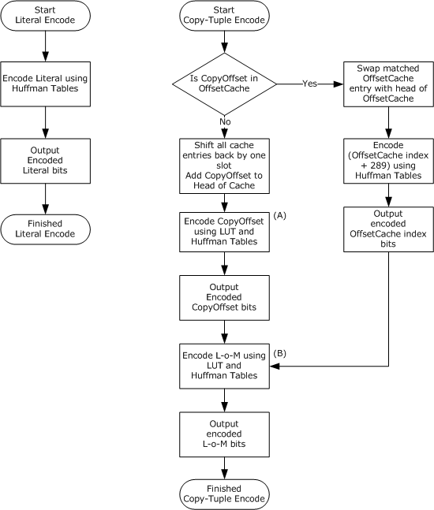

Figure 8: Encoding a logically compressed stream

Literals are merely encoded using the Huffman Tables HuffCodeLEC (table 2) and HuffLengthLEC (table 1). Copy-tuples are encoded using the four lookup tables in table 3 and table 6 (CopyOffsetBaseLUT, CopyOffsetBitsLUT, LoMBaseLUT, and LoMBitsLUT) and the Huffman Tables (for the algorithmic details, see sections [3.1.8.1.4.3.1](#Section_3.1.8.1.4.3.1) and [3.1.8.1.4.3.2](#Section_3.1.8.1.4.3.2)).

<a id="Section_3.1.8.1.4.3.1"></a>
Encoding the Copy-Offset

Encoding of the copy-offset is shown in the previous figure by the Action A item. The following describes the algorithm for encoding the copy-offset.

LUTIndex = IndexOfEqualOrSmallerEntry(CopyOffset + 1, CopyOffsetBaseLUT)

HuffmanIndex = LUTIndex + 257

OutputBits(HuffCodeLEC[HuffmanIndex], HuffLengthLEC[HuffmanIndex])

ExtraBitsLength = CopyOffsetBitsLUT[LUTIndex]

ExtraBits = CopyOffset & ((2 ^ ExtraBitsLen) - 1)

OutputBits(ExtraBits, ExtraBitsLength)

The IndexOfEqualOrSmallerEntry function searches through the specified LUT table and returns the index of the entry that contains a value of equal or lesser value than the first parameter. The OutputBits function outputs the bits specified by the first parameter in the appropriate order (the number of bits to output is given by the second parameter). "^" is the exponentiation operator, and "&" is the bitwise AND operator.

<a id="Section_3.1.8.1.4.3.1.1"></a>
Examples of Copy-Offset Encoding

- Encoding a copy-offset of 8.
LUTIndex = 6

HuffmanIndex = 6 + 257 = 263

OutputBits(0x0034, 6) = bin:110100

ExtraBitsLength = 2

ExtraBits = 8 & ((2 ^ 2) - 1) = 8 & 3 = bin:1000 & bin:0011 = 0

OutputBits(0x00, 2) = bin:00

- Encoding a copy-offset of 11.
LUTIndex = 6

HuffmanIndex = 6 + 257 = 263

OutputBits(0x0034, 6) = bin:110100

ExtraBitsLength = 2

ExtraBits = 11 & ((2 ^ 2) - 1) = 11 & 3 = bin:1011 & bin:0011 = 3

OutputBits(0x03, 2) = bin:11

<a id="Section_3.1.8.1.4.3.2"></a>
Encoding the Length-of-Match

Encoding of the length-of-match is shown in the previous figure by the Action B item. The following describes the algorithm for encoding the length-of-match.

LUTIndex = IndexOfEqualOrSmallerEntry(LoM, LoMBaseLUT)

OutputBits(HuffCodeL[LUTIndex], HuffLengthL[LUTIndex])

ExtraBitsLength = LoMBitsLUT[LUTIndex]

ExtraBits = (LoM - 2) & ((2 ^ ExtraBitsLength) - 1)

OutputBits (ExtraBits, ExtraBitsLength)

The definitions of the functions used in this pseudocode are the same as those described in section [3.1.8.1.4.3.1](#Section_3.1.8.1.4.3.1).

<a id="Section_3.1.8.1.4.3.2.1"></a>
Examples of Length-of-Match Encoding

- Encoding a length-of-match of 2 bytes.
LUTIndex = 0

HuffmanCode = 0x0001

OutputBits(0x0001, 4) = bin:0001

ExtraBitsLength = 0

No extra bits to output

- Encoding a length-of-match of 117 bytes.
LUTIndex = 23

HuffmanCode = 0x01df

OutputBits(0x01df, 9) = bin:111011111

ExtraBitsLength = 4

ExtraBits = (117 - 2) & ((2 ^ 4) - 1) = 115 & 15 = bin:1110011 & bin:1111 = 3

OutputBits(0x03, 4) = bin:0011

<a id="Section_3.1.8.1.4.4"></a>
###### 3.1.8.1.4.4 Decoding a Compressed Stream

The following flow chart describes how the data in a compressed stream is decoded.

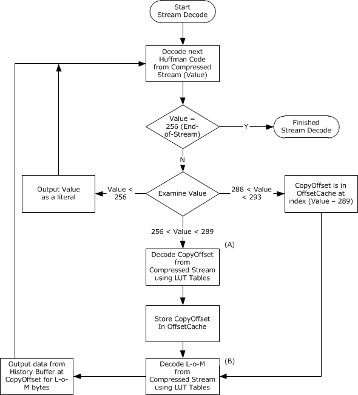

Figure 9: Decoding a compressed stream

Decoded literals are merely placed on to the output stream. However, decoded values representing copy-offset and length-of-match items require further processing by using the four lookup tables in table 3 and table 6 (CopyOffsetBaseLUT, CopyOffsetBitsLUT, LoMBaseLUT, and LoMBitsLUT) (for the algorithmic details, see sections [3.1.8.1.4.4.1](#Section_3.1.8.1.4.4.1) and [3.1.8.1.4.4.2](#Section_3.1.8.1.4.4.2)).

<a id="Section_3.1.8.1.4.4.1"></a>
Decoding the Copy-Offset

Decoding of the copy-offset is shown in the previous figure by the Action A item. The following describes the algorithm for decoding a copy-offset.

LUTIndex = DecodedHuffmanCode - 257

BaseLUT = CopyOffsetBaseLUT[LUTIndex]

BitsLUT = CopyOffsetBitsLUT[LUTIndex]

StreamBits = ReadBitsFromCompressedStream(BitsLUT)

CopyOffset = BaseLUT + StreamBits - 1

The ReadBitsFromCompressedStream function reads the number of bits specified by the parameter from the compressed stream.

<a id="Section_3.1.8.1.4.4.1.1"></a>
Examples of Copy-Offset Decoding

- Decoding a Huffman code of 0x0034 followed by 2 bits of value 0.
DecodedHuffmanCode = 263

LUTIndex = 263 - 257 = 6

BaseLUT = 9

BitsLUT = 2

StreamBits = ReadBitsFromCompressedStream(2) = 0x00

CopyOffset = 9 + 0 - 1 = 8

- Decoding a Huffman code of 0x0034 followed by 2 bits of value 3.
DecodedHuffmanCode = 263

LUTIndex = 263 - 257 = 6

BaseLUT = 9

BitsLUT = 2

StreamBits = ReadBitsFromCompressedStream(2) = 0x03

CopyOffset = 9 + 3 - 1 = 11

<a id="Section_3.1.8.1.4.4.2"></a>
Decoding the Length-of-Match

Decoding of the length-of-match is shown in the previous figure by the Action B item. The following describes the algorithm for decoding a length-of-match.

HuffmanCode = ReadNextHuffmanCodeFromCompressedStream()

LUTIndex = DecodeHuffmanCode(HuffmanCode, HuffmanCodeTable)

BaseLUT = LoMBaseLUT[LUTIndex]

BitsLUT = LoMBitsLUT[LUTIndex]

StreamBits = ReadBitsFromCompressedStream(BitsLUT)

LoM = BaseLUT + StreamBits

The ReadNextHuffmanCodeFromCompressedStream function reads the next Huffman code from the compressed stream, and the DecodeHuffmanCode function decodes the Huffman code given by the first parameter using the Huffman codebook table specified by the second parameter. The definitions of any remaining functions used in this pseudocode are the same as those described in section [3.1.8.1.4.4.1](#Section_3.1.8.1.4.4.1).

<a id="Section_3.1.8.1.4.4.2.1"></a>
Examples of Length-of-Match Decoding

- Decoding a Huffman code of 0x0001 followed by 0 bits.
HuffmanCode = 0x0001

LUTIndex = 0

BaseLUT = 2

BitsLUT = 0

StreamBits = ReadBitsFromCompressedStream(0) = 0x00

LoM = 2 + 0 = 2

- Decoding a Huffman code of 0x01df followed by 4 bits of value 3.
HuffmanCode = 0x01df

LUTIndex = 23

BaseLUT = 114

BitsLUT = 4

StreamBits = ReadBitsFromCompressedStream(4) = 0x03

LoM = 114 + 3 = 117

<a id="Section_3.1.8.2"></a>
#### 3.1.8.2 RDP 6.1

RDP 6.1 supports an extension to the compression techniques described in [MS-RDPBCGR](../MS-RDPBCGR/MS-RDPBCGR.md) section 3.1.8. This extension is called "RDP 6.1 Bulk Compression" (RDP6.1-BC) and is supported only for server-to-client traffic. The RDP6.1-BC compressor is unique in that it is a chainable compressor, where the output of the compressor can be passed as input into another compressor to further compress the data stream. This is possible because RDP6.1-BC is a byte-level stream compressor and does not perform bit-level compression. The RDP6.1-BC compressor is referred to as the "level-1" compressor and the chained RDP 5.0 bulk compressor (described in [MS-RDPBCGR] section 3.1.8) is known as the "level-2" compressor.

<a id="Section_3.1.8.2.1"></a>
##### 3.1.8.2.1 Abstract Data Model

The shared state necessary to support the transmission and reception of RDP6.1-BC compressed data between a client and server requires a level-1 history buffer (HistoryBuffer) and a current offset into the history buffer (HistoryOffset). The size of the history buffer is fixed at 2,000,000 bytes. Any single block of data that is being compressed by a compliant compressor MUST be smaller in size than 16,383 bytes. The HistoryOffset MUST start initialized to zero, while the history buffer MUST be filled with zeros. After it has been initialized, the entire history buffer is immediately regarded as valid.

The shared state necessary to support the level-2 RDP 5.0 bulk compressor is described in [MS-RDPBCGR](../MS-RDPBCGR/MS-RDPBCGR.md) section 3.1.8.

The level-1 compressor attempts to describe large matches (lengths of up to 16,382 bytes or offsets of up to 2,000,000 bytes) using RDP61_MATCH_DETAILS (section [2.2.2.4.1.1](#Section_2.2.2.4.1.1)) structures. The matches could have been found anywhere in the 2,000,000-byte history buffer, including data realized earlier within the same block. Any such matches are encoded in the **MatchDetails** field of the RDP61_COMPRESSED_DATA (section [2.2.2.4.1](#Section_2.2.2.4.1)) structure, and all remaining data is collapsed into the **Literals** field. The match count, details, and literals data are then presented to the level-2 compressor for more granular compression.

When compressing data, the sender MUST first check that the uncompressed data can be inserted into the level-1 history buffer at the position in the history buffer given by the HistoryOffset. If the data will not fit into the history buffer (the sum of the HistoryOffset and the size of the uncompressed data exceeds the size of the history buffer), then the HistoryOffset MUST be reset to the start of the history buffer (offset 0). If the data will fit into the history buffer, then the sender endpoint inserts the uncompressed data at the position in the history buffer given by the HistoryOffset, and then advances the HistoryOffset by the amount of data added.

If data compression results in an expansion of the data size (that is, the size of the compressed data plus any additional headers is larger than the original data size), then the original uncompressed data MUST instead be passed directly to the level-2 compressor (this is known as "compressor chaining"), and the L1_NO_COMPRESSION flag (see section [3.1.8.2.2.2](#Section_3.1.8.2.2.2)) MUST be set in the level-1 compression header (see section 2.2.2.4.1).

Level-2 compression could result in an expansion of the data size. In this case, the PACKET_COMPRESSED flag (see [MS-RDPBCGR] sections 3.1.8.2.1 and 3.1.8.3) MUST NOT be set in the appropriate level-2 compression header, and the level-2 data is passed unencoded. To ensure that the history buffers in both compressors remain synchronized, the compression flags of both compressors (if both compressors are used and the L1_INNER_COMPRESSION flag (0x10) is set) MUST be sent to the receiving endpoint. If the level-2 compressor state is out of sync with the decompressor (for example, if compression is attempted but expansion occurs), then the level-2 compressor MUST reset its internal state, and the level-2 compression flags MUST include the PACKET_FLUSHED flag when the next packet with PACKET_COMPRESSED is sent, in order to cause the decompressor to reset its internal state.

The receiving endpoint checks the L1_INNER_COMPRESSION flag (0x10), and if this flag is set decompresses the input packet according to the rules outlined in [MS-RDPBCGR] section 3.1.8 for RDP 5.0 bulk compression. The output from this decompression phase then becomes the raw data for the level-1 RDP6.1-BC compressor. As a result, the receiver decompresses the data again using the level-1 decompressor and inserts the final decompressed data at the position in the level-1 history buffer given by its local copy of HistoryOffset. If a reset of the level-1 or level-2 history offset occurs, then the sender endpoint MUST notify the target receiver so that it can also reset its local state. In this way, the sender and receiver endpoints maintain an exact replica of the level-1 (and level-2) history buffer(s) and HistoryOffset(s).

The flowchart in the following figure illustrates the process of compressing data by chaining two compressors.

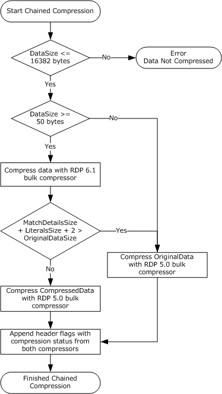

Figure 10: Chained compression with the RDP 6.1 and RDP 5.0 bulk compressors

The flowchart in following figure describes the how the decompressors are chained during decompression.

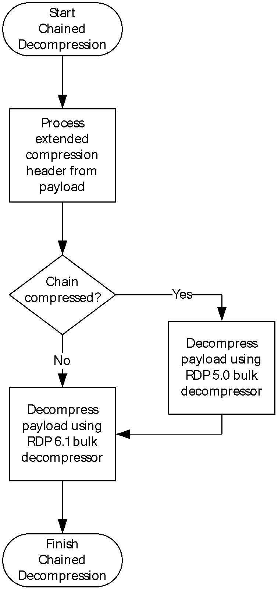

Figure 11: Chained decompression with the RDP 6.1 and RDP 5.0 bulk decompressors

<a id="Section_3.1.8.2.2"></a>
##### 3.1.8.2.2 Compressing Data

Compression using RDP6.1-BC is based on the principles outlined in [MS-RDPBCGR](../MS-RDPBCGR/MS-RDPBCGR.md) section 3.1.8 with literals and copy-tuples (matches) being encoded using the scheme described in section [2.2.2.4.1](#Section_2.2.2.4.1). The RDP6.1-BC compressor is stream-based and, as such, is able to include copy-tuples (referred to as "history matches") that have just been added to the current packet being processed; that is, as data is appended to the local history buffer, it can immediately be referenced in the next match. Matches MUST be in stream-order so that a match does not refer to any data not yet received by the target endpoint. Note that every encoded match incurs an overhead of 8 bytes when it is described by the RDP 6.1 Match Details (section [2.2.2.4.1.1](#Section_2.2.2.4.1.1)) structure. For this reason, an RDP 6.1 compliant compressor SHOULD exclude matches that result in expansion.

The following flowchart describes how the RDP6.1-BC compression algorithm operates.

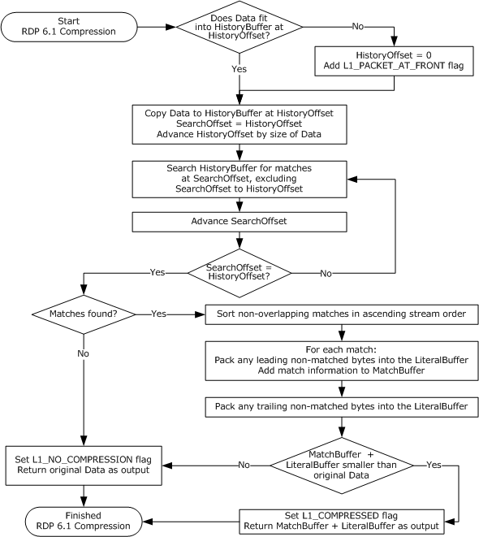

Figure 12: The RDP 6.1 bulk compression algorithm

<a id="Section_3.1.8.2.2.1"></a>
###### 3.1.8.2.2.1 Data Compression Example

The example in this section is merely illustrative of the RDP 6.1 compression techniques presented in section [3.1.8.2.2](#Section_3.1.8.2.2). The minimum recommended match length is ignored and data expansion does occur when adding the RDP 6.1 Compressed Data (section [2.2.2.4.1](#Section_2.2.2.4.1)) structure.

Consider the following stream data.

a b c d e f g h i j

With an empty history buffer, this data would translate as being all literals. The history buffer would appear as follows.

0 1 2 3

0 1 2 3 4 5 6 7 8 9 0 1 2 3 4 5 6 7 8 9 0 1 2 3 4 5 6 7 8 9 0

a b c d e f g h i j

The resultant output data would be as follows.

a b c d e f g h i j

Now, assume that the following data is added to the stream to be compressed.

k l m n o d e f g h i j k l a b c d u

The compressor would again append this to its history buffer (or add to the start of the history buffer if not enough space is available). The history buffer would then appear as follows.

0 1 2 3

0 1 2 3 4 5 6 7 8 9 0 1 2 3 4 5 6 7 8 9 0 1 2 3 4 5 6 7 8 9 0

a b c d e f g h i j k l m n o d e f g h i j k l a b c d u

The output from the compressor would become as follows.

k l m n o

[MatchHistoryOffset@3, MatchLength=9, MatchOutputOffset@5]

[MatchHistoryOffset@0, MatchLength=4, MatchOutputOffset@14]

u

The first match includes both literals from the first packet and literals in the beginning of the current packet. The important condition is that any match can contain only literals that have been sent previously in the stream and still exist at the time of compression in its history buffer. Note that the RDP6.1-BC copy-tuple encoding scheme not only specifies where the match begins in the history buffer (MatchHistoryOffset) and its length in bytes (MatchLength) but also its relative position in the decompressed output stream. This extra information enables an on-the-wire format that allows the matches and literals to be grouped independently rather than in line with each other in the compressed stream.

The following is a simplified version of the RDP6.1-BC wire format (described in section 2.2.2.4.1) for the compressor output previously described.

[2 matches]

[MatchHistoryOffset@3, MatchLength=9, MatchOutputOffset@5]

[MatchHistoryOffset@0, MatchLength=4, MatchOutputOffset@14]

k l m n o u

Notice that the two matches are grouped together and are not present in line with the literals in the stream.

<a id="Section_3.1.8.2.2.2"></a>
###### 3.1.8.2.2.2 Setting Compression and Extended Compression Flags

Once data has been compressed, the RDP6.1-BC compressor (the level-1 compressor) MUST call (or chain) another compressor (the level-2 compressor) to further compress the compressed output. The L1_INNER_COMPRESSION flag (0x10) MUST be set in the Level1ComprFlags field (see section [2.2.2.4.1](#Section_2.2.2.4.1)) if a level-2 compressor is called.

If the level-1 compressor determines that applying compression will result in an expansion of the data size, it MAY instead pass the original data that it was asked to compress directly to the level-2 compressor. If the RDP6.1-BC compressor compresses the original data it MUST set the L1 COMPRESSED flag (0x01). If the RDP6.1-BC compressor reverts to the original data (no compression is possible) it MUST set the L1_NO_COMPRESSION flag (0x02). Either one of these flags MUST be set if the RDP6.1-BC compressor updates the level-1 history buffer. This ensures that the receiver is able to update its level-1 history buffer accordingly.

If either the L1_COMPRESSED (0x01) or L1_NO_COMPRESSION (0x02) flags are set (that is, the RDP6.1-BC compressor has touched its level-1 history buffer), then the PDU which encapsulates the level-1 output data MUST set the PACKET_COMPRESSED flag (0x20) in the header field appropriate to the type of data payload, such as Fast-Path output data (see [MS-RDPBCGR](../MS-RDPBCGR/MS-RDPBCGR.md) section 2.2.9.1.2.1), virtual channel data (see [MS-RDPBCGR] section 2.2.6.1), or Slow-Path data (see [MS-RDPBCGR] section 2.2.9.1.1). Hence, it is valid for the PACKET_COMPRESSED flag (0x20) to be set when the L1_NO_COMPRESSION flag (0x02) is also set.

If there is not enough space in the level-1 history buffer to add the data to be compressed at the current history offset, then the history buffer offset MUST be reset to the start position (0) before the data is inserted. If a reset of this type occurs, then the level-1 L1_PACKET_AT_FRONT flag (0x04) MUST be set to notify the receiver that an update to the level-1 history buffer offset is required. Unlike RDP6.0-BC, this is a simple reset of the history offset and no sliding window semantics are involved (see section [3.1.8.1.2](#Section_3.1.8.1.2) for a description of RDP6.0-BC semantics).

The level-1 compression flags are produced by performing a logical OR operation of one or more of the following flags.

| Compression flag | Meaning |
| --- | --- |
| L1_PACKET_AT_FRONT 0x04 | The level-1 history buffer MUST be reinitialized (by filling it with zeros). After it has been reinitialized, the entire history buffer is immediately regarded as valid. This flag MUST be set if the data to be compressed will not fit in the history buffer at the current offset. |
| L1_NO_COMPRESSION 0x02 | No compression was performed. The output data consists of raw literals, and there is no match data. This occurs when the input data has no corresponding matches available in the history buffer long enough to produce a reduction in data size by RDP6.1-BC compression. The output data MUST be appended to the level-1 history buffer. |
| L1_COMPRESSED 0x01 | Compression with the level-1 compressor was performed. The output data MUST contain at least one match. The output data MUST be appended to the level-1 history buffer. |
| L1_INNER_COMPRESSION 0x10 | Indicates that additional level-2 compression (using RDP 5.0 bulk compression) has been performed on the level-1 compressor output. The level-2 compression flags MUST contain the result of the chained compression. |

The level-2 compression flags are described in [MS-RDPBCGR] sections 3.1.8.2.1 and 3.1.8.3.

<a id="Section_3.1.8.2.3"></a>
##### 3.1.8.2.3 Decompressing Data

Decompression with RDP6.1-BC is based on the principles specified in [MS-RDPBCGR](../MS-RDPBCGR/MS-RDPBCGR.md) section 3.1.8.3 with the compressed stream being decoded using the scheme described in section [2.2.2.4.1](#Section_2.2.2.4.1) under the control of the level-1 and level-2 compression flags. For a general description of how compression chaining works during decompression, refer to section [3.1.8.1.3](#Section_3.1.8.1.3).

| Compression Flag | Meaning |
| --- | --- |
| L1_PACKET_AT_FRONT 0x04 | The level-1 history buffer MUST be reinitialized (by filling it with zeros). This flag indicates that the data to be decompressed will not fit into the local level-1 history buffer at the current offset. |
| L1_NO_COMPRESSION 0x02 | No compression was performed. The input data consists of raw literals that MUST be appended to the local level-1 history buffer. |
| L1_COMPRESSED 0x01 | Compression with the level-1 compressor was performed. The input data MUST contain at least one match. The uncompressed data MUST be appended to the level-1 history buffer. |
| L1_INNER_COMPRESSION 0x10 | Indicates that additional level-2 compression (using RDP 5.0 bulk compression) has been performed on the level-1 compressor output. If the L1_INNER_COMPRESSION flag is set, the data following the Level2ComprFlags field in the RDP 6.1 Compressed Data structure (see sections 2.2.2.4.1 and [2.2.2.5.1](#Section_2.2.2.5.1.1)) MUST first be passed to the chained level-2 RDP 5.0 bulk decompressor. The level-2 decompression MUST be controlled by the contents of the Level2ComprFlags field. After this decompression phase the output MUST then be processed by the RDP6.1-BC decompressor using the Level1ComprFlags field to control the decompression. |

The following flowchart describes how the RDP6.1-BC decompression algorithm operates.

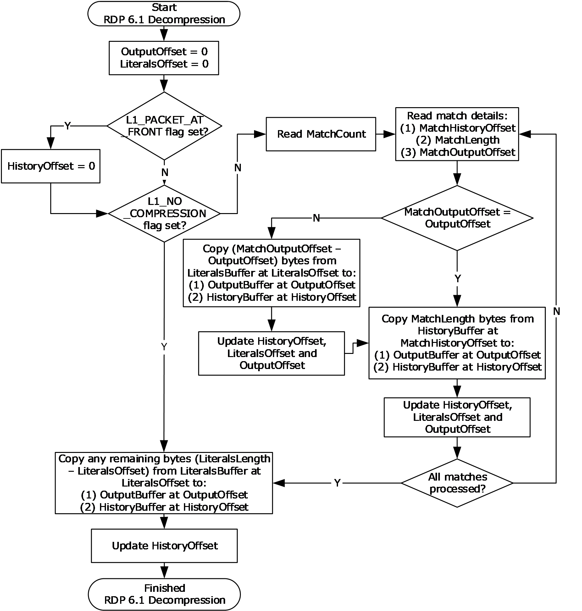

Figure 13: The RDP 6.1 bulk decompression algorithm

<a id="Section_3.1.8.2.3.1"></a>
###### 3.1.8.2.3.1 Data Decompression Example

To clarify the decompression principles described in section [3.1.8.2.3](#Section_3.1.8.2.3), consider decompressing the stream of data that was generated in the compression example in section [3.1.8.2.2.1](#Section_3.1.8.2.2.1). Note that in this example, level-2 decompression has already been applied and the input data is for the level-1 decompressor.

The data arrives in two packets. Input Data A appears as follows.

a b c d e f g h i j

Input Data B appears as follows.

[2 matches]

[MatchHistoryOffset@3, MatchLength=9, MatchOutputOffset@5]

[MatchHistoryOffset@0, MatchLength=4, MatchOutputOffset@14]

k l m n o u

Input Data A contains the L1_NO_COMPRESSION flag, as it does not contain any matches. The decompressor adds this data to its local level-1 history buffer, resulting in the following history buffer (HistoryOffset = 10).

0 1 2 3

0 1 2 3 4 5 6 7 8 9 0 1 2 3 4 5 6 7 8 9 0 1 2 3 4 5 6 7 8 9 0

a b c d e f g h i j

The output buffer is then updated.

a b c d e f g h i j

Now, Input Data B contains the L1-COMPRESSED flag because it contains history matches (in this case it contains two matches). To handle this case correctly, the decompressor uses two additional offsets (in addition to the HistoryOffset). The first is the OutputOffset which is the offset in the current decompressed output. The second is the LiteralsOffset which points to the current offset in the literals section of the received data. Both of these offsets are initialized to zero before processing Input Data B.

Next, the decompressor examines the first match description. This contains MatchOutputOffset@5. Because the OutputOffset is currently zero (and not 5), this means that this match is preceded by the difference of the two offsets in raw literals (in this case, 5 literals). Hence, the decompressor copies 5 literals from the literals section of the received data to the history and output buffers, and then updates all three offsets by 5. The output buffer appears as follows (OutputOffset = 5).

0 1 2 3

0 1 2 3 4 5 6 7 8 9 0 1 2 3 4 5 6 7 8 9 0 1 2 3 4 5 6 7 8 9 0

k l m n o

The history buffer appears as follows (HistoryOffset = 15).

0 1 2 3

0 1 2 3 4 5 6 7 8 9 0 1 2 3 4 5 6 7 8 9 0 1 2 3 4 5 6 7 8 9 0

a b c d e f g h i j k l m n o

Now that the OutputOffset and MatchOutputOffset are the same (both equal to 5), we process the first match (copy-tuple). The match details instructs the decompressor to copy 9 bytes starting at history offset 3 to the history and output buffers. This action is followed by updating the OutputOffset and HistoryOffset. The output buffer appears as follows (OutputOffset = 14).

0 1 2 3

0 1 2 3 4 5 6 7 8 9 0 1 2 3 4 5 6 7 8 9 0 1 2 3 4 5 6 7 8 9 0

k l m n o d e f g h i j k l

The history buffer appears as follows (HistoryOffset = 24).

0 1 2 3

0 1 2 3 4 5 6 7 8 9 0 1 2 3 4 5 6 7 8 9 0 1 2 3 4 5 6 7 8 9 0

a b c d e f g h i j k l m n o d e f g h i j k l

The next match (MatchHistoryOffset@0, MatchLength=4, MatchOutputOffset@14) has the same MatchOutputOffset value as the OutputOffset, so there are no raw literals to process, only 4 bytes to copy to the output and history buffers, and the output and history offsets to update. The output buffer appears as follows (OutputOffset = 18).

0 1 2 3

0 1 2 3 4 5 6 7 8 9 0 1 2 3 4 5 6 7 8 9 0 1 2 3 4 5 6 7 8 9 0

k l m n o d e f g h i j k l a b c d

The history buffer appears as follows (HistoryOffset = 28).

0 1 2 3

0 1 2 3 4 5 6 7 8 9 0 1 2 3 4 5 6 7 8 9 0 1 2 3 4 5 6 7 8 9 0

a b c d e f g h i j k l m n o d e f g h i j k l a b c d

Finally, there are no matches left to process. However, some literal raw data is left in the literal buffer (the literal length of 6 is greater than the LiteralsOffset value of 5). Hence, the remaining bytes are copied to the history and output buffers (in this case, it is only 1 byte). The final output buffer appears as follows (OutputOffset = 19).

0 1 2 3

0 1 2 3 4 5 6 7 8 9 0 1 2 3 4 5 6 7 8 9 0 1 2 3 4 5 6 7 8 9 0

k l m n o d e f g h i j k l a b c d u

The final history buffer appears as follows (HistoryOffset = 29).

0 1 2 3

0 1 2 3 4 5 6 7 8 9 0 1 2 3 4 5 6 7 8 9 0 1 2 3 4 5 6 7 8 9 0

a b c d e f g h i j k l m n o d e f g h i j k l a b c d u

<a id="Section_3.1.9"></a>
### 3.1.9 RDP 6.0 Bitmap Compression

RDP 6.0 Bitmap Compression is used when the RDP session color depth is 32 bits per pixel (bpp) and the bitmap of interest is either 24 bpp (RGB with no alpha channel) or 32 bpp (RGB with an alpha channel). The capability of a server to encode and a client to decode with RDP 6.0 Bitmap Compression is advertised in the Bitmap Capability Set (see [MS-RDPBCGR](../MS-RDPBCGR/MS-RDPBCGR.md) section 2.2.7.1.2).

The main focus of RDP 6.0 Bitmap Compression is not to compress the bitmap as a single opaque block of binary data. Instead it manipulates each of the color layers as separate planes and attempts to compress them individually using a collection of compression techniques. These techniques attempt to leverage any redundancy in the color representation of the bitmaps and can additionally be followed by a simple scan-line run-length compressor if it can further compress the planes.

<a id="Section_3.1.9.1"></a>
#### 3.1.9.1 Bitmap Compression Techniques

<a id="Section_3.1.9.1.1"></a>
##### 3.1.9.1.1 Splitting and Combining Color Planes

Planar separation is a bitmap representation in which each color plane in a bitmap is sent as separate 8-bpp bitmaps. The color schemes used in RDP 6.0 Bitmap Compression are [**ARGB**](#gt_argb), [**RGB**](#gt_red-green-blue-rgb), [**AYCoCg**](#gt_aycocg), and [**YCoCg**](#gt_ycocg). These schemes have the following [**color planes**](#gt_color-plane).

| Color scheme | Color planes |
| --- | --- |
| ARGB | Alpha, Red, Green, Blue |
| RGB | Red, Green, Blue |
| AYCoCg | Alpha, Luma, Orange Chroma, Green Chroma |
| YCoCg | Luma, Orange Chroma, Green Chroma |

Splitting a bitmap into constituent color planes is a straightforward operation that simply involves the transfer of data into the correct color plane. For example, the 3-pixel ARGB bitmap (A1R1G1B1; A2R2G2B2; A3R3G3B3) can be split into the four color planes (A1A2A3; R1R2R3; G1G2G3; B1B2B3). In the case of 24-bpp bitmaps (or fully opaque 32-bpp bitmaps), the alpha mask for each pixel is assumed to be 0xFF, and hence, the alpha plane MAY be excluded as it is trivial to reconstitute (see the DRAW_ALLOW_SKIP_ALPHA flag in [MS-RDPBCGR](../MS-RDPBCGR/MS-RDPBCGR.md) section 2.2.7.1.3).

The combination of separate color planes into a single 24-bpp or 32-bpp bitmap is also a trivial operation and merely involves reconstructing the individual ARGB or AYCoCg pixels from the constituent color planes so that the component bytes are ordered correctly. For example, the four AYCoCg planes (A1A2A3; Y1Y2Y3; Co1Co2Co3; Cg1Cg2Cg3) can be reconstituted to produce the 3-pixel (A1Y1Co1Cg1; A2Y2Co2Cg2; A3Y3Co3Cg3) bitmap.

Note that Microsoft RDP servers incorrectly convert 24 bpp RGB bitmaps to the YCoCg color space when color loss reduction (see the DRAW_ALLOW_DYNAMIC_COLOR_FIDELITY (0x02) flag in [MS-RDPBCGR] section 2.2.7.1.2) is in effect. This results in an incorrect value for the Co component. To compensate for this issue, client decoders MUST swap the B and R components after applying the inverse transformation, which converts from the YCoCg color space to the RGB color space.

<a id="Section_3.1.9.1.2"></a>
##### 3.1.9.1.2 Color Space Conversion

Color channel-based compression does not operate on the ARGB color space but rather a color space based on Luminosity (Y) and differentials of two color components: Orange (Co) and Green (Cg). Conversion between the ARGB and AYCoCg color spaces can be performed by using forward and inverse transformations (represented using matrix multiplication). The Alpha channel (A) is never converted in either direction.

The forward transformation to convert from ARGB to AYCoCg is as follows.

A = A

|Y| | 1/4 1/2 1/4| |R|

|Co| = | 1 0 -1 | * |G|

|Cg| |-1/2 1 -1/2| |B|

The inverse transformation to convert from AYCoCg to ARGB is as follows.

A = A

|R| |1 1/2 -1/2| |Y |

|G| = |1 0 1/2| * |Co|

|B| |1 -1/2 -1/2| |Cg|

Note that Microsoft RDP servers incorrectly convert 24 bpp RGB bitmaps to the YCoCg color space when color loss reduction (see the DRAW_ALLOW_DYNAMIC_COLOR_FIDELITY (0x02) flag in [MS-RDPBCGR](../MS-RDPBCGR/MS-RDPBCGR.md) section 2.2.7.1.2) is in effect. This results in an incorrect value for the Co component. To compensate for this issue, client decoders MUST swap the B and R components after applying the inverse transformation, which converts from the YCoCg color space to the RGB color space.

The allowed ranges of the individual color planes and their lengths in bits are as follows.

| Color plane | Range | Type |
| --- | --- | --- |
| Alpha (A) | 0 (transparent) – 255 (opaque) | 8 bits |
| Red (R) | 0 – 255 | 8 bits |
| Green (G) | 0 – 255 | 8 bits |
| Blue (B) | 0 – 255 | 8 bits |
| Luma (Y) | 0 – 255 | 8 bits |
| Orange Chroma (Co) | -255 – 255 | 9 bits (two's complement) |
| Green Chroma (Cg) | -255 – 255 | 9 bits (two's complement) |

When performing the color space conversion, the data types used for all calculations MUST be at least 9 bits long to accommodate the orange and green chroma channels. In the inverse transformation, after the red, green and blue values have been calculated with 9-bit precision, they MUST all be converted to 8-bit precision in order to be stored in the decoded image. This calculation MUST be performed by taking the closest value within the 0 to 255 range (this technique is referred to as "clamping between 0 and 255"). For example:

-14 clamped = 0

123 clamped = 123

254 clamped = 254

300 clamped = 255

421 clamped = 255

<a id="Section_3.1.9.1.3"></a>
##### 3.1.9.1.3 Chroma Subsampling and Super-Sampling

Chroma subsampling is a compression technique that employs a lower resolution for representing the chroma planes (Co and Cg) while keeping the luminosity plane (Y) at full resolution. This method relies on the human eye being less sensitive to color than differences in luminosity. Support for chroma subsampling is advertised in the Bitmap Capability Set (see [MS-RDPBCGR](../MS-RDPBCGR/MS-RDPBCGR.md) section 2.2.7.1.3).

The subsampling algorithm used employs a simple averaging of four neighboring pixels in a 2-by-2 grid. This reduces the information needed to be sent by half in each dimension, resulting in a four-fold decrease for a two-dimensional bitmap per chroma channel. If an odd number of rows or columns is present, the subsampling is performed on a 2-by-1 or 1-by-2 grid, or not at all for a corner when the bitmap has both an odd number of rows and columns.

Super-sampling of a compressed chroma plane simply results in the expansion of a subsampled pixel into a 2-by-2 grid of pixels. Because this expansion results in an area with the same dimensions as the original bitmap, odd row and column counts imply that edge pixels will be expanded into either a 2-by-1, 1-by-2 or 1-by-1 grid of pixels.

The following figure shows averaging (first stage) and final subsampling (second stage) being applied to a chroma plane of a 3-by-3 bitmap as well as the super-sampling required to reconstruct the chroma plane.

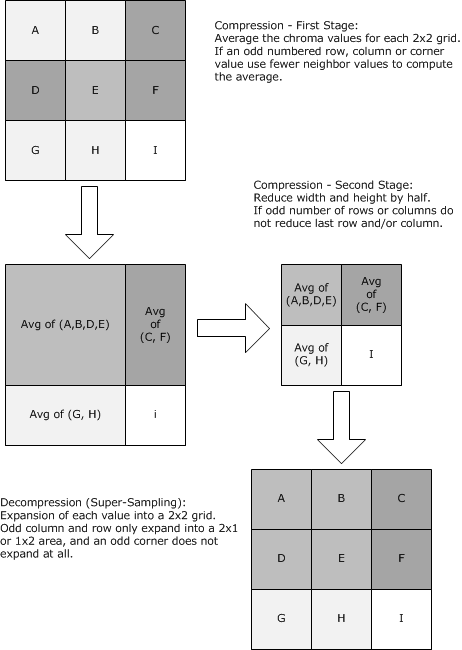

Figure 14: Chroma subsampling and super-sampling

<a id="Section_3.1.9.1.4"></a>
##### 3.1.9.1.4 Color Loss Reduction

Color loss reduction is a form of compression that reduces the fidelity of chroma values while maintaining the overall relative magnitude of possible chroma values and reducing the number of bits needed to represent each value. The dynamic range of the chroma representation is not reduced. This compression technique has the side effect of reducing many similar chroma values to the same reduced value, which has the potential of improving subsequent run-length compression.

The operation to reduce chroma is simply to bit shift the chroma values toward zero while adding zeros at the high-order bits. The number of bits shifted is implementation dependent and known as the Color Loss Level (CLL). The server MUST choose a value between 1 and 7 for the CLL. Usage of color loss reduction is specified in the Bitmap Capability Set (see [MS-RDPBCGR](../MS-RDPBCGR/MS-RDPBCGR.md) section 2.2.7.1.3).

The reverse operation to recover chroma can be performed by shifting the reduced values back toward the high-order bit and inserting zeros at the low-order bit location. The client MAY choose to perform the reverse operation using other schemes, such as a linear gradient curve, as long as the final chroma values are within the ranges specified in section [3.1.9.1.2](#Section_3.1.9.1.2).

<a id="Section_3.1.9.2"></a>
#### 3.1.9.2 Run-Length Encoding

Each color plane can be individually run-length compressed. The RDP 6.0 Bitmap Compressor uses a simple scan-line compressor that breaks each scan-line into segments consisting of RAW and RUN components.

A RAW component is a non-repeating sequence in the segment, and a RUN is a sequence of the last RAW value repeated run-length times. A RUN in a segment MUST be at least three values long (shorter sequences are encoded as RAW values). In the majority of cases, a segment will contain both a RAW and a RUN component. However, depending on the scan-line to be compressed, it is possible that only a RAW or RUN component is present. In the absence of a RAW component, the RAW value used to decode the RUN component is assumed to be the value zero.

For example, an initial scan-line containing the following 12 [**ANSI characters**](#gt_ansi-character):

AAAABBCCCCCD

Would become the following:

RAW [A]; RUN [3] - Segment 1

RAW [BBC]; RUN [4] - Segment 2 (BB is too short to be a RUN.)

RAW [D]; RUN [0] - Segment 3 (The scan line is completed.)

The encoded RAW and RUN values are either absolute values (this is the case for the first scan-line) or delta values (this is the case for all other scan-lines). Delta values are relative to the previous scan-line values. The delta value calculation is performed by subtracting the previous scan-line value at the current column location from the current scan-line value being encoded.

An example of delta value usage follows (decimal values used for clarity).

10, 20, 30, 40, 50, 60 - First scan-line

5, 15, 25, 35, 45, 55 - Second scan-line

5, 15, 25, 35, 45, 55 - Third scan-line

Converted to delta values:

10, 20, 30, 40, 50, 60 - First scan-line (absolute values)

-5, -5, -5, -5, -5, -5 - Second scan-line (delta values)

0, 0, 0, 0, 0, 0 - Third scan-line (delta values)

Which, converted to segments, become the following:

RAW [10,20,30,40,50,60]; RUN [0]

RAW [-5]; RUN [5]

RAW [<none>]; RUN [6] (Previous base value assumed to be 0.)

Due to the fact that the lengths of RAW and RUN components are limited to 4-bit values (see section [2.2.2.5.1.2](#Section_2.2.2.5.1.1)), individual segments can be broken up further into subsegments during encoding to produce RUN sequences consisting of more than 16 values.

<a id="Section_3.1.9.2.1"></a>
##### 3.1.9.2.1 Encoding Run-Length Sequences

Once a run-length encoder has broken up a scan-line into segments, it MUST encode each segment as one or more subsegments. The structure of segments and subsegments is the same and is defined in section [2.2.2.5.1.2](#Section_2.2.2.5.1.1).

The process of encoding scan-lines using RDP 6.0 RLE is best illustrated with a practical example. Assume that the following three scan-lines are present in a bitmap.

255, 255, 255, 255, 254, 253 - First scan-line

254, 192, 132, 96, 75, 25 - Second scan-line

253, 140, 62, 14, 135, 193 - Third scan-line

Converted to delta values:

255, 255, 255, 255, 254, 253 - First scan-line (absolute values)

-1, -63, -123, -159, -179, -228 - Second scan-line (delta values)

-1, -52, -70, -82, 60, 168 - Third scan-line (delta values)

Each value MUST be interpreted as a 1-byte two's complement signed value as follows.

-1, -1, -1, -1, -2, -3 - First scan-line (absolute values)

-1, -63, -123, 97, 77, 28 - Second scan-line (delta values)

-1, -52, -70, -82, 60, -88 - Third scan-line (delta values)

The next step is to encode the delta values. If the delta value does not have the most significant bit set (0 – 127), shift it 1 bit toward the highest bit. If the delta value has the most significant bit set (-1 to -128), take the 8-bit two's complement of the value (invert the bits and add one or subtract from 256), bit shift it toward the high bit value (multiply by 2), and decrement by 1. This transformation results in the following.

-1, -1, -1, -1, -2, -3 - First scan-line (absolute values)

1, 125, 11, -62, -102, 56 - Second scan-line (delta values)

1, 103, -117, -93, 120, -81 - Third scan-line (delta values)

The following represent these signed two's complement values as 8-bit hexadecimal values:

0xFF, 0xFF, 0xFF, 0xFF, 0xFE, 0xFD - First scan-line

0x01, 0x7D, 0xF5, 0xC2, 0x9A, 0x38 - Second scan-line

0x01, 0x67, 0x8B, 0xA3, 0x78, 0xAF - Third scan-line

Which, converted to RLE segments, become the following:

RAW [0xFF]; RUN [3] - Segment 1

RAW [0xFE,0xFD]; RUN [0] - Segment 2

RAW [0x01,0x7D,0xF5,0xC2,0x9A,0x38]; RUN [0] - Segment 3

RAW [0x01,0x67,0x8B,0xA3,0x78,0xAF]; RUN [0] - Segment 4

Using the structure defined in section 2.2.2.5.1.2, the first segment, which uses absolute values (see section [3.1.9.2](#Section_3.1.9.2)), is encoded as follows.

controlByte: (cRawBytes = 1, nRunLength = 3); rawValues: 0xFF

Which yields the following byte stream for the first segment:

0x13, 0xFF - Segment 1

Encoding the remaining segments yields the following:

0x20, 0xFE, 0xFD - Segment 2

0x60, 0x01, 0x7D, 0xF5, 0xC2, 0x9A, 0x38 - Segment 3

0x60, 0x01, 0x67, 0x8B, 0xA3, 0x78, 0xAF - Segment 4

The following flow chart illustrates how a given set of RAW values and a RUN (which can be zero) is encoded using RDP 6.0 RLE.

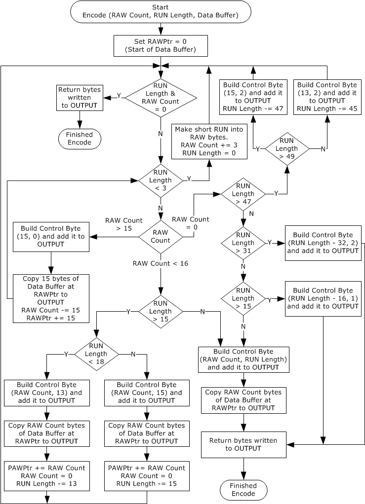

Figure 15: Encoding data using RDP 6.0 Run-Length Encoding (RLE)

<a id="Section_3.1.9.2.2"></a>
##### 3.1.9.2.2 Extra Long RUN Sequences

The lengths of RAW and RUN components are limited to 4-bit values and, as a result, encoding of run-lengths greater than 15 values requires special casing, as described in section [2.2.2.5.1.2](#Section_2.2.2.5.1.1).

Encoding of an extra long RUN sequence is best described with an example. Assume that there is a pattern consisting of the letter A repeated 100 times. The resulting RLE segments are the following:

RAW [A]; RUN [15] - Segment 1

RAW [<none>]; RUN [47] - Segment 2

RAW [<none>]; RUN [37] - Segment 3

Using the structure and rules in section 2.2.2.5.1.2, these segments are encoded as the following:

controlByte: (1, 15); rawValues: A

controlByte: (15, 2); rawValues: <none>

controlByte: (5, 2); rawValues: <none>

In hexadecimal, this becomes the following:

0x1F, 0x41, 0xF2, 0x52

<a id="Section_3.1.9.2.3"></a>
##### 3.1.9.2.3 Decoding Run-Length Sequences

Encoding of run-length sequences ensures that there is at least one subsegment per scan-line. The control byte described in section [2.2.2.5.1.2](#Section_2.2.2.5.1.1) contains all of the information necessary to decode the sequence bytes.

The process of decoding an encoded sequence of bytes for a color plane using RDP 6.0 RLE is best illustrated with a practical example. Assume that the following bytes are from a color plane in a bitmap that is 6 pixels wide by 3 pixels high.

0x13, 0xFF, 0x20, 0xFE, 0xFD, 0x60, 0x01, 0x7D,

0xF5, 0xC2, 0x9A, 0x38, 0x60, 0x01, 0x67, 0x8B,

0xA3, 0x78, 0xAF

The first byte is the control byte of the first segment from the first scan-line.

0x13 -> Control byte = 1 RAW value, 3-length RUN of the last raw value

0xFF -> Raw value

Hence, decoding the first segment according to the information in the control byte yields the following:

0xFF, 0xFF, 0xFF, 0xFF

Because these values are from the first scan-line, the values are absolute. Shown in unsigned decimal, the values are the following:

255, 255, 255, 255

The second segment control byte is the following:

0x20

This implies two raw values and a zero-length run, resulting in the following two unsigned decimal absolute values.

0xFE, 0xFD

This completes the first scan-line, and all values decoded from this point are deltas and MUST be specially decoded. Before decoding, the deltas MUST be interpreted as unsigned 1-byte values. If the encoded delta value is odd, then decrement it by 1, shift it 1 bit toward the lowest bit, and subtract it from 255. This yields the original absolute value. If the encoded delta value is even, shift it 1 bit toward the lowest bit. This yields the original absolute value.

Examining the third segment yields six raw values and a zero-length run.

0x01, 0x7D, 0xF5, 0xC2, 0x9A, 0x38

The deltas MUST be decoded. The unsigned decimal representation of the deltas is as follows.

1, 125, 245, 194, 154, 56

Applying the delta transformation to the deltas in the second scan-line yields the following 1-byte unsigned values.

255, 193, 133, 97, 77, 28

To compute the final absolute values for the second row, the unsigned, 8-bit delta values are added to the absolute values of the first scan-line using 1-byte arithmetic.

Column 1: 255 + 255 = 254

Column 2: 255 + 193 = 192

Column 3: 255 + 133 = 132

Column 4: 255 + 97 = 96

Column 5: 254 + 77 = 75

Column 6: 253 + 28 = 25

This completes the second scan-line, and the final absolute values are the following:

254, 192, 132, 96, 75, 25

The third segment has six raw values and a zero-length run.

0x01, 0x67, 0x8B, 0xA3, 0x78, 0xAF

The decoded unsigned 8-bit unsigned values representing the final deltas are as follows.

255, 204, 186, 174, 60, 168

To compute the final absolute values for the third row, the unsigned 8-bit delta values are added to the absolute values of the second scan-line using 1-byte arithmetic.

Column 1: 254 + 255 = 253

Column 2: 192 + 204 = 140

Column 3: 132 + 186 = 62

Column 4: 96 + 174 = 14

Column 5: 75 + 60 = 135

Column 6: 25 + 168 = 193

This completes the second scan-line, and the final absolute values are the following:

253, 140, 62, 14, 135, 193

The fully decoded plane is the following:

255, 255, 255, 255, 254, 253

254, 192, 132, 96, 75, 25

253, 140, 62, 14, 135, 193

<a id="Section_3.1.9.3"></a>
#### 3.1.9.3 Compressing a Bitmap

The overall scheme used to compress a bitmap with RDP 6.0 Bitmap Compression is described in the following figure. This figure effectively shows how the techniques described in section [3.1.9](#Section_3.1.9) are employed. The usage of color reduction and chroma subsampling is specified in the Bitmap Capability Set (see [MS-RDPBCGR](../MS-RDPBCGR/MS-RDPBCGR.md) section 2.2.7.1.2). The color loss level to use (see section [3.1.9.1.4](#Section_3.1.9.1.4)) is not exchanged on the wire and is server implemention-dependent.


Figure 16: Compressing a bitmap using RDP 6.0 Bitmap Compression

<a id="Section_3.1.9.4"></a>
#### 3.1.9.4 Decompressing a Bitmap

The decision-flow used to decompress a bitmap that is compressed with RDP 6.0 Bitmap Compression is illustrated in the following figure. The flags describing the bitmap data (present in the compressed data format header) are defined in section [2.2.2.5.1](#Section_2.2.2.5.1.1).


Figure 17: Decompression of a bitmap compressed with RDP 6.0 Bitmap Compression

<a id="Section_3.2"></a>
## 3.2 Client Details

<a id="Section_3.2.1"></a>
### 3.2.1 Abstract Data Model

This section describes a conceptual model of possible data organization that an implementation maintains to participate in this protocol. The described organization is provided to facilitate the explanation of how the protocol behaves. This document does not mandate that implementations adhere to this model as long as their external behavior is consistent with that described in this document.

**Note** It is possible to implement the following conceptual data by using a variety of techniques as long as the implementation produces external behavior that is consistent with that described in this document.

<a id="Section_3.2.1.1"></a>
#### 3.2.1.1 Primary Drawing Order History

The Primary Drawing Order History store holds information on the fields that have been received in primary drawing orders. There are three pieces of information that MUST be recorded:

- Last primary order type processed.
- Current bounding rectangle.
- Per-order record of the last value received in each field.
These records are updated as each primary drawing order is processed, and are used to efficiently decode and process primary drawing orders received from the server (see section [3.2.5.1.1.1](#Section_3.2.5.1.1.1)).

<a id="Section_3.2.1.2"></a>
#### 3.2.1.2 Save Bitmap

The Save Bitmap is a 480-by-480-pixel bitmap that is used to temporarily store desktop bitmap images received in the SaveBitmap Primary Drawing Order (see section [3.2.5.1.1.1.12](../MS-RDPBCGR/MS-RDPBCGR.md)). Bitmaps stored in the Save Bitmap are tiled to maximize the number of bitmaps that can be stored (a graphical representation of how bitmaps are stored is shown in the figure in section [4.5](#Section_4.1.12)). If support for the SaveBitmap Primary Drawing Order is not specified in the Order Capability Set (see [MS-RDPBCGR](../MS-RDPBCGR/MS-RDPBCGR.md) section 2.2.7.1.3), the Save Bitmap is not required.

<a id="Section_3.2.1.3"></a>
#### 3.2.1.3 Bitmap Cache

A Bitmap Cache is a store that contains bitmap images that were sent to the client by using either the Cache Bitmap – Revision 1 (section [2.2.2.2.1.2.2](#Section_2.2.2.2.1.2.2)), Cache Bitmap - Revision 2 (section [2.2.2.2.1.2.3](#Section_2.2.2.2.1.2.3)), or Cache Bitmap – Revision 3 (section [2.2.2.2.1.2.8](#Section_2.2.2.2.1.2.8)) Secondary Drawing Order.

<a id="Section_3.2.1.4"></a>
#### 3.2.1.4 Persistent Bitmap Cache

A Persistent Bitmap Cache is a store that contains bitmap images that were sent to the client by using the Cache Bitmap - Revision 2 (section [2.2.2.2.1.2.3](#Section_2.2.2.2.1.2.3)) or Cache Bitmap - Revision 3 (section [2.2.2.2.1.2.8](#Section_2.2.2.2.1.2.8)) Secondary Drawing Order. Unlike the Bitmap Cache described in section [3.2.1.3](#Section_3.2.1.3), a Persistent Bitmap Cache is not bound to the lifetime of a given RDP connection and its contents are persisted even after the RDP connection is closed.

<a id="Section_3.2.1.5"></a>
#### 3.2.1.5 Persisted Bitmap Keys

The Persisted Bitmap Keys store holds a collection of 64-bit bitmap keys, each of which uniquely identifies a bitmap image that is present in a Persistent Bitmap Cache (section [3.2.1.4](#Section_3.2.1.4)). The lifetime of this store is bound to the lifetime of the Persistent Bitmap Caches.

<a id="Section_3.2.2"></a>
### 3.2.2 Timers

None.

<a id="Section_3.2.3"></a>
### 3.2.3 Initialization

None.

<a id="Section_3.2.4"></a>
### 3.2.4 Higher-Layer Triggered Events

None.

<a id="Section_3.2.5"></a>
### 3.2.5 Processing Events and Sequencing Rules

<a id="Section_3.2.5.1"></a>
#### 3.2.5.1 Drawing Orders

All drawing orders are encapsulated in an [Orders Update (section 2.2.2.1)](../MS-RDPBCGR/MS-RDPBCGR.md), which is received as part of the Graphics Update [**PDU**](#gt_protocol-data-unit-pdu) (see [MS-RDPBCGR](../MS-RDPBCGR/MS-RDPBCGR.md) section 2.2.9.1.1.3); or they are encapsulated in a [Fast-Path Orders Update (section 2.2.2.2)](../MS-RDPBCGR/MS-RDPBCGR.md), which is received as part of the Fast-Path Update PDU (see [MS-RDPBCGR] section 2.2.9.1.2.1).

There are three classes of drawing orders:

- [Primary Drawing Orders (section 2.2.2.2.1.1)](#Section_3.3.5.1)
- [Secondary Drawing Orders (section 2.2.2.2.1.2)](#Section_3.3.5.1)
- [Alternate Secondary Drawing Orders (section 2.2.2.2.1.3)](#Section_3.3.5.1)
Orders belonging to each of these classes are packed together into an Orders Update structure or a Fast-Path Orders Update structure, each order being aligned on a byte boundary.

<a id="Section_3.2.5.1.1"></a>
##### 3.2.5.1.1 Primary Drawing Orders

<a id="Section_3.2.5.1.1.1"></a>
###### 3.2.5.1.1.1 Processing Primary Drawing Orders

All primary drawing orders MUST conform to the structure and rules defined in section [2.2.2.2.1.1.2](#Section_2.2.2.2.1.1.2).

To efficiently decode and process a primary drawing order, the client MUST use a [Primary Drawing Order History (section 3.2.1.1)](#Section_3.2.1.1) store. This store holds three pieces of information:

- Last primary order type processed
- Current bounding rectangle
- Per-order record of the last value received for each field
These stored records allow the client to correctly decode a received primary drawing order, as only fields that have new values are required to be included in orders sent by the server. If a field is unchanged from the value that it had when the order type was last sent, it SHOULD NOT be included in the order. The fields that are present in the order MUST be indicated by the fieldFlags field.

If all of the Coord-type fields (see section [2.2.2.2.1.1.1.1](#Section_2.2.2.2.1.1.1.1)) in an order can be represented as a signed delta in the range -127 to 128 from the previous field value, all of these fields SHOULD contain delta-coordinates (see sections 2.2.2.2.1.1.1.1 and [2.2.2.2.1.1.1.2](#Section_2.2.2.2.1.1.1.2)). The presence of delta-coordinates MUST be indicated by the TS_DELTA_COORDINATES (0x10) flag in the primary drawing header.

The basic process to decode a primary drawing order begins with reading the controlFlags header byte (this is common to all drawing classes) to determine the order class. If order is a primary drawing order, the following sequence of steps SHOULD be used to decode the order:

- The control flags extract the following information:
- Whether or not the order type is specified
- The fields that are present in the primary order field data
- Whether or not any components of the bounding rectangle are present
- Whether or not delta-coordinates are used in the primary order Coord-type fields
- If support for the primary drawing order was not specified in the Order Capability Set (see [MS-RDPBCGR](../MS-RDPBCGR/MS-RDPBCGR.md) section 2.2.7.1.3), the client SHOULD ignore the order, and processing SHOULD cease.
- Determine whether or not all of the data required to decode and process the order has been received in the [Orders Update (section 2.2.2.1)](#Section_2.2.2.1) structure or the [Fast-Path Orders Update (section 2.2.2.2)](#Section_2.2.2.2) structure. If the packet does not contain enough data, processing SHOULD cease, and the order update SHOULD be ignored.
- Read the order data, and validate the fields to make sure all the field data is consistent with the order specification (for example, the maximum number of fields and maximum order size MUST conform to the order specification). If any of the field data for a given order is inconsistent or refers to non-existent or invalid items (such as a non-existent cache entry or invalid [**brush**](#gt_brush) format), processing of the order SHOULD terminate, and it SHOULD also be ignored.
Once the order has been decoded, and all of the information necessary to process it has been collected, the data MUST be handed off to a graphics rendering module so that the images from the remote system can be displayed locally on the client system. The client MUST also update the records in the [Primary Drawing Order History (section 3.3.1.2)](#Section_3.2.1.1) to ensure that future orders can be decoded correctly.

<a id="Section_3.2.5.1.1.1.1"></a>
Processing of DstBlt

The structure and fields of the DstBlt Primary Drawing Order are specified in section [2.2.2.2.1.1.2.1](#Section_2.2.2.2.1.1.2.1), and the techniques described in section [3.2.5.1.1.1](#Section_3.2.5.1.1.1) demonstrate how to decode and process the order.

<a id="Section_3.2.5.1.1.1.2"></a>
Processing of MultiDstBlt

The structure and fields of the MultiDstBlt Primary Drawing Order are specified in section [2.2.2.2.1.1.2.2](#Section_4.1.2), and the techniques described in section [3.2.5.1.1.1](#Section_3.2.5.1.1.1) demonstrate how to decode and process the order.

<a id="Section_3.2.5.1.1.1.3"></a>
Processing of PatBlt

The structure and fields of the PatBlt Primary Drawing Order are specified in section [2.2.2.2.1.1.2.3](#Section_2.2.2.2.1.1.2.3), and the techniques described in section [3.2.5.1.1.1](#Section_3.2.5.1.1.1) demonstrate how to decode and process the order.

If a cached [**brush**](#gt_brush) is specified in this order, that brush MUST have been received by the client in a prior Cache Brush Secondary Drawing Order (see section [3.2.5.1.2.1.6](../MS-RDPBCGR/MS-RDPBCGR.md)). If this is not the case, the client SHOULD ignore this order. Furthermore, if support for brush caching was not specified in the Brush Capability Set (see [MS-RDPBCGR](../MS-RDPBCGR/MS-RDPBCGR.md) section 2.2.7.1.7), and a cached brush is included in the PatBlt order, the client SHOULD ignore this order.

<a id="Section_3.2.5.1.1.1.4"></a>
Processing of MultiPatBlt

The structure and fields of the MultiPatBlt Primary Drawing Order are specified in section [2.2.2.2.1.1.2.4](#Section_4.1.4), and the techniques described in section [3.2.5.1.1.1](#Section_3.2.5.1.1.1) demonstrate how to decode and process the order.

If a cached [**brush**](#gt_brush) is specified in this order, that brush MUST have been received by the client in a prior Cache Brush Secondary Drawing Order (see section [3.2.5.1.2.1.6](../MS-RDPBCGR/MS-RDPBCGR.md)). If this is not the case, the client SHOULD ignore this order. Furthermore, if support for brush caching was not specified in the Brush Capability Set (see [MS-RDPBCGR](../MS-RDPBCGR/MS-RDPBCGR.md) section 2.2.7.1.7), and a cached brush is included in the MultiPatBlt order, the client SHOULD ignore this order.

<a id="Section_3.2.5.1.1.1.5"></a>
Processing of OpaqueRect

The structure and fields of the OpaqueRect Primary Drawing Order are specified in section [2.2.2.2.1.1.2.5](#Section_4.1.5), and the techniques described in section [3.2.5.1.1.1](#Section_3.2.5.1.1.1) demonstrate how to decode and process the order.

<a id="Section_3.2.5.1.1.1.6"></a>
Processing of MultiOpaqueRect

The structure and fields of the MultiOpaqueRect Primary Drawing Order are specified in section [2.2.2.2.1.1.2.6](#Section_4.1.5), and the techniques described in section [3.2.5.1.1.1](#Section_3.2.5.1.1.1) demonstrate how to decode and process the order.

<a id="Section_3.2.5.1.1.1.7"></a>
Processing of ScrBlt

The structure and fields of the ScrBlt Primary Drawing Order are specified in section [2.2.2.2.1.1.2.7](#Section_2.2.2.2.1.1.2.7), and the techniques described in section [3.2.5.1.1.1](#Section_3.2.5.1.1.1) demonstrate how to decode and process the order.

<a id="Section_3.2.5.1.1.1.8"></a>
Processing of MultiScrBlt

The structure and fields of the MultiScrBlt Primary Drawing Order are specified in section [2.2.2.2.1.1.2.8](#Section_4.1.8), and the techniques described in section [3.2.5.1.1.1](#Section_3.2.5.1.1.1) demonstrate how to decode and process the order.

<a id="Section_3.2.5.1.1.1.9"></a>
Processing of MemBlt

The structure and fields of the MemBlt Primary Drawing Order are specified in section [2.2.2.2.1.1.2.9](#Section_2.2.2.2.1.1.2.9), and the techniques described in section [3.2.5.1.1.1](#Section_3.2.5.1.1.1) demonstrate how to decode and process the order.

The source bitmap associated with the MemBlt order MUST reside in one of two possible locations:

- One of the bitmap caches (section [3.1.1.1.1](#Section_3.1.1.1.1))
- The Offscreen Bitmap Cache (section [3.1.1.1.5](#Section_3.1.1.1.5))
If the bitmap cache ID (specified as part of the **cacheId** field) refers to one of the specified bitmap caches, the actual bitmap data MUST have been received in a Cache Bitmap Secondary Drawing Order (sections [3.2.5.1.2.1.1](#Section_3.2.5.1.2.1.1), [3.2.5.1.2.1.2](#Section_3.2.5.1.2.1.2), and [3.3.5.1.2.1.7](#Section_3.3.5.1.2.1.7)). If the **cacheIndex** field is set to BITMAPCACHE_WAITING_LIST_INDEX (32767), the last bitmap cache entry MUST contain the source bitmap; this implies that the bitmap data was received in a Cache Bitmap (Revision 2) Order, and the CBR2_DO_NOT_CACHE (0x10) flag was set or it was received in a Cache Bitmap (Revision 3) Order, and the CBR3_DO_NOT_CACHE (0x10) flag was set.

However, if the bitmap cache ID is set to TS_BITMAPCACHE_SCREEN_ID (0xFF), the source bitmap resides in the Offscreen Bitmap Cache at the entry location specified by the **cacheIndex** field. This entry MUST have been created and initialized in response to the processing of prior Create Offscreen Bitmap (see section [3.2.5.1.3.1.1](#Section_3.2.5.1.3.1.1)) and Switch Surface (see section [3.2.5.1.3.1.2](#Section_3.2.5.1.3.1.2)) Alternate Secondary Drawing Orders; the Create Offscreen Bitmap Order creates the offscreen bitmap while the Switch Surface Order is used to redirect all drawing operations to the offscreen bitmap.

<a id="Section_3.2.5.1.1.1.10"></a>
Processing of Mem3Blt

The structure and fields of the Mem3Blt Primary Drawing Order are specified in section [2.2.2.2.1.1.2.10](#Section_2.2.2.2.1.1.2.10), and the techniques described in section [3.2.5.1.1.1](#Section_3.2.5.1.1.1) demonstrate how to decode and process the order.

The decoding and processing of the Mem3Blt Order follow the same principles as those outlined for the MemBlt Order specified in section [3.2.5.1.1.1.9](#Section_3.2.5.1.1.1.9). However, the Mem3Blt Order includes fields to specify a [**brush**](#gt_brush).

If a cached brush is specified in this order, that brush MUST have been received by the client in a prior Cache Brush Secondary Drawing Order (see section [3.2.5.1.2.1.6](../MS-RDPBCGR/MS-RDPBCGR.md)). If this is not the case, the client SHOULD ignore this order. Furthermore, if support for brush caching was not specified in the Brush Capability Set (see [MS-RDPBCGR](../MS-RDPBCGR/MS-RDPBCGR.md) section 2.2.7.1.3), and a cached brush is included in the Mem3Blt Order, the client SHOULD ignore this order.

<a id="Section_3.2.5.1.1.1.11"></a>
Processing of LineTo

The structure and fields of the LineTo Primary Drawing Order are specified in section [2.2.2.2.1.1.2.11](#Section_2.2.2.2.1.1.2.11), and the techniques described in section [3.2.5.1.1.1](#Section_3.2.5.1.1.1) demonstrate how to decode and process the order.

<a id="Section_3.2.5.1.1.1.12"></a>
Processing of SaveBitmap

The structure and fields of the SaveBitmap Primary Drawing Order are specified in section [2.2.2.2.1.1.2.12](#Section_4.1.12), and the techniques described in section [3.2.5.1.1.1](#Section_3.2.5.1.1.1) demonstrate how to decode and process the order. Bitmap data received in this order MUST be stored in the Save Bitmap (see section [3.2.1.2](#Section_3.2.1.2)).

<a id="Section_3.2.5.1.1.1.13"></a>
Processing of GlyphIndex

The structure and fields of the GlyphIndex Primary Drawing Order are specified in section [2.2.2.2.1.2.5](#Section_2.2.2.2.1.2.5), and the techniques described in section [3.2.5.1.1.1](#Section_3.2.5.1.1.1) demonstrate how to decode and process the order.

If support for glyph caching was not specified in the Glyph Cache Capability Set (see [MS-RDPBCGR](../MS-RDPBCGR/MS-RDPBCGR.md) section 2.2.7.1.8), the client SHOULD ignore this order as it requires the existence of the glyph caches (see section [3.1.1.1.2](#Section_3.1.1.1.2)).

All of the glyphs associated with the glyph cache indices specified in the order MUST have been received by the client in a prior Revision 1 or 2 Cache Glyph Secondary Drawing Order (see sections [3.2.5.1.2.1.4](#Section_3.2.5.1.2.1.4) and [3.2.5.1.2.1.5](#Section_3.2.5.1.2.1.5)), or a FastGlyph Primary Drawing Order (see section [3.2.5.1.1.1.15](#Section_3.2.5.1.1.1.15)). If a fragment cache index is specified in a USE clause, that fragment MUST have been cached while processing an ADD clause in a prior GlyphIndex or FastIndex Order.

If a cached [**brush**](#gt_brush) is specified in this order, that brush MUST have been received by the client in a prior Cache Brush Secondary Drawing Order (see section [3.2.5.1.2.1.6](../MS-RDPBCGR/MS-RDPBCGR.md)). If this is not the case, the client SHOULD ignore this order. Furthermore, if support for brush caching was not specified in the Brush Capability Set (see [MS-RDPBCGR] section 2.2.7.1.7), and a cached brush is included in the GlyphIndex order, the client SHOULD ignore this order.

<a id="Section_3.2.5.1.1.1.14"></a>
Processing of FastIndex

The structure and fields of the FastIndex Primary Drawing Order are specified in section [2.2.2.2.1.1.2.14](#Section_4.1.14), and the techniques described in section [3.2.5.1.1.1](#Section_3.2.5.1.1.1) demonstrate how to decode and process the order.

The decoding and processing of the FastIndex Order follow the same principles as those outlined for the GlyphIndex Order specified in section [3.2.5.1.1.1.13](#Section_3.2.5.1.1.1.13). However, the FastIndex Order does not use cached brushes and also utilizes a more efficient field encoding.

<a id="Section_3.2.5.1.1.1.15"></a>
Processing of FastGlyph

The structure and fields of the FastGlyph Primary Drawing Order are specified in section [2.2.2.2.1.1.2.15](#Section_4.1.15), and the techniques described in section [3.2.5.1.1.1](#Section_3.2.5.1.1.1) demonstrate how to decode and process the order.

If support for glyph caching was not specified in the Glyph Cache Capability Set (see [MS-RDPBCGR](../MS-RDPBCGR/MS-RDPBCGR.md) section 2.2.7.1.8), the client SHOULD ignore this order because it requires the existence of the glyph caches (see section [3.1.1.1.2](#Section_3.1.1.1.2)).

All of the glyphs associated with the glyph cache indices specified in the order MUST have been received by the client in a prior Revision 1 or 2 Cache Glyph Secondary Drawing Order (see sections [3.2.5.1.2.1.4](#Section_3.2.5.1.2.1.4) and [3.2.5.1.2.1.5](#Section_3.2.5.1.2.1.5)) or a FastGlyph Primary Drawing Order.

Once the client has completed decoding and processing the FastGlyph order, and the glyph has been rendered successfully, the glyph data MUST be stored in the specified glyph cache.

<a id="Section_3.2.5.1.1.1.16"></a>
Processing of PolygonSC

The structure and fields of the PolygonSC Primary Drawing Order are specified in section [2.2.2.2.1.1.2.16](#Section_4.1.16), and the techniques described in section [3.2.5.1.1.1](#Section_3.2.5.1.1.1) demonstrate how to decode and process the order.

<a id="Section_3.2.5.1.1.1.17"></a>
Processing of PolygonCB

The structure and fields of the PolygonCB Primary Drawing Order are specified in section [2.2.2.2.1.1.2.17](#Section_4.1.17), and the techniques described in section [3.2.5.1.1.1](#Section_3.2.5.1.1.1) demonstrate how to decode and process the order.

If a cached [**brush**](#gt_brush) is specified in this order, that brush MUST have been received by the client in a prior Cache Brush Secondary Drawing Order (see section [3.2.5.1.2.1.6](../MS-RDPBCGR/MS-RDPBCGR.md)). If this is not the case, the client SHOULD ignore this order. Furthermore, if support for brush caching was not specified in the Brush Capability Set (see [MS-RDPBCGR](../MS-RDPBCGR/MS-RDPBCGR.md) section 2.2.7.1.7), and a cached brush is included in the PolygonCB order, the client SHOULD ignore this order.

<a id="Section_3.2.5.1.1.1.18"></a>
Processing of Polyline

The structure and fields of the Polyline Primary Drawing Order are specified in section [2.2.2.2.1.1.2.18](#Section_4.1.18), and the techniques described in section [3.2.5.1.1.1](#Section_3.2.5.1.1.1) demonstrate how to decode and process the order.

<a id="Section_3.2.5.1.1.1.19"></a>
Processing of EllipseSC

The structure and fields of the EllipseSC Primary Drawing Order are specified in section [2.2.2.2.1.1.2.19](#Section_4.1.19), and the techniques described in section [3.2.5.1.1.1](#Section_3.2.5.1.1.1) demonstrate how to decode and process the order.

<a id="Section_3.2.5.1.1.1.20"></a>
Processing of EllipseCB

The structure and fields of the EllipseCB Primary Drawing Order are specified in section [2.2.2.2.1.1.2.20](#Section_4.1.20), and the techniques described in section [3.2.5.1.1.1](#Section_3.2.5.1.1.1) demonstrate how to decode and process the order.

If a cached [**brush**](#gt_brush) is specified in this order, that brush MUST have been received by the client in a prior Cache Brush Secondary Drawing Order (see section [3.2.5.1.2.1.6](../MS-RDPBCGR/MS-RDPBCGR.md)). If this is not the case, the client SHOULD ignore this order. Furthermore, if support for brush caching was not specified in the Brush Capability Set (see [MS-RDPBCGR](../MS-RDPBCGR/MS-RDPBCGR.md) section 2.2.7.1.7), and a cached brush is included in the EllipseCB order, the client SHOULD ignore this order.

<a id="Section_3.2.5.1.1.1.21"></a>
Processing of DrawNineGrid

The structure and fields of the DrawNineGrid Primary Drawing Order are specified in section [2.2.2.2.1.1.2.21](#Section_4.1.21), and the techniques described in section [3.2.5.1.1.1](#Section_3.2.5.1.1.1) demonstrate how to decode and process the order.

If support for NineGrid bitmap caching was not specified in the DrawNineGrid Cache Capability Set (see section [2.2.1.2](#Section_4.1.21)), the client SHOULD ignore the order since the order refers to NineGrid bitmaps in the NineGrid Bitmap Cache (see section [3.1.1.1.6](#Section_3.1.1.1.6)).

The source bitmap (which resides in the NineGrid Bitmap Cache) MUST have been created and initialized as a result of processing prior Create NineGrid Bitmap (see section [3.2.5.1.3.1.3](#Section_3.2.5.1.3.1.3)) and Stream Bitmap (see section [3.2.5.1.3.1.4](#Section_3.2.5.1.3.1.4)) Alternate Secondary Orders.

<a id="Section_3.2.5.1.1.1.22"></a>
Processing of MultiDrawNineGrid

The structure and fields of the MultiDrawNineGrid Primary Drawing Order are specified in section [2.2.2.2.1.1.2.22](#Section_4.1.22), and the techniques described in section [3.2.5.1.1.1](#Section_3.2.5.1.1.1) demonstrate how to decode and process the order.

The decoding and processing of the MultiDrawNineGrid Order follow the same principles as those outlined for the DrawNineGrid order specified in section [3.2.5.1.1.1.21](#Section_3.2.5.1.1.1.21). However, the MultiDrawNineGrid includes multiple clipping rectangles, as opposed to the DrawNineGrid order, which only includes one clipping rectangle.

<a id="Section_3.2.5.1.2"></a>
##### 3.2.5.1.2 Secondary Drawing Orders

<a id="Section_3.2.5.1.2.1"></a>
###### 3.2.5.1.2.1 Processing Secondary Drawing Orders

All secondary drawing orders are identified by the [Secondary Drawing Order Header (section 2.2.2.2.1.2.1.1)](#Section_2.2.2.2.1.2.1.1) and are used to manipulate the RDP caches (section [3.1.1.1](#Section_1.3)):

- The Cache Bitmap (Revision 1) Secondary Drawing Order (section [3.2.5.1.2.1.1](#Section_3.2.5.1.2.1.1)) manages the Revision 1 Bitmap Caches (section [3.1.1.1.1](#Section_3.1.1.1.1)).
- The Cache Bitmap (Revision 2) Secondary Drawing Order (section [3.2.5.1.2.1.2](#Section_3.2.5.1.2.1.2)) and Cache Bitmap (Revision 3) Secondary Drawing Order (section [2.2.2.2.1.2.8](#Section_2.2.2.2.1.2.8)) manage the Revision 2 Bitmap Caches (section 3.1.1.1.1).
- The Cache Color Table Secondary Drawing Order (section [3.2.5.1.2.1.3](#Section_3.2.5.1.2.1.3)) manages the Color Table Cache (section [3.1.1.1.3](#Section_3.1.1.1.3)).
- The Revision 1 and 2 Cache Glyph Secondary Drawing Orders (sections [3.2.5.1.2.1.4](#Section_3.2.5.1.2.1.4) and [3.2.5.1.2.1.5](#Section_3.2.5.1.2.1.5)) manage the Glyph Cache (section [3.1.1.1.2](#Section_3.1.1.1.2)).
- The Cache Brush Secondary Drawing Order (section [3.2.5.1.2.1.6](#Section_3.2.5.1.2.1.6)) manages the Brush Cache (section [3.1.1.1.4](#Section_3.1.1.1.4)).
If the client has not advertised support for a particular cache type, it SHOULD ignore any secondary and primary drawing orders associated with that cache, if they are sent by the server.

<a id="Section_3.2.5.1.2.1.1"></a>
Processing of Cache Bitmap (Revision 1)

The structure and fields of the Cache Bitmap (Revision 1) Secondary Drawing Order are specified in section [2.2.2.2.1.2.2](#Section_2.2.2.2.1.2.2). The order fields MUST be processed in accordance with this description.

If the client does not support the Revision 1 bitmap caches (specified in the Revision 1 Bitmap Cache Capability Set described in [MS-RDPBCGR](../MS-RDPBCGR/MS-RDPBCGR.md) section 2.2.7.1.4.1), or the [MemBlt (section 2.2.2.2.1.1.2.9)](../MS-RDPBCGR/MS-RDPBCGR.md) and [Mem3Blt (section 2.2.2.2.1.1.2.10)](../MS-RDPBCGR/MS-RDPBCGR.md) Primary Drawing Orders, this order SHOULD be ignored.

<a id="Section_3.2.5.1.2.1.2"></a>
Processing of Cache Bitmap (Revision 2)

The structure and fields of the Cache Bitmap (Revision 2) Secondary Drawing Order are specified in section [2.2.2.2.1.2.3](#Section_2.2.2.2.1.2.3). The order fields MUST be processed in accordance with this description.

The destination cache in which to store the bitmap that is encapsulated in the cache order will either be a Standard Bitmap Cache (section [3.2.1.3](../MS-RDPBCGR/MS-RDPBCGR.md)) or a Persistent Bitmap Cache (section [3.2.1.4](../MS-RDPBCGR/MS-RDPBCGR.md)), depending on the cache structure that was specified using the Revision 2 Bitmap Cache Capability Set ([MS-RDPBCGR](../MS-RDPBCGR/MS-RDPBCGR.md) sections 2.2.7.1.4.2 and 2.2.7.1.4.2.1). If the target cache is persistent, then the server MUST include a 64-bit key that uniquely identifies the bitmap (indicated by the presence of the CBR2_PERSISTENT_KEY_PRESENT (0x02) flag). The client MUST save this key in the Persisted Bitmap Keys store (section [3.2.1.5](../MS-RDPBCGR/MS-RDPBCGR.md)) so that the Persistent Key List PDUs can be sent as specified in [MS-RDPBCGR] section 3.2.5.3.17.

If the client does not support the Revision 2 bitmap caches (specified in the Revision 2 Bitmap Cache Capability Set described in [MS-RDPBCGR] section 2.2.7.1.4.2), or the [MemBlt (section 2.2.2.2.1.1.2.9)](../MS-RDPBCGR/MS-RDPBCGR.md) and [Mem3Blt (section 2.2.2.2.1.1.2.10)](../MS-RDPBCGR/MS-RDPBCGR.md) Primary Drawing Orders, this order SHOULD be ignored.

<a id="Section_3.2.5.1.2.1.3"></a>
Processing of Cache Color Table

The structure and fields of the Cache Color Table Secondary Drawing Order are specified in section [2.2.2.2.1.2.4](#Section_4.2.3). The order fields MUST be processed in accordance with this description.

If the client does not support the [MemBlt (section 2.2.2.2.1.1.2.9)](#Section_2.2.2.2.1.1.2.9) and [Mem3Blt (section 2.2.2.2.1.1.2.10)](#Section_2.2.2.2.1.1.2.10) Primary Drawing Orders, this order SHOULD be ignored. Furthermore, if a client encounters any inconsistencies or errors when decoding and processing the Cache Color Table Secondary Drawing Order, the connection SHOULD be dropped.

<a id="Section_3.2.5.1.2.1.4"></a>
Processing of Cache Glyph (Revision 1)

The structure and fields of the Cache Glyph (Revision 1) Secondary Drawing Order are specified in section [2.2.2.2.1.2.5](#Section_2.2.2.2.1.2.5). The order fields MUST be processed in accordance with this description.

If the client does not support glyph caching (specified in the Glyph Cache Capability Set described in [MS-RDPBCGR](../MS-RDPBCGR/MS-RDPBCGR.md) section 2.2.7.1.8) or the GlyphIndex (section 2.2.2.2.1.2.5), [FastIndex (section 2.2.2.2.1.1.2.14)](#Section_4.1.14), and [FastGlyph (section 2.2.2.2.1.1.2.15)](#Section_4.1.15) Primary Drawing Orders, this order SHOULD be ignored. Furthermore, if a client encounters any inconsistencies or errors when decoding and processing the Cache Glyph (Revision 1) Secondary Drawing Order, the connection SHOULD be dropped.

<a id="Section_3.2.5.1.2.1.5"></a>
Processing of Cache Glyph (Revision 2)

The structure and fields of the Cache Glyph (Revision 2) Secondary Drawing Order are specified in section [2.2.2.2.1.2.6](#Section_2.2.2.2.1.2.6). The order fields MUST be processed in accordance with this description.

The decoding and processing of the Cache Glyph (Revision 2) order follows the same principles as those outlined for the Cache Glyph (Revision 1) order specified in section [3.2.5.1.2.1.4](#Section_3.2.5.1.2.1.4). However, the Revision 2 order utilizes a more efficient field encoding. Furthermore, if a client encounters any inconsistencies or errors when decoding and processing the Cache Glyph (Revision 2) Secondary Drawing Order, the connection SHOULD be dropped.

<a id="Section_3.2.5.1.2.1.6"></a>
Processing of Cache Brush

The structure and fields of the Cache Brush Secondary Drawing Order are specified in section [2.2.2.2.1.2.7](#Section_4.2.6). The order fields MUST be processed in accordance with this description.

The primary drawing orders that use cached [**brushes**](#gt_brush) are:

- PatBlt (see section [3.2.5.1.1.1.3](#Section_3.2.5.1.1.1.3))
- MultiPatBlt (see section [3.2.5.1.1.1.4](#Section_3.2.5.1.1.1.4))
- Mem3Blt (see section [3.2.5.1.1.1.10](#Section_3.2.5.1.1.1.10))
- GlyphIndex (see section [3.2.5.1.1.1.13](#Section_3.2.5.1.1.1.13))
- PolygonCB (see section [3.2.5.1.1.1.17](#Section_3.2.5.1.1.1.17))
- EllipseCB (see section [3.2.5.1.1.1.20](#Section_3.2.5.1.1.1.20))
If the client does not support brush caching (specified in the Brush Capability Set described in [MS-RDPBCGR](../MS-RDPBCGR/MS-RDPBCGR.md) section 2.2.7.1.7) or any primary drawing orders that use cached brushes, this order SHOULD be ignored. Furthermore, if a client encounters any inconsistencies or errors when decoding and processing the Cache Brush Secondary Drawing Order, the connection SHOULD be dropped.

<a id="Section_3.2.5.1.2.1.7"></a>
Processing of Cache Bitmap (Revision 3)

The structure and fields of the Cache Bitmap (Revision 3) Secondary Drawing Order are specified in section [2.2.2.2.1.2.8](#Section_2.2.2.2.1.2.8). The order fields MUST be processed in accordance with this description.

The destination cache in which to store the bitmap that is encapsulated in the cache order will either be a Standard Bitmap Cache (section [3.2.1.3](#Section_3.2.1.3)) or a Persistent Bitmap Cache (section [3.2.1.4](#Section_3.2.1.4)), depending on the cache structure that was specified using the Revision 2 Bitmap Cache Capability Set ([MS-RDPBCGR](../MS-RDPBCGR/MS-RDPBCGR.md) sections 2.2.7.1.4.2 and 2.2.7.1.4.2.1). The server MUST include a 64-bit key that uniquely identifies the bitmap in the Cache Bitmap (Revision 3) Order. If the target cache is persistent, the client MUST save this key in the Persisted Bitmap Keys store (section [3.2.1.5](#Section_3.2.1.5)) so that the Persistent Key List PDUs can be sent as specified in [MS-RDPBCGR] section 3.2.5.3.17.

If the client does not support the Cache Bitmap (Revision 3) Order (support is specified by including the ORDERFLAGS_EX_CACHE_BITMAP_REV3_SUPPORT (0x0002) flag in the **orderSupportExFlags** field of the Order Capability Set defined in [MS-RDPBCGR] section 2.2.7.1.3), then this order SHOULD be ignored. Furthermore, if the client does not support the Revision 2 bitmap caches (specified in the Revision 2 Bitmap Cache Capability Set described in [MS-RDPBCGR] section 2.2.7.1.4.2), or the MemBlt (section [2.2.2.2.1.1.2.9](#Section_2.2.2.2.1.1.2.9)) and Mem3Blt (section [2.2.2.2.1.1.2.10](#Section_2.2.2.2.1.1.2.10)) Primary Drawing Orders, this order SHOULD be ignored.

<a id="Section_3.2.5.1.3"></a>
##### 3.2.5.1.3 Alternate Secondary Drawing Orders

<a id="Section_3.2.5.1.3.1"></a>
###### 3.2.5.1.3.1 Processing Alternate Secondary Drawing Orders

All alternate secondary drawing orders are identified by the [Alternate Secondary Drawing Order Header (section 2.2.2.2.1.3.1.1)](#Section_2.2.2.2.1.3.1.1) and are used to manage offscreen and NineGrid bitmaps and to transport opaque GDI+ 1.1 records:

- The Create Offscreen Bitmap (see section [3.2.5.1.3.1.1](#Section_3.2.5.1.3.1.1)) and Switch Surface (see section [3.2.5.1.3.1.2](#Section_3.2.5.1.3.1.2)) Alternate Secondary Drawing Orders are used to manipulate the bitmaps in the Offscreen Bitmap Cache (see section [3.1.1.1.5](#Section_3.1.1.1.5)).
- The Create NineGrid Bitmap (see section [3.2.5.1.3.1.3](#Section_3.2.5.1.3.1.3)) and Stream Bitmap (see section [3.2.5.1.3.1.4](#Section_3.2.5.1.3.1.4)) Alternate Secondary Drawing Orders are used to manipulate the bitmaps in the NineGrid Bitmap Cache (see section [3.1.1.1.6](#Section_3.1.1.1.6)).
- The GDI+ Alternate Secondary Drawing Orders (see section [2.2.2.2.1.3.6](#Section_2.2.2.2.1.3.6)) are used to transport opaque GDI+ 1.1 records for processing or placement in the GDI+ Caches (see section [3.1.1.1.7](#Section_3.1.1.1.7)).
If the client has not advertised support for a particular cache type or feature, it SHOULD ignore any alternate secondary and primary drawing orders associated with that cache or feature, if they are sent by the server.

<a id="Section_3.2.5.1.3.1.1"></a>
Processing of Create Offscreen Bitmap

The structure and fields of the Create Offscreen Bitmap Alternate Secondary Drawing Order are specified in section [2.2.2.2.1.3.2](#Section_4.3.1). The order fields MUST be processed in accordance with this description.

If the client does not support offscreen bitmaps (specified in the Offscreen Bitmap Cache Capability Set described in [MS-RDPBCGR](../MS-RDPBCGR/MS-RDPBCGR.md) section 2.2.7.1.9), or the [MemBlt (section 2.2.2.2.1.1.2.9)](../MS-RDPBCGR/MS-RDPBCGR.md) and [Mem3Blt (section 2.2.2.2.1.1.2.10)](../MS-RDPBCGR/MS-RDPBCGR.md) Primary Drawing Orders, this order SHOULD be ignored.

<a id="Section_3.2.5.1.3.1.2"></a>
Processing of Switch Surface

The structure and fields of the Switch Surface Alternate Secondary Drawing Order are specified in section [2.2.2.2.1.3.3](#Section_4.3.2). The order fields MUST be processed in accordance with this description.

The Create Offscreen Bitmap Alternate Secondary Drawing Order (see section [3.2.5.1.3.1.1](#Section_3.2.5.1.3.1.1)), which is used to create the offscreen bitmap referenced in this order, MUST have been received by the client before processing this order.

If the client does not support offscreen bitmaps (specified in the Offscreen Bitmap Cache Capability Set described in [MS-RDPBCGR](../MS-RDPBCGR/MS-RDPBCGR.md) section 2.2.7.1.9), or the [MemBlt (section 2.2.2.2.1.1.2.9)](../MS-RDPBCGR/MS-RDPBCGR.md) and [Mem3Blt (section 2.2.2.2.1.1.2.10)](../MS-RDPBCGR/MS-RDPBCGR.md) Primary Drawing Orders, this order SHOULD be ignored.

The client SHOULD drop the connection if the value in the **bitmapId** field is less than SCREEN_BITMAP_SURFACE (0xFFFF) but greater than the maximum number of entries allowed in the Offscreen Bitmap Cache, as specified by the **offscreenCacheEntries** field of the Offscreen Bitmap Cache Capability Set ([MS-RDPBCGR] section 2.2.7.1.9).

<a id="Section_3.2.5.1.3.1.3"></a>
Processing of Create NineGrid Bitmap

The structure and fields of the Create NineGrid Bitmap Alternate Secondary Drawing Order are specified in section [2.2.2.2.1.3.4](#Section_4.3.3). The order fields MUST be processed in accordance with this description.

If the client does not support rendering NineGrid bitmaps (specified in the DrawNineGrid Capability Set described in section [2.2.1.2](#Section_4.1.21)), or support the DrawNineGrid and MultiDrawNineGrid Primary Drawing Orders (see sections [3.2.5.1.1.1.21](#Section_3.2.5.1.1.1.21) and [3.2.5.1.1.1.22](#Section_3.2.5.1.1.1.22), respectively), this order SHOULD be ignored.

<a id="Section_3.2.5.1.3.1.4"></a>
Processing of Stream Bitmap Orders

The structure and fields of the Stream Bitmap First and Stream Bitmap Next Alternate Secondary Drawing Orders are specified in sections [2.2.2.2.1.3.5.1](#Section_4.3.4) and [2.2.2.2.1.3.5.2](#Section_4.3.5), respectively. The order fields MUST be processed in accordance with this description.

The Stream Bitmap Orders are only used to populate the NineGrid Bitmap Cache (see section [3.1.1.1.6](#Section_3.1.1.1.6)), and MUST follow immediately before the reception of a Create NineGrid Bitmap Alternate Secondary Drawing Order (see section [3.3.5.1.3.1.3](#Section_3.3.5.1.3.1.3)). The NineGrid Bitmap Cache entry to populate with the streamed bitmap data is implicitly assumed to be the entry specified in the Create NineGrid Bitmap Order.

If the client does not support rendering NineGrid bitmaps (specified in the DrawNineGrid Capability Set described in section [2.2.1.2](#Section_4.1.21)), or support the DrawNineGrid or MultiDrawNineGrid Primary Drawing Orders (see sections [3.2.5.1.1.1.21](#Section_3.2.5.1.1.1.21) and [3.2.5.1.1.1.22](#Section_3.2.5.1.1.1.22), respectively), these orders SHOULD be ignored.

<a id="Section_3.2.5.1.3.1.5"></a>
GDI+ Orders

<a id="Section_3.2.5.1.3.1.5.1"></a>
Processing of Draw GDI+ Cache Orders

The structure and fields of the Draw GDI+ Cache First, Draw GDI+ Cache Next, and Draw GDI+ Cache End Alternate Secondary Drawing Orders are specified in sections [2.2.2.2.1.3.6.2](#Section_4.3.6), [2.2.2.2.1.3.6.3](#Section_4.3.7), and [2.2.2.2.1.3.6.4](#Section_4.3.8), respectively. The order fields MUST be processed in accordance with these descriptions.

If the client does not support rendering GDI+ 1.1 primitives (specified in the Draw GDI+ Capability Set Cache described in section [2.2.1.3](#Section_2.2.1.3)), these orders SHOULD be ignored.

<a id="Section_3.2.5.1.3.1.5.2"></a>
Processing of Draw GDI+ Orders

The structure and fields of the Draw GDI+ First, Draw GDI+ Next, and Draw GDI+ End Alternate Secondary Drawing Orders are specified in sections [2.2.2.2.1.3.6.5](#Section_4.3.9), [2.2.2.2.1.3.6.6](#Section_4.3.10), and [2.2.2.2.1.3.6.7](#Section_4.3.11), respectively. The order fields MUST be processed in accordance with these descriptions.

If the client does not support rendering GDI+ 1.1 primitives (specified in the Draw GDI+ Capability Set Cache described in section [2.2.1.3](#Section_2.2.1.3)), these orders SHOULD be ignored.

<a id="Section_3.2.5.2"></a>
#### 3.2.5.2 Error Conditions

<a id="Section_3.2.5.2.1"></a>
##### 3.2.5.2.1 Sending of Bitmap Cache Error PDU

The Bitmap Cache Error [**PDU**](#gt_protocol-data-unit-pdu) SHOULD be sent to a server that has requested the rendering of a cached bitmap that is not available in the client Bitmap Cache (see section [3.1.1.1.1](#Section_3.1.1.1.1)).

Rendering of items from the bitmap cache is accomplished using the [MemBlt (section 2.2.2.2.1.1.2.9)](#Section_2.2.2.2.1.1.2.9) and [Mem3Blt (section 2.2.2.2.1.1.2.10)](#Section_2.2.2.2.1.1.2.10) Primary Drawing Orders. If an error occurs during rendering, the client SHOULD complete the rendering operation by using a black bitmap, and then send a Bitmap Cache Error PDU to the server.

The structure and fields of the Bitmap Cache Error PDU are specified in section [2.2.2.3.1.1](#Section_2.2.2.3.1.1), and the techniques described in [MS-RDPBCGR](../MS-RDPBCGR/MS-RDPBCGR.md) section 3.2.5.1 demonstrate how to initialize the contents of the PDU. The contents of this PDU MAY be compressed.

<a id="Section_3.2.5.2.2"></a>
##### 3.2.5.2.2 Sending of the Offscreen Bitmap Cache Error PDU

The Offscreen Bitmap Cache Error [**PDU**](#gt_protocol-data-unit-pdu) SHOULD be sent to a server when the creation of an offscreen bitmap in the Offscreen Bitmap Cache (see section [3.1.1.1.5](#Section_3.1.1.1.5)) cannot be fulfilled due to a client-side failure (for example, low memory conditions).

Creation of an offscreen bitmap is accomplished by using the [Create Offscreen Bitmap (section 2.2.2.2.1.3.2)](#Section_4.3.1) Alternate Secondary Drawing Order. The client SHOULD send the Offscreen Bitmap Cache Error PDU to the server to request that it disable offscreen bitmap caching and resend the drawing updates associated with the affected area. Any further errors related to the offscreen bitmap caching MUST be ignored by the client.

The structure and fields of the Offscreen Bitmap Cache Error PDU are specified in section [2.2.2.3.2](#Section_2.2.2.3.2.1), and the techniques described in [MS-RDPBCGR](../MS-RDPBCGR/MS-RDPBCGR.md) section 3.2.5.1 demonstrate how to initialize the contents of the PDU. The contents of this PDU MAY be compressed.

<a id="Section_3.2.5.2.3"></a>
##### 3.2.5.2.3 Sending of the DrawNineGrid Cache Error PDU

The DrawNineGrid Cache Error PDU SHOULD be sent to a server when the creation of a NineGrid bitmap in the NineGrid Bitmap Cache (see section [3.1.1.1.6](#Section_3.1.1.1.6)) cannot be fulfilled due to a client-side failure (for example, low memory conditions).

Creation of a NineGrid bitmap in the NineGrid Bitmap Cache is accomplished by first using the [Create NineGrid Bitmap (section 2.2.2.2.1.3.4)](#Section_4.3.3) Alternate Secondary Drawing Order, and then streaming the bitmap into the cache using the [Stream Bitmap First (section 2.2.2.2.1.3.5.1)](#Section_4.3.4) and [Stream Bitmap Next (section 2.2.2.2.1.3.5.2)](#Section_4.3.5) Alternate Secondary Drawing Orders. If processing of any of these orders fails, the client SHOULD send the DrawNineGrid Error PDU to the server to request that it disable NineGrid bitmap caching and resend the drawing updates associated with the affected area. Any further errors related to NineGrid bitmap caching MUST be ignored by the client.

The structure and fields of the DrawNineGrid Cache Error [**PDU**](#gt_protocol-data-unit-pdu) are specified in section [2.2.2.3.3](#Section_2.2.2.3.3.1), and the techniques described in [MS-RDPBCGR](../MS-RDPBCGR/MS-RDPBCGR.md) section 3.2.5.1 demonstrate how to initialize the contents of the PDU. The contents of this PDU MAY be compressed.

<a id="Section_3.2.5.2.4"></a>
##### 3.2.5.2.4 Sending of the GDI+ Error PDU

The GDI+ Error [**PDU**](#gt_protocol-data-unit-pdu) SHOULD be sent to a server when a GDI+ alternate secondary drawing order cannot be successfully processed due to a GDI+ rendering error or caching issue.

The client SHOULD send the GDI+ Error PDU to the server to request that it resend all GDI+ content as bitmaps and not rely on the local client side GDI+ rendering. (The six GDI+ PDUs that are used to cache and render GDI+ primitives are specified in section [2.2.2.2.1.3.6](#Section_2.2.2.2.1.3.6).) Any further errors related to GDI+ rendering SHOULD be ignored by the client.

The structure and fields of the GDI+ Error PDU are specified in section [2.2.2.3.4](#Section_2.2.2.3.4.1), and the techniques described in [MS-RDPBCGR](../MS-RDPBCGR/MS-RDPBCGR.md) section 3.2.5.1 demonstrate how to initialize the contents of the PDU. The contents of this PDU MAY be compressed.

<a id="Section_3.2.6"></a>
### 3.2.6 Timer Events

None.

<a id="Section_3.2.7"></a>
### 3.2.7 Other Local Events

None.

<a id="Section_3.3"></a>
## 3.3 Server Details

<a id="Section_3.3.1"></a>
### 3.3.1 Abstract Data Model

This section describes a conceptual model of possible data organization that an implementation maintains to participate in this protocol. The described organization is provided to facilitate the explanation of how the protocol behaves. This document does not mandate that implementations adhere to this model as long as their external behavior is consistent with what is described in this document.

**Note** It is possible to implement the following conceptual data by using a variety of techniques as long as the implementation produces external behavior that is consistent with that described in this document.

<a id="Section_3.3.1.1"></a>
#### 3.3.1.1 Cached Bitmap Keys

The Cached Bitmap Keys store holds a collection of 64-bit bitmap keys, each of which uniquely identifies a bitmap image that has been sent to the client by using a Cache Bitmap (Revision 2) Secondary Drawing Order (section [2.2.2.2.1.2.3](#Section_2.2.2.2.1.2.3)), or Cache Bitmap (Revision 3) Secondary Drawing Order (section [2.2.2.2.1.2.8](#Section_2.2.2.2.1.2.8)).

<a id="Section_3.3.1.2"></a>
#### 3.3.1.2 Primary Drawing Order History

The Primary Drawing Order History store holds information on the fields that have been sent in primary drawing orders. There are three pieces of information that MUST be recorded:

- Last primary order type constructed
- Current bounding rectangle
- Per-order record of the last value used in each field
These records are updated as each primary drawing order is constructed, and are used to efficiently encode primary drawing orders for transmission on the wire using as few bytes as possible (see section [3.3.5.1.1.1](#Section_3.3.5.1.1.1)).

<a id="Section_3.3.1.3"></a>
#### 3.3.1.3 Bitmap Cache Wait List

The Bitmap Cache Wait List stores a collection of 64-bit identifiers, each of which identifies a bitmap that is a candidate for placement in the Bitmap Cache (see section [3.1.1.1.1](#Section_3.1.1.1.1)). The usage of the Bitmap Cache Wait List is specified using the Revision 2 Bitmap Cache Capability Set (see [MS-RDPBCGR](../MS-RDPBCGR/MS-RDPBCGR.md) section 2.2.7.1.4.2).

Bitmaps are placed into the Bitmap Cache Wait List the first time they are encountered in a server drawing operation. If any of the bitmaps in the wait list are encountered during a subsequent drawing operation, they MUST be removed from the wait list and placed into a Bitmap Cache.

Using a wait list in conjunction with persistent bitmap caching ensures that only bitmaps that are used more than once in rendering operations are written to persistent storage. In effect, it implies that a bitmap MUST be sent twice to the client before it is actually stored in a valid Bitmap Cache entry. (The first time it is sent to the client, it is used and not cached. The second time it is sent to the client, it is cached and then used.)

<a id="Section_3.3.2"></a>
### 3.3.2 Timers

None.

<a id="Section_3.3.3"></a>
### 3.3.3 Initialization

None.

<a id="Section_3.3.4"></a>
### 3.3.4 Higher-Layer Triggered Events

None.

<a id="Section_3.3.5"></a>
### 3.3.5 Processing Events and Sequencing Rules

<a id="Section_3.3.5.1"></a>
#### 3.3.5.1 Drawing Orders

All drawing orders are encapsulated in an [Orders Update (section 2.2.2.1)](../MS-RDPBCGR/MS-RDPBCGR.md), which is sent as part of the Graphics Update [**PDU**](#gt_protocol-data-unit-pdu) (see [MS-RDPBCGR](../MS-RDPBCGR/MS-RDPBCGR.md) section 2.2.9.1.1.3); or they are encapsulated in a [Fast-Path Orders Update (section 2.2.2.2)](../MS-RDPBCGR/MS-RDPBCGR.md), which is sent as part of the Fast-Path Update PDU (see [MS-RDPBCGR] section 2.2.9.1.2).

There are three classes of drawing orders:

- [Primary Drawing Orders (section 3.2.5.1.1)](#Section_3.3.5.1)
- [Secondary Drawing Orders (section 2.2.2.2.1.2)](#Section_3.3.5.1)
- [Alternate Secondary Drawing Orders (section 2.2.2.2.1.3)](#Section_3.3.5.1)
Orders belonging to each of these classes are packed together into an Orders Update structure or a Fast-Path Orders Update structure, each order being aligned on a byte boundary.

<a id="Section_3.3.5.1.1"></a>
##### 3.3.5.1.1 Primary Drawing Orders

<a id="Section_3.3.5.1.1.1"></a>
###### 3.3.5.1.1.1 Construction of a Primary Drawing Order

All primary drawing orders MUST conform to the structure and rules defined in section [2.2.2.2.1.1.2](#Section_2.2.2.2.1.1.2).

To efficiently construct a primary drawing order, the server MUST use a [Primary Drawing Order History (section 3.2.1.1)](#Section_3.2.1.1) store. This store holds three pieces of information:

- Last primary order type constructed.
- Current bounding rectangle.
- Per-order record of the last value used in each field.
These stored records allow the server to use the minimum amount of data when constructing an order; if a field is unchanged from the value that it had when the order type was last sent, it SHOULD NOT be included in the order being constructed. Hence, only fields that have new values are required to be sent to the client. The fields that are present in the order MUST be indicated by the fieldFlags field.

If all of the Coord-type fields (see section [2.2.2.2.1.1.1.1](#Section_2.2.2.2.1.1.1.1)) in an order can be represented as a signed delta in the range -127 to 128 from the previous field value, the size of the order SHOULD be optimized by using delta-coordinates (see sections 2.2.2.2.1.1.1.1 and 2.2.2.2.1.1.2). In that case, all of the fields SHOULD be represented using delta-coordinates, and the TS_DELTA_COORDINATES (0x10) flag MUST be used in the primary drawing order header to indicate this fact.

Before a given order is sent, the server MUST also ensure that all of the data required to process the order is accessible to the client. For example, if the order refers to a cached item, that item MUST be present in the client-side cache when the order is processed. Or, if palettized color is being used, the correct palette MUST be applied at the client-side.

Once a primary drawing order has been constructed and transmitted to the client, the server MUST update the records in the [Primary Drawing Order History (section 3.3.1.2)](#Section_3.2.1.1) to ensure that future encodings use the minimum fields and data required.

<a id="Section_3.3.5.1.1.1.1"></a>
Construction of DstBlt

The structure and fields of the DstBlt Primary Drawing Order are specified in section [2.2.2.2.1.1.2.1](#Section_2.2.2.2.1.1.2.1). The order fields MUST be populated in accordance with this description and the instructions detailed in section [3.3.5.1.1.1](#Section_3.3.5.1.1.1).

The DstBlt Order MUST NOT be sent to the client if support for it was not specified in the Order Capability Set (see [MS-RDPBCGR](../MS-RDPBCGR/MS-RDPBCGR.md) section 2.2.7.1.3).

<a id="Section_3.3.5.1.1.1.2"></a>
Construction of MultiDstBlt

The structure and fields of the MultiDstBlt Primary Drawing Order are specified in section [2.2.2.2.1.1.2.2](#Section_4.1.2). The order fields MUST be populated in accordance with this description and the instructions detailed in section [3.3.5.1.1.1](#Section_3.3.5.1.1.1).

The MultiDstBlt Order MUST NOT be sent to the client if support for it was not specified in the Order Capability Set (see [MS-RDPBCGR](../MS-RDPBCGR/MS-RDPBCGR.md) section 2.2.7.1.3).

<a id="Section_3.3.5.1.1.1.3"></a>
Construction of PatBlt

The structure and fields of the PatBlt Primary Drawing Order are specified in section [2.2.2.2.1.1.2.3](#Section_2.2.2.2.1.1.2.3). The order fields MUST be populated in accordance with this description and the instructions detailed in section [3.3.5.1.1.1](#Section_3.3.5.1.1.1).

If a cached [**brush**](#gt_brush) is specified in this order, that brush MUST be sent to the client before this order is dispatched by using a Cache Brush Secondary Drawing Order (see section [3.3.5.1.2.1.6](../MS-RDPBCGR/MS-RDPBCGR.md)). (The client specifies support for brush caching using the Brush Capability Set defined in [MS-RDPBCGR](../MS-RDPBCGR/MS-RDPBCGR.md) section 2.2.7.1.7.)

The PatBlt Order MUST NOT be sent to the client if support for it was not specified in the Order Capability Set (see [MS-RDPBCGR] section 2.2.7.1.3).

<a id="Section_3.3.5.1.1.1.4"></a>
Construction of MultiPatBlt

The structure and fields of the MultiPatBlt Primary Drawing Order are specified in section [2.2.2.2.1.1.2.4](#Section_4.1.4). The order fields MUST be populated in accordance with this description and the instructions detailed in section [3.3.5.1.1.1](#Section_3.3.5.1.1.1).

If a cached [**brush**](#gt_brush) is specified in this order, that brush MUST be sent to the client before this order is dispatched by using a Cache Brush Secondary Drawing Order (see section [3.3.5.1.2.1.6](../MS-RDPBCGR/MS-RDPBCGR.md)). (The client specifies support for brush caching using the Brush Capability Set defined in [MS-RDPBCGR](../MS-RDPBCGR/MS-RDPBCGR.md) section 2.2.7.1.7.)

The MultiPatBlt Order MUST NOT be sent to the client if support for it was not specified in the Order Capability Set (see [MS-RDPBCGR] section 2.2.7.1.3).

<a id="Section_3.3.5.1.1.1.5"></a>
Construction of OpaqueRect

The structure and fields of the OpaqueRect Primary Drawing Order are specified in section [2.2.2.2.1.1.2.5](#Section_4.1.5). The order fields MUST be populated in accordance with this description and the instructions detailed in section [3.3.5.1.1.1](#Section_3.3.5.1.1.1).

The OpaqueRect Order MUST NOT be sent to the client if support for it was not specified in the Order Capability Set (see [MS-RDPBCGR](../MS-RDPBCGR/MS-RDPBCGR.md) section 2.2.7.1.3).

<a id="Section_3.3.5.1.1.1.6"></a>
Construction of MultiOpaqueRect

The structure and fields of the MultiOpaqueRect Primary Drawing Order are specified in section [2.2.2.2.1.1.2.6](#Section_4.1.5). The order fields MUST be populated in accordance with this description and the instructions detailed in section [3.3.5.1.1.1](#Section_3.3.5.1.1.1).

The MultiOpaqueRect Order MUST NOT be sent to the client if support for it was not specified in the Order Capability Set (see [MS-RDPBCGR](../MS-RDPBCGR/MS-RDPBCGR.md) section 2.2.7.1.3).

<a id="Section_3.3.5.1.1.1.7"></a>
Construction of ScrBlt

The structure and fields of the ScrBlt Primary Drawing Order are specified in section [2.2.2.2.1.1.2.7](#Section_2.2.2.2.1.1.2.7). The order fields MUST be populated in accordance with this description and the instructions detailed in section [3.3.5.1.1.1](#Section_3.3.5.1.1.1).

The ScrBlt Order MUST NOT be sent to the client if support for it was not specified in the Order Capability Set (see [MS-RDPBCGR](../MS-RDPBCGR/MS-RDPBCGR.md) section 2.2.7.1.3).

<a id="Section_3.3.5.1.1.1.8"></a>
Construction of MultiScrBlt

The structure and fields of the MultiScrBlt Primary Drawing Order are specified in section [2.2.2.2.1.1.2.8](#Section_4.1.8). The order fields MUST be populated in accordance with this description and the instructions detailed in section [3.3.5.1.1.1](#Section_3.3.5.1.1.1).

The MultiScrBlt Order MUST NOT be sent to the client if support for it was not specified in the Order Capability Set (see [MS-RDPBCGR](../MS-RDPBCGR/MS-RDPBCGR.md) section 2.2.7.1.3).

<a id="Section_3.3.5.1.1.1.9"></a>
Construction of MemBlt

The structure and fields of the MemBlt Primary Drawing Order are specified in section [2.2.2.2.1.1.2.9](#Section_2.2.2.2.1.1.2.9). The order fields MUST be populated in accordance with this description and the instructions detailed in section [3.3.5.1.1.1](#Section_3.3.5.1.1.1).

The source bitmap associated with the MemBlt Order MUST originate from one of three possible locations:

- One of the bitmap caches (section [3.1.1.1.1](#Section_3.1.1.1.1))
- The Offscreen Bitmap Cache (section [3.1.1.1.5](#Section_3.1.1.1.5))
- The Bitmap Cache Wait List (section [3.3.1.3](#Section_3.3.1.3))
If the source bitmap associated with the MemBlt Order refers to an item in one of the bitmap caches, the actual bitmap data MUST be sent to the client before this order is dispatched by using a Cache Bitmap Secondary Drawing Order (sections [3.3.5.1.2.1.1](#Section_3.3.5.1.2.1.1), [3.3.5.1.2.1.2](#Section_3.3.5.1.2.1.2), and [3.3.5.1.2.1.7](#Section_3.3.5.1.2.1.7)).

If the source bitmap associated with the MemBlt Order refers to an item in the Offscreen Bitmap Cache, the actual entry MUST be created and initialized using the Create Offscreen Bitmap (section [3.3.5.1.3.1.1](#Section_3.3.5.1.3.1.1)) and Switch Surface (section [3.3.5.1.3.1.2](#Section_3.3.5.1.3.1.2)) Alternate Secondary Drawing Orders; the Create Offscreen Bitmap Order creates the offscreen bitmap while the Switch Surface Order is used to redirect all drawing operations to the offscreen bitmap. The cacheIndex field of the MemBlt Order MUST be set to the index of the Offscreen Bitmap Cache entry, and the bitmap cache ID (specified as part of the cacheId field) MUST be set to TS_BITMAPCACHE_SCREEN_ID (0xFF).

If the source bitmap associated with the MemBlt Order refers to a bitmap in the Bitmap Cache Wait List, the actual bitmap data MUST be sent to the client before this order is dispatched by using a Cache Bitmap (Revision 2) Secondary Drawing Order with the CBR2_DO_NOT_CACHE (0x10) flag set (section 3.3.5.1.2.1.2), or a Cache Bitmap (Revision 3) Secondary Drawing Order with the CBR3_DO_NOT_CACHE (0x10) flag set (section 3.3.5.1.2.1.7). The **cacheIndex** field of the MemBlt Order MUST be set to BITMAPCACHE_WAITING_LIST_INDEX (32767), and the bitmap cache ID (specified as part of the **cacheId** field) MUST be set to the ID of the bitmap cache in which the bitmap will be stored when it is cached.

If palettized color is being used, the color table specified in the MemBlt Order MUST be sent to the client before this order is dispatched by using a Cache Color Table Secondary Drawing Order (section [3.3.5.1.2.1.3](#Section_3.3.5.1.2.1.3)). This step ensures that the client is able to render the cached bitmap correctly. Support for a Color Table Cache (section [3.1.1.1.3](#Section_3.1.1.1.3)) is implied by support for the MemBlt Order.

The MemBlt Order MUST NOT be sent to the client if support for it was not specified in the Order Capability Set ([MS-RDPBCGR](../MS-RDPBCGR/MS-RDPBCGR.md) section 2.2.7.1.3).

<a id="Section_3.3.5.1.1.1.10"></a>
Construction of Mem3Blt

The structure and fields of the Mem3Blt Primary Drawing Order are specified in section [2.2.2.2.1.1.2.10](#Section_2.2.2.2.1.1.2.10). The order fields MUST be populated in accordance with this description and the instructions detailed in section [3.3.5.1.1.1](#Section_3.3.5.1.1.1).

The construction of the Mem3Blt Order follows the same principles as those outlined for the MemBlt Order specified in section [3.3.5.1.1.1.9](#Section_3.3.5.1.1.1.9). However, the Mem3Blt Order includes fields to specify a [**brush**](#gt_brush).

If a cached brush is specified in this order, that brush MUST be sent to the client before this order is dispatched by using a Cache Brush Secondary Drawing Order (see section [3.3.5.1.2.1.6](../MS-RDPBCGR/MS-RDPBCGR.md)). (The client specifies support for brush caching using the Brush Capability Set defined in [MS-RDPBCGR](../MS-RDPBCGR/MS-RDPBCGR.md) section 2.2.7.1.7.)

The Mem3Blt Order MUST NOT be sent to the client if support for it was not specified in the Order Capability Set (see [MS-RDPBCGR] section 2.2.7.1.3).

<a id="Section_3.3.5.1.1.1.11"></a>
Construction of LineTo

The structure and fields of the LineTo Primary Drawing Order are specified in section [2.2.2.2.1.1.2.11](#Section_2.2.2.2.1.1.2.11). The order fields MUST be populated in accordance with this description and the instructions detailed in section [3.3.5.1.1.1](#Section_3.3.5.1.1.1).

The LineTo Order MUST NOT be sent to the client if support for it was not specified in the Order Capability Set (see [MS-RDPBCGR](../MS-RDPBCGR/MS-RDPBCGR.md) section 2.2.7.1.3).

<a id="Section_3.3.5.1.1.1.12"></a>
Construction of SaveBitmap

The structure and fields of the SaveBitmap Primary Drawing Order are specified in section [2.2.2.2.1.1.2.12](#Section_4.1.12). The order fields MUST be populated in accordance with this description and the instructions detailed in section [3.3.5.1.1.1](#Section_3.3.5.1.1.1).

The SaveBitmap Order MUST NOT be sent to the client if support for it was not specified in the Order Capability Set (see [MS-RDPBCGR](../MS-RDPBCGR/MS-RDPBCGR.md) section 2.2.7.1.3).

<a id="Section_3.3.5.1.1.1.13"></a>
Construction of GlyphIndex

The structure and fields of the GlyphIndex Primary Drawing Order are specified in section [2.2.2.2.1.2.5](#Section_2.2.2.2.1.2.5). The order fields MUST be populated in accordance with this description and the instructions detailed in section [3.3.5.1.1.1](#Section_3.3.5.1.1.1).

All of the glyphs associated with the glyph cache indices specified in the order MUST be sent to the client before this order is dispatched by using a Revision 1 or 2 Cache Glyph Secondary Drawing Order (see sections [3.3.5.1.2.1.1](../MS-RDPBCGR/MS-RDPBCGR.md) and [3.3.5.1.2.1.2](../MS-RDPBCGR/MS-RDPBCGR.md)) or a FastGlyph Primary Drawing Order (see section [3.3.5.1.1.1.15](../MS-RDPBCGR/MS-RDPBCGR.md)). The usage of glyph cache indices implies that support for glyph caching MUST have been specified in the Glyph Cache Capability Set (see [MS-RDPBCGR](../MS-RDPBCGR/MS-RDPBCGR.md) section 2.2.7.1.8). If a fragment cache index is specified in a USE clause, that fragment MUST have been part of an ADD clause in a prior GlyphIndex or FastIndex order.

If a cached [**brush**](#gt_brush) is specified in this order, that brush MUST be sent to the client before this order is dispatched by using a Cache Brush Secondary Drawing Order (see section [3.3.5.1.2.1.6](../MS-RDPBCGR/MS-RDPBCGR.md)). (The client specifies support for brush caching using the Brush Capability Set defined in [MS-RDPBCGR] section 2.2.7.1.7.)

If support for the FastIndex Primary Drawing Order (see section [2.2.2.2.1.1.2.14](#Section_4.1.14) ) was indicated in the Order Capability Set (see [MS-RDPBCGR] section 2.2.7.1.3), then the FastIndex Primary Drawing Order SHOULD be used to send the glyph indices.

<a id="Section_3.3.5.1.1.1.14"></a>
Construction of FastIndex

The structure and fields of the FastIndex Primary Drawing Order are specified in section [2.2.2.2.1.1.2.14](#Section_4.1.14). The order fields MUST be populated in accordance with this description and the instructions detailed in section [3.3.5.1.1.1](#Section_3.3.5.1.1.1).

The construction of the FastIndex Order follows the same principles as those outlined for the GlyphIndex Order specified in section [3.3.5.1.1.1.13](#Section_3.3.5.1.1.1.13). However, the FastIndex Order does not use cached brushes and also utilizes a more efficient field encoding.

The FastIndex Order MUST NOT be sent to the client if support for it was not specified in the Order Capability Set (see [MS-RDPBCGR](../MS-RDPBCGR/MS-RDPBCGR.md) section 2.2.7.1.3).

<a id="Section_3.3.5.1.1.1.15"></a>
Construction of FastGlyph

The structure and fields of the FastGlyph Primary Drawing Order are specified in section [2.2.2.2.1.1.2.15](#Section_4.1.15). The order fields MUST be populated in accordance with this description and the instructions detailed in section [3.3.5.1.1.1](#Section_3.3.5.1.1.1).

All of the glyphs associated with the glyph cache indices specified in the order MUST be sent to the client before this order is dispatched by using a Revision 1 or 2 Cache Glyph Secondary Drawing Order (see sections [2.2.2.2.1.2.2](../MS-RDPBCGR/MS-RDPBCGR.md) and [2.2.2.2.1.2.3](../MS-RDPBCGR/MS-RDPBCGR.md)) or a prior FastGlyph Primary Drawing Order. The usage of glyph cache indices implies that support for glyph caching MUST have been specified in the Glyph Cache Capability Set (see [MS-RDPBCGR](../MS-RDPBCGR/MS-RDPBCGR.md) section 2.2.7.1.8).

The FastGlyph Order MUST NOT be sent to the client if support for it was not specified in the Order Capability Set (see [MS-RDPBCGR] section 2.2.7.1.3).

<a id="Section_3.3.5.1.1.1.16"></a>
Construction of PolygonSC

The structure and fields of the PolygonSC Primary Drawing Order are specified in section [2.2.2.2.1.1.2.16](#Section_4.1.16). The order fields MUST be populated in accordance with this description and the instructions detailed in section [3.3.5.1.1.1](#Section_3.3.5.1.1.1).

The PolygonSC Order MUST NOT be sent to the client if support for it was not specified in the Order Capability Set (see [MS-RDPBCGR](../MS-RDPBCGR/MS-RDPBCGR.md) section 2.2.7.1.3).

<a id="Section_3.3.5.1.1.1.17"></a>
Construction of PolygonCB

The structure and fields of the PolygonCB Primary Drawing Order are specified in section [2.2.2.2.1.1.2.17](#Section_4.1.17). The order fields MUST be populated in accordance with this description and the instructions detailed in section [3.3.5.1.1.1](#Section_3.3.5.1.1.1).

If a cached [**brush**](#gt_brush) is specified in this order, that brush MUST be sent to the client before this order is dispatched by using a Cache Brush Secondary Drawing Order (see section [3.3.5.1.2.1.6](../MS-RDPBCGR/MS-RDPBCGR.md)). (The client specifies support for brush caching using the Brush Capability Set defined in [MS-RDPBCGR](../MS-RDPBCGR/MS-RDPBCGR.md) section 2.2.7.1.7.)

The PolygonCB Order MUST NOT be sent to the client if support for it was not specified in the Order Capability Set (see [MS-RDPBCGR] section 2.2.7.1.3).

<a id="Section_3.3.5.1.1.1.18"></a>
Construction of PolyLine

The structure and fields of the Polyline Primary Drawing Order are specified in section [2.2.2.2.1.1.2.18](#Section_4.1.18). The order fields MUST be populated in accordance with this description and the instructions detailed in section [3.3.5.1.1.1](#Section_3.3.5.1.1.1).

The Polyline Order MUST NOT be sent to the client if support for it was not specified in the Order Capability Set (see [MS-RDPBCGR](../MS-RDPBCGR/MS-RDPBCGR.md) section 2.2.7.1.3).

<a id="Section_3.3.5.1.1.1.19"></a>
Construction of EllipseSC

The structure and fields of the EllipseSC Primary Drawing Order are specified in section [2.2.2.2.1.1.2.19](#Section_4.1.19). The order fields MUST be populated in accordance with this description and the instructions detailed in section [3.3.5.1.1.1](#Section_3.3.5.1.1.1).

The EllipseSC Order MUST NOT be sent to the client if support for it was not specified in the Order Capability Set (see [MS-RDPBCGR](../MS-RDPBCGR/MS-RDPBCGR.md) section 2.2.7.1.3).

<a id="Section_3.3.5.1.1.1.20"></a>
Construction of EllipseCB

The structure and fields of the EllipseCB Primary Drawing Order are specified in section [2.2.2.2.1.1.2.20](#Section_4.1.20). The order fields MUST be populated in accordance with this description and the instructions detailed in section [3.3.5.1.1.1](#Section_3.3.5.1.1.1).

If a cached [**brush**](#gt_brush) is specified in this order, that brush MUST be sent to the client before this order is dispatched by using a Cache Brush Secondary Drawing Order (see section [3.3.5.1.2.1.6](../MS-RDPBCGR/MS-RDPBCGR.md)). (The client specifies support for brush caching using the Brush Capability Set defined in [MS-RDPBCGR](../MS-RDPBCGR/MS-RDPBCGR.md) section 2.2.7.1.7.)

The EllipseCB Order MUST NOT be sent to the client if support for it was not specified in the Order Capability Set (see [MS-RDPBCGR] section 2.2.7.1.3).

<a id="Section_3.3.5.1.1.1.21"></a>
Construction of DrawNineGrid

The structure and fields of the DrawNineGrid Primary Drawing Order are specified in section [2.2.2.2.1.1.2.21](#Section_4.1.21). The order fields MUST be populated in accordance with this description and the instructions detailed in section [3.3.5.1.1.1](#Section_3.3.5.1.1.1).

Support for the NineGrid Bitmap Cache (see section [3.1.1.1.6](#Section_3.1.1.1.6)) MUST have been specified using the [DrawNineGrid Cache Capability Set (section 2.2.1.2)](#Section_4.1.21) because the order refers to the ID of a NineGrid-compatible bitmap in this cache. Furthermore, this bitmap MUST have been created and initialized before this order is dispatched by using the Create NineGrid Bitmap (see section [3.3.5.1.3.1.3](#Section_3.3.5.1.3.1.3)) and Stream Bitmap (see section [3.3.5.1.3.1.4](#Section_3.3.5.1.3.1.4)) Alternate Secondary Orders.

The DrawNineGrid Order MUST NOT be sent to the client if support for it was not specified in the Order Capability Set (see [MS-RDPBCGR](../MS-RDPBCGR/MS-RDPBCGR.md) section 2.2.7.1.3).

<a id="Section_3.3.5.1.1.1.22"></a>
Construction of MultiDrawNineGrid

The structure and fields of the MultiDrawNineGrid Primary Drawing Order are specified in section [2.2.2.2.1.1.2.22](#Section_4.1.22). The order fields MUST be populated in accordance with this description and the instructions detailed in section [3.3.5.1.1.1](#Section_3.3.5.1.1.1).

The construction of the MultiDrawNineGrid Order follows the same principles as those outlined for the DrawNineGrid order specified in section [3.3.5.1.1.1.21](#Section_3.3.5.1.1.1.21). However, the MultiDrawNineGrid includes multiple clipping rectangles, as opposed to the DrawNineGrid Order, which only includes one clipping rectangle.

The MultiDrawNineGrid Order MUST NOT be sent to the client if support for it was not specified in the Order Capability Set (see [MS-RDPBCGR](../MS-RDPBCGR/MS-RDPBCGR.md) section 2.2.7.1.3).

<a id="Section_3.3.5.1.2"></a>
##### 3.3.5.1.2 Secondary Drawing Orders

<a id="Section_3.3.5.1.2.1"></a>
###### 3.3.5.1.2.1 Construction of Secondary Drawing Orders

All secondary drawing orders are identified by the [Secondary Drawing Order Header (section 2.2.2.2.1.2.1.1)](#Section_2.2.2.2.1.2.1.1). Client support for a given secondary order is determined by the capabilities advertised by the client.

<a id="Section_3.3.5.1.2.1.1"></a>
Construction of Cache Bitmap (Revision 1)

The structure and fields of the Cache Bitmap (Revision 1) Secondary Drawing Order are specified in section [2.2.2.2.1.2.2](#Section_2.2.2.2.1.2.2). The order fields MUST be populated in accordance with this description.

The bitmaps that are cached by the Cache Bitmap (Revision 1) Secondary Drawing Order can be consumed by future MemBlt (see section [3.3.5.1.1.1.9](#Section_3.3.5.1.1.1.9)) and Mem3Blt (see section [3.3.5.1.1.1.10](#Section_3.3.5.1.1.1.10)) Primary Drawing Orders.

The bitmap data MUST NOT include a Compressed Data Header structure (see [MS-RDPBCGR](../MS-RDPBCGR/MS-RDPBCGR.md) section 2.2.9.1.1.3.1.2.3) if the exclusion of this header was specified in the General Capability Set (see [MS-RDPBCGR] section 2.2.7.1.1).

The cache ID and cache index to use are selected by the server based on the management policies that are implemented (for example, an LRU policy might be in effect).

The Cache Bitmap (Revision 1) Order MUST NOT be sent to the client if support for bitmap caching was not specified using the Revision 1 Bitmap Cache Capability Set (see [MS-RDPBCGR] section 2.2.7.1.4.1). Furthermore, if client-side support for the MemBlt or Mem3Blt Primary Drawing Orders (specified using the Order Capability Set specified in [MS-RDPBCGR] section 2.2.7.1.3) does not exist, the Cache Bitmap (Revision 1) Order SHOULD NOT be sent to the client.

<a id="Section_3.3.5.1.2.1.2"></a>
Construction of Cache Bitmap (Revision 2)

The structure and fields of the Cache Bitmap (Revision 2) Secondary Drawing Order are specified in section [2.2.2.2.1.2.3](#Section_2.2.2.2.1.2.3). The order fields MUST be populated in accordance with this description.

The bitmaps that are cached by the Cache Bitmap (Revision 2) Secondary Drawing Order can be consumed by future MemBlt (see section [3.3.5.1.1.1.9](#Section_3.3.5.1.1.1.9)) and Mem3Blt (see section [3.3.5.1.1.1.11](#Section_3.3.5.1.1.1.11)) Primary Drawing Orders.

The bitmap data MUST NOT include a Compressed Data Header structure (see [MS-RDPBCGR](../MS-RDPBCGR/MS-RDPBCGR.md) section 2.2.9.1.1.3.1.2.3) if the exclusion of this header was specified in the General Capability Set (see [MS-RDPBCGR] section 2.2.7.1.1).

The cache ID and cache index to use are selected by the server based on the management policies that are implemented (for example, an LRU policy might be in effect).

If a 64-bit key identifying the bitmap MUST be generated for the bitmap (dictated by the capabilities for the bitmap cache specified in the Revision 2 Bitmap Cache Capability Set as defined in [MS-RDPBCGR] section 2.2.7.1.4.2), the server MUST create a unique 64-bit identifier and include it in the **Key1** and **Key2** fields of the Cache Bitmap (Revision 2) Order.

If it is the first time the server is instructing the client to cache the bitmap, and a Bitmap Cache Wait List (see section [3.3.1.3](#Section_3.3.1.3)) is present, the server MUST force the bitmap into the Wait List and set the CBR2_DO_NOT_CACHE (0x10) flag in the Cache Bitmap (Revision 2) Secondary Drawing Order. The **cacheId** field MUST be set to the ID of the bitmap cache in which the bitmap will be stored if it is encountered again, and the **cacheIndex** field MUST be set to BITMAPCACHE_WAITING_LIST (32767). If the bitmap is encountered again, it MUST be removed from the Wait List and sent to the client without the CBR2_DO_NOT_CACHE flag.

The Cache Bitmap (Revision 2) Order MUST NOT be sent to the client if support for bitmap caching was not specified using the Revision 2 Bitmap Cache Capability Set (see [MS-RDPBCGR] section 2.2.7.1.4.2). Furthermore, if client-side support for the MemBlt (see section 3.3.5.1.1.1.9) and Mem3Blt (see section [3.3.5.1.1.1.10](../MS-RDPBCGR/MS-RDPBCGR.md)) Primary Drawing Orders (specified using the Order Capability Set specified in [MS-RDPBCGR] section 2.2.7.1.3) does not exist, the Cache Bitmap (Revision 2) Order SHOULD NOT be sent to the client.

<a id="Section_3.3.5.1.2.1.3"></a>
Construction of Cache Color Table

The structure and fields of the Cache Color Table Secondary Drawing Order are specified in section [2.2.2.2.1.2.4](#Section_4.2.3). The order fields MUST be populated in accordance with this description.

The color tables that are cached by the Cache Color Table Secondary Drawing Order can be consumed by future MemBlt (see section [3.3.5.1.1.1.9](#Section_3.3.5.1.1.1.9)) and Mem3Blt (see section [3.3.5.1.1.1.11](#Section_3.3.5.1.1.1.11)) Primary Drawing Orders.

The cache ID and cache index to use are selected by the server based on the management policies that are implemented (for example, an LRU policy might be in effect).

The Cache Color Table Order SHOULD NOT be sent to the client if it does not support the MemBlt and Mem3Blt Primary Drawing Orders (specified using the Order Capability Set specified in [MS-RDPBCGR](../MS-RDPBCGR/MS-RDPBCGR.md) section 2.2.7.1.3).

<a id="Section_3.3.5.1.2.1.4"></a>
Construction of Cache Glyph (Revision 1)

The structure and fields of the Cache Glyph (Revision 1) Secondary Drawing Order are specified in section [2.2.2.2.1.2.5](#Section_2.2.2.2.1.2.5). The order fields MUST be populated in accordance with this description.

The glyphs that are cached by the Cache Glyph (Revision 1) Secondary Drawing Order can be consumed by future GlyphIndex (see section [3.3.5.1.1.1.13](#Section_3.3.5.1.1.1.13)), FastIndex (see section [3.3.5.1.1.1.14](#Section_3.3.5.1.1.1.14)), and FastGlyph (see section [3.3.5.1.1.1.15](#Section_3.3.5.1.1.1.15)) Primary Drawing Orders.

The cache index to use is selected by the server based on the management policies that are implemented (for example, an LRU policy might be in effect).

The Cache Glyph (Revision 1) Order MUST NOT be sent to the client if support for Revision 1 glyph caching was not specified using the Glyph Cache Capability Set (see [MS-RDPBCGR](../MS-RDPBCGR/MS-RDPBCGR.md) section 2.2.7.1.8). Furthermore, if client-side support for the GlyphIndex, FastIndex, or FastGlyph Primary Drawing Orders (specified using the Order Capability Set specified in [MS-RDPBCGR] section 2.2.7.1.3) does not exist, the Cache Glyph (Revision 1) Order SHOULD NOT be sent to the client.

<a id="Section_3.3.5.1.2.1.5"></a>
Construction of Cache Glyph (Revision 2)

The structure and fields of the Cache Glyph (Revision 2) Secondary Drawing Order are specified in section [2.2.2.2.1.2.6](#Section_2.2.2.2.1.2.6). The order fields MUST be populated in accordance with this description.

The construction of the Cache Glyph (Revision 2) Order follows the same principles as those outlined for the Cache Glyph (Revision 1) Order specified in section [3.3.5.1.2.1.4](#Section_3.3.5.1.2.1.4). However, the Cache Glyph (Revision 2) Order utilizes a more efficient field encoding.

The Cache Glyph (Revision 2) Order MUST NOT be sent to the client if support for Revision 2 glyph caching was not specified using the Glyph Cache Capability Set (see [MS-RDPBCGR](../MS-RDPBCGR/MS-RDPBCGR.md) section 2.2.7.1.8). Furthermore, if client-side support for the GlyphIndex, FastIndex, and FastGlyph Primary Drawing Orders (specified using the Order Capability Set specified in [MS-RDPBCGR] section 2.2.7.1.3) does not exist, the Cache Glyph (Revision 2) Order SHOULD NOT be sent to the client.

<a id="Section_3.3.5.1.2.1.6"></a>
Construction of Cache Brush

The structure and fields of the Cache Brush Secondary Drawing Order are specified in section [2.2.2.2.1.2.7](#Section_4.2.6). The order fields MUST be populated in accordance with this description.

The [**brushes**](#gt_brush) that are cached by the Cache Brush Secondary Drawing Order can be consumed by a number of primary drawing orders:

- PatBlt (see section [3.3.5.1.1.1.3](#Section_3.3.5.1.1.1.3))
- MultiPatBlt (see section [3.3.5.1.1.1.4](#Section_3.3.5.1.1.1.4))
- Mem3Blt (see section [3.3.5.1.1.1.10](#Section_3.3.5.1.1.1.10))
- GlyphIndex (see section [3.3.5.1.1.1.13](#Section_3.3.5.1.1.1.13))
- PolygonCB (see section [3.3.5.1.1.1.17](#Section_3.3.5.1.1.1.17))
- EllipseCB (see section [3.3.5.1.1.1.20](#Section_3.3.5.1.1.1.20))
The cache index to use is selected by the server based on the management policies that are implemented (for example, an LRU policy might be in effect).

The Cache Brush Order MUST NOT be sent to the client if support for brush caching was not specified using the Brush Capability Set (see [MS-RDPBCGR](../MS-RDPBCGR/MS-RDPBCGR.md) section 2.2.7.1.7). Furthermore, if the client does not support any primary drawing orders that use cached brushes, the Cache Brush Order SHOULD NOT be sent to the client.

<a id="Section_3.3.5.1.2.1.7"></a>
Construction of Cache Bitmap (Revision 3)

The structure and fields of the Cache Bitmap (Revision 3) Secondary Drawing Order are specified in section [2.2.2.2.1.2.8](#Section_2.2.2.2.1.2.8). The order fields MUST be populated in accordance with this description.

The bitmaps that are cached by the Cache Bitmap (Revision 3) Secondary Drawing Order can be consumed by future MemBlt (section [3.3.5.1.1.1.9](#Section_3.3.5.1.1.1.9)) and Mem3Blt (section [3.3.5.1.1.1.10](#Section_3.3.5.1.1.1.10)) Primary Drawing Orders.

The cache ID and cache index to use are selected by the server based on the management policies that are implemented (for example, an LRU policy might be in effect). The server MUST create a unique 64-bit identifier and include it in the **Key1** and **Key2** fields of the Cache Bitmap (Revision 3) Order.

If it is the first time the server is instructing the client to cache the bitmap, and a Bitmap Cache Wait List (see section [3.3.1.3](#Section_3.3.1.3)) is present, the server MUST force the bitmap into the Wait List and set the CBR3_DO_NOT_CACHE (0x10) flag in the Cache Bitmap (Revision 3) Secondary Drawing Order. The **cacheId** field MUST be set to the ID of the bitmap cache in which the bitmap will be stored if it is encountered again, and the **cacheIndex** field MUST be set to BITMAPCACHE_WAITING_LIST (32767). If the bitmap is encountered again, it MUST be removed from the Wait List and sent to the client without the CBR3_DO_NOT_CACHE flag.

The client advertises support for the Cache Bitmap (Revision 3) Order by including the ORDERFLAGS_EX_CACHE_BITMAP_REV3_SUPPORT (0x0002) flag in the **orderSupportExFlags** field of the Order Capability Set ([MS-RDPBCGR](../MS-RDPBCGR/MS-RDPBCGR.md) section 2.2.7.1.3). If a client does not include this flag, then the Cache Bitmap (Revision 3) Order MUST NOT be sent to the client.

The Cache Bitmap (Revision 3) Order MUST NOT be sent to the client if support for bitmap caching was not specified using the Revision 2 Bitmap Cache Capability Set ([MS-RDPBCGR] section 2.2.7.1.4.2). Furthermore, if client-side support for the MemBlt (section 3.3.5.1.1.1.9) and Mem3Blt (section 3.3.5.1.1.1.10) Primary Drawing Orders (specified using the Order Capability Set specified in [MS-RDPBCGR] section 2.2.7.1.3) does not exist, the Cache Bitmap (Revision 3) Order SHOULD NOT be sent to the client.

<a id="Section_3.3.5.1.3"></a>
##### 3.3.5.1.3 Alternate Secondary Drawing Orders

<a id="Section_3.3.5.1.3.1"></a>
###### 3.3.5.1.3.1 Construction of Alternate Secondary Drawing Orders

All alternate secondary drawing orders MUST contain the [Alternate Secondary Drawing Order Header (section 2.2.2.2.1.3.1.1)](#Section_2.2.2.2.1.3.1.1). Client support for a given alternate secondary order is determined by the capabilities advertised by the client.

<a id="Section_3.3.5.1.3.1.1"></a>
Construction of Create Offscreen Bitmap

The structure and fields of the Create Offscreen Bitmap Alternate Secondary Drawing Order are specified in section [2.2.2.2.1.3.2](#Section_4.3.1). The order fields MUST be populated in accordance with this description.

The offscreen bitmaps managed by the Create Offscreen Bitmap Alternate Secondary Drawing Order are specified in the Switch Surface Alternate Secondary Drawing Order (see section [3.3.5.1.3.1.2](#Section_3.3.5.1.3.1.2)). The Switch Surface Order allows the server to change the default client rendering surface to any one of the bitmaps created in the Offscreen Bitmap Cache by the Create Offscreen Order. Once drawing to an offscreen bitmap is complete, the server MUST direct the client to render the bitmap data to the primary drawing surface by using the MemBlt (see section [3.3.5.1.1.1.9](#Section_3.3.5.1.1.1.9)) or Mem3Blt (see section [3.3.5.1.1.1.10](#Section_3.3.5.1.1.1.10)) Primary Drawing Order.

The Create Offscreen Bitmap Order MUST NOT be sent to the client if support for offscreen bitmap caching was not specified using the Offscreen Bitmap Cache Capability Set (see [MS-RDPBCGR](../MS-RDPBCGR/MS-RDPBCGR.md) section 2.2.7.1.9), or if offscreen bitmap caching has been disabled due to the reception of an Offscreen Bitmap Cache Error [**PDU**](#gt_protocol-data-unit-pdu) (see section [3.3.5.2.2](#Section_3.3.5.2.2)). Furthermore, if client-side support for the MemBlt and Mem3Blt Primary Drawing Orders does not exist (specified using the Order Capability Set specified in [MS-RDPBCGR] section 2.2.7.1.3), the Create Offscreen Bitmap Order SHOULD NOT be sent to the client.

<a id="Section_3.3.5.1.3.1.2"></a>
Construction of Switch Surface

The structure and fields of the Switch Surface Alternate Secondary Drawing Order are specified in section [2.2.2.2.1.3.3](#Section_4.3.2). The order fields MUST be populated in accordance with this description.

The Create Offscreen Bitmap Alternate Secondary Drawing Order (see section [3.3.5.1.3.1.1](#Section_3.3.5.1.3.1.1)), which is used to create the offscreen bitmap referenced in this order, MUST be sent to the client before this order is dispatched.

The Switch Surface Order MUST NOT be sent to the client if support for offscreen bitmap caching was not specified using the Offscreen Bitmap Cache Capability Set (see [MS-RDPBCGR](../MS-RDPBCGR/MS-RDPBCGR.md) section 2.2.7.1.9), or if offscreen bitmap caching has been disabled due to the reception of an Offscreen Bitmap Cache Error [**PDU**](#gt_protocol-data-unit-pdu) (see section [3.3.5.2.2](#Section_3.3.5.2.2)). Furthermore, if client-side support for the MemBlt (see section [3.3.5.1.1.1.9](../MS-RDPBCGR/MS-RDPBCGR.md)) or Mem3Blt (see section [3.3.5.1.1.1.10](../MS-RDPBCGR/MS-RDPBCGR.md)) Primary Drawing Order does not exist (specified using the Order Capability Set specified in [MS-RDPBCGR] section 2.2.7.1.3), the Switch Surface Order SHOULD NOT be sent to the client.

<a id="Section_3.3.5.1.3.1.3"></a>
Construction of Create NineGrid Bitmap

The structure and fields of the Create NineGrid Alternate Secondary Drawing Order are specified in section [2.2.2.2.1.3.4](#Section_4.3.3). The order fields MUST be populated in accordance with this description.

The NineGrid bitmaps produced by the Create NineGrid Bitmap Alternate Secondary Drawing Order are initialized by the Stream Bitmap Alternate Secondary Drawing Orders (see section [3.3.5.1.3.1.4](#Section_3.3.5.1.3.1.4)) and consumed by the DrawNineGrid and MultiDrawNineGrid Primary Drawing Orders (see sections [3.3.5.1.1.1.21](#Section_3.3.5.1.1.1.21) and [3.3.5.1.1.1.22](#Section_3.3.5.1.1.1.22)).

The Create NineGrid Bitmap Order MUST NOT be sent to the client if support for NineGrid rendering was not specified using the [DrawNineGrid Cache Capability Set (section 2.2.1.2)](#Section_4.1.21), or if NineGrid bitmap caching has been disabled due to the reception of a DrawNineGrid Cache Error [**PDU**](#gt_protocol-data-unit-pdu) (see section [3.3.5.2.3](#Section_3.3.5.2.3)). Furthermore, if client-side support for the DrawNineGrid and MultiDrawNineGrid Primary Drawing Orders does not exist (specified using the Order Capability Set specified in [MS-RDPBCGR](../MS-RDPBCGR/MS-RDPBCGR.md) section 2.2.7.1.3), the Create NineGrid Bitmap Order SHOULD NOT be sent to the client.

<a id="Section_3.3.5.1.3.1.4"></a>
Construction of Stream Bitmap Orders

The structure and fields of the Stream Bitmap First and Stream Bitmap Next Alternate Secondary Drawing Orders are specified in sections [2.2.2.2.1.3.5.1](#Section_4.3.4) and [2.2.2.2.1.3.5.2](#Section_4.3.5), respectively. The order fields MUST be populated in accordance with these descriptions.

The Stream Bitmap Orders are only used to populate the NineGrid Bitmap Cache (see section [3.1.1.1.6](#Section_3.1.1.1.6)) and MUST follow immediately after the Create NineGrid Bitmap Alternate Secondary Drawing Order (see section [3.3.5.1.3.1.3](#Section_3.3.5.1.3.1.3)). The NineGrid Bitmap Cache entry to populate with the streamed bitmap data is implicitly assumed to be the entry specified in the Create NineGrid Bitmap Order.

Because the Stream Bitmap Orders are only used to populate the NineGrid Bitmap Cache, they SHOULD NOT be sent to the client if support for NineGrid rendering was not specified using the [DrawNineGrid Cache Capability Set (section 2.2.1.2)](#Section_4.1.21), or if NineGrid bitmap caching has been disabled due to the reception of a DrawNineGrid Cache Error [**PDU**](#gt_protocol-data-unit-pdu) (see section [3.3.5.2.3](#Section_3.3.5.2.3)). Furthermore, if client-side support for the DrawNineGrid and MultiDrawNineGrid Primary Drawing Orders does not exist (specified using the Order Capability Set specified in [MS-RDPBCGR](../MS-RDPBCGR/MS-RDPBCGR.md) section 2.2.7.1.3), the Stream Bitmap Orders SHOULD NOT be sent to the client.

<a id="Section_3.3.5.1.3.1.5"></a>
GDI+ Orders

<a id="Section_3.3.5.1.3.1.5.1"></a>
Construction of Draw GDI+ Cache Orders

The structure and fields of the Draw GDI+ Cache First, Draw GDI+ Cache Next, and Draw GDI+ Cache End Alternate Secondary Drawing Orders are specified in sections [2.2.2.2.1.3.6.2](#Section_4.3.6), [2.2.2.2.1.3.6.3](#Section_4.3.7), and [2.2.2.2.1.3.6.4](#Section_4.3.8), respectively. The order fields MUST be populated in accordance with these descriptions.

GDI+ 1.1 primitives cached by the Draw GDI+ Cache Orders are consumed by the Draw GDI+ Orders (see section [3.3.5.1.3.1.5.2](#Section_3.3.5.1.3.1.5.2)).

The Draw GDI+ Cache Orders MUST NOT be sent to the client if support for GDI+ 1.1 rendering was not specified using the [Draw GDI+ Capability Set (section 2.2.1.3)](#Section_2.2.1.3), or if GDI+ 1.1 rendering has been disabled due to the reception of a GDI+ Error [**PDU**](#gt_protocol-data-unit-pdu) (see section [3.3.5.2.4](#Section_3.3.5.2.4)).

<a id="Section_3.3.5.1.3.1.5.2"></a>
Construction of Draw GDI+ Orders

The structure and fields of the Draw GDI+ First, Draw GDI+ Next, and Draw GDI+ End Alternate Secondary Drawing Orders are specified in sections [2.2.2.2.1.3.6.5](#Section_4.3.9), [2.2.2.2.1.3.6.6](#Section_4.3.10), and [2.2.2.2.1.3.6.7](#Section_4.3.11), respectively. The order fields MUST be populated in accordance with these descriptions.

The Draw GDI+ Orders MUST NOT be sent to the client if support for GDI+ 1.1 rendering was not specified using the [Draw GDI+ Capability Set (section 2.2.1.3)](#Section_2.2.1.3), or if GDI+ 1.1 rendering has been disabled due to the reception of a GDI+ Error [**PDU**](#gt_protocol-data-unit-pdu) (see section [3.3.5.2.4](#Section_3.3.5.2.4)).

<a id="Section_3.3.5.2"></a>
#### 3.3.5.2 Error Conditions

<a id="Section_3.3.5.2.1"></a>
##### 3.3.5.2.1 Processing of Bitmap Cache Error PDU

The structure and fields of the Bitmap Cache Error [**PDU**](#gt_protocol-data-unit-pdu) are specified in section [2.2.2.3.1](#Section_2.2.2.3.1.1), and the techniques described in [MS-RDPBCGR](../MS-RDPBCGR/MS-RDPBCGR.md) section 3.3.5.2 demonstrate how to process the contents of the PDU.

Once this PDU has been processed, the server MUST flush the appropriate Bitmap Cache entries (see section [3.1.1.1.1](#Section_3.1.1.1.1)) and resend the graphics data associated with the affected area.

The server SHOULD honor up to five Bitmap Cache Error PDUs for a given connection; further error PDUs SHOULD be ignored for the duration of the connection to reduce the server overhead.

<a id="Section_3.3.5.2.2"></a>
##### 3.3.5.2.2 Processing of the Offscreen Bitmap Cache Error PDU

The structure and fields of the Offscreen Bitmap Cache Error [**PDU**](#gt_protocol-data-unit-pdu) are specified in section [2.2.2.3.2](#Section_2.2.2.3.2.1), and the techniques described in [MS-RDPBCGR](../MS-RDPBCGR/MS-RDPBCGR.md) section 3.3.5.2 demonstrate how to process the contents of the PDU.

Once this PDU has been processed, the server MUST disable offscreen bitmap caching for the duration of the connection and resend the graphics data associated with the affected area.

Once offscreen bitmap caching has been disabled, the server MUST NOT send the Create Offscreen Bitmap Alternate Secondary Drawing Order (see section [2.2.2.2.1.3.2](#Section_4.3.1)) for the duration of the connection.

<a id="Section_3.3.5.2.3"></a>
##### 3.3.5.2.3 Processing of the DrawNineGrid Cache Error PDU

The structure and fields of the DrawNineGrid Cache Error [**PDU**](#gt_protocol-data-unit-pdu) are specified in section [2.2.2.3.3](#Section_2.2.2.3.3.1), and the techniques described in [MS-RDPBCGR](../MS-RDPBCGR/MS-RDPBCGR.md) section 3.3.5.2 demonstrate how to process the contents of the PDU.

Once this PDU has been processed, the server MUST disable NineGrid bitmap caching for the duration of the connection and resend the graphics data associated with the affected area.

Once NineGrid bitmap caching has been disabled, the server MUST NOT send the [Create NineGrid Bitmap (section 2.2.2.2.1.3.4)](#Section_4.3.3) Alternate Secondary Drawing Order, and the [Stream Bitmap First (section 2.2.2.2.1.3.5.1)](#Section_4.3.4) and [Stream Bitmap Next (section 2.2.2.2.1.3.5.2)](#Section_4.3.5) Alternate Secondary Drawing Orders for the duration of the connection.

<a id="Section_3.3.5.2.4"></a>
##### 3.3.5.2.4 Processing of the GDI+ Error PDU

The structure and fields of the GDI+ Error [**PDU**](#gt_protocol-data-unit-pdu) are specified in section [2.2.2.3.4](#Section_2.2.2.3.4.1), and the techniques described in [MS-RDPBCGR](../MS-RDPBCGR/MS-RDPBCGR.md) section 3.3.5.2 demonstrate how to process the contents of the PDU.

Once this PDU has been processed, the server MUST disable GDI+ 1.1 rendering for the duration of the connection. All future GDI+ content MUST be sent as bitmaps so that local client-side GDI+ rendering is not required.

Once GDI+ 1.1 rendering has been disabled, the six GDI+ PDUs that are used to cache and render GDI+ primitives (described in section [2.2.2.2.1.3.6](#Section_2.2.2.2.1.3.6)) MUST NOT be sent by the server for the duration of the connection.

<a id="Section_3.3.6"></a>
### 3.3.6 Timer Events

None.

<a id="Section_3.3.7"></a>
### 3.3.7 Other Local Events

None.

<a id="Section_4"></a>
# 4 Protocol Examples

<a id="Section_4.1"></a>
## 4.1 Annotated Primary Drawing Orders

<a id="Section_4.1.1"></a>
### 4.1.1 DstBlt

The following is an annotated dump of a [DstBlt (section 2.2.2.2.1.1.2.1)](#Section_2.2.2.2.1.1.2.1) Primary Drawing Order.

00000000 09 00 0c 48 00 37 01 ...H.7.

09 -> PRIMARY_DRAWING_ORDER::controlFlags = 0x09

0x09

= 0x01 |

0x08

= TS_STANDARD |

TS_TYPE_CHANGE

00 -> PRIMARY_DRAWING_ORDER::orderType = TS_ENC_DSTBLT_ORDER

0c -> PRIMARY_DRAWING_ORDER::fieldFlags = 0x0c

Binary of 0x0c = 0000 1100

Fields 3, 4 are present

DSTBLT_ORDER::nLeftRect not present

DSTBLT_ORDER::nTopRect not present

48 00 -> DSTBLT_ORDER::nWidth = 0x48 = 72

37 01 -> DSTBLT_ORDER::nHeight = 0x0137 = 311

DSTBLT_ORDER::bRop not present

<a id="Section_4.1.2"></a>
### 4.1.2 MultiDstBlt

The following is an annotated dump of a [MultiDstBlt (section 2.2.2.2.1.1.2.2)](#Section_4.1.2) Primary Drawing Order.

00000000 09 0f 7f 12 01 2d 01 a0 00 0c 00 55 02 0d 00 04 .....-.....U....

00000010 81 12 81 2d 80 58 0c 80 60 80 40 0c ...-.X..`.@.

09 -> PRIMARY_DRAWING_ORDER::controlFlags = 0x09

0x09

= 0x01 |

0x08

= TS_STANDARD |

TS_TYPE_CHANGE

0f -> PRIMARY_DRAWING_ORDER::orderType = TS_ENC_MULTIDSTBLT_ORDER

7f -> PRIMARY_DRAWING_ORDER::fieldFlags = 0x7f

Binary of 0x7f = 0111 1111

Fields 1-7 are present

12 01 -> MULTI_DSTBLT_ORDER:nLeftRect = 0x0112 = 274

2d 01 -> MULTI_DSTBLT_ORDER:nTopRect = 0x012d = 301

a0 00 -> MULTI_DSTBLT_ORDER::nWidth = 0xa0 = 160

0c 00 -> MULTI_DSTBLT_ORDER::nHeight = 0x0c = 12

55 -> MULTI_DSTBLT_ORDER::bRop = 0x55 = ROP Table Entry #85 = 0x00550009

02 -> MULTI_DSTBLT_ORDER::nDeltaEntries = 0x2 = 2 entries

0d 00 -> VARIABLE2_FIELD::cbData = 0xd = 13 bytes

04 81 12 81 2d 80 58 0c 80 60 80 40 0c -> VARIABLE2_FIELD::rgbData

04 -> DELTA_RECTS_FIELD::zeroBits = binary:0000 0100

Rectangle #1:

81 12 -> Delta Left = 0x112 = 274

81 2d -> Delta Top = 0x12d = 301

80 58 -> Delta Width = 0x58 = 88

0c -> Delta Height = 0xc = 12

Rectangle is (274, 301, 274 + 88 = 362, 301 + 12 = 313)

Rectangle #2:

80 60 -> Delta Left = 0x60 = 96

Delta Top = 0 (zeroBit is 1)

80 40 -> Delta Width = 0x40 = 64

0c -> Delta Height = 12

Rectangle is (274 + 96 = 370, 301 + 0 = 301, 370 + 64 = 434, 301 + 12 = 313)

<a id="Section_4.1.3"></a>
### 4.1.3 PatBlt

The following is an annotated dump of a [PatBlt (section 2.2.2.2.1.1.2.3)](#Section_2.2.2.2.1.1.2.3) Primary Drawing Order.

00000000 09 01 7f 02 1a 00 c3 01 0d 00 0d 00 f0 ff ff 00 ................

00000010 5b ef 00 81 [...

09 -> PRIMARY_DRAWING_ORDER::controlFlags = 0x09

0x09

= 0x01 |

0x08

= TS_STANDARD |

TS_TYPE_CHANGE

01 -> PRIMARY_DRAWING_ORDER::orderType = TS_ENC_PATBLT_ORDER

7f 02 -> PRIMARY_DRAWING_ORDER::fieldFlags = 0x027f

Binary of 0x7f = 0000 0010 0111 1111

Fields 1-7, 10 are present

1a 00 -> PATBLT_ORDER::nLeftRect = 0x1a = 26

c3 01 -> PATBLT_ORDER::nTopRect = 0x01c3 = 451

0d 00 -> PATBLT_ORDER::nWidth = 0x0d = 13

0d 00 -> PATBLT_ORDER::nHeight = 0x0d = 13

f0 -> PATBLT_ORDER::bRop = 0xf0 = ROP Table Entry #240 = 0x00f00021

ff ff 00 -> PATBLT_ORDER::BackColor

TS_COLOR::RedOrPaletteIndex = 0xff

TS_COLOR::Green = 0xff

TS_COLOR::Blue = 0x00

5b ef 00 -> PATBLT_ORDER::ForeColor

TS_COLOR::RedOrPaletteIndex = 0x5b

TS_COLOR::Green = 0xef

TS_COLOR::Blue = 0x00

PATBLT_ORDER::BrushOrgX not present

PATBLT_ORDER::BrushOrgY not present

81 --> PATBLT_ORDER::BrushStyle = 0x81

0x81

= 0x01 |

0x80

= BMF_1BPP |

TS_CACHED_BRUSH

PATBLT_ORDER::BrushHatch not present

PATBLT_ORDER::BrushExtra not present

<a id="Section_4.1.4"></a>
### 4.1.4 MultiPatBlt

The following is an annotated dump of a [MultiPatBlt (section 2.2.2.2.1.1.2.4)](#Section_4.1.4) Primary Drawing Order.

00000000 09 10 df 31 e4 00 b7 00 0e 02 c5 01 5a ff ff 00 ...1........Z...

00000010 ae b2 04 19 00 08 40 80 e4 80 b7 82 0e 1b 1b 81 ......@.........

00000020 07 32 81 39 80 d5 32 fe c7 32 82 0e 81 78 .2.9..2..2...x

09 -> PRIMARY_DRAWING_ORDER::controlFlags = 0x09

0x09

= 0x01 |

0x08

= TS_STANDARD |

TS_TYPE_CHANGE

10 -> PRIMARY_DRAWING_ORDER::orderType = TS_ENC_MULTIPATBLT_ORDER

df 31 -> PRIMARY_DRAWING_ORDER::fieldFlags = 0x31df

Binary of 0x31df = 0011 0001 1101 1111

Fields 1-5, 7-9, 13, 14 are present

e4 00 -> MULTI_PATBLT_ORDER::nLeftRect = 0xe4 = 228

b7 00 -> MULTI_PATBLT_ORDER::nTopRect = 0xb7 = 183

0e 02 -> MULTI_PATBLT_ORDER::nWidth = 0x020e = 526

c5 01 -> MULTI_PATBLT_ORDER::nHeight = 0x01c5 = 453

5a -> MULTI_PATBLT_ORDER::bRop = 0x5a = ROP Table Entry #90 = 0x005a0049

MULTI_PATBLT_ORDER::BackColor not present

ff ff 00 -> MULTI_PATBLT_ORDER::ForeColor

TS_COLOR::RedOrPaletteIndex = 0xff

TS_COLOR::Green = 0xff

TS_COLOR::Blue = 0x00

ae -> MULTI_PATBLT_ORDER::BrushOrgX = 0xae = -82

b2 -> MULTI_PATBLT_ORDER::BrushOrgY = 0xb2 = -78

MULTI_PATBLT_ORDER:BrushStyle not present

MULTI_PATBLT_ORDER:BrushHatch not present

MULTI_PATBLT_ORDER:BrushExtra not present

04 -> MULTI_PATBLT_ORDER::nDeltaEntries = 0x04 = 4 entries

19 00 -> VARIABLE2_FIELD::cbData = 0x19 = 25 bytes

08 40 80 e4 80 b7 82 0e 1b 1b 81 07 32 81 39 80

d5 32 fe c7 32 82 0e 81 78 -> VARIABLE2_FIELD::rgbData

08 40 -> DELTA_RECTS_FIELD::zeroBits = binary:0000 1000 0100 0000

Rectangle #1:

80 e4 -> Delta Left = 0xe4 = 228

80 b7 -> Delta Top = 0xb7 = 183

82 0e -> Delta Width = 0x20e = 526

1b -> Delta Height = 0x1b = 27

Rectangle is (228, 183, 228 + 526 = 754, 183 + 27 = 210)

Rectangle #2:

Delta Left = 0 (zeroBit is 1)

1b -> Delta Top = 0x1b = 27

81 07 -> Delta Width = 0x107 = 263

32 -> Delta Height = 0x32 = 50

Rectangle is (228 + 0 = 228, 183 + 27 = 210, 228 + 263 = 491, 210 + 50 = 260)

Rectangle #3

81 39 -> Delta Left = 0x139 = 313

Delta Top = 0 (zeroBit is 1)

80 d5 -> Delta Width = 0xd5 = 213

32 -> Delta Height = 0x32 = 50

Rectangle is (228 + 313 = 541, 210 + 0 = 210, 541 + 213 = 754, 210 + 50 = 260)

Rectangle #4

fe c7 -> Delta Left = 0xfffffec7 = -313

32 -> Delta Top = 0x32 = 50

82 0e -> Delta Width = 0x20e = 526

81 78 -> Delta Height = 0x178 = 376

Rectangle is (541 - 313 = 228, 210 + 50 = 260, 228 + 526 = 754, 260 + 376 = 636)

<a id="Section_4.1.5"></a>
### 4.1.5 OpaqueRect

The following is an annotated dump of an [OpaqueRect (section 2.2.2.2.1.1.2.5)](#Section_4.1.5) Primary Drawing Order.

00000000 09 0a 3c 00 04 00 03 73 02 06 ..<....s..

09 -> PRIMARY_DRAWING_ORDER::controlFlags = 0x09

0x09

= 0x01 |

0x08

= TS_STANDARD |

TS_TYPE_CHANGE

0a -> PRIMARY_DRAWING_ORDER::orderType = TS_ENC_OPAQUERECT_ORDER

3c -> PRIMARY_DRAWING_ORDER::fieldFlags = 0x3c

Binary of 0x3c = 0011 1100

Fields 3-6 are present

OPAQUERECT_ORDER::nLeftRect not present

OPAQUERECT_ORDER::nTopRect not present

00 04 -> OPAQUERECT_ORDER::nWidth = 0x0400 = 1024

00 03 -> OPAQUERECT_ORDER::nHeight = 0x0300 = 768

74 -> OPAQUERECT_ORDER::RedOrPaletteIndex = 0x74

02 -> OPAQUERECT_ORDER::Green = 0x02

06 -> OPAQUERECT_ORDER::Blue = 0x06

<a id="Section_4.1.6"></a>
### 4.1.6 MultiOpaqueRect

The following is an annotated dump of a [MultiOpaqueRect (section 2.2.2.2.1.1.2.6)](#Section_4.1.5) Primary Drawing Order.

00000000 09 12 bf 01 87 01 1c 01 f1 00 12 00 5c ef 04 16 ............\...

00000010 00 08 40 81 87 81 1c 80 f1 01 01 01 10 80 f0 01 ..@.............

00000020 10 ff 10 10 80 f1 01 .......

09 -> PRIMARY_DRAWING_ORDER::controlFlags = 0x09

0x09

= 0x01 |

0x08

= TS_STANDARD |

TS_TYPE_CHANGE

12 -> PRIMARY_DRAWING_ORDER::orderType = TS_ENC_MULTIOPAQUERECT_ORDER

bf 01 -> PRIMARY_DRAWING_ORDER::fieldFlags = 0x01bf

Binary of 0x01bf = 0000 0001 1011 1111

Fields 1-6,8-9 are present

87 01 -> MULTI_OPAQUERECT_ORDER::nLeftRect = 0x0187 = 391

1c 01 -> MULTI_OPAQUERECT_ORDER::nTopRect = 0x011c = 284

f1 00 -> MULTI_OPAQUERECT_ORDER::nWidth = 0x00f1 = 241

12 00 -> MULTI_OPAQUERECT_ORDER::nHeight = 0x0012 = 18

5c -> MULTI_OPAQUERECT_ORDER::RedOrPaletteIndex = 0x5c

ef -> MULTI_OPAQUERECT_ORDER::Green = 0xef

MULTI_OPAQUERECT_ORDER::Blue not present

04 -> MULTI_OPAQUERECT_ORDER::nDeltaEntries = 0x04 = 4 entries

16 00 -> VARIABLE2_FIELD::cbData = 0x16 = 22 bytes

08 40 81 87 81 1c 80 f1 01 01 01 10 80 f0 01 10

ff 10 10 80 f1 01 -> VARIABLE2_FIELD::rgbData

08 40 -> DELTA_RECTS_FIELD::zeroBits = binary:0000 1000 0100 0000

Rectangle #1:

81 87 -> Delta Left = 0x187 = 391

81 1c -> Delta Top = 0x11c = 284

80 f1 -> Delta Width = 0xf1 = 241

01 -> Delta Height = 0x1 = 1

Rectangle is (391, 284, 391 + 241 = 632, 284 + 1 = 285)

Rectangle #2:

Delta Left = 0 (zeroBit is 1)

01 -> Delta Top = 1

01 -> Delta Width = 1

10 -> Delta Height = 0x10 = 16

Rectangle is (391 + 0 = 391, 284 + 1 = 285, 391 + 1 = 392, 285 + 16 = 301)

Rectangle #3:

80 f0 -> Delta Left = 0xf0 = 240

Delta Top = 0 (zeroBit is 1)

01 -> Delta Width = 1

10 -> Delta Height = 0x10 = 16

Rectangle is (391 + 240 = 631, 285 + 0 = 285, 631 + 1 = 632, 285 + 16 = 301)

Rectangle #4:

ff 10 -> Delta Left = 0xffffff10 = -240

10 -> Delta Top = 0x10 = 16

80 f1 -> Delta Width = 0xf1 = 241

01 -> Delta Height = 0x1 = 1

Rectangle is (631 - 240 = 391, 285 + 16 = 301, 391 + 241 = 632, 301 + 1 = 302)

<a id="Section_4.1.7"></a>
### 4.1.7 ScrBlt

The following is an annotated dump of an [ScrBlt (section 2.2.2.2.1.1.2.7)](#Section_2.2.2.2.1.1.2.7) Primary Drawing Order.

00000000 09 02 7d 07 00 a1 01 f1 00 cc 2f 01 8e ..}......./..

09 -> PRIMARY_DRAWING_ORDER::controlFlags = 0x09

0x09

= 0x01 |

0x08

= TS_STANDARD |

TS_TYPE_CHANGE

02 -> PRIMARY_DRAWING_ORDER::orderType = TS_ENC_SCRBLT_ORDER

7d -> PRIMARY_DRAWING_ORDER::fieldFlags = 0x7d

Binary of 0x7d = 0011 11101

Fields 1, 3-7 are present

07 00 -> SCRBLT_ORDER::nLeftRect = 0x07 = 7

SCRBLT_ORDER::nTopRect not present

a1 01 -> SCRBLT_ORDER::nWidth = 0x01a1 = 417

f1 00 -> SCRBLT_ORDER::nHeight = 0x00f1 = 241

cc -> SCRBLT_ORDER::bRop = 0xcc = ROP Table Entry #204 = 0x00cc0020

2f 01 -> SCRBLT_ORDER::nXSrc = 0x012f = 303

8e 00 -> SCRBLT_ORDER::nYSrc = 0x008e = 142

<a id="Section_4.1.8"></a>
### 4.1.8 MultiScrBlt

The following is an annotated dump of a [MultiScrBlt (section 2.2.2.2.1.1.2.8)](#Section_4.1.8) Primary Drawing Order.

00000000 09 11 ff 01 2d 03 4e 01 10 00 10 00 cc 2d 03 05 ....-.N......-..

00000010 01 10 4a 00 00 00 00 00 00 00 00 00 83 2d 81 5d ..J..........-.]

00000020 10 01 01 7f 0f 01 01 7f 0e 01 01 7f 0d 01 01 7f ................

00000030 0c 01 01 7f 0b 01 01 7f 0a 01 01 7f 09 01 01 7f ................

00000040 08 01 01 7f 07 01 01 7f 06 01 01 7f 05 01 01 7f ................

00000050 04 01 01 7f 03 01 01 7f 02 01 01 7f 01 01 ..............

09 -> MULTI_SCRBLT_ORDER::controlFlags = 0x09

0x09

= 0x01 |

0x08

= TS_STANDARD |

TS_TYPE_CHANGE

11 -> MULTI_SCRBLT_ORDER::orderType = TS_ENC_MULTISCRBLT_ORDER

ff 01 -> MULTI_SCRBLT_ORDER::fieldFlags = 0x01ff

Binary of 0x01ff = 0000 0001 1111 1111

Fields 1-9 are present

2d 03 -> MULTI_SCRBLT_ORDER::nLeftRect = 0x032d = 813

4e 01 -> MULTI_SCRBLT_ORDER::nTopRect = 0x014e = 334

10 00 -> MULTI_SCRBLT_ORDER::nWidth = 0x10 = 16

10 00 -> MULTI_SCRBLT_ORDER::nHeight = 0x10 = 16

cc -> MULTI_SCRBLT_ORDER::bRop = 0xcc = ROP Table Entry #204 = 0x00cc0020

2d 03 -> MULTI_SCRBLT_ORDER::nXSrc = 0x032d = 813

05 01 -> MULTI_SCRBLT_ORDER::nYSrc = 0x0105 = 261

10 -> MULTI_SCRBLT_ORDER::nDeltaEntries = 0x10 = 16 entries

4a 00 -> VARIABLE2_FIELD::cbData = 0x4a = 74 bytes

00 00 00 00 00 00 00 00 83 2d 81 5d 10 01 01 7f

0f 01 01 7f 0e 01 01 7f 0d 01 01 7f 0c 01 01 7f

0b 01 01 7f 0a 01 01 7f 09 01 01 7f 08 01 01 7f

07 01 01 7f 06 01 01 7f 05 01 01 7f 04 01 01 7f

03 01 01 7f 02 01 01 7f 01 01 -> VARIABLE2_FIELD::rgbData

00 00 00 00 00 00 00 00 -> DELTA_RECTS_FIELD::zeroBits = 0

Rectangle #1:

83 2d -> Delta Left -> 0x32d = 813

81 5d -> Delta Top -> 0x15d = 349

10 -> Delta Width -> 0x10 = 16

01 -> Delta Height -> 0x1 = 1

Rectangle is (813, 349, 813 + 16 = 829, 349 + 1 = 350)

Rectangle #2

01 -> Delta Left -> 0x1 = 1

7f -> Delta Top -> 0x7f = -1

0f -> Delta Width -> 0xf = 15

01 -> Delta Height -> 0x1 = 1

Rectangle is (813 + 1 = 814, 349 - 1 = 348, 814 + 15 = 829, 348 + 1 = 349)

Rectangle #3

01 -> Delta Left -> 0x1 = 1

7f -> Delta Top -> 0x7f = -1

0e -> Delta Width -> 0xe = 14

01 -> Delta Height -> 0x1 = 1

Rectangle is (815, 347, 829, 348)

Rectangle #4

01 -> Delta Left -> 0x1 = 1

7f -> Delta Top -> 0x7f = -1

0d -> Delta Width -> 0xd = 13

01 -> Delta Height -> 0x1 = 1

Rectangle is (816, 346, 829, 347)

Rectangle #5

01 -> Delta Left -> 0x1 = 1

7f -> Delta Top -> 0x7f = -1

0c -> Delta Width -> 0xc = 12

01 -> Delta Height -> 0x1 = 1

Rectangle is (817, 345, 829, 346)

Rectangle #6

01 -> Delta Left -> 0x1 = 1

7f -> Delta Top -> 0x7f = -1

0b -> Delta Width -> 0xb = 11

01 -> Delta Height -> 0x1 = 1

Rectangle is (818, 344, 829, 345)

Rectangle #7

01 -> Delta Left -> 0x1 = 1

7f -> Delta Top -> 0x7f = -1

0a -> Delta Width -> 0xa = 10

01 -> Delta Height -> 0x1 = 1

Rectangle is (819, 343, 829, 344)

Rectangle #8

01 -> Delta Left -> 0x1 = 1

7f -> Delta Top -> 0x7f = -1

09 -> Delta Width -> 0x9 = 9

01 -> Delta Height -> 0x1 = 1

Rectangle is (820, 342, 829, 343)

Rectangle #9

01 -> Delta Left -> 0x1 = 1

7f -> Delta Top -> 0x7f = -1

08 -> Delta Width -> 0x8 = 8

01 -> Delta Height -> 0x1 = 1

Rectangle is (821, 341, 829, 342)

Rectangle #10

01 -> Delta Left -> 0x1 = 1

7f -> Delta Top -> 0x7f = -1

07 -> Delta Width -> 0x7 = 7

01 -> Delta Height -> 0x1 = 1

Rectangle is (822, 340, 829, 341)

Rectangle #11

01 -> Delta Left -> 0x1 = 1

7f -> Delta Top -> 0x7f = -1

06 -> Delta Width -> 0x6 = 6

01 -> Delta Height -> 0x1 = 1

Rectangle is (823, 339, 829, 340)

Rectangle #12

01 -> Delta Left -> 0x1 = 1

7f -> Delta Top -> 0x7f = -1

05 -> Delta Width -> 0x5 = 5

01 -> Delta Height -> 0x1 = 1

Rectangle is (824, 338, 829, 339)

Rectangle #13

01 -> Delta Left -> 0x1 = 1

7f -> Delta Top -> 0x7f = -1

04 -> Delta Width -> 0x4 = 4

01 -> Delta Height -> 0x1 = 1

Rectangle is (825, 337, 829, 338)

Rectangle #14

01 -> Delta Left -> 0x1 = 1

7f -> Delta Top -> 0x7f = -1

03 -> Delta Width -> 0x3 = 3

01 -> Delta Height -> 0x1 = 1

Rectangle is (826, 336, 829, 337)

Rectangle #15

01 -> Delta Left -> 0x1 = 1

7f -> Delta Top -> 0x7f = -1

02 -> Delta Width -> 0x2 = 2

01 -> Delta Height -> 0x1 = 1

Rectangle is (827, 335, 829, 336)

Rectangle #16

01 -> Delta Left -> 0x1 = 1

7f -> Delta Top -> 0x7f = -1

01 -> Delta Width -> 0x1 = 1

01 -> Delta Height -> 0x1 = 1

Rectangle is (828, 334, 829, 335)

<a id="Section_4.1.9"></a>
### 4.1.9 MemBlt

The following is an annotated dump of a [MemBlt (section 2.2.2.2.1.1.2.9)](#Section_2.2.2.2.1.1.2.9) Primary Drawing Order.

00000000 49 0d 97 ff 00 02 00 06 01 15 00 15 00 I............

49 -> PRIMARY_DRAWING_ORDER::controlFlags = 0x19

0x49

= 0x01 |

0x08 |

0x40

= TS_STANDARD |

TS_TYPE_CHANGE |

TS_ZERO_FIELD_BYTE_BIT0

0d -> PRIMARY_DRAWING_ORDER::orderType = TS_ENC_MEMBLT_R2_ORDER

97 -> PRIMARY_DRAWING_ORDER::fieldFlags = 0x97

TS_ZERO_FIELD_BYTE_BIT0 Indicates that last field byte is not present

PRIMARY_DRAWING_ORDER::fieldFlags = 0x0097

Binary of 0x0097 = 0000 0000 1001 0111

Fields 1-3, 5, 8 are present

ff 00 -> MEMBLT_ORDER::cacheId = 0x00ff

Color Table Cache Index = 0x00

Bitmap Cache ID = 0xff (TS_BITMAPCACHE_SCREEN_ID)

02 00 -> MEMBLT_ORDER::nLeftRect = 0x0002 = 2

06 01 -> MEMBLT_ORDER::nTopRect = 0x0106 = 262

MEMBLT_ORDER::nWidth not present

15 00 -> MEMBLT_ORDER::nHeight = 0x015 = 21

MEMBLT_ORDER::bRop not present

MEMBLT_ORDER::nXSrc not present

15 00 -> MEMBLT_ORDER::nYSrc = 0x015 = 21

MEMBLT_ORDER::cacheIndex not present

<a id="Section_4.1.10"></a>
### 4.1.10 Mem3Blt

The following is an annotated dump of a [Mem3Blt (section 2.2.2.2.1.1.2.10)](#Section_2.2.2.2.1.1.2.10) Primary Drawing Order.

00000000 49 0e 3f 8e 01 00 3c 01 1f 01 40 00 0c 00 b8 ff I.?...<...@.....

00000010 ff 00 3b 1e ff 7f 03 71 00 21 04 05 40 0d 40 73 ..;....q.!..@.@s

00000020 07 20 1c 84 ff ff ff ff ff ff ff ff 00 21 fe 44 . ...........!.D

00000030 e7 38 81 c8 86 00 00 00 00 ff ff 00 00 ff ff ff .8..............

00000040 ff 43 c9 11 00 26 01 fd 43 f7 01 80 fd 5d 03 f0 .C...&..C....]..

00000050 01 00 00 81 00 00 00 00 09 00 c0 f3 00 c0 03 e0 ................

00000060 01 00 80 70 04 80 03 e0 08 00 c0 84 00 00 00 00 ...p............

00000070 ff ff ff ff 43 cf e0 79 01 26 40 20 3e 00 00 70 ....C..y.&@ >..p

49 -> PRIMARY_DRAWING_ORDER::controlFlags = 0x19

0x49

= 0x01 |

0x08 |

0x40

= TS_STANDARD |

TS_TYPE_CHANGE |

TS_ZERO_FIELD_BYTE_BIT0

0e -> PRIMARY_DRAWING_ORDER::orderType = TS_ENC_MEM3BLT_R2_ORDER

3f 8e -> PRIMARY_DRAWING_ORDER::fieldFlags = 0x8e3f

TS_ZERO_FIELD_BYTE_BIT0 Indicates that last field byte is 0

PRIMARY_DRAWING_ORDER::fieldFlags = 0x008e3f

Binary of 0x008e3f = 0000 0000 1000 1110 0011 1111

Fields 1-6, 10-12, 16 are present

01 00 -> MEM3BLT_ORDER::cacheId = 0x0001

Color Table Cache Index = 0x00

Bitmap Cache ID = 0x01

3c 01 -> MEM3BLT_ORDER::nLeftRect = 0x013c = 316

1f 01 -> MEM3BLT_ORDER::nTopRect = 0x011f = 287

40 00 -> MEM3BLT_ORDER::nWidth = 0x0040 = 64

0c 00 -> MEM3BLT_ORDER::nHeight = 0x015 = 12

b8 -> MEM3BLT_ORDER::bRop = 0xb8 = ROP Table Entry #184 = 0x00b80666

MEM3BLT_ORDER::nXSrc not present

MEM3BLT_ORDER::nYSrc not present

MEM3BLT_ORDER::BackColor not present

ff ff 00 -> MEM3BLT_ORDER::ForeColor

TS_COLOR::RedOrPaletteIndex = 0xff

TS_COLOR::Green = 0xff

TS_COLOR::Blue = 0x00

3b -> MEM3BLT_ORDER::BrushOrgX = 0x3b = 59

1e -> MEM3BLT_ORDER::BrushOrgY = 0x1e = 30

MEM3BLT_ORDER::BrushStyle not present

MEM3BLT_ORDER::BrushHatch not present

MEM3BLT_ORDER::BrushExtra not present

ff 7f -> MEM3BLT_ORDER::cacheIndex = 0x7fff = 32767

<a id="Section_4.1.11"></a>
### 4.1.11 LineTo

The following is an annotated dump of a [LineTo (section 2.2.2.2.1.1.2.11)](#Section_2.2.2.2.1.1.2.11) Primary Drawing Order.

00000000 1d 09 1e 02 a5 3d 03 1a 4a 03 1b 03 b1 0e a6 5b .....=..J......[

00000010 ef 00 ..

1d -> PRIMARY_DRAWING_ORDER::controlFlags = 0x1d

0x1d

= 0x01 |

0x04 |

0x08 |

0x10

= TS_STANDARD |

TS_BOUNDS |

TS_TYPE_CHANGE |

TS_DELTA_COORDINATES

09 -> PRIMARY_DRAWING_ORDER::orderType = TS_ENC_LINETO_ORDER

1e 02 -> PRIMARY_DRAWING_ORDER::fieldFlags = 0x021e

Binary of 0x021e = 0000 0010 0001 1110

a5 -> PRIMARY_DRAWING_ORDER::bounds::flags = 0xa5

0xa5

= 0x01 |

0x04 |

0x20 |

0x80

= TS_BOUND_LEFT |

TS_BOUND_RIGHT |

TS_BOUND_DELTA_TOP |

TS_BOUND_DELTA_BOTTOM

3d 03 -> PRIMARY_DRAWING_ORDER::bounds::left = 0x033d = 829

1a -> PRIMARY_DRAWING_ORDER::bounds::top (delta) = 0x1a = 26 pixels from last top bounds

PRIMARY_DRAWING_ORDER::bounds::top = last bounds::top (0xe7) + 0x1a = 0x101 = 257

4a 03 -> PRIMARY_DRAWING_ORDER::bounds::right = 0x034a = 842

1b -> PRIMARY_DRAWING_ORDER::bounds::bottom (delta) = 0x1b = 27 pixels from last bottom bounds

PRIMARY_DRAWING_ORDER::bounds::bottom = last bounds::bottom (0xf3) + 0x1b = 0x10e = 270

LINETO_ORDER::BackMode not present

03 -> LINETO_ORDER::nXStart(delta) = 0x03 = 3 pixels from last LINETO_ORDER::nXStart

LINETO_ORDER::nXStart = last LINETO_ORDER::nXStart (0x33a) + 0x03 = 0x33d = 829

b1 -> LINETO_ORDER::nYStart(delta) = 0xb1 = -79 pixels from last LINETO_ORDER::nYStart

LINETO_ORDER::nYStart = last LINETO_ORDER::nYStart (0x15e) + 0xb1 = 0x10f = 271

0e -> LINETO_ORDER::nXEnd(delta) = 0x0e = 14 pixels from last LINETO_ORDER::nXEnd

LINETO_ORDER::nXEnd = last LINETO_ORDER::nXEnd (0x33d) + 0x0e = 0x34b = 843

a6 -> LINETO_ORDER::nYEnd(delta) = 0xa6 = -90 pixels from last LINETO_ORDER::nYEnd

LINETO_ORDER::nYEnd = last LINETO_ORDER::nYEnd (0x15b) + 0xa6 = 0x101 = 257

LINETO_ORDER::BackColor not present

LINETO_ORDER::bRop2 not present

LINETO_ORDER::PenStyle not present

LINETO_ORDER::PenWidth not present

5b ef 00 -> LINETO_ORDER::PenColor

TS_COLOR::RedOrPaletteIndex = 0x5b

TS_COLOR::Green = 0xef

TS_COLOR::Blue = 0x00

<a id="Section_4.1.12"></a>
### 4.1.12 SaveBitmap

The following is an annotated dump of a [SaveBitmap (section 2.2.2.2.1.1.2.12)](#Section_4.1.12) Primary Drawing Order.

00000000 19 0b 1b 74 45 00 00 79 70 10 ...tE..yp.

19 -> PRIMARY_DRAWING_ORDER::controlFlags = 0x09

0x19

= 0x01 |

0x08 |

0x10

= TS_STANDARD |

TS_TYPE_CHANGE |

TS_DELTA_COORDINATES

0b -> PRIMARY_DRAWING_ORDER::orderType = TS_ENC_SAVEBITMAP_ORDER

1b -> PRIMARY_DRAWING_ORDER::fieldFlags = 0x1b

Binary of 0x1e = 0001 1011

Fields 1-2, 4-5 are present

74 45 00 00 -> SAVEBITMAP_ORDER::SavedBitmapPosition = 0x4574 = 17780

Y granularity = 20

Y position = (17780 / (480 * 20)) * 20 = (17780 / 9600) * 20 = 1 * 20 = 20

X position = (17780 - (20 * 480)) / 20 = (17780 - 9600) / 20 = 8180 / 20 = 409

79 -> SAVEBITMAP_ORDER::nLeftRect (delta) = 0x79 = 121

SAVEBITMAP_ORDER::nTopRect (delta) not present

70 -> SAVEBITMAP_ORDER::nRightRect (delta) = 0x70 = 112

10 -> SAVEBITMAP_ORDER::nBottomRect (delta) = 0x10 = 16

SAVEBITMAP_ORDER::Operation is not present

<a id="Section_4.1.13"></a>
### 4.1.13 GlyphIndex

The following sections provide examples of annotated dumps of [GlyphIndex (section 2.2.2.2.1.1.2.13)](#Section_4.1.13) Primary Drawing Orders.

<a id="Section_4.1.13.1"></a>
#### 4.1.13.1 Example 1

The following is the first example of an annotated dump of a [GlyphIndex (section 2.2.2.2.1.1.2.13)](#Section_4.1.13) Primary Drawing Order.

00000000 19 1b 00 01 20 6a 02 27 38 00 39 07 3a 06 3b 07 .... j.'8.9.:.;.

00000010 3c 06 3d 06 18 04 1f 06 17 02 14 04 1b 06 19 06 <.=.............

00000020 45 05 18 06 1f 06 1f 02 14 02 46 06 ff 15 24 E.........F...$

19 -> PRIMARY_DRAWING_ORDER::controlFlags = 0x19

0x09

= 0x01 |

0x08 |

0x10

= TS_STANDARD |

TS_TYPE_CHANGE |

TS_DELTA_COORDINATES

1b -> PRIMARY_DRAWING_ORDER::orderType = 0x1b = TS_ENC_INDEX_ORDER

00 01 20 -> PRIMARY_DRAWING_ORDER::fieldFlags = 0x200100

Binary of 0x200100 = 10 0000 0000 0001 0000 0000

Fields 9, 22 present

6a 02 -> GLYPHINDEX_ORDER::BkRight = 0x026a = 618

27 -> VARIABLE1_FIELD::cbData = 0x27 = 39 bytes

38 00 -> Glyph Cache Index = 56, Delta = 0

39 07 -> Glyph Cache Index = 57, Delta = 7

3a 06 -> Glyph Cache Index = 58, Delta = 6

3b 07 -> Glyph Cache Index = 59, Delta = 7

3c 06 -> Glyph Cache Index = 60, Delta = 6

3d 06 -> Glyph Cache Index = 61, Delta = 6

18 04 -> Glyph Cache Index = 24, Delta = 4

1f 06 -> Glyph Cache Index = 31, Delta = 6

17 02 -> Glyph Cache Index = 23, Delta = 2

14 04 -> Glyph Cache Index = 20, Delta = 4

1b 06 -> Glyph Cache Index = 27, Delta = 6

19 06 -> Glyph Cache Index = 25, Delta = 6

45 05 -> Glyph Cache Index = 69, Delta = 5

18 06 -> Glyph Cache Index = 24, Delta = 6

1f 06 -> Glyph Cache Index = 31, Delta = 6

1f 02 -> Glyph Cache Index = 31, Delta = 2

14 02 -> Glyph Cache Index = 20, Delta = 2

46 06 -> Glyph Cache Index = 70, Delta = 6

ff -> ADD Operation

15 -> Fragment Cache Index = 0x15 = 21

24 -> Size of Fragment = 0x24 = 36 bytes

<a id="Section_4.1.13.2"></a>
#### 4.1.13.2 Example 2

The following is the second example of an annotated dump of a [GlyphIndex (section 2.2.2.2.1.1.2.13)](#Section_4.1.13) Primary Drawing Order.

00000000 19 1b e8 3f 38 00 ff ff ff 0c 02 6e 01 4d 02 7b ...?8......n.M.{

00000010 01 09 02 6e 01 f6 02 7b 01 0c 02 79 01 03 fe 04 ...n...{...y....

00000020 00 .

19 -> PRIMARY_DRAWING_ORDER::controlFlags = 0x19

0x09

= 0x01 |

0x08 |

0x10

= TS_STANDARD |

TS_TYPE_CHANGE |

TS_DELTA_COORDINATES

1b -> PRIMARY_DRAWING_ORDER::orderType = 0x1b = TS_ENC_INDEX_ORDER

e8 3f 38 -> PRIMARY_DRAWING_ORDER::fieldFlags = 0x383fe8

Binary of 0x383fe8 = 11 1000 0011 1111 1110 1000

Fields 4, 6-14, 20-22 are present

00 -> GLYPHINDEX_ORDER::fOpRedundant = 0x00 = FALSE

ff ff ff -> GLYPHINDEX_ORDER::ForeColor

TS_COLOR::RedOrPaletteIndex = 0xff

TS_COLOR::Green = 0xff

TS_COLOR::Blue = 0xff

0c 02 -> GLYPHINDEX_ORDER::BkLeft = 0x020c = 524

6e 01 -> GLYPHINDEX_ORDER::BkTop = 0x016e = 366

4d 02 -> GLYPHINDEX_ORDER::BkRight = 0x024d = 589

7b 01 -> GLYPHINDEX_ORDER::BkBottom = 0x017b = 379

09 02 -> GLYPHINDEX_ORDER::OpLeft = 0x0209 = 521

6e 01 -> GLYPHINDEX_ORDER::OpTop = 0x016e = 366

f6 02 -> GLYPHINDEX_ORDER::OpRight = 0x02f6 = 758

7b 01 -> GLYPHINDEX_ORDER::OpBottom = 0x017b = 379

0c 02 -> GLYPHINDEX_ORDER::X = 0x020c = 524

79 01 -> GLYPHINDEX_ORDER::Y = 0x0179 = 377

03 -> VARIABLE1_FIELD::cbData = 0x03 = 3 bytes

fe 04 00 -> VARIABLE1_FIELD::rgbData

fe -> USE Operation

04 -> Fragment Cache Index = 0x04 = 4

00 -> Delta

<a id="Section_4.1.14"></a>
### 4.1.14 FastIndex

The following sections provide examples of annotated dumps of [FastIndex (section 2.2.2.2.1.1.2.14)](#Section_4.1.14) Primary Drawing Orders.

<a id="Section_4.1.14.1"></a>
#### 4.1.14.1 Example 1

The following is the first example of an annotated dump of a [FastIndex (section 2.2.2.2.1.1.2.14)](#Section_4.1.14) Primary Drawing Order.

00000000 09 13 ff 70 07 00 03 ff ff 00 74 3b 00 0e 00 71 ...p......t;...q

00000010 00 42 00 7e 00 00 80 7c 00 15 00 00 01 06 02 04 .B.~...|........

00000020 03 08 05 09 06 06 06 06 07 06 08 02 ff 00 12 ...............

09 -> PRIMARY_DRAWING_ORDER::controlFlags = 0x09

0x09

= 0x01 |

0x08

= TS_STANDARD |

TS_TYPE_CHANGE

13 -> PRIMARY_DRAWING_ORDER::orderType = 0x13 = TS_ENC_FAST_INDEX_ORDER

ff 70 -> PRIMARY_DRAWING_ORDER::fieldFlags = 0x70ff

Binary of 0x70ff = 0111 0000 1111 1111

Fields 1-8, 13-15 present

07 -> FASTINDEX_ORDER::cacheId = 0x07

00 03 -> FASTINDEX_ORDER::fDrawing = 0x0300

fAccel = 0x03

ulCharInc = 0x00

ff ff 00 -> FASTINDEX_ORDER::BackColor

TS_COLOR::RedOrPaletteIndex = 0xff

TS_COLOR::Green = 0xff

TS_COLOR::Blue = 0x00

74 3b 00 -> FASTINDEX_ORDER::ForeColor

TS_COLOR::RedOrPaletteIndex = 0x74

TS_COLOR::Green = 0x3b

TS_COLOR::Blue = 0x00

0e 00 -> FASTINDEX_ORDER::BkLeft = 0xe = 14

71 00 -> FASTINDEX_ORDER::BkTop = 0x71 = 113

42 00 -> FASTINDEX_ORDER::BkRight = 0x42 = 66

7e 00 -> FASTINDEX_ORDER::BkBottom = 0x7e = 126

FASTINDEX_ORDER::OpLeft not present

FASTINDEX_ORDER::OpTop not present

FASTINDEX_ORDER::OpRight not present

FASTINDEX_ORDER::OpBottom not present

00 80 -> FASTINDEX_ORDER::X = 0x8000 = -32768

7c 00 -> FASTINDEX_ORDER::Y = 0x7c = 124

15 -> VARIABLE1_FIELD::cbData = 0x15 = 21 bytes

00 00 01 06 02 04 03 08 05 09 06 06 06 06 07 06

08 02 ff 00 12 -> VARIABLE1_FIELD::rgbData

00 00 -> Glyph Cache Index = 0, Delta = 0

01 06 -> Glyph Cache Index = 1, Delta = 6

02 04 -> Glyph Cache Index = 2, Delta = 4

03 08 -> Glyph Cache Index = 3, Delta = 8

05 09 -> Glyph Cache Index = 4, Delta = 9

06 06 -> Glyph Cache Index = 5, Delta = 6

06 06 -> Glyph Cache Index = 6, Delta = 6

07 06 -> Glyph Cache Index = 7, Delta = 6

08 02 -> Glyph Cache Index = 8, Delta = 2

ff -> ADD Operation

00 -> Fragment Cache Index = 0

12 -> Size of Fragment = 0x12 = 18 bytes

<a id="Section_4.1.14.2"></a>
#### 4.1.14.2 Example 2

The following is the second example of an annotated dump of a [FastIndex (section 2.2.2.2.1.1.2.14)](#Section_4.1.14) Primary Drawing Order.

00000000 19 13 e0 60 e2 d5 e2 e2 03 fe 1c 00 ...`........

09 -> PRIMARY_DRAWING_ORDER::controlFlags = 0x09

0x19

= 0x01 |

0x08 |

0x10

= TS_STANDARD |

TS_TYPE_CHANGE |

TS_DELTA_COORDINATES

13 -> PRIMARY_DRAWING_ORDER::orderType = 0x13 = TS_ENC_FAST_INDEX_ORDER

e0 60 -> PRIMARY_DRAWING_ORDER::fieldFlags = 0x60e0

Binary of 0x60e0 = 0110 0000 1110 0000

Fields 6-8, 14-15 are present

FASTINDEX_ORDER::cacheId not present

FASTINDEX_ORDER::fDrawing not present

FASTINDEX_ORDER::BackColor not present

FASTINDEX_ORDER::ForeColor not present

FASTINDEX_ORDER::BkLeft not present

e2 -> FASTINDEX_ORDER::BkTop(delta) = 0xe2 = -30 pixels from last FASTINDEX_ORDER::BkTop

FASTINDEX_ORDER::BkTop = last FASTINDEX_ORDER::BkTop (0x159) + 0xe2 = 0x13b = 315

d5 -> FASTINDEX_ORDER::BkRight(delta) = 0xd5 = -43 pixels from last FASTINDEX_ORDER::BkRight

FASTINDEX_ORDER::BkRight = last FASTINDEX_ORDER::BkRight (0x161) + 0xd5 = 0x136 = 310

e2 -> FASTINDEX_ORDER::BkBottom(delta) = 0xe2 = -30 pixels from last FASTINDEX_ORDER::BkBottom

FASTINDEX_ORDER::BkBottom = last FASTINDEX_ORDER::BkBottom (0x166) + 0xe2 = 0x148 = 328

FASTINDEX_ORDER::OpLeft not present

FASTINDEX_ORDER::OpTop not present

FASTINDEX_ORDER::OpRight not present

FASTINDEX_ORDER::OpBottom not present

FASTINDEX_ORDER::X not present

e2 -> FASTINDEX_ORDER::Y(delta) = 0xe2 = -30 pixels from last FASTINDEX_ORDER::Y

FASTINDEX_ORDER::Y = last FASTINDEX_ORDER::Y(0x164) + 0xe2 = 0x146 = 326

03 -> VARIABLE1_FIELD::cbData = 0x03 = 3 bytes

fe 1c 00 -> VARIABLE1_FIELD::rgbData

fe -> USE Operation

1c -> Fragment Cache Index = 0x1c = 28

00 -> Delta

<a id="Section_4.1.15"></a>
### 4.1.15 FastGlyph

The following is an annotated dump of a [FastGlyph (section 2.2.2.2.1.1.2.15)](#Section_4.1.15) Primary Drawing Order.

00000000 0d 18 fb 7e 0f 8b 00 b1 00 2c 04 bd 00 06 00 03 ...~.....,......

00000010 ff ff 00 8b 00 b1 00 93 00 be 00 0d 00 fe 7f 00 ................

00000020 80 00 80 bb 00 13 00 01 4a 06 0a 80 80 80 b8 c4 ........J.......

00000030 84 84 84 84 84 00 00 68 00 .......h.

0d -> PRIMARY_DRAWING_ORDER::controlFlags

0x0d

= 0x80 | 0x04 | 0x01

= TS_TYPE_CHANGE | TS_BOUNDS | TS_STANDARD

18 -> PRIMARY_DRAWING_ORDER::orderorderType = TS_ENC_FAST_GLYPH_ORDER (0x18)

fb 7e -> PRIMARY_DRAWING_ORDER::fieldFlags = 0x7efb

Binary of 0x7efb = 0111 1110 1111 1011

Fields 1-2, 4-8, 10-15 are present

0f -> PRIMARY_DRAWING_ORDER::bounds (description flag)

0x0f

= 0x08 |

0x04 |

0x02 |

0x01

= TS_BOUND_BOTTOM |

TS_BOUND_RIGHT |

TS_BOUND_TOP |

TS_BOUND_LEFT

8b 00 -> PRIMARY_DRAWING_ORDER::bounds::left = 0x008b = 139

b1 00 -> PRIMARY_DRAWING_ORDER::bounds::top = 0x00b1 = 177

2c 04 -> PRIMARY_DRAWING_ORDER::bounds::right = 0x042c = 1068

bd 00 -> PRIMARY_DRAWING_ORDER::bounds::bottom = 0x00bd = 189

06 -> FASTGLYPH_ORDER::cacheId = 6

00 03 -> FASTGLYPH_ORDER::fDrawing = 0x0300

flAccel = 0x03 = (SO_HORIZONTAL | SO_FLAG_DEFAULT_PLACEMENT)

ulCharInc = 0

FASTGLYPH_ORDER::BackColor not present

ff ff 00 -> FASTGLYPH_ORDER::ForeColor

TS_COLOR::RedOrPaletteIndex = 0xff

TS_COLOR::Green = 0xff

TS_COLOR::Blue = 0x00

8b 00 -> FASTGLYPH_ORDER::BkLeft = 139

b1 00 -> FASTGLYPH_ORDER::BkTop = 177

93 00 -> FASTGLYPH_ORDER::BkRight = 147

be 00 -> FASTGLYPH_ORDER::BkBottom = 190

FASTGLYPH_ORDER::OpLeft not present

0d 00 -> FASTGLYPH_ORDER::OpTop = 0x0D = 13

fe 7f -> FASTGLYPH_ORDER::OpRight = 0x7ffe = 32766

00 80 -> FASTGLYPH_ORDER::OpBottom = -32768

OpBottom = -32768, so OpTop (0x0D) contains encoding flags in the low 4 bits.

0x0D

= 0x08 | 0x04 | 0x01

= OPRECT_LEFT_ABSENT | OPRECT_TOP_ABSENT | OPRECT_BOTTOM_ABSENT

Hence, the left, top, and bottom coordinates of the opaque rectangle all match the background text rectangle and are absent. The actual value of the right coordinate is present.

OpLeft = BkLeft = 139

OpTop = BkTop = 177

OpBottom = BkBottom = 190

OpRight = 32766

00 80 -> FASTGLYPH_ORDER::X = -32768

bb 00 -> FASTGLYPH_ORDER::Y = 187

13 -> VARIABLE1_FIELD::cbData = 0x13 = 19 bytes

00 01 4a 06 0a 80 80 80 b8 c4 84 84 84 84 84 00

00 68 00 -> VARIABLE1_FIELD::rgbData

00 -> TS_CACHE_GLYPH_DATA_REV2::cacheIndex = 0

01 -> TS_CACHE_GLYPH_DATA_REV2::x = 1

4a -> TS_CACHE_GLYPH_DATA_REV2::y = -10

06 -> TS_CACHE_GLYPH_DATA_REV2::cx = 6

0a -> TS_CACHE_GLYPH_DATA_REV2::cy = 10

80 80 80 b8 c4 84 84 84 84 84 00 00 -> TS_CACHE_GLYPH_DATA_REV2::aj

0x80 -> X.....

0x80 -> X.....

0x80 -> X.....

0xb8 -> X XXX.

0xc4 -> XX...X

0x84 -> X....X

0x84 -> X....X

0x84 -> X....X

0x84 -> X....X

0x84 -> X....X

00 00 -> padding

68 00 -> Unicode = 0x68 = 104 = h

<a id="Section_4.1.16"></a>
### 4.1.16 PolygonSC

The following is an annotated dump of a [PolygonSC (section 2.2.2.2.1.1.2.16)](#Section_4.1.16) Primary Drawing Order.

00000000 0d 14 7f 43 ae 00 b2 00 5c 36 02 0d 03 0d 01 20 ...C....\6.....

00000010 ba 00 36 d0 00 00 00 00 00 00 00 00 00 00 00 00 ..6.............

00000020 00 00 80 c0 76 80 b5 4a 80 9f ff a1 80 81 ff 7d ....v..J.......}

00000030 80 5d ff 5f 33 ff 4c 08 ff 3f 5c ff 3e ff b1 ff .]._3.L..?\.>...

00000040 46 ff 8a ff 59 ff 6b ff 73 ff 52 ff 96 ff 42 ff F...Y.k.s.R...B.

00000050 be ff 3e 69 ff 41 15 ff 51 80 40 ff 68 80 69 ff ..>i.A..Q.@.h.i.

00000060 87 80 8b ff ad 80 a7 58 80 b9 03 80 c2 2f 80 c1 .......X...../..

00000070 80 59 80 b5 80 7e 80 a1 80 9d 80 85 80 b1 80 60 .Y...~.........`

00000080 80 c0 38 80 c3 0c 80 bb 60 80 ab ff b5 80 91 ff ..8.....`.......

00000090 8e 80 70 ff 6e 80 49 ff 54 1e ff 44 71 ff 3d 46 ..p.n.I.T..Dq.=F

000000a0 ff 41 ff 9d ff 4f ff 7a ff 65 ff 5d ff 83 ff 49 .A...O.z.e.]...I

000000b0 ff aa ff 3f 53 ff 3e 7f ff 49 2b ff 5b 80 55 ff ...?S.>..I+.[.U.

000000c0 76 80 7b ff 9a 80 99 41 80 b1 6e 80 bf 19 80 c3 v.{....A..n.....

000000d0 80 45 80 bc 80 6c 80 ad 80 8e 80 94 80 a8 80 73 .E...l.........s

000000e0 81 7d 80 6f .}.o

0d -> PRIMARY_DRAWING_ORDER::controlFlags = 0x0d

0x0d

= 0x01 |

0X04 |

0x08

= TS_STANDARD |

TS_BOUNDS |

TS_TYPE_CHANGE

14 -> PRIMARY_DRAWING_ORDER::orderType = 0x14 = TS_ENC_POLYGON_SC_ORDER

7f -> PRIMARY_DRAWING_ORDER::fieldFlags = 0x7f

Binary of 0x7f = 0111 1111

Fields 1-7 are present

43 -> PRIMARY_DRAWING_ORDER::bounds::flags = 0x43

0x43

= 0x01 |

0x02 |

0x40

= TS_BOUND_LEFT |

TS_BOUND_TOP |

TS_BOUND_DELTA_RIGHT

ae 00 -> PRIMARY_DRAWING_ORDER::bounds::left = 0x00ae = 174

b2 00 -> PRIMARY_DRAWING_ORDER::bounds::top = 0x00b2 = 178

5c -> PRIMARY_DRAWING_ORDER::bounds::right (delta) = 0x5c = 92 pixels from the last bounds::right

PRIMARY_DRAWING_ORDER::bounds::right = last bounds::right (0x2f3) + 0x5c = 0x34f = 847

PRIMARY_DRAWING_ORDER::bounds::bottom not present

36 02 -> POLYGON_SC_ORDER::xStart = 0x0236 = 566

0d 03 -> POLYGON_SC_ORDER::yStart = 0x030d = 781

0d -> POLYGON_SC_ORDER::bRop2 = 0x0d = R2_COPYPEN

01 -> POLYGON_SC_ORDER::FillMode = 0x01 = ALTERNATE

20 ba 00 -> POLYGON_SC_ORDER::BrushColor

TS_COLOR::RedOrPaletteIndex = 0x20

TS_COLOR::Green = 0xba

TS_COLOR::Blue = 0x00

36 -> POLYGON_SC_ORDER::NumDeltaEntries = 0x36 = 54 entries

d0 -> VARIABLE1_FIELD::cbData = 0xd0 = 208 bytes

00 00 00 00 00 00 00 00 00 00 00 00 00 00 80 c0

76 80 b5 4a 80 9f ff a1 80 81 ff 7d 80 5d ff 5f

33 ff 4c 08 ff 3f 5c ff 3e ff b1 ff 46 ff 8a ff

59 ff 6b ff 73 ff 52 ff 96 ff 42 ff be ff 3e 69

ff 41 15 ff 51 80 40 ff 68 80 69 ff 87 80 8b ff

ad 80 a7 58 80 b9 03 80 c2 2f 80 c1 80 59 80 b5

80 7e 80 a1 80 9d 80 85 80 b1 80 60 80 c0 38 80

c3 0c 80 bb 60 80 ab ff b5 80 91 ff 8e 80 70 ff

6e 80 49 ff 54 1e ff 44 71 ff 3d 46 ff 41 ff 9d

ff 4f ff 7a ff 65 ff 5d ff 83 ff 49 ff aa ff 3f

53 ff 3e 7f ff 49 2b ff 5b 80 55 ff 76 80 7b ff

9a 80 99 41 80 b1 6e 80 bf 19 80 c3 80 45 80 bc

80 6c 80 ad 80 8e 80 94 80 a8 80 73 81 7d 80 6f -> VARIABLE1_FIELD::rgbData

00 00 00 00 00 00 00 00 00 00 00 00 00 00 -> DELTA_PTS_FIELD::zeroBits = 0

Point 1: 80 c0 -> Delta X = 0xc0 = 192 76 -> Delta Y = 0xfffffff6 = -10

Point 2: 80 b5 -> Delta X = 0xb5 = 181 4a -> Delta Y = 0xffffffca = -54

Point 3: 80 9f -> Delta X = 0x9f = 159 ff a1 -> Delta Y = 0xffffffa1 = -95

Point 4: 80 81 -> Delta X = 0x81 = 129 ff 7d -> Delta Y = 0xffffff7d = -131

Point 5: 80 5d -> Delta X = 0x5d = 93 ff 5f -> Delta Y = 0xffffff5f = -161

Point 6: 33 -> Delta X = 0x33 = 51 ff 4c -> Delta Y = 0xffffff4c = -180

Point 7: 08 -> Delta X = 0x8 = 8 ff 3f -> Delta Y = 0xffffff3f = -193

Point 8: 5c -> Delta X = 0xffffffdc = -36 ff 3e -> Delta Y = 0xffffff3e = -194

Point 9: ff b1 -> Delta X = 0xffffffb1 = -79 ff 46 -> Delta Y = 0xffffff46 = -186

Point 10: ff 8a -> Delta X = 0xffffff8a = -118 ff 59 -> Delta Y = 0xffffff59 = -167

Point 11: ff 6b -> Delta X = 0xffffff6b = -149 ff 73 -> Delta Y = 0xffffff73 = -141

Point 12: ff 52 -> Delta X = 0xffffff52 = -174 ff 96 -> Delta Y = 0xffffff96 = -106

Point 13: ff 42 -> Delta X = 0xffffff42 = -190 ff be -> Delta Y = 0xffffffbe = -66

Point 14: ff 3e -> Delta X = 0xffffff3e = -194 69 -> Delta Y = 0xffffffe9 = -23

Point 15: ff 41 -> Delta X = 0xffffff41 = -191 15 -> Delta Y = 0x15 = 21

Point 16: ff 51 -> Delta X = 0xffffff51 = -175 80 40 -> Delta Y = 0x40 = 64

Point 17: ff 68 -> Delta X = 0xffffff68 = -152 80 69 -> Delta Y = 0x69 = 105

Point 18: ff 87 -> Delta X = 0xffffff87 = -121 80 8b -> Delta Y = 0x8b = 139

Point 19: ff ad -> Delta X = 0xffffffad = -83 80 a7 -> Delta Y = 0xa7 = 167

Point 20: 58 -> Delta X = 0xffffffd8 = -40 80 b9 -> Delta Y = 0xb9 = 185

Point 21: 03 -> Delta X = 0x3 = 3 80 c2 -> Delta Y = 0xc2 = 194

Point 22: 2f -> Delta X = 0x2f = 47 80 c1 -> Delta Y = 0xc1 = 193

Point 23: 80 59 -> Delta X = 0x59 = 89 80 b5 -> Delta Y = 0xb5 = 181

Point 24: 80 7e -> Delta X = 0x7e = 126 80 a1 -> Delta Y = 0xa1 = 161

Point 25: 80 9d -> Delta X = 0x9d = 157 80 85 -> Delta Y = 0x85 = 133

Point 26: 80 b1 -> Delta X = 0xb1 = 177 80 60 -> Delta Y = 0x60 = 96

Point 27: 80 c0 -> Delta X = 0xc0 = 192 38 -> Delta Y = 0x38 = 56

Point 28: 80 c3 -> Delta X = 0xc3 = 195 0c -> Delta Y = 0xc = 12

Point 29: 80 bb -> Delta X = 0xbb = 187 60 -> Delta Y = 0xffffffe0 = -32

Point 30: 80 ab -> Delta X = 0xab = 171 ff b5 -> Delta Y = 0xffffffb5 = -75

Point 31: 80 91 -> Delta X = 0x91 = 145 ff 8e -> Delta Y = 0xffffff8e = -114

Point 32: 80 70 -> Delta X = 0x70 = 112 ff 6e -> Delta Y = 0xffffff6e = -146

Point 33: 80 49 -> Delta X = 0x49 = 73 ff 54 -> Delta Y = 0xffffff54 = -172

Point 34: 1e -> Delta X = 0x1e = 30 ff 44 -> Delta Y = 0xffffff44 = -188

Point 35: 71 -> Delta X = 0xfffffff1 = -15 ff 3d -> Delta Y = 0xffffff3d = -195

Point 36: 46 -> Delta X = 0xffffffc6 = -58 ff 41 -> Delta Y = 0xffffff41 = -191

Point 37: ff 9d -> Delta X = 0xffffff9d = -99 ff 4f -> Delta Y = 0xffffff4f = -177

Point 38: ff 7a -> Delta X = 0xffffff7a = -134 ff 65 -> Delta Y = 0xffffff65 = -155

Point 39: ff 5d -> Delta X = 0xffffff5d = -163 ff 83 -> Delta Y = 0xffffff83 = -125

Point 40: ff 49 -> Delta X = 0xffffff49 = -183 ff aa -> Delta Y = 0xffffffaa = -86

Point 41: ff 3f -> Delta X = 0xffffff3f = -193 53 -> Delta Y = 0xffffffd3 = -45

Point 42: ff 3e -> Delta X = 0xffffff3e = -194 7f -> Delta Y = 0xffffffff = -1

Point 43: ff 49 -> Delta X = 0xffffff49 = -183 2b -> Delta Y = 0x2b = 43

Point 44: ff 5b -> Delta X = 0xffffff5b = -165 80 55 -> Delta Y = 0x55 = 85

Point 45: ff 76 -> Delta X = 0xffffff76 = -138 80 7b -> Delta Y = 0x7b = 123

Point 46: ff 9a -> Delta X = 0xffffff9a = -102 80 99 -> Delta Y = 0x99 = 153

Point 47: 41 -> Delta X = 0xffffffc1 = -63 80 b1 -> Delta Y = 0xb1 = 177

Point 48: 6e -> Delta X = 0xffffffee = -18 80 bf -> Delta Y = 0xbf = 191

Point 49: 19 -> Delta X = 0x19 = 25 80 c3 -> Delta Y = 0xc3 = 195

Point 50: 80 45 -> Delta X = 0x45 = 69 80 bc -> Delta Y = 0xbc = 188

Point 51: 80 6c -> Delta X = 0x6c = 108 80 ad -> Delta Y = 0xad = 173

Point 52: 80 8e -> Delta X = 0x8e = 142 80 94 -> Delta Y = 0x94 = 148

Point 53: 80 a8 -> Delta X = 0xa8 = 168 80 73 -> Delta Y = 0x73 = 115

Point 54: 81 7d -> Delta X = 0x17d = 381 80 6f -> Delta Y = 0x6f = 111

Actual point 1: 758, 771

Actual point 2: 939, 717

Actual point 3: 1098, 622

Actual point 4: 1227, 491

Actual point 5: 1320, 330

Actual point 6: 1371, 150

Actual point 7: 1379, -43

Actual point 8: 1343, -237

Actual point 9: 1264, -423

Actual point 10: 1146, -590

Actual point 11: 997, -731

Actual point 12: 823, -837

Actual point 13: 633, -903

Actual point 14: 439, -926

Actual point 15: 248, -905

Actual point 16: 73, -841

Actual point 17: -79, -736

Actual point 18: -200, -597

Actual point 19: -283, -430

Actual point 20: -323, -245

Actual point 21: -320, -51

Actual point 22: -273, 142

Actual point 23: -184, 323

Actual point 24: -58, 484

Actual point 25: 99, 617

Actual point 26: 276, 713

Actual point 27: 468, 769

Actual point 28: 663, 781

Actual point 29: 850, 749

Actual point 30: 1021, 674

Actual point 31: 1166, 560

Actual point 32: 1278, 414

Actual point 33: 1351, 242

Actual point 34: 1381, 54

Actual point 35: 1366, -141

Actual point 36: 1308, -332

Actual point 37: 1209, -509

Actual point 38: 1075, -664

Actual point 39: 912, -789

Actual point 40: 729, -875

Actual point 41: 536, -920

Actual point 42: 342, -921

Actual point 43: 159, -878

Actual point 44: -6, -793

Actual point 45: -144, -670

Actual point 46: -246, -517

Actual point 47: -309, -340

Actual point 48: -327, -149

Actual point 49: -302, 46

Actual point 50: -233, 234

Actual point 51: -125, 407

Actual point 52: 17, 555

Actual point 53: 185, 670

Actual point 54: 566, 781

<a id="Section_4.1.17"></a>
### 4.1.17 PolygonCB

The following is an annotated dump of a [PolygonCB (section 2.2.2.2.1.1.2.17)](#Section_4.1.17) Primary Drawing Order.

00000000 09 15 ef 1b ea 00 46 01 0d 01 08 00 00 04 03 81 ......F.........

00000010 08 03 05 88 09 26 09 77 .....&.w

09 -> PRIMARY_DRAWING_ORDER::controlFlags = 0x09

0x09

= 0x01 |

0x08

= TS_STANDARD |

TS_TYPE_CHANGE

15 -> PRIMARY_DRAWING_ORDER::orderType = 0x15 = TS_ENC_POLYGON_CB_ORDER

ef 1b -> PRIMARY_DRAWING_ORDER::fieldFlags = 0x1bef

Binary of 0x1bef = 0001 1011 1110 1111

Fields 1-4, 6-10, 12-13 are present

ea 00 -> POLYGON_CB_ORDER::xStart = 0xea = 234

46 01 -> POLYGON_CB_ORDER::yStart = 0x146 = 326

0d -> POLYGON_CB_ORDER::bRop2 = 0x0d = COPYPEN

01 -> POLYGON_CB_ORDER::FillMode = 0x01 = ALTERNATE

POLYGON_CB_ORDER::BackColor not present

08 00 00 -> POLYGON_CB_ORDER::ForeColor

TS_COLOR::RedOrPaletteIndex = 0x08

TS_COLOR::Green = 0x00

TS_COLOR::Blue = 0x00

04 -> POLYGON_CB_ORDER::BrushOrgX = 4

03 -> POLYGON_CB_ORDER::BrushOrgY = 3

81 -> POLYGON_CB_ORDER:BrushStyle = 0x81 = 0x80 | 0x01 = TS_CACHED_BRUSH | BMF_1BPP

08 -> POLYGON_CB_ORDER:BrushHatch = Brush Cache Index = 0x8

POLYGON_CB_ORDER::BrushExtra not present

03 -> POLYGON_CB_ORDER::NumDeltaEntries = 0x3 = 3 entries

05 -> VARIABLE1_FIELD::cbData = 5 bytes

88 09 26 09 77 -> VARIABLE1_FIELD::rgbData

88 -> DELTA_PTS_FIELD::zeroBits = binary:10 00 10 00

Point 1: Delta X = 0 (zeroBit set) 09 -> Delta Y = 0x9 = 9

Point 2: 26 -> Delta X = 0x26 = 38 09 -> Delta Y = 0x9 = 9

Point 3: Delta X = 0 (zeroBit set) 77 -> Delta Y = 0xfffffff7 = -9

Actual point 1: 234, 335

Actual point 2: 272, 344

Actual point 3: 272, 335

<a id="Section_4.1.18"></a>
### 4.1.18 Polyline

The following is an annotated dump of a [Polyline (section 2.2.2.2.1.1.2.18)](#Section_4.1.18) Primary Drawing Order.

00000000 2d 16 73 f8 01 b8 02 00 c0 00 20 6c 00 00 00 00 -.s....... l....

00000010 00 04 00 00 ff 7e 76 ff 41 6c ff 24 62 ff 2b 59 .....~v.Al.$b.+Y

00000020 ff 55 51 ff 9c 49 73 43 80 4d ff be 80 99 ff ba .UQ..IsC.M......

00000030 80 cd ff b7 80 de ff b6 80 ca ff b6 80 96 ff b7 ................

00000040 80 48 ff ba 6f ff be ff 97 43 ff 52 4a ff 2b 51 .H..o....C.RJ.+Q

00000050 ff 24 59 ff 44 63 ff 81 6c 56 76 2f 80 82 0a 80 .$Y.Dc..lVv/....

00000060 bf 14 80 dd 1e 80 d4 27 80 ab 2f 80 64 37 0d 3d .......'../.d7.=

00000070 ff b3 80 42 ff 67 80 46 ...B.g.F

2d -> PRIMARY_DRAWING_ORDER::controlFlags = 0x2d

0x2d

= 0x01 |

0X04 |

0x08 |

0x20

= TS_STANDARD |

TS_BOUNDS |

TS_TYPE_CHANGE |

TS_ZERO_BOUNDS_DELTAS

16 -> PRIMARY_DRAWING_ORDER::orderType = 0x16 = TS_ENC_POLYLINE_ORDER

73 -> PRIMARY_DRAWING_ORDER::fieldFlags = 0x73

Binary of 0x73 = 1110011

Fields 1-2, 5-7 are present

PRIMARY_DRAWING_ORDER::bounds = last bounds

f8 01 -> POLYLINE_ORDER::xStart = 0x01f8 = 504

b8 02 -> POLYLINE_ORDER::yStart = 0x02b8 = 696

POLYLINE_ORDER::bRop2 not present

POLYLINE_ORDER::BrushCacheEntry not present

00 c0 00 -> POLYLINE_ORDER::PenColor::Red = 0x00

TS_COLOR::RedOrPaletteIndex = 0x00

TS_COLOR::Green = 0xc0

TS_COLOR::Blue = 0x00

20 -> POLYLINE_ORDER::NumDeltaEntries = 0x20 = 32 entries

6c -> VARIABLE1_FIELD::cbData = 0x6c = 108 bytes

00 00 00 00 00 04 00 00 ff 7e 76 ff 41 6c ff 24

62 ff 2b 59 ff 55 51 ff 9c 49 73 43 80 4d ff be

80 99 ff ba 80 cd ff b7 80 de ff b6 80 ca ff b6

80 96 ff b7 80 48 ff ba 6f ff be ff 97 43 ff 52

4a ff 2b 51 ff 24 59 ff 44 63 ff 81 6c 56 76 2f

80 82 0a 80 bf 14 80 dd 1e 80 d4 27 80 ab 2f 80

64 37 0d 3d ff b3 80 42 ff 67 80 46 -> VARIABLE1_FIELD::rgbData

00 00 00 00 00 04 00 00 -> DELTA_PTS_FIELD::zeroBits

Point 1: ff 7e -> Delta X = 0xffffff7e = -130 76 -> Delta Y = 0xfffffff6 = -10

Point 2: ff 41 -> Delta X = 0xffffff41 = -191 6c -> Delta Y = 0xffffffec = -20

Point 3: ff 24 -> Delta X = 0xffffff24 = -220 62 -> Delta Y = 0xffffffe2 = -30

Point 4: ff 2b -> Delta X = 0xffffff2b = -213 59 -> Delta Y = 0xffffffd9 = -39

Point 5: ff 55 -> Delta X = 0xffffff55 = -171 51 -> Delta Y = 0xffffffd1 = -47

Point 6: ff 9c -> Delta X = 0xffffff9c = -100 49 -> Delta Y = 0xffffffc9 = -55

Point 7: 73 -> Delta X = 0xfffffff3 = -13 43 -> Delta Y = 0xffffffc3 = -61

Point 8: 80 4d -> Delta X = 0x4d = 77 ff be -> Delta Y = 0xffffffbe = -66

Point 9: 80 99 -> Delta X = 0x99 = 153 ff ba -> Delta Y = 0xffffffba = -70

Point 10: 80 cd -> Delta X = 0xcd = 205 ff b7 -> Delta Y = 0xffffffb7 = -73

Point 11: 80 de -> Delta X = 0xde = 222 ff b6 -> Delta Y = 0xffffffb6 = -74

Point 12: 80 ca -> Delta X = 0xca = 202 ff b6 -> Delta Y = 0xffffffb6 = -74

Point 13: 80 96 -> Delta X = 0x96 = 150 ff b7 -> Delta Y = 0xffffffb7 = -73

Point 14: 80 48 -> Delta X = 0x48 = 72 ff ba -> Delta Y = 0xffffffba = -70

Point 15: 6f -> Delta X = 0xffffffef = -17 ff be -> Delta Y = 0xffffffbe = -66

Point 16: ff 97 -> Delta X = 0xffffff97 = -105 43 -> Delta Y = 0xffffffc3 = -61

Point 17: ff 52 -> Delta X = 0xffffff52 = -174 4a -> Delta Y = 0xffffffca = -54

Point 18: ff 2b -> Delta X = 0xffffff2b = -213 51 -> Delta Y = 0xffffffd1 = -47

Point 19: ff 24 -> Delta X = 0xffffff24 = -220 59 -> Delta Y = 0xffffffd9 = -39

Point 20: ff 44 -> Delta X = 0xffffff44 = -188 63 -> Delta Y = 0xffffffe3 = -29

Point 21: ff 81 -> Delta X = 0xffffff81 = -127 6c -> Delta Y = 0xffffffec = -20

Point 22: 56 -> Delta X = 0xffffffd6 = -42 76 -> Delta Y = 0xfffffff6 = -10

Point 23: 2f -> Delta X = 0x2f = 47 Delta Y = 0 (due to zeroBit being set)

Point 24: 80 82 -> Delta X = 0x82 = 130 0a -> Delta Y = 0xa = 10

Point 25: 80 bf -> Delta X = 0xbf = 191 14 -> Delta Y = 0x14 = 20

Point 26: 80 dd -> Delta X = 0xdd = 221 1e -> Delta Y = 0x1e = 30

Point 27: 80 d4 -> Delta X = 0xd4 = 212 27 -> Delta Y = 0x27 = 39

Point 28: 80 ab -> Delta X = 0xab = 171 2f -> Delta Y = 0x2f = 47

Point 29: 80 64 -> Delta X = 0x64 = 100 37 -> Delta Y = 0x37 = 55

Point 30: 0d -> Delta X = 0xd = 13 3d -> Delta Y = 0x3d = 61

Point 31: ff b3 -> Delta X = 0xffffffb3 = -77 80 42 -> Delta Y = 0x42 = 66

Point 32: ff 67 -> Delta X = 0xffffff67 = -153 80 46 -> Delta Y = 0x46 = 70

Actual point 1: 374, 686

Actual point 2: 183, 666

Actual point 3: -37, 636

Actual point 4: -250, 597

Actual point 5: -421, 550

Actual point 6: -521, 495

Actual point 7: -534, 434

Actual point 8: -457, 368

Actual point 9: -304, 298

Actual point 10: -99, 225

Actual point 11: 123, 151

Actual point 12: 325, 77

Actual point 13: 475, 4

Actual point 14: 547, -66

Actual point 15: 530, -132

Actual point 16: 425, -193

Actual point 17: 251, -247

Actual point 18: 38, -294

Actual point 19: -182, -333

Actual point 20: -370, -362

Actual point 21: -497, -382

Actual point 22: -539, -392

Actual point 23: -492, -392

Actual point 24: -362, -382

Actual point 25: -171, -362

Actual point 26: 50, -332

Actual point 27: 262, -293

Actual point 28: 433, -246

Actual point 29: 533, -191

Actual point 30: 546, -130

Actual point 31: 469, -64

Actual point 32: 316, 6

<a id="Section_4.1.19"></a>
### 4.1.19 EllipseSC

The following is an annotated dump of an [EllipseSC (section 2.2.2.2.1.1.2.19)](#Section_4.1.19) Primary Drawing Order.

00000000 0d 19 7f 29 ca 00 fb 3c 02 ca 00 47 01 eb 03 3c ...)...<...G...<

00000010 02 0d 02 c0 21 00 ....!.

0d -> PRIMARY_DRAWING_ORDER::controlFlags = 0x09

0x0d

= 0x01 |

0x04 |

0x08

= TS_STANDARD |

TS_BOUNDS |

TS_TYPE_CHANGE

19 -> PRIMARY_DRAWING_ORDER::orderType = TS_ENC_ELLIPSE_SC_ORDER

7f -> PRIMARY_DRAWING_ORDER::fieldFlags = 0x7f

Binary of 0x7f = 0111 1111

Fields 1-7 are present

29 -> PRIMARY_DRAWING_ORDER::bounds::flags = 0x29

0x29

= 0x01 |

0x08 |

0x20

= TS_BOUND_LEFT |

TS_BOUND_BOTTOM |

TS_BOUND_DELTA_TOP

ca 00 -> PRIMARY_DRAWING_ORDER::bounds::left = 0xca = 202

fb -> PRIMARY_DRAWING_ORDER::bounds::top(delta) = 0xfb = -5 pixels from last bounds::top

PRIMARY_DRAWING_ORDER::bounds::top = last bounds::top (0x14c) + 0xfb = 0x147 = 327

PRIMARY_DRAWING_ORDER::bounds::right not present

3c 02 -> PRIMARY_DRAWING_ORDER::bounds::bottom = 0x023c = 572

ca 00 -> ELLIPSE_SC_ORDER::LeftRect = 0x00ca = 202

47 01 -> ELLIPSE_SC_ORDER::TopRect = 0x0147 = 327

eb 03 -> ELLIPSE_SC_ORDER::RightRect = 0x03eb = 1003

3c 02 -> ELLIPSE_SC_ORDER::BottomRect = 0x023c = 572

0d -> ELLIPSE_SC_ORDER::bRop2 = 0x0d = COPYPEN

02 -> ELLIPSE_SC_ORDER::FillMode = 0x02 = WINDING

c0 21 00 -> ELLIPSE_SC_ORDER::Color

TS_COLOR::RedOrPaletteIndex = 0xc0

TS_COLOR::Green = 0x21

TS_COLOR::Blue = 0x00

<a id="Section_4.1.20"></a>
### 4.1.20 EllipseCB

The following is an annotated dump of an [EllipseCB (section 2.2.2.2.1.1.2.20)](#Section_4.1.20) Primary Drawing Order.

00000000 0d 1a ff 0c b0 03 b9 c9 09 00 8e fe 10 01 5e 02 ..............^.

00000010 0d 01 ff ff 00 60 30 00 02 05 .....`0...

0d -> PRIMARY_DRAWING_ORDER::controlFlags = 0x09

0x0d

= 0x01 |

0x04 |

0x08

= TS_STANDARD |

TS_BOUNDS |

TS_TYPE_CHANGE

1a -> PRIMARY_DRAWING_ORDER::orderType = TS_ENC_ELLIPSE_CB_ORDER

ff 0c -> PRIMARY_DRAWING_ORDER::fieldFlags = 0x0cff

Binary of 0x0cff = 0000 1100 1111 1111

Fields 1-8, 11-12 are present

b0 -> PRIMARY_DRAWING_ORDER::bounds::flags = 0x29

0xb0

= 0x10 |

0x20 |

0x80

= TS_BOUND_DELTA_LEFT |

TS_BOUND_DELTA_TOP |

TS_BOUND_DELTA_BOTTOM

03 -> PRIMARY_DRAWING_ORDER::bounds::left(delta) = 0x03 = 3 pixels from last bounds::left

PRIMARY_DRAWING_ORDER::bounds::left = last bounds::left (0x2e) + 0x03 = 0x32 = 49

b9 -> PRIMARY_DRAWING_ORDER::bounds::top(delta) = 0xb9 = -71 pixels from last bounds::top

PRIMARY_DRAWING_ORDER::bounds::top = last bounds::top (0x89) + 0xb9 = 0x42 = 66

PRIMARY_DRAWING_ORDER::bounds::right not present

c9 -> PRIMARY_DRAWING_ORDER::bounds::bottom(delta) = 0xc9 = -55 pixels from last bounds::bottom

PRIMARY_DRAWING_ORDER::bounds::bottom = last bounds::bottom (0xad) + 0xc9 = 0x76 = 118

09 00 -> ELLIPSE_CB_ORDER::LeftRect = 0x0009 = 9

8e fe -> ELLIPSE_CB_ORDER::TopRect = 0xfe8e = -370

10 01 -> ELLIPSE_CB_ORDER::RighttRect = 0x0110 = 272

5e 02 -> ELLIPSE_CB_ORDER::BottomRect = 0x025e = 606

0d -> ELLIPSE_CB_ORDER::bRop2 = 0x0d = COPYPEN

01 -> ELLIPSE_CB_ORDER::FillMode = 0x01 = ALTERNATE

ff ff 00 -> ELLIPSE_CB_ORDER::BackColor

TS_COLOR::RedOrPaletteIndex = 0xff

TS_COLOR::Green = 0xff

TS_COLOR::Blue = 0x00

60 30 00 -> ELLIPSE_CB_ORDER::ForeColor::Red = 0xff

TS_COLOR::RedOrPaletteIndex = 0x60

TS_COLOR::Green = 0x30

TS_COLOR::Blue = 0x00

ELLIPSE_CB_ORDER::BrushOrgX not present

ELLIPSE_CB_ORDER::BrushOrgY not present

02 -> ELLIPSE_CB_ORDER::BrushStyle = 0x02 = BMF_4BPP

05 -> ELLIPSE_CB_ORDER::BrushHatch = Brush Cache Index = 0x05

ELLIPSE_CB_ORDER::BrushExtra not present

<a id="Section_4.1.21"></a>
### 4.1.21 DrawNineGrid

The following is an annotated dump of a [DrawNineGrid (section 2.2.2.2.1.1.2.21)](#Section_4.1.21) Primary Drawing Order.

00000000 1d 07 1c 87 39 03 86 00 4e 03 7d fb f9 0d ....9...N.}...

1d -> PRIMARY_DRAWING_ORDER::controlFlags = 0x1d

0x1d

= 0x01 |

0X04 |

0x08 |

0x10

= TS_STANDARD |

TS_BOUNDS |

TS_TYPE_CHANGE |

TS_DELTA_COORDINATES

07 -> PRIMARY_DRAWING_ORDER::orderType = 0x07 = TS_ENC_DRAWNINEGRID_ORDER

1c -> PRIMARY_DRAWING_ORDER::fieldFlags = 0x1c

Binary of 0x1c = 0001 1100

Fields 3-5 are present

87 -> PRIMARY_DRAWING_ORDER::bounds::flags = 0x87

0x87

= 0x01 |

0x02 |

0x04 |

0x80

= TS_BOUND_LEFT |

TS_BOUND_TOP |

TS_BOUND_RIGHT |

TS_BOUND_DELTA_BOTTOM

39 03 -> PRIMARY_DRAWING_ORDER::bounds::left = 0x0393 = 925

86 00 -> PRIMARY_DRAWING_ORDER::bounds::top = 0x86 = 134

4e 03 -> PRIMARY_DRAWING_ORDER::bounds::right = 0x034e = 846

7d -> PRIMARY_DRAWING_ORDER::bounds::bottom(delta) = 0x7d = -131 pixels from the last bounds::bottom

PRIMARY_DRAWING_ORDER::bounds::bottom = last bounds::bottom (0x11e) + 0x7d = 0x9b = 155

DRAWNINEGRID_ORDER_Order::srcLeft not present

DRAWNINEGRID_ORDER_Order::srcTop not present

fb -> DRAWNINEGRID_ORDER_Order::srcRight (delta) = 0xfb = -5 pixels from last srcRight

DRAWNINEGRID_ORDER_Order::srcRight = last DRAWNINEGRID_ORDER_Order::srcRight (0x26) + 0xfb = 0x21

f9 -> DRAWNINEGRID_ORDER_Order::srcBottom (delta) = 0xf9 = -7 pixels from last srcBottom

DRAWNINEGRID_ORDER_Order::srcBottom = last DRAWNINEGRID_ORDER_Order::srcBottom (0x28) + 0xf9 = 0x21

0d -> DRAWNINEGRID_ORDER_Order::bitmapId = 13

<a id="Section_4.1.22"></a>
### 4.1.22 MultiDrawNineGrid

The following is an annotated dump of a [MultiDrawNineGrid (section 2.2.2.2.1.1.2.22)](#Section_4.1.22) Primary Drawing Order.

00000000 1d 08 7c 03 9b 00 7c fe 03 02 a4 00 01 05 00 40 ..|...|........@

00000010 80 9b 05 1a ....

1d -> PRIMARY_DRAWING_ORDER::controlFlags = 0x1d

0x1d

= 0x01 |

0X04 |

0x08 |

0x10

= TS_STANDARD |

TS_BOUNDS |

TS_TYPE_CHANGE |

TS_DELTA_COORDINATES

08 -> PRIMARY_DRAWING_ORDER::orderType = 0x08 = TS_ENC_MULTI_DRAWNINEGRID_ORDER

7c -> PRIMARY_DRAWING_ORDER::fieldFlags = 0x7c

Binary of 0x7c = 1111100

Fields 3-7 are present

03 -> PRIMARY_DRAWING_ORDER::bounds::flags = 0x3

0x3

= 0x1 |

0x2

= TS_BOUND_LEFT |

TS_BOUND_TOP

9b 00 -> PRIMARY_DRAWING_ORDER::bounds::left = 0x9b = 155

7c fe -> PRIMARY_DRAWING_ORDER::bounds::top = 0xfec7 = -388

PRIMARY_DRAWING_ORDER::bounds::right not present

PRIMARY_DRAWING_ORDER::bounds::bottom not present

MULTI_DRAWNINEGRID_ORDER_Order::srcLeft not present

MULTI_DRAWNINEGRID_ORDER_Order::srcTop not present

03 -> MULTI_DRAWNINEGRID_ORDER_Order::srcRight (delta) = 0x3 = 3 pixels from last srcRight

MULTI_DRAWNINEGRID_ORDER_Order::srcRight = last MULTI_DRAWNINEGRID_ORDER_Order::srcRight (0x02) + 0x3 = 5

02 -> MULTI_DRAWNINEGRID_ORDER_Order::srcBottom (delta) = 0x2 = 2 pixels from last srcBottom

MULTI_DRAWNINEGRID_ORDER_Order::srcBottom = last MULTI_DRAWNINEGRID_ORDER_Order::srcBottom (0x01) + 0x2 = 3

a4 00 -> MULTI_DRAWNINEGRID_ORDER_Order::bitmapId = 0xa4

01 -> MULTI_DRAWNINEGRID_ORDER_Order::nDeltaEntries = 0x01 = 1 entry

05 00 -> VARIABLE2_FIELD::cbData = 0x0005 = 5 bytes

40 80 9b 05 1a-> VARIABLE2_FIELD::rgbData

40 -> DELTA_RECTS_FIELD::zeroBits = binary:0100 0000

Rectangle #1:

80 9b -> Delta Left = 0x9b = 155

Delta Top = 0 (zeroBit is set)

05 -> Delta Width = 0x5 = 5

1a -> Delta Height = 0x1a = 26

Rectangle is (155, 0, 155 + 5 = 160, 0 + 26 = 26)

<a id="Section_4.2"></a>
## 4.2 Annotated Secondary Drawing Orders

<a id="Section_4.2.1"></a>
### 4.2.1 Cache Bitmap (Revision 1)

The following is an annotated dump of a Cache Bitmap - Revision 1 (section [2.2.2.2.1.2.2)](#Section_c9365b320be547c9af1afeba2ea1ee9f) Secondary Drawing Order.

00000000 03 03 00 00 04 02 00 00 10 01 08 01 00 00 00 10 ................

03 -> SECONDARY_DRAWING_ORDER_HEADER::controlFlags = 0x03

0x03

= 0x2 |

0x1

= TS_SECONDARY |

TS_STANDARD

03 00 -> SECONDARY_DRAWING_ORDER_HEADER::orderLength = 0x0003 + 13 = 16 bytes

00 04 -> SECONDARY_DRAWING_ORDER_HEADER::extraFlags = 0x0400 = NO_BITMAP_COMPRESSION_HDR

02 -> SECONDARY_DRAWING_ORDER_HEADER::orderType = 0x02 = TS_CACHE_BITMAP_COMPRESSED

00 -> CACHE_BITMAP_ORDER::cacheId = 0

00 -> CACHE_BITMAP_ORDER::pad1Octet

10 -> CACHE_BITMAP_ORDER::bitmapWidth = 0x10 = 16

01 -> CACHE_BITMAP_ORDER::bitmapHeight = 0x01 = 1

08 -> CACHE_BITMAP_ORDER::bitmapBitsPerPel = 0x08 = 8 bpp

01 00 -> CACHE_BITMAP_ORDER::bitmapLength = 0x0001 = 1 byte

00 00 -> CACHE_BITMAP_ORDER::cacheIndex = 0

Compressed bitmap data (1 byte)

00000000 10 .

Decompressed bitmap data:

00000000 00 00 00 00 00 00 00 00 00 00 00 00 00 00 00 00 ................

<a id="Section_4.2.2"></a>
### 4.2.2 Cache Bitmap (Revision 2)

The following is an annotated dump of a Cache Bitmap - Revision 2 (section [2.2.2.2.1.2.3)](#Section_3c76f8fbfcaa4ca69d2e3f449bdbed40) Secondary Drawing Order.

00000000 03 da 00 a1 0c 05 20 40 dc ff ff 85 ff ff 99 d6 ...... @........

00000010 99 d6 99 d6 99 d6 06 8b 99 d6 99 d6 99 d6 10 84 ................

00000020 08 42 08 42 10 84 99 d6 99 d6 99 d6 99 d6 06 84 .B.B............

00000030 99 d6 99 d6 99 d6 ff ff 16 69 99 d6 06 69 99 d6 .........i...i..

00000040 04 cc 89 52 03 6e ff ff 02 6e 08 42 01 70 08 42 ...R.n...n.B.p.B

00000050 71 ff ff ce 18 c6 01 81 08 42 ce 66 29 02 cd 89 q........B.f)...

00000060 52 03 88 10 84 99 d6 99 d6 99 d6 00 00 00 00 00 R...............

00000070 00 00 00 d8 99 d6 03 f8 01 00 00 00 00 f0 66 99 ..............f.

00000080 d6 05 6a 99 d6 00 c4 cc 89 52 03 6e ff ff 02 6e ..j......R.n...n

00000090 08 42 01 70 08 42 71 ff ff ce 18 c6 01 81 08 42 .B.p.Bq........B

000000a0 ce 66 29 02 cd 89 52 03 00 04 d6 99 d6 c3 80 61 .f)...R........a

000000b0 00 a5 80 40 ec 52 00 5a 00 2d 00 24 00 12 00 24 ...@.R.Z.-.$...$

000000c0 00 12 00 5a 00 2d 00 a5 80 52 00 c3 80 61 00 00 ...Z.-...R...a..

000000d0 00 00 00 cc 89 52 03 6e ff ff 02 cb 18 c6 84 08 .....R.n........

000000e0 42 08 42 08 42 ff ff B.B.B..

03 -> SECONDARY_DRAWING_ORDER_HEADER::controlFlags = 0x03

0x03

= 0x2 |

0x1

= TS_SECONDARY |

TS_STANDARD

da 00 -> SECONDARY_DRAWING_ORDER_HEADER::orderLength = 0xda + 13 = 231 bytes

a1 0c -> SECONDARY_DRAWING_ORDER_HEADER::extraFlags = 0x0ca1 = binary:000011001 0100 001

cacheId = binary:001 = 1

bitsPerPixelID = binary:0100 = 0x4 (16 bpp)

flags = binary:11001 = 0x19

0x19

= 0x10 |

0x08 |

0x01

= CBR2_DO_NOT_CACHE |

CBR2_NO_BITMAP_COMPRESSION_HEADER |

CBR2_HEIGHT_SAME_AS_WIDTH

05 -> SECONDARY_DRAWING_ORDER_HEADER::orderType = 0x05 = TS_CACHE_BITMAP_COMPRESSED_REV2

20 -> CACHE_BITMAP_REV2_ORDER::bitmapWidth = 0x20 = 32

CACHE_BITMAP_REV2_ORDER::bitmapHeight = 32 (CBR2_HEIGHT_SAME_AS_WIDTH flag is set)

40 dc -> CACHE_BITMAP_REV2_ORDER::bitmapLength = 0xdc = 220 bytes

ff ff -> CACHE_BITMAP_REV2_ORDER::cacheIndex = 0x7fff = 32767

Compressed bitmap data (220 bytes):

00000000 85 ff ff 99 d6 99 d6 99 d6 99 d6 06 8b 99 d6 99 ................

00000010 d6 99 d6 10 84 08 42 08 42 10 84 99 d6 99 d6 99 ......B.B.......

00000020 d6 99 d6 06 84 99 d6 99 d6 99 d6 ff ff 16 69 99 ..............i.

00000030 d6 06 69 99 d6 04 cc 89 52 03 6e ff ff 02 6e 08 ..i.....R.n...n.

00000040 42 01 70 08 42 71 ff ff ce 18 c6 01 81 08 42 ce B.p.Bq........B.

00000050 66 29 02 cd 89 52 03 88 10 84 99 d6 99 d6 99 d6 f)...R..........

00000060 00 00 00 00 00 00 00 00 d8 99 d6 03 f8 01 00 00 ................

00000070 00 00 f0 66 99 d6 05 6a 99 d6 00 c4 cc 89 52 03 ...f...j......R.

00000080 6e ff ff 02 6e 08 42 01 70 08 42 71 ff ff ce 18 n...n.B.p.Bq....

00000090 c6 01 81 08 42 ce 66 29 02 cd 89 52 03 00 04 d6 ....B.f)...R....

000000a0 99 d6 c3 80 61 00 a5 80 40 ec 52 00 5a 00 2d 00 ....a...@.R.Z.-.

000000b0 24 00 12 00 24 00 12 00 5a 00 2d 00 a5 80 52 00 $...$...Z.-...R.

000000c0 c3 80 61 00 00 00 00 00 cc 89 52 03 6e ff ff 02 ..a.......R.n...

000000d0 cb 18 c6 84 08 42 08 42 08 42 ff ff .....B.B.B..

Decompressed bitmap data:

00000000 ff ff 99 d6 99 d6 99 d6 99 d6 00 00 00 00 00 00 ................

00000010 00 00 00 00 00 00 99 d6 99 d6 99 d6 10 84 08 42 ...............B

00000020 08 42 10 84 99 d6 99 d6 99 d6 99 d6 00 00 00 00 .B..............

00000030 00 00 00 00 00 00 00 00 99 d6 99 d6 99 d6 ff ff ................

00000040 ff ff 99 d6 99 d6 99 d6 99 d6 00 00 00 00 00 00 ................

00000050 00 00 00 00 00 00 99 d6 99 d6 99 d6 10 84 08 42 ...............B

00000060 08 42 10 84 99 d6 99 d6 99 d6 99 d6 99 d6 99 d6 .B..............

00000070 99 d6 99 d6 99 d6 99 d6 99 d6 99 d6 99 d6 ff ff ................

00000080 ff ff 99 d6 99 d6 99 d6 99 d6 99 d6 99 d6 99 d6 ................

00000090 99 d6 99 d6 99 d6 99 d6 99 d6 99 d6 10 84 08 42 ...............B

000000a0 08 42 10 84 10 84 10 84 10 84 10 84 10 84 10 84 .B..............

000000b0 10 84 10 84 10 84 10 84 10 84 10 84 99 d6 ff ff ................

000000c0 ff ff ff ff ff ff ff ff ff ff ff ff ff ff ff ff ................

000000d0 ff ff ff ff ff ff ff ff ff ff ff ff ff ff 08 42 ...............B

000000e0 08 42 08 42 08 42 08 42 08 42 08 42 08 42 08 42 .B.B.B.B.B.B.B.B

000000f0 08 42 08 42 08 42 08 42 08 42 08 42 08 42 ff ff .B.B.B.B.B.B.B..

00000100 08 42 08 42 08 42 08 42 08 42 08 42 08 42 08 42 .B.B.B.B.B.B.B.B

00000110 08 42 08 42 08 42 08 42 08 42 08 42 08 42 08 42 .B.B.B.B.B.B.B.B

00000120 ff ff ff ff ff ff ff ff ff ff ff ff ff ff ff ff ................

00000130 ff ff ff ff ff ff ff ff ff ff ff ff ff ff ff ff ................

00000140 ff ff 10 84 10 84 10 84 10 84 10 84 10 84 10 84 ................

00000150 10 84 10 84 10 84 10 84 10 84 10 84 10 84 08 42 ...............B

00000160 08 42 99 d6 99 d6 99 d6 99 d6 99 d6 99 d6 99 d6 .B..............

00000170 99 d6 99 d6 99 d6 99 d6 99 d6 99 d6 99 d6 ff ff ................

00000180 ff ff 99 d6 99 d6 99 d6 99 d6 99 d6 99 d6 99 d6 ................

00000190 99 d6 99 d6 99 d6 99 d6 99 d6 99 d6 10 84 08 42 ...............B

000001a0 08 42 10 84 99 d6 99 d6 99 d6 00 00 00 00 00 00 .B..............

000001b0 00 00 00 00 00 00 99 d6 99 d6 99 d6 99 d6 ff ff ................

000001c0 ff ff 99 d6 99 d6 99 d6 00 00 00 00 00 00 00 00 ................

000001d0 00 00 00 00 99 d6 99 d6 99 d6 99 d6 10 84 08 42 ...............B

000001e0 08 42 10 84 99 d6 99 d6 99 d6 00 00 00 00 00 00 .B..............

000001f0 00 00 00 00 00 00 99 d6 99 d6 99 d6 99 d6 ff ff ................

00000200 ff ff 99 d6 99 d6 99 d6 00 00 00 00 00 00 00 00 ................

00000210 00 00 00 00 99 d6 99 d6 99 d6 99 d6 10 84 08 42 ...............B

00000220 08 42 10 84 99 d6 99 d6 99 d6 99 d6 99 d6 99 d6 .B..............

00000230 99 d6 99 d6 99 d6 99 d6 99 d6 99 d6 99 d6 ff ff ................

00000240 ff ff 99 d6 99 d6 99 d6 99 d6 99 d6 99 d6 99 d6 ................

00000250 99 d6 99 d6 99 d6 99 d6 99 d6 99 d6 10 84 08 42 ...............B

00000260 08 42 10 84 99 d6 99 d6 99 d6 99 d6 99 d6 99 d6 .B..............

00000270 99 d6 99 d6 99 d6 99 d6 99 d6 99 d6 99 d6 ff ff ................

00000280 ff ff 99 d6 99 d6 99 d6 99 d6 99 d6 99 d6 99 d6 ................

00000290 99 d6 99 d6 99 d6 99 d6 99 d6 99 d6 10 84 08 42 ...............B

000002a0 08 42 10 84 99 d6 99 d6 99 d6 99 d6 99 d6 99 d6 .B..............

000002b0 99 d6 99 d6 99 d6 99 d6 99 d6 99 d6 99 d6 ff ff ................

000002c0 ff ff 99 d6 99 d6 99 d6 99 d6 99 d6 99 d6 99 d6 ................

000002d0 99 d6 99 d6 99 d6 99 d6 99 d6 99 d6 10 84 08 42 ...............B

000002e0 08 42 10 84 99 d6 99 d6 99 d6 99 d6 99 d6 99 d6 .B..............

000002f0 99 d6 99 d6 99 d6 99 d6 99 d6 99 d6 99 d6 ff ff ................

00000300 ff ff 99 d6 99 d6 99 d6 99 d6 99 d6 99 d6 99 d6 ................

00000310 99 d6 99 d6 99 d6 99 d6 99 d6 99 d6 10 84 08 42 ...............B

00000320 08 42 10 84 99 d6 99 d6 99 d6 99 d6 99 d6 99 d6 .B..............

00000330 99 d6 99 d6 99 d6 99 d6 99 d6 99 d6 99 d6 ff ff ................

00000340 ff ff 99 d6 99 d6 99 d6 99 d6 99 d6 99 d6 99 d6 ................

00000350 99 d6 99 d6 99 d6 99 d6 99 d6 99 d6 10 84 08 42 ...............B

00000360 08 42 10 84 99 d6 99 d6 99 d6 99 d6 99 d6 99 d6 .B..............

00000370 99 d6 99 d6 99 d6 99 d6 99 d6 99 d6 99 d6 ff ff ................

00000380 ff ff 99 d6 99 d6 99 d6 99 d6 99 d6 99 d6 99 d6 ................

00000390 99 d6 99 d6 99 d6 99 d6 99 d6 99 d6 10 84 08 42 ...............B

000003a0 08 42 10 84 99 d6 99 d6 99 d6 99 d6 99 d6 99 d6 .B..............

000003b0 99 d6 99 d6 99 d6 99 d6 99 d6 99 d6 99 d6 ff ff ................

000003c0 ff ff 99 d6 99 d6 99 d6 99 d6 99 d6 99 d6 99 d6 ................

000003d0 99 d6 99 d6 99 d6 99 d6 99 d6 99 d6 10 84 08 42 ...............B

000003e0 08 42 10 84 99 d6 99 d6 99 d6 99 d6 99 d6 99 d6 .B..............

000003f0 99 d6 99 d6 99 d6 99 d6 99 d6 99 d6 99 d6 ff ff ................

00000400 ff ff 99 d6 99 d6 99 d6 99 d6 99 d6 99 d6 99 d6 ................

00000410 99 d6 99 d6 99 d6 99 d6 99 d6 99 d6 10 84 08 42 ...............B

00000420 08 42 10 84 10 84 10 84 10 84 10 84 10 84 10 84 .B..............

00000430 10 84 10 84 10 84 10 84 10 84 10 84 99 d6 ff ff ................

00000440 ff ff ff ff ff ff ff ff ff ff ff ff ff ff ff ff ................

00000450 ff ff ff ff ff ff ff ff ff ff ff ff ff ff 08 42 ...............B

00000460 08 42 08 42 08 42 08 42 08 42 08 42 08 42 08 42 .B.B.B.B.B.B.B.B

00000470 08 42 08 42 08 42 08 42 08 42 08 42 08 42 ff ff .B.B.B.B.B.B.B..

00000480 08 42 08 42 08 42 08 42 08 42 08 42 08 42 08 42 .B.B.B.B.B.B.B.B

00000490 08 42 08 42 08 42 08 42 08 42 08 42 08 42 08 42 .B.B.B.B.B.B.B.B

000004a0 ff ff ff ff ff ff ff ff ff ff ff ff ff ff ff ff ................

000004b0 ff ff ff ff ff ff ff ff ff ff ff ff ff ff ff ff ................

000004c0 ff ff 10 84 10 84 10 84 10 84 10 84 10 84 10 84 ................

000004d0 10 84 10 84 10 84 10 84 10 84 10 84 10 84 08 42 ...............B

000004e0 08 42 99 d6 99 d6 99 d6 99 d6 99 d6 99 d6 99 d6 .B..............

000004f0 99 d6 99 d6 99 d6 99 d6 99 d6 99 d6 99 d6 ff ff ................

00000500 ff ff 99 d6 99 d6 99 d6 99 d6 99 d6 99 d6 99 d6 ................

00000510 99 d6 99 d6 99 d6 99 d6 99 d6 99 d6 10 84 08 42 ...............B

00000520 08 42 10 84 99 d6 99 d6 99 d6 99 d6 99 d6 99 d6 .B..............

00000530 99 d6 99 d6 99 d6 99 d6 99 d6 99 d6 99 d6 ff ff ................

00000540 ff ff 99 d6 99 d6 99 d6 99 d6 99 d6 99 d6 99 d6 ................

00000550 99 d6 99 d6 99 d6 99 d6 99 d6 99 d6 10 84 08 42 ...............B

00000560 08 42 10 84 99 d6 99 d6 99 d6 00 00 00 00 99 d6 .B..............

00000570 99 d6 99 d6 99 d6 00 00 00 00 99 d6 99 d6 ff ff ................

00000580 ff ff 99 d6 99 d6 99 d6 00 00 00 00 99 d6 99 d6 ................

00000590 99 d6 99 d6 00 00 00 00 99 d6 99 d6 10 84 08 42 ...............B

000005a0 08 42 10 84 99 d6 99 d6 99 d6 99 d6 00 00 00 00 .B..............

000005b0 99 d6 99 d6 00 00 00 00 99 d6 99 d6 99 d6 ff ff ................

000005c0 ff ff 99 d6 99 d6 99 d6 99 d6 00 00 00 00 99 d6 ................

000005d0 99 d6 00 00 00 00 99 d6 99 d6 99 d6 10 84 08 42 ...............B

000005e0 08 42 10 84 99 d6 99 d6 99 d6 99 d6 99 d6 00 00 .B..............

000005f0 00 00 00 00 00 00 99 d6 99 d6 99 d6 99 d6 ff ff ................

00000600 ff ff 99 d6 99 d6 99 d6 99 d6 99 d6 00 00 00 00 ................

00000610 00 00 00 00 99 d6 99 d6 99 d6 99 d6 10 84 08 42 ...............B

00000620 08 42 10 84 99 d6 99 d6 99 d6 99 d6 99 d6 99 d6 .B..............

00000630 00 00 00 00 99 d6 99 d6 99 d6 99 d6 99 d6 ff ff ................

00000640 ff ff 99 d6 99 d6 99 d6 99 d6 99 d6 99 d6 00 00 ................

00000650 00 00 99 d6 99 d6 99 d6 99 d6 99 d6 10 84 08 42 ...............B

00000660 08 42 10 84 99 d6 99 d6 99 d6 99 d6 99 d6 00 00 .B..............

00000670 00 00 00 00 00 00 99 d6 99 d6 99 d6 99 d6 ff ff ................

00000680 ff ff 99 d6 99 d6 99 d6 99 d6 99 d6 00 00 00 00 ................

00000690 00 00 00 00 99 d6 99 d6 99 d6 99 d6 10 84 08 42 ...............B

000006a0 08 42 10 84 99 d6 99 d6 99 d6 99 d6 00 00 00 00 .B..............

000006b0 99 d6 99 d6 00 00 00 00 99 d6 99 d6 99 d6 ff ff ................

000006c0 ff ff 99 d6 99 d6 99 d6 99 d6 00 00 00 00 99 d6 ................

000006d0 99 d6 00 00 00 00 99 d6 99 d6 99 d6 10 84 08 42 ...............B

000006e0 08 42 10 84 99 d6 99 d6 99 d6 00 00 00 00 99 d6 .B..............

000006f0 99 d6 99 d6 99 d6 00 00 00 00 99 d6 99 d6 ff ff ................

00000700 ff ff 99 d6 99 d6 99 d6 00 00 00 00 99 d6 99 d6 ................

00000710 99 d6 99 d6 00 00 00 00 99 d6 99 d6 10 84 08 42 ...............B

00000720 08 42 10 84 99 d6 99 d6 99 d6 99 d6 99 d6 99 d6 .B..............

00000730 99 d6 99 d6 99 d6 99 d6 99 d6 99 d6 99 d6 ff ff ................

00000740 ff ff 99 d6 99 d6 99 d6 99 d6 99 d6 99 d6 99 d6 ................

00000750 99 d6 99 d6 99 d6 99 d6 99 d6 99 d6 10 84 08 42 ...............B

00000760 08 42 10 84 99 d6 99 d6 99 d6 99 d6 99 d6 99 d6 .B..............

00000770 99 d6 99 d6 99 d6 99 d6 99 d6 99 d6 99 d6 ff ff ................

00000780 ff ff 99 d6 99 d6 99 d6 99 d6 99 d6 99 d6 99 d6 ................

00000790 99 d6 99 d6 99 d6 99 d6 99 d6 99 d6 10 84 08 42 ...............B

000007a0 08 42 10 84 10 84 10 84 10 84 10 84 10 84 10 84 .B..............

000007b0 10 84 10 84 10 84 10 84 10 84 10 84 99 d6 ff ff ................

000007c0 ff ff ff ff ff ff ff ff ff ff ff ff ff ff ff ff ................

000007d0 ff ff ff ff ff ff ff ff ff ff ff ff ff ff 08 42 ...............B

000007e0 08 42 08 42 08 42 08 42 08 42 08 42 08 42 08 42 .B.B.B.B.B.B.B.B

000007f0 08 42 08 42 08 42 08 42 08 42 08 42 08 42 ff ff .B.B.B.B.B.B.B..

<a id="Section_4.2.3"></a>
### 4.2.3 Cache Color Table

The following is an annotated dump of a [Cache Color Table (section 2.2.2.2.1.2.4)](#Section_4.2.3) Secondary Drawing Order.

00000000 03 fc 03 00 00 01 00 00 01 00 00 00 00 00 00 80 ................

00000010 00 00 80 00 00 00 80 80 00 80 00 00 00 80 00 80 ................

00000020 00 80 80 00 00 c0 c0 c0 00 c0 dc c0 00 f0 ca a6 ................

00000030 00 01 1f 3f 00 01 1f 5f 00 01 1f 7f 00 01 1f 9f ...?..._........

00000040 00 01 1f bf 00 01 1f df 00 01 3f 01 00 01 3f 1f ..........?...?.

00000050 00 01 3f 3f 00 01 3f 5f 00 01 3f 7f 00 01 3f 9f ..??..?_..?...?.

00000060 00 01 3f bf 00 01 3f df 00 01 5f 01 00 01 5f 1f ..?...?..._..._.

00000070 00 01 5f 3f 00 01 5f 5f 00 01 5f 7f 00 01 5f 9f .._?..__.._..._.

00000080 00 01 5f bf 00 01 5f df 00 01 7f 01 00 01 7f 1f .._..._.........

00000090 00 01 7f 3f 00 01 7f 5f 00 01 7f 7f 00 01 7f 9f ...?..._........

000000a0 00 01 7f bf 00 01 7f df 00 01 9f 01 00 01 9f 1f ................

000000b0 00 01 9f 3f 00 01 9f 5f 00 01 9f 7f 00 01 9f 9f ...?..._........

000000c0 00 01 9f bf 00 01 9f df 00 01 bf 01 00 01 bf 1f ................

000000d0 00 01 bf 3f 00 01 bf 5f 00 01 bf 7f 00 01 bf 9f ...?..._........

000000e0 00 01 bf bf 00 01 bf df 00 01 df 01 00 01 df 1f ................

000000f0 00 01 df 3f 00 01 df 5f 00 01 df 7f 00 01 df 9f ...?..._........

00000100 00 01 df bf 00 01 df df 00 3f 01 01 00 3f 01 1f .........?...?..

00000110 00 3f 01 3f 00 3f 01 5f 00 3f 01 7f 00 3f 01 9f .?.?.?._.?...?..

00000120 00 3f 01 bf 00 3f 01 df 00 3f 1f 01 00 3f 1f 1f .?...?...?...?..

00000130 00 3f 1f 3f 00 3f 1f 5f 00 3f 1f 7f 00 3f 1f 9f .?.?.?._.?...?..

00000140 00 3f 1f bf 00 3f 1f df 00 3f 3f 01 00 3f 3f 1f .?...?...??..??.

00000150 00 3f 3f 3f 00 3f 3f 5f 00 3f 3f 7f 00 3f 3f 9f .???.??_.??..??.

00000160 00 3f 3f bf 00 3f 3f df 00 3f 5f 01 00 3f 5f 1f .??..??..?_..?_.

00000170 00 3f 5f 3f 00 3f 5f 5f 00 3f 5f 7f 00 3f 5f 9f .?_?.?__.?_..?_.

00000180 00 3f 5f bf 00 3f 5f df 00 3f 7f 01 00 3f 7f 1f .?_..?_..?...?..

00000190 00 3f 7f 3f 00 3f 7f 5f 00 3f 7f 7f 00 3f 7f 9f .?.?.?._.?...?..

000001a0 00 3f 7f bf 00 3f 7f df 00 3f 9f 01 00 3f 9f 1f .?...?...?...?..

000001b0 00 3f 9f 3f 00 3f 9f 5f 00 3f 9f 7f 00 3f 9f 9f .?.?.?._.?...?..

000001c0 00 3f 9f bf 00 3f 9f df 00 3f bf 01 00 3f bf 1f .?...?...?...?..

000001d0 00 3f bf 3f 00 3f bf 5f 00 3f bf 7f 00 3f bf 9f .?.?.?._.?...?..

000001e0 00 3f bf bf 00 3f bf df 00 3f df 01 00 3f df 1f .?...?...?...?..

000001f0 00 3f df 3f 00 3f df 5f 00 3f df 7f 00 3f df 9f .?.?.?._.?...?..

00000200 00 3f df bf 00 3f df df 00 7f 01 01 00 7f 01 1f .?...?..........

00000210 00 7f 01 3f 00 7f 01 5f 00 7f 01 7f 00 7f 01 9f ...?..._........

00000220 00 7f 01 bf 00 7f 01 df 00 7f 1f 01 00 7f 1f 1f ................

00000230 00 7f 1f 3f 00 7f 1f 5f 00 7f 1f 7f 00 7f 1f 9f ...?..._........

00000240 00 7f 1f bf 00 7f 1f df 00 7f 3f 01 00 7f 3f 1f ..........?...?.

00000250 00 7f 3f 3f 00 7f 3f 5f 00 7f 3f 7f 00 7f 3f 9f ..??..?_..?...?.

00000260 00 7f 3f bf 00 7f 3f df 00 7f 5f 01 00 7f 5f 1f ..?...?..._..._.

00000270 00 7f 5f 3f 00 7f 5f 5f 00 7f 5f 7f 00 7f 5f 9f .._?..__.._..._.

00000280 00 7f 5f bf 00 7f 5f df 00 7f 7f 01 00 7f 7f 1f .._..._.........

00000290 00 7f 7f 3f 00 7f 7f 5f 00 7f 7f 7f 00 7f 7f 9f ...?..._........

000002a0 00 7f 7f bf 00 7f 7f df 00 7f 9f 01 00 7f 9f 1f ................

000002b0 00 7f 9f 3f 00 7f 9f 5f 00 7f 9f 7f 00 7f 9f 9f ...?..._........

000002c0 00 7f 9f bf 00 7f 9f df 00 7f bf 01 00 7f bf 1f ................

000002d0 00 7f bf 3f 00 7f bf 5f 00 7f bf 7f 00 7f bf 9f ...?..._........

000002e0 00 7f bf bf 00 7f bf df 00 7f df 01 00 7f df 1f ................

000002f0 00 7f df 3f 00 7f df 5f 00 7f df 7f 00 7f df 9f ...?..._........

00000300 00 7f df bf 00 7f df df 00 bf 01 01 00 bf 01 1f ................

00000310 00 bf 01 3f 00 bf 01 5f 00 bf 01 7f 00 bf 01 9f ...?..._........

00000320 00 bf 01 bf 00 bf 01 df 00 bf 1f 01 00 bf 1f 1f ................

00000330 00 bf 1f 3f 00 bf 1f 5f 00 bf 1f 7f 00 bf 1f 9f ...?..._........

00000340 00 bf 1f bf 00 bf 1f df 00 bf 3f 01 00 bf 3f 1f ..........?...?.

00000350 00 bf 3f 3f 00 bf 3f 5f 00 bf 3f 7f 00 bf 3f 9f ..??..?_..?...?.

00000360 00 bf 3f bf 00 bf 3f df 00 bf 5f 01 00 bf 5f 1f ..?...?..._..._.

00000370 00 bf 5f 3f 00 bf 5f 5f 00 bf 5f 7f 00 bf 5f 9f .._?..__.._..._.

00000380 00 bf 5f bf 00 bf 5f df 00 bf 7f 01 00 bf 7f 1f .._..._.........

00000390 00 bf 7f 3f 00 bf 7f 5f 00 bf 7f 7f 00 bf 7f 9f ...?..._........

000003a0 00 bf 7f bf 00 bf 7f df 00 bf 9f 01 00 bf 9f 1f ................

000003b0 00 bf 9f 3f 00 bf 9f 5f 00 bf 9f 7f 00 bf 9f 9f ...?..._........

000003c0 00 bf 9f bf 00 bf 9f df 00 bf bf 01 00 bf bf 1f ................

000003d0 00 bf bf 3f 00 bf bf 5f 00 bf bf 7f 00 bf bf 9f ...?..._........

000003e0 00 f0 fb ff 00 a4 a0 a0 00 80 80 80 00 00 00 ff ................

000003f0 00 00 ff 00 00 00 ff ff 00 ff 00 00 00 ff 00 ff ................

00000400 00 ff ff 00 00 ff ff ff 00 ................

03 -> SECONDARY_DRAWING_ORDER_HEADER::controlFlags = 0x03

0x03 =

0x01 |

0x02

= TS_STANDARD |

TS_SECONDARY

fc 03 -> SECONDARY_DRAWING_ORDER_HEADER::orderLength = 0x3fc + 13 = 1033 bytes

00 00 -> SECONDARY_DRAWING_ORDER_HEADER::extraFlags = 0

01 -> SECONDARY_DRAWING_ORDER_HEADER::orderType = TS_CACHE_COLOR_TABLE

00 -> CACHE_COLOR_TABLE_ORDER::cacheIndex

00 01 -> CACHE_COLOR_TABLE_ORDER::numberColors = 0x0100 = 256 Colors

CACHE_COLOR_TABLE_ORDER::ColorTable:

R = red

G = green

B = blue

P = padding

Index R G B P

0000 00 00 00 00

0004 00 00 80 00

0008 00 80 00 00

000c 00 80 80 00

0010 80 00 00 00

0014 80 00 80 00

0018 80 80 00 00

001c c0 c0 c0 00

0020 c0 dc c0 00

0024 f0 ca a6 00

0028 01 1f 3f 00

002c 01 1f 5f 00

0030 01 1f 7f 00

0034 01 1f 9f 00

0038 01 1f bf 00

003c 01 1f df 00

0040 01 3f 01 00

0044 01 3f 1f 00

0048 01 3f 3f 00

004c 01 3f 5f 00

0050 01 3f 7f 00

0054 01 3f 9f 00

0058 01 3f bf 00

005c 01 3f df 00

0060 01 5f 01 00

0064 01 5f 1f 00

0068 01 5f 3f 00

006c 01 5f 5f 00

0070 01 5f 7f 00

0074 01 5f 9f 00

0078 01 5f bf 00

007c 01 5f df 00

0080 01 7f 01 00

0084 01 7f 1f 00

0088 01 7f 3f 00

008c 01 7f 5f 00

0090 01 7f 7f 00

0094 01 7f 9f 00

0098 01 7f bf 00

009c 01 7f df 00

00a0 01 9f 01 00

00a4 01 9f 1f 00

00a8 01 9f 3f 00

00ac 01 9f 5f 00

00b0 01 9f 7f 00

00b4 01 9f 9f 00

00b8 01 9f bf 00

00bc 01 9f df 00

00c0 01 bf 01 00

00c4 01 bf 1f 00

00c8 01 bf 3f 00

00cc 01 bf 5f 00

00d0 01 bf 7f 00

00d4 01 bf 9f 00

00d8 01 bf bf 00

00dc 01 bf df 00

00e0 01 df 01 00

00e4 01 df 1f 00

00e8 01 df 3f 00

00ec 01 df 5f 00

00f0 01 df 7f 00

00f4 01 df 9f 00

00f8 01 df bf 00

00fc 01 df df 00

0100 3f 01 01 00

0104 3f 01 1f 00

0108 3f 01 3f 00

010c 3f 01 5f 00

0110 3f 01 7f 00

0114 3f 01 9f 00

0118 3f 01 bf 00

011c 3f 01 df 00

0120 3f 1f 01 00

0124 3f 1f 1f 00

0128 3f 1f 3f 00

012c 3f 1f 5f 00

0130 3f 1f 7f 00

0134 3f 1f 9f 00

0138 3f 1f bf 00

013c 3f 1f df 00

0140 3f 3f 01 00

0144 3f 3f 1f 00

0148 3f 3f 3f 00

014c 3f 3f 5f 00

0150 3f 3f 7f 00

0154 3f 3f 9f 00

0158 3f 3f bf 00

015c 3f 3f df 00

0160 3f 5f 01 00

0164 3f 5f 1f 00

0168 3f 5f 3f 00

016c 3f 5f 5f 00

0170 3f 5f 7f 00

0174 3f 5f 9f 00

0178 3f 5f bf 00

017c 3f 5f df 00

0180 3f 7f 01 00

0184 3f 7f 1f 00

0188 3f 7f 3f 00

018c 3f 7f 5f 00

0190 3f 7f 7f 00

0194 3f 7f 9f 00

0198 3f 7f bf 00

019c 3f 7f df 00

01a0 3f 9f 01 00

01a4 3f 9f 1f 00

01a8 3f 9f 3f 00

01ac 3f 9f 5f 00

01b0 3f 9f 7f 00

01b4 3f 9f 9f 00

01b8 3f 9f bf 00

01bc 3f 9f df 00

01c0 3f bf 01 00

01c4 3f bf 1f 00

01c8 3f bf 3f 00

01cc 3f bf 5f 00

01d0 3f bf 7f 00

01d4 3f bf 9f 00

01d8 3f bf bf 00

01dc 3f bf df 00

01e0 3f df 01 00

01e4 3f df 1f 00

01e8 3f df 3f 00

01ec 3f df 5f 00

01f0 3f df 7f 00

01f4 3f df 9f 00

01f8 3f df bf 00

01fc 3f df df 00

0200 7f 01 01 00

0204 7f 01 1f 00

0208 7f 01 3f 00

020c 7f 01 5f 00

0210 7f 01 7f 00

0214 7f 01 9f 00

0218 7f 01 bf 00

021c 7f 01 df 00

0220 7f 1f 01 00

0224 7f 1f 1f 00

0228 7f 1f 3f 00

022c 7f 1f 5f 00

0230 7f 1f 7f 00

0234 7f 1f 9f 00

0238 7f 1f bf 00

023c 7f 1f df 00

0240 7f 3f 01 00

0244 7f 3f 1f 00

0248 7f 3f 3f 00

024c 7f 3f 5f 00

0250 7f 3f 7f 00

0254 7f 3f 9f 00

0258 7f 3f bf 00

025c 7f 3f df 00

0260 7f 5f 01 00

0264 7f 5f 1f 00

0268 7f 5f 3f 00

026c 7f 5f 5f 00

0270 7f 5f 7f 00

0274 7f 5f 9f 00

0278 7f 5f bf 00

027c 7f 5f df 00

0280 7f 7f 01 00

0284 7f 7f 1f 00

0288 7f 7f 3f 00

028c 7f 7f 5f 00

0290 7f 7f 7f 00

0294 7f 7f 9f 00

0298 7f 7f bf 00

029c 7f 7f df 00

02a0 7f 9f 01 00

02a4 7f 9f 1f 00

02a8 7f 9f 3f 00

02ac 7f 9f 5f 00

02b0 7f 9f 7f 00

02b4 7f 9f 9f 00

02b8 7f 9f bf 00

02bc 7f 9f df 00

02c0 7f bf 01 00

02c4 7f bf 1f 00

02c8 7f bf 3f 00

02cc 7f bf 5f 00

02d0 7f bf 7f 00

02d4 7f bf 9f 00

02d8 7f bf bf 00

02dc 7f bf df 00

02e0 7f df 01 00

02e4 7f df 1f 00

02e8 7f df 3f 00

02ec 7f df 5f 00

02f0 7f df 7f 00

02f4 7f df 9f 00

02f8 7f df bf 00

02fc 7f df df 00

0300 bf 01 01 00

0304 bf 01 1f 00

0308 bf 01 3f 00

030c bf 01 5f 00

0310 bf 01 7f 00

0314 bf 01 9f 00

0318 bf 01 bf 00

031c bf 01 df 00

0320 bf 1f 01 00

0324 bf 1f 1f 00

0328 bf 1f 3f 00

032c bf 1f 5f 00

0330 bf 1f 7f 00

0334 bf 1f 9f 00

0338 bf 1f bf 00

033c bf 1f df 00

0340 bf 3f 01 00

0344 bf 3f 1f 00

0348 bf 3f 3f 00

034c bf 3f 5f 00

0350 bf 3f 7f 00

0354 bf 3f 9f 00

0358 bf 3f bf 00

035c bf 3f df 00

0360 bf 5f 01 00

0364 bf 5f 1f 00

0368 bf 5f 3f 00

036c bf 5f 5f 00

0370 bf 5f 7f 00

0374 bf 5f 9f 00

0378 bf 5f bf 00

037c bf 5f df 00

0380 bf 7f 01 00

0384 bf 7f 1f 00

0388 bf 7f 3f 00

038c bf 7f 5f 00

0390 bf 7f 7f 00

0394 bf 7f 9f 00

0398 bf 7f bf 00

039c bf 7f df 00

03a0 bf 9f 01 00

03a4 bf 9f 1f 00

03a8 bf 9f 3f 00

03ac bf 9f 5f 00

03b0 bf 9f 7f 00

03b4 bf 9f 9f 00

03b8 bf 9f bf 00

03bc bf 9f df 00

03c0 bf bf 01 00

03c4 bf bf 1f 00

03c8 bf bf 3f 00

03cc bf bf 5f 00

03d0 bf bf 7f 00

03d4 bf bf 9f 00

03d8 f0 fb ff 00

03dc a4 a0 a0 00

03e0 80 80 80 00

03e4 00 00 ff 00

03e8 00 ff 00 00

03ec 00 ff ff 00

03f0 ff 00 00 00

03f4 ff 00 ff 00

03f8 ff ff 00 00

03fc ff ff ff 00

<a id="Section_4.2.4"></a>
### 4.2.4 Cache Glyph (Revision 1)

The following is an annotated dump of a Cache Glyph - Revision 1 (section [2.2.2.2.1.2.5)](#Section_6dc06088b1124f4fb0bcb97bba621a0c) Secondary Drawing Order.

00000000 03 37 00 10 00 03 07 03 31 00 00 00 f8 ff 05 00 .7......1.......

00000010 08 00 c0 c0 c0 c0 c0 c0 c0 f8 32 00 00 00 fa ff ..........2.....

00000020 06 00 08 00 7c cc cc cc cc 7c 0c 78 33 00 00 00 ....|....|.x3...

00000030 f8 ff 07 00 08 00 7c c6 c6 c6 c6 c6 c6 7c 4c 00 ......|......|L.

00000040 67 00 4f 00 g.O.

03 -> SECONDARY_DRAWING_ORDER_HEADER::controlFlags = 0x03

0x03

= 0x2 |

0x1

= TS_SECONDARY |

TS_STANDARD

37 00 -> SECONDARY_DRAWING_ORDER_HEADER::orderLength = 0x0037 + 13 = 68 bytes

10 00 -> SECONDARY_DRAWING_ORDER_HEADER::extraFlags = CG_GLYPH_UNICODE_PRESENT (0x0010)

03 -> SECONDARY_DRAWING_ORDER_HEADER::orderType = 0x03 = TS_CACHE_GLYPH

07 -> CACHE_GLYPH_ORDER::cacheId = 0x07

03 -> CACHE_GLYPH_ORDER::cGlyphs = 0x03

31 00 -> TS_CACHE_GLYPH_DATA::cacheIndex = 0x0031 = 49

00 00 -> TS_CACHE_GLYPH_DATA::x = 0

f8 ff -> TS_CACHE_GLYPH_DATA::y = 0xfff8 = -8

05 00 -> TS_CACHE_GLYPH_DATA::cx = 0x0005 = 5

08 00 -> TS_CACHE_GLYPH_DATA::cy = 0x0008 = 8

c0 -> XX...

c0 -> XX...

c0 -> XX...

c0 -> XX...

c0 -> XX...

c0 -> XX...

c0 -> XX...

f8 -> XXXXX

32 00 -> TS_CACHE_GLYPH_DATA::cacheIndex = 0x0032 = 50

00 00 -> TS_CACHE_GLYPH_DATA::x = 0

fa ff -> TS_CACHE_GLYPH_DATA::y = 0xfffa = -6

06 00 -> TS_CACHE_GLYPH_DATA::cx = 0x0006 = 6

08 00 -> TS_CACHE_GLYPH_DATA::cy = 0x0008 = 8

7c -> .XXXXX

cc -> XX..XX

cc -> XX..XX

cc -> XX..XX

cc -> XX..XX

7c -> .XXXXX

0c -> ....XX

78 -> .XXXX.

33 00 -> TS_CACHE_GLYPH_DATA::cacheIndex = 0x0033 = 51

00 00 -> TS_CACHE_GLYPH_DATA::x = 0

f8 ff -> TS_CACHE_GLYPH_DATA::y = 0xfff8 = -8

07 00 -> TS_CACHE_GLYPH_DATA::cx = 0x0007 = 7

08 00 -> TS_CACHE_GLYPH_DATA::cy = 0x0008 = 8

7c -> .XXXXX.

c6 -> XX...XX

c6 -> XX...XX

c6 -> XX...XX

c6 -> XX...XX

c6 -> XX...XX

c6 -> XX...XX

7c -> .XXXXX.

4c 00 67 00 4f 00 -> CACHE_GLYPH_ORDER::unicodeCharacters = 0x004c 0x0067 0x004f = LgO

<a id="Section_4.2.5"></a>
### 4.2.5 Cache Glyph (Revision 2)

The following is an annotated dump of a Cache Glyph - Revision 2 (section [2.2.2.2.1.2.6)](#Section_ffc80435136e442e908540ca1d27a413) Secondary Drawing Order.

00000000 03 04 00 37 01 03 34 00 49 03 03 a0 a0 a0 00 22 ...7..4.I......"

00000010 00 .

03 -> SECONDARY_DRAWING_ORDER_HEADER::controlFlags = 0x03

0x03

= 0x2 |

0x1

= TS_SECONDARY |

TS_STANDARD

04 00 -> SECONDARY_DRAWING_ORDER_HEADER::orderLength = 0x04 + 13 = 17 bytes

37 01 -> SECONDARY_DRAWING_ORDER_HEADER::extraFlags = 0x137 = binary:00000001 0011 0111

cacheId = binary:0111 = 7

flags = binary:0011 = 0x03

0x03

= 0x01 |

0x02

= CG2_GLYPH_UNICODE_PRESENT |

GLYPH_ORDER_REV2

cGlyphs = 0000 0001 = 0x1 = 1

03 -> SECONDARY_DRAWING_ORDER_HEADER::orderType = 0x03 = TS_CACHE_GLYPH

34 -> TS_CACHE_GLYPH_DATA_REV2::cacheIndex = 0x34 = 52

00 -> TS_CACHE_GLYPH_DATA_REV2::x = 0

49 -> TS_CACHE_GLYPH_DATA_REV2::y = -9

03 -> TS_CACHE_GLYPH_DATA_REV2::cx = 3

03 -> TS_CACHE_GLYPH_DATA_REV2::cy = 3

a0 a0 a0 00 -> TS_CACHE_GLYPH_DATA_REV2::aj

a0 -> X.X

a0 -> X.X

a0 -> X.X

00 -> padding

22 00 -> CACHE_GLYPH_REV2_ORDER::unicodeCharacters = 0x0022 = "

<a id="Section_4.2.6"></a>
### 4.2.6 Cache Brush

The following is an annotated dump of a [Cache Brush (section 2.2.2.2.1.2.7)](#Section_4.2.6) Secondary Drawing Order.

00000000 03 07 00 00 00 07 00 01 08 08 81 08 aa 55 aa 55 .............U.U

00000010 aa 55 aa 55 .U.U

03 -> SECONDARY_DRAWING_ORDER_HEADER::controlFlags = 0x03

0x03

= 0x2 |

0x1

= TS_SECONDARY |

TS_STANDARD

07 00 -> SECONDARY_DRAWING_ORDER_HEADER::orderLength = 0x7 + 13 = 20 bytes

00 00 -> SECONDARY_DRAWING_ORDER_HEADER::extraFlags = 0x0

07 -> SECONDARY_DRAWING_ORDER_HEADER::orderType = 0x07 = TS_CACHE_BRUSH

00 -> CACHE_BRUSH_ORDER::cacheEntry = 0

01 -> CACHE_BRUSH_ORDER::iBitmapFormat = TS_BMF_1BPP (0x01)

08 -> CACHE_BRUSH_ORDER::cx = 0x8 = 8

08 -> CACHE_BRUSH_ORDER::cy = 0x8 = 8

81 -> CACHE_BRUSH_ORDER::Style = 0x81

08 -> CACHE_BRUSH_ORDER::iBytes = 0x8 = 8 bytes

aa 55 aa 55 aa 55 aa 55 -> CACHE_BRUSH_ORDER::brushData

0xaa -> 1 0 1 0 1 0 1 0

0x55 -> 0 1 0 1 0 1 0 1

0xaa -> 1 0 1 0 1 0 1 0

0x55 -> 0 1 0 1 0 1 0 1

0xaa -> 1 0 1 0 1 0 1 0

0x55 -> 0 1 0 1 0 1 0 1

0xaa -> 1 0 1 0 1 0 1 0

0x55 -> 0 1 0 1 0 1 0 1

<a id="Section_4.2.7"></a>
### 4.2.7 Cache Bitmap (Revision 3)

The following is an annotated dump of a Cache Bitmap - Revision 3 (section [2.2.2.2.1.2.8)](#Section_710cf5c26a0c4cea8d62fa4f639d7c5a) secondary drawing order.

00000000 03 37 00 30 0c 08 ff 7f 35 50 ec bc 74 52 65 b7 .7.0....5P..tRe.

00000010 20 00 00 00 05 00 02 00 28 00 00 00 5b 4f 45 ff .......(...[OE.

00000020 5b 4f 45 ff 5b 4f 45 ff 5b 4f 45 ff 5b 4f 45 ff [OE.[OE.[OE.[OE.

00000030 5b 50 45 ff 5b 50 45 ff 5b 50 45 ff 5b 50 45 ff [PE.[PE.[PE.[PE.

00000040 5b 50 45 ff [PE.

03 -> SECONDARY_DRAWING_ORDER_HEADER::controlFlags = 0x03

0x03

= 0x2 |

0x1

= TS_SECONDARY |

TS_STANDARD

37 00 -> SECONDARY_DRAWING_ORDER_HEADER::orderLength = 0x37 + 13 = 68 bytes

30 0c -> SECONDARY_DRAWING_ORDER_HEADER::extraFlags = 0x0c30 = binary:11000 0110 000

cacheId = binary:000 = 0

bitsPerPixelID = binary:0110 = 0x6 (32 bpp)

flags = binary:11000 = 0x18

0x18

= 0x10 |

0x08 |

= CBR3_DO_NOT_CACHE |

CBR3_IGNORABLE_FLAG

08 -> SECONDARY_DRAWING_ORDER_HEADER::orderType = 0x08 = TS_CACHE_BITMAP_COMPRESSED_REV3

ff 7f -> CACHE_BITMAP_REV3_ORDER::cacheIndex = 0x7fff = 32767

35 50 ec bc -> CACHE_BITMAP_REV3_ORDER::key1 = 0xbcec5035

74 52 65 b7 -> CACHE_BITMAP_REV3_ORDER::key2 = 0xb7655274

20 -> CACHE_BITMAP_REV3_ORDER::bitmapData::bpp = 0x20 = 32 bpp

00 -> CACHE_BITMAP_REV3_ORDER::bitmapData::reserved1

00 -> CACHE_BITMAP_REV3_ORDER::bitmapData::reserved2

00 -> CACHE_BITMAP_REV3_ORDER::bitmapData::codecID = 0x00 (uncompressed)

05 00 -> CACHE_BITMAP_REV3_ORDER::bitmapData::width = 0x0005 = 5

02 00 -> CACHE_BITMAP_REV3_ORDER::bitmapData::height = 0x0002 = 2

28 00 00 00 -> CACHE_BITMAP_REV3_ORDER::bitmapData::bitmapDataLength = 0x00000028 = 40 bytes

Bitmap data (40 bytes):

5b 4f 45 ff 5b 4f 45 ff 5b 4f 45 ff 5b 4f 45 ff

5b 4f 45 ff 5b 50 45 ff 5b 50 45 ff 5b 50 45 ff

5b 50 45 ff 5b 50 45 ff

<a id="Section_4.3"></a>
## 4.3 Annotated Alternate Secondary Drawing Orders

<a id="Section_4.3.1"></a>
### 4.3.1 Create Offscreen Bitmap

The following is an annotated dump of a [Create Offscreen Bitmap (section 2.2.2.2.1.3.2)](#Section_4.3.1) Alternate Secondary Drawing Order.

00000000 06 00 80 60 01 10 00 01 00 02 00 ...`.......

06 -> ALTSEC_DRAWING_ORDER_HEADER::controlFlags = 0x06 = binary:000001 10

class = TS_SECONDARY (0x02)

orderType = TS_ALTSEC_CREATE_OFFSCR_BITMAP (0x01)

00 80 -> CREATE_OFFSCR_BITMAP_ORDER::flags = 0x8000

OffscreenBitmapId = 0

d = 1

60 01 -> CREATE_OFFSCR_BITMAP_ORDER::cx = 0x0160 = 352

10 00 -> CREATE_OFFSCR_BITMAP_ORDER::cy = 0x0010 = 16

01 00 -> OFFSCR_DELETE_LIST::cIndices = 1

02 00 -> OFFSCR_DELETE_LIST::indices[0] = 0x0002

<a id="Section_4.3.2"></a>
### 4.3.2 Switch Surface

The following is an annotated dump of a [Switch Surface (section 2.2.2.2.1.3.3)](#Section_4.3.2) Alternate Secondary Drawing Order.

00000000 02 ff ff ...

02 -> ALTSEC_DRAWING_ORDER_HEADER::controlFlags = 0x02 = binary:000000 10

class = TS_SECONDARY (0x02)

orderType = TS_ALTSEC_SWITCH_SURFACE (0x00)

ff ff -> SWITCH_SURFACE_ORDER::bitmapId = SCREEN_BITMAP_SURFACE (0xFFFF)

<a id="Section_4.3.3"></a>
### 4.3.3 Create NineGrid Bitmap

The following is an annotated dump of a [Create NineGrid Bitmap (section 2.2.2.2.1.3.4)](#Section_4.3.3) Alternate Secondary Drawing Order.

00000000 12 20 41 00 08 00 ab 01 05 00 00 00 00 00 07 00 . A.............

00000010 07 00 02 00 01 00 00 00 ........

12 -> ALTSEC_DRAWING_ORDER_HEADER::controlFlags = 0x12

class = TS_SECONDARY (0x02)

orderType = TS_ALTSEC_CREATE_NINEGRID_BITMAP (0x04)

20 -> CREATE_NINEGRID_BITMAP_ORDER::BitmapBpp = 0x20 = 32 Bpp

41 00 -> CREATE_NINEGRID_BITMAP_ORDER::BitmapId = 0x41 = 65

08 00 -> CREATE_NINEGRID_BITMAP_ORDER::cx = 0x8 = 8

ab 01 -> CREATE_NINEGRID_BITMAP_ORDER::cy = 0x01ab = 427

05 00 00 00 -> NINEGRID_BITMAP_INFO::flFlags = 0x5

0x5

= 0x1 |

0x4

= DSDNG_STRETCH |

DSDNG_PERPIXELALPHA

00 00 -> NINEGRID_BITMAP_INFO::ulLeftWidth = 0x0 = 0

07 00 -> NINEGRID_BITMAP_INFO::ulRightWidth = 0x7 = 7

07 00 -> NINEGRID_BITMAP_INFO::ulTopHeight = 0x7 = 7

02 00 -> NINEGRID_BITMAP_INFO::ulBottomHeight = 0x2 = 2

01 00 00 00 -> NINEGRID_BITMAP_INFO::crTransparent = 0x00000001

01 -> TS_COLORREF::red = 0x1 = 1

00 -> TS_COLORREF::green = 0

00 -> TS_COLORREF::blue = 0

00 -> TS_COLORREF::zeroPad = 0

<a id="Section_4.3.4"></a>
### 4.3.4 Stream Bitmap First

The following is an annotated dump of a [Stream Bitmap First (section 2.2.2.2.1.3.5.1)](#Section_4.3.4) Alternate Secondary Drawing Order.

00000000 0a 07 20 01 00 04 00 1e 00 7a 01 00 00 7a 01 02 .. ......z...z..

00000010 1c df 60 02 90 df 60 02 fc 19 f5 6c 8f 6a 9a 02 ..`...`....l.j..

00000020 5f 07 00 00 88 df 60 02 02 00 00 00 a8 e6 8d 02 _.....`.........

00000030 00 00 00 00 00 00 00 00 00 00 00 00 00 00 00 00 ................

00000040 00 00 00 00 00 00 00 00 00 00 00 00 00 00 00 00 ................

00000050 00 00 00 00 01 00 00 00 01 00 00 00 84 df 60 02 ..............`.

00000060 6f e3 28 e7 08 00 00 00 05 40 00 80 00 00 00 00 o.(......@......

00000070 ee 71 9a 02 a8 e0 60 02 e3 57 ec 6c 02 00 00 00 .q....`..W.l....

00000080 8f 6a 9a 02 5f 07 00 00 90 e0 60 02 04 00 00 00 .j.._.....`.....

00000090 05 73 9a 02 1f e7 99 02 1e 00 00 00 01 00 00 00 .s..............

000000a0 a8 e6 8d 02 01 00 00 00 d0 df 60 02 02 00 00 00 ..........`.....

000000b0 fc c3 38 00 ff 17 00 00 10 2f 99 02 0f 73 9a 02 ..8....../...s..

000000c0 00 00 00 00 f0 2e 99 02 ba ed 7c 02 00 00 00 01 ..........|.....

000000d0 8d 6a 9a 02 ff ff 00 00 00 00 00 00 00 2f 99 02 .j.........../..

000000e0 48 52 f8 00 0d 00 00 00 00 00 00 00 04 00 00 00 HR..............

000000f0 ba ed 7c 02 00 00 00 00 0a 00 00 00 00 01 00 00 ..|.............

00000100 0a 00 00 00 10 33 99 02 ee 71 9a 02 10 73 99 02 .....3...q...s..

00000110 ff 1f 00 00 ff ff 00 00 ff ff 00 00 68 e0 60 02 ............h.`.

00000120 1a 4c ed 6c d0 ec 7c 02 ea 00 00 00 00 00 00 00 .L.l..|.........

00000130 b8 e1 60 02 a8 e1 60 02 f0 2e 99 02 02 00 00 00 ..`...`.........

00000140 02 00 00 00 04 00 00 00 87 dc 28 e7 b0 e0 60 02 ..........(...`.

00000150 01 62 e5 6c 08 00 00 00 04 00 00 00 00 00 00 00 .b.l............

00000160 08 00 00 00 8f 6a 9a 02 8f 6a 9a 02 5f 07 00 00 .....j...j.._...

00000170 00 00 00 00 c8 d8 7a 02 ee 71 9a 02 00 00 00 00 ......z..q......

00000180 00 00 00 00 4b dc 28 e7 02 ....K.(..

0a -> ALTSEC_DRAWING_ORDER_HEADER::controlFlags = 0xa

class = TS_SECONDARY (0x02)

orderType = TS_ALTSEC_STREAM_BITMAP_FIRST (0x02)

07 -> STREAM_BITMAP_FIRST_ORDER::BitmapFlags = 0x07

0x07

= 0x01 |

0x02 |

0x04

= STREAM_BITMAP_END |

STREAM_BITMAP_COMPRESSED |

STREAM_BITMAP_REV2

20 -> STREAM_BITMAP_FIRST_ORDER::BitmapBpp = 0x20 = 32 bpp

01 00 -> STREAM_BITMAP_FIRST_ORDER::BitmapType = TS_DRAW_NINEGRID_BITMAP_CACHE (0x1)

04 00 -> STREAM_BITMAP_FIRST_ORDER::BitmapWidth = 0x4 = 4

1e 00 -> STREAM_BITMAP_FIRST_ORDER::BitmapHeight = 0x1e = 30

7a 01 00 00 -> STREAM_BITMAP_FIRST_ORDER::BitmapSize = 0x17a = 378 bytes

7a 01 -> STREAM_BITMAP_FIRST_ORDER::BitmapBlockSize = 0x17a = 378 bytes

The next 378 bytes are the compressed bitmap (STREAM_BITMAP_FIRST_ORDER::BitmapBlock).

<a id="Section_4.3.5"></a>
### 4.3.5 Stream Bitmap Next

The following is an annotated dump of a [Stream Bitmap Next (section 2.2.2.2.1.3.5.2)](#Section_4.3.5) Alternate Secondary Drawing Order.

00000000 0e 02 01 00 00 10 ff 03 71 f8 f8 f8 ff 03 c0 01 ........q.......

00000010 12 12 12 00 03 c0 01 1b 1b 1b 00 03 c0 01 1e 1e ................

00000020 1e 00 03 85 ed ed ed ff ed ed ed ff ed ed ed ff ................

00000030 ed ed ed ff ed ed ed ff cc 01 01 01 00 00 97 6c ...............l

00000040 eb eb eb ff 8d ec ......

...

00000fc0 ff fe fd fb ff fe fd fb ff fe fd fb ff fe fd fb ................

00000fd0 ff fe fd fb ff fe fc fa ff eb e2 d5 ff b8 8f 59 ...............Y

00000fe0 ff ea ea ea ff 00 00 00 00 00 00 00 00 00 00 00 ................

00000ff0 00 f8 f8 f8 ff d3 c3 ae ff bf 9a 69 ff 6b b1 7f ...........i.k..

00001000 3c ff 95 bc 93 5d <....]

0e -> ALTSEC_DRAWING_ORDER_HEADER::controlFlags = 0x0e

class = TS_SECONDARY (0x02)

orderType = TS_ALTSEC_STREAM_BITMAP_NEXT (0x03)

02 -> STREAM_BITMAP_NEXT_ORDER::BitmapFlags = 0x2 = STREAM_BITMAP_COMPRESSED

01 00 -> STREAM_BITMAP_NEXT_ORDER::BitmapType = TS_DRAW_NINEGRID_BITMAP_CACHE (0x1)

00 10 -> STREAM_BITMAP_NEXT_ORDER::BitmapBlockSize = 0x1000 = 4096 bytes

The next 4096 bytes are the compressed bitmap (STREAM_BITMAP_FIRST_ORDER::BitmapBlock).

<a id="Section_4.3.6"></a>
### 4.3.6 Draw GDI+ Cache First

The following sections provide examples of annotated dumps of [Draw GDI+ Cache First (section 2.2.2.2.1.3.6.2)](#Section_4.3.6) Alternate Secondary Drawing Orders.

<a id="Section_4.3.6.1"></a>
#### 4.3.6.1 Example 1

The following is the first example of an annotated dump of a [Draw GDI+ Cache First (section 2.2.2.2.1.3.6.2)](#Section_4.3.6) Alternate Secondary Drawing Order.

00000000 22 00 04 00 00 00 00 10 1c 22 00 00 02 10 c0 db "........"......

00000010 01 00 00 00 00 00 00 00 00 00 00 00 00 00 00 00 ................

00000020 00 00 00 00 01 00 00 00 42 4d fe 21 00 00 00 00 ........BM.!....

00000030 00 00 3e 00 00 00 28 00 00 00 08 01 00 00 f0 00 ..>...(.........

00000040 00 00 01 00 01 00 00 00 00 00 00 00 00 00 00 00 ................

00000050 00 00 00 00 00 00 00 00 00 00 00 00 00 00 00 00 ................

00000060 00 00 ff ff ff 00 ff ff ff ff ff ff ff ff ff ff ................

00000070 ff ff ff ff ff ff ff ff ff ff ff ff ff ff ff ff ................

00000080 ff ff ff ff ff ff ff 00 00 00 ff ff ff ff ff ff ................

00000090 ff ff ff ff ff ff ff ff ff ff ff ff ff ff ff ff ................

000000a0 ff ff ff ff ff ff ff ff ff ff ff 00 00 00 ff ff ................

000000b0 ff ff ff ff ff ff ff ff ff ff ff ff ff ff ff ff ................

000000c0 ff ff ff ff ff ff ff ff ff ff ff ff ff ff ff 00 ................

000000d0 00 00 ff ff ff ff ff ff ff ff ff ff ff ff ff ff ................

000000e0 ff ff ff ff ff ff ff ff ff ff ff ff ff ff ff ff ................

000000f0 ff ff ff 00 00 00 ff ff ff ff ff ff ff ff ff ff ................

00000100 ff ff ff ff ff ff ff ff ff ff ff ff ff ff ff ff ................

00000110 ff ff ff ff ff ff ff 00 00 00 ff ff ff ff ff ff ................

00000120 ff ff ff ff ff ff ff ff ff ff ff ff ff ff ff ff ................

00000130 ff ff ff ff ff ff ff ff ff ff ff 00 00 00 ff ff ................

00000140 ff ff ff ff ff ff ff ff ff ff ff ff ff ff ff ff ................

00000150 ff ff ff ff ff ff ff ff ff ff ff ff ff ff ff 00 ................

00000160 00 00 ff ff ff ff d1 ff ff ff ff ff ff ff ff ff ................

00000170 ff ff ff ff ff ff ff ff ff ff ff ff ff ff ff ff ................

00000180 ff ff ff 00 00 00 ff ff ff ff 80 7f ff ff ff ff ................

00000190 ff ff ff ff ff ff ff ff ff ff ff ff ff ff ff ff ................

000001a0 ff ff ff ff ff ff ff 00 00 00 ff ff ff ff 7e 7f ..............~.

000001b0 ff ff ff ff ff ff ff ff ff ff ff ff ff ff ff ff ................

000001c0 ff ff ff ff ff ff ff ff ff ff ff 00 00 00 ff ff ................

000001d0 ff fe fe 3f ff ff ff ff ff ff ff ff ff ff ff ff ...?............

000001e0 ff ff ff ff ff ff ff ff ff ff ff ff ff ff ff 00 ................

000001f0 00 00 ff ff ff fd fe 1f ff ff ff ff ff ff ff ff ................

00000200 ff ff ff ff ff ff ff ff ff ff ff ff ff ff ff ff ................

00000210 ff ff ff 00 00 00 ff ff ff e3 ff 1f ff ff ff ff ................

00000220 ff ff ff ff ff ff ff ff ff ff ff ff ff ff ff ff ................

00000230 ff ff ff ff ff ff ff 00 00 00 ff ff ff e5 ff 8f ................

00000240 ff ff ff ff ff ff ff ff ff ff ff ff ff ff ff ff ................

00000250 ff ff ff ff ff ff ff ff ff ff ff 00 00 00 ff ff ................

00000260 ff c3 ff c7 ff ff ff ff ff ff ff ff ff ff fc 2f .............../

00000270 ff ff ff ff ff ff ff ff ff ff ff ff ff ff ff 00 ................

00000280 00 00 ff ff ff c7 ff f3 ff ff ff ff ff ff ff ff ................

00000290 ff ff fd 0f ff ff ff ff ff ff ff ff ff ff ff ff ................

000002a0 ff ff ff 00 00 00 ff ff ff c7 fe f9 ff ff ff ff ................

000002b0 ff ff ff ff ff ff fe 9f ff ff ff ff ff ff ff ff ................

000002c0 ff ff ff ff ff ff ff 00 00 00 ff ff ff c7 f9 fd ................

000002d0 ff ff ff ff ff ff ff ff ff ff fe cf ff ff ff ff ................

000002e0 ff ff ff ff ff ff ff ff ff ff ff 00 00 00 ff ff ................

000002f0 ff c1 f7 fd ff ff ff ff ff ff ff ff ff ff fe 8f ................

00000300 ff ff ff ff ff ff ff ff ff ff ff ff ff ff ff 00 ................

00000310 00 00 ff ff ff fd cf ff ff ff ff ff ff ff ff ff ................

00000320 ff ff fe c7 ff ff ff ff ff ff ff ff ff ff ff ff ................

00000330 ff ff ff 00 00 00 ff ff ff e0 1f fe ff ff ff ff ................

00000340 ff ff ff ff ff ff fe ef ff ff ff ff ff ff ff ff ................

00000350 ff ff ff ff ff ff ff 00 00 00 ff ff ff f8 ff fe ................

00000360 ff ff ff ff ff ff ff ff ff ff fe ef ff ff ff ff ................

00000370 ff ff ff ff ff ff ff ff ff ff ff 00 00 00 ff ff ................

00000380 ff fd ff fe ff ff ff ff ff ff ff ff ff ff fe ef ................

00000390 ff ff ff ff ff ff ff ff ff ff ff ff ff ff ff 00 ................

000003a0 00 00 ff ff ff fc ff de ff fb ff ff ff ff ff ff ................

000003b0 ff ff fe ef ff ff ff ff ff ff ff ff ff ff ff ff ................

000003c0 ff ff ff 00 00 00 ff ff ff fe ff fe ff e3 ff ff ................

000003d0 ff ff ff ff ff ff fe ef ff ff ff ff ff ff ff ff ................

000003e0 ff ff ff ff ff ff ff 00 00 00 ff ff f3 ff ff fd ................

000003f0 ff c3 ff ff ff ff ff ff ff ff fe ef ff ff ff ff ................

00000400 ff ff ff ff ff ff ff ff ff ff ff 00 00 00 ff ff ................

00000410 ef ff bf fd ff 8b ff ff ff ff ff ff ff ff fe ef ................

00000420 ff ff ff ff ff ff ff ff ff ff ff ff ff ff ff 00 ................

00000430 00 00 ff ff cf ff bf fd fc 38 ff ff ff ff ff ff .........8......

00000440 ff ff fe 4f ff ff ff ff ff ff ff ff ff ff ff ff ...O............

00000450 ff ff ff 00 00 00 ff ff 9f ff ff fd f9 fa ff ff ................

00000460 ff ff ff ff ff ff fe 6f ff ff ff ff ff ff ff ff .......o........

00000470 ff ff ff ff ff ff ff 00 00 00 ff ff 1f ff 0f fd ................

00000480 e1 fc 7f ff ff ff ff ff ff ff fe 2f ff ff ff ff .........../....

00000490 ff ff ff ff ff ff ff ff ff ff ff 00 00 00 ff ff ................

000004a0 1f fe 7f fb e7 ff 3f ff ff ff ff ff ff ff fe 6f ......?........o

000004b0 ff ff ff ff ff ff ff ff ff ff ff ff ff ff ff 00 ................

000004c0 00 00 ff ff 5f fe ff fb f3 ff 1f ff ff ff ff ff ...._...........

000004d0 ff ff fe 0f ff ff ff ff ff ff ff ff ff ff ff ff ................

000004e0 ff ff ff 00 00 00 ff ff 5f fd ff fb e1 ff 1f ff ........_.......

000004f0 ff ff ff ff ff ff fe a7 ff ff ff ff ff ff ff ff ................

00000500 ff ff ff ff ff ff ff 00 00 00 ff ff df fd ff fb ................

00000510 e1 ff 0f ff ff ff ff ff ff ff fe cf ff ff ff ff ................

00000520 ff ff ff ff ff ff ff ff ff ff ff 00 00 00 ff fe ................

00000530 0f ff ff f7 e1 fe 07 ff ff ff ff ff ff ff fe 6f ...............o

00000540 ff ff ff ff ff 80 1f ff ff ff ff ff ff ff ff 00 ................

00000550 00 00 ff fe 9f ff ff e7 f5 c0 f7 ff ff ff ff ff ................

00000560 ff ff fe ef ff ff ff ff e0 3d c3 ff ff ff ff ff .........=......

00000570 ff ff ff 00 00 00 ff fe 9f ff ff ef ff ff f7 ff ................

00000580 ff ff ff ff ff ff fe ef ff ff ff ff 40 3f 38 ff ............@?8.

00000590 ff ff ff ff ff ff ff 00 00 00 ff fe 9f ff ff df ................

000005a0 ff ff f7 ff ff ff ff ff ff ff fe 6f ff ff ff ff ...........o....

000005b0 80 bf 9e 1f ff ff ff ff ff ff ff 00 00 00 ff fe ................

000005c0 1f df ff df f7 ff f7 ff ff ff ff ff ff ff fe ef ................

000005d0 ff ff ff ff c2 1f ff ef ff ff ff ff ff ff ff 00 ................

000005e0 00 00 ff fe cf df ff 3f f3 ff ef ff ff ff ff ff .......?........

000005f0 ff ff fe ef ff ff ff ff c1 8f df e7 ff ff ff ff ................

00000600 ff ff ff 00 00 00 ff fe af bf ff ff fb ff ef ff ................

00000610 ff ff ff ff ff ff fe ef ff ff ff ff c3 ee af eb ................

00000620 ff ff ff ff ff ff ff 00 00 00 ff fe af 7f f8 ff ................

00000630 fd ff cf ff ff ff ff ff ff ff fc 6f ff ff ff ff ...........o....

00000640 e0 e2 ff e1 ff ff ff ff ff ff ff 00 00 00 ff fe ................

00000650 ee ff f7 ff f9 ff df ff ff ff ff ff ff ff fe 6f ...............o

00000660 ff ff ff ff f8 ff 1f fc ff ff ff ff ff ff ff 00 ................

00000670 00 00 ff fe ec ff ef ff fb ff bf ff ff ff ff ff ................

00000680 ff ff fe 6f ff ff ff ff fc 3c cf 7e ff ff ff ff ...o.....<.~....

00000690 ff ff ff 00 00 00 ff fe c9 ff df ff f7 ff 7f ff ................

000006a0 ff ff ff ff ff ff fe ef ff ff ff ff fc 20 ef be ............. ..

000006b0 7f ff ff ff ff ff ff 00 00 00 ff fc 83 ff bf ff ................

000006c0 e7 fe 7f ff ff ff ff ff ff ff fe 0f ff ff ff ff ................

000006d0 fe 03 f7 ef 3f ff ff ff ff ff ff 00 00 00 ff fd ....?...........

000006e0 8f ff bf ff ef ff ff ff ff ff ff ff ff ff fe af ................

000006f0 ff ff ff ff ff af f2 ff bf ff ff ff ff ff ff 00 ................

00000700 00 00 ff f9 cf fc 7f ff ef fe ff ff ff ff ff ff ................

00000710 ff ff fe cf ff ff ff ff ff bf f8 77 9f ff ff ff ...........w....

00000720 ff ff ff 00 00 00 ff fb bf fd ff ff 7f fe ff ff ................

00000730 ff ff ff ff ff ff fe ef ff ff ff ff ff ff b8 3f ...............?

00000740 ef ff ff ff ff ff ff 00 00 00 ff f9 7f fb ff fe ................

00000750 ff ff ff ff ff ff ff ff ff ff fe cf ff ff ff ff ................

00000760 ff ff 81 1d e7 ff ff ff ff ff ff 00 00 00 ff f8 ................

00000770 ff f3 ff f8 ff fe ff ff ff ff ff ff ff ff fe ef ................

00000780 ff ff ff ff ff ff 80 0d f7 ff ff ff ff ff ff 00 ................

00000790 00 00 ff fb ff e7 ff e7 ff fd ff ff ff ff ff ff ................

000007a0 ff ff fe ef ff ff ff ff ff ff 80 8f fb ff ff ff ................

000007b0 ff ff ff 00 00 00 ff f7 ff ef ff df ff fb ff ff ................

000007c0 ff ff ff ff ff ff fe cf ff ff ff ff ff ff c3 e6 ................

000007d0 fb ff ff ff ff ff ff 00 00 00 ff f7 ff ef ff 3f ...............?

000007e0 ff fb ff ff ff ff ff ff ff ff fe ef ff ff ff ff ................

000007f0 ff ff e3 f7 7b ff ff ff ff ff ff 00 00 00 ff f7 ....{...........

00000800 ff ef f2 7f ff fb ff ff ff ff ff ff ff ff fe ef ................

00000810 ff ff ff ff ff ff f0 f0 fc ff ff ff ff ff ff 00 ................

00000820 00 00 ff f7 ff ef e7 ff ff bf ff ff ff ff ff ff ................

00000830 ff ff ff ef ff ff ff ff ff ff fa f5 5e 7f ff ff ............^...

00000840 ff ff ff 00 00 00 ff e7 ff df bf ff fc ff ff ff ................

00000850 ff ff ff ff ff ff fe ef ff ff ff ff ff ff fc 21 ...............!

00000860 bf 3f ff ff ff ff ff 00 00 00 ff ef ff 5d ff ff .?...........]..

00000870 fd ff ff ff ff ff ff ff ff ff ff 6f ff ff ff ff ...........o....

00000880 ff ff fe 38 bf df ff ff ff ff ff 00 00 00 ff ef ...8............

00000890 ff c3 ff ff f3 ff ff ff ff ff ff ff ff ff fe 6f ...............o

000008a0 ff ff ff ff ff ff fe 0f 37 df ff ff ff ff ff 00 ........7.......

000008b0 00 00 ff ef ff 87 bf ff e7 ff ff ff ff ff ff ff ................

000008c0 ff ff ff 2f ff ff ff ff ff ff ff ff eb ef ff ff .../............

000008d0 ff ff ff 00 00 00 ff ef ff 62 7f ff 1f ff ff ff .........b......

000008e0 ff ff ff ff ff ff fe 0f ff ff ff ff ff ff ff ff ................

000008f0 ab e7 ff ff ff ff ff 00 00 00 ff df ff fc 3f fe ..............?.

00000900 7f ff ff ff ff ff ff ff ff ff fe 4f ff ff ff ff ...........O....

00000910 ff ff ff ff c5 f3 ff ff ff ff ff 00 00 00 ff df ................

00000920 ff ff c0 f9 ff ff ff ff ff ff ff ff ff ff fe 6f ...............o

00000930 ff ff ff ff ff ff ff ff f3 fc ff ff ff ff ff 00 ................

00000940 00 00 ff df ff ff ff 6f ff ff ff ff ff ff ff ff .......o........

00000950 ff ff ff 6f ff ff ff ff ff ff ff ff ff ff 7f ff ...o............

00000960 ff ff ff 00 00 00 ff ff ff ff ff 9f ff ff ff ff ................

00000970 ff ff ff ff ff ff fe 6f ff ff ff ff ff ff ff ff .......o........

00000980 f7 ff 7f ff ff ff ff 00 00 00 ff ff ff ff ff e3 ................

00000990 ff ff ff ff ff ff ff ff ff ff ff 6f ff ff ff ff ...........o....

000009a0 ff ff ff ff e1 ff 7f ff ff ff ff 00 00 00 ff df ................

000009b0 ff ff ff fc 7f ff ff ff ff ff ff ff ff ff fe 6f ...............o

000009c0 ff ff ff ff ff ff ff ff e1 ff 7f ff ff ff ff 00 ................

000009d0 00 00 ff ef ff ff ff ff 87 ff ff ff ff ff ff ff ................

000009e0 ff ff fe ef ff ff ff ff ff ff ff ff cf f7 7f ff ................

000009f0 ff ff ff 00 00 00 ff f3 ff ff ff ff f8 3f ff ff .............?..

00000a00 ff ff ff ff ff ff fe 6f ff ff ff ff ff ff fe 00 .......o........

00000a10 3f fe 7f ff ff ff ff 00 00 00 ff ed ff ff ff ff ?...............

00000a20 ff bf ff ff ff ff ff ff ff ff fe ef ff ff ff ff ................

00000a30 ff ff f3 ff ff fe ff ff ff ff ff 00 00 00 ff ee ................

00000a40 7f ff ff ff ff cf ff ff ff ff ff ff ff ff fe 6f ...............o

00000a50 ff ff ff ff ff ff 9f ff ff fe ff ff ff ff ff 00 ................

00000a60 00 00 ff 9b 9f ff ff ff ff f3 ff ff ff ff ff ff ................

00000a70 ff ff fc 6f ff ff ff ff ff f2 7f ff ff de 7f ff ...o............

00000a80 ff ff ff 00 00 00 ff bb ef ff ff ff ff fb ff ff ................

00000a90 ff ff ff ff ff ff ff 6f ff ff ff ff ff cf ff ff .......o........

00000aa0 ff fd 7f ff ff ff ff 00 00 00 ff bf ff ff ff ff ................

00000ab0 ff fb ff ff ff ff ff ff ff ff fe 2f ff ff ff ff .........../....

00000ac0 ff bf ff ff ff fd bf ff ff ff ff 00 00 00 ff a7 ................

00000ad0 f1 ff ff ff ff f9 ff ff ff ff ff ff ff ff fe 0f ................

00000ae0 ff ff ff ff c0 ff f7 ff ff e3 8f ff ff ff ff 00 ................

00000af0 00 00 ff b7 f6 7f ff ff ff ff ff ff ff ff ff ff ................

00000b00 ff ff fe 6f ff ff ff fe 3f ff ff ff ff d3 ff ff ...o....?.......

00000b10 ff ff ff 00 00 00 ff b7 ff 7f ff ff ff fe ff ff ................

00000b20 ff ff ff ff ff ff fe 6f ff ff ff fc ff ff ff ff .......o........

00000b30 ff 99 ef ff ff ff ff 00 00 00 ff a7 ff 8f ff ff ................

00000b40 ff fe 7f ff ff ff ff ff ff ff fe 6f ff ff ff e1 ...........o....

00000b50 ff ff ff ff fe 0c e7 ff ff ff ff 00 00 00 ff bf ................

00000b60 bf cf ff ff ff ff 1f ff ff ff ff ff ff ff fe 6f ...............o

00000b70 ff ff ff cf ff ff ff ff fd ee f3 ff ff ff ff 00 ................

00000b80 00 00 ff bf f7 e7 ff ff ff ff 8f ff ff ff ff ff ................

00000b90 ff ff ff ef ff ff ff df ff ff ff ff fb f7 7b ff ..............{.

00000ba0 ff ff ff 00 00 00 ff bf d7 e7 ff ff ff ff 87 ff ................

00000bb0 ff ff ff ff ff ff fe ef ff ff ff 1f ff ff ff ff ................

00000bc0 f3 f7 fd ff ff ff ff 00 00 00 ff 9b d3 e1 ff ff ................

00000bd0 ff ff c3 ff ff ff ff ff ff ff fe 6f ff ff f8 7f ...........o....

00000be0 ff ff ff ff 83 f1 7c ff ff ff ff 00 00 00 ff db ......|.........

00000bf0 db fd ff ff ff ff e3 ff ff ff ff ff ff ff fe 6f ...............o

00000c00 ff ff fb ff ff ff ff ff bc 00 7e ff ff ff ff 00 ..........~.....

00000c10 00 00 ff eb db fd ff ff ff ff e4 ff ff ff ff ff ................

00000c20 ff ff fe 6f ff ff e7 ff ff ff ff fc 7f f7 fe ff ...o............

00000c30 ff ff ff 00 00 00 ff ff df fc ff ff ff ff e6 ff ................

00000c40 ff ff ff ff ff ff fe 67 ff ff df ff ff ff ff fd .......g........

00000c50 ff f7 fe ff ff ff ff 00 00 00 ff ef 9f fe 7f ff ................

00000c60 ff ff f7 7f ff ff ff ff ff ff fe 27 ff ff 9f ff ...........'....

00000c70 ff ff ff f7 ff ff ff ff ff ff ff 00 00 00 ff eb ................

00000c80 df fd ff ff ff ff e7 bf ff ff ff ff ff ff fe 6f ...............o

00000c90 ff ff 7f ff ff ff ff ef ff ff fd ff ff ff ff 00 ................

00000ca0 00 00 ff eb df fd ff ff ff ff f1 bf ff ff ff ff ................

00000cb0 ff ff fe 2f ff fe 7f ff ff ff ff 9f ff ff fd ff .../............

00000cc0 ff ff ff 00 00 00 ff eb cb fb ff ff ff ff e0 0f ................

00000cd0 ff ff ff c0 04 0f fe 0f ff fc ff ff ff ff fe 7f ................

00000ce0 ff ff ed ff ff ff ff 00 00 00 ff eb eb f7 ff ff ................

00000cf0 ff ff e8 2f ff ff c0 1f ff e0 1e 6f ff f1 ff ff .../.......o....

00000d00 ff ff fc ff ff ff fd ff ff ff ff 00 00 00 ff e7 ................

00000d10 f3 ef ff ff ff ff f7 03 ff fe 3f ff ff ff c0 2f ..........?..../

00000d20 ff ef ff ff ff ff fb ff ff ff fb ff ff ff ff 00 ................

00000d30 00 00 ff ef f7 ef ff ff ff ff ff 80 ff 00 ff ff ................

00000d40 ff ff f8 0e 3f df ff ff ff ff e7 ff ff ff ef ff ....?...........

00000d50 ff ff ff 00 00 00 ff f7 f7 ff ff ff ff ff ff e0 ................

00000d60 00 0f ff ff ff ff fe 0c 07 df ff ff ff ff 87 ff ................

00000d70 ff ff cf ff ff ff ff 00 00 00 ff d7 f7 ef ff ff ................

00000d80 ff ff ff ff ff ff ff ff ff ff ff e0 00 3f ff ff .............?..

00000d90 ff f8 0f ff bf f0 3f ff ff ff ff 00 00 00 ff d7 ......?.........

00000da0 f7 ff ff ff ff ff ff ff ff ff ff ff ff ff ff fa ................

00000db0 36 ff ff ff ff f9 db ff ff cf ff ff ff ff ff 00 6...............

00000dc0 00 00 ff d7 e3 df ff ff ff ff ff ff ff ff ff ff ................

00000dd0 ff ff ff e0 00 ff ff ff ff f8 07 ff f8 9f ff ff ................

00000de0 ff ff ff 00 00 00 ff ff f3 ff ff ff ff ff ff ff ................

00000df0 ff ff ff ff ff ff ff e0 09 ff ff ff ff ff ff ff ................

00000e00 8f ff ff ff ff ff ff 00 00 00 ff f3 fb df ff ff ................

00000e10 ff ff ff ff ff ff ff ff ff ff ff dc 0d ff ff ff ................

00000e20 ff ff fb fc ff ff ff ff ff ff ff 00 00 00 ff b9 ................

00000e30 fb df ff ff ff ff ff ff ff ff ff ff ff ff ff 8f ................

00000e40 9b ff ff ff ff ff fb 81 ff ff ff ff ff ff ff 00 ................

00000e50 00 00 ff fc f5 ff ff ff ff ff ff ff ff ff ff ff ................

00000e60 ff ff ff c8 db ff ff ff ff ff fa 7f ff ff ff ff ................

00000e70 ff ff ff 00 00 00 ff fe f7 ff ff ff ff ff ff ff ................

00000e80 ff ff ff ff ff ff ff 88 3b ff ff ff ff ff f8 ff ........;.......

00000e90 ff ff ff ff ff ff ff 00 00 00 ff de 6e bf ff ff ............n...

00000ea0 ff ff ff ff ff ff ff ff ff ff ff 80 33 ff ff ff ............3...

00000eb0 ff ff f9 ff ff ff ff ff ff ff ff 00 00 00 ff df ................

00000ec0 af bf ff ff ff ff ff ff ff ff ff ff ff ff ff 94 ................

00000ed0 77 ff ff ff ff ff fb ff ff ff ff ff ff ff ff 00 w...............

00000ee0 00 00 ff df af ff ff ff ff ff ff ff ff ff ff ff ................

00000ef0 ff ff ff 14 7f ff ff ff ff ff fb ff ff ff ff ff ................

00000f00 ff ff ff 00 00 00 ff df ae ff ff ff ff ff ff ff ................

00000f10 ff ff ff ff ff ff ff 28 7f ff ff ff ff ff f9 ff .......(........

00000f20 ff ff ff ff ff ff ff 00 00 00 ff ff ef ff ff ff ................

00000f30 ff ff ff ff ff ff ff ff ff ff ff 7e ff ff ff ff ...........~....

00000f40 ff ff fd ff ff ff ff ff ff ff ff 00 00 00 ff ef ................

00000f50 6d ff ff ff ff ff ff ff ff ff ff ff ff ff fe fd m...............

00000f60 ff ff ff ff ff ff fd ff ff ff ff ff ff ff ff 00 ................

00000f70 00 00 ff ef 6d ff ff ff ff ff ff ff ff ff ff ff ....m...........

00000f80 ff ff fe fd ff ff ff ff ff ff fd ff ff ff ff ff ................

00000f90 ff ff ff 00 00 00 ff f2 ed ff ff ff ff c7 ff ff ................

00000fa0 ff ff ff ff ff ff fd fd ff ff ff ff ff ff fc ff ................

00000fb0 ff ff ff ff ff ff ff 00 00 00 ff fb fd ff ff ff ................

00000fc0 ff c3 ff ff ff ff ff ff ff ff fd fd ff ff ff ff ................

00000fd0 ff ff fc ff ff ff ff ff ff ff ff 00 00 00 ff f5 ................

00000fe0 df ff ff ff ff e8 ff 9f ff ff ff ff ff ff fb fb ................

00000ff0 ff ff ff ff ff ff fe ff ff ff ff ff ff ff ff 00 ................

00001000 00 00 ff fe df bf ff ff ff ea 0f 8f ............

22 -> ALTSEC_DRAWING_ORDER_HEADER::controlFlags = 0x22

class = TS_SECONDARY (0x02)

orderType = TS_ALTSEC_GDIP_CACHE_FIRST (0x08)

00 -> DRAW_GDIPLUS_CACHE_FIRST_ORDER::Flags = 0x00

04 00 -> DRAW_GDIPLUS_CACHE_FIRST_ORDER::CacheType = GDIP_CACHE_OBJECT_IMAGE (0x0004)

00 00 -> DRAW_GDIPLUS_CACHE_FIRST_ORDER::CacheIndex = 0x0000

00 10 -> DRAW_GDIPLUS_CACHE_FIRST_ORDER::cbSize = 0x1000 = 4096 bytes

1c 22 00 00 -> DRAW_GDIPLUS_CACHE_FIRST_ORDER::cbTotalSize = 0x0000221c = 8732 bytes

The next 4,096 bytes are the EMF+ records (DRAW_GDIPLUS_CACHE_FIRST_ORDER::emfRecords). These

records can be parsed as specified in [MS-EMFPLUS] section 2.3.

<a id="Section_4.3.6.2"></a>
#### 4.3.6.2 Example 2

The following is the second example of an annotated dump of a [Draw GDI+ Cache First (section 2.2.2.2.1.3.6.2)](#Section_4.3.6) Alternate Secondary Drawing Order.

00000000 22 00 01 00 08 00 28 00 28 00 00 00 00 00 00 00 ".....(.(.......

00000010 00 00 00 01 00 00 00 00 04 00 03 03 00 00 80 3f ...............?

00000020 00 00 00 00 00 00 00 00 00 00 80 3f 00 00 20 43 ...........?.. C

00000030 00 00 00 00 ....

22 -> ALTSEC_DRAWING_ORDER_HEADER::controlFlags = 0x22

class = TS_SECONDARY (0x02)

orderType = TS_ALTSEC_GDIP_CACHE_FIRST (0x08)

00 -> DRAW_GDIPLUS_CACHE_FIRST_ORDER::Flags = 0x00

01 00 -> DRAW_GDIPLUS_CACHE_FIRST_ORDER::CacheType = GDIP_CACHE_GRAPHICS_DATA (0x0001)

08 00 -> DRAW_GDIPLUS_CACHE_FIRST_ORDER::CacheIndex = 0x0008

28 00 -> DRAW_GDIPLUS_CACHE_FIRST_ORDER::cbSize = 0x0028 = 40 bytes

28 00 00 00 -> DRAW_GDIPLUS_CACHE_FIRST_ORDER::cbTotalSize = 0x00000028 = 40 bytes

The next 40 bytes are the EMF+ records (DRAW_GDIPLUS_CACHE_FIRST_ORDER::emfRecords). These

records can be parsed as specified in [MS-EMFPLUS] section 2.3.

<a id="Section_4.3.7"></a>
### 4.3.7 Draw GDI+ Cache Next

The following is an annotated dump of a [Draw GDI+ Cache Next (section 2.2.2.2.1.3.6.3)](#Section_4.3.7) Alternate Secondary Drawing Order.

00000000 26 00 04 00 00 00 00 10 ff ff ff ff ff ff fb fb &...............

00000010 ff ff ff ff ff ff fe ff ff ff ff ff ff ff ff 00 ................

00000020 00 00 ff f6 df bf ff ff ff eb e3 af ff ff ff ff ................

00000030 ff ff f9 f3 ff ff ff ff ff ff c2 ff ff ff ff ff ................

00000040 ff ff ff 00 00 00 ff f7 5e bf ff ff ff eb f0 2f ........^....../

00000050 ff ff ff ff ff ff fb f7 ff ff ff ff ff ff 18 ff ................

00000060 ff ff ff ff ff ff ff 00 00 00 ff fb 3e ff ff ff ............>...

00000070 ff e9 fc 23 ff ff ff ff ff ff fb f7 ff ff ff ff ...#............

00000080 ff 81 d8 ff ff ff ff ff ff ff ff 00 00 00 ff fd ................

00000090 ac df ff ff ff e6 00 00 7f ff 0f ff ff ff f0 67 ...............g

000000a0 1f ff ff ff f8 3e 02 ff ff ff ff ff ff ff ff 00 .....>..........

000000b0 00 00 ff fe fe ff ff ff ff e3 3f 2e 1f ff 60 00 ..........?...`.

000000c0 00 00 00 00 5f ff ff ff 82 80 01 ff ff ff ff ff ...._...........

000000d0 ff ff ff 00 00 00 ff ff df 7f ff ff ff 80 1f 47 ...............G

000000e0 cf ff 7f ff ff ff ff ff 5f ff ff fe 61 0f fc ff ........_...a...

000000f0 ff ff ff ff ff ff ff 00 00 00 ff fe ff 6f ff ff .............o..

00000100 ff 99 cb e3 e7 ff 7f fd ff ff ff fb 9f ff ff f8 ................

00000110 fd 3f fd ff ff ff ff ff ff ff ff 00 00 00 ff ff .?..............

00000120 ff 0f ff ff ff c9 e6 e9 f9 ff 3f ff 7f ff d5 7f ..........?.....

00000130 bf ff ff e6 b8 7f fd ff ff ff ff ff ff ff ff 00 ................

00000140 00 00 ff ff 2f cf ff ff ff e1 80 e0 58 1f 38 80 ..../.......X.8.

00000150 00 00 00 03 bf ff fe 07 03 ff f9 ff ff ff ff ff ................

00000160 ff ff ff 00 00 00 ff ff bf ff ff ff ff f9 e8 60 ...............`

00000170 14 c7 39 f8 7f ff fc 83 bf ff fc c2 3f ff fb ff ..9.........?...

00000180 ff ff ff ff ff ff ff 00 00 00 ff ff cf df ff ff ................

00000190 ff f9 c3 87 c0 01 39 00 01 ff ff f3 3f ff 80 c0 ......9.....?...

000001a0 8f ff fb ff ff ff ff ff ff ff ff 00 00 00 ff ff ................

000001b0 ef df ff ff ff fc e3 ee 1b 74 10 3a 00 3f ff f7 .........t.:.?..

000001c0 7f ff 2f 1c 03 ff f7 ff ff ff ff ff ff ff ff 00 ../.............

000001d0 00 00 ff ff f7 c7 ff ff ff fe e1 c0 4b 70 1c 01 ............Kp..

000001e0 00 0f ff f7 7f fc 78 30 13 ff e7 ff ff ff ff ff ......x0........

000001f0 ff ff ff 00 00 00 ff ff fa 07 ff ff ff fe 0f 83 ................

00000200 c3 78 1c 00 00 03 ff f7 7f f9 f9 84 18 4f e7 ff .x...........O..

00000210 ff ff ff ff ff ff ff 00 00 00 ff ff ff f3 ff ff ................

00000220 ff ff f7 3f e0 60 00 11 00 00 ff f7 7f e3 f2 14 ...?.`..........

00000230 18 0f ef ff ff ff ff ff ff ff ff 00 00 00 ff ff ................

00000240 ff ff ff ff ff ff f2 7f e3 e0 00 00 00 00 ff f7 ................

00000250 7f cf e4 12 09 e7 ef ff ff ff ff ff ff ff ff 00 ................

00000260 00 00 ff ff ff fd ff ff ff ff ff ff e3 c0 00 00 ................

00000270 00 00 1f f7 7e 1c 00 60 00 27 df ff ff ff ff ff ....~..`.'......

00000280 ff ff ff 00 00 00 ff ff ff fe ff ff ff ff ff ff ................

00000290 f0 04 01 ea 60 01 df f7 7c f3 f7 ea 1d 3f ff ff ....`...|....?..

000002a0 ff ff ff ff ff ff ff 00 00 00 ff ff ff ff 7f ff ................

000002b0 ff ff ff ff f0 0c 00 00 01 e7 cf f7 73 e7 e3 c6 ............s...

000002c0 0d 7f bf ff ff ff ff ff ff ff ff 00 00 00 ff ff ................

000002d0 ff ff bf ff ff ff ff ff f0 08 0c 41 41 83 cf f7 ...........AA...

000002e0 07 9f f0 13 98 ff bf ff ff ff ff ff ff ff ff 00 ................

000002f0 00 00 ff ff ff ff bf ff ff ff ff ff fe 10 7b ff ..............{.

00000300 f7 ff ef f7 7e 7f fc 09 3b ff bf ff ff ff ff ff ....~...;.......

00000310 ff ff ff 00 00 00 ff ff ff ff bf ff ff ff ff ff ................

00000320 ff 9e 7f ff ff fe c7 f7 7e ff ff 00 03 ff bf ff ........~.......

00000330 ff ff ff ff ff ff ff 00 00 00 ff ff ff ff df ff ................

00000340 ff ff ff ff ff 97 ff ff bf ff c7 f7 00 ff ff 8e ................

00000350 5f fe 3f ff ff ff ff ff ff ff ff 00 00 00 ff ff _.?.............

00000360 ff ff e7 ff ff ff ff ff ff cf 7f ff ff fe 57 f6 ..............W.

00000370 07 ff ff e0 00 00 3f ff ff ff ff ff ff ff ff 00 ......?.........

00000380 00 00 ff ff ff ff fb ff ff ff ff ff fe ce ff ff ................

00000390 ff ff f7 f6 ff ff ff 80 ff ff 3f ff ff ff ff ff ..........?.....

000003a0 ff ff ff 00 00 00 ff ff ff ff ff 7f ff ff ff ff ................

000003b0 ff ce ff ff ff ff f7 f6 ff ff c0 02 ff ff 3f ff ..............?.

000003c0 ff ff ff ff ff ff ff 00 00 00 ff ff ff ff ff 7f ................

000003d0 ff ff ff ff ff cf ff ff ff ff f7 f6 ff fc 3f fe ..............?.

000003e0 d0 3c 3f ff ff ff ff ff ff ff ff 00 00 00 ff ff .<?.............

000003f0 ff ff ff bf ff ff ff ff ff cf ff ff ff ff f7 f6 ................

00000400 ff e1 ff 54 05 ff 3f ff ff ff ff ff ff ff ff 00 ...T..?.........

00000410 00 00 ff ff ff ff ff df ff ff ff ff ff df ff ff ................

00000420 ff ff e7 f6 7e 0f ff c0 ff ff 7f ff ff ff ff ff ....~...........

00000430 ff ff ff 00 00 00 ff ff ff ff ff e3 ff ff ff ff ................

00000440 ff 0f ff ff ff ff f7 f4 80 ff c0 0f ff e7 7f ff ................

00000450 ff ff ff ff ff ff ff 00 00 00 ff ff ff ff ff fc ................

00000460 ff ff ff ff f8 3f ff ff ff ff c7 e4 7f c0 7c 7f .....?........|.

00000470 ff f5 7f ff ff c0 3f ff ff ff ff 00 00 00 ff ff ......?.........

00000480 ff ff ff fe 3f ff ff ff c3 7f ff ff ff ff e7 ec ....?...........

00000490 60 0f fd 3f ff fd 7f ff fe 03 cf ff ff ff ff 00 `..?............

000004a0 00 00 ff ff ff ff ff ff cf ff ff fc 1e ff ff ff ................

000004b0 ff ff c7 e4 03 ff f9 bf ff fe 7f ff f8 7f ef ff ................

000004c0 ff ff ff 00 00 00 ff ff ff ff ff ff e3 ff ff e0 ................

000004d0 c9 ff ff ff ff ff e7 ec 3f ff f9 bf fd ff 7f ff ........?.......

000004e0 fb df ef ff ff ff ff 00 00 00 ff ff ff ff ff ff ................

000004f0 fd ff ff 81 c7 ff fd fb 7f b0 a7 e4 7f ff f1 bf ................

00000500 ff ff 7f ff f3 97 ff ff ff ff ff 00 00 00 ff ff ................

00000510 ff ff ff ff ff 00 40 0c 1f e9 bf 5a 06 80 03 ee ......@....Z....

00000520 ff ff 0f 7f ff ff 7f 0f c3 87 ef ff ff ff ff 00 ................

00000530 00 00 ff ff ff ff ff ff ff ff 00 00 fb 00 40 00 ..............@.

00000540 40 0c 03 ee ff 00 fc ff fb ff 7f 21 d7 c7 ef ff @..........!....

00000550 ff ff ff 00 00 00 ff ff ff ff ff ff ff ff 80 ff ................

00000560 ff 20 00 02 00 04 03 e6 70 3f f9 ff ff ff 7f 48 . ......p?.....H

00000570 d7 ff ef ff ff ff ff 00 00 00 ff ff ff ff ff ff ................

00000580 ff ff 8f e1 d0 00 00 00 40 24 0b e3 77 ff 73 ff ........@$..w.s.

00000590 ff ff 3f 78 e7 ff f7 ff ff ff ff 00 00 00 ff ff ..?x............

000005a0 ff ff ff ff ff ff 15 8b 40 00 00 00 00 00 9b e9 ........@.......

000005b0 47 fe 73 ff fb ff 3e 6d 4f ff fb ff ff ff ff 00 G.s...>mO.......

000005c0 00 00 ff ff ff ff ff ff ff ff 00 04 00 00 00 00 ................

000005d0 00 00 13 b4 0f fc c7 ff fc ff 3e 2c 1f ff f9 ff ..........>,....

000005e0 ff ff ff 00 00 00 ff ff ff ff ff ff ff ff 20 00 .............. .

000005f0 00 7f ff ff f8 00 13 1b bf f1 8f ff e7 ff be 70 ...............p

00000600 1f ff ed ff ff ff ff 00 00 00 ff ff ff ff ff ff ................

00000610 ff ff a0 20 1f ff ff ff fe 00 10 00 3f c7 3f ff ... ........?.?.

00000620 c7 ff be 3c 9f ff ef ff ff ff ff 00 00 00 ff ff ...<............

00000630 ff ff ff ff ff ff 80 00 ff ff ff ff ff 00 06 0e ................

00000640 3e 1e 3f ff c1 ff be 1c 07 ff fc ff ff ff ff 00 >.?.............

00000650 00 00 ff ff ff ff ff ff ff ff e0 47 ff ff ff ff ...........G....

00000660 ff e3 ee 6f 7e 7c ff ff af ff bf 8d d7 fe fe ff ...o~|..........

00000670 ff ff ff 00 00 00 ff ff ff ff ff ff ff ff e8 0f ................

00000680 ff ff ff ff ff f0 5e 6f 7e fc ff ff af ff bf cd ......^o~.......

00000690 d7 fe fe ff ff ff ff 00 00 00 ff ff ff ff ff ff ................

000006a0 ff ff f3 8f ff ff ff ff ff fc 3e 6f 78 fc ff fe ..........>ox...

000006b0 27 ff bf e4 d7 fc ff 7f ff ff ff 00 00 00 ff ff '...............

000006c0 ff ff ff ff ff ff fc 3f ff ff ff ff ff ff fe 6f .......?.......o

000006d0 3b fc ff fe f7 ff bf f5 f7 fd ff 7f ff ff ff 00 ;...............

000006e0 00 00 ff ff ff ff ff ff ff ff ff ff ff ff ff ff ................

000006f0 ff ff fe 6f 33 fc 3f f8 e7 ff bf f5 f7 fd fd 7f ...o3.?.........

00000700 ff ff ff 00 00 00 ff ff ff ff ff ff ff ff ff ff ................

00000710 ff ff ff ff ff ff fe 6f 87 fc 03 e3 f7 ff 9f f4 .......o........

00000720 37 fb ff ff ff ff ff 00 00 00 ff ff ff ff ff ff 7...............

00000730 ff ff ff ff ff ff ff ff ff ff fe 6f 87 81 f0 07 ...........o....

00000740 fb ff df f8 a7 ff fd bf ff ff ff 00 00 00 ff ff ................

00000750 ff ff ff ff ff ff ff ff ff ff ff ff ff ff fe 6f ...............o

00000760 f7 3f ff ff fb ff cf f8 b7 ff ff bf ff ff ff 00 .?..............

00000770 00 00 ff ff ff ff ff ff ff ff ff ff ff ff ff ff ................

00000780 ff ff fe 2f f6 7f ff ff f9 ff ef f9 37 ff ff bf .../........7...

00000790 ff ff ff 00 00 00 ff ff ff ff ff ff ff ff ff ff ................

000007a0 ff ff ff ff ff ff fe 2f f4 ff ff ff fd ff e7 fd ......./........

000007b0 27 ff ff bf ff ff ff 00 00 00 ff ff ff ff ff ff '...............

000007c0 ff ff ff ff ff ff ff ff ff ff fe 2f f0 ff ff ff .........../....

000007d0 fd ff f7 fd 37 ff ff bf ff ff ff 00 00 00 ff ff ....7...........

000007e0 ff ff ff ff ff ff ff ff ff ff ff ff ff ff fe 0f ................

000007f0 f1 ff fd 7f fd ff f3 fd bf ff ff df ff ff ff 00 ................

00000800 00 00 ff ff ff ff ff ff ff ff ff ff ff ff ff ff ................

00000810 ff ff fe 0f f3 ff f9 ff fd ff f3 fd b3 fb ff df ................

00000820 ff ff ff 00 00 00 ff ff ff ff ff ff ff ff ff ff ................

00000830 ff ff ff ff ff ff fe 6f f7 ff f9 ff f9 ff fb fc .......o........

00000840 93 ff ff df ff ff ff 00 00 00 ff ff ff ff ff ff ................

00000850 ff ff ff ff ff ff ff ff ff ff fe 4f f7 ff f9 ff ...........O....

00000860 fb ff fb fd 13 ff fb a7 ff ff ff 00 00 00 ff ff ................

00000870 ff ff ff ff ff ff ff ff ff ff ff ff ff ff fe 6f ...............o

00000880 f7 ff f9 ff fb ff f9 fd a7 fb fb 91 ff ff ff 00 ................

00000890 00 00 ff ff ff ff ff ff ff ff ff ff ff ff ff ff ................

000008a0 ff ff fe 6f f3 ff f9 ff f7 ff f9 fd ad fd fd 81 ...o............

000008b0 ff ff ff 00 00 00 ff ff ff ff ff ff ff ff ff ff ................

000008c0 ff ff ff ff ff ff ff 6f fb ff f9 ff e7 ff fc fd .......o........

000008d0 ab fd ff a3 ff ff ff 00 00 00 ff ff ff ff ff ff ................

000008e0 ff ff ff ff ff ff ff ff ff ff fe 4f f9 ff f9 ff ...........O....

000008f0 cf ff fe f8 01 ff f9 d0 ff ff ff 00 00 00 ff ff ................

00000900 ff ff ff ff ff ff ff ff ff ff ff ff ff ff fe 6f ...............o

00000910 fc ff c1 ff df ff fe e1 9e ff 71 14 7f ff ff 00 ..........q.....

00000920 00 00 ff ff ff ff ff ff ff ff ff ff ff ff ff ff ................

00000930 ff ff ff 2f fe fc 07 fb 9f c3 ff 07 c4 ff e1 50 .../...........P

00000940 3f ff ff 00 00 00 ff ff ff ff ff ff ff ff ff ff ?...............

00000950 ff ff ff ff ff ff fe 0f fe dd ff ff 1f 9b fb 1f ................

00000960 f5 7f e0 58 bf ff ff 00 00 00 ff ff ff ff ff ff ...X............

00000970 ff ff ff ff ff ff ff ff ff ff fe 2f fe fd ff ff .........../....

00000980 00 33 fd 0f f1 bf e0 9c 3f ff ff 00 00 00 ff ff .3......?.......

00000990 ff ff ff ff ff ff ff ff ff ff ff ff ff ff fe 4f ...............O

000009a0 fe 33 ff f0 00 e7 ff 0f f0 9f e0 0c 9f ff ff 00 .3..............

000009b0 00 00 ff ff ff ff ff ff ff ff ff ff ff ff ff ff ................

000009c0 ff ff ff 4f ff 87 ff e1 ff ef ff 0f f9 5f f8 46 ...O........._.F

000009d0 9f ff ff 00 00 00 ff ff ff ff ff ff ff ff ff ff ................

000009e0 ff ff ff ff ff ff fe 4f ff cf ff c7 ff ef ff 07 .......O........

000009f0 f9 5f f8 e6 cf ff ff 00 00 00 ff ff ff ff ff ff ._..............

00000a00 ff ff ff ff ff ff ff ff ff ff fe 4f ff cf fe 0f ...........O....

00000a10 ff cf 86 09 f8 0f f9 f0 c7 ff ff 00 00 00 ff ff ................

00000a20 ff ff ff ff ff ff ff ff ff ff ff ff ff ff ff 6f ...............o

00000a30 ff df fc f0 df cf b6 09 fd 17 f9 fc b7 ff ff 00 ................

00000a40 00 00 ff ff ff ff ff ff ff ff ff ff ff ff ff ff ................

00000a50 ff ff ff 6f ff df fd e0 3f af b7 0e fc 97 ff fd ...o....?.......

00000a60 bb ff ff 00 00 00 ff ff ff ff ff ff ff ff ff ff ................

00000a70 ff ff ff ff ff ff fe 6f ff df f9 e6 03 ef 27 0f .......o......'.

00000a80 3e 03 ff f9 bb ff ff 00 00 00 ff ff ff ff ff ff >...............

00000a90 ff ff ff ff ff ff ff ff ff ff ff 2f ff df fb ef .........../....

00000aa0 cf ef 07 47 9f 83 ff f3 bb ff ff 00 00 00 ff ff ...G............

00000ab0 ff ff ff ff ff ff ff ff ff ff ff ff ff ff fe 2f .............../

00000ac0 ff df fb ef ff e7 4f 87 ef 81 ff f3 99 ff ff 00 ......O.........

00000ad0 00 00 ff ff ff ff ff ff ff ff ff ff ff ff ff ff ................

00000ae0 ff ff fe 2f ff cf fb ee ff e2 47 a7 f3 c0 3f f7 .../......G...?.

00000af0 99 ff ff 00 00 00 ff ff ff ff ff ff ff ff ff ff ................

00000b00 ff ff ff ff ff ff fe 0f ff cf f3 cf 1f e0 00 c1 ................

00000b10 f8 80 00 03 c8 ff ff 00 00 00 ff ff ff ff ff ff ................

00000b20 ff ff ff ff ff ff ff ff ff ff ff 6f ff cf f7 ef ...........o....

00000b30 9f f8 18 70 ff d6 21 79 e8 ff ff 00 00 00 ff ff ...p..!y........

00000b40 ff ff ff ff ff ff ff ff ff ff ff ff ff ff ff 6f ...............o

00000b50 ff ef f7 8f 9f c0 7e fd 1f d7 07 fc c8 ff ff 00 ......~.........

00000b60 00 00 ff ff ff ff ff ff ff ff ff ff ff ff ff ff ................

00000b70 ff ff fe 6f ff ef f7 df 3f 9e 7e fe 71 97 0f f8 ...o....?.~.q...

00000b80 4b ff ff 00 00 00 ff ff ff ff ff ff ff ff ff ff K...............

00000b90 ff ff ff ff ff ff ff 6f ff f7 f7 fe 3f be fe ff .......o....?...

00000ba0 3c 57 28 1e 3b ff ff 00 00 00 ff ff ff ff ff ff <W(.;...........

00000bb0 ff ff ff ff ff ff ff ff ff ff ff 6f ff f7 f7 fe ...........o....

00000bc0 ff 3e fe ff c7 c0 61 c0 13 ff ff 00 00 00 ff ff .>....a.........

00000bd0 ff ff ff ff ff ff ff ff ff ff ff ff ff ff fe 6f ...............o

00000be0 ff f9 f7 f0 fc 7e fc fe 10 03 1f ff 07 ff ff 00 .....~..........

00000bf0 00 00 ff ff ff ff ff ff ff ff ff ff ff ff ff ff ................

00000c00 ff ff fe 6f ff f9 f7 e7 f9 ee fe e4 0f f0 0f ff ...o............

00000c10 5f ff ff 00 00 00 ff ff ff ff ff ff ff ff ff ff _...............

00000c20 ff ff ff ff ff ff ff 2f ff fd f7 c7 fb ee fe 01 ......./........

00000c30 e7 f0 8f fe df ff ff 00 00 00 ff ff ff ff ff ff ................

00000c40 ff ff ff ff ff ff ff ff ff ff ff 2f ff fc f7 cf .........../....

00000c50 fb ee 7c 1d f7 fa cf fe 0f ff ff 00 00 00 ff ff ..|.............

00000c60 ff ff ff ff ff ff ff ff ff ff ff ff ff ff ff 2f .............../

00000c70 ff fe f3 cf f3 ce fc 7f f7 f9 ef df 2f ff ff 00 ............/...

00000c80 00 00 ff ff ff ff ff ff ff ff ff ff ff ff ff ff ................

00000c90 ff ff fe 2f ff ff 7b cf f7 8e 78 ff b7 fc 63 c3 .../..{...x...c.

00000ca0 af ff ff 00 00 00 ff ff ff ff ff ff ff ff ff ff ................

00000cb0 ff ff ff ff ff ff fe 4f ff ff bb cf f7 9f 79 ff .......O......y.

00000cc0 f7 fe e1 c0 af ff ff 00 00 00 ff ff ff ff ff ff ................

00000cd0 ff ff ff ff ff ff ff ff ff ff ff 6f ff ff c1 cf ...........o....

00000ce0 e7 9f 7b f7 f7 ff 00 c0 97 ff ff 00 00 00 ff ff ..{.............

00000cf0 ff ff ff ff ff ff ff ff ff ff ff ff ff ff fe 6f ...............o

00000d00 ff ff f9 e7 e7 9f 73 fb f3 ff 08 32 57 ff ff 00 ......s....2W...

00000d10 00 00 ff ff ff ff ff ff ff ff ff ff ff ff ff ff ................

00000d20 ff ff ff 6f ff ff fd e7 f7 9f 77 fb fb ff cc 34 ...o......w....4

00000d30 5f ff ff 00 00 00 ff ff ff ff ff ff ff ff ff ff _...............

00000d40 ff ff ff ff ff ff ff 6f ff ff fc e7 f7 9f 77 fb .......o......w.

00000d50 fb ff ec 17 1b ff ff 00 00 00 ff ff ff ff ff ff ................

00000d60 ff ff ff ff ff ff ff ff ff ff ff 6f ff ff fe 20 ...........o...

00000d70 e7 9e e7 fb f9 ff e0 0b 1b ff ff 00 00 00 ff ff ................

00000d80 ff ff ff ff ff ff ff ff ff ff ff ff ff ff ff 6f ...............o

00000d90 ff ff ff 98 c7 9f e7 fb fc ff f8 27 9f ff ff 00 ...........'....

00000da0 00 00 ff ff ff ff ff ff ff ff ff ff ff ff ff ff ................

00000db0 ff ff ff 6f ff ff ff dc 13 9f f7 fb fe 7f f8 77 ...o...........w

00000dc0 9b ff ff 00 00 00 ff ff ff ff ff ff ff ff ff ff ................

00000dd0 ff ff ff ff ff ff ff 2f ff ff ff e0 03 8f f7 f9 ......./........

00000de0 ff 80 00 72 03 ff ff 00 00 00 ff ff ff ff ff ff ...r............

00000df0 ff ff ff ff ff ff ff ff ff ff ff 2f ff ff ff fe .........../....

00000e00 0b ef f3 fd ff f0 1c fd 1f ff ff 00 00 00 ff ff ................

00000e10 ff ff ff ff ff ff ff ff ff ff ff ff ff ff ff 0f ................

00000e20 ff ff ff ff fa e7 e3 fd ff ff fd fe df ff ff 00 ................

00000e30 00 00 ff ff ff ff ff ff ff ff ff ff ff ff ff ff ................

00000e40 ff ff ff 0f ff ff ff ff f9 e3 fb fc ff ff d9 ff ................

00000e50 1f ff ff 00 00 00 ff ff ff ff ff ff ff ff ff ff ................

00000e60 ff ff ff ff ff ff ff 4f ff ff ff ff fc f9 fb fe .......O........

00000e70 7f ff f3 ff ff ff ff 00 00 00 ff ff ff ff ff ff ................

00000e80 ff ff ff ff ff ff ff ff ff ff ff 6f ff ff ff ff ...........o....

00000e90 fe fc f9 ff 3f ff e7 ff ff ff ff 00 00 00 ff ff ....?...........

00000ea0 ff ff ff ff ff ff ff ff ff ff ff ff ff ff ff 6f ...............o

00000eb0 ff ff ff ff fe 7e f9 ff 1f ff ef ff ff ff ff 00 .....~..........

00000ec0 00 00 ff ff ff ff ff ff ff ff ff ff ff ff ff ff ................

00000ed0 ff ff ff 6f ff ff ff ff ff 3e 3c ff 80 00 0f ff ...o.....><.....

00000ee0 ff ff ff 00 00 00 ff ff ff ff ff ff ff ff ff ff ................

00000ef0 ff ff ff ff ff ff ff 6f ff ff ff ff ff bf be ff .......o........

00000f00 ff f3 ff ff ff ff ff 00 00 00 ff ff ff ff ff ff ................

00000f10 ff ff ff ff ff ff ff ff ff ff ff 6f ff ff ff ff ...........o....

00000f20 ff 8f 82 3f ff cf ff ff ff ff ff 00 00 00 ff ff ...?............

00000f30 ff ff ff ff ff ff ff ff ff ff ff ff ff ff ff 6f ...............o

00000f40 ff ff ff ff ff e7 fb 8f ff df ff ff ff ff ff 00 ................

00000f50 00 00 ff ff ff ff ff ff ff ff ff ff ff ff ff ff ................

00000f60 ff ff ff 6f ff ff ff ff ff f0 f8 e7 ff 9f ff ff ...o............

00000f70 ff ff ff 00 00 00 ff ff ff ff ff ff ff ff ff ff ................

00000f80 ff ff ff ff ff ff ff 6f ff ff ff ff ff fc 7e e1 .......o......~.

00000f90 ff 9f ff ff ff ff ff 00 00 00 ff ff ff ff ff ff ................

00000fa0 ff ff ff ff ff ff ff ff ff ff ff 2f ff ff ff ff .........../....

00000fb0 ff ff 02 7b fc 3f ff ff ff ff ff 00 00 00 ff ff ...{.?..........

00000fc0 ff ff ff ff ff ff ff ff ff ff ff ff ff ff ff 0f ................

00000fd0 ff ff ff ff ff ff fc 1f f8 ff ff ff ff ff ff 00 ................

00000fe0 00 00 ff ff ff ff ff ff ff ff ff ff ff ff ff ff ................

00000ff0 ff ff ff 0f ff ff ff ff ff ff ff c0 03 ff ff ff ................

00001000 ff ff ff 00 00 00 ff ff ........

26 -> ALTSEC_DRAWING_ORDER_HEADER::controlFlags = 0x26

class = TS_SECONDARY (0x02)

orderType = TS_ALTSEC_GDIP_CACHE_NEXT (0x09)

00 -> DRAW_GDIPLUS_CACHE_NEXT_ORDER::Flags = 0x00

04 00 -> DRAW_GDIPLUS_CACHE_NEXT_ORDER::CacheType = GDIP_CACHE_OBJECT_IMAGE (0x0004)

00 00 -> DRAW_GDIPLUS_CACHE_NEXT_ORDER::CacheIndex = 0x0000

00 10 -> DRAW_GDIPLUS_CACHE_NEXT_ORDER::cbSize = 0x1000 = 4096 bytes

The next 4096 bytes are the EMF+ Records (DRAW_GDIPLUS_CACHE_NEXT_ORDER::emfRecords). These

records can be parsed as specified in [MS-EMFPLUS] section 2.3.

<a id="Section_4.3.8"></a>
### 4.3.8 Draw GDI+ Cache End

The following is an annotated dump of a [Draw GDI+ Cache End (section 2.2.2.2.1.3.6.4)](#Section_4.3.8) Alternate Secondary Drawing Order.

00000000 2a 00 04 00 00 00 1c 02 1c 22 00 00 ff ff ff ff *........"......

00000010 ff ff ff ff ff ff ff ff ff ff ff 4f ff ff ff ff ...........O....

00000020 ff ff ff fc 3f ff ff ff ff ff ff 00 00 00 ff ff ....?...........

00000030 ff ff ff ff ff ff ff ff ff ff ff ff ff ff ff 6f ...............o

00000040 ff ff ff ff ff ff ff ff ff ff ff ff ff ff ff 00 ................

00000050 00 00 ff ff ff ff ff ff ff ff ff ff ff ff ff ff ................

00000060 ff ff ff 6f ff ff ff ff ff ff ff ff ff ff ff ff ...o............

00000070 ff ff ff 00 00 00 ff ff ff ff ff ff ff ff ff ff ................

00000080 ff ff ff ff ff ff ff 6f ff ff ff ff ff ff ff ff .......o........

00000090 ff ff ff ff ff ff ff 00 00 00 ff ff ff ff ff ff ................

000000a0 ff ff ff ff ff ff ff ff ff ff fe 6f ff ff ff ff ...........o....

000000b0 ff ff ff ff ff ff ff ff ff ff ff 00 00 00 ff ff ................

000000c0 ff ff ff ff ff ff ff ff ff ff ff ff ff ff fe 2f .............../

000000d0 ff ff ff ff ff ff ff ff ff ff ff ff ff ff ff 00 ................

000000e0 00 00 ff ff ff ff ff ff ff ff ff ff ff ff ff ff ................

000000f0 ff ff ff 6f ff ff ff ff ff ff ff ff ff ff ff ff ...o............

00000100 ff ff ff 00 00 00 ff ff ff ff ff ff ff ff ff ff ................

00000110 ff ff ff ff ff ff ff 2f ff ff ff ff ff ff ff ff ......./........

00000120 ff ff ff ff ff ff ff 00 00 00 ff ff ff ff ff ff ................

00000130 ff ff ff ff ff ff ff ff ff ff fe 2f ff ff ff ff .........../....

00000140 ff ff ff ff ff ff ff ff ff ff ff 00 00 00 ff ff ................

00000150 ff ff ff ff ff ff ff ff ff ff ff ff ff ff fe 2f .............../

00000160 ff ff ff ff ff ff ff ff ff ff ff ff ff ff ff 00 ................

00000170 00 00 ff ff ff ff ff ff ff ff ff ff ff ff ff ff ................

00000180 ff ff fe 0f ff ff ff ff ff ff ff ff ff ff ff ff ................

00000190 ff ff ff 00 00 00 ff ff ff ff ff ff ff ff ff ff ................

000001a0 ff ff ff ff ff ff fe 0f ff ff ff ff ff ff ff ff ................

000001b0 ff ff ff ff ff ff ff 00 00 00 ff ff ff ff ff ff ................

000001c0 ff ff ff ff ff ff ff ff ff ff fe 4f ff ff ff ff ...........O....

000001d0 ff ff ff ff ff ff ff ff ff ff ff 00 00 00 ff ff ................

000001e0 ff ff ff ff ff ff ff ff ff ff ff ff ff ff ff ff ................

000001f0 ff ff ff ff ff ff ff ff ff ff ff ff ff ff ff 00 ................

00000200 00 00 ff ff ff ff ff ff ff ff ff ff ff ff ff ff ................

00000210 ff ff ff ff ff ff ff ff ff ff ff ff ff ff ff ff ................

00000220 ff ff ff 00 00 00 00 00 ........

2a -> ALTSEC_DRAWING_ORDER_HEADER::controlFlags = 0x2a

class = TS_SECONDARY (0x02)

orderType = TS_ALTSEC_GDIP_CACHE_END (0x0a)

00 -> DRAW_GDIPLUS_CACHE_END_ORDER::Flags = 0x00

04 00 -> DRAW_GDIPLUS_CACHE_END_ORDER::CacheType = GDIP_CACHE_OBJECT_IMAGE (0x0004)

00 00 -> DRAW_GDIPLUS_CACHE_END_ORDER::CacheIndex = 0x0000

1c 02 -> DRAW_GDIPLUS_CACHE_END_ORDER::cbSize = 0x021c = 540 bytes

1c 22 00 00 -> DRAW_GDIPLUS_CACHE_END_ORDER::cbTotalSize = 0x0000221c = 8732 bytes

The next 540 bytes are the EMF+ Records (DRAW_GDIPLUS_CACHE_END_ORDER::emfRecords). These

records can be parsed as specified in [MS-EMFPLUS] section 2.3.

<a id="Section_4.3.9"></a>
### 4.3.9 Draw GDI+ First

The following is an annotated dump of a [Draw GDI+ First (section 2.2.2.2.1.3.6.5)](#Section_4.3.9) Alternate Secondary Drawing Order.

00000000 16 24 00 10 24 22 00 00 24 22 00 00 08 40 1d 05 .$..$"..$"...@..

00000010 24 22 00 00 02 10 c0 db 01 00 00 00 00 00 00 00 $"..............

00000020 00 00 00 00 00 00 00 00 00 00 00 00 01 00 00 00 ................

00000030 42 4d fe 21 00 00 00 00 00 00 3e 00 00 00 28 00 BM.!......>...(.

00000040 00 00 08 01 00 00 f0 00 00 00 01 00 01 00 00 00 ................

00000050 00 00 00 00 00 00 00 00 00 00 00 00 00 00 00 00 ................

00000060 00 00 00 00 00 00 00 00 00 00 ff ff ff 00 ff ff ................

00000070 ff ff ff ff ff ff ff ff ff ff ff ff ff ff ff ff ................

00000080 ff ff ff ff ff ff ff ff ff ff ff ff ff ff ff 00 ................

00000090 00 00 ff ff ff ff ff ff ff ff ff ff ff ff ff ff ................

000000a0 ff ff ff ff ff ff ff ff ff ff ff ff ff ff ff ff ................

000000b0 ff ff ff 00 00 00 ff ff ff ff ff ff ff ff ff ff ................

000000c0 ff ff ff ff ff ff ff ff ff ff ff ff ff ff ff ff ................

000000d0 ff ff ff ff ff ff ff 00 00 00 ff ff ff ff ff ff ................

000000e0 ff ff ff ff ff ff ff ff ff ff ff ff ff ff ff ff ................

000000f0 ff ff ff ff ff ff ff ff ff ff ff 00 00 00 ff ff ................

00000100 ff ff ff ff ff ff ff ff ff ff ff ff ff ff ff ff ................

00000110 ff ff ff ff ff ff ff ff ff ff ff ff ff ff ff 00 ................

00000120 00 00 ff ff ff ff ff ff ff ff ff ff ff ff ff ff ................

00000130 ff ff ff ff ff ff ff ff ff ff ff ff ff ff ff ff ................

00000140 ff ff ff 00 00 00 ff ff ff ff ff ff ff ff ff ff ................

00000150 ff ff ff ff ff ff ff ff ff ff ff ff ff ff ff ff ................

00000160 ff ff ff ff ff ff ff 00 00 00 ff ff ff ff d1 ff ................

00000170 ff ff ff ff ff ff ff ff ff ff ff ff ff ff ff ff ................

00000180 ff ff ff ff ff ff ff ff ff ff ff 00 00 00 ff ff ................

00000190 ff ff 80 7f ff ff ff ff ff ff ff ff ff ff ff ff ................

000001a0 ff ff ff ff ff ff ff ff ff ff ff ff ff ff ff 00 ................

000001b0 00 00 ff ff ff ff 7e 7f ff ff ff ff ff ff ff ff ......~.........

000001c0 ff ff ff ff ff ff ff ff ff ff ff ff ff ff ff ff ................

000001d0 ff ff ff 00 00 00 ff ff ff fe fe 3f ff ff ff ff ...........?....

000001e0 ff ff ff ff ff ff ff ff ff ff ff ff ff ff ff ff ................

000001f0 ff ff ff ff ff ff ff 00 00 00 ff ff ff fd fe 1f ................

00000200 ff ff ff ff ff ff ff ff ff ff ff ff ff ff ff ff ................

00000210 ff ff ff ff ff ff ff ff ff ff ff 00 00 00 ff ff ................

00000220 ff e3 ff 1f ff ff ff ff ff ff ff ff ff ff ff ff ................

00000230 ff ff ff ff ff ff ff ff ff ff ff ff ff ff ff 00 ................

00000240 00 00 ff ff ff e5 ff 8f ff ff ff ff ff ff ff ff ................

00000250 ff ff ff ff ff ff ff ff ff ff ff ff ff ff ff ff ................

00000260 ff ff ff 00 00 00 ff ff ff c3 ff c7 ff ff ff ff ................

00000270 ff ff ff ff ff ff fc 2f ff ff ff ff ff ff ff ff ......./........

00000280 ff ff ff ff ff ff ff 00 00 00 ff ff ff c7 ff f3 ................

00000290 ff ff ff ff ff ff ff ff ff ff fd 0f ff ff ff ff ................

000002a0 ff ff ff ff ff ff ff ff ff ff ff 00 00 00 ff ff ................

000002b0 ff c7 fe f9 ff ff ff ff ff ff ff ff ff ff fe 9f ................

000002c0 ff ff ff ff ff ff ff ff ff ff ff ff ff ff ff 00 ................

000002d0 00 00 ff ff ff c7 f9 fd ff ff ff ff ff ff ff ff ................

000002e0 ff ff fe cf ff ff ff ff ff ff ff ff ff ff ff ff ................

000002f0 ff ff ff 00 00 00 ff ff ff c1 f7 fd ff ff ff ff ................

00000300 ff ff ff ff ff ff fe 8f ff ff ff ff ff ff ff ff ................

00000310 ff ff ff ff ff ff ff 00 00 00 ff ff ff fd cf ff ................

00000320 ff ff ff ff ff ff ff ff ff ff fe c7 ff ff ff ff ................

00000330 ff ff ff ff ff ff ff ff ff ff ff 00 00 00 ff ff ................

00000340 ff e0 1f fe ff ff ff ff ff ff ff ff ff ff fe ef ................

00000350 ff ff ff ff ff ff ff ff ff ff ff ff ff ff ff 00 ................

00000360 00 00 ff ff ff f8 ff fe ff ff ff ff ff ff ff ff ................

00000370 ff ff fe ef ff ff ff ff ff ff ff ff ff ff ff ff ................

00000380 ff ff ff 00 00 00 ff ff ff fd ff fe ff ff ff ff ................

00000390 ff ff ff ff ff ff fe ef ff ff ff ff ff ff ff ff ................

000003a0 ff ff ff ff ff ff ff 00 00 00 ff ff ff fc ff de ................

000003b0 ff fb ff ff ff ff ff ff ff ff fe ef ff ff ff ff ................

000003c0 ff ff ff ff ff ff ff ff ff ff ff 00 00 00 ff ff ................

000003d0 ff fe ff fe ff e3 ff ff ff ff ff ff ff ff fe ef ................

000003e0 ff ff ff ff ff ff ff ff ff ff ff ff ff ff ff 00 ................

000003f0 00 00 ff ff f3 ff ff fd ff c3 ff ff ff ff ff ff ................

00000400 ff ff fe ef ff ff ff ff ff ff ff ff ff ff ff ff ................

00000410 ff ff ff 00 00 00 ff ff ef ff bf fd ff 8b ff ff ................

00000420 ff ff ff ff ff ff fe ef ff ff ff ff ff ff ff ff ................

00000430 ff ff ff ff ff ff ff 00 00 00 ff ff cf ff bf fd ................

00000440 fc 38 ff ff ff ff ff ff ff ff fe 4f ff ff ff ff .8.........O....

00000450 ff ff ff ff ff ff ff ff ff ff ff 00 00 00 ff ff ................

00000460 9f ff ff fd f9 fa ff ff ff ff ff ff ff ff fe 6f ...............o

00000470 ff ff ff ff ff ff ff ff ff ff ff ff ff ff ff 00 ................

00000480 00 00 ff ff 1f ff 0f fd e1 fc 7f ff ff ff ff ff ................

00000490 ff ff fe 2f ff ff ff ff ff ff ff ff ff ff ff ff .../............

000004a0 ff ff ff 00 00 00 ff ff 1f fe 7f fb e7 ff 3f ff ..............?.

000004b0 ff ff ff ff ff ff fe 6f ff ff ff ff ff ff ff ff .......o........

000004c0 ff ff ff ff ff ff ff 00 00 00 ff ff 5f fe ff fb ............_...

000004d0 f3 ff 1f ff ff ff ff ff ff ff fe 0f ff ff ff ff ................

000004e0 ff ff ff ff ff ff ff ff ff ff ff 00 00 00 ff ff ................

000004f0 5f fd ff fb e1 ff 1f ff ff ff ff ff ff ff fe a7 _...............

00000500 ff ff ff ff ff ff ff ff ff ff ff ff ff ff ff 00 ................

00000510 00 00 ff ff df fd ff fb e1 ff 0f ff ff ff ff ff ................

00000520 ff ff fe cf ff ff ff ff ff ff ff ff ff ff ff ff ................

00000530 ff ff ff 00 00 00 ff fe 0f ff ff f7 e1 fe 07 ff ................

00000540 ff ff ff ff ff ff fe 6f ff ff ff ff ff 80 1f ff .......o........

00000550 ff ff ff ff ff ff ff 00 00 00 ff fe 9f ff ff e7 ................

00000560 f5 c0 f7 ff ff ff ff ff ff ff fe ef ff ff ff ff ................

00000570 e0 3d c3 ff ff ff ff ff ff ff ff 00 00 00 ff fe .=..............

00000580 9f ff ff ef ff ff f7 ff ff ff ff ff ff ff fe ef ................

00000590 ff ff ff ff 40 3f 38 ff ff ff ff ff ff ff ff 00 ....@?8.........

000005a0 00 00 ff fe 9f ff ff df ff ff f7 ff ff ff ff ff ................

000005b0 ff ff fe 6f ff ff ff ff 80 bf 9e 1f ff ff ff ff ...o............

000005c0 ff ff ff 00 00 00 ff fe 1f df ff df f7 ff f7 ff ................

000005d0 ff ff ff ff ff ff fe ef ff ff ff ff c2 1f ff ef ................

000005e0 ff ff ff ff ff ff ff 00 00 00 ff fe cf df ff 3f ...............?

000005f0 f3 ff ef ff ff ff ff ff ff ff fe ef ff ff ff ff ................

00000600 c1 8f df e7 ff ff ff ff ff ff ff 00 00 00 ff fe ................

00000610 af bf ff ff fb ff ef ff ff ff ff ff ff ff fe ef ................

00000620 ff ff ff ff c3 ee af eb ff ff ff ff ff ff ff 00 ................

00000630 00 00 ff fe af 7f f8 ff fd ff cf ff ff ff ff ff ................

00000640 ff ff fc 6f ff ff ff ff e0 e2 ff e1 ff ff ff ff ...o............

00000650 ff ff ff 00 00 00 ff fe ee ff f7 ff f9 ff df ff ................

00000660 ff ff ff ff ff ff fe 6f ff ff ff ff f8 ff 1f fc .......o........

00000670 ff ff ff ff ff ff ff 00 00 00 ff fe ec ff ef ff ................

00000680 fb ff bf ff ff ff ff ff ff ff fe 6f ff ff ff ff ...........o....

00000690 fc 3c cf 7e ff ff ff ff ff ff ff 00 00 00 ff fe .<.~............

000006a0 c9 ff df ff f7 ff 7f ff ff ff ff ff ff ff fe ef ................

000006b0 ff ff ff ff fc 20 ef be 7f ff ff ff ff ff ff 00 ..... ..........

000006c0 00 00 ff fc 83 ff bf ff e7 fe 7f ff ff ff ff ff ................

000006d0 ff ff fe 0f ff ff ff ff fe 03 f7 ef 3f ff ff ff ............?...

000006e0 ff ff ff 00 00 00 ff fd 8f ff bf ff ef ff ff ff ................

000006f0 ff ff ff ff ff ff fe af ff ff ff ff ff af f2 ff ................

00000700 bf ff ff ff ff ff ff 00 00 00 ff f9 cf fc 7f ff ................

00000710 ef fe ff ff ff ff ff ff ff ff fe cf ff ff ff ff ................

00000720 ff bf f8 77 9f ff ff ff ff ff ff 00 00 00 ff fb ...w............

00000730 bf fd ff ff 7f fe ff ff ff ff ff ff ff ff fe ef ................

00000740 ff ff ff ff ff ff b8 3f ef ff ff ff ff ff ff 00 .......?........

00000750 00 00 ff f9 7f fb ff fe ff ff ff ff ff ff ff ff ................

00000760 ff ff fe cf ff ff ff ff ff ff 81 1d e7 ff ff ff ................

00000770 ff ff ff 00 00 00 ff f8 ff f3 ff f8 ff fe ff ff ................

00000780 ff ff ff ff ff ff fe ef ff ff ff ff ff ff 80 0d ................

00000790 f7 ff ff ff ff ff ff 00 00 00 ff fb ff e7 ff e7 ................

000007a0 ff fd ff ff ff ff ff ff ff ff fe ef ff ff ff ff ................

000007b0 ff ff 80 8f fb ff ff ff ff ff ff 00 00 00 ff f7 ................

000007c0 ff ef ff df ff fb ff ff ff ff ff ff ff ff fe cf ................

000007d0 ff ff ff ff ff ff c3 e6 fb ff ff ff ff ff ff 00 ................

000007e0 00 00 ff f7 ff ef ff 3f ff fb ff ff ff ff ff ff .......?........

000007f0 ff ff fe ef ff ff ff ff ff ff e3 f7 7b ff ff ff ............{...

00000800 ff ff ff 00 00 00 ff f7 ff ef f2 7f ff fb ff ff ................

00000810 ff ff ff ff ff ff fe ef ff ff ff ff ff ff f0 f0 ................

00000820 fc ff ff ff ff ff ff 00 00 00 ff f7 ff ef e7 ff ................

00000830 ff bf ff ff ff ff ff ff ff ff ff ef ff ff ff ff ................

00000840 ff ff fa f5 5e 7f ff ff ff ff ff 00 00 00 ff e7 ....^...........

00000850 ff df bf ff fc ff ff ff ff ff ff ff ff ff fe ef ................

00000860 ff ff ff ff ff ff fc 21 bf 3f ff ff ff ff ff 00 .......!.?......

00000870 00 00 ff ef ff 5d ff ff fd ff ff ff ff ff ff ff .....]..........

00000880 ff ff ff 6f ff ff ff ff ff ff fe 38 bf df ff ff ...o.......8....

00000890 ff ff ff 00 00 00 ff ef ff c3 ff ff f3 ff ff ff ................

000008a0 ff ff ff ff ff ff fe 6f ff ff ff ff ff ff fe 0f .......o........

000008b0 37 df ff ff ff ff ff 00 00 00 ff ef ff 87 bf ff 7...............

000008c0 e7 ff ff ff ff ff ff ff ff ff ff 2f ff ff ff ff .........../....

000008d0 ff ff ff ff eb ef ff ff ff ff ff 00 00 00 ff ef ................

000008e0 ff 62 7f ff 1f ff ff ff ff ff ff ff ff ff fe 0f .b..............

000008f0 ff ff ff ff ff ff ff ff ab e7 ff ff ff ff ff 00 ................

00000900 00 00 ff df ff fc 3f fe 7f ff ff ff ff ff ff ff ......?.........

00000910 ff ff fe 4f ff ff ff ff ff ff ff ff c5 f3 ff ff ...O............

00000920 ff ff ff 00 00 00 ff df ff ff c0 f9 ff ff ff ff ................

00000930 ff ff ff ff ff ff fe 6f ff ff ff ff ff ff ff ff .......o........

00000940 f3 fc ff ff ff ff ff 00 00 00 ff df ff ff ff 6f ...............o

00000950 ff ff ff ff ff ff ff ff ff ff ff 6f ff ff ff ff ...........o....

00000960 ff ff ff ff ff ff 7f ff ff ff ff 00 00 00 ff ff ................

00000970 ff ff ff 9f ff ff ff ff ff ff ff ff ff ff fe 6f ...............o

00000980 ff ff ff ff ff ff ff ff f7 ff 7f ff ff ff ff 00 ................

00000990 00 00 ff ff ff ff ff e3 ff ff ff ff ff ff ff ff ................

000009a0 ff ff ff 6f ff ff ff ff ff ff ff ff e1 ff 7f ff ...o............

000009b0 ff ff ff 00 00 00 ff df ff ff ff fc 7f ff ff ff ................

000009c0 ff ff ff ff ff ff fe 6f ff ff ff ff ff ff ff ff .......o........

000009d0 e1 ff 7f ff ff ff ff 00 00 00 ff ef ff ff ff ff ................

000009e0 87 ff ff ff ff ff ff ff ff ff fe ef ff ff ff ff ................

000009f0 ff ff ff ff cf f7 7f ff ff ff ff 00 00 00 ff f3 ................

00000a00 ff ff ff ff f8 3f ff ff ff ff ff ff ff ff fe 6f .....?.........o

00000a10 ff ff ff ff ff ff fe 00 3f fe 7f ff ff ff ff 00 ........?.......

00000a20 00 00 ff ed ff ff ff ff ff bf ff ff ff ff ff ff ................

00000a30 ff ff fe ef ff ff ff ff ff ff f3 ff ff fe ff ff ................

00000a40 ff ff ff 00 00 00 ff ee 7f ff ff ff ff cf ff ff ................

00000a50 ff ff ff ff ff ff fe 6f ff ff ff ff ff ff 9f ff .......o........

00000a60 ff fe ff ff ff ff ff 00 00 00 ff 9b 9f ff ff ff ................

00000a70 ff f3 ff ff ff ff ff ff ff ff fc 6f ff ff ff ff ...........o....

00000a80 ff f2 7f ff ff de 7f ff ff ff ff 00 00 00 ff bb ................

00000a90 ef ff ff ff ff fb ff ff ff ff ff ff ff ff ff 6f ...............o

00000aa0 ff ff ff ff ff cf ff ff ff fd 7f ff ff ff ff 00 ................

00000ab0 00 00 ff bf ff ff ff ff ff fb ff ff ff ff ff ff ................

00000ac0 ff ff fe 2f ff ff ff ff ff bf ff ff ff fd bf ff .../............

00000ad0 ff ff ff 00 00 00 ff a7 f1 ff ff ff ff f9 ff ff ................

00000ae0 ff ff ff ff ff ff fe 0f ff ff ff ff c0 ff f7 ff ................

00000af0 ff e3 8f ff ff ff ff 00 00 00 ff b7 f6 7f ff ff ................

00000b00 ff ff ff ff ff ff ff ff ff ff fe 6f ff ff ff fe ...........o....

00000b10 3f ff ff ff ff d3 ff ff ff ff ff 00 00 00 ff b7 ?...............

00000b20 ff 7f ff ff ff fe ff ff ff ff ff ff ff ff fe 6f ...............o

00000b30 ff ff ff fc ff ff ff ff ff 99 ef ff ff ff ff 00 ................

00000b40 00 00 ff a7 ff 8f ff ff ff fe 7f ff ff ff ff ff ................

00000b50 ff ff fe 6f ff ff ff e1 ff ff ff ff fe 0c e7 ff ...o............

00000b60 ff ff ff 00 00 00 ff bf bf cf ff ff ff ff 1f ff ................

00000b70 ff ff ff ff ff ff fe 6f ff ff ff cf ff ff ff ff .......o........

00000b80 fd ee f3 ff ff ff ff 00 00 00 ff bf f7 e7 ff ff ................

00000b90 ff ff 8f ff ff ff ff ff ff ff ff ef ff ff ff df ................

00000ba0 ff ff ff ff fb f7 7b ff ff ff ff 00 00 00 ff bf ......{.........

00000bb0 d7 e7 ff ff ff ff 87 ff ff ff ff ff ff ff fe ef ................

00000bc0 ff ff ff 1f ff ff ff ff f3 f7 fd ff ff ff ff 00 ................

00000bd0 00 00 ff 9b d3 e1 ff ff ff ff c3 ff ff ff ff ff ................

00000be0 ff ff fe 6f ff ff f8 7f ff ff ff ff 83 f1 7c ff ...o..........|.

00000bf0 ff ff ff 00 00 00 ff db db fd ff ff ff ff e3 ff ................

00000c00 ff ff ff ff ff ff fe 6f ff ff fb ff ff ff ff ff .......o........

00000c10 bc 00 7e ff ff ff ff 00 00 00 ff eb db fd ff ff ..~.............

00000c20 ff ff e4 ff ff ff ff ff ff ff fe 6f ff ff e7 ff ...........o....

00000c30 ff ff ff fc 7f f7 fe ff ff ff ff 00 00 00 ff ff ................

00000c40 df fc ff ff ff ff e6 ff ff ff ff ff ff ff fe 67 ...............g

00000c50 ff ff df ff ff ff ff fd ff f7 fe ff ff ff ff 00 ................

00000c60 00 00 ff ef 9f fe 7f ff ff ff f7 7f ff ff ff ff ................

00000c70 ff ff fe 27 ff ff 9f ff ff ff ff f7 ff ff ff ff ...'............

00000c80 ff ff ff 00 00 00 ff eb df fd ff ff ff ff e7 bf ................

00000c90 ff ff ff ff ff ff fe 6f ff ff 7f ff ff ff ff ef .......o........

00000ca0 ff ff fd ff ff ff ff 00 00 00 ff eb df fd ff ff ................

00000cb0 ff ff f1 bf ff ff ff ff ff ff fe 2f ff fe 7f ff .........../....

00000cc0 ff ff ff 9f ff ff fd ff ff ff ff 00 00 00 ff eb ................

00000cd0 cb fb ff ff ff ff e0 0f ff ff ff c0 04 0f fe 0f ................

00000ce0 ff fc ff ff ff ff fe 7f ff ff ed ff ff ff ff 00 ................

00000cf0 00 00 ff eb eb f7 ff ff ff ff e8 2f ff ff c0 1f .........../....

00000d00 ff e0 1e 6f ff f1 ff ff ff ff fc ff ff ff fd ff ...o............

00000d10 ff ff ff 00 00 00 ff e7 f3 ef ff ff ff ff f7 03 ................

00000d20 ff fe 3f ff ff ff c0 2f ff ef ff ff ff ff fb ff ..?..../........

00000d30 ff ff fb ff ff ff ff 00 00 00 ff ef f7 ef ff ff ................

00000d40 ff ff ff 80 ff 00 ff ff ff ff f8 0e 3f df ff ff ............?...

00000d50 ff ff e7 ff ff ff ef ff ff ff ff 00 00 00 ff f7 ................

00000d60 f7 ff ff ff ff ff ff e0 00 0f ff ff ff ff fe 0c ................

00000d70 07 df ff ff ff ff 87 ff ff ff cf ff ff ff ff 00 ................

00000d80 00 00 ff d7 f7 ef ff ff ff ff ff ff ff ff ff ff ................

00000d90 ff ff ff e0 00 3f ff ff ff f8 0f ff bf f0 3f ff .....?........?.

00000da0 ff ff ff 00 00 00 ff d7 f7 ff ff ff ff ff ff ff ................

00000db0 ff ff ff ff ff ff ff fa 36 ff ff ff ff f9 db ff ........6.......

00000dc0 ff cf ff ff ff ff ff 00 00 00 ff d7 e3 df ff ff ................

00000dd0 ff ff ff ff ff ff ff ff ff ff ff e0 00 ff ff ff ................

00000de0 ff f8 07 ff f8 9f ff ff ff ff ff 00 00 00 ff ff ................

00000df0 f3 ff ff ff ff ff ff ff ff ff ff ff ff ff ff e0 ................

00000e00 09 ff ff ff ff ff ff ff 8f ff ff ff ff ff ff 00 ................

00000e10 00 00 ff f3 fb df ff ff ff ff ff ff ff ff ff ff ................

00000e20 ff ff ff dc 0d ff ff ff ff ff fb fc ff ff ff ff ................

00000e30 ff ff ff 00 00 00 ff b9 fb df ff ff ff ff ff ff ................

00000e40 ff ff ff ff ff ff ff 8f 9b ff ff ff ff ff fb 81 ................

00000e50 ff ff ff ff ff ff ff 00 00 00 ff fc f5 ff ff ff ................

00000e60 ff ff ff ff ff ff ff ff ff ff ff c8 db ff ff ff ................

00000e70 ff ff fa 7f ff ff ff ff ff ff ff 00 00 00 ff fe ................

00000e80 f7 ff ff ff ff ff ff ff ff ff ff ff ff ff ff 88 ................

00000e90 3b ff ff ff ff ff f8 ff ff ff ff ff ff ff ff 00 ;...............

00000ea0 00 00 ff de 6e bf ff ff ff ff ff ff ff ff ff ff ....n...........

00000eb0 ff ff ff 80 33 ff ff ff ff ff f9 ff ff ff ff ff ....3...........

00000ec0 ff ff ff 00 00 00 ff df af bf ff ff ff ff ff ff ................

00000ed0 ff ff ff ff ff ff ff 94 77 ff ff ff ff ff fb ff ........w.......

00000ee0 ff ff ff ff ff ff ff 00 00 00 ff df af ff ff ff ................

00000ef0 ff ff ff ff ff ff ff ff ff ff ff 14 7f ff ff ff ................

00000f00 ff ff fb ff ff ff ff ff ff ff ff 00 00 00 ff df ................

00000f10 ae ff ff ff ff ff ff ff ff ff ff ff ff ff ff 28 ...............(

00000f20 7f ff ff ff ff ff f9 ff ff ff ff ff ff ff ff 00 ................

00000f30 00 00 ff ff ef ff ff ff ff ff ff ff ff ff ff ff ................

00000f40 ff ff ff 7e ff ff ff ff ff ff fd ff ff ff ff ff ...~............

00000f50 ff ff ff 00 00 00 ff ef 6d ff ff ff ff ff ff ff ........m.......

00000f60 ff ff ff ff ff ff fe fd ff ff ff ff ff ff fd ff ................

00000f70 ff ff ff ff ff ff ff 00 00 00 ff ef 6d ff ff ff ............m...

00000f80 ff ff ff ff ff ff ff ff ff ff fe fd ff ff ff ff ................

00000f90 ff ff fd ff ff ff ff ff ff ff ff 00 00 00 ff f2 ................

00000fa0 ed ff ff ff ff c7 ff ff ff ff ff ff ff ff fd fd ................

00000fb0 ff ff ff ff ff ff fc ff ff ff ff ff ff ff ff 00 ................

00000fc0 00 00 ff fb fd ff ff ff ff c3 ff ff ff ff ff ff ................

00000fd0 ff ff fd fd ff ff ff ff ff ff fc ff ff ff ff ff ................

00000fe0 ff ff ff 00 00 00 ff f5 df ff ff ff ff e8 ff 9f ................

00000ff0 ff ff ff ff ff ff fb fb ff ff ff ff ff ff fe ff ................

00001000 ff ff ff ff ff ff ff 00 00 00 ff fe ............

16 -> ALTSEC_DRAWING_ORDER_HEADER::controlFlags = 0x16

class = TS_SECONDARY (0x02)

orderType = TS_ALTSEC_GDIP_FIRST (0x05)

24 -> DRAW_GDIPLUS_FIRST_ORDER::pad1Octet

00 10 -> DRAW_GDIPLUS_FIRST_ORDER::cbSize = 0x1000 = 4096 bytes

24 22 00 00 -> DRAW_GDIPLUS_FIRST_ORDER::cbTotalSize = 0x00002224 = 8740 bytes

24 22 00 00 -> DRAW_GDIPLUS_FIRST_ORDER::cbTotalEmfSize = 0x00002224 = 8740 bytes

The next 4096 bytes are the EMF+ Records (DRAW_GDIPLUS_FIRST_ORDER::emfRecords). These

records can be parsed as specified in [MS-EMFPLUS] section 2.3.

<a id="Section_4.3.10"></a>
### 4.3.10 Draw GDI+ Next

The following is an annotated dump of a [Draw GDI+ Next (section 2.2.2.2.1.3.6.6)](#Section_4.3.10) Alternate Secondary Drawing Order.

00000000 1a ef 00 10 df bf ff ff ff ea 0f 8f ff ff ff ff ................

00000010 ff ff fb fb ff ff ff ff ff ff fe ff ff ff ff ff ................

00000020 ff ff ff 00 00 00 ff f6 df bf ff ff ff eb e3 af ................

00000030 ff ff ff ff ff ff f9 f3 ff ff ff ff ff ff c2 ff ................

00000040 ff ff ff ff ff ff ff 00 00 00 ff f7 5e bf ff ff ............^...

00000050 ff eb f0 2f ff ff ff ff ff ff fb f7 ff ff ff ff .../............

00000060 ff ff 18 ff ff ff ff ff ff ff ff 00 00 00 ff fb ................

00000070 3e ff ff ff ff e9 fc 23 ff ff ff ff ff ff fb f7 >......#........

00000080 ff ff ff ff ff 81 d8 ff ff ff ff ff ff ff ff 00 ................

00000090 00 00 ff fd ac df ff ff ff e6 00 00 7f ff 0f ff ................

000000a0 ff ff f0 67 1f ff ff ff f8 3e 02 ff ff ff ff ff ...g.....>......

000000b0 ff ff ff 00 00 00 ff fe fe ff ff ff ff e3 3f 2e ..............?.

000000c0 1f ff 60 00 00 00 00 00 5f ff ff ff 82 80 01 ff ..`....._.......

000000d0 ff ff ff ff ff ff ff 00 00 00 ff ff df 7f ff ff ................

000000e0 ff 80 1f 47 cf ff 7f ff ff ff ff ff 5f ff ff fe ...G........_...

000000f0 61 0f fc ff ff ff ff ff ff ff ff 00 00 00 ff fe a...............

00000100 ff 6f ff ff ff 99 cb e3 e7 ff 7f fd ff ff ff fb .o..............

00000110 9f ff ff f8 fd 3f fd ff ff ff ff ff ff ff ff 00 .....?..........

00000120 00 00 ff ff ff 0f ff ff ff c9 e6 e9 f9 ff 3f ff ..............?.

00000130 7f ff d5 7f bf ff ff e6 b8 7f fd ff ff ff ff ff ................

00000140 ff ff ff 00 00 00 ff ff 2f cf ff ff ff e1 80 e0 ......../.......

00000150 58 1f 38 80 00 00 00 03 bf ff fe 07 03 ff f9 ff X.8.............

00000160 ff ff ff ff ff ff ff 00 00 00 ff ff bf ff ff ff ................

00000170 ff f9 e8 60 14 c7 39 f8 7f ff fc 83 bf ff fc c2 ...`..9.........

00000180 3f ff fb ff ff ff ff ff ff ff ff 00 00 00 ff ff ?...............

00000190 cf df ff ff ff f9 c3 87 c0 01 39 00 01 ff ff f3 ..........9.....

000001a0 3f ff 80 c0 8f ff fb ff ff ff ff ff ff ff ff 00 ?...............

000001b0 00 00 ff ff ef df ff ff ff fc e3 ee 1b 74 10 3a .............t.:

000001c0 00 3f ff f7 7f ff 2f 1c 03 ff f7 ff ff ff ff ff .?..../.........

000001d0 ff ff ff 00 00 00 ff ff f7 c7 ff ff ff fe e1 c0 ................

000001e0 4b 70 1c 01 00 0f ff f7 7f fc 78 30 13 ff e7 ff Kp........x0....

000001f0 ff ff ff ff ff ff ff 00 00 00 ff ff fa 07 ff ff ................

00000200 ff fe 0f 83 c3 78 1c 00 00 03 ff f7 7f f9 f9 84 .....x..........

00000210 18 4f e7 ff ff ff ff ff ff ff ff 00 00 00 ff ff .O..............

00000220 ff f3 ff ff ff ff f7 3f e0 60 00 11 00 00 ff f7 .......?.`......

00000230 7f e3 f2 14 18 0f ef ff ff ff ff ff ff ff ff 00 ................

00000240 00 00 ff ff ff ff ff ff ff ff f2 7f e3 e0 00 00 ................

00000250 00 00 ff f7 7f cf e4 12 09 e7 ef ff ff ff ff ff ................

00000260 ff ff ff 00 00 00 ff ff ff fd ff ff ff ff ff ff ................

00000270 e3 c0 00 00 00 00 1f f7 7e 1c 00 60 00 27 df ff ........~..`.'..

00000280 ff ff ff ff ff ff ff 00 00 00 ff ff ff fe ff ff ................

00000290 ff ff ff ff f0 04 01 ea 60 01 df f7 7c f3 f7 ea ........`...|...

000002a0 1d 3f ff ff ff ff ff ff ff ff ff 00 00 00 ff ff .?..............

000002b0 ff ff 7f ff ff ff ff ff f0 0c 00 00 01 e7 cf f7 ................

000002c0 73 e7 e3 c6 0d 7f bf ff ff ff ff ff ff ff ff 00 s...............

000002d0 00 00 ff ff ff ff bf ff ff ff ff ff f0 08 0c 41 ...............A

000002e0 41 83 cf f7 07 9f f0 13 98 ff bf ff ff ff ff ff A...............

000002f0 ff ff ff 00 00 00 ff ff ff ff bf ff ff ff ff ff ................

00000300 fe 10 7b ff f7 ff ef f7 7e 7f fc 09 3b ff bf ff ..{.....~...;...

00000310 ff ff ff ff ff ff ff 00 00 00 ff ff ff ff bf ff ................

00000320 ff ff ff ff ff 9e 7f ff ff fe c7 f7 7e ff ff 00 ............~...

00000330 03 ff bf ff ff ff ff ff ff ff ff 00 00 00 ff ff ................

00000340 ff ff df ff ff ff ff ff ff 97 ff ff bf ff c7 f7 ................

00000350 00 ff ff 8e 5f fe 3f ff ff ff ff ff ff ff ff 00 ...._.?.........

00000360 00 00 ff ff ff ff e7 ff ff ff ff ff ff cf 7f ff ................

00000370 ff fe 57 f6 07 ff ff e0 00 00 3f ff ff ff ff ff ..W.......?.....

00000380 ff ff ff 00 00 00 ff ff ff ff fb ff ff ff ff ff ................

00000390 fe ce ff ff ff ff f7 f6 ff ff ff 80 ff ff 3f ff ..............?.

000003a0 ff ff ff ff ff ff ff 00 00 00 ff ff ff ff ff 7f ................

000003b0 ff ff ff ff ff ce ff ff ff ff f7 f6 ff ff c0 02 ................

000003c0 ff ff 3f ff ff ff ff ff ff ff ff 00 00 00 ff ff ..?.............

000003d0 ff ff ff 7f ff ff ff ff ff cf ff ff ff ff f7 f6 ................

000003e0 ff fc 3f fe d0 3c 3f ff ff ff ff ff ff ff ff 00 ..?..<?.........

000003f0 00 00 ff ff ff ff ff bf ff ff ff ff ff cf ff ff ................

00000400 ff ff f7 f6 ff e1 ff 54 05 ff 3f ff ff ff ff ff .......T..?.....

00000410 ff ff ff 00 00 00 ff ff ff ff ff df ff ff ff ff ................

00000420 ff df ff ff ff ff e7 f6 7e 0f ff c0 ff ff 7f ff ........~.......

00000430 ff ff ff ff ff ff ff 00 00 00 ff ff ff ff ff e3 ................

00000440 ff ff ff ff ff 0f ff ff ff ff f7 f4 80 ff c0 0f ................

00000450 ff e7 7f ff ff ff ff ff ff ff ff 00 00 00 ff ff ................

00000460 ff ff ff fc ff ff ff ff f8 3f ff ff ff ff c7 e4 .........?......

00000470 7f c0 7c 7f ff f5 7f ff ff c0 3f ff ff ff ff 00 ..|.......?.....

00000480 00 00 ff ff ff ff ff fe 3f ff ff ff c3 7f ff ff ........?.......

00000490 ff ff e7 ec 60 0f fd 3f ff fd 7f ff fe 03 cf ff ....`..?........

000004a0 ff ff ff 00 00 00 ff ff ff ff ff ff cf ff ff fc ................

000004b0 1e ff ff ff ff ff c7 e4 03 ff f9 bf ff fe 7f ff ................

000004c0 f8 7f ef ff ff ff ff 00 00 00 ff ff ff ff ff ff ................

000004d0 e3 ff ff e0 c9 ff ff ff ff ff e7 ec 3f ff f9 bf ............?...

000004e0 fd ff 7f ff fb df ef ff ff ff ff 00 00 00 ff ff ................

000004f0 ff ff ff ff fd ff ff 81 c7 ff fd fb 7f b0 a7 e4 ................

00000500 7f ff f1 bf ff ff 7f ff f3 97 ff ff ff ff ff 00 ................

00000510 00 00 ff ff ff ff ff ff ff 00 40 0c 1f e9 bf 5a ..........@....Z

00000520 06 80 03 ee ff ff 0f 7f ff ff 7f 0f c3 87 ef ff ................

00000530 ff ff ff 00 00 00 ff ff ff ff ff ff ff ff 00 00 ................

00000540 fb 00 40 00 40 0c 03 ee ff 00 fc ff fb ff 7f 21 ..@.@..........!

00000550 d7 c7 ef ff ff ff ff 00 00 00 ff ff ff ff ff ff ................

00000560 ff ff 80 ff ff 20 00 02 00 04 03 e6 70 3f f9 ff ..... ......p?..

00000570 ff ff 7f 48 d7 ff ef ff ff ff ff 00 00 00 ff ff ...H............

00000580 ff ff ff ff ff ff 8f e1 d0 00 00 00 40 24 0b e3 ............@$..

00000590 77 ff 73 ff ff ff 3f 78 e7 ff f7 ff ff ff ff 00 w.s...?x........

000005a0 00 00 ff ff ff ff ff ff ff ff 15 8b 40 00 00 00 ............@...

000005b0 00 00 9b e9 47 fe 73 ff fb ff 3e 6d 4f ff fb ff ....G.s...>mO...

000005c0 ff ff ff 00 00 00 ff ff ff ff ff ff ff ff 00 04 ................

000005d0 00 00 00 00 00 00 13 b4 0f fc c7 ff fc ff 3e 2c ..............>,

000005e0 1f ff f9 ff ff ff ff 00 00 00 ff ff ff ff ff ff ................

000005f0 ff ff 20 00 00 7f ff ff f8 00 13 1b bf f1 8f ff .. .............

00000600 e7 ff be 70 1f ff ed ff ff ff ff 00 00 00 ff ff ...p............

00000610 ff ff ff ff ff ff a0 20 1f ff ff ff fe 00 10 00 ....... ........

00000620 3f c7 3f ff c7 ff be 3c 9f ff ef ff ff ff ff 00 ?.?....<........

00000630 00 00 ff ff ff ff ff ff ff ff 80 00 ff ff ff ff ................

00000640 ff 00 06 0e 3e 1e 3f ff c1 ff be 1c 07 ff fc ff ....>.?.........

00000650 ff ff ff 00 00 00 ff ff ff ff ff ff ff ff e0 47 ...............G

00000660 ff ff ff ff ff e3 ee 6f 7e 7c ff ff af ff bf 8d .......o~|......

00000670 d7 fe fe ff ff ff ff 00 00 00 ff ff ff ff ff ff ................

00000680 ff ff e8 0f ff ff ff ff ff f0 5e 6f 7e fc ff ff ..........^o~...

00000690 af ff bf cd d7 fe fe ff ff ff ff 00 00 00 ff ff ................

000006a0 ff ff ff ff ff ff f3 8f ff ff ff ff ff fc 3e 6f ..............>o

000006b0 78 fc ff fe 27 ff bf e4 d7 fc ff 7f ff ff ff 00 x...'...........

000006c0 00 00 ff ff ff ff ff ff ff ff fc 3f ff ff ff ff ...........?....

000006d0 ff ff fe 6f 3b fc ff fe f7 ff bf f5 f7 fd ff 7f ...o;...........

000006e0 ff ff ff 00 00 00 ff ff ff ff ff ff ff ff ff ff ................

000006f0 ff ff ff ff ff ff fe 6f 33 fc 3f f8 e7 ff bf f5 .......o3.?.....

00000700 f7 fd fd 7f ff ff ff 00 00 00 ff ff ff ff ff ff ................

00000710 ff ff ff ff ff ff ff ff ff ff fe 6f 87 fc 03 e3 ...........o....

00000720 f7 ff 9f f4 37 fb ff ff ff ff ff 00 00 00 ff ff ....7...........

00000730 ff ff ff ff ff ff ff ff ff ff ff ff ff ff fe 6f ...............o

00000740 87 81 f0 07 fb ff df f8 a7 ff fd bf ff ff ff 00 ................

00000750 00 00 ff ff ff ff ff ff ff ff ff ff ff ff ff ff ................

00000760 ff ff fe 6f f7 3f ff ff fb ff cf f8 b7 ff ff bf ...o.?..........

00000770 ff ff ff 00 00 00 ff ff ff ff ff ff ff ff ff ff ................

00000780 ff ff ff ff ff ff fe 2f f6 7f ff ff f9 ff ef f9 ......./........

00000790 37 ff ff bf ff ff ff 00 00 00 ff ff ff ff ff ff 7...............

000007a0 ff ff ff ff ff ff ff ff ff ff fe 2f f4 ff ff ff .........../....

000007b0 fd ff e7 fd 27 ff ff bf ff ff ff 00 00 00 ff ff ....'...........

000007c0 ff ff ff ff ff ff ff ff ff ff ff ff ff ff fe 2f .............../

000007d0 f0 ff ff ff fd ff f7 fd 37 ff ff bf ff ff ff 00 ........7.......

000007e0 00 00 ff ff ff ff ff ff ff ff ff ff ff ff ff ff ................

000007f0 ff ff fe 0f f1 ff fd 7f fd ff f3 fd bf ff ff df ................

00000800 ff ff ff 00 00 00 ff ff ff ff ff ff ff ff ff ff ................

00000810 ff ff ff ff ff ff fe 0f f3 ff f9 ff fd ff f3 fd ................

00000820 b3 fb ff df ff ff ff 00 00 00 ff ff ff ff ff ff ................

00000830 ff ff ff ff ff ff ff ff ff ff fe 6f f7 ff f9 ff ...........o....

00000840 f9 ff fb fc 93 ff ff df ff ff ff 00 00 00 ff ff ................

00000850 ff ff ff ff ff ff ff ff ff ff ff ff ff ff fe 4f ...............O

00000860 f7 ff f9 ff fb ff fb fd 13 ff fb a7 ff ff ff 00 ................

00000870 00 00 ff ff ff ff ff ff ff ff ff ff ff ff ff ff ................

00000880 ff ff fe 6f f7 ff f9 ff fb ff f9 fd a7 fb fb 91 ...o............

00000890 ff ff ff 00 00 00 ff ff ff ff ff ff ff ff ff ff ................

000008a0 ff ff ff ff ff ff fe 6f f3 ff f9 ff f7 ff f9 fd .......o........

000008b0 ad fd fd 81 ff ff ff 00 00 00 ff ff ff ff ff ff ................

000008c0 ff ff ff ff ff ff ff ff ff ff ff 6f fb ff f9 ff ...........o....

000008d0 e7 ff fc fd ab fd ff a3 ff ff ff 00 00 00 ff ff ................

000008e0 ff ff ff ff ff ff ff ff ff ff ff ff ff ff fe 4f ...............O

000008f0 f9 ff f9 ff cf ff fe f8 01 ff f9 d0 ff ff ff 00 ................

00000900 00 00 ff ff ff ff ff ff ff ff ff ff ff ff ff ff ................

00000910 ff ff fe 6f fc ff c1 ff df ff fe e1 9e ff 71 14 ...o..........q.

00000920 7f ff ff 00 00 00 ff ff ff ff ff ff ff ff ff ff ................

00000930 ff ff ff ff ff ff ff 2f fe fc 07 fb 9f c3 ff 07 ......./........

00000940 c4 ff e1 50 3f ff ff 00 00 00 ff ff ff ff ff ff ...P?...........

00000950 ff ff ff ff ff ff ff ff ff ff fe 0f fe dd ff ff ................

00000960 1f 9b fb 1f f5 7f e0 58 bf ff ff 00 00 00 ff ff .......X........

00000970 ff ff ff ff ff ff ff ff ff ff ff ff ff ff fe 2f .............../

00000980 fe fd ff ff 00 33 fd 0f f1 bf e0 9c 3f ff ff 00 .....3......?...

00000990 00 00 ff ff ff ff ff ff ff ff ff ff ff ff ff ff ................

000009a0 ff ff fe 4f fe 33 ff f0 00 e7 ff 0f f0 9f e0 0c ...O.3..........

000009b0 9f ff ff 00 00 00 ff ff ff ff ff ff ff ff ff ff ................

000009c0 ff ff ff ff ff ff ff 4f ff 87 ff e1 ff ef ff 0f .......O........

000009d0 f9 5f f8 46 9f ff ff 00 00 00 ff ff ff ff ff ff ._.F............

000009e0 ff ff ff ff ff ff ff ff ff ff fe 4f ff cf ff c7 ...........O....

000009f0 ff ef ff 07 f9 5f f8 e6 cf ff ff 00 00 00 ff ff ....._..........

00000a00 ff ff ff ff ff ff ff ff ff ff ff ff ff ff fe 4f ...............O

00000a10 ff cf fe 0f ff cf 86 09 f8 0f f9 f0 c7 ff ff 00 ................

00000a20 00 00 ff ff ff ff ff ff ff ff ff ff ff ff ff ff ................

00000a30 ff ff ff 6f ff df fc f0 df cf b6 09 fd 17 f9 fc ...o............

00000a40 b7 ff ff 00 00 00 ff ff ff ff ff ff ff ff ff ff ................

00000a50 ff ff ff ff ff ff ff 6f ff df fd e0 3f af b7 0e .......o....?...

00000a60 fc 97 ff fd bb ff ff 00 00 00 ff ff ff ff ff ff ................

00000a70 ff ff ff ff ff ff ff ff ff ff fe 6f ff df f9 e6 ...........o....

00000a80 03 ef 27 0f 3e 03 ff f9 bb ff ff 00 00 00 ff ff ..'.>...........

00000a90 ff ff ff ff ff ff ff ff ff ff ff ff ff ff ff 2f .............../

00000aa0 ff df fb ef cf ef 07 47 9f 83 ff f3 bb ff ff 00 .......G........

00000ab0 00 00 ff ff ff ff ff ff ff ff ff ff ff ff ff ff ................

00000ac0 ff ff fe 2f ff df fb ef ff e7 4f 87 ef 81 ff f3 .../......O.....

00000ad0 99 ff ff 00 00 00 ff ff ff ff ff ff ff ff ff ff ................

00000ae0 ff ff ff ff ff ff fe 2f ff cf fb ee ff e2 47 a7 ......./......G.

00000af0 f3 c0 3f f7 99 ff ff 00 00 00 ff ff ff ff ff ff ..?.............

00000b00 ff ff ff ff ff ff ff ff ff ff fe 0f ff cf f3 cf ................

00000b10 1f e0 00 c1 f8 80 00 03 c8 ff ff 00 00 00 ff ff ................

00000b20 ff ff ff ff ff ff ff ff ff ff ff ff ff ff ff 6f ...............o

00000b30 ff cf f7 ef 9f f8 18 70 ff d6 21 79 e8 ff ff 00 .......p..!y....

00000b40 00 00 ff ff ff ff ff ff ff ff ff ff ff ff ff ff ................

00000b50 ff ff ff 6f ff ef f7 8f 9f c0 7e fd 1f d7 07 fc ...o......~.....

00000b60 c8 ff ff 00 00 00 ff ff ff ff ff ff ff ff ff ff ................

00000b70 ff ff ff ff ff ff fe 6f ff ef f7 df 3f 9e 7e fe .......o....?.~.

00000b80 71 97 0f f8 4b ff ff 00 00 00 ff ff ff ff ff ff q...K...........

00000b90 ff ff ff ff ff ff ff ff ff ff ff 6f ff f7 f7 fe ...........o....

00000ba0 3f be fe ff 3c 57 28 1e 3b ff ff 00 00 00 ff ff ?...<W(.;.......

00000bb0 ff ff ff ff ff ff ff ff ff ff ff ff ff ff ff 6f ...............o

00000bc0 ff f7 f7 fe ff 3e fe ff c7 c0 61 c0 13 ff ff 00 .....>....a.....

00000bd0 00 00 ff ff ff ff ff ff ff ff ff ff ff ff ff ff ................

00000be0 ff ff fe 6f ff f9 f7 f0 fc 7e fc fe 10 03 1f ff ...o.....~......

00000bf0 07 ff ff 00 00 00 ff ff ff ff ff ff ff ff ff ff ................

00000c00 ff ff ff ff ff ff fe 6f ff f9 f7 e7 f9 ee fe e4 .......o........

00000c10 0f f0 0f ff 5f ff ff 00 00 00 ff ff ff ff ff ff ...._...........

00000c20 ff ff ff ff ff ff ff ff ff ff ff 2f ff fd f7 c7 .........../....

00000c30 fb ee fe 01 e7 f0 8f fe df ff ff 00 00 00 ff ff ................

00000c40 ff ff ff ff ff ff ff ff ff ff ff ff ff ff ff 2f .............../

00000c50 ff fc f7 cf fb ee 7c 1d f7 fa cf fe 0f ff ff 00 ......|.........

00000c60 00 00 ff ff ff ff ff ff ff ff ff ff ff ff ff ff ................

00000c70 ff ff ff 2f ff fe f3 cf f3 ce fc 7f f7 f9 ef df .../............

00000c80 2f ff ff 00 00 00 ff ff ff ff ff ff ff ff ff ff /...............

00000c90 ff ff ff ff ff ff fe 2f ff ff 7b cf f7 8e 78 ff ......./..{...x.

00000ca0 b7 fc 63 c3 af ff ff 00 00 00 ff ff ff ff ff ff ..c.............

00000cb0 ff ff ff ff ff ff ff ff ff ff fe 4f ff ff bb cf ...........O....

00000cc0 f7 9f 79 ff f7 fe e1 c0 af ff ff 00 00 00 ff ff ..y.............

00000cd0 ff ff ff ff ff ff ff ff ff ff ff ff ff ff ff 6f ...............o

00000ce0 ff ff c1 cf e7 9f 7b f7 f7 ff 00 c0 97 ff ff 00 ......{.........

00000cf0 00 00 ff ff ff ff ff ff ff ff ff ff ff ff ff ff ................

00000d00 ff ff fe 6f ff ff f9 e7 e7 9f 73 fb f3 ff 08 32 ...o......s....2

00000d10 57 ff ff 00 00 00 ff ff ff ff ff ff ff ff ff ff W...............

00000d20 ff ff ff ff ff ff ff 6f ff ff fd e7 f7 9f 77 fb .......o......w.

00000d30 fb ff cc 34 5f ff ff 00 00 00 ff ff ff ff ff ff ...4_...........

00000d40 ff ff ff ff ff ff ff ff ff ff ff 6f ff ff fc e7 ...........o....

00000d50 f7 9f 77 fb fb ff ec 17 1b ff ff 00 00 00 ff ff ..w.............

00000d60 ff ff ff ff ff ff ff ff ff ff ff ff ff ff ff 6f ...............o

00000d70 ff ff fe 20 e7 9e e7 fb f9 ff e0 0b 1b ff ff 00 ... ............

00000d80 00 00 ff ff ff ff ff ff ff ff ff ff ff ff ff ff ................

00000d90 ff ff ff 6f ff ff ff 98 c7 9f e7 fb fc ff f8 27 ...o...........'

00000da0 9f ff ff 00 00 00 ff ff ff ff ff ff ff ff ff ff ................

00000db0 ff ff ff ff ff ff ff 6f ff ff ff dc 13 9f f7 fb .......o........

00000dc0 fe 7f f8 77 9b ff ff 00 00 00 ff ff ff ff ff ff ...w............

00000dd0 ff ff ff ff ff ff ff ff ff ff ff 2f ff ff ff e0 .........../....

00000de0 03 8f f7 f9 ff 80 00 72 03 ff ff 00 00 00 ff ff .......r........

00000df0 ff ff ff ff ff ff ff ff ff ff ff ff ff ff ff 2f .............../

00000e00 ff ff ff fe 0b ef f3 fd ff f0 1c fd 1f ff ff 00 ................

00000e10 00 00 ff ff ff ff ff ff ff ff ff ff ff ff ff ff ................

00000e20 ff ff ff 0f ff ff ff ff fa e7 e3 fd ff ff fd fe ................

00000e30 df ff ff 00 00 00 ff ff ff ff ff ff ff ff ff ff ................

00000e40 ff ff ff ff ff ff ff 0f ff ff ff ff f9 e3 fb fc ................

00000e50 ff ff d9 ff 1f ff ff 00 00 00 ff ff ff ff ff ff ................

00000e60 ff ff ff ff ff ff ff ff ff ff ff 4f ff ff ff ff ...........O....

00000e70 fc f9 fb fe 7f ff f3 ff ff ff ff 00 00 00 ff ff ................

00000e80 ff ff ff ff ff ff ff ff ff ff ff ff ff ff ff 6f ...............o

00000e90 ff ff ff ff fe fc f9 ff 3f ff e7 ff ff ff ff 00 ........?.......

00000ea0 00 00 ff ff ff ff ff ff ff ff ff ff ff ff ff ff ................

00000eb0 ff ff ff 6f ff ff ff ff fe 7e f9 ff 1f ff ef ff ...o.....~......

00000ec0 ff ff ff 00 00 00 ff ff ff ff ff ff ff ff ff ff ................

00000ed0 ff ff ff ff ff ff ff 6f ff ff ff ff ff 3e 3c ff .......o.....><.

00000ee0 80 00 0f ff ff ff ff 00 00 00 ff ff ff ff ff ff ................

00000ef0 ff ff ff ff ff ff ff ff ff ff ff 6f ff ff ff ff ...........o....

00000f00 ff bf be ff ff f3 ff ff ff ff ff 00 00 00 ff ff ................

00000f10 ff ff ff ff ff ff ff ff ff ff ff ff ff ff ff 6f ...............o

00000f20 ff ff ff ff ff 8f 82 3f ff cf ff ff ff ff ff 00 .......?........

00000f30 00 00 ff ff ff ff ff ff ff ff ff ff ff ff ff ff ................

00000f40 ff ff ff 6f ff ff ff ff ff e7 fb 8f ff df ff ff ...o............

00000f50 ff ff ff 00 00 00 ff ff ff ff ff ff ff ff ff ff ................

00000f60 ff ff ff ff ff ff ff 6f ff ff ff ff ff f0 f8 e7 .......o........

00000f70 ff 9f ff ff ff ff ff 00 00 00 ff ff ff ff ff ff ................

00000f80 ff ff ff ff ff ff ff ff ff ff ff 6f ff ff ff ff ...........o....

00000f90 ff fc 7e e1 ff 9f ff ff ff ff ff 00 00 00 ff ff ..~.............

00000fa0 ff ff ff ff ff ff ff ff ff ff ff ff ff ff ff 2f .............../

00000fb0 ff ff ff ff ff ff 02 7b fc 3f ff ff ff ff ff 00 .......{.?......

00000fc0 00 00 ff ff ff ff ff ff ff ff ff ff ff ff ff ff ................

00000fd0 ff ff ff 0f ff ff ff ff ff ff fc 1f f8 ff ff ff ................

00000fe0 ff ff ff 00 00 00 ff ff ff ff ff ff ff ff ff ff ................

00000ff0 ff ff ff ff ff ff ff 0f ff ff ff ff ff ff ff c0 ................

00001000 03 ff ff ff ....

1a -> ALTSEC_DRAWING_ORDER_HEADER::controlFlags = 0x1a

class = TS_SECONDARY (0x02)

orderType = TS_ALTSEC_GDIP_NEXT (0x06)

ef -> DRAW_GDIPLUS_NEXT_ORDER::pad1Octet

00 10 -> DRAW_GDIPLUS_NEXT_ORDER::cbSize = 0x1000 = 4096 bytes

The next 4096 bytes are the EMF+ Records (DRAW_GDIPLUS_NEXT_ORDER::emfRecords). These

records can be parsed as specified in [MS-EMFPLUS] section 2.3.

<a id="Section_4.3.11"></a>
### 4.3.11 Draw GDI+ End

The following is an annotated dump of a [Draw GDI+ End (section 2.2.2.2.1.3.6.7)](#Section_4.3.11) Alternate Secondary Drawing Order.

00000000 1e e7 24 02 24 22 00 00 24 22 00 00 ff ff ff 00 ..$.$"..$"......

00000010 00 00 ff ff ff ff ff ff ff ff ff ff ff ff ff ff ................

00000020 ff ff ff 4f ff ff ff ff ff ff ff fc 3f ff ff ff ...O........?...

00000030 ff ff ff 00 00 00 ff ff ff ff ff ff ff ff ff ff ................

00000040 ff ff ff ff ff ff ff 6f ff ff ff ff ff ff ff ff .......o........

00000050 ff ff ff ff ff ff ff 00 00 00 ff ff ff ff ff ff ................

00000060 ff ff ff ff ff ff ff ff ff ff ff 6f ff ff ff ff ...........o....

00000070 ff ff ff ff ff ff ff ff ff ff ff 00 00 00 ff ff ................

00000080 ff ff ff ff ff ff ff ff ff ff ff ff ff ff ff 6f ...............o

00000090 ff ff ff ff ff ff ff ff ff ff ff ff ff ff ff 00 ................

000000a0 00 00 ff ff ff ff ff ff ff ff ff ff ff ff ff ff ................

000000b0 ff ff fe 6f ff ff ff ff ff ff ff ff ff ff ff ff ...o............

000000c0 ff ff ff 00 00 00 ff ff ff ff ff ff ff ff ff ff ................

000000d0 ff ff ff ff ff ff fe 2f ff ff ff ff ff ff ff ff ......./........

000000e0 ff ff ff ff ff ff ff 00 00 00 ff ff ff ff ff ff ................

000000f0 ff ff ff ff ff ff ff ff ff ff ff 6f ff ff ff ff ...........o....

00000100 ff ff ff ff ff ff ff ff ff ff ff 00 00 00 ff ff ................

00000110 ff ff ff ff ff ff ff ff ff ff ff ff ff ff ff 2f .............../

00000120 ff ff ff ff ff ff ff ff ff ff ff ff ff ff ff 00 ................

00000130 00 00 ff ff ff ff ff ff ff ff ff ff ff ff ff ff ................

00000140 ff ff fe 2f ff ff ff ff ff ff ff ff ff ff ff ff .../............

00000150 ff ff ff 00 00 00 ff ff ff ff ff ff ff ff ff ff ................

00000160 ff ff ff ff ff ff fe 2f ff ff ff ff ff ff ff ff ......./........

00000170 ff ff ff ff ff ff ff 00 00 00 ff ff ff ff ff ff ................

00000180 ff ff ff ff ff ff ff ff ff ff fe 0f ff ff ff ff ................

00000190 ff ff ff ff ff ff ff ff ff ff ff 00 00 00 ff ff ................

000001a0 ff ff ff ff ff ff ff ff ff ff ff ff ff ff fe 0f ................

000001b0 ff ff ff ff ff ff ff ff ff ff ff ff ff ff ff 00 ................

000001c0 00 00 ff ff ff ff ff ff ff ff ff ff ff ff ff ff ................

000001d0 ff ff fe 4f ff ff ff ff ff ff ff ff ff ff ff ff ...O............

000001e0 ff ff ff 00 00 00 ff ff ff ff ff ff ff ff ff ff ................

000001f0 ff ff ff ff ff ff ff ff ff ff ff ff ff ff ff ff ................

00000200 ff ff ff ff ff ff ff 00 00 00 ff ff ff ff ff ff ................

00000210 ff ff ff ff ff ff ff ff ff ff ff ff ff ff ff ff ................

00000220 ff ff ff ff ff ff ff ff ff ff ff 00 00 00 00 00 ................

1e -> ALTSEC_DRAWING_ORDER_HEADER::controlFlags = 0x1e

class = TS_SECONDARY (0x02)

orderType = TS_ALTSEC_GDIP_END (0x07)

e7 -> DRAW_GDIPLUS_END_ORDER::pad1Octet

24 02 -> DRAW_GDIPLUS_END_ORDER::cbSize = 0x0224 = 548 bytes

24 22 00 00 -> DRAW_GDIPLUS_END_ORDER::cbTotalSize = 0x00002224 = 8740 bytes

24 22 00 00 -> DRAW_GDIPLUS_END_ORDER::cbTotalEmfSize = 0x00002224 = 8740 bytes

The next 548 bytes are the EMF+ Records (DRAW_GDIPLUS_END_ORDER::emfRecords). These

records can be parsed as specified in [MS-EMFPLUS] section 2.3.

<a id="Section_4.4"></a>
## 4.4 NineGrid Examples

The following diagram illustrates how a NineGrid bitmap can be resized when it is rendered. The [NineGrid Bitmap Information (section 2.2.2.2.1.3.4.1)](#Section_2.2.2.2.1.3.4.1) structure defines the grid layout, specifically the sizes of the LeftWidth, RightWidth, TopHeight, and BottomHeight constants.

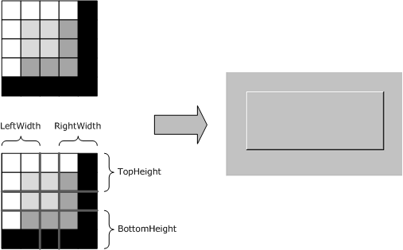

Figure 18: Expansion of a NineGrid bitmap

The following diagram illustrates how a source bitmap in the [NineGrid Bitmap Cache (section 3.1.1.1.6)](#Section_3.1.1.1.6) is clipped and then modified using a NineGrid transformation to produce a final image in a destination rectangle.


Figure 19: Illustration of Draw NineGrid Primary Drawing Order

The [DrawNineGrid (section 2.2.2.2.1.1.2.21)](#Section_4.1.21) and [MultiDrawNineGrid (section 2.2.2.2.1.1.2.22)](#Section_4.1.22) Primary Drawing Orders are used to render NineGrid bitmaps that have been stored in the NineGrid Bitmap Cache using the [Create NineGrid Bitmap (section 2.2.2.2.1.3.4)](#Section_4.3.3) and [Stream Bitmap Orders (section 2.2.2.2.1.3.5)](#Section_2.2.2.2.1.3.5).

<a id="Section_4.5"></a>
## 4.5 Save Bitmap Example

The [SaveBitmap (section 2.2.2.2.1.1.2.12)](#Section_4.1.12) Primary Drawing Order is used to encode a rectangular screen image for saving or restoring by the client.

The following diagram shows how a 127-by-134-pixel virtual desktop rectangle received in the SaveBitmap Primary Drawing Order is tiled into the client-side [Save Bitmap (section 3.2.1.2)](#Section_3.2.1.2), and how the position of the next bitmap can be computed.

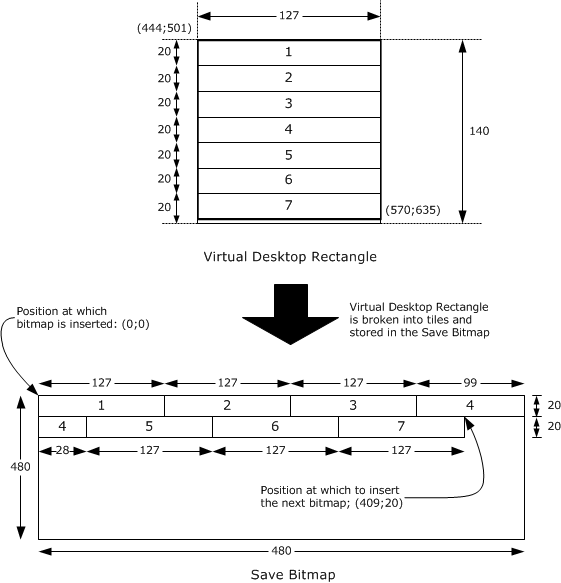

Figure 20: Illustration of Save Bitmap Primary Drawing Order

Applying the formulas in section 2.2.2.2.1.1.2.12 (assuming an X granularity of 1 and a Y granularity of 20):

AreaWidthInPixels

= [(width + XGranularity - 1) / XGranularity] * XGranularity

= [(127 + 1 - 1) / 1] * 1

= 127

AreaHeightInPixels

= [(height + YGranularity - 1) / YGranularity] * YGranularity

= [(134 + 20 - 1) / 20] * 20

= 140

Area

= AreaWidthInPixels * AreaHeightInPixels

= 127 * 140

= 17780

Hence, the area occupied by the 127-by-134-pixel bitmap in the SaveBitmap is 17,780 pixels. The X and Y position in the Save Bitmap from which to tile the next bitmap is computed using the formulas in section 2.2.2.2.1.1.2.12.

Y

= [SaveBitmapPosition / (480 * YGranularity)] * YGranularity

= [17780 / (480 * 20)] * 20

= 20

X

= [SaveBitmapPosition - (Y * 480)] / YGranularity

= [17780 - (20 * 480)] / 20

= 409

<a id="Section_4.6"></a>
## 4.6 Glyph Image Data

<a id="Section_4.6.1"></a>
### 4.6.1 "d" Character

The following shows glyph image data (1 bpp format) for character "d" extracted from a Cache Glyph (Revision 2) (section [2.2.2.2.1.2.6)](#Section_ffc80435136e442e908540ca1d27a413) Secondary Drawing Order.

Glyph width = 5 pixels

Glyph height = 9 pixels

Glyph origin = (0, -9), marked with an "X" on the image grid

Bitmap = { 0x08, 0x08, 0x08, 0x78, 0x88, 0x88, 0x88, 0x88, 0x78 }

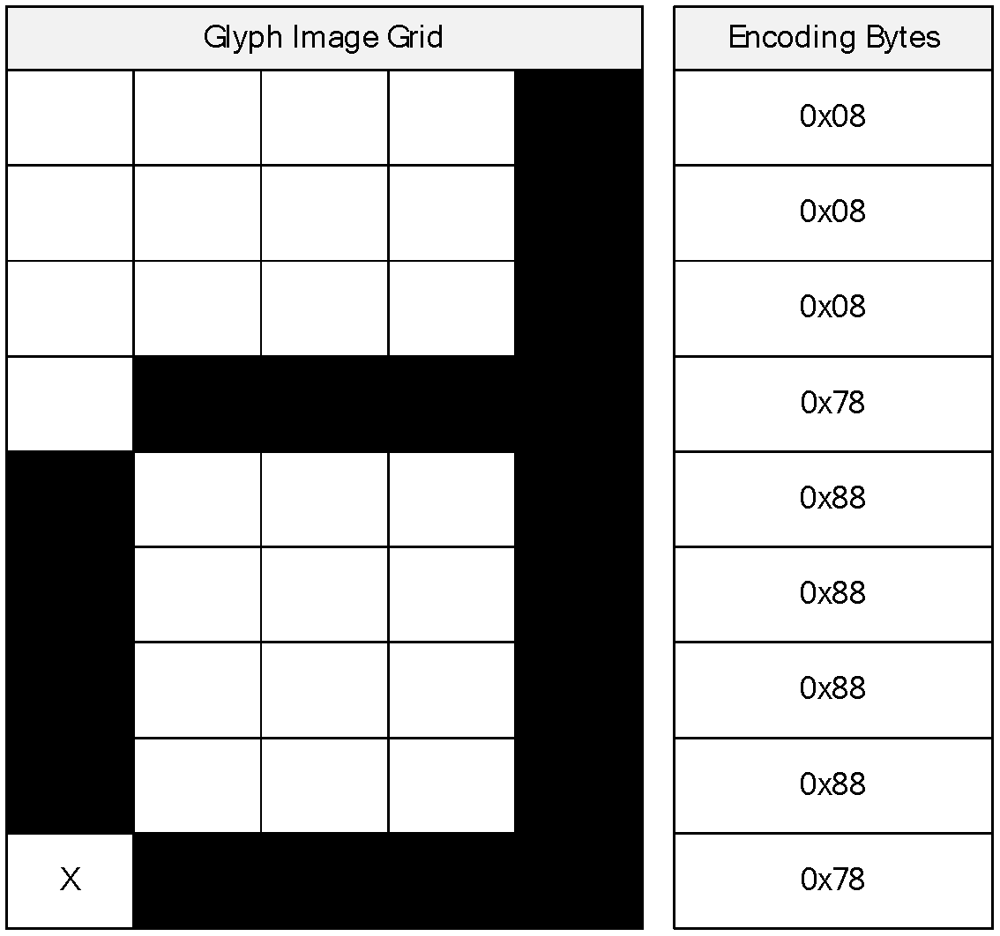

Figure 21: Decoded glyph bytes for "d" character

<a id="Section_4.6.2"></a>
### 4.6.2 "p" Character

The following shows glyph image data (1 bpp format) for character "p" extracted from a Cache Glyph (Revision 2) (section [2.2.2.2.1.2.6)](#Section_ffc80435136e442e908540ca1d27a413) Secondary Drawing Order.

Glyph width = 5 pixels

Glyph height = 8 pixels

Glyph origin = (0, -6), marked with an "X" on the image grid

Bitmap = { 0xF0, 0x88, 0x88, 0x88, 0x88, 0xF0, 0x80, 0x80 }

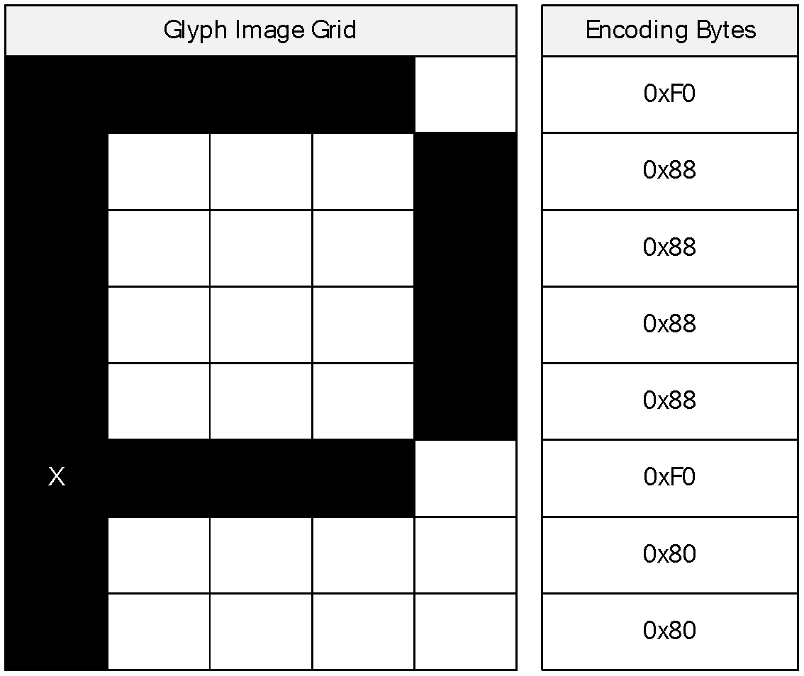

Figure 22: Decoded glyph bytes for "p" character

<a id="Section_4.7"></a>
## 4.7 RDP 6.1 Bulk Compression Example

The following annotation shows how the data used in the examples in section [3.1.8.2.2.1](#Section_3.1.8.2.2.1) and [3.1.8.2.3.1](#Section_3.1.8.2.3.1) appears in binary encoded format after having been decompressed by the level-2 decompressor, but not yet by the level-1 decompressor.

The first packet contains the following data.

a b c d e f g h i j

The encoded version of this packet is represented as follows.

00000000 16 80 61 62 63 64 65 66 67 68 69 6a ..abcdefghij

16 -> RDP61_COMPRESSED_DATA::Level1ComprFlags

0x16

= 0x10 | 0x02 | 0x04

= L1_INNER_COMPRESSION | L1_NO_COMPRESSION | L1_PACKET_AT_FRONT

80 -> RDP61_COMPRESSED_DATA::Level2ComprFlags

0x80

= PACKET_FLUSHED

61 62 63 64 65 66 67 68 69 6a -> RDP61_COMPRESSED_DATA::Literals

The second packet contains the following data.

[2 matches]

[MatchHistoryOffset@3, MatchLength=9, MatchOutputOffset@5]

[MatchHistoryOffset@0, MatchLength=4, MatchOutputOffset@14]

k l m n o u

The encoded version of this packet is represented as follows.

00000000 11 21 02 00 09 00 05 00 03 00 00 00 04 00 0e 00 . ..............

00000010 00 00 00 00 6b 6c 6d 6e 6f 75 ....klmnou

11 -> RDP61_COMPRESSED_DATA::Level1ComprFlags

0x11

= 0x10 | 0x01

= L1_INNER_COMPRESSION | L1_COMPRESSED

21 -> RDP61_COMPRESSED_DATA::Level2ComprFlags

0x21

= PACKET_COMPRESSED | PACKET_COMPR_TYPE_64K

02 00 -> RDP61_COMPRESSED_DATA::MatchCount = 2 matches

09 00 -> RDP61_MATCH_DETAILS::MatchLength = 9 bytes

05 00 -> RDP61_MATCH_DETAILS::MatchOutputOffset = 5

03 00 00 00 -> RDP61_MATCH_DETAILS::MatchHistoryOffset = 3

04 00 -> RDP61_MATCH_DETAILS::MatchLength = 4 bytes

0e 00 -> RDP61_MATCH_DETAILS::MatchOutputOffset = 14

00 00 00 00 -> RDP61_MATCH_DETAILS::MatchHistoryOffset = 0

6b 6c 6d 6e 6f 75 -> RDP61_COMPRESSED_DATA::Literals

<a id="Section_4.8"></a>
## 4.8 Error Conditions

<a id="Section_4.8.1"></a>
### 4.8.1 Bitmap Cache Error PDU

The following is an annotated dump of a [Bitmap Cache Error PDU (section 2.2.2.3.1)](#Section_2.2.2.3.1).

00000000 03 00 00 38 02 f0 80 64 00 06 03 eb 70 2a 28 00 ...8...d....p*(.

00000010 81 f8 05 d1 ef 10 ff fc 2e e5 0d e2 b4 57 0e 5a .............W.Z

00000020 06 48 48 79 f5 08 c0 1b 2f a3 bf fc a4 16 fc f4 .HHy..../.......

00000030 df 03 26 63 60 61 d0 f6 ..&c`a..

03 00 00 38 -> TPKT Header (length = 56 bytes)

02 f0 80 -> X.224 Data TPDU

64 00 06 03 eb 70 2a -> PER encoded (ALIGNED variant of BASIC-PER) SendDataRequest

initiator = 1007 (0x03ef)

channelId = 1003 (0x03eb)

dataPriority = high

segmentation = begin | end

userData length = 0x2a = 42 bytes

28 00 -> TS_SECURITY_HEADER::flags = 0x0028

0x0028

= 0x0020 | 0x0008

= SEC_IGNORE_SEQNO | SEC_ENCRYPT

81 f8 -> TS_SECURITY_HEADER::flagsHi - ignored as flags field does

not contain SEC_FLAGSHI_VALID (0x8000)

05 d1 ef 10 ff fc 2e e5 -> TS_SECURITY_HEADER1::dataSignature

0d e2 b4 57 0e 5a 06 48 48 79 f5 08 c0 1b 2f a3

bf fc a4 16 fc f4 df 03 26 63 60 61 d0 f6 -> Encrypted TS_BITMAP_CACHE_ERROR_PDU

Decrypted TS_BITMAP_CACHE_ERROR_PDU:

00000000 1e 00 17 00 ef 03 ea 03 01 00 00 01 c0 c0 2c 00 ..............,.

00000010 00 00 01 00 00 00 02 01 00 00 00 00 00 00 ..............

1e 00 -> TS_SHARECONTROLHEADER::totalLength = 0x001e = 30 bytes

17 00 -> TS_SHARECONTROLHEADER::pduType = 0x0017

0x0017

= 0x0010 | 0x0007

= TS_PROTOCOL_VERSION | PDUTYPE_DATAPDU

ef 03 -> TS_SHARECONTROLHEADER::pduSource = 0x03ef = 1007

ea 03 01 00 -> TS_SHAREDATAHEADER::shareID = 0x000103ea

00 -> TS_SHAREDATAHEADER::pad1

01 -> TS_SHAREDATAHEADER::streamId = STREAM_LOW (1)

c0 c0 -> TS_SHAREDATAHEADER::uncompressedLength = 0xc0c0 (uninitialized due to bug)

2c -> TS_SHAREDATAHEADER::pduType2 = TS_PDUTYPE2_BITMAPCACHE_ERROR_PDU (44)

00 -> TS_SHAREDATAHEADER::generalCompressedType = 0

00 00 -> TS_SHAREDATAHEADER::generalCompressedLength = 0

01 -> TS_BITMAP_CACHE_ERROR_PDU::NumInfoBlocks = 1

00 -> TS_BITMAP_CACHE_ERROR_PDU::Pad1

00 00 -> TS_BITMAP_CACHE_ERROR_PDU::Pad2

02 -> TS_BITMAPCACHE_ERROR_INFO::CacheID = 2

01 -> TS_BITMAPCACHE_ERROR_INFO::bBitField = 0x01 = BC_ERR_FLUSH_CACHE

Since BC_ERR_NEWNUMENTRIES_VALID (0x02) is not set, NewNumEntries is not valid.

00 00 -> TS_BITMAPCACHE_ERROR_INFO::Pad

00 00 00 00 -> TS_BITMAPCACHE_ERROR_INFO::NewNumEntries = 0

<a id="Section_4.8.2"></a>
### 4.8.2 Offscreen Bitmap Cache Error PDU

The following is an annotated dump of an [Offscreen Bitmap Cache Error PDU (section 2.2.2.3.2)](#Section_2.2.2.3.2).

00000000 03 00 00 30 02 f0 80 64 00 06 03 eb 70 22 28 00 ...0...d....p"(.

00000010 81 f8 16 ff 53 cd 83 24 e0 da ad 70 d2 f8 00 9d ....S..$...p....

00000020 97 29 71 0a 0e 7c cc 88 dd ac b7 53 e0 0f 3e 83 .)q..|.....S..>.

03 00 00 30 -> TPKT Header (length = 48 bytes)

02 f0 80 -> X.224 Data TPDU

64 00 06 03 eb 70 22 -> PER encoded (ALIGNED variant of BASIC-PER) SendDataRequest

initiator = 1007 (0x03ef)

channelId = 1003 (0x03eb)

dataPriority = high

segmentation = begin | end

userData length = 0x22 = 34 bytes

28 00 -> TS_SECURITY_HEADER::flags = 0x0028

0x0028

= 0x0020 | 0x0008

= SEC_IGNORE_SEQNO | SEC_ENCRYPT

81 f8 -> TS_SECURITY_HEADER::flagsHi - ignored as flags field does not contain SEC_FLAGSHI_VALID (0x8000)

16 ff 53 cd 83 24 e0 da -> TS_SECURITY_HEADER1::dataSignature

ad 70 d2 f8 00 9d 97 29 71 0a 0e 7c cc 88 dd ac

b7 53 e0 0f 3e 83 -> Encrypted TS_OFFSCRCACHE_ERROR_PDU

Decrypted TS_OFFSCRCACHE_ERROR_PDU:

00000000 16 00 17 00 ef 03 ea 03 01 00 00 01 c0 c0 2e 00 ................

00000010 00 00 01 00 00 00 ......

16 00 -> TS_SHARECONTROLHEADER::totalLength = 0x0016 = 22 bytes

17 00 -> TS_SHARECONTROLHEADER::pduType = 0x0017

0x0017

= 0x0010 | 0x0007

= TS_PROTOCOL_VERSION | PDUTYPE_DATAPDU

ef 03 -> TS_SHARECONTROLHEADER::pduSource = 0x03ef = 1007

ea 03 01 00 -> TS_SHAREDATAHEADER::shareID = 0x000103ea

00 -> TS_SHAREDATAHEADER::pad1

01 -> TS_SHAREDATAHEADER::streamId = STREAM_LOW (1)

c0 c0 -> TS_SHAREDATAHEADER::uncompressedLength = 0xc0c0 (uninitialized due to bug)

2e -> TS_SHAREDATAHEADER::pduType2 = TS_PDUTYPE2_OFFSCRCACHE_ERROR_PDU (46)

00 -> TS_SHAREDATAHEADER::generalCompressedType = 0

00 00 -> TS_SHAREDATAHEADER::generalCompressedLength = 0

01 00 00 00 -> TS_OFFSCRCACHE_ERROR_PDU::flags = 0x00000001 = OC_ERR_FLUSH_AND_DISABLE_OFFSCREEN

<a id="Section_4.8.3"></a>
### 4.8.3 DrawNineGrid Cache Error PDU

The following is an annotated dump of a [DrawNineGrid Cache Error PDU (section 2.2.2.3.3)](#Section_2.2.2.3.3).

00000000 03 00 00 30 02 f0 80 64 00 06 03 eb 70 22 28 00 ...0...d....p"(.

00000010 81 f8 2c 1e 5b bf a9 74 5f ee 08 63 79 ee 8a 51 ..,.[..t_..cy..Q

00000020 9c 08 80 2d 35 76 35 09 98 ff 69 78 cc 23 8f a4 ...-5v5...ix.#..

03 00 00 30 -> TPKT Header (length = 48 bytes)

02 f0 80 -> X.224 Data TPDU

64 00 06 03 eb 70 22 -> PER encoded (ALIGNED variant of BASIC-PER) SendDataRequest

initiator = 1007 (0x03ef)

channelId = 1003 (0x03eb)

dataPriority = high

segmentation = begin | end

userData length = 0x22 = 34 bytes

28 00 -> TS_SECURITY_HEADER::flags = 0x0028

0x0028

= 0x0020 | 0x0008

= SEC_IGNORE_SEQNO | SEC_ENCRYPT

81 f8 -> TS_SECURITY_HEADER::flagsHi - ignored as flags field does not contain SEC_FLAGSHI_VALID (0x8000)

2c 1e 5b bf a9 74 5f ee -> TS_SECURITY_HEADER1::dataSignature

08 63 79 ee 8a 51 9c 08 80 2d 35 76 35 09 98 ff

69 78 cc 23 8f a4 -> Encrypted TS_DRAWNINEGRID_ERROR_PDU

Decrypted TS_DRAWNINEGRID_ERROR_PDU:

00000000 16 00 17 00 ef 03 ea 03 01 00 00 01 c0 c0 30 00 ..............0.

00000010 00 00 01 00 00 00 ......

16 00 -> TS_SHARECONTROLHEADER::totalLength = 0x0016 = 22 bytes

17 00 -> TS_SHARECONTROLHEADER::pduType = 0x0017

0x0017

= 0x0010 | 0x0007

= TS_PROTOCOL_VERSION | PDUTYPE_DATAPDU

ef 03 -> TS_SHARECONTROLHEADER::pduSource = 0x03ef = 1007

ea 03 01 00 -> TS_SHAREDATAHEADER::shareID = 0x000103ea

00 -> TS_SHAREDATAHEADER::pad1

01 -> TS_SHAREDATAHEADER::streamId = STREAM_LOW (1)

c0 c0 -> TS_SHAREDATAHEADER::uncompressedLength = 0xc0c0 (uninitialized due to bug)

30 -> TS_SHAREDATAHEADER::pduType2 = TS_PDUTYPE2_DRAWNINEGRID_ERROR_PDU (48)

00 -> TS_SHAREDATAHEADER::generalCompressedType = 0

00 00 -> TS_SHAREDATAHEADER::generalCompressedLength = 0

01 00 00 00 -> TS_DRAWNINEGRID_ERROR_PDU::flags = 0x00000001 = DNG_ERR_FLUSH_AND_DISABLE_DRAWNINEGRID

<a id="Section_4.8.4"></a>
### 4.8.4 GDI+ Error PDU

The following is an annotated dump of a [GDI+ Error PDU (section 2.2.2.3.4)](#Section_2.2.2.3.4).

00000000 03 00 00 30 02 f0 80 64 00 06 03 eb 70 22 28 00 ...0...d....p"(.

00000010 81 f8 44 c9 aa df dd e9 2e 50 cb ad d8 79 99 5f ..D......P...y._

00000020 64 e2 e0 34 9f 33 a7 9b 53 0b 5f bc 40 4b 55 3b d..4.3..S._.@KU;

03 00 00 30 -> TPKT Header (length = 48 bytes)

02 f0 80 -> X.224 Data TPDU

64 00 06 03 eb 70 22 -> PER encoded (ALIGNED variant of BASIC-PER) SendDataRequest

initiator = 1007 (0x03ef)

channelId = 1003 (0x03eb)

dataPriority = high

segmentation = begin | end

userData length = 0x22 = 34 bytes

28 00 -> TS_SECURITY_HEADER::flags = 0x0028

0x0028

= 0x0020 | 0x0008

= SEC_IGNORE_SEQNO | SEC_ENCRYPT

81 f8 -> TS_SECURITY_HEADER::flagsHi - ignored as flags field does not contain SEC_FLAGSHI_VALID (0x8000)

44 c9 aa df dd e9 2e 50 -> TS_SECURITY_HEADER1::dataSignature

cb ad d8 79 99 5f 64 e2 e0 34 9f 33 a7 9b 53 0b

5f bc 40 4b 55 3b -> Encrypted TS_DRAWGDIPLUS_ERROR_PDU

Decrypted TS_DRAWGDIPLUS_ERROR_PDU:

00000000 16 00 17 00 ef 03 ea 03 01 00 00 01 c0 c0 31 00 ..............1.

00000010 00 00 01 00 00 00 ......

16 00 -> TS_SHARECONTROLHEADER::totalLength = 0x0016 = 22 bytes

17 00 -> TS_SHARECONTROLHEADER::pduType = 0x0017

0x0017

= 0x0010 | 0x0007

= TS_PROTOCOL_VERSION | PDUTYPE_DATAPDU

ef 03 -> TS_SHARECONTROLHEADER::pduSource = 0x03ef = 1007

ea 03 01 00 -> TS_SHAREDATAHEADER::shareID = 0x000103ea

00 -> TS_SHAREDATAHEADER::pad1

01 -> TS_SHAREDATAHEADER::streamId = STREAM_LOW (1)

c0 c0 -> TS_SHAREDATAHEADER::uncompressedLength = 0xc0c0 (unitialized due to bug)

31 -> TS_SHAREDATAHEADER::pduType2 = TS_PDUTYPE2_DRAWGDIPLUS_ERROR_PDU (49)

00 -> TS_SHAREDATAHEADER::generalCompressedType = 0

00 00 -> TS_SHAREDATAHEADER::generalCompressedLength = 0

01 00 00 00 -> TS_DRAWGDIPLUS_ERROR_PDU::flags = 0x00000001 = GDIPLUS_ERR_FLUSH_AND_DISABLE_DRAWGDIPLUS

<a id="Section_5"></a>
# 5 Security

<a id="Section_5.1"></a>
## 5.1 Security Considerations for Implementers

There are no security considerations for Remote Desktop Protocol: Graphics Devices Interfaces (GDI) Acceleration Extension as all traffic is secured by the underlying RDP core protocol. For an overview of the implemented security-related mechanisms, see [MS-RDPBCGR](../MS-RDPBCGR/MS-RDPBCGR.md) section 5.

<a id="Section_5.2"></a>
## 5.2 Index of Security Parameters

None.

<a id="Section_6"></a>
# 6 Appendix A: Product Behavior

The information in this specification is applicable to the following Microsoft products or supplemental software. References to product versions include updates to those products.

- Windows NT operating system
- Windows 2000 operating system
- Windows XP operating system
- Windows Server 2003 operating system
- Windows Vista operating system
- Windows Server 2008 operating system
- Windows 7 operating system
- Windows Server 2008 R2 operating system
- Windows Server 2008 R2 operating system with Service Pack 1 (SP1)
- Windows 7 operating system with Service Pack 1 (SP1)
- Windows 8 operating system
- Windows Server 2012 operating system
- Windows 8.1 operating system
- Windows Server 2012 R2 operating system
- Windows 10 operating system
- Windows Server 2016 operating system
- Windows Server operating system
- Windows Server 2019 operating system
- Windows Server 2022 operating system
- Windows 11 operating system
- Windows Server 2025 operating system
Exceptions, if any, are noted in this section. If an update version, service pack or Knowledge Base (KB) number appears with a product name, the behavior changed in that update. The new behavior also applies to subsequent updates unless otherwise specified. If a product edition appears with the product version, behavior is different in that product edition.

Unless otherwise specified, any statement of optional behavior in this specification that is prescribed using the terms "SHOULD" or "SHOULD NOT" implies product behavior in accordance with the SHOULD or SHOULD NOT prescription. Unless otherwise specified, the term "MAY" implies that the product does not follow the prescription.

<1> Section 2.2.2.2.1.1.1.4: The Windows implementation of Remote Desktop Protocol: GDI Acceleration Extension places the field that contains the number of Delta-Encoded Points immediately before order encoding packets containing a [DELTA_PTS_FIELD](#Section_6c7b2a52103c4a7da2a9997416d4a475) structure.

<2> Section 2.2.2.2.1.1.2.15: This Unicode value is only for debugging purposes and is not always accurate in Microsoft RDP implementations.

<3> Section 2.2.2.2.1.1.2.18: The Windows implementation of RDP set this field to 0x0000.

<4> Section 2.2.2.2.1.2.7: The Windows implementation of Remote Desktop Protocol: Graphics Devices Interfaces (GDI) Acceleration Extension sets this field to 0x00.

<5> Section 2.2.2.2.1.3.3: Section 2.2.2.2.1.3.3: It is possible that the **bitmapId** field sent by the Windows implementation of RDP identifies a nonexistent or deleted bitmap. In this case, a substitute surface that is the same size as the virtual desktop is used as the target of the switch operation.

<a id="Section_7"></a>
# 7 Change Tracking

This section identifies changes that were made to this document since the last release. Changes are classified as Major, Minor, or None.

The revision class **Major** means that the technical content in the document was significantly revised. Major changes affect protocol interoperability or implementation. Examples of major changes are:

- A document revision that incorporates changes to interoperability requirements.
- A document revision that captures changes to protocol functionality.
The revision class **Minor** means that the meaning of the technical content was clarified. Minor changes do not affect protocol interoperability or implementation. Examples of minor changes are updates to clarify ambiguity at the sentence, paragraph, or table level.

The revision class **None** means that no new technical changes were introduced. Minor editorial and formatting changes may have been made, but the relevant technical content is identical to the last released version.

The changes made to this document are listed in the following table. For more information, please contact [dochelp@microsoft.com](mailto:dochelp@microsoft.com).

| Section | Description | Revision class |
| --- | --- | --- |
| [6](#Section_6) Appendix A: Product Behavior | Added Windows Server 2025 to the list of applicable products. | Major |

<a id="revision-history"></a>

## Revision History

| Date | Version | Revision Class | Comments |
| --- | --- | --- | --- |
| 2/22/2007 | 0.01 | New | Version 0.01 release |
| 6/1/2007 | 1.0 | Major | Updated and revised the technical content. |
| 7/3/2007 | 1.1 | Minor | Minor technical content updates. |
| 7/20/2007 | 1.1.1 | Editorial | Changed language and formatting in the technical content. |
| 8/10/2007 | 1.2 | Minor | Updated content based on feedback. |
| 9/28/2007 | 1.3 | Minor | Made technical and editorial changes based on feedback. |
| 10/23/2007 | 1.3.1 | Editorial | Changed language and formatting in the technical content. |
| 11/30/2007 | 1.4 | Minor | Made technical and editorial changes based on feedback. |
| 1/25/2008 | 2.0 | Major | Updated and revised the technical content. |
| 3/14/2008 | 3.0 | Major | Updated and revised the technical content. |
| 5/16/2008 | 3.0.1 | Editorial | Changed language and formatting in the technical content. |
| 6/20/2008 | 3.1 | Minor | Clarified the meaning of the technical content. |
| 7/25/2008 | 3.2 | Minor | Clarified the meaning of the technical content. |
| 8/29/2008 | 3.3 | Minor | Clarified the meaning of the technical content. |
| 10/24/2008 | 3.3.1 | Editorial | Changed language and formatting in the technical content. |
| 12/5/2008 | 4.0 | Major | Updated and revised the technical content. |
| 1/16/2009 | 5.0 | Major | Updated and revised the technical content. |
| 2/27/2009 | 5.0.1 | Editorial | Changed language and formatting in the technical content. |
| 4/10/2009 | 5.0.2 | Editorial | Changed language and formatting in the technical content. |
| 5/22/2009 | 6.0 | Major | Updated and revised the technical content. |
| 7/2/2009 | 7.0 | Major | Updated and revised the technical content. |
| 8/14/2009 | 8.0 | Major | Updated and revised the technical content. |
| 9/25/2009 | 8.1 | Minor | Clarified the meaning of the technical content. |
| 11/6/2009 | 9.0 | Major | Updated and revised the technical content. |
| 12/18/2009 | 10.0 | Major | Updated and revised the technical content. |
| 1/29/2010 | 11.0 | Major | Updated and revised the technical content. |
| 3/12/2010 | 12.0 | Major | Updated and revised the technical content. |
| 4/23/2010 | 12.0.1 | Editorial | Changed language and formatting in the technical content. |
| 6/4/2010 | 13.0 | Major | Updated and revised the technical content. |
| 7/16/2010 | 14.0 | Major | Updated and revised the technical content. |
| 8/27/2010 | 15.0 | Major | Updated and revised the technical content. |
| 10/8/2010 | 16.0 | Major | Updated and revised the technical content. |
| 11/19/2010 | 17.0 | Major | Updated and revised the technical content. |
| 1/7/2011 | 18.0 | Major | Updated and revised the technical content. |
| 2/11/2011 | 19.0 | Major | Updated and revised the technical content. |
| 3/25/2011 | 20.0 | Major | Updated and revised the technical content. |
| 5/6/2011 | 20.0 | None | No changes to the meaning, language, or formatting of the technical content. |
| 6/17/2011 | 21.0 | Major | Updated and revised the technical content. |
| 9/23/2011 | 22.0 | Major | Updated and revised the technical content. |
| 12/16/2011 | 23.0 | Major | Updated and revised the technical content. |
| 3/30/2012 | 24.0 | Major | Updated and revised the technical content. |
| 7/12/2012 | 25.0 | Major | Updated and revised the technical content. |
| 10/25/2012 | 26.0 | Major | Updated and revised the technical content. |
| 1/31/2013 | 26.1 | Minor | Clarified the meaning of the technical content. |
| 8/8/2013 | 27.0 | Major | Updated and revised the technical content. |
| 11/14/2013 | 27.0 | None | No changes to the meaning, language, or formatting of the technical content. |
| 2/13/2014 | 27.0 | None | No changes to the meaning, language, or formatting of the technical content. |
| 5/15/2014 | 27.0 | None | No changes to the meaning, language, or formatting of the technical content. |
| 6/30/2015 | 28.0 | Major | Significantly changed the technical content. |
| 10/16/2015 | 28.0 | None | No changes to the meaning, language, or formatting of the technical content. |
| 7/14/2016 | 29.0 | Major | Significantly changed the technical content. |
| 6/1/2017 | 29.0 | None | No changes to the meaning, language, or formatting of the technical content. |
| 9/15/2017 | 30.0 | Major | Significantly changed the technical content. |
| 12/1/2017 | 30.0 | None | No changes to the meaning, language, or formatting of the technical content. |
| 9/12/2018 | 31.0 | Major | Significantly changed the technical content. |
| 4/7/2021 | 32.0 | Major | Significantly changed the technical content. |
| 6/25/2021 | 33.0 | Major | Significantly changed the technical content. |
| 4/23/2024 | 34.0 | Major | Significantly changed the technical content. |
