# [MS-RDPEGFX]: Remote Desktop Protocol: Graphics Pipeline Extension

Table of Contents

1 Introduction

- [1 Introduction](#Section_1)
  - [1.1 Glossary](#Section_1.1)
  - [1.2 References](#Section_1.2)
    - [1.2.1 Normative References](#Section_1.2.1)
    - [1.2.2 Informative References](#Section_1.2.2)
  - [1.3 Overview](#Section_1.3)
  - [1.4 Relationship to Other Protocols](#Section_1.4)
  - [1.5 Prerequisites/Preconditions](#Section_1.5)
    - [1.5.1 Client Implementation Requirements](#Section_1.5.1)
    - [1.5.2 Server Implementation Requirements](#Section_1.5.2)
  - [1.6 Applicability Statement](#Section_1.6)
  - [1.7 Versioning and Capability Negotiation](#Section_1.7)
  - [1.8 Vendor-Extensible Fields](#Section_1.8)
  - [1.9 Standards Assignments](#Section_1.9)

2 Messages

- [2 Messages](#Section_2)
  - [2.1 Transport](#Section_2.1)
  - [2.2 Message Syntax](#Section_2.2)
    - [2.2.1 Common Data Types](#Section_2.2.1)
      - [2.2.1.1 RDPGFX_POINT16](#Section_2.2.1.1)
      - [2.2.1.2 RDPGFX_RECT16](#Section_2.2.1.2)
      - [2.2.1.3 RDPGFX_COLOR32](#Section_2.2.1.3)
      - [2.2.1.4 RDPGFX_PIXELFORMAT](#Section_2.2.1.4)
      - [2.2.1.5 RDPGFX_HEADER](#Section_2.2.1.5)
      - [2.2.1.6 RDPGFX_CAPSET](#Section_2.2.1.6)
    - [2.2.2 Graphics Messages](#Section_2.2.2)
      - [2.2.2.1 RDPGFX_WIRE_TO_SURFACE_PDU_1](#Section_2.2.2.1)
      - [2.2.2.2 RDPGFX_WIRE_TO_SURFACE_PDU_2](#Section_2.2.2.2)
      - [2.2.2.3 RDPGFX_DELETE_ENCODING_CONTEXT_PDU](#Section_2.2.2.3)
      - [2.2.2.4 RDPGFX_SOLIDFILL_PDU](#Section_2.2.2.4)
      - [2.2.2.5 RDPGFX_SURFACE_TO_SURFACE_PDU](#Section_2.2.2.5)
      - [2.2.2.6 RDPGFX_SURFACE_TO_CACHE_PDU](#Section_2.2.2.6)
      - [2.2.2.7 RDPGFX_CACHE_TO_SURFACE_PDU](#Section_2.2.2.7)
      - [2.2.2.8 RDPGFX_EVICT_CACHE_ENTRY_PDU](#Section_2.2.2.8)
      - [2.2.2.9 RDPGFX_CREATE_SURFACE_PDU](#Section_2.2.2.9)
      - [2.2.2.10 RDPGFX_DELETE_SURFACE_PDU](#Section_2.2.2.10)
      - [2.2.2.11 RDPGFX_START_FRAME_PDU](#Section_2.2.2.11)
      - [2.2.2.12 RDPGFX_END_FRAME_PDU](#Section_2.2.2.12)
      - [2.2.2.13 RDPGFX_FRAME_ACKNOWLEDGE_PDU](#Section_2.2.2.13)
      - [2.2.2.14 RDPGFX_RESET_GRAPHICS_PDU](#Section_2.2.2.14)
      - [2.2.2.15 RDPGFX_MAP_SURFACE_TO_OUTPUT_PDU](#Section_2.2.2.15)
      - [2.2.2.16 RDPGFX_CACHE_IMPORT_OFFER_PDU](#Section_2.2.2.16)
        - [2.2.2.16.1 RDPGFX_CACHE_ENTRY_METADATA](#Section_2.2.2.16.1)
      - [2.2.2.17 RDPGFX_CACHE_IMPORT_REPLY_PDU](#Section_2.2.2.17)
      - [2.2.2.18 RDPGFX_CAPS_ADVERTISE_PDU](#Section_2.2.2.18)
      - [2.2.2.19 RDPGFX_CAPS_CONFIRM_PDU](#Section_2.2.2.19)
      - [2.2.2.20 RDPGFX_MAP_SURFACE_TO_WINDOW_PDU](#Section_2.2.2.20)
      - [2.2.2.21 RDPGFX_QOE_FRAME_ACKNOWLEDGE_PDU](#Section_2.2.2.21)
      - [2.2.2.22 RDPGFX_MAP_SURFACE_TO_SCALED_OUTPUT_PDU](#Section_2.2.2.22)
      - [2.2.2.23 RDPGFX_MAP_SURFACE_TO_SCALED_WINDOW_PDU](#Section_2.2.2.23)
    - [2.2.3 Capability Sets](#Section_2.2.3)
      - [2.2.3.1 RDPGFX_CAPSET_VERSION8](#Section_2.2.3.1)
      - [2.2.3.2 RDPGFX_CAPSET_VERSION81](#Section_2.2.3.2)
      - [2.2.3.3 RDPGFX_CAPSET_VERSION10](#Section_2.2.3.3)
      - [2.2.3.4 RDPGFX_CAPSET_VERSION101](#Section_2.2.3.4)
      - [2.2.3.5 RDPGFX_CAPSET_VERSION102](#Section_2.2.3.5)
      - [2.2.3.6 RDPGFX_CAPSET_VERSION103](#Section_2.2.3.6)
      - [2.2.3.7 RDPGFX_CAPSET_VERSION104](#Section_2.2.3.7)
      - [2.2.3.8 RDPGFX_CAPSET_VERSION105](#Section_2.2.3.8)
      - [2.2.3.9 RDPGFX_CAPSET_VERSION106](#Section_2.2.3.9)
      - [2.2.3.10 RDPGFX_CAPSET_VERSION107](#Section_2.2.3.10)
    - [2.2.4 Bitmap Compression](#Section_2.2.4)
      - [2.2.4.1 CLEARCODEC_BITMAP_STREAM](#Section_2.2.4.1)
        - [2.2.4.1.1 CLEARCODEC_COMPOSITE_PAYLOAD](#Section_2.2.4.1.1)
          - [2.2.4.1.1.1 CLEARCODEC_RESIDUAL_DATA](#Section_2.2.4.1.1.1)
            - [2.2.4.1.1.1.1 CLEARCODEC_RGB_RUN_SEGMENT](#Section_2.2.4.1.1.1.1)
          - [2.2.4.1.1.2 CLEARCODEC_BANDS_DATA](#Section_2.2.4.1.1.2)
            - [2.2.4.1.1.2.1 CLEARCODEC_BAND](#Section_2.2.4.1.1.2.1)
              - [2.2.4.1.1.2.1.1 CLEARCODEC_VBAR](#Section_2.2.4.1.1.2.1.1)
                - [2.2.4.1.1.2.1.1.1 VBAR_CACHE_HIT](#Section_2.2.4.1.1.2.1.1.1)
                - [2.2.4.1.1.2.1.1.2 SHORT_VBAR_CACHE_HIT](#Section_2.2.4.1.1.2.1.1.2)
                - [2.2.4.1.1.2.1.1.3 SHORT_VBAR_CACHE_MISS](#Section_2.2.4.1.1.2.1.1.3)
          - [2.2.4.1.1.3 CLEARCODEC_SUBCODECS_DATA](#Section_2.2.4.1.1.3)
            - [2.2.4.1.1.3.1 CLEARCODEC_SUBCODEC](#Section_2.2.4.1.1.3.1)
              - [2.2.4.1.1.3.1.1 CLEARCODEC_SUBCODEC_RLEX](#Section_2.2.4.1.1.3.1.1)
                - [2.2.4.1.1.3.1.1.1 RLEX_RGB_TRIPLET](#Section_2.2.4.1.1.3.1.1.1)
                - [2.2.4.1.1.3.1.1.2 CLEARCODEC_SUBCODEC_RLEX_SEGMENT](#Section_2.2.4.1.1.3.1.1.2)
      - [2.2.4.2 RFX_PROGRESSIVE_BITMAP_STREAM](#Section_2.2.4.2)
        - [2.2.4.2.1 RFX_PROGRESSIVE_DATABLOCK](#Section_2.2.4.2.1)
          - [2.2.4.2.1.1 RFX_PROGRESSIVE_SYNC](#Section_2.2.4.2.1.1)
          - [2.2.4.2.1.2 RFX_PROGRESSIVE_FRAME_BEGIN](#Section_2.2.4.2.1.2)
          - [2.2.4.2.1.3 RFX_PROGRESSIVE_FRAME_END](#Section_2.2.4.2.1.3)
          - [2.2.4.2.1.4 RFX_PROGRESSIVE_CONTEXT](#Section_2.2.4.2.1.4)
          - [2.2.4.2.1.5 RFX_PROGRESSIVE_REGION](#Section_2.2.4.2.1.5)
            - [2.2.4.2.1.5.1 RFX_PROGRESSIVE_CODEC_QUANT](#Section_2.2.4.2.1.5.1)
            - [2.2.4.2.1.5.2 RFX_COMPONENT_CODEC_QUANT](#Section_2.2.4.2.1.5.2)
            - [2.2.4.2.1.5.3 RFX_PROGRESSIVE_TILE_SIMPLE](#Section_2.2.4.2.1.5.3)
            - [2.2.4.2.1.5.4 RFX_PROGRESSIVE_TILE_FIRST](#Section_2.2.4.2.1.5.4)
            - [2.2.4.2.1.5.5 RFX_PROGRESSIVE_TILE_UPGRADE](#Section_2.2.4.2.1.5.5)
      - [2.2.4.3 ALPHACODEC_BITMAP_STREAM](#Section_2.2.4.3)
        - [2.2.4.3.1 CLEARCODEC_ALPHA_RLE_SEGMENT](#Section_2.2.4.3.1)
      - [2.2.4.4 RFX_AVC420_BITMAP_STREAM](#Section_2.2.4.4)
        - [2.2.4.4.1 RFX_AVC420_METABLOCK](#Section_2.2.4.4.1)
        - [2.2.4.4.2 RDPGFX_AVC420_QUANT_QUALITY](#Section_2.2.4.4.2)
      - [2.2.4.5 RFX_AVC444_BITMAP_STREAM](#Section_2.2.4.5)
      - [2.2.4.6 RFX_AVC444V2_BITMAP_STREAM](#Section_2.2.4.6)
    - [2.2.5 Data Packaging](#Section_2.2.5)
      - [2.2.5.1 RDP_SEGMENTED_DATA](#Section_2.2.5.1)
      - [2.2.5.2 RDP_DATA_SEGMENT](#Section_2.2.5.2)
      - [2.2.5.3 RDP8_BULK_ENCODED_DATA](#Section_2.2.5.3)
  - [2.3 Directory Service Schema Elements](#Section_2.3)

3 Protocol Details

- [3 Protocol Details](#Section_3)
  - [3.1 Common Details](#Section_3.1)
    - [3.1.1 Abstract Data Model](#Section_3.1.1)
    - [3.1.2 Timers](#Section_3.1.2)
    - [3.1.3 Initialization](#Section_3.1.3)
    - [3.1.4 Higher-Layer Triggered Events](#Section_3.1.4)
    - [3.1.5 Message Processing Events and Sequencing Rules](#Section_3.1.5)
      - [3.1.5.1 Processing a Graphics Message](#Section_3.1.5.1)
    - [3.1.6 Timer Events](#Section_3.1.6)
    - [3.1.7 Other Local Events](#Section_3.1.7)
    - [3.1.8 Bitmap Compression](#Section_3.1.8)
      - [3.1.8.1 RemoteFX Progressive Codec Compression](#Section_3.1.8.1)
        - [3.1.8.1.1 General Terms and Concepts](#Section_3.1.8.1.1)
        - [3.1.8.1.2 Sub-Band Diffing](#Section_3.1.8.1.2)
        - [3.1.8.1.3 Extra Quantization](#Section_3.1.8.1.3)
        - [3.1.8.1.4 State Tracking](#Section_3.1.8.1.4)
        - [3.1.8.1.5 Simplified Run-Length (SRL)](#Section_3.1.8.1.5)
          - [3.1.8.1.5.1 Zero Run-Length Encoding](#Section_3.1.8.1.5.1)
          - [3.1.8.1.5.2 Unary Encoding](#Section_3.1.8.1.5.2)
        - [3.1.8.1.6 Summary of Terms](#Section_3.1.8.1.6)
    - [3.1.9 Bulk Data Compression](#Section_3.1.9)
      - [3.1.9.1 RDP 8.0](#Section_3.1.9.1)
        - [3.1.9.1.1 Overview](#Section_3.1.9.1.1)
        - [3.1.9.1.2 Detailed Description](#Section_3.1.9.1.2)
          - [3.1.9.1.2.1 De-Blocking](#Section_3.1.9.1.2.1)
          - [3.1.9.1.2.2 Compressed Segment Header](#Section_3.1.9.1.2.2)
          - [3.1.9.1.2.3 Compressed Segment Bit Stream](#Section_3.1.9.1.2.3)
          - [3.1.9.1.2.4 Compressed Segment Trailer](#Section_3.1.9.1.2.4)
          - [3.1.9.1.2.5 Bit Stream Encoding Examples](#Section_3.1.9.1.2.5)
  - [3.2 Server Details](#Section_3.2)
    - [3.2.1 Abstract Data Model](#Section_3.2.1)
      - [3.2.1.1 Bitmap Cache Map](#Section_3.2.1.1)
      - [3.2.1.2 Unacknowledged Frames](#Section_3.2.1.2)
    - [3.2.2 Timers](#Section_3.2.2)
    - [3.2.3 Initialization](#Section_3.2.3)
    - [3.2.4 Higher-Layer Triggered Events](#Section_3.2.4)
    - [3.2.5 Message Processing Events and Sequencing Rules](#Section_3.2.5)
      - [3.2.5.1 Sending an RDPGFX_WIRE_TO_SURFACE_PDU_1 message](#Section_3.2.5.1)
      - [3.2.5.2 Sending an RDPGFX_WIRE_TO_SURFACE_PDU_2 message](#Section_3.2.5.2)
      - [3.2.5.3 Sending an RDPGFX_DELETE_ENCODING_CONTEXT_PDU message](#Section_3.2.5.3)
      - [3.2.5.4 Sending an RDPGFX_SOLIDFILL_PDU message](#Section_3.2.5.4)
      - [3.2.5.5 Sending an RDPGFX_SURFACE_TO_SURFACE_PDU message](#Section_3.2.5.5)
      - [3.2.5.6 Sending an RDPGFX_SURFACE_TO_CACHE_PDU message](#Section_3.2.5.6)
      - [3.2.5.7 Sending an RDPGFX_CACHE_TO_SURFACE_PDU message](#Section_3.2.5.7)
      - [3.2.5.8 Sending an RDPGFX_EVICT_CACHE_ENTRY_PDU message](#Section_3.2.5.8)
      - [3.2.5.9 Sending an RDPGFX_CREATE_SURFACE_PDU message](#Section_3.2.5.9)
      - [3.2.5.10 Sending an RDPGFX_DELETE_SURFACE_PDU message](#Section_3.2.5.10)
      - [3.2.5.11 Sending an RDPGFX_START_FRAME_PDU message](#Section_3.2.5.11)
      - [3.2.5.12 Sending an RDPGFX_END_FRAME_PDU message](#Section_3.2.5.12)
      - [3.2.5.13 Processing an RDPGFX_FRAME_ACKNOWLEDGE_PDU message](#Section_3.2.5.13)
      - [3.2.5.14 Sending an RDPGFX_RESET_GRAPHICS_PDU message](#Section_3.2.5.14)
      - [3.2.5.15 Sending an RDPGFX_MAP_SURFACE_TO_OUTPUT_PDU message](#Section_3.2.5.15)
      - [3.2.5.16 Processing an RDPGFX_CACHE_IMPORT_OFFER_PDU message](#Section_3.2.5.16)
      - [3.2.5.17 Sending an RDPGFX_CACHE_IMPORT_REPLY_PDU message](#Section_3.2.5.17)
      - [3.2.5.18 Processing an RDPGFX_CAPS_ADVERTISE_PDU message](#Section_3.2.5.18)
      - [3.2.5.19 Sending an RDPGFX_CAPS_CONFIRM_PDU message](#Section_3.2.5.19)
      - [3.2.5.20 Sending an RDPGFX_MAP_SURFACE_TO_WINDOW_PDU message](#Section_3.2.5.20)
      - [3.2.5.21 Processing an RDPGFX_QOE_FRAME_ACKNOWLEDGE_PDU message](#Section_3.2.5.21)
      - [3.2.5.22 Sending an RDPGFX_MAP_SURFACE_TO_SCALED_OUTPUT_PDU message](#Section_3.2.5.22)
      - [3.2.5.23 Sending an RDPGFX_MAP_SURFACE_TO_SCALED_WINDOW_PDU message](#Section_3.2.5.23)
    - [3.2.6 Timer Events](#Section_3.2.6)
    - [3.2.7 Other Local Events](#Section_3.2.7)
    - [3.2.8 Bitmap Compression](#Section_3.2.8)
      - [3.2.8.1 RemoteFX Progressive Codec Compression](#Section_3.2.8.1)
        - [3.2.8.1.1 Color Conversion (RGB to YCbCr)](#Section_3.2.8.1.1)
        - [3.2.8.1.2 DWT](#Section_3.2.8.1.2)
          - [3.2.8.1.2.1 Original Method](#Section_3.2.8.1.2.1)
          - [3.2.8.1.2.2 Reduce-Extrapolate Method](#Section_3.2.8.1.2.2)
        - [3.2.8.1.3 Quantization and Linearization](#Section_3.2.8.1.3)
        - [3.2.8.1.4 Sub-Band Diffing](#Section_3.2.8.1.4)
        - [3.2.8.1.5 Progressive Entropy Encoding](#Section_3.2.8.1.5)
          - [3.2.8.1.5.1 Performing the First Progressive Pass](#Section_3.2.8.1.5.1)
          - [3.2.8.1.5.2 Performing Upgrade Progressive Passes](#Section_3.2.8.1.5.2)
            - [3.2.8.1.5.2.1 Sending Raw Bits](#Section_3.2.8.1.5.2.1)
          - [3.2.8.1.5.3 Maintaining the Decoder Reference](#Section_3.2.8.1.5.3)
  - [3.3 Client Details](#Section_3.3)
    - [3.3.1 Abstract Data Model](#Section_3.3.1)
      - [3.3.1.1 Codec Contexts](#Section_3.3.1.1)
      - [3.3.1.2 Progressive Tile Contexts](#Section_3.3.1.2)
      - [3.3.1.3 Sub-Band Diffing Tile Contexts](#Section_3.3.1.3)
      - [3.3.1.4 Bitmap Cache](#Section_3.3.1.4)
      - [3.3.1.5 Persistent Bitmap Cache](#Section_3.3.1.5)
      - [3.3.1.6 Offscreen Surface](#Section_3.3.1.6)
      - [3.3.1.7 Graphics Output Buffer](#Section_3.3.1.7)
      - [3.3.1.8 Surface to Output Mapping](#Section_3.3.1.8)
      - [3.3.1.9 Decompressor Glyph Storage](#Section_3.3.1.9)
      - [3.3.1.10 V-Bar Storage](#Section_3.3.1.10)
      - [3.3.1.11 V-Bar Storage Cursor](#Section_3.3.1.11)
      - [3.3.1.12 Short-V-Bar Storage](#Section_3.3.1.12)
      - [3.3.1.13 Short V-Bar Storage Cursor](#Section_3.3.1.13)
      - [3.3.1.14 Confirmed Graphics Capabilities](#Section_3.3.1.14)
      - [3.3.1.15 Surface to Window Mapping](#Section_3.3.1.15)
    - [3.3.2 Timers](#Section_3.3.2)
    - [3.3.3 Initialization](#Section_3.3.3)
    - [3.3.4 Higher-Layer Triggered Events](#Section_3.3.4)
    - [3.3.5 Message Processing Events and Sequencing Rules](#Section_3.3.5)
      - [3.3.5.1 Processing an RDPGFX_WIRE_TO_SURFACE_PDU_1 message](#Section_3.3.5.1)
      - [3.3.5.2 Processing an RDPGFX_WIRE_TO_SURFACE_PDU_2 message](#Section_3.3.5.2)
      - [3.3.5.3 Processing an RDPGFX_DELETE_ENCODING_CONTEXT_PDU message](#Section_3.3.5.3)
      - [3.3.5.4 Processing an RDPGFX_SOLIDFILL_PDU message](#Section_3.3.5.4)
      - [3.3.5.5 Processing an RDPGFX_SURFACE_TO_SURFACE_PDU message](#Section_3.3.5.5)
      - [3.3.5.6 Processing an RDPGFX_SURFACE_TO_CACHE_PDU message](#Section_3.3.5.6)
      - [3.3.5.7 Processing an RDPGFX_CACHE_TO_SURFACE_PDU message](#Section_3.3.5.7)
      - [3.3.5.8 Processing an RDPGFX_EVICT_CACHE_ENTRY_PDU message](#Section_3.3.5.8)
      - [3.3.5.9 Processing an RDPGFX_CREATE_SURFACE_PDU message](#Section_3.3.5.9)
      - [3.3.5.10 Processing an RDPGFX_DELETE_SURFACE_PDU message](#Section_3.3.5.10)
      - [3.3.5.11 Processing an RDPGFX_START_FRAME_PDU message](#Section_3.3.5.11)
      - [3.3.5.12 Processing an RDPGFX_END_FRAME_PDU message](#Section_3.3.5.12)
      - [3.3.5.13 Sending an RDPGFX_FRAME_ACKNOWLEDGE_PDU message](#Section_3.3.5.13)
      - [3.3.5.14 Processing an RDPGFX_RESET_GRAPHICS_PDU message](#Section_3.3.5.14)
      - [3.3.5.15 Processing an RDPGFX_MAP_SURFACE_TO_OUTPUT_PDU message](#Section_3.3.5.15)
      - [3.3.5.16 Sending an RDPGFX_CACHE_IMPORT_OFFER_PDU message](#Section_3.3.5.16)
      - [3.3.5.17 Processing an RDPGFX_CACHE_IMPORT_REPLY_PDU message](#Section_3.3.5.17)
      - [3.3.5.18 Sending an RDPGFX_CAPS_ADVERTISE_PDU message](#Section_3.3.5.18)
      - [3.3.5.19 Processing an RDPGFX_CAPS_CONFIRM_PDU message](#Section_3.3.5.19)
      - [3.3.5.20 Processing an RDPGFX_MAP_SURFACE_TO_WINDOW_PDU message](#Section_3.3.5.20)
      - [3.3.5.21 Sending an RDPGFX_QOE_FRAME_ACKNOWLEDGE_PDU message](#Section_3.3.5.21)
      - [3.3.5.22 Processing an RDPGFX_MAP_SURFACE_TO_SCALED_OUTPUT_PDU message](#Section_3.3.5.22)
      - [3.3.5.23 Processing an RDPGFX_MAP_SURFACE_TO_SCALED_WINDOW_PDU message](#Section_3.3.5.23)
    - [3.3.6 Timer Events](#Section_3.3.6)
    - [3.3.7 Other Local Events](#Section_3.3.7)
    - [3.3.8 Bitmap Compression](#Section_3.3.8)
      - [3.3.8.1 ClearCodec Compression](#Section_3.3.8.1)
        - [3.3.8.1.1 ClearCodec Run-Length Encoding](#Section_3.3.8.1.1)
        - [3.3.8.1.2 Decompressing a Bitmap](#Section_3.3.8.1.2)
      - [3.3.8.2 RemoteFX Progressive Codec Compression](#Section_3.3.8.2)
        - [3.3.8.2.1 Progressive Entropy Decode](#Section_3.3.8.2.1)
          - [3.3.8.2.1.1 Performing the First Progressive Pass](#Section_3.3.8.2.1.1)
          - [3.3.8.2.1.2 Performing the Upgrade Progressive Passes](#Section_3.3.8.2.1.2)
        - [3.3.8.2.2 Inverse DWT](#Section_3.3.8.2.2)
        - [3.3.8.2.3 Color Conversion](#Section_3.3.8.2.3)
      - [3.3.8.3 MPEG-4 AVC/H.264 Compression](#Section_3.3.8.3)
        - [3.3.8.3.1 Color Conversion](#Section_3.3.8.3.1)
        - [3.3.8.3.2 YUV420p Stream Combination for YUV444 mode](#Section_3.3.8.3.2)
        - [3.3.8.3.3 YUV420p Stream Combination for YUV444v2 mode](#Section_3.3.8.3.3)

4 Protocol Examples

- [4 Protocol Examples](#Section_4)
  - [4.1 Bitmap Compression](#Section_4.1)
    - [4.1.1 ClearCodec Compression](#Section_4.1.1)
      - [4.1.1.1 Example 1](#Section_4.1.1.1)
      - [4.1.1.2 Example 2](#Section_4.1.1.2)
      - [4.1.1.3 Example 3](#Section_4.1.1.3)
      - [4.1.1.4 Example 4](#Section_4.1.1.4)
      - [4.1.1.5 Example 5](#Section_4.1.1.5)
    - [4.1.2 Progressive Entropy Encode and Decode](#Section_4.1.2)
      - [4.1.2.1 Encode](#Section_4.1.2.1)
        - [4.1.2.1.1 Encode Frame #1 at 25%](#Section_4.1.2.1.1)
        - [4.1.2.1.2 Encode Frame #1 at 50%](#Section_4.1.2.1.2)
        - [4.1.2.1.3 Encode Frame #2 at 25%](#Section_4.1.2.1.3)
        - [4.1.2.1.4 Encode Frame #2 at 50%](#Section_4.1.2.1.4)
        - [4.1.2.1.5 Encode Frame #2 at 100%](#Section_4.1.2.1.5)
      - [4.1.2.2 Decode](#Section_4.1.2.2)
        - [4.1.2.2.1 Decode Frame #1 at 25%](#Section_4.1.2.2.1)
        - [4.1.2.2.2 Decode Frame #1 at 50%](#Section_4.1.2.2.2)
        - [4.1.2.2.3 Decode Frame #2 at 25%](#Section_4.1.2.2.3)
        - [4.1.2.2.4 Decode Frame #2 at 50%](#Section_4.1.2.2.4)
        - [4.1.2.2.5 Decode Frame #2 at 100%](#Section_4.1.2.2.5)
  - [4.2 Bulk Data Compression](#Section_4.2)
    - [4.2.1 RDP 8.0](#Section_4.2.1)
      - [4.2.1.1 Compression Samples](#Section_4.2.1.1)
        - [4.2.1.1.1 Example 1](#Section_4.2.1.1.1)
        - [4.2.1.1.2 Example 2](#Section_4.2.1.1.2)
        - [4.2.1.1.3 Example 3](#Section_4.2.1.1.3)
        - [4.2.1.1.4 Example 4](#Section_4.2.1.1.4)
        - [4.2.1.1.5 Example 5](#Section_4.2.1.1.5)
      - [4.2.1.2 Sample Code](#Section_4.2.1.2)

5 Security

- [5 Security](#Section_5)
  - [5.1 Security Considerations for Implementers](#Section_5.1)
  - [5.2 Index of Security Parameters](#Section_5.2)

6 Appendix A: Product Behavior

- [6 Appendix A: Product Behavior](#Section_6)

7 Change Tracking

- [7 Change Tracking](#Section_7)

For the legal notice and IP terms, see [LEGAL.md](../LEGAL.md).
Last updated: 8/11/2025.
See [Revision History](#revision-history) for full version history.

# 1 Introduction

The Remote Desktop Protocol: Graphics Pipeline Extension applies to the Remote Desktop Protocol: Basic Connectivity and Graphics Remoting, as specified in [MS-RDPBCGR](../MS-RDPBCGR/MS-RDPBCGR.md) sections 1 to 5. The graphics protocol specified in section [2.2](#Section_2.2) is used to efficiently encode graphics display data generated in a session associated with a remote user on a [**terminal server**](#gt_terminal-server) so that the data can be sent on the wire, received, decoded, and rendered by a compatible client. The net effect is that a desktop or application running on a remote terminal server will appear to a user as if it is running locally.

Sections 1.5, 1.8, 1.9, 2, and 3 of this specification are normative. All other sections and examples in this specification are informative.

## 1.1 Glossary

This document uses the following terms:

**ANSI character**: An 8-bit Windows-1252 character set unit.

**ARGB**: A color space wherein each color is represented as a quad (A, R, G, B), where A represents the alpha (transparency) component, R represents the red component, G represents the green component, and B represents the blue component. The ARGB value is typically stored as a 32-bit integer, wherein the alpha channel is stored in the highest 8 bits and the blue value is stored in the lowest 8 bits.

**Coordinated Universal Time (UTC)**: A high-precision atomic time standard that approximately tracks Universal Time (UT). It is the basis for legal, civil time all over the Earth. Time zones around the world are expressed as positive and negative offsets from UTC. In this role, it is also referred to as Zulu time (Z) and Greenwich Mean Time (GMT). In these specifications, all references to UTC refer to the time at UTC-0 (or GMT).

**discrete wavelet transform (DWT)**: A mathematical procedure that can be used to derive a discrete representation of a signal.

**inverse discrete wavelet transform (IDWT)**: A mathematical procedure that can be used to reconstruct a signal without loss of information.

**little-endian**: Multiple-byte values that are byte-ordered with the least significant byte stored in the memory location with the lowest address.

**Quality of Experience (QoE)**: A subjective measure of a user's experiences with a media service.

**RAIL window**: A local client window that mimics a remote application window.

**terminal server**: A computer on which terminal services is running.

**XRGB**: A color space wherein each color is represented as a quadruple (X, R, G, B), where X is unused, R represents the red component, G represents the green component, and B represents the blue component. XRGB effectively has the same color range as RGB.

**MAY, SHOULD, MUST, SHOULD NOT, MUST NOT:** These terms (in all caps) are used as defined in [[RFC2119]](https://go.microsoft.com/fwlink/?LinkId=90317). All statements of optional behavior use either MAY, SHOULD, or SHOULD NOT.

## 1.2 References

Links to a document in the Microsoft Open Specifications library point to the correct section in the most recently published version of the referenced document. However, because individual documents in the library are not updated at the same time, the section numbers in the documents may not match. You can confirm the correct section numbering by checking the [Errata](https://go.microsoft.com/fwlink/?linkid=850906).

### 1.2.1 Normative References

We conduct frequent surveys of the normative references to assure their continued availability. If you have any issue with finding a normative reference, please contact [dochelp@microsoft.com](mailto:dochelp@microsoft.com). We will assist you in finding the relevant information.

[ITU-BT.709-5] ITU-R, "Parameter values for the HDTV standards for production and international programme exchange", Recommendation BT.709-5, April 2002, [https://www.itu.int/rec/R-REC-BT.709/en](https://go.microsoft.com/fwlink/?LinkId=507469)

[ITU-H.264-201201] ITU-T, "Advanced video coding for generic audiovisual services", Recommendation H.264, January 2012, [http://www.itu.int/rec/T-REC-H.264-201201-S/en](https://go.microsoft.com/fwlink/?LinkId=324623)

[MS-RDPBCGR] Microsoft Corporation, "[Remote Desktop Protocol: Basic Connectivity and Graphics Remoting](../MS-RDPBCGR/MS-RDPBCGR.md)".

[MS-RDPEDYC] Microsoft Corporation, "[Remote Desktop Protocol: Dynamic Channel Virtual Channel Extension](../MS-RDPEDYC/MS-RDPEDYC.md)".

[MS-RDPEGDI] Microsoft Corporation, "[Remote Desktop Protocol: Graphics Device Interface (GDI) Acceleration Extensions](../MS-RDPEGDI/MS-RDPEGDI.md)".

[MS-RDPERP] Microsoft Corporation, "[Remote Desktop Protocol: Remote Programs Virtual Channel Extension](../MS-RDPERP/MS-RDPERP.md)".

[MS-RDPNSC] Microsoft Corporation, "[Remote Desktop Protocol: NSCodec Extension](../MS-RDPNSC/MS-RDPNSC.md)".

[MS-RDPRFX] Microsoft Corporation, "[Remote Desktop Protocol: RemoteFX Codec Extension](../MS-RDPRFX/MS-RDPRFX.md)".

[RFC2119] Bradner, S., "Key words for use in RFCs to Indicate Requirement Levels", BCP 14, RFC 2119, March 1997, [https://www.rfc-editor.org/info/rfc2119](https://go.microsoft.com/fwlink/?LinkId=90317)

### 1.2.2 Informative References

[SAYOOD] Sayood, K., "Lossless Compression Handbook, First Edition", Academic Press, August 2002, ISBN: 0126208611.

## 1.3 Overview

The graphics commands specified in section [2.2](#Section_2.2) are used to efficiently encode graphics display data generated in the session associated with a remote user and can be separated into five categories.

- Cache management commands are used to evict entries from a bitmap cache and to notify the server of cache entries stored in an optional client-side persistent bitmap cache.
- **RDPGFX_EVICT_CACHE_ENTRY_PDU** (section [2.2.2.8](#Section_2.2.2.8))
- **RDPGFX_CACHE_IMPORT_OFFER_PDU** (section [2.2.2.16](#Section_2.2.2.16))
- **RDPGFX_CACHE_IMPORT_REPLY_PDU** (section [2.2.2.17](#Section_2.2.2.17))
- Surface management commands are used to manage the lifetime of offscreen surfaces, to map offscreen surfaces to a graphics output buffer, and to adjust the dimensions of any associated graphics output buffers.
- **RDPGFX_CREATE_SURFACE_PDU** (section [2.2.2.9](#Section_2.2.2.9))
- **RDPGFX_DELETE_SURFACE_PDU** (section [2.2.2.10](#Section_2.2.2.10))
- **RDPGFX_RESET_GRAPHICS_PDU** (section [2.2.2.14](#Section_2.2.2.14))
- **RDPGFX_MAP_SURFACE_TO_OUTPUT_PDU** (section [2.2.2.15](#Section_2.2.2.15))
- Framing commands are used to group graphics commands into logical frames and to indicate to the server that a frame has been decoded.
- **RDPGFX_START_FRAME_PDU** (section [2.2.2.11](#Section_2.2.2.11))
- **RDPGFX_END_FRAME_PDU** (section [2.2.2.12](#Section_2.2.2.12))
- **RDPGFX_FRAME_ACKNOWLEDGE_PDU** (section [2.2.2.13](#Section_2.2.2.13))
- Capability exchange commands are used to exchange capability sets (section [2.2.1.4](#Section_2.2.1.4)).
- **RDPGFX_CAPS_ADVERTISE_PDU** (section [2.2.2.18](#Section_2.2.2.18))
- **RDPGFX_CAPS_CONFIRM_PDU** (section [2.2.2.19](#Section_2.2.2.19))
- Blit commands are used to transfer bitmaps from the server to an offscreen surface on the client, transfer bitmaps between offscreen surfaces, transfer bitmaps between offscreen surfaces and a bitmap cache, and to fill a rectangular region on an offscreen surface with a predefined color.
- **RDPGFX_WIRE_TO_SURFACE_PDU_1** (section [2.2.2.1](#Section_2.2.2.1))
- **RDPGFX_WIRE_TO_SURFACE_PDU_2** (section [2.2.2.2](#Section_2.2.2.2))
- **RDPGFX_DELETE_ENCODING_CONTEXT_PDU** (section [2.2.2.3](#Section_2.2.2.3))
- **RDPGFX_SOLIDFILL_PDU** (section [2.2.2.4](#Section_2.2.2.4))
- **RDPGFX_SURFACE_TO_SURFACE_PDU** (section [2.2.2.5](#Section_2.2.2.5))
- **RDPGFX_SURFACE_TO_CACHE_PDU** (section [2.2.2.6](#Section_2.2.2.6))
- **RDPGFX_CACHE_TO_SURFACE_PDU** (section [2.2.2.7](#Section_2.2.2.7))
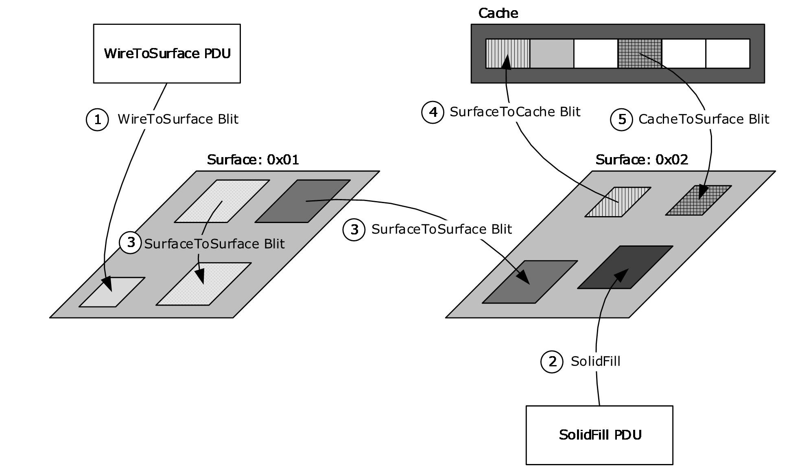

Figure 1: Overview of the blit commands

For more details regarding the graphics protocol behavior, sequencing, and processing rules, see section [3](#Section_3).

## 1.4 Relationship to Other Protocols

The Remote Desktop Protocol: Graphics Pipeline Extension is embedded in a dynamic virtual channel transport, as specified in [MS-RDPEDYC](../MS-RDPEDYC/MS-RDPEDYC.md) sections 1 through 3.

## 1.5 Prerequisites/Preconditions

The Remote Desktop Protocol: Graphics Pipeline Extension operates only after the dynamic virtual channel transport is fully established. If the dynamic virtual channel transport is terminated, the Remote Desktop Protocol: Graphics Virtual Channel Extension is also terminated. The protocol is terminated by closing the underlying virtual channel. For details about closing the dynamic virtual channel, refer to [MS-RDPEDYC](../MS-RDPEDYC/MS-RDPEDYC.md) section 3.3.5.2.

### 1.5.1 Client Implementation Requirements

Clients implementing the Remote Desktop Protocol: Graphics Pipeline Extension must set the RNS_UD_CS_SUPPORT_DYNVC_GFX_PROTOCOL (0x0100) flag in the **earlyCapabilityFlags** field of the Client Core Data ([MS-RDPBCGR](../MS-RDPBCGR/MS-RDPBCGR.md) section 2.2.1.3.2) to indicate support for the protocol. Furthermore, the client must be capable of processing the following messages:

- **RDPGFX_WIRE_TO_SURFACE_PDU_1** (section [2.2.2.1](#Section_2.2.2.1))
- **RDPGFX_WIRE_TO_SURFACE_PDU_2** (section [2.2.2.2](#Section_2.2.2.2))
- **RDPGFX_DELETE_ENCODING_CONTEXT_PDU** (section [2.2.2.3](#Section_2.2.2.3))
- **RDPGFX_SOLIDFILL_PDU** (section [2.2.2.4](#Section_2.2.2.4))
- **RDPGFX_SURFACE_TO_SURFACE_PDU** (section [2.2.2.5](#Section_2.2.2.5))
- **RDPGFX_SURFACE_TO_CACHE_PDU** (section [2.2.2.6](#Section_2.2.2.6))
- **RDPGFX_CACHE_TO_SURFACE_PDU** (section [2.2.2.7](#Section_2.2.2.7))
- **RDPGFX_EVICT_CACHE_ENTRY_PDU** (section [2.2.2.8](#Section_2.2.2.8))
- **RDPGFX_CREATE_SURFACE_PDU** (section [2.2.2.9](#Section_2.2.2.9))
- **RDPGFX_DELETE_SURFACE_PDU** (section [2.2.2.10](#Section_2.2.2.10))
- **RDPGFX_START_FRAME_PDU** (section [2.2.2.11](#Section_2.2.2.11))
- **RDPGFX_END_FRAME_PDU** (section [2.2.2.12](#Section_2.2.2.12))
- **RDPGFX_RESET_GRAPHICS_PDU** (section [2.2.2.14](#Section_2.2.2.14))
- **RDPGFX_MAP_SURFACE_TO_OUTPUT_PDU** (section [2.2.2.15](#Section_2.2.2.15))
- **RDPGFX_CAPS_CONFIRM_PDU** (section [2.2.2.19](#Section_2.2.2.19))
Furthermore, clients implementing the Remote Desktop Protocol: Graphics Pipeline Extension must be capable of sending the following messages:

- **RDPGFX_FRAME_ACKNOWLEDGE_PDU** (section [2.2.2.13](#Section_2.2.2.13))
- **RDPGFX_CAPS_ADVERTISE_PDU** (section [2.2.2.18](#Section_2.2.2.18))
Clients that implement optional persistent bitmap caching must be capable of sending the **RDPGFX_CACHE_IMPORT_OFFER_PDU** (section [2.2.2.16](#Section_2.2.2.16)) message and processing the **RDPGFX_CACHE_IMPORT_REPLY_PDU** (section [2.2.2.17](#Section_2.2.2.17)) message.

Clients that implement Enhanced RemoteApp ([MS-RDPERP](../MS-RDPERP/MS-RDPERP.md) section 1.3.3) must be capable of processing the **RDPGFX_MAP_SURFACE_TO_WINDOW_PDU** (section [2.2.2.20](#Section_2.2.2.20)) message.

Clients that advertise the **RDPGFX_CAPSET_VERSION107** (section [2.2.3.10](#Section_2.2.3.10)) capability set (sans the **RDPGFX_CAPS_FLAG_SCALEDMAP_DISABLE** (0x00000080) flag), the **RDPGFX_CAPSET_VERSION105** (section [2.2.3.8](#Section_2.2.3.8)) capability set, or the **RDPGFX_CAPSET_VERSION106** (section [2.2.3.9](#Section_2.2.3.9)) capability set MUST be capable of processing the following messages:

- **RDPGFX_MAP_SURFACE_TO_SCALED_OUTPUT_PDU** (section [2.2.2.22](#Section_2.2.2.22))
- **RDPGFX_MAP_SURFACE_TO_SCALED_WINDOW_PDU** (section [2.2.2.23](#Section_2.2.2.23)), if also implementing Enhanced RemoteApp

### 1.5.2 Server Implementation Requirements

Servers implementing the Remote Desktop Protocol: Graphics Pipeline Extension must be capable of sending the following messages:

- **RDPGFX_WIRE_TO_SURFACE_PDU_1** (section [2.2.2.1](#Section_2.2.2.1))
- **RDPGFX_WIRE_TO_SURFACE_PDU_2** (section [2.2.2.2](#Section_2.2.2.2))
- **RDPGFX_DELETE_ENCODING_CONTEXT_PDU** (section [2.2.2.3](#Section_2.2.2.3))
- **RDPGFX_SOLIDFILL_PDU** (section [2.2.2.4](#Section_2.2.2.4))
- **RDPGFX_SURFACE_TO_SURFACE_PDU** (section [2.2.2.5](#Section_2.2.2.5))
- **RDPGFX_SURFACE_TO_CACHE_PDU** (section [2.2.2.6](#Section_2.2.2.6))
- **RDPGFX_CACHE_TO_SURFACE_PDU** (section [2.2.2.7](#Section_2.2.2.7))
- **RDPGFX_EVICT_CACHE_ENTRY_PDU** (section [2.2.2.8](#Section_2.2.2.8))
- **RDPGFX_CREATE_SURFACE_PDU** (section [2.2.2.9](#Section_2.2.2.9))
- **RDPGFX_DELETE_SURFACE_PDU** (section [2.2.2.10](#Section_2.2.2.10))
- **RDPGFX_START_FRAME_PDU** (section [2.2.2.11](#Section_2.2.2.11))
- **RDPGFX_END_FRAME_PDU** (section [2.2.2.12](#Section_2.2.2.12))
- **RDPGFX_RESET_GRAPHICS_PDU** (section [2.2.2.14](#Section_2.2.2.14))
- **RDPGFX_MAP_SURFACE_TO_OUTPUT_PDU** (section [2.2.2.15](#Section_2.2.2.15))
- **RDPGFX_CACHE_IMPORT_REPLY_PDU** (section [2.2.2.17](#Section_2.2.2.17))
- **RDPGFX_CAPS_CONFIRM_PDU** (section [2.2.2.19](#Section_2.2.2.19))
Furthermore, servers implementing the Remote Desktop Protocol: Graphics Pipeline Extension must be capable of processing the following messages:

- **RDPGFX_FRAME_ACKNOWLEDGE_PDU** (section [2.2.2.13](#Section_2.2.2.13))
- **RDPGFX_CACHE_IMPORT_OFFER_PDU** (section [2.2.2.16](#Section_2.2.2.16))
- **RDPGFX_CAPS_ADVERTISE_PDU** (section [2.2.2.18](#Section_2.2.2.18))
Servers that implement Enhanced RemoteApp ([MS-RDPERP](../MS-RDPERP/MS-RDPERP.md) section 1.3.3) must be capable of sending the **RDPGFX_MAP_SURFACE_TO_WINDOW_PDU** (section [2.2.2.20](#Section_2.2.2.20)) message.

Servers that support the **RDPGFX_CAPSET_VERSION10** (section [2.2.3.3](#Section_2.2.3.3)), **RDPGFX_CAPSET_VERSION102** (section [2.2.3.5](#Section_2.2.3.5)), **RDPGFX_CAPSET_VERSION103** (section [2.2.3.6](#Section_2.2.3.6)), **RDPGFX_CAPSET_VERSION104** (section [2.2.3.7](#Section_2.2.3.7)), **RDPGFX_CAPSET_VERSION105** (section [2.2.3.8](#Section_2.2.3.8)), **RDPGFX_CAPSET_VERSION106** (section 2.2.3.9), or **RDPGFX_CAPSET_VERSION107** (section [2.2.3.10](#Section_2.2.3.10)) capability sets must be capable of processing the **RDPGFX_QOE_FRAME_ACKNOWLEDGE_PDU** (section [2.2.2.21](#Section_2.2.2.21)) message.

## 1.6 Applicability Statement

The Remote Desktop Protocol: Graphics Pipeline Extension is applicable in scenarios where the efficient transfer of server-side graphics display data is required from a [**terminal server**](#gt_terminal-server) to a terminal server client.

## 1.7 Versioning and Capability Negotiation

Capability exchange using the **RDPGFX_CAPS_ADVERTISE_PDU** (section [2.2.2.18](#Section_2.2.2.18)) and **RDPGFX_CAPS_CONFIRM_PDU** (section [2.2.2.19](#Section_2.2.2.19)) messages takes place before any graphics messages flow on the wire. The client advertises supported capability sets from section [2.2.3](#Section_2.2.3) in an **RDPGFX_CAPS_ADVERTISE_PDU** message. In response, the server selects one of these sets and then sends an **RDPGFX_CAPS_CONFIRM_PDU** message to the client containing the selected set.

Implementers of the Remote Desktop Protocol: Graphics Pipeline Extension have to support the ClearCodec codec as described in sections [2.2.4.1](#Section_2.2.4.1) and [3.3.8.1](#Section_3.3.8.1). Usage of the RemoteFX Codec ([MS-RDPRFX](../MS-RDPRFX/MS-RDPRFX.md) sections 2.2.2 and 3.1.8) and the RemoteFX Progressive Codec (sections [2.2.4.2](#Section_2.2.4.2), [3.1.8.1](#Section_3.1.8.1), [3.2.8.1](#Section_3.2.8.1), and 3.3.8.1) is based on the flags exchanged in the **RDPGFX_CAPSET_VERSION8**, **RDPGFX_CAPSET_VERSION81**, **RDPGFX_CAPSET_VERSION10**, **RDPGFX_CAPSET_VERSION102**, **RDPGFX_CAPSET_VERSION103**, **RDPGFX_CAPSET_VERSION104**, **RDPGFX_CAPSET_VERSION105, RDPGFX_CAPSET_VERSION106,** or **RDPGFX_CAPSET_VERSION107** structure (sections [2.2.3.1](#Section_2.2.3.1), [2.2.3.2](#Section_2.2.3.2), [2.2.3.3](#Section_2.2.3.3), [2.2.3.5](#Section_2.2.3.5), [2.2.3.6](#Section_2.2.3.6), [2.2.3.7](#Section_2.2.3.7), [2.2.3.8](#Section_2.2.3.8), [2.2.3.9](#Section_2.2.3.9), and [2.2.3.10](#Section_2.2.3.10) respectively). Usage of the MPEG-4 AVC/H.264 Codec in YUV420p, YUV444, or YUV444v2 mode (sections [2.2.4.3](#Section_2.2.4.3), [2.2.4.4](#Section_2.2.4.4), [2.2.4.5](#Section_2.2.4.5), [2.2.4.6](#Section_2.2.4.6), and [3.3.8.3](#Section_3.3.8.3)) is based on the flags exchanged in the **RDPGFX_CAPSET_VERSION81**, **RDPGFX_CAPSET_VERSION10**, **RDPGFX_CAPSET_VERSION102**, **RDPGFX_CAPSET_VERSION103**, **RDPGFX_CAPSET_VERSION104**, **RDPGFX_CAPSET_VERSION105**, **RDPGFX_CAPSET_VERSION106**, or **RDPGFX_CAPSET_VERSION107** structure (sections 2.2.3.2, 2.2.3.3, 2.2.3.5, 2.2.3.6, 2.2.3.7, 2.2.3.8, 2.2.3.9, and 2.2.3.10 respectively). Usage of the MPEG-4 AVC/H.264 Codec in YUV444v2 mode is implied by the **RDPGFX_CAPSET_VERSION101** structure (section [2.2.3.4](#Section_2.2.3.4)). Only the flags of the selected capability set that are sent in the **RDPGFX_CAPS_CONFIRM_PDU** (section 2.2.2.19) message apply to the connection. All of the capability set structures are encapsulated in the **RDPGFX_CAPS_ADVERTISE_PDU** (section 2.2.2.18) and **RDPGFX_CAPS_CONFIRM_PDU** (section 2.2.2.19) messages. Furthermore, any data exchanged in the Bitmap Codecs Capability Set ([MS-RDPBCGR](../MS-RDPBCGR/MS-RDPBCGR.md) section 2.2.7.2.10) does not influence the choice of codecs used by the Remote Desktop Protocol: Graphics Pipeline Extension.

## 1.8 Vendor-Extensible Fields

None.

## 1.9 Standards Assignments

None.

# 2 Messages

## 2.1 Transport

The Remote Desktop Protocol: Graphics Pipeline Extension is designed to operate over a non-lossy dynamic virtual channel, as specified in [MS-RDPEDYC](../MS-RDPEDYC/MS-RDPEDYC.md) sections 1 through 3. The dynamic virtual channel name is the null-terminated [**ANSI character**](#gt_ansi-character) string "Microsoft::Windows::RDS::Graphics". The usage of channel names in the context of opening a dynamic virtual channel is specified in [MS-RDPEDYC] section 2.2.2.1.

All server-to-client graphics messages are encapsulated within an **RDP_SEGMENTED_DATA** structure (section [2.2.5.1](#Section_2.2.5.1)) when sent on the "Microsoft::Windows::RDS::Graphics" dynamic virtual channel. Decoding one **RDP_SEGMENTED_DATA** structure yields one or more graphics messages. Graphics messages are not spanned across multiple **RDP_SEGMENTED_DATA** structures, but can be broken into multiple RDP_DATA_SEGMENT frames (section [2.2.5.2](#Section_2.2.5.2)).

Client-to-server graphics messages are not encapsulated within any external structure when sent on the "Microsoft::Windows::RDS::Graphics" dynamic virtual channel.

To ensure that the transport is utilized effectively, continuous network characteristics detection SHOULD be enabled as specified in [MS-RDPBCGR](../MS-RDPBCGR/MS-RDPBCGR.md) sections 1.3.9 and 2.2.14.

## 2.2 Message Syntax

The following sections specify the Remote Desktop Protocol: Graphics Pipeline Extension message syntax. All multiple-byte fields within a message MUST be marshaled in [**little-endian**](#gt_little-endian) byte order, unless otherwise specified.

### 2.2.1 Common Data Types

#### 2.2.1.1 RDPGFX_POINT16

The **RDPGFX_POINT16** structure specifies a point relative to the origin of a target surface.

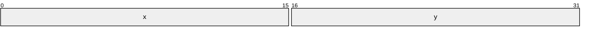
```mermaid
packet-beta
  0-15: "x"
  16-31: "y"
```

**x (2 bytes):** A 16-bit signed integer that specifies the x-coordinate of the point.

**y (2 bytes):** A 16-bit signed integer that specifies the y-coordinate of the point.

#### 2.2.1.2 RDPGFX_RECT16

The **RDPGFX_RECT16** structure specifies a rectangle relative to the origin of a target surface using exclusive coordinates (the right and bottom bounds are not included in the rectangle).

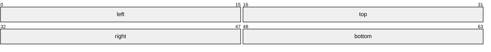
```mermaid
packet-beta
  0-15: "left"
  16-31: "top"
  32-47: "right"
  48-63: "bottom"
```

**left (2 bytes):** A 16-bit unsigned integer that specifies the leftmost bound of the rectangle.

**top (2 bytes):** A 16-bit unsigned integer that specifies the upper bound of the rectangle.

**right (2 bytes):** A 16-bit unsigned integer that specifies the rightmost bound of the rectangle.

**bottom (2 bytes):** A 16-bit unsigned integer that specifies the lower bound of the rectangle.

#### 2.2.1.3 RDPGFX_COLOR32

The **RDPGFX_COLOR32** structure specifies a 32bpp [**ARGB**](#gt_argb) or [**XRGB**](#gt_xrgb) color value.

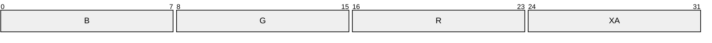
```mermaid
packet-beta
  0-7: "B"
  8-15: "G"
  16-23: "R"
  24-31: "XA"
```

**B (1 byte):** An 8-bit unsigned integer that specifies the blue ARGB or XRGB color component.

**G (1 byte):** An 8-bit unsigned integer that specifies the green ARGB or XRGB color component.

**R (1 byte):** An 8-bit unsigned integer that specifies the red ARGB or XRGB color component.

**XA (1 byte):** An 8-bit unsigned integer that in the case of ARGB specifies the alpha color component or in the case of XRGB MUST be ignored.

#### 2.2.1.4 RDPGFX_PIXELFORMAT

The **RDPGFX_PIXELFORMAT** structure specifies the color component layout in a pixel.

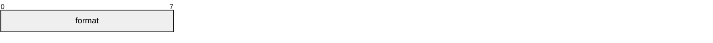
```mermaid
packet-beta
  0-7: "format"
```

**format (1 byte):** An 8-bit unsigned integer that specifies the pixel format.

| Value | Meaning |
| --- | --- |
| PIXEL_FORMAT_XRGB_8888 0x20 | 32bpp with no valid alpha ([**XRGB**](#gt_xrgb)). |
| PIXEL_FORMAT_ARGB_8888 0x21 | 32bpp with valid alpha ([**ARGB**](#gt_argb)). |

#### 2.2.1.5 RDPGFX_HEADER

The **RDPGFX_HEADER** structure is included in all graphics command PDUs and specifies the graphics command type, the transport flags, and the length of the PDU.

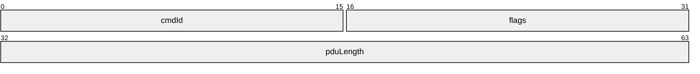
```mermaid
packet-beta
  0-15: "cmdId"
  16-31: "flags"
  32-63: "pduLength"
```

**cmdId (2 bytes):** A 16-bit unsigned integer that identifies the type of the graphics command PDU.

| Value | Meaning |
| --- | --- |
| RDPGFX_CMDID_WIRETOSURFACE_1 0x0001 | **RDPGFX_WIRE_TO_SURFACE_PDU_1** (section [2.2.2.1](#Section_2.2.2.1)) |
| RDPGFX_CMDID_WIRETOSURFACE_2 0x0002 | **RDPGFX_WIRE_TO_SURFACE_PDU_2** (section [2.2.2.2](#Section_2.2.2.2)) |
| RDPGFX_CMDID_DELETEENCODINGCONTEXT 0x0003 | **RDPGFX_DELETE_ENCODING_CONTEXT_PDU** (section [2.2.2.3](#Section_2.2.2.3)) |
| RDPGFX_CMDID_SOLIDFILL 0x0004 | **RDPGFX_SOLIDFILL_PDU** (section [2.2.2.4](#Section_2.2.2.4)) |
| RDPGFX_CMDID_SURFACETOSURFACE 0x0005 | **RDPGFX_SURFACE_TO_SURFACE_PDU** (section [2.2.2.5](#Section_2.2.2.5)) |
| RDPGFX_CMDID_SURFACETOCACHE 0x0006 | **RDPGFX_SURFACE_TO_CACHE_PDU** (section [2.2.2.6](#Section_2.2.2.6)) |
| RDPGFX_CMDID_CACHETOSURFACE 0x0007 | **RDPGFX_CACHE_TO_SURFACE_PDU** (section [2.2.2.7](#Section_2.2.2.7)) |
| RDPGFX_CMDID_EVICTCACHEENTRY 0x0008 | **RDPGFX_EVICT_CACHE_ENTRY_PDU** (section [2.2.2.8](#Section_2.2.2.8)) |
| RDPGFX_CMDID_CREATESURFACE 0x0009 | **RDPGFX_CREATE_SURFACE_PDU** (section [2.2.2.9](#Section_2.2.2.9)) |
| RDPGFX_CMDID_DELETESURFACE 0x000A | **RDPGFX_DELETE_SURFACE_PDU** (section [2.2.2.10](#Section_2.2.2.10)) |
| RDPGFX_CMDID_STARTFRAME 0x000B | **RDPGFX_START_FRAME_PDU** (section [2.2.2.11](#Section_2.2.2.11)) |
| RDPGFX_CMDID_ENDFRAME 0x000C | **RDPGFX_END_FRAME_PDU** (section [2.2.2.12](#Section_2.2.2.12)) |
| RDPGFX_CMDID_FRAMEACKNOWLEDGE 0x000D | **RDPGFX_FRAME_ACKNOWLEDGE_PDU** (section [2.2.2.13](#Section_2.2.2.13)) |
| RDPGFX_CMDID_RESETGRAPHICS 0x000E | **RDPGFX_RESET_GRAPHICS_PDU** (section [2.2.2.14](#Section_2.2.2.14)) |
| RDPGFX_CMDID_MAPSURFACETOOUTPUT 0x000F | **RDPGFX_MAP_SURFACE_TO_OUTPUT_PDU** (section [2.2.2.15](#Section_2.2.2.15)) |
| RDPGFX_CMDID_CACHEIMPORTOFFER 0x0010 | **RDPGFX_CACHE_IMPORT_OFFER_PDU** (section [2.2.2.16](#Section_2.2.2.16)) |
| RDPGFX_CMDID_CACHEIMPORTREPLY 0x0011 | **RDPGFX_CACHE_IMPORT_REPLY_PDU** (section [2.2.2.17](#Section_2.2.2.17)) |
| RDPGFX_CMDID_CAPSADVERTISE 0x0012 | **RDPGFX_CAPS_ADVERTISE_PDU** (section [2.2.2.18](#Section_2.2.2.18)) |
| RDPGFX_CMDID_CAPSCONFIRM 0x0013 | **RDPGFX_CAPS_CONFIRM_PDU** (section [2.2.2.19](#Section_2.2.2.19)) |
| RDPGFX_CMDID_MAPSURFACETOWINDOW 0x0015 | **RDPGFX_MAP_SURFACE_TO_WINDOW_PDU** (section [2.2.2.20](#Section_2.2.2.20)) |
| RDPGFX_CMDID_QOEFRAMEACKNOWLEDGE 0x0016 | **RDPGFX_QOE_FRAME_ACKNOWLEDGE_PDU** (section [2.2.2.21](#Section_2.2.2.21)) |
| RDPGFX_CMDID_MAPSURFACETOSCALEDOUTPUT 0x0017 | **RDPGFX_MAP_SURFACE_TO_SCALED_OUTPUT_PDU** (section [2.2.2.22](#Section_2.2.2.22)) |
| RDPGFX_CMDID_MAPSURFACETOSCALEDWINDOW 0x0018 | **RDPGFX_MAP_SURFACE_TO_SCALED_WINDOW_PDU** (section [2.2.2.23](#Section_2.2.2.23)) |

**flags (2 bytes):** A 16-bit unsigned integer that contains graphics command flags common to all PDUs. No common graphics command flags are specified; therefore, this field MUST be set to zero.

**pduLength (4 bytes):** A 32-bit unsigned integer that specifies the length of the graphics command PDU, in bytes. This value MUST include the length of the **RDPGFX_HEADER** (8 bytes).

#### 2.2.1.6 RDPGFX_CAPSET

The **RDPGFX_CAPSET** structure specifies the layout of a capability set sent in the **RDPGFX_CAPS_ADVERTISE_PDU** (section [2.2.2.18](#Section_2.2.2.18)) message. All of the capability sets specified in section [2.2.3](#Section_2.2.3) conform to this basic structure.

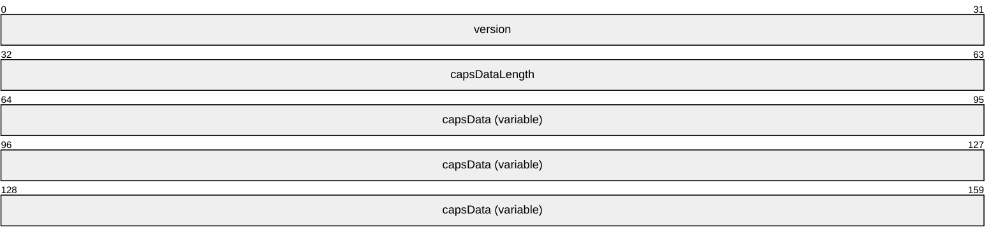
```mermaid
packet-beta
  0-31: "version"
  32-63: "capsDataLength"
  64-159: "capsData (variable)"
```

**version (4 bytes):** A 32-bit unsigned integer that specifies the version of the capability set.

| Value | Meaning |
| --- | --- |
| RDPGFX_CAPVERSION_8 0x00080004 | **RDPGFX_CAPSET_VERSION8** (section [2.2.3.1](#Section_2.2.3.1)) |
| RDPGFX_CAPVERSION_81 0x00080105 | **RDPGFX_CAPSET_VERSION81** (section [2.2.3.2](#Section_2.2.3.2)) |
| RDPGFX_CAPVERSION_10 0x000A0002 | **RDPGFX_CAPSET_VERSION10** (section [2.2.3.3](#Section_2.2.3.3)) |
| RDPGFX_CAPVERSION_101 0x000A0100 | **RDPGFX_CAPSET_VERSION101** (section [2.2.3.4](#Section_2.2.3.4)) |
| RDPGFX_CAPVERSION_102 0x000A0200 | **RDPGFX_CAPSET_VERSION102** (section [2.2.3.5](#Section_2.2.3.5)) |
| RDPGFX_CAPVERSION_103 0x000A0301 | **RDPGFX_CAPSET_VERSION103** (section [2.2.3.6](#Section_2.2.3.6)) |
| RDPGFX_CAPVERSION_104 0x000A0400 | **RDPGFX_CAPSET_VERSION104** (section [2.2.3.7](#Section_2.2.3.7)) |
| RDPGFX_CAPVERSION_105 0x000A0502 | **RDPGFX_CAPSET_VERSION105** (section [2.2.3.8](#Section_2.2.3.8)) |
| RDPGFX_CAPVERSION_106 0x000A0600 | **RDPGFX_CAPSET_VERSION106** (section [2.2.3.9](#Section_2.2.3.9)) |
| RDPGFX_CAPVERSION_107 0x000A0701 | **RDPGFX_CAPSET_VERSION107** (section [2.2.3.10](#Section_2.2.3.10)) |

The format of the data in the **capsData** field and the length specified in the **capsDataLength** field are both determined by the version of the capability set.

**capsDataLength (4 bytes):** A 32-bit unsigned integer that specifies the size, in bytes, of the capability set data present in the **capsData** field.

**capsData (variable):** A variable-length array of bytes that contains data specific to the capability set. The number of bytes in this array is specified by the **capsDataLength** field.

### 2.2.2 Graphics Messages

#### 2.2.2.1 RDPGFX_WIRE_TO_SURFACE_PDU_1

The **RDPGFX_WIRE_TO_SURFACE_PDU_1** message is used to transfer encoded bitmap data from the server to a client-side destination surface.

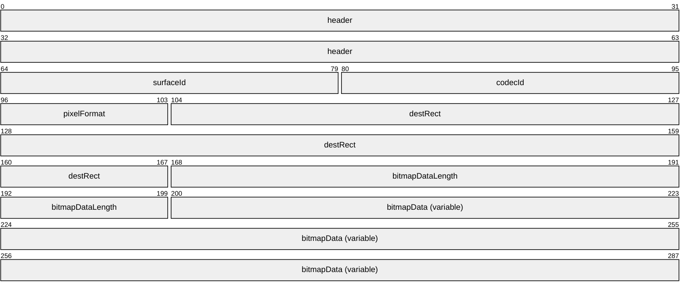
```mermaid
packet-beta
  0-63: "header"
  64-79: "surfaceId"
  80-95: "codecId"
  96-103: "pixelFormat"
  104-167: "destRect"
  168-199: "bitmapDataLength"
  200-287: "bitmapData (variable)"
```

**header (8 bytes):** An **RDPGFX_HEADER** structure (section [2.2.1.5](#Section_2.2.1.5)). The **cmdId** field MUST be set to RDPGFX_CMDID_WIRETOSURFACE_1 (0x0001), while the **flags** field MUST be set to zero.

**surfaceId (2 bytes):** A 16-bit unsigned integer that specifies the ID of the destination surface.

**codecId (2 bytes):** A 16-bit unsigned integer that specifies the codec that was used to encode the bitmap data encapsulated in the **bitmapData** field.

| Value | Meaning |
| --- | --- |
| RDPGFX_CODECID_UNCOMPRESSED 0x0000 | The bitmap data encapsulated in the **bitmapData** field is uncompressed. Pixels in the uncompressed data are ordered from left to right and then top to bottom. |
| RDPGFX_CODECID_CAVIDEO 0x0003 | The bitmap data encapsulated in the **bitmapData** field is compressed using the RemoteFX Codec ([MS-RDPRFX](../MS-RDPRFX/MS-RDPRFX.md) sections [2.2.1](#Section_2.2.1) and [3.1.8](#Section_3.1.8)). Note that the **TS_RFX_RECT** ([MS-RDPRFX] section 2.2.2.1.6) structures encapsulated in the **bitmapData** field MUST all be relative to the top-left corner of the rectangle defined by the **destRect** field. |
| RDPGFX_CODECID_CLEARCODEC 0x0008 | The bitmap data encapsulated in the **bitmapData** field is compressed using the ClearCodec Codec (sections [2.2.4.1](#Section_2.2.4.1) and [3.3.8.1](#Section_3.3.8.1)). |
| RDPGFX_CODECID_PLANAR 0x000A | The bitmap data encapsulated in the **bitmapData** field is compressed using the Planar Codec ([MS-RDPEGDI](../MS-RDPEGDI/MS-RDPEGDI.md) sections 2.2.2.5.1 and 3.1.9). |
| RDPGFX_CODECID_AVC420 0x000B | The bitmap data encapsulated in the **bitmapData** field is compressed using the MPEG-4 AVC/H.264 Codec in YUV420p mode (section [2.2.4.4](#Section_2.2.4.4)). |
| RDPGFX_CODECID_ALPHA 0x000C | The bitmap data encapsulated in the **bitmapData** field is compressed using the Alpha Codec (section [2.2.4.3](#Section_2.2.4.3)). |
| RDPGFX_CODECID_AVC444 0x000E | The bitmap data encapsulated in the **bitmapData** field is compressed using the MPEG-4 AVC/H.264 Codec in YUV444 mode (section [2.2.4.5](#Section_2.2.4.5)). |
| RDPGFX_CODECID_AVC444V2 0x000F | The bitmap data encapsulated in the **bitmapData** field is compressed using the MPEG-4 AVC/H.264 Codec in YUV444v2 mode (section [2.2.4.6](#Section_2.2.4.6)). |

**pixelFormat (1 byte):** An **RDPGFX_PIXELFORMAT** (section [2.2.1.4](#Section_2.2.1.4)) structure that specifies the pixel format of the decoded bitmap data encapsulated in the **bitmapData** field.

**destRect (8 bytes):** An **RDPGFX_RECT16** (section [2.2.1.2](#Section_2.2.1.2)) structure that specifies the target point on the destination surface to which to copy the decoded bitmap and the dimensions (width and height) of the bitmap data encapsulated in the **bitmapData** field. This field specifies a bounding rectangle if the **codecId** field contains the RDPGFX_CODECID_AVC420 (0x000B), RDPGFX_CODECID_AVC444 (0x000E), or the RDPGFX_CODECID_AVC444V2 (0x000F) identifier.

**bitmapDataLength (4 bytes):** A 32-bit unsigned integer that specifies the length, in bytes, of the **bitmapData** field.

**bitmapData (variable):** A variable-length array of bytes containing bitmap data encoded using the codec identified by the ID in the **codecId** field.

#### 2.2.2.2 RDPGFX_WIRE_TO_SURFACE_PDU_2

The **RDPGFX_WIRE_TO_SURFACE_PDU_2** message is used to transfer encoded bitmap data progressively from the server to a client-side destination surface by leveraging a compression context that persists on the server and the client until the transfer of the bitmap data is complete.

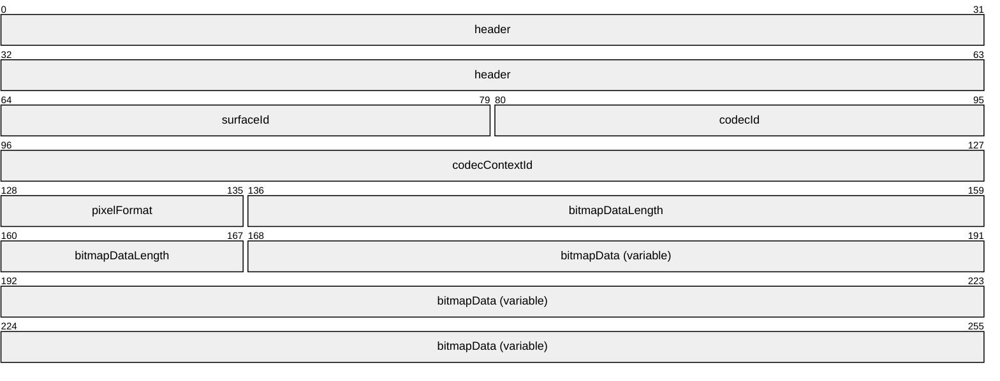
```mermaid
packet-beta
  0-63: "header"
  64-79: "surfaceId"
  80-95: "codecId"
  96-127: "codecContextId"
  128-135: "pixelFormat"
  136-167: "bitmapDataLength"
  168-255: "bitmapData (variable)"
```

**header (8 bytes):** An **RDPGFX_HEADER** (section [2.2.1.5](#Section_2.2.1.5)) structure. The **cmdId** field MUST be set to RDPGFX_CMDID_WIRETOSURFACE_2 (0x0002), while the **flags** field MUST be set to zero.

**surfaceId (2 bytes):** A 16-bit unsigned integer that specifies the ID of the destination surface.

**codecId (2 bytes):** A 16-bit unsigned integer that specifies the codec that was used to encode the bitmap data encapsulated in the **bitmapData** field.

| Value | Meaning |
| --- | --- |
| RDPGFX_CODECID_CAPROGRESSIVE 0x0009 | The bitmap data encapsulated in the **bitmapData** field is compressed using the RemoteFX Progressive Codec (sections [2.2.4.2](#Section_2.2.4.2), [3.1.8.1](#Section_3.1.8.1), [3.2.8.1](#Section_3.2.8.1), and [3.3.8.2](#Section_3.3.8.2)). |

**codecContextId (4 bytes):** A 32-bit unsigned integer that identifies the compression context associated with the bitmap data encapsulated in the **bitmapData** field.

**pixelFormat (1 byte):** An **RDPGFX_PIXELFORMAT** (section [2.2.1.4](#Section_2.2.1.4)) structure that specifies the pixel format of the decoded bitmap data encapsulated in the **bitmapData** field.

**bitmapDataLength (4 bytes):** A 32-bit unsigned integer that specifies the length, in bytes, of the **bitmapData** field.

**bitmapData (variable):** A variable-length array of bytes containing bitmap data encoded using the codec identified by the ID in the **codecId** field.

#### 2.2.2.3 RDPGFX_DELETE_ENCODING_CONTEXT_PDU

The **RDPGFX_DELETE_ENCODING_CONTEXT_PDU** message is sent by the server to instruct the client to delete a compression context that was used by a collection of **RDPGFX_WIRE_TO_SURFACE_PDU_2** (section [2.2.2.2](#Section_2.2.2.2)) messages to progressively transfer bitmap data.

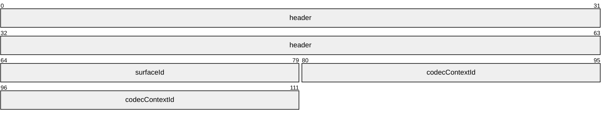
```mermaid
packet-beta
  0-63: "header"
  64-79: "surfaceId"
  80-111: "codecContextId"
```

**header (8 bytes):** An **RDPGFX_HEADER** (section [2.2.1.5](#Section_2.2.1.5)) structure. The **cmdId** field MUST be set to RDPGFX_CMDID_DELETEENCODINGCONTEXT (0x0003), while the **flags** field MUST be set to zero.

**surfaceId (2 bytes):** A 16-bit unsigned integer that specifies the ID of the surface associated with the compression context ID specified in the **codecContextId** field.

**codecContextId (4 bytes):** A 32-bit unsigned integer that specifies the ID of the compression context to delete.

#### 2.2.2.4 RDPGFX_SOLIDFILL_PDU

The **RDPGFX_SOLIDFILL_PDU** message is used to instruct the client to fill a collection of rectangles on a destination surface with a solid color.

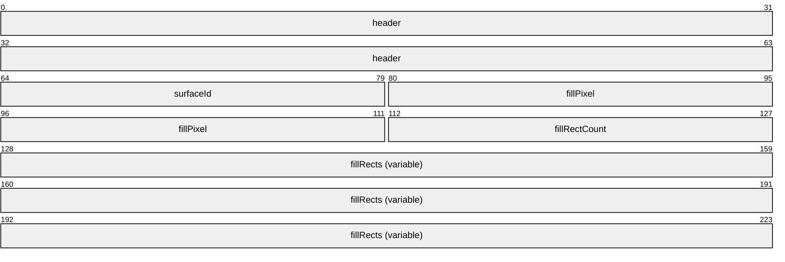
```mermaid
packet-beta
  0-63: "header"
  64-79: "surfaceId"
  80-111: "fillPixel"
  112-127: "fillRectCount"
  128-223: "fillRects (variable)"
```

**header (8 bytes):** An **RDPGFX_HEADER** (section [2.2.1.5](#Section_2.2.1.5)) structure. The **cmdId** field MUST be set to RDPGFX_CMDID_SOLIDFILL (0x0004), while the **flags** field MUST be set to zero.

**surfaceId (2 bytes):** A 16-bit unsigned integer that specifies the ID of the destination surface.

**fillPixel (4 bytes):** An **RDPGFX_COLOR32** (section [2.2.1.3](#Section_2.2.1.3)) structure that specifies the color that MUST be used to fill the destination rectangles specified in the **fillRects** field.

**fillRectCount (2 bytes):** A 16-bit unsigned integer that specifies the number of **RDPGFX_RECT16** (section [2.2.1.2](#Section_2.2.1.2)) structures in the **fillRects** field.

**fillRects (variable):** A variable-length array of **RDPGFX_RECT16** structures that specifies rectangles on the destination surface to be filled. The number of structures in this array is specified by the **fillRectCount** field.

#### 2.2.2.5 RDPGFX_SURFACE_TO_SURFACE_PDU

The **RDPGFX_SURFACE_TO_SURFACE_PDU** message is used to instruct the client to copy bitmap data from a source surface to a destination surface or to replicate bitmap data within the same surface.

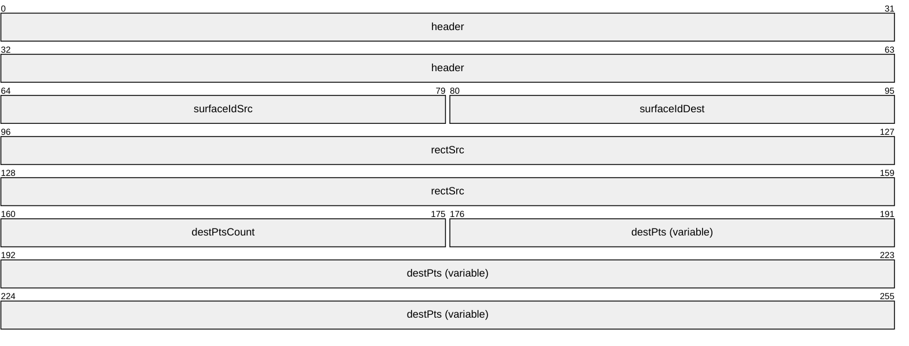
```mermaid
packet-beta
  0-63: "header"
  64-79: "surfaceIdSrc"
  80-95: "surfaceIdDest"
  96-159: "rectSrc"
  160-175: "destPtsCount"
  176-255: "destPts (variable)"
```

**header (8 bytes):** An **RDPGFX_HEADER** (section [2.2.1.5](#Section_2.2.1.5)) structure. The **cmdId** field MUST be set to RDPGFX_CMDID_SURFACETOSURFACE (0x0005), while the **flags** field MUST be set to zero.

**surfaceIdSrc (2 bytes):** A 16-bit unsigned integer that specifies the ID of the surface containing the source bitmap.

**surfaceIdDest (2 bytes):** A 16-bit unsigned integer that specifies the ID of the destination surface.

**rectSrc (8 bytes):** An **RDPGFX_RECT16** (section [2.2.1.2](#Section_2.2.1.2)) structure that specifies the rectangle that bounds the source bitmap.

**destPtsCount (2 bytes):** A 16-bit unsigned integer that specifies the number of **RDPGFX_POINT16** (section [2.2.1.1](#Section_2.2.1.1)) structures in the **destPts** field.

**destPts (variable):** A variable-length array of **RDPGFX_POINT16** structures that specifies target points on the destination surface to which to copy the source bitmap. The number of structures in this array is specified by the **destPtsCount** field.

#### 2.2.2.6 RDPGFX_SURFACE_TO_CACHE_PDU

The **RDPGFX_SURFACE_TO_CACHE_PDU** message is used to instruct the client to copy bitmap data from a source surface to the bitmap cache.

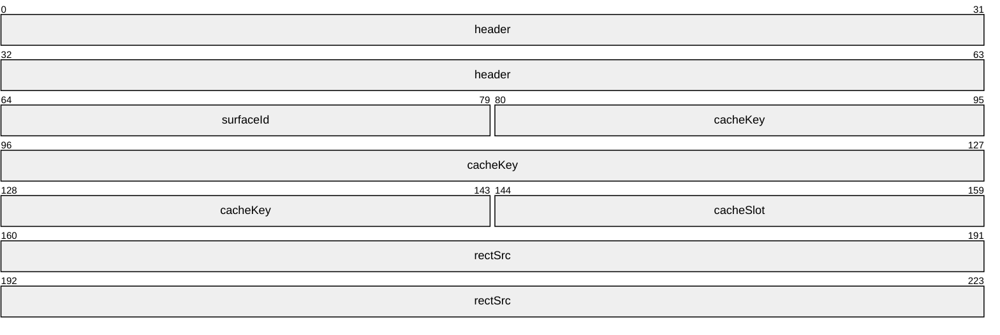
```mermaid
packet-beta
  0-63: "header"
  64-79: "surfaceId"
  80-143: "cacheKey"
  144-159: "cacheSlot"
  160-223: "rectSrc"
```

**header (8 bytes):** An **RDPGFX_HEADER** (section [2.2.1.5](#Section_2.2.1.5)) structure. The **cmdId** field MUST be set to RDPGFX_CMDID_SURFACETOCACHE (0x0006), while the **flags** field MUST be set to zero.

**surfaceId (2 bytes):** A 16-bit unsigned integer that specifies the ID of the surface containing the source bitmap.

**cacheKey (8 bytes):** A 64-bit unsigned integer that specifies a key to associate with the bitmap cache entry that will store the bitmap.

**cacheSlot (2 bytes):** A 16-bit unsigned integer that specifies the index of the bitmap cache entry in which the source bitmap data MUST be stored. The value of this field is constrained as specified in section [3.3.1.4](#Section_3.3.1.4).

**rectSrc (8 bytes):** An **RDPGFX_RECT16** (section [2.2.1.2](#Section_2.2.1.2)) structure that specifies the rectangle that bounds the source bitmap.

#### 2.2.2.7 RDPGFX_CACHE_TO_SURFACE_PDU

The **RDPGFX_CACHE_TO_SURFACE_PDU** message is used to instruct the client to copy bitmap data from the bitmap cache to a destination surface.

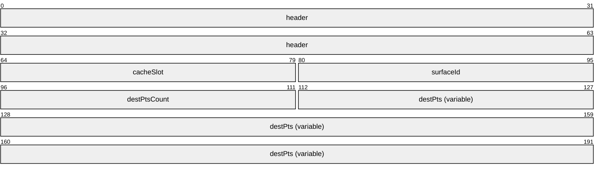
```mermaid
packet-beta
  0-63: "header"
  64-79: "cacheSlot"
  80-95: "surfaceId"
  96-111: "destPtsCount"
  112-191: "destPts (variable)"
```

**header (8 bytes):** An **RDPGFX_HEADER** (section [2.2.1.5](#Section_2.2.1.5)) structure. The **cmdId** field MUST be set to RDPGFX_CMDID_CACHETOSURFACE (0x0007), while the **flags** field MUST be set to zero.

**cacheSlot (2 bytes):** A 16-bit unsigned integer that specifies the index of the bitmap cache entry that contains the source bitmap. The value of this field is constrained as specified in section [3.3.1.4](#Section_3.3.1.4).

**surfaceId (2 bytes):** A 16-bit unsigned integer that specifies the ID of the destination surface.

**destPtsCount (2 bytes):** A 16-bit unsigned integer that specifies the number of **RDPGFX_POINT16** (section [2.2.1.1](#Section_2.2.1.1)) structures in the **destPts** field.

**destPts (variable):** A variable-length array of **RDPGFX_POINT16** structures that specifies target points on the destination surface to which to copy the source bitmap. The number of structures in this array is specified by the **destPtsCount** field.

#### 2.2.2.8 RDPGFX_EVICT_CACHE_ENTRY_PDU

The **RDPGFX_EVICT_CACHE_ENTRY_PDU** message is used to instruct the client to delete an entry from the bitmap cache.

```mermaid
packet-beta
  0-63: "header"
  64-79: "cacheSlot"
```

**header (8 bytes):** An **RDPGFX_HEADER** (section [2.2.1.5](#Section_2.2.1.5)) structure. The **cmdId** field MUST be set to RDPGFX_CMDID_EVICTCACHEENTRY (0x0008), while the **flags** field MUST be set to zero.

**cacheSlot (2 bytes):** A 16-bit unsigned integer that specifies the index of the bitmap cache entry to delete from the bitmap cache. The value of this field is constrained as specified in section [3.3.1.4](#Section_3.3.1.4).

#### 2.2.2.9 RDPGFX_CREATE_SURFACE_PDU

The **RDPGFX_CREATE_SURFACE_PDU** message is used to instruct the client to create a surface of a given width, height, and pixel format.

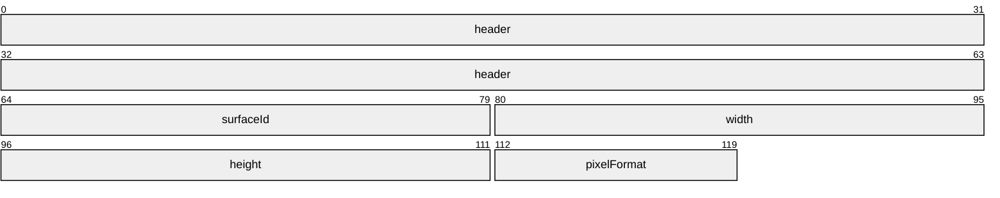
```mermaid
packet-beta
  0-63: "header"
  64-79: "surfaceId"
  80-95: "width"
  96-111: "height"
  112-119: "pixelFormat"
```

**header (8 bytes):** An **RDPGFX_HEADER** (section [2.2.1.5](#Section_2.2.1.5)) structure. The **cmdId** field MUST be set to RDPGFX_CMDID_CREATESURFACE (0x0009), while the **flags** field MUST be set to zero.

**surfaceId (2 bytes):** A 16-bit unsigned integer that specifies the ID that MUST be assigned to the surface once it has been created.

**width (2 bytes):** A 16-bit unsigned integer that specifies the width of the surface to create.

**height (2 bytes):** A 16-bit unsigned integer that specifies the height of the surface to create.

**pixelFormat (1 byte):** An **RDPGFX_PIXELFORMAT** (section [2.2.1.4](#Section_2.2.1.4)) structure that specifies the pixel format of the surface to create.

#### 2.2.2.10 RDPGFX_DELETE_SURFACE_PDU

The **RDPGFX_DELETE_SURFACE_PDU** message is used to instruct the client to delete a surface.

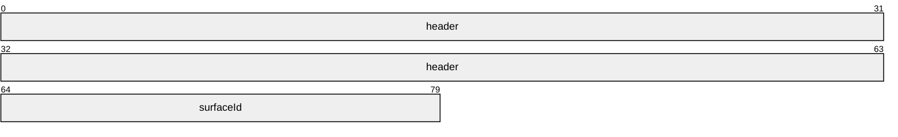
```mermaid
packet-beta
  0-63: "header"
  64-79: "surfaceId"
```

**header (8 bytes):** An **RDPGFX_HEADER** (section [2.2.1.5](#Section_2.2.1.5)) structure. The **cmdId** field MUST be set to RDPGFX_CMDID_DELETESURFACE (0x000A), while the **flags** field MUST be set to zero.

**surfaceId (2 bytes):** A 16-bit unsigned integer that specifies the ID of the surface to delete.

#### 2.2.2.11 RDPGFX_START_FRAME_PDU

The **RDPGFX_START_FRAME_PDU** message is sent by the server to specify the start of a logical frame, enabling related graphics commands to be grouped together.

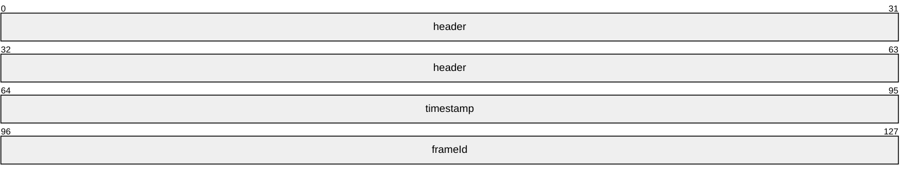
```mermaid
packet-beta
  0-63: "header"
  64-95: "timestamp"
  96-127: "frameId"
```

**header (8 bytes):** An **RDPGFX_HEADER** (section [2.2.1.5](#Section_2.2.1.5)) structure. The **cmdId** field MUST be set to RDPGFX_CMDID_STARTFRAME (0x000B), while the **flags** field MUST be set to zero.

**timestamp (4 bytes):** A 32-bit unsigned integer that contains a [**UTC**](#gt_coordinated-universal-time-utc) timestamp assigned to the frame. If no timestamp is available, this field MUST be set to zero.

The format of the **timestamp** field is described by the following bitmask diagram.

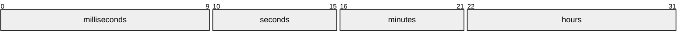
```mermaid
packet-beta
  0-9: "milliseconds"
  10-15: "seconds"
  16-21: "minutes"
  22-31: "hours"
```

**milliseconds (10 bits):** A 10-bit, unsigned integer that contains the millisecond value of the timestamp. This field MUST be greater than or equal to 0, and less than or equal to 999.

**seconds (6 bits):** A 6-bit, unsigned integer that contains the second value of the timestamp. This field MUST be greater than or equal to 0, and less than or equal to 59.

**minutes (6 bits):** A 6-bit, unsigned integer that contains the minute value of the timestamp. This field MUST be greater than or equal to 0, and less than or equal to 59.

**hours (10 bits):** A 10-bit, unsigned integer that contains the hour value of the timestamp. This field MUST be greater than or equal to 0, and less than or equal to 23.

**frameId (4 bytes):** A 32-bit unsigned integer that specifies a unique ID assigned to the frame.

#### 2.2.2.12 RDPGFX_END_FRAME_PDU

The **RDPGFX_END_FRAME_PDU** message is sent by the server to specify the end of a logical frame.

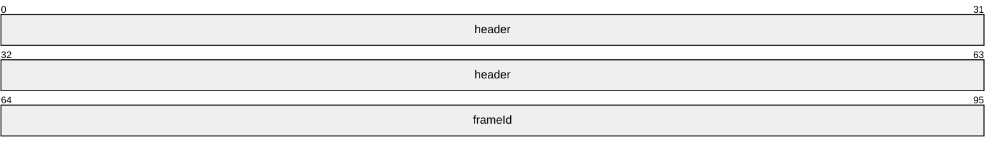
```mermaid
packet-beta
  0-63: "header"
  64-95: "frameId"
```

**header (8 bytes):** An **RDPGFX_HEADER** (section [2.2.1.5](#Section_2.2.1.5)) structure. The **cmdId** field MUST be set to RDPGFX_CMDID_ENDFRAME (0x000C), while the **flags** field MUST be set to zero.

**frameId (4 bytes):** A 32-bit unsigned integer that contains the ID assigned to the frame in the **RDPGFX_START_FRAME_PDU** (section [2.2.2.11](#Section_2.2.2.11)) message.

#### 2.2.2.13 RDPGFX_FRAME_ACKNOWLEDGE_PDU

The **RDPGFX_FRAME_ACKNOWLEDGE_PDU** message is sent by the client to indicate to the server that a logical frame of graphics commands has been successfully decoded. This message MUST be sent in response to an **RDPGFX_END_FRAME_PDU** (section [2.2.2.12](#Section_2.2.2.12)) message, unless the client has opted out of this behavior.

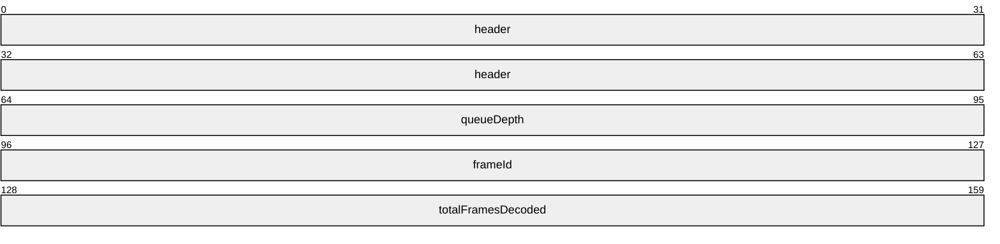
```mermaid
packet-beta
  0-63: "header"
  64-95: "queueDepth"
  96-127: "frameId"
  128-159: "totalFramesDecoded"
```

**header (8 bytes):** An **RDPGFX_HEADER** (section [2.2.1.5](#Section_2.2.1.5)) structure. The **cmdId** field MUST be set to RDPGFX_CMDID_FRAMEACKNOWLEDGE (0x000D), while the **flags** field MUST be set to zero.

**queueDepth (4 bytes):** A 32-bit unsigned integer that either specifies the number of unprocessed bytes buffered at the client, or indicates to the server that the client will no longer be transmitting RDPGFX_FRAME_ACKNOWLEDGE_PDU messages.

| Value | Meaning |
| --- | --- |
| QUEUE_DEPTH_UNAVAILABLE 0x00000000 | Specifies that no information is available regarding the size, in bytes, of the graphics messages that have been buffered at the client and not yet processed. |
| 0x00000001 – 0xFFFFFFFE | Specifies the size, in bytes, of the graphics messages that have been buffered at the client and not yet processed. |
| SUSPEND_FRAME_ACKNOWLEDGEMENT 0xFFFFFFFF | Indicates to the server that the client will no longer be transmitting RDPGFX_FRAME_ACKNOWLEDGE_PDU messages. The client can opt back into sending these messages by sending an RDPGFX_FRAME_ACKNOWLEDGE_PDU message with the **queueDepth** field set to a value in the range 0x00000000 to 0xFFFFFFFE (inclusive) in response to an RDPGFX_END_FRAME_PDU message. |

**frameId (4 bytes):** A 32-bit unsigned integer that contains the ID of the frame being acknowledged. The ID of the frame is specified in the **RDPGFX_START_FRAME_PDU** (section [2.2.2.11](#Section_2.2.2.11)) and **RDPGFX_END_FRAME_PDU** (section 2.2.2.12) messages.

**totalFramesDecoded (4 bytes):** A 32-bit unsigned integer that specifies the number of frames that have been decoded by the client since the connection was initiated.

#### 2.2.2.14 RDPGFX_RESET_GRAPHICS_PDU

The **RDPGFX_RESET_GRAPHICS_PDU** message is sent by the server to instruct the client to change the width and height of the **Graphics Output Buffer** (section [3.3.1.7](#Section_3.3.1.7)) ADM element, and to update the monitor layout. Note that this message MUST be 340 bytes in size.

```mermaid
packet-beta
  0-63: "header"
  64-95: "width"
  96-127: "height"
  128-159: "monitorCount"
  160-255: "monitorDefArray (variable)"
  256-351: "pad (variable)"
```

**header (8 bytes):** An **RDPGFX_HEADER** (section [2.2.1.5](#Section_2.2.1.5)) structure. The **cmdId** field MUST be set to RDPGFX_CMDID_RESETGRAPHICS (0x000E), the **flags** field MUST be set to zero, and the **pduLength** field MUST be set to 340 bytes.

**width (4 bytes):** A 32-bit unsigned integer that specifies the new width of the **Graphics Output Buffer** ADM element (the maximum allowed width is 32766 pixels).

**height (4 bytes):** A 32-bit unsigned integer that specifies the new height of the **Graphics Output Buffer** ADM element (the maximum allowed height is 32766 pixels).

**monitorCount (4 bytes):** A 32-bit unsigned integer that specifies the number of display monitor definitions in the **monitorDefArray** field. This value MUST be less than or equal to 16.

**monitorDefArray (variable):** A variable-length array containing a series of **TS_MONITOR_DEF** ([MS-RDPBCGR](../MS-RDPBCGR/MS-RDPBCGR.md) section 2.2.1.3.6.1) structures that specify the display monitor layout of the session on the remote server. The number of **TS_MONITOR_DEF** structures is specified by the **monitorCount** field.

**pad (variable):** A variable-length byte array that is used for padding. The number of bytes in this array is calculated by subtracting the combined size of the **header**, **width**, **height**, **monitorCount**, and **monitorDefArray** fields from the total size of the PDU (which is specified by the **pduLength** field embedded in the **header** field). The contents of the **pad** field MUST be ignored.

#### 2.2.2.15 RDPGFX_MAP_SURFACE_TO_OUTPUT_PDU

The **RDPGFX_MAP_SURFACE_TO_OUTPUT_PDU** message is sent by the server to instruct the client to map a surface to a rectangular area of the **Graphics Output Buffer** (section [3.3.1.7](#Section_3.3.1.7)) ADM element.

```mermaid
packet-beta
  0-63: "header"
  64-79: "surfaceId"
  80-95: "reserved"
  96-127: "outputOriginX"
  128-159: "outputOriginY"
```

**header (8 bytes):** An **RDPGFX_HEADER** (section [2.2.1.5](#Section_2.2.1.5)) structure. The **cmdId** field MUST be set to RDPGFX_CMDID_MAPSURFACETOOUTPUT (0x000F), while the **flags** field MUST be set to zero.

**surfaceId (2 bytes):** A 16-bit unsigned integer that specifies the ID of the surface to be associated with the output-to-surface mapping.

**reserved (2 bytes):** A 16-bit unsigned integer that is reserved for future use. This field MUST be set to zero.

**outputOriginX (4 bytes):** A 32-bit unsigned integer that specifies the x-coordinate of the point, relative to the origin of the **Graphics Output Buffer** ADM element, at which to map the top-left corner of the surface.

**outputOriginY (4 bytes):** A 32-bit unsigned integer that specifies the y-coordinate of the point, relative to the origin of the **Graphics Output Buffer** ADM element, at which to map the upper-left corner of the surface.

#### 2.2.2.16 RDPGFX_CACHE_IMPORT_OFFER_PDU

The **RDPGFX_CACHE_IMPORT_OFFER_PDU** message is sent by the client to inform the server of bitmap data that is present in an optional client-side persistent bitmap cache.

```mermaid
packet-beta
  0-63: "header"
  64-79: "cacheEntriesCount"
  80-159: "cacheEntries (variable)"
```

**header (8 bytes):** An **RDPGFX_HEADER** (section [2.2.1.5](#Section_2.2.1.5)) structure. The **cmdId** field MUST be set to RDPGFX_CMDID_CACHEIMPORTOFFER (0x0010), while the **flags** field MUST be set to zero.

**cacheEntriesCount (2 bytes):** A 16-bit unsigned integer that specifies the number of **RDPGFX_CACHE_ENTRY_METADATA** (section [2.2.2.16.1](#Section_2.2.2.16.1)) structures in the **cacheEntries** field. This value MUST be less than 5462 (0x1556).

**cacheEntries (variable):** A variable-length array of **RDPGFX_CACHE_ENTRY_METADATA** structures that identifies a collection of bitmap cache entries present on the client. The number of structures in this array is specified by the **cacheEntriesCount** field.

##### 2.2.2.16.1 RDPGFX_CACHE_ENTRY_METADATA

The **RDPGFX_CACHE_ENTRY_METADATA** structure specifies attributes of a bitmap cache entry stored on the client.

```mermaid
packet-beta
  0-63: "cacheKey"
  64-95: "bitmapLength"
```

**cacheKey (8 bytes):** A 64-bit unsigned integer that specifies a unique key associated with the bitmap cache entry.

**bitmapLength (4 bytes):** A 32-bit unsigned integer that specifies the size of the bitmap cache entry, in bytes.

#### 2.2.2.17 RDPGFX_CACHE_IMPORT_REPLY_PDU

The **RDPGFX_CACHE_IMPORT_REPLY_PDU** message is sent by the server to indicate that persistent bitmap cache metadata advertised in the **RDPGFX_CACHE_IMPORT_OFFER_PDU** (section [2.2.2.16](#Section_2.2.2.16)) message has been transferred to the bitmap cache.

```mermaid
packet-beta
  0-63: "header"
  64-79: "importedEntriesCount"
  80-159: "cacheSlots (variable)"
```

**header (8 bytes):** An **RDPGFX_HEADER** (section [2.2.1.5](#Section_2.2.1.5)) structure. The **cmdId** field MUST be set to RDPGFX_CMDID_CACHEIMPORTREPLY (0x0011), while the **flags** field MUST be set to zero.

**importedEntriesCount (2 bytes):** A 16-bit unsigned integer that specifies the number of entries that were imported into the server-side **Bitmap Cache Map** (section [3.2.1.1](#Section_3.2.1.1)) ADM element from the most recent **RDPGFX_CACHE_IMPORT_OFFER_PDU** (section 2.2.2.16) message. A value of *N* implies that the first *N* entries were imported into the bitmap cache from the most recent **RDPGFX_CACHE_IMPORT_OFFER_PDU** message.

**cacheSlots (variable):** An array of 16-bit unsigned integers. The number of integers in this array is specified by the **importedEntriesCount** field. Each integer in the array identifies the cache slot that an imported entry has been assigned. For example, an **importedEntriesCount** field value of 0x0003 and a **cacheSlots** field that contains the elements [0x0006, 0x0009, 0x0002] together imply that the first imported entry was associated with cache slot 6, the second imported entry was associated with cache slot 9, and the third imported entry was associated with cache slot 2. Each of the cache slot values contained in this field is constrained as specified in section [3.3.1.4](#Section_3.3.1.4).

#### 2.2.2.18 RDPGFX_CAPS_ADVERTISE_PDU

The **RDPGFX_CAPS_ADVERTISE_PDU** message is sent by the client to advertise supported capabilities.

```mermaid
packet-beta
  0-63: "header"
  64-79: "capsSetCount"
  80-159: "capsSets (variable)"
```

**header (8 bytes):** An **RDPGFX_HEADER** (section [2.2.1.5](#Section_2.2.1.5)) structure. The **cmdId** field MUST be set to RDPGFX_CMDID_CAPSADVERTISE (0x0012), while the **flags** field MUST be set to zero.

**capsSetCount (2 bytes):** A 16-bit unsigned integer that specifies the number of **RDPGFX_CAPSET** (section [2.2.1.6](#Section_2.2.1.6)) structures in the **capsSets** field.

**capsSets (variable):** A variable-length array of **RDPGFX_CAPSET** structures. The number of elements in this array is specified by the **capsSetCount** field.

#### 2.2.2.19 RDPGFX_CAPS_CONFIRM_PDU

The **RDPGFX_CAPS_CONFIRM_PDU** message is sent by the server to confirm capabilities for the connection.

```mermaid
packet-beta
  0-63: "header"
  64-159: "capsSet (variable)"
```

**header (8 bytes):** An **RDPGFX_HEADER** (section [2.2.1.5](#Section_2.2.1.5)) structure. The **cmdId** field MUST be set to RDPGFX_CMDID_CAPSCONFIRM (0x0013), while the **flags** field MUST be set to zero.

**capsSet (variable):** A variable-length **RDPGFX_CAPSET** (section [2.2.1.6](#Section_2.2.1.6)) structure that contains the capability set selected by the server from the **RDPGFX_CAPS_ADVERTISE_PDU** (section [2.2.2.18](#Section_2.2.2.18)) message sent by the client.

#### 2.2.2.20 RDPGFX_MAP_SURFACE_TO_WINDOW_PDU

The **RDPGFX_MAP_SURFACE_TO_WINDOW_PDU** message is sent by the server to instruct the client to map a surface to a [**RAIL window**](#gt_rail-window) on the client.

```mermaid
packet-beta
  0-63: "header"
  64-79: "surfaceId"
  80-143: "windowId"
  144-175: "mappedWidth"
  176-207: "mappedHeight"
```

**header (8 bytes):** An **RDPGFX_HEADER** (section [2.2.1.5](#Section_2.2.1.5)) structure. The **cmdId** field MUST be set to RDPGFX_CMDID_MAPSURFACETOWINDOW (0x0015), while the **flags** field MUST be set to zero.

**surfaceId (2 bytes):** A 16-bit unsigned integer that specifies the ID of the surface to be associated with the surface-to-window mapping.

**windowId (8 bytes):** A 64-bit unsigned integer that specifies the ID of the RAIL window to be associated with the surface-to-window mapping. RAIL windows are created via the New or Existing Window Order ([MS-RDPERP](../MS-RDPERP/MS-RDPERP.md) section 2.2.1.3.1.2.1). The **WindowId** field of the Common Header ([MS-RDPERP] section 2.2.1.3.1.1), embedded within the order, contains the window ID.

**mappedWidth (4 bytes):** A 32-bit unsigned integer that specifies the width of the rectangular region on the surface to which the window is mapped.

**mappedHeight (4 bytes):** A 32-bit unsigned integer that specifies the height of the rectangular region on the surface to which the window is mapped.

#### 2.2.2.21 RDPGFX_QOE_FRAME_ACKNOWLEDGE_PDU

The optional **RDPGFX_QOE_FRAME_ACKNOWLEDGE_PDU** message is sent by the client to enable the calculation of [**Quality of Experience (QoE)**](#gt_quality-of-experience-qoe) metrics. This message is sent solely for informational and debugging purposes and MUST NOT be transmitted to the server if the **RDPGFX_CAPSET_VERSION10**, **RDPGFX_CAPSET_VERSION102**, **RDPGFX_CAPSET_VERSION103**, **RDPGFX_CAPSET_VERSION104**, **RDPGFX_CAPSET_VERSION105**, **RDPGFX_CAPSET_VERSION106**, or **RDPGFX_CAPSET_VERSION107** structure (sections [2.2.3.3](#Section_2.2.3.3), [2.2.3.5](#Section_2.2.3.5), [2.2.3.6](#Section_2.2.3.6), [2.2.3.7](#Section_2.2.3.7), [2.2.3.8](#Section_2.2.3.8), [2.2.3.9](#Section_2.2.3.9), and [2.2.3.10](#Section_2.2.3.10) respectively) was not received by the client.

```mermaid
packet-beta
  0-31: "header"
  32-63: "frameId"
  64-95: "timestamp"
  96-111: "timeDiffSE"
  112-127: "timeDiffEDR"
```

**header (8 bytes)**: An **RDPGFX_HEADER** (section [2.2.1.5](#Section_2.2.1.5)) structure. The **cmdId** field MUST be set to RDPGFX_CMDID_QOEFRAMEACKNOWLEDGE (0x0016), while the **flags** field MUST be set to zero.

**frameId (4 bytes)**: A 32-bit unsigned integer that contains the ID of the frame being annotated. The ID of the frame is specified in the **RDPGFX_START_FRAME_PDU** (section [2.2.2.11](#Section_2.2.2.11)) and **RDPGFX_END_FRAME_PDU** (section [2.2.2.12](#Section_2.2.2.12)) messages.

**timestamp (4 bytes)**: A 32-bit unsigned integer that specifies the timestamp (in milliseconds) when the client started decoding the **RDPGFX_START_FRAME_PDU** message. The value of the first timestamp sent by the client implicitly defines the origin for all subsequent timestamps. The server is responsible for handling roll-over of the timestamp.

**timeDiffSE (2 bytes)**: A 16-bit unsigned integer that specifies the time, in milliseconds, that elapsed between the decoding of the **RDPGFX_START_FRAME_PDU** and **RDPGFX_END_FRAME_PDU** messages. If the elapsed time is greater than 65 seconds, then this field SHOULD be set to 0x0000.

**timeDiffEDR (2 bytes)**: A 16-bit unsigned integer that specifies the time, in milliseconds, that elapsed between the decoding of the **RDPGFX_END_FRAME_PDU** message and the completion of the rendering operation for the commands contained in the logical graphics frame. If the elapsed time is greater than 65 seconds, then this field SHOULD be set to 0x0000.

#### 2.2.2.22 RDPGFX_MAP_SURFACE_TO_SCALED_OUTPUT_PDU

The **RDPGFX_MAP_SURFACE_TO_SCALED_OUTPUT_PDU** message is sent by the server to instruct the client to map a surface to a rectangular area of the **Graphics Output Buffer** (section [3.3.1.7](#Section_3.3.1.7)) ADM element, including a target width and height to which the surface MUST be scaled.

```mermaid
packet-beta
  0-63: "header"
  64-79: "surfaceId"
  80-95: "reserved"
  96-127: "outputOriginX"
  128-159: "outputOriginY"
  160-191: "targetWidth"
  192-223: "targetHeight"
```

**header (8 bytes):** An **RDPGFX_HEADER** (section [2.2.1.5](#Section_2.2.1.5)) structure. The **cmdId** field MUST be set to RDPGFX_CMDID_MAPSURFACETOSCALEDOUTPUT (0x0017), while the **flags** field MUST be set to zero.

**surfaceId (2 bytes):** A 16-bit unsigned integer that specifies the ID of the surface to be associated with the output-to-surface mapping.

**reserved (2 bytes):** A 16-bit unsigned integer that is reserved for future use. This field MUST be set to zero.

**outputOriginX (4 bytes):** A 32-bit unsigned integer that specifies the x-coordinate of the point, relative to the origin of the **Graphics Output Buffer** ADM element, at which to map the top-left corner of the surface.

**outputOriginY (4 bytes):** A 32-bit unsigned integer that specifies the y-coordinate of the point, relative to the origin of the **Graphics Output Buffer** ADM element, at which to map the upper-left corner of the surface.

**targetWidth (4 bytes):** A 32-bit unsigned integer that specifies the width of the target **Graphics Output Buffer** ADM element to which the surface will be mapped, as specified in section 3.3.1.7.

**targetHeight (4 bytes):** A 32-bit unsigned integer that specifies the height of the target **Graphics Output Buffer** ADM element to which the surface will be mapped.

#### 2.2.2.23 RDPGFX_MAP_SURFACE_TO_SCALED_WINDOW_PDU

The **RDPGFX_MAP_SURFACE_TO_SCALED_WINDOW_PDU** message is sent by the server to instruct the client to map a surface to a [**RAIL window**](#gt_rail-window) on the client, including a target width and height to which the surface MUST be scaled.

```mermaid
packet-beta
  0-63: "header"
  64-79: "surfaceId"
  80-143: "windowId"
  144-175: "mappedWidth"
  176-207: "mappedHeight"
  208-239: "targetWidth"
  240-271: "targetHeight"
```

**header (8 bytes):** An **RDPGFX_HEADER** (section [2.2.1.5](#Section_2.2.1.5)) structure. The **cmdId** field MUST be set to RDPGFX_CMDID_MAPSURFACETOSCALEDWINDOW (0x0018), while the **flags** field MUST be set to zero.

**surfaceId (2 bytes):** A 16-bit unsigned integer that specifies the ID of the surface to be associated with the surface-to-window mapping.

**windowId (8 bytes):** A 64-bit unsigned integer that specifies the ID of the RAIL window to be associated with the surface-to-window mapping. RAIL windows are created via the **New or Existing Window** order ([MS-RDPERP](../MS-RDPERP/MS-RDPERP.md) section 2.2.1.3.1.2.1). The **WindowId** field of the **Common Header** ([MS-RDPERP] section 2.2.1.3.1.1), embedded within the order, contains the window ID.

**mappedWidth (4 bytes):** A 32-bit unsigned integer that specifies the width of the rectangular region on the surface to which the window is mapped.

**mappedHeight (4 bytes):** A 32-bit unsigned integer that specifies the height of the rectangular region on the surface to which the window is mapped.

**targetWidth (4 bytes):** A 32-bit unsigned integer that specifies the width of the target graphics output to which the surface will be mapped.

**targetHeight (4 bytes):** A 32-bit unsigned integer that specifies the height of the target graphics output to which the surface will be mapped.

### 2.2.3 Capability Sets

#### 2.2.3.1 RDPGFX_CAPSET_VERSION8

The **RDPGFX_CAPSET_VERSION8** structure specifies an RDP version 8.0 Graphics Capability Set and conforms to the capability set layout specified in section [2.2.1.6](#Section_2.2.1.6).

```mermaid
packet-beta
  0-31: "version"
  32-63: "capsDataLength"
  64-95: "flags"
```

**version (4 bytes):** A 32-bit unsigned integer that specifies the version of the capability set. This field MUST be set to RDPGFX_CAPVERSION_8 (0x00080004).

**capsDataLength (4 bytes):** A 32-bit unsigned integer that specifies the size, in bytes, of the capability set data. This field MUST be set to 0x00000004.

**flags (4 bytes):** A 32-bit unsigned integer that specifies capability flags.

| Flag | Meaning |
| --- | --- |
| RDPGFX_CAPS_FLAG_THINCLIENT 0x00000001 | Indicates that the bitmap cache MUST be constrained to 16 MB in size (if it is used) and that the RemoteFX Codec ([MS-RDPRFX](../MS-RDPRFX/MS-RDPRFX.md) sections 1 to 3) MUST be used in place of the RemoteFX Progressive Codec (section [2.2.4.2](#Section_2.2.4.2)). |
| RDPGFX_CAPS_FLAG_SMALL_CACHE 0x00000002 | Indicates that the bitmap cache MUST be constrained to 16 MB in size (if it is used). |

The RDPGFX_CAPS_FLAG_THINCLIENT and RDPGFX_CAPS_FLAG_SMALL_CACHE capability flags SHOULD NOT be specified together. If neither the RDPGFX_CAPS_FLAG_THINCLIENT nor the RDPGFX_CAPS_FLAG_SMALL_CACHE capability flag is specified, then the bitmap cache size is assumed to be 100 MB in size, if it is used.

#### 2.2.3.2 RDPGFX_CAPSET_VERSION81

The **RDPGFX_CAPSET_VERSION81** structure specifies an RDP version 8.1 Graphics Capability Set and conforms to the capability set layout specified in section [2.2.1.6](#Section_2.2.1.6).

```mermaid
packet-beta
  0-31: "version"
  32-63: "capsDataLength"
  64-95: "flags"
```

**version (4 bytes):** A 32-bit unsigned integer that specifies the version of the capability set. This field MUST be set to RDPGFX_CAPVERSION_81 (0x00080105).

**capsDataLength (4 bytes):** A 32-bit unsigned integer that specifies the size, in bytes, of the capability set data. This field MUST be set to 0x00000004.

**flags (4 bytes):** A 32-bit unsigned integer that specifies capability flags.

| Flag | Meaning |
| --- | --- |
| RDPGFX_CAPS_FLAG_THINCLIENT 0x00000001 | See the definition of the RDPGFX_CAPS_FLAG_THINCLIENT (0x00000001) flag in section [2.2.3.1](#Section_2.2.3.1) for details. |
| RDPGFX_CAPS_FLAG_SMALL_CACHE 0x00000002 | See the definition of the RDPGFX_CAPS_FLAG_SMALL_CACHE (0x00000002) flag in section 2.2.3.1 for details. |
| RDPGFX_CAPS_FLAG_AVC420_ENABLED 0x00000010 | Indicates that the usage of the MPEG-4 AVC/H.264 Codec in YUV420p mode is supported in the **RDPGFX_WIRE_TO_SURFACE_PDU_1** (section [2.2.2.1](#Section_2.2.2.1)) message. |

If this field is nonzero, it SHOULD contain one of the following combinations of the capability flags and SHOULD NOT contain any other combination:

- THINCLIENT
- SMALL_CACHE
- SMALL_CACHE | AVC420_ENABLED
- SMALL_CACHE | AVC420_ENABLED | THINCLIENT
If neither the RDPGFX_CAPS_FLAG_THINCLIENT nor the RDPGFX_CAPS_FLAG_SMALL_CACHE capability flag is specified, the bitmap cache size is assumed to be 100 MB in size, if it is used.

#### 2.2.3.3 RDPGFX_CAPSET_VERSION10

The **RDPGFX_CAPSET_VERSION10** structure specifies an RDP version 10.0 Graphics Capability Set and conforms to the capability set layout specified in section [2.2.1.6](#Section_2.2.1.6).

```mermaid
packet-beta
  0-31: "version"
  32-63: "capsDataLength"
  64-95: "flags"
```

**version (4 bytes):** A 32-bit unsigned integer that specifies the version of the capability set. This field MUST be set to RDPGFX_CAPVERSION_10 (0x000A0002).

**capsDataLength (4 bytes):** A 32-bit unsigned integer that specifies the size, in bytes, of the capability set data. This field MUST be set to 0x00000004.

**flags (4 bytes):** A 32-bit unsigned integer that specifies capability flags.

| Flag | Meaning |
| --- | --- |
| RDPGFX_CAPS_FLAG_SMALL_CACHE 0x00000002 | See the definition of the **RDPGFX_CAPS_FLAG_SMALL_CACHE** (0x00000002) flag in section [2.2.3.1](#Section_2.2.3.1) for details. |
| RDPGFX_CAPS_FLAG_AVC_DISABLED 0x00000020 | If this flag is set, it indicates that usage of the MPEG-4 AVC/H.264 Codec in any mode is not supported in the **RDPGFX_WIRE_TO_SURFACE_PDU_1** (section [2.2.2.1](#Section_2.2.2.1)) message. If the flag is not set, the client MUST be capable of processing the MPEG-4 AVC/H.264 Codec in YUV444 mode in the **RDPGFX_WIRE_TO_SURFACE_PDU_1** message. |

#### 2.2.3.4 RDPGFX_CAPSET_VERSION101

The **RDPGFX_CAPSET_VERSION101** structure specifies an RDP version 10.1 Graphics Capability Set and conforms to the capability set layout specified in section [2.2.1.6](#Section_2.2.1.6).

```mermaid
packet-beta
  0-31: "version"
  32-63: "capsDataLength"
  64-191: "reserved"
```

**version (4 bytes):** A 32-bit, unsigned integer that specifies the version of the capability set. This field MUST be set to RDPGFX_CAPVERSION_101 (0x000A0100).

**capsDataLength (4 bytes):** A 32-bit, unsigned integer that specifies the size, in bytes, of the capability set data. This field MUST be set to 0x00000010.

**reserved (16 bytes):** An array of sixteen 8-bit, unsigned integers reserved for future use. All sixteen integers within this array MUST be set to zero.

#### 2.2.3.5 RDPGFX_CAPSET_VERSION102

The **RDPGFX_CAPSET_VERSION102** structure specifies an RDP version 10.2 Graphics Capability Set and conforms to the capability set layout specified in section [2.2.1.6](#Section_2.2.1.6). It is identical in form to the **RDPGFX_CAPSET_VERSION10** (section [2.2.3.3](#Section_2.2.3.3)) structure, except for the **version** field.

```mermaid
packet-beta
  0-31: "version"
  32-63: "capsDataLength"
  64-95: "flags"
```

**version (4 bytes):** A 32-bit unsigned integer that specifies the version of the capability set. This field MUST be set to RDPGFX_CAPVERSION_102 (0x000A0200).

**capsDataLength (4 bytes):** A 32-bit unsigned integer that specifies the size, in bytes, of the capability set data. This field MUST be set to 0x00000004.

**flags (4 bytes):** A 32-bit unsigned integer that specifies capability flags.

| Flag | Meaning |
| --- | --- |
| RDPGFX_CAPS_FLAG_SMALL_CACHE 0x00000002 | See the definition of the **RDPGFX_CAPS_FLAG_SMALL_CACHE** (0x00000002) flag in section [2.2.3.1](#Section_2.2.3.1) for details. |
| RDPGFX_CAPS_FLAG_AVC_DISABLED 0x00000020 | If this flag is set, it indicates that usage of the MPEG-4 AVC/H.264 Codec in any mode is not supported in the **RDPGFX_WIRE_TO_SURFACE_PDU_1** (section [2.2.2.1](#Section_2.2.2.1)) message. If the flag is not set, the client MUST be capable of processing the MPEG-4 AVC/H.264 Codec in YUV444 mode in the **RDPGFX_WIRE_TO_SURFACE_PDU_1** message. |

#### 2.2.3.6 RDPGFX_CAPSET_VERSION103

The **RDPGFX_CAPSET_VERSION103** structure specifies an RDP version 10.3 Graphics Capability Set and conforms to the capability set layout specified in section [2.2.1.6](#Section_2.2.1.6). Selection of this capability set implies that the bitmap cache (as defined in section [3.3.1.4](#Section_3.3.1.4)) MUST be constrained to 16MB in size.

```mermaid
packet-beta
  0-31: "version"
  32-63: "capsDataLength"
  64-95: "flags"
```

**version (4 bytes):** A 32-bit unsigned integer that specifies the version of the capability set. This field MUST be set to RDPGFX_CAPVERSION_103 (0x000A0301).

**capsDataLength (4 bytes):** A 32-bit unsigned integer that specifies the size, in bytes, of the capability set data. This field MUST be set to 0x00000004.

**flags (4 bytes):** A 32-bit unsigned integer that specifies capability flags.

| Flag | Meaning |
| --- | --- |
| RDPGFX_CAPS_FLAG_AVC_DISABLED 0x00000020 | If this flag is set, it indicates that usage of the MPEG-4 AVC/H.264 Codec in any mode is not supported in the **RDPGFX_WIRE_TO_SURFACE_PDU_1** (section [2.2.2.1](#Section_2.2.2.1)) message. If the flag is not set, the client MUST be capable of processing the MPEG-4 AVC/H.264 Codec in YUV444 mode in the **RDPGFX_WIRE_TO_SURFACE_PDU_1** (section 2.2.2.1) message. |
| RDPGFX_CAPS_FLAG_AVC_THINCLIENT 0x00000040 | Indicates that the client prefers the MPEG-4 AVC/H.264 Codec in YUV444 mode. If this flag is set, the RDPGFX_CAPS_FLAG_AVC_DISABLED flag MUST NOT be set. |

#### 2.2.3.7 RDPGFX_CAPSET_VERSION104

The **RDPGFX_CAPSET_VERSION104** structure specifies an RDP version 10.4 Graphics Capability Set and conforms to the capability set layout specified in section [2.2.1.6](#Section_2.2.1.6).

```mermaid
packet-beta
  0-31: "version"
  32-63: "capsDataLength"
  64-95: "flags"
```

**version (4 bytes):** A 32-bit unsigned integer that specifies the version of the capability set. This field MUST be set to RDPGFX_CAPVERSION_104 (0x000A0400).

**capsDataLength (4 bytes):** A 32-bit unsigned integer that specifies the size, in bytes, of the capability set data. This field MUST be set to 0x00000004.

**flags (4 bytes):** A 32-bit unsigned integer that specifies capability flags.

| **Flag** | **Meaning** |
| --- | --- |
| RDPGFX_CAPS_FLAG_SMALL_CACHE 0x00000002 | See the definition of the RDPGFX_CAPS_FLAG_SMALL_CACHE (0x00000002) flag in section [2.2.3.1](#Section_2.2.3.1) for details. |
| RDPGFX_CAPS_FLAG_AVC_DISABLED 0x00000020 | If this flag is set, it indicates that usage of the MPEG-4 AVC/H.264 Codec in any mode is not supported in the **RDPGFX_WIRE_TO_SURFACE_PDU_1** (section [2.2.2.1](#Section_2.2.2.1)) message. If the flag is not set, the client MUST be capable of processing: 1. The MPEG-4 AVC/H.264 Codec in YUV444 mode in the **RDPGFX_WIRE_TO_SURFACE_PDU_1** message. 2. The MPEG-4 AVC/H.264 Codec in YUV420 mode in the **RDPGFX_WIRE_TO_SURFACE_PDU_1** message in the same frame as other codecs. |
| RDPGFX_CAPS_FLAG_AVC_THINCLIENT 0x00000040 | See the definition of the RDPGFX_CAPS_FLAG_AVC_THINCLIENT (0x00000040) flag in section [2.2.3.6](#Section_2.2.3.6) for details. |

#### 2.2.3.8 RDPGFX_CAPSET_VERSION105

The **RDPGFX_CAPSET_VERSION105** structure specifies an RDP version 10.5 Graphics Capability Set and conforms to the capability set layout specified in section [2.2.1.6](#Section_2.2.1.6).

```mermaid
packet-beta
  0-31: "version"
  32-63: "capsDataLength"
  64-95: "flags"
```

**version (4 bytes):** A 32-bit unsigned integer that specifies the version of the capability set. This field MUST be set to RDPGFX_CAPVERSION_105 (0x000A0502).

**capsDataLength (4 bytes):** A 32-bit unsigned integer that specifies the size, in bytes, of the capability set data. This field MUST be set to 0x00000004.

**flags (4 bytes):** A 32-bit unsigned integer that specifies capability flags.

| **Flag** | **Meaning** |
| --- | --- |
| RDPGFX_CAPS_FLAG_SMALL_CACHE 0x00000002 | See the definition of the **RDPGFX_CAPS_FLAG_SMALL_CACHE** (0x00000002) flag in section [2.2.3.1](#Section_2.2.3.1) for details. |
| RDPGFX_CAPS_FLAG_AVC_DISABLED 0x00000020 | See the definition of the **RDPGFX_CAPS_FLAG_AVC_DISABLED** (0x00000020) flag in section [2.2.3.7](#Section_2.2.3.7) for details. |
| RDPGFX_CAPS_FLAG_AVC_THINCLIENT 0x00000040 | See the definition of the **RDPGFX_CAPS_FLAG_AVC_THINCLIENT** (0x00000040) flag in section [2.2.3.6](#Section_2.2.3.6) for details. |

#### 2.2.3.9 RDPGFX_CAPSET_VERSION106

The **RDPGFX_CAPSET_VERSION106** structure specifies an RDP version 10.6 Graphics Capability Set and conforms to the capability set layout specified in section 2.2.1.6.

```mermaid
packet-beta
  0-31: "version"
  32-63: "capsDataLength"
  64-95: "flags"
```

**version (4 bytes):** A 32-bit unsigned integer that specifies the version of the capability set. This field MUST be set to **RDPGFX_CAPVERSION_106 (0x000A0600).**

**capsDataLength (4 bytes):** A 32-bit unsigned integer that specifies the size, in bytes, of the capability set data. This field MUST be set to 0x00000004.

**flags (4 bytes):** A 32-bit unsigned integer that specifies capability flags.

| **Flag** | **Meaning** |
| --- | --- |
| RDPGFX_CAPS_FLAG_SMALL_CACHE 0x00000002 | See the definition of the **RDPGFX_CAPS_FLAG_SMALL_CACHE** (0x00000002) flag in section 2.2.3.1 for details. |
| RDPGFX_CAPS_FLAG_AVC_DISABLED 0x00000020 | See the definition of the **RDPGFX_CAPS_FLAG_AVC_DISABLED** (0x00000020) flag in section 2.2.3.7 for details. |
| RDPGFX_CAPS_FLAG_AVC_THINCLIENT 0x00000040 | See the definition of the **RDPGFX_CAPS_FLAG_AVC_THINCLIENT** (0x00000040) flag in section 2.2.3.6 for details. |

#### 2.2.3.10 RDPGFX_CAPSET_VERSION107

The **RDPGFX_CAPSET_VERSION107** structure specifies an RDP version 10.7 Graphics Capability Set and conforms to the capability set layout specified in section [2.2.1.6](#Section_2.2.1.6).

```mermaid
packet-beta
  0-31: "version"
  32-63: "capsDataLength"
  64-95: "flags"
```

**version (4 bytes):** A 32-bit unsigned integer that specifies the version of the capability set. This field MUST be set to RDPGFX_CAPVERSION_107 (0x000A0701)**.**

**capsDataLength (4 bytes):** A 32-bit unsigned integer that specifies the size, in bytes, of the capability set data. This field MUST be set to 0x00000004.

**flags (4 bytes):** A 32-bit unsigned integer that specifies capability flags.

| **Flag** | **Meaning** |
| --- | --- |
| RDPGFX_CAPS_FLAG_SMALL_CACHE 0x00000002 | See the definition of the **RDPGFX_CAPS_FLAG_SMALL_CACHE** (0x00000002) flag in section [2.2.3.1](#Section_2.2.3.1) for details. |
| RDPGFX_CAPS_FLAG_AVC_DISABLED 0x00000020 | See the definition of the **RDPGFX_CAPS_FLAG_AVC_DISABLED** (0x00000020) flag in section [2.2.3.7](#Section_2.2.3.7) for details. |
| RDPGFX_CAPS_FLAG_AVC_THINCLIENT 0x00000040 | See the definition of the **RDPGFX_CAPS_FLAG_AVC_THINCLIENT** (0x00000040) flag in section [2.2.3.6](#Section_2.2.3.6) for details. |
| RDPGFX_CAPS_FLAG_SCALEDMAP_DISABLE 0x00000080 | If this flag is set, it indicates that the **RDPGFX_MAP_SURFACE_TO_SCALED_OUTPUT_PDU** (section [2.2.2.22](#Section_2.2.2.22)) and **RDPGFX_MAP_SURFACE_TO_SCALED_WINDOW_PDU** (section [2.2.2.23](#Section_2.2.2.23)) messages are not supported. |

### 2.2.4 Bitmap Compression

#### 2.2.4.1 CLEARCODEC_BITMAP_STREAM

The **CLEARCODEC_BITMAP_STREAM** structure encapsulates metadata and a stream of bitmap data encoded using ClearCodec compression techniques. Bitmaps with widths larger than 65,535 pixels and heights larger than 65,535 pixels MUST NOT be encoded using ClearCodec. ClearCodec-compressed bitmap data is transported in the **bitmapData** field of the **RDPGFX_WIRE_TO_SURFACE_PDU_1** (section [2.2.2.1](#Section_2.2.2.1)) message.

```mermaid
packet-beta
  0-7: "flags"
  8-15: "seqNumber"
  16-31: "glyphIndex (optional)"
  32-127: "compositePayload (variable)"
```

**flags (1 byte):** An 8-bit unsigned integer that specifies glyph and control flags.

| Flag | Meaning |
| --- | --- |
| CLEARCODEC_FLAG_GLYPH_INDEX 0x01 | Indicates that the **glyphIndex** field is present. This flag MUST NOT be used in conjunction with a bitmap that has an area larger than 1024 square pixels. |
| CLEARCODEC_FLAG_GLYPH_HIT 0x02 | Indicates the source of the glyph data. This flag MUST NOT be present if the CLEARCODEC_FLAG_GLYPH_INDEX (0x01) flag is not present. If the CLEARCODEC_FLAG_GLYPH_HIT flag is not present, the glyph data is present in the **compositePayload** field. The decompressed payload MUST be placed in the **Decompressor Glyph Storage** (section [3.3.1.9](#Section_3.3.1.9)) ADM element at the index specified by the **glyphIndex** field. If the CLEARCODEC_FLAG_GLYPH_HIT flag is present, the glyph data is already present in the **Decompressor Glyph Storage** ADM element at the index specified by the **glyphIndex** field. In this case, the **compositePayload** field MUST NOT be present. |
| CLEARCODEC_FLAG_CACHE_RESET 0x04 | Indicates that both the **V-Bar Storage Cursor** (section [3.3.1.11](#Section_3.3.1.11)) ADM element and **Short V-Bar Storage Cursor** (section [3.3.1.13](#Section_3.3.1.13)) ADM element MUST be reset to 0 before decoding the stream. |

**seqNumber (1 byte):** An 8-bit unsigned integer that specifies the sequencing of the stream. For the first ClearCodec message in the remote session, this value MUST be 0x00. In subsequent messages, the value of the **seqNumber** field MUST be equal to the value of the **seqNumber** field in the previous ClearCodec message plus one. The sequence number counter wraps around the value 0xFF, with 0x00 following message 0xFF.

**glyphIndex (2 bytes, optional):** An optional 16-bit unsigned integer that specifies the position in the **Decompressor Glyph Storage** ADM element for the current glyph. This field MUST NOT be present if the CLEARCODEC_FLAG_GLYPH_INDEX (0x01) flag is not present in the **flags** field. If this field is present, its value MUST be in the range 0 (0x0000) to 3,999 (0x0F9F), inclusive.

**compositePayload (variable):** An optional variable-length **CLEARCODEC_COMPOSITE_PAYLOAD** (section [2.2.4.1.1](#Section_2.2.4.1.1)) structure. This field MUST NOT be present if the CLEARCODEC_FLAG_GLYPH_INDEX (0x01) flag and the CLEARCODEC_FLAG_GLYPH_HIT (0x02) flag are both present in the **flags** field.

##### 2.2.4.1.1 CLEARCODEC_COMPOSITE_PAYLOAD

The **CLEARCODEC_COMPOSITE_PAYLOAD** structure contains bitmap data encoded using ClearCodec compression techniques.

```mermaid
packet-beta
  0-31: "residualByteCount"
  32-63: "bandsByteCount"
  64-95: "subcodecByteCount"
  96-191: "residualData (variable)"
  192-287: "bandsData (variable)"
  288-383: "subcodecData (variable)"
```

**residualByteCount (4 bytes):** A 32-bit unsigned integer that specifies the number of bytes in the **residualData** field.

**bandsByteCount (4 bytes):** A 32-bit unsigned integer that specifies the number of bytes in the **bandsData** field.

**subcodecByteCount (4 bytes):** A 32-bit unsigned integer that specifies the number of bytes in the **subcodecData** field.

**residualData (variable):** An optional variable-length **CLEARCODEC_RESIDUAL_DATA** (section [2.2.4.1.1.1](#Section_2.2.4.1.1.1)) structure that contains the compressed data for the first layer of the image. If the **residualByteCount** field is zero, this field MUST NOT be present.

**bandsData (variable):** An optional variable-length **CLEARCODEC_BANDS_DATA** (section [2.2.4.1.1.2](#Section_2.2.4.1.1.2)) structure that contains the compressed data for the second layer of the image. If the **bandsByteCount** field is zero, this field MUST NOT be present.

**subcodecData (variable):** An optional variable-length **CLEARCODEC_SUBCODECS_DATA** (section [2.2.4.1.1.3](#Section_2.2.4.1.1.3)) structure that contains the compressed data for the third layer of the image. If the **subcodecByteCount** field is zero, this field MUST NOT be present.

###### 2.2.4.1.1.1 CLEARCODEC_RESIDUAL_DATA

The **CLEARCODEC_RESIDUAL_DATA** structure contains the first layer of pixels in an encoded image. The number of pixels encoded by this structure MUST be less than or equal to the number of pixels in the original image. The pixels are ordered from left to right and then top to bottom, and are stored as a succession of **CLEARCODEC_RGB_RUN_SEGMENT** (section [2.2.4.1.1.1.1](#Section_2.2.4.1.1.1.1)) structures.

```mermaid
packet-beta
  0-95: "runSegments (variable)"
```

**runSegments (variable):** A variable-length array of CLEARCODEC_RGB_RUN_SEGMENT structures.

CLEARCODEC_RGB_RUN_SEGMENT

The **CLEARCODEC_RGB_RUN_SEGMENT** structure encodes a single RGB run segment.

```mermaid
packet-beta
  0-7: "blueValue"
  8-15: "greenValue"
  16-23: "redValue"
  24-31: "runLengthFactor1"
  32-47: "runLengthFactor2 (optional)"
  48-79: "runLengthFactor3 (optional)"
```

**blueValue (1 byte):** An 8-bit unsigned integer that specifies the blue value of the current pixel.

**greenValue (1 byte):** An 8-bit unsigned integer that specifies the green value of the current pixel.

**redValue (1 byte):** An 8-bit unsigned integer that specifies the red value of the current pixel.

**runLengthFactor1 (1 byte):** An 8-bit unsigned integer. If this value is less than 255 (0xFF), the **runLengthFactor2** and **runLengthFactor3** fields MUST NOT be present, and the current pixel MUST be repeated for the next **runLengthFactor1** positions. If the **runLengthFactor1** field equals 255 (0xFF), the **runLengthFactor2** field MUST be present, and the run length is calculated from the **runLengthFactor2** field. The value of **runLengthFactor1** MUST be greater than zero.

**runLengthFactor2 (2 bytes, optional):** An optional 16-bit unsigned integer. If this value is less than 65,535 (0xFFFF), the **runLengthFactor3** field MUST NOT be present, and the current pixel MUST be repeated for the next **runLengthFactor2** positions. If the **runLengthFactor2** field equals 65,535 (0xFFFF), the **runLengthFactor3** field MUST be present (and nonzero), and the run length is calculated from the **runLengthFactor3** field. If present, the value of **runLengthFactor2** MUST be greater than zero.

**runLengthFactor3 (4 bytes, optional):** An optional 32-bit unsigned integer. If this field is present, it contains the run length, and the current pixel MUST be repeated for the next **runLengthFactor3** positions. This field SHOULD NOT be used if the run length is smaller than 65,535 (0xFFFF). If present, the value of **runLengthFactor3** MUST be greater than zero.

###### 2.2.4.1.1.2 CLEARCODEC_BANDS_DATA

The **CLEARCODEC_BANDS_DATA** structure contains the second layer of pixels in an encoded image. This layer MUST be decoded on top of the first layer, in some cases overwriting pixels in the first layer. The data consists of a succession of **CLEARCODEC_BAND** (section [2.2.4.1.1.2.1](#Section_2.2.4.1.1.2.1)) structures.

```mermaid
packet-beta
  0-95: "bands (variable)"
```

**bands (variable):** A variable-length array of **CLEARCODEC_BAND** structures.

CLEARCODEC_BAND

The **CLEARCODEC_BAND** structure specifies a horizontal band that is composed of columns of pixels. Each of these columns is referred to as a "V-Bar". The maximum height of a band is 52 pixels.

```mermaid
packet-beta
  0-15: "xStart"
  16-31: "xEnd"
  32-47: "yStart"
  48-63: "yEnd"
  64-71: "blueBkg"
  72-79: "greenBkg"
  80-87: "redBkg"
  88-159: "vBars (variable)"
```

**xStart (2 bytes):** A 16-bit unsigned integer that specifies the horizontal position (relative to the left edge of the bitmap) where the band starts.

**xEnd (2 bytes):** A 16-bit unsigned integer that specifies the horizontal position (relative to the left edge of the bitmap) where the band ends. This is an inclusive coordinate.

**yStart (2 bytes):** A 16-bit unsigned integer that specifies the vertical position (relative to the top edge of the bitmap) where the band starts.

**yEnd (2 bytes):** A 16-bit unsigned integer that specifies the vertical position (relative to the top edge of the bitmap) where the band ends. This is an inclusive coordinate.

**blueBkg (1 byte):** An 8-bit unsigned integer that specifies the blue value of the background for this band.

**greenBkg (1 byte):** An 8-bit unsigned integer that specifies the green value of the background for this band.

**redBkg (1 byte):** An 8-bit unsigned integer that specifies the red value of the background for this band.

**vBars (variable):** A variable-length array of **CLEARCODEC_VBAR** (section [2.2.4.1.1.2.1.1](#Section_2.2.4.1.1.2.1.1)) structures. The total count of **CLEARCODEC_VBAR** structures MUST be equal to (**xEnd** - **xStart** + 1), one per x-coordinate in the band. The V-Bars are encoded from left to right, with the first V-Bar corresponding to the **xStart** field and the last corresponding to the **xEnd** field.

CLEARCODEC_VBAR

The **CLEARCODEC_VBAR** structure is used to encode a single column of pixels (referred to as a "V-Bar") and is encapsulated inside a **CLEARCODEC_BAND** (section [2.2.4.1.1.2.1](#Section_2.2.4.1.1.2.1)) structure. The **xStart**, **xEnd**, **yStart** and **yEnd** fields of the **CLEARCODEC_BAND** structure specify the area within which the V-Bar is contained.

```mermaid
packet-beta
  0-95: "vBarHeader (variable)"
  96-191: "shortVBarPixels (variable)"
```

**vBarHeader (variable):** A **VBAR_CACHE_HIT** (section [2.2.4.1.1.2.1.1.1](#Section_2.2.4.1.1.2.1.1.1)) structure, **SHORT_VBAR_CACHE_HIT** (section [2.2.4.1.1.2.1.1.2](#Section_2.2.4.1.1.2.1.1.2)) structure, or **SHORT_VBAR_CACHE_MISS** (section [2.2.4.1.1.2.1.1.3](#Section_2.2.4.1.1.2.1.1.3)) structure.

**shortVBarPixels (variable):** An optional variable-length array of bytes that MUST be present only if the **vBarHeader** field contains a **SHORT_VBAR_CACHE_MISS** structure. If this field is present, the number of bytes in the field MUST be equal to 3 * (**shortVBarYOff** - **shortVBarYOn**): one RGB triplet per pixel where **shortVBarYOff** and **shortVBarYOn** are specified in the **SHORT_VBAR_CACHE_MISS** structure. This field contains raw pixels in top-to-bottom order. The pixels are encoded in [**little-endian**](#gt_little-endian) byte order (blue in the first byte, green in the second byte, and red in the third byte).

Each pixel in the V-Bar MUST be placed at position (**xPos**, **yPos**) in the image (relative to the top-left corner), where **xPos** and **yPos** are calculated as follows:

**xPos** = **xStart** + position of the V-Bar in the **vBars** field of the **CLEARCODEC_BAND** structure

**yPos** = **yStart** + position of the pixel in the **V-Bar Storage** ADM element

VBAR_CACHE_HIT

The **VBAR_CACHE_HIT** structure is used to specify a V-Bar cache hit.

The use of this structure implies that the necessary V-Bar data is already present in the **V-Bar Storage** (section [3.3.1.10](#Section_3.3.1.10)) ADM element at the index specified by the **vBarIndex** field. In this case, the **shortVBarPixels** field of the encapsulating **CLEARCODEC_VBAR** (section [2.2.4.1.1.2.1.1](#Section_2.2.4.1.1.2.1.1)) structure MUST NOT be present, and the size of the data in the **V-Bar Storage** ADM element MUST be equal to 3 * (**yEnd** - **yStart** + 1) bytes, where **yEnd** and **yStart** are specified in the encapsulating **CLEARCODEC_BAND** (section [2.2.4.1.1.2.1](#Section_2.2.4.1.1.2.1)) structure.

```mermaid
packet-beta
  0-14: "vBarIndex"
  15-15: "x"
```

**vBarIndex (15 bits):** A 15-bit unsigned integer that specifies the position in the **V-Bar Storage** ADM element for the current V-Bar.

**x (1 bit):** A 1-bit field that MUST be set to 0x1.

SHORT_VBAR_CACHE_HIT

The **SHORT_VBAR_CACHE_HIT** structure is used to specify a Short V-Bar cache hit.

The use of this structure implies that the necessary Short V-Bar data is already present in the **Short V-Bar Storage** (section [3.3.1.12](#Section_3.3.1.12)) ADM element at the index specified by the **shortVBarIndex** field. In this case, the **shortVBarPixels** field of the encapsulating **CLEARCODEC_VBAR** (section [2.2.4.1.1.2.1.1](#Section_2.2.4.1.1.2.1.1)) structure MUST NOT be present, and the size of the data in the **Short V-Bar Storage** ADM element MUST NOT exceed 3 * (**yEnd** - **yStart** + 1 - **shortVBarYOn**) bytes, where **yEnd** and **yStart** are specified in the encapsulating **CLEARCODEC_BAND** (section [2.2.4.1.1.2.1](#Section_2.2.4.1.1.2.1)) structure.

As part of processing this header, each pixel position in the **V-Bar Storage** ADM element at the **V-Bar Storage Cursor** (section [3.3.1.11](#Section_3.3.1.11)) ADM element MUST be updated using the data in the **Short V-Bar Storage** ADM element. The number of pixels placed into the **V-Bar Storage** ADM element MUST equal **yEnd** – **yStart** + 1. For each position **y** within the V-Bar, the pixels MUST be updated as follows:

- If **y** < **shortVBarYOn**, then use the **blueBkg**, **greenBKg**, and **redBkg** values specified in the encapsulating **CLEARCODEC_BAND** structure
- If **y** >= **shortVBarYOn** and **y** < **shortVBarYOn** + Short V-Bar pixel count, then use the color found in the **Short V-Bar Storage** ADM element at pixel position **y** – **shortVBarYOn**
- If **y** >= **shortVBarYOn** + Short V-Bar pixel count, then use the **blueBkg**, **greenBKg**, and **redBkg** values specified in the encapsulating **CLEARCODEC_BAND** structure
The **V-Bar Storage Cursor** (section 3.3.1.11) ADM element MUST be incremented by 1 and MUST wrap to zero when incremented from 32767.

```mermaid
packet-beta
  0-13: "shortVBarIndex"
  14-15: "x"
  16-23: "shortVBarYOn"
```

**shortVBarIndex (14 bits):** A 14-bit unsigned integer that specifies the position in the **Short V-Bar Storage** ADM element for the current Short V-Bar.

**x (2 bits):** A 2-bit unsigned integer that MUST be set to 0x1.

**shortVBarYOn (8 bits):** An 8-bit unsigned integer that specifies where the Short V-Bar begins, expressed as an offset from the top of the V-Bar.

SHORT_VBAR_CACHE_MISS

The **SHORT_VBAR_CACHE_MISS** structure is used to specify a Short V-Bar cache miss.

As part of processing this header, each pixel position in the **Short V-Bar Storage** (section [3.3.1.12](#Section_3.3.1.12)) ADM element at the **Short V-Bar Storage Cursor** (section [3.3.1.13](#Section_3.3.1.13)) ADM element MUST be updated using the data in the **shortVBarPixels** field of the encapsulating **CLEARCODEC_VBAR** (section [2.2.4.1.1.2.1.1](#Section_2.2.4.1.1.2.1.1)) structure. The number of pixels placed into the **Short V-Bar Storage** ADM element MUST equal **shortVBarYOff** - **shortVBarYOn** (**shortVBarYOff** MUST be larger than or equal to **shortVBarYOn**).

The **Short V-Bar Storage Cursor** ADM element MUST be incremented by 1.

In addition to updating the **Short V-Bar Storage** ADM element, each pixel position in the **V-Bar Storage** (section [3.3.1.10](#Section_3.3.1.10)) ADM element and the **V-Bar Storage Cursor** (section [3.3.1.11](#Section_3.3.1.11)) ADM element MUST be updated using the data in the **Short V-Bar Storage** ADM element. The number of pixels placed into the **V-Bar Storage** ADM element MUST equal **yEnd** – **yStart** + 1. For each position **y** within the V-Bar, the pixels MUST be updated as follows:

- If **y** < **shortVBarYOn**, then use the **blueBkg**, **greenBKg**, and **redBkg** values specified in the encapsulating **CLEARCODEC_BAND** structure
- If **y** >= **shortVBarYOn** and **y** < **shortVBarYOn** + Short V-Bar pixel count, then use the color found in the **Short V-Bar Storage** ADM element at pixel position **y** – **shortVBarYOn**
- If **y** >= **shortVBarYOn** + Short V-Bar pixel count, then use the **blueBkg**, **greenBKg**, and **redBkg** values specified in the encapsulating **CLEARCODEC_BAND** structure
The **V-Bar Storage Cursor** (section 3.3.1.11) ADM element MUST be incremented by 1 and MUST wrap to zero when incremented from 32767.

```mermaid
packet-beta
  0-7: "shortVBarYOn"
  8-13: "shortVBarYOff"
  14-15: "x"
```

**shortVBarOn (8 bits):** An 8-bit unsigned integer that specifies where the Short V-Bar begins, expressed as an offset from the top of the V-Bar.

**shortVBarOff (6 bits):** A 6-bit unsigned integer that specifies where the Short V-Bar ends, expressed as an offset from the top of the V-Bar.

**x (2 bits):** A 2-bit unsigned integer that MUST be set to 0x0.

###### 2.2.4.1.1.3 CLEARCODEC_SUBCODECS_DATA

The **CLEARCODEC_SUBCODECS_DATA** structure contains the third layer of pixels in an encoded image. This layer MUST be decoded on top of the second layer, in some cases overwriting pixels in the first and second layers. The data consists of a succession of **CLEARCODEC_SUBCODEC** (section [2.2.4.1.1.3.1](#Section_2.2.4.1.1.3.1)) structures.

```mermaid
packet-beta
  0-95: "subcodecs (variable)"
```

**subcodecs (variable):** A variable-length array of **CLEARCODEC_SUBCODEC** structures.

CLEARCODEC_SUBCODEC

The **CLEARCODEC_SUBCODEC** structure encapsulates an uncompressed bitmap or a bitmap encoded with the NSCodec Codec ([MS-RDPNSC](../MS-RDPNSC/MS-RDPNSC.md) sections 1 through 3) or the RLEX scheme as specified in section [2.2.4.1.1.3.1.1](../MS-RDPNSC/MS-RDPNSC.md).

```mermaid
packet-beta
  0-15: "xStart"
  16-31: "yStart"
  32-47: "width"
  48-63: "height"
  64-95: "bitmapDataByteCount"
  96-103: "subCodecId"
  104-191: "bitmapData (variable)"
```

**xStart (2 bytes):** A 16-bit unsigned integer that specifies the horizontal position (relative to the left edge of the bitmap) where the subcodec-encoded bitmap MUST be placed once it has been decoded.

**yStart (2 bytes):** A 16-bit unsigned integer that specifies the vertical position (relative to the top edge of the bitmap) where the subcodec-encoded bitmap MUST be placed once it has been decoded.

**width (2 bytes):** A 16-bit unsigned integer that specifies the width of the subcodec-encoded bitmap.

**height (2 bytes):** A 16-bit unsigned integer that specifies the height of the subcodec-encoded bitmap.

**bitmapDataByteCount (4 bytes):** A 32-bit unsigned integer that specifies the number of bytes in the **bitmapData** field. This field MUST be used to determine whether the bitmap in the **bitmapData** field is in compressed or uncompressed format. The value in the **bitmapDataByteCount** field MUST NOT exceed (3 * **width** * **height**).

**subCodecId (1 byte):** An 8-bit unsigned integer that identifies the encoding scheme used to encode the data in the **bitmapData** field.

**bitmapData (variable):** A variable-length array of bytes that contains bitmap data.

If the **subCodecId** field equals 0x00, the **bitmapData** field contains the raw pixels of the bitmap in [**little-endian**](#gt_little-endian) byte order (blue in the first byte, green in the second byte, and red in the third byte). The pixels are ordered from left to right and then top to bottom.

If the **subCodecId** field equals 0x01, the **bitmapData** field contains a bitmap encoded with the NSCodec Codec ([MS-RDPNSC] section 1, 2 and 3).

If the **subCodecId** field equals 0x02, the **bitmapData** field contains a **CLEARCODEC_SUBCODEC_RLEX** (section 2.2.4.1.1.3.1.1) structure.

CLEARCODEC_SUBCODEC_RLEX

The **CLEARCODEC_SUBCODEC_RLEX** structure contains a palette and segments that contain encoded indexes that reference colors in the palette.

```mermaid
packet-beta
  0-7: "paletteCount"
  8-95: "paletteEntries (variable)"
  96-191: "segments (variable)"
```

**paletteCount (1 byte):** An 8-bit unsigned integer that specifies the number of **RLEX_RGB_TRIPLET** (section [2.2.4.1.1.3.1.1.1](#Section_2.2.4.1.1.3.1.1.1)) structures in the **paletteEntries** field. This value MUST be less than or equal to 0x7F. The number of bits in the **stopIndex** field of each **CLEARCODEC_SUBCODEC_RLEX_SEGMENT** (section [2.2.4.1.1.3.1.1.2](#Section_2.2.4.1.1.3.1.1.2)) structure embedded in the segments field is given by floor(log2(**paletteCount** – 1)) + 1.

**paletteEntries (variable):** A variable-length array of **RLEX_RGB_TRIPLET** structures. The number of elements in this array is specified by the **paletteCount** field.

**segments (variable):** A variable-length array of **CLEARCODEC_SUBCODEC_RLEX_SEGMENT** structures.

RLEX_RGB_TRIPLET

The **RLEX_RGB_TRIPLET** structure is used to express the red, green, and blue components necessary to reproduce a color in the additive RGB space.

```mermaid
packet-beta
  0-7: "blue"
  8-15: "green"
  16-23: "red"
```

**blue (1 byte):** An 8-bit unsigned integer that specifies the blue RGB color component.

**green (1 byte):** An 8-bit unsigned integer that specifies the green RGB color component.

**red (1 byte):** An 8-bit unsigned integer that specifies the red RGB color component.

CLEARCODEC_SUBCODEC_RLEX_SEGMENT

The **CLEARCODEC_SUBCODEC_RLEX_SEGMENT** structure contains a collection of encoded palette indexes. This encoding exploits the fact that a collection of palette indexes can consist of the following:

- Repeated values
- Sequences of values that monotonically increase by 1
A palette index that repeats N times is called a "run of length N" (for example, 0x03, 0x03 is a run of length 2), while a sequence of palette indexes that monotonically increase by 1 is called a "suite" (0x04, 0x05, 0x06 is a suite with a stopping value of 0x06 and a depth of 3). In the specification for the **CLEARCODEC_SUBCODEC_RLEX_SEGMENT** structure, the run length factor fields (**runLengthFactor1**, **runLengthFactor2**, and **runLengthFactor3**) represent the number of times a starting color (defined by the **stopIndex** and **suiteDepth** fields) repeats before a suite (also defined by the **stopIndex** and **suiteDepth** fields) begins.

```mermaid
packet-beta
  0-95: "stopIndex (variable)"
  96-191: "suiteDepth (variable)"
  192-199: "runLengthFactor1"
  200-215: "runLengthFactor2 (optional)"
  216-247: "runLengthFactor3 (optional)"
```

**stopIndex (variable):** A variable number of bits (maximum 7 bits) that defines an unsigned integer. The number of bits is determined by the **paletteCount** field of the encapsulating **CLEARCODEC_SUBCODEC_RLEX** (section [2.2.4.1.1.3.1.1](#Section_2.2.4.1.1.3.1.1)) structure and the sum of the number of bits in this field and the **suiteDepth** field MUST equal 8 (the bits in the **stopIndex** field are present in the least significant bits of the containing byte). The **stopIndex** field specifies the position of an **RLEX_RGB_TRIPLET** (section [2.2.4.1.1.3.1.1.1](#Section_2.2.4.1.1.3.1.1.1)) structure in the **paletteEntries** field of the encapsulating **CLEARCODEC_SUBCODEC_RLEX** structure. This **RLEX_RGB_TRIPLET** structure is referred to as **stopColor**.

**suiteDepth (variable):** A variable number of bits (maximum 8 bits) that defines an unsigned integer. The sum of the number of bits in this field and the **stopIndex** field MUST equal 8, and the bits in the **suiteDepth** field are present in the most significant bits of the containing byte. The **suiteDepth** field specifies the number of consecutive indexes encoded in the current suite. Each index represents one pixel preceding the **stopIndex** and starting from **stopIndex** – **suiteDepth** (referred to as **startIndex**). The **startIndex** value specifies the position of an **RLEX_RGB_TRIPLET** structure (referred to as **startColor**) in the **paletteEntries** field of the encapsulating **CLEARCODEC_SUBCODEC_RLEX** structure.

**runLengthFactor1 (1 byte):** An 8-bit unsigned integer. If the value of the **runLengthFactor1** field is less than 255 (0xFF), the **runLengthFactor2** and **runLengthFactor3** fields MUST NOT be present and the **startColor** value MUST be applied to the next **runLengthFactor1** pixels. If the value of the **runLengthFactor1** field equals 255 (0xFF), the **runLengthFactor2** field MUST be present, and the run length is calculated from the **runLengthFactor2** field.

**runLengthFactor2 (2 bytes, optional):** An optional 16-bit unsigned integer. If the value of the **runLengthFactor2** field is less than 65,535 (0xFFFF), the **runLengthFactor3** field MUST NOT be present, and the **startColor** value MUST be applied to the next **runLengthFactor2** pixels. If the value of the **runLengthFactor2** field equals 65,535 (0xFFFF), the **runLengthFactor3** field MUST be present, and the run length is calculated from the **runLengthFactor3** field.

**runLengthFactor3 (4 bytes, optional):** An optional 32-bit unsigned integer. If this field is present, it contains the run length. The **startColor** value MUST be applied to the next **runLengthFactor3** pixels. This field SHOULD NOT be used if the run length is smaller than 65,535 (0xFFFF).

#### 2.2.4.2 RFX_PROGRESSIVE_BITMAP_STREAM

The **RFX_PROGRESSIVE_BITMAP_STREAM** structure encapsulates regions of a graphics frame compressed using discrete wavelet transforms (DWTs), sub-band diffing, and progressive compression techniques. The data compressed using these techniques is transported in the **bitmapData** field of the **RDPGFX_WIRE_TO_SURFACE_PDU_2** (section [2.2.2.2](#Section_2.2.2.2)) message.

```mermaid
packet-beta
  0-95: "progressiveDataBlocks (variable)"
```

**progressiveDataBlocks (variable):** A variable-length array of **RFX_PROGRESSIVE_DATABLOCK** (section [2.2.4.2.1](#Section_2.2.4.2.1)) structures.

##### 2.2.4.2.1 RFX_PROGRESSIVE_DATABLOCK

The **RFX_PROGRESSIVE_DATABLOCK** structure is used to wrap data sent from the server to the client. All RemoteFX Progressive data blocks conform to this basic structure and are specified in sections [2.2.4.2.1.1](#Section_2.2.4.2.1.1) through [2.2.4.2.1.5.5](#Section_2.2.4.2.1.5.5).

```mermaid
packet-beta
  0-15: "blockType"
  16-47: "blockLen"
  48-127: "blockData (variable)"
```

**blockType (2 bytes):** A 16-bit unsigned integer that specifies the block type. This field MUST be set to one of the following values. If this field is not set to one of the specified values, the decoder SHOULD ignore the contents of the **blockLen** and **blockData** fields.

| Value | Meaning |
| --- | --- |
| WBT_SYNC 0xCCC0 | **RFX_PROGRESSIVE_SYNC** (section 2.2.4.2.1.1) |
| WBT_FRAME_BEGIN 0xCCC1 | **RFX_PROGRESSIVE_FRAME_BEGIN** (section [2.2.4.2.1.2](#Section_2.2.4.2.1.2)) |
| WBT_FRAME_END 0xCCC2 | **RFX_PROGRESSIVE_FRAME_END** (section [2.2.4.2.1.3](#Section_2.2.4.2.1.3)) |
| WBT_CONTEXT 0xCCC3 | **RFX_PROGRESSIVE_CONTEXT** (section [2.2.4.2.1.4](#Section_2.2.4.2.1.4)) |
| WBT_REGION 0xCCC4 | **RFX_PROGRESSIVE_REGION** (section [2.2.4.2.1.5](#Section_2.2.4.2.1.5)) |
| WBT_TILE_SIMPLE 0xCCC5 | **RFX_PROGRESSIVE_TILE_SIMPLE** (section [2.2.4.2.1.5.3](#Section_2.2.4.2.1.5.3)) |
| WBT_TILE_PROGRESSIVE_FIRST 0xCCC6 | **RFX_PROGRESSIVE_TILE_FIRST** (section [2.2.4.2.1.5.4](#Section_2.2.4.2.1.5.4)) |
| WBT_TILE_PROGRESSIVE_UPGRADE 0xCCC7 | **RFX_PROGRESSIVE_TILE_UPGRADE** (section 2.2.4.2.1.5.5) |

**blockLen (4 bytes):** A 32-bit unsigned integer that specifies the combined size, in bytes, of the **blockType**, **blockLen** and **blockData** fields.

**blockData (variable):** A variable-length field that contains data that conforms to the structure of the type specified by the **blockType** field.

###### 2.2.4.2.1.1 RFX_PROGRESSIVE_SYNC

The **RFX_PROGRESSIVE_SYNC** structure is used to transport codec version information. It is optional and SHOULD appear only once as the first block in the **progressiveDataBlocks** field of the encapsulating **RFX_PROGRESSIVE_BITMAP_STREAM** (section [2.2.4.2](#Section_2.2.4.2)) structure. If this block appears out of sequence, the decoder SHOULD ignore it.

```mermaid
packet-beta
  0-15: "blockType"
  16-47: "blockLen"
  48-79: "magic"
  80-95: "version"
```

**blockType (2 bytes):** A 16-bit unsigned integer that specifies the block type. This field MUST be set to WBT_SYNC (0xCCC0).

**blockLen (4 bytes):** A 32-bit unsigned integer that specifies the size, in bytes, of the **RFX_PROGRESSIVE_SYNC** block. This field MUST be set to 12 (0x0000000C).

**magic (4 bytes):** A 32-bit unsigned integer that SHOULD be set to 0xCACCACCA. The decoder SHOULD ignore this value.

**version (2 bytes):** A 16-bit unsigned integer that specifies the version of the codec. The upper 8 bits indicate the major version number, while the lower 8 bits indicate the minor version number. The current version of the wire format is 1.0 (encoded as 0x0100). The decoder SHOULD ignore this value.

###### 2.2.4.2.1.2 RFX_PROGRESSIVE_FRAME_BEGIN

The **RFX_PROGRESSIVE_FRAME_BEGIN** structure marks the beginning of the frame in the codec payload. This block MUST appear only once, before any **RFX_PROGRESSIVE_REGION** (section [2.2.4.2.1.5](#Section_2.2.4.2.1.5)) blocks but after the **RFX_PROGRESSIVE_CONTEXT** (section [2.2.4.2.1.4](#Section_2.2.4.2.1.4)) block.

```mermaid
packet-beta
  0-15: "blockType"
  16-47: "blockLen"
  48-79: "frameIndex"
  80-95: "regionCount"
  96-191: "regions (variable)"
```

**blockType (2 bytes):** A 16-bit unsigned integer that specifies the block type. This field MUST be set to WBT_FRAME_BEGIN (0xCCC1).

**blockLen (4 bytes):** A 32-bit unsigned integer that specifies the size, in bytes, of the **RFX_PROGRESSIVE_FRAME_BEGIN** block, excluding the size of the **regions** field. This field MUST be set to 12 (0x0000000C).

**frameIndex (4 bytes):** A 32-bit unsigned integer that specifies the frame index. This value SHOULD be ignored by the decoder.

**regionCount (2 bytes):** A 16-bit unsigned integer that specifies the number of **RFX_PROGRESSIVE_REGION** blocks that follow this **RFX_PROGRESSIVE_FRAME_BEGIN** block.

**regions (variable):** An array of **RFX_PROGRESSIVE_REGION** (section 2.2.4.2.1.5) blocks. The number of elements in this array is specified by the **regionCount** field. If the number of elements specified by the **regionCount** field is larger than the actual number of elements in the **regions** field, the decoder SHOULD ignore this inconsistency.

###### 2.2.4.2.1.3 RFX_PROGRESSIVE_FRAME_END

The **RFX_PROGRESSIVE_FRAME_END** structure marks the end of the frame in the codec payload. This block SHOULD appear only once, after the final **RFX_PROGRESSIVE_REGION** (section [2.2.4.2.1.5](#Section_2.2.4.2.1.5)) block. If this block appears more than once, the decoder SHOULD ignore the other occurrences.

```mermaid
packet-beta
  0-15: "blockType"
  16-47: "blockLen"
```

**blockType (2 bytes):** A 16-bit unsigned integer that specifies the block type. This field MUST be set to WBT_FRAME_END (0xCCC2).

**blockLen (4 bytes):** A 32-bit unsigned integer that specifies the size, in bytes, of the **RFX_PROGRESSIVE_FRAME_END** block. This field MUST be set to 0x00000006.

###### 2.2.4.2.1.4 RFX_PROGRESSIVE_CONTEXT

The **RFX_PROGRESSIVE_CONTEXT** structure provides information about the compressed data. It is optional and SHOULD appear before the **RFX_PROGRESSIVE_FRAME_BEGIN** (section [2.2.4.2.1.2](#Section_2.2.4.2.1.2)) block. If the block appears after the **RFX_PROGRESSIVE_FRAME_BEGIN** block, the decoder SHOULD process it.

```mermaid
packet-beta
  0-15: "blockType"
  16-47: "blockLen"
  48-55: "ctxId"
  56-71: "tileSize"
  72-79: "flags"
```

**blockType (2 bytes):** A 16-bit unsigned integer that specifies the block type. This field MUST be set to WBT_CONTEXT (0xCCC3).

**blockLen (4 bytes):** A 32-bit unsigned integer that specifies the size, in bytes, of the **RFX_PROGRESSIVE_CONTEXT** block. This field MUST be set to 10 (0x0000000A)**.**

**ctxId (1 byte):** An 8-bit unsigned integer that specifies the context ID. This field SHOULD be set to 0x00. The decoder SHOULD ignore this value.

**tileSize (2 bytes):** A 16-bit unsigned integer that indicates the width and height of a square tile. This field MUST be set to 0x0040.

**flags (1 byte):** An 8-bit unsigned integer that contains context flags.

| Flag | Meaning |
| --- | --- |
| RFX_SUBBAND_DIFFING 0x01 | Indicates that sub-band diffing is enabled. |

###### 2.2.4.2.1.5 RFX_PROGRESSIVE_REGION

The **RFX_PROGRESSIVE_REGION** structure contains the compressed data for a set of tiles from the frame. All **RFX_PROGRESSIVE_REGION** blocks SHOULD be present between the **RFX_PROGRESSIVE_FRAME_BEGIN** (section [2.2.4.2.1.2](#Section_2.2.4.2.1.2)) and **RFX_PROGRESSIVE_FRAME_END** (section [2.2.4.2.1.3](#Section_2.2.4.2.1.3)) blocks. If a block is not present between the **RFX_PROGRESSIVE_FRAME_BEGIN** and **RFX_PROGRESSIVE_FRAME_END** blocks, the decoder MUST ignore it.

Note that **RFX_PROGRESSIVE_REGION** entries that are part of the same frame can share the tiles defined in the **tiles** field of each entry. In this scenario, tiles are not repeated in successive **RFX_PROGRESSIVE_REGION** entries. Across all of the **RFX_PROGRESSIVE_REGION** entries of a frame, the rectangles (defined in the **rects** field of each entry) MUST be distinct, and the region defined by these rectangles MUST be completely covered by all of the tiles defined in the **RFX_PROGRESSIVE_REGION** entries of the frames. Note that in this context, the frame is bracketed between the **RDPGFX_START_FRAME_PDU** and the **RDPGFX_END_FRAME_PDU**, and can span multiple **RFX_PROGRESSIVE_FRAME_BEGIN** and **RFX_PROGRESSIVE_FRAME_END** blocks.

```mermaid
packet-beta
  0-15: "blockType"
  16-47: "blockLen"
  48-55: "tileSize"
  56-71: "numRects"
  72-79: "numQuant"
  80-87: "numProgQuant"
  88-95: "flags"
  96-111: "numTiles"
  112-143: "tileDataSize"
  144-223: "rects (variable)"
  224-319: "quantVals (variable)"
  320-415: "quantProgVals (variable)"
  416-511: "tiles (variable)"
```

**blockType (2 bytes):** A 16-bit unsigned integer that specifies the block type. This field MUST be set to WBT_REGION (0xCCC4).

**blockLen (4 bytes):** A 32-bit unsigned integer that specifies the size, in bytes, of the variable-length **RFX_PROGRESSIVE_REGION** block.

**tileSize (1 byte):** An 8-bit unsigned integer that indicates the width and height of a square tile. This field MUST be set to 0x40.

**numRects (2 bytes):** A 16-bit unsigned integer that specifies the number of **TS_RFX_RECT** ([MS-RDPRFX](../MS-RDPRFX/MS-RDPRFX.md) section 2.2.2.1.6) structures in the **rects** field. The value of this field MUST be greater than zero.

**numQuant (1 byte):** An 8-bit unsigned integer that specifies the number of **RFX_COMPONENT_CODEC_QUANT** (section [2.2.4.2.1.5.2](#Section_2.2.4.2.1.5.2)) structures in the **quantVals** field. The value of this field MUST be in the range 0 to 7 (inclusive).

**numProgQuant (1 byte):** An 8-bit unsigned integer that specifies the number of **RFX_PROGRESSIVE_CODEC_QUANT** (section [2.2.4.2.1.5.1](#Section_2.2.4.2.1.5.1)) structures in the **quantProgVals** field.

**flags (1 byte):** An 8-bit unsigned integer that contains region flags.

| Flag | Meaning |
| --- | --- |
| RFX_DWT_REDUCE_EXTRAPOLATE 0x01 | Indicates that the [**discrete wavelet transform (DWT)**](#gt_discrete-wavelet-transform-dwt) uses the "Reduce-Extrapolate" method. |

**numTiles (2 bytes):** A 16-bit unsigned integer that specifies the number of elements in the **tiles** field.

**tileDataSize (4 bytes):** A 32-bit unsigned integer that specifies the size, in bytes, of the **tiles** field.

**rects (variable):** A variable-length array of **TS_RFX_RECT** structures that specifies the encoded region (the number of rectangles in this field is specified by the **numRects** field). This region MUST be completely covered by the tiles enumerated in the **tiles** field of this **RFX_PROGRESSIVE_REGION** entry and by tiles that were specified in **RFX_PROGRESSIVE_REGION** entries that previously appeared within the current frame. Note that because regions are not necessarily tile-aligned, it is valid for tiles to carry compressed information for pixels outside of the region.

**quantVals (variable):** A variable-length array of **RFX_COMPONENT_CODEC_QUANT** structures (the number of quantization tables in this field is specified by the **numQuant** field).

**quantProgVals (variable):** A variable-length array of **RFX_PROGRESSIVE_CODEC_QUANT** structures (the number of quantization tables in this field is specified by the **numProgQuant** field).

**tiles (variable):** A variable-length array of **RFX_PROGRESSIVE_DATABLOCK** (section [2.2.4.2.1](#Section_2.2.4.2.1)) structures. The value of the **blockType** field of each block present in the array MUST be WBT_TILE_SIMPLE (0xCCC5), WBT_TILE_PROGRESSIVE_FIRST (0xCCC6), or WBT_TILE_PROGRESSIVE_UPGRADE (0xCCC7).

RFX_PROGRESSIVE_CODEC_QUANT

The **RFX_PROGRESSIVE_CODEC_QUANT** structure specifies a progressive quantization table for compressing a tile.

```mermaid
packet-beta
  0-7: "quality"
  8-47: "yQuantValues"
  48-87: "cbQuantValues"
  88-127: "crQuantValues"
```

**quality (1 byte):** An 8-bit unsigned integer that specifies the quality associated with the progressive stage as a value between 0 (0x00) and 100 (0x64), where 100 (0x64) indicates that the tile will reach its final target quality. This value SHOULD be ignored by the decoder.

**yQuantValues (5 bytes):** An **RFX_COMPONENT_CODEC_QUANT** (section [2.2.4.2.1.5.2](#Section_2.2.4.2.1.5.2)) structure that contains the progressive quantization table for the Luma (Y) component.

**cbQuantValues (5 bytes):** An **RFX_COMPONENT_CODEC_QUANT** structure that contains the progressive quantization table for the Chroma Blue (Cb) component.

**crQuantValues (5 bytes):** An **RFX_COMPONENT_CODEC_QUANT** structure that contains the progressive quantization table for the Chroma Red (Cr) component.

RFX_COMPONENT_CODEC_QUANT

The **RFX_COMPONENT_CODEC_QUANT** structure stores information regarding the scalar quantization values for the ten sub-bands in the three-level [**discrete wavelet transform (DWT)**](#gt_discrete-wavelet-transform-dwt) decomposition.

When embedded within the **quantVals** field of the **RFX_PROGRESSIVE_REGION** (section [2.2.4.2.1.5](#Section_2.2.4.2.1.5)) structure, the **RFX_COMPONENT_CODEC_QUANT** structure contains the scalar quantization values. Each field in this structure MUST have a value in the range of 0 to 15 (inclusive).

When embedded within the **yQuantValues**, **cbQuantValues**, and **crQuantValues** fields of the **RFX_PROGRESSIVE_CODEC_QUANT** (section [2.2.4.2.1.5.1](#Section_2.2.4.2.1.5.1)) structure, the **RFX_COMPONENT_CODEC_QUANT** structure contains values to be added to the quantization values specified in the **quantVals** field of the **RFX_PROGRESSIVE_REGION** structure. Each field in this structure MUST have a value in the range of 0 to 8 (inclusive).

Note that the **RFX_COMPONENT_CODEC_QUANT** structure differs from the **TS_RFX_CODEC_QUANT** ([MS-RDPRFX](../MS-RDPRFX/MS-RDPRFX.md) section 2.2.2.1.5) structure with respect to the order of the bands.

```mermaid
packet-beta
  0-3: "LL3"
  4-7: "HL3"
  8-11: "LH3"
  12-15: "HH3"
  16-19: "HL2"
  20-23: "LH2"
  24-27: "HH2"
  28-31: "HL1"
  32-35: "LH1"
  36-39: "HH1"
```

**LL3 (4 bits):** A 4-bit, unsigned integer. The LL quantization factor for the level-3 DWT sub-band.

**HL3 (4 bits):** A 4-bit, unsigned integer. The HL quantization factors for the level-3 DWT sub-band.

**LH3 (4 bits):** A 4-bit, unsigned integer. The LH quantization factor for the level-3 DWT sub-band.

**HH3 (4 bits):** A 4-bit, unsigned integer. The HH quantization factor for the level-3 DWT sub-band.

**HL2 (4 bits):** A 4-bit, unsigned integer. The HL quantization factor for the level-2 DWT sub-band.

**LH2 (4 bits):** A 4-bit, unsigned integer. The LH quantization factor for the level-2 DWT sub-band.

**HH2 (4 bits):** A 4-bit, unsigned integer. The HH quantization factor for the level-2 DWT sub-band.

**HL1 (4 bits):** A 4-bit, unsigned integer. The HL quantization factor for the level-1 DWT sub-band.

**LH1 (4 bits):** A 4-bit, unsigned integer. The LH quantization factor for the level-1 DWT sub-band.

**HH1 (4 bits):** A 4-bit, unsigned integer. The HH quantization factor for the level-1 DWT sub-band.

RFX_PROGRESSIVE_TILE_SIMPLE

The **RFX_PROGRESSIVE_TILE_SIMPLE** structure specifies a tile that has been compressed without progressive techniques.

```mermaid
packet-beta
  0-15: "blockType"
  16-47: "blockLen"
  48-55: "quantIdxY"
  56-63: "quantIdxCb"
  64-71: "quantIdxCr"
  72-87: "xIdx"
  88-103: "yIdx"
  104-111: "flags"
  112-127: "yLen"
  128-143: "cbLen"
  144-159: "crLen"
  160-175: "tailLen"
  176-255: "yData (variable)"
  256-351: "cbData (variable)"
  352-447: "crData (variable)"
  448-543: "tailData (variable)"
```

**blockType (2 bytes):** A 16-bit unsigned integer that specifies the block type. This field MUST be set to WBT_TILE_SIMPLE (0xCCC5).

**blockLen (4 bytes):** A 32-bit unsigned integer that specifies the size, in bytes, of the variable-length **RFX_PROGRESSIVE_TILE_SIMPLE** block.

**quantIdxY (1 byte):** An 8-bit unsigned integer that specifies an index into the **RFX_COMPONENT_CODEC_QUANT** (section [2.2.4.2.1.5.2](#Section_2.2.4.2.1.5.2)) array (the **quantVals** field) of the containing **RFX_PROGRESSIVE_REGION** (section [2.2.4.2.1.5](#Section_2.2.4.2.1.5)) block. The specified quantization table MUST be used for de-quantization of the sub-bands for the Luma (Y) component.

**quantIdxCb (1 byte):** An 8-bit unsigned integer that specifies an index into the **RFX_COMPONENT_CODEC_QUANT** array (the **quantVals** field) of the containing **RFX_PROGRESSIVE_REGION** block. The specified quantization table MUST be used for de-quantization of the sub-bands for the Chroma Blue (Cb) component.

**quantIdxCr (1 byte):** An 8-bit unsigned integer that specifies an index into the **RFX_COMPONENT_CODEC_QUANT** array (the **quantVals** field) of the containing **RFX_PROGRESSIVE_REGION** block. The specified quantization table MUST be used for de-quantization of the sub-bands for the Chroma Red (Cr) component.

**xIdx (2 bytes):** A 16-bit unsigned integer that specifies the x-index of the encoded tile in the screen tile grid. The pixel x-coordinate is obtained by multiplying the x-index by the size of the tile.

**yIdx (2 bytes):** A 16-bit unsigned integer that specifies the y-index of the encoded tile in the screen tile grid. The pixel y-coordinate is obtained by multiplying the y-index by the size of the tile.

**flags (1 byte):** An 8-bit unsigned integer that contains tile flags.

| Flag | Meaning |
| --- | --- |
| RFX_TILE_DIFFERENCE 0x01 | Indicates that the tile contains the compressed difference of the DWT coefficients for the same tile between the current frame and the previous frame. |

**yLen (2 bytes):** A 16-bit unsigned integer that specifies the size, in bytes, of the **yData** field.

**cbLen (2 bytes):** A 16-bit unsigned integer that specifies the size, in bytes, of the **cbData** field.

**crLen (2 bytes):** A 16-bit unsigned integer that specifies the size, in bytes, of the **crData** field.

**tailLen (2 bytes):** A 16-bit unsigned integer that specifies the size, in bytes, of the **tailData** field. This field SHOULD<1> be set to zero.

**yData (variable):** A variable-length array of bytes that contains the compressed data for the Luma (Y) component of the tile using, a [**discrete wavelet transform (DWT)**](#gt_discrete-wavelet-transform-dwt), sub-band diffing if enabled, and quantization and entropy encoded using the RLGR1 method. The size of this field, in bytes, is specified by the **yLen** field.

**cbData (variable):** A variable-length array of bytes that contains the compressed data for the Chroma Blue (Cb) component of the tile using the same methods as the **yData** field. The size of this field, in bytes, is specified by the **cbLen** field.

**crData (variable):** A variable-length array of bytes that contains the compressed data for the Chroma Red (Cr) component of the tile using the same methods as the **yData** field. The size of this field, in bytes, is specified by the **crLen** field.

**tailData (variable):** A variable-length array of bytes that contains data that SHOULD<2> be ignored. The size of this field, in bytes, is specified by the **tailLen** field.

RFX_PROGRESSIVE_TILE_FIRST

The **RFX_PROGRESSIVE_TILE_FIRST** structure specifies the first-pass compression of a tile with progressive techniques. Subsequent passes, which improve the quality of the tile, are specified using the **RFX_PROGRESSIVE_TILE_UPGRADE** (section [2.2.4.2.1.5.5](#Section_2.2.4.2.1.5.5)) block.

```mermaid
packet-beta
  0-15: "blockType"
  16-47: "blockLen"
  48-55: "quantIdxY"
  56-63: "quantIdxCb"
  64-71: "quantIdxCr"
  72-87: "xIdx"
  88-103: "yIdx"
  104-111: "flags"
  112-119: "progressiveQuality"
  120-135: "yLen"
  136-151: "cbLen"
  152-167: "crLen"
  168-183: "tailLen"
  184-255: "yData (variable)"
  256-351: "cbData (variable)"
  352-447: "crData (variable)"
  448-543: "tailData (variable)"
```

**blockType (2 bytes):** A 16-bit unsigned integer that specifies the block type. This field MUST be set to WBT_TILE_PROGRESSIVE_FIRST (0xCCC6).

**blockLen (4 bytes):** A 32-bit unsigned integer that specifies the size, in bytes, of the variable-length **RFX_PROGRESSIVE_TILE_FIRST** block.

**quantIdxY (1 byte):** An 8-bit unsigned integer that specifies an index into the **RFX_COMPONENT_CODEC_QUANT** (section [2.2.4.2.1.5.2](#Section_2.2.4.2.1.5.2)) array (the **quantVals** field) of the containing **RFX_PROGRESSIVE_REGION** (section [2.2.4.2.1.5](#Section_2.2.4.2.1.5)) block. The specified quantization table MUST be used for de-quantization of the sub-bands for the Luma (Y) component.

**quantIdxCb (1 byte):** An 8-bit unsigned integer that specifies an index into the **RFX_COMPONENT_CODEC_QUANT** array (the **quantVals** field) of the containing **RFX_PROGRESSIVE_REGION** block. The specified quantization table MUST be used for de-quantization of the sub-bands for the Chroma Blue (Cb) component.

**quantIdxCr (1 byte):** An 8-bit unsigned integer that specifies an index into the **RFX_COMPONENT_CODEC_QUANT** array (the **quantVals** field) of the containing **RFX_PROGRESSIVE_REGION** block. The specified quantization table MUST be used for de-quantization of the sub-bands for the Chroma Red (Cr) component.

**xIdx (2 bytes):** A 16-bit unsigned integer that specifies the x-index of the encoded tile in the screen tile grid. The pixel x-coordinate is obtained by multiplying the x-index by the size of the tile.

**yIdx (2 bytes):** A 16-bit unsigned integer that specifies the y-index of the encoded tile in the screen tile grid. The pixel y-coordinate is obtained by multiplying the y-index by the size of the tile.

**flags (1 byte):** An 8-bit unsigned integer that contains a single tile flag.

| Flag | Meaning |
| --- | --- |
| RFX_TILE_DIFFERENCE 0x01 | Indicates that the tile contains the compressed difference of the DWT coefficients for the same tile between the current frame and the previous frame. |

The seven high bits of the **flags** field MAY be set to zero by the encoder and MUST be ignored by the decoder.

**progressiveQuality (1 byte):** An 8-bit unsigned integer that specifies an index into the **RFX_PROGRESSIVE_CODEC_QUANT** (section [2.2.4.2.1.5.1](#Section_2.2.4.2.1.5.1)) array (the **quantProgVals** field) of the containing **RFX_PROGRESSIVE_REGION** block. A value of 255 (0xFF) indicates a full progressive quality table (the quality is 100%, and all the coefficients are zero).

**yLen (2 bytes):** A 16-bit unsigned integer that specifies the size, in bytes, of the **yData** field.

**cbLen (2 bytes):** A 16-bit unsigned integer that specifies the size, in bytes, of the **cbData** field.

**crLen (2 bytes):** A 16-bit unsigned integer that specifies the size, in bytes, of the **crData** field.

**tailLen (2 bytes):** A 16-bit unsigned integer that specifies the size, in bytes, of the **tailData** field. This field SHOULD<3> be set to zero.

**yData (variable):** A variable-length array of bytes that contains the compressed data for the Luma (Y) component of the tile using a [**discrete wavelet transform (DWT)**](#gt_discrete-wavelet-transform-dwt), sub-band diffing if enabled, quantization and entropy encoded using the RLGR1 method. The size of this field, in bytes, is specified by the **yLen** field.

**cbData (variable):** A variable-length array of bytes that contains the compressed data for the Chroma Blue (Cb) component of the tile using the same methods as the **yData** field. The size of this field, in bytes, is specified by the **cbLen** field.

**crData (variable):** A variable-length array of bytes that contains the compressed data for the Chroma Red (Cr) component of the tile using the same methods as the **yData** field. The size of this field, in bytes, is specified by the **crLen** field.

**tailData (variable):** A variable-length array of bytes that contains data that SHOULD<4> be ignored. The size of this field, in bytes, is specified by the **tailLen** field.

RFX_PROGRESSIVE_TILE_UPGRADE

The **RFX_PROGRESSIVE_TILE_UPGRADE** structure contains data required for an upgrade pass of a tile using progressive techniques. The block contains information that MUST be added to the information currently stored by the decoder in order to increase the quality of the tile.

```mermaid
packet-beta
  0-15: "blockType"
  16-47: "blockLen"
  48-55: "quantIdxY"
  56-63: "quantIdxCb"
  64-71: "quantIdxCr"
  72-87: "xIdx"
  88-103: "yIdx"
  104-111: "progressiveQuality"
  112-127: "ySrlLen"
  128-143: "yRawLen"
  144-159: "cbSrlLen"
  160-175: "cbRawLen"
  176-191: "crSrlLen"
  192-207: "crRawLen"
  208-287: "ySrlData (variable)"
  288-383: "yRawData (variable)"
  384-479: "cbSrlData (variable)"
  480-575: "cbRawData (variable)"
  576-671: "crSrlData (variable)"
  672-767: "crRawData (variable)"
```

**blockType (2 bytes):** A 16-bit unsigned integer that specifies the block type. This field MUST be set to WBT_TILE_PROGRESSIVE_UPGRADE (0xCCC7).

**blockLen (4 bytes):** A 32-bit unsigned integer that specifies the size, in bytes, of the variable-length **RFX_PROGRESSIVE_TILE_UPGRADE** block.

**quantIdxY (1 byte):** An 8-bit unsigned integer that specifies an index into the **RFX_COMPONENT_CODEC_QUANT** (section [2.2.4.2.1.5.2](#Section_2.2.4.2.1.5.2)) array (the **quantVals** field) of the containing **RFX_PROGRESSIVE_REGION** (section [2.2.4.2.1.5](#Section_2.2.4.2.1.5)) block. The specified quantization table MUST be used for de-quantization of the sub-bands for the Luma (Y) component.

**quantIdxCb (1 byte):** An 8-bit unsigned integer that specifies an index into the **RFX_COMPONENT_CODEC_QUANT** array (the **quantVals** field) of the containing **RFX_PROGRESSIVE_REGION** block. The specified quantization table MUST be used for de-quantization of the sub-bands for the Chroma Blue (Cb) component.

**quantIdxCr (1 byte):** An 8-bit unsigned integer that specifies an index into the **RFX_COMPONENT_CODEC_QUANT** array (the **quantVals** field) of the containing **RFX_PROGRESSIVE_REGION** block. The specified quantization table MUST be used for de-quantization of the sub-bands for the Chroma Red (Cr) component.

**xIdx (2 bytes):** A 16-bit unsigned integer that specifies the x-index of the encoded tile in the screen tile grid. The pixel x-coordinate is obtained by multiplying the x-index by the size of the tile.

**yIdx (2 bytes):** A 16-bit unsigned integer that specifies the y-index of the encoded tile in the screen tile grid. The pixel y-coordinate is obtained by multiplying the y-index by the size of the tile.

**progressiveQuality (1 byte):** An 8-bit unsigned integer that specifies an index into the **RFX_PROGRESSIVE_CODEC_QUANT** (section [2.2.4.2.1.5.1](#Section_2.2.4.2.1.5.1)) array (the **quantProgVals** field) of the containing **RFX_PROGRESSIVE_REGION** block. A value of 255 (0xFF) indicates a full progressive quality table (the quality is 100%, and all the coefficients are zero).

**ySrlLen (2 bytes):** A 16-bit unsigned integer that specifies the size, in bytes, of the **ySrlData** field.

**yRawLen (2 bytes):** A 16-bit unsigned integer that specifies the size, in bytes, of the **yRawData** field.

**cbSrlLen (2 bytes):** A 16-bit unsigned integer that specifies the size, in bytes, of the **cbSrlData** field.

**cbRawLen (2 bytes):** A 16-bit unsigned integer that specifies the size, in bytes, of the **cbRawData** field.

**crSrlLen (2 bytes):** A 16-bit unsigned integer that specifies the size, in bytes, of the **crSrlData** field.

**crRawLen (2 bytes):** A 16-bit unsigned integer that specifies the size, in bytes, of the **crRawData** field.

**ySrlData (variable):** A variable-length array of bytes that contains bits for the Luma (Y) component compressed using the Simplified-RL method.

**yRawData (variable):** A variable-length array of bytes that contains raw bits for the Luma (Y) component.

**cbSrlData (variable):** A variable-length array of bytes that contains bits for the Chroma Blue (Cb) component compressed using the Simplified-RL method.

**cbRawData (variable):** A variable-length array of bytes that contains raw bits for the Chroma Blue (Cb) component.

**crSrlData (variable):** A variable-length array of bytes that contains bits for the Chroma Red (Cr) component compressed using the Simplified-RL method.

**crRawData (variable):** A variable-length array of bytes that contains raw bits for the Chroma Red (Cr) component.

#### 2.2.4.3 ALPHACODEC_BITMAP_STREAM

The **ALPHACODEC_BITMAP_STREAM** structure specifies the opacity of each pixel in the encoded bitmap. The number of pixels encoded in the **segments** field MUST equal the area of the original image when decoded.

```mermaid
packet-beta
  0-15: "alphaSig"
  16-31: "compressed"
  32-127: "segments (variable)"
```

**alphaSig (2 bytes):** A 16-bit unsigned integer. This field MUST contain the value 16,716 (0x414C).

**compressed (2 bytes):** A 16-bit unsigned integer. If this field equals 0x0000, the **segments** field contains the alpha channel values, encoded in raw format, one after the other, in top-left to bottom-right order. If this field is nonzero, the **segments** field contains one or more **CLEARCODEC_ALPHA_RLE_SEGMENT** (section [2.2.4.3.1](#Section_2.2.4.3.1)) structures.

**segments (variable):** An optional variable-length array of bytes or **CLEARCODEC_ALPHA_RLE_SEGMENT** structures, depending on the value of the **compressed** field.

##### 2.2.4.3.1 CLEARCODEC_ALPHA_RLE_SEGMENT

The **CLEARCODEC_ALPHA_RLE_SEGMENT** structure encodes a single alpha channel run segment.

```mermaid
packet-beta
  0-7: "runValue"
  8-15: "runLengthFactor1"
  16-31: "runLengthFactor2 (optional)"
  32-63: "runLengthFactor3 (optional)"
```

**runValue (1 byte):** An 8-bit unsigned integer that specifies the alpha value of the current pixel.

**runLengthFactor1 (1 byte):** An 8-bit unsigned integer. If the value of the **runLengthFactor1** field is less than 255 (0xFF), the **runLengthFactor2** and **runLengthFactor3** fields MUST NOT be present, and the current alpha value MUST be applied to the next **runLengthFactor1** pixels. If the value of the **runLengthFactor1** field equals 255 (0xFF), the **runLengthFactor2** field MUST be present, and the run length is calculated from the **runLengthFactor2** field.

**runLengthFactor2 (2 bytes, optional):** An optional 16-bit unsigned integer. If the value of the **runLengthFactor2** field is less than 65,535 (0xFFFF), the **runLengthFactor3** field MUST NOT be present, and the current alpha value MUST be applied to the next **runLengthFactor2** pixels. If the value of the **runLengthFactor2** field equals 65,535 (0xFFFF), the **runLengthFactor3** field MUST be present, and the run length is calculated from the **runLengthFactor3** field.

**runLengthFactor3 (4 bytes, optional):** An optional 32-bit unsigned integer. If this field is present, it contains the run length. The current alpha value MUST be applied to the next **runLengthFactor3** pixels. This field SHOULD NOT be used if the run length is smaller than 65,535 (0xFFFF).

#### 2.2.4.4 RFX_AVC420_BITMAP_STREAM

The **RFX_AVC420_BITMAP_STREAM** structure encapsulates regions of a graphics frame compressed using the MPEG-4 AVC/H.264 codec in YUV420p mode (as specified in [[ITU-H.264-201201]](https://go.microsoft.com/fwlink/?LinkId=324623)) and conforming to the byte stream format specified in [ITU-H.264-201201] Annex B. The data compressed using these techniques is transported in the **bitmapData** field of the **RD PGFX_WIRE_TO_SURFACE_PDU_1** (section [2.2.2.1](#Section_2.2.2.1)) message or encapsulated in the **RFX_AVC444_BITMAP_STREAM** structure (section [2.2.4.5](#Section_2.2.4.5)) or the **RFX_AVC444V2_BITMAP_STREAM** structure (section [2.2.4.6](#Section_2.2.4.6)).

Note that the width and height of the MPEG-4 AVC/H.264 codec bitstream MUST be aligned to a multiple of 16 and MUST be cropped by the region mask specified in the **regionRects** field that is embedded in the **avc420MetaData** field.

```mermaid
packet-beta
  0-95: "avc420MetaData (variable)"
  96-191: "avc420EncodedBitstream (variable)"
```

**avc420MetaData (variable):** A variable-length **RFX_AVC420_METABLOCK** (section [2.2.4.4.1](#Section_2.2.4.4.1)) structure.

**avc420EncodedBitstream (variable):** An array of bytes that represents a single frame encoded using the MPEG-4 AVC/H.264 codec in YUV420p mode (as specified in [ITU-H.264-201201]) and conforming to the byte stream format specified in [ITU-H.264-201201] Annex B. Color conversion is described in section [3.3.8.3.1](#Section_3.3.8.3.1).

##### 2.2.4.4.1 RFX_AVC420_METABLOCK

The **RFX_AVC420_METABLOCK** structure describes metadata associated with MPEG-4 AVC/H.264 encoded data sent from the server to the client. The data contained within the **RFX_AVC420_METABLOCK** structure is purely informational and SHOULD NOT be used by the client when decoding the MPEG-4 AVC/H.264 stream. When decoding the stream, the data that is available in the **RFX_AVC420_METABLOCK** is present within the MPEG-4 AVC/H.264 stream.

```mermaid
packet-beta
  0-31: "numRegionRects"
  32-127: "regionRects (variable)"
  128-223: "quantQualityVals (variable)"
```

**numRegionRects (4 bytes):** A 32-bit unsigned integer that specifies the total number of elements in the **regionRects** field. The **quantQualityVals** field MUST contain the same number of elements as the **regionRects** field.

**regionRects (variable):** A variable-length array of **RDPGFX_RECT16** (section [2.2.1.2](#Section_2.2.1.2)) structures that specifies the region mask to apply to the MPEG-4 AVC/H.264 encoded data. The total number of elements in this field is specified by the **numRegionRects** field.

**quantQualityVals (variable):** A variable-length array of **RDPGFX_AVC420_QUANT_QUALITY** (section [2.2.4.4.2](#Section_2.2.4.4.2)) structures that describes the quantization parameter and quality level associated with each rectangle in the **regionRects** field. The total number of elements in this field is specified by the **numRegionRects** field.

##### 2.2.4.4.2 RDPGFX_AVC420_QUANT_QUALITY

The **RDPGFX_AVC420_QUANT_QUALITY** structure describes the quantization parameter and quality level associated with a rectangular region.

```mermaid
packet-beta
  0-7: "qpVal"
  8-15: "qualityVal"
```

**qpVal (1 byte):** An 8-bit unsigned integer that specifies the progressive indicator and quantization parameter associated with a rectangular region. The format of the **qpVal** field is described by the following bitmask diagram.

```mermaid
packet-beta
  0-5: "qp"
  6-6: "r"
  7-7: "p"
```

**qp (6 bits):** A 6-bit, unsigned integer that that specifies the quantization parameter associated with a rectangular region. This value MUST be in the range required by [[ITU-H.264-201201]](https://go.microsoft.com/fwlink/?LinkId=324623) sections 7.4.2.1.1 and 7.4.3 for high profiles ([ITU-H.264-201201] section A.2.4).

**r (1 bit):** A 1-bit field that is reserved for future use. This field SHOULD be set to zero.

**p (1 bit):** A 1-bit field that indicates whether a rectangular region is progressively encoded. A value of 0x1 indicates that the region is progressively encoded.

**qualityVal (1 byte):** An 8-bit unsigned integer that specifies the quality level associated with a rectangular region. This value MUST be in the range 0 to 100 inclusive.

#### 2.2.4.5 RFX_AVC444_BITMAP_STREAM

The **RFX_AVC444_BITMAP_STREAM** structure encapsulates regions of a graphics frame compressed using MPEG-4 AVC/H.264 compression techniques [[ITU-H.264-201201]](https://go.microsoft.com/fwlink/?LinkId=324623) in YUV444 mode. The data compressed using these techniques is transported in the **bitmapData** field of the **RDPGFX_WIRE_TO_SURFACE_PDU_1** (section [2.2.2.1](#Section_2.2.2.1)) message.

To send all the chroma data for a YUV444 frame, two **RFX_AVC420_BITMAP_STREAM** structures (section [2.2.4.4](#Section_2.2.4.4)) are utilized. The format of the **RFX_AVC444_BITMAP_STREAM** structure is a four-byte integer that specifies which subframes are encoded and the size of the first YUV420p subframe encoded bitstream, followed by the first subframe, and then optionally the second subframe. These bitstreams MUST be encoded using the same MPEG-4 AVC/H.264 encoder and decoded by a single MPEG-4 AVC/H.264 decoder as one stream. The method to combine the two streams is detailed in section [3.3.8.3.2](#Section_3.3.8.3.2). Note that the YUV420 and Chroma420 views (as shown in the figure captioned "A representation of a YUV444 macroblock as two YUV420p macroblocks" in section 3.3.8.3.2) both have identical MPEG-4 AVC/H.264 bitstream formats.

```mermaid
packet-beta
  0-31: "avc420EncodedBitstreamInfo"
  32-127: "avc420EncodedBitstream1 (variable)"
  128-223: "avc420EncodedBitstream2 (variable)"
```

**avc420EncodedBitstreamInfo (4 bytes):** A 32-bit unsigned integer that specifies the size of the data present in the **avc420EncodedBitstream1** field and which subframes are encoded.

The format of the **avc420EncodedBitstreamInfo** field is described by the following bitmask diagram.

```mermaid
packet-beta
  0-29: "cbAvc420EncodedBitstream1"
  30-31: "LC"
```

**cbAvc420EncodedBitstream1 (30 bits):** A 30-bit unsigned integer that specifies the size, in bytes, of the YUV420 frame present in the **avc420EncodedBitstream1** field. If no YUV420 frame is present, then this field MUST be set to zero.

**LC (2 bits):** A 2-bit unsigned integer that specifies how data is encoded in the **avc420EncodedBitstream1** and **avc420EncodedBitstream2** fields.

| Value | Meaning |
| --- | --- |
| 0x0 | A YUV420 frame is contained in the **avc420EncodedBitstream1** field, and a Chroma420 frame is contained in the **avc420EncodedBitstream2** field. |
| 0x1 | A YUV420 frame is contained in the **avc420EncodedBitstream1** field, and no data is present in the **avc420EncodedBitstream2** field. No Chroma420 frame is present. The Chroma420 frame corresponding to the updates in the YUV420 frame is sent in a RFX_AVC444_BITMAP_STREAM message in subsequent frames if required. |
| 0x2 | A Chroma420 frame is contained in the **avc420EncodedBitstream1** field, and no data is present in the **avc420EncodedBitstream2** field. No YUV420 frame is present. The Chroma420 frame MUST be combined with the decoded AVC stream from previous frames. |
| 0x3 | An invalid state that MUST NOT occur. |

**avc420EncodedBitstream1 (variable):** An **RFX_AVC420_BITMAP_STREAM** structure that contains the first YUV420p subframe of a single frame that was encoded using the MPEG-4 AVC/H.264 codec in YUV444 mode.

**avc420EncodedBitstream2 (variable):** An **RFX_AVC420_BITMAP_STREAM** structure that contains the second YUV420p subframe (if it exists) of a single frame that was encoded using the MPEG-4 AVC/H.264 codec in YUV444 mode.

#### 2.2.4.6 RFX_AVC444V2_BITMAP_STREAM

The **RFX_AVC444V2_BITMAP_STREAM** structure encapsulates regions of a graphics frame compressed using MPEG-4 AVC/H.264 compression techniques [[ITU-H.264-201201]](https://go.microsoft.com/fwlink/?LinkId=324623) in YUV444v2 mode. The data compressed using these techniques is transported in the **bitmapData** field of the **RDPGFX_WIRE_TO_SURFACE_PDU_1** (section [2.2.2.1](#Section_2.2.2.1)) message.

To send all the chroma data for a YUV444 frame, two **RFX_AVC420_BITMAP_STREAM** structures (section [2.2.4.4](#Section_2.2.4.4)) are used. The format of the **RFX_AVC444V2_BITMAP_STREAM** structure is a four-byte integer that specifies which subframes are encoded, and the size of the first YUV420p subframe encoded bitstream, followed by the first subframe, and then, optionally, the second subframe. These bitstreams MUST be encoded using the same MPEG-4 AVC/H.264 encoder and decoded by a single MPEG-4 AVC/H.264 decoder as one stream. The method to combine the two streams is detailed in section [3.3.8.3.3](#Section_3.3.8.3.3). Note that the YUV420 and Chroma420 views (as shown in the figure captioned "A representation of a YUV444 frame as two YUV420p frames" in section 3.3.8.3.3) both have identical MPEG-4 AVC/H.264 bitstream formats.

Note that the **RFX_AVC444V2_BITMAP_STREAM** structure is identical to the **RFX_AVC444_BITMAP_STREAM** structure except for the combination method of the YUV420 and Chroma420 views.

```mermaid
packet-beta
  0-31: "avc420EncodedBitstreamInfo"
  32-95: "avc420EncodedBitstream1 (variable)"
  96-159: "avc420EncodedBitstream2 (variable)"
```

**avc420EncodedBitstreamInfo (4 bytes):** A 32-bit unsigned integer that specifies the size of the data present in the **avc420EncodedBitstream1** field and which subframes are encoded.

The format of the **avc420EncodedBitstreamInfo** field is described by the following bitmask diagram.

```mermaid
packet-beta
  0-29: "cbAvc420EncodedBitstream1"
  30-31: "LC"
```

**cbAvc420EncodedBitstream1 (30 bits):** A 30-bit unsigned integer that specifies the size, in bytes, of the YUV420 frame present in the **avc420EncodedBitstream1** field. If no YUV420 frame is present, then this field MUST be set to zero.

**LC (2 bits):** A 2-bit unsigned integer that specifies how data is encoded in the **avc420EncodedBitstream1** and **avc420EncodedBitstream2** fields.

| Value | Meaning |
| --- | --- |
| 0x0 | A YUV420 frame is contained in the **avc420EncodedBitstream1** field, and a Chroma420 frame is contained in the **avc420EncodedBitstream2** field. |
| 0x1 | A YUV420 frame is contained in the **avc420EncodedBitstream1** field, and no data is present in the **avc420EncodedBitstream2** field. No Chroma420 frame is present. The Chroma420 frame corresponding to the updates in the YUV420 frame is sent in a RFX_AVC444V2_BITMAP_STREAM message in subsequent frames if required. |
| 0x2 | A Chroma420 frame is contained in the **avc420EncodedBitstream1** field, and no data is present in the **avc420EncodedBitstream2** field. No YUV420 frame is present. The Chroma420 frame MUST be combined with the decoded AVC stream from previous frames. |
| 0x3 | An invalid state that MUST NOT occur. |

**avc420EncodedBitstream1 (variable):** An **RFX_AVC420_BITMAP_STREAM** structure that contains the first YUV420p subframe of a single frame that was encoded using the MPEG-4 AVC/H.264 codec in YUV444v2 mode.

**avc420EncodedBitstream2 (variable):** An **RFX_AVC420_BITMAP_STREAM** structure that contains the second YUV420p subframe (if it exists) of a single frame that was encoded using the MPEG-4 AVC/H.264 codec in YUV444v2 mode.

### 2.2.5 Data Packaging

#### 2.2.5.1 RDP_SEGMENTED_DATA

The **RDP_SEGMENTED_DATA** structure is used to wrap one or more **RDP_DATA_SEGMENT** (section [2.2.5.2](#Section_2.2.5.2)) structures. Each segment contains data that has been encoded using RDP 8.0 Bulk Compression techniques (section [3.1.9.1](#Section_3.1.9.1)).

```mermaid
packet-beta
  0-7: "descriptor"
  8-23: "segmentCount (optional)"
  24-55: "uncompressedSize (optional)"
  56-127: "bulkData (variable)"
  128-223: "segmentArray (variable)"
```

**descriptor (1 byte):** An 8-bit unsigned integer that specifies whether the **RDP_SEGMENTED_DATA** structure wraps a single segment or multiple segments.

| Value | Meaning |
| --- | --- |
| SINGLE 0xE0 | The **segmentCount**, **uncompressedSize,** and **segmentArray** fields MUST NOT be present, and the **bulkData** field MUST be present. |
| MULTIPART 0xE1 | The **segmentCount**, **uncompressedSize**, and **segmentArray** fields MUST be present, and the **bulkData** field MUST NOT be present. |

**segmentCount (2 bytes, optional):** An optional 16-bit unsigned integer that specifies the number of elements in the **segmentArray** field.

**uncompressedSize (4 bytes, optional):** An optional 32-bit unsigned integer that specifies the size, in bytes, of the data present in the **segmentArray** field once it has been reassembled and decompressed.

**bulkData (variable):** An optional variable-length **RDP8_BULK_ENCODED_DATA** structure (section [2.2.5.3](#Section_2.2.5.3)).

**segmentArray (variable):** An optional variable-length array of **RDP_DATA_SEGMENT** structures. The number of elements in this array is specified by the **segmentCount** field.

#### 2.2.5.2 RDP_DATA_SEGMENT

The **RDP_DATA_SEGMENT** structure contains data that has been encoded using RDP 8.0 Bulk Compression techniques (section [3.1.9.1](#Section_3.1.9.1)).

```mermaid
packet-beta
  0-31: "size"
  32-127: "bulkData (variable)"
```

**size (4 bytes):** A 32-bit unsigned integer that specifies the size, in bytes, of the **bulkData** field.

**bulkData (variable):** A variable-length **RDP8_BULK_ENCODED_DATA** structure (section [2.2.5.3](#Section_2.2.5.3)).

#### 2.2.5.3 RDP8_BULK_ENCODED_DATA

The **RDP8_BULK_ENCODED_DATA** structure contains a header byte and data that has been encoded using RDP 8.0 Bulk Compression techniques (section [3.1.9.1](#Section_3.1.9.1)).

```mermaid
packet-beta
  0-7: "header"
  8-63: "data (variable)"
```

**header (1 byte):** An 8-bit, unsigned integer that specifies the compression type and flags.

| Flag | Meaning |
| --- | --- |
| CompressionTypeMask 0x0F | Indicates the package which was used for compression. See the following table for a list of compression packages. |
| PACKET_COMPRESSED 0x20 | The payload data in the **data** field is compressed. |

Possible compression types are as follows.

| Value | Meaning |
| --- | --- |
| PACKET_COMPR_TYPE_RDP8 0x4 | RDP 8.0 bulk compression (see section 3.1.9.1). |

**data (variable):** A variable-length array of bytes that contains data encoded using RDP 8.0 Bulk Compression techniques. If the PACKET_COMPRESSED (0x20) flag is specified in the **header** field, then the data is compressed.

## 2.3 Directory Service Schema Elements

None.

# 3 Protocol Details

## 3.1 Common Details

### 3.1.1 Abstract Data Model

None.

### 3.1.2 Timers

None.

### 3.1.3 Initialization

None.

### 3.1.4 Higher-Layer Triggered Events

None.

### 3.1.5 Message Processing Events and Sequencing Rules

#### 3.1.5.1 Processing a Graphics Message

All graphics messages are prefaced by the **RDPGFX_HEADER** (section [2.2.1.5](#Section_2.2.1.5)) structure.

During processing of a graphics message, the **cmdId** field in the header MUST first be examined to determine if the message is within the subset of expected messages. If the message is not expected, it SHOULD be ignored.

If the message is in the correct sequence, the **pduLength** field MUST be examined to make sure that it is consistent with the amount of data read from the "Microsoft::Windows::RDS::Graphics" dynamic virtual channel (section [2.1](#Section_2.1)). If this is not the case, the connection SHOULD be dropped.

### 3.1.6 Timer Events

None.

### 3.1.7 Other Local Events

None.

### 3.1.8 Bitmap Compression

#### 3.1.8.1 RemoteFX Progressive Codec Compression

The RemoteFX Progressive Codec extends the RemoteFX Codec ([MS-RDPRFX](../MS-RDPRFX/MS-RDPRFX.md) sections 2.2.2 and 3.1.8) by adding sub-band diffing and the ability to progressively encode an image. Sub-band diffing is a compression technique that entails transmitting the differences between the DWT coefficients of consecutive frames, while progressive encoding involves the transmission of low-quality images that are gradually refined and improved in quality.

##### 3.1.8.1.1 General Terms and Concepts

Assume that **F1**, **F2**, **F3**, ... are the frames being encoded. Further, for simplicity, assume that every frame contains only one tile and the same component from the YCbCr color-space.

**DwtQ** represents a tile after DWT transformation and quantization, and **DwtQn** corresponds to **Fn**.

**DwtQ** is composed of 10 bands: LL3, LH3, HL3, HH3, LH2, HL2, HH2, LH1, HL1, and HH1 ([MS-RDPRFX](../MS-RDPRFX/MS-RDPRFX.md) section 2.2.2.1.5). The LL3 band is designated as **DwtQ-LL**, and the remaining 9 bands as **DwtQ-NonLL**.

##### 3.1.8.1.2 Sub-Band Diffing

Sub-band diffing is used to determine whether a difference tile or an original tile is sent to the RLGR Entropy Encoder ([MS-RDPRFX](../MS-RDPRFX/MS-RDPRFX.md) section 3.1.8.1.7).

The sending of an original tile entails dispatching the nine non-LL3 bands and the deltas of the LL3 band to the RLGR Entropy Encoder. An LL3 delta is defined as the difference between a given LL3 element and the previous element within the same tile. The first LL3 element is transmitted without modification. The differences in the LL3 band are denoted as **DwtQ-LL-Deltas**.

Sending an original tile to the RLGR Entropy Encoder is represented as:

**DwtQ-NonLL**, **DwtQ-LL-Deltas** -> RLGR Entropy Encoder

A difference tile is defined as the difference between the **DwtQ** elements of two consecutive frames **Fm** and **Fn** (where m > n):

**Diffm** = **DwtQm** - **DwtQn**

**Diff** is composed of **Diff-LL** and **Diff-NonLL**. All the bands of a diff tile are sent to the RLGR Entropy Encoder:

**Diff-NonLL**, **Diff-LL** -> RLGR Entropy Encoder

##### 3.1.8.1.3 Extra Quantization

When performing progressive encoding, an extra quantization step is performed on the data resulting from the Sub-Band Diffing Stage. Quantization is expressed in terms of the number of bits that are shifted. The number of bits is a function of:

- The regular quality (low, medium-low, medium-high, high)
- The color component (Y, Cb or Cr)
- The band (HH1 to LL3)
- The progressive chunk (0% to 100%)
Assume the following:

**BitPos**(quality, component, band, 0%) = 15

**BitPos**(quality, component, band, 100%) = 0

0 <= **BitPos**(quality, component, band, chunk) < 15; where (chunk > 0%)

If **SB** is the result of the sub-band diffing decision engine, the progressive quantized value is calculated as follows:

if (**SB** >= 0) then **ProgQ**(chunk) = **SB** >> **BitPos**(chunk)

if (**SB** < 0) then **ProgQ**(chunk) = -((-**SB**) >> **BitPos**(chunk))

This can also be expressed as:

**ProgQ**(chunk) = **SB**/**PQF**(chunk); division MUST round the result toward zero

Where **PQF**(chunk) is the Progressive Quantization Factor:

**PQF**(chunk) = 1 << **BitPos**(chunk)

However, the progressive quantized value of the LL3 band is calculated differently. The quantization of the elements is performed toward negative infinity, resulting in the following formula:

**ProgQ-LL**(chunk) = **SB** >> **BitPos**(chunk)

##### 3.1.8.1.4 State Tracking

To correctly perform sub-band diffing and progressive encoding, the decoder's state MUST be tracked, specifically the following:

- The current DWT/quantized bits (in non-progressive mode, this matches the encoder's **DwtQ**).
- The current progressive chunk.
The current DWT/quantized bits of the decoder are referred to as the "reference bits" (**Ref**). Whenever the encoder sends a difference, it MUST be based on **Ref**, not on the **DwtQ** of the previous frame, because the decoder might not have received all of the associated progressive chunks. Maintaining **Ref** is specified in section [3.2.8.1.5.2.1](#Section_3.2.8.1.5.2.1).

##### 3.1.8.1.5 Simplified Run-Length (SRL)

The Simplified Run-Length (SRL) Encoder uses the same zero run-length engine as the RLGR entropy encoder ([MS-RDPRFX](../MS-RDPRFX/MS-RDPRFX.md) section 3.1.8.1.7). However, it differs when encoding nonzero elements, because these elements are unary-encoded (there is no Golomb-Rice coding). An extra zero byte is always emitted after the last SRL byte.

###### 3.1.8.1.5.1 Zero Run-Length Encoding

Runs of zeros are encoded using the same techniques as RLGR. The **KP** state value defines the likelihood of encountering long runs of zeros.

- The initial value of **KP** is 8.
- **K** is defined as **KP** / 8 (rounded down) and indicates the number of bits that MUST be used to encode the number of zeros (**nz**).
- If **nz** >= (1 << **K**) then:
- One "0" bit is written
- **nz** = **nz** - (1 << **K**)
- **KP** = **KP** + 4; if **KP** > 80 then **KP** = 80
- **K** = **KP** / 8
- Repeat until **nz** < (1 << **K**)
- Otherwise,
- One "1" bit is written
- The count of zeros is written using **K** bits
- **KP** = **KP** - 6; if **KP** < 0 then **KP** = 0
- **K** = **KP** / 8
Note that, contrary to RLGR, it is possible to encode a run of zeros with **K** = 0. If the length of the run is zero, a single "1" bit is written.

###### 3.1.8.1.5.2 Unary Encoding

Unary encoding is based on the number of bits of magnitude that the current upgrade pass (section [3.2.8.1.5.2](#Section_3.2.8.1.5.2)) is encoding. The value to encode MUST be nonzero, positive or negative, and the magnitude (absolute value) MUST NOT exceed (1 << **nBits**) - 1, where **nBits** is the number of bits of magnitude that the upgrade pass is encoding.

- First, the sign is written as a single bit.
- Next, a sequence of "magnitude - 1" zeros is written.
- Finally, a "1" bit terminates the sequence, except if the magnitude equals (1 << **nBits**) - 1.
Once this value has been encoded, the encoder returns to encoding a zero run-length. If the next value is nonzero, a zero run of length zero is encoded, and the next value is unary encoded.

Consider the case where **nBits** = 3. In this scenario, the magnitude MUST be between 1 and 7 (inclusive). After writing the sign, the following encodings are used for the seven possible magnitudes:

- 1 is encoded as "1"
- 2 is encoded as "01"
- 3 is encoded as "001"
- 4 is encoded as "0001"
- 5 is encoded as "00001"
- 6 is encoded as "000001"
- 7 is encoded as "000000"
In the case where **nBits** = 1, only the sign would be written, because the magnitude cannot exceed 1.

##### 3.1.8.1.6 Summary of Terms

**DwtQ**: A tile after DWT transformation and quantization.

**DwtQ-LL**: The LL3 band of **DwtQ**.

**DwtQ-NonLL**: The non-LL3 bands of **DwtQ**.

**DwtQ-LL-Deltas**: The difference between two consecutive LL3 elements from **DwtQ**.

**Ref**: The reference tile, which reflects the current DWT/quantized bits of the decoder.

**Diff**, **Diff-LL**, **Diff-NonLL**: The difference between **Ref** and **DwtQ** of the current tile.

**SB**: The result of the sub-band diffing decision engine.

**BitPos**: A function that returns a bit position used for progressive encoding.

**PQF**: The Progressive Quantization Factor, defined as (1 << **BitPos**).

**ProgQ**: Data from **SB** that has been "extra quantized" using **PQF**.

### 3.1.9 Bulk Data Compression

#### 3.1.9.1 RDP 8.0

RDP 8.0 lossless compression is a specialization of the Lempel-Ziv ("LZ77") technique ([SAYOOD] section 6.2.3.2.2) paired with static Huffman encoding ([SAYOOD] sections 4.1 to 4.7). It is most-easily explained by detailing the operation of a decompressor. A compliant data compressor MUST encode input data, and a compliant data decompressor MUST decode compressed data, according to the format defined in section [3.1.9.1.2](#Section_3.1.9.1.2) and its subsections.

Any given input data could have many valid but different compressed representations. Whether the "compressed" representation is actually smaller than the original is dependent on the characteristics of the input data and on the compressor implementation. A compliant decompressor MUST accept any conforming compressed encoding and produce output that exactly matches the original input to the compressor. This document specifies at least one way to decode RDP 8.0 compressed data, although numerous implementation approaches are possible.

##### 3.1.9.1.1 Overview

The essential elements of a decompressor include de-blocking, Huffman decoding, and maintaining a history of recent output.

To accommodate input blocks of an arbitrary size, multiple segments can be used. The de-blocking header from compressed input indicates whether that input is to be decoded in a single pass or in multiple passes, with the output from each segment concatenated to recover the original input data.

Each frame of compressed input data, with de-blocking headers excluded, is passed through a Huffman decoder using a static model to translate multibit sequences into tokens. The decoder MUST identify each variable-length token, which represents either a "literal" or a "match". The value of a literal token is presented as the next byte of output. The value of a match token conveys the match "distance", indicating how far back to reach into the output history to locate the required bytes. A match token is followed by an encoded length, indicating the number of bytes to output.

As decompressed data is presented, it MUST be stored into a "history" buffer, which tracks the most-recent bytes of output, which could be referenced by a subsequent match token.

##### 3.1.9.1.2 Detailed Description

This section describes a method to accept a compressed stream of data of a given length and to output the decompressed bytes and a byte count.

Any compressor can encounter input data that cannot be reduced further. There are two different paths that allow input data to be passed "raw" or with minimal encoding overhead. All output bytes MUST be recorded in the history buffer, even bytes from unencoded segments or runs, because a match operation could subsequently appear and reference these bytes.

RDP 8.0 compressor limits:

- Maximum number of uncompressed bytes in a single segment: 65,535.
- Maximum match distance / minimum history size: 2,500,000 bytes.
- Maximum number of segments: 65,535.
- Maximum expansion of a segment (when compressed size exceeds uncompressed): 1,000 bytes.
- Minimum match length: 3 bytes.
The compression type code to identify RDP 8.0 compressed data is PACKET_COMPR_TYPE_RDP8 (0x04).

###### 3.1.9.1.2.1 De-Blocking

Each compressed stream MUST begin with an **RDP_SEGMENTED_DATA** (section [2.2.5.1](#Section_2.2.5.1)) structure. A **descriptor** field value of SINGLE (0xE0) indicates that the original input was processed as one segment. The **segmentCount** and **uncompressedSize** fields are omitted, and the entire remainder of the input is passed as one segment to the decoder.

If the value of the **descriptor** field is MULTIPART (0xE1), the input was possibly too large to be represented in a single segment, typically because the uncompressed byte count exceeds 65,535 or a smaller count due to compressor implementation limits. The 16-bit **segmentCount** field indicates the number of segments whose decompressed output will be concatenated to reconstruct the entire output. The 32-bit **uncompressedSize** field MUST equal the total number of decompressed bytes (the sum of the decompressed size of all segments). The value in the **uncompressedSize** field can be used by the decompressor to allocate a reassembly buffer.

Each segment of compressed data appears in an **RDP_DATA_SEGMENT** (section [2.2.5.2](#Section_2.2.5.2)) structure. When the value of the **descriptor** field is MULTIPART (0xE1), the **size** field of the **RDP_DATA_SEGMENT** structure indicates the number of encoded bytes to be decoded. When the **descriptor** field value is SINGLE (0xE0), the **size** field is omitted, and the number of encoded bytes can be derived from the total size of the provided **RDP_SEGMENTED_DATA** structure (the total input size minus the size of the 1-byte **descriptor** field).

###### 3.1.9.1.2.2 Compressed Segment Header

The PACKET_COMPRESSED bit (0x20) in the **header** field of each **RDP8_BULK_ENCODED_DATA** (section [2.2.5.3](#Section_2.2.5.3)) structure indicates that the stream of bytes that follows in the **data** field is a bit stream to be Huffman-decoded. If this bit is not set, the bytes are not Huffman-encoded and are copied directly to the output. The four low-order bits of the **header** field contain the compression type identifier, which is always four (0x04) for the format described in this document. The remaining bits in the **header** field are reserved.

###### 3.1.9.1.2.3 Compressed Segment Bit Stream

Huffman decoding views the input bytes as a stream of bits. The input bits are examined until a token is recognized. The first bit to decode is the most-significant bit of the first byte, followed by the next most-significant bit, and so on. In Huffman decoding, the number of bits in each token is not known until the leading bits in that token are examined. A decoder typically reads one to several bits at a time, until the next token is recognized.

###### 3.1.9.1.2.4 Compressed Segment Trailer

The bit stream can end with some number of unused bits (0-7) in the last byte, which MUST NOT be decoded. (Attempting to decode can overrun input and produce too many bytes of output). The value of the last byte in the compressed segment indicates the number of unused bits in the final byte (some value between 0 and 7, inclusive). The five high-order bits in the last byte of the compressed segment are reserved.

For example, if the encoding of a stream produces 217 bits, the stream is 29 bytes in length. The first 27 bytes plus the most-significant bit of the 28th byte comprise the bit stream. The 29th byte has the value 7, indicating that 7 bits (of the 28th byte) are to be ignored. The total length of a segment's bit stream is:

NumberOfBitsToDecode = ((NumberOfBytesToDecode - 1) * 8) - ValueOfLastByte.

There is no "end of block" token or other marker. The decoder MUST stop when this number of bits has been decoded.

Huffman symbols or "tokens" are defined for:

- A literal (a single byte to be output).
- A match, including the distance back into the history from which to copy.
- An unencoded sequence, introducing some number of bytes to copy directly from input.
Most literals are encoded with a "0" prefix, followed by 8 bits containing the byte to output, most-significant bit first. Some selected literals MUST be represented using a shorter token varying between 5 and 8 bits, all beginning with a "11" prefix. The nine-bit encodings that would otherwise represent these literals are reserved and MUST NOT be used to encode these literal values.

A match token is followed by some number of bits indicating the number of bytes output since the needed bytes or the "distance" backward. Each token has been assigned a different base distance and number of additional value bits to be added to compute the full distance. Additional value bits are presented most-significant bit first. A match length prefix follows the token and indicates how many additional bits will be needed to get the full length (the number of bytes to be copied). Most of the match length prefixes have been defined so that a decoder can simply count the number of "1" bits until a "0" bit appears to determine how many value bits follow.

The distance is not a buffer offset, but instead indicates the number of bytes that have been output since the first of the bytes to be copied. A linear buffer is often used to record recent history, with a "cursor" indicating the buffer offset where the next byte will be placed, wrapped around to the beginning of the buffer when the end is reached (also known as a "ring buffer"). With this approach, the distance can be subtracted from the cursor offset, while compensating for any buffer wrap-around, if applicable, which might have occurred since the needed bytes were decoded.

A match distance of zero is a special case, which indicates that an unencoded run of bytes follows. The count of bytes is encoded as a 15-bit value, most significant bit first. After decoding this count, any bits remaining in the current input byte are ignored, and the unencoded run will begin on a whole-byte boundary. The ignored bits, plus 8 bits for each unencoded byte, are also considered part of the total number of bits in the input stream. If any bits remain after an unencoded run of bytes, decoding continues with the most-significant bit of the first byte following the run.

The following table contains all the defined tokens. Any token or bit sequence that is not defined in this table is reserved.

| Bit Range | Field | Description |
| --- | --- | --- |
| Literal xxxxxxxx (excluding those literals with shorter codes described in this table for which their 9-bit representation is reserved) | 0 | 0 8 |
| Variable | 10001 | 17 5 Unencoded literal sequence (10001 00000), or Match distance 1...31 (10001 xxxxx) |
| Variable | 10010 | 18 7 Match distance 32...159 |
| Variable | 10011 | 19 9 Match distance 160...671 |
| Variable | 10100 | 20 10 Match distance 672...1695 |
| Variable | 10101 | 21 12 Match distance 1696...5791 |
| Variable | 101100 | 44 14 Match distance 5792...22175 |
| Variable | 101101 | 45 15 Match distance 22176...54943 |
| Variable | 1011100 | 92 18 Match distance 54944...317087 |
| Variable | 1011101 | 93 20 Match distance 317088...1365663 |
| Variable | 10111100 | 188 20 Match distance 1365664...2414239 |
| Variable | 10111101 | 189 21 Match distance 2414240...2500000 |
| Variable | 11000 | 24 - Literal 0x00 (000000000 is reserved) |
| Variable | 11001 | 25 - Literal 0x01 (000000001 is reserved) |
| Variable | 110100 | 52 - Literal 0x02 (000000010 is reserved) |
| Variable | 110101 | 53 - Literal 0x03 (000000011 is reserved) |
| Variable | 110110 | 54 - Literal 0xFF (011111111 is reserved) |
| Variable | 1101110 | 110 - Literal 0x04 (000000100 is reserved) |
| Variable | 1101111 | 111 - Literal 0x05 (000000101 is reserved) |
| Variable | 1110000 | 112 - Literal 0x06 (000000110 is reserved) |
| Variable | 1110001 | 113 - Literal 0x07 (000000111 is reserved) |
| Variable | 1110010 | 114 - Literal 0x08 (000001000 is reserved) |
| Variable | 1110011 | 115 - Literal 0x09 (000001001 is reserved) |
| Variable | 1110100 | 116 - Literal 0x0A (000001010 is reserved) |
| Variable | 1110101 | 117 - Literal 0x0B (000001011 is reserved) |
| Variable | 1110110 | 118 - Literal 0x3A (000111010 is reserved) |
| Variable | 1110111 | 119 - Literal 0x3B (000111011 is reserved) |
| Variable | 1111000 | 120 - Literal 0x3C (000111100 is reserved) |
| Variable | 1111001 | 121 - Literal 0x3D (000111101 is reserved) |
| Variable | 1111010 | 122 - Literal 0x3E (000111110 is reserved) |
| Variable | 1111011 | 123 - Literal 0x3F (000111111 is reserved) |
| Variable | 1111100 | 124 - Literal 0x40 (001000000 is reserved) |
| Variable | 1111101 | 125 - Literal 0x80 (010000000 is reserved) |
| Variable | 11111100 | 252 - Literal 0x0C (000001100 is reserved) |
| Variable | 11111101 | 253 - Literal 0x38 (000111000 is reserved) |
| Variable | 11111110 | 254 - Literal 0x39 (000111001 is reserved) |
| Variable | 11111111 | 255 - Literal 0x66 (001100110 is reserved) |

Match tokens are followed by a length token:

| Bit Range | Field | Description |
| --- | --- | --- |
| Variable | 0 | - Length 3 |
| Variable | 10 | 2 Length 4...7 |
| Variable | 110 | 3 Length 8...15 |
| Variable | 1110 | 4 Length 16...31 |
| Variable | 11110 | 5 Length 32...63 |
| Variable | 111110 | 6 Length 64...127 |
| Variable | 1111110 | 7 Length 128...255 |
| Variable | 11111110 | 8 Length 256...511 |
| Variable | 111111110 | 9 Length 512...1023 |
| Variable | 1111111110 | 10 Length 1024...2047 |
| Variable | 11111111110 | 11 Length 2048...4095 |
| Variable | 111111111110 | 12 Length 4096...8191 |
| Variable | 1111111111110 | 13 Length 8192...16383 |
| Variable | 11111111111110 | 14 Length 16384...32767 |
| Variable | 111111111111110 | 15 Length 32768...65535 |

A single compressed segment MUST NOT translate to more than 65,535 uncompressed bytes.

###### 3.1.9.1.2.5 Bit Stream Encoding Examples

The following example bit streams contain spaces added for clarity:

0 0100 1001 is the encoding for a single byte 0x49.

10010 0001100 is a match with a distance of 44 (base value of 32 + 7 bits with a value of 12). This would be followed by a length prefix such as 110 (which indicates a base value of 8), followed by 3 bits with a value of 101, resulting in a length of 13.

0 0100 1001 10001 00001 110 001 decodes to ten bytes of 0x49 (one byte 0x49, followed by a match with distance = 1 and length = 8 + 1 = 9, which replicates the first 0x49 nine more times).

## 3.2 Server Details

### 3.2.1 Abstract Data Model

This section describes a conceptual model of possible data organization that an implementation maintains to participate in this protocol. The described organization is provided to facilitate the explanation of how the protocol behaves. This document does not mandate that implementations adhere to this model as long as their external behavior is consistent with that described in this document.

**Note** It is possible to implement the following conceptual data by using a variety of techniques as long as the implementation produces external behavior that is consistent with that described in this document.

#### 3.2.1.1 Bitmap Cache Map

The **Bitmap Cache Map** abstract data model (ADM) element stores a list of keys and slot indices. Each key uniquely identifies a bitmap stored in the client-side bitmap cache in an assigned slot (identified by a slot index). The specific slot in which a bitmap is stored is determined by the server.

#### 3.2.1.2 Unacknowledged Frames

The **Unacknowledged Frames** ADM element contains a list of logical frames (each represented by a frame ID) that have been sent to the client but that have not yet been acknowledged by the **RDPGFX_FRAME_ACKNOWLEDGE_PDU** (section [2.2.2.13](#Section_2.2.2.13)) message. Logical frames are delineated by the **RDPGFX_START_FRAME_PDU** (section [2.2.2.11](#Section_2.2.2.11)) and **RDPGFX_END_FRAME_PDU** (section [2.2.2.12](#Section_2.2.2.12)) messages.

### 3.2.2 Timers

None.

### 3.2.3 Initialization

None.

### 3.2.4 Higher-Layer Triggered Events

None.

### 3.2.5 Message Processing Events and Sequencing Rules

#### 3.2.5.1 Sending an RDPGFX_WIRE_TO_SURFACE_PDU_1 message

The structure and fields of the **RDPGFX_WIRE_TO_SURFACE_PDU_1** message are specified in section [2.2.2.1](#Section_2.2.2.1). The command fields MUST be populated in accordance with this description. Furthermore, the **RDPGFX_WIRE_TO_SURFACE_PDU_1** message MUST be part of a logical frame delineated by the **RDPGFX_START_FRAME_PDU** (section [2.2.2.11](#Section_2.2.2.11)) and **RDPGFX_END_FRAME_PDU** (section [2.2.2.12](#Section_2.2.2.12)) messages, and the target surface identified in the **surfaceId** field MUST exist on the client.

#### 3.2.5.2 Sending an RDPGFX_WIRE_TO_SURFACE_PDU_2 message

The structure and fields of the **RDPGFX_WIRE_TO_SURFACE_PDU_2** message are specified in section [2.2.2.2](#Section_2.2.2.2). The command fields MUST be populated in accordance with this description. Furthermore, the **RDPGFX_WIRE_TO_SURFACE_PDU_2** message MUST be part of a logical frame (delineated by the **RDPGFX_START_FRAME_PDU** (section [2.2.2.11](#Section_2.2.2.11)) and **RDPGFX_END_FRAME_PDU** (section [2.2.2.12](#Section_2.2.2.12)) messages), and the target surface identified in the **surfaceId** field MUST exist on the client. The **codecContextId** field MUST also contain a valid ID that is associated with a bitmap that is being progressively transferred to the client.

#### 3.2.5.3 Sending an RDPGFX_DELETE_ENCODING_CONTEXT_PDU message

The structure and fields of the **RDPGFX_DELETE_ENCODING_CONTEXT_PDU** message are specified in section [2.2.2.3](#Section_2.2.2.3). The command fields MUST be populated in accordance with this description. Both the codec context specified in the **codecContextId** and the surface identified in the **surfaceId** field MUST exist on the client.

#### 3.2.5.4 Sending an RDPGFX_SOLIDFILL_PDU message

The structure and fields of the **RDPGFX_SOLIDFILL_PDU** message are specified in section [2.2.2.4](#Section_2.2.2.4). The command fields MUST be populated in accordance with this description. Furthermore, the **RDPGFX_SOLIDFILL_PDU** message MUST be part of a logical frame delineated by the **RDPGFX_START_FRAME_PDU** (section [2.2.2.11](#Section_2.2.2.11)) and **RDPGFX_END_FRAME_PDU** (section [2.2.2.12](#Section_2.2.2.12)) messages, and the target surface identified in the **surfaceId** field MUST exist on the client. The format of the data in the **fillPixel** field MUST match the pixel format of the target surface.

#### 3.2.5.5 Sending an RDPGFX_SURFACE_TO_SURFACE_PDU message

The structure and fields of the **RDPGFX_SURFACE_TO_SURFACE_PDU** message are specified in section [2.2.2.5](#Section_2.2.2.5). The command fields MUST be populated in accordance with this description. Furthermore, the **RDPGFX_SURFACE_TO_SURFACE_PDU** message MUST be part of a logical frame delineated by the **RDPGFX_START_FRAME_PDU** (section [2.2.2.11](#Section_2.2.2.11)) and **RDPGFX_END_FRAME_PDU** (section [2.2.2.12](#Section_2.2.2.12)) messages, and the source and target surfaces identified in the **surfaceIdSrc** and **surfaceIdDest** fields, respectively, MUST exist on the client.

#### 3.2.5.6 Sending an RDPGFX_SURFACE_TO_CACHE_PDU message

The structure and fields of the **RDPGFX_SURFACE_TO_CACHE_PDU** message are specified in section [2.2.2.6](#Section_2.2.2.6). The command fields MUST be populated in accordance with this description. Furthermore, the **RDPGFX_SURFACE_TO_CACHE_PDU** message MUST be part of a logical frame delineated by the **RDPGFX_START_FRAME_PDU** (section [2.2.2.11](#Section_2.2.2.11)) and **RDPGFX_END_FRAME_PDU** (section [2.2.2.12](#Section_2.2.2.12)) messages, and the source surface identified in the **surfaceId** field MUST exist on the client. Once the **RDPGFX_SURFACE_TO_CACHE_PDU** message has been sent to the client, the **Bitmap Cache Map** (section [3.2.1.1](#Section_3.2.1.1)) ADM element MUST be updated with the key (**cacheKey** field) and slot index (**cacheSlot** field) that were transmitted to the client.

#### 3.2.5.7 Sending an RDPGFX_CACHE_TO_SURFACE_PDU message

The structure and fields of the **RDPGFX_CACHE_TO_SURFACE_PDU** message are specified in section [2.2.2.7](#Section_2.2.2.7). The command fields MUST be populated in accordance with this description. Furthermore, the **RDPGFX_CACHE_TO_SURFACE_PDU** message MUST be part of a logical frame delineated by the **RDPGFX_START_FRAME_PDU** (section [2.2.2.11](#Section_2.2.2.11)) and **RDPGFX_END_FRAME_PDU** (section [2.2.2.12](#Section_2.2.2.12)) messages. Additionally, the target surface identified in the **surfaceId** field MUST exist on the client, and the bitmap cache slot identified by the **cacheSlot** field MUST contain a valid bitmap entry on the client.

#### 3.2.5.8 Sending an RDPGFX_EVICT_CACHE_ENTRY_PDU message

The structure and fields of the **RDPGFX_EVICT_CACHE_ENTRY_PDU** message are specified in section [2.2.2.8](#Section_2.2.2.8). The command fields MUST be populated in accordance with this description. Furthermore, the bitmap cache slot identified by the **cacheSlot** field MUST contain a valid bitmap entry on the client. Once the **RDPGFX_EVICT_CACHE_ENTRY_PDU** message has been sent to the client, the key and slot index associated with the bitmap MUST be removed from the **Bitmap Cache Map** (section [3.2.1.1](#Section_3.2.1.1)) ADM element.

#### 3.2.5.9 Sending an RDPGFX_CREATE_SURFACE_PDU message

The structure and fields of the **RDPGFX_CREATE_SURFACE_PDU** message are specified in section [2.2.2.9](#Section_2.2.2.9). The command fields MUST be populated in accordance with this description. Furthermore, the value specified in the **surfaceId** field MUST NOT collide with an ID assigned to an existing surface on the client.

#### 3.2.5.10 Sending an RDPGFX_DELETE_SURFACE_PDU message

The structure and fields of the **RDPGFX_DELETE_SURFACE_PDU** message are specified in section [2.2.2.10](#Section_2.2.2.10). The command fields MUST be populated in accordance with this description. Furthermore, the **surfaceId** field MUST identify a surface that exists on the client.

#### 3.2.5.11 Sending an RDPGFX_START_FRAME_PDU message

The structure and fields of the **RDPGFX_START_FRAME_PDU** message are specified in section [2.2.2.11](#Section_2.2.2.11). The command fields MUST be populated in accordance with this description. Logical frames SHOULD NOT be nested within each other.

#### 3.2.5.12 Sending an RDPGFX_END_FRAME_PDU message

The structure and fields of the **RDPGFX_END_FRAME_PDU** message are specified in section [2.2.2.12](#Section_2.2.2.12). The command fields MUST be populated in accordance with this description. The **frameId** field SHOULD be identical to the frame ID that was transmitted in the most recently transmitted **RDPGFX_START_FRAME_PDU** (section [2.2.2.11](#Section_2.2.2.11)) message. Once the **RDPGFX_END_FRAME_PDU** message has been sent to the client, the frame ID MUST be added to the **Unacknowledged Frames** (section [3.2.1.2](#Section_3.2.1.2)) ADM element.

#### 3.2.5.13 Processing an RDPGFX_FRAME_ACKNOWLEDGE_PDU message

The structure and fields of the **RDPGFX_FRAME_ACKNOWLEDGE_PDU** message are specified in section [2.2.2.13](#Section_2.2.2.13). The **header** field MUST be processed as specified in section [3.2.5.1](#Section_3.2.5.1). Once the **RDPGFX_FRAME_ACKNOWLEDGE_PDU** message has been successfully processed, the frame ID specified in the **frameId** field MUST be removed from the **Unacknowledged Frames** (section [3.2.1.2](#Section_3.2.1.2)) ADM element.

If the **queueDepth** field is less than 0xFFFFFFFF, the server MUST expect that **RDPGFX_FRAME_ACKNOWLEDGE_PDU** messages will continue to be sent by the client. Furthermore, if the **queueDepth** field is in the range 0x00000001 to 0xFFFFFFFE the server SHOULD use this value to determine how far the client is lagging in terms of graphics decoding and then attempt to throttle the graphics frame rate accordingly.

If the **queueDepth** field is set to SUSPEND_FRAME_ACKNOWLEDGEMENT (0xFFFFFFFF), the server MUST clear the **Unacknowledged Frames** (section 3.2.1.2) ADM element and MUST NOT expect any further **RDPGFX_FRAME_ACKNOWLEDGE_PDU** messages from the client. In this mode, the server MUST NOT wait or block on unacknowledged frames (as the **RDPGFX_FRAME_ACKNOWLEDGE_PDU** message is not sent by the client) and MUST assume that the client is able to decode graphics data at a rate faster than it is receiving frames.

#### 3.2.5.14 Sending an RDPGFX_RESET_GRAPHICS_PDU message

The structure and fields of the **RDPGFX_RESET_GRAPHICS_PDU** message are specified in section [2.2.2.14](#Section_2.2.2.14). The command fields MUST be populated in accordance with this description.

#### 3.2.5.15 Sending an RDPGFX_MAP_SURFACE_TO_OUTPUT_PDU message

The structure and fields of the **RDPGFX_MAP_SURFACE_TO_OUTPUT_PDU** message are specified in section [2.2.2.15](#Section_2.2.2.15). The command fields MUST be populated in accordance with this description. Furthermore, the surface identified in the **surfaceId** field MUST exist on the client.

#### 3.2.5.16 Processing an RDPGFX_CACHE_IMPORT_OFFER_PDU message

The structure and fields of the **RDPGFX_CACHE_IMPORT_OFFER_PDU** message are specified in section [2.2.2.16](#Section_2.2.2.16). The **header** field MUST be processed as specified in section [3.1.5.1](#Section_3.1.5.1). If the message is valid, then the cache keys specified in the **cacheEntries** field and the cache slot assigned by the server to each entry SHOULD be added to the **Bitmap Cache Map** (section [3.2.1.1](#Section_3.2.1.1)) ADM element. Once the **RDPGFX_CACHE_IMPORT_OFFER_PDU** message has been processed, the server MUST respond by sending the **RDPGFX_CACHE_IMPORT_REPLY_PDU** (section [2.2.2.17](#Section_2.2.2.17)) message to the client (section [3.2.5.17](#Section_3.2.5.17)).

#### 3.2.5.17 Sending an RDPGFX_CACHE_IMPORT_REPLY_PDU message

The structure and fields of the **RDPGFX_CACHE_IMPORT_REPLY_PDU** message are specified in section [2.2.2.17](#Section_2.2.2.17). The command fields MUST be populated in accordance with this description. The **importedEntriesCount** field MUST be initialized with the number of entries that were imported into the **Bitmap Cache Map** (section [3.2.1.1](#Section_3.2.1.1)) ADM element while processing the most recent **RDPGFX_CACHE_IMPORT_OFFER_PDU** (section [2.2.2.16](#Section_2.2.2.16)) message, as specified in section [3.2.5.16](#Section_3.2.5.16). Furthermore, the cache slot assigned to each entry imported by the server MUST be enumerated in the **cacheSlots** field.

#### 3.2.5.18 Processing an RDPGFX_CAPS_ADVERTISE_PDU message

The structure and fields of the **RDPGFX_CAPS_ADVERTISE_PDU** message are specified in section [2.2.2.18](#Section_2.2.2.18). The **header** field MUST be processed as specified in section [3.1.5.1](#Section_3.1.5.1). Once the **RDPGFX_CAPS_ADVERTISE_PDU** message has been successfully processed, the server MUST respond by sending the **RDPGFX_CAPS_CONFIRM_PDU** (section [2.2.2.19](#Section_2.2.2.19)) message to the client, as specified in section [3.2.5.19](#Section_3.2.5.19).

If the **RDPGFX_CAPS_ADVERTISE_PDU** is received again during the session after the initial **RDPGFX_CAPS_CONFIRM_PDU** message has been sent with the **version** field set to **RDPGFX_CAPSET_VERSION103** or later, the server MUST resend the **RDPGFX_CAPS_CONFIRM_PDU** (section 2.2.2.19) message to the client. The server MUST also reset the protocol to the initial state and assume that the client has disregarded all the messages sent by the server prior to **RDPGFX_CAPS_CONFIRM_PDU** in this channel.

#### 3.2.5.19 Sending an RDPGFX_CAPS_CONFIRM_PDU message

The structure and fields of the **RDPGFX_CAPS_CONFIRM_PDU** message are specified in section [2.2.2.19](#Section_2.2.2.19). The command fields MUST be populated in accordance with this description. The server MUST populate the **capsSet** field with a single instance of a correctly initialized capability set structure (section [2.2.3](#Section_2.2.3)).

#### 3.2.5.20 Sending an RDPGFX_MAP_SURFACE_TO_WINDOW_PDU message

The structure and fields of the **RDPGFX_MAP_SURFACE_TO_WINDOW_PDU** message are specified in section [2.2.2.20](#Section_2.2.2.20). The command fields MUST be populated in accordance with this description. Furthermore, the surface identified in the **surfaceId** field MUST exist on the client.

#### 3.2.5.21 Processing an RDPGFX_QOE_FRAME_ACKNOWLEDGE_PDU message

The structure and fields of the **RDPGFX_QOE_FRAME_ACKNOWLEDGE_PDU** message are specified in section [2.2.2.21](#Section_2.2.2.21). The **header** field MUST be processed as specified in section [3.2.5.1](#Section_3.2.5.1). The **timestamp**, **timeDiffSE**, and **timeDiffEDR** fields describe metrics associated with the frame identified by the **frameId** field and SHOULD only be used for informational and debugging purposes.

#### 3.2.5.22 Sending an RDPGFX_MAP_SURFACE_TO_SCALED_OUTPUT_PDU message

The structure and fields of the **RDPGFX_MAP_SURFACE_TO_SCALED_OUTPUT_PDU** message are specified in section [2.2.2.22](#Section_2.2.2.22). The command fields MUST be populated in accordance with this description. Furthermore, the surface identified in the **surfaceId** field MUST exist on the client.

#### 3.2.5.23 Sending an RDPGFX_MAP_SURFACE_TO_SCALED_WINDOW_PDU message

The structure and fields of the **RDPGFX_MAP_SURFACE_TO_SCALED_WINDOW_PDU** message are specified in section [2.2.2.23](#Section_2.2.2.23). The command fields MUST be populated in accordance with this description. Furthermore, the surface identified in the **surfaceId** field MUST exist on the client.

### 3.2.6 Timer Events

None.

### 3.2.7 Other Local Events

None.

### 3.2.8 Bitmap Compression

#### 3.2.8.1 RemoteFX Progressive Codec Compression

The functional stages involved in the encoding path are illustrated in the following figure. Each of these stages is described in the following subsections.

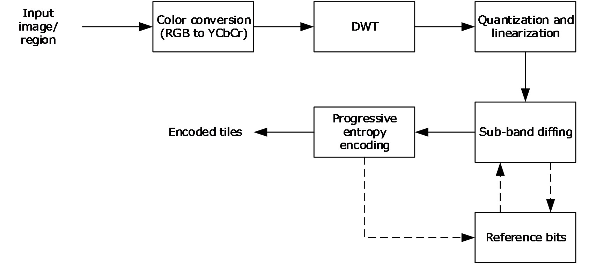

Figure 2: RemoteFX Progressive Codec encoding stages

When this encoding path is compared to [MS-RDPRFX](../MS-RDPRFX/MS-RDPRFX.md) section 3.1.8.1, differencing has been removed, sub-band diffing has been added, and progressive encoding has been incorporated into the entropy encoder.

##### 3.2.8.1.1 Color Conversion (RGB to YCbCr)

Color conversion is identical to the technique specified in [MS-RDPRFX](../MS-RDPRFX/MS-RDPRFX.md) section 3.1.8.1.3.

##### 3.2.8.1.2 DWT

The [**discrete wavelet transform (DWT)**](#gt_discrete-wavelet-transform-dwt) is performed as specified in [MS-RDPRFX](../MS-RDPRFX/MS-RDPRFX.md) section 3.1.8.1.4 with one exception. To improve the quality around tile edges, a variation has been added to the transform, which modifies the behavior on pixel boundaries and changes the size of the bands.

###### 3.2.8.1.2.1 Original Method

DWT results are calculated using an input coefficient and the surrounding coefficients. Tile boundaries are handled by mirroring the input coefficients. The coefficients to the right of the leftmost input coefficient are mirrored on the left side. For example, if there are eight input coefficients:

[0, 1, 2, 3, 4, 5, 6, 7]

After mirroring, the coefficients are logically extended as follows:

[..., 7, 6, 5, 4, 3, 2, 1, 0, 1, 2, 3, 4, 5, 6, 7, 6, 5, 4, 3, 2, 1, 0, ...]

This technique is also used on the right edges and for vertical transforms.

The first pass for a given direction (horizontal or vertical) takes an input of 64 coefficients and produces 32 low-frequency results and 32 high-frequency results.

###### 3.2.8.1.2.2 Reduce-Extrapolate Method

The Original Method (section [3.2.8.1.2.1](#Section_3.2.8.1.2.1)) for dealing with boundaries when encoding tiles introduces tile artifacts. The result is that users can perceive where the tile boundaries are in a decoded image. The Reduce-Extrapolate method removes this artifact.

The first pass for a given direction (horizontal or vertical) takes an input of 64 coefficients and produces 33 low-frequency results and 31 high-frequency results.

A 65th input coefficient is introduced by extrapolating from the last two input coefficients. Note that the subscripts used in the equations that follow are 1-based (in contrast to the equations in [MS-RDPRFX](../MS-RDPRFX/MS-RDPRFX.md) section 3.1.8.1.4, which are 0–based). It is possible for the extrapolated 65th coefficient to lie outside of the normal pixel range. Furthermore, extrapolation is only required for the first level.

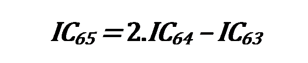

The first-pass DWT is performed on the 65 coefficients, mirroring around the first and the sixty-fifth boundary elements. As a result, 33 low-frequency and 32 high-frequency results are obtained. The final frequency result is zero and is dropped.

The second-pass DWT takes the 33 low-frequency results from the first pass and performs a DWT with normal mirroring, producing in turn 17 low-frequency elements and 16 high-frequency elements.

Finally, the third-pass DWT takes the 17 low-frequency results and produces (using the same techniques as the previous pass) 9 low-frequency elements and 8 high-frequency elements.

The resulting bands and the sizes are illustrated in the following figure.

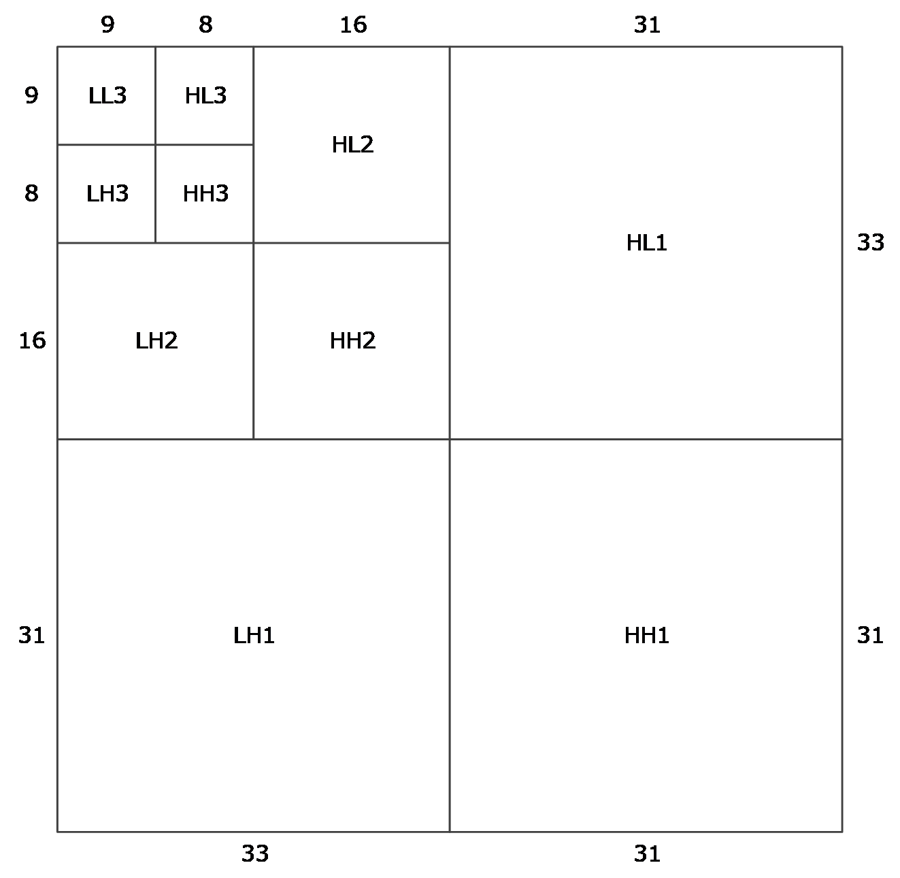

Figure 3: Bands resulting from the Reduce-Extrapolate DWT Method

##### 3.2.8.1.3 Quantization and Linearization

Quantization is performed as specified in [MS-RDPRFX](../MS-RDPRFX/MS-RDPRFX.md) section 3.1.8.1.5, while linearization is performed as specified in [MS-RDPRFX] section 3.1.8.1.6. Ordering of the bands is identical to the ordering specified in [MS-RDPRFX] section 3.1.8.1.6.

##### 3.2.8.1.4 Sub-Band Diffing

Sub-band diffing enables increased compression without any further quality loss by sending the differences of the quantized values between frames.

To compress each tile in a surface, the encoder stores the quantized DWT coefficients that the decoder most likely possesses. These coefficients differ slightly from the quantized coefficients of the previous frame due to the progressive entropy encoder and are known as the reference bits. See section [3.1.8.1.4](#Section_3.1.8.1.4) and the figure captioned "RemoteFX Progressive Codec encoding stages" in section [3.2.8.1](#Section_3.2.8.1).

The first phase of the Sub-Band Diffing Stage decides between sending the quantized DWT coefficients that have been calculated (section [3.2.8.1.3](#Section_3.2.8.1.3)) or sending the differences with respect to the reference bits. This decision is made for each tile being encoded. If the quantized DWT coefficients of the tile are to be sent, then the tile is called an "original tile"; otherwise, it is referred to as a "difference tile".

A tile that is being encoded for the first time is always sent as an original tile.

The calculation to determine the difference is performed on all three color components. Each of the 1024 coefficients from the tile contained in the reference bits are subtracted from each of the 1024 coefficients from the most recently calculated tile. This data is used to construct the difference tile.

In the preceding formula, "QC" stands for "Quantized Coefficient", "DT" for "Difference Tile", "OT" for "Original Tile", and "RB" for "Reference Bits".

Zeros are counted in both the difference tile and the original tile in only the Luma (Y) component in all the bands except for the LL3 band. The tile with the most number of zeros is selected to be sent to the RLGR Entropy Encoder. In the case of a tie, the original tile is preferred. If an original tile is selected over a difference tile, the reference bits MUST be cleared and filled with zeros.

##### 3.2.8.1.5 Progressive Entropy Encoding

The progressive encoder either can send a complete tile or can transmit multiple versions of the same tile over a period of time, with each subsequent version becoming more refined and improving in quality. The input to the Progressive Entropy Encoding Stage is generated by the Sub-Band Diffing engine (section [3.2.8.1.4](#Section_3.2.8.1.4)) and is either an original tile or a difference tile.

If a tile is to be transmitted in its entirety, then the tile data is dispatched to the RLGR1 Entropy Encoder ([MS-RDPRFX](../MS-RDPRFX/MS-RDPRFX.md) section 3.1.8.1.7.1), and the output forms the payload to be sent to the decoder.

If a tile is to be transmitted progressively, the Progressive Entropy Encoding Stage is exercised numerous times with the same input tile to generate multiple payloads that are consumed by the decoder to re-create the tile in its entirety. Sending a tile progressively is accomplished by executing a First Progressive Pass (section [3.2.8.1.5.1](#Section_3.2.8.1.5.1)) followed by subsequent Upgrade Progressive Passes (section [3.2.8.1.5.2](#Section_3.2.8.1.5.2)).

**SB** represents the data output from the Sub-Band Diffing Stage. This data is sent through multiple progressive stages.

Where D1, D2, D3, ..., Dn is the data that is transmitted via *n* progressive passes.

When a progressive pass is performed, **DAS** ("Data Already Sent") represents the cumulated data that has been transmitted through the previous passes, **DTS** ("Data To Send") represents the data to be transmitted in the current pass, and **DRS** ("Data Remaining to be Sent") represents the data that remains to be sent after the current pass.

When performing pass *i*:

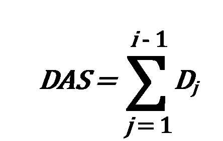

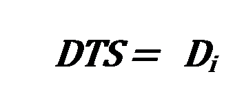

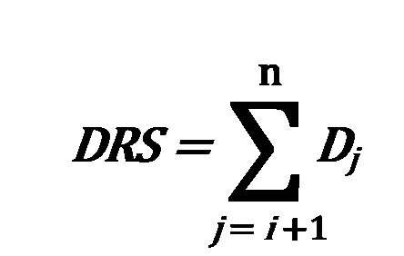

Each time a progressive pass is performed, **DRS** is reduced by the current **DTS**, and **DAS** is increased by the current **DTS** for the next pass.

###### 3.2.8.1.5.1 Performing the First Progressive Pass

The first progressive pass for a tile occurs when the encoder receives new pixels to encode and send to the decoder.

The encoder first performs the DWT (section [3.2.8.1.2](#Section_3.2.8.1.2)), Quantization and Linearization (section [3.2.8.1.3](#Section_3.2.8.1.3)) stages to obtain **DwtQ**. At this point, the Sub-Band Diffing (section [3.2.8.1.4](#Section_3.2.8.1.4)) stage determines whether to send **DwtQ** or the difference (**Diff**). **Diff** is computed based on the "reference bits" (**Ref**) specified in section [3.1.8.1.4](#Section_3.1.8.1.4).

**Diff** = **DwtQ** - **Ref**

**SB** = **DwtQ** or **Diff**

The progressive encoder performs extra quantization as specified in section [3.1.8.1.3](#Section_3.1.8.1.3):

**ProgQ** = **SB** / **PQF**

Each LL3 element is quantized toward negative infinity, and the result is subtracted from the next quantized LL3 element. Note that even if the data is a difference tile, each quantized LL3 element, which is the result of a difference, is subtracted from the next element. All of the bands are then sent to the RLGR encoder:

**ProgQ-NonLL**, **ProgQ-LL-Deltas** -> RLGR Entropy Encoder

Note that all ten bands are entropy-encoded as one block without reset. The RLGR engine is started with the state **K** = 1 and **KR** = 1.

If the chunk is 100%, then **PQF** = 1, and the bits being encoded are **DwtQ-NonLL**, **DwtQ-LL-Deltas** for an original tile, or **Diff-NonLL**, **Diff-LL** for a difference tile.

Multiplying **ProgQ** by **PQF** yields **DTS**, the de-quantized progressive data. On the first pass, **DAS** is zero, and **DRS** = **SB** - **DTS**.

The data generated by the first pass is written to an **RFX_PROGRESSIVE_TILE_FIRST** (section [2.2.4.2.1.5.4](#Section_2.2.4.2.1.5.4)) structure.

###### 3.2.8.1.5.2 Performing Upgrade Progressive Passes

To upgrade a tile, the encoder uses the previously calculated **DRS**, quantizes the data, and then (a) sends it to the Simplified Run-Length (SRL) Encoder (section [3.1.8.1.5](#Section_3.1.8.1.5)) or (b) transmits the raw bits of each element using the scheme in section [3.2.8.1.5.2.1](#Section_3.2.8.1.5.2.1).

The SRL Encoder is an entropy encoder that is more suited to the upgrade pass than RLGR and is based on the fact that the maximum magnitude of any element to be sent is known.

The progressive chunk that the decoder is being driven toward is referred to as the "target chunk" ("TargetC" for brevity), while the most recent progressive chunk that the decoder has processed is referred to as the "previous chunk" ("PrevC" for brevity).

**UpgradeQ**(PrevC, TargetC) = **DRS** / **PQF**(TargetC)

**DTS** = **UpgradeQ**(PrevC, TargetC) * **PQF**(TargetC)

For a given element in **DTS**, the decision to send raw bits or SRL-encoded data depends on what the client has already decoded. If the corresponding element in **DAS** is zero, then **UpgradeQ**(PrevC, TargetC) is SRL encoded. Otherwise, if the corresponding element in **DAS** is nonzero, the absolute value of the corresponding **UpgradeQ**(PrevC, TargetC) element is sent raw. For an LL3 element in an original tile, the **UpgradeQ** element, which is always positive, is always sent raw.

If the corresponding element in **DAS** is strictly positive (nonzero), the **UpgradeQ** element lies between zero and **PQF**(PrevC) / **PQF**(TargetC) - 1. Simplifying further:

**PQF**(PrevC) / **PQF**(TargetC) - 1

= (1 << **BitPos**(PrevC)) / (1 << **BitPos**(TargetC)) - 1

= (1 << (**BitPos**(PrevC) - **BitPos**(TargetC))) - 1

For a given tile, the data that has been generated by the SRL encoder is packaged in the **ySrlData** (Luma), **cbSrlData** (Chroma Blue) and **crSrlData** (Chroma Red) fields of the **RFX_PROGRESSIVE_TILE_UPGRADE** (section [2.2.4.2.1.5.5](#Section_2.2.4.2.1.5.5)) structure. All of the data that was written as raw bits is packaged in the **yRawData** (Luma), **cbRawData** (Chroma Blue), and **crRawData** (Chroma Red) fields of the **RFX_PROGRESSIVE_TILE_UPGRADE** structure.

Sending Raw Bits

Raw bits are sent as a simple bit stream. The following sequence of bits "abc", "defg", "hijkl", when written, would produce the bytes "abcdefgh" and "ijkl0000".

###### 3.2.8.1.5.3 Maintaining the Decoder Reference

After each progressive pass, the data that has been sent is added to the reference bits:

**Ref** = **Ref** + **DTS**

The reference bits are specified in section [3.1.8.1.4](#Section_3.1.8.1.4).

## 3.3 Client Details

### 3.3.1 Abstract Data Model

This section describes a conceptual model of possible data organization that an implementation maintains to participate in this protocol. The described organization is provided to facilitate the explanation of how the protocol behaves. This document does not mandate that implementations adhere to this model as long as their external behavior is consistent with that described in this document.

**Note** It is possible to implement the following conceptual data by using a variety of techniques as long as the implementation produces external behavior that is consistent with that described in this document.

#### 3.3.1.1 Codec Contexts

The **Codec Contexts** ADM element contains a list of codec contexts. Each codec context is associated with an offscreen surface and a bitmap that is being progressively rendered to the surface. The context is used to store state information that is used to iteratively construct the bitmap. Once the bitmap has been fully rendered, the associated context is no longer required. Furthermore, if the server determines that a specific context will no longer be used, then the **RDPGFX_DELETE_ENCODING_CONTEXT_PDU** (section [2.2.2.3](#Section_2.2.2.3)) message is sent to the client.

#### 3.3.1.2 Progressive Tile Contexts

The **Progressive Tile Contexts** ADM element contains a list of progressive tile contexts. Each progressive tile context is associated with a tile in an off-screen surface and one or more codec contexts stored in the **Codec Contexts** (section [3.3.1.1](#Section_3.3.1.1)) ADM element. The progressive tile context contains the sign state of each coefficient (described as **Sign** in section [3.3.8.2.1.1](#Section_3.3.8.2.1.1)) and the bit position for each band (described as **BitPos** in section [3.3.8.2.1.2](#Section_3.3.8.2.1.2)).

A progressive tile context can be discarded once all of the codec contexts with which it is associated have been deleted.

#### 3.3.1.3 Sub-Band Diffing Tile Contexts

The **Sub-Band Diffing Tile Contexts** ADM element contains a list of sub-band diffing tile contexts. Each sub-band diffing tile context is associated with a tile in an off-screen surface. This context contains the DWT coefficient data for the tile (described as **DecDwtQ** in section [3.3.8.2.1.1](#Section_3.3.8.2.1.1)).

Each sub-band diffing tile context MUST be preserved for the duration of the RDP connection or until the off-screen surface with which it is associated has been deleted.

#### 3.3.1.4 Bitmap Cache

The **Bitmap Cache** ADM element is used to store bitmaps of arbitrary dimensions. Each bitmap is associated with a key and is stored in a variable-length slot (identified by a one-based slot index). The size of the bitmap cache is capped at 100 MB or 16 MB, depending on whether the RDPGFX_CAPS_FLAG_THINCLIENT (0x00000001) flag or RDPGFX_CAPS_FLAG_SMALL_CACHE (0x00000002) flag is specified in the **flags** field of an **RDPGFX_CAPSET_VERSION8** (section [2.2.3.1](#Section_2.2.3.1)), **RDPGFX_CAPSET_VERSION81** (section [2.2.3.2](#Section_2.2.3.2)), **RDPGFX_CAPSET_VERSION10** (section [2.2.3.3](#Section_2.2.3.3)), **RDPGFX_CAPSET_VERSION102** (section [2.2.3.5](#Section_2.2.3.5)), **RDPGFX_CAPSET_VERSION104** (section [2.2.3.7](#Section_2.2.3.7)), **RPDGFX_CAPSET_VERSION105** (section [2.2.3.8](#Section_2.2.3.8)), **RDPGFX_CAPSET_VERSION106** (section 2.2.3.9), or **RDPGFX_CAPSET_VERSION107** (section [2.2.3.10](#Section_2.2.3.10)) structure, which is encapsulated in the server-to-client **RDPGFX_CAPS_CONFIRM_PDU** (section [2.2.2.19](#Section_2.2.2.19)) message. The size of the bitmap cache is constrained to 16MB in size when the **RDPGFX_CAPSET_VERSION103** (section [2.2.3.6](#Section_2.2.3.6)) structure is encapsulated in the server-to-client **RDPGFX_CAPS_CONFIRM_PDU** message. The maximum possible number of variable-length slots is 25,600 in the case of a 100 MB cache and 4,096 in the case of a 16 MB cache. The size of the bitmap data stored across all of the in-use variable-length slots at any point in time MUST NOT exceed the total size of the cache.

#### 3.3.1.5 Persistent Bitmap Cache

The **Persistent Bitmap Cache** ADM element is optional offline storage that is used to selectively persist bitmaps and any associated metadata that has been cached in the **Bitmap Cache** (section [3.3.1.4](#Section_3.3.1.4)) ADM element.

#### 3.3.1.6 Offscreen Surface

The **Offscreen Surface** ADM element contains a collection of bitmaps, each bitmap representing an offscreen surface.

#### 3.3.1.7 Graphics Output Buffer

The **Graphics Output Buffer** ADM element is the end-user visible output bitmap.

#### 3.3.1.8 Surface to Output Mapping

The **Surface to Output Mapping** ADM element contains a list of where offscreen surfaces in the **Offscreen Surface** (section [3.3.1.6](#Section_3.3.1.6)) ADM element are mapped to the **Graphics Output Buffer** (section [3.3.1.7](#Section_3.3.1.7)) ADM element.

#### 3.3.1.9 Decompressor Glyph Storage

The **Decompressor Glyph Storage** ADM element is used to cache bitmaps decompressed using ClearCodec decompression techniques (section [3.3.8.1](#Section_3.3.8.1)). It contains 4,000 storage slots, each of which can hold a bitmap image no larger than 1,024 square pixels.

#### 3.3.1.10 V-Bar Storage

The **V-Bar Storage** ADM element is used to cache decompressed pixel columns from **CLEARCODEC_BAND** (section [2.2.4.1.1.2.1](#Section_2.2.4.1.1.2.1)) structures. These pixel columns (which are the same height as the containing band) are referred to as "V-Bars". Encoded V-Bars are encapsulated in the **CLEARCODEC_BANDS_DATA** (section [2.2.4.1.1.2](#Section_2.2.4.1.1.2)) structure. The maximum number of V-Bars that can be stored in the cache is 32,768.

#### 3.3.1.11 V-Bar Storage Cursor

The **V-Bar Storage Cursor** ADM element is used to specify the position in the **V-Bar Storage** (section [3.3.1.10](#Section_3.3.1.10)) where the next V-Bar MUST be inserted. This element MUST be initialized to zero.

#### 3.3.1.12 Short-V-Bar Storage

The **Short-V-Bar Storage** ADM element is used to cache decompressed pixel columns from **CLEARCODEC_BAND** (section [2.2.4.1.1.2.1](#Section_2.2.4.1.1.2.1)) structures. These pixel columns (which are the same or shorter than the height of the containing band) are referred to as "Short-V-Bars". Encoded Short-V-Bars are encapsulated in the **CLEARCODEC_BANDS_DATA** (section [2.2.4.1.1.2](#Section_2.2.4.1.1.2)) structure. The maximum number of Short-V-Bars that can be stored in the cache is 16,384.

#### 3.3.1.13 Short V-Bar Storage Cursor

The **Short V-Bar Storage Cursor** ADM element is used to specify the position in the **Short V-Bar Storage** (section [3.3.1.12](#Section_3.3.1.12)) ADM element where the next Short V-Bar MUST be inserted. This element MUST be initialized to zero.

#### 3.3.1.14 Confirmed Graphics Capabilities

The **Confirmed Graphics Capabilities** ADM element is used to store the set of graphics capabilities specified by the server in the **RDPGFX_CAPS_CONFIRM_PDU** (section [3.3.5.19](#Section_3.3.5.19)) message.

#### 3.3.1.15 Surface to Window Mapping

The **Surface to Window Mapping** ADM element contains a list of surfaces and the [**RAIL window**](#gt_rail-window) and rectangular region to which each of these surfaces is mapped.

### 3.3.2 Timers

None.

### 3.3.3 Initialization

None.

### 3.3.4 Higher-Layer Triggered Events

None.

### 3.3.5 Message Processing Events and Sequencing Rules

#### 3.3.5.1 Processing an RDPGFX_WIRE_TO_SURFACE_PDU_1 message

The structure and fields of the **RDPGFX_WIRE_TO_SURFACE_PDU_1** message are specified in section [2.2.2.1](#Section_2.2.2.1). The **header** field MUST be processed as specified in section [3.1.5.1](#Section_3.1.5.1). The **surfaceId** field MUST identify a valid offscreen surface in the **Offscreen Surface** (section [3.3.1.6](#Section_3.3.1.6)) ADM element, and the size of the bitmap data specified in the **bitmapDataLength** field MUST be consistent with the amount of data read from the "Microsoft::Windows::RDS::Graphics" dynamic virtual channel (section [2.1](#Section_2.1)). Once the data in the **bitmapData** field has been decoded as specified by the encoding type enumerated in the **codecId** field, the bitmap MUST be copied to the target surface.

If the encoding type enumerated in the **codecId** field is not RDPGFX_CODECID_ALPHA (0x000C):

- If the target surface is listed in the **Surface to Window Mapping** (section [3.3.1.15](#Section_3.3.1.15)) ADM element, then the alpha channel of the bitmap (if present) MUST be ignored when copying to the target surface, while the red, green, and blue channels MUST all be copied to the target surface without modification.
- If the target surface is not listed in the **Surface to Window Mapping** ADM element, then only the red, green, and blue channels SHOULD be copied to the target surface.
If the encoding type enumerated in the **codecId** field is RDPGFX_CODECID_ALPHA:

- Only the alpha channel of the target surface MUST be updated with the contents of the source bitmap (the red, green, and blue channels of the target surface MUST NOT be changed).

#### 3.3.5.2 Processing an RDPGFX_WIRE_TO_SURFACE_PDU_2 message

The structure and fields of the **RDPGFX_WIRE_TO_SURFACE_PDU_2** message are specified in section [2.2.2.2](#Section_2.2.2.2). The **header** field MUST be processed as specified in section [3.1.5.1](#Section_3.1.5.1). The **surfaceId** field MUST identify a valid offscreen surface in the **Offscreen Surface** (section [3.3.1.6](#Section_3.3.1.6)) ADM element, and the size of the bitmap data specified in the **bitmapDataLength** field MUST be consistent with the amount of data read from the "Microsoft::Windows::RDS::Graphics" dynamic virtual channel (section [2.1](#Section_2.1)). If there is no codec context identified by the **codecContextId** field in the **Codec Contexts** (section [3.3.1.1](#Section_3.3.1.1)) ADM element, the client MUST create a new context, place it into the **Codec Contexts** ADM element, and begin the process of progressively rendering a bitmap from the data in the **bitmapData** field, as specified by the encoding type enumerated value in the **codecId** field, using the context to store intermediate state. The bitmap SHOULD be copied to the target surface using a SRCCOPY ROP3 operation ([MS-RDPEGDI](../MS-RDPEGDI/MS-RDPEGDI.md) section 2.2.2.2.1.1.1.7) once enough data has been decoded to render a discernible image and SHOULD then continue to be updated as subsequent **RDPGFX_WIRE_TO_SURFACE_PDU_2** messages are processed. Note that if the type (specified in the **blockType** field) of the current **RFX_PROGRESSIVE_DATABLOCK** structure (section [2.2.4.2.1](#Section_2.2.4.2.1)) of an **RFX_PROGRESSIVE_BITMAP_STREAM** (section [2.2.4.2](#Section_2.2.4.2)) is WBT_TILE_PROGRESSIVE_UPGRADE (0xCCC7), then the **codecContextId** field in the **Codec Contexts** (section 3.3.1.1) ADM element MUST be known.

#### 3.3.5.3 Processing an RDPGFX_DELETE_ENCODING_CONTEXT_PDU message

The structure and fields of the **RDPGFX_DELETE_ENCODING_CONTEXT_PDU** message are specified in section [2.2.2.3](#Section_2.2.2.3). The **header** field MUST be processed as specified in section [3.1.5.1](#Section_3.1.5.1). Once the **RDPGFX_DELETE_ENCODING_CONTEXT_PDU** message has been successfully decoded, the codec context identified by the **codecContextId** field (which is associated with the surface identified by the **surfaceId** field) MUST be removed from the **Codec Contexts** (section [3.3.1.1](#Section_3.3.1.1)) ADM element.

#### 3.3.5.4 Processing an RDPGFX_SOLIDFILL_PDU message

The structure and fields of the **RDPGFX_SOLIDFILL_PDU** message are specified in section [2.2.2.4](#Section_2.2.2.4). The **header** field MUST be processed as specified in section [3.1.5.1](#Section_3.1.5.1). The **surfaceId** field MUST identify a valid offscreen surface in the **Offscreen Surface** (section [3.3.1.6](#Section_3.3.1.6)) ADM element. Once the **RDPGFX_SOLIDFILL_PDU** message has been successfully decoded, the rectangles specified in the **fillRects** field MUST be filled with the 32-bpp color specified by the **fillPixel** field using an R2_COPYPEN ROP2 operation ([MS-RDPEGDI](../MS-RDPEGDI/MS-RDPEGDI.md) section 2.2.2.2.1.1.1.6).

#### 3.3.5.5 Processing an RDPGFX_SURFACE_TO_SURFACE_PDU message

The structure and fields of the **RDPGFX_SURFACE_TO_SURFACE_PDU** message are specified in section [2.2.2.5](#Section_2.2.2.5). The **header** field MUST be processed as specified in section [3.1.5.1](#Section_3.1.5.1). The **surfaceIdSrc** and **surfaceIdDest** fields MUST both identify valid offscreen surfaces in the **Offscreen Surface** (section [3.3.1.6](#Section_3.3.1.6)) ADM element. Once the **RDPGFX_SURFACE_TO_SURFACE_PDU** message has been successfully decoded, the pixels in the source rectangle on the source surface (specified in the **rectSrc** field) MUST be copied to the target surface at each of the points specified in the **destPts** field using a SRCCOPY ROP3 operation ([MS-RDPEGDI](../MS-RDPEGDI/MS-RDPEGDI.md) section 2.2.2.2.1.1.1.7).

#### 3.3.5.6 Processing an RDPGFX_SURFACE_TO_CACHE_PDU message

The structure and fields of the **RDPGFX_SURFACE_TO_CACHE_PDU** message are specified in section [2.2.2.6](#Section_2.2.2.6). The **header** field MUST be processed as specified in section [3.1.5.1](#Section_3.1.5.1). The **surfaceId** field MUST identify a valid offscreen surface in the **Offscreen Surface** (section [3.3.1.6](#Section_3.3.1.6)) ADM element. Once the **RDPGFX_SURFACE_TO_CACHE_PDU** message has been successfully decoded, the pixels in the source rectangle on the source surface (specified in the **rectSrc** field) MUST be copied to the slot in the **Bitmap Cache** (section [3.3.1.4](#Section_3.3.1.4)) ADM element identified by the **cacheSlot** field using a SRCCOPY ROP3 operation ([MS-RDPEGDI](../MS-RDPEGDI/MS-RDPEGDI.md) section 2.2.2.2.1.1.1.7) and tagged with the key specified in the **cacheKey** field.

#### 3.3.5.7 Processing an RDPGFX_CACHE_TO_SURFACE_PDU message

The structure and fields of the **RDPGFX_CACHE_TO_SURFACE_PDU** message are specified in section [2.2.2.7](#Section_2.2.2.7). The **header** field MUST be processed as specified in section [3.1.5.1](#Section_3.1.5.1). The **surfaceId** field MUST identify a valid offscreen surface in the **Offscreen Surface** (section [3.3.1.6](#Section_3.3.1.6)) ADM element, and the **cacheSlot** field MUST contain a valid entry in the **Bitmap Cache** (section [3.3.1.4](#Section_3.3.1.4)) ADM element. Once the **RDPGFX_CACHE_TO_SURFACE_PDU** message has been successfully decoded, the bitmap retrieved from the cache MUST be copied to the target surface at each of the points specified in the **destPts** field using a SRCCOPY ROP3 operation ([MS-RDPEGDI](../MS-RDPEGDI/MS-RDPEGDI.md) section 2.2.2.2.1.1.1.7).

#### 3.3.5.8 Processing an RDPGFX_EVICT_CACHE_ENTRY_PDU message

The structure and fields of the **RDPGFX_EVICT_CACHE_ENTRY_PDU** message are specified in section [2.2.2.8](#Section_2.2.2.8). The **header** field MUST be processed as specified in section [3.1.5.1](#Section_3.1.5.1). Once the **RDPGFX_EVICT_CACHE_ENTRY_PDU** message has been successfully decoded, the entry in the **Bitmap Cache** (section [3.3.1.4](#Section_3.3.1.4)) ADM element present in the slot identified by the **cacheSlot** field MUST be removed from the cache.

#### 3.3.5.9 Processing an RDPGFX_CREATE_SURFACE_PDU message

The structure and fields of the **RDPGFX_CREATE_SURFACE_PDU** message are specified in section [2.2.2.9](#Section_2.2.2.9). The **header** field MUST be processed as specified in section [3.1.5.1](#Section_3.1.5.1). Once the **RDPGFX_CREATE_SURFACE_PDU** message has been successfully decoded, a bitmap MUST be created with the appropriate width, height, and pixel format and MUST be placed into the **Offscreen Surface** (section [3.3.1.6](#Section_3.3.1.6)) ADM element. The entry MUST be tagged with the ID specified in the **surfaceId** field.

#### 3.3.5.10 Processing an RDPGFX_DELETE_SURFACE_PDU message

The structure and fields of the **RDPGFX_DELETE_SURFACE_PDU** message are specified in section [2.2.2.10](#Section_2.2.2.10). The **header** field MUST be processed as specified in section [3.1.5.1](#Section_3.1.5.1). Once the **RDPGFX_DELETE_SURFACE_PDU** message has been successfully decoded, the surface identified by the **surfaceId** field MUST be deleted from the **Offscreen Surface** (section [3.3.1.6](#Section_3.3.1.6)) ADM element.

#### 3.3.5.11 Processing an RDPGFX_START_FRAME_PDU message

The structure and fields of the **RDPGFX_START_FRAME_PDU** message are specified in section [2.2.2.11](#Section_2.2.2.11). The **header** field MUST be processed as specified in section [3.1.5.1](#Section_3.1.5.1).

#### 3.3.5.12 Processing an RDPGFX_END_FRAME_PDU message

The structure and fields of the **RDPGFX_END_FRAME_PDU** message are specified in section [2.2.2.12](#Section_2.2.2.12). The **header** field MUST be processed as specified in section [3.1.5.1](#Section_3.1.5.1). Once the **RDPGFX_END_FRAME_PDU** message has been successfully decoded, the client MUST copy the contents of every updated off-screen surface that is present in the **Surface to Output Mapping** (section [3.3.1.8](#Section_3.3.1.8)) ADM element to the **Graphics Output Buffer** (section [3.3.1.7](#Section_3.3.1.7)) ADM element. Once the copy is complete, the client MUST send the **RDPGFX_FRAME_ACKNOWLEDGE_PDU** (section [2.2.2.13](#Section_2.2.2.13)) message to the server, as specified in section [3.3.5.13](#Section_3.3.5.13).

#### 3.3.5.13 Sending an RDPGFX_FRAME_ACKNOWLEDGE_PDU message

The structure and fields of the **RDPGFX_FRAME_ACKNOWLEDGE_PDU** message are specified in section [2.2.2.13](#Section_2.2.2.13). The command fields MUST be populated in accordance with this description. The client MUST populate the **frameId** field with the ID of the most recently processed logical frame, as specified in section [3.2.5.12](#Section_3.2.5.12).

#### 3.3.5.14 Processing an RDPGFX_RESET_GRAPHICS_PDU message

The structure and fields of the **RDPGFX_RESET_GRAPHICS_PDU** message are specified in section [2.2.2.14](#Section_2.2.2.14). The **header** field MUST be processed as specified in section [3.1.5.1](#Section_3.1.5.1). Once the **RDPGFX_RESET_GRAPHICS_PDU** message has been successfully decoded, the client MUST resize the **Graphics Output Buffer** (section [3.3.1.7](#Section_3.3.1.7)) ADM element.

#### 3.3.5.15 Processing an RDPGFX_MAP_SURFACE_TO_OUTPUT_PDU message

The structure and fields of the **RDPGFX_MAP_SURFACE_TO_OUTPUT_PDU** message are specified in section [2.2.2.15](#Section_2.2.2.15). The **header** field MUST be processed as specified in section [3.1.5.1](#Section_3.1.5.1). Once the **RDPGFX_MAP_SURFACE_TO_OUTPUT_PDU** message has been successfully decoded, the surface-to-output mapping in the **Surface to Output Mapping** (section [3.3.1.8](#Section_3.3.1.8)) ADM element MUST be updated by mapping the surface identified by the **surfaceId** field to the point on the **Graphics Output Buffer** (section [3.3.1.7](#Section_3.3.1.7)) ADM element specified by the **outputOriginX** and **outputOriginY** fields.

#### 3.3.5.16 Sending an RDPGFX_CACHE_IMPORT_OFFER_PDU message

The structure and fields of the **RDPGFX_CACHE_IMPORT_OFFER_PDU** message are specified in section [2.2.2.16](#Section_2.2.2.16). The command fields MUST be populated in accordance with this description. The client MUST populate the **cacheEntries** field by enumerating the bitmaps stored in the **Persistent Bitmap Cache** (section [3.3.1.5](#Section_3.3.1.5)) ADM element.

#### 3.3.5.17 Processing an RDPGFX_CACHE_IMPORT_REPLY_PDU message

The structure and fields of the **RDPGFX_CACHE_IMPORT_REPLY_PDU** message are specified in section [2.2.2.17](#Section_2.2.2.17). The **header** field MUST be processed as specified in section [3.1.5.1](#Section_3.1.5.1). Once the **RDPGFX_CACHE_IMPORT_REPLY_PDU** message has been successfully decoded, the client MUST copy the number of entries specified in the **importedEntriesCount** field from the **Persistent Bitmap Cache** (section [3.3.1.5](#Section_3.3.1.5)) ADM element to the assigned slots in the **Bitmap Cache** (section [3.3.1.4](#Section_3.3.1.4)) ADM element.

#### 3.3.5.18 Sending an RDPGFX_CAPS_ADVERTISE_PDU message

The structure and fields of the **RDPGFX_CAPS_ADVERTISE_PDU** message are specified in section [2.2.2.18](#Section_2.2.2.18). The command fields MUST be populated in accordance with this description. The client MUST correctly populate the **capsSet** field with one or more of the capability sets specified in section [2.2.3](#Section_2.2.3). Each capability set type MUST NOT appear more than once.

#### 3.3.5.19 Processing an RDPGFX_CAPS_CONFIRM_PDU message

The structure and fields of the **RDPGFX_CAPS_CONFIRM_PDU** message are specified in section [2.2.2.19](#Section_2.2.2.19). The **header** field MUST be processed as specified in section [3.1.5.1](#Section_3.1.5.1). The graphics capabilities specified by the server SHOULD be stored in the **Confirmed Graphics Capabilities** (section [3.3.1.14](#Section_3.3.1.14)) ADM element and MUST be adhered to by the client.

If the capability set received in the **RDPGFX_CAPS_CONFIRM_PDU** message is **RDPGFX_CAPSET_VERSION103**, **RDPGFX_CAPSET_VERSION104**, **RDPGFX_CAPSET_VERSION105**, **RDPGFX_CAPSET_VERSION106**, or **RDPGFX_CAPSET_VERSION107** then the client can resend the **RDPGFX_CAPS_ADVERTISE_PDU** message during the connection to reset the protocol. The client MUST reset the channel state after sending the **RDPGFX_CAPS_ADVERTISE_PDU** message and MUST ignore any messages sent by the server until **RDPGFX_CAPS_CONFIRM_PDU** message is received.

#### 3.3.5.20 Processing an RDPGFX_MAP_SURFACE_TO_WINDOW_PDU message

The structure and fields of the **RDPGFX_MAP_SURFACE_TO_WINDOW_PDU** message are specified in section [2.2.2.20](#Section_2.2.2.20). The **header** field MUST be processed as specified in section [3.1.5.1](#Section_3.1.5.1). Once the **RDPGFX_MAP_SURFACE_TO_WINDOW_PDU** message has been successfully decoded, the surface-to-window mapping in the **Surface to Window Mapping** (section [3.3.1.15](#Section_3.3.1.15)) ADM element MUST be updated by associating the rectangular region (specified by the **mappedWidth** and **mappedHeight** fields) on the surface identified by the **surfaceId** field to the [**RAIL window**](#gt_rail-window) specified by the **windowId** field.

#### 3.3.5.21 Sending an RDPGFX_QOE_FRAME_ACKNOWLEDGE_PDU message

The structure and fields of the **RDPGFX_QOE_FRAME_ACKNOWLEDGE_PDU** message are specified in section [2.2.2.21](#Section_2.2.2.21). The command fields MUST be populated in accordance with this description. The client MUST populate the **frameId** field with the ID of the most recently processed logical frame, as specified in section [3.2.5.12](#Section_3.2.5.12).

If the client has opted in to sending the **RDPGFX_FRAME_ACKNOWLEDGE_PDU** (section [2.2.2.13](#Section_2.2.2.13)) message, then, with respect to sequencing, the **RDPGFX_QOE_FRAME_ACKNOWLEDGE_PDU** message SHOULD only be sent after the **RDPGFX_FRAME_ACKNOWLEDGE_PDU** message has been transmitted.

#### 3.3.5.22 Processing an RDPGFX_MAP_SURFACE_TO_SCALED_OUTPUT_PDU message

The structure and fields of the **RDPGFX_MAP_SURFACE_TO_OUTPUT_PDU** message are specified in section [2.2.2.22](#Section_2.2.2.22). The **header** field MUST be processed as specified in section [3.1.5.1](#Section_3.1.5.1). Once the **RDPGFX_MAP_SURFACE_TO_SCALED_OUTPUT_PDU** message has been successfully decoded, the surface-to-output mapping in the **Surface to Output Mapping** (section [3.3.1.8](#Section_3.3.1.8)) ADM element MUST be updated by mapping the surface identified by the **surfaceId** field to the point on the **Graphics Output Buffer** (section [3.3.1.7](#Section_3.3.1.7)) ADM element specified by the **outputOriginX** and **outputOriginY** fields, and scaled to the **targetWidth** and **targetHeight** fields specified.

#### 3.3.5.23 Processing an RDPGFX_MAP_SURFACE_TO_SCALED_WINDOW_PDU message

The structure and fields of the **RDPGFX_MAP_SURFACE_TO_SCALED_WINDOW_PDU** message are specified in section [2.2.2.23](#Section_2.2.2.23). The **header** field MUST be processed as specified in section [3.1.5.1](#Section_3.1.5.1). Once the **RDPGFX_MAP_SURFACE_TO_SCALED_WINDOW_PDU** message has been successfully decoded, the surface-to-window mapping in the **Surface to Window Mapping** (section [3.3.1.15](#Section_3.3.1.15)) ADM element MUST be updated by associating the rectangular region (specified by the **mappedWidth** and **mappedHeight** fields) on the surface identified by the **surfaceId** field to the [**RAIL window**](#gt_rail-window) specified by the **windowId** field with the entire surface scaled to the **targetWidth** and **targetHeight** fields specified.

### 3.3.6 Timer Events

None.

### 3.3.7 Other Local Events

None.

### 3.3.8 Bitmap Compression

#### 3.3.8.1 ClearCodec Compression

The ClearCodec Codec is used to encode bitmaps sent in the **RDPGFX_WIRE_TO_SURFACE_PDU_1** (section [2.2.2.1](#Section_2.2.2.1)) message. The encoded bitmap data MUST be transported in the **bitmapData** field of the **RDPGFX_WIRE_TO_SURFACE_PDU_1** message, and the **codecId** field MUST be set to RDPGFX_CODECID_CLEARCODEC (0x0008).

The ClearCodec bitmap stream is described in section [2.2.4.1](#Section_2.2.4.1) and is composed of a maximum of three layers. Each layer is optional and is encoded using different techniques.

- The residual layer (section [2.2.4.1.1.1](#Section_2.2.4.1.1.1))
- The bands layer (section [2.2.4.1.1.2](#Section_2.2.4.1.1.2))
- The subcodec layer (section [2.2.4.1.1.3](#Section_2.2.4.1.1.3))

##### 3.3.8.1.1 ClearCodec Run-Length Encoding

ClearCodec run-length encoding uses a standard RLE compression scheme that parses a pixel stream and encodes run lengths.

For example, an initial stream containing the following 12 ANSI characters:

AAAABBCCCCCD

would be transformed after encoding into the following stream:

A4B2C5D1

Note that in the real case, each [**ANSI character**](#gt_ansi-character) is a pixel represented by 3 bytes (R, G, B components). This type of encoding is suitable for the content in the residual layer (section [2.2.4.1.1.1](#Section_2.2.4.1.1.1)).

##### 3.3.8.1.2 Decompressing a Bitmap

The following flowchart shows how to decompress a bitmap that is compressed using ClearCodec compression techniques.

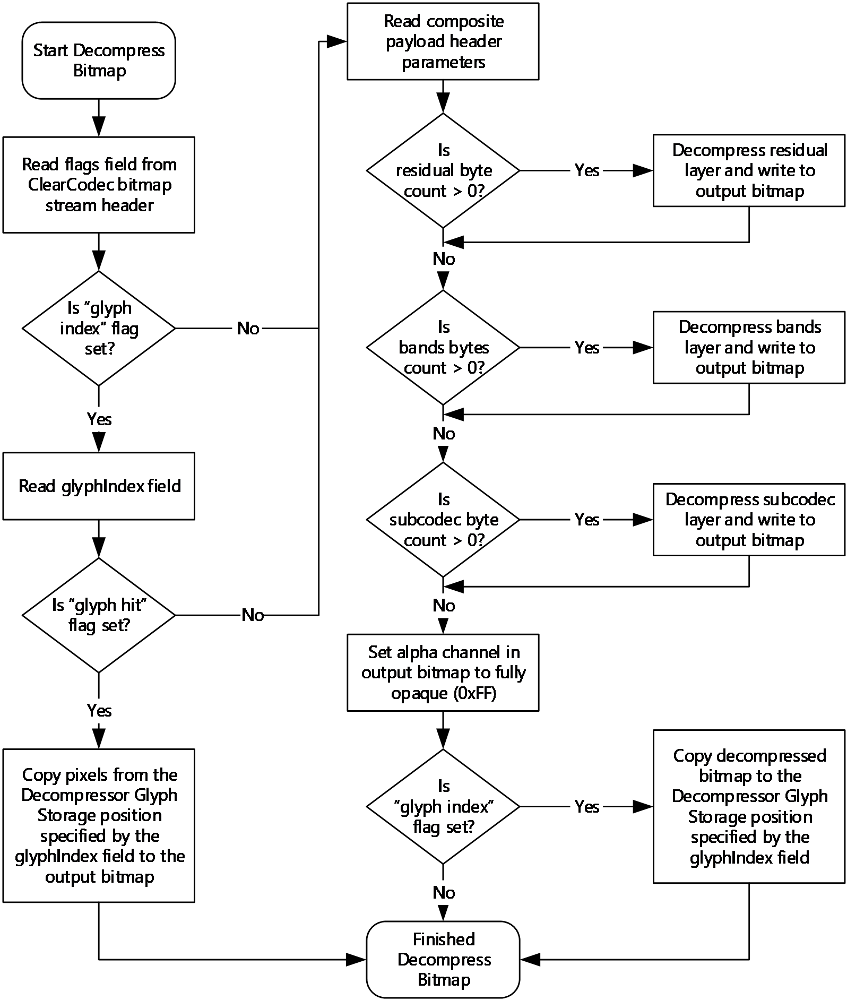

Figure 4: Decompressing a bitmap using ClearCodec Bitmap Compression

#### 3.3.8.2 RemoteFX Progressive Codec Compression

The functional stages involved in the decoding path are illustrated in the following figure. Compared to the encoding stages, the decoding stage operations are the operations of the encoding stage in reverse order.

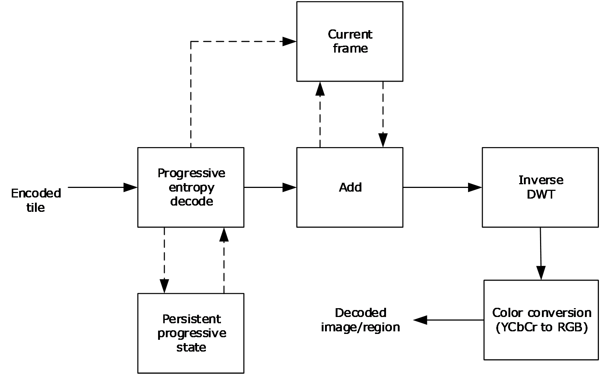

Figure 5: RemoteFX Progressive Codec decoding stages

When compared to [MS-RDPRFX](../MS-RDPRFX/MS-RDPRFX.md) section 3.1.8.2, the codec now maintains state. "Current frame" contains the DWT coefficients of the tiles, and "Persistent progressive state" is used to maintain information pertinent to tiles that have been received in progressive chunks.

##### 3.3.8.2.1 Progressive Entropy Decode

The first stage of decoding aims to reconstruct the DWT data of a tile.

The decoder MUST maintain a copy of the unquantized DWT data ("Current frame" in the figure captioned "RemoteFX Progressive Codec decoding stages" in section [3.3.8.2](#Section_3.3.8.2)) as well as a tri-state value for each element in a tile that has not yet been fully upgraded ("Persistent progressive state" in the same figure). The tri-state value records whether the data that has been received for an element sums up to a positive value, a negative value, or zero.

A coefficient either is encoded with the SRL encoder, or its absolute value is written as raw bits (section [3.2.8.1.5](#Section_3.2.8.1.5)). The decoder MUST determine which of these two methods was used and what sign to apply to the decoded element. The sign can be determined by using the tri-state value associated with each element.

If the input data is for the first progressive chunk of a tile (or it contains all of the data for a tile), then the Persistent progressive state MUST be cleared. Furthermore, if the tile is an original tile (not a difference tile), then the tile MUST be zeroed out in the current frame. The result of the entropy decode operation MUST be added to the current frame.

###### 3.3.8.2.1.1 Performing the First Progressive Pass

For the first pass, the data received is sent to the RLGR entropy decoder to produce the progressively quantized coefficients **DecProgQ**.

For each element being decoded, except elements in the LL band, the sign is recorded (positive, negative, or zero). This tri-state (referred to as **Sign**) is used for successive upgrade passes.

**Sign** = -1 if **DecProgQ-NonLL** < 0

**Sign** = 0 if **DecProgQ-NonLL** = 0

**Sign** = 1 if **DecProgQ-NonLL** > 0

The LL3 deltas MUST be summed up to produce the LL3 elements, even if the tile is not an original tile (section [3.1.8.1.2](#Section_3.1.8.1.2)).

**DecProgQ-LL**[0] = **DecProgQ-LL-Deltas**[0]

**DecProgQ-LL**[idx+1] = **DecProgQ-LL**[idx] + **DecProgQ-LL-Deltas**[idx+1]

Elements in all the bands are dequantized.

**DecDwtQ-NonLL**, **DecDwtQ-LL** = **DecProgQ** * **PQF**

**DecDwtQ** is the data that MUST be de-quantized and inverse DWT transformed to produce the image pixels.

If the tile is a difference tile (section 3.1.8.1.2), then the progressively quantized coefficients are simply added to the **DecDwtQ** elements:

**DecDwtQ** = **DecDwtQ** + **DecProgQ** * **PQF**

###### 3.3.8.2.1.2 Performing the Upgrade Progressive Passes

Except in the case of an LL3 element, the **Sign** state is used to determine how to decode the next element (referred to as **input**).

If **Sign** > 0, **input** is read from the raw buffer (the tile header and previous history are used to determine how many bits MUST be read), progressively de-quantized, and added to the current frame:

**DecDwtQ-NonLL** = **DecDwtQ-NonLL** + (**input** * **PQF**)

If **Sign** < 0, **input** is read from the raw buffer, progressively de-quantized, and subtracted from the current frame:

**DecDwtQ-NonLL** = **DecDwtQ-NonLL** - (**input** * **PQF**)

If **Sign** = 0, **input** (a signed value) is read from the SRL encoded buffer (by decoding one element), progressively de-quantized, and added to the current frame:

**DecDwtQ-NonLL** = **DecDwtQ-NonLL** + (**input** * **PQF**)

The **Sign** state for a non-LL element MUST be updated according to the value of **input**:

**Sign** = -1 if **input** < 0

**Sign** = 0 if **input** = 0

**Sign** = 1 if **input** > 0

When an LL3 element is decoded, **input** is always read from the raw buffer and added to **DecDwtQ**:

**DecDwtQ-LL** = **DecDwtQ-LL** + (**input** * **PQF**)

To determine the number of bits to read from the raw buffer, the decoder MUST have recorded the value of **BitPos** from the previous pass and MUST read the difference from the current **BitPos** as a number of bits.

Note that a band in a given pass might not have any bits to read. In this case, the decoder MUST skip the band, and the **DecDwtQ** elements are left unchanged.

##### 3.3.8.2.2 Inverse DWT

The [**inverse discrete wavelet transform (IDWT)**](#gt_inverse-discrete-wavelet-transform-idwt) is based on the equations specified in [MS-RDPRFX](../MS-RDPRFX/MS-RDPRFX.md) section 3.1.8.2.4. However, as described in section [3.2.8.1.2](#Section_3.2.8.1.2), the associated forward transform uses the Reduce-Extrapolate Method (section [3.2.8.1.2.2](#Section_3.2.8.1.2.2)) to remove boundary artifacts. The structure of the resultant tile (with its ten bands) is illustrated in the figure captioned "Bands resulting from the Reduce-Extrapolate DWT Method" in section 3.2.8.1.2.2.

Each tile component undergoes three levels of inverse 2D discrete wavelet transformation.

The two first passes each take as input *N* low-frequency elements (where *N* is odd) and (*N* - 1) high-frequency elements. Using normal mirroring, an odd number of elements are calculated, and they become the input for the next pass.

The final pass takes as input 33 low-frequency elements and 31 high-frequency elements. Adding a zero as the 32nd high-frequency element allows the final pass to be performed in the same manner as the first two passes and produces 65 coefficients. The 65th element is an extrapolation of the previous two elements and is not used; therefore, it is dropped.

##### 3.3.8.2.3 Color Conversion

Color conversion is identical to the technique specified in [MS-RDPRFX](../MS-RDPRFX/MS-RDPRFX.md) section 3.1.8.2.5.

#### 3.3.8.3 MPEG-4 AVC/H.264 Compression

##### 3.3.8.3.1 Color Conversion

The forward transformation from ARGB to AYUV is based on full-range BT.709 ([[ITU-BT.709-5]](https://go.microsoft.com/fwlink/?LinkId=507469) section 4) and is described by the following two formulas:

***A* = *A***

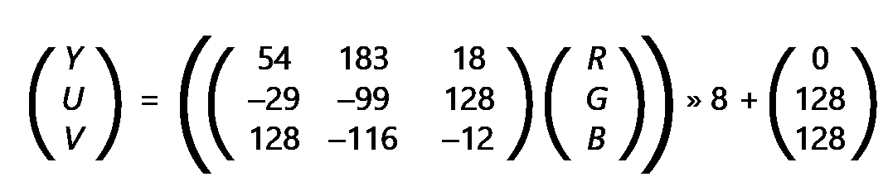

The resultant Y, U, and V components MUST be clamped to the range 0...255 inclusive.

The reverse transformation from AYUV to ARGB is described by the following two formulas:

***A* = *A***

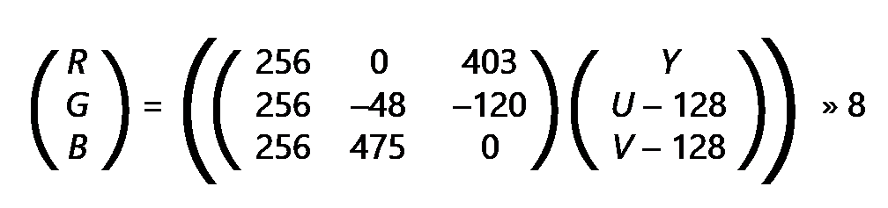

The resultant R, G, and B components MUST be clamped to the range 0...255 inclusive.

##### 3.3.8.3.2 YUV420p Stream Combination for YUV444 mode

The **RFX_AVC444_BITMAP_STREAM** structure (section [2.2.4.5](#Section_2.2.4.5)) encapsulates two **RFX_AVC420_BITMAP_STREAM** structures (section [2.2.4.4](#Section_2.2.4.4)). These two YUV420p streams MUST be combined to produce a YUV444 frame.

A YUV444 frame can be represented as shown in the following figure, where Y444, U444, and V444 are the Y, U, and V planes of a source YUV444 frame. It is assumed that the resolution of these planes is specified by the width *W* and height *H*.

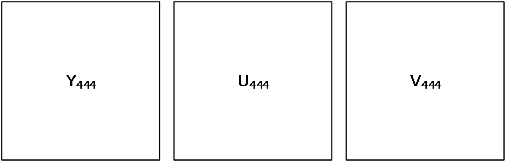

Figure 6: A representation of a YUV444 frame as three planes

The YUV444 frame represented in the previous figure can be packed into two YUV420 frames (a main and auxiliary view) as shown in the following figure, which represents the frame at a 16x16 macroblock level.

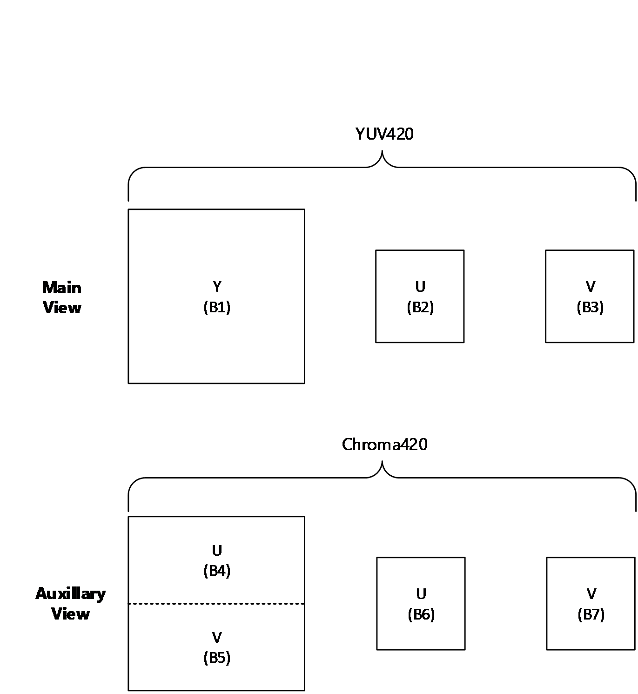

Figure 7: A representation of a YUV444 macroblock as two YUV420p macroblocks

The areas marked as B1 to B7 make up the Y, U, and V planes of the two YUV420p macroblocks representing the main (luma) and auxiliary (chroma) views. These areas are related to Y444, U444, and V444 as follows:

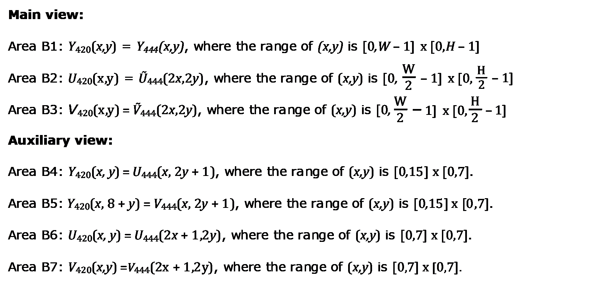

Color conversion MUST occur as follows in each case:

For macroblocks that are in rectangles in a received luma subframe (refer to the **regionRects** field of the corresponding [RFX_AVC420_METABLOCK (section 2.2.4.4.1)](#Section_2.2.4.4.1)), color conversion MUST be performed as in YUV420p mode using only the data in the main view.

For macroblocks that are in rectangles in a received chroma subframe (refer to the **regionRects** field of the corresponding **RFX_AVC420_METABLOCK**), color conversion MUST use the Y, U, and V components from the last corresponding rectangle in a luma subframe together with the current chroma subframe.

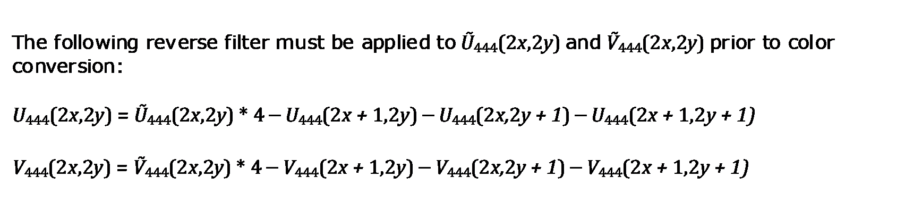

Note that the ranges for x and y in the chroma subframe (auxiliary view) are based on 16x16 macroblock sizes, and the view in the figure captioned "A representation of a YUV444 macroblock as two YUV420p macroblocks" shows interleaving in the chroma subframe for B4 and B5 on an 8-line basis. Color conversion MUST be performed for the entire macroblock, after which the region mask in **regionRects** MUST be applied. The use of 2x or 2y denotes even pixels, while (2x+1) or (2y+1) denotes odd pixels.

Due to potential visual artifacts stemming from the quantization of AVC encoding, applying the reverse filter is not optimal in all cases. If the reverse filter for a pixel component (U and V separately) changes the value by less than a given threshold, then the nonreversed value SHOULD be used instead. A cutoff threshold of 30 is used for this purpose. Note that this is an optional step and is not required in decoding.

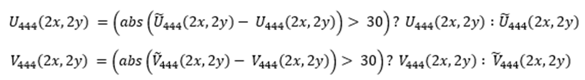

##### 3.3.8.3.3 YUV420p Stream Combination for YUV444v2 mode

The **RFX_AVC444V2_BITMAP_STREAM** structure (section [2.2.4.6](#Section_2.2.4.6)) encapsulates two **RFX_AVC420_BITMAP_STREAM** structures (section [2.2.4.4](#Section_2.2.4.4)). These two YUV420p streams MUST be combined to produce a YUV444 frame.

Note that the process of combining the streams is similar to the process used for YUV444 mode described in section [3.3.8.3.2](#Section_3.3.8.3.2), but the streams have a different layout in the auxiliary view. The terminology for YUV420 and YUV444 frames refers to buffers and remains the same.

A YUV444 frame can be represented as shown in the following figure, where Y444, U444, and V444 are the Y, U, and V planes of a source YUV444 frame. It is assumed that the resolution of these planes is specified by the width *W* and height *H*.

Figure 8: A representation of a YUV444 frame as three planes

The YUV444 frame represented in the previous figure can be packed into two YUV420 frames (a main and auxiliary view) as shown in the following figure, which represents the full frame.

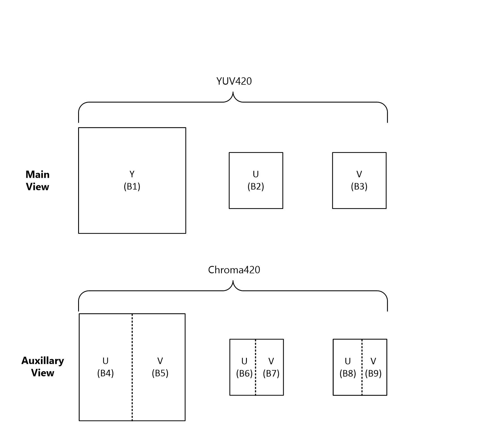

Figure 9: A representation of a YUV444 frame as two YUV420p frames

The areas marked as B1 to B9 make up the Y, U, and V planes of the two YUV420p macroblocks representing the main (luma) and auxiliary (chroma) views. These areas are related to Y444, U444, and V444 as follows.

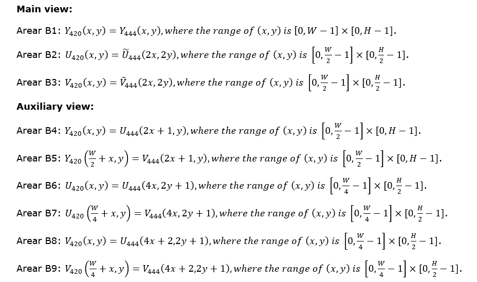

Color conversion MUST occur as follows in each case:

For macroblocks that are in rectangles in a received luma subframe (refer to the **regionRects** field of the corresponding[RFX_AVC420_METABLOCK (section 2.2.4.4.1)](#Section_2.2.4.4.1)), color conversion MUST be performed as in YUV420p mode using only the data in the main view.

For macroblocks that are in rectangles in a received chroma subframe (refer to the **regionRects** field of the corresponding **RFX_AVC420_METABLOCK**), color conversion MUST use the Y, U, and V components from the last corresponding rectangle in a luma subframe together with the current chroma subframe.

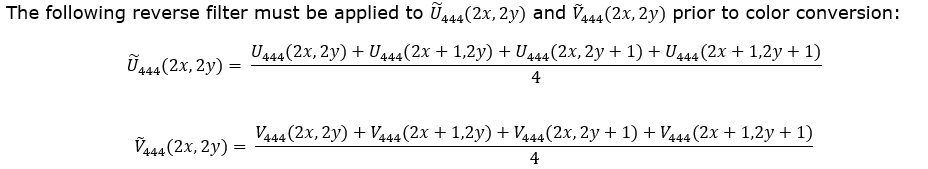

Note that the ranges for x and y in the chroma subframe (auxiliary view) are based on 16x16 macroblock sizes, and the view in the figure captioned "A representation of a YUV444 macroblock as two YUV420p macroblocks" shows interleaving in the chroma subframe for B4 and B5 on an 8-line basis. Color conversion MUST be performed for the entire macroblock, after which the region mask in **regionRects** MUST be applied. The use of 2x or 2y denotes even pixels, while (2x+1) or (2y+1) denotes odd pixels.

Due to potential visual artifacts stemming from the quantization of AVC encoding, applying the reverse filter is not optimal in all cases. If the reverse filter for a pixel component (U and V separately) changes the value by less than a given threshold, then the nonreversed value SHOULD be used instead. A cutoff threshold of 30 is used for this purpose. Note that this is an optional step and is not required in decoding.

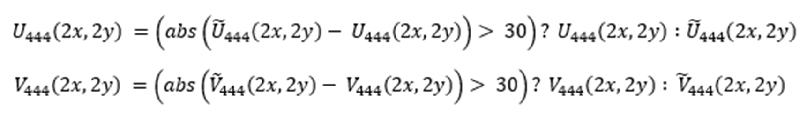

# 4 Protocol Examples

## 4.1 Bitmap Compression

### 4.1.1 ClearCodec Compression

#### 4.1.1.1 Example 1

The following example shows a network dump of an image compressed using ClearCodec. The width of the bitmap is 8, and the height is 9. ClearCodec returned 4 bytes after compressing this image.

COMPRESSED BITMAP DATA (4 bytes):

00000000 03 c3 11 00

03 -> CLEARCODEC_BITMAP_STREAM::flags = 0x03

= 0x01 | 0x02

= CLEARCODEC_FLAG_GLYPH_INDEX (0x01) | CLEARCODEC_FLAG_GLYPH_HIT (0x02)

c3 -> CLEARCODEC_BITMAP_STREAM::seqNumber = 195

11 00 -> CLEARCODEC_BITMAP_STREAM::glyphIndex = 17

The sequence number is validated and incremented. The pixels for this image can be found in the **Decompressor Glyph Storage** (section [3.3.1.9](#Section_3.3.1.9)) ADM element at position 17, ordered from left to right and then top to bottom.

#### 4.1.1.2 Example 2

The following example shows a network dump of an image compressed using ClearCodec. The width of the bitmap is 78, and the height is 17. ClearCodec returned 144 bytes after compressing this image.

COMPRESSED BITMAP DATA (144 bytes):

00000000 00 0d 00 00 00 00 00 00 00 00 82 00 00 00 00 00 ................

00000010 00 00 4e 00 11 00 75 00 00 00 02 0e ff ff ff 00 ..N...u.........

00000020 00 00 db ff ff 00 3a 90 ff b6 66 66 b6 ff b6 66 ......:...ff...f

00000030 00 90 db ff 00 00 3a db 90 3a 3a 90 db 66 00 00 ......:..::..f..

00000040 ff ff b6 64 64 64 11 04 11 4c 11 4c 11 4c 11 4c ...ddd...L.L.L.L

00000050 11 4c 00 47 13 00 01 01 04 00 01 00 00 47 16 00 .L.G.........G..

00000060 11 02 00 47 29 00 11 01 00 49 0a 00 01 00 04 00 ...G)....I......

00000070 01 00 00 4a 0a 00 09 00 01 00 00 47 05 00 01 01 ...J.......G....

00000080 1c 00 01 00 11 4c 11 4c 11 4c 00 47 0d 4d 00 4d .....L.L.L.G.M.M

Decoding the CLEARCODEC_BITMAP_STREAM header:

00 -> CLEARCODEC_BITMAP_STREAM::flags = 0

0d -> CLEARCODEC_BITMAP_STREAM::seqNumber = 13

Decoding the CLEARCODEC_COMPOSITE_PAYLOAD header:

00 00 00 00 -> CLEARCODEC_COMPOSITE_PAYLOAD::residualByteCount = 0

00 00 00 00 -> CLEARCODEC_COMPOSITE_PAYLOAD::bandsByteCount = 0

82 00 00 00 -> CLEARCODEC_COMPOSITE_PAYLOAD::subcodecByteCount = 130 bytes

SUBCODEC DATA (130 bytes):

00000000 00 00 00 00 4e 00 11 00 75 00 00 00 02 0e ff ff ....N...u.......

00000010 ff 00 00 00 db ff ff 00 3a 90 ff b6 66 66 b6 ff ........:...ff..

00000020 b6 66 00 90 db ff 00 00 3a db 90 3a 3a 90 db 66 .f......:..::..f

00000030 00 00 ff ff b6 64 64 64 11 04 11 4c 11 4c 11 4c .....ddd...L.L.L

00000040 11 4c 11 4c 00 47 13 00 01 01 04 00 01 00 00 47 .L.L.G.........G

00000050 16 00 11 02 00 47 29 00 11 01 00 49 0a 00 01 00 .....G)....I....

00000060 04 00 01 00 00 4a 0a 00 09 00 01 00 00 47 05 00 .....J.......G..

00000070 01 01 1c 00 01 00 11 4c 11 4c 11 4c 00 47 0d 4d .......L.L.L.G.M

00000080 00 4d .M

Decoding the first subcodec header:

00 00 -> CLEARCODEC_SUBCODEC::xStart = 0

00 00 -> CLEARCODEC_SUBCODEC::yStart = 0

4e 00 -> CLEARCODEC_SUBCODEC::width = 78

11 00 -> CLEARCODEC_SUBCODEC::height = 17

75 00 00 00 -> CLEARCODEC_SUBCODEC::bitmapDataByteCount = 117

02 -> CLEARCODEC_SUBCODEC::subCodecId = CLEARCODEC_SUBCODEC_RLEX(0x02)

SUBCODEC_RLEX DATA (117 bytes):

00000000 0e ff ff ff 00 00 00 db ff ff 00 3a 90 ff b6 66 ...........:...f

00000010 66 b6 ff b6 66 00 90 db ff 00 00 3a db 90 3a 3a f...f......:..::

00000020 90 db 66 00 00 ff ff b6 64 64 64 11 04 11 4c 11 ..f.....ddd...L.

00000030 4c 11 4c 11 4c 11 4c 00 47 13 00 01 01 04 00 01 L.L.L.L.G.......

00000040 00 00 47 16 00 11 02 00 47 29 00 11 01 00 49 0a ..G.....G)....I.

00000050 00 01 00 04 00 01 00 00 4a 0a 00 09 00 01 00 00 ........J.......

00000060 47 05 00 01 01 1c 00 01 00 11 4c 11 4c 11 4c 00 G.........L.L.L.

00000070 47 0d 4d 00 4d G.M.M

0e -> CLEARCODEC_SUBCODEC_RLEX::paletteCount = 14

ff ff ff -> paletteEntries[0] = (blue = 0xff, green = 0xff, red = 0xff)

00 00 00 -> paletteEntries[1] = (blue = 0x00, green = 0x00, red = 0x00)

db ff ff -> paletteEntries[2] = (blue = 0xdb, green = 0xff, red = 0xff)

00 3a 90 -> paletteEntries[3] = (blue = 0x00, green = 0x3a, red = 0x90)

ff b6 66 -> paletteEntries[4] = (blue = 0xff, green = 0xb6, red = 0x66)

66 b6 ff -> paletteEntries[5] = (blue = 0x66, green = 0xb6, red = 0xff)

b6 66 00 -> paletteEntries[6] = (blue = 0xb6, green = 0x66, red = 0x00)

90 db ff -> paletteEntries[7] = (blue = 0x90, green = 0xdb, red = 0xff)

00 00 3a -> paletteEntries[8] = (blue = 0x00, green = 0x00, red = 0x3a)

db 90 3a -> paletteEntries[9] = (blue = 0xdb, green = 0x90, red = 0x3a)

3a 90 db -> paletteEntries[10] = (blue = 0x3a, green = 0x90, red = 0xdb)

66 00 00 -> paletteEntries[11] = (blue = 0x66, green = 0x00, red = 0x00)

ff ff b6 -> paletteEntries[12] = (blue = 0xff, green = 0xff, red = 0xb6)

64 64 64 -> paletteEntries[13] = (blue = 0x64, green = 0x64, red = 0x64)

The minimum number of bits required to represent the largest palette index (indexes range from 0 to 13 in this case) is floor(log2(13)) + 1 = 4. This means that all indexes are represented using 4 bits, and the remaining 4 bits in the byte are used for the suite depth.

Decoding the first SUBCODEC_RLEX_SEGMENT:

11 -> Encoded stop index (least significant 4 bits) and suite depth (most significant 4 bits)

CLEARCODEC_SUBCODEC_RLEX_SEGMENT::stopIndex = 0x01

CLEARCODEC_SUBCODEC_RLEX_SEGMENT::suiteDepth = 0x01

04 -> CLEARCODEC_SUBCODEC_RLEX_SEGMENT::runLengthFactor1 = 4

CLEARCODEC_SUBCODEC_RLEX_SEGMENT::runLengthFactor2 is not present

CLEARCODEC_SUBCODEC_RLEX_SEGMENT::runLengthFactor3 is not present

Using the above values, the following sequence of palette indexes is decoded:

0x00, 0x00, 0x00, 0x00, 0x00, 0x01

Using the palette entries, the sequence of palette indexes is translated into the following pixel sequence (RGB format):

ffffff, ffffff, ffffff, ffffff, ffffff, 000000

The decoded pixels are written into the target image starting in the top-left corner and progressing from left to right and then top to bottom.

Decoding the second RLEX_SEGMENT:

11 -> Encoded stop index (least significant 4 bits) and suite depth (most significant 4 bits)

CLEARCODEC_SUBCODEC_RLEX_SEGMENT::stopIndex = 0x01

CLEARCODEC_SUBCODEC_RLEX_SEGMENT::suiteDepth = 0x01

4c -> CLEARCODEC_SUBCODEC_RLEX_SEGMENT::runLengthFactor1 = 76

CLEARCODEC_SUBCODEC_RLEX_SEGMENT::runLengthFactor2 is not present

CLEARCODEC_SUBCODEC_RLEX_SEGMENT::runLengthFactor3 is not present

Using the above values, the following sequence of palette indexes is decoded:

0x00, 0x00, ... [76 total], 0x00, 0x01

In a similar fashion, the next thirteen SUBCODEC_RLEX_SEGMENT structures are processed.

Finally, decoding the sixteenth RLEX_SEGMENT:

29 -> Encoded stop index (least significant 4 bits) and suite depth (most significant 4 bits)

CLEARCODEC_SUBCODEC_RLEX_SEGMENT::stopIndex = 0x09

CLEARCODEC_SUBCODEC_RLEX_SEGMENT::suiteDepth = 0x02

0 -> CLEARCODEC_SUBCODEC_RLEX_SEGMENT::runLengthFactor1 = 0

CLEARCODEC_SUBCODEC_RLEX_SEGMENT::runLengthFactor2 is not present

CLEARCODEC_SUBCODEC_RLEX_SEGMENT::runLengthFactor3 is not present

Using the above values, the following sequence of palette indexes is decoded:

0x07, 0x08, 0x09

Using the palette entries, the sequence of palette indexes is translated into the following pixel sequence (RGB format):

ffdb90, 3a0000, 3a90db

In a similar fashion, the remaining SUBCODEC_RLEX_SEGMENTS in the packet are decoded until there is no more data left in the SUBCODEC_RLEX DATA payload, at which point subcodec decoding is complete.

#### 4.1.1.3 Example 3

The following example shows a network dump of an image compressed using ClearCodec. The width of the bitmap is 64, and the height is 24. ClearCodec returned 167 bytes after compressing this image.

COMPRESSED BITMAP DATA (167 bytes):

00000000 00 df 0e 00 00 00 8b 00 00 00 00 00 00 00 fe fe ................

00000010 fe ff 80 05 ff ff ff 40 fe fe fe 40 00 00 3f 00 .......@...@..?.

00000020 03 00 0b 00 fe fe fe c5 d0 c6 d0 c7 d0 68 d4 69 .............h.i

00000030 d4 6a d4 6b d4 6c d4 6d d4 1a d4 1a d4 a6 d0 6e .j.k.l.m.......n

00000040 d4 6f d4 70 d4 71 d4 72 d4 73 d4 74 d4 21 d4 22 .o.p.q.r.s.t.!."

00000050 d4 23 d4 24 d4 25 d4 d9 d0 da d0 db d0 c5 d0 c5 .#.$.%..........

00000060 d0 dc d0 c2 d0 21 d4 22 d4 23 d4 24 d4 25 d4 c9 .....!.".#.$.%..

00000070 d0 ca d0 5a d4 2b d1 28 d1 2c d1 75 d4 27 d4 28 ...Z.+.(.,.u.'.(

00000080 d4 29 d4 2a d4 1a d4 1a d4 1a d4 b7 d0 b8 d0 b9 .).*............

00000090 d0 ba d0 bb d0 bc d0 bd d0 be d0 bf d0 c0 d0 c1 ................

000000a0 d0 c2 d0 c3 d0 c4 d0 .......

Decoding the CLEARCODEC_BITMAP_STREAM header:

00 -> CLEARCODEC_BITMAP_STREAM::flags = 0

df -> CLEARCODEC_BITMAP_STREAM::seqNumber = 223

Decoding the CLEARCODEC_COMPOSITE_PAYLOAD header:

0e 00 00 00 -> CLEARCODEC_COMPOSITE_PAYLOAD::residualByteCount = 14

8b 00 00 00 -> CLEARCODEC_COMPOSITE_PAYLOAD::bandsByteCount = 139

00 00 00 00 -> CLEARCODEC_COMPOSITE_PAYLOAD::subcodecByteCount = 0

RESIDUAL DATA (14 bytes):

00000000 fe fe fe ff 80 05 ff ff ff 40 fe fe fe 40 .........@...@

Decoding the first residual segment:

fe -> CLEARCODEC_RGB_RUN_SEGMENT::blueValue = 254

fe -> CLEARCODEC_RGB_RUN_SEGMENT::greenValue = 254

fe -> CLEARCODEC_RGB_RUN_SEGMENT::redValue = 254

ff -> CLEARCODEC_RGB_RUN_SEGMENT::runLengthFactor1 = 255

CLEARCODEC_RGB_RUN_SEGMENT::runLengthFactor2 is present.

80 05 -> CLEARCODEC_RGB_RUN_SEGMENT::runLengthFactor2 = 1408

CLEARCODEC_RGB_RUN_SEGMENT::runLengthFactor3 is not present.

The white pixel (254, 254, 254) is replicated 1408 times (starting in the top-left corner and progressing from left to right and then top to bottom).

Decoding the second residual segment:

ff -> CLEARCODEC_RGB_RUN_SEGMENT::blueValue = 255

ff -> CLEARCODEC_RGB_RUN_SEGMENT::greenValue = 255

ff -> CLEARCODEC_RGB_RUN_SEGMENT::redValue = 255

40 -> CLEARCODEC_RGB_RUN_SEGMENT::runLengthFactor1 = 64

CLEARCODEC_RGB_RUN_SEGMENT::runLengthFactor2 is not present.

CLEARCODEC_RGB_RUN_SEGMENT::runLengthFactor3 is not present.

The fully white pixel (255, 255, 255) is replicated 64 times starting from the next position where the first residual segment ended.

Repeat the above procedure for the last residual segment (0xfe, 0xfe, 0xfe, 0x40). Because there is no more data left in the residual payload (and all pixels were covered), residual decoding is complete. The pixels decoded will be the first layer drawn on the target image buffer.

BANDS DATA (139 bytes):

00000000 00 00 3f 00 03 00 0b 00 fe fe fe c5 d0 c6 d0 c7 ..?.............

00000010 d0 68 d4 69 d4 6a d4 6b d4 6c d4 6d d4 1a d4 1a .h.i.j.k.l.m....

00000020 d4 a6 d0 6e d4 6f d4 70 d4 71 d4 72 d4 73 d4 74 ...n.o.p.q.r.s.t

00000030 d4 21 d4 22 d4 23 d4 24 d4 25 d4 d9 d0 da d0 db .!.".#.$.%......

00000040 d0 c5 d0 c5 d0 dc d0 c2 d0 21 d4 22 d4 23 d4 24 .........!.".#.$

00000050 d4 25 d4 c9 d0 ca d0 5a d4 2b d1 28 d1 2c d1 75 .%.....Z.+.(.,.u

00000060 d4 27 d4 28 d4 29 d4 2a d4 1a d4 1a d4 1a d4 b7 .'.(.).*........

00000070 d0 b8 d0 b9 d0 ba d0 bb d0 bc d0 bd d0 be d0 bf ................

00000080 d0 c0 d0 c1 d0 c2 d0 c3 d0 c4 d0 ...........

Decoding the first CLEARCODEC_BAND header:

00 00 -> CLEARCODEC_BAND::xStart = 0

3f 00 -> CLEARCODEC_BAND::xEnd = 63

03 00 -> CLEARCODEC_BAND::yStart = 3

0b 00 -> CLEARCODEC_BAND::yEnd = 11

fe -> CLEARCODEC_BAND::blueBkg = 254

fe -> CLEARCODEC_BAND::greenBkg = 254

fe -> CLEARCODEC_BAND::redBkg = 254

This implies that 64 V-Bars (**xEnd** – **xStart** + 1) follow after the header. Each V-Bar is either present in the **V-Bar Storage** (section [3.3.1.10](#Section_3.3.1.10)) ADM element or the packet.

Decoding the first V-Bar:

c5 d0 -> CLEARCODEC_VBAR::vBarHeader = 0xd0c5

CLEARCODEC_VBAR::vBarHeader::x = 0x1

CLEARCODEC_VBAR::vBarHeader::vBarIndex = 0x50c5

Because this is a V-Bar hit, the pixels are not present in the packet. The data for this V-Bar is accessed at V-Bar Storage position 0x50c5 and then placed on the screen starting at position (0, 3) and extending up to and including (0, 11). The V-Bar Storage position 0x50c5 has been initialized by a previous packet with 9 pixels.

All remaining 63 V-Bars in this band are cache hits and are processed in the same fashion.

Since there is no more data remaining in the bands payload, it follows that there are no more bands remaining and that bands decoding is complete.

Since there is no more data in the payload, it follows that decoding is complete.

#### 4.1.1.4 Example 4

The following example shows a network dump of an image compressed using ClearCodec. The width of the bitmap is 7, and the height is 15. ClearCodec returned 86 bytes after compressing this image.

COMPRESSED BITMAP DATA (86 bytes):

00000000 01 0b 78 00 00 00 00 00 46 00 00 00 00 00 00 00 ..x.....F.......

00000010 00 00 06 00 00 00 0e 00 00 00 00 00 0f ff ff ff ................

00000020 ff ff ff ff ff ff b6 ff ff ff ff ff ff ff ff ff ................

00000030 b6 66 ff ff ff ff ff ff ff b6 66 db 90 3a ff ff .f........f..:..

00000040 b6 ff ff ff ff ff ff ff ff ff 46 91 47 91 48 91 ..........F.G.H.

00000050 49 91 4a 91 1b 91 I.J...

Decoding the CLEARCODEC_BITMAP_STREAM header:

01 -> CLEARCODEC_BITMAP_STREAM::flags = CLEARCODEC_FLAG_GLYPH_INDEX (0x01)

0b -> CLEARCODEC_BITMAP_STREAM::seqNumber = 11

78 00 -> CLEARCODEC_BITMAP_STREAM::glyphIndex = 120

Decoding the CLEARCODEC_COMPOSITE_PAYLOAD header:

00 00 00 00 -> CLEARCODEC_COMPOSITE_PAYLOAD::residualByteCount = 0

46 00 00 00 -> CLEARCODEC_COMPOSITE_PAYLOAD::bandsByteCount = 70

00 00 00 00 -> CLEARCODEC_COMPOSITE_PAYLOAD::subcodecByteCount = 0

BANDS DATA (70 bytes):

00000000 00 00 06 00 00 00 0e 00 00 00 00 00 0f ff ff ff ................

00000010 ff ff ff ff ff ff b6 ff ff ff ff ff ff ff ff ff ................

00000020 b6 66 ff ff ff ff ff ff ff b6 66 db 90 3a ff ff .f........f..:..

00000030 b6 ff ff ff ff ff ff ff ff ff 46 91 47 91 48 91 ..........F.G.H.

00000040 49 91 4a 91 1b 91

Decoding the first CLEARCODEC_BAND header:

00 00 -> CLEARCODEC_BAND::xStart = 0

06 00 -> CLEARCODEC_BAND::xEnd = 6

00 00 -> CLEARCODEC_BAND::yStart = 0

0e 00 -> CLEARCODEC_BAND::yEnd = 14

00 -> CLEARCODEC_BAND::blueBkg = 0

00 -> CLEARCODEC_BAND::greenBkg = 0

00 -> CLEARCODEC_BAND::redBkg = 0

This implies that 7 V-Bars (**xEnd** – **xStart** + 1) follow after the header. Each V-Bar is either present in the **V-Bar Storage** (section [3.3.1.10](#Section_3.3.1.10)) ADM element or the packet.

Decoding the first V-Bar:

00 0f -> CLEARCODEC_VBAR::vBarHeader = 0x0f00

CLEARCODEC_VBAR::vBarHeader::x = 0x0 (implies this is a SHORT_VBAR_CACHE_MISS structure)

SHORT_VBAR_CACHE_MISS::vBarHeader::shortVBarYOn = 0x00

SHORT_VBAR_CACHE_MISS::vBarHeader::shortVBarYOff = 0x0f

Since this is a **SHORT_VBAR_CACHE_MISS** (section [2.2.4.1.1.2.1.1.3](#Section_2.2.4.1.1.2.1.1.3)) structure, the 15 pixels (**shortVBarYOff** – **shortVBarYOn**) that follow are the V-Bar. Note that **shortVBarYOn** is exclusive, while CLEARCODEC_BAND::yEnd is inclusive; this is mainly because a Short V-Bar of height of zero is legal, while a band of height zero is not legal.

ff ff ff -> First pixel at position (0, 0) = (blue = 0xff, green = 0xff, red = 0xff)

ff ff ff -> Second pixel at position (0, 1) = (blue = 0xff, green = 0xff, red = 0xff)

...

db 90 3a -> 11th pixel at position (0, 10) = (blue = 0xdb, green = 0x90, red = 0x3a)

...

ff ff ff -> 15th pixel at position (0, 14) = (blue = 0xff, green = 0xff, red = 0xff)

The **Short V-Bar Storage** (section [3.3.1.12](#Section_3.3.1.12)) ADM element at the Short V-Bar Storage Cursor (section [3.3.1.13](#Section_3.3.1.13)) ADM element is updated with the decoded pixels. Following this operation, the Short V-Bar Storage Cursor ADM element is incremented modulo 0x4000 by 1, mathematically:

vbarShortCursor = (vbarShortCursor + 1) mod 0x4000

The **V-Bar Storage** ADM element at the **V-Bar Storage Cursor** (section [3.3.1.11](#Section_3.3.1.11)) ADM element is also updated with the same pixels (in this case the two have the same height of 15). Following this operation, the **V-Bar Storage Cursor** ADM element is incremented modulo 0x8000 by 1.

Decoding the second V-Bar:

46 91 -> CLEARCODEC_VBAR::vBarHeader = 0x9146

CLEARCODEC_VBAR::vBarHeader::x = 0x1 (implies this is a VBAR_CACHE_HIT structure)

VBAR_CACHE_HIT::vBarIndex = 0x1146

Because this is a V-Bar hit, the pixels are not present in the packet. The data for this V-Bar is accessed at V-Bar Storage position 0x1146 and then placed on the screen starting at position (1, 0) and extending up to and including (1, 14).

All remaining 5 V-Bars in this band are cache hits and are processed in the same fashion.

Since there is no more data remaining in the bands payload, it follows that there are no more bands remaining and that bands decoding is complete.

Since there is no more data in the payload, it follows that decoding is complete.

Since the **glyphIndex** field was present in the CLEARCODEC_BITMAP_STREAM header of this packet, the **Decompressor Glyph Storage** (section [3.3.1.9](#Section_3.3.1.9)) ADM element at position 120 is updated with the decoded bitmap.

#### 4.1.1.5 Example 5

In order to instruct a client to render a glyph and then insert the glyph into the **Decompressor Glyph Storage** (section [3.3.1.9](#Section_3.3.1.9)) ADM element, the server encapsulates an encoded representation of the glyph within a **CLEARCODEC_BITMAP_STREAM** (section [2.2.4.1](#Section_2.2.4.1)) structure. This structure is embedded within an **RDPGFX_WIRE_TO_SURFACE_PDU_1** (section [2.2.2.1](#Section_2.2.2.1)) message, which is transmitted to the client. Within the **CLEARCODEC_BITMAP_STREAM** structure, the CLEARCODEC_FLAG_GLYPH_INDEX (0x01) flag is present in the **flags** field, while the CLEARCODEC_FLAG_GLYPH_HIT (0x02) flag is absent. The glyph bitmap is present in the **compositePayload** field. Once decoded, the glyph is effectively a linear stream of pixels, as shown in the following diagram.

Figure 10: Sixteen glyph pixels stored in a linear stream with no implied dimensions

The width and height of the glyph is determined by the rectangle defined in the **destRect** field of the encapsulating **RDPGFX_WIRE_TO_SURFACE_PDU_1** message. For example, assuming that the width is 2 pixels and the height is 8 pixels, the following image would be rendered by the client.

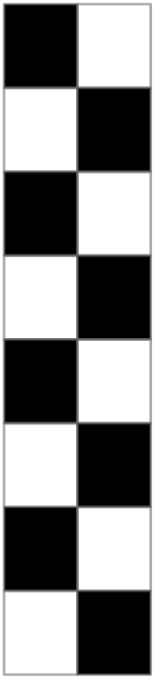

Figure 11: A 2 x 8 glyph

The decoded linear stream of pixels is stored within the **Decompressor Glyph Storage** ADM element in the slot specified by the **glyphIndex** field of the encapsulating **CLEARCODEC_BITMAP_STREAM** structure. The pixels are stored with no implied dimensions. For the sake of this example, assume that the assigned slot is Slot 4.

If the server detects a cache hit and determines that the glyph stored by the client in Slot 4 of the **Decompressor Glyph Storage** ADM element has to be rendered, the client will be sent a **CLEARCODEC_BITMAP_STREAM** structure (encapsulated within a **RDPGFX_WIRE_TO_SURFACE_PDU_1** message) with the **flags** field containing both the CLEARCODEC_FLAG_GLYPH_INDEX and CLEARCODEC_FLAG_GLYPH_HIT flags. The optional **compositePayload** field will not be present. Note that in this case, the dimensions of the rectangle specified by the container **RDPGFX_WIRE_TO_SURFACE_PDU_1** message (in the **destRect** field) can be any width and height that yields an effective area of 16 pixels2. For example, a possible configuration could be the following 4-pixel-by-4-pixel glyph.

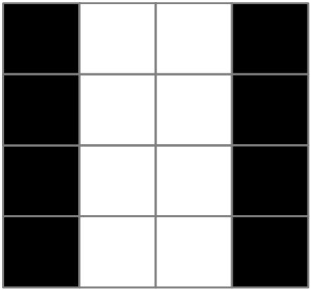

Figure 12: A 4 x 4 glyph

Another possible configuration is the following 8-pixel-by-2-pixel glyph.

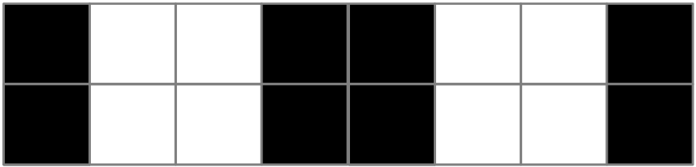

Figure 13: An 8 x 2 glyph

In effect, a linear stream of pixels stored in a slot in the **Decompressor Glyph Storage** ADM element can be blitted into a number of rectangular configurations, as long as all of the pixels are used in the configuration. The ultimate configuration is determined by cache hits encountered by the server encoder.

### 4.1.2 Progressive Entropy Encode and Decode

The example in this section illustrates the process of entropy encoding and decoding for a tile at various quality levels. For simplicity, this example only encodes one color component, which consists of 14 [**DWT**](#gt_discrete-wavelet-transform-dwt) coefficients.

The tile contains three bands: HL, LH, and LL. These bands are composed of 5, 5, and 4 DWT coefficients, respectively, totaling 14 coefficients for the tile.

Three progressive quality levels are used when encoding: 25%, 50%, and 100%.

The input presented in this example is the direct result of the discreet wavelet transform and quantization of a sample image.

The following scenarios are covered in this example:

- The tile for frame #1 is encoded as an original tile at 25% progressive quality.
- The tile is upgraded to 50% progressive quality.
- The tile for frame #2 is encoded as a difference tile at 25%.
- The tile is upgraded to 50%.
- The tile is finally upgraded to 100%.
The coefficients for frame #1 and frame #2 are presented in the following table.

|  | HL | LH | LL | Column 5 | Column 6 | Column 7 | Column 8 | Column 9 | Column 10 | Column 11 | Column 12 | Column 13 | Column 14 | Column 15 |
| --- | --- | --- | --- | --- | --- | --- | --- | --- | --- | --- | --- | --- | --- | --- |
| **Frame #1** | -34 | -13 | 15 | -3 | 0 | 0 | -7 | 5 | -3 | 9 | 15 | 17 | -9 | 12 |
| **Frame #2** | -2 | -2 | 3 | -3 | 1 | 3 | -7 | 5 | -2 | 1 | 24 | 13 | 18 | 5 |

The progressive quantization table for the two intermediate qualities (25% and 50%) appear in the following table.

| Quality | HL | LH | LL |
| --- | --- | --- | --- |
| **25%** | 4 | 3 | 2 |
| **50%** | 0 | 1 | 2 |

#### 4.1.2.1 Encode

##### 4.1.2.1.1 Encode Frame #1 at 25%

The coefficients for frame #1 are quantized for the 25% progressive quality. Deltas are calculated for the coefficients for the LL band. The resulting coefficients are encoded using the RLGR1 encoder.

Details on the formulas for **DwtQ**, **ProgQ,** and **ProgQ-LL-Deltas** are specified in section [3.2.8.1.5.1](#Section_3.2.8.1.5.1).

In order to produce **ProgQ**, the values from **DwtQ** are quantized and, for the HL and LH bands, rounded down toward zero, and for the LL band, rounded down toward minus infinity.

The RLGR1 ([MS-RDPRFX](../MS-RDPRFX/MS-RDPRFX.md) section 3.1.8.1.7.1) encoder first encodes an empty run-length of zeros ("10"), followed by a Golomb-Rice (GR) encode of -2 ("101"). Since the RLGR1 encoder is in GR mode, the next two entries (which are zeros) are encoded as "0" and "0". The RLGR1 encoder switches back to run-length mode and writes the remaining six zeros as the run "00110". A complete description of the RLGR1 encoder is specified in [MS-RDPRFX] section 3.1.8.1.7.1.

|  | HL | LH | LL | Column 5 | Column 6 | Column 7 | Column 8 | Column 9 | Column 10 | Column 11 | Column 12 | Column 13 | Column 14 | Column 15 |
| --- | --- | --- | --- | --- | --- | --- | --- | --- | --- | --- | --- | --- | --- | --- |
| **DwtQ** | -34 | -13 | 15 | -3 | 0 | 0 | -7 | 5 | -3 | 9 | 15 | 17 | -9 | 12 |
| **ProgQ** | -2 | 0 | 0 | 0 | 0 | 0 | 0 | 0 | 0 | 1 | 3 | 4 | -3 | 3 |
| **ProgQ-LL-Deltas** | - | - | - | - | - | - | - | - | - | - | 3 | 1 | -7 | 6 |
| **RLGR1 entries** | -2 | 0 | 0 | 0 | 0 | 0 | 0 | 0 | 0 | 1 | 3 | 1 | -7 | 6 |

The RLGR1 result, broken down into run-length and GR-encoded elements, is:

10101 | 0 | 0 | 00110 | 00 | 100110 | 110 | 11111111111110 | 111000

Zeros are added to complete the final byte, which results in the following bytes:

0xA8 0x62 0x6D 0xFF 0xF7 0x00

##### 4.1.2.1.2 Encode Frame #1 at 50%

The quantized data is dequantized and subtracted from the input, yielding the remaining values to be sent (known as "**DRS**"). These values are quantized for the 50% progressive quality.

Details on the formulas for **DRS** and **UpgradeQ** are as specified in section [3.2.8.1.5.2](#Section_3.2.8.1.5.2), while details on the SRL encoder are as specified in section [3.2.8.1.5](#Section_3.2.8.1.5).

The difference in bit positions for the two progressive quality levels indicates how many bits of magnitude are sent to the client. For this particular upgrade, the LL band does not receive any new bits, and the number of bits is zero. Hence, no entries are generated for this band.

The previous value (zero or nonzero) that was sent determines whether the SRL encoder will be used or whether raw bits will be sent.

In this particular scenario, the first element of the HL band and the last element of the LH band produced a nonzero value in the previous pass. These absolute values are written as raw bits, with the appropriate number of bits for the band: the first written with four bits and the second written with two bits.

The SRL encoder first encodes an empty run-length ("10") before encoding the value -13. The sign is written as one bit ("1"); the magnitude minus one (12) is unary-encoded with 12 zeros and terminated with "1".

An empty run-length is encoded as one bit ("1") before encoding the next value (15). The sign is written as one bit ("0"); the magnitude minus one (14) is unary-encoded with 14 zeros. Because the magnitude is the maximum magnitude possible with four bits, the sequence is not terminated with a "1".

An empty run-length is encoded as one bit ("1") before encoding the next value, -3 ("1001").

Next, the SRL encoder encodes a run of two zeros. Even if those values are across two different bands, it is still considered to be a single run of zeros. Note that even if the elements were not consecutive in the bands, because elements in the middle would be encoded as raw bits, for example, or a band would be skipped due to not receiving any new bits, as far as the SRL encoder is concerned, those entries are considered consecutive.

|  | HL | LH | LL | Column 5 | Column 6 | Column 7 | Column 8 | Column 9 | Column 10 | Column 11 | Column 12 | Column 13 | Column 14 | Column 15 |
| --- | --- | --- | --- | --- | --- | --- | --- | --- | --- | --- | --- | --- | --- | --- |
| **DRS** | -2 | -13 | 15 | -3 | 0 | 0 | -7 | 5 | -3 | 1 | 3 | 1 | 3 | 0 |
| **UpgradeQ** | -2 | -13 | 15 | -3 | 0 | 0 | -3 | 2 | -1 | 0 | 0 | 0 | 0 | 0 |
| **Number of bits** | 4 | 2 | 0 | - | - | - | - | - | - | - | - | - | - | - |
| **Raw entries** | -2 | - | - | - | - | - | - | - | - | 0 | - | - | - | - |
| **SRL entries** | - | -13 | 15 | -3 | 0 | 0 | -3 | 2 | -1 | - | - | - | - | - |

The raw result, broken down into elements, is:

0010 | 00

This results in the following byte:

0x20

The SRL result, broken down in run-length and unary encode, is:

1010000000000001 | 1000000000000000 | 11001 | 0010 | 100 | 1001 | 111

This results in the bytes:

0xA0 0x01 0x80 0x00 0xC9 0x49 0xE0

Zeros are added to each of these streams to complete the final byte.

##### 4.1.2.1.3 Encode Frame #2 at 25%

The coefficients for frame #2 are subtracted from the reference coefficients **Ref** (which are the coefficients the client currently possesses). This difference is then quantized for the 25% progressive quality, deltas are calculated for the LL band, and the resulting coefficients are sent to the RLGR1 ([MS-RDPRFX](../MS-RDPRFX/MS-RDPRFX.md) section 3.1.8.1.7.1) encoder.

Because the tile did not reach 100% in the previous frame, the client does not possess the complete value of **DwtQ** for that frame. For example, the last coefficient in LH is 9, but the client has only 8. Therefore, the difference is performed between the value for the current frame (1) and what the client possesses (8), resulting in -7.

|  | HL | LH | LL | Column 5 | Column 6 | Column 7 | Column 8 | Column 9 | Column 10 | Column 11 | Column 12 | Column 13 | Column 14 | Column 15 |
| --- | --- | --- | --- | --- | --- | --- | --- | --- | --- | --- | --- | --- | --- | --- |
| **DwtQ** | -2 | -2 | 3 | -3 | 1 | 3 | -7 | 5 | -2 | 1 | 24 | 13 | 18 | 5 |
| **Ref** | -34 | -13 | 15 | -3 | 0 | 0 | -6 | 4 | -2 | 8 | 12 | 16 | -12 | 12 |
| **SB** | 32 | 11 | -12 | 0 | 1 | 3 | -1 | 1 | 0 | -7 | 12 | -3 | 30 | -7 |
| **ProgQ** | 2 | 0 | 0 | 0 | 0 | 0 | 0 | 0 | 0 | 0 | 3 | -1 | 7 | -2 |
| **ProgQ-LL-Deltas** | - | - | - | - | - | - | - | - | - | - | 3 | -4 | 8 | -9 |
| **RLGR1 entries** | 2 | 0 | 0 | 0 | 0 | 0 | 0 | 0 | 0 | 0 | 3 | -4 | 8 | -9 |

The RLGR1 result, broken down in run-length and GR-encoded elements, is:

10001 | 0 | 0 | 00111 | 0110 | 1011110 | 11111111111111110 | 1111001

This results in the bytes:

0x88 0x76 0xBD 0xFF 0xFE 0xF2

##### 4.1.2.1.4 Encode Frame #2 at 50%

Similar to frame #1, as described in sections [4.1.2.1.1](#Section_4.1.2.1.1) and [4.1.2.1.2](#Section_4.1.2.1.2), the remaining bits are quantized for the 50% progressive quality and are written out, either as raw bits or encoded with SRL.

Because in this upgrade the LL band does not receive any bits, and the number of bits is zero, no entries are produced for this band.

|  | HL | LH | LL | Column 5 | Column 6 | Column 7 | Column 8 | Column 9 | Column 10 | Column 11 | Column 12 | Column 13 | Column 14 | Column 15 |
| --- | --- | --- | --- | --- | --- | --- | --- | --- | --- | --- | --- | --- | --- | --- |
| **DRS** | 0 | 11 | -12 | 0 | 1 | 3 | -1 | 1 | 0 | -7 | 0 | 1 | 2 | 1 |
| **UpgradeQ** | 0 | 11 | -12 | 0 | 1 | 1 | 0 | 0 | 0 | -3 | 0 | 0 | 0 | 0 |
| **Number of bits** | 4 | 2 | 0 | - | - | - | - | - | - | - | - | - | - | - |
| **Raw entries** | 0 | - | - | - | - | - | - | - | - | - | - | - | - | - |
| **SRL entries** | - | 11 | -12 | 0 | 1 | 1 | 0 | 0 | 0 | -3 | - | - | - | - |

The single-element raw result is:

0000

This results in the byte:

0x00

The SRL result, broken down in run-length and unary encode, is:

10000000000001| 11000000000001 | 01 | 101 | 0011| 100

This results in the bytes:

0x80 0x07 0x00 0x16 0x9C

##### 4.1.2.1.5 Encode Frame #2 at 100%

After the processing described in sections [4.1.2.1.3](#Section_4.1.2.1.3) and [4.1.2.1.4](#Section_4.1.2.1.4), the remaining bits in each band are transmitted to reach the 100% progressive quality. Since there is no progressive quantization, the coefficients for **UpgradeQ** are identical to those from **DRS**.

Because the HL band does not receive any additional bits, and the number of bits is zero, no entries are produced for this band.

Coefficients #2, #3, and #4 in the LH band were sent as zeros for the encode operation at 25% and for the upgrade to 50% and hence they are encoded with the SRL encoder. All other coefficients are sent as raw bits. The coefficients from the LL band are always written as raw bits for an upgrade, regardless of the values that were sent before.

|  | HL | LH | LL | Column 5 | Column 6 | Column 7 | Column 8 | Column 9 | Column 10 | Column 11 | Column 12 | Column 13 | Column 14 | Column 15 |
| --- | --- | --- | --- | --- | --- | --- | --- | --- | --- | --- | --- | --- | --- | --- |
| **DRS** | 0 | 0 | 0 | 0 | 0 | 1 | -1 | 1 | 0 | -1 | 0 | 1 | 2 | 1 |
| **UpgradeQ** | 0 | 0 | 0 | 0 | 0 | 1 | -1 | 1 | 0 | -1 | 0 | 1 | 2 | 1 |
| **Number of bits** | 0 | 1 | 2 | - | - | - | - | - | - | - | - | - | - | - |
| **Raw entries** | - | - | - | - | - | 1 | - | - | - | -1 | 0 | 1 | 2 | 1 |
| **SRL entries** | - | - | - | - | - | - | -1 | 1 | 0 | - | - | - | - | - |

The raw result, broken down into elements, is:

1 | 1 | 00 | 01 | 10 | 01

This results in the bytes:

0xC6 0x40

The SRL result, broken down in run-length and unary encode, is:

101 | 10 | 0

This results in the byte:

0xB0

#### 4.1.2.2 Decode

##### 4.1.2.2.1 Decode Frame #1 at 25%

The decoder receives the encoded data produced in section [4.1.2.1.1](#Section_4.1.2.1.1). This is an original tile, so the sub-band reference (**Ref**) is initialized to zero.

For details on the formulas for **DecProgQ-LL**, **DecProgQ**, **DecDwtQ** and tri-state (referred to as **Sign**), see section [3.3.8.2.1.1](#Section_3.3.8.2.1.1).

Elements are RLGR1 ([MS-RDPRFX](../MS-RDPRFX/MS-RDPRFX.md) section 3.1.8.1.7.1) decoded. LL entries are deduced from the deltas. Entries are dequantized, and the **Sign** for the bands HL and LH is initialized depending on the decoded value.

|  | HL | LH | LL | Column 5 | Column 6 | Column 7 | Column 8 | Column 9 | Column 10 | Column 11 | Column 12 | Column 13 | Column 14 | Column 15 |
| --- | --- | --- | --- | --- | --- | --- | --- | --- | --- | --- | --- | --- | --- | --- |
| **Ref** | 0 | 0 | 0 | 0 | 0 | 0 | 0 | 0 | 0 | 0 | 0 | 0 | 0 | 0 |
| **RLGR1 results** | -2 | 0 | 0 | 0 | 0 | 0 | 0 | 0 | 0 | 1 | 3 | 1 | -7 | 6 |
| **DecProgQ-LL** | - | - | - | - | - | - | - | - | - | - | 3 | 4 | -3 | 3 |
| **DecProgQ** | -2 | 0 | 0 | 0 | 0 | 0 | 0 | 0 | 0 | 1 | 3 | 4 | -3 | 3 |
| **DecDwtQ** | -32 | 0 | 0 | 0 | 0 | 0 | 0 | 0 | 0 | 8 | 12 | 16 | -12 | 12 |
| **Sign** | -1 | 0 | 0 | 0 | 0 | 0 | 0 | 0 | 0 | 1 | - | - | - | - |

The first RLGR1 result is negative, and **Sign** is -1.

The last non-LL RLGR1 result is positive, and **Sign** is 1.

All other values are zeros, and **Sign** in all these cases is 0.

##### 4.1.2.2.2 Decode Frame #1 at 50%

**Ref** corresponds to the values for **DecDwtQ** from the previous decode. The number of bits is deduced from the progressive quality table and the fact that this is an upgrade from 25% to 50%. For the LL band, the number of bits is zero, so this band is skipped. For the other coefficients, the **Sign** values determine whether raw bits are read or SRL-encoded data is decoded.

|  | HL | LH | LL | Column 5 | Column 6 | Column 7 | Column 8 | Column 9 | Column 10 | Column 11 | Column 12 | Column 13 | Column 14 | Column 15 |
| --- | --- | --- | --- | --- | --- | --- | --- | --- | --- | --- | --- | --- | --- | --- |
| **Ref** | -32 | 0 | 0 | 0 | 0 | 0 | 0 | 0 | 0 | 8 | 12 | 16 | -12 | 12 |
| **Number of bits** | 4 | 2 | 0 | - | - | - | - | - | - | - | - | - | - | - |
| **SRL results** | - | -13 | 15 | -3 | 0 | 0 | -3 | 2 | -1 | - | - | - | - | - |
| **Raw results** | 2 | - | - | - | - | - | - | - | - | 0 | - | - | - | - |
| **input** | 2 | -13 | 15 | -3 | 0 | 0 | -3 | 2 | -1 | 0 | 0 | 0 | 0 | 0 |
| **DecDwtQ** | -34 | -13 | 15 | -3 | 0 | 0 | -6 | 4 | -2 | 8 | 12 | 16 | -12 | 12 |
| **Sign** | -1 | -1 | 1 | -1 | 0 | 0 | -1 | 1 | -1 | 1 | - | - | - | - |

The first element from the HL band and the last element from the LH band are read from the raw buffer since the corresponding **Sign** for these elements is nonzero. Four bits and two bits are read respectively.

All other elements are decoded from the SRL-encoded stream, and the result updates the corresponding **Sign**.

The input values are simply the merger of the SRL results and the raw results, with zeros filling in for the skipped band. The input values are dequantized, and the proper sign (based on **Sign**) is applied to values coming from the raw results and added to **DecDwtQ**.

##### 4.1.2.2.3 Decode Frame #2 at 25%

The decoder receives a difference tile, and the **Ref** values are maintained from the previous decode (**DecDwtQ** values as described in sections [4.1.2.2.1](#Section_4.1.2.2.1) and [4.1.2.2.2](#Section_4.1.2.2.2)).

|  | HL | LH | LL | Column 5 | Column 6 | Column 7 | Column 8 | Column 9 | Column 10 | Column 11 | Column 12 | Column 13 | Column 14 | Column 15 |
| --- | --- | --- | --- | --- | --- | --- | --- | --- | --- | --- | --- | --- | --- | --- |
| **Ref** | -34 | -13 | 15 | -3 | 0 | 0 | -6 | 4 | -2 | 8 | 12 | 16 | -12 | 12 |
| **RLGR1 results** | 2 | 0 | 0 | 0 | 0 | 0 | 0 | 0 | 0 | 0 | 3 | -4 | 8 | -9 |
| **DecProgQ-LL** | - | - | - | - | - | - | - | - | - | - | 3 | -1 | 7 | -2 |
| **DecProgQ** | 2 | 0 | 0 | 0 | 0 | 0 | 0 | 0 | 0 | 0 | 3 | -1 | 7 | -2 |
| **DecDwtQ** | -2 | -13 | 15 | -3 | 0 | 0 | -6 | 4 | -2 | 8 | 24 | 12 | 16 | 4 |
| **Sign** | 1 | 0 | 0 | 0 | 0 | 0 | 0 | 0 | 0 | 0 | - | - | - | - |

The first decoded value is 2, which becomes 32 after dequantization. Added to the reference value of -34, we get -2. Because all other values in the non-LL bands are zero, the **DecDwtQ** values are identical to the **Ref** values.

##### 4.1.2.2.4 Decode Frame #2 at 50%

This decode upgrades the tile to 50%. The steps followed are identical to the decoding of frame #1 at 50%, as described in section [4.1.2.2.2](#Section_4.1.2.2.2).

|  | HL | LH | LL | Column 5 | Column 6 | Column 7 | Column 8 | Column 9 | Column 10 | Column 11 | Column 12 | Column 13 | Column 14 | Column 15 |
| --- | --- | --- | --- | --- | --- | --- | --- | --- | --- | --- | --- | --- | --- | --- |
| **Ref** | -2 | -13 | 15 | -3 | 0 | 0 | -6 | 4 | -2 | 8 | 24 | 12 | 16 | 4 |
| **Number of bits** | 4 | 2 | 0 | - | - | - | - | - | - | - | - | - | - | - |
| **SRL results** | - | 11 | -12 | 0 | 1 | 1 | 0 | 0 | 0 | -3 | - | - | - | - |
| **Raw results** | 0 | - | - | - | - | - | - | - | - | - | - | - | - | - |
| **Input** | 0 | 11 | -12 | 0 | 1 | 1 | 0 | 0 | 0 | -3 | 0 | 0 | 0 | 0 |
| **DecDwtQ** | -2 | -2 | 3 | -3 | 1 | 2 | -6 | 4 | -2 | 2 | 24 | 12 | 16 | 4 |
| **Sign** | 1 | 1 | -1 | 0 | 1 | 1 | 0 | 0 | 0 | -1 | - | - | - | - |

##### 4.1.2.2.5 Decode Frame #2 at 100%

After the processing in the previous sections [4.1.2.2.3](#Section_4.1.2.2.3) and [4.1.2.2.4](#Section_4.1.2.2.4), the frame is upgraded to 100%.

|  | HL | LH | LL | Column 5 | Column 6 | Column 7 | Column 8 | Column 9 | Column 10 | Column 11 | Column 12 | Column 13 | Column 14 | Column 15 |
| --- | --- | --- | --- | --- | --- | --- | --- | --- | --- | --- | --- | --- | --- | --- |
| **Ref** | -2 | -2 | 3 | -3 | 1 | 2 | -6 | 4 | -2 | 2 | 24 | 12 | 16 | 4 |
| **Number of bits** | 0 | 1 | 2 | - | - | - | - | - | - | - | - | - | - | - |
| **SRL results** | - | - | - | - | - | - | -1 | 1 | 0 | - | - | - | - | - |
| **Raw results** | - | - | - | - | - | 1 | - | - | - | 1 | 0 | 1 | 2 | 1 |
| **Input** | 0 | 0 | 0 | 0 | 0 | 1 | -1 | 1 | 0 | 1 | 0 | 1 | 2 | 1 |
| **DecDwtQ** | -2 | -2 | 3 | -3 | 1 | 3 | -7 | 5 | -2 | 1 | 24 | 13 | 18 | 5 |
| **Sign** | 1 | 1 | -1 | 0 | 1 | 1 | -1 | 1 | 0 | -1 | - | - | - | - |

The elements from the LL band are read from the raw buffer regardless of the **Sign**. In fact, there is no **Sign** for the LL band. The values are added to **DecDwtQ**, with no sign adjustment for the LL band.

**DecDwtQ** finally matches the coefficients for frame #2 described previously.

## 4.2 Bulk Data Compression

### 4.2.1 RDP 8.0

#### 4.2.1.1 Compression Samples

These contrived samples are encoded as shown for expositive clarity, although most are so small that the output is larger than the input.

##### 4.2.1.1.1 Example 1

Uncompressed input:

01 02 FF 65 65 65 65 65

Compressed output:

E0 24 CE 9B 19 62 18 00

E0 = DEBLOCK_SINGLE

24 = PACKET_COMPRESSED + compression format 4

CE 9B 19 62 18 = binary 11001110 10011011 00011001 01100010 00011000

00 = 0 unused bits in 0x18 byte (all bits significant)

Decoded binary stream:

11001 = literal 0x01

110100 = literal 0x02

110110 = literal 0xFF

0 01100101 = literal 0x65

10001 00001 10 00 = match, distance 1, length 4 + 0

##### 4.2.1.1.2 Example 2

Uncompressed input:

54 68 65 20 71 75 69 63 6B 20 62 72 6F 77 6E 20 The quick brown

66 6F 78 20 6A 75 6D 70 73 20 6F 76 65 72 20 74 fox jumps over t

68 65 20 6C 61 7A 79 20 64 6F 67 he lazy dog

Compressed output:

The first byte is DEBLOCK_SINGLE, so the remainder is to be decoded. The second byte contains the compression type (4) but does not have the PACKET_COMPRESSED (0x20) bit set, so the remainder of the data is unencoded. Compression did not reduce the size, because there is little repetition in the source.

E0 04 54 68 65 20 71 75 69 63 6B 20 62 72 6F 77 ..The quick brow

6E 20 66 6F 78 20 6A 75 6D 70 73 20 6F 76 65 72 n fox jumps over

20 74 68 65 20 6C 61 7A 79 20 64 6F 67 the lazy dog

E0 = DEBLOCK_SINGLE

04 = compression type 4 (not PACKET_COMPRESSED)

remainder = unencoded input

##### 4.2.1.1.3 Example 3

Uncompressed input:

The pattern "ABC" is repeated 20 times.

41 42 43 41 42 43 41 42 43 41 42 43 41 42 43 41 ABCABCABCABCABCA

42 43 41 42 43 41 42 43 41 42 43 41 42 43 41 42 BCABCABCABCABCAB

43 41 42 43 41 42 43 41 42 43 41 42 43 41 42 43 CABCABCABCABCABC

41 42 43 41 42 43 41 42 43 41 42 43 ABCABCABCABC

Compressed output:

The first byte is SINGLE, so the other fields of the **RDP_SEGMENTED_DATA** (section [2.2.5.1](#Section_2.2.5.1)) structure are omitted. The second begins the compressed segment. The first byte of that segment includes PACKET_COMPRESSED, so the remainder is encoded. The final byte 0x01 indicates that only one bit is unused, so the encoded data is 47 bits in length. Note that an overlapping match intentionally causes replication.

E0 24 20 90 88 71 1F B2 01

E0 = DEBLOCK_SINGLE

24 = PACKET_COMPRESSED + type 4

20 = binary 0 0100000

90 = binary 1 0 010000

88 = binary 10 0 01000

71 = binary 011 10001

1F = binary 00011 111

B2 = binary 10 11001 (0)

01 = one bit (least-significant) ignored from 0xB2 byte.

Decoded binary stream:

0 01000001 = literal 65 = "A"

0 01000010 = literal 66 = "B"

0 01000011 = literal 67 = "C"

10001 00011 = match distance = 3

11110 11001 = match length = 32 + 25 = 57

(0) ignored

##### 4.2.1.1.4 Example 4

Uncompressed input:

54 68 65 20 71 75 69 63 6B 20 62 72 6F 77 6E 20 The quick brown

66 6F 78 20 6A 75 6D 70 73 20 6F 76 65 72 20 74 fox jumps over t

68 65 20 6C 61 7A 79 20 64 6F 67 he lazy dog

Compressed output:

This is a contrived example of DEBLOCK_MULTIPART. (Input this small would normally encode more efficiently.) The input was separated into three segments. The first two segments are unencoded, and the third is encoded.

E1 03 00 2B 00 00 00 11 00 00 00 04 54 68 65 20 ...+........The

71 75 69 63 6B 20 62 72 6F 77 6E 20 0E 00 00 00 quick brown ....

04 66 6F 78 20 6A 75 6D 70 73 20 6F 76 65 10 00 .fox jumps ove..

00 00 24 39 08 0E 91 F8 D8 61 3D 1E 44 06 43 79 ..$9.....a=.D.Cy

9C 02

E1 = DEBLOCK_MULTIPART

03 00 = 3 segments

2B 00 00 00 = 0x0000002B total bytes uncompressed

11 00 00 00 = first segment is the next 17 bytes:

04 = type 4, not PACKET_COMPRESSED

54 68 65 20 71 75 69 63 6b 20 62 72 6F 77 6E 20 = "The quick brown "

0E 00 00 00 = second segment is the next 14 bytes:

04 = type 4, not PACKET_COMPRESSED

66 6F 78 20 6A 75 6D 70 73 20 6F 76 65 = "fox jumps ove"

10 00 00 00 = third segment is the next 16 bytes:

24 = type 4 + PACKET_COMPRESSED

39 08 0E 91 F8-D8 61 3D 1E 44 06 43 79 9C

02 = ignore last two bits of 0x9C byte

Decoded binary stream:

0 01110010 = literal 0x72 = "r"

0 00100000 = literal 0x20 = " "

0 01110100 = literal 0x74 = "t"

10001 11111 0 = match, distance = 31, length = 3 "he "

0 01101100 = literal 0x6C = "l"

0 01100001 = literal 0x61 = "a"

0 01111010 = literal 0x7A = "z"

0 01111001 = literal 0x79 = "y"

0 00100000 = literal 0x20 = " "

0 01100100 = literal 0x64 = "d"

0 01101111 = literal 0x6F = "o"

0 01100111 = literal 0x67 = "g"

(00) = ignored

##### 4.2.1.1.5 Example 5

Uncompressed input consists of 1,002 random bytes, beginning as in Example 4 (section [4.2.1.1.4](#Section_4.2.1.1.4)).

Uncompressed input:

54 68 65 20 71 75 69 63 6B 20 62 72 6F 77 6E 20 The quick brown

66 6F 78 20 6A 75 6D 70 73 20 6F 76 65 72 20 74 fox jumps over t

68 65 20 6C 61 7A 79 20 64 6F 67 BA AD C0 DE F1 he lazy dog.....

(954 bytes omitted)

Compressed output:

This is a contrived example of an unencoded sequence.

E0 24 88 01 F4 00 54 68 65 20 71 75 69 63 6B 20 ......The quick

62 72 6F 77 6E 20 66 6F 78 20 6A 75 6D 70 73 20 brown fox jumps

6F 76 65 72 20 74 68 65 20 6C 61 7A 79 20 64 6F over the lazy do

(960 bytes omitted)

00 .

E0 = DEBLOCK_SINGLE

24 = PACKET_COMPRESSED + type 4

88 = binary 10001 000

01 = binary 00 000001

F4 = binary 11110100

00 = binary 0 0000000

54 = first unencoded byte "T"

(1001 bytes omitted)

00 = no bits unused

Decoded binary stream:

10001 00000 = match, distance = 0 (unencoded)

0000011111010000 (15 bits) = 1,000 bytes follow

0000000 = reserved (pad to byte boundary)

01010100 = first unencoded byte "T"

(1001 bytes omitted)

00000000 = no bits unused

#### 4.2.1.2 Sample Code

The following C++ code implements a sample decompressor for RDP 8.0 Bulk Compression. Error handling has been omitted for clarity.

#include <memory.h> // for memcpy()

// RDP8 definitions

typedef unsigned __int8 byte;

typedef unsigned __int16 uint16;

typedef unsigned __int32 uint32;

#pragma pack(push, 1)

typedef struct

{

byte descriptor;

uint16 segmentCount;

uint32 uncompressedSize;

// RDP_DATA_SEGMENT first;

} RDP_SEGMENTED_DATA;

// descriptor values

#define SEGMENTED_SINGLE ( 0xE0 )

#define SEGMENTED_MULTIPART ( 0xE1 )

typedef struct

{

uint32 size;

// byte data[size];

} RDP_DATA_SEGMENT;

#pragma pack(pop)

#define PACKET_COMPRESSED ( 0x20 )

#define PACKET_COMPR_TYPE_RDP8 ( 0x04 )

// token assignments from the spec, sorted by prefixLength

typedef struct

{

int prefixLength; // number of bits in the prefix

int prefixCode; // bit pattern of this prefix

int valueBits; // number of value bits to read

int tokenType; // 0=literal, 1=match

uint32 valueBase; // added to the value bits

} Token;

const Token tokenTable[] =

{

// len code vbits type vbase

{ 1, 0, 8, 0, 0 }, // 0

{ 5, 17, 5, 1, 0 }, // 10001

{ 5, 18, 7, 1, 32 }, // 10010

{ 5, 19, 9, 1, 160 }, // 10011

{ 5, 20, 10, 1, 672 }, // 10100

{ 5, 21, 12, 1, 1696 }, // 10101

{ 5, 24, 0, 0, 0x00 }, // 11000

{ 5, 25, 0, 0, 0x01 }, // 11001

{ 6, 44, 14, 1, 5792 }, // 101100

{ 6, 45, 15, 1, 22176 }, // 101101

{ 6, 52, 0, 0, 0x02 }, // 110100

{ 6, 53, 0, 0, 0x03 }, // 110101

{ 6, 54, 0, 0, 0xFF }, // 110110

{ 7, 92, 18, 1, 54944 }, // 1011100

{ 7, 93, 20, 1, 317088 }, // 1011101

{ 7, 110, 0, 0, 0x04 }, // 1101110

{ 7, 111, 0, 0, 0x05 }, // 1101111

{ 7, 112, 0, 0, 0x06 }, // 1110000

{ 7, 113, 0, 0, 0x07 }, // 1110001

{ 7, 114, 0, 0, 0x08 }, // 1110010

{ 7, 115, 0, 0, 0x09 }, // 1110011

{ 7, 116, 0, 0, 0x0A }, // 1110100

{ 7, 117, 0, 0, 0x0B }, // 1110101

{ 7, 118, 0, 0, 0x3A }, // 1110110

{ 7, 119, 0, 0, 0x3B }, // 1110111

{ 7, 120, 0, 0, 0x3C }, // 1111000

{ 7, 121, 0, 0, 0x3D }, // 1111001

{ 7, 122, 0, 0, 0x3E }, // 1111010

{ 7, 123, 0, 0, 0x3F }, // 1111011

{ 7, 124, 0, 0, 0x40 }, // 1111100

{ 7, 125, 0, 0, 0x80 }, // 1111101

{ 8, 188, 20, 1, 1365664 }, // 10111100

{ 8, 189, 21, 1, 2414240 }, // 10111101

{ 8, 252, 0, 0, 0x0C }, // 11111100

{ 8, 253, 0, 0, 0x38 }, // 11111101

{ 8, 254, 0, 0, 0x39 }, // 11111110

{ 8, 255, 0, 0, 0x66 }, // 11111111

{ 9, 380, 22, 1, 4511392 }, // 101111100

{ 9, 381, 23, 1, 8705696 }, // 101111101

{ 9, 382, 24, 1, 17094304 }, // 101111110

{ 0 }

};

class Rdp8Decompressor

{

public:

Rdp8Decompressor()

{

m_historyIndex = 0;

}

// input buffer

byte * m_pbInputCurrent; // ptr into input bytes

byte * m_pbInputEnd; // ptr past end of input

// input bit stream

uint32 m_cBitsRemaining; // # bits input remaining

uint32 m_BitsCurrent; // remainder of most-recent byte

uint32 m_cBitsCurrent; // number of bits in m_BitsCurrent

// decompressed output

byte m_outputBuffer[65536]; // most-recent Decompress result

uint32 m_outputCount; // length in m_outputBuffer

// decompression history

byte m_historyBuffer[2500000]; // last N bytes of output

uint32 m_historyIndex; // index for next byte out

// decompress, return data in an allocated buffer

void Decompress(

byte * pbInput,

int cbInput,

byte ** ppbOutput,

int * pcbOutput

)

{

RDP_SEGMENTED_DATA * pSegmentedData = (RDP_SEGMENTED_DATA *) pbInput;

if (pSegmentedData->descriptor == SEGMENTED_SINGLE)

{

OutputFromSegment(pbInput + 1, cbInput - 1);

*ppbOutput = new byte[m_outputCount];

*pcbOutput = m_outputCount;

memcpy(*ppbOutput, m_outputBuffer, m_outputCount);

}

else if (pSegmentedData->descriptor == SEGMENTED_MULTIPART)

{

uint32 segmentOffset = sizeof(RDP_SEGMENTED_DATA);

byte * pConcatenated = new byte[pSegmentedData->uncompressedSize];

*ppbOutput = pConcatenated;

*pcbOutput = pSegmentedData->uncompressedSize;

for (uint16 segmentNumber = 0;

segmentNumber < pSegmentedData->segmentCount;

segmentNumber++)

{

RDP_DATA_SEGMENT * pSegment =

(RDP_DATA_SEGMENT *) (pbInput + segmentOffset);

OutputFromSegment(

pbInput + segmentOffset + sizeof(RDP_DATA_SEGMENT),

pSegment->size);

segmentOffset += sizeof(RDP_DATA_SEGMENT) + pSegment->size;

memcpy(pConcatenated, m_outputBuffer, m_outputCount);

pConcatenated += m_outputCount;

}

}

}

// decompress one segment into m_outputBuffer

void OutputFromSegment(

byte * pbSegment,

int cbSegment

)

{

if (pbSegment[0] & PACKET_COMPRESSED)

{

OutputFromCompressed(pbSegment + 1, cbSegment - 1);

}

else

{

OutputFromNotCompressed(pbSegment + 1, cbSegment - 1);

}

}

// decompress an unencoded segment into m_outputBuffer

void OutputFromNotCompressed(

byte * pbRaw,

int cbRaw

)

{

m_outputCount = 0;

for (int iRaw = 0; iRaw < cbRaw; iRaw++)

{

byte c = pbRaw[iRaw];

m_historyBuffer[m_historyIndex++] = c;

if (m_historyIndex == sizeof(m_historyBuffer))

{

m_historyIndex = 0;

}

m_outputBuffer[m_outputCount++] = c;

}

}

// decompress a Huffman-encoded segment into m_outputBuffer

void OutputFromCompressed(

byte * pbEncoded,

int cbEncoded

)

{

m_outputCount = 0;

m_pbInputCurrent = pbEncoded;

m_pbInputEnd = pbEncoded + cbEncoded - 1;

m_cBitsRemaining = 8 * (cbEncoded - 1) - *m_pbInputEnd;

m_cBitsCurrent = 0;

m_BitsCurrent = 0;

while (m_cBitsRemaining)

{

int haveBits = 0;

int inPrefix = 0;

byte c;

uint32 count;

uint32 distance;

// Scan the token table, considering more bits as needed,

// until the resulting token is found.

for (int opIndex = 0;

tokenTable[opIndex].prefixLength != 0;

opIndex++)

{

// get more bits if needed

while (haveBits < tokenTable[opIndex].prefixLength)

{

inPrefix = (inPrefix << 1) + GetBits(1);

haveBits++;

}

if (inPrefix == tokenTable[opIndex].prefixCode)

{

if (tokenTable[opIndex].tokenType == 0)

{

c = (byte)(tokenTable[opIndex].valueBase +

GetBits(tokenTable[opIndex].valueBits));

goto output_literal;

}

else

{

distance = tokenTable[opIndex].valueBase +

GetBits(tokenTable[opIndex].valueBits);

if (distance != 0)

{

if (GetBits(1) == 0)

{

count = 3;

}

else

{

count = 4;

int extra = 2;

while (GetBits(1) == 1)

{

count *= 2;

extra++;

}

count += GetBits(extra);

}

goto output_match;

}

else // match distance == 0 is special case

{

count = GetBits(15);

// discard remaining bits

m_cBitsRemaining -= m_cBitsCurrent;

m_cBitsCurrent = 0;

m_BitsCurrent = 0;

goto output_unencoded;

}

}

}

}

break;

output_literal:

// Add one byte 'c' to output and history

m_historyBuffer[m_historyIndex] = c;

if (++m_historyIndex == sizeof(m_historyBuffer))

{

m_historyIndex = 0;

}

m_outputBuffer[m_outputCount++] = c;

continue;

output_match:

// Add 'count' bytes from 'distance' back in history.

// Output these bytes again, and add to history again.

uint32 prevIndex =

m_historyIndex + sizeof(m_historyBuffer) - distance;

prevIndex = prevIndex % sizeof(m_historyBuffer);

// n.b. memcpy or movsd, for example, will not work here.

// Overlapping matches have to replicate. movsb might work.

while (count--)

{

c = m_historyBuffer[prevIndex];

if (++prevIndex == sizeof(m_historyBuffer))

{

prevIndex = 0;

}

m_historyBuffer[m_historyIndex] = c;

if (++m_historyIndex == sizeof(m_historyBuffer))

{

m_historyIndex = 0;

}

m_outputBuffer[m_outputCount] = c;

++m_outputCount;

}

continue;

output_unencoded:

// Copy 'count' bytes from stream input to output

// and add to history.

while (count--)

{

c = *m_pbInputCurrent++;

m_cBitsRemaining -= 8;

m_historyBuffer[m_historyIndex] = c;

if (++m_historyIndex == sizeof(m_historyBuffer))

{

m_historyIndex = 0;

}

m_outputBuffer[m_outputCount] = c;

++m_outputCount;

}

continue;

}

}

// Return the value of the next 'bitCount' bits as unsigned.

uint32 GetBits(

uint32 bitCount

)

{

while (m_cBitsCurrent < bitCount)

{

m_BitsCurrent <<= 8;

if (m_pbInputCurrent < m_pbInputEnd)

{

m_BitsCurrent += *m_pbInputCurrent++;

}

m_cBitsCurrent += 8;

}

m_cBitsRemaining -= bitCount;

m_cBitsCurrent -= bitCount;

uint32 result = m_BitsCurrent >> m_cBitsCurrent;

m_BitsCurrent &= ((1 << m_cBitsCurrent) - 1);

return result;

}

};

# 5 Security

## 5.1 Security Considerations for Implementers

None.

## 5.2 Index of Security Parameters

None.

# 6 Appendix A: Product Behavior

The information in this specification is applicable to the following Microsoft products or supplemental software. References to product versions include updates to those products.

- Windows 8 operating system
- Windows Server 2012 operating system
- Windows 8.1 operating system
- Windows Server 2012 R2 operating system
- Windows 10 operating system
- Windows Server 2016 operating system
- Windows Server operating system
- Windows Server 2019 operating system
- Windows Server 2022 operating system
- Windows 11 operating system
- Windows Server 2025 operating system
Exceptions, if any, are noted in this section. If an update version, service pack or Knowledge Base (KB) number appears with a product name, the behavior changed in that update. The new behavior also applies to subsequent updates unless otherwise specified. If a product edition appears with the product version, behavior is different in that product edition.

Unless otherwise specified, any statement of optional behavior in this specification that is prescribed using the terms "SHOULD" or "SHOULD NOT" implies product behavior in accordance with the SHOULD or SHOULD NOT prescription. Unless otherwise specified, the term "MAY" implies that the product does not follow the prescription.

<1> Section 2.2.4.2.1.5.3: In some scenarios, Microsoft RDP 8.0 servers set the value of the **tailLen** field to 0x0008.

<2> Section 2.2.4.2.1.5.3: In some scenarios, Microsoft RDP 8.0 servers initialize the **tailData** field with the following sequence of eight bytes: 0x4C 0x41 0x01 0x00 0xFF 0xFF 0x00 0x10. This data has no effect on the final image rendered by the Microsoft RDP 8.0 client-side decoder. However, if any other non-zero sequence of bytes is encountered by the decoder, it will fail to decode the **RFX_PROGRESSIVE_TILE_SIMPLE** structure.

<3> Section 2.2.4.2.1.5.4: In some scenarios Microsoft RDP 8.0 servers set the value of the **tailLen** field to 0x0008.

<4> Section 2.2.4.2.1.5.4: In some scenarios Microsoft RDP 8.0 servers initialize the **tailData** field with the following sequence of eight bytes: 0x4C 0x41 0x01 0x00 0xFF 0xFF 0x00 0x10. This data has no effect on the final image rendered by the client-side decoder. However, if any other non-zero sequence of bytes is encountered by the Microsoft RDP 8.0 decoder, it will fail to decode the **RFX_PROGRESSIVE_TILE_FIRST** structure.

# 7 Change Tracking

This section identifies changes that were made to this document since the last release. Changes are classified as Major, Minor, or None.

The revision class **Major** means that the technical content in the document was significantly revised. Major changes affect protocol interoperability or implementation. Examples of major changes are:

- A document revision that incorporates changes to interoperability requirements.
- A document revision that captures changes to protocol functionality.
The revision class **Minor** means that the meaning of the technical content was clarified. Minor changes do not affect protocol interoperability or implementation. Examples of minor changes are updates to clarify ambiguity at the sentence, paragraph, or table level.

The revision class **None** means that no new technical changes were introduced. Minor editorial and formatting changes may have been made, but the relevant technical content is identical to the last released version.

The changes made to this document are listed in the following table. For more information, please contact [dochelp@microsoft.com](mailto:dochelp@microsoft.com).

| Section | Description | Revision class |
| --- | --- | --- |
| [3.2.8.1.4](#Section_3.2.8.1.4) Sub-Band Diffing | 30422 : Updated processing of Sub-Band Diffing. | Minor |

## Revision History

| Date | Version | Revision Class | Comments |
| --- | --- | --- | --- |
| 12/16/2011 | 1.0 | New | Released new document. |
| 3/30/2012 | 1.0 | None | No changes to the meaning, language, or formatting of the technical content. |
| 7/12/2012 | 2.0 | Major | Significantly changed the technical content. |
| 10/25/2012 | 3.0 | Major | Significantly changed the technical content. |
| 1/31/2013 | 4.0 | Major | Significantly changed the technical content. |
| 8/8/2013 | 5.0 | Major | Significantly changed the technical content. |
| 11/14/2013 | 6.0 | Major | Significantly changed the technical content. |
| 2/13/2014 | 7.0 | Major | Significantly changed the technical content. |
| 5/15/2014 | 7.0 | None | No change to the meaning, language, or formatting of the technical content. |
| 6/30/2015 | 8.0 | Major | Significantly changed the technical content. |
| 10/16/2015 | 9.0 | Major | Significantly changed the technical content. |
| 7/14/2016 | 10.0 | Major | Significantly changed the technical content. |
| 3/16/2017 | 11.0 | Major | Significantly changed the technical content. |
| 6/1/2017 | 11.0 | None | No changes to the meaning, language, or formatting of the technical content. |
| 9/15/2017 | 12.0 | Major | Significantly changed the technical content. |
| 12/1/2017 | 12.0 | None | No changes to the meaning, language, or formatting of the technical content. |
| 3/16/2018 | 13.0 | Major | Significantly changed the technical content. |
| 9/12/2018 | 14.0 | Major | Significantly changed the technical content. |
| 8/26/2020 | 14.0 | None | No changes to the meaning, language, or formatting of the technical content. |
| 4/7/2021 | 15.0 | Major | Significantly changed the technical content. |
| 6/25/2021 | 16.0 | Major | Significantly changed the technical content. |
| 4/29/2022 | 16.0 | None | No changes to the meaning, language, or formatting of the technical content. |
| 6/3/2022 | 16.0 | None | No changes to the meaning, language, or formatting of the technical content. |
| 9/20/2023 | 17.0 | Major | Significantly changed the technical content. |
| 4/23/2024 | 18.0 | Major | Significantly changed the technical content. |
| 8/11/2025 | 18.1 | Minor | Clarified the meaning of the technical content. |
