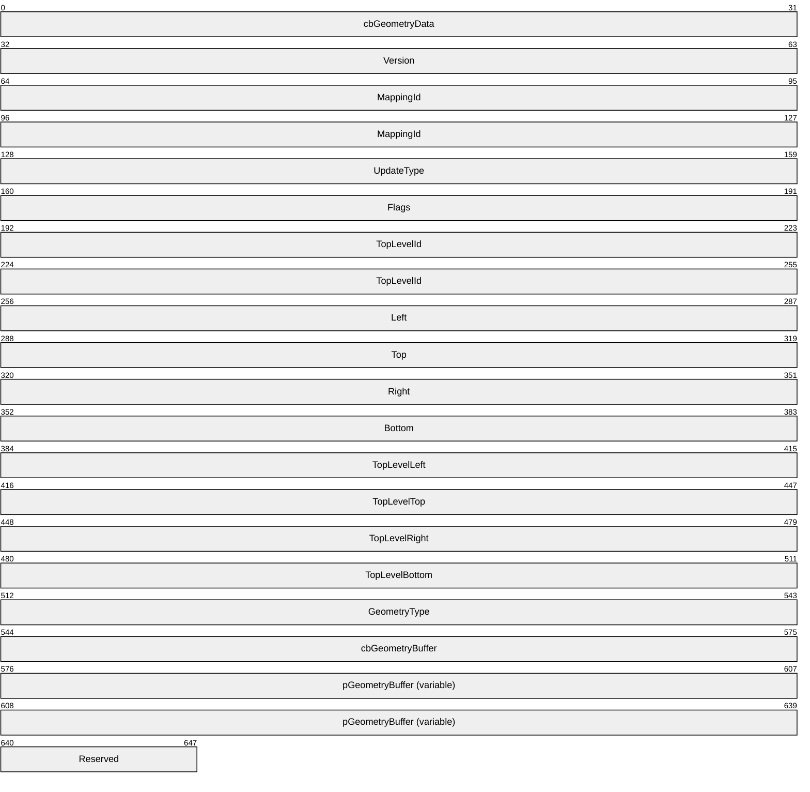
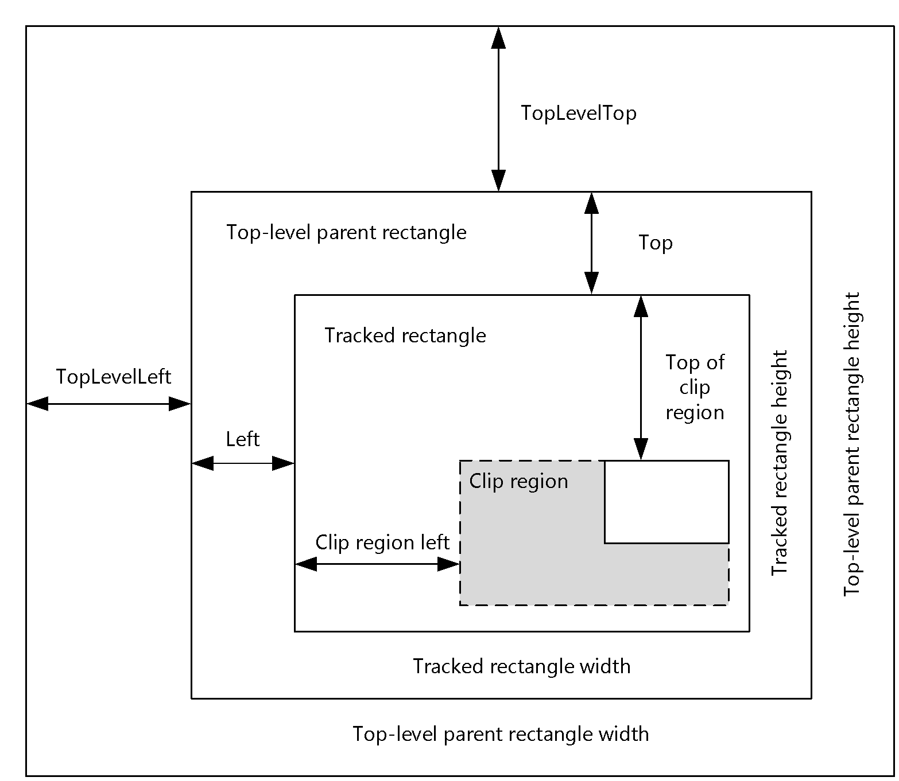
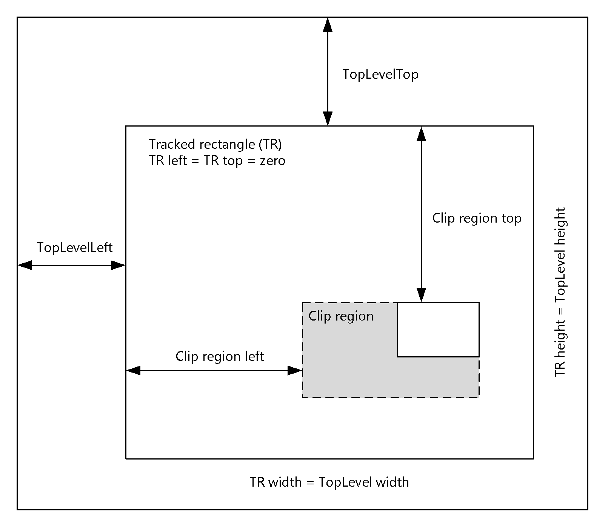

# [MS-RDPEGT]: Remote Desktop Protocol: Geometry Tracking Virtual Channel Protocol Extension

Table of Contents

1 Introduction

- [1 Introduction](#Section_1)
  - [1.1 Glossary](#Section_1.1)
  - [1.2 References](#Section_1.2)
    - [1.2.1 Normative References](#Section_1.2.1)
    - [1.2.2 Informative References](#Section_1.2.2)
  - [1.3 Overview](#Section_1.3)
  - [1.4 Relationship to Other Protocols](#Section_1.4)
  - [1.5 Prerequisites/Preconditions](#Section_1.5)
  - [1.6 Applicability Statement](#Section_1.6)
  - [1.7 Versioning and Capability Negotiation](#Section_1.7)
  - [1.8 Vendor-Extensible Fields](#Section_1.8)
  - [1.9 Standards Assignments](#Section_1.9)

2 Messages

- [2 Messages](#Section_2)
  - [2.1 Transport](#Section_2.1)
  - [2.2 Message Syntax](#Section_2.2)
    - [2.2.1 Structures](#Section_2.2.1)
      - [2.2.1.1 MAPPED_GEOMETRY_PACKET Structure](#Section_2.2.1.1)

3 Protocol Details

- [3 Protocol Details](#Section_3)
  - [3.1 Common Details](#Section_3.1)
    - [3.1.1 Create or Update the Geometry Mapping for a Window](#Section_3.1.1)
    - [3.1.2 Create or Update the Geometry Mapping for an Arbitrary Region](#Section_3.1.2)
    - [3.1.3 Clear the Existing Geometry Mapping](#Section_3.1.3)
    - [3.1.4 Abstract Data Model](#Section_3.1.4)
    - [3.1.5 Timers](#Section_3.1.5)
    - [3.1.6 Initialization](#Section_3.1.6)
    - [3.1.7 Higher-Layer Triggered Events](#Section_3.1.7)
    - [3.1.8 Message Processing Events and Sequencing Rules](#Section_3.1.8)
      - [3.1.8.1 Message Validation](#Section_3.1.8.1)
    - [3.1.9 Timer Events](#Section_3.1.9)
    - [3.1.10 Other Local Events](#Section_3.1.10)
  - [3.2 Client Details](#Section_3.2)
    - [3.2.1 Abstract Data Model](#Section_3.2.1)
    - [3.2.2 Timers](#Section_3.2.2)
    - [3.2.3 Initialization](#Section_3.2.3)
    - [3.2.4 Higher-Layer Triggered Events](#Section_3.2.4)
    - [3.2.5 Message Processing Events and Sequencing Rules](#Section_3.2.5)
    - [3.2.6 Timer Events](#Section_3.2.6)
    - [3.2.7 Other Local Events](#Section_3.2.7)
  - [3.3 Server Details](#Section_3.3)
    - [3.3.1 Abstract Data Model](#Section_3.3.1)
    - [3.3.2 Timers](#Section_3.3.2)
    - [3.3.3 Initialization](#Section_3.3.3)
    - [3.3.4 Higher-Layer Triggered Events](#Section_3.3.4)
    - [3.3.5 Message Processing Events and Sequencing Rules](#Section_3.3.5)
    - [3.3.6 Timer Events](#Section_3.3.6)
    - [3.3.7 Other Local Events](#Section_3.3.7)

4 Protocol Examples

- [4 Protocol Examples](#Section_4)
  - [4.1 MAPPED_GEOMETRY_PACKET – GEOMETRY_UPDATE – Simple Geometry](#Section_4.1)
    - [4.1.1 Geometry Buffer (RGNDATA)](#Section_4.1.1)
  - [4.2 MAPPED_GEOMETRY_PACKET – GEOMETRY_CLEAR](#Section_4.2)

5 Security

- [5 Security](#Section_5)
  - [5.1 Security Considerations for Implementers](#Section_5.1)
  - [5.2 Index of Security Parameters](#Section_5.2)

6 Appendix A: Product Behavior

- [6 Appendix A: Product Behavior](#Section_6)

7 Change Tracking

- [7 Change Tracking](#Section_7)

For the legal notice and IP terms, see [LEGAL.md](../LEGAL.md).
Last updated: 4/23/2024.
See [Revision History](#revision-history) for full version history.

# 1 Introduction

The Remote Desktop Protocol: Geometry Tracking Virtual Channel Extension is an extension of the Remote Desktop Protocol: Basic Connectivity and Graphics Remoting protocol [MS-RDPBCGR](../MS-RDPBCGR/MS-RDPBCGR.md), which runs over a dynamic virtual channel, as specified in [MS-RDPEDYC](../MS-RDPEDYC/MS-RDPEDYC.md). The Remote Desktop Protocol: Geometry Tracking Virtual Channel Extension facilitates applications on a remote desktop host to render graphics content on a remote desktop client without having to explicitly know where the content originated. This protocol specifies the communication between a remote desktop host and a remote desktop client.

Sections 1.5, 1.8, 1.9, 2, and 3 of this specification are normative. All other sections and examples in this specification are informative.

## 1.1 Glossary

This document uses the following terms:

**protocol data unit (PDU)**: Information that is delivered as a unit among peer entities of a network and that can contain control information, address information, or data. For more information on remote procedure call (RPC)-specific PDUs, see [[C706]](https://go.microsoft.com/fwlink/?LinkId=89824) section 12.

**Remote Desktop Protocol (RDP)**: A multi-channel protocol that allows a user to connect to a computer running Microsoft Terminal Services (TS). RDP enables the exchange of client and server settings and also enables negotiation of common settings to use for the duration of the connection, so that input, graphics, and other data can be exchanged and processed between client and server.

**terminal server**: A computer on which terminal services is running.

**Transmission Control Protocol (TCP)**: A protocol used with the Internet Protocol (IP) to send data in the form of message units between computers over the Internet. TCP handles keeping track of the individual units of data (called packets) that a message is divided into for efficient routing through the Internet.

**z-order**: The rendering order of an object on a z axis.

**MAY, SHOULD, MUST, SHOULD NOT, MUST NOT:** These terms (in all caps) are used as defined in [[RFC2119]](https://go.microsoft.com/fwlink/?LinkId=90317). All statements of optional behavior use either MAY, SHOULD, or SHOULD NOT.

## 1.2 References

Links to a document in the Microsoft Open Specifications library point to the correct section in the most recently published version of the referenced document. However, because individual documents in the library are not updated at the same time, the section numbers in the documents may not match. You can confirm the correct section numbering by checking the [Errata](https://go.microsoft.com/fwlink/?linkid=850906).

### 1.2.1 Normative References

We conduct frequent surveys of the normative references to assure their continued availability. If you have any issue with finding a normative reference, please contact [dochelp@microsoft.com](mailto:dochelp@microsoft.com). We will assist you in finding the relevant information.

[MS-DTYP] Microsoft Corporation, "[Windows Data Types](../MS-DTYP/MS-DTYP.md)".

[MS-ERREF] Microsoft Corporation, "[Windows Error Codes](../MS-ERREF/MS-ERREF.md)".

[MS-RDPBCGR] Microsoft Corporation, "[Remote Desktop Protocol: Basic Connectivity and Graphics Remoting](../MS-RDPBCGR/MS-RDPBCGR.md)".

[MS-RDPEDYC] Microsoft Corporation, "[Remote Desktop Protocol: Dynamic Channel Virtual Channel Extension](../MS-RDPEDYC/MS-RDPEDYC.md)".

[MSDN-WindowsGDI] Microsoft Corporation, "Windows GDI", [http://msdn.microsoft.com/en-us/library/dd145203.aspxx](https://go.microsoft.com/fwlink/?LinkId=94735)

[RFC2119] Bradner, S., "Key words for use in RFCs to Indicate Requirement Levels", BCP 14, RFC 2119, March 1997, [https://www.rfc-editor.org/info/rfc2119](https://go.microsoft.com/fwlink/?LinkId=90317)

### 1.2.2 Informative References

None.

## 1.3 Overview

This protocol enables a protocol server to send geometry to a protocol client. The protocol client can then use this geometry to render graphics content to the area that is represented by the geometry.

Geometry, in the scope of this document, is defined as a list of rectangles on the virtual desktop. This geometry, when sent coupled with an identifier from the server to the client, allows the client to render some content to a specific location as if it was rendered on the server.

## 1.4 Relationship to Other Protocols

The Remote Desktop Protocol: Geometry Tracking Virtual Channel Extension is embedded in the dynamic virtual channel transport, as defined by [MS-RDPEDYC](../MS-RDPEDYC/MS-RDPEDYC.md). This protocol is concerned with transmitting the raw geometry of some graphics content from the server to the client.

## 1.5 Prerequisites/Preconditions

The Remote Desktop Protocol: Geometry Tracking Virtual Channel Extension operates only after the dynamic virtual channel transport is fully established. If the dynamic virtual channel transport is terminated, no other communication over this protocol extension occurs.

This protocol is message-based. It assumes preservation of the packet as a whole and does not allow for fragmentation. Additionally, it assumes that no packets are lost.

It is assumed that the visible regions of all geometries sent from the server are non-overlapping. If there are any regions that overlap, then the [**z-order**](#gt_z-order) of those regions will be non-deterministic.

## 1.6 Applicability Statement

The Remote Desktop Protocol: Geometry Tracking Virtual Chanel Extension is designed to be run within the context of a [**Remote Desktop Protocol (RDP)**](#gt_remote-desktop-protocol-rdp) virtual channel established between a client and a server. This protocol extension is applicable when an application running on the [**terminal server**](#gt_terminal-server) has content from a third party that is rendered directly on the client (as opposed to being rendered on the server and then sent to the client as bitmaps via the Remote Desktop Protocol: Basic Connectivity and Graphics Remoting protocol specified in [MS-RDPBCGR](../MS-RDPBCGR/MS-RDPBCGR.md)).

## 1.7 Versioning and Capability Negotiation

This protocol supports versioning and capability negotiation only when the underlying virtual channel attempts to open. A client that supports this protocol does allow this virtual channel to be opened, and a client that does not support this protocol does not allow this virtual channel to be opened.

## 1.8 Vendor-Extensible Fields

The Remote Desktop Protocol: Geometry Tracking Virtual Chanel Extension uses HRESULTs as specified in [MS-ERREF](../MS-ERREF/MS-ERREF.md) section 2.1. Vendors are free to choose their own values as long as the C bit (0x20000000) is set, indicating that it is a customer code.

This protocol also uses Win32 error codes. These values are taken from the error number space as specified in [MS-ERREF] section 2.2. Vendors SHOULD reuse those values with their indicated meanings. Choosing any other value runs the risk of a collision in the future.

## 1.9 Standards Assignments

None.

# 2 Messages

## 2.1 Transport

The Remote Desktop Protocol: Geometry Tracking Virtual Channel Extension is designed to operate over dynamic virtual channels, as specified in [MS-RDPEDYC](../MS-RDPEDYC/MS-RDPEDYC.md). The channel name used for this protocol is "Microsoft::Windows::RDS::Geometry::v08.01". The use of channel names when opening a dynamic virtual channel is specified in [MS-RDPEDYC] section 2.2.2.1.

This channel MUST be implemented using a reliable protocol, such as [**TCP**](#gt_transmission-control-protocol-tcp). Messages written to this channel are assumed to arrive in their entirety and in order on the opposite side of the connection.

## 2.2 Message Syntax

### 2.2.1 Structures

#### 2.2.1.1 MAPPED_GEOMETRY_PACKET Structure

The MAPPED_GEOMETRY_PACKET [**protocol data unit (PDU)**](#gt_protocol-data-unit-pdu) is the only message sent as part of this protocol. It consists of a command, geometry (rectangles), and an identifier that allows correlation of the geometry in the current message to any previous geometry the server has sent.

**cbGeometryData (4 bytes):** UINT32. The length, in bytes, of this message.

**Version (4 bytes):** UINT32. The current version of the Remote Desktop Protocol: Geometry Tracking Virtual Channel Extension. In RDP 8, this MUST be set to 0x01.

**MappingId (8 bytes):** UINT64. A number that uniquely identifies this geometry mapping on the server. The server MUST ensure that mapping IDs are unique across all active mappings. If a message arrives at the client with the same mapping ID as an already known mapping ID, then the geometry associated with the previous mapping MUST be updated with the geometry contained in the current mapping.

**UpdateType (4 bytes):** UINT32. A number that identifies which operation the client is to perform. The following values are supported:

- **0x01 – GEOMETRY_UPDATE**
- **0x02 – GEOMETRY_CLEAR**
If the command is to clear geometry, only the **MappingId**, **Version**, and **cbGeometryData** fields are valid.

**Flags (4 bytes):** UINT32. This field is reserved and MUST be set to 0x0.

**TopLevelId (8 bytes):** UINT64. If window tracking mode is in effect (see section [3.1.1](#Section_3.1.1)), this field MUST be set to the window handle of the top-level parent of the window being tracked, or to the window handle of the window itself, if it is a top-level window. If window tracking mode is not in effect (see section [3.1.2](#Section_3.1.2)), this field MUST be set to 0x0. When window tracking mode is in effect, this field SHOULD be used to create a window hierarchy between the tracked window and top-level window only if the top-level window information is available through other channels. If the top-level window information is not available, this value SHOULD be ignored.

**Left (4 bytes):** INT32. The position of the left edge of the tracked rectangle, relative to the top-level parent rectangle (labeled Left in Figure 1).

**Top (4 bytes):** INT32. The position of the top edge of the tracked rectangle, relative to the top-level parent rectangle (labeled Top in Figure 1).

**Right (4 bytes):** INT32. The position of the right edge of the tracked rectangle relative to the top-level parent rectangle (see Left + Tracked-rectangle width in Figure 1).

**Bottom (4 bytes):** INT32. The position of the bottom edge of the tracked rectangle, relative to the top-level parent rectangle (see Top + Tracked-rectangle height in Figure 1).

**TopLevelLeft (4 bytes):** INT32. The position of the left edge of the top-level rectangle in virtual desktop coordinates (labeled TopLevelLeft in Figure 1 and Figure 2).

**TopLevelTop (4 bytes):** INT32. The position of the top edge of the top-level rectangle in virtual desktop coordinates (labeled TopLevelTop in Figure 1 and Figure 2).

**TopLevelRight (4 bytes):** INT32. The position of the right edge of the top-level rectangle in virtual desktop coordinates (see TopLevelLeft + Top-level parent rectangle width in Figure 1).

**TopLevelBottom (4 bytes):** INT32. The position of the bottom edge of the top-level rectangle in virtual desktop coordinates (see TopLevelTop + Top-level parent rectangle height in Figure 1).

**GeometryType (4 bytes):** UINT32. This MUST be set to 0x02 in RDP 8.

**cbGeometryBuffer (4 bytes):** UINT32. The length of the **pGeometryBuffer** appended to this message.

**pGeometryBuffer (variable):** Array of UINT8 ([MS-DTYP](../MS-DTYP/MS-DTYP.md) section 2.2.47). This field contains a RGNDATA structure, as specified in [[MSDN-WindowsGDI]](https://go.microsoft.com/fwlink/?LinkId=94735). The rectangles in this structure are relative to the tracked rectangle, and represent the parts of the tracked rectangle that are visible. If window tracking mode is not in effect, the **rcBound** field in the RGNDATA structure MUST be ignored. If the **nCount** field of the RGNDATA structure is zero, or the rectangles in the RGNDATA **buffer** field do not intersect with the rectangle specified in the **rcBound** field, then the RGNDATA structure MUST be ignored. The total number of bytes in this field is set in the **cbGeometryBuffer** field.

**Reserved (1 byte):** UINT8 ([MS-DTYP] section 2.2.47). This field is reserved and MUST be ignored.

# 3 Protocol Details

## 3.1 Common Details

The Remote Desktop Protocol: Geometry Tracking Virtual Channel Extension consists of a single message that is sent from the server to the client with different parameters in order to signal different states to the client. These states are as follows:

- Create or update a geometry mapping for a window.
- Create or update a geometry mapping for an arbitrary region of a window.
- Clear an existing geometry mapping.

Figure 1: Complete window tracking

Figure 2: Partial window tracking

### 3.1.1 Create or Update the Geometry Mapping for a Window

In this mode, it is assumed that the region being tracked represents the visible area of a window on the server. In this case, the window being tracked corresponds to the tracked rectangle, and its top-level parent corresponds to the top-level parent rectangle.

### 3.1.2 Create or Update the Geometry Mapping for an Arbitrary Region

In this mode, it is assumed that the region being tracked is arbitrary. In this mode, the tracked rectangle is the width and height of the region of interest, with the top-level parent rectangle controlling the position.

### 3.1.3 Clear the Existing Geometry Mapping

When clearing a mapping, the server is expressing intent to no longer send any updates for the mapping ID indicated in the message. Any and all geometry associated with that mapping MUST be deleted, and the screen MUST be updated accordingly. If no geometry is associated with the mapping ID indicated in the message, then the message MUST be ignored.

### 3.1.4 Abstract Data Model

None.

### 3.1.5 Timers

None.

### 3.1.6 Initialization

There is no specific initialization for the Remote Desktop Protocol: Geometry Tracking Virtual Channel Extension. Each message is wholly self-contained and, since the network transport is assumed to be lossless, current. Each message will contain either geometry specific to a particular mapping (which MUST then be either updated if known or created if not known) or instructions to clear a mapping if it exists. Aside from this logic, there is no additional handling or processing necessary.

### 3.1.7 Higher-Layer Triggered Events

None.

### 3.1.8 Message Processing Events and Sequencing Rules

#### 3.1.8.1 Message Validation

In all cases, the protocol endpoints MUST validate messages received from the network by validating:

- That the length of the message matches the specified type.
- That the message is received at an appropriate time in the sequence.
- The message content.

### 3.1.9 Timer Events

None.

### 3.1.10 Other Local Events

None.

## 3.2 Client Details

### 3.2.1 Abstract Data Model

The abstract data model is as specified in section [3.1.4](#Section_3.1.4).

### 3.2.2 Timers

None.

### 3.2.3 Initialization

There is no specific initialization for the Remote Desktop Protocol: Geometry Tracking Virtual Channel Extension. Each message is wholly self-contained and, since the network transport is assumed to be lossless, current.

### 3.2.4 Higher-Layer Triggered Events

None.

### 3.2.5 Message Processing Events and Sequencing Rules

None.

### 3.2.6 Timer Events

None.

### 3.2.7 Other Local Events

None.

## 3.3 Server Details

### 3.3.1 Abstract Data Model

The abstract data model is as specified in section [3.1.4](#Section_3.1.4).

### 3.3.2 Timers

None.

### 3.3.3 Initialization

There is no specific initialization for the Remote Desktop Protocol: Geometry Tracking Virtual Channel Extension. Each message is wholly self-contained and, since the network transport is assumed to be lossless, current.

### 3.3.4 Higher-Layer Triggered Events

None.

### 3.3.5 Message Processing Events and Sequencing Rules

None.

### 3.3.6 Timer Events

None.

### 3.3.7 Other Local Events

None.

# 4 Protocol Examples

In this section, two packets will be examined. The first example shows a MAPPED_GEOMETRY_PACKET with the **UpdateType** field set to **GEOMETRY_UPDATE** and a simple geometry. The second example shows a MAPPED_GEOMETRY_PACKET with the **UpdateType** field set to **GEOMETRY_CLEAR**.

## 4.1 MAPPED_GEOMETRY_PACKET – GEOMETRY_UPDATE – Simple Geometry

This example shows geometry that expresses a simple rectangle of size 480x244 pixels. The raw packet data is as follows:

78000000 01000000 22020400 BA7A0080 01000000 00000000 E2010300 00000000

10000000 8A000000 F0010000 7E010000 23010000 72000000 78040000 CA020000

02000000 30000000 20000000 01000000 01000000 00000000 00000000 00000000

E0010000 F4000000 00000000 00000000 E0010000 F4000000 00

MAPPED_GEOMETRY_PACKET:

- UINT32 **cbGeometryData** – 78000000
- 0x00000078 = 120 (bytes)
- UINT32 **Version** – 01000000
- 0x00000001 = 1
- UINT64 **MappingId** - 22020400 BA7A0080
- 0x80007ABA00040222
- UINT32 **UpdateType** – 01000000
- 0x00000001 = 1 (GEOMETRY_UPDATE)
- UINT32 **Flags** – 00000000
- 0x00000000 = 0
- UINT64 **TopLevelId** - E2010300 00000000
- 0x00000000’000301E2
- INT32 **Left** – 10000000
- 0x00000010 = 16
- INT32 **Top** – 8A000000
- 0x0000008A = 138
- INT32 **Right** – F0010000
- 0x000001F0 = 496
- INT32 **Bottom** – 7E010000
- 0x0000017E = 382
- INT32 **TopLevelLeft** – 23010000
- 0x00000123 = 291
- INT32 **TopLevelTop** – 71000000
- 0x00000071 = 114
- INT32 **TopLevelRight** – 78040000
- 0x00000478 = 1144
- INT32 **TopLevelBottom** – CA010000
- 0x000001CA = 714
- UINT32 **GeometryType** – 02000000
- 0x00000002 = 2 (GEOMETRY_TYPE_REGION)
- UINT32 **cbGeometryBuffer** – 30000000
- 0x00000030 = 48 (bytes)
- BYTE **pGeometryBuffer[48]** – (Cast to RGNDATA)
UINT8 **Reserved** - 00

### 4.1.1 Geometry Buffer (RGNDATA)

- UINT32 **RGNDATA.rdh.dwSize** – 20000000
- 0x00000020 = 32 (bytes)
- UINT32 **RGNDATA.rdh.iType** – 01000000
- 0x00000001 = 1 (RDH_RECTANGLES)
- UINT32 **RGNDATA.rdh.nCount** – 01000000
- 0x00000001 = 1
- UINT32 **RGNDATA.rdh.nRgnSize** – 00000000
- 0x00000000 = 0
- INT32 **RGNDATA.rdh.rcBound.left** - 00000000
- 0x00000000 = 0
- INT32 **RGNDATA.rdh.rcBound.top** – 00000000
- 0x00000000 = 0
- INT32 **RGNDATA.rdh.rcBound.right** – E0010000
- 0x000001E0 = 480
- INT32 **RGNDATA.rdh.rcBound.bottom** – F4000000
- 0x000000F4 = 244
- INT32 **((RECT*)RGNDATA.Buffer)[0].left** – 00000000
- 0x00000000 = 0
- INT32 **((RECT*)RGNDATA.Buffer)[0].top** – 00000000
- 0x00000000 = 0
- INT32 **((RECT*)RGNDATA.Buffer)[0].right** – E0010000
- 0x000001E0 = 480
- INT32 **((RECT*)RGNDATA.Buffer)[0].bottom** – F4000000
0x000000F4 = 244

## 4.2 MAPPED_GEOMETRY_PACKET – GEOMETRY_CLEAR

This example shows geometry that clears an existing mapping. The raw packet data is as follows:

48000000 01000000 22020400 BA7A0080 02000000 00000000 00000000 00000000

00000000 00000000 00000000 00000000 00000000 00000000 00000000 00000000

00000000 00000000 00

MAPPED_GEOMETRY_PACKET:

- UINT32 **cbGeometryData** – 48000000
- 0x00000048 = 72 (bytes)
- UINT32 **Version** – 01000000
- 0x00000001 = 1
- UINT64 **MappingId** - 22020400 BA7A0080
- 0x80007ABA00040222
- UINT32 **UpdateType** – 02000000
- 2 (GEOMETRY_CLEAR)
- UINT32 **Flags** – 00000000
- 0x00000000 = 0
- UINT64 **TopLevelId** - 00000000 00000000
- 0x00000000’00000000 = 0x0
- INT32 **Left** – 00000000
- 0x00000000 = 0
- INT32 **Top** – 00000000
- 0x00000000 = 0
- INT32 **Right** – 00000000
- 0x00000000 = 0
- INT32 **Bottom** – 00000000
- 0x00000000 = 0
- INT32 **TopLevelLeft** – 00000000
- 0x00000000 = 0
- INT32 **TopLevelTop** – 00000000
- 0x00000000 = 0
- INT32 **TopLevelRight** – 00000000
- 0x00000000 = 0
- INT32 **TopLevelBottom** – 00000000
- 0x00000000 = 0
- UINT32 **GeometryType** – 00000000
- 0x00000000 = 0
- UINT32 **cbGeometryBuffer** – 00000000
- 0x00000000 = 0 (bytes)
UINT8 **Reserved** - 00

# 5 Security

## 5.1 Security Considerations for Implementers

There are no security considerations for the Remote Desktop Protocol: Geometry Tracking Virtual Channel Extension messages because all traffic is secured by the underlying RDP core protocol. For information about the security-related mechanisms that are implemented in the RDP core protocol, see [MS-RDPBCGR](../MS-RDPBCGR/MS-RDPBCGR.md) section 5.

## 5.2 Index of Security Parameters

The security considerations are the same as those in [MS-RDPBCGR](../MS-RDPBCGR/MS-RDPBCGR.md). The Virtual Channel security considerations that this protocol uses are covered under that protocol.

# 6 Appendix A: Product Behavior

The information in this specification is applicable to the following Microsoft products or supplemental software. References to product versions include updates to those products.

- Windows 8 operating system
- Windows Server 2012 operating system
- Windows 8.1 operating system
- Windows Server 2012 R2 operating system
- Windows 10 operating system
- Windows Server 2016 operating system
- Windows Server 2019 operating system
- Windows Server 2022 operating system
- Windows 11 operating system
- Windows Server 2025 operating system
Exceptions, if any, are noted in this section. If an update version, service pack or Knowledge Base (KB) number appears with a product name, the behavior changed in that update. The new behavior also applies to subsequent updates unless otherwise specified. If a product edition appears with the product version, behavior is different in that product edition.

Unless otherwise specified, any statement of optional behavior in this specification that is prescribed using the terms "SHOULD" or "SHOULD NOT" implies product behavior in accordance with the SHOULD or SHOULD NOT prescription. Unless otherwise specified, the term "MAY" implies that the product does not follow the prescription.

# 7 Change Tracking

This section identifies changes that were made to this document since the last release. Changes are classified as Major, Minor, or None.

The revision class **Major** means that the technical content in the document was significantly revised. Major changes affect protocol interoperability or implementation. Examples of major changes are:

- A document revision that incorporates changes to interoperability requirements.
- A document revision that captures changes to protocol functionality.
The revision class **Minor** means that the meaning of the technical content was clarified. Minor changes do not affect protocol interoperability or implementation. Examples of minor changes are updates to clarify ambiguity at the sentence, paragraph, or table level.

The revision class **None** means that no new technical changes were introduced. Minor editorial and formatting changes may have been made, but the relevant technical content is identical to the last released version.

The changes made to this document are listed in the following table. For more information, please contact [dochelp@microsoft.com](mailto:dochelp@microsoft.com).

| Section | Description | Revision class |
| --- | --- | --- |
| [6](#Section_6) Appendix A: Product Behavior | Added Windows Server 2025 to the list of applicable products. | Major |

## Revision History

| Date | Version | Revision Class | Comments |
| --- | --- | --- | --- |
| 3/30/2012 | 1.0 | New | Released new document. |
| 7/12/2012 | 1.0 | None | No changes to the meaning, language, or formatting of the technical content. |
| 10/25/2012 | 2.0 | Major | Significantly changed the technical content. |
| 1/31/2013 | 2.0 | None | No changes to the meaning, language, or formatting of the technical content. |
| 8/8/2013 | 3.0 | Major | Significantly changed the technical content. |
| 11/14/2013 | 4.0 | Major | Significantly changed the technical content. |
| 2/13/2014 | 4.0 | None | No changes to the meaning, language, or formatting of the technical content. |
| 5/15/2014 | 4.0 | None | No changes to the meaning, language, or formatting of the technical content. |
| 6/30/2015 | 5.0 | Major | Significantly changed the technical content. |
| 10/16/2015 | 5.0 | None | No changes to the meaning, language, or formatting of the technical content. |
| 7/14/2016 | 5.0 | None | No changes to the meaning, language, or formatting of the technical content. |
| 6/1/2017 | 6.0 | Major | Significantly changed the technical content. |
| 9/15/2017 | 7.0 | Major | Significantly changed the technical content. |
| 12/1/2017 | 7.0 | None | No changes to the meaning, language, or formatting of the technical content. |
| 9/12/2018 | 8.0 | Major | Significantly changed the technical content. |
| 4/7/2021 | 9.0 | Major | Significantly changed the technical content. |
| 6/25/2021 | 10.0 | Major | Significantly changed the technical content. |
| 4/23/2024 | 11.0 | Major | Significantly changed the technical content. |
