# [MS-RDPEI]: Remote Desktop Protocol: Input Virtual Channel Extension

Table of Contents

1 Introduction

- [1 Introduction](#Section_1)
  - [1.1 Glossary](#Section_1.1)
  - [1.2 References](#Section_1.2)
    - [1.2.1 Normative References](#Section_1.2.1)
    - [1.2.2 Informative References](#Section_1.2.2)
  - [1.3 Overview](#Section_1.3)
  - [1.4 Relationship to Other Protocols](#Section_1.4)
  - [1.5 Prerequisites/Preconditions](#Section_1.5)
  - [1.6 Applicability Statement](#Section_1.6)
  - [1.7 Versioning and Capability Negotiation](#Section_1.7)
  - [1.8 Vendor-Extensible Fields](#Section_1.8)
  - [1.9 Standards Assignments](#Section_1.9)

2 Messages

- [2 Messages](#Section_2)
  - [2.1 Transport](#Section_2.1)
  - [2.2 Message Syntax](#Section_2.2)
    - [2.2.1 Namespaces](#Section_2.2.1)
    - [2.2.2 Common Data Types](#Section_2.2.2)
      - [2.2.2.1 TWO_BYTE_UNSIGNED_INTEGER](#Section_2.2.2.1)
      - [2.2.2.2 TWO_BYTE_SIGNED_INTEGER](#Section_2.2.2.2)
      - [2.2.2.3 FOUR_BYTE_UNSIGNED_INTEGER](#Section_2.2.2.3)
      - [2.2.2.4 FOUR_BYTE_SIGNED_INTEGER](#Section_2.2.2.4)
      - [2.2.2.5 EIGHT_BYTE_UNSIGNED_INTEGER](#Section_2.2.2.5)
      - [2.2.2.6 RDPINPUT_HEADER](#Section_2.2.2.6)
    - [2.2.3 Input Messages](#Section_2.2.3)
      - [2.2.3.1 RDPINPUT_SC_READY_PDU](#Section_2.2.3.1)
      - [2.2.3.2 RDPINPUT_CS_READY_PDU](#Section_2.2.3.2)
      - [2.2.3.3 RDPINPUT_TOUCH_EVENT_PDU](#Section_2.2.3.3)
        - [2.2.3.3.1 RDPINPUT_TOUCH_FRAME](#Section_2.2.3.3.1)
          - [2.2.3.3.1.1 RDPINPUT_TOUCH_CONTACT](#Section_2.2.3.3.1.1)
      - [2.2.3.4 RDPINPUT_SUSPEND_INPUT_PDU](#Section_2.2.3.4)
      - [2.2.3.5 RDPINPUT_RESUME_INPUT_PDU](#Section_2.2.3.5)
      - [2.2.3.6 RDPINPUT_DISMISS_HOVERING_TOUCH_CONTACT_PDU](#Section_2.2.3.6)
      - [2.2.3.7 RDPINPUT_PEN_EVENT_PDU](#Section_2.2.3.7)
        - [2.2.3.7.1 RDPINPUT_PEN_FRAME](#Section_2.2.3.7.1)
          - [2.2.3.7.1.1 RDPINPUT_PEN_CONTACT](#Section_2.2.3.7.1.1)
  - [2.3 Directory Service Schema Elements](#Section_2.3)

3 Protocol Details

- [3 Protocol Details](#Section_3)
  - [3.1 Common Details](#Section_3.1)
    - [3.1.1 Abstract Data Model](#Section_3.1.1)
      - [3.1.1.1 Touch Contact State Transitions](#Section_3.1.1.1)
    - [3.1.2 Timers](#Section_3.1.2)
    - [3.1.3 Initialization](#Section_3.1.3)
    - [3.1.4 Higher-Layer Triggered Events](#Section_3.1.4)
    - [3.1.5 Message Processing Events and Sequencing Rules](#Section_3.1.5)
      - [3.1.5.1 Processing an Input Message](#Section_3.1.5.1)
    - [3.1.6 Timer Events](#Section_3.1.6)
    - [3.1.7 Other Local Events](#Section_3.1.7)
  - [3.2 Server Details](#Section_3.2)
    - [3.2.1 Abstract Data Model](#Section_3.2.1)
    - [3.2.2 Timers](#Section_3.2.2)
    - [3.2.3 Initialization](#Section_3.2.3)
    - [3.2.4 Higher-Layer Triggered Events](#Section_3.2.4)
    - [3.2.5 Message Processing Events and Sequencing Rules](#Section_3.2.5)
      - [3.2.5.1 Sending an RDPINPUT_SC_READY_PDU Message](#Section_3.2.5.1)
      - [3.2.5.2 Processing an RDPINPUT_CS_READY_PDU Message](#Section_3.2.5.2)
      - [3.2.5.3 Processing an RDPINPUT_TOUCH_EVENT_PDU Message](#Section_3.2.5.3)
      - [3.2.5.4 Sending an RDPINPUT_SUSPEND_INPUT_PDU message](#Section_3.2.5.4)
      - [3.2.5.5 Sending an RDPINPUT_RESUME_INPUT_PDU Message](#Section_3.2.5.5)
      - [3.2.5.6 Processing an RDPINPUT_DISMISS_HOVERING_TOUCH_CONTACT_PDU Message](#Section_3.2.5.6)
      - [3.2.5.7 Processing an RDPINPUT_PEN_EVENT_PDU Message](#Section_3.2.5.7)
    - [3.2.6 Timer Events](#Section_3.2.6)
    - [3.2.7 Other Local Events](#Section_3.2.7)
  - [3.3 Client Details](#Section_3.3)
    - [3.3.1 Abstract Data Model](#Section_3.3.1)
      - [3.3.1.1 Input Transmission Suspended](#Section_3.3.1.1)
      - [3.3.1.2 Pen Input Allowed](#Section_3.3.1.2)
    - [3.3.2 Timers](#Section_3.3.2)
    - [3.3.3 Initialization](#Section_3.3.3)
    - [3.3.4 Higher-Layer Triggered Events](#Section_3.3.4)
    - [3.3.5 Message Processing Events and Sequencing Rules](#Section_3.3.5)
      - [3.3.5.1 Processing an RDPINPUT_SC_READY_PDU message](#Section_3.3.5.1)
      - [3.3.5.2 Sending an RDPINPUT_CS_READY_PDU message](#Section_3.3.5.2)
      - [3.3.5.3 Sending an RDPINPUT_TOUCH_EVENT_PDU message](#Section_3.3.5.3)
      - [3.3.5.4 Processing an RDPINPUT_SUSPEND_INPUT_PDU message](#Section_3.3.5.4)
      - [3.3.5.5 Processing an RDPINPUT_RESUME_INPUT_PDU message](#Section_3.3.5.5)
      - [3.3.5.6 Sending an RDPINPUT_DISMISS_HOVERING_TOUCH_CONTACT_PDU message](#Section_3.3.5.6)
      - [3.3.5.7 Sending an RDPINPUT_PEN_EVENT_PDU message](#Section_3.3.5.7)
    - [3.3.6 Timer Events](#Section_3.3.6)
    - [3.3.7 Other Local Events](#Section_3.3.7)

4 Protocol Examples

- [4 Protocol Examples](#Section_4)
  - [4.1 Touch Contact Geometry Examples](#Section_4.1)
    - [4.1.1 Touch Contact Oriented at 0 Degrees](#Section_4.1.1)
    - [4.1.2 Touch Contact Oriented at 45 Degrees](#Section_4.1.2)
    - [4.1.3 Touch Contact Oriented at 90 Degrees](#Section_4.1.3)
    - [4.1.4 Touch Contact Oriented at 315 Degrees](#Section_4.1.4)

5 Security

- [5 Security](#Section_5)
  - [5.1 Security Considerations for Implementers](#Section_5.1)
  - [5.2 Index of Security Parameters](#Section_5.2)

6 Appendix A: Product Behavior

- [6 Appendix A: Product Behavior](#Section_6)

7 Change Tracking

- [7 Change Tracking](#Section_7)

For the legal notice and IP terms, see [LEGAL.md](../LEGAL.md).
Last updated: 4/23/2024.
See [Revision History](#revision-history) for full version history.

# 1 Introduction

The Remote Desktop Protocol: Input Virtual Channel Extension applies to the Remote Desktop Protocol: Basic Connectivity and Graphics Remoting, as specified in [MS-RDPBCGR](../MS-RDPBCGR/MS-RDPBCGR.md) sections 1 to 5. The input protocol defined in section [2.2](../MS-RDPBCGR/MS-RDPBCGR.md) is used to remote multitouch and pen input from a [**terminal server**](#gt_terminal-server) client to a terminal server. The multitouch and pen input is generated at the client by a physical or virtual digitizer, encoded, and then sent on the wire to the server. After this input is received and decoded by the server, it is injected into the session associated with the remote user, effectively remoting the multitouch and pen input generated at the client.

Sections 1.5, 1.8, 1.9, 2, and 3 of this specification are normative. All other sections and examples in this specification are informative.

## 1.1 Glossary

This document uses the following terms:

**ANSI character**: An 8-bit Windows-1252 character set unit.

**little-endian**: Multiple-byte values that are byte-ordered with the least significant byte stored in the memory location with the lowest address.

**protocol data unit (PDU)**: Information that is delivered as a unit among peer entities of a network and that can contain control information, address information, or data. For more information on remote procedure call (RPC)-specific PDUs, see [[C706]](https://go.microsoft.com/fwlink/?LinkId=89824) section 12.

**terminal server**: A computer on which terminal services is running.

**MAY, SHOULD, MUST, SHOULD NOT, MUST NOT:** These terms (in all caps) are used as defined in [[RFC2119]](https://go.microsoft.com/fwlink/?LinkId=90317). All statements of optional behavior use either MAY, SHOULD, or SHOULD NOT.

## 1.2 References

Links to a document in the Microsoft Open Specifications library point to the correct section in the most recently published version of the referenced document. However, because individual documents in the library are not updated at the same time, the section numbers in the documents may not match. You can confirm the correct section numbering by checking the [Errata](https://go.microsoft.com/fwlink/?linkid=850906).

### 1.2.1 Normative References

We conduct frequent surveys of the normative references to assure their continued availability. If you have any issue with finding a normative reference, please contact [dochelp@microsoft.com](mailto:dochelp@microsoft.com). We will assist you in finding the relevant information.

[MS-RDPBCGR] Microsoft Corporation, "[Remote Desktop Protocol: Basic Connectivity and Graphics Remoting](../MS-RDPBCGR/MS-RDPBCGR.md)".

[MS-RDPEDYC] Microsoft Corporation, "[Remote Desktop Protocol: Dynamic Channel Virtual Channel Extension](../MS-RDPEDYC/MS-RDPEDYC.md)".

[RFC2119] Bradner, S., "Key words for use in RFCs to Indicate Requirement Levels", BCP 14, RFC 2119, March 1997, [https://www.rfc-editor.org/info/rfc2119](https://go.microsoft.com/fwlink/?LinkId=90317)

### 1.2.2 Informative References

None.

## 1.3 Overview

An example message flow encapsulating all of the Input Messages, described in section [2.2.3](#Section_2.2.3), and protocol phases is presented in the following figure.

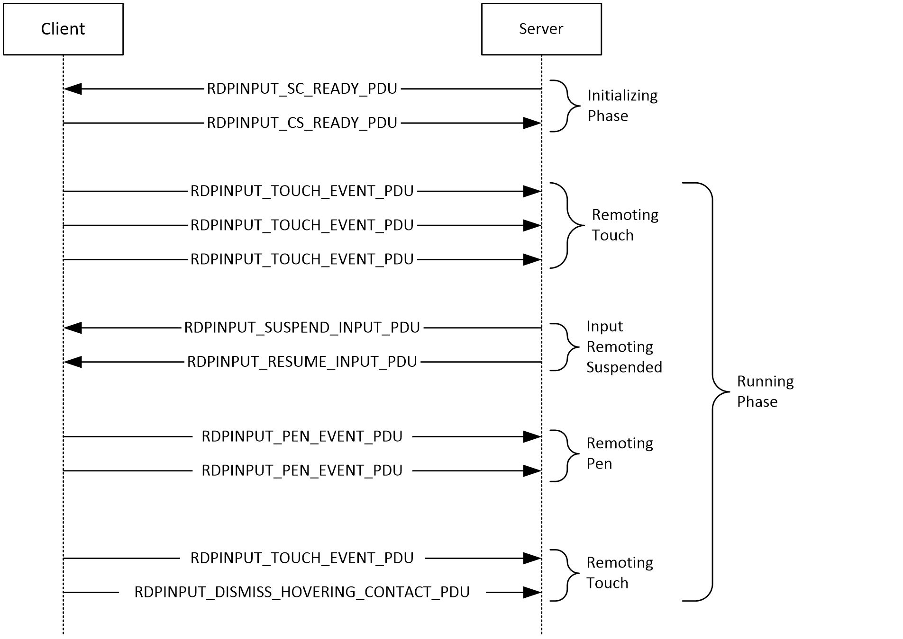

Figure 1: Messages exchanged by the input protocol endpoints

The input protocol is divided into two distinct phases:

- Initializing Phase
- Running Phase
The Initializing Phase occurs at the start of the connection. During this phase, the server and client exchange the [RDPINPUT_SC_READY_PDU (section 2.2.3.1)](#Section_2.2.3.1) and [RDPINPUT_CS_READY_PDU (section 2.2.3.2)](#Section_2.2.3.2) messages. The server initiates this exchange when the dynamic virtual channel (sections [1.4](#Section_1.4) and [2.1](#Section_2.1)) over which the input messages will flow has been opened.

Once both endpoints are ready, the Running Phase is entered. During this phase, the client sends touch or pen frames to the server encapsulated in the [RDPINPUT_TOUCH_EVENT_PDU (section 2.2.3.3)](#Section_2.2.3.3) or [RDPINPUT_PEN_EVENT_PDU (section 2.2.3.7)](#Section_2.2.3.7) message. The server decodes these frames and injects them into the user's session.

During the Running Phase, the server can request that the client suspend the transmission of input messages by sending the [RDPINPUT_SUSPEND_INPUT_PDU (section 2.2.3.4)](#Section_2.2.3.4) message to the client. To request that the client resume the transmission of input messages, the server can send the [RDPINPUT_RESUME_INPUT_PDU (section 2.2.3.5)](#Section_2.2.3.5) message to the client.

To transition touch contacts in the "hovering" state to the "out of range" state (section [3.1.1.1](#Section_3.1.1.1)), the client can send the [RDPINPUT_DISMISS_HOVERING_TOUCH_CONTACT_PDU (section 2.2.3.6)](#Section_2.2.3.6) message to the server. This message effectively allows individual contacts (in the hovering state) to be transitioned to the out of range state without requiring the construction and transmission of a touch frame from client to server. If the contact specified in the **RDPINPUT_DISMISS_HOVERING_TOUCH_CONTACT_PDU** message does not exist on the server, then the message is simply ignored.

## 1.4 Relationship to Other Protocols

The Remote Desktop Protocol: Input Virtual Channel Extension is embedded in a dynamic virtual channel transport, as specified in [MS-RDPEDYC](../MS-RDPEDYC/MS-RDPEDYC.md) sections 1 to 3.

## 1.5 Prerequisites/Preconditions

The Remote Desktop Protocol: Input Virtual Channel Extension operates only after the dynamic virtual channel transport is fully established. If the dynamic virtual channel transport is terminated, the Remote Desktop Protocol: Input Virtual Channel Extension is also terminated. The protocol is terminated by closing the underlying virtual channel. For details about closing the dynamic virtual channel, see [MS-RDPEDYC](../MS-RDPEDYC/MS-RDPEDYC.md) section 3.2.5.2.

## 1.6 Applicability Statement

The Remote Desktop Protocol: Input Virtual Channel Extension is applicable in scenarios where the transfer of multitouch or pen input frames (generated by a physical or virtual digitizer) is required from a [**terminal server**](#gt_terminal-server) client to a terminal server.

## 1.7 Versioning and Capability Negotiation

None.

## 1.8 Vendor-Extensible Fields

None.

## 1.9 Standards Assignments

None.

# 2 Messages

## 2.1 Transport

The Remote Desktop Protocol: Input Virtual Channel Extension is designed to operate over a dynamic virtual channel, as specified in [MS-RDPEDYC](../MS-RDPEDYC/MS-RDPEDYC.md) sections 1 to 3. The dynamic virtual channel name is the null-terminated [**ANSI character**](#gt_ansi-character) string "Microsoft::Windows::RDS::Input". The usage of channel names in the context of opening a dynamic virtual channel is specified in [MS-RDPEDYC] section 2.2.2.1. The "Microsoft::Windows::RDS::Input" dynamic virtual channel SHOULD NOT be opened by the client if a touch digitizer is not present.

## 2.2 Message Syntax

The following sections specify the Remote Desktop Protocol: Input Virtual Channel Extension message syntax. All multiple-byte fields within a message MUST be marshaled in [**little-endian**](#gt_little-endian) byte order, unless otherwise specified.

### 2.2.1 Namespaces

### 2.2.2 Common Data Types

#### 2.2.2.1 TWO_BYTE_UNSIGNED_INTEGER

The **TWO_BYTE_UNSIGNED_INTEGER** structure is used to encode a value in the range 0x0000 to 0x7FFF by using a variable number of bytes. For example, 0x1A1B is encoded as { 0x9A, 0x1B }. The most significant bit of the first byte encodes the number of bytes in the structure.

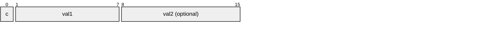

**c (1 bit):** A 1-bit unsigned integer field containing an encoded representation of the number of bytes in this structure.

| Value | Meaning |
| --- | --- |
| ONE_BYTE_VAL 0 | Implies that the optional **val2** field is not present. Hence, the structure is 1 byte in size. |
| TWO_BYTE_VAL 1 | Implies that the optional **val2** field is present. Hence, the structure is 2 bytes in size. |

**val1 (7 bits):** A 7-bit unsigned integer field containing the most significant 7 bits of the value represented by this structure.

**val2 (1 byte, optional):** An 8-bit unsigned integer containing the least significant bits of the value represented by this structure.

#### 2.2.2.2 TWO_BYTE_SIGNED_INTEGER

The **TWO_BYTE_SIGNED_INTEGER** structure is used to encode a value in the range -0x3FFF to 0x3FFF by using a variable number of bytes. For example, -0x1A1B is encoded as { 0xDA, 0x1B }, and -0x0002 is encoded as { 0x42 }. The most significant bits of the first byte encode the number of bytes in the structure and the sign.

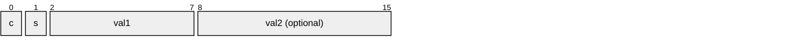

**c (1 bit):** A 1-bit unsigned integer field containing an encoded representation of the number of bytes in this structure.

| Value | Meaning |
| --- | --- |
| ONE_BYTE_VAL 0 | Implies that the optional **val2** field is not present. Hence, the structure is 1 byte in size. |
| TWO_BYTE_VAL 1 | Implies that the optional **val2** field is present. Hence, the structure is 2 bytes in size. |

**s (1 bit):** A 1-bit unsigned integer field containing an encoded representation of whether the value is positive or negative.

| Value | Meaning |
| --- | --- |
| POSITIVE_VAL 0 | Implies that the value represented by this structure is positive. |
| NEGATIVE_VAL 1 | Implies that the value represented by this structure is negative. |

**val1 (6 bits):** A 6-bit unsigned integer field containing the most significant 6 bits of the value represented by this structure.

**val2 (1 byte, optional):** An 8-bit unsigned integer containing the least significant bits of the value represented by this structure.

#### 2.2.2.3 FOUR_BYTE_UNSIGNED_INTEGER

The **FOUR_BYTE_UNSIGNED_INTEGER** structure is used to encode a value in the range 0x00000000 to 0x3FFFFFFF by using a variable number of bytes. For example, 0x001A1B1C is encoded as {0x9A, 0x1B, 0x1C}. The two most significant bits of the first byte encode the number of bytes in the structure.

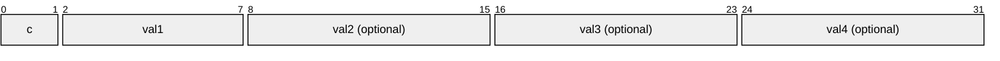

**c (2 bits):** A 2-bit unsigned integer field containing an encoded representation of the number of bytes in this structure.

| Value | Meaning |
| --- | --- |
| ONE_BYTE_VAL 0 | Implies that the optional **val2**, **val3**, and **val4** fields are not present. Hence, the structure is 1 byte in size. |
| TWO_BYTE_VAL 1 | Implies that the optional **val2** field is present, while the optional **val3** and **val4** fields are not present. Hence, the structure is 2 bytes in size. |
| THREE_BYTE_VAL 2 | Implies that the optional **val2** and **val3** fields are present, while the optional **val4** field is not present. Hence, the structure is 3 bytes in size. |
| FOUR_BYTE_VAL 3 | Implies that the optional **val2**, **val3**, and **val4** fields are all present. Hence, the structure is 4 bytes in size. |

**val1 (6 bits):** A 6-bit unsigned integer field containing the most significant 6 bits of the value represented by this structure.

**val2 (1 byte, optional):** An 8-bit unsigned integer containing the second most significant bits of the value represented by this structure.

**val3 (1 byte, optional):** An 8-bit unsigned integer containing the third most significant bits of the value represented by this structure.

**val4 (1 byte, optional):** An 8-bit unsigned integer containing the least significant bits of the value represented by this structure.

#### 2.2.2.4 FOUR_BYTE_SIGNED_INTEGER

The **FOUR_BYTE_SIGNED_INTEGER** structure is used to encode a value in the range -0x1FFFFFFF to 0x1FFFFFFF by using a variable number of bytes. For example, -0x001A1B1C is encoded as {0xBA, 0x1B, 0x1C}, and -0x00000002 is encoded as {0x22}. The three most significant bits of the first byte encode the number of bytes in the structure and the sign.

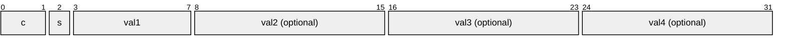

**c (2 bits):** A 2-bit unsigned integer field containing an encoded representation of the number of bytes in this structure.

| Value | Meaning |
| --- | --- |
| ONE_BYTE_VAL 0 | Implies that the optional **val2**, **val3**, and **val4** fields are not present. Hence, the structure is 1 byte in size. |
| TWO_BYTE_VAL 1 | Implies that the optional **val2** field is present, while the optional **val3** and **val4** fields are not present. Hence, the structure is 2 bytes in size. |
| THREE_BYTE_VAL 2 | Implies that the optional **val2** and **val3** fields are present, while the optional **val4** field is not present. Hence, the structure is 3 bytes in size. |
| FOUR_BYTE_VAL 3 | Implies that the optional **val2**, **val3**, and **val4** fields are all present. Hence, the structure is 4 bytes in size. |

**s (1 bit):** A 1-bit unsigned integer field containing an encoded representation of whether the value is positive or negative.

| Value | Meaning |
| --- | --- |
| POSITIVE_VAL 0 | Implies that the value represented by this structure is positive. |
| NEGATIVE_VAL 1 | Implies that the value represented by this structure is negative. |

**val1 (5 bits):** A 5-bit unsigned integer field containing the most significant 5 bits of the value represented by this structure.

**val2 (1 byte, optional):** An 8-bit unsigned integer containing the second most significant bits of the value represented by this structure.

**val3 (1 byte, optional):** An 8-bit unsigned integer containing the third most significant bits of the value represented by this structure.

**val4 (1 byte, optional):** An 8-bit unsigned integer containing the least significant bits of the value represented by this structure.

#### 2.2.2.5 EIGHT_BYTE_UNSIGNED_INTEGER

The **EIGHT_BYTE_UNSIGNED_INTEGER** structure is used to encode a value in the range 0x0000000000000000 to 0x1FFFFFFFFFFFFFFF by using a variable number of bytes. For example, 0x001A1B1C1D1E1F2A is encoded as {0xDA, 0x1B, 0x1C, 0x1D, 0x1E, 0x1F, 0x2A}. The three most significant bits of the first byte encode the number of bytes in the structure.

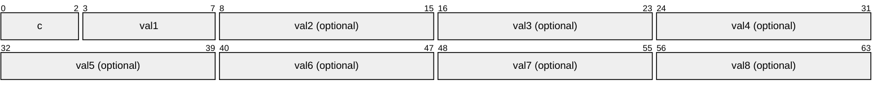

**c (3 bits):** A 3-bit unsigned integer field containing an encoded representation of the number of bytes in this structure.

| Value | Meaning |
| --- | --- |
| ONE_BYTE_VAL 0 | Implies that the optional **val2**, **val3**, **val4, val5**, **val6**, **val7** and **val8** fields are not present. Hence, the structure is 1 byte in size. |
| TWO_BYTE_VAL 1 | Implies that the optional **val2** field is present, while the optional **val3**, **val4, val5**, **val6**, **val7** and **val8** fields are not present. Hence, the structure is 2 bytes in size. |
| THREE_BYTE_VAL 2 | Implies that the optional **val2** and **val3** fields are present, while the optional **val4, val5**, **val6**, **val7** and **val8** fields are not present. Hence, the structure is 3 bytes in size. |
| FOUR_BYTE_VAL 3 | Implies that the optional **val2**, **val3**, and **val4** fields are all present, while the optional **val5**, **val6**, **val7** and **val8** fields are not present. Hence, the structure is 4 bytes in size. |
| FIVE_BYTE_VAL 4 | Implies that the optional **val2**, **val3**, **val4** and **val5** fields are all present, while the optional **val6**, **val7** and **val8** fields are not present. Hence, the structure is 5 bytes in size. |
| SIX_BYTE_VAL 5 | Implies that the optional **val2**, **val3**, **val4**, **val5** and **val6** fields are all present, while the optional **val7** and **val8** fields are not present. Hence, the structure is 6 bytes in size. |
| SEVEN_BYTE_VAL 6 | Implies that the optional **val2**, **val3**, **val4**, **val5**, **val6** and **val7** fields are all present, while the optional **val8** field is not present. Hence, the structure is 7 bytes in size. |
| EIGHT_BYTE_VAL 7 | Implies that the optional **val2**, **val3**, **val4**, **val5**, **val6**, **val7** and **val8** fields are all present. Hence, the structure is 8 bytes in size. |

**val1 (5 bits):** A 5-bit unsigned integer field containing the most significant 5 bits of the value represented by this structure.

**val2 (1 byte, optional):** An 8-bit unsigned integer containing the second most significant bits of the value represented by this structure.

**val3 (1 byte, optional):** An 8-bit unsigned integer containing the third most significant bits of the value represented by this structure.

**val4 (1 byte, optional):** An 8-bit unsigned integer containing the fourth most significant bits of the value represented by this structure.

**val5 (1 byte, optional):** An 8-bit unsigned integer containing the fifth most significant bits of the value represented by this structure.

**val6 (1 byte, optional):** An 8-bit unsigned integer containing the sixth most significant bits of the value represented by this structure.

**val7 (1 byte, optional):** An 8-bit unsigned integer containing the seventh most significant bits of the value represented by this structure.

**val8 (1 byte, optional):** An 8-bit unsigned integer containing the least significant bits of the value represented by this structure.

#### 2.2.2.6 RDPINPUT_HEADER

The **RDPINPUT_HEADER** structure is included in all input event [**PDU**](#gt_protocol-data-unit-pdu)s and is used to identify the input event type and to specify the length of the PDU.

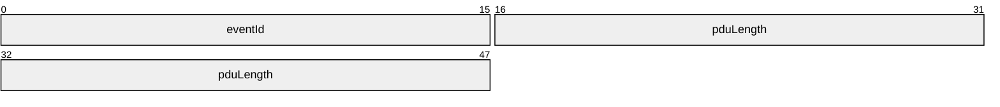

**eventId (2 bytes):** A 16-bit unsigned integer that identifies the type of the input event PDU.

| Value | Meaning |
| --- | --- |
| EVENTID_SC_READY 0x0001 | [RDPINPUT_SC_READY_PDU (section 2.2.3.1)](#Section_2.2.3.1). |
| EVENTID_CS_READY 0x0002 | [RDPINPUT_CS_READY_PDU (section 2.2.3.2)](#Section_2.2.3.2). |
| EVENTID_TOUCH 0x0003 | [RDPINPUT_TOUCH_EVENT_PDU (section 2.2.3.3)](#Section_2.2.3.3). |
| EVENTID_SUSPEND_INPUT 0x0004 | [RDPINPUT_SUSPEND_INPUT_PDU (section 2.2.3.4)](#Section_2.2.3.4). |
| EVENTID_RESUME_INPUT 0x0005 | [RDPINPUT_RESUME_INPUT_PDU (section 2.2.3.5)](#Section_2.2.3.5). |
| EVENTID_DISMISS_HOVERING_TOUCH_CONTACT 0x0006 | [RDPINPUT_DISMISS_HOVERING_TOUCH_CONTACT_PDU (section 2.2.3.6)](#Section_2.2.3.6). |
| EVENTID_PEN 0x0008 | [RDPINPUT_PEN_EVENT_PDU (section 2.2.3.7)](#Section_2.2.3.7). |

**pduLength (4 bytes):** A 32-bit unsigned integer that specifies the length of the input event PDU in bytes. This value MUST include the length of the **RDPINPUT_HEADER** (6 bytes).

### 2.2.3 Input Messages

#### 2.2.3.1 RDPINPUT_SC_READY_PDU

The **RDPINPUT_SC_READY_PDU** message is sent by the server endpoint and is used to indicate readiness to commence with input remoting transactions.

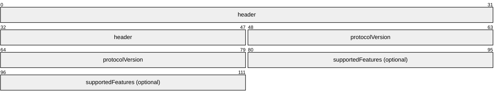

**header (6 bytes):** An [RDPINPUT_HEADER (section 2.2.2.6)](#Section_2.2.2.6) structure. The **eventId** field MUST be set to EVENTID_SC_READY (0x0001).

**protocolVersion (4 bytes):** A 32-bit unsigned integer that specifies the input protocol version supported by the server.

| Value | Meaning |
| --- | --- |
| RDPINPUT_PROTOCOL_V100 0x00010000 | Version 1.0.0 of the RDP input remoting protocol. Servers advertising this version only support the remoting of multitouch frames. |
| RDPINPUT_PROTOCOL_V101 0x00010001 | Version 1.0.1 of the RDP input remoting protocol. Servers advertising this version only support the remoting of multitouch frames. |
| RDPINPUT_PROTOCOL_V200 0x00020000 | Version 2.0.0 of the RDP input remoting protocol. Servers advertising this version support the remoting of both multitouch and pen frames. |
| RDPINPUT_PROTOCOL_V300 0x00030000 | Version 3.0.0 of the RDP input remoting protocol. Servers advertising this version support specifying granular protocol features in the optional **supportedFeatures** field. |

**supportedFeatures (4 bytes, optional):** An optional 32-bit unsigned integer that specifies granular protocol features supported by the server.

| Value | Meaning |
| --- | --- |
| SC_READY_MULTIPEN_INJECTION_SUPPORTED 0x00000001 | The simultaneous injection of input from up to four pen devices is supported. |

This field SHOULD be present if the **protocolVersion** field is set to RPDINPUT_PROTOCOL_V300 (0x00030000).

#### 2.2.3.2 RDPINPUT_CS_READY_PDU

The **RDPINPUT_CS_READY_PDU** message is sent by the client endpoint and is used to indicate readiness to commence with input remoting transactions.

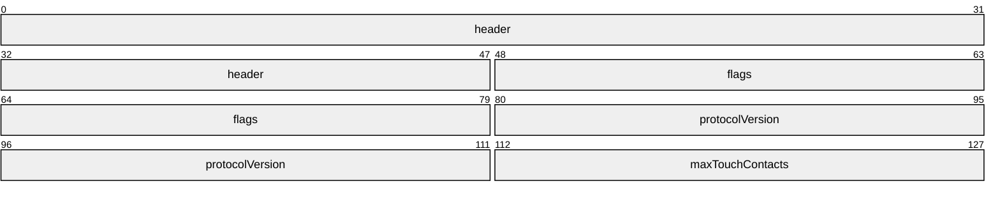

**header (6 bytes):** An [RDPINPUT_HEADER (section 2.2.2.6)](#Section_2.2.2.6) structure. The **eventId** field MUST be set to EVENTID_CS_READY (0x0002).

**flags (4 bytes):** A 32-bit unsigned integer that specifies touch initialization flags.

| Flag | Meaning |
| --- | --- |
| CS_READY_FLAGS_SHOW_TOUCH_VISUALS 0x00000001 | Touch gesture and contact visuals SHOULD be rendered by the server in the remote session. |
| CS_READY_FLAGS_DISABLE_TIMESTAMP_INJECTION 0x00000002 | The client does not support touch frame timestamp remoting. The server MUST ignore any values specified in the **frameOffset** field of the [RDPINPUT_TOUCH_FRAME (section 2.2.3.3.1)](#Section_2.2.3.3.1.1) structure and the **encodeTime** field of the [RDPINPUT_TOUCH_EVENT_PDU (section 2.2.3.3)](#Section_2.2.3.3) message. This flag SHOULD NOT be sent to a server that only supports version 1.0.0 of the input remoting protocol. The server-supported version is specified in the **protocolVersion** field of the [RDPINPUT_SC_READY_PDU (section 2.2.3.1)](#Section_2.2.3.1) message. |
| CS_READY_FLAGS_ENABLE_MULTIPEN_INJECTION 0x00000004 | The server should configure the pen injection subsystem so that the simultaneous injection of input from up to four pen devices is possible. |

**protocolVersion (4 bytes):** A 32-bit unsigned integer that specifies the input protocol version supported by the client.

| Value | Meaning |
| --- | --- |
| RDPINPUT_PROTOCOL_V100 0x00010000 | Version 1.0.0 of the RDP input remoting protocol. Clients advertising this version only support the remoting of multitouch frames. |
| RDPINPUT_PROTOCOL_V101 0x00010001 | Version 1.0.1 of the RDP input remoting protocol. Clients advertising this version only support the remoting of multitouch frames. |
| RDPINPUT_PROTOCOL_V200 0x00020000 | Version 2.0.0 of the RDP input remoting protocol. Clients advertising this version support the remoting of both multitouch and pen frames. |
| RDPINPUT_PROTOCOL_V300 0x00030000 | Version 3.0.0 of the RDP input remoting protocol. Clients advertising this version support reading protocol features advertised in the **supportedFeatures** field of the RDPINPUT_SC_READY_PDU (section 2.2.3.1) structure. |

**maxTouchContacts (2 bytes):** A 16-bit unsigned integer that specifies the maximum number of simultaneous touch contacts supported by the client.

#### 2.2.3.3 RDPINPUT_TOUCH_EVENT_PDU

The **RDPINPUT_TOUCH_EVENT_PDU** message is sent by the client endpoint and is used to remote a collection of touch frames.

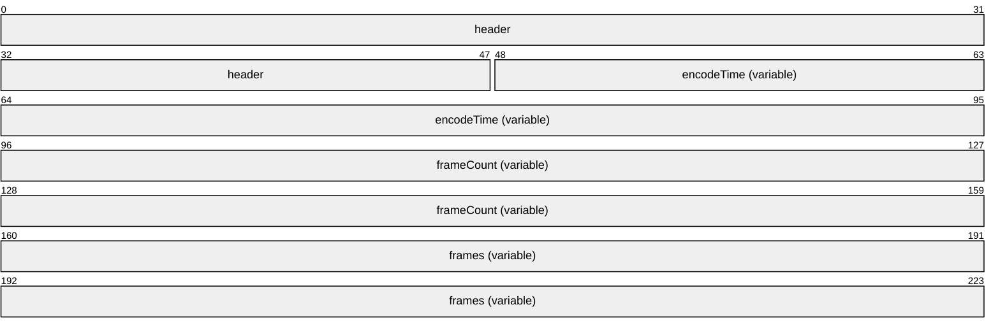

**header (6 bytes):** An RDPINPUT_HEADER (section [2.2.2.6](#Section_2.2.2.6)) structure. The **eventId** field MUST be set to EVENTID_TOUCH (0x0003).

**encodeTime (variable):** A FOUR_BYTE_UNSIGNED_INTEGER (section [2.2.2.3](#Section_2.2.2.3)) structure that specifies the time that has elapsed (in milliseconds) from when the oldest touch frame was generated to when it was encoded for transmission by the client.

**frameCount (variable):** A TWO_BYTE_UNSIGNED_INTEGER (section [2.2.2.1](#Section_2.2.2.1)) structure that specifies the number of RDPINPUT_TOUCH_FRAME (section [2.2.3.3.1](#Section_2.2.3.3.1.1)) structures in the **frames** field.

**frames (variable):** An array of **RDPINPUT_TOUCH_FRAME** structures ordered from the oldest in time to the most recent in time. The number of structures in this array is specified by the **frameCount** field.

##### 2.2.3.3.1 RDPINPUT_TOUCH_FRAME

The **RDPINPUT_TOUCH_FRAME** structure encapsulates a collection of RDPINPUT_TOUCH_CONTACT (section [2.2.3.3.1.1](#Section_2.2.3.3.1.1)) structures that are part of the same logical touch frame.

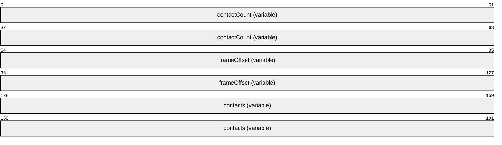

**contactCount (variable):** A TWO_BYTE_UNSIGNED_INTEGER (section [2.2.2.1](#Section_2.2.2.1)) structure that specifies the number of **RDPINPUT_TOUCH_CONTACT** structures in the **contacts** field.

**frameOffset (variable):** An EIGHT_BYTE_UNSIGNED_INTEGER (section [2.2.2.5](#Section_2.2.2.5)) structure that specifies the time offset from the previous frame (in microseconds). If this is the first frame being transmitted then this field MUST be set to zero.

**contacts (variable):** An array of **RDPINPUT_TOUCH_CONTACT** structures. The number of structures in this array is specified by the **contactCount** field.

###### 2.2.3.3.1.1 RDPINPUT_TOUCH_CONTACT

The **RDPINPUT_TOUCH_CONTACT** structure describes the characteristics of a contact that is encapsulated in an RDPINPUT_TOUCH_FRAME (section [2.2.3.3.1](#Section_2.2.3.3.1.1)) structure.

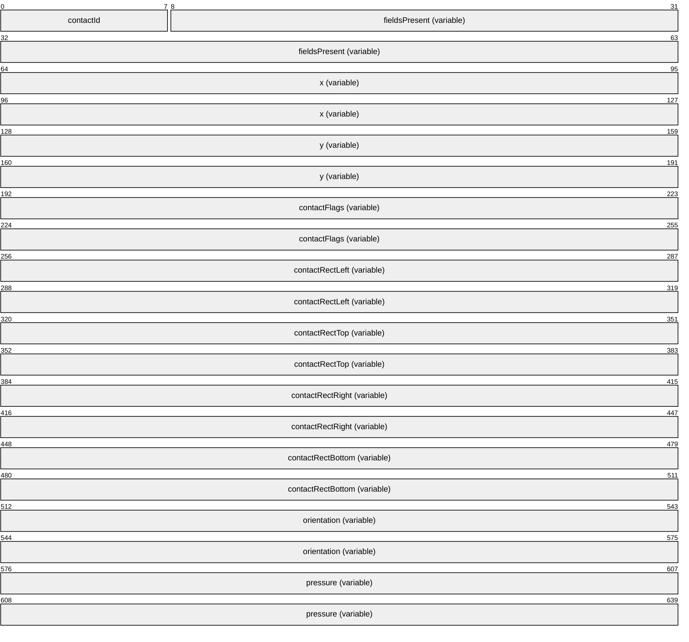

**contactId (1 byte):** An 8-bit unsigned integer that specifies the ID assigned to the contact.

**fieldsPresent (variable):** A TWO_BYTE_UNSIGNED_INTEGER (section [2.2.2.1](#Section_2.2.2.1)) structure that specifies the presence of the optional **contactRectLeft**, **contactRectTop**, **contactRectRight**, **contactRectBottom**, **orientation**, and **pressure** fields.

| Flag | Meaning |
| --- | --- |
| TOUCH_CONTACT_CONTACTRECT_PRESENT 0x0001 | The optional **contactRectLeft**, **contactRectTop**, **contactRectRight**, and **contactRectBottom** fields are all present. |
| TOUCH_CONTACT_ORIENTATION_PRESENT 0x0002 | The optional **orientation** field is present. |
| TOUCH_CONTACT_PRESSURE_PRESENT 0x0004 | The optional **pressure** field is present. |

**x (variable):** A FOUR_BYTE_SIGNED_INTEGER (section [2.2.2.4](#Section_2.2.2.4)) structure that specifies the X-coordinate (relative to the virtual-desktop origin) of the contact.

**y (variable):** A **FOUR_BYTE_SIGNED_INTEGER** structure that specifies the Y-coordinate (relative to the virtual-desktop origin) of the contact.

**contactFlags (variable):** A FOUR_BYTE_UNSIGNED_INTEGER (section [2.2.2.3](#Section_2.2.2.3)) structure that specifies the current state of the contact.

| Flag | Meaning |
| --- | --- |
| CONTACT_FLAG_DOWN 0x0001 | The contact transitioned to the engaged state (made contact). |
| CONTACT_FLAG_UPDATE 0x0002 | Contact update. |
| CONTACT_FLAG_UP 0x0004 | The contact transitioned from the engaged state (broke contact). |
| CONTACT_FLAG_INRANGE 0x0008 | The contact has not departed and is still in range. |
| CONTACT_FLAG_INCONTACT 0x0010 | The contact is in the engaged state. |
| CONTACT_FLAG_CANCELED 0x0020 | The contact has been canceled. |

This field MUST contain one of the following combinations of the contact state flags and MUST NOT contain any other combination:

- UP
- UP | CANCELED
- UPDATE
- UPDATE | CANCELED
- DOWN | INRANGE | INCONTACT
- UPDATE | INRANGE | INCONTACT
- UP | INRANGE
- UPDATE | INRANGE
The figure "Lifetime of a touch or pen contact" in section [3.1.1.1](#Section_3.1.1.1) describes the states through which a contact involved in a touch transaction can transition.

**contactRectLeft (variable):** An optional [TWO_BYTE_SIGNED_INTEGER (section 2.2.2.2)](#Section_2.2.2.2) structure that specifies the leftmost bound (relative to the contact point specified by the **x** and **y** fields) of the exclusive rectangle describing the geometry of the contact. This rectangle MUST be rotated counter-clockwise by the angle specified in the **orientation** field to yield the actual contact geometry. The presence of the **contactRectLeft** field is indicated by the TOUCH_CONTACT_CONTACTRECT_PRESENT (0x0001) flag in the **fieldsPresent** field.

**contactRectTop (variable):** An optional **TWO_BYTE_SIGNED_INTEGER** structure that specifies the upper bound (relative to the contact point specified by the **x** and **y** fields) of the exclusive rectangle describing the geometry of the contact. This rectangle MUST be rotated counter-clockwise by the angle specified in the **orientation** field to yield the actual contact geometry. The presence of the **contactRectTop** field is indicated by the TOUCH_CONTACT_CONTACTRECT_PRESENT (0x0001) flag in the **fieldsPresent** field.

**contactRectRight (variable):** An optional **TWO_BYTE_SIGNED_INTEGER** structure that specifies the rightmost bound (relative to the contact point specified by the **x** and **y** fields) of the exclusive rectangle describing the geometry of the contact. This rectangle MUST be rotated counter-clockwise by the angle specified in the **orientation** field to yield the actual contact geometry. The presence of the **contactRectRight** field is indicated by the TOUCH_CONTACT_CONTACTRECT_PRESENT (0x0001) flag in the **fieldsPresent** field.

**contactRectBottom (variable):** An optional **TWO_BYTE_SIGNED_INTEGER** structure that specifies the lower bound (relative to the contact point specified by the **x** and **y** fields) of the exclusive rectangle describing the geometry of the contact. This rectangle MUST be rotated counter-clockwise by the angle specified in the **orientation** field to yield the actual contact geometry. The presence of the **contactRectBottom** field is indicated by the TOUCH_CONTACT_CONTACTRECT_PRESENT (0x0001) flag in the **fieldsPresent** field.

**orientation (variable):** An optional **FOUR_BYTE_UNSIGNED_INTEGER** structure that specifies the angle through which the contact rectangle (specified in the **contactRectLeft**, **contactRectTop**, **contactRectRight** and **contactRectBottom** fields) MUST be rotated to yield the actual contact geometry. This value MUST be in the range 0x00000000 to 0x00000167 (359), inclusive, where 0x00000000 indicates a touch contact aligned with the y-axis and pointing from bottom to top; increasing values indicate degrees of rotation in a counter-clockwise direction. The presence of the **orientation** field is indicated by the TOUCH_CONTACT_ORIENTATION_PRESENT (0x0002) flag in the **fieldsPresent** field. If the **orientation** field is not present the angle of rotation MUST be assumed to be zero degrees.

**pressure (variable):** An optional **FOUR_BYTE_UNSIGNED_INTEGER** structure that specifies the contact pressure. This value MUST be normalized in the range 0x00000000 to 0x00000400 (1024), inclusive. The presence of this field is indicated by the TOUCH_CONTACT_PRESSURE_PRESENT (0x0004) flag in the **fieldsPresent** field.

#### 2.2.3.4 RDPINPUT_SUSPEND_INPUT_PDU

The **RDPINPUT_SUSPEND_INPUT_PDU** message is sent by the server endpoint and is used to instruct the client to suspend the transmission of the [RDPINPUT_TOUCH_EVENT_PDU (section 2.2.3.3)](#Section_2.2.3.3) message.

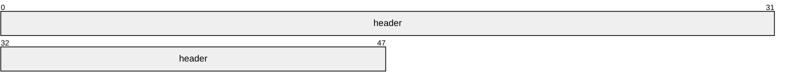

**header (6 bytes):** An [RDPINPUT_HEADER (section 2.2.2.6)](#Section_2.2.2.6) structure. The **eventId** field MUST be set to EVENTID_SUSPEND_INPUT (0x0004).

#### 2.2.3.5 RDPINPUT_RESUME_INPUT_PDU

The **RDPINPUT_RESUME_INPUT_PDU** message is sent by the server endpoint and is used to instruct the client to resume the transmission of the [RDPINPUT_TOUCH_EVENT_PDU (section 2.2.3.3)](#Section_2.2.3.3) message.

**header (6 bytes):** An [RDPINPUT_HEADER (section 2.2.2.6)](#Section_2.2.2.6) structure. The **eventId** field MUST be set to EVENTID_RESUME_INPUT (0x0005).

#### 2.2.3.6 RDPINPUT_DISMISS_HOVERING_TOUCH_CONTACT_PDU

The **RDPINPUT_DISMISS_HOVERING_TOUCH_CONTACT_PDU** message is sent by the client endpoint to instruct the server to transition a contact in the "hovering" state to the "out of range" state (section [3.1.1.1](#Section_3.1.1.1)).

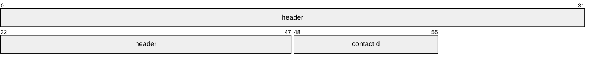

**header (6 bytes):** An [RDPINPUT_HEADER (section 2.2.2.6)](#Section_2.2.2.6) structure. The **eventId** field MUST be set to EVENTID_DISMISS_HOVERING_TOUCH_CONTACT (0x0006).

**contactId (1 byte):** An 8-bit unsigned integer that specifies the ID assigned to the contact. This value MUST be in the range 0x00 to 0xFF (inclusive).

#### 2.2.3.7 RDPINPUT_PEN_EVENT_PDU

The **RDPINPUT_PEN_EVENT_PDU** message is sent by the client endpoint and is used to remote a collection of pen frames.

**header (6 bytes):** An [RDPINPUT_HEADER (section 2.2.2.6)](#Section_2.2.2.6) structure. The **eventId** field MUST be set to EVENTID_PEN (0x0008).

**encodeTime (variable):** A [FOUR_BYTE_UNSIGNED_INTEGER (section 2.2.2.3)](#Section_2.2.2.3) structure that specifies the time that has elapsed (in milliseconds) from when the oldest pen frame was generated to when it was encoded for transmission by the client.

**frameCount (variable):** A [TWO_BYTE_UNSIGNED_INTEGER (section 2.2.2.1)](#Section_2.2.2.1)structure that specifies the number of [RDPINPUT_PEN_FRAME (section 2.2.3.7.1)](#Section_2.2.3.7.1) structures in the frames field.

**frames (variable):** An array of RDPINPUT_PEN_FRAME structures ordered from the oldest in time to the most recent in time. The number of structures in this array is specified by the **frameCount** field.

##### 2.2.3.7.1 RDPINPUT_PEN_FRAME

The **RDPINPUT_PEN_FRAME** structure encapsulates a collection of [RDPINPUT_PEN_CONTACT (section 2.2.3.7.1.1)](#Section_2.2.3.7.1.1)structures that are part of the same logical pen frame.

**contactCount (variable):** A [TWO_BYTE_UNSIGNED_INTEGER (section 2.2.2.1)](#Section_2.2.2.1) structure that specifies the number of **RDPINPUT_PEN_CONTACT** structures in the **contacts** field.

**frameOffset (variable):** An [EIGHT_BYTE_UNSIGNED_INTEGER (section 2.2.2.5)](#Section_2.2.2.5)structure that specifies the time offset from the previous frame (in microseconds). If this is the first frame being transmitted, then this field MUST be set to zero.

**contacts (variable):** An array of **RDPINPUT_PEN_CONTACT** structures. The number of structures in this array is specified by the **contactCount** field.

###### 2.2.3.7.1.1 RDPINPUT_PEN_CONTACT

The **RDPINPUT_PEN_CONTACT** structure describes the characteristics of a contact that is encapsulated in an [RDPINPUT_PEN_FRAME (section 2.2.3.7.1)](#Section_2.2.3.7.1) structure.

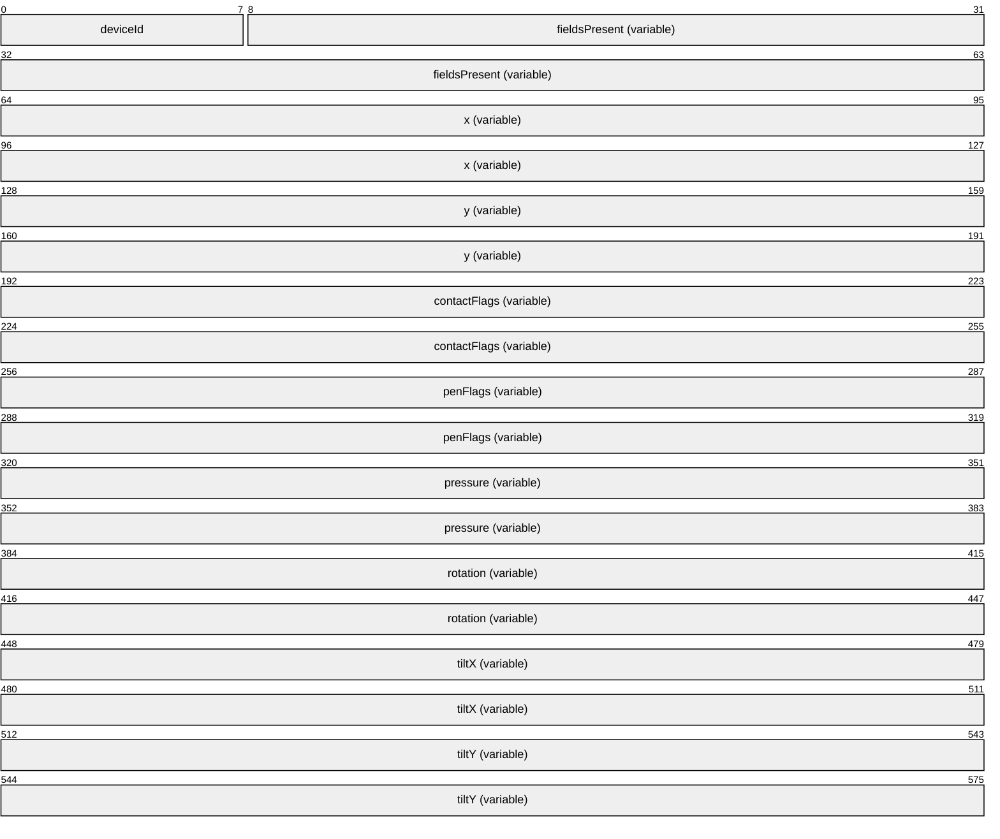

**deviceId (1 byte):** An 8-bit unsigned integer that specifies the ID assigned to the pen device. If the simultaneous injection of pen input was not negotiated using the RDPINPUT_SC_READY_PDU (section [2.2.3.1](#Section_2.2.3.1)) and RDPINPUT_CS_READY_PDU (section [2.2.3.2](#Section_2.2.3.2)) structures, then this ID MUST be set to zero.

**fieldsPresent (variable):** A [TWO_BYTE_UNSIGNED_INTEGER (section 2.2.2.1)](#Section_2.2.2.1) structure that specifies the presence of the optional **penFlags**, **pressure**, **rotation**, **tiltX**, and **tiltY** fields.

| Flag | Meaning |
| --- | --- |
| PEN_CONTACT_PENFLAGS_PRESENT 0x0001 | The optional **penFlags** field is present. |
| PEN_CONTACT_PRESSURE_PRESENT 0x0002 | The optional **pressure** field is present. |
| PEN_CONTACT_ROTATION_PRESENT 0x0004 | The optional **rotation** field is present. |
| PEN_CONTACT_TILTX_PRESENT 0x0008 | The optional **tiltX** field is present. |
| PEN_CONTACT_TILTY_PRESENT 0x0010 | The optional **tiltY** field is present. |

**x (variable):** A [FOUR_BYTE_SIGNED_INTEGER (section 2.2.2.4)](#Section_2.2.2.4) structure that specifies the x-coordinate (relative to the virtual-desktop origin) of the contact.

**y (variable):** A FOUR_BYTE_SIGNED_INTEGER structure that specifies the y-coordinate (relative to the virtual-desktop origin) of the contact.

**contactFlags (variable):** A [FOUR_BYTE_UNSIGNED_INTEGER (section 2.2.2.3)](#Section_2.2.2.3)structure that specifies the current state of the contact.

| Flag | Meaning |
| --- | --- |
| CONTACT_FLAG_DOWN 0x0001 | The contact transitioned to the engaged state (made contact). |
| CONTACT_FLAG_UPDATE 0x0002 | Contact update. |
| CONTACT_FLAG_UP 0x0004 | The contact transitioned from the engaged state (broke contact). |
| CONTACT_FLAG_INRANGE 0x0008 | The contact has not departed and is still in range. |
| CONTACT_FLAG_INCONTACT 0x0010 | The contact is in the engaged state. |
| CONTACT_FLAG_CANCELED 0x0020 | The contact has been canceled. |

This field MUST contain one of the following combinations of the contact state flags and MUST NOT contain any other combination:

- UP
- UP | CANCELED
- UPDATE
- UPDATE | CANCELED
- DOWN | INRANGE | INCONTACT
- UPDATE | INRANGE | INCONTACT
- UP | INRANGE
- UPDATE | INRANGE
The figure "Lifetime of a touch or pen contact" in section [3.1.1.1](#Section_3.1.1.1) describes the states through which a contact involved in a pen transaction can transition.

**penFlags (variable):** A **FOUR_BYTE_UNSIGNED_INTEGER** structure that specifies the current state of the pen.

| Flag | Meaning |
| --- | --- |
| PEN_FLAG_BARREL_PRESSED 0x0001 | Indicates that the barrel button is in the pressed state. |
| PEN_FLAG_ERASER_PRESSED 0x0002 | Indicates that the eraser button is in the pressed state. |
| PEN_FLAG_INVERTED 0x0004 | Indicates that the pen is inverted. |

The presence of this field is indicated by the PEN_CONTACT_PENFLAGS_PRESENT (0x0001) flag in the **fieldsPresent** field.

**pressure (variable):** An optional **FOUR_BYTE_UNSIGNED_INTEGER** structure that specifies the pressure applied to the pen. This value MUST be normalized in the range 0x00000000 to 0x00000400 (1024), inclusive. The presence of this field is indicated by the PEN_CONTACT_PRESSURE_PRESENT (0x0002) flag in the **fieldsPresent** field.

**rotation (variable):** An optional **TWO_BYTE_UNSIGNED_INTEGER** structure that specifies the clockwise rotation (or twist) of the pen. This value MUST be in the range 0x00000000 to 0x00000167 (359), inclusive. The presence of this field is indicated by the PEN_CONTACT_ROTATION_PRESENT (0x0004) flag in the **fieldsPresent** field.

**tiltX (variable):** An optional **TWO_BYTE_SIGNED_INTEGER** structure that specifies the angle of tilt of the pen along the x-axis. This value MUST be in the range -0x0000005A (-90) to 0x000005A (90), inclusive: a positive value indicates a tilt to the right. The presence of this field is indicated by the PEN_CONTACT_TILTX_PRESENT (0x0008) flag in the **fieldsPresent** field.

**tiltY (variable):** An optional **TWO_BYTE_SIGNED_INTEGER** structure that specifies the angle of tilt of the pen along the y-axis. This value MUST be in the range -0x0000005A (-90) to 0x000005A (90), inclusive: a positive value indicates a tilt toward the user. The presence of this field is indicated by the PEN_CONTACT_TILTY_PRESENT (0x0010) flag in the **fieldsPresent** field.

## 2.3 Directory Service Schema Elements

None.

# 3 Protocol Details

## 3.1 Common Details

### 3.1.1 Abstract Data Model

#### 3.1.1.1 Touch Contact State Transitions

The following finite state machine diagram describes the states through which a contact involved in a touch or pen transaction can transition during its lifetime.

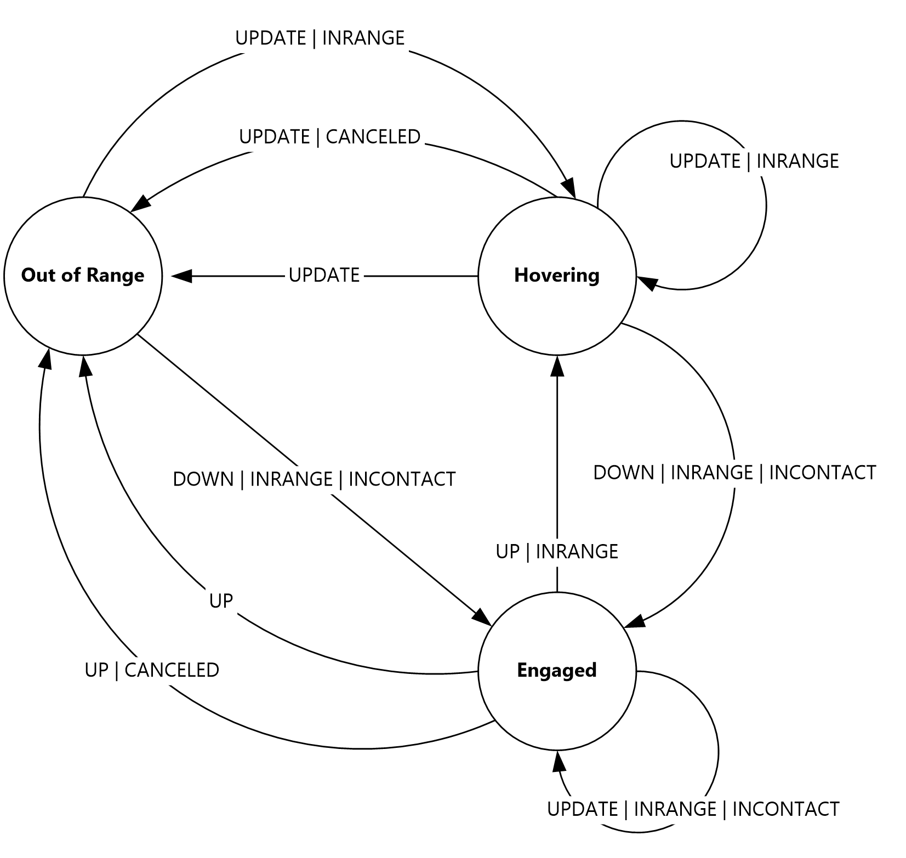

Figure 2: Lifetime of a touch or pen contact

A contact transitions through three main states:

- Out of Range
- Hovering
- Engaged
When a contact is in the "hovering" or "engaged" state, it is referred to as being "active". "Hovering" contacts are in range of the digitizer, while "engaged" contacts are in range of the digitizer and in contact with the digitizer surface. The Remote Desktop Protocol: Input Virtual Channel Extension remotes only active contacts and contacts that are transitioning to the "out of range" state; see section [2.2.3.3.1.1](#Section_2.2.3.3.1.1) for an enumeration of valid state flags combinations.

When transitioning from the "engaged" state to the "hovering" state, or from the "engaged" state to the "out of range" state, the contact position cannot change; it is only allowed to change after the transition has taken place.

### 3.1.2 Timers

None.

### 3.1.3 Initialization

None.

### 3.1.4 Higher-Layer Triggered Events

None.

### 3.1.5 Message Processing Events and Sequencing Rules

#### 3.1.5.1 Processing an Input Message

All input messages are prefaced by the [RDPINPUT_HEADER (section 2.2.2.6)](#Section_2.2.2.6) structure.

When an input message is processed, the **eventId** field in the header MUST first be examined to determine if the message is within the subset of expected messages. If the message is not expected, it SHOULD be ignored.

If the message is in the correct sequence, the **pduLength** field MUST be examined to make sure that it is consistent with the amount of data read from the "Microsoft::Windows::RDS::Input" dynamic virtual channel (section [2.1](#Section_2.1)). If this is not the case, the message SHOULD be ignored.

### 3.1.6 Timer Events

None.

### 3.1.7 Other Local Events

None.

## 3.2 Server Details

### 3.2.1 Abstract Data Model

None.

### 3.2.2 Timers

None.

### 3.2.3 Initialization

The server MUST send the [RDPINPUT_SC_READY_PDU (section 2.2.3.1)](#Section_2.2.3.1) message to the client, as specified in section [3.2.5.1](#Section_3.2.5.1), to initiate the process of remoting touch input frames.

### 3.2.4 Higher-Layer Triggered Events

None.

### 3.2.5 Message Processing Events and Sequencing Rules

#### 3.2.5.1 Sending an RDPINPUT_SC_READY_PDU Message

The structure and fields of the **RDPINPUT_SC_READY_PDU** message are specified in section [2.2.3.1](#Section_2.2.3.1).

If the server does not support touch injection, then it MUST NOT send this [**PDU**](#gt_protocol-data-unit-pdu) to the client. The **protocolVersion** field SHOULD be set to at least RDPINPUT_PROTOCOL_V200 (0x00020000) if the server supports the injection of pen input using the [RDPINPUT_PEN_EVENT_PDU (section 2.2.3.7)](#Section_2.2.3.7.1.1)message.

#### 3.2.5.2 Processing an RDPINPUT_CS_READY_PDU Message

The structure and fields of the **RDPINPUT_CS_READY_PDU** message are specified in section [2.2.3.2](#Section_2.2.3.2).

The **header** field MUST be processed as specified in section [3.1.5.1](#Section_3.1.5.1). If the message is valid, the server SHOULD use the value specified by the client in the **maxTouchContacts** field to initialize the touch injection subsystem.

#### 3.2.5.3 Processing an RDPINPUT_TOUCH_EVENT_PDU Message

The structure and fields of the **RDPINPUT_TOUCH_EVENT_PDU** message are specified in section [2.2.3.3](#Section_2.2.3.3).

The **header** field MUST be processed as specified in section [3.1.5.1](#Section_3.1.5.1). If the message is valid, the server MUST iterate over each [RDPINPUT_TOUCH_FRAME (section 2.2.3.3.1)](#Section_2.2.3.3.1.1) structure encapsulated in the **RDPINPUT_TOUCH_EVENT_PDU** message, decode each [RDPINPUT_TOUCH_CONTACT (section 2.2.3.3.1.1)](#Section_2.2.3.3.1.1) structure in the frame, and then inject the frame contacts into the user session.

If any of the contacts does not conform to the finite state machine described in section [3.1.1.1](#Section_3.1.1.1), the touch transaction SHOULD be canceled in the session, and all subsequent frames associated with the transaction SHOULD be ignored until a new touch transaction is initiated at the client.

#### 3.2.5.4 Sending an RDPINPUT_SUSPEND_INPUT_PDU message

The structure and fields of the **RDPINPUT_SUSPEND_INPUT_PDU** message are specified in section [2.2.3.4](#Section_2.2.3.4).

To request that the client resume the transmission of input messages, the server MUST send the [RDPINPUT_RESUME_INPUT_PDU (section 2.2.3.5)](#Section_2.2.3.5) message to the client, as specified in section [3.2.5.5](#Section_3.2.5.5).

#### 3.2.5.5 Sending an RDPINPUT_RESUME_INPUT_PDU Message

The structure and fields of the **RDPINPUT_RESUME_INPUT_PDU** message are specified in section [2.2.3.5](#Section_2.2.3.5).

The RDPINPUT_RESUME_INPUT_PDU (section 2.2.3.5) message SHOULD be sent only if the transmission of input messages was suspended by using the [RDPINPUT_SUSPEND_INPUT_PDU (section 2.2.3.4)](#Section_2.2.3.4) message, as specified in section [3.2.5.4](#Section_3.2.5.4).

#### 3.2.5.6 Processing an RDPINPUT_DISMISS_HOVERING_TOUCH_CONTACT_PDU Message

The structure and fields of the **RDPINPUT_DISMISS_HOVERING_TOUCH_CONTACT_PDU** message are specified in section [2.2.3.6](#Section_2.2.3.6).

The **header** field MUST be processed as specified in section [3.1.5.1](#Section_3.1.5.1). If the message is valid, the server MUST transition the contact specified by the **contactId** field to the "out of range" state if it is in the hovering state. If no contact with the specified contact ID exists, or if the contact is in the engaged state, then no action MUST be taken.

#### 3.2.5.7 Processing an RDPINPUT_PEN_EVENT_PDU Message

The structure and fields of the **RDPINPUT_PEN_EVENT_PDU** message are specified in section [2.2.3.7](#Section_2.2.3.7).

The **header** field MUST be processed as specified in section [3.1.5.1](#Section_3.1.5.1). If the message is valid, the server MUST iterate over each [RDPINPUT_PEN_FRAME (section 2.2.3.7.1)](#Section_2.2.3.7.1) structure encapsulated in the **RDPINPUT_PEN_EVENT_PDU** message, decode each [RDPINPUT_PEN_CONTACT (section 2.2.3.7.1.1)](#Section_2.2.3.7.1.1) structure in the frame, and then inject the frame contacts into the user session.

If any of the contacts does not conform to the finite state machine described in section [3.1.1.1](#Section_3.1.1.1), the pen transaction SHOULD be canceled in the session, and all subsequent frames associated with the transaction SHOULD be ignored until a new pen transaction is initiated at the client.

### 3.2.6 Timer Events

None.

### 3.2.7 Other Local Events

None.

## 3.3 Client Details

### 3.3.1 Abstract Data Model

This section describes a conceptual model of possible data organization that an implementation maintains to participate in this protocol. The described organization is provided to facilitate the explanation of how the protocol behaves. This document does not mandate that implementations adhere to this model as long as their external behavior is consistent with that described in this document.

**Note** It is possible to implement the following conceptual data by using a variety of techniques as long as the implementation produces external behavior that is consistent with that described in this document.

#### 3.3.1.1 Input Transmission Suspended

The **Input Transmission Suspended** abstract data model (ADM) element contains a Boolean value that indicates whether the capture, encoding, and transmission of touch and pen frames on the client have been suspended. This value is toggled by the receipt of the [RDPINPUT_SUSPEND_INPUT_PDU (section 2.2.3.4)](#Section_2.2.3.4) message, as specified in section [3.3.5.4](#Section_3.3.5.4), and the [RDPINPUT_RESUME_INPUT_PDU (section 2.2.3.5)](#Section_2.2.3.5)message, as specified in section [3.3.5.5](#Section_3.3.5.5).

#### 3.3.1.2 Pen Input Allowed

The **Pen Input Allowed** abstract data model (ADM) element contains a Boolean value that indicates whether the server supports the injection of pen input using the [RDPINPUT_PEN_EVENT_PDU (section 2.2.3.7)](#Section_2.2.3.7) message. This value is set by the client when processing the [RDPINPUT_SC_READY_PDU (section 2.2.3.1)](#Section_2.2.3.1) message, as specified in section [3.3.5.1](#Section_3.3.5.1).

### 3.3.2 Timers

None.

### 3.3.3 Initialization

The client SHOULD NOT open the "Microsoft::Windows::RDS::Input" virtual channel transport (section [2.1](#Section_2.1)) if a physical or virtual touch digitizer is not attached to the system.

### 3.3.4 Higher-Layer Triggered Events

None.

### 3.3.5 Message Processing Events and Sequencing Rules

#### 3.3.5.1 Processing an RDPINPUT_SC_READY_PDU message

The structure and fields of the **RDPINPUT_SC_READY_PDU** message are specified in section [2.2.3.1](#Section_2.2.3.1).

The **header** field MUST be processed as specified in section [3.1.5.1](#Section_3.1.5.1). If the message is valid, the client SHOULD respond by sending the [RDPINPUT_CS_READY_PDU (section 2.2.3.2)](#Section_2.2.3.2) message to the server, as specified in section [3.3.5.2](#Section_3.3.5.2). If the **protocolVersion** field of the **RDPINPUT_SC_READY_PDU** message is set to at least RDPINPUT_PROTOCOL_V200 (0x00020000), then the client SHOULD set the **Pen Input Allowed** (section [3.3.1.2](#Section_3.3.1.2)) ADM element to TRUE.

After sending the **RDPINPUT_CS_READY_PDU** message to the server, the client SHOULD start remoting multitouch and pen input frames by sending the [RDPINPUT_TOUCH_EVENT_PDU (section 2.2.3.3)](#Section_2.2.3.3) and [RDPINPUT_PEN_EVENT_PDU (section 2.2.3.7)](#Section_2.2.3.7) messages to the server, as specified in sections [3.3.5.3](#Section_3.3.5.3) and [3.3.5.7](#Section_3.3.5.7), respectively.

#### 3.3.5.2 Sending an RDPINPUT_CS_READY_PDU message

The structure and fields of the **RDPINPUT_CS_READY_PDU** message are specified in section [2.2.3.2](#Section_2.2.3.2).

The client MUST populate the **maxTouchContacts** field to indicate the maximum number of touch contacts that can be active at any given point in time. This value is the sum of the maximum active contacts supported by each touch digitizer attached to the client.

#### 3.3.5.3 Sending an RDPINPUT_TOUCH_EVENT_PDU message

The structure and fields of the **RDPINPUT_TOUCH_EVENT_PDU** message are specified in section [2.2.3.3](#Section_2.2.3.3).

Each RDPINPUT_TOUCH_EVENT_PDU (section 2.2.3.3) message contains an array of [RDPINPUT_TOUCH_FRAME (section 2.2.3.3.1)](#Section_2.2.3.3.1.1) structures, and each frame contains an array of [RDPINPUT_TOUCH_CONTACT (section 2.2.3.3.1.1)](#Section_2.2.3.3.1.1) structures. Every **RDPINPUT_TOUCH_CONTACT** structure represents the state and attributes of an active contact; see section [3.1.1.1](#Section_3.1.1.1) for a description of permissible touch contact state transitions.

Every touch frame received by the client from a touch digitizer MUST be encoded as an **RDPINPUT_TOUCH_FRAME** structure, the contacts being encoded as **RDPINPUT_TOUCH_CONTACT** structures. The number of encoded frames depends on the rate at which the digitizer generates touch frames. Once the touch frames have been encoded, they MUST be encapsulated in an **RDPINPUT_TOUCH_EVENT_PDU** message.

#### 3.3.5.4 Processing an RDPINPUT_SUSPEND_INPUT_PDU message

The structure and fields of the **RDPINPUT_SUSPEND_INPUT_PDU** message are specified in section [2.2.3.4](#Section_2.2.3.4).

The **header** field MUST be processed as specified in section [3.1.5.1](#Section_3.1.5.1). If the message is valid, the client MUST set the **Input Transmission Suspended** (section [3.3.1.1](#Section_3.3.1.1)) ADM element to TRUE and MUST suspend the transmission of input messages to the server. If the **Input Transmission Suspended** ADM element is already set to TRUE, the client SHOULD ignore this message.

#### 3.3.5.5 Processing an RDPINPUT_RESUME_INPUT_PDU message

The structure and fields of the **RDPINPUT_RESUME_INPUT_PDU** message are specified in section [2.2.3.5](#Section_2.2.3.5).

The **header** field MUST be processed as specified in section [3.1.5.1](#Section_3.1.5.1). If the message is valid, the client SHOULD set the **Input Transmission Suspended** (section [3.3.1.1](#Section_3.3.1.1)) ADM element to FALSE and MUST resume the transmission of input messages to the server. If the **Input Transmission Suspended** ADM element is already set to FALSE, the client SHOULD ignore this message.

#### 3.3.5.6 Sending an RDPINPUT_DISMISS_HOVERING_TOUCH_CONTACT_PDU message

The structure and fields of the **RDPINPUT_DISMISS_HOVERING_TOUCH_CONTACT_PDU** message are specified in section [2.2.3.6](#Section_2.2.3.6).

The **contactId** field MUST be initialized with the ID of a valid hovering contact that has to be transitioned to the "out of range" state.

#### 3.3.5.7 Sending an RDPINPUT_PEN_EVENT_PDU message

The structure and fields of the **RDPINPUT_PEN_EVENT_PDU** message are specified in section [2.2.3.7](#Section_2.2.3.7).

Each RDPINPUT_PEN_EVENT_PDU (section 2.2.3.7) message contains an array of [RDPINPUT_PEN_FRAME (section 2.2.3.7.1)](#Section_2.2.3.7.1) structures, and each frame contains an array of [RDPINPUT_PEN_CONTACT (section 2.2.3.7.1.1)](#Section_2.2.3.7.1.1) structures. Every **RDPINPUT_PEN_CONTACT** structure represents the state and attributes of an active contact; see section [3.1.1.1](#Section_3.1.1.1) for a description of permissible pen contact state transitions.

Every pen frame received by the client from a pen digitizer MUST be encoded as an **RDPINPUT_PEN_FRAME** structure, the contacts being encoded as **RDPINPUT_PEN_CONTACT** structures. The number of encoded frames depends on the rate at which the digitizer generates pen frames. Once the pen frames have been encoded, they MUST be encapsulated in an **RDPINPUT_PEN_EVENT_PDU** message.

### 3.3.6 Timer Events

None.

### 3.3.7 Other Local Events

None.

# 4 Protocol Examples

## 4.1 Touch Contact Geometry Examples

The examples in sections [4.1.1](#Section_4.1.1) through to [4.1.4](#Section_4.1.4) present illustrations of touch contacts orientated at 0, 45, 90 and 315 degrees respectively. Based on the orientation of the contact, the contact geometry is rotated so that the height of the contact rectangle is parallel to the y-axis and the width parallel to the x-axis.

### 4.1.1 Touch Contact Oriented at 0 Degrees

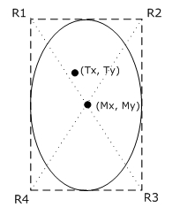

In this case, the x, y, contact rectangle, and orientation of the [RDPINPUT_TOUCH_CONTACT (section 2.2.3.3.1.1)](#Section_2.2.3.3.1.1) structure are populated by using the following values:

**x** = Tx

**y** = Ty

**contact rectangle** = (R1, R2, R3, R4)

**orientation** = 0 degrees

### 4.1.2 Touch Contact Oriented at 45 Degrees

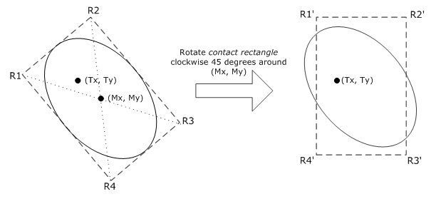

In this case, the x, y, contact rectangle, and orientation fields of the [RDPINPUT_TOUCH_CONTACT (section 2.2.3.3.1.1)](#Section_2.2.3.3.1.1) structure are populated by using the following values:

**x** = Tx

**y** = Ty

**contact rectangle** = (R1', R2', R3', R4')

**orientation** = 45 degrees

### 4.1.3 Touch Contact Oriented at 90 Degrees

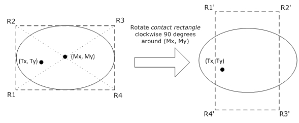

In this case, the x, y, contact rectangle, and orientation fields of the [RDPINPUT_TOUCH_CONTACT (section 2.2.3.3.1.1)](#Section_2.2.3.3.1.1) structure are populated by using the following values:

**x** = Tx

**y** = Ty

**contact rectangle** = (R1', R2', R3', R4')

**orientation** = 90 degrees

### 4.1.4 Touch Contact Oriented at 315 Degrees

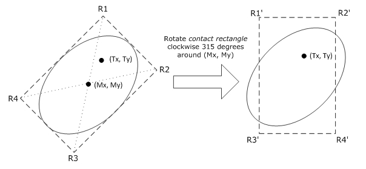

In this case, the x, y, contact rectangle, and orientation fields of the [RDPINPUT_TOUCH_CONTACT (section 2.2.3.3.1.1)](#Section_2.2.3.3.1.1) structure are populated by using the following values:

**x** = Tx

**y** = Ty

**contactRect** = (R1', R2', R3', R4')

**orientation** = 315 degrees

# 5 Security

## 5.1 Security Considerations for Implementers

None.

## 5.2 Index of Security Parameters

None.

# 6 Appendix A: Product Behavior

The information in this specification is applicable to the following Microsoft products or supplemental software. References to product versions include updates to those products.

- Windows 8 operating system
- Windows Server 2012 operating system
- Windows 8.1 operating system
- Windows Server 2012 R2 operating system
- Windows 10 operating system
- Windows Server 2016 operating system
- Windows Server 2019 operating system
- Windows Server 2022 operating system
- Windows 11 operating system
- Windows Server 2025 operating system
Exceptions, if any, are noted in this section. If an update version, service pack or Knowledge Base (KB) number appears with a product name, the behavior changed in that update. The new behavior also applies to subsequent updates unless otherwise specified. If a product edition appears with the product version, behavior is different in that product edition.

Unless otherwise specified, any statement of optional behavior in this specification that is prescribed using the terms "SHOULD" or "SHOULD NOT" implies product behavior in accordance with the SHOULD or SHOULD NOT prescription. Unless otherwise specified, the term "MAY" implies that the product does not follow the prescription.

# 7 Change Tracking

This section identifies changes that were made to this document since the last release. Changes are classified as Major, Minor, or None.

The revision class **Major** means that the technical content in the document was significantly revised. Major changes affect protocol interoperability or implementation. Examples of major changes are:

- A document revision that incorporates changes to interoperability requirements.
- A document revision that captures changes to protocol functionality.
The revision class **Minor** means that the meaning of the technical content was clarified. Minor changes do not affect protocol interoperability or implementation. Examples of minor changes are updates to clarify ambiguity at the sentence, paragraph, or table level.

The revision class **None** means that no new technical changes were introduced. Minor editorial and formatting changes may have been made, but the relevant technical content is identical to the last released version.

The changes made to this document are listed in the following table. For more information, please contact [dochelp@microsoft.com](mailto:dochelp@microsoft.com).

| Section | Description | Revision class |
| --- | --- | --- |
| [6](#Section_6) Appendix A: Product Behavior | Added Windows Server 2025 to the list of applicable products. | Major |

## Revision History

| Date | Version | Revision Class | Comments |
| --- | --- | --- | --- |
| 12/16/2011 | 1.0 | New | Released new document. |
| 3/30/2012 | 1.0 | None | No changes to the meaning, language, or formatting of the technical content. |
| 7/12/2012 | 2.0 | Major | Significantly changed the technical content. |
| 10/25/2012 | 3.0 | Major | Significantly changed the technical content. |
| 1/31/2013 | 3.0 | None | No changes to the meaning, language, or formatting of the technical content. |
| 8/8/2013 | 3.1 | Minor | Clarified the meaning of the technical content. |
| 11/14/2013 | 4.0 | Major | Significantly changed the technical content. |
| 2/13/2014 | 4.0 | None | No changes to the meaning, language, or formatting of the technical content. |
| 5/15/2014 | 4.0 | None | No changes to the meaning, language, or formatting of the technical content. |
| 6/30/2015 | 5.0 | Major | Significantly changed the technical content. |
| 10/16/2015 | 5.0 | None | No changes to the meaning, language, or formatting of the technical content. |
| 7/14/2016 | 5.0 | None | No changes to the meaning, language, or formatting of the technical content. |
| 6/1/2017 | 5.0 | None | No changes to the meaning, language, or formatting of the technical content. |
| 9/15/2017 | 6.0 | Major | Significantly changed the technical content. |
| 12/1/2017 | 6.0 | None | No changes to the meaning, language, or formatting of the technical content. |
| 9/12/2018 | 7.0 | Major | Significantly changed the technical content. |
| 4/7/2021 | 8.0 | Major | Significantly changed the technical content. |
| 6/25/2021 | 9.0 | Major | Significantly changed the technical content. |
| 4/23/2024 | 10.0 | Major | Significantly changed the technical content. |
