# [MS-RDPEMC]: Remote Desktop Protocol: Multiparty Virtual Channel Extension

Table of Contents

1 Introduction

- [1 Introduction](#Section_1)
  - [1.1 Glossary](#Section_1.1)
  - [1.2 References](#Section_1.2)
    - [1.2.1 Normative References](#Section_1.2.1)
    - [1.2.2 Informative References](#Section_1.2.2)
  - [1.3 Overview](#Section_1.3)
    - [1.3.1 Messages](#Section_1.3.1)
      - [1.3.1.1 Application and Window Filtering](#Section_1.3.1.1)
      - [1.3.1.2 Participant Management](#Section_1.3.1.2)
      - [1.3.1.3 Graphics Stream Control](#Section_1.3.1.3)
  - [1.4 Relationship to Other Protocols](#Section_1.4)
  - [1.5 Prerequisites/Preconditions](#Section_1.5)
  - [1.6 Applicability Statement](#Section_1.6)
  - [1.7 Versioning and Capability Negotiation](#Section_1.7)
  - [1.8 Vendor-Extensible Fields](#Section_1.8)
  - [1.9 Standards Assignments](#Section_1.9)

2 Messages

- [2 Messages](#Section_2)
  - [2.1 Transport](#Section_2.1)
  - [2.2 Message Syntax](#Section_2.2)
    - [2.2.1 Common Order Header (ORDER_HDR)](#Section_2.2.1)
    - [2.2.2 Unicode String (UNICODE_STRING)](#Section_2.2.2)
    - [2.2.3 Application and Window Filtering](#Section_2.2.3)
      - [2.2.3.1 Filter-Updated PDU (OD_FILTER_STATE_UPDATED)](#Section_2.2.3.1)
      - [2.2.3.2 Application-Created PDU (OD_APP_CREATED)](#Section_2.2.3.2)
      - [2.2.3.3 Application-Removed PDU (OD_APP_REMOVED)](#Section_2.2.3.3)
      - [2.2.3.4 Window-Created PDU (OD_WND_CREATED)](#Section_2.2.3.4)
      - [2.2.3.5 Window-Removed PDU (OD_WND_REMOVED)](#Section_2.2.3.5)
      - [2.2.3.6 Show Window PDU (OD_WND_SHOW)](#Section_2.2.3.6)
      - [2.2.3.7 Window Region Update PDU (OD_WND_REGION_UPDATE)](#Section_2.2.3.7)
    - [2.2.4 Participant Management](#Section_2.2.4)
      - [2.2.4.1 Participant-Created PDU (OD_PARTICIPANT_CREATED)](#Section_2.2.4.1)
      - [2.2.4.2 Participant-Removed PDU (OD_PARTICIPANT_REMOVED)](#Section_2.2.4.2)
      - [2.2.4.3 Change Participant Control Level PDU (OD_PARTICIPANT_CTRL_CHANGE)](#Section_2.2.4.3)
      - [2.2.4.4 Change Participant Control Level Response PDU (OD_PARTICIPANT_CTRL_CHANGE_RESPONSE)](#Section_2.2.4.4)
    - [2.2.5 Graphics Stream Control](#Section_2.2.5)
      - [2.2.5.1 Graphics Stream-Paused PDU (OD_GRAPHICS_STREAM_PAUSED)](#Section_2.2.5.1)
      - [2.2.5.2 Graphics Stream-Resumed PDU (OD_GRAPHICS_STREAM_RESUMED)](#Section_2.2.5.2)

3 Protocol Details

- [3 Protocol Details](#Section_3)
  - [3.1 Common Details](#Section_3.1)
    - [3.1.1 Abstract Data Model](#Section_3.1.1)
    - [3.1.2 Timers](#Section_3.1.2)
    - [3.1.3 Initialization](#Section_3.1.3)
    - [3.1.4 Higher-Layer Triggered Events](#Section_3.1.4)
    - [3.1.5 Message-Processing Events and Sequencing Rules](#Section_3.1.5)
      - [3.1.5.1 Processing the Common PDU Header](#Section_3.1.5.1)
      - [3.1.5.2 Processing UNICODE_STRING Fields](#Section_3.1.5.2)
      - [3.1.5.3 Processing Application, Window, and Participant IDs](#Section_3.1.5.3)
    - [3.1.6 Timer Events](#Section_3.1.6)
    - [3.1.7 Other Local Events](#Section_3.1.7)
  - [3.2 Participant Details](#Section_3.2)
    - [3.2.1 Abstract Data Model](#Section_3.2.1)
    - [3.2.2 Timers](#Section_3.2.2)
    - [3.2.3 Initialization](#Section_3.2.3)
    - [3.2.4 Higher-Layer Triggered Events](#Section_3.2.4)
    - [3.2.5 Message-Processing Events and Sequencing Rules](#Section_3.2.5)
      - [3.2.5.1 Application and Window Filtering](#Section_3.2.5.1)
        - [3.2.5.1.1 Processing an Application-Created PDU](#Section_3.2.5.1.1)
        - [3.2.5.1.2 Processing an Application-Removed PDU](#Section_3.2.5.1.2)
        - [3.2.5.1.3 Processing a Filter-Updated PDU](#Section_3.2.5.1.3)
        - [3.2.5.1.4 Processing a Window-Created PDU](#Section_3.2.5.1.4)
        - [3.2.5.1.5 Processing a Window-Removed PDU](#Section_3.2.5.1.5)
        - [3.2.5.1.6 Processing a Window Region Update PDU](#Section_3.2.5.1.6)
      - [3.2.5.2 Participant Management](#Section_3.2.5.2)
        - [3.2.5.2.1 Processing a Participant-Created PDU](#Section_3.2.5.2.1)
        - [3.2.5.2.2 Processing a Participant-Removed PDU](#Section_3.2.5.2.2)
        - [3.2.5.2.3 Processing the Change Participant Control Level Response PDU](#Section_3.2.5.2.3)
      - [3.2.5.3 Graphics Stream Control](#Section_3.2.5.3)
        - [3.2.5.3.1 Processing a Graphics Stream-Paused PDU](#Section_3.2.5.3.1)
        - [3.2.5.3.2 Processing a Graphics Stream-Resumed PDU](#Section_3.2.5.3.2)
    - [3.2.6 Timer Events](#Section_3.2.6)
    - [3.2.7 Other Local Events](#Section_3.2.7)
  - [3.3 Sharing Manager Details](#Section_3.3)
    - [3.3.1 Abstract Data Model](#Section_3.3.1)
    - [3.3.2 Timers](#Section_3.3.2)
    - [3.3.3 Initialization](#Section_3.3.3)
    - [3.3.4 Higher-Layer Triggered Events](#Section_3.3.4)
    - [3.3.5 Message Processing Events and Sequencing Rules](#Section_3.3.5)
      - [3.3.5.1 Application and Window Filtering](#Section_3.3.5.1)
        - [3.3.5.1.1 Processing the Show Window PDU](#Section_3.3.5.1.1)
      - [3.3.5.2 Participant Management](#Section_3.3.5.2)
        - [3.3.5.2.1 Processing a Participant-Created PDU](#Section_3.3.5.2.1)
        - [3.3.5.2.2 Processing a Participant-Removed PDU](#Section_3.3.5.2.2)
        - [3.3.5.2.3 Processing the Change Participant Control Level PDU](#Section_3.3.5.2.3)
    - [3.3.6 Timer Events](#Section_3.3.6)
    - [3.3.7 Other Local Events](#Section_3.3.7)

4 Protocol Examples

- [4 Protocol Examples](#Section_4)
  - [4.1 Sharing Manager-Generated PDUs](#Section_4.1)
    - [4.1.1 Filter-Updated PDU 1](#Section_4.1.1)
    - [4.1.2 Participant-Created PDU](#Section_4.1.2)
    - [4.1.3 Participant-Removed PDU](#Section_4.1.3)
    - [4.1.4 Filter-Updated PDU 2](#Section_4.1.4)
    - [4.1.5 Application-Created PDU](#Section_4.1.5)
    - [4.1.6 Application-Removed PDU](#Section_4.1.6)
    - [4.1.7 Window-Created PDU](#Section_4.1.7)
    - [4.1.8 Window-Removed PDU](#Section_4.1.8)
    - [4.1.9 Request Control Level Change Response PDU](#Section_4.1.9)
    - [4.1.10 Window Region Update PDU](#Section_4.1.10)
  - [4.2 Participant-Generated PDUs](#Section_4.2)
    - [4.2.1 Request Control Level Change PDU](#Section_4.2.1)
    - [4.2.2 Request Show Window PDU](#Section_4.2.2)

5 Security

- [5 Security](#Section_5)
  - [5.1 Security Considerations for Implementers](#Section_5.1)
  - [5.2 Index of Security Parameters](#Section_5.2)

6 Appendix A: Product Behavior

- [6 Appendix A: Product Behavior](#Section_6)

7 Change Tracking

- [7 Change Tracking](#Section_7)

For the legal notice and IP terms, see [LEGAL.md](../LEGAL.md).
Last updated: 4/23/2024.
See [Revision History](#revision-history) for full version history.

# 1 Introduction

The Remote Desktop Protocol: Multiparty Virtual Channel Extension describes the messages that are exchanged between a remote desktop [**host**](#gt_host) and the [**participants**](#gt_participant) with which it is engaging in multiparty application sharing. Examples include communicating the names of the participants that are sharing the session or the list of applications that are currently shared. Additional messages allow participants to negotiate [**control levels**](#gt_control-level) to give participants control of mouse and keyboard input to a shared desktop.

Sections 1.5, 1.8, 1.9, 2, and 3 of this specification are normative. All other sections and examples in this specification are informative.

## 1.1 Glossary

This document uses the following terms:

**ANSI character**: An 8-bit Windows-1252 character set unit.

**control level**: The permissions that are granted to a [**participant**](#gt_participant) in a [**shared**](#gt_share) desktop. The [**control levels**](#gt_control-level) include "view" (the [**participant**](#gt_participant) is able to see, but not interact with, [**shared**](#gt_share) content), "full" (the [**participant**](#gt_participant) is able to both see and interact with [**shared**](#gt_share) content), and "none" (the [**participant**](#gt_participant) can neither see nor interact with [**shared**](#gt_share) content).

**filtering**: To [**share**](#gt_share) a subset of the [**host**](#gt_host) applications or windows with [**participants**](#gt_participant) instead of sharing all of the applications and windows.

**host**: The machine with the desktop or applications that are being [**shared**](#gt_share) with the other [**participants**](#gt_participant).

**HRESULT**: An integer value that indicates the result or status of an operation. A particular HRESULT can have different meanings depending on the protocol using it. See [MS-ERREF](../MS-ERREF/MS-ERREF.md) section 2.1 and specific protocol documents for further details.

**participant**: A machine that is accessing the desktop content [**shared**](#gt_share) by the [**host**](#gt_host).

**protocol data unit (PDU)**: Information that is delivered as a unit among peer entities of a network and that can contain control information, address information, or data. For more information on remote procedure call (RPC)-specific PDUs, see [[C706]](https://go.microsoft.com/fwlink/?LinkId=89824) section 12.

**share**: To make content on a [**host**](#gt_host) desktop available to [**participants**](#gt_participant). [**Participants**](#gt_participant) with a sufficient [**control level**](#gt_control-level) can interact remotely with the [**host**](#gt_host) desktop by sending input commands.

**sharing manager**: The application or program used by the [**host**](#gt_host) to initiate and control the sharing of desktop content.

**Unicode character**: Unless otherwise specified, a 16-bit UTF-16 code unit.

**MAY, SHOULD, MUST, SHOULD NOT, MUST NOT:** These terms (in all caps) are used as defined in [[RFC2119]](https://go.microsoft.com/fwlink/?LinkId=90317). All statements of optional behavior use either MAY, SHOULD, or SHOULD NOT.

## 1.2 References

Links to a document in the Microsoft Open Specifications library point to the correct section in the most recently published version of the referenced document. However, because individual documents in the library are not updated at the same time, the section numbers in the documents may not match. You can confirm the correct section numbering by checking the [Errata](https://go.microsoft.com/fwlink/?linkid=850906).

### 1.2.1 Normative References

We conduct frequent surveys of the normative references to assure their continued availability. If you have any issue with finding a normative reference, please contact [dochelp@microsoft.com](mailto:dochelp@microsoft.com). We will assist you in finding the relevant information.

[MS-ERREF] Microsoft Corporation, "[Windows Error Codes](../MS-ERREF/MS-ERREF.md)".

[MS-RDPBCGR] Microsoft Corporation, "[Remote Desktop Protocol: Basic Connectivity and Graphics Remoting](../MS-RDPBCGR/MS-RDPBCGR.md)".

[MS-RDPEPS] Microsoft Corporation, "[Remote Desktop Protocol: Session Selection Extension](../MS-RDPEPS/MS-RDPEPS.md)".

[RFC2119] Bradner, S., "Key words for use in RFCs to Indicate Requirement Levels", BCP 14, RFC 2119, March 1997, [https://www.rfc-editor.org/info/rfc2119](https://go.microsoft.com/fwlink/?LinkId=90317)

### 1.2.2 Informative References

None.

## 1.3 Overview

The Remote Desktop Protocol: Basic Connectivity and Graphics Remoting Protocol (as specified in [MS-RDPBCGR](../MS-RDPBCGR/MS-RDPBCGR.md)) enables the remote display of desktop and application content. To effectively implement an application-sharing or collaborative solution, additional information is conveyed to keep the [**participants**](#gt_participant) apprised of who else is involved, in addition to which applications or windows are being shared. The Remote Desktop Protocol: Multiparty Virtual Channel Extension defines a set of messages that are used to communicate the information between the participants and to signal the occurrence of significant events.

### 1.3.1 Messages

#### 1.3.1.1 Application and Window Filtering

A [**host**](#gt_host) can choose to [**share**](#gt_share) all application windows on a desktop or, instead, limit the sharing to a subset. The process of limiting the sharing to a subset is known as [**filtering**](#gt_filtering). Application filtering is used when the host wants to share the current windows for a specific application in addition to any others subsequently created while the application is being shared. Although the term "application" is operating system specific, it generally denotes all windows created by a certain process as well as all windows related to the original windows by window hierarchy. Window filtering is purely explicit. A window is selected for sharing, and any subsequent windows created by an application have to be manually added to the sharing list. The precise mode of operation depends on a combination of user preference and the features of a [**sharing manager**](#gt_sharing-manager).

The filtering functionality of the Remote Desktop Protocol: Multiparty Virtual Channel Extension makes it highly desirable for a sharing manager to communicate the list of windows and applications that are displayed to better coordinate between participants. Protocol messages are provided to communicate filtering state, application names, and window names to the participants.

For more information, see sections [3.2.5.1](#Section_3.2.5.1) and [3.3.5.1](#Section_3.3.5.1).

#### 1.3.1.2 Participant Management

Participant management facilities allow the [**sharing manager**](#gt_sharing-manager) to send notifications to all participants when an individual [**participant**](#gt_participant) connects or disconnects from the sharing session or when a participant's [**control level**](#gt_control-level) changes.

For more information, see sections [3.2.5.2](#Section_3.2.5.2) and [3.3.5.2](#Section_3.3.5.2).

#### 1.3.1.3 Graphics Stream Control

The [**host**](#gt_host) can choose to momentarily suspend or resume desktop sharing. This capability is useful when an event, such as the input of a plain-text password, would reveal sensitive information to all participants. Participants are notified when sharing is suspended, so that they know why they are no longer receiving information, as specified in sections [2.2.5](#Section_2.2.5) and [3.2.5.3](#Section_3.2.5.3).

## 1.4 Relationship to Other Protocols

The Remote Desktop Protocol: Multiparty Virtual Channel Extension is embedded in static virtual channel transport, as specified in [MS-RDPBCGR](../MS-RDPBCGR/MS-RDPBCGR.md).

## 1.5 Prerequisites/Preconditions

The Remote Desktop Protocol: Multiparty Virtual Channel Extension operates only after a static virtual channel transport, as specified in [MS-RDPBCGR](../MS-RDPBCGR/MS-RDPBCGR.md) section 3.1.5.2, with the name "encomsp" (encoded as a string of [**ANSI characters**](#gt_ansi-character)) is fully established. If the static virtual channel transport is terminated, no other communication over the Remote Desktop Protocol: Multiparty Virtual Channel Extension occurs.

The client sends a pre-connection PDU prior to establishing a Remote Desktop Protocol (RDP) connection, as specified in [MS-RDPEPS](../MS-RDPEPS/MS-RDPEPS.md) section 2.2.1.

## 1.6 Applicability Statement

The Remote Desktop Protocol: Multiparty Virtual Channel Extension is designed to be run within the context of an RDP Virtual Channel established between a client and server. This protocol is applicable when information is being communicated among the [**host**](#gt_host) and the [**participants**](#gt_participant) in a multiparty sharing session.

## 1.7 Versioning and Capability Negotiation

This protocol does not require any specific versioning and does not provide any versioning mechanism.

By binding to this specific channel, the [**host**](#gt_host) and the [**participant**](#gt_participant) acknowledge that they can process any messages sent on the channel.

The messages exchanged in this protocol are simple notifications that do not require a reply.

Both the host and the participant can add new, optional messages to this protocol, so long as the header format remains the same. Both the host and the participant ignore messages of unknown types.

## 1.8 Vendor-Extensible Fields

This protocol uses [**HRESULTs**](#gt_hresult), as specified in [MS-ERREF](../MS-ERREF/MS-ERREF.md) section 2.1. Vendors are free to choose their own values, as long as the C bit (0x20000000) is set, indicating it is a customer code.

This protocol uses Win32 error codes. These values are taken from the Windows error number space specified in [MS-ERREF] section 2.2. Vendors SHOULD reuse those values with their indicated meaning. Choosing any other value runs the risk of a collision in the future.

## 1.9 Standards Assignments

No standards have been assigned to this protocol.

# 2 Messages

The following sections specify the transport and syntax of Remote Desktop Protocol: Multiparty Virtual Channel Extension messages.

## 2.1 Transport

The Remote Desktop Protocol: Multiparty Virtual Channel Extension is designed to operate over static virtual channels, as specified in [MS-RDPBCGR](../MS-RDPBCGR/MS-RDPBCGR.md) section 3.1.5.2, using the name "encomsp" (encoded as a string of [**ANSI characters**](#gt_ansi-character)).

The RDP layer manages the creation, setup, and data transmission over the virtual channel.

## 2.2 Message Syntax

### 2.2.1 Common Order Header (ORDER_HDR)

The messages, or [**protocol data unit (PDU)**](#gt_protocol-data-unit-pdu), exchanged as part of this protocol MUST start with the Common Order Header (ORDER_HDR), which identifies the type of message contained in the PDU payload and the length of the payload, in bytes. As multiple messages for this protocol can be encapsulated in a single lower-level transport PDU, the Common Order Header allows receivers to calculate the message boundaries.

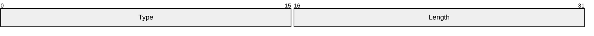

**Type (2 bytes):** A 16-bit, unsigned integer that specifies the type of the PDU that follows the **Length** field.

| Value | Meaning |
| --- | --- |
| ODTYPE_FILTER_STATE_UPDATED 0x0001 | Indicates a [Filter-Updated PDU (OD_FILTER_STATE_UPDATED) (section 2.2.3.1)](#Section_2.2.3.1). |
| ODTYPE_APP_REMOVED 0x0002 | Indicates an [Application-Removed PDU (OD_APP_REMOVED) (section 2.2.3.3)](#Section_2.2.3.3). |
| ODTYPE_APP_CREATED 0x0003 | Indicates an [Application-Created PDU (OD_APP_CREATED) (section 2.2.3.2)](#Section_2.2.3.2). |
| ODTYPE_WND_REMOVED 0x0004 | Indicates a [Window-Removed PDU (OD_WND_REMOVED) (section 2.2.3.5)](#Section_2.2.3.5). |
| ODTYPE_WND_CREATED 0x0005 | Indicates a [Window-Created PDU (OD_WND_CREATED) (section 2.2.3.4)](#Section_2.2.3.4). |
| ODTYPE_WND_SHOW 0x0006 | Indicates a [Show Window PDU (OD_WND_SHOW) (section 2.2.3.6)](#Section_2.2.3.6). |
| ODTYPE_PARTICIPANT_REMOVED 0x0007 | Indicates a [Participant-Removed PDU (OD_PARTICIPANT_REMOVED) (section 2.2.4.2)](#Section_2.2.4.2). |
| ODTYPE_PARTICIPANT_CREATED 0x0008 | Indicates a [Participant-Created PDU (OD_PARTICIPANT_CREATED) (section 2.2.4.1)](#Section_2.2.4.1). |
| ODTYPE_PARTICIPANT_CTRL_CHANGED 0x0009 | Indicates a [Change Participant Control Level PDU (OD_PARTICIPANT_CTRL_CHANGE) (section 2.2.4.3)](#Section_2.2.4.3). |
| ODTYPE_GRAPHICS_STREAM_PAUSED 0x000A | Indicates a [Graphics Stream-Paused PDU (OD_GRAPHICS_STREAM_PAUSED) (section 2.2.5.1)](#Section_2.2.5.1). |
| ODTYPE_GRAPHICS_STREAM_RESUMED 0x000B | Indicates a [Graphics Stream-Resumed PDU (OD_GRAPHICS_STREAM_RESUMED) (section 2.2.5.2)](#Section_2.2.5.2). |
| ODTYPE_WND_RGN_UPDATE 0x000C | Indicates a [Window Region Update PDU (OD_WINDOW_REGION_UPDATE) (section 2.2.3.7)](#Section_2.2.3.7). |
| ODTYPE_PARTICIPANT_CTRL_CHANGE_RESPONSE 0x000D | Indicates a [Change Participant Control Level Response PDU (OD_PARTICIPANT_CTRL_CHANGE_RESPONSE) (section 2.2.4.4)](#Section_2.2.4.4). |

**Length (2 bytes):** A 16-bit, unsigned integer that specifies the length of the data, in bytes, contained by the PDU. This field MUST be the payload size plus the size of the common header and MUST be used in decoding the individual PDUs.

### 2.2.2 Unicode String (UNICODE_STRING)

The Unicode String (UNICODE_STRING) packet is used to pack a variable-length Unicode string.

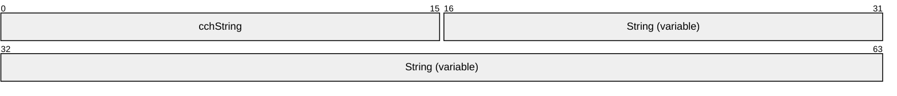

**cchString (2 bytes):** A 16-bit, unsigned integer that specifies the number of [**Unicode characters**](#gt_unicode-character) in the **String** field. The size of each Unicode character is 2 bytes. The value of **cchString** MUST NOT exceed 1,024. If **cchString** is set to 0, then the **String** field MUST NOT be present.

**String (variable):** An array of Unicode characters, equal in length to the value of **cchString** field. The variable-length Unicode string comprises the first n Unicode characters in the **String** field, where n is the lesser of the value of the **cchString** field and the number of characters preceding the first null in the array.

### 2.2.3 Application and Window Filtering

#### 2.2.3.1 Filter-Updated PDU (OD_FILTER_STATE_UPDATED)

The Filter-Updated PDU (OD_FILTER_STATE_UPDATED) is used to inform the [**participants**](#gt_participant) whether application [**filtering**](#gt_filtering) is enabled, as specified in section [3.2.5.1.3](#Section_3.2.5.1.3).

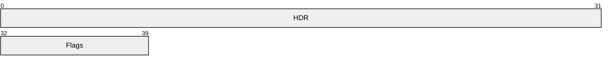

**HDR (4 bytes):** The common [**PDU**](#gt_protocol-data-unit-pdu) header (as specified in section [2.2.1](#Section_2.2.1)). The **Type** field of the common PDU header MUST be set to ODTYPE_FILTER_STATE_UPDATED (0x0001).

**Flags (1 byte):** An 8-bit, unsigned **char** that represents a set of bit flags, in little-endian format, that indicate the state of the filter. A bit is true (or set) if its value is 1. This field MUST be composed of the bitwise OR of one or more of the following values.

| Value | Meaning |
| --- | --- |
| FILTER_ENABLED 0x0001 | The filter is enabled. If this bit is 0 then the filter is disabled. |

#### 2.2.3.2 Application-Created PDU (OD_APP_CREATED)

The Application-Created PDU (OD_APP_CREATED) is sent by the [**sharing manager**](#gt_sharing-manager) to notify participants of newly created applications or other changes in application information. For more information, see section [3.2.5.1.1](#Section_3.2.5.1.1).

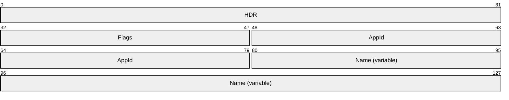

**HDR (4 bytes):** The common [**PDU**](#gt_protocol-data-unit-pdu) header (as specified in [Common Order Header (section 2.2.1)](#Section_2.2.1)). The **Type** field of the common PDU header MUST be set to ODTYPE_APP_CREATED (0x0003).

**Flags (2 bytes):** A 16-bit, unsigned integer that represents a set of bit flags, in little-endian format, that indicate whether an application is shared or not. A bit is true (or set) if its value is 1. This field MUST be composed of the bitwise OR of one or more of the following values.

| Value | Meaning |
| --- | --- |
| APPLICATION_SHARED 0x0001 | The application is shared. |

**AppId (4 bytes):** A 32-bit, unsigned integer that specifies a unique identifier for the application. Implementers are free to choose any integer that uniquely identifies the application within the application list.<1>

**Name (variable):** A [UNICODE_STRING](#Section_2.2.2) that specifies the name of the application. Implementers are free to choose any UNICODE_STRING as the **Name**, and there are no restrictions on allowable characters.<2>

#### 2.2.3.3 Application-Removed PDU (OD_APP_REMOVED)

The Application-Removed PDU (OD_APP_REMOVED) is sent by the [**sharing manager**](#gt_sharing-manager) to notify participants that an application MUST be removed from their application lists. Processing instructions for this PDU are specified in section [3.2.5.1.2](#Section_3.2.5.1.2).

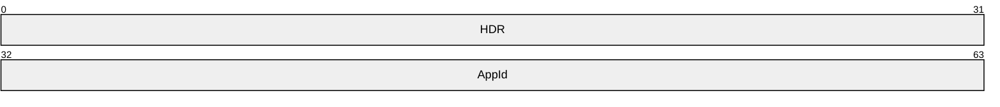

**HDR (4 bytes):** The common [**PDU**](#gt_protocol-data-unit-pdu) header (as specified in [Common Order Header (section 2.2.1)](#Section_2.2.1)). The **Type** field of the common PDU header MUST be set to ODTYPE_APP_REMOVED (0x0002).

**AppId (4 bytes):** The 32-bit, unsigned integer that specifies the **AppId** of the application to be removed. The integer MUST uniquely identify an application in the application list, as specified in the **AppId** field description of [Application-Created PDU (section 2.2.3.2)](#Section_2.2.3.2).

#### 2.2.3.4 Window-Created PDU (OD_WND_CREATED)

The Window-Created PDU (OD_WND_CREATED) is sent by the [**sharing manager**](#gt_sharing-manager) to notify participants that a window was created or updated. Every window MUST be associated with an application. The window MUST have a corresponding unique ID, and subsequent updates for that window data MUST come as Window-Created PDUs with the same ID (as specified in section [3.2.5.1.4](#Section_3.2.5.1.4)).

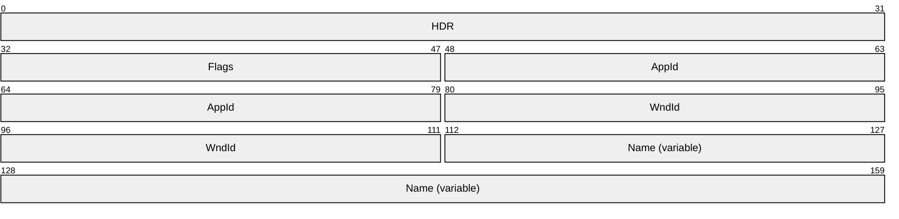

**HDR (4 bytes):** The common [**PDU**](#gt_protocol-data-unit-pdu) header (as specified in section [2.2.1](#Section_2.2.1)). The **Type** field of the common PDU header MUST be set to ODTYPE_WND_CREATED (0x0005).

**Flags (2 bytes):** A 16-bit, unsigned integer that represents a set of bit flags, in little-endian format, that indicate whether a window is shared or not. A bit is true (or set) if its value is 1. This field MUST be composed of the bitwise OR of one or more of the following values.

| Value | Meaning |
| --- | --- |
| WINDOW_SHARED 0x0001 | The window is shared. |

**AppId (4 bytes):** The 32-bit, unsigned integer that specifies the **AppId** of the application that owns the window. The integer MUST uniquely identify an application in the application list, as specified in the **AppId** field description of the [Application-Created PDU (section 2.2.3.2)](#Section_2.2.3.2).

**WndId (4 bytes):** A 32-bit, unsigned integer that specifies the unique ID of the window. Implementers can choose any integer that uniquely identifies the window entry within the window list.<3>

**Name (variable):** A [UNICODE_STRING](#Section_2.2.2) that specifies the name of the window. Implementers can choose any UNICODE_STRING as the **Name**; there are no restrictions on allowable characters.<4>

#### 2.2.3.5 Window-Removed PDU (OD_WND_REMOVED)

The Window-Removed PDU (OD_WND_REMOVED) is sent by the [**sharing manager**](#gt_sharing-manager) to notify participants that a window SHOULD be removed from their window lists (section [3.2.5.1.5](#Section_3.2.5.1.5) ).

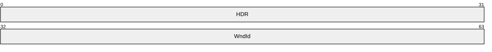

**HDR (4 bytes):** The common [**PDU**](#gt_protocol-data-unit-pdu) header (as specified in [Common Order Header (section 2.2.1)](#Section_2.2.1)). The **Type** field of the common PDU header MUST be set to ODTYPE_WND_REMOVED (0x0004).

**WndId (4 bytes):** A 32-bit, unsigned integer that specifies the **WndId** of the window to be removed. The integer MUST uniquely identify a window in the window list, as specified in the **WndId** field description of the [Window-Created PDU (section 2.2.3.4)](#Section_2.2.3.4).

#### 2.2.3.6 Show Window PDU (OD_WND_SHOW)

The Show Window PDU (OD_WND_SHOW) is sent by a [**participant**](#gt_participant) to request that the [**sharing manager**](#gt_sharing-manager) display one of the shared windows. For instance, this [**PDU**](#gt_protocol-data-unit-pdu) can be used when the participant wants to display the content of a shared window that is minimized and not visible on the [**host**](#gt_host) desktop (section [3.3.5.1.1](#Section_3.3.5.1.1)).

**HDR (4 bytes):** The common PDU header (as specified in [Common Order Header (section 2.2.1)](#Section_2.2.1)). The **Type** field of the common PDU header MUST be set to ODTYPE_WND_SHOW (0x0006).

**WndId (4 bytes):** A 32-bit, unsigned integer that specifies the **WndId** of the window to be displayed. The integer MUST uniquely identify a window in the window list, as specified in the **WndId** field description of the [Window-Created PDU (section 2.2.3.4)](#Section_2.2.3.4).

#### 2.2.3.7 Window Region Update PDU (OD_WND_REGION_UPDATE)

The Window Region Update PDU (OD_WND_REGION_UPDATE) MAY<5> be used by the [**sharing manager**](#gt_sharing-manager) to inform the [**participants**](#gt_participant) that the size of an application window has changed (section [3.2.5.1.6](#Section_3.2.5.1.6)).

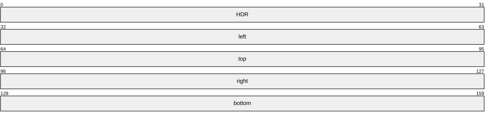

**HDR (4 bytes)**: The common PDU header (as specified in [Common Order Header (section 2.2.1)](#Section_2.2.1)). The Type field of the common PDU header MUST be set to ODTYPE_WND_REGION_UPDATE (0x000C).

**left (4 bytes)**: A 32-bit, unsigned integer. The leftmost bound of the rectangle specifying the application window.

**top (4 bytes)**: A 32-bit, unsigned integer. The upper bound of the rectangle specifying the application window.

**right (4 bytes)**: A 32-bit, unsigned integer. The inclusive rightmost bound of the rectangle specifying the application window.

**bottom (4 bytes)**: A 32-bit, unsigned integer. The inclusive lower bound of the rectangle specifying the application window.

### 2.2.4 Participant Management

The messages in this section are used to create and maintain the list of participants that view and interact with the shared desktop.

#### 2.2.4.1 Participant-Created PDU (OD_PARTICIPANT_CREATED)

The Participant-Created PDU (OD_PARTICIPANT_CREATED) is used by the [**sharing manager**](#gt_sharing-manager) to notify participants that a new [**participant**](#gt_participant) is now receiving the shared desktop. It is also used to notify participants when the [**control level**](#gt_control-level) of a participant has changed (section [3.2.5.2.1](#Section_3.2.5.2.1))

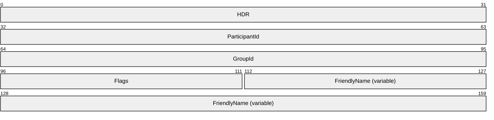

**HDR (4 bytes):** The common PDU header (as specified in [Common Order Header (section 2.2.1)](#Section_2.2.1)). The **Type** field of the common PDU header MUST be set to ODTYPE_PARTICIPANT_CREATED (0x0008).

**ParticipantId (4 bytes):** A 32-bit, unsigned integer that specifies the unique identifier of the participant. The ParticipantId is assigned by the sharing manager.

**GroupId (4 bytes):** A 32-bit, unsigned integer specifying the unique identifier of the group to which the participant belongs. <6>

**Flags (2 bytes):** A 16-bit, unsigned integer that represents a set of bit flags, in little-endian format, that indicate information about a participant. A bit is true (or set) if its value is 1. This field MUST be composed of the bitwise OR of one or more of the following values.

| Value | Meaning |
| --- | --- |
| MAY_VIEW 0x0001 | The participant has permission to view the shared desktop. |
| MAY_INTERACT 0x0002 | The participant has permission to interact with the shared desktop. |
| IS_PARTICIPANT 0x0004 | The PDU that is associated with the participant receiving the message (section 3.2.5.2.1). |

**FriendlyName (variable):** A [UNICODE_STRING](#Section_2.2.2) that specifies the name that is associated with the participant.

#### 2.2.4.2 Participant-Removed PDU (OD_PARTICIPANT_REMOVED)

The Participant-Removed PDU (OD_PARTICIPANT_REMOVED) is used by the [**sharing manager**](#gt_sharing-manager) to inform the participants that a [**participant**](#gt_participant) SHOULD be removed from the participant list (section [3.2.5.2.2](#Section_3.2.5.2.2)).

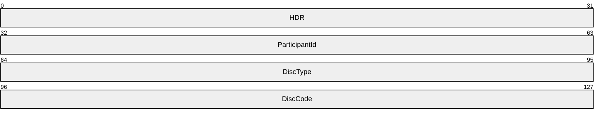

**HDR (4 bytes):** The common [**PDU**](#gt_protocol-data-unit-pdu) header (as specified in [Common Order Header (section 2.2.1)](#Section_2.2.1)). The **Type** field of the common PDU header MUST be set to ODTYPE_PARTICIPANT_REMOVED (0x0007).

**ParticipantId (4 bytes):** A 32-bit, unsigned integer that specifies the unique identifier of the participant.

**DiscType (4 bytes):** A 32-bit, unsigned integer that specifies the disconnect type. Possible values include the following.

| Value | Meaning |
| --- | --- |
| PARTICIPANT_DISCONNECT_REASON_APP 0x00000000 | Indicates that the disconnect was initiated by the [**host**](#gt_host). |
| PARTICIPANT_DISCONNECT_REASON_CLI 0x00000002 | Indicates that the disconnect was initiated by the participant. |

**DiscCode (4 bytes):** A 32-bit, unsigned integer that specifies the reason for the disconnect. A **DiscCode** beginning with 0x8007 (0x8007xxxx) is a Win32 error code. Other **DiscCodes** that begin with 0x8 (0x8xxxxxxx) are [**HRESULT**](#gt_hresult) values other than Win32 error codes, such as a standard OLE value like E_ABORT (0x80004004) or an application-specific value. Other possible values include the following.

| Value | Meaning |
| --- | --- |
| S_OK 0x00000000 | The participant was not disconnected because of an error. |
| 0xD00A0006 | The disconnect occurred because the sharing manager was unable to send data to the participant. |
| 0xD0000001 | The disconnect was the result of an error on the host side. |

#### 2.2.4.3 Change Participant Control Level PDU (OD_PARTICIPANT_CTRL_CHANGE)

The Change Participant Control Level PDU (OD_PARTICIPANT_CTRL_CHANGE) is sent by a [**participant**](#gt_participant) to request a different [**control level**](#gt_control-level). For instance, a view-only participant could ask the [**sharing manager**](#gt_sharing-manager) to change its control level so that it can view and interact with shared content (section [3.3.5.2.3](#Section_3.3.5.2.3)).

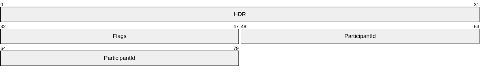

**HDR (4 bytes):** The common [**PDU**](#gt_protocol-data-unit-pdu) header (as specified in [Common Order Header (section 2.2.1)](#Section_2.2.1)). The **Type** field of the common PDU header MUST be set to ODTYPE_PARTICIPANT_CTRL_CHANGE (0x0009).

**Flags (2 bytes):** A 16-bit, unsigned integer that represents a set of bit flags, in little-endian format, that indicate participant requests for permission. A bit is true (or set) if its value is 1. This field MUST be composed of the bitwise OR of one or more of the following values.

| Value | Meaning |
| --- | --- |
| REQUEST_VIEW 0x0001 | The participant is requesting view permission. |
| REQUEST_INTERACT 0x0002 | The participant is requesting interact permission. |
| ALLOW_CONTROL_REQUESTS 0x0008 | The participant is requesting that "permission request" be allowed. |

**ParticipantId (4 bytes):** A 32-bit, unsigned integer that specifies the unique identifier of the participant.

#### 2.2.4.4 Change Participant Control Level Response PDU (OD_PARTICIPANT_CTRL_CHANGE_RESPONSE)

The Change Participant Control Level Response PDU (OD_PARTICIPANT_CTRL_CHANGE_RESPONSE) is sent by the [**sharing manager**](#gt_sharing-manager) to specify a reason for which the [**participant**](#gt_participant) [**control level**](#gt_control-level) change request (section [2.2.4.3](#Section_2.2.4.3)) was either accepted or rejected (section [3.2.5.2.3](#Section_3.2.5.2.3)).

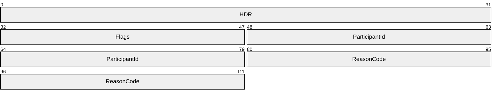

**HDR (4 bytes)**: The common PDU header, as specified in [Common Order Header (section 2.2.1)](#Section_2.2.1). The **Type** field of the common PDU header MUST be set to ODTYPE_PARTICIPANT_CTRL_CHANGE_RESPONSE (0x000D).

**Flags (2 bytes)**: A 16-bit, unsigned integer that represents a set of bit flags, in little-endian format, that indicates participant requests for permission. A bit is true (or set) if its value is 1. This field MUST be composed of the bitwise OR of one or more of the following values.

| Value | Meaning |
| --- | --- |
| REQUEST_VIEW 0x0001 | The participant is requesting view permission. |
| REQUEST_INTERACT 0x0002 | The participant is requesting interact permission. |
| ALLOW_CONTROL_REQUESTS 0x0008 | The participant is requesting that "permission request" be allowed. |

**ParticipantId (4 bytes)**: A 32-bit, unsigned integer that specifies the unique identifier of the participant.

**ReasonCode (4 bytes)**: A 32-bit, unsigned integer that specifies the reason for which a participant control change request was accepted or rejected.

### 2.2.5 Graphics Stream Control

#### 2.2.5.1 Graphics Stream-Paused PDU (OD_GRAPHICS_STREAM_PAUSED)

The Graphics Stream-Paused PDU (OD_GRAPHICS_STREAM_PAUSED) is used by the [**sharing manager**](#gt_sharing-manager) to inform the participants that sharing is suspended (section [3.2.5.3.1](#Section_3.2.5.3.1)).

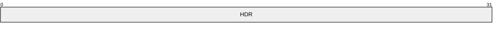

**HDR (4 bytes):** The common [**PDU**](#gt_protocol-data-unit-pdu) header (as specified in [Common Order Header (section 2.2.1)](#Section_2.2.1)). The **Type** field of the common PDU header MUST be set to ODTYPE_GRAPHICS_STREAM_PAUSED (0x000A).

#### 2.2.5.2 Graphics Stream-Resumed PDU (OD_GRAPHICS_STREAM_RESUMED)

The Graphics Stream-Resumed PDU (OD_GRAPHICS_STREAM_RESUMED) is used by the [**sharing manager**](#gt_sharing-manager) to inform the participants that desktop sharing has resumed (section [3.2.5.3.2](#Section_3.2.5.3.2)).

**HDR (4 bytes):** The common [**PDU**](#gt_protocol-data-unit-pdu) header (as specified in [Common Order Header (section 2.2.1)](#Section_2.2.1)). The **Type** field of the common PDU header MUST be set to ODTYPE_GRAPHICS_STREAM_RESUMED (0x000B).

# 3 Protocol Details

The following sections specify details of the Remote Desktop Protocol: Multiparty Virtual Channel Extension, including abstract data models and message processing rules.

## 3.1 Common Details

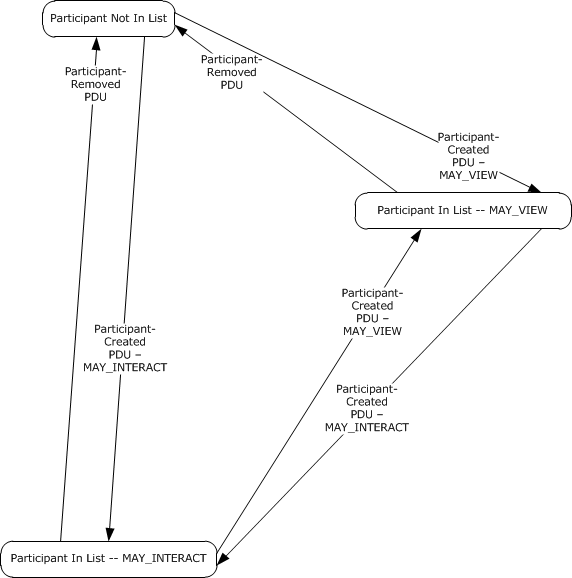

Figure 1: Participant Handling of Participant-Created and Participant-Removed Messages

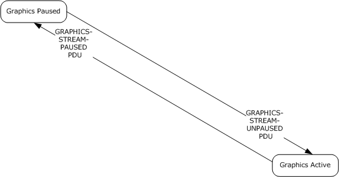

Figure 2: Participant Handling of GRAPHICS-STREAM-UNPAUSED and GRAPHICS-STREAM-PAUSED PDUs

### 3.1.1 Abstract Data Model

This section describes a conceptual model of possible data organization that an implementation maintains to participate in this protocol. The described organization is provided to facilitate the explanation of how the protocol behaves. This document does not mandate that implementations adhere to this model as long as their external behavior is consistent with that described in this document.

This protocol allows a [**host**](#gt_host) to propagate [**participant**](#gt_participant), application, and window lists and any updates to these lists. Updates to applications, windows, and participant lists are communicated to the clients via the same [**PDUs**](#gt_protocol-data-unit-pdu) that are used to announce the creation of these elements. For instance, if an application title changes, the server sends an [Application-Created PDU](#Section_4.1.5) that corresponds to that application.

A client SHOULD maintain application, window, and participant lists. A client MAY instead choose to use the information in participant, application, and window messages only to display notifications or it MAY completely ignore the messages. For instance, if an application does not want to show the participant list to the user, it MAY silently discard [Participant-Created](#Section_4.1.2) and [Participant-Removed](#Section_4.1.3) messages.

A host MUST preserve each participant's current control level and the status on whether or not sharing is currently suspended.

Because the notifications for both created and updated applications use the same messages, clients SHOULD distinguish between the two. A client does this by checking whether it already has a record for the unique ID associated with the PDU.

### 3.1.2 Timers

No timers are used.

### 3.1.3 Initialization

Before messages can be sent, the static virtual channel MUST be established by using the parameters specified in section [2.1](#Section_2.1).

### 3.1.4 Higher-Layer Triggered Events

No higher-layer triggered events are used.

### 3.1.5 Message-Processing Events and Sequencing Rules

#### 3.1.5.1 Processing the Common PDU Header

The **Type** field (as specified in [Common Order Header (ORDER_HDR) (section 2.2.1)](#Section_2.2.1)) MUST be examined to determine if it corresponds to a known message type. If the type does not correspond to a known message type, the [**PDU**](#gt_protocol-data-unit-pdu) SHOULD be ignored.<7> If the type matches a known type, the processing for the **Length** field (see Common Order Header (ORDER_HDR) (section 2.2.1)) MUST be performed based on the value of the **Type** field, as described in the following table.

| Bit Range | Field | Description |
| --- | --- | --- |
| Variable | ODTYPE_FILTER_STATE_UPDATED 0x0001 | [Processing a Filter-Updated PDU (section 3.2.5.1.3)](#Section_3.2.5.1.3) |
| Variable | ODTYPE_APP_REMOVED 0x0002 | [Processing an Application-Removed PDU (section 3.2.5.1.2)](#Section_3.2.5.1.2) |
| Variable | ODTYPE_APP_CREATED 0x0003 | [Processing an Application-Created PDU (section 3.2.5.1.1)](#Section_3.2.5.1.1) |
| Variable | ODTYPE_WND_REMOVED 0x0004 | [Processing a Window-Removed PDU (section 3.2.5.1.5)](#Section_3.2.5.1.5) |
| Variable | ODTYPE_WND_CREATED 0x0005 | [Processing a Window-Created PDU (section 3.2.5.1.4)](#Section_3.2.5.1.4) |
| Variable | ODTYPE_WND_SHOW 0x0006 | [Processing a Show Window PDU (section 3.3.5.1.1)](#Section_3.3.5.1.1) |
| Variable | ODTYPE_PARTICIPANT_REMOVED 0x0007 | [Processing a Participant-Removed PDU (section 3.2.5.2.2)](#Section_3.2.5.2.2) |
| Variable | ODTYPE_PARTICIPANT_CREATED 0x0008 | [Processing a Participant-Created PDU (section 3.2.5.2.1)](#Section_3.2.5.2.1) |
| Variable | ODTYPE_PARTICIPANT_CTRL_CHANGE 0x0009 | [Processing the Change Participant Control Level PDU (section 3.3.5.2.3)](#Section_3.3.5.2.3) |
| Variable | ODTYPE_GRAPHICS_STREAM_PAUSED 0x000A | [Processing a Graphics Stream-Paused PDU (section 3.2.5.3.1)](#Section_3.2.5.3.1) |
| Variable | ODTYPE_GRAPHICS_STREAM_RESUMED 0x000B | [Processing a Graphics Stream-Resumed PDU (section 3.2.5.3.2)](#Section_3.2.5.3.2) |
| Variable | ODTYPE_WND_REGION_UPDATE 0x000C | [Processing a Window Region Update PDU (section 3.2.5.1.6)](#Section_3.2.5.1.6) |
| Variable | ODTYPE_PARTICIPANT_CTRL_CHANGE_RESPONSE 0x000D | [Processing the Change Participant Control Level Response PDU (section 3.2.5.2.3)](#Section_3.2.5.2.3) |

More than one sharing message can be contained in a single virtual channel payload. If more than one message is included, they are concatenated, with each message having its own common message header. When processing a message, the receiver MUST verify that enough network data remains in the virtual channel packet to process a message of the size specified by the **Length** field. The receiver SHOULD disconnect from the sharing session if there is not enough data.<8>

#### 3.1.5.2 Processing UNICODE_STRING Fields

Some messages in the Remote Desktop Protocol: Multiparty Virtual Channel Extension contain [UNICODE_STRING (section 2.2.2)](#Section_2.2.2) packets. These are variable size fields with the length described by the **cchString** member. Upon receiving a message that contains a nonzero length UNICODE_STRING, the receiver MUST validate the string by doubling the value of the **cchString** field to convert to bytes and then check whether there are sufficient bytes left in the message to account for the presence of the string, plus any additional fields.

#### 3.1.5.3 Processing Application, Window, and Participant IDs

When an [Application-Created](#Section_4.1.5) message is received, the client SHOULD check its application list to see if it contains a record for the value in the **AppId** field. If no record exists, the client MUST create a record that contains the application ID, the name of the application, and the shared state. If a record with the ID exists in the list, the client MUST replace the information in that record with the information in the message. When an [Application-Removed](#Section_4.1.6) message is received, the client MUST remove the record with the corresponding ID from its list. If no such record exists, the client MUST silently discard the message.

Window messages and [**participant**](#gt_participant) messages SHOULD be handled exactly as described in the preceding paragraph.

Application IDs are also used to identify which applications own which windows. The [**sharing manager**](#gt_sharing-manager) SHOULD send the client an Application-Created PDU before it sends any [Window-Created PDUs](#Section_2.2.3.4) for that application. This allows a client to maintain both a global window list and a list of windows per application. Because windows are tied to applications, a window's life span is limited by the life span of the application to which it is associated. The sharing manager SHOULD send [Window-Removed PDUs](#Section_2.2.3.5) before sending the Application-Removed PDU for the application to which the window corresponds. If the client receives an Application-Removed PDU, it SHOULD remove any window from the window list with an **AppId** that corresponds to the application removed.

### 3.1.6 Timer Events

None.

### 3.1.7 Other Local Events

None.

## 3.2 Participant Details

### 3.2.1 Abstract Data Model

Refer to the common details abstract data model in section [3.1.1](#Section_3.1.1).

### 3.2.2 Timers

None.

### 3.2.3 Initialization

Before messages can be sent, the static virtual channel MUST be established by using the parameters specified in section [2.1](#Section_2.1).

### 3.2.4 Higher-Layer Triggered Events

None.

### 3.2.5 Message-Processing Events and Sequencing Rules

#### 3.2.5.1 Application and Window Filtering

##### 3.2.5.1.1 Processing an Application-Created PDU

The receiver of an [Application-Created PDU (OD_APP_CREATED)](#Section_4.1.5) MUST first validate the common header for consistency (as specified in section [3.1.5.1](#Section_3.1.5.1)).

After the header is validated, the receiver MUST validate the **Name** field according to the rules specified in section [3.1.5.2](#Section_3.1.5.2). If the size of the received [**PDU**](#gt_protocol-data-unit-pdu) extends past the end of the **Name** string, the receiver SHOULD ignore the rest of the PDU (the part that extends past the end of the PDU is reserved for future extensions of the message). If the PDU size is not long enough to contain all the fields in the message, including the variable size **Name** field, the connection SHOULD be terminated.<9><10>

If the receiver wants to use the application and window list facilities of this protocol, it SHOULD process the information according to section [3.1.5.3](#Section_3.1.5.3).

##### 3.2.5.1.2 Processing an Application-Removed PDU

The receiver of an [Application-Removed PDU (OD_APP_REMOVED)](#Section_4.1.6) MUST first validate the common header for consistency (section [3.1.5.1](#Section_3.1.5.1)). If the [**PDU**](#gt_protocol-data-unit-pdu) size is not long enough to contain all the fields in the message, the connection SHOULD be terminated.<11>

If the receiver wants to use the application and window list facilities of this protocol, it SHOULD process the information according to section [3.1.5.3](#Section_3.1.5.3).

##### 3.2.5.1.3 Processing a Filter-Updated PDU

The receiver of the [Filter-Updated PDU (OD_FILTER_STATE_UPDATED) (section 2.2.3.1)](#Section_2.2.3.1) MUST first validate the common header for consistency (section [3.1.5.1](#Section_3.1.5.1)). If the [**PDU**](#gt_protocol-data-unit-pdu) size is not long enough to contain all the fields in the message, the connection SHOULD be terminated.<12>

After the header is validated, the receiver MUST read the **Flags** field to determine whether application and windowing [**filtering**](#gt_filtering) are enabled by the [**sharing manager**](#gt_sharing-manager) (see Filter-Updated PDU (OD_FILTER_STATE_UPDATED) (section 2.2.3.1)). The receiver SHOULD also remove all the windows and applications that it lists, because the sharing manager is about to send an updated list.<13>

##### 3.2.5.1.4 Processing a Window-Created PDU

The receiver of the [Window-Created PDU (OD_WND_CREATED) (section 2.2.3.4)](#Section_2.2.3.4) MUST validate the common header for consistency (section [3.1.5.1](#Section_3.1.5.1)). If the [**PDU**](#gt_protocol-data-unit-pdu) size is not long enough to contain all the fields in the message, the connection SHOULD be terminated.<14> After the header is validated, the receiver MUST validate the **Name** field according to the rules described in section [3.1.5.2](#Section_3.1.5.2).

If the receiver wants to use the application and window list facilities of this protocol, it SHOULD process the information according to section [3.1.5.3](#Section_3.1.5.3).

##### 3.2.5.1.5 Processing a Window-Removed PDU

The receiver of the [Window-Removed PDU (OD_WND_REMOVED) (section 2.2.3.5)](#Section_2.2.3.5) MUST first validate the common header for consistency (section [3.1.5.1](#Section_3.1.5.1)). If the [**PDU**](#gt_protocol-data-unit-pdu) size is not long enough to contain all the fields in the message, the connection SHOULD be terminated.<15>

If the receiver wants use the application and window list facilities of this protocol, it SHOULD process the information according to section [3.1.5.3](#Section_3.1.5.3).

##### 3.2.5.1.6 Processing a Window Region Update PDU

The receiver of the [Window Region Update PDU (OD_WND_REGION_UPDATE) (section 2.2.3.7)](#Section_2.2.3.7) MUST first validate the common header for consistency (section [3.1.5.1](#Section_3.1.5.1)). If the [**PDU**](#gt_protocol-data-unit-pdu) size is not long enough to contain all the fields in the message, the connection SHOULD be terminated.<16>

Receipt of this PDU indicates that the application window size has changed. The PDU is stateless and has no sequencing rules.

#### 3.2.5.2 Participant Management

##### 3.2.5.2.1 Processing a Participant-Created PDU

The receiver of the [Participant-Created PDU (OD_PARTICIPANT_CREATED) (section 2.2.4.1)](#Section_2.2.4.1) MUST verify the common header for consistency (section [3.1.5.1](#Section_3.1.5.1)). If the [**PDU**](#gt_protocol-data-unit-pdu) size is not long enough to contain all the fields in the message, the connection SHOULD be terminated.<17>

After the header is validated, the receiver MUST validate the **Name** field according to the rules specified in section [3.1.5.2](#Section_3.1.5.2).

If the IS_PARTICIPANT flag is set, the recipient SHOULD remember this information because it indicates that the message refers to the [**participant**](#gt_participant) itself.<18>

If the IS_PARTICIPANT flag is not set, this indicates that the message refers to a participant other than the recipient of the message.

If the **GroupId** field is not zero, the recipient SHOULD use this information to identify the group to which the user belongs.<19>

If the receiver wants to use the Participant list facilities of this protocol, it SHOULD process the information according to section [3.1.5.3](#Section_3.1.5.3).

##### 3.2.5.2.2 Processing a Participant-Removed PDU

The receiver of the [Participant-Removed PDU (OD_PARTICIPANT_REMOVED) (section 2.2.4.2)](#Section_2.2.4.2) MUST first validate the common header for consistency (section [3.1.5.1](#Section_3.1.5.1)). If the [**PDU**](#gt_protocol-data-unit-pdu) size is not long enough to contain all the fields in the message, the connection SHOULD be terminated.<20>

If the receiver wants to use the Participant list facilities of this protocol, it SHOULD process the window removal information according to the windows implementation described in section [3.1.5.3](#Section_3.1.5.3).

The [**participant**](#gt_participant) MAY check the **DiscType** and **DiscCode** fields to determine if the participant was disconnected as a result of an error.<21>

##### 3.2.5.2.3 Processing the Change Participant Control Level Response PDU

The receiver of the [Change Participant Control Level Response PDU (OD_PARTICIPANT_CTRL_CHANGE_RESPONSE) (section 2.2.4.4)](#Section_2.2.4.4) MUST first validate the common header for consistency (section [3.1.5.1](#Section_3.1.5.1)). If the PDU size is not long enough to contain all the fields in the message, the connection SHOULD be terminated.<22>

After validating the common header, the receiver SHOULD verify that the **ParticipantId** field is valid.

The [**participant**](#gt_participant) SHOULD check the **ReasonCode** field to determine why the change participant control level request was accepted or rejected.

#### 3.2.5.3 Graphics Stream Control

##### 3.2.5.3.1 Processing a Graphics Stream-Paused PDU

The receiver of the [Graphics Stream-Paused PDU (OD_GRAPHICS_STREAM_PAUSED) (section 2.2.5.1)](#Section_2.2.5.1) MUST verify the common header for consistency (section [3.1.5.1](#Section_3.1.5.1)). If the [**PDU**](#gt_protocol-data-unit-pdu) size is not long enough to contain all the fields in the message, the connection SHOULD be terminated.<23>

Receipt of this PDU indicates that the [**sharing manager**](#gt_sharing-manager) has suspended the graphic stream (as specified in section [1.3.1.3](#Section_1.3.1.3)). The PDU is stateless and has no sequencing rules.

##### 3.2.5.3.2 Processing a Graphics Stream-Resumed PDU

The receiver of the [Graphics Stream-Resumed PDU (OD_GRAPHICS_STREAM_RESUMED) (section 2.2.5.2)](#Section_2.2.5.2) MUST first validate the common header for consistency (section [3.1.5.1](#Section_3.1.5.1)). If the [**PDU**](#gt_protocol-data-unit-pdu) size is not long enough to contain all the fields in the message, the connection SHOULD be terminated.<24>

Receipt of this PDU indicates that the graphic stream is no longer paused (section [1.3.1.3](#Section_1.3.1.3)). The PDU is stateless and has no sequencing rules.

### 3.2.6 Timer Events

None.

### 3.2.7 Other Local Events

None.

## 3.3 Sharing Manager Details

### 3.3.1 Abstract Data Model

Refer to the common details abstract data model in section [3.1.1](#Section_3.1.1).

### 3.3.2 Timers

None.

### 3.3.3 Initialization

Before messages can be sent, the static virtual channel MUST be established by using the parameters specified in section [2.1](#Section_2.1).

### 3.3.4 Higher-Layer Triggered Events

None.

### 3.3.5 Message Processing Events and Sequencing Rules

#### 3.3.5.1 Application and Window Filtering

##### 3.3.5.1.1 Processing the Show Window PDU

The receiver of the [Show Window PDU (OD_WND_SHOW) (section 2.2.3.6)](#Section_2.2.3.6) MUST verify the common header for consistency (section [3.1.5.1](#Section_3.1.5.1)). If the [**PDU**](#gt_protocol-data-unit-pdu) size is not long enough to contain all the fields in the message, the connection SHOULD be terminated.<25>

The **WndId** field in the PDU MUST specify the window that the [**participant**](#gt_participant) wants to view. The [**sharing manager**](#gt_sharing-manager) SHOULD <26> validate the **WndId** field against the existing windows and SHOULD <27> verify that the participant is entitled to make that request before granting it.

#### 3.3.5.2 Participant Management

##### 3.3.5.2.1 Processing a Participant-Created PDU

See section [3.2.5.2.1](#Section_3.2.5.2.1).<28>

##### 3.3.5.2.2 Processing a Participant-Removed PDU

See section [3.2.5.2.2](#Section_3.2.5.2.2).<29>

##### 3.3.5.2.3 Processing the Change Participant Control Level PDU

The receiver of the [Change Participant Control Level PDU (OD_PARTICIPANT_CTRL_CHANGE) (section 2.2.4.3)](#Section_2.2.4.3) MUST first validate the common header for consistency (section [3.1.5.1](#Section_3.1.5.1)). If the [**PDU**](#gt_protocol-data-unit-pdu) size is not long enough to contain all the fields in the message, the connection SHOULD be terminated.<30>

After validating the common header, the receiver SHOULD apply the permissions requested in the **Flags** field to the participant specified in the **ParticipantId** field, and SHOULD verify that the participant is entitled to the requested permissions before granting the request.

Upon granting the request, the recipient SHOULD notify participants by sending a [Participant-Created PDU (OD_PARTICIPANT_CREATED) (section 2.2.4.1)](#Section_2.2.4.1) reflecting the new permission granted.

### 3.3.6 Timer Events

None.

### 3.3.7 Other Local Events

None.

# 4 Protocol Examples

The following sections describe several operations that are used in common scenarios to illustrate the function of the Remote Desktop Protocol: Multiparty Virtual Channel Extension.

## 4.1 Sharing Manager-Generated PDUs

### 4.1.1 Filter-Updated PDU 1

The following is a network capture of the [Filter-Updated PDU (OD_FILTER_STATE_UPDATED) (section 2.2.3.1)](#Section_2.2.3.1).

OD_FILTER_STATE_UPDATED

00000000 01 00 05 00 00 .....

01 00 -> OD_FILTER_STATE_UPDATED: ORDER_HDR : Type = 01

05 00 -> OD_FILTER_STATE_UPDATED: ORDER_HDR : Length = 05

00 -> OD_FILTER_STATE_UPDATED: Flags = 0

### 4.1.2 Participant-Created PDU

The following are network captures of the [Participant-Created PDU (OD_PARTICIPANT_CREATED) (section 2.2.4.1)](#Section_2.2.4.1).

This is the [**PDU**](#gt_protocol-data-unit-pdu) sent to the [**participant**](#gt_participant) that is being added. The IS_PARTICIPANT flag is set.

OD_PARTICIPANT_CREATED

00000000 08 00 24 00 00 00 00 00 00 00 00 00 04 00 0A 00

..$.............

00000010 54 00 45 00 53 00 54 00 55 00 53 00 45 00 52 00

T.E.S.T.U.S.E.R.

00000020 30 00 32 00 0.2.

08 00 -> OD_PARTICIPANT_CREATED: ORDER_HDR: Type

24 00 -> OD_PARTICIPANT_CREATED: ORDER_HDR: Length

00 00 00 00 -> OD_PARTICIPANT_CREATED: ParticipantId = 0

00 00 00 00 -> OD_PARTICIPANT_CREATED: GroupId = 0

04 00 -> OD_PARTICIPANT_CREATED: Flags = IS_PARTICIPANT

0A 00 -> OD_PARTICIPANT_CREATED: UNICODE_STRING : cchString = 10

54 00 45 00 53 00 54 00 55 00 53 00 45 00 52 00 30 00 32 00

-> OD_PARTICIPANT_CREATED: UNICODE_STRING: String "TESTUSER02"

This network capture shows the PDU sent to notify other participants of the new participant. It has the IS_PARTICIPANT flag set to 0.

OD_PARTICIPANT_CREATED

00000000 08 00 24 00 00 00 00 00 00 00 00 00 00 00 0A 00

..$.............

00000010 54 00 45 00 53 00 54 00 55 00 53 00 45 00 52 00

T.E.S.T.U.S.E.R.

00000020 30 00 32 00 0.2.

08 00 -> OD_PARTICIPANT_CREATED: ORDER_HDR: Type = 8

(OD_PARTICIPANT_CREATED)

24 00 -> OD_PARTICIPANT_CREATED: ORDER_HDR: Length = 36

00 00 00 00 -> OD_PARTICIPANT_CREATED: ParticipantId = 0

00 00 00 00 -> OD_PARTICIPANT_CREATED: GroupId = 0

00 00 -> OD_PARTICIPANT_CREATED: Flags = 0

0A 00 -> OD_PARTICIPANT_CREATED: UNICODE_STRING : cchString = 10

54 00 45 00 53 00 54 00 55 00 53 00 45 00 52 00 30 00 32 00

-> OD_PARTICIPANT_CREATED: UNICODE_STRING: String "TESTUSER02"

This network capture shows the PDU sent to notify a participant of a change to its current [**control level**](#gt_control-level). Note that the flag indicates permission to view only.

OD_PARTICIPANT_CREATED

00000000 08 00 24 00 00 00 00 00 00 00 00 00 01 00 0A 00

..$.............

00000010 54 00 45 00 53 00 54 00 55 00 53 00 45 00 52 00

T.E.S.T.U.S.E.R.

00000020 30 00 32 00 0.2.

08 00 -> OD_PARTICIPANT_CREATED: ORDER_HDR: Type = 08

(OD_PARTICIPANT_CREATED)

24 00 -> OD_PARTICIPANT_CREATED: ORDER_HDR: Length = 36

00 00 00 00 -> OD_PARTICIPANT_CREATED: ParticipantId = 0

00 00 00 00 -> OD_PARTICIPANT_CREATED: GroupId = 0

01 00 -> OD_PARTICIPANT_CREATED: Flags = 1 MAY_VIEW

0A 00 -> OD_PARTICIPANT_CREATED: UNICODE_STRING : cchString = 10

54 00 45 00 53 00 54 00 55 00 53 00 45 00 52 00 30 00 32 00

-> OD_PARTICIPANT_CREATED: UNICODE_STRING: String "TESTUSER02"

### 4.1.3 Participant-Removed PDU

The following is a network capture of the [Participant-Removed PDU (OD_PARTICIPANT_REMOVED) (section 2.2.4.2)](#Section_2.2.4.2). This [**PDU**](#gt_protocol-data-unit-pdu) is sent to all participants to notify them that a participant has been removed.

OD_PARTICIPANT_REMOVED

00000000 07 00 10 00 00 00 00 00 00 00 00 00 06 00 0A D0 ................

07 00 -> OD_PARTICIPANT_REMOVED: ORDER_HDR: Type = 07

(OD_PARTICIPANT_REMOVED)

10 00 -> OD_PARTICIPANT_REMOVED: ORDER_HDR: Length = 16

00 00 00 00 -> OD_PARTICIPANT_REMOVED: ParticipantId = 0

00 00 00 00 -> OD_PARTICIPANT_REMOVED: DiscType = 0

(Server initiated disconnect).

06 00 0A D0 -> OD_PARTICIPANT_REMOVED: DiscCode =

0xD00A0006 (Could not send data to the participant)

### 4.1.4 Filter-Updated PDU 2

The following are network captures of the [Filter-Updated PDU (OD_FILTER_STATE_UPDATED) (section 2.2.3.1)](#Section_2.2.3.1). This [**PDU**](#gt_protocol-data-unit-pdu) is sent to notify participants of the filter's current status.

OD_FILTER_STATE_UPDATED

00000000 01 00 05 00 01 .....

01 00 -> OD_FILTER_STATE_UPDATED: ORDER_HDR : Type = 01

(OD_FILTER_STATE_UPDATED)

05 00 -> OD_FILTER_STATE_UPDATED: ORDER_HDR : Length = 05

01 -> OD_FILTER_STATE_UPDATED: Flags = FILTER_ENABLED

This network capture shows the PDU sent with FILTER_ENABLED set to 0.

OD_FILTER_STATE_UPDATED

00000000 01 00 05 00 00 .....

01 00 -> OD_FILTER_STATE_UPDATED: ORDER_HDR : Type = 01

(OD_FILTER_STATE_UPDATED)

05 00 -> OD_FILTER_STATE_UPDATED: ORDER_HDR : Length = 05

00 -> OD_FILTER_STATE_UPDATED: Flags = 0

### 4.1.5 Application-Created PDU

The following is a network capture of the [Application-Created PDU (OD_APP_CREATED) (section 2.2.3.2)](#Section_2.2.3.2). This PDU is sent to notify participants that an application has been created.

OD_APP_CREATED

00000000 03 00 14 00 01 00 EC 0A 00 00 04 00 63 00 61 00

............c.a.

00000010 6C 00 63 00 l.c.

03 00 -> OD_APP_CREATED: ORDER_HDR : Type = 03 (OD_APP_CREATED)

14 00 -> OD_APP_CREATED: ORDER_HDR : Length = 20

01 00 -> OD_APP_CREATED: Flags = APPLICATION_SHARED

EC 0A 00 00 ->OD_APP_CREATED: AppId = 2796

04 00 -> OD_APP_CREATED: UNICODE_STRING : cchString = 4

63 00 61 00 6C 00 63 00 -> OD_APP_CREATED: UNICODE_STRING String : "calc"

### 4.1.6 Application-Removed PDU

The following is a network capture of the [Application-Removed PDU (OD_APP_REMOVED) (section 2.2.3.3)](#Section_2.2.3.3). This PDU is sent to notify participants that an application has been removed.

OD_APP_REMOVED

00000000 02 00 08 00 90 0C 00 00 ........

02 00 -> OD_APP_REMOVED: ORDER_HDR : Type = 02 (OD_APP_REMOVED)

08 00 -> OD_APP_REMOVED: ORDER_HDR : Length = 08

90 0C 00 00 -> OD_APP_REMOVED: AppId = 3216

### 4.1.7 Window-Created PDU

The following is a wire capture of the [Window-Created PDU (OD_WND_CREATED) (section 2.2.3.4)](#Section_2.2.3.4). This PDU is sent to notify participants that a window has been created.

OD_WND_CREATED

00000000 05 00 24 00 00 00 EC 0A 00 00 96 03 1C 00 0A 00

..$.............

00000010 43 00 61 00 6C 00 63 00 75 00 6C 00 61 00 74 00

C.a.l.c.u.l.a.t.

00000020 6F 00 72 00 o.r.

05 00 -> OD_WND_CREATED: ORDER_HDR : Type = 05 (OD_WND_CREATED)

24 00 -> OD_WND_CREATED: ORDER_HDR : Length = 36

00 00 -> OD_WND_CREATED: Flags = Bit#0 not set so the window is

not shared

EC 0A 00 00 ->OD_WND_CREATED: AppId = 2796

96 03 1C 00 ->OD_WND_CREATED: WndId = 1835926

0A 00 -> OD_WND_CREATED: UNICODE_STRING : cchString = 10

43 00 61 00 6C 00 63 00 75 00 6C 00 61 00 74 00 6F 00 72 00->

OD_WND_CREATED: UNICODE_STRING String : "Calculator"

### 4.1.8 Window-Removed PDU

The following is a wire capture of the [Window-Removed PDU (OD_WND_REMOVED) (section 2.2.3.5)](#Section_2.2.3.5). This PDU is sent to notify participants that a window has been removed.

OD_WND_REMOVED

00000000 04 00 08 00 96 03 1C 00 ........

04 00 -> OD_WND_REMOVED: ORDER_HDR : Type = 04 (OD_WND_REMOVED)

08 00 -> OD_WND_REMOVED: ORDER_HDR : Length = 08

96 03 1C 00 ->OD_WND_REMOVED: WndId = 1835926

### 4.1.9 Request Control Level Change Response PDU

The following is a network capture of the [Change Participant Control Level Response PDU (OD_PARTICIPANT_CTRL_CHANGE_RESPONSE) (section 2.2.4.4)](#Section_2.2.4.4). This PDU is sent in response to a [Change Participant Control Level PDU (OD_PARTICIPANT_CTRL_CHANGE) (section 2.2.4.3)](#Section_2.2.4.3).

OD_PARTICIPANT_CTRL_CHANGE_RESPONSE

00000000 0D 00 0E 00 03 00 00 00 00 01 00 00 00 00

OD_PARTICIPANT_CTRL_CHANGE_RESPONSE

0D 00 -> OD_PARTICIPANT_CTRL_CHANGE_RESPONSE: ORDER_HDR : Type = 0D

(OD_PARTICIPANT_CTRL_CHANGE_RESPONSE)

0E 00 -> OD_PARTICIPANT_CTRL_CHANGE_RESPONSE: ORDER_HDR : Length = 14

03 00 -> OD_PARTICIPANT_CTRL_CHANGE_RESPONSE: Flags = REQUEST_VIEW

and REQUEST_INTERACT

00 00 00 01 -> OD_PARTICIPANT_CTRL_CHANGE_RESPONSE: ParticipantId = 1

00 00 00 00 -> OD_PARTICIPANT_CTRL_CHANGE_RESPONSE: ReasonCode = 0

### 4.1.10 Window Region Update PDU

The following is a network capture of the [Window Region Update PDU (OD_WND_REGION_UPDATE) (section 2.2.3.7)](#Section_2.2.3.7). This PDU is sent to notify [**participants**](#gt_participant) that an application-window rectangle has changed.

OD_WND_REGION_UPDATE

00000000 0C 00 14 00 31 01 00 00 5B 00 00 00 D3 02 00 00

..$.............

00000010 BD 02 00 00

OD_WND_REGION_UPDATE

OC 00 -> OD_WND_REGION_UPDATE: ORDER_HDR : Type = OC

(OD_WND_REGION_UPDATE)

14 00 -> OD_WND_REGION_UPDATE: ORDER_HDR : Length = 20

31 01 00 00 -> OD_WND_REGION_UPDATE : Left = 305

5B 00 00 00 -> OD_WND_REGION_UPDATE : Top = 91

D3 02 00 00 -> OD_WND_REGION_UPDATE : Right = 723

BD 02 00 00 -> OD_WND_REGION_UPDATE : Bottom = 701

## 4.2 Participant-Generated PDUs

### 4.2.1 Request Control Level Change PDU

The following is a network capture of the [Change Participant Control Level PDU (OD_PARTICIPANT_CTRL_CHANGE) (section 2.2.4.3)](#Section_2.2.4.3). The [**participant**](#gt_participant) is requesting permission to view and interact with the applications.

OD_PARTICIPANT_CTRL_CHANGE

00000000 09 00 0A 00 03 00 00 00 00 00

OD_PARTICIPANT_CTRL_CHANGE

09 00 -> OD_PARTICIPANT_CTRL_CHANGE: ORDER_HDR : Type = 09

(OD_PARTICIPANT_CTRL_CHANGE)

0A 00 -> OD_PARTICIPANT_CTRL_CHANGE: ORDER_HDR : Length = 10

03 00 -> OD_PARTICIPANT_CTRL_CHANGE: Flags = REQUEST_VIEW

and REQUEST_INTERACT

00 00 00 00 00 -> OD_PARTICIPANT_CTRL_CHANGE: ParticipantId = 0

### 4.2.2 Request Show Window PDU

The following is a wire capture of the [Show Window PDU (OD_WND_SHOW) (section 2.2.3.6)](#Section_2.2.3.6).

OD_WND_SHOW

00000000 06 00 08 00 96 03 1C 00 ........

06 00 -> OD_WND_SHOW: ORDER_HDR : Type = 06 (OD_WND_SHOW)

08 00 -> OD_WND_SHOW: ORDER_HDR : Length = 08

96 03 1C 00 ->OD_WND_SHOW: WndId = 1835926

# 5 Security

The following sections specify security considerations for implementers of the Remote Desktop Protocol: Multiparty Virtual Channel Extension.

## 5.1 Security Considerations for Implementers

There are no security considerations for protocol messages as all static virtual channel traffic is encrypted, as specified in [MS-RDPBCGR](../MS-RDPBCGR/MS-RDPBCGR.md).

## 5.2 Index of Security Parameters

None.

# 6 Appendix A: Product Behavior

The information in this specification is applicable to the following Microsoft products or supplemental software. References to product versions include updates to those products.

- Windows Vista operating system
- Windows Server 2008 operating system
- Windows 7 operating system
- Windows Server 2008 R2 operating system
- Windows 8 operating system
- Windows Server 2012 operating system
- Windows 8.1 operating system
- Windows Server 2012 R2 operating system
- Windows 10 operating system
- Windows Server 2016 operating system
- Windows Server operating system
- Windows Server 2019 operating system
- Windows Server 2022 operating system
- Windows 11 operating system
- Windows Server 2025 operating system
Exceptions, if any, are noted in this section. If an update version, service pack or Knowledge Base (KB) number appears with a product name, the behavior changed in that update. The new behavior also applies to subsequent updates unless otherwise specified. If a product edition appears with the product version, behavior is different in that product edition.

Unless otherwise specified, any statement of optional behavior in this specification that is prescribed using the terms "SHOULD" or "SHOULD NOT" implies product behavior in accordance with the SHOULD or SHOULD NOT prescription. Unless otherwise specified, the term "MAY" implies that the product does not follow the prescription.

<1> Section 2.2.3.2: Windows sets the application identifier to the application's system process ID.

<2> Section 2.2.3.2: In the Windows implementation, the process name is used as the name for an application.

<3> Section 2.2.3.4: In the Windows implementation, the window handle value, which uniquely identifies a window within the Windows operating system, is used as the **WndId**.

<4> Section 2.2.3.4: In the Windows implementation, the window title is used as the window name.

<5> Section 2.2.3.7: In Windows implementations, the sharing manager does not send the Window Region Update PDU (OD_WND_REGION_UPDATE).

<6> Section 2.2.4.1: In Windows implementations, the **GroupId** field is set to 0 by the sharing manager.

<7> Section 3.1.5.1: In Windows implementations, [**PDUs**](#gt_protocol-data-unit-pdu) that have an unknown type in the order header are ignored by the receivers.

<8> Section 3.1.5.1: Windows implementations disconnect the client whenever the header length field is not consistent with the length required for a particular message or with the length of the buffer received from the lower-layer protocol.

<9> Section 3.2.5.1.1: In Windows implementations, if more data is received for a message than the receiver can parse, the receiver parses only the portion of the data that it is able to parse and ignores the rest. For every type of message, the size of the received data is verified to make sure that the message is large enough to contain all the fields for that particular message. If this is not the case, the connection is terminated.

<10> Section 3.2.5.1.1: In Windows implementations, the Name field is optional. If the Name field is not sent then the connection is not terminated.

<11> Section 3.2.5.1.2: In Windows implementations, if more data is received for a message than the receiver can parse, the receiver parses only the portion of the data that it is able to parse and ignores the rest. For every type of message, the size of the received data is verified to make sure that the message is large enough to contain all the fields for that particular message. If this is not the case, the connection is terminated.

<12> Section 3.2.5.1.3: In Windows implementation, if more data is received for a message than the receiver can parse, the receiver parses only the portion of the data that it is able to parse and ignores the rest. For every type of message, the size of the received data is verified to make sure that the message is large enough to contain all the fields for that particular message. If this is not the case, the connection is terminated.

<13> Section 3.2.5.1.3: In Windows implementations, all the window and application data stored by the receiver is removed when a [Filter-Updated PDU](#Section_4.1.1) is received, as the [**sharing manager**](#gt_sharing-manager) is about to send an updated list.

<14> Section 3.2.5.1.4: In Windows implementations, if more data is received for a message than the receiver can parse, the receiver parses only the portion of the data that it is able to parse and ignores the rest. For every type of message, the size of the received data is verified to make sure that the message is large enough to contain all the fields for that particular message. If this is not the case, the connection is terminated.

<15> Section 3.2.5.1.5: In Windows implementations, if more data is received for a message than the receiver can parse, the receiver parses only the portion of the data that it is able to parse and ignores the rest. For every type of message, the size of the received data is verified to make sure that the message is big enough to contain all the fields for that particular message. If this is not the case, the connection is terminated.

<16> Section 3.2.5.1.6: In Windows implementations, if more data is received for a message than the receiver can parse, the receiver parses only the portion of the data that it is able to parse and ignores the rest. For every type of message, the size of the received data is verified to make sure that the message is large enough to contain all the fields for that particular message. If this is not the case, the connection is terminated.

<17> Section 3.2.5.2.1: In Windows implementations, if more data is received for a message than the receiver can parse, the receiver parses only the portion of the data that it is able to parse and ignores the rest. For every type of message, the size of the received data is verified to make sure that the message is large enough to contain all the fields for that particular message. If this is not the case, the connection is terminated.

<18> Section 3.2.5.2.1: When a client is connected and authenticated, the server tries to inform the client which participant in the list corresponds to the client itself. This communication is done by sending a [Participant-Created PDU](#Section_4.1.2) to only that client but with the IS_PARTICIPANT set to 1. The client verifies the presence of the flag and remembers the **ParticipantId** as corresponding to itself.

<19> Section 3.2.5.2.1: In Windows implementations, the **GroupId** field is not interpreted by the participant.

<20> Section 3.2.5.2.2: In Windows implementations, if more data is received for a message than the receiver can parse, the receiver parses only the portion of the data that it is able to parse and ignores the rest. For every type of message, the size of the received data is verified to make sure that the message is large enough to contain all the fields for that particular message. If this is not the case, the connection is terminated.

<21> Section 3.2.5.2.2: Windows does not parse the **DiscType** and **DiscCode** fields.

<22> Section 3.2.5.2.3: In Windows implementations, if more data is received for a message than the receiver can parse, the receiver parses only the portion of the data that it is able to parse and ignores the rest. For every type of message, the size of the received data is verified to make sure that the message is large enough to contain all the fields for that particular message. If this is not the case, the connection is terminated.

<23> Section 3.2.5.3.1: In Windows implementations, if more data is received for a message than the receiver can parse, the receiver parses only the portion of the data the receiver knows how to parse and ignores the rest. For every type of message, the size of the received data is verified to make sure that the message is large enough to contain all the fields for that particular message. If this is not the case, the connection is terminated.

<24> Section 3.2.5.3.2: In Windows implementations, if more data is received for a message than the receiver can parse, the receiver parses only the portion of the data that it is able to parse and ignores the rest. For every type of message, the size of the received data is verified to make sure that the message is large enough to contain all the fields for that particular message. If this is not the case, the connection is terminated.

<25> Section 3.3.5.1.1: In Windows implementations, if more data is received for a message than the receiver can parse, the receiver parses only the portion of the data that it is able to parse and ignores the rest. For every type of message, the size of the received data is verified to make sure that the message is large enough to contain all the fields for that particular message. If this is not the case, the connection is terminated.

<26> Section 3.3.5.1.1: In Windows implementations, the server keeps all the windows of interest in a list. When the client requests that a window be displayed, the server checks if the window is in the list. If the window is in the list, the server attempts to show the window. Otherwise, the message is ignored.

<27> Section 3.3.5.1.1: In Windows implementations, the server verifies that the client sending the message has the right to interact with the desktop before showing the window. If the client does not have the right to interact with the desktop, the message is ignored.

<28> Section 3.3.5.2.1: In Windows implementations, a Participant-Created PDU (OD_PARTICIPANT_CREATED) is not sent by the participant.

<29> Section 3.3.5.2.2: In Windows implementations, a Participant-Removed PDU (OD_PARTICIPANT_REMOVED) is neither sent by the participant nor interpreted by the sharing manager.

<30> Section 3.3.5.2.3: In Windows implementation, if more data is received for a message than the receiver can parse, the receiver parses only the portion of the data that it is able to parse and ignores the rest. For every type of message, the size of the received data is verified to make sure that the message is large enough to contain all the fields for that particular message. If this is not the case, the connection is terminated.

Also in Windows implementations, a value of ALLOW_CONTROL_REQUEST in the **Flags** field is not sent by the participant and not interpreted by the sharing manager.

# 7 Change Tracking

This section identifies changes that were made to this document since the last release. Changes are classified as Major, Minor, or None.

The revision class **Major** means that the technical content in the document was significantly revised. Major changes affect protocol interoperability or implementation. Examples of major changes are:

- A document revision that incorporates changes to interoperability requirements.
- A document revision that captures changes to protocol functionality.
The revision class **Minor** means that the meaning of the technical content was clarified. Minor changes do not affect protocol interoperability or implementation. Examples of minor changes are updates to clarify ambiguity at the sentence, paragraph, or table level.

The revision class **None** means that no new technical changes were introduced. Minor editorial and formatting changes may have been made, but the relevant technical content is identical to the last released version.

The changes made to this document are listed in the following table. For more information, please contact [dochelp@microsoft.com](mailto:dochelp@microsoft.com).

| Section | Description | Revision class |
| --- | --- | --- |
| [6](#Section_6) Appendix A: Product Behavior | Added Windows Server 2025 to the list of applicable products. | Major |

## Revision History

| Date | Version | Revision Class | Comments |
| --- | --- | --- | --- |
| 2/22/2007 | 0.01 | New | Version 0.01 release |
| 6/1/2007 | 1.0 | Major | Updated and revised the technical content. |
| 7/3/2007 | 1.0.1 | Editorial | Changed language and formatting in the technical content. |
| 7/20/2007 | 1.0.2 | Editorial | Changed language and formatting in the technical content. |
| 8/10/2007 | 1.0.3 | Editorial | Changed language and formatting in the technical content. |
| 9/28/2007 | 1.0.4 | Editorial | Changed language and formatting in the technical content. |
| 10/23/2007 | 1.0.5 | Editorial | Changed language and formatting in the technical content. |
| 11/30/2007 | 1.0.6 | Editorial | Changed language and formatting in the technical content. |
| 1/25/2008 | 1.0.7 | Editorial | Changed language and formatting in the technical content. |
| 3/14/2008 | 1.0.8 | Editorial | Changed language and formatting in the technical content. |
| 5/16/2008 | 1.0.9 | Editorial | Changed language and formatting in the technical content. |
| 6/20/2008 | 1.1 | Minor | Clarified the meaning of the technical content. |
| 7/25/2008 | 1.1.1 | Editorial | Changed language and formatting in the technical content. |
| 8/29/2008 | 1.1.2 | Editorial | Changed language and formatting in the technical content. |
| 10/24/2008 | 1.2 | Minor | Clarified the meaning of the technical content. |
| 12/5/2008 | 2.0 | Major | Updated and revised the technical content. |
| 1/16/2009 | 2.0.1 | Editorial | Changed language and formatting in the technical content. |
| 2/27/2009 | 2.0.2 | Editorial | Changed language and formatting in the technical content. |
| 4/10/2009 | 2.0.3 | Editorial | Changed language and formatting in the technical content. |
| 5/22/2009 | 3.0 | Major | Updated and revised the technical content. |
| 7/2/2009 | 3.1 | Minor | Clarified the meaning of the technical content. |
| 8/14/2009 | 3.2 | Minor | Clarified the meaning of the technical content. |
| 9/25/2009 | 3.3 | Minor | Clarified the meaning of the technical content. |
| 11/6/2009 | 4.0 | Major | Updated and revised the technical content. |
| 12/18/2009 | 5.0 | Major | Updated and revised the technical content. |
| 1/29/2010 | 6.0 | Major | Updated and revised the technical content. |
| 3/12/2010 | 6.0.1 | Editorial | Changed language and formatting in the technical content. |
| 4/23/2010 | 6.0.2 | Editorial | Changed language and formatting in the technical content. |
| 6/4/2010 | 6.0.3 | Editorial | Changed language and formatting in the technical content. |
| 7/16/2010 | 6.0.3 | None | No changes to the meaning, language, or formatting of the technical content. |
| 8/27/2010 | 6.0.3 | None | No changes to the meaning, language, or formatting of the technical content. |
| 10/8/2010 | 6.0.3 | None | No changes to the meaning, language, or formatting of the technical content. |
| 11/19/2010 | 7.0 | Major | Updated and revised the technical content. |
| 1/7/2011 | 7.0 | None | No changes to the meaning, language, or formatting of the technical content. |
| 2/11/2011 | 7.1 | Minor | Clarified the meaning of the technical content. |
| 3/25/2011 | 8.0 | Major | Updated and revised the technical content. |
| 5/6/2011 | 8.0 | None | No changes to the meaning, language, or formatting of the technical content. |
| 6/17/2011 | 8.1 | Minor | Clarified the meaning of the technical content. |
| 9/23/2011 | 8.1 | None | No changes to the meaning, language, or formatting of the technical content. |
| 12/16/2011 | 9.0 | Major | Updated and revised the technical content. |
| 3/30/2012 | 9.0 | None | No changes to the meaning, language, or formatting of the technical content. |
| 7/12/2012 | 9.0 | None | No changes to the meaning, language, or formatting of the technical content. |
| 10/25/2012 | 9.0 | None | No changes to the meaning, language, or formatting of the technical content. |
| 1/31/2013 | 9.0 | None | No changes to the meaning, language, or formatting of the technical content. |
| 8/8/2013 | 9.0 | None | No changes to the meaning, language, or formatting of the technical content. |
| 11/14/2013 | 9.0 | None | No changes to the meaning, language, or formatting of the technical content. |
| 2/13/2014 | 9.0 | None | No changes to the meaning, language, or formatting of the technical content. |
| 5/15/2014 | 9.0 | None | No changes to the meaning, language, or formatting of the technical content. |
| 6/30/2015 | 10.0 | Major | Significantly changed the technical content. |
| 10/16/2015 | 10.0 | None | No changes to the meaning, language, or formatting of the technical content. |
| 7/14/2016 | 11.0 | Major | Significantly changed the technical content. |
| 6/1/2017 | 11.0 | None | No changes to the meaning, language, or formatting of the technical content. |
| 9/15/2017 | 12.0 | Major | Significantly changed the technical content. |
| 12/1/2017 | 12.0 | None | No changes to the meaning, language, or formatting of the technical content. |
| 9/12/2018 | 13.0 | Major | Significantly changed the technical content. |
| 4/7/2021 | 14.0 | Major | Significantly changed the technical content. |
| 6/25/2021 | 15.0 | Major | Significantly changed the technical content. |
| 4/23/2024 | 16.0 | Major | Significantly changed the technical content. |
