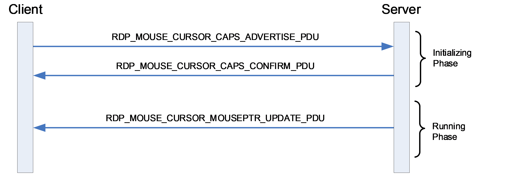
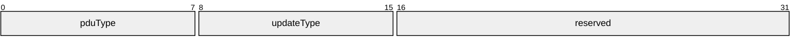
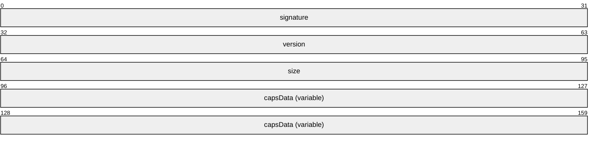
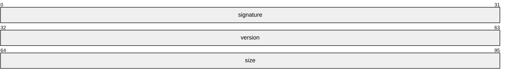
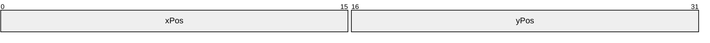
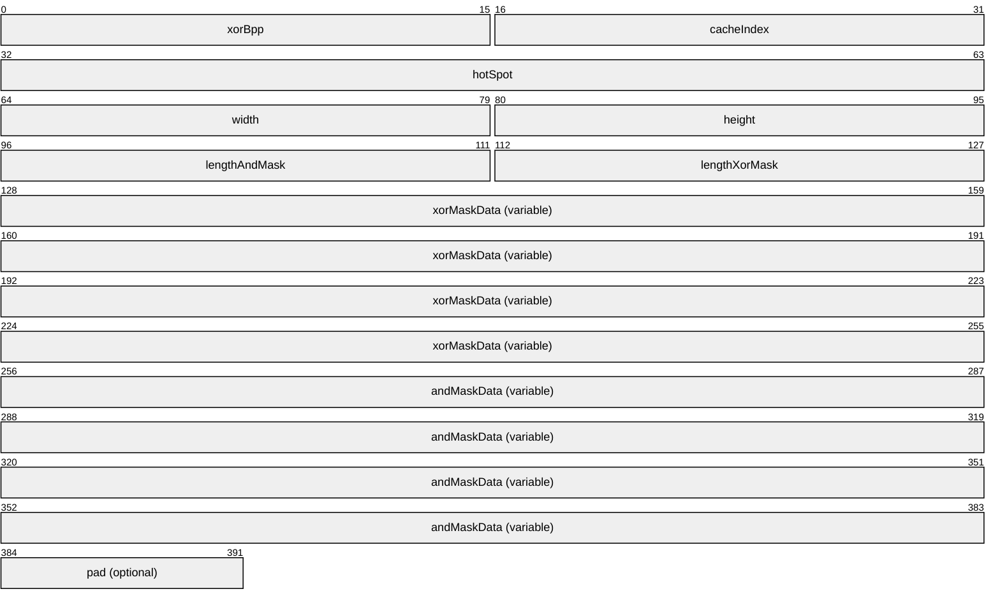
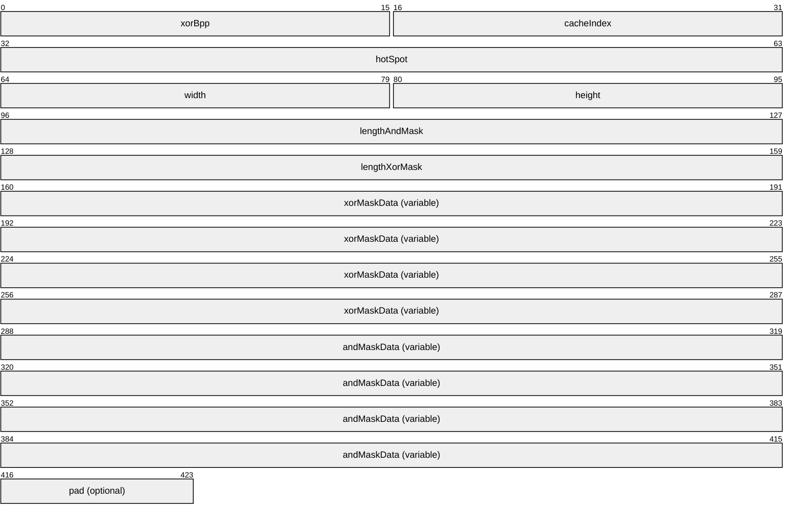
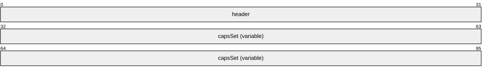
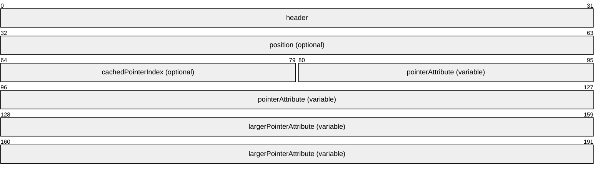

# [MS-RDPEMSC]: Remote Desktop Protocol: Mouse Cursor Virtual Channel Extension

Table of Contents

1 Introduction

- [1 Introduction](#Section_1)
  - [1.1 Glossary](#Section_1.1)
  - [1.2 References](#Section_1.2)
    - [1.2.1 Normative References](#Section_1.2.1)
    - [1.2.2 Informative References](#Section_1.2.2)
  - [1.3 Overview](#Section_1.3)
  - [1.4 Relationship to Other Protocols](#Section_1.4)
  - [1.5 Prerequisites/Preconditions](#Section_1.5)
  - [1.6 Applicability Statement](#Section_1.6)
  - [1.7 Versioning and Capability Negotiation](#Section_1.7)
  - [1.8 Vendor-Extensible Fields](#Section_1.8)
  - [1.9 Standards Assignments](#Section_1.9)

2 Messages

- [2 Messages](#Section_2)
  - [2.1 Transport](#Section_2.1)
  - [2.2 Message Syntax](#Section_2.2)
    - [2.2.1 Namespaces](#Section_2.2.1)
    - [2.2.2 Common Data Types](#Section_2.2.2)
      - [2.2.2.1 RDP_MOUSE_CURSOR_HEADER](#Section_2.2.2.1)
      - [2.2.2.2 RDP_MOUSE_CURSOR_CAPSET](#Section_2.2.2.2)
      - [2.2.2.3 Capability Sets](#Section_2.2.2.3)
        - [2.2.2.3.1 RDP_MOUSE_CURSOR_CAPSET_VERSION1](#Section_2.2.2.3.1)
      - [2.2.2.4 TS_POINT16](#Section_2.2.2.4)
      - [2.2.2.5 TS_POINTERATTRIBUTE](#Section_2.2.2.5)
      - [2.2.2.6 TS_LARGEPOINTERATTRIBUTE](#Section_2.2.2.6)
    - [2.2.3 Messages](#Section_2.2.3)
      - [2.2.3.1 RDP_MOUSE_CURSOR_CAPS_ADVERTISE_PDU](#Section_2.2.3.1)
      - [2.2.3.2 RDP_MOUSE_CURSOR_CAPS_CONFIRM_PDU](#Section_2.2.3.2)
      - [2.2.3.3 RDP_MOUSE_CURSOR_MOUSEPTR_UPDATE_PDU](#Section_2.2.3.3)

3 Protocol Details

- [3 Protocol Details](#Section_3)
  - [3.1 Common Details](#Section_3.1)
    - [3.1.1 Abstract Data Model](#Section_3.1.1)
    - [3.1.2 Timers](#Section_3.1.2)
    - [3.1.3 Initialization](#Section_3.1.3)
    - [3.1.4 Higher-Layer Triggered Events](#Section_3.1.4)
    - [3.1.5 Message Processing Events and Sequencing Rules](#Section_3.1.5)
      - [3.1.5.1 Processing a Mouse Cursor Message](#Section_3.1.5.1)
    - [3.1.6 Timer Events](#Section_3.1.6)
    - [3.1.7 Other Local Events](#Section_3.1.7)
  - [3.2 Server Details](#Section_3.2)
    - [3.2.1 Abstract Data Model](#Section_3.2.1)
      - [3.2.1.1 Pointer Image Cache](#Section_3.2.1.1)
    - [3.2.2 Timers](#Section_3.2.2)
    - [3.2.3 Initialization](#Section_3.2.3)
    - [3.2.4 Higher-Layer Triggered Events](#Section_3.2.4)
    - [3.2.5 Message Processing Events and Sequencing Rules](#Section_3.2.5)
      - [3.2.5.1 Processing an RDP_MOUSE_CURSOR_CAPS_ADVERTISE_PDU Message](#Section_3.2.5.1)
      - [3.2.5.2 Sending an RDP_MOUSE_CURSOR_CAPS_CONFIRM_PDU Message](#Section_3.2.5.2)
      - [3.2.5.3 Sending an RDP_MOUSE_CURSOR_MOUSEPTR_UPDATE_PDU Message](#Section_3.2.5.3)
    - [3.2.6 Timer Events](#Section_3.2.6)
    - [3.2.7 Other Local Events](#Section_3.2.7)
  - [3.3 Client Details](#Section_3.3)
    - [3.3.1 Abstract Data Model](#Section_3.3.1)
      - [3.3.1.1 Pointer Image Cache](#Section_3.3.1.1)
    - [3.3.2 Timers](#Section_3.3.2)
    - [3.3.3 Initialization](#Section_3.3.3)
    - [3.3.4 Higher-Layer Triggered Events](#Section_3.3.4)
    - [3.3.5 Message Processing Events and Sequencing Rules](#Section_3.3.5)
      - [3.3.5.1 Sending an RDP_MOUSE_CURSOR_CAPS_ADVERTISE_PDU Message](#Section_3.3.5.1)
      - [3.3.5.2 Processing an RDP_MOUSE_CURSOR_CAPS_CONFIRM_PDU Message](#Section_3.3.5.2)
      - [3.3.5.3 Processing an RDP_MOUSE_CURSOR_MOUSEPTR_UPDATE_PDU Message](#Section_3.3.5.3)
    - [3.3.6 Timer Events](#Section_3.3.6)
    - [3.3.7 Other Local Events](#Section_3.3.7)

4 Protocol Examples

- [4 Protocol Examples](#Section_4)
  - [4.1 Capabilities Exchange](#Section_4.1)
    - [4.1.1 RDP_MOUSE_CURSOR_CAPS_ADVERTISE_PDU](#Section_4.1.1)
    - [4.1.2 RDP_MOUSE_CURSOR_CAPS_CONFIRM_PDU](#Section_4.1.2)
  - [4.2 Mouse Pointer Updates](#Section_4.2)
    - [4.2.1 RDP_MOUSE_CURSOR_MOUSEPTR_UPDATE_PDU with TS_POINT16](#Section_4.2.1)
    - [4.2.2 RDP_MOUSE_CURSOR_MOUSEPTR_UPDATE_PDU with TS_POINTERATTRIBUTE](#Section_4.2.2)

5 Security

- [5 Security](#Section_5)
  - [5.1 Security Considerations for Implementers](#Section_5.1)
  - [5.2 Index of Security Parameters](#Section_5.2)

6 Appendix A: Product Behavior

- [6 Appendix A: Product Behavior](#Section_6)

7 Change Tracking

- [7 Change Tracking](#Section_7)

For the legal notice and IP terms, see [LEGAL.md](../LEGAL.md).
Last updated: 4/23/2024.
See [Revision History](#revision-history) for full version history.

# 1 Introduction

The Remote Desktop Protocol Mouse Cursor Virtual Channel Extension (RDPEMSC) is an extension of [MS-RDPBCGR](../MS-RDPBCGR/MS-RDPBCGR.md), which runs over a dynamic virtual channel, as defined in [MS-RDPEDYC](../MS-RDPEDYC/MS-RDPEDYC.md). RDPEMSC is used to redirect the mouse cursor from the terminal server to the terminal client. It replaces the Server Pointer Update PDU (TS_POINTER_PDU) message in [MS-RDPBCGR].

Sections 1.5, 1.8, 1.9, 2, and 3 of this specification are normative. All other sections and examples in this specification are informative.

## 1.1 Glossary

This document uses the following terms:

**little-endian**: Multiple-byte values that are byte-ordered with the least significant byte stored in the memory location with the lowest address.

**MAY, SHOULD, MUST, SHOULD NOT, MUST NOT:** These terms (in all caps) are used as defined in [[RFC2119]](https://go.microsoft.com/fwlink/?LinkId=90317). All statements of optional behavior use either MAY, SHOULD, or SHOULD NOT.

## 1.2 References

Links to a document in the Microsoft Open Specifications library point to the correct section in the most recently published version of the referenced document. However, because individual documents in the library are not updated at the same time, the section numbers in the documents may not match. You can confirm the correct section numbering by checking the [Errata](https://go.microsoft.com/fwlink/?linkid=850906).

### 1.2.1 Normative References

We conduct frequent surveys of the normative references to assure their continued availability. If you have any issue with finding a normative reference, please contact [dochelp@microsoft.com](mailto:dochelp@microsoft.com). We will assist you in finding the relevant information.

[MS-RDPBCGR] Microsoft Corporation, "[Remote Desktop Protocol: Basic Connectivity and Graphics Remoting](../MS-RDPBCGR/MS-RDPBCGR.md)".

[MS-RDPEDYC] Microsoft Corporation, "[Remote Desktop Protocol: Dynamic Channel Virtual Channel Extension](../MS-RDPEDYC/MS-RDPEDYC.md)".

[RFC2119] Bradner, S., "Key words for use in RFCs to Indicate Requirement Levels", BCP 14, RFC 2119, March 1997, [https://www.rfc-editor.org/info/rfc2119](https://go.microsoft.com/fwlink/?LinkId=90317)

### 1.2.2 Informative References

None.

## 1.3 Overview

The Remote Desktop Protocol: Mouse Cursor Virtual Channel (RDPESMC) Extension is used to send mouse cursor shapes and position updates from the terminal server to the terminal client and replaces the slow-path and fast-path mouse pointer updates described in [MS-RDPBCGR](../MS-RDPBCGR/MS-RDPBCGR.md) section 2.2.9.1.

The RDPEMSC extension replaces the TS_POINTER_PDU message ([MS-RDPBCGR] section 2.2.9.1.1.4) and the following commands from the TS_FP_UPDATE message ([MS-RDPBCGR] section 2.2.9.1.2.1):

- FASTPATH_UPDATETYPE_PTR_NULL ([MS-RDPBCGR] section 2.2.9.1.2.1.5)
- FASTPATH_UPDATETYPE_PTR_DEFAULT ([MS-RDPBCGR] section 2.2.9.1.2.1.6)
- FASTPATH_UPDATETYPE_PTR_POSITION ([MS-RDPBCGR] section 2.2.9.1.2.1.4)
- FASTPATH_UPDATETYPE_COLOR ([MS-RDPBCGR] section 2.2.9.1.2.1.7)
- FASTPATH_UPDATETYPE_CACHED ([MS-RDPBCGR] section 2.2.9.1.2.1.9)
- FASTPATH_UPDATETYPE_POINTER ([MS-RDPBCGR] section 2.2.9.1.2.1.8)
Shape changes that are applied to the mouse cursor by the remote operating system or applications are captured by the server, are encoded and sent on the wire to the client. Upon receiving the shape update data, the client modifies the appearance of the local mouse cursor representation accordingly. In a similar manner, any operating system or application-triggered mouse movement in the remote session is captured by the server, encoded and sent on the wire to the client so that the local mouse cursor representation can be moved as needed.

An example message flow encapsulating all the input messages described in section [2.2.3](#Section_2.2.3) and protocol phases is presented in the following figure.

Figure 1: Messages exchanged by the mouse cursor shape protocol endpoints

The mouse cursor protocol is divided into two distinct phases:

- Initializing Phase
- Running Phase
The Initializing Phase occurs at the start of the connection. During this phase, the server and client exchange capabilities using the RDP_MOUSE_CURSOR_CAPS_ADVERTISE_PDU (section [2.2.3.1](#Section_2.2.3.1)) and RDP_MOUSE_CURSOR_CAPS_CONFIRM_PDU (section [2.2.3.2](#Section_2.2.3.2)) messages. The client initiates this exchange when the dynamic virtual channel (sections [1.4](#Section_1.4) and [2.1](#Section_2.1)) over which the mouse cursor messages will flow has been opened.

Once both endpoints are ready, the Running Phase is entered. During this phase, the server sends the mouse shape and position updates to the client encapsulated in the RDP_MOUSE_CURSOR_MOUSEPTR_UPDATE_PDU (section [2.2.3.3](#Section_2.2.3.3)) message. The client decodes these messages and updates the local mouse cursor representation accordingly.

## 1.4 Relationship to Other Protocols

The Remote Desktop Protocol: Mouse Cursor Virtual Channel Extension is embedded in a dynamic virtual channel transport, as described in [MS-RDPEDYC](../MS-RDPEDYC/MS-RDPEDYC.md) sections 1 to 3.

The Remote Desktop Protocol: Mouse Cursor Virtual Channel Extension replaces the TS_POINTER_PDU described in [MS-RDPBCGR](../MS-RDPBCGR/MS-RDPBCGR.md) section 2.2.9.1.1.4.

## 1.5 Prerequisites/Preconditions

The Remote Desktop Protocol: Mouse Cursor Virtual Channel Extension (RDPEMSC) operates only after the dynamic virtual channel transport (RDPEDYC) is fully established. If the dynamic virtual channel transport is terminated, RDPEMSC is also terminated. The protocol is terminated by closing the underlying virtual channel. For details about closing the dynamic virtual channel, see [MS-RDPEDYC](../MS-RDPEDYC/MS-RDPEDYC.md) section 3.2.5.2.This protocol is message-based and assumes preservation of the packet. It does not allow for fragmentation. Packet reassembly is based on the information provided by the underlying dynamic virtual channel transport. This document assumes that packet chunks have already been reassembled.

## 1.6 Applicability Statement

The Remote Desktop Protocol: Mouse Cursor Virtual Channel Extension is applicable in scenarios where the mouse cursor shape and position must be kept in sync between a remote session hosted on a terminal server and a terminal server client rendering and providing mouse input to the session.

## 1.7 Versioning and Capability Negotiation

During the initializing phase, the client and server exchange capabilities using the RDP_MOUSE_CURSOR_CAPS_ADVERTISE_PDU (section [2.2.3.1](#Section_2.2.3.1)) and RDP_MOUSE_CURSOR_CAPS_CONFIRM_PDU (section [2.2.3.2](#Section_2.2.3.2)) messages. The client initiates this exchange when the dynamic virtual channel (sections [1.4](#Section_1.4) and [2.1](#Section_2.1)) over which the core input messages will flow has been opened.

## 1.8 Vendor-Extensible Fields

None.

## 1.9 Standards Assignments

None.

# 2 Messages

## 2.1 Transport

The Remote Desktop Protocol: Mouse Cursor Virtual Channel Extension is designed to operate over a dynamic virtual channel, as specified in [MS-RDPEDYC](../MS-RDPEDYC/MS-RDPEDYC.md) sections 1 to 3. The dynamic virtual channel name is the null-terminated ANSI character string "Microsoft::Windows::RDS::MouseCursor". The usage of channel names in the context of opening a dynamic virtual channel is specified in [MS-RDPEDYC] section 2.2.2.1.

## 2.2 Message Syntax

The following sections specify the Remote Desktop Protocol: Mouse Cursor Virtual Channel Extension message syntax. All multiple-byte fields within a message MUST be marshaled in [**little-endian**](#gt_little-endian) byte order, unless otherwise specified.

### 2.2.1 Namespaces

### 2.2.2 Common Data Types

#### 2.2.2.1 RDP_MOUSE_CURSOR_HEADER

The **RDP_MOUSE_CURSOR_HEADER** structure is included in all mouse cursor PDUs. This structure is used to identify the PDU type and specify the update type of the RDP_MOUSE_CURSOR_MOUSEPTR_UPDATE_PDU (section [2.2.3.3](#Section_2.2.3.3)) message that follows.

**pduType (1 byte):** An 8-bit, unsigned integer that identifies the type of the mouse cursor PDU.

| **Value** | **Meaning** |
| --- | --- |
| PDUTYPE_CS_CAPS_ADVERTISE 0x01 | RDP_MOUSE_CURSOR_CAPS_ADVERTISE_PDU (section [2.2.3.1](#Section_2.2.3.1)) |
| PDUTYPE_SC_CAPS_CONFIRM 0x02 | RDP_MOUSE_CURSOR_CAPS_CONFIRM_PDU (section [2.2.3.2](#Section_2.2.3.2)) |
| PDUTYPE_SC_MOUSEPTR_UPDATE 0x03 | RDP_MOUSE_CURSOR_MOUSEPTR_UPDATE_PDU (section 2.2.3.3) |

**updateType (1 byte):** An 8-bit, unsigned integer. If the **pduType** field is set to PDUTYPE_SC_MOUSEPTR_UPDATE (0x03), then this field MUST contain an update type code.

| **Value** | **Meaning** |
| --- | --- |
| TS_UPDATETYPE_MOUSEPTR_SYSTEM_NULL 0x05 | Indicates that the local mouse cursor representation MUST be hidden by the client. |
| TS_UPDATETYPE_MOUSEPTR_SYSTEM_DEFAULT 0x06 | Indicates that the shape of the local mouse cursor representation MUST be set to the operating system default by the client. |
| TS_UPDATETYPE_MOUSEPTR_POSITION 0x08 | Indicates that the position of the local mouse cursor representation MUST be updated by the client. Position data is present in the **position** field of the RDP_MOUSE_CURSOR_MOUSEPTR_UPDATE_PDU (section 2.2.3.3) payload that follows the header. |
| TS_UPDATETYPE_MOUSEPTR_CACHED 0x0A | Indicates that the shape of the local mouse cursor representation MUST be updated by the client using cached pointer data. Cache slot data is present in the **cachedPointerIndex** field of the RDP_MOUSE_CURSOR_MOUSEPTR_ UPDATE_PDU payload that follows the header. |
| TS_UPDATETYPE_MOUSEPTR_POINTER 0x0B | Indicates that the shape of the local mouse cursor representation MUST be updated by the client. Pointer data is present in the **pointerAttribute** field of the RDP_MOUSE_CURSOR_MOUSEPTR_UPDATE_PDU payload that follows the header. |
| TS_UPDATETYPE_MOUSEPTR_LARGE_POINTER 0x0C | Indicates that the shape of the local mouse cursor representation MUST be updated by the client. Pointer data is present in the **largePointerAttribute** field of the RDP_MOUSE_CURSOR_MOUSEPTR_UPDATE_PDU payload that follows the header. |

For all other values of **pduType**, this field MUST be set to zero.

**reserved (2 bytes):** A 16-bit, unsigned integer that SHOULD be set to zero.

#### 2.2.2.2 RDP_MOUSE_CURSOR_CAPSET

The **RDP_MOUSE_CAPSET** structure specifies the layout of a capability set sent in the RDP_MOUSE_CURSOR_CAPS_ADVERTISE_PDU (section [2.2.3.1](#Section_2.2.3.1)) message. All the capability sets specified in section [2.2.2.3](#Section_2.2.2.3) conform to this basic structure.

**signature (4 bytes):** A 32-bit, unsigned integer that MUST be set to 0x53504143.

**version (4 bytes):** A 32-bit, unsigned integer that specifies the version of the capability set.

| Value | Meaning |
| --- | --- |
| RDP_MOUSE_CURSOR_CAPVERSION_1 0x00000001 | RDP_MOUSE_CURSOR_CAPSET_VERSION1 (section [2.2.2.3.1](#Section_2.2.2.3.1)) |

The format of the data in the **capsData** field and the overall length of the capability set are both determined by the version of the capability set.

**size (4 bytes):** A 32-bit, unsigned integer that specifies the size, in bytes, of the capability set.

**capsData (variable):** A variable-length array of bytes that contains data specific to the capability set.

#### 2.2.2.3 Capability Sets

##### 2.2.2.3.1 RDP_MOUSE_CURSOR_CAPSET_VERSION1

The **RDP_MOUSE_CURSOR_CAPSET_VERSION1** structure is used to define capabilities for version 1 of the mouse cursor protocol and conforms to the capability set layout specified in section [2.2.2.2](#Section_2.2.2.2).

**signature (4 bytes):** A 32-bit, unsigned integer that MUST be set to 0x53504143.

**version (4 bytes):** A 32-bit, unsigned integer that MUST be set to RDP_MOUSE_CURSOR_CAPVERSION_1 (0x00000001).

**size (4 bytes):** A 32-bit, unsigned integer that specifies the size in bytes of the capability set. This field MUST be set to 0x0000000C.

#### 2.2.2.4 TS_POINT16

The **TS_POINT16** structure specifies a point relative to the top-left corner of the virtual desktop bounding box.

**xPos (2 bytes):** A 16-bit, unsigned integer. The x-coordinate relative to the top-left corner of the virtual desktop bounding box.

**yPos (2 bytes):** A 16-bit, unsigned integer. The y-coordinate relative to the top-left corner of the virtual desktop bounding box.

#### 2.2.2.5 TS_POINTERATTRIBUTE

The **TS_POINTERATTRIBUTE** structure is used to send pointer data at an arbitrary color depth up to a maximum size of 96x96 pixels.

**xorBpp (2 bytes):** A 16-bit, unsigned integer. The color depth in bits-per-pixel of the XOR mask contained in the **xorMaskData** field.

**cacheIndex (2 bytes):** A 16-bit, unsigned integer. The zero-based cache entry in the pointer cache in which to store the pointer image. The number of cache entries is specified using the Pointer Capability Set ([MS-RDPBCGR](../MS-RDPBCGR/MS-RDPBCGR.md) section 2.2.7.1.5).

**hotSpot (4 bytes):** A **TS_POINT16** (section [2.2.2.4](#Section_2.2.2.4)) structure containing the x-coordinates and y-coordinates of the pointer hotspot.

**width (2 bytes):** A 16-bit, unsigned integer. The width of the pointer in pixels. The maximum allowed pointer width is 96 pixels if the client set the LARGE_POINTER_FLAG_96x96 (0x00000001) flag in the Large Pointer Capability Set ([MS-RDPBCGR] section 2.2.7.2.7). If the LARGE_POINTER_FLAG_96x96 was not set, the maximum allowed pointer width is 32 pixels.

**height (2 bytes):** A 16-bit, unsigned integer. The height of the pointer in pixels. The maximum allowed pointer height is 96 pixels if the client set the LARGE_POINTER_FLAG_96x96 (0x00000001) flag in the Large Pointer Capability Set ([MS-RDPBCGR] section 2.2.7.2.7). If the LARGE_POINTER_FLAG_96x96 was not set, the maximum allowed pointer height is 32 pixels.

**lengthAndMask (2 bytes):** A 16-bit, unsigned integer. The size in bytes of the **andMaskData** field.

**lengthXorMask (2 bytes):** A 16-bit, unsigned integer. The size in bytes of the **xorMaskData** field.

**xorMaskData (variable):** A variable-length array of bytes. Contains the 24-bpp, bottom-up XOR mask scan-line data. The XOR mask is padded to a 2-byte boundary for each encoded scan-line. For example, if a 3x3 pixel cursor is being sent, then each scan-line will consume 10 bytes (3 pixels per scan-line multiplied by 3 bytes per pixel, rounded up to the next even number of bytes).

**andMaskData (variable):** A variable-length array of bytes. Contains the 1-bpp, bottom-up AND mask scan-line data. The AND mask is padded to a 2-byte boundary for each encoded scan-line. For example, if a 7x7 pixel cursor is being sent, then each scan-line will consume 2 bytes (7 pixels per scan-line multiplied by 1 bpp, rounded up to the next even number of bytes).

**pad (1 byte, optional):** An optional 8-bit, unsigned integer. It is used as a padding field. Values in this field MUST be ignored.

#### 2.2.2.6 TS_LARGEPOINTERATTRIBUTE

The **TS_LARGEPOINTERATTRIBUTE** structure is used to transport mouse pointer shapes larger than 96x96 pixels in size.

**xorBpp (2 bytes):** A 16-bit, unsigned integer. The color depth in bits-per-pixel of the XOR mask contained in the **xorMaskData** field.

**cacheIndex (2 bytes):** A 16-bit, unsigned integer. The zero-based cache entry in the pointer cache in which to store the pointer image. The number of cache entries is specified using the Pointer Capability Set ([MS-RDPBCGR](../MS-RDPBCGR/MS-RDPBCGR.md) section 2.2.7.1.5).

**hotSpot (4 bytes):** A **TS_POINT16** (section [2.2.2.4](#Section_2.2.2.4)) structure containing the x-coordinates and y-coordinates of the pointer hotspot.

**width (2 bytes):** A 16-bit, unsigned integer. The width of the pointer in pixels. The maximum allowed pointer width is 96 pixels if the client set the LARGE_POINTER_FLAG_96x96 (0x00000001) flag in the Large Pointer Capability Set ([MS-RDPBCGR] section 2.2.7.2.7). If the LARGE_POINTER_FLAG_96x96 was not set, the maximum allowed pointer width is 32 pixels.

**height (2 bytes):** A 16-bit, unsigned integer. The height of the pointer in pixels. The maximum allowed pointer height is 96 pixels if the client set the LARGE_POINTER_FLAG_96x96 (0x00000001) flag in the Large Pointer Capability Set ([MS-RDPBCGR] section 2.2.7.2.7). If the LARGE_POINTER_FLAG_96x96 was not set, the maximum allowed pointer height is 32 pixels.

**lengthAndMask (4 bytes):** A 32-bit, unsigned integer. The size in bytes of the **andMaskData** field.

**lengthXorMask (4 bytes):** A 32-bit, unsigned integer. The size in bytes of the **xorMaskData** field.

**xorMaskData (variable):** A variable-length array of bytes. Contains the 24-bpp, bottom-up XOR mask scan-line data. The XOR mask is padded to a 2-byte boundary for each encoded scan-line. For example, if a 3x3 pixel cursor is being sent, then each scan-line will consume 10 bytes (3 pixels per scan-line multiplied by 3 bytes per pixel, rounded up to the next even number of bytes).

**andMaskData (variable):** A variable-length array of bytes. Contains the 1-bpp, bottom-up AND mask scan-line data. The AND mask is padded to a 2-byte boundary for each encoded scan-line. For example, if a 7x7 pixel cursor is being sent, then each scan-line will consume 2 bytes (7 pixels per scan-line multiplied by 1 bpp, rounded up to the next even number of bytes).

**pad (1 byte, optional):** An optional 8-bit, unsigned integer. It is used as a padding field. Values in this field MUST be ignored.

### 2.2.3 Messages

#### 2.2.3.1 RDP_MOUSE_CURSOR_CAPS_ADVERTISE_PDU

The RDP_MOUSE_CURSOR_CAPS_ADVERTISE_PDU message is sent by the client and is used to advertise capabilities to the server.

**header (4 bytes):** An **RDP_MOUSE_CURSOR_HEADER** (section [2.2.2.1](#Section_2.2.2.1)) structure. The embedded **pduType** field MUST be set to PDUTYPE_CS_CAPS_ADVERTISE (0x01).

**capsSets (variable):** A variable-length array of **RDP_MOUSE_CURSOR_CAPSET** (section [2.2.2.2](#Section_2.2.2.2)) structures.

#### 2.2.3.2 RDP_MOUSE_CURSOR_CAPS_CONFIRM_PDU

The RDP_MOUSE_CURSOR_CAPS_CONFIRM_PDU message is sent by the server to confirm capabilities for the connection.

**header (4 bytes):** An **RDP_MOUSE_CURSOR_HEADER** (section [2.2.2.1](#Section_2.2.2.1)) structure. The embedded **pduType** field MUST be set to PDUTYPE_SC_CAPS_CONFIRM (0x02).

**capsSet (variable):** A variable-length **RDP_MOUSE_CURSOR_CAPSET** (section [2.2.2.2](#Section_2.2.2.2)) structure.

#### 2.2.3.3 RDP_MOUSE_CURSOR_MOUSEPTR_UPDATE_PDU

The RDP_MOUSE_CURSOR_MOUSEPTR_UPDATE_PDU message is sent by the server and is used to transport updated mouse cursor parameters and position changes.

**header (4 bytes):** An **RDP_MOUSE_CURSOR_HEADER** (section [2.2.2.1](#Section_2.2.2.1)) structure. The embedded **pduType** field MUST be set to PDUTYPE_SC_MOUSEPTR_UPDATE (0x03).

**position (4 bytes, optional):** An optional **TS_POINT16** (section [2.2.2.4](#Section_2.2.2.4)) structure that contains the X and Y coordinates of the updated server-side mouse pointer. This field MUST only be present if the embedded **updateType** field of the **header** field is set to TS_UPDATETYPE_MOUSEPTR_POSITION (0x08).

**cachedPointerIndex (2 bytes, optional):** An optional 16-bit, unsigned integer that contains a zero-based cache index of the cached pointer to which the client's pointer MUST be changed. The pointer data MUST have already been cached using either the TS_POINTERATTRIBUTE (section [2.2.2.5](#Section_2.2.2.5)) or TS_LARGEPOINTERATTRIBUTE (section [2.2.2.6](#Section_2.2.2.6)) messages. This field MUST only be present if the embedded **updateType** field of the **header** field is set to TS_UPDATETYPE_MOUSEPTR_CACHED (0x0A).

**pointerAttribute (variable):** An optional **TS_POINTERATTRIBUTE** (section 2.2.2.5) structure that specifies a mouse cursor up to a maximum size of 96x96 pixels. This field MUST only be present if the embedded **updateType** field of the **header** field is set to TS_UPDATETYPE_MOUSEPTR_POINTER (0x0B).

**largePointerAttribute (variable):** An optional **TS_LARGEPOINTERATTRIBUTE** (section 2.2.2.6) structure that specifies a mouse cursor greater than 96x96 pixels in size. This field MUST only be present if the embedded **updateType** field of the **header** field is set to TS_UPDATETYPE_MOUSEPTR_LARGE_POINTER (0x0C).

# 3 Protocol Details

## 3.1 Common Details

### 3.1.1 Abstract Data Model

None.

### 3.1.2 Timers

None.

### 3.1.3 Initialization

None.

### 3.1.4 Higher-Layer Triggered Events

None.

### 3.1.5 Message Processing Events and Sequencing Rules

#### 3.1.5.1 Processing a Mouse Cursor Message

All mouse cursor messages are prefaced by the **RDP_MOUSE_CURSOR_HEADER** (section [2.2.2.1](#Section_2.2.2.1)) structure.

When a mouse cursor message is processed, the **pduType** field in the header MUST be examined to determine if the message is within the subset of expected messages as described in section [1.3](#Section_1.3). If the message is not expected, it SHOULD be ignored.

### 3.1.6 Timer Events

None.

### 3.1.7 Other Local Events

None.

## 3.2 Server Details

### 3.2.1 Abstract Data Model

None.

#### 3.2.1.1 Pointer Image Cache

The Pointer Image Cache contains a collection of pointer images sent to the client using the **TS_POINTERATTRIBUTE** (section [2.2.2.5](../MS-RDPBCGR/MS-RDPBCGR.md)) and **TS_LARGEPOINTERATTRIBUTE** (section [2.2.2.6](../MS-RDPBCGR/MS-RDPBCGR.md)) structures. The size and color depth (either variable or fixed at 24 bpp) of the cache are specified in the Pointer Capability Set ([MS-RDPBCGR](../MS-RDPBCGR/MS-RDPBCGR.md) section 2.2.7.1.5).

### 3.2.2 Timers

None.

### 3.2.3 Initialization

Upon receiving the RDP_MOUSE_CURSOR_CAPS_ADVERTISE_PDU (section [2.2.3.1](#Section_2.2.3.1)) message, the server MUST send the RDP_MOUSE_CURSOR_CAPS_CONFIRM_PDU (section [2.2.3.2](#Section_2.2.3.2)) message to the client, as specified in section [3.2.5.2](#Section_3.2.5.2), to signal that the Initialization Phase is complete.

### 3.2.4 Higher-Layer Triggered Events

None.

### 3.2.5 Message Processing Events and Sequencing Rules

#### 3.2.5.1 Processing an RDP_MOUSE_CURSOR_CAPS_ADVERTISE_PDU Message

The structure and fields of the RDP_MOUSE_CURSOR_CAPS_ADVERTISE_PDU message are specified in section [2.2.3.1](#Section_2.2.3.1).

The **header** field MUST be processed as specified in section [3.1.5.1](#Section_3.1.5.1). If the message is valid, the server SHOULD send an RDP_MOUSE_CURSOR_CAPS_CONFIRM_PDU (section [2.2.3.2](#Section_2.2.3.2)) message to the client, as specified in section [3.2.5.2](#Section_3.2.5.2).

#### 3.2.5.2 Sending an RDP_MOUSE_CURSOR_CAPS_CONFIRM_PDU Message

The structure and fields of the RDP_MOUSE_CURSOR_CAPS_CONFIRM_PDU message are specified in section [2.2.3.2](#Section_2.2.3.2). The message fields MUST be populated in accordance with this description. The server MUST populate the **capsSet** field with a single instance of a correctly initialized capability set structure (section 2.2.3.2) that accounts for the capabilities supported by the client.

Once the RDP_MOUSE_CURSOR_CAPS_CONFIRM_PDU message has been sent to the client, the server SHOULD hook the mouse cursor subsystem, listen for changes to the cursor shape and position, and send updates using the RDP_MOUSE_CURSOR_MOUSEPTR_UPDATE_PDU message, as specified in section [3.2.5.3](#Section_3.2.5.3).

#### 3.2.5.3 Sending an RDP_MOUSE_CURSOR_MOUSEPTR_UPDATE_PDU Message

The structure and fields of the RDP_MOUSE_CURSOR_MOUSEPTR_UPDATE_PDU message are specified in section [2.2.3.3](#Section_2.2.3.3). The message fields MUST be populated in accordance with this description.

In the case of **TS_POINTERATTRIBUTE** (section [2.2.2.5](#Section_2.2.2.5)) and **TS_LARGEPOINTERATTRIBUTE** (section [2.2.2.6](#Section_2.2.2.6)), the mouse cursor image MUST be stored in the Pointer Image Cache (section [3.2.1.1](#Section_3.2.1.1)) and the **cacheIndex** field MUST be populated with the cache slot index.

Before sending a mouse cursor image, the server SHOULD check for a hit in the Pointer Image Cache, and if a hit is found, the **cachedPointerIndex** field SHOULD be populated with the slot index and sent to the client (as opposed to sending an entire **TS_POINTERATTRIBUTE** or **TS_LARGEPOINTERATTRIBUTE** structure).

### 3.2.6 Timer Events

None.

### 3.2.7 Other Local Events

None.

## 3.3 Client Details

### 3.3.1 Abstract Data Model

None.

#### 3.3.1.1 Pointer Image Cache

The Pointer Image Cache contains a collection of pointer images sent to the client using the **TS_POINTERATTRIBUTE** (section [2.2.2.5](../MS-RDPBCGR/MS-RDPBCGR.md)) and **TS_LARGEPOINTERATTRIBUTE** (section [2.2.2.6](../MS-RDPBCGR/MS-RDPBCGR.md)) structures. The images stored in the cache are used to set the shape of the pointer when processing an RDP_MOUSE_CURSOR_MOUSEPTR_UPDATE_PDU (section [2.2.3.3](../MS-RDPBCGR/MS-RDPBCGR.md)) that contains a **cachedPointerIndex** field. The size and color depth (either variable or fixed at 24 bpp) of the cache are specified in the Pointer Capability Set ([MS-RDPBCGR](../MS-RDPBCGR/MS-RDPBCGR.md) section 2.2.7.1.5).

### 3.3.2 Timers

None.

### 3.3.3 Initialization

The client MUST send the RDP_MOUSE_CURSOR_CAPS_ADVERTISE_PDU (section [2.2.3.1](#Section_2.2.3.1)) message to the server, as specified in section [3.3.5.1](#Section_3.3.5.1), once the dynamic virtual channel (section [2.1](#Section_2.1)) is opened. After the server responds with the RDP_MOUSE_CURSOR_CAPS_CONFIRM_PDU (section [2.2.3.2](#Section_2.2.3.2)), the Initialization Phase is complete.

### 3.3.4 Higher-Layer Triggered Events

None.

### 3.3.5 Message Processing Events and Sequencing Rules

#### 3.3.5.1 Sending an RDP_MOUSE_CURSOR_CAPS_ADVERTISE_PDU Message

The structure and fields of the RDP_MOUSE_CURSOR_CAPS_ADVERTISE_PDU message are specified in section [2.2.3.1](#Section_2.2.3.1). The message fields MUST be populated in accordance with this description. The client MUST correctly populate the **capsSet** field with one or more of the capability sets specified in section [2.2.3](#Section_2.2.3). Each capability set type MUST NOT appear more than once.

#### 3.3.5.2 Processing an RDP_MOUSE_CURSOR_CAPS_CONFIRM_PDU Message

The structure and fields of the RDP_MOUSE_CURSOR_CAPS_CONFIRM_PDU message are specified in section [2.2.3.2](#Section_2.2.3.2).

The **header** field MUST be processed as specified in section [3.1.5.1](#Section_3.1.5.1). If the message is valid, the client SHOULD be ready to accept and process the mouse cursor shape and position updates.

#### 3.3.5.3 Processing an RDP_MOUSE_CURSOR_MOUSEPTR_UPDATE_PDU Message

The structure and fields of the RDP_MOUSE_CURSOR_MOUSEPTR_UPDATE_PDU message are specified in section [2.2.3.3](#Section_2.2.3.3).

The **header** field MUST be processed as specified in section [3.1.5.1](#Section_3.1.5.1). If the message is valid, the client SHOULD update the local mouse cursor shape or position. In the case of a **TS_POINTERATTRIBUTE** (section [2.2.2.5](#Section_2.2.2.5)) or **TS_LARGEPOINTERATTRIBUTE** (section [2.2.2.6](#Section_2.2.2.6)) structure, the client MUST store the mouse cursor image in the Pointer Image Cache (section [3.3.1.1](#Section_3.3.1.1)) using the slot index specified by the **cacheIndex** field. This cache entry will be used to retrieve the image if the RDP_MOUSE_CURSOR_MOUSEPTR_UPDATE_PDU contains a **cachedPointerIndex** field.

### 3.3.6 Timer Events

None.

### 3.3.7 Other Local Events

None.

# 4 Protocol Examples

## 4.1 Capabilities Exchange

### 4.1.1 RDP_MOUSE_CURSOR_CAPS_ADVERTISE_PDU

The following is an annotated dump of the [RDP_MOUSE_CURSOR_CAPS_ADVERTISE_PDU (](#Section_2.2.3.1)section 2.2.3.1).

00000000 01 00 00 00 43 41 50 53 01 00 00 00 0c 00 00 00 ....CAPS........ 01 -> RDP_MOUSE_CURSOR_HEADER::pduType = PDUTYPE_CS_CAPS_ADVERTISE 00 -> RDP_MOUSE_CURSOR_HEADER::updateType (not used for PDUTYPE_CS_CAPS_ADVERTISE) 00 00 -> RDP_MOUSE_CURSOR_HEADER::reserved 43 41 50 53 -> CAPS_HEADER::signature = "CAPS" 01 00 00 00 -> CAPS_HEADER::version = 0x00000001 0c 00 00 00 -> CAPS_HEADER::size = 0x0000000C (12)

### 4.1.2 RDP_MOUSE_CURSOR_CAPS_CONFIRM_PDU

The following is an annotated dump of the RDP_MOUSE_CURSOR_CAPS_CONFIRM_PDU (section [2.2.3.2](#Section_2.2.3.2)).

00000000 02 00 00 00 43 41 50 53-01 00 00 00 0c 00 00 00 ....CAPS........ 02 -> RDP_MOUSE_CURSOR_HEADER::pduType is PDUTYPE_SC_CAPS_CONFIRM (1 Byte) 00 -> RDP_MOUSE_CURSOR_HEADER::updateType not used for PDUTYPE_CS_CAPS_ADVERTISE (1 Byte) 00 00 -> RDP_MOUSE_CURSOR_HEADER::reserved (2 Bytes) 43 41 50 53 -> CAPS_HEADER::signature ‘CAPS’ (4 Bytes) 01 00 00 00 -> CAPS_HEADER::version 1 (4 Bytes) 0c 00 00 00 -> CAPS_HEADER::size 0xC (4 bytes)

## 4.2 Mouse Pointer Updates

### 4.2.1 RDP_MOUSE_CURSOR_MOUSEPTR_UPDATE_PDU with TS_POINT16

The following is an annotated dump of the RDP_MOUSE_CURSOR_MOUSEPTR_UPDATE_PDU (section [2.2.3.3](#Section_2.2.3.3)) containing a **TS_POINT16** (section [2.2.2.4](#Section_2.2.2.4)) structure.

00000000 03 08 00 00 78 00 64 00 ........

03 -> RDP_MOUSE_CURSOR_HEADER::pduType = PDUTYPE_SC_MOUSEPTR_UPDATE

08 -> RDP_MOUSE_CURSOR_HEADER::updateType = TS_UPDATETYPE_MOUSEPTR_POSITION

00 00 -> RDP_MOUSE_CURSOR_HEADER::reserved

78 00 -> TS_POINT16::xPos = 120

64 00 -> TS_POINT16::yPos = 100

### 4.2.2 RDP_MOUSE_CURSOR_MOUSEPTR_UPDATE_PDU with TS_POINTERATTRIBUTE

The following is an annotated dump of the RDP_MOUSE_CURSOR_MOUSEPTR_UPDATE_PDU (section [2.2.3.3](#Section_2.2.3.3)) containing a **TS_POINTERATTRIBUTE** (section [2.2.2.5](#Section_2.2.2.5)) structure.

00000000 03 0b 00 00 18 00 00 00 0e 00 0f 00 30 00 30 00 ............0.0.

00000010 20 01 00 1b 00 00 00 00 00 00 00 00 00 00 00 00 ................

00000020 00 00 00 00 00 00 00 00 00 00 00 00 00 00 00 00 ................

00000030 00 00 00 00 00 00 00 00 00 00 00 00 00 00 00 00 ................

...

03 -> RDP_MOUSE_CURSOR_HEADER::pduType = PDUTYPE_SC_MOUSEPTR_UPDATE

0B -> RDP_MOUSE_CURSOR_HEADER::updateType = TS_UPDATETYPE_MOUSEPTR_POINTER

00 00 -> RDP_MOUSE_CURSOR_HEADER::reserved

18 00 -> TS_POINTERATTRIBUTE::xorBpp = 24bpp

00 00 -> TS_POINTERATTRIBUTE::cacheIndex = 0

0E 00 0F 00 -> TS_POINTERATTRIBUTE::hotSpot x = 0x000E (14), y = 0x000F (15)

30 00 -> TS_POINTERATTRIBUTE::width = 48 pixels

30 00 -> TS_POINTERATTRIBUTE::height = 48 pixels

20 01 -> TS_POINTERATTRIBUTE::lengthAndMask = 0x0120 (288) bytes

00 1B -> TS_POINTERATTRIBUTE::lengthXorMask = 0x1B00 (6912) bytes

00 00 00 00 … -> xorMaskData (6912 bytes)

ff ff ff ff … -> andMaskData (288 bytes)

# 5 Security

## 5.1 Security Considerations for Implementers

None.

## 5.2 Index of Security Parameters

None.

# 6 Appendix A: Product Behavior

The information in this specification is applicable to the following Microsoft products or supplemental software. References to product versions include updates to those products.

- Windows Vista operating system
- Windows Server 2008 operating system
- Windows 7 operating system
- Windows Server 2008 R2 operating system
- Windows 8 operating system
- Windows Server 2012 operating system
- Windows 8.1 operating system
- Windows Server 2012 R2 operating system
- Windows 10 operating system
- Windows Server 2016 operating system
- Windows Server
- Windows Server 2019 operating system
- Windows Server 2022 operating system
- Windows 11 operating system
- Windows Server 2025 operating system
Exceptions, if any, are noted in this section. If an update version, service pack or Knowledge Base (KB) number appears with a product name, the behavior changed in that update. The new behavior also applies to subsequent updates unless otherwise specified. If a product edition appears with the product version, behavior is different in that product edition.

Unless otherwise specified, any statement of optional behavior in this specification that is prescribed using the terms "SHOULD" or "SHOULD NOT" implies product behavior in accordance with the SHOULD or SHOULD NOT prescription. Unless otherwise specified, the term "MAY" implies that the product does not follow the prescription.

# 7 Change Tracking

This section identifies changes that were made to this document since the last release. Changes are classified as Major, Minor, or None.

The revision class **Major** means that the technical content in the document was significantly revised. Major changes affect protocol interoperability or implementation. Examples of major changes are:

- A document revision that incorporates changes to interoperability requirements.
- A document revision that captures changes to protocol functionality.
The revision class **Minor** means that the meaning of the technical content was clarified. Minor changes do not affect protocol interoperability or implementation. Examples of minor changes are updates to clarify ambiguity at the sentence, paragraph, or table level.

The revision class **None** means that no new technical changes were introduced. Minor editorial and formatting changes may have been made, but the relevant technical content is identical to the last released version.

The changes made to this document are listed in the following table. For more information, please contact [dochelp@microsoft.com](mailto:dochelp@microsoft.com).

| Section | Description | Revision class |
| --- | --- | --- |
| [6](#Section_6) Appendix A: Product Behavior | Added Windows Server 2025 to the list of applicable products. | Major |

## Revision History

| Date | Version | Revision Class | Comments |
| --- | --- | --- | --- |
| 9/20/2023 | 1.0 | New | Released new document. |
| 4/23/2024 | 2.0 | Major | Significantly changed the technical content. |
