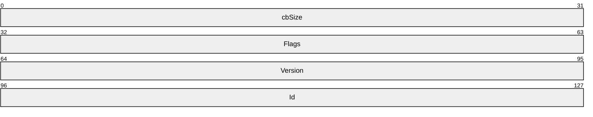
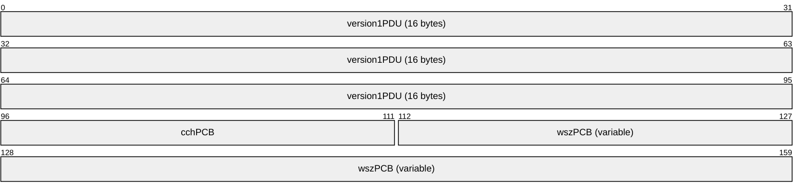

# [MS-RDPEPS]: Remote Desktop Protocol: Session Selection Extension

Table of Contents

1 Introduction

- [1 Introduction](#Section_1)
  - [1.1 Glossary](#Section_1.1)
  - [1.2 References](#Section_1.2)
    - [1.2.1 Normative References](#Section_1.2.1)
    - [1.2.2 Informative References](#Section_1.2.2)
  - [1.3 Overview](#Section_1.3)
  - [1.4 Relationship to Other Protocols](#Section_1.4)
  - [1.5 Prerequisites/Preconditions](#Section_1.5)
  - [1.6 Applicability Statement](#Section_1.6)
  - [1.7 Versioning and Capability Negotiation](#Section_1.7)
  - [1.8 Vendor-Extensible Fields](#Section_1.8)
  - [1.9 Standards Assignments](#Section_1.9)

2 Messages

- [2 Messages](#Section_2)
  - [2.1 Transport](#Section_2.1)
  - [2.2 Message Syntax](#Section_2.2)
    - [2.2.1 Server RDP Preconnection PDU](#Section_2.2.1)
      - [2.2.1.1 Version 1 (RDP_PRECONNECTION_PDU_V1)](#Section_2.2.1.1)
      - [2.2.1.2 Version 2 (RDP_PRECONNECTION_PDU_V2)](#Section_2.2.1.2)

3 Protocol Details

- [3 Protocol Details](#Section_3)
  - [3.1 Client Details](#Section_3.1)
    - [3.1.1 Abstract Data Model](#Section_3.1.1)
    - [3.1.2 Timers](#Section_3.1.2)
    - [3.1.3 Initialization](#Section_3.1.3)
    - [3.1.4 Higher-Layer Triggered Events](#Section_3.1.4)
    - [3.1.5 Processing Events and Sequencing Rules](#Section_3.1.5)
      - [3.1.5.1 Sending the RDP_PRECONNECTION_PDU_V1](#Section_3.1.5.1)
      - [3.1.5.2 Sending the RDP_PRECONNECTION_PDU_V2](#Section_3.1.5.2)
    - [3.1.6 Timer Events](#Section_3.1.6)
    - [3.1.7 Other Local Events](#Section_3.1.7)
  - [3.2 Server Details](#Section_3.2)
    - [3.2.1 Abstract Data Model](#Section_3.2.1)
    - [3.2.2 Timers](#Section_3.2.2)
    - [3.2.3 Initialization](#Section_3.2.3)
    - [3.2.4 Higher-Layer Triggered Events](#Section_3.2.4)
    - [3.2.5 Processing Events and Sequencing Rules](#Section_3.2.5)
      - [3.2.5.1 Processing the RDP_PRECONNECTION PDU V1 and V2](#Section_3.2.5.1)
    - [3.2.6 Timer Events](#Section_3.2.6)
    - [3.2.7 Other Local Events](#Section_3.2.7)

4 Protocol Examples

- [4 Protocol Examples](#Section_4)

5 Security

- [5 Security](#Section_5)
  - [5.1 Security Considerations for Implementers](#Section_5.1)
  - [5.2 Index of Security Parameters](#Section_5.2)

6 Appendix A: Product Behavior

- [6 Appendix A: Product Behavior](#Section_6)

7 Change Tracking

- [7 Change Tracking](#Section_7)

For the legal notice and IP terms, see [LEGAL.md](../LEGAL.md).
Last updated: 4/23/2024.
See [Revision History](#revision-history) for full version history.

# 1 Introduction

This protocol extension expands on the original connectivity options that are specified in the Remote Desktop Protocol: Basic Connectivity and Graphics Remoting Specification [MS-RDPBCGR](../MS-RDPBCGR/MS-RDPBCGR.md). This extension handles a variety of new scenarios where the Remote Desktop Protocol (RDP) is used to send the user experience of an application.

Sections 1.5, 1.8, 1.9, 2, and 3 of this specification are normative. All other sections and examples in this specification are informative.

## 1.1 Glossary

This document uses the following terms:

**client**: A computer on which the remote procedure call (RPC) client is executing.

**protocol data unit (PDU)**: Information that is delivered as a unit among peer entities of a network and that can contain control information, address information, or data. For more information on remote procedure call (RPC)-specific PDUs, see [[C706]](https://go.microsoft.com/fwlink/?LinkId=89824) section 12.

**RDP source**: A process or other operating system entity that generates a remoting protocol that conforms with the [MS-RDPBCGR](../MS-RDPBCGR/MS-RDPBCGR.md) specification.

**RDP source ID**: A numeric identifier that uniquely identifies the source of a Remote Desktop Protocol (RDP) stream.

**server**: A computer on which the remote procedure call (RPC) server is executing.

**Unicode**: A character encoding standard developed by the Unicode Consortium that represents almost all of the written languages of the world. The [**Unicode**](#gt_unicode) standard [[UNICODE5.0.0/2007]](https://go.microsoft.com/fwlink/?LinkId=154659) provides three forms (UTF-8, UTF-16, and UTF-32) and seven schemes (UTF-8, UTF-16, UTF-16 BE, UTF-16 LE, UTF-32, UTF-32 LE, and UTF-32 BE).

**MAY, SHOULD, MUST, SHOULD NOT, MUST NOT:** These terms (in all caps) are used as defined in [[RFC2119]](https://go.microsoft.com/fwlink/?LinkId=90317). All statements of optional behavior use either MAY, SHOULD, or SHOULD NOT.

## 1.2 References

Links to a document in the Microsoft Open Specifications library point to the correct section in the most recently published version of the referenced document. However, because individual documents in the library are not updated at the same time, the section numbers in the documents may not match. You can confirm the correct section numbering by checking the [Errata](https://go.microsoft.com/fwlink/?linkid=850906).

### 1.2.1 Normative References

We conduct frequent surveys of the normative references to assure their continued availability. If you have any issue with finding a normative reference, please contact [dochelp@microsoft.com](mailto:dochelp@microsoft.com). We will assist you in finding the relevant information.

[MS-RAI] Microsoft Corporation, "[Remote Assistance Initiation Protocol](../MS-RAI/MS-RAI.md)".

[MS-RDPBCGR] Microsoft Corporation, "[Remote Desktop Protocol: Basic Connectivity and Graphics Remoting](../MS-RDPBCGR/MS-RDPBCGR.md)".

[RFC2119] Bradner, S., "Key words for use in RFCs to Indicate Requirement Levels", BCP 14, RFC 2119, March 1997, [https://www.rfc-editor.org/info/rfc2119](https://go.microsoft.com/fwlink/?LinkId=90317)

### 1.2.2 Informative References

None.

## 1.3 Overview

The Remote Desktop Protocol: Session Selection Extension details the messages sent from an RDP [**client**](#gt_client) to a [**server**](#gt_server) to facilitate the precise targeting of a [**RDP source**](#gt_rdp-source). This extension allows the separation of the TCP/IP listener process from the process that implements the RDP source. This is achieved by providing the server with enough information so the latter can decide what RDP source process will handle the connection. This information is sent before any of the PDUs described by the [MS-RDPBCGR](../MS-RDPBCGR/MS-RDPBCGR.md) protocol are exchanged between the server and the client.

## 1.4 Relationship to Other Protocols

This protocol extension is a minor enhancement to the Remote Desktop Protocol: Basic Connectivity and Graphics Remoting Specification [MS-RDPBCGR](../MS-RDPBCGR/MS-RDPBCGR.md).

## 1.5 Prerequisites/Preconditions

The client must have all of the information necessary to initialize the Server Preconnection PDU (see section [2.2.1](#Section_2.2.1)) with values that are appropriate to the scenario.

## 1.6 Applicability Statement

This protocol is applicable when there is a need to allow multiple processes to accept connections on the same TCP/IP port.

## 1.7 Versioning and Capability Negotiation

There are two versions of this protocol. For specifications about handling and sending the version information, see sections [2.2.1](#Section_2.2.1), [3.1.5.1](#Section_3.1.5.1), and [3.2.5.1](#Section_3.2.5.1).

- Version 1 is specified by the [RDP_PRECONNECTION_PDU_V1](#Section_2.2.1.1).
- Version 2 is specified by the [RDP_PRECONNECTION_PDU_V2](#Section_3.1.5.2).
A listening process that implements this extension expects that the [**PDU**](#gt_protocol-data-unit-pdu) and the client will always send it.

The client and server both use the same version of the preconnection PDU. There is no negotiation for the PDU version in the protocol, so an out-of-band method is used to determine which version to use. For example, a server implementing this protocol can state in its documentation that it always expects version 1 of the preconnection PDU. A client being developed to connect to this server will then be configured to always send version 1 of the PDU. See section 3.2.5.1 for more information.

The client sends the information that is expected by the server implementation in the PDU **Id** and **wszPCB** fields. Because there is no negotiation for the format and the required information, these are established through convention based on the type of server to which the client is connecting.

## 1.8 Vendor-Extensible Fields

None.

## 1.9 Standards Assignments

None.

# 2 Messages

## 2.1 Transport

This protocol uses TCP/IP as its transport mechanism.

## 2.2 Message Syntax

The following sections contain the Remote Desktop Protocol: Session Selection Extension message syntax.

### 2.2.1 Server RDP Preconnection PDU

The following sections contain Remote Desktop Protocol: Session Selection Extension message syntax for [RDP_PRECONNECTION_PDU_V1](#Section_2.2.1.1) and [RDP_PRECONNECTION_PDU_V2](#Section_3.1.5.2). Section [1.7](#Section_1.7) describes when each version is used.

#### 2.2.1.1 Version 1 (RDP_PRECONNECTION_PDU_V1)

The RDP_PRECONNECTION_PDU_V1 is used by the [**client**](#gt_client) to let the listening process know which [**RDP source**](#gt_rdp-source) the connection is intended for.

**cbSize (4 bytes):** An unsigned 32-bit integer. This field identifies the total size, in bytes, of the RDP_PRECONNECTION_PDU_V1, or for a version 2 packet, the size of an [RDP_PRECONNECTION_PDU_V2](#Section_3.1.5.2) packet.

**Flags (4 bytes):** An unsigned 32-bit integer. MUST be set to zero when sending and ignored on receipt.

**Version (4 bytes):** An unsigned 32-bit integer. This field is one of the values in the table that is based on the version of the [**PDU**](#gt_protocol-data-unit-pdu) that is sent. The field is intended for future extensibility. The field SHOULD be initialized by the client and SHOULD be ignored by the server, as specified in sections [3.1.5.1](#Section_3.1.5.1) and [3.2.5.1](#Section_3.2.5.1).

| Value | Meaning |
| --- | --- |
| RDP_PRECONNECTION_PDU_V1 0x00000001 | A version 1 connection PDU. |
| RDP_PRECONNECTION_PDU_V2 0x00000002 | A version 2 connection PDU. |

**Id (4 bytes):** An unsigned 32-bit integer. The **Id** field is used to uniquely identify the RDP source. Although the Id can be as simple as a process ID, it is often client-specific or server-specific and can be obfuscated.

#### 2.2.1.2 Version 2 (RDP_PRECONNECTION_PDU_V2)

The RDP_PRECONNECTION_PDU_V2 extends the [RDP_PRECONNECTION_PDU_V1](#Section_2.2.1.1) packet by adding a variable-size [**Unicode**](#gt_unicode) character string. The receiver of this [**PDU**](#gt_protocol-data-unit-pdu) can use this string and the **Id** field of the RDP_PRECONNECTION_PDU_V1 packet to determine the [**RDP source**](#gt_rdp-source). This string is opaque to the protocol.

**version1PDU (16 bytes):** The RDP_PRECONNECTION_PDU_V1 header, as specified in section 2.2.1.1.

**cchPCB (2 bytes):** An unsigned 16-bit integer. The number of Unicode characters in the **wszPCB** field.

**wszPCB (variable):** A variable-length array of Unicode characters.

# 3 Protocol Details

## 3.1 Client Details

This section contains [**client**](#gt_client) details including abstract data model, timers, initialization, higher-layer triggered events, and message processing events and sequencing rules.

### 3.1.1 Abstract Data Model

None.

### 3.1.2 Timers

This protocol has a 10-second timer. It starts at the successful creation of the TCP connection between the [**client**](#gt_client) and [**server**](#gt_server). The full length of the [RDP_PRECONNECTION_PDU_V1](#Section_2.2.1.1) or [RDP_PRECONNECTION_PDU_V2](#Section_3.1.5.2) MUST be sent by the client and received by the server within this window.

### 3.1.3 Initialization

The client MUST connect by using the IP address and port on which the server is known to be listening.

### 3.1.4 Higher-Layer Triggered Events

None.

### 3.1.5 Processing Events and Sequencing Rules

The client MUST send either the [RDP_PRECONNECTION_PDU_V1](#Section_2.2.1.1) or [RDP_PRECONNECTION_PDU_V2](#Section_3.1.5.2) to the server before sending any of the PDUs described in the [MS-RDPBCGR](../MS-RDPBCGR/MS-RDPBCGR.md) specification.

#### 3.1.5.1 Sending the RDP_PRECONNECTION_PDU_V1

The client MUST initialize the **cbSize** field with the total size, in bytes, of the [**PDU**](#gt_protocol-data-unit-pdu). The size of [RDP_PRECONNECTION_PDU_V1](#Section_2.2.1.1) is always 16 bytes.

The client MUST initialize the version field with the RDP_PRECONNECTION_PDU_V1 value.

The **Id** field SHOULD<1> be set to the [**RDP source ID**](#gt_rdp-source-id) for which the connection is intended. The value of this field can be determined by the client, either by convention or by communicating with the server.

#### 3.1.5.2 Sending the RDP_PRECONNECTION_PDU_V2

The size that is sent in the **cbSize** field of the [RDP_PRECONNECTION_PDU_V2](#Section_3.1.5.2) packet is calculated by adding the size of the [RDP_PRECONNECTION_PDU_V1](#Section_2.2.1.1) header, **cchPCB** field, and **wszPCB** field. The size, in bytes, of the **wszPCB** field is calculated as the number of characters specified in the **cchPCB** field multiplied by 2. If the **cchPCB** field contains five characters, the **cbSize** will be 18 + (5 * 2) = 28. If the **cchPCB** field is 0, the **wszPCB** field is not present, and the **cbSize** field MUST be initialized with a value of 18.

The client MUST initialize the **Version** field with the RDP_PRECONNECTION_PDU_V2 value.

The client MUST initialize the **cchPCB** field with the number of characters in the **wszPCB** [**Unicode**](#gt_unicode) array.

The **wszPCB** field SHOULD<2> be set to a value that identifies the server-side process for which the connection is intended. Before the connection is established, the value can be determined either by convention or by communicating with the server through other mechanisms.

### 3.1.6 Timer Events

None.

### 3.1.7 Other Local Events

None.

## 3.2 Server Details

This section contains [**server**](#gt_server) details including abstract data model, timers, initialization, higher-layer triggered events, and message processing events and sequencing rules.

### 3.2.1 Abstract Data Model

None.

### 3.2.2 Timers

This protocol has a 10-second timer. It starts at the successful creation of the TCP connection between the client and server. The full length of [RDP_PRECONNECTION_PDU_V1](#Section_2.2.1.1) or [RDP_PRECONNECTION_PDU_V2](#Section_3.1.5.2) SHOULD be sent by the client and received by the server within this window.<3>

### 3.2.3 Initialization

The server MUST listen on the IP address and port that the client uses to connect.

### 3.2.4 Higher-Layer Triggered Events

None.

### 3.2.5 Processing Events and Sequencing Rules

This section includes information about the processing of [RDP_PRECONNECTION_PDU_V1](#Section_2.2.1.1) and [RDP_PRECONNECTION_PDU_V2](#Section_3.1.5.2).

#### 3.2.5.1 Processing the RDP_PRECONNECTION PDU V1 and V2

When processing either [RDP_PRECONNECTION_PDU_V1](#Section_2.2.1.1) or [RDP_PRECONNECTION_PDU_V2](#Section_3.1.5.2), the server MUST not make assumptions about the way the [**PDU**](#gt_protocol-data-unit-pdu) is delivered by TCP/IP. The server MUST only read the bytes that are part of this PDU. The server MUST NOT read more than the minimum required size.

The server SHOULD wait and receive the whole PDU.<4> After the whole PDU is received, the server MUST determine the process for which the connection is intended. The server MUST hand over the connection to the specified process. If the information in the PDU does not map to any process, the server SHOULD disconnect the client.<5>

In order to process the PDU, the server MUST first determine how long the PDU is. The server does this by reading the 4 bytes that correspond to the **cbSize** field of the PDU, as specified in section 2.2.1.1. If the **cbSize** field is 16 bytes, the server MUST consider the PDU an RDP_PRECONNECTION_PDU_V1. If the size is greater than or equal to 18 bytes, the server MUST consider the PDU an RDP_PRECONNECTION_PDU_V2, check that the size is in the expected range based on the **cbSize** field, and disconnect the client if the size is not in the expected range. If the size is equal to 17 bytes or less than 16 bytes the server SHOULD<6> disconnect the client. If the **Version** field indicates that the PDU is RDP_PRECONNECTION_PDU_V1 and if the **cbSize** field is greater than 16 bytes, then the server SHOULD<7> disconnect the client.

When the **cbSize** field is received, the server MUST read that number of bytes from the TCP/IP stream.

When the server receives an RDP_PRECONNECTION_PDU_V2, it MUST verify that the size of the **wszPCB** field is consistent with the PDU size that is expected by the **cbSize** field. The **cbSize** MUST be greater than or equal to the size of the RDP_PRECONNECTION_PDU_V1, plus the size of the **cchPCB** field and **wszPCB** field, calculated as **cchPCB** multiplied by 2. If **cbSize** does not meet this condition, the server SHOULD disconnect the client.<8>

Once the PDU is received the server MUST determine if the received PDU is of the type supported by the server. If the type is not supported by the server, the latter SHOULD<9> disconnect the client.

### 3.2.6 Timer Events

If the 10-second timer expires, the server SHOULD disconnect the client.<10> Any resources that are associated with the connection are freed.

### 3.2.7 Other Local Events

None.

# 4 Protocol Examples

The following is an example of the [RDP_PRECONNECTION_PDU_V1](#Section_2.2.1.1).

00000000 10 00 00 00 00 00 00 00 01 00 00 00 eb 99 c6 ee ................

10 00 00 00 -> RDP_PRECONNECTION_PDU_V1::cbSize = 0x10 = 16 bytes

00 00 00 00 -> RDP_PRECONNECTION_PDU_V1::Flags = 0

01 00 00 00 -> RDP_PRECONNECTION_PDU_V1::Version = 1

eb 99 c6 ee -> RDP_PRECONNECTION_PDU_V1::Id = 0xEEC699EB = 4005992939

(random id)

The following is an example of the [RDP_PRECONNECTION_PDU_V2](#Section_3.1.5.2), where the [**PDU**](#gt_protocol-data-unit-pdu) is an RDP_PRECONNECTION_PDU_V1 that is extended with a variable-size [**Unicode**](#gt_unicode) string.

00000000 20 00 00 00 00 00 00 00 02 00 00 00 00 00 00 00 ...............

00000010 07 00 54 00 65 00 73 00 74 00 56 00 4d 00 00 00 ..T.e.s.t.V.M...

20 00 00 00 -> RDP_PRECONNECTION_PDU_V2::RDP_PRECONNECTION_PDU_V1::cbSize = 0x20 = 32 bytes

00 00 00 00 -> RDP_PRECONNECTION_PDU_V2::RDP_PRECONNECTION_PDU_V1::Flags = 0

02 00 00 00 -> RDP_PRECONNECTION_PDU_V2::RDP_PRECONNECTION_PDU_V1::Version = 2

00 00 00 00 -> RDP_PRECONNECTION_PDU_V2::RDP_PRECONNECTION_PDU_V1::Id = 0

07 00 -> RDP_PRECONNECTION_PDU_V2::cchPCB = 0x7 = 7 characters

54 00 65 00 73 00-74 00 56 00 4d 00 00 00 -> RDP_PRECONNECTION_PDU_V2::wszPCB -> "TestVM" (including null terminator)

The following is an example of the RDP_PRECONNECTION_PDU_V2, where the PDU contains the connection request for a virtual machine running on Windows Server 2012 R2 operating system.

00000000 7a 00 00 00 00 00 00 00 02 00 00 00 00 00 00 00 z...............

00000010 34 00 42 00 41 00 31 00 42 00 36 00 44 00 42 00 4.B.A.1.B.6.D.B.

00000020 44 00 2d 00 38 00 39 00 41 00 43 00 2d 00 34 00 D.-.8.9.A.C.-.4.

00000030 36 00 33 00 30 00 2d 00 41 00 37 00 33 00 37 00 6.3.0.-.A.7.3.7.

00000040 2d 00 43 00 34 00 42 00 43 00 43 00 33 00 42 00 -.C.4.B.C.C.3.B.

00000050 42 00 39 00 39 00 46 00 42 00 3b 00 45 00 6e 00 B.9.9.F.B.;.E.n.

00000060 68 00 61 00 6e 00 63 00 65 00 64 00 4d 00 6f 00 h.a.n.c.e.d.M.o.

00000070 64 00 65 00 3d 00 31 00 00 00 d.e.=.1...

7a 00 00 00 -> RDP_PRECONNECTION_PDU_V2::RDP_PRECONNECTION_PDU_V1::cbSize = 0x7a = 122 bytes

00 00 00 00 -> RDP_PRECONNECTION_PDU_V2::RDP_PRECONNECTION_PDU_V1::Flags = 0

02 00 00 00 -> RDP_PRECONNECTION_PDU_V2::RDP_PRECONNECTION_PDU_V1::Version = 2

00 00 00 00 -> RDP_PRECONNECTION_PDU_V2::RDP_PRECONNECTION_PDU_V1::Id = 0

34 00 -> RDP_PRECONNECTION_PDU_V2::cchPCB = 0x34 = 52 characters

42 00 41 00 31 00 42 00 36 00 44 00 42 00 44 00

2d 00 38 00 39 00 41 00 43 00 2d 00 34 00 36 00

33 00 30 00 2d 00 41 00 37 00 33 00 37 00 2d 00

43 00 34 00 42 00 43 00 43 00 33 00 42 00 42 00

39 00 39 00 46 00 42 00 3b 00 45 00 6e 00 68 00

61 00 6e 00 63 00 65 00 64 00 4d 00 6f 00 64 00

65 00 3d 00 31 00 00 00 -> RDP_PRECONNECTION_PDU_V2::wszPCB -> "BA1B6DBD-89AC-4630-A737-C4BCC3BB99FB;EnhancedMode=1" (including null terminator)

# 5 Security

## 5.1 Security Considerations for Implementers

In order to avoid denial-of-service attacks, the [**server**](#gt_server) cannot wait indefinitely for the [**PDU**](#gt_protocol-data-unit-pdu) content to arrive. Instead, the server will disconnect the [**client**](#gt_client) if the timer that is specified in sections [3.1.2](#Section_3.1.2) and [3.2.2](#Section_3.1.2) has passed and the entire PDU was not received.

## 5.2 Index of Security Parameters

None.

# 6 Appendix A: Product Behavior

The information in this specification is applicable to the following Microsoft products or supplemental software. References to product versions include updates to those products.

- Windows Vista operating system
- Windows Server 2008 operating system
- Windows 7 operating system
- Windows Server 2008 R2 operating system
- Windows 8 operating system
- Windows Server 2012 operating system
- Windows 8.1 operating system
- Windows Server 2012 R2 operating system
- Windows 10 operating system
- Windows Server 2016 operating system
- Windows Server operating system
- Windows Server 2019 operating system
- Windows Server 2022 operating system
- Windows 11 operating system
- Windows Server 2025 operating system
Exceptions, if any, are noted in this section. If an update version, service pack or Knowledge Base (KB) number appears with a product name, the behavior changed in that update. The new behavior also applies to subsequent updates unless otherwise specified. If a product edition appears with the product version, behavior is different in that product edition.

Unless otherwise specified, any statement of optional behavior in this specification that is prescribed using the terms "SHOULD" or "SHOULD NOT" implies product behavior in accordance with the SHOULD or SHOULD NOT prescription. Unless otherwise specified, the term "MAY" implies that the product does not follow the prescription.

<1> Section 3.1.5.1: In Windows Vista, Windows 7, Windows 8, Windows 8.1, and Windows 10, the client initializes the **Version** field with [RDP_PRECONNECTION_PDU_V1](#Section_2.2.1.1) because the **Id** field is sufficient to identify the wanted [**RDP source**](#gt_rdp-source). The **Id** is initialized to a value that identifies the server. This value is obtained by the client through an external mechanism (such as fax, email, or telephone) that is outside this protocol. The external mechanism that is used by the Remote Assistance Initiation Protocol (see [MS-RAI](../MS-RAI/MS-RAI.md)) exchanges the **Id** as described in [MS-RAI] section 2.2.2. (The SID XML attribute in the Remote Assistance Connection String 2 contains the Id value.)

<2> Section 3.1.5.2: In the Windows Server 2008 operating system, Windows Server 2008 R2, Windows Server 2012, Windows Server 2012 R2, Windows Server 2016, Windows Server operating system, and Windows Server 2019 virtual machine implementation, the client initializes the **Version** field to [RDP_PRECONNECTION_PDU_V2](#Section_3.1.5.2) and sets the **Id** field to zero. The string is used to identify the name of the wanted virtual machine. If the string is not null-terminated, the server will overwrite the last [**Unicode**](#gt_unicode) character with NULL prior to further processing.

The Windows Server 2008, Windows Server 2008 R2, Windows Server 2012, Windows Server 2012 R2, Windows Server 2016, Windows Server operating system, and Windows Server 2019 virtual machine sends a GUID instead of a virtual machine name.

GUID formatting is as follows: 00000000-0000-0000-0000-000000000000. The hexadecimal numbers are separated by '-' characters; however, without any braces {} around the GUID. The byte ordering is standard GUID byte ordering (identical for all GUIDs that are represented as strings) and is case-insensitive for the hexadecimal digits. No other form is allowed.

<3> Section 3.2.2: In Windows implementations, the server associates a time stamp for each new connection. The time stamp is used to verify whether all the preconnection PDU data for a connection was received in the specified 10-second interval. (See section [3.2.2](#Section_3.1.2).) If the data was not received, the client is then disconnected. However, the checks are only performed when a new connection is created or when data is received on one of the pending connections. Otherwise, the server does not check the time stamp, and the client is not disconnected.

<4> Section 3.2.5.1: In Windows implementations, the server associates a time stamp for each new connection. The time stamp is used to verify whether all the preconnection PDU data for a connection is received in the specified 10-second interval. (See section 3.2.2.) If the data is not received, the client is disconnected. However, these checks are only performed when a new connection is created or when data is received on a pending connection. Otherwise, the server does not check the time stamp, and the client is not disconnected.

<5> Section 3.2.5.1: On a Windows Server 2008, Windows Server 2008 R2, Windows Server 2012, Windows Server 2012 R2, Windows Server 2016, Windows Server operating system, or Windows Server 2019 virtual machine, RDP_PRECONNECTION_PDU_V2 is used. The **Id** is ignored by the server. The server always expects a wszPCB string. The string represents the GUID of the virtual machine to which the client tries to connect. The server expects a null-terminated string. The server does not verify that the last character is a null terminator; instead, the server overwrites the last character with the null-terminated character. The server will use the GUID to identify the virtual machine the connection is intended for. If a matching virtual machine is not found on the server the connection will be terminated.

On Windows Server 2012 R2, Windows Server 2016, Windows Server operating system, and Windows Server 2019 the **wszPCB** string contains virtual machine GUID and connection-specific information. The following syntax is used for that pre-connection string:

GUID;key1=value1;key2=value2;key3=value3...

"GUID" is followed by a semi-colon, which is then followed by connection-specific key-value pairs, with each pair separated by a semi-colon delimiter. The key and value in the key-value pair are separated by an equal sign ("="). There are no spaces in the string.

The only supported key in Windows Server 2012 R2, Windows Server 2016, Windows Server operating system, and Windows Server 2019 is "EnhancedMode". Its value is set to 1 for connections that expect to use RDP features.

<6> Section 3.2.5.1: In Windows implementations, the server will disconnect the client if the **cbSize** value is 17 bytes or less than 16 bytes.

<7> Section 3.2.5.1: In Windows implementations, the server disconnects the client if the **cbSize** value is greater than 16 bytes and the **Version** field indicates that it is RDP_PRECONNECTION_PDU_V1.

<8> Section 3.2.5.1: Windows virtual machine clients are disconnected if the **cbSize** field verification fails. If the **cbSize** value indicates that the payload is bigger than the length of the **wszPCB** field the bytes after the **wszPCB** field up to **cbSize** will be ignored.

<9> Section 3.2.5.1: In Windows Vista, Windows 7, Windows 8, Windows 8.1, and Windows 10 Remote Assistance, the type of the PDU is always expected to be RDP_PRECONNECTION_PDU_V1, and if the server receives a RDP_PRECONNECTION_PDU_V2, it disconnects the client. In Windows Server 2008 Hyper-V, Windows Server 2008 R2 Hyper-V, Windows Server 2012 Hyper-V, Windows Server 2012 R2 Hyper-V, Windows Server 2016 Hyper-V, Windows Server operating system Hyper-V, and Windows Server 2019 Hyper-V, the type of the PDU is always expected to be RDP_PRECONNECTION_PDU_V2, and if a RDP_PRECONNECTION_PDU_V1 is received in this case, the server will disconnect the client.

<10> Section 3.2.6: In Windows implementations, the server associates a time stamp for each new connection. The time stamp is used to verify whether all the preconnection PDU data for a connection is received in the specified 10-second interval. (See section 3.2.2.) If the data is not received, the client is disconnected. However, these checks are only performed when a new connection is created or when data is received on a pending connection. Otherwise, the server does not check the time stamp, and the client is not disconnected.

# 7 Change Tracking

This section identifies changes that were made to this document since the last release. Changes are classified as Major, Minor, or None.

The revision class **Major** means that the technical content in the document was significantly revised. Major changes affect protocol interoperability or implementation. Examples of major changes are:

- A document revision that incorporates changes to interoperability requirements.
- A document revision that captures changes to protocol functionality.
The revision class **Minor** means that the meaning of the technical content was clarified. Minor changes do not affect protocol interoperability or implementation. Examples of minor changes are updates to clarify ambiguity at the sentence, paragraph, or table level.

The revision class **None** means that no new technical changes were introduced. Minor editorial and formatting changes may have been made, but the relevant technical content is identical to the last released version.

The changes made to this document are listed in the following table. For more information, please contact [dochelp@microsoft.com](mailto:dochelp@microsoft.com).

| Section | Description | Revision class |
| --- | --- | --- |
| [6](#Section_6) Appendix A: Product Behavior | Added Windows Server 2025 to the list of applicable products. | Major |

## Revision History

| Date | Version | Revision Class | Comments |
| --- | --- | --- | --- |
| 4/3/2007 | 0.01 | New | Version 0.01 release |
| 6/1/2007 | 1.0 | Major | Version 1.0 release |
| 7/3/2007 | 2.0 | Major | MLonghorn+90 |
| 7/20/2007 | 2.0.1 | Editorial | Changed language and formatting in the technical content. |
| 8/10/2007 | 2.0.2 | Editorial | Changed language and formatting in the technical content. |
| 9/28/2007 | 2.0.3 | Editorial | Changed language and formatting in the technical content. |
| 10/23/2007 | 2.0.4 | Editorial | Changed language and formatting in the technical content. |
| 11/30/2007 | 3.0 | Major | Updated and revised the technical content. |
| 1/25/2008 | 3.0.1 | Editorial | Changed language and formatting in the technical content. |
| 3/14/2008 | 4.0 | Major | Updated and revised the technical content. |
| 5/16/2008 | 4.0.1 | Editorial | Changed language and formatting in the technical content. |
| 6/20/2008 | 5.0 | Major | Updated and revised the technical content. |
| 7/25/2008 | 5.0.1 | Editorial | Changed language and formatting in the technical content. |
| 8/29/2008 | 5.0.2 | Editorial | Changed language and formatting in the technical content. |
| 10/24/2008 | 5.0.3 | Editorial | Changed language and formatting in the technical content. |
| 12/5/2008 | 5.0.4 | Editorial | Changed language and formatting in the technical content. |
| 1/16/2009 | 5.0.5 | Editorial | Changed language and formatting in the technical content. |
| 2/27/2009 | 5.0.6 | Editorial | Changed language and formatting in the technical content. |
| 4/10/2009 | 5.0.7 | Editorial | Changed language and formatting in the technical content. |
| 5/22/2009 | 5.1 | Minor | Clarified the meaning of the technical content. |
| 7/2/2009 | 5.1.1 | Editorial | Changed language and formatting in the technical content. |
| 8/14/2009 | 6.0 | Major | Updated and revised the technical content. |
| 9/25/2009 | 6.1 | Minor | Clarified the meaning of the technical content. |
| 11/6/2009 | 6.1.1 | Editorial | Changed language and formatting in the technical content. |
| 12/18/2009 | 7.0 | Major | Updated and revised the technical content. |
| 1/29/2010 | 8.0 | Major | Updated and revised the technical content. |
| 3/12/2010 | 8.0.1 | Editorial | Changed language and formatting in the technical content. |
| 4/23/2010 | 8.0.2 | Editorial | Changed language and formatting in the technical content. |
| 6/4/2010 | 8.0.3 | Editorial | Changed language and formatting in the technical content. |
| 7/16/2010 | 8.0.3 | None | No changes to the meaning, language, or formatting of the technical content. |
| 8/27/2010 | 8.0.3 | None | No changes to the meaning, language, or formatting of the technical content. |
| 10/8/2010 | 8.0.3 | None | No changes to the meaning, language, or formatting of the technical content. |
| 11/19/2010 | 8.1 | Minor | Clarified the meaning of the technical content. |
| 1/7/2011 | 8.2 | Minor | Clarified the meaning of the technical content. |
| 2/11/2011 | 8.3 | Minor | Clarified the meaning of the technical content. |
| 3/25/2011 | 8.3 | None | No changes to the meaning, language, or formatting of the technical content. |
| 5/6/2011 | 8.3 | None | No changes to the meaning, language, or formatting of the technical content. |
| 6/17/2011 | 8.4 | Minor | Clarified the meaning of the technical content. |
| 9/23/2011 | 9.0 | Major | Updated and revised the technical content. |
| 12/16/2011 | 10.0 | Major | Updated and revised the technical content. |
| 3/30/2012 | 10.0 | None | No changes to the meaning, language, or formatting of the technical content. |
| 7/12/2012 | 10.0 | None | No changes to the meaning, language, or formatting of the technical content. |
| 10/25/2012 | 10.0 | None | No changes to the meaning, language, or formatting of the technical content. |
| 1/31/2013 | 10.0 | None | No changes to the meaning, language, or formatting of the technical content. |
| 8/8/2013 | 11.0 | Major | Updated and revised the technical content. |
| 11/14/2013 | 11.0 | None | No changes to the meaning, language, or formatting of the technical content. |
| 2/13/2014 | 11.0 | None | No changes to the meaning, language, or formatting of the technical content. |
| 5/15/2014 | 11.0 | None | No changes to the meaning, language, or formatting of the technical content. |
| 6/30/2015 | 12.0 | Major | Significantly changed the technical content. |
| 10/16/2015 | 12.0 | None | No changes to the meaning, language, or formatting of the technical content. |
| 7/14/2016 | 12.0 | None | No changes to the meaning, language, or formatting of the technical content. |
| 6/1/2017 | 12.0 | None | No changes to the meaning, language, or formatting of the technical content. |
| 9/15/2017 | 13.0 | Major | Significantly changed the technical content. |
| 9/12/2018 | 14.0 | Major | Significantly changed the technical content. |
| 4/7/2021 | 15.0 | Major | Significantly changed the technical content. |
| 6/25/2021 | 16.0 | Major | Significantly changed the technical content. |
| 4/23/2024 | 17.0 | Major | Significantly changed the technical content. |
