# [MS-RDPERP]: Remote Desktop Protocol: Remote Programs Virtual Channel Extension

Table of Contents

<details>
<summary>1 Introduction</summary>

- [1 Introduction](#Section_1)
  - [1.1 Glossary](#Section_1.1)
  - [1.2 References](#Section_1.2)
    - [1.2.1 Normative References](#Section_1.2.1)
    - [1.2.2 Informative References](#Section_1.2.2)
  - [1.3 Overview](#Section_1.3)
    - [1.3.1 Relationship to the Remote Desktop Protocol: Basic Connectivity and Graphics Remoting Specification](#Section_1.3.1)
    - [1.3.2 Message Flows](#Section_1.3.2)
      - [1.3.2.1 RAIL Session Connection](#Section_1.3.2.1)
      - [1.3.2.2 RAIL Session Disconnection and Reconnection](#Section_1.3.2.2)
      - [1.3.2.3 RAIL Server/Client Synchronization](#Section_1.3.2.3)
      - [1.3.2.4 RAIL Virtual Channel Messages](#Section_1.3.2.4)
      - [1.3.2.5 RAIL Local Move/Resize](#Section_1.3.2.5)
    - [1.3.3 Enhanced RemoteApp](#Section_1.3.3)
    - [1.3.4 Window Resize Margins](#Section_1.3.4)
  - [1.4 Relationship to Other Protocols](#Section_1.4)
  - [1.5 Prerequisites/Preconditions](#Section_1.5)
  - [1.6 Applicability Statement](#Section_1.6)
  - [1.7 Versioning and Capability Negotiation](#Section_1.7)
  - [1.8 Vendor-Extensible Fields](#Section_1.8)
  - [1.9 Standards Assignments](#Section_1.9)
</details>

<details>
<summary>2 Messages</summary>

- [2 Messages](#Section_2)
  - [2.1 Transport](#Section_2.1)
  - [2.2 Message Syntax](#Section_2.2)
    - [2.2.1 Updates to the Remote Desktop Protocol: Basic Connectivity and Graphics Remoting Specification](#Section_2.2.1)
      - [2.2.1.1 Capability Sets](#Section_2.2.1.1)
        - [2.2.1.1.1 Remote Programs Capability Set](#Section_2.2.1.1.1)
        - [2.2.1.1.2 Window List Capability Set](#Section_2.2.1.1.2)
      - [2.2.1.2 Common Structures](#Section_2.2.1.2)
        - [2.2.1.2.1 Unicode String (UNICODE_STRING)](#Section_2.2.1.2.1)
        - [2.2.1.2.2 Rectangle (TS_RECTANGLE_16)](#Section_2.2.1.2.2)
        - [2.2.1.2.3 Icon Info (TS_ICON_INFO)](#Section_2.2.1.2.3)
        - [2.2.1.2.4 Cached Icon Info (TS_CACHED_ICON_INFO)](#Section_2.2.1.2.4)
      - [2.2.1.3 Windowing Alternate Secondary Drawing Orders](#Section_2.2.1.3)
        - [2.2.1.3.1 Window Information](#Section_2.2.1.3.1)
          - [2.2.1.3.1.1 Common Header (TS_WINDOW_ORDER_HEADER)](#Section_2.2.1.3.1.1)
          - [2.2.1.3.1.2 Orders](#Section_2.2.1.3.1.2)
            - [2.2.1.3.1.2.1 New or Existing Window](#Section_2.2.1.3.1.2.1)
            - [2.2.1.3.1.2.2 Window Icon](#Section_2.2.1.3.1.2.2)
            - [2.2.1.3.1.2.3 Cached Icon](#Section_2.2.1.3.1.2.3)
            - [2.2.1.3.1.2.4 Deleted Window](#Section_2.2.1.3.1.2.4)
        - [2.2.1.3.2 Notification Icon Information](#Section_2.2.1.3.2)
          - [2.2.1.3.2.1 Common Header (TS_NOTIFYICON_ORDER_HEADER)](#Section_2.2.1.3.2.1)
          - [2.2.1.3.2.2 Orders](#Section_2.2.1.3.2.2)
            - [2.2.1.3.2.2.1 New or Existing Notification Icons](#Section_2.2.1.3.2.2.1)
            - [2.2.1.3.2.2.2 Deleted Notification Icons](#Section_2.2.1.3.2.2.2)
            - [2.2.1.3.2.2.3 Notification Icon Balloon Tooltip (TS_NOTIFY_ICON_INFOTIP)](#Section_2.2.1.3.2.2.3)
        - [2.2.1.3.3 Desktop Information](#Section_2.2.1.3.3)
          - [2.2.1.3.3.1 Common Header (TS_DESKTOP_ORDER_HEADER)](#Section_2.2.1.3.3.1)
          - [2.2.1.3.3.2 Orders](#Section_2.2.1.3.3.2)
            - [2.2.1.3.3.2.1 Actively Monitored Desktop](#Section_2.2.1.3.3.2.1)
            - [2.2.1.3.3.2.2 Non-Monitored Desktop](#Section_2.2.1.3.3.2.2)
    - [2.2.2 Static Virtual Channel Protocol](#Section_2.2.2)
      - [2.2.2.1 Common Header (TS_RAIL_PDU_HEADER)](#Section_2.2.2.1)
      - [2.2.2.2 Initialization Messages](#Section_2.2.2.2)
        - [2.2.2.2.1 Handshake PDU (TS_RAIL_ORDER_HANDSHAKE)](#Section_2.2.2.2.1)
        - [2.2.2.2.2 Client Information PDU (TS_RAIL_ORDER_CLIENTSTATUS)](#Section_2.2.2.2.2)
        - [2.2.2.2.3 HandshakeEx PDU (TS_RAIL_ORDER_HANDSHAKE_EX)](#Section_2.2.2.2.3)
      - [2.2.2.3 Program Launching Messages](#Section_2.2.2.3)
        - [2.2.2.3.1 Client Execute PDU (TS_RAIL_ORDER_EXEC)](#Section_2.2.2.3.1)
        - [2.2.2.3.2 Server Execute Result PDU (TS_RAIL_ORDER_EXEC_RESULT)](#Section_2.2.2.3.2)
      - [2.2.2.4 Local Client System Parameters Update Messages](#Section_2.2.2.4)
        - [2.2.2.4.1 Client System Parameters Update PDU (TS_RAIL_ORDER_SYSPARAM)](#Section_2.2.2.4.1)
        - [2.2.2.4.2 High Contrast System Information Structure (TS_HIGHCONTRAST)](#Section_2.2.2.4.2)
        - [2.2.2.4.3 Filter Keys System Information Structure (TS_FILTERKEYS)](#Section_2.2.2.4.3)
        - [2.2.2.4.4 Toggle Keys System Information Structure (TS_TOGGLEKEYS)](#Section_2.2.2.4.4)
        - [2.2.2.4.5 Sticky Keys System Information Structure (TS_STICKYKEYS)](#Section_2.2.2.4.5)
        - [2.2.2.4.6 Accent Color System Information Structure (TS_ACCENTCOLOR)](#Section_2.2.2.4.6)
      - [2.2.2.5 Server System Parameters Update Messages](#Section_2.2.2.5)
        - [2.2.2.5.1 Server System Parameters Update PDU (TS_RAIL_ORDER_SYSPARAM)](#Section_2.2.2.5.1)
      - [2.2.2.6 Local Client Event Messages](#Section_2.2.2.6)
        - [2.2.2.6.1 Client Activate PDU (TS_RAIL_ORDER_ACTIVATE)](#Section_2.2.2.6.1)
        - [2.2.2.6.2 Client System Menu PDU (TS_RAIL_ORDER_SYSMENU)](#Section_2.2.2.6.2)
        - [2.2.2.6.3 Client System Command PDU (TS_RAIL_ORDER_SYSCOMMAND)](#Section_2.2.2.6.3)
        - [2.2.2.6.4 Client Notify Event PDU (TS_RAIL_ORDER_NOTIFY_EVENT)](#Section_2.2.2.6.4)
        - [2.2.2.6.5 Client Get Application ID PDU (TS_RAIL_ORDER_GET_APPID_REQ)](#Section_2.2.2.6.5)
      - [2.2.2.7 Window Move Messages](#Section_2.2.2.7)
        - [2.2.2.7.1 Server Min Max Info PDU (TS_RAIL_ORDER_MINMAXINFO)](#Section_2.2.2.7.1)
        - [2.2.2.7.2 Server Move/Size Start PDU (TS_RAIL_ORDER_LOCALMOVESIZE)](#Section_2.2.2.7.2)
        - [2.2.2.7.3 Server Move/Size End PDU (TS_RAIL_ORDER_LOCALMOVESIZE)](#Section_2.2.2.7.3)
        - [2.2.2.7.4 Client Window Move PDU (TS_RAIL_ORDER_WINDOWMOVE)](#Section_2.2.2.7.4)
        - [2.2.2.7.5 Client Window Snap PDU (TS_RAIL_ORDER_SNAP_ARRANGE)](#Section_2.2.2.7.5)
      - [2.2.2.8 Server Application ID Response](#Section_2.2.2.8)
        - [2.2.2.8.1 Server Get Application ID Response PDU (TS_RAIL_ORDER_GET_APPID_RESP)](#Section_2.2.2.8.1)
        - [2.2.2.8.2 Server Get Application ID Extended Response PDU (TS_RAIL_ORDER_GET_APPID_RESP_EX)](#Section_2.2.2.8.2)
      - [2.2.2.9 Language Bar Messages](#Section_2.2.2.9)
        - [2.2.2.9.1 Language Bar Information PDU (TS_RAIL_ORDER_LANGBARINFO)](#Section_2.2.2.9.1)
      - [2.2.2.10 Language Sync Messages](#Section_2.2.2.10)
        - [2.2.2.10.1 Language Profile Information PDU (TS_RAIL_ORDER_LANGUAGEIMEINFO)](#Section_2.2.2.10.1)
          - [2.2.2.10.1.1 Globally Unique Identifier (GUID)](#Section_2.2.2.10.1.1)
        - [2.2.2.10.2 Compartment Status Information PDU (TS_RAIL_ORDER_COMPARTMENTINFO_BODY)](#Section_2.2.2.10.2)
      - [2.2.2.11 Z-Order Sync Messages](#Section_2.2.2.11)
        - [2.2.2.11.1 Server Z-Order Sync Information PDU (TS_RAIL_ORDER_ZORDER_SYNC)](#Section_2.2.2.11.1)
      - [2.2.2.12 Window Cloak State Sync Messages](#Section_2.2.2.12)
        - [2.2.2.12.1 Window Cloak State Change PDU (TS_RAIL_ORDER_CLOAK)](#Section_2.2.2.12.1)
      - [2.2.2.13 Power Display Request Messages](#Section_2.2.2.13)
        - [2.2.2.13.1 Power Display Request PDU (TS_RAIL_ORDER_POWER_DISPLAY_REQUEST)](#Section_2.2.2.13.1)
      - [2.2.2.14 Server Taskbar State Messages](#Section_2.2.2.14)
        - [2.2.2.14.1 Taskbar Tab Info PDU (TS_RAIL_ORDER_TASKBARINFO)](#Section_2.2.2.14.1)
      - [2.2.2.15 Accessibility Messages](#Section_2.2.2.15)
        - [2.2.2.15.1 Text Scale Information PDU (TS_RAIL_ORDER_TEXTSCALEINFO)](#Section_2.2.2.15.1)
        - [2.2.2.15.2 Caret Blink Information PDU (TS_RAIL_ORDER_CARETBLINKINFO)](#Section_2.2.2.15.2)
</details>

<details>
<summary>3 Protocol Details</summary>

- [3 Protocol Details](#Section_3)
  - [3.1 Common Details](#Section_3.1)
    - [3.1.1 Abstract Data Model](#Section_3.1.1)
      - [3.1.1.1 Server State Machine](#Section_3.1.1.1)
      - [3.1.1.2 Icon Cache Support](#Section_3.1.1.2)
    - [3.1.2 Timers](#Section_3.1.2)
    - [3.1.3 Initialization](#Section_3.1.3)
    - [3.1.4 Higher-Layer Triggered Events](#Section_3.1.4)
    - [3.1.5 Message Processing Events and Sequencing Rules](#Section_3.1.5)
      - [3.1.5.1 Constructing Handshake PDU](#Section_3.1.5.1)
      - [3.1.5.2 Processing Handshake PDU](#Section_3.1.5.2)
    - [3.1.6 Timer Events](#Section_3.1.6)
    - [3.1.7 Other Local Events](#Section_3.1.7)
  - [3.2 Client Details](#Section_3.2)
    - [3.2.1 Abstract Data Model](#Section_3.2.1)
      - [3.2.1.1 Windowing Support Level](#Section_3.2.1.1)
      - [3.2.1.2 Marker Window ID](#Section_3.2.1.2)
    - [3.2.2 Timers](#Section_3.2.2)
    - [3.2.3 Initialization](#Section_3.2.3)
    - [3.2.4 Higher-Layer Triggered Events](#Section_3.2.4)
    - [3.2.5 Message Processing Events and Sequencing Rules](#Section_3.2.5)
      - [3.2.5.1 Updates to RDP Core Protocol](#Section_3.2.5.1)
        - [3.2.5.1.1 Constructing Client MCS Connect Initial PDU](#Section_3.2.5.1.1)
        - [3.2.5.1.2 Processing Server MCS Connect Response PDU](#Section_3.2.5.1.2)
        - [3.2.5.1.3 Constructing Client Info PDU](#Section_3.2.5.1.3)
        - [3.2.5.1.4 Constructing Confirm Active PDU](#Section_3.2.5.1.4)
        - [3.2.5.1.5 Processing Demand Active PDU](#Section_3.2.5.1.5)
        - [3.2.5.1.6 Processing Window Information Orders](#Section_3.2.5.1.6)
        - [3.2.5.1.7 Processing Notification Icon Orders](#Section_3.2.5.1.7)
        - [3.2.5.1.8 Processing Desktop Information Orders](#Section_3.2.5.1.8)
      - [3.2.5.2 Static Virtual Channel Protocol](#Section_3.2.5.2)
        - [3.2.5.2.1 Initialization Messages](#Section_3.2.5.2.1)
          - [3.2.5.2.1.1 Sending Client Information PDU](#Section_3.2.5.2.1.1)
          - [3.2.5.2.1.2 Processing HandshakeEx PDU](#Section_3.2.5.2.1.2)
        - [3.2.5.2.2 Program Launching Messages](#Section_3.2.5.2.2)
          - [3.2.5.2.2.1 Sending Execute PDU](#Section_3.2.5.2.2.1)
          - [3.2.5.2.2.2 Processing Execute Result PDU](#Section_3.2.5.2.2.2)
        - [3.2.5.2.3 Local Client System Parameters Update Messages](#Section_3.2.5.2.3)
          - [3.2.5.2.3.1 Sending System Parameters Update PDU](#Section_3.2.5.2.3.1)
        - [3.2.5.2.4 Server System Parameters Update Messages](#Section_3.2.5.2.4)
          - [3.2.5.2.4.1 Processing Server System Parameters Update PDU](#Section_3.2.5.2.4.1)
        - [3.2.5.2.5 Local Client Event Messages](#Section_3.2.5.2.5)
          - [3.2.5.2.5.1 Sending Activate PDU](#Section_3.2.5.2.5.1)
          - [3.2.5.2.5.2 Sending System Menu PDU](#Section_3.2.5.2.5.2)
          - [3.2.5.2.5.3 Sending System Command PDU](#Section_3.2.5.2.5.3)
          - [3.2.5.2.5.4 Sending Notify Event PDU](#Section_3.2.5.2.5.4)
        - [3.2.5.2.6 Language Bar Information PDUs](#Section_3.2.5.2.6)
          - [3.2.5.2.6.1 Sending Language Bar Information PDU](#Section_3.2.5.2.6.1)
          - [3.2.5.2.6.2 Processing Language Bar Information PDU](#Section_3.2.5.2.6.2)
        - [3.2.5.2.7 Window Move Messages](#Section_3.2.5.2.7)
          - [3.2.5.2.7.1 Processing Min Max Info PDU](#Section_3.2.5.2.7.1)
          - [3.2.5.2.7.2 Processing Move/Size Start PDU](#Section_3.2.5.2.7.2)
          - [3.2.5.2.7.3 Sending Window Move PDU](#Section_3.2.5.2.7.3)
          - [3.2.5.2.7.4 Processing Move/Size End PDU](#Section_3.2.5.2.7.4)
          - [3.2.5.2.7.5 Sending Window Snap PDU](#Section_3.2.5.2.7.5)
        - [3.2.5.2.8 Application ID Messages](#Section_3.2.5.2.8)
          - [3.2.5.2.8.1 Sending Client Get Application ID PDU](#Section_3.2.5.2.8.1)
          - [3.2.5.2.8.2 Processing Server Get Application ID Response PDU](#Section_3.2.5.2.8.2)
          - [3.2.5.2.8.3 Processing Server Get Application ID Extended Response PDU](#Section_3.2.5.2.8.3)
        - [3.2.5.2.9 Z-Order Sync Messages](#Section_3.2.5.2.9)
          - [3.2.5.2.9.1 Sending Z-Order Sync Support Flag](#Section_3.2.5.2.9.1)
          - [3.2.5.2.9.2 Processing Z-Order Sync Information PDU](#Section_3.2.5.2.9.2)
        - [3.2.5.2.10 Window Cloak State Sync Messages](#Section_3.2.5.2.10)
          - [3.2.5.2.10.1 Sending Window Cloak State Change PDU](#Section_3.2.5.2.10.1)
          - [3.2.5.2.10.2 Processing Window Cloak State Change PDU](#Section_3.2.5.2.10.2)
        - [3.2.5.2.11 Power Display Request Messages](#Section_3.2.5.2.11)
          - [3.2.5.2.11.1 Processing Power Display Request PDU](#Section_3.2.5.2.11.1)
        - [3.2.5.2.12 Server Taskbar State Messages](#Section_3.2.5.2.12)
          - [3.2.5.2.12.1 Processing Taskbar Tab Info PDU](#Section_3.2.5.2.12.1)
        - [3.2.5.2.13 Accessibility Messages](#Section_3.2.5.2.13)
          - [3.2.5.2.13.1 Sending Text Scale Information PDU](#Section_3.2.5.2.13.1)
          - [3.2.5.2.13.2 Sending Caret Blink Information PDU](#Section_3.2.5.2.13.2)
    - [3.2.6 Timer Events](#Section_3.2.6)
    - [3.2.7 Other Local Events](#Section_3.2.7)
  - [3.3 Server Details](#Section_3.3)
    - [3.3.1 Abstract Data Model](#Section_3.3.1)
      - [3.3.1.1 Client Local Move/Size Ability Store](#Section_3.3.1.1)
      - [3.3.1.2 Windowing Support Level](#Section_3.3.1.2)
      - [3.3.1.3 Marker Window](#Section_3.3.1.3)
    - [3.3.2 Timers](#Section_3.3.2)
    - [3.3.3 Initialization](#Section_3.3.3)
    - [3.3.4 Higher-Layer Triggered Events](#Section_3.3.4)
    - [3.3.5 Message Processing Events and Sequencing Rules](#Section_3.3.5)
      - [3.3.5.1 Updates to RDP Core Protocol](#Section_3.3.5.1)
        - [3.3.5.1.1 Processing Client MCS Connect Initial PDU](#Section_3.3.5.1.1)
        - [3.3.5.1.2 Constructing Server MCS Connect Response PDU](#Section_3.3.5.1.2)
        - [3.3.5.1.3 Processing Client Info PDU](#Section_3.3.5.1.3)
        - [3.3.5.1.4 Constructing Demand Active PDU](#Section_3.3.5.1.4)
        - [3.3.5.1.5 Processing Confirm Active PDU](#Section_3.3.5.1.5)
        - [3.3.5.1.6 Constructing Window Information Orders](#Section_3.3.5.1.6)
        - [3.3.5.1.7 Constructing Notification Icon Orders](#Section_3.3.5.1.7)
        - [3.3.5.1.8 Constructing Desktop Information Orders](#Section_3.3.5.1.8)
      - [3.3.5.2 Static Virtual Channel Protocol](#Section_3.3.5.2)
        - [3.3.5.2.1 Initialization Messages](#Section_3.3.5.2.1)
          - [3.3.5.2.1.1 Processing Client Information PDU](#Section_3.3.5.2.1.1)
          - [3.3.5.2.1.2 Sending HandshakeEx PDU](#Section_3.3.5.2.1.2)
        - [3.3.5.2.2 Program Launching Messages](#Section_3.3.5.2.2)
          - [3.3.5.2.2.1 Processing Execute PDU](#Section_3.3.5.2.2.1)
          - [3.3.5.2.2.2 Sending Execute Result PDU](#Section_3.3.5.2.2.2)
        - [3.3.5.2.3 Local Client System Parameters Update Messages](#Section_3.3.5.2.3)
          - [3.3.5.2.3.1 Processing System Parameters Update PDU](#Section_3.3.5.2.3.1)
        - [3.3.5.2.4 Server System Parameters Update Messages](#Section_3.3.5.2.4)
          - [3.3.5.2.4.1 Sending Server System Parameters Update PDU](#Section_3.3.5.2.4.1)
        - [3.3.5.2.5 Local Client Event Messages](#Section_3.3.5.2.5)
          - [3.3.5.2.5.1 Processing Activate PDU](#Section_3.3.5.2.5.1)
          - [3.3.5.2.5.2 Processing System Menu PDU](#Section_3.3.5.2.5.2)
          - [3.3.5.2.5.3 Processing System Command PDU](#Section_3.3.5.2.5.3)
          - [3.3.5.2.5.4 Processing Notify Event PDU](#Section_3.3.5.2.5.4)
          - [3.3.5.2.5.5 Processing Language Bar Information PDU](#Section_3.3.5.2.5.5)
        - [3.3.5.2.6 Window Move Messages](#Section_3.3.5.2.6)
          - [3.3.5.2.6.1 Sending Min Max Info PDU](#Section_3.3.5.2.6.1)
          - [3.3.5.2.6.2 Sending Move/Size Start PDU](#Section_3.3.5.2.6.2)
          - [3.3.5.2.6.3 Processing Window Move PDU](#Section_3.3.5.2.6.3)
          - [3.3.5.2.6.4 Sending Move/Size End PDU](#Section_3.3.5.2.6.4)
          - [3.3.5.2.6.5 Processing Window Snap PDU](#Section_3.3.5.2.6.5)
        - [3.3.5.2.7 Application ID Messages](#Section_3.3.5.2.7)
          - [3.3.5.2.7.1 Processing the Get Application ID PDU](#Section_3.3.5.2.7.1)
          - [3.3.5.2.7.2 Sending the Get Application ID Response PDU](#Section_3.3.5.2.7.2)
        - [3.3.5.2.8 Z-Order Sync Messages](#Section_3.3.5.2.8)
          - [3.3.5.2.8.1 Processing Z-Order Sync Support Flag](#Section_3.3.5.2.8.1)
          - [3.3.5.2.8.2 Sending Z-Order Sync Information PDU](#Section_3.3.5.2.8.2)
        - [3.3.5.2.9 Window Cloak State Sync Messages](#Section_3.3.5.2.9)
          - [3.3.5.2.9.1 Processing Window Cloak State Change PDU](#Section_3.3.5.2.9.1)
          - [3.3.5.2.9.2 Sending Window Cloak State Change PDU](#Section_3.3.5.2.9.2)
        - [3.3.5.2.10 Power Display Request Messages](#Section_3.3.5.2.10)
          - [3.3.5.2.10.1 Sending Power Display Request PDU](#Section_3.3.5.2.10.1)
        - [3.3.5.2.11 Server Taskbar State Messages](#Section_3.3.5.2.11)
          - [3.3.5.2.11.1 Sending Taskbar Tab Info PDU](#Section_3.3.5.2.11.1)
        - [3.3.5.2.12 Accessibility Messages](#Section_3.3.5.2.12)
          - [3.3.5.2.12.1 Processing Text Scale Information PDU](#Section_3.3.5.2.12.1)
          - [3.3.5.2.12.2 Processing Caret Blink Information PDU](#Section_3.3.5.2.12.2)
    - [3.3.6 Timer Events](#Section_3.3.6)
    - [3.3.7 Other Local Events](#Section_3.3.7)
      - [3.3.7.1 Sending Language Bar Information PDU](#Section_3.3.7.1)
      - [3.3.7.2 Sending Language Profile Information PDU](#Section_3.3.7.2)
      - [3.3.7.3 Sending Compartment Status Information PDU](#Section_3.3.7.3)
</details>

<details>
<summary>4 Protocol Examples</summary>

- [4 Protocol Examples](#Section_4)
  - [4.1 Updates to the RDP Core Protocol](#Section_4.1)
    - [4.1.1 Windowing Alternate Secondary Drawing Orders](#Section_4.1.1)
      - [4.1.1.1 New or Existing Windows](#Section_4.1.1.1)
      - [4.1.1.2 Deleted Window](#Section_4.1.1.2)
      - [4.1.1.3 New or Existing Notification Icons](#Section_4.1.1.3)
      - [4.1.1.4 Deleted Notification Icons](#Section_4.1.1.4)
      - [4.1.1.5 Actively Monitored Desktop](#Section_4.1.1.5)
      - [4.1.1.6 Non-Monitored Desktop](#Section_4.1.1.6)
  - [4.2 Initialization Messages](#Section_4.2)
    - [4.2.1 TS_RAIL_ORDER_HANDSHAKE](#Section_4.2.1)
    - [4.2.2 TS_RAIL_ORDER_CLIENTSTATUS](#Section_4.2.2)
  - [4.3 Launching Messages](#Section_4.3)
    - [4.3.1 TS_RAIL_ORDER_EXEC](#Section_4.3.1)
    - [4.3.2 TS_RAIL_ORDER_EXEC_RESULT](#Section_4.3.2)
  - [4.4 Local Client System Parameters Update Messages](#Section_4.4)
    - [4.4.1 TS_RAIL_ORDER_SYSPARAM](#Section_4.4.1)
  - [4.5 Local Client Event Messages](#Section_4.5)
    - [4.5.1 TS_RAIL_ORDER_ACTIVATE](#Section_4.5.1)
    - [4.5.2 TS_RAIL_ORDER_SYSMENU](#Section_4.5.2)
    - [4.5.3 TS_RAIL_ORDER_SYSCOMMAND](#Section_4.5.3)
    - [4.5.4 TS_RAIL_ORDER_NOTIFY_EVENT](#Section_4.5.4)
    - [4.5.5 TS_RAIL_ORDER_LANGBARINFO](#Section_4.5.5)
    - [4.5.6 TS_RAIL_ORDER_GET_APPID_REQ](#Section_4.5.6)
    - [4.5.7 TS_RAIL_ORDER_GET_APPID_RESP](#Section_4.5.7)
  - [4.6 Window Move Messages](#Section_4.6)
    - [4.6.1 TS_RAIL_ORDER_WINDOWMOVE](#Section_4.6.1)
    - [4.6.2 TS_RAIL_ORDER_LOCALMOVESIZE](#Section_4.6.2)
    - [4.6.3 TS_RAIL_ORDER_MINMAXINFO](#Section_4.6.3)
  - [4.7 Z-Order Sync Messages](#Section_4.7)
    - [4.7.1 TS_RAIL_ORDER_ZORDER_SYNC](#Section_4.7.1)
  - [4.8 Power Display Request Messages](#Section_4.8)
    - [4.8.1 TS_RAIL_ORDER_POWER_DISPLAY_REQUEST](#Section_4.8.1)
</details>

<details>
<summary>5 Security</summary>

- [5 Security](#Section_5)
  - [5.1 Security Considerations for Implementers](#Section_5.1)
  - [5.2 Index of Security Parameters](#Section_5.2)
</details>

<details>
<summary>6 Appendix A: Product Behavior</summary>

- [6 Appendix A: Product Behavior](#Section_6)
</details>

<details>
<summary>7 Change Tracking</summary>

- [7 Change Tracking](#Section_7)
</details>

For the legal notice and IP terms, see [LEGAL.md](../LEGAL.md).
Last updated: 8/11/2025.
See [Revision History](#revision-history) for full version history.

<a id="Section_1"></a>
# 1 Introduction

Remote Programs, also known as [**remote applications integrated locally (RAIL)**](#gt_remote-applications-integrated-locally-rail), is a Remote Desktop Protocol (RDP) feature (as specified in the Remote Desktop Protocol: Basic Connectivity and Graphics Remoting Specification [MS-RDPBCGR](#Section_2.2.1)) that presents a [**remote application**](#gt_remote-application) (running remotely on a RAIL server) as a local user application (running on the RAIL client machine). RAIL extends the core RDP protocol to deliver this seamless windows experience.

Sections 1.5, 1.8, 1.9, 2, and 3 of this specification are normative. All other sections and examples in this specification are informative.

<a id="Section_1.1"></a>
## 1.1 Glossary

This document uses the following terms:

<a id="gt_application-desktop-toolbar"></a>
**Application Desktop Toolbar**: A window (anchored to an edge of the screen) that is similar to the taskbar and that typically contains buttons that give the user quick access to other applications and windows.

<a id="gt_balloon-tooltip"></a>
**balloon tooltip**: A tooltip displayed inside a balloon-shaped window. It usually has an icon, a title, and the tooltip text.

<a id="gt_caret"></a>
**caret**: A blinking line, block, or bitmap in the client area of a window. The caret typically indicates the location at which text or graphics will be inserted.

<a id="gt_client-area"></a>
**client area**: The area of the desktop that is available for a window or notification icon to paint on.

<a id="gt_desktop-switch"></a>
**desktop switch**: The act of switching from one user desktop to another, or to the Windows Secure Desktop.

<a id="gt_display-required-power-request"></a>
**display-required power request**: A power request that indicates whether the display of the device is to remain in the powered-on or powered-off state for an extended period if there is no user input.

<a id="gt_filter-keys"></a>
**Filter Keys**: An accessibility feature that allows configuration of keyboard input characteristics such as acceptance delay, repeat rate, and bounce rate, to filter out accidental keypresses.

<a id="gt_input-method-editor-ime"></a>
**Input Method Editor (IME)**: An application that is used to enter characters in written Asian languages by using a standard 101-key keyboard. An IME consists of both an engine that converts keystrokes into phonetic and ideographic characters and a dictionary of commonly used ideographic words.

<a id="gt_marker-window"></a>
**marker window**: A server-side window that is not remoted to the client and is used to manage the activation of RAIL windows.

<a id="gt_notification-icon"></a>
**notification icon**: An icon placed in the notification area.

<a id="gt_protocol-data-unit-pdu"></a>
**protocol data unit (PDU)**: Information that is delivered as a unit among peer entities of a network and that can contain control information, address information, or data. For more information on remote procedure call (RPC)-specific PDUs, see [[C706]](https://go.microsoft.com/fwlink/?LinkId=89824) section 12.

<a id="gt_rail-notification-icon"></a>
**RAIL notification icon**: An icon placed in the notification area of the client machine by the [**remote applications integrated locally (RAIL)**](#gt_remote-applications-integrated-locally-rail) client.

<a id="gt_rail-window"></a>
**RAIL window**: A local client window that mimics a [**remote application**](#gt_remote-application) window.

<a id="gt_remote-application"></a>
**remote application**: An application running on a remote server.

<a id="gt_remote-applications-integrated-locally-rail"></a>
**remote applications integrated locally (RAIL)**: A software component that enables remoting of individual windows and [**notification icons**](#gt_notification-icon).

<a id="gt_screen-coordinates"></a>
**screen coordinates**: Coordinates relative to the top-left corner of the screen, which has the coordinates (0,0).

<a id="gt_snap"></a>
**Snap**: A window management feature in Windows that resizes a window to fill a portion (usually one half or one quarter) of the screen when the user drags the window title bar to the edge or corner of the screen, uses a keyboard shortcut, or selects the window from the Snap Assist interface. When the window is moved away from the edge of the screen, it returns to its previous size.

<a id="gt_sticky-keys"></a>
**Sticky Keys**: An accessibility feature that allows users to enter key combinations by pressing modifier keys (SHIFT, CTRL, or ALT) and then other keys in sequence, rather than at the same time.

<a id="gt_system-command"></a>
**system command**: A message that is sent to a window or notification icon via its system menu, or via a keyboard shortcut. Common [**system commands**](#gt_system-command) include minimize, maximize, move, and so on.

<a id="gt_system-menu"></a>
**System menu**: See window menu.

<a id="gt_tabbed-application"></a>
**tabbed application**: A feature of Windows, introduced in Windows 7, that allows a multiple-document interface (MDI) or tabbed-document interface (TDI) application to display a separate tab on its taskbar group flyout for each document it manages.

<a id="gt_taskbar"></a>
**taskbar**: A window, anchored to an edge of the screen, that contains the Start button and buttons for all open programs.

<a id="gt_text-scale"></a>
**text scale**: A setting that controls the size of text in Windows.

<a id="gt_toggle-keys"></a>
**Toggle Keys**: An accessibility feature that causes the computer to emit audible tones when CAPS LOCK, NUM LOCK, or SCROLL LOCK are switched on or off.

<a id="gt_tooltip"></a>
**tooltip**: A window displaying text that is created when the mouse is moved over a window or notification icon.

<a id="gt_unicode-character"></a>
**Unicode character**: Unless otherwise specified, a 16-bit UTF-16 code unit.

<a id="gt_window-coordinates"></a>
**window coordinates**: Coordinates relative to the top-left corner of the window.

<a id="gt_window-visible-region"></a>
**window visible region**: The portion of the window that is not obscured by other user interface elements.

<a id="gt_z-order"></a>
**z-order**: The rendering order of an object on a z axis.

**MAY, SHOULD, MUST, SHOULD NOT, MUST NOT:** These terms (in all caps) are used as defined in [[RFC2119]](https://go.microsoft.com/fwlink/?LinkId=90317). All statements of optional behavior use either MAY, SHOULD, or SHOULD NOT.

<a id="Section_1.2"></a>
## 1.2 References

Links to a document in the Microsoft Open Specifications library point to the correct section in the most recently published version of the referenced document. However, because individual documents in the library are not updated at the same time, the section numbers in the documents may not match. You can confirm the correct section numbering by checking the [Errata](https://go.microsoft.com/fwlink/?linkid=850906).

<a id="Section_1.2.1"></a>
### 1.2.1 Normative References

We conduct frequent surveys of the normative references to assure their continued availability. If you have any issue with finding a normative reference, please contact [dochelp@microsoft.com](mailto:dochelp@microsoft.com). We will assist you in finding the relevant information.

[MS-DTYP] Microsoft Corporation, "[Windows Data Types](../MS-DTYP/MS-DTYP.md)".

[MS-ERREF] Microsoft Corporation, "[Windows Error Codes](../MS-ERREF/MS-ERREF.md)".

[MS-RDPBCGR] Microsoft Corporation, "[Remote Desktop Protocol: Basic Connectivity and Graphics Remoting](#Section_2.2.1)".

[MS-RDPEGDI] Microsoft Corporation, "[Remote Desktop Protocol: Graphics Device Interface (GDI) Acceleration Extensions](../MS-RDPEGDI/MS-RDPEGDI.md)".

[MS-RDPEGFX] Microsoft Corporation, "[Remote Desktop Protocol: Graphics Pipeline Extension](../MS-RDPEGFX/MS-RDPEGFX.md)".

[MSDN-MUI] Microsoft Corporation, "Language Identifier Constants and Strings", [https://learn.microsoft.com/en-us/windows/win32/intl/language-identifier-constants-and-strings](https://go.microsoft.com/fwlink/?LinkId=90048)

[MSDN-STPFLAG] Microsoft Corporation, "STPFLAG enumeration", [https://learn.microsoft.com/en-us/windows/desktop/api/shobjidl_core/ne-shobjidl_core-stpflag](https://go.microsoft.com/fwlink/?linkid=874339)

[MSFT-DIL] Microsoft Corporation, "Default Input Locales", [https://learn.microsoft.com/en-us/previous-versions/windows/it-pro/windows-vista/cc766503(v=ws.10)](https://go.microsoft.com/fwlink/?LinkId=202824)

[RFC2119] Bradner, S., "Key words for use in RFCs to Indicate Requirement Levels", BCP 14, RFC 2119, March 1997, [https://www.rfc-editor.org/info/rfc2119](https://go.microsoft.com/fwlink/?LinkId=90317)

<a id="Section_1.2.2"></a>
### 1.2.2 Informative References

[MSDN-CREATEWINEX] Microsoft Corporation, "CreateWindowEx function", [http://msdn.microsoft.com/en-us/library/ms632680.aspx](https://go.microsoft.com/fwlink/?LinkId=89982)

[MSDN-HIGHCONTRAST] Microsoft Corporation, "HIGHCONTRAST", [http://msdn.microsoft.com/en-us/library/ms695609.aspx](https://go.microsoft.com/fwlink/?LinkId=90017)

[MSDN-SHELLNOTIFY] Microsoft Corporation, "Shell_NotifyIcon function", [http://msdn.microsoft.com/en-us/library/bb762159.aspx](https://go.microsoft.com/fwlink/?LinkId=90132)

[MSDN-SysParamsInfo] Microsoft Corporation, "SystemParametersInfo function", [http://msdn.microsoft.com/en-us/library/ms724947(VS.85).aspx](https://go.microsoft.com/fwlink/?LinkId=187513)

[MSDN-VIRTUALSCR] Microsoft Corporation, "The Virtual Screen", [http://msdn.microsoft.com/en-us/library/dd145136(VS.85).aspx](https://go.microsoft.com/fwlink/?LinkId=191444)

[MSDN-WINFEATURE] Microsoft Corporation, "Window Features", [http://msdn.microsoft.com/en-us/library/ms632599.aspx](https://go.microsoft.com/fwlink/?LinkId=90162)

[MSDN-WINSTYLE] Microsoft Corporation, "Window Styles", [http://msdn.microsoft.com/en-us/library/ms632600.aspx](https://go.microsoft.com/fwlink/?LinkId=90166)

<a id="Section_1.3"></a>
## 1.3 Overview

Remote Programs, also known as [**remote applications integrated locally (RAIL)**](#gt_remote-applications-integrated-locally-rail), is an RDP feature (as specified in the Remote Desktop Protocol: Basic Connectivity and Graphics Remoting Specification [MS-RDPBCGR](#Section_2.2.1)) that presents a [**remote application**](#gt_remote-application) (running remotely on a RAIL server) as a local user application (running on the RAIL client machine). RAIL extends the core RDP protocol to deliver this seamless experience. Support for RAIL is optional in RDP, and it is negotiated as part of the capability negotiation process.

The RAIL client, running on the user's local machine, creates one local window or [**notification icon**](#gt_notification-icon) for every window or notification icon running on the RAIL server. These local windows/icons, called RAIL windows/icons, exactly mimic the appearance of their corresponding remote windows/icons, which are created by remote applications running on the RAIL server. All local user input to the RAIL windows/icons is captured by the RAIL client and redirected to the server. All display updates to the remote windows/icons on the RAIL server are captured by the server and redirected to the client

RAIL relies on the core RDP protocol for basic connection establishment, connection security, local input redirection to server, and drawing order updates from server to client (as specified in the Remote Desktop Protocol: Basic Connectivity and Graphics Remoting Specification). In addition, RAIL adds the following extensions to the RDP protocol:

- Extensions to the RDP core protocol to send drawing orders from the server to the client describing individual windows and notification icons. This enables the RAIL client to mimic their geometry in RAIL windows/icons.
- Virtual channel messages from client to server containing client information, system parameters information, and RAIL-specific commands, such as remote program launch.
- Virtual channel updates from server to client containing responses to client messages, server system parameters information, or information regarding other RAIL-specific features such as local move/resize (specified in section [1.3.2.5](#Section_1.3.2.5)).
- Certain classes of user input are not directly received by the RAIL window/icon as keyboard or mouse input. Examples include right-clicking the window's taskbar icon; key combinations to minimize, maximize, or restore all windows; and all user interactions with notification icons. These interactions are posted to the RAIL window/icon as non-keyboard or non-mouse messages, and, hence, cannot be sent over the core RDP channel. The client sends these interactions to the server as RAIL Virtual Channel messages.
- A virtual channel message from the server to the client that indicates the ID of the server-side [**marker window**](#gt_marker-window).
<a id="Section_1.3.1"></a>
### 1.3.1 Relationship to the Remote Desktop Protocol: Basic Connectivity and Graphics Remoting Specification

[**Remote applications integrated locally (RAIL)**](#gt_remote-applications-integrated-locally-rail) protocol messages travel over two separate RDP channels:

- Window information orders from server to client are encapsulated in Alternate Secondary Drawing Orders (as specified in [MS-RDPEGDI](../MS-RDPEGDI/MS-RDPEGDI.md) section 2.2.2.2.1.3.1.1).
- All other RAIL-specific messages travel over a static virtual channel, called the RAIL virtual channel, that is created by the Remote Desktop Protocol: Basic Connectivity and Graphics Remoting during connection establishment (as specified in [MS-RDPBCGR](#Section_2.2.1) sections 1.3.3 and 2.2.1).
<a id="Section_1.3.2"></a>
### 1.3.2 Message Flows

<a id="Section_1.3.2.1"></a>
#### 1.3.2.1 RAIL Session Connection

[**RAIL**](#gt_remote-applications-integrated-locally-rail) connection establishment follows the Remote Desktop Protocol: Basic Connectivity and Graphics Remoting connection establishment sequence (as specified in [MS-RDPBCGR](#Section_2.2.1) section 1.3.1.1). RAIL-specific information during connection establishment is outlined as follows:

- The client creates and initializes a static virtual channel to be used for RAIL protocol messages. Information regarding this channel is sent to the server in the Client MCS Connect Initial PDU with GCC Conference Create Request (as specified in [MS-RDPBCGR] section 2.2.1.3).
- The Client Info PDU (as specified in [MS-RDPBCGR] section 2.2.1.11) indicates the client's request to establish a RAIL connection.
- The **Alternate Shell** field of the Client Info PDU, as specified in [MS-RDPBCGR] section 2.2.1.11, is NOT used to communicate the initial application started in the session. Instead, the initial application information is communicated to the server via the [Client Execute PDU](#Section_2.2.2.3.1).
- The client can set the INFO_HIDEF_RAIL_SUPPORTED flag of the Client Info PDU (as specified in [MS-RDPBCGR] section 2.2.1.11.1.1) to request an Enhanced RemoteApp session. If the server does not support Enhanced RemoteApp, it should fall back to a standard RemoteApp session.
- If the server supports RAIL, the Demand Active PDU has to contain the [Remote Programs Capability Set](#Section_2.2.1.1.1) and [Window List Capability Set](#Section_2.2.1.1.2) to indicate that it supports RAIL.
- The client sends corresponding Remote Programs Capability Set and [Window Capability Set](#Section_2.2.1.1) in the Confirm Active PDU.
- If, in the Demand Active PDU, the server does not indicate that it supports RAIL, the client requests a disconnection according to the Remote Desktop Protocol: Basic Connectivity and Graphics Remoting ([MS-RDPBCGR] section 1.3.1.4.1). Likewise, if the client does not indicate that it supports RAIL in the Confirm Active PDU, the server disconnects the client (see [MS-RDPBCGR] section 1.3.1.4.2).
After the RDP connection is established, a RAIL client and server exchange [Handshake PDUs](#Section_2.2.2.2.1) over the RAIL Virtual Channel to indicate that each is ready for data on the virtual channel. The server should send a HandshakeEx PDU instead of a Handshake PDU if the client and server both indicate support for it in the Remote Programs Capability Set, or if Enhanced RemoteApp is in use. The client must respond with a Handshake PDU.

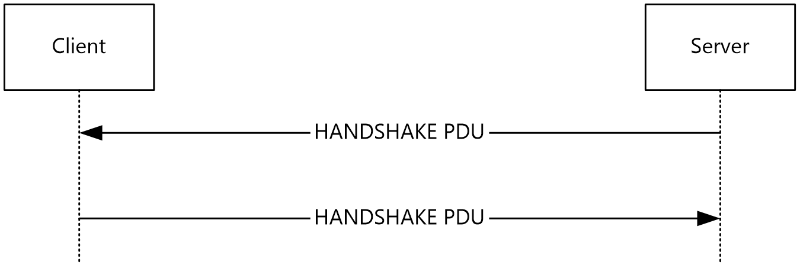

Figure 1: Handshake PDU

<a id="Section_1.3.2.2"></a>
#### 1.3.2.2 RAIL Session Disconnection and Reconnection

RAIL Session Disconnection and RAIL Session Reconnection follow the corresponding Remote Desktop Protocol: Basic Connectivity and Graphics Remoting sequences, as specified in [MS-RDPBCGR](#Section_2.2.1) section 1.3.1.4 (Disconnection Sequences) and [MS-RDPBCGR] section 1.3.1.5 (Automatic Reconnection).

<a id="Section_1.3.2.3"></a>
#### 1.3.2.3 RAIL Server/Client Synchronization

A [**RAIL**](#gt_remote-applications-integrated-locally-rail) server synchronizes with the RAIL client over the RDP channel upon connection establishment or when a [**desktop switch**](#gt_desktop-switch) occurs.

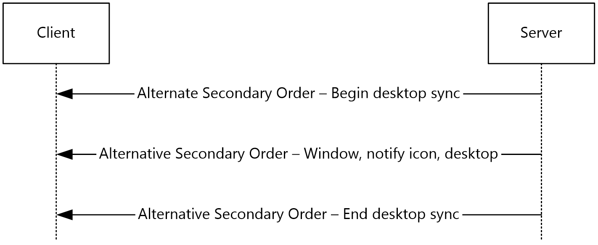

Figure 2: RAIL protocol client synchronization

The synchronization begins with a Desktop Information Order with the WINDOW_ORDER_FIELD_DESKTOP_ARC_BEGAN(0x00000008) flag set in the **Hdr** field (section [2.2.1.3.3.2.2](#Section_2.2.1.3.3.2.2)). Upon receipt of this order, the client clears all previously received information from the server. This order is followed by any number of Windowing Alternate Secondary Drawing Orders describing windows, [**notification icons**](#gt_notification-icon), and desktop. Finally, the server sends a Desktop Information Order with the WINDOW_ORDER_FIELD_DESKTOP_ARC_COMPLETED (0x00000004) flag set to signal the end of synchronization data (section [2.2.1.3.3.2.1](#Section_4.1.1.5)).

After the initial synchronization, Windowing Alternate Secondary Drawing Orders flow from server to client whenever a change occurs in a window, notification icon, or desktop state.

If the server is not capable of monitoring the desktop (for example, secure desktop), it sends a Desktop Information Order with the WINDOW_ORDER_FIELD_DESKTOP_NONE (0x00000001) flag set in the **Hdr** field (section 2.2.1.3.3.2.2). Upon receipt of this order, the client clears out all previously received information from the server.

<a id="Section_1.3.2.4"></a>
#### 1.3.2.4 RAIL Virtual Channel Messages

Client/server or server/client messages can flow over the [**RAIL**](#gt_remote-applications-integrated-locally-rail) anytime after the virtual channel handshake sequence (section [2.2.2.2.1](#Section_2.2.2.2.1)). The client sends the [Client Information PDU](#Section_2.2.2.2.2) and the [Client System Parameters Update PDU](#Section_2.2.2.4.1) immediately after the handshake to inform the server of its state and system parameters. If the client includes the TS_RAIL_CLIENTSTATUS_ZORDER_SYNC (0x00000004) flag in the Client Information PDU, then the server creates the marker window (section [3.3.1.3](#Section_3.3.1.3)) and sends the ID of this window to the client using the [Z-Order Sync Information PDU (section 2.2.2.11.1)](#Section_2.2.2.11.1). If the client includes the TS_RAIL_CLIENTSTATUS_WINDOW_RESIZE_MARGIN_SUPPORTED (0x00000010) flag in the Client Information PDU, then the server sends the dimensions of the window resize margins in the Window Information PDU (section [2.2.1.3.1](#Section_2.2.1.3.1.2)). If the client includes the TS_RAIL_CLIENTSTATUS_APPBAR_REMOTING_SUPPORTED (0x00000040) flag in the Client Information PDU, then the server sends the registration state and edge messages for [**application desktop toolbars**](#gt_application-desktop-toolbar) in the Window Information PDU (section 2.2.1.3.1). The server sends the [Server System Parameters Update PDU](#Section_2.2.2.5.1) immediately after the handshake to inform the client of its system parameters. All other virtual channel messages are generated in response to events on the client or server. If the client includes the TS_RAIL_CLIENTSTATUS_POWER_DISPLAY_REQUEST_SUPPORTED (0x00000080) flag in the Client Information PDU, then the server sends [**display-required power requests**](#gt_display-required-power-request) to the client using the Power Display Request PDU (section [2.2.2.13.1](#Section_2.2.2.13.1)).

<a id="Section_1.3.2.5"></a>
#### 1.3.2.5 RAIL Local Move/Resize

Local move/resize features are [**RAIL**](#gt_remote-applications-integrated-locally-rail) options designed to optimize bandwidth in certain situations where [**RAIL windows**](#gt_rail-window) are moved or resized by the user. A RAIL client indicates to the RAIL server whether it supports local move/resize through the Client Capabilities PDU (section [2.2.2.2.2](#Section_2.2.2.2.2)), sent after the Virtual Channel handshake sequence. RAIL servers do not have to explicitly report move/size support to the client.

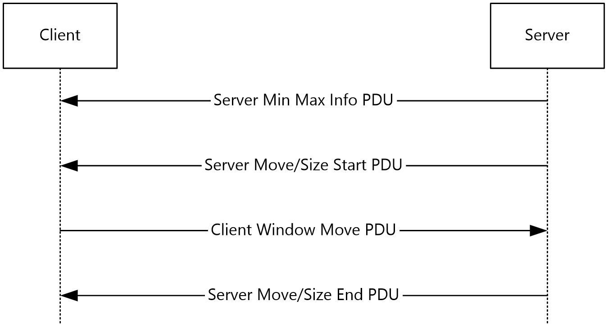

Figure 3: RAIL local move/resize operation

Local move/resize is based on the following logic:

- When the server detects that a window is beginning to be moved or resized, it sends a [Server Min Max Info PDU (section 2.2.2.7.1)](#Section_2.2.2.7.1) to the client with the window extents. This is followed by a [Server Move/Size Start PDU (section 2.2.2.7.2)](#Section_2.2.2.7.2).
- If the client supports local move/resize, it injects a mouse button-down at the position indicated by the move/size PDU (if the move/size was initiated via mouse) or posts a command to the window (if the move/size was initiated via keyboard) to initiate move/resize of the window by the local window manager.
- At the same time, the client lets the local Window Manager handle all keyboard and mouse events for the RAIL window, instead of redirecting to the server, to ensure that the move/size is entirely happening locally.
- Finally, when the user is done with the move/resize, the local RAIL window receives this notification and forwards a mouse button-up to the server to end move/size on the server. For keyboard-based moves and all resize operations, the client also sends a [Client Window Move PDU (section 2.2.2.7.4)](#Section_2.2.2.7.4) to the server to inform the server of the window's new position and size. (For mouse-based moves, the mouse button-up is sufficient to inform the window's final position).
- When the server detects that move/size has ended, it sends a [Server Move/Size End PDU (section 2.2.2.7.3)](#Section_2.2.2.7.3) with the final window position and size. The client can adjust its local RAIL window if necessary using this information.
<a id="Section_1.3.3"></a>
### 1.3.3 Enhanced RemoteApp

Enhanced RemoteApp is a graphics presentation mode supported by RDP 8.1 that leverages the Remote Desktop Protocol: Graphics Pipeline Extension ([MS-RDPEGFX](../MS-RDPEGFX/MS-RDPEGFX.md) section 1.3) to remote only the contents of the windows running in a RAIL session (see [MS-RDPEGFX] section 1.5 for implementation requirements). This implies that the desktop background is not remoted and a client that supports Enhanced RemoteApp will always have access to the complete contents of a RAIL window, even if the window is obscured on the server.

<a id="Section_1.3.4"></a>
### 1.3.4 Window Resize Margins

Window resize margins are supported by RDP 10.2. The dimensions of these margins are defined by the server and are to be used by the client to create a transparent hit-testable region around the RemoteApp window graphics. Any mouse, pen, or touch input within these margins is to be sent to the server.

Window resize margins must be used to extend the window geometry and are not included in the boundaries of the window sent in the Window Information Order (section [2.2.1.3.1.2.1](#Section_2.2.1.3.1)).


Figure 4: Window Resize Margins

<a id="Section_1.4"></a>
## 1.4 Relationship to Other Protocols

RAIL extends the Remote Desktop Protocol: Basic Connectivity and Graphics Remoting Specification [MS-RDPBCGR](#Section_2.2.1).

<a id="Section_1.5"></a>
## 1.5 Prerequisites/Preconditions

The Remote Programs Extensions for Remote Desktop Protocol has the assumption to operate in a fully operational RDP connection. A fully operational RDP connection is a connection that has passed the Connection Finalization phase, as specified in [MS-RDPBCGR](#Section_2.2.1) section 1.3.1.1.

The [**RAIL**](#gt_remote-applications-integrated-locally-rail) server endpoint expects that the Channel PDU Header ([MS-RDPBCGR] section 2.2.6.1.1) is visible for all data that flows over the RAIL virtual channel (sections [1.3.1](../MS-RDPBCGR/MS-RDPBCGR.md) and [2.2.2](#Section_2.2.2)). To ensure that this condition is met, the CHANNEL_FLAG_SHOW_PROTOCOL (0x00000010) flag has to be set in the **flags** field of the Channel PDU Header.

<a id="Section_1.6"></a>
## 1.6 Applicability Statement

The Remote Desktop Protocol: Remote Programs Virtual Channel Extension applies only to RDP 6.0 and later.

<a id="Section_1.7"></a>
## 1.7 Versioning and Capability Negotiation

Versioning: [**RAIL**](#gt_remote-applications-integrated-locally-rail) is supported in RDP 6.0 and later clients only. The RDP version is negotiated as a part of the Remote Desktop Protocol: Basic Connectivity and Graphics Remoting (as specified in [MS-RDPBCGR](#Section_2.2.1) section 1.7). Capability: RAIL-specific capabilities for [Remote Programs](#Section_2.2.1.1.1) and [Window List](#Section_2.2.1.1.2) are negotiated via the Demand Active and Confirm Active PDUs of the server and client, respectively (as specified in [MS-RDPBCGR] section 2.2.1.13).

<a id="Section_1.8"></a>
## 1.8 Vendor-Extensible Fields

This protocol uses Win32 error codes as defined in [MS-ERREF](../MS-ERREF/MS-ERREF.md) section 2.2. Vendors SHOULD reuse those values with their indicated meaning. Choosing any other value runs the risk of a collision in the future.

<a id="Section_1.9"></a>
## 1.9 Standards Assignments

The Remote Desktop Protocol: Remote Programs Virtual Channel Extension does not use any assigned standards.

<a id="Section_2"></a>
# 2 Messages

The following sections specify how Remote Desktop Protocol: Remote Programs Virtual Channel Extension messages are transported and Remote Desktop Protocol: Remote Programs Virtual Channel Extension message syntax.

This protocol references commonly used data types as defined in [MS-DTYP](../MS-DTYP/MS-DTYP.md).

<a id="Section_2.1"></a>
## 2.1 Transport

The Remote Desktop Protocol: Remote Programs Virtual Channel Extension messages are passed between the client and server, embedded within an RDP connection, as described in section [1.3.1](#Section_1.3.1) for an overview.

The protocol uses the TCP connection created by the Remote Desktop Protocol: Basic Connectivity and Graphics Remoting (as specified in [MS-RDPBCGR](#Section_2.2.1) section 2.1) and does not establish any transport connections.

<a id="Section_2.2"></a>
## 2.2 Message Syntax

<a id="Section_2.2.1"></a>
### 2.2.1 Updates to the Remote Desktop Protocol: Basic Connectivity and Graphics Remoting Specification

Support for [**RAIL**](#gt_remote-applications-integrated-locally-rail) is indicated by the client and server during the connection establishment phase of the Remote Desktop Protocol: Basic Connectivity and Graphics Remoting [MS-RDPBCGR](#Section_2.2.1), as described in section [1.3.2.1](#Section_1.3.2.1) for an overview of how the RAIL connection is established.

The Remote Desktop Protocol: Basic Connectivity and Graphics Remoting has also been extended to support windowing-specific drawing orders for RAIL scenarios. These orders, called Windowing Alternate Secondary Drawing Orders, describe state for windows, [**notification icons**](#gt_notification-icon), and desktop-related information on the server. The following sections outline the capability sets and drawing orders that make up the Remote Desktop Protocol: Basic Connectivity and Graphics Remoting extensions for RAIL.

<a id="Section_2.2.1.1"></a>
#### 2.2.1.1 Capability Sets

A [**RAIL**](#gt_remote-applications-integrated-locally-rail) server and client indicate support for RAIL by exchanging two capability sets during the capabilities negotiation phase of RDP connection establishment. These sets are outlined in the following sections.

<a id="Section_2.2.1.1.1"></a>
##### 2.2.1.1.1 Remote Programs Capability Set

The Remote Programs Capability Set is sent by the server in the Demand Active PDU and by the client in the Confirm Active PDU, as specified in [MS-RDPBCGR](#Section_2.2.1) section 2.2.1.13. It indicates that the client and server are capable of communicating [**RAIL**](#gt_remote-applications-integrated-locally-rail) PDUs over the RAIL static virtual channel.

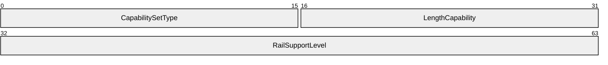

**CapabilitySetType (2 bytes):** An unsigned 16-bit integer. The type of the capability set. This field MUST be set to 0x0017 (CAPSTYPE_RAIL).

**LengthCapability (2 bytes):** An unsigned 16-bit integer. The combined length of the **CapabilitySetType**, **LengthCapability**, and **RailSupportLevel** fields, in bytes.

**RailSupportLevel (4 bytes):** A 4-byte bit field specifying support for Remote Programs and the Docked Language Bar for Remote Programs.<1>

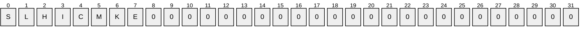

Where the bits are defined as:

| Value | Description |
| --- | --- |
| S TS_RAIL_LEVEL_SUPPORTED | Set to 1 if the client/server is capable of supporting Remote Programs; set to 0 otherwise. |
| L TS_RAIL_LEVEL_DOCKED_LANGBAR_SUPPORTED | Set to 1 if the client/server is capable of supporting Docked Language Bar for Remote Programs; set to 0 otherwise. This flag MUST be set to 0 if TS_RAIL_LEVEL_SUPPORTED is 0. |
| H TS_RAIL_LEVEL_SHELL_INTEGRATION_SUPPORTED | Set to 1 if the client/server is capable of supporting extended shell integration like tabbed windows and overlay icons for Remote Programs; set to 0 otherwise. This flag MUST be set to 0 if TS_RAIL_LEVEL_SUPPORTED is 0. |
| I TS_RAIL_LEVEL_LANGUAGE_IME_SYNC_SUPPORTED | Set to 1 if the client/server is capable of supporting syncing language/IME changes for Remote Programs; set to 0 otherwise. This flag MUST be set to 0 if TS_RAIL_LEVEL_SUPPORTED is 0. |
| C TS_RAIL_LEVEL_SERVER_TO_CLIENT_IME_SYNC_SUPPORTED | Set to 1 if the client/server is capable of supporting syncing IME changes originating at the server for Remote Programs; set to 0 otherwise. This flag MUST be set to 0 if TS_RAIL_LEVEL_SUPPORTED is 0. |
| M TS_RAIL_LEVEL_HIDE_MINIMIZED_APPS_SUPPORTED | Set to 1 if the client/server supports hiding minimized windows of Remote Programs on the server; set to 0 otherwise. This flag MUST be set to 0 if TS_RAIL_LEVEL_SUPPORTED is 0. |
| K TS_RAIL_LEVEL_WINDOW_CLOAKING_SUPPORTED | Set to 1 if the client/server supports syncing per-window cloak state changes originating on the client for Remote Programs; set to 0 otherwise. This flag MUST be set to 0 if TS_RAIL_LEVEL_SUPPORTED is 0. |
| E TS_RAIL_LEVEL_HANDSHAKE_EX_SUPPORTED | Set to 1 if the client/server supports the HandshakeEx PDU (section [2.2.2.2.3](#Section_2.2.2.2.3)); set to 0 otherwise. This flag MUST be set to 0 if TS_RAIL_LEVEL_SUPPORTED is 0. |

<a id="Section_2.2.1.1.2"></a>
##### 2.2.1.1.2 Window List Capability Set

The Window List Capability Set is sent by the server in the Demand Active PDU and by the client in the Confirm Active PDU, as specified in [MS-RDPBCGR](#Section_2.2.1) section 2.2.1.13. It indicates that the client and server are capable of communicating Windowing Alternate Secondary Drawing Orders as extensions to the core RDP protocol drawing orders (see section [2.2.1.3](#Section_4.1.1)).

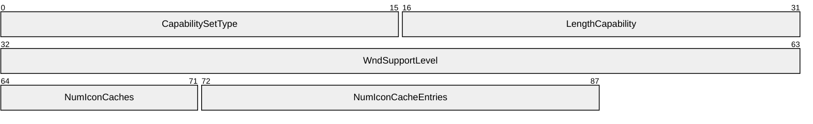

**CapabilitySetType (2 bytes):** An unsigned 16-bit integer. The type of capability set. This field MUST be set to 0x0018 (CAPSTYPE_WINDOW).

**LengthCapability (2 bytes):** An unsigned 16-bit integer. Specifies the combined length of the **CapabilitySetType**, **LengthCapability**, **WndSupportLevel**, **NumIconCaches**, and **NumIconCacheEntries** fields, in bytes.

**WndSupportLevel (4 bytes):** An unsigned 32-bit integer. The windowing support level. This field MUST be set to one of the following values.<2>

| Value | Meaning |
| --- | --- |
| TS_WINDOW_LEVEL_NOT_SUPPORTED 0x00000000 | The client or server is not capable of supporting Windowing Alternate Secondary Drawing Orders. |
| TS_WINDOW_LEVEL_SUPPORTED 0x00000001 | The client or server is capable of supporting Windowing Alternate Secondary Drawing Orders. |
| TS_WINDOW_LEVEL_SUPPORTED_EX 0x00000002 | The client or server is capable of supporting Windowing Alternate Secondary Drawing Orders and the following flags: WINDOW_ORDER_FIELD_CLIENTAREASIZE WINDOW_ORDER_FIELD_RPCONTENT WINDOW_ORDER_FIELD_ROOTPARENT |

**NumIconCaches (1 byte):** An unsigned 8-bit integer. The number of icon caches requested by the server (Demand Active PDU) or supported by the client (Confirm Active PDU).

The server maintains an icon cache and refers to it to avoid sending duplicate icon information (see section [2.2.1.3.1.2.3](#Section_2.2.1.3.1.2.3)). The client also maintains an icon cache and refers to it when the server sends across a Cached Icon Window Information Order.

**NumIconCacheEntries (2 bytes):** An unsigned 16-bit integer. The number of entries within each icon cache requested by the server (Demand Active PDU) or supported by the client (Confirm Active PDU).

The server maintains an icon cache and refers to it to avoid sending duplicate icon information (see section 2.2.1.3.1.2.3). The client also maintains an icon cache and refers to it when the server sends across a Cached Icon Window Information Order.

<a id="Section_2.2.1.2"></a>
#### 2.2.1.2 Common Structures

<a id="Section_2.2.1.2.1"></a>
##### 2.2.1.2.1 Unicode String (UNICODE_STRING)

The UNICODE_STRING packet is used to pack a variable-length Unicode string.

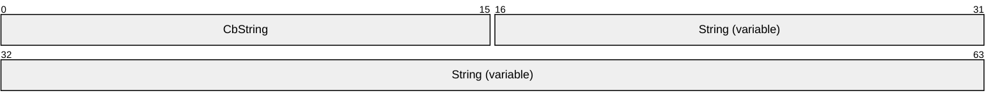

**CbString (2 bytes):** An unsigned 16-bit integer. The number of bytes in the **String** field. If CbString is zero (0), then the **String** field is absent. The maximum allowed value for **CbString** depends on the context in which the string is used.

**String (variable):** Optional and of variable length. A non-null-terminated Unicode character string. The number of characters in the string is equal to the value of **CbString** divided by 2.

<a id="Section_2.2.1.2.2"></a>
##### 2.2.1.2.2 Rectangle (TS_RECTANGLE_16)

The TS_RECTANGLE_16 structure describes a rectangle by using its top-left and bottom-right coordinates. The units depend on the context in which this structure is used.

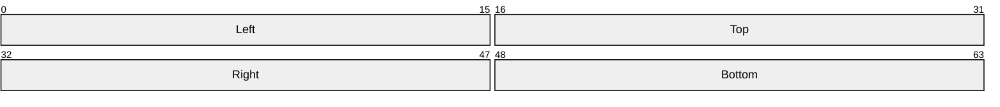

**Left (2 bytes):** An unsigned 16-bit integer. The x-coordinate of the rectangle's top-left corner.

**Top (2 bytes):** An unsigned 16-bit integer. The y-coordinate of the rectangle's top-left corner.

**Right (2 bytes):** An unsigned 16-bit integer. The x-coordinate of the rectangle's bottom-right corner.

**Bottom (2 bytes):** An unsigned 16-bit integer. The y-coordinate of the rectangle's bottom-right corner.

<a id="Section_2.2.1.2.3"></a>
##### 2.2.1.2.3 Icon Info (TS_ICON_INFO)

The TS_ICON_INFO packet describes an icon.

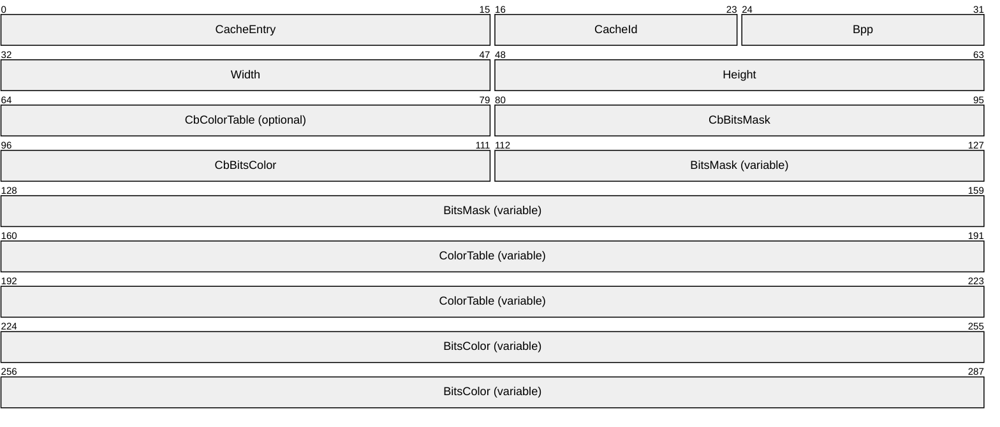

**CacheEntry (2 bytes):** An unsigned 16-bit integer. The index within an icon cache at which this icon MUST be stored at the client. The index is unique within a given **CacheId** (see following description). The maximum value of **CacheEntry** is negotiated between server and client through the **NumIconCacheEntries** field of the [Window List Capability Set](#Section_2.2.1.1.2) during the connection establishment phase.

**CacheId (1 byte):** An unsigned 8-bit integer. The index of the icon cache at which this icon MUST be stored at the client. If the value is 0xFFFF, the icon SHOULD NOT be cached. The **CacheId** is unique within a remote session.

The maximum value of **CacheId** is negotiated between server and client through the **NumIconCaches** field of the Window List Capability Set while establishing the connection.

**Bpp (1 byte):** An unsigned 8-bit integer. The color depth of the icon. Valid values are as follows:

1, 4, 8, 16, 24, 32.

**Width (2 bytes):** An unsigned 16-bit integer. The width, in pixels, of the icon.

**Height (2 bytes):** An unsigned 16-bit integer. The height, in pixels, of the icon.

**CbColorTable (2 bytes):** An unsigned 16-bit integer. The size, in bytes, of the color table data. This field is ONLY present if the **bits per pixel (Bpp)** value is 1, 4, or 8.

**CbBitsMask (2 bytes):** An unsigned 16-bit integer. The size, in bytes, of the icon's one-bit color-depth mask image.

**CbBitsColor (2 bytes):** An unsigned 16-bit integer. The size, in bytes, of the icon's color image.

**BitsMask (variable):** The image data for the 1-bpp bitmap. The length, in bytes, of this field is equal to the value of **CbBitsMask**. This field is optional.

**ColorTable (variable):** The image data for the color bitmap. The length, in bytes, of this field is equal to the value of **CbColorTable**. This field is only present if the **Bpp** value is 1, 4, or 8.

**BitsColor (variable):** The image data for the icon's color image. The length, in bytes, of this field is equal to the value of **CbBitsColor**. This field is optional.

<a id="Section_2.2.1.2.4"></a>
<a id="Section_2.2.1.3.1.2.3"></a>
##### 2.2.1.2.4 Cached Icon Info (TS_CACHED_ICON_INFO)

The TS_CACHED_ICON_INFO packet describes a cached icon.

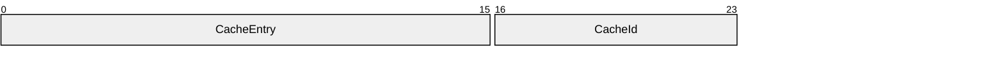

**CacheEntry (2 bytes):** An unsigned 16-bit integer. The index within an icon cache at the client that refers to the cached icon. This value MUST have been previously specified by the server in the **Icon Info** structure (section [2.2.1.2.3](#Section_2.2.1.2.3)) of a **Window Information Order** (section [2.2.1.3.1](#Section_2.2.1.3.1.2)) or **Icon** structure of a [New or Existing Notification Icon (section 2.2.1.3.2.2.1)](#Section_4.1.1.3).

**CacheId (1 byte):** An unsigned 8-bit integer. The index of the icon cache containing the cached icon. This value MUST have been previously specified by the server in the **Icon Info** structure of a **Window Information Order** or **Icon** structure of a New or Existing Notification Icon.

<a id="Section_2.2.1.3"></a>
#### 2.2.1.3 Windowing Alternate Secondary Drawing Orders

<a id="Section_2.2.1.3.1"></a>
##### 2.2.1.3.1 Window Information

Window Information Orders specify the state of windows on the server.

<a id="Section_2.2.1.3.1.1"></a>
###### 2.2.1.3.1.1 Common Header (TS_WINDOW_ORDER_HEADER)

The TS_WINDOW_ORDER_HEADER packet contains information common to every Windowing Alternate Secondary Drawing Order describing a window.

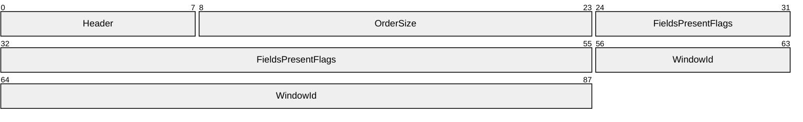

**Header (1 byte):** An unsigned 8-bit integer. An Alternate Secondary Order Header, as specified in [MS-RDPEGDI](../MS-RDPEGDI/MS-RDPEGDI.md) section 2.2.2.2.1.3.1.1. The embedded **orderType** field MUST be set to 0x0B (TS_ALTSEC_WINDOW).

**OrderSize (2 bytes):** An unsigned 16-bit integer. The size of the entire packet, in bytes.

**FieldsPresentFlags (4 bytes):** An unsigned 32-bit integer. The flags indicating which fields are present in the packet. See [Orders](#Section_2.2.1.3.3.2).

**WindowId (4 bytes):** An unsigned 32-bit integer. The ID of the window being described in the drawing order. It is generated by the server and is unique for every window in the session.

<a id="Section_2.2.1.3.1.2"></a>
###### 2.2.1.3.1.2 Orders

<a id="Section_2.2.1.3.1.2.1"></a>
New or Existing Window

A Window Information Order is generated by the server whenever a new window is created on the server or when a property on a new or existing window is updated. The window metrics sent in this order are illustrated in the "An illustration of the window metrics sent in the Window Information Order" figure in section [3.3.5.1.6](#Section_3.3.5.1.6).

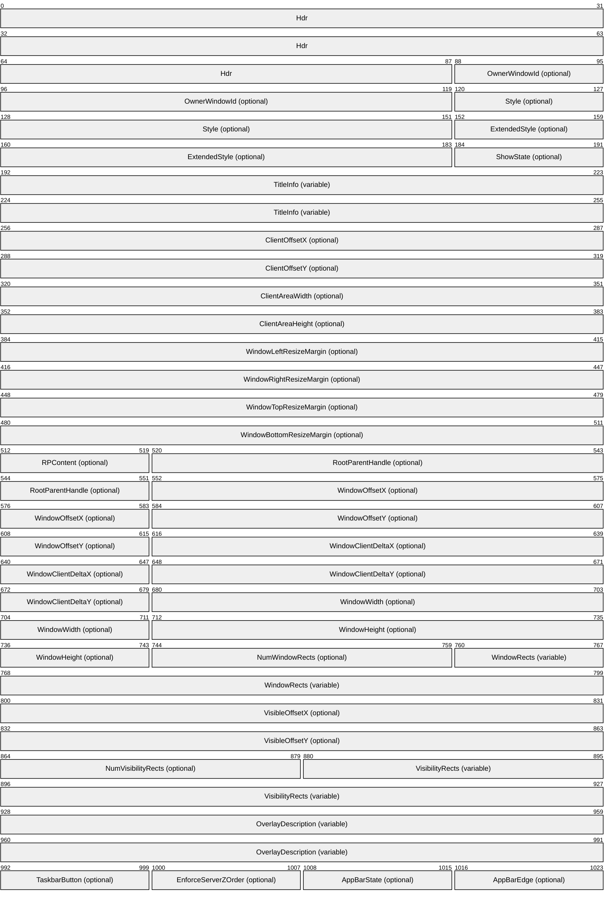

**Hdr (11 bytes):** Eleven bytes. Common Window AltSec Order header, [TS_WINDOW_ORDER_HEADER](#Section_2.2.1.3.1.1). The **FieldsPresentFlags** field of the header MUST conform to the values defined as follows.

| Value | Meaning |
| --- | --- |
| 0x01000000 WINDOW_ORDER_TYPE_WINDOW | Indicates a Windowing Alternate Secondary Drawing Order describing a window. This flag MUST be set. |
| 0x10000000 WINDOW_ORDER_STATE_NEW | Indicates that the Windowing Alternate Secondary Drawing Order contains information for a new window. If this flag is not set, the order contains information for an existing window. |
| 0x00000002 WINDOW_ORDER_FIELD_OWNER | Indicates that the **OwnerWindowId** field is present. |
| 0x00000008 WINDOW_ORDER_FIELD_STYLE | Indicates that the **Style** and **ExtendedStyle** fields are present. |
| 0x00000010 WINDOW_ORDER_FIELD_SHOW | Indicates that the **ShowState** field is present. |
| 0x00000004 WINDOW_ORDER_FIELD_TITLE | Indicates that the **TitleInfo** field is present. |
| 0x00004000 WINDOW_ORDER_FIELD_CLIENTAREAOFFSET | Indicates that the **ClientOffsetX** and **ClientOffsetY** fields are present. |
| 0x00010000 WINDOW_ORDER_FIELD_CLIENTAREASIZE | Indicates that the **ClientAreaWidth** and **ClientAreaHeight** fields are present.<3> |
| 0x00000080 WINDOW_ORDER_FIELD_RESIZE_MARGIN_X | Indicates that the **WindowLeftResizeMargin** and **WindowRightResizeMargin** fields are present. |
| 0x08000000 WINDOW_ORDER_FIELD_RESIZE_MARGIN_Y | Indicates that the **WindowTopResizeMargin** and **WindowBottomResizeMargin** fields are present. |
| 0x00020000 WINDOW_ORDER_FIELD_RPCONTENT | Indicates that the **RPContent** field is present. <4> |
| 0x00040000 WINDOW_ORDER_FIELD_ROOTPARENT | Indicates that the **RootParentHandle** field is present. <5> |
| 0x00000800 WINDOW_ORDER_FIELD_WNDOFFSET | Indicates that the **WindowOffsetX** and **WindowOffsetY** fields are present. |
| 0x00008000 WINDOW_ORDER_FIELD_CLIENTDELTA | Indicates that the **WindowClientDeltaX** and **WindowClientDeltaY** fields are present. |
| 0x00000400 WINDOW_ORDER_FIELD_WNDSIZE | Indicates that the **WindowWidth** and **WindowHeight** fields are present. |
| 0x00000100 WINDOW_ORDER_FIELD_WNDRECTS | Indicates that the **NumWindowRects** and **WindowRects** fields are present. |
| 0x00001000 WINDOW_ORDER_FIELD_VISOFFSET | Indicates that the **VisibleOffsetX** and **VisibleOffsetY** fields are present. |
| 0x00000200 WINDOW_ORDER_FIELD_VISIBILITY | Indicates that the **NumVisibilityRects** and **VisibilityRects** fields are present. |
| 0x00400000 WINDOW_ORDER_FIELD_OVERLAY_DESCRIPTION | Indicates that the **OverlayDescription** field is present. |
| 0x00200000 WINDOW_ORDER_FIELD_ICON_OVERLAY_NULL | Indicates that a taskbar overlay icon previously set by the window has been removed. |
| 0x00800000 WINDOW_ORDER_FIELD_TASKBAR_BUTTON | Indicates that the **TaskbarButton** field is present. |
| 0x00080000 WINDOW_ORDER_FIELD_ENFORCE_SERVER_ZORDER | Indicates that the **EnforceServerZOrder** field is present. |
| 0x00000040 WINDOW_ORDER_FIELD_APPBAR_STATE | Indicates that the **AppBarState** field is present. |
| 0x00000001 WINDOW_ORDER_FIELD_APPBAR_EDGE | Indicates that the **AppBarEdge** field is present. |

**OwnerWindowId (4 bytes):** An unsigned 32-bit integer. The ID of the window on the server that is the owner of the window specified in WindowId field of **Hdr**. For more information on owned windows, see [[MSDN-WINFEATURE]](https://go.microsoft.com/fwlink/?LinkId=90162). This field is present if and only if the WINDOW_ORDER_FIELD_OWNER flag is set in the **FieldsPresentFlags** field of TS_WINDOW_ORDER_HEADER.

**Style (4 bytes):** An unsigned 32-bit integer. Describes the window's current style. Window styles determine the appearance and behavior of a window. For more information, see [[MSDN-WINSTYLE]](https://go.microsoft.com/fwlink/?LinkId=90166). This field is present if and only if the WINDOW_ORDER_FIELD_STYLE flag is set in the **FieldsPresentFlags** field of the TS_WINDOW_ORDER_HEADER.

**ExtendedStyle (4 bytes):** An unsigned 32-bit integer. Extended window style information. For more information about extended window styles, see [[MSDN-CREATEWINEX]](https://go.microsoft.com/fwlink/?LinkId=89982).

This field is present if and only if the WINDOW_ORDER_FIELD_STYLE flag is set in the **FieldsPresentFlags** field of TS_WINDOW_ORDER_HEADER.

**ShowState (1 byte):** An unsigned 8-bit integer. Describes the show state of the window.

This field is present if and only if the WINDOW_ORDER_FIELD_SHOW flag is set in the **FieldsPresentFlags** field of TS_WINDOW_ORDER_HEADER.

The field MUST be one of the following values.

| Value | Meaning |
| --- | --- |
| 0x00 | Do not show the window. |
| 0x02 | Show the window minimized. |
| 0x03 | Show the window maximized. |
| 0x05 | Show the window in its current size and position. |

**TitleInfo (variable):** [UNICODE_STRING](#Section_2.2.1.2.1). Variable length. Contains the window's title string. This string is not guaranteed to be null-terminated. The maximum value for the **CbString** field of UNICODE_STRING is 520 bytes. This structure is present only if the WINDOW_ORDER_FIELD_TITLE flag is set in the **FieldsPresentFlags** field of TS_WINDOW_ORDER_HEADER.

**ClientOffsetX (4 bytes):** A 32-bit signed integer. The X (horizontal) offset from the top-left corner of the screen to the top-left corner of the window's [**client area**](#gt_client-area), expressed in [**screen coordinates**](#gt_screen-coordinates).

This field is present only if the WINDOW_ORDER_FIELD_CLIENTAREAOFFSET flag is set in the **FieldsPresentFlags** field of TS_WINDOW_ORDER_HEADER.

**ClientOffsetY (4 bytes):** A 32-bit signed integer. The Y (vertical) offset from the top-left corner of the screen to the top-left corner of the window's client area, expressed in screen coordinates.

This field is present only if the WINDOW_ORDER_FIELD_CLIENTAREAOFFSET flag is set in the FieldsPresentFlags field of TS_WINDOW_ORDER_HEADER.

**ClientAreaWidth (4 bytes):** An unsigned 32-bit integer specifying the width of the client area rectangle of the target window.

This field only appears if the **WndSupportLevel** field of the [Window List Capability Set](#Section_2.2.1.1.2) message is set to TS_WINDOW_LEVEL_SUPPORTED_EX (as specified in section 2.2.1.1.2) and the WINDOW_ORDER_FIELD_CLIENTAREASIZE flag is set in the **FieldsPresentFlags** field of the TS_WINDOW_ORDER_HEADER packet (section 2.2.1.3.1.1).

**ClientAreaHeight (4 bytes):** An unsigned 32-bit integer specifying the height of the client area rectangle of the target window.

This field only appears if the **WndSupportLevel** field of the Window List Capability Set message is set to TS_WINDOW_LEVEL_SUPPORTED_EX (as specified in section 2.2.1.1.2) and the **Hdr** field has the WINDOW_ORDER_FIELD_CLIENTAREASIZE flag is set in the **FieldsPresentFlags** field of the TS_WINDOW_ORDER_HEADER packet (section 2.2.1.3.1.1).

**WindowLeftResizeMargin (4 bytes):** An unsigned 32-bit integer specifying the width of the transparent hit-testable margin along the left edge of the window. Any mouse, pen, or touch input within this margin SHOULD be sent to the server.

This field is present only if the WINDOW_ORDER_FIELD_RESIZE_MARGIN_X flag is set in the **FieldsPresentFlags** field of TS_WINDOW_ORDER_HEADER.

Resize margins SHOULD be used to extend the window geometry (defined by the **WindowOffsetX**, **WindowOffsetY**, **WindowWidth** and **WindowHeight** fields) and are not included in the window boundaries.

**WindowRightResizeMargin (4 bytes):** An unsigned 32-bit integer specifying the width of the transparent hit-testable margin along the right edge of the window. Any mouse, pen or touch input within this margin SHOULD be sent to the server.

This field is present only if the WINDOW_ORDER_FIELD_RESIZE_MARGIN_X flag is set in the **FieldsPresentFlags** field of TS_WINDOW_ORDER_HEADER.

Resize margins SHOULD be used to extend the window geometry (defined by the **WindowOffsetX**, **WindowOffsetY**, **WindowWidth** and **WindowHeight** fields) and are not included in the window boundaries.

**WindowTopResizeMargin (4 bytes):** An unsigned 32-bit integer specifying the height of the transparent hit-testable margin along the top edge of the window. Any mouse, pen or touch input within this margin SHOULD be sent to the server.

This field is present only if the WINDOW_ORDER_FIELD_RESIZE_MARGIN_Y flag is set in the **FieldsPresentFlags** field of TS_WINDOW_ORDER_HEADER.

Resize margins SHOULD be used to extend the window geometry (defined by the **WindowOffsetX**, **WindowOffsetY**, **WindowWidth** and **WindowHeight** fields) and are not included in the window boundaries.

**WindowBottomResizeMargin (4 bytes):** An unsigned 32-bit integer specifying the height of the transparent hit-testable margin along the bottom edge of the window. Any mouse, pen or touch input within this margin SHOULD be sent to the server.

This field is present only if the WINDOW_ORDER_FIELD_RESIZE_MARGIN_Y flag is set in the **FieldsPresentFlags** field of TS_WINDOW_ORDER_HEADER.

Resize margins SHOULD be used to extend the window geometry (defined by the **WindowOffsetX**, **WindowOffsetY**, **WindowWidth** and **WindowHeight** fields) and are not included in the window boundaries.

**RPContent (1 byte):** An unsigned BYTE that MUST be set to one of the following possible values.

| Value | Meaning |
| --- | --- |
| 0x00 | The window is not used by a render plug-in to do client-side rendering. |
| 0x01 | The window is used by a render plug-in to do client-side rendering. |

This field only appears if the **WndSupportLevel** field of the Window List Capability Set message is set to TS_WINDOW_LEVEL_SUPPORTED_EX (as specified in section 2.2.1.1.2) and the **Hdr** field has the WINDOW_ORDER_FIELD_RPCONTENT flag is set in the **FieldsPresentFlags** field of the TS_WINDOW_ORDER_HEADER packet (section 2.2.1.3.1.1).

**RootParentHandle (4 bytes):** An unsigned 32-bit integer specifying the server-side target window's top-level parent window handle. A Top-Level parent window is the window immediately below "desktop" in the window hierarchy. If the target window is a top-level window, the window handle of the target window is sent.

This field only appears if the **WndSupportLevel** field of the Window List Capability Set message is set to TS_WINDOW_LEVEL_SUPPORTED_EX (as specified in section 2.2.1.1.2) and the **Hdr** field has the WINDOW_ORDER_FIELD_ROOTPARENT flag is set in the **FieldsPresentFlags** field of the TS_WINDOW_ORDER_HEADER packet (section 2.2.1.3.1.1).

**WindowOffsetX (4 bytes):** A 32-bit signed integer. The X (horizontal) offset from the top-left corner of the primary monitor to the top-left corner of the window, expressed in screen coordinates.

This field is present only if the WINDOW_ORDER_FIELD_WNDOFFSET flag is set in the **FieldsPresentFlags** field of TS_WINDOW_ORDER_HEADER.

**WindowOffsetY (4 bytes):** A 32-bit signed integer. The Y (vertical) offset from the top-left corner of the primary monitor to the top-left corner of the window, expressed in screen coordinates.

This field is present only if the WINDOW_ORDER_FIELD_WNDOFFSET flag is set in the **FieldsPresentFlags** field of TS_WINDOW_ORDER_HEADER.

**WindowClientDeltaX (4 bytes):** A 32-bit signed integer. The X (horizontal) delta between the top-left corner of the window and the window's client area.

This field is present only if the WINDOW_ORDER_FIELD_CLIENTDELTA flag is set in the **FieldsPresentFlags** field of TS_WINDOW_ORDER_HEADER.

**WindowClientDeltaY (4 bytes):** A 32-bit signed integer. The Y (vertical) delta between the top-left corner of the window and the window's client area.

This field is present only if the WINDOW_ORDER_FIELD_CLIENTDELTA flag is set in the **FieldsPresentFlags** field of TS_WINDOW_ORDER_HEADER.

**WindowWidth (4 bytes):** An unsigned 32-bit integer. The window width, in screen coordinates.

This field is present only if the WINDOW_ORDER_FIELD_WNDSIZE flag is set in the **FieldsPresentFlags** field of TS_WINDOW_ORDER_HEADER.

**WindowHeight (4 bytes):** An unsigned 32-bit integer. The window height, in screen coordinates.

This field is present only if the WINDOW_ORDER_FIELD_WNDSIZE flag is set in the **FieldsPresentFlags** field of TS_WINDOW_ORDER_HEADER.

**NumWindowRects (2 bytes):** An unsigned 16-bit integer. A count of rectangles describing the window geometry.

This field is present only if the WINDOW_ORDER_FIELD_WNDRECTS flag is set in the **FieldsPresentFlags** field of TS_WINDOW_ORDER_HEADER.

**WindowRects (variable):** An array of [TS_RECTANGLE_16](#Section_2.2.1.2.2) structures, **NumWindowRects** wide, describing the window geometry. All coordinates are [**window coordinates**](#gt_window-coordinates).

This field is present only if the **NumWindowRects** field is greater than 0 and the WINDOW_ORDER_FIELD_WNDRECTS flag is set in the **FieldsPresentFlags** field of TS_WINDOW_ORDER_HEADER.

**VisibleOffsetX (4 bytes):** A 32-bit signed integer. The X (horizontal) offset from the top-left corner of the screen to the top-left corner of the [**window visible region's**](#gt_4f7a2af4-2be0-4c34-88ea-0c2ebc1d8c14) bounding rectangle, expressed in screen coordinates.<6>

This field is present only if the WINDOW_ORDER_FIELD_VISOFFSET flag is set in the **FieldsPresentFlags** field of TS_WINDOW_ORDER_HEADER.

**VisibleOffsetY (4 bytes):** A 32-bit signed integer. The Y (vertical) offset from the top-left corner of the screen to the top-left corner of the window visible region's bounding rectangle, expressed in screen coordinates.<7>

This field is present only if the WINDOW_ORDER_FIELD_VISOFFSET flag is set in the **FieldsPresentFlags** field of TS_WINDOW_ORDER_HEADER.

**NumVisibilityRects (2 bytes):** An unsigned 16-bit integer. A count of rectangles describing the window visible region.

This field is present only if the WINDOW_ORDER_FIELD_VISIBILITY flag is set in the **FieldsPresentFlags** field of TS_WINDOW_ORDER_HEADER.

**VisibilityRects (variable):** An array of TS_RECTANGLE_16 structures, **NumVisibilityRects** wide, describing the window visible region. All coordinates are window coordinates.

This field is present only if the value of the **NumVisibilityRects** field is greater than 0 and the WINDOW_ORDER_FIELD_VISIBILITY flag is set in the **FieldsPresentFlags** field of TS_WINDOW_ORDER_HEADER.

**OverlayDescription (variable, optional):** A variable length UNICODE_STRING (section 2.2.1.2.1) that contains the description text for the window's overlay icon (see sections [2.2.1.3.1.2.2](#Section_2.2.1.3.1.2.2) and [2.2.1.3.1.2.3](#Section_2.2.1.3.1.2.3)).

This field is present only if the WINDOW_ORDER_FIELD_OVERLAY_DESCRIPTION flag is set in the **FieldsPresentFlags** field of TS_WINDOW_ORDER_HEADER.

**TaskbarButton (1 byte, optional):** An 8-bit unsigned integer. If this field is set to 0x00, then the client SHOULD add a tab to the taskbar button group for the window, if supported by the operating system, instead of adding a new taskbar button for the window. If this field is set to 0x01, then the client SHOULD remove the tab from the taskbar button group for the window.

Windows share a taskbar button group if they have matching Application IDs, as specified by the **Server Get Application ID Response PDU** (section [2.2.2.8.1](#Section_2.2.2.8.1)).

This field is present only if the WINDOW_ORDER_FIELD_TASKBAR_BUTTON flag is set in the **FieldsPresentFlags** field of TS_WINDOW_ORDER_HEADER.

**EnforceServerZOrder (1 byte, optional):** An 8-bit unsigned integer. If this field is set to 0x01, then the client SHOULD order this window, and all other windows in the Z-order list (in the **Actively Monitored Desktop** packet, as specified in section [2.2.1.3.3.2.1](#Section_4.1.1.5)) that also have the field set consecutively per the Z-order hierarchy. The client SHOULD NOT attempt to reorder these windows with respect to each other, or to move any window between the windows in this group.

If this field is set to 0x00, then no special Z-order handling is required.

This field is present only if the WINDOW_ORDER_FIELD_ENFORCE_SERVER_ZORDER flag is set in the **FieldsPresentFlags** field of TS_WINDOW_ORDER_HEADER.

**AppBarState (1 byte, optional):** An 8-bit unsigned integer. If this field is set to 0x01, then the window SHOULD be registered as an application desktop toolbar. If this field is set to 0x00, then the application desktop toolbar SHOULD be deregistered.

This field is present only if the WINDOW_ORDER_FIELD_APPBAR_STATE flag is set in the **FieldsPresentFlags** field of TS_WINDOW_ORDER_HEADER.

**AppBarEdge (1 byte, optional):** An 8-bit unsigned integer. The value of this field indicates the edge to which the application desktop toolbar SHOULD be anchored. This field MUST be set to one of the following possible values.

| Value | Meaning |
| --- | --- |
| 0x00 | Anchor to the left edge. |
| 0x01 | Anchor to the top edge. |
| 0x02 | Anchor to the right edge. |
| 0x03 | Anchor to the bottom edge. |

This field is present only if the WINDOW_ORDER_FIELD_APPBAR_EDGE flag is set in the **FieldsPresentFlags** field of TS_WINDOW_ORDER_HEADER.

<a id="Section_2.2.1.3.1.2.2"></a>
Window Icon

The Window Icon packet is a Window Information Order generated by the server when a new or existing window sets or updates its associated icon.

Icons are created by combining two bitmaps of the same size. The mask bitmap is always 1 bpp, although the color depth of the color bitmap can vary. The color bitmap can have an associated color table.

The Window Icon order SHOULD NOT be sent if the client specified the TS_RAIL_CLIENTSTATUS_SUPPRESS_ICON_ORDERS flag in the Client Information PDU (section [2.2.2.2.2](#Section_2.2.2.2.2)).

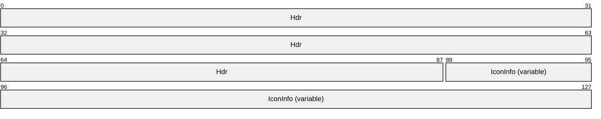

**Hdr (11 bytes):** Eleven bytes. A [TS_WINDOW_ORDER_HEADER](#Section_2.2.1.3.1.1) structure. The **FieldsPresentFlags** field of the header MUST be constructed using the following values.

| Value | Meaning |
| --- | --- |
| 0x01000000 WINDOW_ORDER_TYPE_WINDOW | Indicates a Windowing Alternate Secondary Drawing Order that describes a window. This flag MUST be set. |
| 0x10000000 WINDOW_ORDER_STATE_NEW | Indicates that the Windowing Alternate Secondary Drawing Order contains information for a new window. If this flag is not set, the order contains information for an existing window. |
| 0x40000000 WINDOW_ORDER_ICON | Indicates that the order contains icon information for the window. This flag MUST be set. |
| 0x00002000 WINDOW_ORDER_FIELD_ICON_BIG | Indicates that the large version of the icon is being sent. If this flag is not present, the icon is a small icon. <8> |
| 0x00100000 WINDOW_ORDER_FIELD_ICON_OVERLAY | Indicates that the overlay icon for the window is being sent. If this flag is not present, the icon is an application icon. |

**IconInfo (variable):** Variable length. [TS_ICON_INFO](#Section_2.2.1.2.3) structure. Describes the window's icon.

Cached Icon

The **Cached Icon** Window Information Order is generated by the server when a new or existing window sets or updates the icon in its title bar or in the Alt-Tab dialog box. If the icon information was transmitted by the server in a previous Window Information Order or [**Notification Icon**](#gt_notification-icon) Information Order in the same session, and the icon was cacheable (that is, the server specified a CacheEntry and CacheId for the icon), the server reports the icon cache entries to avoid sending duplicate information.

The Cached Icon packet SHOULD NOT be sent if the client specified the TS_RAIL_CLIENTSTATUS_SUPPRESS_ICON_ORDERS flag in the Client Information PDU (section [2.2.2.2.2](#Section_2.2.2.2.2)).

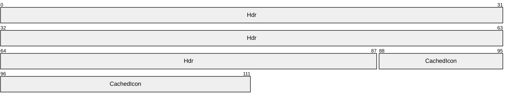

**Hdr (11 bytes):** Eleven bytes. A **TS_WINDOW_ORDER_HEADER** (section [2.2.1.3.1.1](#Section_2.2.1.3.1.1)) structure. The **FieldsPresentFlags** field of the header MUST conform to the values defined as follows.

| Value | Description |
| --- | --- |
| 0x01000000 WINDOW_ORDER_TYPE_WINDOW | Indicates a Windowing Alternate Secondary Drawing Order that describes a window. This flag MUST be set. |
| 0x10000000 WINDOW_ORDER_STATE_NEW | Indicates that the Windowing Alternate Secondary Drawing Order contains information for a new window. If this flag is not set, the order contains information for an existing window. |
| 0x80000000 WINDOW_ORDER_CACHEDICON | Indicates that the order contains cached icon information for the window. This flag MUST be set. |
| 0x00002000 WINDOW_ORDER_FIELD_ICON_BIG | Indicates that the large version of the icon is being referred to. If this flag is not present, the icon is a small icon. <9> |
| 0x00100000 WINDOW_ORDER_FIELD_ICON_OVERLAY | Indicates that the overlay icon for the window is being referred to. If this flag is not present, the icon is an application icon. |

**CachedIcon (3 bytes):** Three bytes. **TS_CACHED_ICON_INFO** (section [2.2.1.2.4](#Section_2.2.1.2.4)) structure. Describes a cached icon on the client.

<a id="Section_2.2.1.3.1.2.4"></a>
Deleted Window

The Deleted Window Information Order is generated by the server whenever an existing window is destroyed on the server.

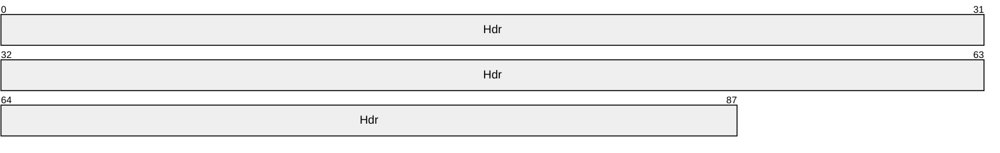

**Hdr (11 bytes):** Eleven bytes. A [TS_WINDOW_ORDER_HEADER](#Section_2.2.1.3.1.1) structure. The **FieldsPresentFlags** field of the header MUST be constructed using the following values.

| Value | Meaning |
| --- | --- |
| 0x01000000 WINDOW_ORDER_TYPE_WINDOW | Indicates a Windowing Alternate Secondary Drawing Order describing a window. This flag MUST be set. |
| 0x20000000 WINDOW_ORDER_STATE_DELETED | Indicates that the window is deleted. If this flag is set, the order MUST NOT contain any other information. |

<a id="Section_2.2.1.3.2"></a>
##### 2.2.1.3.2 Notification Icon Information

Notification Icon Information orders specify the state of the [**notification icon**](#gt_notification-icon) on the server.

<a id="Section_2.2.1.3.2.1"></a>
###### 2.2.1.3.2.1 Common Header (TS_NOTIFYICON_ORDER_HEADER)

The TS_NOTIFYICON_ORDER_HEADER packet contains information common to every Windowing Alternate Secondary Drawing Order specifying a [**notification icon**](#gt_notification-icon).

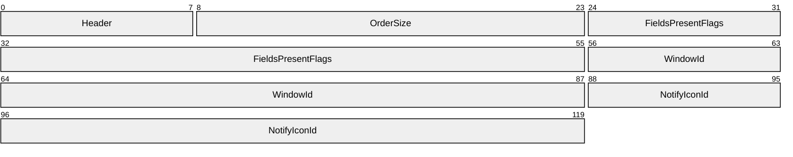

**Header (1 byte):** An unsigned 8-bit integer. An Alternate Secondary Order Header, as specified in [MS-RDPEGDI](../MS-RDPEGDI/MS-RDPEGDI.md) section 2.2.2.2.1.3.1.1. The embedded **orderType** field MUST be set to 0x0B (TS_ALTSEC_WINDOW).

**OrderSize (2 bytes):** An unsigned 16-bit integer. The size, in bytes, of the entire packet.

**FieldsPresentFlags (4 bytes):** An unsigned 32-bit integer. The flags indicating which fields are present in the packet. See [New or Existing Notification Icons](#Section_4.1.1.3).

**WindowId (4 bytes):** An unsigned 32-bit integer. The ID of the window owning the notification icon specified in the drawing order. The ID is generated by the server and is unique for every window in the session.

**NotifyIconId (4 bytes):** An unsigned 32-bit integer. The ID of the notification icon specified in the drawing order. The ID is generated by the application that owns the notification icon and SHOULD be unique for every notification icon owned by the application.

<a id="Section_2.2.1.3.2.2"></a>
###### 2.2.1.3.2.2 Orders

<a id="Section_2.2.1.3.2.2.1"></a>
New or Existing Notification Icons

The Notification Icon Information Order packet is generated by the server whenever a new [**notification icon**](#gt_notification-icon) is created on the server or when an existing notification icon is updated.

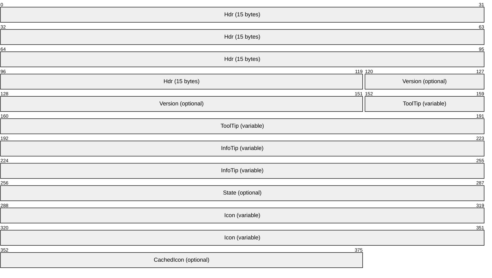

**Hdr (15 bytes):** A [TS_NOTIFYICON_ORDER_HEADER](#Section_2.2.1.3.2.1) structure. Common AltSec Order header. The **FieldsPresentFlags** field of the header MUST conform to the values defined as follows.

| Value | Meaning |
| --- | --- |
| WINDOW_ORDER_TYPE_NOTIFY 0x02000000 | Indicates a Windowing Alternate Secondary Drawing Order specifying a notification icon. This flag MUST be set. |
| WINDOW_ORDER_STATE_NEW 0x10000000 | Indicates that the Windowing Alternate Secondary Drawing Order contains information for a new notification icon. If this flag is set, one of the **Icon** and **CachedIcon** fields MUST be present. If this flag is not set, the Windowing Alternate Secondary Drawing Order contains information for an existing notification icon. |
| WINDOW_ORDER_FIELD_NOTIFY_VERSION 0x00000008 | Indicates that the **Version** field is present. |
| WINDOW_ORDER_FIELD_NOTIFY_TIP 0x00000001 | Indicates that the **ToolTip** field is present. |
| WINDOW_ORDER_FIELD_NOTIFY_INFO_TIP 0x00000002 | Indicates that the **InfoTip** field is present. |
| WINDOW_ORDER_FIELD_NOTIFY_STATE 0x00000004 | Indicates that the **State** field is present. |
| WINDOW_ORDER_ICON 0x40000000 | Indicates that the **Icon** field is present. Either the **Icon** or the **CachedIcon** field SHOULD be present, but not both. |
| WINDOW_ORDER_CACHED_ICON 0x80000000 | Indicates that the **CachedIcon** field is present. Either the **Icon** or the **CachedIcon** field SHOULD be present, but not both. <10> |

**Version (4 bytes):** An unsigned 32-bit integer. Specifies the behavior of the notification icons. This field is present only if the WINDOW_ORDER_FIELD_NOTIFY_VERSION flag is set in the **FieldsPresentFlags** field of TS_NOTIFYICON_ORDER_HEADER. This field MUST be set to one of the following values.

| Value | Meaning |
| --- | --- |
| 0 | Use this value for applications designed for Windows NT 4.0 operating system. |
| 3 | Use the Windows 2000 operating system notification icons behavior. Use this value for applications designed for Windows 2000 and Windows XP operating system. |
| 4 | Use the current behavior. Use this value for applications designed for Windows Vista operating system and Windows 7 operating system. |

For more information about notification icons, see [[MSDN-SHELLNOTIFY]](https://go.microsoft.com/fwlink/?LinkId=90132), the Remarks section.

**ToolTip (variable):** Variable length. [UNICODE_STRING](#Section_2.2.1.2.1). Specifies the text of the notification icon [**tooltip**](#gt_tooltip). This structure is present only if the WINDOW_ORDER_FIELD_NOTIFY_TIP flag is set in the **FieldsPresentFlags** field of TS_NOTIFYICON_ORDER_HEADER.

**InfoTip (variable):** Variable length. A [TS_NOTIFY_ICON_INFOTIP](#Section_7d476f1e31f742fc8daf9a90807266d6) structure. Specifies the notification icon’s [**balloon tooltip**](#gt_balloon-tooltip). This field SHOULD NOT be present for icons that follow Windows 95 operating system behavior (Version = 0). This structure is present only if the WINDOW_ORDER_FIELD_NOTIFY_INFO_TIP flag is set in the **FieldsPresentFlags** field of TS_NOTIFYICON_ORDER_HEADER.

**State (4 bytes):** Unsigned 32-bit integer. Specifies the state of the notification icon. This field SHOULD NOT be present for icons that follow Windows 95 behavior (Version = 0).

This field is present only if the WINDOW_ORDER_FIELD_NOTIFY_STATE flag is set in the **FieldsPresentFlags** field of TS_NOTIFYICON_ORDER_HEADER.

| Value | Meaning |
| --- | --- |
| 1 | The notification icon is hidden. |

**Icon (variable):** Variable length. A [TS_ICON_INFO](#Section_2.2.1.2.3) structure. Specifies the notification icon’s image. This structure is present only if the WINDOW_ORDER_ICON flag is set in the **FieldsPresentFlags** field of TS_NOTIFYICON_ORDER_HEADER.

A Notification Icon Order MUST NOT contain both an **Icon** field and a **CachedIcon** field. If the WINDOW_ORDER_STATE_NEW flag is set, either the **Icon** field or the **CachedIcon** field MUST be present.

**CachedIcon (3 bytes):** Three bytes. A [TS_CACHED_ICON_INFO](#Section_2.2.1.2.4) structure. Specifies the notification icon as a cached icon on the client.

This structure is present only if the WINDOW_ORDER_CACHEDICON flag is set in the **FieldsPresentFlags** field of TS_NOTIFYICON_ORDER_HEADER. Only one of **Icon** and **CachedIcon** fields SHOULD be present in the Notification Icon Order. If the WINDOW_ORDER_STATE_NEW flag is set, only one of these fields MUST be present.

<a id="Section_2.2.1.3.2.2.2"></a>
Deleted Notification Icons

The server generates a [Notification Icon Information (section 2.2.1.3.2)](#Section_2.2.1.3.2) order packet whenever an existing [**notification icon**](#gt_notification-icon) is deleted on the server.

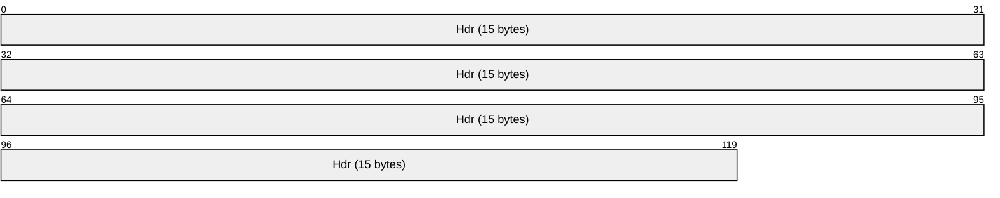

**Hdr (15 bytes):** A [TS_NOTIFYICON_ORDER_HEADER (section 2.2.1.3.2.1)](#Section_2.2.1.3.2.1) structure. The **FieldsPresentFlags** field of the header MUST be constructed using the following values.

| Value | Meaning |
| --- | --- |
| 0x02000000 WINDOW_ORDER_TYPE_NOTIFY | Indicates an order specifying a notification icon. This flag MUST be set. |
| 0x20000000 WINDOW_ORDER_STATE_DELETED | Indicates that the window is deleted. This flag MUST be set, and the order MUST NOT contain any other information. |

<a id="Section_2.2.1.3.2.2.3"></a>
Notification Icon Balloon Tooltip (TS_NOTIFY_ICON_INFOTIP)

The TS_NOTIFY_ICON_INFOTIP structure specifies the [**balloon tooltip**](#gt_balloon-tooltip) of a [**notification icon**](#gt_notification-icon).

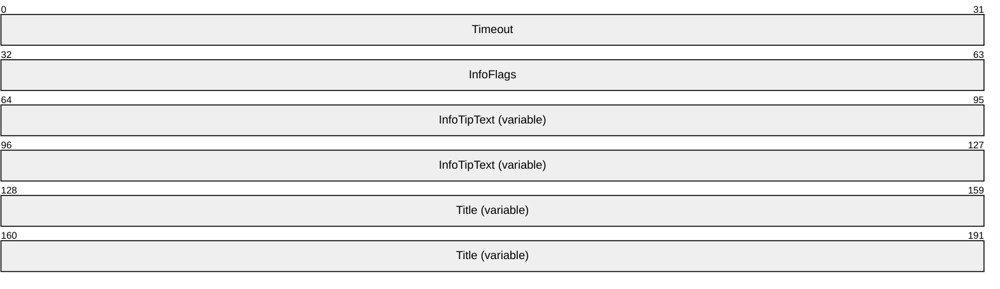

**Timeout (4 bytes):** An unsigned 32-bit integer. The timeout in milliseconds for the notification icon’s balloon tooltip. After the specified timeout, the [**tooltip**](#gt_tooltip) SHOULD be destroyed. <11>

**InfoFlags (4 bytes):** An unsigned 32-bit integer. The flags that can be set to add an icon to a balloon tooltip. It is placed to the left of the title. If the **InfoTipText** field length is zero-length, the icon is not shown.

| Value | Meaning |
| --- | --- |
| NIIF_NONE 0x00000000 | Do not show an icon. |
| NIIF_INFO 0x00000001 | Show an informational icon next to the balloon tooltip text. |
| NIIF_WARNING 0x00000002 | Show a warning icon next to the balloon tooltip text. |
| NIIF_ERROR 0x00000003 | Show an error icon next to the balloon tooltip text. |
| NIIF_NOSOUND 0x00000010 | Do not play an associated sound. |
| NIIF_LARGE_ICON 0x00000020 | Show the large version of the icon. |

**InfoTipText (variable):** Variable length. A [UNICODE_STRING](#Section_2.2.1.2.1) specifying the text of the balloon tooltip. The maximum length of the tooltip text string is 510 bytes.

**Title (variable):** Variable length. A UNICODE_STRING specifying the title of the balloon tooltip. The maximum length of the tooltip title string is 126 bytes.

<a id="Section_2.2.1.3.3"></a>
##### 2.2.1.3.3 Desktop Information

Desktop Information Orders specify the state of the desktop on the server.

<a id="Section_2.2.1.3.3.1"></a>
###### 2.2.1.3.3.1 Common Header (TS_DESKTOP_ORDER_HEADER)

The TS_DESKTOP_ORDER_HEADER packet contains information common to every order specifying the desktop.

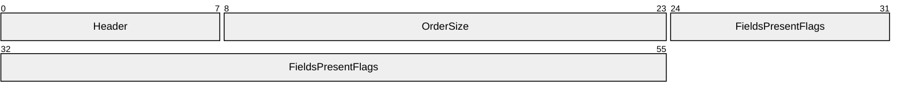

**Header (1 byte):** An unsigned 8-bit integer. An Alternate Secondary Order Header, as specified in [MS-RDPEGDI](../MS-RDPEGDI/MS-RDPEGDI.md) section 2.2.2.2.1.3.1.1. The embedded **orderType** field MUST be set to 0x0B (TS_ALTSEC_WINDOW).

**OrderSize (2 bytes):** An unsigned 16-bit integer. The size of the entire packet in bytes.

**FieldsPresentFlags (4 bytes):** An unsigned 32-bit integer. The flags indicating which fields are present in the packet. See [Actively Monitored Desktop](#Section_4.1.1.5) for values and use.

<a id="Section_2.2.1.3.3.2"></a>
###### 2.2.1.3.3.2 Orders

<a id="Section_2.2.1.3.3.2.1"></a>
Actively Monitored Desktop

The Actively Monitored Desktop packet contains information about the actively monitored desktop.

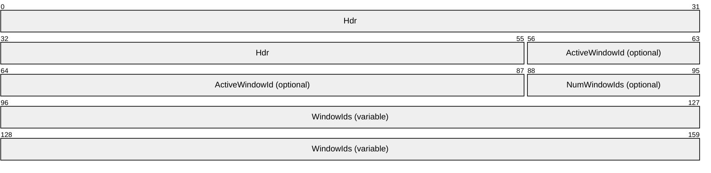

**Hdr (7 bytes):** Seven bytes. A [TS_DESKTOP_ORDER_HEADER](#Section_2.2.1.3.3.1) header. The **FieldsPresentFlags** field of the header MUST be constructed using the following values.

| Value | Meaning |
| --- | --- |
| 0x04000000 WINDOW_ORDER_TYPE_DESKTOP | Indicates an order specifying a desktop. This flag MUST be set. |
| 0x00000002 WINDOW_ORDER_FIELD_DESKTOP_HOOKED | Indicates that the server will be sending information for the server's current input desktop. |
| 0x00000008 WINDOW_ORDER_FIELD_DESKTOP_ARC_BEGAN | Indicates that the server is beginning to synchronize information with the client after the client has auto-reconnected or the server has just begun monitoring a new desktop. If this flag is set, the WINDOW_ORDER_FIELD_DESKTOP_HOOKED flag MUST also be set. |
| 0x00000004 WINDOW_ORDER_FIELD_DESKTOP_ARC_COMPLETED | Indicates that the server has finished synchronizing data after the client has auto-reconnected or the server has just begun monitoring a new desktop. The client SHOULD assume that any window or shell [**notification icon**](#gt_notification-icon) not received during the synchronization is discarded. This flag MUST only be combined with the WINDOW_ORDER_TYPE_DESKTOP flag. |
| 0x00000020 WINDOW_ORDER_FIELD_DESKTOP_ACTIVEWND | Indicates that the **ActiveWindowId** field is present. |
| 0x00000010 WINDOW_ORDER_FIELD_DESKTOP_ZORDER | Indicates that the **NumWindowIds** field is present. If the **NumWindowIds** field has a value greater than 0, the **WindowIds** field MUST also be present. |

**ActiveWindowId (4 bytes):** Optional. An unsigned 32-bit integer. The ID of the currently active window on the server. This field is present if and only if the WINDOW_ORDER_FIELD_DESKTOP_ACTIVEWND flag is set in the **FieldsPresentFlags** field of the TS_DESKTOP_ORDER_HEADER packet (section 2.2.1.3.3.1).

**NumWindowIds (1 byte):** Optional. An unsigned 8-bit integer. The number of top-level windows on the server. This field is present if and only if the WINDOW_ORDER_FIELD_DESKTOP_ZORDER flag is set in the **FieldsPresentFlags** field of the TS_DESKTOP_ORDER_HEADER packet (section 2.2.1.3.3.1).

**WindowIds (variable):** Variable length. An array of 4-byte window IDs, corresponding to the IDs of the top-level windows on the server, ordered by their [**Z-order**](#gt_z-order) on the server. The number of window IDs in the array is equal to the value of the **NumWindowIds** field.

This field is present if and only if the **NumWindowIds** field is greater than 0 and the WINDOW_ORDER_FIELD_DESKTOP_ZORDER flag is set in the **FieldsPresentFlags** field of the TS_DESKTOP_ORDER_HEADER packet (section 2.2.1.3.3.1).

<a id="Section_2.2.1.3.3.2.2"></a>
Non-Monitored Desktop

The Non-Monitored Desktop packet is generated by the server when it is not actively monitoring the current desktop on the server.

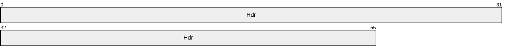

**Hdr (7 bytes):** Seven bytes. A [TS_DESKTOP_ORDER_HEADER](#Section_2.2.1.3.3.1) header. The **FieldsPresentFlags** field of the header MUST be constructed using the following values.

| Value | Meaning |
| --- | --- |
| 0x04000000 WINDOW_ORDER_TYPE_DESKTOP | Indicates an order specifying a desktop. This flag MUST be set. |
| 0x00000001 WINDOW_ORDER_FIELD_DESKTOP_NONE | Indicates that the server will not be sending information for the server's current input desktop. This flag MUST be set. |

<a id="Section_2.2.2"></a>
### 2.2.2 Static Virtual Channel Protocol

The [**RAIL**](#gt_remote-applications-integrated-locally-rail) Static Virtual Channel (named "RAIL") is responsible for communicating non–RDP specific data between the RAIL client and server. The following sections outline the messages that are transmitted over the virtual channel.

<a id="Section_2.2.2.1"></a>
#### 2.2.2.1 Common Header (TS_RAIL_PDU_HEADER)

The **TS_RAIL_PDU_HEADER** packet contains information common to every [**RAIL**](#gt_remote-applications-integrated-locally-rail) Virtual Channel PDU.

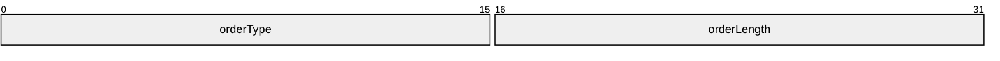

**orderType (2 bytes):** An unsigned 16-bit integer. The type of the Virtual Channel message; MUST be set to one of the following values.

| Value | Meaning |
| --- | --- |
| TS_RAIL_ORDER_EXEC 0x0001 | Indicates a [Client Execute PDU](#Section_2.2.2.3.1) from client to server. |
| TS_RAIL_ORDER_ACTIVATE 0x0002 | Indicates a [Client Activate PDU](#Section_2.2.2.6.1) from client to server. |
| TS_RAIL_ORDER_SYSPARAM 0x0003 | Indicates a [Client System Parameters Update PDU](#Section_2.2.2.4.1) from client to server or a [Server System Parameters Update PDU](#Section_2.2.2.5.1) from server to client. |
| TS_RAIL_ORDER_SYSCOMMAND 0x0004 | Indicates a [Client System Command PDU](#Section_2.2.2.6.3) from client to server. |
| TS_RAIL_ORDER_HANDSHAKE 0x0005 | Indicates a bi-directional [Handshake PDU](#Section_2.2.2.2.1). |
| TS_RAIL_ORDER_NOTIFY_EVENT 0x0006 | Indicates a [Client Notify Event PDU](#Section_2.2.2.6.4) from client to server. |
| TS_RAIL_ORDER_WINDOWMOVE 0x0008 | Indicates a [Client Window Move PDU](#Section_2.2.2.7.4) from client to server. |
| TS_RAIL_ORDER_LOCALMOVESIZE 0x0009 | Indicates a [Server Move/Size Start PDU](#Section_2.2.2.7.2) and a [Server Move/Size End PDU](#Section_2.2.2.7.3) from server to client. |
| TS_RAIL_ORDER_MINMAXINFO 0x000a | Indicates a [Server Min Max Info PDU](#Section_2.2.2.7.1) from server to client. |
| TS_RAIL_ORDER_CLIENTSTATUS 0x000b | Indicates a [Client Information PDU](#Section_2.2.2.2.2) from client to server. |
| TS_RAIL_ORDER_SYSMENU 0x000c | Indicates a [Client System Menu PDU](#Section_2.2.2.6.2) from client to server. |
| TS_RAIL_ORDER_LANGBARINFO 0x000d | Indicates a [Server Language Bar Information PDU](#Section_2.2.2.9.1) from server to client, or a Client Language Bar Information PDU from client to server. |
| TS_RAIL_ORDER_EXEC_RESULT 0x0080 | Indicates a [Server Execute Result PDU](#Section_2.2.2.3.2) from server to client. |
| TS_RAIL_ORDER_GET_APPID_REQ 0x000E | Indicates a [Client Get Application ID PDU](#Section_2.2.2.6.5) from client to server. |
| TS_RAIL_ORDER_GET_APPID_RESP 0x000F | Indicates a [Server Get Application ID Response PDU](#Section_2.2.2.8.1) from server to client. |
| TS_RAIL_ORDER_TASKBARINFO 0x0010 | Indicates a **Taskbar Tab Info PDU** (section [2.2.2.14.1](#Section_2.2.2.14.1)) from server to client. |
| TS_RAIL_ORDER_LANGUAGEIMEINFO 0x0011 | Indicates a [Language Profile Information PDU](#Section_2.2.2.10.1) from client to server |
| TS_RAIL_ORDER_COMPARTMENTINFO 0x0012 | Indicates a bi-directional [Compartment Status Information PDU](#Section_2.2.2.10.2). |
| TS_RAIL_ORDER_HANDSHAKE_EX 0x0013 | Indicates a [HandshakeEx PDU](#Section_2.2.2.2.3) from server to client. |
| TS_RAIL_ORDER_ZORDER_SYNC 0x0014 | Indicates a [Server Z-Order Sync Information PDU](#Section_2.2.2.11.1) from server to client. |
| TS_RAIL_ORDER_CLOAK 0x0015 | Indicates a [Window Cloak State Change PDU](#Section_2.2.2.12.1) from client to server. |
| TS_RAIL_ORDER_POWER_DISPLAY_REQUEST 0x0016 | Indicates a **Power Display Request PDU** (section [2.2.2.13.1](#Section_2.2.2.13.1)) from server to client. |
| TS_RAIL_ORDER_SNAP_ARRANGE 0x0017 | Indicates a **Client Window Snap PDU** (section [2.2.2.7.5](#Section_2.2.2.7.5)) from client to server. |
| TS_RAIL_ORDER_GET_APPID_RESP_EX 0x0018 | Indicates a **Server Get Application ID Extended Response PDU** (section [2.2.2.8.2](#Section_2.2.2.8.2)) from server to client. |
| TS_RAIL_ORDER_TEXTSCALEINFO 0x0019 | Indicates a **Text Scale Information PDU** (section [2.2.2.15.1](#Section_2.2.2.15.1)) from client to server. |
| TS_RAIL_ORDER_CARETBLINKINFO 0x001A | Indicates a **Caret Blink Information PDU** (section [2.2.2.15.2](#Section_2.2.2.15.2)) from client to server. |

**orderLength (2 bytes):** An unsigned 16-bit integer. The length of the Virtual Channel PDU, in bytes.

<a id="Section_2.2.2.2"></a>
#### 2.2.2.2 Initialization Messages

Initialization messages are exchanged between client and server at the start of a [**RAIL**](#gt_remote-applications-integrated-locally-rail) session.

<a id="Section_2.2.2.2.1"></a>
##### 2.2.2.2.1 Handshake PDU (TS_RAIL_ORDER_HANDSHAKE)

The Handshake PDU is exchanged between the server and the client to establish that both endpoints are ready to begin [**RAIL**](#gt_remote-applications-integrated-locally-rail) mode. The server sends the Handshake PDU and the client responds with the Handshake PDU.

```mermaid
packet-beta
  0-31: "header"
  32-63: "buildNumber"
```

**header (4 bytes):** A [TS_RAIL_PDU_HEADER](#Section_2.2.2.1) structure. The **orderType** field of the header MUST be set to 0x0005 (TS_RAIL_ORDER_HANDSHAKE).

**buildNumber (4 bytes):** An unsigned 32-bit integer. The build or version of the sending party.

<a id="Section_2.2.2.2.2"></a>
##### 2.2.2.2.2 Client Information PDU (TS_RAIL_ORDER_CLIENTSTATUS)

The Client Information PDU is sent from client to server and contains information about [**RAIL**](#gt_remote-applications-integrated-locally-rail) client state and features supported by the client.

```mermaid
packet-beta
  0-31: "header"
  32-63: "Flags"
```

**header (4 bytes):** A [TS_RAIL_PDU_HEADER](#Section_2.2.2.1) structure. The **orderType** field of header MUST be set to 0x000b (TS_RAIL_ORDER_CLIENTSTATUS).

**Flags (4 bytes):** An unsigned 32-bit integer. RAIL features that are supported by the client; MUST be set to one or more of the following feature flags, or zero if none of the features are supported.

| Value | Meaning |
| --- | --- |
| TS_RAIL_CLIENTSTATUS_ALLOWLOCALMOVESIZE 0x00000001 | Indicates that the client supports the local move/size RAIL feature. |
| TS_RAIL_CLIENTSTATUS_AUTORECONNECT 0x00000002 | Indicates that the client is auto-reconnecting to the server after an unexpected disconnect of the session. |
| TS_RAIL_CLIENTSTATUS_ZORDER_SYNC 0x00000004 | Indicates that the client supports Z-order sync using the Z-Order Sync Information PDU (section [2.2.2.11.1](#Section_2.2.2.11.1)). |
| TS_RAIL_CLIENTSTATUS_WINDOW_RESIZE_MARGIN_SUPPORTED 0x00000010 | Indicates that the client supports resize margins using the Window Information PDU (section [2.2.1.3.1](#Section_2.2.1.3.1.2)). |
| TS_RAIL_CLIENTSTATUS_HIGH_DPI_ICONS_SUPPORTED 0x00000020 | Indicates that the client supports icons up to 96×96 pixels in size in the Window Icon PDU (section [2.2.1.3.1.2.2](#Section_2.2.1.3.1.2.2)). If this flag is not present, icon dimensions are limited to 32×32 pixels. |
| TS_RAIL_CLIENTSTATUS_APPBAR_REMOTING_SUPPORTED 0x00000040 | Indicates that the client supports application desktop toolbar remoting using the Window Information PDU (section 2.2.1.3.1). |
| TS_RAIL_CLIENTSTATUS_POWER_DISPLAY_REQUEST_SUPPORTED 0x00000080 | Indicates that the client supports [**display-required power requests**](#gt_display-required-power-request) sent using the Power Display Request PDU (section [2.2.2.13.1](#Section_2.2.2.13.1)). |
| TS_RAIL_CLIENTSTATUS_BIDIRECTIONAL_CLOAK_SUPPORTED 0x00000200 | Indicates that the client is capable of processing Window Cloak State Change PDUs (section [2.2.2.12.1](#Section_2.2.2.12.1)) sent by the server. |
| TS_RAIL_CLIENTSTATUS_SUPPRESS_ICON_ORDERS 0x00000400 | Indicates that window icons SHOULD NOT be sent to the client using the Window Icon (section 2.2.1.3.1.2.2) and Cached Icon (section [2.2.1.3.1.2.3](#Section_2.2.1.3.1.2.3)) orders. This flag is intended to improve performance for clients that do not display window icons. Clients MUST still process icon PDUs as older server implementations may not support this flag. |

<a id="Section_2.2.2.2.3"></a>
##### 2.2.2.2.3 HandshakeEx PDU (TS_RAIL_ORDER_HANDSHAKE_EX)

The **HandshakeEx PDU** (instead of the Handshake PDU) is sent from the server to the client if both the client and the server specified support for it by including the TS_RAIL_LEVEL_HANDSHAKE_EX_SUPPORTED flag in the **Remote Programs Capability Set** (section [2.2.1.1.1](#Section_2.2.1.1.1)). This PDU is also sent by the server in an Enhanced RemoteApp session to signal that it is ready to begin Enhanced RemoteApp mode. The server sends the **HandshakeEx PDU**, and the client responds with the **Handshake PDU** (section [2.2.2.2.1](#Section_2.2.2.2.1)).

```mermaid
packet-beta
  0-31: "header"
  32-63: "buildNumber"
  64-95: "railHandshakeFlags"
```

**header (4 bytes):** A **TS_RAIL_PDU_HEADER** (section [2.2.2.1](#Section_2.2.2.1)) structure. The **orderType** field of the header MUST be set to 0x0013 (TS_RAIL_ORDER_HANDSHAKE_EX).

**buildNumber (4 bytes):** An unsigned 32-bit integer. The build or version of the sending party.

**railHandshakeFlags (4 bytes):** An unsigned 32-bit integer. Flags for setting up RAIL session parameters.

| Flag | Meaning |
| --- | --- |
| TS_RAIL_ORDER_HANDSHAKEEX_FLAGS_HIDEF 0x00000001 | Indicates that Enhanced RemoteApp (section [1.3.3](#Section_1.3.3)) is supported. This implies support for the Remote Desktop Protocol: Graphics Pipeline Extension ([MS-RDPEGFX](../MS-RDPEGFX/MS-RDPEGFX.md) section 1.5), specifically the **RDPGFX_MAP_SURFACE_TO_WINDOW_PDU** ([MS-RDPEGFX] section 2.2.2.20) message. |
| TS_RAIL_ORDER_HANDSHAKE_EX_FLAGS_ EXTENDED_SPI_SUPPORTED 0x00000002 | Indicates that additional system parameter flags are supported in the **Client System Parameters Update PDU** (section [2.2.2.4.1](#Section_2.2.2.4.1)). |
| TS_RAIL_ORDER_HANDSHAKE_EX_FLAGS_SNAP_ARRANGE_SUPPORTED 0x00000004 | Indicates that the server supports the **Client Window Snap PDU** (section [2.2.2.7.5](#Section_2.2.2.7.5)). |
| TS_RAIL_ORDER_HANDSHAKE_EX_FLAGS_TEXT_SCALE_SUPPORTED 0x00000008 | Indicates that the server supports the **Text Scale Information PDU** (section [2.2.2.15.1](#Section_2.2.2.15.1)). |
| TS_RAIL_ORDER_HANDSHAKE_EX_FLAGS_CARET_BLINK_SUPPORTED 0x00000010 | Indicates that the server supports the **Caret Blink Information PDU** (section [2.2.2.15.2](#Section_2.2.2.15.2)). |
| TS_RAIL_ORDER_HANDSHAKE_EX_FLAGS_EXTENDED_SPI_2_SUPPORTED 0x00000020 | Indicates that more additional system parameter flags are supported in the **Client System Parameters Update PDU** (section 2.2.2.4.1). |
| TS_RAIL_ORDER_HANDSHAKE_EX_FLAGS_EXTENDED_SPI_3_SUPPORTED 0x00000040 | Indicates that more additional system parameter flags are supported in the **Client System Parameters Update PDU** (section 2.2.2.4.1).<12> |

<a id="Section_2.2.2.3"></a>
#### 2.2.2.3 Program Launching Messages

<a id="Section_2.2.2.3.1"></a>
##### 2.2.2.3.1 Client Execute PDU (TS_RAIL_ORDER_EXEC)

The Client Execute PDU is sent from a client to a server to request that a [**remote application**](#gt_remote-application) launch on the server.

```mermaid
packet-beta
  0-31: "header"
  32-47: "Flags"
  48-63: "ExeOrFileLength"
  64-79: "WorkingDirLength"
  80-95: "ArgumentsLen"
  96-159: "ExeOrFile (variable)"
  160-223: "WorkingDir (variable)"
  224-287: "Arguments (variable)"
```

**header (4 bytes):** A [TS_RAIL_PDU_HEADER](#Section_2.2.2.1) structure. The **orderType** field of the header MUST be set to 0x0001 (TS_RAIL_ORDER_EXEC).

**Flags (2 bytes):** An unsigned 16-bit integer. Specifies a bit field of flags that indicate modifications to the Client Execute PDU fields.

| 0 | 1 | 2 | 3 | 4 | 5 | 6 | 7 | 8 | 9 | 1 0 | 1 | 2 | 3 | 4 | 5 |
| --- | --- | --- | --- | --- | --- | --- | --- | --- | --- | --- | --- | --- | --- | --- | --- |
| A | B | C | D | E | 0 | 0 | 0 | 0 | 0 | 0 | 0 | 0 | 0 | 0 | 0 |

Where the bits are defined as:

| Value | Description |
| --- | --- |
| A TS_RAIL_EXEC_FLAG_EXPAND_WORKINGDIRECTORY | The environment variables in the **WorkingDir** field MUST be expanded on the server. |
| B TS_RAIL_EXEC_FLAG_TRANSLATE_FILES | The drive letters in the file path MUST be converted to corresponding mapped drives on the server. This flag MUST NOT be set if the TS_RAIL_EXEC_FLAG_FILE (0x0004) flag is not set. |
| C TS_RAIL_EXEC_FLAG_FILE | If this flag is set, the **ExeOrFile** field refers to a file path. If it is not set, the **ExeOrFile** field refers to an executable. |
| D TS_RAIL_EXEC_FLAG_EXPAND_ARGUMENTS | The environment variables in the **Arguments** field MUST be expanded on the server. |
| E TS_RAIL_EXEC_FLAG_APP_USER_MODEL_ID | If this flag is set, the **ExeOrFile** field refers to an application user model ID. If it is not set, the **ExeOrFile** field refers to a file path. This flag MUST be ignored if the TS_RAIL_EXEC_FLAG_FILE (0x0004) flag is set. An application user model ID is a string that uniquely identifies an application, regardless of where the application is installed on the operating system. The string can be used to identify Windows Store applications as well as desktop applications. |

**ExeOrFileLength (2 bytes):** An unsigned 16-bit integer. Specifies the length of the **ExeOrFile** field in bytes. The length MUST be nonzero. The maximum length is 520 bytes.

**WorkingDirLength (2 bytes):** An unsigned 16-bit integer. Specifies the length of the **WorkingDir** field, in bytes. The minimum length is 0, and the maximum length is 520 bytes.

**ArgumentsLen (2 bytes):** An unsigned 16-bit integer. Specifies the length of the **Arguments** field, in bytes. The minimum length is 0, and the maximum length is 16,000 bytes.<13>

**ExeOrFile (variable):** A non-null-terminated string of Unicode characters. Variable length. Specifies the executable, file path, or application user model ID to be launched on the server. This field MUST be present. The maximum length of this field, including file path translations (see TS_RAIL_EXEC_FLAG_TRANSLATE_FILES mask of **Flags** field), is 520 bytes.

**WorkingDir (variable):** Optional non-null-terminated string of Unicode characters. Variable length. Specifies the working directory of the launched **ExeOrFile** field. If the **WorkingDirLength** field is 0, this field MUST NOT be present; otherwise, it MUST be present. The maximum length of this field, including expanded environment variables (see TS_RAIL_EXEC_FLAG_EXPAND_WORKINGDIRECTORY mask of **Flags** field), is 520 bytes.

**Arguments (variable):** Optional non-null-terminated string of Unicode characters. Variable length. Specifies the arguments to the **ExeOrFile** field. If the **ArgumentsLen** field is 0, this field MUST NOT be present; otherwise, it MUST be present. The maximum length of this field, including expanded environment variables (see TS_RAIL_EXEC_FLAG_EXPAND_ARGUMENTS mask of **Flags** field), is 16,000 bytes.

<a id="Section_2.2.2.3.2"></a>
##### 2.2.2.3.2 Server Execute Result PDU (TS_RAIL_ORDER_EXEC_RESULT)

The Server Execute Result PDU is sent from server to client in response to a [Client Execute PDU](#Section_2.2.2.3.1) request, and contains the result of the server's attempt to launch the requested executable.

```mermaid
packet-beta
  0-31: "header"
  32-47: "Flags"
  48-63: "ExecResult"
  64-95: "RawResult"
  96-111: "Padding"
  112-127: "ExeOrFileLength"
  128-191: "ExeOrFile (variable)"
```

**header (4 bytes):** A [TS_RAIL_PDU_HEADER](#Section_2.2.2.1) structure. The **orderType** field of the header MUST be set to TS_RAIL_ORDER_EXEC_RESULT (0x0080).

**Flags (2 bytes):** An unsigned 16-bit integer. Identical to the Flags field of the Client Execute PDU. The server sets this field to enable the client to match the Client Execute PDU with the Server Execute Result PDU.

**ExecResult (2 bytes):** An unsigned 16-bit integer. The result of the Client Execute PDU. This field MUST be set to one of the following values.

| Value | Meaning |
| --- | --- |
| RAIL_EXEC_S_OK 0x0000 | The Client Execute request was successful and the requested application or file has been launched. |
| RAIL_EXEC_E_HOOK_NOT_LOADED 0x0001 | The Client Execute request could not be satisfied because the server is not monitoring the current input desktop. |
| RAIL_EXEC_E_DECODE_FAILED 0x0002 | The Execute request could not be satisfied because the request PDU was malformed. |
| RAIL_EXEC_E_NOT_IN_ALLOWLIST 0x0003 | The Client Execute request could not be satisfied because the requested application was blocked by policy from being launched on the server. |
| RAIL_EXEC_E_FILE_NOT_FOUND 0x0005 | The Client Execute request could not be satisfied because the application or file path could not be found. |
| RAIL_EXEC_E_FAIL 0x0006 | The Client Execute request could not be satisfied because an unspecified error occurred on the server. |
| RAIL_EXEC_E_SESSION_LOCKED 0x0007 | The Client Execute request could not be satisfied because the remote session is locked. |

**RawResult (4 bytes):** An unsigned 32-bit integer. Contains an operating system-specific return code for the result of the Client Execute request.<14>

**Padding (2 bytes):** An unsigned 16-bit integer. Not used.

**ExeOrFileLength (2 bytes):** An unsigned 16-bit integer. Specifies the length of the **ExeOrFile** field in bytes. The length MUST be nonzero. The maximum length is 520 bytes.

**ExeOrFile (variable):** The executable or file that was attempted to be launched. This field is copied from the **ExeOrFile** field of the Client Execute PDU. The server sets this field to enable the client to match the Client Execute PDU with the Server Execute Result PDU.

<a id="Section_2.2.2.4"></a>
#### 2.2.2.4 Local Client System Parameters Update Messages

<a id="Section_2.2.2.4.1"></a>
##### 2.2.2.4.1 Client System Parameters Update PDU (TS_RAIL_ORDER_SYSPARAM)

The Client System Parameters Update PDU is sent from the client to the server to synchronize system parameters on the server with those on the client.

```mermaid
packet-beta
  0-31: "header"
  32-63: "SystemParam"
  64-127: "Body (variable)"
```

**header (4 bytes):** A [TS_RAIL_PDU_HEADER](#Section_2.2.2.1) structure. The **orderType** field of header MUST be set to TS_RAIL_ORDER_SYSPARAM(0x0003).

**SystemParam (4 bytes):** An unsigned 32-bit integer. The type of system parameter being transmitted. The field MUST be set to one of the following values.

| Value | Meaning |
| --- | --- |
| SPI_SETDRAGFULLWINDOWS 0x00000025 | The system parameter for full-window drag. |
| SPI_SETKEYBOARDCUES 0x0000100B | The system parameter to determine whether menu access keys are always underlined. |
| SPI_SETKEYBOARDPREF 0x00000045 | The system parameter specifying a preference for the keyboard instead of the mouse. |
| SPI_SETWORKAREA 0x0000002F | The system parameter to set the size of the work area. The work area is the portion of the screen not obscured by the system taskbar or by [**application desktop toolbars**](#gt_application-desktop-toolbar). |
| RAIL_SPI_DISPLAYCHANGE 0x0000F001 | The system parameter for display resolution. |
| SPI_SETMOUSEBUTTONSWAP 0x00000021 | The system parameter to swap or restore the meaning of the left and right mouse buttons. |
| RAIL_SPI_TASKBARPOS 0x0000F000 | The system parameter to indicate the size of the client taskbar. |
| SPI_SETHIGHCONTRAST 0x00000043 | The system parameter to set the parameters of the HighContrast accessibility feature. |
| SPI_SETCARETWIDTH 0x00002007 | The system parameter to set the caret width used for text entry controls. This flag SHOULD NOT be sent if the server did not advertise the EXTENDED_SPI_SUPPORTED flag in the **HandshakeEx PDU** (section [2.2.2.2.3](#Section_2.2.2.2.3)). |
| SPI_SETSTICKYKEYS 0x0000003B | The system parameter to set the parameters of the [**Sticky Keys**](#gt_sticky-keys) accessibility feature. This flag SHOULD NOT be sent if the server did not advertise the EXTENDED_SPI_SUPPORTED flag in the **HandshakeEx PDU**. |
| SPI_SETTOGGLEKEYS 0x00000035 | The system parameter to set the parameters of the [**Toggle Keys**](#gt_toggle-keys) accessibility feature. This flag SHOULD NOT be sent if the server did not advertise the EXTENDED_SPI_SUPPORTED flag in the **HandshakeEx PDU**. |
| SPI_SETFILTERKEYS 0x00000033 | The system parameter to set the parameters of the [**Filter Keys**](#gt_filter-keys) accessibility feature. This flag SHOULD NOT be sent if the server did not advertise the EXTENDED_SPI_SUPPORTED flag in the **HandshakeEx PDU**. |
| RAIL_SPI_DISPLAY_ANIMATIONS_ENABLED 0x0000F002 | The system parameter indicating whether animations are enabled for the system user interface. This flag SHOULD NOT be sent if the server did not advertise the EXTENDED_SPI_2_SUPPORTED flag in the **HandshakeEx PDU**. |
| RAIL_SPI_DISPLAY_ADVANCED_EFFECTS_ENABLED 0x0000F003 | The system parameter indicating whether the system Transparency effects setting is enabled. This flag SHOULD NOT be sent if the server did not advertise the EXTENDED_SPI_2_SUPPORTED flag in the **HandshakeEx PDU**. |
| RAIL_SPI_DISPLAY_AUTO_HIDE_SCROLLBARS 0x0000F004 | The system parameter indicating whether the user has specified that scrollbars should be automatically hidden when not being interacted with. This flag SHOULD NOT be sent if the server did not advertise the EXTENDED_SPI_2_SUPPORTED flag in the **HandshakeEx PDU**. |
| RAIL_SPI_DISPLAY_MESSAGE_DURATION 0x0000F005 | The system parameter indicating the length of time a message is displayed for the app view in seconds. This flag SHOULD NOT be sent if the server did not advertise the EXTENDED_SPI_2_SUPPORTED flag in the **HandshakeEx PDU**. |
| RAIL_SPI_CLOSED_CAPTION_FONT_COLOR 0x0000F006 | The system parameter indicating the font color for closed-caption text. Valid properties are described by the [ClosedCaptionColor](https://docs.microsoft.com/en-us/uwp/api/windows.media.closedcaptioning.closedcaptioncolor) enumeration. This flag SHOULD NOT be sent if the server did not advertise the EXTENDED_SPI_2_SUPPORTED flag in the **HandshakeEx PDU**. |
| RAIL_SPI_CLOSED_CAPTION_FONT_OPACITY 0x0000F007 | The system parameter indicating the font opacity for closed-caption text. Valid properties are described by the [ClosedCaptionOpacity](https://docs.microsoft.com/en-us/uwp/api/windows.media.closedcaptioning.closedcaptionopacity) enumeration. This flag SHOULD NOT be sent if the server did not advertise the EXTENDED_SPI_2_SUPPORTED flag in the **HandshakeEx PDU**. |
| RAIL_SPI_CLOSED_CAPTION_FONT_SIZE 0x0000F008 | The system parameter indicating the font size for closed-caption text. Valid properties are described by the [ClosedCaptionSize](https://docs.microsoft.com/en-us/uwp/api/windows.media.closedcaptioning.closedcaptionsize) enumeration. This flag SHOULD NOT be sent if the server did not advertise the EXTENDED_SPI_2_SUPPORTED flag in the **HandshakeEx PDU**. |
| RAIL_SPI_CLOSED_CAPTION_FONT_STYLE 0x0000F009 | The system parameter indicating the font style for closed-caption text. Valid properties are described by the [ClosedCaptionStyle](https://docs.microsoft.com/en-us/uwp/api/windows.media.closedcaptioning.closedcaptionstyle) enumeration. This flag SHOULD NOT be sent if the server did not advertise the EXTENDED_SPI_2_SUPPORTED flag in the **HandshakeEx PDU**. |
| RAIL_SPI_CLOSED_CAPTION_FONT_EDGE_EFFECT 0x0000F00A | The system parameter indicating the font effect for close-caption text. Valid properties are described by the [ClosedCaptionEdgeEffect](https://docs.microsoft.com/en-us/uwp/api/windows.media.closedcaptioning.closedcaptionedgeeffect) enumeration. This flag SHOULD NOT be sent if the server did not advertise the EXTENDED_SPI_2_SUPPORTED flag in the **HandshakeEx PDU**. |
| RAIL_SPI_CLOSED_CAPTION_BACKGROUND_COLOR 0x0000F00B | The system parameter indicating the background color of lines of closed-caption text. Valid properties are described by the ClosedCaptionColor enumeration. This flag SHOULD NOT be sent if the server did not advertise the EXTENDED_SPI_2_SUPPORTED flag in the **HandshakeEx PDU**. |
| RAIL_SPI_CLOSED_CAPTION_BACKGROUND_OPACITY 0x0000F00C | The system parameter indicating the background opacity of lines of closed-caption text. Valid properties are described by the ClosedCaptionOpacity enumeration. This flag SHOULD NOT be sent if the server did not advertise the EXTENDED_SPI_2_SUPPORTED flag in the **HandshakeEx PDU**. |
| RAIL_SPI_CLOSED_CAPTION_REGION_COLOR 0x0000F00D | The system parameter indicating the region color for closed-caption text. Valid properties are described by the ClosedCaptionColor enumeration. This flag SHOULD NOT be sent if the server did not advertise the EXTENDED_SPI_2_SUPPORTED flag in the **HandshakeEx PDU**. |
| RAIL_SPI_CLOSED_CAPTION_REGION_OPACITY 0x0000F00E | The system parameter indicating the region opacity for closed-caption text. Valid properties are described by the ClosedCaptionOpacity enumeration. This flag SHOULD NOT be sent if the server did not advertise the EXTENDED_SPI_2_SUPPORTED flag in the **HandshakeEx PDU**. |
| RAIL_SPI_ACCENT_COLOR 0x0000F00F | The system parameter that indicates the system accent color for emphasizing important elements in the user interface and indicates the state of an interactive object or control. This flag SHOULD NOT be sent if the server did not advertise the EXTENDED_SPI_3_SUPPORTED flag in the **HandshakeEx PDU**.<15> |
| RAIL_SPI_SYSTEM_USES_LIGHT_THEME 0x0000F010 | The system parameter that indicates whether the system uses light mode by default. This flag SHOULD NOT be sent if the server did not advertise the EXTENDED_SPI_3_SUPPORTED flag in the **HandshakeEx PDU**.<16> |
| RAIL_SPI_APPS_USE_LIGHT_THEME 0x0000F011 | The system parameter that indicates whether applications use light mode by default. This flag SHOULD NOT be sent if the server did not advertise the EXTENDED_SPI_3_SUPPORTED flag in the **HandshakeEx PDU**.<17> |

**Body (variable):** The contents of this field depend on the **SystemParam** field. The following table outlines the valid values of the **SystemParam** field (Value column) and corresponding values of the **Body** field (Meaning column).

| Value | Meaning |
| --- | --- |
| SPI_SETDRAGFULLWINDOWS 0x0025 | Size of Body field: 1 byte. 0 (FALSE): Full Window Drag is disabled. Nonzero (TRUE): Full Window Drag is enabled. |
| SPI_SETKEYBOARDCUES 0x100B | Size of Body field: 1 byte. 0 (FALSE): Menu Access Keys are underlined only when the menu is activated by the keyboard. Nonzero (TRUE): Menu Access Keys are always underlined. |
| SPI_SETKEYBOARDPREF 0x0045 | Size of Body field: 1 byte. 0 (FALSE): The user does not prefer the keyboard over mouse. Nonzero (TRUE): The user prefers the keyboard over mouse. This causes applications to display keyboard interfaces that would otherwise be hidden. |
| SPI_SETMOUSEBUTTONSWAP 0x0021 | Size of Body field: 1 byte. 0 (FALSE): Restores the meaning of the left and right mouse buttons to their original meanings. Nonzero (TRUE): Swaps the meaning of the left and right mouse buttons. |
| SPI_SETWORKAREA 0x002F | Size of Body field: 8 bytes. The body is a [TS_RECTANGLE_16](#Section_2.2.1.2.2) structure that defines the work area in virtual screen coordinates. In a system with multiple display monitors, the work area is that of the monitor that contains the specified rectangle. For more information about virtual screen coordinates, see [[MSDN-VIRTUALSCR]](https://go.microsoft.com/fwlink/?LinkId=191444). |
| RAIL_SPI_DISPLAYCHANGE 0xF001 | Size of Body field: 8 bytes. The body is a TS_RECTANGLE_16 structure that indicates the new display resolution in virtual screen coordinates. For more information about virtual screen coordinates, see [MSDN-VIRTUALSCR]. |
| RAIL_SPI_TASKBARPOS 0xF000 | Size of Body field: 8 bytes. The body is a TS_RECTANGLE_16 structure that indicates the size of the client taskbar. |
| SPI_SETHIGHCONTRAST 0x0043 | Size of Body field: Variable number of bytes. The body is a [TS_HIGHCONTRAST](#Section_dd2718ac0c5b41d6bd785e4d13a7fdbf) structure. |
| SPI_SETCARETWIDTH 0x00002007 | Size of Body field: 4 bytes. The body is an unsigned 32-bit integer that indicates the width of the caret. The minimum allowed value is 0x00000001. |
| SPI_SETSTICKYKEYS 0x0000003B | Size of Body field: 4 bytes. The body is a [TS_STICKYKEYS](#Section_d25a70886f35431992a0453a53daf92b) structure. |
| SPI_SETTOGGLEKEYS 0x00000035 | Size of Body field: 4 bytes. The body is a [TS_TOGGLEKEYS](#Section_ad0d566d4b4c4862bcca6980121256c3) structure. |
| SPI_SETFILTERKEYS 0x00000033 | Size of Body field: 20 bytes. The body is a [TS_FILTERKEYS](#Section_06af9e1664a14fff937617b2f0b04431) structure. |
| RAIL_SPI_DISPLAY_ANIMATIONS_ENABLED 0x0000F002 | Size of Body field: 1 byte. 0 (FALSE): Animations are disabled for the user interface. Nonzero (TRUE): Animations are enabled for the user interface. |
| RAIL_SPI_DISPLAY_ADVANCED_EFFECTS_ENABLED 0x0000F003 | Size of Body field: 1 byte. 0 (FALSE): Transparency UI effects are disabled. Nonzero (TRUE): Transparency UI effects are enabled. |
| RAIL_SPI_DISPLAY_AUTO_HIDE_SCROLLBARS 0x0000F004 | Size of Body field: 1 byte. 0 (FALSE): Scroll bars are not automatically hidden when not being interacted with. Nonzero (TRUE): Scroll bars are automatically hidden when not being interacted with. |
| RAIL_SPI_DISPLAY_MESSAGE_DURATION 0x0000F005 | Size of Body field: 4 bytes. The body is an unsigned 32-bit integer that indicates the duration of a message is displayed for the app view, in seconds. |
| RAIL_SPI_CLOSED_CAPTION_FONT_COLOR 0x0000F006 | Size of Body field: 1 byte. The body is a byte that indicates the font color for closed-caption text, as described by the ClosedCaptionColor enumeration. |
| RAIL_SPI_CLOSED_CAPTION_FONT_OPACITY 0x0000F007 | Size of Body field: 1 byte. The body is a byte that indicates the font opacity for closed-caption text, as described by the ClosedCaptionOpacity enumeration. |
| RAIL_SPI_CLOSED_CAPTION_FONT_SIZE 0x0000F008 | Size of Body field: 1 byte. The body is a byte that indicates the font size for closed-caption text, as described by the ClosedCaptionSize enumeration. |
| RAIL_SPI_CLOSED_CAPTION_FONT_STYLE 0x0000F009 | Size of Body field: 1 byte. The body is a byte that indicates the font style for closed-caption text, as described by the ClosedCaptionStyle enumeration. |
| RAIL_SPI_CLOSED_CAPTION_FONT_EDGE_EFFECT 0x0000F00A | Size of Body field: 1 byte. The body is a byte that indicates the font effect for closed-caption text, as described by the ClosedCaptionEdgeEffect enumeration. |
| RAIL_SPI_CLOSED_CAPTION_BACKGROUND_COLOR 0x0000F00B | Size of Body field: 1 byte. The body is a byte that indicates the background color of lines of closed-caption text, as described by the ClosedCaptionColor enumeration. |
| RAIL_SPI_CLOSED_CAPTION_BACKGROUND_OPACITY 0x0000F00C | Size of Body field: 1 byte. The body is a byte that indicates the background opacity of lines of closed-caption text, as described by the ClosedCaptionOpacity enumeration. |
| RAIL_SPI_CLOSED_CAPTION_REGION_COLOR 0x0000F00D | Size of Body field: 1 byte. The body is a byte that indicates the region color for closed-caption text, as described by the ClosedCaptionColor enumeration. |
| RAIL_SPI_CLOSED_CAPTION_REGION_OPACITY 0x0000F00E | Size of Body field: 1 byte. The body is a byte that indicates the region opacity for closed-caption text, as described by the ClosedCaptionOpacity enumeration. |
| RAIL_SPI_ACCENT_COLOR 0x0000F00F | Size of Body field: Variable number of bytes. The body is a **TS_ACCENTCOLOR** structure. |
| RAIL_SPI_SYSTEM_USES_LIGHT_THEME 0x0000F010 | Size of Body field: 4 bytes. 0 (FALSE): System uses dark mode by default. 1 (TRUE): System uses light mode by default. |
| RAIL_SPI_APPS_USE_LIGHT_THEME 0x0000F011 | Size of Body field: 4 bytes. 0 (FALSE): Applications use dark mode by default. 1 (TRUE): Applications use light mode by default. |

<a id="Section_2.2.2.4.2"></a>
##### 2.2.2.4.2 High Contrast System Information Structure (TS_HIGHCONTRAST)

The TS_HIGHCONTRAST packet defines parameters for the high-contrast accessibility feature.

```mermaid
packet-beta
  0-31: "Flags"
  32-63: "ColorSchemeLength"
  64-127: "ColorScheme (variable)"
```

**Flags (4 bytes):** An unsigned 32-bit integer that is read by the server and used to set the High Contrast parameters.<18>

| Flag | Meaning |
| --- | --- |
| HCF_HIGHCONTRASTON 0x00000001 | The High Contrast feature is enabled. |
| HCF_AVAILABLE 0x00000002 | The High Contrast feature is available. |
| HCF_HOTKEYACTIVE 0x00000004 | The user can turn the High Contrast feature on or off by using the hotkey (left SHIFT + left ALT + PRINT SCREEN). |
| HCF_CONFIRMHOTKEY 0x00000008 | The user will be prompted with a confirmation dialog before the High Contrast feature is enabled using the hotkey. |
| HCF_HOTKEYSOUND 0x00000010 | A sound is played whenever the High Contrast feature is turned on or off using the hotkey. |

**ColorSchemeLength (4 bytes):** An unsigned 32-bit integer. The length, in bytes, of the ColorScheme field.

**ColorScheme (variable):** [UNICODE_STRING](#Section_2.2.1.2.1). Variable length. The Windows-specific name of the High Contrast Color Scheme, specified as a null-terminated UNICODE_STRING.<19>

<a id="Section_2.2.2.4.3"></a>
##### 2.2.2.4.3 Filter Keys System Information Structure (TS_FILTERKEYS)

The **TS_FILTERKEYS** packet defines parameters for the [**Filter Keys**](#gt_filter-keys) accessibility feature.

```mermaid
packet-beta
  0-31: "Flags"
  32-63: "WaitTime"
  64-95: "DelayTime"
  96-127: "RepeatTime"
  128-159: "BounceTime"
```

**Flags (4 bytes):** An unsigned 32-bit integer that is read by the server and used to set the Filter Keys parameters.

| Flag | Meaning |
| --- | --- |
| FKF_FILTERKEYSON 0x00000001 | The Filter Keys feature is enabled. |
| FKF_AVAILABLE 0x00000002 | The Filter Keys feature is available. |
| FKF_HOTKEYACTIVE 0x00000004 | The user can turn the Filter Keys feature on or off by using the default hotkey (holding right SHIFT for 8 seconds). |
| FKF_CONFIRMHOTKEY 0x00000008 | The user will be prompted with a confirmation dialog before the Filter Keys feature is enabled using the hotkey. |
| FKF_HOTKEYSOUND 0x00000010 | A sound is played whenever the Filter Keys feature is turned on or off using the hotkey. |
| FKF_INDICATOR 0x00000020 | A visual indicator is displayed when the Filter Keys feature is enabled. |
| FKF_CLICKON 0x00000040 | A click sound is played whenever a key is pressed or accepted. |

**WaitTime (4 bytes):** An unsigned 32-bit integer. The length of time, in milliseconds, that a user has to hold down a key before it is accepted by the computer.

**DelayTime (4 bytes):** An unsigned 32-bit integer. The length of time, in milliseconds, that the user has to hold down a key before it begins to repeat.

**RepeatTime (4 bytes):** An unsigned 32-bit integer. The length of time, in milliseconds, between each repetition of the keystroke.

**BounceTime (4 bytes):** An unsigned 32-bit integer. The length of time, in milliseconds, that has to elapse after releasing a key before a subsequent press of the same key is accepted.

<a id="Section_2.2.2.4.4"></a>
##### 2.2.2.4.4 Toggle Keys System Information Structure (TS_TOGGLEKEYS)

The **TS_TOGGLEKEYS** packet defines parameters for the [**Toggle Keys**](#gt_toggle-keys) accessibility feature.

```mermaid
packet-beta
  0-31: "Flags"
```

**Flags (4 bytes):** An unsigned 32-bit integer that is read by the server and used to set the Toggle Keys parameters.

| Flag | Meaning |
| --- | --- |
| TKF_TOGGLEKEYSON 0x00000001 | The Toggle Keys feature is enabled. |
| TKF_AVAILABLE 0x00000002 | The Toggle Keys feature is available. |
| TKF_HOTKEYACTIVE 0x00000004 | The user can turn the Toggle Keys feature on or off by using the hotkey (holding NUM LOCK for 8 seconds). |
| TKF_CONFIRMHOTKEY 0x00000008 | The user will be prompted with a confirmation dialog before the Toggle Keys feature is enabled using the hotkey. |
| TKF_HOTKEYSOUND 0x00000010 | A sound is played whenever the Toggle Keys feature is turned on or off using the hotkey. |

<a id="Section_2.2.2.4.5"></a>
##### 2.2.2.4.5 Sticky Keys System Information Structure (TS_STICKYKEYS)

The **TS_STICKYKEYS** packet defines parameters for the [**Sticky Keys**](#gt_sticky-keys) accessibility feature.

```mermaid
packet-beta
  0-31: "Flags"
```

**Flags (4 bytes):** An unsigned 32-bit integer that is read by the server and used to set the Sticky Keys parameters.

| Flag | Meaning |
| --- | --- |
| SKF_STICKYKEYSON 0x00000001 | The Sticky Keys feature is enabled. |
| SKF_AVAILABLE 0x00000002 | The Sticky Keys feature is available. |
| SKF_HOTKEYACTIVE 0x00000004 | The user can turn the Sticky Keys feature on or off by using the hotkey (pressing the SHIFT key five times). |
| SKF_CONFIRMHOTKEY 0x00000008 | The user will be prompted with a confirmation dialog before the Sticky Keys feature is enabled using the hotkey. |
| SKF_HOTKEYSOUND 0x00000010 | A sound is played whenever the Sticky Keys feature is turned on or off using the hotkey. |
| SKF_INDICATOR 0x00000020 | A visual indicator is displayed when the Sticky Keys feature is enabled. |
| SKF_AUDIBLEFEEDBACK 0x00000040 | A sound is played whenever a modifier key is latched, locked, or released. |
| SKF_TRISTATE 0x00000080 | Pressing a modifier key twice in a row will lock the key down until the user presses it a third time. |
| SKF_TWOKEYSOFF 0x00000100 | Releasing a modifier key that has been pressed in combination with another key will turn off the Sticky Keys feature. |
| SKF_LSHIFTLOCKED 0x00010000 | The left SHIFT key is locked. |
| SKF_RSHIFTLOCKED 0x00020000 | The right SHIFT key is locked. |
| SKF_LCTLLOCKED 0x00040000 | The left CTRL key is locked. |
| SKF_RCTLLOCKED 0x00080000 | The right CTRL key is locked. |
| SKF_LALTLOCKED 0x00100000 | The left ALT key is locked. |
| SKF_RALTLOCKED 0x00200000 | The right ALT key is locked. |
| SKF_LWINLOCKED 0x00400000 | The left WINDOWS key is locked. |
| SKF_RWINLOCKED 0x00800000 | The right WINDOWS key is locked. |
| SKF_LSHIFTLATCHED 0x01000000 | The left SHIFT key is latched. |
| SKF_RSHIFTLATCHED 0x02000000 | The right SHIFT key is latched. |
| SKF_LCTLLATCHED 0x04000000 | The left CTRL key is latched. |
| SKF_RCTLLATCHED 0x08000000 | The right CTRL key is latched. |
| SKF_LALTLATCHED 0x10000000 | The left ALT key is latched. |
| SKF_RALTLATCHED 0x20000000 | The right ALT key is latched. |
| SKF_LWINLATCHED 0x40000000 | The left WINDOWS key is latched. |
| SKF_RWINLATCHED 0x80000000 | The right WINDOWS key is latched. |

<a id="Section_2.2.2.4.6"></a>
##### 2.2.2.4.6 Accent Color System Information Structure (TS_ACCENTCOLOR)

The **TS_ACCENTCOLOR** structure defines parameters for the accent color accessibility feature.

```mermaid
packet-beta
  0-31: "FieldsValidFlags"
  32-63: "AccentColor"
  64-95: "ColorizationColor"
  96-127: "ColorizationColorBalance"
  128-159: "ColorizationAfterglow"
  160-191: "ColorizationAfterglowBalance"
  192-223: "ColorizationBlurBalance"
  224-255: "ColorizationGlassAttribute"
  256-287: "ColorPrevalence"
  288-319: "EnableWindowColorization"
  320-351: "AccentColorMenu"
  352-383: "StartColorMenu"
  384-415: "AccentPaletteLength"
  416-543: "AccentPalette (variable)"
```

**FieldsValidFlags (4 bytes):** An unsigned, 32-bit integer that is read by the server and used to indicate what fields in the rest of the **TS_ACCENTCOLOR** structure are valid.

| Flag | Meaning |
| --- | --- |
| RACF_ACCENT_COLOR 0x00000001 | The **AccentColor** field is valid. |
| RACF_COLORIZATION_COLOR 0x00000002 | The **ColorizationColor** field is valid. |
| RACF_COLORIZATION_COLOR_BALANCE 0x00000004 | The **ColorizationColorBalance** field is valid. |
| RACF_COLORIZATION_AFTERGLOW 0x00000008 | The **ColorizationAfterglow** field is valid. |
| RACF_COLORIZATION_AFTERGLOW_BALANCE 0x00000010 | The **ColorizationAfterglowBalance** field is valid. |
| RACF_COLORIZATION_BLUR_BALANCE 0x00000020 | The **ColorizationBlurBalance** field is valid. |
| RACF_COLORIZATION_GLASS_ATTRIBUTE 0x00000040 | The **ColorizationGlassAttribute** field is valid. |
| RACF_COLOR_PREVALENCE 0x00000080 | The **ColorPrevalence** field is valid. |
| RACF_ENABLE_WINDOW_COLORIZATION 0x00000100 | The **EnableWindowColorization** field is valid. |
| RACF_ACCENT_COLOR_MENU 0x00000200 | The **AccentColorMenu** field is valid. |
| RACF_ACCENT_PALETTE 0x00000800 | The **AccentPaletteLength** and **AccentPalette** fields are valid. |

**AccentColor (4 bytes):** An unsigned, 32-bit integer. The Windows-specific name of the registry value under HKEY_CURRENT_USER\Software\Microsoft\Windows\DWM.

**ColorizationColor (4 bytes):** An unsigned, 32-bit integer. The Windows-specific name of the registry value under HKEY_CURRENT_USER\Software\Microsoft\Windows\DWM.

**ColorizationColorBalance (4 bytes):** An unsigned, 32-bit integer. The Windows-specific name of the registry value under HKEY_CURRENT_USER\Software\Microsoft\Windows\DWM.

**ColorizationAfterglow (4 bytes):** An unsigned, 32-bit integer. The Windows-specific name of the registry value under HKEY_CURRENT_USER\Software\Microsoft\Windows\DWM.

**ColorizationAfterglowBalance (4 bytes):** An unsigned, 32-bit integer. The Windows-specific name of the registry value under HKEY_CURRENT_USER\Software\Microsoft\Windows\DWM.

**ColorizationBlurBalance (4 bytes):** An unsigned, 32-bit integer. The Windows-specific name of the registry value under HKEY_CURRENT_USER\Software\Microsoft\Windows\DWM.

**ColorizationGlassAttribute (4 bytes):** An unsigned, 32-bit integer. The Windows-specific name of the registry value under HKEY_CURRENT_USER\Software\Microsoft\Windows\DWM.

**ColorPrevalence (4 bytes):** An unsigned, 32-bit integer. The Windows-specific name of the registry value under HKEY_CURRENT_USER\Software\Microsoft\Windows\DWM.

**EnableWindowColorization (4 bytes):** An unsigned, 32-bit integer. The Windows-specific name of the registry value under HKEY_CURRENT_USER\Software\Microsoft\Windows\DWM.

**AccentColorMenu (4 bytes):** An unsigned, 32-bit integer. The Windows-specific name of the registry value under HKEY_CURRENT_USER\Software\Microsoft\Windows\CurrentVersion\Explorer\Accent.

**StartColorMenu (4 bytes):** An unsigned, 32-bit integer. The Windows-specific name of the registry value under HKEY_CURRENT_USER\Software\Microsoft\Windows\CurrentVersion\Explorer\Accent.

**AccentPaletteLength (4 bytes):** An unsigned, 32-bit integer. The length, in bytes, of the **AccentPalette** field.

**AccentPalette (variable):** An unsigned, 32-bit integer. The Windows-specific name of the registry value under HKEY_CURRENT_USER\Software\Microsoft\Windows\CurrentVersion\Explorer\Accent.

<a id="Section_2.2.2.5"></a>
#### 2.2.2.5 Server System Parameters Update Messages

<a id="Section_2.2.2.5.1"></a>
##### 2.2.2.5.1 Server System Parameters Update PDU (TS_RAIL_ORDER_SYSPARAM)

The Server System Parameters Update PDU is sent from the server to client to synchronize system parameters on the client with those on the server.

```mermaid
packet-beta
  0-31: "Header"
  32-63: "SystemParameter"
  64-71: "Body"
```

**Header (4 bytes):** A [TS_RAIL_PDU_HEADER](#Section_2.2.2.1) structure. The **orderType** field of header MUST be set to 0x03 (TS_RAIL_ORDER_SYSPARAM).

**SystemParameter (4 bytes):** An unsigned 32-bit integer. The type of system parameter being transmitted. This field MUST be set to one of the following values.

| Value | Meaning |
| --- | --- |
| SPI_SETSCREENSAVEACTIVE 0x00000011 | The system parameter indicating whether the screen saver is enabled. |
| SPI_SETSCREENSAVESECURE 0x00000077 | The system parameter indicating whether the desktop is to be locked after switching out of screen saver mode (that is, after the screen saver starts due to inactivity, then stops due to activity).<20> |

**Body (1 byte):** The content of this field depends on the SystemParameter field. The following table outlines the valid values of the SystemParameter field (Value column) and corresponding values of the Body field (Meaning column).

| Value | Meaning |
| --- | --- |
| SPI_SETSCREENSAVEACTIVE 0x00000011 | Size of Body field: 1 byte. 0 (FALSE): Screen saver is not enabled. Nonzero (TRUE): Screen Saver is enabled. |
| SPI_SETSCREENSAVESECURE 0x00000077 | Size of Body field: 1 byte. 0 (FALSE): Do not lock the desktop when switching out of screen saver mode. Nonzero (TRUE): Lock the desktop when switching out of screen saver mode. |

<a id="Section_2.2.2.6"></a>
#### 2.2.2.6 Local Client Event Messages

These messages are generated by the client whenever a window or [**notification icon**](#gt_notification-icon) event occurs on the client side that is not communicated via the RDP channel.

<a id="Section_2.2.2.6.1"></a>
##### 2.2.2.6.1 Client Activate PDU (TS_RAIL_ORDER_ACTIVATE)

The Client Activate PDU is sent from client to server when a local [**RAIL window**](#gt_rail-window) on the client is activated or deactivated.

```mermaid
packet-beta
  0-31: "Hdr"
  32-63: "WindowId"
  64-71: "Enabled"
```

**Hdr (4 bytes):** A [TS_RAIL_PDU_HEADER](#Section_2.2.2.1) structure. The **orderType** field of the header MUST be set to TS_RAIL_ORDER_ACTIVATE (0x0002).

**WindowId (4 bytes):** An unsigned 32-bit integer. The ID of the associated window on the server that is to be activated or deactivated.

**Enabled (1 byte):** An unsigned 8-bit integer. Indicates whether the window is to be activated (value = nonzero) or deactivated (value = 0).

<a id="Section_2.2.2.6.2"></a>
##### 2.2.2.6.2 Client System Menu PDU (TS_RAIL_ORDER_SYSMENU)

The Client System Menu PDU packet is sent from the client to the server when a local [**RAIL window**](#gt_rail-window) on the client receives a command to display its [**System menu**](#gt_system-menu). This command is forwarded to the server via the System menu PDU.

```mermaid
packet-beta
  0-31: "Hdr"
  32-63: "WindowId"
  64-79: "Left"
  80-95: "Top"
```

**Hdr (4 bytes):** A [TS_RAIL_PDU_HEADER](#Section_2.2.2.1) header. The **orderType** field of the header MUST be set to TS_RAIL_ORDER_SYSMENU (0x000C).

**WindowId (4 bytes):** An unsigned 32-bit integer. The ID of the window on the server that SHOULD display its System menu.

**Left (2 bytes):** A 16-bit signed integer. The x-coordinate of the top-left corner at which the System menu SHOULD be displayed. Specified in [**screen coordinates**](#gt_screen-coordinates).

**Top (2 bytes):** A 16-bit signed integer. The y-coordinate of the top-left corner at which the System menu SHOULD be displayed. Specified in screen coordinates.

<a id="Section_2.2.2.6.3"></a>
##### 2.2.2.6.3 Client System Command PDU (TS_RAIL_ORDER_SYSCOMMAND)

The Client System Command PDU packet is sent from the client to the server when a local [**RAIL window**](#gt_rail-window) on the client receives a command to perform an action on the window, such as minimize or maximize. This command is forwarded to the server via the System Command PDU.

```mermaid
packet-beta
  0-31: "Hdr"
  32-63: "WindowId"
  64-79: "Command"
```

**Hdr (4 bytes):** A [TS_RAIL_PDU_HEADER](#Section_2.2.2.1) header. The **orderType** field of the header MUST be set to TS_RAIL_ORDER_SYSCOMMAND (0x0004).

**WindowId (4 bytes):** An unsigned 32-bit integer. The ID of the window on the server to activate or deactivate.

**Command (2 bytes):** An unsigned 16-bit integer. Specifies the type of command. The field MUST be one of the following values.

| Value | Meaning |
| --- | --- |
| SC_SIZE 0xF000 | Resize the window. |
| SC_MOVE 0xF010 | Move the window. |
| SC_MINIMIZE 0xF020 | Minimize the window. |
| SC_MAXIMIZE 0xF030 | Maximize the window. |
| SC_CLOSE 0xF060 | Close the window. |
| SC_KEYMENU 0xF100 | The ALT + SPACE key combination was pressed; display the window's system menu. |
| SC_RESTORE 0xF120 | Restore the window to its original shape and size. |
| SC_DEFAULT 0xF160 | Perform the default action of the window's system menu. |

<a id="Section_2.2.2.6.4"></a>
##### 2.2.2.6.4 Client Notify Event PDU (TS_RAIL_ORDER_NOTIFY_EVENT)

The Client Notify Event PDU packet is sent from a client to a server when a local [**RAIL Notification Icon**](#gt_rail-notification-icon) on the client receives a keyboard or mouse message from the user. This notification is forwarded to the server via the Notify Event PDU.

```mermaid
packet-beta
  0-31: "Hdr"
  32-63: "WindowId"
  64-95: "NotifyIconId"
  96-127: "Message"
```

**Hdr (4 bytes):** A [TS_RAIL_PDU_HEADER](#Section_2.2.2.1) header. The **orderType** field of the header MUST be set to TS_RAIL_ORDER_NOTIFY_EVENT (0x0006).

**WindowId (4 bytes):** An unsigned 32-bit integer. The ID of the associated window on the server that owns the [**notification icon**](#gt_notification-icon) being specified in the PDU.

**NotifyIconId (4 bytes):** An unsigned 32-bit integer. The ID of the associated notification icon on the server that SHOULD receive the keyboard or mouse interaction.

**Message (4 bytes):** An unsigned 32-bit integer. The message being sent to the notification icon on the server.

| Value | Meaning |
| --- | --- |
| WM_LBUTTONDOWN 0x00000201 | The user pressed the left mouse button in the client area of the notification icon. |
| WM_LBUTTONUP 0x00000202 | The user released the left mouse button while the cursor was in the client area of the notification icon. |
| WM_RBUTTONDOWN 0x00000204 | The user pressed the right mouse button in the client area of the notification icon. |
| WM_RBUTTONUP 0x00000205 | The user released the right mouse button while the cursor was in the client area of the notification icon. |
| WM_CONTEXTMENU 0x0000007B | The user selected a notification icon’s shortcut menu with the keyboard. This message is sent only for notification icons that follow Windows 2000 behavior (see **Version** field in section [2.2.1.3.2.2.1](#Section_4.1.1.3)). |
| WM_LBUTTONDBLCLK 0x00000203 | The user double-clicked the left mouse button in the client area of the notification icon. |
| WM_RBUTTONDBLCLK 0x00000206 | The user double-clicked the right mouse button in the client area of the notification icon. |
| NIN_SELECT 0x00000400 | The user selected a notification icon with the mouse and activated it with the ENTER key. This message is sent only for notification icons that follow Windows 2000 behavior (see **Version** field in section 2.2.1.3.2.2.1). |
| NIN_KEYSELECT 0x00000401 | The user selected a notification icon with the keyboard and activated it with the SPACEBAR or ENTER key. This message is sent only for notification icons that follow Windows 2000 behavior (see **Version** field in section 2.2.1.3.2.2.1). |
| NIN_BALLOONSHOW 0x00000402 | The user passed the mouse pointer over an icon with which a balloon tooltip is associated (see **InfoTip** field in section 2.2.1.3.2.2.1), and the balloon tooltip was shown. This message is sent only for notification icons that follow Windows 2000 behavior (see **Version** field in section 2.2.1.3.2.2.1). |
| NIN_BALLOONHIDE 0x00000403 | The icon's balloon tooltip disappeared because, for example, the icon was deleted. This message is not sent if the balloon is dismissed because of a timeout or mouse click by the user. This message is sent only for notification icons that follow Windows 2000 behavior (see **Version** field in section 2.2.1.3.2.2.1). |
| NIN_BALLOONTIMEOUT 0x00000404 | The icon's balloon tooltip was dismissed because of a timeout. This message is sent only for notification icons that follow Windows 2000 behavior (see **Version** field in section 2.2.1.3.2.2.1). |
| NIN_BALLOONUSERCLICK 0x00000405 | User dismissed the balloon by clicking the mouse. This message is sent only for notification icons that follow Windows 2000 behavior (see **Version** field in section 2.2.1.3.2.2.1). |

<a id="Section_2.2.2.6.5"></a>
##### 2.2.2.6.5 Client Get Application ID PDU (TS_RAIL_ORDER_GET_APPID_REQ)

The Client Get Application ID PDU is sent from a client to a server. This PDU requests information from the server about the Application ID that the window SHOULD<21> have on the client.

The server MAY ignore this PDU.

```mermaid
packet-beta
  0-31: "Hdr"
  32-63: "WindowId"
```

**Hdr (4 bytes):** A [TS_RAIL_PDU_HEADER](#Section_2.2.2.1) header. The **orderType** field of the header MUST be set to TS_RAIL_ORDER_GET_APPID_REQ (0x000E).

**WindowId (4 bytes):** An unsigned 32-bit integer specifying the ID of the associated window on the server that requires needs an Application ID.

<a id="Section_2.2.2.7"></a>
#### 2.2.2.7 Window Move Messages

<a id="Section_2.2.2.7.1"></a>
##### 2.2.2.7.1 Server Min Max Info PDU (TS_RAIL_ORDER_MINMAXINFO)

The Server Min Max Info PDU is sent from a server to a client when a window move or resize on the server is being initiated. This PDU contains information about the minimum and maximum extents to which the window can be moved or sized.

```mermaid
packet-beta
  0-31: "Hdr"
  32-63: "WindowId"
  64-79: "MaxWidth"
  80-95: "MaxHeight"
  96-111: "MaxPosX"
  112-127: "MaxPosY"
  128-143: "MinTrackWidth"
  144-159: "MinTrackHeight"
  160-175: "MaxTrackWidth"
  176-191: "MaxTrackHeight"
```

**Hdr (4 bytes):** A [TS_RAIL_PDU_HEADER](#Section_2.2.2.1) header. The **orderType** field of the header MUST be set to TS_RAIL_ORDER_MINMAXINFO (0x000A).

**WindowId (4 bytes):** An unsigned 32-bit integer. The ID of the window on the server that is being moved or resized.

**MaxWidth (2 bytes):** A signed 16-bit integer. The width of the maximized window.

**MaxHeight (2 bytes):** A signed 16-bit integer. The height of the maximized window.

**MaxPosX (2 bytes):** A signed 16-bit integer. The x-coordinate of the top-left corner of the maximized window.

**MaxPosY (2 bytes):** A signed 16-bit integer. The y-coordinate of the top-left corner of the maximized window.

**MinTrackWidth (2 bytes):** A signed 16-bit integer. The minimum width to which the window can be resized.

**MinTrackHeight (2 bytes):** A signed 16-bit integer. The minimum height to which the window can be resized.

**MaxTrackWidth (2 bytes):** A signed 16-bit integer. The maximum width to which the window can be resized.

**MaxTrackHeight (2 bytes):** A signed 16-bit integer. The maximum height to which the window can be resized.

<a id="Section_2.2.2.7.2"></a>
##### 2.2.2.7.2 Server Move/Size Start PDU (TS_RAIL_ORDER_LOCALMOVESIZE)

The Server Move/Size Start PDU packet is sent by the server when a window on the server is beginning a move or resize. The client uses this information to initiate a local move or resize of the corresponding local window.

```mermaid
packet-beta
  0-31: "Hdr"
  32-63: "WindowId"
  64-79: "IsMoveSizeStart"
  80-95: "MoveSizeType"
  96-111: "PosX"
  112-127: "PosY"
```

**Hdr (4 bytes):** A [TS_RAIL_PDU_HEADER](#Section_2.2.2.1) header. The **orderType** field of the header MUST be set to TS_RAIL_ORDER_LOCALMOVESIZE (0x0009).

**WindowId (4 bytes):** An unsigned 32-bit integer. The ID of the window on the server that is being moved or resized.

**IsMoveSizeStart (2 bytes):** An unsigned 16-bit integer. Indicates that the move/size is beginning; MUST be set to a nonzero value.

**MoveSizeType (2 bytes):** An unsigned 16-bit integer. Indicates the type of the move/size. This value determines the meaning of the fields **PosX** and **PosY**.

| Value | Meaning |
| --- | --- |
| RAIL_WMSZ_LEFT 0x0001 | The left edge of the window is being sized. |
| RAIL_WMSZ_RIGHT 0x0002 | The right edge of the window is being sized. |
| RAIL_WMSZ_TOP 0x0003 | The top edge of the window is being sized. |
| RAIL_WMSZ_TOPLEFT 0x0004 | The top-left corner of the window is being sized. |
| RAIL_WMSZ_TOPRIGHT 0x0005 | The top-right corner of the window is being sized. |
| RAIL_WMSZ_BOTTOM 0x0006 | The bottom edge of the window is being sized. |
| RAIL_WMSZ_BOTTOMLEFT 0x0007 | The bottom-left corner of the window is being sized. |
| RAIL_WMSZ_BOTTOMRIGHT 0x0008 | The bottom-right corner of the window is being sized. |
| RAIL_WMSZ_MOVE 0x0009 | The window is being moved by using the mouse. |
| RAIL_WMSZ_KEYMOVE 0x000A | The window is being moved by using the keyboard. |
| RAIL_WMSZ_KEYSIZE 0x000B | The window is being resized by using the keyboard. |

**PosX (2 bytes):** A signed 16-bit integer. The meaning of this field depends upon the value of the **MoveSizeType** field.

| Value | Meaning |
| --- | --- |
| RAIL_WMSZ_LEFT 0x0001 | The x-coordinate of the last mouse button-down. |
| RAIL_WMSZ_RIGHT 0x0002 | The x-coordinate of the last mouse button-down. |
| RAIL_WMSZ_TOP 0x0003 | The x-coordinate of the last mouse button-down. |
| RAIL_WMSZ_TOPLEFT 0x0004 | The x-coordinate of the last mouse button-down. |
| RAIL_WMSZ_TOPRIGHT 0x0005 | The x-coordinate of the last mouse button-down. |
| RAIL_WMSZ_BOTTOM 0x0006 | The x-coordinate of the last mouse button-down. |
| RAIL_WMSZ_BOTTOMLEFT 0x0007 | The x-coordinate of the last mouse button-down. |
| RAIL_WMSZ_BOTTOMRIGHT 0x0008 | The x-coordinate of the last mouse button-down. |
| RAIL_WMSZ_MOVE 0x0009 | The horizontal offset between the window's top-left edge and the current mouse position. |
| RAIL_WMSZ_KEYMOVE 0x000A | The x-coordinate of the last mouse button-down. |
| RAIL_WMSZ_KEYSIZE 0x000B | The x-coordinate of the last mouse button-down. |

**PosY (2 bytes):** A signed 16-bit integer. The meaning of this field depends on the value of the **MoveSizeType** field.

| Value | Meaning |
| --- | --- |
| RAIL_WMSZ_LEFT 0x0001 | The y-coordinate of the last mouse button-down. |
| RAIL_WMSZ_RIGHT 0x0002 | The y-coordinate of the last mouse button-down. |
| RAIL_WMSZ_TOP 0x0003 | The y-coordinate of the last mouse button-down. |
| RAIL_WMSZ_TOPLEFT 0x0004 | The y-coordinate of the last mouse button-down. |
| RAIL_WMSZ_TOPRIGHT 0x0005 | The y-coordinate of the last mouse button-down. |
| RAIL_WMSZ_BOTTOM 0x0006 | The y-coordinate of the last mouse button-down. |
| RAIL_WMSZ_BOTTOMLEFT 0x0007 | The y-coordinate of the last mouse button-down. |
| RAIL_WMSZ_BOTTOMRIGHT 0x0008 | The y-coordinate of the last mouse button-down. |
| RAIL_WMSZ_MOVE 0x0009 | The vertical offset between the window's top-left edge and the current mouse position. |
| RAIL_WMSZ_KEYMOVE 0x000A | The y-coordinate of the last mouse button-down. |
| RAIL_WMSZ_KEYSIZE 0x000B | The y-coordinate of the last mouse button-down. |

<a id="Section_2.2.2.7.3"></a>
##### 2.2.2.7.3 Server Move/Size End PDU (TS_RAIL_ORDER_LOCALMOVESIZE)

The Server Move/Size End PDU is sent by the server when a window on the server is completing a move or resize. The client uses this information to end a local move/resize of the corresponding local window.

```mermaid
packet-beta
  0-31: "Hdr"
  32-63: "WindowId"
  64-79: "IsMoveSizeStart"
  80-95: "MoveSizeType"
  96-111: "TopLeftX"
  112-127: "TopLeftY"
```

**Hdr (4 bytes):** A [TS_RAIL_PDU_HEADER](#Section_2.2.2.1) header. The **orderType** field of the header MUST be set to TS_RAIL_ORDER_LOCALMOVESIZE (0x0009).

**WindowId (4 bytes):** An unsigned 32-bit integer. The ID of the window on the server that is being moved or resized.

**IsMoveSizeStart (2 bytes):** An unsigned 16-bit integer. Indicates the move or resize is ending. This field MUST be set to 0.

**MoveSizeType (2 bytes):** An unsigned 16-bit integer. Indicates the type of the move/size.

| Value | Meaning |
| --- | --- |
| RAIL_WMSZ_LEFT 0x0001 | The left edge of the window is being sized. |
| RAIL_WMSZ_RIGHT 0x0002 | The right edge of the window is being sized. |
| RAIL_WMSZ_TOP 0x0003 | The top edge of the window is being sized. |
| RAIL_WMSZ_TOPLEFT 0x0004 | The top-left corner of the window is being sized. |
| RAIL_WMSZ_TOPRIGHT 0x0005 | The top-right corner of the window is being sized. |
| RAIL_WMSZ_BOTTOM 0x0006 | The bottom edge of the window is being sized. |
| RAIL_WMSZ_BOTTOMLEFT 0x0007 | The bottom-left corner of the window is being sized. |
| RAIL_WMSZ_BOTTOMRIGHT 0x0008 | The bottom-right corner of the window is being sized. |
| RAIL_WMSZ_MOVE 0x0009 | The window is being moved by using the mouse. |
| RAIL_WMSZ_KEYMOVE 0x000A | The window is being moved by using the keyboard. |
| RAIL_WMSZ_KEYSIZE 0x000B | The window is being resized by using the keyboard. |

**TopLeftX (2 bytes):** A signed 16-bit integer. The x-coordinate of the moved or resized window's top-left corner.

**TopLeftY (2 bytes):** A signed 16-bit integer. The y-coordinate of the moved or resized window's top-left corner.

<a id="Section_2.2.2.7.4"></a>
##### 2.2.2.7.4 Client Window Move PDU (TS_RAIL_ORDER_WINDOWMOVE)

The Client Window Move PDU packet is sent from the client to the server when a local window is ending a move or resize. The client communicates the locally moved or resized window's position to the server by using this packet. The server uses this information to reposition its window.

Window positions sent using this packet SHOULD include hit-testable margins (see section [3.2.5.1.6](#Section_3.2.5.1.6)).

```mermaid
packet-beta
  0-31: "Hdr"
  32-63: "WindowId"
  64-79: "Left"
  80-95: "Top"
  96-111: "Right"
  112-127: "Bottom"
```

**Hdr (4 bytes):** A [TS_RAIL_PDU_HEADER](#Section_2.2.2.1) header. The **orderType** field of the header MUST be set to TS_RAIL_ORDER_WINDOWMOVE (0x0008).

**WindowId (4 bytes):** An unsigned 32-bit integer. The ID of the window on the server corresponding to the local window that was moved or resized.

**Left (2 bytes):** A signed 16-bit integer. The x-coordinate of the top-left corner of the window's new position.

**Top (2 bytes):** A signed 16-bit integer. The y-coordinate of the top-left corner of the window's new position.

**Right (2 bytes):** A signed 16-bit integer. The x-coordinate of the bottom-right corner of the window's new position.

**Bottom (2 bytes):** A signed 16-bit integer. The y-coordinate of the bottom-right corner of the window's new position.

<a id="Section_2.2.2.7.5"></a>
##### 2.2.2.7.5 Client Window Snap PDU (TS_RAIL_ORDER_SNAP_ARRANGE)

The **Client Window Snap PDU** packet is sent from the client to the server when a local window is repositioned by the local window manager due to the use of a window arrangement feature, such as [**Snap**](#gt_snap) or Snap Assist. The client communicates the new position of the local window to the server by sending this packet. The server uses this information to reposition the corresponding window using an equivalent window arrangement feature. This packet is only sent if the server has advertised support for the Window Snap feature in the **HandshakeEx PDU** (section [2.2.2.2.3](#Section_2.2.2.2.3)); otherwise, a **Client Window Move PDU** (section [2.2.2.7.4](#Section_2.2.2.7.4)) is sent instead.

Window positions sent using this packet SHOULD include hit-testable margins (see section [3.2.5.1.6](#Section_3.2.5.1.6)).

```mermaid
packet-beta
  0-31: "Hdr"
  32-63: "WindowId"
  64-79: "Left"
  80-95: "Top"
  96-111: "Right"
  112-127: "Bottom"
```

**Hdr (4 bytes):** A **TS_RAIL_PDU_HEADER** header. The **orderType** field of the header MUST be set to TS_RAIL_ORDER_SNAP_ARRANGE (0x0017).

**WindowId (4 bytes):** An unsigned 32-bit integer. The ID of the window on the server corresponding to the local window that was snapped.

**Left (2 bytes):** A signed 16-bit integer. The x-coordinate of the top-left corner of the window's new position.

**Top (2 bytes):** A signed 16-bit integer. The y-coordinate of the top-left corner of the window's new position.

**Right (2 bytes):** A signed 16-bit integer. The x-coordinate of the bottom-right corner of the window's new position.

**Bottom (2 bytes):** A signed 16-bit integer. The y-coordinate of the bottom-right corner of the window's new position.

<a id="Section_2.2.2.8"></a>
#### 2.2.2.8 Server Application ID Response

<a id="Section_2.2.2.8.1"></a>
##### 2.2.2.8.1 Server Get Application ID Response PDU (TS_RAIL_ORDER_GET_APPID_RESP)

The **Server Get Application ID Response PDU** is sent from a server to a client as a response to a **Client Get Application ID PDU** (section [2.2.2.6.5](#Section_2.2.2.6.5)).

This PDU specifies the Application ID that the specified window SHOULD<22> have on the client. The client MAY ignore this PDU.

```mermaid
packet-beta
  0-31: "Hdr"
  32-63: "WindowId"
  64-159: "ApplicationId (520 bytes)"
```

**Hdr (4 bytes):** A **TS_RAIL_PDU_HEADER** (section [2.2.2.1](#Section_2.2.2.1)) header. The **orderType** field of the header MUST be set to TS_RAIL_ORDER_GET_APPID_RESP (0x000F).

**WindowId (4 bytes):** An unsigned 32-bit integer specifying the ID of the associated window on the server whose Application ID is being sent to the client.

**ApplicationId (520 bytes):** A null-terminated string of [**Unicode characters**](#gt_unicode-character) specifying the Application ID that the Client SHOULD associate with its window, if it supports using the Application ID for identifying and grouping windows.

<a id="Section_2.2.2.8.2"></a>
##### 2.2.2.8.2 Server Get Application ID Extended Response PDU (TS_RAIL_ORDER_GET_APPID_RESP_EX)

The **Server Get Application ID Extended Response PDU** is sent from a server to a client as a response to a **Client Get Application ID PDU** (section [2.2.2.6.5](#Section_2.2.2.6.5)).

This PDU specifies the Application ID that the specified window SHOULD<23> have on the client. The client MAY ignore this PDU.

```mermaid
packet-beta
  0-31: "Hdr"
  32-63: "WindowId"
  64-191: "ApplicationId (520 bytes)"
  192-223: "ProcessId"
  224-351: "ProcessImageName (520 bytes)"
```

**Hdr (4 bytes):** A **TS_RAIL_PDU_HEADER** (section [2.2.2.1](#Section_2.2.2.1)) header. The **orderType** field of the header MUST be set to TS_RAIL_ORDER_GET_APPID_RESP_EX (0x0018).

**WindowId (4 bytes):** An unsigned 32-bit integer specifying the ID of the associated window on the server whose Application ID is being sent to the client.

**ApplicationId (520 bytes):** A null-terminated string of [**Unicode characters**](#gt_unicode-character) specifying the Application ID that the Client SHOULD associate with its window, if it supports using the Application ID for identifying and grouping windows.

**ProcessId (4 bytes):** An unsigned 32-bit integer specifying the ID of the process associated with the window on the server whose Application ID is being sent to the client.

**ProcessImageName (520 bytes):** A null-terminated string of Unicode characters specifying the image name of the process associated with the window on the server whose Application ID is being sent to the client.

<a id="Section_2.2.2.9"></a>
#### 2.2.2.9 Language Bar Messages

<a id="Section_2.2.2.9.1"></a>
##### 2.2.2.9.1 Language Bar Information PDU (TS_RAIL_ORDER_LANGBARINFO)

The Language Bar Information PDU is used to set the language bar status. It is sent from a client to a server or a server to a client, but only when both support the Language Bar docking capability (TS_RAIL_LEVEL_DOCKED_LANGBAR_SUPPORTED). This PDU contains information about the language bar status.

```mermaid
packet-beta
  0-31: "Hdr"
  32-63: "LanguageBarStatus"
```

**Hdr (4 bytes):** A [TS_RAIL_PDU_HEADER (section 2.2.2.1)](#Section_2.2.2.1) header. The **orderType** field of the header MUST be set to TS_RAIL_ORDER_LANGBARINFO (0x000D).

**LanguageBarStatus (4 bytes):** An unsigned 32-bit integer. The possible values are indicated in the table below. The server sends the **LanguageBarStatus** it retrieves from the local language bar:

| Value | Meaning |
| --- | --- |
| TF_SFT_SHOWNORMAL 0x00000001 | Display the language bar as a floating window. This constant cannot be combined with the TF_SFT_DOCK, TF_SFT_MINIMIZED, TF_SFT_HIDDEN, or TF_SFT_DESKBAND constants. |
| TF_SFT_DOCK 0x00000002 | Dock the language bar in its own task pane. This constant cannot be combined with the TF_SFT_SHOWNORMAL, TF_SFT_MINIMIZED, TF_SFT_HIDDEN, or TF_SFT_DESKBAND constants.<24> |
| TF_SFT_MINIMIZED 0x00000004 | Display the language bar as a single icon in the system tray. This constant cannot be combined with the TF_SFT_SHOWNORMAL, TF_SFT_DOCK, TF_SFT_HIDDEN, or TF_SFT_DESKBAND constants. |
| TF_SFT_HIDDEN 0x00000008 | Hide the language bar. This constant cannot be combined with the TF_SFT_SHOWNORMAL, TF_SFT_DOCK, TF_SFT_MINIMIZED, or TF_SFT_DESKBAND constants. |
| TF_SFT_NOTRANSPARENCY 0x00000010 | Make the language bar opaque. |
| TF_SFT_LOWTRANSPARENCY 0x00000020 | Make the language bar partially transparent.<25> |
| TF_SFT_HIGHTRANSPARENCY 0x00000040 | Make the language bar highly transparent.<26> |
| TF_SFT_LABELS 0x00000080 | Display text labels next to language bar icons. |
| TF_SFT_NOLABELS 0x00000100 | Hide language bar icon text labels. |
| TF_SFT_EXTRAICONSONMINIMIZED 0x00000200 | Display text service icons on the taskbar when the language bar is minimized. |
| TF_SFT_NOEXTRAICONSONMINIMIZED 0x00000400 | Hide text service icons on the taskbar when the language bar is minimized. |
| TF_SFT_DESKBAND 0x00000800 | Dock the language bar in the system task bar. This constant cannot be combined with the TF_SFT_SHOWNORMAL, TF_SFT_DOCK, TF_SFT_MINIMIZED, or TF_SFT_HIDDEN constants.<27> |

<a id="Section_2.2.2.10"></a>
#### 2.2.2.10 Language Sync Messages

<a id="Section_2.2.2.10.1"></a>
##### 2.2.2.10.1 Language Profile Information PDU (TS_RAIL_ORDER_LANGUAGEIMEINFO)

The Language Profile Information [**PDU**](#gt_protocol-data-unit-pdu) is used to send the current active language profile of the client to the server. It is only sent when both client and server support this capability (TS_RAIL_LEVEL_LANGUAGE_IME_SYNC_SUPPORTED). This PDU contains information about the current active language profile.

```mermaid
packet-beta
  0-31: "Hdr"
  32-63: "ProfileType"
  64-79: "LanguageID"
  80-207: "LanguageProfileCLSID (16 bytes)"
  208-335: "ProfileGUID (16 bytes)"
  336-367: "KeyboardLayout"
```

**Hdr (4 bytes):** A TS_RAIL_PDU_HEADER header. The **orderType** field of the header MUST be set to TS_RAIL_ORDER_LANGUAGEIMEINFO (0x0011).

**ProfileType (4 bytes):** An unsigned 4-byte integer that identifies the profile type of the language. The value SHOULD be either TF_PROFILETYPE_INPUTPROCESSOR (0x0001) or TF_PROFILETYPE_KEYBOARDLAYOUT (0x0002).

| Value | Meaning |
| --- | --- |
| TF_PROFILETYPE_INPUTPROCESSOR 0x00000001 | Indicates that the profile type is an input processor. |
| TF_PROFILETYPE_KEYBOARDLAYOUT 0x00000002 | Indicates that the profile type is a keyboard layout. |

**LanguageID (2 bytes):** An unsigned 2-byte integer. This is the language identifier that identifies both the language and the country/region. For a list of language identifiers, see [[MSDN-MUI]](https://go.microsoft.com/fwlink/?LinkId=90048).

**LanguageProfileCLSID (16 bytes):** A globally unique identifier (section [2.2.2.10.1.1](#Section_2.2.2.10.1.1)) that uniquely identifies the text service of the client. This field MUST be set to GUID_NULL if the **ProfileType** field is set to TF_PROFILETYPE_KEYBOARDLAYOUT (0x0002).

| Value | Meaning |
| --- | --- |
| GUID_NULL {0x00000000, 0x0000, 0x0000, 0x00, 0x00, 0x00, 0x00, 0x00, 0x00, 0x00, 0x00} | Indicates that there is no input processor. |
| GUID_MSIME_JPN {0x03B5835F, 0xF03C, 0x411B, 0x9C, 0xE2, 0xAA, 0x23, 0xE1, 0x17, 0x1E, 0x36} | Indicates that the input processor is Japanese. |
| GUID_MSIME_KOR {0xA028AE76, 0x01B1, 0x46C2, 0x99, 0xC4, 0xAC, 0xD9, 0x85, 0x8A, 0xE0, 0x2} | Indicates that the input processor is Korean. |
| GUID_CHSIME {0x81D4E9C9, 0x1D3B, 0x41BC, 0x9E, 0x6C, 0x4B, 0x40, 0xBF, 0x79, 0xE3, 0x5E} | Indicates that the input processor is Chinese Simplified. |
| GUID_CHTIME {0x531FDEBF, 0x9B4C, 0x4A43, 0xA2, 0xAA, 0x96, 0x0E, 0x8F, 0xCD, 0xC7, 0x32} | Indicates that the input processor is Chinese (Taiwanese). |

**ProfileGUID (16 bytes):** A globally unique identifier (section 2.2.2.10.1.1) that uniquely identifies the language profile of the client. This field MUST be set to GUID_NULL if the **ProfileType** field is set to TF_PROFILETYPE_KEYBOARDLAYOUT (0x0002).

| Value | Meaning |
| --- | --- |
| GUID_NULL {0x00000000, 0x0000, 0x0000, 0x00, 0x00, 0x00, 0x00, 0x00, 0x00, 0x00, 0x00} | Indicates that there is no profile. |
| GUID_PROFILE_NEWPHONETIC {0xB2F9C502, 0x1742, 0x11D4, 0x97, 0x90, 0x00, 0x80, 0xC8, 0x82, 0x68, 0x7E} | Indicates that the profile is new phonetic. |
| GUID_PROFILE_CHANGJIE {0x4BDF9F03, 0xC7D3, 0x11D4, 0xB2, 0xAB, 0x00, 0x80, 0xC8, 0x82, 0x68, 0x7E} | Indicates that the profile is ChangJie. |
| GUID_PROFILE_QUICK {0x6024B45F, 0x5C54, 0x11D4, 0xB9, 0x21, 0x00, 0x80, 0xC8, 0x82, 0x68, 0x7E} | Indicates that the profile is Quick type. |
| GUID_PROFILE_CANTONESE {0x0AEC109C, 0x7E96, 0x11D4, 0xB2, 0xEF, 0x00, 0x80, 0xC8, 0x82, 0x68, 0x7E} | Indicates that the profile is Cantonese. |
| GUID_PROFILE_PINYIN {0xF3BA9077, 0x6C7E, 0x11D4, 0x97, 0xFA, 0x00, 0x80, 0xC8, 0x82, 0x68, 0x7E} | Indicates that the profile is PinYin. |
| GUID_PROFILE_SIMPLEFAST {0xFA550B04, 0x5AD7, 0x411F, 0xA5, 0xAC, 0xCA, 0x03, 0x8E, 0xC5, 0x15, 0xD7} | Indicates that the profile is SimpleFast. |
| GUID_GUID_PROFILE_MSIME_JPN {0xA76C93D9, 0x5523, 0x4E90, 0xAA, 0xFA, 0x4D, 0xB1, 0x12, 0xF9, 0xAC, 0x76} | Indicates that the profile is Microsoft Japanese IME. |
| GUID_PROFILE_MSIME_KOR {0xB5FE1F02, 0xD5F2, 0x4445, 0x9C, 0x03, 0xC5, 0x68, 0xF2, 0x3C, 0x99, 0xA1} | Indicates that the profile is Microsoft Korean IME. |

**KeyboardLayout (4 bytes):** An unsigned 4-byte integer. The active input locale identifier, also known as the "HKL" (for example, 0x00010409 identifies a "United States-Dvorak" keyboard layout, while 0x00020418 is a "Romanian (Programmers)" keyboard layout). For a list of input locale identifiers, see [[MSFT-DIL]](https://go.microsoft.com/fwlink/?LinkId=202824).

<a id="Section_2.2.2.10.1.1"></a>
###### 2.2.2.10.1.1 Globally Unique Identifier (GUID)

The GUID structure contains 128 bits that represent a globally unique identifier that can be used to provide a distinctive reference number, as defined in [MS-DTYP](../MS-DTYP/MS-DTYP.md) section 2.3.4.

```mermaid
packet-beta
  0-31: "codecGUID1"
  32-47: "codecGUID2"
  48-63: "codecGUID3"
  64-71: "codecGUID4"
  72-79: "codecGUID5"
  80-87: "codecGUID6"
  88-95: "codecGUID7"
  96-103: "codecGUID8"
  104-111: "codecGUID9"
  112-119: "codecGUID10"
  120-127: "codecGUID11"
```

**codecGUID1 (4 bytes):** A 32-bit, unsigned integer. The first GUID component.

**codecGUID2 (2 bytes):** A 16-bit, unsigned integer. The second GUID component.

**codecGUID3 (2 bytes):** A 16-bit, unsigned integer. The third GUID component.

**codecGUID4 (1 byte):** An 8-bit, unsigned integer. The fourth GUID component.

**codecGUID5 (1 byte):** An 8-bit, unsigned integer. The fifth GUID component.

**codecGUID6 (1 byte):** An 8-bit, unsigned integer. The sixth GUID component.

**codecGUID7 (1 byte):** An 8-bit, unsigned integer. The seventh GUID component.

**codecGUID8 (1 byte):** An 8-bit, unsigned integer. The eighth GUID component.

**codecGUID9 (1 byte):** An 8-bit, unsigned integer. The ninth GUID component.

**codecGUID10 (1 byte):** An 8-bit, unsigned integer. The tenth GUID component.

**codecGUID11 (1 byte):** An 8-bit, unsigned integer. The eleventh GUID component.

<a id="Section_2.2.2.10.2"></a>
##### 2.2.2.10.2 Compartment Status Information PDU (TS_RAIL_ORDER_COMPARTMENTINFO_BODY)

The Compartment Status Information [**PDU**](#gt_protocol-data-unit-pdu) is used to send the current [**input method editor (IME)**](#gt_input-method-editor-ime) status information. It is sent from a client to the server, or from a server to the client, but only when client and server both support this capability (TS_RAIL_LEVEL_LANGUAGE_IME_SYNC_SUPPORTED). This PDU is used to send the current compartment values of the client or server and is sent only if the current language profile type is TF_PROFILETYPE_INPUTPROCESSOR (0x0001).

```mermaid
packet-beta
  0-31: "Hdr"
  32-63: "ImeState"
  64-95: "ImeConvMode"
  96-127: "ImeSentenceMode"
  128-159: "KANAMode"
```

**Hdr (4 bytes):** A TS_RAIL_PDU_HEADER header. The **orderType** field of the header MUST be set to TS_RAIL_ORDER_COMPARTMENTINFO (0x0012).

**ImeState (4 bytes):** A 32-bit, unsigned integer. Indicates the open or closed state of the IME.

| Value | Meaning |
| --- | --- |
| IME_STATE_CLOSED 0x00000000 | The IME state is closed. |
| IME_STATE_OPEN 0x00000001 | The IME state is open. |

**ImeConvMode (4 bytes):** A 32-bit, unsigned integer. Indicates the IME conversion mode.

| Value | Meaning |
| --- | --- |
| IME_CMODE_NATIVE 0x00000001 | The input mode is native. If not set, the input mode is alphanumeric. |
| IME_CMODE_KATAKANA 0x00000002 | The input mode is Katakana. If not set, the input mode is Hiragana. |
| IME_CMODE_FULLSHAPE 0x00000008 | The input mode is full-width. If not set, the input mode is half-width. |
| IME_CMODE_ROMAN 0x00000010 | The input mode is Roman. |
| IME_CMODE_CHARCODE 0x00000020 | Character-code input is in effect. |
| IME_CMODE_HANJACONVERT 0x00000040 | Hanja conversion mode is in effect. |
| IME_CMODE_SOFTKBD 0x00000080 | A soft (on-screen) keyboard is being used. |
| IME_CMODE_NOCONVERSION 0x00000100 | IME conversion is inactive (that is, the IME is closed). |
| IME_CMODE_EUDC 0x00000200 | End-User Defined Character (EUDC) conversion mode is in effect. |
| IME_CMODE_SYMBOL 0x00000400 | Symbol conversion mode is in effect. |
| IME_CMODE_FIXED 0x00000800 | Fixed conversion mode is in effect. |

**ImeSentenceMode (4 bytes):** An unsigned 4-byte integer that identifies the sentence mode of the IME.

| Flag | Meaning |
| --- | --- |
| IME_SMODE_NONE 0x00000000 | Indicates that the IME uses no information for sentence. |
| IME_SMODE_PLURALCLAUSE 0x00000001 | Indicates that the IME uses plural clause information to carry out conversion processing. |
| IME_SMODE_SINGLECONVERT 0x00000002 | Indicates that the IME carries out conversion processing in single-character mode. |
| IME_SMODE_AUTOMATIC 0x00000004 | Indicates that the IME carries conversion processing in automatic mode. |
| IME_SMODE_PHRASEPREDICT 0x00000008 | Indicates that the IME uses phrase information to predict the next character. |
| IME_SMODE_CONVERSATION 0x00000010 | Indicates that the IME uses conversation mode. This is useful for chat applications. |

**KANAMode (4 bytes):** An unsigned 4-byte integer that identifies whether the input mode is Romaji or KANA for Japanese text processors. The value is 0x0000 for all non-Japanese text processors.

| Value | Meaning |
| --- | --- |
| KANA_MODE_OFF 0x00000000 | Indicates that the KANA input mode is off. |
| KANA_MODE_ON 0x00000001 | Indicates that the KANA input mode is activated. |

<a id="Section_2.2.2.11"></a>
#### 2.2.2.11 Z-Order Sync Messages

<a id="Section_2.2.2.11.1"></a>
##### 2.2.2.11.1 Server Z-Order Sync Information PDU (TS_RAIL_ORDER_ZORDER_SYNC)

The Z-Order Sync Information PDU is sent from the server to the client if the client has advertised support for Z-order sync in the [Client Information PDU (section 2.2.2.2.2)](#Section_2.2.2.2.2).

```mermaid
packet-beta
  0-31: "Hdr"
  32-63: "WindowIdMarker"
```

**Hdr (4 bytes):** A TS_RAIL_PDU_HEADER structure. The **orderType** field of the header MUST be set to TS_RAIL_ORDER_ZORDER_SYNC (0x0014).

**WindowIdMarker (4 bytes):** An unsigned 32-bit integer. Indicates the ID of the marker window (section [3.3.1.3](#Section_3.3.1.3)), which is used to manage the activation of [**RAIL windows**](#gt_rail-window) as specified in section [3.2.5.2.9.2](#Section_3.2.5.2.9.2).

<a id="Section_2.2.2.12"></a>
#### 2.2.2.12 Window Cloak State Sync Messages

<a id="Section_2.2.2.12.1"></a>
##### 2.2.2.12.1 Window Cloak State Change PDU (TS_RAIL_ORDER_CLOAK)

Windows are either in a cloaked or uncloaked state. Changes in the cloak state of a RAIL window on the client, or a remoted window on the server, are communicated by Window Cloak State Change PDU.

The client sends the Window Cloak State Change PDU if both the client and server support syncing per-window cloak state (indicated by the TS_RAIL_LEVEL_WINDOW_CLOAKING_SUPPORTED flag in the [Remote Programs Capability Set (section 2.2.1.1.1)](#Section_2.2.1.1.1)). The server uses this information to sync the cloak state to the associated window on the server.

The server sends the Window Cloak State Change PDU if the client is capable of processing this PDU (indicated by the TS_RAIL_CLIENTSTATUS_BIDIRECTIONAL_CLOAK_SUPPORTED flag in the Client Information PDU (section [2.2.2.2.2](#Section_2.2.2.2.2))). The client uses this information to sync the cloak state to the associated window on the client.

```mermaid
packet-beta
  0-31: "Hdr"
  32-63: "WindowId"
  64-71: "Cloaked"
```

**Hdr (4 bytes):** A [TS_RAIL_PDU_HEADER](#Section_2.2.2.1) structure. The **orderType** field of the header MUST be set to TS_RAIL_ORDER_CLOAK (0x0015).

**WindowId (4 bytes):** An unsigned 32-bit integer. The ID of the window that is to be cloaked or uncloaked.

**Cloaked (1 byte):** An unsigned 8-bit integer that indicates whether the window SHOULD be cloaked or uncloaked.

| Value | Meaning |
| --- | --- |
| 0x00 | The window SHOULD be uncloaked. |
| 0x01 | The window SHOULD be cloaked. |

<a id="Section_2.2.2.13"></a>
#### 2.2.2.13 Power Display Request Messages

<a id="Section_2.2.2.13.1"></a>
##### 2.2.2.13.1 Power Display Request PDU (TS_RAIL_ORDER_POWER_DISPLAY_REQUEST)

The Power Display Request PDU is sent from the server to the client if the client has advertised support for [**display-required power request**](#gt_display-required-power-request) sync in the Client Information PDU (section [2.2.2.2.2](#Section_2.2.2.2.2)).

```mermaid
packet-beta
  0-31: "Hdr"
  32-63: "Active"
```

**Hdr (4 bytes):** A [TS_RAIL_PDU_HEADER](#Section_2.2.2.1) structure. The **orderType** field of the header MUST be set to TS_RAIL_ORDER_POWER_DISPLAY_REQUEST (0x0016).

**Active (4 bytes):** A 32-bit, unsigned integer. Indicates the active or inactive state of the display-required power request.

| Value | Meaning |
| --- | --- |
| 0x00000000 | The display-required power request state is inactive, which means the display of the device SHOULD enter the powered-off state if there is no user input for an extended period. |
| 0x00000001 | The display-required power request state is active, which means the display of the device should remain in the powered-on state even if there is no user input for an extended period. |

<a id="Section_2.2.2.14"></a>
#### 2.2.2.14 Server Taskbar State Messages

<a id="Section_2.2.2.14.1"></a>
##### 2.2.2.14.1 Taskbar Tab Info PDU (TS_RAIL_ORDER_TASKBARINFO)

The Taskbar Tab Info PDU is sent from the server to the client when a remote [**tabbed application**](#gt_tabbed-application) adds, removes, or changes the state of a taskbar tab. It is sent only when the client advertises support for the extended shell integration capability (TS_RAIL_LEVEL_SHELL_INTEGRATION_SUPPORTED).

```mermaid
packet-beta
  0-31: "header"
  32-63: "TaskbarMessage"
  64-95: "WindowIdTab"
  96-127: "Body"
```

**header (4 bytes):** A [TS_RAIL_PDU_HEADER](#Section_2.2.2.1) structure. The **orderType** field of the header MUST be set to TS_RAIL_ORDER_TASKBARINFO (0x0010).

**TaskbarMessage (4 bytes):** An unsigned 32-bit integer. Contains the type of tabbed application event that occurred in the remote session. This field MUST be set to one of the following values.

| Value | Meaning |
| --- | --- |
| RAIL_TASKBAR_MSG_TAB_REGISTER 0x00000001 | A remote application added a window to its tab group. |
| RAIL_TASKBAR_MSG_TAB_UNREGISTER 0x00000002 | A remote application removed a window from its tab group. |
| RAIL_TASKBAR_MSG_TAB_ORDER 0x00000003 | The position of a window in the tab group order for a remote application has changed. This message SHOULD be sent immediately after a RAIL_TASKBAR_MSG_TAB_REGISTER message. |
| RAIL_TASKBAR_MSG_TAB_ACTIVE 0x00000004 | The active (selected) tab of a remote application tab group has changed. |
| RAIL_TASKBAR_MSG_TAB_PROPERTIES 0x00000005 | The properties of a tab in a remote application tab group have changed. |

**WindowIdTab (4 bytes):** An unsigned 32-bit integer. The window ID of the remote application window whose tab group state is changing.

**Body (4 bytes):** The contents of this field depend on the **TaskbarMessage** field. The following table outlines the valid values of the **TaskbarMessage** field and the corresponding values of the **Body** field.

| Value | Meaning |
| --- | --- |
| RAIL_TASKBAR_MSG_TAB_REGISTER 0x00000001 | The window ID of the window that is being added to the taskbar tab group owned by **WindowIdTab**. |
| RAIL_TASKBAR_MSG_TAB_UNREGISTER 0x00000002 | Not used. The **Body** field MUST still be present but SHOULD be set to zero. |
| RAIL_TASKBAR_MSG_TAB_ORDER 0x00000003 | The window ID that the tab owned by **WindowIdTab** SHOULD be placed immediately before in its tab group. If this value is zero, the tab SHOULD be placed at the end of its tab group. |
| RAIL_TASKBAR_MSG_TAB_ACTIVE 0x00000004 | The window ID corresponding to the tab that SHOULD be set active in the tab group owned by **WindowIdTab**. |
| RAIL_TASKBAR_MSG_TAB_PROPERTIES 0x00000005 | The properties of the tab corresponding to **WindowIdTab** that are to be set. Valid properties are described by the [[MSDN-STPFLAG]](https://go.microsoft.com/fwlink/?linkid=874339) enumeration. |

<a id="Section_2.2.2.15"></a>
#### 2.2.2.15 Accessibility Messages

<a id="Section_2.2.2.15.1"></a>
##### 2.2.2.15.1 Text Scale Information PDU (TS_RAIL_ORDER_TEXTSCALEINFO)

The Text Scale Information PDU is sent from the client to the server during the connection establishment phase and when the client system’s [**text scale**](#gt_text-scale) factor is changed. The client communicates the new text scale factor to the server by sending this packet. The server uses this information to change the system text size setting. This packet is only sent if the server has advertised support for the Text Scale Information PDU in the HandshakeEx PDU (section [2.2.2.2.3](#Section_2.2.2.2.3)); otherwise, this packet will not be sent.

```mermaid
packet-beta
  0-31: "Hdr"
  32-63: "TextScaleFactor"
```

**Hdr (4 bytes)**: A TS_RAIL_PDU_HEADER structure (section [2.2.2.1](#Section_2.2.2.1)). The **orderType** field of the header MUST be set to TS_RAIL_ORDER_TEXTSCALEINFO (0x0019).

**TextScaleFactor (4 bytes)**: A 32-bit integer. Indicates the text scale factor ranged between 100 and 225, inclusive.

<a id="Section_2.2.2.15.2"></a>
##### 2.2.2.15.2 Caret Blink Information PDU (TS_RAIL_ORDER_CARETBLINKINFO)

The Caret Blink Information PDU is sent from the client to the server during the connection establishment phase and when the client system’s [**caret**](#gt_caret) blink rate is changed. The client communicates the new caret blink rate to the server by sending this packet. The server uses this information to change the system caret blink rate. This packet is only sent if the server has advertised support for the Caret Blink Information in the HandshakeEx PDU (section [2.2.2.2.3](#Section_2.2.2.2.3)); otherwise, this packet will not be sent.

```mermaid
packet-beta
  0-31: "Hdr"
  32-63: "CaretBlinkRate"
```

**Hdr (4 bytes)**: A TS_RAIL_PDU_HEADER structure (section [2.2.2.1](#Section_2.2.2.1)). The **orderType** field of the header MUST be set to TS_RAIL_ORDER_CARETBLINKINFO (0x001A).

**CaretBlinkRate (4 bytes)**: An unsigned 32-bit integer. Indicates the caret blink time to the specified number of milliseconds. The blink time is the elapsed time, in milliseconds, required to invert the pixels of the caret. A value of **INFINITE** (0xFFFFFFFF) indicates that the caret SHOULD NOT blink.

<a id="Section_3"></a>
# 3 Protocol Details

<a id="Section_3.1"></a>
## 3.1 Common Details

<a id="Section_3.1.1"></a>
### 3.1.1 Abstract Data Model

<a id="Section_3.1.1.1"></a>
#### 3.1.1.1 Server State Machine

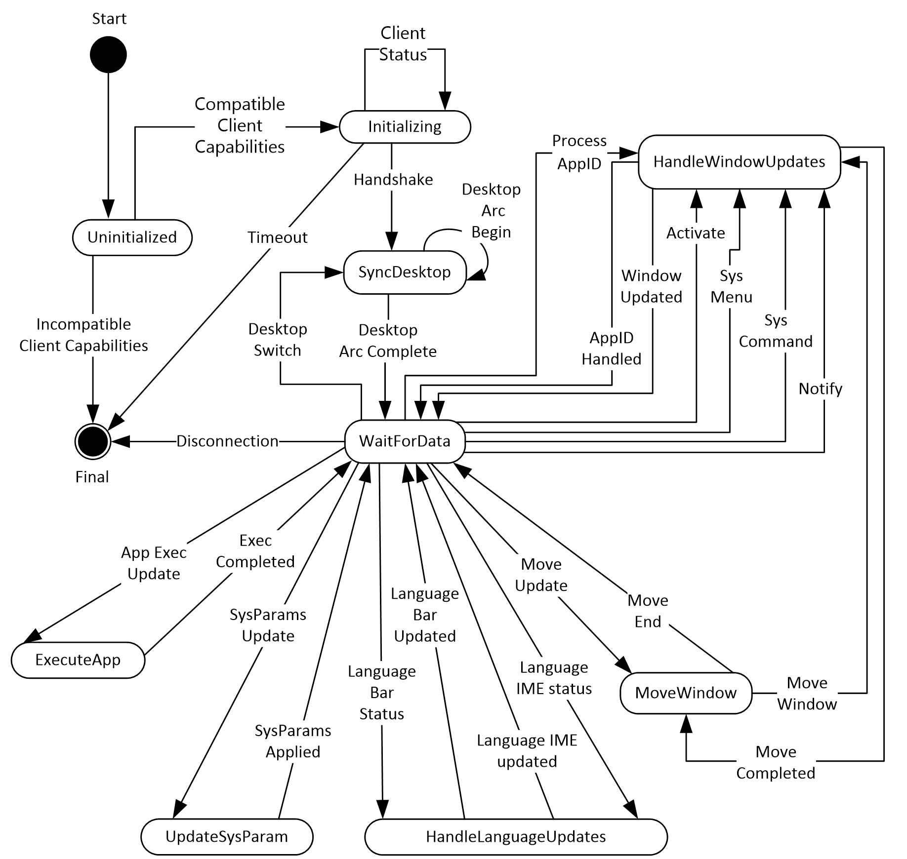

Figure 5: Server State Machine Diagram

| State | Description |
| --- | --- |
| Uninitialized | This is the initial state of the server. In this state, the server waits for the [Remote Programs Capability Set (section 2.2.1.1.1)](#Section_2.2.1.1.1) and the [Window List Capability Set (section 2.2.1.1.2)](#Section_2.2.1.1.2) from the client. On receiving these capability sets, the server processes them as specified in section [3.3.5.1.5](../MS-RDPBCGR/MS-RDPBCGR.md). If the server finds compatible settings, it transitions to the Initializing state. Otherwise, the connection is terminated (see [MS-RDPBCGR](#Section_2.2.1) section 1.3.1.4.2). |
| Initializing | In this state, the server examines the [Handshake PDU (section 2.2.2.2.1)](#Section_2.2.2.2.1) and the [Client Information PDU (section 2.2.2.2.2)](#Section_2.2.2.2.2). On receiving these, the server processes the Handshake PDU as specified in section [3.1.5.2](#Section_3.3.5.2.9.1) and the Client Information PDU as specified in section [3.3.5.2.1.1](#Section_3.3.5.2.1.1), and transitions to the SyncDesktop state. If the server does not receive the Handshake PDU within a specified time, it can disconnect the connection (see section [3.1.2](#Section_3.1.2)). |
| SyncDesktop | In this state, the server syncs its desktop with that of the client. The server transitions to this state either during the RAIL connection synchronization (see section [1.3.2.3](#Section_1.3.2.3)) or on detection of a desktop switch (see section [3.3.5.1.8](#Section_3.3.5.1.8)). After completion of the desktop sync (as specified in section 3.3.5.1.8), the server transitions to the WaitForData state. |
| WaitForData | In this state, the server waits for all non-initialization messages received on the static virtual channel (see section [3.3.5.2](#Section_2.2.2)). On receiving a [Client Execute PDU (section 2.2.2.3.1)](#Section_2.2.2.3.1), the server transitions to the ExecuteApp state. On receiving a [Client System Parameters Update PDU (section 2.2.2.4.1)](#Section_2.2.2.4.1), the server transitions to the UpdateSysParam state. On receiving a [Language Bar Information PDU (section 2.2.2.9.1)](#Section_2.2.2.9.1), the server transitions to the UpdateLanguageBar state. On receiving a [Client Window Move PDU (section 2.2.2.7.4)](#Section_2.2.2.7.4), the server transitions to the MoveWindow state. On receiving a [Client Activate PDU (section 2.2.2.6.1)](#Section_2.2.2.6.1), a [Client System Menu PDU (section 2.2.2.6.2)](#Section_2.2.2.6.2), a [Client System Command PDU (section 2.2.2.6.3)](#Section_2.2.2.6.3), a [Client Notify Event PDU (section 2.2.2.6.4)](#Section_2.2.2.6.4), or a [Client Get Application ID PDU (section 2.2.2.6.5)](#Section_2.2.2.6.5), the server transitions to the HandleWindowUpdates state. On detecting a desktop switch, the server transitions to the SyncDesktop state. |
| ExecuteApp | In this state, the server processes the Client Execute PDU, as specified in section [3.3.5.2.2.1](#Section_3.3.5.2.2.1), and sends the [Server Execute Result PDU (section 2.2.2.3.2)](#Section_2.2.2.3.2), as specified in section [3.3.5.2.2.2](#Section_3.3.5.2.2.2). The server then transitions back to the WaitForData state. |
| UpdateSysParam | In this state, the server processes the Client System Parameters Update PDU, as specified in section [3.3.5.2.3.1](#Section_3.3.5.2.3.1), and transitions back to the WaitForData state. |
| UpdateLanguageBar | In this state, the server processes the Language Bar Information PDU, as specified in section [3.3.5.2.5.5](#Section_3.3.5.2.5.5), and transitions back to the WaitForData state. |
| MoveWindow | In this state, the server processes the Client Window Move PDU, as specified in section [3.3.5.2.6.3](#Section_3.3.5.2.6.3). If the window ID is valid, the server transitions to the HandleWindowUpdates state. Once the window is moved, the server transitions back to the MoveWindow state. If applicable, the server also sends a [Server Move/Size End PDU (section 2.2.2.7.3)](#Section_2.2.2.7.3) to the client, as specified in section [3.3.5.2.6.4](#Section_3.3.5.2.6.4). After all processing is complete, the server transitions back to the WaitForData state. |
| HandleWindowUpdates | In this state, the server processes local client events relevant to individual windows: the Client Activate PDU, as specified in section [3.3.5.2.5.1](#Section_3.3.5.2.5.1); the Client System Menu PDU, as specified in section [3.3.5.2.5.2](#Section_3.3.5.2.5.2); the Client System Command PDU, as specified in section [3.3.5.2.5.3](#Section_3.3.5.2.5.3); and the Client Notify Event PDU, as specified in section [3.3.5.2.5.4](#Section_3.3.5.2.5.4). The server also processes the Client Get Application ID PDU, as specified in section [3.3.5.2.7.1](#Section_3.3.5.2.7.1), and sends the [Server Get Application ID Response PDU (section 2.2.2.8.1)](#Section_2.2.2.8.1), as specified in section [3.3.5.2.7.2](#Section_3.3.5.2.7.2). After all processing is complete, the server transitions back to the WaitForData state. |

<a id="Section_3.1.1.2"></a>
#### 3.1.1.2 Icon Cache Support

If the implementation supports icon caching, then the following state is negotiated between the client and server as part of the Window List Capability Set order (section [2.2.1.1.2](#Section_2.2.1.1.2)), and thereafter maintained on both client and server.

**NumIconCaches**: the number of discrete caches for icons maintained on client and server.

**NumIconCacheEntries**: the number of entries allocated in each icon cache.

Once an icon cache capability is established, individual entries in the cache are identified by a Cached Icon Info packet (section [2.2.1.2.4](#Section_2.2.1.2.4)), containing a pair of index values designating the specific icon cache and the entry within that cache.

<a id="Section_3.1.2"></a>
### 3.1.2 Timers

A handshake timer MAY<28> be used by the client and/or server to wait for the [Handshake PDU](#Section_2.2.2.2.1) from the sending party.

<a id="Section_3.1.3"></a>
### 3.1.3 Initialization

The static virtual channel between the client and the server MUST be established before protocol operations can commence (see section [1.3.2.1](#Section_1.3.2.1) for an overview).

The Handshake PDU (as specified in section [2.2.2.2.1](#Section_2.2.2.2.1)) is exchanged between the server and the client to establish that both endpoints are ready to begin RAIL mode.

The Client Information PDU (as specified in section [2.2.2.2.2](#Section_2.2.2.2.2)) is sent from a client to a server and contains information about RAIL client state and features supported by the client.

<a id="Section_3.1.4"></a>
### 3.1.4 Higher-Layer Triggered Events

No higher-layer triggered events are used.

<a id="Section_3.1.5"></a>
### 3.1.5 Message Processing Events and Sequencing Rules

The following sections describe construction and processing of common messages.

<a id="Section_3.1.5.1"></a>
#### 3.1.5.1 Constructing Handshake PDU

The [Handshake PDU](#Section_2.2.2.2.1) is constructed during initialization of the [**remote applications integrated locally (RAIL)**](#gt_remote-applications-integrated-locally-rail) virtual channel. The buildNumber field SHOULD be initialized to the build or version of the sending party. This PDU (or alternatively the HandshakeEx PDU (section [2.2.2.2.3](#Section_2.2.2.2.3)) if the sending party is the server) MUST be sent before any other PDU on the virtual channel.

<a id="Section_3.1.5.2"></a>
#### 3.1.5.2 Processing Handshake PDU

The receiving party SHOULD check the **buildNumber** field to verify compatibility of the receiver with the sender.<29>

The receiving party MUST NOT process any other virtual channel PDUs unless either the [Handshake PDU](#Section_2.2.2.2.1) or (if the receiving party is the client) the HandshakeEx PDU (section [2.2.2.2.3](#Section_2.2.2.2.3)) has been received.

<a id="Section_3.1.6"></a>
### 3.1.6 Timer Events

Upon the expiration of the handshake timer (as specified in section [3.1.2](#Section_3.1.2)), the receiving party SHOULD drop the connection.

<a id="Section_3.1.7"></a>
### 3.1.7 Other Local Events

No additional events are used.

<a id="Section_3.2"></a>
## 3.2 Client Details

<a id="Section_3.2.1"></a>
### 3.2.1 Abstract Data Model

This section describes a conceptual model of possible data organization that an implementation maintains to participate in this protocol. The described organization is provided to facilitate the explanation of how the protocol behaves. This document does not mandate that implementations adhere to this model as long as their external behavior is consistent with what is described in this document.

Note: It is possible to implement the following conceptual data by using a variety of techniques as long as the implementation produces external behavior that is consistent with what is described in this document.

<a id="Section_3.2.1.1"></a>
#### 3.2.1.1 Windowing Support Level

The windowing support level determines whether the server is capable of supporting Windowing Alternate Secondary Drawing Orders and the following flags: WINDOW_ORDER_FIELD_CLIENTAREASIZE, WINDOW_ORDER_FIELD_RPCONTENT, and WINDOW_ORDER_FIELD_ROOTPARENT. This is communicated to the client by the **WndSupportLevel** field, as part of the Window List Capability Set (section [2.2.1.1.2](#Section_2.2.1.1.2)).

<a id="Section_3.2.1.2"></a>
#### 3.2.1.2 Marker Window ID

An ID that uniquely identifies the marker window (section [3.3.1.3](#Section_3.3.1.3)) created by the server. The ID of this window is sent to the client in the Z-Order Sync Information PDU (section [2.2.2.11.1](#Section_2.2.2.11.1)).

<a id="Section_3.2.2"></a>
### 3.2.2 Timers

No timers are used.

<a id="Section_3.2.3"></a>
### 3.2.3 Initialization

None.

<a id="Section_3.2.4"></a>
### 3.2.4 Higher-Layer Triggered Events

There are no higher-layer triggered events.

<a id="Section_3.2.5"></a>
### 3.2.5 Message Processing Events and Sequencing Rules

The following sections describe construction and processing of client messages.

<a id="Section_3.2.5.1"></a>
#### 3.2.5.1 Updates to RDP Core Protocol

<a id="Section_3.2.5.1.1"></a>
##### 3.2.5.1.1 Constructing Client MCS Connect Initial PDU

The Client MCS Connect Initial PDU is constructed by the client during the connection establishment phase, as specified in [MS-RDPBCGR](#Section_2.2.1) section 3.2.5.3.3.

For [**remote applications integrated locally (RAIL)**](#gt_remote-applications-integrated-locally-rail) clients, the **clientNetworkData** field (as specified in [MS-RDPBCGR] section 2.2.1.3) MUST be present and MUST contain a CHANNEL_DEF structure in channelDefArray for the RAIL virtual channel. This informs the server that the client wants to use a static virtual channel for communicating RAIL virtual channel messages.<30>

<a id="Section_3.2.5.1.2"></a>
##### 3.2.5.1.2 Processing Server MCS Connect Response PDU

This PDU is sent by the server in response to the Client MCS Connect Initial PDU. It is processed by the client, as specified in [MS-RDPBCGR](#Section_2.2.1) section 3.2.5.3.4.

<a id="Section_3.2.5.1.3"></a>
##### 3.2.5.1.3 Constructing Client Info PDU

The Client Info PDU (as specified in [MS-RDPBCGR](#Section_2.2.1) section 2.2.1.11) is constructed by the client during the connection establishment phase (as specified in [MS-RDPBCGR] section 3.2.5.3.11).

For [**remote applications integrated locally (RAIL)**](#gt_remote-applications-integrated-locally-rail) clients, the **flags** field of the Info Packet (as specified in [MS-RDPBCGR] section 2.2.1.11.1.1) MUST have the INFO_RAIL (0x00008000) flag set. This informs the server that the client wants to create a RAIL session.

If the client supports Enhanced RemoteApp, the **flags** field SHOULD also have the INFO_HIDEF_RAIL_SUPPORTED (0x02000000) flag set. This flag requests that the server create a RAIL session in Enhanced RemoteApp mode. Setting this flag does not guarantee that Enhanced RemoteApp will be enabled since the server may not support this mode.

<a id="Section_3.2.5.1.4"></a>
##### 3.2.5.1.4 Constructing Confirm Active PDU

The Confirm Active PDU is constructed by the client in response to the Demand Active PDU, as specified in [MS-RDPBCGR](#Section_2.2.1) section 3.2.5.3.13.2.

[**Remote applications integrated locally (RAIL)**](#gt_remote-applications-integrated-locally-rail) clients MUST populate this PDU with two RAIL-specific capabilities in the **capabilitySets** field of the TS_CONFIRM_ACTIVE_PDU ([MS-RDPBCGR] section 2.2.1.13.2.1) structure: the Remote Programs Capability Set, as specified in section [2.2.1.1.1](#Section_2.2.1.1.1), and the Window List Capability Set, as specified in section [2.2.1.1.2](#Section_2.2.1.1.2).

The NumIconCaches and NumIconCacheEntries of the Window List Capability Set SHOULD be reported as the minimum of the corresponding values supported by the client, and those reported by the server in the Demand Active PDU. The values MUST not exceed those reported by the server in the Demand Active PDU.

<a id="Section_3.2.5.1.5"></a>
##### 3.2.5.1.5 Processing Demand Active PDU

The Demand Active PDU is processed by the client during the connection establishment phase, as specified in [MS-RDPBCGR](#Section_2.2.1) section 3.2.5.3.13.1.

[**Remote applications integrated locally (RAIL)**](#gt_remote-applications-integrated-locally-rail) clients MUST verify that this PDU contains two RAIL-specific capabilities in the **capabilitySets** field of the TS_DEMAND_ACTIVE_PDU ([MS-RDPBCGR] section 2.2.1.13.1.1) structure: the Remote Programs Capability Set, as specified in section [2.2.1.1.1](#Section_2.2.1.1.1), and the Window List Capability Set, as specified in section [2.2.1.1.2](#Section_2.2.1.1.2). If it does not contain these capability sets, or if the RailSupportLevel of the Remote Programs Capability Set is not set to at least TS_RAIL_LEVEL_SUPPORTED, or the WndSupportLevel of the Window List Capability Set is TS_WINDOW_LEVEL_NOT_SUPPORTED (0), the client MUST drop the connection.

The client SHOULD use the NumIconCaches and NumIconCacheEntries of the Window List Capability Set to determine the values of NumIconCaches and NumIconCacheEntries reported by it in the Confirm Active PDU, as specified in section [3.2.5.1.4](#Section_3.2.5.1.4).

<a id="Section_3.2.5.1.6"></a>
##### 3.2.5.1.6 Processing Window Information Orders

Window Information Orders (section [2.2.1.3.1](#Section_2.2.1.3.1.2)) inform the client of the following types of window events on the server:

- Creation of a new window.
- Updates on window properties for a new or existing window.
- Updates on icons for a new or existing window.
- Deletion of an existing window.
- Registration of a new or existing window as an application desktop toolbar.
- Deregistration of an existing application desktop toolbar.
- Updates on the edge to which the application desktop toolbar window is anchored.
Upon receipt of a Window Information Order for a new window (the **FieldsPresentFlags** field of the **Hdr** contains the WINDOW_ORDER_STATE_NEW (0x10000000) flag, as specified in section [2.2.1.3.1.2.1](#Section_2.2.1.3.1)), the client SHOULD create a new [**RAIL window**](#gt_rail-window) locally. The client SHOULD store an association of the **WindowId** reported in the **Hdr** field with the local RAIL window.

Upon receipt of a Window Information Order for an existing window (the **FieldsPresentFlags** field of **Hdr** does not contain the WINDOW_ORDER_STATE_NEW (0x10000000) flag, as specified in section 2.2.1.3.1.2.1), the client SHOULD locate the local RAIL window that corresponds to the **WindowId** reported in the **Hdr** field and apply the specified updates to the RAIL window. If no such window can be found, the client SHOULD ignore the order.

Upon receipt of a Window Information Order for an icon or cached icon, as specified in sections [2.2.1.3.1.2.2](#Section_2.2.1.3.1.2.2) and [2.2.1.3.1.2.3](#Section_2.2.1.3.1.2.3), the client SHOULD locate the local RAIL window that corresponds to the **WindowId** reported in the **Hdr** field and apply the icon updates to the RAIL window. If no such window can be found, the client SHOULD ignore the order.

Upon receipt of a Window Information Order for a deleted window, as specified in section [2.2.1.3.1.2.4](#Section_2.2.1.3.1), the client SHOULD locate the local RAIL window that corresponds to the **WindowId** reported in the **Hdr** field and destroy it. If no such window can be found, the client SHOULD ignore the order.

Upon receipt of a Window Information Order for the registration of a window as an application desktop toolbar, the client SHOULD locate the local RAIL window that corresponds to the **WindowId** reported in the **Hdr** field and register it as an application desktop toolbar. If no such window can be found, the client SHOULD ignore the order.

Upon receipt of a Window Information Order for the deregistration of an application desktop toolbar window, the client SHOULD locate the local RAIL window that corresponds to the **WindowId** reported in the **Hdr** field and deregister the application desktop toolbar window. If no such window can be found, the client SHOULD ignore the order.

The boundaries of the window (defined by the **WindowOffsetX**, **WindowOffsetY**, **WindowWidth** and **WindowHeight** fields) only include the visible area of the window, and do not include any optional transparent hit-testable window margins ("resize margins"). However, the Client Window Move PDU (section [2.2.2.7.4](#Section_2.2.2.7.4)) and Client Window Snap PDU (section [2.2.2.7.5](#Section_2.2.2.7.5)) do include resize margins in the window boundaries. For this reason, clients SHOULD NOT expect the window boundaries reported in the Window Information Order (section 2.2.1.3.1.2.1) to match boundaries previously sent in a Window Move/Snap PDU. This applies even if margins were not sent in the Window Information Order.<31>

Upon receipt of a Window Information Order for the edge of an application desktop toolbar window, the client SHOULD locate the local RAIL window that corresponds to the **WindowId** reported in the **Hdr** field and update the edge to which the window is anchored. If no such window can be found, the client SHOULD ignore the order.

<a id="Section_3.2.5.1.7"></a>
##### 3.2.5.1.7 Processing Notification Icon Orders

Notification Icon Information Orders (section [2.2.1.3.2](#Section_2.2.1.3.2)) inform the client of the following types of [**notification icon**](#gt_notification-icon) events on the server:

- Creation of a new notification icon.
- Updates on properties for a new or existing notification icon.
- Deletion of an existing notification icon.
Upon receipt of a Notification Icon Order for a new notification icon (the **FieldsPresentFlags** field of **Hdr** contains the WINDOW_ORDER_STATE_NEW (0x10000000) flag, as specified in section [2.2.1.3.2.2.1](#Section_4.1.1.3)), the client SHOULD create a new [**RAIL notification icon**](#gt_rail-notification-icon) locally. The client SHOULD store an association of the **WindowId** and **NotifyIconId** reported in the **Hdr** field with the local notification icon.

Upon receipt of a notification icon Order for an existing notification icon (the FieldsPresentFlags field of **Hdr** does not contain the WINDOW_ORDER_STATE_NEW (0x10000000) flag, as specified in section 2.2.1.3.2.2.1), the client SHOULD locate the [**RAIL**](#gt_remote-applications-integrated-locally-rail) notification icon that corresponds to the WindowId and NotifyIconId reported in the **Hdr** field, and then apply the specified updates to the RAIL notification icon. If no such icon can be found, the client SHOULD ignore the Order.

Upon receipt of a notification icon Order for a deleted icon, as specified in section [2.2.1.3.2.2.2](#Section_2.2.1.3.2), the client SHOULD locate the local RAIL notify icon that corresponds to the WindowId and NotifyIconId reported in the **Hdr** field and destroy it. If no such icon can be found, the client SHOULD ignore the Order.

<a id="Section_3.2.5.1.8"></a>
##### 3.2.5.1.8 Processing Desktop Information Orders

Desktop Information Orders inform the client of events on the server that are not confined to a single window or [**notification icon**](#gt_notification-icon). Processing of these orders is indicated as follows:

- Upon receipt of a Desktop Information Order, as specified in section [2.2.1.3.3.2.1](#Section_4.1.1.5), with the WINDOW_ORDER_FIELD_DESKTOP_ARC_BEGAN (0x00000008) and the WINDOW_ORDER_FIELD_DESKTOP_HOOKED (0x00000002) flags set in the **Hdr** field, the client SHOULD discard all of the existing RAIL windows and Notify Icons and prepare for Window Orders (see sections [2.2.1.3.1.2.1](#Section_2.2.1.3.1) and [2.2.1.3.1.2.4](#Section_2.2.1.3.1)) and Notify Icon Orders (see sections [2.2.1.3.1.2.2](#Section_2.2.1.3.1.2.2)and [2.2.1.3.1.2.3](#Section_2.2.1.3.1.2.3)) from the server.
- Upon receipt of a Desktop Information Order for a **Non-Monitored Desktop** packet, as specified in section [2.2.1.3.3.2.2](#Section_2.2.1.3.3.2.2), the client SHOULD discard all of the existing RAIL windows and Notify Icons.
- Upon receipt of a Desktop Information Order with the WINDOW_ORDER_FIELD_DESKTOP_HOOKED (0x00000002) flag set in the **Hdr** field, the client SHOULD prepare for Window and Notify Icon Orders from the server.
- Upon receipt of a Desktop Information Order with the **NumWindowIds** and **WindowIds** fields present, the client SHOULD apply the specified Z-order of the server's windows to its local RAIL windows.
- Upon receipt of a Desktop Information Order with the **ActiveWindowId** field present, the client SHOULD activate the corresponding local RAIL window.
<a id="Section_3.2.5.2"></a>
#### 3.2.5.2 Static Virtual Channel Protocol

<a id="Section_3.2.5.2.1"></a>
##### 3.2.5.2.1 Initialization Messages

<a id="Section_3.2.5.2.1.1"></a>
###### 3.2.5.2.1.1 Sending Client Information PDU

The client information PDU is initialized as specified in section [2.2.2.2.2](#Section_2.2.2.2.2).

<a id="Section_3.2.5.2.1.2"></a>
###### 3.2.5.2.1.2 Processing HandshakeEx PDU

The client SHOULD check the **buildNumber** field to verify compatibility of the receiver with the sender.<32>

If the TS_RAIL_ORDER_HANDSHAKEEX_FLAGS_HIDEF (0x00000001) flag in the **railHandshakeFlags** field is set, the remote session is running in Enhanced RemoteApp mode, and the client SHOULD handle the RDPGFX_MAP_SURFACE_TO_WINDOW_PDU ([MS-RDPEGFX](../MS-RDPEGFX/MS-RDPEGFX.md) section 2.2.2.20) message. If this flag is not set, the session is not running in Enhanced RemoteApp mode, even if the client requested it in the Client Info PDU (as specified in section [3.2.5.1.3](#Section_3.2.5.1.3)). In this scenario, the client SHOULD NOT expect to receive Enhanced RemoteApp messages.

The client MUST NOT process any other virtual channel PDUs unless either the HandshakeEx PDU (section [2.2.2.2.3](#Section_2.2.2.2.3)) or the Handshake PDU (section [2.2.2.2.1](#Section_2.2.2.2.1)) has been received.

<a id="Section_3.2.5.2.2"></a>
##### 3.2.5.2.2 Program Launching Messages

<a id="Section_3.2.5.2.2.1"></a>
###### 3.2.5.2.2.1 Sending Execute PDU

As specified in section [2.2.2.3.1](#Section_2.2.2.3.1), the client SHOULD store the execute request to match execute requests with Execute Result PDUs from the server. For Server Execute Result PDU, see section [2.2.2.3.2](#Section_2.2.2.3.2).

<a id="Section_3.2.5.2.2.2"></a>
###### 3.2.5.2.2.2 Processing Execute Result PDU

The client SHOULD match the Execute Result PDU with a previously sent Execute PDU and report the results to the user.

<a id="Section_3.2.5.2.3"></a>
##### 3.2.5.2.3 Local Client System Parameters Update Messages

<a id="Section_3.2.5.2.3.1"></a>
###### 3.2.5.2.3.1 Sending System Parameters Update PDU

Initialized as specified in section [2.2.2.4.1](#Section_2.2.2.4.1), this PDU SHOULD be sent at the start of every [**remote applications integrated locally (RAIL)**](#gt_remote-applications-integrated-locally-rail) connection or reconnection and when a system parameter on the client changes its value.

<a id="Section_3.2.5.2.4"></a>
##### 3.2.5.2.4 Server System Parameters Update Messages

<a id="Section_3.2.5.2.4.1"></a>
###### 3.2.5.2.4.1 Processing Server System Parameters Update PDU

On receipt of this PDU, the client SHOULD update its system parameters to those reported by the server. This helps to maintain consistency between local client and remote server settings, which is an important aspect of the seamless experience.

<a id="Section_3.2.5.2.5"></a>
##### 3.2.5.2.5 Local Client Event Messages

Local Client Event Messages are Virtual Channel PDUs sent from the client to the server specifying user interactions with [**RAIL windows**](#gt_rail-window) and notifications that cannot be captured and sent over the regular RDP channel.

<a id="Section_3.2.5.2.5.1"></a>
###### 3.2.5.2.5.1 Sending Activate PDU

The Activate PDU is sent by the client when a [**RAIL window**](#gt_rail-window) is activated by a means other than clicking it, such as by pressing ALT+TAB.

**Note** Mouse clicks on the RAIL window are forwarded to the server via the RDP core protocol. The PDU is initialized as specified in section [2.2.2.6.1](#Section_2.2.2.6.1).

The **WindowId** field SHOULD be initialized to the ID of an existing window on the server that is associated with the local RAIL window being activated. The [**RAIL**](#gt_remote-applications-integrated-locally-rail) client SHOULD create this association during processing of the Window Information Order for new windows, as specified in section [2.2.1.3.1.2.1](#Section_2.2.1.3.1).

<a id="Section_3.2.5.2.5.2"></a>
###### 3.2.5.2.5.2 Sending System Menu PDU

The [**System Menu**](#gt_system-menu) PDU is sent by the client when a [**RAIL window**](#gt_rail-window) receives a command to display its system menu by a means other than clicking it, such as by right-clicking the [**taskbar**](#gt_taskbar) icon for the window.

**Note** Mouse clicks in the RAIL window are forwarded to the server via the RDP core protocol. The PDU is initialized as specified in section [2.2.2.6.2](#Section_2.2.2.6.2).

The **WindowId** field SHOULD be initialized to the ID of an existing window on the server that is associated with the local RAIL window. The [**RAIL**](#gt_remote-applications-integrated-locally-rail) client SHOULD create this association during processing of the Window Information Order for new windows, as specified in section [2.2.1.3.1.2.1](#Section_2.2.1.3.1).

<a id="Section_3.2.5.2.5.3"></a>
###### 3.2.5.2.5.3 Sending System Command PDU

The [**System Command**](#gt_system-command) PDU is sent by the client when a [**RAIL window**](#gt_rail-window) receives a system command by a means other than clicking it (for example, by pressing the Windows logo key+M to minimize the window, by clicking the Show Desktop button in the [**taskbar**](#gt_taskbar), or by selecting the [**system menu**](#gt_system-menu) by pressing ALT+SPACE).

**Note** Mouse clicks in the RAIL window are forwarded to the server via the RDP core protocol. The PDU is initialized as specified in section [2.2.2.6.3](#Section_2.2.2.6.3).

The **WindowId** field SHOULD be initialized to the ID of an existing window on the server that is associated with the local RAIL window. The [**RAIL**](#gt_remote-applications-integrated-locally-rail) client SHOULD create this association during processing of the Window Information Order for new windows, as specified in section [2.2.1.3.1.2.1](#Section_2.2.1.3.1).

<a id="Section_3.2.5.2.5.4"></a>
###### 3.2.5.2.5.4 Sending Notify Event PDU

The Notify Event PDU is sent by the client when a [**remote applications integrated locally (RAIL)**](#gt_remote-applications-integrated-locally-rail) [**notification icon**](#gt_notification-icon) receives any user interaction via the keyboard or mouse. The PDU is initialized as specified in section [2.2.2.6.4](#Section_2.2.2.6.4).

The **WindowId** and **NotifyIconId** fields SHOULD be initialized to the ID of an existing Window and notification icon (respectively) on the server and associated with the local [**RAIL notification icon**](#gt_rail-notification-icon). The RAIL client SHOULD create this association during processing of the Notification Icon Information Order for new notification icons, as specified in section [2.2.1.3.2.2.1](#Section_4.1.1.3).

<a id="Section_3.2.5.2.6"></a>
##### 3.2.5.2.6 Language Bar Information PDUs

<a id="Section_3.2.5.2.6.1"></a>
###### 3.2.5.2.6.1 Sending Language Bar Information PDU

After initialization (as specified in section [2.2.2.9.1](#Section_2.2.2.9.1)), this PDU SHOULD be sent from a client to a server just after sending the RAIL handshake (see section [2.2.2.2.1](#Section_2.2.2.2.1)). This enables the server synchronize its language bar state with the client's.

This PDU MUST NOT be sent if the server does not support the Docked Language Bar RAIL capability (TS_RAIL_LEVEL_DOCKED_LANGBAR_SUPPORTED).

<a id="Section_3.2.5.2.6.2"></a>
###### 3.2.5.2.6.2 Processing Language Bar Information PDU

Upon receipt of this PDU, the client SHOULD update the status of its language using the [Language Bar Information PDU](#Section_2.2.2.9.1).

<a id="Section_3.2.5.2.7"></a>
##### 3.2.5.2.7 Window Move Messages

Window Move Messages are generated by the server and client to enable the local move/size feature of [**RAIL**](#gt_remote-applications-integrated-locally-rail).

<a id="Section_3.2.5.2.7.1"></a>
###### 3.2.5.2.7.1 Processing Min Max Info PDU

On receipt of the Min Max Info PDU, if the client supports local move/size, it SHOULD locate the local [**RAIL window**](#gt_rail-window) that corresponds to the **WindowId** field and apply the specified window extents (**MaxWidth**, **MaxHeight**, **MaxPosX**, **MaxPosY**, **MinTrackWidth**, **MinTrackHeight**, **MaxTrackWidth**, and **MaxTrackHeight** fields) to it.

If no such RAIL window can be found, the client SHOULD ignore this PDU.

If the client does not support local move/size, it SHOULD ignore this PDU.

<a id="Section_3.2.5.2.7.2"></a>
###### 3.2.5.2.7.2 Processing Move/Size Start PDU

On receipt of the Move/Size Start PDU, if the client supports local move/size features, it SHOULD locate the local [**RAIL window**](#gt_rail-window) that corresponds to the **WindowId** field and initiate a move/size of the local RAIL window by using the local Window Manager based on the **MoveSizeType** field. The client SHOULD also suppress forwarding of keyboard/mouse events to the server to maintain a local-only move/size of the RAIL window.

If no RAIL window can be found corresponding to **WindowId**, the client SHOULD ignore this PDU.

If the client does not support local move/size, it SHOULD ignore this PDU.

<a id="Section_3.2.5.2.7.3"></a>
###### 3.2.5.2.7.3 Sending Window Move PDU

If the client supports local move/size, it SHOULD send the Window Move PDU upon receiving a notification from the local window manager that a local move/size of a [**RAIL window**](#gt_rail-window) has ended. The PDU is sent for keyboard–based moves and all resizes, and it is initialized as specified in section [2.2.2.7.4](#Section_2.2.2.7.4).

The **WindowId** field SHOULD be initialized to the ID of an existing window on the server that is associated with the local RAIL window. The [**RAIL**](#gt_remote-applications-integrated-locally-rail) client SHOULD create this association during processing of the Window Information Order for new windows, as specified in section [2.2.1.3.1.2.1](#Section_2.2.1.3.1).

If the client suppressed forwarding of keyboard/mouse events to the server during processing of the Move/Size Start PDU, it MUST resume the forwarding of these events to the server to allow the server to detect a move/size end of the remote window.

<a id="Section_3.2.5.2.7.4"></a>
###### 3.2.5.2.7.4 Processing Move/Size End PDU

Upon receipt of the Move/Size End PDU, if the client supports local move/size features, it SHOULD locate the local [**RAIL window**](#gt_rail-window) that corresponds to the **WindowId** field and move it to the coordinates specified by the **TopLeftX** and **TopLeftY** fields. This ensures synchronization between the final positions of the corresponding moved/resized windows on the server and client.

If no RAIL window can be found corresponding to **WindowId**, the client SHOULD ignore this PDU.

If the client does not support local move/size, it SHOULD ignore this PDU.

<a id="Section_3.2.5.2.7.5"></a>
###### 3.2.5.2.7.5 Sending Window Snap PDU

If the server advertises support for window snapping in the **HandshakeEx PDU** (section [2.2.2.2.3](#Section_2.2.2.2.3)) structure (using the TS_RAIL_ORDER_HANDSHAKE_EX_FLAGS_SNAP_ARRANGE_SUPPORTED flag, as specified in the **HandshakeEx PDU**), the client SHOULD send the **Window Snap PDU** (section [2.2.2.7.5](#Section_2.2.2.7.5)) when it receives a notification from the local window manager that a local RAIL window has been moved, and is able to determine that the move occurred due to the use of [**Snap**](#gt_snap) or an equivalent feature.

If the server does not support window snapping or if the client is unable to detect what feature caused the local RAIL window to be moved, it SHOULD send the **Window Move PDU** (section [2.2.2.7.4](#Section_2.2.2.7.4)) instead.

If the client sends the **Window Snap PDU** in response to a local RAIL window being snapped, it SHOULD NOT send a **Window Move PDU** for the same event.

<a id="Section_3.2.5.2.8"></a>
##### 3.2.5.2.8 Application ID Messages

<a id="Section_3.2.5.2.8.1"></a>
###### 3.2.5.2.8.1 Sending Client Get Application ID PDU

After being initialized as specified in section [2.2.2.6.5](#Section_2.2.2.6.5), this PDU MAY be sent from a client to a server after receiving a Window Information Order containing the WINDOW_ORDER_STATE_NEW (0x10000000) flag.

<a id="Section_3.2.5.2.8.2"></a>
###### 3.2.5.2.8.2 Processing Server Get Application ID Response PDU

Upon receipt of this PDU, the client SHOULD<33> update the Application ID string of the Window matching the Windows ID received from the server.

<a id="Section_3.2.5.2.8.3"></a>
###### 3.2.5.2.8.3 Processing Server Get Application ID Extended Response PDU

Upon receipt of this PDU, the client SHOULD<34> update the Application ID string of the Window matching the Windows ID received from the server. The client SHOULD also cache the ID and the image name of the process that hosts the corresponding window on the server.

<a id="Section_3.2.5.2.9"></a>
##### 3.2.5.2.9 Z-Order Sync Messages

<a id="Section_3.2.5.2.9.1"></a>
###### 3.2.5.2.9.1 Sending Z-Order Sync Support Flag

The client advertises support for Z-order sync by including the TS_RAIL_CLIENTSTATUS_ZORDER_SYNC (0x00000004) flag in the [Client Information PDU (section 2.2.2.2.2)](#Section_2.2.2.2.2).

<a id="Section_3.2.5.2.9.2"></a>
###### 3.2.5.2.9.2 Processing Z-Order Sync Information PDU

When the client receives the Z-Order Sync Information PDU, the ID of the [**marker window**](#gt_marker-window) MUST be stored in the [Marker Window ID (section 3.2.1.2)](#Section_3.3.1.3) store.

If a client-side window that is not remoted from the server (referred to as "Window A") is activated, then the client SHOULD instruct the server to activate the marker window by sending the [Client Activate PDU (section 2.2.2.6.1)](#Section_2.2.2.6.1) to the server with the **Enabled** field set to zero.

Furthermore, if the server instructs the client to activate a [**RAIL window**](#gt_rail-window) (referred to as "Window B"), the client SHOULD check the position of Window B with respect to the marker window in the **WindowIds** field of the [Actively Monitored Desktop (section 2.2.1.3.3.2.1)](#Section_4.1.1.5). Window B SHOULD only be activated if it appears before the marker window in the **WindowIds** field of the Actively Monitored Desktop Order.

<a id="Section_3.2.5.2.10"></a>
##### 3.2.5.2.10 Window Cloak State Sync Messages

<a id="Section_3.2.5.2.10.1"></a>
###### 3.2.5.2.10.1 Sending Window Cloak State Change PDU

The Window Cloak State Change PDU (section [2.2.2.12.1](#Section_2.2.2.12.1)) SHOULD be sent by the client when a RAIL window is cloaked or uncloaked on the client (for example, in the case of a virtual desktop feature, when the user switches desktops). A cloaked window MUST be present on the client, but MUST be invisible to the user and MUST NOT receive mouse, pen, or touch input. This PDU ensures that cloaked state is synchronized between client and server.

The PDU is initialized as specified in section 2.2.2.12.1. The **WindowId** field SHOULD be initialized to the ID of an existing window on the server that is associated with the local RAIL window. The RAIL client SHOULD create this association during processing of the Window Information Order for new windows, as specified in section [2.2.1.3.1.2.1](#Section_2.2.1.3.1).

<a id="Section_3.2.5.2.10.2"></a>
###### 3.2.5.2.10.2 Processing Window Cloak State Change PDU

On receipt of this PDU the client SHOULD cloak or uncloak the RAIL window with the ID specified by the **WindowId** field. The action of cloaking or uncloaking is specified by the **Cloaked** field. The client SHOULD NOT send a Window Cloak State Change PDU back to the server as a result of processing this PDU.

If no [**RAIL window**](#gt_rail-window) can be found corresponding to **WindowId**, the client SHOULD ignore this PDU.

<a id="Section_3.2.5.2.11"></a>
##### 3.2.5.2.11 Power Display Request Messages

<a id="Section_3.2.5.2.11.1"></a>
###### 3.2.5.2.11.1 Processing Power Display Request PDU

On receipt of this PDU, the client SHOULD update its [**display-required power request**](#gt_display-required-power-request) status. If the Active field is set to 0x00000001, then the display on the client device SHOULD remain in the powered-on state even if there is no user input for an extended period.

<a id="Section_3.2.5.2.12"></a>
##### 3.2.5.2.12 Server Taskbar State Messages

<a id="Section_3.2.5.2.12.1"></a>
###### 3.2.5.2.12.1 Processing Taskbar Tab Info PDU

On receipt of this PDU, the client SHOULD update the local window manager to reflect the new tab group state of the [**tabbed application**](#gt_tabbed-application). If the local window manager does not expose the necessary features to make use of window tabs, the client MAY ignore this PDU.

<a id="Section_3.2.5.2.13"></a>
##### 3.2.5.2.13 Accessibility Messages

<a id="Section_3.2.5.2.13.1"></a>
###### 3.2.5.2.13.1 Sending Text Scale Information PDU

If the server advertises support for the Text Scale Information PDU in the HandshakeEx PDU (section [2.2.2.2.3](#Section_2.2.2.2.3)) structure (using the TS_RAIL_ORDER_HANDSHAKE_EX_FLAGS_TEXT_SCALE_SUPPORTED flag), the client SHOULD send the **Text Scale Information PDU** (section [2.2.2.15.1](#Section_2.2.2.15.1)) during the connection establishment phase and when the [**text scale**](#gt_text-scale) factor of the client system is changed.

<a id="Section_3.2.5.2.13.2"></a>
###### 3.2.5.2.13.2 Sending Caret Blink Information PDU

If the server advertises support for Caret Blink Information in the HandshakeEx PDU (section [2.2.2.2.3](#Section_2.2.2.2.3)) structure (using the TS_RAIL_ORDER_HANDSHAKE_EX_FLAGS_CARET_BLINK_SUPPORTED flag), the client SHOULD send the **Caret Blink Information PDU** (section [2.2.2.15.2](#Section_2.2.2.15.2)) during the connection establishment phase and when the [**caret**](#gt_caret) blink rate of the client system is changed.

<a id="Section_3.2.6"></a>
### 3.2.6 Timer Events

None.

<a id="Section_3.2.7"></a>
### 3.2.7 Other Local Events

None.

<a id="Section_3.3"></a>
## 3.3 Server Details

<a id="Section_3.3.1"></a>
### 3.3.1 Abstract Data Model

This section describes a conceptual model of possible data organization that an implementation maintains to participate in this protocol. The described organization is provided to facilitate the explanation of how the protocol behaves. This document does not mandate that implementations adhere to this model as long as their external behavior is consistent with what is described in this document.

Note: It is possible to implement the following conceptual data by using a variety of techniques as long as the implementation produces external behavior that is consistent with what is described in this document.

<a id="Section_3.3.1.1"></a>
#### 3.3.1.1 Client Local Move/Size Ability Store

The Client Local Move/Size Ability store determines whether the client has the ability to support Local Move/Size in RAIL. This is communicated to the server by the TS_RAIL_CLIENTSTATUS_ALLOWLOCALMOVESIZE flag as part of Client Information PDU (see section [2.2.2.2.2](#Section_2.2.2.2.2)).

<a id="Section_3.3.1.2"></a>
#### 3.3.1.2 Windowing Support Level

The windowing support level determines whether the client is capable of supporting Windowing Alternate Secondary Drawing Orders and the following flags: WINDOW_ORDER_FIELD_CLIENTAREASIZE, WINDOW_ORDER_FIELD_RPCONTENT, and WINDOW_ORDER_FIELD_ROOTPARENT. This is communicated to the server by the **WndSupportLevel** field, as part of the Window List Capability Set (section [2.2.1.1.2](#Section_2.2.1.1.2)).

<a id="Section_3.3.1.3"></a>
#### 3.3.1.3 Marker Window

The [**marker window**](#gt_marker-window) is a server-side window that is not remoted to the client and is used to manage the activation of [**RAIL windows**](#gt_rail-window). This window is destroyed if the client does not advertise support for Z-order sync in the [Client Information PDU (section 2.2.2.2.2)](#Section_2.2.2.2.2).

<a id="Section_3.3.2"></a>
### 3.3.2 Timers

No timers are used.

<a id="Section_3.3.3"></a>
### 3.3.3 Initialization

None.

<a id="Section_3.3.4"></a>
### 3.3.4 Higher-Layer Triggered Events

No higher-layer triggered events are used.

<a id="Section_3.3.5"></a>
### 3.3.5 Message Processing Events and Sequencing Rules

<a id="Section_3.3.5.1"></a>
#### 3.3.5.1 Updates to RDP Core Protocol

<a id="Section_3.3.5.1.1"></a>
##### 3.3.5.1.1 Processing Client MCS Connect Initial PDU

The Client MCS Connect Initial PDU is processed by the server during the connection establishment phase, as specified in [MS-RDPBCGR](#Section_2.2.1).

<a id="Section_3.3.5.1.2"></a>
##### 3.3.5.1.2 Constructing Server MCS Connect Response PDU

This PDU is sent by the server in response to the Client MCS Connect Initial PDU, as specified in [MS-RDPBCGR](#Section_2.2.1).

<a id="Section_3.3.5.1.3"></a>
##### 3.3.5.1.3 Processing Client Info PDU

The Client Info PDU is processed by the server during the connection establishment phase, as specified in [MS-RDPBCGR](#Section_2.2.1).

If the flags field of the Info Packet (as specified in [MS-RDPBCGR] section 2.2.1.11.1.1) has the INFO_RAIL (0x00008000) flag set, it indicates that the client wants to start a [**remote applications integrated locally (RAIL)**](#gt_remote-applications-integrated-locally-rail) connection. If the server supports RAIL, it SHOULD indicate this by using the Demand Active PDU (see section [3.3.5.1.4](#Section_3.3.5.1.4)).

If the **flags** field of the Info Packet has the INFO_HIDEF_RAIL_SUPPORTED (0x02000000) flag set, it indicates that the client has requested that the RAIL session be created in Enhanced RemoteApp mode. If the server supports Enhanced RemoteApp mode this mode SHOULD be enabled, and upon initialization of the RAIL virtual channel the HandshakeEx PDU (section [2.2.2.2.3](#Section_2.2.2.2.3)) MUST be sent with the TS_RAIL_ORDER_HANDSHAKEEX_FLAGS_HIDEF (0x00000001) flag set (section [3.3.5.2.1.2](#Section_3.3.5.2.1.2)). If the INFO_HIDEF_RAIL_SUPPORTED flag is not set, the server MUST NOT enable Enhanced RemoteApp.

<a id="Section_3.3.5.1.4"></a>
##### 3.3.5.1.4 Constructing Demand Active PDU

The Demand Active PDU is constructed by the server during the connection establishment phase, as specified in [MS-RDPBCGR](#Section_2.2.1) section 3.3.5.3.13.1.

If the client has requested support for [**remote applications integrated locally (RAIL)**](#gt_remote-applications-integrated-locally-rail) in the Client Info PDU (as specified in [MS-RDPBCGR] section 2.2.1.11), and the server supports RAIL, the server MUST specify two RAIL–specific capabilities in the **capabilitySets** field of the TS_DEMAND_ACTIVE_PDU ([MS-RDPBCGR] section 2.2.1.13.1.1) structure: the [Remote Programs Capability Set (section 2.2.1.1.1)](#Section_2.2.1.1.1) and the [Window List Capability Set (section 2.2.1.1.2)](#Section_2.2.1.1.2).

The server MUST specify the number of icon caches supported by using the NumIconCaches and NumIconCacheEntries of the Window List Capability Set.

<a id="Section_3.3.5.1.5"></a>
##### 3.3.5.1.5 Processing Confirm Active PDU

The Confirm Active PDU is processed by the server, as specified in [MS-RDPBCGR](#Section_2.2.1) section 3.3.5.3.13.2.

If the client has requested support for [**remote applications integrated locally (RAIL)**](#gt_remote-applications-integrated-locally-rail) in the Client Info PDU (see section [3.2.5.1.3](#Section_3.2.5.1.3)), and the server has indicated support for RAIL in the Demand Active PDU (see section [3.3.5.1.4](#Section_3.3.5.1.4)), the server MUST verify that this PDU contains two RAIL-specific capabilities in the **capabilitySets** field of the TS_CONFIRM_ACTIVE_PDU ([MS-RDPBCGR] section 2.2.1.13.2.1) structure: the [Remote Programs Capability Set (section 2.2.1.1.1)](#Section_2.2.1.1.1) and the [Window List Capability Set (section 2.2.1.1.2)](#Section_2.2.1.1.2). If it does not contain these capability sets, or the RailSupportLevel of the Remote Programs Capability Set is not set to at least TS_RAIL_LEVEL_SUPPORTED, or the WndSupportLevel of the Window List Capability Set is TS_WINDOW_LEVEL_NOT_SUPPORTED (0), the server MUST drop the connection.

The server MUST verify that the NumIconCaches and NumIconCacheEntries of the Window List Capability Set do not exceed the corresponding entries set by the server in the Demand Active PDU. <35> The server MUST also update its icon cache limits to those reported in NumIconCaches and NumIconCacheEntries.

<a id="Section_3.3.5.1.6"></a>
##### 3.3.5.1.6 Constructing Window Information Orders

The server generates Window Information Orders to inform the client of the following types of window events on the server:

- Creation of a new window.
- Updates on window properties for a new or existing window.
- Updates on icons for a new or existing window.
- Deletion of an existing window.
- Registration of a new or existing window as an application desktop toolbar.
- Deregistration of an existing application desktop toolbar.
The Window Information Orders are constructed as specified in section [2.2.1.3.1](#Section_2.2.1.3.1.2).

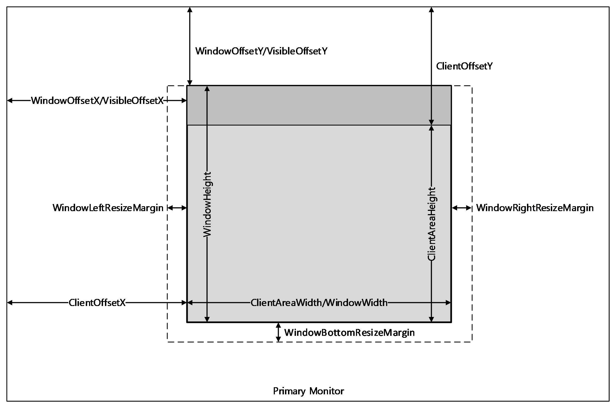

Figure 6: An illustration of the window metrics sent in the Window Information Order

Window icon orders SHOULD NOT be sent to the client if the TS_RAIL_CLIENTSTATUS_SUPPRESS_ICON_ORDERS flag was specified in the Client Information PDU (section [2.2.2.2.2](#Section_2.2.2.2.2)). Notification icon orders are not affected by this flag.

<a id="Section_3.3.5.1.7"></a>
##### 3.3.5.1.7 Constructing Notification Icon Orders

The server generates [**Notification Icon**](#gt_notification-icon) Information Orders to inform the client of the following types of notification icon events on the server.

- Creation of a new notification icon.
- Updates on properties for a new or existing notification icon.
- Deletion of an existing notification icon.
The Notification Icon Orders are constructed as specified in section [2.2.1.3.2](#Section_2.2.1.3.2).

<a id="Section_3.3.5.1.8"></a>
##### 3.3.5.1.8 Constructing Desktop Information Orders

Desktop Information Orders are generated by the server to inform the client of events on the server that are not confined to a single window or [**notification icon**](#gt_notification-icon). These events include the following:

- A client connects to the server that is actively monitoring a desktop. The server generates the following events in order:
- A Desktop Information Order (see section [2.2.1.3.3.2.1](#Section_4.1.1.5)) with the WINDOW_ORDER_FIELD_DESKTOP_ARC_BEGAN (0x00000008) and the WINDOW_ORDER_FIELD_DESKTOP_HOOKED (0x00000002) flags set in the **Hdr** field to indicate that the synchronization has begun.
- After all orders specifying windows, icons, and the desktop are sent, the server generates a Desktop Information Order with the WINDOW_ORDER_FIELD_DESKTOP_ARC_COMPLETED (0x00000004) flag set to signal the end of synchronization data.
- A desktop switch occurred on the server causing the server to stop monitoring the current desktop and (optionally) start monitoring the new desktop. This is indicated by generating the following events in order.
- A Desktop Information Order for the **Non-Monitored Desktop** packet (see section [2.2.1.3.3.2.2](#Section_2.2.1.3.3.2.2)).
- A Desktop Information Order with the WINDOW_ORDER_FIELD_DESKTOP_HOOKED (0x00000002) flag set in the **Hdr** field. If the server is unable to monitor the new desktop, the server SHOULD NOT send this order.
- The number and/or Z-order of top-level windows on the server changes. This is indicated by generating a Desktop Information Order with the **NumWindowIds** and **WindowIds** fields present.
- The active window on the server changes. This is indicated by generating a Desktop Information Order with the **ActiveWindowId** field present.
<a id="Section_3.3.5.2"></a>
#### 3.3.5.2 Static Virtual Channel Protocol

<a id="Section_3.3.5.2.1"></a>
##### 3.3.5.2.1 Initialization Messages

<a id="Section_3.3.5.2.1.1"></a>
###### 3.3.5.2.1.1 Processing Client Information PDU

If the **Flags** field of the PDU contains the TS_RAIL_CLIENTSTATUS_ALLOWLOCALMOVESIZE (0x00000001) flag, the client supports Local Move/Size. If the server also supports Local Move/Size, it SHOULD record this fact and SHOULD send Move Messages to the client window when appropriate (see section [2.2.2.7.4](#Section_2.2.2.7.4)).

If the **Flags** field of the PDU contains the TS_RAIL_CLIENTSTATUS_ZORDER_SYNC (0x00000004) flag, the client supports Z-order sync. On receiving this flag, the server SHOULD create the marker window (section [3.3.1.3](#Section_3.3.1.3)) and send the ID of this window to the client using the [Z-Order Sync Information PDU (section 2.2.2.11.1)](#Section_2.2.2.11.1).

If the **Flags** field of the PDU contains the TS_RAIL_CLIENTSTATUS_POWER_DISPLAY_REQUEST_SUPPORTED (0x00000080) flag, the client supports setting the [**display-required power request**](#gt_display-required-power-request). On receiving this flag, the server SHOULD monitor the state of its display-required power request and send it to the client using the Power Display Request PDU (section [2.2.2.13.1](#Section_2.2.2.13.1)).

<a id="Section_3.3.5.2.1.2"></a>
###### 3.3.5.2.1.2 Sending HandshakeEx PDU

The HandshakeEx PDU MUST be constructed as specified in section [2.2.2.2.3](#Section_2.2.2.2.3).

If Enhanced RemoteApp has been enabled for the current RAIL session (section [3.3.5.1.3](#Section_3.3.5.1.3)), the server MUST set the TS_RAIL_ORDER_HANDSHAKEEX_FLAGS_HIDEF (0x00000001) flag. If it has not been enabled, the server MUST NOT set this flag.

If Enhanced RemoteApp is not enabled, and support for the HandshakeEx PDU was not indicated in the Remote Programs Capability Set (section [2.2.1.1.1](#Section_2.2.1.1.1)), the server MUST send the Handshake PDU (section [3.1.5.1](#Section_3.1.5.1)) instead of the HandshakeEx PDU.

<a id="Section_3.3.5.2.2"></a>
##### 3.3.5.2.2 Program Launching Messages

<a id="Section_3.3.5.2.2.1"></a>
###### 3.3.5.2.2.1 Processing Execute PDU

Upon receipt of this PDU, the server MUST start the application specified in the PDU on the server. The PDU is processed as specified in [2.2.2.3.2](#Section_2.2.2.3.2).

<a id="Section_3.3.5.2.2.2"></a>
###### 3.3.5.2.2.2 Sending Execute Result PDU

This PDU is sent in response to an Execute PDU from the client and is initialized as specified in section [2.2.2.3.2](#Section_2.2.2.3.2).

<a id="Section_3.3.5.2.3"></a>
##### 3.3.5.2.3 Local Client System Parameters Update Messages

<a id="Section_3.3.5.2.3.1"></a>
###### 3.3.5.2.3.1 Processing System Parameters Update PDU

Upon receipt of this PDU, the server SHOULD set its system parameters to those reported by the client. This helps applications running remotely to behave consistently with local user settings, which is an important aspect of the seamless experience.

<a id="Section_3.3.5.2.4"></a>
##### 3.3.5.2.4 Server System Parameters Update Messages

<a id="Section_3.3.5.2.4.1"></a>
###### 3.3.5.2.4.1 Sending Server System Parameters Update PDU

This PDU is initialized as specified in section [2.2.2.5.1](#Section_2.2.2.5.1). This PDU SHOULD be sent at the start of every [**remote applications integrated locally (RAIL)**](#gt_remote-applications-integrated-locally-rail) connection/reconnection, and when a system parameter on the server changes its value.

<a id="Section_3.3.5.2.5"></a>
##### 3.3.5.2.5 Local Client Event Messages

<a id="Section_3.3.5.2.5.1"></a>
###### 3.3.5.2.5.1 Processing Activate PDU

Upon receipt of this PDU, the server SHOULD activate or deactivate the remote window whose ID is specified by **WindowId** and whose activation state is specified by the **Enabled** field.

If no such window exists, the server SHOULD ignore the PDU.

<a id="Section_3.3.5.2.5.2"></a>
###### 3.3.5.2.5.2 Processing System Menu PDU

On receipt of this PDU, the server SHOULD post a command to the remote window whose ID is specified by WindowId to display its [**system menu**](#gt_system-menu) at the coordinates specified by the Left and Top fields.

If no such window exists, the server SHOULD ignore the PDU.

<a id="Section_3.3.5.2.5.3"></a>
###### 3.3.5.2.5.3 Processing System Command PDU

Upon receipt of this PDU, the server SHOULD post the [**system command**](#gt_system-command) specified by the Command field to the remote window whose ID is specified by **WindowId**.

If no such window exists, the server SHOULD ignore the PDU.

<a id="Section_3.3.5.2.5.4"></a>
###### 3.3.5.2.5.4 Processing Notify Event PDU

Upon receipt of this PDU, the server SHOULD post the message specified by the **Message** field to the remote [**notification icon**](#gt_notification-icon) specified by the **WindowId** and **NotifyIconId** fields.

If no such notify icon exists, the server SHOULD ignore the PDU.

<a id="Section_3.3.5.2.5.5"></a>
###### 3.3.5.2.5.5 Processing Language Bar Information PDU

Upon receipt of this PDU, the server MUST first send the status of its language bar to the client using the [Language Bar Information PDU](#Section_2.2.2.9.1). The server MUST then adjust the server-side language bar to match the client's language bar status by making it either float or be docked.

<a id="Section_3.3.5.2.6"></a>
##### 3.3.5.2.6 Window Move Messages

The Window Move messages are generated by the server and client to enable the Local Move/Size feature of [**RAIL**](#gt_remote-applications-integrated-locally-rail).

<a id="Section_3.3.5.2.6.1"></a>
###### 3.3.5.2.6.1 Sending Min Max Info PDU

This PDU is sent by the server when a user attempts to move or resize a local [**RAIL window**](#gt_rail-window) and when the corresponding keyboard input or mouse input forwarded to the server causes the corresponding remote window to begin to move or resize. It is initialized as specified in section [2.2.2.7.1](#Section_2.2.2.7.1).

This PDU SHOULD be sent if the client and server both support local move/size features.

<a id="Section_3.3.5.2.6.2"></a>
###### 3.3.5.2.6.2 Sending Move/Size Start PDU

This PDU is sent by the server when a user attempts to move or resize a local [**RAIL window**](#gt_rail-window) (for example, by dragging the window title with the mouse or resizing the window borders with the mouse), and the corresponding keyboard input or mouse input forwarded to the server causes the corresponding remote window to begin the move or resize. It is initialized as specified in section [2.2.2.7.2](#Section_2.2.2.7.2).

This PDU SHOULD be sent if the client and server both support local move/size features. It SHOULD be sent immediately after the Min Max Info PDU (see section [2.2.2.7.1](#Section_2.2.2.7.1)).

<a id="Section_3.3.5.2.6.3"></a>
###### 3.3.5.2.6.3 Processing Window Move PDU

On receipt of the Client Window Move PDU section [2.2.2.7.4](#Section_2.2.2.7.4), the server SHOULD move the remote window specified by the WindowId field to the coordinates specified by the Left, Top, Right, and Bottom fields.

If no such Window exists, the server SHOULD ignore the PDU.

<a id="Section_3.3.5.2.6.4"></a>
###### 3.3.5.2.6.4 Sending Move/Size End PDU

This PDU is sent by the server when a user completes a move or resize of a local [**RAIL window**](#gt_rail-window) (for example, by releasing the mouse button), and the corresponding keyboard input or mouse input forwarded to the server causes the corresponding remote window to complete the move or resize. It is initialized as specified in section [2.2.2.7.3](#Section_2.2.2.7.3).

This PDU SHOULD be sent if the client and server both support local move/size features.

<a id="Section_3.3.5.2.6.5"></a>
###### 3.3.5.2.6.5 Processing Window Snap PDU

On receipt of the **Client Window Snap PDU** (section [2.2.2.7.5](#Section_2.2.2.7.5)), the server SHOULD move the remote window specified by the **WindowId** field to the coordinates specified by the **Left**, **Top**, **Right**, and **Bottom** fields. When moving the window, the server SHOULD use a feature such as [**Snap**](#gt_snap) that can restore the window’s size when it is unsnapped. If no such feature is available, the server SHOULD NOT advertise support for this PDU.

In all other respects, this PDU is equivalent to the **Window Move PDU** (section [2.2.2.7.4](#Section_2.2.2.7.4)) and SHOULD be handled the same way.

<a id="Section_3.3.5.2.7"></a>
##### 3.3.5.2.7 Application ID Messages

<a id="Section_3.3.5.2.7.1"></a>
###### 3.3.5.2.7.1 Processing the Get Application ID PDU

Upon receipt of the Get Application ID PDU, the server MAY<36> retrieve the Application ID of the window whose window ID is specified in the PDU.

If no such window exists, the server SHOULD ignore the PDU.

<a id="Section_3.3.5.2.7.2"></a>
###### 3.3.5.2.7.2 Sending the Get Application ID Response PDU

The Get Application ID Response PDU is sent in response to a Get Application ID PDU from the client and is initialized as specified in section [2.2.2.8.1](#Section_2.2.2.8.1).

<a id="Section_3.3.5.2.8"></a>
##### 3.3.5.2.8 Z-Order Sync Messages

<a id="Section_3.3.5.2.8.1"></a>
###### 3.3.5.2.8.1 Processing Z-Order Sync Support Flag

On processing the TS_RAIL_CLIENTSTATUS_ZORDER_SYNC (0x00000004) flag in the [Client Information PDU (section 2.2.2.2.2)](#Section_2.2.2.2.2), the server SHOULD create the marker window (section [3.3.1.3](#Section_3.3.1.3)) and send the ID of this window to the client in the [Z-Order Sync Information PDU (section 2.2.2.11.1)](#Section_2.2.2.11.1). If the client does not advertise support for Z-order sync, then the server MUST destroy the marker window, if it exists.

<a id="Section_3.3.5.2.8.2"></a>
###### 3.3.5.2.8.2 Sending Z-Order Sync Information PDU

The server SHOULD send the ID of the [**marker window**](#gt_marker-window) to the client in the [Z-Order Sync Information PDU (section 2.2.2.11.1)](#Section_2.2.2.11.1).

<a id="Section_3.3.5.2.9"></a>
##### 3.3.5.2.9 Window Cloak State Sync Messages

<a id="Section_3.3.5.2.9.1"></a>
###### 3.3.5.2.9.1 Processing Window Cloak State Change PDU

Upon receipt of the Windows Cloak State Change PDU (section [2.2.2.12.1](#Section_2.2.2.12.1)), the server SHOULD cloak or uncloak the remote window whose ID is specified by **WindowId** as specified by the **Cloaked** field. The server SHOULD NOT send a Deleted Window Information Order as a result of processing this PDU. The server MUST NOT send a Window Cloak State Change PDU back to the client as a result of processing this PDU.

If no such window exists, the server SHOULD ignore the PDU.

<a id="Section_3.3.5.2.9.2"></a>
###### 3.3.5.2.9.2 Sending Window Cloak State Change PDU

The Window Cloak State Change PDU (section [2.2.2.12.1](#Section_2.2.2.12.1)) SHOULD be sent by the server when a remoted window is cloaked or uncloaked (unless the cloak or uncloak occurred as a result of processing a Window Cloak State Change PDU sent by the client). This PDU MUST be initialized as specified in section 2.2.2.12.1.

If the client does not support processing the Window Cloak State Change PDU, the server SHOULD send a Deleted Window Information Order (section [2.2.1.3.1.2.4](#Section_2.2.1.3.1)) when a window is cloaked, and a Window Information Order (section [2.2.1.3.1.2.1](#Section_2.2.1.3.1)) when a window is uncloaked.

<a id="Section_3.3.5.2.10"></a>
##### 3.3.5.2.10 Power Display Request Messages

<a id="Section_3.3.5.2.10.1"></a>
###### 3.3.5.2.10.1 Sending Power Display Request PDU

If the state of its [**display-required power request**](#gt_display-required-power-request) changes in the remote session, then the server SHOULD send the new state to the client in the Power Display Request PDU (section [2.2.2.13.1](#Section_2.2.2.13.1)).

<a id="Section_3.3.5.2.11"></a>
##### 3.3.5.2.11 Server Taskbar State Messages

<a id="Section_3.3.5.2.11.1"></a>
###### 3.3.5.2.11.1 Sending Taskbar Tab Info PDU

The server SHOULD send the Taskbar Tab Info PDU (section [2.2.2.14.1](#Section_2.2.2.14.1)) whenever it determines that the state of a [**tabbed application**](#gt_tabbed-application)’s taskbar tab group has changed. However, the server SHOULD NOT send the PDU if it does not support tabbed applications, or if the client has not advertised support for extended shell integration in the Remote Programs Capability Set (section [2.2.1.1.1](#Section_2.2.1.1.1)).

If the client has connected to an existing session, the server SHOULD re-sync the taskbar tab state of its tabbed applications to the client by sending RAIL_TASKBAR_MSG_TAB_REGISTER, RAIL_TASKBAR_MSG_TAB_ORDER, and RAIL_TASKBAR_MSG_TAB_PROPERTIES messages for each window in each tabbed application in the session.

<a id="Section_3.3.5.2.12"></a>
##### 3.3.5.2.12 Accessibility Messages

<a id="Section_3.3.5.2.12.1"></a>
###### 3.3.5.2.12.1 Processing Text Scale Information PDU

On receipt of the Text Scale Information PDU (section [2.2.2.15.1](#Section_2.2.2.15.1)), the server SHOULD use this information to change the system [**text scale**](#gt_text-scale) setting. If no such feature is available, the server SHOULD NOT advertise support for this PDU.

<a id="Section_3.3.5.2.12.2"></a>
###### 3.3.5.2.12.2 Processing Caret Blink Information PDU

On receipt of the Caret Blink Information PDU (section [2.2.2.15.2](#Section_2.2.2.15.2)), the server SHOULD use this information to change the [**caret**](#gt_caret) blink rate. If no such feature is available, the server SHOULD NOT advertise support for this PDU.

<a id="Section_3.3.6"></a>
### 3.3.6 Timer Events

No timer events are used.

<a id="Section_3.3.7"></a>
### 3.3.7 Other Local Events

<a id="Section_3.3.7.1"></a>
#### 3.3.7.1 Sending Language Bar Information PDU

Upon receiving a notification from the server-side language bar indicating that its status was updated, the server MUST then send the updated status of its language bar to the client using the [Language Bar Information PDU](#Section_2.2.2.9.1). This enables the client to stay in sync with the server.

<a id="Section_3.3.7.2"></a>
#### 3.3.7.2 Sending Language Profile Information PDU

Upon receiving a notification from the client-side text services framework that the current active language profile has changed, the client MUST then send the new active language profile information to the server using the [Language Profile Information PDU (section 2.2.2.10.1)](#Section_2.2.2.10.1). This enables the server to stay in sync with the current active language of the client.

Upon receiving this [**PDU**](#gt_protocol-data-unit-pdu) from the client, the server SHOULD change the current server-side active language profile, by using the information sent by the client. This ensures that the server uses the same active language profile as the one being used by the client.

<a id="Section_3.3.7.3"></a>
#### 3.3.7.3 Sending Compartment Status Information PDU

Upon receiving a notification from the text services framework that the current [**input method editor (IME)**](#gt_input-method-editor-ime) compartments has changed, the client MUST then send the new compartment information to the server using the [Compartment Status Information PDU (section 2.2.2.10.2)](#Section_2.2.2.10.2). This enables the server to stay in sync with the current compartment mode of the client.

Similarly, the server is also to send the compartment values to the client if it receives a notification from the server's text services framework.

Upon receiving this [**PDU**](#gt_protocol-data-unit-pdu) from the client or server, the IME compartment status is set to the values passed in the PDU.

<a id="Section_4"></a>
# 4 Protocol Examples

The following sections describe several operations as used in common scenarios to illustrate the function of the Remote Desktop Protocol: Remote Programs Virtual Channel Extension.

<a id="Section_4.1"></a>
## 4.1 Updates to the RDP Core Protocol

<a id="Section_4.1.1"></a>
### 4.1.1 Windowing Alternate Secondary Drawing Orders

<a id="Section_4.1.1.1"></a>
#### 4.1.1.1 New or Existing Windows

The following is a network capture of a [Window Information Order](#Section_2.2.1.3.1), sent when a new window is created on the server or when a property on a new or existing window is updated (as specified in 2.2.1.3.1.2.1).

00000000 2e 81 00 9e df 08 19 58 01 12 00 00 00 00 00 00 .......X........

00000010 00 cf 14 00 01 00 00 05 1a 00 46 00 69 00 6c 00 ..........F.i.l.

00000020 65 00 20 00 45 00 78 00 70 00 6c 00 6f 00 72 00 e. .E.x.p.l.o.r.

00000030 65 00 72 00 1b 01 00 00 34 01 00 00 07 00 00 00 e.r.....4.......

00000040 07 00 00 00 00 00 00 00 07 00 00 00 8d 00 00 00 ................

00000050 9a 00 00 00 8e 00 00 00 9a 00 00 00 e6 05 00 00 ................

00000060 42 03 00 00 01 00 00 00 00 00 e6 05 42 03 8d 00 B...........B...

00000070 00 00 9a 00 00 00 01 00 00 00 00 00 e6 05 42 03 ..............B.

2e -> TS_WINDOW_ORDER_HEADER::Header (1 Byte)

81 00 -> TS_WINDOW_ORDER_HEADER::OrderSize (2 Bytes)

9e df 08 19 -> TS_WINDOW_ORDER_HEADER::FieldsPresentFlags (4 Bytes)

58 01 12 00 -> TS_WINDOW_ORDER_HEADER::WindowId (4 Bytes)

00 00 00 00 -> OwnerWindowId

00 00 cf 14 -> Style

00 01 00 00 -> ExtendedStyle

05 -> ShowState

1a 00 46 00 69 00 6c 00 65 00 20 00 45 00 78 00 70 00 6c 00 6f 00 72 00

65 00 72 00 -> TitleInfo (File Explorer)

1b 01 00 00 -> ClientOffsetX (283)

34 01 00 00 -> ClientOffsetY (308)

07 00 00 00 -> WindowLeftResizeMargin (7)

07 00 00 00 -> WindowRightResizeMargin (7)

00 00 00 00 -> WindowTopResizeMargin (0)

07 00 00 00 -> WindowBottomResizeMargin (7)

8d 00 00 00 -> WindowOffsetX (141)

9a 00 00 00 -> WindowOffsetY (154)

8e 00 00 00 -> WindowClientDeltaX (142)

9a 00 00 00 -> WindowClientDeltaY (154)

e6 05 00 00 -> WindowWidth (1510)

42 03 00 00 -> WindowHeight (834)

01 00 -> NumWindowRects (1)

00 00 00 00 e6 05 42 03 -> WindowRects (0,0,1510,834)

8d 00 00 00 -> VisibleOffsetX (141)

9a 00 00 00 -> VisibleOffsetY (154)

01 00 -> NumVisibilityRects (1)

00 00 00 00 e6 05 42 03 -> VisibilityRects (0,0,1510,834)

<a id="Section_4.1.1.2"></a>
#### 4.1.1.2 Deleted Window

The following is a network capture of a [Window Information Order](#Section_2.2.1.3.1), sent when an existing window is destroyed on the server (as specified in 2.2.1.3.1.2.4).

00000000 2e 0b 00 00 00 00 21 24 00 03 00......!$...

2e -> TS_WINDOW_ORDER_HEADER::Header (1 Byte)

0b 00 -> TS_WINDOW_ORDER_HEADER::OrderSize (2 Bytes)

00 00 00 21 -> TS_WINDOW_ORDER_HEADER::FieldsPresentFlags (4 Bytes)

(WINDOW_ORDER_TYPE_WINDOW | WINDOW_ORDER_STATE_DELETED )

24 00 03 00 -> TS_WINDOW_ORDER_HEADER::WindowId (4 Bytes)

<a id="Section_4.1.1.3"></a>
#### 4.1.1.3 New or Existing Notification Icons

The following is a network capture of a [Notification Icon Information Order](#Section_4.1.1.3), sent when a new [**notification icon**](#gt_notification-icon) is created on the server (as specified in 2.2.1.3.2.2.1).

00000000 2e 9d 04 01 00 00 52 8e 00 01 00 d2 9c 00 00 40 ......R........@

00000010 00 2a 20 0e 20 43 00 6f 00 6d 00 6d 00 75 00 6e .* . C.o.m.m.u.n

00000020 00 69 00 63 00 61 00 74 00 6f 00 72 00 20 00 2d .i.c.a.t.o.r. .-

00000030 00 20 00 4e 00 6f 00 74 00 20 00 73 00 69 00 67 . .N.o.t. .s.i.g

00000040 00 6e 00 65 00 64 00 20 00 69 00 6e 00 0e 20 2c .n.e.d. .i.n.. ,

00000050 20 00 00 02 20 10 00 10 00 40 00 00 04 fe 03 00 ... ....@......

00000060 00 fc 01 00 00 fc 01 00 00 c0 01 00 00 80 00 00 .................

00000070 00 00 00 00 00 00 00 00 00 00 00 00 00 00 00 00 ................

00000080 00 00 00 00 00 00 00 00 00 00 00 00 00 80 00 00 ................

00000090 00 80 01 00 00 f0 3f 00 00 f8 7f 00 00 00 00 00 ......?.........

000000a0 00 00 00 00 00 00 00 00 00 00 00 00 00 00 00 00 ................

000000b0 00 00 00 00 00 00 00 00 00 18 36 80 18 1e 38 7f ..........6...8.

000000c0 9c 19 35 96 ef 1a 3c b5 fe 1e 3e ad ee 15 34 8c ..5...<...>...4.

000000d0 8d 14 30 77 1b 00 00 00 00 00 00 00 00 00 00 00 ..0w............

000000e0 00 00 00 00 00 00 00 00 00 00 00 00 00 00 00 00 ................

000000f0 00 00 00 00 00 1c 38 85 17 1a 34 87 c6 17 31 9d ......8...4...1.

00000100 ff 0d 2c af ff 15 39 cd ff 1a 42 e3 ff 22 49 e0 ..,...9...B.."I.

00000110 fc 17 39 a4 c1 13 30 78 1b 00 00 00 00 00 00 00 ..9...0x........

……………………………………………….(more icon data)

2e -> TS_NOTIFYICON_ORDER_HEADER::Header(1 Byte)

9d 04 -> TS_NOTIFYICON_ORDER_HEADER::OrderSize(2 Bytes)

01 00 00 52 -> TS_NOTIFYICON_ORDER_HEADER::FieldsPresentFlags (4 Bytes)

WINDOW_ORDER_TYPE_NOTIFY | WINDOW_ORDER_FIELD_NOTIFY_TIP |

WINDOW_ORDER_STATE_NEW | WINDOW_ORDER_ICON)

8e 00 01 00 -> TS_NOTIFYICON_ORDER_HEADER::WindowId

d2 9c 00 00 -> TS_NOTIFYICON_ORDER_HEADER::NotifyIconId

0000000f 40

00000010 00 57 00 69 00 6e 00 64 00 6f 00 77 00 73 00 20

00000020 00 54 00 61 00 73 00 6b 00 20 00 4d 00 61 00 6e

00000030 00 61 00 67 00 65 00 72 00 00 00 02 10 10 00 10

00000040 00 6e 00 65 00 64 00 20 00 69 00 6e 00 0e 20 2c -> ToolTip (Communicator - Not signed in )

00000050 20 00 00 02 20 10 00 10 00 40 00 00 04 fe 03 00 ... ....@......

00000060 00 fc 01 00 00 fc 01 00 00 c0 01 00 00 80 00 00 .................

00000070 00 00 00 00 00 00 00 00 00 00 00 00 00 00 00 00 ................

00000080 00 00 00 00 00 00 00 00 00 00 00 00 00 80 00 00 ................

00000090 00 80 01 00 00 f0 3f 00 00 f8 7f 00 00 00 00 00 ......?.........

000000a0 00 00 00 00 00 00 00 00 00 00 00 00 00 00 00 00 ................

000000b0 00 00 00 00 00 00 00 00 00 18 36 80 18 1e 38 7f ..........6...8.

000000c0 9c 19 35 96 ef 1a 3c b5 fe 1e 3e ad ee 15 34 8c ..5...<...>...4.

000000d0 8d 14 30 77 1b 00 00 00 00 00 00 00 00 00 00 00 ..0w............

000000e0 00 00 00 00 00 00 00 00 00 00 00 00 00 00 00 00 ................

000000f0 00 00 00 00 00 1c 38 85 17 1a 34 87 c6 17 31 9d ......8...4...1.

00000100 ff 0d 2c af ff 15 39 cd ff 1a 42 e3 ff 22 49 e0 ..,...9...B.."I.

00000110 fc 17 39 a4 c1 13 30 78 1b 00 00 00 00 00 00 00 ..9...0x........ -> Icon

……………………………………………….(more icon data)

**Note** The icon data is significantly large and accounts for the remainder of the order. For the sake of brevity, the icon information in the remaining bytes of the **orderSize** field has been truncated in this example.

<a id="Section_4.1.1.4"></a>
#### 4.1.1.4 Deleted Notification Icons

The following is a network capture of a [Notification Icon Information Order](#Section_2.2.1.3.2), sent when an existing [**notification icon**](#gt_notification-icon) is deleted on the server (as specified in 2.2.1.3.2.2.2).

00000000 2e 0f 00 01 00 00 62 f4 01 03 00 00 00 00 00 .y....B........

2e -> TS_NOTIFYICON_ORDER_HEADER::Header(1 Byte)

0f 00 -> TS_NOTIFYICON_ORDER_HEADER::OrderSize(2 Bytes)

01 00 00 62 -> TS_NOTIFYICON_ORDER_HEADER::FieldsPresentFlags (4 Bytes)

WINDOW_ORDER_TYPE_NOTIFY | WINDOW_ORDER_STATE_DELETED |

WINDOW_ORDER_FIELD_NOTIFY_TIP | WINDOW_ORDER_ICON)

f4 01 03 00 -> TS_NOTIFYICON_ORDER_HEADER::WindowId

00 00 00 00 -> TS_NOTIFYICON_ORDER_HEADER::NotifyIconId

<a id="Section_4.1.1.5"></a>
#### 4.1.1.5 Actively Monitored Desktop

The following is a network capture of an [Actively Monitored Desktop](#Section_4.1.1.5) packet (as specified in 2.2.1.3.3.2.1).

00000000 2e 14 00 30 00 00 04 a0 00 01 00 02 a0 00 01 00 ...0............

2e -> TS_DESKTOP_ORDER_HEADER::Header

14 00 -> TS_DESKTOP_ORDER_HEADER::OrderSize

30 00 00 04 -> TS_DESKTOP_ORDER_HEADER::FieldsPresentFlags (0x4000030)

(WINDOW_ORDER_TYPE_DESKTOP | WINDOW_ORDER_FIELD_DESKTOP_ZORDER

WINDOW_ORDER_FIELD_DESKTOP_ACTIVEWND )

a0 00 01 00 -> ActiveWindowId

02 -> NumWindowIds

66 00 02 00

a0 00 01 00 -> WindowIds

<a id="Section_4.1.1.6"></a>
#### 4.1.1.6 Non-Monitored Desktop

The following is a network capture of a **Non-Monitored Desktop** packet (as specified in [2.2.1.3.3.2.2](#Section_2.2.1.3.3.2.2)).

00000000 2e 07 00 01 00 00 04 ..........@.....

2e -> TS_DESKTOP_ORDER_HEADER::Header

07 00 -> TS_DESKTOP_ORDER_HEADER::OrderSize

01 00 00 04 -> TS_DESKTOP_ORDER_HEADER::FieldsPresentFlags

(WINDOW_ORDER_TYPE_DESKTOP | WINDOW_ORDER_FIELD_DESKTOP_NONE)

<a id="Section_4.2"></a>
## 4.2 Initialization Messages

<a id="Section_4.2.1"></a>
### 4.2.1 TS_RAIL_ORDER_HANDSHAKE

The following are network captures of the Handshake PDU (TS_RAIL_ORDER_HANDSHAKE, as specified in [2.2.2.2.1](#Section_2.2.2.2.1)).

**Server to Client**

00000000 05 00 08 00 71 17 00 00 ....q...

05 00 -> TS_RAIL_PDU_HEADER::orderType = TS_RAIL_ORDER_HANDSHAKE (5) (2 Bytes)

08 00 -> TS_RAIL_PDU_HEADER::orderLength = 8 (2 Bytes)

71 17 00 00 -> buildNumber (4 Bytes)

**Client to Server**

00000000 05 00 08 00 71 17 00 00 ....q...

05 00 -> TS_RAIL_PDU_HEADER::orderType = TS_RAIL_ORDER_HANDSHAKE (5) (2 Bytes)

08 00 -> TS_RAIL_PDU_HEADER::orderLength = 8 (2 Bytes)

71 17 00 00 -> buildNumber (4 Bytes)

<a id="Section_4.2.2"></a>
### 4.2.2 TS_RAIL_ORDER_CLIENTSTATUS

The following is a network capture of the [Client Caps PDU](#Section_2.2.2.2.2) (TS_RAIL_ORDER_CLIENTSTATUS, as specified in 2.2.2.2.2).

00000000 0b 00 08 00 01 00 00 00 ........

0b 00 -> TS_RAIL_PDU_HEADER::orderType = TS_RAIL_ORDER_CLIENTSTATUS (11) (2 Bytes)

08 00 -> TS_RAIL_PDU_HEADER::orderLength = 8 (2 Bytes)

01 00 00 00 ->Flags (4 Bytes)

<a id="Section_4.3"></a>
## 4.3 Launching Messages

<a id="Section_4.3.1"></a>
### 4.3.1 TS_RAIL_ORDER_EXEC

The following is a network capture of the [Client Execute PDU](#Section_2.2.2.3.1) (TS_RAIL_ORDER_EXEC, as specified in 2.2.2.3.1).

00000000 01 00 5e 00 08 00 14 00 26 00 18 00 7c 00 7c 00 ..^.....&...|.|.

00000010 69 00 65 00 78 00 70 00 6c 00 6f 00 72 00 65 00 i.e.x.p.l.o.r.e.

00000020 66 00 3a 00 5c 00 77 00 69 00 6e 00 64 00 6f 00 f.:.\.w.i.n.d.o.

00000030 77 00 73 00 5c 00 73 00 79 00 73 00 74 00 65 00 w.s.\.s.y.s.t.e.

00000040 6d 00 33 00 32 00 77 00 77 00 77 00 2e 00 62 00 m.3.2.w.w.w...b.

00000050 69 00 6e 00 67 00 2e 00 63 00 6f 00 6d 00 00 00 i.n.g...c.o.m...

Header:

01 00 -> TS_RAIL_PDU_HEADER::orderType = TS_RAIL_ORDER_EXEC (1) (2 Bytes)

5e 00 -> TS_RAIL_PDU_HEADER::orderLength = 94 (2 Bytes)

08 00 -> Flags : TS_RAIL_EXEC_FLAG_EXPAND_ARGUMENTS (2 Bytes)

14 00 -> ExeOrFileLength : 0x14 (2 Bytes)

26 00 -> WorkingDirLength : 0x26 (2 Bytes)

18 00 -> ArgumentsLen : 0x18 (2 Bytes)

7c 00 7c 00 69 00 65 00 78 00 70 00 6c 00 6f 00 72 00 65 00 -> ExeOrFile : ||iexplore (20 Bytes)

66 00 3a 00 5c 00 77 00 69 00 6e 00 64 00 6f 00 77 00 73 00 5c 00 73 00 79 00 73 00 74 00 65 00 6d 00 33 00 32 00 -> WorkingDir: f:\windows\system32 (38 bytes)

77 00 77 00 77 00 2e 00 62 00 69 00 6e 00 67 00 2e 00 63 00 6f 00 6d 00 -> Arguments (24 bytes)

<a id="Section_4.3.2"></a>
### 4.3.2 TS_RAIL_ORDER_EXEC_RESULT

The following is a network capture of the [Server Execute Result PDU](#Section_2.2.2.3.2) (TS_RAIL_ORDER_EXEC_RESULT, as specified in 2.2.2.3.2).

00000000 80 00 24 00 08 00 03 00 15 00 00 00 00 00 14 00 ..$.............

00000010 7c 00 7c 00 57 00 72 00 6f 00 6e 00 67 00 41 00 |.|.W.r.o.n.g.A.

00000020 70 00 70 00 p.p.

80 00 -> TS_RAIL_PDU_HEADER::orderType = TS_RAIL_ORDER_EXEC_RESULT(128) (2 Bytes)

24 00 -> TS_RAIL_PDU_HEADER::orderLength = 36 (2 Bytes)

08 00 -> Flags : TS_RAIL_EXEC_FLAG_EXPAND_ARGUMENTS (2 Bytes)

03 00 -> ExecResult : 3 (2 Bytes)

15 00 00 00 -> RawResult : 0x15 (4 Bytes)

00 00 -> Padding : 0 (2 Bytes)

14 00 -> ExeOrFileLength : 0x14 (2 Bytes)

7c 00 7c 00 57 00 72 00 6f 00 6e 00 67 00 41 00

70 00 70 00 : ExeOrFile : ||WrongApp (20 Bytes)

<a id="Section_4.4"></a>
## 4.4 Local Client System Parameters Update Messages

<a id="Section_4.4.1"></a>
### 4.4.1 TS_RAIL_ORDER_SYSPARAM

The following are network captures of the [Client System Parameters Update PDU](#Section_2.2.2.4.1) (TS_RAIL_ORDER_SYSPARAM, as specified in 2.2.2.4.1).

00000000 03 00 12 00 43 00 00 00 7e 00 00 00 02 00 00 00 ....C...~.......

00000010 00 00 ..

03 00 -> TS_RAIL_PDU_HEADER::orderType = TS_RAIL_ORDER_SYSPARAM(3) (2 Bytes)

12 00 -> TS_RAIL_PDU_HEADER::orderLength = 18 (2 Bytes)

43 00 00 00 -> SystemParam: SPI_SETHIGHCONTRAST (4 Bytes)

7e 00 00 00 -> TS_HIGHCONTRAST::Flags: 0x7e (4 Bytes)

02 00 00 00 -> TS_HIGHCONTRAST::ColorSchemeLength: 2 (4 Bytes)

00 00 -> TS_HIGHCONTRAST::ColorScheme: 0 (2 Bytes)

<a id="Section_4.5"></a>
## 4.5 Local Client Event Messages

<a id="Section_4.5.1"></a>
### 4.5.1 TS_RAIL_ORDER_ACTIVATE

The following is a network capture of the [Client Activate PDU](#Section_2.2.2.6.1) (TS_RAIL_ORDER_ACTIVATE, as specified in 2.2.2.6.1).

00000000 02 00 09 00 4e 01 01 00 01 ....N....

02 00 -> TS_RAIL_PDU_HEADER::orderType = TS_RAIL_ORDER_ACTIVATE(2) (2 Bytes)

09 00 -> TS_RAIL_PDU_HEADER::orderLength = 9 (2 Bytes)

4e 01 01 00 -> WindowId:: 0x1014e (4 Bytes)

01 -> Enabled (1 Byte)

<a id="Section_4.5.2"></a>
### 4.5.2 TS_RAIL_ORDER_SYSMENU

The following is a network capture of the [Client System Menu PDU](#Section_2.2.2.6.2) (TS_RAIL_ORDER_SYSMENU, as specified in 2.2.2.6.2).

00000000 0c 00 0c 00 22 01 09 00 a4 ff 4a 02 ....".....J.

0c 00 -> TS_RAIL_PDU_HEADER::orderType = TS_RAIL_ORDER_SYSMENU(12) (2 Bytes)

0c 00 -> TS_RAIL_PDU_HEADER::orderLength = 12 (2 Bytes)

22 01 09 00 -> WindowId:: 0x90122 (4 Bytes)

a4 ff -> Left (2 Bytes)

4a 02 -> Top (2 Bytes)

<a id="Section_4.5.3"></a>
### 4.5.3 TS_RAIL_ORDER_SYSCOMMAND

The following is a network capture of the [Client System Command PDU](#Section_2.2.2.6.3) (TS_RAIL_ORDER_SYSCOMMAND, as specified in 2.2.2.6.3).

00000000 04 00 0a 00 52 00 02 00 20 f0 ....R... .

04 00 -> TS_RAIL_PDU_HEADER::orderType = TS_RAIL_ORDER_SYSCOMMAND(4) (2 Bytes)

0a 00 -> TS_RAIL_PDU_HEADER::orderLength = 10 (2 Bytes)

52 00 02 00 -> WindowId:: 0x20052 (4 Bytes)

20 f0 -> Command (2 Bytes)

<a id="Section_4.5.4"></a>
### 4.5.4 TS_RAIL_ORDER_NOTIFY_EVENT

The following is a network capture of the [Client Notify Event PDU](#Section_2.2.2.6.4) (TS_RAIL_ORDER_NOTIFY_EVENT, as specified in 2.2.2.6.4).

00000000 06 00 10 00 aa 01 02 00 02 00 00 00 04 02 00 00 ................

06 00 -> TS_RAIL_PDU_HEADER::orderType = TS_RAIL_ORDER_NOTIFY_EVENT(6) (2 Bytes)

10 00 -> TS_RAIL_PDU_HEADER::orderLength = 16 (2 Bytes)

aa 01 02 00 -> WindowId (4 Bytes)

02 00 00 00 -> NotifyIconId (4 Bytes)

04 02 00 00 -> Message (4 Bytes)

<a id="Section_4.5.5"></a>
### 4.5.5 TS_RAIL_ORDER_LANGBARINFO

The following is a network capture of the [Language Bar Information PDU](#Section_2.2.2.9.1) (TS_RAIL_ORDER_LANGBARINFO, as specified in 2.2.2.9.1).

0D 00 -> TS_RAIL_PDU_HEADER::orderType = TS_RAIL_ORDER_LANGBARINFO (13) (2 Bytes)

08 00 -> TS_RAIL_PDU_HEADER::orderLength = 8 (2 Bytes)

01 00 00 00 -> LanguageBarStatus:: 0x00000001 (4 Bytes)

<a id="Section_4.5.6"></a>
### 4.5.6 TS_RAIL_ORDER_GET_APPID_REQ

The following is a network capture of the [Client Get Application ID PDU (TS_RAIL_ORDER_GET_APPID_REQ](#Section_2.2.2.6.5), as specified in section 2.2.2.6.5).

00000000 0E 00 08 00 52 00 02 00 ....R...

0E 00 -> TS_RAIL_PDU_HEADER::orderType = TS_RAIL_ORDER_GET_APPID_REQ (14) (2 Bytes)

08 00 -> TS_RAIL_PDU_HEADER::orderLength = 8 (2 Bytes)

52 00 02 00 -> WindowId:: 0x20052 (4 Bytes)

<a id="Section_4.5.7"></a>
### 4.5.7 TS_RAIL_ORDER_GET_APPID_RESP

The following is a network capture of the [Server Get Application ID Response PDU (TS_RAIL_ORDER_GET_APPID_RESP](#Section_2.2.2.8.1), as specified in section 2.2.2.8.1).

00000000 0F 00 08 02 52 00 02 00 6d 00 69 00 63 00 72 00 ....R...m.i.c.r.

00000010 6f 00 73 00 6f 00 66 00 74 00 2e 00 77 00 69 00 o.s.o.f.t...w.i.

00000020 6e 00 64 00 6f 00 77 00 73 00 2e 00 6e 00 6f 00 n.d.o.w.s...n.o.

00000030 74 00 65 00 70 00 61 00 64 00 00 00 00 00 00 00 t.e.p.a.d.......

00000040 00 ...

00000200 00 00 00 00 00 00 00 00 ........

0F 00 -> TS_RAIL_PDU_HEADER::orderType = TS_RAIL_ORDER_GET_APPID_RESP (15) (2 Bytes)

08 02 -> TS_RAIL_PDU_HEADER::orderLength = 520 (2 Bytes)

52 00 02 00 -> WindowId:: 0x20052 (4 Bytes)

6d 00 69 00 63 00 72 00 6f 00 73 00 6f 00 66 00 74 00 2e 00 77 00 69 00 6e 00 64 00

6f 00 77 00 73 00 2e 00 6e 00 6f 00 74 00 65 00 70 00 61 00 64 00 00 ... -> ApplicationId:: microsoft.windows.notepad (512 Bytes)

<a id="Section_4.6"></a>
## 4.6 Window Move Messages

<a id="Section_4.6.1"></a>
### 4.6.1 TS_RAIL_ORDER_WINDOWMOVE

The following is a network capture of the [Client Window Move PDU](#Section_2.2.2.7.4) (TS_RAIL_ORDER_WINDOWMOVE, as specified in 2.2.2.7.4).

00000000 08 00 10 00 20 00 02 00 09 03 00 01 db 05 88 01 .... ...........

08 00 -> TS_RAIL_PDU_HEADER::orderType = TS_RAIL_ORDER_WINDOWMOVE(8) (2 Bytes)

10 00 -> TS_RAIL_PDU_HEADER::orderLength = 16 (2 Bytes)

20 00 02 00 -> WindowId (4 Bytes)

09 03 -> Left(2 Bytes)

00 01 -> Top(2 Bytes)

db 05 -> Right(2 Bytes)

88 01 -> Bottom(2 Bytes)

<a id="Section_4.6.2"></a>
### 4.6.2 TS_RAIL_ORDER_LOCALMOVESIZE

The following is a network capture of the [Server Move/Size Start PDU](#Section_2.2.2.7.2) (TS_RAIL_ORDER_LOCALMOVESIZE, as specified in 2.2.2.7.2).

00000000 09 00 10 00 94 00 01 00 01 00 08 00 2c 05 e9 03 ............,...

09 00 -> TS_RAIL_PDU_HEADER::orderType = TS_RAIL_ORDER_LOCALMOVESIZE(9) (2 Bytes)

10 00 -> TS_RAIL_PDU_HEADER::orderLength = 16 (2 Bytes)

94 00 01 00 -> WindowId (4 Bytes)

01 00 -> IsMoveSizeStart (2 Bytes)

08 00 -> MoveSizeType (2 Bytes)

2c 05 -> PosX (2 Bytes)

e9 03 -> PosY (2 Bytes)

<a id="Section_4.6.3"></a>
### 4.6.3 TS_RAIL_ORDER_MINMAXINFO

The following is a network capture of the [Server Min Max Info PDU](#Section_2.2.2.7.1) (TS_RAIL_ORDER_MINMAXINFO, as specified in 2.2.2.7.1).

*00000000 0a 00 18 00 94 00 01 00 48 06 b8 04 00 00 00 00 ........H.......

*00000010 70 00 1b 00 4c 06 bc 04 p...L...

0a 00 -> TS_RAIL_PDU_HEADER::orderType = TS_RAIL_ORDER_MINMAXINFO(10) (2 Bytes)

18 00 -> TS_RAIL_PDU_HEADER::orderLength = 24 (2 Bytes)

94 00 01 00 -> WindowId (4 Bytes)

48 06 -> MaxWidth (2 Bytes)

b8 04 -> MaxHeight (2 Bytes)

00 00 -> MaxPosX (2 Bytes)

00 00 -> MaxPosY (2 Bytes)

70 00 -> MinTrackWidth (2 Bytes)

1b 00 -> MinTrackHeight (2 Bytes)

4c 06 -> MaxTrackWidth (2 Bytes)

bc 04 -> MaxTrackHeight (2 Bytes)

<a id="Section_4.7"></a>
## 4.7 Z-Order Sync Messages

<a id="Section_4.7.1"></a>
### 4.7.1 TS_RAIL_ORDER_ZORDER_SYNC

The following is a network capture of the [Server Z-Order Sync Information PDU](#Section_2.2.2.11.1) (TS_RAIL_ORDER_ZORDER_SYNC, as specified in section 2.2.2.11.1).

14 00 -> TS_RAIL_PDU_HEADER::orderType = TS_RAIL_ORDER_ZORDER_SYNC (20) (2 Bytes)

08 00 -> TS_RAIL_PDU_HEADER::orderLength = 8 (2 Bytes)

10 05 40 00 -> WindowIdMarker (4 Bytes)

<a id="Section_4.8"></a>
## 4.8 Power Display Request Messages

<a id="Section_4.8.1"></a>
### 4.8.1 TS_RAIL_ORDER_POWER_DISPLAY_REQUEST

The following is a network capture of the [Server Power Display Request PDU](#Section_2.2.2.13.1) (TS_RAIL_ORDER_POWER_DISPLAY_REQUEST, as specified in section 2.2.2.13.1).

16 00 -> TS_RAIL_PDU_HEADER::orderType = TS_RAIL_ORDER_POWER_DISPLAY_REQUEST (22) (2 Bytes)

08 00 -> TS_RAIL_PDU_HEADER::orderLength = 8 (2 Bytes)

01 00 00 00 -> Active:: 0x00000001 (4 Bytes)

<a id="Section_5"></a>
# 5 Security

The following sections specify security considerations for implementers of the Remote Desktop Protocol: Remote Programs Virtual Channel Extension.

<a id="Section_5.1"></a>
## 5.1 Security Considerations for Implementers

There are no security considerations for Remote Desktop Protocol: Remote Programs Virtual Channel Extension messages because all traffic is secured by the underlying Remote Desktop Protocol core protocol. For an overview of the implemented security-related mechanisms, see [MS-RDPBCGR](#Section_2.2.1) section [5](../MS-RDPBCGR/MS-RDPBCGR.md).

<a id="Section_5.2"></a>
## 5.2 Index of Security Parameters

There are no security parameters in the Remote Desktop Protocol: Remote Programs Virtual Channel Extension.

<a id="Section_6"></a>
# 6 Appendix A: Product Behavior

The information in this specification is applicable to the following Microsoft products or supplemental software. References to product versions include updates to those products.

- Windows Vista operating system
- Windows Server 2008 operating system
- Windows 7 operating system
- Windows Server 2008 R2 operating system
- Windows 8 operating system
- Windows Server 2012 operating system
- Windows 8.1 operating system
- Windows Server 2012 R2 operating system
- Windows 10 operating system
- Windows Server 2016 operating system
- Windows Server operating system
- Windows Server 2019 operating system
- Windows Server 2022 operating system
- Windows 11 operating system
- Windows Server 2025 operating system
Exceptions, if any, are noted in this section. If an update version, service pack or Knowledge Base (KB) number appears with a product name, the behavior changed in that update. The new behavior also applies to subsequent updates unless otherwise specified. If a product edition appears with the product version, behavior is different in that product edition.

Unless otherwise specified, any statement of optional behavior in this specification that is prescribed using the terms "SHOULD" or "SHOULD NOT" implies product behavior in accordance with the SHOULD or SHOULD NOT prescription. Unless otherwise specified, the term "MAY" implies that the product does not follow the prescription.

<1> Section 2.2.1.1.1: Microsoft implementations set TS_RAIL_LEVEL_SUPPORTED to 1 in the following versions of Windows: Windows Server 2008, Windows Server 2008 R2 operating system, Windows Server 2012, Windows 7 Enterprise, Windows 7 Enterprise N, Windows 7 Ultimate, Windows 7 Ultimate N, and Windows 8.

Microsoft implementations set TS_RAIL_LEVEL_DOCKED_LANGBAR_SUPPORTED to 1 in the following versions of Windows: Windows Server 2008 R2, Windows Server 2012, Windows 7 Enterprise, Windows 7 Enterprise N, Windows 7 Ultimate, Windows 7 Ultimate N, and Windows 8.

Microsoft implementations set TS_RAIL_LEVEL_SUPPORTED to 0 on other versions when that capability is sent and the server does not support Remote Programs.

<2> Section 2.2.1.1.2: Windows sends the TS_WINDOW_LEVEL_SUPPORTED_EX value to the client; only Windows Vista and Windows Server 2008 send the TS_WINDOW_LEVEL_SUPPORTED value to the client.

<3> Section 2.2.1.3.1.2.1: Windows does not set this flag in any server implementation.

<4> Section 2.2.1.3.1.2.1: Windows does not set this flag in any server implementation.

<5> Section 2.2.1.3.1.2.1: Windows does not set this flag in any server implementation.

<6> Section 2.2.1.3.1.2.1: Only Windows Vista, Windows Server 2008, Windows 7, and Windows Server 2008 R2 distinguish between window offsets and window visible region offsets. This means that for those products **VisibleOffsetX** is not guaranteed to be equal to **WindowOffsetX**.

<7> Section 2.2.1.3.1.2.1: Only Windows Vista, Windows Server 2008, Windows 7, and Windows Server 2008 R2 distinguish between window offsets and window visible region offsets. This means that for those products **VisibleOffsetY** is not guaranteed to be equal to **WindowOffsetY**.

<8> Section 2.2.1.3.1.2.2: Windows applications display large icons in elements such as the Alt-Tab dialog box and on the desktop, and place small icons in elements such as the window's title bar and taskbar buttons.

<9> Section 2.2.1.3.1.2.3: Windows applications display large icons in elements such as the Alt-Tab dialog box and on the desktop, and place small icons in elements such as the window's title bar and taskbar buttons.

<10> Section 2.2.1.3.2.2.1: The WINDOW_ORDER_CACHED_ICON flag is not set in Windows 7, Windows Server 2008 R2, Windows 8, and Windows Server 2012 implementations.

<11> Section 2.2.1.3.2.2.3: Microsoft implementations set minimum value to 10000 (10 seconds) and the maximum value to 30000 (30 seconds).

<12> Section 2.2.2.2.3: The TS_RAIL_ORDER_HANDSHAKE_EX_FLAGS_EXTENDED_SPI_3_SUPPORTED flag is supported in Windows 11, version 24H2 operating system and later and Windows Server 2025 and later.

<13> Section 2.2.2.3.1: The length of the **ArgumentsLen** field is set to a maximum of 16,000 bytes, except in Windows Vista and Windows Server 2008 R2 where the maximum is set to 520 bytes.

<14> Section 2.2.2.3.2: This contains a Win32 error code. For more information, see [MS-ERREF](../MS-ERREF/MS-ERREF.md).

<15> Section 2.2.2.4.1: The RAIL_SPI_ACCENT_COLOR flag is supported in Windows 11, version 24H2 and later and Windows Server 2025 and later.

<16> Section 2.2.2.4.1: The RAIL_SPI_SYSTEM_USES_LIGHT_THEME flag is supported in Windows 11, version 24H2 and later and Windows Server 2025 and later.

<17> Section 2.2.2.4.1: The RAIL_SPI_APPS_USE_LIGHT_THEME flag is supported in Windows 11, version 24H2 and later and Windows Server 2025 and later.

<18> Section 2.2.2.4.2: Sets the High-Contrast parameters using the Win32 API. For more information, see [[MSDN-HIGHCONTRAST]](https://go.microsoft.com/fwlink/?LinkId=90017).

<19> Section 2.2.2.4.2: Uses the Windows–specific name of the color scheme.

<20> Section 2.2.2.5.1: This system parameter is supported in Windows. For more information, see ([[MSDN-SysParamsInfo]](https://go.microsoft.com/fwlink/?LinkId=187513)).

<21> Section 2.2.2.6.5: Only Windows Vista and Windows Server 2008 do not use the Application ID string to identify and group windows.

<22> Section 2.2.2.8.1: Only Windows Vista and Windows Server 2008 do not use the Application ID string to identify and group windows.

<23> Section 2.2.2.8.2: Only Windows Vista and Windows Server 2008 do not use the Application ID string to identify and group windows.

<24> Section 2.2.2.9.1: This option is not available on Windows Vista and Windows Server 2008.

<25> Section 2.2.2.9.1: This option is not available on Windows Vista and Windows Server 2008.

<26> Section 2.2.2.9.1: This option is available on Windows Server 2008 R2, Windows Server 2012, Windows Server 2012 R2, Windows Server 2016, and Windows Server 2019 only.

<27> Section 2.2.2.9.1: This option is available on Windows Server 2008 R2, Windows Server 2012, Windows Server 2012 R2, Windows Server 2016, and Windows Server 2019 only.

<28> Section 3.1.2: Microsoft implementations use 30 seconds as the time-out value.

<29> Section 3.1.5.2: Windows implementations ignore any incompatibility resulting from checking the **buildNumber** field between the sender and the receiver.

<30> Section 3.2.5.1.1: Windows implementations use [**RAIL**](#gt_remote-applications-integrated-locally-rail) as the name of the virtual channel.

<31> Section 3.2.5.1.6: Windows 10 v1607 operating system, Windows Server 2016, Windows 10 v1703 operating system, Windows 10 v1709 operating system, Windows 10 v1803 operating system, Windows 10 v1809 operating system, Windows Server 2019, and Windows 10 v1903 operating system only send transparent hit-testable margins for resizable windows.

<32> Section 3.2.5.2.1.2: Windows implementations ignore any incompatibility resulting from checking the **buildNumber** field between the sender and the receiver.

<33> Section 3.2.5.2.8.2: Only Windows Vista and Windows Server 2008 do not use the Application ID string to identify and group windows.

<34> Section 3.2.5.2.8.3: Only Windows Vista and Windows Server 2008 do not use the Application ID string to identify and group windows.

<35> Section 3.3.5.1.5: In Windows implementations the **NumIconCaches** and **NumCacheEntries** fields for each cache are set to 0 if the values in the Windows List Capability Sets exceed the corresponding entries set in the server cache.

<36> Section 3.3.5.2.7.1: Only Windows Vista and Windows Server 2008 do not use the Application ID string to identify and group windows.

<a id="Section_7"></a>
# 7 Change Tracking

This section identifies changes that were made to this document since the last release. Changes are classified as Major, Minor, or None.

The revision class **Major** means that the technical content in the document was significantly revised. Major changes affect protocol interoperability or implementation. Examples of major changes are:

- A document revision that incorporates changes to interoperability requirements.
- A document revision that captures changes to protocol functionality.
The revision class **Minor** means that the meaning of the technical content was clarified. Minor changes do not affect protocol interoperability or implementation. Examples of minor changes are updates to clarify ambiguity at the sentence, paragraph, or table level.

The revision class **None** means that no new technical changes were introduced. Minor editorial and formatting changes may have been made, but the relevant technical content is identical to the last released version.

The changes made to this document are listed in the following table. For more information, please contact [dochelp@microsoft.com](mailto:dochelp@microsoft.com).

| Section | Description | Revision class |
| --- | --- | --- |
| [2.2.2.2.3](#Section_2.2.2.2.3) HandshakeEx PDU (TS_RAIL_ORDER_HANDSHAKE_EX) | 30435 : Added a Windows Behavior Note for TS_RAIL_ORDER_HANDSHAKE_EX_FLAGS_EXTENDED_SPI_3_SUPPORTED flag applicable to specific windows versions. | Major |
| [2.2.2.4.1](#Section_2.2.2.4.1) Client System Parameters Update PDU (TS_RAIL_ORDER_SYSPARAM) | 30435 : Added a Windows Behaviour Note for the RAIL_SPI_ACCENT_COLOR, RAIL_SPI_SYSTEM_USES_LIGHT_THEME, RAIL_SPI_APPS_USE_LIGHT_THEME flags applicable to specific windows versions. | Major |

<a id="revision-history"></a>

## Revision History

| Date | Version | Revision Class | Comments |
| --- | --- | --- | --- |
| 3/2/2007 | 0.01 | New | Version 0.01 release |
| 7/3/2007 | 1.0 | Major | MLonghorn+90 |
| 7/20/2007 | 1.0.1 | Editorial | Changed language and formatting in the technical content. |
| 8/10/2007 | 1.0.2 | Editorial | Changed language and formatting in the technical content. |
| 9/28/2007 | 1.0.3 | Editorial | Changed language and formatting in the technical content. |
| 10/23/2007 | 2.0 | Major | Added new normative references. |
| 11/30/2007 | 2.1 | Minor | Corrected some section numbering. |
| 1/25/2008 | 2.1.1 | Editorial | Changed language and formatting in the technical content. |
| 3/14/2008 | 3.0 | Major | Updated and revised the technical content. |
| 5/16/2008 | 3.0.1 | Editorial | Changed language and formatting in the technical content. |
| 6/20/2008 | 4.0 | Major | Updated and revised the technical content. |
| 7/25/2008 | 4.0.1 | Editorial | Changed language and formatting in the technical content. |
| 8/29/2008 | 4.0.2 | Editorial | Changed language and formatting in the technical content. |
| 10/24/2008 | 4.0.3 | Editorial | Changed language and formatting in the technical content. |
| 12/5/2008 | 5.0 | Major | Updated and revised the technical content. |
| 1/16/2009 | 5.0.1 | Editorial | Changed language and formatting in the technical content. |
| 2/27/2009 | 5.0.2 | Editorial | Changed language and formatting in the technical content. |
| 4/10/2009 | 5.1 | Minor | Clarified the meaning of the technical content. |
| 5/22/2009 | 6.0 | Major | Updated and revised the technical content. |
| 7/2/2009 | 6.0.1 | Editorial | Changed language and formatting in the technical content. |
| 8/14/2009 | 6.0.2 | Editorial | Changed language and formatting in the technical content. |
| 9/25/2009 | 6.1 | Minor | Clarified the meaning of the technical content. |
| 11/6/2009 | 6.1.1 | Editorial | Changed language and formatting in the technical content. |
| 12/18/2009 | 7.0 | Major | Updated and revised the technical content. |
| 1/29/2010 | 8.0 | Major | Updated and revised the technical content. |
| 3/12/2010 | 8.0.1 | Editorial | Changed language and formatting in the technical content. |
| 4/23/2010 | 9.0 | Major | Updated and revised the technical content. |
| 6/4/2010 | 10.0 | Major | Updated and revised the technical content. |
| 7/16/2010 | 11.0 | Major | Updated and revised the technical content. |
| 8/27/2010 | 11.1 | Minor | Clarified the meaning of the technical content. |
| 10/8/2010 | 11.1 | None | No changes to the meaning, language, or formatting of the technical content. |
| 11/19/2010 | 11.1 | None | No changes to the meaning, language, or formatting of the technical content. |
| 1/7/2011 | 11.1 | None | No changes to the meaning, language, or formatting of the technical content. |
| 2/11/2011 | 12.0 | Major | Updated and revised the technical content. |
| 3/25/2011 | 13.0 | Major | Updated and revised the technical content. |
| 5/6/2011 | 13.0 | None | No changes to the meaning, language, or formatting of the technical content. |
| 6/17/2011 | 13.1 | Minor | Clarified the meaning of the technical content. |
| 9/23/2011 | 14.0 | Major | Updated and revised the technical content. |
| 12/16/2011 | 15.0 | Major | Updated and revised the technical content. |
| 3/30/2012 | 15.0 | None | No changes to the meaning, language, or formatting of the technical content. |
| 7/12/2012 | 15.0 | None | No changes to the meaning, language, or formatting of the technical content. |
| 10/25/2012 | 15.0 | None | No changes to the meaning, language, or formatting of the technical content. |
| 1/31/2013 | 15.0 | None | No changes to the meaning, language, or formatting of the technical content. |
| 8/8/2013 | 16.0 | Major | Updated and revised the technical content. |
| 11/14/2013 | 17.0 | Major | Updated and revised the technical content. |
| 2/13/2014 | 18.0 | Major | Updated and revised the technical content. |
| 5/15/2014 | 18.0 | None | No changes to the meaning, language, or formatting of the technical content. |
| 6/30/2015 | 19.0 | Major | Significantly changed the technical content. |
| 10/16/2015 | 20.0 | Major | Significantly changed the technical content. |
| 3/2/2016 | 21.0 | Major | Significantly changed the technical content. |
| 7/14/2016 | 22.0 | Major | Significantly changed the technical content. |
| 6/1/2017 | 23.0 | Major | Significantly changed the technical content. |
| 9/15/2017 | 24.0 | Major | Significantly changed the technical content. |
| 12/1/2017 | 25.0 | Major | Significantly changed the technical content. |
| 3/16/2018 | 26.0 | Major | Significantly changed the technical content. |
| 9/12/2018 | 27.0 | Major | Significantly changed the technical content. |
| 9/23/2019 | 28.0 | Major | Significantly changed the technical content. |
| 3/4/2020 | 29.0 | Major | Significantly changed the technical content. |
| 4/7/2021 | 30.0 | Major | Significantly changed the technical content. |
| 6/25/2021 | 31.0 | Major | Significantly changed the technical content. |
| 4/23/2024 | 32.0 | Major | Significantly changed the technical content. |
| 8/11/2025 | 33.0 | Major | Significantly changed the technical content. |
