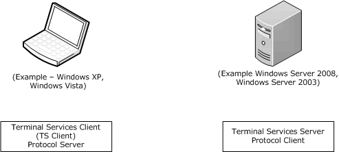
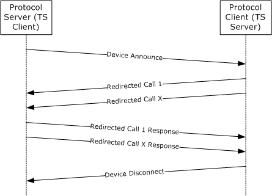
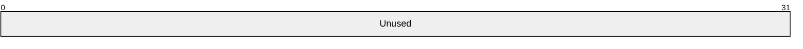
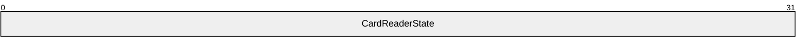
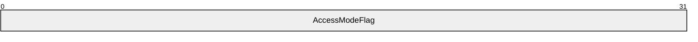
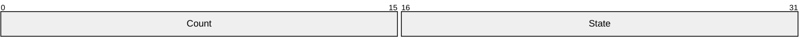
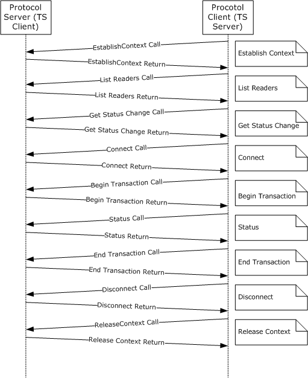

# [MS-RDPESC]: Remote Desktop Protocol: Smart Card Virtual Channel Extension

Table of Contents

1 Introduction

- [1 Introduction](#Section_1)
  - [1.1 Glossary](#Section_1.1)
  - [1.2 References](#Section_1.2)
    - [1.2.1 Normative References](#Section_1.2.1)
    - [1.2.2 Informative References](#Section_1.2.2)
  - [1.3 Overview](#Section_1.3)
  - [1.4 Relationship to Other Protocols](#Section_1.4)
  - [1.5 Prerequisites/Preconditions](#Section_1.5)
  - [1.6 Applicability Statement](#Section_1.6)
  - [1.7 Versioning and Capability Negotiation](#Section_1.7)
  - [1.8 Vendor-Extensible Fields](#Section_1.8)
  - [1.9 Standards Assignments](#Section_1.9)

2 Messages

- [2 Messages](#Section_2)
  - [2.1 Transport](#Section_2.1)
  - [2.2 Common Data Types](#Section_2.2)
    - [2.2.1 Common Structures](#Section_2.2.1)
      - [2.2.1.1 REDIR_SCARDCONTEXT](#Section_2.2.1.1)
      - [2.2.1.2 REDIR_SCARDHANDLE](#Section_2.2.1.2)
      - [2.2.1.3 Connect_Common](#Section_2.2.1.3)
      - [2.2.1.4 LocateCards_ATRMask](#Section_2.2.1.4)
      - [2.2.1.5 ReaderState_Common_Call](#Section_2.2.1.5)
      - [2.2.1.6 ReaderStateA](#Section_2.2.1.6)
      - [2.2.1.7 ReaderStateW](#Section_2.2.1.7)
      - [2.2.1.8 SCardIO_Request](#Section_2.2.1.8)
      - [2.2.1.9 ReadCache_Common](#Section_2.2.1.9)
      - [2.2.1.10 WriteCache_Common](#Section_2.2.1.10)
      - [2.2.1.11 ReaderState_Return](#Section_2.2.1.11)
    - [2.2.2 TS Server-Generated Structures](#Section_2.2.2)
      - [2.2.2.1 EstablishContext_Call](#Section_2.2.2.1)
      - [2.2.2.2 Context_Call](#Section_2.2.2.2)
      - [2.2.2.3 ListReaderGroups_Call](#Section_2.2.2.3)
      - [2.2.2.4 ListReaders_Call](#Section_2.2.2.4)
      - [2.2.2.5 ContextAndStringA_Call](#Section_2.2.2.5)
      - [2.2.2.6 ContextAndStringW_Call](#Section_2.2.2.6)
      - [2.2.2.7 ContextAndTwoStringA_Call](#Section_2.2.2.7)
      - [2.2.2.8 ContextAndTwoStringW_Call](#Section_2.2.2.8)
      - [2.2.2.9 LocateCardsA_Call](#Section_2.2.2.9)
      - [2.2.2.10 LocateCardsW_Call](#Section_2.2.2.10)
      - [2.2.2.11 GetStatusChangeA_Call](#Section_2.2.2.11)
      - [2.2.2.12 GetStatusChangeW_Call](#Section_2.2.2.12)
      - [2.2.2.13 ConnectA_Call](#Section_2.2.2.13)
      - [2.2.2.14 ConnectW_Call](#Section_2.2.2.14)
      - [2.2.2.15 Reconnect_Call](#Section_2.2.2.15)
      - [2.2.2.16 HCardAndDisposition_Call](#Section_2.2.2.16)
      - [2.2.2.17 State_Call](#Section_2.2.2.17)
      - [2.2.2.18 Status_Call](#Section_2.2.2.18)
      - [2.2.2.19 Transmit_Call](#Section_2.2.2.19)
      - [2.2.2.20 Control_Call](#Section_2.2.2.20)
      - [2.2.2.21 GetAttrib_Call](#Section_2.2.2.21)
      - [2.2.2.22 SetAttrib_Call](#Section_2.2.2.22)
      - [2.2.2.23 LocateCardsByATRA_Call](#Section_2.2.2.23)
      - [2.2.2.24 LocateCardsByATRW_Call](#Section_2.2.2.24)
      - [2.2.2.25 ReadCacheA_Call](#Section_2.2.2.25)
      - [2.2.2.26 ReadCacheW_Call](#Section_2.2.2.26)
      - [2.2.2.27 WriteCacheA_Call](#Section_2.2.2.27)
      - [2.2.2.28 WriteCacheW_Call](#Section_2.2.2.28)
      - [2.2.2.29 GetTransmitCount_Call](#Section_2.2.2.29)
      - [2.2.2.30 ScardAccessStartedEvent_Call](#Section_2.2.2.30)
      - [2.2.2.31 GetReaderIcon_Call](#Section_2.2.2.31)
      - [2.2.2.32 GetDeviceTypeId_Call](#Section_2.2.2.32)
    - [2.2.3 TS Client-Generated Structures](#Section_2.2.3)
      - [2.2.3.1 ReadCache_Return](#Section_2.2.3.1)
      - [2.2.3.2 EstablishContext_Return](#Section_2.2.3.2)
      - [2.2.3.3 Long_Return](#Section_2.2.3.3)
      - [2.2.3.4 ListReaderGroups_Return and ListReaders_Return](#Section_2.2.3.4)
      - [2.2.3.5 LocateCards_Return and GetStatusChange_Return](#Section_2.2.3.5)
      - [2.2.3.6 Control_Return](#Section_2.2.3.6)
      - [2.2.3.7 Reconnect_Return](#Section_2.2.3.7)
      - [2.2.3.8 Connect_Return](#Section_2.2.3.8)
      - [2.2.3.9 State_Return](#Section_2.2.3.9)
      - [2.2.3.10 Status_Return](#Section_2.2.3.10)
      - [2.2.3.11 Transmit_Return](#Section_2.2.3.11)
      - [2.2.3.12 GetAttrib_Return](#Section_2.2.3.12)
      - [2.2.3.13 GetTransmitCount_Return](#Section_2.2.3.13)
      - [2.2.3.14 GetReaderIcon_Return](#Section_2.2.3.14)
      - [2.2.3.15 GetDeviceTypeId_Return](#Section_2.2.3.15)
    - [2.2.4 Card/Reader State](#Section_2.2.4)
    - [2.2.5 Protocol Identifier](#Section_2.2.5)
    - [2.2.6 Access Mode Flags](#Section_2.2.6)
    - [2.2.7 Reader State](#Section_2.2.7)
    - [2.2.8 Return Code](#Section_2.2.8)

3 Protocol Details

- [3 Protocol Details](#Section_3)
  - [3.1 Protocol Server Details](#Section_3.1)
    - [3.1.1 Abstract Data Model](#Section_3.1.1)
    - [3.1.2 Timers](#Section_3.1.2)
    - [3.1.3 Initialization](#Section_3.1.3)
    - [3.1.4 Message Processing Events and Sequencing Rules](#Section_3.1.4)
      - [3.1.4.1 SCARD_IOCTL_ESTABLISHCONTEXT (IOCTL 0x00090014)](#Section_3.1.4.1)
      - [3.1.4.2 SCARD_IOCTL_RELEASECONTEXT (IOCTL 0x00090018)](#Section_3.1.4.2)
      - [3.1.4.3 SCARD_IOCTL_ISVALIDCONTEXT (IOCTL 0x0009001C)](#Section_3.1.4.3)
      - [3.1.4.4 SCARD_IOCTL_ACCESSSTARTEDEVENT (IOCTL 0x000900E0)](#Section_3.1.4.4)
      - [3.1.4.5 SCARD_IOCTL_LISTREADERGROUPSA (IOCTL 0x00090020)](#Section_3.1.4.5)
      - [3.1.4.6 SCARD_IOCTL_LISTREADERGROUPSW (IOCTL 0x00090024)](#Section_3.1.4.6)
      - [3.1.4.7 SCARD_IOCTL_LISTREADERSA (IOCTL 0x00090028)](#Section_3.1.4.7)
      - [3.1.4.8 SCARD_IOCTL_LISTREADERSW (IOCTL 0x0009002C)](#Section_3.1.4.8)
      - [3.1.4.9 SCARD_IOCTL_INTRODUCEREADERGROUPA (IOCTL 0x00090050)](#Section_3.1.4.9)
      - [3.1.4.10 SCARD_IOCTL_INTRODUCEREADERGROUPW (IOCTL 0x00090054)](#Section_3.1.4.10)
      - [3.1.4.11 SCARD_IOCTL_FORGETREADERGROUPA (IOCTL 0x00090058)](#Section_3.1.4.11)
      - [3.1.4.12 SCARD_IOCTL_FORGETREADERGROUPW (IOCTL 0x0009005C)](#Section_3.1.4.12)
      - [3.1.4.13 SCARD_IOCTL_INTRODUCEREADERA (IOCTL 0x00090060)](#Section_3.1.4.13)
      - [3.1.4.14 SCARD_IOCTL_INTRODUCEREADERW (IOCTL 0x00090064)](#Section_3.1.4.14)
      - [3.1.4.15 SCARD_IOCTL_FORGETREADERA (IOCTL 0x00090068)](#Section_3.1.4.15)
      - [3.1.4.16 SCARD_IOCTL_FORGETREADERW (IOCTL 0x0009006C)](#Section_3.1.4.16)
      - [3.1.4.17 SCARD_IOCTL_ADDREADERTOGROUPA (IOCTL 0x00090070)](#Section_3.1.4.17)
      - [3.1.4.18 SCARD_IOCTL_ADDREADERTOGROUPW (IOCTL 0x00090074)](#Section_3.1.4.18)
      - [3.1.4.19 SCARD_IOCTL_REMOVEREADERFROMGROUPA (IOCTL 0x00090078)](#Section_3.1.4.19)
      - [3.1.4.20 SCARD_IOCTL_REMOVEREADERFROMGROUPW (IOCTL 0x0009007C)](#Section_3.1.4.20)
      - [3.1.4.21 SCARD_IOCTL_LOCATECARDSA (IOCTL 0x00090098)](#Section_3.1.4.21)
      - [3.1.4.22 SCARD_IOCTL_LOCATECARDSW (IOCTL 0x0009009C)](#Section_3.1.4.22)
      - [3.1.4.23 SCARD_IOCTL_GETSTATUSCHANGEA (IOCTL 0x000900A0)](#Section_3.1.4.23)
      - [3.1.4.24 SCARD_IOCTL_GETSTATUSCHANGEW (IOCTL 0x000900A4)](#Section_3.1.4.24)
      - [3.1.4.25 SCARD_IOCTL_LOCATECARDSBYATRA (IOCTL 0x000900E8)](#Section_3.1.4.25)
      - [3.1.4.26 SCARD_IOCTL_LOCATECARDSBYATRW (IOCTL 0x000900EC)](#Section_3.1.4.26)
      - [3.1.4.27 SCARD_IOCTL_CANCEL (IOCTL 0x000900A8)](#Section_3.1.4.27)
      - [3.1.4.28 SCARD_IOCTL_CONNECTA (IOCTL 0x000900AC)](#Section_3.1.4.28)
      - [3.1.4.29 SCARD_IOCTL_CONNECTW (IOCTL 0x000900B0)](#Section_3.1.4.29)
      - [3.1.4.30 SCARD_IOCTL_DISCONNECT (IOCTL 0x000900B8)](#Section_3.1.4.30)
      - [3.1.4.31 SCARD_IOCTL_BEGINTRANSACTION (IOCTL 0x000900BC)](#Section_3.1.4.31)
      - [3.1.4.32 SCARD_IOCTL_ENDTRANSACTION (IOCTL 0x000900C0)](#Section_3.1.4.32)
      - [3.1.4.33 SCARD_IOCTL_STATUSA (IOCTL 0x000900C8)](#Section_3.1.4.33)
      - [3.1.4.34 SCARD_IOCTL_STATUSW (IOCTL 0x000900CC)](#Section_3.1.4.34)
      - [3.1.4.35 SCARD_IOCTL_TRANSMIT (IOCTL 0x000900D0)](#Section_3.1.4.35)
      - [3.1.4.36 SCARD_IOCTL_RECONNECT (IOCTL 0x000900B4)](#Section_3.1.4.36)
      - [3.1.4.37 SCARD_IOCTL_CONTROL (IOCTL 0x000900D4)](#Section_3.1.4.37)
      - [3.1.4.38 SCARD_IOCTL_GETATTRIB (IOCTL 0x000900D8)](#Section_3.1.4.38)
      - [3.1.4.39 SCARD_IOCTL_SETATTRIB (IOCTL 0x000900DC)](#Section_3.1.4.39)
      - [3.1.4.40 SCARD_IOCTL_STATE (IOCTL 0x000900C4)](#Section_3.1.4.40)
      - [3.1.4.41 SCARD_IOCTL_GETTRANSMITCOUNT (IOCTL 0x00090100)](#Section_3.1.4.41)
      - [3.1.4.42 SCARD_IOCTL_READCACHEA (IOCTL 0x000900F0)](#Section_3.1.4.42)
      - [3.1.4.43 SCARD_IOCTL_READCACHEW (IOCTL 0x000900F4)](#Section_3.1.4.43)
      - [3.1.4.44 SCARD_IOCTL_WRITECACHEA (IOCTL 0x000900F8)](#Section_3.1.4.44)
      - [3.1.4.45 SCARD_IOCTL_WRITECACHEW (IOCTL 0x000900FC)](#Section_3.1.4.45)
      - [3.1.4.46 SCARD_IOCTL_RELEASETARTEDEVENT](#Section_3.1.4.46)
      - [3.1.4.47 SCARD_IOCTL_GETREADERICON (IOCTL 0x00090104)](#Section_3.1.4.47)
      - [3.1.4.48 SCARD_IOCTL_GETDEVICETYPEID (IOCTL 0x00090108)](#Section_3.1.4.48)
    - [3.1.5 Timer Events](#Section_3.1.5)
    - [3.1.6 Other Local Events](#Section_3.1.6)
  - [3.2 Protocol Client Details](#Section_3.2)
    - [3.2.1 Abstract Data Model](#Section_3.2.1)
    - [3.2.2 Timers](#Section_3.2.2)
    - [3.2.3 Initialization](#Section_3.2.3)
    - [3.2.4 Higher-Layer Triggered Events](#Section_3.2.4)
    - [3.2.5 Message Processing Events and Sequencing Rules](#Section_3.2.5)
      - [3.2.5.1 Sending Outgoing Messages](#Section_3.2.5.1)
      - [3.2.5.2 Processing Incoming Replies](#Section_3.2.5.2)
      - [3.2.5.3 Messages](#Section_3.2.5.3)
        - [3.2.5.3.1 Sending EstablishContext Message](#Section_3.2.5.3.1)
        - [3.2.5.3.2 Processing EstablishContext Reply](#Section_3.2.5.3.2)
        - [3.2.5.3.3 Sending ReleaseContext Message](#Section_3.2.5.3.3)
        - [3.2.5.3.4 Processing ReleaseContext Reply](#Section_3.2.5.3.4)
        - [3.2.5.3.5 Sending IntroduceReader (ASCII) Message](#Section_3.2.5.3.5)
        - [3.2.5.3.6 Processing IntroduceReader (ASCII) Reply](#Section_3.2.5.3.6)
        - [3.2.5.3.7 Sending IntroduceReader (Unicode) Message](#Section_3.2.5.3.7)
        - [3.2.5.3.8 Processing IntroduceReader (Unicode) Reply](#Section_3.2.5.3.8)
        - [3.2.5.3.9 Sending ForgetReader (ASCII) Message](#Section_3.2.5.3.9)
        - [3.2.5.3.10 Processing ForgetReader (ASCII) Reply](#Section_3.2.5.3.10)
        - [3.2.5.3.11 Sending ForgetReader (Unicode) Message](#Section_3.2.5.3.11)
        - [3.2.5.3.12 Processing ForgetReader (Unicode) Reply](#Section_3.2.5.3.12)
        - [3.2.5.3.13 Sending IntroduceReaderGroup (ASCII) Message](#Section_3.2.5.3.13)
        - [3.2.5.3.14 Processing IntroduceReaderGroup (ASCII) Reply](#Section_3.2.5.3.14)
        - [3.2.5.3.15 Sending IntroduceReaderGroup (Unicode) Message](#Section_3.2.5.3.15)
        - [3.2.5.3.16 Processing IntroduceReaderGroup (Unicode) Reply](#Section_3.2.5.3.16)
        - [3.2.5.3.17 Sending ForgetReaderGroup (ASCII) Message 1](#Section_3.2.5.3.17)
        - [3.2.5.3.18 Processing ForgetReaderGroup (ASCII) Reply](#Section_3.2.5.3.18)
        - [3.2.5.3.19 Sending ForgetReaderGroup (ASCII) Message 2](#Section_3.2.5.3.19)
        - [3.2.5.3.20 Processing ForgetReaderGroup (Unicode) Reply](#Section_3.2.5.3.20)
        - [3.2.5.3.21 Sending AddReaderToGroup (ASCII) Message](#Section_3.2.5.3.21)
        - [3.2.5.3.22 Processing AddReaderToGroup (ASCII) Reply](#Section_3.2.5.3.22)
        - [3.2.5.3.23 Sending AddReaderToGroup (Unicode) Message](#Section_3.2.5.3.23)
        - [3.2.5.3.24 Processing AddReaderToGroup (Unicode) Reply](#Section_3.2.5.3.24)
        - [3.2.5.3.25 Sending RemoveReaderFromGroup (ASCII) Message](#Section_3.2.5.3.25)
        - [3.2.5.3.26 Processing RemoveReaderFromGroup (ASCII) Reply](#Section_3.2.5.3.26)
        - [3.2.5.3.27 Sending RemoveReaderFromGroup (Unicode) Message](#Section_3.2.5.3.27)
        - [3.2.5.3.28 Processing RemoveReaderFromGroup (Unicode) Reply](#Section_3.2.5.3.28)
        - [3.2.5.3.29 Sending ListReaderGroups (ASCII) Message](#Section_3.2.5.3.29)
        - [3.2.5.3.30 Processing ListReaderGroups (ASCII) Reply](#Section_3.2.5.3.30)
        - [3.2.5.3.31 Sending ListReaderGroups (Unicode) Message](#Section_3.2.5.3.31)
        - [3.2.5.3.32 Processing ListReaderGroups (Unicode) Reply](#Section_3.2.5.3.32)
        - [3.2.5.3.33 Sending ListReaders (ASCII) Message](#Section_3.2.5.3.33)
        - [3.2.5.3.34 Processing ListReadersReply (ASCII) Reply](#Section_3.2.5.3.34)
        - [3.2.5.3.35 Sending ListReaders (Unicode) Message](#Section_3.2.5.3.35)
        - [3.2.5.3.36 Processing ListReadersReply (Unicode) Reply](#Section_3.2.5.3.36)
        - [3.2.5.3.37 Sending LocateCards (ASCII) Message](#Section_3.2.5.3.37)
        - [3.2.5.3.38 Processing LocateCards (ASCII) Reply](#Section_3.2.5.3.38)
        - [3.2.5.3.39 Sending LocateCards (Unicode) Message](#Section_3.2.5.3.39)
        - [3.2.5.3.40 Processing LocateCards (Unicode) Reply](#Section_3.2.5.3.40)
        - [3.2.5.3.41 Sending GetStatusChange (ASCII) Message](#Section_3.2.5.3.41)
        - [3.2.5.3.42 Processing GetStatusChange (ASCII) Reply](#Section_3.2.5.3.42)
        - [3.2.5.3.43 Sending GetStatusChange (Unicode) Message](#Section_3.2.5.3.43)
        - [3.2.5.3.44 Processing GetStatusChange (Unicode) Reply](#Section_3.2.5.3.44)
        - [3.2.5.3.45 Sending Cancel Message](#Section_3.2.5.3.45)
        - [3.2.5.3.46 Processing Cancel Reply](#Section_3.2.5.3.46)
        - [3.2.5.3.47 Sending Connect (ASCII) Message](#Section_3.2.5.3.47)
        - [3.2.5.3.48 Processing Connect (ASCII) Reply](#Section_3.2.5.3.48)
        - [3.2.5.3.49 Sending Connect (Unicode) Message](#Section_3.2.5.3.49)
        - [3.2.5.3.50 Processing Connect (Unicode) Reply](#Section_3.2.5.3.50)
        - [3.2.5.3.51 Sending Reconnect Message](#Section_3.2.5.3.51)
        - [3.2.5.3.52 Processing Reconnect Reply](#Section_3.2.5.3.52)
        - [3.2.5.3.53 Sending Disconnect Message](#Section_3.2.5.3.53)
        - [3.2.5.3.54 Processing Disconnect Reply](#Section_3.2.5.3.54)
        - [3.2.5.3.55 Sending Status (ASCII) Message](#Section_3.2.5.3.55)
        - [3.2.5.3.56 Processing Status (ASCII) Reply](#Section_3.2.5.3.56)
        - [3.2.5.3.57 Sending Status (Unicode) Message](#Section_3.2.5.3.57)
        - [3.2.5.3.58 Processing Status (Unicode) Reply](#Section_3.2.5.3.58)
        - [3.2.5.3.59 Sending State Message](#Section_3.2.5.3.59)
        - [3.2.5.3.60 Processing State Message Reply](#Section_3.2.5.3.60)
        - [3.2.5.3.61 Sending BeginTransaction Message](#Section_3.2.5.3.61)
        - [3.2.5.3.62 Processing BeginTransaction Reply](#Section_3.2.5.3.62)
        - [3.2.5.3.63 Sending EndTransaction Message](#Section_3.2.5.3.63)
        - [3.2.5.3.64 Processing EndTransaction Reply](#Section_3.2.5.3.64)
        - [3.2.5.3.65 Sending Transmit Message](#Section_3.2.5.3.65)
        - [3.2.5.3.66 Processing Transmit Reply](#Section_3.2.5.3.66)
        - [3.2.5.3.67 Sending Control Message](#Section_3.2.5.3.67)
        - [3.2.5.3.68 Processing Control Reply](#Section_3.2.5.3.68)
        - [3.2.5.3.69 Sending GetReaderCapabilities Message](#Section_3.2.5.3.69)
        - [3.2.5.3.70 Processing GetReaderCapabilities Reply](#Section_3.2.5.3.70)
        - [3.2.5.3.71 Sending SetReaderCapabilities Message](#Section_3.2.5.3.71)
        - [3.2.5.3.72 Processing SetReaderCapabilities Reply](#Section_3.2.5.3.72)
        - [3.2.5.3.73 Sending WaitForResourceManager Message](#Section_3.2.5.3.73)
        - [3.2.5.3.74 Processing WaitForResourceManager Reply](#Section_3.2.5.3.74)
        - [3.2.5.3.75 Sending LocateCardsByATR (ASCII) Message](#Section_3.2.5.3.75)
        - [3.2.5.3.76 Processing LocateCardsByATR (Unicode) Reply](#Section_3.2.5.3.76)
        - [3.2.5.3.77 Processing LocateCardsByATR (ASCII) Reply](#Section_3.2.5.3.77)
        - [3.2.5.3.78 Sending LocateCardsByATR (Unicode) Message](#Section_3.2.5.3.78)
        - [3.2.5.3.79 Sending ReadCache (ASCII) Message](#Section_3.2.5.3.79)
        - [3.2.5.3.80 Processing ReadCache (ASCII) Reply](#Section_3.2.5.3.80)
        - [3.2.5.3.81 Sending ReadCache (Unicode) Message](#Section_3.2.5.3.81)
        - [3.2.5.3.82 Processing ReadCache (Unicode) Reply](#Section_3.2.5.3.82)
        - [3.2.5.3.83 Sending WriteCache (ASCII) Message](#Section_3.2.5.3.83)
        - [3.2.5.3.84 Processing WriteCache (ASCII) Reply](#Section_3.2.5.3.84)
        - [3.2.5.3.85 Sending WriteCache (Unicode) Message](#Section_3.2.5.3.85)
        - [3.2.5.3.86 Processing WriteCache (Unicode) Reply](#Section_3.2.5.3.86)
        - [3.2.5.3.87 Sending GetTransmitCount Message](#Section_3.2.5.3.87)
        - [3.2.5.3.88 Processing GetTransmitCount Reply](#Section_3.2.5.3.88)
        - [3.2.5.3.89 Sending GetReaderIcon Message](#Section_3.2.5.3.89)
        - [3.2.5.3.90 Processing GetReaderIcon Reply](#Section_3.2.5.3.90)
        - [3.2.5.3.91 Sending GetDeviceTypeId Message](#Section_3.2.5.3.91)
        - [3.2.5.3.92 Processing GetDeviceTypeId Reply](#Section_3.2.5.3.92)
    - [3.2.6 Timer Events](#Section_3.2.6)
    - [3.2.7 Other Local Events](#Section_3.2.7)

4 Protocol Examples

- [4 Protocol Examples](#Section_4)
  - [4.1 Establish Context Call](#Section_4.1)
  - [4.2 Establish Context Return](#Section_4.2)
  - [4.3 List Readers Call](#Section_4.3)
  - [4.4 List Readers Return](#Section_4.4)
  - [4.5 Get Status Change Call](#Section_4.5)
  - [4.6 Get Status Change Return](#Section_4.6)
  - [4.7 Connect Call](#Section_4.7)
  - [4.8 Connect Return](#Section_4.8)
  - [4.9 Begin Transaction Call](#Section_4.9)
  - [4.10 Begin Transaction Return](#Section_4.10)
  - [4.11 Status Call](#Section_4.11)
  - [4.12 Status Return](#Section_4.12)
  - [4.13 End Transaction Call](#Section_4.13)
  - [4.14 End Transaction Return](#Section_4.14)
  - [4.15 Disconnect Call](#Section_4.15)
  - [4.16 Disconnect Return](#Section_4.16)
  - [4.17 Release Context Call](#Section_4.17)
  - [4.18 Release Context Return](#Section_4.18)

5 Security

- [5 Security](#Section_5)
  - [5.1 Security Considerations for Implementers](#Section_5.1)
  - [5.2 Index of Security Parameters](#Section_5.2)

6 Appendix A: Full IDL

- [6 Appendix A: Full IDL](#Section_6)

7 Appendix B: Product Behavior

- [7 Appendix B: Product Behavior](#Section_7)

8 Change Tracking

- [8 Change Tracking](#Section_8)

For the legal notice and IP terms, see [LEGAL.md](../LEGAL.md).
Last updated: 4/23/2024.
See [Revision History](#revision-history) for full version history.

# 1 Introduction

This document specifies an extension (including [**virtual channels**](#gt_virtual-channel)) to the Remote Desktop Protocol: File System Virtual Channel Extension for supporting [**smart card**](#gt_smart-card) reader-like devices.

Sections 1.5, 1.8, 1.9, 2, and 3 of this specification are normative. All other sections and examples in this specification are informative.

## 1.1 Glossary

This document uses the following terms:

**Answer To Reset (ATR)**: The transmission sent by an ISO-7816–compliant Integrated Circuit Card (as specified in [[ISO/IEC-7816-3]](https://go.microsoft.com/fwlink/?LinkId=89918) section 8) to a [**smart card reader**](#gt_smart-card-reader) in response to an ISO-7816-3–based RESET condition.

**ASCII**: The American Standard Code for Information Interchange (ASCII) is an 8-bit character-encoding scheme based on the English alphabet. ASCII codes represent text in computers, communications equipment, and other devices that work with text. ASCII refers to a single 8-bit ASCII character or an array of 8-bit ASCII characters with the high bit of each character set to zero.

**build number**: A part of a sequential numbering system that is used to differentiate one version of a software product from another.

**call packet**: A combination of [**I/O control (IOCTL)**](#gt_io-control-ioctl) and a data structure request from a [**protocol client**](#gt_protocol-client) that corresponds to that [**IOCTL**](#gt_io-control-ioctl).

**card type**: A string that specifies a specific type of smart card that is recognized by [**Smart Cards for Windows**](#gt_smart-cards-for-windows).

**device**: Any peripheral or part of a computer system that can send or receive data.

**device I/O**: [**Device**](#gt_device) input/output.

**device name**: The friendly, human-readable name of a [**device**](#gt_device).

**HRESULT**: An integer value that indicates the result or status of an operation. A particular HRESULT can have different meanings depending on the protocol using it. See [MS-ERREF](../MS-ERREF/MS-ERREF.md) section 2.1 and specific protocol documents for further details.

**I/O control (IOCTL)**: A command that is issued to a target file system or target device in order to query or alter the behavior of the target; or to query or alter the data and attributes that are associated with the target or the objects that are exposed by the target.

**Interface Definition Language (IDL)**: The International Standards Organization (ISO) standard language for specifying the interface for remote procedure calls. For more information, see [[C706]](https://go.microsoft.com/fwlink/?LinkId=89824) section 4.

**Microsoft Terminal Services (TS)**: A component that allows a user to access applications or data stored on a remote computer over a network connection.

**Multistring**: A series of null-terminated character strings terminated by a final null character stored in a contiguous block of memory.

**operating system version**: A uniquely identifiable numbered string that is used to identify a particular operating system.

**protocol client**: An endpoint that initiates a protocol.

**protocol server**: An endpoint that processes the [**call packet**](#gt_call-packet) from a [**protocol client**](#gt_protocol-client).

**reader group name**: The friendly, human-readable name for a reader group.

**Remote Desktop Protocol (RDP)**: A multi-channel protocol that allows a user to connect to a computer running [**Microsoft Terminal Services (TS)**](#gt_microsoft-terminal-services-ts). RDP enables the exchange of client and server settings and also enables negotiation of common settings to use for the duration of the connection, so that input, graphics, and other data can be exchanged and processed between client and server.

**remote procedure call (RPC)**: A communication protocol used primarily between client and server. The term has three definitions that are often used interchangeably: a runtime environment providing for communication facilities between computers (the RPC runtime); a set of request-and-response message exchanges between computers (the RPC exchange); and the single message from an RPC exchange (the RPC message). For more information, see [C706].

**return packet**: An encoded structure containing the result of a [**call packet**](#gt_call-packet) operation executed on the [**protocol client**](#gt_protocol-client).

**smart card**: A portable device that is shaped like a business card and is embedded with a memory chip and either a microprocessor or some non-programmable logic. [**Smart cards**](#gt_smart-card) are often used as authentication tokens and for secure key storage. [**Smart cards**](#gt_smart-card) used for secure key storage have the ability to perform cryptographic operations with the stored key without allowing the key itself to be read or otherwise extracted from the card.

**smart card reader**: A [**device**](#gt_device) used as a communication medium between the smart card and a Host; for example, a computer. Also referred to as a Reader.

**smart card reader name**: The friendly, human-readable name of the [**smart card reader**](#gt_smart-card-reader). Also referred to as a Reader Name.

**Smart Cards for Windows**: An implementation of the ICC Resource Manager according to [[PCSC5]](https://go.microsoft.com/fwlink/?LinkId=90245).

**static virtual channel**: A static transport used for lossless communication between a client component and a server component over a main data connection, as specified in [MS-RDPBCGR].

**TS client**: A Microsoft Terminal Services program that initiates a connection.

**TS server**: A Microsoft Terminal Services program that responds to a request from a [**TS client**](#gt_ts-client).

**Unicode**: A character encoding standard developed by the Unicode Consortium that represents almost all of the written languages of the world. The [**Unicode**](#gt_unicode) standard [[UNICODE5.0.0/2007]](https://go.microsoft.com/fwlink/?LinkId=154659) provides three forms (UTF-8, UTF-16, and UTF-32) and seven schemes (UTF-8, UTF-16, UTF-16 BE, UTF-16 LE, UTF-32, UTF-32 LE, and UTF-32 BE).

**Unicode string**: A [**Unicode**](#gt_unicode) 8-bit string is an ordered sequence of 8-bit units, a [**Unicode**](#gt_unicode) 16-bit string is an ordered sequence of 16-bit code units, and a [**Unicode**](#gt_unicode) 32-bit string is an ordered sequence of 32-bit code units. In some cases, it could be acceptable not to terminate with a terminating null character. Unless otherwise specified, all [**Unicode strings**](#gt_unicode-string) follow the UTF-16LE encoding scheme with no Byte Order Mark (BOM).

**universally unique identifier (UUID)**: A 128-bit value. UUIDs can be used for multiple purposes, from tagging objects with an extremely short lifetime, to reliably identifying very persistent objects in cross-process communication such as client and server interfaces, manager entry-point vectors, and [**RPC**](#gt_remote-procedure-call-rpc) objects. UUIDs are highly likely to be unique. UUIDs are also known as globally unique identifiers (GUIDs) and these terms are used interchangeably in the Microsoft protocol technical documents (TDs). Interchanging the usage of these terms does not imply or require a specific algorithm or mechanism to generate the UUID. Specifically, the use of this term does not imply or require that the algorithms described in [[RFC4122]](https://go.microsoft.com/fwlink/?LinkId=90460) or [C706] must be used for generating the UUID.

**virtual channel**: A communication channel available in a TS server session between applications running at the server and applications running on the TS client.

**MAY, SHOULD, MUST, SHOULD NOT, MUST NOT:** These terms (in all caps) are used as defined in [[RFC2119]](https://go.microsoft.com/fwlink/?LinkId=90317). All statements of optional behavior use either MAY, SHOULD, or SHOULD NOT.

## 1.2 References

Links to a document in the Microsoft Open Specifications library point to the correct section in the most recently published version of the referenced document. However, because individual documents in the library are not updated at the same time, the section numbers in the documents may not match. You can confirm the correct section numbering by checking the [Errata](https://go.microsoft.com/fwlink/?linkid=850906).

### 1.2.1 Normative References

We conduct frequent surveys of the normative references to assure their continued availability. If you have any issue with finding a normative reference, please contact [dochelp@microsoft.com](mailto:dochelp@microsoft.com). We will assist you in finding the relevant information.

[C706] The Open Group, "DCE 1.1: Remote Procedure Call", C706, August 1997, [https://publications.opengroup.org/c706](https://go.microsoft.com/fwlink/?LinkId=89824)

**Note** Registration is required to download the document.

[ISO/IEC-7816-3] International Organization for Standardization, "Identification Cards -- Integrated Circuit Cards -- Part 3: Cards with Contacts -- Electrical Interface and Transmission Protocols", ISO/IEC 7816-3, October 2006, [http://www.iso.org/iso/home/store/catalogue_tc/catalogue_detail.htm?csnumber=38770](https://go.microsoft.com/fwlink/?LinkId=89918)

**Note** There is a charge to download the specification.

[ISO/IEC-7816-4] International Organization for Standardization, "Identification Cards -- Integrated Circuit Cards -- Part 4: Organization, Security, and Commands for Interchange", ISO/IEC 7816-4, January 2005, [http://www.iso.org/iso/home/store/catalogue_tc/catalogue_detail.htm?csnumber=36134](https://go.microsoft.com/fwlink/?LinkId=89919)

**Note** There is a charge to download the specification.

[MS-DCOM] Microsoft Corporation, "[Distributed Component Object Model (DCOM) Remote Protocol](../MS-DCOM/MS-DCOM.md)".

[MS-DTYP] Microsoft Corporation, "[Windows Data Types](../MS-DTYP/MS-DTYP.md)".

[MS-ERREF] Microsoft Corporation, "[Windows Error Codes](../MS-ERREF/MS-ERREF.md)".

[MS-RDPBCGR] Microsoft Corporation, "[Remote Desktop Protocol: Basic Connectivity and Graphics Remoting](../MS-RDPBCGR/MS-RDPBCGR.md)".

[MS-RDPEFS] Microsoft Corporation, "[Remote Desktop Protocol: File System Virtual Channel Extension](../MS-RDPEFS/MS-RDPEFS.md)".

[MS-RPCE] Microsoft Corporation, "[Remote Procedure Call Protocol Extensions](../MS-RPCE/MS-RPCE.md)".

[PCSC3] PC/SC Workgroup, "Interoperability Specification for ICCs and Personal Computer Systems - Part 3: Requirements for PC-Connected Interface Devices", June 2007, [http://pcscworkgroup.com/Download/Specifications/pcsc3_v2.01.09.pdf](https://go.microsoft.com/fwlink/?LinkId=90244)

[PCSC5] PC/SC Workgroup, "Interoperability Specification for ICCs and Personal Computer Systems - Part 5: ICC Resource Manager Definition", September 2005, [http://pcscworkgroup.com/Download/Specifications/pcsc5_v2.01.01.pdf](https://go.microsoft.com/fwlink/?LinkId=90245)

[RFC2119] Bradner, S., "Key words for use in RFCs to Indicate Requirement Levels", BCP 14, RFC 2119, March 1997, [https://www.rfc-editor.org/info/rfc2119](https://go.microsoft.com/fwlink/?LinkId=90317)

### 1.2.2 Informative References

None.

## 1.3 Overview

The following figure illustrates a baseline for terminology related to clients and servers.

Figure 1: TS and protocol client-server definition

[**Remote Desktop Protocol (RDP)**](#gt_remote-desktop-protocol-rdp) Device Redirection enables client [**devices**](#gt_device) (for example, printers, [**smart card readers**](#gt_smart-card-reader), drives, audio, serial ports, and parallel ports) to be available to server-side applications, within the context of a single RDP session. This protocol is specified in [MS-RDPEFS](../MS-RDPEFS/MS-RDPEFS.md).

Smart Card Redirection is an asynchronous client/server protocol, an extension (specified in [MS-RDPEFS]) that is designed to remotely execute requests on a client's [**Smart Cards for Windows**](#gt_smart-cards-for-windows). These requests would have otherwise been executed on the server. Each request is composed of two packets: a [**call packet**](#gt_call-packet) and [**return packet**](#gt_return-packet). The [**protocol client**](#gt_protocol-client) ([**Microsoft Terminal Services (TS)**](#gt_microsoft-terminal-services-ts) server) sends a call packet after an initial announcement by the [**protocol server**](#gt_protocol-server) ([**TS client**](#gt_ts-client)), and will receive a return packet after the request has been completed or an error has occurred. Remote Desktop Protocol (RDP) Device Redirection uses a [**static virtual channel**](#gt_static-virtual-channel) as its transport.

Smart Card Redirection redirects the TS client–side Smart Cards for Windows. When Smart Card Redirection is in effect, [**TS server**](#gt_ts-server) application [**smart card**](#gt_smart-card) subsystem calls (for example, EstablishContext) are automatically remapped to the TS client–side Smart Cards for Windows, which will then receive the corresponding request. Smart Card Redirection devices are only required to understand one type of [**device I/O**](#gt_device-io) request.

The following figure shows a high-level sequence diagram of the protocol for redirected calls. Device Announce and Device Disconnect are handled via the lower-layer protocols.

Figure 2: High-level protocol sequence

The following figure specifies how the messages are encoded and routed from a TS client to a TS server. The following numbered list details corresponding actions related to the pictured protocol flow.

Figure 3: Protocol flow

The input for this protocol (call packet) is a combination of an [**I/O control (IOCTL)**](#gt_io-control-ioctl) and the corresponding structure as specified in section [3.2.5](#Section_3.1.4).

- The call packet structure is encoded as specified in [MS-RPCE](../MS-RPCE/MS-RPCE.md) section 2.2.6.
- The packet, as specified in [MS-RPCE], is returned as a response to 1.
- The encoded value from 2 is combined with the IOCTL and transported over RDP Device Redirection, as specified in [MS-RDPEFS] section 2.
- On the TS client, Remote Desktop Protocol: File System Virtual Channel Extension will route the packet from 3 to protocol server for the Smart Card Redirection, as specified in [MS-RDPEFS] section 2.
- After Smart Card Redirection receives the message, the encoded structure is decoded, as specified in [MS-RPCE] section 2.2.6.
- The packet, decoded as specified in [MS-RPCE], is a response to 5.
- Based on the IOCTL, the structure members are used as input parameters to the Smart Cards for Windows, as specified in [[PCSC5]](https://go.microsoft.com/fwlink/?LinkId=90245) section 3.
- The output parameters including the return code are packaged into the return packet structure for this IOCTL.
- The return packet structure is encoded as specified in [MS-RPCE] section 2.2.6.
- Return data, encoded as specified in [MS-RPCE], is a response to 9.
- The encoded value from 10 is sent to RDP Device Redirection (as specified in [MS-RDPEFS]) as a reply to the call packet from 4.
- RDP Device Redirection (as specified in [MS-RDPEFS]) routes the reply back to the protocol client.
- On receipt of packet from 12, the encoded structure is decoded as specified by to [MS-RPCE] section 2.2.6.
- In response to 13, return data is decoded as specified by [MS-RPCE].
The output from the Smart Card Redirection is the return packet. This data will then be processed by higher layers.

## 1.4 Relationship to Other Protocols

This protocol extension expands Remote Desktop Protocol: File System Virtual Channel Extension [MS-RDPEFS](../MS-RDPEFS/MS-RDPEFS.md) functionality to provide support for [**Smart Cards for Windows**](#gt_smart-cards-for-windows).

This protocol relies on the Distributed Component Object Model (DCOM) Remote Protocol [MS-DCOM](../MS-DCOM/MS-DCOM.md), which uses [**remote procedure call (RPC)**](#gt_remote-procedure-call-rpc) as its transport.

This protocol uses the Remote Procedure Call Protocol Extensions ([MS-RPCE](../MS-RPCE/MS-RPCE.md) section 2) to encode packet structures carried within an RDP session.

## 1.5 Prerequisites/Preconditions

RDP Device Redirection transport (as specified in [MS-RDPEFS](../MS-RDPEFS/MS-RDPEFS.md) section 2.2.2.7.5) must be configured to redirect [**smart card**](#gt_smart-card) [**devices**](#gt_device).

## 1.6 Applicability Statement

This specification applies to redirecting [**Smart Cards for Windows**](#gt_smart-cards-for-windows) API-based calls for a Terminal Services client, as specified in [[PCSC5]](https://go.microsoft.com/fwlink/?LinkId=90245) section 3.

## 1.7 Versioning and Capability Negotiation

This document covers versioning issues in the following areas:

- Protocol Versions: Smart Card Redirection supports the dialects SCREDIR_VERSION_XP (1), SCREDIR_VERSION_LONGHORN (2), and SCREDIR_VERSION_WINDOWS_8 (3).
- Capability Negotiation: The Smart Card Redirection protocol does not support negotiation of the dialect to use. Instead, an implementation is configured with the dialect to use.
The [**TS server**](#gt_ts-server) determines the dialect to use by analyzing the client [**build number**](#gt_build-number) on [**device**](#gt_device) announce as specified in [MS-RDPBCGR](../MS-RDPBCGR/MS-RDPBCGR.md) section 2.2.1.3.2 using the following mapping.<1>

| **Build Number** | **Dialect** |
| --- | --- |
| >= 7865 | SCREDIR_VERSION_WINDOWS_8 (3) |
| >= 4034 and < 7865 | SCREDIR_VERSION_LONGHORN (2) |
| < 4034 | SCREDIR_VERSION_XP (1) |

## 1.8 Vendor-Extensible Fields

This protocol uses [**HRESULTs**](#gt_hresult) as defined in [MS-ERREF](../MS-ERREF/MS-ERREF.md) section 2.1. Vendors can define their own HRESULT values, provided that they set the C bit (0x20000000) for each vendor-defined value, indicating that the value is a customer code.

This protocol uses Win32 error codes. These values are taken from the Windows error number space, as specified in [MS-ERREF] section 2.2. Vendors SHOULD reuse those values with their indicated meaning. Choosing any other value runs the risk of a collision in the future.

This protocol uses NTSTATUS values as specified in [MS-ERREF] section 2.3. Vendors are free to choose their own values for this field, provided that they set the C bit (0x20000000) for each vendor-defined value, indicating it is a that customer code.

[**IOCTL**](#gt_io-control-ioctl) fields used in this specification are extensible. Vendors MUST implement the corresponding functions.

## 1.9 Standards Assignments

This protocol uses the following RPC UUID for the type_scard_pack interface.

| Parameter | Value | Reference |
| --- | --- | --- |
| Remote procedure call (RPC) interface universally unique identifier (UUID) | A35AF600-9CF4-11CD-A076-08002B2BD711 | [[C706]](https://go.microsoft.com/fwlink/?LinkId=89824) Appendix A 2.5 |

# 2 Messages

The following sections specify how Remote Desktop Protocol: Smart Card Virtual Channel Extension messages are transported, and common data types.

## 2.1 Transport

All messages MUST be transported over established RDP Device Extensions (as specified in [MS-RDPEFS](../MS-RDPEFS/MS-RDPEFS.md) section 2.1). This protocol uses the [**device**](#gt_device) enumerate and announcement messages, as specified in [MS-RDPEFS] section 3.

Remote Desktop Protocol: File System Virtual Channel Extension is responsible for providing a unique Device ID as defined in [MS-RDPEFS] section 3.1.1.

## 2.2 Common Data Types

All structures in this section MUST be encoded as specified in [MS-RPCE](../MS-RPCE/MS-RPCE.md) section 2. Unless otherwise stated, the structure MUST be initialized to zero before use.

### 2.2.1 Common Structures

The structures defined in the following sections are common among both TS server-generated structures (for more information, see section [2.2.2](#Section_2.2.2)) and TS client-generated structures (for more information, see section [2.2.3](#Section_2.2.3)).

#### 2.2.1.1 REDIR_SCARDCONTEXT

REDIR_SCARDCONTEXT represents a context to [**Smart Cards for Windows**](#gt_smart-cards-for-windows) on the [**TS client**](#gt_ts-client).

typedef struct _REDIR_SCARDCONTEXT {

[range(0,16)] unsigned long cbContext;

[unique] [size_is(cbContext)] byte *pbContext;

} REDIR_SCARDCONTEXT;

**cbContext:** The number of bytes in the **pbContext** field.

**pbContext:** An array of **cbContext** bytes that contains Smart Cards for Windows context. The data is implementation-specific and MUST NOT be interpreted or changed on the [**Protocol server**](#gt_protocol-server).

#### 2.2.1.2 REDIR_SCARDHANDLE

REDIR_SCARDHANDLE represents a [**smart card reader**](#gt_smart-card-reader) handle associated with [**Smart Cards for Windows**](#gt_smart-cards-for-windows) context.

typedef struct _REDIR_SCARDHANDLE {

REDIR_SCARDCONTEXT Context;

[range(0,16)] unsigned long cbHandle;

[size_is(cbHandle)] byte *pbHandle;

} REDIR_SCARDHANDLE;

**Context:** A valid context, as specified in [REDIR_SCARDCONTEXT](#Section_2.2.1.1).

**cbHandle:** The number of bytes in the **pbHandle** field.

**pbHandle:** An array of **cbHandle** bytes that corresponds to a smart card reader handle on the [**TS client**](#gt_ts-client). The data is implementation-specific and MUST NOT be interpreted or changed on the [**Protocol server**](#gt_protocol-server).

#### 2.2.1.3 Connect_Common

The Connect_Common structure contains information common to both versions of the Connect function (for more information, see sections [2.2.2.13](#Section_2.2.2.13) and [2.2.2.14](#Section_2.2.2.14)).

typedef struct _Connect_Common {

REDIR_SCARDCONTEXT Context;

unsigned long dwShareMode;

unsigned long dwPreferredProtocols;

} Connect_Common;

**Context:** A valid context, as specified in section [2.2.1.1](#Section_2.2.1.1).

**dwShareMode:** A flag that indicates whether other applications are allowed to form connections to the card. Possible values of this field are specified in section [2.2.6](#Section_2.2.6).

**dwPreferredProtocols:** A bitmask of acceptable protocols for the connection, as specified in section [2.2.5](#Section_2.2.5).

#### 2.2.1.4 LocateCards_ATRMask

The LocateCards_ATRMask structure contains the information to identify a [**card type**](#gt_card-type).

typedef struct _LocateCards_ATRMask {

[range(0,36)] unsigned long cbAtr;

byte rgbAtr[36];

byte rgbMask[36];

} LocateCards_ATRMask;

**cbAtr:** The number of bytes used in the **rgbAtr** and **rgbMask** fields.

**rgbAtr:** Values for the card's [**Answer To Reset (ATR)**](#gt_answer-to-reset-atr) string. This value MUST be formatted as specified in [[ISO/IEC-7816-3]](https://go.microsoft.com/fwlink/?LinkId=89918) section 8. Unused bytes MUST be set to 0 and MUST be ignored.

**rgbMask:** Values for the mask for the card's ATR string. Each bit that cannot vary between cards of the same type MUST be set to 1. Unused bytes MUST be set to 0 and MUST be ignored.

#### 2.2.1.5 ReaderState_Common_Call

The ReaderState_Common_Call structure contains the state of the reader at the time of the call as seen by the caller.

typedef struct _ReaderState_Common_Call {

unsigned long dwCurrentState;

unsigned long dwEventState;

[range(0,36)] unsigned long cbAtr;

byte rgbAtr[36];

} ReaderState_Common_Call;

**dwCurrentState:** A bitmap that specifies the current reader state according to the [**TS client**](#gt_ts-client). Possible values are specified in section [2.2.7](#Section_2.2.7).

**dwEventState:** A bitmap that defines the state of the reader after a state change. Possible values are specified in section 2.2.7.

**cbAtr:** The number of bytes used in the [**ATR**](#gt_answer-to-reset-atr) string.

**rgbAtr:** The value for the card's ATR string. If **cbAtr** is NOT zero, this value MUST be formatted in accordance to [[ISO/IEC-7816-3]](https://go.microsoft.com/fwlink/?LinkId=89918) section 8. Unused bytes MUST be set to 0 and MUST be ignored.

#### 2.2.1.6 ReaderStateA

The ReaderStateA structure contains information used in calls that only require [**Smart Cards for Windows**](#gt_smart-cards-for-windows) context and an [**ASCII**](#gt_ascii) string.

typedef struct _ReaderStateA {

[string] const char* szReader;

ReaderState_Common_Call Common;

} ReaderStateA;

**szReader:** An ASCII string specifying the [**reader name**](#gt_8b790ccb-84c6-49fa-b1ed-4fc7c4e1841f).

**Common:** A packet that specifies the state of the reader at the time of the call. For information about this packet, see section [2.2.1.5](#Section_2.2.1.5).

#### 2.2.1.7 ReaderStateW

The ReaderStateW structure is a [**Unicode**](#gt_unicode) representation of the state of a [**smart card reader**](#gt_smart-card-reader).

typedef struct _ReaderStateW {

[string] const wchar_t* szReader;

ReaderState_Common_Call Common;

} ReaderStateW;

**szReader:** A [**Unicode string**](#gt_unicode-string) specifying the [**reader name**](#gt_8b790ccb-84c6-49fa-b1ed-4fc7c4e1841f).

**Common:** A packet that specifies the state of the reader at the time of the call. For information about this packet, see section [2.2.1.5](#Section_2.2.1.5).

#### 2.2.1.8 SCardIO_Request

The SCardIO_Request structure represents the data to be prepended to a Transmit command (for more information, see section [3.1.4.35](#Section_3.1.4.35)).

typedef struct _SCardIO_Request {

unsigned long dwProtocol;

[range(0,1024)] unsigned long cbExtraBytes;

[unique] [size_is(cbExtraBytes)] byte *pbExtraBytes;

} SCardIO_Request;

**dwProtocol:** The protocol in use. Possible values are specified in section [2.2.5](#Section_2.2.5).

**cbExtraBytes:** The number of bytes in the **pbExtraBytes** field.

**pbExtraBytes:** Request data.

#### 2.2.1.9 ReadCache_Common

The ReadCache_Common structure contains information common to both the [ReadCacheA_Call](#Section_2.2.2.25) and [ReadCacheW_Call](#Section_2.2.2.26) structures.

typedef struct _ReadCache_Common {

REDIR_SCARDCONTEXT Context;

UUID* CardIdentifier;

unsigned long FreshnessCounter;

long fPbDataIsNULL;

unsigned long cbDataLen;

} ReadCache_Common;

**Context:** A valid context, as specified in section [2.2.1.1](#Section_2.2.1.1).

**CardIdentifier:** A [**UUID**](#gt_universally-unique-identifier-uuid) that specifies the name of the [**smart card**](#gt_smart-card) with which the name-value pair is associated.

**FreshnessCounter:** A value specifying the current revision of the data.

**fPbDataIsNULL:** A Boolean value specifying whether the caller wants to retrieve the length of the data. It MUST be set to TRUE (0x00000001) if the caller wants only to retrieve the length of the data; otherwise, it MUST be set to FALSE (0x00000000).

**cbDataLen:** The length of the buffer specified on the server side. If **cbDataLen** is set to SCARD_AUTOALLOCATE with a value of 0xFFFFFFFF, a buffer of any length can be returned. Otherwise, the returned buffer MUST NOT exceed **cbDataLen** bytes. This field MUST be ignored if **fPbDataIsNULL** is set to TRUE (0x00000001).

#### 2.2.1.10 WriteCache_Common

The WriteCache_Common structure contains information common between the [WriteCacheA_Call](#Section_2.2.2.27) and [WriteCacheW_Call](#Section_2.2.2.28) structures.

typedef struct _WriteCache_Common {

REDIR_SCARDCONTEXT Context;

UUID *CardIdentifier;

unsigned long FreshnessCounter;

[range(0,65536)] unsigned long cbDataLen;

[unique] [size_is(cbDataLen)] byte *pbData;

} WriteCache_Common;

**Context:** A valid context, as specified in section [2.2.1.1](#Section_2.2.1.1).

**CardIdentifier:** A [**UUID**](#gt_universally-unique-identifier-uuid) that identifies the [**smart card**](#gt_smart-card) with which the data SHOULD be stored. CardIdentifier MUST be a unique value per the smart card.

**FreshnessCounter:** A value specifying the current revision of the data.

**cbDataLen:** The number of bytes in the **pbData** field.

**pbData: cbDataLen** bytes of data to be stored.

#### 2.2.1.11 ReaderState_Return

The ReaderState_Return structure specifies state information returned from [**Smart Cards for Windows**](#gt_smart-cards-for-windows).

typedef struct _ReaderState_Return {

unsigned long dwCurrentState;

unsigned long dwEventState;

[range(0,36)] unsigned long cbAtr;

byte rgbAtr[36];

} ReaderState_Return;

**dwCurrentState:** A bitmap that defines the current state of the reader at the time of the call. Possible values are specified in section [2.2.7](#Section_2.2.7).

**dwEventState:** A bitmap that defines the state of the reader after a state change as seen by Smart Cards for Windows. Possible values are specified in section 2.2.7.

**cbAtr:** The number of used bytes in **rgbAtr**.

**rgbAtr:** The values for the card's [**ATR**](#gt_answer-to-reset-atr) string. Unused bytes MUST be set to zero and MUST be ignored on receipt.

### 2.2.2 TS Server-Generated Structures

All structures in this section are sent from the [**TS server**](#gt_ts-server) to the [**TS client**](#gt_ts-client).

#### 2.2.2.1 EstablishContext_Call

The EstablishContext_Call structure is used to specify the scope of [**Smart Cards for Windows**](#gt_smart-cards-for-windows) context to be created (for more information, see section [3.1.4.1](#Section_3.1.4.1)).

typedef struct _EstablishContext_Call {

unsigned long dwScope;

} EstablishContext_Call;

**dwScope:** The scope of the context that will be established. The following table shows valid values of this field.

| Value | Meaning |
| --- | --- |
| SCARD_SCOPE_USER 0x00000000 | The context is a user context; any database operations MUST be performed with the domain of the user. |
| SCARD_SCOPE_TERMINAL 0x00000001 | The context is a terminal context; any database operations MUST be performed with the domain of the terminal. This flag is currently unused; it is here for compatibility with [[PCSC5]](https://go.microsoft.com/fwlink/?LinkId=90245) section 3.1.3. |
| SCARD_SCOPE_SYSTEM 0x00000002 | The context is the system context; any database operations MUST be performed within the domain of the system. |

#### 2.2.2.2 Context_Call

The Context_Call structure contains [**Smart Cards for Windows**](#gt_smart-cards-for-windows) context.

typedef struct _Context_Call {

REDIR_SCARDCONTEXT Context;

} Context_Call;

**Context:** A valid context, as specified in section [2.2.1.1](#Section_2.2.1.1).

#### 2.2.2.3 ListReaderGroups_Call

The ListReaderGroups_Call structure contains the parameters for the List Readers Groups call (for more information, see sections [3.1.4.5](#Section_3.1.4.5) and [3.1.4.6](#Section_3.1.4.6)).

typedef struct _ListReaderGroups_Call {

REDIR_SCARDCONTEXT Context;

long fmszGroupsIsNULL;

unsigned long cchGroups;

} ListReaderGroups_Call;

**Context:** A valid context, as specified in section [2.2.1.1](#Section_2.2.1.1).

**fmszGroupsIsNULL:** A Boolean value specifying whether the caller wants to retrieve just the length of the data. Set to FALSE (0x00000000) in order to allow the data to be returned. Set to TRUE (0x00000001) and only the length of the data will be returned.

**cchGroups:** The length of the string buffer specified by the caller. If **cchGroups** is set to SCARD_AUTOALLOCATE with a value of 0xFFFFFFFF, a string of any length can be returned. Otherwise, the returned string MUST NOT exceed **cchGroups** characters in length, including any null characters. When the string to be returned exceeds **cchGroups** characters in length, including any null characters, [ListReaderGroups_Return](#Section_2.2.3.4).**ReturnCode** MUST be set to SCARD_E_INSUFFICIENT_BUFFER (0x80100008). The **cchGroups** field MUST be ignored if **fmszGroupsIsNULL** is set to TRUE (0x00000001). Also, if **fmszGroupsIsNULL** is set to FALSE (0x00000000) but **cchGroups** is set to 0x00000000, then the call MUST succeed, ListReaderGroups_Return.**cBytes** MUST be set to the length of the data, in bytes, and ListReaderGroups_Return.**msz** MUST be set to NULL.

#### 2.2.2.4 ListReaders_Call

The ListReaders_Call structure contains the parameters for the List Readers call (for more information, see sections [3.1.4.7](#Section_3.1.4.7) and [3.1.4.8](#Section_3.1.4.8)).

typedef struct _ListReaders_Call {

REDIR_SCARDCONTEXT Context;

[range(0, 65536)] unsigned long cBytes;

[unique] [size_is(cBytes)] const byte *mszGroups;

long fmszReadersIsNULL;

unsigned long cchReaders;

} ListReaders_Call;

**Context:** A valid context, as specified in section [2.2.1.1](#Section_2.2.1.1).

**cBytes:** The length, in bytes, of reader groups specified in **mszGroups**.

**mszGroups:** The names of the reader groups defined in the system. Reader groups not present on the [**protocol server**](#gt_protocol-server) MUST be ignored. The value of this is dependent on the context ([**IOCTL**](#gt_io-control-ioctl)) that it is used.

| Value | Meaning |
| --- | --- |
| SCARD_IOCTL_LISTREADERSA 0x00090028 | ASCII multistring |
| SCARD_IOCTL_LISTREADERSW 0x0009002C | Unicode multistring |

**fmszReadersIsNULL:** A Boolean value specifying whether the caller wants to retrieve the length of the data. Set to FALSE (0x00000000) to allow the data to be returned. Set to TRUE (0x00000001), and only the length of the data will be returned.

**cchReaders:** The length of the string buffer specified by the caller. If **cchReaders** is set to SCARD_AUTOALLOCATE with a value of 0xFFFFFFFF, a string of any length can be returned. Otherwise, the returned string MUST NOT exceed **cchReaders** characters in length, including any NULL characters. When the string to be returned exceeds **cchReaders** characters in length, including any null characters, [ListReaders_Return](#Section_2.2.3.4).**ReturnCode** MUST be set to SCARD_E_INSUFFICIENT_BUFFER (0x80100008). The **cchReaders** field MUST be ignored if **fmszReadersIsNULL** is set to TRUE (0x00000001). Also, if **fmszReadersIsNULL** is set to FALSE (0x00000000) but **cchReaders** is set to 0x00000000, then the call MUST succeed, ListReaders_Return.**cBytes** MUST be set to the length of the data in bytes, and ListReaders_Return.**msz** MUST be set to NULL.

#### 2.2.2.5 ContextAndStringA_Call

The ContextAndStringA_Call structure contains information used in calls that only require a [**Smart Cards for Windows**](#gt_smart-cards-for-windows) context and an [**ASCII**](#gt_ascii) string.

typedef struct _ContextAndStringA_Call {

REDIR_SCARDCONTEXT Context;

[string] const char* sz;

} ContextAndStringA_Call;

**Context:** A valid context, as specified in section [2.2.1.1](#Section_2.2.1.1).

**sz:** The value of this string depends on the context (based on [**IOCTL**](#gt_io-control-ioctl)) in which this structure is used.

| Value | Meaning |
| --- | --- |
| SCARD_IOCTL_INTRODUCEREADERGROUPA 0x00090050 | [**Reader group name**](#gt_reader-group-name) |
| SCARD_IOCTL_FORGETREADERGROUPA 0x00090058 | Reader group name |
| SCARD_IOCTL_FORGETREADERA 0x00090068 | Reader name |

#### 2.2.2.6 ContextAndStringW_Call

The ContextAndStringW_Call structure contains information used in calls that only require a [**Smart Cards for Windows**](#gt_smart-cards-for-windows) context and a [**Unicode string**](#gt_unicode-string).

typedef struct _ContextAndStringW_Call {

REDIR_SCARDCONTEXT Context;

[string] const wchar_t* sz;

} ContextAndStringW_Call;

**Context:** A valid context, as specified in section [2.2.1.1](#Section_2.2.1.1).

**sz:** The value of this Unicode string depends on the context (based on [**IOCTL**](#gt_io-control-ioctl)) in which this structure is used.

| Value | Meaning |
| --- | --- |
| SCARD_IOCTL_INTRODUCEREADERGROUPW 0x00090054 | [**Reader group name**](#gt_reader-group-name) |
| SCARD_IOCTL_FORGETREADERGROUPW 0x0009005C | Reader group name |
| SCARD_IOCTL_FORGETREADERW 0x0009006C | Reader name |

#### 2.2.2.7 ContextAndTwoStringA_Call

The contents of the ContextAndTwoStringA_Call structure are used in those calls that require a valid [**Smart Cards for Windows**](#gt_smart-cards-for-windows) context (as specified in section [3.2.5](#Section_3.1.4)) and two strings (friendly names).

typedef struct _ContextAndTwoStringA_Call {

REDIR_SCARDCONTEXT Context;

[string] const char* sz1;

[string] const char* sz2;

} ContextAndTwoStringA_Call;

**Context:** A valid context, as specified in section [2.2.1.1](#Section_2.2.1.1).

**sz1:** The value of this [**ASCII**](#gt_ascii) string depends on the context (based on [**IOCTL**](#gt_io-control-ioctl)) in which it is used.

| Value | Meaning |
| --- | --- |
| SCARD_IOCTL_INTRODUCEREADERA 0x00090060 | Reader name |
| SCARD_IOCTL_ADDREADERTOGROUPA 0x00090070 | Reader name |
| SCARD_IOCTL_REMOVEREADERFROMGROUPA 0x00090078 | Reader name |

**sz2:** The value of this ASCII string depends on the context (based on IOCTL) in which it is used.

| Value | Meaning |
| --- | --- |
| SCARD_IOCTL_INTRODUCEREADERA 0x00090060 | Device name |
| SCARD_IOCTL_ADDREADERTOGROUPA 0x00090070 | [**Reader group name**](#gt_reader-group-name) |
| SCARD_IOCTL_REMOVEREADERFROMGROUPA 0x00090078 | Reader group name |

#### 2.2.2.8 ContextAndTwoStringW_Call

The contents of the ContextAndTwoStringW_Call structure is used in those calls that require a valid [**Smart Cards for Windows**](#gt_smart-cards-for-windows) context (as specified in section [3.2.5](#Section_3.1.4)) and two strings (friendly names).

typedef struct _ContextAndTwoStringW_Call {

REDIR_SCARDCONTEXT Context;

[string] const wchar_t* sz1;

[string] const wchar_t* sz2;

} ContextAndTwoStringW_Call;

**Context:** A valid context, as specified in section [2.2.1.1](#Section_2.2.1.1).

**sz1:** The value of this [**Unicode string**](#gt_unicode-string) depends on the context (based on [**IOCTL**](#gt_io-control-ioctl)) in which it is used.

| Value | Meaning |
| --- | --- |
| SCARD_IOCTL_INTRODUCEREADERW 0x00090064 | Reader name |
| SCARD_IOCTL_ADDREADERTOGROUPW 0x00090074 | Reader name |
| SCARD_IOCTL_REMOVEREADERFROMGROUPW 0x0009007C | Reader name |

**sz2:** The value of this Unicode string depends on the context (based on IOCTL) in which it is used.

| Value | Meaning |
| --- | --- |
| SCARD_IOCTL_INTRODUCEREADERW 0x00090064 | Device name |
| SCARD_IOCTL_ADDREADERTOGROUPW 0x00090074 | [**Reader group name**](#gt_reader-group-name) |
| SCARD_IOCTL_REMOVEREADERFROMGROUPW 0x0009007C | Reader group name |

#### 2.2.2.9 LocateCardsA_Call

The parameters of the LocateCardsA_Call structure specify the list of [**smart card readers**](#gt_smart-card-reader) to search for the specified [**card types**](#gt_card-type). For call information, see section [3.1.4.21](#Section_3.1.4.21).

typedef struct _LocateCardsA_Call {

REDIR_SCARDCONTEXT Context;

[range(0, 65536)] unsigned long cBytes;

[size_is(cBytes)] const byte* mszCards;

[range(0,10)] unsigned long cReaders;

[size_is(cReaders)] ReaderStateA* rgReaderStates;

} LocateCardsA_Call;

**Context:** A valid context, as specified in section [2.2.1.1](#Section_2.2.1.1).

**cBytes:** The number of bytes in the **mszCards** field.

**mszCards:** An [**ASCII**](#gt_ascii) [**multistring**](#gt_multistring) of card names to locate. Card names MUST be registered in [**Smart Cards for Windows**](#gt_smart-cards-for-windows). Unknown card types MUST be ignored.

**cReaders:** The number of reader state structures.

**rgReaderStates:** The reader state information specifying which readers are searched for the cards listed in **mszCards**.

#### 2.2.2.10 LocateCardsW_Call

The parameters of the LocateCardsW_Call structure specify the list of [**smart card readers**](#gt_smart-card-reader) to search for the specified [**card types**](#gt_card-type). For more information, see section [3.1.4.22](#Section_3.1.4.22).

typedef struct _LocateCardsW_Call {

REDIR_SCARDCONTEXT Context;

[range(0,65536)] unsigned long cBytes;

[size_is(cBytes)] const byte* mszCards;

[range(0,10)] unsigned long cReaders;

[size_is(cReaders)] ReaderStateW* rgReaderStates;

} LocateCardsW_Call;

**Context:** A valid context, as specified in section [2.2.1.1](#Section_2.2.1.1).

**cBytes:** The number of bytes in the **mszCards** field.

**mszCards:** A [**Unicode**](#gt_unicode) [**multistring**](#gt_multistring) of card names to locate. Card names MUST be registered in [**Smart Cards for Windows**](#gt_smart-cards-for-windows). Unknown card types MUST be ignored.

**cReaders:** The number of reader state structures.

**rgReaderStates:** The reader state information used to locate the cards listed in *mszCards*.

#### 2.2.2.11 GetStatusChangeA_Call

The GetStatusChangeA_Call structure provides the state change in the reader as specified in section [3.1.4.23](#Section_3.1.4.23).

typedef struct _GetStatusChangeA_Call {

REDIR_SCARDCONTEXT Context;

unsigned long dwTimeOut;

[range(0,11)] unsigned long cReaders;

[size_is(cReaders)] ReaderStateA* rgReaderStates;

} GetStatusChangeA_Call;

**Context:** A valid context, as specified in section [2.2.1.1](#Section_2.2.1.1).

**dwTimeOut:** The maximum amount of time, in milliseconds, to wait for an action. If this member is set to 0xFFFFFFFF (INFINITE), the caller MUST wait until an action occurs.

**cReaders:** The number of ReaderStates to track.

**rgReaderStates:** [**Smart card readers**](#gt_smart-card-reader) that the caller is tracking.

#### 2.2.2.12 GetStatusChangeW_Call

The GetStatusChangeW_Call structure provides the state change in the Reader as specified in section [3.1.4.24](#Section_3.1.4.24).

typedef struct _GetStatusChangeW_Call {

REDIR_SCARDCONTEXT Context;

unsigned long dwTimeOut;

[range(0,11)] unsigned long cReaders;

[size_is(cReaders)] ReaderStateW* rgReaderStates;

} GetStatusChangeW_Call;

**Context:** A valid context, as specified in section [2.2.1.1](#Section_2.2.1.1).

**dwTimeOut:** Maximum amount of time, in milliseconds, to wait for an action. If set to 0xFFFFFFFF (INFINITE), the caller MUST wait until an action occurs.

**cReaders:** The number of ReaderStates to track.

**rgReaderStates:** [**Smart card readers**](#gt_smart-card-reader) that the caller is tracking.

#### 2.2.2.13 ConnectA_Call

ConnectA_Call opens a connection to the [**smart card**](#gt_smart-card) located in the reader identified by a reader name.

typedef struct _ConnectA_Call {

[string] const char* szReader;

Connect_Common Common;

} ConnectA_Call;

**szReader:** An [**ASCII**](#gt_ascii) string specifying the [**reader name**](#gt_8b790ccb-84c6-49fa-b1ed-4fc7c4e1841f) to connect to.

**Common:** Additional parameters that are required for the Connect call are specified in section [3.1.4.28](#Section_3.1.4.28). For more information, see section [2.2.1.3](#Section_2.2.1.3).

#### 2.2.2.14 ConnectW_Call

The ConnectW_Call structure is used to open a connection to the [**smart card**](#gt_smart-card) located in the reader identified by a [**reader name**](#gt_8b790ccb-84c6-49fa-b1ed-4fc7c4e1841f).

typedef struct _ConnectW_Call {

[string] const wchar_t* szReader;

Connect_Common Common;

} ConnectW_Call;

**szReader:** A [**Unicode string**](#gt_unicode-string) specifying the reader name to connect to.

**Common:** Additional parameters that are required for the Connect call. For more information, see sections [3.1.4.29](#Section_3.1.4.29) and [2.2.1.3](#Section_2.2.1.3).

#### 2.2.2.15 Reconnect_Call

The Reconnect_Call structure is used to reopen a connection to the [**smart card**](#gt_smart-card) associated with a valid context. For more information, see section [3.1.4.36](#Section_3.1.4.36).

typedef struct _Reconnect_Call {

REDIR_SCARDHANDLE hCard;

unsigned long dwShareMode;

unsigned long dwPreferredProtocols;

unsigned long dwInitialization;

} Reconnect_Call;

**hCard:** A handle, as specified in section [2.2.1.2](#Section_2.2.1.2).

**dwShareMode:** A flag that indicates whether other applications can form connections to this card. For acceptable values of this field, see section [2.2.6](#Section_2.2.6).

**dwPreferredProtocols:** A bit mask of acceptable protocols for this connection. For specifics on possible values, see section [2.2.5](#Section_2.2.5).

**dwInitialization:** A type of initialization that SHOULD be performed on the card.

| Value | Meaning |
| --- | --- |
| SCARD_LEAVE_CARD 0x00000000 | Do not do anything. |
| SCARD_RESET_CARD 0x00000001 | Reset the smart card. |
| SCARD_UNPOWER_CARD 0x00000002 | Turn off and reset the smart card. |

#### 2.2.2.16 HCardAndDisposition_Call

The HCardAndDisposition_Call structure defines the action taken on the disposition of a [**smart card**](#gt_smart-card) associated with a valid context when a connection is terminated.

typedef struct _HCardAndDisposition_Call {

REDIR_SCARDHANDLE hCard;

unsigned long dwDisposition;

} HCardAndDisposition_Call;

**hCard:** A handle, as specified in section [2.2.1.2](#Section_2.2.1.2).

**dwDisposition:** The action to take on the card in the connected reader upon close. This value is ignored on a BeginTransaction message call, as specified in section [3.2.5.3.61](#Section_3.2.5.3.61).

| Value | Meaning |
| --- | --- |
| SCARD_LEAVE_CARD 0x00000000 | Do not do anything. |
| SCARD_RESET_CARD 0x00000001 | Reset the smart card. |
| SCARD_UNPOWER_CARD 0x00000002 | Turn off and reset the smart card. |
| SCARD_EJECT_CARD 0x00000003 | Eject the smart card. |

#### 2.2.2.17 State_Call

The State_Call structure defines parameters to the State call (as specified in section [3.1.4.40](#Section_3.1.4.40)) for querying the contents of a [**smart card reader**](#gt_smart-card-reader).

typedef struct _State_Call {

REDIR_SCARDHANDLE hCard;

long fpbAtrIsNULL;

unsigned long cbAtrLen;

} State_Call;

**hCard:** A handle, as specified in section [2.2.1.2](#Section_2.2.1.2).

**fpbAtrIsNULL:** A Boolean value specifying whether the caller wants to retrieve the length of the data. Set to FALSE (0x00000000) to allow the data to be returned. Set to TRUE (0x00000001), and only the length of the data will be returned. SHOULD be set to TRUE if **cbAtrLen** is set to SCARD_AUTOALLOCATE (0xFFFFFFFF).

| Name | Value |
| --- | --- |
| FALSE | 0x00000000 |
| TRUE | 0x00000001 |

**cbAtrLen:** The length of the buffer specified on the [**TS server**](#gt_ts-server) side. If **cbAtrLen** is set to SCARD_AUTOALLOCATE with a value of 0xFFFFFFFF, an array of any length can be returned. Otherwise, the returned array MUST NOT exceed **cbAtrLen** bytes in length. When the array to be returned exceeds **cbAtrLen** bytes in length, [State_Return](#Section_2.2.3.9).**ReturnCode** MUST be set to SCARD_E_INSUFFICIENT_BUFFER (0x80100008). Also, **cbAtrLen** is ignored if **fpbAtrIsNULL** is set to TRUE (0x00000001). If **fpbAtrIsNULL** is set to FALSE (0x00000000) but **cbAtrLen** is set to 0x00000000, then the call MUST succeed, State_Return.**cbAtrLen** MUST be set to the length of the data in bytes, and State_Return.**rgAtr** MUST be set to NULL.

#### 2.2.2.18 Status_Call

Status_Call obtains the status of a connection for a valid [**smart card reader**](#gt_smart-card-reader) handle.

typedef struct _Status_Call {

REDIR_SCARDHANDLE hCard;

long fmszReaderNamesIsNULL;

unsigned long cchReaderLen;

unsigned long cbAtrLen;

} Status_Call;

**hCard:** A handle, as specified in section [2.2.1.2](#Section_2.2.1.2).

**fmszReaderNamesIsNULL:** A Boolean value specifying whether the caller wants to retrieve the length of the data. Set to FALSE (0x00000000) to allow the data to be returned. Set to TRUE (0x00000001), and only the length of the data will be returned. Also, **cchReaderLen** is ignored if this value is TRUE (0x00000001).

| Name | Value |
| --- | --- |
| FALSE | 0x00000000 |
| TRUE | 0x00000001 |

**cchReaderLen:** The length of the string buffer specified on the [**TS server**](#gt_ts-server) side. If cchReaderLen is set to SCARD_AUTOALLOCATE with a value of 0xFFFFFFFF, a string of any length can be returned. Otherwise, the returned string MUST NOT exceed **cchReaderLen** characters in length, including any null characters. When the string to be returned exceeds **cchReaderLen** characters in length, including any null characters, [Status_Return](#Section_2.2.3.10).**ReturnCode** MUST be set to SCARD_E_INSUFFICIENT_BUFFER (0x80100008). The **cchReaderLen** field MUST be ignored if **fmszReaderNamesIsNULL** is TRUE (0x00000001). Also, if **fmszReaderNamesIsNULL** is set to FALSE (0x00000000) but **cchReaderLen** is set to 0x00000000, then the call MUST succeed, Status_Return.**cbAtrLen** MUST be set to the length of the data in bytes, and Status_Return.**pbAtr** MUST be set to NULL.

**cbAtrLen:** Unused. MUST be ignored upon receipt.

#### 2.2.2.19 Transmit_Call

The Transmit_Call structure is used to send data to the [**smart card**](#gt_smart-card) associated with a valid context.

typedef struct _Transmit_Call {

REDIR_SCARDHANDLE hCard;

SCardIO_Request ioSendPci;

[range(0,66560)] unsigned long cbSendLength;

[size_is(cbSendLength)] const byte* pbSendBuffer;

[unique] SCardIO_Request* pioRecvPci;

long fpbRecvBufferIsNULL;

unsigned long cbRecvLength;

} Transmit_Call;

**hCard:** A handle, as specified in section [2.2.1.2](#Section_2.2.1.2).

**ioSendPci:** A packet specifying input header information as specified in section [2.2.1.8](#Section_2.2.1.8).

**cbSendLength:** The length, in bytes, of the **pbSendBuffer** field.

**pbSendBuffer:** The data to be written to the card. The format of the data is specific to an individual card. For more information about data formats, see [[ISO/IEC-7816-4]](https://go.microsoft.com/fwlink/?LinkId=89919) sections 5 through 7.

**pioRecvPci:** If non-NULL, this field is an **SCardIO_Request** packet that is set up in the same way as the **ioSendPci** field and passed as the *pioRecvPci* parameter of the Transmit call. If the value of this is NULL, the caller is not requesting the **pioRecvPci** value to be returned.

**fpbRecvBufferIsNULL:** A Boolean value specifying whether the caller wants to retrieve the length of the data. MUST be set to TRUE (0x00000001) if the caller wants only to retrieve the length of the data; otherwise, it MUST be set to FALSE (0x00000000).

| Name | Value |
| --- | --- |
| FALSE | 0x00000000 |
| TRUE | 0x00000001 |

**cbRecvLength:** The maximum size of the buffer to be returned. MUST be ignored if **fpbRecvBufferIsNULL** is set to TRUE (0x00000001).

#### 2.2.2.20 Control_Call

Normally, communication is to the [**smart card**](#gt_smart-card) via the reader. However, in some cases, the ability to communicate directly with the [**smart card reader**](#gt_smart-card-reader) is requested. The Control_Call structure provides the ability to talk to the reader.

typedef struct _Control_Call {

REDIR_SCARDHANDLE hCard;

unsigned long dwControlCode;

[range(0,66560)] unsigned long cbInBufferSize;

[unique] [size_is(cbInBufferSize)] const byte *pvInBuffer;

long fpvOutBufferIsNULL;

unsigned long cbOutBufferSize;

} Control_Call;

**hCard:** A handle, as specified in section [2.2.1.2](#Section_2.2.1.2).

**dwControlCode:** The control code for the operation. These values are specific to the hardware [**device**](#gt_device). This protocol MUST NOT restrict or define any values for this control codes.

**cbInBufferSize:** The size in bytes of the **pvInBuffer** field.

**pvInBuffer:** A buffer that contains the data required to perform the operation. This field SHOULD be NULL if the **dwControlCode** field specifies an operation that does not require input data. Otherwise, this data is specific to the function being performed.

**fpvOutBufferIsNULL:** A Boolean value specifying whether the caller wants to retrieve the length of the data. MUST be set to TRUE (0x00000001) if the caller wants only to retrieve the length of the data; otherwise, it MUST be set to FALSE (0x00000000).

| Name | Value |
| --- | --- |
| FALSE | 0x00000000 |
| TRUE | 0x00000001 |

**cbOutBufferSize:** The maximum size of the buffer to be returned. This field MUST be ignored if fpvOutBufferIsNULL is set to TRUE (0x00000001).

#### 2.2.2.21 GetAttrib_Call

The GetAttrib_Call structure is used to read [**smart card reader**](#gt_smart-card-reader) attributes.

typedef struct _GetAttrib_Call {

REDIR_SCARDHANDLE hCard;

unsigned long dwAttrId;

long fpbAttrIsNULL;

unsigned long cbAttrLen;

} GetAttrib_Call;

**hCard:** A handle, as specified in section [2.2.1.2](#Section_2.2.1.2).

**dwAttrId:** An identifier for the attribute to get. For more information on defined attributes, see [[PCSC3]](https://go.microsoft.com/fwlink/?LinkId=90244) section 3.1.2.

**fpbAttrIsNULL:** A Boolean value specifying whether the caller wants to retrieve the length of the data. Set to FALSE (0x00000000) in order to allow the data to be returned. Set to TRUE (0x00000001) and only the length of the data will be returned.

| Name | Value |
| --- | --- |
| FALSE | 0x00000000 |
| TRUE | 0x00000001 |

**cbAttrLen:** The length of the buffer specified on the [**TS Server**](#gt_ts-server) side. If **cbAttrLen** is set to SCARD_AUTOALLOCATE with a value of 0xFFFFFFFF then any buffer length can be returned. Otherwise, the returned buffer MUST NOT exceed **cbAttrLen** bytes in length. When the buffer to be returned exceeds **cbAttrLen** bytes in length, [GetAttrib_Return](#Section_2.2.3.12).**ReturnCode** MUST be set to SCARD_E_INSUFFICIENT_BUFFER (0x80100008). The **cbAttrLen** field MUST be ignored if **fpbAttrIsNULL** is set to TRUE (0x00000001). Also, if **fpbAttrIsNULL** is set to FALSE (0x00000000) but **cbAttrLen** is set to 0x00000000, then the call MUST succeed, GetAttrib_Return.**cbAttrLen** MUST be set to the length of the data, in bytes, and GetAttrib_Return.**pbAttr** MUST be set to NULL.

#### 2.2.2.22 SetAttrib_Call

The SetAttrib_Call structure allows users to set [**smart card reader**](#gt_smart-card-reader) attributes.

typedef struct _SetAttrib_Call {

REDIR_SCARDHANDLE hCard;

unsigned long dwAttrId;

[range(0,65536)] unsigned long cbAttrLen;

[size_is(cbAttrLen)] const byte* pbAttr;

} SetAttrib_Call;

**hCard:** A handle, as specified in section [2.2.1.2](#Section_2.2.1.2).

**dwAttrId:** The identifier of the attribute to set. The values are write-only. For more information on possible values, see [[PCSC3]](https://go.microsoft.com/fwlink/?LinkId=90244) section 3.1.2.

**cbAttrLen:** The size, in bytes, of the data corresponding to the **pbAttr** field.

**pbAttr:** A buffer that contains the attribute whose identifier is supplied in the **dwAttrId** field. The format is specific to the value being set.

#### 2.2.2.23 LocateCardsByATRA_Call

The LocateCardsByATRA_Call structure returns information concerning the status of the [**smart card**](#gt_smart-card) of interest ([**ATR**](#gt_answer-to-reset-atr)).

typedef struct _LocateCardsByATRA_Call {

REDIR_SCARDCONTEXT Context;

[range(0,1000)] unsigned long cAtrs;

[size_is(cAtrs)] LocateCards_ATRMask* rgAtrMasks;

[range(0,10)] unsigned long cReaders;

[size_is(cReaders)] ReaderStateA* rgReaderStates;

} LocateCardsByATRA_Call;

**Context:** A valid context, as specified in section [2.2.2.13](#Section_2.2.2.13).

**cAtrs:** The number of bytes in the **rgAtrMasks** field.

**rgAtrMasks:** An array of ATRs to match against currently inserted cards.

**cReaders:** The number of elements in the **rgReaderStates** field.

**rgReaderStates:** The states of the readers that the application is monitoring. The states reflect what the application determines to be the current states of the readers and that might differ from the actual states.

#### 2.2.2.24 LocateCardsByATRW_Call

The LocateCardsByATRW_Call structure returns information concerning the status of the [**smart card**](#gt_smart-card) of interest ([**ATR**](#gt_answer-to-reset-atr)).

typedef struct _LocateCardsByATRW_Call {

REDIR_SCARDCONTEXT Context;

[range(0, 1000)] unsigned long cAtrs;

[size_is(cAtrs)] LocateCards_ATRMask* rgAtrMasks;

[range(0,10)] unsigned long cReaders;

[size_is(cReaders)] ReaderStateW* rgReaderStates;

} LocateCardsByATRW_Call;

**Context:** A valid context, as specified in section [2.2.2.14](#Section_2.2.2.14).

**cAtrs:** The number of bytes in the **rgAtrMasks** field.

**rgAtrMasks:** An array of ATRs to match against currently inserted cards.

**cReaders:** The number of elements in the **rgReaderStates** field.

**rgReaderStates:** The states of the readers that the application is monitoring. The states reflects what the application believes is the current states of the readers and might differ from the actual states.

#### 2.2.2.25 ReadCacheA_Call

The ReadCacheA_Call structure is used to obtain the card and reader information from the cache.

typedef struct _ReadCacheA_Call {

[string] char* szLookupName;

ReadCache_Common Common;

} ReadCacheA_Call;

**szLookupName:** An [**ASCII**](#gt_ascii) string containing the lookup name.

**Common:** Additional parameters for the Read Cache call (for additional information, see section [3.1.4.42](#Section_3.1.4.42)), as specified in section [2.2.1.9](#Section_2.2.1.9).

#### 2.2.2.26 ReadCacheW_Call

The ReadCacheW_Call structure is used to obtain the card and reader information from the cache.

typedef struct _ReadCacheW_Call {

[string] wchar_t* szLookupName;

ReadCache_Common Common;

} ReadCacheW_Call;

**szLookupName:** A [**Unicode string**](#gt_unicode-string) containing the lookup name.

**Common:** Additional parameters for the Read Cache call (for additional information, see section [3.1.4.43](#Section_3.1.4.43)), as specified in section [2.2.1.9](#Section_2.2.1.9).

#### 2.2.2.27 WriteCacheA_Call

The WriteCacheA_Call structure is used to write the card and reader information to the cache.

typedef struct _WriteCacheA_Call {

[string] char* szLookupName;

WriteCache_Common Common;

} WriteCacheA_Call;

**szLookupName:** An [**ASCII**](#gt_ascii) string containing the lookup name.

**Common:** Additional parameters for the Write Cache call (for more information, see section [3.1.4.44](#Section_3.1.4.44)), as specified in section [2.2.1.10](#Section_2.2.1.10).

#### 2.2.2.28 WriteCacheW_Call

The WriteCacheW_Call structure is used to write the card and reader information to the cache.

typedef struct _WriteCacheW_Call {

[string] wchar_t* szLookupName;

WriteCache_Common Common;

} WriteCacheW_Call;

**szLookupName:** An [**Unicode string**](#gt_unicode-string) containing the lookup name.

**Common:** Additional parameters for the Write Cache call (for more information, see section [2.2.1.10](#Section_2.2.1.10).

#### 2.2.2.29 GetTransmitCount_Call

The GetTransmitCount_Call structure is used to obtain the number of transmit calls sent to the card since the reader was introduced.

typedef struct _GetTransmitCount_Call {

REDIR_SCARDHANDLE hCard;

} GetTransmitCount_Call;

**hCard:** A handle, as specified in section [2.2.1.2](#Section_2.2.1.2).

#### 2.2.2.30 ScardAccessStartedEvent_Call

ScardAccessStartedEvent_Call is just an uninitialized 4-byte buffer that is sent as the [**IOCTL**](#gt_io-control-ioctl) requires a payload. There is no corresponding serialized structure for this call.

**Unused (4 bytes):** The field is uninitialized. It SHOULD contain random data and MUST be ignored on receipt.

#### 2.2.2.31 GetReaderIcon_Call

The GetReaderIcon_Call structure is used to obtain the reader icon from the smart card reader's INF file.

typedef struct _GetReaderIcon_Call {

REDIR_SCARDCONTEXT Context;

[string] wchar_t* szReaderName;

} GetReaderIcon_Call;

**Context:** A valid context, as specified in section [2.2.1.1](#Section_2.2.1.1).

**szReaderName:** A [**Unicode string**](#gt_unicode-string) containing the reader name.

#### 2.2.2.32 GetDeviceTypeId_Call

The GetDeviceTypeId_Call structure is used to obtain the reader's device ID from the smart card reader's INF file.

typedef struct _GetDeviceTypeId_Call {

REDIR_SCARDCONTEXT Context;

[string] wchar_t* szReaderName;

} GetDeviceTypeId_Call;

**Context:** A valid context, as specified in section [2.2.1.1](#Section_2.2.1.1).

**szReaderName:** A [**Unicode string**](#gt_unicode-string) containing the lookup name.

### 2.2.3 TS Client-Generated Structures

These structures originate from the client process and compose part of the [**return packet**](#gt_return-packet). If the **ReturnCode** field of the structure is nonzero, all other fields MUST be set to zero and MUST be ignored on receipt.

#### 2.2.3.1 ReadCache_Return

The ReadCache_Return structure is used to obtain the data that corresponds to the lookup item requested in ReadCacheA_Call as specified in section [2.2.2.25](#Section_2.2.2.25), or ReadCacheW_Call as specified in section [2.2.2.26](#Section_2.2.2.26). For more call information, see sections [3.1.4.42](#Section_3.1.4.42) and [3.1.4.43](#Section_3.1.4.43).

typedef struct _ReadCache_Return {

long ReturnCode;

[range(0,65536)] unsigned long cbDataLen;

[unique] [size_is(cbDataLen)] byte *pbData;

} ReadCache_Return;

**ReturnCode:** [**HRESULT**](#gt_hresult) or Win32 Error codes. Zero indicates success; any other value indicates failure.

**cbDataLen:** The number of bytes in the **pbData** field.

**pbData:** The value of the look up item.

#### 2.2.3.2 EstablishContext_Return

The EstablishContext_Return structure is used to provide a response to an Establish Context call (for more information, see section [3.1.4.1](#Section_3.1.4.1).)

typedef struct _EstablishContext_Return {

long ReturnCode;

REDIR_SCARDCONTEXT Context;

} EstablishContext_Return;

**ReturnCode:** [**HRESULT**](#gt_hresult) or Win32 Error code. Zero indicates success; any other value indicates failure.

**Context:** A valid context, as specified in section [2.2.1.1](#Section_2.2.1.1).

#### 2.2.3.3 Long_Return

The Long_Return structure is used for return codes for calls that return only a long value.

typedef struct _long_Return {

long ReturnCode;

} long_Return;

**ReturnCode:** [**HRESULT**](#gt_hresult) or Win32 Error code. Zero indicates success; any other value indicates failure.

#### 2.2.3.4 ListReaderGroups_Return and ListReaders_Return

The ListReaderGroups_Return and ListReaders_Return structures are used to obtain results for those calls that return a [**multistring**](#gt_multistring), in addition to a long return value. For more information, see sections [3.1.4.5](#Section_3.1.4.5), [3.1.4.6](#Section_3.1.4.6), [3.1.4.7](#Section_3.1.4.7), and [3.1.4.8](#Section_3.1.4.8).

typedef struct _longAndMultiString_Return {

long ReturnCode;

[range(0,65536)] unsigned long cBytes;

[unique] [size_is(cBytes)] byte *msz;

} ListReaderGroups_Return, ListReaders_Return;

**ReturnCode:** [**HRESULT**](#gt_hresult) or Win32 Error code. The value returned from the [**Smart Card**](#gt_smart-card) Redirection call.

**cBytes:** The number of bytes in the **msz** array field.

**msz:** The meaning of this field is specific to the context ([**IOCTL**](#gt_io-control-ioctl)) in which it is used.

| Value | Meaning |
| --- | --- |
| SCARD_IOCTL_LISTREADERSA 0x00090028 | ASCII multistring of readers on the system. |
| SCARD_IOCTL_LISTREADERSW 0x0009002C | Unicode multistring of readers on the system. |
| SCARD_IOCTL_LISTREADERGROUPSA 0x00090020 | ASCII multistring of reader groups on the system. |
| SCARD_IOCTL_LISTREADERGROUPSW 0x00090024 | Unicode multistring of reader groups on the system. |

#### 2.2.3.5 LocateCards_Return and GetStatusChange_Return

The LocateCards_Return and GetStatusChange_Return structures are used to obtain the results on those calls that return updated reader state information. (for more information, see sections [3.1.4.21](#Section_3.1.4.21), [3.1.4.22](#Section_3.1.4.22), [3.1.4.23](#Section_3.1.4.23), [3.1.4.24](#Section_3.1.4.24), [3.1.4.25](#Section_3.1.4.25), and [3.1.4.26](#Section_3.1.4.26)).

typedef struct _LocateCards_Return {

long ReturnCode;

[range(0, 10)] unsigned long cReaders;

[size_is(cReaders)] ReaderState_Return *rgReaderStates;

} LocateCards_Return,

GetStatusChange_Return;

**ReturnCode:** [**HRESULT**](#gt_hresult) or Win32 Error code. Zero indicates success; any other value indicates failure.

**cReaders:** The number of elements in the **rgReaderStates** field.

**rgReaderStates:** The current states of the readers being watched.

#### 2.2.3.6 Control_Return

The Control_Return structure is used to obtain information from a [Control_Call](#Section_2.2.2.20) (for more information, see section [3.1.4.37](#Section_3.1.4.37)).

typedef struct _Control_Return {

long ReturnCode;

[range(0,66560)] unsigned long cbOutBufferSize;

[unique] [size_is(cbOutBufferSize)] byte *pvOutBuffer;

} Control_Return;

**ReturnCode:** [**HRESULT**](#gt_hresult) or Win32 Error code. Zero indicates success; any other value indicates failure.

**cbOutBufferSize:** The number of bytes in the **pvOutBuffer** field.

**pvOutBuffer:** Contains the return data specific to the value of the Control_Call structure.

#### 2.2.3.7 Reconnect_Return

The Reconnect_Return structure is used to obtain return information from a Reconnect call (for more information, see section [3.1.4.36](#Section_3.1.4.36)).

typedef struct Reconnect_Return {

long ReturnCode;

unsigned long dwActiveProtocol;

} Reconnect_Return;

**ReturnCode:** [**HRESULT**](#gt_hresult) or Win32 Error code. Zero indicates success; any other value indicates failure.

**dwActiveProtocol:** A flag that indicates the established active protocol. For more information on acceptable values, see section [2.2.5](#Section_2.2.5) .

#### 2.2.3.8 Connect_Return

The Connect_Return structure is used to obtain return information from a Connect call (for more information, see sections [3.1.4.28](#Section_3.1.4.28) and [3.1.4.29](#Section_3.1.4.29)).

typedef struct _Connect_Return {

long ReturnCode;

REDIR_SCARDHANDLE hCard;

unsigned long dwActiveProtocol;

} Connect_Return;

**ReturnCode:** [**HRESULT**](#gt_hresult) or Win32 Error code. Zero indicates success; any other value indicates failure.

**hCard:** A handle, as specified in section [2.2.1.2](#Section_2.2.1.2).

**dwActiveProtocol:** A value that indicates the active [**smart card**](#gt_smart-card) transmission protocol. Possible values are specified in section [2.2.5](#Section_2.2.5).

#### 2.2.3.9 State_Return

The State_Return structure defines return information about the state of the [**smart card reader**](#gt_smart-card-reader) (for more information, see section [3.1.4.40](#Section_3.1.4.40)).

typedef struct _State_Return {

long ReturnCode;

unsigned long dwState;

unsigned long dwProtocol;

[range(0,36)] unsigned long cbAtrLen;

[unique] [size_is(cbAtrLen)] byte *rgAtr;

} State_Return;

**ReturnCode:** [**HRESULT**](#gt_hresult) or Win32 Error code. Zero indicates success; any other value indicates failure.

**dwState:** The current state of the [**smart card**](#gt_smart-card) in the Reader. Possible values are specified in section [2.2.4](#Section_2.2.4).

**dwProtocol:** The current protocol, if any. Possible values are specified in section [2.2.5](#Section_2.2.5).

**cbAtrLen:** The number of bytes in the **rgAtr** field.

**rgAtr:** A pointer to a buffer that receives the [**ATR**](#gt_answer-to-reset-atr) string from the currently inserted card, if available.

#### 2.2.3.10 Status_Return

The Status_Return structure defines return information about the status of the [**smart card reader**](#gt_smart-card-reader) (for more information, see sections [3.1.4.33](#Section_3.1.4.33) and [3.1.4.34](#Section_3.1.4.34)).

typedef struct _Status_Return {

long ReturnCode;

[range(0,65536)] unsigned long cBytes;

[unique] [size_is(cBytes)] byte *mszReaderNames;

unsigned long dwState;

unsigned long dwProtocol;

byte pbAtr[32];

[range(0,32)] unsigned long cbAtrLen;

} Status_Return;

**ReturnCode:** [**HRESULT**](#gt_hresult) or Win32 Error code. Zero indicates success; any other value indicates failure.

**cBytes:** The number of bytes in the **mszReaderNames** field.

**mszReaderNames:** A [**multistring**](#gt_multistring) containing the names that the reader is known by. The value of this is dependent on the context ([**IOCTL**](#gt_io-control-ioctl)) that it is used.

| Value | Meaning |
| --- | --- |
| SCARD_IOCTL_STATUSA 0x000900C8 | ASCII multistring |
| SCARD_IOCTL_STATUSW 0x000900CC | Unicode multistring |

**dwState:** The current state of the [**smart card**](#gt_smart-card) in the reader. Possible values are specified in section [2.2.4](#Section_2.2.4).

**dwProtocol:** The current protocol, if any. Possible values are specified in section [2.2.5](#Section_2.2.5).

**pbAtr:** A pointer to a buffer that receives the [**ATR**](#gt_answer-to-reset-atr) string from the currently inserted card, if available.

**cbAtrLen:** The number of bytes in the ATR string.

#### 2.2.3.11 Transmit_Return

The Transmit_Return structure defines return information from a [**smart card**](#gt_smart-card) after a Transmit call (for more information, see section [3.1.4.35](#Section_3.1.4.35)).

typedef struct _Transmit_Return {

long ReturnCode;

[unique] SCardIO_Request *pioRecvPci;

[range(0, 66560)] unsigned long cbRecvLength;

[unique] [size_is(cbRecvLength)] byte *pbRecvBuffer;

} Transmit_Return;

**ReturnCode:** [**HRESULT**](#gt_hresult) or Win32 Error code. Zero indicates success; any other value indicates failure.

**pioRecvPci:** The protocol header structure for the instruction, followed by a buffer in which to receive any returned protocol control information (PCI) that is specific to the protocol in use. If this field is NULL, a protocol header MUST NOT be returned.

**cbRecvLength:** The size, in bytes, of the **pbRecvBuffer** field.

**pbRecvBuffer:** The data returned from the card.

#### 2.2.3.12 GetAttrib_Return

The GetAttrib_Return structure defines attribute information from a [**smart card reader**](#gt_smart-card-reader) (for more information, see section [3.1.4.38](#Section_3.1.4.38)).

typedef struct _GetAttrib_Return {

long ReturnCode;

[range(0,65536)] unsigned long cbAttrLen;

[unique] [size_is(cbAttrLen)] byte *pbAttr;

} GetAttrib_Return;

**ReturnCode:** [**HRESULT**](#gt_hresult) or Win32 Error code. Zero indicates success; any other value indicates failure.

**cbAttrLen:** The number of bytes in the **pbAttr** field.

**pbAttr:** A pointer to an array that contains any values returned from the corresponding call.

#### 2.2.3.13 GetTransmitCount_Return

The GetTransmitCount_Return structure defines the number of transmit calls that were performed on the [**smart card reader**](#gt_smart-card-reader) (for more information, see section [3.1.4.41](#Section_3.1.4.41)).

typedef struct _GetTransmitCount_Return {

long ReturnCode;

unsigned long cTransmitCount;

} GetTransmitCount_Return;

**ReturnCode:** [**HRESULT**](#gt_hresult) or Win32 Error code. Zero indicates success; any other value indicates failure.

**cTransmitCount:** The field specifies the number of successful Transmit calls (for more information, see section [3.1.4.35](#Section_3.1.4.35)) performed on the reader since it was introduced to the system.

#### 2.2.3.14 GetReaderIcon_Return

The GetReaderIcon_Return structure is used to obtain the data that corresponds to the lookup item requested in the **GetReaderIcon_Call** as specified in section [2.2.2.31](#Section_2.2.2.31). For more information, see section [3.1.4.48](#Section_3.1.4.48).

typedef struct _GetReaderIcon_Return {

long ReturnCode;

[range(0, 4194304)] unsigned long cbDataLen;

[unique, size_is(cbDataLen)] byte* pbData;

} GetReaderIcon_Return;

**ReturnCode:** HRESULT or Win32 error code. Zero indicates success; any other value indicates failure.

**cbDataLen:** The number of bytes in the **pbData** field.

**pbData:** The value of the lookup item.

#### 2.2.3.15 GetDeviceTypeId_Return

The GetDeviceTypeId_Return structure is used to obtain the data that corresponds to the lookup item requested in **GetDeviceTypeId_Call** as specified in section [2.2.2.32](#Section_2.2.2.32). For more information, see section [3.1.4.47](#Section_3.1.4.47).

typedef struct _GetDeviceTypeId_Return {

long ReturnCode;

unsigned long dwDeviceId;

} GetDeviceTypeId_Return;

**ReturnCode:** HRESULT or Win32 error code. Zero indicates success; any other value indicates failure.

**dwDeviceId:** The value of the lookup item.

### 2.2.4 Card/Reader State

The following represents the current state of the smart card reader according to [**Smart Cards for Windows**](#gt_smart-cards-for-windows).

**CardReaderState (4 bytes):** One of the following values.

| Value | Meaning |
| --- | --- |
| SCARD_UNKNOWN 0x00000000 | The current state of the reader is unknown. |
| SCARD_ABSENT 0x00000001 | There is no card in the reader. |
| SCARD_PRESENT 0x00000002 | There is a card in the reader but it has not been moved into position for use. |
| SCARD_SWALLOWED 0x00000003 | There is a card in the reader in position for use. The card is not powered. |
| SCARD_POWERED 0x00000004 | There is power being applied to the card but the mode of the card is unknown. |
| SCARD_NEGOTIABLE 0x00000005 | The card has been reset and is awaiting PTS negotiation. |
| SCARD_SPECIFICMODE 0x00000006 | The card has been reset and specific communication protocols have been established. |

### 2.2.5 Protocol Identifier

A Protocol Identifier.

**ProtocolIdentifier (4 bytes):** This field MUST have a value from Table A which is logically OR'ed with a value from Table B.

**Table A**

| Value | Meaning |
| --- | --- |
| SCARD_PROTOCOL_UNDEFINED 0x00000000 | No transmission protocol is active. |
| SCARD_PROTOCOL_T0 0x00000001 | Transmission protocol 0 (T=0) is active. It is the asynchronous half-duplex character transmission protocol. |
| SCARD_PROTOCOL_T1 0x00000002 | Transmission protocol 1 (T=1) is active. It is the asynchronous half-duplex block transmission protocol. |
| SCARD_PROTOCOL_Tx 0x00000003 | Bitwise OR combination of both of the two International Standards Organization (IS0) transmission protocols SCARD_PROTOCOL_T0 and SCARD_PROTOCOL_T1. This value can be used as a bitmask. |
| SCARD_PROTOCOL_RAW 0x00010000 | Transmission protocol raw is active. The data from the smart card is raw and does not conform to any transmission protocol. |

**Table B**

| Value | Meaning |
| --- | --- |
| SCARD_PROTOCOL_DEFAULT 0x80000000 | A bitwise OR with this value forces the use of the default transmission parameters and card clock frequency. |
| SCARD_PROTOCOL_OPTIMAL 0x00000000 | Optimal transmission parameters and card clock frequency MUST be used. This flag is considered the default. No actual value is defined for this flag; it is there for compatibility with [[PCSC5]](https://go.microsoft.com/fwlink/?LinkId=90245) section 3.1.3. |

### 2.2.6 Access Mode Flags

Access mode flags provide possible values for applications to connect to the [**smart card**](#gt_smart-card).

**AccessModeFlag (4 bytes):** One of the following possible values:

| Value | Meaning |
| --- | --- |
| SCARD_SHARE_EXCLUSIVE 0x00000001 | This application is not willing to share this smart card with other applications. |
| SCARD_SHARE_SHARED 0x00000002 | This application is willing to share this smart card with other applications. |
| SCARD_SHARE_DIRECT 0x00000003 | This application demands direct control of the smart card reader; therefore, it is not available to other applications. |

### 2.2.7 Reader State

The Reader State packet has a sub-structure as shown in the following table.

**Reader State (4 bytes):** Both the **dwCurrentState** field and the **dwEventState** field, found in the [ReaderState_Common_Call (section 2.2.1.5)](#Section_2.2.1.5) and [ReaderState_Return (section 2.2.1.11)](#Section_2.2.1.11) structures, consist of the following two subfields.

**Count (2 bytes):** The contents of this field depend on the value of the associated [**reader name**](#gt_8b790ccb-84c6-49fa-b1ed-4fc7c4e1841f). If the reader name (for more information, see sections [2.2.1.6](#Section_2.2.1.6) and [2.2.1.7](#Section_2.2.1.7) for the **szReader** field) is \\?PnP?\Notification, then **Count** is a count of the number of readers installed on the system and all bits except SCARD_STATE_CHANGED in **State** MUST be zero. Otherwise, **Count** is a count of the number of times a card has been inserted and/or removed from the [**smart card reader**](#gt_smart-card-reader) being monitored.

**State (2 bytes):** The state of a reader. The value MUST be according to the following table.

| Value | Meaning |
| --- | --- |
| SCARD_STATE_UNAWARE 0x0000 | The application requires the current state but does not know it. The use of this value results in an immediate return from state transition monitoring services. |
| SCARD_STATE_IGNORE 0x0001 | The application requested that this reader be ignored. If this bit is set in the **dwCurrentState** field of a ReaderState_Common_Call structure, other bits MUST NOT be set in the **dwEventState** field of the corresponding ReaderState_Return structure. |
| SCARD_STATE_CHANGED 0x0002 | There is a difference between the state believed by the application, and the state known by Smart Cards for Windows. |
| SCARD_STATE_UNKNOWN 0x0004 | The reader name is not recognized by Smart Cards for Windows. If this bit is set in the **dwEventState** field of the ReaderState_Return structure, both SCARD_STATE_IGNORE and SCARD_STATE_CHANGED values MUST be set. This bit SHOULD NOT be set in the **dwCurrentState** field of a ReaderState_Common_Call structure. |
| SCARD_STATE_UNAVAILABLE 0x0008 | The actual state of this reader is not available. If this bit is set, all of the following bits MUST be clear. |
| SCARD_STATE_EMPTY 0x0010 | There is no card in the reader. If this bit is set, all of the following bits MUST be clear. |
| SCARD_STATE_PRESENT 0x0020 | There is a card in the reader. |
| SCARD_STATE_ATRMATCH 0x0040 | There is a card in the reader with an ATR that matches one of the target cards. If this bit is set, SCARD_STATE_PRESENT MUST be set. |
| SCARD_STATE_EXCLUSIVE 0x0080 | The card in the reader is allocated for exclusive use by another application. If this bit is set, SCARD_STATE_PRESENT MUST be set. |
| SCARD_STATE_INUSE 0x0100 | The card in the reader is in use by one or more other applications, but it can be connected to in shared mode. If this bit is set, SCARD_STATE_PRESENT MUST be set. |
| SCARD_STATE_MUTE 0x0200 | The card in the reader is unresponsive or is not supported by the reader or software. |
| SCARD_STATE_UNPOWERED 0x0400 | This implies that the card in the reader has not been turned on. |

### 2.2.8 Return Code

The following Smart Card Facility Codes for Windows-specific return codes MAY be returned by the [**protocol server**](#gt_protocol-server) to the [**protocol client**](#gt_protocol-client) and are of the data type NTSTATUS, with the **sev** field set to STATUS_SEVERITY_WARNING (0x2) and the reserved bit (**N**) set to 0.

**ReturnCode (4 bytes):** One of the following return codes:

| Value | Meaning |
| --- | --- |
| SCARD_S_SUCCESS 0x00000000 | No error has occurred. |
| SCARD_F_INTERNAL_ERROR 0x80100001 | An internal consistency check failed. |
| SCARD_E_CANCELLED 0x80100002 | The action was canceled by a Cancel request. |
| SCARD_E_INVALID_HANDLE 0x80100003 | The supplied handle was invalid. |
| SCARD_E_INVALID_PARAMETER 0x80100004 | One or more of the supplied parameters could not be properly interpreted. |
| SCARD_E_INVALID_TARGET 0x80100005 | Registry startup information is missing or invalid. |
| SCARD_E_NO_MEMORY 0x80100006 | Not enough memory available to complete this command. |
| SCARD_F_WAITED_TOO_LONG 0x80100007 | An internal consistency timer has expired. |
| SCARD_E_INSUFFICIENT_BUFFER 0x80100008 | The data buffer to receive returned data is too small for the returned data. |
| SCARD_E_UNKNOWN_READER 0x80100009 | The specified reader name is not recognized. |
| SCARD_E_TIMEOUT 0x8010000A | The user-specified time-out value has expired. |
| SCARD_E_SHARING_VIOLATION 0x8010000B | The smart card cannot be accessed because of other connections outstanding. |
| SCARD_E_NO_SMARTCARD 0x8010000C | The operation requires a smart card, but no smart card is currently in the device. |
| SCARD_E_UNKNOWN_CARD 0x8010000D | The specified smart card name is not recognized. |
| SCARD_E_CANT_DISPOSE 0x8010000E | The system could not dispose of the media in the requested manner. |
| SCARD_E_PROTO_MISMATCH 0x8010000F | The requested protocols are incompatible with the protocol currently in use with the smart card. |
| SCARD_E_NOT_READY 0x80100010 | The reader or smart card is not ready to accept commands. |
| SCARD_E_INVALID_VALUE 0x80100011 | One or more of the supplied parameters values could not be properly interpreted. |
| SCARD_E_SYSTEM_CANCELLED 0x80100012 | The action was canceled by the system, presumably to log off or shut down. |
| SCARD_F_COMM_ERROR 0x80100013 | An internal communications error has been detected. |
| SCARD_F_UNKNOWN_ERROR 0x80100014 | An internal error has been detected, but the source is unknown. |
| SCARD_E_INVALID_ATR 0x80100015 | An ATR obtained from the registry is not a valid ATR string. |
| SCARD_E_NOT_TRANSACTED 0x80100016 | An attempt was made to end a non-existent transaction. |
| SCARD_E_READER_UNAVAILABLE 0x80100017 | The specified reader is not currently available for use. |
| SCARD_P_SHUTDOWN 0x80100018 | The operation has been stopped to allow the server application to exit. |
| SCARD_E_PCI_TOO_SMALL 0x80100019 | The PCI Receive buffer was too small. |
| SCARD_E_ICC_INSTALLATION 0x80100020 | No primary provider can be found for the smart card. |
| SCARD_E_ICC_CREATEORDER 0x80100021 | The requested order of object creation is not supported. |
| SCARD_E_UNSUPPORTED_FEATURE 0x80100022 | This smart card does not support the requested feature. |
| SCARD_E_DIR_NOT_FOUND 0x80100023 | The specified directory does not exist in the smart card. |
| SCARD_E_FILE_NOT_FOUND 0x80100024 | The specified file does not exist in the smart card. |
| SCARD_E_NO_DIR 0x80100025 | The supplied path does not represent a smart card directory. |
| SCARD_E_READER_UNSUPPORTED 0x8010001A | The reader device driver does not meet minimal requirements for support. |
| SCARD_E_DUPLICATE_READER 0x8010001B | The reader device driver did not produce a unique reader name. |
| SCARD_E_CARD_UNSUPPORTED 0x8010001C | The smart card does not meet minimal requirements for support. |
| SCARD_E_NO_SERVICE 0x8010001D | Smart Cards for Windows is not running. |
| SCARD_E_SERVICE_STOPPED 0x8010001E | Smart Cards for Windows has shut down. |
| SCARD_E_UNEXPECTED 0x8010001F | An unexpected card error has occurred. |
| SCARD_E_NO_FILE 0x80100026 | The supplied path does not represent a smart card file. |
| SCARD_E_NO_ACCESS 0x80100027 | Access is denied to this file. |
| SCARD_E_WRITE_TOO_MANY 0x80100028 | The smart card does not have enough memory to store the information. |
| SCARD_E_BAD_SEEK 0x80100029 | There was an error trying to set the smart card file object pointer. |
| SCARD_E_INVALID_CHV 0x8010002A | The supplied PIN is incorrect. |
| SCARD_E_UNKNOWN_RES_MSG 0x8010002B | An unrecognized error code was returned from a layered component. |
| SCARD_E_NO_SUCH_CERTIFICATE 0x8010002C | The requested certificate does not exist. |
| SCARD_E_CERTIFICATE_UNAVAILABLE 0x8010002D | The requested certificate could not be obtained. |
| SCARD_E_NO_READERS_AVAILABLE 0x8010002E | Cannot find a smart card reader. |
| SCARD_E_COMM_DATA_LOST 0x8010002F | A communications error with the smart card has been detected. Retry the operation. |
| SCARD_E_NO_KEY_CONTAINER 0x80100030 | The requested key container does not exist. |
| SCARD_E_SERVER_TOO_BUSY 0x80100031 | Smart Cards for Windows is too busy to complete this operation. |
| SCARD_E_PIN_CACHE_EXPIRED 0x80100032 | The smart card PIN cache has expired. |
| SCARD_E_NO_PIN_CACHE 0x80100033 | The smart card PIN cannot be cached. |
| SCARD_E_READ_ONLY_CARD 0x80100034 | The smart card is read-only and cannot be written to. |
| SCARD_W_UNSUPPORTED_CARD 0x80100065 | The reader cannot communicate with the smart card due to ATR configuration conflicts. |
| SCARD_W_UNRESPONSIVE_CARD 0x80100066 | The smart card is not responding to a reset. |
| SCARD_W_UNPOWERED_CARD 0x80100067 | Power has been removed from the smart card, so that further communication is impossible. |
| SCARD_W_RESET_CARD 0x80100068 | The smart card has been reset, so any shared state information is invalid. |
| SCARD_W_REMOVED_CARD 0x80100069 | The smart card has been removed, so that further communication is impossible. |
| SCARD_W_SECURITY_VIOLATION 0x8010006A | Access was denied because of a security violation. |
| SCARD_W_WRONG_CHV 0x8010006B | The card cannot be accessed because the wrong PIN was presented. |
| SCARD_W_CHV_BLOCKED 0x8010006C | The card cannot be accessed because the maximum number of PIN entry attempts has been reached. |
| SCARD_W_EOF 0x8010006D | The end of the smart card file has been reached. |
| SCARD_W_CANCELLED_BY_USER 0x8010006E | The action was canceled by the user. |
| SCARD_W_CARD_NOT_AUTHENTICATED 0x8010006F | No PIN was presented to the smart card. |
| SCARD_W_CACHE_ITEM_NOT_FOUND 0x80100070 | The requested item could not be found in the cache. |
| SCARD_W_CACHE_ITEM_STALE 0x80100071 | The requested cache item is too old and was deleted from the cache. |
| SCARD_W_CACHE_ITEM_TOO_BIG 0x80100072 | The new cache item exceeds the maximum per-item size defined for the cache. |

# 3 Protocol Details

The following sections specify details of the Remote Desktop Protocol: Smart Card Virtual Channel Extension, including abstract data models, interface method syntax, and message processing rules.

## 3.1 Protocol Server Details

### 3.1.1 Abstract Data Model

This section describes a conceptual model of a possible data organization that an implementation maintains to participate in this protocol. The described organization is provided to facilitate the explanation of how the protocol behaves. This document does not mandate that implementations adhere to this model provided that their external behavior is consistent with that described in this document.

The [**protocol server**](#gt_protocol-server) relies on an implementation of [**Smart Cards for Windows**](#gt_smart-cards-for-windows).

The following state MUST be kept by this protocol:

**dwDeviceId**: The [**device**](#gt_device) id assigned by Remote Desktop Protocol: File System Virtual Channel Extension that identifies this protocol.

**rgSCardContextList**: List of contexts opened by the protocol server.

### 3.1.2 Timers

None.

### 3.1.3 Initialization

Initialization is triggered by the Remote Desktop Protocol: File System Virtual Channel Extension when it enumerates all pre-logon devices. At this time, [**TS client**](#gt_ts-client) initialization is performed.

If the [**TS server**](#gt_ts-server) [**operating system version**](#gt_operating-system-version) is earlier than 5.1, the device is not announced to the TS server

The **dwDeviceId** field MUST be set to the device Id selected by Remote Desktop Protocol: File System Virtual Channel Extension, and **rgSCardContextList** MUST be set to the empty list.

### 3.1.4 Message Processing Events and Sequencing Rules

Only messages of type DR_CONTROL_REQ and DR_CONTROL_RSP (as specified in [MS-RDPEFS](../MS-RDPEFS/MS-RDPEFS.md) sections 2.2.1.4.5 and 2.2.1.5.5, respectively) are valid for this protocol. All other messages MUST be processed according to the Remote Desktop Protocol: File System Virtual Channel Extension.

Only the control codes specified in the [**IOCTL**](#gt_io-control-ioctl) Processing Rules in the following table are valid. Invalid packets MUST be dropped without a reply.

| Function number | Value for IoControlCode | IRP_MJ_DEVICE_CONTROL request | Input packet, Output packet |
| --- | --- | --- | --- |
| 5 | 0x00090014 | SCARD_IOCTL_ESTABLISHCONTEXT | [EstablishContext_Call (section 2.2.2.1)](#Section_2.2.2.1), [EstablishContext_Return (section 2.2.3.2)](#Section_2.2.3.2) |
| 6 | 0x00090018 | SCARD_IOCTL_RELEASECONTEXT | [Context_Call (section 2.2.2.2)](#Section_2.2.2.2), [Long_Return (section 2.2.3.3)](#Section_2.2.3.3) |
| 7 | 0x0009001C | SCARD_IOCTL_ISVALIDCONTEXT | Context_Call (section 2.2.2.2), Long_Return (section 2.2.3.3) |
| 8 | 0x00090020 | SCARD_IOCTL_LISTREADERGROUPSA | [ListReaderGroups_Call (section 2.2.2.3)](#Section_2.2.2.3), [ListReaderGroups_Return (section 2.2.3.4)](#Section_2.2.3.4) |
| 9 | 0x00090024 | SCARD_IOCTL_LISTREADERGROUPSW | ListReaderGroups_Call (section 2.2.2.3), ListReaderGroups_Return (section 2.2.3.4) |
| 10 | 0x00090028 | SCARD_IOCTL_LISTREADERSA | [ListReaders_Call (section 2.2.2.4)](#Section_2.2.2.4), ListReaders_Return (section 2.2.3.4) |
| 11 | 0x0009002C | SCARD_IOCTL_LISTREADERSW | ListReaders_Call (section 2.2.2.4), ListReaders_Return (section 2.2.3.4) |
| 20 | 0x00090050 | SCARD_IOCTL_INTRODUCEREADERGROUPA | [ContextAndStringA_Call (section 2.2.2.5)](#Section_2.2.2.5), Long_Return (section 2.2.3.3) |
| 21 | 0x00090054 | SCARD_IOCTL_INTRODUCEREADERGROUPW | [ContextAndStringW_Call (section 2.2.2.6)](#Section_2.2.2.6), Long_Return (section 2.2.3.3) |
| 22 | 0x00090058 | SCARD_IOCTL_FORGETREADERGROUPA | ContextAndStringA_Call (section 2.2.2.5), Long_Return (section 2.2.3.3) |
| 23 | 0x0009005C | SCARD_IOCTL_FORGETREADERGROUPW | ContextAndStringW_Call (section 2.2.2.6), Long_Return (section 2.2.3.3) |
| 24 | 0x00090060 | SCARD_IOCTL_INTRODUCEREADERA | [ContextAndTwoStringA_Call (section 2.2.2.7)](#Section_2.2.2.7), Long_Return (section 2.2.3.3) |
| 25 | 0x00090064 | SCARD_IOCTL_INTRODUCEREADERW | [ContextAndTwoStringW_Call (section 2.2.2.8)](#Section_2.2.2.8), Long_Return (section 2.2.3.3) |
| 26 | 0x00090068 | SCARD_IOCTL_FORGETREADERA | ContextAndStringA_Call (section 2.2.2.5), Long_Return (section 2.2.3.3) |
| 27 | 0x0009006C | SCARD_IOCTL_FORGETREADERW | ContextAndStringW_Call (section 2.2.2.6), Long_Return (section 2.2.3.3) |
| 28 | 0x00090070 | SCARD_IOCTL_ADDREADERTOGROUPA | ContextAndTwoStringA_Call (section 2.2.2.7), Long_Return (section 2.2.3.3) |
| 29 | 0x00090074 | SCARD_IOCTL_ADDREADERTOGROUPW | ContextAndTwoStringW_Call (section 2.2.2.8), Long_Return (section 2.2.3.3) |
| 30 | 0x00090078 | SCARD_IOCTL_REMOVEREADERFROMGROUPA | ContextAndTwoStringA_Call (section 2.2.2.7), Long_Return (section 2.2.3.3) |
| 31 | 0x0009007C | SCARD_IOCTL_REMOVEREADERFROMGROUPW | ContextAndTwoStringW_Call (section 2.2.2.8), Long_Return (section 2.2.3.3) |
| 38 | 0x00090098 | SCARD_IOCTL_LOCATECARDSA | [LocateCardsA_Call (section 2.2.2.9)](#Section_2.2.2.9), [LocateCards_Return (section 2.2.3.5)](#Section_2.2.3.5) |
| 39 | 0x0009009C | SCARD_IOCTL_LOCATECARDSW | [LocateCardsW_Call (section 2.2.2.10)](#Section_2.2.2.10), LocateCards_Return (section 2.2.3.5) |
| 40 | 0x000900A0 | SCARD_IOCTL_GETSTATUSCHANGEA | [GetStatusChangeA_Call (section 2.2.2.11)](#Section_2.2.2.11), GetStatusChange_Return (section 2.2.3.5) |
| 41 | 0x000900A4 | SCARD_IOCTL_GETSTATUSCHANGEW | [GetStatusChangeW_Call (section 2.2.2.12)](#Section_2.2.2.12), GetStatusChange_Return (section 2.2.3.5) |
| 42 | 0x000900A8 | SCARD_IOCTL_CANCEL | Context_Call (section 2.2.2.2), Long_Return (section 2.2.3.3) |
| 43 | 0x000900AC | SCARD_IOCTL_CONNECTA | [ConnectA_Call (section 2.2.2.13)](#Section_2.2.2.13), [Connect_Return (section 2.2.3.8)](#Section_2.2.3.8) |
| 44 | 0x000900B0 | SCARD_IOCTL_CONNECTW | [ConnectW_Call (section 2.2.2.14)](#Section_2.2.2.14), Connect_Return (section 2.2.3.8) |
| 45 | 0x000900B4 | SCARD_IOCTL_RECONNECT | [Reconnect_Call (section 2.2.2.15)](#Section_2.2.2.15), [Reconnect_Return (section 2.2.3.7)](#Section_2.2.3.7) |
| 46 | 0x000900B8 | SCARD_IOCTL_DISCONNECT | [HCardAndDisposition_Call (section 2.2.2.16)](#Section_2.2.2.16), Long_Return (section 2.2.3.3) |
| 47 | 0x000900BC | SCARD_IOCTL_BEGINTRANSACTION | HCardAndDisposition_Call (section 2.2.2.16), Long_Return (section 2.2.3.3) |
| 48 | 0x000900C0 | SCARD_IOCTL_ENDTRANSACTION | HCardAndDisposition_Call (section 2.2.2.16), Long_Return (section 2.2.3.3) |
| 49 | 0x000900C4 | SCARD_IOCTL_STATE | [State_Call (section 2.2.2.17)](#Section_2.2.2.17), [State_Return (section 2.2.3.9)](#Section_2.2.3.9) |
| 50 | 0x000900C8 | SCARD_IOCTL_STATUSA | [Status_Call (section 2.2.2.18)](#Section_2.2.2.18), [Status_Return (section 2.2.3.10)](#Section_2.2.3.10) |
| 51 | 0x000900CC | SCARD_IOCTL_STATUSW | Status_Call (section 2.2.2.18), Status_Return (section 2.2.3.10) |
| 52 | 0x000900D0 | SCARD_IOCTL_TRANSMIT | [Transmit_Call (section 2.2.2.19)](#Section_2.2.2.19), [Transmit_Return (section 2.2.3.11)](#Section_2.2.3.11) |
| 53 | 0x000900D4 | SCARD_IOCTL_CONTROL | [Control_Call (section 2.2.2.20)](#Section_2.2.2.20), [Control_Return (section 2.2.3.6)](#Section_2.2.3.6) |
| 54 | 0x000900D8 | SCARD_IOCTL_GETATTRIB | [GetAttrib_Call (section 2.2.2.21)](#Section_2.2.2.21), [GetAttrib_Return (section 2.2.3.12)](#Section_2.2.3.12) |
| 55 | 0x000900DC | SCARD_IOCTL_SETATTRIB | [SetAttrib_Call (section 2.2.2.22)](#Section_2.2.2.22), Long_Return (section 2.2.3.3) |
| 56 | 0x000900E0 | SCARD_IOCTL_ACCESSSTARTEDEVENT | [ScardAccessStartedEvent_Call (section 2.2.2.30)](#Section_2.2.2.30), Long_Return (section 2.2.3.3) |
| 57 | 0x000900E4 | SCARD_IOCTL_RELEASETARTEDEVENT | Not used. |
| 58 | 0x000900E8 | SCARD_IOCTL_LOCATECARDSBYATRA | [LocateCardsByATRA_Call (section 2.2.2.23)](#Section_2.2.2.23), LocateCards_Return (section 2.2.3.5) |
| 59 | 0x000900EC | SCARD_IOCTL_LOCATECARDSBYATRW | [LocateCardsByATRW_Call (section 2.2.2.24)](#Section_2.2.2.24), LocateCards_Return (section 2.2.3.5) |
| 60 | 0x000900F0 | SCARD_IOCTL_READCACHEA | [ReadCacheA_Call (section 2.2.2.25)](#Section_2.2.2.25), [ReadCache_Return (section 2.2.3.1)](#Section_2.2.3.1) |
| 61 | 0x000900F4 | SCARD_IOCTL_READCACHEW | [ReadCacheW_Call (section 2.2.2.26)](#Section_2.2.2.26), ReadCache_Return (section 2.2.3.1) |
| 62 | 0x000900F8 | SCARD_IOCTL_WRITECACHEA | [WriteCacheA_Call (section 2.2.2.27)](#Section_2.2.2.27), Long_Return (section 2.2.3.3) |
| 63 | 0x000900FC | SCARD_IOCTL_WRITECACHEW | [WriteCacheW_Call (section 2.2.2.28)](#Section_2.2.2.28), Long_Return (section 2.2.3.3) |
| 64 | 0x00090100 | SCARD_IOCTL_GETTRANSMITCOUNT | [GetTransmitCount_Call (section 2.2.2.29)](#Section_2.2.2.29), [GetTransmitCount_Return (section 2.2.3.13)](#Section_2.2.3.13) |
| 65 | 0x00090104 | SCARD_IOCTL_GETREADERICON | [GetReaderIcon_Call (section 2.2.2.31)](#Section_2.2.2.31), [GetReaderIcon_Return (section 2.2.3.14)](#Section_2.2.3.14) |
| 66 | 0x00090108 | SCARD_IOCTL_GETDEVICETYPEID | [GetDeviceTypeId_Call (section 2.2.2.32)](#Section_2.2.2.32), [GetDeviceTypeId_Return (section 2.2.3.15)](#Section_2.2.3.15) |

The [**TS client**](#gt_ts-client) MUST be able to process multiple requests simultaneously within the limits of its resources.

Any errors from the [**Smart Cards for Windows**](#gt_smart-cards-for-windows) layer MUST be transferred to the [**TS server**](#gt_ts-server) and MUST NOT be modified by the TS client. No exceptions are thrown in this protocol.

The following steps MUST be performed on each [**call packet**](#gt_call-packet) received:

- The IoControlCode MUST be present, as specified in the preceding IOCTL Processing Rules table, for the specific protocol version implemented.<2>
- The input data type is interpreted according to the IOCTL Processing Rules table. The data MUST be decoded as specified in [MS-RPCE](../MS-RPCE/MS-RPCE.md) section 2.2.6.
- Processing MUST be performed according to the corresponding section that follows. On success, it MUST return a structure as specified in the preceding IOCTL Processing Rules table.
- If the protocol encounters problems decoding the input or encoding the results, then DR_DEVICE_IOCOMPLETION.IOStatus (as specified in [MS-RDPEFS] section 2.2.1.5) MUST be set to an NTSTATUS code (as specified in [MS-ERREF](../MS-ERREF/MS-ERREF.md) section 2.3), the most common of which appear in the following table.
| Return value/code | Description |
| --- | --- |
| STATUS_NO_MEMORY 0xC0000017 | Not enough virtual memory or paging file quota is available to complete the specified operation. |
| STATUS_UNSUCCESSFUL 0xC0000001 | The requested operation was unsuccessful. |
| STATUS_BUFFER_TOO_SMALL 0xC0000023 | The buffer is too small to contain the entry. No information has been written to the buffer. |

- On error, DR_DEVICE_IOCOMPLETION.Parameters.DeviceIOControl.OutputBufferLength MUST be set to zero and DR_DEVICE_IOCOMPLETION.Parameters.DeviceIOControl.OutputBuffer MUST set to NULL.
- Otherwise, DR_DEVICE_IOCOMPLETION.IOStatus MUST be set to 0 (STATUS_SUCCESS) and DR_DEVICE_IOCOMPLETION.Parameters.DeviceIOControl.OutputBuffer MUST contain an encoding of the structure (as specified in the preceding Message Processing Events and Sequencing Rules IOCTL Table) as specified in [MS-RPCE] section 2.2.6. DR_DEVICE_IOCOMPLETION.Parameters.DeviceIOControl.OutputBufferLength is the length of the data.
- The return packet is then sent according to Remote Desktop Protocol: File System Virtual Channel Extension.

#### 3.1.4.1 SCARD_IOCTL_ESTABLISHCONTEXT (IOCTL 0x00090014)

Establish Context creates a new [**Smart Cards for Windows**](#gt_smart-cards-for-windows) context specified for use in subsequent communication with Smart Cards for Windows.

Return Values: This method sets [EstablishContext_Return](#Section_2.2.3.2).ReturnCode to SCARD_S_SUCCESS on success; otherwise, it sets one of the smart card-specific errors or one of the return codes from Winerror.h. No specialized error codes are associated with this method.

If the call is successful, EstablishContext_Return.Context MUST be added to the rgSCardContextList list maintained by this client.

#### 3.1.4.2 SCARD_IOCTL_RELEASECONTEXT (IOCTL 0x00090018)

Release Context releases a previously established [**Smart Cards for Windows**](#gt_smart-cards-for-windows) context as specified in section [3.1.4.1](#Section_3.1.4.1). The context MUST exist in **rgSCardContextList**.

Return Values: This method sets Long_Return.ReturnCode (for more information, see section [2.2.3.3](#Section_2.2.3.3)) to SCARD_S_SUCCESS on success; otherwise, it sets one of the smart card-specific errors or one of the return codes from Winerror.h. No specialized error codes are associated with this method.

If the call is successful, Context_Call.Context (for more information, see section [2.2.2.2](#Section_2.2.2.2)) is removed from rgSCardContextList.

#### 3.1.4.3 SCARD_IOCTL_ISVALIDCONTEXT (IOCTL 0x0009001C)

Is Valid Context checks if a previously established [**Smart Cards for Windows**](#gt_smart-cards-for-windows) context from [SCARD_IOCTL_ESTABLISHCONTEXT](#Section_3.1.4.1) is still valid. For this call to succeed, Context_Call.Context (for more information, see section [2.2.2.2](#Section_2.2.2.2)) MUST exist in rgSCardContextList and the Smart Cards for Windows communication channel MUST still be present.

Return Values: This method sets Long_Return.ReturnCode (for more information, see section [2.2.3.3](#Section_2.2.3.3)) to SCARD_S_SUCCESS on success; otherwise, it sets one of the smart card-specific errors or one of the return codes from Winerror.h. No specialized error codes are associated with this method.

#### 3.1.4.4 SCARD_IOCTL_ACCESSSTARTEDEVENT (IOCTL 0x000900E0)

Access Started Event waits until [**Smart Cards for Windows**](#gt_smart-cards-for-windows) is running.

Return Values: This method sets Long_Return.ReturnCode (for more information, see section [2.2.3.3](#Section_2.2.3.3)) to SCARD_S_SUCCESS if Smart Cards for Windows is running; otherwise, it sets one of the smart card-specific errors or one of the return codes from Winerror.h. No specialized error codes are associated with this method.

#### 3.1.4.5 SCARD_IOCTL_LISTREADERGROUPSA (IOCTL 0x00090020)

The [**ASCII**](#gt_ascii) version List Reader Groups returns the reader groups known to [**Smart Cards for Windows**](#gt_smart-cards-for-windows). [ListReaderGroups_Return](#Section_2.2.3.4) is constructed according to ListReaderGroups_Return and ListReaders_Return and the information in [ListReaderGroups_Call](#Section_2.2.2.3).

Return Values: This method sets ListReaderGroups_Return.ReturnCode (for more information, see section 2.2.3.4) to SCARD_S_SUCCESS on success; otherwise, it sets one of the smart card-specific errors or one of the return codes from Winerror.h. No specialized error codes are associated with this method.

#### 3.1.4.6 SCARD_IOCTL_LISTREADERGROUPSW (IOCTL 0x00090024)

The [**Unicode**](#gt_unicode) version List Reader Groups returns the reader groups known to [**Smart Cards for Windows**](#gt_smart-cards-for-windows). [ListReaderGroups_Return](#Section_2.2.3.4) is constructed according to ListReaderGroups_Return and ListReaders_Return and the information in [ListReaderGroups_Call](#Section_2.2.2.3).

Return Values: This method sets ListReaderGroups_Return.ReturnCode (for more information, see section 2.2.3.4) to SCARD_S_SUCCESS on success; otherwise, it sets one of the smart card-specific errors or one of the return codes from Winerror.h. No specialized error codes are associated with this method.

#### 3.1.4.7 SCARD_IOCTL_LISTREADERSA (IOCTL 0x00090028)

The [**ASCII**](#gt_ascii) version of List Readers returns the [**smart card readers**](#gt_smart-card-reader) known to [**Smart Cards for Windows**](#gt_smart-cards-for-windows). [ListReaders_Return](#Section_2.2.3.4) is constructed according to ListReaderGroups_Return and ListReaders_Return and [ListReaders_Call](#Section_2.2.2.4).

Return Values: The method sets ListReaders_Return.ReturnCode (for more information, see section 2.2.3.4) to SCARD_S_SUCCESS on success; otherwise, it sets one of the smart card-specific errors or one of the return codes from Winerror.h. No specialized error codes are associated with this method.

#### 3.1.4.8 SCARD_IOCTL_LISTREADERSW (IOCTL 0x0009002C)

The [**Unicode**](#gt_unicode) version of List Readers returns the [**smart card readers**](#gt_smart-card-reader) known to [**Smart Cards for Windows**](#gt_smart-cards-for-windows). [ListReaders_Return](#Section_2.2.3.4) is constructed according to ListReaderGroups_Return and ListReaders_Return and [ListReaders_Call](#Section_2.2.2.4).

Return Values: The method sets ListReaders_Return.ReturnCode (for more information, see section 2.2.3.4) to SCARD_S_SUCCESS on success; otherwise, it sets one of the smart card-specific errors or one of the return codes from Winerror.h. No specialized error codes are associated with this method.

#### 3.1.4.9 SCARD_IOCTL_INTRODUCEREADERGROUPA (IOCTL 0x00090050)

The [**ASCII**](#gt_ascii) version of Introduce Reader Group adds the reader group specified in ContextAndStringA_Call.sz (for more information, see section [2.2.2.5](#Section_2.2.2.5)) to the list of reader groups known to [**Smart Cards for Windows**](#gt_smart-cards-for-windows).

Return Values: The method sets Long_Return.ReturnCode (for more information, see section [2.2.3.3](#Section_2.2.3.3)) to SCARD_S_SUCCESS on success; otherwise, it sets one of the smart card-specific errors or one of the return codes from Winerror.h. No specialized error codes are associated with this method.

#### 3.1.4.10 SCARD_IOCTL_INTRODUCEREADERGROUPW (IOCTL 0x00090054)

The [**Unicode**](#gt_unicode) version of Introduce Reader Group adds the reader group specified in ContextAndStringW_Call.sz (for more information, see section [2.2.2.6](#Section_2.2.2.6)) to the list of reader groups known to [**Smart Cards for Windows**](#gt_smart-cards-for-windows).

Return Values: The method sets Long_Return.ReturnCode (for more information, see section [2.2.3.3](#Section_2.2.3.3)) to SCARD_S_SUCCESS on success; otherwise, it sets one of the smart card-specific errors or one of the return codes from Winerror.h. No specialized error codes are associated with this method.

#### 3.1.4.11 SCARD_IOCTL_FORGETREADERGROUPA (IOCTL 0x00090058)

The [**ASCII**](#gt_ascii) version of Forget Reader Group removes the reader group specified in ContextAndStringA_Call.sz (for more information, see section [2.2.2.5](#Section_2.2.2.5)) from the list of reader groups known to the [**Smart Cards for Windows**](#gt_smart-cards-for-windows).

Return Values: The method sets Long_Return.ReturnCode (for more information, see section [2.2.3.3](#Section_2.2.3.3)) to SCARD_S_SUCCESS on success; otherwise, it sets one of the smart card-specific errors or one of the return codes from Winerror.h. No specialized error codes are associated with this method.

#### 3.1.4.12 SCARD_IOCTL_FORGETREADERGROUPW (IOCTL 0x0009005C)

The [**Unicode**](#gt_unicode) version of Forget Reader Group removes the reader group specified in ContextAndStringW_Call.sz (for more information, see section [2.2.2.6](#Section_2.2.2.6)) from the list of reader groups known to [**Smart Cards for Windows**](#gt_smart-cards-for-windows).

Return Values: The method sets Long_Return.ReturnCode (for more information, see section [2.2.3.3](#Section_2.2.3.3)) to SCARD_S_SUCCESS on success; otherwise, it sets one of the smart card-specific errors or one of the return codes from Winerror.h. No specialized error codes are associated with this method.

#### 3.1.4.13 SCARD_IOCTL_INTRODUCEREADERA (IOCTL 0x00090060)

The [**ASCII**](#gt_ascii) version of Introduce Reader adds the [**device name**](#gt_device-name) specified in ContextAndTwoStringA_Call.sz2 (for more information, see section [2.2.2.7](#Section_2.2.2.7)) to the [**smart card reader**](#gt_smart-card-reader) specified in ContextAndTwoStringA_Call.sz1.

Return Values: The method sets Long_Return.ReturnCode (for more information, see section [2.2.3.3](#Section_2.2.3.3)) to SCARD_S_SUCCESS on success; otherwise, it sets one of the smart card-specific errors or one of the return codes from Winerror.h. No specialized error codes are associated with this method.

#### 3.1.4.14 SCARD_IOCTL_INTRODUCEREADERW (IOCTL 0x00090064)

The [**Unicode**](#gt_unicode) version of Introduce Reader adds the [**device name**](#gt_device-name) specified in ContextAndTwoStringW_Call.sz2 (for more information, see section [2.2.2.8](#Section_2.2.2.8)) to the [**smart card reader**](#gt_smart-card-reader) specified in ContextAndTwoStringW_Call.sz1.

Return Values: The method sets Long_Return.ReturnCode (for more information, see section [2.2.3.3](#Section_2.2.3.3)) to SCARD_S_SUCCESS on success; otherwise, it sets one of the smart card-specific errors or one of the return codes from Winerror.h. No specialized error codes are associated with this method.

#### 3.1.4.15 SCARD_IOCTL_FORGETREADERA (IOCTL 0x00090068)

The [**ASCII**](#gt_ascii) version of Forget Reader removes the [**smart card reader**](#gt_smart-card-reader) specified in ContextAndStringA_Call.sz (for more information, see section [2.2.2.5](#Section_2.2.2.5)) from the list of smart card readers known to [**Smart Cards for Windows**](#gt_smart-cards-for-windows).

Return Values: The method sets Long_Return.ReturnCode (for more information, see section [2.2.3.3](#Section_2.2.3.3)) to SCARD_S_SUCCESS on success; otherwise, it sets one of the smart card-specific errors or one of the return codes from Winerror.h. No specialized error codes are associated with this method.

#### 3.1.4.16 SCARD_IOCTL_FORGETREADERW (IOCTL 0x0009006C)

The [**Unicode**](#gt_unicode) version of Forget Reader removes the [**smart card reader**](#gt_smart-card-reader) specified in ContextAndStringW_Call.sz (for more information, see section [2.2.2.6](#Section_2.2.2.6)) from the list of smart card readers known to [**Smart Cards for Windows**](#gt_smart-cards-for-windows).

Return Values: The method sets Long_Return.ReturnCode (for more information, see section [2.2.3.3](#Section_2.2.3.3)) to SCARD_S_SUCCESS on success; otherwise, it sets one of the smart card-specific errors or one of the return codes from Winerror.h. No specialized error codes are associated with this method.

#### 3.1.4.17 SCARD_IOCTL_ADDREADERTOGROUPA (IOCTL 0x00090070)

The [**ASCII**](#gt_ascii) version of Add Reader to Group adds the [**smart card reader**](#gt_smart-card-reader) specified in ContextAndTwoStringA_Call.sz2 (for more information, see section [2.2.2.7](#Section_2.2.2.7)).

Return Values: The method sets Long_Return.ReturnCode (for more information, see section [2.2.3.3](#Section_2.2.3.3)) to SCARD_S_SUCCESS on success; otherwise, it sets one of the smart card-specific errors or one of the return codes from Winerror.h. No specialized error codes are associated with this method.

#### 3.1.4.18 SCARD_IOCTL_ADDREADERTOGROUPW (IOCTL 0x00090074)

The [**Unicode**](#gt_unicode) version of Add Reader to Group adds the [**smart card reader**](#gt_smart-card-reader) specified in ContextAndTwoStringW_Call.sz2 (for more information, see section [2.2.2.8](#Section_2.2.2.8)).

Return Values: The method sets Long_Return.ReturnCode (for more information, see section [2.2.3.3](#Section_2.2.3.3)) to SCARD_S_SUCCESS on success; otherwise, it sets one of the smart card-specific errors or one of the return codes from Winerror.h. No specialized error codes are associated with this method.

#### 3.1.4.19 SCARD_IOCTL_REMOVEREADERFROMGROUPA (IOCTL 0x00090078)

The [**ASCII**](#gt_ascii) version of Remove Reader From Group removes the [**smart card reader**](#gt_smart-card-reader) specified in ContextAndTwoStringA_Call.sz2 (for more information, see section [2.2.2.7](#Section_2.2.2.7)).

Return Values: The method sets Long_Return.ReturnCode (for more information, see section [2.2.3.3](#Section_2.2.3.3)) to SCARD_S_SUCCESS on success; otherwise, it sets one of the smart card-specific errors or one of the return codes from Winerror.h. No specialized error codes are associated with this method.

#### 3.1.4.20 SCARD_IOCTL_REMOVEREADERFROMGROUPW (IOCTL 0x0009007C)

The [**Unicode**](#gt_unicode) version of Remove Reader From Group removes the [**smart card reader**](#gt_smart-card-reader) specified in ContextAndTwoStringW_Call.sz2 (for more information, see section [2.2.2.8](#Section_2.2.2.8)).

Return Values: The method sets Long_Return.ReturnCode (for more information, see section [2.2.3.3](#Section_2.2.3.3)) to SCARD_S_SUCCESS on success; otherwise, it sets one of the smart card-specific errors or one of the return codes from Winerror.h. No specialized error codes are associated with this method.

#### 3.1.4.21 SCARD_IOCTL_LOCATECARDSA (IOCTL 0x00090098)

The [**ASCII**](#gt_ascii) version of Locate Cards searches the readers specified in LocateCardsA_Call.mszCards (for more information, see section [2.2.2.9](#Section_2.2.2.9)). Unknown [**Card Types**](#gt_card-type) MUST be ignored. [LocateCards_Return](#Section_2.2.3.5) is constructed according to LocateCards_Return and GetStatusChange_Return by using the information in LocateCardsA_Call.

Return Values: The method sets LocateCards_Return.ReturnCode (for more information, see section 2.2.3.5) to SCARD_S_SUCCESS on success; otherwise, it sets one of the smart card-specific errors or one of the return codes from Winerror.h. No specialized error codes are associated with this method.

#### 3.1.4.22 SCARD_IOCTL_LOCATECARDSW (IOCTL 0x0009009C)

The [**Unicode**](#gt_unicode) version of Locate Cards searches the readers specified in LocateCardsW_Call.mszCards (for more information, see section [2.2.2.10](#Section_2.2.2.10)). Unknown [**Card Types**](#gt_card-type) MUST be ignored. [LocateCards_Return](#Section_2.2.3.5) is constructed according to LocateCards_Return and GetStatusChange_Return by using the information in LocateCardsW_Call.

Return Values: The method sets LocateCards_Return.ReturnCode to SCARD_S_SUCCESS on success; otherwise it sets one of the smart card-specific errors or one of the return codes from Winerror.h. No specialized error codes are associated with this method.

#### 3.1.4.23 SCARD_IOCTL_GETSTATUSCHANGEA (IOCTL 0x000900A0)

The [**ASCII**](#gt_ascii) version of Get Status Change monitors the [**smart card readers**](#gt_smart-card-reader) specified in GetStatusChangeA_Call.rgReaderStates (for more information, see section [2.2.2.11](#Section_2.2.2.11)) MUST correctly represent the state of the Readers as known by [**Smart Cards for Windows**](#gt_smart-cards-for-windows).

Return Values: The method sets [GetStatusChange_Return](#Section_2.2.3.5).ReturnCode to SCARD_S_SUCCESS on success; otherwise, it sets one of the smart card-specific errors or one of the return codes from Winerror.h. No specialized error codes are associated with this method.

#### 3.1.4.24 SCARD_IOCTL_GETSTATUSCHANGEW (IOCTL 0x000900A4)

The [**Unicode**](#gt_unicode) version of Get Status Change monitors the [**smart card readers**](#gt_smart-card-reader) specified in GetStatusChangeW_Call.rgReaderStates (for more information, see section [2.2.2.12](#Section_2.2.2.12)) MUST correctly represent the state of the readers as known by [**Smart Cards for Windows**](#gt_smart-cards-for-windows).

Return Values: The method sets [GetStatusChange_Return](#Section_2.2.3.5).ReturnCode to SCARD_S_SUCCESS on success; otherwise, it sets one of the smart card-specific errors or one of the return codes from Winerror.h. No specialized error codes are associated with this method.

#### 3.1.4.25 SCARD_IOCTL_LOCATECARDSBYATRA (IOCTL 0x000900E8)

The [**ASCII**](#gt_ascii) version of Locate Cards By ATR searches the Readers specified in LocateCardsByATRA_Call.rgAtrMasks (for more information, see section [2.2.2.23](#Section_2.2.2.23)). Unknown [**card types**](#gt_card-type) MUST be ignored. [LocateCards_Return](#Section_2.2.3.5) is constructed according to LocateCards_Return and GetStatusChange_Return by using the information in LocateCardsByATRA_Call.

Return Values: The method sets LocateCards_Return.ReturnCode (for more information, see section 2.2.3.5) to SCARD_S_SUCCESS on success; otherwise, it sets one of the smart card-specific errors or one of the return codes from Winerror.h. No specialized error codes are associated with this method.

#### 3.1.4.26 SCARD_IOCTL_LOCATECARDSBYATRW (IOCTL 0x000900EC)

The [**Unicode**](#gt_unicode) version of Locate Cards By ATR searches the readers specified in LocateCardsByATRW_Call.rgAtrMasks ([LocateCardsByATRW_Call](#Section_2.2.2.24)). Unknown [**Card Types**](#gt_card-type) MUST be ignored. [LocateCards_Return](#Section_2.2.3.5) is constructed according to LocateCards_Return and GetStatusChange_Return by using the information in LocateCardsByATRW_Call.

Return Values: The method sets LocateCards_Return.ReturnCode (for more information, see section 2.2.3.5) to SCARD_S_SUCCESS on success; otherwise, it sets one of the smart card-specific errors or one of the return codes from Winerror.h. No specialized error codes are associated with this method.

#### 3.1.4.27 SCARD_IOCTL_CANCEL (IOCTL 0x000900A8)

The Cancel method MUST instruct [**Smart Cards for Windows**](#gt_smart-cards-for-windows) to cancel any outstanding calls by using the context specified by Context_Call.Context (for more information, see section [2.2.2.2](#Section_2.2.2.2)).

Return Values: The method sets Long_Return.ReturnCode (for more information, see section [2.2.3.3](#Section_2.2.3.3)) to SCARD_S_SUCCESS on success; otherwise, it sets one of the smart card-specific errors or one of the return codes from Winerror.h. No specialized error codes are associated with this method.

#### 3.1.4.28 SCARD_IOCTL_CONNECTA (IOCTL 0x000900AC)

The [**ASCII**](#gt_ascii) version of Connect establishes a handle to a [**smart card reader**](#gt_smart-card-reader). On success, [Connect_Return](#Section_2.2.3.8) is initialized according to [Control_Return](#Section_2.2.3.6).

Return Values: The method sets the Connect_Return.ReturnCode (for more information, see section 2.2.3.8) to SCARD_S_SUCCESS on success; otherwise, it sets one of the smart card-specific errors or one of the return codes from Winerror.h. No specialized error codes are associated with this method.

#### 3.1.4.29 SCARD_IOCTL_CONNECTW (IOCTL 0x000900B0)

The [**Unicode**](#gt_unicode) version of Connect establishes a [**smart card reader**](#gt_smart-card-reader) handle. On success, [Connect_Return](#Section_2.2.3.8) is initialized according to [Control_Return](#Section_2.2.3.6) and the caller is given a handle to execute additional methods on the reader.

Return Values: The method sets the Connect_Return.ReturnCode (for more information, see section 2.2.3.8) to SCARD_S_SUCCESS on success; otherwise, it sets one of the smart card-specific errors or one of the return codes from Winerror.h. No specialized error codes are associated with this method.

#### 3.1.4.30 SCARD_IOCTL_DISCONNECT (IOCTL 0x000900B8)

The disconnect method releases a [**smart card reader**](#gt_smart-card-reader) handle that was acquired in [ConnectA_Call](#Section_2.2.2.13) or [ConnectW_Call](#Section_2.2.2.14),using [HCardAndDisposition_Call](#Section_2.2.2.16).dwDisposition. After a successful call, The smart card reader handle is released and MUST be made available to the system.

Return Values: The method sets [Long_Return](#Section_2.2.3.3).ReturnCode to SCARD_S_SUCCESS on success; otherwise, it sets one of the smart card-specific errors or one of the return codes from Winerror.h. No specialized error codes are associated with this method.

#### 3.1.4.31 SCARD_IOCTL_BEGINTRANSACTION (IOCTL 0x000900BC)

The Begin Transaction method locks a [**smart card reader**](#gt_smart-card-reader) for exclusive access for the specified smart card reader handle. If the caller is unable to receive exclusive access, this call MUST block until the request can be met.

Return Values: The method sets Long_Return.ReturnCode (for more information, see section [2.2.3.3](#Section_2.2.3.3)) to SCARD_S_SUCCESS on success; otherwise, it sets one of the smart card-specific errors or one of the return codes from Winerror.h. No specialized error codes are associated with this method.

#### 3.1.4.32 SCARD_IOCTL_ENDTRANSACTION (IOCTL 0x000900C0)

The End Transaction method releases a [**smart card reader**](#gt_smart-card-reader) after being locked by a previously successful call to Begin Transaction (for more information, see section [3.1.4.31](#Section_3.1.4.31)).

Return Values: The method sets Long_Return.ReturnCode (for more information, see section [2.2.3.3](#Section_2.2.3.3)) to SCARD_S_SUCCESS on success; otherwise, it sets one of the smart card-specific errors or one of the return codes from Winerror.h. No specialized error codes are associated with this method.

#### 3.1.4.33 SCARD_IOCTL_STATUSA (IOCTL 0x000900C8)

The [**ASCII**](#gt_ascii) version of the Status call returns the current state of the [**smart card reader**](#gt_smart-card-reader) and any [**smart card**](#gt_smart-card) inserted. On success, Status_Return MUST be initialized according to [Status_Return](#Section_2.2.3.10).

Return Values: The method sets Status_Return.ReturnCode (for more information, see section 2.2.3.10) to SCARD_S_SUCCESS on success; otherwise, it sets one of the smart card-specific errors or one of the return codes from Winerror.h. No specialized error codes are associated with this method.

#### 3.1.4.34 SCARD_IOCTL_STATUSW (IOCTL 0x000900CC)

The [**Unicode**](#gt_unicode) version of the Status call returns the current state of the [**smart card reader**](#gt_smart-card-reader) and any [**smart card**](#gt_smart-card) inserted. On success, Status_Return MUST be initialized according to [Status_Return](#Section_2.2.3.10).

Return Values: The method sets Status_Return.ReturnCode (for more information, see section 2.2.3.10) to SCARD_S_SUCCESS on success; otherwise, it sets one of the smart card-specific errors or one of the return codes from Winerror.h. No specialized error codes are associated with this method.

#### 3.1.4.35 SCARD_IOCTL_TRANSMIT (IOCTL 0x000900D0)

The Transmit function sends a command to a [**smart card**](#gt_smart-card) inserted to the [**smart card reader**](#gt_smart-card-reader) associated with the smart card reader handle. On success, the command has been successfully sent to the card and the response has been placed in [Transmit_Return](#Section_2.2.3.11).

Return Values: The method sets Transmit_Return.ReturnCode (for more information, see section 2.2.3.11) to SCARD_S_SUCCESS on success; otherwise, it sets one of the smart card-specific errors or one of the return codes from Winerror.h. No specialized error codes are associated with this method.

#### 3.1.4.36 SCARD_IOCTL_RECONNECT (IOCTL 0x000900B4)

The reconnect method re-establishes a [**smart card reader**](#gt_smart-card-reader) handle. On success, the handle is valid once again.

Return Values: The method sets Reconnect_Return.ReturnCode (for more information, see section [2.2.3.7](#Section_2.2.3.7)) to SCARD_S_SUCCESS on success; otherwise, it sets one of the smart card-specific errors or one of the return codes from Winerror.h. No specialized error codes are associated with this method.

#### 3.1.4.37 SCARD_IOCTL_CONTROL (IOCTL 0x000900D4)

The Control function sends a command to a [**smart card reader**](#gt_smart-card-reader) associated with the smart card reader handle. On success, the command has been successfully sent to the smart card reader and the response has been placed in [Control_Return](#Section_2.2.3.6).

Return Values: The method sets Control_Return.ReturnCode (for more information, see section 2.2.3.6) to SCARD_S_SUCCESS on success; otherwise, it sets one of the smart card-specific errors or one of the return codes from Winerror.h. No specialized error codes are associated with this method.

#### 3.1.4.38 SCARD_IOCTL_GETATTRIB (IOCTL 0x000900D8)

The Get Attribute function requests an attribute of the [**smart card reader**](#gt_smart-card-reader) associated with the smart card reader handle. On success, the attribute is copied to [GetAttrib_Return](#Section_2.2.3.12).

Return Values: The method sets GetAttrib_Return.ReturnCode (for more information, see section 2.2.3.12) to SCARD_S_SUCCESS on success; otherwise, it sets one of the smart card-specific errors or one of the return codes from Winerror.h. No specialized error codes are associated with this method.

#### 3.1.4.39 SCARD_IOCTL_SETATTRIB (IOCTL 0x000900DC)

The Set Attribute function changes the value of an attribute of the [**smart card reader**](#gt_smart-card-reader) associated with the smart card reader handle.

Return Values: The method sets Long_Return.ReturnCode (for more information, see section [2.2.3.3](#Section_2.2.3.3)) to SCARD_S_SUCCESS on success; otherwise, it sets one of the smart card-specific errors or one of the return codes from Winerror.h. No specialized error codes are associated with this method.

#### 3.1.4.40 SCARD_IOCTL_STATE (IOCTL 0x000900C4)

The State method returns the current state of the [**smart card reader**](#gt_smart-card-reader) and any [**smart card**](#gt_smart-card) inserted. On success, [Status_Return](#Section_2.2.3.10) MUST be initialized as specified in section 2.2.3.10.

Return Values: The method sets State_Return.ReturnCode (for more information, see section [2.2.3.9](#Section_2.2.3.9)) to SCARD_S_SUCCESS on success; otherwise, it sets one of the smart card-specific errors or one of the return codes from Winerror.h. No specialized error codes are associated with this method.

#### 3.1.4.41 SCARD_IOCTL_GETTRANSMITCOUNT (IOCTL 0x00090100)

The Get Transmit Count retrieves the number of times a successful Transmit method (for more information, see section [3.1.4.35](#Section_3.1.4.35)) has been performed on the [**smart card reader**](#gt_smart-card-reader). On success, [GetTrasmitCount_Return](#Section_2.2.3.13) MUST be initialized as specified in section 2.2.3.13.

Return Values: The method sets State_Return.ReturnCode (for more information, see section [2.2.3.9](#Section_2.2.3.9)) to SCARD_S_SUCCESS on success; otherwise, it sets one of the smart card-specific errors or one of the return codes from Winerror.h. No specialized error codes are associated with this method.

#### 3.1.4.42 SCARD_IOCTL_READCACHEA (IOCTL 0x000900F0)

The [**ASCII**](#gt_ascii) version of Read Cache retrieves cached data for a specific [**smart card**](#gt_smart-card). Data is cached according to the smart card [**UUID**](#gt_universally-unique-identifier-uuid) (ReadCacheA_Call.Common.CardIdentifier; for more information, see section [2.2.1.9](#Section_2.2.1.9)), the Card Lookup Name (ReadCacheA_Call.szLookupName; for more information, see section [2.2.2.25](#Section_2.2.2.25)), and the freshness of the data (ReadCacheA_Call.Common.FreshnessCounter; for more information, see section 2.2.1.9). All three MUST match in order for this call to be successful. On success, ReadCache_Return MUST be initialized as specified in section [2.2.3.1](#Section_2.2.3.1).

Return Values: The method sets ReadCache_Return.ReturnCode (for more information, see section 2.2.3.1) to SCARD_S_SUCCESS on success; otherwise, it sets one of the smart card-specific errors or one of the return codes from Winerror.h. No specialized error codes are associated with this method.

#### 3.1.4.43 SCARD_IOCTL_READCACHEW (IOCTL 0x000900F4)

The [**Unicode**](#gt_unicode) version of Read Cache retrieves cached data for a specific [**smart card**](#gt_smart-card) in a [**Smart Cards for Windows**](#gt_smart-cards-for-windows) cache. Data is cached according to the smart card [**UUID**](#gt_universally-unique-identifier-uuid) (ReadCacheA_Call.Common.CardIdentifier; for more information, see section [2.2.1.9](#Section_2.2.1.9)), the Card Lookup Name (ReadCacheW_Call.szLookupName; for more information, see section [2.2.2.26](#Section_2.2.2.26)), and the freshness of the data (ReadCacheW_Call.Common.FreshnessCounter; for more information, see section 2.2.1.9). All three MUST match in order for this call to be successful. On success, ReadCache_Return MUST be initialized as specified in section [2.2.3.1](#Section_2.2.3.1).

Return Values: The method sets ReadCache_Return.ReturnCode (for more information, see section 2.2.3.1) to SCARD_S_SUCCESS on success; otherwise, it sets one of the smart card-specific errors or one of the return codes from Winerror.h. No specialized error codes are associated with this method.

#### 3.1.4.44 SCARD_IOCTL_WRITECACHEA (IOCTL 0x000900F8)

The [**ASCII**](#gt_ascii) version of Write Cache stores data for a specific [**smart card**](#gt_smart-card) in a [**Smart Cards for Windows**](#gt_smart-cards-for-windows) cache. Data is cached according to the smart card [**UUID**](#gt_universally-unique-identifier-uuid) (ReadCacheA_Call.szLookupName; for more information, see section [2.2.2.25](#Section_2.2.2.25)), and the freshness of the data (ReadCacheA_Call.Common.FreshnessCounter).

Return Values: The method sets Long_Return.ReturnCode (for more information, see section [2.2.3.3](#Section_2.2.3.3)) to SCARD_S_SUCCESS on success; otherwise, it sets one of the smart card-specific errors or one of the return codes from Winerror.h. No specialized error codes are associated with this method

#### 3.1.4.45 SCARD_IOCTL_WRITECACHEW (IOCTL 0x000900FC)

The [**Unicode**](#gt_unicode) version of Write Cache stores data for a specific [**smart card**](#gt_smart-card) in a [**Smart Cards for Windows**](#gt_smart-cards-for-windows) cache. Data is cached according to the smart card [**UUID**](#gt_universally-unique-identifier-uuid) (ReadCacheA_Call.szLookupName; for more information, see section [2.2.2.25](#Section_2.2.2.25)), and the freshness of the data (ReadCacheA_Call.Common.FreshnessCounter).

Return Values: The method sets Long_Return.ReturnCode (for more information, see section [2.2.3.3](#Section_2.2.3.3)) to SCARD_S_SUCCESS on success; otherwise, it sets one of the smart card-specific errors or one of the return codes from Winerror.h. No specialized error codes are associated with this method

#### 3.1.4.46 SCARD_IOCTL_RELEASETARTEDEVENT

The SCARD_IOCTL_RELEASETARTEDEVENT IOCTL value is not used.

#### 3.1.4.47 SCARD_IOCTL_GETREADERICON (IOCTL 0x00090104)

Get Reader Icon retrieves the icon from the INF file for a specific smart card reader name (for more information, see **GetReaderIcon_Call.szReaderName**, section [2.2.2.31](#Section_2.2.2.31)). On success, **GetReaderIcon_Return.pbData** contains the icon; for more information, see section [2.2.3.14](#Section_2.2.3.14).

Return Values: This method sets **GetReaderIcon_Return.ReturnCode** (for more information, see section 2.2.3.14) to SCARD_S_SUCCESS on success; otherwise, it sets one of the smart card–specific errors or another error code. No specialized error codes are associated with this method.

#### 3.1.4.48 SCARD_IOCTL_GETDEVICETYPEID (IOCTL 0x00090108)

Get Device Type ID retrieves the device type from the INF file for a specific smart card reader name (**GetDeviceTypeId_Call.szReaderName**; for more information, see section [2.2.2.32](#Section_2.2.2.32)). On success, **GetDeviceTypeId_Return.dwDeviceId** contains the device type ID; for more information, see section [2.2.3.15](#Section_2.2.3.15).

Return Values: This method sets **GetDeviceTypeId_Return.ReturnCode** (for more information, see section 2.2.3.15) to SCARD_S_SUCCESS on success; otherwise, it sets one of the smart card–specific errors or another error code. No specialized error codes are associated with this method.

### 3.1.5 Timer Events

None.

### 3.1.6 Other Local Events

On protocol termination, the following actions are performed.

For each context in rgSCardContextList, [Cancel](#Section_3.1.4.27) is called causing all outstanding messages to be processed. After there are no more outstanding messages, [Release Context](#Section_4.18) is called on each context and the context MUST be removed from rgSCardContextList.

## 3.2 Protocol Client Details

### 3.2.1 Abstract Data Model

This section describes a conceptual model of possible data organization that an implementation maintains to participate in this protocol. The described organization is provided to facilitate the explanation of how the protocol behaves. This document does not mandate that implementations adhere to this model provided that their external behavior is consistent with that described in this document.

The following state MUST be kept by this protocol:

**dwDeviceId**: device ID of [**smart card**](#gt_smart-card) redirection [**device**](#gt_device).

**rgOutstandingMessages**: Outstanding [**call packets**](#gt_call-packet) have not received a [**return packet**](#gt_return-packet).

### 3.2.2 Timers

No timers are required.

### 3.2.3 Initialization

Initialization occurs when the [**protocol server**](#gt_protocol-server) sends a device-announce message according to Remote Desktop Protocol: File System Virtual Channel Extension. At that time, **dwDeviceId** MUST receive the unique device ID announced. The **rgOutstandingMessage** field MUST be set to the empty list.

### 3.2.4 Higher-Layer Triggered Events

None.

### 3.2.5 Message Processing Events and Sequencing Rules

#### 3.2.5.1 Sending Outgoing Messages

Messages are constructed according to Remote Desktop Protocol: File System Virtual Channel Extension as a [**device**](#gt_device) [**I/O control**](#gt_io-control-ioctl) message on the redirected device **dwDeviceId**. The [**call packet**](#gt_call-packet) MUST follow the format specified in IOCTL Processing Rules. The structure MUST be encoded as specified in [MS-RPCE](../MS-RPCE/MS-RPCE.md) section 2. The output buffer length SHOULD be set to 2,048 bytes.

The message is sent to the [**protocol server**](#gt_protocol-server) by using a transport as specified in [MS-RDPEFS](../MS-RDPEFS/MS-RDPEFS.md) section 2.1.

#### 3.2.5.2 Processing Incoming Replies

The following steps MUST be applied to each message when they are received.

If IOStatus is STATUS_BUFFER_TOO_SMALL, then the message SHOULD be retransmitted according to [Sending Outgoing Messages](#Section_3.2.5.1), doubling the previously requested buffer length.

If IOStatus is zero, the corresponding IoControlCode-specific reply processing MUST be performed.

Otherwise, the call is considered a failure and the error MUST be propagated to the higher layer.

#### 3.2.5.3 Messages

##### 3.2.5.3.1 Sending EstablishContext Message

[**IoControlCode**](#gt_io-control-ioctl) MUST be set to [SCARD_IOCTL_ESTABLISHCONTEXT](#Section_3.1.4.1).

[EstablishContext_Call](#Section_2.2.2.1) MUST be initialized as specified in section 2.2.2.1.

##### 3.2.5.3.2 Processing EstablishContext Reply

The OutputBuffer MUST be decoded as [EstablishContext_Return](#Section_2.2.3.2), as specified in [MS-RPCE](../MS-RPCE/MS-RPCE.md) section 2.2.6.

##### 3.2.5.3.3 Sending ReleaseContext Message

[**IoControlCode**](#gt_io-control-ioctl) MUST be set to [SCARD_IOCTL_RELEASECONTEXT](#Section_4.18).

[Context_Call](#Section_2.2.2.2) MUST be initialized, as specified in section 2.2.2.2.

##### 3.2.5.3.4 Processing ReleaseContext Reply

The response message MUST be decoded as [Long_Return](#Section_2.2.3.3), as specified in [MS-RPCE](../MS-RPCE/MS-RPCE.md) section 2.2.6.

##### 3.2.5.3.5 Sending IntroduceReader (ASCII) Message

[**IoControlCode**](#gt_io-control-ioctl) MUST be set to [SCARD_IOCTL_INTRODUCEREADERA](#Section_3.1.4.13).

[ContextAndTwoStringA_Call](#Section_2.2.2.7) MUST be initialized as specified in section 2.2.2.7 for a SCARD_IOCTL_INTRODUCEREADERA call.

##### 3.2.5.3.6 Processing IntroduceReader (ASCII) Reply

The OutputBuffer MUST be decoded as a [Long_Return](#Section_2.2.3.3).

##### 3.2.5.3.7 Sending IntroduceReader (Unicode) Message

[**IoControlCode**](#gt_io-control-ioctl) MUST be set to [SCARD_IOCTL_INTRODUCEREADERW](#Section_3.1.4.14).

[ContextAndTwoStringW_Call](#Section_2.2.2.8) MUST be initialized, as specified in section 2.2.2.8, for a SCARD_IOCTL_INTRODUCEREADERW call.

##### 3.2.5.3.8 Processing IntroduceReader (Unicode) Reply

The OutputBuffer MUST be decoded as [Long_Return](#Section_2.2.3.3), as specified in [MS-RPCE](../MS-RPCE/MS-RPCE.md) section 2.2.6.

##### 3.2.5.3.9 Sending ForgetReader (ASCII) Message

[**IoControlCode**](#gt_io-control-ioctl) MUST be set to [SCARD_IOCTL_FORGETREADERA](#Section_3.1.4.15).

[ContextAndStringA_Call](#Section_2.2.2.5) MUST be initialized, as specified in section 2.2.2.5, for a SCARD_IOCTL_FORGETREADERA call.

##### 3.2.5.3.10 Processing ForgetReader (ASCII) Reply

The OutputBuffer MUST be decoded as [Long_Return](#Section_2.2.3.3), as specified in [MS-RPCE](../MS-RPCE/MS-RPCE.md) section 2.2.6.

##### 3.2.5.3.11 Sending ForgetReader (Unicode) Message

[**IoControlCode**](#gt_io-control-ioctl) MUST be set to [SCARD_IOCTL_FORGETREADERW](#Section_3.1.4.16).

[ContextAndStringW_Call](#Section_2.2.2.6) MUST be initialized, as specified in section 2.2.2.6, for a SCARD_IOCTL_FORGETREADERW call.

##### 3.2.5.3.12 Processing ForgetReader (Unicode) Reply

The OutputBuffer MUST be decoded as [Long_Return](#Section_2.2.3.3), as specified in [MS-RPCE](../MS-RPCE/MS-RPCE.md) section 2.2.6.

##### 3.2.5.3.13 Sending IntroduceReaderGroup (ASCII) Message

[**IoControlCode**](#gt_io-control-ioctl) MUST be set to [SCARD_IOCTL_INTRODUCEREADERGROUPA](#Section_3.1.4.9).

[ContextAndStringA_Call](#Section_2.2.2.5) MUST be initialized, as specified in section 2.2.2.5, for a SCARD_IOCTL_INTRODUCEREADERGROUPA call.

##### 3.2.5.3.14 Processing IntroduceReaderGroup (ASCII) Reply

The OutputBuffer MUST be decoded as [Long_Return](#Section_2.2.3.3), as specified in [MS-RPCE](../MS-RPCE/MS-RPCE.md) section 2.2.6.

##### 3.2.5.3.15 Sending IntroduceReaderGroup (Unicode) Message

[**IoControlCode**](#gt_io-control-ioctl) MUST be set to [SCARD_IOCTL_INTRODUCEREADERGROUPW](#Section_3.1.4.10).

[ContextAndStringW_Call](#Section_2.2.2.6) MUST be initialized, as specified in section 2.2.2.6, for a SCARD_IOCTL_INTRODUCEREADERGROUPW call.

##### 3.2.5.3.16 Processing IntroduceReaderGroup (Unicode) Reply

The OutputBuffer MUST be decoded as [Long_Return](#Section_2.2.3.3), as specified in [MS-RPCE](../MS-RPCE/MS-RPCE.md) section 2.2.6.

##### 3.2.5.3.17 Sending ForgetReaderGroup (ASCII) Message 1

[**IoControlCode**](#gt_io-control-ioctl) MUST be set to [SCARD_IOCTL_FORGETREADERGROUPA](#Section_3.1.4.11).

[ContextAndStringA_Call](#Section_2.2.2.5) MUST be initialized, as specified in section 2.2.2.5, for a SCARD_IOCTL_FORGETREADERGROUPA call.

##### 3.2.5.3.18 Processing ForgetReaderGroup (ASCII) Reply

The OutputBuffer MUST be decoded as [Long_Return](#Section_2.2.3.3), as specified in [MS-RPCE](../MS-RPCE/MS-RPCE.md) section 2.2.6.

##### 3.2.5.3.19 Sending ForgetReaderGroup (ASCII) Message 2

[**IoControlCode**](#gt_io-control-ioctl) MUST be set to [SCARD_IOCTL_FORGETREADERGROUPW](#Section_3.1.4.12).

[ContextAndStringW_Call](#Section_2.2.2.6) MUST be initialized, as specified in section 2.2.2.6, for a SCARD_IOCTL_FORGETREADERGROUPW call.

##### 3.2.5.3.20 Processing ForgetReaderGroup (Unicode) Reply

The OutputBuffer MUST be decoded as [Long_Return](#Section_2.2.3.3), as specified in [MS-RPCE](../MS-RPCE/MS-RPCE.md) section 2.2.6.

##### 3.2.5.3.21 Sending AddReaderToGroup (ASCII) Message

[**IoControlCode**](#gt_io-control-ioctl) MUST be set to [SCARD_IOCTL_ADDREADERTOGROUPA](#Section_3.1.4.17).

[ContextAndTwoStringA_Call](#Section_2.2.2.7) MUST be initialized, as specified in section 2.2.2.7, for a SCARD_IOCTL_ADDREADERTOGROUPA call.

##### 3.2.5.3.22 Processing AddReaderToGroup (ASCII) Reply

The OutputBuffer MUST be decoded as [Long_Return](#Section_2.2.3.3), as specified in [MS-RPCE](../MS-RPCE/MS-RPCE.md) section 2.2.6.

##### 3.2.5.3.23 Sending AddReaderToGroup (Unicode) Message

[**IoControlCode**](#gt_io-control-ioctl) MUST be set to [SCARD_IOCTL_ADDREADERTOGROUPW](#Section_3.1.4.18).

[ContextAndTwoStringW_Call](#Section_2.2.2.8) MUST be initialized, as specified in section 2.2.2.8, for a SCARD_IOCTL_ADDREADERTOGROUPW call.

##### 3.2.5.3.24 Processing AddReaderToGroup (Unicode) Reply

The OutputBuffer MUST be decoded as [Long_Return](#Section_2.2.3.3), as specified in [MS-RPCE](../MS-RPCE/MS-RPCE.md) section 2.2.6.

##### 3.2.5.3.25 Sending RemoveReaderFromGroup (ASCII) Message

[**IoControlCode**](#gt_io-control-ioctl) MUST be set to [SCARD_IOCTL_REMOVEREADERFROMGROUPA](#Section_3.1.4.19).

[ContextAndTwoStringA_Call](#Section_2.2.2.7) MUST be initialized, as specified in section 2.2.2.7, for a SCARD_IOCTL_REMOVEREADERFROMGROUPA call.

##### 3.2.5.3.26 Processing RemoveReaderFromGroup (ASCII) Reply

The OutputBuffer MUST be decoded as [Long_Return](#Section_2.2.3.3), as specified in [MS-RPCE](../MS-RPCE/MS-RPCE.md) section 2.2.6.

##### 3.2.5.3.27 Sending RemoveReaderFromGroup (Unicode) Message

[**IoControlCode**](#gt_io-control-ioctl) MUST be set to [SCARD_IOCTL_REMOVEREADERFROMGROUPW](#Section_3.1.4.20).

[ContextAndTwoStringW_Call](#Section_2.2.2.8) MUST be initialized, as specified in section 2.2.2.8, for a SCARD_IOCTL_REMOVEREADERFROMGROUPW call.

##### 3.2.5.3.28 Processing RemoveReaderFromGroup (Unicode) Reply

The OutputBuffer MUST be decoded as [Long_Return](#Section_2.2.3.3), as specified in [MS-RPCE](../MS-RPCE/MS-RPCE.md) section 2.2.6.

##### 3.2.5.3.29 Sending ListReaderGroups (ASCII) Message

[**IoControlCode**](#gt_io-control-ioctl) MUST be set to [SCARD_IOCTL_LISTREADERGROUPSA](#Section_3.1.4.5).

[ListReaderGroups_Call](#Section_2.2.2.3) MUST be initialized, as specified in section 2.2.2.3.

##### 3.2.5.3.30 Processing ListReaderGroups (ASCII) Reply

The OutputBuffer MUST be decoded as [ListReaderGroups_Return](#Section_2.2.3.4), as specified in [MS-RPCE](../MS-RPCE/MS-RPCE.md) section 2.2.6.

##### 3.2.5.3.31 Sending ListReaderGroups (Unicode) Message

[**IoControlCode**](#gt_io-control-ioctl) MUST be set to [SCARD_IOCTL_LISTREADERGROUPSW](#Section_3.1.4.6).

[ListReaderGroups_Call](#Section_2.2.2.3) MUST be initialized, as specified in section 2.2.2.3.

##### 3.2.5.3.32 Processing ListReaderGroups (Unicode) Reply

The OutputBuffer MUST be decoded as [ListReaderGroups_Return](#Section_2.2.3.4), as specified in [MS-RPCE](../MS-RPCE/MS-RPCE.md) section 2.2.6.

##### 3.2.5.3.33 Sending ListReaders (ASCII) Message

[**IoControlCode**](#gt_io-control-ioctl) MUST be set to [SCARD_IOCTL_LISTREADERSA](#Section_3.1.4.7).

[ListReaders_Call](#Section_2.2.2.4) MUST be initialized, as specified in section 2.2.2.4, for an [**ASCII**](#gt_ascii) call.

##### 3.2.5.3.34 Processing ListReadersReply (ASCII) Reply

The OutputBuffer MUST be decoded as [ListReaders_Return](#Section_2.2.3.4), as specified in [MS-RPCE](../MS-RPCE/MS-RPCE.md) section 2.2.6.

##### 3.2.5.3.35 Sending ListReaders (Unicode) Message

[**IoControlCode**](#gt_io-control-ioctl) MUST be set to [SCARD_IOCTL_LISTREADERSW](#Section_3.1.4.8).

[ListReaders_Call](#Section_2.2.2.4) MUST be initialized, as specified in section 2.2.2.4, for an [**Unicode**](#gt_unicode) call.

##### 3.2.5.3.36 Processing ListReadersReply (Unicode) Reply

The OutputBuffer MUST be decoded as [ListReaders_Return](#Section_2.2.3.4), as specified in [MS-RPCE](../MS-RPCE/MS-RPCE.md) section 2.2.6.

##### 3.2.5.3.37 Sending LocateCards (ASCII) Message

[**IoControlCode**](#gt_io-control-ioctl) MUST be set to [SCARD_IOCTL_LOCATECARDSA](#Section_3.1.4.21).

[LocateCardsA_Call](#Section_2.2.2.9) MUST be initialized as specified in section 2.2.2.9.

##### 3.2.5.3.38 Processing LocateCards (ASCII) Reply

The OutputBuffer MUST be decoded as [LocateCards_Return](#Section_2.2.3.5), as specified in [MS-RPCE](../MS-RPCE/MS-RPCE.md) section 2.2.6.

##### 3.2.5.3.39 Sending LocateCards (Unicode) Message

[**IoControlCode**](#gt_io-control-ioctl) MUST be set to [SCARD_IOCTL_LOCATECARDSW](#Section_3.1.4.22).

[LocateCardsW_Call](#Section_2.2.2.10) MUST be initialized, as specified in section 2.2.2.10.

##### 3.2.5.3.40 Processing LocateCards (Unicode) Reply

The OutputBuffer MUST be decoded as [LocateCards_Return](#Section_2.2.3.5), as specified in [MS-RPCE](../MS-RPCE/MS-RPCE.md) section 2.2.6.

##### 3.2.5.3.41 Sending GetStatusChange (ASCII) Message

[**IoControlCode**](#gt_io-control-ioctl) MUST be set to [SCARD_IOCTL_GETSTATUSCHANGEA](#Section_3.1.4.23).

[GetStatusChangeA_Call](#Section_2.2.2.11) MUST be initialized, as specified in section 2.2.2.11.

##### 3.2.5.3.42 Processing GetStatusChange (ASCII) Reply

The OutputBuffer MUST be decoded as [GetStatusChange_Return](#Section_2.2.3.5), as specified in [MS-RPCE](../MS-RPCE/MS-RPCE.md) section 2.2.6.

##### 3.2.5.3.43 Sending GetStatusChange (Unicode) Message

[**IoControlCode**](#gt_io-control-ioctl) MUST be set to [SCARD_IOCTL_GETSTATUSCHANGEW](#Section_3.1.4.24).

[GetStatusChangeW_Call](#Section_2.2.2.12) MUST be initialized, as specified in section 2.2.2.12.

##### 3.2.5.3.44 Processing GetStatusChange (Unicode) Reply

The OutputBuffer MUST be decoded as [GetStatusChange_Return](#Section_2.2.3.5), as specified in [MS-RPCE](../MS-RPCE/MS-RPCE.md) section 2.2.6.

##### 3.2.5.3.45 Sending Cancel Message

[**IoControlCode**](#gt_io-control-ioctl) MUST be set to [SCARD_IOCTL_CANCEL](#Section_3.1.4.27).

Context_Call.Context MUST be initialized, as specified in section [2.2.2.2](#Section_2.2.2.2).

##### 3.2.5.3.46 Processing Cancel Reply

The OutputBuffer MUST be decoded as [Long_Return](#Section_2.2.3.3), as specified in [MS-RPCE](../MS-RPCE/MS-RPCE.md) section 2.2.6.

##### 3.2.5.3.47 Sending Connect (ASCII) Message

[**IoControlCode**](#gt_io-control-ioctl) MUST be set to [SCARD_IOCTL_CONNECTA](#Section_3.1.4.28).

[ConnectA_Call](#Section_2.2.2.13) MUST be initialized, as specified in section 2.2.2.13.

##### 3.2.5.3.48 Processing Connect (ASCII) Reply

The OutputBuffer MUST be decoded as [Connect_Return](#Section_2.2.3.8), as specified in [MS-RPCE](../MS-RPCE/MS-RPCE.md) section 2.2.6.

##### 3.2.5.3.49 Sending Connect (Unicode) Message

[**IoControlCode**](#gt_io-control-ioctl) MUST be set to [SCARD_IOCTL_CONNECTW](#Section_3.1.4.29).

[ConnectW_Call](#Section_2.2.2.14) MUST be initialized, as specified in section 2.2.2.14.

##### 3.2.5.3.50 Processing Connect (Unicode) Reply

The OutputBuffer MUST be decoded as [Connect_Return](#Section_2.2.3.8), as specified in [MS-RPCE](../MS-RPCE/MS-RPCE.md) section 2.2.6.

##### 3.2.5.3.51 Sending Reconnect Message

[**IoControlCode**](#gt_io-control-ioctl) MUST be set to [SCARD_IOCTL_RECONNECT](#Section_3.1.4.36).

[Reconnect_Call](#Section_2.2.2.15) MUST be initialized, as specified in section 2.2.2.15.

##### 3.2.5.3.52 Processing Reconnect Reply

The OutputBuffer MUST be decoded as [Reconnect_Return](#Section_2.2.3.7), as specified in [MS-RPCE](../MS-RPCE/MS-RPCE.md) section 2.2.6.

##### 3.2.5.3.53 Sending Disconnect Message

[**IoControlCode**](#gt_io-control-ioctl) MUST be set to [SCARD_IOCTL_DISCONNECT](#Section_3.1.4.30).

[HCardAndDisposition_Call](#Section_2.2.2.16) MUST be initialized, as specified in section 2.2.2.16, for a SCARD_IOCTL_DISCONNECT call.

##### 3.2.5.3.54 Processing Disconnect Reply

The OutputBuffer MUST be decoded as [Long_Return](#Section_2.2.3.3), as specified in [MS-RPCE](../MS-RPCE/MS-RPCE.md) section 2.2.6.

##### 3.2.5.3.55 Sending Status (ASCII) Message

[**IoControlCode**](#gt_io-control-ioctl) MUST be set to [SCARD_IOCTL_STATUSA](#Section_3.1.4.33).

[Status_Call](#Section_2.2.2.18) MUST be initialized, as specified in section 2.2.2.18.

##### 3.2.5.3.56 Processing Status (ASCII) Reply

The OutputBuffer MUST be decoded as [Status_Return](#Section_2.2.3.10), as specified in [MS-RPCE](../MS-RPCE/MS-RPCE.md) section 2.2.6, and interpreted as a [SCARD_IOCTL_STATUSA](#Section_3.1.4.33) return.

##### 3.2.5.3.57 Sending Status (Unicode) Message

[**IoControlCode**](#gt_io-control-ioctl) MUST be set to [SCARD_IOCTL_STATUSW](#Section_3.1.4.34).

[Status_Call](#Section_2.2.2.18) MUST be initialized, as specified in section 2.2.2.18 .

##### 3.2.5.3.58 Processing Status (Unicode) Reply

The OutputBuffer MUST be decoded as [Status_Return](#Section_2.2.3.10), as specified in [MS-RPCE](../MS-RPCE/MS-RPCE.md) section 2.2.6, and interpreted as a [SCARD_IOCTL_STATUSW](#Section_3.1.4.34) return.

##### 3.2.5.3.59 Sending State Message

[**IoControlCode**](#gt_io-control-ioctl) MUST be set to [SCARD_IOCTL_STATE](#Section_3.1.4.40).

[State_Call](#Section_2.2.2.17) MUST be initialized, as specified in section 2.2.2.17, for a SCARD_IOCTL_STATE call.

##### 3.2.5.3.60 Processing State Message Reply

The OutputBuffer MUST be decoded as [State_Return](#Section_2.2.3.9), as specified in [MS-RPCE](../MS-RPCE/MS-RPCE.md) section 2.2.6, and interpreted as a [SCARD_IOCTL_STATE](#Section_3.1.4.40) return.

##### 3.2.5.3.61 Sending BeginTransaction Message

[**IoControlCode**](#gt_io-control-ioctl) MUST be set to [SCARD_IOCTL_BEGINTRANSACTION](#Section_3.1.4.31).

[HCardAndDisposition_Call](#Section_2.2.2.16) MUST be initialized, as specified in section 2.2.2.16, for a SCARD_IOCTL_BEGINTRANSACTION call.

##### 3.2.5.3.62 Processing BeginTransaction Reply

The OutputBuffer MUST be decoded as [Long_Return](#Section_2.2.3.3), as specified in [MS-RPCE](../MS-RPCE/MS-RPCE.md) section 2.2.6.

##### 3.2.5.3.63 Sending EndTransaction Message

[**IoControlCode**](#gt_io-control-ioctl) MUST be set to [SCARD_IOCTL_ENDTRANSACTION](#Section_3.1.4.32).

[HCardAndDisposition_Call](#Section_2.2.2.16) MUST be initialized, as specified in section 2.2.2.16, for a SCARD_IOCTL_ENDTRANSACTION call.

##### 3.2.5.3.64 Processing EndTransaction Reply

The OutputBuffer MUST be decoded as [Long_Return](#Section_2.2.3.3), as specified in [MS-RPCE](../MS-RPCE/MS-RPCE.md) section 2.2.6.

##### 3.2.5.3.65 Sending Transmit Message

[**IoControlCode**](#gt_io-control-ioctl) MUST be set to [SCARD_IOCTL_TRANSMIT](#Section_3.1.4.35).

[Transmit_Call](#Section_2.2.2.19) MUST be initialized as specified in section 2.2.2.19.

##### 3.2.5.3.66 Processing Transmit Reply

The OutputBuffer MUST be decoded as [Transmit_Return](#Section_2.2.3.11), as specified in [MS-RPCE](../MS-RPCE/MS-RPCE.md) section 2.2.6.

##### 3.2.5.3.67 Sending Control Message

[**IoControlCode**](#gt_io-control-ioctl) MUST be set to [SCARD_IOCTL_CONTROL](#Section_3.1.4.37).

[Control_Call](#Section_2.2.2.20) MUST be initialized as specified in section 2.2.2.20.

##### 3.2.5.3.68 Processing Control Reply

The OutputBuffer MUST be decoded as [Control_Return](#Section_2.2.3.6), as specified in [MS-RPCE](../MS-RPCE/MS-RPCE.md) section 2.2.6.

##### 3.2.5.3.69 Sending GetReaderCapabilities Message

[**IoControlCode**](#gt_io-control-ioctl) MUST be set to [SCARD_IOCTL_GETATTRIB](#Section_3.1.4.38).

[GetAttrib_Call](#Section_2.2.2.21) MUST be initialized as specified in section 2.2.2.21.

##### 3.2.5.3.70 Processing GetReaderCapabilities Reply

The OutputBuffer MUST be decoded as [GetAttrib_Return](#Section_2.2.3.12), as specified in [MS-RPCE](../MS-RPCE/MS-RPCE.md) section 2.2.6.

##### 3.2.5.3.71 Sending SetReaderCapabilities Message

[**IoControlCode**](#gt_io-control-ioctl) MUST be set to [SCARD_IOCTL_SETATTRIB](#Section_3.1.4.39).

[SetAttrib_Call](#Section_2.2.2.22) MUST be initialized as specified in section 2.2.2.22.

##### 3.2.5.3.72 Processing SetReaderCapabilities Reply

The OutputBuffer MUST be decoded as [Long_Return](#Section_2.2.3.3), as specified in [MS-RPCE](../MS-RPCE/MS-RPCE.md) section 2.2.6.

##### 3.2.5.3.73 Sending WaitForResourceManager Message

[**IoControlCode**](#gt_io-control-ioctl) MUST be set to [SCARD_IOCTL_ACCESSSTARTEDEVENT](#Section_3.1.4.4).

[ScardAccessStartedEvent_Call](#Section_2.2.2.30) MUST be initialized as specified in section 2.2.2.30. This structure MUST NOT be encoded and MUST be sent as is.

##### 3.2.5.3.74 Processing WaitForResourceManager Reply

The OutputBuffer MUST be decoded as [Long_Return](#Section_2.2.3.3), as specified in [MS-RPCE](../MS-RPCE/MS-RPCE.md) section 2.2.6.

##### 3.2.5.3.75 Sending LocateCardsByATR (ASCII) Message

[**IoControlCode**](#gt_io-control-ioctl) MUST be set to [SCARD_IOCTL_LOCATECARDSBYATRA](#Section_3.1.4.25).

[LocateCardsByATRA_Call](#Section_2.2.2.23) MUST be initialized as specified in section 2.2.2.23.

##### 3.2.5.3.76 Processing LocateCardsByATR (Unicode) Reply

The OutputBuffer MUST be decoded as [LocateCards_Return](#Section_2.2.3.5), as specified in [MS-RPCE](../MS-RPCE/MS-RPCE.md) section 2.2.6.

##### 3.2.5.3.77 Processing LocateCardsByATR (ASCII) Reply

The OutputBuffer MUST be decoded as [LocateCards_Return](#Section_2.2.3.5), as specified in [MS-RPCE](../MS-RPCE/MS-RPCE.md) section 2.2.6.

##### 3.2.5.3.78 Sending LocateCardsByATR (Unicode) Message

[**IoControlCode**](#gt_io-control-ioctl) MUST be set to [SCARD_IOCTL_LOCATECARDSBYATRW](#Section_3.1.4.26).

[LocateCardsByATRW_Call](#Section_2.2.2.24) MUST be initialized as specified in section 2.2.2.24.

##### 3.2.5.3.79 Sending ReadCache (ASCII) Message

[**IoControlCode**](#gt_io-control-ioctl) MUST be set to [SCARD_IOCTL_READCACHEA](#Section_3.1.4.42).

[ReadCacheA_Call](#Section_2.2.2.25) MUST be initialized as specified in section 2.2.2.25.

##### 3.2.5.3.80 Processing ReadCache (ASCII) Reply

The OutputBuffer MUST be decoded as [ReadCache_Return](#Section_2.2.3.1), as specified in [MS-RPCE](../MS-RPCE/MS-RPCE.md) section 2.2.6.

##### 3.2.5.3.81 Sending ReadCache (Unicode) Message

[**IoControlCode**](#gt_io-control-ioctl) MUST be set to [SCARD_IOCTL_READCACHEW](#Section_3.1.4.43).

[ReadCacheW_Call](#Section_2.2.2.26) MUST be initialized as specified in section 2.2.2.26.

##### 3.2.5.3.82 Processing ReadCache (Unicode) Reply

The OutputBuffer MUST be decoded as [ReadCache_Return](#Section_2.2.3.1), as specified in [MS-RPCE](../MS-RPCE/MS-RPCE.md) section 2.2.6.

##### 3.2.5.3.83 Sending WriteCache (ASCII) Message

[**IoControlCode**](#gt_io-control-ioctl) MUST be set to [SCARD_IOCTL_WRITECACHEA](#Section_3.1.4.44).

[WriteCacheA_Call](#Section_2.2.2.27) MUST be initialized as specified in section 2.2.2.27.

##### 3.2.5.3.84 Processing WriteCache (ASCII) Reply

The OutputBuffer MUST be decoded as [Long_Return](#Section_2.2.3.3), as specified in [MS-RPCE](../MS-RPCE/MS-RPCE.md) section 2.2.6.

##### 3.2.5.3.85 Sending WriteCache (Unicode) Message

[**IoControlCode**](#gt_io-control-ioctl) MUST be set to [SCARD_IOCTL_WRITECACHEW](#Section_3.1.4.45).

[WriteCacheW_Call](#Section_2.2.2.28) MUST be initialized as specified in section 2.2.2.28.

##### 3.2.5.3.86 Processing WriteCache (Unicode) Reply

The OutputBuffer MUST be decoded as [Long_Return](#Section_2.2.3.3), as specified in [MS-RPCE](../MS-RPCE/MS-RPCE.md) section 2.2.6.

##### 3.2.5.3.87 Sending GetTransmitCount Message

[**IoControlCode**](#gt_io-control-ioctl) MUST be set to [SCARD_IOCTL_GETTRANSMITCOUNT](#Section_3.1.4.41).

[GetTransmitCount_Call](#Section_2.2.2.29) MUST be initialized as specified in section 2.2.2.29.

##### 3.2.5.3.88 Processing GetTransmitCount Reply

The OutputBuffer MUST be decoded as [GetTransmitCount_Return](#Section_2.2.3.13), as specified in [MS-RPCE](../MS-RPCE/MS-RPCE.md) section 2.2.6.

##### 3.2.5.3.89 Sending GetReaderIcon Message

IoControlCode MUST be set to SCARD_IOCTL_GETREADERICON.

**GetReaderIcon_Call** MUST be initialized as specified in section [2.2.2.31](#Section_2.2.2.31).

##### 3.2.5.3.90 Processing GetReaderIcon Reply

The **OutputBuffer** MUST be decoded as **GetReaderIcon_Return**, as specified in section [2.2.3.14](#Section_2.2.3.14).

##### 3.2.5.3.91 Sending GetDeviceTypeId Message

IoControlCode MUST be set to SCARD_IOCTL_GETDEVICETYPEID.

**GetDeviceTypeId_Call** MUST be initialized as specified in section [2.2.2.32](#Section_2.2.2.32).

##### 3.2.5.3.92 Processing GetDeviceTypeId Reply

The **OutputBuffer** MUST be decoded as **GetDeviceTypeId_Return**, as specified in section [2.2.3.15](#Section_2.2.3.15).

### 3.2.6 Timer Events

None.

### 3.2.7 Other Local Events

None.

# 4 Protocol Examples

This example shows the messages sent to perform a simple querying of a card in the [**TS client**](#gt_ts-client) machine. It assumes that a channel has already been set up on the between the TS client and the [**TS server**](#gt_ts-server). In addition, a PC/SC-compatible resource manager is running on the TS client and there exists a [**smart card reader**](#gt_smart-card-reader) with a [**smart card**](#gt_smart-card) inserted. The following figure represents the program flow.

Figure 4: Protocol flow

This representation of the protocol flow is simplified in that there is only one application sending data over this protocol. In an actual implementation there could be multiple outstanding calls at any time.

All packets are constructed as specified in sections [3.2.5](#Section_3.1.4) and [3.2.5.3](../MS-RDPEFS/MS-RDPEFS.md). The Status field refers to the **IoStatus** field as specified in [MS-RDPEFS](../MS-RDPEFS/MS-RDPEFS.md) section 2.2.1.5. The **CompletionId** field is also specified in [MS-RDPEFS] section 2.2.1.5.

## 4.1 Establish Context Call

IoControlCode= SCARD_IOCTL_ESTABLISHCONTEXT

CompletionId = 0

EstablishContext_Call {

dwScope = SCARD_SCOPE_SYSTEM

}

The **CompletionId** field is specified in [MS-RDPEFS](../MS-RDPEFS/MS-RDPEFS.md) section 2.2.1.4.

## 4.2 Establish Context Return

CompletionId = 0

Status = 0

EstablishContext_Return {

ReturnCode = 0

Context = {cbContext = 4, pbContext = {0x00,0x00,0x01,0xcd} }

}

The **Status** field is specified as the **IoStatus** field in [MS-RDPEFS](../MS-RDPEFS/MS-RDPEFS.md) section 2.2.1.5.

## 4.3 List Readers Call

IoControlCode = SCARD_IOCTL_LISTREADERSW

CompletionId = 0

ListReaders_Call {

Context = {cbContext = 4, pbContext = {0x00,0x00,0x01,0xcd} }

cBytes = 44

mszGroups = L"SCard$DefaultReaders\0\0"

fmszReadersIsNULL = 0

cchReaders = 0xFFFFFFFF

}

## 4.4 List Readers Return

CompletionId = 0

Status = 0

ListReaders_Return {

ReturnCode = 0

cReaders =66

msz = L"Gemplus USB Smart Card Reader 0\0\0"

}

## 4.5 Get Status Change Call

IoControlCode = SCARD_IOCTL_GETSTATUSCHANGEW

CompletionId = 0

GetStatusChangeW_Call {

Context = {cbContext = 4, pbContext = {0x00,0x00,0x01,0xcd} }

dwTimeOut = 0

cReaders =1

rgReaderStates = {

{ szReader = L"Gemplus USB Smart Card Reader 0"

Common = {

dwCurrentState = SCARD_STATE_UNAWARE

dwEventState = 0

cbAtr = 0

pbAtr = {0} }

}

}

}

## 4.6 Get Status Change Return

Status = 0

CompletionId = 0

GetStatusChange_Return = {

ReturnCode = 0

cReaders =1

rgReaderStates = {

dwCurrentState = SCARD_STATE_UNAWARE

dwEventState = SCARD_STATE_CHANGED |

SCARD_STATE_PRESENT | SCARD_STATE_INUSE

cbAtr = 9

rgbAtr = {0x3b, 0x16, 0x94,0x41, 0x73, 0x74,0x72,0x69,

0x64}

}

}

## 4.7 Connect Call

IoControlCode = SCARD_IOCTL_CONNECTW

CompletionId = 0

ConnectW_Call = {

szReader = L"Gemplus USB Smart Card Reader 0"

Common = {

Context = { cbContext = 4, pbContext = {0x00,0x00,0x01,0xcd} }

dwShareMode = SCARD_SHARE_SHARED

dwPreferredProtocols = SCARD_PROTOCOL_T0 | SCARD_PROTOCOL_T1

}

}

## 4.8 Connect Return

CompletionId = 0

Status = 0

Connect_Return = {

ReturnCode = 0

hCard = {

Context = { cbContext = 4, pbContext = {0x00,0x00,0x01,0xcd} }

cbHandle = 4

pbHandle = {0x00,0x00,0x01,0xea}{0x00,0x00,0x01,0xea}}

dwActiveProtocol = SCARD_PROTOCOL_T0

}

## 4.9 Begin Transaction Call

IoControlCode = SCARD_IOCTL_BEGINTRANSACTION

CompletionId = 0

HCardAndDisposition_Call = {

hCard = {

Context = { cbContext = 4, pbContext = {0x00,0x00,0x01,0xcd} }

cbHandle = 4

pbHandle = {0x00,0x00,0x01,0xea}}

dwDisposition = 0

}

## 4.10 Begin Transaction Return

CompletionId = 0

Status = 0

Long_Return = {

ReturnCode = 0

}

## 4.11 Status Call

IoControlCode = SCARD_IOCTL_STATUSW

CompletionId = 0

Status_Call = {

hCard = {

Context = { cbContext = 4, pbContext = {0x00,0x00,0x01,0xcd} }

cbHandle = 4

pbHandle = {0x00,0x00,0x01,0xea} }

fmszReaderNamesIsNULL = 0

cchReaderLen = 0xFFFFFFFF

cbAtrLen = 36

}

## 4.12 Status Return

CompletionId = 0

IoStatus = 0

Status_Return = {

ReturnCode = 0

cBytes = 66

mszReaderNames = L"Gemplus USB Smart Card Reader 0\0\0"

dwState = SCARD_SPECIFICMODE

dwProtocol = SCARD_PROTOCOL_T0

pbAtr = {0x3b, 0x16, 0x94,0x41, 0x73, 0x74,0x72,0x69,0x64}

cbAtr = 9

}

## 4.13 End Transaction Call

IoControlCode = SCARD_IOCTL_ENDTRANSACTION

CompletionId = 0

HCardAndDisposition_Call = {

hCard = {

Context = { cbContext = 4, pbContext = {0x00,0x00,0x01,0xcd} }

cbHandle = 4

pbHandle = {0x00,0x00,0x01,0xea}}

dwDisposition = SCARD_LEAVE_CARD

}

## 4.14 End Transaction Return

CompletionId = 0

Status = 0

Long_Return = {

ReturnCode = 0

}

## 4.15 Disconnect Call

IoControlCode = SCARD_IOCTL_DISCONNECT

CompletionId = 0

HCardAndDisposition_Call = {

hCard = {

Context = { cbContext = 4, pbContext = {0x00,0x00,0x01,0xcd} }

cbHandle = 4

pbHandle = {0x00,0x00,0x01,0xea}}

dwDisposition = SCARD_RESET_CARD

}

## 4.16 Disconnect Return

CompletionId = 0

Status = 0

Long_Return = {

ReturnCode = 0

}

## 4.17 Release Context Call

IoControlCode = SCARD_IOCTL_RELEASECONTEXT

CompletionId = 0

Context_Call = {

Context = {cbContext = 4, pbContext = {0x00,0x00,0x01,0xcd} }

}

## 4.18 Release Context Return

CompletionId = 0

Status = 0

Long_Return = {

ReturnCode = 0

}

# 5 Security

This protocol has no security aspects and relies on the underlying transport for any security.

## 5.1 Security Considerations for Implementers

None.

## 5.2 Index of Security Parameters

None.

# 6 Appendix A: Full IDL

For ease of implementation, the full [**Interface Definition Language (IDL)**](#gt_interface-definition-language-idl) is provided below where ms-dtyp.idl is the IDL as specified in [MS-DTYP](../MS-DTYP/MS-DTYP.md) section 5 and ms-dcom.idl is the IDL as specified in [MS-DCOM](../MS-DCOM/MS-DCOM.md) section 6.

import "ms-dtyp.idl";

import "ms-dcom.idl";

[

uuid(A35AF600-9CF4-11CD-A076-08002B2BD711),

version(1.0),

pointer_default(unique)

]

interface type_scard_pack

{

//

// Packing for calls that use the same params

//

typedef struct _REDIR_SCARDCONTEXT

{

[range(0, 16)] unsigned long cbContext;

[unique] [size_is(cbContext)] byte *pbContext;

} REDIR_SCARDCONTEXT;

typedef struct _REDIR_SCARDHANDLE

{

REDIR_SCARDCONTEXT Context;

[range(0, 16)] unsigned long cbHandle;

[size_is(cbHandle)] byte *pbHandle;

} REDIR_SCARDHANDLE;

typedef struct _long_Return

{

long ReturnCode;

} long_Return;

typedef struct _longAndMultiString_Return

{

long ReturnCode;

[range(0, 65536)] unsigned long cBytes;

[unique] [size_is(cBytes)] byte *msz;

} ListReaderGroups_Return, ListReaders_Return;

typedef struct _Context_Call

{

REDIR_SCARDCONTEXT Context;

} Context_Call;

typedef struct _ContextAndStringA_Call

{

REDIR_SCARDCONTEXT Context;

[string] const char * sz;

} ContextAndStringA_Call;

typedef struct _ContextAndStringW_Call

{

REDIR_SCARDCONTEXT Context;

[string] const wchar_t * sz;

} ContextAndStringW_Call;

typedef struct _ContextAndTwoStringA_Call

{

REDIR_SCARDCONTEXT Context;

[string] const char * sz1;

[string] const char * sz2;

} ContextAndTwoStringA_Call;

typedef struct _ContextAndTwoStringW_Call

{

REDIR_SCARDCONTEXT Context;

[string] const wchar_t * sz1;

[string] const wchar_t * sz2;

} ContextAndTwoStringW_Call;

//

// Call specific packing

//

typedef struct _EstablishContext_Call

{

unsigned long dwScope;

} EstablishContext_Call;

typedef struct _EstablishContext_Return

{

long ReturnCode;

REDIR_SCARDCONTEXT Context;

} EstablishContext_Return;

typedef struct _ListReaderGroups_Call

{

REDIR_SCARDCONTEXT Context;

long fmszGroupsIsNULL;

unsigned long cchGroups;

} ListReaderGroups_Call;

typedef struct _ListReaders_Call

{

REDIR_SCARDCONTEXT Context;

[range(0, 65536)] unsigned long cBytes;

[unique] [size_is(cBytes)] const byte *mszGroups;

long fmszReadersIsNULL;

unsigned long cchReaders;

} ListReaders_Call;

typedef struct _ReaderState_Common_Call

{

unsigned long dwCurrentState;

unsigned long dwEventState;

[range(0, 36)] unsigned long cbAtr;

byte rgbAtr[36];

} ReaderState_Common_Call;

typedef struct _ReaderStateA

{

[string] const char * szReader;

ReaderState_Common_Call Common;

} ReaderStateA;

typedef struct _ReaderStateW

{

[string] const wchar_t * szReader;

ReaderState_Common_Call Common;

} ReaderStateW;

typedef struct _ReaderState_Return

{

unsigned long dwCurrentState;

unsigned long dwEventState;

[range(0, 36)] unsigned long cbAtr;

byte rgbAtr[36];

} ReaderState_Return;

typedef struct _GetStatusChangeA_Call

{

REDIR_SCARDCONTEXT Context;

unsigned long dwTimeOut;

[range(0, 11)] unsigned long cReaders;

[size_is(cReaders)] ReaderStateA *rgReaderStates;

- } GetStatusChangeA_Call;

typedef struct _LocateCardsA_Call {

REDIR_SCARDCONTEXT Context;

[range(0, 65536)] unsigned long cBytes;

[size_is(cBytes)] const byte * mszCards;

[range(0, 10)] unsigned long cReaders;

[size_is(cReaders)] ReaderStateA * rgReaderStates;

} LocateCardsA_Call;

typedef struct _LocateCardsW_Call

{

REDIR_SCARDCONTEXT Context;

[range(0, 65536)] unsigned long cBytes;

[size_is(cBytes)] const byte *mszCards;

[range(0, 10)] unsigned long cReaders;

[size_is(cReaders)] ReaderStateW *rgReaderStates;

} LocateCardsW_Call;

typedef struct _LocateCards_ATRMask

{

[range(0, 36)] unsigned long cbAtr;

byte rgbAtr[36];

byte rgbMask[36];

} LocateCards_ATRMask;

typedef struct _LocateCardsByATRA_Call

{

REDIR_SCARDCONTEXT Context;

[range(0, 1000)] unsigned long cAtrs;

[size_is(cAtrs)] LocateCards_ATRMask *rgAtrMasks;

[range(0, 10)] unsigned long cReaders;

[size_is(cReaders)] ReaderStateA *rgReaderStates;

} LocateCardsByATRA_Call;

typedef struct _LocateCardsByATRW_Call

{

REDIR_SCARDCONTEXT Context;

[range(0, 1000)] unsigned long cAtrs;

[size_is(cAtrs)] LocateCards_ATRMask *rgAtrMasks;

[range(0, 10)] unsigned long cReaders;

[size_is(cReaders)] ReaderStateW *rgReaderStates;

} LocateCardsByATRW_Call;

typedef struct _GetStatusChange_Return

{

long ReturnCode;

[range(0, 10)] unsigned long cReaders;

[size_is(cReaders)] ReaderState_Return *rgReaderStates;

} LocateCards_Return, GetStatusChange_Return;

typedef struct _GetStatusChangeW_Call

{

REDIR_SCARDCONTEXT Context;

unsigned long dwTimeOut;

[range(0, 11)] unsigned long cReaders;

[size_is(cReaders)] ReaderStateW *rgReaderStates;

} GetStatusChangeW_Call;

typedef struct _Connect_Common

{

REDIR_SCARDCONTEXT Context;

unsigned long dwShareMode;

unsigned long dwPreferredProtocols;

} Connect_Common;

typedef struct _ConnectA_Call

{

[string] const char * szReader;

Connect_Common Common;

} ConnectA_Call;

typedef struct _ConnectW_Call

{

[string] const wchar_t * szReader;

Connect_Common Common;

} ConnectW_Call;

typedef struct _Connect_Return

{

long ReturnCode;

REDIR_SCARDHANDLE hCard;

unsigned long dwActiveProtocol;

} Connect_Return;

typedef struct _Reconnect_Call

{

REDIR_SCARDHANDLE hCard;

unsigned long dwShareMode;

unsigned long dwPreferredProtocols;

unsigned long dwInitialization;

} Reconnect_Call;

typedef struct Reconnect_Return

{

long ReturnCode;

unsigned long dwActiveProtocol;

} Reconnect_Return;

typedef struct _HCardAndDisposition_Call

{

REDIR_SCARDHANDLE hCard;

unsigned long dwDisposition;

} HCardAndDisposition_Call;

typedef struct _State_Call

{

REDIR_SCARDHANDLE hCard;

long fpbAtrIsNULL;

unsigned long cbAtrLen;

// EDITOR'S NOTE: Can be 0xFFFFFFFF

} State_Call;

typedef struct _State_Return

{

long ReturnCode;

unsigned long dwState;

unsigned long dwProtocol;

[range(0, 36)] unsigned long cbAtrLen;

[unique] [size_is(cbAtrLen)] byte *rgAtr;

} State_Return;

typedef struct _Status_Call

{

REDIR_SCARDHANDLE hCard;

long fmszReaderNamesIsNULL;

unsigned long cchReaderLen;

unsigned long cbAtrLen;

} Status_Call;

typedef struct _Status_Return

{

long ReturnCode;

[range(0, 65536)] unsigned long cBytes;

[unique] [size_is(cBytes)] byte *mszReaderNames;

unsigned long dwState;

unsigned long dwProtocol;

byte pbAtr[32];

[range(0, 32)] unsigned long cbAtrLen;

} Status_Return;

typedef struct _SCardIO_Request

{

unsigned long dwProtocol;

[range(0, 1024)] unsigned long cbExtraBytes;

[unique] [size_is(cbExtraBytes)] byte *pbExtraBytes;

} SCardIO_Request;

typedef struct _Transmit_Call

{

REDIR_SCARDHANDLE hCard;

SCardIO_Request ioSendPci;

[range(0, 66560)] unsigned long cbSendLength;

[size_is(cbSendLength)] const byte *pbSendBuffer;

[unique] SCardIO_Request *pioRecvPci;

long fpbRecvBufferIsNULL;

unsigned long cbRecvLength;

} Transmit_Call;

typedef struct _Transmit_Return

{

long ReturnCode;

[unique] SCardIO_Request *pioRecvPci;

[range(0, 66560)] unsigned long cbRecvLength;

[unique] [size_is(cbRecvLength)] byte *pbRecvBuffer;

} Transmit_Return;

typedef struct _GetTransmitCount_Call

{

REDIR_SCARDHANDLE hCard;

} GetTransmitCount_Call;

typedef struct _GetTransmitCount_Return

{

long ReturnCode;

unsigned long cTransmitCount;

} GetTransmitCount_Return;

typedef struct _Control_Call

{

REDIR_SCARDHANDLE hCard;

unsigned long dwControlCode;

[range(0, 66560)] unsigned long cbInBufferSize;

[unique] [size_is(cbInBufferSize)] const byte *pvInBuffer;

long fpvOutBufferIsNULL;

unsigned long cbOutBufferSize;

} Control_Call;

typedef struct _Control_Return

{

long ReturnCode;

[range(0, 66560)] unsigned long cbOutBufferSize;

[unique] [size_is(cbOutBufferSize)] byte *pvOutBuffer;

} Control_Return;

typedef struct _GetAttrib_Call

{

REDIR_SCARDHANDLE hCard;

unsigned long dwAttrId;

long fpbAttrIsNULL;

unsigned long cbAttrLen;

} GetAttrib_Call;

typedef struct _GetAttrib_Return

{

long ReturnCode;

[range(0, 65536)] unsigned long cbAttrLen;

[unique] [size_is(cbAttrLen)] byte *pbAttr;

} GetAttrib_Return;

typedef struct _SetAttrib_Call

{

REDIR_SCARDHANDLE hCard;

unsigned long dwAttrId;

[range(0, 65536)] unsigned long cbAttrLen;

[size_is(cbAttrLen)] const byte *pbAttr;

} SetAttrib_Call;

typedef struct _ReadCache_Common

{

REDIR_SCARDCONTEXT Context;

UUID *CardIdentifier;

unsigned long FreshnessCounter;

long fPbDataIsNULL;

unsigned long cbDataLen;

} ReadCache_Common;

typedef struct _ReadCacheA_Call

{

[string] char * szLookupName;

ReadCache_Common Common;

} ReadCacheA_Call;

typedef struct _ReadCacheW_Call

{

[string] wchar_t * szLookupName;

ReadCache_Common Common;

} ReadCacheW_Call;

typedef struct _ReadCache_Return

{

long ReturnCode;

[range(0, 65536)] unsigned long cbDataLen;

[unique] [size_is(cbDataLen)] byte *pbData;

} ReadCache_Return;

typedef struct _WriteCache_Common

{

REDIR_SCARDCONTEXT Context;

UUID *CardIdentifier;

unsigned long FreshnessCounter;

[range(0, 65536)] unsigned long cbDataLen;

[unique] [size_is(cbDataLen)] byte *pbData;

} WriteCache_Common;

typedef struct _WriteCacheA_Call

{

[string] char * szLookupName;

WriteCache_Common Common;

} WriteCacheA_Call;

typedef struct _WriteCacheW_Call

{

[string] wchar_t * szLookupName;

WriteCache_Common Common;

} WriteCacheW_Call;

}

# 7 Appendix B: Product Behavior

The information in this specification is applicable to the following Microsoft products or supplemental software. References to product versions include updates to those products.

- Windows XP operating system
- Windows Server 2003 operating system
- Windows Vista operating system
- Windows Server 2008 operating system
- Windows 7 operating system
- Windows Server 2008 R2 operating system
- Windows 8 operating system
- Windows Server 2012 operating system
- Windows 8.1 operating system
- Windows Server 2012 R2 operating system
- Windows 10 operating system
- Windows Server 2016 operating system
- Windows Server operating system
- Windows Server 2019 operating system
- Windows Server 2022 operating system
- Windows 11 operating system
- Windows Server 2025 operating system
Exceptions, if any, are noted in this section. If an update version, service pack or Knowledge Base (KB) number appears with a product name, the behavior changed in that update. The new behavior also applies to subsequent updates unless otherwise specified. If a product edition appears with the product version, behavior is different in that product edition.

Unless otherwise specified, any statement of optional behavior in this specification that is prescribed using the terms "SHOULD" or "SHOULD NOT" implies product behavior in accordance with the SHOULD or SHOULD NOT prescription. Unless otherwise specified, the term "MAY" implies that the product does not follow the prescription.

<1> Section 1.7: The Windows XP and Windows Server 2003 versions always use SCREDIR_VERSION_XP. Windows Vista and Windows Server 2008 are always SCREDIR_VERSION_LONGHORN. All other versions use SCREDIR_VERSION_WINDOWS_8.

<2> Section 3.1.4: Windows XP and Windows Server 2003 implement function numbers 5 through 58. Windows Vista, Windows Server 2008, Windows 7, and Windows Server 2008 R2 implement function numbers 5 through 64. All other versions implement 5 through 66.

# 8 Change Tracking

This section identifies changes that were made to this document since the last release. Changes are classified as Major, Minor, or None.

The revision class **Major** means that the technical content in the document was significantly revised. Major changes affect protocol interoperability or implementation. Examples of major changes are:

- A document revision that incorporates changes to interoperability requirements.
- A document revision that captures changes to protocol functionality.
The revision class **Minor** means that the meaning of the technical content was clarified. Minor changes do not affect protocol interoperability or implementation. Examples of minor changes are updates to clarify ambiguity at the sentence, paragraph, or table level.

The revision class **None** means that no new technical changes were introduced. Minor editorial and formatting changes may have been made, but the relevant technical content is identical to the last released version.

The changes made to this document are listed in the following table. For more information, please contact [dochelp@microsoft.com](mailto:dochelp@microsoft.com).

| Section | Description | Revision class |
| --- | --- | --- |
| [7](#Section_7) Appendix B: Product Behavior | Added Windows Server 2025 to the list of applicable products. | Major |

## Revision History

| Date | Version | Revision Class | Comments |
| --- | --- | --- | --- |
| 6/1/2007 | 1.0 | Major | Updated and revised the technical content. |
| 7/3/2007 | 1.0.1 | Editorial | Changed language and formatting in the technical content. |
| 7/20/2007 | 1.0.2 | Editorial | Changed language and formatting in the technical content. |
| 8/10/2007 | 1.0.3 | Editorial | Changed language and formatting in the technical content. |
| 9/28/2007 | 1.0.4 | Editorial | Changed language and formatting in the technical content. |
| 10/23/2007 | 1.0.5 | Editorial | Changed language and formatting in the technical content. |
| 11/30/2007 | 2.0 | Major | Normative reference. |
| 1/25/2008 | 2.0.1 | Editorial | Changed language and formatting in the technical content. |
| 3/14/2008 | 2.0.2 | Editorial | Changed language and formatting in the technical content. |
| 5/16/2008 | 2.0.3 | Editorial | Changed language and formatting in the technical content. |
| 6/20/2008 | 2.0.4 | Editorial | Changed language and formatting in the technical content. |
| 7/25/2008 | 2.0.5 | Editorial | Changed language and formatting in the technical content. |
| 8/29/2008 | 2.0.6 | Editorial | Changed language and formatting in the technical content. |
| 10/24/2008 | 2.0.7 | Editorial | Changed language and formatting in the technical content. |
| 12/5/2008 | 3.0 | Major | Updated and revised the technical content. |
| 1/16/2009 | 3.0.1 | Editorial | Changed language and formatting in the technical content. |
| 2/27/2009 | 3.0.2 | Editorial | Changed language and formatting in the technical content. |
| 4/10/2009 | 3.0.3 | Editorial | Changed language and formatting in the technical content. |
| 5/22/2009 | 4.0 | Major | Updated and revised the technical content. |
| 7/2/2009 | 4.0.1 | Editorial | Changed language and formatting in the technical content. |
| 8/14/2009 | 4.0.2 | Editorial | Changed language and formatting in the technical content. |
| 9/25/2009 | 4.1 | Minor | Clarified the meaning of the technical content. |
| 11/6/2009 | 4.1.1 | Editorial | Changed language and formatting in the technical content. |
| 12/18/2009 | 5.0 | Major | Updated and revised the technical content. |
| 1/29/2010 | 5.1 | Minor | Clarified the meaning of the technical content. |
| 3/12/2010 | 6.0 | Major | Updated and revised the technical content. |
| 4/23/2010 | 7.0 | Major | Updated and revised the technical content. |
| 6/4/2010 | 8.0 | Major | Updated and revised the technical content. |
| 7/16/2010 | 8.0 | None | No changes to the meaning, language, or formatting of the technical content. |
| 8/27/2010 | 8.0 | None | No changes to the meaning, language, or formatting of the technical content. |
| 10/8/2010 | 8.0 | None | No changes to the meaning, language, or formatting of the technical content. |
| 11/19/2010 | 8.0 | None | No changes to the meaning, language, or formatting of the technical content. |
| 1/7/2011 | 8.0 | None | No changes to the meaning, language, or formatting of the technical content. |
| 2/11/2011 | 8.0 | None | No changes to the meaning, language, or formatting of the technical content. |
| 3/25/2011 | 8.0 | None | No changes to the meaning, language, or formatting of the technical content. |
| 5/6/2011 | 8.0 | None | No changes to the meaning, language, or formatting of the technical content. |
| 6/17/2011 | 8.1 | Minor | Clarified the meaning of the technical content. |
| 9/23/2011 | 8.1 | None | No changes to the meaning, language, or formatting of the technical content. |
| 12/16/2011 | 9.0 | Major | Updated and revised the technical content. |
| 3/30/2012 | 9.0 | None | No changes to the meaning, language, or formatting of the technical content. |
| 7/12/2012 | 9.0 | None | No changes to the meaning, language, or formatting of the technical content. |
| 10/25/2012 | 9.0 | None | No changes to the meaning, language, or formatting of the technical content. |
| 1/31/2013 | 9.0 | None | No changes to the meaning, language, or formatting of the technical content. |
| 8/8/2013 | 10.0 | Major | Updated and revised the technical content. |
| 11/14/2013 | 10.0 | None | No changes to the meaning, language, or formatting of the technical content. |
| 2/13/2014 | 10.0 | None | No changes to the meaning, language, or formatting of the technical content. |
| 5/15/2014 | 10.0 | None | No changes to the meaning, language, or formatting of the technical content. |
| 6/30/2015 | 11.0 | Major | Significantly changed the technical content. |
| 10/16/2015 | 11.0 | None | No changes to the meaning, language, or formatting of the technical content. |
| 7/14/2016 | 11.0.1 | Editorial | Changed language and formatting in the technical content. |
| 6/1/2017 | 12.0 | Major | Significantly changed the technical content. |
| 9/15/2017 | 13.0 | Major | Significantly changed the technical content. |
| 12/1/2017 | 13.0 | None | No changes to the meaning, language, or formatting of the technical content. |
| 9/12/2018 | 14.0 | Major | Significantly changed the technical content. |
| 4/7/2021 | 15.0 | Major | Significantly changed the technical content. |
| 6/25/2021 | 16.0 | Major | Significantly changed the technical content. |
| 4/23/2024 | 17.0 | Major | Significantly changed the technical content. |
