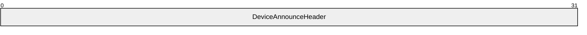

# [MS-RDPESP]: Remote Desktop Protocol: Serial and Parallel Port Virtual Channel Extension

Table of Contents

1 Introduction

- [1 Introduction](#Section_1)
  - [1.1 Glossary](#Section_1.1)
  - [1.2 References](#Section_1.2)
    - [1.2.1 Normative References](#Section_1.2.1)
    - [1.2.2 Informative References](#Section_1.2.2)
  - [1.3 Overview](#Section_1.3)
    - [1.3.1 Purpose of Device Redirection Extensions](#Section_1.3.1)
    - [1.3.2 Protocol Initialization](#Section_1.3.2)
  - [1.4 Relationship to Other Protocols](#Section_1.4)
  - [1.5 Prerequisites/Preconditions](#Section_1.5)
  - [1.6 Applicability Statement](#Section_1.6)
  - [1.7 Versioning and Capability Negotiation](#Section_1.7)
  - [1.8 Vendor-Extensible Fields](#Section_1.8)
  - [1.9 Standards Assignments](#Section_1.9)

2 Messages

- [2 Messages](#Section_2)
  - [2.1 Transport](#Section_2.1)
  - [2.2 Message Syntax](#Section_2.2)
    - [2.2.1 Common Data Types](#Section_2.2.1)
    - [2.2.2 Port Redirection Messages](#Section_2.2.2)
      - [2.2.2.1 Client Device List Announce Request](#Section_2.2.2.1)
      - [2.2.2.2 Server Create Request (DR_PORT_CREATE_REQ)](#Section_2.2.2.2)
      - [2.2.2.3 Server Close Request (DR_PORT_CLOSE_REQ)](#Section_2.2.2.3)
      - [2.2.2.4 Server Read Request (DR_PORT_READ_REQ)](#Section_2.2.2.4)
      - [2.2.2.5 Server Write Request (DR_PORT_WRITE_REQ)](#Section_2.2.2.5)
      - [2.2.2.6 Server Device Control Request (DR_PORT_CONTROL_REQ)](#Section_2.2.2.6)
      - [2.2.2.7 Client Create Response (DR_PORT_CREATE_RSP)](#Section_2.2.2.7)
      - [2.2.2.8 Client Close Response (DR_PORT_CLOSE_RSP)](#Section_2.2.2.8)
      - [2.2.2.9 Client Read Response (DR_PORT_READ_RSP)](#Section_2.2.2.9)
      - [2.2.2.10 Client Write Response (DR_PORT_WRITE_RSP)](#Section_2.2.2.10)
      - [2.2.2.11 Client Device Control Response (DR_PORT_CONTROL_RSP)](#Section_2.2.2.11)

3 Protocol Details

- [3 Protocol Details](#Section_3)
  - [3.1 Common Details](#Section_3.1)
    - [3.1.1 Abstract Data Model](#Section_3.1.1)
    - [3.1.2 Timers](#Section_3.1.2)
    - [3.1.3 Initialization](#Section_3.1.3)
    - [3.1.4 Higher-Layer Triggered Events](#Section_3.1.4)
    - [3.1.5 Message Processing Events and Sequencing Rules](#Section_3.1.5)
    - [3.1.6 Timer Events](#Section_3.1.6)
    - [3.1.7 Other Local Events](#Section_3.1.7)
  - [3.2 Client Details](#Section_3.2)
    - [3.2.1 Abstract Data Model](#Section_3.2.1)
    - [3.2.2 Timers](#Section_3.2.2)
    - [3.2.3 Initialization](#Section_3.2.3)
    - [3.2.4 Higher-Layer Triggered Events](#Section_3.2.4)
    - [3.2.5 Message Processing Events and Sequencing Rules](#Section_3.2.5)
      - [3.2.5.1 Port Redirection Messages](#Section_3.2.5.1)
        - [3.2.5.1.1 Sending a Client Device List Announce Request Message](#Section_3.2.5.1.1)
        - [3.2.5.1.2 Processing a Server Create Request Message](#Section_3.2.5.1.2)
        - [3.2.5.1.3 Processing a Server Close Request Message](#Section_3.2.5.1.3)
        - [3.2.5.1.4 Processing a Server Read Request Message](#Section_3.2.5.1.4)
        - [3.2.5.1.5 Processing a Server Write Request Message](#Section_3.2.5.1.5)
        - [3.2.5.1.6 Processing a Server Device Control Request Message](#Section_3.2.5.1.6)
        - [3.2.5.1.7 Sending a Create Response Message](#Section_3.2.5.1.7)
        - [3.2.5.1.8 Sending a Close Response Message](#Section_3.2.5.1.8)
        - [3.2.5.1.9 Sending a Read Response Message](#Section_3.2.5.1.9)
        - [3.2.5.1.10 Sending a Write Response Message](#Section_3.2.5.1.10)
        - [3.2.5.1.11 Sending a Device Control Response Message](#Section_3.2.5.1.11)
    - [3.2.6 Timer Events](#Section_3.2.6)
    - [3.2.7 Other Local Events](#Section_3.2.7)
  - [3.3 Server Details](#Section_3.3)
    - [3.3.1 Abstract Data Model](#Section_3.3.1)
    - [3.3.2 Timers](#Section_3.3.2)
    - [3.3.3 Initialization](#Section_3.3.3)
    - [3.3.4 Higher-Layer Triggered Events](#Section_3.3.4)
    - [3.3.5 Message Processing Events and Sequencing Rules](#Section_3.3.5)
      - [3.3.5.1 Port Redirection Messages](#Section_3.3.5.1)
        - [3.3.5.1.1 Processing a Client Device List Announce Request Message](#Section_3.3.5.1.1)
        - [3.3.5.1.2 Sending a Server Create Request Message](#Section_3.3.5.1.2)
        - [3.3.5.1.3 Sending a Server Close Request Message](#Section_3.3.5.1.3)
        - [3.3.5.1.4 Sending a Server Write Request Message](#Section_3.3.5.1.4)
        - [3.3.5.1.5 Sending a Server Read Request Message](#Section_3.3.5.1.5)
        - [3.3.5.1.6 Sending a Server Device Control Request Message](#Section_3.3.5.1.6)
        - [3.3.5.1.7 Processing a Client Create Response Message](#Section_3.3.5.1.7)
        - [3.3.5.1.8 Processing a Client Close Response Message](#Section_3.3.5.1.8)
        - [3.3.5.1.9 Processing a Client Write Response Message](#Section_3.3.5.1.9)
        - [3.3.5.1.10 Processing a Client Read Response Message](#Section_3.3.5.1.10)
        - [3.3.5.1.11 Processing a Client Device Control Response Message](#Section_3.3.5.1.11)
    - [3.3.6 Timer Events](#Section_3.3.6)
    - [3.3.7 Other Local Events](#Section_3.3.7)

4 Protocol Examples

- [4 Protocol Examples](#Section_4)
  - [4.1 Port Redirection Annotations](#Section_4.1)
  - [4.2 Server Create Request Example](#Section_4.2)
  - [4.3 Client Create Response Example](#Section_4.3)
  - [4.4 IO Operations Examples](#Section_4.4)

5 Security

- [5 Security](#Section_5)
  - [5.1 Security Considerations for Implementers](#Section_5.1)
  - [5.2 Index of Security Parameters](#Section_5.2)

6 Appendix A: Product Behavior

- [6 Appendix A: Product Behavior](#Section_6)

7 Change Tracking

- [7 Change Tracking](#Section_7)

For the legal notice and IP terms, see [LEGAL.md](../LEGAL.md).
Last updated: 4/23/2024.
See [Revision History](#revision-history) for full version history.

# 1 Introduction

This document specifies the Remote Desktop Protocol: Serial and Parallel Port Virtual Channel Extension. This protocol is used to redirect serial and parallel ports from a [**terminal client**](#gt_terminal-client) to the [**terminal server**](#gt_terminal-server). This allows the [**server**](#gt_server) to access [**client**](#gt_client) ports as if the connected devices were local to the server.

Sections 1.5, 1.8, 1.9, 2, and 3 of this specification are normative. All other sections and examples in this specification are informative.

## 1.1 Glossary

This document uses the following terms:

**client**: A computer on which the remote procedure call (RPC) client is executing.

**device control**: Driver-specific operations that can be performed on various drivers. Each DeviceIOControl is associated with an operation code (called IoCode) and optionally input and output buffers. Device drivers depending on the IoCode take various actions on the input and output buffers

**pseudo device**: A virtual device object created by the server to represent a remote device attached to the remote (or client) machine. Applications and drivers on the server interact with this pseudo/virtual device and the server forwards requests to the remote device. Responses from the remote device are returned to the pseudo device, which then forwards them to the applications or drivers interacting with the device. Examples of pseudo devices include the pseudo port device, pseudo printer device, pseudo drive device, pseudo smartcard device, pseudo PnP device, and so on.

**remote device**: A device that is attached to a remote (or [**client**](#gt_client)) machine, in contrast to a device physically attached to a machine.

**server**: A computer on which the remote procedure call (RPC) server is executing.

**terminal client**: A [**client**](#gt_client) of a [**terminal server**](#gt_terminal-server). A terminal client program that runs on the [**client**](#gt_client) machine.

**terminal server**: A computer on which terminal services is running.

**MAY, SHOULD, MUST, SHOULD NOT, MUST NOT:** These terms (in all caps) are used as defined in [[RFC2119]](https://go.microsoft.com/fwlink/?LinkId=90317). All statements of optional behavior use either MAY, SHOULD, or SHOULD NOT.

## 1.2 References

Links to a document in the Microsoft Open Specifications library point to the correct section in the most recently published version of the referenced document. However, because individual documents in the library are not updated at the same time, the section numbers in the documents may not match. You can confirm the correct section numbering by checking the [Errata](https://go.microsoft.com/fwlink/?linkid=850906).

### 1.2.1 Normative References

We conduct frequent surveys of the normative references to assure their continued availability. If you have any issue with finding a normative reference, please contact [dochelp@microsoft.com](mailto:dochelp@microsoft.com). We will assist you in finding the relevant information.

[MS-ERREF] Microsoft Corporation, "[Windows Error Codes](../MS-ERREF/MS-ERREF.md)".

[MS-RDPBCGR] Microsoft Corporation, "[Remote Desktop Protocol: Basic Connectivity and Graphics Remoting](../MS-RDPBCGR/MS-RDPBCGR.md)".

[MS-RDPEFS] Microsoft Corporation, "[Remote Desktop Protocol: File System Virtual Channel Extension](../MS-RDPEFS/MS-RDPEFS.md)".

[MS-SMB2] Microsoft Corporation, "[Server Message Block (SMB) Protocol Versions 2 and 3](../MS-SMB2/MS-SMB2.md)".

[RFC2119] Bradner, S., "Key words for use in RFCs to Indicate Requirement Levels", BCP 14, RFC 2119, March 1997, [https://www.rfc-editor.org/info/rfc2119](https://go.microsoft.com/fwlink/?LinkId=90317)

### 1.2.2 Informative References

[MSDN-DeviceTypes] Microsoft Corporation, "Specifying Device Types", [https://msdn.microsoft.com/en-us/library/ff563821.aspx](https://go.microsoft.com/fwlink/?LinkId=120804)

[MSDN-IoCtlCodes] Microsoft Corporation, "Defining I/O Control Codes", [http://msdn.microsoft.com/en-us/library/ff543023.aspx](https://go.microsoft.com/fwlink/?LinkId=120805)

[MSDN-Ntddpar] Microsoft Corporation, "ntddpar.h header", [https://learn.microsoft.com/en-us/windows-hardware/drivers/ddi/content/ntddpar/](https://go.microsoft.com/fwlink/?LinkId=114013)

[MSDN-Ntddser] Microsoft Corporation, "ntddser.h header", [https://learn.microsoft.com/en-us/windows-hardware/drivers/ddi/content/ntddser/](https://go.microsoft.com/fwlink/?LinkId=114014)

[MSDN-PORTS] Microsoft Corporation, "Serial and Parallel ports", [http://msdn.microsoft.com/en-us/library/bb870477.aspx](https://go.microsoft.com/fwlink/?LinkId=102069)

[MSFT-WDDK] Microsoft Corporation, "Windows Driver Kit Version 7.1.0", [http://www.microsoft.com/en-us/download/details.aspx?displaylang=en&id=11800](https://go.microsoft.com/fwlink/?LinkID=507676)

## 1.3 Overview

The Remote Desktop Protocol: Serial and Parallel Port Virtual Channel Extension specifies the communication used to enable the redirection of serial and parallel ports (ports for short) between a [**terminal client**](#gt_terminal-client) and a [**terminal server**](#gt_terminal-server). By redirecting ports from the terminal client to the terminal server, applications running on a server machine can access the [**remote devices**](#gt_remote-device) attached to those ports.

### 1.3.1 Purpose of Device Redirection Extensions

This extension enables the redirection of serial and parallel port devices attached to the terminal client. With the redirection, such devices can then be accessed by the applications running on the server.

### 1.3.2 Protocol Initialization

This extension can be considered as a subprotocol within the Remote Desktop Protocol: File System Virtual Channel Extension as specified in [MS-RDPEFS](../MS-RDPEFS/MS-RDPEFS.md). It follows the initialization of the Remote Desktop Protocol: File System Virtual Channel Extension to enable port redirection.

## 1.4 Relationship to Other Protocols

This extension can be considered as a subprotocol within Remote Desktop Protocol: File System Virtual Channel Extension as specified in [MS-RDPEFS](../MS-RDPEFS/MS-RDPEFS.md). This extension extends the Remote Desktop Protocol: File System Virtual Channel Extension to enable port redirection.

## 1.5 Prerequisites/Preconditions

The Remote Desktop Protocol: Serial and Parallel Port Virtual Channel Extension operates only after the Remote Desktop Protocol: File System Virtual Channel Extension transport, as specified in [MS-RDPEFS](../MS-RDPEFS/MS-RDPEFS.md), is fully established.

## 1.6 Applicability Statement

The Remote Desktop Protocol: Serial and Parallel Port Virtual Channel Extension is designed to be run within the context of a Remote Desktop Protocol virtual channel established between a [**client**](#gt_client) and [**server**](#gt_server). This protocol extension is applicable when applications running on the [**terminal server**](#gt_terminal-server) need to access the ports physically located on a client machine.

## 1.7 Versioning and Capability Negotiation

This extension relies on the Remote Desktop Protocol: File System Virtual Channel Extension, as specified in [MS-RDPEFS](../MS-RDPEFS/MS-RDPEFS.md), to perform basic versioning and capability negotiation.

## 1.8 Vendor-Extensible Fields

This protocol uses NTSTATUS values, as defined in [MS-ERREF](../MS-ERREF/MS-ERREF.md) section 2.3. Vendors are free to choose their own values for this field, as long as the C bit (0x20000000) is set, indicating it is a customer code.

## 1.9 Standards Assignments

The Remote Desktop Protocol: Serial and Parallel Port Virtual Channel Extension contains no standards assignments.

# 2 Messages

Because this is a subprotocol of Remote Desktop Protocol: File System Virtual Channel Extension, as specified in [MS-RDPEFS](../MS-RDPEFS/MS-RDPEFS.md), this extension shares messages and common data types already specified in [MS-RDPEFS]. This section describes the messages and data types used by Remote Desktop Protocol: Serial and Parallel Port Virtual Channel Extension.

## 2.1 Transport

All messages MUST be transported over an established Remote Desktop Protocol device extensions channel (as specified in [MS-RDPEFS](../MS-RDPEFS/MS-RDPEFS.md) section 2.1).

## 2.2 Message Syntax

The following sections contain Remote Desktop Protocol: Serial and Parallel Port Virtual Channel Extension message syntax.

### 2.2.1 Common Data Types

Port redirection uses common data types specified in [MS-RDPEFS](../MS-RDPEFS/MS-RDPEFS.md) section 2.

### 2.2.2 Port Redirection Messages

This protocol does not define any specific messages. It uses a subset of the messages specified in [MS-RDPEFS](../MS-RDPEFS/MS-RDPEFS.md) section 2. The messages in the following sections are used by this protocol.

#### 2.2.2.1 Client Device List Announce Request

This message is described in [MS-RDPEFS](../MS-RDPEFS/MS-RDPEFS.md) section 2.2.2.9. The port redirection [**client**](#gt_client) generates the elements of type DEVICE_ANNOUNCE (as specified in [MS-RDPEFS] section 2.2.1.3) for the port devices it wants to redirect.

**DeviceAnnounceHeader (4 bytes):** For each redirected port a DEVICE_ANNOUNCE header (as specified in [MS-RDPEFS] section 2.2.1.3) is generated by the client port redirection extension.

The header fields are initialized as follows:

- **DeviceType**: Identifies the device. This value MUST be set to RDPDR_DTYP_PARALLEL for parallel ports and RDPDR_DTYP_SERIAL for serial ports.
- **DeviceId**: A unique ID that identifies the announced device. The **DeviceId** field follows the semantics described in [MS-RDPEFS] section 2.2.1.3.
- **PreferredDosName**: This field follows the semantic described in [MS-RDPEFS] section 2.2.1.3. It describes the name of the port device as it appears on the client. This protocol does not enforce any semantic limitations on port naming. Client and server implementations determine the port naming convention.<1>
- **DeviceDataLength**: Number of bytes in the **DeviceData** field. For port devices, this value is set to 0.
**Note:** The Client Drive Device List Remove message is not supported by the MS-RDPESP protocol.

#### 2.2.2.2 Server Create Request (DR_PORT_CREATE_REQ)

This message is sent by the [**server**](#gt_server) to open an instance of the port device. The packet for this message is specified in [MS-RDPEFS](../MS-RDPEFS/MS-RDPEFS.md) section 2.2.1.4.1 (DR_CREATE_REQ). The **DeviceId** of the **DeviceIoRequest** field in the DR_CREATE_REQ packet MUST match the **DeviceId** value that is sent in the [Client Device List Announce Request](#Section_2.2.2.1) packet.

The **PathLength** field of the DR_CREATE_REQ packet MUST be set to 0x00000000. This automatically results in setting the packet **Path** field to empty.

Some of the parameters that are passed with this request (**DesiredAccess**, **AllocationSize**, **FileAttributes**, **SharedAccess**, **Disposition** and **CreateOptions**) are treated as opaque by this protocol. The interpretation of these parameters is determined by the client-side driver. The various possible values are specified in [MS-SMB2](../MS-SMB2/MS-SMB2.md) section 2.2.13.

#### 2.2.2.3 Server Close Request (DR_PORT_CLOSE_REQ)

This message is sent from the [**server**](#gt_server) to close the previously-opened device instance. The packet is specified in [MS-RDPEFS](../MS-RDPEFS/MS-RDPEFS.md) section 2.2.1.4.2 (DR_CLOSE_REQ).

#### 2.2.2.4 Server Read Request (DR_PORT_READ_REQ)

This message is sent from the [**server**](#gt_server) to read data from the port device instance. The packet is specified in [MS-RDPEFS](../MS-RDPEFS/MS-RDPEFS.md) section 2.2.1.4.3 (DR_READ_REQ).

The **Offset** field in this request MUST be set to 0.

Zero-length request semantics: The protocol allows the client and server to request or to complete read/write operations with the **Length** field set to zero. The behavior of these requests and their interpretation is determined by the server application and the client driver.

#### 2.2.2.5 Server Write Request (DR_PORT_WRITE_REQ)

This message is sent from the server to write data to the port device instance. The packet is specified in [MS-RDPEFS](../MS-RDPEFS/MS-RDPEFS.md) section 2.2.1.4.4 (DR_WRITE_REQ).

The **Offset** field in this request MUST be set to 0.

Zero-length request semantics: The protocol allows the [**client**](#gt_client) and [**server**](#gt_server) to request or to complete read/write operations with the **Length** field set to zero. The behavior of these requests and their interpretation is determined by the server application and the client driver.

#### 2.2.2.6 Server Device Control Request (DR_PORT_CONTROL_REQ)

This message is sent by the server to request a [**device control**](#gt_device-control) operation. The packet is specified in [MS-RDPEFS](../MS-RDPEFS/MS-RDPEFS.md) section 2.2.1.4.5 (DR_CONTROL_REQ).

The possible values for the **IoControlCode** member and the corresponding Input and Output buffers applicable to parallel and serial ports are as defined in [[MSFT-WDDK]](https://go.microsoft.com/fwlink/?LinkID=507676), and in [[MSDN-PORTS]](https://go.microsoft.com/fwlink/?LinkId=102069).

Serial and Parallel IOCTL handles applicable to this protocol:

| Name | Value |
| --- | --- |
| IOCTL_SERIAL_SET_BAUD_RATE | 0x001B0004 |
| IOCTL_SERIAL_GET_BAUD_RATE | 0x001B0050 |
| IOCTL_SERIAL_SET_LINE_CONTROL | 0x001B000C |
| IOCTL_SERIAL_GET_LINE_CONTROL | 0x001B0054 |
| IOCTL_SERIAL_SET_TIMEOUTS | 0x001B001C |
| IOCTL_SERIAL_GET_TIMEOUTS | 0x001B0020 |
| IOCTL_SERIAL_SET_CHARS | 0x001B0058 |
| IOCTL_SERIAL_GET_CHARS | 0x001B005C |
| IOCTL_SERIAL_SET_DTR | 0x001B0024 |
| IOCTL_SERIAL_CLR_DTR | 0x001B0028 |
| IOCTL_SERIAL_RESET_DEVICE | 0x001B002C |
| IOCTL_SERIAL_SET_RTS | 0x001B0030 |
| IOCTL_SERIAL_CLR_RTS | 0x001B0034 |
| IOCTL_SERIAL_SET_XOFF | 0x001B0038 |
| IOCTL_SERIAL_SET_XON | 0x001B003C |
| IOCTL_SERIAL_SET_BREAK_ON | 0x001B0010 |
| IOCTL_SERIAL_SET_BREAK_OFF | 0x001B0014 |
| IOCTL_SERIAL_SET_QUEUE_SIZE | 0x001B0008 |
| IOCTL_SERIAL_GET_WAIT_MASK | 0x001B0040 |
| IOCTL_SERIAL_SET_WAIT_MASK | 0x001B0044 |
| IOCTL_SERIAL_WAIT_ON_MASK | 0x001B0048 |
| IOCTL_SERIAL_IMMEDIATE_CHAR | 0x001B0018 |
| IOCTL_SERIAL_PURGE | 0x001B004C |
| IOCTL_SERIAL_GET_HANDFLOW | 0x001B0060 |
| IOCTL_SERIAL_SET_HANDFLOW | 0x001B0064 |
| IOCTL_SERIAL_GET_MODEMSTATUS | 0x001B0068 |
| IOCTL_SERIAL_GET_DTRRTS | 0x001B0078 |
| IOCTL_SERIAL_GET_COMMSTATUS | 0x001B006C |
| IOCTL_SERIAL_GET_PROPERTIES | 0x001B0074 |
| IOCTL_SERIAL_XOFF_COUNTER | 0x001B0070 |
| IOCTL_SERIAL_LSRMST_INSERT | 0x001B007C |
| IOCTL_SERIAL_CONFIG_SIZE | 0x001B0080 |
| IOCTL_SERIAL_GET_STATS | 0x001B008C |
| IOCTL_SERIAL_CLEAR_STATS | 0x001B0090 |
| IOCTL_SERIAL_GET_MODEM_CONTROL | 0x001B0094 |
| IOCTL_SERIAL_SET_MODEM_CONTROL | 0x001B0098 |
| IOCTL_SERIAL_SET_FIFO_CONTROL | 0x001B009C |
| IOCTL_PAR_QUERY_INFORMATION | 0x00160004 |
| IOCTL_PAR_SET_INFORMATION | 0x00160008 |
| IOCTL_PAR_QUERY_DEVICE_ID | 0x0016000C |
| IOCTL_PAR_QUERY_DEVICE_ID_SIZE | 0x00160010 |
| IOCTL_IEEE1284_GET_MODE | 0x00160014 |
| IOCTL_IEEE1284_NEGOTIATE | 0x00160018 |
| IOCTL_PAR_SET_WRITE_ADDRESS | 0x0016001C |
| IOCTL_PAR_SET_READ_ADDRESS | 0x00160020 |
| IOCTL_PAR_GET_DEVICE_CAPS | 0x00160024 |
| IOCTL_PAR_GET_DEFAULT_MODES | 0x00160028 |
| IOCTL_PAR_QUERY_RAW_DEVICE_ID | 0x00160030 |
| IOCTL_PAR_IS_PORT_FREE | 0x00160054 |

#### 2.2.2.7 Client Create Response (DR_PORT_CREATE_RSP)

The client responds with this message to notify the [**server**](#gt_server) about the result of the server create request (section [2.2.2.2](#Section_2.2.2.2)). This message is specified in [MS-RDPEFS](../MS-RDPEFS/MS-RDPEFS.md) section 2.2.1.5.1 (DR_CREATE_RSP).

#### 2.2.2.8 Client Close Response (DR_PORT_CLOSE_RSP)

The [**client**](#gt_client) responds with this message to notify the [**server**](#gt_server) about the result of the server close request (section [2.2.2.3](#Section_2.2.2.3)). This message is specified in [MS-RDPEFS](../MS-RDPEFS/MS-RDPEFS.md) section 2.2.1.5.2 (DR_CLOSE_RSP).

#### 2.2.2.9 Client Read Response (DR_PORT_READ_RSP)

The client responds with this message to notify the server about the result of server read request (section [2.2.2.4](#Section_2.2.2.4)). This message is specified in [MS-RDPEFS](../MS-RDPEFS/MS-RDPEFS.md) section 2.2.1.5.3 (DR_READ_RSP).

#### 2.2.2.10 Client Write Response (DR_PORT_WRITE_RSP)

The client responds with this message to notify the server about the result of the server write request (section [2.2.2.5](#Section_2.2.2.5)). This message is specified in [MS-RDPEFS](../MS-RDPEFS/MS-RDPEFS.md) section 2.2.1.5.4 (DR_WRITE_RSP).

#### 2.2.2.11 Client Device Control Response (DR_PORT_CONTROL_RSP)

The client responds with this message to notify the server about the result of the server device control request ([2.2.2.6](#Section_2.2.2.6)). This message is specified in [MS-RDPEFS](../MS-RDPEFS/MS-RDPEFS.md) section 2.2.1.5.5 (DR_CONTROL_RSP).

# 3 Protocol Details

The following sections specify protocol details, including abstract data models and message processing rules.

## 3.1 Common Details

### 3.1.1 Abstract Data Model

This section describes a conceptual model of possible data organization that an implementation maintains to participate in this protocol. The organization is provided to explain how the protocol behaves. This document does not mandate that implementations adhere to this model as long as their external behavior is consistent with that described in this document.

The Remote Desktop Protocol: Serial and Parallel Port Virtual Channel Extension follows the abstract data model specified in [MS-RDPEFS](../MS-RDPEFS/MS-RDPEFS.md) section 3.1.1.

### 3.1.2 Timers

There are no common timers.

### 3.1.3 Initialization

The Remote Desktop Protocol: File System Virtual Channel Extension MUST be initialized before the ports can be redirected. This initialization is complete when the client sends the Client Core Capability Response, as specified in [MS-RDPEFS](../MS-RDPEFS/MS-RDPEFS.md) section 2.2.2.8.

### 3.1.4 Higher-Layer Triggered Events

IO requests are generated in response to IO calls that the server applications make on the redirected device. Otherwise, no higher-layer triggered events are used.

### 3.1.5 Message Processing Events and Sequencing Rules

The common message processing events and rules that are described in [MS-RDPEFS](../MS-RDPEFS/MS-RDPEFS.md) section 3.1.5 apply to this protocol. For client-specific and server-specific message processing, see sections [3.2.5](../MS-RDPEFS/MS-RDPEFS.md) and [3.3.5](../MS-RDPEFS/MS-RDPEFS.md).

### 3.1.6 Timer Events

No common timer events are used.

### 3.1.7 Other Local Events

There are no common local events.

## 3.2 Client Details

### 3.2.1 Abstract Data Model

The abstract data model is specified in section [3.1.1](#Section_3.1.1).

### 3.2.2 Timers

No timers are used.

### 3.2.3 Initialization

Initialization is specified in section [3.1.3](#Section_3.1.3).

### 3.2.4 Higher-Layer Triggered Events

No [**client**](#gt_client) higher-layer triggered events are used.

### 3.2.5 Message Processing Events and Sequencing Rules

#### 3.2.5.1 Port Redirection Messages

##### 3.2.5.1.1 Sending a Client Device List Announce Request Message

After Remote Desktop Protocol: File System Virtual Channel Extension finishes initialization by sending a Client Core Capability Response message, as specified in [MS-RDPEFS](../MS-RDPEFS/MS-RDPEFS.md) section 2.2.2.8, the [**client**](#gt_client) sends a DR_CORE_DEVICELIST_ANNOUNCE_REQ message to the [**server**](#gt_server) along with information for various devices, as specified in [MS-RDPEFS] section 2.2.2.9. The device type is set to RDPDR_TYP_SERIAL for serial port type devices and RDPDR_TYP_PARALLEL for parallel ports. The port extension prepares the port devices information that goes into this packet. The port-specific structure is specified in section [2.2.2.1](#Section_2.2.2.1).

The port redirection extension enumerates the local serial and parallel ports that need to be redirected. It MUST set the appropriate **PreferredDosName** fields, generate unique IDs for the devices, set the appropriate device types, and let the Remote Desktop Protocol: File System Virtual Channel Extension send the information over to the server.

The **DeviceId** field generated in this message is used to refer to this port in subsequent messages.

##### 3.2.5.1.2 Processing a Server Create Request Message

After receiving the create request, the [**client**](#gt_client) SHOULD open and prepare the port for IO operations. The opened instance of the port is maintained by the client as a **FileId** field of the DR_DEVICE_IOREQUEST message, as specified in [MS-RDPEFS](../MS-RDPEFS/MS-RDPEFS.md) section 2.2.1.4. This ID is used to refer to subsequent IO operations on the port instance. After the create request processing is complete, the client responds with a create response message (section [3.2.5.1.7](#Section_3.2.5.1.7)).

##### 3.2.5.1.3 Processing a Server Close Request Message

The **DeviceId** and **FileId** fields of DR_DEVICE_IOREQUEST (as specified in [MS-RDPEFS](../MS-RDPEFS/MS-RDPEFS.md) section 2.2.1.4) identify the previously-opened instance of the port to operate on.

After receiving the close request, the [**client**](#gt_client) MUST close the previously opened port instance. It MUST also cancel pending IO operations, if any, on the port. The client MUST respond with close response message (section [3.2.5.1.8](#Section_3.2.5.1.8)).

##### 3.2.5.1.4 Processing a Server Read Request Message

The **DeviceId** and **FileId** fields of DR_DEVICE_IOREQUEST (as specified in [MS-RDPEFS](../MS-RDPEFS/MS-RDPEFS.md) section 2.2.1.4) identify the previously opened instance of the port to operate on.

The **Length** and **Offset** fields of DR_READ_REQ (as specified in [MS-RDPEFS] section 2.2.1.4.3) identify the length and offset values requested by the [**server**](#gt_server) for this operation.

If the **Offset** field is not set to 0, the value MUST be ignored.

The client MUST perform the read operation on the instance of the port accordingly. After the read operation is complete, the client MUST send a read response message (section [3.2.5.1.9](#Section_3.2.5.1.9)) to let the server know about the result of the operation.

The semantics of read requests are determined by the client-side driver. The protocol allows partial read results. The result of the read operations, including the data read, is passed to the server and is considered opaque to the protocol.

##### 3.2.5.1.5 Processing a Server Write Request Message

The **DeviceId** and **FileId** fields of DR_DEVICE_IOREQUEST (as specified in [MS-RDPEFS](../MS-RDPEFS/MS-RDPEFS.md) section 2.2.1.4) identify the previously opened instance of the port to operate on.

The **Length** and **WriteData** fields of DR_WRITE_REQ (as specified in [MS-RDPEFS] section 2.2.1.4.4) identify the parameters for the write operation. The **Offset** field is ignored.

The [**client**](#gt_client) MUST perform the write operation on the instance of the port accordingly. After the operation is complete, the client MUST send response message DR_WRITE_RSP (as specified in [MS-RDPEFS] section 2.2.1.5.4) to let the [**server**](#gt_server) know about the result of the operation.

##### 3.2.5.1.6 Processing a Server Device Control Request Message

The **DeviceId** and **FileId** fields of DR_DEVICE_IOREQUEST (as specified in [MS-RDPEFS](../MS-RDPEFS/MS-RDPEFS.md) section 2.2.1.4) identify the previously-opened instance of the port to operate on.

The **OutputBufferLength**, **InputBufferLength**, **IoControlCode** and **InputBuffer** fields of DR_CONTROL_REQ (as specified in [MS-RDPEFS] section 2.2.1.4.5) identify the parameters for the [**device control**](#gt_device-control) operation.

The client MUST perform the device control operation specified by the **IoControlCode** field on the instance of the port accordingly. After the operation is complete, the client MUST send a Device Control Response message (section [3.2.5.1.11](#Section_3.2.5.1.11)) to notify the server about the result of the operation.<2>

##### 3.2.5.1.7 Sending a Create Response Message

This message is sent in response to the server create request (section [3.2.5.1.2](#Section_3.2.5.1.2)).

The client MUST fill out various fields of DR_CREATE_RSP (as specified in [MS-RDPEFS](../MS-RDPEFS/MS-RDPEFS.md) section 2.2.1.5.1) as follows:

For the RDPDR_HEADER header:

- The **Component** field MUST be set to RDPDR_CTYP_CORE.
- The **PacketId** field MUST be set to PAKID_CORE_DEVICE_IOCOMPLETION.
For the DR_DEVICE_IOCOMPLETION header:

- The **DeviceId** field MUST be set to match the corresponding **DeviceId** field from the IO request.
- The **CompletionId** field MUST be set to match the **CompletionId** field from the corresponding IO request (section 3.2.5.1.2).
- The **IoStatus** field MUST be set to the NTSTATUS indicating the result of the operation. NTSTATUS codes are specified in [MS-ERREF](../MS-ERREF/MS-ERREF.md) section 2.3.
After completing the create request, the client MUST set the **FileId** field to a unique **FileId** value to identify the instance of the port. This **FileId** field is used in subsequent IO operations to refer to the port instance.

The **Information** field MUST be set to 0.

##### 3.2.5.1.8 Sending a Close Response Message

This message is sent in response to the server close request ([3.2.5.1.3](#Section_3.2.5.1.3)).

The [**client**](#gt_client) MUST fill out the various members of DR_CLOSE_RSP (as specified in [MS-RDPEFS](../MS-RDPEFS/MS-RDPEFS.md) section 2.2.1.5.2) as follows:

For the RDPDR_HEADER:

- The **Component** field MUST be set to RDPDR_CTYP_CORE.
- The **PacketId** field MUST be set to PAKID_CORE_DEVICE_IOCOMPLETION.
For the DR_DEVICE_IOCOMPLETION:

- The **DeviceId** field MUST be set to match the corresponding **DeviceId** field from the IO request.
- The **CompletionId** field MUST be set to match the **CompletionId** field from the corresponding IO request (section 3.2.5.1.3).
- The **IoStatus** field MUST be set to the NTSTATUS value indicating the result of the operation.

##### 3.2.5.1.9 Sending a Read Response Message

This message is sent in response to the server read request ([3.2.5.1.4](#Section_3.2.5.1.4)).

The [**client**](#gt_client) MUST fill out the various members of DR_READ_RSP (as specified in [MS-RDPEFS](../MS-RDPEFS/MS-RDPEFS.md) section 2.2.1.5.3) as follows:

For the RDPDR_HEADER:

- The **Component** field MUST be set to RDPDR_CTYP_CORE.
- The **PacketId** field MUST be set to PAKID_CORE_DEVICE_IOCOMPLETION.
For the DR_DEVICE_IOCOMPLETION:

- The **DeviceId** field MUST be set to match the corresponding **DeviceId** field from the IO request.
- The **CompletionId** field MUST be set to match the **CompletionId** from the corresponding IO request (section 3.2.5.1.4).
- The **IoStatus** field MUST be set to the NTSTATUS value indicating the result of the operation.
The client prepares a reply message with the result of the read operation. The client populates the **Length** field with the number of bytes read. The actual data read follows the **Length** field. The **Length** field MAY be less than the requested length; however, the **Length** field MUST NOT be greater than requested length. These partial read requests are supported by the server.

##### 3.2.5.1.10 Sending a Write Response Message

This message is sent in response to the server write request (section [3.2.5.1.5](#Section_3.2.5.1.5)).

The client MUST fill out the various members of DR_WRITE_RSP (as specified in [MS-RDPEFS](../MS-RDPEFS/MS-RDPEFS.md) section 2.2.1.5.4) as follows:

For the RDPDR_HEADER:

- The **Component** field MUST be set to RDPDR_CTYP_CORE.
- The **PacketId** field MUST be set to PAKID_CORE_DEVICE_IOCOMPLETION.
For the DR_DEVICE_IOCOMPLETION:

- The **DeviceId** field MUST be set to match the corresponding **DeviceId** field from the IO request.
- The **CompletionId** field MUST be set to match the **CompletionId** field from the corresponding IO request (section 3.2.5.1.5).
- The **IoStatus** field MUST be set to the NTSTATUS indicating the result of the operation.
- The **Padding** field is unused and MUST be ignored by the server.
The client prepares a reply message with the result of the write operation. The client populates the **Length** field with the number of bytes written.

##### 3.2.5.1.11 Sending a Device Control Response Message

This message is sent in response to the server device control request (section [3.2.5.1.6](#Section_3.2.5.1.6)).

The [**client**](#gt_client) MUST fill out the various members of DR_CONTROL_RSP (as specified in [MS-RDPEFS](../MS-RDPEFS/MS-RDPEFS.md) section 2.2.1.5.5) as follows:

For the RDPDR_HEADER:

- The **Component** field MUST be set to RDPDR_CTYP_CORE.
- The **PacketId** field MUST be set to PAKID_CORE_DEVICE_IOCOMPLETION.
For the DR_DEVICE_IOCOMPLETION:

- The **DeviceId** field MUST be set to match the corresponding **DeviceId** field from the IO request.
- The **CompletionId** field MUST be set to match the **CompletionId** field from the corresponding IO request (section 3.2.5.1.6).
- The **IoStatus** field MUST be set to the NTSTATUS indicating the result of the operation.
The client prepares a reply message with the result of the [**device control**](#gt_device-control) operation. The client populates the **OutputBufferLength** field with the number of bytes returned by the device control operation. The actual data returned, if any, follows the packet.

### 3.2.6 Timer Events

There are no timer events.

### 3.2.7 Other Local Events

There are no other local events.

## 3.3 Server Details

### 3.3.1 Abstract Data Model

The abstract data model is specified in section [3.1.1](#Section_3.1.1).

### 3.3.2 Timers

There are no timers used.

### 3.3.3 Initialization

Initialization is specified in section [3.1.3](#Section_3.1.3).

### 3.3.4 Higher-Layer Triggered Events

All IO requests are originated by the applications making IO calls on the redirected device. Otherwise, no other higher-layer triggered events are used.

### 3.3.5 Message Processing Events and Sequencing Rules

#### 3.3.5.1 Port Redirection Messages

##### 3.3.5.1.1 Processing a Client Device List Announce Request Message

After receiving the Client Device List Announce Request message (section [2.2.2.1](#Section_2.2.2.1)) for each device on the announce list, the [**server**](#gt_server) MUST create a [**pseudo port device**](#gt_081a3797-49a5-4760-bb9c-730309c18822) that emulates the [**client**](#gt_client) device. The server MUST maintain the association of the **DeviceId** value obtained from the client with such a pseudo device.

##### 3.3.5.1.2 Sending a Server Create Request Message

The [**server**](#gt_server) sends this message when any server application opens the [**pseudo port device**](#gt_081a3797-49a5-4760-bb9c-730309c18822). The server passes all the create parameters obtained from the application request over to the client for actual processing.

##### 3.3.5.1.3 Sending a Server Close Request Message

The server sends this message to the client in response to the server application requesting the close operation on the [**pseudo port device**](#gt_081a3797-49a5-4760-bb9c-730309c18822) for actual processing.

##### 3.3.5.1.4 Sending a Server Write Request Message

The server sends this message to the client in response to the server application requesting the write operation on the [**pseudo port device**](#gt_081a3797-49a5-4760-bb9c-730309c18822) for actual processing.

##### 3.3.5.1.5 Sending a Server Read Request Message

The server sends this message to the client in response to the server application requesting the read operation on the [**pseudo port device**](#gt_081a3797-49a5-4760-bb9c-730309c18822) for actual processing.

##### 3.3.5.1.6 Sending a Server Device Control Request Message

The server sends this message to the client in response to the server application requesting the [**device control**](#gt_device-control) operation on the [**pseudo port device**](#gt_081a3797-49a5-4760-bb9c-730309c18822) for actual processing.

##### 3.3.5.1.7 Processing a Client Create Response Message

After receiving the create response, the [**server**](#gt_server) responds to the application that initiated the create operation (section [3.3.5.1.1](#Section_3.3.5.1.10)). The server MUST maintain an association between the **FileId** returned by the [**client**](#gt_client) and the file handle returned to the application. For any subsequent IO operations on the file handle, the server SHOULD send the IO to the client for completion using the same **FileId** field.

##### 3.3.5.1.8 Processing a Client Close Response Message

The [**server**](#gt_server) responds to the application with the result of the close response received from the [**client**](#gt_client).

##### 3.3.5.1.9 Processing a Client Write Response Message

The server forwards the result of the write response to the application that requested the write operation.

##### 3.3.5.1.10 Processing a Client Read Response Message

The server forwards the result of the read response to the application that initiated the read operation.

##### 3.3.5.1.11 Processing a Client Device Control Response Message

The server forwards the result of the device control response to the application that initiated the operation.

### 3.3.6 Timer Events

There are no timer events.

### 3.3.7 Other Local Events

There are no other local events.

# 4 Protocol Examples

## 4.1 Port Redirection Annotations

After the Remote Desktop Protocol: Serial and Parallel Port Virtual Channel Extension finishes its initialization, the [**client**](#gt_client) sends the client device list announce message to the [**server**](#gt_server). Information about the ports to be redirected is contained within the message.

The following sequence shows a COM2 port being sent to the server for redirection.

Channel Name = RDPDR, 28, Client to server

00000000 72 44 41 44 01 00 00 00 01 00 00 00 01 00 00 00

00000010 43 4f 4d 32 00 00 00 00 00 00 00 00

72 44 -> RDPDR_CTYP_CORE = 0x4472

41 44 -> PAKID_CORE_DEVICELIST_ANNOUNCE = 0x4441

01 00 00 00 -> DeviceCount = 0x00000001

01 00 00 00 -> DeviceType (RDPDR_DTYP_SERIAL) = 0x00000001

01 00 00 00 -> DeviceId = 0x00000001

43 4f 4d 32 00 00 00 00 -> PreferredDosName(8 characters) = "COM2"

00 00 00 00 -> DeviceDataLength = 0x00000000

The following sequence shows an LPT1 port being sent for redirection. In this example, the Device Announce packet contains three devices. This example only annotates the header and LPT1 Device portion from this packet.

Channel Name = RDPDR, 264, Client to server

00000000 72 44 41 44 03 00 00 00 04 00 00 00 04 00 00 00

00000010 50 52 4e 34 00 00 00 00 50 00 00 00 10 00 00 00

00000020 00 00 00 00 00 00 00 00 1c 00 00 00 1c 00 00 00

00000030 00 00 00 00 41 00 70 00 6f 00 6c 00 6c 00 6f 00

00000040 20 00 50 00 2d 00 31 00 32 00 30 00 30 00 00 00

00000050 41 00 70 00 6f 00 6c 00 6c 00 6f 00 20 00 50 00

00000060 2d 00 31 00 32 00 30 00 30 00 00 00 04 00 00 00

00000070 03 00 00 00 50 52 4e 33 00 00 00 00 74 00 00 00

00000080 12 00 00 00 00 00 00 00 00 00 00 00 2e 00 00 00

00000090 2e 00 00 00 00 00 00 00 43 00 61 00 6e 00 6f 00

000000a0 6e 00 20 00 42 00 75 00 62 00 62 00 6c 00 65 00

000000b0 2d 00 4a 00 65 00 74 00 20 00 42 00 4a 00 2d 00

000000c0 33 00 30 00 00 00 43 00 61 00 6e 00 6f 00 6e 00

000000d0 20 00 42 00 75 00 62 00 62 00 6c 00 65 00 2d 00

000000e0 4a 00 65 00 74 00 20 00 42 00 4a 00 2d 00 33 00

000000f0 30 00 00 00 02 00 00 00 02 00 00 00 4c 50 54 31

00000100 00 00 00 00 00 00 00 00

72 44 -> RDPDR_CTYP_CORE = 0x4472

41 44 -> PAKID_CORE_DEVICELIST_ANNOUNCE = 0x4441

03 00 00 00 -> DeviceCount = 0x00000003

04 00 00 -> DeviceType (RDPDR_DTYP_PRINT) = 0x00000004

04 00 00 00 -> DeviceId = 0x00000004

50 52 4e 34 00 00 00 00 -> PreferredDosName (8 characters) = "PRN4"

50 00 00 00 -> DeviceDataLength = 0x00000050

10 00 00 00 -> Flags( RDPDR_PRINTER_ANNOUNCE_FLAG_XPSFORMAT)

= 0x00000010

00 00 00 00 -> CodePage = 0x00000000

00 00 00 00 -> PnPNameLen = 0x00000000

1c 00 00 00 -> DriverNameLen = 0x0000001c

1c 00 00 00 -> PrintNameLen (28 bytes) = 0x0000001c

00 00 00 00 -> CachedFieldsLen = 0x00000000

41 00 70 00 6f 00 6c 00

6c 00 6f 00 20 00 50 00

2d 00 31 00 32 00 30 00

30 00 00 00 -> DriverName (28 bytes) = "Apollo P-1200"

41 00 70 00 6f 00 6c 00 6c 00 6f 00 20 00 50 00

2d 00 31 00 32 00 30 00 30 00 00 00

-> PrintName (28 bytes) = "Apollo P-1200"

04 00 00 00 -> DeviceType (RDPDR_DTYP_PRINT) = 0x00000004

03 00 00 00 -> DeviceId = 0x00000003

50 52 4e 33 00 00 00 00 -> PreferredDosName (8 characters) = "PRN3"

74 00 00 00 -> DeviceDataLength = 0x00000074

12 00 00 00 -> Flags(RDPDR_PRINTER_ANNOUNCE_FLAG_XPSFORMAT |

RDPDR_PRINTER_ANNOUNCE_FLAG_DEFAULTPRINTER)

= 0x00000012

00 00 00 0 -> CodePage = 0x00000000

00 00 00 00 -> PnPNameLen = 0x00000000

2e 00 00 00 -> DriverNameLen = 0x0000002e

2e 00 00 00 -> PrintNameLen = 0x0000002e

00 00 00 00 -> CachedFieldsLen = 0x00000000

43 00 61 00 6e 00 6f 00

6e 00 20 00 42 00 75 00

62 00 62 00 6c 00 65 00

2d 00 4a 00 65 00 74 00

20 00 42 00 4a 00 2d 00

33 00 30 00 00 00 -> DriverName (46 bytes) = "Canon Bubble-Jet BJ-30"

43 00 61 00 6e 00 6f 00

6e 00 20 00 42 00 75 00

62 00 62 00 6c 00 65 00

2d 00 4a 00 65 00 74 00

20 00 42 00 4a 00 2d 00

33 00 30 00 00 00 -> PrintName (46 bytes) = "Canon Bubble-Jet BJ-30"

02 00 00 00 -> DeviceType (RDPDR_DTYP_PARALLEL) = 0x00000002

02 00 00 00 -> DeviceId = 0x00000002

4c 50 54 31 00 00 00 00 -> PreferredDosName (8 characters) = "LPT1"

00 00 00 00 -> DeviceDataLength = 0x00000000

## 4.2 Server Create Request Example

The server sends a request to create an instance of the port. The following sequence captures such a request.

RDPDR, 56, Server to client

00000000 72 44 52 49 01 00 00 00 00 00 00 00 01 00 00 00

00000010 00 00 00 00 00 00 00 00 80 00 10 00 00 00 00 00

00000020 00 00 00 00 00 00 00 00 07 00 00 00 01 00 00 00

00000030 60 00 00 00 00 00 00 00

72 44 -> RDPDR_CTYP_CORE = 0x4472

52 49 -> PAKID_CORE_DEVICE_IOREQUEST = 0x4952

01 00 00 00 -> DeviceId = 0x00000001

00 00 00 00 -> FileId = 0x00000000

01 00 00 00 -> CompletionId = 0x00000001

00 00 00 00 -> MajorFunction(IRP_MJ_CREATE) = 0x00000000

00 00 00 00 -> MinorFunction = 0x00000000

80 00 10 00 -> DesiredAccess = 0x00100080

00 00 00 00 00 00 00 00 -> AllocationSize(64 bits) = 0x0

00 00 00 00 -> FileAttributes = 0x00000000

07 00 00 00 -> SharedAccess = 0x00000007

01 00 00 00 -> CreateDisposition = 0x00000001

60 00 00 00 -> CreateOptions = 0x00000060

00 00 00 00 -> PathLength = 0x0000000

## 4.3 Client Create Response Example

The client responds with the following response. This establishes a **FileId** value that is used subsequently for the IO operations.

RDPDR, 21, Client to server

00000000 72 44 43 49 02 00 00 00 00 00 00 00 00 00 00 00

00000010 01 00 00 00 00

72 44 -> RDPDR_CTYP_CORE = 0x4472

43 49 -> PAKID_CORE_DEVICE_IOCOMPLETION = 0x4943

02 00 00 00 -> DeviceId = 0x00000001

00 00 00 00 -> CompletionId = 0x00000001

00 00 00 00 -> NTSTATUS = 0x00000000

01 00 00 00 -> FileId = 0x00000001

00 -> Information = 0x00

## 4.4 IO Operations Examples

The server on behalf of the application sends IO operations on the **FieldId**. The following message sequences illustrate the packets for read, write, and [**device control**](#gt_device-control) operations.

Server read request (DR_PORT_READ_REQ)

RDPDR, 56, Server to client

00000000 72 44 52 49 02 00 00 00 02 00 00 00 00 00 00 00

00000010 03 00 00 00 00 00 00 00 08 02 00 00 00 00 00 00

00000020 00 00 00 00 00 00 00 00 00 00 00 00 00 00 00 00

00000030 00 00 00 00 00 00 00 00

72 44 -> RDPDR_CTYP_CORE = 0x4472

52 49 -> PAKID_CORE_DEVICE_IOREQUEST = 0x4952

02 00 00 00 -> DeviceId = 0x00000002

02 00 00 00 -> FileId = 0x00000002

00 00 00 00 -> CompletionId = 0x00000000

03 00 00 00 -> MajorFunction (IRP_MJ_READ) = 0x00000003

00 00 00 00 -> MinorFunction = 0x00000000

08 02 00 00 -> Length = 0x00000208

00 00 00 00 00 00 00 00

-> Offset

00 00 00 00 00 00 00 00 00 00 00 00 00 00 00 00 00 00 00 00

-> Padding (20 bytes)

Server write request (DR_PORT_WRITE_REQ)

RDPDR, 576, Server to client

00000000 72 44 52 49 01 00 00 00 02 00 00 00 00 00 00 00

00000010 04 00 00 00 00 00 00 00 08 02 00 00 00 00 00 00

00000020 00 00 00 00 00 00 00 00 00 00 00 00 00 00 00 00

00000030 00 00 00 00 00 00 00 00 29 00 00 00 c4 00 7a 00 ...

72 44 -> RDPDR_CTYP_CORE = 0x4472

52 49 -> PAKID_CORE_DEVICE_IOREQUEST = 0x4952

01 00 00 00 -> DeviceId = 0x00000001

02 00 00 00 -> FileId = 0x00000002

00 00 00 00 -> CompletionId = 0x00000000

04 00 00 00 -> MajorFunction (IRP_MJ_WRITE) = 0x00000004

00 00 00 00 -> MinorFunction = 0x00000000

08 02 00 00 -> Length (520 bytes written) = 0x00000208

00 00 00 00 00 00 00 00

-> Offset

00 00 00 00 00 00 00 00 00 00 00 00 00 00 00 00 00 00 00 00

-> Padding (20 bytes)

00 00 ... -> WriteData (520 bytes)

Server device control request (DR_PORT_CONTROL_REQ)

RDPDR, 56, Server to client

00000000 72 44 52 49 02 00 00 00 02 00 00 00 00 00 00 00

00000010 0E 00 00 00 00 00 00 00 04 00 00 00 00 00 00 00

00000020 50 00 1b 00 00 00 00 00 00 00 00 00 00 00 00 00

00000030 00 00 00 00 00 00 00 00

72 44 -> RDPDR_CTYP_CORE = 0x4472

52 49 -> PAKID_CORE_DEVICE_IOREQUEST = 0x4952

02 00 00 00 -> DeviceId = 0x00000002

02 00 00 00 -> FileId = 0x00000002

00 00 00 00 -> CompletionId = 0x00000000

0E 00 00 00 -> MajorFunction (IRP_MJ_DEVICE_CONTROL) = 0x0000000E

00 00 00 00 -> MinorFunction = 0x00000000

04 00 00 00 -> OutputBufferLength = 0x00000004

00 00 00 00 -> InputBufferLength = 0x00000000

50 00 1b 00 -> IoControlCode = 0x001B0050

00 00 00 00 00 00 00 00 00 00 00 00 00 00 00 00 00 00 00 00

-> Padding (20 bytes)

The following packets show the typical responses from the client for these requests.

Client read response (DR_PORT_READ_RSP)

RDPDR, 540, Client to server

00000000 72 44 43 49 02 00 00 00 00 00 00 00 00 00 00 00

00000010 08 02 00 00 29 00 00 00 c4 00 7a 00 4c 4f 43 41 ...

72 44 -> RDPDR_CTYP_CORE = 0x4472

43 49 -> PAKID_CORE_DEVICE_IOCOMPLETION = 0x4943

02 00 00 00 -> DeviceId = 0x00000001

00 00 00 00 -> CompletionId = 0x00000001

00 00 00 00 -> NTSTATUS = 0x00000000

08 02 00 00 -> Length = 0x00000208

29 00 ... -> ReadData (520 bytes)

Client write response (DR_PORT_WRITE_RSP)

RDPDR,21,send

00000000 72 44 43 49 01 00 00 00 00 00 00 00 00 00 00 00

00000010 08 02 00 00 00

72 44 -> RDPDR_CTYP_CORE = 0x4472

43 49 -> PAKID_CORE_DEVICE_IOCOMPLETION = 0x4943

01 00 00 00 -> DeviceId = 0x00000001

00 00 00 00 -> CompletionId = 0x00000001

00 00 00 00 -> NTSTATUS = 0x00000000

08 02 00 00 -> Length

00 -> Padding

Client device control response (DR_PORT_CONTROL_RSP)

RDPDR,24,send

00000000 72 44 43 49 02 00 00 00 00 00 00 00 00 00 00 00

00000010 04 00 00 00 80 25 00 00

72 44 -> RDPDR_CTYP_CORE = 0x4472

43 49 -> PAKID_CORE_DEVICE_IOCOMPLETION = 0x4943

02 00 00 00 -> DeviceId = 0x00000002

00 00 00 00 -> CompletionId = 0x00000000

00 00 00 00 -> IoStatus = 0x00000000

04 00 00 00 -> OutputBufferLength = 0x00000004

80 25 00 00 -> OutputBuffer = 0x00002580

Finally, the server calls a close request to close the port instance.

Server close request (DR_PORT_CLOSE_REQ)

RDPDR, 56, Server to client

00000000 72 44 52 49 01 00 00 00 01 00 00 00 01 00 00 00

00000010 02 00 00 00 00 00 00 00 00 00 00 00 00 00 00 00

00000020 00 00 00 00 00 00 00 00 00 00 00 00 00 00 00 00

00000030 00 00 00 00 00 00 00 00

72 44 -> RDPDR_CTYP_CORE = 0x4472

52 49 -> PAKID_CORE_DEVICE_IOREQUEST = 0x4952

01 00 00 00 -> DeviceId = 0x00000001

01 00 00 00 -> FileId = 0x00000001

01 00 00 00 -> CompletionId = 0x00000001

02 00 00 00 -> MajorFunction (IRP_MJ_CLOSE) = 0x00000002

00 00 00 00 -> MinorFunction = 0x00000000

00 00 ... -> Padding (32 bytes)

After closing the local port instance, the client responds with this message.

Client close response (DR_PORT_CLOSE_RSP)

RDPDR, 20, Client to server

00000000 72 44 43 49 02 00 00 00 00 00 00 00 00 00 00 00

00000010 00 00 00 00

72 44 -> RDPDR_CTYP_CORE = 0x4472

43 49 -> PAKID_CORE_DEVICE_IOCOMPLETION = 0x4943

02 00 00 00 -> DeviceId = 0x00000001

00 00 00 00 -> CompletionId = 0x00000001

00 00 00 00 -> NTSTATUS = 0x00000000

00 00 00 00 -> Padding

# 5 Security

## 5.1 Security Considerations for Implementers

There are no security considerations for Remote Desktop Protocol: Serial and Parallel Port Virtual Channel Extension messages because all static virtual channel traffic is secured by the underlying Remote Desktop Protocol core protocol. The implemented security-related mechanisms are specified in [MS-RDPBCGR](../MS-RDPBCGR/MS-RDPBCGR.md) section 5.

## 5.2 Index of Security Parameters

There are no security parameters in Remote Desktop Protocol: Serial and Parallel Port Virtual Channel Extension.

# 6 Appendix A: Product Behavior

The information in this specification is applicable to the following Microsoft products or supplemental software. References to product versions include updates to those products.

- Windows 2000 operating system
- Windows XP operating system
- Windows Server 2003 operating system
- Windows Vista operating system
- Windows Server 2008 operating system
- Windows 7 operating system
- Windows Server 2008 R2 operating system
- Windows 8 operating system
- Windows Server 2012 operating system
- Windows 8.1 operating system
- Windows Server 2012 R2 operating system
- Windows 10 operating system
- Windows Server 2016 operating system
- Windows Server operating system
- Windows Server 2019 operating system
- Windows Server 2022 operating system
- Windows 11 operating system
- Windows Server 2025 operating system
Exceptions, if any, are noted in this section. If an update version, service pack or Knowledge Base (KB) number appears with a product name, the behavior changed in that update. The new behavior also applies to subsequent updates unless otherwise specified. If a product edition appears with the product version, behavior is different in that product edition.

Unless otherwise specified, any statement of optional behavior in this specification that is prescribed using the terms "SHOULD" or "SHOULD NOT" implies product behavior in accordance with the SHOULD or SHOULD NOT prescription. Unless otherwise specified, the term "MAY" implies that the product does not follow the prescription.

<1> Section 2.2.2.1: Windows uses symbolic link names with standard naming conventions in its server implementations, in order to ensure compatibility with most Windows applications and drivers that access ports.

For serial ports, Windows assigns a symbolic link name that uses the standard naming convention "COM<n>", where <n> is the COM port number.

For parallel ports, Windows assigns a symbolic link name that uses the standard naming convention "LPT<n>", where <n> is the LPT port number.

For more information on port naming conventions, see [[MSDN-PORTS]](https://go.microsoft.com/fwlink/?LinkId=102069).

<2> Section 3.2.5.1.6: Windows Implementations use IOCTL constants for **IoControlCode** values. The content and values of the IOCTLs are opaque to the protocol. On the server side, the data contained in an IOCTL is simply packaged and sent to the client side. For maximum compatibility between the different versions of the Windows operating system, the client implementation only singles out critical IOCTLs and invokes the applicable Win32 port API. The other IOCTLS are passed directly to the client-side driver, and the processing of this value depends on the drivers installed on the client side. The values and parameters for these IOCTLS can be found in [[MSFT-WDDK]](https://go.microsoft.com/fwlink/?LinkID=507676) and in [MSDN-PORTS].

The parameters of the device request/response are mapped to the IOCTL as described in [MSDN-PORTS] as follows:

- If an IOCTL requires input, then the AssociatedIrp.SystemBuffer is set to the content of **InputBuffer** field and the **InputBufferSize** field is assigned to Parameters.DeviceIoControl.InputBufferLength.
- If an IOCTL requires output, then the Parameters.DeviceIoControl.OutputBufferLength is filled with the value of **OutputBufferLength** of the request. The **OutputBuffer** field in the response contains the data from AssociatedIrp.SystemBuffer, and the **OutputBufferLength** in the response is set to the returned value in the **Information** field of the I/O Status Block.
- The **IoStatus** field of the response contains the returned NTSTATUS code from the IOCTL.
For more information about parallel and serial device codes and the related IO structures, see [[MSDN-Ntddpar]](https://go.microsoft.com/fwlink/?LinkId=114013) and [[MSDN-Ntddser]](https://go.microsoft.com/fwlink/?LinkId=114014).

For more information about device type values, see [[MSDN-DeviceTypes]](https://go.microsoft.com/fwlink/?LinkId=120804).

For more information about I/O control codes and the CTL_CODE macro, see [[MSDN-IoCtlCodes]](https://go.microsoft.com/fwlink/?LinkId=120805).

# 7 Change Tracking

This section identifies changes that were made to this document since the last release. Changes are classified as Major, Minor, or None.

The revision class **Major** means that the technical content in the document was significantly revised. Major changes affect protocol interoperability or implementation. Examples of major changes are:

- A document revision that incorporates changes to interoperability requirements.
- A document revision that captures changes to protocol functionality.
The revision class **Minor** means that the meaning of the technical content was clarified. Minor changes do not affect protocol interoperability or implementation. Examples of minor changes are updates to clarify ambiguity at the sentence, paragraph, or table level.

The revision class **None** means that no new technical changes were introduced. Minor editorial and formatting changes may have been made, but the relevant technical content is identical to the last released version.

The changes made to this document are listed in the following table. For more information, please contact [dochelp@microsoft.com](mailto:dochelp@microsoft.com).

| Section | Description | Revision class |
| --- | --- | --- |
| [6](#Section_6) Appendix A: Product Behavior | Added Windows Server 2025 to the list of applicable products. | Major |

## Revision History

| Date | Version | Revision Class | Comments |
| --- | --- | --- | --- |
| 7/20/2007 | 0.1 | Major | MCPP Milestone 5 Initial Availability |
| 9/28/2007 | 1.0 | Major | Updated and revised the technical content. |
| 10/23/2007 | 1.1 | Minor | Clarified the meaning of the technical content. |
| 11/30/2007 | 1.2 | Minor | Clarified the meaning of the technical content. |
| 1/25/2008 | 1.2.1 | Editorial | Changed language and formatting in the technical content. |
| 3/14/2008 | 1.2.2 | Editorial | Changed language and formatting in the technical content. |
| 5/16/2008 | 1.2.3 | Editorial | Changed language and formatting in the technical content. |
| 6/20/2008 | 1.3 | Minor | Clarified the meaning of the technical content. |
| 7/25/2008 | 1.3.1 | Editorial | Changed language and formatting in the technical content. |
| 8/29/2008 | 1.3.2 | Editorial | Changed language and formatting in the technical content. |
| 10/24/2008 | 1.3.3 | Editorial | Changed language and formatting in the technical content. |
| 12/5/2008 | 1.3.4 | Editorial | Editorial Update. |
| 1/16/2009 | 1.4 | Minor | Clarified the meaning of the technical content. |
| 2/27/2009 | 1.4.1 | Editorial | Changed language and formatting in the technical content. |
| 4/10/2009 | 1.4.2 | Editorial | Changed language and formatting in the technical content. |
| 5/22/2009 | 2.0 | Major | Updated and revised the technical content. |
| 7/2/2009 | 3.0 | Major | Updated and revised the technical content. |
| 8/14/2009 | 4.0 | Major | Updated and revised the technical content. |
| 9/25/2009 | 4.1 | Minor | Clarified the meaning of the technical content. |
| 11/6/2009 | 5.0 | Major | Updated and revised the technical content. |
| 12/18/2009 | 6.0 | Major | Updated and revised the technical content. |
| 1/29/2010 | 6.1 | Minor | Clarified the meaning of the technical content. |
| 3/12/2010 | 6.1.1 | Editorial | Changed language and formatting in the technical content. |
| 4/23/2010 | 6.1.2 | Editorial | Changed language and formatting in the technical content. |
| 6/4/2010 | 6.1.3 | Editorial | Changed language and formatting in the technical content. |
| 7/16/2010 | 6.1.3 | None | No changes to the meaning, language, or formatting of the technical content. |
| 8/27/2010 | 6.1.3 | None | No changes to the meaning, language, or formatting of the technical content. |
| 10/8/2010 | 6.1.3 | None | No changes to the meaning, language, or formatting of the technical content. |
| 11/19/2010 | 6.1.3 | None | No changes to the meaning, language, or formatting of the technical content. |
| 1/7/2011 | 6.1.3 | None | No changes to the meaning, language, or formatting of the technical content. |
| 2/11/2011 | 7.0 | Major | Updated and revised the technical content. |
| 3/25/2011 | 7.0 | None | No changes to the meaning, language, or formatting of the technical content. |
| 5/6/2011 | 7.0 | None | No changes to the meaning, language, or formatting of the technical content. |
| 6/17/2011 | 7.1 | Minor | Clarified the meaning of the technical content. |
| 9/23/2011 | 7.1 | None | No changes to the meaning, language, or formatting of the technical content. |
| 12/16/2011 | 8.0 | Major | Updated and revised the technical content. |
| 3/30/2012 | 8.0 | None | No changes to the meaning, language, or formatting of the technical content. |
| 7/12/2012 | 8.0 | None | No changes to the meaning, language, or formatting of the technical content. |
| 10/25/2012 | 8.0 | None | No changes to the meaning, language, or formatting of the technical content. |
| 1/31/2013 | 8.0 | None | No changes to the meaning, language, or formatting of the technical content. |
| 8/8/2013 | 8.0 | None | No changes to the meaning, language, or formatting of the technical content. |
| 11/14/2013 | 8.0 | None | No changes to the meaning, language, or formatting of the technical content. |
| 2/13/2014 | 8.0 | None | No changes to the meaning, language, or formatting of the technical content. |
| 5/15/2014 | 8.0 | None | No changes to the meaning, language, or formatting of the technical content. |
| 6/30/2015 | 9.0 | Major | Significantly changed the technical content. |
| 10/16/2015 | 9.0 | None | No changes to the meaning, language, or formatting of the technical content. |
| 7/14/2016 | 9.0 | None | No changes to the meaning, language, or formatting of the technical content. |
| 6/1/2017 | 9.0 | None | No changes to the meaning, language, or formatting of the technical content. |
| 9/15/2017 | 10.0 | Major | Significantly changed the technical content. |
| 12/1/2017 | 10.0 | None | No changes to the meaning, language, or formatting of the technical content. |
| 9/12/2018 | 11.0 | Major | Significantly changed the technical content. |
| 4/7/2021 | 12.0 | Major | Significantly changed the technical content. |
| 6/25/2021 | 13.0 | Major | Significantly changed the technical content. |
| 4/23/2024 | 14.0 | Major | Significantly changed the technical content. |
