# [MS-RDPEUDP]: Remote Desktop Protocol: UDP Transport Extension

Table of Contents

1 Introduction

- [1 Introduction](#Section_1)
  - [1.1 Glossary](#Section_1.1)
  - [1.2 References](#Section_1.2)
    - [1.2.1 Normative References](#Section_1.2.1)
    - [1.2.2 Informative References](#Section_1.2.2)
  - [1.3 Overview](#Section_1.3)
    - [1.3.1 RDP-UDP Protocol](#Section_1.3.1)
    - [1.3.2 Message Flows](#Section_1.3.2)
      - [1.3.2.1 UDP Connection Initialization](#Section_1.3.2.1)
      - [1.3.2.2 UDP Data Transfer](#Section_1.3.2.2)
  - [1.4 Relationship to Other Protocols](#Section_1.4)
  - [1.5 Prerequisites/Preconditions](#Section_1.5)
  - [1.6 Applicability Statement](#Section_1.6)
  - [1.7 Versioning and Capability Negotiation](#Section_1.7)
  - [1.8 Vendor-Extensible Fields](#Section_1.8)
  - [1.9 Standards Assignments](#Section_1.9)

2 Messages

- [2 Messages](#Section_2)
  - [2.1 Transport](#Section_2.1)
  - [2.2 Message Syntax](#Section_2.2)
    - [2.2.1 Enumerations](#Section_2.2.1)
      - [2.2.1.1 VECTOR_ELEMENT_STATE Enumeration](#Section_2.2.1.1)
    - [2.2.2 Structures](#Section_2.2.2)
      - [2.2.2.1 RDPUDP_FEC_HEADER Structure](#Section_2.2.2.1)
      - [2.2.2.2 RDPUDP_FEC_PAYLOAD_HEADER Structure](#Section_2.2.2.2)
      - [2.2.2.3 RDPUDP_PAYLOAD_PREFIX Structure](#Section_2.2.2.3)
      - [2.2.2.4 RDPUDP_SOURCE_PAYLOAD_HEADER Structure](#Section_2.2.2.4)
      - [2.2.2.5 RDPUDP_SYNDATA_PAYLOAD Structure](#Section_2.2.2.5)
      - [2.2.2.6 RDPUDP_ACK_OF_ACKVECTOR_HEADER Structure](#Section_2.2.2.6)
      - [2.2.2.7 RDPUDP_ACK_VECTOR_HEADER Structure](#Section_2.2.2.7)
        - [2.2.2.7.1 ACK Vector Element](#Section_2.2.2.7.1)
      - [2.2.2.8 RDPUDP_CORRELATION_ID_PAYLOAD Structure](#Section_2.2.2.8)
      - [2.2.2.9 RDPUDP_SYNDATAEX_PAYLOAD Structure](#Section_2.2.2.9)

3 Protocol Details

- [3 Protocol Details](#Section_3)
  - [3.1 Common Details](#Section_3.1)
    - [3.1.1 Abstract Data Model](#Section_3.1.1)
      - [3.1.1.1 Transport Modes](#Section_3.1.1.1)
      - [3.1.1.2 Sequence Numbers](#Section_3.1.1.2)
      - [3.1.1.3 MTU Negotiation](#Section_3.1.1.3)
      - [3.1.1.4 Acknowledgments](#Section_3.1.1.4)
        - [3.1.1.4.1 Lost Datagrams](#Section_3.1.1.4.1)
      - [3.1.1.5 Retransmits](#Section_3.1.1.5)
      - [3.1.1.6 FEC Computations](#Section_3.1.1.6)
        - [3.1.1.6.1 Finite Field Arithmetic](#Section_3.1.1.6.1)
          - [3.1.1.6.1.1 Addition and Subtraction](#Section_3.1.1.6.1.1)
          - [3.1.1.6.1.2 Multiplication and Division](#Section_3.1.1.6.1.2)
          - [3.1.1.6.1.3 Logarithms and Exponents](#Section_3.1.1.6.1.3)
        - [3.1.1.6.2 FEC Encoding](#Section_3.1.1.6.2)
        - [3.1.1.6.3 FEC Decoding](#Section_3.1.1.6.3)
        - [3.1.1.6.4 Selecting the Coefficients Matrix](#Section_3.1.1.6.4)
        - [3.1.1.6.5 Structure of Source Packets used for FEC Encoding](#Section_3.1.1.6.5)
      - [3.1.1.7 Flow Control](#Section_3.1.1.7)
      - [3.1.1.8 Congestion Control](#Section_3.1.1.8)
      - [3.1.1.9 Keepalives](#Section_3.1.1.9)
    - [3.1.2 Timers](#Section_3.1.2)
    - [3.1.3 Initialization](#Section_3.1.3)
    - [3.1.4 Higher-Layer Triggered Events](#Section_3.1.4)
      - [3.1.4.1 Initializing a Connection](#Section_3.1.4.1)
      - [3.1.4.2 Sending a Datagram](#Section_3.1.4.2)
      - [3.1.4.3 Receiving a Datagram](#Section_3.1.4.3)
      - [3.1.4.4 Terminating a Connection](#Section_3.1.4.4)
    - [3.1.5 Message Processing Events and Sequencing Rules](#Section_3.1.5)
      - [3.1.5.1 Constructing Messages](#Section_3.1.5.1)
        - [3.1.5.1.1 SYN Datagrams](#Section_3.1.5.1.1)
        - [3.1.5.1.2 ACK Datagrams](#Section_3.1.5.1.2)
        - [3.1.5.1.3 SYN+ACK Datagrams](#Section_3.1.5.1.3)
        - [3.1.5.1.4 ACK and Source Packets Data](#Section_3.1.5.1.4)
        - [3.1.5.1.5 ACK and FEC Packets Data](#Section_3.1.5.1.5)
      - [3.1.5.2 Connection Sequence](#Section_3.1.5.2)
      - [3.1.5.3 Data Transfer Phase](#Section_3.1.5.3)
        - [3.1.5.3.1 Sender Receives Data](#Section_3.1.5.3.1)
        - [3.1.5.3.2 Sender Sends Data](#Section_3.1.5.3.2)
          - [3.1.5.3.2.1 Source Packet](#Section_3.1.5.3.2.1)
          - [3.1.5.3.2.2 FEC Packet](#Section_3.1.5.3.2.2)
        - [3.1.5.3.3 Receiver Receives Data](#Section_3.1.5.3.3)
        - [3.1.5.3.4 User Consumes Data](#Section_3.1.5.3.4)
      - [3.1.5.4 Termination](#Section_3.1.5.4)
        - [3.1.5.4.1 Retransmit Limit](#Section_3.1.5.4.1)
        - [3.1.5.4.2 Keepalive Timer Fires](#Section_3.1.5.4.2)
    - [3.1.6 Timer Events](#Section_3.1.6)
      - [3.1.6.1 Retransmit Timer](#Section_3.1.6.1)
      - [3.1.6.2 Keepalive Timer on the Sender](#Section_3.1.6.2)
      - [3.1.6.3 Delayed ACK Timer](#Section_3.1.6.3)
    - [3.1.7 Other Local Events](#Section_3.1.7)

4 Protocol Examples

- [4 Protocol Examples](#Section_4)
  - [4.1 UDP Connection Initialization Packets](#Section_4.1)
    - [4.1.1 SYN Packet](#Section_4.1.1)
    - [4.1.2 SYN and ACK Packet](#Section_4.1.2)
  - [4.2 UDP Data Transfer Packets](#Section_4.2)
    - [4.2.1 Source Packet](#Section_4.2.1)
    - [4.2.2 FEC Packet](#Section_4.2.2)
      - [4.2.2.1 Payload of an FEC Packet](#Section_4.2.2.1)
    - [4.2.3 ACK Packet](#Section_4.2.3)

5 Security

- [5 Security](#Section_5)
  - [5.1 Security Considerations for Implementers](#Section_5.1)
    - [5.1.1 Using Sequence Numbers](#Section_5.1.1)
    - [5.1.2 RDP-UDP Datagram Validation](#Section_5.1.2)
    - [5.1.3 Congestion Notifications](#Section_5.1.3)
  - [5.2 Index of Security Parameters](#Section_5.2)

6 Appendix A: Product Behavior

- [6 Appendix A: Product Behavior](#Section_6)

7 Change Tracking

- [7 Change Tracking](#Section_7)

For the legal notice and IP terms, see [LEGAL.md](../LEGAL.md).
Last updated: 11/21/2025.
See [Revision History](#revision-history) for full version history.

# 1 Introduction

The Remote Desktop Protocol: UDP Transport Extension specifies extensions to the transport mechanisms in the [**Remote Desktop Protocol (RDP)**](#gt_remote-desktop-protocol-rdp). This document specifies network connectivity between the user's machine and a remote computer system over the [**User Datagram Protocol (UDP)**](#gt_user-datagram-protocol-udp).

Sections 1.5, 1.8, 1.9, 2, and 3 of this specification are normative. All other sections and examples in this specification are informative.

## 1.1 Glossary

This document uses the following terms:

**acknowledgment (ACK)**: A signal passed between communicating processes or computers to signify successful receipt of a transmission as part of a communications protocol.

**Coded Packet**: A Source Packet or an FEC Packet.

**FEC block**: An FEC Packet that is added to the data stream after a group of Source Packets have been processed. In case one of the Source Packets in the group is lost, the redundant information that is contained in the FEC Packet can be used for recovery.

**FEC Packet**: A packet that encapsulates the payload after running an FEC logic.

**forward error correction (FEC)**: A process in which a sender uses redundancy to enable a receiver to recover from packet loss.

**Internet Protocol version 4 (IPv4)**: An Internet protocol that has 32-bit source and destination addresses. IPv4 is the predecessor of IPv6.

**Internet Protocol version 6 (IPv6)**: A revised version of the Internet Protocol (IP) designed to address growth on the Internet. Improvements include a 128-bit IP address size, expanded routing capabilities, and support for authentication and privacy.

**maximum transmission unit (MTU)**: The size, in bytes, of the largest packet that a given layer of a communications protocol can pass onward.

**network address translation (NAT)**: The process of converting between IP addresses used within an intranet, or other private network, and Internet IP addresses.

**network byte order**: The order in which the bytes of a multiple-byte number are transmitted on a network, most significant byte first (in big-endian storage). This does not always match the order in which numbers are normally stored in memory for a particular processor.

**Remote Desktop Protocol (RDP)**: A multi-channel protocol that allows a user to connect to a computer running Microsoft Terminal Services (TS). RDP enables the exchange of client and server settings and also enables negotiation of common settings to use for the duration of the connection, so that input, graphics, and other data can be exchanged and processed between client and server.

**round-trip time (RTT)**: The time that it takes a packet to be sent to a remote partner and for that partner's acknowledgment to arrive at the original sender. This is a measurement of latency between partners.

**run-length encoding (RLE)**: A form of data compression in which repeated values are represented by a count and a single instance of the value.

**Source Packet**: A packet that encapsulates data that was generated by the user.

**terminal client**: The client that initiated the remote desktop connection.

**terminal server**: A computer on which terminal services is running.

**Transmission Control Protocol (TCP)**: A protocol used with the Internet Protocol (IP) to send data in the form of message units between computers over the Internet. TCP handles keeping track of the individual units of data (called packets) that a message is divided into for efficient routing through the Internet.

**User Datagram Protocol (UDP)**: The connectionless protocol within TCP/IP that corresponds to the transport layer in the ISO/OSI reference model.

**MAY, SHOULD, MUST, SHOULD NOT, MUST NOT:** These terms (in all caps) are used as defined in [[RFC2119]](https://go.microsoft.com/fwlink/?LinkId=90317). All statements of optional behavior use either MAY, SHOULD, or SHOULD NOT.

## 1.2 References

Links to a document in the Microsoft Open Specifications library point to the correct section in the most recently published version of the referenced document. However, because individual documents in the library are not updated at the same time, the section numbers in the documents may not match. You can confirm the correct section numbering by checking the [Errata](https://go.microsoft.com/fwlink/?linkid=850906).

### 1.2.1 Normative References

We conduct frequent surveys of the normative references to assure their continued availability. If you have any issue with finding a normative reference, please contact [dochelp@microsoft.com](mailto:dochelp@microsoft.com). We will assist you in finding the relevant information.

[MS-DTYP] Microsoft Corporation, "[Windows Data Types](../MS-DTYP/MS-DTYP.md)".

[MS-RDPBCGR] Microsoft Corporation, "[Remote Desktop Protocol: Basic Connectivity and Graphics Remoting](../MS-RDPBCGR/MS-RDPBCGR.md)".

[MS-RDPEUDP2] Microsoft Corporation, "[Remote Desktop Protocol: UDP Transport Extension Version 2](../MS-RDPEUDP2/MS-RDPEUDP2.md)".

[RFC2119] Bradner, S., "Key words for use in RFCs to Indicate Requirement Levels", BCP 14, RFC 2119, March 1997, [https://www.rfc-editor.org/info/rfc2119](https://go.microsoft.com/fwlink/?LinkId=90317)

### 1.2.2 Informative References

[Bewersdorff] Bewersdorff, J., "Galois Theory for Beginners: A Historical Perspective", American Mathematical Society, 2006, ISBN-13: 978-0821838174.

[Lidl] Lidl, R., and Niederreiter, H., "Finite Fields - Encyclopedia of Mathematics and its Applications", Cambridge University Press; 2nd edition, 1997, ISBN-13: 978-0521392310.

[Press] Press, W.H., Teukolsky, S.A., and Vetterling, W.T., et al., "Numerical Recipes in Fortran: The Art of Scientific Computing", Cambridge University Press; 2nd edition, 1992, ISBN: 13:978-0521430647.

[RFC1948] Bellovin, S., "Defending Against Sequence Number Attacks", RFC 1948, May 1996, [http://tools.ietf.org/html/rfc1948.txt](https://go.microsoft.com/fwlink/?LinkId=225732)

[RFC3782] Floyd, S., Henderson, T., and Gurtov, A., "The NewReno Modification to TCP's Fast Recovery Algorithm", RFC 3782, April 2004, [http://tools.ietf.org/html/rfc3782.txt](https://go.microsoft.com/fwlink/?LinkId=225733)

[RFC4340] Kohler, E., Handley, M., and Floyd, S., "Datagram Congestion Control Protocol (DCCP)", RFC 4340, March 2006, [http://www.ietf.org/rfc/rfc4340.txt](https://go.microsoft.com/fwlink/?LinkId=90473)

[RFC5681] Allman, M., Paxson, V., and Blanton, E., "TCP Congestion Control", RFC 5681, September 2009, [http://tools.ietf.org/html/rfc5681.txt](https://go.microsoft.com/fwlink/?LinkId=225735)

[RFC793] Postel, J., Ed., "Transmission Control Protocol: DARPA Internet Program Protocol Specification", RFC 793, September 1981, [https://www.rfc-editor.org/info/rfc793](https://go.microsoft.com/fwlink/?LinkId=150872)

## 1.3 Overview

The Remote Desktop Protocol: UDP Transport Extension Protocol has been designed to improve the performance of the network connectivity compared to a corresponding RDP-TCP connection, especially on wide area networks (WANs) or wireless networks.

It has the following two primary goals:

- Gain a higher network share while reducing the variation in packet transit delays.
- Share network resources with other users.
To achieve these goals, the protocol has two modes of operation. The first mode is a reliable mode where data is transferred reliably through persistent retransmits. The second mode is an unreliable mode, where no guarantees are made about reliability and the timeliness of data is preserved by avoiding retransmits. In addition, the Remote Desktop Protocol: UDP Transport Extension Protocol includes a [**forward error correction (FEC)**](#gt_forward-error-correction-fec) logic that can be used to recover from random packet losses.

The protocol’s two communicating parties, the endpoints of the UDP connection, are peers and use the same protocol. The connection between the two endpoints is bidirectional – data and acknowledgments (section [3.1.1.4](#Section_3.1.1.4)) can be transmitted in both directions simultaneously. Logically, each single connection can be viewed as two unidirectional connections, as shown in the following figure. Both of these unidirectional connections are symmetrical and each endpoint has both a Sender and a Receiver entity. In this specification, the initiating endpoint A is referred to as the [**terminal client**](#gt_terminal-client) and endpoint B is referred to as the [**terminal server**](#gt_terminal-server).

Figure 1: The UDP bidirectional endpoints connection

### 1.3.1 RDP-UDP Protocol

The Remote Desktop Protocol: UDP Transport Extension Protocol has two distinct phases of operation. The initial phase, UDP Connection Initialization (section [1.3.2.1](#Section_1.3.2.1)), occurs when a [**UDP**](#gt_user-datagram-protocol-udp) connection is initialized between the [**terminal client**](#gt_terminal-client) and the [**terminal server**](#gt_terminal-server). Data pertaining to the connection is exchanged and the **UDP** connection is set up. Once this phase is completed successfully, the protocol enters the UDP Data Transfer (section [1.3.2.2](#Section_1.3.2.2)) phase, where [**Coded Packets**](#gt_coded-packet) are exchanged.

The protocol can operate in one of two modes. The operational mode is determined during the UDP Connection Initialization phase. These modes are as follows:

- RDP-UDP-R or "Reliable" Mode: In this mode, the endpoint retransmits datagrams that have been lost by the underlying network fabric.
- RDP-UDP-L or "Best-Efforts" Mode: In this mode, the reliable delivery of datagrams is not guaranteed, and the endpoint does not retransmit datagrams.
The connection between the endpoints is terminated when either the terminal client or terminal server terminates the connection. No protocol-specific messages are exchanged to communicate that the endpoint is no longer present.

### 1.3.2 Message Flows

The two endpoints, the terminal client and the terminal server, first set up a connection, and then transfer the data as shown in the following figure.

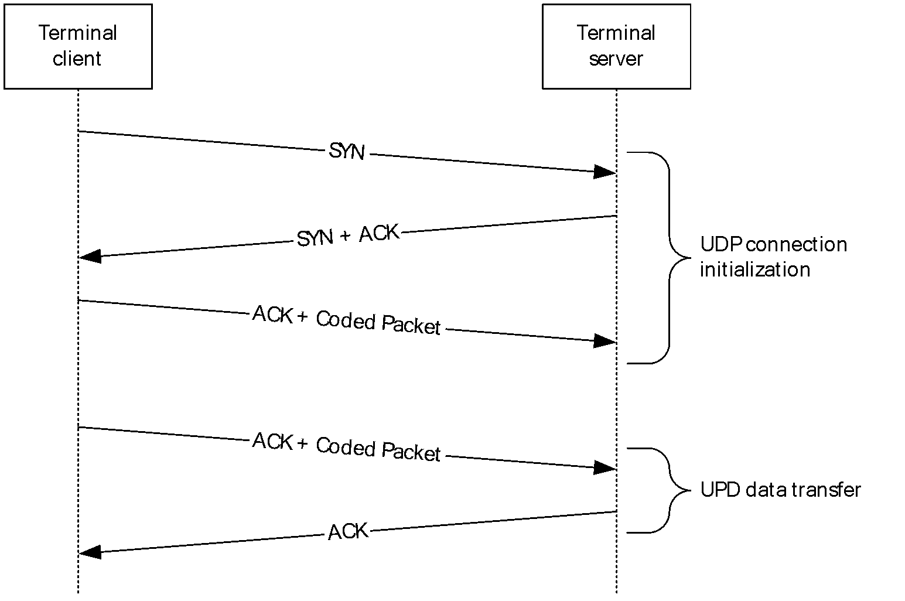

Figure 2: The UDP connection initialization and UDP data transfer message flow

The following sections describe the two phases of the communication and the detailed data transfer.

#### 1.3.2.1 UDP Connection Initialization

In this phase, both endpoints are initialized with mutually agreeable parameters for the connection.

The [**terminal client**](#gt_terminal-client) initiates the connection by sending a SYN datagram. The terminal client also determines the mode of operation, RDP-UDP-R or RDP-UDP-L, as described in section [1.3.1](#Section_1.3.1). The [**terminal server**](#gt_terminal-server) responds with a datagram with the SYN flag set, along with an ACK flag, to acknowledge the receipt of the SYN datagram. The terminal client acknowledges the SYN datagram by sending an ACK. The terminal client can append the [**Coded Packets**](#gt_coded-packet) along with the ACK datagram. This datagram indicates that a connection has been set up and data can be exchanged.

All datagrams in this phase – the SYN, SYN+ACK, and ACK – are delivered reliably by using persistent retransmits, irrespective of the mode that the transport is operating in.

#### 1.3.2.2 UDP Data Transfer

If the UDP Transport Extension version negotiated in the UDP connection initialization phase is version 3 or higher (section 2.2.2.9), the UDP data transfer is defined in [MS-RDPEUDP2](../MS-RDPEUDP2/MS-RDPEUDP2.md). The UDP data transfer messages described in this document MUST be used only when the version negotiated in the UDP connection initialization phase is version 1 or version 2 (section 1.7).

In this phase, which follows the UDP Connection Initialization (section [1.3.2.1](#Section_1.3.2.1)) phase, the data generated by the users of this protocol is exchanged. This phase ends when either the connection is terminated by the user, or when an endpoint determines that the remote endpoint is no longer present.

The terminal server (sender) and terminal client (receiver) exchange [**Coded Packets**](#gt_coded-packet) in this phase. A schematic diagram of the FEC engine is shown in the following diagram.

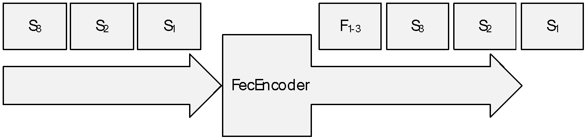

Figure 3: FEC engine

The Remote Desktop Protocol: UDP Transport Extension Protocol uses the [**FEC**](#gt_forward-error-correction-fec) mechanism for recovery from packet losses. An [**FEC Packet**](#gt_fec-packet) is added to the data stream after processing a block of m [**Source Packets**](#gt_source-packet). Each FEC Packet carries redundant information regarding these Source Packets. This information can be used in case one of the m Source Packets is lost and needs to be recovered. A generic equation for generating an FEC Packet is listed as follows.

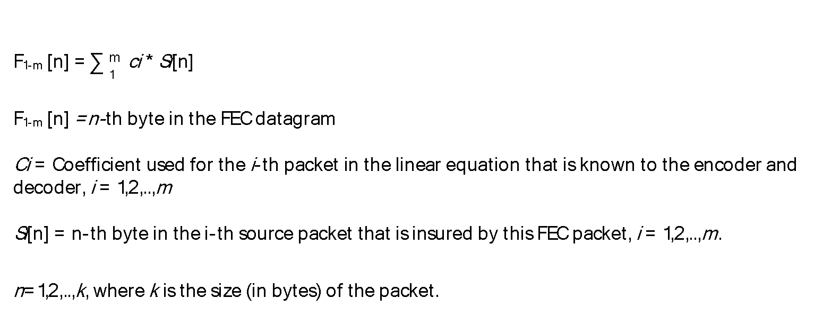

Figure 4: Generic equation for an FEC Packet

The FEC Packets require no acknowledgments (section [3.1.1.4](#Section_3.1.1.4)), and they are not retransmitted. The sender can either set the [**FEC block**](#gt_fec-block) size to any value up to 255 or to not send any FEC Packets in the stream. Likewise, the receiver, upon a receipt of an FEC Packet, can ignore the FEC Packet and not use it for any decoding operations.

Upon receiving notification of a packet loss, the sender retransmits the lost datagram. The implementation of the FEC mechanism in the RDP-UDP protocol is only used for recovery from packet losses.

## 1.4 Relationship to Other Protocols

The Remote Desktop Protocol: UDP Transport Extension Protocol works on top of the [**User Datagram Protocol (UDP)**](#gt_user-datagram-protocol-udp).

## 1.5 Prerequisites/Preconditions

The protocol endpoints require [**UDP**](#gt_user-datagram-protocol-udp) connectivity to be established. The network path between the endpoints allows the transfer of **UDP** datagrams in both directions.

The prerequisites for this protocol are identical to those for the **UDP** protocol.

## 1.6 Applicability Statement

This protocol can be used in place of any [**Transmission Control Protocol (TCP)**](#gt_transmission-control-protocol-tcp) transport for the [**Remote Desktop Protocol (RDP)**](#gt_remote-desktop-protocol-rdp) protocol. The protocol's two modes of operation are required to be considered. The RDP-UDP-R mode is used when a stream-based, reliable transport, akin to **TCP**, is required. The RDP-UDP-L mode is used when a datagram/message-based, best-efforts transport, akin to [**UDP**](#gt_user-datagram-protocol-udp), is required.

## 1.7 Versioning and Capability Negotiation

The version of the Remote Desktop Protocol: UDP Transport Extension is negotiated in the SYN request and the SYN + ACK response between the two endpoints. The first endpoint optionally indicates the maximum protocol version it supports in the SYN datagram, and the second endpoint optionally indicates the maximum protocol version supported by both endpoints in the SYN + ACK datagram. The highest version supported by both endpoints is used, and if either endpoint does not indicate a protocol version, version 1 is used by both.

- Version 1: The first version of the protocol has a minimum retransmit time-out of 500 ms (section [3.1.6.1](#Section_3.1.6.1)), and a minimum delayed ACK time-out of 200 ms (section [3.1.6.3](#Section_3.1.6.3)).
- Version 2: The second version improves performance on low-latency networks by reducing the minimum retransmit time-out to 300 ms (section 3.1.6.1), and the minimum delayed ACK time-out to 50 ms (section 3.1.6.3).
- Version 3: The third version improves performance on networks with inherent loss by using a delay-based rate control algorithm.
Implementations MUST support all versions of the protocol less than the version number that is sent in the SYN request. The negotiation of the protocol version between the two endpoints is described in section [3.1.5.1](#Section_3.1.5.1).

## 1.8 Vendor-Extensible Fields

None.

## 1.9 Standards Assignments

None.

# 2 Messages

## 2.1 Transport

The RDP protocol packets are encapsulated in the [**User Datagram Protocol (UDP)**](#gt_user-datagram-protocol-udp). The **UDP** datagrams MUST be encapsulated in the [**Internet Protocol version 4 (IPv4)**](#gt_internet-protocol-version-4-ipv4) or the [**Internet Protocol version 6 (IPv6)**](#gt_internet-protocol-version-6-ipv6).

The default port for incoming **UDP** connection requests on the terminal server is port 3389. All of the **RDP** traffic over **UDP** is handled by this single port on the terminal server.

The terminal client MUST open a unique **UDP** socket for each instance of this transport. Each socket is bound to a different port.

## 2.2 Message Syntax

All of the messages written to the network or read from the network MUST be in [**network byte order**](#gt_network-byte-order), as described in [[RFC4340]](https://go.microsoft.com/fwlink/?LinkId=90473) section 11.

The protocol references commonly used data types as defined in [MS-DTYP](../MS-DTYP/MS-DTYP.md).

### 2.2.1 Enumerations

#### 2.2.1.1 VECTOR_ELEMENT_STATE Enumeration

The VECTOR_ELEMENT_STATE enumeration is sent along with every ACK vector (section [2.2.2.7.1](#Section_2.2.2.7.1)) that acknowledges the receipt of a continuous array of datagrams.

| Bit Range | Field | Description |
| --- | --- | --- |
| Variable | DATAGRAM_RECEIVED 0 | A datagram was received. |
| Variable | DATAGRAM_RESERVED_1 1 | Not used. |
| Variable | DATAGRAM_RESERVED_2 2 | Not used. |
| Variable | DATAGRAM_NOT_YET_RECEIVED 3 | A datagram has not been received yet. |

### 2.2.2 Structures

#### 2.2.2.1 RDPUDP_FEC_HEADER Structure

The **RDPUDP_FEC_HEADER** structure forms the basic header for every datagram sent or received by the endpoint.

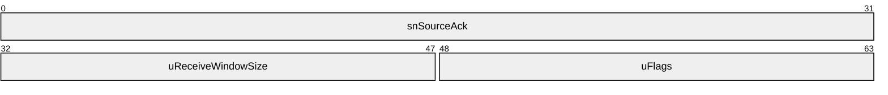

**snSourceAck (4 bytes):** A 32-bit unsigned value that specifies the highest sequence number for a [**Source Packet**](#gt_source-packet) detected by the remote endpoint. This value wraps around; for more information about the sequence numbers range, see [[RFC793]](https://go.microsoft.com/fwlink/?LinkId=150872) section 3.3.

**uReceiveWindowSize (2 bytes):** A 16-bit unsigned value that specifies the size of the receiver's buffer.

**uFlags (2 bytes):** A 16-bit unsigned integer that indicates supported options, or additional headers.

The following table describes the meaning of each flag.

| Flags | Meaning |
| --- | --- |
| RDPUDP_FLAG_SYN 0x0001 | Corresponds to the SYN flag, for initializing connection. |
| RDPUDP_FLAG_FIN 0x0002 | Corresponds to the FIN flag. Currently unused. |
| RDPUDP_FLAG_ACK 0x0004 | Specifies that the RDPUDP_ACK_VECTOR_HEADER Structure (section [2.2.2.7](#Section_2.2.2.7)) is present. |
| RDPUDP_FLAG_DATA 0x0008 | Specifies that the RDPUDP_SOURCE_PAYLOAD_HEADER Structure (section [2.2.2.4](#Section_2.2.2.4)) or the RDPUDP_FEC_PAYLOAD_HEADER Structure (section [2.2.2.2](#Section_2.2.2.2)) is present. This flag specifies that the datagram has additional data beyond the UDP ACK headers. |
| RDPUDP_FLAG_FEC 0x0010 | Specifies that the RDPUDP_FEC_PAYLOAD_HEADER Structure (section 2.2.2.2) is present. |
| RDPUDP_FLAG_CN 0x0020 | **Congestion Notification** flag (section [3.1.1](#Section_3.1.1)), the receiver reports missing datagrams. |
| RDPUDP_FLAG_CWR 0x0040 | **Congestion Window Reset** flag (section 3.1.1), the sender has reduced the congestion window, and informs the receiver to stop adding the RDPUDP_FLAG_CN. |
| RDPUDP_FLAG_SACK_OPTION 0x0080 | Not used. |
| RDPUDP_FLAG_ACK_OF_ACKS 0x0100 | Specifies that the RDPUDP_ACK_OF_ACKVECTOR_HEADER Structure (section [2.2.2.6](#Section_2.2.2.6)) is present. |
| RDPUDP_FLAG_SYNLOSSY 0x0200 | Specifies that the connection does not require persistent retransmits. |
| RDPUDP_FLAG_ACKDELAYED 0x0400 | Specifies that the receiver delayed generating the ACK for the source sequence numbers received. The sender is not to use this ACK for estimating the network RTT. |
| RDPUDP_FLAG_CORRELATION_ID 0x0800 | Specifies that the optional RDPUDP_CORRELATION_ID_PAYLOAD Structure (section [2.2.2.8](#Section_2.2.2.8)) is present. |
| RDPUDP_FLAG_SYNEX 0x1000 | Specifies that the optional RDPUDP_SYNDATAEX_PAYLOAD Structure (section [2.2.2.9](#Section_2.2.2.9)) is present. |

#### 2.2.2.2 RDPUDP_FEC_PAYLOAD_HEADER Structure

The **RDPUDP_FEC_PAYLOAD_HEADER** structure accompanies every datagram that contains an [**FEC**](#gt_forward-error-correction-fec) payload.

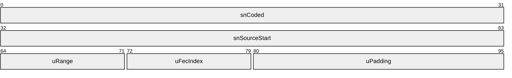

**snCoded (4 bytes):** A 32-bit unsigned value that contains the sequence number for a [**Coded Packet**](#gt_coded-packet).

**snSourceStart (4 bytes):** A 32-bit unsigned value that specifies the first sequence number of a [**Source Packet**](#gt_source-packet) that is contained in the FEC payload.

**uRange (1 byte):** An unsigned 8-bit value that, when added to **snSourceStart**, yields the last sequence number of a Source Packet that is contained in the FEC payload.

**uFecIndex (1 byte):** An 8-bit unsigned value. This value is generated by the FEC engine.

**uPadding (2 bytes):** An array of UINT8 ([MS-DTYP](../MS-DTYP/MS-DTYP.md) section 2.2.47).

#### 2.2.2.3 RDPUDP_PAYLOAD_PREFIX Structure

The **RDPUDP_PAYLOAD_PREFIX** structure specifies the length of a data payload. This header is used for generating an [**FEC Packet**](#gt_fec-packet) or for decoding an FEC Packet. Once a datagram is decoded by using [**FEC**](#gt_forward-error-correction-fec), this field specifies the size of the recovered datagram.

**cbPayloadSize (2 bytes):** An unsigned 16-bit value that specifies the size of the data payload.

#### 2.2.2.4 RDPUDP_SOURCE_PAYLOAD_HEADER Structure

The **RDPUDP_SOURCE_PAYLOAD_HEADER** structure specifies the metadata of a data payload.

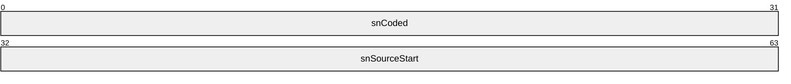

**snCoded (4 bytes):** An unsigned 32-bit value that specifies the sequence number for the current [**Coded Packet**](#gt_coded-packet).

**snSourceStart (4 bytes):** An unsigned 32-bit value that specifies the sequence number for the current [**Source Packet**](#gt_source-packet).

#### 2.2.2.5 RDPUDP_SYNDATA_PAYLOAD Structure

The **RDPUDP_SYNDATA_PAYLOAD** structure specifies the parameters that are used to initialize the [**UDP**](#gt_user-datagram-protocol-udp) connection.

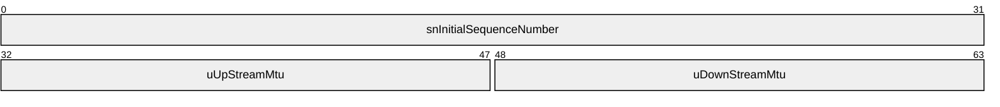

**snInitialSequenceNumber (4 bytes):** A 32-bit unsigned value that specifies the starting value for sequence numbers for [**Source Packets**](#gt_source-packet) and [**Coded Packets**](#gt_coded-packet).

**uUpStreamMtu (2 bytes):** A 16-bit unsigned value that specifies the maximum size for a datagram that can be generated by the endpoint. This value MUST be greater than or equal to 1132 and less than or equal to 1232.

**uDownStreamMtu (2 bytes):** A 16-bit unsigned value that specifies the maximum size of the [**maximum transmission unit (MTU)**](#gt_maximum-transmission-unit-mtu) that the endpoint can accept. This value MUST be greater than or equal to 1132 and less than or equal to 1232.

#### 2.2.2.6 RDPUDP_ACK_OF_ACKVECTOR_HEADER Structure

The **RDPUDP_ACK_OF_ACKVECTOR_HEADER** structure resets the start position of an ACK vector (section [2.2.2.7.1](#Section_2.2.2.7.1)). This structure SHOULD be sent after every 20 packets.

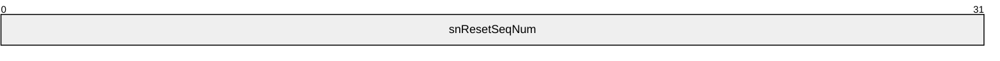

**snResetSeqNum (4 bytes):** A 32-bit unsigned integer that specifies the sequence number which MUST be used to reset the starting position of the ACK vector encoding state of the receiver queue. The receiver generates the ACK Vector for sequence numbers greater than **snResetSeqNum**. The minimum ACK Vector sequence number MUST be the greater of **snResetSeqNum** and the lowest sequence number the receiver expects (current window).

The sender populates **snResetSeqNum** with the greatest cumulative ACK it has received and processed.

#### 2.2.2.7 RDPUDP_ACK_VECTOR_HEADER Structure

The **RDPUDP_ACK_VECTOR_HEADER** structure contains a variable size array of **ACK Vector** Elements (section [2.2.2.7.1](#Section_2.2.2.7.1)), referred to as the ACK vector.

The ACK vector captures the state of the queue of **Source Packets** at the receiver endpoint. Each position in the queue can have two values that indicate whether a Source Packet is present in the queue, or not. The state of Source Packets in the array is encoded using [**run-length encoding (RLE)**](#gt_run-length-encoding-rle) compression.

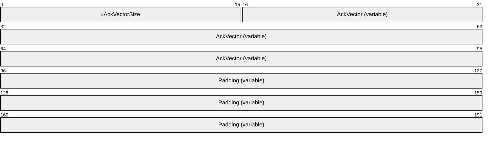

**uAckVectorSize (2 bytes):** A 16-bit unsigned value that specifies the size of the **AckVector** field in bytes. The maximum size of the ACK Vector is 2048 bytes.

**AckVector (variable):** A variable size array of **ACK Vector Elements** (section 2.2.2.7.1). The size of the **AckVector** field is specified by the **uAckVectorSize** field.

**Padding (variable):** A variable-sized array, of length zero or more, such that this structure ends on a DWORD ([MS-DTYP](../MS-DTYP/MS-DTYP.md) section 2.2.9) boundary.

##### 2.2.2.7.1 ACK Vector Element

An **ACK Vector Element** is an 8-bit structure. The two most significant bits of each element encode the **VECTOR_ELEMENT_STATE** enumeration (section [2.2.1.1](#Section_2.2.1.1)), while the six least significant bits specify the length of a continuous sequence of datagrams that share the same state.

#### 2.2.2.8 RDPUDP_CORRELATION_ID_PAYLOAD Structure

The **RDPUDP_CORRELATION_ID_PAYLOAD** structure allows a terminal client to specify the correlation identifier for the connection, which can appear in some of the terminal server's event logs. Otherwise, the terminal server can generate a random identifier.

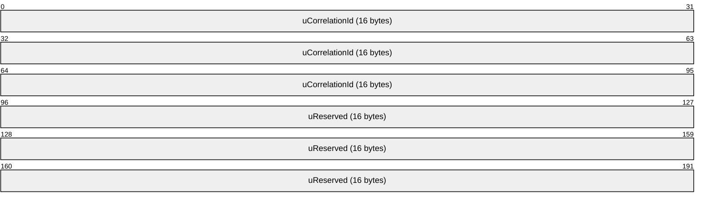

**uCorrelationId (16 bytes):** DTYP.GUID. An array of 16 8-bit, unsigned integers that specifies a unique identifier to associate with the connection. The value MUST be transmitted in big-endian byte order. The most-significant byte SHOULD NOT have a value of 0x00 or 0xF4. The value 0x0D SHOULD NOT be used in any of the bytes. The value of this field SHOULD be the same as the value provided in the RDP_NEG_CORRELATION_INFO structure ([MS-RDPBCGR](../MS-RDPBCGR/MS-RDPBCGR.md) section 2.2.1.1.2).

**uReserved (16 bytes):** 16 8-bit values, all set to 0x00.

#### 2.2.2.9 RDPUDP_SYNDATAEX_PAYLOAD Structure

The RDPUDP_SYNDATAEX_PAYLOAD structure specifies extended parameters that are used to configure the UDP connection.

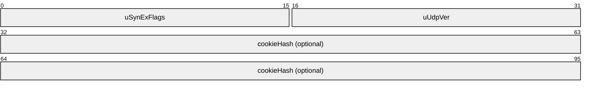

**uSynExFlags (2 bytes)**: A 16-bit unsigned integer that indicates supported options. The following table describes the meaning of each flag.

| Flags | Meaning |
| --- | --- |
| RDPUDP_VERSION_INFO_VALID 0x0001 | The **uUdpVer** field indicates a supported version of the RDP-UDP protocol. |

**uUdpVer (2 bytes)**: A 16-bit unsigned value. When the RDPUDP_VERSION_INFO_VALID flag is present, this specifies a supported version of the UDP Transport Extension, used to negotiate with the other endpoint.

| Flags | Meaning |
| --- | --- |
| RDPUDP_PROTOCOL_VERSION_1 0x0001 | The minimum retransmit time-out is 500 ms (section [3.1.6.1](#Section_3.1.6.1)), and the minimum delayed ACK time-out is 200 ms (section [3.1.6.3](#Section_3.1.6.3)).<1> |
| RDPUDP_PROTOCOL_VERSION_2 0x0002 | The minimum retransmit time-out is 300 ms (section 3.1.6.1), and the minimum delayed ACK time-out is 50 ms (section 3.1.6.3).<2> |
| RDPUDP_PROTOCOL_VERSION_3 0x0101 | The data transfer messages for this version of the UDP Transport Extension are defined in [MS-RDPEUDP2] section 2.2.<3> |

**cookieHash (32 bytes)**: An optional field that contains the SHA-256 hash of the data that was transmitted from the server to the client in the **securityCookie** field of the Initiate Multitransport Request PDU ([MS-RDPBCGR](../MS-RDPBCGR/MS-RDPBCGR.md) section 2.2.15.1). This field MUST be interpreted as an array of 8 4-byte unsigned integer values where each value is transmitted in network byte order. The **cookieHash** field MUST be present in a SYN datagram sent from the client to the server (section [3.1.5.1.1](#Section_3.1.5.1.1)) if **uUdpVer** equals RDPUDP_PROTOCOL_VERSION_3 (0x0101). It MUST NOT be present in any other case.

# 3 Protocol Details

## 3.1 Common Details

### 3.1.1 Abstract Data Model

This section describes a conceptual model of possible data organization that an implementation maintains to participate in this protocol. The described organization is provided to facilitate an explanation of how the protocol behaves. This document does not mandate that implementations adhere to this model as long as their external behavior is consistent with that described in this document.

**Initial Sequence Number:** Each endpoint advertises the first sequence number that will be used when sending the datagrams. The Coded sequence number (section [3.1.1.2](#Section_3.1.1.2)) and the Source sequence number (section 3.1.1.2) for the first datagram sent will be equal to this value.

**Congestion Control:** Each endpoint MUST notify the remote endpoint of congestion events. Congestion events are characterized by lost or missing datagrams.

**Congestion Notification:** The **RDPUDP_FLAG_CN** flag (section [2.2.2.1](#Section_2.2.2.1)) indicates that the remote endpoint has detected congestion events.

**Congestion Window Reset:** The **RDPUDP_FLAG_CWR** flag (section 2.2.2.1) indicates that the endpoint has reacted to the congestion notification message, and that the remote endpoint MUST stop sending **Congestion Notifications**.

#### 3.1.1.1 Transport Modes

When the connection is initialized in the RDP-UDP-R mode, as described in section [1.3.1](#Section_1.3.1), persistent retransmits ensure that all datagrams written to the sender will be read respectively at the receiver.

When the connection is initialized in the RDP-UDP-L mode with the **RDPUDP_FLAG_SYNLOSSY** flag (section [2.2.2.1](#Section_2.2.2.1)), the sender does not retransmit any datagrams. In this mode, not all datagrams generated by the user on the sender side are received by the user on the receiver side. However, the ordering of datagrams MUST be preserved and datagrams MUST be read at the receiver in the same order in which they were written by the sender.

In RDP-UDP-L, the receiver SHOULD maintain a timer for out-of-order packets. This timer SHOULD be enabled when the first out-of-order packet is received and disabled when all missing datagrams have been received. When this timer fires, the receiver SHOULD stop the timer and process datagrams it has received. The receiver SHOULD process any out-of-order packet that is in the right edge of the receiver window. This ensures new packets are not dropped.

The order of the datagrams is determined according to their sequence numbers, as specified in section [3.1.1.2](#Section_3.1.1.2).

#### 3.1.1.2 Sequence Numbers

All [**Coded Packets**](#gt_coded-packet) and [**Source Packets**](#gt_source-packet) have a sequence number that identifies their sending order. The sequence numbers for the Coded Packets and the Source Packets are independent of each other.

The **Initial Sequence Number** abstract data model (ADM) element for both Coded Packets and Source Packets is initialized as follows:

**Initial Sequence Number** = **snInitialSequenceNumber** in the RDPUDP_SYNDATA_PAYLOAD Structure (section [2.2.2.5](#Section_2.2.2.5)).

This initial value is a true random number. This field is similar to the initial sequence number (ISN) field used in the [**TCP**](#gt_transmission-control-protocol-tcp) transport protocol; for more information about the ISN field, see [[RFC1948]](https://go.microsoft.com/fwlink/?LinkId=225732).

The Coded Packet sequence number is referred to as the Coded sequence number. The Coded sequence number uniquely identifies each datagram sent by the sender. The Coded sequence number value is increased by one for each Coded Packet that was sent. Retransmitted Source Packets can have different Coded sequence numbers.

The Source Packet sequence number is referred to as the Source sequence number. Each Source Packet encapsulates a data payload. The Source sequence number uniquely identifies this data payload. The Source sequence number value is increased by one for each data payload that was sent.

The sequence numbers wrap around due to space limitations. Implementations MUST handle this wrap-around scenario. For more information about the sequence numbers range, see [[RFC793]](https://go.microsoft.com/fwlink/?LinkId=150872) section 3.3.

#### 3.1.1.3 MTU Negotiation

The largest data payload that can be transferred over this protocol is negotiated during the 3-way UDP handshake process, called [**MTU**](#gt_maximum-transmission-unit-mtu) negotiation. The size of the Internet Protocol (IP) or MAC layer headers and other underlying network headers is not a part of this negotiation.

The RDP-client advertises the largest payload it can send (**uUpStreamMtu**) and the largest payload it can receive (**uDownStreamMtu)** as a part of the SYN datagram, as specified in section [2.2.2.5](#Section_2.2.2.5). The minimum of these values and the data payload sizes the server can send or receive determines the negotiated MTU, as shown in the following equation.

Negotiated **uUpStreamMtu** = minimum (Advertised **uUpStreamMtu**, Received **uDownStreamMtu**, 1232) + Maximum size of the RDPUDP_ACK_VECTOR_HEADER Structure (section [2.2.2.7](#Section_2.2.2.7))

Negotiated **uDownStreamMtu** = minimum (Advertised **uDownstreamMtu**, Received **uUpStreamMtu**, 1232) + Maximum size of the RDPUDP_ACK_VECTOR_HEADER Structure (section 2.2.2.7)

The server sends these values to the client as a part of the SYN+ACK packet (section [3.1.5.1.3](#Section_3.1.5.1.3)); this is the final negotiated MTU size. The client MUST NOT send a data payload larger than the value specified in **uUpStreamMtu**, and the server MUST NOT send data larger than **uDownStreamMtu**. Values that do not fall within this range are unacceptable. If such oversized payloads are detected, either endpoint MUST ignore such UDP datagrams. This could possibly lead to a connection termination, initiated by any layer in the RDP stack, because some part of the data was lost.

The range of **uUpStreamMtu** and **uDownStreamMtu** is in the closed interval [1132, 1232]. The advertised MTU MUST NOT be smaller than 1132 or larger than 1232.

#### 3.1.1.4 Acknowledgments

An [**acknowledgment (ACK)**](#gt_acknowledgment-ack) is sent from the receiver to the sender, informing the sender about the receipt of a [**Source Packet**](#gt_source-packet). An acknowledgment MUST be generated for every Source Packet received. However, because acknowledgments are cumulative, the number of Source Packets for which a receiver generates an acknowledgment is implementation-specific.<4> Only Source Packets MUST be acknowledged by the receiver; [**FEC Packets**](#gt_fec-packet) MUST NOT be acknowledged by the receiver.

Each acknowledgment contains an ACK vector (section [2.2.2.7.1](#Section_2.2.2.7.1)).

##### 3.1.1.4.1 Lost Datagrams

Lost datagrams notification is a part of the **Congestion Control** ADM element implementation. It is used to control the rate of the data that is transferred between the endpoints as described in section [5.1.3](#Section_5.1.3).

The receiver marks a datagram as lost only when it receives three other datagrams after its original transmission, with sequence numbers greater than the original datagram. Similarly, the sender marks a packet as lost only when it receives an acknowledgment (section [3.1.1.4](#Section_3.1.1.4)) for any three packets that have a sequence number greater than the lost packet.

#### 3.1.1.5 Retransmits

The Remote Desktop Protocol: UDP Transport Extension does not specify a retransmit mechanism. An implementation can choose any retransmit method; for example, the Fast Retransmit method, as described in [[RFC5681]](https://go.microsoft.com/fwlink/?LinkId=225735).

When the sender detects that the receiver did not receive a specific [**Source Packet**](#gt_source-packet) (section [3.1.1.4.1](#Section_3.1.1.4.1)), the sender retransmits that Source Packet. Only Source Packets MUST be retransmitted.

#### 3.1.1.6 FEC Computations

This section explains the operations involved in generating an [**FEC Packet**](#gt_fec-packet). An FEC Packet is generated by a linear combination of a number of [**Source Packets**](#gt_source-packet), as described in section [1.3.2.2](#Section_1.3.2.2), over a Galois Field, as specified in [Bewersdorff]. A brief introduction on finite field arithmetic is given in section [3.1.1.6.1](#Section_3.1.1.6.1). The coefficients of the equation are described in section [3.1.1.6.4](#Section_3.1.1.6.4). The actual FEC encoding and decoding are described in section [3.1.1.6.2](#Section_3.1.1.6.2) and section [3.1.1.6.3](#Section_3.1.1.6.3), respectively.

##### 3.1.1.6.1 Finite Field Arithmetic

A finite field is a finite set of numbers. All arithmetic operations performed on this field will yield a result that belongs to the same finite field. For example, a finite field of size 256 with numbers from 0 to 255 is defined. All the arithmetic operations (addition, subtraction, multiplication, and division) on this field will yield a result in the range of 0 to 255, thus belonging to the original finite field itself. Conventional arithmetic differs from finite field arithmetic as it operates on an infinite set of real numbers. For more details on finite fields, see [Lidl].

All binary numbers belonging to a finite field (also known as a Galois field, GF(pn)), where p is a prime number and n is a positive integer, can be represented in a polynomial form and in a finite field with binary numbers (for example in GF(256)=GF(28)), where a is the coefficient of this equation with a value equal to zero or 1.

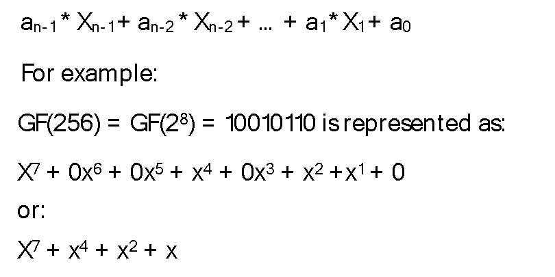

Figure 5: Galois field and binary representation example

###### 3.1.1.6.1.1 Addition and Subtraction

Adding or subtracting two polynomials is done by grouping coefficients of the same order, similar to regular algebra. However, since this operation is performed in GF(28), the result is brought into the finite field by performing a modulo 2 operation on each of the coefficients in the polynomial representation.

The addition operation over the finite field is logically equivalent to a XOR operation. Thus, adding or subtracting two polynomials means XORing them together, as described in the following figure.

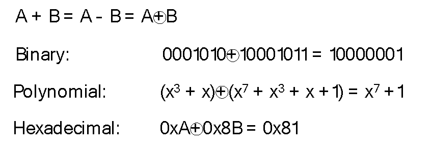

Figure 6: Addition and subtraction example

In a finite field of GF(2n), such as GF(256), addition and subtraction are equivalent operations.

Pseudo-code example:

BYTE Add(const BYTE x, const BYTE y)

{

return (x ^ y);

}

BYTE Sub(const BYTE x, const BYTE y)

{

return (x ^ y);

}

###### 3.1.1.6.1.2 Multiplication and Division

Multiplication in the finite field can be performed in one of the following two ways:

- Using logarithms
- Multiplying the two polynomials and reducing the result with an irreducible polynomial to bring it back in the finite field
It is simpler to perform multiplications and divisions using logarithms, as it involves a table lookup for the log function, followed by an addition of the polynomials, followed by an exponent function.

Figure 7: Multiplication equation

Division is performed similarly using logarithms and exponentiation.

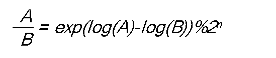

Figure 8: Division equation

Since the discrete logarithm of an element in the finite field is a regular integer, the addition in the exponent is a regular addition modulo 2n.

Pseudo-code example:

BYTE Div(const int x, const int y)

{

if (y==0) return 0;

if (x==0) return 0;

return (BYTE)(m_ffExp2Poly[m_ffPoly2Exp[x] - m_ffPoly2Exp[y] + (MAX_FIELD_SIZE-1)]);

}

BYTE Mul(const int x, const int y)

{

if (((x-1) | (y-1)) < 0)

return (0);

return (BYTE)(m_ffExp2Poly[m_ffPoly2Exp[x] + m_ffPoly2Exp[y]]);

}

Where m_ffExp2Poly and m_ffPoly2Exp are exponent and log tables respectively.

###### 3.1.1.6.1.3 Logarithms and Exponents

Exponents can be calculated by repeatedly multiplying the same number, and then using a modulo operation to ensure that the result stays in the finite field.

Pseudo-code example:

reduction = 0x1d;

m_ffExp2Poly[0] = 0x01;

for (i = 1; i < m_fieldSize - 1; i++)

{

temp = m_ffExp2Poly[i - 1] << 1;

if (temp & m_fieldSize)

{

m_ffExp2Poly[i] = (temp & ~m_fieldSize) ^ reduction;

}

else

{

m_ffExp2Poly[i] = (byte)temp;

}

}

Where m_fieldSize is 256 for GF(28). Note that m_ffExp2Poly is modulo m_fieldSize – 1. In other words, m_ffExp2Poly[n] = m_ffExp2Poly[n + m_fieldSize – 1]. The pseudo-code in this document makes the assumption that m_ffExp2Poly is defined for at least m_fieldSize * 2 elements.

Logarithms are the inverse of exponents, and can be easily calculated by reversing the previous operation as shown in the following pseudo-code example:

m_ffPoly2Exp[0] = 2 * m_fieldSize; // no exponential representation, doesn't exist

for (i = 0; i < m_fieldSize - 1; i++)

{

m_ffPoly2Exp[m_ffExp2Poly[i]] = (byte)i;

}

Logarithms and exponents can be obtained by using the methods described previously to generate logarithms and exponent lookup tables.

##### 3.1.1.6.2 FEC Encoding

As described in section [1.3.2.2](#Section_1.3.2.2), an [**FEC Packet**](#gt_fec-packet) is added to the data stream after processing a block of [**Source Packets**](#gt_source-packet). The size of the FEC Packet is equal to the size of the largest Source Packet in the group. In the following representation, each Source Packet Sn contains at most k bytes. All the Source Packets with a size smaller than k are padded with bytes containing zero.

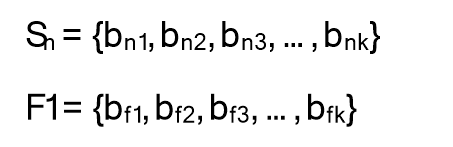

Figure 9: Source Packet and FEC Packet representation

The FEC Packet is generated with the following equation.

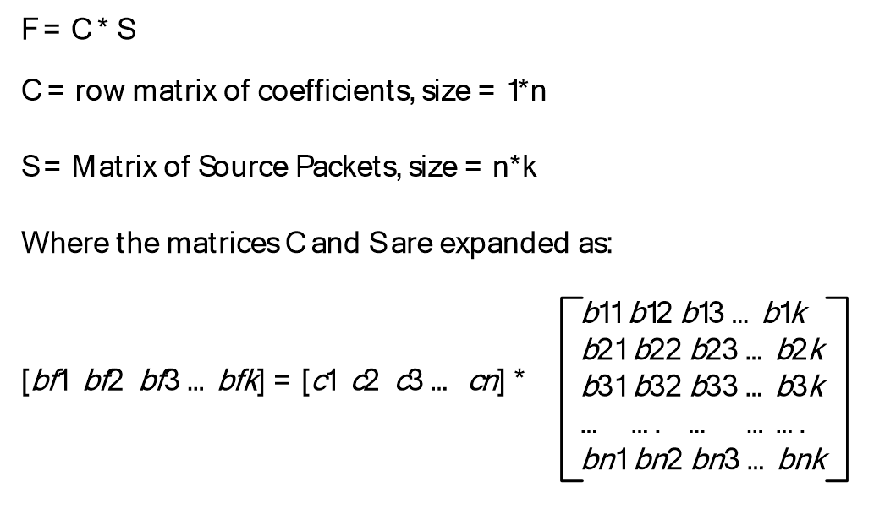

Figure 10: FEC encoding

The product of these two matrices will give us a row matrix, which is the FEC Packet of size 1 * k. The method in which the coefficients are generated is explained in the following pseudo-code example and in the following sections.

Pseudo-code example:

//

// Generate the log and exponent tables.

//

PrepareExpLogArrays();

//

// Generate a set of packets. Fill them with random data for this example.

//

Packet S1, S2, S3, S4, S5, F15;

S1.GeneratePacketData(10);

S2.GeneratePacketData(20);

S3.GeneratePacketData(15);

S4.GeneratePacketData(15);

S5.GeneratePacketData(20);

//

// Print the packets out for verification.

//

S1.PrintPacketData();

S2.PrintPacketData();

S3.PrintPacketData();

S4.PrintPacketData();

S5.PrintPacketData();

//

// The coefficient arrays and the fecIndex generated from FEC calculations

//

BYTE fecIndex = 0;

BYTE CoEfficientArray[5] = {0, 0, 0, 0, 0};

GenerateCoeffArray(CoEfficientArray, 5, 1, 5, &fecIndex);

printf("CoEff Array [%d %d %d %d %d]\n", CoEfficientArray[0],

CoEfficientArray[1],

CoEfficientArray[2],

CoEfficientArray[3],

CoEfficientArray[4]);

//

// Generating a matrix of source packets

//

BYTE* FECGeneratorArray[5] = {S1.m_pbPacket,

S2.m_pbPacket,

S3.m_pbPacket,

S4.m_pbPacket,

S5.m_pbPacket

};

//

// Generate the FEC packet.

//

MatrixMultiply(F15.m_pbPacket, CoEfficientArray, 5, FECGeneratorArray, 5, 22);

//

// Print the FEC packet for verification.

//

F15.PrintFECData(22);

.....

void MatrixMultiply(BYTE *fecArr, BYTE* CoEffArray, int cbCoEffArrayCount, BYTE** FECGeneratorArray, int cbRowCount, int cbColumnCount)

{

for (int i = 0; i < cbColumnCount; i++)

{

fecArr[i] = 0;

for (int j = 0; j < cbCoEffArrayCount; j++)

{

fecArr[i] = Mul(CoEffArray[j],FECGeneratorArray[j][i]) ^ fecArr[i];

}

}

}

##### 3.1.1.6.3 FEC Decoding

An FEC decoding operation is the reverse of the FEC encoding (section [3.1.1.6.2](#Section_3.1.1.6.2)) operation. The FEC decoding operation solves the linear equation that is used to recover the lost [**Source Packets**](#gt_source-packet). Each FEC Packet can be used to recover only one Source Packet in the range covered by that FEC Packet.

To decode, or recover a missing datagram using FEC, the following matrix is constructed where packet F1 is the FEC block for Source Packets S1 – Sn.

For simplicity, assume n=5. If packet S4 is missing, it can be recovered by using the following matrix operation.

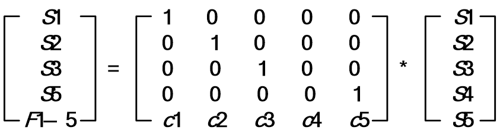

Figure 11: Matrix operation for FEC decoding

Here, matrix S’ contains an unknown term (S4) that needs to be computed. This can be done by converting Cd to an identity matrix using the Gauss-Jordan elimination. For more details on the Gauss-Jordan elimination, see [Press] section 2.1.

Not all matrices have an inverse, and in some cases, Cd’ doesn’t exist. For such operations, the FEC Packet cannot be used to recover from that particular Source Packet. Thus, not all FEC operations are reversible, and not being able to decode a FEC Packet is not fatal. The missing Source Packet is always retransmitted in RDP-UDP-R mode (section [3.1.1.7](#Section_3.1.1.7)), and can be ignored for RDP-UDP-L mode (section 3.1.1.7).

Pseudo-code example:

// Regenerate Coefficient array from fecIndex.

//

RegenerateCoeffArrayFromFecIndex(CoEfficientArray, 5, fecIndex, 1, 5);

//

// Compute the missing packet (S3) by inverting the matrix.

// This is the algebraic equivalent

// of a matrix inverse.

//

for (int i = 0; i < 22; i++)

{

printf("%d ", Div(Mul(CoEfficientArray[0], S1.m_pbPacket[i]) ^

Mul(CoEfficientArray[1], S2.m_pbPacket[i]) ^

Mul(CoEfficientArray[3], S4.m_pbPacket[i]) ^

Mul(CoEfficientArray[4], S5.m_pbPacket[i]) ^

F15.m_pbPacket[i],CoEfficientArray[2]));

}

printf("\n");

##### 3.1.1.6.4 Selecting the Coefficients Matrix

If the Source sequence numbers (section [3.1.1.2](#Section_3.1.1.2)) for packets S1, S2, S3 … Sn are s1, s2, s3 … sn, the coefficient matrix is calculated as follows.

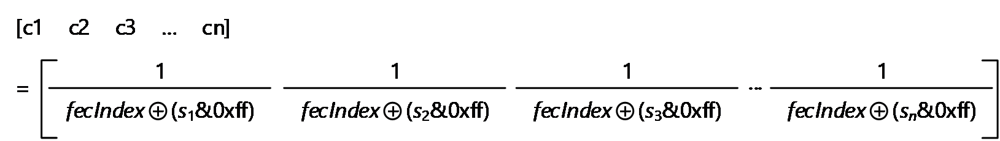

Figure 12: Matrix coefficient calculation

The division uses finite field division as described in section [3.1.1.6.1.2](#Section_3.1.1.6.1.2). Note that since all the packets in an [**FEC Packet**](#gt_fec-packet) are sequential, s2=s1+1, s3=s1+2, …, sn=s1+(n-1).

Only the last byte of the Source sequence number is used in calculating the coefficient. The **fecIndex** field described in the following pseudo-code example is equivalent to the **uFecIndex** field, as specified in section [2.2.2.2](#Section_2.2.2.2). The value of the **fecIndex** field is updated using the following code prior to every call for encoding an FEC Packet:

if ((sn & 0xff) >= (s1 & 0xff) && ((fecIndex >= (s1 & 0xff)) && (fecIndex <= (sn & 0xff))) ||

(sn & 0xff) < (s1 & 0xff) && ((fecIndex >= (s1 & 0xff)) || (fecIndex <= (sn & 0xff))))

fecIndex = (sn + 1) & 0xff;

Pseudo-code example:

void GenerateCoeffArray(BYTE *pbCoEfficientArray,

int cLength,

USHORT ucOrigStart,

USHORT ucOrigEnd,

__out BYTE *pucFecIndex)

{

if ((ucOrigEnd >= ucOrigStart) &&

((*pucFecIndex >= ucOrigStart) && (*pucFecIndex <= ucOrigEnd)))

*pucFecIndex = (BYTE)(ucOrigEnd+1);

if ((ucOrigEnd < ucOrigStart) &&

((*pucFecIndex >= ucOrigStart) || (*pucFecIndex <= ucOrigEnd)))

*pucFecIndex = (BYTE)(ucOrigEnd+1);

for (int i=0; i < cLength; i++, ucOrigStart++)

{

pbCoEfficientArray[i] = (BYTE)Div(1, (*pucFecIndex)^(ucOrigStart & 0xff));

}

}

void RegenerateCoeffArrayFromFecIndex(BYTE *pbCoefficientArray,

int cLength,

BYTE fecIndex,

USHORT ucOrigStart,

USHORT ucOrigEnd)

{

for (int i=0; i < cLength; i++, ucOrigStart++)

{

pbCoefficientArray[i] = (BYTE)Div(1, fecIndex^(ucOrigStart & 0xff));

}

}

##### 3.1.1.6.5 Structure of Source Packets used for FEC Encoding

Only for the FEC Encoding operations, Source Packets are prepended with a 2 byte RDPUDP_PAYLOAD_PREFIX (section [2.2.2.3](#Section_2.2.2.3)) header. This header is used only for the FEC encoding and decoding operations, and is not transmitted to the terminal client. This field contains the size of each Source Packet, specified in the network byte order. When a datagram is recovered using FEC, the first 2 bytes constitute of this header, and specify the size of the recovered datagram to the decoder.

#### 3.1.1.7 Flow Control

The Flow Control feature is similar to the [**TCP**](#gt_transmission-control-protocol-tcp) transport protocol Flow Control, as specified in [[RFC793]](https://go.microsoft.com/fwlink/?LinkId=150872).

The main objective of Flow Control is to prevent a fast sender from sending too many datagrams to a slow receiver and congesting it. The receiver advertises the number of datagrams it can accommodate at any given time. The sender MUST NOT send more datagrams than the advertised number of datagrams. The receiver SHOULD discard all datagrams that fall outside the advertised window.

The Flow Control algorithm allows the sender to transmit packets in the following range:

(**CumAcked** + 1) to (**CumAcked** + **uReceiveWindowSize**)

**CumAcked:** An internal state variable of the sender.

- For an RDP-UDP-R sender (section [1.3.1](#Section_1.3.1)), this is the highest sequence number where all datagrams with a smaller sequence number have already been received by the receiver.
- For an RDP-UDP-L sender (section 1.3.1), this is the highest sequence number where all datagrams with a smaller sequence number have been either received or marked as lost by the receiver.
**uReceiveWindowSize:** The receiver advertised window defined in the **RDPUDP_FEC_HEADER** structure, as specified in section [2.2.2.1](#Section_2.2.2.1).

#### 3.1.1.8 Congestion Control

The **Congestion Control** abstract data model (ADM) element is used to limit the rate at which the sender sends [**Source Packets**](#gt_source-packet). Controlling the network throughput enables sharing the network resources with other users and avoiding network congestion. The sender MUST implement some form of **Congestion Control** logic. Any NewReno variant implementation can be an acceptable option. For more information about NewReno variants, see [[RFC3782]](https://go.microsoft.com/fwlink/?LinkId=225733).

When the sender receives the **RDPUDP_FLAG_CN** flag (section [2.2.2.1](#Section_2.2.2.1)), which notifies of a datagram loss, the sender MUST immediately react and reduce its network throughput. The next Source Packet sent by the sender MUST have an **RDPUDP_FLAG_CWR** flag (section 2.2.2.1) to indicate that the sender has reacted to the **Congestion Notification** ADM element. The sender will remember the source packet that carries the **RDPUDP_FLAG_CWR**. The receiver will stop setting the **RDPUDP_FLAG_CN** on acknowledgment once it receives the **RDPUDP_FLAG_CWR**. On the other side, the sender will then ignore the set **RDPUDP_FLAG_CN** flags on subsequent acknowledgments from any receiver that has an snSourceAck ADM in the acknowledgment that is less than the previously remembered sequence number.

Additionally, the sender SHOULD set the **RDPUDP_FLAG_CWR** flag whenever a retransmit occurs due to the Retransmit Timer (section [3.1.6.1](#Section_3.1.6.1)) firing to indicate that a datagram loss was detected, even if the **RDPUDP_FLAG_CN** flag was not set by the receiver. If the receiver is not setting the **RDPUDP_FLAG_CN** flag, no action is needed on receipt of the **RDPUDP_FLAG_CWR** flag.

The sender reacts to losses that take place every [**round-trip time (RTT)**](#gt_round-trip-time-rtt) only. There could be multiple losses in an RTT, and the sender MUST NOT react to those events. This behavior is similar to the NewReno variants behavior, as described in [RFC3782].

#### 3.1.1.9 Keepalives

As the underlying transport is based on [**UDP**](#gt_user-datagram-protocol-udp) and is connectionless, each pair of endpoints MUST constantly send data to make sure that the other endpoint is present and is responding to network events. If there is no data to send, each endpoint MUST periodically acknowledge the last received datagram. Otherwise, the [**network address translation (NAT)**](#gt_network-address-translation-nat) en route between the peers can block the UDP connection.

If the sender does not receive any datagram from the receiver after 65 seconds, it is determined that the remote endpoint has entered the Closed state (section [3.1.5](#Section_3.1.5)), and that the connection has been terminated.

Because the delivery of acknowledgments (section [3.1.1.4](#Section_3.1.1.4)) is not guaranteed, the receiver SHOULD send one or more keepalive datagrams in implementation-specific<5> time intervals smaller or equal to 65 seconds. If the sender does not receive at least one keep-alive datagram every 65 seconds, it terminates the connection.

### 3.1.2 Timers

The following timers are used by the Remote Desktop Protocol: UDP Transport Extension and MUST be implemented:

**Retransmit**: This timer is used for indicating that no acknowledgment (section [3.1.1.4](#Section_3.1.1.4)) has been received for a datagram that was transmitted earlier.

**Keepalive at the sender**: This timer is used for maintaining an active connection between the endpoints.

**Delayed ACK**: This timer is used for indicating the receipt of a [**Source Packet**](#gt_source-packet) that was not acknowledged yet and has no acknowledgment scheduled for it.

### 3.1.3 Initialization

Before the protocol operation can commence, [**UDP**](#gt_user-datagram-protocol-udp) network connectivity has to be established between the endpoints: the [**terminal client**](#gt_terminal-client) and the [**terminal server**](#gt_terminal-server).

The terminal server MUST open a **UDP** socket, and bind it to the default RDP port 3389, as specified in section [2.1](#Section_2.1). The terminal server listens on this socket for incoming connections.

The terminal client MUST open a **UDP** socket to the terminal server. The terminal client MUST connect to the port that the terminal server is listening on. If there are multiple connections, each connection MUST have a unique port number on the terminal client.

### 3.1.4 Higher-Layer Triggered Events

#### 3.1.4.1 Initializing a Connection

The user of this protocol MUST initialize a [**UDP**](#gt_user-datagram-protocol-udp) connection between the endpoints as described in section [1.3.2.1](#Section_1.3.2.1).

#### 3.1.4.2 Sending a Datagram

The user of this protocol can send data from one endpoint to another using this protocol. The protocol MUST send the data across only if the two endpoints are in the Established state.

#### 3.1.4.3 Receiving a Datagram

The user of this protocol MUST be notified on receipt of a datagram when one endpoint receives data sent by the remote endpoint. The endpoints MUST be in the Established state.

#### 3.1.4.4 Terminating a Connection

The user of this protocol can terminate a connection at any point in time. Datagrams SHOULD NOT be sent by the transport after the user has terminated the connection. All of the datagrams received after the connection termination MUST be ignored.

### 3.1.5 Message Processing Events and Sequencing Rules

The states of the protocol, divided into the [**terminal server**](#gt_terminal-server) states and the [**terminal client**](#gt_terminal-client) states, are illustrated in the following figure.

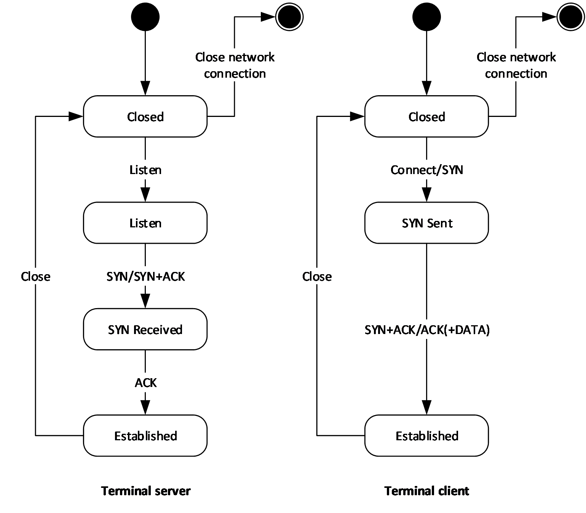

Figure 13: State diagram for the terminal server and terminal client states

The states are described as follows:

Closed state: Both the terminal server sender and the terminal client receiver can be in the Closed state. The endpoint in a Closed state MUST NOT respond to any networking events, and MUST NOT generate or process any datagrams. The endpoint enters the Closed state when the Retransmit timer or the Keepalive timer is fired, as specified in section [3.1.5.4](#Section_3.1.5.4).

Listen state: Only the terminal server sender can enter this state. The terminal server listens on the port for incoming [**UDP**](#gt_user-datagram-protocol-udp) connections, as specified in section [3.1.3](#Section_3.1.3).

SYN_SENT: Only the terminal client receiver can enter this state, after sending a SYN packet and thus initiating the connection.

SYN_RECEIVED: Only the terminal server sender can enter this state, after receiving a SYN packet from the terminal client receiver.

Established: This state indicates that a connection has been established, and datagrams are exchanged between the two endpoints.

Duplicate messages are ignored and discarded by either endpoint. The exchanged messages are specified in the following sections.

#### 3.1.5.1 Constructing Messages

##### 3.1.5.1.1 SYN Datagrams

The following steps specify the creation of a SYN datagram:

- An RDPUDP_FEC_HEADER structure (section [2.2.2.1](#Section_2.2.2.1)) MUST be appended to the [**UDP**](#gt_user-datagram-protocol-udp) datagram.
- The **snSourceAck** variable MUST be set to -1.
- The **uReceiveWindowSize** variable MUST be set to the size of the receive buffer. The receive buffer is the number of packets the receiver specified it can buffer.
- The **uFlags** variable MUST be set as follows:
- The **RDPUDP_FLAG_SYN** flag MUST be set.
- The **RDPUDP_FLAG_SYNLOSSY** flag MUST be set by the client only when neither endpoint requires retransmission of lost datagrams.
- The **RDPUDP_FLAG_CORRELATION_ID** flag MUST be set only when the RDPUDP_CORRELATION_ID_PAYLOAD structure (section [2.2.2.8](#Section_2.2.2.8)) is included.
- The **RDPUDP_FLAG_SYNEX** flag MUST be set only when the RDPUDP_SYNDATAEX_PAYLOAD structure (section [2.2.2.9](#Section_2.2.2.9)) is included.
- The RDPUDP_SYNDATA_PAYLOAD structure (section [2.2.2.5](#Section_2.2.2.5)) MUST be appended to the UDP datagram.
- The **snInitialSequenceNumber** variable MUST be set to a 32-bit number generated by using a truly random function.
- The **uUpStreamMtu** field MUST be set to a value in the range of 1132 to 1232.
- The **uDownStreamMtu** field [**MTU**](#gt_maximum-transmission-unit-mtu) MUST be set to a value in the range of 1132 to 1232.
- The RDPUDP_CORRELATION_ID_PAYLOAD structure (section 2.2.2.8) MUST be appended to the UDP datagram if the RDPUDP_FLAG_CORRELATION_ID flag is set in **uFlags**.
- The **uCorrelationId** variable MUST be filled with 8-bit numbers generated by using a truly random function, except that: The value MUST be transmitted in big-endian byte order. The most-significant byte is not to have a value of 0x00 or 0xF4. None of the bytes are to have the value 0x0D. This value is to be the same as provided in the RDP_NEG_CORRELATION_INFO structure ([MS-RDPBCGR](../MS-RDPBCGR/MS-RDPBCGR.md) section 2.2.1.1.2).
- The **uReserved** variable MUST be filled with 16 8-bit numbers, all with value 0x00.
- The RDPUDP_SYNDATAEX_PAYLOAD structure (section 2.2.2.9) MUST be appended to the UDP datagram if the RDPUDP_FLAG_SYNEX flag is set in **uFlags**. Not appending this structure implies that RDPUDP_PROTOCOL_VERSION_1 is the highest protocol version supported. This structure SHOULD NOT be appended if this datagram is in response to a SYN from the other endpoint where the RDPUDP_FLAG_SYNEX flag was not specified. The **uSynExFlags** field MUST be set as follows:
- The RDPUDP_VERSION_INFO_VALID flag MUST be set only if the structure contains a valid RDP-UDP protocol version.
- If the RDPUDP_VERSION_INFO_VALID flag is present, the **uUdpVer** field MUST be set to the highest RDP-UDP protocol version supported by the endpoint, or if the other endpoint has already sent a SYN, the highest version supported by both endpoints.
- If **uUdpVer** equals RDPUDP_PROTOCOL_VERSION_3 (0x0101), a 32-byte SHA-256 hash of the **securityCookie** field of the Initiate Multitransport Request PDU ([MS-RDPBCGR] section 2.2.15.1) MUST be present in the **cookieHash** field. This hash value MUST NOT be present in any other case. The server SHOULD<6> confirm that the hash value is correct. If the hash is not valid, the connection MUST reset the RDP-UDP protocol version to RDPUDP_PROTOCOL_VERSION_2 (0x0002).
- This datagram MUST be zero-padded to increase the size of this datagram to **uUpStreamMtu** or **uDownStreamMtu**, whichever is smaller.

##### 3.1.5.1.2 ACK Datagrams

The following steps specify the creation of an ACK datagram:

- An RDPUDP_FEC_HEADER structure (section [2.2.2.1](#Section_2.2.2.1)) MUST be appended to the [**UDP**](#gt_user-datagram-protocol-udp) datagram.
- The **snSourceAck** variable MUST be set to the largest sequence number the receiver has seen so far. Sequence numbers will wrap over after overflow, and the receiver MUST handle this case.
- The **uReceiveWindowSize** variable MUST be set to the size of the receive buffer. The receive buffer is the number of packets the receiver specified it can buffer.
- The **uFlags** flag MUST be set as follows:
- The **RDPUDP_FLAG_ACK** flag MUST be set.
- The **RDPUDP_FLAG_CN** flag SHOULD be set only if the receiver has detected a lost datagram and has not received a datagram with the **RDPUDP_FLAG_CWR** flag corresponding to that **RDPUDP_FLAG_CN** flag.
- The **RDPUDP_FLAG_ACK_OF_ACKS** flag SHOULD be set only if the sender sends an ACK for the section ACK vector (section [2.2.2.7.1](#Section_2.2.2.7.1)).
- An RDPUDP_ACK_VECTOR_HEADER structure (section [2.2.2.7](#Section_2.2.2.7)) header MUST be appended as follows:
- The **uAckVectorSize** variable MUST be set to the number of elements in the array.
- An array of elements, that captures the receiver’s queue by using [**run-length encoding (RLE)**](#gt_run-length-encoding-rle), as specified in section [3.1.1.4.1](#Section_3.1.1.4.1).
- An RDPUDP_ACK_OF_ACKVECTOR_HEADER structure (section [2.2.2.6](#Section_2.2.2.6)) SHOULD be appended by the sender if both of the following occur:
- The **RDPUDP_FLAG_ACK_OF_ACKS** flag is set.
- The **snAckOfAcksSeqNum** variable was set as the new start position of the ACK Vector.

##### 3.1.5.1.3 SYN+ACK Datagrams

A SYN+ACK datagram consists of a SYN packet, generated as specified in section [3.1.5.1.1](#Section_3.1.5.1.1), with these additional fields set as follows:

- The **snSourceAck** field in the RDPUDP_FEC_HEADER structure (section [2.2.2.1](#Section_2.2.2.1)) MUST be set to the **snInitialSequenceNumber** value received in the SYN packet (section 3.1.5.1.1).
- The **RDPUDP_FLAG_ACK** flag MUST be set in the RDPUDP_FEC_HEADER structure (section 2.2.2.1).
- The **uUpStreamMtu** and **uDownStreamMtu** in the RDPUDP_SYNDATA_PAYLOAD structure (section [2.2.2.5](#Section_2.2.2.5)) MUST be set as specified in the algorithm described in section [3.1.1.3](#Section_3.1.1.3). The values of these fields MUST be in the range of 1132 to 1232 bytes.
- The RDPUDP_SYNDATAEX_PAYLOAD structure (section [2.2.2.9](#Section_2.2.2.9)) SHOULD only be present if it is also present in the received SYN packet. The **uUdpVer** field MUST be set to the highest RDP-UDP protocol version supported by both endpoints. The highest version supported by both endpoints, which is RDPUDP_PROTOCOL_VERSION_1 if either this packet or the SYN packet does not specify a version, is the version that MUST be used by both endpoints.

##### 3.1.5.1.4 ACK and Source Packets Data

The following steps specify the creation of an ACK and [**Source Packet**](#gt_source-packet) datagram:

- An ACK datagram is generated, as specified in section [3.1.5.1.2](#Section_3.1.5.1.2).
- The **RDPUDP_FLAG_DATA** flag MUST be set.
- The **RDPUDP_FLAG_CWR** flag SHOULD be set for the first **RDPUDP_FLAG_CN** flag seen in an RTT.
- An RDPUDP_SOURCE_PAYLOAD_HEADER structure (section [2.2.2.4](#Section_2.2.2.4)) header MUST be appended.
- The **snCoded** variable value MUST be set to the previously transmitted datagram’s **snCoded** value plus 1. If this is the first datagram, this value is the advertised **Initial Sequence Number** ADM element plus 1.
- The **snSourceStart** variable MUST be set. It is incremented for each chunk of data written to the transport. The initial value is the advertised **Initial Sequence Number** ADM element plus 1**.**
- The data payload protocol data MUST be appended.

##### 3.1.5.1.5 ACK and FEC Packets Data

The following steps specify the creation of an ACK and [**FEC Packet**](#gt_fec-packet) datagram.

- An ACK datagram is generated, as specified in section [3.1.5.1.2](#Section_3.1.5.1.2).
- The **RDPUDP_FLAG_DATA** flag MUST be set.
- The **RDPUDP_FLAG_FEC** flag MUST be set.
- An RDPUDP_FEC_PAYLOAD_HEADER structure (section [2.2.2.2](#Section_2.2.2.2)) MUST be appended.
- The **snCoded** variable's value MUST be set to the previously transmitted datagram's **snCoded** value plus 1. If this is the first datagram, this value is the advertised **Initial Sequence Number** ADM element.
- The **snSourceStart** variable MUST be set to the Source sequence number of the first datagram included in this FEC operation.
- The **uRange** variable MUST be set to the Source sequence number of the last datagram included in the FEC range minus **snSourceStart**.
- The **uPadding** variable MUST be set to zero and ignored by the receiver.
- The FEC payload data MUST be appended.

#### 3.1.5.2 Connection Sequence

The protocol's connection sequence is illustrated in the figure in section [3.1.5](#Section_3.1.5). The following list describes the states that the [**terminal server**](#gt_terminal-server) and [**terminal client**](#gt_terminal-client) enter:

- Listen: The terminal server enters the Listen state:
- The terminal server binds to a [**UDP**](#gt_user-datagram-protocol-udp) socket, and is ready to accept incoming connections.
- Connect/SYN:
- The terminal client establishes a **UDP** socket connection with the terminal server.
- The terminal client constructs and sends a SYN datagram, as specified in section [3.1.5.1.1](#Section_3.1.5.1.1).
- SYN/SYN+ACK:
- The terminal server receives the SYN datagram.
- The terminal server constructs and sends a SYN+ACK datagram, as specified in section [3.1.5.1.3](#Section_3.1.5.1.3).
- SYN+ACK/ACK(+DATA):
- The terminal client receives a SYN+ACK datagram. If the terminal client does not receive a response for a SYN datagram that was retransmitted at least three and no more than five times, the endpoint will enter the Closed state.<7>
- The terminal client generates an ACK for the SYN+ACK datagram.
- The terminal client can append Source Packets to the ACK datagram.
- ACK:
- The server receives an ACK for the SYN+ACK datagram sent. If the terminal server does not receive a response for a SYN + ACK datagram that was retransmitted at least three and no more than five times, the endpoint will enter the Closed state.<8>
- The server enters the Established state.

#### 3.1.5.3 Data Transfer Phase

The data transfer phase described in this section is used only when the negotiated version in the connection sequence is version 1 or version 2. For all other versions, the data transfer phase is defined in [MS-RDPEUDP2](../MS-RDPEUDP2/MS-RDPEUDP2.md).

##### 3.1.5.3.1 Sender Receives Data

Each [**Source Packet**](#gt_source-packet) is identified by a unique Source sequence number, as specified in section [3.1.1.2](#Section_3.1.1.2). The sender assigns a Source sequence number to each datagram. This number is increased by one for each datagram. The initial value is the **Initial Sequence Number** advertised by the Sender.

The size of the data a user can write to the sender is limited to the negotiated [**MTU**](#gt_maximum-transmission-unit-mtu) for the RDP-UDP transport, obtained through the MTU negotiation process, as specified in section [3.1.1.3](#Section_3.1.1.3).

An RDP-UDP-R sender (section [1.3.1](#Section_1.3.1)) is similar to the [**TCP**](#gt_transmission-control-protocol-tcp) protocol, and operates like a stream-based transport. Data of any arbitrary size can be handed to the RDP-UDP-R sender. The sender fragments this block of data into MTU-sized chunks before transmitting it.

An RDP-UDP-L sender (section 1.3.1) is similar to the [**UDP**](#gt_user-datagram-protocol-udp) protocol, and operates like a pure datagram-based transport. Each block of data the RDP-UDP-L sender can send is no more than the MTU size negotiated in section 3.1.1.3. Blocks of data larger than the negotiated MTU are not transferred by this protocol.

##### 3.1.5.3.2 Sender Sends Data

Each Coded Packet is identified by a Coded sequence number, as specified in section [3.1.1.2](#Section_3.1.1.2). The sender MUST implement a form of **Congestion Control**, and generate applicable messages, as specified in section [3.1.1.8](#Section_3.1.1.8).

###### 3.1.5.3.2.1 Source Packet

A [**Source Packet**](#gt_source-packet) is generated as specified in section [3.1.5.1.4](#Section_3.1.5.1.4). A Source Packet is sent only if one of the following occurs:

- A datagram has been marked as a lost datagram (section [3.1.1.4.1](#Section_3.1.1.4.1)), and it has not been retransmitted.
- There is space in the receiver-advertised window for this datagram and the **Congestion Control** logic permits transmission of a datagram.

###### 3.1.5.3.2.2 FEC Packet

An [**FEC Packet**](#gt_fec-packet) is generated, as specified in section [3.1.5.1.5](#Section_3.1.5.1.5). An FEC Packet is generated when the sender has sent one or more data packets and the receiver has not acknowledged one or more of these data packets.

##### 3.1.5.3.3 Receiver Receives Data

The receiver MUST accept all of the datagrams with Source sequence numbers (section [3.1.1.2](#Section_3.1.1.2)) that fall within the range of the receiver-advertised window. All other datagrams MUST be ignored and discarded. If the datagram has already been received, the received datagram is a duplicate, and MUST be ignored. Acknowledgments (section [3.1.1.4](#Section_3.1.1.4)) are generated for datagrams that were not discarded by the receiver.

The receiver MUST generate an acknowledgment for received [**Source Packets**](#gt_source-packet), as specified in section [3.1.5.1.2](#Section_3.1.5.1.2). The receiver MUST generate **Congestion Notification** messages, as specified in section [3.1.1.8](#Section_3.1.1.8).

##### 3.1.5.3.4 User Consumes Data

The receiver-advertised window MUST increase by 1 for every datagram read by the user from the receiver.

#### 3.1.5.4 Termination

##### 3.1.5.4.1 Retransmit Limit

If a datagram has been retransmitted at least three and no more than five times without a response, the sender terminates the connection. The endpoint is terminated and enters the Closed state.<9>

##### 3.1.5.4.2 Keepalive Timer Fires

If the sender does not receive any ACK from the receiver after 65 seconds, the connection is terminated and the endpoint enters the Closed state.

### 3.1.6 Timer Events

#### 3.1.6.1 Retransmit Timer

This timer fires if no acknowledgment (section [3.1.1.4](#Section_3.1.1.4)) has been received for a datagram that was transmitted earlier. This timer MUST fire at the minimum retransmit time-out or twice the RTT, whichever is longer, after the datagram is first transmitted. The minimum retransmit time-out depends on the negotiated protocol version (section 3.1.5.1) as follows:

- RDPUDP_PROTOCOL_VERSION_1: the minimum retransmit time-out is 500 ms.
- RDPUDP_PROTOCOL_VERSION_2: the minimum retransmit time-out is 300 ms.
When a datagram is scheduled for retransmission, a [**Source Packet**](#gt_source-packet) is generated, as specified in section [3.1.5.1.4](#Section_3.1.5.1.4). The timer MUST continue to fire with a time-out of at least the same length for multiple retransmissions of the same datagram.<10> If the same datagram has already been retransmitted at least three and no more than five times, the endpoints move to the Closed state, and the connection is terminated.

#### 3.1.6.2 Keepalive Timer on the Sender

This timer fires when the sender has not received any datagram from the receiver within 65 seconds, as specified in section [3.1.1.9](#Section_3.1.1.9). This indicates that the receiver is no longer present or has disconnected. The upper layers are notified of this event, the endpoints move to the Closed state, and the connection is terminated.

#### 3.1.6.3 Delayed ACK Timer

This timer fires on the receiver at the delayed ACK time-out after the receipt of a [**Source Packet**](#gt_source-packet) if no acknowledgment (section [3.1.1.4](#Section_3.1.1.4)) has been scheduled for that Source Packet. The delayed ACK time-out depends on the negotiated protocol version (section [3.1.5.1](#Section_3.1.5.1)) as follows:

- RDPUDP_PROTOCOL_VERSION_1: the delayed ACK time-out is 200 ms.
- RDPUDP_PROTOCOL_VERSION_2: the delayed ACK time-out is 50 ms or half the RTT, whichever is longer, up to a maximum of 200 ms.
Once the timer is fired, an acknowledgment for that Source Packet MUST be generated and sent. The receiver MUST set the RDPUDP_FLAG_ACKDELAYED flag in the **uFlags** field of the RDPUDP_FEC_HEADER structure.

This timer is needed only when the receiver generates one cumulative acknowledgment for a number of Source Packets, as specified in section 3.1.1.4. In this case, this timer indicates that there is at least one Source Packet at the receiver for which an acknowledgment has not been generated and sent.

### 3.1.7 Other Local Events

None.

# 4 Protocol Examples

## 4.1 UDP Connection Initialization Packets

The following sections describe examples for packets that are created during the UDP Connection Initialization (section [1.3.2.1](#Section_1.3.2.1)) phase.

For readability, the network captures headers have been divided with the "/" delimiter and additional information is provided in the field and value tables.

### 4.1.1 SYN Packet

This packet is used in the reliable, best-effort mode, as described in section [1.3.1](#Section_1.3.1). The following is an example of a network capture of a SYN packet as described in section [3.1.5.1.1](#Section_3.1.5.1.1).

ff ff ff ff 04 00 0A 01 00 00 00 42 04 D0 04 D0 00 00 00

D2 35 AC 43 89 41 42 DA B1 0E DD 68 87 F7 F9 FB

The following table describes the fields and values for each header structure.

| Bit Range | Field | Description |
| --- | --- | --- |
| Variable | RDPUDP_FEC_HEADER | ff ff ff ff 04 00 0A 01 |
| Variable | snSourceAck | 0xff ff ff ff |
| Variable | uReceiveWindowSize | 0x04 00 = 1024 (decimal) |
| Variable | uFlags | 0x0A 01 = RDPUDP_FLAG_CORRELATION_ID \ RDPUDP_FLAG_SYNLOSSY \ RDPUDP_FLAG_SYN |
| Variable | RDPUDP_SYNDATA_PAYLOAD | 00 00 00 42 04 D0 04 D0 |
| Variable | snInitialSequenceNumber | 0x00 00 00 42 |
| Variable | uUpStreamMtu | 0x04 D0 = 1232 (decimal) |
| Variable | uDownStreamMtu | 0x04 D0 = 1232 (decimal) |
| Variable | RDPUDP_CORRELATION_ID_PAYLOAD | 0xD2 35 AC 43 89 41 42 DA B1 0E DD 68 87 F7 F9 FB 0x00 00 00 00 00 00 00 00 00 00 00 00 00 00 00 00 |
| Variable | uCorrelationId | 0xD2 35 AC 43 89 41 42 DA B1 0E DD 68 87 F7 F9 FB |
| Variable | uReserved | 0x00 00 00 00 00 00 00 00 00 00 00 00 00 00 00 00 |
| Variable | - | 00 00 00 (zero padded to 1232 bytes) |

### 4.1.2 SYN and ACK Packet

The following is an example of a network capture of a SYN and ACK packet as described in section [3.1.5.1.3](#Section_3.1.5.1.3).

00 00 00 42 04 00 00 05 00 00 00 42 04 D0 04 D0 00 00 00

The following table describes the fields and values for each header structure.

| Bit Range | Field | Description |
| --- | --- | --- |
| Variable | RDPUDP_FEC_HEADER | 00 00 00 42 04 00 02 01 |
| Variable | snSourceAck | 0x00 00 00 42 |
| Variable | uReceiveWindowSize | 0x04 00 = 1024 (decimal) |
| Variable | uFlags | 0x 00 05 = RDPUDP_FLAG_SYN \ RDPUDP_FLAG_ACK |
| Variable | RDPUDP_SYNDATA_PAYLOAD | 00 00 00 42 04 D0 04 D0 |
| Variable | snInitialSequenceNumber | 0x00 00 00 42 |
| Variable | uUpStreamMtu | 0x04 D0 = 1232 (decimal) |
| Variable | uDownStreamMtu | 0x04 D0 = 1232 (decimal) |
| Variable | - | 00 00 00 (zero padded to 1232 bytes) |

## 4.2 UDP Data Transfer Packets

The following sections describe examples for packets that are created during the section UDP Data Transfer (section [1.3.2.2](#Section_1.3.2.2)) phase.

For readability, the network captures headers have been divided with the "/" delimiter and additional information is provided in the field and value tables.

### 4.2.1 Source Packet

The following is an example of a network capture of a [**Source Packet**](#gt_source-packet), as described in section [3.1.5.3.2.1](#Section_3.1.5.3.2.1).

d6 cf 0a b8 04 00 00 0c 00 01 04 00 ec 47 1a e4 ec 47 1a e4 17 03 03 00 40 bb…

The following table describes the fields and values for each header structure.

| Bit Range | Field | Description |
| --- | --- | --- |
| Variable | RDPUDP_FEC_HEADER | d6 cf 0a b8 04 00 00 0c |
| Variable | snSourceAck | 0xd6 cf 0a b8 = -691074376 (decimal) |
| Variable | uReceiveWindowSize | 0x0400 = 1024 (decimal) |
| Variable | uFlags | 0x000c = RDPUDP_FLAG_DATA \ RDPUDP_FLAG_ACK |
| Variable | Ack Vector | 04 00 |
| Variable | Size | 0x00 01 = 1 |
| Variable | Element 1 | 0x04 |
| Variable | State | 0x0 (2 bits) DATAGRAM_RECEIVED |
| Variable | State | 0x04 length of the vector, 4 datagrams received |
| Variable | RDPUDP_SOURCE_PAYLOAD_HEADER | ec 47 1a e4 ec 47 1a e4 |
| Variable | snCoded | 0xec 47 1a e4 = -330884380 |
| Variable | snSourceStart | 0xec 47 1a e4 = -330884380 |
| Variable | Payload data | 17 03 03 00 40 bb … |

### 4.2.2 FEC Packet

The following is an example of a network capture of an [**FEC Packet**](#gt_fec-packet), as described in section [3.1.5.3.2.2](#Section_3.1.5.3.2.2).

d6 cf 0a cb 04 00 00 1c 00 01 04 00 ec 47 1a fd ec 47 1a fd 10 01 00 00 40 25 04 f1 …

The following table describes the fields and values for each header structure.

| Bit Range | Field | Description |
| --- | --- | --- |
| Variable | RDPUDP_FEC_HEADER | d6 cf 0a b8 04 00 00 0c |
| Variable | snSourceAck | 0xd6 cf 0a b8 = -691074376 (decimal) |
| Variable | uReceiveWindowSize | 0x0400 = 1024 (decimal) |
| Variable | uFlags | 0x001c = 0x0010 \ 0x0008 \ 0x0004 = RDPUDP_FLAG_FEC \ RDPUDP_FLAG_DATA \ RDPUDP_FLAG_ACK |
| Variable | Ack Vector | 04 00 |
| Variable | Size | 0x00 01 = 1 |
| Variable | Element 1 | 0x04 |
| Variable | State | 0x0 (2 bits) DATAGRAM_RECEIVED |
| Variable | State | 0x04 length of the vector, 4 datagrams received |
| Variable | RDPUDP_FEC_PAYLOAD_HEADER | ec 47 1a fd ec 47 1a fd 10 01 00 00 |
| Variable | snCoded | 0xec 47 1a e4 = -330884380 |
| Variable | snSourceStart | 0xec 47 1a e4 = -330884380 |
| Variable | uRange | 0x10 = 16 |
| Variable | uFecIndex | 0x01 = 1 |
| Variable | uPadding | 0x0000 |
| Variable | Payload data | 40 25 04 f1 … |

#### 4.2.2.1 Payload of an FEC Packet

The following is an example of an FEC Packet network payload.

| Bit Range | Field | Description |
| --- | --- | --- |
| Variable | RDP Payload S1 | 10 155 110 240 230 64 115 74 226 112 181 |
| Variable | RDP Payload S2 | 20 72 219 238 65 213 222 36 36 219 1 93 208 17 236 52 194 21 152 76 98 |
| Variable | RDP Payload S3 | 15 186 87 66 43 163 21 224 11 17 221 148 13 249 159 32 |
| Variable | RDP Payload S4 | 15 53 90 48 146 171 205 146 119 29 94 118 76 94 154 255 |
| Variable | RDP Payload S5 | 20 53 83 233 201 242 15 30 42 14 61 77 183 89 190 220 10 153 148 221 195 |
| Variable | FEC Payload | - 0 203 146 55 209 198 69 147 95 141 120 66 86 91 174 141 153 99 169 49 31 14 |

The following are FEC encoding internals; these packets are not transferred on the wire:

- CoEff Array [1 142 244 71 167]
- RDPUDP_FEC_PAYLOAD_HEADER:: uFecIndex = 0
- RDPUDP_FEC_PAYLOAD_HEADER:: snSourceStart = 1
- RDPUDP_FEC_PAYLOAD_HEADER:: uRange = 4
- If RDP Payload S3 is lost, it will be recovered as
0 15 186 87 66 43 163 21 224 11 17 221 148 13 249 159 32 0 0 0 0 0

The first 2 bytes (0, 15) form the RDPUDP_PAYLOAD_PREFIX header (section [2.2.2.3](#Section_2.2.2.3)), which gives the length of packet S3.

### 4.2.3 ACK Packet

The following is an example of a network capture of an ACK Packet, with the option ACK of ACKS, as described in section [3.1.5.1.2](#Section_3.1.5.1.2).

d6 cf 0a b8 04 00 01 0c 00 01 04 00 d6 cf 0a b8 ec 47 1a e4 ec 47 1a e4 17 03 03 00

The following table describes the fields and values for each header structure.

| Bit Range | Field | Description |
| --- | --- | --- |
| Variable | RDPUDP_FEC_HEADER | d6 cf 0a b8 04 00 01 0c |
| Variable | snSourceAck | 0xd6 cf 0a b8 = -691074376 (decimal) |
| Variable | uReceiveWindowSize | 0x0400 = 1024 (decimal) |
| Variable | uFlags | 0x010c = 0x0100 \ 0x0008 \ 0x0004 = RDPUDP_FLAG_ACK_OF_ACKS \ RDPUDP_FLAG_DATA \ RDPUDP_FLAG_ACK |
| Variable | Ack Vector | 04 00 |
| Variable | Size | 0x00 01 = 1 |
| Variable | Element 1 | 0x04 |
| Variable | State | 0x0 (2 bits) DATAGRAM_RECEIVED |
| Variable | State | 0x04 length of the vector, 4 datagrams received |
| Variable | Ack of Acks | d6 cf 0a b8 |
| Variable | RDPUDP_SOURCE_PAYLOAD_HEADER | ec 47 1a e4 ec 47 1a e4 |
| Variable | snCoded | 0xec 47 1a e4 = -330884380 |
| Variable | snSourceStart | 0xec 47 1a e4 = -330884380 |
| Variable | Payload data | 17 03 03 00 … |

# 5 Security

## 5.1 Security Considerations for Implementers

The Remote Desktop Protocol: UDP Transport Extension Protocol shares a number of security considerations with the [**TCP**](#gt_transmission-control-protocol-tcp) protocol. The following sections describe these security considerations.

### 5.1.1 Using Sequence Numbers

The two communicating endpoints exchange the range of sequence numbers they will be generating and/or are willing to accept through the **Initial Sequence Number** and acknowledgments (section [3.1.1.4](#Section_3.1.1.4)). All of the datagrams that arrive at the receiver with sequence numbers that fall outside the advertised window are considered malicious, and are not processed.

Similarly, the sender maintains a range of sequence numbers that are valid and can be acknowledged. All of the acknowledgments with sequence numbers that fall outside this range are ignored. These datagrams can be a consequence of packet reordering or packet duplication in the network and do not result in a connection termination.

### 5.1.2 RDP-UDP Datagram Validation

All headers require validation. The size of the headers and data payload in the datagram tally with the size of the UDP datagram and is within the ranges specified by the sender.

When decoding ACK vectors (section [2.2.2.7.1](#Section_2.2.2.7.1)), some state changes are considered illegal. For example, a datagram that has been marked as received cannot arrive with the state unknown in the subsequent datagrams. Such acknowledgments can be ignored, as they can either be delayed or invalid.

### 5.1.3 Congestion Notifications

The receiver generates congestion notifications for lost datagrams. The sender reduces the rate at which data is written to the wire. Failure to do so increases congestion on the network, and drives the network towards congestion collapse, which impacts all users.

## 5.2 Index of Security Parameters

None.

# 6 Appendix A: Product Behavior

The information in this specification is applicable to the following Microsoft products or supplemental software. References to product versions include updates to those products.

- Windows 8 operating system
- Windows Server 2012 operating system
- Windows 8.1 operating system
- Windows Server 2012 R2 operating system
- Windows 10 operating system
- Windows Server 2016 operating system
- Windows Server operating system
- Windows Server 2019 operating system
- Windows Server 2022 operating system
- Windows 11 operating system
- Windows Server 2025 operating system
Exceptions, if any, are noted in this section. If an update version, service pack or Knowledge Base (KB) number appears with a product name, the behavior changed in that update. The new behavior also applies to subsequent updates unless otherwise specified. If a product edition appears with the product version, behavior is different in that product edition.

Unless otherwise specified, any statement of optional behavior in this specification that is prescribed using the terms "SHOULD" or "SHOULD NOT" implies product behavior in accordance with the SHOULD or SHOULD NOT prescription. Unless otherwise specified, the term "MAY" implies that the product does not follow the prescription.

<1> Section 2.2.2.9: Windows 8 and Windows Server 2012 support version 1 of the RDP-UDP protocol.

<2> Section 2.2.2.9: Windows 8.1 and Windows Server 2012 R2 support version 1 and version 2 of the RDP-UDP protocol, and are the first product versions to send the RDPUDP_SYNDATAEX_PAYLOAD structure.

<3> Section 2.2.2.9: RDPUDP_PROTOCOL_VERSION_3 (0x0101) is supported in Windows 10 v1809 operating system and later and Windows Server 2019 and later.

<4> Section 3.1.1.4: The Remote Desktop Protocol: UDP Transport Extension generates one ACK for every two Source Packets received from the sender.

<5> Section 3.1.1.9: The Remote Desktop Protocol: UDP Transport Extension generates four keep-alive datagrams every 65 seconds when the transport is quiescent.

<6> Section 3.1.5.1.1: The **cookieHash** field is validated in Windows 10 v2004 operating system and later and Windows Server v2004 operating system and later.

<7> Section 3.1.5.2: The Remote Desktop Protocol: UDP Transport Extension retransmits SYN and SYN+ACK packets three times, with a time-out of 800 ms, before terminating the connection.

<8> Section 3.1.5.2: The Remote Desktop Protocol: UDP Transport Extension retransmits SYN and SYN+ACK packets three times, with a time-out of 800 ms, before terminating the connection.

<9> Section 3.1.5.4.1: The Remote Desktop Protocol: UDP Transport Extension retransmits datagrams five times before terminating the connection.

<10> Section 3.1.6.1: The Remote Desktop Protocol: UDP Transport Extension doubles the retransmit time-out each time the same packet is retransmitted, up to 120 seconds.

# 7 Change Tracking

This section identifies changes that were made to this document since the last release. Changes are classified as Major, Minor, or None.

The revision class **Major** means that the technical content in the document was significantly revised. Major changes affect protocol interoperability or implementation. Examples of major changes are:

- A document revision that incorporates changes to interoperability requirements.
- A document revision that captures changes to protocol functionality.
The revision class **Minor** means that the meaning of the technical content was clarified. Minor changes do not affect protocol interoperability or implementation. Examples of minor changes are updates to clarify ambiguity at the sentence, paragraph, or table level.

The revision class **None** means that no new technical changes were introduced. Minor editorial and formatting changes may have been made, but the relevant technical content is identical to the last released version.

The changes made to this document are listed in the following table. For more information, please contact [dochelp@microsoft.com](mailto:dochelp@microsoft.com).

| Section | Description | Revision class |
| --- | --- | --- |
| [2.2.2.9](#Section_2.2.2.9) RDPUDP_SYNDATAEX_PAYLOAD Structure | 30509 : Updated definition and server processing of the cookieHash field. | Major |
| 2.2.2.9 RDPUDP_SYNDATAEX_PAYLOAD Structure | 30510 : Updated definition and server processing of the cookieHash field. | Major |

## Revision History

| Date | Version | Revision Class | Comments |
| --- | --- | --- | --- |
| 12/16/2011 | 1.0 | New | Released new document. |
| 3/30/2012 | 1.0 | None | No changes to the meaning, language, or formatting of the technical content. |
| 7/12/2012 | 2.0 | Major | Significantly changed the technical content. |
| 10/25/2012 | 3.0 | Major | Significantly changed the technical content. |
| 1/31/2013 | 4.0 | Major | Significantly changed the technical content. |
| 8/8/2013 | 5.0 | Major | Significantly changed the technical content. |
| 11/14/2013 | 6.0 | Major | Significantly changed the technical content. |
| 2/13/2014 | 7.0 | Major | Significantly changed the technical content. |
| 5/15/2014 | 7.0 | None | No changes to the meaning, language, or formatting of the technical content. |
| 6/30/2015 | 8.0 | Major | Significantly changed the technical content. |
| 10/16/2015 | 8.0 | None | No changes to the meaning, language, or formatting of the technical content. |
| 3/2/2016 | 9.0 | Major | Significantly changed the technical content. |
| 7/14/2016 | 9.0 | None | No changes to the meaning, language, or formatting of the technical content. |
| 6/1/2017 | 10.0 | Major | Significantly changed the technical content. |
| 9/15/2017 | 11.0 | Major | Significantly changed the technical content. |
| 12/1/2017 | 11.0 | None | No changes to the meaning, language, or formatting of the technical content. |
| 9/12/2018 | 12.0 | Major | Significantly changed the technical content. |
| 9/23/2019 | 13.0 | Major | Significantly changed the technical content. |
| 3/4/2020 | 14.0 | Major | Significantly changed the technical content. |
| 8/26/2020 | 15.0 | Major | Significantly changed the technical content. |
| 4/7/2021 | 16.0 | Major | Significantly changed the technical content. |
| 6/25/2021 | 17.0 | Major | Significantly changed the technical content. |
| 4/23/2024 | 18.0 | Major | Significantly changed the technical content. |
| 11/21/2025 | 19.0 | Major | Significantly changed the technical content. |
