# [MS-RDPEUDP2]: Remote Desktop Protocol: UDP Transport Extension Version 2

Table of Contents

1 Introduction

- [1 Introduction](#Section_1)
  - [1.1 Glossary](#Section_1.1)
  - [1.2 References](#Section_1.2)
    - [1.2.1 Normative References](#Section_1.2.1)
    - [1.2.2 Informative References](#Section_1.2.2)
  - [1.3 Overview](#Section_1.3)
    - [1.3.1 RDP-UDP to RDP-UDP2 Transition](#Section_1.3.1)
    - [1.3.2 RDP-UDP2 Data Transfer Phase](#Section_1.3.2)
  - [1.4 Relationship to Other Protocols](#Section_1.4)
  - [1.5 Prerequisites/Preconditions](#Section_1.5)
  - [1.6 Applicability Statement](#Section_1.6)
  - [1.7 Versioning and Capability Negotiation](#Section_1.7)
  - [1.8 Vendor-Extensible Fields](#Section_1.8)
  - [1.9 Standards Assignments](#Section_1.9)

2 Messages

- [2 Messages](#Section_2)
  - [2.1 Transport](#Section_2.1)
  - [2.2 Message Syntax](#Section_2.2)
    - [2.2.1 RDP-UDP2 Packet](#Section_2.2.1)
      - [2.2.1.1 RDP-UDP2 Packet Header](#Section_2.2.1.1)
      - [2.2.1.2 RDP-UDP2 Optional Payloads](#Section_2.2.1.2)
        - [2.2.1.2.1 Acknowledgement Payload](#Section_2.2.1.2.1)
        - [2.2.1.2.2 OverheadSize Payload](#Section_2.2.1.2.2)
        - [2.2.1.2.3 DelayAckInfo Payload](#Section_2.2.1.2.3)
        - [2.2.1.2.4 AckOfAcks Payload](#Section_2.2.1.2.4)
        - [2.2.1.2.5 DataHeader Payload](#Section_2.2.1.2.5)
        - [2.2.1.2.6 Acknowledgement Vector Payload](#Section_2.2.1.2.6)
        - [2.2.1.2.7 DataBody Payload](#Section_2.2.1.2.7)
      - [2.2.1.3 PacketPrefixByte](#Section_2.2.1.3)

3 Protocol Details

- [3 Protocol Details](#Section_3)
  - [3.1 Common Details](#Section_3.1)
    - [3.1.1 Abstract Data Model](#Section_3.1.1)
      - [3.1.1.1 RDP-UDP2 Data Transfer Operation](#Section_3.1.1.1)
        - [3.1.1.1.1 RDP-UDP2 Packet Layout](#Section_3.1.1.1.1)
        - [3.1.1.1.2 RDP-UDP2 Packet Header](#Section_3.1.1.1.2)
        - [3.1.1.1.3 Sequence Numbers](#Section_3.1.1.1.3)
        - [3.1.1.1.4 ACK Timestamps](#Section_3.1.1.1.4)
        - [3.1.1.1.5 RDP-UDP2 Packet Network Format](#Section_3.1.1.1.5)
          - [3.1.1.1.5.1 Sending RDP-UDP2 Packet](#Section_3.1.1.1.5.1)
          - [3.1.1.1.5.2 Receiving RDP-UDP2 Packet](#Section_3.1.1.1.5.2)
      - [3.1.1.2 RDP-UDP2 Implementation Concepts](#Section_3.1.1.2)
        - [3.1.1.2.1 Sender Window Buffer](#Section_3.1.1.2.1)
        - [3.1.1.2.2 Receiver Window Buffer](#Section_3.1.1.2.2)
        - [3.1.1.2.3 Loss Detection](#Section_3.1.1.2.3)
        - [3.1.1.2.4 Reliability Controller](#Section_3.1.1.2.4)
          - [3.1.1.2.4.1 Sender Reliability Controller](#Section_3.1.1.2.4.1)
          - [3.1.1.2.4.2 Receiver Reliability Controller](#Section_3.1.1.2.4.2)
      - [3.1.1.3 Keepalives](#Section_3.1.1.3)
    - [3.1.2 Timers](#Section_3.1.2)
    - [3.1.3 Initialization](#Section_3.1.3)
    - [3.1.4 Higher-Layer Triggered Events](#Section_3.1.4)
    - [3.1.5 Message Processing Events and Sequencing Rules](#Section_3.1.5)
      - [3.1.5.1 OverheadSize Payload](#Section_3.1.5.1)
      - [3.1.5.2 DelayAckInfo Payload](#Section_3.1.5.2)
      - [3.1.5.3 AckOfAcks Payload](#Section_3.1.5.3)
      - [3.1.5.4 DataHeader Payload](#Section_3.1.5.4)
      - [3.1.5.5 DataBody Payload](#Section_3.1.5.5)
      - [3.1.5.6 Acknowledgment Payload](#Section_3.1.5.6)
      - [3.1.5.7 Acknowledgment Vector Payload](#Section_3.1.5.7)
    - [3.1.6 Timer Events](#Section_3.1.6)
    - [3.1.7 Other Local Events](#Section_3.1.7)

4 Protocol Examples

- [4 Protocol Examples](#Section_4)
  - [4.1 Example1: Sending Data Packets Without Packet Loss or Reordering](#Section_4.1)
    - [4.1.1 On the Sender when sending the packet](#Section_4.1.1)
    - [4.1.2 On the Receiver when receiving the packet](#Section_4.1.2)
    - [4.1.3 On the Sender when receiving the acknowledgment payload from the receiver](#Section_4.1.3)
  - [4.2 Example 2: Sending Data Packets with 1 Packet reordering](#Section_4.2)
    - [4.2.1 On the Receiver when receiving the packet with next higher sequence number](#Section_4.2.1)
    - [4.2.2 On the Sender when receiving the acknowledgment vector payload from the receiver](#Section_4.2.2)
    - [4.2.3 On the Receiver when receiving the missing packet](#Section_4.2.3)
    - [4.2.4 On the Sender when receiving the acknowledgment payload from the receiver](#Section_4.2.4)
  - [4.3 Example 3: Sending Data Packets with One Packet Lost in the Middle](#Section_4.3)
    - [4.3.1 On the Receiver when receiving the packet with higher sequence numbers after the lost packet](#Section_4.3.1)
    - [4.3.2 On the Sender when receiving multiple acknowledgment vector payloads from the receiver](#Section_4.3.2)
    - [4.3.3 On the Receiver when receiving the AckOfAcks packet](#Section_4.3.3)
    - [4.3.4 On the Receiver when receiving the retransmitted packet](#Section_4.3.4)
  - [4.4 Data Example Sending Data Packet piggybacked with ACK](#Section_4.4)
    - [4.4.1 Assumptions](#Section_4.4.1)
    - [4.4.2 Header](#Section_4.4.2)
    - [4.4.3 Payloads](#Section_4.4.3)
    - [4.4.4 Packet Layout](#Section_4.4.4)
    - [4.4.5 PacketPrefixByte](#Section_4.4.5)
    - [4.4.6 Packet OnWire Version](#Section_4.4.6)

5 Security

- [5 Security](#Section_5)
  - [5.1 Security Considerations for Implementers](#Section_5.1)
  - [5.2 Index of Security Parameters](#Section_5.2)

6 Appendix A: Product Behavior

- [6 Appendix A: Product Behavior](#Section_6)

7 Change Tracking

- [7 Change Tracking](#Section_7)

For the legal notice and IP terms, see [LEGAL.md](../LEGAL.md).
Last updated: 4/23/2024.
See [Revision History](#revision-history) for full version history.

# 1 Introduction

The Remote Desktop Protocol UDP Transport Extension v2 (RDPEUDP2) specifies extensions to the transport mechanisms in the Remote Desktop Protocol (RDP). The extension specifies the network connectivity between the user's machine and a remote computer system over the User Datagram Protocol (UDP).

Sections 1.5, 1.8, 1.9, 2, and 3 of this specification are normative. All other sections and examples in this specification are informative.

## 1.1 Glossary

This document uses the following terms:

**acknowledgment (ACK)**: A signal passed between communicating processes or computers to signify successful receipt of a transmission as part of a communications protocol.

**Coded Packet**: A Source Packet or an FEC Packet.

**forward error correction (FEC)**: A process in which a sender uses redundancy to enable a receiver to recover from packet loss.

**Internet Protocol version 4 (IPv4)**: An Internet protocol that has 32-bit source and destination addresses. IPv4 is the predecessor of IPv6.

**Internet Protocol version 6 (IPv6)**: A revised version of the Internet Protocol (IP) designed to address growth on the Internet. Improvements include a 128-bit IP address size, expanded routing capabilities, and support for authentication and privacy.

**little-endian**: Multiple-byte values that are byte-ordered with the least significant byte stored in the memory location with the lowest address.

**maximum transmission unit (MTU)**: The size, in bytes, of the largest packet that a given layer of a communications protocol can pass onward.

**network address translation (NAT)**: The process of converting between IP addresses used within an intranet, or other private network, and Internet IP addresses.

**terminal client**: (1) A client of a [**terminal server**](#gt_terminal-server). A terminal client program that runs on the client machine.

(2) The client that initiated the remote desktop connection.

**terminal server**: A computer on which terminal services is running.

**User Datagram Protocol (UDP)**: The connectionless protocol within TCP/IP that corresponds to the transport layer in the ISO/OSI reference model.

**MAY, SHOULD, MUST, SHOULD NOT, MUST NOT:** These terms (in all caps) are used as defined in [[RFC2119]](https://go.microsoft.com/fwlink/?LinkId=90317). All statements of optional behavior use either MAY, SHOULD, or SHOULD NOT.

## 1.2 References

Links to a document in the Microsoft Open Specifications library point to the correct section in the most recently published version of the referenced document. However, because individual documents in the library are not updated at the same time, the section numbers in the documents may not match. You can confirm the correct section numbering by checking the [Errata](https://go.microsoft.com/fwlink/?linkid=850906).

### 1.2.1 Normative References

We conduct frequent surveys of the normative references to assure their continued availability. If you have any issue with finding a normative reference, please contact [dochelp@microsoft.com](mailto:dochelp@microsoft.com). We will assist you in finding the relevant information.

[MS-RDPEUDP] Microsoft Corporation, "[Remote Desktop Protocol: UDP Transport Extension](#Section_2.1)".

[RFC2119] Bradner, S., "Key words for use in RFCs to Indicate Requirement Levels", BCP 14, RFC 2119, March 1997, [https://www.rfc-editor.org/info/rfc2119](https://go.microsoft.com/fwlink/?LinkId=90317)

### 1.2.2 Informative References

None.

## 1.3 Overview

The RDP-UDP2 transport specifies an extension mode to the RDP-UDP transport defined in the document [MS-RDPEUDP](#Section_2.1). This document describes the operational behaviors of the transport protocol when operating in the RDP-UDP2 mode. It has been designed to improve the performance of the network connectivity compared to a corresponding RDP-UDP connection and RDP-TCP connection, especially on wide area networks (WANs) or wireless networks with inherent packet loss noise.

The RDP-UDP2 transport extension has the following goals:

- Utilize a higher network bandwidth share while reducing the variation in packet transit delays.
- Share network resources fairly with other competing network flows.
To achieve these goals, the protocol shares some of the essential elements from both the RDP-UDP and the RDP-TCP protocols, but with improved flow control and loss-delay management. The RDP-UDP2 transport is composed of a terminal client and terminal server which are treated as peers and operates with the same protocol throughout the life time of the entire session. The connection between the two endpoints is bidirectional; data and acknowledgments can be transmitted in both directions independently and simultaneously. Logically, each single RDP-UDP2 transport connection can be viewed as two unidirectional connections. Both of these unidirectional connections are symmetrical and each endpoint has both a Sender and a Receiver entity. In the following figure, the Sender from the Endpoint A and the Receiver from the Endpoint B form one connection, whereas the Sender from the Endpoint B and the Receiver from the Endpoint A form the other connection. This is similar to the RDP-UDP protocol.

In this specification, the initiating endpoint A is referred to as the [**terminal client (2)**](#gt_0e260a32-2049-4eaa-bdec-bfdee19bad4b) and endpoint B is referred to as the [**terminal server**](#gt_terminal-server). The [**maximum transmission unit (MTU)**](#gt_maximum-transmission-unit-mtu) size in RDP-UDP2 transport layer is set to 1232 bytes. Also, throughout this document unless specified explicitly, the terminology Sender and Receiver are used generally to refer to the sending entity and receiving entity of a logical connection in the context of the following figure.

Figure 1: The RDP-UDP2 bidirectional endpoints connection

Unlike the RDP-UDP protocol however, the RDP-UDP2 transport only supports "Reliable" UDP mode. In this mode, the endpoint retransmits datagrams that have been lost by the underlying network fabric. Because RDP-UDP2 transport does not support "Best-Efforts" mode or RDP-UDP-L, it does not include a [**forward error correction (FEC)**](#gt_forward-error-correction-fec) mechanism.

### 1.3.1 RDP-UDP to RDP-UDP2 Transition

The Remote Desktop UDP Transport Extension v2 protocol has two distinct phases of operation. The initial phase, UDP Connection Initialization, occurs when a [**UDP**](#gt_user-datagram-protocol-udp) connection is initialized between the [**terminal client (2)**](#gt_0e260a32-2049-4eaa-bdec-bfdee19bad4b) and the [**terminal server**](#gt_terminal-server). Data pertaining to the connection is exchanged and the UDP connection is setup as described in [MS-RDPEUDP](#Section_2.1). After this phase is completed successfully and an RDPUDP_PROTOCOL_VERSION is negotiated, this value is used to determine which version of the UDP transport extension will be used for the Data Transfer phase. If the negotiated RDPUDP_PROTOCOL_VERSION is RDPUDP_PROTOCOL_VERSION_2 or earlier, the protocol enters the RDP-UDP Data Transfer phase, where [**Coded Packets**](#gt_coded-packet) are exchanged according to the protocol described in the [MS-RDPEUDP] document. If the negotiated RDPUDP_PROTOCOL_VERSION value is greater than RDPUDP_PROTOCOL_VERSION_2, the protocol enters the v2 Data Transfer phase, where Coded Packets are exchanged according to the protocol described in the current document.

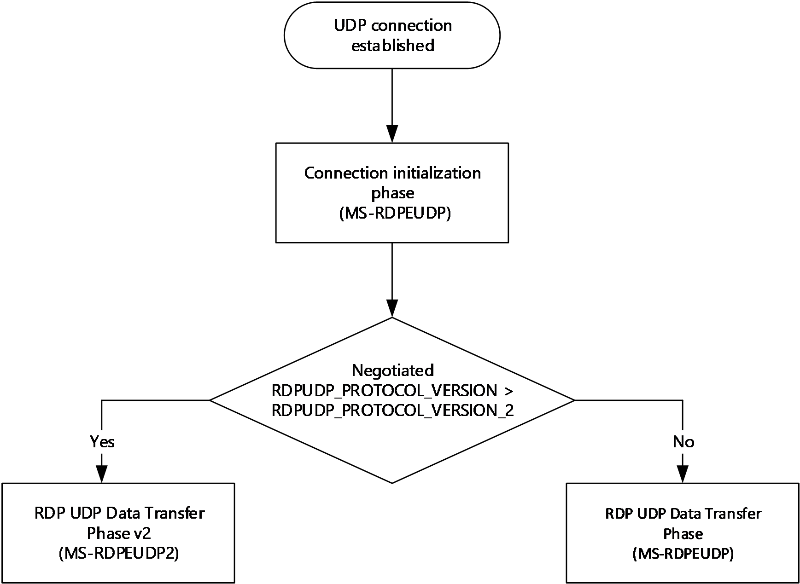

Figure 2: Relationship between RDP-UDP to RDP-UDP2

### 1.3.2 RDP-UDP2 Data Transfer Phase

In this phase, which follows the Connection Initialization Phase, data generated by the users of this protocol is exchanged between the endpoints as shown in the figure "The RDP-UDP2 bidirectional endpoints connection" in section [1.3](#Section_1.3). The Sender sends a data packet on behalf of the upper layer in the transport stack, and the Receiver receives the packet by sending an [**acknowledgment (ACK)**](#gt_acknowledgment-ack) packet back to the Sender to indicate that the packet has been received. The ACK packet need not be sent as soon as receiving the data packet; the timing for sending the ACK packet can be optimized for best performance. The Sender informs the Receiver of the extent to which the ACK can be delayed and the Receiver can optimize within those parameters. A lack of receiving the proper ACK packets is interpreted by the Sender as a packet loss, and it will retransmit the same packet. This phase ends when either the connection is terminated by the user, or when an endpoint determines that the remote endpoint is no longer present. No protocol-specific messages are exchanged to communicate that the endpoint is no longer present.

## 1.4 Relationship to Other Protocols

The relationship of the RDP-UDP2 transport to the original RDP-UDP transport is described in section [1.3.1](#Section_1.3.1).

## 1.5 Prerequisites/Preconditions

This extension requires an RDP-UDP protocol to exist and its initialization phase to be completed. After this initialization phase, the flow of messages will be directed either through the RDP-UDP data transfer stack or the RDP-UDP2 data transfer stack, depending on the version check.

## 1.6 Applicability Statement

## 1.7 Versioning and Capability Negotiation

During the RDP-UDP initialization stage, the UDP transport performs a handshake to negotiate between the client and server for a commonly supported UDP version. If the version is greater than or equal to RDPUDP_PROTOCOL_VERSION_3, which is a new version that corresponds to the new extension specified in this document, the transport message flow switches to the RDP-UDP2 version.

## 1.8 Vendor-Extensible Fields

None.

## 1.9 Standards Assignments

None.

# 2 Messages

## 2.1 Transport

The RDP protocol packets are encapsulated in the [**User Datagram Protocol (UDP)**](#gt_user-datagram-protocol-udp). The UDP datagrams MUST be encapsulated in the [**Internet Protocol version 4 (IPv4)**](#gt_internet-protocol-version-4-ipv4) or the [**Internet Protocol version 6 (IPv6)**](#gt_internet-protocol-version-6-ipv6).

The default port for incoming UDP connection requests on the terminal server is port 3389. All of the RDP traffic over UDP is handled by this single port on the terminal server.

The terminal client MUST open a unique UDP socket for each instance of this transport. Each socket is bound to a different port.

## 2.2 Message Syntax

The message layouts detailed in this section describe the contents of the data packets that are sent from the Sender to the Receiver. However, the actual bytes to be sent via UDP MUST be converted to the format described in section [3.1.1.1.5.1](#Section_3.1.1.1.5.1) before being transmitted.

All multiple-byte fields within a message MUST be marshaled in [**little-endian**](#gt_little-endian) byte order, unless otherwise specified.

### 2.2.1 RDP-UDP2 Packet

This section describes the bitmap overview of an RDP-UDP2 Packet and how it is constructed, as well as the message syntax for the various structures used in the construction of the RDP-UDP2 Packet.

The following bitmap shows the memory layout of the mandatory RDP-UDP2 Packet Header and the optional payloads that form the RDP-UDP2 packet. It also shows the ordering of various optional payloads when more than one optional payload is present. This ordering MUST be followed when sending multiple optional payloads in an RDP-UDP2 packet.

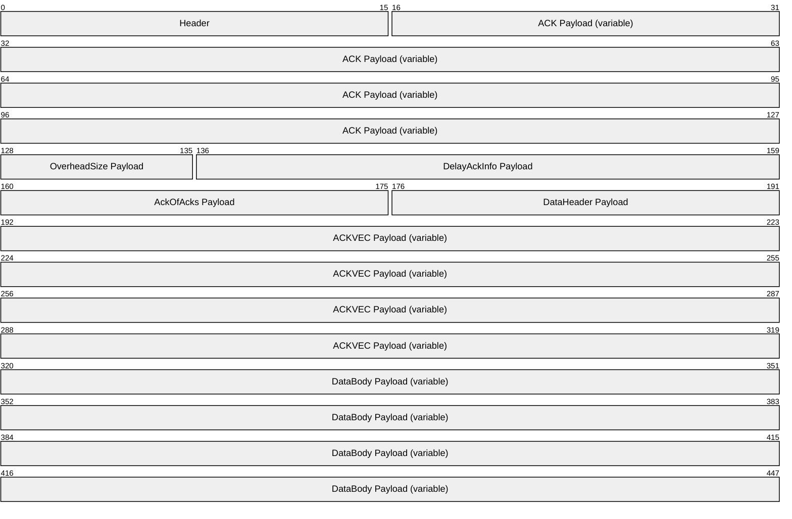

**Header (2 bytes):** A **Header** field as defined in section [2.2.2.1.](#Section_501167f0ad5c4c05b8f72649b2181b85)1.

**ACK Payload (variable):** An **ACK Payload** field as defined in section [2.2.1.2.1](#Section_2.2.1.2.1).

**OverheadSize Payload (1 byte):** An **OverheadSize Payload** field as defined in section [2.2.1.2.2](#Section_2.2.1.2.2).

**DelayAckInfo Payload (3 bytes):** A **DelayAckInfo Payload** field as defined in section [2.2.1.2.3](#Section_2.2.1.2.3).

**AckOfAcks Payload (2 bytes):** An **AckOfAcks Payload** field as defined in section [2.2.1.2.4](#Section_2.2.1.2.4).

**DataHeader Payload (2 bytes):** A **DataHeader Payload** field as defined in section [2.2.1.2.5](#Section_2.2.1.2.5).

**ACKVEC Payload (variable):** An **ACKVEC Payload** field as defined in section [2.2.1.2.6](#Section_2.2.1.2.6).

**DataBody Payload (variable):** A **DataBody Payload** field as defined in section [2.2.1.2.7](#Section_2.2.1.2.7).

#### 2.2.1.1 RDP-UDP2 Packet Header

The **Header** field is mandatory, and it specifies the presence of the various optional payloads that follow.

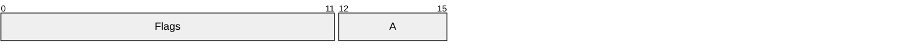

**Flags (12 bits):** A 12-bit unsigned integer that specifies a bitmap of flags indicating the presence of optional payloads that follow the header. In a packet, one or more of the flags MUST be specified in the **Header** field.

| Flags | Meaning |
| --- | --- |
| ACK 0x001 | ACK payload (section [2.2.1.2.1](#Section_2.2.1.2.1)) is present. This flag MUST NOT be set if the **ACKVEC** flag is set. |
| DATA 0x004 | DataHeader payload (section [2.2.1.2.5](#Section_2.2.1.2.5)) and DataBody payload (section [2.2.1.2.7](#Section_2.2.1.2.7)) are present. |
| ACKVEC 0x008 | ACK Vector payload (section [2.2.1.2.6](#Section_2.2.1.2.6)) is present. This flag MUST NOT be set if the **ACK** flag is set. |
| AOA 0x010 | AckOfAcks payload (section [2.2.1.2.4](#Section_2.2.1.2.4)) is present. |
| OVERHEADSIZE 0x040 | OverheadSize payload (section [2.2.1.2.2](#Section_2.2.1.2.2)) is present. |
| DELAYACKINFO 0x100 | DelayAckInfo payload (section [2.2.1.2.3](#Section_2.2.1.2.3)) is present. |

**A - LogWindowSize (4 bits):** A 4-bit unsigned integer that specifies the logarithm base 2 of the maximum buffer size in multiples of the [**MTU**](#gt_maximum-transmission-unit-mtu). This variable is imposed on the Receiver of the Sender endpoint when receiving packets from the Sender of the receiver endpoint. The maximum buffer size is equal to (1<< **LogWindowSize**)*MTU, in bytes.

#### 2.2.1.2 RDP-UDP2 Optional Payloads

The following optional payloads are exchanged over the RDP-UDP2 packet. The presence of each of these optional payloads is indicated by the **Flags** field in the RDP-UDP2 packet header (section [2.2.1.1](#Section_2.2.1.1)). Each RDP-UDP2 packet MUST contain one or more of the optional payloads in addition to the header.

##### 2.2.1.2.1 Acknowledgement Payload

The Acknowledgment payload carries acknowledgment information for one or more packets received by the Receiver. The presence of this payload is flagged by the **ACK** (0x01) flag in the header (section [2.2.1.1](#Section_2.2.1.1)), and it is sent by the Receiver.

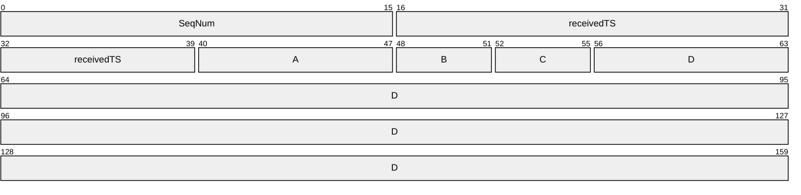

**SeqNum (2 bytes):** A 16-bit unsigned integer that specifies the lower 16 bits of the sequence number for the data packet that is acknowledged.

**receivedTS (3 bytes):** A 24-bit unsigned integer that specifies the lower 24 bits of the time stamp as of when the packet that is being received. The timestamp MUST be in units of 4 microseconds.

**A - sendAckTimeGap (1 byte):** An 8-bit unsigned integer that specifies the time interval in milliseconds between when the packet being acknowledged was received and when the **ACK** was sent for that packet.

**B - numDelayedAcks (4 bits):** A 4-bit unsigned integer that specifies the number of delayed **ACKs**.

**C - delayAckTimeScale (4 bits):** A 4-bit unsigned integer that specifies the scale applied to the time differences for all the delayed **ACKs** carried in this packet. The Receiver SHOULD send a value for this field that ensures that each time interval in the **delayAckTimeAdditions** field is of size less than or equal to 255 (section [3.1.5.6](#Section_3.1.5.6)).

**D - delayAckTimeAdditions (variable): delayAckTimeAdditions** is an array of bytes with **numDelayedAcks** as the array size, and each byte represents the time difference between 2 adjacent acknowledgments in units of (1<<**delayedAckTimeScale**) microseconds. The array is arranged in reverse order for the packets to be acknowledged.

##### 2.2.1.2.2 OverheadSize Payload

The OverheadSize payload carries the overhead bytes for a packet at the RDP-UDP2 layer, which is equal to the difference between the size of a raw UDP packet as it is received and the size of the user data portion as the packet is forwarded to the upper layer for further processing. The presence of this payload is flagged by the **OVERHEADSIZE** (0x040) flag in the header (section [2.2.1.1](#Section_2.2.1.1)), and it is sent by the Receiver.

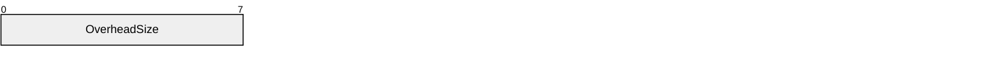

**OverheadSize (1 byte):** An 8-bit unsigned integer that specifies the average header size of the extra bytes prepended from the RDP-UDP2 transport layer to the raw UDP layer.

##### 2.2.1.2.3 DelayAckInfo Payload

The DelayAckInfo payload carries information about the delay acknowledgment parameters allowed by the Sender. The presence of this payload is flagged by the **DELAYACKINFO** (0x100) flag in the header (section [2.2.1.1](#Section_2.2.1.1)), and it is sent by the Sender. If the Receiver delays sending acknowledgment for a packet beyond the parameters specified by the Sender, the packet MUST be considered lost and MUST be retransmitted.

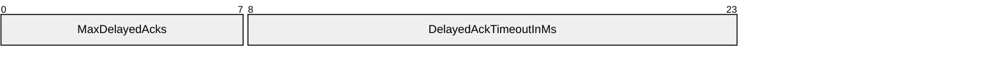

**MaxDelayedAcks (1 byte):** An 8-bit unsigned integer that specifies the maximum number of delayed acknowledgments that can be packed in a single ACK payload (section [2.2.1.2.1](#Section_2.2.1.2.1)).

**DelayedAckTimeoutInMs (2 bytes):** A 16-bit unsigned integer that specifies the timeout in milliseconds before which acknowledgments need to be sent for all packets. After a packet is received, the Receiver SHOULD accumulate the acknowledgment of this packet while waiting until this timeout is reached, or a maximum of **MaxDelayedAcks** acknowledgments have accumulated, at which point, the receiver MUST send the ACK payload (section 2.2.1.2.1) immediately.

##### 2.2.1.2.4 AckOfAcks Payload

The AckOfAcks payload carries information about the lowest unacknowledged packets on the Sender side. The presence of this payload is flagged by the **AOA** (0x010) flag in the header (section [2.2.1.1](#Section_2.2.1.1)), and it is sent by the Sender to inform the Receiver to update the Receiver Window (section [3.1.1.2.2](#Section_3.1.1.2.2)) so that the Receiver can avoid sending redundant information in the acknowledgment vector packets (section [2.2.1.2.6](#Section_2.2.1.2.6)).

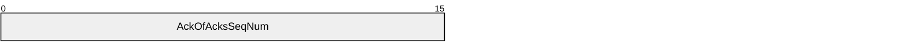

**AckOfAcksSeqNum (2 bytes):** A 16-bit unsigned integer that specifies the lower 16 bits of the sequence number the Sender is waiting to receive acknowledgment of. The Receiver can infer that the Sender has received the acknowledgments for the packets with earlier sequence numbers, and updates its Receiver Window (section 3.1.1.2.2) accordingly.

##### 2.2.1.2.5 DataHeader Payload

The DataHeader payload is the header portion of the data payload. The presence of this payload is flagged by the **DATA** (0x004) flag in the header (section [2.2.1.1](#Section_2.2.1.1)), and it is sent by the Sender.

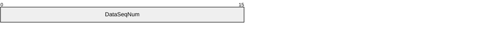

**DataSeqNum (2 bytes):** A 16-bit unsigned integer that specifies lower 16 bits of the sequence number representing this data segment.

##### 2.2.1.2.6 Acknowledgement Vector Payload

The Acknowledgment Vector payload contains the information of a vector of acknowledgments for all packets within the current Receiver Window (section [3.1.1.2.2](#Section_3.1.1.2.2)). The presence of this payload is flagged by the **ACKVEC** (0x008) flag in the header (section [2.2.1.1](#Section_2.2.1.1)), and it is sent by the Receiver. Upon receiving this packet, the Sender can interpret the current state of unacknowledged packets within its Sender Window (section [3.1.1.2.1](#Section_3.1.1.2.1)).

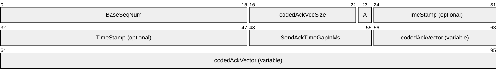

**BaseSeqNum (2 bytes):** A 16-bit unsigned integer that specifies the lower 16 bits of sequence number for the base of this acknowledgment array.

**codedAckVecSize (7 bits):** A 7-bit unsigned integer that specifies the number of entries in the **codedAckVector** field.

**A - TimeStampPresent (1 bit):** A 1-bit flag that indicates if the **TimeStamp** is present.

**TimeStamp (3 bytes, optional):** A 24-bit unsigned integer that specifies the lower 24 bits of the timestamp for the highest sequence number received that has not been acknowledged yet. The **TimeStamp** field MUST be present if **TimeStampPresent** is set to 1 and MUST NOT be present if **TimeStampPresent** is set to 0.

**SendAckTimeGapInMs (1 byte, optional):** An 8-bit unsigned integer that specifies the time interval (in milliseconds) between the sent time of the current Acknowledgement Vector packet and the arrival time of the latest data packet that has been received. A value of 255 indicates that the meaning of this field is invalid, and it MUST NOT be used. The **SendAckTimeGapInMs** field MUST be present if **TimeStampPresent** is set to 1 and MUST NOT be present if **TimeStampPresent** is set to 0.

**codedAckVector (variable):** An array of bytes, of size specified by **codedAckVecSize**, which contains a list describing the acknowledgement state of each packet in the range starting at **BaseSeqNum**. Each byte MUST be independently coded in one of the following two modes. The array represents the state information of sequential packets within the Receiver Window (section 3.1.1.2.2).

- State map mode: In this mode, the most significant bit of the byte MUST be set to 0. The remaining 7 bits MUST be set to a bit vector representing the state for the next 7 consecutive sequence numbers. A value of 1 indicates that the packet with that sequence number has been received; a zero value indicates that the packet with that sequence number has not been received.
- Run-Length mode: In this mode, the most significant bit of the byte MUST be set to 1. The second most significant bit represents the state for the run length. If the second most significant bit is set to 1, the sequence numbers in this run have been received, and if the second most significant bit is 0, the sequence numbers in this run have not been received. The remaining 6 bits MUST contain the length of the run which represents the number of subsequent consecutive sequence numbers that are in the state specified by the second most significant bit.

##### 2.2.1.2.7 DataBody Payload

The DataBody payload contains the Remote Desktop Protocol data that is being sent over the UDP transport. The presence of this payload is flagged by the **DATA** (0x004) flag in the header (section [2.2.1.1](#Section_2.2.1.1)), and it is sent by the Sender. If this payload is present, the DataHeader payload MUST also be present.

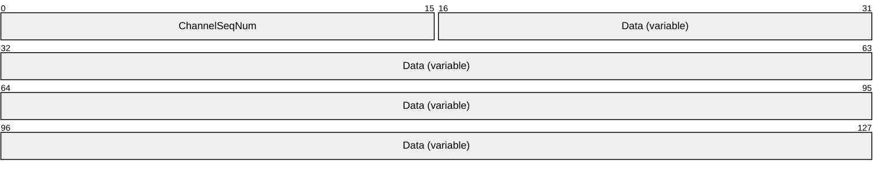

**ChannelSeqNum (2 bytes):** A 16-bit unsigned integer that specifies the lower 16 bits of channel sequence number.

**Data (variable):** A variable size array of bytes sent by higher layers of the Remote Desktop Protocol stack.

#### 2.2.1.3 PacketPrefixByte

The PacketPrefixByte is a byte that MUST be sent with each RDP-UDP2 packet. The byte MUST be inserted in the RDP-UDP2 packet as described in section [3.1.1.1.5](#Section_3.1.1.1.5.2).

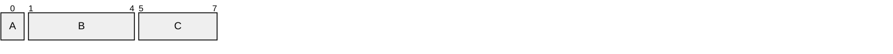

**A - Reserved (1 bit):** A 1-bit integer that is reserved and MUST be set to 0.

**B - Packet_Type_Index (4 bits):** A 4-bit unsigned integer that indicates the type of the packet. The value for this field MUST be set to either 0 or 8.

**C - Short_Packet_Length (3 bits):** A 3-bit unsigned integer that specifies the length, in bytes, of the RDP-UDP2 Packet (section [2.2.1](#Section_2.2.1)) that follows the PacketPrefixByte if the size is less than or equal to 7 bytes. If the length of the RDP-UDP2 Packet (section 2.2.1) that follows the PacketPrefixByte is greater than 7 bytes, then this field MUST be set to 7.

# 3 Protocol Details

## 3.1 Common Details

### 3.1.1 Abstract Data Model

This section describes a conceptual model of possible data organization that an implementation maintains to participate in this protocol. The described organization is provided to facilitate the explanation of how the protocol behaves. This document does not mandate that implementations adhere to this model as long as their external behavior is consistent with that described in this document.

The initialization phase from [MS-RDPEUDP](#Section_2.1) is used to negotiate the version of RDP UDP protocol, as specified in section [1.3.1](../MS-RDPEUDP/MS-RDPEUDP.md). If the negotiated version is greater than RDPUDP_PROTOCOL_VERSION_2, then RDP UDP Transport Extension v2 is used for the data transfer. RDP UDP Transport Extension v2 is a self-sufficient transport protocol that has a flow control mechanism that monitors packet flow in steady network traffic and that deals with packet losses caused by the unreliability of underlying UDP transport. The information exchanged over this protocol is used to detect available bandwidth and adapt the Remote Desktop Protocol to provide optimal performance for the detected runtime network condition.

#### 3.1.1.1 RDP-UDP2 Data Transfer Operation

In the data transfer phase of RDP-UDP2 transport, the terminal client and terminal server of an RDP-UDP2 connection are treated as peers and use the same protocol. The connection between the two endpoints is bidirectional; data and acknowledgments can be transmitted in both directions independently and simultaneously. Logically, each single RDP-UDP2 transport connection can be viewed as two unidirectional connections. Both of these unidirectional connections are symmetrical, and each endpoint has both a Sender and a Receiver entity. Although the bidirectional connections operate as independent transports, it is possible to combine the Sender and Receiver packets from endpoint as an optimization to reduce the number of packets sent on the network. For example, the acknowledgment packets for the received packets can be combined with the data packets in the same RDP-UDP2 packet because they are both sent to the same endpoint. Multiple acknowledgment packets can be combined into a burst acknowledgment packet to further reduce the number of packets sent.

The RDP-UDP2 transport only supports reliable UDP mode. In this mode, any packet that has been detected as lost must be retransmitted. This transport does not include an [**FEC**](#gt_forward-error-correction-fec) layer.

##### 3.1.1.1.1 RDP-UDP2 Packet Layout

An RDP-UDP2 Packet Layout consists of a mandatory header, followed by one or more optional payloads. The presence of each optional payload is indicated in the bitmap flags in the header. As stated in section [3.1.1.1](#Section_3.1.1.1), each endpoint is both sender and receiver and an RDP-UDP2 packet can combine payloads corresponding to both independent transport connections. Depending on the type of a payload, its length is either fixed or variable. In the case of a variable length payload, the length information is included as part of the payload itself.

##### 3.1.1.1.2 RDP-UDP2 Packet Header

The header (section [2.2.1.1](#Section_2.2.1.1)) is a 16-bit structure that is mandatory for all RDP-UDP2 packets. The header has a **Flags** field that is a bit mask that indicates the presence of the optional payloads. The **LogWindowSize** field in the header contains the log2 of the receiving window size announced by the sender.

The **ACK** flag and the **ACKVEC** flag are mutually exclusive and both MUST NOT be set to 1 in the **Flags** field of an RDP-UDP2 packet header.

The user generated data from higher layers of the RDP stack is encapsulated in the DATA payload which is composed of a DataHeader payload and a DataBody payload. Both payloads MUST be present if the **Flags** field in the RDP-UDP2 header has the **DATA** bit set to 1.

##### 3.1.1.1.3 Sequence Numbers

All [**Coded Packets**](#gt_coded-packet) have a sequence number that identifies their sending order. The sequence number uniquely identifies each datagram sent by the Sender. The sequence number value is increased by one for each Coded Packet that was sent. Retransmitted packets can have a different coded sequence number. The full resolution of a sequence number is 64 bit.

To reduce the payload size of sending a sequence number in each packet, only the lower 16 bits of the sequence number is sent in a DATA payload. The Receiver SHOULD reconstruct the full sequence number using the technique described below. The active range of sequence numbers in use is limited to (1<< **LogWindowSize**)-1, where the variable **LogWindowSize** is specified in the header (section [2.2.2.1.](#Section_501167f0ad5c4c05b8f72649b2181b85)2) and has a maximum value of 15. So, the active range of the sequence numbers is limited to 32,767. This ensures that the full sequence number can be recovered without ambiguity using a nearby reference sequence number, which should be the sequence number of the last packet sent by the Sender or the sequence number of the last packet received by the Receiver.

- Form a candidate sequence number by combining the higher 16 bits taken from the reference sequence number and the received sequence number's lower 16 bits.
- Compare the candidate sequence number with the reference sequence number as follows:
- If candidate sequence number is higher by more than 0x8000, subtract 0x10000 from the candidate sequence number.
- If candidate sequence number is lower by more than 0x8000, add 0x10000 to the candidate sequence number.
Example 1: The Sender generates a sequence number of 0x1234ff78 for a new data packet. The DATA payload is sent with the lower 16 bits as sequence number, which is 0xff78. The Receiver has previously inferred a full sequence number of 0x1234ff68 based on the last received 16-bit sequence number of 0xff68. The full sequence number of the current packet is obtained by combining the higher 16 bit from the last inferred sequence number (0x1234) with the lower 16-bit sequence number received in the current packet (0xff78) for a full sequence number of 0x1234ff78. No further action is needed because this sequence number is within a 0x8000 range of the reference sequence number.

Example 2: The Sender generates a sequence number of 0x12350003 for a new data packet. The DATA payload is sent with the lower 16 bits as sequence number, which is 0x0003. The Receiver has previously inferred a full sequence number of 0x1234ff68 based on the last received 16-bit sequence number of 0xff68. The candidate sequence number of the current packet is obtained by combining the higher 16 bit from the last inferred sequence number (0x1234) with the lower 16-bit sequence number received in the current packet (0x0003) for a full sequence number of 0x12340003. Because the candidate sequence number is 0x8000 less than the last known full sequence number (0x1234ff68), 0x10000 is added to the candidate sequence number to generate the corrected full sequence number of 0x12350003.

##### 3.1.1.1.4 ACK Timestamps

The ACK payload (section [2.2.1.2.1](#Section_2.2.1.2.1)) and ACK Vector payload (section [2.2.1.2.6](#Section_2.2.1.2.6)) include a 24-bit timestamp representing when the Receiver received the data packet being acknowledged. The unit of the timestamp is 4 microseconds. The full range timestamp can be recovered from the 24-bit timestamp using a nearby reference full range timestamp which is in the range of 64 seconds. Because the loss timeout is in the order of few seconds, the outstanding packets' pending ACK is guaranteed to be less than 64 seconds.

In this procedure, the input is the lower 24-bit timestamp in units of 4 microseconds coded on wire, and a reference full range sequence number that is nearby. The procedure consists of these steps:

- Convert the reference full range timestamp to units of 4 microseconds.
- Form a candidate full range timestamp by combining the 24-bit coded timestamp as lower 24 bits and the higher bits taken from the reference timestamp in units of 4 microseconds.
- Compare the candidate timestamp with the reference timestamp as follows:
- If the candidate timestamp is higher than the reference timestamp by more than 0x800000, subtract 0x1000000 from the candidate timestamp.
- If the candidate timestamp is lower than the reference timestamp by more than 0x800000, add 0x1000000 to the candidate timestamp.
- Multiply the candidate by 4 to form a full range timestamp in units of microseconds.
- If the resulting timestamp is 32 seconds more than the reference time stamp, it MUST be considered as an invalid timestamp by the sender and MUST NOT be used.

##### 3.1.1.1.5 RDP-UDP2 Packet Network Format

Each RDP-UDP2 packet should include a **PacketPrefixByte** as defined in section [2.2.1.3](#Section_2.2.1.3). If the RDP-UDP2 packet size is less than 7 bytes, then the **Short_Packet_Length** field MUST be set to the size of the RDP-UDP2 packet. If the RDP-UDP2 packet size is greater than or equal to 7 bytes, then the **Short_Packet_Length** field MUST be set to 7.

The **Packet_Type_Index** field contains the type of RDP-UDP2 packet that follows the **PacketPrefixByte**. The **Packet_Type_Index** field MUST be set to 0 or 8.

- If **Packet_Type_Index** is set to 0, then a valid RDP-UDP2 packet follows it.
- If **Packet_Type_Index** is set to 8, then a dummy packet follows the **PacketPrefixByte**. A dummy packet is treated as a normal RDP-UDP2 packet by the UDP transport. However, loss of this packet MUST not generate a retransmit. In addition, the contents MUST be ignored by higher layers using the UDP transport.

###### 3.1.1.1.5.1 Sending RDP-UDP2 Packet

Before an RDP-UDP2 packet is sent over the UDP transport by the sender, it MUST be transformed to include the **PacketPrefixByte** using the procedure outlined below. After the procedure is completed, the payload can be sent over the UDP transport and the **PacketPrefixByte** will always be the eighth byte in the transmitted payload.

- Generate a valid **PacketPrefixByte** (section [3.1.1.1.5](#Section_3.1.1.1.5.2)).
- If the size of the RDP-UDP2 Packet Layout is less than 7 bytes, then it MUST be padded to be of length of 7 bytes and the original length in bytes MUST be set in the **Short_Packet_Length** field of the **PacketPrefixByte** structure. Otherwise, the **Short_Packet_Length** field of the **PacketPrefixByte** structure MUST be set to 7.
- Prefix the **PacketPrefixByte** (section [2.2.1.3](#Section_2.2.1.3)) structure to the RDP-UDP2 Packet Layout. After this step, the first byte in the payload is the **PacketPrefixByte**, followed by the RDP-UDP2 Packet Layout.
- Swap the first byte of the payload, which is the **PacketPrefixByte**, with the eighth byte of the payload.
Example:

An RDP-UDP2 packet has the following 10 bytes: 0x30, 0x35, 0x56, 0x78, 0xa2, 0x36, 0x73, 0xee, 0x68, 0xf2.

Step1: **PacketPrefixByte** = **0x10**.

Step 2: This step is skipped because the RDP-UDP2 packet size is larger than 7 bytes and padding is not needed.

Step 3: The payload is prefixed with the **PacketPrefixByte**: **0x10**, 0x30, 0x35, 0x56, 0x78, 0xa2, 0x36, 0x73, 0xee, 0x68, 0xf2.

Step 4: Swap the first and eighth byte to generate the final payload that can be sent over UDP: 0x73, 0x30, 0x35, 0x56, 0x78, 0xa2, 0x36, **0x10**, 0xee, 0x68, 0xf2.

###### 3.1.1.1.5.2 Receiving RDP-UDP2 Packet

When an RDP-UDP2 payload is received, the receiver MUST parse the **PacketPrefixByte** and RDP-UDP2 packet from the payload using the procedure outlined below.

- Swap the first and eighth byte of the payload. A valid RDP-UDP2 payload MUST have packet length greater than 7.
- Remove the first byte from the payload and parse it as the **PacketPrefixByte** (section [2.2.1.3](#Section_2.2.1.3)).
- If the **Short_Packet_Length** field in **PacketPrefixByte** is not 0, remove the last (7 - **Short_Packet_Length**) bytes from the payload.
- The remaining bytes in the payload must be parsed as an RDP-UDP2 Packet Layout (section [2.2.1.1](#Section_2.2.1.1)).

#### 3.1.1.2 RDP-UDP2 Implementation Concepts

An RDP-UDP2 stack can be implemented using these key components:

- A Flow Controller responsible for managing packet traffics in both directions, and this is composed of the following key concepts:
- A Sender Window buffer for managing information for a list of active packets that have been sent but are not ready to be forwarded to higher layers yet.
- A Receiver Window buffer for managing packet information for a list of active packets that are not sequentially received.
- A Loss Detection component for detecting packet loss events.
- A Reliability Controller responsible for resending lost packets to achieve the transport reliability.
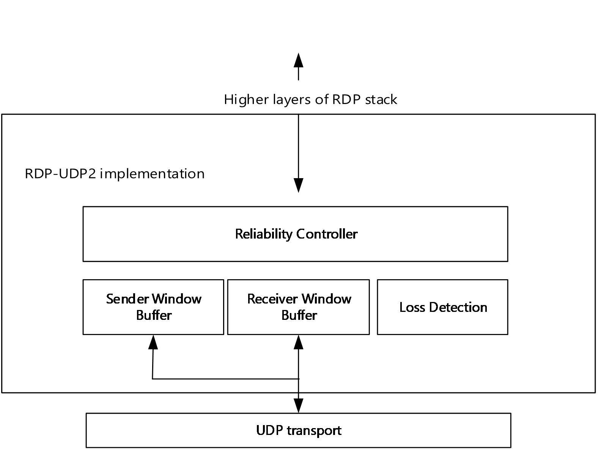

Figure 3: Conceptual composition of an RDP-UDP2 implementation stack

##### 3.1.1.2.1 Sender Window Buffer

The Sender Window Buffer is a circular buffer implemented by the Sender. The circular buffer is of size 1<<(**LogWindowSize** field in the RDP-UDP2 Packet Header) (section [2.2.1.1](#Section_2.2.1.1)). It contains an active range of nodes each representing a packet that has been sent but for which the Sender has not yet forwarded the packet's state to higher layers of the RDP-UDP2 implementation for further processing.

Each node in the active range has one of three possible states:

**Pending**: The packet has been sent, but no acknowledgment has been received from the Receiver.

**Received**: The Sender has received an acknowledgment from the Receiver using an ACK payload, or an ACK Vector payload where the state for this packet was marked as received.

**Lost**: The Sender has not received acknowledgment from the Receiver indicating that this packet was received, and the Sender's loss detection implementation has declared that this packet is lost (section [3.1.1.2.3](#Section_3.1.1.2.3)).

The upper bound of the active range in the circular buffer increases when a new packet is ready to be sent. The state of the new packet is set to "Pending". The lower bound of the active range in the circular buffer increases until the next lower bound value is a node in the "Pending" state. The lower bound is increased when any of these events occur.

- The Sender receives an ACK payload containing the sequence number that matches the entry corresponding to the lower bound of the active range. The state of that packet is set to "Received". All the nodes with lower sequence numbers in the active range in the "Pending" state are changed to the "Received" state.
- The Loss Detection logic (section 3.1.1.2.3) detects that a packet has been lost and the sequence number of the packet matches a node in the active range. The state of that node is set to "Lost". All the nodes with lower sequence numbers in the active range in the "Pending" state are changed to the "Received" state. In this scenario, the Sender SHOULD send an AckOfAcks packet to inform the Receiver of the new lowest sequence number that is in the active range.
When the circular lower bound is increased, the nodes that were removed from the active range are sent to the higher layers of the RDP-UDP2 implementation for further processing. These higher layers SHOULD include concepts like the **Reliability Controller** (section [3.1.1.2.4](#Section_3.1.1.2.4)) for retransmitting lost packets, **Congestion Controller** for inferring the runtime network conditions, and the components that will consume the payload from the packet.

##### 3.1.1.2.2 Receiver Window Buffer

The Receiver Window Buffer is a circular buffer implemented by the Receiver. The circular buffer is of size 1<<(**LogWindowSize** field in the RDP-UDP2 Packet Header) (see section [2.2.1.1](#Section_2.2.1.1)). It contains an active range of nodes each representing a packet that was either received or expected to be received, and whose acknowledgment has not been sent to the Sender yet. Each node in the active range has one of two possible states.

**Received**: The packet has been received.

**Pending**: The packet is expected but has not been received. A packet would be in this state if a packet with a higher sequence number was received.

The upper bound of the active range in the circular buffer increases when a packet is received with a sequence number that is higher than all nodes in the active range. The upper bound is advanced to contain the received packet and all packets that have sequence numbers between the highest sequence number in the active range and the received packet. The entry corresponding to the upper bound is marked as "Received" and all remaining newly added entries are marked as "Pending".

The lower bound of the circular buffer is increased when either of these events occur.

- An acknowledgment is sent with one or more sequence numbers marked as received. The lower bound of the circular buffer is set to the next node in the circular buffer. Note that if the acknowledgment is performed using an Acknowledgement Vector payload, the lower bound can advance only if the first sequence number in the list describing the acknowledgement states is in the "Received" state.
- An AckOfAcks payload is received from the Sender containing a sequence number which is to be set as the new lower bound of the buffer.

##### 3.1.1.2.3 Loss Detection

A loss detection logic is implemented by the Sender to declare any possible packet loss. It implements two ways for such detection:

- Packet loss due to reordering: A packet with Pending state is declared to be lost if its sequence number is smaller by a set amount than the largest sequence number of another packet that has a state of Received. The set amount is either fixed or dynamically variable, based on the type of the network conditions encountered.
- Packet loss due to timeout: A packet with Pending state is declared to be lost if a set time has passed since the sending of the packet. This timeout can be dynamically variable, depending on the current network conditions, to avoid excessive declaration of the timeout losses.
When a packet is declared to be lost, any other packets with a Pending state within the active range of the Sender Window Buffer that is circularly lower should be declared as lost too. In addition, an AckOfAcks packet SHOULD be sent to the Receiver to allow it to update the active range of the Receiver Window Buffer.

##### 3.1.1.2.4 Reliability Controller

###### 3.1.1.2.4.1 Sender Reliability Controller

A Reliability Controller on the Sender side is implemented so that any lost packet can be resent to ensure the reliability of the transport. This can be achieved with the following procedure:

- Before a Packet Layout is constructed, an incrementing **ChannelSeqNum** is coded before the user data in the DataBody payload (section [2.2.1.2.7](#Section_2.2.1.2.7)).
- A copy of the resulting packet is stored in a temporary buffer.
- As the Sender Window Buffer advances the circular lower bound of its active range, the packets through this process are either pronounced as Received or Lost. In the case of a received packet, the copy stored in the temporary buffer is retrieved and silently discarded. In the case of a lost packet, the copy stored in the temporary buffer is retrieved and resent with a new sequence number. Note that the **ChannelSeqNum** remains the same because it is part of the DataBody payload now.

###### 3.1.1.2.4.2 Receiver Reliability Controller

A reliability controller on the Receiver side simply forwards all packets (with the channel sequence number removed) received from the RDP-UDP2 Transport if their **ChannelSeqNum**s are sequentially incrementing with no gap.<1> When packets are received with gaps in **ChannelSeqNum**, they are temporarily buffered, waiting for the missing ones to come. The missing packets come in later either as received out of order, or they are declared as lost by the Sender and a resent packet with the same **ChannelSeqNum** eventually arrives. This arrival fills the gap in the **ChannelSeqNum** so that packets buffered are free to be passed to the next layer up.

#### 3.1.1.3 Keepalives

As the underlying transport is based on [**UDP**](#gt_user-datagram-protocol-udp) and is connectionless, each pair of endpoints MUST constantly send data to make sure that the other endpoint is present and is responding to network events. If there is no data to send, each endpoint MUST periodically acknowledge the last received datagram. Otherwise, the [**network address translation (NAT)**](#gt_network-address-translation-nat) en route between the peers can block the UDP connection.

The receiver SHOULD send one or more keepalive datagrams in implementation-specific time intervals smaller than or equal to 16 seconds.<2> If the sender does not receive at least one keepalive datagram every 16 seconds, this indicates that the receiver is no longer present or has disconnected. The upper layers are notified of this event, the endpoints move to the Closed state, and the connection is terminated.

### 3.1.2 Timers

The following timers are used by the Remote Desktop Protocol: UDP Transport Extension v2 and MUST be implemented:

**Retransmit**: This timer is used for indicating that no acknowledgment (section [3.1.1.2.3](#Section_3.1.1.2.3)) has been received for a datagram that was transmitted earlier.

**Keepalive at the Sender**: This timer is used for maintaining an active connection between the endpoints.<3>

**Delayed ACK**: This timer is used to indicate that an immediate acknowledgment packet needs to be sent if there are data packets received by the Receiver that have not been acknowledged back to the Sender yet.

### 3.1.3 Initialization

Before the protocol operation can commence, [**User Datagram Protocol (UDP)**](#gt_user-datagram-protocol-udp) network connectivity MUST be established between the endpoints: the [**terminal client (1)**](#gt_0e260a32-2049-4eaa-bdec-bfdee19bad4b) and the [**terminal server**](#gt_terminal-server). After the UDP connection is established, the terminal server and terminal client MUST complete the Connection Initialization Phase using the [MS-RDPEUDP](#Section_2.1) protocol as described in section [1.3.1](../MS-RDPEUDP/MS-RDPEUDP.md).

### 3.1.4 Higher-Layer Triggered Events

None.

### 3.1.5 Message Processing Events and Sequencing Rules

#### 3.1.5.1 OverheadSize Payload

OverheadSize payload is defined in section [2.2.1.2.2](#Section_2.2.1.2.2) and is intended to be sent by the Receiver to the Sender. It contains the extra header size from the RDP-UDP2 transport layer to the lowest layer in the UDP stack. This information usually is not available to a Sender, but is easily available to a Receiver because a Receiver tracks the raw packet size received at the raw UDP layer. Sending this payload is optional, and, if present, it can be used, for example, by the congestion control algorithm to fine tune the bandwidth reported.

#### 3.1.5.2 DelayAckInfo Payload

The DelayAckInfo payload is defined in section [2.2.1.2.3](#Section_2.2.1.2.3) and is intended to be sent by the Sender to the Receiver, informing the Receiver of the format to use when sending acknowledgments. The maximum value for MaxDelayedAcks is limited to 15, and the Sender SHOULD specify a timeout through delayedAckTimeoutInMs to avoid waiting for too long before receiving acknowledgment back. Usually delayedAckTimeoutInMs should be set to substantially shorter than the packet loss timeout period, to avoid accidentally triggering packet loss timeout when the actual packet has long been received and is waiting to be acknowledged.

Right after the initialization phase, a default value for the DelayAckInfo is assumed by the Receiver (**MaxDelayedAcks** = 8 and **DelayedAckTimeoutInMs** = half of the round trip time). The Sender can adjust this information whenever it sees fit, and can send this payload multiple times during a connection.

#### 3.1.5.3 AckOfAcks Payload

The AckOfAcks payload is defined in section [2.2.1.2.4](#Section_2.2.1.2.4).

- Refer to section [3.1.1.1.3](#Section_3.1.1.1.3) for the procedures to convert **AckofAcksSeqNum** back to its full ranged value.
- The AckOfAcks payload is sent by the Sender to the Receiver, updating the information of what sequence number the Sender is expecting from an ACK payload sent by the receiver. Usually, when the Sender detects that a packet is potentially lost, either due to receiving an acknowledgment for a packet with a much later sequence number, or by packet loss timeout being triggered, the Sender declares the packet loss and updates its own next sequence number to wait on. It then sends the AckOfAcks payload to pass this information to the Receiver so that the Receiver can stop waiting for any packets with lower sequence numbers to arrive.
- The Sender should stop sending this payload when either it receives an acknowledgment that has a sequence number that is higher than the AckOfAck sequence number, or it receives an acknowledgment vector with its lowest sequence number still missing that is higher than the AckOfAck sequence number. Furthermore, as a traffic optimization the Sender SHOULD choose to only piggyback this payload on any existing outgoing traffic.

#### 3.1.5.4 DataHeader Payload

The DataHeader payload is defined in section [2.2.1.2.5](#Section_2.2.1.2.5), and is the header part of the DATA payload associated with the **DATA** flag. The DataHeader payload is sent by the Sender when there is upper layer data to be sent.

Refer to section [3.1.1.1.3](#Section_3.1.1.1.3) for the procedure for converting DataSN back to its full ranged value.

Upon receiving a packet with this payload, the Receiver is expected to acknowledge this sequence number back to the Sender through an acknowledgment packet, either immediately or in a delayed fashion, by accumulating a number of subsequent packets to arrive for an array of acknowledgment information and packaging them together into a single acknowledgment payload.

#### 3.1.5.5 DataBody Payload

The DataBody payload is defined in section [2.2.1.2.7](#Section_2.2.1.2.7) and is the second part of the DATA payload associated with the **DATA** flag.The DataBody payload contains the actual data and is the last optional payload in a Packet Layout.

Refer to section [3.1.1.1.3](#Section_3.1.1.1.3) for the procedure for converting **ChannelSeqNum** back to its full ranged value.

The channel sequence number is an incremental number injected by the reliability controller for the purpose of packet loss recovery (section [3.1.1.2.4](#Section_3.1.1.2.4)). When a packet is declared lost, the same packet is retransmitted with a new sequence number. But since the channel sequence number is part of the data payload, it remains the same through the retransmission, which allows the Receiver reliability controller to match the retransmitted packet with the lost packet. This is different from the **SeqNum** in DataHeader which is different every time a retransmission packet is sent.

#### 3.1.5.6 Acknowledgment Payload

The Acknowledgment payload is flagged by the presence of the **ACK** bit in the header, and it is intended by the Receiver to acknowledge to the Sender that a new data packet was just received while all previous packets with smaller sequence numbers have all been received. The Acknowledgment payload is defined in section [2.2.1.2.1](#Section_2.2.1.2.1).

- Refer to section [3.1.1.1.3](#Section_3.1.1.1.3) and section [3.1.1.1.4](#Section_3.1.1.1.4) for the procedures to convert **SeqNum** and **receivedTS** back to their respective full ranged variables.
- The array **delayAckTimeAdditions** has a size equal to one less than the total number of packets to be acknowledged, and the time gaps are arranged in reverse order, so that the time between the most recent packet and the second most recent packet goes to the first element of the array, and so on.
- One feature in the RDP-UDP2 transport is the ability to combine the information of a number of sequential ACKs together, packaged in a single Acknowledgment payload. In this case, the only new information that needs to be coded is the receiving timestamps. Use the array **delayAckTimeAdditions** to store the time differences between the adjacent data packets as they are received, after applying a scaling factor of 1<<**delayAckTimeScale**. It is important to choose a proper scale value so that after the scaling, all elements in **delayAckTimeAdditions** fit between 0 and 255.

#### 3.1.5.7 Acknowledgment Vector Payload

This payload is defined in section [2.2.1.2.6](#Section_2.2.1.2.6).

- Refer to section [3.1.1.1.3](#Section_3.1.1.1.3) and section [3.1.1.1.4](#Section_3.1.1.1.4) for the procedures to convert **BaseSeqNum** and **TimeStamp** back to their respective full ranged variables.
- The Acknowledgment Vector payload is sent by the Receiver to the Sender when the Receiver detects that there is at least one packet still missing that has its sequence number smaller than the currently highest sequence number from all packets received. This missing packet could be due to delays or reordering in timing somewhere in the internet, or it could have been dropped. In all of these cases, the Receiver sends an Acknowledgment Vector payload to inform the Sender about the current state of all the subsequent sequence numbers that it has knowledge of, starting from the first missing sequence number.
The full resolution base sequence number derived from **BaseSeqNum** usually represents the first missing packet known to the Receiver at this point. The Acknowledgment Vector array of size **codedAckVecSize** bytes codes the complete state of all sequence numbers following **BaseSeqNum**, up to the highest sequence number received so far by the Receiver. Each byte in the array can be independently coded in one of the two modes for the state information:

- State map mode: bit 7 set to 0: In this mode, the remaining 7 bits code a bit map of state for all the 7 following sequence numbers. A value of 1 indicates that the sequence number has been received; value of 0 indicates that it is still missing.
- Run-Length mode: bit 7 set to 1: In this mode, the bit 6 represents the state. A value of 1 indicates that the sequence numbers in this run are received; a value of 0 indicates the sequence numbers in this run are still missing. The lower 6 bits represent the length of the run.
Example 1: Assuming the base sequence number is 1000, then an ACK vector byte of 0x64 indicates that it is coded in the bit map mode, the sequence numbers 1000, 1001, 1003, and 1004 are still missing, and the sequence numbers 1002, 1005, and 1006 have been received.

Example 2: Assuming the base sequence number is 1000, then an ACK vector byte of 0xe4 indicates that it is coded in the run-length mode with the state being 1 and the length of the run being 36. In other words, all sequence numbers from 1000 through 1035 have been received.

Because **codedAckVecSize** is limited to 127, the maximum number of sequence numbers coded in this ACK vector is limited. In theory, there can be a case where one acknowledgement vector is not be enough to represent a series of missing and received states. In this case, more than one acknowledgement vector SHOULD be sent by the Receiver. The first acknowledgement vector SHOULD NOT have the **TimeStampPresent** set, and its base sequence number SHOULD specify the missing state. The last acknowledgement vector can have the **TimeStampPresent** set, indicating that it has valid timestamp information for the packet with the latest sequence number received.

### 3.1.6 Timer Events

None.

### 3.1.7 Other Local Events

None.

# 4 Protocol Examples

## 4.1 Example1: Sending Data Packets Without Packet Loss or Reordering

This may be the most typical scenario. A Sender is requested to send a data blob to its Receiver. The following sequence of events typically takes place:

### 4.1.1 On the Sender when sending the packet

- The Sender constructs a packet layout by first prepending an incremental channel sequence number to the data blob and then buffers a copy of the packet to the Sender reliability controller for a possible retransmission if it is later declared lost (section [3.1.1.2.4.1](#Section_3.1.1.2.4.1)).
- The Sender increments by 1 the circular upper bound of the active range of the Sender window buffer, and obtains the newest sequence number to use for this packet. The state of the new node in the buffer is set to Pending (section [3.1.1.2.1](#Section_3.1.1.2.1)).
- The Sender prepares the packet header (section [2.2.1](#Section_2.2.1)). It must include a DATA payload (both DataHeader (section [2.2.1.2.5](#Section_2.2.1.2.5)) and DataBody (section [2.2.1.2.7](#Section_2.2.1.2.7)) portions). It may check if other optional payloads need to be packed into this packet, including:
- If there is any outstanding acknowledgment of the opposite connection waiting to be sent (section [2.2.1.2.1](#Section_2.2.1.2.1)).
- If there is any acknowledgment vector payloads of the opposite connection that should be sent (section [2.2.1.2.6](#Section_2.2.1.2.6)).
- If there is any AckOfAcks payload for the Sender (section [2.2.1.2.4](#Section_2.2.1.2.4)).
- If there are any other payloads to include, such as OverheadSize payload (section [2.2.1.2.2](#Section_2.2.1.2.2)), DelayedAckInfo payload (section [2.2.1.2.3](#Section_2.2.1.2.3)), **logWindowSize** update, and so on.
- The Sender encodes the header flag and all the optional payload data according to the packet layout described in section 2.2.1.
- The Sender converts the resulting packet layout to the OnWire version (section [3.1.1.1.5.1](#Section_3.1.1.1.5.1)) in preparation for sending.

### 4.1.2 On the Receiver when receiving the packet

- A packet is received at the RDP-UDP layer. Because the UDP version is set to RDPUDP_PROTOCOL_VERSION_3, it is passed to the RDP-UDP2 stack for processing as an OnWire version of the packet (section [1.3.1](#Section_1.3.1)).
- The OnWire version is converted to a Packet Layout and is passed to the RDP-UDP2 transport for further processing (section [3.1.1.1.5.2](#Section_3.1.1.1.5.2)).
- The RDP-UDP2 transport decodes its header, along with the optional payloads it carries, and dispatches packets for further processing based on the optional payloads it possesses (section [2.2.1](#Section_2.2.1)).
- Because the DATA payload is present, the Receiver obtains both the channel sequence number and the sequence number. In the scenario that there is no packet loss and no re-ordering, these two numbers are incremented by 1 to the current highest numbers respectively (section [3.1.1.2.2](#Section_3.1.1.2.2)).
- The Receiver then forwards the packet to the Reliability Controller. The Reliability Controller strips out the channel sequence number and sets it as the current channel sequence number, and then forwards the rest of the data payload to the upper layer immediately (section [3.1.1.2.4.2](#Section_3.1.1.2.4.2)).
- The Receiver updates the circular upper bound of the active range of the Receiver window buffer to 1 more than the newest sequence number (section 3.1.1.2.2).
- The Receiver constructs an acknowledgment packet containing the sequence number and reception timing information. It may or may not send it immediately, depending on the policy set for the DelayAckInfo payload and if there is any opposite direction traffic to piggy back on. But eventually it will be sent out to the Sender (section [2.2.1.2.1](#Section_2.2.1.2.1)).

### 4.1.3 On the Sender when receiving the acknowledgment payload from the receiver

- The Sender updates the circular lower bound of the active range of the Sender window buffer to the current sequence number and mark it as Received. Any sequence numbers circularly below this number are also marked as Received (section [3.1.1.2.1](#Section_3.1.1.2.1)).
- The sequence number is forwarded to the Sender reliability controller, and the corresponding copy of the original data packet is removed and discarded from the temporary buffer (section [3.1.1.2.4.1](#Section_3.1.1.2.4.1)).

## 4.2 Example 2: Sending Data Packets with 1 Packet reordering

This may be a very typical scenario depending on the hardware used on the communication path. A reorder could happen if the traffic takes multiple routes, and it could also happen if some of the end points use multithreaded technology for processing the packets, causing a timing difference for different packets. In the current scenario, a Sender is requested to send a data blob to its receiver, but data gets slightly reordered. The events for sending the packets out is the same as in section [4.1.1](#Section_4.1.1). The following sections describe events after the packet is sent.

### 4.2.1 On the Receiver when receiving the packet with next higher sequence number

- Refer to step 1–3 in section [4.1.2](#Section_4.1.2) for low level processing when a packet is received by the Receiver.
- Because the DATA payload is present, the Receiver obtains both the channel sequence number and the sequence number. In this scenario both sequence numbers are higher by 2 from those of the last received packet.
- The Receiver forwards the packet to the Receiver reliability controller. And it is buffered without forwarding because there is still a missing packet to arrive before it can be forwarded (section [3.1.1.2.4.2](#Section_3.1.1.2.4.2)).
- The Receiver updates the circular upper bound of the active range of the Receiver window buffer to point to the newest sequence number just received. For the hole created for the missing sequence number, it is marked as Pending (section [3.1.1.2.2](#Section_3.1.1.2.2)).
- The Receiver flushes any pending acknowledgment packets by sending an acknowledgment packet to the Sender immediately (section [2.2.1.2.1](#Section_2.2.1.2.1)).
- The Receiver constructs an acknowledgment vector packet containing the missing sequence number as the base sequence number, and the current received sequence number at the top in the acknowledgment vector, with valid timing information. The Receiver then sends this acknowledgment vector packet immediately (section [2.2.1.2.6](#Section_2.2.1.2.6)).

### 4.2.2 On the Sender when receiving the acknowledgment vector payload from the receiver

- The Sender updates the state of the packet acknowledged as Received in the Sender window buffer within the active range. The Sender does not update the circular lower bound of the active range of the Sender window buffer (section [3.1.1.2.1](#Section_3.1.1.2.1)).
- The sequence number is forwarded to the Sender reliability controller, and the corresponding copy of the original data packet is removed and discarded from the temporary buffer (section [3.1.1.2.4.1](#Section_3.1.1.2.4.1)).

### 4.2.3 On the Receiver when receiving the missing packet

- Refer to steps 1–3 in section [4.1.2](#Section_4.1.2) for low level processing when a packet is received by the Receiver.
- Because the DATA payload is present, the Receiver obtains both the channel sequence number and the sequence number. In this scenario, both sequence numbers are one less than those of the last received packet because they are from the missing packet (section [3.1.1.2.4.2](#Section_3.1.1.2.4.2)).
- The Receiver forwards the packet to the Receiver reliability controller. And after stripping the channel sequence number, it is forwarded immediately to the upper layer. In addition, the previously buffered packet waiting for the current packet is also removed from the buffer and immediately forwarded to the upper layer (section 3.1.1.2.4.2).
- The Receiver fills the hole in the active range of the Receiver window buffer, and advances the circular lower bound of the active range of the Receiver window buffer to 1 more than the highest sequence number just received (section [3.1.1.2.2](#Section_3.1.1.2.2)).
- The Receiver constructs an ACK packet containing the highest sequence number received and sends it immediately (section [2.2.1.2.1](#Section_2.2.1.2.1)).

### 4.2.4 On the Sender when receiving the acknowledgment payload from the receiver

- The Sender updates the circular lower bound of the active range of the Sender window buffer to 1 beyond the current sequence number and marks it as Received. Any sequence numbers circularly below this number are also marked as Received (section [3.1.1.2.1](#Section_3.1.1.2.1)).
- The sequence number is forwarded to the Sender reliability controller, and the corresponding copy of the original data packet is removed and discarded from the temporary buffer (section [3.1.1.2.4.1](#Section_3.1.1.2.4.1)).

## 4.3 Example 3: Sending Data Packets with One Packet Lost in the Middle

This may happen in a lossy network environment such as Wi-Fi or due to network congestion. In the current scenario, a Sender sends a number of packets to its Receiver, but one of them is never received by the Receiver. The events for sending the packets out is the same as in section [4.1.1](#Section_4.1.1). The following sections describe events for the packets received after the lost one.

### 4.3.1 On the Receiver when receiving the packet with higher sequence numbers after the lost packet

Refer to the steps in section [4.2.1](#Section_4.2.1) for information about the Receiver response when packets are received after a lost packet. Note that in this scenario multiple acknowledgment vectors could have been sent before the point at which the packet with the higher sequence number was received.

### 4.3.2 On the Sender when receiving multiple acknowledgment vector payloads from the receiver

- The Sender updates the states of the packets acknowledged as Received in the Sender window buffer within the active range. The Sender does not update the circular lower bound of the active range of the Sender window buffer (section [3.1.1.2.1](#Section_3.1.1.2.1)).
- The sequence numbers as Received are forwarded to the Sender reliability controller, and the corresponding copy of the original data packet is removed and discarded from the temporary buffer (section [3.1.1.2.4.1](#Section_3.1.1.2.4.1)).
- When multiple acknowledgment vectors are received and processed as described above, and the highest received sequence number is more than the base sequence number coded in the acknowledgment vector, the packet with the base sequence number is declared as lost, and its entry in the circular lower bound of the active range of the Sender window buffer is marked as Lost. The circular lower bound of the active range is advanced until 1 more than the latest Received sequence number (section 3.1.1.2.4.1).
- The Sender reliability controller retrieves the buffered packet corresponding to the lost packet, resends it with a new sequence number (but with the same channel sequence number), and re-buffers it onto the temporary buffer (section 3.1.1.2.4.1).
- An AckOfAcks packet is sent to the Receiver containing the new value of the circular lower bound of the active range of the Sender windows buffer (section [2.2.1.2.4](#Section_2.2.1.2.4)).

### 4.3.3 On the Receiver when receiving the AckOfAcks packet

- The Receiver advances the circular lower bound of the active range of the Receiver window buffer to beyond the new sequence number coded in the AckOfAcks packet (section [3.1.1.2.2](#Section_3.1.1.2.2)).
- The Receiver stops sending the acknowledgment vector to the Sender.

### 4.3.4 On the Receiver when receiving the retransmitted packet

This is same as in section [4.1.2](#Section_4.1.2), except that when forwarding the packet to the Receiver reliability controller, the channel sequence number should fill in the missing hole, indicating that this is the packet the rest of the packets have been waiting on. Therefore these packets are also forwarded to the upper layer after this retransmitted packet is forwarded (section [3.1.1.2.4.2](#Section_3.1.1.2.4.2)).

## 4.4 Data Example Sending Data Packet piggybacked with ACK

Here is an actual data example with data packet piggybacked by a number of payloads from the same and other directions.

### 4.4.1 Assumptions

- The original user data has 10 bytes: 0x01, 0x02, 0x03, 0x04, 0x05, 0x06, 0x07, 0x08, 0x09, 0x0a.
- The current full resolution ChannelSeqNum: 0x12345678 (section [3.1.1.2.4.1](#Section_3.1.1.2.4.1)).
- The current upper bound of the Sender Window Buffer: 0x98765432 (section [3.1.1.2.1](#Section_3.1.1.2.1)).
- The following optional flags are also present (section [2.2.1.1](#Section_2.2.1.1)):
- **ACK** on the opposite direction (section [2.2.1.2.1](#Section_2.2.1.2.1)):
- Three sequence numbers to acknowledge: 0x24681355, 0x24681356, and 0x24681357 with their respective received times in microseconds: 0x12345578, 0x12345789, and 0x12345830
- Current send time for the **ACK** in microseconds: 0x12346900
- An AckOfAcks payload with the new lower bound sequence number to be 0x98765427 (section [2.2.1.2.4](#Section_2.2.1.2.4)).
- **OverheadSize**: 0x40 (section [2.2.1.2.2](#Section_2.2.1.2.2)).
- **logWindowSize**: 0xc (section 2.2.1.1).

### 4.4.2 Header

Header is evaluated to:0xc018

### 4.4.3 Payloads

Various payloads are evaluated to:

- ACK Payload:
**SeqNum**: 0x1357

**receivedTS**: 0x8d160c

**sendACKTimeGap**: 4

**delayedAckTimeScale:** 2

**delayedACKTimeAdditions**: 0x29,0x84

- AckOfAcks Payload:
**AOASeqNum**: 0x5427

- DataHeader Payload:
**SeqNum**: 0x5433

- DataBody Payload:
**ChannelSeqNum:** 0x5679

### 4.4.4 Packet Layout

Packet Layout is evaluated to:

0x18, 0xc0, //Header

0x57, 0x13, 0x0c, 0x16, 0x8d, 0x04, 0x22, 0x29, 0x84, //ACK Payload

0x40, //OverheadSize

0x27, 0x54, // AckOfAcks Payload

0x33, 0x54, //DataHeader Payload

0x79, 0x56, 0x01, 0x02, 0x03, 0x04, 0x05, 0x06, 0x07, 0x08, 0x09, 0x0a //DataBody Payload

### 4.4.5 PacketPrefixByte

PacketPrefixByte is evaluated to: 0x00

### 4.4.6 Packet OnWire Version

The final OnWire version is evaluated to:

0x8d, 0x18, 0xc0, 0x57, 0x13, 0x0c, 0x16, 0x00, 0x04, 0x22, 0x29, 0x84, 0x40, 0x27, 0x54, 0x33, 0x54, 0x79, 0x56, 0x01, 0x02, 0x03, 0x04, 0x05, 0x06, 0x07, 0x08, 0x09, 0x0a

# 5 Security

## 5.1 Security Considerations for Implementers

None.

## 5.2 Index of Security Parameters

None.

# 6 Appendix A: Product Behavior

The information in this specification is applicable to the following Microsoft products or supplemental software. References to product versions include updates to those products.

- Windows 10 v1809 operating system
- Windows Server v1809 operating system
- Windows Server 2019 operating system
- Windows Server 2022 operating system
- Windows 11 operating system
- Windows Server 2025 operating system
Exceptions, if any, are noted in this section. If an update version, service pack or Knowledge Base (KB) number appears with a product name, the behavior changed in that update. The new behavior also applies to subsequent updates unless otherwise specified. If a product edition appears with the product version, behavior is different in that product edition.

Unless otherwise specified, any statement of optional behavior in this specification that is prescribed using the terms "SHOULD" or "SHOULD NOT" implies product behavior in accordance with the SHOULD or SHOULD NOT prescription. Unless otherwise specified, the term "MAY" implies that the product does not follow the prescription.

<1> Section 3.1.1.2.4.2: In Windows, the channel sequence number zero (0) is always skipped.

<2> Section 3.1.1.3: In Windows, the keepalive datagram time interval is 4 seconds.

<3> Section 3.1.2: In Windows, the **Keepalive at the Sender** timer is set to 4 seconds.

# 7 Change Tracking

This section identifies changes that were made to this document since the last release. Changes are classified as Major, Minor, or None.

The revision class **Major** means that the technical content in the document was significantly revised. Major changes affect protocol interoperability or implementation. Examples of major changes are:

- A document revision that incorporates changes to interoperability requirements.
- A document revision that captures changes to protocol functionality.
The revision class **Minor** means that the meaning of the technical content was clarified. Minor changes do not affect protocol interoperability or implementation. Examples of minor changes are updates to clarify ambiguity at the sentence, paragraph, or table level.

The revision class **None** means that no new technical changes were introduced. Minor editorial and formatting changes may have been made, but the relevant technical content is identical to the last released version.

The changes made to this document are listed in the following table. For more information, please contact [dochelp@microsoft.com](mailto:dochelp@microsoft.com).

| Section | Description | Revision class |
| --- | --- | --- |
| [2.2.1.2.2](#Section_2.2.1.2.2) OverheadSize Payload | 11158 : Revised value of OVERHEADSIZE. | Major |
| [2.2.1.2.3](#Section_2.2.1.2.3) DelayAckInfo Payload | 11158 : Revised value of DELAYACKINFO. | Major |
| [2.2.1.2.4](#Section_2.2.1.2.4) AckOfAcks Payload | 11158 : Revised value of AOA. | Major |
| [2.2.1.2.5](#Section_2.2.1.2.5) DataHeader Payload | 11158 : Revised value of DATA. | Major |
| [2.2.1.2.6](#Section_2.2.1.2.6) Acknowledgement Vector Payload | 11158 : Revised value of ACKVEC. | Major |
| [2.2.1.2.7](#Section_2.2.1.2.7) DataBody Payload | 11158 : Revised value of DATA. | Major |
| [3.1.1.2.4.2](#Section_3.1.1.2.4.2) Receiver Reliability Controller | 11593 : Added a behavior note that in Windows the channel sequence number zero (0) is always skipped. | Major |
| [3.1.5.2](#Section_3.1.5.2) DelayAckInfo Payload | 11161 : Changed maxDelayedAcks to MaxDelayedAcks. | Minor |
| [3.1.5.7](#Section_3.1.5.7) Acknowledgment Vector Payload | 11161 : Revised text to indicate that codedAckVecSize is the length of the Acknowledgement Vector. | Major |
| [6](#Section_6) Appendix A: Product Behavior | Added Windows Server 2025 to the list of applicable products. | Major |

## Revision History

| Date | Version | Revision Class | Comments |
| --- | --- | --- | --- |
| 9/12/2018 | 1.0 | New | Released new document. |
| 3/13/2019 | 2.0 | Major | Significantly changed the technical content. |
| 9/23/2019 | 3.0 | Major | Significantly changed the technical content. |
| 4/7/2021 | 4.0 | Major | Significantly changed the technical content. |
| 6/25/2021 | 5.0 | Major | Significantly changed the technical content. |
| 4/23/2024 | 6.0 | Major | Significantly changed the technical content. |
