# [MS-RDPEUSB]: Remote Desktop Protocol: USB Devices Virtual Channel Extension

Table of Contents

<details>
<summary>1 Introduction</summary>

- [1 Introduction](#Section_1)
  - [1.1 Glossary](#Section_1.1)
  - [1.2 References](#Section_1.2)
    - [1.2.1 Normative References](#Section_1.2.1)
    - [1.2.2 Informative References](#Section_1.2.2)
  - [1.3 Protocol Overview (Synopsis)](#Section_1.3)
    - [1.3.1 USB Devices Virtual Channel Protocol](#Section_1.3.1)
      - [1.3.1.1 Channel Setup Sequence](#Section_1.3.1.1)
      - [1.3.1.2 New Device Sequence](#Section_1.3.1.2)
      - [1.3.1.3 I/O Sequence](#Section_1.3.1.3)
  - [1.4 Relationship to Other Protocols](#Section_1.4)
  - [1.5 Prerequisites and Preconditions](#Section_1.5)
  - [1.6 Applicability Statement](#Section_1.6)
  - [1.7 Versioning and Capability Negotiation](#Section_1.7)
  - [1.8 Vendors-Extensible Fields](#Section_1.8)
  - [1.9 Standards Assignments](#Section_1.9)
</details>

<details>
<summary>2 Messages</summary>

- [2 Messages](#Section_2)
  - [2.1 Transport](#Section_2.1)
  - [2.2 Message Syntax](#Section_2.2)
    - [2.2.1 Shared Message Header (SHARED_MSG_HEADER)](#Section_2.2.1)
    - [2.2.2 Interface Manipulation](#Section_2.2.2)
    - [2.2.3 Interface Manipulation Exchange Capabilities Interface](#Section_2.2.3)
      - [2.2.3.1 Interface Manipulation Exchange Capabilities Request (RIM_EXCHANGE_CAPABILITY_REQUEST)](#Section_2.2.3.1)
      - [2.2.3.2 Interface Manipulation Exchange Capabilities Response (RIM_EXCHANGE_CAPABILITY_RESPONSE)](#Section_2.2.3.2)
    - [2.2.4 Device Sink Interface](#Section_2.2.4)
      - [2.2.4.1 Add Virtual Channel Message (ADD_VIRTUAL_CHANNEL)](#Section_2.2.4.1)
      - [2.2.4.2 Add Device Message (ADD_DEVICE)](#Section_2.2.4.2)
    - [2.2.5 Channel Notification Interface](#Section_2.2.5)
      - [2.2.5.1 Channel Created Message (CHANNEL_CREATED)](#Section_2.2.5.1)
    - [2.2.6 USB Device Interface](#Section_2.2.6)
      - [2.2.6.1 Cancel Request Message (CANCEL_REQUEST)](#Section_2.2.6.1)
      - [2.2.6.2 Register Request Callback Message (REGISTER_REQUEST_CALLBACK)](#Section_2.2.6.2)
      - [2.2.6.3 IO Control Message (IO_CONTROL)](#Section_2.2.6.3)
      - [2.2.6.4 Internal IO Control Message (INTERNAL_IO_CONTROL)](#Section_2.2.6.4)
      - [2.2.6.5 Query Device Text Message (QUERY_DEVICE_TEXT)](#Section_2.2.6.5)
      - [2.2.6.6 Query Device Text Response Message (QUERY_DEVICE_TEXT_RSP)](#Section_2.2.6.6)
      - [2.2.6.7 Transfer In Request (TRANSFER_IN_REQUEST)](#Section_2.2.6.7)
      - [2.2.6.8 Transfer Out Request (TRANSFER_OUT_REQUEST)](#Section_2.2.6.8)
      - [2.2.6.9 Retract Device (RETRACT_DEVICE)](#Section_2.2.6.9)
    - [2.2.7 Request Completion Interface](#Section_2.2.7)
      - [2.2.7.1 IO Control Completion (IOCONTROL_COMPLETION)](#Section_2.2.7.1)
      - [2.2.7.2 URB Completion (URB_COMPLETION)](#Section_2.2.7.2)
      - [2.2.7.3 URB Completion No Data (URB_COMPLETION_NO_DATA)](#Section_2.2.7.3)
    - [2.2.8 USB_RETRACT_REASON Constants](#Section_2.2.8)
    - [2.2.9 TS_URB Structures](#Section_2.2.9)
      - [2.2.9.1 Common Structures](#Section_2.2.9.1)
        - [2.2.9.1.1 TS_URB_HEADER](#Section_2.2.9.1.1)
        - [2.2.9.1.2 TS_USBD_INTERFACE_INFORMATION](#Section_2.2.9.1.2)
        - [2.2.9.1.3 TS_USBD_PIPE_INFORMATION](#Section_2.2.9.1.3)
      - [2.2.9.2 TS_URB_SELECT_CONFIGURATION](#Section_2.2.9.2)
      - [2.2.9.3 TS_URB_SELECT_INTERFACE](#Section_2.2.9.3)
      - [2.2.9.4 TS_URB_PIPE_REQUEST](#Section_2.2.9.4)
      - [2.2.9.5 TS_URB_GET_CURRENT_FRAME_NUMBER](#Section_2.2.9.5)
      - [2.2.9.6 TS_URB_CONTROL_TRANSFER](#Section_2.2.9.6)
      - [2.2.9.7 TS_URB_BULK_OR_INTERRUPT_TRANSFER](#Section_2.2.9.7)
      - [2.2.9.8 TS_URB_ISOCH_TRANSFER](#Section_2.2.9.8)
      - [2.2.9.9 TS_URB_CONTROL_DESCRIPTOR_REQUEST](#Section_2.2.9.9)
      - [2.2.9.10 TS_URB_CONTROL_FEATURE_REQUEST](#Section_2.2.9.10)
      - [2.2.9.11 TS_URB_CONTROL_GET_STATUS_REQUEST](#Section_2.2.9.11)
      - [2.2.9.12 TS_URB_CONTROL_VENDOR_OR_CLASS_REQUEST](#Section_2.2.9.12)
      - [2.2.9.13 TS_URB_CONTROL_GET_CONFIGURATION_REQUEST](#Section_2.2.9.13)
      - [2.2.9.14 TS_URB_CONTROL_GET_INTERFACE_REQUEST](#Section_2.2.9.14)
      - [2.2.9.15 TS_URB_OS_FEATURE_DESCRIPTOR_REQUEST](#Section_2.2.9.15)
      - [2.2.9.16 TS_URB_CONTROL_TRANSFER_EX](#Section_2.2.9.16)
    - [2.2.10 TS_URB_RESULT Structures](#Section_2.2.10)
      - [2.2.10.1 Common Structures](#Section_2.2.10.1)
        - [2.2.10.1.1 TS_URB_RESULT_HEADER](#Section_2.2.10.1.1)
        - [2.2.10.1.2 TS_USBD_INTERFACE_INFORMATION_RESULT](#Section_2.2.10.1.2)
        - [2.2.10.1.3 TS_USBD_PIPE_INFORMATION_RESULT](#Section_2.2.10.1.3)
      - [2.2.10.2 TS_URB_SELECT_CONFIGURATION_RESULT](#Section_2.2.10.2)
      - [2.2.10.3 TS_URB_SELECT_INTERFACE_RESULT](#Section_2.2.10.3)
      - [2.2.10.4 TS_URB_GET_CURRENT_FRAME_NUMBER_RESULT](#Section_2.2.10.4)
      - [2.2.10.5 TS_URB_ISOCH_TRANSFER_RESULT](#Section_2.2.10.5)
    - [2.2.11 USB_DEVICE_CAPABILITIES](#Section_2.2.11)
    - [2.2.12 USB IO Control Code](#Section_2.2.12)
      - [2.2.12.1 IOCTL_INTERNAL_USB_RESET_PORT](#Section_2.2.12.1)
      - [2.2.12.2 IOCTL_INTERNAL_USB_GET_PORT_STATUS](#Section_2.2.12.2)
      - [2.2.12.3 IOCTL_INTERNAL_USB_GET_HUB_COUNT](#Section_2.2.12.3)
      - [2.2.12.4 IOCTL_INTERNAL_USB_CYCLE_PORT](#Section_2.2.12.4)
      - [2.2.12.5 IOCTL_INTERNAL_USB_GET_HUB_NAME](#Section_2.2.12.5)
      - [2.2.12.6 IOCTL_INTERNAL_USB_GET_BUS_INFO](#Section_2.2.12.6)
      - [2.2.12.7 IOCTL_INTERNAL_USB_GET_CONTROLLER_NAME](#Section_2.2.12.7)
    - [2.2.13 USB Internal IO Control Code](#Section_2.2.13)
      - [2.2.13.1 IOCTL_TSUSBGD_IOCTL_USBDI_QUERY_BUS_TIME](#Section_2.2.13.1)
</details>

<details>
<summary>3 Protocol Details</summary>

- [3 Protocol Details](#Section_3)
  - [3.1 Common Details](#Section_3.1)
    - [3.1.1 Abstract Data Model](#Section_3.1.1)
      - [3.1.1.1 Interface Manipulation Data Model](#Section_3.1.1.1)
    - [3.1.2 Timers](#Section_3.1.2)
    - [3.1.3 Initialization](#Section_3.1.3)
    - [3.1.4 Higher-Layer Triggered Events](#Section_3.1.4)
    - [3.1.5 Processing Events and Sequencing Rules](#Section_3.1.5)
      - [3.1.5.1 Processing a Shared Message Header](#Section_3.1.5.1)
      - [3.1.5.2 Interface Manipulation](#Section_3.1.5.2)
    - [3.1.6 Timer Events](#Section_3.1.6)
    - [3.1.7 Other Local Events](#Section_3.1.7)
  - [3.2 Server Details](#Section_3.2)
    - [3.2.1 Abstract Data Model](#Section_3.2.1)
    - [3.2.2 Timers](#Section_3.2.2)
    - [3.2.3 Initialization](#Section_3.2.3)
    - [3.2.4 Higher-Layer Triggered Events](#Section_3.2.4)
    - [3.2.5 Processing Events and Sequencing Rules](#Section_3.2.5)
      - [3.2.5.1 Device Sink Interface](#Section_3.2.5.1)
        - [3.2.5.1.1 Processing an Add Virtual Channel Message](#Section_3.2.5.1.1)
        - [3.2.5.1.2 Processing a Add Device Message](#Section_3.2.5.1.2)
      - [3.2.5.2 Channel Notification Interface](#Section_3.2.5.2)
        - [3.2.5.2.1 Sending a Channel Created Message](#Section_3.2.5.2.1)
        - [3.2.5.2.2 Processing a Channel Created Message](#Section_3.2.5.2.2)
      - [3.2.5.3 USB Device Interface](#Section_3.2.5.3)
        - [3.2.5.3.1 Sending a Cancel Request Message](#Section_3.2.5.3.1)
        - [3.2.5.3.2 Sending a Register Request Callback Message](#Section_3.2.5.3.2)
        - [3.2.5.3.3 Sending a IO Control Message](#Section_3.2.5.3.3)
        - [3.2.5.3.4 Sending an Internal IO Control Message](#Section_3.2.5.3.4)
        - [3.2.5.3.5 Sending a Query Device Text Message](#Section_3.2.5.3.5)
        - [3.2.5.3.6 Processing a Query Device Text Response Message](#Section_3.2.5.3.6)
        - [3.2.5.3.7 Sending a Transfer In Request Message](#Section_3.2.5.3.7)
        - [3.2.5.3.8 Sending a Transfer Out Request Message](#Section_3.2.5.3.8)
        - [3.2.5.3.9 Sending a Retract Device Message](#Section_3.2.5.3.9)
      - [3.2.5.4 Request Completion Interface](#Section_3.2.5.4)
        - [3.2.5.4.1 IO Control Completion Message](#Section_3.2.5.4.1)
        - [3.2.5.4.2 URB Completion Message](#Section_3.2.5.4.2)
        - [3.2.5.4.3 URB Completion No Data Message](#Section_3.2.5.4.3)
      - [3.2.5.5 Interface Manipulation Exchange Capabilities Interface](#Section_3.2.5.5)
        - [3.2.5.5.1 Sending an Interface Manipulation Exchange Capabilities Request Message](#Section_3.2.5.5.1)
        - [3.2.5.5.2 Processing an Interface Manipulation Exchange Capabilities Response Message](#Section_3.2.5.5.2)
    - [3.2.6 Timer Events](#Section_3.2.6)
    - [3.2.7 Other Local Events](#Section_3.2.7)
  - [3.3 Client Details](#Section_3.3)
    - [3.3.1 Abstract Data Model](#Section_3.3.1)
    - [3.3.2 Timers](#Section_3.3.2)
    - [3.3.3 Initialization](#Section_3.3.3)
    - [3.3.4 Higher-Layer Triggered Events](#Section_3.3.4)
    - [3.3.5 Processing Events and Sequencing Rules](#Section_3.3.5)
      - [3.3.5.1 Device Sink Interface](#Section_3.3.5.1)
        - [3.3.5.1.1 Sending a Add Virtual Channel Message](#Section_3.3.5.1.1)
        - [3.3.5.1.2 Sending a Add Device Message](#Section_3.3.5.1.2)
      - [3.3.5.2 Channel Notification Interface](#Section_3.3.5.2)
        - [3.3.5.2.1 Sending a Channel Created Message](#Section_3.3.5.2.1)
        - [3.3.5.2.2 Processing a Channel Created Message](#Section_3.3.5.2.2)
      - [3.3.5.3 USB Device Interface](#Section_3.3.5.3)
        - [3.3.5.3.1 Processing a Cancel Request Message](#Section_3.3.5.3.1)
        - [3.3.5.3.2 Processing a Register Request Callback Message](#Section_3.3.5.3.2)
        - [3.3.5.3.3 Processing an IO Control Message](#Section_3.3.5.3.3)
        - [3.3.5.3.4 Processing an Internal IO Control Message](#Section_3.3.5.3.4)
        - [3.3.5.3.5 Processing a Query Device Text Message](#Section_3.3.5.3.5)
        - [3.3.5.3.6 Processing a Transfer In Request Message](#Section_3.3.5.3.6)
        - [3.3.5.3.7 Processing a Transfer Out Request Message](#Section_3.3.5.3.7)
        - [3.3.5.3.8 Processing a Retract Device Message](#Section_3.3.5.3.8)
        - [3.3.5.3.9 Processing an OS Descriptor request](#Section_3.3.5.3.9)
      - [3.3.5.4 Request Completion Interface](#Section_3.3.5.4)
        - [3.3.5.4.1 IO Control Completion Message](#Section_3.3.5.4.1)
        - [3.3.5.4.2 URB Completion Message](#Section_3.3.5.4.2)
        - [3.3.5.4.3 URB Completion No Data Message](#Section_3.3.5.4.3)
      - [3.3.5.5 Interface Manipulation Exchange Capabilities Interface Messages](#Section_3.3.5.5)
        - [3.3.5.5.1 Processing an Interface Manipulation Exchange Capabilities Request Message](#Section_3.3.5.5.1)
        - [3.3.5.5.2 Sending an Interface Manipulation Exchange Capabilities Response Message](#Section_3.3.5.5.2)
    - [3.3.6 Timer Events](#Section_3.3.6)
    - [3.3.7 Other Local Events](#Section_3.3.7)
</details>

<details>
<summary>4 Protocol Examples</summary>

- [4 Protocol Examples](#Section_4)
  - [4.1 Server Data Interface Annotations](#Section_4.1)
    - [4.1.1 Channel Created Message](#Section_4.1.1)
    - [4.1.2 Internal IO Control Message](#Section_4.1.2)
    - [4.1.3 IO Control Completion Message](#Section_4.1.3)
    - [4.1.4 Transfer In Request Message](#Section_4.1.4)
    - [4.1.5 URB Completion Message](#Section_4.1.5)
</details>

<details>
<summary>5 Security</summary>

- [5 Security](#Section_5)
  - [5.1 Security Considerations for Implementers](#Section_5.1)
  - [5.2 Index of Security Parameters](#Section_5.2)
</details>

<details>
<summary>6 Appendix A: Product Behavior</summary>

- [6 Appendix A: Product Behavior](#Section_6)
</details>

<details>
<summary>7 Change Tracking</summary>

- [7 Change Tracking](#Section_7)
</details>

For the legal notice and IP terms, see [LEGAL.md](../LEGAL.md).
Last updated: 4/23/2024.
See [Revision History](#revision-history) for full version history.

<a id="Section_1"></a>
# 1 Introduction

The Remote Desktop Protocol: USB Devices Virtual Channel Extension is used to redirect USB devices from a terminal client to a terminal server. This allows the server access to devices that are physically connected to the client as if the device were local to the server.

Sections 1.5, 1.8, 1.9, 2, and 3 of this specification are normative. All other sections and examples in this specification are informative.

<a id="Section_1.1"></a>
## 1.1 Glossary

This document uses the following terms:

<a id="gt_american-national-standards-institute-ansi-character-set"></a>
**American National Standards Institute (ANSI) character set**: A character set defined by a code page approved by the American National Standards Institute (ANSI). The term "ANSI" as used to signify Windows code pages is a historical reference and a misnomer that persists in the Windows community. The source of this misnomer stems from the fact that the Windows code page 1252 was originally based on an ANSI draft, which became International Organization for Standardization (ISO) Standard 8859-1 [[ISO/IEC-8859-1]](https://go.microsoft.com/fwlink/?LinkId=90689). In Windows, the ANSI character set can be any of the following code pages: 1252, 1250, 1251, 1253, 1254, 1255, 1256, 1257, 1258, 874, 932, 936, 949, or 950. For example, "ANSI application" is usually a reference to a non-Unicode or code-page-based application. Therefore, "ANSI character set" is often misused to refer to one of the character sets defined by a Windows code page that can be used as an active system code page; for example, character sets defined by code page 1252 or character sets defined by code page 950. Windows is now based on Unicode, so the use of ANSI character sets is strongly discouraged unless they are used to interoperate with legacy applications or legacy data.

<a id="gt_device-driver"></a>
**device driver**: The software that the system uses to communicate with a device such as a display, printer, mouse, or communications adapter. An abstraction layer that restricts access of applications to various hardware devices on a given computer system. It is often referred to simply as a "driver".

<a id="gt_device-interface"></a>
**device interface**: A uniform and extensible mechanism that interacts programmatically with applications and the system. A [**device driver**](#gt_device-driver) can expose zero, one, or more than one [**device interfaces**](#gt_device-interface) for a particular device. A [**device interface**](#gt_device-interface) is represented by a [**GUID**](#gt_globally-unique-identifier-guid).

<a id="gt_globally-unique-identifier-guid"></a>
**globally unique identifier (GUID)**: A term used interchangeably with universally unique identifier (UUID) in Microsoft protocol technical documents (TDs). Interchanging the usage of these terms does not imply or require a specific algorithm or mechanism to generate the value. Specifically, the use of this term does not imply or require that the algorithms described in [[RFC4122]](https://go.microsoft.com/fwlink/?LinkId=90460) or [[C706]](https://go.microsoft.com/fwlink/?LinkId=89824) must be used for generating the [**GUID**](#gt_globally-unique-identifier-guid). See also universally unique identifier (UUID).

<a id="gt_hresult"></a>
**HRESULT**: An integer value that indicates the result or status of an operation. A particular HRESULT can have different meanings depending on the protocol using it. See [MS-ERREF](../MS-ERREF/MS-ERREF.md) section 2.1 and specific protocol documents for further details.

<a id="gt_inputoutput-io-routines"></a>
**Input/Output (I/O) routines**: A routine defined by an operating system that enables applications to interact with a [**device driver**](#gt_device-driver). Applications use these routines for tasks, such as opening a device, creating a file, reading data from a device, writing data to a device, or sending control codes to a device.

<a id="gt_multisz-string"></a>
**multisz string**: A null-terminated Unicode string composed of other null-terminated strings appended together. For example, a [**multisz string**](#gt_multisz-string) that contains "one", "brown", and "cow" would be represented as three null-terminated strings "one\0", "brown\0", "cow\0" appended together with an additional null appended, as follows: "one\0brown\0cow\0\0".

<a id="gt_remote-device"></a>
**remote device**: A device that is attached to a remote (or client) machine, in contrast to a device physically attached to a machine.

<a id="gt_terminal-client"></a>
**terminal client**: A client of a [**terminal server**](#gt_terminal-server). A terminal client program that runs on the client machine.

<a id="gt_terminal-server"></a>
**terminal server**: A computer on which terminal services is running.

<a id="gt_unicode-string"></a>
**Unicode string**: A Unicode 8-bit string is an ordered sequence of 8-bit units, a Unicode 16-bit string is an ordered sequence of 16-bit code units, and a Unicode 32-bit string is an ordered sequence of 32-bit code units. In some cases, it could be acceptable not to terminate with a terminating null character. Unless otherwise specified, all [**Unicode strings**](#gt_unicode-string) follow the UTF-16LE encoding scheme with no Byte Order Mark (BOM).

<a id="gt_urb"></a>
**URB**: This stands for USB Request Packet, as described in [MSFT-W2KDDK], Volume 2, Part 4, Chapter 3.

**MAY, SHOULD, MUST, SHOULD NOT, MUST NOT:** These terms (in all caps) are used as defined in [[RFC2119]](https://go.microsoft.com/fwlink/?LinkId=90317). All statements of optional behavior use either MAY, SHOULD, or SHOULD NOT.

<a id="Section_1.2"></a>
## 1.2 References

Links to a document in the Microsoft Open Specifications library point to the correct section in the most recently published version of the referenced document. However, because individual documents in the library are not updated at the same time, the section numbers in the documents may not match. You can confirm the correct section numbering by checking the [Errata](https://go.microsoft.com/fwlink/?linkid=850906).

<a id="Section_1.2.1"></a>
### 1.2.1 Normative References

We conduct frequent surveys of the normative references to assure their continued availability. If you have any issue with finding a normative reference, please contact [dochelp@microsoft.com](mailto:dochelp@microsoft.com). We will assist you in finding the relevant information.

[MS-DTYP] Microsoft Corporation, "[Windows Data Types](../MS-DTYP/MS-DTYP.md)".

[MS-ERREF] Microsoft Corporation, "[Windows Error Codes](../MS-ERREF/MS-ERREF.md)".

[MS-RDPEDYC] Microsoft Corporation, "[Remote Desktop Protocol: Dynamic Channel Virtual Channel Extension](../MS-RDPEDYC/MS-RDPEDYC.md)".

[MS-RDPEXPS] Microsoft Corporation, "[Remote Desktop Protocol: XML Paper Specification (XPS) Print Virtual Channel Extension](../MS-RDPEXPS/MS-RDPEXPS.md)".

[RFC2119] Bradner, S., "Key words for use in RFCs to Indicate Requirement Levels", BCP 14, RFC 2119, March 1997, [https://www.rfc-editor.org/info/rfc2119](https://go.microsoft.com/fwlink/?LinkId=90317)

[USB-SPC2.0] USB Implementers Forum, Inc., "Document Library", USB 2.0 Specification, October 2021, [https://www.usb.org/documents](https://go.microsoft.com/fwlink/?LinkId=207891)

**Note** Search for 2.0 and Technology USB 2.0

<a id="Section_1.2.2"></a>
### 1.2.2 Informative References

[MS-RDPBCGR] Microsoft Corporation, "[Remote Desktop Protocol: Basic Connectivity and Graphics Remoting](../MS-RDPBCGR/MS-RDPBCGR.md)".

[MS-RDPEFS] Microsoft Corporation, "[Remote Desktop Protocol: File System Virtual Channel Extension](../MS-RDPEFS/MS-RDPEFS.md)".

<a id="Section_1.3"></a>
## 1.3 Protocol Overview (Synopsis)

The Remote Desktop Protocol: USB Devices Virtual Channel Extension enables redirection of client USB devices to the server. The client indicates which USB devices to make available to the server while the server ultimately determines the set of devices which are remoted. Following this negotiation, PnP and USB events are relayed between client and server to allow the instantiation and use of redirected client devices. Examples include allowing applications hosted on a VM to access client-attached digital cameras, scanners, or webcam devices.

This protocol is used to transfer USB packets from a [**terminal server**](#gt_terminal-server) to a [**terminal client**](#gt_terminal-client). The client forwards the USB packets to a physical device. Then the client returns the results after the physical device reassembles the packets.

Because this protocol can redirect a USB device, the implementer has to provide a way for the client to specify the USB devices that are redirected using this protocol, or the devices that will use an alternative method or the devices that are not redirected at all. When the device is redirected it cannot be used on the client. Examples:

- A USB mouse is attached to the client. If redirected using this protocol the mouse cannot be used on the client locally. However, if the client doesn't have a driver for the USB mouse, or if this is a second USB mouse, then this is an appropriate scenario to redirect a USB mouse using this protocol.
- Flash drive: Alternative methods for redirecting the drive, such as the one described in [MS-RDPEFS](../MS-RDPEFS/MS-RDPEFS.md); might or might not be more successful because that protocol is optimized for drives.
The examples can become complicated if composite devices are behind one USB device, because there are several different devices that can be used. As a result there isn't one definitive answer to what method can be used; as a result, this protocol is not trying to enforce any decision. The implementer of this protocol can consider enough provisions to give the user flexibility to choose whether or not to redirect a device, and can attempt to prevent the user from losing control of a USB device that the user doesn't want to be redirected. Examples of such provisions are: group policies, notifications, User Interface for selecting the right device, and so on.

The following diagram describes the event sequences in relation to the hardware USB device and the USB driver stack on the server.


Figure 1: USB stack flow

When a USB device is plugged in, the client sends to the server the Add Virtual Channel Message as described in section [1.3.1.2](#Section_1.3.1.2). The server in response sends the Channel Create Message described in section [2.2.5.1](#Section_2.2.5.1) and waits for the same message to arrive from the client. The server then creates a USB driver stack that will represent the device to the system. Immediately after the client has sent the Channel Create Message, the client then sends the Add Device Message as described in section 1.3.1.2. After that point, the server and the client are ready to exchange I/O packets as described in section [1.3.1.3](#Section_1.3.1.3).

When the device is unplugged from the client, it closes the channel to the server on which the I/O is sent for that particular device. This destroys the driver stacks and stops any further I/O between the client and the server.

<a id="Section_1.3.1"></a>
### 1.3.1 USB Devices Virtual Channel Protocol

The Remote Desktop Protocol: USB Devices Virtual Channel Extension is divided into the following logical sequences:

**Channel setup sequence:** A channel is opened, and capabilities are exchanged. The channel is assigned a specific identifier that is used by the client and the server to identify the USB device.

**New device sequence:** The client notifies the server about the arrival of a new device. The server creates a device on the server machine that corresponds to the device reported by the client.

**I/O sequence:** The server sends USB packets to the client and the client forwards the USB packets to the physical device and sends back the results after the physical device reassembles the packets.

<a id="Section_1.3.1.1"></a>
#### 1.3.1.1 Channel Setup Sequence

The Remote Desktop Protocol: USB Devices Virtual Channel Extension uses multiple channels within a single named dynamic virtual channel. There is one control channel and one channel for each of the USB devices. The goal of this sequence is to set up the identifiers for the channel and to exchange the platform and version capabilities.

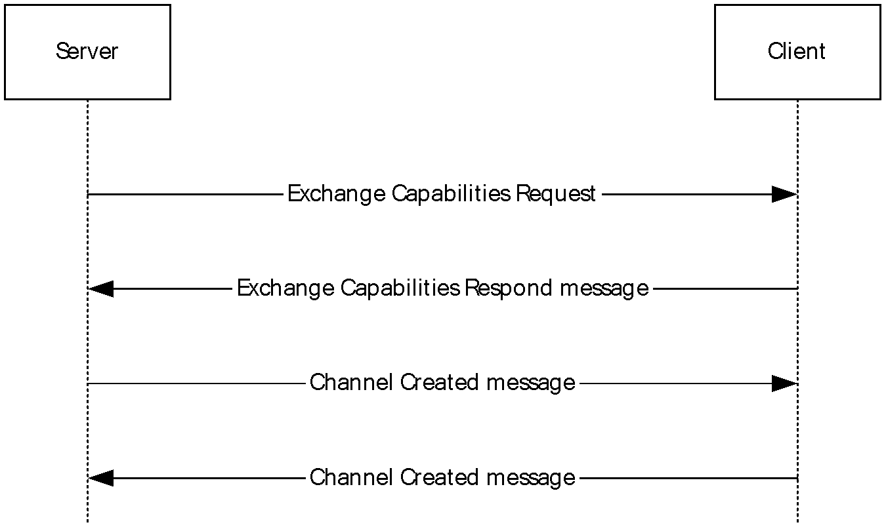

Figure 2: Channel setup sequence

<a id="Section_1.3.1.2"></a>
#### 1.3.1.2 New Device Sequence

The client uses the new device sequence to notify the server about a new device. It first notifies the server to create a new instance of the USB Redirection virtual channel. Once the new virtual channel is created, a new device message is sent to the server via the new virtual channel. The device is recognized based on the **HardwareIds** field of Add device message (section [2.2.4.2](#Section_2.2.4.2)).

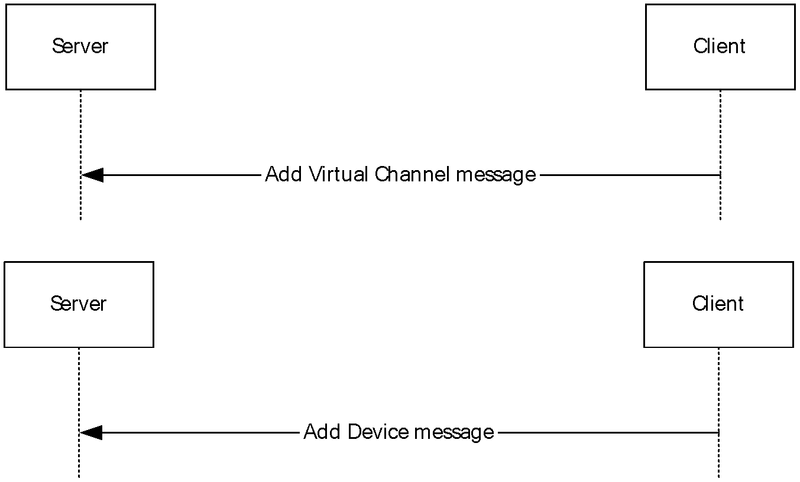

Figure 3: New device sequence

<a id="Section_1.3.1.3"></a>
#### 1.3.1.3 I/O Sequence

The server uses the I/O sequence to send I/O requests to the client. The server can send multiple I/O requests to the client without first waiting for the previously sent requests to be completed first.

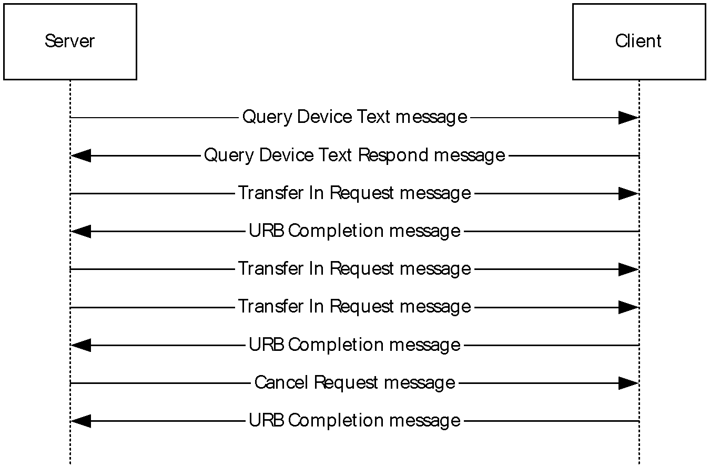

Figure 4: I/O sequence

<a id="Section_1.4"></a>
## 1.4 Relationship to Other Protocols

The Remote Desktop Protocol: USB Devices Virtual Channel Extension is embedded in a dynamic virtual channel transport, as specified in [MS-RDPEDYC](../MS-RDPEDYC/MS-RDPEDYC.md).

<a id="Section_1.5"></a>
## 1.5 Prerequisites and Preconditions

The Remote Desktop Protocol: USB Devices Virtual Channel Extension operates only after the dynamic virtual channel transport is fully established. If the dynamic virtual channel transport is terminated, the Remote Desktop Protocol: USB Devices Virtual Channel Extension is also terminated. The protocol is terminated by closing the underlying virtual channel. For details about closing the dynamic virtual channel, refer to [MS-RDPEDYC](../MS-RDPEDYC/MS-RDPEDYC.md) section 3.2.5.2.

<a id="Section_1.6"></a>
## 1.6 Applicability Statement

The Remote Desktop Protocol: USB Devices Virtual Channel Extension is designed to run within the context of a Remote Desktop Protocol (RDP) virtual channel established between a client and server. This protocol is applicable when any local client USB devices are to be accessible (redirected) in the remote session hosted on the server.

[**Device drivers**](#gt_device-driver) and applications have to meet the following requirements if they are to be redirected:

- This protocol is not intended for use with devices that require quality-of-service guarantees (because the I/O is sent over a network, there is no guarantee about the timeframe for delivering the I/O to and receiving it from the device).
- For redirection to operate properly using this protocol, all communication between devices and applications are routed through the [**I/O routines**](#gt_d509dbdb-f32b-4902-88fe-636121de5245) supported by device drivers. Communication cannot be routed by any other means, such as shared memory, the registry, or disk files.
- This protocol redirects the following operating system-specific I/O calls: Read, Write, and IOControl. Communication between the device driver and the application cannot be anything other than these basic calls. If there is any other I/O, the device cannot be redirected using this protocol hence the device will be treated as any other device attached to the client and this protocol will not be involved in any means.
<a id="Section_1.7"></a>
## 1.7 Versioning and Capability Negotiation

This protocol supports versioning and capability negotiation at two levels. The first is supported through the use of interface manipulation messages, as specified in sections [2.2.2](#Section_2.2.2) and [2.2.3](#Section_2.2.3). The second is supported by the capability exchange messages, as specified in section [2.2.5.1](#Section_2.2.5.1).

The USB2.0 specification also includes versioning in the Device descriptor as described in section 9.6.1 of [[USB-SPC2.0]](https://go.microsoft.com/fwlink/?LinkId=207891).

<a id="Section_1.8"></a>
## 1.8 Vendors-Extensible Fields

This protocol uses [**HRESULTs**](#gt_hresult), as specified in [MS-ERREF](../MS-ERREF/MS-ERREF.md) section 2.1. Vendors are free to choose their own values, as long as the C bit (0x20000000) is set, indicating that it is a customer code.

<a id="Section_1.9"></a>
## 1.9 Standards Assignments

None.

<a id="Section_2"></a>
# 2 Messages

<a id="Section_2.1"></a>
## 2.1 Transport

The Remote Desktop Protocol: USB Devices Virtual Channel Extension is designed to operate over dynamic virtual channels, as specified in [MS-RDPEDYC](../MS-RDPEDYC/MS-RDPEDYC.md). The dynamic virtual channel name is the [**ANSI**](#gt_100cd8a6-5cb1-4895-9de6-e4a3c224a583)-encoded null-terminated string "URBDRC". The usage of a channel name when opening a dynamic virtual channel is specified in [MS-RDPEDYC] section 2.2.2.1.

<a id="Section_2.2"></a>
## 2.2 Message Syntax

<a id="Section_2.2.1"></a>
### 2.2.1 Shared Message Header (SHARED_MSG_HEADER)

Every packet in this extension contains a common header.<1>

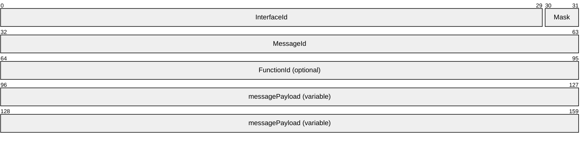

**InterfaceId (30 bits):** A 30-bit field that represents the common identifier for the interface. Some interfaces have predefined default IDs. If the message uses a default interface ID, the message is interpreted for the associated interface. All other values MUST be retrieved either from a Query Interface response (QI_RSP) ([MS-RDPEXPS](../MS-RDPEXPS/MS-RDPEXPS.md) section 2.2.2.1.2) or from responses that contain interface IDs. The highest two bits of the **NetInterfaceId** field in a QI_RSP message MUST be ignored.

This interface ID is valid until it is sent or received in an Interface Release (IFACE_RELEASE) message ([MS-RDPEXPS] section 2.2.2.2). After an IFACE_RELEASE message is processed, the ID is considered invalid.

**Mask (2 bits):** The 2 bits of the **Mask** field MUST be set to one of the following values.

| Value | Meaning |
| --- | --- |
| STREAM_ID_STUB 0x2 | Indicates that the SHARED_MSG_HEADER is being used in a response message. |
| STREAM_ID_PROXY 0x1 | Indicates that the SHARED_MSG_HEADER is not being used in a response message. |
| STREAM_ID_NONE 0x0 | Indicates that the SHARED_MSG_HEADER is being used for interface manipulation capabilities exchange as specified in section [2.2.3](#Section_2.2.3). This value MUST NOT be used for any other messages. |

**MessageId (4 bytes):** A 32-bit unsigned integer. A unique ID for the request or response pair. Requests and responses are matched based on this ID coupled with the **InterfaceId**.

**FunctionId (4 bytes):** A 32-bit unsigned integer. This field MUST be present in all packets except response packets. Its value is either used in interface manipulation messages or defined for a specific interface. The following values are categorized by the interface for which they are defined.

Common IDs for all interfaces are as follows.

| Value | Meaning |
| --- | --- |
| RIMCALL_RELEASE 0x00000001 | Release the given interface ID. |
| RIMCALL_QUERYINTERFACE 0x00000002 | Query for a new interface. |

Capabilities Negotiator Interface IDs are as follows.

| Value | Meaning |
| --- | --- |
| RIM_EXCHANGE_CAPABILITY_REQUEST 0x00000100 | The server sends the [Interface Manipulation Exchange Capabilities Request](#Section_2.2.3.1) message. |

Client Request Completion Interface IDs are as follows.

| Value | Meaning |
| --- | --- |
| IOCONTROL_COMPLETION 0x00000100 | The client sends the [IO Control Completion](#Section_2.2.7.1) message. |
| URB_COMPLETION 0x00000101 | The client sends the [URB Completion](#Section_2.2.7.2) message. |
| URB_COMPLETION_NO_DATA 0x00000102 | The client sends the [URB Completion No Data](#Section_2.2.7.3) message. |

Server USB Device Interface IDs are as follows.

| Value | Meaning |
| --- | --- |
| CANCEL_REQUEST 0x00000100 | The server sends the [Cancel Request](#Section_2.2.6.1) message. |
| REGISTER_REQUEST_CALLBACK 0x00000101 | The server sends the [Register Request Callback](#Section_2.2.6.2) message. |
| IO_CONTROL 0x00000102 | The server sends the [IO Control](#Section_2.2.6.3) message. |
| INTERNAL_IO_CONTROL 0x00000103 | The server sends the [Internal IO Control](#Section_4.1.2) message. |
| QUERY_DEVICE_TEXT 0x00000104 | The server sends the [Query Device Text](#Section_2.2.6.5) message. |
| TRANSFER_IN_REQUEST 0x00000105 | The server sends the [Transfer In Request](#Section_2.2.6.7) message. |
| TRANSFER_OUT_REQUEST 0x00000106 | The server sends the [Transfer Out Request](#Section_2.2.6.8) message. |
| RETRACT_DEVICE 0x00000107 | The server sends the [Retract Device](#Section_2.2.6.9) message. |

Client Device Sink Interface IDs are as follows.

| Value | Meaning |
| --- | --- |
| ADD_VIRTUAL_CHANNEL 0x00000100 | The client sends the [Add Virtual Channel](#Section_2.2.4.1) message. |
| ADD_DEVICE 0x00000101 | The client sends the [Add Device](#Section_2.2.4.2) message. |

Channel Notification Interface IDs are as follows.

| Value | Meaning |
| --- | --- |
| CHANNEL_CREATED 0x00000100 | The server and the client send the [Channel Created](#Section_4.1.1) message. |

**messagePayload (variable):** An array of unsigned 8-bit integers. The remainder of the message is interpreted based on the interface for which the packet is sent. This field is optional based on the packet length.

<a id="Section_2.2.2"></a>
### 2.2.2 Interface Manipulation

This protocol utilizes the same Interface Query and Interface Release messages that are defined in [MS-RDPEXPS](../MS-RDPEXPS/MS-RDPEXPS.md) section 2.2.2.

<a id="Section_2.2.3"></a>
### 2.2.3 Interface Manipulation Exchange Capabilities Interface

The Exchange Capabilities Interface is identified by the interface ID 0x00000000. This interface is used to exchange the client's and the server's capabilities for interface manipulation.

<a id="Section_2.2.3.1"></a>
#### 2.2.3.1 Interface Manipulation Exchange Capabilities Request (RIM_EXCHANGE_CAPABILITY_REQUEST)

This message is used by the server to request interface manipulation capabilities from the client.

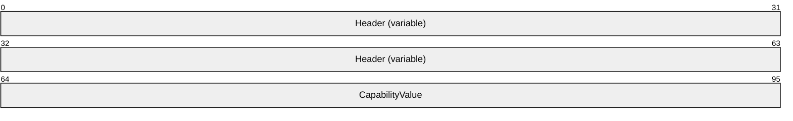

**Header (variable):** The SHARED_MSG_HEADER (as specified in section [2.2.1](#Section_2.2.1)). The **InterfaceId** field MUST be set to 0x00000000. The **Mask** field MUST be set to STREAM_ID_NONE. The **FunctionId** field MUST be set to RIM_EXCHANGE_CAPABILITY_REQUEST (0x00000100).

**CapabilityValue (4 bytes):** A 32-bit unsigned integer that identifies the server's capability. The valid values for this field are as follows.

| Value | Meaning |
| --- | --- |
| RIM_CAPABILITY_VERSION_01 0x00000001 | This capability MUST be present in the message. |

<a id="Section_2.2.3.2"></a>
#### 2.2.3.2 Interface Manipulation Exchange Capabilities Response (RIM_EXCHANGE_CAPABILITY_RESPONSE)

This message is sent by the client in response to [RIM_EXCHANGE_CAPABILITY_REQUEST](#Section_2.2.3.1).

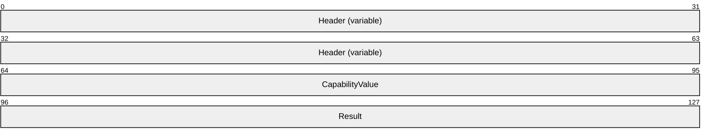

**Header (variable):** The SHARED_MSG_HEADER (as specified in section [2.2.1](#Section_2.2.1)). The **InterfaceId** field and the **MessageId** field in this message header SHOULD contain the same values as the **InterfaceId** and **MessageId** fields in the corresponding RIM_EXCHANGE_CAPABILITY_REQUEST message. The **Mask** field MUST be set to STREAM_ID_NONE.

**CapabilityValue (4 bytes):** A 32-bit unsigned integer that identifies the client's capability. The valid values for this field are as follows.

| Value | Meaning |
| --- | --- |
| RIM_CAPABILITY_VERSION_01 0x00000001 | This capability MUST be present in the message. |

**Result (4 bytes):** A 32-bit unsigned integer that indicates the [**HRESULT**](#gt_hresult) of the operation.

<a id="Section_2.2.4"></a>
### 2.2.4 Device Sink Interface

The device sink interface is identified by the default interface ID 0x00000001. The device sink interface is used by the client to communicate with the server about new USB devices.

<a id="Section_2.2.4.1"></a>
#### 2.2.4.1 Add Virtual Channel Message (ADD_VIRTUAL_CHANNEL)

The ADD_VIRTUAL_CHANNEL message is sent from the client to the server to create a new instance of dynamic virtual channel.

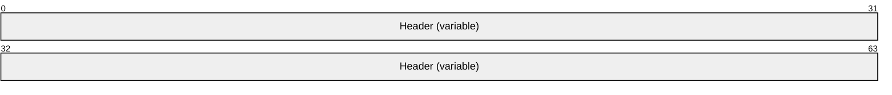

**Header (variable):** The SHARED_MSG_HEADER (as specified in section [2.2.1](#Section_2.2.1)). The **InterfaceId** field MUST be set to 0x00000001. The **Mask** field MUST be set to STREAM_ID_PROXY. The **FunctionId** field MUST be set to ADD_VIRTUAL_CHANNEL (0x00000100).

<a id="Section_2.2.4.2"></a>
#### 2.2.4.2 Add Device Message (ADD_DEVICE)

The ADD_DEVICE message is sent from the client to the server in order to create a redirected USB device on the server.

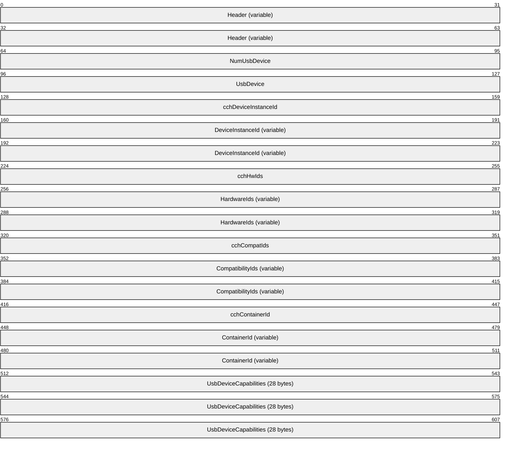

**Header (variable):** The SHARED_MSG_HEADER (as specified in section [2.2.1](#Section_2.2.1)). The **InterfaceId** field MUST be set to 0x00000001. The **Mask** field MUST be set to STREAM_ID_PROXY. The **FunctionId** field MUST be set to ADD_DEVICE (0x00000101).

**NumUsbDevice (4 bytes):** A 32-bit unsigned integer. MUST be set to 0x00000001.

**UsbDevice (4 bytes):** A 32-bit unsigned integer. A unique interface ID to be used by request messages defined in USB device interface.

**cchDeviceInstanceId (4 bytes):** A 32-bit unsigned integer. This field MUST contain the number of Unicode characters in the **DeviceInstanceId** field.

**DeviceInstanceId (variable):** An array of bytes. A variable-length field that contains a null-terminated [**Unicode string**](#gt_unicode-string) that identifies an instance of a USB device.

**cchHwIds (4 bytes):** A 32-bit unsigned integer. This field MUST contain the number of Unicode characters in the **HardwareIds** field. This field MAY be 0x00000000.

**HardwareIds (variable):** An array of bytes. A variable-length field that specifies a [**multisz string**](#gt_multisz-string) representing the hardware IDs of the client-side device. If the value in the **cchHwIds** field is 0x00000000, the **HardwareIds** buffer MUST NOT be present.

**cchCompatIds (4 bytes):** A 32-bit unsigned integer. This field MUST contain the number of Unicode characters in the **CompatibilityIds** field.

**CompatibilityIds (variable):** An array of bytes. A variable-length field that specifies a multisz string representing the compatibility IDs of the client-side device. If the value in the **cchCompatIds** field is 0x00000000, the **CompatibilityIds** buffer MUST NOT be present.

**cchContainerId (4 bytes):** A 32-bit unsigned integer. This field MUST contain the number of Unicode characters in the **ContainerId** field.

**ContainerId (variable):** An array of bytes. A variable-length field that contains a null-terminated Unicode string that contains the container ID in [**GUID**](#gt_globally-unique-identifier-guid), as specified in [MS-DTYP](../MS-DTYP/MS-DTYP.md) section 2.3.4.2, format of the USB device. A group of devices that represent the same physical unit share the same container ID. The value of the container ID MUST be unique and MUST not be set to zero.

**UsbDeviceCapabilities (28 bytes):** A 28-byte structure as specified in section [2.2.11](#Section_2.2.11).

<a id="Section_2.2.5"></a>
### 2.2.5 Channel Notification Interface

The channel notification interface is used by both the client and the server to communicate with the other side. For server-to-client notifications, the default interface ID is 0x00000003; for client-to-server notifications, the default interface ID is 0x00000002.

<a id="Section_2.2.5.1"></a>
#### 2.2.5.1 Channel Created Message (CHANNEL_CREATED)

The CHANNEL_CREATED message is sent from both the client and the server to inform the other side of the RDP USB device redirection version supported.

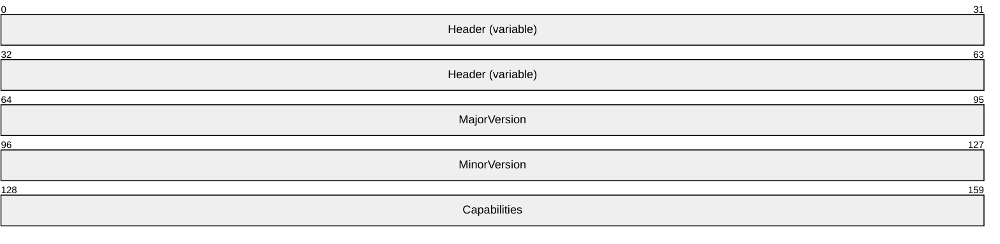

**Header (variable):** The SHARED_MSG_HEADER (as specified in section [2.2.1](#Section_2.2.1)). The **InterfaceId** field MUST be set to 0x00000002 if sent by the server and it MUST be set to 0x000000003 if sent by the client. The **Mask** field MUST be set to STREAM_ID_PROXY. The **FunctionId** field MUST be set to CHANNEL_CREATED (0x00000100).

**MajorVersion (4 bytes):** A 32-bit unsigned integer. The major version of RDP USB redirection supported. This value MUST be set to one.

**MinorVersion (4 bytes):** A 32-bit unsigned integer. The minor version of RDP USB redirection supported. This value MUST be set to zero.

**Capabilities (4 bytes):** A 32-bit unsigned integer. The capabilities of RDP USB redirection supported. This value MUST be set to zero.

<a id="Section_2.2.6"></a>
### 2.2.6 USB Device Interface

The USB [**device interface**](#gt_device-interface) is used by the server to send IO-related requests to the client.

<a id="Section_2.2.6.1"></a>
#### 2.2.6.1 Cancel Request Message (CANCEL_REQUEST)

The CANCEL_REQUEST message is sent from the server to the client to cancel an outstanding IO request.


**Header (variable):** The SHARED_MSG_HEADER (as specified in section [2.2.1](#Section_2.2.1)). The **InterfaceId** field MUST match the value sent previously in the **UsbDevice** field of the ADD_DEVICE message. The **Mask** field MUST be set to STREAM_ID_PROXY. The **FunctionId** field MUST be set to CANCEL_REQUEST (0x00000100).

**RequestId (4 bytes):** A 32-bit unsigned integer. This value represents the ID of a request previously sent via IO_CONTROL, INTERNAL_IO_CONTROL, TRANSFER_IN_REQUEST, or TRANSFER_OUT_REQUEST message.

<a id="Section_2.2.6.2"></a>
#### 2.2.6.2 Register Request Callback Message (REGISTER_REQUEST_CALLBACK)

The REGISTER_REQUEST_CALLBACK message is sent from the server to the client in order to provide a Request Completion Interface to the client.

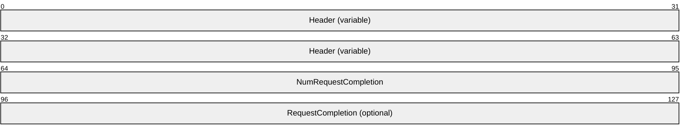

**Header (variable):** The SHARED_MSG_HEADER (as specified in section [2.2.1](#Section_2.2.1)). The **InterfaceId** field MUST match the value sent previously in the **UsbDevice** field of the ADD_DEVICE message. The **Mask** field MUST be set to STREAM_ID_PROXY. The **FunctionId** field MUST be set to REGISTER_REQUEST_CALLBACK (0x00000101).

**NumRequestCompletion (4 bytes):** A 32-bit unsigned integer. If this field is set to 0x00000001 or greater, then the **RequestCompletion** field is also present. If this field is set to 0x0000000, the **RequestCompletion** field is not present.

**RequestCompletion (4 bytes):** A 32-bit unsigned integer. A unique **InterfaceID** to be used by all Request Completion messages defined in the Request Completion Interface (section [2.2.7](#Section_2.2.7)).

<a id="Section_2.2.6.3"></a>
#### 2.2.6.3 IO Control Message (IO_CONTROL)

The IO_CONTROL message is sent from the server to the client in order to submit an IO control request to the USB device.

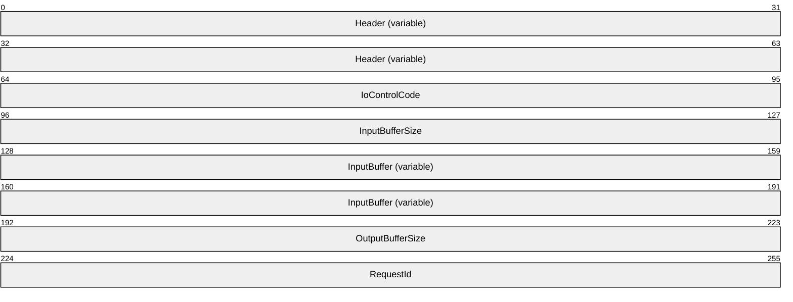

**Header (variable):** The SHARED_MSG_HEADER (as specified in section [2.2.1](#Section_2.2.1)). The **InterfaceId** field MUST match the value sent previously in the **UsbDevice** field of the ADD_DEVICE message. The **Mask** field MUST be set to STREAM_ID_PROXY. The **FunctionId** field MUST be set to IO_CONTROL (0x00000102).

**IoControlCode (4 bytes):** A 32-bit unsigned integer. An IO control code as specified in section [2.2.12](#Section_2.2.12).

**InputBufferSize (4 bytes):** A 32-bit unsigned integer. The size, in bytes, of the **InputBuffer** field.

**InputBuffer (variable):** A byte array. This value represents the input buffer for the IO control request.

**OutputBufferSize (4 bytes):** A 32-bit unsigned integer. The maximum number of bytes the client can return to the server.

**RequestId (4 bytes):** A 32-bit unsigned integer. This ID uniquely identifies the I/O control request.

<a id="Section_2.2.6.4"></a>
#### 2.2.6.4 Internal IO Control Message (INTERNAL_IO_CONTROL)

The INTERNAL_IO_CONTROL message is sent from the server to the client in order to submit an internal IO control request to the USB device.


**Header (variable):** The SHARED_MSG_HEADER (as specified in section [2.2.1](#Section_2.2.1)). The **InterfaceId** field MUST match the value sent previously in the **UsbDevice** field of the ADD_DEVICE message. The **Mask** field MUST be set to STREAM_ID_PROXY. The **FunctionId** field MUST be set to INTERNAL_IO_CONTROL (0x00000103).

**IoControlCode (4 bytes):** A 32-bit unsigned integer. An internal IO control code as specified in section [2.2.13](#Section_2.2.13).

**InputBufferSize (4 bytes):** A 32-bit unsigned integer. The size, in bytes, of the **InputBuffer** field.

**InputBuffer (variable):** A byte array. This value represents the input buffer for the internal IO control request.

**OutputBufferSize (4 bytes):** A 32-bit unsigned integer. The maximum number of bytes the internal IO control request can return.

**RequestId (4 bytes):** A 32-bit unsigned integer. This value represents an ID that uniquely identifies this internal IO control request.

<a id="Section_2.2.6.5"></a>
#### 2.2.6.5 Query Device Text Message (QUERY_DEVICE_TEXT)

The QUERY_DEVICE_TEXT message is sent from the server to the client in order to query the USB device's text when the server receives a query device test request (IRP_MN_QUERY_DEVICE_TEXT) from the system as described in [MSFT-W2KDDK], Volume 1, Part 1, Chapter 2.

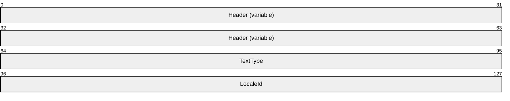

**Header (variable):** The SHARED_MSG_HEADER (as specified in section [2.2.1](#Section_2.2.1)). The **InterfaceId** field MUST match the value sent previously in the **UsbDevice** field of the ADD_DEVICE message. The **Mask** field MUST be set to STREAM_ID_PROXY. The **FunctionId** field MUST be set to QUERY_DEVICE_TEXT (0x00000104).

**TextType (4 bytes):** A 32-bit unsigned integer. This value represents the type of text to query as described in [MSFT-W2KDDK], Volume 1, Part 1, Chapter 2.

**LocaleId (4 bytes):** A 32-bit unsigned integer. This value represents the locale of the text to query as described in [MSFT-W2KDDK], Volume 1, Part 1, Chapter 2.

<a id="Section_2.2.6.6"></a>
#### 2.2.6.6 Query Device Text Response Message (QUERY_DEVICE_TEXT_RSP)

The QUERY_DEVICE_TEXT_RSP message is sent from the client in response to a QUERY_DEVICE_TEXT message sent by the server.

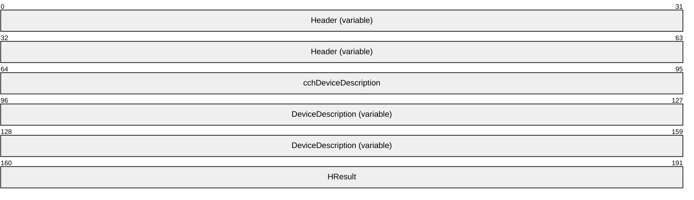

**Header (variable):** The SHARED_MSG_HEADER (as specified in section [2.2.1](#Section_2.2.1)). The **InterfaceId** and **MessageId** fields in this header MUST contain the same values as the **InterfaceId** and **MessageId** fields in the corresponding QUERY_DEVICE_TEXT. The **Mask** field MUST be set to STREAM_ID_STUB.

**cchDeviceDescription (4 bytes):** A 32-bit unsigned integer. This field MUST contain the number of Unicode characters in the **DeviceDescription** field.

**DeviceDescription (variable):** An array of bytes. A variable-length field that contains a null-terminated [**Unicode string**](#gt_unicode-string) that contains the requested device text.

**HResult (4 bytes):** A 32-bit unsigned integer that indicates the HRESULT of the operation.

<a id="Section_2.2.6.7"></a>
#### 2.2.6.7 Transfer In Request (TRANSFER_IN_REQUEST)

The TRANSFER_IN_REQUEST message is sent from the server to the client in order to request data from the USB device.

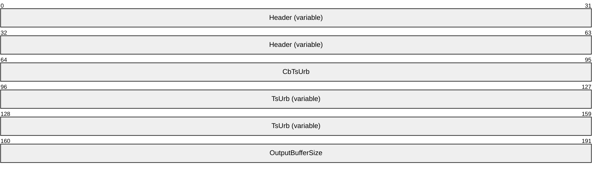

**Header (variable):** The SHARED_MSG_HEADER (as specified in section [2.2.1](#Section_2.2.1)). The **InterfaceId** field MUST match the value sent previously in the **UsbDevice** field of the ADD_DEVICE message. The **Mask** field MUST be set to STREAM_ID_PROXY. The **FunctionId** field MUST be set to TRANSFER_IN_REQUEST (0x00000105).

**CbTsUrb (4 bytes):** A 32-bit unsigned integer. The size, in bytes, of the **TsUrb** field.

**TsUrb (variable):** A TS_URB structure as defined in section [2.2.9](#Section_2.2.9).

**OutputBufferSize (4 bytes):** A 32-bit unsigned integer. This value represents the maximum number of bytes of data that is requested from the USB device.

<a id="Section_2.2.6.8"></a>
#### 2.2.6.8 Transfer Out Request (TRANSFER_OUT_REQUEST)

The TRANSFER_OUT_REQUEST message is sent from the server to the client in order to submit data to the USB device.

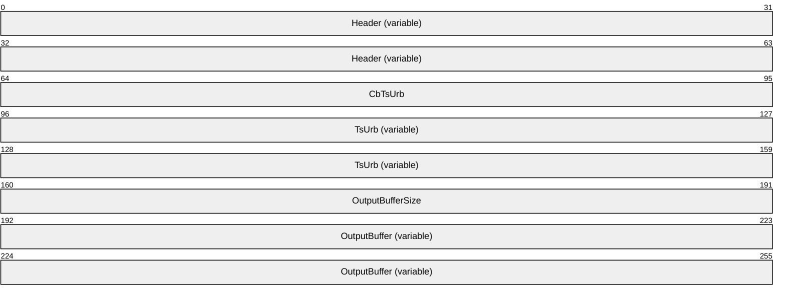

**Header (variable):** The SHARED_MSG_HEADER (as specified in section [2.2.1](#Section_2.2.1)). The **InterfaceId** field MUST match the value sent previously in the **UsbDevice** field of the ADD_DEVICE message. The **Mask** field MUST be set to STREAM_ID_PROXY. The **FunctionId** field MUST be set to TRANSFER_OUT_REQUEST (0x00000106).

**CbTsUrb (4 bytes):** A 32-bit unsigned integer. The size, in bytes, of the **TsUrb** field.

**TsUrb (variable):** A TS_URB structure as defined in section [2.2.9](#Section_2.2.9).

**OutputBufferSize (4 bytes):** A 32-bit unsigned integer. The size in bytes of the **OutputBuffer** field.

**OutputBuffer (variable):** An array of bytes. The raw data to be sent to the device.

<a id="Section_2.2.6.9"></a>
#### 2.2.6.9 Retract Device (RETRACT_DEVICE)

The RETRACT_DEVICE message is sent from the server to the client in order to stop redirecting the USB device.

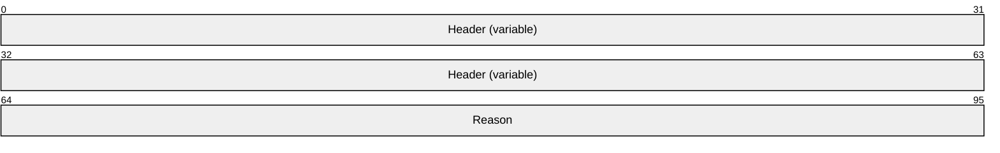

**Header (variable):** The SHARED_MSG_HEADER (as specified in section [2.2.1](#Section_2.2.1)). The **InterfaceId** field MUST match the value sent previously in the **UsbDevice** field of the ADD_DEVICE message. The **Mask** field MUST be set to STREAM_ID_PROXY. The **FunctionId** field MUST be set to RETRACT_DEVICE (0x00000107).

**Reason (4 bytes):** A 32-bit unsigned integer. The reason code, as specified in section [2.2.8](#Section_2.2.8), to stop redirecting the USB device.

<a id="Section_2.2.7"></a>
### 2.2.7 Request Completion Interface

The Request Completion Interface is used by the client to send the final result for a request previously sent from the server.

<a id="Section_2.2.7.1"></a>
#### 2.2.7.1 IO Control Completion (IOCONTROL_COMPLETION)

The IOCONTROL_COMPLETION request is sent from the client to the server as the final result of an IO Control request or internal IO Control request.

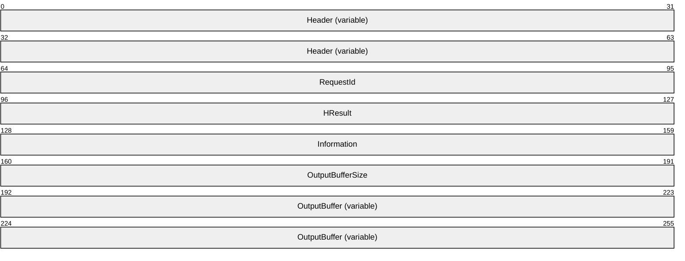

**Header (variable):** The SHARED_MSG_HEADER (as specified in section [2.2.1](#Section_2.2.1)). The **InterfaceId** field MUST match the value sent previously in the **RequestCompletion** field of the REGISTER_REQUEST_CALLBACK message. The **Mask** field MUST be set to STREAM_ID_PROXY. The **FunctionId** field MUST be set to IOCONTROL_COMPLETION (0x00000100).

**RequestId (4 bytes):** A 32-bit unsigned integer. This field MUST match the value sent previously in the **RequestId** field of the IO_CONTROL message, as specified in section [2.2.6.3](#Section_2.2.6.3).

**HResult (4 bytes):** A 32-bit unsigned integer that indicates the [**HRESULT**](#gt_hresult) of the operation.

**Information (4 bytes):** A 32-bit unsigned integer. The number of bytes of data to be transferred by the request.

**OutputBufferSize (4 bytes):** A 32-bit unsigned integer. The size, in bytes, of the **OutputBuffer** field. The value of this field MUST not exceed the value of **OutputBufferSize** field from IO_CONTROL message. If the **HResult** field indicates success, this field and the **Information** field MUST be equal. If the **HResult** field is equal to HRESULT_FROM_WIN32(ERROR_INSUFFICIENT_BUFFER) then this field is set to the value of **OutputBufferSize** from IO_CONTROL message and the **Information** field MUST indicate the expected size of the **OutputBuffer** field. For any other case this field MUST be set to 0 and the value of the **Information** field MUST be ignored.

**OutputBuffer (variable):** A data buffer that results from processing the request.

<a id="Section_2.2.7.2"></a>
#### 2.2.7.2 URB Completion (URB_COMPLETION)

The URB_COMPLETION request is sent from the client to the server as the final result of a TRANSFER_IN_REQUEST that contains output data.

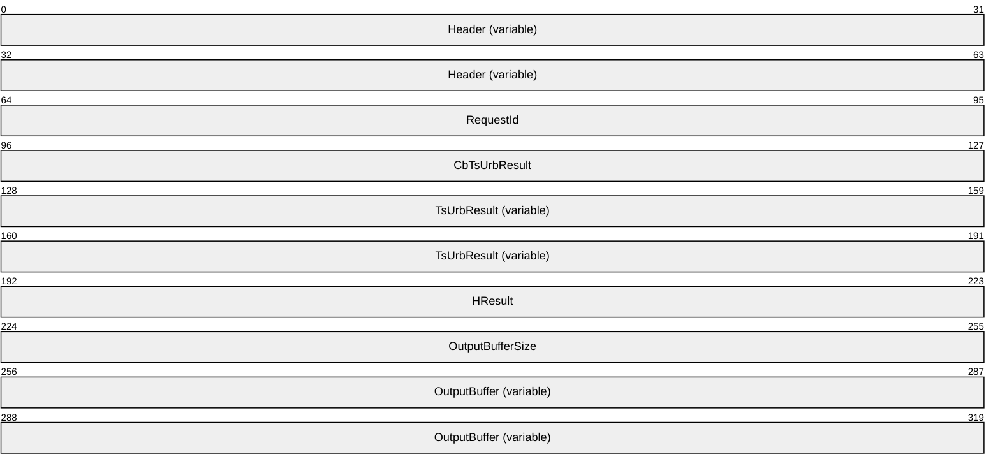

**Header (variable):** The SHARED_MSG_HEADER (as specified in section [2.2.1](#Section_2.2.1)). The **InterfaceId** field MUST match the value sent previously in the **RequestCompletion** field of the REGISTER_REQUEST_CALLBACK message. The **Mask** field MUST be set to STREAM_ID_PROXY. The **FunctionId** field MUST be set to URB_COMPLETION (0x00000101).

**RequestId (4 bytes):** A 32-bit unsigned integer. This field MUST match the value sent previously in the **RequestId** field of TsUrb structure in the TRANSFER_IN_REQUEST message.

**CbTsUrbResult (4 bytes):** A 32-bit unsigned integer. The size, in bytes, of the **TsUrbResult** field.

**TsUrbResult (variable):** A TS_URB_RESULT structure as defined in [2.2.10](#Section_2.2.10).

**HResult (4 bytes):** A 32-bit unsigned integer that indicates the [**HRESULT**](#gt_hresult) of the operation.

**OutputBufferSize (4 bytes):** A 32-bit unsigned integer. The size, in bytes, of the **OutputBuffer** field.

**OutputBuffer (variable):** A data buffer that results from processing the request.

<a id="Section_2.2.7.3"></a>
#### 2.2.7.3 URB Completion No Data (URB_COMPLETION_NO_DATA)

The URB_COMPLETION_NO_DATA request is sent from the client to the server as the final result of a TRANSFER_IN_REQUEST that contains no output data or a TRANSFER_OUT_REQUEST.

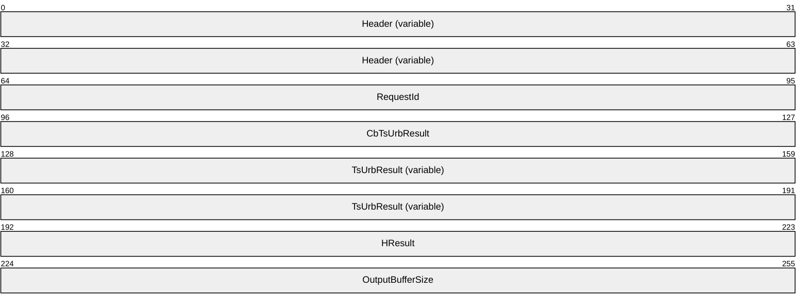

**Header (variable):** The SHARED_MSG_HEADER (as specified in section [2.2.1](#Section_2.2.1)). The **InterfaceId** field MUST match the value sent previously in the **RequestCompletion** field of the REGISTER_REQUEST_CALLBACK message. The **Mask** field MUST be set to STREAM_ID_PROXY. The **FunctionId** field MUST be set to URB_COMPLETION_NO_DATA (0x00000102).

**RequestId (4 bytes):** A 32-bit unsigned integer. This field MUST match the value sent previously in the **RequestId** field of TsUrb structure in the TRANSFER_IN_REQUEST or TRANSFER_OUT_REQUEST message.

**CbTsUrbResult (4 bytes):** A 32-bit unsigned integer. The size, in bytes, of the **TsUrbResult** field.

**TsUrbResult (variable):** A TS_URB_RESULT structure as defined in [2.2.10](#Section_2.2.10).

**HResult (4 bytes):** A 32-bit unsigned integer that indicates the [**HRESULT**](#gt_hresult) of the operation.

**OutputBufferSize (4 bytes):** A 32-bit unsigned integer. The size, in bytes, of data sent to the device of the **RequestId** that corresponds to a TRANSFER_OUT_REQUEST. This field MUST be zero if the **RequestId** corresponds to a TRANSFER_IN_REQUEST.

<a id="Section_2.2.8"></a>
### 2.2.8 USB_RETRACT_REASON Constants

The reason why the server requests the client to stop redirecting a USB device.

| Symbolic name/value | Description |
| --- | --- |
| UsbRetractReason_BlockedByPolicy 0x00000001 | The USB device is to be stopped from being redirected because the device is blocked by the server's policy. |

<a id="Section_2.2.9"></a>
### 2.2.9 TS_URB Structures

The TRANSFER_IN_REQUEST or TRANSFER_OUT_REQUEST is sent in response to a URB request received from the system.

For information on [**URB**](#gt_urb) definitions, see [MSFT-W2KDDK], Volume 2, Part 4, Chapter 3.

<a id="Section_2.2.9.1"></a>
#### 2.2.9.1 Common Structures

This section specifies common structures that are used by more than one TS_URB structure.

<a id="Section_2.2.9.1.1"></a>
##### 2.2.9.1.1 TS_URB_HEADER

Every TS_URB structure begins with a common header called TS_URB_HEADER.

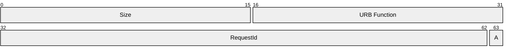

**Size (2 bytes):** A 16-bit unsigned integer. The size in bytes of the TS_URB structure.

**URB Function (2 bytes):** A 16-bit unsigned integer. The [**URB**](#gt_urb) function as specified in [MSFT-W2KDDK], Volume 2, Part 4, Chapter 3. The URB structure specified by the URB function is represented by appropriate TS_URB structure as it is described in this protocol.

**RequestId (31 bits):** A 31-bit field. An ID that uniquely identifies the TRANSFER_IN_REQUEST or TRANSFER_OUT_REQUEST.

**A - NoAck (1 bit):** A 1-bit field, this is the highest bit of a little endian byte-order field. If this bit is nonzero, the client is not to send a URB_COMPLETION message for this TRANSFER_OUT_REQUEST. This bit can be nonzero only if the **NoAckIsochWriteJitterBufferSizeInMs** field in USB_DEVICE_CAPABILITIES is nonzero and URB Function is set to URB_FUNCTION_ISOCH_TRANSFER. If the **RequestId** field is set to TRANSFER_IN_REQUEST, this field MUST be set to zero.

<a id="Section_2.2.9.1.2"></a>
##### 2.2.9.1.2 TS_USBD_INTERFACE_INFORMATION

The TS_USBD_INTERFACE_INFORMATION is based on the USBD_INTERFACE_INFORMATION structure as described in [MSFT-W2KDDK], Volume 2, Part 4, Chapter 3.

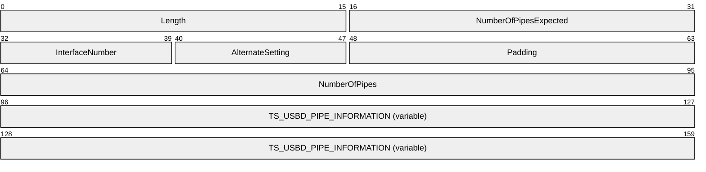

**Length (2 bytes):** A 16-bit unsigned integer. The size in bytes of the TS_USBD_INTERFACE_INFORMATION structure.

**NumberOfPipesExpected (2 bytes):** A 16-bit unsigned integer. The number of USBD_PIPE_INFORMATION structures found in the USBD_INTERFACE_INFORMATION.

**InterfaceNumber (1 byte):** A 8-bit unsigned integer. This value is from the **InterfaceNumber** field in USBD_INTERFACE_INFORMATION.

**AlternateSetting (1 byte):** A 8-bit unsigned integer. This value is from the **AlternateSetting** field in USBD_INTERFACE_INFORMATION.

**Padding (2 bytes):** A 16-bit unsigned integer for padding. This field can be set to any value and MUST be ignored upon receipt.

**NumberOfPipes (4 bytes):** A 32-bit unsigned integer. This value is from the **NumberOfPipes** field in USBD_INTERFACE_INFORMATION.

**TS_USBD_PIPE_INFORMATION (variable):** An array of TS_USBD_PIPE_INFORMATION structures, as specified in section [2.2.9.1.3](#Section_2.2.9.1.3). The number of array elements is determined by the **NumberOfPipes** field.

<a id="Section_2.2.9.1.3"></a>
##### 2.2.9.1.3 TS_USBD_PIPE_INFORMATION

The TS_USBD_PIPE_INFORMATION is based on the USBD_PIPE_INFORMATION structure as described in [MSFT-W2KDDK], Volume 2, Part 4, Chapter 3.<2>

```mermaid
packet-beta
  0-15: "MaximumPacketSize"
  16-31: "Padding"
  32-63: "MaximumTransferSize"
  64-95: "PipeFlags"
```

**MaximumPacketSize (2 bytes):** A 16-bit unsigned integer. This value is from the **MaximumPacketSize** field in USBD_PIPE_INFORMATION.

**Padding (2 bytes):** A 16-bit unsigned integer for padding. This field can be set to any value and MUST be ignored upon receipt.

**MaximumTransferSize (4 bytes):** A 32-bit unsigned integer. This value is from the **MaximumTransferSize** field in USBD_PIPE_INFORMATION.

**PipeFlags (4 bytes):** A 32-bit unsigned integer. This value is from the **PipeFlags** field in USBD_PIPE_INFORMATION.

<a id="Section_2.2.9.2"></a>
#### 2.2.9.2 TS_URB_SELECT_CONFIGURATION

This packet represents the [**URB**](#gt_urb) structure URB_SELECT_CONFIGURATION, as specified in [MSFT-W2KDDK] Volume 2, Part 4, chapter 3. The packet is sent using TRANSFER_IN_REQUEST. **OutputBufferSize** MUST be set to zero.

```mermaid
packet-beta
  0-63: "TS_URB_HEADER"
  64-71: "ConfigurationDescriptorIsValid"
  72-95: "Padding"
  96-127: "NumInterfaces"
  128-191: "TS_USBD_INTERFACE_INFORMATION (variable)"
  192-255: "USB_CONFIGURATION_DESCRIPTOR (variable)"
```

**TS_URB_HEADER (8 bytes):** A TS_URB_HEADER as specified in section [2.2.9.1.1](#Section_2.2.9.1.1).

**ConfigurationDescriptorIsValid (1 byte):** A 8-bit unsigned integer. A non-zero value indicates that the TS_URB_SELECT_CONFIGURATION contains the USB_CONFIGURATION_DESCRIPTOR field.

**Padding (3 bytes):** A 24-bit unsigned integer for padding. This field can be set to any value and MUST be ignored upon receipt.

**NumInterfaces (4 bytes):** A 32-bit unsigned integer. The number of TS_USBD_INTERFACE_INFORMATION structures that are in the TS_URB_SELECT_CONFIGURATION.

**TS_USBD_INTERFACE_INFORMATION (variable):** An array of TS_USBD_INTERFACE_INFORMATION structures as specified in section [2.2.9.1.2](#Section_2.2.9.1.2). The number of elements is determined by the **NumInterfaces** field.

**USB_CONFIGURATION_DESCRIPTOR (variable):** All data for the configuration with a USB_CONFIGURATION_DESCRIPTOR as specified in [MSFT-W2KDDK] Volume 2, Part 4, Chapter 3.

<a id="Section_2.2.9.3"></a>
#### 2.2.9.3 TS_URB_SELECT_INTERFACE

This packet represents the [**URB**](#gt_urb) structure URB_SELECT_INTERFACE, as specified in [MSFT-W2KDDK] Volume 2, Part 4, Chapter 3. The packet is sent using the TRANSFER_IN_REQUEST message with **OutputBufferSize** set to zero.

```mermaid
packet-beta
  0-63: "TS_URB_HEADER"
  64-95: "ConfigurationHandle"
  96-159: "TS_USBD_INTERFACE_INFORMATION (variable)"
```

**TS_URB_HEADER (8 bytes):** A TS_URB_HEADER as specified in section [2.2.9.1.1](#Section_2.2.9.1.1).

**ConfigurationHandle (4 bytes):** A 32-bit unsigned integer. The handle returned from the client after it successfully completes a TS_URB_SELECT_CONFIGURATION request.

**TS_USBD_INTERFACE_INFORMATION (variable):** A TS_USBD_INTERFACE_INFORMATION structure as specified in section [2.2.9.1.2](#Section_2.2.9.1.2).

<a id="Section_2.2.9.4"></a>
#### 2.2.9.4 TS_URB_PIPE_REQUEST

This packet represents the [**URB**](#gt_urb) structure URB_PIPE_REQUEST, as specified in [MSFT-W2KDDK] Volume 2, Part 4, Chapter 3. The packet is sent using the TRANSFER_IN_REQUEST message with **OutputBufferSize** set to zero.

```mermaid
packet-beta
  0-63: "TS_URB_HEADER"
  64-95: "PipeHandle"
```

**TS_URB_HEADER (8 bytes):** A TS_URB_HEADER as specified in section [2.2.9.1.1](#Section_2.2.9.1.1).

**PipeHandle (4 bytes):** A 32-bit unsigned integer. This is either the **ConfigurationHandle** field used in TS_URB_SELECT_INTERFACE request or the **ConfigurationHandle** field returned by the client with TS_URB_SELECT_CONFIGURATION_RESULT.

<a id="Section_2.2.9.5"></a>
#### 2.2.9.5 TS_URB_GET_CURRENT_FRAME_NUMBER

This packet represents the [**URB**](#gt_urb) structure URB_GET_CURRENT_FRAME_NUMBER, as specified in [MSFT-W2KDDK] Volume 2, Part 4, Chapter 3. The packet is sent using the TRANSFER_IN_REQUEST. The **OutputBufferSize** field MUST be set to 0.

```mermaid
packet-beta
  0-63: "TS_URB_HEADER"
```

**TS_URB_HEADER (8 bytes):** A TS_URB_HEADER as specified in section [2.2.9.1.1](#Section_2.2.9.1.1).

<a id="Section_2.2.9.6"></a>
#### 2.2.9.6 TS_URB_CONTROL_TRANSFER

This packet represents the [**URB**](#gt_urb) structure URB_CONTROL_TRANSFER, as specified in *[MSFT-W2KDDK]* Volume 2, Part 4, Chapter 3. If the **TransferFlags** field in URB_CONTROL_TRANSFER contains the USBD_TRANSFER_DIRECTION_IN flag, the packet is sent using the TRANSFER_IN_REQUEST message with **OutputBufferSize** set to **TransferBufferLength** as defined in URB_CONTROL_TRANSFER; otherwise, the packet is sent using the TRANSFER_OUT_REQUEST message with **OutputBufferSize** set to **TransferBufferLength** and **OutputBuffer** set to data in **TransferBuffer** or **TransferBufferMDL** as defined in URB_CONTROL_TRANSFER.

```mermaid
packet-beta
  0-63: "TS_URB_HEADER"
  64-95: "PipeHandle"
  96-127: "TransferFlags"
  128-191: "SetupPacket"
```

**TS_URB_HEADER (8 bytes):** A TS_URB_HEADER as specified in section [2.2.9.1.1](#Section_2.2.9.1.1).

**PipeHandle (4 bytes):** A 32-bit unsigned integer. The handle returned from the client after it successfully completes a TS_URB_SELECT_INTERFACE request.

**TransferFlags (4 bytes):** A 32-bit unsigned integer. This value is from the **TransferFlags** field in URB_CONTROL_TRANSFER.

**SetupPacket (8 bytes):** An 8-byte array. This value is from the **SetupPacket** field in URB_CONTROL_TRANSFER.

<a id="Section_2.2.9.7"></a>
#### 2.2.9.7 TS_URB_BULK_OR_INTERRUPT_TRANSFER

The packet represents the [**URB**](#gt_urb) structure URB_BULK_OR_INTERRUPT_TRANSFER, as specified in *[MSFT-W2KDDK]* Volume 2, Part 4, Chapter 3. If the **TransferFlags** field in URB_BULK_OR_INTERRUPT_TRANSFER contains the USBD_TRANSFER_DIRECTION_IN flag, the packet is sent using the TRANSFER_IN_REQUEST message with the **OutputBufferSize** field set to **TransferBufferLength** as defined in URB_BULK_OR_INTERRUPT_TRANSFER; otherwise, the packet is sent using the TRANSFER_OUT_REQUEST message with the **OutputBufferSize** field set to **TransferBufferLength** and the **OutputBuffer** field set to the data in **TransferBuffer** or **TransferBufferMDL** as defined in URB_BULK_OR_INTERRUPT_TRANSFER.

```mermaid
packet-beta
  0-63: "TS_URB_HEADER"
  64-95: "PipeHandle"
  96-127: "TransferFlags"
```

**TS_URB_HEADER (8 bytes):** A TS_URB_HEADER as specified in section [2.2.9.1.1](#Section_2.2.9.1.1).

**PipeHandle (4 bytes):** A 32-bit unsigned integer. The handle returned from the client after it successfully completes a TS_URB_SELECT_INTERFACE request.

**TransferFlags (4 bytes):** A 32-bit unsigned integer. This value is from the **TransferFlags** field in URB_BULK_OR_INTERRUPT_TRANSFER.

<a id="Section_2.2.9.8"></a>
#### 2.2.9.8 TS_URB_ISOCH_TRANSFER

This packet represents the [**URB**](#gt_urb) structure URB_ISOCH_TRANSFER, as specified in *[MSFT-W2KDDK]* Volume 2, Part 4, Chapter 3. If the **TransferFlags** field in URB_ISOCH_TRANSFER contains the USBD_TRANSFER_DIRECTION_IN flag, the packet is sent using the TRANSFER_IN_REQUEST message with the **OutputBufferSize** field set to **TransferBufferLength** as defined in URB_ISOCH_TRANSFER; otherwise, the packet is sent using the TRANSFER_OUT_REQUEST message with the **OutputBufferSize** field set to **TransferBufferLength** and the **OutputBuffer** field set to the data in **TransferBuffer** or **TransferBufferMDL** as defined in URB_ISOCH_TRANSFER.

```mermaid
packet-beta
  0-63: "TS_URB_HEADER"
  64-95: "PipeHandle"
  96-127: "TransferFlags"
  128-159: "StartFrame"
  160-191: "NumberOfPackets"
  192-223: "ErrorCount"
  224-287: "IsoPacket (variable)"
```

**TS_URB_HEADER (8 bytes):** A TS_URB_HEADER as specified in section [2.2.9.1.1](#Section_2.2.9.1.1).

**PipeHandle (4 bytes):** A 32-bit unsigned integer. The handle returned from the client after it successfully completes a TS_URB_SELECT_INTERFACE request.

**TransferFlags (4 bytes):** A 32-bit unsigned integer. This value is from the **TransferFlags** field in URB_ISOCH_TRANSFER.

**StartFrame (4 bytes):** A 32-bit unsigned integer. This value is from the **StartFrame** field in URB_ISOCH_TRANSFER.

**NumberOfPackets (4 bytes):** A 32-bit unsigned integer. This value is from the **NumberOfPackets** field in URB_ISOCH_TRANSFER.

**ErrorCount (4 bytes):** A 32-bit unsigned integer. This value is from the **ErrorCount** field in URB_ISOCH_TRANSFER.

**IsoPacket (variable):** An array of USBD_ISO_PACKET_DESCRIPTOR structures. This value is from the **IsoPacket** field in URB_ISOCH_TRANSFER.

<a id="Section_2.2.9.9"></a>
#### 2.2.9.9 TS_URB_CONTROL_DESCRIPTOR_REQUEST

This packet represents the [**URB**](#gt_urb) structure URB_CONTROL_DESCRIPTOR_REQUEST, as specified in *[MSFT-W2KDDK]* Volume 2, Part 4, Chapter 3. If the URB Function in URB_CONTROL_DESCRIPTOR_REQUEST is URB_FUNCTION_GET_DESCRIPTOR_FROM_DEVICE, URB_FUNCTION_GET_DESCRIPTOR_FROM_ENDPOINT, or URB_FUNCTION_GET_DESCRIPTOR_FROM_INTERFACE, the packet is sent using the TRANSFER_IN_REQUEST message with the **OutputBufferSize** field set to **TransferBufferLength** as defined in URB_CONTROL_DESCRIPTOR_REQUEST; otherwise, the packet is sent using the TRANSFER_OUT_REQUEST message with the **OutputBufferSize** field set to **TransferBufferLength** and the **OutputBuffer** field set to the data in **TransferBuffer** or **TransferBufferMDL** as defined in URB_CONTROL_DESCRIPTOR_REQUEST.

```mermaid
packet-beta
  0-63: "TS_URB_HEADER"
  64-71: "Index"
  72-79: "DescriptorType"
  80-95: "LanguageId"
```

**TS_URB_HEADER (8 bytes):** A TS_URB_HEADER as specified in section [2.2.9.1.1](#Section_2.2.9.1.1).

**Index (1 byte):** A 8-bit unsigned integer. This value is from the **Index** field in URB_CONTROL_DESCRIPTOR_REQUEST.

**DescriptorType (1 byte):** A 8-bit unsigned integer. This value is from the **DescriptorType** field in URB_CONTROL_DESCRIPTOR_REQUEST.

**LanguageId (2 bytes):** A 16-bit unsigned integer. This value is from the **LanguageId** field in URB_CONTROL_DESCRIPTOR_REQUEST.

<a id="Section_2.2.9.10"></a>
#### 2.2.9.10 TS_URB_CONTROL_FEATURE_REQUEST

This packet represents the [**URB**](#gt_urb) structure URB_CONTROL_FEATURE_REQUEST, as specified in [MSFT-W2KDDK] Volume 2, Part 4, Chapter 3. The packet is sent using the TRANSFER_IN_REQUEST message with the **OutputBufferSize** field set to zero.

```mermaid
packet-beta
  0-63: "TS_URB_HEADER"
  64-79: "FeatureSelector"
  80-95: "Index"
```

**TS_URB_HEADER (8 bytes):** A TS_URB_HEADER as specified in section [2.2.9.1.1](#Section_2.2.9.1.1).

**FeatureSelector (2 bytes):** A 16-bit unsigned integer. This value is from the **FeatureSelector** field in URB_CONTROL_FEATURE_REQUEST.

**Index (2 bytes):** A 16-bit unsigned integer. This value is from the **Index** field in URB_CONTROL_FEATURE_REQUEST.

<a id="Section_2.2.9.11"></a>
#### 2.2.9.11 TS_URB_CONTROL_GET_STATUS_REQUEST

This packet represents the [**URB**](#gt_urb) structure URB_CONTROL_GET_STATUS_REQUEST, as specified in [MSFT-W2KDDK] Volume 2, Part 4, Chapter 3. The packet is sent using the TRANSFER_IN_REQUEST message with the **OutputBufferSize** field set to **TransferBufferLength** as defined in URB_CONTROL_GET_STATUS_REQUEST.

```mermaid
packet-beta
  0-63: "TS_URB_HEADER"
  64-79: "Index"
  80-95: "Padding"
```

**TS_URB_HEADER (8 bytes):** A TS_URB_HEADER as specified in section [2.2.9.1.1](#Section_2.2.9.1.1).

**Index (2 bytes):** A 16-bit unsigned integer. This value is from the **Index** field in URB_CONTROL_GET_STATUS_REQUEST.

**Padding (2 bytes):** A 16-bit unsigned integer for padding. This field can be set to any value and MUST be ignored upon receipt.

<a id="Section_2.2.9.12"></a>
#### 2.2.9.12 TS_URB_CONTROL_VENDOR_OR_CLASS_REQUEST

This packet represents the [**URB**](#gt_urb) structure URB_CONTROL_VENDOR_OR_CLASS_REQUEST, as specified in *[MSFT-W2KDDK]* Volume 2, Part 4, Chapter 3. If the **TransferFlags** field in URB_CONTROL_VENDOR_OR_CLASS_REQUEST contains the USBD_TRANSFER_DIRECTION_IN flag, the packet is sent using the TRANSFER_IN_REQUEST message with the **OutputBufferSize** field set to **TransferBufferLength** as defined in URB_CONTROL_VENDOR_OR_CLASS_REQUEST; otherwise, the packet is sent using the TRANSFER_OUT_REQUEST message with the **OutputBufferSize** field set to **TransferBufferLength** and the **OutputBuffer** field set to the data in **TransferBuffer** or **TransferBufferMDL** as defined in URB_CONTROL_VENDOR_OR_CLASS_REQUEST.

```mermaid
packet-beta
  0-63: "TS_URB_HEADER"
  64-95: "TransferFlags"
  96-103: "RequestTypeReservedBits"
  104-111: "Request"
  112-127: "Value"
  128-143: "Index"
  144-159: "Padding"
```

**TS_URB_HEADER (8 bytes):** A TS_URB_HEADER as specified in section [2.2.9.1.1](#Section_2.2.9.1.1).

**TransferFlags (4 bytes):** A 32-bit unsigned integer. This value is from the **TransferFlags** field in URB_CONTROL_VENDOR_OR_CLASS_REQUEST.

**RequestTypeReservedBits (1 byte):** An 8-bit unsigned integer. This value is from the **RequestTypeReservedBits** field in URB_CONTROL_VENDOR_OR_CLASS_REQUEST.

**Request (1 byte):** An 8-bit unsigned integer. If the operating system (OS) descriptor request has been successfully retrieved the **Request** field is set to the value, see section [3.3.5.3.9](#Section_3.3.5.3.9) Processing an OS descriptor request on how to retrieve an OS descriptor. Otherwise this value contains the value from the **Request** field in URB_CONTROL_VENDOR_OR_CLASS_REQUEST.

**Value (2 bytes):** A 16-bit unsigned integer. This value is from the **Value** field in URB_CONTROL_VENDOR_OR_CLASS_REQUEST.

**Index (2 bytes):** A 16-bit unsigned integer. This value is from the **Index** field in URB_CONTROL_VENDOR_OR_CLASS_REQUEST.

**Padding (2 bytes):** A 16-bit unsigned integer for padding. This field can be set to any value and MUST be ignored upon receipt.

<a id="Section_2.2.9.13"></a>
#### 2.2.9.13 TS_URB_CONTROL_GET_CONFIGURATION_REQUEST

This packet represents the [**URB**](#gt_urb) structure URB_CONTROL_GET_CONFIGURATION_REQUEST, as specified in [MSFT-W2KDDK] Volume 2, Part 4, Chapter 3. The packet is sent using the TRANSFER_IN_REQUEST message with the **OutputBufferSize** field set to **TransferBufferLength** as defined in URB_CONTROL_GET_CONFIGURATION_REQUEST.

```mermaid
packet-beta
  0-63: "TS_URB_HEADER"
```

**TS_URB_HEADER (8 bytes):** A TS_URB_HEADER as specified in section [2.2.9.1.1](#Section_2.2.9.1.1).

<a id="Section_2.2.9.14"></a>
#### 2.2.9.14 TS_URB_CONTROL_GET_INTERFACE_REQUEST

This packet represents the [**URB**](#gt_urb) structure URB_CONTROL_GET_INTERFACE_REQUEST, as specified in [MSFT-W2KDDK] Volume 2, Part 4, Chapter 3. The packet is sent using the TRANSFER_IN_REQUEST message with the **OutputBufferSize** field set to **TransferBufferLength** as defined in URB_CONTROL_GET_INTERFACE_REQUEST.

```mermaid
packet-beta
  0-63: "TS_URB_HEADER"
  64-79: "Interface"
  80-95: "Padding"
```

**TS_URB_HEADER (8 bytes):** A TS_URB_HEADER as specified in section [2.2.9.1.1](#Section_2.2.9.1.1).

**Interface (2 bytes):** A 16-bit unsigned integer. This value is from the **Interface** field in URB_CONTROL_GET_INTERFACE_REQUEST.

**Padding (2 bytes):** A 16-bit unsigned integer for padding. This field can be set to any value and MUST be ignored upon receipt.

<a id="Section_2.2.9.15"></a>
#### 2.2.9.15 TS_URB_OS_FEATURE_DESCRIPTOR_REQUEST

This packet represents the [**URB**](#gt_urb) structure URB_OS_FEATURE_DESCRIPTOR_REQUEST, as specified in [MSFT-W2KDDK] Volume 2, Part 4, Chapter 3. The packet is sent using the TRANSFER_IN_REQUEST message with the **OutputBufferSize** field set to **TransferBufferLength** as defined in URB_OS_FEATURE_DESCRIPTOR_REQUEST.

```mermaid
packet-beta
  0-63: "TS_URB_HEADER"
  64-68: "Recipient"
  69-71: "Padding1"
  72-79: "InterfaceNumber"
  80-87: "MS_PageIndex"
  88-103: "MS_FeatureDescriptorIndex"
  104-127: "Padding2"
```

**TS_URB_HEADER (8 bytes):** A TS_URB_HEADER as specified in section [2.2.9.1.1](#Section_2.2.9.1.1).

**Recipient (5 bits):** A 5-bit field. This value is from the **Recipient** field in URB_OS_FEATURE_DESCRIPTOR_REQUEST. When converting this value from the 8-bit field in URB_OS_FEATURE_DESCRIPTOR_REQUEST into the 5-bit field in TS_URB_OS_FEATURE_DESCRIPTOR_REQUEST, the highest 3 bits MUST be ignored. In an inverse conversion, the highest 3 bits MUST be set to 0.

**Padding1 (3 bits):** A 3-bit field for padding. This field can be set to any value and MUST be ignored upon receipt.

**InterfaceNumber (1 byte):** An 8-bit unsigned integer. This value is from the **InterfaceNumber** field in URB_OS_FEATURE_DESCRIPTOR_REQUEST.

**MS_PageIndex (1 byte):** An 8-bit unsigned integer. This value is from the **MS_PageIndex** field in URB_OS_FEATURE_DESCRIPTOR_REQUEST.

**MS_FeatureDescriptorIndex (2 bytes):** A 16-bit unsigned integer. This value is from the **MS_FeatureDescriptorIndex** field in URB_OS_FEATURE_DESCRIPTOR_REQUEST.

**Padding2 (3 bytes):** A 24-bit unsigned integer for padding. This field can be set to any value and MUST be ignored upon receipt.

<a id="Section_2.2.9.16"></a>
#### 2.2.9.16 TS_URB_CONTROL_TRANSFER_EX

This packet represents the [**URB**](#gt_urb) structure URB_CONTROL_TRANSFER_EX, as specified in *[MSFT-W2KDDK]* Volume 2, Part 4, Chapter 3. URB_CONTROL_TRANSFER_EX is same as URB_CONTROL_TRANSFER except URB_CONTROL_TRANSFER_EX contains a new field called timeout following the TransferBufferMDL field. The timeout field in URB_CONTROL_TRANSFER_EX is 32-bit unsigned integer. If the **TransferFlags** field in URB_CONTROL_TRANSFER_EX contains the USBD_TRANSFER_DIRECTION_IN flag, the packet is sent using the TRANSFER_IN_REQUEST message with the **OutputBufferSize** field set to **TransferBufferLength** as defined in URB_CONTROL_TRANSFER_EX; otherwise, the packet is sent using the TRANSFER_OUT_REQUEST message with the **OutputBufferSize** field set to **TransferBufferLength** and the **OutputBuffer** field set to the data in **TransferBuffer** or **TransferBufferMDL** as defined in URB_CONTROL_TRANSFER_EX.

```mermaid
packet-beta
  0-63: "TS_URB_HEADER"
  64-95: "PipeHandle"
  96-127: "TransferFlags"
  128-159: "Timeout"
  160-223: "SetupPacket"
```

**TS_URB_HEADER (8 bytes):** A TS_URB_HEADER as specified in section [2.2.9.1.1](#Section_2.2.9.1.1).

**PipeHandle (4 bytes):** A 32-bit unsigned integer. The handle returned from the client after it successfully completes a TS_URB_SELECT_INTERFACE request.

**TransferFlags (4 bytes):** A 32-bit unsigned integer. This value is from the **TransferFlags** field in URB_CONTROL_TRANSFER_EX.

**Timeout (4 bytes):** A 32-bit unsigned integer. This value is from the **Timeout** field in URB_CONTROL_TRANSFER_EX. This value indicates the time, in milliseconds, before the request times out. A value of zero indicates that there is no timeout for this request. The value of this field is passed to the physical device.

**SetupPacket (8 bytes):** An array of 8-bytes. This value is from the **SetupPacket** field in URB_CONTROL_TRANSFER_EX.

<a id="Section_2.2.10"></a>
### 2.2.10 TS_URB_RESULT Structures

The TS_URB_RESULT structures sent in response to the TRANSFER_IN_REQUEST and TRANSFER_OUT_REQUEST messages, are sent via the URB_COMPLETION or URB_COMPLETION_NO_DATA messages. These messages contain the TS_URB_RESULT field, which is described in this section.

All the fields in TS_URB_RESULT are the output fields defined in [**URB**](#gt_urb). For information on URB definitions, see [MSFT-W2KDDK], Volume 2, Part 4, Chapter 3.

<a id="Section_2.2.10.1"></a>
#### 2.2.10.1 Common Structures

<a id="Section_2.2.10.1.1"></a>
##### 2.2.10.1.1 TS_URB_RESULT_HEADER

Every TS_URB_RESULT structure begins with a common header called TS_URB_RESULT_HEADER.

```mermaid
packet-beta
  0-15: "Size"
  16-31: "Padding"
  32-63: "UsbdStatus"
```

**Size (2 bytes):** A 16-bit unsigned integer. The size, in bytes, of the TS_URB_RESULT structure.

**Padding (2 bytes):** A 16-bit unsigned integer for padding. This field can be set to any value and MUST be ignored upon receipt.

**UsbdStatus (4 bytes):** A 32-bit unsigned integer. This value represents the **Status** field of the **URB_STATUS** structure as specified in [MSFT-W2KDDK], Volume 2, Part 4, Chapter 3.

<a id="Section_2.2.10.1.2"></a>
##### 2.2.10.1.2 TS_USBD_INTERFACE_INFORMATION_RESULT

The TS_USBD_INTERFACE_INFORMATION_RESULT structure is based on the USBD_INTERFACE_INFORMATION structure as described in [MSFT-W2KDDK], Volume 2, Part 4, Chapter 3.

```mermaid
packet-beta
  0-15: "Length"
  16-23: "InterfaceNumber"
  24-31: "AlternateSetting"
  32-39: "Class"
  40-47: "SubClass"
  48-55: "Protocol"
  56-63: "Padding"
  64-95: "InterfaceHandle"
  96-127: "NumberOfPipes"
  128-191: "Pipes (variable)"
```

**Length (2 bytes):** A 16-bit unsigned integer. The size, in bytes, of the TS_USBD_INTERFACE_INFORMATION_RESULT structure.

**InterfaceNumber (1 byte):** A 8-bit unsigned integer. This value represents the **InterfaceNumber** field in USBD_INTERFACE_INFORMATION.

**AlternateSetting (1 byte):** A 8-bit unsigned integer. This value represents the **AlternateSetting** field in USBD_INTERFACE_INFORMATION.

**Class (1 byte):** A 8-bit unsigned integer. This value represents the **Class** field in USBD_INTERFACE_INFORMATION.

**SubClass (1 byte):** A 8-bit unsigned integer. This value represents the **SubClass** field in USBD_INTERFACE_INFORMATION.

**Protocol (1 byte):** A 8-bit unsigned integer. This value represents the **Protocol** field in USBD_INTERFACE_INFORMATION.

**Padding (1 byte):** A 8-bit unsigned integer for padding. This field can be set to any value and MUST be ignored upon receipt.

**InterfaceHandle (4 bytes):** A 32-bit unsigned integer. This value represents the **InterfaceHandle** field in USBD_INTERFACE_INFORMATION.

**NumberOfPipes (4 bytes):** A 32-bit unsigned integer. This value represents the **NumberOfPipes** field in USBD_INTERFACE_INFORMATION. It also indicates the number of Pipes array elements that are to follow.

**Pipes (variable):** An array of TS_USBD_PIPE_INFORMATION_RESULT structures. The number of array elements is determined by the **NumberOfPipes** field.

<a id="Section_2.2.10.1.3"></a>
##### 2.2.10.1.3 TS_USBD_PIPE_INFORMATION_RESULT

The TS_USBD_PIPE_INFORMATION_RESULT is based on the USBD_PIPE_INFORMATION structure as described in [MSFT-W2KDDK], Volume 2, Part 4, Chapter 3.

```mermaid
packet-beta
  0-15: "MaximumPacketSize"
  16-23: "EndpointAddress"
  24-31: "Interval"
  32-63: "PipeType"
  64-95: "PipeHandle"
  96-127: "MaximumTransferSize"
  128-159: "PipeFlags"
```

**MaximumPacketSize (2 bytes):** A 16-bit unsigned integer. This value represents the **MaximumPacketSize** field in USBD_PIPE_INFORMATION.

**EndpointAddress (1 byte):** A 8-bit unsigned integer. This value represents the **EndpointAddress** field in USBD_PIPE_INFORMATION.

**Interval (1 byte):** A 8-bit unsigned integer. This value represents the **Interval** field in USBD_PIPE_INFORMATION.

**PipeType (4 bytes):** A 32-bit unsigned integer. This value represents the **PipeType** field in USBD_PIPE_INFORMATION.

**PipeHandle (4 bytes):** A 32-bit unsigned integer. This value represents the **PipeHandle** field in USBD_PIPE_INFORMATION.

**MaximumTransferSize (4 bytes):** A 32-bit unsigned integer. This value represents the **MaximumTransferSize** field in USBD_PIPE_INFORMATION.

**PipeFlags (4 bytes):** A 32-bit unsigned integer. This value represents the **PipeFlags** field in USBD_PIPE_INFORMATION.

<a id="Section_2.2.10.2"></a>
#### 2.2.10.2 TS_URB_SELECT_CONFIGURATION_RESULT

This packet represents the result of the TRANSFER_IN_REQUEST with TS_URB_SELECT_CONFIGURATION. The TS_URB_SELECT_CONFIGURATION_RESULT is sent via the URB_COMPLETION_NO_DATA message.

```mermaid
packet-beta
  0-63: "TS_URB_RESULT_HEADER"
  64-95: "ConfigurationHandle"
  96-127: "NumInterfaces"
  128-191: "Interface (variable)"
```

**TS_URB_RESULT_HEADER (8 bytes):** A TS_URB_RESULT_HEADER as specified in section [2.2.10.1.1](#Section_2.2.10.1.1).

**ConfigurationHandle (4 bytes):** A 32-bit unsigned integer. An opaque handle that identifies the configuration described by the TS_URB_SELECT_CONFIGURATION operation.

**NumInterfaces (4 bytes):** A 32-bit unsigned integer. The number of **Interface** fields that are to follow.

**Interface (variable):** An array of TS_USBD_INTERFACE_INFORMATION_RESULT structures as specified in section [2.2.10.1.2](#Section_2.2.10.1.2). The number of elements is determined by the **NumInterfaces** field.

<a id="Section_2.2.10.3"></a>
#### 2.2.10.3 TS_URB_SELECT_INTERFACE_RESULT

This packet represents the result of the TRANSFER_IN_REQUEST with TS_URB_SELECT_INTERFACE. The TS_URB_SELECT_CONFIGURATION_RESULT structure is sent via the URB_COMPLETION_NO_DATA message.

```mermaid
packet-beta
  0-63: "TS_URB_RESULT_HEADER"
  64-127: "Interface (variable)"
```

**TS_URB_RESULT_HEADER (8 bytes):** A TS_URB_RESULT_HEADER as specified in section [2.2.10.1.1](#Section_2.2.10.1.1).

**Interface (variable):** A TS_USBD_INTERFACE_INFORMATION_RESULT structure as specified in section [2.2.10.1.2](#Section_2.2.10.1.2).

<a id="Section_2.2.10.4"></a>
#### 2.2.10.4 TS_URB_GET_CURRENT_FRAME_NUMBER_RESULT

This packet represents the result of the TRANSFER_IN_REQUEST with TS_URB_GET_CURRENT_FRAME_NUMBER. The TS_URB_GET_CURRENT_FRAME_NUMBER_RESULT structure is sent via the URB_COMPLETION_NO_DATA message.

```mermaid
packet-beta
  0-63: "TS_URB_RESULT_HEADER"
  64-95: "FrameNumber"
```

**TS_URB_RESULT_HEADER (8 bytes):** A TS_URB_RESULT_HEADER as specified in section [2.2.10.1.1](#Section_2.2.10.1.1).

**FrameNumber (4 bytes):** A 32-bit unsigned integer. The current frame number whose value is the same as the one returned by IOCTL_TSUSBGD_IOCTL_USBDI_QUERY_BUS_TIME. Each frame represents a 1 millisecond (ms) interval.

<a id="Section_2.2.10.5"></a>
#### 2.2.10.5 TS_URB_ISOCH_TRANSFER_RESULT

This packet represents the result of TRANSFER_IN_REQUEST or TRANSFER_OUT_REQUEST with TS_URB_ISOCH_TRANSFER. The TS_URB_ISOCH_TRANSFER_RESULT structure is sent via the URB_COMPLETION message if the result contains the data buffer to be sent back; otherwise, the TS_URB_ISOCH_TRANSFER_RESULT is sent via the URB_COMPLETION_NO_DATA message.

```mermaid
packet-beta
  0-63: "TS_URB_RESULT_HEADER"
  64-95: "StartFrame"
  96-127: "NumberOfPackets"
  128-159: "ErrorCount"
  160-223: "IsoPacket (variable)"
```

**TS_URB_RESULT_HEADER (8 bytes):** A TS_URB_RESULT_HEADER as specified in section [2.2.10.1.1](#Section_2.2.10.1.1).

**StartFrame (4 bytes):** A 32-bit unsigned integer. The resulting StartFrame value as specified in URB_ISOCH_TRANSFER.

**NumberOfPackets (4 bytes):** A 32-bit unsigned integer. This value is the number of URB_ISOCH_TRANSFER following the **IsoPacket** field.

**ErrorCount (4 bytes):** A 32-bit unsigned integer. The resulting ErrorCount value as described in URB_ISOCH_TRANSFER.

**IsoPacket (variable):** The resulting array of USBD_ISO_PACKET_DESCRIPTOR structures as described in URB_ISOCH_TRANSFER.

For the TRANSFER_IN_REQUEST operation, the **IsoPacket** field describes the data validity in the stream of data that the physical device has generated. Each **IsoPacket** field describes a different part of the data stream. If the **IsoPacket** field indicates an error, the part of the data stream it describes does not contain valid data and the client SHOULD NOT send it to the server. When a client constructs the **OutputDataBuffer** field for a URB_COMPLETION message that contains TS_URB_ISOCH_TRANSFER_RESULT structure, the client MUST copy the data from the data stream into the **OutputDataBuffer** field if and only if the corresponding **IsoPacket** indicates no error.

<a id="Section_2.2.11"></a>
### 2.2.11 USB_DEVICE_CAPABILITIES

The USB_DEVICE_CAPABILITIES structure defines the capabilities of a USB device.

```mermaid
packet-beta
  0-31: "CbSize"
  32-63: "UsbBusInterfaceVersion"
  64-95: "USBDI_Version"
  96-127: "Supported_USB_Version"
  128-159: "HcdCapabilities"
  160-191: "DeviceIsHighSpeed"
  192-223: "NoAckIsochWriteJitterBufferSizeInMs"
```

**CbSize (4 bytes):** A 32-bit unsigned integer. The byte size of this structure. This value MUST be 28.

**UsbBusInterfaceVersion (4 bytes):** A 32-bit unsigned integer. The USB version the device supports.

| Value | USB version supported |
| --- | --- |
| 0x00000000 | 0 |
| 0x00000001 | 1 |
| 0x00000002 | 2 |

**USBDI_Version (4 bytes):** A 32-bit unsigned integer. The highest USBDI version the device supports. This value can be 0x00000500 or 0x00000600.

**Supported_USB_Version (4 bytes):** A 32-bit unsigned integer. The version of USB the device supports. The value MUST be one of the following:

| Name | Value |
| --- | --- |
| USB 1.0 | 0x100 |
| USB 1.1 | 0x110 |
| USB 2.0 | 0x200 |

**HcdCapabilities (4 bytes):** A 32-bit unsigned integer. The host capabilities supported. This value MUST always be zero.

**DeviceIsHighSpeed (4 bytes):** A 32-bit unsigned integer. This value represents the device speed. 0x00000000 if the device is full speed and 0x00000001 if the device is high speed. If **UsbBusInterfaceVersion** is 0x00000000, **DeviceIsHighSpeed** MUST be 0x00000000. A high speed device operates as a USB 2.0 device while a full speed device operates as a USB 1.1 device.

**NoAckIsochWriteJitterBufferSizeInMs (4 bytes):** A 32-bit unsigned integer. If the value is nonzero, the client supports TS_URB_ISOCH_TRANSFER messages that do not expect URB_COMPLETION messages; otherwise, if the value is zero, the client does not support TS_URB_ISOCH_TRANSFER messages. If the value is not zero, the value represents the amount of outstanding isochronous data the client expects from the server. If this value is nonzero, it MUST be greater than or equal to 10 and less than or equal to 512.

<a id="Section_2.2.12"></a>
### 2.2.12 USB IO Control Code

The IO_CONTROL messages are sent for each I/O request that the device driver sends to the USB device. Each I/O request contains a value called the I/O control code. This I/O control code specifies what operation is requested in the I/O request. This section describes the I/O control codes that the server supports.

<a id="Section_2.2.12.1"></a>
#### 2.2.12.1 IOCTL_INTERNAL_USB_RESET_PORT

This USB IOCTL is specified in [MSFT-W2KDDK], Volume 2, Part 4, Chapter 1.

The server converts this IOCTL into an IO_CONTROL message with the **IoControlCode** field set to IOCTL_INTERNAL_USB_RESET_PORT, the **InputBufferSize** field set to zero, and the **OutputBufferSize** field set to zero.

In response to the IO_CONTROL message, an IOCONTROL_COMPLETION message is sent with the final result of the operation and the **OutputBufferSize** field set to zero.

<a id="Section_2.2.12.2"></a>
#### 2.2.12.2 IOCTL_INTERNAL_USB_GET_PORT_STATUS

This USB IOCTL is specified in [MSFT-W2KDDK], Volume 2, Part 4, Chapter 1.

The server converts this IOCTL into an IO_CONTROL message with the **IoControlCode** field set to IOCTL_INTERNAL_USB_GET_PORT_STATUS, the **InputBufferSize** field set to zero, and the **OutputBufferSize** field set to 0x4.

In response to the IO_CONTROL message, an IOCONTROL_COMPLETION message is sent with the final result of the operation. If the operation is successful, the client MUST set the **OutputBufferSize** field to 0x4 and set the **OutputBuffer** field to the USB port status. If the operation is not successful, the client MUST set the **OutputBufferSize** field to zero.

<a id="Section_2.2.12.3"></a>
#### 2.2.12.3 IOCTL_INTERNAL_USB_GET_HUB_COUNT

This USB IOCTL is specified in [MSFT-W2KDDK], Volume 2, Part 4, Chapter 1.

The server converts this IOCTL into an IO_CONTROL message with the **IoControlCode** field set to IOCTL_INTERNAL_USB_GET_HUB_COUNT, the **InputBufferSize** field set to zero, and the **OutputBufferSize** field set to 0x4.

In response to the IO_CONTROL message, an IOCONTROL_COMPLETION message is sent with the final result of the operation. If the operation is successful, the client MUST set the **OutputBufferSize** field to 0x4 and set the **OutputBuffer** field to the hub count. If the operation is not successful, the client MUST set the **OutputBufferSize** field to zero.

<a id="Section_2.2.12.4"></a>
#### 2.2.12.4 IOCTL_INTERNAL_USB_CYCLE_PORT

This USB IOCTL is specified in [MSFT-W2KDDK], Volume 2, Part 4, Chapter 1.

The server converts this IOCTL into an IO_CONTROL message with the **IoControlCode** field set to IOCTL_INTERNAL_USB_CYCLE_PORT, the **InputBufferSize** field set to zero, and the **OutputBufferSize** field set to zero.

In response to the IO_CONTROL message, an IOCONTROL_COMPLETION message is sent with the final result of the operation and the **OutputBufferSize** field set to zero.

<a id="Section_2.2.12.5"></a>
#### 2.2.12.5 IOCTL_INTERNAL_USB_GET_HUB_NAME

This USB IOCTL is specified in [MSFT-W2KDDK], Volume 2, Part 4, Chapter 1.

The server converts this IOCTL into an IO_CONTROL message with the **IoControlCode** field set to IOCTL_INTERNAL_USB_GET_HUB_NAME, the **InputBufferSize** field set to zero, and the **OutputBufferSize** field set to Parameters.DeviceIoControl.OutputBufferLength as described in [MSFT-W2KDDK], Volume 2, Part 4, Chapter 1.

In response to the IO_CONTROL message, an IOCONTROL_COMPLETION message is sent with the final result of the operation. If the operation is successful, the client MUST set the **OutputBufferSize** field to length of the hub name and set the **OutputBuffer** field to the hub name. If the operation is not successful, the client MUST set the **OutputBufferSize** field to zero.

<a id="Section_2.2.12.6"></a>
#### 2.2.12.6 IOCTL_INTERNAL_USB_GET_BUS_INFO

This USB IOCTL is specified in [MSFT-W2KDDK], Volume 2, Part 4, Chapter 1.

The server converts this IOCTL into an IO_CONTROL message with the **IoControlCode** field set to IOCTL_INTERNAL_USB_GET_BUS_INFO, the **InputBufferSize** field set to zero, and the **OutputBufferSize** field set to the size of USB_BUS_NOTIFICATION as specified in [MSFT-W2KDDK], Volume 2, Part 4, Chapter 1.

In response to the IO_CONTROL message, an IOCONTROL_COMPLETION message is sent with the final result of the operation. If the operation is successful, the client MUST set the **OutputBufferSize** field to size of USB_BUS_NOTIFICATION and set the **OutputBuffer** field to USB_BUS_NOTIFICATION. If the operation is not successful, the client MUST set the **OutputBufferSize** field to zero.

<a id="Section_2.2.12.7"></a>
#### 2.2.12.7 IOCTL_INTERNAL_USB_GET_CONTROLLER_NAME

This USB IOCTL is described in [MSFT-W2KDDK], Volume 2, Part 4, Chapter 1.

The server converts this IOCTL into an IO_CONTROL message with the **IoControlCode** field set to IOCTL_INTERNAL_USB_GET_CONTROLLER_NAME, the **InputBufferSize** field set to zero, and the **OutputBufferSize** field set to Parameters.Others.Argument2 as specified in [MSFT-W2KDDK], Volume 2, Part 4, Chapter 1.

In response to the IO_CONTROL message, an IOCONTROL_COMPLETION message is sent with the final result of the operation. If the operation is successful, the client MUST set the **OutputBufferSize** field to size of controller name and set the **OutputBuffer** field to the controller name. If the operation is not successful, the client MUST set the **OutputBufferSize** field to zero.

<a id="Section_2.2.13"></a>
### 2.2.13 USB Internal IO Control Code

<a id="Section_2.2.13.1"></a>
#### 2.2.13.1 IOCTL_TSUSBGD_IOCTL_USBDI_QUERY_BUS_TIME

The IOCTL_TSUSBGD_IOCTL_USBDI_QUERY_BUS_TIME value is defined as 0x00224000. The INTERNAL_IO_CONTROL message with IOCTL code IOCTL_TSUSBGD_IOCTL_USBDI_QUERY_BUS_TIME is sent when a request to query the device's current frame number as specified in [[USB-SPC2.0]](https://go.microsoft.com/fwlink/?LinkId=207891) USB 2.0 Specification, section 10.2.3 Frame and Microframe Generation is received.

The server converts the query current frame number call request into an INTERNAL_IO_CONTROL message with **IoControlCode** set to IOCTL_TSUSBGD_IOCTL_USBDI_QUERY_BUS_TIME, the **InputBufferSize** field is set to zero, and the **OutputBufferSize** field is set to 0x4.

In response to the INTERNAL_IO_CONTROL message, an IOCONTROL_COMPLETION message is sent with the final result of the operation. If the operation is successful, the client MUST set the **OutputBufferSize** field to 0x4 and set the **OutputBuffer** field to a 32-bit unsigned integer that represents the current frame number. Each frame represents a 1 ms interval. If the operation is not successful, the client MUST set the **OutputBufferSize** field to zero.

<a id="Section_3"></a>
# 3 Protocol Details

<a id="Section_3.1"></a>
## 3.1 Common Details

The following state diagram illustrates the state transitions that both the client and the server go through.

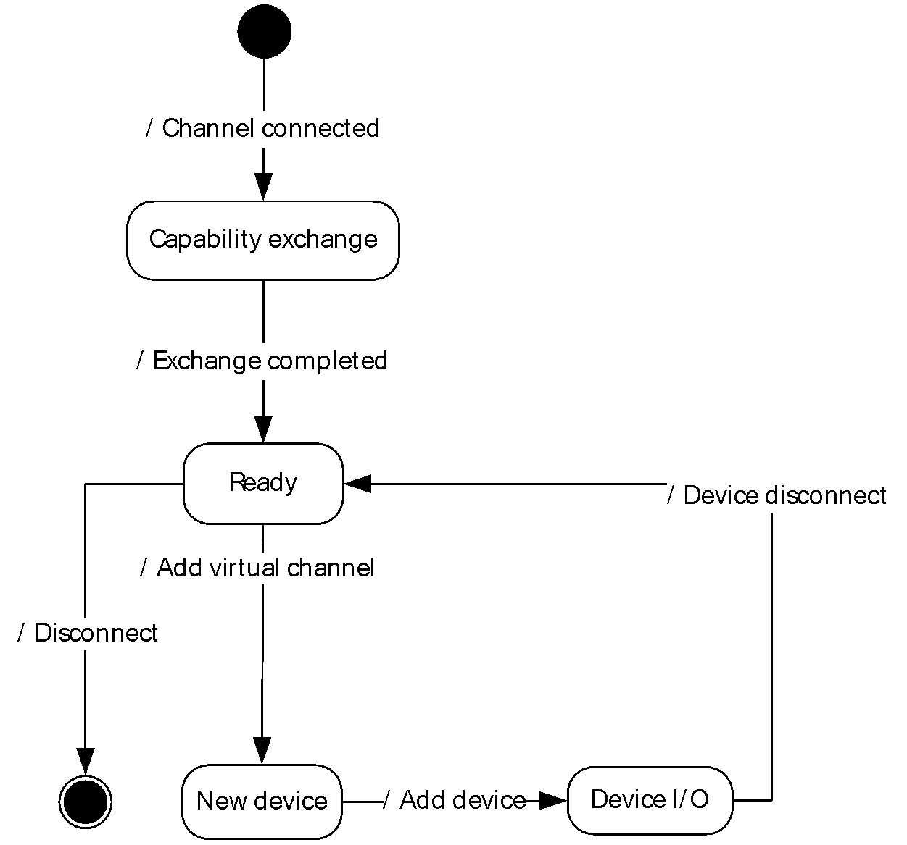

Figure 5: Client and server state transitions

**Channel-connected event**: This event signifies that the underlying transport channel is connected, as specified in section [2.1](#Section_2.1).

**Capability-exchange state**: The client and the server are exchanging capabilities, as described in section [1.3.1.1](#Section_1.3.1.1).

**Exchange-completed event**: Signifies that the capability exchange is completed, that is, the client has sent a Channel Created message (see section [2.2.5.1](#Section_2.2.5.1)).

**Ready state**: The protocol is ready to redirect new devices.

**Add virtual channel event**: As described in section [1.3.1.2](#Section_1.3.1.2), a new device has arrived on the client and the protocol is ready to redirect it.

**Add device event**: This event signifies that the device is ready for I/O, as described in section 1.3.1.2.

**Device I/O state**: As described by section [1.3.1.3](#Section_1.3.1.3), the device is ready to exchange I/O.

<a id="Section_3.1.1"></a>
### 3.1.1 Abstract Data Model

This section describes a conceptual model of possible data organization that an implementation maintains to participate in this protocol. The described organization is provided to facilitate the explanation of how the protocol behaves. This document does not mandate that implementations adhere to this model as long as their external behavior is consistent with that described in this document.

**RequestId**: For each IO request that is sent to the client's actual USB device, the server generates a unique **RequestId** for the request. The server sends the **RequestId** to the client in the **RequestId** field of the IO_CONTROL or INTERNAL_IO_CONTROL message. If the request is to be sent as a TRANSFER_IN_REQUEST message or a TRANSFER_OUT_REQUEST message, the **RequestId** field is sent in the **TsUrb** field of the message. IO_CONTROL, INTERNAL_IO_CONTROL, TRANSFER_IN_REQUEST, and TRANSFER_OUT_REQUEST messages are classified as IO requests. A **RequestId** is unique among all four types of IO Requests. A **RequestId** value has to be unique until the client sends the final result of the IO request that has the **RequestId** value. Once this has happened, the **RequestId** value can be reused.

**list of pending URB requests**: For each [TRANSFER_IN_REQUEST](#Section_2.2.6.7) or [TRANSFER_OUT_REQUEST](#Section_2.2.6.8) request that is sent to the client's USB device, the server stores in this list until the appropriate completion message is received. The matching of replies to requests is based on the **RequestId**.

**PipeHandle**: an ID used to issue TS_URB_PIPE_REQUEST, TS_URB_CONTROL_TRANSFER, TS_URB_BULK_OR_INTERRUPT_TRANSFER, TS_URB_ISOCH_TRANSFER or TS_URB_CONTROL_TRANSFER_EX. The value is send by the client in TS_USBD_PIPE_INFORMATION_RESULT structure in response to TS_URB_SELECT_INTERFACE request.

<a id="Section_3.1.1.1"></a>
#### 3.1.1.1 Interface Manipulation Data Model

The common details of the abstract data model for the interface manipulation infrastructure are specified in [MS-RDPEXPS](../MS-RDPEXPS/MS-RDPEXPS.md) sections 3.1.1. The interface manipulation applies to the following fields: **InterfaceId**, **MessageId**, and **FunctionId**.

<a id="Section_3.1.2"></a>
### 3.1.2 Timers

A timer is started for every Query Device Text Message request. The timer expires in 30 seconds; if by that time the reply has not arrived the client or server fails the request with the error STATUS_TRANSACTION_TIMED_OUT and disconnects the virtual channel over which the request was issued.<3>

<a id="Section_3.1.3"></a>
### 3.1.3 Initialization

The dynamic virtual channel MUST be established, using the parameters specified in section [2.1](#Section_2.1), before protocol operation commences.

<a id="Section_3.1.4"></a>
### 3.1.4 Higher-Layer Triggered Events

None.

<a id="Section_3.1.5"></a>
### 3.1.5 Processing Events and Sequencing Rules

Malformed packets are packets that do not adhere to the rules described in sections [2](#Section_2) and [3](#Section_3) with the exception of sections [3.2.5](#Section_3.2.5) and [3.3.5](#Section_3.3.5). Out-of-sequence packets are packets that do not adhere to the rules in sections 3.2.5 and 3.3.5. Malformed and out-of-sequence packets MUST be ignored by the server and the client.

<a id="Section_3.1.5.1"></a>
#### 3.1.5.1 Processing a Shared Message Header

The common rules for processing the [SHARED_MSG_HEADER](#Section_2.2.1) for the interface manipulation infrastructure are defined in [MS-RDPEXPS](../MS-RDPEXPS/MS-RDPEXPS.md) section 3.1.5.1.

<a id="Section_3.1.5.2"></a>
#### 3.1.5.2 Interface Manipulation

The common rules for processing the interface manipulation messages are defined in [MS-RDPEXPS](../MS-RDPEXPS/MS-RDPEXPS.md) section 3.1.5.2. Any interface, including the default one, MUST be released with an Interface Release message if the side that has received it or owned it as default is finished sending messages over that interface.

<a id="Section_3.1.6"></a>
### 3.1.6 Timer Events

None.

<a id="Section_3.1.7"></a>
### 3.1.7 Other Local Events

None.

<a id="Section_3.2"></a>
## 3.2 Server Details

<a id="Section_3.2.1"></a>
### 3.2.1 Abstract Data Model

The abstract data model is as specified in section [3.1.1](#Section_3.1.1).

<a id="Section_3.2.2"></a>
### 3.2.2 Timers

None.

<a id="Section_3.2.3"></a>
### 3.2.3 Initialization

Initialization is as specified in section [3.1.3](#Section_3.1.3).

<a id="Section_3.2.4"></a>
### 3.2.4 Higher-Layer Triggered Events

None.

<a id="Section_3.2.5"></a>
### 3.2.5 Processing Events and Sequencing Rules

<a id="Section_3.2.5.1"></a>
#### 3.2.5.1 Device Sink Interface

<a id="Section_3.2.5.1.1"></a>
##### 3.2.5.1.1 Processing an Add Virtual Channel Message

The structure and fields of the ADD_VIRTUAL_CHANNEL message are specified in section [2.2.4.1](#Section_2.2.4.1).

After receiving the ADD_VIRTUAL_CHANNEL message, the server makes a new instance of a dynamic virtual channel for USB redirection.

If the server receives an invalid ADD_VIRTUAL_CHANNEL message, the server shall terminate the dynamic virtual channel.

<a id="Section_3.2.5.1.2"></a>
##### 3.2.5.1.2 Processing a Add Device Message

The structure and fields of the ADD_DEVICE message are specified in section [2.2.4.2](#Section_2.2.4.2).

After receiving the ADD_DEVICE message, the server MUST create a [**remote device**](#gt_remote-device) instance on the server to represent the client-side physical device. The ADD_DEVICE message contains a unique USB [**device interface**](#gt_device-interface) ID to represent the client-side physical device. The server maintains this interface ID and uses it to identify the client-side physical device when communicating to the client.

In the case of the server receiving a duplicate interface ID, the server MUST ignore the ADD_DEVICE message. The original device with the same interface ID MUST not be affected by this ADD_DEVICE message and continue to function with no interruption.

<a id="Section_3.2.5.2"></a>
#### 3.2.5.2 Channel Notification Interface

<a id="Section_3.2.5.2.1"></a>
##### 3.2.5.2.1 Sending a Channel Created Message

The structure and fields of the CHANNEL_CREATED message are specified in section [2.2.5.1](#Section_2.2.5.1).

The server sends the CHANNEL_CREATED message to the client to report the version of USB redirection it supports.

<a id="Section_3.2.5.2.2"></a>
##### 3.2.5.2.2 Processing a Channel Created Message

The structure and fields of the CHANNEL_CREATED message are specified in section [2.2.5.1](#Section_2.2.5.1).

After receiving the CHANNEL_CREATED message, the server validates the client USB redirection version. If the server does not support the client's USB redirection version, it MUST close the dynamic virtual channel. If the server supports the client's USB redirection version, it MUST begin processing the Device Sink interface messages.

<a id="Section_3.2.5.3"></a>
#### 3.2.5.3 USB Device Interface

<a id="Section_3.2.5.3.1"></a>
##### 3.2.5.3.1 Sending a Cancel Request Message

The structure and fields of the CANCEL_REQUEST message are specified in section [2.2.6.1](#Section_2.2.6.1).

The server sends the CANCEL_REQUEST message to request the client to stop processing the request specified by the **RequestId**. The request with the given **RequestId** could already have been completed by the client via the Request Completion Interface.

<a id="Section_3.2.5.3.2"></a>
##### 3.2.5.3.2 Sending a Register Request Callback Message

The structure and fields of the REGISTER_REQUEST_CALLBACK message are specified in section [2.2.6.2](#Section_2.2.6.2).

The server sends the REGISTER_REQUEST_CALLBACK message with the **RequestCompletion** field present to the client in order to provide a unique Request Completion Interface for the client to use. The server MUST send this message once for the same USB device and it MUST send this message before sending an IO_CONTROL, INTERNAL_IO_CONTROL, TRANSFER_IN_REQUEST, or TRANSFER_OUT_REQUEST message.

The server sends REGISTERS_REQUEST_CALLBACK message without the **RequestCompletion** field in order to stop the client from sending any messages on the Request Completion Interface (section [2.2.7](#Section_2.2.7)).

<a id="Section_3.2.5.3.3"></a>
##### 3.2.5.3.3 Sending a IO Control Message

The structure and fields of the IO_CONTROL message are specified in section [2.2.6.3](#Section_2.2.6.3).

The server sends the IO_CONTROL message to the client in order to forward an IO control request to the physical device on the client-side.

<a id="Section_3.2.5.3.4"></a>
##### 3.2.5.3.4 Sending an Internal IO Control Message

The structure and fields of the INTERNAL_IO_CONTROL message are specified in section [2.2.6.4](#Section_2.2.6.4).

The server sends the INTERNAL_IO_CONTROL message to the client in order to forward an Internal IO control request to the physical device on the client-side.

<a id="Section_3.2.5.3.5"></a>
##### 3.2.5.3.5 Sending a Query Device Text Message

The structure and fields of the QUERY_DEVICE_TEXT message are specified in section [2.2.6.5](#Section_2.2.6.5).

The server sends the QUERY_DEVICE_TEXT message to the client when it receives a request to query the USB's device text from the system.

<a id="Section_3.2.5.3.6"></a>
##### 3.2.5.3.6 Processing a Query Device Text Response Message

The structure and fields of the QUERY_DEVICE_TEXT RSP message are specified in section [2.2.6.6](#Section_2.2.6.6).

After receiving the QUERY_DEVICE_TEXT_RSP message, the server MUST return the description contained in the **DeviceDescription** field of the QUERY_DEVICE_TEXT_RSP message to the actual application on behalf of which the QUERY_DEVICE_TEXT operation request was sent.

<a id="Section_3.2.5.3.7"></a>
##### 3.2.5.3.7 Sending a Transfer In Request Message

The structure and fields of the TRANSFER_IN_REQUEST message are specified in section [2.2.6.7](#Section_2.2.6.7).

The server sends the TRANSFER_IN_REQUEST message to the client in order to forward an [**URB**](#gt_urb) to the physical device on the client-side and the URB requests data from the device. The request is stored in the **list of pending URB requests** until it is completed.

<a id="Section_3.2.5.3.8"></a>
##### 3.2.5.3.8 Sending a Transfer Out Request Message

The structure and fields of the TRANSFER_OUT_REQUEST message are specified in section [2.2.6.8](#Section_2.2.6.8).

The server sends the TRANSFER_OUT_REQUEST Message to the client in order to forward an [**URB**](#gt_urb) to the physical device on the client-side and the URB requests to write data to the device. The request is stored in the **list of pending URB requests** until it is completed.

<a id="Section_3.2.5.3.9"></a>
##### 3.2.5.3.9 Sending a Retract Device Message

The structure and fields of the Retract Device message are specified in section [2.2.6.9](#Section_2.2.6.9).

The server sends the Retract Device message to the client when the server fails to start the device due to group policy.

<a id="Section_3.2.5.4"></a>
#### 3.2.5.4 Request Completion Interface

<a id="Section_3.2.5.4.1"></a>
##### 3.2.5.4.1 IO Control Completion Message

The structure and fields of the IOCONTROL_COMPLETION message are specified in section [2.2.7.1](#Section_2.2.7.1).

After receiving the IOCONTROL_COMPLETION message, the server MUST use the **RequestId** specified in the IOCONTROL_COMPLETION message to find the associated information stored after sending the IO_CONTROL or INTERNAL_IO_CONTROL message; that information is stored in the **HResult**, **Information**, **OutputBufferSize**, and **OutputBuffer** fields of the IOCONTROL_COMPLETION message. With this information, the server completes the original request. The server MUST redirect the result contained in the IOCONTROL_COMPLETION to the actual application that made the IO Control or Internal IO Control operation request.

The server expects one and only one IOCONTROL_COMPLETION message for each IO_CONTROL or INTERNAL_IO_CONTROL message it sends to the client. If the server receives more than one IOCONTROL_COMPLETION message for an IO_CONTROL or INTERNAL_IO_CONTROL message, the server SHOULD terminate the dynamic virtual channel.

If the server receives an IOCONTROL_COMPLETION message with an invalid **RequestId**, the server SHOULD terminate the dynamic virtual channel.

If the **OutputBufferSize** field in the IOCONTROL_COMPLETION message is greater than the **OutputBufferSize** field in the corresponding IO_CONTROL or INTERNAL_IO_CONTROL message, the server SHOULD terminate the dynamic virtual channel.

<a id="Section_3.2.5.4.2"></a>
##### 3.2.5.4.2 URB Completion Message

The structure and fields of the URB_COMPLETION message are specified in section [2.2.7.2](#Section_2.2.7.2).

After receiving the URB_COMPLETION message, the server MUST use the **RequestId** specified in the URB_COMPLETION message to find the associated information stored after sending the TRANSFER_IN_REQUEST message from the **list of pending URB requests**; that information is stored in the **CTsUrbResult**, **TsUrbResult**, **HResult**, **OutputBufferSize**, and **OutputBuffer** fields of the URB_COMPLETION message. With this information, the server completes the original request. The server MUST redirect the result contained in the URB_COMPLETION message to the actual application that made the Transfer In operation request.

The server expects one and only one URB_COMPLETION message for each TRANSFER_IN_REQUEST message it sends to the client, if the URB_COMPLETION message contains output data. If the server receives more than one URB_COMPLETION message for a TRANSFER_IN_REQUEST message, the server SHOULD terminate the dynamic virtual channel.

If the server receives an URB_COMPLETION message with an invalid **RequestId**, the server SHOULD terminate the dynamic virtual channel.

If the **OutputBufferSize** field in the URB_COMPLETION message is greater than the **OutputBufferSize** field in the corresponding TRANSFER_IN_REQUEST message, the server SHOULD terminate the dynamic virtual channel.

<a id="Section_3.2.5.4.3"></a>
##### 3.2.5.4.3 URB Completion No Data Message

The structure and fields of the URB_COMPLETION_NO_DATA message are specified in section [2.2.7.3](#Section_2.2.7.3).

After receiving the URB_COMPLETION_NO_DATA message, the server MUST use the **RequestId** specified in the URB_COMPLETION_NO_DATA message to find the associated information stored after sending the TRANSFER_IN_REQUEST or TRANSFER_OUT_REQUEST message from the **list of pending URB requests**; that information is stored in the **CTsUrbResult**, **TsUrbResult**, **HResult**, and **OutputBufferSize** fields of the URB_COMPLETION_NO_DATA message. With this information, the server completes the original request. The server MUST redirect the result contained in the URB_COMPLETION_NO_DATA message to the actual application that made the Transfer In or Transfer Out operation request.

The server expects one and only one URB_COMPLETION_NO_DATA message for each Transfer In operation that generates no output data or each Transfer Out operation. If the server receives more than one URB_COMPLETION_NO_DATA message for a TRANSFER_IN_REQUEST or TRANSFER_OUT_REQUEST message, the server SHOULD terminate the dynamic virtual channel.

If the server receives an URB_COMPLETION_NO_DATA message with an invalid **RequestId**, the server SHOULD terminate the dynamic virtual channel.

If the **OutputBufferSize** field in the URB_COMPLETION_NO_DATA message is not zero and the URB_COMPLETION_NO_DATA message is the result of a Transfer In operation, the server SHOULD terminate the dynamic virtual channel.

If the **OutputBufferSize** field in the URB_COMPLETION_NO_DATA message is greater than the **OutputBufferSize** field in the corresponding TRANSFER_OUT_REQUEST message, the server SHOULD terminate the dynamic virtual channel.

<a id="Section_3.2.5.5"></a>
#### 3.2.5.5 Interface Manipulation Exchange Capabilities Interface

<a id="Section_3.2.5.5.1"></a>
##### 3.2.5.5.1 Sending an Interface Manipulation Exchange Capabilities Request Message

The structure and fields of the RIM_EXCHANGE_CAPABILITY_REQUEST message are specified in section [2.2.3.1](#Section_2.2.3.1).

The server MUST send this message when the USB redirection virtual channel is connected. This message MUST be sent before the Channel created message (section [2.2.5.1](#Section_2.2.5.1)).

<a id="Section_3.2.5.5.2"></a>
##### 3.2.5.5.2 Processing an Interface Manipulation Exchange Capabilities Response Message

The structure and fields of the RIM_EXCHANGE_CAPABILITY_RESPONSE message are specified in section [2.2.3.2](#Section_2.2.3.2).

On receiving this message, the server confirms that the client meets the minimum capabilities for interface manipulation.

<a id="Section_3.2.6"></a>
### 3.2.6 Timer Events

None.

<a id="Section_3.2.7"></a>
### 3.2.7 Other Local Events

None.

<a id="Section_3.3"></a>
## 3.3 Client Details

<a id="Section_3.3.1"></a>
### 3.3.1 Abstract Data Model

The abstract data model is as specified in section [3.1.1](#Section_3.1.1).

<a id="Section_3.3.2"></a>
### 3.3.2 Timers

None.

<a id="Section_3.3.3"></a>
### 3.3.3 Initialization

Initialization is as specified in section [3.1.3](#Section_3.1.3).

<a id="Section_3.3.4"></a>
### 3.3.4 Higher-Layer Triggered Events

None.

<a id="Section_3.3.5"></a>
### 3.3.5 Processing Events and Sequencing Rules

<a id="Section_3.3.5.1"></a>
#### 3.3.5.1 Device Sink Interface

<a id="Section_3.3.5.1.1"></a>
##### 3.3.5.1.1 Sending a Add Virtual Channel Message

The structure and fields of the ADD_VIRTUAL_CHANNEL message are specified in section [2.2.4.1](#Section_2.2.4.1).

The client sends the ADD_VIRTUAL_CHANNEL message to server to request the server to create a new instance of dynamic virtual channel for USB redirection. The client sends this message for every USB device to be redirected. This isolates messages for each USB device in its own instance of a dynamic virtual channel.

<a id="Section_3.3.5.1.2"></a>
##### 3.3.5.1.2 Sending a Add Device Message

The structure and fields of the ADD_DEVICE message are specified in section [2.2.4.2](#Section_2.2.4.2).

The client sends this ADD_DEVICE message to the server to redirect a USB device. The message contains a unique **InterfaceId** that is used for I/O requests.

<a id="Section_3.3.5.2"></a>
#### 3.3.5.2 Channel Notification Interface

<a id="Section_3.3.5.2.1"></a>
##### 3.3.5.2.1 Sending a Channel Created Message

The structure and fields of the CHANNEL_CREATED message are specified in section [2.2.5.1](#Section_2.2.5.1).

The client sends the CHANNEL_CREATED message to the server to report the version of the USB redirection it supports.

<a id="Section_3.3.5.2.2"></a>
##### 3.3.5.2.2 Processing a Channel Created Message

The structure and fields of the CHANNEL_CREATED message are specified in section [2.2.5.1](#Section_2.2.5.1).

After receiving the CHANNEL_CREATED message, the client validates the server USB redirection version. If the client does not support the server's USB redirection version, the client MUST close the dynamic virtual channel. If the client supports the server's USB redirection version, it MUST begin sending Device Sink interface messages.

<a id="Section_3.3.5.3"></a>
#### 3.3.5.3 USB Device Interface

<a id="Section_3.3.5.3.1"></a>
##### 3.3.5.3.1 Processing a Cancel Request Message

The structure and fields of the CANCEL_REQUEST message are specified in section [2.2.6.1](#Section_2.2.6.1).

After receiving the CANCEL_REQUEST message, the client MUST attempt to stop processing the request identified by the **RequestId** field in the CANCEL_REQUEST message. If the current request has not been completed it MUST be canceled. If the request has been completed, the client MUST ignore this CANCEL_REQUEST message.

<a id="Section_3.3.5.3.2"></a>
##### 3.3.5.3.2 Processing a Register Request Callback Message

The structure and fields of the REGISTER_REQUEST_CALLBACK message are specified in section [2.2.6.2](#Section_2.2.6.2).

After receiving the REGISTER_REQUEST_CALLBACK message, if the **RequestCompletion** field is present, the client MUST use the **InterfaceId** value from that when sending final results of IO requests received via the IO_CONTROL, INTERNAL_IO_CONTROL, TRANSFER_IN_REQUEST, or TRANSFER_OUT_REQUEST message.

If the server sends REGISTERS_REQUEST_CALLBACK message without the **RequestCompletion** field, the client MUST stop immediately sending any messages on the Request Completion Interface (section [2.2.7](#Section_2.2.7)).

<a id="Section_3.3.5.3.3"></a>
##### 3.3.5.3.3 Processing an IO Control Message

The structure and fields of the IO_CONTROL message are specified in section [2.2.6.3](#Section_2.2.6.3).

After receiving the IO_CONTROL message, the client MUST forward the request to the physical device by retrieving the IOCTL code and input/output buffers from **IoControlCode**, **InputBuffer**, **InputBufferSize** and **OutputBufferSize** fields from the message. The output buffer parameter in the forwarded IOCTL is allocated with the size of **OutputBufferSize** field. When the physical device completes the request, the client MUST send the result of the request to the server via the IOCONTROL_COMPLETION message and the **RequestId** field in the IOCONTROL_COMPLETION message MUST match the **RequestId** in the IO_CONTROL message.

The IO_CONTROL message contains the **OutputBufferSize** field. This indicates the maximum amount of data the client can send to the server when sending the final result of this request. If the physical device returns more data than the **OutputBufferSize** field specifies, the client MUST terminate the dynamic virtual channel.

<a id="Section_3.3.5.3.4"></a>
##### 3.3.5.3.4 Processing an Internal IO Control Message

The structure and fields of the INTERNAL_IO_CONTROL message are specified in section [2.2.6.4](#Section_2.2.6.4).

After receiving the INTERNAL_IO_CONTROL message, the client MUST forward the request to the physical device by using the same rules as specified in section [3.3.5.3.3](#Section_3.3.5.3.3). When the physical device completes the request, the client MUST send the result of the request to the server via the IOCONTROL_COMPLETION message and the **RequestId** field in the IOCONTROL_COMPLETION message MUST match the **RequestId** in the INTERNAL_IO_CONTROL message.

The INTERNAL_IO_CONTROL message contains **OutputBufferSize** field. This indicates the maximum amount of data the client can send to the server when sending the final result of this request. If the physical device returns more data than the **OutputBufferSize** field specifies, the client MUST terminate the dynamic virtual channel.

<a id="Section_3.3.5.3.5"></a>
##### 3.3.5.3.5 Processing a Query Device Text Message

The structure and fields of the QUERY_DEVICE_TEXT message are specified in section [2.2.6.5](#Section_2.2.6.5).

After receiving the QUERY_DEVICE_TEXT message, the client forwards the request to the physical device. When the physical device completes the request, the client sends the result of the request to the server via QUERY_DEVICE_TEXT_RSP message and the **RequestId** field in the message MUST match the **RequestId** in the QUERY_DEVICE_TEXT message.

<a id="Section_3.3.5.3.6"></a>
##### 3.3.5.3.6 Processing a Transfer In Request Message

The structure and fields of the TRANSFER_IN_REQUEST message are specified in section [2.2.6.7](#Section_2.2.6.7).

After receiving the TRANSFER_IN_REQUEST message, the client MUST forward the request to the physical device. When the physical device completes the request, the client MUST send the result of the request to the server via URB_COMPLETION or URB_COMPLETION_NO_DATA message and the **RequestId** field in the message MUST match the **RequestId** in the TRANSFER_IN_REQUEST message.

If TRANSFER_IN_REQUEST results in data to be returned to the server, the client MUST use the URB_COMPLETION message to send the result. If TRANSFER_IN_REQUEST results in no data to be returned to the server, the client MUST use the URB_COMPLETION_NO_DATA message to send the result and the **OutputBufferSize** field MUST be zero.

The TRANSFER_IN_REQUEST message contains **OutputBufferSize** field. This indicates the maximum amount of data the client can send to the server when sending the final result of this request via URB_COMPLETION. If the physical device returns more data than the **OutputBufferSize** field specifies, the client MUST terminate the dynamic virtual channel.

<a id="Section_3.3.5.3.7"></a>
##### 3.3.5.3.7 Processing a Transfer Out Request Message

The structure and fields of the TRANSFER_OUT_REQUEST message are specified in section [2.2.6.8](#Section_2.2.6.8).

After receiving the TRANSFER_OUT_REQUEST message, the client forwards the request to the physical device. When the physical device completes the request, the client sends the result of the request to the server via URB_COMPLETION_NO_DATA message and the **RequestId** field in the message MUST match the **RequestId** in the TRANSFER_OUT_REQUEST message.

The TRANSFER_OUT_REQUEST message contains the **OutputBufferSize** field. This indicates the amount of data the server is sending to the device. When the client sends URB_COMPLETION_NO_DATA message to the server to report the final result of the TRANSFER_OUT_REQUEST, the **OutputBufferSize** value MUST NOT be greater than the **OutputBufferSize** value in TRANSFER_OUT_REQUEST message.

<a id="Section_3.3.5.3.8"></a>
##### 3.3.5.3.8 Processing a Retract Device Message

The structure and fields of the RETRACT_DEVICE message are specified in section [2.2.6.9](#Section_2.2.6.9).

After receiving the RETRACT_DEVICE message, the client SHOULD terminate the dynamic channel and stop redirecting the physical USB device.

<a id="Section_3.3.5.3.9"></a>
##### 3.3.5.3.9 Processing an OS Descriptor request

Special processing on the client is needed when processing TS_URB_OS_FEATURE_DESCRIPTOR_REQUEST. The following describes how to get the OS-specific string descriptor.

To retrieve a device's OS string descriptor, send a standard GET_DESCRIPTOR control request to the device. For details on how to construct GET_DESCRIPTOR control requests, see [[USB-SPC2.0]](https://go.microsoft.com/fwlink/?LinkId=207891) section 9.4 "Standard Device Requests." The request must have the format shown in the following table.

| Bit Range | Field | Description |
| --- | --- | --- |
| Variable | 1000 0000B | GET_DESCRIPTOR 0x03EE 0x0000 0x12 Returned string |

**bmRequestType:** IN. This 1-byte field is divided into three parts that indicate the data transfer direction, the descriptor type, and the recipient. To retrieve a USB string descriptor, **bmRequestType** MUST be set to 10000000B (0x80).

**bRequest:** IN. This field specifies the request type. Set this field to the standard GET_DESCRIPTOR request code.

**wValue:** IN. This field is split into two parts for GET_DESCRIPTOR requests.

- The high byte contains the descriptor type. To retrieve a string descriptor, set this byte to 0x03.
- The low byte contains the descriptor's string index, which indicates where the descriptor is stored in firmware. To retrieve an OS string descriptor, set this byte to 0xEE.
**wIndex:** IN. This field specifies the descriptor's language ID. It must be set to 0 for OS string descriptors.

**wLength:** IN. This field specifies the length of the buffer, in bytes, that is to receive the string descriptor. The device is to respond to values ranging from 0x02-0xFF. Set **wLength** to 0x12 for OS string descriptors.

**Data:** OUT. This field is a pointer to the buffer that will receive the requested descriptor. The format of the descriptor is described in the following table.

For more details on how to send control requests, see [USB-SPC2.0].

If a device does not have a valid string descriptor at 0xEE, it responds with a Stall or Request Error.<4>

If an OS string descriptor request is successful, the device returns the descriptor in the request's **Data** field. Version 1.00 of the OS string descriptor has a fixed length of 18 bytes, with a structure as shown in the following table. This format MUST be used by all OS string descriptors.

| Bit Range | Field | Description |
| --- | --- | --- |
| unsigned byte | 0x14 | 0x03 MSFT100 0x00 |

**Length:** An unsigned byte and MUST be set to 0x14.

**Type:** An unsigned byte and MUST be set to 0x03.

**Signature:** A Unicode string and MUST be set to "MSFT100".

**MS Vendor Code:** An unsigned byte, it will be used to retrieve associated feature descriptors.

**Pad:** An unsigned byte and MUST be set to 0x00.

When processing the **Signature** and **MS VendorCode** fields:

- The **Signature** field contains a Unicode character array that identifies the descriptor as an OS string descriptor and includes the version number. For version 1.00, this array must be set to "MSFT100" (0x4D00 0x5300 0x4600 0x5400 0x3100 0x3000 0x3000).
- The **MS VendorCode** field is used to retrieve the associated feature descriptors. This code is used as **Request** field in TS_URB_CONTROL_VENDOR_OR_CLASS_REQUEST section [2.2.9.12](#Section_2.2.9.12).
Because independent hardware vendors can store string descriptors at any index, there is no guarantee that a string descriptor stored at 0xEE is an OS string descriptor.<5>

<a id="Section_3.3.5.4"></a>
#### 3.3.5.4 Request Completion Interface

<a id="Section_3.3.5.4.1"></a>
##### 3.3.5.4.1 IO Control Completion Message

The structure and fields of the IOCONTROL_COMPLETION message are specified in section [2.2.7.1](#Section_2.2.7.1).

The client MUST use the **RequestId** received in the corresponding IO_CONTROL or INTERNAL_IO_CONTROL message when constructing this reply. The result of the IO Control or Internal IO Control operation performed, along with all data read, MUST be returned in the IOCONTROL_COMPLETION message.

The client MUST send one and only one IOCONTROL_COMPLETION message with matching **RequestId** for each IO_CONTROL or Internal IO Control message it receives from the server.

If the physical device returns more data than the **OutputBufferSize** field specifies in the IO_CONTROL or INTERNAL_IO_CONTROL message, the client SHOULD terminate the dynamic virtual channel.

<a id="Section_3.3.5.4.2"></a>
##### 3.3.5.4.2 URB Completion Message

The structure and fields of the URB_COMPLETION message are specified in section [2.2.7.2](#Section_2.2.7.2).

The client MUST use the **RequestId** received in the corresponding TRANSFER_IN_REQUEST message when constructing this reply. The result of the Transfer In operation performed, along with all data read, MUST be returned in the URB_COMPLETION message. If the Transfer In operation generated no data, the client MUST use URB_COMPLETION_NO_DATA message instead.

The client MUST send one and only one URB_COMPLETION message if data is generated, or one and only one URB_COMPLETION_NO_DATA message if no data is generated, for each TRANSFER_IN_REQUEST message it receives from the server.

If the physical device returns more data than the **OutputBufferSize** field specifies in the TRANSFER_IN_REQUEST message, the client SHOULD terminate the dynamic virtual channel.

<a id="Section_3.3.5.4.3"></a>
##### 3.3.5.4.3 URB Completion No Data Message

The structure and fields of the URB_COMPLETION_NO_DATA message are specified in section [2.2.7.3](#Section_2.2.7.3).

The client MUST use the **RequestId** received in the corresponding TRANSFER_IN_REQUEST message if the Transfer In operation generates no data or Transfer Out operation when constructing this reply. The result of the Transfer In operation that generates no data or Transfer Out operation performed MUST be returned in the URB_COMPLETION_NO_DATA message. If the Transfer In operation generates return data, the client MUST use the URB_COMPLETION message instead.

The client MUST send one and only one URB_COMPLETION message with matching **RequestId** value if data is generated, or one and only one URB_COMPLETION_NO_DATA message with matching **RequestId** value if no data is generated, for each TRANSFER_IN_REQUEST message it receives from the server.

The client MUST send one and only one URB_COMPLETION_NO_DATA message for each TRANSFER_OUT_REQUEST message it receives from the server.

<a id="Section_3.3.5.5"></a>
#### 3.3.5.5 Interface Manipulation Exchange Capabilities Interface Messages

<a id="Section_3.3.5.5.1"></a>
##### 3.3.5.5.1 Processing an Interface Manipulation Exchange Capabilities Request Message

The structure and fields of the RIM_EXCHANGE_CAPABILITY_REQUEST message are specified in section [2.2.3.1](#Section_2.2.3.1).

On receiving a RIM_EXCHANGE_CAPABILITY_REQUEST message, the client MUST send an RIM_EXCHANGE_CAPABILITY_RESPONSE message.

<a id="Section_3.3.5.5.2"></a>
##### 3.3.5.5.2 Sending an Interface Manipulation Exchange Capabilities Response Message

The structure and fields of the RIM_EXCHANGE_CAPABILITY_RESPONSE message are specified in section [2.2.3.2](#Section_2.2.3.2).

This message is sent in response to the RIM_EXCHANGE_CAPABILITY_REQUEST message.

<a id="Section_3.3.6"></a>
### 3.3.6 Timer Events

None.

<a id="Section_3.3.7"></a>
### 3.3.7 Other Local Events

None.

<a id="Section_4"></a>
# 4 Protocol Examples

<a id="Section_4.1"></a>
## 4.1 Server Data Interface Annotations

<a id="Section_4.1.1"></a>
### 4.1.1 Channel Created Message

After a new channel is established, both the server and the client send the CHANNEL_CREATED message to each other. The message specifies the **MajorVersion**, **MinorVersion**, and **Capability** of the server for USB redirection. The following sequence shows the CHANNEL_CREATED message for a **MajorVersion** of 0x00000001, **MinorVersion** of 0x00000000, and **Capability** of 0x00000000.

Channel Created

ChannelName = URBDRC,24,server to client

00000000 02 00 00 40 00 00 00 00-00 01 00 00 01 00 00 00 ...@............

00000010 00 00 00 00 00 00 00 00- ................

02 00 00 40 -> Interface Id = 0x00000002 | mask STREAM_ID_PROXY (0x40000000)

00 00 00 00 -> Message Id = 0x00000000

00 01 00 00 -> CHANNEL_CREATED = 0x00000100

01 00 00 00 -> Major Version = 0x00000001

00 00 00 00 -> Minor Version = 0x00000000

00 00 00 00 -> Capability = 0x00000000

Channel Created

ChannelName = URBDRC,24,client to server

00000000 03 00 00 40 00 00 00 00-00 01 00 00 01 00 00 00 ...@............

00000010 00 00 00 00 00 00 00 00- ................

03 00 00 40 -> Interface Id = 0x00000003 | mask STREAM_ID_PROXY (0x40000000)

00 00 00 00 -> Message Id = 0x00000000

00 01 00 00 -> CHANNEL_CREATED = 0x00000100

01 00 00 00 -> Major Version = 0x00000001

00 00 00 00 -> Minor Version = 0x00000000

00 00 00 00 -> Capability = 0x00000000

<a id="Section_4.1.2"></a>
### 4.1.2 Internal IO Control Message

The server sends the INTERNAL_IO_CONTROL message to the client in response to the request from the system specified in section [2.2.13](#Section_2.2.13). The INTERNAL_IO_CONTROL message described in this section is for IOCTL_TSUSBGD_IOCTL_USBDI_QUERY_BUS_TIME IO control code. There is no input parameter for this IO control code and the output parameter size is 0x00000004 bytes.

IO Control

ChannelName = URBDRC,0x1c,server to client

00000000 00 00 00 40 00 00 00 00-03 01 00 00 00 40 22 00

00000010 00 00 00 00 04 00 00 00-00 00 00 00

00 00 00 40 -> USB Device Interface Id = 0x00000000 | mask STREAM_ID_PROXY (0x40000000)

00 00 00 00 -> Message Id = 0x00000000

03 01 00 00 -> INTERNAL_IO_CONTROL = 0x00000103

00 40 22 00 -> IO control code = 0x00224000 (IOCTL_TSUSBGD_IOCTL_USBDI_QUERY_BUS_TIME)

00 00 00 00 -> Input Buffer Size = 0x00000000

04 00 00 00 -> Output Buffer Size = 0x00000004

00 00 00 00 -> Request Id = 0x00000000

<a id="Section_4.1.3"></a>
### 4.1.3 IO Control Completion Message

In response to the INTERNAL_IO_CONTROL message described in section [4.1.2](#Section_4.1.2), the client sends the IOCONTROL_COMPLETION message (section [2.2.7.1](#Section_2.2.7.1)) to the server containing the result returned from the physical device.

IO Control Completion

ChannelName = URBDRC,0x20,client to server

00000000 00 00 00 40 00 00 00 00-00 01 00 00 00 00 00 00

00000010 00 00 00 00 04 00 00 00-04 00 00 00 53 4b 5f 1a

00 00 00 40 -> RequestCompletion Interface Id = 0x00000000 | mask STREAM_ID_PROXY (0x40000000)

00 00 00 00 -> Message Id = 0x00000000

00 01 00 00 -> IO_CONTROL_COMPLETION = 0x00000100

00 00 00 00 -> Request Id = 0x00000000 (from Internal IO Control message)

00 00 00 00 -> HResult = 0x00000000

04 00 00 00 -> Information = 0x00000004

04 00 00 00 -> Output Buffer Size = 0x00000004

53 4b 5f 1a -> Output Buffer Data = 0x1a5f4b53 (Current Frame)

<a id="Section_4.1.4"></a>
### 4.1.4 Transfer In Request Message

The server sends the TRANSFER_IN_REQUEST message to the client in response to the request from the system specified in section [2.2.9](#Section_2.2.9). The TRANSFER_IN_REQUEST described in this section is for [**URB**](#gt_urb) function URB_FUNCTION_BULK_OR_INTERRUPT_TRANSFER that reads 0x32 bytes from the physical device.

Transfer In

ChannelName = URBDRC,0x24,server to client

00000000 00 00 00 40 00 00 00 00-05 01 00 00 10 00 00 00

00000010 10 00 09 00 02 00 00 00-02 00 ff ff 03 00 00 00

00000020 32 00 00 00

00 00 00 40 -> USB Device Interface Id = 0x00000000 | mask STREAM_ID_PROXY (0x40000000)

00 00 00 00 -> Message Id = 0x00000000

05 01 00 00 -> TRANSFER_IN_REQUEST = 0x00000105

10 00 00 00 -> TS_URB size = 0x00000010

10 00 -> TS_URB CbSize = 0x0010

09 00 -> TS_URB Function = 0x0009 (TS_URB_FUNCTION_BULK_OR_INTERRUPT_TRANSFER)

02 00 00 00 -> TS_URB Request Id = 0x00000002

02 00 ff ff -> TS_URB PipeHandle = 0xffff0002

03 00 00 00 -> TS_URB TransferFlag = 0x00000003

32 00 00 00 -> Output Buffer Size = 0x00000032

<a id="Section_4.1.5"></a>
### 4.1.5 URB Completion Message

In response to the TRANSFER_IN_REQUEST message described in section [4.1.3](#Section_4.1.3), the client sends the URB_COMPLETION message to the server containing the result returned from the physical device.

URB Completion

ChannelName = URBDRC,0x56,client to server

00000000 00 00 00 40 00 00 00 00-01 01 00 00 02 00 00 00

00000010 08 00 00 00 08 00 09 00-00 00 00 00 00 00 00 00

00000020 32 00 00 00 00 00 00 00-01 00 00 00 02 00 00 00

00000030 03 00 00 00 04 00 00 00-05 00 00 00 06 00 00 00

00000040 07 00 00 00 08 00 00 00-09 00 00 00 0a 00 00 00

00000050 0b 00 00 00 00 00

00 00 00 40 -> RequestCompletion Interface Id = 0x00000000 | mask STREAM_ID_PROXY (0x40000000)

00 00 00 00 -> Message Id = 0x00000000

01 01 00 00 -> URB_COMPLETION = 0x00000101

02 00 00 00 -> Request Id = 0x00000002

08 00 00 00 -> TS_URB_RESULT Size = 0x0008

08 00 -> TS_URB_RESULT CbSize = 0x0008

09 00 -> filler

00 00 00 00 -> TS_URB_RESULT USBDStatus = 0x00000000

00 00 00 00 -> HResult = 0x00000000

32 00 00 00 -> Output Buffer Size = 0x00000032

00 00 00 00 -> Output Data

01 00 00 00

02 00 00 00

03 00 00 00

04 00 00 00

05 00 00 00

06 00 00 00

07 00 00 00

08 00 00 00

09 00 00 00

0a 00 00 00

0b 00 00 00

00 00

<a id="Section_5"></a>
# 5 Security

<a id="Section_5.1"></a>
## 5.1 Security Considerations for Implementers

There are no security considerations for the Remote Desktop Protocol: USB Devices Virtual Channel Extension messages because all traffic is secured by the underlying RDP core protocol. For information about the security-related mechanisms that are implemented in the RDP core protocol, see [MS-RDPBCGR](../MS-RDPBCGR/MS-RDPBCGR.md) section 5.

<a id="Section_5.2"></a>
## 5.2 Index of Security Parameters

None.

<a id="Section_6"></a>
# 6 Appendix A: Product Behavior

The information in this specification is applicable to the following Microsoft products or supplemental software. References to product versions include updates to those products.

- Windows 7 operating system with Service Pack 1 (SP1)
- Windows Server 2008 R2 operating system with Service Pack 1 (SP1)
- Windows 8 operating system
- Windows Server 2012 operating system
- Windows 8.1 operating system
- Windows Server 2012 R2 operating system
- Windows 10 operating system
- Windows Server 2016 operating system
- Windows Server operating system
- Windows Server 2019 operating system
- Windows Server 2022 operating system
- Windows 11 operating system
- Windows Server 2025 operating system
Exceptions, if any, are noted in this section. If an update version, service pack or Knowledge Base (KB) number appears with a product name, the behavior changed in that update. The new behavior also applies to subsequent updates unless otherwise specified. If a product edition appears with the product version, behavior is different in that product edition.

Unless otherwise specified, any statement of optional behavior in this specification that is prescribed using the terms "SHOULD" or "SHOULD NOT" implies product behavior in accordance with the SHOULD or SHOULD NOT prescription. Unless otherwise specified, the term "MAY" implies that the product does not follow the prescription.

<1> Section 2.2.1: The server-side implementation of this protocol is applicable to Windows 7 Enterprise operating system with Service Pack 1 (SP1), Windows 7 Ultimate operating system with Service Pack 1 (SP1), Windows 8 Enterprise operating system, Windows Server 2012, Windows 8.1 Enterprise, Windows Server 2012 R2, Windows Server 2016, Windows Server operating system, and Windows Server 2019. The client-side implementation of this protocol is applicable to Windows 7 SP1, Windows Server 2008 R2 SP1, Windows 8, Windows Server 2012, Windows 8.1, Windows Server 2012 R2, and Windows 10.

<2> Section 2.2.9.1.3: The field **MaximumTransferSize** of USBD_PIPE_INFORMATION is ignored.

<3> Section 3.1.2: The timer is implemented only in Windows 8.

<4> Section 3.3.5.3.9: If a device responds with a Request Error, Windows issues a single-ended Zero Reset. This ensures that the device recovers if it enters an unknown state.

<5> Section 3.3.5.3.9: To verify that the request has retrieved an OS string descriptor on Windows:

- Examine the **Signature** value to ensure that it corresponds to a valid Windows OS descriptor string signature. If **Signature** does contain a valid signature, Windows does not parse the descriptor any further. Version 1.00 has only one valid signature: 'MSFT100'.
- Extract the version number from **Signature** and verify that the descriptor has the correct length for that version.
<a id="Section_7"></a>
# 7 Change Tracking

This section identifies changes that were made to this document since the last release. Changes are classified as Major, Minor, or None.

The revision class **Major** means that the technical content in the document was significantly revised. Major changes affect protocol interoperability or implementation. Examples of major changes are:

- A document revision that incorporates changes to interoperability requirements.
- A document revision that captures changes to protocol functionality.
The revision class **Minor** means that the meaning of the technical content was clarified. Minor changes do not affect protocol interoperability or implementation. Examples of minor changes are updates to clarify ambiguity at the sentence, paragraph, or table level.

The revision class **None** means that no new technical changes were introduced. Minor editorial and formatting changes may have been made, but the relevant technical content is identical to the last released version.

The changes made to this document are listed in the following table. For more information, please contact [dochelp@microsoft.com](mailto:dochelp@microsoft.com).

| Section | Description | Revision class |
| --- | --- | --- |
| [6](#Section_6) Appendix A: Product Behavior | Added Windows Server 2025 to the list of applicable products. | Major |

<a id="revision-history"></a>

## Revision History

| Date | Version | Revision Class | Comments |
| --- | --- | --- | --- |
| 4/23/2010 | 0.1 | Major | First Release. |
| 6/4/2010 | 1.0 | Major | Updated and revised the technical content. |
| 7/16/2010 | 2.0 | Major | Updated and revised the technical content. |
| 8/27/2010 | 3.0 | Major | Updated and revised the technical content. |
| 10/8/2010 | 4.0 | Major | Updated and revised the technical content. |
| 11/19/2010 | 5.0 | Major | Updated and revised the technical content. |
| 1/7/2011 | 6.0 | Major | Updated and revised the technical content. |
| 2/11/2011 | 7.0 | Major | Updated and revised the technical content. |
| 3/25/2011 | 7.0 | None | No changes to the meaning, language, or formatting of the technical content. |
| 5/6/2011 | 7.0 | None | No changes to the meaning, language, or formatting of the technical content. |
| 6/17/2011 | 7.1 | Minor | Clarified the meaning of the technical content. |
| 9/23/2011 | 8.0 | Major | Updated and revised the technical content. |
| 12/16/2011 | 9.0 | Major | Updated and revised the technical content. |
| 3/30/2012 | 10.0 | Major | Updated and revised the technical content. |
| 7/12/2012 | 11.0 | Major | Updated and revised the technical content. |
| 10/25/2012 | 12.0 | Major | Updated and revised the technical content. |
| 1/31/2013 | 12.0 | None | No changes to the meaning, language, or formatting of the technical content. |
| 8/8/2013 | 13.0 | Major | Updated and revised the technical content. |
| 11/14/2013 | 13.0 | None | No changes to the meaning, language, or formatting of the technical content. |
| 2/13/2014 | 13.0 | None | No changes to the meaning, language, or formatting of the technical content. |
| 5/15/2014 | 13.0 | None | No changes to the meaning, language, or formatting of the technical content. |
| 6/30/2015 | 14.0 | Major | Significantly changed the technical content. |
| 10/16/2015 | 14.0 | None | No changes to the meaning, language, or formatting of the technical content. |
| 7/14/2016 | 14.0 | None | No changes to the meaning, language, or formatting of the technical content. |
| 6/1/2017 | 14.0 | None | No changes to the meaning, language, or formatting of the technical content. |
| 9/15/2017 | 15.0 | Major | Significantly changed the technical content. |
| 9/12/2018 | 16.0 | Major | Significantly changed the technical content. |
| 4/7/2021 | 17.0 | Major | Significantly changed the technical content. |
| 6/25/2021 | 18.0 | Major | Significantly changed the technical content. |
| 4/23/2024 | 19.0 | Major | Significantly changed the technical content. |
