# [MS-RDPEV]: Remote Desktop Protocol: Video Redirection Virtual Channel Extension

Table of Contents

<details>
<summary>1 Introduction</summary>

- [1 Introduction](#Section_1)
  - [1.1 Glossary](#Section_1.1)
  - [1.2 References](#Section_1.2)
    - [1.2.1 Normative References](#Section_1.2.1)
    - [1.2.2 Informative References](#Section_1.2.2)
  - [1.3 Overview](#Section_1.3)
    - [1.3.1 Video Redirection Virtual Channel Protocol](#Section_1.3.1)
      - [1.3.1.1 Interface Manipulation](#Section_1.3.1.1)
    - [1.3.2 Client Notifications Interface](#Section_1.3.2)
    - [1.3.3 Server Data Interface](#Section_1.3.3)
      - [1.3.3.1 Channel Setup Sequence](#Section_1.3.3.1)
      - [1.3.3.2 Presentation Initialization and Termination Sequence](#Section_1.3.3.2)
      - [1.3.3.3 Playback State Sequence](#Section_1.3.3.3)
      - [1.3.3.4 Data Streaming Sequence](#Section_1.3.3.4)
      - [1.3.3.5 Geometry Handling Sequence](#Section_1.3.3.5)
      - [1.3.3.6 Volume Handling Sequence](#Section_1.3.3.6)
    - [1.3.4 Interface Manipulation Exchange Capabilities Interface Description](#Section_1.3.4)
  - [1.4 Relationship to Other Protocols](#Section_1.4)
  - [1.5 Prerequisites/Preconditions](#Section_1.5)
  - [1.6 Applicability Statement](#Section_1.6)
  - [1.7 Versioning and Capability Negotiation](#Section_1.7)
  - [1.8 Vendor-Extensible Fields](#Section_1.8)
  - [1.9 Standards Assignments](#Section_1.9)
</details>

<details>
<summary>2 Messages</summary>

- [2 Messages](#Section_2)
  - [2.1 Transport](#Section_2.1)
  - [2.2 Message Syntax](#Section_2.2)
    - [2.2.1 Shared Message Header (SHARED_MSG_HEADER)](#Section_2.2.1)
    - [2.2.2 Interface Manipulation](#Section_2.2.2)
    - [2.2.3 Interface Manipulation Exchange Capabilities Interface](#Section_2.2.3)
      - [2.2.3.1 Interface Manipulation Exchange Capabilities Request (RIM_EXCHANGE_CAPABILITY_REQUEST)](#Section_2.2.3.1)
      - [2.2.3.2 Interface Manipulation Exchange Capabilities Response (RIM_EXCHANGE_CAPABILITY_RESPONSE)](#Section_2.2.3.2)
    - [2.2.4 Client Notifications Interface](#Section_2.2.4)
      - [2.2.4.1 Playback Acknowledgment Message (PLAYBACK_ACK)](#Section_2.2.4.1)
      - [2.2.4.2 Client Event Notification Message (CLIENT_EVENT_NOTIFICATION)](#Section_2.2.4.2)
    - [2.2.5 Server Data Interface](#Section_2.2.5)
      - [2.2.5.1 Channel Setup Messages](#Section_2.2.5.1)
        - [2.2.5.1.1 Set Channel Parameters Message (SET_CHANNEL_PARAMS)](#Section_2.2.5.1.1)
        - [2.2.5.1.2 Exchange Capabilities Request Message (EXCHANGE_CAPABILITIES_REQ)](#Section_2.2.5.1.2)
        - [2.2.5.1.3 Exchange Capabilities Response Message (EXCHANGE_CAPABILITIES_RSP)](#Section_2.2.5.1.3)
      - [2.2.5.2 Presentation Initialization and Termination Messages](#Section_2.2.5.2)
        - [2.2.5.2.1 New Presentation Message (NEW_PRESENTATION)](#Section_2.2.5.2.1)
        - [2.2.5.2.2 Check Format Support Request Message (CHECK_FORMAT_SUPPORT_REQ)](#Section_2.2.5.2.2)
        - [2.2.5.2.3 Check Format Support Response Message (CHECK_FORMAT_SUPPORT_RSP)](#Section_2.2.5.2.3)
        - [2.2.5.2.4 Add Stream Message (ADD_STREAM)](#Section_2.2.5.2.4)
        - [2.2.5.2.5 Set Topology Request Message (SET_TOPOLOGY_REQ)](#Section_2.2.5.2.5)
        - [2.2.5.2.6 Set Topology Response Message (SET_TOPOLOGY_RSP)](#Section_2.2.5.2.6)
        - [2.2.5.2.7 Remove Stream Message (REMOVE_STREAM)](#Section_2.2.5.2.7)
        - [2.2.5.2.8 Shut Down Presentation Request Message (SHUTDOWN_PRESENTATION_REQ)](#Section_2.2.5.2.8)
        - [2.2.5.2.9 Shut Down Presentation Response Message (SHUTDOWN_PRESENTATION_RSP)](#Section_2.2.5.2.9)
        - [2.2.5.2.10 Set Source Video Rectangle Message (SET_SOURCE_VIDEO_RECTANGLE)](#Section_2.2.5.2.10)
      - [2.2.5.3 Playback State Messages](#Section_2.2.5.3)
        - [2.2.5.3.1 On Playback Started Message (ON_PLAYBACK_STARTED)](#Section_2.2.5.3.1)
        - [2.2.5.3.2 On Playback Paused Message (ON_PLAYBACK_PAUSED)](#Section_2.2.5.3.2)
        - [2.2.5.3.3 On Playback Restarted Message (ON_PLAYBACK_RESTARTED)](#Section_2.2.5.3.3)
        - [2.2.5.3.4 On Playback Stopped Message (ON_PLAYBACK_STOPPED)](#Section_2.2.5.3.4)
        - [2.2.5.3.5 On Playback Rate Changed Message (ON_PLAYBACK_RATE_CHANGED)](#Section_2.2.5.3.5)
      - [2.2.5.4 Data Streaming Messages](#Section_2.2.5.4)
        - [2.2.5.4.1 Set Allocator Properties Message (SET_ALLOCATOR)](#Section_2.2.5.4.1)
        - [2.2.5.4.2 Notify Preroll Message (NOTIFY_PREROLL)](#Section_2.2.5.4.2)
        - [2.2.5.4.3 On Sample Message (ON_SAMPLE)](#Section_2.2.5.4.3)
        - [2.2.5.4.4 On Flush Message (ON_FLUSH)](#Section_2.2.5.4.4)
        - [2.2.5.4.5 On End of Stream Message (ON_END_OF_STREAM)](#Section_2.2.5.4.5)
      - [2.2.5.5 Geometry Handling Messages](#Section_2.2.5.5)
        - [2.2.5.5.1 Set Video Window Message (SET_VIDEO_WINDOW)](#Section_2.2.5.5.1)
        - [2.2.5.5.2 Update Geometry Information Message (UPDATE_GEOMETRY_INFO)](#Section_2.2.5.5.2)
      - [2.2.5.6 Volume Handling Messages](#Section_2.2.5.6)
        - [2.2.5.6.1 On Stream Volume Message (ON_STREAM_VOLUME)](#Section_2.2.5.6.1)
        - [2.2.5.6.2 On Channel Volume Message (ON_CHANNEL_VOLUME)](#Section_2.2.5.6.2)
    - [2.2.6 TSMM_CAPABILITIES Structure](#Section_2.2.6)
    - [2.2.7 TS_AM_MEDIA_TYPE Structure](#Section_2.2.7)
    - [2.2.8 TS_MM_DATA_SAMPLE Structure](#Section_2.2.8)
    - [2.2.9 TSMM_PLATFORM_COOKIE Constants](#Section_2.2.9)
    - [2.2.10 MMREDIR_CAPABILITY_PLATFORM Constants](#Section_2.2.10)
    - [2.2.11 GEOMETRY_INFO Structure](#Section_2.2.11)
    - [2.2.12 TS_WNDFLAG Flags](#Section_2.2.12)
    - [2.2.13 TS_RECT Structure](#Section_2.2.13)
    - [2.2.14 TSMM_CLIENT_EVENT Constants](#Section_2.2.14)
    - [2.2.15 MMREDIR_CAPABILITY_AUDIOSUPPORT Constants](#Section_2.2.15)
</details>

<details>
<summary>3 Protocol Details</summary>

- [3 Protocol Details](#Section_3)
  - [3.1 Common Details](#Section_3.1)
    - [3.1.1 Abstract Data Model](#Section_3.1.1)
      - [3.1.1.1 Interface Manipulation Data Model](#Section_3.1.1.1)
    - [3.1.2 Timers](#Section_3.1.2)
    - [3.1.3 Initialization](#Section_3.1.3)
    - [3.1.4 Higher-Layer Triggered Events](#Section_3.1.4)
    - [3.1.5 Message Processing Events and Sequencing Rules](#Section_3.1.5)
      - [3.1.5.1 Processing a Shared Message Header](#Section_3.1.5.1)
      - [3.1.5.2 Interface Manipulation](#Section_3.1.5.2)
    - [3.1.6 Timer Events](#Section_3.1.6)
    - [3.1.7 Other Local Events](#Section_3.1.7)
  - [3.2 Server Details](#Section_3.2)
    - [3.2.1 Abstract Data Model](#Section_3.2.1)
    - [3.2.2 Timers](#Section_3.2.2)
    - [3.2.3 Initialization](#Section_3.2.3)
    - [3.2.4 Higher-Layer Triggered Events](#Section_3.2.4)
    - [3.2.5 Message Processing Events and Sequencing Rules](#Section_3.2.5)
      - [3.2.5.1 Client Notifications Interface](#Section_3.2.5.1)
        - [3.2.5.1.1 Processing a Playback Acknowledgment Message](#Section_3.2.5.1.1)
        - [3.2.5.1.2 Processing a Client Event Notification Message](#Section_3.2.5.1.2)
      - [3.2.5.2 Server Data Interface](#Section_3.2.5.2)
        - [3.2.5.2.1 Server Data Interface Channel Setup Messages](#Section_3.2.5.2.1)
          - [3.2.5.2.1.1 Sending a Set Channel Parameters Message](#Section_3.2.5.2.1.1)
          - [3.2.5.2.1.2 Sending an Exchange Capabilities Request Message](#Section_3.2.5.2.1.2)
          - [3.2.5.2.1.3 Processing an Exchange Capabilities Response Message](#Section_3.2.5.2.1.3)
        - [3.2.5.2.2 Server Data Interface Presentation Initialization and Termination Messages](#Section_3.2.5.2.2)
          - [3.2.5.2.2.1 Sending a New Presentation Message](#Section_3.2.5.2.2.1)
          - [3.2.5.2.2.2 Sending a Check Format Support Request Message](#Section_3.2.5.2.2.2)
          - [3.2.5.2.2.3 Processing a Check Format Support Response Message](#Section_3.2.5.2.2.3)
          - [3.2.5.2.2.4 Sending an Add Stream Message](#Section_3.2.5.2.2.4)
          - [3.2.5.2.2.5 Sending a Set Topology Request Message](#Section_3.2.5.2.2.5)
          - [3.2.5.2.2.6 Processing a Set Topology Response Message](#Section_3.2.5.2.2.6)
          - [3.2.5.2.2.7 Sending a Remove Stream Message](#Section_3.2.5.2.2.7)
          - [3.2.5.2.2.8 Sending a Shut Down Presentation Request Message](#Section_3.2.5.2.2.8)
          - [3.2.5.2.2.9 Processing a Shut Down Presentation Response Message](#Section_3.2.5.2.2.9)
          - [3.2.5.2.2.10 Sending a Set Source Video Rectangle Message](#Section_3.2.5.2.2.10)
        - [3.2.5.2.3 Server Data Interface Playback State Messages](#Section_3.2.5.2.3)
          - [3.2.5.2.3.1 Sending an On Playback Started Message](#Section_3.2.5.2.3.1)
          - [3.2.5.2.3.2 Sending an On Playback Paused Message](#Section_3.2.5.2.3.2)
          - [3.2.5.2.3.3 Sending an On Playback Restarted Message](#Section_3.2.5.2.3.3)
          - [3.2.5.2.3.4 Sending an On Playback Stopped Message](#Section_3.2.5.2.3.4)
          - [3.2.5.2.3.5 Sending an On Playback Rate Changed Message](#Section_3.2.5.2.3.5)
        - [3.2.5.2.4 Server Data Interface Data Streaming Messages](#Section_3.2.5.2.4)
          - [3.2.5.2.4.1 Sending a Set Allocator Properties Message](#Section_3.2.5.2.4.1)
          - [3.2.5.2.4.2 Sending a Notify Preroll Message](#Section_3.2.5.2.4.2)
          - [3.2.5.2.4.3 Sending an On Sample Message](#Section_3.2.5.2.4.3)
          - [3.2.5.2.4.4 Sending an On Flush Message](#Section_3.2.5.2.4.4)
          - [3.2.5.2.4.5 Sending an On End Of Stream Message](#Section_3.2.5.2.4.5)
        - [3.2.5.2.5 Server Data Interface Geometry Handling Messages](#Section_3.2.5.2.5)
          - [3.2.5.2.5.1 Sending a Set Video Window Message](#Section_3.2.5.2.5.1)
          - [3.2.5.2.5.2 Sending an Update Geometry Information Message](#Section_3.2.5.2.5.2)
        - [3.2.5.2.6 Server Data Interface Volume Handling Messages](#Section_3.2.5.2.6)
          - [3.2.5.2.6.1 Sending an On Stream Volume Message](#Section_3.2.5.2.6.1)
          - [3.2.5.2.6.2 Sending an On Channel Volume Message](#Section_3.2.5.2.6.2)
      - [3.2.5.3 Interface Manipulation Exchange Capabilities Interface](#Section_3.2.5.3)
        - [3.2.5.3.1 Sending an Interface Manipulation Exchange Capabilities Request Message](#Section_3.2.5.3.1)
        - [3.2.5.3.2 Processing an Interface Manipulation Exchange Capabilities Response Message](#Section_3.2.5.3.2)
    - [3.2.6 Timer Events](#Section_3.2.6)
    - [3.2.7 Other Local Events](#Section_3.2.7)
  - [3.3 Client Details](#Section_3.3)
    - [3.3.1 Abstract Data Model](#Section_3.3.1)
    - [3.3.2 Timers](#Section_3.3.2)
    - [3.3.3 Initialization](#Section_3.3.3)
    - [3.3.4 Higher-Layer Triggered Events](#Section_3.3.4)
    - [3.3.5 Message Processing Events and Sequencing Rules](#Section_3.3.5)
      - [3.3.5.1 Interface Manipulation](#Section_3.3.5.1)
      - [3.3.5.2 Client Notifications Interface](#Section_3.3.5.2)
        - [3.3.5.2.1 Sending a Playback Acknowledgment Message](#Section_3.3.5.2.1)
        - [3.3.5.2.2 Sending a Client Event Notification Message](#Section_3.3.5.2.2)
      - [3.3.5.3 Server Data Interface](#Section_3.3.5.3)
        - [3.3.5.3.1 Server Data Interface Channel Setup Messages](#Section_3.3.5.3.1)
          - [3.3.5.3.1.1 Processing a Set Channel Parameters Message](#Section_3.3.5.3.1.1)
          - [3.3.5.3.1.2 Processing an Exchange Capabilities Request Message](#Section_3.3.5.3.1.2)
          - [3.3.5.3.1.3 Sending an Exchange Capabilities Response Message](#Section_3.3.5.3.1.3)
        - [3.3.5.3.2 Server Data Interface Presentation Initialization and Termination Messages](#Section_3.3.5.3.2)
          - [3.3.5.3.2.1 Processing a New Presentation Message](#Section_3.3.5.3.2.1)
          - [3.3.5.3.2.2 Processing a Check Format Support Request Message](#Section_3.3.5.3.2.2)
          - [3.3.5.3.2.3 Sending a Check Format Support Response Message](#Section_3.3.5.3.2.3)
          - [3.3.5.3.2.4 Processing an Add Stream Message](#Section_3.3.5.3.2.4)
          - [3.3.5.3.2.5 Processing a Set Topology Request Message](#Section_3.3.5.3.2.5)
          - [3.3.5.3.2.6 Sending a Set Topology Response Message](#Section_3.3.5.3.2.6)
          - [3.3.5.3.2.7 Processing a Remove Stream Message](#Section_3.3.5.3.2.7)
          - [3.3.5.3.2.8 Processing a Shut Down Presentation Request Message](#Section_3.3.5.3.2.8)
          - [3.3.5.3.2.9 Sending a Shut Down Presentation Response Message](#Section_3.3.5.3.2.9)
          - [3.3.5.3.2.10 Processing a Set Video Source Rectangle Message](#Section_3.3.5.3.2.10)
        - [3.3.5.3.3 Server Data Interface Playback State Messages](#Section_3.3.5.3.3)
          - [3.3.5.3.3.1 Processing an On Playback Started Message](#Section_3.3.5.3.3.1)
          - [3.3.5.3.3.2 Processing an On Playback Paused Message](#Section_3.3.5.3.3.2)
          - [3.3.5.3.3.3 Processing an On Playback Restarted Message](#Section_3.3.5.3.3.3)
          - [3.3.5.3.3.4 Processing an On Playback Stopped Message](#Section_3.3.5.3.3.4)
          - [3.3.5.3.3.5 Processing an On Playback Rate Changed Message](#Section_3.3.5.3.3.5)
        - [3.3.5.3.4 Server Data Interface Data Streaming Messages](#Section_3.3.5.3.4)
          - [3.3.5.3.4.1 Processing a Set Allocator Properties Message](#Section_3.3.5.3.4.1)
          - [3.3.5.3.4.2 Processing a Notify Preroll Message](#Section_3.3.5.3.4.2)
          - [3.3.5.3.4.3 Processing an On Sample Message](#Section_3.3.5.3.4.3)
          - [3.3.5.3.4.4 Processing an On Flush Message](#Section_3.3.5.3.4.4)
          - [3.3.5.3.4.5 Processing an On End Of Stream Message](#Section_3.3.5.3.4.5)
        - [3.3.5.3.5 Server Data Interface Geometry Handling Messages](#Section_3.3.5.3.5)
          - [3.3.5.3.5.1 Processing a Set Video Window Message](#Section_3.3.5.3.5.1)
          - [3.3.5.3.5.2 Processing an Update Geometry Information Message](#Section_3.3.5.3.5.2)
        - [3.3.5.3.6 Server Data Interface Volume Handling Messages](#Section_3.3.5.3.6)
          - [3.3.5.3.6.1 Processing an On Stream Volume Message](#Section_3.3.5.3.6.1)
          - [3.3.5.3.6.2 Processing an On Channel Volume Message](#Section_3.3.5.3.6.2)
      - [3.3.5.4 Interface Manipulation Exchange Capabilities Interface Messages](#Section_3.3.5.4)
        - [3.3.5.4.1 Processing an Interface Manipulation Exchange Capabilities Request Message](#Section_3.3.5.4.1)
        - [3.3.5.4.2 Sending an Interface Manipulation Exchange Capabilities Response Message](#Section_3.3.5.4.2)
    - [3.3.6 Timer Events](#Section_3.3.6)
    - [3.3.7 Other Local Events](#Section_3.3.7)
</details>

<details>
<summary>4 Protocol Examples</summary>

- [4 Protocol Examples](#Section_4)
  - [4.1 Server Data Interface Annotations](#Section_4.1)
    - [4.1.1 Channel Setup Sequence](#Section_4.1.1)
    - [4.1.2 Presentation Initialization and Termination Sequence](#Section_4.1.2)
    - [4.1.3 Playback State Sequence](#Section_4.1.3)
    - [4.1.4 Data Streaming Sequence](#Section_4.1.4)
    - [4.1.5 Geometry Handling Sequence](#Section_4.1.5)
    - [4.1.6 Volume Handling Sequence](#Section_4.1.6)
  - [4.2 Client Notifications Interface Annotation](#Section_4.2)
  - [4.3 Interface Manipulation Exchange Capabilities Interface Annotation](#Section_4.3)
</details>

<details>
<summary>5 Security</summary>

- [5 Security](#Section_5)
  - [5.1 Security Considerations for Implementers](#Section_5.1)
  - [5.2 Index of Security Parameters](#Section_5.2)
</details>

<details>
<summary>6 Appendix A: Product Behavior</summary>

- [6 Appendix A: Product Behavior](#Section_6)
</details>

<details>
<summary>7 Change Tracking</summary>

- [7 Change Tracking](#Section_7)
</details>

For the legal notice and IP terms, see [LEGAL.md](../LEGAL.md).
Last updated: 4/23/2024.
See [Revision History](#revision-history) for full version history.

<a id="Section_1"></a>
# 1 Introduction

The Remote Desktop Protocol Video Redirection Virtual Channel Extension is an extension of [MS-RDPBCGR](../MS-RDPBCGR/MS-RDPBCGR.md), which runs over a dynamic virtual channel, as specified in [MS-RDPEDYC](../MS-RDPEDYC/MS-RDPEDYC.md). The Remote Desktop Protocol Video Redirection Virtual Channel Extension is used to redirect audio/video [**streams**](#gt_stream) from the [**terminal server**](#gt_terminal-server) to the [**terminal client**](#gt_terminal-client). This protocol specifies the communication between an application that is playing audio/video on the terminal server and the terminal client.

**Note** The term "server" will be used to refer to "terminal server" throughout this specification.

**Note** The term "client" will be used to refer to "terminal client" throughout this specification.

Sections 1.5, 1.8, 1.9, 2, and 3 of this specification are normative. All other sections and examples in this specification are informative.

<a id="Section_1.1"></a>
## 1.1 Glossary

This document uses the following terms:

<a id="gt_format"></a>
**format**: A data structure that is used to define the encoding of audio and video data. The actual structures are opaque to [MS-RDPEV].

<a id="gt_globally-unique-identifier-guid"></a>
**globally unique identifier (GUID)**: A term used interchangeably with universally unique identifier (UUID) in Microsoft protocol technical documents (TDs). Interchanging the usage of these terms does not imply or require a specific algorithm or mechanism to generate the value. Specifically, the use of this term does not imply or require that the algorithms described in [[RFC4122]](https://go.microsoft.com/fwlink/?LinkId=90460) or [[C706]](https://go.microsoft.com/fwlink/?LinkId=89824) must be used for generating the [**GUID**](#gt_globally-unique-identifier-guid). See also universally unique identifier (UUID).

<a id="gt_interface"></a>
**interface**: A collection of messages used together. [**Interfaces**](#gt_interface) support inheritance and extensibility through the Interface Query message as defined in [MS-RDPEXPS](../MS-RDPEXPS/MS-RDPEXPS.md) section 1.3.2.1.1.

<a id="gt_media-data"></a>
**media data**: The data for an audio or video [**stream**](#gt_stream) in a [**presentation**](#gt_presentation), encoded in a specific [**format**](#gt_format).

<a id="gt_presentation"></a>
**presentation**: A set of audio and video data [**streams**](#gt_stream) and related metadata that are synchronized for playback on a client.

<a id="gt_sample"></a>
**sample**: A unit of [**media data**](#gt_media-data) sent from the server to the client.

<a id="gt_stream"></a>
**stream**: An individual audio or video data-flow in a [**presentation**](#gt_presentation). The [**media data**](#gt_media-data) in an individual [**stream**](#gt_stream) always uses the same [**media data**](#gt_media-data) [**format**](#gt_format).

<a id="gt_terminal-client"></a>
**terminal client**: The client that initiated the remote desktop connection.

<a id="gt_terminal-server"></a>
**terminal server**: A computer on which terminal services is running.

<a id="gt_window-handle"></a>
**window handle**: A context for identifying and controlling a user [**interface**](#gt_interface) window on the user's desktop.

**MAY, SHOULD, MUST, SHOULD NOT, MUST NOT:** These terms (in all caps) are used as defined in [[RFC2119]](https://go.microsoft.com/fwlink/?LinkId=90317). All statements of optional behavior use either MAY, SHOULD, or SHOULD NOT.

<a id="Section_1.2"></a>
## 1.2 References

Links to a document in the Microsoft Open Specifications library point to the correct section in the most recently published version of the referenced document. However, because individual documents in the library are not updated at the same time, the section numbers in the documents may not match. You can confirm the correct section numbering by checking the [Errata](https://go.microsoft.com/fwlink/?linkid=850906).

<a id="Section_1.2.1"></a>
### 1.2.1 Normative References

We conduct frequent surveys of the normative references to assure their continued availability. If you have any issue with finding a normative reference, please contact [dochelp@microsoft.com](mailto:dochelp@microsoft.com). We will assist you in finding the relevant information.

[MS-DTYP] Microsoft Corporation, "[Windows Data Types](../MS-DTYP/MS-DTYP.md)".

[MS-ERREF] Microsoft Corporation, "[Windows Error Codes](../MS-ERREF/MS-ERREF.md)".

[MS-RDPBCGR] Microsoft Corporation, "[Remote Desktop Protocol: Basic Connectivity and Graphics Remoting](../MS-RDPBCGR/MS-RDPBCGR.md)".

[MS-RDPEDYC] Microsoft Corporation, "[Remote Desktop Protocol: Dynamic Channel Virtual Channel Extension](../MS-RDPEDYC/MS-RDPEDYC.md)".

[MS-RDPEXPS] Microsoft Corporation, "[Remote Desktop Protocol: XML Paper Specification (XPS) Print Virtual Channel Extension](../MS-RDPEXPS/MS-RDPEXPS.md)".

[RFC2119] Bradner, S., "Key words for use in RFCs to Indicate Requirement Levels", BCP 14, RFC 2119, March 1997, [https://www.rfc-editor.org/info/rfc2119](https://go.microsoft.com/fwlink/?LinkId=90317)

<a id="Section_1.2.2"></a>
### 1.2.2 Informative References

[MSDN-ALLOCATOR] Microsoft Corporation, "Negotiating Allocators", [http://msdn.microsoft.com/en-us/library/ms787432(VS.85).aspx](https://go.microsoft.com/fwlink/?LinkId=128463)

[MSDN-AMMEDIATYPE] Microsoft Corporation, "AM_MEDIA_TYPE structure", [http://msdn.microsoft.com/en-us/library/ms779120(VS.85).aspx](https://go.microsoft.com/fwlink/?LinkId=128229)

[MSDN-DIRECTSHOW] Microsoft Corporation, "DirectShow", [http://msdn.microsoft.com/en-us/library/ms783323(VS.85).aspx](https://go.microsoft.com/fwlink/?LinkId=128230)

[MSDN-MEDIAFOUNDATION] Microsoft Corporation, "Media Foundation SDK", [http://msdn.microsoft.com/en-us/library/ms694197(VS.85).aspx](https://go.microsoft.com/fwlink/?LinkId=128231)

[MSDN-MediaTypes] Microsoft Corporation, "Meta Types", [http://msdn.microsoft.com/en-us/library/ms787271(VS.85).aspx](https://go.microsoft.com/fwlink/?LinkId=128460)

<a id="Section_1.3"></a>
## 1.3 Overview

The Remote Desktop Protocol Video Redirection Virtual Channel Extension is used to transfer synchronized audio and video data from a [**terminal server**](#gt_terminal-server) to a [**terminal client**](#gt_terminal-client).The client can play the audio and video data and synchronize this data by using the timing information provided by this protocol.

<a id="Section_1.3.1"></a>
### 1.3.1 Video Redirection Virtual Channel Protocol

The Remote Desktop Protocol Video Redirection Virtual Channel Extension is divided into the following logical sequences:

**Channel setup sequence:** A channel is opened, and capabilities are exchanged. The channel is assigned a specific identifier that is used by the client and the server to map [**media data**](#gt_media-data) and the playback acknowledgments.

**Presentation initialization and termination sequence:** The [**presentation**](#gt_presentation) is established. After the [**format**](#gt_format) is negotiated, [**streams**](#gt_stream) are set up for the presentation. When complete, the individual streams and the presentation are terminated.

**Playback state sequence:** The client is notified of the changes in the playback state of the presentation.

**Data streaming sequence:** Media data for a stream is transferred from the server to the client.

**Geometry handling sequence:** The geometry information regarding the video window on the server is transferred to the client.

**Volume handling sequence:** Notifications for changes to the volume of an audio stream are sent to the client.

<a id="Section_1.3.1.1"></a>
#### 1.3.1.1 Interface Manipulation

In the context of the Remote Desktop Protocol Video Redirection Virtual Channel Extension, [**interfaces**](#gt_interface) are groups of messages with a common identifier. This protocol includes a common infrastructure for manipulating these interfaces, which is called interface manipulation. This infrastructure consists of Interface Query and Interface Release messages, [MS-RDPEXPS](../MS-RDPEXPS/MS-RDPEXPS.md) section 2.2.2. A newer version of an interface can be retrieved by sending an Interface Query message. An interface is terminated by means of an Interface Release message in order to keep the number of active interfaces on the network low.

For more information about the interface manipulation infrastructure, see [MS-RDPEXPS] section 1.3.2.1.

<a id="Section_1.3.2"></a>
### 1.3.2 Client Notifications Interface

The client notifications [**interface**](#gt_interface) consists of messages that are sent from the client to the server. Currently, this interface has two messages. One of the messages is used as an acknowledgment to the server that the [**media data**](#gt_media-data) was played on the client. This acknowledgment is specific to individual media data streams and is sent on the same channel as the media data that is being acknowledged. The second message is used by the client to notify the server of important playback events on the client. The events notified by this message are end-of-stream, start completion, stop completion, and monitor change on the client.

<a id="Section_1.3.3"></a>
### 1.3.3 Server Data Interface

<a id="Section_1.3.3.1"></a>
#### 1.3.3.1 Channel Setup Sequence

The Remote Desktop Protocol Video Redirection Virtual Channel Extension uses multiple channels within a single named dynamic virtual channel. There is one control channel for the [**presentation**](#gt_presentation) and one channel for each of the data streams. The goal of this sequence is to set up the identifiers for the channel and to exchange the platform and version capabilities.

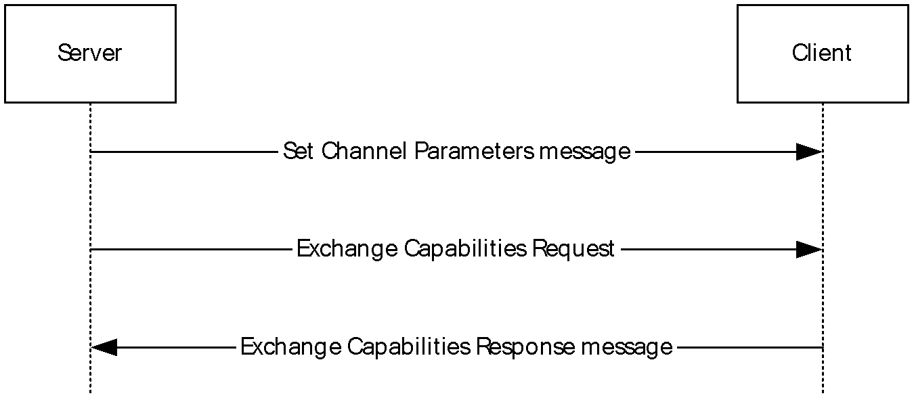

Figure 1: Channel setup sequence

<a id="Section_1.3.3.2"></a>
#### 1.3.3.2 Presentation Initialization and Termination Sequence

The [**presentation**](#gt_presentation) initialization sequence has the following goals:

- Notify the client of a new presentation and the [**GUID**](#gt_globally-unique-identifier-guid) used to identify the presentation.
- Negotiate whether the client supports playback of the [**media data**](#gt_media-data) encoded in a specific audio or video [**format**](#gt_format).
- Notify the client of all the [**streams**](#gt_stream) that will supply audio or video data that is encoded in a specific format.
- Notify the client when all streams have been set up and the presentation is ready for playback.
The presentation termination sequence has the following goals:

- Remove all streams when their media data has completed and they are no longer required on the server.
- Shut down the presentation when all streams have been removed and when no more operations are required for a presentation.
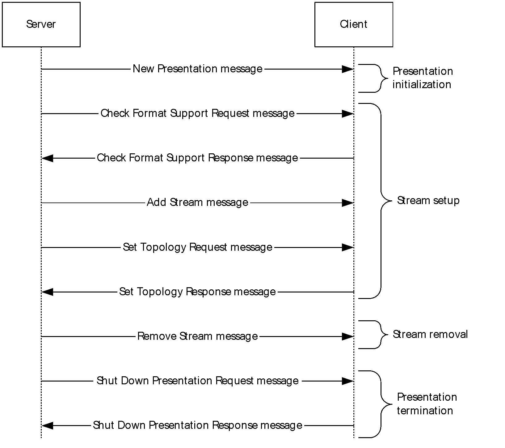

Figure 2: Presentation initialization and termination sequence

<a id="Section_1.3.3.3"></a>
#### 1.3.3.3 Playback State Sequence

The goal of the messages in this sequence is for the server to notify the client of the changes to the playback state of a [**presentation**](#gt_presentation).

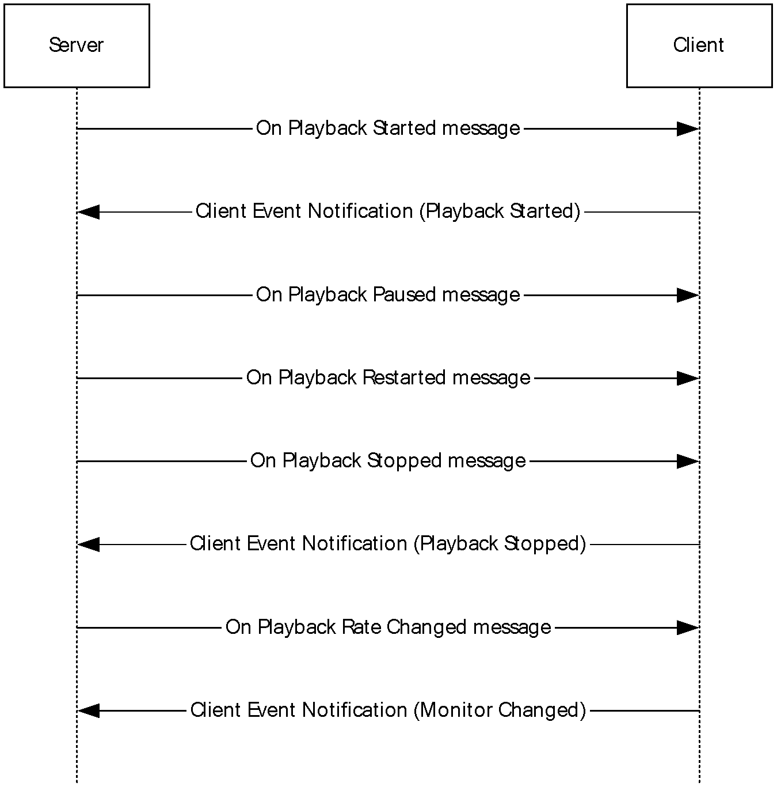

Figure 3: Playback state sequence

<a id="Section_1.3.3.4"></a>
#### 1.3.3.4 Data Streaming Sequence

The goal of the messages in this sequence is to handle [**media data**](#gt_media-data) transfer for a single [**stream**](#gt_stream).

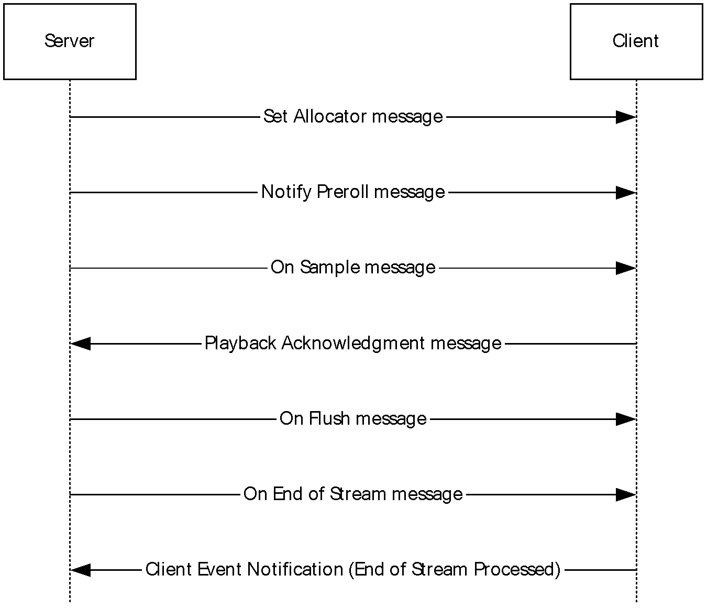

Figure 4: Data streaming sequence

<a id="Section_1.3.3.5"></a>
#### 1.3.3.5 Geometry Handling Sequence

The goal of the messages in this sequence is to notify the client of the window that is being used on the server for displaying the video. The client is also notified of any changes to the shape (geometry) and position of the video window.

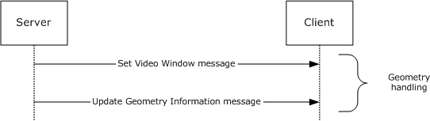

Figure 5: Geometry handling sequence

<a id="Section_1.3.3.6"></a>
#### 1.3.3.6 Volume Handling Sequence

The goal of the messages in this sequence is to notify the client of any changes to the master volume or channel volume for an audio [**stream**](#gt_stream).

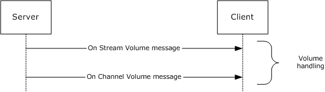

Figure 6: Volume handling sequence

<a id="Section_1.3.4"></a>
### 1.3.4 Interface Manipulation Exchange Capabilities Interface Description

The [Interface Manipulation Exchange Capabilities Interface](#Section_2.2.3) consists of the [Interface Manipulation Exchange Capabilities Request](#Section_3.2.5.3.1) and [Interface Manipulation Exchange Capabilities Response](#Section_3.3.5.4.2) messages. This [**interface**](#gt_interface) is used to exchange client and server capabilities for interface manipulation.

<a id="Section_1.4"></a>
## 1.4 Relationship to Other Protocols

The Remote Desktop Protocol Video Redirection Virtual Channel Extension is embedded in dynamic virtual channel transport, as specified in [MS-RDPEDYC](../MS-RDPEDYC/MS-RDPEDYC.md).

<a id="Section_1.5"></a>
## 1.5 Prerequisites/Preconditions

The Remote Desktop Protocol Video Redirection Virtual Channel Extension operates only after the dynamic virtual channel transport is fully established. If the dynamic virtual channel transport is terminated, no other communication over this protocol extension occurs.

This protocol is message-based, and it assumes preservation of the packet as a whole and does not allow for fragmentation. Packet reassembly is based on the information provided by the underlying dynamic virtual channel transport. This document assumes that packet chunks have already been reassembled based on that information.

<a id="Section_1.6"></a>
## 1.6 Applicability Statement

The Remote Desktop Protocol Video Redirection Virtual Channel Extension is designed to be run within the context of an RDP virtual channel established between a client and a server. This protocol extension is applicable when applications running on the [**terminal server**](#gt_terminal-server) play audio/video data that is required to be transferred to the client.

<a id="Section_1.7"></a>
## 1.7 Versioning and Capability Negotiation

This protocol supports versioning and capability negotiation at two levels. The first is supported through the use of [**interface**](#gt_interface) manipulation messages, as specified in sections [2.2.2](#Section_2.2.2) and [2.2.3](#Section_2.2.3). The second is supported by the capability exchange messages, as specified in sections [2.2.5.1.2](#Section_2.2.5.1.2) and [2.2.5.1.3](#Section_2.2.5.1.3).

<a id="Section_1.8"></a>
## 1.8 Vendor-Extensible Fields

The Remote Desktop Protocol Video Redirection Virtual Channel Extension uses HRESULTs as specified in [MS-ERREF](../MS-ERREF/MS-ERREF.md) section 2.1. Vendors are free to choose their own values, as long as the C bit (0x20000000) is set, indicating that it is a customer code.

This protocol also uses Win32 error codes. These values are taken from the error number space as specified in [MS-ERREF] section 2.2. Vendors SHOULD reuse those values with their indicated meanings. Choosing any other value runs the risk of a collision in the future.

Vendors can define their own interfaces and use them through the [**interface**](#gt_interface) manipulation mechanism, as specified in section [2.2.2](#Section_2.2.2).

<a id="Section_1.9"></a>
## 1.9 Standards Assignments

None.

<a id="Section_2"></a>
# 2 Messages

<a id="Section_2.1"></a>
## 2.1 Transport

The Remote Desktop Protocol Video Redirection Virtual Channel Extension is designed to operate over dynamic virtual channels, as specified in [MS-RDPEDYC](../MS-RDPEDYC/MS-RDPEDYC.md). The channel name used for this dynamic virtual channel is "TSMF". The usage of a channel name when opening a dynamic virtual channel is specified in [MS-RDPEDYC] section 2.2.2.1.

<a id="Section_2.2"></a>
## 2.2 Message Syntax

<a id="Section_2.2.1"></a>
### 2.2.1 Shared Message Header (SHARED_MSG_HEADER)

Every packet in this extension contains a common header.<1>

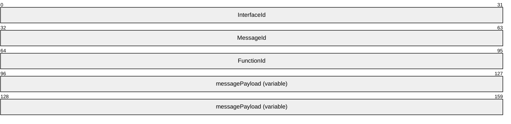

**InterfaceId (4 bytes):** The InterfaceId field is broken out as follows:

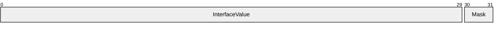

**InterfaceValue (30 bits):** A 30-bit unsigned integer that represents the common identifier for the [**interface**](#gt_interface). The default value is 0x00000000. If the message uses this default interface ID, the message is interpreted for the main interface for which this channel has been instantiated. All other values MUST be retrieved either from an Interface Query response (QI_RSP), [MS-RDPEXPS](../MS-RDPEXPS/MS-RDPEXPS.md) section2.2.2.1.2, or from responses that contain interface IDs.

This ID is valid until an interface release (IFACE_RELEASE) message ([MS-RDPEXPS] section 2.2.2.2) is sent or received with that ID. After an IFACE_RELEASE message is processed, this ID is considered invalid.

**Mask (2 bits):** These two bits in the SHARED_MSG_HEADER header MUST be set to one of the following values.

| Value | Meaning |
| --- | --- |
| STREAM_ID_STUB 0x80000000 | Indicates that the SHARED_MSG_HEADER is being used in a response message. |
| STREAM_ID_PROXY 0x40000000 | Indicates that the SHARED_MSG_HEADER is not being used in a response message. |
| STREAM_ID_NONE 0x00000000 | Indicates that the SHARED_MSG_HEADER is being used for interface manipulation capabilities exchange as specified in section [2.2.3](#Section_2.2.3). This value MUST NOT be used for any other messages. |

**MessageId (4 bytes):** A 32-bit unsigned integer that represents a unique ID for the request or response pair. Requests and responses are matched based on this ID coupled with the **InterfaceId**.

**FunctionId (4 bytes):** A 32-bit unsigned integer. This field MUST be present in all packets except response packets. Its value is either used in interface manipulation messages or defined for a specific interface. The following values are categorized by the interface for which they are defined.

Common IDs for all interfaces are as follows.

| Value | Meaning |
| --- | --- |
| RIMCALL_RELEASE 0x00000001 | Release the given interface ID. |
| RIMCALL_QUERYINTERFACE 0x00000002 | Query for a new interface. |

The Capabilities Negotiator Interface ID is as follows.

| Value | Meaning |
| --- | --- |
| RIM_EXCHANGE_CAPABILITY_REQUEST 0x00000100 | The server sends the [Interface Manipulation Exchange Capabilities Request](#Section_3.2.5.3.1) message. |

The Client Notifications Interface IDs are as follows.

| Value | Meaning |
| --- | --- |
| PLAYBACK_ACK 0x00000100 | The client sends the [Playback Acknowledgment](#Section_3.3.5.2.1) message. |
| CLIENT_EVENT_NOTIFICATION 0x00000101 | The client sends the [Client Event Notification](#Section_2.2.4.2) message. |

Server Data Interface IDs are as follows.

| Value | Meaning |
| --- | --- |
| EXCHANGE_CAPABILITIES_REQ 0x00000100 | The server sends the [Exchange Capabilities Request](#Section_2.2.5.1.2) message. |
| SET_CHANNEL_PARAMS 0x00000101 | The server sends the [Set Channel Parameters](#Section_3.2.5.2.1.1) message. |
| ADD_STREAM 0x00000102 | The server sends the [Add Stream](#Section_2.2.5.2.4) message. |
| ON_SAMPLE 0x00000103 | The server sends the [On Sample](#Section_2.2.5.4.3) message. |
| SET_VIDEO_WINDOW 0x00000104 | The server sends the [Set Video Window](#Section_3.2.5.2.5.1) message. |
| ON_NEW_PRESENTATION 0x00000105 | The server sends the [New Presentation](#Section_3.2.5.2.2.1) message. |
| SHUTDOWN_PRESENTATION REQ 0x00000106 | The server sends the [Shut Down Presentation Request](#Section_2.2.5.2.8) message. |
| SET_TOPOLOGY_REQ 0x00000107 | The server sends the [Set Topology Request](#Section_2.2.5.2.5) message. |
| CHECK_FORMAT_SUPPORT_REQ 0x00000108 | The server sends the [Check Format Support Request](#Section_2.2.5.2.2) message. |
| ON_PLAYBACK_STARTED 0x00000109 | The server sends the [On Playback Started](#Section_3.2.5.2.3.1) message. |
| ON_PLAYBACK_PAUSED 0x0000010a | The server sends the [On Playback Paused](#Section_3.2.5.2.3.2) message. |
| ON_PLAYBACK_STOPPED 0x0000010b | The server sends the [On Playback Stopped](#Section_3.2.5.2.3.4) message. |
| ON_PLAYBACK_RESTARTED 0x0000010c | The server sends the [On Playback Restarted](#Section_3.2.5.2.3.3) message. |
| ON_PLAYBACK_RATE_CHANGED 0x0000010d | The server sends the [On Playback Rate Change](#Section_3.2.5.2.3.5) message. |
| ON_FLUSH 0x0000010e | The server sends the [On Flush](#Section_2.2.5.4.4) message. |
| ON_STREAM_VOLUME 0x0000010f | The server sends the [On Stream Volume](#Section_3.2.5.2.6.1) message. |
| ON_CHANNEL_VOLUME 0x00000110 | The server sends the [On Channel Volume](#Section_3.2.5.2.6.2) message. |
| ON_END_OF_STREAM 0x00000111 | The server sends the [On End of Stream](#Section_3.2.5.2.4.5) message. |
| SET_ALLOCATOR 0x00000112 | The server sends the [Set Allocator Properties](#Section_3.2.5.2.4.1) message. |
| NOTIFY_PREROLL 0x00000113 | The server sends the [Notify Preroll](#Section_3.2.5.2.4.2) message. |
| UPDATE_GEOMETRY_INFO 0x00000114 | The server sends the [Update Geometry Information](#Section_3.2.5.2.5.2) message. |
| REMOVE_STREAM 0x00000115 | The server sends the [Remove Stream](#Section_3.2.5.2.2.7) message. |
| SET_SOURCE_VIDEO_RECT 0x00000116 | The server sends the [Set Source Video Rectangle](#Section_2.2.5.2.10) message. |

**messagePayload (variable):** An array of unsigned 8-bit integers describing the payload of the message corresponding to the interface for which the packet is sent. The specific structure of the payload is described by the message descriptions in sections 2.2.3, [2.2.4](#Section_2.2.4), and [2.2.5](#Section_2.2.5).

<a id="Section_2.2.2"></a>
### 2.2.2 Interface Manipulation

This protocol utilizes the same Interface Query and Interface Release messages that are defined in [MS-RDPEXPS](../MS-RDPEXPS/MS-RDPEXPS.md) section 2.2.2.

<a id="Section_2.2.3"></a>
### 2.2.3 Interface Manipulation Exchange Capabilities Interface

The Exchange Capabilities Interface is identified by the interface ID 0x00000002. This [**interface**](#gt_interface) is used to exchange the client's and the server's capabilities for interface manipulation.

<a id="Section_2.2.3.1"></a>
#### 2.2.3.1 Interface Manipulation Exchange Capabilities Request (RIM_EXCHANGE_CAPABILITY_REQUEST)

This message is used by the server to request [**interface**](#gt_interface) manipulation capabilities from the client.

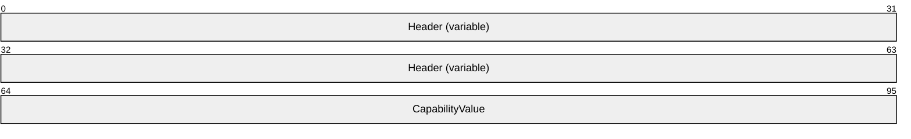

**Header (variable):** The common message header (as specified in section [2.2.1](#Section_2.2.1)). The **InterfaceId** field MUST be set to 0x00000002. The **Mask** field MUST be set to STREAM_ID_NONE. The **FunctionId** field MUST be set to RIM_EXCHANGE_CAPABILITY_REQUEST (0x00000100).

**CapabilityValue (4 bytes):** A 32-bit unsigned integer that identifies the server's capability. The valid values for this field are the following.

| Capability Name | Value | Meaning |
| --- | --- | --- |
| RIM_CAPABILITY_VERSION_01 | 0x00000001 | The capability to indicate the basic support for interface manipulation. This capability MUST be present in the message. |

<a id="Section_2.2.3.2"></a>
#### 2.2.3.2 Interface Manipulation Exchange Capabilities Response (RIM_EXCHANGE_CAPABILITY_RESPONSE)

This message is sent by the client in response to [RIM_EXCHANGE_CAPABILITY_REQUEST](#Section_3.2.5.3.1).

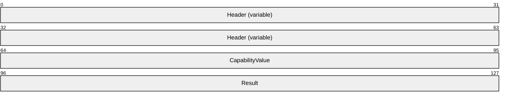

**Header (variable):** The common message header (as specified in section [2.2.1](#Section_2.2.1)). The **InterfaceId** field and the **MessageId** field in this message header SHOULD contain the same values as the **InterfaceId** and **MessageId** fields in the corresponding RIM_EXCHANGE_CAPABILITY_REQUEST message. The **Mask** field MUST be set to STREAM_ID_NONE.

**CapabilityValue (4 bytes):** A 32-bit unsigned integer that identifies the client's capability. The valid values for this field are the following.

| Capability name | Value | Meaning |
| --- | --- | --- |
| RIM_CAPABILITY_VERSION_01 | 0x00000001 | The capability to indicate the basic support for interface manipulation. This capability MUST be present in the message. |

**Result (4 bytes):** A 32-bit unsigned integer that indicates the HRESULT of the operation.

<a id="Section_2.2.4"></a>
### 2.2.4 Client Notifications Interface

The client notifications [**interface**](#gt_interface) is identified by the interface ID 0x00000001. The client notifications interface is used by the client to send playback acknowledgment.

<a id="Section_2.2.4.1"></a>
#### 2.2.4.1 Playback Acknowledgment Message (PLAYBACK_ACK)

The PLAYBACK_ACK message is sent from the client to the server to acknowledge the [**media data**](#gt_media-data) that has already been played.

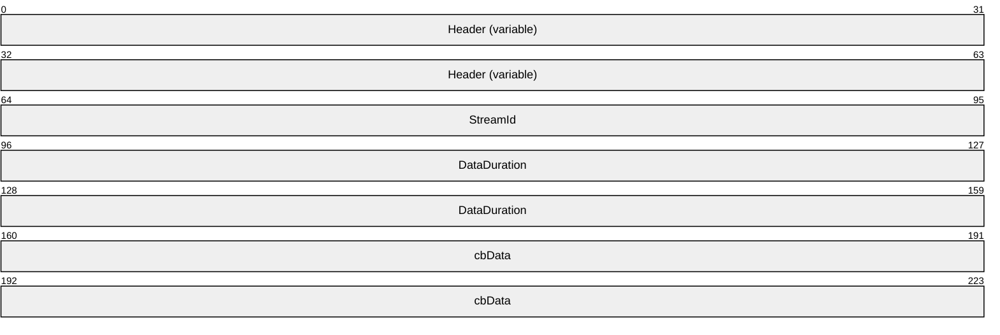

**Header (variable):** The common message header (as specified in section [2.2.1](#Section_2.2.1)). The **InterfaceId** field MUST be set to 0x00000001. The **Mask** field MUST be set to STREAM_ID_PROXY. The **FunctionId** field MUST be set to PLAYBACK_ACK (0x00000100).

**StreamId (4 bytes):** A 32-bit unsigned integer that indicates the stream ID of the [**sample**](#gt_sample) that is being acknowledged.

**DataDuration (8 bytes):** A 64-bit unsigned integer that indicates the calculated data duration of the sample that is being acknowledged. This field MUST be set to the **ThrottleDuration** field of the [TS_MM_DATA_SAMPLE](#Section_2.2.8) structure of the sample that is being acknowledged.

**cbData (8 bytes):** A 64-bit unsigned integer that indicates the data size of the sample that is being acknowledged. This field MUST be set to the **cbData** field of the TS_MM_DATA_SAMPLE structure of the sample that is being acknowledged.

<a id="Section_2.2.4.2"></a>
#### 2.2.4.2 Client Event Notification Message (CLIENT_EVENT_NOTIFICATION)

The CLIENT_EVENT_NOTIFICATION message is sent from the client to the server whenever an important client event happens.

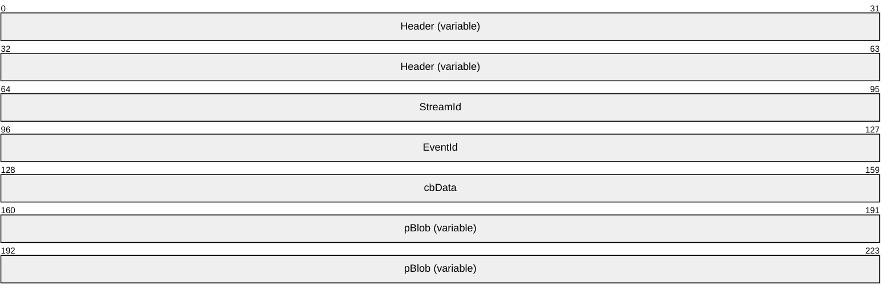

**Header (variable):** The common message header (as specified in section [2.2.1](#Section_2.2.1)). The **InterfaceId** field of this Header MUST be set to 0x00000001. The **Mask** field MUST be set to STREAM_ID_PROXY. The **FunctionId** field of this Header MUST be set to CLIENT_EVENT_NOTIFICATION (0x00000101).

**StreamId (4 bytes):** A 32-bit unsigned integer that indicates the stream ID where the event originated.

**EventId (4 bytes):** A 32-bit unsigned integer that indicates the type of event the client is raising.

**cbData (4 bytes):** A 32-bit unsigned integer that indicates the number of bytes in the **pBlob** field.

**pBlob (variable):** An array of bytes that contains data relevant to whichever event ID is passed.

<a id="Section_2.2.5"></a>
### 2.2.5 Server Data Interface

The server data [**interface**](#gt_interface) is identified by the default interface ID 0x00000000. The default interface does not require Query Interface Request (QI_REQ) or Query Interface Response (QI_RSP) messages [MS-RDPEXPS](../MS-RDPEXPS/MS-RDPEXPS.md) to initialize the interface.

<a id="Section_2.2.5.1"></a>
#### 2.2.5.1 Channel Setup Messages

<a id="Section_2.2.5.1.1"></a>
##### 2.2.5.1.1 Set Channel Parameters Message (SET_CHANNEL_PARAMS)

This message is used by the server to set channel parameters.

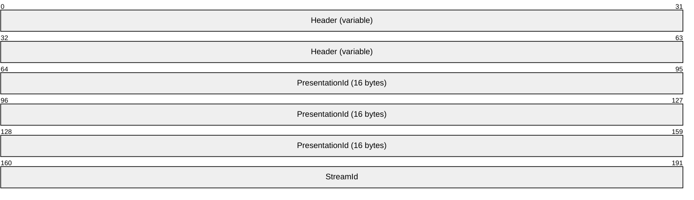

**Header (variable):** The common message header (as specified in section [2.2.1](#Section_2.2.1)). The **InterfaceId** field MUST be set to 0x00000000. The **Mask** field MUST be set to STREAM_ID_PROXY. The **FunctionId** field MUST be set to SET_CHANNEL_PARAMS (0x00000101).

**PresentationId (16 bytes):** A 16-byte GUID that identifies the presentation.

**StreamId (4 bytes):** A 32-bit unsigned integer that indicates channel identifier. There MUST be only one channel with the identifier value 0x00000000, and it MUST NOT be used for data-streaming sequence messages.

<a id="Section_2.2.5.1.2"></a>
##### 2.2.5.1.2 Exchange Capabilities Request Message (EXCHANGE_CAPABILITIES_REQ)

This message is used by the server to exchange its capabilities with the client.

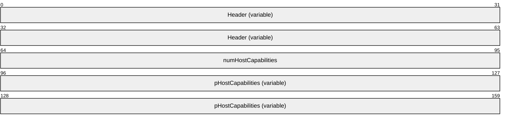

**Header (variable):** The common message header (as specified in section [2.2.1](#Section_2.2.1)). The **InterfaceId** field MUST be set to 0x00000000. The **Mask** field MUST be set to STREAM_ID_PROXY. The **FunctionId** field MUST be set to EXCHANGE_CAPABILITIES_REQ (0x00000100).

**numHostCapabilities (4 bytes):** A 32-bit unsigned integer. This field MUST contain the number of [TSMM_CAPABILITIES](#Section_2.2.6) structures in the **pHostCapabilityArray** field.

**pHostCapabilities (variable):** An array of TSMM_CAPABILITIES structures, each containing the capabilities for the server.

<a id="Section_2.2.5.1.3"></a>
##### 2.2.5.1.3 Exchange Capabilities Response Message (EXCHANGE_CAPABILITIES_RSP)

This message is used by the client as a response to the exchange capabilities request message ([EXCHANGE_CAPABILITIES_REQ](#Section_2.2.5.1.2)).

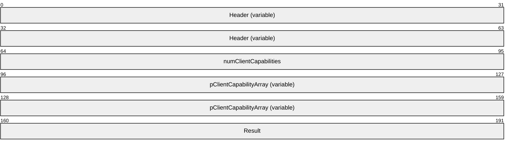

**Header (variable):** The common message header (as specified in section [2.2.1](#Section_2.2.1)). The **InterfaceId** and **MessageId** fields in this header MUST contain the same values as the **InterfaceId** and **MessageId** fields in the corresponding EXCHANGE_CAPABILITIES_REQ message. The **Mask** field MUST be set to STREAM_ID_STUB.

**numClientCapabilities (4 bytes):** A 32-bit unsigned integer. This field MUST contain the number of [TSMM_CAPABILITIES](#Section_2.2.6) structures in the **pClientCapabilityArray** field.

**pClientCapabilityArray (variable):** An array of TSMM_CAPABILITIES structures, each containing the capabilities for the client.

**Result (4 bytes):** A 32-bit unsigned integer that indicates the result of the operation.

<a id="Section_2.2.5.2"></a>
#### 2.2.5.2 Presentation Initialization and Termination Messages

<a id="Section_2.2.5.2.1"></a>
##### 2.2.5.2.1 New Presentation Message (NEW_PRESENTATION)

This message is used by the server to notify the client of a new [**presentation**](#gt_presentation).

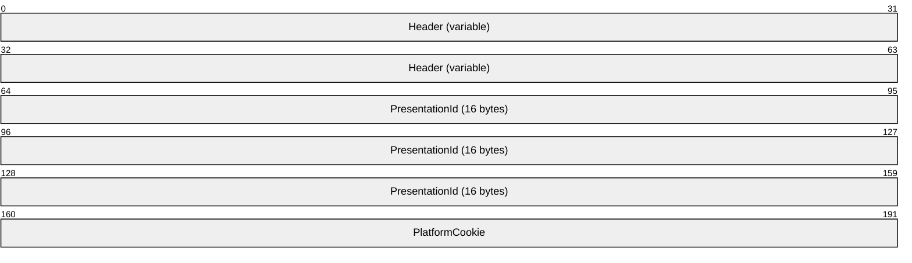

**Header (variable):** The common message header (as specified in section [2.2.1](#Section_2.2.1)). The **InterfaceId** field MUST be set to 0x00000000. The **Mask** field MUST be set to STREAM_ID_PROXY. The **FunctionId** field MUST be set to ON_NEW_PRESENTATION (0x00000105).

**PresentationId (16 bytes):** A 16-byte [**GUID**](#gt_globally-unique-identifier-guid) ([MS-DTYP](../MS-DTYP/MS-DTYP.md) section 2.3.4.2) that identifies the presentation.

**PlatformCookie (4 bytes):** A 32-bit unsigned integer that indicates preferred platforms. This field SHOULD be set to values defined in [TSMM_PLATFORM_COOKIE](#Section_2.2.9).

<a id="Section_2.2.5.2.2"></a>
##### 2.2.5.2.2 Check Format Support Request Message (CHECK_FORMAT_SUPPORT_REQ)

This message is used by the server to check if the client supports playback of media content in a specific [**format**](#gt_format).

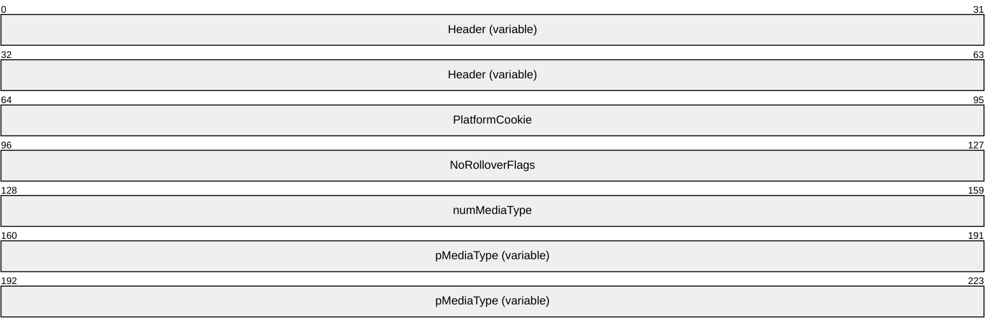

**Header (variable):** The common message header (as specified in section [2.2.1](#Section_2.2.1)). The **InterfaceId** field MUST be set to 0x00000000. The **Mask** field MUST be set to STREAM_ID_PROXY. The **FunctionId** field MUST be set to CHECK_FORMAT_SUPPORT_REQ (0x00000108).

**PlatformCookie (4 bytes):** A 32-bit unsigned integer that indicates preferred platforms. It SHOULD be set to values defined in [TSMM_PLATFORM_COOKIE](#Section_2.2.9).

**NoRolloverFlags (4 bytes):** A 32-bit unsigned integer that indicates the server's preference for client use of alternative platforms when checking format support. Valid values for this field are as follows.

| Value | Meaning |
| --- | --- |
| 0x00000000 | The client SHOULD check the format supported by alternative platforms if the format check indicated by the **PlatformCookie** field fails. |
| 0x00000001 | The client SHOULD NOT use alternative platforms for a format check if the format check indicated by the **PlatformCookie** field fails. |

**numMediaType (4 bytes):** A 32-bit unsigned integer. This field MUST contain the number of bytes in the **pMediaType** field.

**pMediaType (variable):** A [TS_AM_MEDIA_TYPE](#Section_2.2.7) structure that is sent as an array of bytes. This field indicates the media type of the [**stream**](#gt_stream).

<a id="Section_2.2.5.2.3"></a>
##### 2.2.5.2.3 Check Format Support Response Message (CHECK_FORMAT_SUPPORT_RSP)

This message is sent by the client in response to the check [**format**](#gt_format) support request message ([CHECK_FORMAT_SUPPORT_REQ](#Section_2.2.5.2.2)).

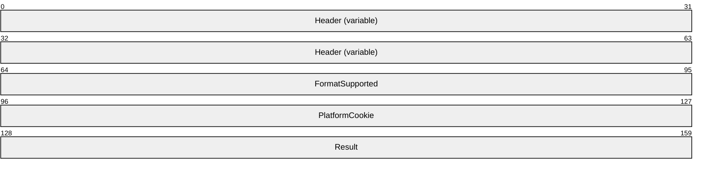

**Header (variable):** The common message header (as specified in section [2.2.1](#Section_2.2.1)). The **InterfaceId** and **MessageId** fields in this header MUST contain the same values as the **InterfaceId** and **MessageId** fields in the corresponding CHECK_FORMAT_SUPPORT_REQ message. The **Mask** field MUST be set to STREAM_ID_STUB.

**FormatSupported (4 bytes):** A 32-bit unsigned integer that indicates if the format is supported. The value zero indicates that the format is not supported, and the value one indicates that the format is supported.

**PlatformCookie (4 bytes):** A 32-bit unsigned integer that indicates the platform on the client, which MUST be used for playing the media data in a given format. This field MUST be set only when **FormatSupported** field is set to one, and its value MUST be either TSMM_PLATFORM_COOKIE_MF or TSMM_PLATFORM_COOKIE_DSHOW. For more information about these values, see section [2.2.9](#Section_2.2.9).

**Result (4 bytes):** A 32-bit unsigned integer that indicates the result of the operation.

<a id="Section_2.2.5.2.4"></a>
##### 2.2.5.2.4 Add Stream Message (ADD_STREAM)

This message is used by the server to ask the client to add a [**stream**](#gt_stream) to a [**presentation**](#gt_presentation), which MUST be used to play [**media data**](#gt_media-data) in the [**format**](#gt_format) specified in the message.

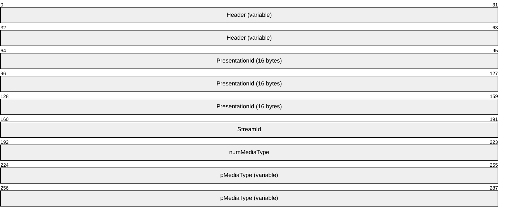

**Header (variable):** The common message header (as specified in section [2.2.1](#Section_2.2.1)). The **InterfaceId** field MUST be set to 0x00000000. The **Mask** field MUST be set to STREAM_ID_PROXY. The **FunctionId** field MUST be set to ADD_STREAM (0x00000102).

**PresentationId (16 bytes):** A 16-byte GUID that identifies the presentation.

**StreamId (4 bytes):** A 32-bit unsigned integer that identifies the stream.

**numMediaType (4 bytes):** A 32-bit unsigned integer that MUST contain the number of bytes in the **pMediaType** field.

**pMediaType (variable):** A [TS_AM_MEDIA_TYPE](#Section_2.2.7) structure sent as an array of bytes. This field indicates the media type of the stream.

<a id="Section_2.2.5.2.5"></a>
##### 2.2.5.2.5 Set Topology Request Message (SET_TOPOLOGY_REQ)

This message is used by the server to indicate that the [**presentation**](#gt_presentation) setup is complete.

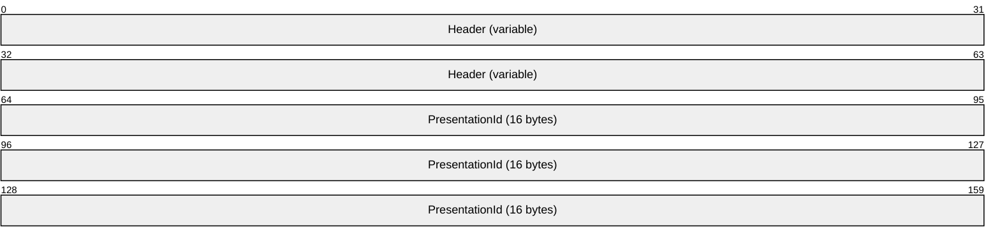

**Header (variable):** The common message header (as specified in section [2.2.1](#Section_2.2.1)). The **InterfaceId** field MUST be set to 0x00000000. The **Mask** field MUST be set to STREAM_ID_PROXY. The **FunctionId** field MUST be set to SET_TOPOLOGY_REQ (0x00000107).

**PresentationId (16 bytes):** A 16-byte GUID that identifies the presentation.

<a id="Section_2.2.5.2.6"></a>
##### 2.2.5.2.6 Set Topology Response Message (SET_TOPOLOGY_RSP)

This message is sent by the client in response to a Set Topology Request message ([SET_TOPOLOGY_REQ](#Section_2.2.5.2.5)).

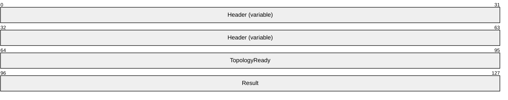

**Header (variable):** The common message header (as specified in section [2.2.1](#Section_2.2.1)). The **InterfaceId** and **MessageId** fields in this header MUST contain the same values as the **InterfaceId** and **MessageId** fields in the corresponding SET_TOPOLOGY_REQ message. The **Mask** field MUST be set to STREAM_ID_STUB.

**TopologyReady (4 bytes):** A 32-bit unsigned integer that indicates if the presentation is ready to be played on the client. The value one indicates that the presentation is ready. The value zero indicates that the presentation setup was unsuccessful.

**Result (4 bytes):** A 32-bit unsigned integer that indicates the result of the operation.

<a id="Section_2.2.5.2.7"></a>
##### 2.2.5.2.7 Remove Stream Message (REMOVE_STREAM)

This message is sent by the server to request that the client remove a [**stream**](#gt_stream).


**Header (variable):** The common message header (as specified in section [2.2.1](#Section_2.2.1)). The **InterfaceId** field MUST be set to 0x00000000. The **Mask** field MUST be set to STREAM_ID_PROXY. The **FunctionId** field MUST be set to REMOVE_STREAM (0x00000115).

**PresentationId (16 bytes):** A 16-byte GUID that identifies the [**presentation**](#gt_presentation).

**StreamId (4 bytes):** A 32-bit unsigned integer that identifies the stream.

<a id="Section_2.2.5.2.8"></a>
##### 2.2.5.2.8 Shut Down Presentation Request Message (SHUTDOWN_PRESENTATION_REQ)

This message is used by the server to notify the client to shut down a [**presentation**](#gt_presentation).


**Header (variable):** The common message header (as specified in section [2.2.1](#Section_2.2.1)). The **InterfaceId** field MUST be set to 0x00000000. The **Mask** field MUST be set to STREAM_ID_PROXY. The **FunctionId** field MUST be set to 0x00000106 to indicate SHUTDOWN_PRESENTATION_REQ.

**PresentationId (16 bytes):** A 16-byte GUID that identifies the presentation to shut down.

<a id="Section_2.2.5.2.9"></a>
##### 2.2.5.2.9 Shut Down Presentation Response Message (SHUTDOWN_PRESENTATION_RSP)

The Shut Down Presentation Response Message is sent by the client in response to a Shut Down Presentation Request Message sent by the server, as specified in section [2.2.5.2.8](#Section_2.2.5.2.8).

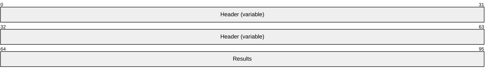

**Header (variable):** The common message header (as specified in section [2.2.1](#Section_2.2.1)). The **InterfaceId** and **MessageId** fields in this header MUST contain the same values as the **InterfaceId** and **MessageId** fields in the corresponding SHUTDOWN_PRESENTATION_REQ message. The **Mask** field MUST be set to STREAM_ID_STUB.

**Results (4 bytes):** A 32-bit unsigned integer that indicates the result of the operation.

<a id="Section_2.2.5.2.10"></a>
##### 2.2.5.2.10 Set Source Video Rectangle Message (SET_SOURCE_VIDEO_RECTANGLE)

This message is sent by the server to request that the client render the part of the source video specified in normalized coordinates.

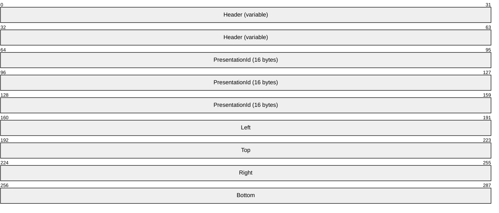

**Header (variable):** The common message header (as specified in section [2.2.1](#Section_2.2.1)). The **InterfaceId** field MUST be set to 0x00000000. The **Mask** field MUST be set to STREAM_ID_PROXY. The **FunctionId** field MUST be set to REMOVE_STREAM (0x00000116).

**PresentationId (16 bytes):** A 16-byte GUID that identifies the presentation.

**Left (4 bytes):** A 32-bit floating point number that identifies the left side of the rectangle in normalized coordinates.

**Top (4 bytes):** A 32-bit floating point number that identifies the top side of the rectangle in normalized coordinates.

**Right (4 bytes):** A 32-bit floating point number that identifies the right side of the rectangle in normalized coordinates.

**Bottom (4 bytes):** A 32-bit floating point number that identifies the bottom side of the rectangle in normalized coordinates.

<a id="Section_2.2.5.3"></a>
#### 2.2.5.3 Playback State Messages

<a id="Section_2.2.5.3.1"></a>
##### 2.2.5.3.1 On Playback Started Message (ON_PLAYBACK_STARTED)

The ON_PLAYBACK_STARTED message is sent from the server to the client to start playback of a [**presentation**](#gt_presentation).

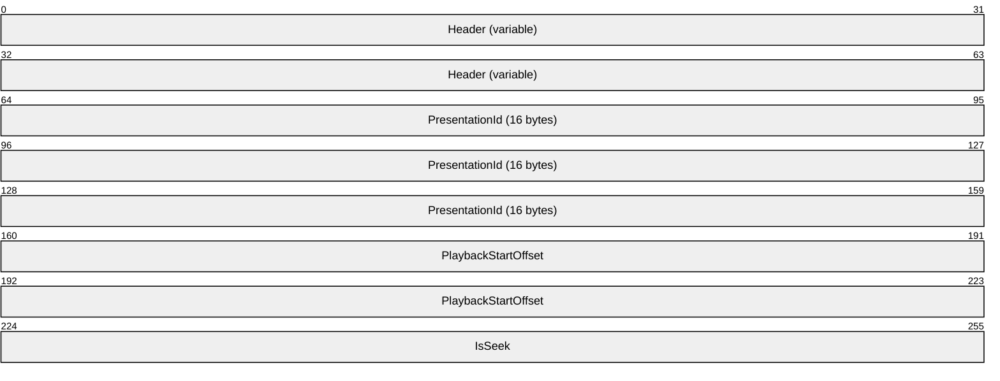

**Header (variable):** The common message header (as specified in section [2.2.1](#Section_2.2.1)). The **InterfaceId** field MUST be set to 0x00000000. The **Mask** field MUST be set to STREAM_ID_PROXY. The **FunctionId** field MUST be set to ON_PLAYBACK_STARTED (0x00000109).

**PresentationId (16 bytes):** A 16-byte GUID that identifies the presentation.

**PlaybackStartOffset (8 bytes):** A 64-bit unsigned integer that indicates the reference time when the playback gets started.

**IsSeek (4 bytes):** A 32-bit unsigned integer that indicates whether this start represents a seek. If the presentation was started because of a seek, then this value is set to one; otherwise it is set it to zero.

<a id="Section_2.2.5.3.2"></a>
##### 2.2.5.3.2 On Playback Paused Message (ON_PLAYBACK_PAUSED)

The ON_PLAYBACK_PAUSED message is sent from the server to the client to pause a [**presentation**](#gt_presentation).

```mermaid
packet-beta
  0-63: "Header (variable)"
  64-159: "PresentationId (16 bytes)"
```

**Header (variable):** The common message header (as specified in section [2.2.1](#Section_2.2.1)). The **InterfaceId** field MUST be set to 0x00000000. The **Mask** field MUST be set to STREAM_ID_PROXY. The **FunctionId** field MUST be set to ON_PLAYBACK_PAUSED (0x0000010a).

**PresentationId (16 bytes):** A 16-byte GUID that identifies the presentation.

<a id="Section_2.2.5.3.3"></a>
##### 2.2.5.3.3 On Playback Restarted Message (ON_PLAYBACK_RESTARTED)

The ON_PLAYBACK_RESTARTED message is sent from the server to the client to restart the playback of a [**presentation**](#gt_presentation).

```mermaid
packet-beta
  0-63: "Header (variable)"
  64-159: "PresentationId (16 bytes)"
```

**Header (variable):** The common message header (as specified in section [2.2.1](#Section_2.2.1)). The **InterfaceId** field of the header MUST be set to 0x00000000. The **Mask** field MUST be set to STREAM_ID_PROXY. The **FunctionId** field of the header MUST be set to 0x0000010c for ON_PLAYBACK_RESTARTED.

**PresentationId (16 bytes):** A 16-byte GUID that identifies the presentation.

<a id="Section_2.2.5.3.4"></a>
##### 2.2.5.3.4 On Playback Stopped Message (ON_PLAYBACK_STOPPED)

The ON_PLAYBACK_ STOPPED message is sent from the server to the client to stop playback of a [**presentation**](#gt_presentation)

```mermaid
packet-beta
  0-63: "Header (variable)"
  64-159: "PresentationId (16 bytes)"
```

**Header (variable):** The common message header (as specified in section [2.2.1](#Section_2.2.1)). The **InterfaceId** field MUST be set to 0x00000000. The **Mask** field MUST be set to STREAM_ID_PROXY. The **FunctionId** field MUST be set to ON_PLAYBACK_STOPPED (0x0000010b).

**PresentationId (16 bytes):** A 16-byte GUID that identifies the presentation.

<a id="Section_2.2.5.3.5"></a>
##### 2.2.5.3.5 On Playback Rate Changed Message (ON_PLAYBACK_RATE_CHANGED)

The ON_PLAYBACK_RATE_CHANGED message is sent from the server to the client to change the playback rate of a [**presentation**](#gt_presentation).

```mermaid
packet-beta
  0-63: "Header (variable)"
  64-159: "PresentationId (16 bytes)"
  160-191: "NewRate"
```

**Header (variable):** The common message header (as specified in section [2.2.1](#Section_2.2.1)). The **InterfaceId** field MUST be set to 0x00000000. The **Mask** field MUST be set to STREAM_ID_PROXY. The **FunctionId** field MUST be set to ON_PLAYBACK_RATE_CHANGED (0x0000010d).

**PresentationId (16 bytes):** A 16-byte GUID that identifies the presentation.

**NewRate (4 bytes):** A 32-bit floating-point number ([MS-DTYP](../MS-DTYP/MS-DTYP.md), section 2.2.15) that indicates the new playback rate of the presentation.

<a id="Section_2.2.5.4"></a>
#### 2.2.5.4 Data Streaming Messages

<a id="Section_2.2.5.4.1"></a>
##### 2.2.5.4.1 Set Allocator Properties Message (SET_ALLOCATOR)

The SET_ALLOCATOR message MAY<2> be sent from the server to the client to set buffer allocation properties for a [**stream**](#gt_stream). For more information about allocators, see [[MSDN-ALLOCATOR]](https://go.microsoft.com/fwlink/?LinkId=128463).

```mermaid
packet-beta
  0-63: "Header (variable)"
  64-159: "PresentationId (16 bytes)"
  160-191: "StreamId"
  192-223: "cBuffers"
  224-255: "cbBuffer"
  256-287: "cbAlign"
  288-319: "cbPrefix"
```

**Header (variable):** The common message header (as specified in section [2.2.1](#Section_2.2.1)). The **InterfaceId** field MUST be set to 0x00000000. The **Mask** field MUST be set to STREAM_ID_PROXY. The **FunctionId** field MUST be set to SET_ALLOCATOR (0x00000112).

**PresentationId (16 bytes):** A 16-byte GUID that identifies the [**presentation**](#gt_presentation).

**StreamId (4 bytes):** A 32-bit unsigned integer that identifies the stream ID.

**cBuffers (4 bytes):** A 32-bit unsigned integer that indicates the number of buffers created by the allocator.

**cbBuffer (4 bytes):** A 32-bit unsigned integer that indicates the size of each buffer, in bytes, excluding any prefix.

**cbAlign (4 bytes):** A 32-bit unsigned integer that indicates the alignment of the buffer. The buffer start MUST be aligned on a multiple of this value.

**cbPrefix (4 bytes):** A 32-bit unsigned integer that indicates that each buffer is preceded by a prefix of this many bytes.

<a id="Section_2.2.5.4.2"></a>
##### 2.2.5.4.2 Notify Preroll Message (NOTIFY_PREROLL)

The NOTIFY_PREROLL message is sent from the server to the client to indicate that a [**stream**](#gt_stream) is preloading the [**media data**](#gt_media-data) before playback.

```mermaid
packet-beta
  0-63: "Header (variable)"
  64-159: "PresentationId (16 bytes)"
  160-191: "StreamId"
```

**Header (variable):** The common message header (as specified in section [2.2.1](#Section_2.2.1)). The **InterfaceId** field MUST be set to 0x00000000. The **Mask** field MUST be set to STREAM_ID_PROXY. The **FunctionId** field MUST be set to NOTIFY_PREROLL (0x00000113).

**PresentationId (16 bytes):** A 16-byte GUID that identifies the [**presentation**](#gt_presentation).

**StreamId (4 bytes):** A 32-bit unsigned integer that identifies the stream ID.

<a id="Section_2.2.5.4.3"></a>
##### 2.2.5.4.3 On Sample Message (ON_SAMPLE)

The ON_SAMPLE message is used by the server to send a data [**sample**](#gt_sample) to the client.

```mermaid
packet-beta
  0-63: "Header (variable)"
  64-159: "PresentationId (16 bytes)"
  160-191: "StreamId"
  192-223: "numSample"
  224-287: "pSample (variable)"
```

**Header (variable):** The common message header (as specified in section [2.2.1](#Section_2.2.1)). The **InterfaceId** field MUST be set to 0x00000000. The **Mask** field MUST be set to STREAM_ID_PROXY. The **FunctionId** field MUST be set to ON_SAMPLE (0x00000103).

**PresentationId (16 bytes):** A 16-byte GUID that identifies the [**presentation**](#gt_presentation).

**StreamId (4 bytes):** A 32-bit unsigned integer that identifies the stream ID, of which the sample is a part.

**numSample (4 bytes):** A 32-bit unsigned integer. This field MUST contain the number of bytes in the **pSample** field.

**pSample (variable):** A [TS_MM_DATA_SAMPLE](#Section_2.2.8) structure sent as an array of bytes. The fields of this structure describe the sample content.

<a id="Section_2.2.5.4.4"></a>
##### 2.2.5.4.4 On Flush Message (ON_FLUSH)

The ON_FLUSH message is sent from the server to the client to drop the queued [**sample**](#gt_sample) for a [**stream**](#gt_stream).

```mermaid
packet-beta
  0-63: "Header (variable)"
  64-159: "PresentationId (16 bytes)"
  160-191: "StreamId"
```

**Header (variable):** The common message header (as specified in section [2.2.1](#Section_2.2.1)). The **InterfaceId** field MUST be set to 0x00000000. The **Mask** field MUST be set to STREAM_ID_PROXY. The **FunctionId** field MUST be set to ON_FLUSH (0x0000010e).

**PresentationId (16 bytes):** A 16-byte GUID that identifies the [**presentation**](#gt_presentation).

**StreamId (4 bytes):** A 32-bit unsigned integer that identifies the stream ID.

<a id="Section_2.2.5.4.5"></a>
##### 2.2.5.4.5 On End of Stream Message (ON_END_OF_STREAM)

The ON_ END_OF_STREAM message is sent from the server to the client when a [**stream**](#gt_stream) has reached the end.

```mermaid
packet-beta
  0-63: "Header (variable)"
  64-159: "PresentationId (16 bytes)"
  160-191: "StreamId"
```

**Header (variable):** The common message header (as specified in section [2.2.1](#Section_2.2.1)). The **InterfaceId** field MUST be set to 0x00000000. The **Mask** field MUST be set to STREAM_ID_PROXY. The **FunctionId** field MUST be set to ON_END_OF_STREAM (0x00000111).

**PresentationId (16 bytes):** A 16-byte GUID that identifies the [**presentation**](#gt_presentation).

**StreamId (4 bytes):** A 32-bit unsigned integer that identifies the stream ID.

<a id="Section_2.2.5.5"></a>
#### 2.2.5.5 Geometry Handling Messages

<a id="Section_2.2.5.5.1"></a>
##### 2.2.5.5.1 Set Video Window Message (SET_VIDEO_WINDOW)

The SET_VIDEO_WINDOW message is sent from the server to the client to indicate the video [**window handle**](#gt_window-handle) that is used by the server for video rendering.

```mermaid
packet-beta
  0-63: "Header (variable)"
  64-159: "PresentationId (16 bytes)"
  160-223: "VideoWindowId"
  224-287: "HwndParent"
```

**Header (variable):** The common message header (as specified in section [2.2.1](#Section_2.2.1)). The **InterfaceId** field MUST be set to 0x00000000. The **Mask** field MUST be set to STREAM_ID_PROXY. The **FunctionId** field MUST be set to SET_VIDEO_WINDOW (0x00000104).

**PresentationId (16 bytes):** A 16-byte GUID that identifies the [**presentation**](#gt_presentation).

**VideoWindowId (8 bytes):** A 64-bit unsigned integer that indicates the video window handle on the server.

**HwndParent (8 bytes):** A 64-bit unsigned integer that indicates the window handler of the top-level parent window handle of the video window. Top-level windows are the windows whose parent is the desktop.

<a id="Section_2.2.5.5.2"></a>
##### 2.2.5.5.2 Update Geometry Information Message (UPDATE_GEOMETRY_INFO)

The UPDATE_GEOMETRY_INFO message is sent from the server to the client to update the geometry information of the video window.

```mermaid
packet-beta
  0-63: "Header (variable)"
  64-159: "PresentationId (16 bytes)"
  160-191: "numGeometryInfo"
  192-255: "pGeoInfo (variable)"
  256-287: "cbVisibleRect"
  288-351: "pVisibleRect (variable)"
```

**Header (variable):** The common message header (as specified in section [2.2.1](#Section_2.2.1)). The **InterfaceId** field MUST be set to 0x00000000. The **Mask** field MUST be set to STREAM_ID_PROXY. The **FunctionId** field MUST be set to UPDATE_GEOMETRY_INFO (0x00000114).

**PresentationId (16 bytes):** A 16-byte GUID that identifies the [**presentation**](#gt_presentation).

**numGeometryInfo (4 bytes):** A 32-bit unsigned integer. This field MUST contain the number of bytes in the **pGeoInfo** field.

**pGeoInfo (variable):** A [GEOMETRY_INFO](#Section_2.2.11) structure sent as an array of bytes. This field indicates the geometry information of the video window.

**cbVisibleRect (4 bytes):** A 32-bit unsigned integer. This field MUST contain the number of bytes in the **pVisibleRect** field.

**pVisibleRect (variable):** An array of [TS_RECT](#Section_2.2.13) structures, each containing a rectangle that represents part of the visible region. The union of these rectangles is the visible region of the video window. The coordinates of the rectangles are defined in client coordinates.

<a id="Section_2.2.5.6"></a>
#### 2.2.5.6 Volume Handling Messages

<a id="Section_2.2.5.6.1"></a>
##### 2.2.5.6.1 On Stream Volume Message (ON_STREAM_VOLUME)

The ON_STREAM_VOLUME message is sent from the server to the client to set the master volume for a [**presentation**](#gt_presentation).

```mermaid
packet-beta
  0-63: "Header (variable)"
  64-159: "PresentationId (16 bytes)"
  160-191: "NewVolume"
  192-223: "bMuted"
```

**Header (variable):** The common message header (as specified in section [2.2.1](#Section_2.2.1)). The **InterfaceId** field MUST be set to 0x00000000. The **Mask** field MUST be set to STREAM_ID_PROXY. The **FunctionId** field MUST be set to ON_STREAM_VOLUME (0x0000010f).

**PresentationId (16 bytes):** A 16-byte GUID that identifies the presentation.

**NewVolume (4 bytes):** A 32-bit unsigned integer that indicates the new volume level.

**bMuted (4 bytes):** A 32-bit unsigned integer that indicates if the speaker is set to muted. If the speaker is muted, this value is set to one; otherwise, it is set it to zero.

<a id="Section_2.2.5.6.2"></a>
##### 2.2.5.6.2 On Channel Volume Message (ON_CHANNEL_VOLUME)

The ON_CHANNEL_VOLUME message is sent from the server to the client to set channel volume.

```mermaid
packet-beta
  0-63: "Header (variable)"
  64-159: "PresentationId (16 bytes)"
  160-191: "ChannelVolume"
  192-223: "ChangedChannel"
```

**Header (variable):** The common message header (as specified in section [2.2.1](#Section_2.2.1)). The **InterfaceId** field MUST be set to 0x00000000. The **Mask** field MUST be set to STREAM_ID_PROXY. The **FunctionId** field MUST be set to ON_CHANNEL_VOLUME (0x00000110).

**PresentationId (16 bytes):** A 16-byte GUID that identifies the [**presentation**](#gt_presentation).

**ChannelVolume (4 bytes):** A 32-bit unsigned integer that indicates the volume of the channel.

**ChangedChannel (4 bytes):** A 32-bit unsigned integer that identifies the channel whose volume is set.

<a id="Section_2.2.6"></a>
### 2.2.6 TSMM_CAPABILITIES Structure

This structure defines the video redirection capabilities for the client and the server.

```mermaid
packet-beta
  0-31: "CapabilityType"
  32-63: "cbCapabilityLength"
  64-127: "pCapabilityData (variable)"
```

**CapabilityType (4 bytes):** A 32-bit unsigned integer that indicates the capability type.<3>

**cbCapabilityLength (4 bytes):** A 32-bit unsigned integer. This field MUST contain the number of bytes in the **pCapabilityData** field. The number of bytes in the **pCapabilityData** field is dependent on the **CapabilityType**.<4>

**pCapabilityData (variable):** An array of 8-bit unsigned integers. This field contains the capability value. When the **CapabilityType** field is set to 0x00000001 for a protocol version request, the **pCapabilityData** field MUST be a 32-bit unsigned integer with a value of 0x00000002 to indicate client support for the current protocol version. When the **CapabilityType** field is set to 0x00000002, the **pCapabilityData** field MUST be a 32-bit unsigned integer representing a supported platform. The value for the supported platforms is derived as a union of the MMREDIR_CAPABILITY_PLATFORM constants defined in section [2.2.10](#Section_2.2.10). When the **CapabilityType** field is set to 0x00000003, the **pCapabilityData** field MUST be a 32-bit unsigned integer from the MMREDIR_CAPABILITY_AUDIOSUPPORT constants defined in section [2.2.15](#Section_2.2.15). The value of this integer constant determines whether audio is supported. When the **CapabilityType** field is set to 0x00000004, the **pCapabilityData** field MUST be a 32-bit unsigned integer integer indicating the one-way network latency in milliseconds.

<a id="Section_2.2.7"></a>
### 2.2.7 TS_AM_MEDIA_TYPE Structure

The TS_AM_MEDIA_TYPE structure describes a media [**format**](#gt_format). The fields of this structure are based on the AM_MEDIA_TYPE structure. For more information about the AM_MEDIA_TYPE structure, see [[MSDN-AMMEDIATYPE]](https://go.microsoft.com/fwlink/?LinkId=128229). For examples of values for the individual fields, see [[MSDN-MediaTypes]](https://go.microsoft.com/fwlink/?LinkId=128460). This protocol does not generate values for any of the following fields, and the values are transparently sent from the server's playback platform to the client's playback platform.

```mermaid
packet-beta
  0-95: "MajorType (16 bytes)"
  96-191: "SubType (16 bytes)"
  192-223: "bFixedSizeSamples"
  224-255: "bTemporalCompression"
  256-287: "SampleSize"
  288-383: "FormatType (16 bytes)"
  384-415: "cbFormat"
  416-479: "pbFormat (variable)"
```

**MajorType (16 bytes):** A 16-byte GUID that specifies the major type of the media. For examples of major type values, see [MSDN-MediaTypes].

**SubType (16 bytes):** A 16-byte GUID that specifies the subtype of the media. For examples of subtype values, see [MSDN-MediaTypes].

**bFixedSizeSamples (4 bytes):** A 32-bit unsigned integer. The value one indicates that the [**samples**](#gt_sample) are of a fixed size.

**bTemporalCompression (4 bytes):** A 32-bit unsigned integer. The value one indicates that the samples are compressed by means of temporal (interframe) compression. The value one also indicates that not all frames are key frames.

**SampleSize (4 bytes):** A 32-bit unsigned integer. If available for a format, this value indicates the size of individual samples, in bytes.

**FormatType (16 bytes):** A 16-byte GUID that specifies the structure used for the format block. The pbFormat field points to the corresponding format structure. For examples of format types, see [MSDN-MediaTypes].

**cbFormat (4 bytes):** A 32-bit unsigned integer. This field MUST contain the number of bytes in the **pbFormat** field.

**pbFormat (variable):** A format structure that is sent as an array of bytes.

<a id="Section_2.2.8"></a>
### 2.2.8 TS_MM_DATA_SAMPLE Structure

This structure describes a media [**sample**](#gt_sample).

```mermaid
packet-beta
  0-63: "SampleStartTime"
  64-127: "SampleEndTime"
  128-191: "ThrottleDuration"
  192-223: "SampleFlags"
  224-255: "SampleExtensions"
  256-287: "cbData"
  288-351: "pData (variable)"
```

**SampleStartTime (8 bytes):** A 64-bit signed integer that indicates the start time for the sample, in 100 nanosecond units.

**SampleEndTime (8 bytes):** A 64-bit signed integer that indicates the end time for the sample, in 100 nanosecond units.

**ThrottleDuration (8 bytes):** A 64-bit unsigned integer that indicates the duration for the sample used by the server to keep a certain amount of data buffered on the client. If valid sample timestamps are available, this duration SHOULD be calculated by taking into account the sample start and end times. If valid sample timestamps are not available, this duration SHOULD be calculated by taking into account the sample size and format. If sample size and format are insufficient for such calculations, a default value for duration MAY <5> be used. The server is free to use any units for the **ThrottleDuration** field.

**SampleFlags (4 bytes):** A 32-bit unsigned integer. This field is reserved and MUST be ignored on receipt.

**SampleExtensions (4 bytes):** A 32-bit unsigned integer. The bits of this integer indicate attributes of the sample. The following table defines the meaning of each bit.

| Bit Range | Field | Description |
| --- | --- | --- |
| Variable | 0 | TSMM_SAMPLE_EXT_CLEANPOINT Indicates whether a video sample is a key frame. If the attribute is 1, the sample is a key frame and decoding SHOULD begin from this sample. Otherwise, the sample is not a key frame. |
| Variable | 1 | TSMM_SAMPLE_EXT_DISCONTINUITY Specifies whether a media sample is the first sample after a gap in the stream. If this attribute is 1, there was a discontinuity in the sample and this sample is the first to appear after the gap. |
| Variable | 2 | TSMM_SAMPLE_EXT_INTERLACED Indicates whether a video frame is interlaced or progressive. If this attribute is 1, the frame is interlaced. If this attribute is 0, the media type describes the interlacing. |
| Variable | 3 | TSMM_SAMPLE_EXT_BOTTOMFIELDFIRST Specifies the field dominance for an interlaced video frame. If the video frame is interlaced and the sample contains two interleaved fields, this attribute indicates which field is displayed first. If this attribute is 1, the bottom field is displayed first in time. If the frame is interlaced and the sample contains a single field, this attribute indicates which field the sample contains. Also, if this attribute is 1, the sample contains the bottom field. If the frame is progressive, this attribute describes how the fields SHOULD be ordered when the output is interlaced. If this attribute is 1, the bottom field SHOULD be output first.If this attribute is not set, the media type describes the field dominance. |
| Variable | 4 | TSMM_SAMPLE_EXT_REPEATFIELDFIRST Specifies whether to repeat the first field in an interlaced frame. If this attribute is set to 1, the first field is repeated. |
| Variable | 5 | TSMM_SAMPLE_EXT_SINGLEFIELD Specifies whether a video sample contains a single field or two interleaved fields. If this attribute is set to 1, the sample contains one field. |
| Variable | 6 | TSMM_SAMPLE_EXT_DERIVEDFROMTOPFIELD Specifies whether a de-interlaced video frame was derived from the upper field or the lower field. If this attribute is set to 1, the lower field was interpolated from the upper field. |
| Variable | 7 | TSMM_SAMPLE_EXT_HAS_NO_TIMESTAMPS Indicates whether the sample has a time stamp. If the value is 1, no time stamp is set in the sample. |
| Variable | 8 | TSMM_SAMPLE_EXT_RELATIVE_TIMESTAMPS Indicates whether the sample has a relative time stamp. If the value is 1, the time stamp set in the sample is a value that is relative to the time when the presentation started running. The time stamps are reset to 0 when the presentation is sought. |
| Variable | 9 | TSMM_SAMPLE_EXT_ABSOLUTE_TIMESTAMPS Indicates whether the sample has an absolute time stamp. If the value is 1, the time stamp set in the sample is the absolute value returned by the reference clock. |

**cbData (4 bytes):** A 32-bit unsigned integer. This field MUST contain the number of bytes in the **pData** field.

**pData (variable):** Sample data that is sent as an array of bytes. The data is encoded in the stream format.

<a id="Section_2.2.9"></a>
### 2.2.9 TSMM_PLATFORM_COOKIE Constants

The platform type is defined by platform cookie values.

| Symbolic name/value | Description |
| --- | --- |
| TSMM_PLATFORM_COOKIE_UNDEFINED 0 | Platform undefined. |
| TSMM_PLATFORM_COOKIE_MF 1 | The MF platform. For more information about the MF platform, see [[MSDN-MEDIAFOUNDATION]](https://go.microsoft.com/fwlink/?LinkId=128231). |
| TSMM_PLATFORM_COOKIE_DSHOW 2 | The DShow platform. For more information about the DShow platform, see [[MSDN-DIRECTSHOW]](https://go.microsoft.com/fwlink/?LinkId=128230). |

<a id="Section_2.2.10"></a>
### 2.2.10 MMREDIR_CAPABILITY_PLATFORM Constants

Platform capability is defined in the following table.

| Symbolic name/value | Description |
| --- | --- |
| MMREDIR_CAPABILITY_PLATFORM_MF 0x00000001 | The Media Foundation (MF) platform is supported for playback. For more information about the MF platform, see [[MSDN-MEDIAFOUNDATION]](https://go.microsoft.com/fwlink/?LinkId=128231). |
| MMREDIR_CAPABILITY_PLATFORM_DSHOW 0x00000002 | The DirectShow (DShow) platform is supported for playback. For more information about the DShow platform, see [[MSDN-DIRECTSHOW]](https://go.microsoft.com/fwlink/?LinkId=128230). |
| MMREDIR_CAPABILITY_PLATFORM_OTHER 0x00000004 | A platform other than MF or DShow is supported for playback.<6> |

<a id="Section_2.2.11"></a>
### 2.2.11 GEOMETRY_INFO Structure

This structure describes geometry information of the video window used to render video on the server.

```mermaid
packet-beta
  0-63: "VideoWindowId"
  64-95: "VideoWindowState"
  96-127: "Width"
  128-159: "Height"
  160-191: "Left"
  192-223: "Top"
  224-287: "Reserved"
  288-319: "ClientLeft"
  320-351: "ClientTop"
  352-383: "Padding"
```

**VideoWindowId (8 bytes):** A 64-bit unsigned integer that specifies the video [**window handle**](#gt_window-handle) on the server.

**VideoWindowState (4 bytes):** A 32-bit unsigned integer that indicates the video window state. This field MUST be set to a union of one or more of the values defined in [TS_WNDFLAG](#Section_2.2.12).

**Width (4 bytes):** A 32-bit unsigned integer. The width of the video window.

**Height (4 bytes):** A 32-bit unsigned integer. The height of the video window.

**Left (4 bytes):** A 32-bit unsigned integer. The left of the video window, in screen coordinates.

**Top (4 bytes):** A 32-bit unsigned integer. The top of the video window, in screen coordinates.

**Reserved (8 bytes):** This field is reserved and MUST be ignored on receipt.

**ClientLeft (4 bytes):** A 32-bit unsigned integer. The left of the video window's client area, in screen coordinates.

**ClientTop (4 bytes):** A 32-bit unsigned integer. The top of the video window's client area, in screen coordinates.

**Padding (4 bytes):** (Optional) A 32-bit unsigned integer. This field is unused and can be set to any value. If present, this field MUST be ignored on receipt. The presence of this field MUST be detected by checking the value of the **numGeometryInfo** field of the [Update Geometry Information (UPDATE_GEOMETRY_INFO)](#Section_3.2.5.2.5.2) message.

<a id="Section_2.2.12"></a>
### 2.2.12 TS_WNDFLAG Flags

The following flags are used to indicate video window states.

| Symbolic name/value | Description |
| --- | --- |
| TS_WNDFLAG_NEW 0x00000001 | Show the video window. |
| TS_WNDFLAG_DELETED 0x00000002 | Hide the video window. |
| TS_WNDFLAG_VISRGN 0x00001000 | The visible region of the video window changed. |

<a id="Section_2.2.13"></a>
### 2.2.13 TS_RECT Structure

This structure describes a rectangle.

```mermaid
packet-beta
  0-31: "Top"
  32-63: "Left"
  64-95: "Bottom"
  96-127: "Right"
```

**Top (4 bytes):** A 32-bit unsigned integer. The dimension of the top of the rectangle.

**Left (4 bytes):** A 32-bit unsigned integer. The dimension of the left end of the rectangle.

**Bottom (4 bytes):** A 32-bit unsigned integer. The dimension of the bottom of the rectangle.

**Right (4 bytes):** A 32-bit unsigned integer. The dimension of the right end of the rectangle.

<a id="Section_2.2.14"></a>
### 2.2.14 TSMM_CLIENT_EVENT Constants

The following **EventId** notifications are sent to the server by the client.

| Symbolic name/value | Description |
| --- | --- |
| TSMM_CLIENT_EVENT_ENDOFSTREAM 0x0064 | The client sends this **EventId** notification to the server when it encounters an end-of-stream marker in its sample queue. |
| TSMM_CLIENT_EVENT_STOP_COMPLETED 0x00C8 | The client sends this **EventId** notification to the server when it finishes processing a stop message. |
| TSMM_CLIENT_EVENT_START_COMPLETED 0x00C9 | The client sends this **EventId** notification to the server when it finishes processing a start message. |
| TSMM_CLIENT_EVENT_MONITORCHANGED 0x012C | The client sends this **EventId** notification to the server when the client display settings change during playback or when the video window on the client moves to a different monitor. |

<a id="Section_2.2.15"></a>
### 2.2.15 MMREDIR_CAPABILITY_AUDIOSUPPORT Constants

Audio support is defined in the table that follows.

| Symbolic name/value | Description |
| --- | --- |
| MMREDIR_CAPABILITY_AUDIO_SUPPORTED 0x00000001 | Audio playback is supported. |
| MMREDIR_CAPABILITY_AUDIO_NO_DEVICE 0x00000002 | Audio playback is not supported. |

<a id="Section_3"></a>
# 3 Protocol Details

<a id="Section_3.1"></a>
## 3.1 Common Details

<a id="Section_3.1.1"></a>
### 3.1.1 Abstract Data Model

This section describes a conceptual model of possible data organization that an implementation maintains to participate in this protocol. The described organization is provided to facilitate the explanation of how the protocol behaves. This document does not mandate that implementations adhere to this model as long as their external behavior is consistent with that described in this document.

**PresentationId:** For each audio/video presentation that is to be redirected, the server generates a unique **PresentationId**. The server sends this ID to the client in the **PresentationId** field of the [New Presentation message](#Section_3.2.5.2.2.1). This ID is then used in all subsequent messages for a [**presentation**](#gt_presentation) and is used by the client to refer all messages to the correct presentation.

**StreamId:** A presentation consists of a set of individual audio or video data streams. These streams use their own channels for data transfer. To uniquely identify the channels associated with a stream, the server uses an identifier called **StreamId**. The server sends this ID to the client in the **StreamId** field of the [Add Stream](#Section_2.2.5.2.4) message. The **StreamId** of 0x00000000 is reserved for the channel used to transport messages that are not specific to a data-stream.

<a id="Section_3.1.1.1"></a>
#### 3.1.1.1 Interface Manipulation Data Model

The common details of the abstract data model for the [**interface**](#gt_interface) manipulation infrastructure are specified in [MS-RDPEXPS](../MS-RDPEXPS/MS-RDPEXPS.md) section 3.1.1.

<a id="Section_3.1.2"></a>
### 3.1.2 Timers

None.

<a id="Section_3.1.3"></a>
### 3.1.3 Initialization

The dynamic virtual channel MUST be established, using the parameters specified in section [2.1](#Section_2.1), before protocol operation commences.

<a id="Section_3.1.4"></a>
### 3.1.4 Higher-Layer Triggered Events

None.

<a id="Section_3.1.5"></a>
### 3.1.5 Message Processing Events and Sequencing Rules

Malformed, unrecognized, and out-of-sequence packets MUST be ignored by the server and the client.

There are no time-outs for receiving a reply for any request.

<a id="Section_3.1.5.1"></a>
#### 3.1.5.1 Processing a Shared Message Header

The common rules for processing the [SHARED_MSG_HEADER](#Section_2.2.1) for the [**interface**](#gt_interface) manipulation infrastructure are defined in [MS-RDPEXPS](../MS-RDPEXPS/MS-RDPEXPS.md) section 3.1.5.1.

<a id="Section_3.1.5.2"></a>
#### 3.1.5.2 Interface Manipulation

The common rules for processing the interface manipulation messages are defined in [MS-RDPEXPS](../MS-RDPEXPS/MS-RDPEXPS.md) section 3.1.5.2.

<a id="Section_3.1.6"></a>
### 3.1.6 Timer Events

None.

<a id="Section_3.1.7"></a>
### 3.1.7 Other Local Events

None.

<a id="Section_3.2"></a>
## 3.2 Server Details

<a id="Section_3.2.1"></a>
### 3.2.1 Abstract Data Model

The abstract data model is as specified in section [3.1.1](#Section_3.1.1).

<a id="Section_3.2.2"></a>
### 3.2.2 Timers

None.

<a id="Section_3.2.3"></a>
### 3.2.3 Initialization

Initialization is as specified in section [3.1.3](#Section_3.1.3).

<a id="Section_3.2.4"></a>
### 3.2.4 Higher-Layer Triggered Events

None.

<a id="Section_3.2.5"></a>
### 3.2.5 Message Processing Events and Sequencing Rules

<a id="Section_3.2.5.1"></a>
#### 3.2.5.1 Client Notifications Interface

<a id="Section_3.2.5.1.1"></a>
##### 3.2.5.1.1 Processing a Playback Acknowledgment Message

The structure and fields of the [Playback Acknowledgment](#Section_3.3.5.2.1) message are specified in section 2.2.4.1.

This message confirms the amount of data that has been played on the client. If the server is controlling the rate at which data is being sent to the client, this message SHOULD be used as the trigger for sending more data.

<a id="Section_3.2.5.1.2"></a>
##### 3.2.5.1.2 Processing a Client Event Notification Message

The structure and fields of the Client Event Notification message are specified in section [2.2.4.2](#Section_2.2.4.2).

This message enables the client to notify the server of the important events defined in section [2.2.14](#Section_2.2.14). The processing rules for these notifications are as follows.

**TSMM_CLIENT_EVENT_ENDOFSTREAM:** If the media platform supports such notifications, the server notifies the media platform components that [**stream**](#gt_stream) completion has been processed.

**TSMM_CLIENT_EVENT_STOP_COMPLETED:** If the media platform supports such notifications, the server notifies the media platform components that playback stop has been processed.

**TSMM_CLIENT_EVENT_START_COMPLETED:** If the media platform supports such notifications, the server notifies the media platform components that playback start has been processed.

**TSMM_CLIENT_EVENT_MONITORCHANGED:** If the media platform supports such notifications, the server notifies the media platform components that renderer display settings have changed.

<a id="Section_3.2.5.2"></a>
#### 3.2.5.2 Server Data Interface

<a id="Section_3.2.5.2.1"></a>
##### 3.2.5.2.1 Server Data Interface Channel Setup Messages

<a id="Section_3.2.5.2.1.1"></a>
###### 3.2.5.2.1.1 Sending a Set Channel Parameters Message

The structure and fields of the [Set Channel Parameters](#Section_3.2.5.2.1.1) message are specified in section 2.2.5.1.1.

The Set Channel Parameters message MUST be sent for every new channel used for this protocol. This message MUST be sent after the Interface Manipulation Exchange Capabilities messages (section [2.2.3](#Section_2.2.3)) are sent. There MUST be only one channel with the **StreamId** value 0x00000000. Additionally, all streams MUST use their own channels for data transfer, with their **StreamId** as the channel identifier.

<a id="Section_3.2.5.2.1.2"></a>
###### 3.2.5.2.1.2 Sending an Exchange Capabilities Request Message

The structure and fields of the [Exchange Capabilities Request](#Section_2.2.5.1.2) message are specified in section 2.2.5.1.2.

This message SHOULD be sent after the Set Channel Parameters message to exchange the server's and the client's capabilities. Depending on the way the exchanged capabilities are stored on the server, the server MAY<7> decide to send this message at any arbitrary time after the Set Channel Parameters Message. Also the server MAY<8> decide to only send this message for the control channel and not for the channels used for data streams. The protocol version capability MUST be included in this message.

<a id="Section_3.2.5.2.1.3"></a>
###### 3.2.5.2.1.3 Processing an Exchange Capabilities Response Message

The structure and fields of the [Exchange Capabilities Response](#Section_2.2.5.1.3) message are specified in section 2.2.5.1.3.

The server SHOULD <9> use the received platform capability to determine its own behavior.

**Note** The server MUST ignore any capabilities it does not recognize, which MAY include additional capabilities that are added to future versions of this protocol.

<a id="Section_3.2.5.2.2"></a>
##### 3.2.5.2.2 Server Data Interface Presentation Initialization and Termination Messages

<a id="Section_3.2.5.2.2.1"></a>
###### 3.2.5.2.2.1 Sending a New Presentation Message

The structure and fields of the [New Presentation](#Section_3.2.5.2.2.1) message are specified in section 2.2.5.2.1.

This message MUST be sent for all distinct presentations. The **PresentationId** field of the message MUST be set to a unique [**GUID**](#gt_globally-unique-identifier-guid). The **PlatformCookie** field MUST be set to indicate the server’s preference of the platform to be used on the client.

<a id="Section_3.2.5.2.2.2"></a>
###### 3.2.5.2.2.2 Sending a Check Format Support Request Message

The structure and fields of the [Check Format Support Request](#Section_2.2.5.2.2) message are specified in section 2.2.5.2.2.

This message SHOULD be sent to check if the client supports rendering of the data [**format**](#gt_format) used for audio and video. This message MAY be sent any number of times to check for support of multiple formats.

<a id="Section_3.2.5.2.2.3"></a>
###### 3.2.5.2.2.3 Processing a Check Format Support Response Message

The structure and fields of the [Check Format Support Response](#Section_3.3.5.3.2.3) message are specified in section 2.2.5.2.3.

The server uses the **FormatSupported** field of the message to check if the client supports the data [**format**](#gt_format) sent in the [Check Format Support Request](#Section_2.2.5.2.2) message. The **PlatformCookie** is used to determine the platform that will be used by the client to play the data. For a [**presentation**](#gt_presentation) with multiple [**streams**](#gt_stream), the server MUST ensure that the same platform is used to render data for each stream. If the client uses an inconsistent platform for any of the streams, the server MUST renegotiate format support until a common platform is found or the server MUST shut down the presentation. When the **FormatSupported** field of the Check Format Support Response message is set to false, additional messages such as [On Playback Started](#Section_3.2.5.2.3.1) are not sent by the server.

<a id="Section_3.2.5.2.2.4"></a>
###### 3.2.5.2.2.4 Sending an Add Stream Message

The structure and fields of the [Add Stream](#Section_2.2.5.2.4) message are specified in section 2.2.5.2.4.

The Add Stream message MUST be sent for all the audio and video streams of the [**presentation**](#gt_presentation). The **pMediaType** field of the message MUST specify the [**format**](#gt_format) in which data for the [**stream**](#gt_stream) is encoded. The server SHOULD verify that the client supports the format of the stream before sending an Add Stream message.

<a id="Section_3.2.5.2.2.5"></a>
###### 3.2.5.2.2.5 Sending a Set Topology Request Message

The structure and fields of the [Set Topology Request](#Section_2.2.5.2.5) message are specified in section 2.2.5.2.5.

The Set Topology Request message MUST be sent when all the streams have been added. This message MUST be sent before any message in the playback state or data streaming sequence.

<a id="Section_3.2.5.2.2.6"></a>
###### 3.2.5.2.2.6 Processing a Set Topology Response Message

The structure and fields of the [Set Topology Response](#Section_3.3.5.3.2.6) message are specified in section 2.2.5.2.6.

The Set Topology Response message indicates that the client successfully set up all the streams in the [**presentation**](#gt_presentation) and is ready to play the presentation. If the response indicates that the presentation setup was unsuccessful, the server MAY<10> shut down the presentation by removing all the streams and sending a [Shut Down Presentation Request](#Section_2.2.5.2.8) message.

<a id="Section_3.2.5.2.2.7"></a>
###### 3.2.5.2.2.7 Sending a Remove Stream Message

The structure and fields of the [Remove Stream](#Section_3.2.5.2.2.7) message are specified in section 2.2.5.2.7.

The Remove Stream message MAY<11> be sent by the server when a [**presentation**](#gt_presentation) is complete and the [**stream**](#gt_stream) no longer sends any data.

<a id="Section_3.2.5.2.2.8"></a>
###### 3.2.5.2.2.8 Sending a Shut Down Presentation Request Message

The structure and fields of the [Shut Down Presentation Request](#Section_2.2.5.2.8) message are specified in section 2.2.5.2.8.

The Shut Down Presentation Request message MUST be sent when a presentation is complete and all the streams have been removed by the [Remove Stream](#Section_3.2.5.2.2.7) message. This MUST be the last message for a specific presentation identified by the [**GUID**](#gt_globally-unique-identifier-guid).

<a id="Section_3.2.5.2.2.9"></a>
###### 3.2.5.2.2.9 Processing a Shut Down Presentation Response Message

The structure and fields of the [Shut Down Presentation Response](#Section_3.3.5.3.2.9) message are specified in section 2.2.5.2.9.

The client MUST send this message to the server after it has attempted to clean up all resources related to the [**presentation**](#gt_presentation) identified by the [**GUID**](#gt_globally-unique-identifier-guid). The server MUST always continue to clean up all resources associated with the presentation identified by the GUID after it receives this message, regardless of the result.

<a id="Section_3.2.5.2.2.10"></a>
###### 3.2.5.2.2.10 Sending a Set Source Video Rectangle Message

The structure and fields of the Set Source Video Rectangle message are specified in section [2.2.5.2.10](#Section_2.2.5.2.10).

The Set Source Video Rectangle message SHOULD be sent by the server when there is a change to the source video rectangle to be rendered. This message SHOULD be sent when the **CapabilityType** field in TSMM_CAPABILITIES (section [2.2.6](#Section_2.2.6)) is set to 0x00000003 or a higher number.

The rectangle is specified in normalized coordinates and it is used to specify subrectangles in a video rectangle. When a rectangle N is normalized relative to some other rectangle R, it means the following:

- The coordinate (0.0, 0.0) on N is mapped to the upper-left corner of R.
- The coordinate (1.0, 1.0) on N is mapped to the lower-right corner of R.
A normalized rectangle can be used to specify a region within a video rectangle without knowing the resolution or even the aspect ratio of the video. For example, the upper-left quadrant is defined as {0.0, 0.0, 0.5, 0.5}. To display the entire video image, set the rectangle to {0, 0, 1, 1}.

<a id="Section_3.2.5.2.3"></a>
##### 3.2.5.2.3 Server Data Interface Playback State Messages

<a id="Section_3.2.5.2.3.1"></a>
###### 3.2.5.2.3.1 Sending an On Playback Started Message

The structure and fields of the [On Playback Started](#Section_3.2.5.2.3.1) message are specified in section 2.2.5.3.1.

The On Playback Started message MUST be sent when a [**presentation**](#gt_presentation) has started playing on the server or when a presentation is started after a seek operation. This message MAY <12> be sent multiple times if the detection of playback start happens in a [**stream**](#gt_stream) and if there are multiple streams in a presentation.

<a id="Section_3.2.5.2.3.2"></a>
###### 3.2.5.2.3.2 Sending an On Playback Paused Message

The structure and fields of the [On Playback Paused](#Section_3.2.5.2.3.2) message are specified in section 2.2.5.3.2.

The On Playback Paused message MUST be sent when a [**presentation**](#gt_presentation) is paused on the server. This message MAY<13> be sent multiple times if the detection of playback pause happens in a [**stream**](#gt_stream) and if there are multiple streams in a presentation.

<a id="Section_3.2.5.2.3.3"></a>
###### 3.2.5.2.3.3 Sending an On Playback Restarted Message

The structure and fields of the [On Playback Restarted](#Section_3.2.5.2.3.3) message are specified in section 2.2.5.3.3.

The On Playback Restarted message MUST be sent when a [**presentation**](#gt_presentation) is started on the server after a pause operation and when the start position is the same as the pause position. This message MAY<14> be sent multiple times if the detection of playback start happens in a [**stream**](#gt_stream) and if there are multiple streams in a presentation.

<a id="Section_3.2.5.2.3.4"></a>
###### 3.2.5.2.3.4 Sending an On Playback Stopped Message

The structure and fields of the [On Playback Stopped](#Section_3.2.5.2.3.4) message are specified in section 2.2.5.3.4.

The On Playback Stopped message MUST be sent when a presentation is stopped on the server. This message MAY be sent multiple times if the detection of playback stop happens in a stream and if there are multiple streams in a presentation.

<a id="Section_3.2.5.2.3.5"></a>
###### 3.2.5.2.3.5 Sending an On Playback Rate Changed Message

The structure and fields of the [On Playback Rate Changed](#Section_3.2.5.2.3.5) message are specified in section 2.2.5.3.5.

The On Playback Rate Changed message MUST be sent when the rate of playback for a presentation is changed on the server. This message MAY<15> be sent multiple times if the detection of playback rate change happens in a stream and if there are multiple streams in a presentation.

<a id="Section_3.2.5.2.4"></a>
##### 3.2.5.2.4 Server Data Interface Data Streaming Messages

<a id="Section_3.2.5.2.4.1"></a>
###### 3.2.5.2.4.1 Sending a Set Allocator Properties Message

The structure and fields of the [Set Allocator](#Section_3.2.5.2.4.1) message are specified in section 2.2.5.4.1.

The Set Allocator message MAY<16> be sent for a [**stream**](#gt_stream) if a server prefers to specify the buffer requirements for [**sample**](#gt_sample) handling of a stream. For an example of the circumstances where such allocator properties are used, see [[MSDN-ALLOCATOR]](https://go.microsoft.com/fwlink/?LinkId=128463).

<a id="Section_3.2.5.2.4.2"></a>
###### 3.2.5.2.4.2 Sending a Notify Preroll Message

The structure and fields of the [Notify Preroll](#Section_3.2.5.2.4.2) message are specified in section 2.2.5.4.2.

The Notify Preroll message MUST be sent for a [**stream**](#gt_stream) if a server is going to supply data to the client to queue before the [On Playback Started](#Section_3.2.5.2.3.1) message is sent.

<a id="Section_3.2.5.2.4.3"></a>
###### 3.2.5.2.4.3 Sending an On Sample Message

The structure and fields of the [On Sample](#Section_2.2.5.4.3) message are specified in section 2.2.5.4.3.

The On Sample message MUST be sent for a stream when the server is ready to play the stream on the client.

<a id="Section_3.2.5.2.4.4"></a>
###### 3.2.5.2.4.4 Sending an On Flush Message

The structure and fields of the [On Flush](#Section_2.2.5.4.4) message are specified in section 2.2.5.4.4.

The On Flush message MUST be sent for a stream if all the queued data for a stream is to be immediately discarded.

<a id="Section_3.2.5.2.4.5"></a>
###### 3.2.5.2.4.5 Sending an On End Of Stream Message

The structure and fields of the [On End of Stream](#Section_3.2.5.2.4.5) message are specified in section 2.2.5.4.5.

The On End of Stream message MUST be sent for a stream when no more data is expected to be sent for that stream without an [On Playback Started](#Section_3.2.5.2.3.1) message. The stream MUST NOT send any more samples after this message.

<a id="Section_3.2.5.2.5"></a>
##### 3.2.5.2.5 Server Data Interface Geometry Handling Messages

<a id="Section_3.2.5.2.5.1"></a>
###### 3.2.5.2.5.1 Sending a Set Video Window Message

The structure and fields of the [Set Video Window](#Section_3.2.5.2.5.1) message are specified in section 2.2.5.5.1.

The Set Video Window message MUST be sent for a [**presentation**](#gt_presentation) that contains a video [**stream**](#gt_stream). This message MUST be sent before the [On Playback Started](#Section_3.2.5.2.3.1) message is sent.

<a id="Section_3.2.5.2.5.2"></a>
###### 3.2.5.2.5.2 Sending an Update Geometry Information Message

The structure and fields of the [Update Geometry Information](#Section_3.2.5.2.5.2) message are specified in section 2.2.5.5.2.

The Update Geometry Information message MUST be sent for a presentation that contains a video stream. This message MUST be sent after the server has sent the [Set Video Window](#Section_3.2.5.2.5.1) message at least once. Also, this message MUST be sent for any change in the visible region and position of the video window on the server.

<a id="Section_3.2.5.2.6"></a>
##### 3.2.5.2.6 Server Data Interface Volume Handling Messages

<a id="Section_3.2.5.2.6.1"></a>
###### 3.2.5.2.6.1 Sending an On Stream Volume Message

The structure and fields of the [On Stream Volume](#Section_3.2.5.2.6.1) message are specified in section 2.2.5.6.1.

The On Stream Volume message MUST be sent when the volume for a [**presentation**](#gt_presentation) is changed on the server. This message MUST also be sent when the volume for the presentation is muted.

<a id="Section_3.2.5.2.6.2"></a>
###### 3.2.5.2.6.2 Sending an On Channel Volume Message

The structure and fields of the [On Channel Volume](#Section_3.2.5.2.6.2) message are specified in section 2.2.5.6.2.

The On Channel Volume message MUST be sent when any of the channel volumes for a [**presentation**](#gt_presentation) are changed on the server.

<a id="Section_3.2.5.3"></a>
#### 3.2.5.3 Interface Manipulation Exchange Capabilities Interface

<a id="Section_3.2.5.3.1"></a>
##### 3.2.5.3.1 Sending an Interface Manipulation Exchange Capabilities Request Message

The structure and fields of the [Interface Manipulation Exchange Capabilities Request](#Section_3.2.5.3.1) message are specified in section 2.2.3.1.

The server MUST send this message when the video redirection virtual channel is connected. This message MUST be sent before the Server Data Interface Channel Setup messages ([2.2.5.1](#Section_2.2.5.1)).

<a id="Section_3.2.5.3.2"></a>
##### 3.2.5.3.2 Processing an Interface Manipulation Exchange Capabilities Response Message

The structure and fields of the [Interface Manipulation Exchange Capabilities Response](#Section_3.3.5.4.2) message are specified in section 2.2.3.2.

On receiving this message, the server confirms that the client meets the minimum capabilities for interface manipulation.

<a id="Section_3.2.6"></a>
### 3.2.6 Timer Events

None.

<a id="Section_3.2.7"></a>
### 3.2.7 Other Local Events

None.

<a id="Section_3.3"></a>
## 3.3 Client Details

<a id="Section_3.3.1"></a>
### 3.3.1 Abstract Data Model

The abstract data model is as specified in section [3.1.1](#Section_3.1.1).

<a id="Section_3.3.2"></a>
### 3.3.2 Timers

None.

<a id="Section_3.3.3"></a>
### 3.3.3 Initialization

Initialization is as specified in section [3.1.3](#Section_3.1.3).

<a id="Section_3.3.4"></a>
### 3.3.4 Higher-Layer Triggered Events

None.

<a id="Section_3.3.5"></a>
### 3.3.5 Message Processing Events and Sequencing Rules

<a id="Section_3.3.5.1"></a>
#### 3.3.5.1 Interface Manipulation

The details of rules for processing the [**interface**](#gt_interface) manipulation messages on the client are defined in [MS-RDPEXPS](../MS-RDPEXPS/MS-RDPEXPS.md) section 3.2.5.1.

<a id="Section_3.3.5.2"></a>
#### 3.3.5.2 Client Notifications Interface

<a id="Section_3.3.5.2.1"></a>
##### 3.3.5.2.1 Sending a Playback Acknowledgment Message

The structure and fields of the [Playback Acknowledgment](#Section_3.3.5.2.1) message are specified in section 2.2.4.1.

The Playback Acknowledgment message MUST be sent for every played [**sample**](#gt_sample) on the client. This message MUST be sent on the same channel on which the corresponding sample was received to ensure that the server continues to send data.

<a id="Section_3.3.5.2.2"></a>
##### 3.3.5.2.2 Sending a Client Event Notification Message

The structure and fields of the Client Event Notification message are specified in section [2.2.4.2](#Section_2.2.4.2). A Client Event Notification message MUST be sent when any of the following events occur:

**TSMM_CLIENT_EVENT_ENDOFSTREAM:** When a [**stream**](#gt_stream) processes an end of stream marker in the [**sample**](#gt_sample) queue.

**TSMM_CLIENT_EVENT_STOP_COMPLETED:** When a client player finishes processing a stop command.

**TSMM_CLIENT_EVENT_START_COMPLETED:** When a client player finishes processing a start command.

**TSMM_CLIENT_EVENT_MONITORCHANGED:** When the client display settings change during playback or when the video window on the client moves to a different monitor.

<a id="Section_3.3.5.3"></a>
#### 3.3.5.3 Server Data Interface

<a id="Section_3.3.5.3.1"></a>
##### 3.3.5.3.1 Server Data Interface Channel Setup Messages

<a id="Section_3.3.5.3.1.1"></a>
###### 3.3.5.3.1.1 Processing a Set Channel Parameters Message

The structure and fields of the [Set Channel Parameters](#Section_3.2.5.2.1.1) message are specified in section 2.2.5.1.1.

After receiving the Set Channel Parameters message, the client MUST use the new channel and its identifier to ensure that the correct channel is used for sending the [Playback Acknowledgment](#Section_3.3.5.2.1) message for a [**sample**](#gt_sample). Any errors that occur in this process SHOULD be stored and used for the [Set Topology Response Message](#Section_3.3.5.3.2.6).

<a id="Section_3.3.5.3.1.2"></a>
###### 3.3.5.3.1.2 Processing an Exchange Capabilities Request Message

The structure and fields of the [Exchange Capabilities Request](#Section_2.2.5.1.2) message are specified in section 2.2.5.1.2.

After receiving the Exchange Capabilities Request message, the client MUST send the [Exchange Capabilities Response](#Section_2.2.5.1.3) message.

**Note** The client MUST ignore any capabilities it does not recognize, which MAY include additional capabilities that are added to future versions of this protocol.

<a id="Section_3.3.5.3.1.3"></a>
###### 3.3.5.3.1.3 Sending an Exchange Capabilities Response Message

The structure and fields of the [Exchange Capabilities Response](#Section_2.2.5.1.3) message are specified in section 2.2.5.1.3.

The client MUST send the Exchange Capabilities Response message when it receives the [Exchange Capabilities Request](#Section_2.2.5.1.2) message. The client MUST NOT send any other message to the server between the Exchange Capabilities Request and Exchange Capabilities Response messages.

<a id="Section_3.3.5.3.2"></a>
##### 3.3.5.3.2 Server Data Interface Presentation Initialization and Termination Messages

<a id="Section_3.3.5.3.2.1"></a>
###### 3.3.5.3.2.1 Processing a New Presentation Message

The structure and fields of the [New Presentation](#Section_3.2.5.2.2.1) message are specified in section 2.2.5.2.1.

On receiving the New Presentation message, the client SHOULD set up a player to use for the [**presentation**](#gt_presentation). The platform used to set up the player SHOULD be based on the server's request platform and the client's platform capabilities. Any errors in this process SHOULD be stored and used for the [Set Topology Response](#Section_3.3.5.3.2.6) message.

<a id="Section_3.3.5.3.2.2"></a>
###### 3.3.5.3.2.2 Processing a Check Format Support Request Message

The structure and fields of the [Check Format Support Request](#Section_2.2.5.2.2) message are specified in section 2.2.5.2.2.

After receiving the Check Format Support Request message, the client MUST check if it is capable of playing the [**media data**](#gt_media-data) encoded in that [**format**](#gt_format). It MUST send the [Check Format Support Response](#Section_3.3.5.3.2.3) message with the result.

<a id="Section_3.3.5.3.2.3"></a>
###### 3.3.5.3.2.3 Sending a Check Format Support Response Message

The structure and fields of the [Check Format Support Response](#Section_3.3.5.3.2.3) message are specified in section 2.2.5.2.3.

The client MUST send the Check Format Support Response message in response to a [Check Format Support Request](#Section_2.2.5.2.2) message. The client MUST NOT send any other message to the server between the Check Format Support Request and Check Format Support Response messages; otherwise, the server behavior is not defined.

<a id="Section_3.3.5.3.2.4"></a>
###### 3.3.5.3.2.4 Processing an Add Stream Message

The structure and fields of the [Add Stream](#Section_2.2.5.2.4) message are specified in section 2.2.5.2.4.

After receiving the Add Stream Message, the client SHOULD add the [**stream**](#gt_stream) to the player that is used for the indicated [**presentation**](#gt_presentation). Any errors in this process SHOULD be stored and used for the [Set Topology Response](#Section_3.3.5.3.2.6) message.

<a id="Section_3.3.5.3.2.5"></a>
###### 3.3.5.3.2.5 Processing a Set Topology Request Message

The structure and fields of the [Set Topology Request](#Section_2.2.5.2.5) message are specified in section 2.2.5.2.5.

After receiving the Set Topology Request message, the client SHOULD ensure that all streams in the presentation have been successfully added to the player and that they are ready to start playback. The client MUST send a [Set Topology Response](#Section_3.3.5.3.2.6) message with the result, indicating whether the player is ready to start playback or the [**presentation**](#gt_presentation) setup was unsuccessful.

<a id="Section_3.3.5.3.2.6"></a>
###### 3.3.5.3.2.6 Sending a Set Topology Response Message

The structure and fields of the [Set Topology Response](#Section_3.3.5.3.2.6) message are specified in section 2.2.5.2.6.

The client MUST send the Set Topology Response message when it receives the [Set Topology Request](#Section_2.2.5.2.5) message. In the response, the client MUST indicate whether the player is ready to start or the presentation setup was unsuccessful. The client MUST NOT send any other message to the server between the Set Topology Request and Set Topology Response messages; otherwise, the server behavior is not defined.

<a id="Section_3.3.5.3.2.7"></a>
###### 3.3.5.3.2.7 Processing a Remove Stream Message

The structure and fields of the [Remove Stream](#Section_3.2.5.2.2.7) message are specified in section 2.2.5.2.7.

After receiving the Remove Stream message, the client MAY remove the stream from the player that is used for the presentation.

<a id="Section_3.3.5.3.2.8"></a>
###### 3.3.5.3.2.8 Processing a Shut Down Presentation Request Message

The structure and fields of the [Shut Down Presentation Request](#Section_2.2.5.2.8) message are specified in section 2.2.5.2.8.

After receiving the Shut Down Presentation Request message, the client MUST ensure that all streams are removed from the player and that the player is shut down. After processing the Shut Down Presentation Request message, the client MUST ignore any further messages sent for the specific presentation. The client MUST send a [Shut Down Presentation Response](#Section_3.3.5.3.2.9) message.

<a id="Section_3.3.5.3.2.9"></a>
###### 3.3.5.3.2.9 Sending a Shut Down Presentation Response Message

The structure and fields of the Shut Down Presentation Response message are specified in section [2.2.5.2.9](#Section_2.2.5.2.9).

The client MUST send the Shut Down Presentation Response message when it receives the Shut Down Presentation Request message specified in section [2.2.5.2.8](#Section_2.2.5.2.8). The client MUST NOT send any other message to the server between the Shut Down Presentation Request message and the Shut Down Presentation Response message; otherwise, server behavior is undefined.

<a id="Section_3.3.5.3.2.10"></a>
###### 3.3.5.3.2.10 Processing a Set Video Source Rectangle Message

The structure and fields of the [Set Video Source Rectangle message](#Section_2.2.5.2.10) are specified in section 2.2.5.2.10.

After receiving the Set Video Source Rectangle message, the client SHOULD render only the parts of video specified by the normalized rectangle. If the client has set the **CapabilityType** field in TSMM_CAPABILITIES (section [2.2.6](#Section_2.2.6)) to 0x00000002 or a lower number, the client MUST ignore this packet.

If this message is not sent by a server, assume the default rectangle to be {0, 0, 1, 1}, which corresponds to the entire video image.

<a id="Section_3.3.5.3.3"></a>
##### 3.3.5.3.3 Server Data Interface Playback State Messages

<a id="Section_3.3.5.3.3.1"></a>
###### 3.3.5.3.3.1 Processing an On Playback Started Message

The structure and fields of the [On Playback Started](#Section_3.2.5.2.3.1) message are specified in section 2.2.5.3.1.

After receiving the On Playback Started message, the client MUST ensure that the player used for the [**presentation**](#gt_presentation) is started. Any errors that occur in this process SHOULD be ignored.

<a id="Section_3.3.5.3.3.2"></a>
###### 3.3.5.3.3.2 Processing an On Playback Paused Message

The structure and fields of the [On Playback Paused](#Section_3.2.5.2.3.2) message are specified in section 2.2.5.3.2.

After receiving the On Playback Paused message, the client MUST ensure that the player used for the presentation is paused.

<a id="Section_3.3.5.3.3.3"></a>
###### 3.3.5.3.3.3 Processing an On Playback Restarted Message

The structure and fields of the [On Playback Restarted](#Section_3.2.5.2.3.3) message are specified in section 2.2.5.3.3.

After receiving the On Playback Restarted message, the client MUST ensure that the player used for the presentation is started again and that it is ready to accept samples with time stamps starting from a new value. Any errors occurring during this process SHOULD be ignored.

<a id="Section_3.3.5.3.3.4"></a>
###### 3.3.5.3.3.4 Processing an On Playback Stopped Message

The structure and fields of the [On Playback Stopped](#Section_3.2.5.2.3.4) message are specified in section 2.2.5.3.4.

After receiving the On Playback Stopped message, the client MUST ensure that the player used for the presentation is stopped.

<a id="Section_3.3.5.3.3.5"></a>
###### 3.3.5.3.3.5 Processing an On Playback Rate Changed Message

The structure and fields of the [On Playback Rate Changed](#Section_3.2.5.2.3.5) message are specified in section 2.2.5.3.5.

On receiving the On Playback Rate Changed message, the client MUST change the playback rate for the player that is used for the current presentation.

<a id="Section_3.3.5.3.4"></a>
##### 3.3.5.3.4 Server Data Interface Data Streaming Messages

<a id="Section_3.3.5.3.4.1"></a>
###### 3.3.5.3.4.1 Processing a Set Allocator Properties Message

The structure and fields of the [Set Allocator Properties](#Section_3.2.5.2.4.1) message are specified in section 2.2.5.4.1.

After receiving the Set Allocator Properties message, the client MAY use the fields to determine the buffer allocation properties for the player that is used for the [**presentation**](#gt_presentation).

<a id="Section_3.3.5.3.4.2"></a>
###### 3.3.5.3.4.2 Processing a Notify Preroll Message

The structure and fields of the [Notify Preroll](#Section_3.2.5.2.4.2) message are specified in section 2.2.5.4.2.

After receiving the Notify Preroll message, the client MUST start queuing the samples while it waits for the [On Playback Started](#Section_3.2.5.2.3.1) message.

<a id="Section_3.3.5.3.4.3"></a>
###### 3.3.5.3.4.3 Processing an On Sample Message

The structure and fields of the [On Sample](#Section_2.2.5.4.3) message are specified in section 2.2.5.4.3.

After receiving the On Sample message, the client MUST make the sample available to the player that is used for the presentation. The client SHOULD store the samples in a queue while it waits for the player to consume them.

<a id="Section_3.3.5.3.4.4"></a>
###### 3.3.5.3.4.4 Processing an On Flush Message

The structure and fields of the [On Flush](#Section_2.2.5.4.4) message are specified in section 2.2.5.4.4.

On receiving the On Flush message, the client MUST drop any samples queued for the player. It SHOULD also inform the player to flush its queue if the player supports a flush operation.

<a id="Section_3.3.5.3.4.5"></a>
###### 3.3.5.3.4.5 Processing an On End Of Stream Message

The structure and fields of the [On End of Stream](#Section_3.2.5.2.4.5) message are specified in section 2.2.5.4.5.

After receiving the On End of Stream message, the client MUST indicate to the player of the [**presentation**](#gt_presentation) that no more samples are expected for this [**stream**](#gt_stream).

<a id="Section_3.3.5.3.5"></a>
##### 3.3.5.3.5 Server Data Interface Geometry Handling Messages

<a id="Section_3.3.5.3.5.1"></a>
###### 3.3.5.3.5.1 Processing a Set Video Window Message

The structure and fields of the [Set Video Window](#Section_3.2.5.2.5.1) message are specified in section 2.2.5.5.1.

After receiving the Set Video Window message, the client SHOULD use the [**window handle**](#gt_window-handle) for synchronization with the geometry of the server's video window.

<a id="Section_3.3.5.3.5.2"></a>
###### 3.3.5.3.5.2 Processing an Update Geometry Information Message

The structure and fields of the [Update Geometry Information](#Section_3.2.5.2.5.2) message are specified in section 2.2.5.5.2.

After receiving the Update Geometry Information message, the client SHOULD update the geometry of the local window used for rendering video.

<a id="Section_3.3.5.3.6"></a>
##### 3.3.5.3.6 Server Data Interface Volume Handling Messages

<a id="Section_3.3.5.3.6.1"></a>
###### 3.3.5.3.6.1 Processing an On Stream Volume Message

The structure and fields of the [On Stream Volume](#Section_3.2.5.2.6.1) message are specified in section 2.2.5.6.1.

On receiving the On Stream Volume message, the client SHOULD update the volume of the current presentation.

<a id="Section_3.3.5.3.6.2"></a>
###### 3.3.5.3.6.2 Processing an On Channel Volume Message

The structure and fields of the [On Channel Volume](#Section_3.2.5.2.6.2) message are specified in section 2.2.5.6.2.

On receiving the On Channel Volume message, the client SHOULD update the channel volumes of the current presentation.

<a id="Section_3.3.5.4"></a>
#### 3.3.5.4 Interface Manipulation Exchange Capabilities Interface Messages

<a id="Section_3.3.5.4.1"></a>
##### 3.3.5.4.1 Processing an Interface Manipulation Exchange Capabilities Request Message

The structure and fields of the [Interface Manipulation Exchange Capabilities Request](#Section_3.2.5.3.1) message are specified in section 2.2.3.1.

On receiving an Interface Manipulation Exchange Capabilities Request message, the client MUST send an [Interface Manipulation Exchange Capabilities Response](#Section_3.3.5.4.2) message.

<a id="Section_3.3.5.4.2"></a>
##### 3.3.5.4.2 Sending an Interface Manipulation Exchange Capabilities Response Message

The structure and fields of the [Interface Manipulation Exchange Capabilities Response](#Section_3.3.5.4.2) message are specified in section 2.2.3.2.

This message is sent in response to the [Interface Manipulation Exchange Capabilities Request](#Section_3.2.5.3.1) message.

<a id="Section_3.3.6"></a>
### 3.3.6 Timer Events

None.

<a id="Section_3.3.7"></a>
### 3.3.7 Other Local Events

None.

<a id="Section_4"></a>
# 4 Protocol Examples

<a id="Section_4.1"></a>
## 4.1 Server Data Interface Annotations

<a id="Section_4.1.1"></a>
### 4.1.1 Channel Setup Sequence

After a new channel is established, the server sends the [Set Channel Parameters](#Section_3.2.5.2.1.1) message to the client. The message specifies the **PresentationId** and the **StreamId** for the channel. The following sequence shows the Set Channel Parameters message for a **StreamId** of 0x00000000.

Set Channel Parameters

ChannelName = TSMF,32,server to client

00000000 00 00 00 40 00 00 00 00 01 01 00 00 4a 2a fd 28 ...@........J*.(

00000010 c7 ef a0 44 bb ca f3 17 89 96 9f d2 00 00 00 00 ...D............

00 00 00 40 -> Interface Id = 0x00000000 | mask STREAM_ID_PROXY (0x40000000)

00 00 00 00 -> Message Id = 0x00000000

01 01 00 00 -> SET_CHANNEL_PARAMS = 0x101

4a 2a fd 28 -> PresentationId (GUID) = {28fd2a4a-efc7-44a0-bbca-f31789969fd2}

c7 ef a0 44

bb ca f3 17

89 96 9f d2

00 00 00 00 -> StreamId = 0x00

The following annotation shows the [Exchange Capabilities Request](#Section_2.2.5.1.2) message sent from the server to the client. This message is sent after the Set Channel Parameters message. The request message contains two capabilities.

Exchange Capabilities Request

ChannelName = TSMF,40,server to client

00000000 00 00 00 40 00 00 00 00 00 01 00 00 02 00 00 00 ...@............

00000010 01 00 00 00 04 00 00 00 01 00 00 00 02 00 00 00 ................

00000020 04 00 00 00 01 00 00 00 ........

00 00 00 40 -> Interface Id = 0x00000000 | mask STREAM_ID_PROXY (0x40000000)

00 00 00 00 -> Message Id = 0x00000000

00 01 00 00 -> EXCHANGE_CAPABILITIES_REQ = 0x100

02 00 00 00 -> numHostCapabilities = 0x02

01 00 00 00 -> CapabilityType of the first TSMM_CAPABILITIES structure = 0x01, capability

type = version supported

04 00 00 00 -> cbCapabilityLength of the first TSMM_CAPABILITIES structure

02 00 00 00 -> pCapabilityData of the first TSMM_CAPABILITIES structure = 0x02, supported

version is 2

02 00 00 00 -> CapabilityType of the second TSMM_CAPABILITIES structure = 0x02, capability

Type = platform supported

04 00 00 00 -> cbCapabilityLength of the second TSMM_CAPABILITIES structure

01 00 00 00 -> platform supported = MMREDIR_CAPABILITY_PLATFORM_MF = 0x01

The following annotation shows the [Exchange Capabilities Response](#Section_2.2.5.1.3) message sent from the client to the server. The response contains two capabilities.

Exchange Capabilities Response

ChannelName = TSMF,40,client to server

00000000 00 00 00 80 00 00 00 00 02 00 00 00 01 00 00 00 ................

00000010 04 00 00 00 01 00 00 00 02 00 00 00 04 00 00 00 ................

00000020 03 00 00 00 00 00 00 00

00 00 00 80 -> Interface Id = 0x00000000 | mask STREAM_ID_STUB (0x80000000)

00 00 00 00 -> Message Id = 0x00000000

02 00 00 00 -> numClientCapabilities = 0x02

01 00 00 00 -> CapabilityType of the first TSMM_CAPABILITIES structure = 0x01, capability

type = version supported

04 00 00 00 -> cbCapabilityLength of the first TSMM_CAPABILITIES structure

02 00 00 00 -> pCapabilityData of the first TSMM_CAPABILITIES structure = 0x02, supported

version is 2

02 00 00 00 -> CapabilityType of the second TSMM_CAPABILITIES structure = 0x02, capability

Type = platform supported

04 00 00 00 -> cbCapabilityLength of the second TSMM_CAPABILITIES structure

03 00 00 00 -> pCapabilityData of the second TSMM_CAPABILITIES structure =

MMREDIR_CAPABILITY_PLATFORM_MF (0x01)|

MMREDIR_CAPABILITY_PLATFORM_DSHOW (0x02) = 0x03

00 00 00 00 -> Result = S_OK

<a id="Section_4.1.2"></a>
### 4.1.2 Presentation Initialization and Termination Sequence

The following annotation shows the [New Presentation](#Section_3.2.5.2.2.1) message sent from the server to the client. This message is sent after a channel has been set up. In this example, the **PlatformCookie** field is set to TSMM_PLATFORM_COOKIE_DSHOW to indicate that the server prefers to use the DShow platform for playback.

New Presentation

ChannelName = TSMF,32,server to client

00000000 00 00 00 40 00 00 00 00 05 01 00 00 9f 04 86 e0...@........9:..

00000010 26 d9 ae 45 8c 0f 3e 05 6a f3 f7 d4 02 00 00 00 ..UF...P>.x\....

00 00 00 40 -> Interface Id = 0x00000000 | mask STREAM_ID_PROXY (0x40000000)

00 00 00 00 -> Message Id = 0x00000000

05 01 00 00 -> ON_NEW_PRESENTATION = 0x105

9f 04 86 e0 -> PresentationId (GUID) = {e086049f-d926-45ae-8c0f-3e056af3f7d4}

26 d9 ae 45

8c 0f 3e 05

6a f3 f7 d4

02 00 00 00 -> PlatformCookie = TSMM_PLATFORM_COOKIE_DSHOW = 0x02

The following annotation shows the [Check Format Support Request](#Section_2.2.5.2.2) message sent from the server to the client. In this example, the **PlatformCookie** field is set to TSMM_PLATFORM_COOKIE_MF to indicate that the server prefers to use the MF platform for playback. The **NoRolloverFlags** field is set to 0x01 to indicate that the client only uses the preferred platform for checking [**format**](#gt_format) support. The format to be checked is specified in other fields of the message.

Check Format Support Request

ChannelName = TSMF,124,server to client

00000000 00 00 00 40 00 00 00 00 08 01 00 00 01 00 00 00 ...@............

00000010 01 00 00 00 64 00 00 00 61 75 64 73 00 00 10 00 ....d...auds....

00000020 80 00 00 aa 00 38 9b 71 62 01 00 00 00 00 10 00 .....8.qb.......

00000030 80 00 00 aa 00 38 9b 71 00 00 00 00 01 00 00 00 .....8.q........

00000040 00 00 00 00 81 9f 58 05 56 c3 ce 11 bf 01 00 aa ......X.V.......

00000050 00 55 59 5a 24 00 00 00 62 01 02 00 00 77 01 00 .UYZ$...b....w..

00000060 c0 5d 00 00 00 10 18 00 12 00 18 00 03 00 00 00 .]..............

00000070 00 00 00 00 00 00 00 00 e0 00 00 00 ............

00 00 00 40 -> Interface Id = 0x00000000 | mask STREAM_ID_PROXY (0x40000000)

00 00 00 00 -> Message Id = 0x00000000

08 01 00 00 -> CHECK_FORMAT_SUPPORT_REQ = 0x108

01 00 00 00 -> PlatformCookie = TSMM_PLATFORM_COOKIE_MF (0x01)

01 00 00 00 -> NoRolloverFlags = 0x01

64 00 00 00 -> numMediaType = 0x64

61 75 64 73 -> MajorType (GUID) of the first TS_AM_MEDIA_TYPE structure = MEDIATYPE_Audio =

{73647561-0000-0010-8000-00aa00389b71}

00 00 10 00

80 00 00 aa

00 38 9b 71

62 01 00 00 -> SubType (GUID) of the first TS_AM_MEDIA_TYPE structure =

WMMEDIASUBTYPE_WMAudioV9 = {00000162-0000-0010-8000-00aa00389b71}

00 00 10 00

80 00 00 aa

00 38 9b 71

00 00 00 00 -> bFixedSizeSamples = 0x00

01 00 00 00 -> bTemporalCompression = 0x01

00 00 00 00 -> SampleSize = 0x00

81 9f 58 05 -> FormatType(GUID) of the first TS_AM_MEDIA_TYPE structure = FORMAT_WaveFormatEx =

{05589f81-c356-11ce-bf01-00aa0055595a}

56 c3 ce 11

bf 01 00 aa

00 55 59 5a

24 00 00 00 -> cbFormat = 0x24

62 01 02 00 -> pbFormat. The structure of the format is WAVEFORMATEX, as indicated by

FormatType.

00 77 01 00

c0 5d 00 00

00 10 18 00

12 00 18 00

03 00 00 00

00 00 00 00

00 00 00 00

e0 00 00 00

The following annotation shows the [Check Format Support Response](#Section_3.3.5.3.2.3) message sent from the client to the server. In this example, the **FormatSupported** field is set to 0x01 to indicate that the format is supported on the client. The **PlatformCookie** field is set to TSMM_PLATFORM_COOKIE_MF to indicate that the client is using the MF platform to play data for this format.

Check Format Support Response

ChannelName = TSMF,20,server to client

00000000 00 00 00 80 00 00 00 00 01 00 00 00 01 00 00 00 ................

00000010 00 00 00 00

00 00 00 80 -> Interface Id = 0x00000000 | mask STREAM_ID_STUB (0x80000000)

00 00 00 00 -> Message Id = 0x00000000

01 00 00 00 -> FormatSupported = 0x01

01 00 00 00 -> PlatformCookie = TSMM_PLATFORM_COOKIE_MF = 0x01

00 00 00 00 -> Result = S_OK

The following annotation shows the [Add Stream](#Section_2.2.5.2.4) message sent from the server to the client. The message specifies a unique **StreamId** and the format to be used for the [**media data**](#gt_media-data) in this [**stream**](#gt_stream).

Add Stream

ChannelName = TSMF,136,server to client

00000000 00 00 00 40 00 00 00 00 02 01 00 00 d9 f0 eb 82 ...@............

00000010 cd e8 cd 43 84 09 c4 bc ac d1 ab 47 02 00 00 00 ...C.......G....

00000020 64 00 00 00 61 75 64 73 00 00 10 00 80 00 00 aa d...auds........

00000030 00 38 9b 71 62 01 00 00 00 00 10 00 80 00 00 aa .8.qb...........

00000040 00 38 9b 71 00 00 00 00 01 00 00 00 00 00 00 00 .8.q............

00000050 81 9f 58 05 56 c3 ce 11 bf 01 00 aa 00 55 59 5a ..X.V........UYZ

00000060 24 00 00 00 62 01 02 00 00 77 01 00 c0 5d 00 00 $...b....w...]..

00000070 00 10 18 00 12 00 18 00 03 00 00 00 00 00 00 00 ................

00000080 00 00 00 00 e0 00 00 00 ........

00 00 00 40 -> Interface Id = 0x00000000 | mask STREAM_ID_PROXY (0x40000000)

00 00 00 00 -> Message Id = 0x00000000

02 01 00 00 -> ADD_STREAM = 0x102

d9 f0 eb 82 -> PresentationId (GUID) = {82ebf0d9-e8cd-43cd-8409-c4bcacd1ab47}

cd e8 cd 43

84 09 c4 bc

ac d1 ab 47

02 00 00 00 -> StreamId = 0x02

64 00 00 00 -> numMediaType = 0x64

61 75 64 73 -> MajorType (GUID) of the first TS_AM_MEDIA_TYPE structure = MEDIATYPE_Audio =

{73647561-0000-0010-8000-00aa00389b71}

00 00 10 00

80 00 00 aa

00 38 9b 71

62 01 00 00 -> SubType (GUID) of the first TS_AM_MEDIA_TYPE structure =

WMMEDIASUBTYPE_WMAudioV9 = {00000162-0000-0010-8000-00aa00389b71}

00 00 10 00

80 00 00 aa

00 38 9b 71

00 00 00 00 -> bFixedSizeSamples = 0x00

01 00 00 00 -> bTemporalCompression = 0x01

00 00 00 00 -> SampleSize = 0x00

81 9f 58 05 -> FormatType(GUID) of the first TS_AM_MEDIA_TYPE structure = FORMAT_WaveFormatEx =

{05589f81-c356-11ce-bf01-00aa0055595a}

56 c3 ce 11

bf 01 00 aa

00 55 59 5a

24 00 00 00 -> cbFormat = 0x24

62 01 02 00 -> pbFormat. The structure of the format is WAVEFORMATEX, as indicated by

FormatType, for definition of the structure, see MSDN

00 77 01 00

c0 5d 00 00

00 10 18 00

12 00 18 00

03 00 00 00

00 00 00 00

00 00 00 00

e0 00 00 00

The following annotation shows the [Set Topology Request](#Section_2.2.5.2.5) message sent from the server to the client.

Set Topology Request

ChannelName = TSMF,28,server to client

00000000 00 00 00 40 00 00 00 00 07 01 00 00 fc 7d 2e d8 ...@.........}..

00000010 34 63 d6 49 90 a7 34 7d f0 8a 56 65 4c.I..4}..Ve

00 00 00 40 -> Interface Id = 0x00000000 | mask STREAM_ID_PROXY (0x40000000)

00 00 00 00 -> Message Id = 0x00000000

07 01 00 00 -> SET_TOPOLOGY_REQ = 0x107

fc 7d 2e d8 -> PresentationId (GUID) = {d82e7dfc-6334-49d6-90a7-347df08a5665}

34 63 d6 49

90 a7 34 7d

f0 8a 56 65

The following annotation shows the [Set Topology Response](#Section_3.3.5.3.2.6) message sent from the client to the server. In this example, the **TopologyReady** field of the response is set to 0x01 to indicate that the topology is ready to be played on the client.

Set Topology Response

ChannelName = TSMF,16,server to client

00000000 00 00 00 80 00 00 00 00 01 00 00 00 00 00 00 00 ................

00 00 00 80 -> Interface Id = 0x00000000 | mask STREAM_ID_STUB (0x80000000)

00 00 00 00 -> Message Id = 0x00000000

01 00 00 00 -> TopologyReady = 0x01

00 00 00 00 -> Result = S_OK

The following annotation shows the [Remove Stream](#Section_3.2.5.2.2.7) message sent from the server to the client. The **StreamId** field identifies the stream to be removed.

Remove Stream

ChannelName = TSMF,32,server to client

00000000 00 00 00 40 00 00 00 00 15 01 00 00 99 ac f1 31 ...@...........1

00000010 0c 83 97 43 92 28 dc ff 1a 45 1d d1 01 00 00 00 ...C.(...E......

00 00 00 40 -> Interface Id = 0x00000000 | mask STREAM_ID_PROXY (0x40000000)

00 00 00 00 -> Message Id = 0x00000000

15 01 00 00 -> REMOVE_STREAM = 0x115

99 ac f1 31 -> PresentationId (GUID) = {31f1ac99-830c-4397-9228-dcff1a451dd1}

0c 83 97 43

92 28 dc ff

1a 45 1d d1

01 00 00 00 -> StreamId = 0x01

The following annotation shows the [Shut Down Presentation Request](#Section_2.2.5.2.8) message sent from the server to the client. The **PresentationId** field identifies the [**presentation**](#gt_presentation) to be shut down.

Shut Down Presentation Request

ChannelName = TSMF,28,server to client

00000000 00 00 00 40 00 00 00 00 06 01 00 00 9e f9 48 4e ...@..........HN

00000010 46 7b 8e 4a b7 7a e4 0f b5 9e cc 63 F{.J.z.....c

00 00 00 40 -> Interface Id = 0x00000000 | mask STREAM_ID_PROXY (0x40000000)

00 00 00 00 -> Message Id = 0x00000000

06 01 00 00 -> SHUTDOWN_PRESENTATION = 0x106

9e f9 48 4e -> PresentationId (GUID) = {4e48f99e-7b46-4a8e-b77a-e40fb59ecc63}

46 7b 8e 4a

b7 7a e4 0f

b5 9e cc 63

The following annotation shows the [Shut Down Presentation Response](#Section_3.3.5.3.2.9) message sent from the client to the server.

Shut Down Presentation Response

ChannelName = TSMF,28,client to server

00000000 00 00 00 80 00 00 00 00 00 00 00 00 ................

00 00 00 80 -> Interface Id = 0x00000000 | mask STREAM_ID_STUB (0x80000000)

00 00 00 00 -> Message Id = 0x00000000

00 00 00 00 -> Result = S_OK

<a id="Section_4.1.3"></a>
### 4.1.3 Playback State Sequence

The following annotation shows the [On Playback Started](#Section_3.2.5.2.3.1) message sent from the server to the client.

On Playback Started

ChannelName = TSMF,36,server to client

00000000 00 00 00 40 00 00 00 00 09 01 00 00 2d f9 a3 f1 ...@........-...

00000010 9b c3 4a 46 83 33 2c a9 6a 56 63 59 20 83 5d e2 ..JF.3,.jVcY .].

00000020 21 00 00 00 !...

00 00 00 40 -> Interface Id = 0x00000000 | mask STREAM_ID_PROXY (0x40000000)

00 00 00 00 -> Message Id = 0x00000000

09 01 00 00 -> ON_PLAYBACK_STARTED = 0x109

2d f9 a3 f1 -> PresentationId (GUID) = {f1a3f92d-c39b-464a-8333-2ca96a566359}

9b c3 4a 46

83 33 2c a9

6a 56 63 59

20 83 5d e2 -> PlaybackStartOffset = 0x21e25d8320

21 00 00 00

00 00 00 00 -> IsSeek = 0 (FALSE)

The following annotation shows the [On Playback Paused](#Section_3.2.5.2.3.2) message sent from the server to the client.

On Playback Paused

ChannelName = TSMF,28,server to client

00000000 00 00 00 40 00 00 00 00 0a 01 00 00 2d f9 a3 f1 ...@........-...

00000010 9b c3 4a 46 83 33 2c a9 6a 56 63 59 ..JF.3,.jVcY

00 00 00 40 -> Interface Id = 0x00000000 | mask STREAM_ID_PROXY (0x40000000)

00 00 00 00 -> Message Id = 0x00000000

0a 01 00 00 -> ON_PLAYBACK_PAUSED = 0x10a

2d f9 a3 f1 -> PresentationId (GUID) = {f1a3f92d-c39b-464a-8333-2ca96a566359}

9b c3 4a 46

83 33 2c a9

6a 56 63 59

The following annotation shows the [On Playback Restarted](#Section_3.2.5.2.3.3) message sent from the server to the client.

On Playback Restarted

ChannelName = TSMF,28,server to client

00000000 00 00 00 40 00 00 00 00 0c 01 00 00 cb 64 6d bc ...@.........dm.

00000010 6a a0 af 4a a8 06 e7 bd 75 4f 9f 0b j..J....uO..

00 00 00 40 -> Interface Id = 0x00000000 | mask STREAM_ID_PROXY (0x40000000)

00 00 00 00 -> Message Id = 0x00000000

0c 01 00 00 -> ON_PLAYBACK_RESTARTED = 0x10c

cb 64 6d bc -> PresentationId (GUID) = {bc6d64cb-a06a-4aaf-a806-e7bd754f9f0b}

6a a0 af 4a

a8 06 e7 bd

75 4f 9f 0b

The following annotation shows the [On Playback Stopped](#Section_3.2.5.2.3.4) message sent from the server to the client.

On Playback Stopped

ChannelName = TSMF,28,server to client

00000000 00 00 00 40 00 00 00 00 0b 01 00 00 4a 70 bc de ...@........Jp..

00000010 b9 8c 94 41 a4 14 8a 9a fb cc ea 2f ...A......./

00 00 00 40 -> Interface Id = 0x00000000 | mask STREAM_ID_PROXY (0x40000000)

00 00 00 00 -> Message Id = 0x00000000

0b 01 00 00 -> ON_PLAYBACK_STOPPED

4a 70 bc de -> PresentationId (GUID) = {debc704a-8cb9-4194-a414-8a9afbccea2f}

b9 8c 94 41

a4 14 8a 9a

fb cc ea 2f

The following annotation shows the [On Playback Rate Changed](#Section_3.2.5.2.3.5) message sent from the server to the client. The **NewRate** field identifies the new rate at which the [**presentation**](#gt_presentation) data is to be played.

On Playback Rate Changed

ChannelName = TSMF,36,server to client

00000000 00 00 00 40 00 00 00 00 0d 01 00 00 9e f9 48 4e ...@..........HN

00000010 46 7b 8e 4a b7 7a e4 0f b5 9e cc 63 02 00 00 00 F{.J.z.....c....

00000020 00 00 a0 40 ...@

00 00 00 40 -> Interface Id = 0x00000000 | mask STREAM_ID_PROXY (0x40000000)

00 00 00 00 -> Message Id = 0x00000000

0d 01 00 00 -> ON_PLAYBACK_RATE_CHANGED = 0x10d

9e f9 48 4e -> PresentationId (GUID) = {4e48f99e-7b46-4a8e-b77a-e40fb59ecc63}

46 7b 8e 4a

b7 7a e4 0f

b5 9e cc 63

02 00 00 00 -> StreamId = 0x02

00 00 a0 40 -> NewRate = 5.0

<a id="Section_4.1.4"></a>
### 4.1.4 Data Streaming Sequence

The following annotation shows the [Set Allocator](#Section_3.2.5.2.4.1) message sent from the server to the client. The various fields of the message indicate the buffer properties preferred by the server.

Set Allocator

ChannelName = TSMF,48,server to client

00000000 00 00 00 40 00 00 00 00 12 01 00 00 79 40 84 8b ...@........y@..

00000010 0e b7 0f 45 87 93 3d 7f fa 31 d0 53 01 00 00 00 ...E..=..1.S....

00000020 64 00 00 00 05 00 01 00 01 00 00 00 00 00 00 00 d...............

00 00 00 40 -> Interface Id = 0x00000000 | mask STREAM_ID_PROXY (0x40000000)

00 00 00 00 -> Message Id = 0x00000000

12 01 00 00 -> SET_ALLOCATOR = 0x112

79 40 84 8b -> PresentationId (GUID) = {8b844079-b70e-450f-8793-3d7ffa31d053}

0e b7 0f 45

87 93 3d 7f

fa 31 d0 53

01 00 00 00 -> StreamId = 0x01

64 00 00 00 -> cBuffers = 0x64

05 00 01 00 -> cbBuffer = 0x10005

01 00 00 00 -> cbAlign = 0x01

00 00 00 00 -> cbPrefix = 0x00

The following annotation shows the [Notify Preroll](#Section_3.2.5.2.4.2) message sent from the server to the client. This message indicates that the [**stream**](#gt_stream) is preloading the media data before playback.

Notify Preroll

ChannelName = TSMF,32,server to client

00000000 00 00 00 40 00 00 00 00 13 01 00 00 9e f9 48 4e ...@..........HN

00000010 46 7b 8e 4a b7 7a e4 0f b5 9e cc 63 01 00 00 00 F{.J.z.....c....

00 00 00 40 -> Interface Id = 0x00000000 | mask STREAM_ID_PROXY (0x40000000)

00 00 00 00 -> Message Id = 0x00000000

13 01 00 00 -> NOTIFY_PREROLL = 0x113

9e f9 48 4e -> PresentationId (GUID) = {4e48f99e-7b46-4a8e-b77a-e40fb59ecc63}

46 7b 8e 4a

b7 7a e4 0f

b5 9e cc 63

01 00 00 00 -> StreamId = 0x01

The following annotation shows the [On Sample](#Section_2.2.5.4.3) message sent from the server to the client. Various fields of this message indicate the [**sample**](#gt_sample) properties and the sample data encoded in the stream format.

On Sample

ChannelName = TSMF,2090,server to client

00000000 00 00 00 40 00 00 00 00 03 01 00 00 79 40 84 8b ...@........y@..

00000010 0e b7 0f 45 87 93 3d 7f fa 31 d0 53 01 00 00 00 ...E..=..1.S....

00000020 06 08 00 00 37 00 00 00 00 00 00 00 38 00 00 00 ....7.......8...

00000030 00 00 00 00 15 16 05 00 00 00 00 00 00 00 00 00 ................

00000040 03 00 00 00 e2 07 00 00 00 00 01 b3 14 00 f0 13 ................

00000050 ff ff e0 c1 10 11 11 12 12 12 13 13 13 13 14 14 ................

(skipped)

00000820 09 9c 9a 91 80 0c 00 1b 93 78 .........x

00 00 00 40 -> Interface Id = 0x00000000 | mask STREAM_ID_PROXY (0x40000000)

00 00 00 00 -> Message Id = 0x00000000

03 01 00 00 -> ON_SAMPLE = 0x103

79 40 84 8b -> PresentationId (GUID) = {8b844079-b70e-450f-8793-3d7ffa31d053}

0e b7 0f 45

87 93 3d 7f

fa 31 d0 53

01 00 00 00 -> StreamId = 0x01

06 08 00 00 -> numSample = 0x806

37 00 00 00 -> SampleStartTime = 0x37

00 00 00 00

38 00 00 00 -> SampleEndTime = 0x38

00 00 00 00

15 16 05 00 -> ThrottleDuration = 0x51615

00 00 00 00

00 00 00 00 -> SampleFlags = 0x00

03 00 00 00 -> SampleExtensions =

TSMM_SAMPLE_EXT_CLEANPOINT | TSMM_SAMPLE_EXT_DISCONTINUITY = 0x03

e2 07 00 00 -> cbData = 0x7e2

00 00 01 b3 -> pData (variable size = 0x7e2)

(skipped)

80 0c 00 1b

93 78

The following annotation shows the [On Flush](#Section_2.2.5.4.4) message sent from the server to the client. The **StreamId** field identifies the stream to be flushed.

On Flush

ChannelName = TSMF,32,server to client

00000000 00 00 00 40 00 00 00 00 0e 01 00 00 99 ac f1 31 ...@...........1

00000010 0c 83 97 43 92 28 dc ff-1a 45 1d d1 01 00 00 00 ...C.(...E......

00 00 00 40 -> Interface Id = 0x00000000 | mask STREAM_ID_PROXY (0x40000000)

00 00 00 00 -> Message Id = 0x00000000

0e 01 00 00 -> ON_FLUSH = 0x10e

99 ac f1 31 -> PresentationId (GUID) = {31f1ac99-830c-4397-9228-dcff1a451dd1}

0c 83 97 43

92 28 dc ff

1a 45 1d d1

01 00 00 00 -> StreamId = 0x01

The following annotation shows the [On End of Stream](#Section_3.2.5.2.4.5) message sent from the server to the client. The **StreamId** field identifies the stream for which the end of data has been reached.

On End of Stream

ChannelName = TSMF,32,server to client

00000000 00 00 00 40 00 00 00 00 11 01 00 00 99 ac f1 31 ...@...........1

00000010 0c 83 97 43 92 28 dc ff 1a 45 1d d1 01 00 00 00 ...C.(...E......

00 00 00 40 -> Interface Id = 0x00000000 | mask STREAM_ID_PROXY (0x40000000)

00 00 00 00 -> Message Id = 0x00000000

11 01 00 00 -> ON_END_OF_STREAM = 0x111

99 ac f1 31 -> PresentationId (GUID) = {31f1ac99-830c-4397-9228-dcff1a451dd1}

0c 83 97 43

92 28 dc ff

1a 45 1d d1

01 00 00 00 -> StreamId = 0x01

<a id="Section_4.1.5"></a>
### 4.1.5 Geometry Handling Sequence

The following annotation shows the [Set Video Window](#Section_3.2.5.2.5.1) message sent from the server to the client. The fields of this message indicate the video [**window handle**](#gt_window-handle) on the server and the handle of its parent window.

Set Video Window

ChannelName = TSMF,44,server to client

00000000 00 00 00 40 01 00 00 00 04 01 00 00 9e f9 48 4e ...@..........HN

00000010 46 7b 8e 4a b7 7a e4 0f b5 9e cc 63 00 01 02 00 F{.J.z.....c....

00000020 00 00 00 00 ae 03 01 00 00 00 00 00 ............

00 00 00 40 -> Interface Id = 0x00000000 | mask STREAM_ID_PROXY (0x40000000)

00 00 00 00 -> Message Id = 0x00000000

04 01 00 00 -> SET_VIDEO_WINDOW = 0x104

9e f9 48 4e -> PresentationId (GUID) = {4e48f99e-7b46-4a8e-b77a-e40fb59ecc63}

46 7b 8e 4a

b7 7a e4 0f

b5 9e cc 63

00 01 02 00 -> VideoWindowId = 0x20100

00 00 00 00

ae 03 01 00 -> HwndParent = 0x103ae

00 00 00 00

The following annotation shows the [Update Geometry Information](#Section_3.2.5.2.5.2) message sent from the server to the client. The fields of this message indicate the shape of the video window on the server.

Update Geometry Information

ChannelName = TSMF,112,server to client

00000000 00 00 00 40 00 00 00 00 14 01 00 00 9f 04 86 e0 ...@........\bH.

00000010 26 d9 ae 45 8c 0f 3e 05 6a f3 f7 d4 2c 00 00 00 ..NN.D...X..,...

00000020 fe 00 03 00 00 00 00 00 00 10 00 00 40 01 00 00 ............@...

00000030 f0 00 00 00 5f 01 00 00 20 01 00 00 00 00 00 00 ...._... .......

00000040 00 00 00 00 5f 01 00 00 20 01 00 00 20 00 00 00 ...._... ... ...

00000050 00 00 00 00 00 00 00 00 84 00 00 00 40 01 00 00 ............@...

00000060 84 00 00 00 00 00 00 00 f0 00 00 00 a7 00 00 00 ................

00 00 00 40 -> Interface Id = 0x00000000 | mask STREAM_ID_PROXY (0x40000000)

00 00 00 00 -> Message Id = 0x00000000

14 01 00 00 -> UPDATE_GEOMETRY_INFO = 0x114

9f 04 86 e0 -> PresentationId (GUID) = {e086049f-d926-45ae-8c0f-3e056af3f7d4}

26 d9 ae 45

8c 0f 3e 05

6a f3 f7 d4

2c 00 00 00 -> numGeoMetryInfo = 0x2c

fe 00 03 00 -> VideoWindowId of GEOMETRY_INFO structure = 0x300fe

00 00 00 00

00 10 00 00 -> VideoWindowState of GEOMETRY_INFO structure = TS_WNDFLAG_VISRGN = 0x1000

40 01 00 00 -> Width of GEOMETRY_INFO structure = 0x140

f0 00 00 00 -> Height of GEOMETRY_INFO structure = 0xf0

5f 01 00 00 -> Left of GEOMETRY_INFO structure = 0x15f

20 01 00 00 -> Top of GEOMETRY_INFO structure = 0x120

00 00 00 00 -> Reserved

00 00 00 00

5f 01 00 00 -> ClientLeft of GEOMETRY_INFO structure = 0x15f

20 01 00 00 -> ClientTop of GEOMETRY_INFO structure = 0x120

20 00 00 00 -> cbVisibleRect = 0x20

00 00 00 00 -> Top of the first TS_RECT structure = 0x00

00 00 00 00 -> Left of the first TS_RECT structure = 0x00

84 00 00 00 -> Bottom of the first TS_RECT structure = 0x84

40 01 00 00 -> Right of the first TS_RECT structure = 0x140

84 00 00 00 -> Top of the second TS_RECT structure = 0x84

00 00 00 00 -> Left of the second TS_RECT structure = 0x00

f0 00 00 00 -> Bottom of the second TS_RECT structure = 0xf0

a7 00 00 00 -> Right of the second TS_RECT structure = 0xa7

<a id="Section_4.1.6"></a>
### 4.1.6 Volume Handling Sequence

The following annotation shows the [On Stream Volume](#Section_3.2.5.2.6.1) message sent from the server to the client. The fields of this message indicate the new stream volume level of the [**presentation**](#gt_presentation) and if the presentation volume is muted.

On Stream Volume

ChannelName = TSMF,36,server to client

00000000 00 00 00 40 00 00 00 00 0f 01 00 00 8b a5 6b fd ...@..........k.

00000010 29 c0 1e 4a b0 78 cd 93 9e 70 34 98 34 08 00 00 )..J.x...p4.4...

00000020 00 00 00 00 ....

00 00 00 40 -> Interface Id = 0x00000000 | mask STREAM_ID_PROXY (0x40000000)

00 00 00 00 -> Message Id = 0x00000000

0f 01 00 00 -> ON_STREAM_VOLUME = 0x10f

8b a5 6b fd -> PresentationId (GUID) = {fd6ba58b-c029-4a1e-b078-cd939e703498}

29 c0 1e 4a

b0 78 cd 93

9e 70 34 98

34 08 00 00 -> NewVolume = 0x834

00 00 00 00 -> bMuted = 0x00

The following annotation shows the [On Channel Volume](#Section_3.2.5.2.6.2) message sent from the server to the client. The fields of this message indicate the new channel volume level of the presentation and if the volume for a channel is muted.

On Channel Volume

ChannelName = TSMF,36,server to client

00000000 00 00 00 40 00 00 00 00 10 01 00 00 8b a5 6b fd ...@..........k.

00000010 29 c0 1e 4a b0 78 cd 93 9e 70 34 98 10 27 00 00 )..J.x...p4..'..

00000020 01 00 00 00 ....

00 00 00 40 -> Interface Id = 0x00000000 | mask STREAM_ID_PROXY (0x40000000)

00 00 00 00 -> Message Id = 0x00000000

10 01 00 00 -> = ON_CHANNEL_VOLUME = 0x110

8b a5 6b fd -> PresentationId (GUID) = {fd6ba58b-c029-4a1e-b078-cd939e703498}

29 c0 1e 4a

b0 78 cd 93

9e 70 34 98

10 27 00 00 -> ChannelVolume = 0x2710

01 00 00 00 -> ChangedChannel = 0x01

<a id="Section_4.2"></a>
## 4.2 Client Notifications Interface Annotation

The following annotation shows the [Playback Acknowledgment](#Section_3.3.5.2.1) message sent from the client to the server. The fields of this message indicate the duration and the size of the data being acknowledged.

Playback Acknowledgment

ChannelName = TSMF,32, client to server

00000000 01 00 00 40 00 00 00 00 00 01 00 00 01 00 00 00 ...@............

00000010 15 16 05 00 00 00 00 00 e2 07 00 00 00 00 00 00 ................

01 00 00 40 -> Interface Id = 0x00000001 | mask STREAM_ID_PROXY (0x40000000)

00 00 00 00 -> Message Id = 0x00000000

00 01 00 00 -> PLAYBACK_ACK = 0x100

01 00 00 00 -> StreamId = 0x01

15 16 05 00 -> DataDuration = 0x51615

00 00 00 00

e2 07 00 00 -> cbData = 0x7e2

00 00 00 00

The following annotation shows the [Client Event Notification Message](#Section_2.2.4.2) sent from the client to the server. The fields of this message indicate the type of event, as well as any additional data an event might require to be returned.

Client Event Notification

ChannelName = TSMF,32, client to server

00000000 01 00 00 40 00 00 00 00-01 01 00 00 00 00 00 00 ...@............

00000010 c9 00 00 00 00 00 00 00 ............

01 00 00 40 -> Interface Id = 0x00000001 | mask STREAM_ID_PROXY (0x40000000)

00 00 00 00 -> Message Id = 0x00000000

01 01 00 00 -> CLIENT_EVENT_NOTIFICATION = 0x101

00 00 00 00 -> Stream Id = 0

c9 00 00 00 -> Event Id = 0x0c9 (TSMM_CLIENT_EVENT_START_COMPLETED)

00 00 00 00 -> cbData = 0

<a id="Section_4.3"></a>
## 4.3 Interface Manipulation Exchange Capabilities Interface Annotation

The following annotation shows the [Interface Manipulation Exchange Capabilities Request](#Section_3.2.5.3.1) message sent from the server to the client.

Interface Manipulation Exchange Capabilities Request

ChannelName = TSMF,16,server to client

00000000 02 00 00 00 00 00 00 00-00 01 00 00 01 00 00 00 ................

02 00 00 00 -> Interface Id = 0x00000002 | mask STREAM_ID_NONE (0x00000000)

00 00 00 00 -> Message Id = 0x00000000

00 01 00 00 -> RIM_EXCHANGE_CAPABILITY_REQUEST = 0x00000100

01 00 00 00 -> RIM_CAPABILITY_VERSION_01

The following annotation shows the [Interface Manipulation Exchange Capabilities Response](#Section_3.3.5.4.2) message sent from the client to the server.

Interface Manipulation Exchange Capabilities Response

ChannelName = TSMF,16,client to server

00000000 02 00 00 00 00 00 00 00-01 00 00 00 00 00 00 00 ................

02 00 00 00 -> Interface Id = 0x00000002 | mask STREAM_ID_NONE (0x00000000)

00 00 00 00 -> Message Id = 0x00000000

01 00 00 00 -> RIM_CAPABILITY_VERSION_01

00 00 00 00 -> Result = S_OK

<a id="Section_5"></a>
# 5 Security

<a id="Section_5.1"></a>
## 5.1 Security Considerations for Implementers

There are no security considerations for the Remote Desktop Protocol Video Redirection Virtual Channel Extension messages because all traffic is secured by the underlying RDP core protocol. For information about the security-related mechanisms that are implemented in the RDP core protocol, see [MS-RDPBCGR](../MS-RDPBCGR/MS-RDPBCGR.md) section 5.

<a id="Section_5.2"></a>
## 5.2 Index of Security Parameters

None.

<a id="Section_6"></a>
# 6 Appendix A: Product Behavior

The information in this specification is applicable to the following Microsoft products or supplemental software. References to product versions include updates to those products.

- Windows Vista operating system
- Windows Server 2008 operating system
- Windows 7 operating system
- Windows Server 2008 R2 operating system
- Windows Server 2008 R2 operating system with Service Pack 1 (SP1)
- Windows 7 operating system with Service Pack 1 (SP1)
- Windows 8 operating system
- Windows Server 2012 operating system
- Windows 8.1 operating system
- Windows Server 2012 R2 operating system
- Windows 10 operating system
- Windows Server 2016 operating system
- Windows Server 2019 operating system
- Windows Server 2022 operating system
- Windows 11 operating system
- Windows Server 2025 operating system
Exceptions, if any, are noted in this section. If an update version, service pack or Knowledge Base (KB) number appears with a product name, the behavior changed in that update. The new behavior also applies to subsequent updates unless otherwise specified. If a product edition appears with the product version, behavior is different in that product edition.

Unless otherwise specified, any statement of optional behavior in this specification that is prescribed using the terms "SHOULD" or "SHOULD NOT" implies product behavior in accordance with the SHOULD or SHOULD NOT prescription. Unless otherwise specified, the term "MAY" implies that the product does not follow the prescription.

<1> Section 2.2.1: The server-side implementation of this protocol is applicable to Windows 7, Windows Server 2008 R2, Windows 8, Windows Server 2012, Windows 8.1, and Windows Server 2012 R2. The client-side implementation of this protocol is applicable to Windows.

<2> Section 2.2.5.4.1: In the Windows implementation of this protocol, the [Set Allocator](#Section_3.2.5.2.4.1) message is sent when the server is using the DirectShow (DShow) platform. The Set Allocator message is not sent when the server is using the Media Foundation (MF) platform.

For more information about the DShow platform, see [[MSDN-DIRECTSHOW]](https://go.microsoft.com/fwlink/?LinkId=128230).

For more information about the MF platform, see [[MSDN-MEDIAFOUNDATION]](https://go.microsoft.com/fwlink/?LinkId=128231).

<3> Section 2.2.6: In the Windows 7 version of this protocol, the **CapabilityType** field is set to either 0x00000001 or 0x00000002. The value 0x00000001 indicates the version capability, and the value 0x00000002 indicates the platform support capability. Additional values that are not supported in Windows Vista, Windows Server 2008, Windows 7, and Windows Server 2008 R2, were added for the **CapabilityType** fields: 0x00000003 indicating if audio is supported, and 0x00000004 indicating if one-way network latency is supported. Implementations of this protocol are able to interoperate with future additional capabilities, though perhaps with reduced functionality.

<4> Section 2.2.6: In the Windows 7 version of this protocol, the **pCapabilityData** field size is 4 bytes. The current **pCapabilityData** field size is 8 bytes (not supported in Windows Vista, Windows Server 2008, Windows 7, and Windows Server 2008 R2). The **pCapabilityData** field is annotated as variable size to accommodate additional capabilities in the future.

<5> Section 2.2.8: In the Windows implementation of this protocol, the default duration is set to 830000 for audio data and 333333 for video data. These values are specified in 100-nanosecond units.

<6> Section 2.2.10: The MMREDIR_CAPABILITY_PLATFORM_OTHER flag is a placeholder for future use with dated clients and is presently not sent by the server (not supported in Windows Vista or Windows Server 2008).

<7> Section 3.2.5.2.1.2: In the Windows implementation of this protocol, when the server is using the MF platform, the Exchange Capabilities Request Message is sent once for the control channel and for each stream channel of a presentation. When the server is using the DShow platform, the Exchange Capabilities Request Message is only sent once for the control channel of the presentation.

<8> Section 3.2.5.2.1.2: In the Windows implementation of this protocol, when the server is using the MF platform, the Exchange Capabilities Request Message is sent once for the control channel and for each stream channel of a presentation. When the server is using the DShow platform, the Exchange Capabilities Request Message is only sent once for the control channel of the presentation.

<9> Section 3.2.5.2.1.3: In the Windows implementation of this protocol, the server uses the Media Foundation-specific format structure, as specified in the **FormatType** member of [TS_AM_MEDIA_TYPE](#Section_2.2.7), if the client indicates a capability of MMREDIR_CAPABILITY_PLATFORM_MF (section [**2.2.10**](#Section_2.2.10)).

<10> Section 3.2.5.2.2.6: In the Windows implementation of this protocol, the presentation is shut down when the server is using the DShow platform. The presentation is not shut down when the server is using the MF platform.

<11> Section 3.2.5.2.2.7: In the Windows implementation of this protocol, the [Remove Stream](#Section_3.2.5.2.2.7) message is not sent by the server.

<12> Section 3.2.5.2.3.1: In Windows implementations of this protocol, the On Playback Started message is sent for every stream in the presentation when the server is using the MF platform. The On Playback Started message is sent only once when the server is using the DShow platform.

<13> Section 3.2.5.2.3.2: In Windows implementations of this protocol, the [On Playback Paused](#Section_3.2.5.2.3.2) message is sent for every stream in the presentation when the server is using the MF platform. The On Playback Paused message is sent just once when the server is using the DShow platform.

<14> Section 3.2.5.2.3.3: In Windows implementations of this protocol, the [On Playback Restarted](#Section_3.2.5.2.3.3) message is sent for every stream in the presentation when the server is using the MF platform. The On Playback Restarted message is never sent if the server is using the DShow platform.

<15> Section 3.2.5.2.3.5: In Windows implementations of this protocol, the [On Playback Rate Changed](#Section_3.2.5.2.3.5) message is sent for every stream in the presentation when the server is using the MF platform. The On Playback Rate Changed message is never sent if the server is using the DShow platform.

<16> Section 3.2.5.2.4.1: In the Windows implementation of this protocol, the Set Allocator message is sent when the server is using the DShow platform. The Set Allocator message is not sent when the server is using the MF platform.

<a id="Section_7"></a>
# 7 Change Tracking

This section identifies changes that were made to this document since the last release. Changes are classified as Major, Minor, or None.

The revision class **Major** means that the technical content in the document was significantly revised. Major changes affect protocol interoperability or implementation. Examples of major changes are:

- A document revision that incorporates changes to interoperability requirements.
- A document revision that captures changes to protocol functionality.
The revision class **Minor** means that the meaning of the technical content was clarified. Minor changes do not affect protocol interoperability or implementation. Examples of minor changes are updates to clarify ambiguity at the sentence, paragraph, or table level.

The revision class **None** means that no new technical changes were introduced. Minor editorial and formatting changes may have been made, but the relevant technical content is identical to the last released version.

The changes made to this document are listed in the following table. For more information, please contact [dochelp@microsoft.com](mailto:dochelp@microsoft.com).

| Section | Description | Revision class |
| --- | --- | --- |
| [6](#Section_6) Appendix A: Product Behavior | Added Windows Server 2025 to the list of applicable products. | Major |

<a id="revision-history"></a>

## Revision History

| Date | Version | Revision Class | Comments |
| --- | --- | --- | --- |
| 12/5/2008 | 0.1 | Major | Initial Availability |
| 1/16/2009 | 0.1.1 | Editorial | Changed language and formatting in the technical content. |
| 2/27/2009 | 0.1.2 | Editorial | Changed language and formatting in the technical content. |
| 4/10/2009 | 0.1.3 | Editorial | Changed language and formatting in the technical content. |
| 5/22/2009 | 0.1.4 | Editorial | Changed language and formatting in the technical content. |
| 7/2/2009 | 1.0 | Major | Updated and revised the technical content. |
| 8/14/2009 | 2.0 | Major | Updated and revised the technical content. |
| 9/25/2009 | 3.0 | Major | Updated and revised the technical content. |
| 11/6/2009 | 4.0 | Major | Updated and revised the technical content. |
| 12/18/2009 | 5.0 | Major | Updated and revised the technical content. |
| 1/29/2010 | 6.0 | Major | Updated and revised the technical content. |
| 3/12/2010 | 6.0.1 | Editorial | Changed language and formatting in the technical content. |
| 4/23/2010 | 6.0.2 | Editorial | Changed language and formatting in the technical content. |
| 6/4/2010 | 7.0 | Major | Updated and revised the technical content. |
| 7/16/2010 | 7.0 | None | No changes to the meaning, language, or formatting of the technical content. |
| 8/27/2010 | 7.0 | None | No changes to the meaning, language, or formatting of the technical content. |
| 10/8/2010 | 7.1 | Minor | Clarified the meaning of the technical content. |
| 11/19/2010 | 8.0 | Major | Updated and revised the technical content. |
| 1/7/2011 | 8.0 | None | No changes to the meaning, language, or formatting of the technical content. |
| 2/11/2011 | 8.0 | None | No changes to the meaning, language, or formatting of the technical content. |
| 3/25/2011 | 8.0 | None | No changes to the meaning, language, or formatting of the technical content. |
| 5/6/2011 | 8.0 | None | No changes to the meaning, language, or formatting of the technical content. |
| 6/17/2011 | 8.1 | Minor | Clarified the meaning of the technical content. |
| 9/23/2011 | 8.1 | None | No changes to the meaning, language, or formatting of the technical content. |
| 12/16/2011 | 9.0 | Major | Updated and revised the technical content. |
| 3/30/2012 | 9.0 | None | No changes to the meaning, language, or formatting of the technical content. |
| 7/12/2012 | 10.0 | Major | Updated and revised the technical content. |
| 10/25/2012 | 10.0 | None | No changes to the meaning, language, or formatting of the technical content. |
| 1/31/2013 | 10.1 | Minor | Clarified the meaning of the technical content. |
| 8/8/2013 | 11.0 | Major | Updated and revised the technical content. |
| 11/14/2013 | 11.0 | None | No changes to the meaning, language, or formatting of the technical content. |
| 2/13/2014 | 11.0 | None | No changes to the meaning, language, or formatting of the technical content. |
| 5/15/2014 | 11.0 | None | No changes to the meaning, language, or formatting of the technical content. |
| 6/30/2015 | 12.0 | Major | Significantly changed the technical content. |
| 10/16/2015 | 12.0 | None | No changes to the meaning, language, or formatting of the technical content. |
| 7/14/2016 | 13.0 | Major | Significantly changed the technical content. |
| 6/1/2017 | 13.0 | None | No changes to the meaning, language, or formatting of the technical content. |
| 9/15/2017 | 14.0 | Major | Significantly changed the technical content. |
| 12/1/2017 | 14.0 | None | No changes to the meaning, language, or formatting of the technical content. |
| 9/12/2018 | 15.0 | Major | Significantly changed the technical content. |
| 4/7/2021 | 16.0 | Major | Significantly changed the technical content. |
| 6/25/2021 | 17.0 | Major | Significantly changed the technical content. |
| 4/23/2024 | 18.0 | Major | Significantly changed the technical content. |
