# [MS-RDPEXPS]: Remote Desktop Protocol: XML Paper Specification (XPS) Print Virtual Channel Extension

Table of Contents

<details>
<summary>1 Introduction</summary>

- [1 Introduction](#Section_1)
  - [1.1 Glossary](#Section_1.1)
  - [1.2 References](#Section_1.2)
    - [1.2.1 Normative References](#Section_1.2.1)
    - [1.2.2 Informative References](#Section_1.2.2)
  - [1.3 Overview](#Section_1.3)
    - [1.3.1 XPS Basics](#Section_1.3.1)
    - [1.3.2 XPS Print Virtual Channel Protocol](#Section_1.3.2)
      - [1.3.2.1 Interface Manipulation](#Section_1.3.2.1)
        - [1.3.2.1.1 Interface Query](#Section_1.3.2.1.1)
        - [1.3.2.1.2 Interface Release](#Section_1.3.2.1.2)
      - [1.3.2.2 Printer Ticket Interface](#Section_1.3.2.2)
        - [1.3.2.2.1 Printer Ticket Interface Initialization Messages](#Section_1.3.2.2.1)
        - [1.3.2.2.2 Printer Ticket Interface Capability Negotiation Messages](#Section_1.3.2.2.2)
      - [1.3.2.3 Printer Driver Interface](#Section_1.3.2.3)
        - [1.3.2.3.1 Printer Driver Interface Initialization Messages](#Section_1.3.2.3.1)
        - [1.3.2.3.2 Printer Driver Interface Capability Negotiation Messages](#Section_1.3.2.3.2)
        - [1.3.2.3.3 User Interface Messages](#Section_1.3.2.3.3)
  - [1.4 Relationship to Other Protocols](#Section_1.4)
  - [1.5 Prerequisites/Preconditions](#Section_1.5)
  - [1.6 Applicability Statement](#Section_1.6)
  - [1.7 Versioning and Capability Negotiation](#Section_1.7)
  - [1.8 Vendor-Extensible Fields](#Section_1.8)
  - [1.9 Standards Assignments](#Section_1.9)
</details>

<details>
<summary>2 Messages</summary>

- [2 Messages](#Section_2)
  - [2.1 Transport](#Section_2.1)
  - [2.2 Message Syntax](#Section_2.2)
    - [2.2.1 Shared Message Header (SHARED_MSG_HEADER)](#Section_2.2.1)
    - [2.2.2 Interface Manipulation](#Section_2.2.2)
      - [2.2.2.1 Interface Query](#Section_2.2.2.1)
        - [2.2.2.1.1 Query Interface Request (QI_REQ)](#Section_2.2.2.1.1)
        - [2.2.2.1.2 Query Interface Response (QI_RSP)](#Section_2.2.2.1.2)
      - [2.2.2.2 Interface Release (IFACE_RELEASE)](#Section_2.2.2.2)
    - [2.2.3 Printer Ticket Interface](#Section_2.2.3)
      - [2.2.3.1 Initialization Messages](#Section_2.2.3.1)
        - [2.2.3.1.1 Server Get Supported Versions Request (GET_SUPPORTED_VERSIONS_REQ)](#Section_2.2.3.1.1)
        - [2.2.3.1.2 Client Get Supported Versions Response (GET_SUPPORTED_VERSIONS_RSP)](#Section_2.2.3.1.2)
        - [2.2.3.1.3 Server Bind Printer Request (BIND_PRINTER_REQ)](#Section_2.2.3.1.3)
        - [2.2.3.1.4 Client Bind Printer Response (BIND_PRINTER_RSP)](#Section_2.2.3.1.4)
      - [2.2.3.2 Capability Negotiation Messages](#Section_2.2.3.2)
        - [2.2.3.2.1 Server Query Device Namespace Request (QUERY_DEV_NS_REQ)](#Section_2.2.3.2.1)
        - [2.2.3.2.2 Client Query Device Namespace Response (QUERY_DEV_NS_RSP)](#Section_2.2.3.2.2)
        - [2.2.3.2.3 Server Print Ticket to Devmode Request (PRINT_TKT_TO_DEVMODE_REQ)](#Section_2.2.3.2.3)
        - [2.2.3.2.4 Client Print Ticket to Devmode Response (PRINT_TKT_TO_DEVMODE_RSP)](#Section_2.2.3.2.4)
        - [2.2.3.2.5 Server Devmode to Print Ticket Request (DEVMODE_TO_PRINT_TKT_REQ)](#Section_2.2.3.2.5)
        - [2.2.3.2.6 Client Devmode to Print Ticket Response (DEVMODE_TO_PRINT_TKT_RSP)](#Section_2.2.3.2.6)
        - [2.2.3.2.7 Server Print Caps Request (PRINT_CAPS_REQ)](#Section_2.2.3.2.7)
        - [2.2.3.2.8 Client Print Caps Response (PRINT_CAPS_RSP)](#Section_2.2.3.2.8)
        - [2.2.3.2.9 Server Print Caps From Print Ticket Request (PRINT_CAPS_FROM_PRINT_TKT_REQ)](#Section_2.2.3.2.9)
        - [2.2.3.2.10 Client Print Caps From Print Ticket Response (PRINT_CAPS_FROM_PRINT_TKT_RSP)](#Section_2.2.3.2.10)
        - [2.2.3.2.11 Server Validate Print Ticket Request (VALIDATE_PRINT_TKT_REQ)](#Section_2.2.3.2.11)
        - [2.2.3.2.12 Client Validate Print Ticket Response (VALIDATE_PRINT_TKT_RSP)](#Section_2.2.3.2.12)
    - [2.2.4 Printer Driver Interface](#Section_2.2.4)
      - [2.2.4.1 Initialization Messages](#Section_2.2.4.1)
        - [2.2.4.1.1 Server Initialize Printer Request (INIT_PRINTER_REQ)](#Section_2.2.4.1.1)
        - [2.2.4.1.2 Client Initialize Printer Response (INIT_PRINTER_RSP)](#Section_2.2.4.1.2)
      - [2.2.4.2 Capability Negotiation Messages](#Section_2.2.4.2)
        - [2.2.4.2.1 Server Get All Dev Caps Request (GET_ALL_DEV_CAPS_REQ)](#Section_2.2.4.2.1)
        - [2.2.4.2.2 Client Get All Dev Caps Response (GET_ALL_DEV_CAPS_RSP)](#Section_2.2.4.2.2)
        - [2.2.4.2.3 Server Convert Devmode Request (CONVERT_DEVMODE_REQ)](#Section_2.2.4.2.3)
        - [2.2.4.2.4 Client Convert Devmode Response (CONVERT_DEVMODE_RSP)](#Section_2.2.4.2.4)
        - [2.2.4.2.5 Server Get Device Capability Request (GET_DEVICE_CAP_REQ)](#Section_2.2.4.2.5)
        - [2.2.4.2.6 Client Get Device Capability Response (GET_DEVICE_CAP_RSP)](#Section_2.2.4.2.6)
        - [2.2.4.2.7 Server Document Properties Request (DOC_PROPERTIES_REQ)](#Section_2.2.4.2.7)
        - [2.2.4.2.8 Client Document Properties Response (DOC_PROPERTIES_RSP)](#Section_2.2.4.2.8)
        - [2.2.4.2.9 Server Get Device Adjustment Request (MXDC_GETPDEV_ADJUSTMENT_REQ)](#Section_2.2.4.2.9)
        - [2.2.4.2.10 Client Get Device Adjustment Reply (MXDC_GETPDEV_ADJUSTMENT_RSP)](#Section_2.2.4.2.10)
      - [2.2.4.3 User Interface Messages](#Section_2.2.4.3)
        - [2.2.4.3.1 Printer Properties UI](#Section_2.2.4.3.1)
          - [2.2.4.3.1.1 Server Async Printer Properties Request (ASYNC_PRINTER_PROPS_REQ)](#Section_2.2.4.3.1.1)
          - [2.2.4.3.1.2 Client Async Printer Properties Response (ASYNC_PRINTER_PROPS_RSP)](#Section_2.2.4.3.1.2)
          - [2.2.4.3.1.3 Client Printer Properties Callback Request (PRINTER_PROPS_CALLBACK_REQ)](#Section_2.2.4.3.1.3)
          - [2.2.4.3.1.4 Server Printer Properties Callback Response (PRINTER_PROPS_CALLBACK_RSP)](#Section_2.2.4.3.1.4)
          - [2.2.4.3.1.5 Server Cancel Async Printer Properties Request (CANCEL_ASYNC_PRINTER_PROPS_REQ)](#Section_2.2.4.3.1.5)
          - [2.2.4.3.1.6 Client Cancel Async Printer Properties Response (CANCEL_ASYNC_PRINTER_PROPS_RSP)](#Section_2.2.4.3.1.6)
        - [2.2.4.3.2 Document Properties UI](#Section_2.2.4.3.2)
          - [2.2.4.3.2.1 Server Async Document Properties Request (ASYNC_DOC_PROPS_REQ)](#Section_2.2.4.3.2.1)
          - [2.2.4.3.2.2 Client Async Document Properties Response (ASYNC_DOC_PROPS_RSP)](#Section_2.2.4.3.2.2)
          - [2.2.4.3.2.3 Client Document Properties Callback Request (DOC_PROPS_CALLBACK_REQ)](#Section_2.2.4.3.2.3)
          - [2.2.4.3.2.4 Server Document Properties Callback Response (DOC_PROPS_CALLBACK_RSP)](#Section_2.2.4.3.2.4)
          - [2.2.4.3.2.5 Server Cancel Async Document Properties Request (CANCEL_ASYNC_DOC_PROPS_REQ)](#Section_2.2.4.3.2.5)
          - [2.2.4.3.2.6 Client Cancel Async Document Properties Response (CANCEL_ASYNC_DOC_PROPS_RSP)](#Section_2.2.4.3.2.6)
          - [2.2.4.3.2.7 Server Move Document Properties Window Request (MOVE_DOC_PROPERTIES_REQ)](#Section_2.2.4.3.2.7)
          - [2.2.4.3.2.8 Client Move Document Properties Window Reply (MOVE_DOC_PROPERTIES_RSP)](#Section_2.2.4.3.2.8)
    - [2.2.5 XML Document (XML_DOCUMENT)](#Section_2.2.5)
    - [2.2.6 Device Capabilities (TSDEVICE_CAPABILITIES)](#Section_2.2.6)
    - [2.2.7 Printer Property (TSPRINTER_PROPERTY)](#Section_2.2.7)
</details>

<details>
<summary>3 Protocol Details</summary>

- [3 Protocol Details](#Section_3)
  - [3.1 Common Details](#Section_3.1)
    - [3.1.1 Abstract Data Model](#Section_3.1.1)
    - [3.1.2 Timers](#Section_3.1.2)
    - [3.1.3 Initialization](#Section_3.1.3)
    - [3.1.4 Higher-Layer Triggered Events](#Section_3.1.4)
    - [3.1.5 Processing Events and Sequencing Rules](#Section_3.1.5)
      - [3.1.5.1 Processing a Shared Message Header](#Section_3.1.5.1)
      - [3.1.5.2 Interface Manipulation](#Section_3.1.5.2)
        - [3.1.5.2.1 Interface Query Message](#Section_3.1.5.2.1)
          - [3.1.5.2.1.1 Sending an Interface Query Message](#Section_3.1.5.2.1.1)
          - [3.1.5.2.1.2 Receiving an Interface Query Message](#Section_3.1.5.2.1.2)
        - [3.1.5.2.2 Interface Release Message](#Section_3.1.5.2.2)
          - [3.1.5.2.2.1 Sending an Interface Release Message](#Section_3.1.5.2.2.1)
          - [3.1.5.2.2.2 Receiving an Interface Release Message](#Section_3.1.5.2.2.2)
    - [3.1.6 Timer Events](#Section_3.1.6)
    - [3.1.7 Other Local Events](#Section_3.1.7)
  - [3.2 Client Details](#Section_3.2)
    - [3.2.1 Abstract Data Model](#Section_3.2.1)
    - [3.2.2 Timers](#Section_3.2.2)
    - [3.2.3 Initialization](#Section_3.2.3)
    - [3.2.4 Higher-Layer Triggered Events](#Section_3.2.4)
    - [3.2.5 Processing Events and Sequencing Rules](#Section_3.2.5)
      - [3.2.5.1 Interface Manipulation](#Section_3.2.5.1)
        - [3.2.5.1.1 Interface Query Message](#Section_3.2.5.1.1)
          - [3.2.5.1.1.1 Processing a Query Interface Request](#Section_3.2.5.1.1.1)
          - [3.2.5.1.1.2 Sending a Query Interface Response](#Section_3.2.5.1.1.2)
      - [3.2.5.2 Printer Ticket Interface](#Section_3.2.5.2)
        - [3.2.5.2.1 Initialization Messages](#Section_3.2.5.2.1)
          - [3.2.5.2.1.1 Processing a Get Supported Versions Request](#Section_3.2.5.2.1.1)
          - [3.2.5.2.1.2 Sending a Get Supported Versions Response](#Section_3.2.5.2.1.2)
          - [3.2.5.2.1.3 Processing a Bind Printer Request](#Section_3.2.5.2.1.3)
          - [3.2.5.2.1.4 Sending a Bind Printer Response](#Section_3.2.5.2.1.4)
        - [3.2.5.2.2 Capability Negotiation Messages](#Section_3.2.5.2.2)
          - [3.2.5.2.2.1 Processing a Query Device Namespace Request](#Section_3.2.5.2.2.1)
          - [3.2.5.2.2.2 Sending a Query Device Namespace Response](#Section_3.2.5.2.2.2)
          - [3.2.5.2.2.3 Processing a Print Ticket to Devmode Request](#Section_3.2.5.2.2.3)
          - [3.2.5.2.2.4 Sending a Print Ticket to Devmode Response](#Section_3.2.5.2.2.4)
          - [3.2.5.2.2.5 Processing a Devmode to Print Ticket Request](#Section_3.2.5.2.2.5)
          - [3.2.5.2.2.6 Sending a Devmode to Print Ticket Response](#Section_3.2.5.2.2.6)
          - [3.2.5.2.2.7 Processing a Print Caps Request](#Section_3.2.5.2.2.7)
          - [3.2.5.2.2.8 Sending a Print Caps Response](#Section_3.2.5.2.2.8)
          - [3.2.5.2.2.9 Processing a Print Caps From Print Ticket Request](#Section_3.2.5.2.2.9)
          - [3.2.5.2.2.10 Sending a Print Caps From Print Ticket Response](#Section_3.2.5.2.2.10)
          - [3.2.5.2.2.11 Processing a Validate Print Ticket Request](#Section_3.2.5.2.2.11)
          - [3.2.5.2.2.12 Sending a Validate Print Ticket Response](#Section_3.2.5.2.2.12)
      - [3.2.5.3 Printer Driver Interface](#Section_3.2.5.3)
        - [3.2.5.3.1 Initialization Messages](#Section_3.2.5.3.1)
          - [3.2.5.3.1.1 Processing an Initialize Printer Request](#Section_3.2.5.3.1.1)
          - [3.2.5.3.1.2 Sending an Initialize Printer Response](#Section_3.2.5.3.1.2)
        - [3.2.5.3.2 Capability Negotiation Messages](#Section_3.2.5.3.2)
          - [3.2.5.3.2.1 Processing a Get All Dev Caps Request](#Section_3.2.5.3.2.1)
          - [3.2.5.3.2.2 Sending a Get All Dev Caps Response](#Section_3.2.5.3.2.2)
          - [3.2.5.3.2.3 Processing a Convert Devmode Request](#Section_3.2.5.3.2.3)
          - [3.2.5.3.2.4 Sending a Convert Devmode Response](#Section_3.2.5.3.2.4)
          - [3.2.5.3.2.5 Processing a Get Device Capability Request](#Section_3.2.5.3.2.5)
          - [3.2.5.3.2.6 Sending a Get Device Capability Response](#Section_3.2.5.3.2.6)
          - [3.2.5.3.2.7 Processing a Document Properties Request](#Section_3.2.5.3.2.7)
          - [3.2.5.3.2.8 Sending a Document Properties Response](#Section_3.2.5.3.2.8)
          - [3.2.5.3.2.9 Processing a Get Device Adjustment Request](#Section_3.2.5.3.2.9)
          - [3.2.5.3.2.10 Sending a Get Device Adjustment Response](#Section_3.2.5.3.2.10)
        - [3.2.5.3.3 User Interface Messages](#Section_3.2.5.3.3)
          - [3.2.5.3.3.1 Printer Properties UI](#Section_3.2.5.3.3.1)
            - [3.2.5.3.3.1.1 Processing an Async Printer Properties Request](#Section_3.2.5.3.3.1.1)
            - [3.2.5.3.3.1.2 Sending an Async Printer Properties Response](#Section_3.2.5.3.3.1.2)
            - [3.2.5.3.3.1.3 Sending a Printer Properties Callback Request](#Section_3.2.5.3.3.1.3)
            - [3.2.5.3.3.1.4 Processing a Printer Properties Callback Response](#Section_3.2.5.3.3.1.4)
            - [3.2.5.3.3.1.5 Processing a Cancel Async Printer Properties Request](#Section_3.2.5.3.3.1.5)
            - [3.2.5.3.3.1.6 Sending a Cancel Async Printer Properties Response](#Section_3.2.5.3.3.1.6)
          - [3.2.5.3.3.2 Document Properties UI](#Section_3.2.5.3.3.2)
            - [3.2.5.3.3.2.1 Processing an Async Document Properties Request](#Section_3.2.5.3.3.2.1)
            - [3.2.5.3.3.2.2 Sending an Async Document Properties Response](#Section_3.2.5.3.3.2.2)
            - [3.2.5.3.3.2.3 Sending a Document Properties Callback Request](#Section_3.2.5.3.3.2.3)
            - [3.2.5.3.3.2.4 Processing a Document Properties Callback Response](#Section_3.2.5.3.3.2.4)
            - [3.2.5.3.3.2.5 Processing a Cancel Async Document Properties Request](#Section_3.2.5.3.3.2.5)
            - [3.2.5.3.3.2.6 Sending a Cancel Async Document Properties Response](#Section_3.2.5.3.3.2.6)
          - [3.2.5.3.3.3 Processing a Move Document Properties Window Request](#Section_3.2.5.3.3.3)
          - [3.2.5.3.3.4 Sending a Move Document Properties Window Reply](#Section_3.2.5.3.3.4)
    - [3.2.6 Timer Events](#Section_3.2.6)
    - [3.2.7 Other Local Events](#Section_3.2.7)
  - [3.3 Server Details](#Section_3.3)
    - [3.3.1 Abstract Data Model](#Section_3.3.1)
    - [3.3.2 Timers](#Section_3.3.2)
    - [3.3.3 Initialization](#Section_3.3.3)
    - [3.3.4 Higher-Layer Triggered Events](#Section_3.3.4)
    - [3.3.5 Processing Events and Sequencing Rules](#Section_3.3.5)
      - [3.3.5.1 Printer Ticket Interface](#Section_3.3.5.1)
        - [3.3.5.1.1 Initialization Messages](#Section_3.3.5.1.1)
          - [3.3.5.1.1.1 Sending a Get Supported Versions Request](#Section_3.3.5.1.1.1)
          - [3.3.5.1.1.2 Processing a Get Supported Versions Response](#Section_3.3.5.1.1.2)
          - [3.3.5.1.1.3 Sending a Bind Printer Request](#Section_3.3.5.1.1.3)
          - [3.3.5.1.1.4 Processing a Bind Printer Response](#Section_3.3.5.1.1.4)
        - [3.3.5.1.2 Capability Negotiation Messages](#Section_3.3.5.1.2)
          - [3.3.5.1.2.1 Sending a Query Device Namespace Request](#Section_3.3.5.1.2.1)
          - [3.3.5.1.2.2 Processing a Query Device Namespace Response](#Section_3.3.5.1.2.2)
          - [3.3.5.1.2.3 Sending a Print Ticket to Devmode Request](#Section_3.3.5.1.2.3)
          - [3.3.5.1.2.4 Processing a Print Ticket to Devmode Response](#Section_3.3.5.1.2.4)
          - [3.3.5.1.2.5 Sending a Devmode to Print Ticket Request](#Section_3.3.5.1.2.5)
          - [3.3.5.1.2.6 Processing a Devmode to Print Ticket Response](#Section_3.3.5.1.2.6)
          - [3.3.5.1.2.7 Sending a Print Caps Request](#Section_3.3.5.1.2.7)
          - [3.3.5.1.2.8 Processing a Print Caps Response](#Section_3.3.5.1.2.8)
          - [3.3.5.1.2.9 Sending a Print Caps from Print Ticket Request](#Section_3.3.5.1.2.9)
          - [3.3.5.1.2.10 Processing a Print Caps from Print Ticket Response](#Section_3.3.5.1.2.10)
          - [3.3.5.1.2.11 Sending a Validate Print Ticket Request](#Section_3.3.5.1.2.11)
          - [3.3.5.1.2.12 Processing a Validate Print Ticket Response](#Section_3.3.5.1.2.12)
      - [3.3.5.2 Printer Driver Interface](#Section_3.3.5.2)
        - [3.3.5.2.1 Initialization Messages](#Section_3.3.5.2.1)
          - [3.3.5.2.1.1 Sending an Initialize Printer Request](#Section_3.3.5.2.1.1)
          - [3.3.5.2.1.2 Processing an Initialize Printer Response](#Section_3.3.5.2.1.2)
        - [3.3.5.2.2 Capability Negotiation Messages](#Section_3.3.5.2.2)
          - [3.3.5.2.2.1 Sending a Get All Dev Caps Request](#Section_3.3.5.2.2.1)
          - [3.3.5.2.2.2 Processing a Get All Dev Caps Response](#Section_3.3.5.2.2.2)
          - [3.3.5.2.2.3 Sending a Convert Dev Mode Request](#Section_3.3.5.2.2.3)
          - [3.3.5.2.2.4 Processing a Convert Dev Mode Response](#Section_3.3.5.2.2.4)
          - [3.3.5.2.2.5 Sending a Get Device Capability Request](#Section_3.3.5.2.2.5)
          - [3.3.5.2.2.6 Processing a Get Device Capability Response](#Section_3.3.5.2.2.6)
          - [3.3.5.2.2.7 Sending a Document Properties Request](#Section_3.3.5.2.2.7)
          - [3.3.5.2.2.8 Processing a Document Properties Response](#Section_3.3.5.2.2.8)
          - [3.3.5.2.2.9 Sending a Get Device Adjustment Request](#Section_3.3.5.2.2.9)
          - [3.3.5.2.2.10 Processing a Get Device Adjustment Response](#Section_3.3.5.2.2.10)
        - [3.3.5.2.3 User Interface Messages](#Section_3.3.5.2.3)
          - [3.3.5.2.3.1 Printer Properties UI](#Section_3.3.5.2.3.1)
            - [3.3.5.2.3.1.1 Sending an Async Printer Properties Request](#Section_3.3.5.2.3.1.1)
            - [3.3.5.2.3.1.2 Processing an Async Printer Properties Response](#Section_3.3.5.2.3.1.2)
            - [3.3.5.2.3.1.3 Processing a Printer Properties Callback Request](#Section_3.3.5.2.3.1.3)
            - [3.3.5.2.3.1.4 Sending a Printer Properties Callback Response](#Section_3.3.5.2.3.1.4)
            - [3.3.5.2.3.1.5 Sending a Cancel Async Printer Properties Request](#Section_3.3.5.2.3.1.5)
            - [3.3.5.2.3.1.6 Processing a Cancel Async Printer Properties Response](#Section_3.3.5.2.3.1.6)
          - [3.3.5.2.3.2 Document Properties UI](#Section_3.3.5.2.3.2)
            - [3.3.5.2.3.2.1 Sending an Async Document Properties Request](#Section_3.3.5.2.3.2.1)
            - [3.3.5.2.3.2.2 Processing an Async Document Properties Response](#Section_3.3.5.2.3.2.2)
            - [3.3.5.2.3.2.3 Processing a Document Properties Callback Request](#Section_3.3.5.2.3.2.3)
            - [3.3.5.2.3.2.4 Sending a Document Properties Callback Response](#Section_3.3.5.2.3.2.4)
            - [3.3.5.2.3.2.5 Sending a Cancel Async Document Properties Request](#Section_3.3.5.2.3.2.5)
            - [3.3.5.2.3.2.6 Processing a Cancel Async Document Properties Response](#Section_3.3.5.2.3.2.6)
          - [3.3.5.2.3.3 Sending a Move Document Properties Window Request](#Section_3.3.5.2.3.3)
          - [3.3.5.2.3.4 Processing a Move Document Properties Window Reply](#Section_3.3.5.2.3.4)
    - [3.3.6 Timer Events](#Section_3.3.6)
    - [3.3.7 Other Local Events](#Section_3.3.7)
</details>

<details>
<summary>4 Protocol Examples</summary>

- [4 Protocol Examples](#Section_4)
</details>

<details>
<summary>5 Security</summary>

- [5 Security](#Section_5)
  - [5.1 Security Considerations for Implementers](#Section_5.1)
  - [5.2 Index of Security Parameters](#Section_5.2)
</details>

<details>
<summary>6 Appendix A: Product Behavior</summary>

- [6 Appendix A: Product Behavior](#Section_6)
</details>

<details>
<summary>7 Change Tracking</summary>

- [7 Change Tracking](#Section_7)
</details>

For the legal notice and IP terms, see [LEGAL.md](../LEGAL.md).
Last updated: 4/23/2024.
See [Revision History](#revision-history) for full version history.

<a id="Section_1"></a>
# 1 Introduction

The Remote Desktop Protocol: XML Paper Specification (XPS) Print Virtual Channel Extension is an extension of the Remote Desktop Protocol: Basic Connectivity and Graphics Remoting (as specified in [MS-RDPBCGR](../MS-RDPBCGR/MS-RDPBCGR.md)). The Remote Desktop Protocol: XML Paper Specification (XPS) Print Virtual Channel Extension runs over a dynamic virtual channel, as specified in [MS-RDPEDYC](../MS-RDPEDYC/MS-RDPEDYC.md). The Remote Desktop Protocol: XPS Print Virtual Channel Extension is used to redirect printing jobs from the [**terminal server**](#gt_terminal-server) to the terminal client. It specifies the communication between a [**virtual printer driver**](#gt_virtual-printer-driver) installed on the terminal server, and the [**printer driver**](#gt_printer-driver) installed on the terminal client.

Sections 1.5, 1.8, 1.9, 2, and 3 of this specification are normative. All other sections and examples in this specification are informative.

<a id="Section_1.1"></a>
## 1.1 Glossary

This document uses the following terms:

<a id="gt_binary-large-object-blob"></a>
**binary large object (BLOB)**: A collection of binary data stored as a single entity in a database.

<a id="gt_client-computer"></a>
**client computer**: A computer that instigates a connection to a well-known port on a server.

<a id="gt_client-printer-driver"></a>
**client printer driver**: An original equipment manufacturer (OEM) [**printer driver**](#gt_printer-driver) installed on the client. The [**client printer driver**](#gt_client-printer-driver) services actual printer hardware to render any printing information.

<a id="gt_devmode"></a>
**DEVMODE**: A binary BLOB (binary large object) of data that identifies various printing capabilities such as driver version, paper size, print quality, and custom fields that the [**printer driver**](#gt_printer-driver) uses to render a document on paper. The actual data stored in the [**DEVMODE**](#gt_devmode) depends on the driver implementation. Also, see the description of [**DEVMODE**](#gt_devmode) available on MSDN, at http://msdn.microsoft.com/en-us/library/dd183565(VS.85).aspx. This protocol does not process the content of a [**DEVMODE**](#gt_devmode).

<a id="gt_globally-unique-identifier-guid"></a>
**globally unique identifier (GUID)**: A term used interchangeably with universally unique identifier (UUID) in Microsoft protocol technical documents (TDs). Interchanging the usage of these terms does not imply or require a specific algorithm or mechanism to generate the value. Specifically, the use of this term does not imply or require that the algorithms described in [[RFC4122]](https://go.microsoft.com/fwlink/?LinkId=90460) or [[C706]](https://go.microsoft.com/fwlink/?LinkId=89824) must be used for generating the [**GUID**](#gt_globally-unique-identifier-guid). See also universally unique identifier (UUID).

<a id="gt_interface"></a>
**interface**: A collection of messages used together. [**Interfaces**](#gt_interface) support inheritance and extensibility through the Interface Query message as defined in [MS-RDPEXPS](#Section_0231eff1ec784371b19c6f81e1cc55ee) section 1.3.2.1.1.

<a id="gt_print-ticket"></a>
**print ticket**: An XML representation of a [**DEVMODE**](#gt_devmode). The actual schema depends on the implementation of the [**printer driver**](#gt_printer-driver).

<a id="gt_printer-driver"></a>
**printer driver**: The interface component between the operating system and the printer device. It is responsible for processing the application data into a page description language (PDL) that can be interpreted by the printer device.

<a id="gt_printer-queue"></a>
**printer queue**: A collection of [**printer drivers**](#gt_printer-driver) and printer ports that maintains a list of print jobs to the printer.

<a id="gt_printing-subsystem"></a>
**printing subsystem**: A server-side operating system component that manages a [**printer driver**](#gt_printer-driver). Within the context of this protocol, the [**printing subsystem**](#gt_printing-subsystem) communicates with the [**virtual printer driver**](#gt_virtual-printer-driver).

<a id="gt_terminal-server"></a>
**terminal server**: A computer on which terminal services is running.

<a id="gt_unicode"></a>
**Unicode**: A character encoding standard developed by the Unicode Consortium that represents almost all of the written languages of the world. The [**Unicode**](#gt_unicode) standard [[UNICODE5.0.0/2007]](https://go.microsoft.com/fwlink/?LinkId=154659) provides three forms (UTF-8, UTF-16, and UTF-32) and seven schemes (UTF-8, UTF-16, UTF-16 BE, UTF-16 LE, UTF-32, UTF-32 LE, and UTF-32 BE).

<a id="gt_virtual-printer-driver"></a>
**virtual printer driver**: A [**printer driver**](#gt_printer-driver) installed on a server computer that does not require printer hardware. Instead, it acts as a proxy to the [**client printer driver**](#gt_client-printer-driver).

<a id="gt_xml-paper-specification-xps"></a>
**XML Paper Specification (XPS)**: An XML-based document format. [**XML Paper Specification (XPS)**](#gt_xml-paper-specification-xps) specifies the set of conventions for the use of XML and other widely available technologies to describe the content and appearance of paginated documents. For more information, see [[MSFT-XMLPAPER]](https://go.microsoft.com/fwlink/?LinkId=90214).

**MAY, SHOULD, MUST, SHOULD NOT, MUST NOT:** These terms (in all caps) are used as defined in [[RFC2119]](https://go.microsoft.com/fwlink/?LinkId=90317). All statements of optional behavior use either MAY, SHOULD, or SHOULD NOT.

<a id="Section_1.2"></a>
## 1.2 References

Links to a document in the Microsoft Open Specifications library point to the correct section in the most recently published version of the referenced document. However, because individual documents in the library are not updated at the same time, the section numbers in the documents may not match. You can confirm the correct section numbering by checking the [Errata](https://go.microsoft.com/fwlink/?linkid=850906).

<a id="Section_1.2.1"></a>
### 1.2.1 Normative References

We conduct frequent surveys of the normative references to assure their continued availability. If you have any issue with finding a normative reference, please contact [dochelp@microsoft.com](mailto:dochelp@microsoft.com). We will assist you in finding the relevant information.

[MS-DTYP] Microsoft Corporation, "[Windows Data Types](../MS-DTYP/MS-DTYP.md)".

[MS-ERREF] Microsoft Corporation, "[Windows Error Codes](../MS-ERREF/MS-ERREF.md)".

[MS-RDPBCGR] Microsoft Corporation, "[Remote Desktop Protocol: Basic Connectivity and Graphics Remoting](../MS-RDPBCGR/MS-RDPBCGR.md)".

[MS-RDPEDYC] Microsoft Corporation, "[Remote Desktop Protocol: Dynamic Channel Virtual Channel Extension](../MS-RDPEDYC/MS-RDPEDYC.md)".

[MS-RDPEFS] Microsoft Corporation, "[Remote Desktop Protocol: File System Virtual Channel Extension](../MS-RDPEFS/MS-RDPEFS.md)".

[MS-RDPEPC] Microsoft Corporation, "[Remote Desktop Protocol: Print Virtual Channel Extension](../MS-RDPEPC/MS-RDPEPC.md)".

[MS-RDPERP] Microsoft Corporation, "[Remote Desktop Protocol: Remote Programs Virtual Channel Extension](../MS-RDPERP/MS-RDPERP.md)".

[MS-RDPEXPS] Microsoft Corporation, "[Remote Desktop Protocol: XML Paper Specification (XPS) Print Virtual Channel Extension](#Section_0231eff1ec784371b19c6f81e1cc55ee)".

[RFC2119] Bradner, S., "Key words for use in RFCs to Indicate Requirement Levels", BCP 14, RFC 2119, March 1997, [https://www.rfc-editor.org/info/rfc2119](https://go.microsoft.com/fwlink/?LinkId=90317)

<a id="Section_1.2.2"></a>
### 1.2.2 Informative References

[MSFT-XMLPAPER] Microsoft Corporation, "XML Paper Specification", [https://learn.microsoft.com/en-us/previous-versions/windows/hardware/design/dn641615(v=vs.85)](https://go.microsoft.com/fwlink/?LinkId=90214)

<a id="Section_1.3"></a>
## 1.3 Overview

In a typical terminal server scenario, the physical printer device is located on the [**client computer**](#gt_client-computer), while applications are running on the terminal server. Clients often need to print documents using the printer that is physically connected to the client computer. The Remote Desktop Protocol: XPS Print Virtual Channel Extension allows these jobs to be redirected to the client printer. The platform-independent [**XML Paper Specification (XPS)**](#gt_xml-paper-specification-xps) document format specifies the content-specific and document-specific properties of the print jobs.

The Remote Desktop Protocol: XPS Print Virtual Channel Extension specifies communication between a [**virtual printer driver**](#gt_virtual-printer-driver) installed on a terminal server and a [**printer driver**](#gt_printer-driver) installed on the client computer. The primary purpose of this protocol is to acquire printing capabilities and to display a printer-specific user interface on the client computer.

This protocol extension consists of the following [**interfaces**](#gt_interface).

**Printer Ticket Interface:** See section [1.3.2.2](#Section_1.3). This interface is a group of messages that specifies how a particular document is rendered in XPS format. It also supplies a means for translating between older types of document properties.

**Printer Driver Interface:** See section [1.3.2.3](#Section_2.2.4). This interface is a group of messages that specifies printer capabilities that are negotiated between the client and the server. It also assists in displaying a printer-specific user interface on the client computer.

To maintain backward compatibility, as well as to extend the lifetime of the two interfaces, the Remote Desktop Protocol: XPS Print Virtual Channel Extension includes helper messages for interface manipulation (as specified in section [1.3.2.1](#Section_1.3)), which are applicable to both interfaces.


Figure 1: Client and server stack illustrating the relationship of the protocol to the printing subsystem, virtual print driver, and client printer driver

<a id="Section_1.3.1"></a>
### 1.3.1 XPS Basics

The XML Paper Specification describes [**XPS**](#gt_xml-paper-specification-xps) documents. It provides a straight mapping between printer-agnostic and printer-specific data. Every XPS document includes descriptive content for each page of a document, the embedded images and fonts, and digital rights management information. For more information, see [[MSFT-XMLPAPER]](https://go.microsoft.com/fwlink/?LinkId=90214).

<a id="Section_1.3.2"></a>
### 1.3.2 XPS Print Virtual Channel Protocol

<a id="Section_1.3.2.1"></a>
#### 1.3.2.1 Interface Manipulation

In the context of the Remote Desktop Protocol: XPS Print Virtual Channel Extension, [**interfaces**](#gt_interface) are groups of messages with a common identifier. The Remote Desktop Protocol: XPS Print Virtual Channel Extension includes a common infrastructure for manipulating these interfaces, called Interface Manipulation. This infrastructure consists of [Interface Query](#Section_2.2.2.1) and [Interface Release](#Section_1.3.2.1.2) messages. A newer version of an interface can be retrieved by sending an Interface Query message. In addition, to keep the number of active interfaces on the network low, an interface is terminated by means of an Interface Release message.

Interfaces are identified by interface identifiers (**InterfaceIds**, section [3.1.1](#Section_3.1.1)). An **InterfaceId**, together with a function ID (**FunctionId**, section 3.1.1), uniquely identifies the request message. **FunctionIds** are explicitly specified only in request messages. Reply packets contain only message IDs (**MessageId**, section 3.1.1), and hence implicitly contain the **FunctionId** for which they were associated. A further differentiation exists between **InterfaceIds** and **MessageIds** originating from either the client or the server side of the connection. The uniqueness of these IDs is guaranteed only for those **InterfaceIds** that originate from the same side of the connection. This means that a request from server to client with **InterfaceId** 1 and **MessageId** 2 is different than a request with the same IDs from the client side. The same is true for replies.

<a id="Section_1.3.2.1.1"></a>
##### 1.3.2.1.1 Interface Query

An Interface Query is a request/reply exchange. It establishes a new [**interface**](#gt_interface) ID that can be used as part of a different interface. For example, version 1.0 of the protocol supports messages AA, AB, and AC. These messages are always available for processing on both sides of the connection, and can be called without any explicit query interface exchanges. If a new server or client is introduced with improved interface exchanges, an implementer can add two new messages—BA and BB. These two new messages form a new interface, which is identified by a [**GUID**](#gt_globally-unique-identifier-guid). To establish whether the remote side of the interface supports these new messages, an Interface Query message is sent as a request, and the interface GUID is specified. If the interface is not supported, the remote side returns a failure message. Otherwise, it returns a new interface ID, which is used in the headers of message BA and message BB packets to identify this new interface.

<a id="Section_1.3.2.1.2"></a>
##### 1.3.2.1.2 Interface Release

After a particular [**interface**](#gt_interface) is no longer needed, an Interface Release message is sent. From this point forward, the interface ID being released is invalid and cannot participate in any packet exchanges until it is acquired using another [Interface Query](#Section_2.2.2.1) message, or a packet exchange that contains an interface ID. An Interface Release message cannot be issued until all replies for any outstanding requests on that interface have been satisfied. An Interface Release message can only be issued from the side that received the interface ID in a reply to an Interface Query request message.

<a id="Section_1.3.2.2"></a>
#### 1.3.2.2 Printer Ticket Interface

The Printer Ticket Interface is a set of messages used to negotiate [**print tickets**](#gt_print-ticket) between the client and the server. The protocol does not marshal or by any means examine the contents of the print ticket. It provides a transport for the server to use to query the print ticket from the [**printer driver**](#gt_printer-driver) on the client. This [**interface**](#gt_interface) is used to implement a [**virtual printer driver**](#gt_virtual-printer-driver) on the server. For example, whenever the system queries this virtual driver for a print ticket, the driver uses the Printer Ticket Interface to query the printer driver on the client for the actual ticket.

<a id="Section_1.3.2.2.1"></a>
##### 1.3.2.2.1 Printer Ticket Interface Initialization Messages

There are two types of Printer Ticket Interface initialization messages:

- Bind Printer
- Get Supported Versions
These messages are invoked by the operating system to initialize the [**printer driver**](#gt_printer-driver) and inspect its version before any other messages in the Printer Ticket Interface.

<a id="Section_1.3.2.2.2"></a>
##### 1.3.2.2.2 Printer Ticket Interface Capability Negotiation Messages

These messages are used to acquire capabilities from the [**print ticket**](#gt_print-ticket).

The first figure in section [1.3.2.3](#Section_2.2.4) shows a sample exchange of the Printer Ticket Interface (the message exchange for this [**interface**](#gt_interface) is represented by the gray arrows in the diagram).

<a id="Section_1.3.2.3"></a>
#### 1.3.2.3 Printer Driver Interface

The Printer Driver Interface is supported by a [**virtual printer driver**](#gt_virtual-printer-driver) on the server. It behaves like a proxy between the virtual printer driver and the actual [**printer driver**](#gt_printer-driver) on the client. The set of messages in this [**interface**](#gt_interface) is used to initialize, query printer driver capabilities, and display custom printing user interfaces (UIs) to the user. Some of the data sent in these messages is defined by the printer driver and is not validated or changed in any way by the Printer Driver Interface when transferring between client and server.

The first two figures show sample exchanges of Printer Driver and Printer Ticket Interface messages.


Figure 2: Initializing printer sequence


Figure 3: Printing a document sequence

<a id="Section_1.3.2.3.1"></a>
##### 1.3.2.3.1 Printer Driver Interface Initialization Messages

Printer Driver Interface initialization messages are expected first, before any capability negotiation messages. No other Printer Driver Interface initialization messages are expected after this sequence. The first figure in section [1.3.2.3](#Section_2.2.4) shows a typical initialization message exchange sequence.

<a id="Section_1.3.2.3.2"></a>
##### 1.3.2.3.2 Printer Driver Interface Capability Negotiation Messages

Capability negotiation messages are typically used when printing or displaying printing capabilities.

The second figure in section [1.3.2.3](#Section_2.2.4) shows a typical message exchange sequence during capability negotiation.

<a id="Section_1.3.2.3.3"></a>
##### 1.3.2.3.3 User Interface Messages

Every [**printer driver**](#gt_printer-driver) is responsible for displaying two custom user [**interfaces**](#gt_interface): one for document properties and one for printer properties. Because a custom UI is difficult to negotiate over a network, the virtual server printer driver exposes its own custom UI by delegating these requests to the [**client printer driver**](#gt_client-printer-driver). The client printer driver contains the actual implementation of these interfaces. The following two figures show a typical packet exchange for displaying UI. In the first figure, the UI is opened and closed by the user on the client machine. In the second figure, the UI is displayed on the client but then canceled by the server. This sequence is typical in situations that cause the UI to disappear, such as the locking of the user's desktop.


Figure 4: Open and close document properties UI


Figure 5: Open and cancel document properties UI

<a id="Section_1.4"></a>
## 1.4 Relationship to Other Protocols

The Remote Desktop Protocol: XPS Print Virtual Channel Extension is embedded in dynamic virtual channel transport, as specified in [MS-RDPEDYC](../MS-RDPEDYC/MS-RDPEDYC.md) section 1.3.3.1.

This protocol extension works in conjunction with the Remote Desktop Protocol: Print Virtual Channel Extension (as specified in [MS-RDPEPC](../MS-RDPEPC/MS-RDPEPC.md)), which creates [**printer queues**](#gt_printer-queue) for redirected printers (described in sections 3.2.5.1.1 and 3.3.5.1.1), and also carries the printer output from print jobs initiated by the server applications. The Remote Desktop Protocol: XPS Print Virtual Channel Extension helps redirect user [**interface**](#gt_interface) elements and allows users to set printing properties for the printer queues that have been already created by the Remote Desktop Protocol: Print Virtual Channel Extension. This protocol is activated if the printer queue supports XPS Mode as described in section 3.1.1.2 of [MS-RDPEPC]. This protocol will be active only for that printer queue.

If the protocol [MS-RDPERP](../MS-RDPERP/MS-RDPERP.md) is present and active, this protocol uses it to maintain a **WindowHandle** as described in the Abstract Data Model (section [3.1.1](../MS-RDPERP/MS-RDPERP.md)) of this document.

The following diagram illustrates dependencies between the various protocols mentioned here.


Figure 6: Relationships among protocols

<a id="Section_1.5"></a>
## 1.5 Prerequisites/Preconditions

The Remote Desktop Protocol: XPS Print Virtual Channel Extension, as specified in [MS-RDPEXPS](#Section_0231eff1ec784371b19c6f81e1cc55ee) operates only after the dynamic virtual channel transport is fully established. If the dynamic virtual channel transport is terminated, no other communication over this protocol extension occurs.

This protocol is message-based and assumes preservation of the packet as a whole and does not allow for fragmentation. Packet reassembly is based on the information provided by the underlying dynamic virtual channel transport. This document assumes packet chunks have already been reassembled based on that information.

<a id="Section_1.6"></a>
## 1.6 Applicability Statement

The Remote Desktop Protocol: XPS Print Virtual Channel Extension is designed to be run within the context of an RDP virtual channel established between a client and a server (see section [2.1](#Section_2.1), Transport). This protocol extension is applicable when applications running on the [**terminal server**](#gt_terminal-server) need to redirect print jobs to a printer physically located on a client machine.

<a id="Section_1.7"></a>
## 1.7 Versioning and Capability Negotiation

Versioning is supported through the use of [**interface**](#gt_interface) manipulation messages, as specified in section [1.3.2.1](#Section_1.3).

<a id="Section_1.8"></a>
## 1.8 Vendor-Extensible Fields

The Remote Desktop Protocol: XPS Print Virtual Channel Extension uses HRESULTs as specified in [MS-ERREF](../MS-ERREF/MS-ERREF.md) section 2.1. Vendors are free to choose their own values, as long as the C bit (0x20000000) is set, indicating that it is a customer code.

This protocol also uses Win32 error codes. These values are taken from the Windows error number space as specified in [MS-ERREF] section 2.2. Vendors SHOULD reuse those values with their indicated meanings. Choosing any other value runs the risk of a collision in the future.

Vendors MAY define their own [**interfaces**](#gt_interface) and use them through the interface manipulation mechanism, as specified in section [1.3.2.1](#Section_1.3).

<a id="Section_1.9"></a>
## 1.9 Standards Assignments

None.

<a id="Section_2"></a>
# 2 Messages

<a id="Section_2.1"></a>
## 2.1 Transport

The Remote Desktop Protocol: XPS Print Virtual Channel Extension is designed to operate over dynamic virtual channels, as specified in [MS-RDPEDYC](../MS-RDPEDYC/MS-RDPEDYC.md) section 1.3.3.1, using the names TSVCTKT (used to transport Printer Ticket Interface messages) and XPSRD (used to transport Printer Driver Interface messages). If [MS-RDPEDYC] supports version 2 as it is described in section 1.7, then both channels (TSVCTKT and XPSRD) are created with a priority class of 0; otherwise, the channels have no priority assigned to them.

<a id="Section_2.2"></a>
## 2.2 Message Syntax

The following sections specify Remote Desktop Protocol: XPS Print Virtual Channel Extension message syntax.

<a id="Section_2.2.1"></a>
### 2.2.1 Shared Message Header (SHARED_MSG_HEADER)

Every Remote Desktop Protocol: XPS Print Virtual Channel Extension packet contains a common header.


**InterfaceId (4 bytes):** A 32-bit unsigned integer that represents the common identifier for the [**interface**](#gt_interface). The default value is 0x00000000, and if the message uses this default interface ID, it is interpreted as the main interface for which this channel has been instantiated. All other values MUST be retrieved either from an Interface Query message response ([QI_RSP](#Section_2.2.2.1.2)) or from responses that contain interface IDs. For example, in section [2.2.4.3.1.1](#Section_2.2.4.3.1.1) the **Callback** parameter describes an interface, and it represents an ID suitable for use as an interface ID in another set of request/reply sequences.

This ID is valid until an [IFACE_RELEASE](#Section_2.2.2.2) message is sent/received with that ID. After an IFACE_RELEASE message, this ID is considered invalid. A packet with an invalid **InterfaceId** causes channel termination from the packet parser on the receiving end.

**MessageId (4 bytes):** A 32-bit unsigned integer that represents a unique ID for the request and response pair. Requests and responses are matched, in part, based on this ID.

**FunctionId (4 bytes):** A 32-bit unsigned integer. This field MUST be present only in request packets. Its value is either used in interface manipulation messages or defined for a specific interface. The following values are categorized by the interface for which they are defined.

Common IDs for all interfaces are as follows.

| Value | Meaning |
| --- | --- |
| RIMCALL_RELEASE 0x00000001 | Release the given interface ID |
| RIMCALL_QUERYINTERFACE 0x00000002 | Query for a new interface |

Printer Ticket FunctionIds are as follows.

| Value | Meaning |
| --- | --- |
| GET_SUPPORTED_VERSIONS_REQ 0x00000100 | Server Get Supported Versions request |
| BIND_PRINTER_REQ 0x00000101 | Server Bind Printer request |
| QUERY_DEV_NS_REQ 0x00000102 | Server Query Device Namespace request |
| PRINT_TKT_TO_DEVMODE_REQ 0x00000103 | Server [**Print Ticket**](#gt_print-ticket) to Devmode request |
| DEVMODE_TO_PRINT_TKT_REQ 0x00000104 | Server Devmode to Print Ticket request |
| PRINT_CAPS_REQ 0x00000105 | Server Print Caps request |
| PRINT_CAPS_FROM_PRINT_TKT_REQ 0x00000106 | Server Print Caps From Print Ticket request |
| VALIDATE_PRINT_TKT_REQ 0x00000107 | Server Validate Print Ticket request |

Printer Driver FunctionIds are as follows.

| Value | Meaning |
| --- | --- |
| INIT_PRINTER_REQ 0x00000100 | Server Initialize Printer request |
| GET_ALL_DEV_CAPS_REQ 0x00000101 | Server Get All Dev Caps request |
| CONVERT_DEVMODE_REQ 0x00000102 | Server Convert Devmode request |
| GET_DEVICE_CAP_REQ 0x00000104 | Server Get Device Capability request |
| DOC_PROPERTIES_REQ 0x00000105 | Server Document Properties request |
| ASYNC_PRINTER_PROPS_REQ 0x00000107 | Server Async Printer Properties request |
| CANCEL_ASYNC_PRINTER_PROPS_REQ 0x0000010A | Server Cancel Async Printer Properties request |
| ASYNC_DOC_PROPS_REQ 0x00000106 | Server Async Document Properties request |
| CANCEL_ASYNC_DOC_PROPS_REQ 0x00000109 | Server Cancel Async Document Properties request |
| MOVE_DOC_PROPERTIES_REQ 0x0000010B | Server Move Document Properties Window request |
| MXDC_GETPDEV_ADJUSTMENT_REQ 0x0000010C | Server Get Device Adjustments request |

Printer Properties Callback FunctionIds are as follows.

| Value | Meaning |
| --- | --- |
| PRINTER_PROPS_CALLBACK_REQ 0x00000100 | Client Printer Properties Callback request |

Document Properties Callback FunctionIds are as follows.

| Value | Meaning |
| --- | --- |
| DOC_PROPS_CALLBACK_REQ 0x00000100 | Client Document Properties Callback request |

**MessagePayload (variable):** An array of unsigned 8-bit integers. The remainder of the message is interpreted based on the interface for which the packet is sent. This field is optional based on the packet length.

<a id="Section_2.2.2"></a>
### 2.2.2 Interface Manipulation

<a id="Section_2.2.2.1"></a>
#### 2.2.2.1 Interface Query

The Interface Query message is used to query for new [**interface**](#gt_interface) versions based on a [**GUID**](#gt_globally-unique-identifier-guid), as defined in [MS-DTYP](../MS-DTYP/MS-DTYP.md) section 2.3.4.

<a id="Section_2.2.2.1.1"></a>
##### 2.2.2.1.1 Query Interface Request (QI_REQ)

The QI_REQ request message is sent from either the client side or the server side, and is used to request a new [**interface**](#gt_interface) ID.


**Header (variable):** The common message header (as specified in section [2.2.1](#Section_2.2.1)). The **FunctionId** field in the common header MUST be set to RIMCALL_QUERYINTERFACE (0x00000002).

**NewInterfaceGUID (16 bytes):** A 16-byte [**GUID**](#gt_globally-unique-identifier-guid) that identifies the new interface.

<a id="Section_2.2.2.1.2"></a>
##### 2.2.2.1.2 Query Interface Response (QI_RSP)

The QI_RSP message is a response to the [QI_REQ](#Section_3.2.5.1.1.1) request message.


**Header (variable):** The common message header (as specified in section [2.2.1](#Section_2.2.1)). The **InterfaceId** field and the **MessageId** field in this common message header MUST contain the same values as the **InterfaceId** and **MessageId** fields from the corresponding QI_REQ request message.

**NewInterfaceId (4 bytes):** A 32-bit unsigned integer representing a new [**interface**](#gt_interface) ID. This ID is valid until an [IFACE_RELEASE](#Section_2.2.2.2) message is sent as a response from the receiving side. If **NewInterfaceId** is omitted from the response, it MUST be assumed that the requested interface is not supported by the remote side.

<a id="Section_2.2.2.2"></a>
#### 2.2.2.2 Interface Release (IFACE_RELEASE)

Terminates the lifetime of the [**interface**](#gt_interface). This message is one-way only.


**Header (variable):** The common message header (as specified in section [2.2.1](#Section_2.2.1)). The **FunctionId** field MUST be set to RIMCALL_RELEASE (0x00000001). The **MessageId** field MAY be ignored because this message does not require a reply. The **InterfaceId** field MUST be set to the **InterfaceId** of the interface that is being terminated. This message contains no payload.

<a id="Section_2.2.3"></a>
### 2.2.3 Printer Ticket Interface

The Printer Ticket Interface is identified by the default [**interface**](#gt_interface) ID 0x00000000. The default interface does not require [Query Interface Request](#Section_3.2.5.1.1.1) (QI_REQ) or [Query Interface Response](#Section_2.2.2.1.2) (QI_RSP) messages to initialize the interface. All requests flow from server to client and all responses flow from client to server.

Certain fields in this interface are payload between the [**client printer driver**](#gt_client-printer-driver) and the [**printing subsystem**](#gt_printing-subsystem). The content and meaning of these fields depends on internal structures for these two systems and is not interpreted in any way by this protocol. Special consideration has to be taken regarding the implementation on both sides when they are based on different operating systems. The implementation has to translate these operating system-specific differences between the client printer driver and the printing subsystem.

<a id="Section_2.2.3.1"></a>
#### 2.2.3.1 Initialization Messages

<a id="Section_2.2.3.1.1"></a>
##### 2.2.3.1.1 Server Get Supported Versions Request (GET_SUPPORTED_VERSIONS_REQ)

This request retrieves an array of integers from the [**printer driver**](#gt_printer-driver). The content of this array is not interpreted by this protocol and is passed only as payload.


**Header (variable):** The common message header (as specified in section [2.2.1](#Section_2.2.1)). The **InterfaceId** field MUST be set to 0x00000000. The **FunctionId** field MUST be set to GET_SUPPORTED_VERSIONS_REQ (0x00000100).

**ClientPrinterId (4 bytes):** A 32-bit unsigned integer. This ID is exchanged by the Remote Desktop Protocol: File System Virtual Channel Extension, as specified in [MS-RDPEFS](../MS-RDPEFS/MS-RDPEFS.md). The **ClientPrinterId** value MUST be the same as the **DeviceId** field in the DEVICE_ANNOUNCE header (as specified in [MS-RDPEFS] section 2.2.1.3) that is embedded in the **DeviceList** field of the DR_CORE_DEVICELIST_ANNOUNCE_REQ packet (as specified in [MS-RDPEFS] section 2.2.2.9).

<a id="Section_2.2.3.1.2"></a>
##### 2.2.3.1.2 Client Get Supported Versions Response (GET_SUPPORTED_VERSIONS_RSP)

GET_SUPPORTED_VERSIONS_RSP is a reply message to [GET_SUPPORTED_VERSIONS_REQ](#Section_2.2.3.1.1) and flows from client to server.


**Header (variable):** The common message header (as specified in section [2.2.1](#Section_2.2.1)). The **InterfaceId** field and the **MessageId** field in this message header MUST contain the same values as the **InterfaceId** and **MessageId** fields in the corresponding GET_SUPPORTED_VERSIONS_REQ request message.

**NumVersions (4 bytes):** A 32-bit unsigned integer. This value contains the number of 4-byte elements in the **Versions** field.

**Versions (variable):** An array of 32-bit unsigned integers. The total number of bytes is NumVersions * 4. The content of this array is generated by the [**client printer driver**](#gt_client-printer-driver) and is passed as payload by this protocol.

**Result (4 bytes):** An HRESULT that describes the result of the call.

<a id="Section_2.2.3.1.3"></a>
##### 2.2.3.1.3 Server Bind Printer Request (BIND_PRINTER_REQ)

When a redirected server printer is initialized by the server-side operating system, it calls into the server [**printer driver**](#gt_printer-driver) to establish the printer driver context. This message redirects such a call to the client side.


**Header (variable):** The common message header (as specified in section [2.2.1](#Section_2.2.1)). The **InterfaceId** field MUST be set to 0x00000000. The **FunctionId** field MUST be set to BIND_PRINTER_REQ (0x00000101).

**ClientPrinterId (4 bytes):** A 32-bit unsigned integer. This ID is exchanged by the Remote Desktop Protocol: File System Virtual Channel Extension, as specified in [MS-RDPEFS](../MS-RDPEFS/MS-RDPEFS.md). The **ClientPrinterId** value MUST be the same as the **DeviceId** field in the DEVICE_ANNOUNCE header (as specified in [MS-RDPEFS] section 2.2.1.3) that is embedded in the **DeviceList** field of the DR_CORE_DEVICELIST_ANNOUNCE_REQ packet (as specified in [MS-RDPEFS] section 2.2.2.9). This value uniquely identifies a printer on the client side.

**Version (4 bytes):** A 32-bit unsigned integer. This field is passed by the [**printing subsystem**](#gt_printing-subsystem) as a payload and is not interpreted by this protocol in any way.

<a id="Section_2.2.3.1.4"></a>
##### 2.2.3.1.4 Client Bind Printer Response (BIND_PRINTER_RSP)

A reply to a [BIND_PRINTER_REQ](#Section_2.2.3.1.3) (Server Bind Printer Request) message, flowing from client to server.


**Header (variable):** The common message header (as specified in section [2.2.1](#Section_2.2.1)). The **InterfaceId** field and the **MessageId** field in this message header MUST contain the same values as the **InterfaceId** and **MessageId** fields in the corresponding BIND_PRINTER_REQ request message.

**Options (4 bytes):** A 32-bit unsigned integer. Returned by the [**client printer driver**](#gt_client-printer-driver). The content is treated as payload in this protocol.

**DevModeFlags (4 bytes):** A 32-bit unsigned integer. Returned by the client printer driver. The content is treated as payload in this protocol.

**NumNamespaces (4 bytes):** A 32-bit unsigned integer. The number of Namespace strings in the **Namespaces** field.

**Namespaces (variable):** An array of multiple zero-terminated [**Unicode**](#gt_unicode) (1) 16-bit strings. The number is specified in the **NumNamespaces** field. Returned by the client printer driver. The content is treated as payload in this protocol.

**Result (4 bytes):** An HRESULT that describes the result of the call. This SHOULD match the HRESULT returned by the client-side driver.

<a id="Section_2.2.3.2"></a>
#### 2.2.3.2 Capability Negotiation Messages

<a id="Section_2.2.3.2.1"></a>
##### 2.2.3.2.1 Server Query Device Namespace Request (QUERY_DEV_NS_REQ)

The QUERY_DEV_NS_REQ request message is a server request for a default namespace from the [**printer driver**](#gt_printer-driver) on the client.


**Header (variable):** The common message header (as specified in section [2.2.1](#Section_2.2.1)). The **InterfaceId** field MUST be set to 0x00000000. The **FunctionId** field MUST be set to QUERY_DEV_NS_REQ (0x00000102). This message contains no additional payload.

<a id="Section_2.2.3.2.2"></a>
##### 2.2.3.2.2 Client Query Device Namespace Response (QUERY_DEV_NS_RSP)

The QUERY_DEV_NS_RSP message returns the default namespace requested in the [QUERY_DEV_NS_REQ](#Section_2.2.3.2.1) request message.


**Header (variable):** The common message header (as specified in section [2.2.1](#Section_2.2.1)). The **InterfaceId** field and the **MessageId** field in this message header MUST contain the same values as the **InterfaceId** and **MessageId** fields in the corresponding QUERY_DEV_NS_REQ request message.

**is_null_flag (1 byte):** An 8-bit unsigned integer. This value determines whether the following optional **DefaultNamespace** field is present. It MUST be one of the following values.

| Value | Meaning |
| --- | --- |
| 0x00 | **DefaultNamespace** field is present. |
| 0x01 | **DefaultNamespace** field is not present. |

**DefaultNamespace (variable):** A null-terminated [**Unicode**](#gt_unicode) (1) 16-bit string that contains the default namespace returned by the [**client printer driver**](#gt_client-printer-driver). The content is treated as payload in this protocol.

**Result (4 bytes):** An HRESULT that describes the result of the call.

<a id="Section_2.2.3.2.3"></a>
##### 2.2.3.2.3 Server Print Ticket to Devmode Request (PRINT_TKT_TO_DEVMODE_REQ)

A PRINT_TKT_TO_DEVMODE_REQ request, flowing from the server to the client, is a request to convert an XML-based [**print ticket**](#gt_print-ticket) to a [**DEVMODE**](#gt_devmode) [**binary large object (BLOB)**](#gt_binary-large-object-blob).


**Header (variable):** The common message header (as specified in section [2.2.1](#Section_2.2.1)). The **InterfaceId** field MUST be set to 0x00000000. The **FunctionId** field MUST be set to PRINT_TKT_TO_DEVMODE_REQ (0x00000103).

**PrintTicket (variable):** A print ticket in [XML_DOCUMENT](#Section_2.2.5) format to be converted into a DEVMODE BLOB. The content is treated as payload in this protocol.

**cbDevmodeIn (4 bytes):** A 32-bit unsigned integer. This value MUST be the number of bytes in the **pDevmodeIn** byte array field.

**pDevmodeIn (variable):** A DEVMODE structure sent as an array of bytes. The content is generated by the [**printing subsystem**](#gt_printing-subsystem) and is treated as payload in this protocol.

<a id="Section_2.2.3.2.4"></a>
##### 2.2.3.2.4 Client Print Ticket to Devmode Response (PRINT_TKT_TO_DEVMODE_RSP)

Returns the updated [**DEVMODE**](#gt_devmode) packet in reply to [PRINT_TKT_TO_DEVMODE_REQ](#Section_2.2.3.2.3) (Server Print Ticket to Devmode Request) from client to server.


**Header (variable):** The common message header (as specified in section [2.2.1](#Section_2.2.1)). The **InterfaceId** field and the **MessageId** field in this message header MUST contain the same values as the **InterfaceId** and **MessageId** fields in the corresponding PRINT_TKT_TO_DEVMODE_REQ request message.

**cbDevmodeOut (4 bytes):** A 32-bit unsigned integer. This value MUST be the number of bytes in the **pDevmodeOut** byte array field.

**pDevmodeOut (variable):** This field contains an updated DEVMODE BLOB returned by the [**client printer driver**](#gt_client-printer-driver), sent as an array of bytes. The content is treated as payload in this protocol.

**Result (4 bytes):** An HRESULT that describes the result of the call.

<a id="Section_2.2.3.2.5"></a>
##### 2.2.3.2.5 Server Devmode to Print Ticket Request (DEVMODE_TO_PRINT_TKT_REQ)

The DEVMODE_TO_PRINT_TKT_REQ server-to-client request is used to convert a [**DEVMODE**](#gt_devmode) BLOB into an XML-based [**print ticket**](#gt_print-ticket).


**Header (variable):** The common message header (as specified in section [2.2.1](#Section_2.2.1)). The **InterfaceId** field MUST be set to 0x00000000. The **FunctionId** field MUST be set to DEVMODE_TO_PRINT_TKT_REQ (0x00000104).

**cbDevmodeIn (4 bytes):** A 32-bit unsigned integer. This value MUST be the number of bytes in the **pDevmodeIn** byte array field.

**pDevmodeIn (variable):** A DEVMODE BLOB, represented as an array of bytes. The content is generated by the [**printing subsystem**](#gt_printing-subsystem) and is treated as payload in this protocol.

**PrintTicket (variable):** A print ticket in [XML_DOCUMENT](#Section_2.2.5) format, that is updated with information from the **pDevmodeIn** BLOB. The content is generated by the printing subsystem and is treated as payload in this protocol.

<a id="Section_2.2.3.2.6"></a>
##### 2.2.3.2.6 Client Devmode to Print Ticket Response (DEVMODE_TO_PRINT_TKT_RSP)

The DEVMODE_TO_PRINT_TKT_RSP response message is a response to the [DEVMODE_TO_PRINT_TKT_REQ](#Section_2.2.3.2.5) request message that contains an updated [**print ticket**](#gt_print-ticket).

```mermaid
packet-beta
  0-63: "Header (variable)"
  64-71: "is_null_flag"
  72-103: "PrintTicket (variable)"
  104-135: "Result"
```



**Header (variable):** The common message header (as specified in section [2.2.1](#Section_2.2.1)). The **InterfaceId** field and the **MessageId** field in this message header MUST contain the same values as the **InterfaceId** and **MessageId** fields in the corresponding DEVMODE_TO_PRINT_TKT_REQ request message.

**is_null_flag (1 byte):** An 8-bit unsigned integer. This value determines whether the following optional **PrintTicket** field is present. **is_null_flag** MUST be one of the following values.

| Value | Meaning |
| --- | --- |
| 0x00 | **PrintTicket** field is present. |
| 0x01 | **PrintTicket** field is not present. |

**PrintTicket (variable): PrintTicket**, if present, MUST contain the updated version of the print ticket, in [XML_DOCUMENT](#Section_2.2.5) format, received in the DEVMODE_TO_PRINT_TKT_REQ request message that is returned by the [**client printer driver**](#gt_client-printer-driver). The content is treated as payload in this protocol.

**Result (4 bytes):** An HRESULT that describes the result of the call.

<a id="Section_2.2.3.2.7"></a>
##### 2.2.3.2.7 Server Print Caps Request (PRINT_CAPS_REQ)

The PRINT_CAPS_REQ request message is used to request client printer capabilities. Each printer exposes certain capabilities such as duplex printing, stapling, or color support. These capabilities are redirected by using this message and the corresponding [PRINT_CAPS_RSP](#Section_2.2.3.2.8) response message. The data contained in this message is opaque to the Remote Desktop Protocol: XPS Print Virtual Channel Extension.


**Header (variable):** The common message header (as specified in section [2.2.1](#Section_2.2.1)). The **InterfaceId** field MUST be set to 0x00000000. The **FunctionId** field MUST be set to PRINT_CAPS_REQ (0x00000105). This message contains no payload.

<a id="Section_2.2.3.2.8"></a>
##### 2.2.3.2.8 Client Print Caps Response (PRINT_CAPS_RSP)

The PRINT_CAPS_RSP response message returns client print capabilities in response to a [PRINT_CAPS_REQ](#Section_2.2.3.2.7) message.


**Header (variable):** The common message header (as specified in section [2.2.1](#Section_2.2.1)). The **InterfaceId** field and the **MessageId** field in this message header MUST contain the same values as the **InterfaceId** and **MessageId** fields in the corresponding PRINT_CAPS_REQ request message.

**is_null_flag (1 byte):** An 8-bit unsigned integer. This field determines whether the following optional **Capabilities** field is present. **is_null_flag** MUST be one of the following values.

| Value | Meaning |
| --- | --- |
| 0x00 | **Capabilities** field is present. |
| 0x01 | **Capabilities** field is not present. |

**Capabilities (variable):** This field describes the requested printer capabilities in [XML_DOCUMENT](#Section_2.2.5) format returned by the [**client printer driver**](#gt_client-printer-driver). The content is treated as payload in this protocol.

**Result (4 bytes):** An HRESULT that describes the result of the call.

<a id="Section_2.2.3.2.9"></a>
##### 2.2.3.2.9 Server Print Caps From Print Ticket Request (PRINT_CAPS_FROM_PRINT_TKT_REQ)

The PRINT_CAPS_FROM_PRINT_TKT_REQ message is a server-to-client request for print capabilities from a given [**print ticket**](#gt_print-ticket).


**Header (variable):** The common message header (as specified in section [2.2.1](#Section_2.2.1)). The **InterfaceId** field MUST be set to 0x00000000. The **FunctionId** field MUST be set to PRINT_CAPS_FROM_PRINT_TKT_REQ (0x00000106).

**PrintTicket (variable):** A print ticket for which printer capabilities MUST be retrieved, in [XML_DOCUMENT](#Section_2.2.5) format; the printer capabilities are retrieved for the specified print ticket only. The content is generated by the [**printing subsystem**](#gt_printing-subsystem) and is treated as payload in this protocol.

<a id="Section_2.2.3.2.10"></a>
##### 2.2.3.2.10 Client Print Caps From Print Ticket Response (PRINT_CAPS_FROM_PRINT_TKT_RSP)

A client reply to a [PRINT_CAPS_FROM_PRINT_TKT_REQ](#Section_2.2.3.2.9) message sent from the server, containing print capabilities.


**Header (variable):** The common message header (as specified in section [2.2.1](#Section_2.2.1)). The **InterfaceId** field and the **MessageId** field in this message header MUST contain the same values as the **InterfaceId** and **MessageId** fields in the corresponding PRINT_CAPS_FROM_PRINT_TKT_REQ request message.

**is_null_flag (1 byte):** An 8-bit unsigned integer. This field determines whether the following optional **Capabilities** field is present. **is_null_flag** MUST be one of the following values.

| Value | Meaning |
| --- | --- |
| 0x00 | **Capabilities** field is present. |
| 0x01 | **Capabilities** field is not present. |

**Capabilities (variable):** The printer capabilities, in [XML_DOCUMENT](#Section_2.2.5) format, returned by the [**client printer driver**](#gt_client-printer-driver). The content is treated as payload in this protocol.

**Result (4 bytes):** An HRESULT that describes the result of the call.

<a id="Section_2.2.3.2.11"></a>
##### 2.2.3.2.11 Server Validate Print Ticket Request (VALIDATE_PRINT_TKT_REQ)

The VALIDATE_PRINT_TKT_REQ request message is used to validate and update a [**print ticket**](#gt_print-ticket).


**Header (variable):** The common message header (as specified in section [2.2.1](#Section_2.2.1)). The **InterfaceId** field MUST be set to 0x00000000. The **FunctionId** field MUST be set to VALIDATE_PRINT_TKT_REQ (0x00000107).

**PrintTicket (variable):** The print ticket to validate, in [XML_DOCUMENT](#Section_2.2.5) format. The content is generated by the [**printing subsystem**](#gt_printing-subsystem) and is treated as payload in this protocol.

<a id="Section_2.2.3.2.12"></a>
##### 2.2.3.2.12 Client Validate Print Ticket Response (VALIDATE_PRINT_TKT_RSP)

The VALIDATE_PRINT_TKT_RSP response message is a reply to a [VALIDATE_PRINT_TKT_REQ](#Section_2.2.3.2.11) request message and is used to return an updated [**print ticket**](#gt_print-ticket).


**Header (variable):** The common message header (as specified in section [2.2.1](#Section_2.2.1)). The **InterfaceId** field and the **MessageId** field in this message header MUST contain the same values as the **InterfaceId** and **MessageId** fields in the corresponding VALIDATE_PRINT_TKT_REQ request message.

**is_null_flag (1 byte):** An 8-bit unsigned integer. This field determines whether the following optional **PrintTicket** field is present. **is_null_flag** MUST be one of the values in the following table.

| Value | Meaning |
| --- | --- |
| 0x00 | **PrintTicket** field is present. |
| 0x01 | **PrintTicket** field is not present. |

**PrintTicket (variable):** The updated print ticket, in [XML_DOCUMENT](#Section_2.2.5) format, to be returned by the [**client printer driver**](#gt_client-printer-driver). The content is treated as payload in this protocol.

**Result (4 bytes):** An HRESULT describing the result of the call.

<a id="Section_2.2.4"></a>
### 2.2.4 Printer Driver Interface

The Printer Driver Interface is identified by the default [**interface**](#gt_interface) ID 0x00000000. The default interface does not require [Query Interface Request](#Section_3.2.5.1.1.1) (QI_REQ) or [Query Interface Response](#Section_2.2.2.1.2) (QI_RSP) messages to initialize the interface. The Printer Driver Interface negotiates parameters for rendering a print job on the client. This interface consists of three message types: initialization, capabilities, and user interface.

Certain fields in this interface are payload between the [**client printer driver**](#gt_client-printer-driver) and the [**printing subsystem**](#gt_printing-subsystem). The content and the meaning of these fields depend on internal structures for these two systems, and are not interpreted in any way by the Printer Driver Interface. Special consideration has to be taken regarding the implementation on both sides when they are based on different operating systems. The implementation has to translate these operating system-specific differences between the client printer driver and the printing subsystem.

<a id="Section_2.2.4.1"></a>
#### 2.2.4.1 Initialization Messages

<a id="Section_2.2.4.1.1"></a>
##### 2.2.4.1.1 Server Initialize Printer Request (INIT_PRINTER_REQ)

The INIT_PRINTER_REQ message MUST be the first message, sent from the server to the client, in the [Printer Driver Interface](#Section_2.2.4). This message establishes a link between a particular client-side printer and the dynamic virtual channel connection. After this link is established, any messages coming on the same channel implicitly refer to the same [**client printer driver**](#gt_client-printer-driver).

```mermaid
packet-beta
  0-63: "Header (variable)"
  64-95: "ClientPrinterId"
```

**Header (variable):** The common message header (as specified in section [2.2.1](#Section_2.2.1)). The **InterfaceId** field MUST be set to 0x00000000. The **FunctionId** field MUST be set to INIT_PRINTER_REQ (0x00000100).

**ClientPrinterId (4 bytes):** A 32-bit unsigned integer. This ID is exchanged by the Remote Desktop Protocol: File System Virtual Channel Extension, as specified in [MS-RDPEFS](../MS-RDPEFS/MS-RDPEFS.md). The **ClientPrinterId** value MUST be the same as the **DeviceId** field in the DEVICE_ANNOUNCE packet (as specified in [MS-RDPEFS] section 2.2.1.3).

<a id="Section_2.2.4.1.2"></a>
##### 2.2.4.1.2 Client Initialize Printer Response (INIT_PRINTER_RSP)

The INIT_PRINTER_RSP message is a reply to an [INIT_PRINTER_REQ](#Section_2.2.4.1.1) (Server Initialize Printer Request).

```mermaid
packet-beta
  0-63: "Header (variable)"
  64-95: "Result"
```

**Header (variable):** The common message header (as specified in section [2.2.1](#Section_2.2.1)). The **InterfaceId** field and the **MessageId** field in this message header MUST contain the same values as the **InterfaceId** and **MessageId** fields in the corresponding INIT_PRINTER_REQ request message.

**Result (4 bytes):** An HRESULT that describes the result of the call.

<a id="Section_2.2.4.2"></a>
#### 2.2.4.2 Capability Negotiation Messages

This set of messages is used to negotiate printer and document capabilities.

<a id="Section_2.2.4.2.1"></a>
##### 2.2.4.2.1 Server Get All Dev Caps Request (GET_ALL_DEV_CAPS_REQ)

The GET_ALL_DEV_CAPS_REQ request is sent from the server to the client to retrieve all printer capabilities from the client.

```mermaid
packet-beta
  0-63: "Header (variable)"
```

**Header (variable):** The common message header (as specified in section [2.2.1](#Section_2.2.1)). The **FunctionId** field MUST be set to GET_ALL_DEV_CAPS_REQ (0x00000101). This message contains no payload.

<a id="Section_2.2.4.2.2"></a>
##### 2.2.4.2.2 Client Get All Dev Caps Response (GET_ALL_DEV_CAPS_RSP)

The GET_ALL_DEV_CAPS_RSP message is a response to the paired [GET_ALL_DEV_CAPS_REQ](#Section_2.2.4.2.1) message.

```mermaid
packet-beta
  0-63: "Header (variable)"
  64-95: "numCaps"
  96-159: "OutCapArray (variable)"
  160-191: "Result"
```

**Header (variable):** The common message header (as specified in section [2.2.1](#Section_2.2.1)). The **InterfaceId** field and the **MessageId** field in this message header MUST contain the same values as the **InterfaceId** and **MessageId** fields in the corresponding GET_ALL_DEV_CAPS_REQ request message.

**numCaps (4 bytes):** A 32-bit unsigned integer. This field MUST contain the number of [TSDEVICE_CAPABILITIES](#Section_2.2.6) structures in the **OutCapArray** field.

**OutCapArray (variable):** An array of TSDEVICE_CAPABILITIES structures, each containing capabilities for a particular device. The content is generated by the [**client printer driver**](#gt_client-printer-driver) and is treated as payload in the [Printer Driver Interface](#Section_2.2.4).

**Result (4 bytes):** An HRESULT that describes the result of the call.

<a id="Section_2.2.4.2.3"></a>
##### 2.2.4.2.3 Server Convert Devmode Request (CONVERT_DEVMODE_REQ)

When the server operating system installs the [**virtual printer driver**](#gt_virtual-printer-driver), it calls into it to convert an internal [**DEVMODE**](#gt_devmode) structure into a printer-specific DEVMODE structure. This message redirects this call to be processed by the client-side [**printer driver**](#gt_printer-driver).

```mermaid
packet-beta
  0-63: "Header (variable)"
  64-95: "fMode"
  96-127: "cbDevmodeIn"
  128-191: "DevmodeIn (variable)"
  192-223: "cbDevmodeOut"
  224-287: "DevmodeOut (variable)"
  288-319: "cbProvided"
```

**Header (variable):** The common message header (as specified in section [2.2.1](#Section_2.2.1)). The **InterfaceId** field MUST be set to 0x00000000. The **FunctionId** field MUST be set to CONVERT_DEVMODE_REQ (0x00000102).

**fMode (4 bytes):** A 32-bit unsigned integer. The content is generated by the [**printing subsystem**](#gt_printing-subsystem) and is treated as payload in this protocol.

**cbDevmodeIn (4 bytes):** A 32-bit unsigned integer. The number of bytes in the **DevmodeIn** field.

**DevmodeIn (variable):** An array of 8-bit unsigned integers. The content is generated by the printing subsystem and is treated as payload in this protocol.

**cbDevmodeOut (4 bytes):** A 32-bit unsigned integer. The number of bytes in the **DevmodeOut** field.

**DevmodeOut (variable):** An array of 8-bit unsigned integers. The content is generated by the [**client printer driver**](#gt_client-printer-driver) and is treated as payload in the [Printer Driver Interface](#Section_2.2.4).

**cbProvided (4 bytes):** A 32-bit unsigned integer. The maximum number of bytes in the **OutputBufferSize** field of the [CONVERT_DEVMODE_RSP](#Section_2.2.4.2.4) response that corresponds to this request.

<a id="Section_2.2.4.2.4"></a>
##### 2.2.4.2.4 Client Convert Devmode Response (CONVERT_DEVMODE_RSP)

The CONVERT_DEVMODE_RSP response is a reply to a [CONVERT_DEVMODE_REQ](#Section_2.2.4.2.3) request message. The client-side [**printer driver**](#gt_printer-driver) converts the [**DEVMODE**](#gt_devmode) supplied in the request to the requested format. The resultant DEVMODE BLOB is returned by this message.

```mermaid
packet-beta
  0-63: "Header (variable)"
  64-95: "cbOutputBufferSize"
  96-159: "OutputBuffer (variable)"
  160-191: "cbNeeded"
  192-223: "ReturnValue"
  224-255: "ErrorCode"
  256-287: "Result"
```

**Header (variable):** The common message header (as specified in section [2.2.1](#Section_2.2.1)). The **InterfaceId** field and the **MessageId** field in this message header MUST contain the same values as the **InterfaceId** and **MessageId** fields in the corresponding CONVERT_DEVMODE_REQ request message.

**cbOutputBufferSize (4 bytes):** A 32-bit unsigned integer. This field MUST contain the number of bytes in the following **OutputBuffer** field. This value MUST NOT be larger than the value contained in the **cbProvided** field of the corresponding CONVERT_DEVMODE_REQ request message.

**OutputBuffer (variable):** An array of 8-bit unsigned integers. The content is generated by the [**client printer driver**](#gt_client-printer-driver) and is treated as payload in this protocol.

**cbNeeded (4 bytes):** This value MUST be greater than or equal to the value of the **cbOutputBufferSize** field. If the value of **cbOutputBufferSize** is less than the value contained in the **cbProvided** field in the CONVERT_DEVMODE_REQ request, the value of **cbNeeded** indicates the real size of the requested data.

**ReturnValue (4 bytes):** A 32-bit unsigned integer. This value is used to determine the failure or success of the request. **ReturnValue** MUST contain one of the following values.

| Value | Meaning |
| --- | --- |
| FALSE 0x00000000 | The request failed. The following **ErrorCode** field contains a valid WIN32 error code. |
| TRUE 0x00000001 | The request succeeded. The following **ErrorCode** field is equal to ERROR_SUCCESS (0x00000000). |

**ErrorCode (4 bytes):** A WIN32 error code for the request.

**Result (4 bytes):** An HRESULT that describes the result of the call.

<a id="Section_2.2.4.2.5"></a>
##### 2.2.4.2.5 Server Get Device Capability Request (GET_DEVICE_CAP_REQ)

This message is sent by the server side to query a particular printer capability from the client-side [**printer driver**](#gt_printer-driver).

```mermaid
packet-beta
  0-63: "Header (variable)"
  64-95: "cbDevmodeIn"
  96-159: "DevmodeIn (variable)"
  160-175: "DeviceCap"
  176-207: "InputBufferSize"
```

**Header (variable):** The common message header (as specified in section [2.2.1](#Section_2.2.1)). The **InterfaceId** field MUST be set to 0x00000000. The **FunctionId** field MUST be set to GET_DEVICE_CAP_REQ (0x00000104).

**cbDevmodeIn (4 bytes):** A 32-bit unsigned integer. This field MUST contain the size, in bytes, of the following **DevmodeIn** field.

**DevmodeIn (variable):** An array of 8-bit unsigned integers. The content is generated by the [**printing subsystem**](#gt_printing-subsystem) and is treated as payload in the [Printer Driver Interface](#Section_2.2.4).

**DeviceCap (2 bytes):** A 16-bit unsigned integer. The content is generated by the printing subsystem and is treated as payload in the Printer Driver Interface.

**InputBufferSize (4 bytes):** A 32-bit unsigned integer. MUST contain the maximum size in bytes of the **OutputBuffer** field in the corresponding [GET_DEVICE_CAP_RSP](#Section_2.2.4.2.6) response to this request message.

<a id="Section_2.2.4.2.6"></a>
##### 2.2.4.2.6 Client Get Device Capability Response (GET_DEVICE_CAP_RSP)

This message is sent in response to the device capability request. The message contains the value for the given device capability obtained from the client-side [**printer driver**](#gt_printer-driver).

```mermaid
packet-beta
  0-63: "Header (variable)"
  64-95: "ReturnValue"
  96-127: "cbOutputBufferSize"
  128-191: "OutputBuffer (variable)"
  192-223: "Result"
```

**Header (variable):** The common message header (as specified in section [2.2.1](#Section_2.2.1)). The **InterfaceId** field and the **MessageId** field in this message header MUST contain the same values as the **InterfaceId** and **MessageId** fields in the corresponding [GET_DEVICE_CAP_REQ](#Section_2.2.4.2.5) request message.

**ReturnValue (4 bytes):** A WIN32 error code for this request.

**cbOutputBufferSize (4 bytes):** A 32-bit unsigned integer. This field MUST contain the number of bytes in the following **OutputBuffer** field.

**OutputBuffer (variable):** An array of 8-bit unsigned integers. The content is generated by the [**client printer driver**](#gt_client-printer-driver) and is treated as payload in the [Printer Driver Interface](#Section_2.2.4).

**Result (4 bytes):** An HRESULT that describes the result of the call.

<a id="Section_2.2.4.2.7"></a>
##### 2.2.4.2.7 Server Document Properties Request (DOC_PROPERTIES_REQ)

When an application on a server invokes the document properties dialog box on the server side, a call to the [**printer driver**](#gt_printer-driver) results. A call for this scenario is redirected by this message.

```mermaid
packet-beta
  0-63: "Header (variable)"
  64-95: "fMode"
  96-159: "hServerWindow"
  160-191: "cbDevmodeIn"
  192-255: "DevmodeIn (variable)"
  256-287: "OutputDevModeSizeProvided"
```

**Header (variable):** The common message header (as specified in section [2.2.1](#Section_2.2.1)). The **InterfaceId** field MUST be set to 0x00000000. The **FunctionId** field MUST be set to DOC_PROPERTIES_REQ (0x00000105).

**fMode (4 bytes):** A 32-bit unsigned integer. This field MUST identify the mode in which the server obtains document properties from the [**client printer driver**](#gt_client-printer-driver); the server retrieves document properties for the specified mode only. The content of this field is generated by the printing subsystem and is treated as a payload in the Printer Driver Interface.

**hServerWindow (8 bytes):** A 64-bit unsigned integer. On the server side, when a call is made to a printer driver to show a document properties user [**interface**](#gt_interface) (UI), it also specifies a **WindowHandle** to be used for parenting any UI that is displayed by the printer driver. The **WindowHandle** is passed in this field.

**cbDevmodeIn (4 bytes):** A 32-bit unsigned integer. The field MUST contain the number of bytes in the **DevmodeIn** field.

**DevmodeIn (variable):** An array of 8-bit unsigned integers. The content is generated by the [**printing subsystem**](#gt_printing-subsystem) and is treated as payload in the [Printer Driver Interface](#Section_2.2.4).

**OutputDevModeSizeProvided (4 bytes):** A 32-bit unsigned integer. This field MUST contain the maximum number of bytes in the **DevmodeOut** field of the corresponding [DOC_PROPERTIES_RSP](#Section_2.2.4.3.2.8) response message to this request.

<a id="Section_2.2.4.2.8"></a>
##### 2.2.4.2.8 Client Document Properties Response (DOC_PROPERTIES_RSP)

This message is sent in response to the [DOC_PROPERTIES_REQ](#Section_2.2.4.2.7) (Server Document Properties Request). It contains the [**DEVMODE**](#gt_devmode) BLOB that was supplied by the [**client printer driver**](#gt_client-printer-driver).

```mermaid
packet-beta
  0-63: "Header (variable)"
  64-95: "ReturnValue"
  96-127: "ErrorCode"
  128-159: "cbOutDevModeSize"
  160-223: "OutDevMode (variable)"
  224-255: "Result"
```

**Header (variable):** The common message header (as specified in section [2.2.1](#Section_2.2.1)). The **InterfaceId** field and the **MessageId** field in this message header MUST contain the same values as the **InterfaceId** and **MessageId** fields in the corresponding DOC_PROPERTIES_REQ request message.

**ReturnValue (4 bytes):** A 32-bit signed integer. If the **fMode** field of the DOC_PROPERTIES_REQ message was set to 0, this field MUST use one and only one of the following values.

| Value | Meaning |
| --- | --- |
| 0x00000000 | The data that the client printer driver has to return is not greater than the value of the **OutputDevModeSizeProvided** field of the corresponding DOC_PROPERTIES_REQ request message. In this case, the **OutDevMode** field contains the aforementioned data, and the **cbOutDevModeSize** field contains the data size. |
| 0x00000001 — 0x7fffffff | The size of the data that the client printer driver has to return in the **OutDevMode** field if its size is greater than the value of the **OutputDevModeSizeProvided** field of the corresponding DOC_PROPERTIES_REQ request message. In this case, the **OutDevMode** field MUST be empty and the **cbOutDevModeSize** field MUST be zero. |
| 0x80000000 — 0xffffffff | Any negative value for **ReturnValue** indicates that the contents of the **OutDevMode** field cannot be provided because of an error. An error-specific code is provided in the **ErrorCode** field. |

If the **fMode** field of the DOC_PROPERTIES_REQ message was not set to 0, this field MUST use one and only one of the following values.

| Value | Meaning |
| --- | --- |
| 0x00000000 | The call was canceled by the user. The content in **OutDevMode** MUST be ignored. Identical in meaning to values in the range 0x00000002 to 0x7fffffff. |
| 0x00000001 | The call was successful and **OutDevMode** contains the data as it is returned by the client printer driver. |
| 0x00000002 — 0x7fffffff | The call was canceled by the user. The content in **OutDevMode** MUST be ignored. Identical in meaning to 0x00000000. |
| 0x80000000 — 0xffffffff | The contents of the **OutDevMode** field cannot be provided because of an error. |

**ErrorCode (4 bytes):** A WIN32 error code returned from the client printer. If the **ReturnValue** is not set to 0xffffffff, this value of field MUST be ignored.

**cbOutDevModeSize (4 bytes):** A 32-bit unsigned integer. This field MUST contain the number of bytes in the **OutDevMode** field.

**OutDevMode (variable):** An array of 8-bit unsigned integers. The content is generated by the client printer driver and is treated as payload in the [Printer Driver Interface](#Section_2.2.4).

**Result (4 bytes):** An HRESULT that describes the result of the call.

<a id="Section_2.2.4.2.9"></a>
##### 2.2.4.2.9 Server Get Device Adjustment Request (MXDC_GETPDEV_ADJUSTMENT_REQ)

This server-to-client request is sent to retrieve device adjustment information.

```mermaid
packet-beta
  0-63: "Header (variable)"
  64-95: "cbDevModeIn"
  96-159: "pDevmodeIn (variable)"
  160-191: "cbInBuffer"
  192-255: "pInBuffer (variable)"
  256-287: "numInProps"
  288-351: "pInProps (variable)"
```

**Header (variable):** The common message header (as specified in section [2.2.1](#Section_2.2.1)). The **InterfaceId** field MUST be set to 0x00000000. The **FunctionId** field MUST be set to MXDC_GETPDEV_ADJUSTMENT_REQ (0x0000010C).

**cbDevModeIn (4 bytes):** A 32-bit unsigned integer. This field MUST contain the number of bytes in the **pDevmodeIn** field.

**pDevmodeIn (variable):** A [**DEVMODE**](#gt_devmode) structure sent as an array of bytes. The content is generated by the [**printing subsystem**](#gt_printing-subsystem) and is treated as payload in the [Printer Driver Interface](#Section_2.2.4).

**cbInBuffer (4 bytes):** A 32-bit unsigned integer. This field MUST contain the number of bytes in the **pInBuffer** field.

**pInBuffer (variable):** An array of bytes. Opaque payload passed by the Printer Driver Interface from the printing subsystem to the [**client printer driver**](#gt_client-printer-driver).

**numInProps (4 bytes):** A 32-bit unsigned integer. This field MUST contain the number of items in the **pInProps** field.

**pInProps (variable):** An array of [TSPRINTER_PROPERTY](#Section_2.2.7) elements. The content is generated by the printing subsystem and is treated as payload in the Printer Driver Interface.

<a id="Section_2.2.4.2.10"></a>
##### 2.2.4.2.10 Client Get Device Adjustment Reply (MXDC_GETPDEV_ADJUSTMENT_RSP)

A reply from client to server to the [MXDC_GETPDEV_ADJUSTMENT_REQ](#Section_2.2.4.2.9) (Server Get Device Adjustment Request) message.

```mermaid
packet-beta
  0-63: "Header (variable)"
  64-95: "numOutProps"
  96-159: "pOutProps (variable)"
  160-191: "Result"
```

**Header (variable):** The common message header (as specified in section [2.2.1](#Section_2.2.1)). The **InterfaceId** field and the **MessageId** field in this message header MUST contain the same values as the **InterfaceId** and **MessageId** fields in the corresponding MXDC_GETPDEV_ADJUSTMENT_REQ request message.

**numOutProps (4 bytes):** A 32-bit unsigned integer. This field MUST contain the number of items in the **pOutProps** field.

**pOutProps (variable):** An array of [TSPRINTER_PROPERTY](#Section_2.2.7) elements. This field is treated as payload in the [Printer Driver Interface](#Section_2.2.4).

**Result (4 bytes):** An HRESULT that describes the result of the call.

<a id="Section_2.2.4.3"></a>
#### 2.2.4.3 User Interface Messages

The following messages describe a set of request and reply exchanges that MAY be sent by either a client or a server. The primary purpose of these messages is to display a user interface (UI) on the client side and to provide the ability to cancel the UI from the server.

There are two sets of UI messages: printer properties messages and document properties messages. Both sets are similar in functionality but differ in the payload of properties that they establish.

<a id="Section_2.2.4.3.1"></a>
##### 2.2.4.3.1 Printer Properties UI

<a id="Section_2.2.4.3.1.1"></a>
###### 2.2.4.3.1.1 Server Async Printer Properties Request (ASYNC_PRINTER_PROPS_REQ)

This request is sent from the server to the client, and causes the client to display a printer properties user [**interface**](#gt_interface).

```mermaid
packet-beta
  0-63: "Header (variable)"
  64-95: "Flags"
  96-159: "hServerWindow"
  160-191: "Reserved"
  192-223: "Callback"
```

**Header (variable):** The common message header (as specified in section [2.2.1](#Section_2.2.1)). The **InterfaceId** field MUST be set to 0x00000000. The **FunctionId** field MUST be set to ASYNC_PRINTER_PROPS_REQ (0x00000107).

**Flags (4 bytes):** A 32-bit unsigned integer. The value of this field is used to determine the privilege level used to query for printer properties. **Flags** MUST be one of the following values.

| Value | Meaning |
| --- | --- |
| XPSREDIR_PRINTER_PROPERTIES_Flags_WITH_PERMISSION 0x00000000 | If this value is set, the printer properties are queried with administrative privilege. |
| XPSREDIR_PRINTER_PROPERTIES_Flags_NO_PERMISSION 0x00000001 | If this value is set, the printer properties are queried with user privilege. |

**hServerWindow (8 bytes):** A 64-bit unsigned integer. When an operating system calls into the server [**virtual printer driver**](#gt_virtual-printer-driver) to display the printer properties UI, it also supplies a **WindowHandle** to use as a parent for the UI displayed. The **WindowHandle** is passed to the [**client printer driver**](#gt_client-printer-driver) in this field.

**Reserved (4 bytes):** A 32-bit unsigned integer. This field MUST be set to 0x00000001.

**Callback (4 bytes):** A 32-bit unsigned integer. This value represents a unique **InterfaceId** (as described in section [3.1.1](#Section_3.1.1)) that MUST be used in the **InterfaceId** field of a [PRINTER_PROPS_CALLBACK_REQ](#Section_2.2.4.3.1.3) request message.

<a id="Section_2.2.4.3.1.2"></a>
###### 2.2.4.3.1.2 Client Async Printer Properties Response (ASYNC_PRINTER_PROPS_RSP)

The client sends this message in response to the [ASYNC_PRINTER_PROPS_REQ](#Section_2.2.4.3.1.1) (Server Async Printer Properties Request).

```mermaid
packet-beta
  0-63: "Header (variable)"
  64-95: "Result"
```

**Header (variable):** The common message header (as specified in section [2.2.1](#Section_2.2.1)). The **InterfaceId** field and the **MessageId** field in this message header MUST contain the same values as the **InterfaceId** and **MessageId** fields in the corresponding ASYNC_PRINTER_PROPS_REQ request message.

**Result (4 bytes):** An HRESULT that describes the result of the call.

<a id="Section_2.2.4.3.1.3"></a>
###### 2.2.4.3.1.3 Client Printer Properties Callback Request (PRINTER_PROPS_CALLBACK_REQ)

A server requests that a printer properties UI be displayed by sending an [ASYNC_PRINTER_PROPS_REQ](#Section_2.2.4.3.1.1) message. The client responds to the message immediately, but the actual client UI is displayed asynchronously. After the UI is dismissed by the user, this message is sent from the client to the server along with the result of the operation.

```mermaid
packet-beta
  0-63: "Header (variable)"
  64-95: "ReturnValue"
  96-127: "ErrorCode"
```

**Header (variable):** The common message header (as specified in section [2.2.1](#Section_2.2.1)). The **InterfaceId** MUST match the value in the **Callback** field in the ASYNC_PRINTER_PROPS_REQ request message sent previously. The **FunctionId** field MUST be set to PRINTER_PROPS_CALLBACK_REQ (0x00000100).

**ReturnValue (4 bytes):** A 32-bit unsigned integer. The return value from the [**client printer driver**](#gt_client-printer-driver) at the end of the request.

**ErrorCode (4 bytes):** A WIN32 error code for the call.

<a id="Section_2.2.4.3.1.4"></a>
###### 2.2.4.3.1.4 Server Printer Properties Callback Response (PRINTER_PROPS_CALLBACK_RSP)

An acknowledgment of the [PRINTER_PROPS_CALLBACK_REQ](#Section_2.2.4.3.1.3) (Client Printer Properties Callback Request) from server to client.

```mermaid
packet-beta
  0-63: "Header (variable)"
  64-95: "Reserved"
```

**Header (variable):** The common message header (as specified in section [2.2.1](#Section_2.2.1)). The **InterfaceId** MUST match the value previously sent in the **Callback** field in the [ASYNC_PRINTER_PROPS_REQ](#Section_2.2.4.3.1.1) request message. The **InterfaceId** and **MessageId** fields in this message header MUST contain the same values as the **InterfaceId** and **MessageId** fields in the corresponding PRINTER_PROPS_CALLBACK_REQ request message.

**Reserved (4 bytes):** A 32-bit unsigned integer. This field MUST be set to 0x00000000.

<a id="Section_2.2.4.3.1.5"></a>
###### 2.2.4.3.1.5 Server Cancel Async Printer Properties Request (CANCEL_ASYNC_PRINTER_PROPS_REQ)

This request is sent from the server to the client to cancel the display of a printer properties UI.

```mermaid
packet-beta
  0-63: "Header (variable)"
```

**Header (variable):** The common message header (as specified in section [2.2.1](#Section_2.2.1)). The **InterfaceId** field MUST be set to 0x00000000. The **FunctionId** field MUST be set to CANCEL_ASYNC_PRINTER_PROPS_REQ (0x0000010A). This message contains no payload.

<a id="Section_2.2.4.3.1.6"></a>
###### 2.2.4.3.1.6 Client Cancel Async Printer Properties Response (CANCEL_ASYNC_PRINTER_PROPS_RSP)

A reply to the [CANCEL_ASYNC_PRINTER_PROPS_REQ](#Section_2.2.4.3.1.5) (Server Cancel Async Printer Properties Request) message.

```mermaid
packet-beta
  0-63: "Header (variable)"
  64-95: "Result"
```

**Header (variable):** The common message header (as specified in section [2.2.1](#Section_2.2.1)). The **InterfaceId** field and the **MessageId** field in this message header MUST contain the same values as the **InterfaceId** and **MessageId** fields in the corresponding CANCEL_ASYNC_PRINTER_PROPS_REQ request message.

**Result (4 bytes):** An HRESULT that describes the result of the call.

<a id="Section_2.2.4.3.2"></a>
##### 2.2.4.3.2 Document Properties UI

<a id="Section_2.2.4.3.2.1"></a>
###### 2.2.4.3.2.1 Server Async Document Properties Request (ASYNC_DOC_PROPS_REQ)

This request is sent from server to client and is used to start the display of a document properties UI on the client.

```mermaid
packet-beta
  0-63: "Header (variable)"
  64-95: "fMode"
  96-159: "hServerWindow"
  160-191: "cbDevmodeIn"
  192-255: "DevmodeIn (variable)"
  256-287: "OutputDevModeSize"
  288-319: "Reserved"
  320-351: "Callback"
```

**Header (variable):** The common message header (as specified in section [2.2.1](#Section_2.2.1)). The **InterfaceId** field MUST be set to 0x00000000. The **FunctionId** field MUST be set to ASYNC_DOC_PROPS_REQ (0x00000106).

**fMode (4 bytes):** A 32-bit unsigned integer. The content is generated by the [**printing subsystem**](#gt_printing-subsystem) and is treated as payload in the [Printer Driver Interface](#Section_2.2.4).

**hServerWindow (8 bytes):** A 64-bit unsigned integer. When an operating system calls into a server [**virtual printer driver**](#gt_virtual-printer-driver) to display the document properties UI, it also supplies a **WindowHandle** to use as a parent for the UI displayed. The **WindowHandle** is passed to the [**client printer driver**](#gt_client-printer-driver) in this field.

**cbDevmodeIn (4 bytes):** A 32-bit unsigned integer. This field MUST contain the number of bytes in the following **DevmodeIn** field.

**DevmodeIn (variable):** An array of 8-bit unsigned integers. The content is generated by the printing subsystem and is treated as payload in the Printer Driver Interface.

**OutputDevModeSize (4 bytes):** A 32-bit unsigned integer. This field MUST contain the maximum size in bytes of the **Devmode** field of the [DOC_PROPS_CALLBACK_REQ](#Section_2.2.4.3.2.3) request message.

**Reserved (4 bytes):** A 32-bit unsigned integer. This field MUST be set to 0x00000001.

**Callback (4 bytes):** A 32-bit unsigned integer. This value represents a unique [**interface**](#gt_interface) ID to be used by a DOC_PROPS_CALLBACK_REQ request message.

<a id="Section_2.2.4.3.2.2"></a>
###### 2.2.4.3.2.2 Client Async Document Properties Response (ASYNC_DOC_PROPS_RSP)

This response is an acknowledgment of an [ASYNC_DOC_PROPS_REQ](#Section_2.2.4.3.2.5) (Async Document Properties Request) from client to server.

```mermaid
packet-beta
  0-63: "Header (variable)"
  64-95: "Result"
```

**Header (variable):** The common message header (as specified in section [2.2.1](#Section_2.2.1)). The **InterfaceId** field and the **MessageId** field in this message header MUST contain the same values as the **InterfaceId** and **MessageId** fields in the corresponding ASYNC_DOC_PROPS_REQ request message.

**Result (4 bytes):** An HRESULT that describes the result of the call.

<a id="Section_2.2.4.3.2.3"></a>
###### 2.2.4.3.2.3 Client Document Properties Callback Request (DOC_PROPS_CALLBACK_REQ)

This request is sent from client to server. The server requests the document properties UI be displayed by sending an [ASYNC_DOC_PROPS_REQ](#Section_2.2.4.3.2.5) request message. The client responds to the message immediately, but the actual client UI is displayed asynchronously. After the UI is dismissed by the user, this message is sent from the client to the server along with the result of the operation.

```mermaid
packet-beta
  0-63: "Header (variable)"
  64-95: "ReturnValue"
  96-127: "ErrorCode"
  128-159: "cbDevmode"
  160-223: "Devmode (variable)"
```

**Header (variable):** The common message header (as specified in section [2.2.1](#Section_2.2.1)). The **InterfaceId** field MUST match the value sent previously in the **Callback** field of the ASYNC_DOC_PROPS_REQ request message. The **FunctionId** field MUST be set to DOC_PROPS_CALLBACK_REQ (0x00000100).

**ReturnValue (4 bytes):** A 32-bit unsigned integer. This value is returned by the [**client printer driver**](#gt_client-printer-driver).

**ErrorCode (4 bytes):** A WIN32 error code for the call.

**cbDevmode (4 bytes):** A 32-bit unsigned integer. This field MUST contain the number of bytes in the **Devmode** field.

**Devmode (variable):** An array of 8-bit unsigned integers. The content is generated by the client printer driver and is treated as payload in the [Printer Driver Interface](#Section_2.2.4).

<a id="Section_2.2.4.3.2.4"></a>
###### 2.2.4.3.2.4 Server Document Properties Callback Response (DOC_PROPS_CALLBACK_RSP)

This packet is sent as an acknowledgment of a [DOC_PROPS_CALLBACK_REQ](#Section_2.2.4.3.2.3) (Client Document Properties Callback Request) from the server to the client.

```mermaid
packet-beta
  0-63: "Header (variable)"
  64-95: "Reserved"
```

**Header (variable):** The common message header (as specified in section [2.2.1](#Section_2.2.1)). The **InterfaceId** in this case MUST match the **Callback** field in [ASYNC_DOC_PROPS_REQ](#Section_2.2.4.3.2.5). The **InterfaceId** field and the **MessageId** field in this message header MUST contain the same values as the **InterfaceId** and **MessageId** fields in the corresponding DOC_PROPS_CALLBACK_REQ request message.

**Reserved (4 bytes):** A 32-bit unsigned integer. This field MUST be set to 0x00000000.

<a id="Section_2.2.4.3.2.5"></a>
###### 2.2.4.3.2.5 Server Cancel Async Document Properties Request (CANCEL_ASYNC_DOC_PROPS_REQ)

This request is sent from server to client to cancel the display of a document properties UI.

```mermaid
packet-beta
  0-63: "Header (variable)"
```

**Header (variable):** The common message header (as specified in section [2.2.1](#Section_2.2.1)). The **InterfaceId** field MUST be set to 0x00000000. The **FunctionId** field MUST be set to CANCEL_ASYNC_DOC_PROPS_REQ (0x00000109). This message contains no payload.

<a id="Section_2.2.4.3.2.6"></a>
###### 2.2.4.3.2.6 Client Cancel Async Document Properties Response (CANCEL_ASYNC_DOC_PROPS_RSP)

This packet is sent as a reply to a [CANCEL_ASYNC_DOC_PROPS_REQ](#Section_2.2.4.3.2.5) (Server Cancel Async Document Properties Request) from client to server.

```mermaid
packet-beta
  0-63: "Header (variable)"
  64-95: "Result"
```

**Header (variable):** The common message header (as specified in section [2.2.1](#Section_2.2.1)). The **InterfaceId** field and the **MessageId** field in this message header MUST contain the same values as the **InterfaceId** and **MessageId** fields in the corresponding CANCEL_ASYNC_DOC_PROPS_REQ request message.

**Result (4 bytes):** An HRESULT that describes the result of the call.

<a id="Section_2.2.4.3.2.7"></a>
###### 2.2.4.3.2.7 Server Move Document Properties Window Request (MOVE_DOC_PROPERTIES_REQ)

This request is sent from server to client to reposition the document properties UI window at a specific location.

```mermaid
packet-beta
  0-63: "Header (variable)"
  64-95: "xPos"
  96-127: "yPos"
```

**Header (variable):** The common message header (as specified in section [2.2.1](#Section_2.2.1)). The **InterfaceId** field MUST be set to 0x00000000. The **FunctionId** field MUST be set to MOVE_DOC_PROPERTIES_REQ (0x0000010B).

**xPos (4 bytes):** A 32-bit unsigned integer. This field MUST contain the X axis coordinate of the window's target location.

**yPos (4 bytes):** A 32-bit unsigned integer. This field MUST contain the Y axis coordinate of the window's target location.

<a id="Section_2.2.4.3.2.8"></a>
###### 2.2.4.3.2.8 Client Move Document Properties Window Reply (MOVE_DOC_PROPERTIES_RSP)

This packet is sent as a reply to a [MOVE_DOC_PROPERTIES_REQ](#Section_2.2.4.3.2.7) (Server Move Document Properties Window Request) from the client to the server.

```mermaid
packet-beta
  0-63: "Header (variable)"
  64-95: "Result"
```

**Header (variable):** The common message header (as specified in section [2.2.1](#Section_2.2.1)). The **InterfaceId** field and the **MessageId** field in this message header MUST contain the same values as the **InterfaceId** and **MessageId** fields in the corresponding MOVE_DOC_PROPERTIES_REQ request message.

**Result (4 bytes):** An HRESULT that describes the result of the call.

<a id="Section_2.2.5"></a>
### 2.2.5 XML Document (XML_DOCUMENT)

This sub-packet represents an XML document that is being sent inside another packet (for more information, see [[MSFT-XMLPAPER]](https://go.microsoft.com/fwlink/?LinkId=90214)). The XML document is a single character string. The exact size of the document is specified by the **cbXMLSize** field; a protocol parser MUST use the value in the **cbXMLSize** field for the string length and MUST NOT use null-termination of the XMLDocument string to determine the size.

```mermaid
packet-beta
  0-31: "cbXMLSize"
  32-95: "XMLDocument (variable)"
```

**cbXMLSize (4 bytes):** A 32-bit unsigned integer. This field MUST contain the number of bytes in the following **XMLDocument** field.

**XMLDocument (variable):** An array of 8-bit unsigned integers. This field contains the serialized XML document. The contents are treated as opaque by this protocol.

<a id="Section_2.2.6"></a>
### 2.2.6 Device Capabilities (TSDEVICE_CAPABILITIES)

This structure is embedded inside other packets. It describes the resulting output when certain device capabilities are queried.

```mermaid
packet-beta
  0-31: "ReturnValue"
  32-63: "ErrorCode"
  64-79: "numBytes"
  80-127: "Data (variable)"
  128-143: "numBytes2"
```

**ReturnValue (4 bytes):** A 32-bit unsigned integer. This field MUST contain a return code from the call to the [**printer driver**](#gt_printer-driver) that queries the device capability.

**ErrorCode (4 bytes):** A WIN32 error code for the call.

**numBytes (2 bytes):** A 16-bit unsigned integer. This field MUST contain the number of bytes in the **Data** field.

**Data (variable):** An array of 8-bit unsigned integers. This field MUST contain the data returned from the local printer driver call. This data is provided by the printer driver and is not in any way processed or examined by the Remote Desktop Protocol: XPS Print Virtual Channel Extension.

**numBytes2 (2 bytes):** A 16-bit unsigned integer. This field MUST contain the same value as the **numBytes** field.

<a id="Section_2.2.7"></a>
### 2.2.7 Printer Property (TSPRINTER_PROPERTY)

This structure is embedded inside other packets. It describes the resulting output when certain printer capabilities are queried.

```mermaid
packet-beta
  0-31: "PropertyType"
  32-63: "cbPropertyName"
  64-127: "pPropertyName (variable)"
  128-159: "cbPropertyValue"
  160-223: "pPropertyValue (variable)"
```

**PropertyType (4 bytes):** A 32-bit integer that MUST have one of the following values that indicate the content of the **cbPropertyValue** and **pPropertyValue** fields.

| Value | Meaning |
| --- | --- |
| 0x00000002 | **pPropertyValue** contains a 32-bit integer; **cbPropertyValue** is equal to 4. |
| 0x00000003 | **pPropertyValue** contains a 64-bit integer; **cbPropertyValue** is equal to 8. |
| 0x00000004 | **pPropertyValue** contains an 8-bit integer; **cbPropertyValue** is equal to 1. |
| 0x0000000A | **pPropertyValue** contains a variable size buffer; the size of the buffer is contained in the **cbPropertyValue** field. |

**cbPropertyName (4 bytes):** The number of bytes in **pPropertyName**.

**pPropertyName (variable):** An array of [**Unicode**](#gt_unicode) (1) characters identifying the name of the property. This field MUST NOT be null-terminated. The size of the **pPropertyName** field is specified in bytes by the **cbPropertyName** field. This field is treated as payload in the [Printer Driver Interface](#Section_2.2.4).

**cbPropertyValue (4 bytes):** A 32-bit unsigned integer. This field contains the number of bytes in the **pPropertyValue** field.

**pPropertyValue (variable):** The value of the property. This field is treated as payload in the Remote Desktop Protocol: XPS Print Virtual Channel Extension, as specified in [MS-RDPEXPS](#Section_0231eff1ec784371b19c6f81e1cc55ee).

<a id="Section_3"></a>
# 3 Protocol Details

<a id="Section_3.1"></a>
## 3.1 Common Details

<a id="Section_3.1.1"></a>
### 3.1.1 Abstract Data Model

This section describes a conceptual model of possible data organization that an implementation maintains to participate in this protocol. The described organization is provided to facilitate the explanation of how the protocol behaves. This document does not mandate that implementations adhere to this model as long as their external behavior is consistent with that described in this document.

**ClientPrinterId:** For each [**client printer driver**](#gt_client-printer-driver) that is to be redirected, the client generates a unique printer ID. The client sends this ID to the server in the **DeviceId** field of the Device Announce packet, as specified in [MS-RDPEFS](../MS-RDPEFS/MS-RDPEFS.md). The server maintains a list of redirected printer IDs. It uses these IDs to refer to the client-side printer. In the context of this document, **ClientPrinterId** is the same as the **DeviceId** specified in [MS-RDPEFS] (section 3.1.1); this means direct mapping of the two IDs, with an expectation that the **DeviceId** is valid within the lifetime of the channel for this protocol. Before the client recycles the **DeviceId**, it has to deactivate the protocol channel for the corresponding printer. This will avoid any collisions with recycled IDs.

**InterfaceId:** An **InterfaceId** is a unique ID that identifies groups of messages. The **FunctionId** in the [SHARED_MSG_HEADER](#Section_2.2.1) request has meaning only in the context of a given **InterfaceId**. This means that the **FunctionIds** used in packets with different **InterfaceIds** are not guaranteed to have the same meaning. The default **InterfaceId** is 0x00000000. The group of messages identified by this ID is explicitly known on both sides, until an [Interface Release](#Section_2.2.2.2) message is sent. After an Interface Release message has been sent, that ID MAY be reused for another [**interface**](#gt_interface). New **InterfaceIds** MAY be retrieved in the following two ways:

- As a reply to an [Interface Query](#Section_3.2.5.1.1.1) request.
- As a field in a request or reply packet.
In either case, the ID is valid until a release request is issued or the channel is closed.

**MessageId:** A **MessageId** identifies request-reply pairs. This ID MUST be unique within the same **InterfaceId**. This means that if two request messages have different **InterfaceIds** but identical **MessageIds**, they MUST be interpreted as two different requests. A **MessageId** MAY be reused after the reply message with that ID is received.

**FunctionId:** The **FunctionId** identifies the type of request being made. It has meaning only within the context of the **InterfaceId**. It MUST be present only in request type messages. There MUST NOT be duplicate **FunctionIds** within the same interface.

**WindowHandle:** This 64-bit ID has meaning only when the [MS-RDPERP](../MS-RDPERP/MS-RDPERP.md) protocol is active; otherwise, the value MUST be ignored. The lower 32 bits of this ID are equal to the **WindowId** field in the New or Existing Window message as described in [MS-RDPERP] section 2.2.1.3.1.2.1. The client maintains the window handle until Delete Window order is received ([MS-RDPERP] section 2.2.1.3.1.2.4). The high 32 bits are always ignored.

<a id="Section_3.1.2"></a>
### 3.1.2 Timers

A timer is started for every request. The timer expires in 60 seconds. If by that time the reply does not arrive, the client or server fails the request with the error STATUS_TRANSACTION_TIMED_OUT and disconnects the virtual channel over which the request was issued.<1>

<a id="Section_3.1.3"></a>
### 3.1.3 Initialization

None.

<a id="Section_3.1.4"></a>
### 3.1.4 Higher-Layer Triggered Events

No higher-layer triggered events are used.

<a id="Section_3.1.5"></a>
### 3.1.5 Processing Events and Sequencing Rules

<a id="Section_3.1.5.1"></a>
#### 3.1.5.1 Processing a Shared Message Header

When processing the [SHARED_MSG_HEADER](#Section_2.2.1), the following rules apply to both the client and server side:

- An **InterfaceId** MUST be considered valid if the following conditions are true:
- The **InterfaceId** has been issued through an [Interface Query](#Section_2.2.2.1) message or some other packet that contains the **InterfaceId**, or it is the default value 0x00000000.
- The **InterfaceId** has not been released through an [Interface Release](#Section_2.2.2.2) message.
If the **InterfaceId** or **MessageId** fields are invalid, the packet MUST be treated as invalid and the connection SHOULD<2> be dropped immediately.

A **MessageId** MUST be considered invalid if:

- It is in a reply type packet, and its value does not match any **MessageId** from a previously issued request.
- The reply has been sent twice for the same request.
- If the **FunctionId** field is invalid, the packet MUST be treated as if a newer version of the protocol is sending the packet. In response, the receiver MUST return a failure packet containing only the **InterfaceId** and **MessageId** fields. The **InterfaceId** and **MessageId** values MUST match the request values. **MessagePayload** MUST be of zero length. A message with this footprint indicates to the receiver that the request is not supported by the current protocol implementation.
An invalid **FunctionId** is a value that is either not in the list of Common IDs (section 2.2.1) or not listed as a valid value for the particular **InterfaceId**. For example, if a message has an **InterfaceId** for the Print Ticket Interface (section [2.2.3.1](#Section_2.2.3.1)), then the valid values for **FunctionId** are the Common IDs and those listed under the Print Ticket Interface description.

- If there is an error in parsing the payload data of a request or a response packet, the payload MUST be treated as invalid data and the connection MUST be dropped immediately.
<a id="Section_3.1.5.2"></a>
#### 3.1.5.2 Interface Manipulation

<a id="Section_3.1.5.2.1"></a>
##### 3.1.5.2.1 Interface Query Message

This message is not implemented by this protocol. See sections [3.1.5.2.1.1](#Section_3.1.5.2.1.1) and [3.1.5.2.1.2](#Section_3.1.5.2.1.2) for details.

<a id="Section_3.1.5.2.1.1"></a>
###### 3.1.5.2.1.1 Sending an Interface Query Message

The server MUST NOT send a [QI_REQ](#Section_3.2.5.1.1.1) request message.

<a id="Section_3.1.5.2.1.2"></a>
###### 3.1.5.2.1.2 Receiving an Interface Query Message

The [Interface Query](#Section_2.2.2.1) request message is symmetrical. It MAY originate from the client or from the server side for any valid **InterfaceId**. Processing MUST be handled on any side of the connection. The receiver SHOULD return the failure version of the [QI_RSP](#Section_2.2.2.1.2) message. This is a QI_RSP message omitting the optional **NewInterfaceId** field. This version of the message MUST be interpreted by the originating side as if the requested [**interface**](#gt_interface) is not supported. This message MUST be processed as described in [3.2.5.1.1.1](#Section_3.2.5.1.1.1).

<a id="Section_3.1.5.2.2"></a>
##### 3.1.5.2.2 Interface Release Message

<a id="Section_3.1.5.2.2.1"></a>
###### 3.1.5.2.2.1 Sending an Interface Release Message

When a client or a server no longer needs to make function calls on a given [**interface**](#gt_interface) and all requests have received their corresponding replies, either entity MAY send an [Interface Release](#Section_2.2.2.2) message to the other side, freeing the interface ID for reuse.

<a id="Section_3.1.5.2.2.2"></a>
###### 3.1.5.2.2.2 Receiving an Interface Release Message

Upon receipt of an [Interface Release](#Section_2.2.2.2) message, the **InterfaceId** contained in the packet MUST be disabled. Any other packets that contain the released **InterfaceId** SHOULD be treated as failure cases and SHOULD result in termination of the connection. After being released, [**interface**](#gt_interface) IDs MAY be reused by other calls that pass interface IDs. This message is one-way only and does not require sending a reply. Releasing an interface MUST NOT generate an error code.

<a id="Section_3.1.6"></a>
### 3.1.6 Timer Events

None.

<a id="Section_3.1.7"></a>
### 3.1.7 Other Local Events

None.

<a id="Section_3.2"></a>
## 3.2 Client Details

<a id="Section_3.2.1"></a>
### 3.2.1 Abstract Data Model

The abstract data model is as specified in section [3.1.1](#Section_3.1.1).

<a id="Section_3.2.2"></a>
### 3.2.2 Timers

None.

<a id="Section_3.2.3"></a>
### 3.2.3 Initialization

Initialization is as specified in section [3.1.3](#Section_3.1.3).

<a id="Section_3.2.4"></a>
### 3.2.4 Higher-Layer Triggered Events

None.

<a id="Section_3.2.5"></a>
### 3.2.5 Processing Events and Sequencing Rules

<a id="Section_3.2.5.1"></a>
#### 3.2.5.1 Interface Manipulation

<a id="Section_3.2.5.1.1"></a>
##### 3.2.5.1.1 Interface Query Message

<a id="Section_3.2.5.1.1.1"></a>
###### 3.2.5.1.1.1 Processing a Query Interface Request

If such a request is received, the reply SHOULD be a failure message, as specified in section [3.2.5.1.1.2](#Section_3.2.5.1.1.2).

<a id="Section_3.2.5.1.1.2"></a>
###### 3.2.5.1.1.2 Sending a Query Interface Response

This response is sent when a Query Interface Request is received. If received, the response message SHOULD be a failure message. A failure message is a [SHARED_MSG_HEADER](#Section_2.2.1) with no **FunctionId** or payload. The **InterfaceId** and **MessageId** fields MUST match those of the request.

<a id="Section_3.2.5.2"></a>
#### 3.2.5.2 Printer Ticket Interface

The Printer Ticket Interface is instantiated by the server side in response to the instantiation of the [**virtual printer driver**](#gt_virtual-printer-driver). This protocol in essence bridges the support for [**print tickets**](#gt_print-ticket) from the [**client printer driver**](#gt_client-printer-driver) to the virtual printer driver that is installed on the server.

<a id="Section_3.2.5.2.1"></a>
##### 3.2.5.2.1 Initialization Messages

<a id="Section_3.2.5.2.1.1"></a>
###### 3.2.5.2.1.1 Processing a Get Supported Versions Request

The client MUST retrieve the **ClientPrinterId** field upon receipt of the [GET_SUPPORTED_VERSIONS_REQ](#Section_2.2.3.1.1) message. The client MUST find the appropriate [**printer driver**](#gt_printer-driver) name by matching the **ClientPrinterId** to the **DeviceId** field in the Remote Desktop Protocol: File System Virtual Channel Extension which is described in [MS-RDPEFS](../MS-RDPEFS/MS-RDPEFS.md) section 2.2.1.3. The client MUST retrieve the **Version** field data from the [**client printer driver**](#gt_client-printer-driver).

<a id="Section_3.2.5.2.1.2"></a>
###### 3.2.5.2.1.2 Sending a Get Supported Versions Response

The client MUST retrieve the number of versions supported and MUST populate the **NumVersions** field of the [GET_SUPPORTED_VERSIONS_RSP](#Section_2.2.3.1.2) message with that value. The **Versions** field MUST contain an array of versions supported by the driver. The return result from the driver call MUST be sent in the **Result** field of the response.

<a id="Section_3.2.5.2.1.3"></a>
###### 3.2.5.2.1.3 Processing a Bind Printer Request

The client MUST retrieve the **ClientPrinterId** field from the [BIND_PRINTER_REQ](#Section_2.2.3.1.3) message, and find an appropriate [**printer driver**](#gt_printer-driver) name. It then associates the current dynamic channel connection with that printer. Thus, subsequent calls on the channel implicitly refer to the same printer. The **Version** field MUST be retrieved and passed to the printer driver.

<a id="Section_3.2.5.2.1.4"></a>
###### 3.2.5.2.1.4 Sending a Bind Printer Response

The client MUST retrieve from the [**client printer driver**](#gt_client-printer-driver) the following fields: **Options**, **DevModeFlags**, and **Namespaces**. It MUST populate the fields of the [BIND_PRINTER_RSP](#Section_2.2.3.1.4) message with this information. These fields are opaque to the protocol and are meaningful only for the [**printer drivers**](#gt_printer-driver). The return result of the call MUST be sent in the **Result** field of the response.

<a id="Section_3.2.5.2.2"></a>
##### 3.2.5.2.2 Capability Negotiation Messages

<a id="Section_3.2.5.2.2.1"></a>
###### 3.2.5.2.2.1 Processing a Query Device Namespace Request

Upon receipt of the [QUERY_DEV_NS_REQ](#Section_2.2.3.2.1) message, the client MUST request that the [**client printer driver**](#gt_client-printer-driver) retrieve all parameters for the response.

<a id="Section_3.2.5.2.2.2"></a>
###### 3.2.5.2.2.2 Sending a Query Device Namespace Response

The client responds with the [QUERY_DEV_NS_RSP](#Section_2.2.3.2.2) reply message after retrieving the **DefaultNamespace** from the [**printer driver**](#gt_printer-driver). If the driver returns NULL for default namespace, the **is_null_flag** field MUST be set to TRUE (0x01) and the **DefaultNamespace** field MUST be omitted. Otherwise, the **is_null_flag** field MUST be set to FALSE (0x00) and the **DefaultNamespace** field MUST contain the string returned by the driver. The **DefaultNamespace** value has meaning only within the printer driver context and is not interpreted by the [Printer Ticket Interface](#Section_3.3.5.1). The return result of the call MUST be sent in the **Result** field of the response.

<a id="Section_3.2.5.2.2.3"></a>
###### 3.2.5.2.2.3 Processing a Print Ticket to Devmode Request

Upon receipt of the [PRINT_TKT_TO_DEVMODE_REQ](#Section_2.2.3.2.3) request, the client MUST forward the data from **PrintTicket** and **pDevmodeIn** to the [**client printer driver**](#gt_client-printer-driver).

<a id="Section_3.2.5.2.2.4"></a>
###### 3.2.5.2.2.4 Sending a Print Ticket to Devmode Response

The [**printer driver**](#gt_printer-driver) fills out the data for the **pDevmodeOut** field, which MUST be packaged in the [PRINT_TKT_TO_DEVMODE_RSP](#Section_2.2.3.2.4) response message. The return result of the call MUST be sent in the **Result** field of this response.

<a id="Section_3.2.5.2.2.5"></a>
###### 3.2.5.2.2.5 Processing a Devmode to Print Ticket Request

Upon receipt of the [DEVMODE_TO_PRINT_TKT_REQ](#Section_2.2.3.2.5) request, the client MUST pass the contents of the **PrintTicket** field and the **pDevmodeIn** field as input when calling the [**client printer driver**](#gt_client-printer-driver).

<a id="Section_3.2.5.2.2.6"></a>
###### 3.2.5.2.2.6 Sending a Devmode to Print Ticket Response

The [**printer driver**](#gt_printer-driver) supplies the content of the **PrintTicket** field. If the field is NULL, the **is_null_flag** field MUST be set to TRUE (0x01). Otherwise, the flag is set to FALSE (0x00) and the **PrintTicket** field contains the driver output. The return result MUST be sent in the **Result** field of the response.

<a id="Section_3.2.5.2.2.7"></a>
###### 3.2.5.2.2.7 Processing a Print Caps Request

The client MUST retrieve capability data from the [**client printer driver**](#gt_client-printer-driver), without specifying a [**print ticket**](#gt_print-ticket).

<a id="Section_3.2.5.2.2.8"></a>
###### 3.2.5.2.2.8 Sending a Print Caps Response

The [**printer driver**](#gt_printer-driver) responds with data for the **Capabilities** field. If the field is NULL, the **is_null_flag** MUST be set to TRUE (0x01) and the **Capabilities** field MUST be omitted. Otherwise, the **is_null_flag** MUST be set to FALSE (0x00) and the **Capabilities** field MUST contain the driver-supplied data. The return result MUST be sent in the **Result** field of the response.

<a id="Section_3.2.5.2.2.9"></a>
###### 3.2.5.2.2.9 Processing a Print Caps From Print Ticket Request

The rules for processing the [PRINT_CAPS_FROM_PRINT_TKT_REQ](#Section_2.2.3.2.9) request message MUST be the same as specified in section [3.2.5.2.2.7](#Section_3.2.5.2.2.7) with the following exception: the **PrintTicket** field MUST be supplied to the driver.

<a id="Section_3.2.5.2.2.10"></a>
###### 3.2.5.2.2.10 Sending a Print Caps From Print Ticket Response

The rules for sending the [PRINT_CAPS_FROM_PRINT_TKT_RSP](#Section_2.2.3.2.10) response message MUST be the same as specified in section [3.2.5.2.2.8](#Section_3.2.5.2.2.8).

<a id="Section_3.2.5.2.2.11"></a>
###### 3.2.5.2.2.11 Processing a Validate Print Ticket Request

The client MUST extract the contents of the **PrintTicket** field in the [VALIDATE_PRINT_TKT_REQ](#Section_2.2.3.2.11) message and MUST pass the contents to the [**printer driver**](#gt_printer-driver) for processing.

<a id="Section_3.2.5.2.2.12"></a>
###### 3.2.5.2.2.12 Sending a Validate Print Ticket Response

The driver updates the **PrintTicket** from the request, which MUST be transmitted in the **PrintTicket** field of the [VALIDATE_PRINT_TKT_RSP](#Section_2.2.3.2.12) response message. If the updated ticket value is NULL, the **is_null_flag** field MUST be set to TRUE (0x01) and the **PrintTicket** field MUST be empty. The return result MUST be sent in the **Result** field of the response.

<a id="Section_3.2.5.3"></a>
#### 3.2.5.3 Printer Driver Interface

The Printer Driver Interface is responsible for implementing a [**virtual printer driver**](#gt_virtual-printer-driver) on the server side that requests information from the original driver on the client side. These protocol messages MAY be grouped into three categories: initialization, capability negotiation, and user interface (UI) messages. The initialization messages SHOULD always be sent first in the protocol sequence. The capability and UI messages MAY be sent at any time.

<a id="Section_3.2.5.3.1"></a>
##### 3.2.5.3.1 Initialization Messages

The client SHOULD receive the following initialization messages before any other requests. If the client receives capability negotiation or UI request messages before initialization messages, the requests MUST be ignored and the dynamic channel MUST be closed.

<a id="Section_3.2.5.3.1.1"></a>
###### 3.2.5.3.1.1 Processing an Initialize Printer Request

When the client receives the [INIT_PRINTER_REQ](#Section_2.2.4.1.1) request message, the client initializes the [**interface**](#gt_interface) by opening the [**client printer driver**](#gt_client-printer-driver) identified by the **ClientPrinterId** field.

<a id="Section_3.2.5.3.1.2"></a>
###### 3.2.5.3.1.2 Sending an Initialize Printer Response

The [INIT_PRINTER_RSP](#Section_2.2.4.1.2) response MUST be sent by the client after the client completes [**interface**](#gt_interface) initialization. The **Result** field MUST contain an HRESULT code that identifies the success or failure of the initialization.

<a id="Section_3.2.5.3.2"></a>
##### 3.2.5.3.2 Capability Negotiation Messages

<a id="Section_3.2.5.3.2.1"></a>
###### 3.2.5.3.2.1 Processing a Get All Dev Caps Request

Upon receipt of the [GET_ALL_DEV_CAPS_REQ](#Section_2.2.4.2.1) request, the client MUST begin collecting the printer-specific capabilities from the [**client printer driver**](#gt_client-printer-driver).

<a id="Section_3.2.5.3.2.2"></a>
###### 3.2.5.3.2.2 Sending a Get All Dev Caps Response

The [GET_ALL_DEV_CAPS_RSP](#Section_2.2.4.2.2) response MUST be returned by the client after it collects the printer capabilities. The data for the **OutCapArray** field is retrieved by the [**client printer driver**](#gt_client-printer-driver). The **Result** field MUST contain an HRESULT returned by the client printer driver.

<a id="Section_3.2.5.3.2.3"></a>
###### 3.2.5.3.2.3 Processing a Convert Devmode Request

Upon receipt of the [CONVERT_DEVMODE_REQ](#Section_2.2.4.2.3) request, the client MUST invoke the printer driver to acquire its current [**DEVMODE**](#gt_devmode). The contents of the **DevmodeIn** are ignored, and the result is stored in **DevmodeOut**. The field **cbProvided** MUST be used to identify how much data to return in the **OutputBuffer** field in the response.

<a id="Section_3.2.5.3.2.4"></a>
###### 3.2.5.3.2.4 Sending a Convert Devmode Response

The [CONVERT_DEVMODE_RSP](#Section_2.2.4.2.4) response is generated by the client after querying the [**client printer driver**](#gt_client-printer-driver) for its current [**DEVMODE**](#gt_devmode). If the driver output contains more data than is specified in the **cbProvided** field of the request, the value contained in the **cbNeeded** field identifies the full length of the output, the **ReturnValue** field is set to FALSE (0x00000000), and the **ErrorCode** field MUST be set to ERROR_INSUFFICIENT_BUFFER (0x0000007A). The **Result** field MUST contain an HRESULT that describes the return error code from the client printer driver.

<a id="Section_3.2.5.3.2.5"></a>
###### 3.2.5.3.2.5 Processing a Get Device Capability Request

Upon receipt of a [GET_DEVICE_CAP_REQ](#Section_2.2.4.2.5) request, the client MUST pass the contents of the **DevmodeIn** and **DeviceCap** fields to the [**client printer driver**](#gt_client-printer-driver). The value contained in the **InputBufferSize** field MUST be interpreted as the maximum allowable size of the **OutputBuffer** field that the client sends in the reply to this request.

<a id="Section_3.2.5.3.2.6"></a>
###### 3.2.5.3.2.6 Sending a Get Device Capability Response

The [GET_DEVICE_CAP_RSP](#Section_2.2.4.2.6) response MUST contain the output from the [**client printer driver**](#gt_client-printer-driver). The **OutputBuffer** field MUST contain the block of data as returned by the [**printer driver**](#gt_printer-driver). **ReturnValue** is returned by the client printer driver. The **Result** field MUST contain an HRESULT that describes the overall error code from the call.

<a id="Section_3.2.5.3.2.7"></a>
###### 3.2.5.3.2.7 Processing a Document Properties Request

When processing the [DOC_PROPERTIES_REQ](#Section_2.2.4.2.7) request, the client MUST query the [**client printer driver**](#gt_client-printer-driver) for document properties. The **fMode** and **DevmodeIn** fields MUST be used as input to the driver, without any additional processing. The **hServerWindow** field MUST identify the **WindowHandle** in which the request MUST be executed. The client has the responsibility to map this window to the appropriate client window, or to the container window that owns the entire [**terminal server**](#gt_terminal-server) desktop. This mapped value MUST also be passed as input to the client printer driver. The **OutputDevModeSizeProvided** field MUST be interpreted as the limit on the size of the **OutDevMode** field in the reply to this request.

<a id="Section_3.2.5.3.2.8"></a>
###### 3.2.5.3.2.8 Sending a Document Properties Response

The [DOC_PROPERTIES_RSP](#Section_2.2.4.3.2.8) reply MUST contain the [**DEVMODE**](#gt_devmode) BLOB that was acquired from the [**client printer driver**](#gt_client-printer-driver). The BLOB MUST be returned in the **OutDevMode** field of this response.

If the size of the BLOB data in the **OutDevMode** field is more than was specified in the **OutputDevModeSizeProvided** field of the request and the **fMode** field of the request was set to 0, the value in the **ReturnValue** field MUST indicate the required data size, and the **ErrorCode** field MUST be set to ERROR_INSUFFICIENT_BUFFER (0x0000007A), the **Result** field MUST be set to S_OK (0x00000000), and the **OutDevMode** field size in this case MUST be zero.

If the client printer driver returns data that is larger than the size provided in the **OutputDevModeSizeProvided** field and the **fMode** field was not set to 0, the **ReturnValue** field MUST be set to 0xffffffff, the **ErrorCode** MUST be set to ERROR_INSUFFICIENT_BUFFER (0x0000007A) ), the **Result** field MUST be set to S_OK (0x00000000), and the **OutDevMode** field size in this case MUST be zero.

Otherwise, the **ReturnValue** field MUST contain the return code returned by the client printer driver when it acquired document properties, and the **ErrorCode** field MUST contain the error code returned by the driver. The **Result** field MUST contain an HRESULT that describes the overall status of the entire operation.

<a id="Section_3.2.5.3.2.9"></a>
###### 3.2.5.3.2.9 Processing a Get Device Adjustment Request

The client MUST pass the unchanged contents of the **pDevmodeIn**, **pInBuffer**, and **pInProps** fields to the [**client printer driver**](#gt_client-printer-driver) when processing the [MXDC_GETPDEV_ADJUSTMENT_REQ](#Section_2.2.4.2.9) request message.

<a id="Section_3.2.5.3.2.10"></a>
###### 3.2.5.3.2.10 Sending a Get Device Adjustment Response

The client fills out the data for **pOutProps** field in the response. **Result** contains the return error code from the [**client printer driver**](#gt_client-printer-driver).

<a id="Section_3.2.5.3.3"></a>
##### 3.2.5.3.3 User Interface Messages

<a id="Section_3.2.5.3.3.1"></a>
###### 3.2.5.3.3.1 Printer Properties UI

<a id="Section_3.2.5.3.3.1.1"></a>
Processing an Async Printer Properties Request

Upon receipt of the [ASYNC_PRINTER_PROPS_REQ](#Section_2.2.4.3.1.1) request, the client MUST query the [**client printer driver**](#gt_client-printer-driver) for printer properties. If the **Flags** field contains the XPSREDIR_PRINTER_PROPERTIES_Flags_NO_PERMISSION value (0x00000001), the [**printer driver**](#gt_printer-driver) MUST be opened with no required permissions. If the flag is set to XPSREDIR_PRINTER_PROPERTIES_Flags_WITH_PERMISSION (0x00000000), the printer MUST be opened with exclusive permissions. The **hServerWindow** parameter identifies the server window in which the request MUST be executed. The client owns the responsibility to map this window to the appropriate client window or to the container window that owns the entire [**terminal server**](#gt_terminal-server) Desktop. The **Callback** field is stored for when the call is complete.

<a id="Section_3.2.5.3.3.1.2"></a>
Sending an Async Printer Properties Response

This response is sent as soon as the client starts to query the [**client printer driver**](#gt_client-printer-driver) for its printer properties. If the startup was successful, the **Result** field contains S_OK; otherwise, it contains an appropriate error code.

<a id="Section_3.2.5.3.3.1.3"></a>
Sending a Printer Properties Callback Request

When the query from the client to the [**client printer driver**](#gt_client-printer-driver) for printer properties has completed, the client sends this request to the server with **ReturnValue** containing the return code of the query, and **ErrorCode** extracted from the error code of the query.

<a id="Section_3.2.5.3.3.1.4"></a>
Processing a Printer Properties Callback Response

This response indicates that the server has received the request; no additional processing is required.

<a id="Section_3.2.5.3.3.1.5"></a>
Processing a Cancel Async Printer Properties Request

When this request is received, the client closes any UI initiated by the [ASYNC_PRINTER_PROPS_REQ](#Section_2.2.4.3.1.1) started as specified in section [3.2.5.3.3.1.1](#Section_3.2.5.3.3.1.1).

<a id="Section_3.2.5.3.3.1.6"></a>
Sending a Cancel Async Printer Properties Response

This response is sent after the client has canceled the request to the [ASYNC_PRINTER_PROPS_REQ](#Section_2.2.4.3.1.1). The **Result** field contains the error code for the successful cancellation request.

<a id="Section_3.2.5.3.3.2"></a>
###### 3.2.5.3.3.2 Document Properties UI

<a id="Section_3.2.5.3.3.2.1"></a>
Processing an Async Document Properties Request

This request is processed in the same way as the [DOC_PROPERTIES_REQ](#Section_2.2.4.2.7) (as specified in section [3.2.5.3.2.7](#Section_3.2.5.3.2.7)), with the exception that the **Callback** field is stored for when the call is complete.

<a id="Section_3.2.5.3.3.2.2"></a>
Sending an Async Document Properties Response

This response is sent as soon as the client starts to query the [**client printer driver**](#gt_client-printer-driver) for its document properties. If the startup was successful, the **Result** field contains S_OK; otherwise, it contains an appropriate error code.

<a id="Section_3.2.5.3.3.2.3"></a>
Sending a Document Properties Callback Request

When the request to the [**client printer driver**](#gt_client-printer-driver) that was started in the [ASYNC_DOC_PROPS_REQ](#Section_2.2.4.3.2.5) (as specified in section [3.2.5.3.3.2.1](#Section_2.2.4.3.2.5)) finishes, the client sends this request to the server indicating the successful completion of the call. This request contains a [**DEVMODE**](#gt_devmode) that has been acquired by the [**printer driver**](#gt_printer-driver) and has to be returned in the **Devmode** field of this response. If the data in the **Devmode** parameter is more than specified in the **OutputDevModeSizeProvided** of the request, **ReturnValue** indicates that the required data size and **ErrorCode** MUST be set to ERROR_INSUFFICIENT_BUFFER. Otherwise, **ReturnValue** contains the return code that the driver returns when acquiring document properties, and **ErrorCode** contains the error code returned by the driver.

<a id="Section_3.2.5.3.3.2.4"></a>
Processing a Document Properties Callback Response

The server MUST send the [DOC_PROPS_CALLBACK_RSP](#Section_2.2.4.3.2.4) response to indicate that the callback was received. No additional processing is required.

<a id="Section_3.2.5.3.3.2.5"></a>
Processing a Cancel Async Document Properties Request

When the client receives this request, it MUST immediately cancel the request to the [**client printer driver**](#gt_client-printer-driver) started by the [ASYNC_DOC_PROPS_REQ](#Section_2.2.4.3.2.5) request message.

<a id="Section_3.2.5.3.3.2.6"></a>
Sending a Cancel Async Document Properties Response

The client MUST send the [CANCEL_ASYNC_DOC_PROPS_RSP](#Section_2.2.4.3.2.6) response to indicate that the cancel request was received. No further processing is required.

<a id="Section_3.2.5.3.3.3"></a>
###### 3.2.5.3.3.3 Processing a Move Document Properties Window Request

When the client receives the [MOVE_DOC_PROPERTIES_REQ](#Section_2.2.4.3.2.7) request, it MUST reposition any user [**interface**](#gt_interface) started by the [ASYNC_DOC_PROPS_REQ](#Section_2.2.4.3.2.5) request. The values in the **xPos** and **yPos** fields MUST indicate the x- and y-axis coordinates relative to the client's desktop. For example, coordinates (0,0) indicate the top leftmost corner of the client display area.

<a id="Section_3.2.5.3.3.4"></a>
###### 3.2.5.3.3.4 Sending a Move Document Properties Window Reply

The client MUST send the [MOVE_DOC_PROPERTIES_RSP](#Section_2.2.4.3.2.8) response after successfully moving any user [**interface**](#gt_interface). **Result** contains the error code for the operation.

<a id="Section_3.2.6"></a>
### 3.2.6 Timer Events

None.

<a id="Section_3.2.7"></a>
### 3.2.7 Other Local Events

None.

<a id="Section_3.3"></a>
## 3.3 Server Details

<a id="Section_3.3.1"></a>
### 3.3.1 Abstract Data Model

The abstract data model is as specified in section [3.1.1](#Section_3.1.1).

<a id="Section_3.3.2"></a>
### 3.3.2 Timers

None.

<a id="Section_3.3.3"></a>
### 3.3.3 Initialization

Initialization is as specified in section [3.1.3](#Section_3.1.3).

<a id="Section_3.3.4"></a>
### 3.3.4 Higher-Layer Triggered Events

None.

<a id="Section_3.3.5"></a>
### 3.3.5 Processing Events and Sequencing Rules

<a id="Section_3.3.5.1"></a>
#### 3.3.5.1 Printer Ticket Interface

On the server, the [**virtual printer driver**](#gt_virtual-printer-driver) uses the Printer Ticket Interface to request information on [**print tickets**](#gt_print-ticket) from the [**client printer driver**](#gt_client-printer-driver). Only one initialization request for this [**interface**](#gt_interface) MUST be sent by the server.

<a id="Section_3.3.5.1.1"></a>
##### 3.3.5.1.1 Initialization Messages

<a id="Section_3.3.5.1.1.1"></a>
###### 3.3.5.1.1.1 Sending a Get Supported Versions Request

The server MUST send the [GET_SUPPORTED_VERSIONS_REQ](#Section_2.2.3.1.1) request whenever a document is printed. The **ClientPrinterId** is retrieved, by using the Remote Desktop Protocol: File System Virtual Channel Extension, based on the client printer name that the virtual driver is supporting. The **ClientPrinterId** value MUST be the same as the **DeviceId** field in the **DEVICE_ANNOUNCE** header (as specified in [MS-RDPEFS](../MS-RDPEFS/MS-RDPEFS.md) section 2.2.1.3) that is embedded in the **DeviceList** field of the **DR_CORE_DEVICELIST_ANNOUNCE_REQ** packet (as specified in [MS-RDPEFS] section 2.2.2.9).

<a id="Section_3.3.5.1.1.2"></a>
###### 3.3.5.1.1.2 Processing a Get Supported Versions Response

If the **Result** field of the [GET_SUPPORTED_VERSIONS_RSP](#Section_2.2.3.1.2) reply indicates success, the [**virtual printer driver**](#gt_virtual-printer-driver) retrieves **NumVersions** and **Versions** and returns them to the [**printing subsystem**](#gt_printing-subsystem) on the server. If the **Result** field contains a failure the error MUST be propagated to the caller of the virtual printer driver.

<a id="Section_3.3.5.1.1.3"></a>
###### 3.3.5.1.1.3 Sending a Bind Printer Request

The [BIND_PRINTER_REQ](#Section_2.2.3.1.3) request is sent by the server in response to a request from the [**printing subsystem**](#gt_printing-subsystem) that passes the **Version**.

<a id="Section_3.3.5.1.1.4"></a>
###### 3.3.5.1.1.4 Processing a Bind Printer Response

On receipt of the [BIND_PRINTER_RSP](#Section_2.2.3.1.4), the server MUST retrieve the content of the **Options**, **DevModeFlags**, **Namespaces**, and **Result** fields. The server MUST pass the content back to the [**printing subsystem**](#gt_printing-subsystem).

<a id="Section_3.3.5.1.2"></a>
##### 3.3.5.1.2 Capability Negotiation Messages

<a id="Section_3.3.5.1.2.1"></a>
###### 3.3.5.1.2.1 Sending a Query Device Namespace Request

The [QUERY_DEV_NS_REQ](#Section_2.2.3.2.1) request message is sent in response to a request from the [**printing subsystem**](#gt_printing-subsystem). No further processing steps are required.

<a id="Section_3.3.5.1.2.2"></a>
###### 3.3.5.1.2.2 Processing a Query Device Namespace Response

On receipt of the [QUERY_DEV_NS_RSP](#Section_2.2.3.2.2) response message, if the **is_null_flag** is TRUE (0x01), the server MUST pass NULL to the [**printing subsystem**](#gt_printing-subsystem), indicating that the **DefaultNamespace** field is not present. Otherwise, the contents of the **DefaultNamespace** and **Result** fields are used to complete the subsystem request.

<a id="Section_3.3.5.1.2.3"></a>
###### 3.3.5.1.2.3 Sending a Print Ticket to Devmode Request

The [**printing subsystem**](#gt_printing-subsystem) MAY request that the [**virtual printer driver**](#gt_virtual-printer-driver) convert a [**print ticket**](#gt_print-ticket) into a [**DEVMODE**](#gt_devmode). The printing subsystem provides a print ticket and input DEVMODE, which MUST be packed into the **PrintTicket** and **pDevmodeIn** fields (respectively) of the [PRINT_TKT_TO_DEVMODE_REQ](#Section_2.2.3.2.3) request message.

<a id="Section_3.3.5.1.2.4"></a>
###### 3.3.5.1.2.4 Processing a Print Ticket to Devmode Response

On receipt of the [PRINT_TKT_TO_DEVMODE_RSP](#Section_2.2.3.2.4) response message, the contents of the **pDevmodeOut** and **Result** fields MUST be passed to the [**printing subsystem**](#gt_printing-subsystem).

<a id="Section_3.3.5.1.2.5"></a>
###### 3.3.5.1.2.5 Sending a Devmode to Print Ticket Request

The [**printing subsystem**](#gt_printing-subsystem) MAY request that the [**virtual printer driver**](#gt_virtual-printer-driver) convert a [**DEVMODE**](#gt_devmode) into a [**print ticket**](#gt_print-ticket). The subsystem provides the print ticket and input DEVMODE, which MUST be packed into the **pDevmodeIn** and **PrintTicket** fields (respectively) of the [DEVMODE_TO_PRINT_TKT_REQ](#Section_2.2.3.2.5) request message.

<a id="Section_3.3.5.1.2.6"></a>
###### 3.3.5.1.2.6 Processing a Devmode to Print Ticket Response

On receipt of the [DEVMODE_TO_PRINT_TKT_RSP](#Section_2.2.3.2.6) response message, the server MUST pass the contents of the **PrintTicket** and **Result** fields to the [**printing subsystem**](#gt_printing-subsystem). If **is_null_flag** is set to TRUE (0x01), the **PrintTicket** is assumed to be NULL.

<a id="Section_3.3.5.1.2.7"></a>
###### 3.3.5.1.2.7 Sending a Print Caps Request

The [PRINT_CAPS_REQ](#Section_2.2.3.2.7) request message is sent by the server in response to the [**printing subsystem**](#gt_printing-subsystem), requesting all printer capabilities from the [**client printer driver**](#gt_client-printer-driver). No special processing steps are required.

<a id="Section_3.3.5.1.2.8"></a>
###### 3.3.5.1.2.8 Processing a Print Caps Response

On receipt of the [PRINT_CAPS_RSP](#Section_2.2.3.2.8) response message, the contents of the **Capabilities** and **Result** fields MUST be passed to the [**printing subsystem**](#gt_printing-subsystem). If **is_null_flag** is set to TRUE (0x01), the **Capabilities** field is assumed to be NULL.

<a id="Section_3.3.5.1.2.9"></a>
###### 3.3.5.1.2.9 Sending a Print Caps from Print Ticket Request

The [PRINT_CAPS_FROM_PRINT_TKT_REQ](#Section_2.2.3.2.9) request message is sent by the server in response to the [**printing subsystem**](#gt_printing-subsystem), requesting all printer capabilities from the [**client printer driver**](#gt_client-printer-driver). The printing subsystem MUST also have supplied a [**print ticket**](#gt_print-ticket). The **PrintTicket** field MUST contain the print ticket received from the printing subsystem.

<a id="Section_3.3.5.1.2.10"></a>
###### 3.3.5.1.2.10 Processing a Print Caps from Print Ticket Response

The processing of the [PRINT_CAPS_FROM_PRINT_TKT_RSP](#Section_2.2.3.2.10) response message MUST be the same as what is specified in section [3.3.5.1.2.8](#Section_3.3.5.1.2.8).

<a id="Section_3.3.5.1.2.11"></a>
###### 3.3.5.1.2.11 Sending a Validate Print Ticket Request

The [**printing subsystem**](#gt_printing-subsystem) MAY request that the server validate a [**print ticket**](#gt_print-ticket). The server MUST pass the print ticket supplied by the printing subsystem in the **PrintTicket** field of the [VALIDATE_PRINT_TKT_REQ](#Section_2.2.3.2.11) request message.

<a id="Section_3.3.5.1.2.12"></a>
###### 3.3.5.1.2.12 Processing a Validate Print Ticket Response

On receipt of the [VALIDATE_PRINT_TKT_RSP](#Section_2.2.3.2.12) response message, the contents of the **PrintTicket** and **Result** fields MUST be passed to the [**printing subsystem**](#gt_printing-subsystem). If the **is_null_flag** is set to TRUE (0x01), the content of the **PrintTicket** field is assumed to be NULL.

<a id="Section_3.3.5.2"></a>
#### 3.3.5.2 Printer Driver Interface

<a id="Section_3.3.5.2.1"></a>
##### 3.3.5.2.1 Initialization Messages

Printer Driver Interface initialization messages SHOULD be sent before any other messages in this [**interface**](#gt_interface). These messages ensure that the [**printer driver**](#gt_printer-driver) is initialized on the client side.

<a id="Section_3.3.5.2.1.1"></a>
###### 3.3.5.2.1.1 Sending an Initialize Printer Request

Whenever the [**virtual printer driver**](#gt_virtual-printer-driver) is initialized by the [**printing subsystem**](#gt_printing-subsystem) on the server, it sends the [INIT_PRINTER_REQ](#Section_2.2.4.1.1) request message to the client. The value for the **ClientPrinterId** field MUST be retrieved, using the Remote Desktop Protocol: File System Virtual Channel Extension, and is based on the client printer name that the virtual printer driver is supporting.

<a id="Section_3.3.5.2.1.2"></a>
###### 3.3.5.2.1.2 Processing an Initialize Printer Response

On receipt of the [INIT_PRINTER_RSP](#Section_2.2.4.1.2) response message, if the content of the **Result** field indicates success, it is assumed that the [**virtual printer driver**](#gt_virtual-printer-driver) has been successfully initialized.

<a id="Section_3.3.5.2.2"></a>
##### 3.3.5.2.2 Capability Negotiation Messages

The Capability Negotiation messages exchange printing capabilities between the [**printing subsystem**](#gt_printing-subsystem) and the [**client printer driver**](#gt_client-printer-driver). This protocol treats these capabilities as opaque and passes them unexamined between these two components.

<a id="Section_3.3.5.2.2.1"></a>
###### 3.3.5.2.2.1 Sending a Get All Dev Caps Request

The [GET_ALL_DEV_CAPS_REQ](#Section_2.2.4.2.1) request message is sent from the server to the client immediately after the [**virtual printer driver**](#gt_virtual-printer-driver) is initialized. It collects all possible printing capabilities and caches them on the server. This cache is used to complete other capability requests from the [**printing subsystem**](#gt_printing-subsystem).

<a id="Section_3.3.5.2.2.2"></a>
###### 3.3.5.2.2.2 Processing a Get All Dev Caps Response

On receipt of the [GET_ALL_DEV_CAPS_RSP](#Section_2.2.4.2.2) response message, the contents of the **OutCapArray** and **Result** fields are passed back to the [**printing subsystem**](#gt_printing-subsystem).

<a id="Section_3.3.5.2.2.3"></a>
###### 3.3.5.2.2.3 Sending a Convert Dev Mode Request

The [CONVERT_DEVMODE_REQ](#Section_2.2.4.2.3) request message is sent from the server to the client when the [**printing subsystem**](#gt_printing-subsystem) requests from the printer driver a conversion from one version of a [**DEVMODE**](#gt_devmode) to another. The driver then performs the conversion based on the value of **fMode** field. The exact interface for converting the DEVMODE is between the server printing subsystem and the client print driver, which is specific to the printing subsystem implementation, outside of this protocol. The protocol treats these fields as opaque payload. The fields **cbDevmodeIn** and **DevmodeIn** MUST contain the DEVMODE information supplied by the printing subsystem. The **cbProvided** field MUST indicate the maximum number of bytes for the **OutputBuffer** field in the response.

<a id="Section_3.3.5.2.2.4"></a>
###### 3.3.5.2.2.4 Processing a Convert Dev Mode Response

The [CONVERT_DEVMODE_RSP](#Section_2.2.4.2.4) packet is processed if the **Result** field indicates success. The fields **cbOutputBufferSize** and **OutputBuffer** MUST contain the [**DEVMODE**](#gt_devmode) converted by the [**client printer driver**](#gt_client-printer-driver) to be passed to the [**printing subsystem**](#gt_printing-subsystem). The **cbNeeded** field MUST contain information indicating if the printing subsystem needs to allocate more space for the converted DEVMODE. The **ErrorCode** field is used to inform the printing subsystem of any errors in the conversion. If the **Result** field contains a failure, the error MUST be propagated to the caller of the virtual printer driver.

<a id="Section_3.3.5.2.2.5"></a>
###### 3.3.5.2.2.5 Sending a Get Device Capability Request

The server MUST send the [GET_DEVICE_CAP_REQ](#Section_2.2.4.2.5) request message in response to a [**printing subsystem**](#gt_printing-subsystem) query to the [**virtual printer driver**](#gt_virtual-printer-driver) for a specific device request. The content for the **DeviceCap** field is provided by the printing subsystem to indicate what capability is requested. The **DevmodeIn** field content is also provided by the printing subsystem to indicate a [**DEVMODE**](#gt_devmode) for the virtual printer driver. The **InputBufferSize** field indicates the maximum returned data size for the **OutputBuffer** field in the response.

<a id="Section_3.3.5.2.2.6"></a>
###### 3.3.5.2.2.6 Processing a Get Device Capability Response

This packet is processed if the **Result** field indicates success. The **cbOutputBufferSize** and **OutputBuffer** fields indicate the capability returned by the [**client printer driver**](#gt_client-printer-driver) and are passed to the [**printing subsystem**](#gt_printing-subsystem). **ReturnValue** is also passed to the subsystem. If the **Result** field contains a failure, the error MUST be propagated to the caller of the virtual printer driver.

<a id="Section_3.3.5.2.2.7"></a>
###### 3.3.5.2.2.7 Sending a Document Properties Request

The server MUST send the [DOC_PROPERTIES_REQ](#Section_2.2.4.2.7) request message when the [**printing subsystem**](#gt_printing-subsystem) requests a [**DEVMODE**](#gt_devmode) for document properties from the [**virtual printer driver**](#gt_virtual-printer-driver). The printing subsystem provides the contents of the **fMode** and **hServerWindow** fields. The contents of the **cbDevmodeIn** and **DevmodeIn** fields, also provided by the printing subsystem, describe the DEVMODE. The **OutputDevModeSizeProvided** field describes the maximum data size expected in bytes in the **OutDevMode** field of the reply message.

<a id="Section_3.3.5.2.2.8"></a>
###### 3.3.5.2.2.8 Processing a Document Properties Response

The [DOC_PROPERTIES_RSP](#Section_2.2.4.3.2.8) response message is processed if the **Result** field indicates success. The content of the **OutDevMode** field describes the document property [**DEVMODE**](#gt_devmode) returned by the [**client printer driver**](#gt_client-printer-driver) and, together with the contents of the **Result** and **ErrorCode** fields, MUST be passed to the [**printing subsystem**](#gt_printing-subsystem). If the **Result** field contains a failure, the error MUST be propagated to the caller of the virtual printer driver.

<a id="Section_3.3.5.2.2.9"></a>
###### 3.3.5.2.2.9 Sending a Get Device Adjustment Request

When sending the [MXDC_GETPDEV_ADJUSTMENT_REQ](#Section_2.2.4.2.9) request message, the **pDevmodeIn**, **pInBuffer**, and **pInProps** fields MUST be passed unchanged as received from the [**printing subsystem**](#gt_printing-subsystem).

<a id="Section_3.3.5.2.2.10"></a>
###### 3.3.5.2.2.10 Processing a Get Device Adjustment Response

On receipt of the [MXDC_GETPDEV_ADJUSTMENT_RSP](#Section_2.2.4.2.10) response message, the **pOutProps** and **Result** fields MUST be passed to the [**printing subsystem**](#gt_printing-subsystem).

<a id="Section_3.3.5.2.3"></a>
##### 3.3.5.2.3 User Interface Messages

There are two groups of [User Interface messages](#Section_3.3.5.2.3): [Printer Properties UI](#Section_3.3.5.2.3.1) and [Document Properties UI](#Section_3.3.5.2.3.2). It is common that the request message is always sent by the server. The UI is displayed by the client. Canceling a UI display is handled identically on either side. The two UI types differ in the type of information displayed and returned to the server.

<a id="Section_3.3.5.2.3.1"></a>
###### 3.3.5.2.3.1 Printer Properties UI

<a id="Section_3.3.5.2.3.1.1"></a>
Sending an Async Printer Properties Request

The server MUST send the [ASYNC_PRINTER_PROPS_REQ](#Section_2.2.4.3.1.1) request message whenever the [**printing subsystem**](#gt_printing-subsystem) requests that the [**virtual printer driver**](#gt_virtual-printer-driver) display its custom printer properties UI. The contents of the **Flags** and **hServerWindow** fields are passed by the printing subsystem, where **Flags** indicates the state in which the [**printer driver's**](#gt_printer-driver) UI SHOULD be opened and **hServerWindow** identifies the parent window on the server in which the UI MUST be displayed.

<a id="Section_3.3.5.2.3.1.2"></a>
Processing an Async Printer Properties Response

On receiving the [ASYNC_PRINTER_PROPS_RSP](#Section_2.2.4.3.1.6) response message, a value indicating success in the **Result** field indicates that the UI has been successfully instantiated on the client. No additional processing is required by the server. The [**printing subsystem**](#gt_printing-subsystem) MUST be informed of the successful UI instantiation.

<a id="Section_3.3.5.2.3.1.3"></a>
Processing a Printer Properties Callback Request

The [PRINTER_PROPS_CALLBACK_REQ](#Section_2.2.4.3.1.3) request message indicates that the print properties UI has been closed on the client. The server MUST pass the contents of the **ReturnValue** and **ErrorCode** fields to the [**printing subsystem**](#gt_printing-subsystem).

<a id="Section_3.3.5.2.3.1.4"></a>
Sending a Printer Properties Callback Response

The [PRINTER_PROPS_CALLBACK_RSP](#Section_2.2.4.3.1.4) response message MUST be sent immediately after the [PRINTER_PROPS_CALLBACK_REQ](#Section_2.2.4.3.1.3) message is received.

<a id="Section_3.3.5.2.3.1.5"></a>
Sending a Cancel Async Printer Properties Request

The [CANCEL_ASYNC_PRINTER_PROPS_REQ](#Section_2.2.4.3.1.5) request message MUST be sent by the server whenever it wants to stop the display of a printer properties UI. No server-specific steps are required to construct this message.

<a id="Section_3.3.5.2.3.1.6"></a>
Processing a Cancel Async Printer Properties Response

Receiving the [CANCEL_ASYNC_PRINTER_PROPS_RSP](#Section_2.2.4.3.1.6) response message means that the client UI is closed. No further processing is required.

<a id="Section_3.3.5.2.3.2"></a>
###### 3.3.5.2.3.2 Document Properties UI

<a id="Section_3.3.5.2.3.2.1"></a>
Sending an Async Document Properties Request

The [ASYNC_DOC_PROPS_REQ](#Section_2.2.4.3.2.5) request message MUST be sent by the server in response to a request from the [**printing subsystem**](#gt_printing-subsystem) to the [**virtual printer driver**](#gt_virtual-printer-driver) to display its custom document properties UI. The printing subsystem provides the contents of the **fMode** and **hServerWindow** fields. The contents of the **cbDevmodeIn** and **DevmodeIn** fields, also provided by the printing subsystem, describe the DEVMODE. The **OutputDevModeSize** field describes the maximum data size expected, in bytes, in the **Devmode** field of the reply message.

<a id="Section_3.3.5.2.3.2.2"></a>
Processing an Async Document Properties Response

On receipt of the [ASYNC_DOC_PROPS_RSP](#Section_2.2.4.3.2.2) response message, a value indicating success in the **Result** field indicates that the document properties UI was successfully instantiated on the client. The [**printing subsystem**](#gt_printing-subsystem) MUST be informed of the document properties UI instantiation.

<a id="Section_3.3.5.2.3.2.3"></a>
Processing a Document Properties Callback Request

The [DOC_PROPS_CALLBACK_REQ](#Section_2.2.4.3.2.3) request message indicates that the client-side document properties UI has been closed by the user. The **Devmode** field contains the updated [**DEVMODE**](#gt_devmode) from the UI. The contents of the **ReturnValue** and **ErrorCode** fields MUST be passed to the [**printing subsystem**](#gt_printing-subsystem).

<a id="Section_3.3.5.2.3.2.4"></a>
Sending a Document Properties Callback Response

The [DOC_PROPS_CALLBACK_RSP](#Section_2.2.4.3.2.4) response message MUST be sent immediately after the server receives the [DOC_PROPS_CALLBACK_REQ](#Section_2.2.4.3.2.3). No server-specific steps are required to construct this message.

<a id="Section_3.3.5.2.3.2.5"></a>
Sending a Cancel Async Document Properties Request

The [CANCEL_ASYNC_DOC_PROPS_REQ](#Section_2.2.4.3.2.5) request message MUST be sent by the server whenever it wants to stop the display of the document properties UI. No server-specific steps are required to construct this message.

<a id="Section_3.3.5.2.3.2.6"></a>
Processing a Cancel Async Document Properties Response

The [CANCEL_ASYNC_DOC_PROPS_RSP](#Section_2.2.4.3.2.6) response message is sent immediately after the client UI is closed. No additional processing is required by the server upon receipt of this message.

<a id="Section_3.3.5.2.3.3"></a>
###### 3.3.5.2.3.3 Sending a Move Document Properties Window Request

The [MOVE_DOC_PROPERTIES_REQ](#Section_2.2.4.3.2.7) request message MUST be sent by the server immediately after an [ASYNC_DOC_PROPS_RSP](#Section_2.2.4.3.2.2) response is received. The MOVE_DOC_PROPERTIES_REQ request's purpose is to reposition the client UI to a particular location identified by the **xPos** and **yPos** fields so that the client UI overlaps the server parent window. The **xPos** and **yPos** fields are (respectively) an X and Y coordinate of the parent UI window that has been passed in the **hServerWindow** field in an [ASYNC_DOC_PROPS_REQ](#Section_2.2.4.3.2.5) message.

<a id="Section_3.3.5.2.3.4"></a>
###### 3.3.5.2.3.4 Processing a Move Document Properties Window Reply

The [MOVE_DOC_PROPERTIES_RSP](#Section_2.2.4.3.2.8) reply is received immediately after the client UI has been repositioned. The **Result** field indicates the success of the operation. No additional processing is required.

<a id="Section_3.3.6"></a>
### 3.3.6 Timer Events

None.

<a id="Section_3.3.7"></a>
### 3.3.7 Other Local Events

None.

<a id="Section_4"></a>
# 4 Protocol Examples

The following annotations describe several operations as used in common scenarios to illustrate the function of the Remote Desktop Protocol: XPS Print Virtual Channel Extension.

Printer setup sequence:

(1) Initialize Printer Request

ChannelName = XPSRD,16,server to client

00000000 00 00 00 00 00 00 00 00 00 01 00 00 0d 00 00 00 ................

00 00 00 00 -> InterfaceId = 0x00000000

00 00 00 00 -> MessageId = 0x00000000

00 01 00 00 -> INIT_PRINTER_REQ = 0x00000100

0d 00 00 00 -> ClientPrinterId = 0x0000000d

(2) Initialize Printer Response

ChannelName = XPSRD,12,client to server

00000000 00 00 00 00 00 00 00 00 00 00 00 00 ............

00 00 00 00 -> InterfaceId = 0x00000000

00 00 00 00 -> MessageId = 0x00000000

00 00 00 00 -> Result = S_OK

(3) Get All Dev Caps Request

ChannelName = XPSRD,12,server to client

00000000 00 00 00 00 00 00 00 00 01 01 00 00 ............

00 00 00 00 -> InterfaceId = 0x00000000

00 00 00 00 -> MessageId = 0x00000000

01 01 00 00 -> GET_ALL_DEV_CAPS_REQ = 0x00000101

(4) Get All Dev Caps Response

ChannelName = XPSRD,8564,client to server

00000000 00 00 00 00 00 00 00 00 24 00 00 00

00 00 00 00 -> InterfaceId = 0x00000000

00 00 00 00 -> MessageId = 0x00000000

24 00 00 00 -> numCaps = 0x00000024

ff ff ff ff ........$.......

00000010 00 00 00 00 00 00 00 00

ff ff ff ff -> TSDEVICE_CAPABILITIES: ReturnValue

00 00 00 00 -> TSDEVICE_CAPABILITIES: ErrorCode = ERROR_SUCCESS

00 00 -> TSDEVICE_CAPABILITIES: numBytes = 0

-> TSDEVICE_CAPABILITIES: Data(variable length=0)

00 00 -> TSDEVICE_CAPABILITIES: numBytes2 = 0

53 ff 81 03 00 00 00 00 ........S.......

00000020 00 00 00 00

53 ff 81 03 -> TSDEVICE_CAPABILITIES: ReturnValue = 0x0381ff53

00 00 00 00 -> TSDEVICE_CAPABILITIES: ErrorCode = ERROR_SUCCESS

00 00 -> TSDEVICE_CAPABILITIES: numBytes = 0

-> TSDEVICE_CAPABILITIES: Data(variable length=0)

00 00 -> TSDEVICE_CAPABILITIES: numBytes2 = 0

19 00 00 00 00 00 00 00 32 00 01 00 ............2...

00000030 05 00 06 00 07 00 08 00 09 00 0b 00 0c 00 0d 00 ................

00000040 11 00 14 00 18 00 1b 00 1c 00 22 00 25 00 42 00 ..........".%.B.

00000050 52 00 81 00 84 00 87 00 94 00 5e 01 d7 01 ff 7f R.........^.....

00000060 32 00

19 00 00 00 -> TSDEVICE_CAPABILITIES: ReturnValue

00 00 00 00 -> TSDEVICE_CAPABILITIES: ErrorCode = ERROR_SUCCESS

32 00 -> TSDEVICE_CAPABILITIES: numBytes = 0x32

-> TSDEVICE_CAPABILITIES: Data (variable length=0x32)

32 00 -> TSDEVICE_CAPABILITIES: numBytes2 = 0x32

(skipped)

00002160 00 00 14 01 00 00 15 01 00 00 16 01 00 00 5c 00 ..............\.

00002170 00 00 00 00 ....

00 00 00 00 - Result = S_OK

(5) Server Convert Devmode Request

ChannelName = XPSRD,28,server to client

00000000 00 00 00 00 00 00 00 00 02 01 00 00 04 00 00 00 ................

00000010 00 00 00 00 00 00 00 00 00 00 00 00 ............

00 00 00 00 -> InterfaceId = 0x00000000

00 00 00 00 -> MessageId = 0x00000000

02 01 00 00 -> CONVERT_DEVMODE_REQ = 0x102

04 00 00 00 -> CDM_DRIVER_DEFAULT = 0x4

00 00 00 00 -> cbDevmodeIn = 0

-> DevmodeIn (variable size=0)

00 00 00 00 -> cbDevmodeOut = 0

-> DevmodeOut (variable size=0)

00 00 00 00 -> cbProvided = 0

(6) Client Convert Devmode Response

ChannelName = XPSRD,28,client to server

00000000 00 00 00 00 00 00 00 00 00 00 00 00 48 1f 00 00 ............H...

00000010 00 00 00 00 7a 00 00 00 00 00 00 00 ....z.......

00 00 00 00 -> InterfaceId = 0x00000000

00 00 00 00 -> MessageId = 0x00000000

00 00 00 00 -> cbOutputBufferSize = 0

-> OutputBuffer (variable size=0)

48 1f 00 00 -> cbNeeded = 0x1f48

00 00 00 00 -> ReturnValue

7a 00 00 00 -> ErrorCode = ERROR_INSUFFICIENT_BUFFER

00 00 00 00 -> Result = S_OK

(7) Server Convert Devmode Request

ChannelName = XPSRD,28,server to client

00000000 00 00 00 00 00 00 00 00 02 01 00 00 04 00 00 00 ................

00000010 00 00 00 00 00 00 00 00 48 1f 00 00 ........H...

00 00 00 00 -> InterfaceId = 0x00000000

00 00 00 00 -> MessageId = 0x00000000

02 01 00 00 -> CONVERT_DEVMODE_REQ = 0x102

04 00 00 00 -> CDM_DRIVER_DEFAULT = 0x4

00 00 00 00 -> cbDevmodeIn = 0

-> DevmodeIn (variable size=0)

00 00 00 00 -> cbDevmodeOut = 0

-> DevmodeOut (variable size=0)

48 1f 00 00 -> cbProvided = 0x1f48

(8) Client Convert Devmode Response

ChannelName = XPSRD,8036,client to server

00000000 00 00 00 00 00 00 00 00 48 1f 00 00 5c 00 5c 00 ........H...\.\.

00000010 43 00 53 00 52 00 7c 00 4d 00 53 00 50 00 52 00 C.S.R.|.M.S.P.R.

00000020 49 00 4e 00 54 00 34 00 34 00 5c 00 7b 00 44 00 I.N.T.4.4.\.{.D.

00000030 37 00 34 00 39 00 37 00 35 00 39 00 45 00 2d 00 7.4.9.7.5.9.E.-.

(skipped)

48 1f 00 00 01 00 00 00 00 00 00 00 ....H...........

00001f60 00 00 00 00 ....

00 00 00 00 -> InterfaceId = 0x00000000

00 00 00 00 -> MessageId = 0x00000000

48 1f 00 00 -> cbOutputBufferSize = 0x1f48

-> OutputBuffer (variable size=0x1f48)

48 1f 00 00 -> cbNeeded = 0x1f48

01 00 00 00 -> ReturnValue

00 00 00 00 -> ErrorCode = ERROR_SUCCESS

00 00 00 00 -> Result = S_OK

Document Properties User Interface sequence:

(1) Initialize Printer Request

ChannelName = XPSRD,16,server to client

00000000 00 00 00 00 00 00 00 00 00 01 00 00 0d 00 00 00 ................

00 00 00 00 -> InterfaceId = 0x00000000

00 00 00 00 -> MessageId = 0x00000000

00 01 00 00 -> INIT_PRINTER_REQ = 0x00000100

0d 00 00 00 -> ClientPrinterId = 0x0000000d

(2) Initialize Printer Response

ChannelName = XPSRD,12,client to server

00000000 00 00 00 00 00 00 00 00 00 00 00 00 ............

00 00 00 00 -> InterfaceId = 0x00000000

00 00 00 00 -> MessageId = 0x00000000

00 00 00 00 -> Result = S_OK

(3) Server Document Properties Request

ChannelName = XPSRD,32,server to client

00000000 00 00 00 00 00 00 00 00 05 01 00 00 00 00 00 00 ................

00000010 00 00 00 00 00 00 00 00 00 00 00 00 00 00 00 00 ................

00 00 00 00 -> InterfaceId = 0x00000000

00 00 00 00 -> MessageId = 0x00000000

05 01 00 00 -> DOC_PROPERTIES_REQ = 0x00000105

00 00 00 00 -> fMode = 0

00 00 00 00 00 00 00 00 -> hServerWindow = 0

00 00 00 00 -> cbDevmodeIn

-> DevmodeIn

00 00 00 00 -> OutputDevModeSizeProvided

(4) Client Document Properties Response

ChannelName = XPSRD,24,client to server

00000000 00 00 00 00 00 00 00 00 48 1f 00 00 00 00 00 00 ........H.......

00000010 00 00 00 00 00 00 00 00 ........

00 00 00 00 -> InterfaceId = 0x00000000

00 00 00 00 -> MessageId = 0x00000000

48 1f 00 00 -> ReturnValue = 0x1f48

00 00 00 00 -> ErrorCode = ERROR_SUCCESS

00 00 00 00 -> cbOutDevModeSize = 0

-> OutDevMode (variable size=0)

00 00 00 00 -> Result = S_OK

(5) Server Document Properties Request

ChannelName = XPSRD,32,server to client

00000000 00 00 00 00 00 00 00 00 05 01 00 00 02 00 00 00 ................

00000010 00 00 00 00 00 00 00 00 00 00 00 00 00 00 01 00 ................

00 00 00 00 -> InterfaceId = 0x00000000

00 00 00 00 -> MessageId = 0x00000000

05 01 00 00 -> DOC_PROPERTIES_REQ = 0x00000105

02 00 00 00 -> fMode = DM_OUT_BUFFER

00 00 00 00 00 00 00 00 -> hServerWindow = 0

00 00 00 00 -> cbDevmodeIn

-> DevmodeIn

00 00 01 00 -> OutputDevModeSizeProvided = 0x100000

(6) Client Document Properties Response

ChannelName = XPSRD,8032,client to server

00000000 00 00 00 00 00 00 00 00 01 00 00 00 7a 00 00 00 ............z...

00000010 48 1f 00 00 5c 00 5c 00 4d 00 53 00 50 00 52 00 H...\.\.M.S.P.R.

00000020 49 00 4e 00 54 00 34 00 34 00 5c 00 62 00 34 00 I.N.T.4.4.\.b.4.

(skipped)

00001f50 00 00 00 00 00 00 00 00 00 00 00 00 00 00 00 00 ................

00 00 00 00 -> InterfaceId = 0x00000000

00 00 00 00 -> MessageId = 0x00000000

01 00 00 00 -> ReturnValue = 1

7a 00 00 00 -> ErrorCode = ERROR_INSUFFICIENT_BUFFER

48 1f 00 00 -> cbOutDevModeSize = 0x1f48

-> OutDevMode (variable size=0x1f48)

00 00 00 00 -> Result = S_OK

(7) Server Async Document Properties Request

ChannelName = XPSRD,8048,server to client

00000000 00 00 00 00 00 00 00 00 06 01 00 00 4e 00 00 00 ............N...

00000010 2c 02 06 00 00 00 00 00 48 1f 00 00 62 00 34 00 ,.......H...b.4.

00000020 33 00 2d 00 32 00 38 00 36 00 36 00 2d 00 61 00 3.-.2.8.6.6.-.a.

00000030 20 00 6f 00 6e 00 20 00 4d 00 53 00 50 00 52 00 .o.n. .M.S.P.R.

(skipped)

00001f60 00 00 00 00 00 00 01 00 01 00 00 00 01 00 00 00 ................

00 00 00 00 -> InterfaceId = 0x00000000

00 00 00 00 -> MessageId = 0x00000000

06 01 00 00 -> ASYNC_DOC_PROPS_REQ = 0x106

4e 00 00 00 -> fMode = DM_IN_BUFFER | DM_OUT_BUFFER |

DM_IN_PROMPT | DM_USER_DEFAULT

2c 02 06 00 00 00 00 00 -> hServerWindow = 0x6022c

48 1f 00 00 -> cbDevmodeIn = 0x1f48

-> DevmodeIn (variable size=0x1f48)

00 00 01 00 -> OutputDevModeSize = 0x100000

01 00 00 00 -> NumCallbacks = 1

01 00 00 00 -> Callback = 1

(8) Client Async Document Properties Response

ChannelName = XPSRD,12,client to server

00000000 00 00 00 00 00 00 00 00 00 00 00 00 ............

00 00 00 00 -> InterfaceId = 0x00000000

00 00 00 00 -> MessageId = 0x00000000

00 00 00 00 -> Result = S_OK

(9) Client Document Properties Callback Request

ChannelName = XPSRD,8032,client to server

00000000 01 00 00 00 00 00 00 00 00 01 00 00 01 00 00 00 ................

00000010 00 00 00 00 48 1f 00 00 5c 00 5c 00 4d 00 53 00 ....H...\.\.M.S.

00000020 50 00 52 00 49 00 4e 00 54 00 34 00 34 00 5c 00 P.R.I.N.T.4.4.\.

(skipped)

00001f50 00 00 00 00 00 00 00 00 00 00 00 00 00 00 00 00 ................

01 00 00 00 -> InterfaceId (id of Callback) = 0x00000001

00 00 00 00 -> MessageId = 0x00000000

00 01 00 00 -> DOC_PROPS_CALLBACK_REQ = 0x100

01 00 00 00 -> ReturnValue = 1

00 00 00 00 -> ErrorCode = ERROR_SUCCESS

48 1f 00 00 -> cbDevmode = 0x1f48

-> Devmode (variable size=0x1f48)

(10) Server Document Properties Callback Response

ChannelName = XPSRD,12,server to client

00000000 01 00 00 00 00 00 00 00 00 00 00 00 ............

01 00 00 00 -> InterfaceId (id of Callback) = 0x00000001

00 00 00 00 -> MessageId = 0x00000000

00 00 00 00 -> Reserved = 0x00000000

(11) Client to Server Interface release

ChannelName = XPSRD,12,client to server

00000000 01 00 00 00 00 00 00 00 01 00 00 00 ............

01 00 00 00 -> InterfaceId (id of Callback) = 0x00000001

00 00 00 00 -> MessageId = 0x00000000

01 00 00 00 -> RIMCALL_RELEASE = 0x00000001

Printer Properties User Interface sequence:

(1) Server Async Printer Properties Request

ChannelName = XPSRD,32,server to client

00000000 00 00 00 00 00 00 00 00 07 01 00 00 01 00 00 00 ................

00000010 16 01 21 00 00 00 00 00 01 00 00 00 01 00 00 00 ..!.............

00 00 00 00 -> InterfaceId = 0x00000000

00 00 00 00 -> MessageId = 0x00000000

07 01 00 00 -> ASYNC_PRINTER_PROPS_REQ = 0x107

01 00 00 00 -> Flags = XPSREDIR_PRINTER_PROPERTIES_Flags_NO_PERMISSION

16 01 21 00 00 00 00 00 -> hServerWindow = 0x210116

01 00 00 00 -> Reserved = 0x00000001

01 00 00 00 -> Callback = 0x00000001

(2) Client Async Printer Properties Response

ChannelName = XPSRD,12,client to server

00000000 00 00 00 00 00 00 00 00 00 00 00 00 ............

00 00 00 00 -> InterfaceId = 0x00000000

00 00 00 00 -> MessageId = 0x00000000

00 00 00 00 -> Result = S_OK

(3) Client Printer Properties Callback Request

ChannelName = XPSRD,20,client to server

00000000 01 00 00 00 00 00 00 00 00 01 00 00 01 00 00 00 ................

00000010 00 00 00 00 ....

01 00 00 00 -> InterfaceId (id of Callback) = 0x00000001

00 00 00 00 -> MessageId = 0x00000000

00 01 00 00 -> PRINTER_PROPS_CALLBACK_REQ = 0x100

01 00 00 00 -> ReturnValue = 1

00 00 00 00 -> ErrorCode = ERROR_SUCCESS

(4) Server Printer Properties Callback Response

ChannelName = XPSRD,12,server to client

00000000 01 00 00 00 00 00 00 00 00 00 00 00 ............

01 00 00 00 -> InterfaceId (id of Callback) = 0x00000001

00 00 00 00 -> MessageId = 0x00000000

00 00 00 00 -> Reserved = 0x00000000

(5) Client to Server Interface release

ChannelName = XPSRD,12,client to server

00000000 01 00 00 00 00 00 00 00 01 00 00 00 ............

01 00 00 00 -> InterfaceId (id of Callback) = 0x00000001

00 00 00 00 -> MessageId = 0x00000000

01 00 00 00 -> RIMCALL_RELEASE = 0x00000001

Document Properties User Interface sequence (canceled):

(1) Server Async Document Properties Request

ChannelName = XPSRD,8048,server to client

00000000 00 00 00 00 00 00 00 00 06 01 00 00 4e 00 00 00 ............N...

00000010 fa 01 07 00 00 00 00 00 48 1f 00 00 62 00 34 00 ........H...b.4.

00000020 33 00 2d 00 32 00 38 00 36 00 36 00 2d 00 61 00 3.-.2.8.6.6.-.a.

00000030 20 00 6f 00 6e 00 20 00 4d 00 53 00 50 00 52 00 .o.n. .M.S.P.R.

(skipped)

00001f60 00 00 00 00 00 00 01 00 01 00 00 00 01 00 00 00 ................

00 00 00 00 -> InterfaceId = 0x00000000

00 00 00 00 -> MessageId = 0x00000000

06 01 00 00 -> ASYNC_DOC_PROPS_REQ = 0x106

4e 00 00 00 -> fMode = DM_IN_BUFFER | DM_OUT_BUFFER |

DM_IN_PROMPT | DM_USER_DEFAULT

fa 01 07 00 00 00 00 00 -> hServerWindow = 0x701fa

48 1f 00 00 -> cbDevmodeIn = 0x1f48

-> DevmodeIn (variable size=0x1f48)

00 00 00 01 00 -> OutputDevModeSize = 0x100000

01 00 00 00 -> NumCallbacks = 1

01 00 00 00 -> Callback = 1

(2) Client Async Document Properties Response

ChannelName = XPSRD,12,client to server

00000000 00 00 00 00 00 00 00 00 00 00 00 00 ............

00 00 00 00 -> InterfaceId = 0x00000000

00 00 00 00 -> MessageId = 0x00000000

00 00 00 00 -> Result = S_OK

(3) Server Cancel Async Document Properties Request

ChannelName = XPSRD,12,server to client

00000000 00 00 00 00 00 00 00 00 09 01 00 00 ............

00 00 00 00 -> InterfaceId = 0x00000000

00 00 00 00 -> MessageId = 0x00000000

09 01 00 00 -> CANCEL_ASYNC_DOC_PROPS_REQ = 0x109

(4) Client Document Properties Callback Request

ChannelName = XPSRD,8032,client to server

00000000 01 00 00 00 00 00 00 00 00 01 00 00 02 00 00 00 ................

00000010 00 00 00 00 48 1f 00 00 00 00 00 00 00 00 00 00 ....H...........

00000020 00 00 00 00 00 00 00 00 00 00 00 00 00 00 00 00 ................

00000030 00 00 00 00 00 00 00 00 00 00 00 00 00 00 00 00 ................

(skipped)

00001f50 00 00 00 00 00 00 00 00 00 00 00 00 00 00 00 00 ................

01 00 00 00 -> InterfaceId (id of Callback) = 0x00000001

00 00 00 00 -> MessageId = 0x00000000

00 01 00 00 -> DOC_PROPS_CALLBACK_REQ = 0x100

02 00 00 00 -> ReturnValue = 2

00 00 00 00 -> ErrorCode = ERROR_SUCCESS

48 1f 00 00 -> cbDevmode = 0x1f48

-> Devmode (variable size=0x1f48)

(5) Server Document Properties Callback Response

ChannelName = XPSRD,12,server to client

00000000 01 00 00 00 00 00 00 00 00 00 00 00 ............

01 00 00 00 -> InterfaceId (id of Callback) = 0x00000001

00 00 00 00 -> MessageId = 0x00000000

00 00 00 00 -> Result = S_OK

(6) Client Cancel Async Document Properties Response

ChannelName = XPSRD,12,client to server

00000000 00 00 00 00 00 00 00 00 00 00 00 00 ............

00 00 00 00 -> InterfaceId = 0x00000000

00 00 00 00 -> MessageId = 0x00000000

00 00 00 00 -> Result = S_OK

(7) Client to Server Interface release

ChannelName = XPSRD,12,client to server

00000000 01 00 00 00 00 00 00 00 01 00 00 00 ............

01 00 00 00 -> InterfaceId (id of Callback) = 0x00000001

00 00 00 00 -> MessageId = 0x00000000

01 00 00 00 -> RIMCALL_RELEASE = 0x00000001

Printer Properties User Interface sequence (canceled):

(1) Server Async Printer Properties Request

ChannelName = XPSRD,32,server to client

00000000 00 00 00 00 00 00 00 00 07 01 00 00 01 00 00 00 ................

00000010 16 01 21 00 00 00 00 00 01 00 00 00 01 00 00 00 ..!.............

00 00 00 00 -> InterfaceId = 0x00000000

00 00 00 00 -> MessageId = 0x00000000

07 01 00 00 -> ASYNC_PRINTER_PROPS_REQ = 0x107

01 00 00 00 -> Flags = XPSREDIR_PRINTER_PROPERTIES_Flags_NO_PERMISSION

16 01 21 00 00 00 00 00 -> hServerWindow = 0x210116

01 00 00 00 -> NumCallbacks

01 00 00 00 -> Callback

(2) Client Async Printer Properties Response

ChannelName = XPSRD,12,client to server

00000000 00 00 00 00 00 00 00 00 00 00 00 00 ............

00 00 00 00 -> InterfaceId = 0x00000000

00 00 00 00 -> MessageId = 0x00000000

00 00 00 00 -> Result = S_OK

(3) Server Cancel Async Printer Properties Request

ChannelName = XPSRD,12,server to client

00000000 00 00 00 00 00 00 00 00 0a 01 00 00 ............

00 00 00 00 -> InterfaceId = 0x00000000

00 00 00 00 -> MessageId = 0x00000000

0a 01 00 00 -> CANCEL_ASYNC_PRINTER_PROPS_REQ = 0x10a

(4) Client Printer Properties Callback Request

ChannelName = XPSRD,20,client to server

00000000 01 00 00 00 00 00 00 00 00 01 00 00 01 00 00 00 ................

00000010 00 00 00 00 ....

01 00 00 00 -> InterfaceId (id of Callback) = 0x00000001

00 00 00 00 -> MessageId = 0x00000000

00 01 00 00 -> PRINTER_PROPS_CALLBACK_REQ = 0x100

01 00 00 00 -> ReturnValue = 1

00 00 00 00 -> ERROR_SUCCESS

(5) Server Printer Properties Callback Response

ChannelName = XPSRD,12,server to client

00000000 01 00 00 00 00 00 00 00 00 00 00 00 ............

00 00 00 00 -> InterfaceId = 0x00000000

00 00 00 00 -> MessageId = 0x00000000

00 00 00 00 -> Result = S_OK

(7) Client Cancel Async Printer Properties Response

ChannelName = XPSRD,12,client to server

00000000 00 00 00 00 00 00 00 00 00 00 00 00 ............

00 00 00 00 -> InterfaceId = 0x00000000

00 00 00 00 -> MessageId = 0x00000000

00 00 00 00 -> Result = S_OK

(8) Client to Server Interface release

ChannelName = XPSRD,12,client to server

00000000 01 00 00 00 00 00 00 00 01 00 00 00 ............

01 00 00 00 -> InterfaceId (id of Callback) = 0x00000001

00 00 00 00 -> MessageId = 0x00000000

01 00 00 00 -> RIMCALL_RELEASE = 0x00000001

Printing a document sequence:

(1) Server Document Properties Request

ChannelName = XPSRD,32,server to client

00000000 00 00 00 00 00 00 00 00 05 01 00 00 00 00 00 00 ................

00000010 00 00 00 00 00 00 00 00 00 00 00 00 00 00 00 00 ................

00 00 00 00 -> InterfaceId = 0x00000000

00 00 00 00 -> MessageId = 0x00000000

05 01 00 00 -> DOC_PROPERTIES_REQ = 0x105

00 00 00 00 -> fMode = 0

00 00 00 00 00 00 00 -> hServerWindow = 0

00 00 00 00 -> cbDevmodeIn = 0

-> DevmodeIn (variable size=0)

00 00 00 00 -> OutputDevModeSizeProvided = 0

(2) Client Document Properties Response

ChannelName = XPSRD,24,client to server

00000000 00 00 00 00 00 00 00 00 48 1f 00 00 00 00 00 00 ........H.......

00000010 00 00 00 00 00 00 00 00 ........

00 00 00 00 -> InterfaceId = 0x00000000

00 00 00 00 -> MessageId = 0x00000000

48 1f 00 00 -> ReturnValue = 0x1f48

00 00 00 00 -> ErrorCode = ERROR_SUCCESS

00 00 00 00 -> cbOutDevModeSize = 0

-> OutDevMode (variable size=0)

00 00 00 00 -> Result = S_OK

(3) Server Get Supported Versions Request

ChannelName = TSVCTKT,16,server to client

00000000 00 00 00 00 00 00 00 00 00 01 00 00 0d 00 00 00 ................

00 00 00 00 -> InterfaceId = 0x00000000

00 00 00 00 -> MessageId = 0x00000000

00 01 00 00 -> GET_SUPPORTED_VERSIONS_REQ = 0x100

0d 00 00 00 -> ClientPrinterId = 0xd

(4) Client Get Supported Versions Response

ChannelName = TSVCTKT,20,client to server

00000000 00 00 00 00 00 00 00 00 01 00 00 00 01 00 00 00 ................

00000010 00 00 00 00 ....

00 00 00 00 -> InterfaceId = 0x00000000

00 00 00 00 -> MessageId = 0x00000000

01 00 00 00 -> NumVersions = 1

01 00 00 00 -> Versions (variable size=NumVersions * sizeof(UINT32) = 4)

Versions[0] = 1

00 00 00 00 -> Result = S_OK

(5) Server Bind Printer Request

ChannelName = TSVCTKT,20,server to client

00000000 00 00 00 00 00 00 00 00 01 01 00 00 0d 00 00 00 ................

00000010 01 00 00 00 ....

00 00 00 00 -> InterfaceId = 0x00000000

00 00 00 00 -> MessageId = 0x00000000

01 01 00 00 -> BIND_PRINTER_REQ = 0x101

0d 00 00 00 -> ClientPrinterId = 0xd

01 00 00 00 -> Version = 1

(6) Client Bind Printer Response

ChannelName = TSVCTKT,24,client to server

00000000 00 00 00 00 00 00 00 00 00 00 00 00 0f f6 80 03 ................

00000010 00 00 00 00 00 00 00 00 ........

00 00 00 00 -> InterfaceId = 0x00000000

00 00 00 00 -> MessageId = 0x00000000

00 00 00 00 -> Options = PTSHIM_DEFAULT

0f f6 80 03 -> DevModeFlags = 0x0380f60f =

DM_MEDIATYPE|DM_ICMINTENT|DM_ICMMETHOD|DM_DUPLEX|

DM_YRESOLUTION|DM_TTOPTION|DM_COLLATE|

DM_DEFAULTSOURCE|DM_PRINTQUALITY|DM_ORIENTATION|

DM_PAPERSIZE|DM_PAPERLENGTH|DM_PAPERWIDTH

00 00 00 00 -> NumNamespaces = 0

-> Namespaces (variable size=0)

00 00 00 00 -> Result = S_OK

(7) Server Query Device Namespace Request

ChannelName = TSVCTKT,12,server to client

00000000 00 00 00 00 00 00 00 00 02 01 00 00 ............

00 00 00 00 -> InterfaceId = 0x00000000

00 00 00 00 -> MessageId = 0x00000000

02 01 00 00 -> QUERY_DEV_NS_REQ = 0x102

(8) Client Query Device Namespace Response

ChannelName = TSVCTKT,83,client to server

00000000 00 00 00 00 00 00 00 00 00 68 00 74 00 74 00 70 .........h.t.t.p

00000010 00 3a 00 2f 00 2f 00 77 00 77 00 77 00 2e 00 68 .:././.w.w.w...h

00000020 00 70 00 2e 00 63 00 6f 00 6d 00 2f 00 70 00 72 .p...c.o.m./.p.r

00000030 00 69 00 6e 00 74 00 73 00 63 00 68 00 65 00 6d .i.n.t.s.c.h.e.m

00000040 00 61 00 2f 00 32 00 30 00 30 00 35 00 00 00 00 .a./.2.0.0.5....

00000050 00 00 00 ...

00 00 00 00 -> InterfaceId = 0x00000000

00 00 00 00 -> MessageId = 0x00000000

00 -> is_null_flag = 0 (not null)

-> DefaultNamespace(not null) =

L"http://www.hp.com/printschema/2005"

00 00 00 00 -> Result = S_OK

(9) Server Devmode to Print Ticket Request

ChannelName = TSVCTKT,19502,server to client

00000000 00 00 00 00 00 00 00 00 04 01 00 00 48 1f 00 00 ............H...

00000010 62 00 34 00 33 00 2d 00 32 00 38 00 36 00 36 00 b.4.3.-.2.8.6.6.

00000020 2d 00 61 00 20 00 6f 00 6e 00 20 00 4d 00 53 00 -.a. .o.n. .M.S.

00000030 50 00 52 00 49 00 4e 00 54 00 34 00 34 00 20 00 P.R.I.N.T.4.4. .

(skipped)

00001f50 00 00 00 00 00 00 00 00 d2 2c 00 00 3c 3f 78 6d .........,..<?xm

00001f60 6c 20 76 65 72 73 69 6f 6e 3d 22 31 2e 30 22 20 l version="1.0"

00001f70 65 6e 63 6f 64 69 6e 67 3d 22 55 54 46 2d 38 22 encoding="UTF-8"

00001f80 3f 3e 0d 0a 3c 70 73 66 3a 50 72 69 6e 74 54 69 ?>..<psf:PrintTi

(skipped)

00004c20 50 72 69 6e 74 54 69 63 6b 65 74 3e 0d 0a PrintTicket>..

00 00 00 00 -> InterfaceId = 0x00000000

00 00 00 00 -> MessageId = 0x00000000

04 01 00 00 -> DEVMODE_TO_PRINT_TKT_REQ = 0x104

48 1f 00 00 -> cbDevmodeIn = 0x1f48

-> pDevmodeIn (variable size=0x1f48)

(continuing at offset 0x00001f58)

d2 2c 00 00 -> XML_DOCUMENT:cbXMLSize = 0x2cd2

-> XML_DOCUMENT:XMLDocument (variable size=0x2cd2)

(10) Client Devmode to Print Ticket Response

ChannelName = TSVCTKT,15431,client to server

00000000 00 00 00 00 00 00 00 00 00 36 3c 00 00 3c 3f 78 .........6<..<?x

00000010 6d 6c 20 76 65 72 73 69 6f 6e 3d 22 31 2e 30 22 ml version="1.0"

00000020 20 65 6e 63 6f 64 69 6e 67 3d 22 55 54 46 2d 38 encoding="UTF-8

00000030 22 3f 3e 0d 0a 3c 70 73 66 3a 50 72 69 6e 74 54 "?>..<psf:PrintT

(skipped)

00003c30 2f 70 73 66 3a 50 72 69 6e 74 54 69 63 6b 65 74 /psf:PrintTicket

00003c40 3e 0d 0a 00 00 00 00 >......

00 00 00 00 -> InterfaceId = 0x00000000

00 00 00 00 -> MessageId = 0x00000000

00 -> is_null_flag = 0 (not null)

36 3c 00 00 -> XML_DOCUMENT:cbXMLSize = 0x3c36

-> XML_DOCUMENT:XMLDocument (variable size=0x3c36)

00 00 00 00 -> Result = S_OK

(11) Server Get Device Capability Request

ChannelName = XPSRD,22,server to client

00000000 00 00 00 00 00 00 00 00 04 01 00 00 00 00 00 00 ................

00000010 0b 00 00 00 00 00 ......

00 00 00 00 -> InterfaceId = 0x00000000

00 00 00 00 -> MessageId = 0x00000000

04 01 00 00 -> GET_DEVICE_CAP_REQ = 0x104

00 00 00 00 -> cbDevmodeIn = 0

-> DevmodeIn (variable size=0)

0b 00 -> DeviceCap

00 00 00 00 -> InputBufferSize = 0

(12) Client Get Device Capability Response

ChannelName = XPSRD,20,client to server

00000000 00 00 00 00 00 00 00 00 00 06 00 00 00 00 00 00 ................

00000010 00 00 00 00 ....

00 00 00 00 -> InterfaceId = 0x00000000

00 00 00 00 -> MessageId = 0x00000000

00 06 00 00 -> ReturnValue = 0x600

00 00 00 00 -> cbOutputBufferSize = 0

-> OutputBuffer (variable size=0)

00 00 00 00 -> Result = S_OK

<a id="Section_5"></a>
# 5 Security

<a id="Section_5.1"></a>
## 5.1 Security Considerations for Implementers

There are no security considerations for the Remote Desktop Protocol: XPS Print Virtual Channel Extension messages because all traffic is secured by the underlying RDP core protocol. An overview of the implemented security-related mechanisms is as specified in [MS-RDPBCGR](../MS-RDPBCGR/MS-RDPBCGR.md) section 5.

<a id="Section_5.2"></a>
## 5.2 Index of Security Parameters

None.

<a id="Section_6"></a>
# 6 Appendix A: Product Behavior

The information in this specification is applicable to the following Microsoft products or supplemental software. References to product versions include updates to those products.

- Windows Vista operating system with Service Pack 1 (SP1)
- Windows Server 2008 operating system
- Windows 7 operating system
- Windows Server 2008 R2 operating system
- Windows 8 operating system
- Windows Server 2012 operating system
- Windows 8.1 operating system
- Windows Server 2012 R2 operating system
- Windows 10 operating system
- Windows Server 2016 operating system
- Windows Server 2019 operating system
- Windows Server 2022 operating system
- Windows 11 operating system
- Windows Server 2025 operating system
Exceptions, if any, are noted in this section. If an update version, service pack or Knowledge Base (KB) number appears with a product name, the behavior changed in that update. The new behavior also applies to subsequent updates unless otherwise specified. If a product edition appears with the product version, behavior is different in that product edition.

Unless otherwise specified, any statement of optional behavior in this specification that is prescribed using the terms "SHOULD" or "SHOULD NOT" implies product behavior in accordance with the SHOULD or SHOULD NOT prescription. Unless otherwise specified, the term "MAY" implies that the product does not follow the prescription.

<1> Section 3.1.2: This timer is not implemented in Windows Vista SP1, Windows Server 2008, Windows 7, and Windows Server 2008 R2.

<2> Section 3.1.5.1: In the Windows implementation of this protocol, an invalid packet always results in a dropped connection. This maintains protocol integrity and protects it from malicious attack.

<a id="Section_7"></a>
# 7 Change Tracking

This section identifies changes that were made to this document since the last release. Changes are classified as Major, Minor, or None.

The revision class **Major** means that the technical content in the document was significantly revised. Major changes affect protocol interoperability or implementation. Examples of major changes are:

- A document revision that incorporates changes to interoperability requirements.
- A document revision that captures changes to protocol functionality.
The revision class **Minor** means that the meaning of the technical content was clarified. Minor changes do not affect protocol interoperability or implementation. Examples of minor changes are updates to clarify ambiguity at the sentence, paragraph, or table level.

The revision class **None** means that no new technical changes were introduced. Minor editorial and formatting changes may have been made, but the relevant technical content is identical to the last released version.

The changes made to this document are listed in the following table. For more information, please contact [dochelp@microsoft.com](mailto:dochelp@microsoft.com).

| Section | Description | Revision class |
| --- | --- | --- |
| [6](#Section_6) Appendix A: Product Behavior | Added Windows Server 2025 to the list of applicable products. | Major |

<a id="revision-history"></a>

## Revision History

| Date | Version | Revision Class | Comments |
| --- | --- | --- | --- |
| 6/1/2007 | 0.01 | New | Version 0.01 release |
| 7/3/2007 | 1.0 | Major | MLonghorn+90 |
| 7/20/2007 | 1.0.1 | Editorial | Changed language and formatting in the technical content. |
| 8/10/2007 | 1.1 | Minor | Updated content based on feedback. |
| 9/28/2007 | 1.2 | Minor | Made technical and editorial changes based on feedback. |
| 10/23/2007 | 1.3 | Minor | Made technical and editorial changes based on feedback. |
| 11/30/2007 | 1.4 | Minor | Made technical and editorial changes based on feedback. |
| 1/25/2008 | 1.5 | Minor | Clarified the meaning of the technical content. |
| 3/14/2008 | 1.5.1 | Editorial | Changed language and formatting in the technical content. |
| 5/16/2008 | 1.5.2 | Editorial | Changed language and formatting in the technical content. |
| 6/20/2008 | 1.6 | Minor | Clarified the meaning of the technical content. |
| 7/25/2008 | 1.7 | Minor | Clarified the meaning of the technical content. |
| 8/29/2008 | 1.7.1 | Editorial | Changed language and formatting in the technical content. |
| 10/24/2008 | 1.7.2 | Editorial | Changed language and formatting in the technical content. |
| 12/5/2008 | 1.7.3 | Editorial | Changed language and formatting in the technical content. |
| 1/16/2009 | 1.7.4 | Editorial | Changed language and formatting in the technical content. |
| 2/27/2009 | 1.7.5 | Editorial | Changed language and formatting in the technical content. |
| 4/10/2009 | 1.7.6 | Editorial | Changed language and formatting in the technical content. |
| 5/22/2009 | 1.7.7 | Editorial | Changed language and formatting in the technical content. |
| 7/2/2009 | 2.0 | Major | Updated and revised the technical content. |
| 8/14/2009 | 2.0.1 | Editorial | Changed language and formatting in the technical content. |
| 9/25/2009 | 2.1 | Minor | Clarified the meaning of the technical content. |
| 11/6/2009 | 2.1.1 | Editorial | Changed language and formatting in the technical content. |
| 12/18/2009 | 3.0 | Major | Updated and revised the technical content. |
| 1/29/2010 | 3.0.1 | Editorial | Changed language and formatting in the technical content. |
| 3/12/2010 | 4.0 | Major | Updated and revised the technical content. |
| 4/23/2010 | 5.0 | Major | Updated and revised the technical content. |
| 6/4/2010 | 6.0 | Major | Updated and revised the technical content. |
| 7/16/2010 | 7.0 | Major | Updated and revised the technical content. |
| 8/27/2010 | 7.0 | None | No changes to the meaning, language, or formatting of the technical content. |
| 10/8/2010 | 7.1 | Minor | Clarified the meaning of the technical content. |
| 11/19/2010 | 7.1 | None | No changes to the meaning, language, or formatting of the technical content. |
| 1/7/2011 | 7.1 | None | No changes to the meaning, language, or formatting of the technical content. |
| 2/11/2011 | 8.0 | Major | Updated and revised the technical content. |
| 3/25/2011 | 8.0 | None | No changes to the meaning, language, or formatting of the technical content. |
| 5/6/2011 | 8.0 | None | No changes to the meaning, language, or formatting of the technical content. |
| 6/17/2011 | 8.1 | Minor | Clarified the meaning of the technical content. |
| 9/23/2011 | 8.1 | None | No changes to the meaning, language, or formatting of the technical content. |
| 12/16/2011 | 9.0 | Major | Updated and revised the technical content. |
| 3/30/2012 | 9.0 | None | No changes to the meaning, language, or formatting of the technical content. |
| 7/12/2012 | 9.0 | None | No changes to the meaning, language, or formatting of the technical content. |
| 10/25/2012 | 9.0 | None | No changes to the meaning, language, or formatting of the technical content. |
| 1/31/2013 | 9.0 | None | No changes to the meaning, language, or formatting of the technical content. |
| 8/8/2013 | 10.0 | Major | Updated and revised the technical content. |
| 11/14/2013 | 10.0 | None | No changes to the meaning, language, or formatting of the technical content. |
| 2/13/2014 | 10.0 | None | No changes to the meaning, language, or formatting of the technical content. |
| 5/15/2014 | 10.0 | None | No changes to the meaning, language, or formatting of the technical content. |
| 6/30/2015 | 11.0 | Major | Significantly changed the technical content. |
| 10/16/2015 | 11.0 | None | No changes to the meaning, language, or formatting of the technical content. |
| 7/14/2016 | 11.0 | None | No changes to the meaning, language, or formatting of the technical content. |
| 6/1/2017 | 11.0 | None | No changes to the meaning, language, or formatting of the technical content. |
| 9/15/2017 | 12.0 | Major | Significantly changed the technical content. |
| 12/1/2017 | 12.0 | None | No changes to the meaning, language, or formatting of the technical content. |
| 9/12/2018 | 13.0 | Major | Significantly changed the technical content. |
| 4/7/2021 | 14.0 | Major | Significantly changed the technical content. |
| 6/25/2021 | 15.0 | Major | Significantly changed the technical content. |
| 4/23/2024 | 16.0 | Major | Significantly changed the technical content. |
