# [MS-RDPNSC]: Remote Desktop Protocol: NSCodec Extension

Table of Contents

1 Introduction

- [1 Introduction](#Section_1)
  - [1.1 Glossary](#Section_1.1)
  - [1.2 References](#Section_1.2)
    - [1.2.1 Normative References](#Section_1.2.1)
    - [1.2.2 Informative References](#Section_1.2.2)
  - [1.3 Protocol Overview (Synopsis)](#Section_1.3)
  - [1.4 Relationship to Other Protocols](#Section_1.4)
  - [1.5 Prerequisites/Preconditions](#Section_1.5)
  - [1.6 Applicability Statement](#Section_1.6)
  - [1.7 Versioning and Capability Negotiation](#Section_1.7)
  - [1.8 Vendor-Extensible Fields](#Section_1.8)
  - [1.9 Standards Assignments](#Section_1.9)

2 Messages

- [2 Messages](#Section_2)
  - [2.1 Transport](#Section_2.1)
  - [2.2 Message Syntax](#Section_2.2)
    - [2.2.1 NSCodec Capability Set (TS_NSCODEC_CAPABILITYSET)](#Section_2.2.1)
    - [2.2.2 NSCodec Compressed Bitmap Stream (NSCODEC_BITMAP_STREAM)](#Section_2.2.2)
      - [2.2.2.1 NSCodec RLE Segments (NSCODEC_RLE_SEGMENTS)](#Section_2.2.2.1)
      - [2.2.2.2 NSCodec RLE Segment](#Section_2.2.2.2)
        - [2.2.2.2.1 NSCodec RLE Run Segment (NSCODEC_RLE_RUN_SEGMENT)](#Section_2.2.2.2.1)
        - [2.2.2.2.2 NSCodec RLE Literal Segment (NSCODEC_RLE_LITERAL_SEGMENT)](#Section_2.2.2.2.2)

3 Protocol Details

- [3 Protocol Details](#Section_3)
  - [3.1 Common Details](#Section_3.1)
    - [3.1.1 Abstract Data Model](#Section_3.1.1)
      - [3.1.1.1 Lossy Bitmap Compression Ability](#Section_3.1.1.1)
      - [3.1.1.2 Chroma Subsampling Ability](#Section_3.1.1.2)
      - [3.1.1.3 Maximum Supported Color Loss Level](#Section_3.1.1.3)
    - [3.1.2 Timers](#Section_3.1.2)
    - [3.1.3 Initialization](#Section_3.1.3)
    - [3.1.4 Higher-Layer Triggered Events](#Section_3.1.4)
    - [3.1.5 Processing Events and Sequencing Rules](#Section_3.1.5)
      - [3.1.5.1 NSCodec Capability Set](#Section_3.1.5.1)
      - [3.1.5.2 NSCodec Compressed Bitmap Stream](#Section_3.1.5.2)
    - [3.1.6 Timer Events](#Section_3.1.6)
    - [3.1.7 Other Local Events](#Section_3.1.7)
    - [3.1.8 NSCodec Bitmap Compression](#Section_3.1.8)
      - [3.1.8.1 NSCodec Run-Length Encoding](#Section_3.1.8.1)
        - [3.1.8.1.1 Encoding Run-Length Sequences](#Section_3.1.8.1.1)
      - [3.1.8.2 Padding the Red, Green, and Blue Color Planes](#Section_3.1.8.2)
      - [3.1.8.3 Compressing a Bitmap](#Section_3.1.8.3)
      - [3.1.8.4 Decompressing a Bitmap](#Section_3.1.8.4)

4 Protocol Examples

- [4 Protocol Examples](#Section_4)

5 Security

- [5 Security](#Section_5)
  - [5.1 Security Considerations for Implementers](#Section_5.1)
  - [5.2 Index of Security Parameters](#Section_5.2)

6 Appendix A: Product Behavior

- [6 Appendix A: Product Behavior](#Section_6)

7 Change Tracking

- [7 Change Tracking](#Section_7)

For the legal notice and IP terms, see [LEGAL.md](../LEGAL.md).
Last updated: 4/23/2024.
See [Revision History](#revision-history) for full version history.

# 1 Introduction

The Remote Desktop Protocol: NSCodec Extension is an extension to the Remote Desktop Protocol: Basic Connectivity and Graphics Remoting (as specified in [MS-RDPBCGR](../MS-RDPBCGR/MS-RDPBCGR.md)). The aim of this extension is to specify an image codec that can be used to encode screen images by utilizing efficient and effective compression.

Sections 1.5, 1.8, 1.9, 2, and 3 of this specification are normative. All other sections and examples in this specification are informative.

## 1.1 Glossary

This document uses the following terms:

**ANSI character**: An 8-bit Windows-1252 character set unit.

**ARGB**: A color space wherein each color is represented as a quad (A, R, G, B), where A represents the alpha (transparency) component, R represents the red component, G represents the green component, and B represents the blue component. The ARGB value is typically stored as a 32-bit integer, wherein the alpha channel is stored in the highest 8 bits and the blue value is stored in the lowest 8 bits.

**AYCoCg**: A color space in which each color is represented as a quad (A, Y, Co, Cg), where A represents the alpha (transparency) component, Y represents the luma (intensity) component, and Co and Cg represent the two chrominance (color) components orange and green, respectively.

**color plane**: A two-dimensional surface containing a collection of values that represent a single component of the [**ARGB**](#gt_argb) or [**AYCoCg**](#gt_aycocg) color space.

**color space**: A mapping of color components to a multidimensional coordinate system. The number of dimensions is generally two, three, or four. For example, if colors are expressed as a combination of the three components red, green, and blue, a three-dimensional space is sufficient to describe all possible colors. If transparency is considered one of the components of an RGB color, four dimensions are appropriate.

**little-endian**: Multiple-byte values that are byte-ordered with the least significant byte stored in the memory location with the lowest address.

**run-length encoding (RLE)**: A form of data compression in which repeated values are represented by a count and a single instance of the value.

**MAY, SHOULD, MUST, SHOULD NOT, MUST NOT:** These terms (in all caps) are used as defined in [[RFC2119]](https://go.microsoft.com/fwlink/?LinkId=90317). All statements of optional behavior use either MAY, SHOULD, or SHOULD NOT.

## 1.2 References

Links to a document in the Microsoft Open Specifications library point to the correct section in the most recently published version of the referenced document. However, because individual documents in the library are not updated at the same time, the section numbers in the documents may not match. You can confirm the correct section numbering by checking the [Errata](https://go.microsoft.com/fwlink/?linkid=850906).

### 1.2.1 Normative References

We conduct frequent surveys of the normative references to assure their continued availability. If you have any issue with finding a normative reference, please contact [dochelp@microsoft.com](mailto:dochelp@microsoft.com). We will assist you in finding the relevant information.

[MS-RDPBCGR] Microsoft Corporation, "[Remote Desktop Protocol: Basic Connectivity and Graphics Remoting](../MS-RDPBCGR/MS-RDPBCGR.md)".

[MS-RDPEGDI] Microsoft Corporation, "[Remote Desktop Protocol: Graphics Device Interface (GDI) Acceleration Extensions](../MS-RDPEGDI/MS-RDPEGDI.md)".

[MS-RDPNSC] Microsoft Corporation, "[Remote Desktop Protocol: NSCodec Extension](#Section_543fd1f18074412289441017261810ca)".

[RFC2119] Bradner, S., "Key words for use in RFCs to Indicate Requirement Levels", BCP 14, RFC 2119, March 1997, [https://www.rfc-editor.org/info/rfc2119](https://go.microsoft.com/fwlink/?LinkId=90317)

### 1.2.2 Informative References

None.

## 1.3 Protocol Overview (Synopsis)

The Remote Desktop Protocol: NSCodec Codec Extension reduces the bandwidth associated with desktop remoting by efficiently compressing 24 bits per pixel (bpp) and 32 bpp images. This is achieved by using the NSCodec bitmap codec. This bitmap codec is based on the bitmap compression techniques introduced in [MS-RDPEGDI](../MS-RDPEGDI/MS-RDPEGDI.md) section 3.1.9.

The [MS-RDPBCGR](../MS-RDPBCGR/MS-RDPBCGR.md) PDUs that encapsulate [MS-RDPNSC](#Section_543fd1f18074412289441017261810ca) structures are summarized in the following figure.

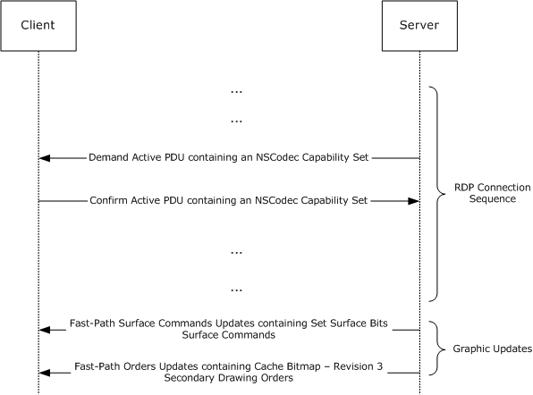

Figure 1: Encapsulation and sequencing of NSCodec settings and bitmaps

[MS-RDPNSC] settings are encapsulated in an NSCodec Capability Set (section [2.2.1](#Section_2.2.1)), which is ultimately transported in a server-to-client Demand Active PDU ([MS-RDPBCGR] section 2.2.1.13.1) or client-to-server Confirm Active PDU ([MS-RDPBCGR] section 2.2.1.13.2). The Demand Active PDU and Confirm Active PDU are transmitted during the Capabilities Exchange Phase of the RDP Connection Sequence ([MS-RDPBCGR] section 1.3.1.1).

When the RDP Connection Sequence has run to completion, bitmap images of the user's session are transmitted from the server to the client ([MS-RDPBCGR] section 1.3.6). NSCodec compression techniques (section [3.1.8](#Section_3.1.8)) and structures (section [2.2.2](#Section_2.2.2)) are used to efficiently transport these bitmaps so that they can be rendered on the client. NSCodec-compressed bitmaps that cannot be cached are sent encapsulated in Set Surface Bits Surface Commands ([MS-RDPBCGR] section 2.2.9.2.1), which are ultimately transported in a server-to-client Fast-Path Surface Commands Update ([MS-RDPBCGR] section 2.2.9.1.2.1.10). NSCodec-compressed bitmaps that can be cached are sent encapsulated in Cache Bitmap – Revision 3 ([MS-RDPEGDI] section 2.2.2.2.1.2.8) Secondary Drawing Orders, which are ultimately transported in a server-to-client Fast-Path Orders Update ([MS-RDPEGDI] section 2.2.2.2). Bitmap caching is discussed in [MS-RDPEGDI] section 3.1.1.1.1.

## 1.4 Relationship to Other Protocols

This protocol extends the Remote Desktop Protocol: Basic Connectivity and Graphics Remoting (as specified in [MS-RDPBCGR](../MS-RDPBCGR/MS-RDPBCGR.md)) by adding advanced compression techniques.

## 1.5 Prerequisites/Preconditions

All multiple-byte fields within a message are assumed to contain data in [**little-endian**](#gt_little-endian) byte order unless otherwise specified.

The following client prerequisites are mandatory:

- The client MUST advertise support for the NSCodec codec by sending the NSCodec Capability Set (section [2.2.1](#Section_2.2.1)) to the server as specified in section [3.1.5.1](#Section_3.1.5.1).
- The client MUST support a color depth of 32 bits per pixel. This means that the RNS_UD_32BPP_SUPPORT (0x0008) flag must be set in the **supportedColorDepths** field of the Client Core Data structure ([MS-RDPBCGR](../MS-RDPBCGR/MS-RDPBCGR.md) section 2.2.1.3.2).
In order to receive NSCodec-compressed bitmaps within the Stream Surface Bits Surface Command ([MS-RDPBCGR] section 2.2.9.2.2), the following client prerequisites are mandatory:

- The client MUST support fast-path graphics output ([MS-RDPBCGR] section 2.2.9.1.2) and acknowledge this support by specifying the FASTPATH_OUTPUT_SUPPORTED (0x0001) flag in the General Capability Set ([MS-RDPBCGR] section 2.2.7.1.1).
- The client MUST support the Stream Surface Bits Surface Command ([MS-RDPBCGR] section 2.2.9.2.2). Support for this surface command MUST be advertised in the Surface Commands Capability Set ([MS-RDPBCGR] section 2.2.7.2.9).
In order to use NSCodec-compressed bitmaps in conjunction with Bitmap Cache Secondary Drawing Orders ([MS-RDPEGDI](../MS-RDPEGDI/MS-RDPEGDI.md) sections 1.3.1.1 and 1.3.1.2.2), the following client prerequisite is mandatory:

- The client MUST support the Cache Bitmap - Revision 3 ([MS-RDPEGDI] section 2.2.2.2.1.2.8) Secondary Drawing Order. Support for this caching order MUST be advertised in the Surface Commands Capability Set ([MS-RDPBCGR] section 2.2.7.2.9).

## 1.6 Applicability Statement

This protocol is applicable in situations in which it is necessary to optimize the bandwidth required for graphics remoting. The advanced compression techniques specified in this document enable the efficient transfer of server-side images and video.

## 1.7 Versioning and Capability Negotiation

This protocol builds on the basic Remote Desktop Protocol. The features provided by this extension are negotiated during the Capabilities Exchange Phase of the RDP connection sequence ([MS-RDPBCGR](../MS-RDPBCGR/MS-RDPBCGR.md) section 1.3.1.1). In effect, this extension merely expands the set of capabilities used by the base RDP. (RDP versioning and capability negotiation is described in [MS-RDPBCGR] section 1.7.)

## 1.8 Vendor-Extensible Fields

None.

## 1.9 Standards Assignments

None.

# 2 Messages

## 2.1 Transport

This protocol is an extension to the Remote Desktop Protocol: Basic Connectivity and Graphics Remoting, and all packets are tunneled within the RDP transport ([MS-RDPBCGR](../MS-RDPBCGR/MS-RDPBCGR.md) section 2.1).

## 2.2 Message Syntax

### 2.2.1 NSCodec Capability Set (TS_NSCODEC_CAPABILITYSET)

The **TS_NSCODEC_CAPABILITYSET** structure advertises properties of the NSCodec Bitmap Codec. This capability set is encapsulated in the **codecProperties** field of the Bitmap Codec ([MS-RDPBCGR](../MS-RDPBCGR/MS-RDPBCGR.md) section 2.2.7.2.10.1.1) structure, which is ultimately encapsulated in the Bitmap Codecs Capability Set ([MS-RDPBCGR] section 2.2.7.2.10), which is encapsulated in a server-to-client Demand Active PDU ([MS-RDPBCGR] section 2.2.1.13.1) or client-to-server Confirm Active PDU ([MS-RDPBCGR] section 2.2.1.13.2).

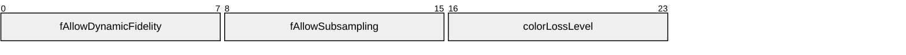

**fAllowDynamicFidelity (1 byte):** An 8-bit unsigned integer that indicates support for lossy bitmap compression by reducing color fidelity ([MS-RDPEGDI](../MS-RDPEGDI/MS-RDPEGDI.md) section 3.1.9.1.4).

| Value | Meaning |
| --- | --- |
| FALSE 0x00 | Lossy compression is not supported. |
| TRUE 0x01 | Lossy compression is supported. |

**fAllowSubsampling (1 byte):** An 8-bit unsigned integer that indicates support for chroma subsampling ([MS-RDPEGDI] section 3.1.9.1.3).

| Value | Meaning |
| --- | --- |
| FALSE 0x00 | Chroma subsampling is not supported. |
| TRUE 0x01 | Chroma subsampling is supported. |

**colorLossLevel (1 byte):** An 8-bit unsigned integer that indicates the maximum supported Color Loss Level ([MS-RDPEGDI] section 3.1.9.1.4). This value MUST be between 1 and 7 (inclusive).

### 2.2.2 NSCodec Compressed Bitmap Stream (NSCODEC_BITMAP_STREAM)

The **NSCODEC_BITMAP_STREAM** structure contains a stream of bitmap data compressed using NSCodec bitmap compression techniques (section [3.1.8](#Section_3.1.8)). The bitmap data is represented using the [**AYCoCg**](#gt_aycocg) [**color space**](#gt_color-space) ([MS-RDPEGDI](../MS-RDPEGDI/MS-RDPEGDI.md) section 3.1.9.1.2).

NSCodec compressed bitmap data is sent encapsulated in a Set Surface Bits Surface Command ([MS-RDPBCGR](../MS-RDPBCGR/MS-RDPBCGR.md) section 2.2.9.2.1) when sending a bitmap image that MUST NOT be cached, or in the Cache Bitmap - Revision 3 ([MS-RDPEGDI] section 2.2.2.2.1.2.8) Secondary Drawing Order when sending a bitmap image that MUST be cached (bitmap caching is discussed in [MS-RDPEGDI] section 3.1.1.1.1). In all these cases, the data is encapsulated inside an Extended Bitmap Data ([MS-RDPBCGR] section 2.2.9.2.1.1) structure.

The width and height of the compressed bitmap are obtained from the **width** and **height** fields of the encapsulating Extended Bitmap Data structure.

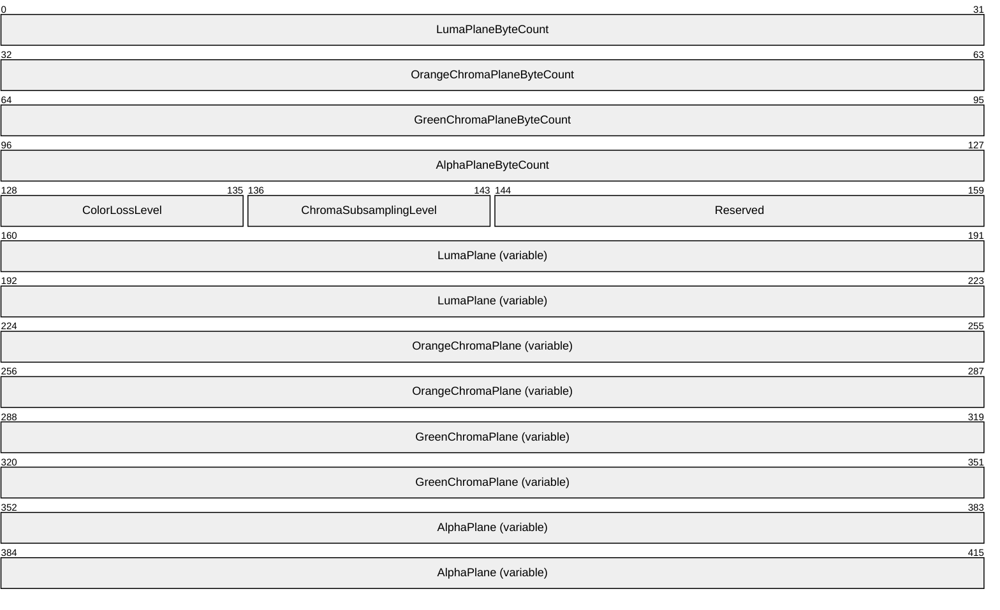

**LumaPlaneByteCount (4 bytes):** A 32-bit, unsigned integer that contains the number of bytes used by the **LumaPlane** field. This value MUST be greater than zero.

**OrangeChromaPlaneByteCount (4 bytes):** A 32-bit, unsigned integer that contains the number of bytes used by the **OrangeChromaPlane** field. This value MUST be greater than zero.

**GreenChromaPlaneByteCount (4 bytes):** A 32-bit, unsigned integer that contains the number of bytes used by the **GreenChromaPlane** field. This value MUST be greater than zero.

**AlphaPlaneByteCount (4 bytes):** A 32-bit, unsigned integer that contains the number of bytes used by the **AlphaPlane** field.

**ColorLossLevel (1 byte):** An 8-bit, unsigned integer that indicates the Color Loss Level ([MS-RDPEGDI] section 3.1.9.1.4) that was applied to the chroma values of this packet. This value MUST be in the range 1 to 7 (inclusive).

**ChromaSubsamplingLevel (1 byte):** An 8-bit, unsigned integer that indicates whether chroma subsampling is being used ([MS-RDPEGDI] section 3.1.9.1.3).

| Value | Meaning |
| --- | --- |
| FALSE 0x00 | Chroma subsampling is not being used. |
| TRUE 0x01 | Chroma subsampling is being used. |

**Reserved (2 bytes):** A 16-bit field. Reserved for future use.

**LumaPlane (variable):** A variable-length array of bytes that contains the luma plane data.

The **LumaPlaneByteCount** field is used to determine whether the data is in raw format, or if it has been [**RLE**](#gt_run-length-encoding-rle) (2) compressed. If **LumaPlaneByteCount** is equal to the expected raw size of the luma plane, the data is in raw format. If **LumaPlaneByteCount** is smaller than the expected size, the data has been RLE compressed. **LumaPlaneByteCount** MUST NOT be larger than the expected size of the luma plane.

If chroma subsampling is not being used, the expected raw size of the luma plane is calculated as follows (input to the calculation is the raw image width and height).

LumaPlaneWidth = ImageWidth

LumaPlaneHeight = ImageHeight

LumaPlaneByteCount = ImageWidth * ImageHeight

If chroma subsampling is being used, the expected raw size of the luma plane is calculated as follows.

LumaPlaneWidth = ROUND_UP_TO_NEAREST_MULTIPLE_OF_8(ImageWidth)

LumaPlaneHeight = ImageHeight

LumaPlaneByteCount = LumaPlaneWidth * ImageHeight

If the luma channel has been RLE compressed, this field contains an NSCodec RLE Segments (section [2.2.2.1](#Section_2.2.2.1)) structure. Otherwise, it contains the raw bytes of the [**color plane**](#gt_color-plane).

**OrangeChromaPlane (variable):** A variable-length array of bytes that contains the orange chroma plane.

The **OrangeChromaPlaneByteCount** field is used to determine whether the data is in raw format or has been RLE compressed. If **OrangeChromaPlaneByteCount** is equal to the expected raw size of the chroma plane, the data is in raw format. If **OrangeChromaPlaneByteCount** is smaller than the expected size, the data has been RLE compressed. **OrangeChromaPlaneByteCount** MUST NOT be larger than the expected size of the chroma plane.

If chroma subsampling is not being used, the expected raw size of the orange chroma plane is calculated as follows (input to the calculation is the raw image width and height).

ChromaPlaneWidth = ImageWidth

ChromaPlaneHeight = ImageHeight

ChromaPlaneByteCount = ImageWidth * ImageHeight

If chroma subsampling is being used, the expected raw size of the orange chroma plane is calculated as follows.

ChromaPlaneWidth = ROUND_UP_TO_NEAREST_MULTIPLE_OF_8(ImageWidth) / 2

ChromaPlaneHeight = ROUND_UP_TO_NEAREST_MULTIPLE_OF_2(ImageHeight) / 2

ChromaPlaneByteCount = ChromaPlaneWidth * ChromaPlaneHeight

If the orange chroma channel has been RLE compressed, this field contains an NSCodec RLE Segments (section 2.2.2.1) structure. Otherwise, it contains the raw bytes of the color plane.

Depending on the values of the **ColorLossLevel** and **ChromaSubsamplingLevel** fields, the orange chroma plane can be transformed by color loss reduction ([MS-RDPEGDI] section 3.1.9.1.4) and chroma subsampling ([MS-RDPEGDI] section 3.1.9.1.3).

**GreenChromaPlane (variable):** A variable-length array of bytes that contains the green chroma plane.

The **GreenChromaPlaneByteCount** field is used to determine whether the data is in raw format or has been RLE compressed. If **GreenChromaPlaneByteCount** is equal to the expected raw size of the chroma plane, the data is in raw format. If **GreenChromaPlaneByteCount** is smaller than the expected size, the data has been RLE compressed. **GreenChromaPlaneByteCount** MUST NOT be larger than the expected size of the chroma plane.

If chroma subsampling is not being used, the expected raw size of the green chroma plane is calculated as follows (input to the calculation is the raw image width and height).

ChromaPlaneWidth = ImageWidth

ChromaPlaneHeight = ImageHeight

ChromaPlaneByteCount = ImageWidth * ImageHeight

If chroma subsampling is being used, the expected raw size of the green chroma plane is calculated as follows.

ChromaPlaneWidth = ROUND_UP_TO_NEAREST_MULTIPLE_OF_8(ImageWidth) / 2

ChromaPlaneHeight = ROUND_UP_TO_NEAREST_MULTIPLE_OF_2(ImageHeight) / 2

ChromaPlaneByteCount = ChromaPlaneWidth * ChromaPlaneHeight

If the green chroma channel has been RLE compressed, this field contains an NSCodec RLE Segments (section 2.2.2.1) structure. Otherwise, it contains the raw bytes of the color plane.

Depending on the values of the **ColorLossLevel** and **ChromaSubsamplingLevel** fields, the green chroma plane can be transformed by color loss reduction ([MS-RDPEGDI] section 3.1.9.1.4) and chroma subsampling ([MS-RDPEGDI] section 3.1.9.1.3).

**AlphaPlane (variable):** A variable-length array of bytes that contains the alpha plane. This field MUST NOT be present if **AlphaPlaneByteCount** equals 0.

If the **AlphaPlaneByteCount** field is greater than zero, it MUST be used to determine whether the **AlphaPlane** data is in raw format or has been RLE compressed. If **AlphaPlaneByteCount** is equal to the expected raw size of the Alpha plane, the data is in raw format. If **AlphaPlaneByteCount** is smaller than the expected size, the data has been RLE compressed. **AlphaPlaneByteCount** MUST NOT be larger than the expected size of the alpha plane.

The expected raw size of the alpha plane is calculated as follows (input to the calculation is the raw image width and height).

AlphaPlaneWidth = ImageWidth

AlphaPlaneHeight = ImageHeight

AlphaPlaneByteCount = ImageWidth * ImageHeight

If the alpha channel has been RLE compressed, this field contains an NSCodec RLE Segments (section 2.2.2.1) structure. Otherwise, it contains the raw bytes of the color plane.

#### 2.2.2.1 NSCodec RLE Segments (NSCODEC_RLE_SEGMENTS)

The **NSCODEC_RLE_SEGMENTS** structure contains the run-length encoded contents of a color plane and consists of a collection of NSCodec RLE run segment (section [2.2.2.2.1](#Section_2.2.2.2.1)) and NSCodec RLE literal segment (section [2.2.2.2.2](#Section_2.2.2.2.2)) structures.

RLE compression is the final stage that is applied when compressing a bitmap using NSCodec bitmap compression (for more details, refer to the compression flow diagram in section [3.1.8.3](#Section_3.1.8.3)).

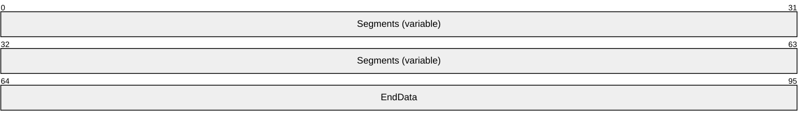

**Segments (variable):** A variable-length field that contains an array of NSCodec RLE Run Segment (section 2.2.2.2.1) and NSCodec RLE Literal Segment (section 2.2.2.2.2) structures.

**EndData (4 bytes):** A 32-bit, unsigned integer that contains the last four raw bytes of the original color plane.

#### 2.2.2.2 NSCodec RLE Segment

An NSCodec RLE Segment is either a Run segment (section [2.2.2.2.1](#Section_2.2.2.2.1)) or a Literal segment (section [2.2.2.2.2](#Section_2.2.2.2.2)). RLE segments are encapsulated in the **Segments** field of the NSCodec RLE Segments (section [2.2.2.1](#Section_2.2.2.1)) structure.

##### 2.2.2.2.1 NSCodec RLE Run Segment (NSCODEC_RLE_RUN_SEGMENT)

The **NSCODEC_RLE_RUN_SEGMENT** structure is used to represent an [**RLE**](#gt_run-length-encoding-rle) run (section [3.1.8.1](#Section_3.1.8.1)).

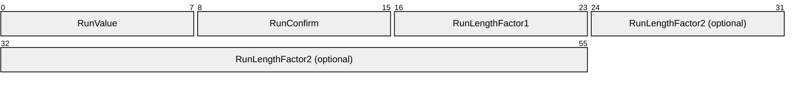

**RunValue (1 byte):** An 8-bit, unsigned integer that contains a value from the uncompressed A, Y, Co, or Cg color plane (the Co and Cg planes MUST have color loss reduction ([MS-RDPEGDI](../MS-RDPEGDI/MS-RDPEGDI.md) section 3.1.9.1.4) applied prior to RLE compression, as specified in section [3.1.8.3](#Section_3.1.8.3)). The allowed ranges of the values contained in the A, Y, Co, and Cg color planes are specified in [MS-RDPEGDI] section 3.1.9.1.2 (note that color loss reduction will reduce the range of the values in the Co and Cg planes by at least half). The **RunValue** field MUST be equal to the **RunConfirm** field to identify the structure as an NSCodec RLE Run Segment.

**RunConfirm (1 byte):** An 8-bit, unsigned integer that MUST be equal to the **RunValue** field value to identify the structure as an NSCodec RLE run segment.

**RunLengthFactor1 (1 byte):** An 8-bit field. If this value is less than 255 (0xFF), the **RunLengthFactor2** field MUST NOT be present, and the run length (the number of times the value of the **RunValue** field was repeated in the original color plane data) equals **RunLengthFactor1** + 2. If **RunLengthFactor1** equals 255 (0xFF), the **RunLengthFactor2** field MUST be present, and the run length is calculated based solely on the **RunLengthFactor2** field.

**RunLengthFactor2 (4 bytes):** An optional 32-bit field that contains the run length. This field SHOULD NOT be used if the run length is smaller than 256.

##### 2.2.2.2.2 NSCodec RLE Literal Segment (NSCODEC_RLE_LITERAL_SEGMENT)

The **NSCODEC_RLE_RUN_SEGMENT** structure is used to represent an [**RLE**](#gt_run-length-encoding-rle) literal (section [3.1.8.1](#Section_3.1.8.1)).

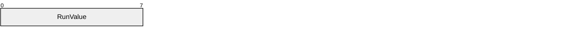

**RunValue (1 byte):** An 8-bit, unsigned integer that contains a raw value from the original color plane. Either any bytes in the RLE encoded color plane stream that follow the **RunValue** field MUST NOT equal the value of the **RunValue** field, or the **RunValue** field MUST be the last segment in the stream.

# 3 Protocol Details

## 3.1 Common Details

The following figure and table describe the server-side state machine.

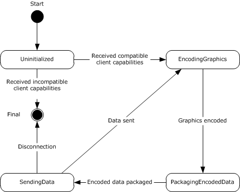

Figure 2: Server state diagram

| State Name | Description |
| --- | --- |
| Uninitialized | This is the initial state of the server. In this state, the server waits for the NSCodec Capability Set (section [2.2.1](#Section_2.2.1)) from the client. On receiving this capability set, the server processes it as described in section [3.1.5.1](#Section_3.1.5.1). If it finds compatible settings, it initializes itself and transitions to the EncodingGraphics state. Otherwise, the connection is terminated (section 3.1.5.1). |
| EncodingGraphics | In this state, the server examines updates to the graphics frame buffer and then determines which regions to encode and send to the client. Bitmap data is encoded as described in section [3.1.8.3](#Section_3.1.8.3). The server then transitions to the PackagingEncodedData state. |
| PackagingEncodedData | In this state, the server packages the encoded bitmap data in a Set Surface Bits Surface Command or a Cache Bitmap - Revision 3 Secondary Drawing Order as described in section [3.1.5.2](#Section_3.1.5.2). The server then transitions to the SendingData state. |
| SendingData | In this state, the server sends the packaged bitmap data to the client. The server then transitions back to the EncodingGraphics state. |

### 3.1.1 Abstract Data Model

This section describes a conceptual model of possible data organization that an implementation maintains to participate in this protocol. The described organization is provided to facilitate the explanation of how the protocol behaves. This document does not mandate that implementations adhere to this model as long as their external behavior is consistent with that described in this document.

**Note** It is possible to implement the following conceptual data by using a variety of techniques as long as the implementation produces external behavior that is consistent with that described in this document.

#### 3.1.1.1 Lossy Bitmap Compression Ability

The Lossy Bitmap Compression Ability store indicates whether lossy bitmap compression through the reduction of color fidelity ([MS-RDPEGDI](../MS-RDPEGDI/MS-RDPEGDI.md) section 3.1.9.1.4) is supported. This fact is communicated as part of the NSCodec Capability Set (section [2.2.1](#Section_2.2.1)).

#### 3.1.1.2 Chroma Subsampling Ability

The Chroma Subsampling Ability store indicates whether chroma subsampling ([MS-RDPEGDI](../MS-RDPEGDI/MS-RDPEGDI.md) section 3.1.9.1.3) is supported. This fact is communicated as part of the NSCodec Capability Set (section [2.2.1](#Section_2.2.1)).

#### 3.1.1.3 Maximum Supported Color Loss Level

The Maximum Supported Color Loss Level store indicates the maximum supported color loss level ([MS-RDPEGDI](../MS-RDPEGDI/MS-RDPEGDI.md) section 3.1.9.1.4). This value is communicated as part of the NSCodec Capability Set (section [2.2.1](#Section_2.2.1)).

### 3.1.2 Timers

None.

### 3.1.3 Initialization

Bitmap compression using NSCodec bitmap compression techniques (section [3.1.8](#Section_3.1.8)) requires that the following settings MUST first be determined by examining the NSCodec Capability Set (section [2.2.1](#Section_2.2.1)):

- Lossy Bitmap Compression Ability (section [3.1.1.1](#Section_3.1.1.1))
- Chroma Subsampling Ability (section [3.1.1.2](#Section_3.1.1.2))
- Maximum Supported Color Loss Level (section [3.1.1.3](#Section_3.1.1.3))
The NSCodec Capability Set is encapsulated in the Bitmap Codecs Capability Set ([MS-RDPBCGR](../MS-RDPBCGR/MS-RDPBCGR.md) section 2.2.7.2.10), which is encapsulated in a server-to-client Demand Active PDU ([MS-RDPBCGR] section 2.2.1.13.1) or client-to-server Confirm Active PDU ([MS-RDPBCGR] section 2.2.1.13.2).

### 3.1.4 Higher-Layer Triggered Events

None.

### 3.1.5 Processing Events and Sequencing Rules

#### 3.1.5.1 NSCodec Capability Set

The NSCodec Capability Set (section [2.2.1](#Section_2.2.1)) structure is sent by both the client and server, and advertises properties of the NSCodec Bitmap Codec. This capability set is encapsulated in a Bitmap Codec ([MS-RDPBCGR](../MS-RDPBCGR/MS-RDPBCGR.md) section 2.2.7.2.10.1.1) structure, which is ultimately encapsulated in the Bitmap Codecs Capability Set ([MS-RDPBCGR] section 2.2.7.2.10), which is encapsulated in a server-to-client Demand Active PDU ([MS-RDPBCGR] section 2.2.1.13.1) or client-to-server Confirm Active PDU ([MS-RDPBCGR] section 2.2.1.13.2).

The sender of the NSCodec Capability Set MUST populate the **fAllowDynamicFidelity**, **fAllowSubsampling**, and **colorLossLevel** fields to advertise support for lossy bitmap compression (section [3.1.1.1](#Section_3.1.1.1)), chroma subsampling (section [3.1.1.2](#Section_3.1.1.2)), and the maximum supported color loss level (section [3.1.1.3](#Section_3.1.1.3)). The recipient of the NSCodec Capability Set MUST use the contents of the NSCodec Capability Set to initialize an NSCodec compressor so as to ensure that the peer protocol entity that receives compressed bitmap data will be able to perform decompression as outlined in section [3.1.8.4](#Section_3.1.8.4).

If the data encapsulation is invalid or errors are encountered while processing the NSCodec Capability Set, the connection SHOULD be dropped.

#### 3.1.5.2 NSCodec Compressed Bitmap Stream

The NSCodec Compressed Bitmap Stream (section [2.2.2](#Section_2.2.2)) structure contains a stream of bitmap data compressed by using NSCodec bitmap compression techniques (section [3.1.8](#Section_3.1.8)). NSCodec compressed bitmap data is sent encapsulated in a Set Surface Bits Surface Command ([MS-RDPBCGR](../MS-RDPBCGR/MS-RDPBCGR.md) section 2.2.9.2.1) when sending a bitmap image that MUST NOT be cached, or in the Cache Bitmap - Revision 3 ([MS-RDPEGDI](../MS-RDPEGDI/MS-RDPEGDI.md) section 2.2.2.2.1.2.8) Secondary Drawing Order when sending a bitmap image that MUST be cached (bitmap caching is discussed in [MS-RDPEGDI] section 3.1.1.1.1). In all of these cases, the data is encapsulated inside an Extended Bitmap Data ([MS-RDPBCGR] section 2.2.9.2.1.1) structure. If the data encapsulation is invalid or errors are encountered while decompressing NSCodec data (section [3.1.8.4](#Section_3.1.8.4)), the connection SHOULD be dropped.

### 3.1.6 Timer Events

None.

### 3.1.7 Other Local Events

None.

### 3.1.8 NSCodec Bitmap Compression

NSCodec bitmap compression is used when the RDP session color depth is 32 bpp and the bitmap of interest is either 24 bpp (RGB with no alpha channel) or 32 bpp (RGB with an alpha channel). The capability of a server to encode and a client to decode with NSCodec bitmap compression is advertised in the bitmap codec capability set ([MS-RDPBCGR](../MS-RDPBCGR/MS-RDPBCGR.md) section 2.2.7.2.10).

The value of the **codecGUID** field of the Bitmap Codec structure ([MS-RDPBCGR] section 2.2.7.2.10.1.1) for NSCodec MUST be 0xCA8D1BB9000F154F589FAE2D1A87E2D6.

Similar to RDP 6.0 bitmap compression ([MS-RDPEGDI](../MS-RDPEGDI/MS-RDPEGDI.md) section 3.1.9), the NSCodec algorithm performs a color space conversion from [**ARGB**](#gt_argb) to [**AYCoCg**](#gt_aycocg) and uses a collection of compression techniques to compress each of the color planes individually.

The following techniques (described in [MS-RDPEGDI] section 3.1.9.1) are used within the scope of NSCodec bitmap compression:

- Splitting and combining color planes ([MS-RDPEGDI] section 3.1.9.1.1)
- Color space conversion ([MS-RDPEGDI] section 3.1.9.1.2)
- Chroma subsampling and super-sampling ([MS-RDPEGDI] section 3.1.9.1.3)
- Color loss reduction ([MS-RDPEGDI] section 3.1.9.1.4)

#### 3.1.8.1 NSCodec Run-Length Encoding

NSCodec [**run-length encoding**](#gt_run-length-encoding-rle) is a simple compression scheme that parses an image stream and then encodes run lengths with minimal overhead. The algorithm is run on the stream as a whole and encodes it into segments of two types: runs and literals. The last 4 bytes of the stream are always left unencoded.

For example, an initial stream containing the following 12 [**ANSI characters**](#gt_ansi-character):

AAAABBCCCCCD

Would be transformed after encoding into the following stream:

AA2BB0CC0CCCD

In this case, encoding the stream has resulted in expansion, and the original image stream is sent instead.

For a second example, an initial stream containing the following 27 ANSI characters:

ABCDDDTTTTGFRRRRRRRRRRRABCD

Would be transformed after encoding into the following stream:

ABCDD1TT2GFRR9ABCD

In the case of real image streams, the likelihood of long runs is high, and consequently, the reductions in size are significant.

##### 3.1.8.1.1 Encoding Run-Length Sequences

NSCodec run-length encoding produces three types of sequences:

- Literal sequences
- Short run sequences
- Long run sequences
The data in an input stream MUST be transformed according to the following rules:

- If there are four or fewer bytes remaining in the input stream, copy the bytes unmodified to the output stream. The encoding is finished.
- If the current byte to encode is followed by a byte with a different value, a literal has been identified. Write the byte value to the output stream and advance forward in the input stream by one byte.
- If the total count of repeating byte values starting at the current position in the input stream and before the last four bytes is larger than 1 and strictly less than 256, then a short run has been identified. Write the current byte value to the output stream twice, and then write the count of identical positions minus 2. Advance forward in the input stream by the number of bytes equal to the count.
- If the total count of repeating byte values starting at the current position and before the end of the stream is 256 or more, a long run has been identified. Write the current byte value to the output stream twice, write the constant 0xFF to the output stream, and then write the count of identical positions as a 32-bit [**little-endian**](#gt_little-endian) value. Advance forward in the input stream by the number of bytes equal to the count.
Note that a run greater than 2^32 bytes is not possible, as the maximum size of an individual desktop is capped at 4,096 x 2,048 pixels (33,554,432 bytes at 32bpp); see [MS-RDPBCGR](../MS-RDPBCGR/MS-RDPBCGR.md) section 2.2.1.3.2, specifically the **desktopWidth** and **desktopHeight** fields, which point out the server-side restriction.

The following flowchart illustrates how an input stream is processed by using the NSCodec [**RLE**](#gt_run-length-encoding-rle) rules to produce run-length sequences.

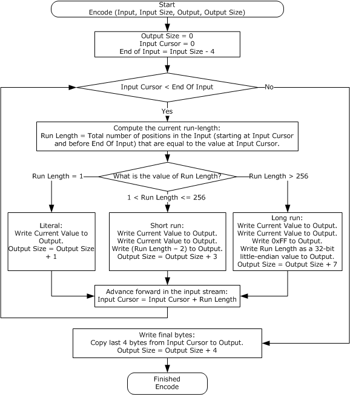

Figure 3: Encoding data by using NSCodec run-length encoding (RLE)

#### 3.1.8.2 Padding the Red, Green, and Blue Color Planes

When subsampling of color planes is required, the planes MUST be padded. Padding ensures proper alignment of the image geometry and can aid significantly in the implementation of subsequent encoding algorithms.

- The size of a padded plane is calculated as follows (input to the calculation is the plane width and height).
PaddedPlaneWidth = ROUND_UP_TO_NEAREST_MULTIPLE_OF_8(PlaneWidth)

PaddedPlaneHeight = ROUND_UP_TO_NEAREST_MULTIPLE_OF_2(PlaneHeight)

For example, if the original image width is 500, the padded plane width is 504. If the original image height is 200, the padded plane height is 200.

- Color space conversion, subsampling, and color loss reduction of the padded color planes are implemented as follows.
Subsequent transformations applied to the color planes MUST be implemented as described in [MS-RDPEGDI](../MS-RDPEGDI/MS-RDPEGDI.md) sections 3.1.9.1.2 through 3.1.9.1.4 and applied to the pixel values within the original image area.

The pixel values contained in the padded area can have any value (depending on the implementation) and can be configured so as to maximize the run-length compression and minimize the overall compression/decompression algorithm execution time.

The following figure demonstrates how 3x3 and 4x3 planes are padded to produce an 8x4 plane.

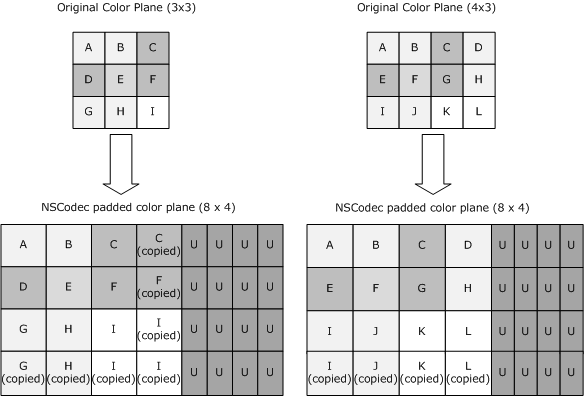

Figure 4: Examples of color plane padding

#### 3.1.8.3 Compressing a Bitmap

The overall scheme used to compress a bitmap with NSCodec bitmap compression is described in the following figure. The usage of color reduction and chroma subsampling is negotiated in the NSCodec capabilities set (section [2.2.1](#Section_2.2.1)).

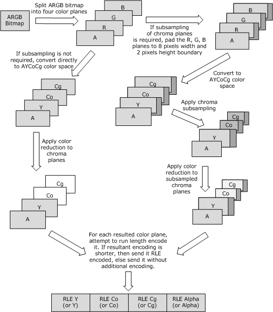

Figure 5: Compressing a bitmap

#### 3.1.8.4 Decompressing a Bitmap

The following figure is a flowchart showing how to decompress a bitmap that is compressed with NSCodec bitmap compression.

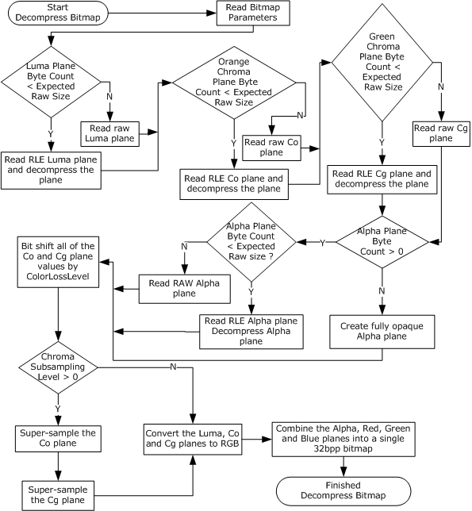

Figure 6: Decompressing a bitmap

Execution of the flowchart tasks relies on concepts and techniques introduced in this document and [MS-RDPEGDI](../MS-RDPEGDI/MS-RDPEGDI.md).

- Read Bitmap Parameters: The parameters describing the bitmap data are specified in the NSCodec Compressed Bitmap Stream (section [2.2.2](#Section_2.2.2)) which encapsulates the compressed data stream.
- Reading an RLE compressed plane and decompressing the plane: The compressed luma, orange chroma (Co), green chroma (Cg), and alpha planes are contained in the NSCodec Compressed Bitmap Stream. Each plane is composed of a series of RLE Segments (section [2.2.2.1](#Section_2.2.2.1)), each segment being either a Run Segment (section [2.2.2.2.1](#Section_2.2.2.2.1)) or a Literal Segment (section [2.2.2.2.2](#Section_2.2.2.2.2)). Examples of RLE plane decompression are presented in section [4](#Section_4).
- Bit-shifting the Co and Cg plane values by the **ColorLossLevel**: Chroma recovery is described in [MS-RDPEGDI] section 3.1.9.1.4.
- Super-sampling the Co and Cg planes: Chroma super-sampling is described in [MS-RDPEGDI] section 3.1.9.1.3.
- Color space conversion of the luma, Co, and Cg planes: The inverse AYCoCg to ARGB color space transformation is described in [MS-RDPEGDI] section 3.1.9.1.2.
- Combining of the alpha, red, green, and blue color planes: Color plane combining is described in [MS-RDPEGDI] section 3.1.9.1.1.
Refer to section 4 to view an example that illustrates how a compressed NSCodec bitmap stream is decompressed.

# 4 Protocol Examples

The following example shows a network dump of an image compressed using NSCodec. The image width is 15, and the height is 10.

COMPRESSED BITMAP DATA (158 bytes):

00000000 71 00 00 00 07 00 00 00 0b 00 00 00 07 00 00 00 q...............

00000010 03 01 00 00 63 63 01 64 64 00 63 63 02 64 64 00 ....cc.dd.cc.dd.

00000020 63 63 00 64 64 01 63 63 01 64 64 01 63 63 01 64 cc.dd.cc.dd.cc.d

00000030 64 00 63 63 00 64 64 01 63 63 00 64 64 0c 63 63 d.cc.dd.cc.dd.cc

00000040 00 64 64 0c 63 63 00 64 64 0c 63 63 00 64 64 0c .dd.cc.dd.cc.dd.

00000050 63 64 64 04 63 64 63 63 00 64 64 03 63 64 64 03 cdd.cdcc.dd.cdd.

00000060 63 63 00 64 63 63 00 64 64 03 65 63 64 64 01 63 cc.dcc.dd.ecdd.c

00000070 64 64 00 65 64 64 06 63 64 64 00 63 63 00 64 64 dd.edd.cdd.cc.dd

00000080 04 64 65 65 65 22 22 22 22 22 22 22 37 37 19 36 .deee"""""""77.6

00000090 37 37 06 37 37 37 37 ff ff 90 ff ff ff ff 77.7777.......

71 00 00 00 -> LumaPlaneByteCount = 113

07 00 00 00 -> OrangeChromaPlaneByteCount = 7

0b 00 00 00 -> GreenChromaPlaneByteCount = 11

07 00 00 00 -> AlphaPlaneByteCount = 7

03 -> ColorLossLevel = 3

01 -> ChromaSubsamplingLevel = 1

00 00 -> Reserved, ignored

LUMA PLANE DECODING (113 bytes):

00000000 63 63 01 64 64 00 63 63 02 64 64 00 63 63 00 64 cc.dd.cc.dd.cc.d

00000010 64 01 63 63 01 64 64 01 63 63 01 64 64 00 63 63 d.cc.dd.cc.dd.cc

00000020 00 64 64 01 63 63 00 64 64 0c 63 63 00 64 64 0c .dd.cc.dd.cc.dd.

00000030 63 63 00 64 64 0c 63 63 00 64 64 0c 63 64 64 04 cc.dd.cc.dd.cdd.

00000040 63 64 63 63 00 64 64 03 63 64 64 03 63 63 00 64 cdcc.dd.cdd.cc.d

00000050 63 63 00 64 64 03 65 63 64 64 01 63 64 64 00 65 cc.dd.ecdd.cdd.e

00000060 64 64 06 63 64 64 00 63 63 00 64 64 04 64 65 65 dd.cdd.cc.dd.dee

00000070 65 e

LumaPlaneWidth = ROUND_UP_TO_NEAREST_MULTIPLE_OF_8(ImageWidth) = 16

LumaPlaneHeight = ImageHeight = 10

Expected LumaPlaneByteCount = LumaPlaneWidth * ImageHeight = 160

LumaPlaneByteCount < Expected LumaPlaneByteCount which implies that RLE was used.

Run Length decoding of the Luma plane:

63 63 01 -> Output 0x63 3 times to the luma buffer (NSCODEC_RLE_RUN_SEGMENT)

64 64 00 -> Output 0x64 2 times to the luma buffer (NSCODEC_RLE_RUN_SEGMENT)

63 63 02 -> Output 0x63 4 times to the luma buffer (NSCODEC_RLE_RUN_SEGMENT)

...

64 64 00 -> Output 0x64 2 times to the luma buffer (NSCODEC_RLE_RUN_SEGMENT)

64 65 65 65 -> EndData: Output 0x64 0x65 0x65 0x65 to the luma buffer

ORANGE CHROMA PLANE DECODING (7 bytes):

00000000 22 22 22 22 22 22 22 """""""

ChromaPlaneWidth = ROUND_UP_TO_NEAREST_MULTIPLE_OF_8(ImageWidth) / 2 = 8

ChromaPlaneHeight = ROUND_UP_TO_NEAREST_MULTIPLE_OF_2(ImageHeight) / 2 = 5

Expected ChromaPlaneByteCount = ChromaPlaneWidth * ChromaPlaneHeight = 40

OrangeChromaPlaneByteCount < Expected ChromaPlaneByteCount which implies that RLE was used.

Run Length decoding of the Orange Chroma plane:

22 22 22 -> Output 0x22 36 times to the orange chroma buffer (NSCODEC_RLE_RUN_SEGMENT)

22 22 22 22 -> EndData: Output 0x22 0x22 0x22 0x22 to the orange chroma buffer

GREEN CHROMA PLANE DECODING (11 bytes):

00000000 37 37 19 36 37 37 06 37 37 37 37 77.677.7777

GreenChromaPlaneByteCount < Expected ChromaPlaneByteCount which implies that RLE was used.

Run Length decoding of the green chroma plane:

37 37 19 -> Output 0x37 27 times to the green chroma buffer (NSCODEC_RLE_RUN_SEGMENT)

36 -> Output 0x36 to the green chroma buffer (NSCODEC_RLE_LITERAL_SEGMENT)

37 37 06 -> Output 0x37 8 times to the green chroma buffer (NSCODEC_RLE_RUN_SEGMENT)

37 37 37 37 -> EndData: Output 0x37 0x37 0x37 0x37 to the green chroma buffer

ALPHA PLANE DECODING (7 bytes)

00000000 ff ff 90 ff ff ff ff .......

AlphaPlaneWidth = ImageWidth

AlphaPlaneHeight = ImageHeight

Expected AlphaPlaneByteCount = ImageWidth * ImageHeight = 150

AlphaPlaneByteCount < expected AlphaPlaneByteCount which implies that RLE was used.

Run Length decoding of the alpha plane:

ff ff 90 -> Output 0xff 146 times to the alpha buffer (NSCODEC_RLE_RUN_SEGMENT)

ff ff ff ff -> EndData: Output 0xff 0xff 0xff 0xff to the alpha buffer

Using chroma recovery ([MS-RDPEGDI] section 3.1.9.1.4), chroma super-sampling ([MS-RDPEGDI] section 3.1.9.1.3), the inverse AYCoCg to ARGB transformation ([MS-RDPEGDI] section 3.1.9.1.2), and color plane combining ([MS-RDPEGDI] section 3.1.9.1.1), obtain the ARGB image from the luma, orange chroma, green chroma, and alpha planes (see Figure 4 for details).

FINAL DECOMPRESSED BITMAP DATA (600 bytes):

00000000 ff 3f 0f ff ff 3f 0f ff ff 3f 0f ff ff 40 10 ff .?...?...?...@..

00000010 ff 40 10 ff ff 3f 0f ff ff 3f 0f ff ff 3f 0f ff .@...?...?...?..

00000020 ff 3f 0f ff ff 40 10 ff ff 40 10 ff ff 3f 0f ff .?...@...@...?..

00000030 ff 3f 0f ff ff 40 10 ff ff 40 10 ff ff 3f 0f ff .?...@...@...?..

00000040 ff 3f 0f ff ff 3f 0f ff ff 40 10 ff ff 40 10 ff .?...?...@...@..

00000050 ff 40 10 ff ff 3f 0f ff ff 3f 0f ff ff 3f 0f ff .@...?...?...?..

00000060 ff 40 10 ff ff 40 10 ff ff 3f 0f ff ff 3f 0f ff .@...@...?...?..

00000070 ff 40 10 ff ff 40 10 ff ff 3f 0f ff ff 3f 0f ff .@...@...?...?..

00000080 ff 40 10 ff ff 40 10 ff ff 40 10 ff ff 40 10 ff .@...@...@...@..

00000090 ff 40 10 ff ff 40 10 ff ff 40 10 ff ff 40 10 ff .@...@...@...@..

000000a0 ff 40 10 ff ff 40 10 ff ff 40 10 ff ff 40 10 ff .@...@...@...@..

000000b0 ff 40 10 ff ff 3f 0f ff ff 3f 0f ff ff 40 10 ff .@...?...?...@..

000000c0 ff 40 10 ff ff 40 10 ff ff 40 10 ff ff 40 10 ff .@...@...@...@..

000000d0 ff 40 10 ff ff 40 10 ff ff 40 10 ff ff 40 10 ff .@...@...@...@..

000000e0 ff 40 10 ff ff 40 10 ff ff 40 10 ff ff 40 10 ff .@...@...@...@..

000000f0 ff 3f 0f ff ff 3f 0f ff ff 40 10 ff ff 40 10 ff .?...?...@...@..

00000100 ff 40 10 ff ff 40 10 ff ff 40 10 ff ff 40 10 ff .@...@...@...@..

00000110 ff 40 10 ff ff 40 10 ff ff 40 10 ff ff 40 10 ff .@...@...@...@..

00000120 ff 40 10 ff ff 40 10 ff ff 40 10 ff ff 3f 0f ff .@...@...@...?..

00000130 ff 3f 0f ff ff 40 10 ff ff 40 10 ff ff 40 10 ff .?...@...@...@..

00000140 ff 40 10 ff ff 40 10 ff ff 40 10 ff ff 40 10 ff .@...@...@...@..

00000150 ff 40 10 ff ff 40 10 ff ff 40 10 ff ff 40 10 ff .@...@...@...@..

00000160 ff 40 10 ff ff 40 10 ff ff 3f 0f ff ff 40 10 ff .@...@...?...@..

00000170 ff 40 10 ff ff 40 10 ff ff 40 10 ff ff 40 10 ff .@...@...@...@..

00000180 ff 3c 14 ff ff 3b 13 ff ff 40 10 ff ff 3f 0f ff .<...;...@...?..

00000190 ff 3f 0f ff ff 40 10 ff ff 40 10 ff ff 40 10 ff .?...@...@...@..

000001a0 ff 40 10 ff ff 3f 0f ff ff 40 10 ff ff 40 10 ff .@...?...@...@..

000001b0 ff 40 10 ff ff 40 10 ff ff 40 10 ff ff 3b 13 ff .@...@...@...;..

000001c0 ff 3b 13 ff ff 40 10 ff ff 3f 0f ff ff 3f 0f ff .;...@...?...?..

000001d0 ff 40 10 ff ff 40 10 ff ff 40 10 ff ff 40 10 ff .@...@...@...@..

000001e0 ff 41 11 ff ff 3f 0f ff ff 40 10 ff ff 40 10 ff .A...?...@...@..

000001f0 ff 40 10 ff ff 3f 0f ff ff 40 10 ff ff 40 10 ff .@...?...@...@..

00000200 ff 41 11 ff ff 40 10 ff ff 40 10 ff ff 40 10 ff .A...@...@...@..

00000210 ff 40 10 ff ff 40 10 ff ff 40 10 ff ff 40 10 ff .@...@...@...@..

00000220 ff 3f 0f ff ff 40 10 ff ff 40 10 ff ff 3f 0f ff .?...@...@...?..

00000230 ff 3f 0f ff ff 40 10 ff ff 40 10 ff ff 40 10 ff .?...@...@...@..

00000240 ff 40 10 ff ff 40 10 ff ff 40 10 ff ff 40 10 ff .@...@...@...@..

00000250 ff 41 11 ff ff 41 11 ff .A...A..

# 5 Security

## 5.1 Security Considerations for Implementers

None.

## 5.2 Index of Security Parameters

None.

# 6 Appendix A: Product Behavior

The information in this specification is applicable to the following Microsoft products or supplemental software. References to product versions include updates to those products.

- Windows 7 operating system
- Windows Server 2008 R2 operating system
- Windows Server 2008 R2 operating system with Service Pack 1 (SP1)
- Windows 7 operating system with Service Pack 1 (SP1)
- Windows 8 operating system
- Windows Server 2012 operating system
- Windows 8.1 operating system
- Windows Server 2012 R2 operating system
- Windows 10 operating system
- Windows Server 2016 operating system
- Windows Server 2019 operating system
- Windows Server 2022 operating system
- Windows 11 operating system
- Windows Server 2025 operating system
Exceptions, if any, are noted in this section. If an update version, service pack or Knowledge Base (KB) number appears with a product name, the behavior changed in that update. The new behavior also applies to subsequent updates unless otherwise specified. If a product edition appears with the product version, behavior is different in that product edition.

Unless otherwise specified, any statement of optional behavior in this specification that is prescribed using the terms "SHOULD" or "SHOULD NOT" implies product behavior in accordance with the SHOULD or SHOULD NOT prescription. Unless otherwise specified, the term "MAY" implies that the product does not follow the prescription.

# 7 Change Tracking

This section identifies changes that were made to this document since the last release. Changes are classified as Major, Minor, or None.

The revision class **Major** means that the technical content in the document was significantly revised. Major changes affect protocol interoperability or implementation. Examples of major changes are:

- A document revision that incorporates changes to interoperability requirements.
- A document revision that captures changes to protocol functionality.
The revision class **Minor** means that the meaning of the technical content was clarified. Minor changes do not affect protocol interoperability or implementation. Examples of minor changes are updates to clarify ambiguity at the sentence, paragraph, or table level.

The revision class **None** means that no new technical changes were introduced. Minor editorial and formatting changes may have been made, but the relevant technical content is identical to the last released version.

The changes made to this document are listed in the following table. For more information, please contact [dochelp@microsoft.com](mailto:dochelp@microsoft.com).

| Section | Description | Revision class |
| --- | --- | --- |
| [6](#Section_6) Appendix A: Product Behavior | Added Windows Server 2025 to the list of applicable products. | Major |

## Revision History

| Date | Version | Revision Class | Comments |
| --- | --- | --- | --- |
| 4/23/2010 | 0.1 | Major | First Release. |
| 6/4/2010 | 0.1.1 | Editorial | Changed language and formatting in the technical content. |
| 7/16/2010 | 1.0 | Major | Updated and revised the technical content. |
| 8/27/2010 | 1.0 | None | No changes to the meaning, language, or formatting of the technical content. |
| 10/8/2010 | 2.0 | Major | Updated and revised the technical content. |
| 11/19/2010 | 2.0 | None | No changes to the meaning, language, or formatting of the technical content. |
| 1/7/2011 | 3.0 | Major | Updated and revised the technical content. |
| 2/11/2011 | 4.0 | Major | Updated and revised the technical content. |
| 3/25/2011 | 5.0 | Major | Updated and revised the technical content. |
| 5/6/2011 | 5.0 | None | No changes to the meaning, language, or formatting of the technical content. |
| 6/17/2011 | 5.1 | Minor | Clarified the meaning of the technical content. |
| 9/23/2011 | 5.1 | None | No changes to the meaning, language, or formatting of the technical content. |
| 12/16/2011 | 6.0 | Major | Updated and revised the technical content. |
| 3/30/2012 | 6.0 | None | No changes to the meaning, language, or formatting of the technical content. |
| 7/12/2012 | 6.0 | None | No changes to the meaning, language, or formatting of the technical content. |
| 10/25/2012 | 7.0 | Major | Updated and revised the technical content. |
| 1/31/2013 | 7.0 | None | No changes to the meaning, language, or formatting of the technical content. |
| 8/8/2013 | 8.0 | Major | Updated and revised the technical content. |
| 11/14/2013 | 8.0 | None | No changes to the meaning, language, or formatting of the technical content. |
| 2/13/2014 | 8.0 | None | No changes to the meaning, language, or formatting of the technical content. |
| 5/15/2014 | 8.0 | None | No changes to the meaning, language, or formatting of the technical content. |
| 6/30/2015 | 9.0 | Major | Significantly changed the technical content. |
| 10/16/2015 | 9.0 | None | No changes to the meaning, language, or formatting of the technical content. |
| 7/14/2016 | 9.0 | None | No changes to the meaning, language, or formatting of the technical content. |
| 6/1/2017 | 9.0 | None | No changes to the meaning, language, or formatting of the technical content. |
| 9/15/2017 | 10.0 | Major | Significantly changed the technical content. |
| 9/12/2018 | 11.0 | Major | Significantly changed the technical content. |
| 4/7/2021 | 12.0 | Major | Significantly changed the technical content. |
| 6/25/2021 | 13.0 | Major | Significantly changed the technical content. |
| 4/23/2024 | 14.0 | Major | Significantly changed the technical content. |
