# [MS-RDPRFX]: Remote Desktop Protocol: RemoteFX Codec Extension

Table of Contents

<details>
<summary>1 Introduction</summary>

- [1 Introduction](#Section_1)
  - [1.1 Glossary](#Section_1.1)
  - [1.2 References](#Section_1.2)
    - [1.2.1 Normative References](#Section_1.2.1)
    - [1.2.2 Informative References](#Section_1.2.2)
  - [1.3 Protocol Overview (Synopsis)](#Section_1.3)
    - [1.3.1 RemoteFX Codec](#Section_1.3.1)
      - [1.3.1.1 Message Flows](#Section_1.3.1.1)
  - [1.4 Relationship to Other Protocols](#Section_1.4)
  - [1.5 Prerequisites/Preconditions](#Section_1.5)
  - [1.6 Applicability Statement](#Section_1.6)
  - [1.7 Versioning and Capability Negotiation](#Section_1.7)
  - [1.8 Vendor-Extensible Fields](#Section_1.8)
  - [1.9 Standards Assignments](#Section_1.9)
</details>

<details>
<summary>2 Messages</summary>

- [2 Messages](#Section_2)
  - [2.1 Transport](#Section_2.1)
  - [2.2 Message Syntax](#Section_2.2)
    - [2.2.1 Capabilities Messages](#Section_2.2.1)
      - [2.2.1.1 TS_RFX_CLNT_CAPS_CONTAINER](#Section_2.2.1.1)
        - [2.2.1.1.1 TS_RFX_CAPS](#Section_2.2.1.1.1)
          - [2.2.1.1.1.1 TS_RFX_CAPSET](#Section_2.2.1.1.1.1)
            - [2.2.1.1.1.1.1 TS_RFX_ICAP](#Section_2.2.1.1.1.1.1)
      - [2.2.1.2 TS_RFX_SRVR_CAPS_CONTAINER](#Section_2.2.1.2)
      - [2.2.1.3 TS_FRAME_ACKNOWLEDGE_CAPABILITYSET](#Section_2.2.1.3)
    - [2.2.2 Encode Messages](#Section_2.2.2)
      - [2.2.2.1 Common Data Types](#Section_2.2.2.1)
        - [2.2.2.1.1 TS_RFX_BLOCKT](#Section_2.2.2.1.1)
        - [2.2.2.1.2 TS_RFX_CODEC_CHANNELT](#Section_2.2.2.1.2)
        - [2.2.2.1.3 TS_RFX_CHANNELT](#Section_2.2.2.1.3)
        - [2.2.2.1.4 TS_RFX_CODEC_VERSIONT](#Section_2.2.2.1.4)
        - [2.2.2.1.5 TS_RFX_CODEC_QUANT](#Section_2.2.2.1.5)
        - [2.2.2.1.6 TS_RFX_RECT](#Section_2.2.2.1.6)
      - [2.2.2.2 Encode Header Messages](#Section_2.2.2.2)
        - [2.2.2.2.1 TS_RFX_SYNC](#Section_2.2.2.2.1)
        - [2.2.2.2.2 TS_RFX_CODEC_VERSIONS](#Section_2.2.2.2.2)
        - [2.2.2.2.3 TS_RFX_CHANNELS](#Section_2.2.2.2.3)
        - [2.2.2.2.4 TS_RFX_CONTEXT](#Section_2.2.2.2.4)
      - [2.2.2.3 Encode Data Messages](#Section_2.2.2.3)
        - [2.2.2.3.1 TS_RFX_FRAME_BEGIN](#Section_2.2.2.3.1)
        - [2.2.2.3.2 TS_RFX_FRAME_END](#Section_2.2.2.3.2)
        - [2.2.2.3.3 TS_RFX_REGION](#Section_2.2.2.3.3)
        - [2.2.2.3.4 TS_RFX_TILESET](#Section_2.2.2.3.4)
          - [2.2.2.3.4.1 TS_RFX_TILE](#Section_2.2.2.3.4.1)
    - [2.2.3 Control Messages](#Section_2.2.3)
      - [2.2.3.1 TS_FRAME_ACKNOWLEDGE_PDU](#Section_2.2.3.1)
</details>

<details>
<summary>3 Protocol Details</summary>

- [3 Protocol Details](#Section_3)
  - [3.1 Common Details](#Section_3.1)
    - [3.1.1 Abstract Data Model](#Section_3.1.1)
      - [3.1.1.1 State Machine](#Section_3.1.1.1)
    - [3.1.2 Timers](#Section_3.1.2)
    - [3.1.3 Initialization](#Section_3.1.3)
    - [3.1.4 Higher-Layer Triggered Events](#Section_3.1.4)
    - [3.1.5 Processing Events and Sequencing Rules](#Section_3.1.5)
      - [3.1.5.1 Processing the TS_RFX_CLNT_CAPS_CONTAINER Message](#Section_3.1.5.1)
    - [3.1.6 Timer Events](#Section_3.1.6)
    - [3.1.7 Other Local Events](#Section_3.1.7)
    - [3.1.8 RemoteFX Algorithm](#Section_3.1.8)
      - [3.1.8.1 Encoding](#Section_3.1.8.1)
        - [3.1.8.1.1 Input Tiling](#Section_3.1.8.1.1)
        - [3.1.8.1.2 Differencing (Optional)](#Section_3.1.8.1.2)
        - [3.1.8.1.3 Color Conversion (RGB to YCbCr)](#Section_3.1.8.1.3)
        - [3.1.8.1.4 DWT](#Section_3.1.8.1.4)
        - [3.1.8.1.5 Quantization](#Section_3.1.8.1.5)
        - [3.1.8.1.6 Linearization](#Section_3.1.8.1.6)
        - [3.1.8.1.7 RLGR Entropy Encoding](#Section_3.1.8.1.7)
          - [3.1.8.1.7.1 RLGR1](#Section_3.1.8.1.7.1)
          - [3.1.8.1.7.2 RLGR3](#Section_3.1.8.1.7.2)
          - [3.1.8.1.7.3 RLGR1/RLGR3 Pseudocode](#Section_3.1.8.1.7.3)
            - [3.1.8.1.7.3.1 RLGR1/RLGR3 Decode](#Section_3.1.8.1.7.3.1)
            - [3.1.8.1.7.3.2 RLGR1/RLGR3 Encode](#Section_3.1.8.1.7.3.2)
      - [3.1.8.2 Decoding](#Section_3.1.8.2)
        - [3.1.8.2.1 RLGR Entropy Decoding](#Section_3.1.8.2.1)
        - [3.1.8.2.2 Sub-Band Reconstruction](#Section_3.1.8.2.2)
        - [3.1.8.2.3 Dequantization](#Section_3.1.8.2.3)
        - [3.1.8.2.4 Inverse DWT](#Section_3.1.8.2.4)
        - [3.1.8.2.5 Color Conversion (YCbCr to RGB)](#Section_3.1.8.2.5)
        - [3.1.8.2.6 Reconstructed Frame](#Section_3.1.8.2.6)
      - [3.1.8.3 RemoteFX Stream](#Section_3.1.8.3)
        - [3.1.8.3.1 Encode Message Sequencing](#Section_3.1.8.3.1)
</details>

<details>
<summary>4 Protocol Examples</summary>

- [4 Protocol Examples](#Section_4)
  - [4.1 Sample Use Case](#Section_4.1)
  - [4.2 Annotated RemoteFX Messages](#Section_4.2)
    - [4.2.1 Capabilities Messages](#Section_4.2.1)
    - [4.2.2 Encode Header Messages](#Section_4.2.2)
    - [4.2.3 Encode Data Messages](#Section_4.2.3)
    - [4.2.4 Sample Decode Data Flow Sequence](#Section_4.2.4)
      - [4.2.4.1 Input TS_RFX_TILESET Message](#Section_4.2.4.1)
      - [4.2.4.2 Entropy Decoded Data](#Section_4.2.4.2)
        - [4.2.4.2.1 Y Component Data](#Section_4.2.4.2.1)
        - [4.2.4.2.2 Cb Component Data](#Section_4.2.4.2.2)
        - [4.2.4.2.3 Cr Component Data](#Section_4.2.4.2.3)
      - [4.2.4.3 Inverse Quantization/DWT](#Section_4.2.4.3)
        - [4.2.4.3.1 Level-3 Sub-bands](#Section_4.2.4.3.1)
          - [4.2.4.3.1.1 LL3](#Section_4.2.4.3.1.1)
          - [4.2.4.3.1.2 HL3](#Section_4.2.4.3.1.2)
          - [4.2.4.3.1.3 LH3](#Section_4.2.4.3.1.3)
          - [4.2.4.3.1.4 HH3](#Section_4.2.4.3.1.4)
          - [4.2.4.3.1.5 Inverse DWT-X (LL3 - HL3)](#Section_4.2.4.3.1.5)
          - [4.2.4.3.1.6 Inverse DWT-X (LH3 – HH3)](#Section_4.2.4.3.1.6)
          - [4.2.4.3.1.7 Inverse DWT-Y (L2 – H2)](#Section_4.2.4.3.1.7)
        - [4.2.4.3.2 Level-2 Sub-bands](#Section_4.2.4.3.2)
          - [4.2.4.3.2.1 LL2](#Section_4.2.4.3.2.1)
          - [4.2.4.3.2.2 HL2](#Section_4.2.4.3.2.2)
          - [4.2.4.3.2.3 LH2](#Section_4.2.4.3.2.3)
          - [4.2.4.3.2.4 HH2](#Section_4.2.4.3.2.4)
          - [4.2.4.3.2.5 Inverse DWT-X (LL2 – HL2)](#Section_4.2.4.3.2.5)
          - [4.2.4.3.2.6 Inverse DWT-X (LH2 - HH2)](#Section_4.2.4.3.2.6)
          - [4.2.4.3.2.7 Inverse DWT-Y (L1 – H1)](#Section_4.2.4.3.2.7)
        - [4.2.4.3.3 Level-1 Sub-bands](#Section_4.2.4.3.3)
          - [4.2.4.3.3.1 LL1](#Section_4.2.4.3.3.1)
          - [4.2.4.3.3.2 HL1](#Section_4.2.4.3.3.2)
          - [4.2.4.3.3.3 LH1](#Section_4.2.4.3.3.3)
          - [4.2.4.3.3.4 HH1](#Section_4.2.4.3.3.4)
          - [4.2.4.3.3.5 Inverse DWT-X (LL1 - HL1)](#Section_4.2.4.3.3.5)
          - [4.2.4.3.3.6 Inverse DWT-X (LH1 - HH1)](#Section_4.2.4.3.3.6)
          - [4.2.4.3.3.7 Inverse DWT-Y (L0 – H0)](#Section_4.2.4.3.3.7)
        - [4.2.4.3.4 Reconstructed Y Component](#Section_4.2.4.3.4)
        - [4.2.4.3.5 Reconstructed Cb Component](#Section_4.2.4.3.5)
        - [4.2.4.3.6 Reconstructed Cr Component](#Section_4.2.4.3.6)
      - [4.2.4.4 Inverse Color Conversion](#Section_4.2.4.4)
      - [4.2.4.5 Decoded Image](#Section_4.2.4.5)
</details>

<details>
<summary>5 Security</summary>

- [5 Security](#Section_5)
  - [5.1 Security Considerations for Implementers](#Section_5.1)
  - [5.2 Index of Security Parameters](#Section_5.2)
</details>

<details>
<summary>6 Appendix A: Product Behavior</summary>

- [6 Appendix A: Product Behavior](#Section_6)
</details>

<details>
<summary>7 Change Tracking</summary>

- [7 Change Tracking](#Section_7)
</details>

For the legal notice and IP terms, see [LEGAL.md](../LEGAL.md).
Last updated: 4/23/2024.
See [Revision History](#revision-history) for full version history.

<a id="Section_1"></a>
# 1 Introduction

The Remote Desktop Protocol: RemoteFX Codec Extension is an extension to the Remote Desktop Protocol: Basic Connectivity and Graphics Remoting (as specified in [MS-RDPBCGR](../MS-RDPBCGR/MS-RDPBCGR.md)). The RemoteFX Codec Extension specifies a lossy image codec that can be used to encode screen images by using efficient and effective compression.

Sections 1.5, 1.8, 1.9, 2, and 3 of this specification are normative. All other sections and examples in this specification are informative.

<a id="Section_1.1"></a>
## 1.1 Glossary

This document uses the following terms:

<a id="gt_blit"></a>
**blit**: Also known as block image transfer. An operation in which a rectangular block of pixels in a source image is copied onto a destination image.

<a id="gt_discrete-wavelet-transform-dwt"></a>
**discrete wavelet transform (DWT)**: A mathematical procedure that can be used to derive a discrete representation of a signal.

<a id="gt_entropy-coding"></a>
**entropy coding**: A lossless data compression scheme used to generate compression codes for input symbols based on their statistical properties.

<a id="gt_inverse-discrete-wavelet-transform-idwt"></a>
**inverse discrete wavelet transform (IDWT)**: A mathematical procedure that can be used to reconstruct a signal without loss of information.

<a id="gt_little-endian"></a>
**little-endian**: Multiple-byte values that are byte-ordered with the least significant byte stored in the memory location with the lowest address.

<a id="gt_quantization"></a>
**quantization**: A technique used to reduce a range of values to a single representative value.

<a id="gt_tile-based-transform"></a>
**tile-based transform**: A transform technique in which an input image is segmented into a grid of disjoint tiles and the transform is then applied separately to each individual tile.

<a id="gt_ycbcr-color-space"></a>
**YCbCr color space**: A color space where each color is represented as a triplet (Y,Cb,Cr), where Y stands for the Luma (brightness) component and Cb,Cr stand for the two Chroma (color) components.

**MAY, SHOULD, MUST, SHOULD NOT, MUST NOT:** These terms (in all caps) are used as defined in [[RFC2119]](https://go.microsoft.com/fwlink/?LinkId=90317). All statements of optional behavior use either MAY, SHOULD, or SHOULD NOT.

<a id="Section_1.2"></a>
## 1.2 References

Links to a document in the Microsoft Open Specifications library point to the correct section in the most recently published version of the referenced document. However, because individual documents in the library are not updated at the same time, the section numbers in the documents may not match. You can confirm the correct section numbering by checking the [Errata](https://go.microsoft.com/fwlink/?linkid=850906).

<a id="Section_1.2.1"></a>
### 1.2.1 Normative References

We conduct frequent surveys of the normative references to assure their continued availability. If you have any issue with finding a normative reference, please contact [dochelp@microsoft.com](mailto:dochelp@microsoft.com). We will assist you in finding the relevant information.

[ARLGR] Malvar, H.S., "Adaptive Run-Length / Golomb-Rice Encoding of Quantized Generalized Gaussian Sources with Unknown Statistics", Proceedings of the Data Compression Conference, 2006 (DCC 2006) pp. 23 - 32, March 2006, [https://ieeexplore.ieee.org/stamp/stamp.jsp?arnumber=1607237](https://go.microsoft.com/fwlink/?LinkId=187365)

[MS-RDPBCGR] Microsoft Corporation, "[Remote Desktop Protocol: Basic Connectivity and Graphics Remoting](../MS-RDPBCGR/MS-RDPBCGR.md)".

[MS-RDPEGDI] Microsoft Corporation, "[Remote Desktop Protocol: Graphics Device Interface (GDI) Acceleration Extensions](../MS-RDPEGDI/MS-RDPEGDI.md)".

[MS-RDPNSC] Microsoft Corporation, "[Remote Desktop Protocol: NSCodec Extension](../MS-RDPNSC/MS-RDPNSC.md)".

[RFC2119] Bradner, S., "Key words for use in RFCs to Indicate Requirement Levels", BCP 14, RFC 2119, March 1997, [https://www.rfc-editor.org/info/rfc2119](https://go.microsoft.com/fwlink/?LinkId=90317)

[T123] ITU-T, "Network-Specific Data Protocol Stacks for Multimedia Conferencing", Recommendation T.123, May 1999, [http://www.itu.int/rec/T-REC-T.123/en](https://go.microsoft.com/fwlink/?LinkId=90541)

**Note** There is a charge to download the specification.

[T125] ITU-T, "Multipoint Communication Service Protocol Specification", Recommendation T.125, February 1998, [http://www.itu.int/rec/T-REC-T.125-199802-I/en](https://go.microsoft.com/fwlink/?LinkId=90543)

**Note** There is a charge to download the specification.

[X224] ITU-T, "Information technology - Open Systems Interconnection - Protocol for Providing the Connection-Mode Transport Service", Recommendation X.224, November 1995, [http://www.itu.int/rec/T-REC-X.224-199511-I/en](https://go.microsoft.com/fwlink/?LinkId=90588)

**Note** There is a charge to download the specification.

<a id="Section_1.2.2"></a>
### 1.2.2 Informative References

None.

<a id="Section_1.3"></a>
## 1.3 Protocol Overview (Synopsis)

The Remote Desktop Protocol: RemoteFX Codec Extension reduces the bandwidth associated with desktop remoting by efficiently compressing images. This is achieved by using the RemoteFX codec. The following sections provide an overview of this codec.

<a id="Section_1.3.1"></a>
### 1.3.1 RemoteFX Codec

One of the core requirements of desktop remoting is the ability to efficiently compress server-side screen images so that they can be transported over a network and displayed on a client screen. Any codec used for this purpose needs to be able to deliver effective compression (to reduce network bandwidth requirements) and operate with low-latency (to enable efficient interactions with remoted content). A typical desktop screen contains textual content (synthetic images) along with video and photographic content (natural images). Given the sensitivity of the human eye to the sharp features present in textual content, any applied compression has to be visually lossless; otherwise the text will appear blurred.

The RemoteFX codec has been designed to achieve efficient compression, satisfying the goals of high quality and low latency while using a modest amount of computing resources. It is a [**tile-based transform**](#gt_tile-based-transform) codec. The transform chosen was a [**discrete wavelet transform (DWT)**](#gt_discrete-wavelet-transform-dwt) because it enables superior compression performance when compressing textual bitmap regions at high quality. The [**entropy coding**](#gt_entropy-coding) is performed using the Run-Length Golomb-Rice Coder (RLGR) ([[ARLGR]](https://go.microsoft.com/fwlink/?LinkId=187365) section 3), which yields compression gains at relatively low computing requirements. The core functional blocks of the RemoteFX codec are shown in the following diagram.

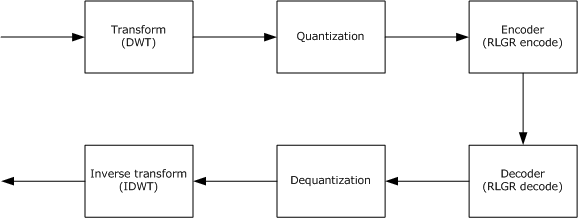

Figure 1: Core functional blocks of the RemoteFX codec

<a id="Section_1.3.1.1"></a>
#### 1.3.1.1 Message Flows

RemoteFX codec messages are transported in order over a lossless transport such as TCP/IP. The message syntax has been designed with this prerequisite.

There are two types of messages: (1) capability messages sent from the client to the server; and (2) encode stream messages sent from the server to the client. The encode stream messages can be broadly categorized as header or data messages. The syntax of each message is described in detail in section [2](#Section_2). Processing events and sequencing rules are described in section [3](#Section_3).

The message sequence is depicted in the following diagram. Note that the messages in this diagram are encapsulated in RDP wire structures (described in [MS-RDPBCGR](../MS-RDPBCGR/MS-RDPBCGR.md) section 2.2) when sent on the wire – for the sake of simplicity only the RemoteFX messages are shown. The encapsulating RDP structures are referenced in sections 2 and 3 when describing the structure and processing of the RemoteFX messages.

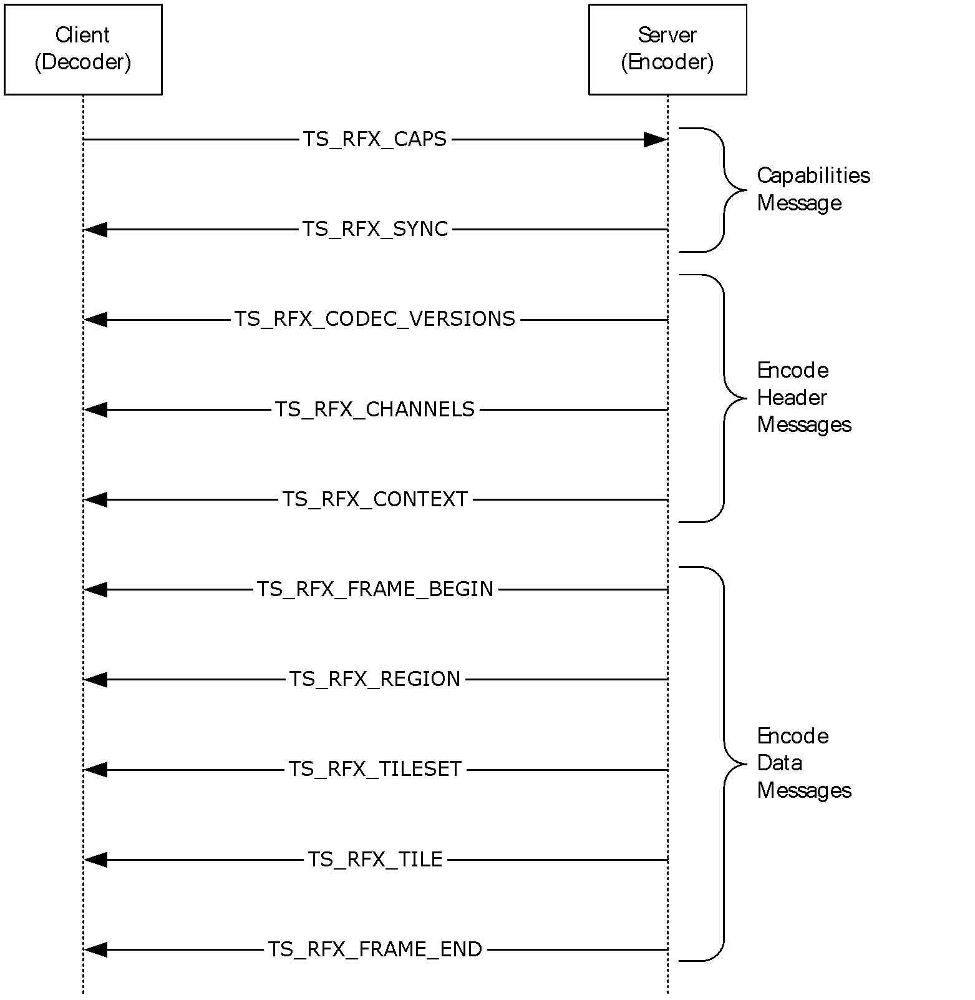

Figure 2: The RemoteFX message sequence

The client initiates the session by sending a TS_RFX_CAPS Capabilities message (section [2.2.1.1](#Section_2.2.1.1)). This is the only message sent from the client to the server; it lists the client-side support and preferences for various RemoteFX codec properties.

The server initializes its encoding state based on the client Capabilities message. It starts the encoding stream (section [2.2.2](#Section_2.2.2)) by sending a sequence of Header Messages (section [2.2.2.2](#Section_2.2.2.2)) that inform the client of the RemoteFX properties selected by the server:

- The TS_RFX_SYNC message (section [2.2.2.2.1](#Section_2.2.2.2.1)) contains the RemoteFX magic number and the version of the wire format.
- The TS_RFX_CODEC_VERSIONS message (section [2.2.2.2.2](#Section_2.2.2.2.2)) contains the version of the RemoteFX codec.
- The TS_RFX_CHANNELS message (section [2.2.2.2.3](#Section_2.2.2.2.3)) lists the channel or multi-monitor information.
- The TS_RFX_CONTEXT message (section [2.2.2.2.4](#Section_2.2.2.2.4)) contains the encoding properties of the stream.
The header messages are followed by the Data messages (section [2.2.2.3](#Section_2.2.2.3)), which represent the sequence of encoded frames in the stream:

- The TS_RFX_FRAME_BEGIN and TS_RFX_FRAME_END messages (sections [2.2.2.3.1](#Section_2.2.2.3.1) and [2.2.2.3.2](#Section_2.2.2.3.2) respectively) are used to demarcate an encoded frame.
- The TS_RFX_REGION message (section [2.2.2.3.3](#Section_2.2.2.3.3)) contains the list of rectangles that have been encoded.
- The TS_RFX_TILESET message (section [2.2.2.3.4](#Section_2.2.2.3.4)) encapsulates the list of tiles that have been encoded.
<a id="Section_1.4"></a>
## 1.4 Relationship to Other Protocols

This protocol extends the Remote Desktop Protocol: Basic Connectivity and Graphics Remoting [MS-RDPBCGR](../MS-RDPBCGR/MS-RDPBCGR.md) by adding advanced compression techniques.

<a id="Section_1.5"></a>
## 1.5 Prerequisites/Preconditions

The following capabilities are mandatory when used with RemoteFX:

- The client MUST support fast-path graphics output ([MS-RDPBCGR](../MS-RDPBCGR/MS-RDPBCGR.md) section 2.2.9.1.2) and acknowledge this support by specifying the FASTPATH_OUTPUT_SUPPORTED (0x0001) flag in the General Capability Set ([MS-RDPBCGR] section 2.2.7.1.1).
- The client MUST send the Multifragment Update Capability Set ([MS-RDPBCGR] section 2.2.7.2.6). The **MaxRequestSize** field in the client-to-server Multifragment Update Capability Set MUST be set to a value greater than or equal to the value in the **MaxRequestSize** field of the server-to-client Multifragment Update Capability Set. The client-to-server Multifragment Update Capability Set is transported in the Confirm Active PDU as specified in [MS-RDPBCGR] section 2.2.1.13.2, and the server-to-client Multifragment Update Capability Set is transported in the Demand Active PDU as specified in [MS-RDPBCGR] section 2.2.1.13.1.
- The client MUST send the Large Pointer Capability Set ([MS-RDPBCGR] section 2.2.7.2.7) and the LARGE_POINTER_FLAG_96x96 (0x00000001) MUST be present in the **largePointerSupportFlags** field.
- If the Revision 2 Bitmap Cache Capability Set ([MS-RDPBCGR] section 2.2.7.1.4.2) is sent by the client, then the ALLOW_CACHE_WAITING_LIST_FLAG (0x0002) MUST be present in the **CacheFlags** field.
- The client MUST support the Stream Surface Bits Surface Command ([MS-RDPBCGR] section 2.2.9.2.2). Support for this surface command MUST be advertised in the Surface Commands Capability Set ([MS-RDPBCGR] section 2.2.7.2.9).
- The client MUST support a color depth of 32 bits per pixel. This means that the RNS_UD_32BPP_SUPPORT (0x0008) flag must be set in the **supportedColorDepths** field of the Client Core Data structure ([MS-RDPBCGR] section 2.2.1.3.2).
- The client MUST support either the NSCodec Bitmap Codec ([MS-RDPNSC](../MS-RDPNSC/MS-RDPNSC.md) sections 2 and 3) or the Planar Codec ([MS-RDPEGDI](../MS-RDPEGDI/MS-RDPEGDI.md) sections 2.2.2.5.1 and 3.1.9) to handle server fallback scenarios.
The [TS_FRAME_ACKNOWLEDGE_CAPABILITYSET (section 2.2.1.3)](#Section_2.2.1.3) SHOULD<1> be sent by the client. Furthermore, if the **connectionType** field of the Client Core Data ([MS-RDPBCGR] section 2.2.1.3.2) is set to any value other than CONNECTION_TYPE_LAN (0x06), then the RemoteFX server SHOULD NOT<2> indicate that the RemoteFX codec is supported, that is, none of the TS_BITMAPCODEC ([MS-RDPBCGR] section 2.2.7.2.10.1.1) structures included in the **bitmapCodecArray** field of the TS_BITMAPCODECS ([MS-RDPBCGR] section 2.2.7.2.10) structure have the **codecGUID** field set to CODEC_GUID_REMOTEFX.

<a id="Section_1.6"></a>
## 1.6 Applicability Statement

This protocol is applicable in situations in which it is necessary to optimize the bandwidth required for graphics remoting. The advanced compression techniques specified in this document enable the efficient transfer of server-side images and video.

<a id="Section_1.7"></a>
## 1.7 Versioning and Capability Negotiation

This protocol builds on the basic Remote Desktop Protocol [MS-RDPBCGR](../MS-RDPBCGR/MS-RDPBCGR.md). The features provided by this extension are negotiated during the capabilities negotiation phase of the RDP connection sequence (see [MS-RDPBCGR] section 1.3.1.1). In effect, this extension merely expands the set of capabilities used by the base RDP. (RDP versioning and capability negotiation is described in [MS-RDPBCGR] section 1.7.)

Some capabilities, which are specified as optional in [MS-RDPBCGR] section 2.2.7.2, are mandatory when used with RemoteFX. These capabilities are described in detail in section [2.1](#Section_2.1).

<a id="Section_1.8"></a>
## 1.8 Vendor-Extensible Fields

None.

<a id="Section_1.9"></a>
## 1.9 Standards Assignments

None.

<a id="Section_2"></a>
# 2 Messages

<a id="Section_2.1"></a>
## 2.1 Transport

This protocol is an extension to the Remote Desktop Protocol: Basic Connectivity and Graphics Remoting Specification and all packets are tunneled within the RDP transport ([MS-RDPBCGR](../MS-RDPBCGR/MS-RDPBCGR.md) section 2.1).

<a id="Section_2.2"></a>
## 2.2 Message Syntax

All multiple-byte fields within a message MUST be marshaled in [**little-endian**](#gt_little-endian) byte order, unless otherwise specified.

<a id="Section_2.2.1"></a>
### 2.2.1 Capabilities Messages

<a id="Section_2.2.1.1"></a>
#### 2.2.1.1 TS_RFX_CLNT_CAPS_CONTAINER

The TS_RFX_CLNT_CAPS_CONTAINER structure is the top-level client capability container that wraps a [TS_RFX_CAPS (section 2.2.1.1.1)](#Section_2.2.1.1.1) structure and is sent from the client to the server. It is encapsulated in the **codecProperties** field of the Bitmap Codec ([MS-RDPBCGR](../MS-RDPBCGR/MS-RDPBCGR.md) section 2.2.7.2.10.1.1) structure, which is ultimately encapsulated in the Bitmap Codecs Capability Set ([MS-RDPBCGR] section 2.2.7.2.10), which is encapsulated in a client-to-server Confirm Active PDU ([MS-RDPBCGR] section 2.2.1.13.2).

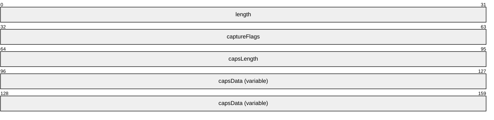

**length (4 bytes):** A 32-bit, unsigned integer. Specifies the combined size, in bytes, of the **length**, **captureFlags**, **capsLength**, and **capsData** fields.

**captureFlags (4 bytes):** A 32-bit, unsigned integer. A collection of flags that allow a client to control how data is captured and transmitted by the server.

| Flag | Meaning |
| --- | --- |
| CARDP_CAPS_CAPTURE_NON_CAC 0x00000001 | The client supports mixing RemoteFX data with data compressed by other codecs. The set of other codecs supported by the client will be negotiated using the Bitmap Codecs Capability Set ([MS-RDPBCGR] section 2.2.7.2.10). |

**capsLength (4 bytes):** A 32-bit, unsigned integer. Specifies the size, in bytes, of the **capsData** field.

**capsData (variable):** A variable-sized field that contains a TS_RFX_CAPS (section 2.2.1.1.1) structure.

<a id="Section_2.2.1.1.1"></a>
##### 2.2.1.1.1 TS_RFX_CAPS

The TS_RFX_CAPS structure contains information about the decoder capabilities.

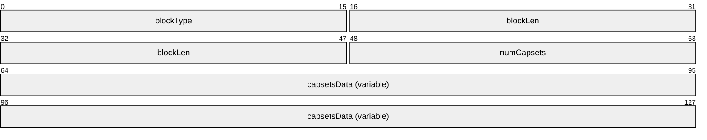

**blockType (2 bytes):** A 16-bit, unsigned integer. Specifies the data block type. This field MUST be set to CBY_CAPS (0xCBC0).

**blockLen (4 bytes):** A 32-bit, unsigned integer. Specifies the combined size, in bytes, of the **blockType**, **blockLen**, and **numCapsets** fields. This field MUST be set to 0x0008.

**numCapsets (2 bytes):** A 16-bit, unsigned integer. Specifies the number of [TS_RFX_CAPSET (section 2.2.1.1.1.1)](#Section_2.2.1.1.1.1) structures contained in the **capsetsData** field. This field MUST be set to 0x0001.

**capsetsData (variable):** A variable-sized array of TS_RFX_CAPSET (section 2.2.1.1.1.1) structures. The structures in this array MUST be packed on byte boundaries. The **blockType** and **blockLen** fields of each TS_RFX_CAPSET structure identify the type and size of the structure.

<a id="Section_2.2.1.1.1.1"></a>
###### 2.2.1.1.1.1 TS_RFX_CAPSET

The TS_RFX_CAPSET structure contains the capability information specific to the RemoteFX codec. It contains a variable number of [TS_RFX_ICAP (section 2.2.1.1.1.1.1)](#Section_2.2.1.1.1.1.1) structures that are used to configure the encoder state.

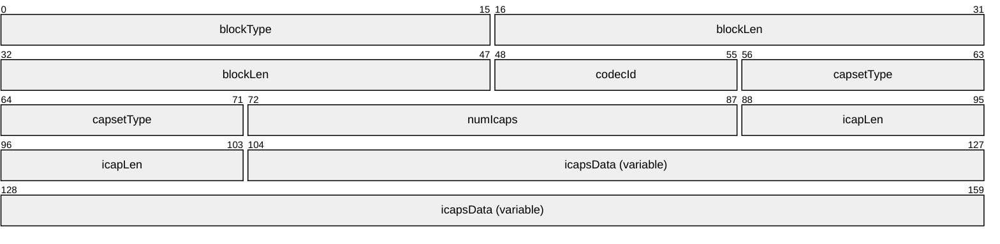

**blockType (2 bytes):** A 16-bit, unsigned integer. Specifies the data block type. This field MUST be set to CBY_CAPSET (0xCBC1).

**blockLen (4 bytes):** A 32-bit, unsigned integer. Specifies the combined size, in bytes, of the **blockType**, **blockLen**, **codecId**, **capsetType**, **numIcaps**, **icapLen**, and **icapsData** fields.

**codecId (1 byte):** An 8-bit, unsigned integer. Specifies the codec ID. This field MUST be set to 0x01.

**capsetType (2 bytes):** A 16-bit, unsigned integer. This field MUST be set to CLY_CAPSET (0xCFC0).

**numIcaps (2 bytes):** A 16-bit, unsigned integer. The number of TS_RFX_ICAP structures contained in the **icapsData** field.

**icapLen (2 bytes):** A 16-bit, unsigned integer. Specifies the size, in bytes, of each TS_RFX_ICAP structure contained in the **icapsData** field.

**icapsData (variable):** A variable-length array of TS_RFX_ICAP (section 2.2.1.1.1.1.1) structures. Each structure MUST be packed on byte boundaries. The size of each TS_RFX_ICAP structure within the array is specified in the **icapLen** field.

<a id="Section_2.2.1.1.1.1.1"></a>
TS_RFX_ICAP

The TS_RFX_ICAP structure specifies the set of codec properties that the decoder supports.

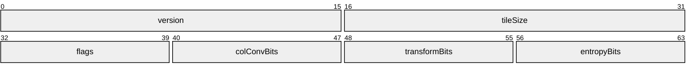

**version (2 bytes):** A 16-bit, unsigned integer. Specifies the codec version. This field MUST be set to CLW_VERSION_1_0 (0x0100), to indicate protocol version 1.0.

**tileSize (2 bytes):** A 16-bit, signed integer. Specifies the width and height of a tile. This field MUST be set to CT_TILE_64x64 (0x0040), indicating that a tile is 64 x 64 pixels.

**flags (1 byte):** An 8-bit, unsigned integer. Specifies operational flags.

| Flag | Meaning |
| --- | --- |
| CODEC_MODE 0x02 | When this flag is set, it indicates that only image mode is supported by the decoder, and therefore, the codec MUST operate in image mode. When this flag is not set, it indicates that both the image mode and the video mode of the codec are supported by the decoder and the codec MUST operate in video mode. |

When operating in image mode, the encode headers messages (section [2.2.2.2](#Section_2.2.2.2)) MUST always precede an encoded frame. When operating in video mode, the header messages MUST be present at the beginning of the stream and are optional elsewhere.

**colConvBits (1 byte):** An 8-bit, unsigned integer. Specifies the color conversion transform. This field MUST be set to CLW_COL_CONV_ICT (0x1), and the transformation is by the equations in sections [3.1.8.1.3](#Section_3.1.8.1.3) and [3.1.8.2.5](#Section_3.1.8.2.5).

**transformBits (1 byte):** An 8-bit, unsigned integer. Specifies the [**DWT**](#gt_discrete-wavelet-transform-dwt). This field MUST be set to CLW_XFORM_DWT_53_A (0x1), the DWT transform given by the lifting equations for the DWT shown in section [3.1.8.1.4](#Section_3.1.8.1.4) and by the lifting equations for the inverse DWT shown in section [3.1.8.2.4](#Section_3.1.8.2.4).

**entropyBits (1 byte):** An 8-bit, unsigned integer. Specifies the entropy algorithm. This field MUST be set to one of the following values.

| Value | Meaning |
| --- | --- |
| CLW_ENTROPY_RLGR1 0x01 | RLGR algorithm as described in [3.1.8.1.7.1](#Section_3.1.8.1.7.1). |
| CLW_ENTROPY_RLGR3 0x04 | RLGR algorithm as described in section [3.1.8.1.7.2](#Section_3.1.8.1.7.2). |

<a id="Section_2.2.1.2"></a>
#### 2.2.1.2 TS_RFX_SRVR_CAPS_CONTAINER

The TS_RFX_SRVR_CAPS_CONTAINER structure is the top-level server capability container, which is sent from the server to the client. It is encapsulated in the **codecProperties** field of the Bitmap Codec structure ([MS-RDPBCGR](../MS-RDPBCGR/MS-RDPBCGR.md) section 2.2.7.2.10.1.1), which is ultimately encapsulated in the Bitmap Codecs Capability Set ([MS-RDPBCGR] section 2.2.7.2.10). The Bitmap Codecs Capability Set is encapsulated in a server-to-client Demand Active PDU ([MS-RDPBCGR] section 2.2.1.13.1).

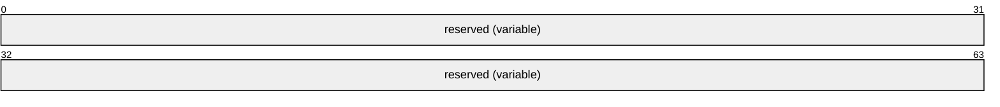

**reserved (variable):** A variable-sized array of bytes. All the bytes in this field MUST be set to 0. The size of the field is given by the corresponding **codecPropertiesLength** field of the parent TS_BITMAPCODEC, as specified in [MS-RDPBCGR] section 2.2.7.2.10.1.1 Bitmap Codecs Capability Set.

<a id="Section_2.2.1.3"></a>
#### 2.2.1.3 TS_FRAME_ACKNOWLEDGE_CAPABILITYSET

The TS_FRAME_ACKNOWLEDGE_CAPABILITYSET structure advertises support for frame acknowledgment using the [TS_FRAME_ACKNOWLEDGE_PDU (section 2.2.3.1)](#Section_2.2.3.1) structure. This capability is sent by both the client and the server and is encapsulated in a server-to-client Demand Active PDU ([MS-RDPBCGR](../MS-RDPBCGR/MS-RDPBCGR.md) section 2.2.1.13.1) or a client-to-server Confirm Active PDU ([MS-RDPBCGR] section 2.2.1.13.2).

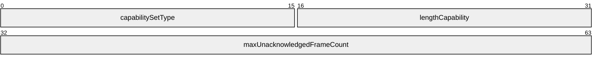

**capabilitySetType (2 bytes):** A 16-bit unsigned integer. The type of capability set. This field MUST be set to CAPSETTYPE_FRAME_ACKNOWLEDGE (0x001E).

**lengthCapability (2 bytes):** A 16-bit unsigned integer. The length, in bytes, of the capability data.

**maxUnacknowledgedFrameCount (4 bytes):** A 32-bit unsigned integer. When sent by the server, it MAY be set to 0, in which case it simply advertises the server's ability to receive and process the TS_FRAME_ACKNOWLEDGE_PDU (section 2.2.3.1). If it is not set to 0, it can be used by the client as a hint that indicates the number of in-flight TS_FRAME_ACKNOWLEDGE_PDUs that the server is prepared to accept. When sent by the client, it provides a hint to the server as to how many in-flight frames the client can buffer. Note that if the server chooses to have more in-flight frames than this number specifies, it is possible that the client could be overloaded with frame data. The client MAY set this field to 0, but this behavior SHOULD be avoided because it provides very little information to the server other than that the client acknowledges frames.

<a id="Section_2.2.2"></a>
### 2.2.2 Encode Messages

An encoded RemoteFX stream comprises a sequence of encode messages. The sequencing and encapsulation of these messages are described in section [3.1.8.3.1](#Section_3.1.8.3.1).

<a id="Section_2.2.2.1"></a>
#### 2.2.2.1 Common Data Types

<a id="Section_2.2.2.1.1"></a>
##### 2.2.2.1.1 TS_RFX_BLOCKT

The TS_RFX_BLOCKT structure identifies the type of an encode message and specifies the size of the message.

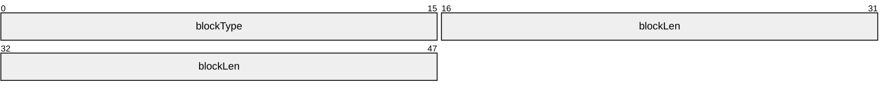

**blockType (2 bytes):** A 16-bit, unsigned integer. Specifies the data block type. This field MUST be set to one of the following values.

| Value | Meaning |
| --- | --- |
| CBT_TILE 0xCAC3 | A TS_RFX_TILE (section [2.2.2.3.4.1](#Section_2.2.2.3.4.1)) structure. |
| CBY_CAPS 0xCBC0 | A TS_RFX_CAPS (section [2.2.1.1.1](#Section_2.2.1.1.1)) structure. |
| CBY_CAPSET 0xCBC1 | A TS_RFX_CAPSET (section [2.2.1.1.1.1](#Section_2.2.1.1.1.1)) structure. |
| WBT_SYNC 0xCCC0 | A TS_RFX_SYNC (section [2.2.2.2.1](#Section_2.2.2.2.1)) structure. |
| WBT_CODEC_VERSIONS 0xCCC1 | A TS_RFX_CODEC_VERSIONS (section [2.2.2.2.2](#Section_2.2.2.2.2)) structure. |
| WBT_CHANNELS 0xCCC2 | A TS_RFX_CHANNELS (section [2.2.2.2.3](#Section_2.2.2.2.3)) structure. |

**blockLen (4 bytes):** A 32-bit, unsigned integer. Specifies the size, in bytes, of the data block. This size includes the size of the **blockType** and **blockLen** fields, as well as all trailing data.

<a id="Section_2.2.2.1.2"></a>
##### 2.2.2.1.2 TS_RFX_CODEC_CHANNELT

The TS_RFX_CODEC_CHANNELT structure is an extension of the TS_RFX_BLOCKT structure. It is present as the first field in messages that are targeted for a specific combination of codec and channel.

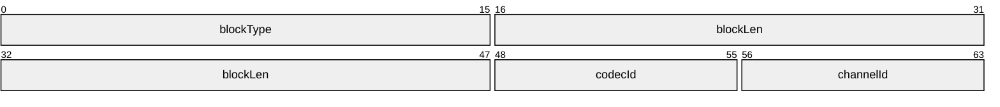

**blockType (2 bytes):** A 16-bit, unsigned integer. Specifies the data block type. This field MUST be set to one of the following values.

| Value | Meaning |
| --- | --- |
| WBT_CONTEXT 0xCCC3 | A [TS_RFX_CONTEXT (section 2.2.2.2.4)](#Section_2.2.2.2.4) structure. |
| WBT_FRAME_BEGIN 0xCCC4 | A TS_RFX_FRAME_BEGIN (section [2.2.2.3.1](#Section_2.2.2.3.1)) structure. |
| WBT_FRAME_END 0xCCC5 | A TS_RFX_FRAME_END (section [2.2.2.3.2](#Section_2.2.2.3.2)) structure. |
| WBT_REGION 0xCCC6 | A TS_RFX_REGION (section [2.2.2.3.3](#Section_2.2.2.3.3)) structure. |
| WBT_EXTENSION 0xCCC7 | A TS_RFX_TILESET (section [2.2.2.3.4](#Section_2.2.2.3.4.1)) structure. |

**blockLen (4 bytes):** A 32-bit, unsigned integer. Specifies the size, in bytes, of the data block. This size includes the size of the **blockType**, **blockLen**, **codecId**, and **channelId** fields, as well as all trailing data.

**codecId (1 byte):** An 8-bit, unsigned integer. Specifies the codec ID. This field MUST be set to 0x01.

**channelId (1 byte):** An 8-bit, unsigned integer. Specifies the channel ID. If the **blockType** is set to WBT_CONTEXT (0xCCC3), then **channelId** MUST be set to 0xFF. For all other values of **blockType**, **channelId** MUST be set to 0x00.

<a id="Section_2.2.2.1.3"></a>
##### 2.2.2.1.3 TS_RFX_CHANNELT

The TS_RFX_CHANNELT structure is used to specify the screen resolution of a channel.

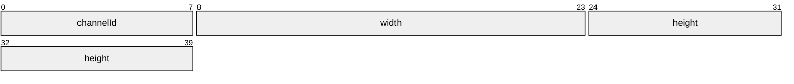

**channelId (1 byte):** An 8-bit, unsigned integer. Specifies the identifier of the channel. This field MUST be set to 0x00.

**width (2 bytes):** A 16-bit, signed integer. Specifies the frame width of the channel. This field SHOULD<3> be within the range of 1 to 4096 (inclusive).

**height (2 bytes):** A 16-bit, signed integer. Specifies the frame height of the channel. This field SHOULD<4> be within the range of 1 to 2048 (inclusive).

<a id="Section_2.2.2.1.4"></a>
##### 2.2.2.1.4 TS_RFX_CODEC_VERSIONT

The TS_RFX_CODEC_VERSIONT structure is used to specify support for a specific version of the RemoteFX codec.


**codecId (1 byte):** An 8-bit, unsigned integer. Specifies the codec ID. This field MUST be set to 0x01. The decoder SHOULD ignore this field.

**version (2 bytes):** A 16-bit, signed integer. This field MUST be set to 0x0100. The decoder SHOULD ignore this field.

<a id="Section_2.2.2.1.5"></a>
##### 2.2.2.1.5 TS_RFX_CODEC_QUANT

The TS_RFX_CODEC_QUANT structure holds the scalar [**quantization**](#gt_quantization) values for the ten sub-bands in the 3-level [**DWT**](#gt_discrete-wavelet-transform-dwt) decomposition. Each field in this structure MUST have a value in the range of 6 to 15.

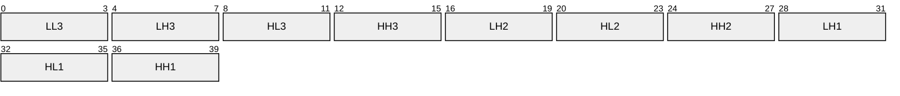

**LL3 (4 bits):** A 4-bit, unsigned integer. The LL quantization factor for the level-3 DWT sub-band.

**LH3 (4 bits):** A 4-bit, unsigned integer. The LH quantization factor for the level-3 DWT sub-band.

**HL3 (4 bits):** A 4-bit, unsigned integer. The HL quantization factors for the level-3 DWT sub-band.

**HH3 (4 bits):** A 4-bit, unsigned integer. The HH quantization factors for the level-3 DWT sub-band.

**LH2 (4 bits):** A 4-bit, unsigned integer. The LH quantization factor for the level-2 DWT sub-band.

**HL2 (4 bits):** A 4-bit, unsigned integer. The HL quantization factor for the level-2 DWT sub-band.

**HH2 (4 bits):** A 4-bit, unsigned integer. The HH quantization factor for the level-2 DWT sub-band.

**LH1 (4 bits):** A 4-bit, unsigned integer. The LH quantization factors for the level-1 DWT sub-band.

**HL1 (4 bits):** A 4-bit, unsigned integer. The HL quantization factors for the level-1 DWT sub-band.

**HH1 (4 bits):** A 4-bit, unsigned integer. The HH quantization factor for the level-1 DWT sub-band.

<a id="Section_2.2.2.1.6"></a>
##### 2.2.2.1.6 TS_RFX_RECT

The TS_RFX_RECT structure is used to specify a rectangle.

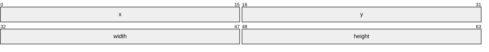

**x (2 bytes):** A 16-bit, unsigned integer. The X-coordinate of the rectangle.

**y (2 bytes):** A 16-bit, unsigned integer. The Y-coordinate of the rectangle.

**width (2 bytes):** A 16-bit, unsigned integer. The width of the rectangle.

**height (2 bytes):** A 16-bit, unsigned integer. The height of the rectangle.

<a id="Section_2.2.2.2"></a>
#### 2.2.2.2 Encode Header Messages

<a id="Section_2.2.2.2.1"></a>
##### 2.2.2.2.1 TS_RFX_SYNC

The TS_RFX_SYNC message MUST be the first message in any encoded stream. The decoder MUST examine this message to determine whether the protocol version is supported.

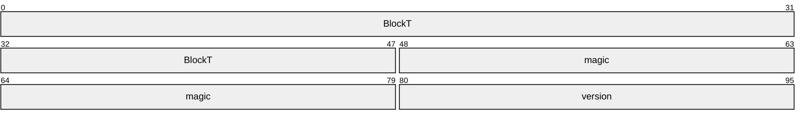

**BlockT (6 bytes):** A [TS_RFX_BLOCKT (section 2.2.2.1.1)](#Section_2.2.2.1.1) structure. The **blockType** field MUST be set to WBT_SYNC (0xCCC0).

**magic (4 bytes):** A 32-bit, unsigned integer. This field MUST be set to WF_MAGIC (0xCACCACCA).

**version (2 bytes):** A 16-bit, unsigned integer. Indicates the version number. This field MUST be set to WF_VERSION_1_0 (0x0100).

<a id="Section_2.2.2.2.2"></a>
##### 2.2.2.2.2 TS_RFX_CODEC_VERSIONS

The TS_RFX_CODEC_VERSIONS message indicates the version of the RemoteFX codec that is being used.

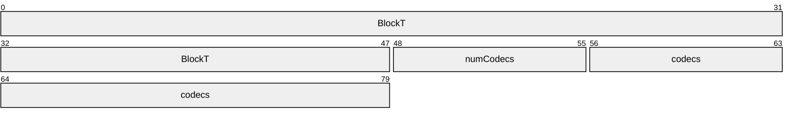

**BlockT (6 bytes):** A [TS_RFX_BLOCKT (section 2.2.2.1.1)](#Section_2.2.2.1.1) structure. The **blockType** field MUST be set to WBT_CODEC_VERSIONS (0xCCC1).

**numCodecs (1 byte):** An 8-bit, unsigned integer. Specifies the number of codec version data blocks in the **codecs** field. This field MUST be set to 0x01.

**codecs (3 bytes):** A [TS_RFX_CODEC_VERSIONT (section 2.2.2.1.4)](#Section_2.2.2.1.4) structure. The **codecId** field MUST be set to 0x01 and the **version** field MUST be set to WF_VERSION_1_0 (0x0100).

<a id="Section_2.2.2.2.3"></a>
##### 2.2.2.2.3 TS_RFX_CHANNELS

The TS_RFX_CHANNELS message contains the list of channels. Each active monitor on the server must correspond to an entry in this list. The list can have more entries than the number of active monitors. The decoder endpoint MUST be able to support channels with different frame dimensions.

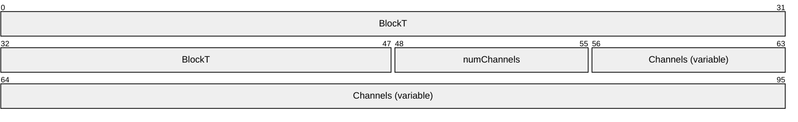

**BlockT (6 bytes):** A [TS_RFX_BLOCKT (section 2.2.2.1.1)](#Section_2.2.2.1.1) structure. The **blockType** field MUST be set to WBT_CHANNELS (0xCCC2).

**numChannels (1 byte):** An 8-bit, unsigned integer. Specifies the number of channel data blocks in the **channels** field.

**Channels (variable):** A variable-length array of [TS_RFX_CHANNELT (section 2.2.2.1.3)](#Section_2.2.2.1.3) structures. The number of elements in this array is specified in the **numChannels** field.

<a id="Section_2.2.2.2.4"></a>
##### 2.2.2.2.4 TS_RFX_CONTEXT

The TS_RFX_CONTEXT message contains information regarding the encoding properties being used.

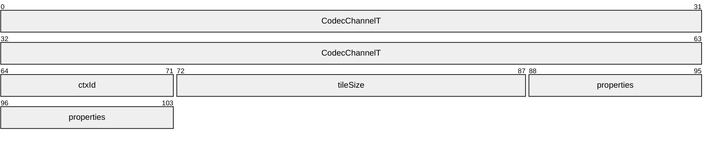

**CodecChannelT (8 bytes):** A [TS_RFX_CODEC_CHANNELT](#Section_2.2.2.1.2) structure. The **blockType** field MUST be set to WBT_CONTEXT (0xCCC3).

**ctxId (1 byte):** An 8-bit unsigned integer. Specifies an identifier for this context message. This field MUST be set to 0x00. The decoder SHOULD ignore this field.

**tileSize (2 bytes):** A 16-bit unsigned integer. Specifies the tile size used by the RemoteFX codec. This field MUST be set to CT_TILE_64x64 (0x0040), indicating that a tile is 64 x 64 pixels.

**properties (2 bytes):** A 16-bit unsigned integer. Contains a collection of bit-packed property fields. The format of this field is described by the following bitfield diagram.


**flags (3 bits):** A 3-bit unsigned integer. Specifies operational flags.

| Flag | Meaning |
| --- | --- |
| CODEC_MODE 0x02 | The codec is operating in image mode. If this flag is not set, the codec is operating in video mode. |

When operating in image mode, the Encode Headers messages (section [2.2.2.2](#Section_2.2.2.2)) MUST always precede an encoded frame. When operating in video mode, the header messages MUST be present at the beginning of the stream and MAY be present elsewhere.

**cct (2 bits):** A 2-bit unsigned integer. Specifies the color conversion transform. This field MUST be set to COL_CONV_ICT (0x1) to specify the transform defined by the equations in sections [3.1.8.1.3](#Section_3.1.8.1.3) and [3.1.8.2.5](#Section_3.1.8.2.5). The decoder SHOULD ignore this field.

**xft (4 bits):** A 4-bit unsigned integer. Specifies the [**DWT**](#gt_discrete-wavelet-transform-dwt). This field MUST be set to CLW_XFORM_DWT_53_A (0x1), which indicates the DWT given by the equations in sections [3.1.8.1.4](#Section_3.1.8.1.4) and [3.1.8.2.4](#Section_3.1.8.2.4).

**et (4 bits):** A 4-bit unsigned integer. Specifies the entropy algorithm. This field MUST be set to one of the following values.

| Value | Meaning |
| --- | --- |
| CLW_ENTROPY_RLGR1 0x01 | RLGR algorithm as detailed in [3.1.8.1.7.1](#Section_3.1.8.1.7.1). |
| CLW_ENTROPY_RLGR3 0x04 | RLGR algorithm as detailed in [3.1.8.1.7.2](#Section_3.1.8.1.7.2). |

The decoder SHOULD ignore this value and use the value defined in the properties field of TS_RFX_TILESET (section [2.2.2.3.4)](#Section_2.2.2.3.4.1).

**qt (2 bits):** A 2-bit unsigned integer. Specifies the [**quantization**](#gt_quantization) type. This field MUST be set to SCALAR_QUANTIZATION (0x1). The decoder SHOULD ignore this field.

**r (1 bit):** A 1-bit field reserved for future use. This field MUST be ignored when received.

<a id="Section_2.2.2.3"></a>
#### 2.2.2.3 Encode Data Messages

<a id="Section_2.2.2.3.1"></a>
##### 2.2.2.3.1 TS_RFX_FRAME_BEGIN

The TS_RFX_FRAME_BEGIN message indicates the start of a new frame for a specific channel in the encoded stream.

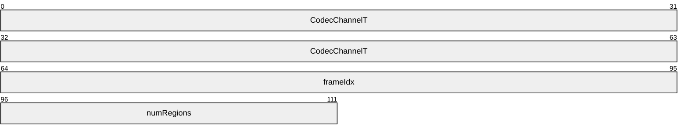

**CodecChannelT (8 bytes):** A [TS_RFX_CODEC_CHANNELT (section 2.2.2.1.2)](#Section_2.2.2.1.2) structure. The **blockType** field MUST be set to WBT_FRAME_BEGIN (0xCCC4).

**frameIdx (4 bytes):** A 32-bit unsigned integer. Specifies the index of the frame in the current video sequence. This field is used when the codec is operating in video mode, as specified using the **flags** field of the [TS_RFX_CONTEXT (section 2.2.2.2.4)](#Section_2.2.2.2.4) message. If the codec is operating in image mode, this field MUST be ignored. If the codec is operating in video mode, this field SHOULD be ignored.

**numRegions (2 bytes):** A 16-bit signed integer. Specifies the number of [TS_RFX_REGION (section 2.2.2.3.3)](#Section_2.2.2.3.3) messages following this TS_RFX_FRAME_BEGIN message. That is, the number of regions in the frame.

<a id="Section_2.2.2.3.2"></a>
##### 2.2.2.3.2 TS_RFX_FRAME_END

The TS_RFX_FRAME_END message specifies the end of a frame for a specific channel in the encoded stream.

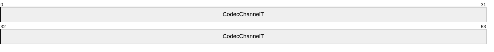

**CodecChannelT (8 bytes):** A [TS_RFX_CODEC_CHANNELT (section 2.2.2.1.2)](#Section_2.2.2.1.2) structure. The **blockType** field MUST be set to WBT_FRAME_END (0xCCC5).

<a id="Section_2.2.2.3.3"></a>
##### 2.2.2.3.3 TS_RFX_REGION

The TS_RFX_REGION message contains information about the list of change rectangles on the screen for a specific channel. It also specifies the number of trailing [TS_RFX_TILESET (section 2.2.2.3.4)](#Section_2.2.2.3.4.1) messages.

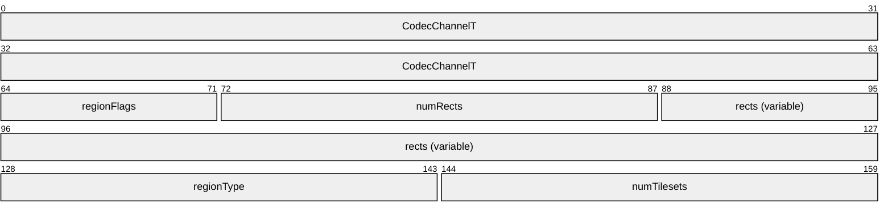

**CodecChannelT (8 bytes):** A [TS_RFX_CODEC_CHANNELT (section 2.2.2.1.2)](#Section_2.2.2.1.2) structure. The **blockType** field MUST be set to WBT_REGION (0xCCC6).

**regionFlags (1 byte):** An 8-bit, unsigned integer. Contains a collection of bit-packed property fields. The format of this field is described by the following bitfield diagram.

| 0 | 1 | 2 | 3 | 4 | 5 | 6 | 7 |
| --- | --- | --- | --- | --- | --- | --- | --- |
| lrf | reserved | - | - | - | - | - | - |

**lrf (1 bit):** A 1-bit unsigned integer. This field MUST be set to 0x1. The decoder SHOULD ignore this field.

**reserved (7 bits:** A 7-bit integer reserved for future use. This field MUST be ignored.

**numRects (2 bytes):** A 16-bit, unsigned integer. Specifies the number of [TS_RFX_RECT (section 2.2.2.1.6)](#Section_2.2.2.1.6) structures present in the **rects** field. If this value is zero, the decoder MUST generate a rectangle with coordinates (0, 0, width, height) that reflects the width and height of the channel's frame (section [2.2.2.1.3](#Section_2.2.2.1.3)).

**rects (variable):** A variable-length array of TS_RFX_RECT (section 2.2.2.1.6) structures. This array defines the region. The number of rectangles in the array is specified in the **numRects** field. Processing rules for the rectangles in this array are specified in section [3.1.8.2.6](#Section_3.1.8.2.6).

**regionType (2 bytes):** A 16-bit, unsigned integer. Specifies the region type. This field MUST be set to CBT_REGION (0xCAC1).

**numTilesets (2 bytes):** A 16-bit, unsigned integer. Specifies the number of TS_RFX_TILESET (section 2.2.2.3.4) messages following this TS_RFX_REGION message. This field MUST be set to 0x0001.

<a id="Section_2.2.2.3.4"></a>
##### 2.2.2.3.4 TS_RFX_TILESET

The TS_RFX_TILESET message contains encoding parameters and data for an arbitrary number of encoded tiles.

```mermaid
packet-beta
  0-63: "CodecChannelT"
  64-79: "subtype"
  80-95: "idx"
  96-111: "properties"
  112-119: "numQuant"
  120-127: "tileSize"
  128-143: "numTiles"
  144-175: "tilesDataSize"
  176-223: "quantVals (variable)"
  224-287: "tiles (variable)"
```

**CodecChannelT (8 bytes):** A [TS_RFX_CODEC_CHANNELT (section 2.2.2.1.2)](#Section_2.2.2.1.2) structure. The **blockType** field MUST be set to WBT_EXTENSION (0xCCC7).

**subtype (2 bytes):** A 16-bit, unsigned integer. Specifies the message type. This field MUST be set to CBT_TILESET (0xCAC2).

**idx (2 bytes):** A 16-bit, unsigned integer. Specifies the identifier of the TS_RFX_CONTEXT (section [2.2.2.2.4](#Section_2.2.2.2.4)) message referenced by this TileSet message. This field MUST be set to 0x0000. The decoder SHOULD ignore this field.

**properties (2 bytes):** A 16-bit unsigned integer. Contains a collection of bit-packed property fields. The format of this field is described by the following bitmask diagram.

```mermaid
packet-beta
  0-0: "A"
  1-3: "flags"
  4-5: "cct"
  6-9: "xft"
  10-13: "et"
  14-15: "qt"
```

**A - lt (1 bit):** A 1-bit field that specifies whether this is the last TS_RFX_TILESET in the region. This field MUST be set to TRUE (0x1). The decoder SHOULD ignore this field.

**flags (3 bits):** A 3-bit unsigned integer. Specifies operational flags.

| Flag | Meaning |
| --- | --- |
| CODEC_MODE 0x02 | The codec is operating in image mode. If this flag is not set, the codec is operating in video mode. |

The encoder MUST set this value to the value of flags that is set in the properties field of TS_RFX_CONTEXT. The decoder MUST ignore this flag and MUST use the flags specified in the **flags** field of the TS_RFX_CONTEXT.

**cct (2 bits):** A 2-bit unsigned integer. Specifies the color conversion transform. This field MUST be set to COL_CONV_ICT (0x1) to specify the transform defined by the equations in sections [3.1.8.1.3](#Section_3.1.8.1.3) and [3.1.8.2.5](#Section_3.1.8.2.5). The decoder SHOULD ignore this field.

**xft (4 bits):** A 4-bit unsigned integer. Specifies the [**DWT**](#gt_discrete-wavelet-transform-dwt). This field MUST be set to CLW_XFORM_DWT_53_A (0x1), which indicates the DWT given by the equations in sections [3.1.8.1.4](#Section_3.1.8.1.4) and [3.1.8.2.4](#Section_3.1.8.2.4). The decoder SHOULD ignore this field.

**et (4 bits):** A 4-bit unsigned integer. Specifies the entropy algorithm. This field MUST be set to one of the following values.

| Value | Meaning |
| --- | --- |
| CLW_ENTROPY_RLGR1 0x01 | RLGR algorithm as detailed in [3.1.8.1.7.1](#Section_3.1.8.1.7.1). |
| CLW_ENTROPY_RLGR3 0x04 | RLGR algorithm as detailed in [3.1.8.1.7.2](#Section_3.1.8.1.7.2). |

**qt (2 bits):** A 2-bit unsigned integer. Specifies the [**quantization**](#gt_quantization) type. This field MUST be set to SCALAR_QUANTIZATION (0x1). The decoder SHOULD ignore this field.

**numQuant (1 byte):** An 8-bit, unsigned integer. Specifies the number of TS_RFX_CODEC_QUANT (section [2.2.2.1.5](#Section_2.2.2.1.5)) structures present in the **quantVals** field.

**tileSize (1 byte):** An 8-bit, unsigned integer. Specifies the width and height of a tile. This field MUST be set to 0x40. The decoder SHOULD ignore this field.

**numTiles (2 bytes):** A 16-bit, unsigned integer. Specifies the number of TS_RFX_TILE (section [2.2.2.3.4.1](#Section_2.2.2.3.4.1)) structures present in the **tiles** field.

**tilesDataSize (4 bytes):** A 32-bit, unsigned integer. Specifies the size, in bytes, of the **tiles** field. The **tiles** field contains encoded data for all of the tiles that have changed.

**quantVals (variable):** A variable-length array of TS_RFX_CODEC_QUANT (section 2.2.2.1.5) structures. The number of structures present in the array is indicated in the **numQuant** field.

**tiles (variable):** A variable-length array of TS_RFX_TILE (section 2.2.2.3.4.1) structures. The number of structures present in the array is indicated in the **numTiles** field, while the total size, in bytes, of this field is specified by the **tilesDataSize** field.

<a id="Section_2.2.2.3.4.1"></a>
###### 2.2.2.3.4.1 TS_RFX_TILE

The TS_RFX_TILE structure specifies the position of the tile on the frame and contains the encoded data for the three tile components of Y, Cb, and Cr.

```mermaid
packet-beta
  0-47: "BlockT"
  48-55: "quantIdxY"
  56-63: "quantIdxCb"
  64-71: "quantIdxCr"
  72-87: "xIdx"
  88-103: "yIdx"
  104-119: "YLen"
  120-135: "CbLen"
  136-151: "CrLen"
  152-191: "YData (variable)"
  192-255: "CbData (variable)"
  256-319: "CrData (variable)"
```

**BlockT (6 bytes):** A [TS_RFX_BLOCKT (section 2.2.2.1.1)](#Section_2.2.2.1.1) structure. The **blockType** field MUST be set to CBT_TILE (0xCAC3).

**quantIdxY (1 byte):** An 8-bit, unsigned integer. Specifies an index into the TS_RFX_CODEC_QUANT array provided in the TS_RFX_TILESET message. The specified **TS_RFX_CODEC_QUANT** element MUST be used for de-[**quantization**](#gt_quantization) of the sub-bands for the Y-component.

**quantIdxCb (1 byte):** An 8-bit, unsigned integer. Specifies an index into the TS_RFX_CODEC_QUANT array provided in the TS_RFX_TILESET message. The specified **TS_RFX_CODEC_QUANT** element MUST be used for de-quantization of the sub-bands for the Cb-component.

**quantIdxCr (1 byte):** An 8-bit, unsigned integer. Specifies an index into the [TS_RFX_CODEC_QUANT](#Section_2.2.2.1.5) array provided in the [TS_RFX_TILESET](#Section_2.2.2.3.4.1) message. The specified **TS_RFX_CODEC_QUANT** element MUST be used for de-quantization of the sub-bands for the Cr-component.

**xIdx (2 bytes):** A 16-bit, unsigned integer. The X-index of the encoded tile in the screen tile grid.

**yIdx (2 bytes):** A 16-bit, unsigned integer. The Y-index of the encoded tile in the screen tile grid.

**YLen (2 bytes):** A 16-bit, unsigned integer. Specifies the size, in bytes, of the **YData** field.

**CbLen (2 bytes):** A 16-bit, unsigned integer. Specifies the size, in bytes, of the **CbData** field.

**CrLen (2 bytes):** A 16-bit, unsigned integer. Specifies the size, in bytes, of the **CrData** field.

**YData (variable):** A variable-length array. Contains the encoded data for the Y-component of the tile. The size, in bytes, of this field is specified by the **YLen** field.

**CbData (variable):** A variable-length array. Contains the encoded data for the Cb-component of the tile. The size, in bytes, of this field is specified by the **CbLen** field.

**CrData (variable):** A variable-length array. Contains the encoded data for the Cr-component of the tile. The size, in bytes, of this field is specified by the **CrLen** field.

<a id="Section_2.2.3"></a>
### 2.2.3 Control Messages

<a id="Section_2.2.3.1"></a>
#### 2.2.3.1 TS_FRAME_ACKNOWLEDGE_PDU

The TS_FRAME_ACKNOWLEDGE_PDU structure is a client-to-server PDU sent to the server whenever the client receives a Frame Marker Command ([MS-RDPBCGR](../MS-RDPBCGR/MS-RDPBCGR.md) section 2.2.9.2.3) with the **frameAction** field set to SURFACECMD_FRAMEACTION_END (0x0001) and it has finished processing this particular frame (that is, the surface bits have been rendered on the screen). The server uses this acknowledgment to throttle the rate at which it generates frames of data to avoid overloading the client with too many updates. The server SHOULD NOT wait for an acknowledgment for each frame before sending the next frame. Instead, the server SHOULD have a "window" mechanism where it allows multiple frames to be unacknowledged before it slows down its frame rate (or stops completely).

```mermaid
packet-beta
  0-31: "tpktHeader"
  32-55: "x224Data"
  56-95: "mcsSDrq (variable)"
  96-159: "securityHeader (variable)"
  160-271: "shareDataHeader (18 bytes)"
  272-303: "frameID"
```

**tpktHeader (4 bytes):** A TPKT Header as specified in [[T123]](https://go.microsoft.com/fwlink/?LinkId=90541) section 8.

**x224Data (3 bytes):** An X.224 Class 0 Data TPDU, as specified in [[X224]](https://go.microsoft.com/fwlink/?LinkId=90588) section 13.7.

**mcsSDrq (variable):** Variable-length PER-encoded MCS Domain PDU (DomainMCSPDU) that encapsulates an MCS Send Data Request structure (SDrq, choice 25 from DomainMCSPDU). This is as specified in [[T125]](https://go.microsoft.com/fwlink/?LinkId=90543) section 11.32, and the ASN.1 structure definitions are specified in [T125] section 7, parts 7 and 10. The **userData** field of the MCS Send Data Request PDU contains a Security Header, Share Data Header, and a frame ID.

**securityHeader (variable):** Optional security header. The presence and format of the security header depend on the Encryption Level and Encryption Method selected by the server ([MS-RDPBCGR] sections 5.3.2 and 2.2.1.4.3). If the Encryption Level selected by the server is greater than ENCRYPTION_LEVEL_NONE (0) and the Encryption Method selected by the server is greater than ENCRYPTION_METHOD_NONE (0), this field MUST contain one of the following headers:

- Non-FIPS Security Header ([MS-RDPBCGR] section 2.2.8.1.1.2.2) if the Encryption Method selected by the server is ENCRYPTION_METHOD_40BIT (0x00000001), ENCRYPTION_METHOD_56BIT (0x00000008), or ENCRYPTION_METHOD_128BIT (0x00000002).
- FIPS Security Header ([MS-RDPBCGR] section 2.2.8.1.1.2.3) if the Encryption Level selected by the server is ENCRYPTION_METHOD_FIPS (0x00000010).
If the Encryption Level selected by the server is ENCRYPTION_LEVEL_NONE (0) and the Encryption Method selected by the server is ENCRYPTION_METHOD_NONE (0), this header MUST NOT be included in the PDU.

**shareDataHeader (18 bytes):** Share Data Header ([MS-RDPBCGR] section 2.2.8.1.1.1.2) containing information about the packet. The type subfield of the **pduType** field of the Share Control Header ([MS-RDPBCGR] section 2.2.8.1.1.1.1) within the Share Data Header MUST be set to PDUTYPE_DATAPDU (0x0007). The **pduType2** field of the Share Data Header MUST be set to PDUTYPE2_FRAME_ACKNOWLEDGE (0x38).

**frameID (4 bytes):** A 32-bit unsigned integer. This field specifies the 32-bit identifier of the frame that was sent to the client using a Frame Marker Command and is being acknowledged as delivered. The **frameID** field MUST be populated with the value of the **frameID** field that was specified in the Frame Marker Command associated with the frame being acknowledged. If the **frameID** field is set to the value 0xFFFFFFFF, the server SHOULD<5> assume that all in-flight frames have been acknowledged.

<a id="Section_3"></a>
# 3 Protocol Details

<a id="Section_3.1"></a>
## 3.1 Common Details

<a id="Section_3.1.1"></a>
### 3.1.1 Abstract Data Model

This section describes a conceptual model of possible data organization that an implementation maintains to participate in this protocol. The described organization is provided to facilitate the explanation of how the protocol behaves. This document does not mandate that implementations adhere to this model, as long as their external behavior is consistent with that described in this document.

**OperationalMode:** Stores the operational mode currently in use. Operational modes include video mode, and image mode.

**EntropyAlgorithm:** Stores the entropy algorithm currently in use. Entropy algorithms include RLGR1 and RLGR3.

**FrameIndex:** A 32-bit integer variable. Used by the server to keep track of the current index of the encoded frame within an encoding session. This variable is used only when the **OperationalMode** is video mode. If the **OperationalMode** is image mode, the server does not need to maintain this variable.

In video mode, initialize this variable to 0 at the start of the session and then increment it by 1 after every encoded frame. The current value of this variable is stored in the **frameIdx** field of the [TS_RFX_FRAME_BEGIN](#Section_2.2.2.3.1) message (section 2.2.2.3.1).

<a id="Section_3.1.1.1"></a>
#### 3.1.1.1 State Machine

The following figure and table describe the state machine of the codec at the server end.

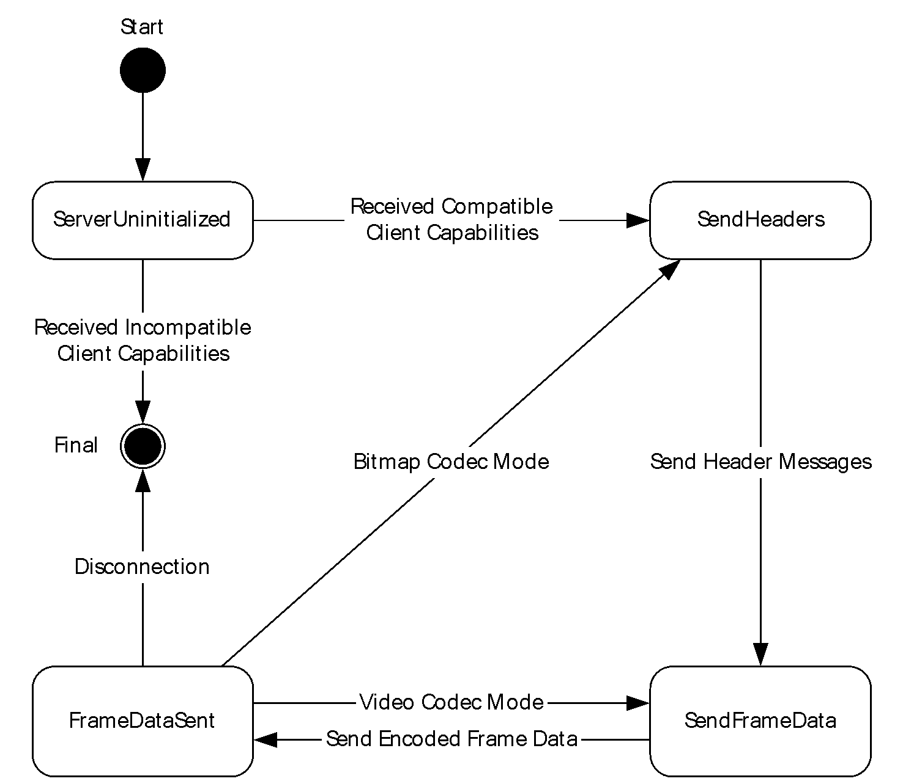

Figure 3: Server state diagram

| State Name | Description |
| --- | --- |
| ServerUninitialized | This is the initial state of the server. In this state, the server waits for the [TS_RFX_CLNT_CAPS_CONTAINER](#Section_2.2.1.1) message from the client. On receiving this message, the server processes it as described in section [3.1.5.1](#Section_3.1.5.1). If it finds a compatible [TS_RFX_ICAP](#Section_2.2.1.1.1.1.1), it initializes itself and gets into the SendHeaders state. Otherwise, the connection is terminated (section 3.1.5.1). |
| SendHeaders | In this state, the server sends the Header message sequence as described in section [3.1.8.3.1](#Section_3.1.8.3.1) and shown in Figure 17. The server then transitions to the SendFrameData state. |
| SendFrameData | In this state, the server sends the encoded frame data messages as described in section 3.1.8.3.1 and shown in Figure 18. The server then transitions to the FrameDataSent state. |
| FrameDataSent | If the **OperationalMode** of the server is image mode, the server transitions to the SendHeaders state. If the **OperationalMode** is video mode, the server transitions to either the SendFrameData state or the SendHeaders state. |

<a id="Section_3.1.2"></a>
### 3.1.2 Timers

None.

<a id="Section_3.1.3"></a>
### 3.1.3 Initialization

The Bitmap Codecs Capability Set message ([MS-RDPBCGR](../MS-RDPBCGR/MS-RDPBCGR.md) section 2.2.7.2.10) MUST be processed by the server, as specified in section [3.1.5.1](../MS-RDPBCGR/MS-RDPBCGR.md), before RemoteFX encoding begins. This establishes the encoding properties that will be used by the server when sending the encoded data stream.

The Bitmap Codecs Capability Set is sent by the client, encapsulating the [TS_RFX_CLNT_CAPS_CONTAINER (section 2.2.1.1)](#Section_2.2.1.1). The server ultimately processes the encapsulated TS_RFX_CLNT_CAPS_CONTAINER (section 2.2.1.1) message as specified in section 3.1.5.1, picking a [TS_RFX_ICAP (section 2.2.1.1.1.1.1)](#Section_2.2.1.1.1.1.1) element. From that point on, the server uses the capability properties listed in that element to encode RemoteFX data streams.

<a id="Section_3.1.4"></a>
### 3.1.4 Higher-Layer Triggered Events

None.

<a id="Section_3.1.5"></a>
### 3.1.5 Processing Events and Sequencing Rules

**Establishing the connection:** RemoteFX capabilities messages are exchanged to establish the encoding properties used by the server, as specified in sections [3.1.3](#Section_3.1.3) and [3.1.5.1](#Section_3.1.5.1). A compliant server MUST process the [TS_RFX_CLNT_CAPS_CONTAINER](#Section_2.2.1.1) message as specified in section 3.1.5.1 before RemoteFX encoding can begin.

**Sending RemoteFX encoded data:** RemoteFX encoded data is sent to the client as a sequence of the RemoteFX messages defined in section [2.2.2](#Section_2.2.2). A compliant server MUST always send the encoded messages in the correct order, as specified in section [3.1.8.3.1](#Section_3.1.8.3.1).

**Header messages:** The encoded message sequence MUST include header messages, as specified in section 3.1.8.3.1.

Header messages contain information about the encoding properties used for encoding data messages, and are used by the client to decode the message stream. Header messages MUST always specify the encoding properties initialized and stored in **OperationalMode** and **EntropyAlgorithm**. The encode header and data message sequences are shown in the figures Generation of RemoteFX encode header messages and Generation of RemoteFX encode data messages (section 3.1.8.3.1).

Header messages can appear multiple times within the message stream, depending on the **OperationalMode** property:

- If the encoder is initialized with **OperationalMode** set to video mode, then it MUST send the encode header message sequence at the start of the stream. The encode header message sequence is then followed by an arbitrary number of encode data message sequences.
- If the encoder is initialized with **OperationalMode** set to image mode, then it MUST send the encode header message sequence before every encode data message sequence.
**Entropy Algorithm:** The server MUST use the entropy algorithm, initialized and stored in **EntropyAlgorithm**, to encode every data message in the encoded data stream.

**Error conditions:** If the client receives an out-of-sequence, unspecified, or malformed message, then the client MUST treat this as an error and terminate the RDP connection.

<a id="Section_3.1.5.1"></a>
#### 3.1.5.1 Processing the TS_RFX_CLNT_CAPS_CONTAINER Message

The structure and fields of the [TS_RFX_CLNT_CAPS_CONTAINER](#Section_2.2.1.1), and its constituent members, are specified in section 2.2.1.1.

TS_RFX_CLNT_CAPS_CONTAINER has a [TS_RFX_CAPS](#Section_2.2.1.1.1) field. The TS_RFX_CAPS field contains a [TS_RFX_CAPSET](#Section_2.2.1.1.1.1) sub-field, which is composed of a variable number of [TS_RFX_ICAP](#Section_2.2.1.1.1.1.1) structures.

The encoder parses the TS_RFX_CLNT_CAPS_CONTAINER message to get to the array of TS_RFX_ICAP structures. It processes each element of this array to check whether it can support all the properties listed in that TS_RFX_ICAP element. From this set of supported elements, it will arbitrarily pick one element and use only the properties listed in that specific TS_RFX_ICAP to encode the data stream.

For example, if the decoder supports both RLGR1 and RLGR3, the client can specify support for both of them. This support is specified using two TS_RFX_ICAP elements in the TS_RFX_CAPSET message that the client sends to the server. If the encoder also supports both RLGR1 and RLGR3, it then arbitrarily picks one of the TS_RFX_CAPSET elements to use for encoding.

Once a TS_RFX_ICAP element has been picked, the **OperationalMode** and **EntropyAlgorithm** ADM elements are set as follows.

- If the TS_RFX_ICAP element's **flags** field is set to include the 0x02 flag, the **OperationalMode** is set to image mode; otherwise, the **OperationalMode** is set to video mode.
- When the TS_RFX_ICAP element's **entropyBits** field is set to 0x01, the **EntropyAlgorithm** is set to RLGR1; when **entropyBits** is set to 0x04, **EntropyAlgorithm** is set to RLGR3.
**Error conditions:** If the server cannot support any of the TS_RFX_ICAP elements, it MUST stop sending messages and consider the RDP connection terminated.

<a id="Section_3.1.6"></a>
### 3.1.6 Timer Events

None.

<a id="Section_3.1.7"></a>
### 3.1.7 Other Local Events

None.

<a id="Section_3.1.8"></a>
### 3.1.8 RemoteFX Algorithm

RemoteFX is a [**tile-based transform**](#gt_tile-based-transform) codec. It has the same functional stages as those found in most structured compression systems (section [1.3.1](#Section_1.3.1)). At the encode endpoint, these stages are transform, [**quantization**](#gt_quantization), and entropy encoding. The inverse of these operations (in the reverse order) takes place at the decode endpoint. RemoteFX uses [**DWTs**](#gt_discrete-wavelet-transform-dwt) and Run-Length Golomb-Rice Coding (RLGR) ([[ARLGR]](https://go.microsoft.com/fwlink/?LinkId=187365) section 3) for transformation and entropy encoding respectively.

<a id="Section_3.1.8.1"></a>
#### 3.1.8.1 Encoding

The functional stages involved in the encoding path are illustrated in the following figure. Each of these stages is described in the subsections that follow.


Figure 4: RemoteFX encoding stages

<a id="Section_3.1.8.1.1"></a>
##### 3.1.8.1.1 Input Tiling

The input to the encoder is an arbitrary region contained within an image to be encoded. The input image is overlaid with a tile grid anchored to the top left corner of the screen (0, 0) and aligned to the tile size (the tile size MUST be 64 x 64 pixels). The set of tiles that map to the input region are computed. These tiles are candidates for further processing, and each tile is processed independently of the others.

<a id="Section_3.1.8.1.2"></a>
##### 3.1.8.1.2 Differencing (Optional)

If the RemoteFX codec is to be used as a video codec, the encoder can, optionally, do differencing between current and previous frames to compute the smallest set of tiles that have changed. The differencing is done by comparing the set of input tiles in the current frame with collocated tiles from the previous frame to determine whether any pixels have changed. Only the input tiles with changed pixels in the current frame are processed for compression. Note that the input tile is compressed as is; this algorithm does not compress the tile of difference values formed by subtracting the input tile pixels of the current frame from the collocated tile pixels in the previous frame. This means that the decoder does not need to determine whether the encoder is doing differencing. The encoder can use differencing to reduce the number of tiles that it needs to encode, thereby reducing the bandwidth required to send the compressed tiles to the decoder. If the codec is to be used as an image codec, this stage MUST be skipped.

<a id="Section_3.1.8.1.3"></a>
##### 3.1.8.1.3 Color Conversion (RGB to YCbCr)

Each input tile is converted from the RGB color space to the [**YCbCr color space**](#gt_ycbcr-color-space). The transform used takes an RGB input value with each component in the range [0-255] and transforms it into Y, Cb, and Cr, in the ranges [0.0, 255.0], [-128.0, 127.0], and [-128.0, 127.0], respectively. The Y-component is level-shifted down by 128, so that it also falls into the [-128.0, 127.0] range. The input tile in this level-shifted symmetric YCbCr color space is used as the input for the next stage of [**DWT**](#gt_discrete-wavelet-transform-dwt). The matrix equation for this conversion is shown in the following figure.

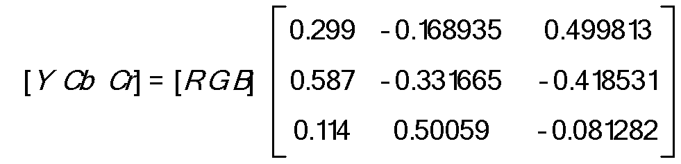

Figure 5: The RGB to YCbCr conversion matrix

<a id="Section_3.1.8.1.4"></a>
##### 3.1.8.1.4 DWT

Each tile component (Y, Cb, Cr) is individually transformed by a 2-D [**DWT**](#gt_discrete-wavelet-transform-dwt) using a 5/3 wavelet basis. The filter coefficients used for both of the lifting-based implementations are presented in the following figure.

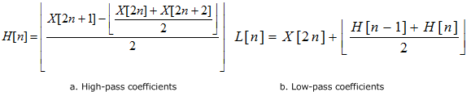

Figure 6: Lifting equations for the DWT

Filtering at the boundary is done by mirroring the input coefficients. For example, if there are eight input coefficients:

[0, 1, 2, 3, 4, 5, 6, 7]

then, after mirroring, the coefficients get logically extended as follows:

[…, 7, 6, 5, 4, 3, 2, 1, 0, 1, 2, 3, 4, 5, 6, 7, 6, 5, 4, 3, 2, 1, 0, …]

Use this logical extension when filtering at boundaries where coefficients are required before or after the first and last available coefficient.

For each level of decomposition, we first perform the DWT in the vertical direction, followed by the DWT in the horizontal direction. After the first level of decomposition, there are 4 sub-bands: LL1, LH1, HL1, HH1. For each successive level of decomposition, the LL sub-band of the previous level is used as the input. Each tile component undergoes three levels of decomposition. This results in 10 sub-bands per component. LH1, HL1, and HH1 contain the highest frequency bands present in the image tile, while LL3 contains the lowest frequency band.

The three-level DWT decomposition is illustrated in the following figure.

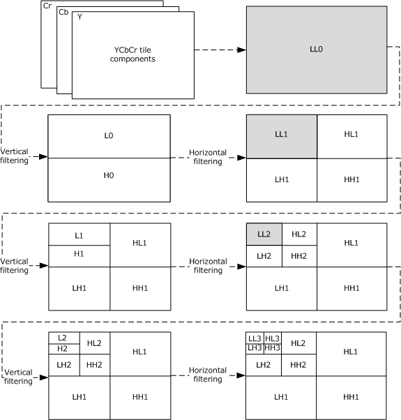

Figure 7: Three-level DWT decomposition

<a id="Section_3.1.8.1.5"></a>
##### 3.1.8.1.5 Quantization

The encoder determines a scale value for each sub-band and uses it to [**quantize**](#gt_quantization) all the coefficients in that sub-band, which is done by dividing each coefficient by the scale value and rounding it. These scale values are represented as quantization factors in a [TS_RFX_CODEC_QUANT](#Section_2.2.2.1.5) structure, which is embedded in a [TS_RFX_TILESET](#Section_2.2.2.3.4.1) message. The conversion between a scale value and a quantization factor is given by the following figure.


Figure 8: Quantization factor to scale value conversion

<a id="Section_3.1.8.1.6"></a>
##### 3.1.8.1.6 Linearization

The quantized tile components are linearized by raster scanning each of the sub-bands. The sub-band coefficient scan and traversal order is illustrated in the following figure.

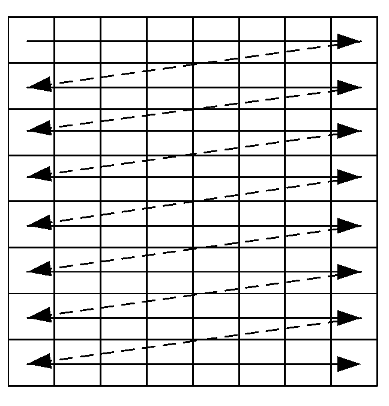

Figure 9: Raster scan of sub-band coefficients

Linearization of the sub-bands is conducted in the following sequence: HL1, LH1, HH1, HL2, LH2, HH2, HL3, LH3, HH3, and LL3, as shown in the following figure.

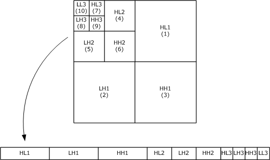

Figure 10: Sub-band traversal order

The coefficients from LL3 also undergo differential encoding. Except for the first coefficient, every raster-scanned LL3 coefficient is subtracted from its previous neighbor. For example, if the raster-scanned LL3 coefficients are

[64, 32, 42, 54, 50, 60, 40, 70]

Then, after differential encoding, they would get converted to

[64, -32, 10, 12, -4, 10, -20, 30]

<a id="Section_3.1.8.1.7"></a>
##### 3.1.8.1.7 RLGR Entropy Encoding

Each 64 x 64-pixel tile contains an array of 4,096 coefficients. This coefficient array is losslessly entropy-encoded using the RLGR algorithm ([[ARLGR]](https://go.microsoft.com/fwlink/?LinkId=187365) section 3). The three tile components are assembled into an encoded tile packet (section [2.2.2.3.4.1](#Section_2.2.2.3.4.1)). RLGR is an algorithm that adaptively switches between Run-Length encoding of zeros and Golomb-Rice coding of nonzero coefficients. There are two variants of the RLGR algorithm that can be used, RLGR1 and RLGR3. The decoder endpoint specifies its preference through the capabilities negotiation (see the **entropyBits** field in section [2.2.1.1.1.1.1](#Section_2.2.1.1.1.1.1)). The pseudocode that describes the complete RLGR1/RLGR3 algorithm in detail is given in section [3.1.8.1.7.3](#Section_3.1.8.1.7.3).

<a id="Section_3.1.8.1.7.1"></a>
###### 3.1.8.1.7.1 RLGR1

The RLGR algorithm is described in [[ARLGR]](https://go.microsoft.com/fwlink/?LinkId=187365). In this specification, the parameter adaptation rules, which are central to the algorithm, are detailed in section [ARLGR] section 3. The specific adaptation values used by RLGR1 are given in the following two tables.

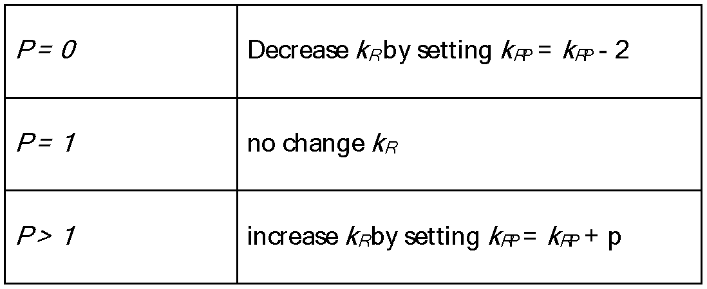

Figure 11: Adaptation rule for RLGR1/RLGR3 parameter kR

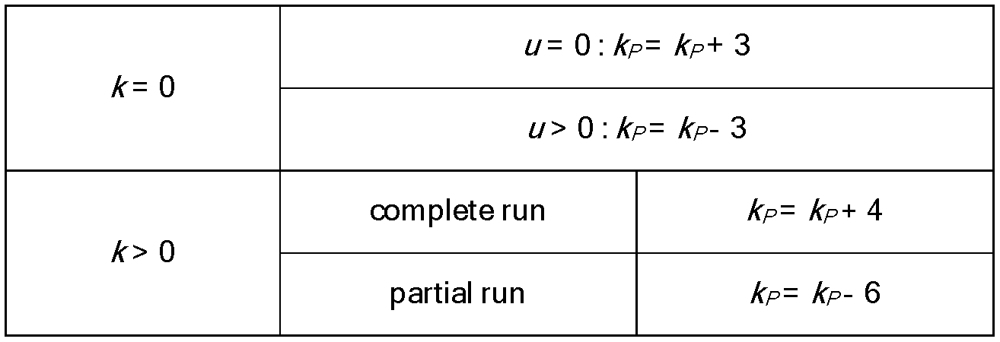

Figure 12: Adaptation rule for RLGR1/RLGR3 main parameter k

The initial value for the parameters *k*RP and *k*P is 8, and the value of *L* is 8. Both the parameters *k*RP and *k*P are clipped to the range [0, 80] after every update.

<a id="Section_3.1.8.1.7.2"></a>
###### 3.1.8.1.7.2 RLGR3

The core RLGR algorithm [[ARLGR]](https://go.microsoft.com/fwlink/?LinkId=187365) switches between the Run-Length and the Golomb-Rice mode as a stream of data is encoded, based on the Run-Length parameter, k, as shown in figure "Adaptation rule for RLGR1/RLGR3 main parameter k" in section 3.1.8.1.7.2. The Golomb-Rice mode in the RLGR algorithm [ARLGR], operates by encoding one coefficient at a time and updating the Golomb-Rice parameter, kR, as shown in figure "Adaptation rule for RLGR1/RLGR3 parameter kR" in section 3.1.8.1.7.2. In RLGR3, the Run-Length mode parameter, k, and the Golomb-Rice parameter, kR, are updated exactly as in RLGR1, but the Golomb-Rice mode is processed differently. Once the algorithm enters into the Golomb-Rice mode, RLGR3 takes the sum of the next two coefficients and Golomb-Rice encodes the sum and updates the parameters k and kR as with RLGR1. After the sum is encoded, the value of the first coefficient is emitted as binary code in the exact number of bits it takes to represent the sum. Pseudocode for Golomb-Rice mode in RLGR3 encode follows.

ENCODER GOLOMB-RICE MODE:

SUM = COEFF[n] + COEFF[n+1] // sum of the next two coefficients in the input stream

GOLOMB_RICE_ENCODE(SUM) // Golomb-Rice encode the value of SUM

BINARY_ENCODE(COEFF[n]) // using LOG2(SUM) bits

UPDATE_RLGR_PARAMETERS(SUM) // update RLGR parameters (k,kR) based on SUM

The decoder follows the same sequence of steps as the encoder, as it decodes the encoded data. The pseudocode for the decoder in Golomb-Rice mode is given below.

DECODER GOLOMB-RICE MODE:

SUM = GOLOMB_RICE_DECODE() // decode the next value from the encoded stream

NBS = LOG2(SUM) // number of bits in binary representation of SUM

COEFF[n] = BINARY_DECODE(NBS) // read next NBS bits from input stream as COEFF[n]

COEFF[n+1] = SUM – COEFF[n] // compute COEFF[n+1]

UPDATE_RLGR_PARAMETERS(SUM) // update RLGR parameters (k,kR) based on SUM

In general, RLGR3 encodes faster than RLGR1 but is marginally worse in terms of compression ratio.

<a id="Section_3.1.8.1.7.3"></a>
###### 3.1.8.1.7.3 RLGR1/RLGR3 Pseudocode

<a id="Section_3.1.8.1.7.3.1"></a>
RLGR1/RLGR3 Decode

The following pseudocode sample shows how to decode a stream of bits encoded using the RLGR1/RLGR3 algorithm.

// Constants used within the RLGR1/RLGR3 algorithm

#define KPMAX (80) // max value for kp or krp

#define LSGR (3) // shift count to convert kp to k

#define UP_GR (4) // increase in kp after a zero run in RL mode

#define DN_GR (6) // decrease in kp after a nonzero symbol in RL mode

#define UQ_GR (3) // increase in kp after nonzero symbol in GR mode

#define DQ_GR (3) // decrease in kp after zero symbol in GR mode

//

// Gets (returns) the next nBits from the bitstream

// The layout of N bits in the bitstream with regard to a byte array is:

// [0..N] -> [0..7](MSB..LSB),[8..15](MSB..LSB) ...,

// where (MSB..LSB) denotes a byte.

//

UINT GetBits(

UINT nBits

);

//

// From current output pointer, write "value", check and update *termsToDecode

//

VOID

WriteValue(

INT value,

INT *termsToDecode

);

//

// From current output pointer, write next nZeroes terms with value 0;

// check and update *termsToDecode

//

VOID

WriteZeroes(

UINT nZeroes,

INT *termsToDecode

);

//

// Returns the least number of bits required to represent a given value

//

UINT

GetMinBits(

UINT val// returns ceil(log2(val))

);

//

// Converts from (2 * magnitude - sign) to integer

//

INT

GetIntFrom2MagSign(

UINT twoMs

);

//

// Update the passed parameter and clamp it to the range [0,KPMAX]

// Return the value of parameter right-shifted by LSGR

//

INT

UpdateParam(

INT* param, // parameter to update

INT deltaP // update delta

)

{

*param += deltaP;// adjust parameter

if (*param > KPMAX) *param = KPMAX;// max clamp

if (*param < 0) *param = 0;// min clamp

return (*param >> LSGR);

}

//

// Outputs the Golomb/Rice encoding of a non-negative integer

//

UINT

GetGRCode(

INT* krp,

INT* kr

)

{

INT vk;

UINT mag;

// chew up/count leading 1s and escape 0

for (vk=0;GetBits(1)==1;) {

vk++;

}

// get next *kr bits, and combine with leading 1s

mag = (vk<<*kr) | GetBits(*kr);

// adjust kpr and kr based on vk

if (!vk)

{

*kr = UpdateParam(kpr, -2);

}

else if (vk!=1)// at 1, no change!

{

*kr = UpdateParam(kpr, vk);

}

return (mag);

}

//

// Routine that reads and decodes stream of RLGR data

//

VOID

RLGR_Decode(

RLGR_MODE rlgrMode, // RLGR1 || RLGR3

INT termsToDecode

)

{

// initialize the parameters

INT k = 1;

INT kp = k << LSGR;

INT kr = 1;

INT krp = kr << LSGR;

while (termsToDecode > 0)

{

INT run;

if (k)

{

// RL MODE

while (GetBits(1) == 0)

{

// we have an RL escape "0", which translates to a run (1<<k) of zeros

WriteZeroes(1<<k, &termsToDecode);

k = UpdateParam(&kp,UpGR); // raise k and kp up because of zero run

}

if (termsToDecode > 0)

{

// next k bits will contain remaining run of zeros

run = GetBits(k);

WriteZeroes(run, &termsToDecode);

}

if (termsToDecode > 0)

{

// get nonzero value, starting with sign bit and

// then GRCode for magnitude - 1

UINT sign = GetBits(1);

// magnitude - 1 was coded (because it was nonzero)

INT mag = (INT)GetGRCode(&krp,&kr) + 1;

WriteValue(sign ? -mag : mag, &termsToDecode);

k = UpdateParam(&kp, -DnGR); // lower k and kp because of nonzero term

}

}

else

{

// GR (GOLOMB-RICE) MODE

UINT mag = GetGRCode(&krp, &kr); // values coded are 2*magnitude - sign

if (rlgrMode == RLGR1)

{

if (!mag)

{

WriteValue(0, &termsToDecode);

k = UpdateParam(&kp, UqGR); // raise k and kp due to zero

}

else

{

WriteValue(GetIntFrom2MagSign(mag), &termsToDecode);

k = UpdateParam(&kp, -DqGR); // lower k and kp due to nonzero

}

}

else // rlgrMode == RLGR3

{

// In GR mode FOR RLGR3, we have encoded the

// sum of two (2*mag - sign) values

// maximum possible bits for first term

UINT nIdx = GetMinBits(mag);

// decode val1 is first term's (2*mag - sign) value

UINT val1 = GetBits(nIdx);

// val2 is second term's (2*mag - sign) value

UINT val2 = mag - val1;

if (val1 && val2) {

// raise k and kp if both terms nonzero

k = UpdateParam(&kp, -2*DqGR);

}

else if (!val1 && !val2) {

// lower k and kp if both terms zero

k = UpdateParam(&kp, 2*UqGR);

}

WriteValue(GetIntFrom2MagSign(val1), &termsToDecode);

WriteValue(GetIntFrom2MagSign(val2), &termsToDecode);

}

}

}

}

<a id="Section_3.1.8.1.7.3.2"></a>
RLGR1/RLGR3 Encode

The following pseudocode sample shows how to encode a stream of input symbols using the RLGR1/RLGR3 algorithm.

// Constants used within the RLGR1/RLGR3 algorithm

#define KPMAX (80) // max value for kp or krp

#define LSGR (3) // shift count to convert kp to k

#define UP_GR (4) // increase in kp after a zero run in RL mode

#define DN_GR (6) // decrease in kp after a nonzero symbol in RL mode

#define UQ_GR (3) // increase in kp after nonzero symbol in GR mode

#define DQ_GR (3) // decrease in kp after zero symbol in GR mode

//

// Returns the next coefficient (a signed int) to encode, from the input stream

//

INT

GetNextInput();

//

// Emit bitPattern to the output bitstream.

// The bitPattern value represents a bit sequence that is generated by shifting

// new bits in from the right. If we take the binary representation of bitPattern,

// with N(numBits-1) being the leftmost bit position and 0 being the rightmost bit position,

// the mapping of bitPattern to the output bytes is as follows:

//

// bitPattern[N..0] -> byte[MSB..LSB] .. byte[MSB..LSB]

//

VOID

OutputBits(

INT numBits, // number of bits in bitPattern

INT bitPattern // bit pattern

);

//

// Emit a bit (0 or 1), count number of times, to the output bitstream

//

VOID

OutputBit(

INT count, // number of times to emit the bit

INT bit // 0 or 1

);

//

// Returns the least number of bits required to represent a given value

//

UINT

GetMinBits(

INT val // returns ceil(log2(val))

);

//

// Converts the input value to (2 * abs(input) - sign(input)),

// where sign(input) = (input < 0 ? 1 : 0) and returns it

//

UINT

Get2MagSign(

INT input // input value

);

//

// Update the passed parameter and clamp it to the range [0,KPMAX]

// Return the value of parameter right-shifted by LSGR

//

INT

UpdateParam(

INT* param, // parameter to update

INT deltaP // update delta

)

{

*param += deltaP;

if (*param > KPMAX) *param = KPMAX;

if (*param < 0) *param = 0;

return (*param >> LSGR);

}

//

// Outputs the Golomb/Rice encoding of a non-negative integer

//

VOID

CodeGR(

INT* krp, // GR parameter, used and updated based on the input value

UINT val // input non-negative value to be encoded

)

{

INT kr = *krp >> LSGR;

// unary part of GR code

UINT vk = val >> kr;

OuputBit(vk, 1);

OutputBit(1, 0);

// remainder part of GR code, if needed

if (kr) {

OutputBits(kr, val & ((1 << kr) - 1));

}

// update krp, only if it is not equal to 1

if (vk == 0) {

UpdateParam(krp, -2);

}

else if (vk > 1) {

UpdateParam(krp, vk);

}

}

//

// Routine that outputs a stream of RLGR1/RLGR3-encoded bits

//

VOID

RLGR_Encode(

RLGR_MODE rlgrMode // RLGR1 || RLGR3

)

{

// initialize the parameters

INT k = 1;

INT kp = 1 << LSGR;

INT kr = 1;

INT krp = 1 << LSGR;

// process all the input coefficients

while (1)

{

INT input;

if (k)

{

// RUN-LENGTH MODE

// collect the run of zeros in the input stream

INT numZeros = 0;

while ((input = GetNextInput()) == 0) {

++ numZeros;

}

// emit output zeros

INT runmax = 1 << k;

while (numZeros >= runmax)

{

OutputBit(1, 0); // output a zero bit

numZeros -= runmax;

k = UpdateParam(&kp, UpGR); // update kp, k

runmax = 1 << k;

}

// output a 1 to terminate runs

OuputBit(1, 1);

// output the remaining run length using k bits

OutputBits(k, numZeros);

// encode the nonzero value using GR coding

INT mag = abs(input); // absolute value of input coefficient

INT sign = (input < 0 ? 1 : 0); // sign of input coefficient

OutputBit(1, sign); // output the sign bit

CodeGR(&krp, mag - 1); // output GR code for (mag - 1)

k = UpdateParam(&kp, -DnGR);

}

else

{

// GOLOMB-RICE MODE

if (rlgrMode == RLGR1)

{

// RLGR1 variant

// convert input to (2*magnitude - sign), encode using GR code

UINT twoMs = Get2MagSign(GetNextInput());

CodeGR(&krp, twoMs);

// update k, kp

if (!twoMs) {

k = UpdateParam(&kp, UqGR);

}

else {

k = UpdateParam(&kp, -DqGR);

}

}

else // rlgrMode == RLGR3

{

// RLGR3 variant

// convert the next two input values to (2*magnitude - sign) and

// encode their sum using GR code

UINT twoMs1 = Get2MagSign(GetNextInput());

UINT twoMs2 = Get2MagSign(GetNextInput());

UINT sum2Ms = twoMs1 + twoMs2;

CodeGR(&krp, sum2Ms);

// encode binary representation of the first input (twoMs1).

OutputBits(GetMinBits(sum2Ms), twoMs1);

// update k,kp for the two input values

if (twoMs1 && twoMs2) {

k = UpdateParam(&kp, -2*DqGR);

}

else if (!twoMs1 && !twoMs2) {

k = UpdateParam(&kp, 2*UqGR);

}

}

}

}

}

<a id="Section_3.1.8.2"></a>
#### 3.1.8.2 Decoding

The functional stages involved in the decoding path are illustrated in the following figure. Compared to the encoding stages, the decoding stage operations are the operations of the encoding stage in reverse order.

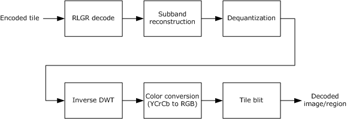

Figure 13: RemoteFX decoding stages

<a id="Section_3.1.8.2.1"></a>
##### 3.1.8.2.1 RLGR Entropy Decoding

The three encoded tile components (Y, Cb, and Cr) are entropy decoded independently. The algorithm used is either inverse RLGR1 or RLGR3, depending on which one was used for encoding. For details of the decoding process, refer to [[ARLGR]](https://go.microsoft.com/fwlink/?LinkId=187365) (the encoding process is described in section [3.1.8.1.7](#Section_3.1.8.1.7.3)).

<a id="Section_3.1.8.2.2"></a>
##### 3.1.8.2.2 Sub-Band Reconstruction

The RLGR entropy decoding stage results in the generation of an array of 4096 coefficients per tile component. The last 64 coefficients (which correspond to the LL3 sub-band) are differentially decoded. After this step, the coefficients are rearranged to form the sub-band structure shown in the figure in section [3.1.8.1.6](#Section_3.1.8.1.6) that describes the sub-band traversal order.

<a id="Section_3.1.8.2.3"></a>
##### 3.1.8.2.3 Dequantization

The [**quantization**](#gt_quantization) factors used for each sub-band are specified in the TS_RFX_TILE (section [2.2.2.3.4.1](#Section_2.2.2.3.4.1)) structure. A scale value is computed from the quantization factor using the formula shown in the figure in section [3.1.8.1.5](#Section_3.1.8.1.5). Each coefficient in the appropriate sub-band is dequantized by multiplying it with this scale value and rounded.

<a id="Section_3.1.8.2.4"></a>
##### 3.1.8.2.4 Inverse DWT

Each tile component undergoes three levels of inverse [**discrete wavelet transformation**](#gt_discrete-wavelet-transform-dwt) (IDWT). The 5/3 lifting equations used for the IDWT are presented in the following figure.

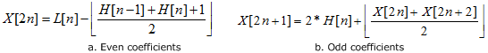

Figure 14: Lifting equations for inverse DWT

This stage results in the decoded Y, Cb, and Cr components for the tile.

<a id="Section_3.1.8.2.5"></a>
##### 3.1.8.2.5 Color Conversion (YCbCr to RGB)

The Y-component is first level shifted up by 128 so that it falls in the [0.0, 255.0] range. The three [**YCbCr**](#gt_ycbcr-color-space) components are then transformed to the RGB color space by using the following transform matrix.

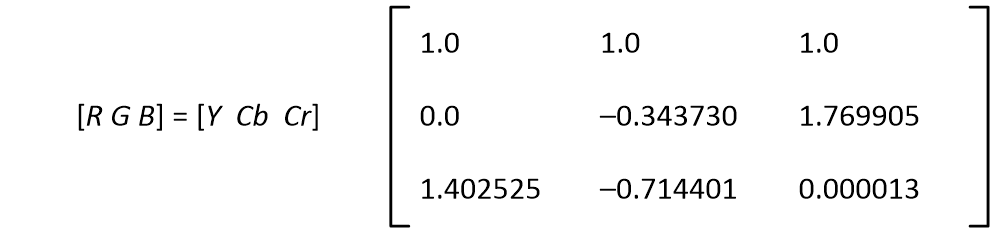

Figure 15: The YCbCr to RGB conversion matrix

<a id="Section_3.1.8.2.6"></a>
##### 3.1.8.2.6 Reconstructed Frame

Each decoded RGB tile is intersected and clipped against the set of rectangles from the **rects** field of the [TS_RFX_REGION (section 2.2.2.3.3)](#Section_2.2.2.3.3) message. This gives a set of clipped rectangles, which are blitted to the appropriate location on the screen. Doing this for all the tiles present in the [TS_RFX_TILESET (section 2.2.2.3.4)](#Section_2.2.2.3.4.1) message will result in the reconstructed frame.

There are two reasons for doing this tile-region intersection. One is that the changed region on the screen, which comprises a set of arbitrary-sized rectangles, is converted to 64x64 tiles (section [3.1.8.1.1](#Section_3.1.8.1.1)) and these tiles can extend beyond the boundary of the rectangles of the change region. The second reason is that the differencing operation (section [3.1.8.1.2](#Section_3.1.8.1.2)) could cull some of these tiles and the decoder will not receive these tiles within the TS_RFX_TILESET message.

<a id="Section_3.1.8.3"></a>
#### 3.1.8.3 RemoteFX Stream

A RemoteFX stream is defined to be the set of all of the codec messages, sent sequentially from an encoder endpoint to a decoder endpoint. There is no message to signify the end of a stream. If the RemoteFX codec is to be used as an image codec, the stream only contains messages pertaining to a single image. If the RemoteFX codec is to be used as a video codec, the stream can contain an arbitrary number of images.

<a id="Section_3.1.8.3.1"></a>
##### 3.1.8.3.1 Encode Message Sequencing

An encoded RemoteFX stream is composed of a sequence of encode messages that are described in section [2.2.2](#Section_2.2.2). The sequence of encode messages is encapsulated inside an Extended Bitmap Data structure ([MS-RDPBCGR](../MS-RDPBCGR/MS-RDPBCGR.md) section 2.2.9.2.1.1), which is encapsulated in a Stream Surface Bits Surface Command ([MS-RDPBCGR] section 2.2.9.2.2).

All encode messages start with a TS_RFX_BLOCKT (section [2.2.2.1.1](#Section_2.2.2.1.1)) structure. When parsing the message blocks, the **blockLen** field of a TS_RFX_BLOCKT MUST be used to obtain the length of the data block. This length MUST NOT be less than the length based on the **blockType** field of the TS_RFX_BLOCKT.

The RemoteFX stream is structured as a set of header messages followed by encoded data messages. The header messages contain global information necessary to decompress the data messages. The header messages are described in section [2.2.2.2](#Section_2.2.2.2), and the data messages are described in section [2.2.2.3](#Section_2). The stream MUST start with the header messages and any of these headers can appear in the stream at a later stage. The header messages can be repeated.

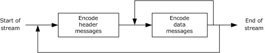

Figure 16: Message sequencing in the RemoteFX stream

The first message in a RemoteFX stream MUST be the TS_RFX_SYNC (section [2.2.2.2.1](#Section_2.2.2.2.1)) message. This message MUST be followed by the TS_RFX_CHANNELS (section [2.2.2.2.3](#Section_2.2.2.2.3)), TS_RFX_CODEC_VERSIONS (section [2.2.2.2.2](#Section_2.2.2.2.2)), and TS_RFX_CONTEXT (section [2.2.2.2.4](#Section_2.2.2.2.4)) messages, as shown in the figure that follows. It is permissible for these three messages to occur in any order. These three messages contain all of the information needed to initialize the decoder.


Figure 17: Generation of RemoteFX encode header messages

The TS_RFX_CHANNELS message MUST contain a single channel, and the frame dimensions of this channel are given by the **width** and **height** fields of the corresponding [TS_RFX_CHANNELT](#Section_2.2.2.1.3) structure (section 2.2.2.1.3). The decoder MUST check the TS_RFX_CODEC_VERSIONS and TS_RFX_CONTEXT messages to determine whether it is compatible with the RemoteFX codec version and the encoding properties listed in these messages. If the decoder cannot support the codec version, the channel frame dimensions, or any of the listed encoding properties, it MUST reject the encoded stream.

The data associated with each encoded frame or image is always bracketed by the TS_RFX_FRAME_BEGIN (section [2.2.2.3.1](#Section_2.2.2.3.1)) and TS_RFX_FRAME_END (section [2.2.2.3.2](#Section_2.2.2.3.2)) messages. The sequence of blocks that comprise a frame are described in the figure that follows. There MUST only be one TS_RFX_REGION (section [2.2.2.3.3](#Section_2.2.2.3.3)) message per frame and one TS_RFX_TILESET (section [2.2.2.3.4](#Section_2.2.2.3.4.1)) message per TS_RFX_REGION. All of the messages corresponding to a frame associated with a given channel MUST occur consecutively within the codec byte-stream. The messages corresponding to frames from two different channels MUST NOT be interleaved.


Figure 18: Generation of RemoteFX encode data messages

<a id="Section_4"></a>
# 4 Protocol Examples

<a id="Section_4.1"></a>
## 4.1 Sample Use Case

Consider the case of a remote endpoint system with one monitor configured to use a display resolution of 1280 x 1024 pixels. In this scenario, there is one instance of the RemoteFX encoder running on the remote system. The encoder is configured to use one channel with frame buffer dimensions of 1280 x 1024. As the contents of the screen are updated over time, the changes are captured, and the affected regions in the frame buffer corresponding to the bounding rectangles of the updated areas are fed as input to the encoder to compress.

The encoder examines the update regions and determines the set of tiles that correspond to those regions. The tile grid is anchored to the frame at (0, 0) and aligned to the tile size. This means that as an update region (for example, a window being dragged) moves around on the screen, the number of tiles corresponding to that update region can vary. In the figure that follows, the regions A and B are the same size (3 x 3) but they correspond to 9 and 16 tiles respectively due to their location on the screen. In the case of border tiles where the update region is not aligned to the tile grid, the area of the tile outside of the actual update region can contain arbitrary data and hence cannot be relied upon to contain valid image data. In the figure that follows, region B is not aligned to the tile grid and hence the perimeter tiles only contain a partial image.

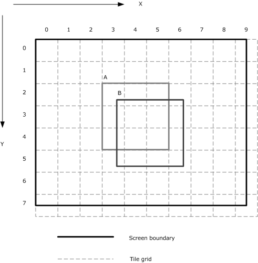

Figure 19: Update region to tile grid mapping

The single monitor configuration results in a TS_RFX_CHANNELS (section [2.2.2.2.3](#Section_2.2.2.2.3)) header message that specifies one channel set to 1280 x 1024. For every frame that is encoded due to region updates, the message sequence that results is described in the encode messages diagram in section [3.1.8.3.1](#Section_3.1.8.3.1). The TS_RFX_REGION (section [2.2.2.3.3](#Section_2.2.2.3.3)) message contains the list of updated rectangles, and the accompanying TS_RFX_TILESET (section [2.2.2.3.4](#Section_2.2.2.3.4.1)) message contains the corresponding set of tiles. The TS_RFX_TILE (section [2.2.2.3.4.1](#Section_2.2.2.3.4.1)) structure contains the location of the tile in the frame. Conceptually, the decoder can decode each tile, [**blit**](#gt_blit) it to the proper location in a temporary frame buffer, and then blit all of the updated rectangles to an output frame buffer.

<a id="Section_4.2"></a>
## 4.2 Annotated RemoteFX Messages

<a id="Section_4.2.1"></a>
### 4.2.1 Capabilities Messages

The following is an annotated network capture of the [TS_RFX_CLNT_CAPS_CONTAINER](#Section_2.2.1.1) message (section 2.2.1.1).

00000000 31 00 00 00 01 00 00 00 25 00 00 00 c0 cb 08 00

00000010 00 00 01 00 c1 cb 1d 00 00 00 01 c0 cf 02 00 08

00000020 00 00 01 40 00 00 01 01 01 00 01 40 00 00 01 01

00000030 04

[TS_RFX_CAPS](#Section_2.2.1.1.1) message (section 2.2.1.1.1):

c0 cb –> TS_RFX_CAPS::blockType = CBY_CAPS

08 00 00 00 –> TS_RFX_CAPS::blockLen = 8

01 00 –> TS_RFX_CAPS::numCapsets = 1

[TS_RFX_CAPSET](#Section_2.2.1.1.1.1) message (section 2.2.1.1.1.1):

c1 cb –> TS_RFX_CAPS::TS_RFX_CAPSET[0]::blockType = CBY_CAPSET

1d 00 00 00 –> TS_RFX_CAPS::TS_RFX_CAPSET[0]::blockLen = 29

01 –> TS_RFX_CAPS::TS_RFX_CAPSET[0]::codecId = 1

C0 cf –> TS_RFX_CAPS::TS_RFX_CAPSET[0]::capsetType = CLY_CAPSET

02 00 –> TS_RFX_CAPS::TS_RFX_CAPSET[0]::numIcaps = 2

08 00 –> TS_RFX_CAPS::TS_RFX_CAPSET[0]::icapLen = 8

[TS_RFX_ICAP](#Section_2.2.1.1.1.1.1) message (section 2.2.1.1.1.1.1):

00 01 –> TS_RFX_CAPS::TS_RFX_CAPSET[0]::TS_RFX_ICAP[0]::version = CLW_VERSION_1_0

40 00 -> TS_RFX_CAPS::TS_RFX_CAPSET[0]::TS_RFX_ICAP[0]::tileSize = 64

00 -> TS_RFX_CAPS::TS_RFX_CAPSET[0]::TS_RFX_ICAP[0]::flags = VIDEO_MODE (0)

01 -> TS_RFX_CAPS::TS_RFX_CAPSET[0]::TS_RFX_ICAP[0]::colConvBits = CLW_COL_CONV_ICT

01 -> TS_RFX_CAPS::TS_RFX_CAPSET[0]::TS_RFX_ICAP[0]::transformBits = CLW_XFORM_DWT_53_A

01 -> TS_RFX_CAPS::TS_RFX_CAPSET[0]::TS_RFX_ICAP[0]::entropyBits = CLW_ENTROPY_RLGR1

00 01 -> TS_RFX_CAPS::TS_RFX_CAPSET[0]::TS_RFX_ICAP[1]::version = CLW_VERSION_1_0

40 00 -> TS_RFX_CAPS::TS_RFX_CAPSET[0]::TS_RFX_ICAP[1]::tileSize = 64

00 -> TS_RFX_CAPS::TS_RFX_CAPSET[0]::TS_RFX_ICAP[1]::flags = VIDEO_MODE (0)

01 -> TS_RFX_CAPS::TS_RFX_CAPSET[0]::TS_RFX_ICAP[1]::colConvBits = CLW_COL_CONV_ICT

01 -> TS_RFX_CAPS::TS_RFX_CAPSET[0]::TS_RFX_ICAP[1]::transformBits = CLW_XFORM_DWT_53_A

04 -> TS_RFX_CAPS::TS_RFX_CAPSET[0]::TS_RFX_ICAP[1]::entropyBits = CLW_ENTROPY_RLGR3

The client has specified support for both RLGR1 and RLGR3, by including two TS_RFX_ICAP elements. The server can pick either of the two and use the corresponding encoding properties, as described in section [3.1.5.1](#Section_3.1.5.1).

The following is an annotated dump of the [TS_RFX_SRVR_CAPS_CONTAINER](#Section_2.2.1.2) message (section 2.2.1.2).

00000000 00 00 00 00 00 00 00 00 00 00 00 00 00 00 00 00

00000010 00 00 00 00 00 00 00 00 00 00 00 00 00 00 00 00

00000020 00 00 00 00 00 00 00 00 00 00 00 00 00 00 00 00

00000030 00 00 00 00 00 00 00 00 00 00 00 00 00 00 00 00

The server has sent an array of bytes set to zero as described in section 2.2.1.2.

<a id="Section_4.2.2"></a>
### 4.2.2 Encode Header Messages

The following is an annotated network capture of the [Encode Header Messages (section 2.2.2.2)](#Section_2.2.2.2).

00000000 c0 cc 0c 00 00 00 ca ac cc ca 00 01 c3 cc 0d 00

00000010 00 00 01 ff 00 40 00 28 a8 c1 cc 0a 00 00 00 01

00000020 01 00 01 c2 cc 0c 00 00 00 01 00 40 00 40 00

[TS_RFX_SYNC](#Section_2.2.2.2.1) message (section 2.2.2.2.1):

c0 cc –> TS_RFX_SYNC::BlockT::blockType = WBT_SYNC

0c 00 00 00 –> TS_RFX_SYNC::BlockT::blockLen = 12

ca ac cc ca –> TS_RFX_SYNC::magic = WF_MAGIC

00 01 –> TS_RFX_SYNC::version = 0x0100

[TS_RFX_CONTEXT](#Section_2.2.2.2.4) message (section 2.2.2.2.4):

c3 cc –> TS_RFX_CONTEXT::CodecChannelT::BlockT::blockType = WBT_CONTEXT

0d 00 00 00 –> TS_RFX_CONTEXT::CodecChannelT::BlockT::blockLen = 13

01 –> TS_RFX_CONTEXT::CodecChannelT::codecId = 1

ff –> TS_RFX_CONTEXT::CodecChannelT::channelId = 255

00 –> TS_RFX_CONTEXT::ctxId = 0

40 00 –> TS_RFX_CONTEXT::tileSize = 64

28 a8 –> TS_RFX_CONTEXT::properties

TS_RFX_CONTEXT::properties::flags = VIDEO_MODE (0)

TS_RFX_CONTEXT::properties::cct = COL_CONV_ICT (1)

TS_RFX_CONTEXT::properties::xft = CLW_XFORM_DWT_53_A (1)

TS_RFX_CONTEXT::properties::et = CLW_ENTROPY_RLGR3 (4)

TS_RFX_CONTEXT::properties::qt = SCALAR_QUANTIZATION (1)

TS_RFX_CONTEXT::properties::r = RESERVED

[TS_RFX_CODEC_VERSIONS](#Section_2.2.2.2.2) message (section 2.2.2.2.2):

c1 cc –> TS_RFX_CODEC_VERSIONS::BlockT::blockType = WBT_CODEC_VERSION

0a 00 00 00 –> TS_RFX_CODEC_VERSIONS::BlockT::blockLen = 10

01 -> TS_RFX_CODEC_VERSIONS::numCodecs = 1

01 –> TS_RFX_CODEC_VERSIONS::TS_RFX_CODEC_VERSIONT::codecId = 1

00 01 –> TS_RFX_CODEC_VERSIONS::TS_RFX_CODEC_VERSIONT::version 0x0100

[TS_RFX_CHANNELS](#Section_2.2.2.2.3) message (section 2.2.2.2.3):

c2 cc –> TS_RFX_CHANNELS::BLockT::blockType = WBT_CHANNELS

0c 00 00 00 –> TS_RFX_CHANNELS::BlockT::blockLen = 12

01 -> TS_RFX_CHANNELS::numChannels = 1

00 –> TS_RFX_CHANNELS::TS_RFX_CHANNELT::channelId = 0

40 00 –> TS_RFX_CHANNELS::TS_RFX_CHANNELT::width = 64

40 00 –> TS_RFX_CHANNELS::TS_RFX_CHANNELT::height = 64

The server has chosen to encode using RLGR3 (TS_RFX_CONTEXT) and specified one channel with dimensions of 64x64 (TS_RFX_CHANNELS).

<a id="Section_4.2.3"></a>
### 4.2.3 Encode Data Messages

The following is an annotated network capture of the [Encode Data Messages (section 2.2.2.3)](#Section_2).

00000000 c4 cc 0e 00 00 00 01 00 00 00 00 00 01 00 c6 cc

00000010 17 00 00 00 01 00 cd 01 00 00 00 00 00 40 00 40

00000020 00 c1 ca 01 00 c7 cc d9 03 00 00 01 00 c2 ca 00

00000030 00 51 50 01 40 01 00 be 03 00 00 66 66 77 88 98

00000040 c3 ca be 03 00 00 00 00 00 00 00 00 00 26 01 3d

00000050 01 48 01 19 82 1d 10 62 9d 28 85 2c a2 14 b2 88

00000060 52 ca 21 4b 28 85 2c a2 14 b2 88 52 ca 21 4b 28

00000070 85 2c a2 14 b2 88 52 ca 21 4b 28 85 2c a2 14 b2

00000080 88 52 ca 21 4b 28 85 2c a2 14 b2 88 52 ca 21 4b

00000090 28 85 2c a2 14 b2 88 52 ca 21 4b 28 85 2c a2 14

000000A0 b2 88 52 ca 21 4b 28 85 2c a2 14 b0 00 20 f4 40

000000B0 0c c1 1e 20 26 22 20 33 23 c4 23 88 86 50 f1 22

000000C0 68 4c 91 85 10 34 4c 84 78 a2 0d 13 21 1e 29 06

000000D0 89 90 8f 14 83 44 f4 23 c5 20 d1 3d 08 f1 48 34

000000E0 4f 42 3c 52 0d 13 d0 8f 14 83 44 f4 23 c5 20 d1

000000F0 3d 08 f1 48 34 4f 42 3c 52 0d 13 d0 8f 14 83 44

00000100 f4 23 c5 20 00 08 47 70 15 02 e0 7f e4 9d c2 51

00000110 71 f4 99 c9 57 ff 32 87 9d 17 d6 50 6e 06 2f ac

00000120 a0 9c 0c 5f 59 41 38 18 be b2 82 70 31 7d 65 00

00000130 00 10 ff 9c 33 41 f1 c4 b0 3c ff a2 15 bd 7b ea

00000140 86 9b 5f fc 78 8c f5 ed a8 68 da fd 3c 45 7a f4

00000150 d4 34 6d 7e 9e 22 bd 7a 6a 1a 36 bf 4f 11 5e bd

00000160 35 0d 1b 5f a7 88 af 5e 9a 86 8d af d3 c4 57 af

00000170 4d 43 46 d7 e9 e2 20 30 00 1b 04 7f 04 31 5f c2

00000180 94 af 05 29 5e 0a 52 bc 14 a5 78 29 25 78 29 25

00000190 78 29 25 68 52 4a f0 52 4a f0 52 4a d0 a4 95 e0

000001A0 a4 95 e0 a4 95 a1 49 2b c1 49 2b c1 49 2b 42 92

000001B0 57 82 92 57 82 92 56 85 24 af 05 24 af 05 24 ad

000001C0 0a 49 5e 0a 49 5e 0a 49 5a 14 92 bc 14 92 bc 14

000001D0 92 b4 29 25 78 29 25 78 00 02 0f 02 00 ac 13 fc

000001E0 c0 0a 20 10 2b 27 f9 80 b0 08 aa 3d 60 8c 0b 24

000001F0 ff 30 80 c0 aa 13 fc c2 03 05 90 9f e6 10 18 2c

00000200 84 ff 30 81 82 c8 4f f3 08 18 2c 84 ff 31 03 05

00000210 90 9f ff d8 40 60 59 09 fe 61 01 81 64 27 f9 84

00000220 06 0b 21 3f cc 20 30 59 09 fe 61 03 05 90 9f e6

00000230 10 30 59 09 fe 62 00 00 42 15 00 10 15 01 fe 20

00000240 84 d5 01 0a 8f f1 40 33 78 17 f9 c2 03 83 01 78

00000250 e1 01 c1 00 bc 70 80 e0 80 5e 38 40 70 40 2f 1c

00000260 20 38 20 17 8e 10 00 00 87 d5 08 70 ef 81 a2 d8

00000270 ff ff ff fb d1 2d 4e a6 ce 20 a4 ef 05 78 35 3a

00000280 9b 38 82 93 bc 15 e0 d4 ea 66 71 05 27 78 2b c1

00000290 29 d4 cc e2 0a 4e f0 57 82 53 a9 99 c4 14 9d e0

000002A0 af 04 a7 53 33 88 29 3b c1 5e 09 4e a6 67 10 52

000002B0 77 82 bc 00 18 00 1b fc 11 c1 0f 4a c1 4f 4a c1

000002C0 4f 4a a1 4d 95 42 9e 95 42 9e 95 42 9b 2a 85 3d

000002D0 2a 85 3d 2a 85 36 55 0a 7a 55 0a 7a 55 0a 6c aa

000002E0 14 f4 aa 14 f4 aa 14 d9 54 29 e9 54 29 e9 54 29

000002F0 b2 a8 53 d2 a8 53 d2 a8 53 65 50 a7 a5 50 a7 a5

00000300 50 a6 ca a1 4f 4a a1 4f 4a a1 4d 95 42 9e 95 42

00000310 9e 95 42 9b 2a 80 00 41 e3 80 3f e2 09 9c 00 22

00000320 07 03 e1 26 70 06 07 1f 04 67 00 61 df 02 67 00

00000330 0c 3b fe 01 33 80 06 1d ff 00 99 c0 03 0e ff 80

00000340 4c e0 01 87 7f c0 26 70 00 c3 bf e0 13 38 00 61

00000350 df f0 09 9c 00 30 ef f8 04 ce 00 18 77 fc 02 67

00000360 00 0c 3b fe 01 33 80 06 1d ff 00 99 c0 03 0e ff

00000370 80 4c e0 01 87 7f c0 26 70 00 00 08 3c 20 1f f1

00000380 00 f0 05 02 93 84 3d 20 f0 52 81 c7 ff ff ea 54

00000390 01 80 05 f5 4a 80 30 00 b6 a5 40 18 00 5f 54 a8

000003A0 03 00 0b ea 95 00 60 01 6d 4a 80 30 00 00 22 3f

000003B0 ba 08 10 2b 1f f2 20 3e 49 9c 1f 6e 0f 5a 0f fb

000003C0 18 46 ae 27 9b 83 cb 41 f3 18 46 ae 27 9b 83 c5

000003D0 a0 f9 8c 22 d7 13 8d c1 e2 d0 7c c6 11 6b 89 c6

000003E0 e0 f1 68 3e 63 08 b5 c4 e3 70 78 b4 1f 31 84 5a

000003F0 e2 71 b8 3c 5a 0f 98 c2 2d 71 30 83 c0 00 c5 cc

00000400 08 00 00 00 01 00

[TS_RFX_FRAME_BEGIN](#Section_2.2.2.3.1) message (section 2.2.2.3.1):

c4 cc –> TS_RFX_FRAME_BEGIN::CodecChannelT::blockType = WBT_FRAME_BEGIN

0e 00 00 00 –> TS_RFX_FRAME_BEGIN::CodecChannelT::blockLen = 14

01 –> TS_RFX_FRAME_BEGIN::CodecChannelT::codecId = 1

00 –> TS_RFX_FRAME_BEGIN::CodecChannelT::channelId = 0

00 00 00 00 –> TS_RFX_FRAME_BEGIN::frameIdx = 0

01 00 –> TS_RFX_FRAME_BEGIN::numRegions = 1

[TS_RFX_REGION](#Section_2.2.2.3.3) message (section 2.2.2.3.3):

c6 cc –> TS_RFX_REGION::CodecChannelT::blockType = WBT_REGION

17 00 00 00 –> TS_RFX_REGION::CodecChannelT::blockLen = 23

01 –> TS_RFX_REGION::CodecChannelT::codecId = 1

00 –> TS_RFX_REGION::CodecChannelT::channelId = 0

0d –> TS_RFX_REGION::regionFlags

TS_RFX_REGION::regionFlags::lrf = 1

01 00 –> TS_RFX_REGION::numRects = 1

00 00 –> TS_RFX_REGION::TS_RFX_RECT::x = 0

00 00 –> TS_RFX_REGION::TS_RFX_RECT::y = 0

40 00 –> TS_RFX_REGION::TS_RFX_RECT::width = 64

40 00 –> TS_RFX_REGION::TS_RFX_RECT::height = 64

c1 ca –> TS_RFX_REGION::regionType = CBT_REGION

01 00 –> TS_RFX_REGION::numTilesets = 1

[TS_RFX_TILESET](#Section_2.2.2.3.4.1) message (section 2.2.2.3.4):

c7 cc -> TS_RFX_TILESET::CodecChannelT::blockType = WBT_EXTENSION

d9 03 00 00 -> TS_RFX_TILESET::CodecChannelT::blockLen = 985

01 -> TS_RFX_TILESET::codecId = 1

00 -> TS_RFX_TILESET::channelId = 0

c2 ca -> TS_RFX_TILESET::subtype = CBT_TILESET

00 00 -> TS_RFX_TILESET::idx = 0x00

51 50 -> TS_RFX_TILESET::properties

TS_RFX_TILESET::properties::lt = TRUE (1)

TS_RFX_TILESET::properties::flags = VIDEO_MODE (0)

TS_RFX_TILESET::properties::cct = COL_CONV_ICT (1)

TS_RFX_TILESET::properties::xft = CLW_XFORM_DWT_53_A (1)

TS_RFX_TILESET::properties::et = CLW_ENTROPY_RLGR3 (4)

TS_RFX_TILESET::properties::qt = SCALAR_QUANTIZATION (1)

01 -> TS_RFX_TILESET::numQuant = 1

40 -> TS_RFX_TILESET::tileSize = 64

01 00 -> TS_RFX_TILESET::numTiles = 1

df 03 00 00 -> TS_RFX_TILESET::tilesDataSize = 991

66 66 77 88 98 -> TS_RFX_TILESET::quantVals

TS_RFX_TILESET::quantVals::LL3 = 6

TS_RFX_TILESET::quantVals::LH3 = 6

TS_RFX_TILESET::quantVals::HL3 = 6

TS_RFX_TILESET::quantVals::HH3 = 6

TS_RFX_TILESET::quantVals::LH2 = 7

TS_RFX_TILESET::quantVals::HL2 = 7

TS_RFX_TILESET::quantVals::HH2 = 8

TS_RFX_TILESET::quantVals::LH1 = 8

TS_RFX_TILESET::quantVals::HL1 = 8

TS_RFX_TILESET::quantVals::HH1 = 9

[TS_RFX_TILE](#Section_2.2.2.3.4.1) message (section 2.2.2.3.4.1):

c3 ca -> TS_RFX_TILE::BlockT::blockType = CBT_TILE

be 03 -> TS_RFX_TILE::BlockT::blockLen = 958

00 -> TS_RFX_TILE::quantIdxY = 0

00 -> TS_RFX_TILE::quantIdxCb = 0

00 -> TS_RFX_TILE::quantIdxCr = 0

00 00 -> TS_RFX_TILE::xIdx = 0

00 00 -> TS_RFX_TILE::yIdx = 0

26 01 -> TS_RFX_TILE::YLen = 294

3d 01 -> TS_RFX_TILE::CbLen = 317

48 01 -> TS_RFX_TILE::CrLen = 328

00000053:00000178 -> TS_RFX_TILE::YData

00000179:000002b5 -> TS_RFX_TILE::CbData

000002b6:000003fd -> TS_RFX_TILE::CrData

[TS_RFX_FRAME_END](#Section_2.2.2.3.2) message (section 2.2.2.3.2):

c5 cc –> TS_RFX_FRAME_END::CodecChannelT::blockType = WBT_FRAME_END

08 00 00 00 –> TS_FRAME_END::CodecChannelT::blockLen = 14

01 –> TS_FRAME_END::CodecChannelT::codecId = 1

00 –> TS_FRAME_END::CodecChannelT::channelId = 0

The server has sent a frame that is delineated by TS_RFX_FRAME_BEGIN and TS_RFX_FRAME_END messages. The frame contains a single region, which has a single tileset. This tileset, in turn, consists of one 64x64 tile. The compressed sizes, in bytes, for the [**YCbCr**](#gt_ycbcr-color-space) components of this tile are (294, 317, 328).

<a id="Section_4.2.4"></a>
### 4.2.4 Sample Decode Data Flow Sequence

The following sections present a sequence of annotated dumps of an encoded tile as it goes through the steps of the decoding algorithm. The sequence starts with the [TS_RFX_TILESET (section 2.2.2.3.4)](#Section_2.2.2.3.4) message, which contains the encoded tile data, and ends with the resulting decoded 64x64 XRGB image.

<a id="Section_4.2.4.1"></a>
#### 4.2.4.1 Input TS_RFX_TILESET Message

The following is an annotated dump of a TS_RFX_TILESET (section [2.2.2.3.4](#Section_2.2.2.3.4)) message containing a single encoded 64x64 tile.

00000000 c7 cc 3e 0b 00 00 01 00 c2 ca 00 00 51 50 01 40

00000010 01 00 23 0b 00 00 66 66 77 88 98 c3 ca 23 0b 00

00000020 00 00 00 00 00 00 00 00 ae 03 cf 03 93 03 c0 01

00000030 01 15 48 99 c7 41 a1 12 68 11 dc 22 29 74 ef fd

00000040 20 92 e0 4e a8 69 3b fd 41 83 bf 28 53 0c 1f e2

00000050 54 0c 77 7c a3 05 7c 30 d0 9c e8 09 39 1a 5d ff

00000060 e2 01 22 13 80 90 87 d2 9f fd fd 50 09 0d 24 a0

00000070 8f ab fe 3c 04 84 c6 9c de f8 80 c3 22 50 af 4c

00000080 2a 7f fe e0 5c a9 52 8a 06 7d 3d 09 03 65 a3 af

00000090 d2 61 1f 72 04 50 8d 3e 16 4a 3f ff fd 41 42 87

000000A0 24 37 06 17 2e 56 05 9c 1c b3 84 6a ff fb 43 8b

000000B0 a3 7a 32 43 28 e1 1f 50 54 fc ca a5 df ff 08 04

000000C0 48 15 61 d9 76 43 f8 2a 07 e9 65 f7 c6 89 2d 40

000000D0 a1 c3 35 8d f5 ed f5 91 ae 2f cc 01 ce 03 48 c0

000000E0 8d 63 f4 fd 50 20 2d 0c 9b b0 8d 13 c0 8a 09 52

000000F0 1b 02 6e 42 3b d0 13 4e 84 01 26 88 6a 04 84 34

00000100 2a a5 00 ba 54 48 58 ea 54 02 b4 1d a7 fa 47 82

00000110 ec 7a 77 fd 00 92 66 62 04 a6 9b ff f6 80 c0 69

00000120 01 c2 3e 90 14 20 2f fc 40 96 59 58 0c b1 13 68

00000130 20 2e b5 f5 df ff f8 fc 56 88 60 24 53 b5 41 46

00000140 5f f8 f1 7e de 4a 08 97 e0 55 03 8f e5 75 61 03

00000150 f2 e1 90 01 a2 8e 88 04 98 05 93 6b ff ea c0 60

00000160 a1 88 04 49 bf f7 ff 8c b4 59 90 80 30 64 53 ff

00000170 f5 c4 48 da da cb 80 38 61 57 b2 af 00 e8 7b 46

00000180 e6 d8 02 03 8a 06 18 14 32 83 d0 8a ee bc 81 b4

00000190 28 c4 7f f9 a1 69 00 91 c5 51 ff fe 3f e9 f1 70

000001A0 30 24 10 a7 cb 1f 8a 24 93 ed 83 00 36 20 d1 50

000001B0 e7 d8 ad 58 20 09 22 80 d0 ca 5d 1a d7 f1 60 75

000001C0 2a f2 d7 f8 c0 32 45 86 00 43 01 fe 80 f7 42 81

000001D0 74 84 4c a1 60 4c cb 14 58 01 4d 18 a1 aa 47 0e

000001E0 11 1a 40 7d 41 02 e3 30 cd 33 81 34 06 46 83 a2

000001F0 47 1c 04 aa 20 12 a2 8b 81 c4 9c a0 2e 06 32 f8

00000200 86 85 01 e8 70 f9 46 09 6a bf e0 f5 a4 c8 78 e7

00000210 d2 97 0b bc 3c 97 ff d5 40 94 b2 c1 18 18 11 1f

00000220 43 c1 18 c3 83 7f 9a 31 c4 8e 70 56 da f6 17 de

00000230 d1 02 0d 42 21 13 dc 3a 3c 40 9e f4 01 43 ea 0c

00000240 46 73 a2 7b 0c 80 ff e4 ad 2e 09 b4 63 b0 8c 54

00000250 59 fa ac 76 36 10 05 f0 98 88 83 42 00 20 71 cc

00000260 c1 a9 97 3e 5a 0d 04 50 92 23 20 0d 0a 1c 57 d7

00000270 ff 10 f2 03 0f 58 1b a5 11 f8 f1 b4 12 db 1a 48

00000280 56 1f e3 c7 50 e9 16 b4 bc b0 40 93 ea b5 5b 2f

00000290 fc 50 0a 6f cc 25 e0 06 ab 5f 24 fe 8b cb 42 43

000002A0 7e 69 02 25 c7 38 00 6e e5 80 a8 a4 30 44 15 8f

000002B0 e9 0c d3 a6 c2 14 34 4a fe 03 7f 06 a5 91 02 54

000002C0 f1 a1 a1 53 bf 11 f2 8f 83 67 80 09 08 12 3f fd

000002D0 44 91 c2 83 30 50 07 02 82 4d 31 34 06 41 79 6f

000002E0 f0 cc 03 79 00 2c 05 24 ec 8d 29 15 af 44 c8 eb

000002F0 4f e1 fd f1 41 48 81 08 af fe 51 48 ce e7 f9 b6

00000300 0a 30 83 11 f0 0c 3b d2 a6 24 24 ef 25 fa 5a 3e

00000310 92 3e 79 0e 35 61 c8 aa 1c 2e 9a 27 7f ff f0 7d

00000320 30 5b bc 91 ff fe 43 24 28 66 a7 70 99 28 6e 2b

00000330 18 2b d4 a1 77 3b 96 9f f7 eb be 1f 04 34 75 84

00000340 31 42 4c 65 aa 09 50 a0 c4 51 31 d3 26 3a 1b f4

00000350 6e 4a 4e 17 25 84 78 7d 2c 3f 46 18 ca 5f f9 e5

00000360 38 2f d8 71 94 94 e2 cc a3 15 b0 da a9 cb 58 e4

00000370 18 77 93 8a 51 c6 23 c4 4e 6d d9 14 1e 9b 8d bc

00000380 cb 9d c4 18 05 f5 a9 29 f8 6d 29 38 c7 44 e5 3a

00000390 cd ba 61 98 4a 57 02 96 42 02 d9 37 11 de 2d d4

000003A0 3f fe 61 e7 33 d7 89 4a dd b0 34 47 f4 dc ad aa

000003B0 c9 9d 7e 6d 4b cc dc 17 89 57 fd bb 37 75 47 5a

000003C0 ec 2c 6e 3c 15 92 54 64 2c ab 9e ab 2b dd 3c 66

000003D0 a0 8f 47 5e 93 1a 37 16 f4 89 23 00 00 b0 33 56

000003E0 fa 14 1e ff 48 7a 7e 0f 10 1f f4 91 c8 10 56 84

000003F0 ff 08 ec b4 ac 0e 0f ff ad c5 e0 1a 2f 82 04 9f

00000400 91 c2 0e fe 48 36 79 01 42 14 ff fe 30 f0 08 18

00000410 f1 81 45 9a 60 c1 79 f0 14 12 10 ce ea 31 5a ff

00000420 fc 20 13 82 2f c9 02 1f 81 cb 00 e1 10 d2 b4 be

00000430 87 ff b0 1e 27 81 b7 04 06 3c c2 04 f6 06 0e 28

00000440 bc 40 bf 12 1e 86 d4 6a 7f 18 1b 96 85 4c 16 80

00000450 df 2c a5 8d 86 a3 4a 8a b4 1b a1 38 a9 d5 ff ff

00000460 ea 06 20 d2 95 1e f4 2f b2 12 0e 61 78 4a 17 52

00000470 5d e4 25 1f fe c0 b3 1f ff ff ec 02 82 80 90 41

00000480 88 de 48 2c 42 52 0b 2f 43 7e 50 78 f2 67 78 41

00000490 34 3d c8 0f 67 a1 eb 21 fe c0 1f 22 60 41 6c 00

000004A0 92 4b 60 10 d0 0d 01 35 05 0e 87 a2 a0 5d 1f a3

000004B0 af 7f f1 be 8f cd a5 00 1c 10 40 15 76 81 05 ef

000004C0 ee 00 60 84 00 99 40 4a 82 17 e9 fc c4 7f ff fd

000004D0 04 80 06 06 dc af a7 7e 94 75 74 01 00 e0 91 00

000004E0 85 7f 8e d6 0b 20 21 30 ca 62 8e 07 04 e9 45 40

000004F0 5f 47 4a 30 15 41 cb df ff fc bf c3 b4 46 6a 01

00000500 40 d0 a7 34 18 24 1c 2a 45 fe a8 05 08 61 fd a8

00000510 80 71 01 25 9c c1 47 17 37 02 7a 15 ff f3 01 45

00000520 7f d6 80 60 83 67 f8 9d 2f f4 dd 8c 30 01 51 42

00000530 bc 43 7a 6b 9f 84 1e 00 48 c1 e0 b7 e0 7e 99 f2

00000540 4a e9 40 02 81 c3 00 24 3a c5 52 0f 91 c8 68 25

00000550 40 99 a4 25 1a 04 d0 a2 91 dd eb 93 00 21 49 24

00000560 8b 40 75 38 14 a1 fd 3f 88 25 bf 32 00 e3 19 fc

00000570 b9 f8 6f 81 c0 01 b3 93 20 09 08 25 84 e1 34 d4

00000580 1b 48 88 11 a0 15 59 d7 07 81 81 3b a1 40 2e 2f

00000590 48 70 09 c4 76 49 0f 2e 50 2e 46 19 a4 16 a2 1b

000005A0 84 a2 89 58 fc 4f 3f 40 90 4c a3 01 32 09 02 80

000005B0 9c 91 13 2c ba de 5d 99 f2 ff ff 3d 5a 1f a9 02

000005C0 90 8f f3 08 bd 01 f8 d0 2a 95 41 0c 40 0a 20 c4

000005D0 d4 cc 6b 0f f0 80 b1 5d 28 3d 08 c2 f8 31 02 49

000005E0 88 14 28 ed e8 86 3b 00 9f 95 06 37 15 a4 59 c8

000005F0 80 b6 10 f0 e5 b8 18 00 56 1c ff 95 21 0e 7f 2b

00000600 c5 08 59 10 e1 46 31 8d ec e0 a1 99 bb 21 ff fe

00000610 30 10 d0 05 e3 08 50 fc f3 0e 00 8d 68 8e 07 a6

00000620 80 34 42 ed 1f 88 00 f0 8a 21 ae f7 fb 80 28 86

00000630 0f ff ff 82 ea 47 95 91 e0 04 01 44 0c 29 ff 0e

00000640 33 e8 c0 54 04 23 fc 81 5b f0 3c 07 10 70 30 d8

00000650 21 6f ef de 46 09 43 fa 5f ff 0d 72 30 dd 00 db

00000660 e4 48 24 97 08 46 b1 49 c4 4d 80 12 60 ff a4 a6

00000670 ff f6 8c 00 40 05 02 b4 0f f0 3e fc 84 38 81 94

00000680 8b fe 49 ef c0 10 49 88 28 a2 1c 2a 8b 64 d4 86

00000690 d7 ff ff ff eb 91 6b 11 10 00 69 4c bf b4 1c d8

000006A0 00 07 16 80 60 0a 1c 82 42 27 82 43 c9 0a 64 20

000006B0 5a 5f 4e bf 8c 38 82 36 02 07 72 79 07 23 b4 bb

000006C0 57 5f e8 04 dd 39 e9 07 95 be 04 2b dd 8e 22 dc

000006D0 14 2c 61 a3 a9 cd 4f 82 5d a0 44 df f4 96 ff f5

000006E0 2b ff fe 01 19 d2 a2 9e 43 a5 7f f0 4c 4c 2b 3c

000006F0 33 e2 55 ff 04 06 29 2c 0d 22 5d 7c 93 ba 18 af

00000700 f9 32 a6 c3 99 46 79 e3 06 a6 38 8b 92 22 4b db

00000710 1b 36 20 b0 6c 20 ce 37 42 e1 66 d4 49 34 42 8b

00000720 fa 9c 12 99 dc 06 87 fa 46 f8 2f 04 a9 d8 82 07

00000730 a6 30 0f c0 df 35 e8 90 f0 ff ff a8 e0 d7 02 60

00000740 1a c3 20 28 a2 31 29 3c eb 04 a5 dd 48 0e 82 a4

00000750 b6 56 22 06 57 e0 da 10 27 31 0e 11 77 fe 02 60

00000760 16 48 81 8c 0d 05 17 7f cb bb 7e 25 2a 41 fd 8a

00000770 7f c9 36 7c e0 98 7e 92 ef 7e 06 03 13 3e 20 3a

00000780 bf 4c c3 0f 2e 80 74 bf 39 3c f0 a6 b2 e9 3f 41

00000790 55 1f 2c f5 d2 7e 8c ae 4e aa 61 3c bc 3f c4 c7

000007A0 36 dc 23 c8 b8 52 e2 8a 80 18 00 00 b2 46 a2 56

000007B0 0d 12 94 aa bd 01 07 ff fa 34 0c 5f f8 0c 12 50

000007C0 af d6 d1 89 40 a4 ff e0 ce c4 49 25 9d c1 ff 7e

000007D0 60 24 5d cc 10 c0 be 5a 12 d3 c3 fe 2d 40 7c 28

000007E0 9e 71 01 d2 6e 86 0b c8 f2 9b 45 08 4c 04 52 7e

000007F0 f2 7e d9 cc 0b 1c 20 80 ae af fe b0 6d 23 f2 41

00000800 e3 2e 20 11 4b 74 89 dd ff a8 38 a3 95 82 15 f0

00000810 d0 d5 f1 92 8e ee c0 26 81 e9 47 ff ee 0d 20 34

00000820 31 3a ef 40 b2 29 47 19 7f 04 27 f1 90 85 09 86

00000830 7d 42 e2 54 5d 5f e8 0e d0 2c aa 16 bf 04 a7 f8

00000840 a2 46 0b 08 7a 79 e9 28 62 7c 33 f4 0b 14 82 fa

00000850 61 eb c1 ff 4c a4 11 7f 03 68 44 c1 1f 81 3a 6c

00000860 77 95 02 2b 53 80 e5 10 1e 90 e8 fd 1f a6 40 0b

00000870 13 ff 4e 4d 7f 52 e8 af 9a c1 80 0f 0a 14 02 3c

00000880 c0 09 13 e7 dc c0 1a 28 a0 e4 83 8e 03 88 d5 af

00000890 1a bd 91 00 b7 4e ba df f8 db cc 02 43 c4 14 2a

000008A0 3f c8 0d 09 1c 44 f4 01 3c ca 28 56 80 a6 85 00

000008B0 ea 3e 8f eb 9f fc 6e 07 c4 e0 30 78 a0 1e 6f 54

000008C0 78 51 ff 56 4a 01 47 02 4c 21 3b fb 90 0a cc 1d

000008D0 d2 47 ff fc 70 18 22 c0 b9 2f e9 7f 91 d3 66 2f

000008E0 80 2c 24 a7 fa 84 51 ab 6b 72 00 ab 33 04 cf 43

000008F0 ff 17 51 84 0c 01 50 10 8f 90 34 41 44 84 8e 08

00000900 19 04 48 50 84 38 3d 02 52 f9 7c d2 d0 1f 13 42

00000910 a0 21 41 c4 02 02 3d 09 c8 fd 60 7d 35 4f 7f ff

00000920 f9 97 6a d8 00 c3 83 00 09 50 4b 90 8a c7 94 4d

00000930 47 c1 62 32 28 24 09 52 2e 2e 1c 96 44 a0 09 c8

00000940 ce 64 a9 1c 19 0e 52 3e 3e 19 93 a0 36 26 22 08

00000950 9a 00 dd 66 3a 93 d5 89 d1 40 06 d4 a8 22 73 7b

00000960 3d 3f e3 04 94 ff ff ff ff 0c 56 77 ac e0 c4 06

00000970 1f b8 a5 80 fd 68 1c 32 16 03 de 71 2a 3d 14 19

00000980 be c2 88 d9 24 92 5f c5 90 0a 85 c2 3f 87 03 a8

00000990 26 17 c4 06 86 12 87 76 0a 48 16 ed 96 93 ec 1b

000009A0 30 73 e8 1a 3f ff 4d ce 40 f3 0c 51 4b 84 9e 67

000009B0 2b 15 40 1a a0 fc 10 0f d8 81 35 87 ff 98 0f 40

000009C0 00 ba c0 71 e2 00 18 28 b3 82 cc 80 6a a0 43 ff

000009D0 2d d6 04 8a 68 ff ff ff fc 1a f3 1a 2a 06 c0 01

000009E0 40 0c 30 c1 d0 d7 4f cb 74 1f 07 d3 b4 0d 88 98

000009F0 ea da 9f ce 2b 3c 55 b3 40 14 ff ff ff ea db 9b

00000A00 92 d8 68 08 0b 41 09 26 40 8c f1 b0 9a 98 c0 80

00000A10 8b f0 3d e7 ec 19 68 21 03 29 7f e1 6d 4c 0f 01

00000A20 d1 51 01 1a 50 2a 59 27 80 c1 6e 33 f1 80 e1 49

00000A30 08 e9 17 ff ff ff 80 5a 10 10 36 5e ca f8 3a 00

00000A40 1e b0 06 84 01 f3 07 1b 4a c0 1e 21 43 8e a5 55

00000A50 77 c7 65 7c c2 df 5e 0c 42 20 d2 48 61 c8 1c 65

00000A60 f8 fe 4c 88 71 1f 82 50 81 a3 54 09 13 28 52 f5

00000A70 e0 82 c3 06 7f fa 2c cf f8 f4 7f ff fd 01 49 a4

00000A80 b8 de 62 84 fe ed 65 1f 3c 3c b2 50 76 30 5b 03

00000A90 c0 08 a6 64 90 c8 cd 14 6e 69 46 7a c6 1c 87 d7

00000AA0 48 7b 49 05 2d 5e 7f cb 67 f0 d9 0d 1e 9e 53 b7

00000AB0 64 a5 a5 10 39 06 11 3f b1 a9 a6 e8 4d 47 77 da

00000AC0 43 76 89 45 09 70 c2 38 0f 09 6f e7 2d 82 35 07

00000AD0 fe 64 18 2e b8 04 42 54 80 43 12 6c 9a 55 c9 0a

00000AE0 a0 79 47 52 65 2a ff 50 11 c9 4e fe 5b 30 a4 e8

00000AF0 30 63 ff 21 12 1b dc 1c 01 41 51 1f ff fa c3 e3

00000B00 55 f1 66 e2 d5 78 5e fa 4d f2 61 01 26 15 a9 f9

00000B10 d9 32 41 90 36 4e ae e3 0b 16 56 8c 6e 42 5d d8

00000B20 1e fe 1d 40 3a 50 9f 09 14 eb 6e 48 7a 91 88 7b

00000B30 7d 8f 72 42 39 b0 1c 65 18 23 8b 60 30 00

TS_RFX_TILESET message (section 4.2.4.1).

c7 cc -> TS_RFX_TILESET::CodecChannelT::blockType = WBT_EXTENSION

3e 0b 00 00 -> TS_RFX_TILESET::CodecChannelT::blockLen = 2878

01 -> TS_RFX_TILESET::codecId = 1

00 -> TS_RFX_TILESET::channelId = 0

c2 ca -> TS_RFX_TILESET::subtype = CBT_TILESET

00 00 -> TS_RFX_TILESET::idx = 0x00

51 50 -> TS_RFX_TILESET::properties

TS_RFX_TILESET::properties::lt = TRUE (1)

TS_RFX_TILESET::properties::flags = VIDEO_MODE (0)

TS_RFX_TILESET::properties::cct = COL_CONV_ICT (1)

TS_RFX_TILESET::properties::xft = CLW_XFORM_DWT_53_A (1)

TS_RFX_TILESET::properties::et = CLW_ENTROPY_RLGR3 (4)

TS_RFX_TILESET::properties::qt = SCALAR_QUANTIZATION (1)

01 -> TS_RFX_TILESET::numQuant = 1

40 -> TS_RFX_TILESET::tileSize = 64

01 00 -> TS_RFX_TILESET::numTiles = 1

23 0b 00 00 -> TS_RFX_TILESET::tilesDataSize = 2851

66 66 77 88 98 -> TS_RFX_TILESET::quantVals

TS_RFX_TILESET::quantVals::LL3 = 6

TS_RFX_TILESET::quantVals::LH3 = 6

TS_RFX_TILESET::quantVals::HL3 = 6

TS_RFX_TILESET::quantVals::HH3 = 6

TS_RFX_TILESET::quantVals::LH2 = 7

TS_RFX_TILESET::quantVals::HL2 = 7

TS_RFX_TILESET::quantVals::HH2 = 8

TS_RFX_TILESET::quantVals::LH1 = 8

TS_RFX_TILESET::quantVals::HL1 = 8

TS_RFX_TILESET::quantVals::HH1 = 9

TS_RFX_TILE message (section [2.2.2.3.4.1](#Section_2.2.2.3.4.1)).

c3 ca -> TS_RFX_TILE::BlockT::blockType = CBT_TILE

23 0b -> TS_RFX_TILE::BlockT::blockLen = 2851

00 -> TS_RFX_TILE::quantIdxY = 0

00 -> TS_RFX_TILE::quantIdxCb = 0

00 -> TS_RFX_TILE::quantIdxCr = 0

00 00 -> TS_RFX_TILE::xIdx = 0

00 00 -> TS_RFX_TILE::yIdx = 0

ae 03 -> TS_RFX_TILE::YLen = 942

cf 03 -> TS_RFX_TILE::CbLen = 975

93 03 -> TS_RFX_TILE::CrLen = 915

0000002e:000003db -> TS_RFX_TILE::YData

000003dc:000007aa -> TS_RFX_TILE::CbData

000007ab:00000b3d -> TS_RFX_TILE::CrData

<a id="Section_4.2.4.2"></a>
#### 4.2.4.2 Entropy Decoded Data

The following are dumps of the Y, Cb, and Cr components of the tile after they are decoded using the [RLGR3 (section 3.1.8.1.7.2)](#Section_3.1.8.1.7.2) algorithm. The decoded data for each component has 4,096 (64x64) coefficients, and they contain the quantized DWT sub-bands (see the figure illustrating three-level DWT decomposition in section [3.1.8.1.4](#Section_3.1.8.1.4)) at the following ranges.

00000000:000003FF -> HL1 (32x32 coefficients)

00000400:000007FF -> LH1 (32x32 coefficients)

00000800:00000BFF -> HH1 (32x32 coefficients)

00000C00:00000CFF -> HL2 (16x16 coefficients)

00000D00:00000DFF -> LH2 (16x16 coefficients)

00000E00:00000EFF -> HH2 (16x16 coefficients)

00000F00:00000F3F -> HL3 (8x8 coefficients)

00000F40:00000F7F -> LH3 (8x8 coefficients)

00000F80:00000FBF -> HH3 (8x8 coefficients)

00000FC0:00000FFF -> LL3 (8x8 coefficients)

<a id="Section_4.2.4.2.1"></a>
##### 4.2.4.2.1 Y Component Data

The following is a dump of the Y component data, as shown in the figure illustrating three-level DWT decomposition in section [3.1.8.1.4](#Section_3.1.8.1.4).

00000000 +0 +1 +0 +0 +0 +0 +0 +0 +0 +0 +0 +0 +0 +0 +0 +0

00000010 +0 +0 +0 +0 +0 +0 +0 +0 +0 +0 +0 +0 +0 +0 +0 +0

00000020 +0 +0 +0 +0 +0 +0 +0 +0 +0 +0 +0 +0 +0 +0 +0 +0

00000030 +0 +0 +0 +0 +0 +0 +0 +0 +0 +0 +0 +0 +0 +0 +0 +0

00000040 +0 +0 +0 +0 +0 +0 +0 +0 +0 +0 +0 +0 +0 +0 +0 +0

00000050 +0 +0 +0 +0 +0 +0 +0 +0 +0 +0 +0 +0 +0 +0 +0 +0

00000060 +1 +0 +2 +0 +0 +0 +0 -1 +0 +0 +0 +0 +0 +0 +0 +0

00000070 +0 +0 +0 +0 +0 +0 +0 +0 +0 +0 +0 +1 +0 +0 +0 +0

00000080 +0 +0 +1 +0 +0 +0 +2 +0 +0 +0 +0 +0 +0 +0 +0 +0

00000090 +0 +0 +0 +0 +0 +0 +0 +0 +0 +0 +0 +0 +0 +0 +0 +0

000000A0 +0 +0 +0 +0 +0 +0 +0 +0 +0 +1 +0 +0 +0 +0 +0 +0

000000B0 +0 +0 -1 +0 +0 +0 +0 +0 +0 +0 +0 +0 -1 +1 +0 +0

000000C0 +0 +0 +0 +0 +0 +0 -3 +0 +0 +0 +1 +0 +0 +0 +0 +0

000000D0 +0 +2 +0 +0 +0 +0 +0 +0 +0 +1 +0 -2 +4 -5 -1 +0

000000E0 +0 +0 +0 +0 +0 -1 -3 +0 +0 +0 +0 +0 +0 +0 +0 +0

000000F0 +0 -3 +0 +3 +0 +0 +0 +0 +0 +0 -1 +4 +4 -5 -1 +0

00000100 +0 +0 +0 +0 +0 -2 +5 +0 +0 +0 +0 +0 +0 +2 +1 +0

00000110 +2 -5 -4 +1 +0 +0 +0 +0 +0 +0 +1 +3 -1 +5 +0 -1

00000120 +0 +0 +0 +0 +0 -2 -2 -3 +0 +0 +0 +0 +0 +3 +0 +0

00000130 +7 +0 -4 +0 +0 +0 +0 +0 +0 +0 +0 -1 +0 -1 +2 -1

00000140 +0 +0 +0 +0 +0 -3 +1 +5 +0 +0 +0 +0 +0 +0 -1 +0

00000150 +0 +1 +7 +0 +0 +0 +0 +0 +0 +0 +0 +0 +0 -1 +0 +0

00000160 +0 +0 +0 +0 +2 +0 +0 +0 -2 +0 +0 +0 +0 +0 +1 +0

00000170 -9 -3 +5 +0 +0 +0 +0 +0 +0 +0 +0 +0 +0 -1 +0 +0

00000180 +0 +0 +0 +0 +0 +0 -1 -1 -1 +0 +0 +0 +0 +0 +0 +6

00000190 -2 -8 -1 +0 +0 +0 +0 +0 +0 +0 +0 +0 +0 -1 +0 +0

000001A0 +0 +0 +0 +0 -3 +0 +0 +0 +0 +0 +0 -1 +0 -1 +0 +5

000001B0 +2 +3 +0 +0 +0 +0 +0 +0 +0 +0 +1 +0 +2 +0 +0 +0

000001C0 +0 +0 +0 -1 +1 +0 +0 -1 +2 +0 +0 +1 +0 +0 -1 +0

000001D0 -1 +7 +0 +0 +0 +0 +0 +0 +0 +0 +0 +0 -3 -2 +0 +0

000001E0 +0 +0 +0 +3 -1 +0 -1 +0 +1 +0 +0 +0 +1 +2 -1 +0

000001F0 -5 +1 +0 +0 +0 +0 +0 +0 +0 +0 +0 -3 -4 +0 +0 +0

00000200 +0 +0 -1 -6 +1 +0 -1 +0 +0 +0 +0 +0 +0 +0 +6 +0

00000210 -1 +0 +1 +0 +0 +1 -1 +0 +0 +0 +0 +0 +0 +0 +0 +0

00000220 +0 +0 +3 -5 +0 +0 +0 +0 +0 +0 +0 +0 +0 -1 -1 +1

00000230 +10 +0 +0 +0 -1 +1 +0 +0 +0 +0 -1 +1 +0 +0 +0 +0

00000240 +0 +0 +7 +0 +0 +0 +0 +0 +0 +0 +0 +0 +0 +1 -5 -5

00000250 +3 +0 +0 +0 +0 +0 +0 +0 +0 -1 +0 -1 +0 +0 +0 +0

00000260 +0 -1 -2 +0 +0 +0 -1 +0 +0 +0 +0 +0 +0 +3 -1 -7

00000270 +0 +0 +0 +0 +0 +0 +0 +0 +0 +0 +1 -6 +0 +0 +0 +0

00000280 +0 +0 -8 +0 +0 +0 +0 +0 +0 +0 +0 +0 +0 +3 +2 +4

00000290 +0 +0 +0 +0 +0 -1 +0 +0 +0 +0 +6 -1 +0 +0 +0 +0

000002A0 -1 +7 -1 +0 +0 +0 -1 -1 +0 +0 +0 +0 +0 -3 -1 +6

000002B0 +0 +0 +0 +0 +0 +0 +0 +0 +0 +0 +3 +1 +0 +0 +0 +0

000002C0 +0 +4 +1 +2 -2 -2 +0 -1 +0 +0 +0 +0 +1 -1 -7 +1

000002D0 +0 +0 +0 +0 +0 +0 +0 +0 +0 +0 -6 +0 +0 +0 +0 +0

000002E0 -1 -10 +3 +1 +2 +0 -2 +1 +1 +0 +0 +0 +0 +0 -1 +0

000002F0 +0 +0 -1 +0 +0 +0 +0 +0 +0 +3 -2 +0 +0 +0 +0 +0

00000300 +6 -8 -2 +0 -2 +1 +0 +0 -1 -1 -1 +1 +1 +1 +6 +0

00000310 +0 +0 +0 +0 +0 +0 +0 +0 +0 +4 +1 +0 +0 +0 +0 +0

00000320 +3 +2 +0 +1 +0 +0 +1 +1 +0 +0 +1 -2 +5 -3 +2 +0

00000330 +0 +0 +0 +1 +0 +0 +0 +0 +0 -2 +0 +0 +0 +0 +0 +0

00000340 +0 +0 +0 +0 +0 +0 +0 +0 +0 +0 -1 +0 +0 -3 +0 +1

00000350 +0 +0 +1 +1 +0 +0 +0 +0 +0 -4 +0 +0 +0 +0 +0 +0

00000360 +0 +0 +0 +0 +0 +0 +0 +0 +0 +0 +0 +0 +0 +0 -1 +1

00000370 -1 -1 +0 +0 +1 +0 +0 +0 +3 +0 +0 +0 +0 +0 +0 +0

00000380 +0 +0 +0 +0 +0 +0 +0 +0 +0 +0 +0 +0 +0 +0 -1 +0

00000390 +0 +0 +1 +1 +1 -2 +0 +1 +0 +0 +0 +0 +0 +0 +0 +0

000003A0 +0 +0 +0 +0 +0 +0 +0 +0 +0 +0 +0 +0 +0 +0 +0 +0

000003B0 -1 +0 -2 +1 +1 +0 +0 +0 +0 +0 +0 +0 +0 +0 +0 +0

000003C0 +0 +0 +0 +0 +0 +0 +0 +0 +0 +0 +0 +0 +0 +0 +0 +0

000003D0 +0 +0 +0 +3 -1 +0 +0 +0 +0 +0 +0 +0 +0 +0 +0 +0

000003E0 +0 +0 +0 +0 +0 +0 +0 +0 +0 +0 +0 +0 +0 +0 +0 +0

000003F0 +0 +0 +0 -1 +0 +0 +0 +0 +0 +0 +0 +0 +0 +0 +0 +0

00000400 +0 +0 +0 +0 +0 +0 +0 +0 +0 +0 +0 +0 +0 +0 +0 +0

00000410 +0 +0 +0 +0 +0 +0 +0 +0 +0 +0 +0 +0 +0 +0 +0 +0

00000420 +0 +0 +0 +0 +0 +0 +0 +0 +0 +0 +0 +0 +0 +0 +0 +0

00000430 +0 +0 +0 +0 +0 +0 +0 +0 +0 +0 +0 +0 +0 +0 +0 +0

00000440 +0 +0 +0 +0 +0 +0 +0 +0 +1 +0 -1 -1 +0 +0 -1 -1

00000450 +1 +0 +0 +0 +0 +0 +0 +0 +0 +0 +0 +0 +0 +0 +0 +0

00000460 -1 -1 -1 +0 +0 +0 +0 -1 +0 +0 +0 +0 +0 +0 +0 +0

00000470 +0 -1 +0 +0 +0 +0 +0 +0 +0 +0 +0 +0 +0 +0 +0 +0

00000480 -1 -1 -1 +0 +0 +0 +0 +0 +0 +0 +0 +0 +0 +0 +0 +0

00000490 +0 +0 +0 +0 +0 +0 +0 +0 +0 +0 +0 +0 +0 +0 +0 +0

000004A0 +0 +0 +0 +0 +0 +0 +0 +0 +0 +0 +0 +0 +0 +0 +0 +0

000004B0 +0 +0 +0 +0 -1 +1 +0 +0 +0 +0 +0 +0 -2 -8 +2 +0

000004C0 +0 +0 +0 +0 +0 +0 -1 +0 +0 +0 +0 +0 +0 +0 +0 +0

000004D0 +0 +0 +0 +0 +0 +0 -1 +0 +0 +1 +0 -2 +4 +4 -1 +0

000004E0 +0 +0 +0 +0 +0 -1 +3 -1 +0 +0 +0 +0 +0 +0 +1 +0

000004F0 +0 +1 +0 +0 +0 +0 +0 +0 +0 +0 -1 +3 +3 -7 -1 +0

00000500 +0 +0 +0 +0 +0 +0 +0 +1 +0 +0 +0 +0 +0 +0 +0 +0

00000510 +0 +0 -1 +1 +0 +0 +0 +0 +0 +0 +0 +1 +0 +0 +6 +3

00000520 +0 +0 +0 +0 +0 +0 +0 +0 +0 +0 +0 +1 +0 +0 +0 +0

00000530 +1 +0 +0 +0 +0 +0 +0 +0 +0 +0 +0 +0 +0 +0 -8 +0

00000540 +0 +0 +0 +0 +0 +0 +0 +0 +0 +0 +0 +1 -2 -2 +2 -1

00000550 +0 +0 -1 +0 +0 +0 +0 +0 +0 +0 +0 +0 +0 +0 +0 +0

00000560 +0 +0 +0 +0 +0 -1 +0 +0 +1 +1 +3 +1 +0 +0 +0 +0

00000570 +0 +0 +0 +0 +0 +0 +0 +1 +0 +0 +0 +0 +0 +0 +0 +0

00000580 +0 +0 +0 +0 +0 -1 +0 -1 -5 -3 -4 -6 -6 +7 +1 +1

00000590 -1 +0 +0 +0 +0 +0 +0 +0 -1 -2 -3 +0 +1 +0 +0 +0

000005A0 +0 +0 +0 +0 +0 +1 +0 +2 -1 +0 -2 -3 +1 +1 -8 +6

000005B0 +0 -1 +1 +0 +0 +0 +0 +1 +1 +0 +0 +6 -3 -1 +0 +0

000005C0 +0 +0 +0 -1 +5 +2 -6 -2 +0 +0 +0 +2 +7 -6 -1 +0

000005D0 +0 +1 +0 +0 +0 +0 +0 +0 +0 +0 -1 -1 +1 +6 +0 +0

000005E0 +0 +0 +0 +0 -2 +1 +0 +0 +0 +0 +0 +0 +0 -1 +6 -1

000005F0 +1 -6 +7 +0 +0 +0 +0 +0 +0 +0 +0 +1 -1 -1 +0 +0

00000600 +0 +0 +0 +1 +0 +0 +0 +0 +0 +0 +0 +0 +0 +0 +0 +0

00000610 -1 -2 +0 -8 +6 +6 +4 +3 +3 +4 -1 -2 +0 +0 +0 +0

00000620 +0 +0 +0 +0 +0 +0 +0 +0 +0 +0 +0 +0 +0 +0 +2 -1

00000630 -1 +7 -8 +0 +1 -2 -4 -3 -1 +1 -3 -4 +1 +0 +0 +0

00000640 +0 +0 +0 +0 +0 +0 +0 +0 +0 +0 +1 +0 +1 -3 -5 +0

00000650 +1 +0 +0 +8 -1 -7 -9 -7 -2 +6 +3 +0 +0 +0 +0 +0

00000660 +0 +0 +1 +0 +0 +0 -1 -1 +0 +0 +0 +0 +0 +1 -1 +0

00000670 +0 +0 +0 +0 +0 +0 +0 +0 +0 +0 +0 +0 +0 +0 +0 +0

00000680 +0 +0 +0 +0 +0 +0 +1 +0 +0 +0 +0 +0 +0 +0 +0 -1

00000690 +1 +0 +0 +0 +0 +0 -1 +1 +0 +0 +1 -1 +0 +0 +0 +0

000006A0 -1 +1 -1 +1 +1 +0 +0 +0 +0 +0 +0 +0 +0 +0 +0 +0

000006B0 +0 +0 +0 +0 +0 +0 +0 +0 -1 +1 -1 +0 +0 +0 +0 +0

000006C0 +0 +1 +1 +3 +3 +0 +1 +1 -1 +1 +0 +0 +0 +0 +0 +0

000006D0 +0 +0 +0 +0 +0 +0 +0 +0 +0 +0 +1 +0 +0 +0 +1 +0

000006E0 +0 +0 +2 +1 -4 -5 -8 -6 -4 +1 +0 +0 -1 +0 +0 +0

000006F0 +0 +0 +0 +0 +0 +0 +0 +0 +0 +0 +0 +1 +0 +0 +0 +0

00000700 +3 -9 -5 +10 +2 +2 +0 -1 +2 +6 -4 -1 +0 +0 +0 +0

00000710 +0 +0 +0 +0 +0 +0 +0 +0 +0 +0 +0 +0 +0 +0 +0 +0

00000720 -1 +2 -1 -1 +1 +0 +0 +0 +0 +0 -1 +4 -2 -1 +1 -1

00000730 +1 -1 +0 +0 +0 +0 +0 +0 +0 +1 +0 +0 +0 +0 +0 +0

00000740 +0 +0 +0 +0 +0 +0 +0 +0 +0 +0 +0 +0 +0 +0 +0 +1

00000750 -1 +1 +0 +0 +0 +0 +0 +0 +0 +0 +0 +0 +0 +0 +0 +0

00000760 +0 +1 +0 +0 +0 +0 +0 +0 +0 +0 +0 +0 +0 +0 -1 -1

00000770 +0 -1 +1 +1 +0 +1 +0 -1 +3 -1 +0 +0 +0 +0 +0 +0

00000780 +0 +0 +0 +0 +0 +0 +0 +0 +0 +0 +0 +0 +0 +0 +0 -1

00000790 -1 -1 +1 +1 +1 +0 -2 -3 +0 +0 +0 +0 +0 +0 +0 +0

000007A0 +0 +0 +0 +0 +0 +0 +0 +0 +0 +0 +0 +0 +0 +0 +0 +0

000007B0 +0 +0 -1 +4 +2 +1 +0 +0 +0 +0 +0 +0 +0 +0 +0 +0

000007C0 +0 +0 +0 +0 +0 +0 +0 +0 +0 +0 +0 +0 +0 +0 +0 +0

000007D0 +0 +0 +0 +0 -2 +0 +0 +0 +0 +0 +0 +0 +0 +0 +0 +0

000007E0 +0 +0 +0 +0 +0 +0 +0 +0 +0 +0 +0 +0 +0 +0 +0 +0

000007F0 +0 +0 +0 +0 +0 +0 +0 +0 +0 +0 +0 +0 +0 +0 +0 +0

00000800 +0 +0 +0 +0 +0 +0 +0 +0 +0 +0 +0 +0 +0 +0 +0 +0

00000810 +0 +0 +0 +0 +0 +0 +0 +0 +0 +0 +0 +0 +0 +0 +0 +0

00000820 +0 +0 +0 +0 +0 +0 +0 +0 +0 +0 +0 +0 +0 +0 +0 +0

00000830 +0 +0 +0 +0 +0 +0 +0 +0 +0 +0 +0 +0 +0 +0 +0 +0

00000840 +0 +0 +0 +0 +0 +0 +0 +0 +0 +0 +0 +0 +0 +0 +0 +0

00000850 +0 +0 +0 +0 +0 +0 +0 +0 +0 +0 +0 +0 +0 +0 +0 +0

00000860 +0 +0 +0 +0 +0 +0 +0 +0 +0 +0 +0 +0 +0 +0 +0 +0

00000870 +0 +0 +0 +0 +0 +0 +0 +0 +0 +0 +0 +0 +0 +0 +0 +0

00000880 +0 +0 +0 +0 +0 +0 +0 +0 +0 +0 +0 +0 +0 +0 +0 +0

00000890 +0 +0 +0 +0 +0 +0 +0 +0 +0 +0 +0 +0 +0 +0 +0 +0

000008A0 +0 +0 +0 +0 +0 +0 +0 +0 +0 +0 +0 +0 +0 +0 +0 +0

000008B0 +0 +0 +0 +0 +0 +0 +0 +0 +0 +0 +0 +0 -1 +1 +0 +0

000008C0 +0 +0 +0 +0 +0 +0 +0 +0 +0 +0 +0 +0 +0 +0 +0 +0

000008D0 +0 +0 +0 +0 +0 +0 +0 +0 +0 +0 +0 -2 -1 +1 +0 +0

000008E0 +0 +0 +0 +0 +0 -1 -1 +0 +0 +0 +0 +0 +0 +0 +0 +0

000008F0 +0 -1 +0 +0 +0 +0 +0 +0 +0 +0 -1 +1 -2 +0 +0 +0

00000900 +0 +0 +0 +0 +0 +0 +0 +0 +0 +0 +0 +0 +0 +0 +0 +0

00000910 +0 +0 -1 +0 +0 +0 +0 +0 +0 +0 +0 -1 +0 +0 +1 -1

00000920 +0 +0 +0 +0 +0 -1 +0 +0 +0 +0 +0 +0 +0 +0 +0 +0

00000930 +0 +0 +0 +0 +0 +0 +0 +0 +0 +0 +0 +0 +0 +0 +0 +0

00000940 +0 +0 +0 +0 +0 +0 +0 +0 +0 +0 +0 +0 +0 +0 +0 +0

00000950 +0 +0 +0 +0 +0 +0 +0 +0 +0 +0 +0 +0 +0 +0 +0 +0

00000960 +0 +0 +0 +0 +0 +0 +0 +0 +0 +0 +0 +0 +0 +0 +0 +0

00000970 +0 +0 +0 +0 +0 +0 +0 +0 +0 +0 +0 +0 +0 +0 +0 +0

00000980 +0 +0 +0 +0 +0 +0 +0 +0 +0 +0 +0 -1 +0 +0 +0 +1

00000990 +0 +0 +0 +0 +0 +0 +0 +0 +0 +0 +0 +0 +0 +0 +0 +0

000009A0 +0 +0 +0 +0 +1 +0 +0 +0 +0 +0 +0 +0 +0 +0 +0 -1

000009B0 +0 +1 +0 +0 +0 +0 +0 +0 +0 +0 +0 +0 +1 +0 +0 +0

000009C0 +0 +0 +0 +0 +1 +0 +0 +0 +0 +0 +0 +0 +0 -1 +0 +0

000009D0 +0 +0 +0 +0 +0 +0 +0 +0 +0 +0 +0 +1 +1 +0 +0 +0

000009E0 +0 +0 +0 +0 +0 +0 +0 +0 +0 +0 +0 +0 +0 +0 -1 +0

000009F0 +1 +0 +0 +0 +0 +0 +0 +0 +0 +0 +0 +1 +0 +0 +0 +0

00000A00 +0 +0 +0 -1 +0 +0 +0 +0 +0 +0 +0 +0 +0 +0 +0 +0

00000A10 -2 +0 +0 +0 +0 +0 +0 +0 +0 +0 +0 +0 +0 +0 +0 +0

00000A20 +0 +0 +0 +0 +0 +0 +0 +0 +0 +0 +0 +0 +0 +0 -1 +0

00000A30 -1 +0 +0 +0 +0 +0 +0 +0 +0 +0 +0 +1 +0 +0 +0 +0

00000A40 +0 +0 +0 +0 +0 +0 +0 +0 +0 +0 +0 +0 +0 -1 +1 +0

00000A50 +0 +0 +0 +0 +0 +0 +0 +0 +0 +0 +0 -1 +0 +0 +0 +0

00000A60 +0 +0 +0 +0 +0 +0 +0 +0 +0 +0 +0 +0 +0 +1 +0 +0

00000A70 +0 +0 +0 +0 +0 +0 +0 +0 +0 +0 +0 +0 +0 +0 +0 +0

00000A80 +0 +0 +0 +0 +0 +0 +0 +0 +0 +0 +0 +0 +0 +0 +0 +1

00000A90 +0 +0 +0 +0 +0 +0 +0 +0 +0 +0 +1 +0 +0 +0 +0 +0

00000AA0 +0 +1 +0 +0 +0 +1 +0 +0 +0 +0 +0 +0 +0 +0 +0 +0

00000AB0 +0 +0 +0 +0 +0 +0 +0 +0 +0 +0 +0 +0 +0 +0 +0 +0

00000AC0 +0 +0 -1 +0 +0 +1 +1 +0 +0 +0 +0 +0 +0 +0 +0 +0

00000AD0 +0 +0 +0 +0 +0 +0 +0 +0 +0 +0 +0 +0 +0 +0 +0 +0

00000AE0 +0 -1 -1 +2 +0 -1 +0 +0 +0 +0 +0 +0 +0 +0 +0 +0

00000AF0 +0 +0 +0 +0 +0 +0 +0 +0 +0 +0 +0 +0 +0 +0 +0 +0

00000B00 +1 -1 +0 +0 +0 +0 +0 +0 +0 +1 -1 +0 +0 +0 +0 +0

00000B10 +0 +0 +0 +0 +0 +0 +0 +0 +0 +0 +0 +0 +0 +0 +0 +0

00000B20 +0 +0 +0 +0 +0 +0 +0 +0 +0 +0 +0 +0 +0 +0 +1 +0

00000B30 +0 +0 +0 +0 +0 +0 +0 +0 +0 +0 +0 +0 +0 +0 +0 +0

00000B40 +0 +0 +0 +0 +0 +0 +0 +0 +0 +0 +0 +0 +0 +0 +0 +0

00000B50 +0 +0 +0 +0 +0 +0 +0 +0 +0 +0 +0 +0 +0 +0 +0 +0

00000B60 +0 +0 +0 +0 +0 +0 +0 +0 +0 +0 +0 +0 +0 +0 +0 +0

00000B70 -1 +0 +0 +0 +0 +0 +0 +0 +0 +0 +0 +0 +0 +0 +0 +0

00000B80 +0 +0 +0 +0 +0 +0 +0 +0 +0 +0 +0 +0 +0 +0 +0 +0

00000B90 -1 +0 +0 +0 +0 +0 +0 +0 +0 +0 +0 +0 +0 +0 +0 +0

00000BA0 +0 +0 +0 +0 +0 +0 +0 +0 +0 +0 +0 +0 +0 +0 +0 +0

00000BB0 +0 +0 -1 -1 +1 +0 +0 +0 +0 +0 +0 +0 +0 +0 +0 +0

00000BC0 +0 +0 +0 +0 +0 +0 +0 +0 +0 +0 +0 +0 +0 +0 +0 +0

00000BD0 +0 +0 +0 -1 +0 +0 +0 +0 +0 +0 +0 +0 +0 +0 +0 +0

00000BE0 +0 +0 +0 +0 +0 +0 +0 +0 +0 +0 +0 +0 +0 +0 +0 +0

00000BF0 +0 +0 +0 +0 +0 +0 +0 +0 +0 +0 +0 +0 +0 +0 +0 +0

00000C00 +1 +0 +0 +0 +0 +0 +0 +0 +0 +0 +0 +0 +0 +0 +0 +0

00000C10 +1 +0 +0 +1 +0 +0 +1 +0 +0 +0 +0 +0 +0 -1 +0 +0

00000C20 -1 -1 +0 -5 +3 -2 +1 +0 -1 +0 +0 +0 +0 +1 -4 -1

00000C30 +0 +0 +1 -5 -2 +1 +1 +1 +6 -2 -1 +0 +1 -4 +21 +6

00000C40 +0 +0 -5 -1 +1 +2 +4 +4 +3 +5 +0 +0 -1 +4 -8 -11

00000C50 +0 +0 -2 +8 -1 +0 +3 +1 -18 +16 +1 -1 +2 +0 -4 -4

00000C60 +0 +0 -6 +1 -3 -1 +1 +14 -23 +1 +0 +1 +0 +1 -3 -1

00000C70 +0 +0 +0 -5 -2 +3 -1 +11 -8 -3 +0 +1 +0 -1 -3 +1

00000C80 +0 +14 +1 +0 -1 +0 +0 -15 -2 +7 +1 -1 +1 -3 -1 -1

00000C90 -2 -14 +0 +1 +0 +0 +5 -18 +14 -7 -1 -1 -2 +13 +1 -1

00000CA0 +3 -14 +1 -2 +2 -1 +11 -16 -2 +2 -1 +1 +0 -9 +0 -1

00000CB0 +19 +1 +1 +1 +0 +2 +2 +8 +0 +0 +0 +0 +1 -13 +0 +0

00000CC0 -6 -3 -1 +0 -2 -2 +6 +13 +0 +0 +0 +1 +9 +1 +0 +0

00000CD0 -1 +2 +0 +0 +1 +0 -5 +0 +0 -1 +0 +0 +1 +1 +0 +0

00000CE0 +0 +0 +0 +0 +0 +0 +1 -2 -4 +1 +4 +4 -2 +0 +0 -1

00000CF0 +0 +0 +0 +0 +0 +0 +0 +0 +1 +0 -4 -1 +0 +0 +0 +0

00000D00 +0 +0 +0 +0 +0 +0 +0 +0 +0 +0 +0 +0 +0 +0 +0 +0

00000D10 -2 -1 +1 +1 -1 -3 +0 -2 -3 +0 +0 +0 +0 +0 +0 +0

00000D20 -2 -2 +0 +1 -1 +2 +0 +0 +0 +1 -1 +1 +0 +1 -8 -1

00000D30 +0 +0 +1 -3 +0 +0 -1 +3 +0 +0 +1 -3 -3 -3 +3 -4

00000D40 +0 +0 +0 +1 +0 +0 +3 -3 +3 -1 +1 +1 +0 +1 -5 +20

00000D50 +0 +0 +0 -1 +2 +7 -1 +0 +3 -2 +1 +0 +4 -1 +0 +1

00000D60 +0 +1 -3 +2 -9 -12 -19 +10 -1 +2 +0 -1 +1 +9 -13 +0

00000D70 +0 +1 -4 -13 +0 +0 +16 -7 +0 +16 -3 +1 -2 -1 +2 -1

00000D80 +0 +0 +0 +1 +1 +0 +0 +4 -3 -17 -14 +2 -4 -14 -1 +0

00000D90 -1 +1 +0 -1 +0 +1 +1 -2 +1 +3 +17 +13 +15 +9 -2 +0

00000DA0 +2 -3 +2 +2 -2 +2 +1 -1 +1 +0 +0 -2 +5 +7 -1 +0

00000DB0 +1 +4 -7 -14 -7 +2 -2 +0 +0 +0 +0 +0 +0 -1 +1 +0

00000DC0 -3 +17 +8 -1 +4 +8 -9 +6 +0 +1 +0 +0 +0 +0 +0 +0

00000DD0 -1 +1 +0 +0 +0 +0 +0 -2 -2 +2 +0 +0 +5 -1 +0 +0

00000DE0 -1 +0 +0 +0 +0 +0 +0 +0 -5 -4 -2 -6 -1 +0 +0 +0

00000DF0 +0 +0 +0 +0 +0 +0 +0 +0 +0 +0 -7 +1 +0 +0 +0 +0

00000E00 +0 +0 +0 +0 +0 +0 +0 +0 +0 +0 +0 +0 +0 +0 +0 +0

00000E10 +0 +0 +0 +1 +0 +0 +0 +0 +0 +0 +0 +0 +0 +0 +0 +0

00000E20 +0 +0 +0 +0 +0 +0 +0 +0 +0 +0 +0 +0 -1 +0 -4 -1

00000E30 +0 +0 +0 +0 +0 +0 -1 -1 +1 -1 +0 +0 +0 +0 +2 +2

00000E40 +0 +0 +0 +3 +0 +0 +1 +1 -1 +1 +0 +0 +0 +0 -4 -8

00000E50 +0 +0 +0 -1 +0 +0 -1 -1 -1 +0 +0 +0 +0 +0 +0 +0

00000E60 +0 +0 +0 +1 +1 -1 -3 +3 +0 +0 +0 -1 +1 +0 +0 +0

00000E70 +0 +1 -2 +0 +0 -1 +3 +1 +2 -1 +0 +0 +0 -2 -1 +0

00000E80 +0 +0 +0 +0 +0 +0 +0 +0 +1 +0 +1 +1 +0 -3 +0 +0

00000E90 +0 +0 +0 +0 +0 +0 +1 +0 -1 +2 +0 -1 +1 +0 +0 +0

00000EA0 +1 +1 +0 +0 +0 +0 +0 -1 +0 +0 +0 -1 +0 -2 +0 +0

00000EB0 +2 +2 +1 -1 +0 -1 +0 +0 +0 +0 +0 +0 +0 +0 +0 +0

00000EC0 -2 +2 +0 +0 +1 -2 +1 -1 -1 +0 +0 +0 +0 +0 +0 +0

00000ED0 +0 +0 +0 +0 +0 +0 +1 +0 +0 +0 +0 -1 -2 +0 +0 +0

00000EE0 +0 +0 +0 +0 +0 +0 +0 +0 +1 +1 -1 -1 +0 +0 +0 +0

00000EF0 +0 +0 +0 +0 +0 +0 +0 +0 +0 +0 +1 +0 +0 +0 +0 +0

00000F00 +0 +0 -2 -2 +1 +0 -1 -2 +0 -1 +8 +6 +3 +0 -1 -6

00000F10 +0 +4 +5 -13 -53 -3 -2 +0 -2 -15 -7 +25 +8 +3 +7 -25

00000F20 +26 -12 +5 +20 +6 +7 -5 -13 +2 -2 +5 -54 +10 -2 +30 +3

00000F30 -46 +11 -9 -1 -2 +1 -18 -2 +8 -3 +3 -5 -4 -1 -5 -2

00000F40 -3 +0 +1 -10 -3 +1 -1 +1 -5 -1 -3 +3 +7 -14 -13 +10

00000F50 +0 -1 +11 +2 +5 +2 +12 +0 -8 +24 -21 -49 -4 +10 +9 +31

00000F60 -1 +5 +10 +1 +13 -57 -52 +9 +12 -6 -18 +5 +1 -3 -4 -1

00000F70 +13 +21 +8 +11 +3 +7 +7 -2 -3 -1 +0 +2 -14 -19 -7 +1

00000F80 -1 -1 -3 -2 +0 +0 -1 -1 -1 -7 +3 +4 +7 -1 -6 -14

00000F90 -1 -7 +3 -12 -16 -2 +2 -1 -9 +1 +7 -21 +25 -4 -2 -23

00000FA0 +2 +2 +3 -4 +22 -4 +5 -4 -2 -2 +4 -7 +0 +0 +3 +2

00000FB0 +17 -6 +7 +5 +3 +1 -5 +0 +1 +0 +0 +6 +1 -4 +2 +0

00000FC0 -1 +1 -1 -14 +3 +0 -7 -4 +50 -13 -11 +34 -26 -23 -3 -1

00000FD0 +45 -4 +21 +57 -17 -43 -17 -15 +27 -7 +25 +30 -23 +65 -13 -88

00000FE0 +45 -103 +85 +71 -116 +88 -30 -57 +57 -101 +94 +25 +17 +5 +6 -107

00000FF0 +15 -31 +20 -26 +142 -18 -23 -95 +69 -7 -13 -9 +5 +18 -38 -18

<a id="Section_4.2.4.2.2"></a>
##### 4.2.4.2.2 Cb Component Data

The following is a dump of the Cb component data, as shown in the figure illustrating three-level DWT decomposition in section [3.1.8.1.4](#Section_3.1.8.1.4).

00000000 +0 +0 +0 +0 +0 +0 +0 +0 +0 +0 +0 +0 +0 +0 +0 +0

00000010 +0 +0 +0 +0 +0 +0 +0 +0 +0 +0 +0 +0 +0 +0 +0 +0

00000020 +0 +0 +0 +0 +0 +0 +0 +0 +0 +0 +0 +0 +0 +0 +0 +0

00000030 +0 +0 +0 +0 +0 +0 +0 +0 +0 +0 +0 +0 +0 +0 +0 +0

00000040 +0 +0 +0 +0 +0 +0 +0 +0 +1 +0 +0 +0 +0 +0 +0 +0

00000050 +0 +0 +0 +0 +0 +0 +0 +0 +0 +0 +0 +0 +0 +0 +0 +0

00000060 +0 +0 -1 +0 +0 +0 +0 +0 -1 +0 +0 +0 +0 +0 +0 +0

00000070 -1 +1 -1 +0 +0 +0 +0 +0 +0 +0 +0 +0 +0 +0 +0 +0

00000080 +0 +0 +0 +0 +0 +0 +9 -1 +0 +0 +0 +0 +0 +0 +0 +0

00000090 +0 -1 +7 +0 +0 +0 +0 +0 +0 +0 +0 +0 +0 +0 +0 +0

000000A0 +0 +0 +0 +0 +0 +0 +1 +1 +0 +0 +0 +0 +0 +0 +0 +0

000000B0 +0 -6 +3 +2 +2 +0 +0 +0 +0 +0 +0 +0 +1 -1 +1 +0

000000C0 +0 +0 +0 +0 +0 +0 -8 +0 +0 +0 +0 +0 +0 +0 +0 +0

000000D0 +0 -6 -2 -1 -1 +1 +0 +1 +0 +0 +0 +3 -7 +7 -8 +1

000000E0 +0 +0 +0 +0 +0 +5 -4 +0 +0 +0 +0 +0 +0 +0 +0 +0

000000F0 +1 +6 +0 -10 +0 +0 +0 -1 +0 +1 +0 +0 +0 -2 -5 -2

00000100 +0 +0 +0 +0 +0 +5 +4 +0 +0 +0 +0 +0 +0 +1 +1 +0

00000110 -2 +6 +9 -2 +0 +0 +0 +0 +0 +0 +0 +1 +0 +2 +6 +0

00000120 +0 +0 +0 +0 -1 -6 -2 -2 +0 +0 +0 +0 +0 +1 +0 +0

00000130 -7 +0 +5 +1 +0 +0 +0 +0 +0 +0 +0 +0 +0 -1 +0 +0

00000140 +0 +0 +0 +0 +2 -6 +0 +4 +0 +0 +0 +0 +0 +1 -1 +1

00000150 +0 -1 -7 +0 +0 +0 +0 +0 +0 +0 +0 +0 +0 -9 +0 +0

00000160 +0 +0 +0 +0 +8 +0 +0 +0 -2 +0 +0 +0 +0 +1 +1 +0

00000170 +6 +3 -4 +0 +0 +0 +0 +0 +0 +0 +0 +0 +1 +2 +0 +0

00000180 +0 +0 +0 +0 +0 +0 -1 -2 -1 +0 +0 +0 +0 +0 +0 -4

00000190 +1 +6 +0 +0 +0 +0 +0 +0 +0 +0 +0 +0 -1 +9 +0 +0

000001A0 +0 +0 +0 +0 -8 +1 +0 +1 +0 +0 +0 +0 +0 +1 +0 -3

000001B0 -1 -2 +0 +0 +0 +0 +0 +0 +0 +0 +0 +0 -8 +1 +0 +0

000001C0 +0 +0 +0 +0 +1 +0 +0 +0 -1 +0 +0 +0 +0 +0 +1 +0

000001D0 +0 -4 +0 +0 +0 +0 +1 +0 +0 +0 +0 +0 -5 +0 +0 +0

000001E0 +0 +0 +0 -1 +0 +0 +0 +0 +0 +0 +0 +0 +0 -1 +1 +0

000001F0 +3 -1 +0 +0 +0 +0 +0 +0 +0 +0 +0 -1 +8 +0 +0 +0

00000200 +0 +0 +0 +1 +0 +0 +0 +0 +0 +0 +0 +0 +0 +0 -3 +0

00000210 +0 +0 +0 +0 -1 +1 +0 +0 -1 +0 -1 +0 +1 +0 +0 +0

00000220 +0 +0 -1 +1 +0 +0 +0 +0 +0 +0 +0 +0 +0 +0 +0 +0

00000230 -5 +0 +0 +0 +0 +0 -1 +0 +0 +0 +1 -2 +0 +0 +0 +0

00000240 +0 +0 -2 +0 +0 +0 +0 +0 +0 +0 +0 +0 +0 -1 +3 +2

00000250 -1 +0 +0 +0 +0 +0 +0 +0 +0 +2 +0 +2 +0 +0 +0 +0

00000260 +0 +0 +0 +0 +0 +0 +0 +0 +0 +0 +0 +0 +0 -2 +1 +4

00000270 +0 +0 +0 +0 +0 +2 +0 +0 +0 -1 -1 +10 +0 +0 +0 +0

00000280 +0 +0 +2 +0 +0 +0 +0 +0 +0 +0 +0 +0 +0 -1 -1 -2

00000290 +0 +0 +0 +0 +0 -2 +2 +0 +0 +0 -10 +1 +0 +0 +0 +0

000002A0 +0 -1 +0 +0 +0 +0 +0 +0 +0 +0 +0 +0 +0 +2 +1 -4

000002B0 +0 +0 +0 +0 +0 +0 -1 +1 +0 +0 -3 -1 +0 +0 +0 +0

000002C0 +0 -1 +0 -1 +1 +1 +0 +0 +0 +0 +0 +0 -1 +1 +6 +0

000002D0 +0 +0 +0 +0 +0 +0 +0 -1 +0 +1 +12 +0 +0 +0 +0 +0

000002E0 +0 +1 -1 +0 -1 +0 +1 +0 -1 +0 +0 +0 +0 +0 +2 +0

000002F0 +0 +0 +0 +0 +0 +0 +0 +0 +0 -7 +5 +0 +0 +0 +0 +0

00000300 -1 +1 +1 +0 +1 +0 +0 +0 +0 +0 +0 +0 +0 -1 -8 +0

00000310 +0 +0 +0 +0 +0 +0 +0 +0 +0 -11 -1 +0 +0 +0 +0 +0

00000320 +0 +0 +0 +0 +0 +0 -1 +0 +0 +0 +0 +0 -1 +5 -4 +0

00000330 +0 +0 +0 +0 +0 +0 +0 +0 +1 +6 +0 +0 +0 +0 +0 +0

00000340 +0 +0 +0 +0 +0 +0 +0 +0 +0 +0 +0 +0 +0 +7 +1 +0

00000350 +0 +0 +0 +0 +0 +0 +0 +0 -2 +10 +0 +0 +0 +0 +0 +0

00000360 +0 +0 +0 +0 +0 +0 +0 +0 +0 +0 +0 +0 +0 +4 -1 +0

00000370 +0 +0 +0 +0 +0 +0 +0 +0 -10 +1 +0 +0 +0 +0 +0 +0

00000380 +0 +0 +0 +0 +0 +0 +0 +0 +0 +0 +0 +0 +0 -1 +3 +0

00000390 +1 +0 +0 +0 +0 +1 -2 +0 +1 +0 +0 +0 +0 +0 +0 +0

000003A0 +0 +0 +0 +0 +0 +0 +0 +0 +0 +0 +0 +0 +0 +0 +0 +0

000003B0 +1 +0 +1 +0 -1 +0 +1 +0 +0 +0 +0 +0 +0 +0 +0 +0

000003C0 +0 +0 +0 +0 +0 +0 +0 +0 +0 +0 +0 +0 +0 +0 +0 +0

000003D0 +0 +0 +0 -2 +1 +0 +0 +0 +0 +0 +0 +0 +0 +0 +0 +0

000003E0 +0 +0 +0 +0 +0 +0 +0 +0 +0 +0 +0 +0 +0 +0 +0 +0

000003F0 +0 +0 +0 +1 +0 +0 +0 +0 +0 +0 +0 +0 +0 +0 +0 +0

00000400 +0 +0 +0 +0 +0 +0 +0 +0 +0 +0 +0 +0 +0 +0 +0 +0

00000410 +0 +0 +0 +0 +0 +0 +0 +0 +0 +0 +0 +0 +0 +0 +0 +0

00000420 +0 +0 +0 +0 +0 +0 +0 +0 +0 +0 -1 +2 +4 +5 +2 -1

00000430 +0 +0 +0 +0 +0 +0 +0 +0 +0 +0 +0 +0 +0 +0 +0 +0

00000440 +0 +0 +0 +0 +0 +0 +0 -1 +7 +4 -8 -7 -4 -4 -6 -7

00000450 +7 +1 +0 +0 +0 +0 +0 +0 +0 +0 +0 +0 +0 +0 +0 +0

00000460 +1 +1 +1 +0 +0 +0 +0 -3 -3 +1 +0 +0 +0 +0 +0 +0

00000470 +1 -8 +6 -1 +0 +0 +0 +0 +0 +0 +0 +0 +0 +0 +0 +0

00000480 +1 +1 +1 +0 +0 +0 +0 +0 +0 +0 +0 +0 +0 +0 +0 +0

00000490 +0 +0 -1 +0 +1 +0 +0 +0 +0 +0 +0 +0 +0 +0 +0 +0

000004A0 +0 +0 +0 +0 +0 +0 +0 +0 +0 +0 +0 +0 +0 +0 +0 +0

000004B0 +0 -1 +1 +1 -6 +8 -1 +0 +0 +0 +0 +0 +2 +8 +2 +2

000004C0 +0 +0 +0 +0 +0 +0 +0 +0 +0 +0 +0 +0 +0 +0 +0 +0

000004D0 +0 +0 +0 +1 +0 +0 -8 +7 +7 +4 +5 +8 +1 -1 -7 +0

000004E0 +0 +0 +0 +0 +0 +0 +1 +0 +0 +0 +0 +0 +0 +0 +1 +0

000004F0 +0 -1 +1 +0 +0 +0 +0 +1 -2 -4 -4 -1 +1 -1 +0 +0

00000500 +0 +0 +0 +0 +0 +0 -1 +1 +0 +0 +0 +0 +0 +0 +0 +0

00000510 +0 +0 +1 -2 +0 +0 +0 +0 +0 +0 +0 +0 +0 +0 +2 -2

00000520 +0 +0 +0 +0 +0 +1 +0 +0 +0 +0 +0 +1 +0 +0 +0 +0

00000530 +0 +0 +0 +0 +0 +0 +0 +0 +0 +0 +0 +0 +0 +0 +1 +0

00000540 +0 +0 +0 +0 +0 +0 +0 +0 +0 +0 +0 +0 -2 -1 +2 -1

00000550 +0 +0 +0 +0 +0 +0 +0 +0 +0 +0 +0 +0 +0 +0 +0 +0

00000560 +0 +0 +0 +0 +0 +0 +0 +0 +0 -3 -3 -1 +1 +0 +1 +0

00000570 +0 +0 +0 +0 +0 +0 +0 +0 +0 +0 +0 +0 +0 -1 +1 +0

00000580 +0 +0 +0 +0 +1 -4 -6 +4 +7 +5 +4 +6 +5 -5 +0 +0

00000590 +1 +0 +0 +0 +0 +0 +0 +0 -1 -4 -3 +0 +0 +0 +0 +0

000005A0 +0 +0 +0 +0 +1 +5 -1 +0 +1 +1 +1 +2 +0 -1 +5 -4

000005B0 +0 +0 +0 +0 +0 +0 +0 +1 +2 +0 +1 +5 -3 +2 +0 +0

000005C0 +0 +0 +0 +0 -1 +0 +1 +0 +0 +0 +0 -1 -3 +3 +0 +0

000005D0 +0 +0 +0 +0 +0 +0 +1 +0 -1 +0 -1 -1 +1 -2 +0 +0

000005E0 +0 +0 +0 +0 +0 +0 +0 +0 +0 +0 +0 +0 +0 +0 -3 +1

000005F0 -1 +3 -4 +0 +0 +0 +0 +0 +0 +0 +1 -2 -7 +2 +0 +0

00000600 +0 +0 +0 +0 +0 +0 +0 +0 +0 +0 +0 +0 +0 +0 +0 +0

00000610 +1 +1 +0 +5 -5 -4 -3 -3 -7 -9 +3 +8 -1 +0 +0 +0

00000620 +0 +0 +0 +0 +0 +0 +0 +0 +0 +0 +0 +0 +0 +0 -1 +0

00000630 +1 -4 +4 +0 -1 +1 +3 +4 +2 -2 +4 +8 -2 +0 +0 +0

00000640 +0 +0 +0 +0 +0 +0 +0 +0 +0 +0 +0 +0 +0 +2 +2 +0

00000650 -1 +0 +0 -4 +0 +5 +6 +7 +2 -9 -7 +0 +1 +0 +0 +0

00000660 +0 +0 +0 +0 +0 +0 +0 +0 +0 +0 +0 +0 +0 +0 +1 +0

00000670 +0 +0 +0 +0 +0 +0 +1 +0 +0 +1 +0 +0 +0 +0 +0 +0

00000680 +0 +0 +0 +0 +0 +0 +0 +0 +0 +0 +0 +0 +0 +0 +0 +1

00000690 +0 +0 +0 +0 +0 +0 -2 +4 +0 +0 +0 +2 +0 +0 +0 +0

000006A0 +0 +0 +0 +0 +0 +0 +0 +0 +0 +0 +0 +0 +0 +0 +0 +0

000006B0 +0 +0 +0 +0 +0 +0 +0 -1 -5 +2 -1 +0 +0 +0 +0 +0

000006C0 +0 +0 +0 -1 -1 +0 +0 +0 +0 +0 +0 +0 +0 +0 +0 +0

000006D0 +0 +0 +0 +0 +0 +0 +0 +0 +0 +0 -1 +0 +0 +0 +0 +0

000006E0 +0 +0 +0 +0 +1 +1 +2 +1 +1 +0 +0 +0 +0 +0 +0 +0

000006F0 +0 +0 +0 +0 +0 +0 +0 +0 +0 -1 +1 -1 +0 +0 +0 +0

00000700 +0 +1 +1 -2 +0 -1 +0 +1 -1 -1 +1 +0 +0 +0 +1 +0

00000710 +0 +0 +0 +0 +0 +0 +0 +0 +0 +0 +0 +0 +0 +0 +0 +0

00000720 +0 +0 +0 +0 +0 +0 +0 +0 +0 +0 +0 -1 +0 +1 -1 +0

00000730 +0 -1 +0 +0 +0 +0 +0 +0 +0 -1 +1 +0 +0 +0 +0 +0

00000740 +0 +0 +0 +0 +0 +0 +0 +0 +0 +0 +0 +0 +0 -1 -3 +0

00000750 +0 +0 +0 +0 +0 +0 +0 +0 +0 +0 +0 +0 +0 +0 +0 +0

00000760 +0 +0 +0 +0 +0 +0 +0 +0 +0 +0 +0 +0 +0 -1 +8 -7

00000770 +0 +0 +0 +0 +0 +0 +1 -2 -11 +2 +0 +0 +0 +0 +0 +0

00000780 +0 +0 +0 +0 +0 +0 +0 +0 +0 +0 +0 +0 +0 +0 +0 +2

00000790 +5 +0 -9 -10 -7 -4 +7 +9 +0 +0 +0 +0 +0 +0 +0 +0

000007A0 +0 +0 +0 +0 +0 +0 +0 +0 +0 +0 +0 +0 +0 +0 +0 +0

000007B0 +0 +0 +0 -4 -2 -1 +0 +0 +0 +0 +0 +0 +0 +0 +0 +0

000007C0 +0 +0 +0 +0 +0 +0 +0 +0 +0 +0 +0 +0 +0 +0 +0 +0

000007D0 +0 +0 +0 +0 +2 +0 +0 +0 +0 +0 +0 +0 +0 +0 +0 +0

000007E0 +0 +0 +0 +0 +0 +0 +0 +0 +0 +0 +0 +0 +0 +0 +0 +0

000007F0 +0 +0 +0 +0 +0 +0 +0 +0 +0 +0 +0 +0 +0 +0 +0 +0

00000800 +0 +0 +0 +0 +0 +0 +0 +0 +0 +0 +0 +0 +0 +0 +0 +0

00000810 +0 +0 +0 +0 +0 +0 +0 +0 +0 +0 +0 +0 +0 +0 +0 +0

00000820 +0 +0 +0 +0 +0 +0 +0 +0 +0 +0 +0 +0 +0 +0 +0 +0

00000830 +0 +0 +0 +0 +0 +0 +0 +0 +0 +0 +0 +0 +0 +0 +0 +0

00000840 +0 +0 +0 +0 +0 +0 +0 +0 +1 +0 +0 +0 +0 +0 +0 +0

00000850 +1 +0 +0 +0 +0 +0 +0 +0 +0 +0 +0 +0 +0 +0 +0 +0

00000860 +0 +0 +0 +0 +0 +0 +0 -1 +0 +0 +0 +0 +0 +0 +0 +0

00000870 +0 +0 -1 +0 +0 +0 +0 +0 +0 +0 +0 +0 +0 +0 +0 +0

00000880 +0 +0 +0 +0 +0 +0 +0 +0 +0 +0 +0 +0 +0 +0 +0 +0

00000890 +0 +0 +0 +0 +0 +0 +0 +0 +0 +0 +0 +0 +0 +0 +0 +0

000008A0 +0 +0 +0 +0 +0 +0 +0 +0 +0 +0 +0 +0 +0 +0 +0 +0

000008B0 +0 -1 +0 +1 +0 +0 +0 +0 +0 +0 +0 +0 +1 -2 +1 +0

000008C0 +0 +0 +0 +0 +0 +0 +0 +0 +0 +0 +0 +0 +0 +0 +0 +0

000008D0 +0 +0 +0 -1 +0 +0 +0 +1 +0 +0 +0 +2 +0 -1 +0 +0

000008E0 +0 +0 +0 +0 +0 +0 +0 +0 +0 +0 +0 +0 +0 +0 +0 +0

000008F0 +0 +1 +0 +0 +0 +0 +0 +0 +0 +0 +0 +0 +0 +0 +0 +0

00000900 +0 +0 +0 +0 +0 +0 +0 +0 +0 +0 +0 +0 +0 +0 +0 +0

00000910 +0 +0 +1 +0 +0 +0 +0 +0 +0 +0 +0 +0 +0 +0 -1 +0

00000920 +0 +0 +0 +0 +0 -1 +0 +0 +0 +0 +0 +0 +0 +0 +0 +0

00000930 +0 +0 +0 +0 +0 +0 +0 +0 +0 +0 +0 +0 +0 +0 +1 +0

00000940 +0 +0 +0 +0 +0 +0 +0 +0 +0 +0 +0 +0 +0 +0 +0 +0

00000950 +0 +0 +0 +0 +0 +0 +0 +0 +0 +0 +0 +0 +0 +0 +0 +0

00000960 +0 +0 +0 +0 +0 +0 +0 +0 +0 +0 +0 +0 +0 +0 +0 +0

00000970 +0 +0 +0 +0 +0 +0 +0 +0 +0 +0 +0 +0 +0 +1 +0 +0

00000980 +0 +0 +0 +0 +0 -1 +0 +1 +0 +0 +0 +0 +0 +0 +0 +0

00000990 +0 +0 +0 +0 +0 +0 +0 +0 +0 +0 +0 +0 +0 +0 +0 +0

000009A0 +0 +0 +0 +0 +1 +0 +0 +0 +0 +0 +0 +0 +0 +0 +0 +0

000009B0 +0 +0 +0 +0 +0 +0 +0 +0 +0 +0 +0 +0 +0 +0 +0 +0

000009C0 +0 +0 +0 +0 +0 +0 +0 +0 +0 +0 +0 +0 +0 +0 +0 +0

000009D0 +0 +0 +0 +0 +0 +0 +0 +0 +0 +0 +0 +0 +1 +0 +0 +0

000009E0 +0 +0 +0 +0 +0 +0 +0 +0 +0 +0 +0 +0 +0 +0 +0 +0

000009F0 -1 +0 +0 +0 +0 +0 +0 +0 +0 +0 +1 +0 +1 +0 +0 +0

00000A00 +0 +0 +0 +0 +0 +0 +0 +0 +0 +0 +0 +0 +0 +0 +0 +0

00000A10 +1 +0 +0 +0 -1 +0 +0 +0 +0 +0 +1 +0 +0 +0 +0 +0

00000A20 +0 +0 +0 +0 +0 +0 +0 +0 +0 +0 +0 +0 +0 +0 +0 +0

00000A30 +0 +0 +0 +0 +0 +0 +0 +0 +0 +0 +1 -2 +0 +0 +0 +0

00000A40 +0 +0 +0 +0 +0 +0 +0 +0 +0 +0 +0 +0 +0 +0 +0 +0

00000A50 +0 +0 +0 +0 +0 +0 +0 +0 +0 -1 +0 +1 +0 +0 +0 +0

00000A60 +0 +0 +0 +0 +0 +0 +0 +0 +0 +0 +0 +0 +0 +0 +0 +0

00000A70 +0 +0 +0 +0 +0 +0 -1 -1 +0 +0 +0 +0 +0 +0 +0 +0

00000A80 +0 +0 +0 +0 +0 +0 +0 +0 +0 +0 +0 +0 +0 +0 +0 +0

00000A90 +0 +0 +0 +0 +0 +0 +0 -1 +0 +0 +0 +0 +0 +0 +0 +0

00000AA0 +0 +0 +0 +0 +0 +0 +0 +0 +0 +0 +0 +0 +0 +0 +0 +0

00000AB0 +0 +0 +0 +0 +0 +0 +0 +0 +0 +0 -1 +0 +0 +0 +0 +0

00000AC0 +0 +0 +0 +0 +0 +0 +0 +0 +0 +0 +0 +0 +0 +0 +0 +0

00000AD0 +0 +0 +0 +0 +0 +0 +0 +0 +0 +0 +0 +0 +0 +0 +0 +0

00000AE0 +0 +0 +0 -1 +0 +0 +0 +0 +0 +0 +0 +0 +0 +0 +0 +0

00000AF0 +0 +0 +0 +0 +0 +0 +0 +0 +0 -1 +0 +0 +0 +0 +0 +0

00000B00 +0 +0 +0 +0 +0 +0 +0 +0 +0 +0 +0 +0 +0 +0 +0 +0

00000B10 +0 +0 +0 +0 +0 +0 +0 +0 +0 +0 +0 +0 +0 +0 +0 +0

00000B20 +0 +0 +0 +0 +0 +0 +0 +0 +0 +0 +0 +0 +0 +0 +0 +0

00000B30 +0 +0 +0 +0 +0 +0 +0 +0 +0 +1 +0 +0 +0 +0 +0 +0

00000B40 +0 +0 +0 +0 +0 +0 +0 +0 +0 +0 +0 +0 +0 -2 +0 +0

00000B50 +0 +0 +0 +0 +0 +0 +0 +0 +0 +0 +0 +0 +0 +0 +0 +0

00000B60 +0 +0 +0 +0 +0 +0 +0 +0 +0 +0 +0 +0 +0 -1 +1 +0

00000B70 +0 +0 +0 +0 +0 +0 +0 +0 +1 +0 +0 +0 +0 +0 +0 +0

00000B80 +0 +0 +0 +0 +0 +0 +0 +0 +0 +0 +0 +0 +0 +0 +0 +0

00000B90 +1 +0 +0 +1 +0 +0 +1 +0 +0 +0 +0 +0 +0 +0 +0 +0

00000BA0 +0 +0 +0 +0 +0 +0 +0 +0 +0 +0 +0 +0 +0 +0 +0 +0

00000BB0 +0 +0 +1 +1 -1 +0 +0 +0 +0 +0 +0 +0 +0 +0 +0 +0

00000BC0 +0 +0 +0 +0 +0 +0 +0 +0 +0 +0 +0 +0 +0 +0 +0 +0

00000BD0 +0 +0 +0 +1 +0 +0 +0 +0 +0 +0 +0 +0 +0 +0 +0 +0

00000BE0 +0 +0 +0 +0 +0 +0 +0 +0 +0 +0 +0 +0 +0 +0 +0 +0

00000BF0 +0 +0 +0 +0 +0 +0 +0 +0 +0 +0 +0 +0 +0 +0 +0 +0

00000C00 +0 +0 +0 +1 +0 +0 +1 -1 +0 +0 +0 +0 +0 +0 +0 +0

00000C10 -1 +0 +0 +2 +0 -1 -2 +1 +1 -2 +0 +0 +0 +0 +0 +0

00000C20 +1 +1 -2 -8 -1 +1 +0 -1 -5 +9 +2 +0 +0 -1 +2 +0

00000C30 +0 +0 +1 -17 +0 +0 -1 -1 -18 +20 -1 +1 +0 +5 -8 +8

00000C40 +0 +0 +17 +1 +0 +0 +2 +3 -6 -10 +3 -1 +1 +0 +3 +32

00000C50 +0 -1 +5 +5 -1 +0 +5 +4 +14 -16 +1 +0 +0 -1 -17 +2

00000C60 +0 -1 -17 -3 -2 +1 -1 -9 +15 -1 +0 +1 -1 -1 -8 -4

00000C70 +0 +1 +0 +3 +1 -1 +1 -6 +3 +2 +0 +2 -1 +2 +11 +0

00000C80 +0 -3 +0 +1 +1 +0 +0 +7 +1 -3 +0 -1 -4 +0 +4 +0

00000C90 +0 +3 +0 +0 +0 +0 -2 +10 -7 +4 +0 -1 +3 -24 -2 +0

00000CA0 -1 +4 +0 +2 -1 +0 -5 +10 +2 -1 -3 +4 -1 +11 -1 +0

00000CB0 -4 +1 +0 -1 +0 +0 -2 -6 +0 +0 +1 -2 +0 +24 +0 +0

00000CC0 +1 +2 +1 +0 +0 +0 -1 -17 +0 +0 +0 -1 -26 +0 +0 +0

00000CD0 +0 -1 +0 +0 +0 +0 +22 -2 -1 +0 +0 +2 -7 -3 +0 +0

00000CE0 +0 +0 +0 +0 +0 +0 -1 +2 +1 -1 -2 -4 +8 +0 +0 +0

00000CF0 +0 +0 +0 +0 +0 +0 +0 -1 +0 +0 +3 +2 +0 +0 +0 +0

00000D00 +0 +0 +0 +0 -2 +0 +10 +6 -2 +0 +0 +0 +0 +0 +0 +0

00000D10 +1 +1 +0 +2 -3 -19 -9 -13 -13 +14 -2 +0 +0 +0 +0 +0

00000D20 +1 +1 +0 +0 +1 -1 +0 +0 +0 -2 +14 +2 -2 -2 +6 +8

00000D30 +0 +0 +1 -2 +0 +0 +0 +1 +0 +1 +0 -17 -6 +1 -8 -9

00000D40 +0 +0 +1 -1 +0 +1 +1 -1 +0 +0 +0 -2 -1 +0 +0 -2

00000D50 +0 +0 +1 +1 -1 -8 +0 +3 -1 +0 +1 +1 +3 +1 +0 +0

00000D60 +0 +1 -7 +13 +13 +12 +14 -7 +0 +0 +0 -1 +1 +9 -7 +2

00000D70 +0 +0 -1 +2 +0 +0 -8 +4 +0 -9 +2 +2 +0 +1 -12 +3

00000D80 +0 +0 +0 +0 +0 +0 +0 -2 +1 +9 +10 -4 +2 +35 +4 +0

00000D90 +0 +0 +0 +1 +0 +0 -1 +1 +0 -1 -10 -8 -21 -13 +3 +0

00000DA0 -1 +1 -1 +0 +1 -1 +0 +1 +0 +1 +1 -5 +14 +14 -2 +0

00000DB0 +0 +0 +2 +3 +2 +0 +1 +1 +0 +1 +0 +0 +1 +1 -1 +0

00000DC0 +0 -3 -1 +0 +0 -2 +2 +0 -1 -1 +0 +0 -1 +1 +0 +0

00000DD0 +0 -1 +0 +0 +0 +0 +2 -12 -4 +1 +1 +2 -20 +4 +0 +0

00000DE0 +0 +0 +0 +0 +0 +0 +0 -3 +19 +16 +15 +24 +3 +0 +0 +0

00000DF0 +0 +0 +0 +0 +0 +0 +0 +0 +0 +0 +6 -1 +0 +0 +0 +0

00000E00 +0 +0 +0 +0 +0 +0 +1 +0 +0 +0 +0 +0 +0 +0 +0 +0

00000E10 +0 +0 +0 +4 -1 +0 +0 -1 +3 -2 +0 +0 +0 +0 +0 +0

00000E20 +0 +0 +0 -1 +0 +0 +0 +0 +0 -1 +3 +0 +0 -1 +2 +0

00000E30 +0 +0 +1 +0 +0 +0 +0 +0 -1 +2 +2 -1 +1 -1 +3 +4

00000E40 +0 +0 +1 +2 +0 +0 +0 +1 +2 -1 +0 +0 +0 +0 +1 +0

00000E50 +0 +0 -2 -1 -1 +0 +0 +1 +1 +0 +0 +0 +0 +0 -1 +0

00000E60 +0 +1 -2 +0 +0 +0 +2 -2 +0 +0 +0 -1 +1 -1 +4 +0

00000E70 +0 +0 +0 +0 +0 +0 -2 +0 -1 +0 -1 -1 +1 -1 +3 +0

00000E80 +0 +0 +0 +0 +0 +0 +0 +0 -1 +0 +0 -1 +0 +6 +0 +0

00000E90 +0 +0 +0 +0 +0 +0 +0 +0 +1 -1 +0 -2 -2 +0 +0 +0

00000EA0 +0 +0 +0 +0 +0 +0 +0 +1 +0 +0 +1 -2 +0 -2 +0 +0

00000EB0 +0 +0 -1 +0 +0 +0 +0 +0 +0 +0 +0 +0 -1 +0 +0 +0

00000EC0 +0 +0 +0 +0 +0 +1 +0 +0 +0 +0 +0 +0 -1 +0 +0 +0

00000ED0 +0 +0 +0 +0 +0 +0 +2 -3 +0 +0 +0 +2 +6 +0 +0 +0

00000EE0 +0 +0 +0 +0 +0 +0 +0 -1 +0 -1 +0 +2 +0 +0 +0 +0

00000EF0 +0 +0 +0 +0 +0 +0 +0 +0 +0 +0 -1 +0 +0 +0 +0 +0

00000F00 +0 -9 -1 -2 +5 +1 +1 +0 +1 +33 -2 -2 +5 +1 +2 -3

00000F10 -4 -14 -3 +2 +76 +4 +5 +17 +3 -37 +1 -15 -8 +3 -1 +80

00000F20 -5 +14 -2 -11 +2 +7 -16 +15 -2 +3 -2 +29 -2 +1 -51 -8

00000F30 +6 -4 +3 +4 +6 +4 +35 -1 -1 +1 -2 +8 -3 -7 +17 +1

00000F40 +1 -4 +35 -4 +34 -5 +2 -1 +3 +0 +0 +2 +3 -17 +46 +10

00000F50 -2 +4 -9 -5 -2 +3 +4 +0 +1 +4 +28 +33 +2 -3 +14 -6

00000F60 -1 +0 -4 -1 -7 +38 +60 -5 -3 +2 +6 +1 +4 +4 -3 +1

00000F70 -1 -3 -2 -7 -28 -5 -31 +8 +2 +0 +0 -8 +56 +85 +24 -3

00000F80 +0 -10 +3 -4 +4 +2 +1 +0 +1 +4 +2 +4 +15 +10 +6 -9

00000F90 -1 -1 -4 +1 +5 +2 +0 +4 +1 +13 -3 +10 -11 -4 +2 +7

00000FA0 -1 +0 -2 +1 -14 -3 +2 +2 +0 -1 -1 +3 +0 -5 -9 -4

00000FB0 -2 +2 -5 -28 +1 +7 +17 +1 +0 +0 +0 -18 +5 +15 -6 +0

00000FC0 +55 -4 +34 -14 +18 -33 +7 -1 -16 +19-109 -29 +19+123 +10 -6

00000FD0 -31 +13-129 +32 +31 -43 +7 +9 +83 -29 -34 +15 +32 -44 -12 -18

00000FE0 +79 +31 -21 -40 +58 -51 -33 +63 -8 +35 -31 -13 -10 -20 -44+102

00000FF0 -11 +9 +2 +17-136 +4 -58+208 -49 +6 +4 +11 -83 -38 +84 +54

<a id="Section_4.2.4.2.3"></a>
##### 4.2.4.2.3 Cr Component Data

The following is a dump of the Cr component data, as shown in the figure illustrating three-level DWT decomposition in section [3.1.8.1.4](#Section_3.1.8.1.4).

00000000 +0 +0 +0 +0 +0 +0 +0 +0 +0 +0 +0 +0 +0 +0 +0 +0

00000010 +0 +0 +0 +0 +0 +0 +0 +0 +0 +0 +0 +0 +0 +0 +0 +0

00000020 +0 +0 +0 +0 +0 +0 +0 +0 +0 +0 +0 +0 +0 +0 +0 +0

00000030 +0 +0 +0 +0 +0 +0 +0 +0 +0 +0 +0 +0 +0 +0 +0 +0

00000040 +0 +0 +0 +0 +0 +0 +0 +0 -1 +0 -1 +0 +0 +1 -1 +0

00000050 -1 +0 +0 +0 +0 +0 +0 +0 +0 +0 +0 +0 +0 +0 +0 +0

00000060 +0 +0 +1 +0 +0 +0 +0 +0 +2 +0 +0 +0 +0 +0 +1 +0

00000070 +2 -1 +2 +0 +0 +0 +0 +0 +0 +0 +0 +0 +0 +0 +0 +0

00000080 +0 +0 +1 +0 +0 +0 -13 +2 -1 +0 +0 +0 +0 +0 +0 +0

00000090 +0 +1 -10 +0 +0 +0 +0 +0 +0 +0 +0 +0 +0 +0 +0 +0

000000A0 +0 +0 +0 +0 +0 +1 -1 -1 +0 +0 +0 +0 +0 +0 +0 +0

000000B0 +0 +7 -4 -1 -1 +0 +0 +0 +0 +0 +0 +0 -1 +1 +0 +0

000000C0 +0 +0 +0 +0 +0 +1 +12 +0 +0 +0 +0 +0 +0 +0 +0 +0

000000D0 +0 +8 +2 +0 +0 +0 +0 +0 +0 +0 +0 -1 +3 -3 +3 -1

000000E0 +0 +0 +0 +0 +0 -7 +6 +0 +0 +0 +0 +0 +0 +0 +0 +0

000000F0 -1 -6 +0 +4 +0 +0 +0 +0 +0 +0 +0 +0 +0 +0 +2 +1

00000100 +0 +0 +0 +0 +0 -7 -4 +0 +0 +0 +0 +0 +0 -2 -1 +0

00000110 +2 -6 -4 +1 +0 +0 +0 +0 +0 +0 +0 +0 +0 +0 -3 +0

00000120 +0 +0 +0 +0 +1 +9 +1 +2 +0 +0 +0 +0 +0 -2 +0 +0

00000130 +6 +0 -3 -1 +0 +0 +0 +0 +0 +0 +0 +0 +0 +0 +0 +0

00000140 +0 +0 +0 +0 -3 +9 -1 -3 +0 +0 +0 +0 +0 +0 +1 +0

00000150 +0 +1 +5 +0 +0 +0 +0 +0 +0 +0 +0 +0 +0 +4 +0 +0

00000160 +0 +0 +0 +0 -12 +0 +0 +0 +2 +0 +0 +0 +0 +0 +0 +0

00000170 -6 -3 +3 +0 +0 +0 +0 +0 +0 +0 +0 +0 +0 -1 +0 +0

00000180 +0 +0 +0 +1 +0 +0 +1 +1 +0 +0 +0 +0 +0 +0 +0 +4

00000190 -1 -6 +0 +0 +0 +0 +0 +0 +0 +0 +0 +0 +0 -4 +0 +0

000001A0 +0 +0 +0 +0 +13 -1 +0 +0 +0 +0 +0 +0 +0 -1 +0 +3

000001B0 +1 +2 +0 +0 +0 +0 +0 +0 +0 +0 +0 +0 +4 +0 +0 +0

000001C0 +0 +0 +0 +0 -2 +0 +0 -1 +2 +0 +0 +0 +0 +0 -1 +0

000001D0 -1 +5 +0 +0 +0 +0 +0 +0 +0 +0 +0 +0 +1 -1 +0 +0

000001E0 +0 +0 +0 -1 +0 +0 -1 +0 +1 +0 +0 +0 +0 +1 -1 +0

000001F0 -3 +1 +0 +0 +0 +0 +0 +0 +0 +0 +0 -1 -5 +0 +0 +0

00000200 +0 +0 +0 +2 +0 +0 -1 +0 +0 +0 +0 +0 +0 +0 +4 +0

00000210 -1 +0 +1 +0 +0 +0 +0 +0 +0 +0 +0 +0 +0 +0 +0 +0

00000220 +0 +0 -1 +1 +0 +0 +0 +0 +0 +0 +0 +0 +0 -1 -1 +1

00000230 +7 +0 +0 +0 +0 +0 +0 +0 +0 +0 -1 +1 +0 +0 +0 +0

00000240 +0 +0 -1 +0 +0 +0 +0 +0 +0 +0 +0 +0 +0 +1 -3 -3

00000250 +2 +0 +0 +0 +0 +0 +0 +0 +0 -1 +1 -1 +0 +0 +0 +0

00000260 +0 +0 +1 +0 +0 +0 -1 +0 +0 +0 +0 +0 +0 +2 +0 -5

00000270 +0 +0 +0 +0 +0 +0 +0 +0 +0 +0 +1 -7 +0 +0 +0 +0

00000280 +0 +0 +2 +0 +0 +0 +0 +0 +0 +0 +0 +0 +0 +2 +1 +3

00000290 +0 +0 +0 +0 +0 +0 +0 +0 +0 +0 +6 -1 +0 +0 +0 +0

000002A0 +0 -2 +0 +0 +0 +0 -1 -1 +0 +0 +0 +0 +0 -2 -1 +4

000002B0 +0 +0 +0 +0 +0 +0 +0 +0 +0 +0 +3 +1 +0 +0 +0 +0

000002C0 +0 -1 +0 +0 -1 -1 +0 +0 +0 +0 +0 +0 +0 -1 -6 +0

000002D0 +0 +0 +0 +0 +0 +0 +0 +0 +0 -1 -8 +0 +0 +0 +0 +0

000002E0 +1 +2 +0 +0 +0 +0 +0 +0 +1 +0 +0 +0 +0 +0 -1 +0

000002F0 +0 +0 +0 +0 +0 +0 +0 +0 +0 +5 -4 +0 +0 +0 +0 +0

00000300 -1 +2 +0 +0 -1 +0 +0 +0 +0 +0 +0 +0 +0 +1 +6 +0

00000310 +0 +0 +0 +0 +0 +0 +0 +0 +0 +7 +1 +0 +0 +0 +0 +0

00000320 -1 +0 +0 +0 +0 +0 +1 +1 +0 +0 +0 +0 +0 -4 +3 +0

00000330 +0 +0 +0 +0 +0 +0 +0 +0 -1 -4 +0 +0 +0 +0 +0 +0

00000340 +0 +0 +0 +0 +0 +0 +0 +0 +0 +0 +0 +0 +0 -5 -2 +0

00000350 +0 +0 +1 +1 +0 +0 +0 +0 +1 -7 +0 +0 +0 +0 +0 +0

00000360 +0 +0 +0 +0 +0 +0 +0 +0 +0 +0 +0 +0 +0 -1 +1 +1

00000370 +0 -1 +0 +1 +0 +0 +0 +0 +7 +0 +0 +0 +0 +0 +0 +0

00000380 +0 +0 +0 +0 +0 +0 +0 +0 +0 +0 +0 +0 +0 +0 -2 +0

00000390 -1 +0 +0 +1 +0 -1 +1 +1 -1 +0 +0 +0 +0 +0 +0 +0

000003A0 +0 +0 +0 +0 +0 +0 +0 +0 +0 +0 +0 +0 +0 +0 +0 +0

000003B0 -1 +0 -1 +0 +1 +0 -1 +0 +0 +0 +0 +0 +0 +0 +0 +0

000003C0 +0 +0 +0 +0 +0 +0 +0 +0 +0 +0 +0 +0 +0 +0 +0 +0

000003D0 +0 +0 +0 +2 -1 +0 +0 +0 +0 +0 +0 +0 +0 +0 +0 +0

000003E0 +0 +0 +0 +0 +0 +0 +0 +0 +0 +0 +0 +0 +0 +0 +0 +0

000003F0 +0 +0 +0 +0 +0 +0 +0 +0 +0 +0 +0 +0 +0 +0 +0 +0

00000400 +0 +0 +0 +0 +0 +0 +0 +0 +0 +0 +0 +0 +0 +0 +0 +0

00000410 +0 +0 +0 +0 +0 +0 +0 +0 +0 +0 +0 +0 +0 +0 +0 +0

00000420 +0 +0 +0 +0 +0 +0 +0 +0 +0 +0 +1 -3 -6 -6 -3 +1

00000430 +0 +0 +0 +0 +0 +0 +0 +0 +0 +0 +0 +0 +0 +0 +0 +0

00000440 +0 +0 +0 +0 +0 +0 +0 +1 -10 -5 +11 +9 +6 +5 +9 +11

00000450 -11 -1 +0 +0 +0 +0 +0 +0 +0 +0 +0 +0 +0 +0 +0 +0

00000460 -1 -1 -1 +0 +0 +0 +0 +4 +4 -1 +0 +0 +0 +0 +0 +0

00000470 -1 +11 -10 +2 +0 +0 +0 +0 +0 +0 +0 +0 +0 +0 +0 +0

00000480 -1 -1 -1 +0 +0 +0 -1 +1 +0 +0 +0 +0 +0 +0 +0 +0

00000490 +0 +0 +1 +0 -1 +0 +0 +0 +0 +0 +0 +0 +0 +0 +0 +0

000004A0 +0 +0 +0 +0 +0 +0 +0 +0 +0 +0 +0 +0 +0 +0 +0 +0

000004B0 +0 +1 -2 +0 +3 -4 +0 +0 +0 +0 +0 +0 -1 -4 -1 -1

000004C0 +0 +0 +0 +0 +0 +0 +1 +0 +0 +0 +0 +0 +0 +0 +0 +0

000004D0 +0 +0 +0 +0 +0 +0 +4 -3 -3 -2 -2 -4 -1 +1 +3 +0

000004E0 +0 +0 +0 +0 +0 +0 -1 +0 +0 +0 +0 +0 +0 +0 -1 +0

000004F0 +0 +1 -1 +0 +0 +0 +0 -1 +1 +2 +2 +0 +0 +0 +0 +0

00000500 +0 +0 +0 +0 +0 +0 +0 -1 +0 +0 +0 +0 +0 +0 +0 +0

00000510 +0 +0 +0 +1 +0 +0 +0 +0 +0 +0 +0 +0 +0 +0 +1 +2

00000520 +0 +0 +0 +0 +0 -1 +1 +0 +0 +0 +0 +0 +0 +0 +0 +0

00000530 +0 +0 +0 +0 +0 +0 +0 +0 +0 +0 +0 +0 +0 +0 -3 +0

00000540 +0 +0 +0 +0 +0 +0 +0 +0 +0 +0 +0 -1 +2 +1 -1 +1

00000550 +0 +0 +0 +0 +0 +0 +0 +0 +0 +0 +0 +0 +0 +0 +0 +0

00000560 +0 +0 +0 +0 +0 +0 +0 +0 +0 +3 +2 +1 +0 +0 +0 +0

00000570 +0 +0 +0 +0 +0 +0 +0 +0 +0 +0 +0 +0 +0 +0 +0 +0

00000580 +0 +0 +0 +0 -1 +6 +8 -5 -7 -5 -4 -5 -4 +5 +0 +0

00000590 -1 +0 +0 +0 +0 +0 +0 +0 +0 -1 -1 +0 +0 +0 +0 +0

000005A0 +0 +0 +0 +0 -2 -8 +1 +0 -1 +0 -1 -2 +0 +1 -6 +4

000005B0 +0 -1 +1 +0 +0 +0 +0 +0 +0 +0 +0 +1 +0 -1 +0 +0

000005C0 +0 +0 +0 +0 -1 +0 +1 +0 +0 +0 +0 +1 +4 -4 +0 +0

000005D0 +0 +1 +0 +0 +0 +0 +0 +0 +0 +0 +0 +0 +0 +3 +0 +0

000005E0 +0 +0 +0 +0 +1 +0 +0 +0 +0 +0 +0 +0 +0 +0 +4 -1

000005F0 +1 -4 +5 +0 +0 +0 +0 +0 +0 +0 +0 +1 +2 -1 +0 +0

00000600 +0 +0 +0 +0 +0 +0 +0 +0 +0 +0 +0 +0 +0 +0 +0 +0

00000610 -1 -1 +0 -5 +4 +4 +3 +3 +4 +4 -1 -4 +0 +0 +0 +0

00000620 +0 +0 +0 +0 +0 +0 +0 +0 +0 +0 +0 +0 +0 +0 +1 -1

00000630 -1 +4 -5 +0 +1 -1 -3 -3 -1 +1 -3 -5 +1 +0 +0 +0

00000640 +0 +0 +0 +0 +0 +0 +0 +0 +0 +0 +0 +0 +0 -2 -3 +0

00000650 +1 +0 +0 +5 +0 -5 -6 -5 -1 +6 +4 +0 -1 +0 +0 +0

00000660 +0 +0 +0 +0 +0 +0 +0 +0 +0 +0 +0 +0 +0 +0 -1 +0

00000670 +0 +0 +0 +0 +0 +0 +0 +0 +0 +0 +0 +0 +0 +0 +0 +0

00000680 +0 +0 +0 +0 +0 +0 +0 -1 +0 +0 +0 +0 +0 +0 +0 -1

00000690 +1 +0 +0 +0 +0 +0 +0 -1 +0 +0 +1 -1 +0 +0 +0 +0

000006A0 -1 +0 +0 +0 +0 +0 +0 +0 +0 -1 +0 +0 +0 +0 +0 +0

000006B0 +0 +0 +0 +0 +0 +0 +0 +0 +1 +0 +0 +0 +0 +0 +0 +0

000006C0 +0 +1 +0 +0 +0 +0 +0 +0 +0 +0 -1 +0 +0 +0 +0 +0

000006D0 +0 +0 +0 +0 +0 +0 +0 +0 +0 +0 +0 +0 +0 +0 +0 +0

000006E0 +0 +0 +0 +0 +1 +2 +1 +1 +1 +0 +0 +0 -1 +0 +0 +0

000006F0 +0 +0 +0 +0 +0 +0 +0 +0 +0 +0 -1 +1 +0 +0 +0 +0

00000700 -1 +2 +1 -2 -2 +1 +0 -1 +0 -1 +1 +0 +0 +0 +0 +0

00000710 +0 +0 +0 +0 +0 +0 +0 +0 +0 +0 +0 +0 +0 +0 +0 +0

00000720 +0 -1 +0 +0 +0 +0 +0 +0 +0 +0 +0 -1 +1 -1 +1 +0

00000730 +0 +0 +0 +0 +0 +0 +0 +0 +0 +1 -1 +0 +0 +0 +0 +0

00000740 +0 +0 +0 +0 +0 +0 +0 +0 +0 +0 +0 +0 +0 +1 +1 +0

00000750 +0 +0 +0 +0 +0 +0 +0 +0 +0 +0 +0 +0 +0 +0 +0 +0

00000760 +0 +1 +0 +0 +0 +0 +0 +0 +0 +0 +0 +0 +0 +0 -4 +2

00000770 +0 +0 +0 +0 +0 +0 +0 +1 +7 -2 +0 +0 +0 +0 +0 +0

00000780 +0 +0 +0 +0 +0 +0 +0 +0 +0 +0 +0 +0 +0 +0 +0 -1

00000790 -2 -1 +5 +6 +4 +3 -5 -6 +1 +0 +0 +0 +0 +0 +0 +0

000007A0 +0 +0 +0 +0 +0 +0 +0 +0 +0 +0 +0 +0 +0 +0 +0 +0

000007B0 +0 +0 +0 +4 +2 +1 +0 +0 +0 +0 +0 +0 +0 +0 +0 +0

000007C0 +0 +0 +0 +0 +0 +0 +0 +0 +0 +0 +0 +0 +0 +0 +0 +0

000007D0 +0 +0 +0 +0 -2 +0 +0 +0 +0 +0 +0 +0 +0 +0 +0 +0

000007E0 +0 +0 +0 +0 +0 +0 +0 +0 +0 +0 +0 +0 +0 +0 +0 +0

000007F0 +0 +0 +0 +0 +0 +0 +0 +0 +0 +0 +0 +0 +0 +0 +0 +0

00000800 +0 +0 +0 +0 +0 +0 +0 +0 +0 +0 +0 +0 +0 +0 +0 +0

00000810 +0 +0 +0 +0 +0 +0 +0 +0 +0 +0 +0 +0 +0 +0 +0 +0

00000820 +0 +0 +0 +0 +0 +0 +0 +0 +0 +0 +0 +0 +0 +0 +0 +0

00000830 +0 +0 +0 +0 +0 +0 +0 +0 +0 +0 +0 +0 +0 +0 +0 +0

00000840 +0 +0 +0 +0 +0 +0 +0 +0 -1 +0 +1 +0 +0 +0 +0 +0

00000850 -1 +0 +0 +0 +0 +0 +0 +0 +0 +0 +0 +0 +0 +0 +0 +0

00000860 +0 +0 +0 +0 +0 +0 +0 +2 -1 +0 +0 +0 +0 +0 +0 +0

00000870 +0 +0 +2 +0 +0 +0 +0 +0 +0 +0 +0 +0 +0 +0 +0 +0

00000880 +0 +0 +0 +0 +0 +0 -1 +0 +0 +0 +0 +0 +0 +0 +0 +0

00000890 +0 +0 +0 +0 +0 +0 +0 +0 +0 +0 +0 +0 +0 +0 +0 +0

000008A0 +0 +0 +0 +0 +0 +0 +0 +0 +0 +0 +0 +0 +0 +0 +0 +0

000008B0 +0 +1 +0 -1 +0 +0 +0 +0 +0 +0 +0 +0 -1 +1 -1 +0

000008C0 +0 +0 +0 +0 +0 +0 +0 +0 +0 +0 +0 +0 +0 +0 +0 +0

000008D0 +0 +0 +0 +0 +0 +0 +0 +0 +0 +0 +0 -1 +0 +1 +0 +0

000008E0 +0 +0 +0 +0 +0 -1 +0 +0 +0 +0 +0 +0 +0 +0 +0 +0

000008F0 +0 -1 +0 +0 +0 +0 +0 +0 +0 +0 +0 +0 +0 +0 +0 +0

00000900 +0 +0 +0 +0 +0 +0 +0 +0 +0 +0 +0 +0 +0 +0 +0 +0

00000910 +0 +0 -1 +0 +0 +0 +0 +0 +0 +0 +0 +0 +0 +0 +1 -1

00000920 +0 +0 +0 +0 +0 +1 +0 +0 +0 +0 +0 +0 +0 +0 +0 +0

00000930 +0 +0 +0 +0 +0 +0 +0 +0 +0 +0 +0 +0 +0 +0 +0 +0

00000940 +0 +0 +0 +0 +0 +0 +0 +0 +0 +0 +0 +0 +0 +0 +0 +0

00000950 +0 +0 +0 +0 +0 +0 +0 +0 +0 +0 +0 +0 +0 +0 +0 +0

00000960 +0 +0 +0 +0 +0 +0 +0 +0 +0 +0 +0 +0 +0 +0 +0 +0

00000970 +0 +0 +0 +0 +0 +0 +0 +0 +0 +0 +0 +0 +0 +0 +0 +0

00000980 +0 +0 +0 +0 +0 +1 +0 -1 +0 +0 +0 +0 +0 +0 +0 +0

00000990 +0 +0 +0 +0 +0 +0 +0 +0 +0 +0 +0 +0 +0 +0 +0 +0

000009A0 +0 +0 +0 +0 -2 +0 +0 +0 +0 +0 +0 +0 +0 +0 +0 -1

000009B0 +0 +1 +0 +0 +0 +0 +0 +0 +0 +0 +0 +0 +1 +0 +0 +0

000009C0 +0 +0 +0 +0 +0 +0 +0 +0 +0 +0 +0 +0 +0 -1 +0 +0

000009D0 +0 +0 +0 +0 +0 +0 +0 +0 +0 +0 +0 +0 +0 +0 +0 +0

000009E0 +0 +0 +0 +0 +0 +0 +0 +0 +0 +0 +0 +0 +0 +0 -1 +0

000009F0 +1 +0 +0 +0 +0 +0 +0 +0 +0 +0 +0 +0 -1 +0 +0 +0

00000A00 +0 +0 +0 +0 +0 +0 +0 +0 +0 +0 +0 +0 +0 +0 +0 +0

00000A10 -1 +0 +0 +0 +0 +0 +0 +0 +0 +0 +0 +0 +0 +0 +0 +0

00000A20 +0 +0 +0 +0 +0 +0 +0 +0 +0 +0 +0 +0 +0 +0 -1 +0

00000A30 +0 +0 +0 +0 +0 +0 +0 +0 +0 +0 -1 +1 +0 +0 +0 +0

00000A40 +0 +0 +0 +0 +0 +0 +0 +0 +0 +0 +0 +0 +0 -1 +0 +0

00000A50 +0 +0 +0 +0 +0 +0 +0 +0 +0 +0 +0 -1 +0 +0 +0 +0

00000A60 +0 +0 +0 +0 +0 +0 +0 +0 +0 +0 +0 +0 +0 +1 +0 +0

00000A70 +0 +0 +0 +0 +0 +0 +0 +0 +0 +0 +0 +0 +0 +0 +0 +0

00000A80 +0 +0 +0 +0 +0 +0 +0 +0 +0 +0 +0 +0 +0 +0 +0 +1

00000A90 +0 +0 +0 +0 +0 +0 +0 +0 +0 +0 +1 +0 +0 +0 +0 +0

00000AA0 +0 +0 +0 +0 +0 +0 +0 +0 +0 +0 +0 +0 +0 +0 +0 +0

00000AB0 +0 +0 +0 +0 +0 +0 +0 +0 +0 +0 +0 +0 +0 +0 +0 +0

00000AC0 +0 +0 +0 +0 +0 +0 +0 +0 +0 +0 +0 +0 +0 +0 +0 +0

00000AD0 +0 +0 +0 +0 +0 +0 +0 +0 +0 +0 +0 +0 +0 +0 +0 +0

00000AE0 +0 +0 +0 +0 +0 +0 +0 +0 +0 +0 +0 +0 +0 +0 +0 +0

00000AF0 +0 +0 +0 +0 +0 +0 +0 +0 +0 +0 +0 +0 +0 +0 +0 +0

00000B00 +0 +0 +0 +0 +0 +0 +0 +0 +0 +0 +0 +0 +0 +0 +0 +0

00000B10 +0 +0 +0 +0 +0 +0 +0 +0 +0 +0 +0 +0 +0 +0 +0 +0

00000B20 +0 +0 +0 +0 +0 +0 +0 +0 +0 +0 +0 +0 +0 +0 +0 +0

00000B30 +0 +0 +0 +0 +0 +0 +0 +0 +0 -1 +0 +0 +0 +0 +0 +0

00000B40 +0 +0 +0 +0 +0 +0 +0 +0 +0 +0 +0 +0 +0 +1 +0 +0

00000B50 +0 +0 +0 +0 +0 +0 +0 +0 +0 +0 +0 +0 +0 +0 +0 +0

00000B60 +0 +0 +0 +0 +0 +0 +0 +0 +0 +0 +0 +0 +0 +0 +0 +0

00000B70 +0 +0 +0 +0 +0 +0 +0 +0 -1 +0 +0 +0 +0 +0 +0 +0

00000B80 +0 +0 +0 +0 +0 +0 +0 +0 +0 +0 +0 +0 +0 +0 +0 +0

00000B90 -1 +0 +0 +0 +0 +0 -1 +0 +0 +0 +0 +0 +0 +0 +0 +0

00000BA0 +0 +0 +0 +0 +0 +0 +0 +0 +0 +0 +0 +0 +0 +0 +0 +0

00000BB0 +0 +0 -1 -1 +1 +0 +0 +0 +0 +0 +0 +0 +0 +0 +0 +0

00000BC0 +0 +0 +0 +0 +0 +0 +0 +0 +0 +0 +0 +0 +0 +0 +0 +0

00000BD0 +0 +0 +0 +0 +0 +0 +0 +0 +0 +0 +0 +0 +0 +0 +0 +0

00000BE0 +0 +0 +0 +0 +0 +0 +0 +0 +0 +0 +0 +0 +0 +0 +0 +0

00000BF0 +0 +0 +0 +0 +0 +0 +0 +0 +0 +0 +0 +0 +0 +0 +0 +0

00000C00 +0 +0 +0 -1 +0 +0 -1 +1 -1 +0 +0 +0 +0 +0 +0 +0

00000C10 +1 +0 +0 -4 +0 +1 +2 +0 -2 +3 +0 +0 +0 +0 +0 +0

00000C20 -1 -1 +3 +13 -2 +1 -2 +2 +7 -15 -1 +0 +0 +1 -1 +0

00000C30 +0 +0 -3 +25 +2 -1 +0 +0 +20 -7 +1 -1 +0 -2 +6 -3

00000C40 +0 +0 -20 +0 -1 -1 -2 -4 +5 +5 -1 +0 -1 +1 -3 -17

00000C50 +0 +1 -5 -7 +2 +0 -3 -3 -13 +12 +0 +0 +1 +0 +7 -2

00000C60 +0 +1 +28 +0 +1 -1 +2 +10 -16 +1 +0 +1 -1 +0 +3 +1

00000C70 +0 -1 +0 -3 -2 +2 +0 +7 -5 -2 +0 +0 +0 -1 -6 +0

00000C80 +0 -2 +1 -3 -1 -1 +0 -10 -2 +4 +0 +0 +1 -1 -2 +0

00000C90 +0 +3 -1 +0 +0 +1 +3 -12 +9 -5 +0 +0 -2 +16 +1 +0

00000CA0 -1 +2 +0 -4 +2 +0 +7 -11 -2 +1 +0 -1 +0 -7 +0 +0

00000CB0 -3 -1 +0 +1 -1 +0 +2 +6 +0 +0 +0 +0 +0 -16 +0 +0

00000CC0 +1 -1 -1 -1 +1 +0 +1 +12 +0 +0 +0 +0 +18 +0 +0 +0

00000CD0 +0 +0 +0 +0 +0 +0 -14 +1 +0 +0 +0 -2 +4 +2 +0 +0

00000CE0 +0 +0 +0 +0 +0 +0 +1 -1 -1 +3 +1 +3 -5 +0 +0 +0

00000CF0 +0 +0 +0 +0 +0 +0 +0 +0 +0 +0 -3 -1 +0 +0 +0 +0

00000D00 +0 +0 +0 +0 +2 +0 -13 -8 +3 +0 +0 +0 +0 +0 +0 +0

00000D10 -1 -1 +0 -3 +3 +27 +12 +19 +20 -21 +3 +0 +0 +0 +0 +0

00000D20 -1 -1 +0 -1 +0 -1 +0 +0 +0 +0 -5 -1 +1 +1 -3 -4

00000D30 +0 +0 -1 +5 -1 +0 +0 -2 +0 -1 -2 +7 +2 +0 +5 +3

00000D40 +0 +0 -1 +0 -1 +0 -2 +1 -1 -1 +1 +1 -1 +0 -2 +7

00000D50 +0 +0 -1 -1 +3 +5 +1 -2 +2 -1 +0 +0 +1 +0 +0 +0

00000D60 +0 -1 +11 -17 -14 -10 -14 +7 -1 +1 +0 +0 +0 +2 -3 +0

00000D70 +0 +0 +3 +2 +0 +0 +9 -5 +0 +11 -2 -1 -1 -2 +5 -1

00000D80 +0 +0 +0 +0 +1 +0 +0 +3 -2 -11 -10 +2 -2 -18 -3 +0

00000D90 +0 +0 -1 -2 +0 +0 +0 -2 +1 +2 +11 +9 +12 +9 -2 +0

00000DA0 +0 +0 +1 -1 -3 +2 +0 -1 +0 +0 +0 +1 -3 -3 +0 +0

00000DB0 +0 -1 +1 +2 +1 -4 -2 +0 +0 +0 +0 +0 +0 +0 +0 +0

00000DC0 +1 -4 -2 -1 -1 +0 +3 +1 +0 +0 +0 +0 +0 -1 +0 +0

00000DD0 -1 +1 +0 +0 +0 +0 +0 +4 +3 +0 -1 +0 +14 -3 +0 +0

00000DE0 -1 +0 +0 +0 +0 +0 +0 +2 -11 -11 -9 -15 -2 +0 +0 +0

00000DF0 +0 +0 +0 +0 +0 +0 +0 +0 +0 +0 -6 +1 +0 +0 +0 +0

00000E00 +0 +0 +0 +0 +0 +0 -1 +1 +0 +0 +0 +0 +0 +0 +0 +0

00000E10 +0 +0 +0 -6 +1 +0 -1 +2 -4 +3 +0 +0 +0 +0 +0 +0

00000E20 +0 +0 +0 +0 +0 +0 +0 +0 -1 +1 -1 +0 +0 +0 -1 +0

00000E30 +0 +0 -1 -1 +0 +0 +0 +0 +0 -1 -1 +0 +0 +0 -1 -2

00000E40 +0 +0 -2 -2 +0 +0 +0 -1 -2 +1 +0 +0 +0 +0 -2 -3

00000E50 +0 +0 +3 +1 +1 +0 +0 -1 -1 +0 +0 +0 +0 +0 +0 +0

00000E60 +0 -1 +3 +0 +1 -1 -2 +2 +0 +0 +0 +0 +0 +0 -1 +0

00000E70 +0 +0 +1 -1 +0 -1 +2 +1 +2 -1 +0 +0 +0 -1 -1 +0

00000E80 +0 +0 +0 +0 +0 +0 +0 +0 +1 +0 +0 +1 +0 -4 +0 +0

00000E90 +0 +0 +0 +0 +0 +0 +0 +0 -1 +1 +0 +0 +1 +0 +0 +0

00000EA0 +0 +0 +0 +0 +0 +0 +0 -1 +0 +0 +0 +0 +0 +0 +0 +0

00000EB0 -1 +0 +1 +0 +0 +0 +0 +0 +0 +0 +0 +0 +0 +0 +0 +0

00000EC0 +1 +0 +0 +0 +0 +0 -1 +0 +0 +0 +0 +0 +1 +0 +0 +0

00000ED0 +0 +0 +0 +0 +0 +0 +0 +2 +0 +0 +0 -1 -4 +0 +0 +0

00000EE0 +0 +0 +0 +0 +0 +0 +0 +0 +0 +1 +0 -1 +0 +0 +0 +0

00000EF0 +0 +0 +0 +0 +0 +0 +0 +0 +0 +0 +1 +0 +0 +0 +0 +0

00000F00 +0 +13 +4 +5 -8 -2 +0 +1 -1 -43 -7 -3 -4 +1 -1 +1

00000F10 +5 +22 -1 -1 -54 -2 -2 -4 -4 +52 -5 +17 +7 +1 -3 -33

00000F20 -4 -25 +1 +15 +3 +2 +2 -11 +4 -14 +5 -34 +6 -1 +35 +6

00000F30 +11 +4 -2 -5 -4 -7 -21 +1 -2 +0 +1 -6 +1 +3 -11 +0

00000F40 -2 +6 -45 +14 -45 +4 -1 +1 -3 +1 +1 -7 -7 +5 -19 -4

00000F50 +2 -4 +8 +4 -1 +3 +0 +0 +2 -15 -27 -36 -2 +5 -1 +14

00000F60 +2 -5 +7 +0 +8 -39 -41 +6 +1 +4 -12 -6 +0 -2 -2 -1

00000F70 -4 -5 -3 +6 +14 -2 +22 -5 -2 -1 +0 +5 -33 -51 -15 +2

00000F80 +0 +14 -1 +8 -5 -1 +0 +0 -1 -2 -5 -5 -10 -5 -3 +2

00000F90 +2 +5 +5 -4 -8 -1 +0 -3 +2 -13 +5 -14 +15 -1 -1 -12

00000FA0 +1 -1 +2 -3 +15 -1 +3 -3 +1 +5 -4 -2 +0 +2 +6 +2

00000FB0 -4 +0 +2 +15 +0 -5 -12 +0 +0 +0 +0 +12 -3 -10 +4 +0

00000FC0 -68 +7 -44 +27 -28 +42 -3 +3 +1 -23+147 +12 +8-162 +6 +3

00000FD0 +10 -12+147 -60 -13 -24 -1 +1 -44 +40 +33 -24 -22 +48 -14 -22

00000FE0 -38 -3 -1 +61 -68 +60 -4 -37 +1 -18 +2 +29 +29 +8 +18 -74

00000FF0 +10 +5 -17 -22+108 -16 +33-124 +22 -7 +0 -4 +48 +26 -46 -33

<a id="Section_4.2.4.3"></a>
#### 4.2.4.3 Inverse Quantization/DWT

The following sections present the three-level inverse [**DWT**](#gt_discrete-wavelet-transform-dwt) of the Y component data. The inverse DWT process follows the steps shown in the figure illustrating three-level DWT decomposition in section [3.1.8.1.4](#Section_3.1.8.1.4), in reverse order. The inverse DWT steps for the Cb and Cr components are the same as for the Y component, so the intermediate data dumps for these two components have been omitted, but their final reconstructed data is presented in sections [4.2.4.4](#Section_4.2.4.4) and [4.2.4.5](#Section_4.2.4.5).

Microsoft RDP 7.1 and Microsoft RDP 8.0 both use 11.5 fixed-point integers for [**IDWT**](#gt_inverse-discrete-wavelet-transform-idwt) and color conversion, while Microsoft RDP 8.1 uses 12.4 fixed-point integers. This is due to differences in dequantization (section [3.1.8.2.3](#Section_3.1.8.2.3)). The example data in the following sections is shown for both 11.5 and 12.4 fixed-point integers.

<a id="Section_4.2.4.3.1"></a>
##### 4.2.4.3.1 Level-3 Sub-bands

The following are annotated dumps of the four level-3 dequantized sub-bands (LL3, LH3, HL3, and HH3). The LL3 sub-band first gives inverse differential encoding before being de-quantized (section [3.1.8.1.6](#Section_3.1.8.1.6)). The level-3 sub-bands have dimensions of 8 x 8.

<a id="Section_4.2.4.3.1.1"></a>
###### 4.2.4.3.1.1 LL3

The following is a dump of the LL3 sub-band, as shown in the figure illustrating three-level DWT decomposition in section [3.1.8.1.4](#Section_3.1.8.1.4).

The sample data for 11.5 fixed-point integers (RDP 7.1/8.0) is:

00000000 -32 +0 -32 -480 -384 -384 -608 -736

00000008 +864 +448 +96 +1184 +352 -384 -480 -512

00000010 +928 +800 +1472 +3296 +2752 +1376 +832 +352

00000018 +1216 +992 +1792 +2752 +2016 +4096 +3680 +864

00000020 +2304 -992 +1728 +4000 +288 +3104 +2144 +320

00000028 +2144 -1088 +1920 +2720 +3264 +3424 +3616 +192

00000030 +672 -320 +320 -512 +4032 +3456 +2720 -320

00000038 +1888 +1664 +1248 +960 +1120 +1696 +480 -96

The sample data for 12.4 fixed-point integers (RDP 8.1) is:

00000000 -16 +0 -16 -240 -192 -192 -304 -368

00000008 +432 +224 +48 +592 +176 -192 -240 -256

00000010 +464 +400 +736 +1648 +1376 +688 +416 +176

00000018 +608 +496 +896 +1376 +1008 +2048 +1840 +432

00000020 +1152 -496 +864 +2000 +144 +1552 +1072 +160

00000028 +1072 -544 +960 +1360 +1632 +1712 +1808 +96

00000030 +336 -160 +160 -256 +2016 +1728 +1360 -160

00000038 +944 +832 +624 +480 +560 +848 +240 -48

<a id="Section_4.2.4.3.1.2"></a>
###### 4.2.4.3.1.2 HL3

The following is a dump of the HL3 sub-band, as shown in the figure illustrating three-level DWT decomposition in section [3.1.8.1.4](#Section_3.1.8.1.4).

The sample data for 11.5 fixed-point integers (RDP 7.1/8.0) is:

00000000 +0 +0 -64 -64 +32 +0 -32 -64

00000008 +0 -32 +256 +192 +96 +0 -32 -192

00000010 +0 +128 +160 -416 -1696 -96 -64 +0

00000018 -64 -480 -224 +800 +256 +96 +224 -800

00000020 +832 -384 +160 +640 +192 +224 -160 -416

00000028 +64 -64 +160 -1728 +320 -64 +960 +96

00000030 -1472 +352 -288 -32 -64 +32 -576 -64

00000038 +256 -96 +96 -160 -128 -32 -160 -64

The sample data for 12.4 fixed-point integers (RDP 8.1) is:

00000000 +0 +0 -32 -32 +16 +0 -16 -32

00000008 +0 -16 +128 +96 +48 +0 -16 -96

00000010 +0 +64 +80 -208 -848 -48 -32 +0

00000018 -32 -240 -112 +400 +128 +48 +112 -400

00000020 +416 -192 +80 +320 +96 +112 -80 -208

00000028 +32 -32 +80 -864 +160 -32 +480 +48

00000030 -736 +176 -144 -16 -32 +16 -288 -32

00000038 +128 -48 +48 -80 -64 -16 -80 -32

<a id="Section_4.2.4.3.1.3"></a>
###### 4.2.4.3.1.3 LH3

The following is a dump of the LH3 sub-band, as shown in the figure illustrating three-level DWT decomposition in section [3.1.8.1.4](#Section_3.1.8.1.4).

The sample data for 11.5 fixed-point integers (RDP 7.1/8.0) is:

00000000 -96 +0 +32 -320 -96 +32 -32 +32

00000008 -160 -32 -96 +96 +224 -448 -416 +320

00000010 +0 -32 +352 +64 +160 +64 +384 +0

00000018 -256 +768 -672 -1568 -128 +320 +288 +992

00000020 -32 +160 +320 +32 +416 -1824 -1664 +288

00000028 +384 -192 -576 +160 +32 -96 -128 -32

00000030 +416 +672 +256 +352 +96 +224 +224 -64

00000038 -96 -32 +0 +64 -448 -608 -224 +32

The sample data for 12.4 fixed-point integers (RDP 8.1) is:

00000000 -48 +0 +16 -160 -48 +16 -16 +16

00000008 -80 -16 -48 +48 +112 -224 -208 +160

00000010 +0 -16 +176 +32 +80 +32 +192 +0

00000018 -128 +384 -336 -784 -64 +160 +144 +496

00000020 -16 +80 +160 +16 +208 -912 -832 +144

00000028 +192 -96 -288 +80 +16 -48 -64 -16

00000030 +208 +336 +128 +176 +48 +112 +112 -32

00000038 -48 -16 +0 +32 -224 -304 -112 +16

<a id="Section_4.2.4.3.1.4"></a>
###### 4.2.4.3.1.4 HH3

The following is a dump of the HH3 sub-band, as shown in the figure illustrating three-level DWT decomposition in section [3.1.8.1.4](#Section_3.1.8.1.4).

The sample data for 11.5 fixed-point integers (RDP 7.1/8.0) is:

00000000 -32 -32 -96 -64 +0 +0 -32 -32

00000008 -32 -224 +96 +128 +224 -32 -192 -448

00000010 -32 -224 +96 -384 -512 -64 +64 -32

00000018 -288 +32 +224 -672 +800 -128 -64 -736

00000020 +64 +64 +96 -128 +704 -128 +160 -128

00000028 -64 -64 +128 -224 +0 +0 +96 +64

00000030 +544 -192 +224 +160 +96 +32 -160 +0

00000038 +32 +0 +0 +192 +32 -128 +64 +0

The sample data for 12.4 fixed-point (RDP 8.1) is:

00000000 -16 -16 -48 -32 +0 +0 -16 -16

00000008 -16 -112 +48 +64 +112 -16 -96 -224

00000010 -16 -112 +48 -192 -256 -32 +32 -16

00000018 -144 +16 +112 -336 +400 -64 -32 -368

00000020 +32 +32 +48 -64 +352 -64 +80 -64

00000028 -32 -32 +64 -112 +0 +0 +48 +32

00000030 +272 -96 +112 +80 +48 +16 -80 +0

00000038 +16 +0 +0 +96 +16 -64 +32 +0

<a id="Section_4.2.4.3.1.5"></a>
###### 4.2.4.3.1.5 Inverse DWT-X (LL3 - HL3)

The following is a dump of the L2 sub-band, as shown in the figure illustrating three-level DWT decomposition in section [3.1.8.1.4](#Section_3.1.8.1.4).

The sample data for 11.5 fixed-point integers (RDP 7.1/8.0) is:

00000000 -32 -16 +0 +0 +0 -336 -416 -520

00000008 -368 -320 -400 -496 -592 -704 -688 -816

00000010 +864 +664 +464 +160 -16 +984 +960 +968

00000018 +208 +80 -432 -448 -464 -496 -400 -784

00000020 +928 +832 +736 +1288 +1328 +2696 +3424 +2784

00000028 +3808 -352 +2272 +1400 +912 +520 +384 +384

00000030 +1280 +1144 +1264 +744 +2144 +1856 +2464 +3576

00000038 +1488 +3216 +3920 +3912 +3520 +2784 +1152 -448

00000040 +1472 +1792 -1216 -456 +1840 +3040 +3600 +3016

00000048 -128 +1768 +2896 +2952 +2112 +1040 +608 -224

00000050 +2080 +624 -1088 +264 +1872 +3008 +3504 +280

00000058 +3968 +4272 +3296 +3104 +3168 +3336 -336 -144

00000060 +2144 -1752 +240 +968 +288 -608 -352 +1800

00000068 +4080 +3648 +3472 +3296 +2992 +344 +0 -128

00000070 +1632 +2120 +1584 +1224 +1248 +1312 +992 +808

00000078 +1264 +1264 +1776 +1112 +576 -24 +16 -112

The sample data for 12.4 fixed-point integers (RDP 8.1) is:

00000000 -16 -8 +0 +0 +0 -168 -208 -260

00000008 -184 -160 -200 -248 -296 -352 -344 -408

00000010 +432 +332 +232 +80 -8 +492 +480 +484

00000018 +104 +40 -216 -224 -232 -248 -200 -392

00000020 +464 +416 +368 +644 +664 +1348 +1712 +1392

00000028 +1904 -176 +1136 +700 +456 +260 +192 +192

00000030 +640 +572 +632 +372 +1072 +928 +1232 +1788

00000038 +744 +1608 +1960 +1956 +1760 +1392 +576 -224

00000040 +736 +896 -608 -228 +920 +1520 +1800 +1508

00000048 -64 +884 +1448 +1476 +1056 +520 +304 -112

00000050 +1040 +312 -544 +132 +936 +1504 +1752 +140

00000058 +1984 +2136 +1648 +1552 +1584 +1668 -168 -72

00000060 +1072 -876 +120 +484 +144 -304 -176 +900

00000068 +2040 +1824 +1736 +1648 +1496 +172 +0 -64

00000070 +816 +1060 +792 +612 +624 +656 +496 +404

00000078 +632 +632 +888 +556 +288 -12 +8 -56

<a id="Section_4.2.4.3.1.6"></a>
###### 4.2.4.3.1.6 Inverse DWT-X (LH3 – HH3)

The following is a dump of the H2 sub-band, as shown in the figure illustrating three-level DWT decomposition in section [3.1.8.1.4](#Section_3.1.8.1.4).

The sample data for 11.5 fixed-point integers (RDP 7.1/8.0) is:

00000000 -64 -80 +32 +0 +96 -264 -240 -280

00000008 -64 -16 +32 +8 -16 -40 +64 +0

00000010 -128 -80 +96 -416 -32 +168 -16 +272

00000018 +48 +200 -544 -488 -304 -216 +640 -256

00000020 +32 +0 +96 -192 +416 +504 +208 -360

00000028 +608 -544 +352 +240 +384 +312 -16 -80

00000030 +32 -112 +896 +112 -800 -624 -1344 -2112

00000038 -192 +1496 -16 -72 +384 +760 +1392 -80

00000040 -96 +128 +96 +296 +240 +336 +48 -168

00000048 +128 +416 -2112 -2152 -1680 -384 +272 +16

00000050 +448 +32 -128 -496 -608 +56 +208 -272

00000058 +144 +24 -96 -136 -176 +48 -112 +16

00000060 -128 +1272 +496 -16 +240 +648 +160 +384

00000068 -32 +256 +160 +288 +288 -168 +16 +16

00000070 -128 -24 -48 -24 +0 -16 -32 +88

00000078 -560 -496 -560 -632 -192 +32 +0 +0

The sample data for 12.4 fixed-point integers (RDP 8.1) is:

00000000 -32 -40 +16 +0 +48 -132 -120 -140

00000008 -32 -8 +16 +4 -8 -20 +32 +0

00000010 -64 -40 +48 -208 -16 +84 -8 +136

00000018 +24 +100 -272 -244 -152 -108 +320 -128

00000020 +16 +0 +48 -96 +208 +252 +104 -180

00000028 +304 -272 +176 +120 +192 +156 -8 -40

00000030 +16 -56 +448 +56 -400 -312 -672 -1056

00000038 -96 +748 -8 -36 +192 +380 +696 -40

00000040 -48 +64 +48 +148 +120 +168 +24 -84

00000048 +64 +208 -1056 -1076 -840 -192 +136 +8

00000050 +224 +16 -64 -248 -304 +28 +104 -136

00000058 +72 +12 -48 -68 -88 +24 -56 +8

00000060 -64 +636 +248 -8 +120 +324 +80 +192

00000068 -16 +128 +80 +144 +144 -84 +8 +8

00000070 -64 -12 -24 -12 +0 -8 -16 +44

00000078 -280 -248 -280 -316 -96 +16 +0 +0

<a id="Section_4.2.4.3.1.7"></a>
###### 4.2.4.3.1.7 Inverse DWT-Y (L2 – H2)

The following is a dump of the LL2 sub-band, as shown in the figure illustrating three-level DWT decomposition in section [3.1.8.1.4](#Section_3.1.8.1.4).

The sample data for 11.5 fixed-point integers (RDP 7.1/8.0) is:

00000000 +32 +64 -32 +0 -96 -72 -176 -240

00000008 -304 -304 -432 -504 -576 -664 -752 -816

00000010 +368 +244 +248 +184 +120 -48 -24 -194

00000018 -172 -190 -240 -340 -472 -596 -624 -736

00000020 +960 +744 +400 +368 -48 +1032 +1088 +972

00000028 +216 -12 -176 -208 -304 -368 -752 -656

00000030 +712 +648 +712 +148 +480 +2032 +2176 +2444

00000038 +1944 +304 +8 -318 -324 -380 +940 -564

00000040 +976 +872 +640 +1592 +1136 +2360 +3328 +2828

00000048 +3480 -180 +2368 +1524 +872 +472 +72 +552

00000050 +1176 +1036 +896 +804 +2568 +3146 +3596 +3100

00000058 +3596 +192 +3764 +3156 +2772 +1984 +236 -68

00000060 +1248 +1200 +768 +784 +2336 +1916 +3032 +4812

00000068 +1280 +2740 +3752 +3828 +3136 +2248 +464 -368

00000070 +1440 +1268 +1320 +286 +628 +1302 +952 +260

00000078 +208 +4768 +3824 +3802 +3716 +3070 +2904 -440

00000080 +1504 +1784 -1712 -660 +2120 +3184 +4248 +4156

00000088 -96 +812 +3960 +4064 +2760 +852 -224 -192

00000090 +1512 +1420 -1200 +444 +2568 +3670 +3908 +1992

00000098 +2124 +3264 -44 -148 +68 +1410 +224 -144

000000A0 +1904 +544 -1072 +364 +2056 +2812 +3376 +500

000000A8 +3832 +4052 +4400 +4248 +4096 +3504 -416 -160

000000B0 +2840 -866 -764 -198 +48 +1038 +1836 +578

000000B8 +4216 +3828 +3728 +3462 +3164 +2050 -408 -120

000000C0 +1984 -2404 +56 +1224 +472 -960 -536 +1744

000000C8 +4024 +3508 +3440 +3220 +2936 +404 +48 -144

000000D0 +1616 +2090 +1700 +1202 +1280 +1314 +516 +1926

000000D8 +2728 +2958 +3028 +2828 +2308 -112 +60 -100

000000E0 +1760 +1496 +1360 +1244 +1128 +996 +928 +572

000000E8 +1560 +1384 +1976 +1284 +528 +44 +8 -120

000000F0 +1504 +1448 +1264 +1196 +1128 +964 +864 +748

000000F8 +440 +392 +856 +20 +144 +108 +8 -120

The sample data for 12.4 fixed-point integers (RDP 8.1) is:

00000000 +16 +32 -16 +0 -48 -36 -88 -120

00000008 -152 -152 -216 -252 -288 -332 -376 -408

00000010 +184 +122 +124 +92 +60 -24 -12 -97

00000018 -86 -95 -120 -170 -236 -298 -312 -368

00000020 +480 +372 +200 +184 -24 +516 +544 +486

00000028 +108 -6 -88 -104 -152 -184 -376 -328

00000030 +356 +324 +356 +74 +240 +1016 +1088 +1222

00000038 +972 +152 +4 -159 -162 -190 +470 -282

00000040 +488 +436 +320 +796 +568 +1180 +1664 +1414

00000048 +1740 -90 +1184 +762 +436 +236 +36 +276

00000050 +588 +518 +448 +402 +1284 +1573 +1798 +1550

00000058 +1798 +96 +1882 +1578 +1386 +992 +118 -34

00000060 +624 +600 +384 +392 +1168 +958 +1516 +2406

00000068 +640 +1370 +1876 +1914 +1568 +1124 +232 -184

00000070 +720 +634 +660 +143 +314 +651 +476 +130

00000078 +104 +2384 +1912 +1901 +1858 +1535 +1452 -220

00000080 +752 +892 -856 -330 +1060 +1592 +2124 +2078

00000088 -48 +406 +1980 +2032 +1380 +426 -112 -96

00000090 +756 +710 -600 +222 +1284 +1835 +1954 +996

00000098 +1062 +1632 -22 -74 +34 +705 +112 -72

000000a0 +952 +272 -536 +182 +1028 +1406 +1688 +250

000000a8 +1916 +2026 +2200 +2124 +2048 +1752 -208 -80

000000b0 +1420 -433 -382 -99 +24 +519 +918 +289

000000b8 +2108 +1914 +1864 +1731 +1582 +1025 -204 -60

000000c0 +992 -1202 +28 +612 +236 -480 -268 +872

000000c8 +2012 +1754 +1720 +1610 +1468 +202 +24 -72

000000d0 +808 +1045 +850 +601 +640 +657 +258 +963

000000d8 +1364 +1479 +1514 +1414 +1154 -56 +30 -50

000000e0 +880 +748 +680 +622 +564 +498 +464 +286

000000e8 +780 +692 +988 +642 +264 +22 +4 -60

000000f0 +752 +724 +632 +598 +564 +482 +432 +374

000000f8 +220 +196 +428 +10 +72 +54 +4 -60

<a id="Section_4.2.4.3.2"></a>
##### 4.2.4.3.2 Level-2 Sub-bands

The following are the dumps of the four level-2 dequantized sub-bands (LL2, LH2, HL2, and HH2). LL2 is reconstructed from level-3 sub-bands. LH2, HL2, and HH2 are generated by dequantizing the corresponding decoded sub-bands, as shown in sections [4.2.4.2](#Section_4.2.4.2) and [4.2.4.2.1](#Section_4.2.4.2.1).

<a id="Section_4.2.4.3.2.1"></a>
###### 4.2.4.3.2.1 LL2

The LL2 sub-band is the same as that shown in section [4.2.4.3.1.7](#Section_4.2.4.3.1.7).

<a id="Section_4.2.4.3.2.2"></a>
###### 4.2.4.3.2.2 HL2

The following is a dump of the HL2 sub-band, as shown in the figure illustrating three-level DWT decomposition in section [3.1.8.1.4](#Section_3.1.8.1.4).

The sample data for 11.5 fixed-point integers (RDP 7.1/8.0) is:

00000000 +64 +0 +0 +0 +0 +0 +0 +0

00000008 +0 +0 +0 +0 +0 +0 +0 +0

00000010 +64 +0 +0 +64 +0 +0 +64 +0

00000018 +0 +0 +0 +0 +0 -64 +0 +0

00000020 -64 -64 +0 -320 +192 -128 +64 +0

00000028 -64 +0 +0 +0 +0 +64 -256 -64

00000030 +0 +0 +64 -320 -128 +64 +64 +64

00000038 +384 -128 -64 +0 +64 -256 +1344 +384

00000040 +0 +0 -320 -64 +64 +128 +256 +256

00000048 +192 +320 +0 +0 -64 +256 -512 -704

00000050 +0 +0 -128 +512 -64 +0 +192 +64

00000058 -1152 +1024 +64 -64 +128 +0 -256 -256

00000060 +0 +0 -384 +64 -192 -64 +64 +896

00000068 -1472 +64 +0 +64 +0 +64 -192 -64

00000070 +0 +0 +0 -320 -128 +192 -64 +704

00000078 -512 -192 +0 +64 +0 -64 -192 +64

00000080 +0 +896 +64 +0 -64 +0 +0 -960

00000088 -128 +448 +64 -64 +64 -192 -64 -64

00000090 -128 -896 +0 +64 +0 +0 +320 -1152

00000098 +896 -448 -64 -64 -128 +832 +64 -64

000000A0 +192 -896 +64 -128 +128 -64 +704 -1024

000000A8 -128 +128 -64 +64 +0 -576 +0 -64

000000B0 +1216 +64 +64 +64 +0 +128 +128 +512

000000B8 +0 +0 +0 +0 +64 -832 +0 +0

000000C0 -384 -192 -64 +0 -128 -128 +384 +832

000000C8 +0 +0 +0 +64 +576 +64 +0 +0

000000D0 -64 +128 +0 +0 +64 +0 -320 +0

000000D8 +0 -64 +0 +0 +64 +64 +0 +0

000000E0 +0 +0 +0 +0 +0 +0 +64 -128

000000E8 -256 +64 +256 +256 -128 +0 +0 -64

000000F0 +0 +0 +0 +0 +0 +0 +0 +0

000000F8 +64 +0 -256 -64 +0 +0 +0 +0

The sample data for 12.4 fixed-point integers (RDP 8.1) is:

00000000 +32 +0 +0 +0 +0 +0 +0 +0

00000008 +0 +0 +0 +0 +0 +0 +0 +0

00000010 +32 +0 +0 +32 +0 +0 +32 +0

00000018 +0 +0 +0 +0 +0 -32 +0 +0

00000020 -32 -32 +0 -160 +96 -64 +32 +0

00000028 -32 +0 +0 +0 +0 +32 -128 -32

00000030 +0 +0 +32 -160 -64 +32 +32 +32

00000038 +192 -64 -32 +0 +32 -128 +672 +192

00000040 +0 +0 -160 -32 +32 +64 +128 +128

00000048 +96 +160 +0 +0 -32 +128 -256 -352

00000050 +0 +0 -64 +256 -32 +0 +96 +32

00000058 -576 +512 +32 -32 +64 +0 -128 -128

00000060 +0 +0 -192 +32 -96 -32 +32 +448

00000068 -736 +32 +0 +32 +0 +32 -96 -32

00000070 +0 +0 +0 -160 -64 +96 -32 +352

00000078 -256 -96 +0 +32 +0 -32 -96 +32

00000080 +0 +448 +32 +0 -32 +0 +0 -480

00000088 -64 +224 +32 -32 +32 -96 -32 -32

00000090 -64 -448 +0 +32 +0 +0 +160 -576

00000098 +448 -224 -32 -32 -64 +416 +32 -32

000000a0 +96 -448 +32 -64 +64 -32 +352 -512

000000a8 -64 +64 -32 +32 +0 -288 +0 -32

000000b0 +608 +32 +32 +32 +0 +64 +64 +256

000000b8 +0 +0 +0 +0 +32 -416 +0 +0

000000c0 -192 -96 -32 +0 -64 -64 +192 +416

000000c8 +0 +0 +0 +32 +288 +32 +0 +0

000000d0 -32 +64 +0 +0 +32 +0 -160 +0

000000d8 +0 -32 +0 +0 +32 +32 +0 +0

000000e0 +0 +0 +0 +0 +0 +0 +32 -64

000000e8 -128 +32 +128 +128 -64 +0 +0 -32

000000f0 +0 +0 +0 +0 +0 +0 +0 +0

000000f8 +32 +0 -128 -32 +0 +0 +0 +0

<a id="Section_4.2.4.3.2.3"></a>
###### 4.2.4.3.2.3 LH2

The following is a dump of the HL2 sub-band, as shown in the figure illustrating three-level DWT decomposition in section [3.1.8.1.4](#Section_3.1.8.1.4).

The sample data for 11.5 fixed-point integers (RDP 7.1/8.0) is:

00000000 +0 +0 +0 +0 +0 +0 +0 +0

00000008 +0 +0 +0 +0 +0 +0 +0 +0

00000010 -128 -64 +64 +64 -64 -192 +0 -128

00000018 -192 +0 +0 +0 +0 +0 +0 +0

00000020 -128 -128 +0 +64 -64 +128 +0 +0

00000028 +0 +64 -64 +64 +0 +64 -512 -64

00000030 +0 +0 +64 -192 +0 +0 -64 +192

00000038 +0 +0 +64 -192 -192 -192 +192 -256

00000040 +0 +0 +0 +64 +0 +0 +192 -192

00000048 +192 -64 +64 +64 +0 +64 -320 +1280

00000050 +0 +0 +0 -64 +128 +448 -64 +0

00000058 +192 -128 +64 +0 +256 -64 +0 +64

00000060 +0 +64 -192 +128 -576 -768 -1216 +640

00000068 -64 +128 +0 -64 +64 +576 -832 +0

00000070 +0 +64 -256 -832 +0 +0 +1024 -448

00000078 +0 +1024 -192 +64 -128 -64 +128 -64

00000080 +0 +0 +0 +64 +64 +0 +0 +256

00000088 -192 -1088 -896 +128 -256 -896 -64 +0

00000090 -64 +64 +0 -64 +0 +64 +64 -128

00000098 +64 +192 +1088 +832 +960 +576 -128 +0

000000A0 +128 -192 +128 +128 -128 +128 +64 -64

000000A8 +64 +0 +0 -128 +320 +448 -64 +0

000000B0 +64 +256 -448 -896 -448 +128 -128 +0

000000B8 +0 +0 +0 +0 +0 -64 +64 +0

000000C0 -192 +1088 +512 -64 +256 +512 -576 +384

000000C8 +0 +64 +0 +0 +0 +0 +0 +0

000000D0 -64 +64 +0 +0 +0 +0 +0 -128

000000D8 -128 +128 +0 +0 +320 -64 +0 +0

000000E0 -64 +0 +0 +0 +0 +0 +0 +0

000000E8 -320 -256 -128 -384 -64 +0 +0 +0

000000F0 +0 +0 +0 +0 +0 +0 +0 +0

000000F8 +0 +0 -448 +64 +0 +0 +0 +0

The sample data for 12.4 fixed-point integers (RDP 8.1) is:

00000000 +0 +0 +0 +0 +0 +0 +0 +0

00000008 +0 +0 +0 +0 +0 +0 +0 +0

00000010 -64 -32 +32 +32 -32 -96 +0 -64

00000018 -96 +0 +0 +0 +0 +0 +0 +0

00000020 -64 -64 +0 +32 -32 +64 +0 +0

00000028 +0 +32 -32 +32 +0 +32 -256 -32

00000030 +0 +0 +32 -96 +0 +0 -32 +96

00000038 +0 +0 +32 -96 -96 -96 +96 -128

00000040 +0 +0 +0 +32 +0 +0 +96 -96

00000048 +96 -32 +32 +32 +0 +32 -160 +640

00000050 +0 +0 +0 -32 +64 +224 -32 +0

00000058 +96 -64 +32 +0 +128 -32 +0 +32

00000060 +0 +32 -96 +64 -288 -384 -608 +320

00000068 -32 +64 +0 -32 +32 +288 -416 +0

00000070 +0 +32 -128 -416 +0 +0 +512 -224

00000078 +0 +512 -96 +32 -64 -32 +64 -32

00000080 +0 +0 +0 +32 +32 +0 +0 +128

00000088 -96 -544 -448 +64 -128 -448 -32 +0

00000090 -32 +32 +0 -32 +0 +32 +32 -64

00000098 +32 +96 +544 +416 +480 +288 -64 +0

000000a0 +64 -96 +64 +64 -64 +64 +32 -32

000000a8 +32 +0 +0 -64 +160 +224 -32 +0

000000b0 +32 +128 -224 -448 -224 +64 -64 +0

000000b8 +0 +0 +0 +0 +0 -32 +32 +0

000000c0 -96 +544 +256 -32 +128 +256 -288 +192

000000c8 +0 +32 +0 +0 +0 +0 +0 +0

000000d0 -32 +32 +0 +0 +0 +0 +0 -64

000000d8 -64 +64 +0 +0 +160 -32 +0 +0

000000e0 -32 +0 +0 +0 +0 +0 +0 +0

000000e8 -160 -128 -64 -192 -32 +0 +0 +0

000000f0 +0 +0 +0 +0 +0 +0 +0 +0

- 000000f8 +0 +0 -224 +32 +0 +0 +0 +0
<a id="Section_4.2.4.3.2.4"></a>
###### 4.2.4.3.2.4 HH2

The following is a dump of the HH2 sub-band, as shown in the figure illustrating three-level DWT decomposition in section [3.1.8.1.4](#Section_3.1.8.1.4).

The sample data for 11.5 fixed-point integers (RDP 7.1/8.0) is:

00000000 +0 +0 +0 +0 +0 +0 +0 +0

00000008 +0 +0 +0 +0 +0 +0 +0 +0

00000010 +0 +0 +0 +128 +0 +0 +0 +0

00000018 +0 +0 +0 +0 +0 +0 +0 +0

00000020 +0 +0 +0 +0 +0 +0 +0 +0

00000028 +0 +0 +0 +0 -128 +0 -512 -128

00000030 +0 +0 +0 +0 +0 +0 -128 -128

00000038 +128 -128 +0 +0 +0 +0 +256 +256

00000040 +0 +0 +0 +384 +0 +0 +128 +128

00000048 -128 +128 +0 +0 +0 +0 -512 -1024

00000050 +0 +0 +0 -128 +0 +0 -128 -128

00000058 -128 +0 +0 +0 +0 +0 +0 +0

00000060 +0 +0 +0 +128 +128 -128 -384 +384

00000068 +0 +0 +0 -128 +128 +0 +0 +0

00000070 +0 +128 -256 +0 +0 -128 +384 +128

00000078 +256 -128 +0 +0 +0 -256 -128 +0

00000080 +0 +0 +0 +0 +0 +0 +0 +0

00000088 +128 +0 +128 +128 +0 -384 +0 +0

00000090 +0 +0 +0 +0 +0 +0 +128 +0

00000098 -128 +256 +0 -128 +128 +0 +0 +0

000000A0 +128 +128 +0 +0 +0 +0 +0 -128

000000A8 +0 +0 +0 -128 +0 -256 +0 +0

000000B0 +256 +256 +128 -128 +0 -128 +0 +0

000000B8 +0 +0 +0 +0 +0 +0 +0 +0

000000C0 -256 +256 +0 +0 +128 -256 +128 -128

000000C8 -128 +0 +0 +0 +0 +0 +0 +0

000000D0 +0 +0 +0 +0 +0 +0 +128 +0

000000D8 +0 +0 +0 -128 -256 +0 +0 +0

000000E0 +0 +0 +0 +0 +0 +0 +0 +0

000000E8 +128 +128 -128 -128 +0 +0 +0 +0

000000F0 +0 +0 +0 +0 +0 +0 +0 +0

000000F8 +0 +0 +128 +0 +0 +0 +0 +0

The sample data for 12.4 fixed-point integers (RDP 8.1) is:

00000000 +0 +0 +0 +0 +0 +0 +0 +0

00000008 +0 +0 +0 +0 +0 +0 +0 +0

00000010 +0 +0 +0 +64 +0 +0 +0 +0

00000018 +0 +0 +0 +0 +0 +0 +0 +0

00000020 +0 +0 +0 +0 +0 +0 +0 +0

00000028 +0 +0 +0 +0 -64 +0 -256 -64

00000030 +0 +0 +0 +0 +0 +0 -64 -64

00000038 +64 -64 +0 +0 +0 +0 +128 +128

00000040 +0 +0 +0 +192 +0 +0 +64 +64

00000048 -64 +64 +0 +0 +0 +0 -256 -512

00000050 +0 +0 +0 -64 +0 +0 -64 -64

00000058 -64 +0 +0 +0 +0 +0 +0 +0

00000060 +0 +0 +0 +64 +64 -64 -192 +192

00000068 +0 +0 +0 -64 +64 +0 +0 +0

00000070 +0 +64 -128 +0 +0 -64 +192 +64

00000078 +128 -64 +0 +0 +0 -128 -64 +0

00000080 +0 +0 +0 +0 +0 +0 +0 +0

00000088 +64 +0 +64 +64 +0 -192 +0 +0

00000090 +0 +0 +0 +0 +0 +0 +64 +0

00000098 -64 +128 +0 -64 +64 +0 +0 +0

000000a0 +64 +64 +0 +0 +0 +0 +0 -64

000000a8 +0 +0 +0 -64 +0 -128 +0 +0

000000b0 +128 +128 +64 -64 +0 -64 +0 +0

000000b8 +0 +0 +0 +0 +0 +0 +0 +0

000000c0 -128 +128 +0 +0 +64 -128 +64 -64

000000c8 -64 +0 +0 +0 +0 +0 +0 +0

000000d0 +0 +0 +0 +0 +0 +0 +64 +0

000000d8 +0 +0 +0 -64 -128 +0 +0 +0

000000e0 +0 +0 +0 +0 +0 +0 +0 +0

000000e8 +64 +64 -64 -64 +0 +0 +0 +0

000000f0 +0 +0 +0 +0 +0 +0 +0 +0

000000f8 +0 +0 +64 +0 +0 +0 +0 +0

<a id="Section_4.2.4.3.2.5"></a>
###### 4.2.4.3.2.5 Inverse DWT-X (LL2 – HL2)

The following is a dump of the L1 sub-band, as shown in the figure illustrating three-level DWT decomposition in section [3.1.8.1.4](#Section_3.1.8.1.4).

The sample data for 11.5 fixed-point integers (RDP 7.1/8.0) is:

00000000 -32 +128 +32 +0 -32 -16 +0 -48

00000008 -96 -84 -72 -124 -176 -208 -240 -272

00000010 -304 -304 -304 -368 -432 -468 -504 -540

00000018 -576 -620 -664 -708 -752 -784 -816 -816

00000020 +304 +386 +212 +230 +248 +200 +152 +248

00000028 +88 +20 -48 -52 -56 -13 -226 -199

00000030 -172 -181 -190 -215 -240 -290 -340 -406

00000038 -472 -518 -564 -706 -592 -664 -736 -736

00000040 +1024 +788 +808 +492 +432 +480 +528 -368

00000048 +16 +892 +1000 +804 +1120 +1158 +940 +594

00000050 +248 +6 +20 -78 -176 -192 -208 -256

00000058 -304 -352 -400 -400 -656 -1088 -496 -624

00000060 +712 +680 +648 +664 +680 +606 +276 -150

00000068 +704 +1128 +2064 +2216 +2112 +2374 +2380 +2178

00000070 +1720 +1716 +176 -116 +104 -219 -286 -321

00000078 -356 -192 -284 -456 +396 +2172 -1428 -660

00000080 +976 +924 +872 +836 +800 +652 +1784 +1332

00000088 +1136 +1828 +2264 +2956 +3136 +3366 +2572 +3426

00000090 +3256 +1794 -436 +1526 +2208 +1866 +1524 +1214

00000098 +904 +512 +376 +800 +200 -344 +1160 -248

000000A0 +1176 +1106 +1036 +998 +960 +530 +612 +2502

000000A8 +2344 +2633 +3178 +3339 +3500 +3620 +2972 +3684

000000B0 +4140 -106 +256 +3786 +3220 +3316 +3156 +2820

000000B8 +2740 +2586 +1920 +1142 +364 -236 +188 -324

000000C0 +1248 +1224 +1200 +1080 +960 +184 +944 +1800

000000C8 +2400 +1838 +2044 +2410 +3032 +3810 +4332 +4742

000000D0 +1568 -438 +3444 +3710 +3720 +3758 +3796 +3578

000000D8 +3104 +2660 +2216 +1500 +528 -240 -240 -368

000000E0 +1440 +1354 +1268 +1294 +1320 +883 +446 +9

000000E8 +852 +805 +1270 +1463 +888 +286 -60 +1434

000000F0 +112 +1592 +5120 +4136 +3920 +3845 +3770 +3855

000000F8 +3684 +3393 +3102 +2939 +3032 +944 -376 -248

00000100 +1504 +1420 +1336 +1364 -2192 -1314 -692 +730

00000108 +2152 +2556 +3216 +3732 +4248 +4442 +4636 +622

00000110 +448 +294 +652 +3074 +3704 +4012 +4064 +3284

00000118 +2760 +1966 +916 +26 -96 -240 -128 -256

00000120 +1640 +1530 +1932 -1202 -752 -170 +412 +1602

00000128 +2536 +3103 +3670 +3709 +3748 +3718 +2408 +26

00000130 +2252 +4438 +3040 +730 +212 -64 -84 -88

00000138 +164 +355 +1058 +2081 -224 -56 -144 -272

00000140 +1712 +1688 +896 -1672 -656 -2 +396 +970

00000148 +2056 +2674 +2780 +2790 +3056 +3266 +660 +486

00000150 +4408 +3974 +4052 +4466 +4368 +4180 +4248 +4284

00000158 +4064 +3928 +3792 +680 -128 -128 -128 -256

00000160 +1624 +2491 -1506 -1039 -828 -417 -262 +5

00000168 +16 +495 +974 +1597 +1708 +1239 +258 +3133

00000170 +3960 +3894 +3828 +3778 +3728 +3595 +3462 +3297

00000178 +3132 +2911 +2434 -443 +8 -56 -120 -120

00000180 +2368 -642 -2116 -1350 +184 +592 +1256 +896

00000188 +536 -404 -832 -1004 -664 +1004 +1136 +4036

00000190 +3608 +3558 +3508 +3474 +3440 +3314 +3188 +3030

00000198 +2616 +2502 +84 +178 +16 -64 -144 -144

000001A0 +1680 +1741 +2058 +2103 +1636 +1419 +1202 +1225

000001A8 +1248 +1393 +1282 +979 +676 +741 +2086 +2407

000001B0 +2728 +2859 +2990 +2897 +3060 +2944 +2828 +2552

000001B8 +2276 +1178 -176 +54 +28 -36 -100 -100

000001C0 +1760 +1628 +1496 +1428 +1360 +1302 +1244 +1186

000001C8 +1128 +1062 +996 +946 +896 +878 +604 +922

000001D0 +1752 +1104 +1480 +1776 +1816 +1934 +1028 +1258

000001D8 +464 +30 +108 +58 +8 -40 -88 -216

000001E0 +1504 +1476 +1448 +1356 +1264 +1230 +1196 +1162

000001E8 +1128 +1046 +964 +914 +864 +806 +748 +578

000001F0 +408 +512 +360 +672 +984 +70 +180 +50

000001F8 +176 +142 +108 +58 +8 -56 -120 -120

The sample data for 12.4 fixed-point integers (RDP 8.1) is:

00000000 -16 +64 +16 +0 -16 -8 +0 -24

00000008 -48 -42 -36 -62 -88 -104 -120 -136

00000010 -152 -152 -152 -184 -216 -234 -252 -270

00000018 -288 -310 -332 -354 -376 -392 -408 -408

00000020 +152 +193 +106 +115 +124 +100 +76 +124

00000028 +44 +10 -24 -26 -28 -6 -113 -99

00000030 -86 -90 -95 -107 -120 -145 -170 -203

00000038 -236 -259 -282 -353 -296 -332 -368 -368

00000040 +512 +394 +404 +246 +216 +240 +264 -184

00000048 +8 +446 +500 +402 +560 +579 +470 +297

00000050 +124 +3 +10 -39 -88 -96 -104 -128

00000058 -152 -176 -200 -200 -328 -544 -248 -312

00000060 +356 +340 +324 +332 +340 +303 +138 -75

00000068 +352 +564 +1032 +1108 +1056 +1187 +1190 +1089

00000070 +860 +858 +88 -58 +52 -109 -143 -160

00000078 -178 -96 -142 -228 +198 +1086 -714 -330

00000080 +488 +462 +436 +418 +400 +326 +892 +666

00000088 +568 +914 +1132 +1478 +1568 +1683 +1286 +1713

00000090 +1628 +897 -218 +763 +1104 +933 +762 +607

00000098 +452 +256 +188 +400 +100 -172 +580 -124

000000a0 +588 +553 +518 +499 +480 +265 +306 +1251

000000a8 +1172 +1316 +1589 +1669 +1750 +1810 +1486 +1842

000000b0 +2070 -53 +128 +1893 +1610 +1658 +1578 +1410

000000b8 +1370 +1293 +960 +571 +182 -118 +94 -162

000000c0 +624 +612 +600 +540 +480 +92 +472 +900

000000c8 +1200 +919 +1022 +1205 +1516 +1905 +2166 +2371

000000d0 +784 -219 +1722 +1855 +1860 +1879 +1898 +1789

000000d8 +1552 +1330 +1108 +750 +264 -120 -120 -184

000000e0 +720 +677 +634 +647 +660 +441 +223 +4

000000e8 +426 +402 +635 +731 +444 +143 -30 +717

000000f0 +56 +796 +2560 +2068 +1960 +1922 +1885 +1927

000000f8 +1842 +1696 +1551 +1469 +1516 +472 -188 -124

00000100 +752 +710 +668 +682 -1096 -657 -346 +365

00000108 +1076 +1278 +1608 +1866 +2124 +2221 +2318 +311

00000110 +224 +147 +326 +1537 +1852 +2006 +2032 +1642

00000118 +1380 +983 +458 +13 -48 -120 -64 -128

00000120 +820 +765 +966 -601 -376 -85 +206 +801

00000128 +1268 +1551 +1835 +1854 +1874 +1859 +1204 +13

00000130 +1126 +2219 +1520 +365 +106 -32 -42 -44

00000138 +82 +177 +529 +1040 -112 -28 -72 -136

00000140 +856 +844 +448 -836 -328 -1 +198 +485

00000148 +1028 +1337 +1390 +1395 +1528 +1633 +330 +243

00000150 +2204 +1987 +2026 +2233 +2184 +2090 +2124 +2142

00000158 +2032 +1964 +1896 +340 -64 -64 -64 -128

00000160 +812 +1245 -753 -519 -414 -208 -131 +2

00000168 +8 +247 +487 +798 +854 +619 +129 +1566

00000170 +1980 +1947 +1914 +1889 +1864 +1797 +1731 +1648

00000178 +1566 +1455 +1217 -221 +4 -28 -60 -60

00000180 +1184 -321 -1058 -675 +92 +296 +628 +448

00000188 +268 -202 -416 -502 -332 +502 +568 +2018

00000190 +1804 +1779 +1754 +1737 +1720 +1657 +1594 +1515

00000198 +1308 +1251 +42 +89 +8 -32 -72 -72

000001a0 +840 +870 +1029 +1051 +818 +709 +601 +612

000001a8 +624 +696 +641 +489 +338 +370 +1043 +1203

000001b0 +1364 +1429 +1495 +1448 +1530 +1472 +1414 +1276

000001b8 +1138 +589 -88 +27 +14 -18 -50 -50

000001c0 +880 +814 +748 +714 +680 +651 +622 +593

000001c8 +564 +531 +498 +473 +448 +439 +302 +461

000001d0 +876 +552 +740 +888 +908 +967 +514 +629

000001d8 +232 +15 +54 +29 +4 -20 -44 -108

000001e0 +752 +738 +724 +678 +632 +615 +598 +581

000001e8 +564 +523 +482 +457 +432 +403 +374 +289

000001f0 +204 +256 +180 +336 +492 +35 +90 +25

000001f8 +88 +71 +54 +29 +4 -28 -60 -60

<a id="Section_4.2.4.3.2.6"></a>
###### 4.2.4.3.2.6 Inverse DWT-X (LH2 - HH2)

The following is a dump of the H1 sub-band, as shown in the figure illustrating three-level DWT decomposition in section [3.1.8.1.4](#Section_3.1.8.1.4).

The sample data for 11.5 fixed-point integers (RDP 7.1/8.0) is:

00000000 +0 +0 +0 +0 +0 +0 +0 +0

00000008 +0 +0 +0 +0 +0 +0 +0 +0

00000010 +0 +0 +0 +0 +0 +0 +0 +0

00000018 +0 +0 +0 +0 +0 +0 +0 +0

00000020 -128 -96 -64 +0 +64 +32 +0 +192

00000028 -128 -160 -192 -96 +0 -64 -128 -160

00000030 -192 -96 +0 +0 +0 +0 +0 +0

00000038 +0 +0 +0 +0 +0 +0 +0 +0

00000040 -128 -128 -128 -64 +0 +32 +64 +0

00000048 -64 +32 +128 +64 +0 +0 +0 +0

00000050 +0 +32 +64 +0 -64 +0 +64 +64

00000058 +64 -160 +128 -64 -256 -1024 +256 +0

00000060 +0 +0 +0 +32 +64 -64 -192 -96

00000068 +0 +0 +0 +0 +0 -96 +320 -96

00000070 +0 +256 +0 -192 +128 -32 -192 -192

00000078 -192 -192 -192 -64 +64 +288 -512 +0

00000080 +0 +0 +0 +0 +0 -64 -128 +608

00000088 -192 -96 +0 +64 +128 +160 -320 +192

00000090 +192 -192 -64 +224 +0 +32 +64 +32

00000098 +0 +32 +64 +0 -64 -32 +2048 +0

000000A0 +0 +0 +0 +0 +0 +0 +0 -160

000000A8 +192 +320 +448 +224 +0 -192 +128 -32

000000B0 +320 -128 -64 +0 +64 +32 +0 +128

000000B8 +256 +96 -64 -32 +0 +32 +64 +64

000000C0 +0 +32 +64 -64 -192 -64 +64 -64

000000C8 -704 -480 -768 -1120 -960 -928 +640 +960

000000D0 -256 -64 +128 +64 +0 +0 +0 -224

000000D8 +64 +544 +512 -160 -832 -416 +0 +0

000000E0 +0 +0 +0 +160 -192 -960 -704 -352

000000E8 +0 +32 +64 +224 +896 +864 -704 -192

000000F0 -192 +896 +960 +160 -128 -32 +64 -32

000000F8 -128 -32 +64 -320 +320 -96 +0 +0

00000100 +0 +0 +0 +0 +0 +32 +64 +64

00000108 +64 +32 +0 +0 +0 +128 +256 +0

00000110 -256 -448 -1152 -1056 -960 -224 +0 +96

00000118 -320 -512 -704 -1056 +128 +64 +0 +0

00000120 -64 +0 +64 +32 +0 -32 -64 -32

00000128 +0 +32 +64 +32 +0 +160 -192 -32

00000130 +128 -128 +128 +1056 +960 +928 +896 +672

00000138 +960 +992 +512 +192 -128 -64 +0 +0

00000140 +0 +96 -320 +128 +64 +96 +128 +0

00000148 -128 +0 +128 +96 +64 +32 +0 -192

00000150 +128 +64 +0 +0 +0 -32 -64 -96

00000158 +384 +480 +576 -192 +64 +32 +0 +0

00000160 -192 +416 +0 +192 -640 -512 -896 -896

00000168 -384 -96 +192 -192 -64 -32 +0 +0

00000170 +0 +0 +0 +0 +0 +0 +0 +0

00000178 +0 -32 -64 +0 +64 +32 +0 +0

00000180 +64 +64 +1088 +1248 +384 +160 -64 +64

00000188 +192 +640 +576 -480 -512 +192 +384 +0

00000190 +128 -128 +128 +64 +0 +0 +0 +0

00000198 +0 +0 +0 +0 +0 +0 +0 +0

000001A0 -64 +0 +64 +32 +0 +0 +0 +0

000001A8 +0 +0 +0 -32 -64 +128 -192 -160

000001B0 -128 +0 +128 +64 +0 +32 +64 +32

000001B8 +512 -224 +64 +32 +0 +0 +0 +0

000001C0 -64 -32 +0 +0 +0 +0 +0 +0

000001C8 +0 +0 +0 +0 +0 +0 +0 -192

000001D0 -384 -128 -384 +0 -128 -448 -256 -384

000001D8 +0 +0 +0 +0 +0 +0 +0 +0

000001E0 +0 +0 +0 +0 +0 +0 +0 +0

000001E8 +0 +0 +0 +0 +0 +0 +0 +0

000001F0 +0 +0 +0 -256 -512 +0 +0 +0

000001F8 +0 +0 +0 +0 +0 +0 +0 +0

The sample data for 12.4 fixed-point integers (RDP 8.1) is:

00000000 +0 +0 +0 +0 +0 +0 +0 +0

00000008 +0 +0 +0 +0 +0 +0 +0 +0

00000010 +0 +0 +0 +0 +0 +0 +0 +0

00000018 +0 +0 +0 +0 +0 +0 +0 +0

00000020 -64 -48 -32 +0 +32 +16 +0 +96

00000028 -64 -80 -96 -48 +0 -32 -64 -80

00000030 -96 -48 +0 +0 +0 +0 +0 +0

00000038 +0 +0 +0 +0 +0 +0 +0 +0

00000040 -64 -64 -64 -32 +0 +16 +32 +0

00000048 -32 +16 +64 +32 +0 +0 +0 +0

00000050 +0 +16 +32 +0 -32 +0 +32 +32

00000058 +32 -80 +64 -32 -128 -512 +128 +0

00000060 +0 +0 +0 +16 +32 -32 -96 -48

00000068 +0 +0 +0 +0 +0 -48 +160 -48

00000070 +0 +128 +0 -96 +64 -16 -96 -96

00000078 -96 -96 -96 -32 +32 +144 -256 +0

00000080 +0 +0 +0 +0 +0 -32 -64 +304

00000088 -96 -48 +0 +32 +64 +80 -160 +96

00000090 +96 -96 -32 +112 +0 +16 +32 +16

00000098 +0 +16 +32 +0 -32 -16 +1024 +0

000000a0 +0 +0 +0 +0 +0 +0 +0 -80

000000a8 +96 +160 +224 +112 +0 -96 +64 -16

000000b0 +160 -64 -32 +0 +32 +16 +0 +64

000000b8 +128 +48 -32 -16 +0 +16 +32 +32

000000c0 +0 +16 +32 -32 -96 -32 +32 -32

000000c8 -352 -240 -384 -560 -480 -464 +320 +480

000000d0 -128 -32 +64 +32 +0 +0 +0 -112

000000d8 +32 +272 +256 -80 -416 -208 +0 +0

000000e0 +0 +0 +0 +80 -96 -480 -352 -176

000000e8 +0 +16 +32 +112 +448 +432 -352 -96

000000f0 -96 +448 +480 +80 -64 -16 +32 -16

000000f8 -64 -16 +32 -160 +160 -48 +0 +0

00000100 +0 +0 +0 +0 +0 +16 +32 +32

00000108 +32 +16 +0 +0 +0 +64 +128 +0

00000110 -128 -224 -576 -528 -480 -112 +0 +48

00000118 -160 -256 -352 -528 +64 +32 +0 +0

00000120 -32 +0 +32 +16 +0 -16 -32 -16

00000128 +0 +16 +32 +16 +0 +80 -96 -16

00000130 +64 -64 +64 +528 +480 +464 +448 +336

00000138 +480 +496 +256 +96 -64 -32 +0 +0

00000140 +0 +48 -160 +64 +32 +48 +64 +0

00000148 -64 +0 +64 +48 +32 +16 +0 -96

00000150 +64 +32 +0 +0 +0 -16 -32 -48

00000158 +192 +240 +288 -96 +32 +16 +0 +0

00000160 -96 +208 +0 +96 -320 -256 -448 -448

00000168 -192 -48 +96 -96 -32 -16 +0 +0

00000170 +0 +0 +0 +0 +0 +0 +0 +0

00000178 +0 -16 -32 +0 +32 +16 +0 +0

00000180 +32 +32 +544 +624 +192 +80 -32 +32

00000188 +96 +320 +288 -240 -256 +96 +192 +0

00000190 +64 -64 +64 +32 +0 +0 +0 +0

00000198 +0 +0 +0 +0 +0 +0 +0 +0

000001a0 -32 +0 +32 +16 +0 +0 +0 +0

000001a8 +0 +0 +0 -16 -32 +64 -96 -80

000001b0 -64 +0 +64 +32 +0 +16 +32 +16

000001b8 +256 -112 +32 +16 +0 +0 +0 +0

000001c0 -32 -16 +0 +0 +0 +0 +0 +0

000001c8 +0 +0 +0 +0 +0 +0 +0 -96

000001d0 -192 -64 -192 +0 -64 -224 -128 -192

000001d8 +0 +0 +0 +0 +0 +0 +0 +0

000001e0 +0 +0 +0 +0 +0 +0 +0 +0

000001e8 +0 +0 +0 +0 +0 +0 +0 +0

000001f0 +0 +0 +0 -128 -256 +0 +0 +0

000001f8 +0 +0 +0 +0 +0 +0 +0 +0

<a id="Section_4.2.4.3.2.7"></a>
###### 4.2.4.3.2.7 Inverse DWT-Y (L1 – H1)

The following is a dump of the LL1 sub-band, as shown in the figure illustrating three-level DWT decomposition in section [3.1.8.1.4](#Section_3.1.8.1.4).

The sample data for 11.5 fixed-point integers (RDP 7.1/8.0) is:

00000000 -32 +128 +32 +0 -32 -16 +0 -48

00000008 -96 -84 -72 -124 -176 -208 -240 -272

00000010 -304 -304 -304 -368 -432 -468 -504 -540

00000018 -576 -620 -664 -708 -752 -784 -816 -816

00000020 +168 +281 +138 +115 +92 +84 +76 +52

00000028 +28 +8 -12 -64 -116 -95 -201 -195

00000030 -190 -218 -247 -291 -336 -379 -422 -473

00000038 -524 -569 -614 -707 -672 -724 -776 -776

00000040 +368 +434 +244 +230 +216 +184 +152 +152

00000048 +152 +100 +48 -4 -56 +19 -162 -119

00000050 -76 -133 -190 -215 -240 -290 -340 -406

00000058 -472 -518 -564 -706 -592 -664 -736 -736

00000060 +504 +475 +446 +377 +436 +380 +324 +228

00000068 -124 +208 +156 +216 +532 +476 +165 -42

00000070 -250 -239 -101 -146 -192 -241 -290 -347

00000078 -404 -395 -514 -537 -560 -620 -680 -680

00000080 +1152 +900 +904 +524 +400 +448 +496 -464

00000088 +112 +956 +1032 +820 +1120 +1190 +1004 +674

00000090 +344 +38 -12 -78 -144 -192 -240 -288

00000098 -336 -272 -464 -368 -528 -576 -624 -624

000000A0 +708 +566 +552 +474 +524 +599 +546 -283

000000A8 +296 +1098 +1772 +1630 +1616 +1806 +1612 +1450

000000B0 +1032 +869 +194 -49 -164 -197 -103 -144

000000B8 -186 -464 -102 -508 -530 -1066 -450 -642

000000C0 +776 +744 +712 +680 +648 +622 +340 -102

000000C8 +736 +1112 +2000 +2184 +2112 +2422 +2220 +2226

000000D0 +1720 +1572 +144 -20 +72 -203 -222 -257

000000D8 -292 -16 -252 -392 +492 +2540 -1300 -660

000000E0 +876 +834 +792 +814 +836 +541 +758 +295

000000E8 +984 +1494 +2132 +2554 +2592 +2686 +3036 +2610

000000F0 +2440 +2179 -130 +361 +1364 +768 +299 +135

000000F8 -30 -96 -290 +92 +474 +1610 -1478 -454

00000100 +976 +924 +872 +820 +768 +716 +1944 +1076

00000108 +1232 +1876 +2264 +2924 +3072 +3334 +2572 +3378

00000110 +3160 +1762 -404 +1510 +2144 +1866 +1588 +1294

00000118 +1000 +592 +440 +832 +200 -472 +392 -248

00000120 +1076 +1015 +954 +909 +864 +511 +1054 +2893

00000128 +1404 +2006 +2609 +3187 +3510 +3805 +2180 +3875

00000130 +3906 +524 -170 +3040 +2666 +2639 +2484 +2081

00000138 +1806 +1621 +1308 +995 +170 -418 +3858 -302

00000140 +1176 +1106 +1036 +998 +960 +562 +676 +2278

00000148 +2344 +2521 +2954 +3195 +3436 +3636 +3068 +3604

00000150 +3884 +54 +320 +3674 +3188 +3284 +3124 +2740

00000158 +2612 +2522 +1920 +1158 +396 -236 -868 -356

00000160 +1212 +1157 +1102 +1055 +1008 +389 +794 +1775

00000168 +2884 +2859 +3475 +3474 +3474 +3619 +3764 +3877

00000170 +3350 -400 +1738 +3676 +3566 +3577 +3460 +3439

00000178 +3290 +2623 +1828 +1313 +670 -78 -442 -250

00000180 +1248 +1208 +1168 +1112 +1056 +216 +912 +1912

00000188 +2656 +1918 +2204 +2858 +3512 +4370 +3948 +4278

00000190 +1536 -342 +3412 +3678 +3688 +3742 +3796 +3626

00000198 +2944 +2340 +1992 +1596 +944 -48 -272 -400

000001A0 +1344 +1337 +1330 +1051 +900 +677 +967 +936

000001A8 +522 +513 +377 +144 +296 +488 +3240 +4584

000001B0 +424 +289 +4250 +3979 +3836 +3801 +3767 +3356

000001B8 +3458 +3826 +3427 +2067 +452 -256 -324 -324

000001C0 +1440 +1338 +1236 +1246 +1512 +1395 +766 +217

000001C8 +1204 +1029 +1622 +1911 +920 +318 -28 +1050

000001D0 +336 +1176 +4576 +4024 +3984 +3861 +3738 +3983

000001D8 +3716 +3137 +2814 +3179 +3288 +1200 -376 -248

000001E0 +1472 +1379 +1286 +1585 -676 -1648 -1211 -159

000001E8 +1662 +1840 +2531 +3213 +4152 +3860 +1008 +500

000001F0 +120 +2415 +4582 +4093 +3860 +3936 +4013 +3553

000001F8 +3094 +2623 +2153 +1306 +2124 +296 -252 -252

00000200 +1504 +1420 +1336 +1284 -2096 -850 -372 +874

00000208 +2120 +2524 +3184 +3620 +3800 +3946 +4860 +718

00000210 +672 +70 +748 +3522 +4248 +4140 +4032 +3252

00000218 +2984 +2238 +1236 +714 -320 -224 -128 -256

00000220 +1588 +1475 +1618 +33 -1424 -446 +148 +1358

00000228 +2440 +2861 +3411 +3656 +3774 +4016 +4130 +380

00000230 +982 +1502 -154 +14 +310 +1414 +1750 +1582

00000238 +774 +152 -213 -499 -16 -12 -136 -264

00000240 +1672 +1530 +1900 -1218 -752 -170 +412 +1586

00000248 +2504 +3071 +3638 +3693 +3748 +3574 +2376 +42

00000250 +2316 +4726 +3552 +730 +212 -416 -532 -472

00000258 -156 +115 +1154 +2513 -224 -56 -144 -272

00000260 +1580 +1585 +1590 -1421 -720 -166 +260 +1222

00000268 +2312 +2928 +3289 +3273 +3386 +3692 +1182 +256

00000270 +3554 +4110 +4026 +4446 +3970 +3514 +3442 +3106

00000278 +3538 +3637 +3225 +1980 -416 -212 -136 -264

00000280 +1744 +1640 +1024 -1752 -688 -34 +364 +986

00000288 +2120 +2658 +2684 +2726 +3024 +3170 +756 +598

00000290 +4280 +4006 +3988 +3938 +3888 +3732 +3832 +3996

00000298 +3392 +3192 +3248 +680 -96 -112 -128 -256

000002A0 +1732 +2129 -801 -1219 -486 +71 +499 +719

000002A8 +940 +1600 +2005 +2377 +2494 +2268 +507 +1529

000002B0 +4344 +4062 +3908 +3858 +3808 +3607 +3535 +3478

000002B8 +3934 +3899 +3865 -217 +52 -36 -124 -188

000002C0 +1720 +2235 -1346 -1199 -540 -209 +122 +453

000002C8 +272 +543 +814 +1645 +1708 +1239 +258 +3229

000002D0 +3896 +3862 +3828 +3778 +3728 +3611 +3494 +3345

000002D8 +2940 +2687 +2178 -347 -56 -88 -120 -120

000002E0 +1692 +1508 -2003 -1250 -1394 -744 -863 -910

000002E8 -316 -259 +183 +104 +538 +1017 +601 +3632

000002F0 +3720 +3742 +3636 +3610 +3584 +3462 +3341 +3187

000002F8 +2778 +2538 +1019 -84 +92 -20 -132 -132

00000300 +2432 -882 -2660 -2070 +312 +768 +1736 +1312

00000308 +632 -676 -1216 -668 -376 +924 +944 +4036

00000310 +3544 +3622 +3444 +3442 +3440 +3314 +3188 +3030

00000318 +2616 +2518 +116 +178 -16 -80 -144 -144

00000320 +2184 +541 +1587 +2192 +1646 +1373 +1357 +1380

00000328 +1276 +1478 +1041 -677 -730 +1136 +2235 +3261

00000330 +3392 +3016 +3409 +3265 +3250 +3121 +2992 +2783

00000338 +2318 +1904 -46 +108 +6 -58 -122 -122

00000340 +1680 +1709 +1482 +1463 +1444 +1339 +1234 +1193

00000348 +1152 +1073 +994 +1235 +964 +581 +1990 +2487

00000350 +2728 +2923 +2862 +2833 +3060 +2928 +2796 +2536

00000358 +2020 +1290 -208 +38 +28 -36 -100 -100

00000360 +1624 +1676 +1601 +1501 +1402 +1320 +1239 +1189

00000368 +1140 +1067 +995 +1034 +818 +953 +961 +1472

00000370 +2112 +2045 +2491 +2416 +2470 +2599 +2088 +2049

00000378 +2138 +268 +62 +104 +18 -38 -94 -158

00000380 +1824 +1644 +1464 +1412 +1360 +1302 +1244 +1186

00000388 +1128 +1062 +996 +962 +928 +814 +700 +1098

00000390 +2008 +1168 +1608 +1744 +1880 +2142 +1124 +1434

00000398 +208 +142 +76 +42 +8 -40 -88 -216

000003A0 +1552 +1504 +1456 +1384 +1312 +1266 +1220 +1174

000003A8 +1128 +1054 +980 +938 +896 +810 +724 +502

000003B0 +536 +616 +312 +1272 +1336 +322 +204 +70

000003B8 +192 +142 +92 +50 +8 -48 -104 -168

000003C0 +1536 +1492 +1448 +1356 +1264 +1230 +1196 +1162

000003C8 +1128 +1046 +964 +914 +864 +806 +748 +674

000003D0 +600 +576 +552 +800 +1304 +294 +308 +242

000003D8 +176 +142 +108 +58 +8 -56 -120 -120

000003E0 +1536 +1492 +1448 +1356 +1264 +1230 +1196 +1162

000003E8 +1128 +1046 +964 +914 +864 +806 +748 +674

000003F0 +600 +576 +552 +288 +280 +294 +308 +242

000003F8 +176 +142 +108 +58 +8 -56 -120 -120

00000400 +0 +128 +0 +0 +0 +0 +0 +0

00000408 +0 +0 +0 +0 +0 +0 +0 +0

The sample data for 12.4 fixed-point integers (RDP 8.1) is:

00000000 -16 +64 +16 +0 -16 -8 +0 -24

00000008 -48 -42 -36 -62 -88 -104 -120 -136

00000010 -152 -152 -152 -184 -216 -234 -252 -270

00000018 -288 -310 -332 -354 -376 -392 -408 -408

00000020 +84 +140 +69 +57 +46 +42 +38 +26

00000028 +14 +4 -6 -32 -58 -47 -100 -97

00000030 -95 -109 -123 -145 -168 -189 -211 -236

00000038 -262 -284 -307 -353 -336 -362 -388 -388

00000040 +184 +217 +122 +115 +108 +92 +76 +76

00000048 +76 +50 +24 -2 -28 +9 -81 -59

00000050 -38 -66 -95 -107 -120 -145 -170 -203

00000058 -236 -259 -282 -353 -296 -332 -368 -368

00000060 +252 +237 +223 +188 +218 +190 +162 +114

00000068 -62 +104 +78 +108 +266 +238 +82 -21

00000070 -125 -119 -50 -73 -96 -120 -145 -173

00000078 -202 -197 -257 -268 -280 -310 -340 -340

00000080 +576 +450 +452 +262 +200 +224 +248 -232

00000088 +56 +478 +516 +410 +560 +595 +502 +337

00000090 +172 +19 -6 -39 -72 -96 -120 -144

00000098 -168 -136 -232 -184 -264 -288 -312 -312

000000A0 +354 +283 +276 +237 +262 +299 +273 -141

000000A8 +148 +549 +886 +815 +808 +903 +806 +725

000000B0 +516 +434 +97 -24 -82 -98 -51 -72

000000B8 -93 -232 -51 -254 -265 -533 -225 -321

000000C0 +388 +372 +356 +340 +324 +311 +170 -51

000000C8 +368 +556 +1000 +1092 +1056 +1211 +1110 +1113

000000D0 +860 +786 +72 -10 +36 -101 -111 -128

000000D8 -146 -8 -126 -196 +246 +1270 -650 -330

000000E0 +438 +417 +396 +407 +418 +270 +379 +147

000000E8 +492 +747 +1066 +1277 +1296 +1343 +1518 +1305

000000F0 +1220 +1089 -65 +180 +682 +384 +149 +67

000000F8 -15 -48 -145 +46 +237 +805 -739 -227

00000100 +488 +462 +436 +410 +384 +358 +972 +538

00000108 +616 +938 +1132 +1462 +1536 +1667 +1286 +1689

00000110 +1580 +881 -202 +755 +1072 +933 +794 +647

00000118 +500 +296 +220 +416 +100 -236 +196 -124

00000120 +538 +507 +477 +454 +432 +255 +527 +1446

00000128 +702 +1003 +1304 +1593 +1755 +1902 +1090 +1937

00000130 +1953 +262 -85 +1520 +1333 +1319 +1242 +1040

00000138 +903 +810 +654 +497 +85 -209 +1929 -151

00000140 +588 +553 +518 +499 +480 +281 +338 +1139

00000148 +1172 +1260 +1477 +1597 +1718 +1818 +1534 +1802

00000150 +1942 +27 +160 +1837 +1594 +1642 +1562 +1370

00000158 +1306 +1261 +960 +579 +198 -118 -434 -178

00000160 +606 +578 +551 +527 +504 +194 +397 +887

00000168 +1442 +1429 +1737 +1737 +1737 +1809 +1882 +1938

00000170 +1675 -200 +869 +1838 +1783 +1788 +1730 +1719

00000178 +1645 +1311 +914 +656 +335 -39 -221 -125

00000180 +624 +604 +584 +556 +528 +108 +456 +956

00000188 +1328 +959 +1102 +1429 +1756 +2185 +1974 +2139

00000190 +768 -171 +1706 +1839 +1844 +1871 +1898 +1813

00000198 +1472 +1170 +996 +798 +472 -24 -136 -200

000001A0 +672 +668 +665 +525 +450 +338 +483 +468

000001A8 +261 +256 +188 +72 +148 +244 +1620 +2292

000001B0 +212 +144 +2125 +1989 +1918 +1900 +1883 +1678

000001B8 +1729 +1913 +1713 +1033 +226 -128 -162 -162

000001C0 +720 +669 +618 +623 +756 +697 +383 +108

000001C8 +602 +514 +811 +955 +460 +159 -14 +525

000001D0 +168 +588 +2288 +2012 +1992 +1930 +1869 +1991

000001D8 +1858 +1568 +1407 +1589 +1644 +600 -188 -124

000001E0 +736 +689 +643 +792 -338 -824 -605 -79

000001E8 +831 +920 +1265 +1606 +2076 +1930 +504 +250

000001F0 +60 +1207 +2291 +2046 +1930 +1968 +2006 +1776

000001F8 +1547 +1311 +1076 +653 +1062 +148 -126 -126

00000200 +752 +710 +668 +642 -1048 -425 -186 +437

00000208 +1060 +1262 +1592 +1810 +1900 +1973 +2430 +359

00000210 +336 +35 +374 +1761 +2124 +2070 +2016 +1626

00000218 +1492 +1119 +618 +357 -160 -112 -64 -128

00000220 +794 +737 +809 +16 -712 -223 +74 +679

00000228 +1220 +1430 +1705 +1828 +1887 +2008 +2065 +190

00000230 +491 +751 -77 +7 +155 +707 +875 +791

00000238 +387 +76 -106 -249 -8 -6 -68 -132

00000240 +836 +765 +950 -609 -376 -85 +206 +793

00000248 +1252 +1535 +1819 +1846 +1874 +1787 +1188 +21

00000250 +1158 +2363 +1776 +365 +106 -208 -266 -236

00000258 -78 +57 +577 +1256 -112 -28 -72 -136

00000260 +790 +792 +795 -710 -360 -83 +130 +611

00000268 +1156 +1464 +1644 +1636 +1693 +1846 +591 +128

00000270 +1777 +2055 +2013 +2223 +1985 +1757 +1721 +1553

00000278 +1769 +1818 +1612 +990 -208 -106 -68 -132

00000280 +872 +820 +512 -876 -344 -17 +182 +493

00000288 +1060 +1329 +1342 +1363 +1512 +1585 +378 +299

00000290 +2140 +2003 +1994 +1969 +1944 +1866 +1916 +1998

00000298 +1696 +1596 +1624 +340 -48 -56 -64 -128

000002A0 +866 +1064 -400 -609 -243 +35 +249 +359

000002A8 +470 +800 +1002 +1188 +1247 +1134 +253 +764

000002B0 +2172 +2031 +1954 +1929 +1904 +1803 +1767 +1739

000002B8 +1967 +1949 +1932 -108 +26 -18 -62 -94

000002C0 +860 +1117 -673 -599 -270 -104 +61 +226

000002C8 +136 +271 +407 +822 +854 +619 +129 +1614

000002D0 +1948 +1931 +1914 +1889 +1864 +1805 +1747 +1672

000002D8 +1470 +1343 +1089 -173 -28 -44 -60 -60

000002E0 +846 +754 -1001 -625 -697 -372 -431 -455

000002E8 -158 -129 +91 +52 +269 +508 +300 +1816

000002F0 +1860 +1871 +1818 +1805 +1792 +1731 +1670 +1593

000002F8 +1389 +1269 +509 -42 +46 -10 -66 -66

00000300 +1216 -441 -1330 -1035 +156 +384 +868 +656

00000308 +316 -338 -608 -334 -188 +462 +472 +2018

00000310 +1772 +1811 +1722 +1721 +1720 +1657 +1594 +1515

00000318 +1308 +1259 +58 +89 -8 -40 -72 -72

00000320 +1092 +270 +793 +1096 +823 +686 +678 +690

00000328 +638 +739 +520 -338 -365 +568 +1117 +1630

00000330 +1696 +1508 +1704 +1632 +1625 +1560 +1496 +1391

00000338 +1159 +952 -23 +54 +3 -29 -61 -61

00000340 +840 +854 +741 +731 +722 +669 +617 +596

00000348 +576 +536 +497 +617 +482 +290 +995 +1243

00000350 +1364 +1461 +1431 +1416 +1530 +1464 +1398 +1268

00000358 +1010 +645 -104 +19 +14 -18 -50 -50

00000360 +812 +838 +800 +750 +701 +660 +619 +594

00000368 +570 +533 +497 +517 +409 +476 +480 +736

00000370 +1056 +1022 +1245 +1208 +1235 +1299 +1044 +1024

00000378 +1069 +134 +31 +52 +9 -19 -47 -79

00000380 +912 +822 +732 +706 +680 +651 +622 +593

00000388 +564 +531 +498 +481 +464 +407 +350 +549

00000390 +1004 +584 +804 +872 +940 +1071 +562 +717

00000398 +104 +71 +38 +21 +4 -20 -44 -108

000003A0 +776 +752 +728 +692 +656 +633 +610 +587

000003A8 +564 +527 +490 +469 +448 +405 +362 +251

000003B0 +268 +308 +156 +636 +668 +161 +102 +35

000003B8 +96 +71 +46 +25 +4 -24 -52 -84

000003C0 +768 +746 +724 +678 +632 +615 +598 +581

000003C8 +564 +523 +482 +457 +432 +403 +374 +337

000003D0 +300 +288 +276 +400 +652 +147 +154 +121

000003D8 +88 +71 +54 +29 +4 -28 -60 -60

000003E0 +768 +746 +724 +678 +632 +615 +598 +581

000003E8 +564 +523 +482 +457 +432 +403 +374 +337

000003F0 +300 +288 +276 +144 +140 +147 +154 +121

000003F8 +88 +71 +54 +29 +4 -28 -60 -60

00000400 +0 +64 +0 +0 +0 +0 +0 +0

00000408 +0 +0 +0 +0 +0 +0 +0 +0

<a id="Section_4.2.4.3.3"></a>
##### 4.2.4.3.3 Level-1 Sub-bands

The following are the dumps of the four level-1 dequantized sub-bands (LL1, LH1, HL1, and HH1). LL1 is reconstructed from level-2 sub-bands. LH1, HL1, and HH1 are generated by dequantizing the corresponding decoded sub-bands, as shown in sections [4.2.4.2](#Section_4.2.4.2) and [4.2.4.2.1](#Section_4.2.4.2.1).

<a id="Section_4.2.4.3.3.1"></a>
###### 4.2.4.3.3.1 LL1

The LL1 sub-band is the same as that shown in section [4.2.4.3.2.7](#Section_4.2.4.3.2.7).

<a id="Section_4.2.4.3.3.2"></a>
###### 4.2.4.3.3.2 HL1

The following is a dump of the HL1 sub-band, as shown in the figure illustrating three-level DWT decomposition in section [3.1.8.1.4](#Section_3.1.8.1.4).

The sample data for 11.5 fixed-point integers (RDP 7.1/8.0) is:

00000000 +0 +128 +0 +0 +0 +0 +0 +0

00000008 +0 +0 +0 +0 +0 +0 +0 +0

00000010 +0 +0 +0 +0 +0 +0 +0 +0

00000018 +0 +0 +0 +0 +0 +0 +0 +0

00000020 +0 +0 +0 +0 +0 +0 +0 +0

00000028 +0 +0 +0 +0 +0 +0 +0 +0

00000030 +0 +0 +0 +0 +0 +0 +0 +0

00000038 +0 +0 +0 +0 +0 +0 +0 +0

00000040 +0 +0 +0 +0 +0 +0 +0 +0

00000048 +0 +0 +0 +0 +0 +0 +0 +0

00000050 +0 +0 +0 +0 +0 +0 +0 +0

00000058 +0 +0 +0 +0 +0 +0 +0 +0

00000060 +128 +0 +256 +0 +0 +0 +0 -128

00000068 +0 +0 +0 +0 +0 +0 +0 +0

00000070 +0 +0 +0 +0 +0 +0 +0 +0

00000078 +0 +0 +0 +128 +0 +0 +0 +0

00000080 +0 +0 +128 +0 +0 +0 +256 +0

00000088 +0 +0 +0 +0 +0 +0 +0 +0

00000090 +0 +0 +0 +0 +0 +0 +0 +0

00000098 +0 +0 +0 +0 +0 +0 +0 +0

000000A0 +0 +0 +0 +0 +0 +0 +0 +0

000000A8 +0 +128 +0 +0 +0 +0 +0 +0

000000B0 +0 +0 -128 +0 +0 +0 +0 +0

000000B8 +0 +0 +0 +0 -128 +128 +0 +0

000000C0 +0 +0 +0 +0 +0 +0 -384 +0

000000C8 +0 +0 +128 +0 +0 +0 +0 +0

000000D0 +0 +256 +0 +0 +0 +0 +0 +0

000000D8 +0 +128 +0 -256 +512 -640 -128 +0

000000E0 +0 +0 +0 +0 +0 -128 -384 +0

000000E8 +0 +0 +0 +0 +0 +0 +0 +0

000000F0 +0 -384 +0 +384 +0 +0 +0 +0

000000F8 +0 +0 -128 +512 +512 -640 -128 +0

00000100 +0 +0 +0 +0 +0 -256 +640 +0

00000108 +0 +0 +0 +0 +0 +256 +128 +0

00000110 +256 -640 -512 +128 +0 +0 +0 +0

00000118 +0 +0 +128 +384 -128 +640 +0 -128

00000120 +0 +0 +0 +0 +0 -256 -256 -384

00000128 +0 +0 +0 +0 +0 +384 +0 +0

00000130 +896 +0 -512 +0 +0 +0 +0 +0

00000138 +0 +0 +0 -128 +0 -128 +256 -128

00000140 +0 +0 +0 +0 +0 -384 +128 +640

00000148 +0 +0 +0 +0 +0 +0 -128 +0

00000150 +0 +128 +896 +0 +0 +0 +0 +0

00000158 +0 +0 +0 +0 +0 -128 +0 +0

00000160 +0 +0 +0 +0 +256 +0 +0 +0

00000168 -256 +0 +0 +0 +0 +0 +128 +0

00000170 -1152 -384 +640 +0 +0 +0 +0 +0

00000178 +0 +0 +0 +0 +0 -128 +0 +0

00000180 +0 +0 +0 +0 +0 +0 -128 -128

00000188 -128 +0 +0 +0 +0 +0 +0 +768

00000190 -256 -1024 -128 +0 +0 +0 +0 +0

00000198 +0 +0 +0 +0 +0 -128 +0 +0

000001A0 +0 +0 +0 +0 -384 +0 +0 +0

000001A8 +0 +0 +0 -128 +0 -128 +0 +640

000001B0 +256 +384 +0 +0 +0 +0 +0 +0

000001B8 +0 +0 +128 +0 +256 +0 +0 +0

000001C0 +0 +0 +0 -128 +128 +0 +0 -128

000001C8 +256 +0 +0 +128 +0 +0 -128 +0

000001D0 -128 +896 +0 +0 +0 +0 +0 +0

000001D8 +0 +0 +0 +0 -384 -256 +0 +0

000001E0 +0 +0 +0 +384 -128 +0 -128 +0

000001E8 +128 +0 +0 +0 +128 +256 -128 +0

000001F0 -640 +128 +0 +0 +0 +0 +0 +0

000001F8 +0 +0 +0 -384 -512 +0 +0 +0

00000200 +0 +0 -128 -768 +128 +0 -128 +0

00000208 +0 +0 +0 +0 +0 +0 +768 +0

00000210 -128 +0 +128 +0 +0 +128 -128 +0

00000218 +0 +0 +0 +0 +0 +0 +0 +0

00000220 +0 +0 +384 -640 +0 +0 +0 +0

00000228 +0 +0 +0 +0 +0 -128 -128 +128

00000230 +1280 +0 +0 +0 -128 +128 +0 +0

00000238 +0 +0 -128 +128 +0 +0 +0 +0

00000240 +0 +0 +896 +0 +0 +0 +0 +0

00000248 +0 +0 +0 +0 +0 +128 -640 -640

00000250 +384 +0 +0 +0 +0 +0 +0 +0

00000258 +0 -128 +0 -128 +0 +0 +0 +0

00000260 +0 -128 -256 +0 +0 +0 -128 +0

00000268 +0 +0 +0 +0 +0 +384 -128 -896

00000270 +0 +0 +0 +0 +0 +0 +0 +0

00000278 +0 +0 +128 -768 +0 +0 +0 +0

00000280 +0 +0 -1024 +0 +0 +0 +0 +0

00000288 +0 +0 +0 +0 +0 +384 +256 +512

00000290 +0 +0 +0 +0 +0 -128 +0 +0

00000298 +0 +0 +768 -128 +0 +0 +0 +0

000002A0 -128 +896 -128 +0 +0 +0 -128 -128

000002A8 +0 +0 +0 +0 +0 -384 -128 +768

000002B0 +0 +0 +0 +0 +0 +0 +0 +0

000002B8 +0 +0 +384 +128 +0 +0 +0 +0

000002C0 +0 +512 +128 +256 -256 -256 +0 -128

000002C8 +0 +0 +0 +0 +128 -128 -896 +128

000002D0 +0 +0 +0 +0 +0 +0 +0 +0

000002D8 +0 +0 -768 +0 +0 +0 +0 +0

000002E0 -128 -1280 +384 +128 +256 +0 -256 +128

000002E8 +128 +0 +0 +0 +0 +0 -128 +0

000002F0 +0 +0 -128 +0 +0 +0 +0 +0

000002F8 +0 +384 -256 +0 +0 +0 +0 +0

00000300 +768 -1024 -256 +0 -256 +128 +0 +0

00000308 -128 -128 -128 +128 +128 +128 +768 +0

00000310 +0 +0 +0 +0 +0 +0 +0 +0

00000318 +0 +512 +128 +0 +0 +0 +0 +0

00000320 +384 +256 +0 +128 +0 +0 +128 +128

00000328 +0 +0 +128 -256 +640 -384 +256 +0

00000330 +0 +0 +0 +128 +0 +0 +0 +0

00000338 +0 -256 +0 +0 +0 +0 +0 +0

00000340 +0 +0 +0 +0 +0 +0 +0 +0

00000348 +0 +0 -128 +0 +0 -384 +0 +128

00000350 +0 +0 +128 +128 +0 +0 +0 +0

00000358 +0 -512 +0 +0 +0 +0 +0 +0

00000360 +0 +0 +0 +0 +0 +0 +0 +0

00000368 +0 +0 +0 +0 +0 +0 -128 +128

00000370 -128 -128 +0 +0 +128 +0 +0 +0

00000378 +384 +0 +0 +0 +0 +0 +0 +0

00000380 +0 +0 +0 +0 +0 +0 +0 +0

00000388 +0 +0 +0 +0 +0 +0 -128 +0

00000390 +0 +0 +128 +128 +128 -256 +0 +128

00000398 +0 +0 +0 +0 +0 +0 +0 +0

000003A0 +0 +0 +0 +0 +0 +0 +0 +0

000003A8 +0 +0 +0 +0 +0 +0 +0 +0

000003B0 -128 +0 -256 +128 +128 +0 +0 +0

000003B8 +0 +0 +0 +0 +0 +0 +0 +0

000003C0 +0 +0 +0 +0 +0 +0 +0 +0

000003C8 +0 +0 +0 +0 +0 +0 +0 +0

000003D0 +0 +0 +0 +384 -128 +0 +0 +0

000003D8 +0 +0 +0 +0 +0 +0 +0 +0

000003E0 +0 +0 +0 +0 +0 +0 +0 +0

000003E8 +0 +0 +0 +0 +0 +0 +0 +0

000003F0 +0 +0 +0 -128 +0 +0 +0 +0

000003F8 +0 +0 +0 +0 +0 +0 +0 +0

The sample data for 12.4 fixed-point integers (RDP 8.1) is:

00000000 +0 +64 +0 +0 +0 +0 +0 +0

00000008 +0 +0 +0 +0 +0 +0 +0 +0

00000010 +0 +0 +0 +0 +0 +0 +0 +0

00000018 +0 +0 +0 +0 +0 +0 +0 +0

00000020 +0 +0 +0 +0 +0 +0 +0 +0

00000028 +0 +0 +0 +0 +0 +0 +0 +0

00000030 +0 +0 +0 +0 +0 +0 +0 +0

00000038 +0 +0 +0 +0 +0 +0 +0 +0

00000040 +0 +0 +0 +0 +0 +0 +0 +0

00000048 +0 +0 +0 +0 +0 +0 +0 +0

00000050 +0 +0 +0 +0 +0 +0 +0 +0

00000058 +0 +0 +0 +0 +0 +0 +0 +0

00000060 +64 +0 +128 +0 +0 +0 +0 -64

00000068 +0 +0 +0 +0 +0 +0 +0 +0

00000070 +0 +0 +0 +0 +0 +0 +0 +0

00000078 +0 +0 +0 +64 +0 +0 +0 +0

00000080 +0 +0 +64 +0 +0 +0 +128 +0

00000088 +0 +0 +0 +0 +0 +0 +0 +0

00000090 +0 +0 +0 +0 +0 +0 +0 +0

00000098 +0 +0 +0 +0 +0 +0 +0 +0

000000A0 +0 +0 +0 +0 +0 +0 +0 +0

000000A8 +0 +64 +0 +0 +0 +0 +0 +0

000000B0 +0 +0 -64 +0 +0 +0 +0 +0

000000B8 +0 +0 +0 +0 -64 +64 +0 +0

000000C0 +0 +0 +0 +0 +0 +0 -192 +0

000000C8 +0 +0 +64 +0 +0 +0 +0 +0

000000D0 +0 +128 +0 +0 +0 +0 +0 +0

000000D8 +0 +64 +0 -128 +256 -320 -64 +0

000000E0 +0 +0 +0 +0 +0 -64 -192 +0

000000E8 +0 +0 +0 +0 +0 +0 +0 +0

000000F0 +0 -192 +0 +192 +0 +0 +0 +0

000000F8 +0 +0 -64 +256 +256 -320 -64 +0

00000100 +0 +0 +0 +0 +0 -128 +320 +0

00000108 +0 +0 +0 +0 +0 +128 +64 +0

00000110 +128 -320 -256 +64 +0 +0 +0 +0

00000118 +0 +0 +64 +192 -64 +320 +0 -64

00000120 +0 +0 +0 +0 +0 -128 -128 -192

00000128 +0 +0 +0 +0 +0 +192 +0 +0

00000130 +448 +0 -256 +0 +0 +0 +0 +0

00000138 +0 +0 +0 -64 +0 -64 +128 -64

00000140 +0 +0 +0 +0 +0 -192 +64 +320

00000148 +0 +0 +0 +0 +0 +0 -64 +0

00000150 +0 +64 +448 +0 +0 +0 +0 +0

00000158 +0 +0 +0 +0 +0 -64 +0 +0

00000160 +0 +0 +0 +0 +128 +0 +0 +0

00000168 -128 +0 +0 +0 +0 +0 +64 +0

00000170 -576 -192 +320 +0 +0 +0 +0 +0

00000178 +0 +0 +0 +0 +0 -64 +0 +0

00000180 +0 +0 +0 +0 +0 +0 -64 -64

00000188 -64 +0 +0 +0 +0 +0 +0 +384

00000190 -128 -512 -64 +0 +0 +0 +0 +0

00000198 +0 +0 +0 +0 +0 -64 +0 +0

000001A0 +0 +0 +0 +0 -192 +0 +0 +0

000001A8 +0 +0 +0 -64 +0 -64 +0 +320

000001B0 +128 +192 +0 +0 +0 +0 +0 +0

000001B8 +0 +0 +64 +0 +128 +0 +0 +0

000001C0 +0 +0 +0 -64 +64 +0 +0 -64

000001C8 +128 +0 +0 +64 +0 +0 -64 +0

000001D0 -64 +448 +0 +0 +0 +0 +0 +0

000001D8 +0 +0 +0 +0 -192 -128 +0 +0

000001E0 +0 +0 +0 +192 -64 +0 -64 +0

000001E8 +64 +0 +0 +0 +64 +128 -64 +0

000001F0 -320 +64 +0 +0 +0 +0 +0 +0

000001F8 +0 +0 +0 -192 -256 +0 +0 +0

00000200 +0 +0 -64 -384 +64 +0 -64 +0

00000208 +0 +0 +0 +0 +0 +0 +384 +0

00000210 -64 +0 +64 +0 +0 +64 -64 +0

00000218 +0 +0 +0 +0 +0 +0 +0 +0

00000220 +0 +0 +192 -320 +0 +0 +0 +0

00000228 +0 +0 +0 +0 +0 -64 -64 +64

00000230 +640 +0 +0 +0 -64 +64 +0 +0

00000238 +0 +0 -64 +64 +0 +0 +0 +0

00000240 +0 +0 +448 +0 +0 +0 +0 +0

00000248 +0 +0 +0 +0 +0 +64 -320 -320

00000250 +192 +0 +0 +0 +0 +0 +0 +0

00000258 +0 -64 +0 -64 +0 +0 +0 +0

00000260 +0 -64 -128 +0 +0 +0 -64 +0

00000268 +0 +0 +0 +0 +0 +192 -64 -448

00000270 +0 +0 +0 +0 +0 +0 +0 +0

00000278 +0 +0 +64 -384 +0 +0 +0 +0

00000280 +0 +0 -512 +0 +0 +0 +0 +0

00000288 +0 +0 +0 +0 +0 +192 +128 +256

00000290 +0 +0 +0 +0 +0 -64 +0 +0

00000298 +0 +0 +384 -64 +0 +0 +0 +0

000002A0 -64 +448 -64 +0 +0 +0 -64 -64

000002A8 +0 +0 +0 +0 +0 -192 -64 +384

000002B0 +0 +0 +0 +0 +0 +0 +0 +0

000002B8 +0 +0 +192 +64 +0 +0 +0 +0

000002C0 +0 +256 +64 +128 -128 -128 +0 -64

000002C8 +0 +0 +0 +0 +64 -64 -448 +64

000002D0 +0 +0 +0 +0 +0 +0 +0 +0

000002D8 +0 +0 -384 +0 +0 +0 +0 +0

000002E0 -64 -640 +192 +64 +128 +0 -128 +64

000002E8 +64 +0 +0 +0 +0 +0 -64 +0

000002F0 +0 +0 -64 +0 +0 +0 +0 +0

000002F8 +0 +192 -128 +0 +0 +0 +0 +0

00000300 +384 -512 -128 +0 -128 +64 +0 +0

00000308 -64 -64 -64 +64 +64 +64 +384 +0

00000310 +0 +0 +0 +0 +0 +0 +0 +0

00000318 +0 +256 +64 +0 +0 +0 +0 +0

00000320 +192 +128 +0 +64 +0 +0 +64 +64

00000328 +0 +0 +64 -128 +320 -192 +128 +0

00000330 +0 +0 +0 +64 +0 +0 +0 +0

00000338 +0 -128 +0 +0 +0 +0 +0 +0

00000340 +0 +0 +0 +0 +0 +0 +0 +0

00000348 +0 +0 -64 +0 +0 -192 +0 +64

00000350 +0 +0 +64 +64 +0 +0 +0 +0

00000358 +0 -256 +0 +0 +0 +0 +0 +0

00000360 +0 +0 +0 +0 +0 +0 +0 +0

00000368 +0 +0 +0 +0 +0 +0 -64 +64

00000370 -64 -64 +0 +0 +64 +0 +0 +0

00000378 +192 +0 +0 +0 +0 +0 +0 +0

00000380 +0 +0 +0 +0 +0 +0 +0 +0

00000388 +0 +0 +0 +0 +0 +0 -64 +0

00000390 +0 +0 +64 +64 +64 -128 +0 +64

00000398 +0 +0 +0 +0 +0 +0 +0 +0

000003A0 +0 +0 +0 +0 +0 +0 +0 +0

000003A8 +0 +0 +0 +0 +0 +0 +0 +0

000003B0 -64 +0 -128 +64 +64 +0 +0 +0

000003B8 +0 +0 +0 +0 +0 +0 +0 +0

000003C0 +0 +0 +0 +0 +0 +0 +0 +0

000003C8 +0 +0 +0 +0 +0 +0 +0 +0

000003D0 +0 +0 +0 +192 -64 +0 +0 +0

000003D8 +0 +0 +0 +0 +0 +0 +0 +0

000003E0 +0 +0 +0 +0 +0 +0 +0 +0

000003E8 +0 +0 +0 +0 +0 +0 +0 +0

000003F0 +0 +0 +0 -64 +0 +0 +0 +0

000003F8 +0 +0 +0 +0 +0 +0 +0 +0

<a id="Section_4.2.4.3.3.3"></a>
###### 4.2.4.3.3.3 LH1

The following is a dump of the LH1 sub-band, as shown in the figure illustrating three-level DWT decomposition in section [3.1.8.1.4](#Section_3.1.8.1.4).

The sample data for 11.5 fixed-point integers (RDP 7.1/8.0) is:

00000000 +0 +0 +0 +0 +0 +0 +0 +0

00000008 +0 +0 +0 +0 +0 +0 +0 +0

00000010 +0 +0 +0 +0 +0 +0 +0 +0

00000018 +0 +0 +0 +0 +0 +0 +0 +0

00000020 +0 +0 +0 +0 +0 +0 +0 +0

00000028 +0 +0 +0 +0 +0 +0 +0 +0

00000030 +0 +0 +0 +0 +0 +0 +0 +0

00000038 +0 +0 +0 +0 +0 +0 +0 +0

00000040 +0 +0 +0 +0 +0 +0 +0 +0

00000048 +128 +0 -128 -128 +0 +0 -128 -128

00000050 +128 +0 +0 +0 +0 +0 +0 +0

00000058 +0 +0 +0 +0 +0 +0 +0 +0

00000060 -128 -128 -128 +0 +0 +0 +0 -128

00000068 +0 +0 +0 +0 +0 +0 +0 +0

00000070 +0 -128 +0 +0 +0 +0 +0 +0

00000078 +0 +0 +0 +0 +0 +0 +0 +0

00000080 -128 -128 -128 +0 +0 +0 +0 +0

00000088 +0 +0 +0 +0 +0 +0 +0 +0

00000090 +0 +0 +0 +0 +0 +0 +0 +0

00000098 +0 +0 +0 +0 +0 +0 +0 +0

000000A0 +0 +0 +0 +0 +0 +0 +0 +0

000000A8 +0 +0 +0 +0 +0 +0 +0 +0

000000B0 +0 +0 +0 +0 -128 +128 +0 +0

000000B8 +0 +0 +0 +0 -256 -1024 +256 +0

000000C0 +0 +0 +0 +0 +0 +0 -128 +0

000000C8 +0 +0 +0 +0 +0 +0 +0 +0

000000D0 +0 +0 +0 +0 +0 +0 -128 +0

000000D8 +0 +128 +0 -256 +512 +512 -128 +0

000000E0 +0 +0 +0 +0 +0 -128 +384 -128

000000E8 +0 +0 +0 +0 +0 +0 +128 +0

000000F0 +0 +128 +0 +0 +0 +0 +0 +0

000000F8 +0 +0 -128 +384 +384 -896 -128 +0

00000100 +0 +0 +0 +0 +0 +0 +0 +128

00000108 +0 +0 +0 +0 +0 +0 +0 +0

00000110 +0 +0 -128 +128 +0 +0 +0 +0

00000118 +0 +0 +0 +128 +0 +0 +768 +384

00000120 +0 +0 +0 +0 +0 +0 +0 +0

00000128 +0 +0 +0 +128 +0 +0 +0 +0

00000130 +128 +0 +0 +0 +0 +0 +0 +0

00000138 +0 +0 +0 +0 +0 +0 -1024 +0

00000140 +0 +0 +0 +0 +0 +0 +0 +0

00000148 +0 +0 +0 +128 -256 -256 +256 -128

00000150 +0 +0 -128 +0 +0 +0 +0 +0

00000158 +0 +0 +0 +0 +0 +0 +0 +0

00000160 +0 +0 +0 +0 +0 -128 +0 +0

00000168 +128 +128 +384 +128 +0 +0 +0 +0

00000170 +0 +0 +0 +0 +0 +0 +0 +128

00000178 +0 +0 +0 +0 +0 +0 +0 +0

00000180 +0 +0 +0 +0 +0 -128 +0 -128

00000188 -640 -384 -512 -768 -768 +896 +128 +128

00000190 -128 +0 +0 +0 +0 +0 +0 +0

00000198 -128 -256 -384 +0 +128 +0 +0 +0

000001A0 +0 +0 +0 +0 +0 +128 +0 +256

000001A8 -128 +0 -256 -384 +128 +128 -1024 +768

000001B0 +0 -128 +128 +0 +0 +0 +0 +128

000001B8 +128 +0 +0 +768 -384 -128 +0 +0

000001C0 +0 +0 +0 -128 +640 +256 -768 -256

000001C8 +0 +0 +0 +256 +896 -768 -128 +0

000001D0 +0 +128 +0 +0 +0 +0 +0 +0

000001D8 +0 +0 -128 -128 +128 +768 +0 +0

000001E0 +0 +0 +0 +0 -256 +128 +0 +0

000001E8 +0 +0 +0 +0 +0 -128 +768 -128

000001F0 +128 -768 +896 +0 +0 +0 +0 +0

000001F8 +0 +0 +0 +128 -128 -128 +0 +0

00000200 +0 +0 +0 +128 +0 +0 +0 +0

00000208 +0 +0 +0 +0 +0 +0 +0 +0

00000210 -128 -256 +0 -1024 +768 +768 +512 +384

00000218 +384 +512 -128 -256 +0 +0 +0 +0

00000220 +0 +0 +0 +0 +0 +0 +0 +0

00000228 +0 +0 +0 +0 +0 +0 +256 -128

00000230 -128 +896 -1024 +0 +128 -256 -512 -384

00000238 -128 +128 -384 -512 +128 +0 +0 +0

00000240 +0 +0 +0 +0 +0 +0 +0 +0

00000248 +0 +0 +128 +0 +128 -384 -640 +0

00000250 +128 +0 +0 +1024 -128 -896 -1152 -896

00000258 -256 +768 +384 +0 +0 +0 +0 +0

00000260 +0 +0 +128 +0 +0 +0 -128 -128

00000268 +0 +0 +0 +0 +0 +128 -128 +0

00000270 +0 +0 +0 +0 +0 +0 +0 +0

00000278 +0 +0 +0 +0 +0 +0 +0 +0

00000280 +0 +0 +0 +0 +0 +0 +128 +0

00000288 +0 +0 +0 +0 +0 +0 +0 -128

00000290 +128 +0 +0 +0 +0 +0 -128 +128

00000298 +0 +0 +128 -128 +0 +0 +0 +0

000002A0 -128 +128 -128 +128 +128 +0 +0 +0

000002A8 +0 +0 +0 +0 +0 +0 +0 +0

000002B0 +0 +0 +0 +0 +0 +0 +0 +0

000002B8 -128 +128 -128 +0 +0 +0 +0 +0

000002C0 +0 +128 +128 +384 +384 +0 +128 +128

000002C8 -128 +128 +0 +0 +0 +0 +0 +0

000002D0 +0 +0 +0 +0 +0 +0 +0 +0

000002D8 +0 +0 +128 +0 +0 +0 +128 +0

000002E0 +0 +0 +256 +128 -512 -640 -1024 -768

000002E8 -512 +128 +0 +0 -128 +0 +0 +0

000002F0 +0 +0 +0 +0 +0 +0 +0 +0

000002F8 +0 +0 +0 +128 +0 +0 +0 +0

00000300 +384 -1152 -640 +1280 +256 +256 +0 -128

00000308 +256 +768 -512 -128 +0 +0 +0 +0

00000310 +0 +0 +0 +0 +0 +0 +0 +0

00000318 +0 +0 +0 +0 +0 +0 +0 +0

00000320 -128 +256 -128 -128 +128 +0 +0 +0

00000328 +0 +0 -128 +512 -256 -128 +128 -128

00000330 +128 -128 +0 +0 +0 +0 +0 +0

00000338 +0 +128 +0 +0 +0 +0 +0 +0

00000340 +0 +0 +0 +0 +0 +0 +0 +0

00000348 +0 +0 +0 +0 +0 +0 +0 +128

00000350 -128 +128 +0 +0 +0 +0 +0 +0

00000358 +0 +0 +0 +0 +0 +0 +0 +0

00000360 +0 +128 +0 +0 +0 +0 +0 +0

00000368 +0 +0 +0 +0 +0 +0 -128 -128

00000370 +0 -128 +128 +128 +0 +128 +0 -128

00000378 +384 -128 +0 +0 +0 +0 +0 +0

00000380 +0 +0 +0 +0 +0 +0 +0 +0

00000388 +0 +0 +0 +0 +0 +0 +0 -128

00000390 -128 -128 +128 +128 +128 +0 -256 -384

00000398 +0 +0 +0 +0 +0 +0 +0 +0

000003A0 +0 +0 +0 +0 +0 +0 +0 +0

000003A8 +0 +0 +0 +0 +0 +0 +0 +0

000003B0 +0 +0 -128 +512 +256 +128 +0 +0

000003B8 +0 +0 +0 +0 +0 +0 +0 +0

000003C0 +0 +0 +0 +0 +0 +0 +0 +0

000003C8 +0 +0 +0 +0 +0 +0 +0 +0

000003D0 +0 +0 +0 +0 -256 +0 +0 +0

000003D8 +0 +0 +0 +0 +0 +0 +0 +0

000003E0 +0 +0 +0 +0 +0 +0 +0 +0

000003E8 +0 +0 +0 +0 +0 +0 +0 +0

000003F0 +0 +0 +0 +0 +0 +0 +0 +0

000003F8 +0 +0 +0 +0 +0 +0 +0 +0

00000400 +0 +0 +0 +0 +0 +0 +0 +0

00000408 +0 +0 +0 +0 +0 +0 +0 +0

The sample data for 12.4 fixed-point integers (RDP 8.1) is:

00000000 +0 +0 +0 +0 +0 +0 +0 +0

00000008 +0 +0 +0 +0 +0 +0 +0 +0

00000010 +0 +0 +0 +0 +0 +0 +0 +0

00000018 +0 +0 +0 +0 +0 +0 +0 +0

00000020 +0 +0 +0 +0 +0 +0 +0 +0

00000028 +0 +0 +0 +0 +0 +0 +0 +0

00000030 +0 +0 +0 +0 +0 +0 +0 +0

00000038 +0 +0 +0 +0 +0 +0 +0 +0

00000040 +0 +0 +0 +0 +0 +0 +0 +0

00000048 +64 +0 -64 -64 +0 +0 -64 -64

00000050 +64 +0 +0 +0 +0 +0 +0 +0

00000058 +0 +0 +0 +0 +0 +0 +0 +0

00000060 -64 -64 -64 +0 +0 +0 +0 -64

00000068 +0 +0 +0 +0 +0 +0 +0 +0

00000070 +0 -64 +0 +0 +0 +0 +0 +0

00000078 +0 +0 +0 +0 +0 +0 +0 +0

00000080 -64 -64 -64 +0 +0 +0 +0 +0

00000088 +0 +0 +0 +0 +0 +0 +0 +0

00000090 +0 +0 +0 +0 +0 +0 +0 +0

00000098 +0 +0 +0 +0 +0 +0 +0 +0

000000A0 +0 +0 +0 +0 +0 +0 +0 +0

000000A8 +0 +0 +0 +0 +0 +0 +0 +0

000000B0 +0 +0 +0 +0 -64 +64 +0 +0

000000B8 +0 +0 +0 +0 -128 -512 +128 +0

000000C0 +0 +0 +0 +0 +0 +0 -64 +0

000000C8 +0 +0 +0 +0 +0 +0 +0 +0

000000D0 +0 +0 +0 +0 +0 +0 -64 +0

000000D8 +0 +64 +0 -128 +256 +256 -64 +0

000000E0 +0 +0 +0 +0 +0 -64 +192 -64

000000E8 +0 +0 +0 +0 +0 +0 +64 +0

000000F0 +0 +64 +0 +0 +0 +0 +0 +0

000000F8 +0 +0 -64 +192 +192 -448 -64 +0

00000100 +0 +0 +0 +0 +0 +0 +0 +64

00000108 +0 +0 +0 +0 +0 +0 +0 +0

00000110 +0 +0 -64 +64 +0 +0 +0 +0

00000118 +0 +0 +0 +64 +0 +0 +384 +192

00000120 +0 +0 +0 +0 +0 +0 +0 +0

00000128 +0 +0 +0 +64 +0 +0 +0 +0

00000130 +64 +0 +0 +0 +0 +0 +0 +0

00000138 +0 +0 +0 +0 +0 +0 -512 +0

00000140 +0 +0 +0 +0 +0 +0 +0 +0

00000148 +0 +0 +0 +64 -128 -128 +128 -64

00000150 +0 +0 -64 +0 +0 +0 +0 +0

00000158 +0 +0 +0 +0 +0 +0 +0 +0

00000160 +0 +0 +0 +0 +0 -64 +0 +0

00000168 +64 +64 +192 +64 +0 +0 +0 +0

00000170 +0 +0 +0 +0 +0 +0 +0 +64

00000178 +0 +0 +0 +0 +0 +0 +0 +0

00000180 +0 +0 +0 +0 +0 -64 +0 -64

00000188 -320 -192 -256 -384 -384 +448 +64 +64

00000190 -64 +0 +0 +0 +0 +0 +0 +0

00000198 -64 -128 -192 +0 +64 +0 +0 +0

000001A0 +0 +0 +0 +0 +0 +64 +0 +128

000001A8 -64 +0 -128 -192 +64 +64 -512 +384

000001B0 +0 -64 +64 +0 +0 +0 +0 +64

000001B8 +64 +0 +0 +384 -192 -64 +0 +0

000001C0 +0 +0 +0 -64 +320 +128 -384 -128

000001C8 +0 +0 +0 +128 +448 -384 -64 +0

000001D0 +0 +64 +0 +0 +0 +0 +0 +0

000001D8 +0 +0 -64 -64 +64 +384 +0 +0

000001E0 +0 +0 +0 +0 -128 +64 +0 +0

000001E8 +0 +0 +0 +0 +0 -64 +384 -64

000001F0 +64 -384 +448 +0 +0 +0 +0 +0

000001F8 +0 +0 +0 +64 -64 -64 +0 +0

00000200 +0 +0 +0 +64 +0 +0 +0 +0

00000208 +0 +0 +0 +0 +0 +0 +0 +0

00000210 -64 -128 +0 -512 +384 +384 +256 +192

00000218 +192 +256 -64 -128 +0 +0 +0 +0

00000220 +0 +0 +0 +0 +0 +0 +0 +0

00000228 +0 +0 +0 +0 +0 +0 +128 -64

00000230 -64 +448 -512 +0 +64 -128 -256 -192

00000238 -64 +64 -192 -256 +64 +0 +0 +0

00000240 +0 +0 +0 +0 +0 +0 +0 +0

00000248 +0 +0 +64 +0 +64 -192 -320 +0

00000250 +64 +0 +0 +512 -64 -448 -576 -448

00000258 -128 +384 +192 +0 +0 +0 +0 +0

00000260 +0 +0 +64 +0 +0 +0 -64 -64

00000268 +0 +0 +0 +0 +0 +64 -64 +0

00000270 +0 +0 +0 +0 +0 +0 +0 +0

00000278 +0 +0 +0 +0 +0 +0 +0 +0

00000280 +0 +0 +0 +0 +0 +0 +64 +0

00000288 +0 +0 +0 +0 +0 +0 +0 -64

00000290 +64 +0 +0 +0 +0 +0 -64 +64

00000298 +0 +0 +64 -64 +0 +0 +0 +0

000002A0 -64 +64 -64 +64 +64 +0 +0 +0

000002A8 +0 +0 +0 +0 +0 +0 +0 +0

000002B0 +0 +0 +0 +0 +0 +0 +0 +0

000002B8 -64 +64 -64 +0 +0 +0 +0 +0

000002C0 +0 +64 +64 +192 +192 +0 +64 +64

000002C8 -64 +64 +0 +0 +0 +0 +0 +0

000002D0 +0 +0 +0 +0 +0 +0 +0 +0

000002D8 +0 +0 +64 +0 +0 +0 +64 +0

000002E0 +0 +0 +128 +64 -256 -320 -512 -384

000002E8 -256 +64 +0 +0 -64 +0 +0 +0

000002F0 +0 +0 +0 +0 +0 +0 +0 +0

000002F8 +0 +0 +0 +64 +0 +0 +0 +0

00000300 +192 -576 -320 +640 +128 +128 +0 -64

00000308 +128 +384 -256 -64 +0 +0 +0 +0

00000310 +0 +0 +0 +0 +0 +0 +0 +0

00000318 +0 +0 +0 +0 +0 +0 +0 +0

00000320 -64 +128 -64 -64 +64 +0 +0 +0

00000328 +0 +0 -64 +256 -128 -64 +64 -64

00000330 +64 -64 +0 +0 +0 +0 +0 +0

00000338 +0 +64 +0 +0 +0 +0 +0 +0

00000340 +0 +0 +0 +0 +0 +0 +0 +0

00000348 +0 +0 +0 +0 +0 +0 +0 +64

00000350 -64 +64 +0 +0 +0 +0 +0 +0

00000358 +0 +0 +0 +0 +0 +0 +0 +0

00000360 +0 +64 +0 +0 +0 +0 +0 +0

00000368 +0 +0 +0 +0 +0 +0 -64 -64

00000370 +0 -64 +64 +64 +0 +64 +0 -64

00000378 +192 -64 +0 +0 +0 +0 +0 +0

00000380 +0 +0 +0 +0 +0 +0 +0 +0

00000388 +0 +0 +0 +0 +0 +0 +0 -64

00000390 -64 -64 +64 +64 +64 +0 -128 -192

00000398 +0 +0 +0 +0 +0 +0 +0 +0

000003A0 +0 +0 +0 +0 +0 +0 +0 +0

000003A8 +0 +0 +0 +0 +0 +0 +0 +0

000003B0 +0 +0 -64 +256 +128 +64 +0 +0

000003B8 +0 +0 +0 +0 +0 +0 +0 +0

000003C0 +0 +0 +0 +0 +0 +0 +0 +0

000003C8 +0 +0 +0 +0 +0 +0 +0 +0

000003D0 +0 +0 +0 +0 -128 +0 +0 +0

000003D8 +0 +0 +0 +0 +0 +0 +0 +0

000003E0 +0 +0 +0 +0 +0 +0 +0 +0

000003E8 +0 +0 +0 +0 +0 +0 +0 +0

000003F0 +0 +0 +0 +0 +0 +0 +0 +0

000003F8 +0 +0 +0 +0 +0 +0 +0 +0

00000400 +0 +0 +0 +0 +0 +0 +0 +0

00000408 +0 +0 +0 +0 +0 +0 +0 +0

<a id="Section_4.2.4.3.3.4"></a>
###### 4.2.4.3.3.4 HH1

The following is a dump of the HL1 sub-band, as shown in the figure illustrating three-level DWT decomposition in section [3.1.8.1.4](#Section_3.1.8.1.4).

The sample data for 11.5 fixed-point integers (RDP 7.1/8.0) is:

00000000 +0 +0 +0 +0 +0 +0 +0 +0

00000008 +0 +0 +0 +0 +0 +0 +0 +0

00000010 +0 +0 +0 +0 +0 +0 +0 +0

00000018 +0 +0 +0 +0 +0 +0 +0 +0

00000020 +0 +0 +0 +0 +0 +0 +0 +0

00000028 +0 +0 +0 +0 +0 +0 +0 +0

00000030 +0 +0 +0 +0 +0 +0 +0 +0

00000038 +0 +0 +0 +0 +0 +0 +0 +0

00000040 +0 +0 +0 +0 +0 +0 +0 +0

00000048 +0 +0 +0 +0 +0 +0 +0 +0

00000050 +0 +0 +0 +0 +0 +0 +0 +0

00000058 +0 +0 +0 +0 +0 +0 +0 +0

00000060 +0 +0 +0 +0 +0 +0 +0 +0

00000068 +0 +0 +0 +0 +0 +0 +0 +0

00000070 +0 +0 +0 +0 +0 +0 +0 +0

00000078 +0 +0 +0 +0 +0 +0 +0 +0

00000080 +0 +0 +0 +0 +0 +0 +0 +0

00000088 +0 +0 +0 +0 +0 +0 +0 +0

00000090 +0 +0 +0 +0 +0 +0 +0 +0

00000098 +0 +0 +0 +0 +0 +0 +0 +0

000000A0 +0 +0 +0 +0 +0 +0 +0 +0

000000A8 +0 +0 +0 +0 +0 +0 +0 +0

000000B0 +0 +0 +0 +0 +0 +0 +0 +0

000000B8 +0 +0 +0 +0 -256 +256 +0 +0

000000C0 +0 +0 +0 +0 +0 +0 +0 +0

000000C8 +0 +0 +0 +0 +0 +0 +0 +0

000000D0 +0 +0 +0 +0 +0 +0 +0 +0

000000D8 +0 +0 +0 -512 -256 +256 +0 +0

000000E0 +0 +0 +0 +0 +0 -256 -256 +0

000000E8 +0 +0 +0 +0 +0 +0 +0 +0

000000F0 +0 -256 +0 +0 +0 +0 +0 +0

000000F8 +0 +0 -256 +256 -512 +0 +0 +0

00000100 +0 +0 +0 +0 +0 +0 +0 +0

00000108 +0 +0 +0 +0 +0 +0 +0 +0

00000110 +0 +0 -256 +0 +0 +0 +0 +0

00000118 +0 +0 +0 -256 +0 +0 +256 -256

00000120 +0 +0 +0 +0 +0 -256 +0 +0

00000128 +0 +0 +0 +0 +0 +0 +0 +0

00000130 +0 +0 +0 +0 +0 +0 +0 +0

00000138 +0 +0 +0 +0 +0 +0 +0 +0

00000140 +0 +0 +0 +0 +0 +0 +0 +0

00000148 +0 +0 +0 +0 +0 +0 +0 +0

00000150 +0 +0 +0 +0 +0 +0 +0 +0

00000158 +0 +0 +0 +0 +0 +0 +0 +0

00000160 +0 +0 +0 +0 +0 +0 +0 +0

00000168 +0 +0 +0 +0 +0 +0 +0 +0

00000170 +0 +0 +0 +0 +0 +0 +0 +0

00000178 +0 +0 +0 +0 +0 +0 +0 +0

00000180 +0 +0 +0 +0 +0 +0 +0 +0

00000188 +0 +0 +0 -256 +0 +0 +0 +256

00000190 +0 +0 +0 +0 +0 +0 +0 +0

00000198 +0 +0 +0 +0 +0 +0 +0 +0

000001A0 +0 +0 +0 +0 +256 +0 +0 +0

000001A8 +0 +0 +0 +0 +0 +0 +0 -256

000001B0 +0 +256 +0 +0 +0 +0 +0 +0

000001B8 +0 +0 +0 +0 +256 +0 +0 +0

000001C0 +0 +0 +0 +0 +256 +0 +0 +0

000001C8 +0 +0 +0 +0 +0 -256 +0 +0

000001D0 +0 +0 +0 +0 +0 +0 +0 +0

000001D8 +0 +0 +0 +256 +256 +0 +0 +0

000001E0 +0 +0 +0 +0 +0 +0 +0 +0

000001E8 +0 +0 +0 +0 +0 +0 -256 +0

000001F0 +256 +0 +0 +0 +0 +0 +0 +0

000001F8 +0 +0 +0 +256 +0 +0 +0 +0

00000200 +0 +0 +0 -256 +0 +0 +0 +0

00000208 +0 +0 +0 +0 +0 +0 +0 +0

00000210 -512 +0 +0 +0 +0 +0 +0 +0

00000218 +0 +0 +0 +0 +0 +0 +0 +0

00000220 +0 +0 +0 +0 +0 +0 +0 +0

00000228 +0 +0 +0 +0 +0 +0 -256 +0

00000230 -256 +0 +0 +0 +0 +0 +0 +0

00000238 +0 +0 +0 +256 +0 +0 +0 +0

00000240 +0 +0 +0 +0 +0 +0 +0 +0

00000248 +0 +0 +0 +0 +0 -256 +256 +0

00000250 +0 +0 +0 +0 +0 +0 +0 +0

00000258 +0 +0 +0 -256 +0 +0 +0 +0

00000260 +0 +0 +0 +0 +0 +0 +0 +0

00000268 +0 +0 +0 +0 +0 +256 +0 +0

00000270 +0 +0 +0 +0 +0 +0 +0 +0

00000278 +0 +0 +0 +0 +0 +0 +0 +0

00000280 +0 +0 +0 +0 +0 +0 +0 +0

00000288 +0 +0 +0 +0 +0 +0 +0 +256

00000290 +0 +0 +0 +0 +0 +0 +0 +0

00000298 +0 +0 +256 +0 +0 +0 +0 +0

000002A0 +0 +256 +0 +0 +0 +256 +0 +0

000002A8 +0 +0 +0 +0 +0 +0 +0 +0

000002B0 +0 +0 +0 +0 +0 +0 +0 +0

000002B8 +0 +0 +0 +0 +0 +0 +0 +0

000002C0 +0 +0 -256 +0 +0 +256 +256 +0

000002C8 +0 +0 +0 +0 +0 +0 +0 +0

000002D0 +0 +0 +0 +0 +0 +0 +0 +0

000002D8 +0 +0 +0 +0 +0 +0 +0 +0

000002E0 +0 -256 -256 +512 +0 -256 +0 +0

000002E8 +0 +0 +0 +0 +0 +0 +0 +0

000002F0 +0 +0 +0 +0 +0 +0 +0 +0

000002F8 +0 +0 +0 +0 +0 +0 +0 +0

00000300 +256 -256 +0 +0 +0 +0 +0 +0

00000308 +0 +256 -256 +0 +0 +0 +0 +0

00000310 +0 +0 +0 +0 +0 +0 +0 +0

00000318 +0 +0 +0 +0 +0 +0 +0 +0

00000320 +0 +0 +0 +0 +0 +0 +0 +0

00000328 +0 +0 +0 +0 +0 +0 +256 +0

00000330 +0 +0 +0 +0 +0 +0 +0 +0

00000338 +0 +0 +0 +0 +0 +0 +0 +0

00000340 +0 +0 +0 +0 +0 +0 +0 +0

00000348 +0 +0 +0 +0 +0 +0 +0 +0

00000350 +0 +0 +0 +0 +0 +0 +0 +0

00000358 +0 +0 +0 +0 +0 +0 +0 +0

00000360 +0 +0 +0 +0 +0 +0 +0 +0

00000368 +0 +0 +0 +0 +0 +0 +0 +0

00000370 -256 +0 +0 +0 +0 +0 +0 +0

00000378 +0 +0 +0 +0 +0 +0 +0 +0

00000380 +0 +0 +0 +0 +0 +0 +0 +0

00000388 +0 +0 +0 +0 +0 +0 +0 +0

00000390 -256 +0 +0 +0 +0 +0 +0 +0

00000398 +0 +0 +0 +0 +0 +0 +0 +0

000003A0 +0 +0 +0 +0 +0 +0 +0 +0

000003A8 +0 +0 +0 +0 +0 +0 +0 +0

000003B0 +0 +0 -256 -256 +256 +0 +0 +0

000003B8 +0 +0 +0 +0 +0 +0 +0 +0

000003C0 +0 +0 +0 +0 +0 +0 +0 +0

000003C8 +0 +0 +0 +0 +0 +0 +0 +0

000003D0 +0 +0 +0 -256 +0 +0 +0 +0

000003D8 +0 +0 +0 +0 +0 +0 +0 +0

000003E0 +0 +0 +0 +0 +0 +0 +0 +0

000003E8 +0 +0 +0 +0 +0 +0 +0 +0

000003F0 +0 +0 +0 +0 +0 +0 +0 +0

000003F8 +0 +0 +0 +0 +0 +0 +0 +0

The sample data for 12.4 fixed-point integers (RDP 8.1) is:

00000000 +0 +0 +0 +0 +0 +0 +0 +0

00000008 +0 +0 +0 +0 +0 +0 +0 +0

00000010 +0 +0 +0 +0 +0 +0 +0 +0

00000018 +0 +0 +0 +0 +0 +0 +0 +0

00000020 +0 +0 +0 +0 +0 +0 +0 +0

00000028 +0 +0 +0 +0 +0 +0 +0 +0

00000030 +0 +0 +0 +0 +0 +0 +0 +0

00000038 +0 +0 +0 +0 +0 +0 +0 +0

00000040 +0 +0 +0 +0 +0 +0 +0 +0

00000048 +0 +0 +0 +0 +0 +0 +0 +0

00000050 +0 +0 +0 +0 +0 +0 +0 +0

00000058 +0 +0 +0 +0 +0 +0 +0 +0

00000060 +0 +0 +0 +0 +0 +0 +0 +0

00000068 +0 +0 +0 +0 +0 +0 +0 +0

00000070 +0 +0 +0 +0 +0 +0 +0 +0

00000078 +0 +0 +0 +0 +0 +0 +0 +0

00000080 +0 +0 +0 +0 +0 +0 +0 +0

00000088 +0 +0 +0 +0 +0 +0 +0 +0

00000090 +0 +0 +0 +0 +0 +0 +0 +0

00000098 +0 +0 +0 +0 +0 +0 +0 +0

000000A0 +0 +0 +0 +0 +0 +0 +0 +0

000000A8 +0 +0 +0 +0 +0 +0 +0 +0

000000B0 +0 +0 +0 +0 +0 +0 +0 +0

000000B8 +0 +0 +0 +0 -128 +128 +0 +0

000000C0 +0 +0 +0 +0 +0 +0 +0 +0

000000C8 +0 +0 +0 +0 +0 +0 +0 +0

000000D0 +0 +0 +0 +0 +0 +0 +0 +0

000000D8 +0 +0 +0 -256 -128 +128 +0 +0

000000E0 +0 +0 +0 +0 +0 -128 -128 +0

000000E8 +0 +0 +0 +0 +0 +0 +0 +0

000000F0 +0 -128 +0 +0 +0 +0 +0 +0

000000F8 +0 +0 -128 +128 -256 +0 +0 +0

00000100 +0 +0 +0 +0 +0 +0 +0 +0

00000108 +0 +0 +0 +0 +0 +0 +0 +0

00000110 +0 +0 -128 +0 +0 +0 +0 +0

00000118 +0 +0 +0 -128 +0 +0 +128 -128

00000120 +0 +0 +0 +0 +0 -128 +0 +0

00000128 +0 +0 +0 +0 +0 +0 +0 +0

00000130 +0 +0 +0 +0 +0 +0 +0 +0

00000138 +0 +0 +0 +0 +0 +0 +0 +0

00000140 +0 +0 +0 +0 +0 +0 +0 +0

00000148 +0 +0 +0 +0 +0 +0 +0 +0

00000150 +0 +0 +0 +0 +0 +0 +0 +0

00000158 +0 +0 +0 +0 +0 +0 +0 +0

00000160 +0 +0 +0 +0 +0 +0 +0 +0

00000168 +0 +0 +0 +0 +0 +0 +0 +0

00000170 +0 +0 +0 +0 +0 +0 +0 +0

00000178 +0 +0 +0 +0 +0 +0 +0 +0

00000180 +0 +0 +0 +0 +0 +0 +0 +0

00000188 +0 +0 +0 -128 +0 +0 +0 +128

00000190 +0 +0 +0 +0 +0 +0 +0 +0

00000198 +0 +0 +0 +0 +0 +0 +0 +0

000001A0 +0 +0 +0 +0 +128 +0 +0 +0

000001A8 +0 +0 +0 +0 +0 +0 +0 -128

000001B0 +0 +128 +0 +0 +0 +0 +0 +0

000001B8 +0 +0 +0 +0 +128 +0 +0 +0

000001C0 +0 +0 +0 +0 +128 +0 +0 +0

000001C8 +0 +0 +0 +0 +0 -128 +0 +0

000001D0 +0 +0 +0 +0 +0 +0 +0 +0

000001D8 +0 +0 +0 +128 +128 +0 +0 +0

000001E0 +0 +0 +0 +0 +0 +0 +0 +0

000001E8 +0 +0 +0 +0 +0 +0 -128 +0

000001F0 +128 +0 +0 +0 +0 +0 +0 +0

000001F8 +0 +0 +0 +128 +0 +0 +0 +0

00000200 +0 +0 +0 -128 +0 +0 +0 +0

00000208 +0 +0 +0 +0 +0 +0 +0 +0

00000210 -256 +0 +0 +0 +0 +0 +0 +0

00000218 +0 +0 +0 +0 +0 +0 +0 +0

00000220 +0 +0 +0 +0 +0 +0 +0 +0

00000228 +0 +0 +0 +0 +0 +0 -128 +0

00000230 -128 +0 +0 +0 +0 +0 +0 +0

00000238 +0 +0 +0 +128 +0 +0 +0 +0

00000240 +0 +0 +0 +0 +0 +0 +0 +0

00000248 +0 +0 +0 +0 +0 -128 +128 +0

00000250 +0 +0 +0 +0 +0 +0 +0 +0

00000258 +0 +0 +0 -128 +0 +0 +0 +0

00000260 +0 +0 +0 +0 +0 +0 +0 +0

00000268 +0 +0 +0 +0 +0 +128 +0 +0

00000270 +0 +0 +0 +0 +0 +0 +0 +0

00000278 +0 +0 +0 +0 +0 +0 +0 +0

00000280 +0 +0 +0 +0 +0 +0 +0 +0

00000288 +0 +0 +0 +0 +0 +0 +0 +128

00000290 +0 +0 +0 +0 +0 +0 +0 +0

00000298 +0 +0 +128 +0 +0 +0 +0 +0

000002A0 +0 +128 +0 +0 +0 +128 +0 +0

000002A8 +0 +0 +0 +0 +0 +0 +0 +0

000002B0 +0 +0 +0 +0 +0 +0 +0 +0

000002B8 +0 +0 +0 +0 +0 +0 +0 +0

000002C0 +0 +0 -128 +0 +0 +128 +128 +0

000002C8 +0 +0 +0 +0 +0 +0 +0 +0

000002D0 +0 +0 +0 +0 +0 +0 +0 +0

000002D8 +0 +0 +0 +0 +0 +0 +0 +0

000002E0 +0 -128 -128 +256 +0 -128 +0 +0

000002E8 +0 +0 +0 +0 +0 +0 +0 +0

000002F0 +0 +0 +0 +0 +0 +0 +0 +0

000002F8 +0 +0 +0 +0 +0 +0 +0 +0

00000300 +128 -128 +0 +0 +0 +0 +0 +0

00000308 +0 +128 -128 +0 +0 +0 +0 +0

00000310 +0 +0 +0 +0 +0 +0 +0 +0

00000318 +0 +0 +0 +0 +0 +0 +0 +0

00000320 +0 +0 +0 +0 +0 +0 +0 +0

00000328 +0 +0 +0 +0 +0 +0 +128 +0

00000330 +0 +0 +0 +0 +0 +0 +0 +0

00000338 +0 +0 +0 +0 +0 +0 +0 +0

00000340 +0 +0 +0 +0 +0 +0 +0 +0

00000348 +0 +0 +0 +0 +0 +0 +0 +0

00000350 +0 +0 +0 +0 +0 +0 +0 +0

00000358 +0 +0 +0 +0 +0 +0 +0 +0

00000360 +0 +0 +0 +0 +0 +0 +0 +0

00000368 +0 +0 +0 +0 +0 +0 +0 +0

00000370 -128 +0 +0 +0 +0 +0 +0 +0

00000378 +0 +0 +0 +0 +0 +0 +0 +0

00000380 +0 +0 +0 +0 +0 +0 +0 +0

00000388 +0 +0 +0 +0 +0 +0 +0 +0

00000390 -128 +0 +0 +0 +0 +0 +0 +0

00000398 +0 +0 +0 +0 +0 +0 +0 +0

000003A0 +0 +0 +0 +0 +0 +0 +0 +0

000003A8 +0 +0 +0 +0 +0 +0 +0 +0

000003B0 +0 +0 -128 -128 +128 +0 +0 +0

000003B8 +0 +0 +0 +0 +0 +0 +0 +0

000003C0 +0 +0 +0 +0 +0 +0 +0 +0

000003C8 +0 +0 +0 +0 +0 +0 +0 +0

000003D0 +0 +0 +0 -128 +0 +0 +0 +0

000003D8 +0 +0 +0 +0 +0 +0 +0 +0

000003E0 +0 +0 +0 +0 +0 +0 +0 +0

000003E8 +0 +0 +0 +0 +0 +0 +0 +0

000003F0 +0 +0 +0 +0 +0 +0 +0 +0

000003F8 +0 +0 +0 +0 +0 +0 +0 +0

<a id="Section_4.2.4.3.3.5"></a>
###### 4.2.4.3.3.5 Inverse DWT-X (LL1 - HL1)

The following is a dump of the L0 sub-band, as shown in the figure illustrating three-level DWT decomposition in section [3.1.8.1.4](#Section_3.1.8.1.4).

The sample data for 11.5 fixed-point integers (RDP 7.1/8.0) is:

00000000 -32 +16 +64 +272 -32 -16 +0 -16

00000008 -32 -24 -16 -8 +0 -24 -48 -72

00000010 -96 -90 -84 -78 -72 -98 -124 -150

00000018 -176 -192 -208 -224 -240 -256 -272 -288

00000020 -304 -304 -304 -304 -304 -336 -368 -400

00000028 -432 -450 -468 -486 -504 -522 -540 -558

00000030 -576 -598 -620 -642 -664 -686 -708 -730

00000038 -752 -768 -784 -800 -816 -816 -816 -816

00000040 +168 +224 +281 +209 +138 +126 +115 +103

00000048 +92 +88 +84 +80 +76 +64 +52 +40

00000050 +28 +18 +8 -2 -12 -38 -64 -90

00000058 -116 -105 -95 -148 -201 -198 -195 -192

00000060 -190 -204 -218 -232 -247 -269 -291 -313

00000068 -336 -357 -379 -400 -422 -447 -473 -498

00000070 -524 -546 -569 -591 -614 -660 -707 -689

00000078 -672 -698 -724 -750 -776 -776 -776 -776

00000080 +368 +401 +434 +339 +244 +237 +230 +223

00000088 +216 +200 +184 +168 +152 +152 +152 +152

00000090 +152 +126 +100 +74 +48 +22 -4 -30

00000098 -56 -18 +19 -71 -162 -140 -119 -97

000000A0 -76 -104 -133 -161 -190 -202 -215 -227

000000A8 -240 -265 -290 -315 -340 -373 -406 -439

000000B0 -472 -495 -518 -541 -564 -635 -706 -649

000000B8 -592 -628 -664 -700 -736 -736 -736 -736

000000C0 +376 +649 +411 +364 +318 +795 +249 +342

000000C8 +436 +408 +380 +352 +324 +308 +292 -140

000000D0 -60 +74 +208 +182 +156 +186 +216 +374

000000D8 +532 +504 +476 +320 +165 +61 -42 -146

000000E0 -250 -244 -239 -170 -101 -123 -146 -169

000000E8 -192 -216 -241 -265 -290 -318 -347 -375

000000F0 -404 -399 -395 -454 -514 -557 -601 -356

000000F8 -624 -622 -620 -650 -680 -680 -680 -680

00000100 +1152 +1026 +900 +870 +840 +906 +460 +430

00000108 +400 +424 +448 +408 +368 +400 -592 -240

00000110 +112 +534 +956 +994 +1032 +926 +820 +970

00000118 +1120 +1155 +1190 +1097 +1004 +839 +674 +509

00000120 +344 +191 +38 +13 -12 -45 -78 -111

00000128 -144 -168 -192 -216 -240 -264 -288 -312

00000130 -336 -304 -272 -368 -464 -416 -368 -448

00000138 -528 -552 -576 -600 -624 -624 -624 -624

00000140 +708 +637 +566 +559 +552 +513 +474 +499

00000148 +524 +561 +599 +572 +546 +131 -283 +6

00000150 +296 +665 +1034 +1627 +1708 +1669 +1630 +1623

00000158 +1616 +1711 +1806 +1709 +1612 +1531 +1450 +1241

00000160 +1032 +950 +869 +563 +258 -120 +15 -74

00000168 -164 -180 -197 -150 -103 -123 -144 -165

00000170 -186 -325 -464 -283 -102 -305 -508 -487

00000178 -466 -1022 -1066 -534 -514 -578 -642 -642

00000180 +776 +760 +744 +728 +712 +696 +680 +664

00000188 +648 +635 +622 +577 +532 -457 +90 +413

00000190 +736 +924 +1112 +1524 +1936 +2284 +2120 +2116

00000198 +2112 +2267 +2422 +2321 +2220 +2223 +2226 +1973

000001A0 +1720 +1582 +1444 +1242 +16 -2 -20 +26

000001A8 +72 -65 -203 -212 -222 -239 -257 -274

000001B0 -292 -186 -80 +58 -316 -290 -264 -462

000001B8 +364 +2508 +2604 -436 -916 -1012 -596 -596

000001C0 +876 +855 +834 +813 +792 +803 +814 +825

000001C8 +836 +720 +605 +553 +1014 -18 +487 +735

000001D0 +984 +1239 +1494 +1813 +2132 +2343 +2554 +2573

000001D8 +2592 +2639 +2686 +2861 +3036 +2823 +2610 +2525

000001E0 +2440 +2405 +2371 +448 +62 +115 +169 +1438

000001E8 +1172 +970 +768 +533 +299 +217 +135 +52

000001F0 -30 -63 -96 -161 -226 -419 -100 +955

000001F8 -38 +1842 +1674 -990 -1094 -998 -390 -390

00000200 +976 +950 +924 +898 +872 +846 +820 +794

00000208 +768 +806 +844 +786 +1752 +2534 +756 +994

00000210 +1232 +1554 +1876 +2070 +2264 +2594 +2924 +2998

00000218 +3072 +3139 +3206 +3305 +2380 +3103 +3314 +3173

00000220 +3032 +3005 +1954 -217 +172 -87 +1702 +2147

00000228 +2080 +1973 +1866 +1727 +1588 +1441 +1294 +1147

00000230 +1000 +796 +592 +484 +376 +732 +576 +1092

00000238 +72 -584 -728 +952 +72 -56 -184 -440

00000240 +1076 +1045 +1015 +984 +954 +931 +909 +886

00000248 +864 +751 +639 +462 +1310 +1749 +3213 +1636

00000250 +1596 +1801 +2006 +2307 +2609 +2898 +3187 +3348

00000258 +3510 +3561 +3613 +3568 +1988 +2931 +3875 +3666

00000260 +3458 +3559 +76 +81 +86 +667 +3296 +2981

00000268 +2666 +2652 +2639 +2561 +2484 +2282 +2081 +1943

00000270 +1806 +1713 +1621 +1464 +1308 +1183 +1059 +390

00000278 +234 -60 -354 +1464 +3794 +2226 -366 -622

00000280 +1176 +1141 +1106 +1071 +1036 +1017 +998 +979

00000288 +960 +857 +754 +11 +804 +1605 +1894 +3239

00000290 +2024 +2272 +2521 +2737 +2954 +3074 +3195 +3315

00000298 +3436 +3536 +3636 +3384 +3132 +3144 +3668 +3776

000002A0 +3884 +1937 -10 +155 -192 +3309 +3226 +3207

000002A8 +3188 +3236 +3284 +3204 +3124 +2932 +2740 +2676

000002B0 +2612 +2567 +2522 +2221 +1920 +1539 +1158 +777

000002B8 +396 +112 -172 -744 -804 -580 -356 -356

000002C0 +1212 +1184 +1157 +1129 +1102 +1078 +1055 +967

000002C8 +880 +1082 +261 +527 +794 +1284 +1775 +2393

000002D0 +3012 +2487 +2987 +3231 +3475 +3474 +3474 +3474

000002D8 +3474 +3546 +3619 +3659 +3700 +4012 +3813 +3869

000002E0 +3926 -157 +368 +221 +1610 +3763 +3356 +3461

000002E8 +3566 +3571 +3577 +3518 +3460 +3449 +3439 +3364

000002F0 +3290 +2956 +2623 +2225 +1828 +1570 +1313 +991

000002F8 +670 +328 -14 -452 -378 -314 -250 -250

00000300 +1248 +1228 +1208 +1188 +1168 +1140 +1112 +1084

00000308 +1056 +636 +216 +596 +976 +1252 +2040 +2156

00000310 +2784 +2127 +1982 +2093 +2204 +2531 +2858 +3185

00000318 +3512 +3941 +4370 +4159 +3948 +3921 +3894 +4123

00000320 +1280 +277 +298 +95 +3988 +3609 +3742 +3715

00000328 +3688 +3715 +3742 +3769 +3796 +3711 +3626 +3285

00000330 +2944 +2642 +2340 +2166 +1992 +1794 +1596 +1270

00000338 +944 +480 +16 -352 -208 -304 -400 -400

00000340 +1344 +1340 +1337 +1333 +1330 +1190 +1051 +1071

00000348 +1092 +212 +869 +918 +967 +951 +936 +729

00000350 +522 +517 +513 +445 +377 +292 +208 +28

00000358 +360 +456 +552 +1672 +3304 +3784 +4264 +3400

00000360 -24 +485 -31 +2781 +4058 +4018 +3979 +3907

00000368 +3836 +3818 +3801 +3784 +3767 +3561 +3356 +3407

00000370 +3458 +3642 +3826 +3594 +3363 +2939 +2003 +1163

00000378 +324 +482 -384 -354 -324 -324 -324 -324

00000380 +1440 +1389 +1338 +1287 +1236 +1273 +1310 +1155

00000388 +1512 +1677 +1331 +1048 +766 +523 +281 +454

00000390 +1140 +1532 +901 +1261 +1622 +1734 +1847 +1607

00000398 +856 +587 +318 +177 +36 +319 +1114 +757

000003A0 +400 +340 +792 +4252 +4128 +4076 +4024 +4004

000003A8 +3984 +3922 +3861 +3799 +3738 +3860 +3983 +3849

000003B0 +3716 +3426 +3137 +2975 +2814 +2996 +3179 +3329

000003B8 +3480 +1732 +1520 +124 -248 -248 -248 -248

000003C0 +1472 +1425 +1379 +1332 +1286 +1339 +1393 +1062

000003C8 -804 -1450 -1584 -1365 -1147 -877 -95 +751

000003D0 +1598 +1943 +1776 +2153 +2531 +2872 +3213 +3650

000003D8 +4088 +4134 +3668 +2818 +944 +498 +564 +502

000003E0 +440 +275 +2671 +3850 +4518 +4305 +4093 +3976

000003E8 +3860 +3898 +3936 +3974 +4013 +3783 +3553 +3323

000003F0 +3094 +2858 +2623 +2388 +2153 +1825 +1498 +1267

000003F8 +2572 +538 +552 +150 -252 -252 -252 -252

00000400 +1504 +1462 +1420 +1410 +1400 +1310 +1732 -1558

00000408 -1776 -1089 -914 -611 -308 +59 +938 +1529

00000410 +2120 +2322 +2524 +2854 +3184 +3402 +3620 +3710

00000418 +3800 +3873 +3946 +4211 +4476 +3941 +334 +535

00000420 +736 +179 +134 +409 +684 +2327 +3458 +3853

00000428 +4248 +4162 +4076 +4310 +4032 +3418 +3316 +3150

00000430 +2984 +2611 +2238 +1737 +1236 +975 +714 +197

00000438 -320 -272 -224 -176 -128 -192 -256 -256

00000440 +1588 +1531 +1475 +1450 +1426 +1561 +161 -1751

00000448 -1104 -775 -446 -149 +148 +753 +1358 +1899

00000450 +2440 +2650 +2861 +3136 +3411 +3533 +3656 +3715

00000458 +3774 +3927 +4080 +3913 +4258 +2063 +380 +585

00000460 +278 +3130 +862 +354 -154 -70 +14 +194

00000468 +374 +638 +1414 +1806 +1686 +1634 +1582 +1178

00000470 +774 +463 +152 +1 -149 -580 -499 -33

00000478 -80 -46 -12 -74 -136 -200 -264 -264

00000480 +1672 +1601 +1530 +1491 +1452 +1685 -1666 -1209

00000488 -752 -461 -170 +121 +412 +999 +1586 +2045

00000490 +2504 +2787 +3071 +3354 +3638 +3665 +3693 +3720

00000498 +3748 +3629 +3510 +3327 +2632 +377 +682 +283

000004A0 +2444 +4257 +4534 +4043 +3552 +2141 +730 +471

000004A8 +212 -102 -416 -474 -532 -502 -472 -314

000004B0 -156 +11 +179 +442 +1218 +1897 +2577 +952

000004B8 -160 -108 -56 -100 -144 -208 -272 -272

000004C0 +1580 +1614 +1649 +1459 +1782 -268 -1293 -1006

000004C8 -720 -443 -166 +79 +324 +549 +1286 +1799

000004D0 +2312 +2620 +2928 +3108 +3289 +3281 +3273 +3329

000004D8 +3386 +3443 +3500 +3045 +1054 +655 +768 +593

000004E0 +4002 +4056 +4110 +4068 +4026 +4236 +4446 +4208

000004E8 +3970 +3742 +3514 +3478 +3442 +3274 +3106 +3322

000004F0 +3538 +3587 +3637 +3399 +3161 +2986 +2300 -402

000004F8 -32 -122 -212 -174 -136 -200 -264 -264

00000500 +1744 +1692 +1640 +1588 +1536 -1900 -1240 -964

00000508 -688 -361 -34 +165 +364 +675 +986 +1553

00000510 +2120 +2389 +2658 +2671 +2684 +2705 +2726 +2875

00000518 +3024 +3001 +2978 +2475 +436 +837 +214 +3143

00000520 +4024 +4015 +4006 +3997 +3988 +3963 +3938 +3913

00000528 +3888 +3842 +3796 +3590 +3896 +3946 +3996 +3694

00000530 +3392 +3292 +3192 +3028 +2864 +3148 +360 -92

00000538 -32 -72 -112 -120 -128 -192 -256 -256

00000540 +1860 +1546 +1745 +2072 -1185 -1426 -1155 -820

00000548 -486 -207 +71 +317 +563 +449 +847 +669

00000550 +1004 +1302 +1600 +1802 +2005 +2191 +2377 +2435

00000558 +2494 +2477 +2460 +843 +763 +730 +1209 +4120

00000560 +3960 +4011 +4062 +3985 +3908 +3883 +3858 +3833

00000568 +3808 +3707 +3607 +3571 +3535 +3506 +3478 +3706

00000570 +3934 +3916 +3899 +3786 +3673 +2368 -473 +14

00000578 -12 -24 -36 -80 -124 -156 -188 -188

00000580 +1720 +1849 +1979 +1180 -1666 -1272 -1391 -453

00000588 -540 -758 +47 -364 +250 +383 +517 +170

00000590 +336 +439 +543 +678 +814 +1229 +1645 +1644

00000598 +1644 +1697 +1239 +748 +770 +399 +3613 +3978

000005A0 +3832 +3847 +3862 +3845 +3828 +3803 +3778 +3753

000005A8 +3728 +3669 +3611 +3552 +3494 +3419 +3345 +3142

000005B0 +2940 +2813 +2687 +2624 +2562 -237 +37 -9

000005B8 -56 -72 -88 -104 -120 -120 -120 -120

000005C0 +1820 +1760 +2212 -2232 -1555 -762 -1506 -1290

000005C8 -1586 -717 -872 -803 -735 -1302 -846 -389

000005D0 -444 -127 -323 -70 +183 +143 +104 +321

000005D8 +538 +777 +1017 +841 +665 +1924 +3696 +3708

000005E0 +3720 +3731 +3742 +3721 +3700 +3431 +3674 +3629

000005E8 +3584 +3523 +3462 +3401 +3341 +3264 +3187 +2982

000005F0 +2778 +2562 +2346 +2418 +955 -13 +44 +68

000005F8 +92 +36 -20 -76 -132 -132 -132 -132

00000600 +1664 +1991 -754 -3435 -2020 -2493 -1942 -751

00000608 +440 +124 +832 +1508 +1672 +1492 +1312 +1004

00000610 +696 -182 -548 -1074 -1088 -1134 -668 -330

00000618 -504 +402 +796 +902 +496 +3610 +3652 +3598

00000620 +3544 +3583 +3622 +3533 +3444 +3443 +3442 +3441

00000628 +3440 +3377 +3314 +3251 +3188 +3109 +3030 +2823

00000630 +2616 +2439 +2262 +2053 -204 +211 +114 +49

00000638 -16 -48 -80 -112 -144 -144 -144 -144

00000640 +1800 +1778 +221 +1352 +1459 +1793 +2128 +2111

00000648 +1582 +1477 +1373 +1333 +1293 +1528 +1252 +1488

00000650 +1212 +1345 +1478 +1227 +977 +438 -613 -1279

00000658 -922 +1323 +1008 +885 +2299 +3228 +3133 +3262

00000660 +3392 +3204 +3016 +3212 +3409 +3305 +3201 +3449

00000668 +3186 +3153 +3121 +3056 +2992 +2887 +2783 +2550

00000670 +2318 +2175 +2032 +545 +82 +95 +108 +57

00000678 +6 -26 -58 -90 -122 -122 -122 -122

00000680 +1680 +1694 +1709 +1595 +1482 +1472 +1463 +1453

00000688 +1444 +1391 +1339 +1286 +1234 +1213 +1193 +1172

00000690 +1152 +1112 +1073 +1065 +1058 +922 +1299 +1131

00000698 +964 +868 +773 +709 +2182 +2302 +2423 +2799

000006A0 +2664 +2793 +2923 +2860 +2798 +3007 +2705 +3106

000006A8 +2996 +2962 +2928 +2862 +2796 +2666 +2536 +2278

000006B0 +2020 +1783 +1546 -227 +48 +43 +38 +33

000006B8 +28 -4 -36 -68 -100 -100 -100 -100

000006C0 +1624 +1650 +1676 +1638 +1601 +1551 +1501 +1451

000006C8 +1402 +1361 +1320 +1279 +1239 +1214 +1189 +1164

000006D0 +1140 +1103 +1067 +1031 +995 +1014 +1034 +926

000006D8 +818 +885 +953 +989 +1025 +992 +1472 +2048

000006E0 +2112 +1886 +2173 +2108 +2555 +2485 +2416 +2411

000006E8 +2406 +2726 +2535 +2311 +2088 +2068 +2049 +1997

000006F0 +1946 +1779 +76 +69 +62 +83 +104 +61

000006F8 +18 -10 -38 -66 -94 -126 -158 -158

00000700 +1824 +1734 +1644 +1554 +1464 +1438 +1412 +1386

00000708 +1360 +1331 +1302 +1273 +1244 +1215 +1186 +1157

00000710 +1128 +1095 +1062 +1029 +996 +979 +962 +945

00000718 +928 +871 +814 +789 +764 +707 +1162 +1585

00000720 +2008 +1588 +1168 +1356 +1544 +1836 +1616 +1940

00000728 +1752 +2235 +2206 +1217 +1252 +1311 +1370 +1013

00000730 +144 +143 +142 +109 +76 +59 +42 +25

00000738 +8 -16 -40 -64 -88 -152 -216 -216

00000740 +1552 +1528 +1504 +1480 +1456 +1420 +1384 +1348

00000748 +1312 +1289 +1266 +1243 +1220 +1197 +1174 +1151

00000750 +1128 +1091 +1054 +1017 +980 +959 +938 +917

00000758 +896 +853 +810 +767 +724 +613 +502 +551

00000760 +600 +384 +680 +560 +440 +376 +1336 +1528

00000768 +1208 +989 +258 +231 +204 +137 +70 +131

00000770 +192 +167 +142 +117 +92 +71 +50 +29

00000778 +8 -20 -48 -76 -104 -136 -168 -168

00000780 +1536 +1514 +1492 +1470 +1448 +1402 +1356 +1310

00000788 +1264 +1247 +1230 +1213 +1196 +1179 +1162 +1145

00000790 +1128 +1087 +1046 +1005 +964 +939 +914 +889

00000798 +864 +835 +806 +777 +748 +711 +674 +637

000007A0 +600 +588 +576 +564 +552 +580 +608 +1660

000007A8 +1176 +511 +358 +333 +308 +275 +242 +209

000007B0 +176 +159 +142 +125 +108 +83 +58 +33

000007B8 +8 -24 -56 -88 -120 -120 -120 -120

000007C0 +1536 +1514 +1492 +1470 +1448 +1402 +1356 +1310

000007C8 +1264 +1247 +1230 +1213 +1196 +1179 +1162 +1145

000007D0 +1128 +1087 +1046 +1005 +964 +939 +914 +889

000007D8 +864 +835 +806 +777 +748 +711 +674 +637

000007E0 +600 +588 +576 +564 +552 +452 +352 +92

000007E8 +344 +319 +294 +301 +308 +275 +242 +209

000007F0 +176 +159 +142 +125 +108 +83 +58 +33

000007F8 +8 -24 -56 -88 -120 -120 -120 -120

The sample data for 12.4 fixed-point integers (RDP 8.1) is:

00000000 -16 +8 +32 +136 -16 -8 +0 -8

00000008 -16 -12 -8 -4 +0 -12 -24 -36

00000010 -48 -45 -42 -39 -36 -49 -62 -75

00000018 -88 -96 -104 -112 -120 -128 -136 -144

00000020 -152 -152 -152 -152 -152 -168 -184 -200

00000028 -216 -225 -234 -243 -252 -261 -270 -279

00000030 -288 -299 -310 -321 -332 -343 -354 -365

00000038 -376 -384 -392 -400 -408 -408 -408 -408

00000040 +84 +112 +140 +104 +69 +63 +57 +51

00000048 +46 +44 +42 +40 +38 +32 +26 +20

00000050 +14 +9 +4 -1 -6 -19 -32 -45

00000058 -58 -52 -47 -74 -100 -99 -97 -96

00000060 -95 -102 -109 -116 -123 -134 -145 -156

00000068 -168 -178 -189 -200 -211 -223 -236 -249

00000070 -262 -273 -284 -295 -307 -330 -353 -344

00000078 -336 -349 -362 -375 -388 -388 -388 -388

00000080 +184 +200 +217 +169 +122 +118 +115 +111

00000088 +108 +100 +92 +84 +76 +76 +76 +76

00000090 +76 +63 +50 +37 +24 +11 -2 -15

00000098 -28 -9 +9 -35 -81 -70 -59 -48

000000A0 -38 -52 -66 -80 -95 -101 -107 -113

000000A8 -120 -132 -145 -157 -170 -186 -203 -219

000000B0 -236 -247 -259 -270 -282 -317 -353 -324

000000B8 -296 -314 -332 -350 -368 -368 -368 -368

000000C0 +188 +324 +205 +182 +159 +397 +124 +171

000000C8 +218 +204 +190 +176 +162 +154 +146 -70

000000D0 -30 +37 +104 +91 +78 +93 +108 +187

000000D8 +266 +252 +238 +160 +82 +30 -21 -73

000000E0 -125 -122 -119 -85 -50 -61 -73 -84

000000E8 -96 -108 -120 -132 -145 -159 -173 -187

000000F0 -202 -199 -197 -227 -257 -278 -300 -178

000000F8 -312 -311 -310 -325 -340 -340 -340 -340

00000100 +576 +513 +450 +435 +420 +453 +230 +215

00000108 +200 +212 +224 +204 +184 +200 -296 -120

00000110 +56 +267 +478 +497 +516 +463 +410 +485

00000118 +560 +577 +595 +548 +502 +419 +337 +254

00000120 +172 +95 +19 +6 -6 -22 -39 -55

00000128 -72 -84 -96 -108 -120 -132 -144 -156

00000130 -168 -152 -136 -184 -232 -208 -184 -224

00000138 -264 -276 -288 -300 -312 -312 -312 -312

00000140 +354 +318 +283 +279 +276 +256 +237 +249

00000148 +262 +280 +299 +286 +273 +65 -141 +3

00000150 +148 +332 +517 +813 +854 +834 +815 +811

00000158 +808 +855 +903 +854 +806 +765 +725 +620

00000160 +516 +475 +434 +281 +129 -60 +7 -37

00000168 -82 -90 -98 -75 -51 -61 -72 -82

00000170 -93 -162 -232 -141 -51 -152 -254 -243

00000178 -233 -511 -533 -267 -257 -289 -321 -321

00000180 +388 +380 +372 +364 +356 +348 +340 +332

00000188 +324 +317 +311 +288 +266 -228 +45 +206

00000190 +368 +462 +556 +762 +968 +1142 +1060 +1058

00000198 +1056 +1133 +1211 +1160 +1110 +1111 +1113 +986

000001A0 +860 +791 +722 +621 +8 -1 -10 +13

000001A8 +36 -32 -101 -106 -111 -119 -128 -137

000001B0 -146 -93 -40 +29 -158 -145 -132 -231

000001B8 +182 +1254 +1302 -218 -458 -506 -298 -298

000001C0 +438 +427 +417 +406 +396 +401 +407 +412

000001C8 +418 +360 +302 +276 +507 -9 +243 +367

000001D0 +492 +619 +747 +906 +1066 +1171 +1277 +1286

000001D8 +1296 +1319 +1343 +1430 +1518 +1411 +1305 +1262

000001E0 +1220 +1202 +1185 +224 +31 +57 +84 +719

000001E8 +586 +485 +384 +266 +149 +108 +67 +26

000001F0 -15 -31 -48 -80 -113 -209 -50 +477

000001F8 -19 +921 +837 -495 -547 -499 -195 -195

00000200 +488 +475 +462 +449 +436 +423 +410 +397

00000208 +384 +403 +422 +393 +876 +1267 +378 +497

00000210 +616 +777 +938 +1035 +1132 +1297 +1462 +1499

00000218 +1536 +1569 +1603 +1652 +1190 +1551 +1657 +1586

00000220 +1516 +1502 +977 -108 +86 -43 +851 +1073

00000228 +1040 +986 +933 +863 +794 +720 +647 +573

00000230 +500 +398 +296 +242 +188 +366 +288 +546

00000238 +36 -292 -364 +476 +36 -28 -92 -220

00000240 +538 +522 +507 +492 +477 +465 +454 +443

00000248 +432 +375 +319 +231 +655 +874 +1606 +818

00000250 +798 +900 +1003 +1153 +1304 +1449 +1593 +1674

00000258 +1755 +1780 +1806 +1784 +994 +1465 +1937 +1833

00000260 +1729 +1779 +38 +40 +43 +333 +1648 +1490

00000268 +1333 +1326 +1319 +1280 +1242 +1141 +1040 +971

00000270 +903 +856 +810 +732 +654 +591 +529 +195

00000278 +117 -30 -177 +732 +1897 +1113 -183 -311

00000280 +588 +570 +553 +535 +518 +508 +499 +489

00000288 +480 +428 +377 +5 +402 +802 +947 +1619

00000290 +1012 +1136 +1260 +1368 +1477 +1537 +1597 +1657

00000298 +1718 +1768 +1818 +1692 +1566 +1572 +1834 +1888

000002A0 +1942 +968 -5 +77 -96 +1654 +1613 +1603

000002A8 +1594 +1618 +1642 +1602 +1562 +1466 +1370 +1338

000002B0 +1306 +1283 +1261 +1110 +960 +769 +579 +388

000002B8 +198 +56 -86 -372 -402 -290 -178 -178

000002C0 +606 +592 +578 +564 +551 +539 +527 +483

000002C8 +440 +541 +130 +263 +397 +642 +887 +1196

000002D0 +1506 +1243 +1493 +1615 +1737 +1737 +1737 +1737

000002D8 +1737 +1773 +1809 +1829 +1850 +2006 +1906 +1934

000002E0 +1963 -78 +184 +110 +805 +1881 +1678 +1730

000002E8 +1783 +1785 +1788 +1759 +1730 +1724 +1719 +1682

000002F0 +1645 +1478 +1311 +1112 +914 +785 +656 +495

000002F8 +335 +164 -7 -226 -189 -157 -125 -125

00000300 +624 +614 +604 +594 +584 +570 +556 +542

00000308 +528 +318 +108 +298 +488 +626 +1020 +1078

00000310 +1392 +1063 +991 +1046 +1102 +1265 +1429 +1592

00000318 +1756 +1970 +2185 +2079 +1974 +1960 +1947 +2061

00000320 +640 +138 +149 +47 +1994 +1804 +1871 +1857

00000328 +1844 +1857 +1871 +1884 +1898 +1855 +1813 +1642

00000330 +1472 +1321 +1170 +1083 +996 +897 +798 +635

00000338 +472 +240 +8 -176 -104 -152 -200 -200

00000340 +672 +670 +668 +666 +665 +595 +525 +535

00000348 +546 +106 +434 +459 +483 +475 +468 +364

00000350 +261 +258 +256 +222 +188 +146 +104 +14

00000358 +180 +228 +276 +836 +1652 +1892 +2132 +1700

00000360 -12 +242 -15 +1390 +2029 +2009 +1989 +1953

00000368 +1918 +1909 +1900 +1892 +1883 +1780 +1678 +1703

00000370 +1729 +1821 +1913 +1797 +1681 +1469 +1001 +581

00000378 +162 +241 -192 -177 -162 -162 -162 -162

00000380 +720 +694 +669 +643 +618 +636 +655 +577

00000388 +756 +838 +665 +524 +383 +261 +140 +227

00000390 +570 +766 +450 +630 +811 +867 +923 +803

00000398 +428 +293 +159 +88 +18 +159 +557 +378

000003A0 +200 +170 +396 +2126 +2064 +2038 +2012 +2002

000003A8 +1992 +1961 +1930 +1899 +1869 +1930 +1991 +1924

000003B0 +1858 +1713 +1568 +1487 +1407 +1498 +1589 +1664

000003B8 +1740 +866 +760 +62 -124 -124 -124 -124

000003C0 +736 +712 +689 +666 +643 +669 +696 +531

000003C8 -402 -725 -792 -682 -573 -438 -47 +375

000003D0 +799 +971 +888 +1076 +1265 +1436 +1606 +1825

000003D8 +2044 +2067 +1834 +1409 +472 +249 +282 +251

000003E0 +220 +137 +1335 +1925 +2259 +2152 +2046 +1988

000003E8 +1930 +1949 +1968 +1987 +2006 +1891 +1776 +1661

000003F0 +1547 +1429 +1311 +1194 +1076 +912 +749 +633

000003F8 +1286 +269 +276 +75 -126 -126 -126 -126

00000400 +752 +731 +710 +705 +700 +655 +866 -779

00000408 -888 -544 -457 -305 -154 +29 +469 +764

00000410 +1060 +1161 +1262 +1427 +1592 +1701 +1810 +1855

00000418 +1900 +1936 +1973 +2105 +2238 +1970 +167 +267

00000420 +368 +89 +67 +204 +342 +1163 +1729 +1926

00000428 +2124 +2081 +2038 +2155 +2016 +1709 +1658 +1575

00000430 +1492 +1305 +1119 +868 +618 +487 +357 +98

00000438 -160 -136 -112 -88 -64 -96 -128 -128

00000440 +794 +765 +737 +725 +713 +780 +80 -875

00000448 -552 -387 -223 -74 +74 +376 +679 +949

00000450 +1220 +1325 +1430 +1568 +1705 +1766 +1828 +1857

00000458 +1887 +1963 +2040 +1956 +2129 +1031 +190 +292

00000460 +139 +1565 +431 +177 -77 -35 +7 +97

00000468 +187 +319 +707 +903 +843 +817 +791 +589

00000470 +387 +231 +76 +0 -74 -290 -249 -16

00000478 -40 -23 -6 -37 -68 -100 -132 -132

00000480 +836 +800 +765 +745 +726 +842 -833 -604

00000488 -376 -230 -85 +60 +206 +499 +793 +1022

00000490 +1252 +1393 +1535 +1677 +1819 +1832 +1846 +1860

00000498 +1874 +1814 +1755 +1663 +1316 +188 +341 +141

000004A0 +1222 +2128 +2267 +2021 +1776 +1070 +365 +235

000004A8 +106 -51 -208 -237 -266 -251 -236 -157

000004B0 -78 +5 +89 +221 +609 +948 +1288 +476

000004B8 -80 -54 -28 -50 -72 -104 -136 -136

000004C0 +790 +807 +824 +729 +891 -134 -646 -503

000004C8 -360 -221 -83 +39 +162 +274 +643 +899

000004D0 +1156 +1310 +1464 +1554 +1644 +1640 +1636 +1664

000004D8 +1693 +1721 +1750 +1522 +527 +327 +384 +296

000004E0 +2001 +2028 +2055 +2034 +2013 +2118 +2223 +2104

000004E8 +1985 +1871 +1757 +1739 +1721 +1637 +1553 +1661

000004F0 +1769 +1793 +1818 +1699 +1580 +1493 +1150 -201

000004F8 -16 -61 -106 -87 -68 -100 -132 -132

00000500 +872 +846 +820 +794 +768 -950 -620 -482

00000508 -344 -180 -17 +82 +182 +337 +493 +776

00000510 +1060 +1194 +1329 +1335 +1342 +1352 +1363 +1437

00000518 +1512 +1500 +1489 +1237 +218 +418 +107 +1571

00000520 +2012 +2007 +2003 +1998 +1994 +1981 +1969 +1956

00000528 +1944 +1921 +1898 +1795 +1948 +1973 +1998 +1847

00000530 +1696 +1646 +1596 +1514 +1432 +1574 +180 -46

00000538 -16 -36 -56 -60 -64 -96 -128 -128

00000540 +930 +773 +872 +1036 -592 -713 -577 -410

00000548 -243 -103 +35 +158 +281 +224 +423 +334

00000550 +502 +651 +800 +901 +1002 +1095 +1188 +1217

00000558 +1247 +1238 +1230 +421 +381 +365 +604 +2060

00000560 +1980 +2005 +2031 +1992 +1954 +1941 +1929 +1916

00000568 +1904 +1853 +1803 +1785 +1767 +1753 +1739 +1853

00000570 +1967 +1958 +1949 +1893 +1836 +1184 -236 +7

00000578 -6 -12 -18 -40 -62 -78 -94 -94

00000580 +860 +924 +989 +590 -833 -636 -695 -226

00000588 -270 -379 +23 -182 +125 +191 +258 +85

00000590 +168 +219 +271 +339 +407 +614 +822 +822

00000598 +822 +848 +619 +374 +385 +199 +1806 +1989

000005A0 +1916 +1923 +1931 +1922 +1914 +1901 +1889 +1876

000005A8 +1864 +1834 +1805 +1776 +1747 +1709 +1672 +1571

000005B0 +1470 +1406 +1343 +1312 +1281 -118 +18 -4

000005B8 -28 -36 -44 -52 -60 -60 -60 -60

000005C0 +910 +880 +1106 -1116 -777 -381 -753 -645

000005C8 -793 -358 -436 -401 -367 -651 -423 -194

000005D0 -222 -63 -161 -35 +91 +71 +52 +160

000005D8 +269 +388 +508 +420 +332 +962 +1848 +1854

000005E0 +1860 +1865 +1871 +1860 +1850 +1715 +1837 +1814

000005E8 +1792 +1761 +1731 +1700 +1670 +1632 +1593 +1491

000005F0 +1389 +1281 +1173 +1209 +477 -6 +22 +34

000005F8 +46 +18 -10 -38 -66 -66 -66 -66

00000600 +832 +995 -377 -1717 -1010 -1246 -971 -375

00000608 +220 +62 +416 +754 +836 +746 +656 +502

00000610 +348 -91 -274 -537 -544 -567 -334 -165

00000618 -252 +201 +398 +451 +248 +1805 +1826 +1799

00000620 +1772 +1791 +1811 +1766 +1722 +1721 +1721 +1720

00000628 +1720 +1688 +1657 +1625 +1594 +1554 +1515 +1411

00000630 +1308 +1219 +1131 +1026 -102 +105 +57 +24

00000638 -8 -24 -40 -56 -72 -72 -72 -72

00000640 +900 +889 +110 +676 +729 +896 +1064 +1055

00000648 +791 +738 +686 +666 +646 +764 +626 +744

00000650 +606 +672 +739 +613 +488 +219 -306 -639

00000658 -461 +661 +504 +442 +1149 +1614 +1566 +1631

00000660 +1696 +1602 +1508 +1606 +1704 +1652 +1600 +1724

00000668 +1593 +1576 +1560 +1528 +1496 +1443 +1391 +1275

00000670 +1159 +1087 +1016 +272 +41 +47 +54 +28

00000678 +3 -13 -29 -45 -61 -61 -61 -61

00000680 +840 +847 +854 +797 +741 +736 +731 +726

00000688 +722 +695 +669 +643 +617 +606 +596 +586

00000690 +576 +556 +536 +532 +529 +461 +649 +565

00000698 +482 +434 +386 +354 +1091 +1151 +1211 +1399

000006A0 +1332 +1396 +1461 +1430 +1399 +1503 +1352 +1553

000006A8 +1498 +1481 +1464 +1431 +1398 +1333 +1268 +1139

000006B0 +1010 +891 +773 -113 +24 +21 +19 +16

000006B8 +14 -2 -18 -34 -50 -50 -50 -50

000006C0 +812 +825 +838 +819 +800 +775 +750 +725

000006C8 +701 +680 +660 +639 +619 +607 +594 +582

000006D0 +570 +551 +533 +515 +497 +507 +517 +463

000006D8 +409 +442 +476 +494 +512 +496 +736 +1024

000006E0 +1056 +943 +1086 +1054 +1277 +1242 +1208 +1205

000006E8 +1203 +1363 +1267 +1155 +1044 +1034 +1024 +998

000006F0 +973 +889 +38 +34 +31 +41 +52 +30

000006F8 +9 -5 -19 -33 -47 -63 -79 -79

00000700 +912 +867 +822 +777 +732 +719 +706 +693

00000708 +680 +665 +651 +636 +622 +607 +593 +578

00000710 +564 +547 +531 +514 +498 +489 +481 +472

00000718 +464 +435 +407 +394 +382 +353 +581 +792

00000720 +1004 +794 +584 +678 +772 +918 +808 +970

00000728 +876 +1117 +1103 +608 +626 +655 +685 +506

00000730 +72 +71 +71 +54 +38 +29 +21 +12

00000738 +4 -8 -20 -32 -44 -76 -108 -108

00000740 +776 +764 +752 +740 +728 +710 +692 +674

00000748 +656 +644 +633 +621 +610 +598 +587 +575

00000750 +564 +545 +527 +508 +490 +479 +469 +458

00000758 +448 +426 +405 +383 +362 +306 +251 +275

00000760 +300 +192 +340 +280 +220 +188 +668 +764

00000768 +604 +494 +129 +115 +102 +68 +35 +65

00000770 +96 +83 +71 +58 +46 +35 +25 +14

00000778 +4 -10 -24 -38 -52 -68 -84 -84

00000780 +768 +757 +746 +735 +724 +701 +678 +655

00000788 +632 +623 +615 +606 +598 +589 +581 +572

00000790 +564 +543 +523 +502 +482 +469 +457 +444

00000798 +432 +417 +403 +388 +374 +355 +337 +318

000007A0 +300 +294 +288 +282 +276 +290 +304 +830

000007A8 +588 +255 +179 +166 +154 +137 +121 +104

000007B0 +88 +79 +71 +62 +54 +41 +29 +16

000007B8 +4 -12 -28 -44 -60 -60 -60 -60

000007C0 +768 +757 +746 +735 +724 +701 +678 +655

000007C8 +632 +623 +615 +606 +598 +589 +581 +572

000007D0 +564 +543 +523 +502 +482 +469 +457 +444

000007D8 +432 +417 +403 +388 +374 +355 +337 +318

000007E0 +300 +294 +288 +282 +276 +226 +176 +46

000007E8 +172 +159 +147 +150 +154 +137 +121 +104

000007F0 +88 +79 +71 +62 +54 +41 +29 +16

000007F8 +4 -12 -28 -44 -60 -60 -60 -60

<a id="Section_4.2.4.3.3.6"></a>
###### 4.2.4.3.3.6 Inverse DWT-X (LH1 - HH1)

The following is a dump of the H0 sub-band, as shown in the figure illustrating three-level DWT decomposition in section [3.1.8.1.4](#Section_3.1.8.1.4).

The sample data for 11.5 fixed-point integers (RDP 7.1/8.0) is:

00000000 +0 +0 +0 +0 +0 +0 +0 +0

00000008 +0 +0 +0 +0 +0 +0 +0 +0

00000010 +0 +0 +0 +0 +0 +0 +0 +0

00000018 +0 +0 +0 +0 +0 +0 +0 +0

00000020 +0 +0 +0 +0 +0 +0 +0 +0

00000028 +0 +0 +0 +0 +0 +0 +0 +0

00000030 +0 +0 +0 +0 +0 +0 +0 +0

00000038 +0 +0 +0 +0 +0 +0 +0 +0

00000040 +0 +0 +0 +0 +0 +0 +0 +0

00000048 +0 +0 +0 +0 +0 +0 +0 +0

00000050 +0 +0 +0 +0 +0 +0 +0 +0

00000058 +0 +0 +0 +0 +0 +0 +0 +0

00000060 +0 +0 +0 +0 +0 +0 +0 +0

00000068 +0 +0 +0 +0 +0 +0 +0 +0

00000070 +0 +0 +0 +0 +0 +0 +0 +0

00000078 +0 +0 +0 +0 +0 +0 +0 +0

00000080 +0 +0 +0 +0 +0 +0 +0 +0

00000088 +0 +0 +0 +0 +0 +0 +0 +64

00000090 +128 +64 +0 -64 -128 -128 -128 -64

00000098 +0 +0 +0 -64 -128 -128 -128 +0

000000A0 +128 +64 +0 +0 +0 +0 +0 +0

000000A8 +0 +0 +0 +0 +0 +0 +0 +0

000000B0 +0 +0 +0 +0 +0 +0 +0 +0

000000B8 +0 +0 +0 +0 +0 +0 +0 +0

000000C0 -128 -128 -128 -128 -128 -64 +0 +0

000000C8 +0 +0 +0 +0 +0 -64 -128 -64

000000D0 +0 +0 +0 +0 +0 +0 +0 +0

000000D8 +0 +0 +0 +0 +0 +0 +0 +0

000000E0 +0 -64 -128 -64 +0 +0 +0 +0

000000E8 +0 +0 +0 +0 +0 +0 +0 +0

000000F0 +0 +0 +0 +0 +0 +0 +0 +0

000000F8 +0 +0 +0 +0 +0 +0 +0 +0

00000100 -128 -128 -128 -128 -128 -64 +0 +0

00000108 +0 +0 +0 +0 +0 +0 +0 +0

00000110 +0 +0 +0 +0 +0 +0 +0 +0

00000118 +0 +0 +0 +0 +0 +0 +0 +0

00000120 +0 +0 +0 +0 +0 +0 +0 +0

00000128 +0 +0 +0 +0 +0 +0 +0 +0

00000130 +0 +0 +0 +0 +0 +0 +0 +0

00000138 +0 +0 +0 +0 +0 +0 +0 +0

00000140 +0 +0 +0 +0 +0 +0 +0 +0

00000148 +0 +0 +0 +0 +0 +0 +0 +0

00000150 +0 +0 +0 +0 +0 +0 +0 +0

00000158 +0 +0 +0 +0 +0 +0 +0 +0

00000160 +0 +0 +0 +0 +0 +0 +0 -64

00000168 -128 +0 +128 +64 +0 +0 +0 +0

00000170 +0 +0 +0 +0 +0 +0 +0 -64

00000178 -128 -1088 -1024 +64 +128 +64 +0 +0

00000180 +0 +0 +0 +0 +0 +0 +0 +0

00000188 +0 +0 +0 -64 -128 -64 +0 +0

00000190 +0 +0 +0 +0 +0 +0 +0 +0

00000198 +0 +0 +0 +0 +0 +0 +0 +0

000001A0 +0 +0 +0 +0 +0 +0 +0 +0

000001A8 +0 +0 +0 -64 -128 -64 +0 +0

000001B0 +0 +64 +128 +64 +0 +0 +0 -576

000001B8 +896 +192 +512 +640 -256 -128 +0 +0

000001C0 +0 +0 +0 +0 +0 +0 +0 +0

000001C8 +0 +0 +0 -192 +640 -192 +0 +0

000001D0 +0 +0 +0 +0 +0 +0 +0 +0

000001D8 +0 +0 +0 +64 +128 +64 +0 +0

000001E0 +0 +128 +256 -320 +128 +64 +0 +0

000001E8 +0 +0 +0 +0 +0 +0 +0 +0

000001F0 +0 +0 +0 +0 +0 -320 +384 +960

000001F8 +512 -1088 -640 -384 -128 -64 +0 +0

00000200 +0 +0 +0 +0 +0 +0 +0 +0

00000208 +0 +0 +0 +0 +0 +64 +128 +64

00000210 +0 +0 +0 +0 +0 +0 +0 +0

00000218 +0 +0 +0 +0 +0 +0 +0 +0

00000220 +0 +0 +0 +0 +0 -384 +256 +128

00000228 +0 +0 +0 +0 +0 +0 +0 +0

00000230 +0 +0 +0 +0 +0 +128 +256 -320

00000238 +128 +64 +0 +320 +640 +1024 +384 -128

00000240 +0 +0 +0 +0 +0 +0 +0 +0

00000248 +0 +64 +128 -384 +128 +64 +0 +0

00000250 +0 +0 +0 +0 +0 +64 +128 +64

00000258 +0 +0 +0 +0 +0 +0 +0 +64

00000260 +128 +64 +0 +0 +0 +0 +0 +0

00000268 +0 +0 +0 +0 +0 +0 +0 +0

00000270 +0 +0 +0 +0 +0 +0 +0 +0

00000278 +0 +0 +0 -512 -1024 -512 +0 +0

00000280 +0 +0 +0 +0 +0 +0 +0 +0

00000288 +0 +0 +0 +0 +0 +0 +0 +0

00000290 +0 +0 +0 +0 +0 +64 +128 -64

00000298 -256 -256 -256 +0 +256 +64 -128 -64

000002A0 +0 +0 +0 -64 -128 -64 +0 +0

000002A8 +0 +0 +0 +0 +0 +0 +0 +0

000002B0 +0 +0 +0 +0 +0 +0 +0 +0

000002B8 +0 +0 +0 +0 +0 +0 +0 +0

000002C0 +0 +0 +0 +0 +0 +0 +0 +0

000002C8 +0 -64 -128 -64 +0 +0 +0 +64

000002D0 +128 +128 +128 +256 +384 +256 +128 +64

000002D8 +0 +0 +0 +0 +0 +0 +0 +0

000002E0 +0 +0 +0 +0 +0 +0 +0 +0

000002E8 +0 +0 +0 +0 +0 +64 +128 +64

000002F0 +0 +0 +0 +0 +0 +0 +0 +0

000002F8 +0 +0 +0 +0 +0 +0 +0 +0

00000300 +0 +0 +0 +0 +0 +0 +0 +0

00000308 +0 -64 -128 -64 +0 -64 -128 -384

00000310 -640 -512 -384 -448 -512 -576 -640 -1152

00000318 -640 +128 +896 +512 +128 +64 +0 +384

00000320 -256 -128 +0 +0 +0 +0 +0 +0

00000328 +0 +0 +0 +0 +0 +0 +0 -64

00000330 -128 -192 -256 -320 -384 -192 +0 +64

00000338 +128 +64 +0 +0 +0 +0 +0 +0

00000340 +0 +0 +0 +0 +0 +0 +0 -64

00000348 -128 +448 +0 +0 +0 +128 +256 +64

00000350 -128 -64 +0 -128 -256 -320 -384 -128

00000358 +128 +128 +128 -448 -1024 -64 +896 +0

00000360 +128 -64 -256 +384 +0 +0 +0 +0

00000368 +0 +0 +0 +0 +0 +64 +128 +128

00000370 +128 +64 +0 +0 +0 +384 +768 +128

00000378 -512 +128 -256 -128 +0 +0 +0 +0

00000380 +0 +0 +0 +0 +0 -64 -128 +192

00000388 +512 +832 +128 -320 -768 -512 -256 -128

00000390 +0 +0 +0 +0 +0 +128 +256 +576

00000398 +896 +128 -640 -832 +0 +0 +0 +0

000003A0 +0 +64 +128 +64 +0 +0 +0 +0

000003A8 +0 +0 +0 +0 +0 +0 +0 +0

000003B0 +0 +0 +0 -64 -128 -192 -256 +320

000003B8 -128 +768 +640 +320 +0 +0 +0 +0

000003C0 +0 +0 +0 +0 +0 +0 +0 -128

000003C8 -256 -64 +128 +64 +0 +0 +0 +0

000003D0 +0 +0 +0 +0 +0 +0 +0 +0

000003D8 +0 -64 -128 +384 +896 -64 +0 +0

000003E0 +0 +64 -896 +0 +896 +448 +0 +0

000003E8 +0 +0 +0 +0 +0 +0 +0 +0

000003F0 +0 +0 +0 +0 +0 +0 +0 +384

000003F8 -256 -192 -128 -64 +0 +0 +0 +0

00000400 +0 +0 +0 +0 +0 +128 +256 -320

00000408 +128 +64 +0 +0 +0 +0 +0 +0

00000410 +0 +0 +0 +0 +0 +0 +0 +0

00000418 +0 +0 +0 +0 +0 +0 +0 +64

00000420 +128 -960 +0 +0 +0 -512 -1024 -128

00000428 +768 +768 +768 +640 +512 +448 +384 +384

00000430 +384 +448 +512 +192 -128 -192 -256 -128

00000438 +0 +0 +0 +0 +0 +0 +0 +0

00000440 +0 +0 +0 +0 +0 +0 +0 +0

00000448 +0 +0 +0 +0 +0 +0 +0 +0

00000450 +0 +0 +0 +0 +0 +0 +0 +0

00000458 +0 +0 +0 +192 +384 -320 +0 +0

00000460 +0 +0 +1024 +0 -1024 -512 +0 +64

00000468 +128 -64 -256 -384 -512 -448 -384 -256

00000470 -128 +0 +128 -128 -384 -512 -640 +192

00000478 +0 +0 +0 +0 +0 +0 +0 +0

00000480 +0 +0 +0 +0 +0 +0 +0 +0

00000488 +0 +0 +0 +0 +0 +0 +0 +0

00000490 +0 +0 +0 +64 +128 +64 +0 +64

00000498 +128 -64 -256 -960 -640 +128 -128 +0

000004A0 +128 +64 +0 +0 +0 +512 +1024 +448

000004A8 -128 -512 -896 -1024 -1152 -1024 -896 -576

000004B0 -256 +256 +768 +576 +384 +256 +128 -384

000004B8 +128 +64 +0 +0 +0 +0 +0 +0

000004C0 +0 +0 +0 +64 +128 +64 +0 +0

000004C8 +0 +0 +0 -64 -128 -128 -128 -64

000004D0 +0 +0 +0 +0 +0 +0 +0 +0

000004D8 +0 +0 +0 +384 -256 -128 +0 +0

000004E0 +0 +0 +0 +0 +0 +0 +0 +0

000004E8 +0 +0 +0 +0 +0 +0 +0 +0

000004F0 +0 +0 +0 +0 +0 +0 +0 +0

000004F8 +0 +0 +0 +0 +0 +0 +0 +0

00000500 +0 +0 +0 +0 +0 +0 +0 +0

00000508 +0 +0 +0 +64 +128 +64 +0 +0

00000510 +0 +0 +0 +0 +0 +0 +0 +0

00000518 +0 +0 +0 +0 +0 -128 -256 +384

00000520 +0 +0 +0 +0 +0 +0 +0 +0

00000528 +0 +0 +0 -64 -128 +0 +128 +64

00000530 +0 +0 +0 +0 +0 +384 -256 -128

00000538 +0 +0 +0 +0 +0 +0 +0 +0

00000540 -128 -64 +0 +384 -256 -64 +128 +128

00000548 +128 +0 -128 +384 -128 -64 +0 +0

00000550 +0 +0 +0 +0 +0 +0 +0 +0

00000558 +0 +0 +0 +0 +0 +0 +0 +0

00000560 +0 +0 +0 +0 +0 +0 +0 +0

00000568 +0 +0 +0 +0 +0 +0 +0 -64

00000570 -128 +0 +128 +0 -128 -64 +0 +0

00000578 +0 +0 +0 +0 +0 +0 +0 +0

00000580 +0 +64 +128 +192 +256 -128 +512 +448

00000588 +384 +128 -128 +384 -128 +448 +0 -64

00000590 -128 +0 +128 +64 +0 +0 +0 +0

00000598 +0 +0 +0 +0 +0 +0 +0 +0

000005A0 +0 +0 +0 +0 +0 +0 +0 +0

000005A8 +0 +0 +0 +0 +0 +0 +0 +0

000005B0 +0 +0 +0 +64 +128 +64 +0 +0

000005B8 +0 +0 +0 +64 +128 +64 +0 +0

000005C0 +0 +64 +128 -192 +512 -256 +0 +640

000005C8 -768 -640 -512 -1216 -896 -832 -768 -640

000005D0 -512 -192 +128 +64 +0 +0 +0 -64

000005D8 -128 -64 +0 +0 +0 +0 +0 +0

000005E0 +0 +0 +0 +0 +0 +0 +0 +0

000005E8 +0 +0 +0 +0 +0 +0 +0 +0

000005F0 +0 +0 +0 +0 +0 +64 +128 +64

000005F8 +0 +0 +0 +0 +0 +0 +0 +0

00000600 +128 +0 -1152 -1344 -512 +384 +1280 +768

00000608 +256 +256 +256 +128 +0 -64 -128 +64

00000610 +256 +448 +640 +576 -512 -768 +0 +0

00000618 +0 +0 +0 +0 +0 +0 +0 +0

00000620 +0 +0 +0 +0 +0 +0 +0 +0

00000628 +0 +0 +0 +0 +0 +0 +0 +0

00000630 +0 +0 +0 +0 +0 +0 +0 +0

00000638 +0 +0 +0 +0 +0 +0 +0 +0

00000640 -128 +64 +256 +64 -128 -128 -128 +0

00000648 +128 +64 +0 +0 +0 +0 +0 +0

00000650 +0 +0 +0 -64 -128 +192 +512 +128

00000658 -256 -192 -128 -64 +0 +384 -256 -64

00000660 +128 +0 -128 -64 +0 +0 +0 +0

00000668 +0 +0 +0 +0 +0 +0 +0 +0

00000670 +0 +64 +128 +64 +0 +0 +0 +0

00000678 +0 +0 +0 +0 +0 +0 +0 +0

00000680 +0 +0 +0 +0 +0 +0 +0 +0

00000688 +0 +0 +0 +0 +0 +0 +0 +0

00000690 +0 +0 +0 +0 +0 +0 +0 +0

00000698 +0 +0 +0 +0 +0 +64 +128 +0

000006A0 -128 +0 +128 +64 +0 +0 +0 +0

000006A8 +0 +0 +0 +0 +0 +0 +0 +0

000006B0 +0 +0 +0 +0 +0 +0 +0 +0

000006B8 +0 +0 +0 +0 +0 +0 +0 +0

000006C0 +0 +64 +128 +64 +0 +0 +0 +0

000006C8 +0 +0 +0 +0 +0 +0 +0 +0

000006D0 +0 +0 +0 +0 +0 +0 +0 +0

000006D8 +0 +0 +0 -64 -128 -128 -128 +0

000006E0 +128 -448 +0 +64 +128 +128 +128 +64

000006E8 +0 +64 +128 +64 +0 -64 -128 +128

000006F0 +384 +128 -128 -64 +0 +0 +0 +0

000006F8 +0 +0 +0 +0 +0 +0 +0 +0

00000700 +0 +0 +0 +0 +0 +0 +0 +0

00000708 +0 +0 +0 +0 +0 +0 +0 +0

00000710 +0 +0 +0 +0 +0 +0 +0 +0

00000718 +0 +0 +0 +0 +0 -64 -128 -64

00000720 +0 -512 +0 +64 +128 +128 +128 +128

00000728 +128 +64 +0 -128 -256 -320 -384 -192

00000730 +0 +0 +0 +0 +0 +0 +0 +0

00000738 +0 +0 +0 +0 +0 +0 +0 +0

00000740 +0 +0 +0 +0 +0 +0 +0 +0

00000748 +0 +0 +0 +0 +0 +0 +0 +0

00000750 +0 +0 +0 +0 +0 +0 +0 +0

00000758 +0 +0 +0 +0 +0 +0 +0 +0

00000760 +0 +0 +0 +0 +0 -128 +768 +0

00000768 +256 +640 +0 +0 +0 +0 +0 +0

00000770 +0 +0 +0 +0 +0 +0 +0 +0

00000778 +0 +0 +0 +0 +0 +0 +0 +0

00000780 +0 +0 +0 +0 +0 +0 +0 +0

00000788 +0 +0 +0 +0 +0 +0 +0 +0

00000790 +0 +0 +0 +0 +0 +0 +0 +0

00000798 +0 +0 +0 +0 +0 +0 +0 +0

000007A0 +0 +0 +0 +0 +0 +64 +128 -512

000007A8 -128 -64 +0 +0 +0 +0 +0 +0

000007B0 +0 +0 +0 +0 +0 +0 +0 +0

000007B8 +0 +0 +0 +0 +0 +0 +0 +0

000007C0 +0 +0 +0 +0 +0 +0 +0 +0

000007C8 +0 +0 +0 +0 +0 +0 +0 +0

000007D0 +0 +0 +0 +0 +0 +0 +0 +0

000007D8 +0 +0 +0 +0 +0 +0 +0 +0

000007E0 +0 +0 +0 +0 +0 +0 +0 +0

000007E8 +0 +0 +0 +0 +0 +0 +0 +0

000007F0 +0 +0 +0 +0 +0 +0 +0 +0

000007F8 +0 +0 +0 +0 +0 +0 +0 +0

The sample data for 12.4 fixed-point integers (RDP 8.1) is:

00000000 +0 +0 +0 +0 +0 +0 +0 +0

00000008 +0 +0 +0 +0 +0 +0 +0 +0

00000010 +0 +0 +0 +0 +0 +0 +0 +0

00000018 +0 +0 +0 +0 +0 +0 +0 +0

00000020 +0 +0 +0 +0 +0 +0 +0 +0

00000028 +0 +0 +0 +0 +0 +0 +0 +0

00000030 +0 +0 +0 +0 +0 +0 +0 +0

00000038 +0 +0 +0 +0 +0 +0 +0 +0

00000040 +0 +0 +0 +0 +0 +0 +0 +0

00000048 +0 +0 +0 +0 +0 +0 +0 +0

00000050 +0 +0 +0 +0 +0 +0 +0 +0

00000058 +0 +0 +0 +0 +0 +0 +0 +0

00000060 +0 +0 +0 +0 +0 +0 +0 +0

00000068 +0 +0 +0 +0 +0 +0 +0 +0

00000070 +0 +0 +0 +0 +0 +0 +0 +0

00000078 +0 +0 +0 +0 +0 +0 +0 +0

00000080 +0 +0 +0 +0 +0 +0 +0 +0

00000088 +0 +0 +0 +0 +0 +0 +0 +32

00000090 +64 +32 +0 -32 -64 -64 -64 -32

00000098 +0 +0 +0 -32 -64 -64 -64 +0

000000A0 +64 +32 +0 +0 +0 +0 +0 +0

000000A8 +0 +0 +0 +0 +0 +0 +0 +0

000000B0 +0 +0 +0 +0 +0 +0 +0 +0

000000B8 +0 +0 +0 +0 +0 +0 +0 +0

000000C0 -64 -64 -64 -64 -64 -32 +0 +0

000000C8 +0 +0 +0 +0 +0 -32 -64 -32

000000D0 +0 +0 +0 +0 +0 +0 +0 +0

000000D8 +0 +0 +0 +0 +0 +0 +0 +0

000000E0 +0 -32 -64 -32 +0 +0 +0 +0

000000E8 +0 +0 +0 +0 +0 +0 +0 +0

000000F0 +0 +0 +0 +0 +0 +0 +0 +0

000000F8 +0 +0 +0 +0 +0 +0 +0 +0

00000100 -64 -64 -64 -64 -64 -32 +0 +0

00000108 +0 +0 +0 +0 +0 +0 +0 +0

00000110 +0 +0 +0 +0 +0 +0 +0 +0

00000118 +0 +0 +0 +0 +0 +0 +0 +0

00000120 +0 +0 +0 +0 +0 +0 +0 +0

00000128 +0 +0 +0 +0 +0 +0 +0 +0

00000130 +0 +0 +0 +0 +0 +0 +0 +0

00000138 +0 +0 +0 +0 +0 +0 +0 +0

00000140 +0 +0 +0 +0 +0 +0 +0 +0

00000148 +0 +0 +0 +0 +0 +0 +0 +0

00000150 +0 +0 +0 +0 +0 +0 +0 +0

00000158 +0 +0 +0 +0 +0 +0 +0 +0

00000160 +0 +0 +0 +0 +0 +0 +0 -32

00000168 -64 +0 +64 +32 +0 +0 +0 +0

00000170 +0 +0 +0 +0 +0 +0 +0 -32

00000178 -64 -544 -512 +32 +64 +32 +0 +0

00000180 +0 +0 +0 +0 +0 +0 +0 +0

00000188 +0 +0 +0 -32 -64 -32 +0 +0

00000190 +0 +0 +0 +0 +0 +0 +0 +0

00000198 +0 +0 +0 +0 +0 +0 +0 +0

000001A0 +0 +0 +0 +0 +0 +0 +0 +0

000001A8 +0 +0 +0 -32 -64 -32 +0 +0

000001B0 +0 +32 +64 +32 +0 +0 +0 -288

000001B8 +448 +96 +256 +320 -128 -64 +0 +0

000001C0 +0 +0 +0 +0 +0 +0 +0 +0

000001C8 +0 +0 +0 -96 +320 -96 +0 +0

000001D0 +0 +0 +0 +0 +0 +0 +0 +0

000001D8 +0 +0 +0 +32 +64 +32 +0 +0

000001E0 +0 +64 +128 -160 +64 +32 +0 +0

000001E8 +0 +0 +0 +0 +0 +0 +0 +0

000001F0 +0 +0 +0 +0 +0 -160 +192 +480

000001F8 +256 -544 -320 -192 -64 -32 +0 +0

00000200 +0 +0 +0 +0 +0 +0 +0 +0

00000208 +0 +0 +0 +0 +0 +32 +64 +32

00000210 +0 +0 +0 +0 +0 +0 +0 +0

00000218 +0 +0 +0 +0 +0 +0 +0 +0

00000220 +0 +0 +0 +0 +0 -192 +128 +64

00000228 +0 +0 +0 +0 +0 +0 +0 +0

00000230 +0 +0 +0 +0 +0 +64 +128 -160

00000238 +64 +32 +0 +160 +320 +512 +192 -64

00000240 +0 +0 +0 +0 +0 +0 +0 +0

00000248 +0 +32 +64 -192 +64 +32 +0 +0

00000250 +0 +0 +0 +0 +0 +32 +64 +32

00000258 +0 +0 +0 +0 +0 +0 +0 +32

00000260 +64 +32 +0 +0 +0 +0 +0 +0

00000268 +0 +0 +0 +0 +0 +0 +0 +0

00000270 +0 +0 +0 +0 +0 +0 +0 +0

00000278 +0 +0 +0 -256 -512 -256 +0 +0

00000280 +0 +0 +0 +0 +0 +0 +0 +0

00000288 +0 +0 +0 +0 +0 +0 +0 +0

00000290 +0 +0 +0 +0 +0 +32 +64 -32

00000298 -128 -128 -128 +0 +128 +32 -64 -32

000002A0 +0 +0 +0 -32 -64 -32 +0 +0

000002A8 +0 +0 +0 +0 +0 +0 +0 +0

000002B0 +0 +0 +0 +0 +0 +0 +0 +0

000002B8 +0 +0 +0 +0 +0 +0 +0 +0

000002C0 +0 +0 +0 +0 +0 +0 +0 +0

000002C8 +0 -32 -64 -32 +0 +0 +0 +32

000002D0 +64 +64 +64 +128 +192 +128 +64 +32

000002D8 +0 +0 +0 +0 +0 +0 +0 +0

000002E0 +0 +0 +0 +0 +0 +0 +0 +0

000002E8 +0 +0 +0 +0 +0 +32 +64 +32

000002F0 +0 +0 +0 +0 +0 +0 +0 +0

000002F8 +0 +0 +0 +0 +0 +0 +0 +0

00000300 +0 +0 +0 +0 +0 +0 +0 +0

00000308 +0 -32 -64 -32 +0 -32 -64 -192

00000310 -320 -256 -192 -224 -256 -288 -320 -576

00000318 -320 +64 +448 +256 +64 +32 +0 +192

00000320 -128 -64 +0 +0 +0 +0 +0 +0

00000328 +0 +0 +0 +0 +0 +0 +0 -32

00000330 -64 -96 -128 -160 -192 -96 +0 +32

00000338 +64 +32 +0 +0 +0 +0 +0 +0

00000340 +0 +0 +0 +0 +0 +0 +0 -32

00000348 -64 +224 +0 +0 +0 +64 +128 +32

00000350 -64 -32 +0 -64 -128 -160 -192 -64

00000358 +64 +64 +64 -224 -512 -32 +448 +0

00000360 +64 -32 -128 +192 +0 +0 +0 +0

00000368 +0 +0 +0 +0 +0 +32 +64 +64

00000370 +64 +32 +0 +0 +0 +192 +384 +64

00000378 -256 +64 -128 -64 +0 +0 +0 +0

00000380 +0 +0 +0 +0 +0 -32 -64 +96

00000388 +256 +416 +64 -160 -384 -256 -128 -64

00000390 +0 +0 +0 +0 +0 +64 +128 +288

00000398 +448 +64 -320 -416 +0 +0 +0 +0

000003A0 +0 +32 +64 +32 +0 +0 +0 +0

000003A8 +0 +0 +0 +0 +0 +0 +0 +0

000003B0 +0 +0 +0 -32 -64 -96 -128 +160

000003B8 -64 +384 +320 +160 +0 +0 +0 +0

000003C0 +0 +0 +0 +0 +0 +0 +0 -64

000003C8 -128 -32 +64 +32 +0 +0 +0 +0

000003D0 +0 +0 +0 +0 +0 +0 +0 +0

000003D8 +0 -32 -64 +192 +448 -32 +0 +0

000003E0 +0 +32 -448 +0 +448 +224 +0 +0

000003E8 +0 +0 +0 +0 +0 +0 +0 +0

000003F0 +0 +0 +0 +0 +0 +0 +0 +192

000003F8 -128 -96 -64 -32 +0 +0 +0 +0

00000400 +0 +0 +0 +0 +0 +64 +128 -160

00000408 +64 +32 +0 +0 +0 +0 +0 +0

00000410 +0 +0 +0 +0 +0 +0 +0 +0

00000418 +0 +0 +0 +0 +0 +0 +0 +32

00000420 +64 -480 +0 +0 +0 -256 -512 -64

00000428 +384 +384 +384 +320 +256 +224 +192 +192

00000430 +192 +224 +256 +96 -64 -96 -128 -64

00000438 +0 +0 +0 +0 +0 +0 +0 +0

00000440 +0 +0 +0 +0 +0 +0 +0 +0

00000448 +0 +0 +0 +0 +0 +0 +0 +0

00000450 +0 +0 +0 +0 +0 +0 +0 +0

00000458 +0 +0 +0 +96 +192 -160 +0 +0

00000460 +0 +0 +512 +0 -512 -256 +0 +32

00000468 +64 -32 -128 -192 -256 -224 -192 -128

00000470 -64 +0 +64 -64 -192 -256 -320 +96

00000478 +0 +0 +0 +0 +0 +0 +0 +0

00000480 +0 +0 +0 +0 +0 +0 +0 +0

00000488 +0 +0 +0 +0 +0 +0 +0 +0

00000490 +0 +0 +0 +32 +64 +32 +0 +32

00000498 +64 -32 -128 -480 -320 +64 -64 +0

000004A0 +64 +32 +0 +0 +0 +256 +512 +224

000004A8 -64 -256 -448 -512 -576 -512 -448 -288

000004B0 -128 +128 +384 +288 +192 +128 +64 -192

000004B8 +64 +32 +0 +0 +0 +0 +0 +0

000004C0 +0 +0 +0 +32 +64 +32 +0 +0

000004C8 +0 +0 +0 -32 -64 -64 -64 -32

000004D0 +0 +0 +0 +0 +0 +0 +0 +0

000004D8 +0 +0 +0 +192 -128 -64 +0 +0

000004E0 +0 +0 +0 +0 +0 +0 +0 +0

000004E8 +0 +0 +0 +0 +0 +0 +0 +0

000004F0 +0 +0 +0 +0 +0 +0 +0 +0

000004F8 +0 +0 +0 +0 +0 +0 +0 +0

00000500 +0 +0 +0 +0 +0 +0 +0 +0

00000508 +0 +0 +0 +32 +64 +32 +0 +0

00000510 +0 +0 +0 +0 +0 +0 +0 +0

00000518 +0 +0 +0 +0 +0 -64 -128 +192

00000520 +0 +0 +0 +0 +0 +0 +0 +0

00000528 +0 +0 +0 -32 -64 +0 +64 +32

00000530 +0 +0 +0 +0 +0 +192 -128 -64

00000538 +0 +0 +0 +0 +0 +0 +0 +0

00000540 -64 -32 +0 +192 -128 -32 +64 +64

00000548 +64 +0 -64 +192 -64 -32 +0 +0

00000550 +0 +0 +0 +0 +0 +0 +0 +0

00000558 +0 +0 +0 +0 +0 +0 +0 +0

00000560 +0 +0 +0 +0 +0 +0 +0 +0

00000568 +0 +0 +0 +0 +0 +0 +0 -32

00000570 -64 +0 +64 +0 -64 -32 +0 +0

00000578 +0 +0 +0 +0 +0 +0 +0 +0

00000580 +0 +32 +64 +96 +128 -64 +256 +224

00000588 +192 +64 -64 +192 -64 +224 +0 -32

00000590 -64 +0 +64 +32 +0 +0 +0 +0

00000598 +0 +0 +0 +0 +0 +0 +0 +0

000005A0 +0 +0 +0 +0 +0 +0 +0 +0

000005A8 +0 +0 +0 +0 +0 +0 +0 +0

000005B0 +0 +0 +0 +32 +64 +32 +0 +0

000005B8 +0 +0 +0 +32 +64 +32 +0 +0

000005C0 +0 +32 +64 -96 +256 -128 +0 +320

000005C8 -384 -320 -256 -608 -448 -416 -384 -320

000005D0 -256 -96 +64 +32 +0 +0 +0 -32

000005D8 -64 -32 +0 +0 +0 +0 +0 +0

000005E0 +0 +0 +0 +0 +0 +0 +0 +0

000005E8 +0 +0 +0 +0 +0 +0 +0 +0

000005F0 +0 +0 +0 +0 +0 +32 +64 +32

000005F8 +0 +0 +0 +0 +0 +0 +0 +0

00000600 +64 +0 -576 -672 -256 +192 +640 +384

00000608 +128 +128 +128 +64 +0 -32 -64 +32

00000610 +128 +224 +320 +288 -256 -384 +0 +0

00000618 +0 +0 +0 +0 +0 +0 +0 +0

00000620 +0 +0 +0 +0 +0 +0 +0 +0

00000628 +0 +0 +0 +0 +0 +0 +0 +0

00000630 +0 +0 +0 +0 +0 +0 +0 +0

00000638 +0 +0 +0 +0 +0 +0 +0 +0

00000640 -64 +32 +128 +32 -64 -64 -64 +0

00000648 +64 +32 +0 +0 +0 +0 +0 +0

00000650 +0 +0 +0 -32 -64 +96 +256 +64

00000658 -128 -96 -64 -32 +0 +192 -128 -32

00000660 +64 +0 -64 -32 +0 +0 +0 +0

00000668 +0 +0 +0 +0 +0 +0 +0 +0

00000670 +0 +32 +64 +32 +0 +0 +0 +0

00000678 +0 +0 +0 +0 +0 +0 +0 +0

00000680 +0 +0 +0 +0 +0 +0 +0 +0

00000688 +0 +0 +0 +0 +0 +0 +0 +0

00000690 +0 +0 +0 +0 +0 +0 +0 +0

00000698 +0 +0 +0 +0 +0 +32 +64 +0

000006A0 -64 +0 +64 +32 +0 +0 +0 +0

000006A8 +0 +0 +0 +0 +0 +0 +0 +0

000006B0 +0 +0 +0 +0 +0 +0 +0 +0

000006B8 +0 +0 +0 +0 +0 +0 +0 +0

000006C0 +0 +32 +64 +32 +0 +0 +0 +0

000006C8 +0 +0 +0 +0 +0 +0 +0 +0

000006D0 +0 +0 +0 +0 +0 +0 +0 +0

000006D8 +0 +0 +0 -32 -64 -64 -64 +0

000006E0 +64 -224 +0 +32 +64 +64 +64 +32

000006E8 +0 +32 +64 +32 +0 -32 -64 +64

000006F0 +192 +64 -64 -32 +0 +0 +0 +0

000006F8 +0 +0 +0 +0 +0 +0 +0 +0

00000700 +0 +0 +0 +0 +0 +0 +0 +0

00000708 +0 +0 +0 +0 +0 +0 +0 +0

00000710 +0 +0 +0 +0 +0 +0 +0 +0

00000718 +0 +0 +0 +0 +0 -32 -64 -32

00000720 +0 -256 +0 +32 +64 +64 +64 +64

00000728 +64 +32 +0 -64 -128 -160 -192 -96

00000730 +0 +0 +0 +0 +0 +0 +0 +0

00000738 +0 +0 +0 +0 +0 +0 +0 +0

00000740 +0 +0 +0 +0 +0 +0 +0 +0

00000748 +0 +0 +0 +0 +0 +0 +0 +0

00000750 +0 +0 +0 +0 +0 +0 +0 +0

00000758 +0 +0 +0 +0 +0 +0 +0 +0

00000760 +0 +0 +0 +0 +0 -64 +384 +0

00000768 +128 +320 +0 +0 +0 +0 +0 +0

00000770 +0 +0 +0 +0 +0 +0 +0 +0

00000778 +0 +0 +0 +0 +0 +0 +0 +0

00000780 +0 +0 +0 +0 +0 +0 +0 +0

00000788 +0 +0 +0 +0 +0 +0 +0 +0

00000790 +0 +0 +0 +0 +0 +0 +0 +0

00000798 +0 +0 +0 +0 +0 +0 +0 +0

000007A0 +0 +0 +0 +0 +0 +32 +64 -256

000007A8 -64 -32 +0 +0 +0 +0 +0 +0

000007B0 +0 +0 +0 +0 +0 +0 +0 +0

000007B8 +0 +0 +0 +0 +0 +0 +0 +0

000007C0 +0 +0 +0 +0 +0 +0 +0 +0

000007C8 +0 +0 +0 +0 +0 +0 +0 +0

000007D0 +0 +0 +0 +0 +0 +0 +0 +0

000007D8 +0 +0 +0 +0 +0 +0 +0 +0

000007E0 +0 +0 +0 +0 +0 +0 +0 +0

000007E8 +0 +0 +0 +0 +0 +0 +0 +0

000007F0 +0 +0 +0 +0 +0 +0 +0 +0

000007F8 +0 +0 +0 +0 +0 +0 +0 +0

<a id="Section_4.2.4.3.3.7"></a>
###### 4.2.4.3.3.7 Inverse DWT-Y (L0 – H0)

The following is a dump of the LL0 sub-band, as shown in the figure illustrating three-level DWT decomposition in section [3.1.8.1.4](#Section_3.1.8.1.4).

The sample data for 11.5 fixed-point integers (RDP 7.1/8.0) is:

00000000 -32 +16 +64 +272 -32 -16 +0 -16

00000008 -32 -24 -16 -8 +0 -24 -48 -72

00000010 -96 -90 -84 -78 -72 -98 -124 -150

00000018 -176 -192 -208 -224 -240 -256 -272 -288

00000020 -304 -304 -304 -304 -304 -336 -368 -400

00000028 -432 -450 -468 -486 -504 -522 -540 -558

00000030 -576 -598 -620 -642 -664 -686 -708 -730

00000038 -752 -768 -784 -800 -816 -816 -816 -816

00000040 +68 +120 +172 +240 +53 +55 +57 +43

00000048 +30 +32 +34 +36 +38 +20 +2 -16

00000050 -34 -36 -38 -40 -42 -68 -94 -120

00000058 -146 -148 -151 -186 -220 -227 -233 -240

00000060 -247 -254 -261 -268 -275 -302 -329 -356

00000068 -384 -403 -423 -443 -463 -484 -506 -528

00000070 -550 -572 -594 -616 -639 -673 -707 -709

00000078 -712 -733 -754 -775 -796 -796 -796 -796

00000080 +168 +224 +281 +209 +138 +126 +115 +103

00000088 +92 +88 +84 +80 +76 +64 +52 +40

00000090 +28 +18 +8 -2 -12 -38 -64 -90

00000098 -116 -105 -95 -148 -201 -198 -195 -192

000000A0 -190 -204 -218 -232 -247 -269 -291 -313

000000A8 -336 -357 -379 -400 -422 -447 -473 -498

000000B0 -524 -546 -569 -591 -614 -660 -707 -689

000000B8 -672 -698 -724 -750 -776 -776 -776 -776

000000C0 +268 +312 +357 +273 +191 +181 +172 +162

000000C8 +154 +144 +134 +124 +114 +108 +102 +80

000000D0 +58 +56 +54 +52 +50 +24 -2 -44

000000D8 -86 -61 -38 -93 -149 -137 -124 -144

000000E0 -165 -170 -175 -196 -218 -235 -252 -269

000000E8 -288 -310 -334 -357 -381 -409 -439 -468

000000F0 -498 -520 -543 -565 -589 -647 -706 -668

000000F8 -632 -663 -694 -725 -756 -756 -756 -756

00000100 +368 +401 +434 +339 +244 +237 +230 +223

00000108 +216 +200 +184 +168 +152 +152 +152 +120

00000110 +88 +94 +100 +106 +112 +86 +60 +2

00000118 -56 -18 +19 -39 -98 -76 -55 -97

00000120 -140 -136 -133 -161 -190 -202 -215 -227

00000128 -240 -265 -290 -315 -340 -373 -406 -439

00000130 -472 -495 -518 -541 -564 -635 -706 -649

00000138 -592 -628 -664 -700 -736 -736 -736 -736

00000140 +404 +556 +454 +383 +313 +531 +239 +282

00000148 +326 +304 +282 +260 +238 +246 +254 +118

00000150 +238 +196 +154 +32 -90 -88 -86 +76

00000158 +238 +243 +247 +29 -191 -232 -272 -121

00000160 +29 -62 -153 -149 -145 -162 -180 -197

00000168 -216 -240 -265 -289 -315 -345 -376 -406

00000170 -438 -446 -456 -497 -539 -595 -653 -502

00000178 -608 -625 -642 -675 -708 -708 -708 -708

00000180 +440 +713 +475 +428 +382 +827 +249 +342

00000188 +436 +408 +380 +352 +324 +340 +356 -140

00000190 -124 +42 +208 +214 +220 +250 +280 +406

00000198 +532 +504 +476 +352 +229 +125 +22 -146

000001A0 -314 -244 -175 -138 -101 -123 -146 -169

000001A8 -192 -216 -241 -265 -290 -318 -347 -375

000001B0 -404 -399 -395 -454 -514 -557 -601 -356

000001B8 -624 -622 -620 -650 -680 -680 -680 -680

000001C0 +604 +677 +495 +457 +419 +770 +354 +386

000001C8 +418 +416 +414 +380 +346 +258 -342 -302

000001D0 -6 +288 +582 +604 +626 +588 +550 +688

000001D8 +826 +829 +833 +724 +616 +481 +348 +181

000001E0 +15 -139 -292 -175 -56 -83 -112 -139

000001E8 -168 -192 -216 -240 -265 -291 -317 -343

000001F0 -370 -351 -333 -411 -489 -486 -484 -402

000001F8 -576 -587 -598 -625 -652 -652 -652 -652

00000200 +1280 +1154 +1028 +998 +968 +970 +460 +430

00000208 +400 +424 +448 +408 +368 +432 -528 -208

00000210 +112 +534 +956 +994 +1032 +926 +820 +970

00000218 +1120 +1155 +1190 +1097 +1004 +839 +674 +509

00000220 +344 +223 +102 +45 -12 -45 -78 -111

00000228 -144 -168 -192 -216 -240 -264 -288 -312

00000230 -336 -304 -272 -368 -464 -416 -368 -448

00000238 -528 -552 -576 -600 -624 -624 -624 -624

00000240 +770 +671 +573 +554 +536 +629 +467 +464

00000248 +462 +492 +523 +490 +457 +281 -405 -101

00000250 +204 +599 +995 +1310 +1370 +1297 +1225 +1296

00000258 +1368 +1432 +1498 +1402 +1308 +1184 +1062 +874

00000260 +688 +586 +485 +303 +123 -82 -32 -76

00000268 -122 -174 -226 -199 -171 -193 -216 -238

00000270 -261 -314 -368 -325 -283 -360 -438 -451

00000278 -465 -515 -565 -583 -601 -617 -633 -633

00000280 +772 +701 +630 +623 +616 +545 +474 +499

00000288 +524 +561 +599 +572 +546 +131 -283 +6

00000290 +296 +665 +1034 +1627 +1708 +1669 +1630 +1623

00000298 +1616 +1711 +1806 +1709 +1612 +1531 +1450 +1241

000002A0 +1032 +950 +869 +563 +258 -120 +15 -42

000002A8 -100 -180 -261 -182 -103 -123 -144 -165

000002B0 -186 -325 -464 -283 -102 -305 -508 -455

000002B8 -402 -478 -554 -566 -578 -610 -642 -642

000002C0 +774 +730 +687 +675 +664 +620 +577 +581

000002C8 +586 +597 +610 +590 +571 -147 -96 +209

000002D0 +516 +794 +1073 +1575 +1822 +1976 +1875 +1869

000002D8 +1864 +1988 +2114 +2014 +1916 +1876 +1838 +1606

000002E0 +1376 +1266 +1156 +902 +137 -61 -3 -120

000002E8 -238 -122 -7 -69 -130 -164 -200 -219

000002F0 -239 -271 -304 -128 -209 -297 -386 -426

000002F8 -467 -937 -895 -549 -459 -667 -619 -619

00000300 +776 +760 +744 +728 +712 +696 +680 +664

00000308 +648 +635 +622 +609 +596 -425 +90 +413

00000310 +736 +924 +1112 +1524 +1936 +2284 +2120 +2116

00000318 +2112 +2267 +2422 +2321 +2220 +2223 +2226 +1973

00000320 +1720 +1582 +1444 +1242 +16 -2 -20 +58

00000328 +136 -65 -267 -212 -158 -207 -257 -274

00000330 -292 -218 -144 +26 -316 -290 -264 -142

00000338 -20 +2956 +2860 -788 -852 -980 -596 -596

00000340 +826 +807 +789 +770 +752 +749 +747 +744

00000348 +742 +677 +613 +516 +421 -285 +288 +573

00000350 +860 +1081 +1303 +1668 +2034 +2313 +2337 +2344

00000358 +2352 +2452 +2554 +2574 +2596 +2506 +2418 +2248

00000360 +2080 +1961 +1843 +925 +7 +40 +74 +748

00000368 +654 +453 +251 +48 -154 -107 -61 -111

00000370 -161 -28 +104 +45 -271 -274 -278 -842

00000378 +1411 +3007 +3323 +327 -1389 -1197 -493 -493

00000380 +876 +855 +834 +813 +792 +803 +814 +825

00000388 +836 +720 +605 +681 +758 +110 +487 +735

00000390 +984 +1239 +1494 +1813 +2132 +2343 +2554 +2573

00000398 +2592 +2639 +2686 +2829 +2972 +2791 +2610 +2525

000003A0 +2440 +2341 +2243 +608 -2 +83 +169 +1438

000003A8 +1172 +970 +768 +565 +363 +249 +135 +52

000003B0 -30 -95 -160 -193 -226 -259 -292 +763

000003B8 -742 +2290 +1738 -1118 -902 -902 -390 -390

000003C0 +926 +902 +879 +855 +832 +824 +817 +809

000003C8 +802 +763 +724 +397 +2375 +970 +589 +848

000003D0 +1108 +1396 +1685 +1941 +2198 +2468 +2739 +2785

000003D8 +2832 +2888 +2946 +3178 +2900 +3058 +2962 +2848

000003E0 +2736 +2896 +2546 -364 +309 +205 +871 +1760

000003E8 +1626 +1471 +1317 +1145 +975 +844 +714 +599

000003F0 +485 +351 +216 +146 +75 -355 +750 +2687

000003F8 +529 -1067 -615 -835 -799 -847 -383 -383

00000400 +976 +950 +924 +898 +872 +846 +820 +794

00000408 +768 +806 +844 +882 +1432 +2598 +692 +962

00000410 +1232 +1554 +1876 +2070 +2264 +2594 +2924 +2998

00000418 +3072 +3139 +3206 +3273 +2316 +3071 +3314 +3173

00000420 +3032 +2941 +1826 -57 +108 +73 +1574 +2083

00000428 +2080 +1973 +1866 +1727 +1588 +1441 +1294 +1147

00000430 +1000 +796 +592 +484 +376 +828 +256 +772

00000438 -248 -72 -408 +984 -184 -536 -376 -376

00000440 +1026 +997 +969 +941 +913 +888 +864 +840

00000448 +816 +762 +709 +768 +1339 +2269 +2176 +1411

00000450 +1414 +1677 +1941 +2188 +2436 +2730 +3023 +3157

00000458 +3291 +3349 +3409 +3420 +2152 +3000 +3594 +3403

00000460 +3213 +3233 +951 +12 +97 -303 +2883 +2755

00000468 +2373 +2312 +2252 +2143 +2036 +1861 +1687 +1544

00000470 +1403 +1254 +1106 +974 +842 +1229 +1105 +21

00000478 +217 +46 -381 +1912 +3181 +2765 +301 -723

00000480 +1076 +1045 +1015 +984 +954 +931 +909 +886

00000488 +864 +719 +575 +654 +1246 +1685 +3149 +1604

00000490 +1596 +1801 +2006 +2307 +2609 +2866 +3123 +3316

00000498 +3510 +3561 +3613 +3568 +1988 +2931 +3875 +3634

000004A0 +3394 +3527 +76 +81 +86 +859 +3168 +2917

000004A8 +2666 +2652 +2639 +2561 +2484 +2282 +2081 +1943

000004B0 +1806 +1713 +1621 +1464 +1308 +1119 +931 +550

000004B8 +170 -92 -354 +1560 +3986 +1970 -558 -558

000004C0 +1126 +1092 +1060 +1027 +995 +973 +953 +932

000004C8 +912 +899 +888 -340 +1249 +1756 +2521 +2421

000004D0 +1810 +2036 +2263 +2521 +2781 +3066 +3350 +3443

000004D8 +3537 +3612 +3688 +3476 +2496 +3021 +3803 +3833

000004E0 +3863 +2843 +33 +133 -21 +2099 +3197 +3061

000004E8 +2927 +2944 +2961 +2882 +2804 +2607 +2410 +2309

000004F0 +2209 +2139 +2071 +1842 +1614 +1328 +1044 +663

000004F8 +283 +10 -263 -488 -201 -201 -457 -457

00000500 +1176 +1141 +1106 +1071 +1036 +1017 +998 +979

00000508 +960 +825 +690 +203 +740 +1573 +1894 +3239

00000510 +2024 +2272 +2521 +2737 +2954 +3010 +3067 +3315

00000518 +3564 +3664 +3764 +3384 +3004 +3112 +3732 +3776

00000520 +3820 +1905 -10 +187 -128 +3341 +3226 +3207

00000528 +3188 +3236 +3284 +3204 +3124 +2932 +2740 +2676

00000530 +2612 +2567 +2522 +2221 +1920 +1539 +1158 +777

00000538 +396 +112 -172 -488 -292 -324 -356 -356

00000540 +1194 +1162 +1131 +1099 +1069 +1047 +1026 +972

00000548 +920 +969 +507 +380 +767 +1428 +1834 +2799

00000550 +2486 +2347 +2721 +2919 +3118 +3290 +3462 +3266

00000558 +3071 +3157 +3243 +3521 +3800 +3674 +3548 +3710

00000560 +3873 +874 +179 +91 +517 +3439 +3291 +3333

00000568 +3377 +3403 +3430 +3361 +3292 +3174 +3057 +3004

00000570 +2951 +2761 +2572 +2222 +1874 +1554 +1235 +883

00000578 +533 +220 -93 -470 -335 -319 -303 -303

00000580 +1212 +1184 +1157 +1129 +1102 +1078 +1055 +967

00000588 +880 +1114 +325 +559 +794 +1284 +1775 +2361

00000590 +2948 +2423 +2923 +3103 +3283 +3314 +3346 +3474

00000598 +3602 +3674 +3747 +3659 +3572 +3980 +3877 +3901

000005A0 +3926 -157 +368 +253 +1674 +3795 +3356 +3461

000005A8 +3566 +3571 +3577 +3518 +3460 +3417 +3375 +3332

000005B0 +3290 +2956 +2623 +2225 +1828 +1570 +1313 +991

000005B8 +670 +328 -14 -452 -378 -314 -250 -250

000005C0 +1230 +1206 +1182 +1158 +1135 +1109 +1083 +1025

000005C8 +968 +779 +78 +481 +885 +1284 +1939 +2466

000005D0 +3250 +2626 +2772 +3157 +3543 +3514 +3486 +3729

000005D8 +3717 +3775 +3834 +3780 +3728 +3934 +3885 +3915

000005E0 +2667 +92 +333 +173 +2831 +3701 +3549 +3587

000005E8 +3627 +3642 +3659 +3643 +3628 +3675 +3724 +3436

000005F0 +3149 +2847 +2545 +2275 +2006 +1730 +1454 +1114

000005F8 +775 +388 +1 -402 -293 -309 -325 -325

00000600 +1248 +1228 +1208 +1188 +1168 +1140 +1112 +1084

00000608 +1056 +700 +344 +660 +976 +1284 +2104 +2316

00000610 +3040 +2319 +2110 +2189 +2268 +2691 +3114 +3729

00000618 +3832 +3877 +3922 +3903 +3884 +3889 +3894 +3931

00000620 +1408 +341 +298 +95 +3988 +3609 +3742 +3715

00000628 +3688 +3715 +3742 +3769 +3796 +3679 +3562 +3285

00000630 +3008 +2738 +2468 +2326 +2184 +1890 +1596 +1238

00000638 +880 +448 +16 -352 -208 -304 -400 -400

00000640 +1296 +1284 +1272 +1260 +1249 +1165 +1081 +1093

00000648 +1106 +232 +382 +677 +971 +973 +1232 +834

00000650 +693 +537 +639 +564 +490 +563 +637 -106

00000658 +944 +2358 +3773 +3795 +4074 +3964 +3855 +4337

00000660 +212 +204 +197 +1341 +4023 +3813 +3860 +3810

00000668 +3762 +3766 +3771 +3776 +3781 +3603 +3427 +3201

00000670 +2977 +2838 +2699 +2400 +2101 +1982 +1607 +1280

00000678 +954 +545 -120 -321 -266 -314 -362 -362

00000680 +1344 +1340 +1337 +1333 +1330 +1190 +1051 +1103

00000688 +1156 +20 +933 +950 +967 +919 +872 +889

00000690 +906 +805 +705 +733 +761 +740 +720 +668

00000698 +616 +328 +40 +1640 +3752 +3784 +3816 +3208

000006A0 +40 +581 +97 +2589 +4058 +4018 +3979 +3907

000006A8 +3836 +3818 +3801 +3784 +3767 +3529 +3292 +3375

000006B0 +3458 +3706 +3954 +3754 +3555 +2843 +1619 +1067

000006B8 +516 +386 -256 -290 -324 -324 -324 -324

000006C0 +1392 +1364 +1337 +1309 +1283 +1247 +1212 +968

000006C8 +982 +1424 +1099 +1079 +1058 +1072 +1088 +815

000006D0 +799 +1056 +802 +772 +743 +645 +547 +769

000006D8 +736 +649 +563 +332 +102 +1939 +4033 +1982

000006E0 +444 +332 -36 +4076 +4093 +4047 +4001 +3955

000006E8 +3910 +3870 +3830 +3791 +3752 +3806 +3861 +3835

000006F0 +3811 +3678 +3545 +3380 +3216 +3639 +3806 +2341

000006F8 +1134 +1091 +24 -387 -286 -286 -286 -286

00000700 +1440 +1389 +1338 +1287 +1236 +1305 +1374 +1091

00000708 +1320 +1037 +1267 +1208 +1150 +715 +281 +486

00000710 +1204 +1564 +901 +1325 +1750 +1830 +1911 +1383

00000718 +344 +459 +574 +817 +548 +351 +666 +757

00000720 +336 +340 +856 +4028 +4128 +4076 +4024 +4004

00000728 +3984 +3922 +3861 +3799 +3738 +3828 +3919 +3785

00000730 +3652 +3394 +3137 +3007 +2878 +2900 +2923 +3105

00000738 +3800 +1284 +1328 +28 -248 -248 -248 -248

00000740 +1456 +1406 +1358 +1309 +1261 +1209 +1159 +1444

00000748 +1218 +1265 +33 -654 -1342 -977 -356 +394

00000750 +1401 +1753 +1338 +1738 +2140 +2575 +3009 +3524

00000758 +3784 +2536 +1033 +265 +522 +440 +615 +629

00000760 +388 +403 +2211 +4051 +4099 +4078 +4058 +3990

00000768 +3922 +3910 +3898 +3886 +3875 +3805 +3735 +3553

00000770 +3373 +3126 +2879 +2585 +2291 +2026 +1762 +2649

00000778 +3026 +2303 +2092 +665 -250 -250 -250 -250

00000780 +1472 +1425 +1379 +1332 +1286 +1371 +1457 +1030

00000788 -932 -1834 -1712 -1237 -763 -621 +33 +815

00000790 +1598 +1943 +1776 +2153 +2531 +2808 +3085 +3362

00000798 +3640 +4102 +4052 +3042 +496 +530 +564 +502

000007A0 +440 +211 +3055 +3818 +4070 +4081 +4093 +3976

000007A8 +3860 +3898 +3936 +3974 +4013 +3783 +3553 +3323

000007B0 +3094 +2858 +2623 +2420 +2217 +1921 +1626 +915

000007B8 +2764 +250 +296 +22 -252 -252 -252 -252

000007C0 +1488 +1443 +1399 +1371 +1343 +1308 +1530 -408

000007C8 -1834 -1589 -1089 -811 -535 -281 +485 +1171

000007D0 +1859 +2132 +2150 +2503 +2857 +3105 +3352 +3536

000007D8 +3720 +3875 +3775 +4298 +4054 +2123 +449 +502

000007E0 +556 +546 +26 +2113 +3945 +4115 +4031 +3946

000007E8 +3862 +3838 +3814 +3982 +3894 +3488 +3338 +3140

000007F0 +2943 +2622 +2302 +2030 +1758 +1495 +1234 +1259

000007F8 +774 -347 -188 -189 -190 -222 -254 -254

00000800 +1504 +1462 +1420 +1410 +1400 +1246 +1604 -1334

00000808 -1712 -1089 -978 -643 -308 +59 +938 +1529

00000810 +2120 +2322 +2524 +2854 +3184 +3402 +3620 +3710

00000818 +3800 +3905 +4010 +4019 +4028 +3973 +334 +503

00000820 +672 +627 +582 +409 +236 +2359 +3970 +3917

00000828 +3864 +3778 +3692 +3990 +3776 +3194 +3124 +2958

00000830 +2792 +2387 +1982 +1641 +1300 +1071 +842 +69

00000838 -192 -176 -160 -144 -128 -192 -256 -256

00000840 +1546 +1496 +1447 +1430 +1413 +1627 +1330 -2102

00000848 -1184 -819 -712 -395 -80 +405 +1148 +1713

00000850 +2280 +2486 +2692 +2995 +3297 +3467 +3638 +3712

00000858 +3787 +3915 +4045 +3917 +4047 +3097 +357 +655

00000860 +699 +198 +466 +381 +297 +376 +200 +1815

00000868 +3431 +3568 +3961 +4114 +3755 +3310 +3121 +2804

00000870 +2487 +2208 +1931 +1189 +447 +37 -116 -254

00000878 -136 -111 -86 -109 -132 -196 -260 -260

00000880 +1588 +1531 +1475 +1450 +1426 +1497 +33 -1591

00000888 -1168 -807 -446 -149 +148 +753 +1358 +1899

00000890 +2440 +2650 +2861 +3136 +3411 +3533 +3656 +3715

00000898 +3774 +3927 +4080 +3817 +4066 +2223 +380 +553

000008A0 +214 +3610 +350 +354 +358 +442 +526 +226

000008A8 -74 +286 +1158 +1678 +1686 +1634 +1582 +1114

000008B0 +646 +239 -168 -31 +107 -228 -51 -65

000008B8 -80 -46 -12 -74 -136 -200 -264 -264

000008C0 +1630 +1565 +1502 +1470 +1439 +1590 -817 -1399

000008C8 -960 -633 -308 -14 +280 +875 +1472 +1971

000008D0 +2472 +2718 +2965 +3229 +3492 +3582 +3674 +3701

000008D8 +3729 +3793 +3859 +4147 +4181 +707 +563 +417

000008E0 +1297 +3917 +4234 +2198 +163 +267 +372 +348

000008E8 +325 +108 +147 +186 -31 +38 +107 +96

000008F0 +85 +61 +38 -162 -106 -126 +111 +876

000008F8 -152 -93 -34 -87 -140 -204 -268 -268

00000900 +1672 +1601 +1530 +1491 +1452 +1685 -1666 -1209

00000908 -752 -461 -170 +121 +412 +999 +1586 +2045

00000910 +2504 +2787 +3071 +3322 +3574 +3633 +3693 +3688

00000918 +3684 +3661 +3638 +3711 +2760 +473 +746 +283

00000920 +2380 +4225 +4022 +4043 +4064 +2141 +218 +215

00000928 +212 +186 +160 +230 +300 +234 +168 +102

00000930 +36 -117 -269 +218 +1218 +2025 +2833 +1048

00000938 -224 -140 -56 -100 -144 -208 -272 -272

00000940 +1626 +1607 +1589 +1458 +1585 +692 -1479 -1107

00000948 -736 -451 -168 +115 +400 +805 +1468 +1937

00000950 +2408 +2703 +2999 +3327 +3655 +3568 +3482 +3620

00000958 +3759 +3439 +3121 +1601 +851 +819 +533 +437

00000960 +3415 +4252 +4066 +4055 +4045 +4084 +4124 +2995

00000968 +1867 +1068 +269 +62 -145 -38 +69 +704

00000970 +1339 +2183 +3028 +2816 +2861 +2953 +2790 -349

00000978 +96 -19 -134 -137 -140 -204 -268 -268

00000980 +1580 +1614 +1649 +1427 +1718 -300 -1293 -1006

00000988 -720 -443 -166 +111 +388 +613 +1350 +1831

00000990 +2312 +2620 +2928 +3076 +3225 +3249 +3273 +3297

00000998 +3322 +3475 +3628 +3333 +1502 +655 +832 +593

000009A0 +3938 +4024 +4110 +4068 +4026 +3980 +3934 +3984

000009A8 +4034 +3998 +3962 +3990 +4018 +3786 +3554 +3610

000009B0 +3666 +3459 +3253 +3111 +2969 +2858 +2236 -210

000009B8 -96 -154 -212 -174 -136 -200 -264 -264

000009C0 +1662 +1653 +1644 +1619 +1851 -988 -1266 -985

000009C8 -704 -401 -100 +9 +120 +403 +944 +1579

000009D0 +2216 +2504 +2793 +2873 +2954 +2976 +2999 +3085

000009D8 +3173 +3237 +3303 +3575 +521 +553 +587 +1771

000009E0 +3981 +4019 +4058 +4032 +4007 +3971 +3936 +3948

000009E8 +3961 +3920 +3879 +3806 +3989 +3866 +3743 +3636

000009F0 +3529 +3375 +3222 +3069 +2916 +2907 +1362 -119

000009F8 -64 -113 -162 -147 -132 -196 -260 -260

00000A00 +1744 +1692 +1640 +1556 +1472 -1932 -1240 -964

00000A08 -688 -361 -34 +165 +364 +707 +1050 +1585

00000A10 +2120 +2389 +2658 +2671 +2684 +2705 +2726 +2875

00000A18 +3024 +3001 +2978 +2283 +564 +965 +342 +2951

00000A20 +4024 +4015 +4006 +3997 +3988 +3963 +3938 +3913

00000A28 +3888 +3842 +3796 +3622 +3960 +3946 +3932 +3662

00000A30 +3392 +3292 +3192 +3028 +2864 +2956 +488 -28

00000A38 -32 -72 -112 -120 -128 -192 -256 -256

00000A40 +1834 +1635 +1692 +1718 +208 -1663 -1229 -924

00000A48 -619 -283 +50 +256 +719 +705 +948 +1126

00000A50 +1562 +1845 +2129 +2236 +2344 +2447 +2551 +2654

00000A58 +2759 +2738 +2719 +1562 +663 +623 +327 +4207

00000A60 +3992 +4012 +4034 +3990 +3948 +3922 +3898 +3872

00000A68 +3848 +3774 +3701 +3484 +3523 +3726 +3929 +3812

00000A70 +3695 +3604 +3513 +3407 +3300 +3350 -440 -231

00000A78 -22 -48 -74 -100 -126 -174 -222 -222

00000A80 +1924 +1578 +1745 +1880 -1057 -1394 -1219 -884

00000A88 -550 -207 +135 +93 +563 +449 +847 +669

00000A90 +1004 +1302 +1600 +1802 +2005 +2191 +2377 +2435

00000A98 +2494 +2477 +2460 +843 +763 +794 +1337 +3928

00000AA0 +3960 +4011 +4062 +3985 +3908 +3883 +3858 +3833

00000AA8 +3808 +3707 +3607 +3603 +3599 +3506 +3414 +3706

00000AB0 +3998 +3916 +3835 +3786 +3737 +2208 -345 +78

00000AB8 -12 -24 -36 -80 -124 -156 -188 -188

00000AC0 +1598 +1585 +1829 +2154 -1873 -1413 -1208 -556

00000AC8 -417 -514 -102 +440 +214 +191 +681 +435

00000AD0 +702 +870 +1039 +1224 +1409 +1709 +2010 +2039

00000AD8 +2069 +2086 +1849 +795 +766 +596 +2474 +3953

00000AE0 +3896 +3928 +3962 +3914 +3868 +3842 +3818 +3792

00000AE8 +3768 +3687 +3608 +3577 +3546 +3462 +3379 +3312

00000AF0 +3245 +3364 +3484 +3189 +2893 +858 -154 +35

00000AF8 -34 -48 -62 -108 -154 -154 -154 -154

00000B00 +1784 +1849 +1915 +892 -1666 -1176 -1711 -741

00000B08 -796 -822 +175 -748 +378 +191 +517 +202

00000B10 +400 +439 +479 +646 +814 +1229 +1645 +1644

00000B18 +1644 +1697 +1239 +748 +770 +399 +3613 +3978

00000B20 +3832 +3847 +3862 +3845 +3828 +3803 +3778 +3753

00000B28 +3728 +3669 +3611 +3552 +3494 +3419 +3345 +3174

00000B30 +3004 +2813 +2623 +2592 +2562 -237 +37 -9

00000B38 -56 -72 -88 -136 -184 -152 -120 -120

00000B40 +1802 +1900 +2255 -286 -1290 -1129 -712 -391

00000B48 -327 -385 -445 +201 -178 +436 +27 -45

00000B50 -118 +204 +270 +384 +498 +685 +874 +998

00000B58 +1123 +1252 +1127 +794 +717 +1161 +3654 +3843

00000B60 +3776 +3788 +3802 +3782 +3764 +3616 +3726 +3690

00000B68 +3656 +3595 +3536 +3476 +3417 +3341 +3265 +3078

00000B70 +2891 +2687 +2484 +2617 +1982 -28 +8 +14

00000B78 +18 -18 -54 +6 +66 -30 -126 -126

00000B80 +1820 +1696 +2084 -2232 -1939 -570 -1762 -1834

00000B88 -1394 -461 -552 -387 -223 -1110 -462 -37

00000B90 -124 -31 -451 -134 +183 +143 +104 +353

00000B98 +602 +809 +1017 +841 +665 +1924 +3696 +3708

00000BA0 +3720 +3731 +3742 +3721 +3700 +3431 +3674 +3629

00000BA8 +3584 +3523 +3462 +3401 +3341 +3264 +3187 +2982

00000BB0 +2778 +2562 +2346 +2386 +891 -77 -20 +36

00000BB8 +92 +36 -20 -108 -196 -164 -132 -132

00000BC0 +1710 +1955 +1177 -2833 -955 -2075 -2172 -364

00000BC8 -1885 -1352 -820 -1599 -843 -1249 -887 -652

00000BD0 -674 -554 -435 -636 -325 -304 -282 -101

00000BD8 -175 +493 +906 +871 +580 +2767 +3674 +3653

00000BE0 +3632 +3656 +3682 +3626 +3572 +3436 +3558 +3534

00000BE8 +3512 +3449 +3388 +3325 +3264 +3186 +3108 +2902

00000BF0 +2697 +2500 +2304 +2219 +343 +179 +271 +154

00000BF8 +38 -6 -50 -110 -170 -154 -138 -138

00000C00 +1600 +1959 -242 -2667 -2020 -2557 -2582 -1455

00000C08 +696 +316 +960 +2052 +2120 +1940 +1760 +1292

00000C10 +824 -310 -932 -1394 -832 -750 -668 -298

00000C18 -440 +434 +796 +902 +496 +3610 +3652 +3598

00000C20 +3544 +3583 +3622 +3533 +3444 +3443 +3442 +3441

00000C28 +3440 +3377 +3314 +3251 +3188 +3109 +3030 +2823

00000C30 +2616 +2439 +2262 +2053 -204 +179 +50 +17

00000C38 -16 -48 -80 -112 -144 -144 -144 -144

00000C40 +1956 +1852 -2091 -3025 -1145 +322 +2045 +1672

00000C48 +1555 +1328 +1614 +1916 +1706 +1622 +1282 +1502

00000C50 +1466 +1301 +1393 +940 -792 -1548 -768 -820

00000C58 -617 +926 +934 +909 +1397 +3323 +3456 +3446

00000C60 +3436 +3393 +3351 +3388 +3426 +3373 +3321 +3444

00000C68 +3313 +3264 +3217 +3153 +3090 +2997 +2906 +2686

00000C70 +2467 +2290 +2115 +1282 -61 +136 +79 +36

00000C78 -5 -37 -69 -101 -133 -133 -133 -133

00000C80 +1800 +1746 +669 +1992 +1779 +1665 +1552 +1727

00000C88 +1390 +1317 +1245 +1269 +1293 +1560 +1316 +1456

00000C90 +1084 +1121 +1158 +971 +1297 +726 -869 -1343

00000C98 -794 +1419 +1072 +917 +2299 +3036 +3261 +3294

00000CA0 +3328 +3204 +3080 +3244 +3409 +3305 +3201 +3449

00000CA8 +3186 +3153 +3121 +3056 +2992 +2887 +2783 +2550

00000CB0 +2318 +2143 +1968 +513 +82 +95 +108 +57

00000CB8 +6 -26 -58 -90 -122 -122 -122 -122

00000CC0 +1516 +1832 +1636 +1905 +1406 +1344 +1283 +1589

00000CC8 +1641 +1465 +1291 +1277 +1263 +1386 +1254 +1314

00000CD0 +1118 +1116 +1115 +905 +953 +1160 +1111 +118

00000CD8 -363 +807 +698 +700 +2240 +3325 +2361 +2934

00000CE0 +3252 +2998 +2745 +2924 +3103 +3155 +2952 +3277

00000CE8 +3091 +3057 +3024 +2959 +2894 +2776 +2659 +2414

00000CF0 +2169 +2074 +1981 +255 +65 +68 +73 +44

00000CF8 +17 -15 -47 -79 -111 -111 -111 -111

00000D00 +1744 +1662 +1581 +1563 +1546 +1536 +1527 +1453

00000D08 +1380 +1359 +1339 +1286 +1234 +1213 +1193 +1172

00000D10 +1152 +1112 +1073 +1097 +1122 +826 +1043 +1067

00000D18 +1092 +964 +837 +741 +2182 +2078 +2487 +2831

00000D20 +2664 +2793 +2923 +2860 +2798 +3007 +2705 +3106

00000D28 +2996 +2962 +2928 +2862 +2796 +2666 +2536 +2278

00000D30 +2020 +1751 +1482 -259 +48 +43 +38 +33

00000D38 +28 -4 -36 -68 -100 -100 -100 -100

00000D40 +1684 +1640 +1596 +1584 +1573 +1543 +1513 +1451

00000D48 +1391 +1359 +1329 +1282 +1236 +1213 +1190 +1168

00000D50 +1146 +1107 +1069 +1063 +1058 +920 +1038 +996

00000D58 +955 +924 +894 +880 +1635 +1679 +2235 +2439

00000D60 +2132 +2451 +2771 +2580 +2644 +2713 +2528 +2742

00000D68 +2701 +2828 +2699 +2570 +2442 +2383 +2324 +2105

00000D70 +1887 +1732 +811 -79 +55 +62 +71 +46

00000D78 +23 -7 -37 -67 -97 -113 -129 -129

00000D80 +1624 +1618 +1612 +1606 +1601 +1551 +1501 +1451

00000D88 +1402 +1361 +1320 +1279 +1239 +1214 +1189 +1164

00000D90 +1140 +1103 +1067 +1031 +995 +1014 +1034 +926

00000D98 +818 +885 +953 +1021 +1089 +1024 +1472 +2048

00000DA0 +2112 +2110 +2109 +2044 +2491 +2421 +2352 +2379

00000DA8 +2406 +2694 +2471 +2279 +2088 +2100 +2113 +1933

00000DB0 +1754 +1715 +140 +101 +62 +83 +104 +61

00000DB8 +18 -10 -38 -66 -94 -126 -158 -158

00000DC0 +1724 +1788 +1852 +1692 +1532 +1494 +1456 +1418

00000DC8 +1381 +1345 +1311 +1275 +1241 +1214 +1187 +1160

00000DD0 +1134 +1098 +1064 +1029 +995 +996 +998 +935

00000DD8 +873 +877 +883 +792 +702 +657 +1125 +1832

00000DE0 +2284 +1193 +1638 +1796 +2209 +2320 +2176 +2239

00000DE8 +2047 +2560 +2562 +1891 +1734 +1673 +1613 +1744

00000DF0 +1621 +1152 -83 -8 +69 +70 +73 +42

00000DF8 +13 -13 -39 -65 -91 -139 -187 -187

00000E00 +1824 +1702 +1580 +1522 +1464 +1438 +1412 +1386

00000E08 +1360 +1331 +1302 +1273 +1244 +1215 +1186 +1157

00000E10 +1128 +1095 +1062 +1029 +996 +979 +962 +945

00000E18 +928 +871 +814 +821 +828 +803 +1290 +1617

00000E20 +1944 +2068 +1168 +1292 +1416 +1708 +1488 +1844

00000E28 +1688 +2171 +2142 +1249 +1380 +1503 +1626 +1045

00000E30 -48 +79 +206 +141 +76 +59 +42 +25

00000E38 +8 -16 -40 -64 -88 -152 -216 -216

00000E40 +1688 +1615 +1542 +1501 +1460 +1429 +1398 +1367

00000E48 +1336 +1309 +1284 +1257 +1232 +1205 +1180 +1153

00000E50 +1128 +1092 +1058 +1022 +988 +968 +950 +930

00000E58 +912 +861 +812 +793 +776 +595 +672 +971

00000E60 +1272 +330 +924 +1038 +1152 +1298 +1444 +1910

00000E68 +1608 +1531 +1200 +515 +344 +259 +176 +251

00000E70 +72 +122 +174 +128 +84 +64 +46 +26

00000E78 +8 -18 -44 -70 -96 -144 -192 -192

00000E80 +1552 +1528 +1504 +1480 +1456 +1420 +1384 +1348

00000E88 +1312 +1289 +1266 +1243 +1220 +1197 +1174 +1151

00000E90 +1128 +1091 +1054 +1017 +980 +959 +938 +917

00000E98 +896 +853 +810 +767 +724 +645 +566 +583

00000EA0 +600 +640 +680 +528 +376 +376 +888 +1464

00000EA8 +1016 +637 +258 +295 +332 +297 +262 +227

00000EB0 +192 +167 +142 +117 +92 +71 +50 +29

00000EB8 +8 -20 -48 -76 -104 -136 -168 -168

00000EC0 +1544 +1521 +1498 +1475 +1452 +1411 +1370 +1329

00000EC8 +1288 +1267 +1248 +1227 +1208 +1187 +1168 +1147

00000ED0 +1128 +1088 +1050 +1010 +972 +948 +926 +902

00000ED8 +880 +843 +808 +771 +736 +677 +620 +609

00000EE0 +600 +614 +628 +546 +464 +238 +2060 +1690

00000EE8 +1576 +1709 +308 +313 +320 +285 +252 +217

00000EF0 +184 +162 +142 +120 +100 +76 +54 +30

00000EF8 +8 -22 -52 -82 -112 -128 -144 -144

00000F00 +1536 +1514 +1492 +1470 +1448 +1402 +1356 +1310

00000F08 +1264 +1247 +1230 +1213 +1196 +1179 +1162 +1145

00000F10 +1128 +1087 +1046 +1005 +964 +939 +914 +889

00000F18 +864 +835 +806 +777 +748 +711 +674 +637

00000F20 +600 +588 +576 +564 +552 +612 +160 +1916

00000F28 +1112 +223 +358 +333 +308 +275 +242 +209

00000F30 +176 +159 +142 +125 +108 +83 +58 +33

00000F38 +8 -24 -56 -88 -120 -120 -120 -120

00000F40 +1536 +1514 +1492 +1470 +1448 +1402 +1356 +1310

00000F48 +1264 +1246 +1230 +1212 +1196 +1178 +1162 +1144

00000F50 +1128 +1086 +1046 +1004 +964 +938 +914 +888

00000F58 +864 +834 +806 +776 +748 +710 +674 +636

00000F60 +600 +588 +576 +564 +552 +644 +480 +108

00000F68 +504 +158 +326 +316 +308 +274 +242 +208

00000F70 +176 +158 +142 +124 +108 +82 +58 +32

00000F78 +8 -24 -56 -88 -120 -120 -120 -120

00000F80 +1536 +1514 +1492 +1470 +1448 +1402 +1356 +1310

00000F88 +1264 +1247 +1230 +1213 +1196 +1179 +1162 +1145

00000F90 +1128 +1087 +1046 +1005 +964 +939 +914 +889

00000F98 +864 +835 +806 +777 +748 +711 +674 +637

00000FA0 +600 +588 +576 +564 +552 +420 +288 +348

00000FA8 +408 +351 +294 +301 +308 +275 +242 +209

00000FB0 +176 +159 +142 +125 +108 +83 +58 +33

00000FB8 +8 -24 -56 -88 -120 -120 -120 -120

00000FC0 +1536 +1514 +1492 +1470 +1448 +1402 +1356 +1310

00000FC8 +1264 +1246 +1230 +1212 +1196 +1178 +1162 +1144

00000FD0 +1128 +1086 +1046 +1004 +964 +938 +914 +888

00000FD8 +864 +834 +806 +776 +748 +710 +674 +636

00000FE0 +600 +588 +576 +564 +552 +420 +288 +348

00000FE8 +408 +350 +294 +300 +308 +274 +242 +208

00000FF0 +176 +158 +142 +124 +108 +82 +58 +32

00000FF8 +8 -24 -56 -88 -120 -120 -120 -120

The sample data for 12.4 fixed-point integers (RDP 8.1) is:

00000000 -16 +8 +32 +136 -16 -8 +0 -8

00000008 -16 -12 -8 -4 +0 -12 -24 -36

00000010 -48 -45 -42 -39 -36 -49 -62 -75

00000018 -88 -96 -104 -112 -120 -128 -136 -144

00000020 -152 -152 -152 -152 -152 -168 -184 -200

00000028 -216 -225 -234 -243 -252 -261 -270 -279

00000030 -288 -299 -310 -321 -332 -343 -354 -365

00000038 -376 -384 -392 -400 -408 -408 -408 -408

00000040 +34 +60 +86 +120 +26 +27 +28 +21

00000048 +15 +16 +17 +18 +19 +10 +1 -8

00000050 -17 -18 -19 -20 -21 -34 -47 -60

00000058 -73 -74 -75 -93 -110 -113 -116 -120

00000060 -123 -127 -130 -134 -137 -151 -164 -178

00000068 -192 -201 -211 -221 -231 -242 -253 -264

00000070 -275 -286 -297 -308 -319 -336 -353 -354

00000078 -356 -366 -377 -387 -398 -398 -398 -398

00000080 +84 +112 +140 +104 +69 +63 +57 +51

00000088 +46 +44 +42 +40 +38 +32 +26 +20

00000090 +14 +9 +4 -1 -6 -19 -32 -45

00000098 -58 -52 -47 -74 -100 -99 -97 -96

000000A0 -95 -102 -109 -116 -123 -134 -145 -156

000000A8 -168 -178 -189 -200 -211 -223 -236 -249

000000B0 -262 -273 -284 -295 -307 -330 -353 -344

000000B8 -336 -349 -362 -375 -388 -388 -388 -388

000000C0 +134 +156 +178 +136 +95 +90 +86 +81

000000C8 +77 +72 +67 +62 +57 +54 +51 +40

000000D0 +29 +28 +27 +26 +25 +12 -1 -22

000000D8 -43 -30 -19 -46 -74 -68 -62 -72

000000E0 -82 -85 -87 -98 -109 -117 -126 -134

000000E8 -144 -155 -167 -178 -190 -204 -219 -234

000000F0 -249 -260 -271 -282 -294 -323 -353 -334

000000F8 -316 -331 -347 -362 -378 -378 -378 -378

00000100 +184 +200 +217 +169 +122 +118 +115 +111

00000108 +108 +100 +92 +84 +76 +76 +76 +60

00000110 +44 +47 +50 +53 +56 +43 +30 +1

00000118 -28 -9 +9 -19 -49 -38 -27 -48

00000120 -70 -68 -66 -80 -95 -101 -107 -113

00000128 -120 -132 -145 -157 -170 -186 -203 -219

00000130 -236 -247 -259 -270 -282 -317 -353 -324

00000138 -296 -314 -332 -350 -368 -368 -368 -368

00000140 +202 +278 +227 +191 +156 +265 +119 +141

00000148 +163 +152 +141 +130 +119 +123 +127 +59

00000150 +119 +98 +77 +16 -45 -44 -43 +38

00000158 +119 +121 +123 +14 -95 -116 -136 -60

00000160 +14 -31 -76 -74 -72 -81 -90 -98

00000168 -108 -120 -132 -144 -157 -172 -188 -203

00000170 -219 -223 -228 -248 -269 -297 -326 -251

00000178 -304 -312 -321 -337 -354 -354 -354 -354

00000180 +220 +356 +237 +214 +191 +413 +124 +171

00000188 +218 +204 +190 +176 +162 +170 +178 -70

00000190 -62 +21 +104 +107 +110 +125 +140 +203

00000198 +266 +252 +238 +176 +114 +62 +11 -73

000001A0 -157 -122 -87 -69 -50 -61 -73 -84

000001A8 -96 -108 -120 -132 -145 -159 -173 -187

000001B0 -202 -199 -197 -227 -257 -278 -300 -178

000001B8 -312 -311 -310 -325 -340 -340 -340 -340

000001C0 +302 +338 +247 +228 +209 +385 +177 +193

000001C8 +209 +208 +207 +190 +173 +129 -171 -151

000001D0 -3 +144 +291 +302 +313 +294 +275 +344

000001D8 +413 +414 +416 +362 +308 +240 +174 +90

000001E0 +7 -69 -146 -87 -28 -41 -56 -69

000001E8 -84 -96 -108 -120 -132 -145 -158 -171

000001F0 -185 -175 -166 -205 -244 -243 -242 -201

000001F8 -288 -293 -299 -312 -326 -326 -326 -326

00000200 +640 +577 +514 +499 +484 +485 +230 +215

00000208 +200 +212 +224 +204 +184 +216 -264 -104

00000210 +56 +267 +478 +497 +516 +463 +410 +485

00000218 +560 +577 +595 +548 +502 +419 +337 +254

00000220 +172 +111 +51 +22 -6 -22 -39 -55

00000228 -72 -84 -96 -108 -120 -132 -144 -156

00000230 -168 -152 -136 -184 -232 -208 -184 -224

00000238 -264 -276 -288 -300 -312 -312 -312 -312

00000240 +385 +335 +286 +277 +268 +314 +233 +232

00000248 +231 +246 +261 +245 +228 +140 -202 -50

00000250 +102 +299 +497 +655 +685 +648 +612 +648

00000258 +684 +716 +749 +701 +654 +592 +531 +437

00000260 +344 +293 +242 +151 +61 -41 -16 -38

00000268 -61 -87 -113 -99 -85 -96 -108 -119

00000270 -130 -157 -184 -162 -141 -180 -219 -225

00000278 -232 -257 -282 -291 -300 -308 -316 -316

00000280 +386 +350 +315 +311 +308 +272 +237 +249

00000288 +262 +280 +299 +286 +273 +65 -141 +3

00000290 +148 +332 +517 +813 +854 +834 +815 +811

00000298 +808 +855 +903 +854 +806 +765 +725 +620

000002A0 +516 +475 +434 +281 +129 -60 +7 -21

000002A8 -50 -90 -130 -91 -51 -61 -72 -82

000002B0 -93 -162 -232 -141 -51 -152 -254 -227

000002B8 -201 -239 -277 -283 -289 -305 -321 -321

000002C0 +387 +365 +343 +337 +332 +310 +288 +290

000002C8 +293 +298 +305 +295 +285 -73 -48 +104

000002D0 +258 +397 +536 +787 +911 +988 +937 +934

000002D8 +932 +994 +1057 +1007 +958 +938 +919 +803

000002E0 +688 +633 +578 +451 +68 -30 -1 -60

000002E8 -119 -61 -3 -34 -65 -82 -100 -109

000002F0 -119 -135 -152 -64 -104 -148 -193 -213

000002F8 -233 -468 -447 -274 -229 -333 -309 -309

00000300 +388 +380 +372 +364 +356 +348 +340 +332

00000308 +324 +317 +311 +304 +298 -212 +45 +206

00000310 +368 +462 +556 +762 +968 +1142 +1060 +1058

00000318 +1056 +1133 +1211 +1160 +1110 +1111 +1113 +986

00000320 +860 +791 +722 +621 +8 -1 -10 +29

00000328 +68 -32 -133 -106 -79 -103 -128 -137

00000330 -146 -109 -72 +13 -158 -145 -132 -71

00000338 -10 +1478 +1430 -394 -426 -490 -298 -298

00000340 +413 +403 +394 +385 +376 +374 +373 +372

00000348 +371 +338 +306 +258 +210 -142 +144 +286

00000350 +430 +540 +651 +834 +1017 +1156 +1168 +1172

00000358 +1176 +1226 +1277 +1287 +1298 +1253 +1209 +1124

00000360 +1040 +980 +921 +462 +3 +20 +37 +374

00000368 +327 +226 +125 +24 -77 -53 -30 -55

00000370 -80 -14 +52 +22 -135 -137 -139 -421

00000378 +705 +1503 +1661 +163 -694 -598 -246 -246

00000380 +438 +427 +417 +406 +396 +401 +407 +412

00000388 +418 +360 +302 +340 +379 +55 +243 +367

00000390 +492 +619 +747 +906 +1066 +1171 +1277 +1286

00000398 +1296 +1319 +1343 +1414 +1486 +1395 +1305 +1262

000003A0 +1220 +1170 +1121 +304 -1 +41 +84 +719

000003A8 +586 +485 +384 +282 +181 +124 +67 +26

000003B0 -15 -47 -80 -96 -113 -129 -146 +381

000003B8 -371 +1145 +869 -559 -451 -451 -195 -195

000003C0 +463 +451 +439 +427 +416 +412 +408 +404

000003C8 +401 +381 +362 +198 +1187 +485 +294 +424

000003D0 +554 +698 +842 +970 +1099 +1234 +1369 +1392

000003D8 +1416 +1444 +1473 +1589 +1450 +1529 +1481 +1424

000003E0 +1368 +1448 +1273 -182 +154 +102 +435 +880

000003E8 +813 +735 +658 +572 +487 +422 +357 +299

000003F0 +242 +175 +108 +73 +37 -177 +375 +1343

000003F8 +264 -533 -307 -417 -399 -423 -191 -191

00000400 +488 +475 +462 +449 +436 +423 +410 +397

00000408 +384 +403 +422 +441 +716 +1299 +346 +481

00000410 +616 +777 +938 +1035 +1132 +1297 +1462 +1499

00000418 +1536 +1569 +1603 +1636 +1158 +1535 +1657 +1586

00000420 +1516 +1470 +913 -28 +54 +36 +787 +1041

00000428 +1040 +986 +933 +863 +794 +720 +647 +573

00000430 +500 +398 +296 +242 +188 +414 +128 +386

00000438 -124 -36 -204 +492 -92 -268 -188 -188

00000440 +513 +498 +484 +470 +456 +444 +432 +420

00000448 +408 +381 +354 +384 +669 +1134 +1088 +705

00000450 +707 +838 +970 +1094 +1218 +1365 +1511 +1578

00000458 +1645 +1674 +1704 +1710 +1076 +1500 +1797 +1701

00000460 +1606 +1616 +475 +6 +48 -151 +1441 +1377

00000468 +1186 +1156 +1126 +1071 +1018 +930 +843 +772

00000470 +701 +627 +553 +487 +421 +614 +552 +10

00000478 +108 +23 -190 +956 +1590 +1382 +150 -361

00000480 +538 +522 +507 +492 +477 +465 +454 +443

00000488 +432 +359 +287 +327 +623 +842 +1574 +802

00000490 +798 +900 +1003 +1153 +1304 +1433 +1561 +1658

00000498 +1755 +1780 +1806 +1784 +994 +1465 +1937 +1817

000004A0 +1697 +1763 +38 +40 +43 +429 +1584 +1458

000004A8 +1333 +1326 +1319 +1280 +1242 +1141 +1040 +971

000004B0 +903 +856 +810 +732 +654 +559 +465 +275

000004B8 +85 -46 -177 +780 +1993 +985 -279 -279

000004C0 +563 +546 +530 +513 +497 +486 +476 +466

000004C8 +456 +449 +444 -170 +624 +878 +1260 +1210

000004D0 +905 +1018 +1131 +1260 +1390 +1533 +1675 +1721

000004D8 +1768 +1806 +1844 +1738 +1248 +1510 +1901 +1916

000004E0 +1931 +1421 +16 +66 -10 +1049 +1598 +1530

000004E8 +1463 +1472 +1480 +1441 +1402 +1303 +1205 +1154

000004F0 +1104 +1069 +1035 +921 +807 +664 +522 +331

000004F8 +141 +5 -131 -244 -100 -100 -228 -228

00000500 +588 +570 +553 +535 +518 +508 +499 +489

00000508 +480 +412 +345 +101 +370 +786 +947 +1619

00000510 +1012 +1136 +1260 +1368 +1477 +1505 +1533 +1657

00000518 +1782 +1832 +1882 +1692 +1502 +1556 +1866 +1888

00000520 +1910 +952 -5 +93 -64 +1670 +1613 +1603

00000528 +1594 +1618 +1642 +1602 +1562 +1466 +1370 +1338

00000530 +1306 +1283 +1261 +1110 +960 +769 +579 +388

00000538 +198 +56 -86 -244 -146 -162 -178 -178

00000540 +597 +581 +565 +549 +534 +523 +513 +486

00000548 +460 +484 +253 +190 +383 +714 +917 +1399

00000550 +1243 +1173 +1360 +1459 +1559 +1645 +1731 +1633

00000558 +1535 +1578 +1621 +1760 +1900 +1837 +1774 +1855

00000560 +1936 +437 +89 +45 +258 +1719 +1645 +1666

00000568 +1688 +1701 +1715 +1680 +1646 +1587 +1528 +1502

00000570 +1475 +1380 +1286 +1111 +937 +777 +617 +441

00000578 +266 +110 -46 -235 -167 -159 -151 -151

00000580 +606 +592 +578 +564 +551 +539 +527 +483

00000588 +440 +557 +162 +279 +397 +642 +887 +1180

00000590 +1474 +1211 +1461 +1551 +1641 +1657 +1673 +1737

00000598 +1801 +1837 +1873 +1829 +1786 +1990 +1938 +1950

000005A0 +1963 -78 +184 +126 +837 +1897 +1678 +1730

000005A8 +1783 +1785 +1788 +1759 +1730 +1708 +1687 +1666

000005B0 +1645 +1478 +1311 +1112 +914 +785 +656 +495

000005B8 +335 +164 -7 -226 -189 -157 -125 -125

000005C0 +615 +603 +591 +579 +567 +554 +541 +512

000005C8 +484 +389 +39 +240 +442 +642 +969 +1233

000005D0 +1625 +1313 +1386 +1578 +1771 +1757 +1743 +1864

000005D8 +1858 +1887 +1917 +1890 +1864 +1967 +1942 +1957

000005E0 +1333 +46 +166 +86 +1415 +1850 +1774 +1793

000005E8 +1813 +1821 +1829 +1821 +1814 +1837 +1862 +1718

000005F0 +1574 +1423 +1272 +1137 +1003 +865 +727 +557

000005F8 +387 +194 +0 -201 -146 -154 -162 -162

00000600 +624 +614 +604 +594 +584 +570 +556 +542

00000608 +528 +350 +172 +330 +488 +642 +1052 +1158

00000610 +1520 +1159 +1055 +1094 +1134 +1345 +1557 +1864

00000618 +1916 +1938 +1961 +1951 +1942 +1944 +1947 +1965

00000620 +704 +170 +149 +47 +1994 +1804 +1871 +1857

00000628 +1844 +1857 +1871 +1884 +1898 +1839 +1781 +1642

00000630 +1504 +1369 +1234 +1163 +1092 +945 +798 +619

00000638 +440 +224 +8 -176 -104 -152 -200 -200

00000640 +648 +642 +636 +630 +624 +582 +540 +546

00000648 +553 +116 +191 +338 +485 +486 +616 +417

00000650 +346 +268 +319 +282 +245 +281 +318 -53

00000658 +472 +1179 +1886 +1897 +2037 +1982 +1927 +2168

00000660 +106 +102 +98 +670 +2011 +1906 +1930 +1905

00000668 +1881 +1883 +1885 +1888 +1890 +1801 +1713 +1600

00000670 +1488 +1419 +1349 +1200 +1050 +991 +803 +640

00000678 +477 +272 -60 -160 -133 -157 -181 -181

00000680 +672 +670 +668 +666 +665 +595 +525 +551

00000688 +578 +10 +466 +475 +483 +459 +436 +444

00000690 +453 +402 +352 +366 +380 +370 +360 +334

00000698 +308 +164 +20 +820 +1876 +1892 +1908 +1604

000006A0 +20 +290 +48 +1294 +2029 +2009 +1989 +1953

000006A8 +1918 +1909 +1900 +1892 +1883 +1764 +1646 +1687

000006B0 +1729 +1853 +1977 +1877 +1777 +1421 +809 +533

000006B8 +258 +193 -128 -145 -162 -162 -162 -162

000006C0 +696 +682 +668 +654 +641 +623 +606 +484

000006C8 +491 +712 +549 +539 +529 +536 +544 +407

000006D0 +399 +528 +401 +386 +371 +322 +273 +384

000006D8 +368 +324 +281 +166 +51 +969 +2016 +991

000006E0 +222 +166 -18 +2038 +2046 +2023 +2000 +1977

000006E8 +1955 +1935 +1915 +1895 +1876 +1903 +1930 +1917

000006F0 +1905 +1839 +1772 +1690 +1608 +1819 +1903 +1170

000006F8 +567 +545 +12 -193 -143 -143 -143 -143

00000700 +720 +694 +669 +643 +618 +652 +687 +545

00000708 +660 +518 +633 +604 +575 +357 +140 +243

00000710 +602 +782 +450 +662 +875 +915 +955 +691

00000718 +172 +229 +287 +408 +274 +175 +333 +378

00000720 +168 +170 +428 +2014 +2064 +2038 +2012 +2002

00000728 +1992 +1961 +1930 +1899 +1869 +1914 +1959 +1892

00000730 +1826 +1697 +1568 +1503 +1439 +1450 +1461 +1552

00000738 +1900 +642 +664 +14 -124 -124 -124 -124

00000740 +728 +703 +679 +654 +630 +604 +579 +722

00000748 +609 +632 +16 -327 -671 -488 -178 +197

00000750 +700 +876 +669 +869 +1070 +1287 +1504 +1762

00000758 +1892 +1268 +516 +132 +261 +220 +307 +314

00000760 +194 +201 +1105 +2025 +2049 +2039 +2029 +1995

00000768 +1961 +1955 +1949 +1943 +1937 +1902 +1867 +1776

00000770 +1686 +1563 +1439 +1292 +1145 +1013 +881 +1324

00000778 +1513 +1151 +1046 +332 -125 -125 -125 -125

00000780 +736 +712 +689 +666 +643 +685 +728 +515

00000788 -466 -917 -856 -618 -381 -310 +16 +407

00000790 +799 +971 +888 +1076 +1265 +1404 +1542 +1681

00000798 +1820 +2051 +2026 +1521 +248 +265 +282 +251

000007A0 +220 +105 +1527 +1909 +2035 +2040 +2046 +1988

000007A8 +1930 +1949 +1968 +1987 +2006 +1891 +1776 +1661

000007B0 +1547 +1429 +1311 +1210 +1108 +960 +813 +457

000007B8 +1382 +125 +148 +11 -126 -126 -126 -126

000007C0 +744 +721 +699 +685 +671 +654 +765 -204

000007C8 -917 -794 -544 -405 -267 -140 +242 +585

000007D0 +929 +1066 +1075 +1251 +1428 +1552 +1676 +1768

000007D8 +1860 +1937 +1887 +2149 +2027 +1061 +224 +251

000007E0 +278 +273 +13 +1056 +1972 +2057 +2015 +1973

000007E8 +1931 +1919 +1907 +1991 +1947 +1744 +1669 +1570

000007F0 +1471 +1311 +1151 +1015 +879 +747 +617 +629

000007F8 +387 -173 -94 -94 -95 -111 -127 -127

00000800 +752 +731 +710 +705 +700 +623 +802 -667

00000808 -856 -544 -489 -321 -154 +29 +469 +764

00000810 +1060 +1161 +1262 +1427 +1592 +1701 +1810 +1855

00000818 +1900 +1952 +2005 +2009 +2014 +1986 +167 +251

00000820 +336 +313 +291 +204 +118 +1179 +1985 +1958

00000828 +1932 +1889 +1846 +1995 +1888 +1597 +1562 +1479

00000830 +1396 +1193 +991 +820 +650 +535 +421 +34

00000838 -96 -88 -80 -72 -64 -96 -128 -128

00000840 +773 +748 +723 +715 +706 +813 +665 -1051

00000848 -592 -409 -356 -197 -40 +202 +574 +856

00000850 +1140 +1243 +1346 +1497 +1648 +1733 +1819 +1856

00000858 +1893 +1957 +2022 +1958 +2023 +1548 +178 +327

00000860 +349 +99 +233 +190 +148 +188 +100 +907

00000868 +1715 +1784 +1980 +2057 +1877 +1655 +1560 +1402

00000870 +1243 +1104 +965 +594 +223 +18 -58 -127

00000878 -68 -55 -43 -54 -66 -98 -130 -130

00000880 +794 +765 +737 +725 +713 +748 +16 -795

00000888 -584 -403 -223 -74 +74 +376 +679 +949

00000890 +1220 +1325 +1430 +1568 +1705 +1766 +1828 +1857

00000898 +1887 +1963 +2040 +1908 +2033 +1111 +190 +276

000008A0 +107 +1805 +175 +177 +179 +221 +263 +113

000008A8 -37 +143 +579 +839 +843 +817 +791 +557

000008B0 +323 +119 -84 -15 +53 -114 -25 -32

000008B8 -40 -23 -6 -37 -68 -100 -132 -132

000008C0 +815 +782 +751 +735 +719 +795 -408 -699

000008C8 -480 -316 -154 -7 +140 +437 +736 +985

000008D0 +1236 +1359 +1482 +1614 +1746 +1791 +1837 +1850

000008D8 +1864 +1896 +1929 +2073 +2090 +353 +281 +208

000008E0 +648 +1958 +2117 +1099 +81 +133 +186 +174

000008E8 +162 +54 +73 +93 -15 +19 +53 +48

000008F0 +42 +30 +19 -81 -53 -63 +55 +438

000008F8 -76 -46 -17 -43 -70 -102 -134 -134

00000900 +836 +800 +765 +745 +726 +842 -833 -604

00000908 -376 -230 -85 +60 +206 +499 +793 +1022

00000910 +1252 +1393 +1535 +1661 +1787 +1816 +1846 +1844

00000918 +1842 +1830 +1819 +1855 +1380 +236 +373 +141

00000920 +1190 +2112 +2011 +2021 +2032 +1070 +109 +107

00000928 +106 +93 +80 +115 +150 +117 +84 +51

00000930 +18 -58 -134 +109 +609 +1012 +1416 +524

00000938 -112 -70 -28 -50 -72 -104 -136 -136

00000940 +813 +803 +794 +729 +792 +346 -739 -553

00000948 -368 -225 -84 +57 +200 +402 +734 +968

00000950 +1204 +1351 +1499 +1663 +1827 +1784 +1741 +1810

00000958 +1879 +1719 +1560 +800 +425 +409 +266 +218

00000960 +1707 +2126 +2033 +2027 +2022 +2042 +2062 +1497

00000968 +933 +534 +134 +31 -72 -19 +34 +352

00000970 +669 +1091 +1514 +1408 +1430 +1476 +1395 -174

00000978 +48 -9 -67 -68 -70 -102 -134 -134

00000980 +790 +807 +824 +713 +859 -150 -646 -503

00000988 -360 -221 -83 +55 +194 +306 +675 +915

00000990 +1156 +1310 +1464 +1538 +1612 +1624 +1636 +1648

00000998 +1661 +1737 +1814 +1666 +751 +327 +416 +296

000009A0 +1969 +2012 +2055 +2034 +2013 +1990 +1967 +1992

000009A8 +2017 +1999 +1981 +1995 +2009 +1893 +1777 +1805

000009B0 +1833 +1729 +1626 +1555 +1484 +1429 +1118 -105

000009B8 -48 -77 -106 -87 -68 -100 -132 -132

000009C0 +831 +826 +822 +809 +925 -494 -633 -492

000009C8 -352 -200 -50 +4 +60 +201 +472 +789

000009D0 +1108 +1252 +1396 +1436 +1477 +1488 +1499 +1542

000009D8 +1586 +1618 +1651 +1787 +260 +276 +293 +885

000009E0 +1990 +2009 +2029 +2016 +2003 +1985 +1968 +1974

000009E8 +1980 +1960 +1939 +1903 +1994 +1933 +1871 +1818

000009F0 +1764 +1687 +1611 +1534 +1458 +1453 +681 -59

000009F8 -32 -56 -81 -73 -66 -98 -130 -130

00000A00 +872 +846 +820 +778 +736 -966 -620 -482

00000A08 -344 -180 -17 +82 +182 +353 +525 +792

00000A10 +1060 +1194 +1329 +1335 +1342 +1352 +1363 +1437

00000A18 +1512 +1500 +1489 +1141 +282 +482 +171 +1475

00000A20 +2012 +2007 +2003 +1998 +1994 +1981 +1969 +1956

00000A28 +1944 +1921 +1898 +1811 +1980 +1973 +1966 +1831

00000A30 +1696 +1646 +1596 +1514 +1432 +1478 +244 -14

00000A38 -16 -36 -56 -60 -64 -96 -128 -128

00000A40 +917 +817 +846 +859 +104 -831 -614 -462

00000A48 -309 -141 +25 +128 +359 +352 +474 +563

00000A50 +781 +922 +1064 +1118 +1172 +1223 +1275 +1327

00000A58 +1379 +1369 +1359 +781 +331 +311 +163 +2103

00000A60 +1996 +2006 +2017 +1995 +1974 +1961 +1949 +1936

00000A68 +1924 +1887 +1850 +1742 +1761 +1863 +1964 +1906

00000A70 +1847 +1802 +1756 +1703 +1650 +1675 -220 -115

00000A78 -11 -24 -37 -50 -63 -87 -111 -111

00000A80 +962 +789 +872 +940 -528 -697 -609 -442

00000A88 -275 -103 +67 +46 +281 +224 +423 +334

00000A90 +502 +651 +800 +901 +1002 +1095 +1188 +1217

00000A98 +1247 +1238 +1230 +421 +381 +397 +668 +1964

00000AA0 +1980 +2005 +2031 +1992 +1954 +1941 +1929 +1916

00000AA8 +1904 +1853 +1803 +1801 +1799 +1753 +1707 +1853

00000AB0 +1999 +1958 +1917 +1893 +1868 +1104 -172 +39

00000AB8 -6 -12 -18 -40 -62 -78 -94 -94

00000AC0 +799 +792 +914 +1077 -936 -706 -604 -278

00000AC8 -208 -257 -51 +220 +107 +95 +340 +217

00000AD0 +351 +435 +519 +612 +704 +854 +1005 +1019

00000AD8 +1034 +1043 +924 +397 +383 +298 +1237 +1976

00000AE0 +1948 +1964 +1981 +1957 +1934 +1921 +1909 +1896

00000AE8 +1884 +1843 +1804 +1788 +1773 +1731 +1689 +1656

00000AF0 +1622 +1682 +1742 +1594 +1446 +429 -77 +17

00000AF8 -17 -24 -31 -54 -77 -77 -77 -77

00000B00 +892 +924 +957 +446 -833 -588 -855 -370

00000B08 -398 -411 +87 -374 +189 +95 +258 +101

00000B10 +200 +219 +239 +323 +407 +614 +822 +822

00000B18 +822 +848 +619 +374 +385 +199 +1806 +1989

00000B20 +1916 +1923 +1931 +1922 +1914 +1901 +1889 +1876

00000B28 +1864 +1834 +1805 +1776 +1747 +1709 +1672 +1587

00000B30 +1502 +1406 +1311 +1296 +1281 -118 +18 -4

00000B38 -28 -36 -44 -68 -92 -76 -60 -60

00000B40 +901 +950 +1127 -143 -645 -564 -356 -195

00000B48 -163 -192 -222 +100 -89 +218 +13 -22

00000B50 -59 +102 +135 +192 +249 +342 +437 +499

00000B58 +561 +626 +563 +397 +358 +580 +1827 +1921

00000B60 +1888 +1894 +1901 +1891 +1882 +1808 +1863 +1845

00000B68 +1828 +1797 +1768 +1738 +1708 +1670 +1632 +1539

00000B70 +1445 +1343 +1242 +1308 +991 -14 +4 +7

00000B78 +9 -9 -27 +3 +33 -15 -63 -63

00000B80 +910 +848 +1042 -1116 -969 -285 -881 -917

00000B88 -697 -230 -276 -193 -111 -555 -231 -18

00000B90 -62 -15 -225 -67 +91 +71 +52 +176

00000B98 +301 +404 +508 +420 +332 +962 +1848 +1854

00000BA0 +1860 +1865 +1871 +1860 +1850 +1715 +1837 +1814

00000BA8 +1792 +1761 +1731 +1700 +1670 +1632 +1593 +1491

00000BB0 +1389 +1281 +1173 +1193 +445 -38 -10 +18

00000BB8 +46 +18 -10 -54 -98 -82 -66 -66

00000BC0 +855 +977 +588 -1416 -477 -1037 -1086 -182

00000BC8 -942 -676 -410 -799 -421 -624 -443 -326

00000BD0 -337 -277 -217 -318 -162 -152 -141 -50

00000BD8 -87 +246 +453 +435 +290 +1383 +1837 +1826

00000BE0 +1816 +1828 +1841 +1813 +1786 +1718 +1779 +1767

00000BE8 +1756 +1724 +1694 +1662 +1632 +1593 +1554 +1451

00000BF0 +1348 +1250 +1152 +1109 +171 +89 +135 +77

00000BF8 +19 -3 -25 -55 -85 -77 -69 -69

00000C00 +800 +979 -121 -1333 -1010 -1278 -1291 -727

00000C08 +348 +158 +480 +1026 +1060 +970 +880 +646

00000C10 +412 -155 -466 -697 -416 -375 -334 -149

00000C18 -220 +217 +398 +451 +248 +1805 +1826 +1799

00000C20 +1772 +1791 +1811 +1766 +1722 +1721 +1721 +1720

00000C28 +1720 +1688 +1657 +1625 +1594 +1554 +1515 +1411

00000C30 +1308 +1219 +1131 +1026 -102 +89 +25 +8

00000C38 -8 -24 -40 -56 -72 -72 -72 -72

00000C40 +978 +926 -1045 -1512 -572 +161 +1022 +836

00000C48 +777 +664 +807 +958 +853 +811 +641 +751

00000C50 +733 +650 +696 +470 -396 -774 -384 -410

00000C58 -308 +463 +467 +454 +698 +1661 +1728 +1723

00000C60 +1718 +1696 +1675 +1694 +1713 +1686 +1660 +1722

00000C68 +1656 +1632 +1608 +1576 +1545 +1498 +1453 +1343

00000C70 +1233 +1145 +1057 +641 -30 +68 +39 +18

00000C78 -2 -18 -34 -50 -66 -66 -66 -66

00000C80 +900 +873 +334 +996 +889 +832 +776 +863

00000C88 +695 +658 +622 +634 +646 +780 +658 +728

00000C90 +542 +560 +579 +485 +648 +363 -434 -671

00000C98 -397 +709 +536 +458 +1149 +1518 +1630 +1647

00000CA0 +1664 +1602 +1540 +1622 +1704 +1652 +1600 +1724

00000CA8 +1593 +1576 +1560 +1528 +1496 +1443 +1391 +1275

00000CB0 +1159 +1071 +984 +256 +41 +47 +54 +28

00000CB8 +3 -13 -29 -45 -61 -61 -61 -61

00000CC0 +758 +916 +818 +952 +703 +672 +641 +794

00000CC8 +820 +732 +645 +638 +631 +693 +627 +657

00000CD0 +559 +558 +557 +452 +476 +580 +555 +59

00000CD8 -181 +403 +349 +350 +1120 +1662 +1180 +1467

00000CE0 +1626 +1499 +1372 +1462 +1551 +1577 +1476 +1638

00000CE8 +1545 +1528 +1512 +1479 +1447 +1388 +1329 +1207

00000CF0 +1084 +1037 +990 +127 +32 +34 +36 +22

00000CF8 +8 -7 -23 -39 -55 -55 -55 -55

00000D00 +872 +831 +790 +781 +773 +768 +763 +726

00000D08 +690 +679 +669 +643 +617 +606 +596 +586

00000D10 +576 +556 +536 +548 +561 +413 +521 +533

00000D18 +546 +482 +418 +370 +1091 +1039 +1243 +1415

00000D20 +1332 +1396 +1461 +1430 +1399 +1503 +1352 +1553

00000D28 +1498 +1481 +1464 +1431 +1398 +1333 +1268 +1139

00000D30 +1010 +875 +741 -129 +24 +21 +19 +16

00000D38 +14 -2 -18 -34 -50 -50 -50 -50

00000D40 +842 +820 +798 +792 +786 +771 +756 +725

00000D48 +695 +679 +664 +641 +618 +606 +595 +584

00000D50 +573 +553 +534 +531 +529 +460 +519 +498

00000D58 +477 +462 +447 +440 +817 +839 +1117 +1219

00000D60 +1066 +1225 +1385 +1290 +1322 +1356 +1264 +1371

00000D68 +1350 +1414 +1349 +1285 +1221 +1191 +1162 +1052

00000D70 +943 +866 +405 -39 +27 +31 +35 +23

00000D78 +11 -3 -18 -33 -48 -56 -64 -64

00000D80 +812 +809 +806 +803 +800 +775 +750 +725

00000D88 +701 +680 +660 +639 +619 +607 +594 +582

00000D90 +570 +551 +533 +515 +497 +507 +517 +463

00000D98 +409 +442 +476 +510 +544 +512 +736 +1024

00000DA0 +1056 +1055 +1054 +1022 +1245 +1210 +1176 +1189

00000DA8 +1203 +1347 +1235 +1139 +1044 +1050 +1056 +966

00000DB0 +877 +857 +70 +50 +31 +41 +52 +30

00000DB8 +9 -5 -19 -33 -47 -63 -79 -79

00000DC0 +862 +894 +926 +846 +766 +747 +728 +709

00000DC8 +690 +672 +655 +637 +620 +607 +593 +580

00000DD0 +567 +549 +532 +514 +497 +498 +499 +467

00000DD8 +436 +438 +441 +396 +351 +328 +562 +916

00000DE0 +1142 +596 +819 +898 +1104 +1160 +1088 +1119

00000DE8 +1023 +1280 +1281 +945 +867 +836 +806 +872

00000DF0 +810 +576 -41 -4 +34 +35 +36 +21

00000DF8 +6 -6 -19 -32 -45 -69 -93 -93

00000E00 +912 +851 +790 +761 +732 +719 +706 +693

00000E08 +680 +665 +651 +636 +622 +607 +593 +578

00000E10 +564 +547 +531 +514 +498 +489 +481 +472

00000E18 +464 +435 +407 +410 +414 +401 +645 +808

00000E20 +972 +1034 +584 +646 +708 +854 +744 +922

00000E28 +844 +1085 +1071 +624 +690 +751 +813 +522

00000E30 -24 +39 +103 +70 +38 +29 +21 +12

00000E38 +4 -8 -20 -32 -44 -76 -108 -108

00000E40 +844 +807 +771 +750 +730 +714 +699 +683

00000E48 +668 +654 +642 +628 +616 +602 +590 +576

00000E50 +564 +546 +529 +511 +494 +484 +475 +465

00000E58 +456 +430 +406 +396 +388 +297 +336 +485

00000E60 +636 +165 +462 +519 +576 +649 +722 +955

00000E68 +804 +765 +600 +257 +172 +129 +88 +125

00000E70 +36 +61 +87 +64 +42 +32 +23 +13

00000E78 +4 -9 -22 -35 -48 -72 -96 -96

00000E80 +776 +764 +752 +740 +728 +710 +692 +674

00000E88 +656 +644 +633 +621 +610 +598 +587 +575

00000E90 +564 +545 +527 +508 +490 +479 +469 +458

00000E98 +448 +426 +405 +383 +362 +322 +283 +291

00000EA0 +300 +320 +340 +264 +188 +188 +444 +732

00000EA8 +508 +318 +129 +147 +166 +148 +131 +113

00000EB0 +96 +83 +71 +58 +46 +35 +25 +14

00000EB8 +4 -10 -24 -38 -52 -68 -84 -84

00000EC0 +772 +760 +749 +737 +726 +705 +685 +664

00000EC8 +644 +633 +624 +613 +604 +593 +584 +573

00000ED0 +564 +544 +525 +505 +486 +474 +463 +451

00000ED8 +440 +421 +404 +385 +368 +338 +310 +304

00000EE0 +300 +307 +314 +273 +232 +119 +1030 +845

00000EE8 +788 +854 +154 +156 +160 +142 +126 +108

00000EF0 +92 +81 +71 +60 +50 +38 +27 +15

00000EF8 +4 -11 -26 -41 -56 -64 -72 -72

00000F00 +768 +757 +746 +735 +724 +701 +678 +655

00000F08 +632 +623 +615 +606 +598 +589 +581 +572

00000F10 +564 +543 +523 +502 +482 +469 +457 +444

00000F18 +432 +417 +403 +388 +374 +355 +337 +318

00000F20 +300 +294 +288 +282 +276 +306 +80 +958

00000F28 +556 +111 +179 +166 +154 +137 +121 +104

00000F30 +88 +79 +71 +62 +54 +41 +29 +16

00000F38 +4 -12 -28 -44 -60 -60 -60 -60

00000F40 +768 +757 +746 +735 +724 +701 +678 +655

00000F48 +632 +623 +615 +606 +598 +589 +581 +572

00000F50 +564 +543 +523 +502 +482 +469 +457 +444

00000F58 +432 +417 +403 +388 +374 +355 +337 +318

00000F60 +300 +294 +288 +282 +276 +322 +240 +54

00000F68 +252 +79 +163 +158 +154 +137 +121 +104

00000F70 +88 +79 +71 +62 +54 +41 +29 +16

00000F78 +4 -12 -28 -44 -60 -60 -60 -60

00000F80 +768 +757 +746 +735 +724 +701 +678 +655

00000F88 +632 +623 +615 +606 +598 +589 +581 +572

00000F90 +564 +543 +523 +502 +482 +469 +457 +444

00000F98 +432 +417 +403 +388 +374 +355 +337 +318

00000FA0 +300 +294 +288 +282 +276 +210 +144 +174

00000FA8 +204 +175 +147 +150 +154 +137 +121 +104

00000FB0 +88 +79 +71 +62 +54 +41 +29 +16

00000FB8 +4 -12 -28 -44 -60 -60 -60 -60

00000FC0 +768 +757 +746 +735 +724 +701 +678 +655

00000FC8 +632 +623 +615 +606 +598 +589 +581 +572

00000FD0 +564 +543 +523 +502 +482 +469 +457 +444

00000FD8 +432 +417 +403 +388 +374 +355 +337 +318

00000FE0 +300 +294 +288 +282 +276 +210 +144 +174

00000FE8 +204 +175 +147 +150 +154 +137 +121 +104

00000FF0 +88 +79 +71 +62 +54 +41 +29 +16

00000FF8 +4 -12 -28 -44 -60 -60 -60 -60

<a id="Section_4.2.4.3.4"></a>
##### 4.2.4.3.4 Reconstructed Y Component

The reconstructed Y component is the same as the LL0 band shown in section [4.2.4.3.3.7](#Section_4.2.4.3.3.7).

<a id="Section_4.2.4.3.5"></a>
##### 4.2.4.3.5 Reconstructed Cb Component

The following is a dump of the reconstructed Cb component.

The sample data for 11.5 fixed-point integers (RDP 7.1/8.0) is:

00000000 +1728 +1730 +1732 +1734 +1736 +1738 +1740 +1742

00000008 +1744 +1740 +1736 +1732 +1728 +1796 +1864 +1804

00000010 +1744 +1754 +1764 +1774 +1784 +1794 +1804 +1814

00000018 +1824 +1774 +1724 +1802 +1880 +1814 +1748 +1810

00000020 +1872 +1878 +1884 +1890 +1896 +1910 +1924 +1938

00000028 +1952 +1938 +1924 +1910 +1896 +1914 +1932 +1950

00000030 +1968 +1974 +1980 +1986 +1992 +1998 +2004 +2010

00000038 +2016 +2016 +2016 +2016 +2016 +2016 +2016 +2016

00000040 +1710 +1697 +1684 +1704 +1723 +1726 +1730 +1733

00000048 +1737 +1738 +1740 +1741 +1743 +1758 +1774 +1757

00000050 +1741 +1762 +1783 +1788 +1793 +1774 +1755 +1784

00000058 +1813 +1817 +1821 +1825 +1829 +1857 +1885 +1881

00000060 +1877 +1849 +1821 +1857 +1894 +1904 +1914 +1924

00000068 +1935 +1928 +1922 +1915 +1909 +1922 +1936 +1949

00000070 +1963 +1974 +1985 +1997 +2008 +2009 +2011 +2012

00000078 +2014 +2017 +2020 +2023 +2026 +2026 +2026 +2026

00000080 +1692 +1664 +1637 +1674 +1711 +1715 +1720 +1725

00000088 +1730 +1737 +1744 +1751 +1758 +1721 +1684 +1711

00000090 +1738 +1770 +1802 +1802 +1802 +1754 +1706 +1754

00000098 +1802 +1860 +1918 +1848 +1778 +1900 +2022 +1952

000000A0 +1882 +1820 +1759 +1825 +1892 +1898 +1905 +1911

000000A8 +1918 +1919 +1920 +1921 +1922 +1931 +1940 +1949

000000B0 +1958 +1974 +1991 +2008 +2025 +2021 +2018 +2015

000000B8 +2012 +2018 +2024 +2030 +2036 +2036 +2036 +2036

000000C0 +1674 +1631 +1589 +1644 +1698 +1703 +1710 +1716

000000C8 +1723 +1735 +1748 +1760 +1773 +1763 +1754 +1760

000000D0 +1767 +1794 +1821 +1800 +1779 +1830 +1881 +1900

000000D8 +1919 +2047 +2175 +2015 +1855 +1879 +1903 +1927

000000E0 +1951 +1759 +1824 +1856 +1890 +1892 +1895 +1897

000000E8 +1901 +1909 +1918 +1926 +1935 +1939 +1944 +1948

000000F0 +1953 +1974 +1996 +2019 +2041 +2032 +2025 +2017

000000F8 +2010 +2019 +2028 +2037 +2046 +2046 +2046 +2046

00000100 +1656 +1599 +1543 +1614 +1686 +1693 +1701 +1708

00000108 +1716 +1734 +1752 +1770 +1788 +1806 +1824 +1810

00000110 +1796 +1818 +1840 +2054 +2268 +1650 +1032 +510

00000118 -12 -70 -128 +390 +908 +1602 +2296 +2158

00000120 +2020 +1699 +1890 +1889 +1888 +1887 +1886 +1885

00000128 +1884 +1900 +1916 +1932 +1948 +1948 +1948 +1948

00000130 +1948 +1975 +2003 +2030 +2058 +2045 +2033 +2020

00000138 +2008 +2020 +2032 +2044 +2056 +2056 +2056 +2056

00000140 +1590 +1570 +1551 +1612 +1673 +1579 +1742 +1713

00000148 +1685 +1672 +1660 +1711 +1763 +1694 +1626 +1941

00000150 +2001 +2060 +583 -654 -1891 -2046 -2201 -2084

00000158 -1967 -2049 -2131 -2053 -1975 -1751 -1527 +41

00000160 +1609 +2374 +1859 +2000 +1886 +1898 +1912 +1909

00000168 +1907 +1900 +1894 +1919 +1945 +1944 +1944 +1943

00000170 +1943 +1967 +1992 +2017 +2042 +2032 +2023 +2014

00000178 +2006 +2017 +2028 +2039 +2050 +2050 +2050 +2050

00000180 +1524 +1542 +1560 +1610 +1661 +1467 +1785 +1719

00000188 +1654 +1611 +1568 +1653 +1738 +1839 +1940 +793

00000190 -866 -2050 -2210 -2082 -1954 -1902 -1850 -1862

00000198 -1874 -1980 -2086 -1936 -1786 -1776 -1766 -1820

000001A0 -1874 -534 +1829 +2112 +1884 +1911 +1939 +1934

000001A8 +1930 +1901 +1872 +1907 +1942 +1941 +1940 +1939

000001B0 +1938 +1960 +1982 +2004 +2027 +2021 +2015 +2009

000001B8 +2004 +2014 +2024 +2034 +2044 +2044 +2044 +2044

000001C0 +1586 +1641 +1697 +1704 +1712 +1577 +1699 +1660

000001C8 +1623 +1613 +1604 +1642 +1681 +1791 -402 -2036

000001D0 -1877 -2144 -1899 -1942 -1985 -1918 -1851 -1880

000001D8 -1909 -1959 -2009 -1931 -1853 -1801 -1749 -1617

000001E0 -1485 -1939 -1882 +96 +2074 +1971 +1869 +1895

000001E8 +1921 +1885 +1850 +1894 +1939 +1937 +1936 +1934

000001F0 +1933 +1952 +1972 +1991 +2011 +2008 +2006 +2003

000001F8 +2002 +2011 +2020 +2029 +2038 +2038 +2038 +2038

00000200 +1136 +1229 +1322 +1287 +1252 +1433 +1614 +1603

00000208 +1592 +1616 +1640 +1632 +1624 +2256 -1720 -1792

00000210 -1864 -1982 -2100 -2058 -2016 -1934 -1852 -1898

00000218 -1944 -1938 -1932 -1926 -1920 -1826 -1732 -1670

00000220 -1608 -1552 -1496 -1664 -1320 +2288 +1800 +1856

00000228 +1912 +1870 +1828 +1882 +1936 +1934 +1932 +1930

00000230 +1928 +1945 +1962 +1979 +1996 +1997 +1998 +1999

00000238 +2000 +2008 +2016 +2024 +2032 +2032 +2032 +2032

00000240 +1552 +1624 +1698 +1674 +1652 +1644 +1638 +1614

00000248 +1592 +1611 +1630 +1681 +1733 +1146 -2000 -1787

00000250 -1830 -1924 -2019 -2049 -2080 -1986 -1893 -1895

00000258 -1898 -1896 -1894 -1860 -1827 -1779 -1731 -1667

00000260 -1604 -1615 -1626 -1878 -594 +2063 +1903 +2016

00000268 +1873 +2132 +1880 +1884 +1888 +1921 +1955 +1941

00000270 +1927 +1925 +1925 +1955 +1987 +2005 +2025 +2043

00000278 +2063 +1995 +1927 +2099 +2015 +2095 +2175 +2175

00000280 +1456 +1509 +1562 +1551 +1540 +1601 +1662 +1627

00000288 +1592 +1606 +1621 +1731 +1842 +37 -2281 -1782

00000290 -1796 -1867 -1938 -2041 -2144 -2039 -1934 -1893

00000298 -1852 -1854 -1857 -1795 -1734 -1732 -1731 -1665

000002A0 -1600 -1678 -1757 -1836 +645 +2094 +2007 +1920

000002A8 +1322 +2139 +1933 +1886 +1840 +1909 +1979 +1952

000002B0 +1926 +1907 +1888 +1933 +1978 +2015 +2052 +2089

000002B8 +2126 +1982 +1838 +2174 +1998 +2158 +2318 +2318

000002C0 +1488 +1520 +1554 +1554 +1556 +1588 +1622 +1606

000002C8 +1592 +1569 +1547 +1700 +1855 -993 -2049 -1825

000002D0 -1858 -1905 -1953 -2016 -2080 -1995 -1911 -1858

000002D8 -1806 -1812 -1819 -1729 -1641 -1685 -1730 -1678

000002E0 -1628 -1677 -1727 -2194 +1947 +2125 +2046 +945

000002E8 -2205 +114 +2177 +2144 +1856 +1912 +1970 +1963

000002F0 +1957 +1935 +1915 +1925 +1937 +1991 +2047 +2181

000002F8 +2061 +2337 +2613 +1817 +2301 +2157 +2269 +2397

00000300 +1520 +1533 +1546 +1559 +1572 +1577 +1582 +1587

00000308 +1592 +1533 +1474 +1671 +1868 -2023 -1818 -1869

00000310 -1920 -1944 -1968 -1992 -2016 -1952 -1888 -1824

00000318 -1760 -1771 -1782 -1665 -1548 -1639 -1730 -1693

00000320 -1656 -1677 -1699 -1017 +2226 +1644 +2087 -286

00000328 -2148 -2167 -1674 +611 +2384 +2173 +1962 +1975

00000330 +1988 +1965 +1942 +1919 +1896 +1969 +2042 +2019

00000338 +1484 -1916 -1220 +2484 +1068 -916 +1708 +1964

00000340 +1504 +1514 +1526 +1536 +1548 +1550 +1554 +1556

00000348 +1560 +1581 +1604 +1786 +689 -2138 -1894 -1905

00000350 -1918 -1926 -1935 -1943 -1952 -1878 -1805 -1731

00000358 -1658 -1626 -1596 -1549 -1503 -1507 -1513 -1518

00000360 -1524 -1526 -1785 +148 +2080 +1995 +2422 -2094

00000368 -2003 -2033 -1809 -1665 -1776 -189 +1398 +2536

00000370 +2139 +2122 +2105 +2327 +2295 +2204 +2113 +2870

00000378 -213 -1669 -1077 -1237 -1653 -1589 +2059 +1931

00000380 +1488 +1497 +1506 +1515 +1524 +1525 +1526 +1527

00000388 +1528 +1631 +1735 +1902 -490 -2254 -1971 -1943

00000390 -1916 -1909 -1902 -1895 -1888 -1805 -1722 -1639

00000398 -1556 -1483 -1411 -1434 -1458 -1377 -1297 -1344

000003A0 -1392 -1376 -1872 +1312 +1935 +1834 +1734 -2622

000003A8 -2370 -2157 -1945 -1892 -1840 -2039 -2239 -2022

000003B0 -782 -281 +220 +433 +134 -377 -888 -1655

000003B8 -1398 -1166 -934 -1374 -1302 -726 +2410 +1898

000003C0 +1472 +1478 +1486 +1492 +1500 +1498 +1498 +1496

000003C8 +1496 +1600 +1705 +1666 -933 -1474 -2015 -1964

000003D0 -1914 -1891 -1869 -1846 -1824 -1731 -1639 -1546

000003D8 -1454 -1387 -1321 -1191 -1317 -1150 -1240 -1250

000003E0 -1260 -1545 -1575 +2459 +1885 +2057 +182 -2429

000003E8 -2225 -2088 -1952 -1928 -1904 -1905 -1907 -2149

000003F0 -1879 -1835 -1793 -1670 -1803 -1645 -1489 -1491

000003F8 -1239 -1335 -1431 -1335 -1495 +681 +2345 +2089

00000400 +1456 +1461 +1466 +1471 +1476 +1473 +1470 +1467

00000408 +1464 +1570 +1676 +1174 -1888 -950 -2060 -1986

00000410 -1912 -1874 -1836 -1798 -1760 -1658 -1556 -1454

00000418 -1352 -1292 -1232 -1204 -1688 -1180 -1184 -1156

00000420 -1128 -1203 -254 +2071 +1836 +2281 -1370 -2237

00000428 -2080 -2020 -1960 -1964 -1968 -2028 -2088 -2020

00000430 -1952 -1855 -1758 -1725 -1692 -1635 -1578 -1329

00000438 -1592 -1504 -1416 -1040 -1688 +2088 +2280 +2280

00000440 +1428 +1438 +1450 +1460 +1472 +1463 +1454 +1493

00000448 +1533 +1512 +1748 -160 -2068 -1346 -1137 -1775

00000450 -1902 -1848 -1794 -1708 -1622 -1544 -1466 -1356

00000458 -1247 -1198 -1149 -1196 -1755 -1246 -993 -1012

00000460 -1032 -1202 +930 +2023 +1837 +2238 -2480 -2286

00000468 -1838 -1799 -1761 -1835 -1909 -1954 -2000 -1982

00000470 -1964 -1908 -1853 -1829 -1807 -1749 -1692 -1538

00000478 -1642 -1526 -1410 -638 -122 +774 +1926 +1926

00000480 +1400 +1417 +1434 +1451 +1469 +1454 +1439 +1520

00000488 +1602 +1455 +1820 -1239 -1737 -1743 -726 -1821

00000490 -1892 -1822 -1752 -1618 -1485 -1431 -1377 -1259

00000498 -1142 -1104 -1066 -1188 -1823 -1313 -803 -869

000004A0 -936 -1203 +2115 +1976 +1838 +916 -2055 -1569

000004A8 -1596 -1579 -1563 -1706 -1850 -1881 -1913 -1944

000004B0 -1976 -1962 -1949 -1935 -1922 -1864 -1807 -1749

000004B8 -1692 -1548 -1404 -1004 -92 +996 +2084 +2084

000004C0 +1372 +1394 +1418 +1441 +1465 +1444 +1423 +1483

000004C8 +1543 +1765 +1732 -2204 -1533 -1611 -1179 -1274

000004D0 -1882 -1764 -1646 -1560 -1475 -1301 -1127 -1113

000004D8 -1101 -994 -887 -1052 -1730 -1395 -804 -709

000004E0 -872 -306 +2051 +1929 +2063 -151 -1597 -1347

000004E8 -1354 -1326 -1300 -1417 -1535 -1599 -1665 -1730

000004F0 -1796 -1824 -1852 -1880 -1909 -1883 -1857 -1767

000004F8 -1678 -1570 -1462 -1434 +1154 +2402 +1858 +1858

00000500 +1344 +1373 +1403 +1432 +1462 +1435 +1409 +1446

00000508 +1484 +1564 +621 -1890 -1842 -1737 -1633 -728

00000510 -1872 -1706 -1541 -1503 -1466 -1428 -1391 -1225

00000518 -1060 -884 -709 -917 -1638 -1478 -807 -551

00000520 -808 +590 +1988 +1882 +2288 -1218 -1140 -1126

00000528 -1112 -1075 -1038 -1129 -1220 -1319 -1418 -1517

00000530 -1616 -1686 -1756 -1826 -1896 -1902 -1908 -1786

00000538 -1664 -1592 -1520 -1864 +2400 +2016 +2144 +2144

00000540 +1348 +1372 +1398 +1424 +1450 +1463 +1477 +1491

00000548 +1505 +1729 -607 -1838 -1790 -1735 -1681 -1003

00000550 -1350 -1710 -1558 -1519 -1480 -1382 -1285 -1379

00000558 -1475 -1208 -941 -611 -793 -796 -800 -611

00000560 -680 +1364 +1872 +1932 +1481 -1150 -966 -926

00000568 -886 -868 -851 -929 -1009 -1061 -1114 -1230

00000570 -1348 -1521 -1695 -1805 -1915 -1900 -1886 -1792

00000578 -1698 -1604 -1766 -744 +2326 +2134 +2198 +2198

00000580 +1352 +1373 +1395 +1417 +1439 +1492 +1546 +1536

00000588 +1526 +1894 -1835 -1787 -1739 -1735 -1731 -1279

00000590 -828 -1714 -1577 -1536 -1495 -1337 -1180 -1023

00000598 -866 -764 -663 -562 -973 -371 -282 -417

000005A0 -552 +2138 +1757 +1983 +674 -1083 -793 -726

000005A8 -660 -662 -665 -731 -798 -804 -811 -945

000005B0 -1080 -1357 -1635 -1784 -1934 -1899 -1865 -1798

000005B8 -1732 -1616 -2012 +376 +2252 +2252 +2252 +2252

000005C0 +1356 +1373 +1391 +1409 +1427 +1425 +1423 +1501

000005C8 +1579 +907 -1814 -1702 -1847 -1909 -1716 -1634

000005D0 -786 -1686 -1819 -1712 -1605 -1371 -1139 -921

000005D8 -705 -656 -608 -384 -416 -233 -308 -477

000005E0 +376 +1968 +1769 +2033 -5 -839 -651 -606

000005E8 -562 -584 -606 -660 -715 -739 -763 -963

000005F0 -1164 -1432 -1702 -1843 -1985 -1977 -1971 -1884

000005F8 -1798 -2012 -2226 +2152 +2178 +2194 +2210 +2210

00000600 +1360 +1374 +1388 +1402 +1416 +1358 +1300 +1466

00000608 +1632 -81 -1794 -1619 -1956 -2085 -1702 -1991

00000610 -744 -891 -526 -353 -180 -383 -586 -821

00000618 -1056 -805 -554 -463 -372 -353 -334 -539

00000620 +1304 +1799 +1782 +2085 -684 -597 -510 -487

00000628 -464 -506 -548 -590 -632 -674 -716 -982

00000630 -1248 -1509 -1770 -1903 -2036 -2057 -2078 -1971

00000638 -1864 -1896 -1416 +2392 +2104 +2136 +2168 +2168

00000640 +1346 +1358 +1371 +1383 +1396 +1395 +1393 +1552

00000648 +1711 -1177 -1762 -2203 -1364 -465 +690 +1942

00000650 +1913 +1747 +1837 +1816 +1794 +1889 +1983 +1774

00000658 +1564 +548 -468 -299 -386 -391 -398 -147

00000660 +1895 +1920 +1946 +1284 -401 -397 -393 -421

00000668 -450 -478 -507 -568 -629 -722 -815 -1068

00000670 -1321 -1697 -2074 -2082 -2091 -2129 -2168 -2030

00000678 -1894 -2028 +142 +2280 +2114 +2082 +2050 +2050

00000680 +1332 +1343 +1354 +1365 +1377 +1432 +1487 +1382

00000688 +1278 -1763 -195 +1308 +1788 +1667 +1547 +1522

00000690 +1498 +1569 +1641 +1681 +1721 +1600 +1480 +1552

00000698 +1624 +1901 +2179 +1145 -401 -431 -462 -12

000006A0 +1974 +1786 +2111 +484 -119 -198 -277 -356

000006A8 -436 -451 -467 -547 -627 -770 -914 -898

000006B0 -882 -606 -330 -470 -611 -1435 -2259 -2091

000006B8 -1924 -2160 +1700 +2168 +2124 +2028 +1932 +1932

000006C0 +1318 +1327 +1337 +1346 +1357 +1405 +1452 +1420

000006C8 +1389 +1381 +1629 +1748 +1356 +1495 +1635 +1631

000006D0 +1627 +1551 +1732 +1689 +1647 +1728 +1809 +1730

000006D8 +1652 +1686 +1721 +1948 +1921 +874 -430 +363

000006E0 +1925 +1764 +1859 +148 -28 -95 -160 -291

000006E8 -422 -423 -426 -557 -688 -370 -309 -280

000006F0 -251 -570 -890 -858 -826 -563 -301 -1079

000006F8 -1858 -1636 +2170 +2296 +2166 +2118 +2070 +2070

00000700 +1304 +1312 +1321 +1329 +1338 +1378 +1419 +1459

00000708 +1500 +1452 +1404 +1420 +1436 +1580 +1724 +1484

00000710 +1244 +1022 +1313 +1187 +1062 +1088 +1115 +1397

00000718 +1680 +1728 +1777 +1729 +1682 +1922 +1651 +1763

00000720 +1876 +1742 +1609 -189 +62 +8 -45 -226

00000728 -408 -397 -387 -568 -750 -227 -217 -430

00000730 -644 -1047 -1451 -1502 -1554 -1229 -905 -580

00000738 -256 -856 +1616 +1912 +2208 +2208 +2208 +2208

00000740 +1290 +1304 +1319 +1334 +1350 +1377 +1404 +1271

00000748 +1395 +1525 +1655 +1769 +1884 +1802 +1720 +1430

00000750 +1141 +1026 +1168 +1037 +908 +700 +491 +331

00000758 +172 +873 +1575 +1524 +1731 +1991 +1738 +1774

00000760 +1811 +1914 +993 -119 +48 -74 -196 -271

00000768 -346 -407 -470 -324 -179 -213 -503 -810

00000770 -1117 -1273 -1430 -1636 -1841 -1823 -1551 -1246

00000778 -686 +1194 +1026 +1610 +2194 +2194 +2194 +2194

00000780 +1276 +1297 +1319 +1341 +1363 +1376 +1390 +1340

00000788 +1802 +1854 +1907 +1863 +1820 +1768 +1717 +1377

00000790 +1038 +1031 +1024 +889 +755 +568 +381 +290

00000798 +200 +19 -162 +553 +1781 +2060 +1827 +1786

000007A0 +1746 +2086 +378 -50 +35 -156 -348 -316

000007A8 -284 -419 -554 -337 -121 -456 -791 -934

000007B0 -1078 -1244 -1411 -1514 -1617 -1907 -1686 -1657

000007B8 -1116 +1964 +1972 +2076 +2180 +2180 +2180 +2180

000007C0 +1262 +1289 +1318 +1346 +1375 +1359 +1344 +1632

000007C8 +1921 +1927 +1934 +1876 +1820 +1702 +1585 +1259

000007D0 +935 +907 +880 +724 +569 +436 +302 +217

000007D8 +132 +44 -43 -99 +102 +801 +2011 +1878

000007E0 +1745 +1426 +2131 +916 -43 -191 -340 -393

000007E8 -446 -461 -478 -237 -254 -522 -790 -962

000007F0 -1135 -1519 -1647 -1760 -1872 -1446 -2045 -1827

000007F8 -1354 +2254 +2278 +2222 +2166 +2166 +2166 +2166

00000800 +1248 +1283 +1318 +1353 +1388 +1343 +1298 +1925

00000808 +2040 +2001 +1962 +1891 +1820 +1637 +1454 +1143

00000810 +832 +784 +736 +560 +384 +304 +224 +144

00000818 +64 +70 +76 +18 -40 +54 +1684 +1714

00000820 +1744 +1790 +1836 +1882 +1928 +798 -332 -470

00000828 -608 -505 -402 -139 -388 -589 -790 -991

00000830 -1192 -1794 -1884 -2006 -2128 -2266 -868 +818

00000838 +2504 +2288 +2072 +2112 +2152 +2152 +2152 +2152

00000840 +1238 +1263 +1290 +1332 +1375 +1301 +1484 +2002

00000848 +2009 +1973 +1939 +1871 +1805 +1608 +1411 +1118

00000850 +826 +751 +676 +505 +334 +273 +212 +151

00000858 +91 +69 +48 +11 -26 +482 +1758 +1771

00000860 +1784 +2033 +1771 +1860 +1950 +1989 +2029 +884

00000868 -260 -1156 -261 -309 -614 -922 -975 -1411

00000870 -1848 -2062 -2019 -697 +626 +2060 +2471 +2273

00000878 +2076 +2051 +2026 +2081 +2136 +2136 +2136 +2136

00000880 +1228 +1245 +1263 +1313 +1363 +1260 +1670 +2080

00000888 +1978 +1947 +1916 +1853 +1791 +1580 +1369 +1094

00000890 +820 +718 +616 +450 +285 +243 +201 +159

00000898 +118 +69 +20 +4 -13 +910 +1833 +1828

000008A0 +1824 +229 +1706 +1839 +1972 +1901 +1830 +1983

000008A8 +2136 +2032 +1416 +1056 +696 +280 +376 +728

000008B0 +1080 +1767 +2454 +2405 +2356 +2035 +2226 +2193

000008B8 +2160 +2070 +1980 +2050 +2120 +2120 +2120 +2120

000008C0 +1218 +1226 +1235 +1292 +1350 +1235 +1888 +2061

000008C8 +1979 +1935 +1893 +1834 +1776 +1551 +1326 +1070

000008D0 +814 +685 +556 +395 +235 +212 +189 +166

000008D8 +145 +116 +88 -68 +33 +1306 +1811 +1949

000008E0 +1576 -200 -183 +905 +1994 +1956 +1919 +1881

000008E8 +1844 +2004 +1909 +2005 +2102 +2042 +2239 +2195

000008F0 +2152 +2043 +1935 +2370 +2038 +2697 +1821 +368

000008F8 +2244 +2121 +1998 +2051 +2104 +2104 +2104 +2104

00000900 +1208 +1208 +1209 +1273 +1338 +1210 +2107 +2043

00000908 +1980 +1925 +1871 +1816 +1762 +1523 +1285 +1046

00000910 +808 +652 +497 +341 +186 +182 +179 +175

00000918 +172 +164 +157 +117 +590 +1958 +1791 +1815

00000920 +816 +140 -24 -28 -32 +988 +2008 +2036

00000928 +2064 +1977 +1890 +1931 +1972 +2013 +2054 +2127

00000930 +2200 +2320 +2440 +2080 +184 -1760 -3192 +336

00000938 +2328 +2172 +2016 +2052 +2088 +2088 +2088 +2088

00000940 +1222 +1215 +1209 +1266 +1325 +1459 +2104 +2046

00000948 +1989 +1945 +1903 +1861 +1819 +1612 +1406 +1136

00000950 +866 +715 +564 +446 +328 +295 +263 +230

00000958 +199 +481 +764 +711 +1427 +2086 +1721 +1692

00000960 +128 -37 +55 -14 -82 -108 -135 +335

00000968 +804 +1293 +1783 +2272 +2250 +2197 +1889 +1356

00000970 +568 -763 -2095 -3010 -2646 -2931 -2705 +2305

00000978 +2196 +2159 +2122 +2117 +2112 +2112 +2112 +2112

00000980 +1236 +1223 +1210 +1261 +1313 +1708 +2103 +2050

00000988 +1998 +1967 +1937 +1907 +1877 +1702 +1528 +1226

00000990 +924 +778 +633 +552 +471 +409 +348 +287

00000998 +226 +287 +349 +283 +1241 +1702 +1652 +1826

000009A0 -48 +43 +134 +1 -132 -181 -230 -343

000009A8 -456 -670 -884 -202 -544 -946 -1860 -1718

000009B0 -2088 -2311 -2534 -2469 -2404 -2311 -1706 +2483

000009B8 +2064 +2146 +2228 +2182 +2136 +2136 +2136 +2136

000009C0 +1250 +1230 +1211 +1255 +1300 +1957 +2101 +2054

000009C8 +2007 +1956 +1906 +1856 +1806 +1696 +1586 +1284

000009D0 +982 +841 +701 +657 +613 +554 +497 +438

000009D8 +381 +412 +445 +717 +1758 +1782 +1807 +1095

000009E0 -128 -70 -11 -97 -182 -253 -325 -428

000009E8 -532 -761 -991 -580 -170 -1033 -873 -1976

000009F0 -1800 -2018 -2237 -2343 -2450 -2650 -35 +2308

000009F8 +2092 +2117 +2142 +2151 +2160 +2160 +2160 +2160

00000A00 +1264 +1238 +1212 +1250 +1288 +2206 +2100 +2058

00000A08 +2016 +1946 +1876 +1806 +1736 +1690 +1644 +1342

00000A10 +1040 +905 +770 +763 +756 +701 +646 +591

00000A18 +536 +539 +542 +897 +1764 +1607 +1962 +365

00000A20 -208 -182 -156 -194 -232 -326 -420 -514

00000A28 -608 -853 -1098 -1471 -820 -97 -910 -955

00000A30 -2024 -2238 -2452 -2474 -2496 -2990 +1636 +2134

00000A38 +2120 +2088 +2056 +2120 +2184 +2184 +2184 +2184

00000A40 +1198 +1191 +1185 +1227 +1525 +2065 +2093 +2009

00000A48 +1925 +1887 +1850 +1781 +1712 +1682 +1653 +1464

00000A50 +1275 +1130 +986 +937 +889 +840 +792 +743

00000A58 +696 +684 +674 +1335 +1741 +1839 +1939 +54

00000A60 -294 -295 -297 -298 -300 -414 -527 -641

00000A68 -755 -947 -1140 -1732 -1813 -733 -166 -1038

00000A70 -887 -1234 -1581 -1609 -1636 -1158 +2392 +2279

00000A78 +2166 +2119 +2072 +2121 +2170 +2170 +2170 +2170

00000A80 +1132 +1145 +1159 +1205 +1763 +1924 +2086 +1960

00000A88 +1834 +1829 +1825 +1756 +1688 +1675 +1663 +1586

00000A90 +1510 +1356 +1202 +1112 +1023 +981 +939 +897

00000A98 +856 +831 +807 +1774 +1718 +1817 +1405 -512

00000AA0 -380 -409 -438 -403 -369 -502 -635 -768

00000AA8 -902 -1042 -1182 -1482 -1782 -2138 -1982 -610

00000AB0 -262 -486 -711 -744 -777 +162 +2125 +1912

00000AB8 +2212 +2150 +2088 +2122 +2156 +2156 +2156 +2156

00000AC0 +1194 +1146 +1100 +1182 +1776 +1927 +2079 +1863

00000AC8 +1903 +1978 +1799 +1843 +1632 +1619 +1608 +1612

00000AD0 +1617 +1517 +1418 +1351 +1284 +1216 +1149 +1098

00000AD8 +1048 +945 +1099 +1781 +1695 +1954 +422 -566

00000AE0 -530 -554 -579 -571 -565 -686 -806 -927

00000AE8 -1049 -1232 -1416 -1679 -1943 -2342 -2486 -2501

00000AF0 -2773 -2074 -1376 -1671 -2221 +458 +2369 +2137

00000AF8 +2162 +2133 +2104 +2123 +2142 +2142 +2142 +2142

00000B00 +1256 +1149 +1043 +1160 +1790 +1931 +2073 +1766

00000B08 +1972 +2129 +1774 +1931 +1576 +1565 +1554 +1639

00000B10 +1724 +1679 +1635 +1590 +1546 +1453 +1361 +1300

00000B18 +1240 +1060 +1392 +1788 +1672 +2092 -560 -620

00000B20 -680 -700 -721 -741 -762 -870 -979 -1087

00000B28 -1196 -1423 -1650 -1877 -2104 -2291 -2478 -2857

00000B30 -2724 -2895 -3067 -3110 -3666 +2547 +2103 +2107

00000B38 +2112 +2116 +2120 +2124 +2128 +2128 +2128 +2128

00000B40 +1214 +1170 +1128 +1453 +1779 +1692 +1861 +1807

00000B48 +1753 +1732 +1712 +1803 +1640 +1759 +1623 +1710

00000B50 +1799 +1666 +1790 +1755 +1719 +1628 +1539 +1497

00000B58 +1456 +1352 +1504 +1752 +1745 +1445 -902 -898

00000B60 -894 -907 -921 -935 -950 -1070 -1190 -1310

00000B68 -1431 -1641 -1852 -2062 -2273 -2431 -2590 -2812

00000B70 -2779 -2929 -3080 -3279 -2198 +2298 +2187 +2124

00000B78 +2062 +2081 +2100 +2119 +2138 +2138 +2138 +2138

00000B80 +1172 +1193 +1214 +1747 +1769 +1710 +2163 +2360

00000B88 +2046 +1592 +1651 +1677 +1704 +1954 +1693 +1783

00000B90 +1874 +1654 +1947 +1920 +1893 +1805 +1718 +1695

00000B98 +1672 +1644 +1617 +1717 +1818 +798 -1245 -1176

00000BA0 -1108 -1115 -1123 -1131 -1139 -1270 -1402 -1534

00000BA8 -1666 -1860 -2054 -2248 -2442 -2572 -2702 -2768

00000BB0 -2834 -2964 -3094 -3192 -219 +2306 +2272 +2142

00000BB8 +2012 +2046 +2080 +2114 +2148 +2148 +2148 +2148

00000BC0 +1194 +1150 +1364 +1784 +1694 +1983 +2272 +1441

00000BC8 +2147 +1980 +1813 +1838 +1864 +1909 +1698 +1823

00000BD0 +1949 +1818 +1943 +1989 +2034 +1933 +1833 +1812

00000BD8 +1792 +1712 +1633 +1649 +1923 -536 -1459 -1390

00000BE0 -1322 -1354 -1388 -1421 -1455 -1566 -1678 -1789

00000BE8 -1901 -2078 -2256 -2433 -2611 -2744 -2878 -2915

00000BF0 -2953 -2998 -3044 -3777 +1633 +2298 +1941 +2015

00000BF8 +2090 +2107 +2124 +2141 +2158 +2158 +2158 +2158

00000C00 +1216 +1109 +1514 +1823 +1620 +2001 +1870 +1803

00000C08 +1224 +1600 +1464 +1232 +1000 +1096 +1192 +1352

00000C10 +1512 +1726 +1940 +2058 +2176 +2062 +1948 +1930

00000C18 +1912 +1781 +1650 +1583 +2028 -1871 -1674 -1605

00000C20 -1536 -1595 -1654 -1713 -1772 -1863 -1954 -2045

00000C28 -2136 -2297 -2458 -2619 -2780 -2917 -3054 -3063

00000C30 -3072 -3033 -2994 -2827 +2460 +2035 +2122 +2145

00000C38 +2168 +2168 +2168 +2168 +2168 +2168 +2168 +2168

00000C40 +1190 +1271 +1610 +1756 +1647 +1523 +1144 +1324

00000C48 +1249 +1364 +1224 +1211 +1199 +1255 +1566 +1430

00000C50 +1294 +1404 +1514 +1800 +2087 +2075 +2063 +2003

00000C58 +1944 +1654 +1621 +1811 +979 -1997 -1903 -1888

00000C60 -1874 -1927 -1982 -2036 -2091 -2163 -2236 -2308

00000C68 -2381 -2513 -2646 -2778 -2911 -3005 -3100 -3114

00000C70 -3129 -3039 -3206 -1084 +2317 +2104 +2148 +2159

00000C78 +2171 +2175 +2179 +2183 +2187 +2187 +2187 +2187

00000C80 +1164 +1179 +1195 +1179 +1163 +1302 +1442 +1358

00000C88 +1274 +1385 +1496 +1447 +1399 +1158 +1429 +1508

00000C90 +1588 +1594 +1601 +1543 +1486 +1832 +2179 +2077

00000C98 +1976 +1528 +1593 +1785 -582 -2381 -2133 -2172

00000CA0 -2212 -2261 -2311 -2361 -2411 -2464 -2518 -2572

00000CA8 -2626 -2730 -2834 -2938 -3042 -3094 -3146 -3166

00000CB0 -3186 -3046 -3418 +658 +2174 +2174 +2174 +2174

00000CB8 +2174 +2182 +2190 +2198 +2206 +2206 +2206 +2206

00000CC0 +1202 +1230 +1259 +1272 +1286 +1321 +1356 +1343

00000CC8 +1331 +1405 +1480 +1474 +1470 +1349 +1483 +1522

00000CD0 +1562 +1576 +1591 +1573 +1557 +1589 +1622 +1718

00000CD8 +1816 +1690 +1820 +1694 -2015 -2556 -2330 -2376

00000CE0 -2422 -2610 -2799 -2700 -2602 -2669 -2736 -2803

00000CE8 -2871 -2946 -3022 -3097 -3173 -3182 -3192 -3153

00000CF0 -3115 -3324 -3278 +2256 +2159 +2147 +2136 +2156

00000CF8 +2177 +2189 +2201 +2213 +2225 +2225 +2225 +2225

00000D00 +1240 +1282 +1325 +1367 +1410 +1340 +1271 +1329

00000D08 +1388 +1426 +1465 +1503 +1542 +1540 +1539 +1537

00000D10 +1536 +1559 +1582 +1605 +1628 +1603 +1578 +1617

00000D18 +1656 +1596 +1536 +1604 -2936 -2476 -2528 -2580

00000D20 -2632 -2704 -2777 -2785 -2794 -2874 -2955 -3035

00000D28 -3116 -3163 -3210 -3257 -3304 -3271 -3238 -3141

00000D30 -3044 -3091 -2114 +2319 +2144 +2121 +2098 +2139

00000D38 +2180 +2196 +2212 +2228 +2244 +2244 +2244 +2244

00000D40 +1230 +1255 +1281 +1306 +1333 +1303 +1272 +1338

00000D48 +1405 +1436 +1468 +1500 +1533 +1535 +1537 +1539

00000D50 +1542 +1562 +1584 +1605 +1627 +1601 +1577 +1616

00000D58 +1656 +1807 +1959 -417 -2793 -2797 -2545 -2581

00000D60 -2618 -2687 -2757 -2794 -2833 -2901 -2968 -3036

00000D68 -3105 -3145 -3186 -3178 -3171 -3149 -3128 -3058

00000D70 -2989 -3221 -126 +2281 +2129 +2084 +2040 +2107

00000D78 +2175 +2189 +2203 +2217 +2231 +2231 +2231 +2231

00000D80 +1220 +1229 +1238 +1247 +1257 +1266 +1275 +1348

00000D88 +1422 +1447 +1473 +1499 +1525 +1530 +1536 +1542

00000D90 +1548 +1567 +1587 +1606 +1626 +1601 +1577 +1616

00000D98 +1656 +1763 +1871 +1658 -2138 -2862 -2563 -2583

00000DA0 -2604 -2671 -2738 -2805 -2873 -2928 -2983 -3038

00000DA8 -3094 -3128 -3162 -3100 -3038 -3028 -3018 -2976

00000DB0 -2934 -3352 +1862 +2244 +2114 +2048 +1982 +2076

00000DB8 +2170 +2182 +2194 +2206 +2218 +2218 +2218 +2218

00000DC0 +1210 +1234 +1259 +1283 +1308 +1325 +1341 +1390

00000DC8 +1439 +1457 +1477 +1496 +1516 +1525 +1535 +1544

00000DD0 +1554 +1571 +1589 +1607 +1625 +1616 +1608 +1632

00000DD8 +1656 +1718 +1782 +1685 +1845 +528 -2836 -2728

00000DE0 -2622 -2654 -2687 -2719 -2752 -2763 -2773 -2992

00000DE8 -2955 -3030 -3106 -2813 -2777 -3226 -2908 -3134

00000DF0 -3359 -971 +2186 +2270 +2099 +2075 +2052 +2108

00000DF8 +2165 +2175 +2185 +2195 +2205 +2205 +2205 +2205

00000E00 +1200 +1240 +1280 +1320 +1360 +1384 +1408 +1432

00000E08 +1456 +1469 +1482 +1495 +1508 +1521 +1534 +1547

00000E10 +1560 +1576 +1592 +1608 +1624 +1632 +1640 +1648

00000E18 +1656 +1675 +1694 +1713 +1732 +1871 +986 -827

00000E20 -2640 -2638 -2636 -2634 -2632 -2598 -2564 -2946

00000E28 -2816 -2933 -3050 -2783 -3028 -3169 -1774 +293

00000E30 +2360 +2179 +1998 +2041 +2084 +2103 +2122 +2141

00000E38 +2160 +2168 +2176 +2184 +2192 +2192 +2192 +2192

00000E40 +1232 +1266 +1300 +1334 +1368 +1390 +1412 +1434

00000E48 +1456 +1468 +1482 +1494 +1508 +1520 +1534 +1546

00000E50 +1560 +1578 +1596 +1614 +1632 +1640 +1648 +1656

00000E58 +1664 +1645 +1628 +1705 +1784 +2101 +1908 +1298

00000E60 +688 +1071 -594 -1587 -2580 -2891 -3202 -2281

00000E68 -2640 -2058 -1476 -94 +1032 +2278 +2244 +2209

00000E70 +2176 +2131 +2088 +2091 +2096 +2111 +2128 +2143

00000E78 +2160 +2168 +2176 +2184 +2192 +2192 +2192 +2192

00000E80 +1264 +1292 +1320 +1348 +1376 +1396 +1416 +1436

00000E88 +1456 +1469 +1482 +1495 +1508 +1521 +1534 +1547

00000E90 +1560 +1580 +1600 +1620 +1640 +1648 +1656 +1664

00000E98 +1672 +1617 +1562 +1699 +1836 +1821 +1806 +1887

00000EA0 +1968 +1964 +1960 +2020 +2080 +1936 +1792 +1200

00000EA8 +1632 +1889 +2146 +2083 +2020 +2093 +2166 +2079

00000EB0 +1992 +2085 +2178 +2143 +2108 +2121 +2134 +2147

00000EB8 +2160 +2168 +2176 +2184 +2192 +2192 +2192 +2192

00000EC0 +1296 +1318 +1340 +1362 +1384 +1402 +1420 +1438

00000EC8 +1456 +1468 +1482 +1494 +1508 +1520 +1534 +1546

00000ED0 +1560 +1582 +1604 +1626 +1648 +1656 +1664 +1672

00000ED8 +1680 +1667 +1656 +1739 +1824 +1811 +1800 +1835

00000EE0 +1872 +1881 +1890 +1819 +1748 +1995 +450 +937

00000EE8 +912 +715 +2056 +2019 +1984 +2035 +2088 +2059

00000EF0 +2032 +2085 +2140 +2129 +2120 +2129 +2140 +2149

00000EF8 +2160 +2168 +2176 +2184 +2192 +2192 +2192 +2192

00000F00 +1328 +1344 +1360 +1376 +1392 +1408 +1424 +1440

00000F08 +1456 +1469 +1482 +1495 +1508 +1521 +1534 +1547

00000F10 +1560 +1584 +1608 +1632 +1656 +1664 +1672 +1680

00000F18 +1688 +1719 +1750 +1781 +1812 +1803 +1794 +1785

00000F20 +1776 +1798 +1820 +1874 +1928 +1798 +2180 +674

00000F28 +1216 +2103 +1966 +1957 +1948 +1979 +2010 +2041

00000F30 +2072 +2087 +2102 +2117 +2132 +2139 +2146 +2153

00000F38 +2160 +2168 +2176 +2184 +2192 +2192 +2192 +2192

00000F40 +1328 +1344 +1360 +1376 +1392 +1408 +1424 +1440

00000F48 +1456 +1468 +1482 +1494 +1508 +1520 +1534 +1546

00000F50 +1560 +1584 +1608 +1632 +1656 +1664 +1672 +1680

00000F58 +1688 +1718 +1750 +1780 +1812 +1802 +1794 +1784

00000F60 +1776 +1798 +1820 +1858 +1896 +1750 +1860 +2338

00000F68 +1792 +2134 +1966 +1956 +1948 +1978 +2010 +2040

00000F70 +2072 +2086 +2102 +2116 +2132 +2138 +2146 +2152

00000F78 +2160 +2168 +2176 +2184 +2192 +2192 +2192 +2192

00000F80 +1328 +1344 +1360 +1376 +1392 +1408 +1424 +1440

00000F88 +1456 +1469 +1482 +1495 +1508 +1521 +1534 +1547

00000F90 +1560 +1584 +1608 +1632 +1656 +1664 +1672 +1680

00000F98 +1688 +1719 +1750 +1781 +1812 +1803 +1794 +1785

00000FA0 +1776 +1798 +1820 +1842 +1864 +1958 +2052 +1954

00000FA8 +1856 +1911 +1966 +1957 +1948 +1979 +2010 +2041

00000FB0 +2072 +2087 +2102 +2117 +2132 +2139 +2146 +2153

00000FB8 +2160 +2168 +2176 +2184 +2192 +2192 +2192 +2192

00000FC0 +1328 +1344 +1360 +1376 +1392 +1408 +1424 +1440

00000FC8 +1456 +1468 +1482 +1494 +1508 +1520 +1534 +1546

00000FD0 +1560 +1584 +1608 +1632 +1656 +1664 +1672 +1680

00000FD8 +1688 +1718 +1750 +1780 +1812 +1802 +1794 +1784

00000FE0 +1776 +1798 +1820 +1842 +1864 +1958 +2052 +1954

00000FE8 +1856 +1910 +1966 +1956 +1948 +1978 +2010 +2040

00000FF0 +2072 +2086 +2102 +2116 +2132 +2138 +2146 +2152

00000FF8 +2160 +2168 +2176 +2184 +2192 +2192 +2192 +2192

The sample data for 12.4 fixed-point integers (RDP 8.1) is:

00000000 +864 +865 +866 +867 +868 +869 +870 +871

00000008 +872 +870 +868 +866 +864 +898 +932 +902

00000010 +872 +877 +882 +887 +892 +897 +902 +907

00000018 +912 +887 +862 +901 +940 +907 +874 +905

00000020 +936 +939 +942 +945 +948 +955 +962 +969

00000028 +976 +969 +962 +955 +948 +957 +966 +975

00000030 +984 +987 +990 +993 +996 +999 +1002 +1005

00000038 +1008 +1008 +1008 +1008 +1008 +1008 +1008 +1008

00000040 +855 +848 +842 +852 +861 +863 +865 +866

00000048 +868 +869 +870 +870 +871 +879 +887 +878

00000050 +870 +881 +891 +894 +896 +887 +877 +892

00000058 +906 +908 +910 +912 +914 +928 +942 +940

00000060 +938 +924 +910 +928 +947 +952 +957 +962

00000068 +967 +964 +961 +957 +954 +961 +968 +974

00000070 +981 +987 +992 +998 +1004 +1004 +1005 +1006

00000078 +1007 +1008 +1010 +1011 +1013 +1013 +1013 +1013

00000080 +846 +832 +818 +837 +855 +857 +860 +862

00000088 +865 +868 +872 +875 +879 +860 +842 +855

00000090 +869 +885 +901 +901 +901 +877 +853 +877

00000098 +901 +930 +959 +924 +889 +950 +1011 +976

000000A0 +941 +910 +879 +912 +946 +949 +952 +955

000000A8 +959 +959 +960 +960 +961 +965 +970 +974

000000B0 +979 +987 +995 +1004 +1012 +1010 +1009 +1007

000000B8 +1006 +1009 +1012 +1015 +1018 +1018 +1018 +1018

000000C0 +837 +815 +794 +822 +849 +851 +855 +858

000000C8 +861 +867 +874 +880 +886 +881 +877 +880

000000D0 +883 +897 +910 +900 +889 +915 +940 +950

000000D8 +959 +1023 +1087 +1007 +927 +939 +951 +963

000000E0 +975 +879 +912 +928 +945 +946 +947 +948

000000E8 +950 +954 +959 +963 +967 +969 +972 +974

000000F0 +976 +987 +998 +1009 +1020 +1016 +1012 +1008

000000F8 +1005 +1009 +1014 +1018 +1023 +1023 +1023 +1023

00000100 +828 +799 +771 +807 +843 +846 +850 +854

00000108 +858 +867 +876 +885 +894 +903 +912 +905

00000110 +898 +909 +920 +1027 +1134 +825 +516 +255

00000118 -6 -35 -64 +195 +454 +801 +1148 +1079

00000120 +1010 +849 +945 +944 +944 +943 +943 +942

00000128 +942 +950 +958 +966 +974 +974 +974 +974

00000130 +974 +987 +1001 +1015 +1029 +1022 +1016 +1010

00000138 +1004 +1010 +1016 +1022 +1028 +1028 +1028 +1028

00000140 +795 +785 +775 +806 +836 +789 +871 +856

00000148 +842 +836 +830 +855 +881 +847 +813 +970

00000150 +1000 +1030 +291 -327 -945 -1023 -1100 -1042

00000158 -983 -1024 -1065 -1026 -987 -875 -763 +20

00000160 +804 +1187 +929 +1000 +943 +949 +956 +954

00000168 +953 +950 +947 +959 +972 +972 +972 +971

00000170 +971 +983 +996 +1008 +1021 +1016 +1011 +1007

00000178 +1003 +1008 +1014 +1019 +1025 +1025 +1025 +1025

00000180 +762 +771 +780 +805 +830 +733 +892 +859

00000188 +827 +805 +784 +826 +869 +919 +970 +396

00000190 -433 -1025 -1105 -1041 -977 -951 -925 -931

00000198 -937 -990 -1043 -968 -893 -888 -883 -910

000001A0 -937 -267 +914 +1056 +942 +955 +969 +967

000001A8 +965 +950 +936 +953 +971 +970 +970 +969

000001B0 +969 +980 +991 +1002 +1013 +1010 +1007 +1004

000001B8 +1002 +1007 +1012 +1017 +1022 +1022 +1022 +1022

000001C0 +793 +820 +848 +852 +856 +788 +849 +830

000001C8 +811 +806 +802 +821 +840 +895 -201 -1018

000001D0 -938 -1072 -949 -971 -992 -959 -925 -940

000001D8 -954 -979 -1004 -965 -926 -900 -874 -808

000001E0 -742 -969 -941 +48 +1037 +985 +934 +947

000001E8 +960 +942 +925 +947 +969 +968 +968 +967

000001F0 +966 +976 +986 +995 +1005 +1004 +1003 +1001

000001F8 +1001 +1005 +1010 +1014 +1019 +1019 +1019 +1019

00000200 +568 +614 +661 +643 +626 +716 +807 +801

00000208 +796 +808 +820 +816 +812 +1128 -860 -896

00000210 -932 -991 -1050 -1029 -1008 -967 -926 -949

00000218 -972 -969 -966 -963 -960 -913 -866 -835

00000220 -804 -776 -748 -832 -660 +1144 +900 +928

00000228 +956 +935 +914 +941 +968 +967 +966 +965

00000230 +964 +972 +981 +989 +998 +998 +999 +999

00000238 +1000 +1004 +1008 +1012 +1016 +1016 +1016 +1016

00000240 +776 +812 +849 +837 +826 +822 +819 +807

00000248 +796 +805 +815 +840 +866 +573 -1000 -893

00000250 -915 -962 -1009 -1024 -1040 -993 -946 -947

00000258 -949 -948 -947 -930 -913 -889 -865 -833

00000260 -802 -807 -813 -939 -297 +1031 +951 +1008

00000268 +936 +1066 +940 +942 +944 +960 +977 +970

00000270 +963 +962 +962 +977 +993 +1002 +1012 +1021

00000278 +1031 +997 +963 +1049 +1007 +1047 +1087 +1087

00000280 +728 +754 +781 +775 +770 +800 +831 +813

00000288 +796 +803 +810 +865 +921 +18 -1140 -891

00000290 -898 -933 -969 -1020 -1072 -1019 -967 -946

00000298 -926 -927 -928 -897 -867 -866 -865 -832

000002A0 -800 -839 -878 -918 +322 +1047 +1003 +960

000002A8 +661 +1069 +966 +943 +920 +954 +989 +976

000002B0 +963 +953 +944 +966 +989 +1007 +1026 +1044

000002B8 +1063 +991 +919 +1087 +999 +1079 +1159 +1159

000002C0 +744 +760 +777 +777 +778 +794 +811 +803

000002C8 +796 +784 +773 +850 +927 -496 -1024 -912

000002D0 -929 -952 -976 -1008 -1040 -997 -955 -929

000002D8 -903 -906 -909 -864 -820 -842 -865 -839

000002E0 -814 -838 -863 -1097 +973 +1062 +1023 +472

000002E8 -1102 +57 +1088 +1072 +928 +956 +985 +981

000002F0 +978 +967 +957 +962 +968 +995 +1023 +1090

000002F8 +1030 +1168 +1306 +908 +1150 +1078 +1134 +1198

00000300 +760 +766 +773 +779 +786 +788 +791 +793

00000308 +796 +766 +737 +835 +934 -1011 -909 -934

00000310 -960 -972 -984 -996 -1008 -976 -944 -912

00000318 -880 -885 -891 -832 -774 -819 -865 -846

00000320 -828 -838 -849 -508 +1113 +822 +1043 -143

00000328 -1074 -1083 -837 +305 +1192 +1086 +981 +987

00000330 +994 +982 +971 +959 +948 +984 +1021 +1009

00000338 +742 -958 -610 +1242 +534 -458 +854 +982

00000340 +752 +757 +763 +768 +774 +775 +777 +778

00000348 +780 +790 +802 +893 +344 -1069 -947 -952

00000350 -959 -963 -967 -971 -976 -939 -902 -865

00000358 -829 -813 -798 -774 -751 -753 -756 -759

00000360 -762 -763 -892 +74 +1040 +997 +1211 -1047

00000368 -1001 -1016 -904 -832 -888 -94 +699 +1268

00000370 +1069 +1061 +1052 +1163 +1147 +1102 +1056 +1435

00000378 -106 -834 -538 -618 -826 -794 +1029 +965

00000380 +744 +748 +753 +757 +762 +762 +763 +763

00000388 +764 +815 +867 +951 -245 -1127 -985 -971

00000390 -958 -954 -951 -947 -944 -902 -861 -819

00000398 -778 -741 -705 -717 -729 -688 -648 -672

000003A0 -696 -688 -936 +656 +967 +917 +867 -1311

000003A8 -1185 -1078 -972 -946 -920 -1019 -1119 -1011

000003B0 -391 -140 +110 +216 +67 -188 -444 -827

000003B8 -699 -583 -467 -687 -651 -363 +1205 +949

000003C0 +736 +739 +743 +746 +750 +749 +749 +748

000003C8 +748 +800 +852 +833 -466 -737 -1007 -982

000003D0 -957 -945 -934 -923 -912 -865 -819 -773

000003D8 -727 -693 -660 -595 -658 -575 -620 -625

000003E0 -630 -772 -787 +1229 +942 +1028 +91 -1214

000003E8 -1112 -1044 -976 -964 -952 -952 -953 -1074

000003F0 -939 -917 -896 -835 -901 -822 -744 -745

000003F8 -619 -667 -715 -667 -747 +340 +1172 +1044

00000400 +728 +730 +733 +735 +738 +736 +735 +733

00000408 +732 +785 +838 +587 -944 -475 -1030 -993

00000410 -956 -937 -918 -899 -880 -829 -778 -727

00000418 -676 -646 -616 -602 -844 -590 -592 -578

00000420 -564 -601 -127 +1035 +918 +1140 -685 -1118

00000428 -1040 -1010 -980 -982 -984 -1014 -1044 -1010

00000430 -976 -927 -879 -862 -846 -817 -789 -664

00000438 -796 -752 -708 -520 -844 +1044 +1140 +1140

00000440 +714 +719 +725 +730 +736 +731 +727 +746

00000448 +766 +756 +874 -80 -1034 -673 -568 -887

00000450 -951 -924 -897 -854 -811 -772 -733 -678

00000458 -623 -599 -574 -598 -877 -623 -496 -506

00000460 -516 -601 +465 +1011 +918 +1119 -1240 -1143

00000468 -919 -899 -880 -917 -954 -977 -1000 -991

00000470 -982 -954 -926 -914 -903 -874 -846 -769

00000478 -821 -763 -705 -319 -61 +387 +963 +963

00000480 +700 +708 +717 +725 +734 +727 +719 +760

00000488 +801 +727 +910 -619 -868 -871 -363 -910

00000490 -946 -911 -876 -809 -742 -715 -688 -629

00000498 -571 -552 -533 -594 -911 -656 -401 -434

000004A0 -468 -601 +1057 +988 +919 +458 -1027 -784

000004A8 -798 -789 -781 -853 -925 -940 -956 -972

000004B0 -988 -981 -974 -967 -961 -932 -903 -874

000004B8 -846 -774 -702 -502 -46 +498 +1042 +1042

000004C0 +686 +697 +709 +720 +732 +722 +711 +741

000004C8 +771 +882 +866 -1102 -766 -805 -589 -637

000004D0 -941 -882 -823 -780 -737 -650 -563 -556

000004D8 -550 -497 -443 -526 -865 -697 -402 -354

000004E0 -436 -153 +1025 +964 +1031 -75 -798 -673

000004E8 -677 -663 -650 -708 -767 -799 -832 -865

000004F0 -898 -912 -926 -940 -954 -941 -928 -883

000004F8 -839 -785 -731 -717 +577 +1201 +929 +929

00000500 +672 +686 +701 +716 +731 +717 +704 +723

00000508 +742 +782 +310 -945 -921 -868 -816 -364

00000510 -936 -853 -770 -751 -733 -714 -695 -612

00000518 -530 -442 -354 -458 -819 -739 -403 -275

00000520 -404 +295 +994 +941 +1144 -609 -570 -563

00000528 -556 -537 -519 -564 -610 -659 -709 -758

00000530 -808 -843 -878 -913 -948 -951 -954 -893

00000538 -832 -796 -760 -932 +1200 +1008 +1072 +1072

00000540 +674 +686 +699 +712 +725 +731 +738 +745

00000548 +752 +864 -303 -919 -895 -867 -840 -501

00000550 -675 -855 -779 -759 -740 -691 -642 -689

00000558 -737 -604 -470 -305 -396 -398 -400 -305

00000560 -340 +682 +936 +966 +740 -575 -483 -463

00000568 -443 -434 -425 -464 -504 -530 -557 -615

00000570 -674 -760 -847 -902 -957 -950 -943 -896

00000578 -849 -802 -883 -372 +1163 +1067 +1099 +1099

00000580 +676 +686 +697 +708 +719 +746 +773 +768

00000588 +763 +947 -917 -893 -869 -867 -865 -639

00000590 -414 -857 -788 -768 -747 -668 -590 -511

00000598 -433 -382 -331 -281 -486 -185 -141 -208

000005A0 -276 +1069 +878 +991 +337 -541 -396 -363

000005A8 -330 -331 -332 -365 -399 -402 -405 -472

000005B0 -540 -678 -817 -892 -967 -949 -932 -899

000005B8 -866 -808 -1006 +188 +1126 +1126 +1126 +1126

000005C0 +678 +686 +695 +704 +713 +712 +711 +750

000005C8 +789 +453 -907 -851 -923 -954 -858 -817

000005D0 -393 -843 -909 -856 -802 -685 -569 -460

000005D8 -352 -328 -304 -192 -208 -116 -154 -238

000005E0 +188 +984 +884 +1016 -2 -419 -325 -303

000005E8 -281 -292 -303 -330 -357 -369 -381 -481

000005F0 -582 -716 -851 -921 -992 -988 -985 -942

000005F8 -899 -1006 -1113 +1076 +1089 +1097 +1105 +1105

00000600 +680 +687 +694 +701 +708 +679 +650 +733

00000608 +816 -40 -897 -809 -978 -1042 -851 -995

00000610 -372 -445 -263 -176 -90 -191 -293 -410

00000618 -528 -402 -277 -231 -186 -176 -167 -269

00000620 +652 +899 +891 +1042 -342 -298 -255 -243

00000628 -232 -253 -274 -295 -316 -337 -358 -491

00000630 -624 -754 -885 -951 -1018 -1028 -1039 -985

00000638 -932 -948 -708 +1196 +1052 +1068 +1084 +1084

00000640 +673 +679 +685 +691 +698 +697 +696 +776

00000648 +855 -588 -881 -1101 -682 -232 +345 +971

00000650 +956 +873 +918 +908 +897 +944 +991 +887

00000658 +782 +274 -234 -149 -193 -195 -199 -73

00000660 +947 +960 +973 +642 -200 -198 -196 -210

00000668 -225 -239 -253 -284 -314 -361 -407 -534

00000670 -660 -848 -1037 -1041 -1045 -1064 -1084 -1015

00000678 -947 -1014 +71 +1140 +1057 +1041 +1025 +1025

00000680 +666 +671 +677 +682 +688 +716 +743 +691

00000688 +639 -881 -97 +654 +894 +833 +773 +761

00000690 +749 +784 +820 +840 +860 +800 +740 +776

00000698 +812 +950 +1089 +572 -200 -215 -231 -6

000006A0 +987 +893 +1055 +242 -59 -99 -138 -178

000006A8 -218 -225 -233 -273 -313 -385 -457 -449

000006B0 -441 -303 -165 -235 -305 -717 -1129 -1045

000006B8 -962 -1080 +850 +1084 +1062 +1014 +966 +966

000006C0 +659 +663 +668 +673 +678 +702 +726 +710

000006C8 +694 +690 +814 +874 +678 +747 +817 +815

000006D0 +813 +775 +866 +844 +823 +864 +904 +865

000006D8 +826 +843 +860 +974 +960 +437 -215 +181

000006E0 +962 +882 +929 +74 -14 -47 -80 -145

000006E8 -211 -211 -213 -278 -344 -185 -154 -140

000006F0 -125 -285 -445 -429 -413 -281 -150 -539

000006F8 -929 -818 +1085 +1148 +1083 +1059 +1035 +1035

00000700 +652 +656 +660 +664 +669 +689 +709 +729

00000708 +750 +726 +702 +710 +718 +790 +862 +742

00000710 +622 +511 +656 +593 +531 +544 +557 +698

00000718 +840 +864 +888 +864 +841 +961 +825 +881

00000720 +938 +871 +804 -94 +31 +4 -22 -113

00000728 -204 -198 -193 -284 -375 -113 -108 -215

00000730 -322 -523 -725 -751 -777 -614 -452 -290

00000738 -128 -428 +808 +956 +1104 +1104 +1104 +1104

00000740 +645 +652 +659 +667 +675 +688 +702 +635

00000748 +697 +762 +827 +884 +942 +901 +860 +715

00000750 +570 +513 +584 +518 +454 +350 +245 +165

00000758 +86 +436 +787 +762 +865 +995 +869 +887

00000760 +905 +957 +496 -59 +24 -37 -98 -135

00000768 -173 -203 -235 -162 -89 -106 -251 -405

00000770 -558 -636 -715 -818 -920 -911 -775 -623

00000778 -343 +597 +513 +805 +1097 +1097 +1097 +1097

00000780 +638 +648 +659 +670 +681 +688 +695 +670

00000788 +901 +927 +953 +931 +910 +884 +858 +688

00000790 +519 +515 +512 +444 +377 +284 +190 +145

00000798 +100 +9 -81 +276 +890 +1030 +913 +893

000007A0 +873 +1043 +189 -25 +17 -78 -174 -158

000007A8 -142 -209 -277 -168 -60 -228 -395 -467

000007B0 -539 -622 -705 -757 -808 -953 -843 -828

000007B8 -558 +982 +986 +1038 +1090 +1090 +1090 +1090

000007C0 +631 +644 +659 +673 +687 +679 +672 +816

000007C8 +960 +963 +967 +938 +910 +851 +792 +629

000007D0 +467 +453 +440 +362 +284 +218 +151 +108

000007D8 +66 +22 -21 -49 +51 +400 +1005 +939

000007E0 +872 +713 +1065 +458 -21 -95 -170 -196

000007E8 -223 -230 -239 -118 -127 -261 -395 -481

000007F0 -567 -759 -823 -880 -936 -723 -1022 -913

000007F8 -677 +1127 +1139 +1111 +1083 +1083 +1083 +1083

00000800 +624 +641 +659 +676 +694 +671 +649 +962

00000808 +1020 +1000 +981 +945 +910 +818 +727 +571

00000810 +416 +392 +368 +280 +192 +152 +112 +72

00000818 +32 +35 +38 +9 -20 +27 +842 +857

00000820 +872 +895 +918 +941 +964 +399 -166 -235

00000828 -304 -252 -201 -69 -194 -294 -395 -495

00000830 -596 -897 -942 -1003 -1064 -1133 -434 +409

00000838 +1252 +1144 +1036 +1056 +1076 +1076 +1076 +1076

00000840 +619 +631 +645 +666 +687 +650 +742 +1001

00000848 +1004 +986 +969 +935 +902 +804 +705 +559

00000850 +413 +375 +338 +252 +167 +136 +106 +75

00000858 +45 +34 +24 +5 -13 +241 +879 +885

00000860 +892 +1016 +885 +930 +975 +994 +1014 +442

00000868 -130 -578 -130 -154 -307 -461 -487 -705

00000870 -924 -1031 -1009 -348 +313 +1030 +1235 +1136

00000878 +1038 +1025 +1013 +1040 +1068 +1068 +1068 +1068

00000880 +614 +622 +631 +656 +681 +630 +835 +1040

00000888 +989 +973 +958 +926 +895 +790 +684 +547

00000890 +410 +359 +308 +225 +142 +121 +100 +79

00000898 +59 +34 +10 +2 -6 +455 +916 +914

000008A0 +912 +114 +853 +919 +986 +950 +915 +991

000008A8 +1068 +1016 +708 +528 +348 +140 +188 +364

000008B0 +540 +883 +1227 +1202 +1178 +1017 +1113 +1096

000008B8 +1080 +1035 +990 +1025 +1060 +1060 +1060 +1060

000008C0 +609 +613 +617 +646 +675 +617 +944 +1030

000008C8 +989 +967 +946 +917 +888 +775 +663 +535

000008D0 +407 +342 +278 +197 +117 +106 +94 +83

000008D8 +72 +58 +44 -34 +16 +653 +905 +974

000008E0 +788 -100 -91 +452 +997 +978 +959 +940

000008E8 +922 +1002 +954 +1002 +1051 +1021 +1119 +1097

000008F0 +1076 +1021 +967 +1185 +1019 +1348 +910 +184

000008F8 +1122 +1060 +999 +1025 +1052 +1052 +1052 +1052

00000900 +604 +604 +604 +636 +669 +605 +1053 +1021

00000908 +990 +962 +935 +908 +881 +761 +642 +523

00000910 +404 +326 +248 +170 +93 +91 +89 +87

00000918 +86 +82 +78 +58 +295 +979 +895 +907

00000920 +408 +70 -12 -14 -16 +494 +1004 +1018

00000928 +1032 +988 +945 +965 +986 +1006 +1027 +1063

00000930 +1100 +1160 +1220 +1040 +92 -880 -1596 +168

00000938 +1164 +1086 +1008 +1026 +1044 +1044 +1044 +1044

00000940 +611 +607 +604 +633 +662 +729 +1052 +1023

00000948 +994 +972 +951 +930 +909 +806 +703 +568

00000950 +433 +357 +282 +223 +164 +147 +131 +115

00000958 +99 +240 +382 +355 +713 +1043 +860 +846

00000960 +64 -18 +27 -7 -41 -54 -67 +167

00000968 +402 +646 +891 +1136 +1125 +1098 +944 +678

00000970 +284 -381 -1047 -1505 -1323 -1465 -1352 +1152

00000978 +1098 +1079 +1061 +1058 +1056 +1056 +1056 +1056

00000980 +618 +611 +605 +630 +656 +854 +1051 +1025

00000988 +999 +983 +968 +953 +938 +851 +764 +613

00000990 +462 +389 +316 +276 +235 +204 +174 +143

00000998 +113 +143 +174 +141 +620 +851 +826 +913

000009A0 -24 +21 +67 +0 -66 -90 -115 -171

000009A8 -228 -335 -442 -101 -272 -473 -930 -859

000009B0 -1044 -1155 -1267 -1234 -1202 -1155 -853 +1241

000009B8 +1032 +1073 +1114 +1091 +1068 +1068 +1068 +1068

000009C0 +625 +615 +605 +627 +650 +978 +1050 +1027

000009C8 +1003 +978 +953 +928 +903 +848 +793 +642

000009D0 +491 +420 +350 +328 +306 +277 +248 +219

000009D8 +190 +206 +222 +358 +879 +891 +903 +547

000009E0 -64 -35 -5 -48 -91 -126 -162 -214

000009E8 -266 -380 -495 -290 -85 -516 -436 -988

000009F0 -900 -1009 -1118 -1171 -1225 -1325 -17 +1154

000009F8 +1046 +1058 +1071 +1075 +1080 +1080 +1080 +1080

00000A00 +632 +619 +606 +625 +644 +1103 +1050 +1029

00000A08 +1008 +973 +938 +903 +868 +845 +822 +671

00000A10 +520 +452 +385 +381 +378 +350 +323 +295

00000A18 +268 +269 +271 +448 +882 +803 +981 +182

00000A20 -104 -91 -78 -97 -116 -163 -210 -257

00000A28 -304 -426 -549 -735 -410 -48 -455 -477

00000A30 -1012 -1119 -1226 -1237 -1248 -1495 +818 +1067

00000A38 +1060 +1044 +1028 +1060 +1092 +1092 +1092 +1092

00000A40 +599 +595 +592 +613 +762 +1032 +1046 +1004

00000A48 +962 +943 +925 +890 +856 +841 +826 +732

00000A50 +637 +565 +493 +468 +444 +420 +396 +371

00000A58 +348 +342 +337 +667 +870 +919 +969 +27

00000A60 -147 -147 -148 -149 -150 -207 -263 -320

00000A68 -377 -473 -570 -866 -906 -366 -83 -519

00000A70 -443 -617 -790 -804 -818 -579 +1196 +1139

00000A78 +1083 +1059 +1036 +1060 +1085 +1085 +1085 +1085

00000A80 +566 +572 +579 +602 +881 +962 +1043 +980

00000A88 +917 +914 +912 +878 +844 +837 +831 +793

00000A90 +755 +678 +601 +556 +511 +490 +469 +448

00000A98 +428 +415 +403 +887 +859 +908 +702 -256

00000AA0 -190 -204 -219 -201 -184 -251 -317 -384

00000AA8 -451 -521 -591 -741 -891 -1069 -991 -305

00000AB0 -131 -243 -355 -372 -388 +81 +1062 +956

00000AB8 +1106 +1075 +1044 +1061 +1078 +1078 +1078 +1078

00000AC0 +597 +573 +550 +591 +888 +963 +1039 +931

00000AC8 +951 +989 +899 +921 +816 +809 +804 +806

00000AD0 +808 +758 +709 +675 +642 +608 +574 +549

00000AD8 +524 +472 +549 +890 +847 +977 +211 -283

00000AE0 -265 -277 -289 -285 -282 -343 -403 -463

00000AE8 -524 -616 -708 -839 -971 -1171 -1243 -1250

00000AF0 -1386 -1037 -688 -835 -1110 +229 +1184 +1068

00000AF8 +1081 +1066 +1052 +1061 +1071 +1071 +1071 +1071

00000B00 +628 +574 +521 +580 +895 +965 +1036 +883

00000B08 +986 +1064 +887 +965 +788 +782 +777 +819

00000B10 +862 +839 +817 +795 +773 +726 +680 +650

00000B18 +620 +530 +696 +894 +836 +1046 -280 -310

00000B20 -340 -350 -360 -370 -381 -435 -489 -543

00000B28 -598 -711 -825 -938 -1052 -1145 -1239 -1428

00000B30 -1362 -1447 -1533 -1555 -1833 +1273 +1051 +1053

00000B38 +1056 +1058 +1060 +1062 +1064 +1064 +1064 +1064

00000B40 +607 +585 +564 +726 +889 +846 +930 +903

00000B48 +876 +866 +856 +901 +820 +879 +811 +855

00000B50 +899 +833 +895 +877 +859 +814 +769 +748

00000B58 +728 +676 +752 +876 +872 +722 -451 -449

00000B60 -447 -453 -460 -467 -475 -535 -595 -655

00000B68 -715 -820 -926 -1031 -1136 -1215 -1295 -1406

00000B70 -1389 -1464 -1540 -1639 -1099 +1149 +1093 +1062

00000B78 +1031 +1040 +1050 +1059 +1069 +1069 +1069 +1069

00000B80 +586 +596 +607 +873 +884 +855 +1081 +1180

00000B88 +1023 +796 +825 +838 +852 +977 +846 +891

00000B90 +937 +827 +973 +960 +946 +902 +859 +847

00000B98 +836 +822 +808 +858 +909 +399 -622 -588

00000BA0 -554 -557 -561 -565 -569 -635 -701 -767

00000BA8 -833 -930 -1027 -1124 -1221 -1286 -1351 -1384

00000BB0 -1417 -1482 -1547 -1596 -109 +1153 +1136 +1071

00000BB8 +1006 +1023 +1040 +1057 +1074 +1074 +1074 +1074

00000BC0 +597 +575 +682 +892 +847 +991 +1136 +720

00000BC8 +1073 +990 +906 +919 +932 +954 +849 +911

00000BD0 +974 +909 +971 +994 +1017 +966 +916 +906

00000BD8 +896 +856 +816 +824 +961 -268 -729 -695

00000BE0 -661 -677 -694 -710 -727 -783 -839 -894

00000BE8 -950 -1039 -1128 -1216 -1305 -1372 -1439 -1457

00000BF0 -1476 -1499 -1522 -1888 +816 +1149 +970 +1007

00000BF8 +1045 +1053 +1062 +1070 +1079 +1079 +1079 +1079

00000C00 +608 +554 +757 +911 +810 +1000 +935 +901

00000C08 +612 +800 +732 +616 +500 +548 +596 +676

00000C10 +756 +863 +970 +1029 +1088 +1031 +974 +965

00000C18 +956 +890 +825 +791 +1014 -935 -837 -802

00000C20 -768 -797 -827 -856 -886 -931 -977 -1022

00000C28 -1068 -1148 -1229 -1309 -1390 -1458 -1527 -1531

00000C30 -1536 -1516 -1497 -1413 +1230 +1017 +1061 +1072

00000C38 +1084 +1084 +1084 +1084 +1084 +1084 +1084 +1084

00000C40 +595 +635 +805 +878 +823 +761 +572 +662

00000C48 +624 +682 +612 +605 +599 +627 +783 +715

00000C50 +647 +702 +757 +900 +1043 +1037 +1031 +1001

00000C58 +972 +827 +810 +905 +489 -998 -951 -944

00000C60 -937 -963 -991 -1018 -1045 -1081 -1118 -1154

00000C68 -1190 -1256 -1323 -1389 -1455 -1502 -1550 -1557

00000C70 -1564 -1519 -1603 -542 +1158 +1052 +1074 +1079

00000C78 +1085 +1087 +1089 +1091 +1093 +1093 +1093 +1093

00000C80 +582 +589 +597 +589 +581 +651 +721 +679

00000C88 +637 +692 +748 +723 +699 +579 +714 +754

00000C90 +794 +797 +800 +771 +743 +916 +1089 +1038

00000C98 +988 +764 +796 +892 -291 -1190 -1066 -1086

00000CA0 -1106 -1130 -1155 -1180 -1205 -1232 -1259 -1286

00000CA8 -1313 -1365 -1417 -1469 -1521 -1547 -1573 -1583

00000CB0 -1593 -1523 -1709 +329 +1087 +1087 +1087 +1087

00000CB8 +1087 +1091 +1095 +1099 +1103 +1103 +1103 +1103

00000CC0 +601 +615 +629 +636 +643 +660 +678 +671

00000CC8 +665 +702 +740 +737 +735 +674 +741 +761

00000CD0 +781 +788 +795 +786 +778 +794 +811 +859

00000CD8 +908 +845 +910 +847 -1007 -1278 -1165 -1188

00000CE0 -1211 -1305 -1399 -1350 -1301 -1334 -1368 -1401

00000CE8 -1435 -1473 -1511 -1548 -1586 -1591 -1596 -1576

00000CF0 -1557 -1662 -1639 +1128 +1079 +1073 +1068 +1078

00000CF8 +1088 +1094 +1100 +1106 +1112 +1112 +1112 +1112

00000D00 +620 +641 +662 +683 +705 +670 +635 +664

00000D08 +694 +713 +732 +751 +771 +770 +769 +768

00000D10 +768 +779 +791 +802 +814 +801 +789 +808

00000D18 +828 +798 +768 +802 -1468 -1238 -1264 -1290

00000D20 -1316 -1352 -1388 -1392 -1397 -1437 -1477 -1517

00000D28 -1558 -1581 -1605 -1628 -1652 -1635 -1619 -1570

00000D30 -1522 -1545 -1057 +1159 +1072 +1060 +1049 +1069

00000D38 +1090 +1098 +1106 +1114 +1122 +1122 +1122 +1122

00000D40 +615 +627 +640 +653 +666 +651 +636 +669

00000D48 +702 +718 +734 +750 +766 +767 +768 +769

00000D50 +771 +781 +792 +802 +813 +800 +788 +808

00000D58 +828 +903 +979 -208 -1396 -1398 -1272 -1290

00000D60 -1309 -1343 -1378 -1397 -1416 -1450 -1484 -1518

00000D68 -1552 -1572 -1593 -1589 -1585 -1574 -1564 -1529

00000D70 -1494 -1610 -63 +1140 +1064 +1042 +1020 +1053

00000D78 +1087 +1094 +1101 +1108 +1115 +1115 +1115 +1115

00000D80 +610 +614 +619 +623 +628 +633 +637 +674

00000D88 +711 +723 +736 +749 +762 +765 +768 +771

00000D90 +774 +783 +793 +803 +813 +800 +788 +808

00000D98 +828 +881 +935 +829 -1069 -1431 -1281 -1291

00000DA0 -1302 -1335 -1369 -1402 -1436 -1464 -1491 -1519

00000DA8 -1547 -1564 -1581 -1550 -1519 -1514 -1509 -1488

00000DB0 -1467 -1676 +931 +1122 +1057 +1024 +991 +1038

00000DB8 +1085 +1091 +1097 +1103 +1109 +1109 +1109 +1109

00000DC0 +605 +617 +629 +641 +654 +662 +670 +695

00000DC8 +719 +728 +738 +748 +758 +762 +767 +772

00000DD0 +777 +785 +794 +803 +812 +808 +804 +816

00000DD8 +828 +859 +891 +842 +922 +264 -1418 -1364

00000DE0 -1311 -1327 -1343 -1359 -1376 -1381 -1386 -1496

00000DE8 -1477 -1515 -1553 -1406 -1388 -1613 -1454 -1567

00000DF0 -1679 -485 +1093 +1135 +1049 +1037 +1026 +1054

00000DF8 +1082 +1087 +1092 +1097 +1102 +1102 +1102 +1102

00000E00 +600 +620 +640 +660 +680 +692 +704 +716

00000E08 +728 +734 +741 +747 +754 +760 +767 +773

00000E10 +780 +788 +796 +804 +812 +816 +820 +824

00000E18 +828 +837 +847 +856 +866 +935 +493 -413

00000E20 -1320 -1319 -1318 -1317 -1316 -1299 -1282 -1473

00000E28 -1408 -1466 -1525 -1391 -1514 -1584 -887 +146

00000E30 +1180 +1089 +999 +1020 +1042 +1051 +1061 +1070

00000E38 +1080 +1084 +1088 +1092 +1096 +1096 +1096 +1096

00000E40 +616 +633 +650 +667 +684 +695 +706 +717

00000E48 +728 +734 +741 +747 +754 +760 +767 +773

00000E50 +780 +789 +798 +807 +816 +820 +824 +828

00000E58 +832 +822 +814 +852 +892 +1050 +954 +649

00000E60 +344 +535 -297 -793 -1290 -1445 -1601 -1140

00000E68 -1320 -1029 -738 -47 +516 +1139 +1122 +1104

00000E70 +1088 +1065 +1044 +1045 +1048 +1055 +1064 +1071

00000E78 +1080 +1084 +1088 +1092 +1096 +1096 +1096 +1096

00000E80 +632 +646 +660 +674 +688 +698 +708 +718

00000E88 +728 +734 +741 +747 +754 +760 +767 +773

00000E90 +780 +790 +800 +810 +820 +824 +828 +832

00000E98 +836 +808 +781 +849 +918 +910 +903 +943

00000EA0 +984 +982 +980 +1010 +1040 +968 +896 +600

00000EA8 +816 +944 +1073 +1041 +1010 +1046 +1083 +1039

00000EB0 +996 +1042 +1089 +1071 +1054 +1060 +1067 +1073

00000EB8 +1080 +1084 +1088 +1092 +1096 +1096 +1096 +1096

00000EC0 +648 +659 +670 +681 +692 +701 +710 +719

00000EC8 +728 +734 +741 +747 +754 +760 +767 +773

00000ED0 +780 +791 +802 +813 +824 +828 +832 +836

00000ED8 +840 +833 +828 +869 +912 +905 +900 +917

00000EE0 +936 +940 +945 +909 +874 +997 +225 +468

00000EE8 +456 +357 +1028 +1009 +992 +1017 +1044 +1029

00000EF0 +1016 +1042 +1070 +1064 +1060 +1064 +1070 +1074

00000EF8 +1080 +1084 +1088 +1092 +1096 +1096 +1096 +1096

00000F00 +664 +672 +680 +688 +696 +704 +712 +720

00000F08 +728 +734 +741 +747 +754 +760 +767 +773

00000F10 +780 +792 +804 +816 +828 +832 +836 +840

00000F18 +844 +859 +875 +890 +906 +901 +897 +892

00000F20 +888 +899 +910 +937 +964 +899 +1090 +337

00000F28 +608 +1051 +983 +978 +974 +989 +1005 +1020

00000F30 +1036 +1043 +1051 +1058 +1066 +1069 +1073 +1076

00000F38 +1080 +1084 +1088 +1092 +1096 +1096 +1096 +1096

00000F40 +664 +672 +680 +688 +696 +704 +712 +720

00000F48 +728 +734 +741 +747 +754 +760 +767 +773

00000F50 +780 +792 +804 +816 +828 +832 +836 +840

00000F58 +844 +859 +875 +890 +906 +901 +897 +892

00000F60 +888 +899 +910 +929 +948 +875 +930 +1169

00000F68 +896 +1067 +983 +978 +974 +989 +1005 +1020

00000F70 +1036 +1043 +1051 +1058 +1066 +1069 +1073 +1076

00000F78 +1080 +1084 +1088 +1092 +1096 +1096 +1096 +1096

00000F80 +664 +672 +680 +688 +696 +704 +712 +720

00000F88 +728 +734 +741 +747 +754 +760 +767 +773

00000F90 +780 +792 +804 +816 +828 +832 +836 +840

00000F98 +844 +859 +875 +890 +906 +901 +897 +892

00000FA0 +888 +899 +910 +921 +932 +979 +1026 +977

00000FA8 +928 +955 +983 +978 +974 +989 +1005 +1020

00000FB0 +1036 +1043 +1051 +1058 +1066 +1069 +1073 +1076

00000FB8 +1080 +1084 +1088 +1092 +1096 +1096 +1096 +1096

00000FC0 +664 +672 +680 +688 +696 +704 +712 +720

00000FC8 +728 +734 +741 +747 +754 +760 +767 +773

00000FD0 +780 +792 +804 +816 +828 +832 +836 +840

00000FD8 +844 +859 +875 +890 +906 +901 +897 +892

00000FE0 +888 +899 +910 +921 +932 +979 +1026 +977

00000FE8 +928 +955 +983 +978 +974 +989 +1005 +1020

00000FF0 +1036 +1043 +1051 +1058 +1066 +1069 +1073 +1076

00000FF8 +1080 +1084 +1088 +1092 +1096 +1096 +1096 +1096

<a id="Section_4.2.4.3.6"></a>
##### 4.2.4.3.6 Reconstructed Cr Component

The following is a dump of the reconstructed Cb component.

The sample data for 11.5 fixed-point integers (RDP 7.1/8.0) is:

00000000 -2112 -2114 -2116 -2118 -2120 -2122 -2124 -2126

00000008 -2128 -2118 -2108 -2098 -2088 -2150 -2212 -2146

00000010 -2080 -2100 -2120 -2140 -2160 -2164 -2168 -2172

00000018 -2176 -2092 -2008 -2052 -2096 -2132 -2168 -2076

00000020 -1984 -2088 -2192 -2168 -2144 -2136 -2128 -2120

00000028 -2112 -2126 -2140 -2154 -2168 -2150 -2132 -2114

00000030 -2096 -2096 -2096 -2096 -2096 -2096 -2096 -2096

00000038 -2096 -2080 -2064 -2048 -2032 -2032 -2032 -2032

00000040 -2128 -2113 -2098 -2115 -2132 -2133 -2134 -2135

00000048 -2137 -2127 -2117 -2107 -2097 -2117 -2137 -2125

00000050 -2114 -2134 -2154 -2159 -2163 -2135 -2108 -2128

00000058 -2149 -2132 -2116 -2116 -2115 -2115 -2114 -2098

00000060 -2082 -2112 -2142 -2141 -2139 -2133 -2128 -2122

00000068 -2117 -2127 -2137 -2147 -2158 -2146 -2134 -2122

00000070 -2111 -2108 -2106 -2104 -2102 -2101 -2101 -2101

00000078 -2101 -2087 -2073 -2059 -2045 -2045 -2045 -2045

00000080 -2144 -2112 -2080 -2112 -2145 -2145 -2145 -2145

00000088 -2146 -2136 -2126 -2116 -2107 -2085 -2063 -2105

00000090 -2148 -2168 -2189 -2178 -2167 -2107 -2048 -2085

00000098 -2122 -2173 -2225 -2180 -2135 -2098 -2061 -2120

000000A0 -2180 -2136 -2093 -2114 -2135 -2131 -2128 -2125

000000A8 -2122 -2128 -2135 -2141 -2148 -2142 -2137 -2131

000000B0 -2126 -2121 -2117 -2112 -2108 -2107 -2107 -2106

000000B8 -2106 -2094 -2082 -2070 -2058 -2058 -2058 -2058

000000C0 -2160 -2111 -2062 -2109 -2157 -2156 -2155 -2154

000000C8 -2155 -2145 -2135 -2125 -2116 -2132 -2148 -2132

000000D0 -2118 -2154 -2191 -2181 -2170 -2494 -2308 -2393

000000D8 -2479 -2470 -2461 -2243 -2282 -2353 -2167 -2174

000000E0 -2182 -2160 -2139 -2135 -2130 -2128 -2128 -2127

000000E8 -2127 -2129 -2132 -2134 -2138 -2138 -2139 -2139

000000F0 -2141 -2133 -2127 -2120 -2114 -2112 -2112 -2111

000000F8 -2111 -2101 -2091 -2081 -2071 -2071 -2071 -2071

00000100 -2176 -2110 -2045 -2107 -2170 -2168 -2167 -2165

00000108 -2164 -2154 -2145 -2135 -2126 -2180 -2235 -2161

00000110 -2088 -2141 -2195 -2440 -2686 -2371 -1033 -398

00000118 +236 +305 +375 -3 -894 -2096 -2787 -2485

00000120 -2184 -2185 -2187 -2156 -2126 -2127 -2129 -2130

00000128 -2132 -2131 -2130 -2129 -2128 -2135 -2142 -2149

00000130 -2156 -2147 -2138 -2129 -2120 -2119 -2118 -2117

00000138 -2116 -2108 -2100 -2092 -2084 -2084 -2084 -2084

00000140 -2112 -2085 -2058 -2112 -2166 -2067 -2225 -2190

00000148 -2157 -2107 -2057 -2104 -2151 -2119 -2088 -2632

00000150 -2666 -2263 -837 +844 +2526 +3327 +2847 +2847

00000158 +2847 +2726 +2606 +2967 +3070 +2968 +2867 +397

00000160 -2074 -2745 -2137 -2281 -2169 -2202 -2236 -2190

00000168 -2145 -2145 -2147 -2148 -2150 -2152 -2156 -2159

00000170 -2163 -2159 -2156 -2152 -2150 -2130 -2111 -2123

00000178 -2137 -2127 -2117 -2107 -2097 -2097 -2097 -2097

00000180 -2048 -2060 -2073 -2118 -2163 -1967 -2284 -2217

00000188 -2150 -2060 -1971 -2074 -2177 -2315 -2454 -1057

00000190 +1364 +2990 +2568 +2593 +2619 +2369 +2631 +2508

00000198 +2386 +2332 +2278 +2352 +2427 +2913 +2888 +3022

000001A0 +3156 +1302 -2088 -2406 -2213 -2279 -2345 -2251

000001A8 -2158 -2161 -2165 -2168 -2172 -2171 -2171 -2170

000001B0 -2170 -2172 -2175 -2177 -2180 -2142 -2105 -2131

000001B8 -2158 -2146 -2134 -2122 -2110 -2110 -2110 -2110

000001C0 -2112 -2163 -2215 -2235 -2255 -1994 -2247 -2194

000001C8 -2143 -2109 -2076 -2123 -2170 -2270 +700 +3527

000001D0 +2770 +2035 +2325 +2293 +2263 +2178 +2350 +2265

000001D8 +2181 +2129 +2078 +2154 +2231 +2521 +2557 +2559

000001E0 +2562 +3221 +3113 +140 -2832 -2034 -2261 -2199

000001E8 -2139 -2160 -2182 -2188 -2194 -2189 -2185 -2181

000001F0 -2177 -2185 -2193 -2201 -2210 -2154 -2098 -2138

000001F8 -2179 -2165 -2151 -2137 -2123 -2123 -2123 -2123

00000200 -1664 -1755 -1846 -1841 -1836 -1767 -2210 -2173

00000208 -2136 -2159 -2182 -2173 -2164 -2739 +2830 +2735

00000210 +2640 +2361 +2082 +1995 +1908 +1989 +2070 +2023

00000218 +1976 +1927 +1878 +1957 +2036 +2131 +2226 +2353

00000220 +2480 +2581 +2682 +2943 +2692 -2815 -2178 -2149

00000228 -2120 -2160 -2200 -2208 -2216 -2208 -2200 -2192

00000230 -2184 -2198 -2212 -2226 -2240 -2166 -2092 -2146

00000238 -2200 -2184 -2168 -2152 -2136 -2136 -2136 -2136

00000240 -2096 -2166 -2238 -2228 -2220 -2087 -2210 -2173

00000248 -2137 -2189 -2243 -2152 -2318 -2031 +3375 +2861

00000250 +2605 +2305 +2007 +1851 +1697 +1756 +1815 +1810

00000258 +1806 +1756 +1707 +1754 +1801 +1911 +2023 +2149

00000260 +2277 +2299 +2323 +2729 +1345 -2439 -2129 -2217

00000268 -2307 -2349 -2136 -2179 -2222 -2223 -2224 -2193

00000270 -2162 -2171 -2180 -2190 -2199 -2198 -2198 -2213

00000278 -2229 -2172 -2115 -2170 -2225 -2113 -2257 -2257

00000280 -2016 -2067 -2118 -2105 -2093 -2152 -2211 -2174

00000288 -2138 -2221 -2305 -2132 -2472 +212 +2897 +2477

00000290 +2570 +2251 +1932 +1709 +1487 +1524 +1561 +1598

00000298 +1636 +1586 +1537 +1552 +1567 +1693 +1820 +1947

000002A0 +2074 +2019 +1964 +2261 -514 -2321 -2080 -2031

000002A8 -1982 -2283 -2073 -2151 -2229 -2238 -2248 -2194

000002B0 -2140 -2144 -2149 -2154 -2159 -2231 -2304 -2281

000002B8 -2258 -2160 -2062 -2188 -2314 -2090 -2378 -2378

000002C0 -2064 -2094 -2126 -2125 -2125 -2152 -2179 -2159

000002C8 -2139 -2204 -2270 -2144 -2530 +1688 +2834 +2460

000002D0 +2343 +2147 +1953 +1678 +1404 +1387 +1370 +1418

000002D8 +1466 +1416 +1366 +1349 +1332 +1442 +1553 +1663

000002E0 +1775 +1817 +1861 +2415 -2405 -2457 -1999 -2035

000002E8 -281 -1464 -2393 -2378 -2363 -2301 -2240 -2195

000002F0 -2150 -2165 -2181 -2182 -2182 -2199 -2218 -2188

000002F8 -2159 -2756 -2329 -1934 -2307 -2627 -2179 -2307

00000300 -2112 -2123 -2135 -2146 -2158 -2153 -2149 -2144

00000308 -2140 -2188 -2236 -2156 -2588 +3164 +2772 +2444

00000310 +2116 +2045 +1975 +1648 +1322 +1251 +1181 +1238

00000318 +1296 +1246 +1197 +1147 +1098 +1192 +1287 +1381

00000320 +1476 +1617 +1758 +1291 -2760 -2083 -2430 -1273

00000328 -628 -647 -667 -1582 -2498 -2365 -2233 -2196

00000330 -2160 -2187 -2215 -2210 -2206 -2169 -2133 -2096

00000338 -2060 -280 -548 -2448 -1788 -860 -1980 -2236

00000340 -2112 -2120 -2130 -2140 -2150 -2145 -2141 -2137

00000348 -2133 -2147 -2161 -2079 -718 +3207 +2525 +2291

00000350 +2057 +1941 +1827 +1553 +1279 +1174 +1070 +1094

00000358 +1118 +1044 +970 +976 +983 +1001 +1019 +1165

00000360 +1313 +1305 +1555 -212 -2491 -2189 -2401 -867

00000368 -615 -642 -671 -603 -536 -1354 -2172 -2271

00000370 -2370 -2340 -2311 -2330 -2349 -2315 -2282 -2697

00000378 -1321 -420 -543 -394 -757 -741 -2261 -2261

00000380 -2112 -2119 -2127 -2135 -2143 -2138 -2134 -2130

00000388 -2126 -2106 -2087 -2259 +640 +2995 +2279 +2138

00000390 +1998 +1839 +1681 +1459 +1237 +1098 +960 +950

00000398 +940 +842 +744 +806 +869 +811 +753 +951

000003A0 +1150 +995 +1352 -1715 -2222 -2297 -2372 -463

000003A8 -602 -639 -676 -649 -623 -600 -577 -810

000003B0 -1044 -1214 -1384 -1426 -1469 -1183 -897 -483

000003B8 -582 -560 -538 -900 -750 -1134 -2542 -2286

000003C0 -2112 -2117 -2123 -2129 -2135 -2131 -2127 -2123

000003C8 -2119 -2017 -1916 -2886 +1262 +2014 +2256 +2097

000003D0 +1939 +1736 +1534 +1364 +1194 +1022 +850 +806

000003D8 +762 +736 +710 +508 +818 +604 +646 +752

000003E0 +859 +1131 +1149 -2865 -2273 -2339 -1639 -425

000003E8 -493 -522 -553 -566 -581 -677 -773 -661

000003F0 -550 -567 -585 -586 -588 -657 -727 -572

000003F8 -675 -668 -661 -798 -679 -1799 -2407 -2151

00000400 -2112 -2116 -2120 -2124 -2128 -2124 -2120 -2116

00000408 -2112 -2185 -2258 -1723 +1884 +1035 +2234 +2057

00000410 +1880 +1634 +1388 +1270 +1152 +946 +740 +662

00000418 +584 +630 +676 +466 +1280 +654 +540 +554

00000420 +568 +757 -78 -2481 -2324 -2383 -906 -389

00000428 -384 -407 -430 -485 -540 -499 -458 -513

00000430 -568 -689 -810 -771 -732 -645 -558 -663

00000438 -768 -776 -784 -696 -608 -2464 -2272 -2016

00000440 -2104 -2110 -2116 -2122 -2129 -2105 -2081 -2105

00000448 -2130 -2204 -2536 -84 +1856 +1148 +1209 +1701

00000450 +1683 +1507 +1332 +1188 +1045 +837 +630 +518

00000458 +407 +489 +572 +398 +1249 +662 +330 +383

00000460 +436 +589 -1304 -2350 -2117 -2615 +213 -12

00000468 -239 -265 -293 -320 -348 -377 -407 -484

00000470 -562 -626 -691 -675 -661 -625 -590 -682

00000478 -776 -804 -832 -540 -248 -664 -1848 -2616

00000480 -2096 -2104 -2113 -2121 -2130 -2086 -2043 -2095

00000488 -2148 -2225 -2815 +1555 +1829 +1519 +697 +1603

00000490 +1486 +1381 +1276 +1107 +938 +729 +520 +375

00000498 +230 +349 +468 +331 +1219 +670 +121 +212

000004A0 +304 +423 -2531 -2477 -2423 -1569 +309 -149

000004A8 -94 -125 -157 -157 -157 -256 -356 -456

000004B0 -556 -564 -573 -581 -590 -606 -623 -703

000004B8 -784 -832 -880 -384 +112 -1424 -2448 -2192

000004C0 -2088 -2098 -2109 -2119 -2131 -2099 -2068 -2100

000004C8 -2134 -2485 -2325 +2921 +2025 +1536 +1048 +1088

000004D0 +1385 +1270 +1156 +993 +831 +700 +570 +407

000004D8 +245 +256 +268 +343 +932 +662 +135 +185

000004E0 +236 -337 -2445 -2346 -2504 -793 +149 -75

000004E8 -45 -64 -84 -88 -93 -183 -273 -363

000004F0 -454 -454 -454 -518 -583 -619 -655 -723

000004F8 -792 -796 -800 -868 -1960 -2296 -2376 -2248

00000500 -2080 -2093 -2106 -2119 -2132 -2113 -2094 -2107

00000508 -2120 -2234 -813 +2752 +2222 +1555 +1401 +574

00000510 +1284 +1160 +1036 +880 +724 +672 +620 +440

00000518 +260 +164 +69 +357 +646 +654 +151 +159

00000520 +168 -1096 -2361 -2217 -2586 -18 -11 -3

00000528 +4 -4 -13 -21 -30 -110 -191 -271

00000530 -352 -344 -336 -456 -576 -632 -688 -744

00000538 -800 -760 -720 -584 -2496 -2400 -2304 -2304

00000540 -2072 -2086 -2102 -2117 -2133 -2171 -2211 -2170

00000548 -2130 -2462 +1045 +2615 +2138 +1656 +1432 +807

00000550 +951 +1193 +924 +734 +545 +397 +250 +486

00000558 +723 +569 +416 +311 +207 +384 +305 +242

00000560 +180 -1825 -2295 -2348 -1891 +69 -19 -10

00000568 -3 -7 -12 -16 -22 -65 -107 -182

00000570 -258 -309 -361 -477 -593 -640 -688 -736

00000578 -784 -752 -720 -1200 -2448 -2384 -2320 -2320

00000580 -2064 -2081 -2099 -2116 -2134 -2231 -2329 -2234

00000588 -2140 -2691 +2902 +2478 +2055 +1759 +1464 +1041

00000590 +618 +1227 +812 +589 +366 +379 +392 +277

00000598 +162 +207 +253 +267 +281 +114 -52 +70

000005A0 +192 -2555 -2230 -2481 -1197 +156 -28 -19

000005A8 -10 -11 -12 -13 -15 -20 -25 -94

000005B0 -164 -275 -387 -498 -610 -649 -689 -728

000005B8 -768 -744 -720 -1816 -2400 -2368 -2336 -2336

000005C0 -2056 -2075 -2095 -2115 -2135 -2178 -2222 -2138

000005C8 -2310 -1319 +2743 +2293 +2099 +1893 +1432 +1242

000005D0 +541 +1036 +1020 +699 +379 +376 +374 +275

000005D8 +177 +196 +217 +189 +162 +100 +39 +153

000005E0 -756 -2420 -2293 -2549 -502 +131 -4 -10

000005E8 -17 -14 -12 -9 -7 -7 -6 -102

000005F0 -198 -320 -444 -519 -595 -641 -689 -720

000005F8 -752 -768 -784 -2192 -2320 -2336 -2352 -2352

00000600 -2048 -2070 -2092 -2114 -2136 -2126 -2116 -2042

00000608 -2480 +52 +2584 +2108 +2144 +2028 +1400 +1444

00000610 +464 +78 -308 -470 -632 -394 -156 +18

00000618 +192 +187 +182 +113 +44 +87 +130 +237

00000620 -1704 -2286 -2356 -2618 +192 +106 +20 -2

00000628 -24 -18 -12 -6 +0 +6 +12 -110

00000630 -232 -367 -502 -541 -580 -635 -690 -713

00000638 -736 -792 -848 -2568 -2240 -2304 -2368 -2368

00000640 -2046 -2068 -2091 -2113 -2136 -2121 -2105 -2186

00000648 -2523 +1999 +2681 +2740 +1518 +117 -1541 -2639

00000650 -2457 -2465 -2474 -2466 -2459 -2498 -2536 -2303

00000658 -2070 -995 +81 -76 +24 +35 +47 -150

00000660 -2394 -2422 -2450 -1806 +117 +85 +53 +21

00000668 -11 -11 -11 -11 -11 -11 -11 -107

00000670 -203 -404 -606 -615 -625 -610 -596 -693

00000678 -791 -757 -1491 -2401 -2287 -2303 -2319 -2319

00000680 -2044 -2067 -2090 -2113 -2137 -2116 -2095 -2074

00000688 -2054 +2923 +219 -1748 -2692 -2563 -2435 -2114

00000690 -2306 -2193 -2080 -2159 -2239 -2298 -2357 -2320

00000698 -2284 -2432 -2580 -1544 +4 -16 -36 -280

000006A0 -2572 -2302 -2544 -994 +43 +64 +86 +44

000006A8 +2 -4 -10 -16 -22 -28 -34 -104

000006B0 -174 -186 -198 -178 -158 -330 -502 -674

000006B8 -846 -722 -2134 -2234 -2334 -2302 -2270 -2270

000006C0 -2042 -2065 -2089 -2112 -2137 -2159 -2180 -2154

000006C8 -2129 -2458 -2532 -2604 -2166 -2218 -2272 -2293

000006D0 -2315 -2000 -2198 -2219 -2242 -2322 -2401 -2385

000006D8 -2370 -2285 -2201 -2452 -2704 -1411 +137 -1402

000006E0 -2174 -2502 -2830 +250 +0 +28 +55 +35

000006E8 +15 +3 -9 -21 -33 -45 -57 -101

000006F0 -145 -175 -206 -220 -235 -177 -120 -414

000006F8 -709 -191 -2489 -2547 -2349 -2349 -2349 -2349

00000700 -2040 -2064 -2089 -2113 -2138 -2202 -2267 -2235

00000708 -2204 -2207 -2210 -2181 -2152 -2131 -2110 -2217

00000710 -1812 -1552 -2317 -2025 -1734 -1578 -1423 -1939

00000718 -2456 -2395 -2334 -2081 -2340 -2551 -2250 -2013

00000720 -2288 -2446 -2093 -43 -42 -8 +25 +26

00000728 +28 +10 -8 -26 -44 -62 -80 -98

00000730 -116 -165 -214 -263 -312 -281 -250 -155

00000738 -60 -940 -1820 -2348 -2364 -2396 -2428 -2428

00000740 -2038 -2058 -2079 -2100 -2122 -2123 -2124 -2285

00000748 -2191 -2065 -1940 -1910 -1882 -2232 -2327 -2149

00000750 -1717 -1485 -2022 -1759 -1497 -1242 -987 -716

00000758 -446 -1226 -2007 -2723 -2160 -2330 -2245 -2175

00000760 -2362 -2338 -1034 +109 -28 -19 -10 +15

00000768 +41 +19 -3 -25 -47 -89 -131 -141

00000770 -151 -208 -266 -355 -445 -458 -472 -405

00000778 -83 -1135 -1163 -1895 -2371 -2387 -2403 -2403

00000780 -2036 -2053 -2071 -2089 -2107 -2044 -1982 -2080

00000788 -1666 -1668 -1671 -1897 -2124 -2590 -2545 -2083

00000790 -1622 -1419 -1729 -1495 -1261 -1162 -1064 -774

00000798 -484 -314 -144 -806 -2492 -2366 -2240 -2338

000007A0 -2436 -2486 -489 +4 -15 -30 -45 +4

000007A8 +54 +28 +2 -24 -50 -116 -182 -184

000007B0 -186 -252 -318 -448 -578 -636 -694 -656

000007B8 -106 -2098 -2042 -2210 -2378 -2378 -2378 -2378

000007C0 -2034 -2047 -2062 -2076 -2091 -2093 -2096 -1650

000007C8 -1461 -1687 -1913 -2155 -2398 -2676 -2442 -2016

000007D0 -1591 -1448 -1563 -1341 -1120 -986 -853 -623

000007D8 -394 -265 -137 +200 +24 -1554 -2363 -2324

000007E0 -2286 -2122 -2727 -1220 +31 +136 -15 +25

000007E8 +67 +37 +7 -7 -21 -111 -201 -211

000007F0 -221 -295 -370 -460 -551 -509 -468 -634

000007F8 -545 -2805 -2249 -2301 -2353 -2353 -2353 -2353

00000800 -2032 -2043 -2054 -2065 -2076 -2143 -2210 -1477

00000808 -1768 -1962 -2156 -2414 -2672 -2762 -2340 -1950

00000810 -1560 -1479 -1398 -1189 -980 -811 -642 -473

00000818 -304 -217 -130 -75 -20 +27 -2486 -2311

00000820 -2136 -2527 -2406 -2445 -2484 -979 +14 +47

00000828 +80 +46 +12 +10 +8 -106 -220 -238

00000830 -256 -339 -422 -473 -524 -639 -754 -1637

00000838 -2520 -2232 -2456 -2392 -2328 -2328 -2328 -2328

00000840 -2012 -2030 -2049 -2052 -2055 -2191 -2073 -1585

00000848 -1867 -2081 -2296 -2526 -2757 -2653 -2294 -1886

00000850 -1479 -1380 -1282 -1087 -893 -748 -604 -491

00000858 -379 -243 -109 -181 +1 -606 -2493 -2283

00000860 -2331 -2481 -2376 -2413 -2452 -2308 -2421 -1350

00000868 -278 -124 +30 +88 +145 +127 +109 +27

00000870 -56 -278 -501 -1107 -1714 -2162 -2612 -2532

00000878 -2453 -2297 -2397 -2369 -2341 -2341 -2341 -2341

00000880 -1992 -2018 -2045 -2040 -2035 -2241 -1936 -1695

00000888 -1966 -2201 -2436 -2639 -2842 -2545 -2248 -1823

00000890 -1398 -1282 -1166 -986 -806 -686 -566 -510

00000898 -454 -271 -88 -289 +22 -1239 -2500 -2257

000008A0 -2526 -388 -2346 -2383 -2421 -2358 -2296 -2490

000008A8 -2684 -2342 -2001 -1627 -1254 -1176 -1099 -1501

000008B0 -1904 -2266 -2628 -2510 -2393 -2407 -2422 -2404

000008B8 -2386 -2362 -2338 -2346 -2354 -2354 -2354 -2354

000008C0 -1972 -2006 -2040 -2043 -2046 -2194 -1831 -1835

000008C8 -2097 -2336 -2576 -2735 -2895 -2564 -2234 -1839

000008D0 -1445 -1279 -1114 -916 -719 -623 -528 -528

000008D8 -529 -425 -323 -59 -53 -2527 -2443 -2517

000008E0 -2081 +170 -140 -1312 -2485 -2440 -2395 -2382

000008E8 -2370 -2400 -2431 -2509 -2589 -2559 -2530 -2500

000008F0 -2472 -2429 -2387 -2489 -2335 -2939 -2008 -1331

000008F8 -2447 -2395 -2343 -2355 -2367 -2367 -2367 -2367

00000900 -1952 -1994 -2037 -2047 -2058 -2148 -1727 -1977

00000908 -2228 -2472 -2716 -2832 -2948 -2584 -2220 -1856

00000910 -1492 -1277 -1062 -847 -632 -561 -490 -547

00000918 -604 -581 -558 -343 -1152 -2281 -2386 -2523

00000920 -1124 -40 +19 +15 +10 -1242 -2495 -2531

00000928 -2568 -2459 -2350 -2369 -2388 -2407 -2426 -2477

00000930 -2528 -2593 -2659 -2212 -1254 +369 +967 -1026

00000938 -2508 -2428 -2348 -2364 -2380 -2380 -2380 -2380

00000940 -1948 -1996 -2044 -2060 -2077 -1957 -1837 -2069

00000948 -2303 -2545 -2788 -2918 -3049 -2873 -2442 -2026

00000950 -1611 -1374 -1138 -965 -793 -732 -672 -707

00000958 -743 -847 -953 -2017 -2059 -2441 -2313 -2327

00000960 -295 +99 -19 +23 +65 +26 -13 -629

00000968 -1246 -1795 -2345 -2509 -2675 -2540 -2406 -1887

00000970 -1368 -467 +434 +439 +699 +1162 +856 -2695

00000978 -2409 -2413 -2417 -2389 -2361 -2361 -2361 -2361

00000980 -1944 -1998 -2052 -2074 -2097 -1767 -1949 -2163

00000988 -2378 -2619 -2860 -3005 -3150 -3163 -2664 -2197

00000990 -1730 -1472 -1214 -1084 -954 -904 -854 -868

00000998 -882 -859 -836 -877 -1942 -2091 -2240 -2389

000009A0 +22 -18 -57 +32 +121 +14 -93 -9

000009A8 +76 +149 +221 +166 +110 +143 +175 +239

000009B0 +304 +379 +455 +530 +605 +676 +235 -2573

000009B8 -2310 -2398 -2486 -2414 -2342 -2342 -2342 -2342

000009C0 -1940 -2000 -2060 -2072 -2084 -1640 -1964 -2144

000009C8 -2325 -2532 -2740 -2899 -3059 -3052 -2790 -2319

000009D0 -1849 -1569 -1290 -1202 -1115 -1075 -1036 -1028

000009D8 -1021 -1077 -1135 -503 -2689 -2395 -2359 -1553

000009E0 +19 -6 -30 +25 +80 +34 -12 +37

000009E8 +86 +124 +162 +137 +111 +137 +163 +237

000009F0 +312 +393 +475 +525 +574 +654 -803 -2466

000009F8 -2339 -2383 -2427 -2375 -2323 -2323 -2323 -2323

00000A00 -1936 -2002 -2068 -2070 -2072 -1514 -1980 -2126

00000A08 -2272 -2446 -2620 -2794 -2968 -2942 -2916 -2442

00000A10 -1968 -1667 -1366 -1321 -1276 -1247 -1218 -1189

00000A18 -1160 -1041 -922 -1411 -2412 -2189 -2478 -719

00000A20 +16 +6 -4 +18 +40 +54 +68 +82

00000A28 +96 +100 +104 +108 +112 +132 +152 +236

00000A30 +320 +408 +496 +520 +544 +632 -1840 -2360

00000A38 -2368 -2368 -2368 -2336 -2304 -2304 -2304 -2304

00000A40 -1898 -1921 -1944 -2111 -1766 -1551 -1848 -1985

00000A48 -2122 -2318 -2515 -2664 -2813 -3074 -3079 -2828

00000A50 -2321 -2024 -1729 -1608 -1489 -1457 -1425 -1393

00000A58 -1362 -1246 -1131 -1879 -2372 -2532 -2693 +331

00000A60 +25 +40 +55 +54 +54 +71 +88 +105

00000A68 +123 +151 +180 +208 +237 +83 -70 +48

00000A70 +167 +248 +329 +346 +363 +733 -2738 -2577

00000A78 -2416 -2395 -2374 -2353 -2332 -2332 -2332 -2332

00000A80 -1860 -1840 -1820 -2152 -1460 -1588 -1716 -1844

00000A88 -1972 -2191 -2411 -2535 -2659 -2950 -2730 -2958

00000A90 -2674 -2383 -2092 -1897 -1703 -1668 -1633 -1598

00000A98 -1564 -1452 -1340 -2348 -2333 -2365 -1885 -157

00000AA0 +34 +74 +115 +91 +68 +88 +109 +129

00000AA8 +150 +203 +256 +309 +362 +291 +220 +117

00000AB0 +14 +88 +162 +172 +183 -702 -2612 -2282

00000AB8 -2464 -2422 -2380 -2370 -2360 -2360 -2360 -2360

00000AC0 -2110 -1967 -1824 -1953 -1314 -1513 -1712 -1815

00000AC8 -1918 -2207 -2242 -2453 -2408 -2602 -2541 -2752

00000AD0 -2707 -2692 -2679 -2409 -2140 -2054 -1968 -1867

00000AD8 -1766 -1721 -1677 -2369 -2293 -2516 -948 -53

00000AE0 +75 +92 +110 +95 +82 +105 +129 +152

00000AE8 +177 +222 +268 +313 +359 +354 +350 +441

00000AF0 +533 +472 +411 +414 +674 -1689 -2518 -2339

00000AF8 -2416 -2401 -2386 -2387 -2388 -2388 -2388 -2388

00000B00 -1848 -1838 -1828 -1754 -1168 -1438 -1708 -1786

00000B08 -1864 -2225 -2075 -2372 -2158 -2255 -2353 -2546

00000B10 -2740 -2747 -2755 -2666 -2578 -2441 -2305 -2136

00000B18 -1968 -1991 -2015 -2390 -2254 -2669 -13 +51

00000B20 +116 +111 +106 +101 +96 +123 +150 +177

00000B28 +204 +242 +280 +318 +356 +418 +480 +510

00000B30 +540 +600 +661 +657 +1166 -2677 -2425 -2396

00000B38 -2368 -2380 -2392 -2404 -2416 -2416 -2416 -2416

00000B40 -1882 -1711 -1796 -1369 -1198 -1419 -1640 -1749

00000B48 -1858 -1977 -1842 -2058 -2019 -2113 -2207 -2366

00000B50 -2525 -2478 -2689 -2836 -2983 -2759 -2536 -2393

00000B58 -2250 -2194 -2139 -2357 -2318 -2018 +72 +113

00000B60 +157 +150 +145 +139 +134 +159 +186 +212

00000B68 +239 +273 +308 +342 +377 +439 +502 +548

00000B70 +595 +632 +669 +931 +170 -2666 -2430 -2403

00000B78 -2376 -2385 -2394 -2403 -2412 -2412 -2412 -2412

00000B80 -1916 -1840 -2276 -1240 -1228 -1400 -1572 -1712

00000B88 -1852 -1731 -1610 -1745 -1881 -1972 -2063 -2186

00000B90 -2310 -2211 -2625 -2751 -2877 -2822 -2768 -2650

00000B98 -2532 -2398 -2265 -2324 -2383 -1369 +156 +177

00000BA0 +198 +191 +185 +178 +172 +197 +223 +248

00000BA8 +274 +305 +336 +367 +398 +461 +524 +587

00000BB0 +650 +664 +679 +1206 -827 -2656 -2437 -2410

00000BB8 -2384 -2390 -2396 -2402 -2408 -2408 -2408 -2408

00000BC0 -1950 -1953 -1956 -1063 -1194 -1317 -1440 -1435

00000BC8 -1430 -1499 -1314 -1431 -1550 -1638 -1726 -1798

00000BD0 -1871 -1927 -2240 -2409 -2578 -2597 -2616 -2731

00000BD8 -2846 -2554 -2262 -2259 -2511 -527 +176 +207

00000BE0 +239 +231 +224 +217 +210 +234 +259 +284

00000BE8 +309 +336 +364 +391 +419 +482 +546 +609

00000BF0 +673 +744 +816 +936 -2015 -2485 -2187 -2289

00000BF8 -2392 -2395 -2398 -2401 -2404 -2404 -2404 -2404

00000C00 -1984 -2066 -1636 -886 -1160 -1234 -1308 -1414

00000C08 -1520 -2037 -2042 -1887 -1732 -1817 -1902 -1923

00000C10 -1944 -1900 -1856 -2068 -2280 -2372 -2464 -2556

00000C18 -2648 -2454 -2260 -2194 -2640 +314 +196 +238

00000C20 +280 +272 +264 +256 +248 +272 +296 +320

00000C28 +344 +368 +392 +416 +440 +504 +568 +632

00000C30 +696 +825 +954 +923 -2692 -2315 -2450 -2425

00000C38 -2400 -2400 -2400 -2400 -2400 -2400 -2400 -2400

00000C40 -2252 -1953 -1142 -1035 -1441 -1826 -2211 -2244

00000C48 -2278 -2220 -1908 -1914 -1922 -2001 -2336 -2095

00000C50 -2111 -2171 -2231 -2131 -2031 -2143 -2255 -2303

00000C58 -2352 -2306 -2260 -2359 -1689 +442 +269 +305

00000C60 +341 +333 +325 +317 +309 +329 +349 +369

00000C68 +389 +415 +441 +468 +494 +536 +579 +669

00000C70 +760 +797 +1091 -248 -2610 -2406 -2459 -2431

00000C78 -2404 -2400 -2396 -2392 -2388 -2388 -2388 -2388

00000C80 -2008 -2096 -1673 -1953 -2234 -2162 -2091 -2051

00000C88 -2012 -2149 -2286 -2199 -2113 -1930 -2259 -2012

00000C90 -2278 -2186 -2094 -2194 -2295 -2171 -2047 -2051

00000C98 -2056 -2158 -2261 -2524 -739 +570 +343 +372

00000CA0 +402 +394 +386 +378 +370 +386 +402 +418

00000CA8 +434 +462 +491 +520 +549 +569 +590 +707

00000CB0 +824 +770 +1228 -1418 -2528 -2498 -2468 -2438

00000CB8 -2408 -2400 -2392 -2384 -2376 -2376 -2376 -2376

00000CC0 -1988 -2191 -2139 -2150 -2163 -2130 -2098 -2081

00000CC8 -2066 -2140 -2216 -2179 -2143 -2066 -2245 -2137

00000CD0 -2285 -2233 -2181 -2225 -2270 -2326 -2382 -2166

00000CD8 -1952 -2250 -2549 -2465 +180 +394 +352 +407

00000CE0 +463 +455 +447 +423 +399 +523 +391 +547

00000CE8 +447 +493 +540 +572 +603 +633 +665 +792

00000CF0 +920 +1094 +1269 -2764 -2446 -2429 -2413 -2412

00000CF8 -2412 -2400 -2388 -2376 -2364 -2364 -2364 -2364

00000D00 -1968 -2031 -2094 -2093 -2092 -2099 -2106 -2113

00000D08 -2120 -2133 -2147 -2160 -2174 -2203 -2233 -2262

00000D10 -2292 -2280 -2269 -2257 -2246 -2226 -2207 -2283

00000D18 -2360 -2343 -2327 -2406 +586 -38 +363 +443

00000D20 +524 +516 +508 +468 +428 +660 +380 +676

00000D28 +460 +525 +591 +624 +658 +699 +741 +878

00000D30 +1016 +907 +286 -2575 -2364 -2361 -2358 -2387

00000D38 -2416 -2400 -2384 -2368 -2352 -2352 -2352 -2352

00000D40 -2020 -2071 -2124 -2080 -2037 -2062 -2089 -2115

00000D48 -2142 -2152 -2164 -2176 -2188 -2211 -2235 -2259

00000D50 -2283 -2275 -2267 -2260 -2253 -2249 -2246 -2290

00000D58 -2336 -2337 -2339 -1205 -71 -16 +296 +496

00000D60 +441 +469 +497 +381 +521 +635 +493 +735

00000D68 +465 +544 +624 +640 +656 +747 +839 +899

00000D70 +960 +1115 -1033 -2493 -2418 -2378 -2339 -2379

00000D78 -2420 -2408 -2396 -2384 -2372 -2372 -2372 -2372

00000D80 -2072 -2113 -2155 -2068 -1982 -2027 -2073 -2118

00000D88 -2164 -2173 -2183 -2193 -2203 -2220 -2238 -2256

00000D90 -2274 -2270 -2267 -2264 -2261 -2273 -2286 -2299

00000D98 -2312 -2332 -2352 -2052 -729 +7 +230 +550

00000DA0 +358 +422 +486 +294 +614 +610 +606 +794

00000DA8 +470 +564 +658 +656 +655 +797 +939 +921

00000DB0 +904 +1324 -2352 -2412 -2472 -2396 -2320 -2372

00000DB8 -2424 -2416 -2408 -2400 -2392 -2392 -2392 -2392

00000DC0 -1996 -1930 -1865 -1960 -2055 -2087 -2120 -2153

00000DC8 -2186 -2193 -2201 -2209 -2217 -2229 -2241 -2253

00000DD0 -2265 -2265 -2266 -2267 -2268 -2280 -2294 -2306

00000DD8 -2320 -2342 -2365 -2707 -2538 -1491 -188 +172

00000DE0 +275 +327 +379 +287 +451 +505 +559 +773

00000DE8 +475 +551 +628 +512 +653 +909 +654 +1007

00000DF0 +1104 -739 -2583 -2506 -2430 -2397 -2365 -2396

00000DF8 -2428 -2424 -2420 -2416 -2412 -2412 -2412 -2412

00000E00 -1920 -2004 -2088 -2108 -2128 -2148 -2168 -2188

00000E08 -2208 -2214 -2220 -2226 -2232 -2238 -2244 -2250

00000E10 -2256 -2261 -2266 -2271 -2276 -2289 -2302 -2315

00000E18 -2328 -2353 -2378 -2339 -2300 -2477 -1630 -719

00000E20 +192 +232 +272 +280 +288 +400 +512 +752

00000E28 +480 +539 +598 +369 +652 +767 -142 -1211

00000E30 -2792 -2547 -2302 -2345 -2388 -2399 -2410 -2421

00000E38 -2432 -2432 -2432 -2432 -2432 -2432 -2432 -2432

00000E40 -2024 -2070 -2116 -2130 -2144 -2164 -2184 -2204

00000E48 -2224 -2228 -2232 -2236 -2240 -2244 -2248 -2252

00000E50 -2256 -2262 -2270 -2276 -2284 -2296 -2310 -2322

00000E58 -2336 -2319 -2304 -2287 -2272 -2559 -2336 -1855

00000E60 -1376 -2264 -1104 -520 +64 +384 +704 +704

00000E68 +192 -44 -280 -1236 -1936 -3018 -2564 -2349

00000E70 -2392 -2390 -2390 -2388 -2388 -2398 -2410 -2420

00000E78 -2432 -2432 -2432 -2432 -2432 -2432 -2432 -2432

00000E80 -2128 -2136 -2144 -2152 -2160 -2180 -2200 -2220

00000E88 -2240 -2242 -2244 -2246 -2248 -2250 -2252 -2254

00000E90 -2256 -2265 -2274 -2283 -2292 -2305 -2318 -2331

00000E98 -2344 -2287 -2230 -2237 -2244 -2387 -2530 -2481

00000EA0 -2432 -2456 -2480 -2600 -2720 -2448 -2176 -1904

00000EA8 -2144 -2419 -2694 -2585 -2476 -2451 -2426 -2465

00000EB0 -2504 -2491 -2478 -2433 -2388 -2399 -2410 -2421

00000EB8 -2432 -2432 -2432 -2432 -2432 -2432 -2432 -2432

00000EC0 -2104 -2122 -2140 -2158 -2176 -2196 -2216 -2236

00000EC8 -2256 -2256 -2256 -2256 -2256 -2256 -2256 -2256

00000ED0 -2256 -2266 -2278 -2288 -2300 -2312 -2326 -2338

00000ED8 -2352 -2317 -2284 -2281 -2280 -2357 -2436 -2417

00000EE0 -2400 -2408 -2416 -2360 -2304 -2480 -864 -1648

00000EE8 -1408 -1225 -2580 -2509 -2440 -2427 -2416 -2435

00000EF0 -2456 -2446 -2438 -2412 -2388 -2398 -2410 -2420

00000EF8 -2432 -2432 -2432 -2432 -2432 -2432 -2432 -2432

00000F00 -2080 -2108 -2136 -2164 -2192 -2212 -2232 -2252

00000F08 -2272 -2270 -2268 -2266 -2264 -2262 -2260 -2258

00000F10 -2256 -2269 -2282 -2295 -2308 -2321 -2334 -2347

00000F18 -2360 -2349 -2338 -2327 -2316 -2329 -2342 -2355

00000F20 -2368 -2360 -2352 -2376 -2400 -2256 -2624 -1392

00000F28 -1696 -2593 -2466 -2435 -2404 -2405 -2406 -2407

00000F30 -2408 -2403 -2398 -2393 -2388 -2399 -2410 -2421

00000F38 -2432 -2432 -2432 -2432 -2432 -2432 -2432 -2432

00000F40 -2080 -2108 -2136 -2164 -2192 -2212 -2232 -2252

00000F48 -2272 -2270 -2268 -2266 -2264 -2262 -2260 -2258

00000F50 -2256 -2268 -2282 -2294 -2308 -2320 -2334 -2346

00000F58 -2360 -2348 -2338 -2326 -2316 -2328 -2342 -2354

00000F60 -2368 -2360 -2352 -2360 -2368 -2352 -2592 -2192

00000F68 -2560 -2768 -2466 -2434 -2404 -2404 -2406 -2406

00000F70 -2408 -2402 -2398 -2392 -2388 -2398 -2410 -2420

00000F78 -2432 -2432 -2432 -2432 -2432 -2432 -2432 -2432

00000F80 -2080 -2108 -2136 -2164 -2192 -2212 -2232 -2252

00000F88 -2272 -2270 -2268 -2266 -2264 -2262 -2260 -2258

00000F90 -2256 -2269 -2282 -2295 -2308 -2321 -2334 -2347

00000F98 -2360 -2349 -2338 -2327 -2316 -2329 -2342 -2355

00000FA0 -2368 -2360 -2352 -2344 -2336 -2448 -2560 -2480

00000FA8 -2400 -2433 -2466 -2435 -2404 -2405 -2406 -2407

00000FB0 -2408 -2403 -2398 -2393 -2388 -2399 -2410 -2421

00000FB8 -2432 -2432 -2432 -2432 -2432 -2432 -2432 -2432

00000FC0 -2080 -2108 -2136 -2164 -2192 -2212 -2232 -2252

00000FC8 -2272 -2270 -2268 -2266 -2264 -2262 -2260 -2258

00000FD0 -2256 -2268 -2282 -2294 -2308 -2320 -2334 -2346

00000FD8 -2360 -2348 -2338 -2326 -2316 -2328 -2342 -2354

00000FE0 -2368 -2360 -2352 -2344 -2336 -2448 -2560 -2480

00000FE8 -2400 -2432 -2466 -2434 -2404 -2404 -2406 -2406

00000FF0 -2408 -2402 -2398 -2392 -2388 -2398 -2410 -2420

00000FF8 -2432 -2432 -2432 -2432 -2432 -2432 -2432 -2432

The sample data for 12.4 fixed-point integers (RDP 8.1) is:

00000000 -1056 -1057 -1058 -1059 -1060 -1061 -1062 -1063

00000008 -1064 -1059 -1054 -1049 -1044 -1075 -1106 -1073

00000010 -1040 -1050 -1060 -1070 -1080 -1082 -1084 -1086

00000018 -1088 -1046 -1004 -1026 -1048 -1066 -1084 -1038

00000020 -992 -1044 -1096 -1084 -1072 -1068 -1064 -1060

00000028 -1056 -1063 -1070 -1077 -1084 -1075 -1066 -1057

00000030 -1048 -1048 -1048 -1048 -1048 -1048 -1048 -1048

00000038 -1048 -1040 -1032 -1024 -1016 -1016 -1016 -1016

00000040 -1064 -1056 -1049 -1057 -1066 -1066 -1067 -1067

00000048 -1068 -1063 -1058 -1053 -1048 -1058 -1068 -1062

00000050 -1057 -1067 -1077 -1079 -1081 -1067 -1054 -1064

00000058 -1074 -1066 -1058 -1058 -1057 -1057 -1057 -1049

00000060 -1041 -1056 -1071 -1070 -1069 -1066 -1064 -1061

00000068 -1058 -1063 -1068 -1073 -1079 -1073 -1067 -1061

00000070 -1055 -1054 -1053 -1052 -1051 -1050 -1050 -1050

00000078 -1050 -1043 -1036 -1029 -1022 -1022 -1022 -1022

00000080 -1072 -1056 -1040 -1056 -1072 -1072 -1072 -1072

00000088 -1073 -1068 -1063 -1058 -1053 -1042 -1031 -1052

00000090 -1074 -1084 -1094 -1089 -1083 -1053 -1024 -1042

00000098 -1061 -1086 -1112 -1090 -1067 -1049 -1030 -1060

000000A0 -1090 -1068 -1046 -1057 -1067 -1065 -1064 -1062

000000A8 -1061 -1064 -1067 -1070 -1074 -1071 -1068 -1065

000000B0 -1063 -1060 -1058 -1056 -1054 -1053 -1053 -1053

000000B8 -1053 -1047 -1041 -1035 -1029 -1029 -1029 -1029

000000C0 -1080 -1055 -1031 -1054 -1078 -1078 -1077 -1077

000000C8 -1077 -1072 -1067 -1062 -1058 -1066 -1074 -1066

000000D0 -1059 -1077 -1095 -1090 -1085 -1247 -1154 -1196

000000D8 -1239 -1235 -1230 -1121 -1141 -1176 -1083 -1087

000000E0 -1091 -1080 -1069 -1067 -1065 -1064 -1064 -1063

000000E8 -1063 -1064 -1066 -1067 -1069 -1069 -1069 -1069

000000F0 -1070 -1066 -1063 -1060 -1057 -1056 -1056 -1055

000000F8 -1055 -1050 -1045 -1040 -1035 -1035 -1035 -1035

00000100 -1088 -1055 -1022 -1053 -1085 -1084 -1083 -1082

00000108 -1082 -1077 -1072 -1067 -1063 -1090 -1117 -1080

00000110 -1044 -1070 -1097 -1220 -1343 -1185 -516 -199

00000118 +118 +152 +187 -1 -447 -1048 -1393 -1242

00000120 -1092 -1092 -1093 -1078 -1063 -1063 -1064 -1065

00000128 -1066 -1065 -1065 -1064 -1064 -1067 -1071 -1074

00000130 -1078 -1073 -1069 -1064 -1060 -1059 -1059 -1058

00000138 -1058 -1054 -1050 -1046 -1042 -1042 -1042 -1042

00000140 -1056 -1042 -1029 -1056 -1083 -1033 -1112 -1095

00000148 -1078 -1053 -1028 -1052 -1075 -1059 -1044 -1316

00000150 -1333 -1131 -418 +422 +1263 +1663 +1423 +1423

00000158 +1423 +1363 +1303 +1483 +1535 +1484 +1433 +198

00000160 -1037 -1372 -1068 -1140 -1084 -1101 -1118 -1095

00000168 -1072 -1072 -1073 -1074 -1075 -1076 -1078 -1079

00000170 -1081 -1079 -1078 -1076 -1075 -1065 -1055 -1061

00000178 -1068 -1063 -1058 -1053 -1048 -1048 -1048 -1048

00000180 -1024 -1030 -1036 -1059 -1081 -983 -1142 -1108

00000188 -1075 -1030 -985 -1037 -1088 -1157 -1227 -528

00000190 +682 +1495 +1284 +1296 +1309 +1184 +1315 +1254

00000198 +1193 +1166 +1139 +1176 +1213 +1456 +1444 +1511

000001A0 +1578 +651 -1044 -1203 -1106 -1139 -1172 -1125

000001A8 -1079 -1080 -1082 -1084 -1086 -1085 -1085 -1085

000001B0 -1085 -1086 -1087 -1088 -1090 -1071 -1052 -1065

000001B8 -1079 -1073 -1067 -1061 -1055 -1055 -1055 -1055

000001C0 -1056 -1081 -1107 -1117 -1127 -997 -1123 -1097

000001C8 -1071 -1054 -1038 -1061 -1085 -1135 +350 +1763

000001D0 +1385 +1017 +1162 +1146 +1131 +1089 +1175 +1132

000001D8 +1090 +1064 +1039 +1077 +1115 +1260 +1278 +1279

000001E0 +1281 +1610 +1556 +70 -1416 -1017 -1130 -1099

000001E8 -1069 -1080 -1091 -1094 -1097 -1094 -1092 -1090

000001F0 -1088 -1092 -1096 -1100 -1105 -1077 -1049 -1069

000001F8 -1089 -1082 -1075 -1068 -1061 -1061 -1061 -1061

00000200 -832 -877 -923 -920 -918 -883 -1105 -1086

00000208 -1068 -1079 -1091 -1086 -1082 -1369 +1415 +1367

00000210 +1320 +1180 +1041 +997 +954 +994 +1035 +1011

00000218 +988 +963 +939 +978 +1018 +1065 +1113 +1176

00000220 +1240 +1290 +1341 +1471 +1346 -1407 -1089 -1074

00000228 -1060 -1080 -1100 -1104 -1108 -1104 -1100 -1096

00000230 -1092 -1099 -1106 -1113 -1120 -1083 -1046 -1073

00000238 -1100 -1092 -1084 -1076 -1068 -1068 -1068 -1068

00000240 -1048 -1083 -1119 -1114 -1110 -1043 -1105 -1086

00000248 -1068 -1094 -1121 -1076 -1159 -1015 +1687 +1430

00000250 +1302 +1152 +1003 +925 +848 +878 +907 +905

00000258 +903 +878 +853 +877 +900 +955 +1011 +1074

00000260 +1138 +1149 +1161 +1364 +672 -1219 -1064 -1108

00000268 -1153 -1174 -1068 -1089 -1111 -1111 -1112 -1096

00000270 -1081 -1085 -1090 -1095 -1099 -1099 -1099 -1106

00000278 -1114 -1086 -1057 -1085 -1112 -1056 -1128 -1128

00000280 -1008 -1033 -1059 -1052 -1046 -1076 -1105 -1087

00000288 -1069 -1110 -1152 -1066 -1236 +106 +1448 +1238

00000290 +1285 +1125 +966 +854 +743 +762 +780 +799

00000298 +818 +793 +768 +776 +783 +846 +910 +973

000002A0 +1037 +1009 +982 +1130 -257 -1160 -1040 -1015

000002A8 -991 -1141 -1036 -1075 -1114 -1119 -1124 -1097

000002B0 -1070 -1072 -1074 -1077 -1079 -1115 -1152 -1140

000002B8 -1129 -1080 -1031 -1094 -1157 -1045 -1189 -1189

000002C0 -1032 -1047 -1063 -1062 -1062 -1076 -1089 -1079

000002C8 -1069 -1102 -1135 -1072 -1265 +844 +1417 +1230

000002D0 +1171 +1073 +976 +839 +702 +693 +685 +709

000002D8 +733 +708 +683 +674 +666 +721 +776 +831

000002E0 +887 +908 +930 +1207 -1202 -1228 -999 -1017

000002E8 -140 -732 -1196 -1189 -1181 -1150 -1120 -1097

000002F0 -1075 -1082 -1090 -1091 -1091 -1099 -1109 -1094

000002F8 -1079 -1378 -1164 -967 -1153 -1313 -1089 -1153

00000300 -1056 -1061 -1067 -1073 -1079 -1076 -1074 -1072

00000308 -1070 -1094 -1118 -1078 -1294 +1582 +1386 +1222

00000310 +1058 +1022 +987 +824 +661 +625 +590 +619

00000318 +648 +623 +598 +573 +549 +596 +643 +690

00000320 +738 +808 +879 +645 -1380 -1041 -1215 -636

00000328 -314 -323 -333 -791 -1249 -1182 -1116 -1098

00000330 -1080 -1093 -1107 -1105 -1103 -1084 -1066 -1048

00000338 -1030 -140 -274 -1224 -894 -430 -990 -1118

00000340 -1056 -1060 -1065 -1070 -1075 -1072 -1070 -1068

00000348 -1066 -1073 -1080 -1039 -359 +1603 +1262 +1145

00000350 +1028 +970 +913 +776 +639 +587 +535 +547

00000358 +559 +522 +485 +488 +491 +500 +509 +582

00000360 +656 +652 +777 -106 -1245 -1094 -1200 -433

00000368 -307 -321 -335 -301 -268 -677 -1086 -1135

00000370 -1185 -1170 -1155 -1165 -1174 -1157 -1141 -1348

00000378 -660 -210 -271 -197 -378 -370 -1130 -1130

00000380 -1056 -1059 -1063 -1067 -1071 -1069 -1067 -1065

00000388 -1063 -1053 -1043 -1129 +320 +1497 +1139 +1069

00000390 +999 +919 +840 +729 +618 +549 +480 +475

00000398 +470 +421 +372 +403 +434 +405 +376 +475

000003A0 +575 +497 +676 -857 -1111 -1148 -1186 -231

000003A8 -301 -319 -338 -324 -311 -300 -288 -405

000003B0 -522 -607 -692 -713 -734 -591 -448 -241

000003B8 -291 -280 -269 -450 -375 -567 -1271 -1143

000003C0 -1056 -1058 -1061 -1064 -1067 -1065 -1063 -1061

000003C8 -1059 -1008 -958 -1443 +631 +1007 +1128 +1048

000003D0 +969 +868 +767 +682 +597 +511 +425 +403

000003D8 +381 +368 +355 +254 +409 +302 +323 +376

000003E0 +429 +565 +574 -1432 -1136 -1169 -819 -212

000003E8 -246 -261 -276 -283 -290 -338 -386 -330

000003F0 -275 -283 -292 -293 -294 -328 -363 -286

000003F8 -337 -334 -330 -399 -339 -899 -1203 -1075

00000400 -1056 -1058 -1060 -1062 -1064 -1062 -1060 -1058

00000408 -1056 -1092 -1129 -861 +942 +517 +1117 +1028

00000410 +940 +817 +694 +635 +576 +473 +370 +331

00000418 +292 +315 +338 +233 +640 +327 +270 +277

00000420 +284 +378 -39 -1240 -1162 -1191 -453 -194

00000428 -192 -203 -215 -242 -270 -249 -229 -256

00000430 -284 -344 -405 -385 -366 -322 -279 -331

00000438 -384 -388 -392 -348 -304 -1232 -1136 -1008

00000440 -1052 -1055 -1058 -1061 -1064 -1052 -1040 -1052

00000448 -1065 -1102 -1268 -42 +928 +574 +604 +850

00000450 +841 +753 +666 +594 +522 +418 +315 +259

00000458 +203 +244 +286 +199 +624 +331 +165 +191

00000460 +218 +294 -652 -1175 -1058 -1307 +106 -6

00000468 -119 -132 -146 -160 -174 -188 -203 -242

00000470 -281 -313 -345 -337 -330 -312 -295 -341

00000478 -388 -402 -416 -270 -124 -332 -924 -1308

00000480 -1048 -1052 -1056 -1060 -1065 -1043 -1021 -1047

00000488 -1074 -1112 -1407 +777 +914 +759 +348 +801

00000490 +743 +690 +638 +553 +469 +364 +260 +187

00000498 +115 +174 +234 +165 +609 +335 +60 +106

000004A0 +152 +211 -1265 -1238 -1211 -784 +154 -74

000004A8 -47 -62 -78 -78 -78 -128 -178 -228

000004B0 -278 -282 -286 -290 -295 -303 -311 -351

000004B8 -392 -416 -440 -192 +56 -712 -1224 -1096

000004C0 -1044 -1049 -1054 -1059 -1065 -1049 -1034 -1050

000004C8 -1067 -1242 -1162 +1460 +1012 +768 +524 +544

000004D0 +692 +635 +578 +496 +415 +350 +285 +203

000004D8 +122 +128 +134 +171 +466 +331 +67 +92

000004E0 +118 -168 -1222 -1173 -1252 -396 +74 -37

000004E8 -22 -32 -42 -44 -46 -91 -136 -181

000004F0 -227 -227 -227 -259 -291 -309 -327 -361

000004F8 -396 -398 -400 -434 -980 -1148 -1188 -1124

00000500 -1040 -1046 -1053 -1059 -1066 -1056 -1047 -1053

00000508 -1060 -1117 -406 +1376 +1111 +777 +700 +287

00000510 +642 +580 +518 +440 +362 +336 +310 +220

00000518 +130 +82 +34 +178 +323 +327 +75 +79

00000520 +84 -548 -1180 -1108 -1293 -9 -5 -1

00000528 +2 -2 -6 -10 -15 -55 -95 -135

00000530 -176 -172 -168 -228 -288 -316 -344 -372

00000538 -400 -380 -360 -292 -1248 -1200 -1152 -1152

00000540 -1036 -1043 -1051 -1058 -1066 -1085 -1105 -1085

00000548 -1065 -1231 +522 +1307 +1069 +828 +716 +403

00000550 +475 +596 +462 +367 +272 +198 +125 +243

00000558 +361 +284 +208 +155 +103 +192 +152 +121

00000560 +90 -912 -1147 -1174 -945 +34 -9 -5

00000568 -1 -3 -6 -8 -11 -32 -53 -91

00000570 -129 -154 -180 -238 -296 -320 -344 -368

00000578 -392 -376 -360 -600 -1224 -1192 -1160 -1160

00000580 -1032 -1040 -1049 -1058 -1067 -1115 -1164 -1117

00000588 -1070 -1345 +1451 +1239 +1027 +879 +732 +520

00000590 +309 +613 +406 +294 +183 +189 +196 +138

00000598 +81 +103 +126 +133 +140 +57 -26 +35

000005A0 +96 -1277 -1115 -1240 -598 +78 -14 -9

000005A8 -5 -5 -6 -6 -7 -10 -12 -47

000005B0 -82 -137 -193 -249 -305 -324 -344 -364

000005B8 -384 -372 -360 -908 -1200 -1184 -1168 -1168

000005C0 -1028 -1037 -1047 -1057 -1067 -1089 -1111 -1069

000005C8 -1155 -659 +1371 +1146 +1049 +946 +716 +621

000005D0 +270 +518 +510 +349 +189 +188 +187 +137

000005D8 +88 +98 +108 +94 +81 +50 +19 +76

000005E0 -378 -1210 -1146 -1274 -251 +65 -2 -5

000005E8 -8 -7 -6 -4 -3 -3 -3 -51

000005F0 -99 -160 -222 -259 -297 -320 -344 -360

000005F8 -376 -384 -392 -1096 -1160 -1168 -1176 -1176

00000600 -1024 -1035 -1046 -1057 -1068 -1063 -1058 -1021

00000608 -1240 +26 +1292 +1054 +1072 +1014 +700 +722

00000610 +232 +39 -154 -235 -316 -197 -78 +9

00000618 +96 +93 +91 +56 +22 +43 +65 +118

00000620 -852 -1143 -1178 -1309 +96 +53 +10 -1

00000628 -12 -9 -6 -3 +0 +3 +6 -55

00000630 -116 -183 -251 -270 -290 -317 -345 -356

00000638 -368 -396 -424 -1284 -1120 -1152 -1184 -1184

00000640 -1023 -1034 -1045 -1056 -1068 -1060 -1052 -1093

00000648 -1261 +999 +1340 +1370 +759 +58 -770 -1319

00000650 -1228 -1232 -1237 -1233 -1229 -1249 -1268 -1151

00000658 -1035 -497 +40 -38 +12 +17 +23 -75

00000660 -1197 -1211 -1225 -903 +58 +42 +26 +10

00000668 -5 -5 -5 -5 -5 -5 -5 -53

00000670 -101 -202 -303 -307 -312 -305 -298 -346

00000678 -395 -378 -745 -1200 -1143 -1151 -1159 -1159

00000680 -1022 -1033 -1045 -1056 -1068 -1058 -1047 -1037

00000688 -1027 +1461 +109 -874 -1346 -1281 -1217 -1057

00000690 -1153 -1096 -1040 -1079 -1119 -1149 -1178 -1160

00000698 -1142 -1216 -1290 -772 +2 -8 -18 -140

000006A0 -1286 -1151 -1272 -497 +21 +32 +43 +22

000006A8 +1 -2 -5 -8 -11 -14 -17 -52

000006B0 -87 -93 -99 -89 -79 -165 -251 -337

000006B8 -423 -361 -1067 -1117 -1167 -1151 -1135 -1135

000006C0 -1021 -1032 -1044 -1056 -1068 -1079 -1090 -1077

000006C8 -1064 -1229 -1266 -1302 -1083 -1109 -1136 -1146

000006D0 -1157 -1000 -1099 -1109 -1121 -1161 -1200 -1192

000006D8 -1185 -1142 -1100 -1226 -1352 -705 +68 -701

000006E0 -1087 -1251 -1415 +125 +0 +14 +27 +17

000006E8 +7 +1 -4 -10 -16 -22 -28 -50

000006F0 -72 -87 -103 -110 -117 -88 -60 -207

000006F8 -354 -95 -1244 -1273 -1174 -1174 -1174 -1174

00000700 -1020 -1032 -1044 -1056 -1069 -1101 -1133 -1117

00000708 -1102 -1103 -1105 -1090 -1076 -1065 -1055 -1108

00000710 -906 -776 -1158 -1012 -867 -789 -711 -969

00000718 -1228 -1197 -1167 -1040 -1170 -1275 -1125 -1006

00000720 -1144 -1223 -1046 -21 -21 -4 +12 +13

00000728 +14 +5 -4 -13 -22 -31 -40 -49

00000730 -58 -82 -107 -131 -156 -140 -125 -77

00000738 -30 -470 -910 -1174 -1182 -1198 -1214 -1214

00000740 -1019 -1029 -1039 -1050 -1061 -1061 -1062 -1142

00000748 -1095 -1032 -970 -955 -941 -1116 -1163 -1074

00000750 -858 -742 -1011 -879 -748 -621 -493 -358

00000758 -223 -613 -1003 -1361 -1080 -1165 -1122 -1087

00000760 -1181 -1169 -517 +54 -14 -9 -5 +7

00000768 +20 +9 -1 -12 -23 -44 -65 -70

00000770 -75 -104 -133 -177 -222 -229 -236 -202

00000778 -41 -567 -581 -947 -1185 -1193 -1201 -1201

00000780 -1018 -1026 -1035 -1044 -1053 -1022 -991 -1040

00000788 -833 -834 -835 -948 -1062 -1295 -1272 -1041

00000790 -811 -709 -864 -747 -630 -581 -532 -387

00000798 -242 -157 -72 -403 -1246 -1183 -1120 -1169

000007A0 -1218 -1243 -244 +2 -7 -15 -22 +2

000007A8 +27 +14 +1 -12 -25 -58 -91 -92

000007B0 -93 -126 -159 -224 -289 -318 -347 -328

000007B8 -53 -1049 -1021 -1105 -1189 -1189 -1189 -1189

000007C0 -1017 -1023 -1031 -1038 -1045 -1046 -1048 -825

000007C8 -730 -843 -956 -1077 -1199 -1338 -1221 -1008

000007D0 -795 -724 -781 -670 -560 -493 -426 -311

000007D8 -197 -132 -68 +100 +12 -777 -1181 -1162

000007E0 -1143 -1061 -1363 -610 +15 +68 -7 +12

000007E8 +33 +18 +3 -3 -10 -55 -100 -105

000007F0 -110 -147 -185 -230 -275 -254 -234 -317

000007F8 -272 -1402 -1124 -1150 -1176 -1176 -1176 -1176

00000800 -1016 -1021 -1027 -1032 -1038 -1071 -1105 -738

00000808 -884 -981 -1078 -1207 -1336 -1381 -1170 -975

00000810 -780 -739 -699 -594 -490 -405 -321 -236

00000818 -152 -108 -65 -37 -10 +13 -1243 -1155

00000820 -1068 -1263 -1203 -1222 -1242 -489 +7 +23

00000828 +40 +23 +6 +5 +4 -53 -110 -119

00000830 -128 -169 -211 -236 -262 -319 -377 -818

00000838 -1260 -1116 -1228 -1196 -1164 -1164 -1164 -1164

00000840 -1006 -1015 -1024 -1026 -1027 -1095 -1036 -792

00000848 -933 -1040 -1148 -1263 -1378 -1326 -1147 -943

00000850 -739 -690 -641 -543 -446 -374 -302 -245

00000858 -189 -121 -54 -90 +0 -303 -1246 -1141

00000860 -1165 -1240 -1188 -1206 -1226 -1154 -1210 -675

00000868 -139 -62 +15 +44 +72 +63 +54 +13

00000870 -28 -139 -250 -553 -857 -1081 -1306 -1266

00000878 -1226 -1148 -1198 -1184 -1170 -1170 -1170 -1170

00000880 -996 -1009 -1022 -1020 -1017 -1120 -968 -847

00000888 -983 -1100 -1218 -1319 -1421 -1272 -1124 -911

00000890 -699 -641 -583 -493 -403 -343 -283 -255

00000898 -227 -135 -44 -144 +11 -619 -1250 -1128

000008A0 -1263 -194 -1173 -1191 -1210 -1179 -1148 -1245

000008A8 -1342 -1171 -1000 -813 -627 -588 -549 -750

000008B0 -952 -1133 -1314 -1255 -1196 -1203 -1211 -1202

000008B8 -1193 -1181 -1169 -1173 -1177 -1177 -1177 -1177

000008C0 -986 -1003 -1020 -1021 -1023 -1097 -915 -917

000008C8 -1048 -1168 -1288 -1367 -1447 -1282 -1117 -919

000008D0 -722 -639 -557 -458 -359 -311 -264 -264

000008D8 -264 -212 -161 -29 -26 -1263 -1221 -1258

000008E0 -1040 +85 -70 -656 -1242 -1220 -1197 -1191

000008E8 -1185 -1200 -1215 -1254 -1294 -1279 -1265 -1250

000008F0 -1236 -1214 -1193 -1244 -1167 -1469 -1004 -665

000008F8 -1223 -1197 -1171 -1177 -1183 -1183 -1183 -1183

00000900 -976 -997 -1018 -1023 -1029 -1074 -863 -988

00000908 -1114 -1236 -1358 -1416 -1474 -1292 -1110 -928

00000910 -746 -638 -531 -423 -316 -280 -245 -273

00000918 -302 -290 -279 -171 -576 -1140 -1193 -1261

00000920 -562 -20 +9 +7 +5 -621 -1247 -1265

00000928 -1284 -1229 -1175 -1184 -1194 -1203 -1213 -1238

00000930 -1264 -1296 -1329 -1106 -627 +184 +483 -513

00000938 -1254 -1214 -1174 -1182 -1190 -1190 -1190 -1190

00000940 -974 -998 -1022 -1030 -1038 -978 -918 -1034

00000948 -1151 -1272 -1394 -1459 -1524 -1436 -1221 -1013

00000950 -805 -687 -569 -482 -396 -366 -336 -353

00000958 -371 -423 -476 -1008 -1029 -1220 -1156 -1163

00000960 -147 +49 -9 +11 +32 +13 -6 -314

00000968 -623 -897 -1172 -1254 -1337 -1270 -1203 -943

00000970 -684 -233 +217 +219 +349 +581 +428 -1347

00000978 -1204 -1206 -1208 -1194 -1180 -1180 -1180 -1180

00000980 -972 -999 -1026 -1037 -1048 -883 -974 -1081

00000988 -1189 -1309 -1430 -1502 -1575 -1581 -1332 -1098

00000990 -865 -736 -607 -542 -477 -452 -427 -434

00000998 -441 -429 -418 -438 -971 -1045 -1120 -1194

000009A0 +11 -9 -28 +16 +60 +7 -46 -4

000009A8 +38 +74 +110 +83 +55 +71 +87 +119

000009B0 +152 +189 +227 +265 +302 +338 +117 -1286

000009B8 -1155 -1199 -1243 -1207 -1171 -1171 -1171 -1171

000009C0 -970 -1000 -1030 -1036 -1042 -820 -982 -1072

000009C8 -1162 -1266 -1370 -1449 -1529 -1526 -1395 -1159

000009D0 -924 -784 -645 -601 -557 -537 -518 -514

000009D8 -510 -538 -567 -251 -1344 -1197 -1179 -776

000009E0 +9 -3 -15 +12 +40 +17 -6 +18

000009E8 +43 +62 +81 +68 +55 +68 +81 +118

000009F0 +156 +196 +237 +262 +287 +327 -401 -1233

000009F8 -1169 -1191 -1213 -1187 -1161 -1161 -1161 -1161

00000A00 -968 -1001 -1034 -1035 -1036 -757 -990 -1063

00000A08 -1136 -1223 -1310 -1397 -1484 -1471 -1458 -1221

00000A10 -984 -833 -683 -660 -638 -623 -609 -594

00000A18 -580 -520 -461 -705 -1206 -1094 -1239 -359

00000A20 +8 +3 -2 +9 +20 +27 +34 +41

00000A28 +48 +50 +52 +54 +56 +66 +76 +118

00000A30 +160 +204 +248 +260 +272 +316 -920 -1180

00000A38 -1184 -1184 -1184 -1168 -1152 -1152 -1152 -1152

00000A40 -949 -960 -972 -1055 -883 -775 -924 -992

00000A48 -1061 -1159 -1257 -1332 -1406 -1537 -1539 -1414

00000A50 -1160 -1012 -864 -804 -744 -728 -712 -696

00000A58 -681 -623 -565 -939 -1186 -1266 -1346 +165

00000A60 +12 +20 +27 +27 +27 +35 +44 +52

00000A68 +61 +75 +90 +104 +118 +41 -35 +24

00000A70 +83 +124 +164 +173 +181 +366 -1369 -1288

00000A78 -1208 -1197 -1187 -1176 -1166 -1166 -1166 -1166

00000A80 -930 -920 -910 -1076 -730 -794 -858 -922

00000A88 -986 -1095 -1205 -1267 -1329 -1475 -1365 -1479

00000A90 -1337 -1191 -1046 -948 -851 -834 -816 -799

00000A98 -782 -726 -670 -1174 -1166 -1182 -942 -78

00000AA0 +17 +37 +57 +45 +34 +44 +54 +64

00000AA8 +75 +101 +128 +154 +181 +145 +110 +58

00000AB0 +7 +44 +81 +86 +91 -351 -1306 -1141

00000AB8 -1232 -1211 -1190 -1185 -1180 -1180 -1180 -1180

00000AC0 -1055 -983 -912 -976 -657 -756 -856 -907

00000AC8 -959 -1103 -1121 -1226 -1204 -1301 -1270 -1376

00000AD0 -1353 -1346 -1339 -1204 -1070 -1027 -984 -933

00000AD8 -883 -860 -838 -1184 -1146 -1258 -474 -26

00000AE0 +37 +46 +55 +47 +41 +52 +64 +76

00000AE8 +88 +111 +134 +156 +179 +177 +175 +220

00000AF0 +266 +236 +205 +207 +337 -844 -1259 -1169

00000AF8 -1208 -1200 -1193 -1193 -1194 -1194 -1194 -1194

00000B00 -924 -919 -914 -877 -584 -719 -854 -893

00000B08 -932 -1112 -1037 -1186 -1079 -1127 -1176 -1273

00000B10 -1370 -1373 -1377 -1333 -1289 -1220 -1152 -1068

00000B18 -984 -995 -1007 -1195 -1127 -1334 -6 +25

00000B20 +58 +55 +53 +50 +48 +61 +75 +88

00000B28 +102 +121 +140 +159 +178 +209 +240 +255

00000B30 +270 +300 +330 +328 +583 -1338 -1212 -1198

00000B38 -1184 -1190 -1196 -1202 -1208 -1208 -1208 -1208

00000B40 -941 -855 -898 -684 -599 -709 -820 -874

00000B48 -929 -988 -921 -1029 -1009 -1056 -1103 -1183

00000B50 -1262 -1239 -1344 -1418 -1491 -1379 -1268 -1196

00000B58 -1125 -1097 -1069 -1178 -1159 -1009 +36 +56

00000B60 +78 +75 +72 +69 +67 +79 +93 +106

00000B68 +119 +136 +154 +171 +188 +219 +251 +274

00000B70 +297 +316 +334 +465 +85 -1333 -1215 -1201

00000B78 -1188 -1192 -1197 -1201 -1206 -1206 -1206 -1206

00000B80 -958 -920 -1138 -620 -614 -700 -786 -856

00000B88 -926 -865 -805 -872 -940 -986 -1031 -1093

00000B90 -1155 -1105 -1312 -1375 -1438 -1411 -1384 -1325

00000B98 -1266 -1199 -1132 -1162 -1191 -684 +78 +88

00000BA0 +99 +95 +92 +89 +86 +98 +111 +124

00000BA8 +137 +152 +168 +183 +199 +230 +262 +293

00000BB0 +325 +332 +339 +603 -413 -1328 -1218 -1205

00000BB8 -1192 -1195 -1198 -1201 -1204 -1204 -1204 -1204

00000BC0 -975 -976 -978 -531 -597 -658 -720 -717

00000BC8 -715 -749 -657 -715 -775 -819 -863 -899

00000BD0 -935 -963 -1120 -1204 -1289 -1298 -1308 -1365

00000BD8 -1423 -1277 -1131 -1129 -1255 -263 +88 +103

00000BE0 +119 +115 +112 +108 +105 +117 +129 +142

00000BE8 +154 +168 +182 +195 +209 +241 +273 +304

00000BF0 +336 +372 +408 +468 -1007 -1242 -1093 -1144

00000BF8 -1196 -1197 -1199 -1200 -1202 -1202 -1202 -1202

00000C00 -992 -1033 -818 -443 -580 -617 -654 -707

00000C08 -760 -1018 -1021 -943 -866 -908 -951 -961

00000C10 -972 -950 -928 -1034 -1140 -1186 -1232 -1278

00000C18 -1324 -1227 -1130 -1097 -1320 +157 +98 +119

00000C20 +140 +136 +132 +128 +124 +136 +148 +160

00000C28 +172 +184 +196 +208 +220 +252 +284 +316

00000C30 +348 +412 +477 +461 -1346 -1157 -1225 -1212

00000C38 -1200 -1200 -1200 -1200 -1200 -1200 -1200 -1200

00000C40 -1126 -976 -571 -517 -720 -913 -1105 -1122

00000C48 -1139 -1110 -954 -957 -961 -1000 -1168 -1047

00000C50 -1055 -1085 -1115 -1065 -1015 -1071 -1127 -1151

00000C58 -1176 -1153 -1130 -1179 -844 +221 +134 +152

00000C60 +170 +166 +162 +158 +154 +164 +174 +184

00000C68 +194 +207 +220 +234 +247 +268 +289 +334

00000C70 +380 +398 +545 -124 -1305 -1203 -1229 -1215

00000C78 -1202 -1200 -1198 -1196 -1194 -1194 -1194 -1194

00000C80 -1004 -1048 -836 -976 -1117 -1081 -1045 -1025

00000C88 -1006 -1074 -1143 -1099 -1056 -965 -1129 -1006

00000C90 -1139 -1093 -1047 -1097 -1147 -1085 -1023 -1025

00000C98 -1028 -1079 -1130 -1262 -369 +285 +171 +186

00000CA0 +201 +197 +193 +189 +185 +193 +201 +209

00000CA8 +217 +231 +245 +260 +274 +284 +295 +353

00000CB0 +412 +385 +614 -709 -1264 -1249 -1234 -1219

00000CB8 -1204 -1200 -1196 -1192 -1188 -1188 -1188 -1188

00000CC0 -994 -1095 -1069 -1075 -1081 -1065 -1049 -1040

00000CC8 -1033 -1070 -1108 -1089 -1071 -1033 -1122 -1068

00000CD0 -1142 -1116 -1090 -1112 -1135 -1163 -1191 -1083

00000CD8 -976 -1125 -1274 -1232 +90 +197 +176 +203

00000CE0 +231 +227 +223 +211 +199 +261 +195 +273

00000CE8 +223 +246 +270 +286 +301 +316 +332 +396

00000CF0 +460 +547 +634 -1382 -1223 -1214 -1206 -1206

00000CF8 -1206 -1200 -1194 -1188 -1182 -1182 -1182 -1182

00000D00 -984 -1015 -1047 -1046 -1046 -1049 -1053 -1056

00000D08 -1060 -1066 -1073 -1080 -1087 -1101 -1116 -1131

00000D10 -1146 -1140 -1134 -1128 -1123 -1113 -1103 -1141

00000D18 -1180 -1171 -1163 -1203 +293 -19 +181 +221

00000D20 +262 +258 +254 +234 +214 +330 +190 +338

00000D28 +230 +262 +295 +312 +329 +349 +370 +439

00000D30 +508 +453 +143 -1287 -1182 -1180 -1179 -1193

00000D38 -1208 -1200 -1192 -1184 -1176 -1176 -1176 -1176

00000D40 -1010 -1035 -1062 -1040 -1018 -1031 -1044 -1057

00000D48 -1071 -1076 -1082 -1088 -1094 -1105 -1117 -1129

00000D50 -1141 -1137 -1133 -1130 -1126 -1124 -1123 -1145

00000D58 -1168 -1168 -1169 -602 -35 -8 +148 +248

00000D60 +220 +234 +248 +190 +260 +317 +246 +367

00000D68 +232 +272 +312 +320 +328 +373 +419 +449

00000D70 +480 +557 -516 -1246 -1209 -1189 -1169 -1189

00000D78 -1210 -1204 -1198 -1192 -1186 -1186 -1186 -1186

00000D80 -1036 -1056 -1077 -1034 -991 -1013 -1036 -1059

00000D88 -1082 -1086 -1091 -1096 -1101 -1110 -1119 -1128

00000D90 -1137 -1135 -1133 -1132 -1130 -1136 -1143 -1149

00000D98 -1156 -1166 -1176 -1026 -364 +3 +115 +275

00000DA0 +179 +211 +243 +147 +307 +305 +303 +397

00000DA8 +235 +282 +329 +328 +327 +398 +469 +460

00000DB0 +452 +662 -1176 -1206 -1236 -1198 -1160 -1186

00000DB8 -1212 -1208 -1204 -1200 -1196 -1196 -1196 -1196

00000DC0 -998 -965 -932 -980 -1027 -1043 -1060 -1076

00000DC8 -1093 -1096 -1100 -1104 -1108 -1114 -1120 -1126

00000DD0 -1132 -1132 -1133 -1133 -1134 -1140 -1147 -1153

00000DD8 -1160 -1171 -1182 -1353 -1269 -745 -94 +86

00000DE0 +137 +163 +189 +143 +225 +252 +279 +386

00000DE8 +237 +275 +314 +256 +326 +454 +327 +503

00000DF0 +552 -369 -1291 -1253 -1215 -1198 -1182 -1198

00000DF8 -1214 -1212 -1210 -1208 -1206 -1206 -1206 -1206

00000E00 -960 -1002 -1044 -1054 -1064 -1074 -1084 -1094

00000E08 -1104 -1107 -1110 -1113 -1116 -1119 -1122 -1125

00000E10 -1128 -1130 -1133 -1135 -1138 -1144 -1151 -1157

00000E18 -1164 -1176 -1189 -1169 -1150 -1238 -815 -359

00000E20 +96 +116 +136 +140 +144 +200 +256 +376

00000E28 +240 +269 +299 +184 +326 +383 -71 -605

00000E30 -1396 -1273 -1151 -1172 -1194 -1199 -1205 -1210

00000E38 -1216 -1216 -1216 -1216 -1216 -1216 -1216 -1216

00000E40 -1012 -1035 -1058 -1065 -1072 -1082 -1092 -1102

00000E48 -1112 -1114 -1116 -1118 -1120 -1122 -1124 -1126

00000E50 -1128 -1131 -1135 -1138 -1142 -1148 -1155 -1161

00000E58 -1168 -1159 -1152 -1143 -1136 -1279 -1168 -927

00000E60 -688 -1132 -552 -260 +32 +192 +352 +352

00000E68 +96 -22 -140 -618 -968 -1509 -1282 -1174

00000E70 -1196 -1195 -1195 -1194 -1194 -1199 -1205 -1210

00000E78 -1216 -1216 -1216 -1216 -1216 -1216 -1216 -1216

00000E80 -1064 -1068 -1072 -1076 -1080 -1090 -1100 -1110

00000E88 -1120 -1121 -1122 -1123 -1124 -1125 -1126 -1127

00000E90 -1128 -1132 -1137 -1141 -1146 -1152 -1159 -1165

00000E98 -1172 -1143 -1115 -1118 -1122 -1193 -1265 -1240

00000EA0 -1216 -1228 -1240 -1300 -1360 -1224 -1088 -952

00000EA8 -1072 -1209 -1347 -1292 -1238 -1225 -1213 -1232

00000EB0 -1252 -1245 -1239 -1216 -1194 -1199 -1205 -1210

00000EB8 -1216 -1216 -1216 -1216 -1216 -1216 -1216 -1216

00000EC0 -1052 -1061 -1070 -1079 -1088 -1098 -1108 -1118

00000EC8 -1128 -1128 -1128 -1128 -1128 -1128 -1128 -1128

00000ED0 -1128 -1133 -1139 -1144 -1150 -1156 -1163 -1169

00000ED8 -1176 -1158 -1142 -1140 -1140 -1178 -1218 -1208

00000EE0 -1200 -1204 -1208 -1180 -1152 -1240 -432 -824

00000EE8 -704 -612 -1290 -1254 -1220 -1213 -1208 -1217

00000EF0 -1228 -1223 -1219 -1206 -1194 -1199 -1205 -1210

00000EF8 -1216 -1216 -1216 -1216 -1216 -1216 -1216 -1216

00000F00 -1040 -1054 -1068 -1082 -1096 -1106 -1116 -1126

00000F08 -1136 -1135 -1134 -1133 -1132 -1131 -1130 -1129

00000F10 -1128 -1134 -1141 -1147 -1154 -1160 -1167 -1173

00000F18 -1180 -1174 -1169 -1163 -1158 -1164 -1171 -1177

00000F20 -1184 -1180 -1176 -1188 -1200 -1128 -1312 -696

00000F28 -848 -1296 -1233 -1217 -1202 -1202 -1203 -1203

00000F30 -1204 -1201 -1199 -1196 -1194 -1199 -1205 -1210

00000F38 -1216 -1216 -1216 -1216 -1216 -1216 -1216 -1216

00000F40 -1040 -1054 -1068 -1082 -1096 -1106 -1116 -1126

00000F48 -1136 -1135 -1134 -1133 -1132 -1131 -1130 -1129

00000F50 -1128 -1134 -1141 -1147 -1154 -1160 -1167 -1173

00000F58 -1180 -1174 -1169 -1163 -1158 -1164 -1171 -1177

00000F60 -1184 -1180 -1176 -1180 -1184 -1176 -1296 -1096

00000F68 -1280 -1384 -1233 -1217 -1202 -1202 -1203 -1203

00000F70 -1204 -1201 -1199 -1196 -1194 -1199 -1205 -1210

00000F78 -1216 -1216 -1216 -1216 -1216 -1216 -1216 -1216

00000F80 -1040 -1054 -1068 -1082 -1096 -1106 -1116 -1126

00000F88 -1136 -1135 -1134 -1133 -1132 -1131 -1130 -1129

00000F90 -1128 -1134 -1141 -1147 -1154 -1160 -1167 -1173

00000F98 -1180 -1174 -1169 -1163 -1158 -1164 -1171 -1177

00000FA0 -1184 -1180 -1176 -1172 -1168 -1224 -1280 -1240

00000FA8 -1200 -1216 -1233 -1217 -1202 -1202 -1203 -1203

00000FB0 -1204 -1201 -1199 -1196 -1194 -1199 -1205 -1210

00000FB8 -1216 -1216 -1216 -1216 -1216 -1216 -1216 -1216

00000FC0 -1040 -1054 -1068 -1082 -1096 -1106 -1116 -1126

00000FC8 -1136 -1135 -1134 -1133 -1132 -1131 -1130 -1129

00000FD0 -1128 -1134 -1141 -1147 -1154 -1160 -1167 -1173

00000FD8 -1180 -1174 -1169 -1163 -1158 -1164 -1171 -1177

00000FE0 -1184 -1180 -1176 -1172 -1168 -1224 -1280 -1240

00000FE8 -1200 -1216 -1233 -1217 -1202 -1202 -1203 -1203

00000FF0 -1204 -1201 -1199 -1196 -1194 -1199 -1205 -1210

00000FF8 -1216 -1216 -1216 -1216 -1216 -1216 -1216 -1216

<a id="Section_4.2.4.4"></a>
#### 4.2.4.4 Inverse Color Conversion

The following is a dump of the decoded 64 x 64 XRGB image obtained by using the [Color Conversion transform matrix (section 3.1.8.2.5)](#Section_3.1.8.2.5) on the reconstructed Y, Cb, and Cr component data. The Y, Cb, and Cr component data, presented in earlier sections, was in 11.5 fixed-point format for Microsoft RDP 7.1 and Microsoft RDP 8.0 and 12.4 fixed-point format for Microsoft RDP 8.1. The 11.5 fixed-point format is used in this inverse color conversion example and is converted to floating-point representation before using the transform matrix given in section 3.1.8.2.5. Alternatively, the transform matrix can be appropriately modified to handle fixed-point data.

00000000 00229cdf 00249de0 00259fe2 002ca5e8 00229cdf 00229ce0 00239de0 00229ce0

00000008 00229cdf 00229cdf 00239ce0 00249ce0 00249ce0 00219ce3 001e9ce6 00209ae2

00000010 002299dd 002199de 00209adf 00209ae0 001f9be0 001e9ae0 001d99e0 001c98e0

00000018 001b97df 001e96dc 002194d9 001f93dd 001d93e0 001b94dc 001895d8 001c92db

00000020 00208fde 001b91de 001693df 001793df 001992df 001891df 00178fdf 00178edf

00000028 00168dde 00158cdd 00148cdc 00128cda 00118cd9 00118bd9 00128ada 001289da

00000030 001288db 001187da 001186da 001085da 000f85d9 000f84d9 000e83d9 000d82d8

00000038 000d82d8 000d81d8 000d80d7 000d7fd7 000d7ed6 000d7ed6 000d7ed6 000d7ed6

00000040 00259fe1 0027a1e2 0029a2e3 002ba4e6 00249fe1 00249fe1 00249fe1 00249ee1

00000048 00239ee1 00249ee1 00249ee1 00259de1 00259de2 00249de2 00229de2 00229ce1

00000050 00229bdf 00219ce0 00209ce1 00209ce2 00209ce2 00209ae0 002199de 001f99df

00000058 001d98e0 001e97e0 001f97e0 001d96df 001c95de 001c94e0 001c94e1 001d93e1

00000060 001d92e0 001b93de 001a94dc 001a93de 001a93e0 001992e0 001891df 00188fdf

00000068 00178edf 00168ede 00158edd 00148ddc 00138ddb 00138cdb 00138bdb 00128adb

00000070 001289db 001288db 001187db 001186db 001085db 000f84da 000e83d9 000e83d9

00000078 000e83d9 000e82d9 000e81d8 000e80d8 000d7fd7 000d7fd7 000d7fd7 000d7fd7

00000080 0027a3e3 002aa4e3 002ea6e3 002aa4e3 0026a2e3 0026a1e3 0025a1e3 0025a0e3

00000088 0025a0e3 0025a0e3 00259fe3 00269fe3 00269ee4 00279ee1 00279edf 00259ee0

00000090 00239ee1 00219ee2 00209ee4 00209de4 00219de3 00229be0 002499dc 002299de

00000098 001f98e0 001d99e4 001b9ae7 001c98e2 001c96dc 001e94e3 002092ea 001d94e6

000000A0 001a96e2 001c96de 001d95da 001c94de 001b94e1 001a93e0 001a92e0 001991e0

000000A8 001890e0 001790df 00178fde 00168fde 00158edd 00148ddd 00138cdc 00138bdc

000000B0 00128adc 001289dc 001188dc 001187dd 001086dd 000f85db 000e83d9 000e84da

000000B8 000f84da 000e83da 000e82d9 000e81d9 000e80d8 000e80d8 000e80d8 000e80d8

000000C0 002aa7e5 002da7e4 0031a8e3 002ca6e3 0027a4e4 0027a3e4 0027a3e4 0027a3e4

000000C8 0026a2e4 0026a2e4 0027a1e5 0027a0e5 0027a0e6 0026a0e5 0025a0e4 00259fe4

000000D0 00259ee3 00239ee5 00229fe6 00229fe5 00229fe4 0013a5e6 001b9fe8 0016a0e8

000000D8 0011a0e7 00129fef 00139ef7 001b99ec 00179ae2 00149ce4 001d98e5 001c97e6

000000E0 001b96e7 001c98dc 001d97df 001c96e1 001c94e2 001b94e1 001b93e1 001a93e0

000000E8 001a92e0 001991e0 001890e0 001790df 00168fdf 00158ede 00158dde 00148cdd

000000F0 00138bdc 00128add 001289dd 001188de 001187de 000f85dc 000d83da 000f85db

000000F8 001086db 000f84db 000f83da 000e82da 000e81da 000e81da 000e81da 000e81da

00000100 002caae7 0030aae5 0034abe3 002ea8e4 0029a6e5 0028a6e5 0028a5e5 0028a5e5

00000108 0028a5e6 0028a4e6 0028a3e7 0028a2e7 0028a1e8 0025a2e9 0023a3ea 0025a0e8

00000110 00279ee6 00259fe7 0023a0e9 0018a4f5 000ea7ff 001ba6de 00558ebb 006f839c

00000118 0089797e 008d797c 00917979 007f7b94 005687af 00229bd6 0004a4fd 00109df4

00000120 001c97eb 001c9ada 001c98e4 001c97e3 001d95e2 001c95e2 001c94e2 001c94e1

00000128 001b94e1 001a93e1 001a92e1 001991e1 001890e1 00178fe0 00158edf 00148dde

00000130 00138cdd 00128bde 00128adf 001289df 001188e0 000f85dd 000d83da 000f85db

00000138 001187dd 001086dc 000f84dc 000e83db 000e81db 000e81db 000e81db 000e81db

00000140 0030abe5 0036afe8 0034abe4 002faae5 002ba8e6 0036aee8 0026a6e8 0029a7e7

00000148 002ca8e7 002da7e6 002fa5e5 002ca5e7 0029a4e9 002ba5e5 002ca5e2 0010aaef

00000150 0013adf6 0023a3f8 006091a5 00a6755d 00ec5915 00ff490c 00fa5504 00ff590f

00000158 00ff5d1b 00ff6116 00fa6412 00ff550f 00ff4b0d 00fb4918 00f54823 008e737e

00000160 00269eda 0006a2ff 001d97e2 001799ea 001c97e4 001a98e4 001898e4 001a96e3

00000168 001b95e3 001a94e2 001a93e0 001992e1 001891e2 001790e1 00168fe0 00158fdf

00000170 00138ede 00138ddf 00138ce0 00128be0 001189e0 001087de 000f85db 00138ae0

00000178 000f87dc 000f86dc 000f85dc 000f84dc 000e83db 000e83db 000e83db 000e83db

00000180 0034abe2 003cb4ec 0034ace5 0031abe6 002daae8 0044b6eb 0024a7ea 0029aaea

00000188 002face9 0032a9e6 0035a7e3 0030a7e6 002ba8ea 0025aaf0 0020adf6 004d8ba7

00000190 00b8674c 00ff5510 00f7650c 00f86313 00fa611b 00f0671f 00fc6222 00fb6926

00000198 00f96f29 00f67122 00f3721b 00f26b20 00f16424 00ff5622 00ff531f 00ff4b17

000001A0 00ff440e 00b1615b 001f95e0 00129bf0 001c9ae5 00189ae6 00159be7 001898e6

000001A8 001b95e5 001b95e2 001995e0 001994e1 001892e2 001792e1 001691e0 001590df

000001B0 00148fdf 00148fe0 00148fe1 00128de1 00108be0 001189de 001186dd 00178fe4

000001B8 000e87db 000e87dc 000f87dd 000f85dc 000e84dc 000e84dc 000e84dc 000e84dc

000001C0 0036b1eb 0036b4f0 002eafed 002caeec 002aadec 0041b4ef 0029abe9 002cabe8

000001C8 002fabe7 0031abe6 0032aae6 002faae7 002ca9e8 0025a7eb 00946a5f 00ff3e06

000001D0 00f95618 00e27312 00f87329 00f77427 00f77626 00f27628 00f8712b 00f9772e

000001D8 00f97e30 00f77f2e 00f5812b 00f57b2c 00f5752d 00fd6a2b 00fb652a 00f65e2c

000001E0 00f1572e 00ff4810 00ff460f 00817680 0002a7f1 002496ea 00199be4 001b98e4

000001E8 001d96e5 001b96e2 001a96e0 001995e1 001794e3 001793e2 001692e1 001691e0

000001F0 001590df 001591e1 001591e3 00138fe1 00108ce0 00128be0 00158ae0 00168de2

000001F8 000f89dd 000f88dd 000f88dd 000f86dd 000f85dc 000f85dc 000f85dc 000f85dc

00000200 005fc1e7 0057bee8 004fbbe9 004ebae6 004ebae3 0051b6ee 002eaee8 002eade6

00000208 002fabe5 002face7 002eade9 002eace7 002daae5 0015b2ff 00ec4310 00f15016

00000210 00f75d1c 00f87123 00f9862a 00f6882d 00f48b31 00f48532 00f47f33 00f78535

00000218 00fa8c37 00f88e39 00f7903a 00f88b38 00f98635 00f87e35 00f77635 00f76d34

00000220 00f76532 00f85e31 00f95730 00ff5125 00f65237 0003a5fd 001e9be1 001e98e3

00000228 001f96e5 001c97e2 001a97df 001896e1 001795e4 001794e3 001793e2 001692e1

00000230 001692e0 001693e2 001794e4 001391e2 000f8ee0 00148ee1 00198ee3 00148ce1

00000238 000f8bde 000f8ade 000f89de 000f88dd 000f86dd 000f86dd 000f86dd 000f86dd

00000240 003cb6ee 0036b4ef 0030b2f0 0030b1ee 002fb1ec 0038b0ef 002eaee9 002faee8

00000248 0031ade6 002fafe8 002eb1ea 0031adec 0029afee 0030aac8 00ff3d05 00fa501a

00000250 00f96021 00f87428 00f7882f 00fa9638 00f59b38 00f5973b 00f6923e 00f89440

00000258 00fa9742 00fa9a44 00fa9d46 00f99845 00f89444 00f98d43 00fa8641 00f97d3f

00000260 00f9743d 00f77039 00f56d35 00ff6122 00bf6c63 00129eef 00229ae8 001c99ed

00000268 00179ce4 001498f0 001b94e1 001a96e2 001998e3 001897e4 001896e5 001895e4

00000270 001993e2 001792e1 001590df 001692e2 001793e5 001490e4 00128ee2 00118de3

00000278 00108de3 00118bde 001289d9 000f88e2 000c89dd 001085e0 000987e4 000987e4

00000280 0040b5e9 003bb4e9 0037b2ea 0037b2e9 0038b1e8 0033b0ea 002eaeeb 0030afe9

00000288 0033afe8 0030b2ea 002eb5ec 0034aff2 0025b4f7 008d7f86 00f64f00 00ed5c1e

00000290 00fa6326 00f7762d 00f58a35 00fea242 00f7ab3f 00f7a843 00f7a548 00f9a34a

00000298 00faa24c 00fba64f 00fcaa52 00f9a652 00f7a252 00fa9c50 00fd974e 00fc8d4b

000002A0 00fb8348 00f68341 00f1823a 00f5732c 00718cac 00179af0 002599ef 002697e9

000002A8 00269bc6 001696f1 001d91e3 001c96e3 001b9be3 001a99e6 001998e9 001b97e7

000002B0 001c95e5 001891df 00138dda 001992e2 001e98ea 001592e6 000b8de2 000e8ee5

000002B8 00108fe9 00128cdf 001489d4 000e88e6 00088cdc 001184e4 000488ec 000488ec

000002C0 003eb6ea 003bb5eb 0038b4eb 0038b4eb 0038b3eb 0035b2eb 0033b1ec 0034b1eb

000002C8 0035b1ea 0032b3e9 0030b5e9 0034b0f0 0023b6f8 00c56044 00f9540c 00f26322

000002D0 00f77029 00f77d2f 00f78b35 00fba142 00f6b046 00fbb44f 00f7b051 00f9af54

000002D8 00fbad56 00fcb25a 00feb75d 00fab35f 00f6b061 00faac5d 00fda95a 00fb9f55

000002E0 00f99551 00f7914b 00f68d45 00ff7e23 001ba5f0 00129ef4 002896f1 00239fb1

000002E8 006c9600 003c9c82 00179ef8 00169cf4 00149de3 00169ae5 001897e7 001995e6

000002F0 001a93e5 001993e3 001793e0 001c98e6 001a95e5 001692e5 00138fe5 00138ceb

000002F8 00138be3 000087e4 00007cf5 001a86d3 000d8cf1 00008fe2 000d85ea 000886f1

00000300 003cb7ec 003bb7ed 003ab6ed 0039b6ed 0038b5ed 0037b5ed 0037b4ed 0037b3ed

00000308 0036b3ec 0034b4e9 0031b5e5 0035b1ef 0021b8fa 00fd4203 00fc581e 00f86a26

00000310 00f47c2d 00f78431 00f98c36 00f8a041 00f6b54d 00fec05b 00f6bc5a 00f8ba5d

00000318 00fbb861 00fdbe65 00ffc469 00fbc16c 00f5bd70 00fabc6b 00febb66 00fab160

00000320 00f6a75a 00f89f55 00fa984f 00df956f 0008a6fc 00259ddb 00159ff3 004aa172

00000328 0069a90d 0062a406 005a981b 0034969b 000e99ff 001297f2 001695e4 001793e5

00000330 001892e5 001995e6 001a98e7 00209deb 001593df 001892e4 001a91e9 002095eb

00000338 00259dd1 00d0f772 00c1f396 000083f1 001782a0 003c7e2f 001787cc 000b8ada

00000340 003db9ed 003cb8ed 003bb8ed 003ab7ed 0039b7ed 0039b7ed 0039b6ed 003ab6ed

00000348 003ab6ed 0037b4ed 0034b2ec 0035abf3 006e96b3 00ff4601 00f86520 00f67329

00000350 00f58131 00f78b37 00f9953e 00f8a649 00f8b854 00fcc260 00f8c465 00f9c36a

00000358 00fac26e 00fac773 00facb77 00fbcb7b 00fccb7e 00fac87b 00f8c578 00f9bc72

00000360 00fbb46d 00f6b069 00feaa57 0094a0a5 0013a1f3 00219df0 00199eff 0071c124

00000368 0079b826 0072b21e 006aaa24 0067a125 00649a19 00419d72 001f9fcb 001994ff

00000370 001399f1 00199cf4 001ea0f8 001b9cff 001193f6 001293f1 001393ec 000083ff

00000378 0072cca0 00cbf982 00d0ffac 0079a046 00337700 003a7c03 000d8de2 000d8edb

00000380 003fbbee 003ebaed 003db9ed 003cb9ed 003bb8ed 003bb8ed 003cb9ee 003cb9ee

00000388 003db9ef 003ab4f1 0037aff3 0032b3fe 00b48f7d 00ff5907 00f37122 00f57c2b

00000390 00f68735 00f7923d 00f89d45 00f9ac50 00f9bb5a 00f9c465 00facd71 00facd76

00000398 00facd7b 00f7cf80 00f4d286 00fcd689 00ffd98c 00fbd48b 00f3cf8a 00f9c885

000003A0 00ffc17f 00f5c27d 00ffbc5e 0048abdc 001e9deb 001ea2e8 001da8e5 0099d31c

000003A8 008acb22 0082c427 007abc2c 0075b429 0070ad25 006dab17 006ba908 005ea912

000003B0 00519f54 00489b6d 003e9887 003b9592 00389880 00449663 00509446 0083b43c

000003B8 004f851b 00afe187 009fcc83 00368011 0043821c 0032853c 000492f9 001092dd

000003C0 0040bcee 003fbcee 003ebbee 003dbaed 003cbaed 003cb9ed 003cb9ec 003cb9ec

000003C8 003cb8ec 003fb4f0 0043aff5 000ebbe9 00ffb897 00f7814d 00f57623 00f6812e

000003D0 00f88c39 00f89943 00f8a64d 00f8b257 00f9bd60 00fac96d 00fbd47b 00fad681

000003D8 00fad788 00fbd98e 00fbda93 00fae5a1 00fed692 00fadea0 00f9db98 00fad694

000003E0 00fbd090 00ffd285 00ffc778 00009afd 0026a8f2 0020a4f8 0053bea5 00a4da31

000003E8 009dd638 0097d03a 0091ca3d 008bc539 0085c035 007dbe31 0074bc2d 0076b81c

000003F0 0077b027 0072ab25 006da724 006ba328 0068a31f 0058951a 0078b745 00bbf181

000003F8 0073ad4c 00417c15 00508b1e 0043861c 00498614 0017868b 000b90f6 00168ee8

00000400 0042beef 0041bdee 0040bcee 003fbced 003ebbed 003dbaec 003db9eb 003cb8ea

00000408 003bb7e9 0039b9f0 0037bbf7 0050b5dc 00ff9744 00fec49d 00f87a24 00f88530

00000410 00f9913d 00f8a049 00f7af55 00f8b85d 00f9c065 00face75 00fcdb85 00fbde8d

00000418 00fae195 00fee29b 00ffe2a0 00fbe9a4 00ffbe6b 00fdde9f 00ffe8a6 00fbe3a3

00000420 00f8dea0 00fdd899 00b6bdab 00119ff1 001ea4e9 001a9fff 0089d465 00b0e245

00000428 00b0e04e 00acdc4e 00a7d94e 00a1d649 009ad345 0097ce3d 0094c935 008dc534

00000430 0086c133 007bbc32 006fb731 006db330 006cae2e 007eba3f 0070a531 007bb54f

00000438 00579a20 005c9f2b 00519425 0080b965 00609a1d 000390e3 00118ef2 001c89f2

00000440 0044c0ef 0043bfef 0042beee 0040bdee 003fbcee 003fbbed 0040baeb 003eb9ed

00000448 003cb9ee 0037b9eb 0027bcf7 00949c8f 00fb9637 00f9bc7c 00f9b585 00f7994a

00000450 00f69b43 00f6a64e 00f7b259 00f8bc66 00fac672 00fad380 00fae08d 00f9e698

00000458 00f9eba2 00feeaa6 00ffeaab 00fcefa9 00faba62 00fbdc99 00fff4b9 00fbecb2

00000460 00f7e6ab 00ffe5a3 0064b1d1 00199ff0 00269fe9 000499f2 00e3f051 00d5ef58

00000468 00c0e364 00bde165 00bae065 00b5de5d 00b0dc56 00aad74e 00a3d346 009bd043

00000470 0093cd3f 008cc93e 0084c63c 0081c139 007dbc36 008bc746 0089c245 0063a02c

00000478 0065aa2c 005ea42d 00509626 00a4cf98 00d9eadd 00b9ddff 00389ef4 00008fd4

00000480 0046c1ef 0044c0ef 0043bfef 0042beef 0040bdef 0042bced 0043baec 0040baf0

00000488 003dbaf4 0035b8e7 0017bdf7 00d97f50 00f79147 00f7a554 00ffdbba 00f8a24d

00000490 00f3a549 00f5ad53 00f7b55e 00f9c16f 00fbcc7f 00f9d88a 00f8e595 00f8eda2

00000498 00f8f5ae 00fff3b2 00fff2b6 00fef5ae 00f4b659 00f9db93 00feffcd 00fbf6c1

000004A0 00f7edb6 00fff2ac 0013a4f7 0016a5f0 0018a5e8 0056b4cd 00f1f271 00d5ef84

000004A8 00cfe67b 00cde77c 00cbe77c 00c9e672 00c7e567 00bce15f 00b1dd57 00a9dc51

000004B0 00a0da4b 009dd749 009ad447 0094cf43 008fcb3f 0088c43c 0082be39 0072b430

000004B8 0063a928 0059a028 004e9827 00a0c479 00fffbf7 007fd3f5 00038fe2 000e89e2

000004C0 0048c3ef 0046c2ef 0045c1f0 0043c0f0 0042bff0 0042beee 0043bdec 0041bcef

000004C8 003fbcf2 002fc0fe 0036bdfc 00f54c00 00ff8a52 00faa65e 00fdc48e 00fbc185

000004D0 00f5ae50 00f7b65e 00f9be6c 00fac978 00fbd485 00fede98 00ffe8aa 00fdeeae

000004D8 00f9f5b2 00fcf6ba 00fff7c2 00fcf0b2 00f7cc6e 00fbde91 00fdfcca 00fffbd1

000004E0 00fffdc8 00cae4c8 0016a1f2 001da4ef 0012a1f1 009fd5b9 00eaf28c 00dcf095

000004E8 00d9eb90 00d9ec93 00d9ec95 00d6eb8c 00d4ea83 00c9e779 00bfe36f 00b8e368

000004F0 00b1e262 00afe05e 00addf5a 00a3d952 0099d449 008ecb41 0084c33a 0075b833

000004F8 0066ac2c 005da329 00559927 004b9421 002499b9 001593fe 000993d8 000f90d8

00000500 004ac5ef 0048c4f0 0046c2f0 0045c1f1 0043c0f1 0043bfef 0043bfed 0042beee

00000508 0041bdf0 0038bbf0 0072a1b8 00ff5d1e 00f97931 00f5a151 00f9ad61 00fee0bd

00000510 00f8b758 00fabf69 00fcc87a 00fcd282 00fcdc8b 00fbde8f 00fbe193 00fbeba4

00000518 00fbf5b5 00faf8c2 00f9fcce 00f9ecb7 00fae183 00fee290 00fbfac8 00fdf8d8

00000520 00fffccb 008bcedc 00189fee 0025a3ee 000b9dfb 00e8f6a5 00e4f1a6 00e4f0a6

00000528 00e4efa6 00e5f1aa 00e6f2ad 00e3f1a6 00e0ef9e 00d7ec93 00cde987 00c8ea80

00000530 00c2eb78 00c1ea73 00c0e96e 00b1e360 00a3dd53 0094d247 0086c83b 0078bc35

00000538 0069b030 0062a52b 005b9b27 0057920a 000995fc 000d96e5 001091eb 001091eb

00000540 004ac5f0 0049c4f0 0047c3f1 0045c2f1 0044c1f2 0041c1f2 003fc1f2 003fbff1

00000548 003fbcf0 0032c3fe 00be7f6e 00fe6526 00f67b35 00f59a4d 00f8ab5c 00fbd0a0

00000550 00f7c783 00fec16b 00fdd17f 00fbdb87 00f9e590 00f8ed9a 00f7f4a5 00fbea9a

00000558 00ffdf8e 00fce3a0 00f7e6b1 00fceecc 00fffbcb 00fff3c7 00fcf1c3 00fef5d2

00000560 00fffcd3 004bb5e7 0021a5ed 001ca2ee 003daae2 00eef6ac 00e6f2b1 00e8f2b5

00000568 00e9f3b8 00eaf4ba 00ebf5bc 00e8f3b6 00e6f2af 00e0f0a8 00dbeea2 00d6ef9a

00000570 00d1f092 00c9ed82 00c1eb73 00b0e362 00a1dc51 0094d347 0088ca3e 007bbf38

00000578 006eb433 0066a92e 005da01b 003d9448 000a93f6 000e94ec 001193f0 001193f0

00000580 004bc5f1 004ac5f1 0048c4f1 0047c3f2 0045c3f2 0040c3f4 003bc4f6 003cbff3

00000588 003ebbf0 002dcaff 00ff5d25 00fe6d2f 00f37d39 00f59348 00f8a958 00f7c083

00000590 00f7d7ae 00ffc36d 00ffda84 00fbe48c 00f7ee94 00f8ed9e 00faeca7 00f9f1b4

00000598 00f8f6c1 00fcf6c8 00fff6d0 00fef2d3 00fcf4ba 00fffee8 00f7fdea 00fdfde3

000005A0 00fffcdc 000b9df1 002aaaed 001baaf6 0080c8da 00fdffbb 00e8f2bd 00ebf4c4

000005A8 00eff7cb 00eff7cb 00eff7cb 00edf6c5 00ebf5c0 00eaf4be 00e8f3bd 00e4f4b4

000005B0 00e0f6ab 00d0f191 00c1ec77 00b0e463 009edb4e 0095d448 008bcc42 007fc23b

000005B8 0073b935 006aac31 0060a510 00229687 000b91f1 000e93f3 001294f5 001294f5

000005C0 004cc6f1 004bc5f2 0049c5f2 0047c4f2 0046c4f2 0043c4f1 0040c4f0 0042c0f3

000005C8 0039c1f6 005eacca 00fb591e 00f36e31 00f88135 00fb923f 00fbaf5e 00ffc373

000005D0 00fde2ba 00ffcd75 00ffd372 00ffe584 00fff796 00fef4a2 00fdf1ae 00fff8c2

000005D8 00fcf8cd 00fef8d2 00fff9d6 00fef6e1 00fcf5dd 00fffbee 00fbfce8 00fffce0

000005E0 00b2e0e8 0019a4f0 0026abec 0016a8f6 00c2e4d8 00f9fac5 00eff6cb 00f0f7ce

000005E8 00f1f8d2 00f1f8d1 00f2f9d1 00f1f9cd 00f1f9ca 00f2fbca 00f4fdca 00e7f8b6

000005F0 00daf3a2 00cbef8a 00bcec71 00b0e661 00a5e151 009ad949 008fd240 0083c73b

000005F8 0077bc35 006ab31d 005ea905 00138dea 001193ef 001093f0 000f93f0 000f93f0

00000600 004dc6f2 004cc6f2 004ac5f3 0048c5f3 0047c5f3 0046c4ef 0046c4eb 0048c0f3

00000608 0034c7fb 00989591 00fc6428 00f1773b 00fc8432 00ff9135 00ffb564 00ffbe5a

00000610 00f3ddb6 00ccd097 00b4cea5 00b0d3b1 00abd7bd 00c3e1bf 00daebc1 00f5fdc7

00000618 00ffffbd 00fffecd 00fffcdc 00fffce0 00fbfce5 00fdfbe6 00fffae7 00fffbdd

00000620 0061c4f4 0026aaee 0022abec 0010a7f6 00ffffd7 00f5f5d0 00f6fad9 00f4f9d9

00000628 00f2f9da 00f3fad8 00f4fbd7 00f5fcd5 00f7fdd4 00f3face 00f0f7c8 00e2f4b0

00000630 00d4f199 00c5ee82 00b7eb6b 00b1e95f 00abe754 009fdf49 0094d83f 0087cc3a

00000638 007bc034 006bb425 005ba332 000495f9 001795ee 001293ed 000c91eb 000c91eb

00000640 004fc8f3 004dc8f3 004cc8f4 004bc8f4 0049c8f4 0047c5f2 0045c2ef 0042c2f8

00000648 0034c8ff 00df6746 00ff632a 00ff701b 00e18b53 00a4a185 0063c1cd 0026c0ff

00000650 002ab8ff 0025b5f1 0027b7f9 0026b5f6 0023b3f2 0024b5fa 0025b7ff 00189ddf

00000658 0043bbf4 009edae8 00f9f9dc 00f3fbe6 00ffffea 00fdffe6 00fafce2 00ffffff

00000660 001ea8ef 001ca8f1 001ba8f2 005bc4f1 00ffffe7 00fbf9e1 00fbfce3 00f8fbe0

00000668 00f5fadd 00f5fbdb 00f5fbda 00f6fcd7 00f6fdd3 00f0f8c9 00ebf4be 00dff2a9

00000670 00d4f094 00c7f47b 00baf862 00b0ef58 00a6e64e 00a3e248 0098d73a 008acd38

00000678 007bc435 0070b821 003b9c84 000d93f4 001394ed 001193e9 000f92e6 000f92e6

00000680 0050c9f4 004fcaf4 004ecaf5 004dcaf5 004ccaf6 0048c5f4 0045c0f3 0047c2ef

00000688 004ac4eb 00ff521f 00a79a92 0051b7e6 0028c7ff 002cc4f9 0031c1f1 003fbbf0

00000690 0037c0ef 0039b9f0 003bb3f1 0038b5f4 0036b7f7 0032b9f0 002fbbe8 002fb8eb

00000698 002fb5ed 0020acf3 0010a3fa 0070c9f3 00f5f9df 00f6fbde 00f6fdde 00d8ebe4

000006A0 0011a5ee 002db2f5 0014a5f8 00a5e2ec 00fffff8 00fffef3 00fffded 00fcfde6

000006A8 00f8fce0 00f7fcde 00f6fcdd 00f6fcd8 00f5fdd3 00edf7c4 00e5f1b4 00e5f5b8

000006B0 00e4f9bb 00ecfed2 00f3ffe9 00edfedb 00e8f9cd 00caef89 009cd636 0084c72e

000006B8 006bb826 006cb315 001a95d6 001591ef 001093eb 001193e6 001294e1 001294e1

000006C0 0052cbf4 0050caf4 004ecaf4 004ccaf3 004ac9f3 0048c8f5 0046c7f6 0040bfed

000006C8 0041bfeb 0041d4f9 0033c9fc 002fc9ff 0042c3ec 0040c3f4 003ec3fc 0035bbf4

000006D0 0033bbf3 0049bdf7 0039b7f9 0037b7f6 0035b7f2 002eb5f4 0028b3f5 002fbbf8

000006D8 002fbaf2 0030b5f2 0031b0f1 001facf6 000dabed 007fd2ed 00ffffe6 0080d9d2

000006E0 002faaf8 001dafec 0003aae6 00fff8ff 00fffffe 00fffff9 00fffdf4 00fdfeeb

000006E8 00fbfee3 00f9fde1 00f7fce0 00f5fdd8 00f4fdcf 00f5fce2 00f6fde8 00f3fde8

000006F0 00f1fde9 00ebfdd3 00e6fdbe 00e0f8ba 00daf2b7 00eafcd2 00f2fde6 00b7de8d

000006F8 0084c73d 009ab848 0014a1f9 000494f3 001094ef 001095ec 001095e9 001095e9

00000700 0054ccf5 0051cbf4 004ecaf3 004cc9f2 0049c8f1 0048cbf5 0048cef9 0040c4f3

00000708 0049cafc 0040c2f1 0047caf5 0046c7f4 0046c4f3 0039b5ee 002ca5e8 002eb1e1

00000710 0056c1ea 006dc9e9 0037c2e5 0051caeb 006bd2f1 0074d1f5 007dcff9 0056c7f8

00000718 001fafe8 0025b1ee 002cb3f4 003eb5f9 002bb3ee 001baff5 0032b5f0 003fb2f9

00000720 0026a9f2 001faeeb 003fb8f4 00fcfff3 00ffffff 00ffffff 00fffefb 00fefff1

00000728 00feffe6 00fbffe5 00f8fde3 00f5fdd7 00f3fecb 00f5fbeb 00f7feee 00f2fdde

00000730 00edfccf 00e3f9b0 00d9f692 00d2f48b 00ccf184 00ceee97 00d0eaa9 00daebc1

00000738 00f4fbe9 007fc679 005ac1ff 001aa1eb 001195f2 000f96f2 000e97f2 000e97f2

00000740 0054cdf5 0052ccf4 004fcbf3 004dc9f3 004ac8f2 0049c6f2 0047c4f2 0049d2f3

00000748 0046c8f3 004dc5fc 002c9add 001883cd 00046cbe 000080c5 000f96d4 002eaddb

00000750 0060c6eb 0076cdef 0051caea 0069d2f0 0081daf5 009ae4f7 00b3eff9 00cffaff

00000758 00e3feff 009ae1ff 0048bcf7 0011b5dd 0032aef0 0028acfc 0031b2f3 0034b1f6

00000760 0025adf0 0026acf6 0098d1fc 00fffdf8 00ffffff 00fffffb 00fefff4 00fdffee

00000768 00fcfde7 00fbfee4 00faffe0 00f8fde7 00f7fcef 00f3fbeb 00effdd9 00e9fbc2

00000770 00e3f9ac 00d9f49b 00ceef8b 00c1ea76 00b4e562 00abdd5a 00a2d261 00c1e98e

00000778 00dbe8b9 0096d4ff 008ed0fa 0042aeee 001095f1 001096f1 000f96f1 000f96f1

00000780 0055cef5 0053ccf4 0050cbf4 004ecaf4 004cc8f4 0051caf7 0057cbfa 0045c0ea

00000788 001a75c7 000058ad 00015bb4 00066fc0 000b84cd 000093ce 0011a7e0 003eb9e6

00000790 006bcbeb 007ed1f6 006cd3f0 0082dbf4 0098e3f9 00a5ecf7 00b2f4f5 00c7f7f9

00000798 00ddfafd 00f2ffff 00f8fff6 00bcebfe 0022b4f2 0029afff 002fb0f7 0029b1f2

000007A0 0023b1ee 001aa7fa 00cae6f4 00f7f8f4 00feffff 00fefff7 00feffed 00fcffeb

000007A8 00fbfae9 00fbfee3 00fbffdc 00fbffe9 00fbfff7 00f1fedd 00e7fbc3 00e0f6b4

000007B0 00d8f0a5 00ceec94 00c4e884 00b8e678 00ace36c 00a0df53 0094d455 0080bd41

000007B8 00d2e599 002ca1f4 0030a2f6 00209cf3 001096f1 001096f1 001096f1 001096f1

000007C0 0055cef4 0053cdf4 0051cbf5 0050cbf5 004ecaf6 004dc9f4 0054d0fa 002b86ce

000007C8 000752b1 00045fb9 000a74c9 000882ce 000691d4 0002a0d5 0024b5e7 004cc4ea

000007D0 0074d3ee 0083d9f5 007fddf4 0093e4f6 00a8ecf9 00b6f2f9 00c3f9f9 00d3fafb

000007D8 00e3fcfc 00edfefb 00f0f9f3 00ffffff 00fffdff 007edcef 0026adfd 002aaff7

000007E0 002db2f2 0034b1e0 0009a7f7 008dd3f5 00fdfbf9 00fffff6 00fdffeb 00fcffe6

000007E8 00fcfce0 00f9fcde 00f7fcdd 00fcffef 00f9fdec 00e8f5d0 00dff5bd 00d9f1ad

000007F0 00d2ed9d 00c5e97e 00b8e26d 00abdd5e 009fd74f 0098c95f 0092c735 008bc942

000007F8 0080b34d 00009bf2 001894f8 001595f5 001397f2 001296f1 001195f0 001195f0

00000800 0056cff4 0054cdf5 0052ccf5 0051cbf7 0051cbf9 0049c8f1 0051d5fa 001662c1

00000808 00005cbb 000874cd 00037cce 00028dd4 00019edb 0009aedc 0037c2ee 005acfef

00000810 007edcf0 0088e1f4 0092e6f8 00a5eef8 00b9f5f9 00c7f9fb 00d5fdfe 00dffdfc

00000818 00e9fdfa 00f0fefe 00f8ffff 00fafffe 00fdfffc 00fdfbff 001db0e8 002ab1ee

00000820 0037b2f5 0025b9f7 0029b4f8 0022aff5 001baaf2 009fd7f6 00fdffea 00fcfee0

00000828 00fcfdd7 00f8fada 00f4f7dd 00fdfef5 00f6fae1 00dfecc3 00d8efb6 00d2eca6

00000830 00ccea95 00bce567 00abdb56 009fd344 0092cb33 0085c824 0079b46a 003a9eaf

00000838 000c97ff 001994f9 000f9bee 00139af0 001699f3 001497f1 001295ef 001295ef

00000840 0058d0f5 0056cef5 0053cdf4 0053ccf6 0052cbf8 0053d6fb 004fc8fc 00004cad

00000848 00096fca 000b80d4 000588d5 000598db 0005a8e1 0018b6e6 003fc8f2 0063d3f3

00000850 0086dff5 0091e4f7 009ce9fa 00aef0f9 00c0f7f9 00cbfafb 00d7fdfd 00defdfc

00000858 00e6fefb 00f0fffe 00faffff 00f2fefb 00fefffd 00c6e9fb 001eb0ec 0030b4f6

00000860 0030b7f8 0019a8f7 0026b0f0 0022aef3 001eabf5 0027aafa 001ca6f6 007dcdea

00000868 00dff4dd 00eaffb0 00fdfeed 00ffffef 00fcf9d3 00edeeb4 00e6e9ac 00d9e68a

00000870 00cbe367 00b9e153 00a6dd4d 0075c57f 0043adb0 00229bf3 000a9cff 000998f6

00000878 00109cef 00189aee 00149ded 00159bf0 001599f2 001397f0 001195ee 001195ee

00000880 005ad1f6 0057cff5 0054cef4 0054cdf6 0053cbf8 004dd3f4 002c9add 00045ec1

00000888 000572c9 000683d2 000794dc 0008a2e2 0008b1e8 0028bfef 0048cef6 006bd8f8

00000890 008fe3fa 009be8fa 00a6edfb 00b7f3fb 00c7f9fa 00d0fbfc 00d9fdfd 00defefd

00000898 00e2fffc 00effffe 00fcffff 00ebfef7 00fffffe 008fd7f8 001eb0f1 002eb0f6

000008A0 0018abec 00e0f7fd 0024ade9 0023acf1 0021acf8 0026aef7 002cb0f6 001aa9f5

000008A8 0008a3f4 0022a7f9 004cc2f2 006dcdef 007ec9db 007fcac2 0081c6c6 0061bccb

000008B0 0041b3d0 0024a7e9 00089bff 00119dff 001a9fff 000f99e9 00149cf9 00159cf7

000008B8 00159cf5 00179df1 00199eed 00179cef 001599f1 001397ef 001195ed 001195ed

000008C0 005cd2f6 0059d0f5 0055cff3 0054cdf5 0053ccf8 0051d5f6 00167bcf 000467c6

000008C8 00067bcf 00068bd7 00059cdf 0008a9e5 000ab6eb 002bc4f1 004cd2f7 006ddbf9

000008D0 008ee5fa 009deafb 00aceffb 00bdf5fb 00cefbfa 00d5fbfc 00dcfcfd 00dcfefd

000008D8 00ddfffd 00e4fffd 00eafffd 00fffffe 00ffffff 0027c0de 0026b5f6 001fb0f9

000008E0 004dc6ff 00fff9ef 00fefffa 008bd8f7 0018a7f3 001daaf4 0023acf6 0022acf3

000008E8 0022abf0 001aa3f2 001aa6ee 0018a8f5 000ea2f3 0011a4f2 0014a4ff 0015a3fc

000008F0 0016a3fa 0017a2f3 0019a2ec 000e99fe 00169bed 0000a1ff 002b9de8 0061b5b0

000008F8 00109af7 00149cf2 00189eed 00169cef 00149af0 001298ee 001096ec 001096ec

00000900 005fd3f7 005bd2f5 0056d0f3 0055cef5 0053cdf7 0056d8f8 00005cc0 000370cb

00000908 000785d6 000594dc 0004a3e2 0008afe8 000cbcee 002ec8f3 0050d5f9 006fdefa

00000910 008de7fb 009fecfb 00b1f2fb 00c3f7fb 00d4fcfa 00d9fcfc 00defcfd 00dbfdfd

00000918 00d9fffd 00d9fdfb 00d9fcfa 00e5fafa 00a4eaf7 002badfb 002fb9fa 001aaeed

00000920 0099dbf8 00ffffff 00fefdfc 00fffefd 00fffffd 008cd4fa 0019a9f6 0018a9f7

00000928 0016aaf9 001aa7f3 001ea5ee 001fa7f2 0021a9f6 001ea7f7 001ba5f7 0017a4f9

00000930 0012a2fb 000b9dfd 000399fe 0026a2fa 006fc0b0 00cfca5e 00ffe528 0074b4b3

00000938 000b98fa 00119af4 00179dee 00159cee 00139aef 001198ed 000f96eb 000f96eb

00000940 005dd1f6 005bd2f5 0058d2f4 0053cef4 0056d2fb 0040b2e6 000164c6 000376cf

00000948 000487d7 000296dd 0001a4e4 0004b1ea 0007bdf1 001bc8f2 0043d5fc 0064ddfb

00000950 0085e6fb 0098ebfc 00acf1fd 00bef9ff 00cfffff 00cffdff 00cff9fb 00d2fefe

00000958 00d5ffff 00c6f9ff 00b8efff 005ad7d9 0040b9e9 002fb9ff 002bb2f0 0028afeb

00000960 00def0f2 00ffffff 00feffff 00fffefe 00fffefa 00fffffa 00fffff9 00c2e8f0

00000968 0084cde7 0053bbe9 0022a9eb 0014a1ff 00069ff8 000fa0f8 0019a3eb 0043b1e1

00000970 006ec2c9 00b0d79a 00f2eb6b 00ebee32 00f8e647 00ffe23a 00fde142 000098f4

00000978 0019a1fc 00169ef7 00129bf1 00139af1 00149af0 001298ee 001096ec 001096ec

00000980 005ccff6 005bd2f6 005ad4f6 0052cdf2 005ad6fe 00298cd5 00026ccc 00027bd2

00000988 000189d8 000097df 0000a6e6 0000b2ed 0002bef4 0009c7f1 0035d5ff 0059ddfd

00000990 007ce5fb 0091eafd 00a6f0ff 00b1f2ff 00bbf5ff 00bef5fc 00c1f6f9 00c1f7f7

00000998 00c1f9f4 00c7fdfc 00cdffff 00c2f9f8 005acdf4 0039b1f3 0038baf5 002ab4f7

000009A0 00fcfbf8 00fdfeff 00feffff 00fffeff 00fffcf6 00fdfef2 00f7ffee 00fcffea

000009A8 00ffffe5 00ffffd8 00ffffcb 00fffbf1 00ffffdf 00fdfdc2 00f7ff88 00fbfe92

000009B0 00ffff7f 00fdfc6c 00faf759 00f8f059 00f7e958 00f7e359 00d0d368 000998ff

000009B8 00189aef 00129af2 000c99f5 001199f3 001599f2 001397f0 001195ee 001195ee

000009C0 005fd2f9 005cd3f8 0059d4f6 0058d3f8 005edaff 001971cd 00026ecd 00037bd3

000009C8 000488d9 000497e0 0005a6e6 0001ade7 0000b5e8 0007beea 0023cbf5 004cd7f8

000009D0 0074e4fc 0089e8fd 009fecfe 00a5edfe 00abeffe 00aeeffc 00b0eff9 00b3f3f9

000009D8 00b6f6f8 00b6f9fc 00b5fcff 00daf3ff 001ab9f1 0028b3f4 002bb3f6 0073cef4

000009E0 00fdfdf5 00fdfefa 00fdfffe 00fffef9 00fffdf3 00fdfeee 00faffe9 00fdffe4

000009E8 00ffffde 00ffffd0 00ffffc2 00fdfad7 00fffcf3 00ffffc0 00fcfbc5 00fcff84

000009F0 00fcfb8b 00fbf67a 00f9f269 00f7ed5e 00f4e954 00f7e948 0087bda9 00109afc

000009F8 00179cf2 00149bf1 00119af1 001399f2 001698f3 001496f1 001294ef 001294ef

00000A00 0062d4fc 005dd4f9 0059d4f6 0056d1f6 0053cef5 00014ebe 00026fcd 00057bd4

00000A08 000787da 000996e0 000ca5e7 000bb0e9 0009bbeb 0015c5f3 0021d0fc 0046dafc

00000A10 006ce3fc 0082e6fd 0097e9fe 0099e9fe 009ce8fe 009ee9fb 00a0e9f9 00a6eefa

00000A18 00acf3fc 00b0effc 00b5ecfb 0089ddf9 0028b4f3 003ebef7 001eadf7 00bde8f0

00000A20 00fefff2 00fefff3 00fdfff4 00fefef2 00fefef0 00fefeea 00fefee4 00fefede

00000A28 00fefed8 00fcffc9 00fbffba 00f6fea0 00ffffce 00fff9f6 00ffffc9 00fdf7be

00000A30 00f8f87a 00f9f66b 00f9f35c 00f5ee56 00f1e84f 00f8ee37 003fa7ea 00189df5

00000A38 00179df4 00169cf1 00159bee 00169af2 001798f5 001596f3 001394f1 001394f1

00000A40 0066d7fc 005fd1f5 0060d4f6 0059d8f9 00399ddb 000858be 00096ccd 000c7ad2

00000A48 001087d7 001296df 0013a6e8 0013b0eb 001bc3f5 000fc8f3 0017d0f9 0027d3f4

00000A50 004bd7f7 0061dbf8 0077def9 007fe0fa 0088e1fa 008de4fb 0091e7fb 0096eafc

00000A58 009aedfd 009feafb 00a3e7fa 005eccfb 002db7f5 0024b8f9 0014b1f5 00fffbff

00000A60 00feffec 00ffffed 00ffffee 00ffffec 00fefdeb 00fefde4 00fefddd 00fefed6

00000A68 00fefece 00fcfdc1 00fcfcb5 00f6fb8d 00f8fc8a 00f8facc 00f8fef2 00f9ffbe

00000A70 00fbf9c2 00fbf8ac 00fcf796 00faf491 00f7f18d 00ffe5a9 000096f7 00089af7

00000A78 00159ef7 00169df4 00169cf0 00169bf2 001699f4 001497f3 001396f1 001396f1

00000A80 006bd9fb 0061cef1 0067d3f7 005cdefd 001f6cc0 000f63bf 000f6acd 001478d1

00000A88 001887d4 001997df 001aa6e9 0014a9e4 001dbbef 000dbeeb 0023c5f6 0013c6ed

00000A90 002acbf3 0040cff4 0056d4f4 0065d7f6 0074daf7 007bdffb 0083e5fe 0086e6fe

00000A98 0089e8fd 008ee5fb 0092e2fa 0033bcfc 0032b9f7 0031bafd 0057c5f7 00f4ffde

00000AA0 00fdffe7 00ffffe7 00ffffe7 00ffffe6 00fdfce6 00fdfddd 00fdfdd5 00fdfdcd

00000AA8 00fefdc5 00fdfaba 00fcf8af 00fef99f 00fffb8e 00fafe77 00f4fb7d 00f9f8d2

00000AB0 00fdffee 00fefedf 00fffcd0 00fefacd 00fdf9ca 00a6d3ce 000399eb 001ea1ec

00000AB8 00149ffa 00159ef6 00179ef2 00169cf3 00159af3 001499f2 001398f1 001398f1

00000AC0 0055d4f4 005bd1f1 0069d6f6 006ee2ff 000c50a8 001161be 000f6acd 001f83d6

00000AC8 001f89dc 000f8cdd 001a9be0 0022b1f4 001dabe1 0014aedf 0026bdee 0015bae7

00000AD0 001fc1ef 0025c7ef 002bcdef 003dcdf1 004ecef3 005bd6f9 0068defe 006eddfc

00000AD8 0073ddfb 0076ddf5 0070d3f7 0031bafb 0033b9f6 0024b6ff 00a4dee5 00f9ffdc

00000AE0 00fdfedc 00ffffdc 00ffffdc 00fefedb 00fcfdda 00fdfdd2 00fdfdcb 00fdfdc3

00000AE8 00fefdbc 00fdfbaf 00fcfaa2 00fdfb93 00fefb83 00fcfd6b 00f9fc60 00fbf85d

00000AF0 00fdf74c 00fef576 00fff2a1 00f6ec87 00f8e360 0051bbb4 000d9afe 001a9ef7

00000AF8 00159ef6 00159df4 00159df2 00149bf2 001299f2 001299f2 001299f2 001299f2

00000B00 0067d4fd 0069d6f9 006cd9f5 004fb7dc 001953af 001c67c6 00005abd 001a7eca

00000B08 00157bd4 000581dc 002aa1e7 000189d3 002dabe3 0023a7dc 0029b4e6 0017ade1

00000B10 0014b7ec 0015b9ea 0016bbe9 001fbfec 0028c2ef 003bcdf7 004ed8ff 0056d5fb

00000B18 005dd2f8 005ed6f0 004ec5f4 002fb9fa 0035b8f4 0017b1ff 00f0f7d2 00feffda

00000B20 00fdfcd2 00fdfdd1 00fdfed1 00fdfecf 00fcfecd 00fcfdc7 00fdfdc0 00fdfdb9

00000B28 00fdfdb2 00fdfca4 00fdfc95 00fdfc87 00fdfc79 00fdfa6c 00fef85f 00f9f645

00000B30 00f6ef47 00f2e938 00efe428 00eee425 00ffdd05 000399ff 0017a1f5 00179ef4

00000B38 00169cf3 00159cf3 00149cf3 00129bf1 001099f0 00119af1 00129bf2 00129bf2

00000B40 0066d5fb 0070d5fc 0078e2ff 003b86c7 00235fba 001e6aba 00227ad1 002787d8

00000B48 00248cd7 001d8dd4 002189d1 002ca1ea 002296d5 0031aaef 0020a1db 0017a1dd

00000B50 000ea1e0 001aace3 0013b1eb 0010b8ed 000dc0ef 001cc1ef 002cc3f0 0036c4f2

00000B58 0040c5f4 0047c9f2 0045c3f6 0031bafa 0031b7f7 004cc2f4 00f5fac0 00fdffc6

00000B60 00fdfcc5 00fdfdc4 00fdfdc4 00fcfdc2 00fbfdc1 00f8f9b6 00fdfdb3 00fdfdab

00000B68 00fdfca3 00fcfc95 00fcfb88 00fcfb7b 00fbfb6d 00fcf962 00fcf757 00f8f245

00000B70 00f4eb41 00f0e532 00ebe023 00fbe01c 00c5d244 000aa2fe 00169ff9 00179ff6

00000B78 00189ff3 00179ef2 00159df2 00179ff5 0018a1f8 00159ef5 00129bf2 00129bf2

00000B80 0065d7fa 0064d1f7 005de7ff 0004439b 000e4ca5 00317bcd 000455c1 000053c9

00000B88 000368c6 002687ca 002881ca 002789d1 002791d7 000774c9 00178dcf 001f9ce1

00000B90 00179be4 001e9eda 000097de 0003a5e6 0008b1ee 0009b0e8 000aafe2 0017b4e9

00000B98 0024b9ef 0030bdf4 003cc1f9 0034bcf9 002cb6f9 0080d2e8 00fafdaf 00fcfdb3

00000BA0 00fdfcb7 00fdfcb7 00fdfdb7 00fcfcb6 00fbfcb5 00f4f4a5 00fdfda5 00fcfc9d

00000BA8 00fcfc94 00fbfb87 00fbfb7b 00fafa6e 00fafa61 00faf758 00faf54e 00f7ee44

00000BB0 00f3e73a 00ede12c 00e7db1e 00ffd21a 0078b090 0009a0fd 00159dfd 0018a0f8

00000BB8 001aa2f2 0018a0f2 00169ef2 00139bf2 001099f1 00119af2 00129bf3 00129bf3

00000BC0 0060d4f7 0067dcfd 004fc2f0 00002c8a 002e6bc0 000547ad 000044ba 003685c4

00000BC8 00064ebc 001462c3 002d70cb 000f5ab4 002274cd 001169c2 001979c2 001d80d0

00000BD0 001980d7 001a86d3 001090de 00038dda 000599e6 00059ce1 00049edd 0005a6e1

00000BD8 0000a7de 001fb6ee 0039bdf7 0038bcf6 0024b5fc 00bfe8b9 00fafea2 00fbfca5

00000BE0 00fcfaa8 00fcfca7 00fdfda6 00fbfca3 00f9fb9f 00f6f795 00fafb92 00fbfb8b

00000BE8 00fbfb85 00fafa79 00fafa6d 00f9f961 00f8f956 00f9f64c 00f9f442 00f5ec39

00000BF0 00f2e531 00efde28 00ecd620 00eed900 0032a6e5 0019a4ff 0029a4f4 0020a2f4

00000BF8 0018a0f5 00179ef4 00159df4 00139bf3 001199f2 00129af2 00129af3 00129af3

00000C00 005bd1f5 0063dffa 00318dcc 00062d91 000e499a 0000369f 00003897 00155fb6

00000C08 0053aad9 0031a6e2 0045bcef 006dddff 0076defa 006dd9f9 0064d5f9 0054c5f3

00000C10 0045b5ed 00238ed6 001277ce 00006cc6 000282de 000187db 00008dd7 00079be1

00000C18 000099dc 0022b1f0 0036baf4 003cbcf4 001cb5ff 00fffe89 00fbff96 00fbfc98

00000C20 00fbf99a 00fcfb98 00fdfd96 00fafb90 00f6f98a 00f7f984 00f8fa7f 00fafa7a

00000C28 00fbfb75 00fafa6a 00f9f960 00f8f855 00f7f84a 00f7f540 00f8f336 00f4eb2f

00000C30 00f0e328 00f0da24 00f0d121 00e9ca24 00049bff 0020a3f6 0016a1f7 0016a0f7

00000C38 00169ef7 00159df6 00149cf5 00139bf4 00129af3 00129af3 00129af3 00129af3

00000C40 005ae3ff 0064d8ff 000d4798 00002682 001d6bb7 003aa2de 005fe5ff 0052d8fd

00000C48 004dd6f6 0048ccf5 005fd0f6 0068d9ff 0061d3f8 005bd2f8 0042cbff 0053cefe

00000C50 0051cff5 0049caf6 004acdff 0040baff 000e7edb 000069c2 000584da 000184d5

00000C58 00068cd8 0038bef8 003abef7 0035beff 0062c7e2 00fbf379 00f8fa83 00f9f983

00000C60 00faf884 00f9f77f 00f7f77b 00f8f979 00f9fa77 00f8f972 00f7f86c 00fcfc6c

00000C68 00f9f864 00f8f85b 00f8f752 00f7f649 00f6f53f 00f5f237 00f4ef2f 00f1e628

00000C70 00eede20 00ead61f 00f2cc11 009db96c 000c9ffe 001ba3f9 0017a2f9 0017a0f9

00000C78 00169ef8 00169df7 00159cf6 00149bf5 00139af5 00139af5 00139af5 00139af5

00000C80 0060d8f9 005bd9f8 004cadd7 0069ddff 0056ddf8 0055d6fc 0055d0ff 005cd5ff

00000C88 0053cbf2 004bcaf6 0043cafa 0047c9f8 004cc8f6 005ccff1 0046ccf8 0055caff

00000C90 003ec4fa 0043c3fb 0048c2fd 003ebff4 0044ccfb 0037b3fc 000b7bdd 00006dc9

00000C98 000d80d4 004eccff 003ec3fa 002ec2ff 00a7dea8 00f8ec5b 00f5f570 00f7f66f

00000CA0 00faf76e 00f5f467 00f1f060 00f6f663 00fbfc65 00f8f95f 00f6f659 00fefe5d

00000CA8 00f7f652 00f7f54c 00f7f545 00f6f33d 00f6f235 00f3ef2f 00f1eb29 00efe221

00000CB0 00ecd818 00e5d21a 00f3c700 0052a9b4 0014a4fb 0015a3fb 0017a3fc 0017a1fa

00000CB8 00179ff8 00169df8 00159cf7 00159bf7 001499f6 001499f6 001499f6 001499f6

00000CC0 0058cff2 0059ddfd 0055d5f9 005ddeff 004dcef3 004dcbf3 004cc8f3 0056d2fc

00000CC8 0059d3fd 0050cefb 0047cafa 0048c9f9 0049c7f9 0051cbf6 0045c9f9 004bc8fd

00000CD0 003fc5f9 0041c4fa 0043c2fb 003bbdf3 003ac0f4 003ec7fc 003ac6fc 0025a1e3

00000CD8 001f8dd9 0037b9f7 0026bbfa 002abbf4 00ced857 00f9fa5b 00d9db49 00edec58

00000CE0 00faf560 00f2ef4d 00e9ea3b 00eeef46 00f2f451 00f9f34f 00edf145 00fef84b

00000CE8 00f4f542 00f5f43d 00f6f337 00f5f131 00f5ef2b 00f2eb27 00f0e622 00eedb1d

00000CF0 00ecd117 00f1cc09 00f5c509 000fadff 0017a1f9 0018a1f9 0018a1f8 0018a0f9

00000CF8 00179ff9 00169df9 00169cf8 00159bf8 001599f8 001599f8 001599f8 001599f8

00000D00 0060d5fb 005bd3fb 0056d2fb 0055d1fc 0055d0fe 0054d0fa 0053d1f6 0051cef7

00000D08 004ecbf8 004dcbf9 004ccafb 0049c8fb 0047c6fc 0045c6fb 0043c6fa 0041c6fa

00000D10 0040c7f9 003fc5f9 003ec3f9 003fc3fb 0041c4fd 0038baf2 0040c1f8 003dc3fb

00000D18 003bc5fe 0037c1f6 0034beef 002ebcf0 00ded722 00bfdc38 00dee142 00ecea4a

00000D20 00eae442 00eee942 00f2ee42 00eeed3f 00eaec3d 00fbee3f 00e5ec31 00fff239

00000D28 00f2f531 00f4f32e 00f5f12a 00f5ee25 00f4ec21 00f2e71e 00f0e11c 00eed519

00000D30 00ecc917 00dec40c 00bbbe39 000798f8 001a9ff8 001a9ff7 001a9ff5 00189ff7

00000D38 00179ff9 00179ef9 00169cf9 00169bf9 001699f9 001699f9 001699f9 001699f9

00000D40 005cd4f9 0058d4f9 0055d3f9 0056d2fa 0058d0fb 0056d0f8 0054d0f6 0051cef7

00000D48 004dccf9 004ccbfa 004bcafb 0049c8fb 0047c7fb 0045c7fb 0043c6fa 0041c6fa

00000D50 0040c6f9 003fc4f9 003ec3f9 003ec2fa 003ec2fb 003abef5 003ec2f8 003bc1f9

00000D58 0037c0f9 0036beff 0035bbff 0067bb84 00b0d219 00b4d31a 00d3da39 00e2dd3d

00000D60 00d6d532 00e1df38 00ece93e 00e1e636 00e9e536 00f1e634 00e5e42b 00f6e62e

00000D68 00e9eb29 00f0ee2a 00f0e824 00ece420 00e9e01d 00ebdb1c 00edd71c 00e9ce19

00000D70 00e5c516 00e7c004 006cb292 00109dfc 0018a1f7 001aa0f5 001ca0f3 0019a0f6

00000D78 00179ff9 00169ef9 00169cf9 00159bf8 00159af8 001499f8 001499f7 001499f7

00000D80 0058d4f6 0056d4f6 0054d5f7 0057d3f7 005bd1f8 0058d0f6 0054cff5 0050cef8

00000D88 004dcdfa 004bcbfb 004acafb 0048c9fb 0046c7fb 0045c7fa 0043c7fa 0042c6fa

00000D90 0040c6f9 003fc4f9 003ec3f9 003dc1f9 003cc0f9 003cc1f8 003cc2f7 0038bff6

00000D98 0034bbf5 0035bdfd 0037beff 0046bcfc 0082c92c 00a0be02 00b8c420 00d8cf31

00000DA0 00d2d632 00d4d52e 00d7d42a 00cdd725 00e9df2f 00e6dd2a 00e4dc25 00edd922

00000DA8 00e0e220 00ede927 00eae01e 00e4da1c 00ded319 00e5d01a 00ebcd1b 00e5c818

00000DB0 00dec214 00f0bc00 001da5eb 0019a1ff 0016a2f7 0019a2f4 001ea2f1 001aa0f5

00000DB8 00169ff9 00169ef8 00159df8 00159cf8 00149bf8 00139af7 001299f6 001299f6

00000DC0 005ed5f9 0063d6fc 0068d6ff 005fd3fc 0056d0f8 0053cff8 0051cef8 004ecdf9

00000DC8 004bccfb 004acbfb 0048cafb 0047c9fa 0046c8fb 0044c7fa 0043c7fa 0042c6fa

00000DD0 0040c5f9 003fc4f9 003ec3f9 003dc1f9 003cc0f9 003bc1f9 003bc1f8 0038bff7

00000DD8 0036bdf7 0035bdfa 0034bdfe 0022c3f6 0027bbfc 0053b0b2 009bc606 00c1d322

00000DE0 00d3dd36 00b4ba12 00c4c71f 00c5cf22 00d9d82d 00dfdb30 00dcd52b 00e8d520

00000DE8 00d5d51c 00e8e428 00ece324 00d1ce1f 00d3c51d 00dcc302 00cfc312 00e3c209

00000DF0 00e3be00 0084bf6e 000ca0f6 00129ffd 0018a2f6 0019a1f5 001ba1f4 0018a0f6

00000DF8 00169ff8 00159ef8 00159df8 00149cf7 00139bf7 00129af6 001098f4 001098f4

00000E00 0065d7fb 005dd4fa 0056d2f8 0053d0f9 0050cff9 004fcef9 004dcdfa 004bcdfa

00000E08 004accfb 0048cbfb 0047cafb 0046c9fa 0045c8fa 0044c7fa 0043c7fa 0042c6fa

00000E10 0040c5fa 003fc4f9 003ec3f9 003dc1f9 003bc0f9 003ac0f9 0039c0f9 0038bff9

00000E18 0037bff9 0034bef8 0031bcf7 0033bbf8 0035bbfa 002cbcff 0061c2df 0093cb85

00000E20 00c5d52b 00cbd82f 00b0bb13 00b5be17 00b9c21b 00c7c826 00c5bf21 00dbc817

00000E28 00cac819 00dbd722 00ddd61a 00b7bd0d 00c8bd04 00d0c000 00adc951 006cb8b1

00000E30 0004a3ff 0013a4fb 0021a4f5 001ea3f5 001aa1f6 0019a1f6 0018a0f7 0017a0f7

00000E38 00169ff8 00159ef7 00149ef7 00139df7 00139cf6 00119af4 000f98f2 000f98f2

00000E40 005cd5f9 0058d3f8 0053d1f8 0052d0f9 0050cff9 004ecefa 004ccdfa 004accfa

00000E48 0048ccfa 0047cbfa 0046cafa 0045c9fa 0044c8fa 0043c7fa 0042c7fa 0041c6fa

00000E50 0040c5fa 003fc4f9 003ec2f9 003cc1f9 003bc0f9 003ac0f9 0038bff9 0037bff9

00000E58 0036bff9 0035bdf6 0034bbf3 0035b9f7 0035b8fb 0022b5ff 002fb5ff 004dbae6

00000E60 006bbfce 0027b1c5 006cbc7c 008abd49 00a7be15 00b9bf09 00ccc000 00dac43d

00000E68 00bbca20 00aec73e 0099bc54 005aad8b 0036abc4 0004b3ff 0015a7ff 0021a4ff

00000E70 0019a0fb 001ba2fa 001da4f9 001ba3f8 001aa1f7 0019a1f7 0018a0f7 0017a0f7

00000E78 00169ff8 00159ef7 00149ef7 00139df7 00129cf6 00119af5 000f99f3 000f99f3

00000E80 0053d2f6 0052d1f7 0051d1f8 0050d0f9 004fcffa 004dcefa 004bcdfa 0049ccfa

00000E88 0047cbfa 0046caf9 0045caf9 0044c9f9 0044c8fa 0043c7fa 0042c6f9 0041c6f9

00000E90 0040c5fa 003fc4f9 003dc2f9 003cc1f9 003ac0f9 0039c0f9 0038bff9 0036bff9

00000E98 0035bef8 0036bcf4 0038baf0 0036b8f6 0034b5fc 002cb6f9 0023b7f6 0025b5fa

00000EA0 0028b4ff 0028b6ff 0029b7ff 001fb5ff 0015b2ff 0020aef7 003cb9ff 005acbf0

00000EA8 0042befa 002ab6fc 0012adff 0018acfc 001eacfa 001ea9fd 001ea7ff 001ba8fa

00000EB0 0018a8f4 0018a6f8 0018a4fd 0019a3fa 001aa1f7 0019a1f7 0018a0f8 0017a0f8

00000EB8 00169ff8 00159ef7 00149df7 00139cf6 00129bf6 00119af5 001099f4 001099f4

00000EC0 0054d1f8 0052d1f8 0051d0f9 004fcff9 004ecffa 004ccefa 004acdf9 0048ccf9

00000EC8 0045cbf9 0045caf9 0044c9f9 0043c8f9 0043c8f9 0042c7f9 0042c6f9 0041c5f9

00000ED0 0040c5fa 003fc4f9 003dc2f9 003bc1f9 003ac0fa 0038bff9 0037bff9 0036bef9

00000ED8 0034bef8 0035bcf6 0035baf5 0034b8f8 0033b6fc 002eb6f9 0029b6f7 0029b5f8

00000EE0 002ab4fa 002ab5fb 002ab5fc 002ab2f6 002aafef 001ba9f6 009bcfd9 006dcfe9

00000EE8 0074c7e4 0080c9dd 0019adfb 001cacf9 001fabf8 001fa9f9 001ea7fb 001ca7f9

00000EF0 001aa7f6 001aa5f8 001aa4fb 001aa3fa 001aa2f8 0019a1f8 0018a0f8 0017a0f8

00000EF8 00169ff8 00159ef7 00149df7 00139cf6 00129bf6 00119bf5 00119af5 00119af5

00000F00 0055d0f9 0053d0fa 0051d0fa 004fcffa 004dcffa 004bcefa 0049cdf9 0046ccf9

00000F08 0044caf8 0043caf8 0043c9f8 0043c8f9 0042c8f9 0042c7f9 0041c6f9 0041c6f9

00000F10 0040c5fa 003ec3f9 003dc2fa 003bc1fa 0039c0fa 0038bff9 0036bff9 0035bef9

00000F18 0034bdf8 0033bcf9 0033bafa 0032b9fb 0032b8fc 0030b7fa 002eb6f8 002db5f7

00000F20 002bb4f5 002bb4f6 002bb3f7 0029b2f9 0028b2fc 0030b2f7 0012a8fe 007fd4e1

00000F28 0058bbe6 0015aafb 001fadf8 0020acf7 0020aaf5 001fa9f6 001ea8f7 001da6f7

00000F30 001ca5f8 001ca4f8 001ba3f9 001ba3f9 001ba2f9 0019a1f9 0018a0f8 0017a0f8

00000F38 00169ff8 00159ef7 00149df7 00139cf6 00129bf5 00129bf5 00129bf5 00129bf5

00000F40 0055d0f9 0053d0fa 0051d0fa 004fcffa 004dcffa 004bcefa 0049cdf9 0046ccf9

00000F48 0044caf8 0043caf8 0043c9f8 0043c8f9 0042c8f9 0042c7f9 0041c6f9 0041c6f9

00000F50 0040c5fa 003ec3f9 003dc2fa 003bc1fa 0039c0fa 0038bff9 0036bff9 0035bef9

00000F58 0034bdf8 0033bcf9 0033bafa 0032b9fb 0032b8fc 0030b7fa 002eb6f8 002db5f7

00000F60 002bb4f5 002bb4f6 002bb3f7 002ab2f8 0029b2fa 002db6f5 001db5f6 00239bff

00000F68 0020b6f3 000cacfb 001eacf7 001fabf6 0020aaf5 001fa9f6 001ea8f7 001da6f7

00000F70 001ca5f8 001ca4f8 001ba3f9 001ba3f9 001ba2f9 0019a1f9 0018a0f8 0017a0f8

00000F78 00169ff8 00159ef7 00149df7 00139cf6 00129bf5 00129bf5 00129bf5 00129bf5

00000F80 0055d0f9 0053d0fa 0051d0fa 004fcffa 004dcffa 004bcefa 0049cdf9 0046ccf9

00000F88 0044caf8 0043caf8 0043c9f8 0043c8f9 0042c8f9 0042c7f9 0041c6f9 0041c6f9

00000F90 0040c5fa 003ec3f9 003dc2fa 003bc1fa 0039c0fa 0038bff9 0036bff9 0035bef9

00000F98 0034bdf8 0033bcf9 0033bafa 0032b9fb 0032b8fc 0030b7fa 002eb6f8 002db5f7

00000FA0 002bb4f5 002bb4f6 002bb3f7 002bb2f8 002bb1f8 0022aff9 0019acfa 001eadf7

00000FA8 0024aef3 0020adf5 001dabf6 001fabf6 0020aaf5 001fa9f6 001ea8f7 001da6f7

00000FB0 001ca5f8 001ca4f8 001ba3f9 001ba3f9 001ba2f9 0019a1f9 0018a0f8 0017a0f8

00000FB8 00169ff8 00159ef7 00149df7 00139cf6 00129bf5 00129bf5 00129bf5 00129bf5

00000FC0 0055d0f9 0053d0fa 0051d0fa 004fcffa 004dcffa 004bcefa 0049cdf9 0046ccf9

00000FC8 0044caf8 0043caf8 0043c9f8 0043c8f9 0042c8f9 0042c7f9 0041c6f9 0041c6f9

00000FD0 0040c5fa 003ec3f9 003dc2fa 003bc1fa 0039c0fa 0038bff9 0036bff9 0035bef9

00000FD8 0034bdf8 0033bcf9 0033bafa 0032b9fb 0032b8fc 0030b7fa 002eb6f8 002db5f7

00000FE0 002bb4f5 002bb4f6 002bb3f7 002bb2f8 002bb1f8 0022aff9 0019acfa 001eadf7

00000FE8 0024aef3 0020adf5 001dabf6 001fabf6 0020aaf5 001fa9f6 001ea8f7 001da6f7

00000FF0 001ca5f8 001ca4f8 001ba3f9 001ba3f9 001ba2f9 0019a1f9 0018a0f8 0017a0f8

00000FF8 00169ff8 00159ef7 00149df7 00139cf6 00129bf5 00129bf5 00129bf5 00129bf5

<a id="Section_4.2.4.5"></a>
#### 4.2.4.5 Decoded Image

The following is the decoded image that is represented by the XRGB data given in section [4.2.4.4](#Section_4.2.4.4).


Figure 20: Decoded image

<a id="Section_5"></a>
# 5 Security

<a id="Section_5.1"></a>
## 5.1 Security Considerations for Implementers

None.

<a id="Section_5.2"></a>
## 5.2 Index of Security Parameters

None.

<a id="Section_6"></a>
# 6 Appendix A: Product Behavior

The information in this specification is applicable to the following Microsoft products or supplemental software. References to product versions include updates to those products.

- Windows 7 Enterprise operating system with Service Pack 1 (SP1)
- Windows 7 Ultimate operating system with Service Pack 1 (SP1)
- Windows Server 2008 R2 Standard operating system with Service Pack 1 (SP1)
- Windows Server 2008 R2 Enterprise operating system with Service Pack 1 (SP1)
- Windows Server 2008 R2 Datacenter operating system with Service Pack 1 (SP1)
- Microsoft Hyper-V Server 2008 R2 Service Pack 1
- Windows 8 operating system
- Windows Server 2012 operating system
- Windows 8.1 operating system
- Windows Server 2012 R2 operating system
- Windows 10 operating system
- Windows Server 2016 operating system
- Windows Server 2019 operating system
- Windows Server 2022 operating system
- Windows 11 operating system
- Windows Server 2025 operating system
Exceptions, if any, are noted in this section. If an update version, service pack or Knowledge Base (KB) number appears with a product name, the behavior changed in that update. The new behavior also applies to subsequent updates unless otherwise specified. If a product edition appears with the product version, behavior is different in that product edition.

Unless otherwise specified, any statement of optional behavior in this specification that is prescribed using the terms "SHOULD" or "SHOULD NOT" implies product behavior in accordance with the SHOULD or SHOULD NOT prescription. Unless otherwise specified, the term "MAY" implies that the product does not follow the prescription.

<1> Section 1.5: Microsoft RDP 8.0 RemoteFX servers require that the [TS_FRAME_ACKNOWLEDGE_CAPABILITYSET (section 2.2.1.3)](#Section_2.2.1.3) be sent by the client.

<2> Section 1.5: Microsoft RDP 8.0 RemoteFX servers do not require that the **connectionType** field of the Client Core Data ([MS-RDPBCGR](../MS-RDPBCGR/MS-RDPBCGR.md) section 2.2.1.3.2) be set to CONNECTION_TYPE_LAN (0x06).

<3> Section 2.2.2.1.3: Microsoft RDP 7.1 RemoteFX clients validate the **width** field.

<4> Section 2.2.2.1.3: Microsoft RDP 7.1 RemoteFX clients validate the **height** field.

<5> Section 2.2.3.1: Microsoft RDP 8.0 RemoteFX servers do not check for the special **frameID** value of 0xFFFFFFFF.

<a id="Section_7"></a>
# 7 Change Tracking

This section identifies changes that were made to this document since the last release. Changes are classified as Major, Minor, or None.

The revision class **Major** means that the technical content in the document was significantly revised. Major changes affect protocol interoperability or implementation. Examples of major changes are:

- A document revision that incorporates changes to interoperability requirements.
- A document revision that captures changes to protocol functionality.
The revision class **Minor** means that the meaning of the technical content was clarified. Minor changes do not affect protocol interoperability or implementation. Examples of minor changes are updates to clarify ambiguity at the sentence, paragraph, or table level.

The revision class **None** means that no new technical changes were introduced. Minor editorial and formatting changes may have been made, but the relevant technical content is identical to the last released version.

The changes made to this document are listed in the following table. For more information, please contact [dochelp@microsoft.com](mailto:dochelp@microsoft.com).

| Section | Description | Revision class |
| --- | --- | --- |
| [6](#Section_6) Appendix A: Product Behavior | Added Windows Server 2025 to the list of applicable products. | Major |

<a id="revision-history"></a>

## Revision History

| Date | Version | Revision Class | Comments |
| --- | --- | --- | --- |
| 4/23/2010 | 0.1 | Major | First Release. |
| 6/4/2010 | 1.0 | Major | Updated and revised the technical content. |
| 7/16/2010 | 1.0 | None | No changes to the meaning, language, or formatting of the technical content. |
| 8/27/2010 | 2.0 | Major | Updated and revised the technical content. |
| 10/8/2010 | 3.0 | Major | Updated and revised the technical content. |
| 11/19/2010 | 4.0 | Major | Updated and revised the technical content. |
| 1/7/2011 | 5.0 | Major | Updated and revised the technical content. |
| 2/11/2011 | 6.0 | Major | Updated and revised the technical content. |
| 3/25/2011 | 7.0 | Major | Updated and revised the technical content. |
| 5/6/2011 | 8.0 | Major | Updated and revised the technical content. |
| 6/17/2011 | 9.0 | Major | Updated and revised the technical content. |
| 9/23/2011 | 10.0 | Major | Updated and revised the technical content. |
| 12/16/2011 | 11.0 | Major | Updated and revised the technical content. |
| 3/30/2012 | 12.0 | Major | Updated and revised the technical content. |
| 7/12/2012 | 13.0 | Major | Updated and revised the technical content. |
| 10/25/2012 | 14.0 | Major | Updated and revised the technical content. |
| 1/31/2013 | 15.0 | Major | Updated and revised the technical content. |
| 8/8/2013 | 15.0 | None | No changes to the meaning, language, or formatting of the technical content. |
| 11/14/2013 | 15.0 | None | No changes to the meaning, language, or formatting of the technical content. |
| 2/13/2014 | 16.0 | Major | Updated and revised the technical content. |
| 5/15/2014 | 16.0 | None | No changes to the meaning, language, or formatting of the technical content. |
| 6/30/2015 | 17.0 | Major | Significantly changed the technical content. |
| 10/16/2015 | 17.0 | None | No changes to the meaning, language, or formatting of the technical content. |
| 7/14/2016 | 17.0 | None | No changes to the meaning, language, or formatting of the technical content. |
| 6/1/2017 | 18.0 | Major | Significantly changed the technical content. |
| 9/15/2017 | 19.0 | Major | Significantly changed the technical content. |
| 12/1/2017 | 19.0 | None | No changes to the meaning, language, or formatting of the technical content. |
| 9/12/2018 | 20.0 | Major | Significantly changed the technical content. |
| 4/7/2021 | 21.0 | Major | Significantly changed the technical content. |
| 6/25/2021 | 22.0 | Major | Significantly changed the technical content. |
| 4/23/2024 | 23.0 | Major | Significantly changed the technical content. |
