# [MS-RDSOD]: Remote Desktop Services Protocols Overview

Table of Contents

1 Introduction

- [1 Introduction](#Section_1)
  - [1.1 Conceptual Overview](#Section_1.1)
  - [1.2 Glossary](#Section_1.2)
  - [1.3 References](#Section_1.3)

2 Functional Architecture

- [2 Functional Architecture](#Section_2)
  - [2.1 Overview](#Section_2.1)
    - [2.1.1 System Capabilities](#Section_2.1.1)
      - [2.1.1.1 Establishing a Secure Connection Between an RDP Client and an RD Session Host Server.](#Section_2.1.1.1)
      - [2.1.1.2 Redirection Functionality](#Section_2.1.1.2)
      - [2.1.1.3 Terminating a Connection Between an RDP Client and an RD Session Host Server](#Section_2.1.1.3)
        - [2.1.1.3.1 Logoff](#Section_2.1.1.3.1)
        - [2.1.1.3.2 Disconnect](#Section_2.1.1.3.2)
  - [2.2 Protocol Summary](#Section_2.2)
    - [2.2.1 Protocol Relationship Diagram](#Section_2.2.1)
  - [2.3 Environment](#Section_2.3)
    - [2.3.1 Dependencies on This System](#Section_2.3.1)
    - [2.3.2 Dependencies on Other Systems/Components](#Section_2.3.2)
  - [2.4 Assumptions and Preconditions](#Section_2.4)
  - [2.5 Use Cases](#Section_2.5)
    - [2.5.1 Establishing a Secure Connection Between an RDP Client and an RD Session Host Server Use Cases](#Section_2.5.1)
      - [2.5.1.1 Establish a Connection to an RD Session Host Server in an Intranet Environment--RDP Client](#Section_2.5.1.1)
      - [2.5.1.2 Establish a Connection to a VM Host in an Intranet Environment--RDP Client](#Section_2.5.1.2)
      - [2.5.1.3 Establish a Connection Using a Remote Desktop Gateway--RDP Client](#Section_2.5.1.3)
      - [2.5.1.4 Establish a Connection to an RD Session Host Server in an RD Session Host Server Farm--RDP Client](#Section_2.5.1.4)
      - [2.5.1.5 Establish a Multi Transport UDP Connection Over an Already Established RDP Connection to a RD Session Host](#Section_2.5.1.5)
    - [2.5.2 Redirection Functionality Use Cases](#Section_2.5.2)
      - [2.5.2.1 Access Local Drives on an RDP Client--Remote Application](#Section_2.5.2.1)
      - [2.5.2.2 Redirect Clipboard Data from a Remote Application--RDP Client](#Section_2.5.2.2)
      - [2.5.2.3 Use Printer on RDP Client–Remote Application](#Section_2.5.2.3)
      - [2.5.2.4 Redirect Smart Card Data from an RDP Client--Remote Application](#Section_2.5.2.4)
      - [2.5.2.5 Access Plug and Play Device on an RDP Client--Remote Application](#Section_2.5.2.5)
      - [2.5.2.6 Present Content from RD Session Host Server on an RDP Client--Media Player](#Section_2.5.2.6)
      - [2.5.2.7 Access Audio Device on an RDP Client--Remote Application](#Section_2.5.2.7)
      - [2.5.2.8 Use client credentials on RDP Client--Remote Application](#Section_2.5.2.8)
    - [2.5.3 Terminating a Connection Between an RDP Client and an RD Session Host Server Use Cases](#Section_2.5.3)
      - [2.5.3.1 Log Off from a Remote Session--RDP Client](#Section_2.5.3.1)
      - [2.5.3.2 Disconnect From a Remote Session--RDP Client](#Section_2.5.3.2)
  - [2.6 Versioning, Capability Negotiation, and Extensibility](#Section_2.6)
  - [2.7 Error Handling](#Section_2.7)
  - [2.8 Coherency Requirements](#Section_2.8)
  - [2.9 Security](#Section_2.9)
    - [2.9.1 RDP Client](#Section_2.9.1)
    - [2.9.2 RD Session Host Server](#Section_2.9.2)
    - [2.9.3 RD Gateway](#Section_2.9.3)
  - [2.10 Additional Considerations](#Section_2.10)

3 Examples

- [3 Examples](#Section_3)
  - [3.1 Example 1: Connecting from an RDP Client to an RD Session Host](#Section_3.1)
  - [3.2 Example 2: Connecting from an RDP Client to an RD Session Host Through a Remote Desktop Gateway](#Section_3.2)
  - [3.3 Example 3: Establishing a Dynamic Virtual Channel for Plug and Play Device Redirection](#Section_3.3)
  - [3.4 Example 4: Redirecting Clipboard Data](#Section_3.4)
  - [3.5 Example 5: Disconnection Sequence](#Section_3.5)
    - [3.5.1 RDP Client Logoff from RD Session Host](#Section_3.5.1)
    - [3.5.2 RDP Client Disconnects from RD Session Host](#Section_3.5.2)
  - [3.6 Example 6: Establishing a Multitransport Connection](#Section_3.6)

4 Microsoft Implementations

- [4 Microsoft Implementations](#Section_4)
  - [4.1 Product Behavior](#Section_4.1)

5 Change Tracking

- [5 Change Tracking](#Section_5)

For the legal notice and IP terms, see [LEGAL.md](../LEGAL.md).
Last updated: 3/13/2023.
See [Revision History](#revision-history) for full version history.

# 1 Introduction

The Remote Desktop Services (RDS) protocols provide secure connection and communication between remote clients and servers. Using the Remote Desktop Services, a user of a remote client can initiate a user session on a server and then run programs, save files, and use network resources. This supports the hosting of multiple simultaneous user sessions on servers.

## 1.1 Conceptual Overview

In the Remote Desktop Services protocols, a client computer or system can use applications and resources that are not installed on the client by connecting to a user session on a server where the software is running. The user interacts with the server using a desktop, similar to the desktop available on the client, but generated remotely as a part of the user session on the server and then transported to the client computer using Remote Desktop Services. This process is known as remote presentation. Applications and resources are remotely presented to the user. This activity is also referred to as remoting, as in the term application remoting.

The following components are essential in understanding the Remote Desktop Services protocols:

**RDP client:** A client that supports the Remote Desktop Services protocols is referred to as an RDP client, because the client has a software component installed that supports remoting. Using this RDP client, the user connects to an RD Session Host server to logon to a remote desktop machine or [**remote application**](#gt_remote-application).

**Remote Desktop Session Host (RD Session Host):** The server that an RDP client communicates with is referred to as a Remote Desktop Session Host (RD Session Host), which connects the RDP client to the remote application.

To support user interaction with remote applications and resources, Remote Desktop Services protocols transport input from the user (such as from the keyboard or mouse) to the server. Remote Desktop Services protocols can also be used to transport data from devices attached to the RDP client, such as [**smart cards**](#gt_smart-card) or microphones. Conversely, Remote Desktop Services protocols are used to transport data from remote applications running on a server to devices attached to the RDP client--for example, sending audio data to the audio subsystem on the RDP client or sending print jobs to the print spooler on the RDP client.

## 1.2 Glossary

This document uses the following terms:

**Connection Broker**: A service that allows users to reconnect to their existing sessions, enables the even distribution of session loads among servers, and provides access to virtual desktops and remote programs. Further background information about Connection Broker is available in [Anderson].

**directory service (DS)**: A service that stores and organizes information about a computer network's users and network shares, and that allows network administrators to manage users' access to the shares. See also Active Directory.

**domain**: A set of users and computers sharing a common namespace and management infrastructure. At least one computer member of the set must act as a domain controller (DC) and host a member list that identifies all members of the domain, as well as optionally hosting the Active Directory service. The domain controller provides authentication of members, creating a unit of trust for its members. Each domain has an identifier that is shared among its members. For more information, see [MS-AUTHSOD](../MS-AUTHSOD/MS-AUTHSOD.md) section 1.1.1.5 and [MS-ADTS](../MS-ADTS/MS-ADTS.md).

**Domain Name System (DNS)**: A hierarchical, distributed database that contains mappings of domain names to various types of data, such as IP addresses. DNS enables the location of computers and services by user-friendly names, and it also enables the discovery of other information stored in the database.

**handshake**: An initial negotiation between a peer and an authenticator that establishes the parameters of their transactions.

**remote application**: An application running on a remote server.

**Remote Desktop Protocol (RDP)**: A multi-channel protocol that allows a user to connect to a computer running Microsoft Terminal Services (TS). RDP enables the exchange of client and server settings and also enables negotiation of common settings to use for the duration of the connection, so that input, graphics, and other data can be exchanged and processed between client and server.

**smart card**: A portable device that is shaped like a business card and is embedded with a memory chip and either a microprocessor or some non-programmable logic. [**Smart cards**](#gt_smart-card) are often used as authentication tokens and for secure key storage. [**Smart cards**](#gt_smart-card) used for secure key storage have the ability to perform cryptographic operations with the stored key without allowing the key itself to be read or otherwise extracted from the card.

**terminal server**: A computer on which terminal services is running.

**tunnel**: The encapsulation of one network protocol within another.

## 1.3 References

[MS-RDPBCGR] Microsoft Corporation, "[Remote Desktop Protocol: Basic Connectivity and Graphics Remoting](../MS-RDPBCGR/MS-RDPBCGR.md)".

[MS-RDPECLIP] Microsoft Corporation, "[Remote Desktop Protocol: Clipboard Virtual Channel Extension](../MS-RDPECLIP/MS-RDPECLIP.md)".

[MS-RDPEDYC] Microsoft Corporation, "[Remote Desktop Protocol: Dynamic Channel Virtual Channel Extension](../MS-RDPEDYC/MS-RDPEDYC.md)".

[MS-RDPEGFX] Microsoft Corporation, "[Remote Desktop Protocol: Graphics Pipeline Extension](../MS-RDPEGFX/MS-RDPEGFX.md)".

[MS-RDPELE] Microsoft Corporation, "[Remote Desktop Protocol: Licensing Extension](../MS-RDPELE/MS-RDPELE.md)".

[MS-RDPEMT] Microsoft Corporation, "[Remote Desktop Protocol: Multitransport Extension](../MS-RDPEMT/MS-RDPEMT.md)".

[MS-RDPEPNP] Microsoft Corporation, "[Remote Desktop Protocol: Plug and Play Devices Virtual Channel Extension](../MS-RDPEPNP/MS-RDPEPNP.md)".

[MS-RDPEUDP] Microsoft Corporation, "[Remote Desktop Protocol: UDP Transport Extension](../MS-RDPEUDP/MS-RDPEUDP.md)".

[MS-TSGU] Microsoft Corporation, "[Terminal Services Gateway Server Protocol](../MS-TSGU/MS-TSGU.md)".

[MS-TSTS] Microsoft Corporation, "[Terminal Services Terminal Server Runtime Interface Protocol](../MS-TSTS/MS-TSTS.md)".

[RFC1035] Mockapetris, P., "Domain Names - Implementation and Specification", STD 13, RFC 1035, November 1987, [http://www.ietf.org/rfc/rfc1035.txt](https://go.microsoft.com/fwlink/?LinkId=90264)

[RFC2246] Dierks, T., and Allen, C., "The TLS Protocol Version 1.0", RFC 2246, January 1999, [https://www.rfc-editor.org/info/rfc2246](https://go.microsoft.com/fwlink/?LinkId=90324)

[RFC2460] Deering, S., and Hinden, R., "Internet Protocol, Version 6 (IPv6) Specification", RFC 2460, December 1998, [http://www.rfc-editor.org/rfc/rfc2460.txt](https://go.microsoft.com/fwlink/?LinkId=90357)

[RFC4346] Dierks, T., and Rescorla, E., "The Transport Layer Security (TLS) Protocol Version 1.1", RFC 4346, April 2006, [http://www.ietf.org/rfc/rfc4346.txt](https://go.microsoft.com/fwlink/?LinkId=90474)

[RFC4347] Rescorla, E., and Modadugu, N., "Datagram Transport Layer Security", RFC 4347, April 2006, [http://www.ietf.org/rfc/rfc4347.txt](https://go.microsoft.com/fwlink/?LinkId=227111)

[RFC5246] Dierks, T., and Rescorla, E., "The Transport Layer Security (TLS) Protocol Version 1.2", RFC 5246, August 2008, [https://www.rfc-editor.org/info/rfc5246](https://go.microsoft.com/fwlink/?LinkId=129803)

[RFC793] Postel, J., Ed., "Transmission Control Protocol: DARPA Internet Program Protocol Specification", RFC 793, September 1981, [http://www.rfc-editor.org/rfc/rfc793.txt](https://go.microsoft.com/fwlink/?LinkId=150872)

[SSL3] Netscape, "SSL 3.0 Specification", November 1996, [https://tools.ietf.org/html/draft-ietf-tls-ssl-version3-00](https://go.microsoft.com/fwlink/?LinkId=90534)

# 2 Functional Architecture

The Remote Desktop Services protocols provide functionality for securely connecting remote clients and servers, for channeling communication between components of remote clients and servers, and for managing servers.

The Remote Desktop Services protocols implement the [**Remote Desktop Protocol (RDP)**](#gt_remote-desktop-protocol-rdp), which is a multichannel protocol that allows users of a remote client to connect to a server over a network. Remote Desktop Services protocols use either TCP or UDP for the transport.<1> When using the UDP transport, in addition to the main remote desktop connection, Remote Desktop Services protocols can create multiple transport connections between an RDP client and an RDP Session Host server.

This multichannel capability enables the use of separate channels, called virtual channels, to carry different types of data, including presentation data, highly encrypted data (such as keyboard and mouse user input), device communication, and licensing information.

The Remote Desktop Services protocols are used to initialize connections, negotiate capabilities (including security), and transfer input and graphics between a remote client (RDP client) and an RD Session Host server. In scenarios where the efficient transfer of server-side graphics display data is required from an RD Session host to a RDP Client, Remote Desktop Protocol: Graphics Pipeline Extension [MS-RDPEGFX](../MS-RDPEGFX/MS-RDPEGFX.md) is used.<2>

When a user of an RDP client runs a [**remote application**](#gt_remote-application), the application is executed on the RD Session Host server, and the RD Session Host server sends graphical output or other types of data to the RDP client.

The Remote Desktop Services protocols enable an RDP client and an RD Session Host server to communicate directly, or to communicate across a firewall using a gateway protocol that [**tunnels**](#gt_tunnel) RDP communications.

Remote Desktop Services protocols can be deployed in other enterprise network topologies, such as virtual private networks, to allow access to user sessions on individual RD Session Host servers or RD Session Host servers configured in farms.

## 2.1 Overview

The Remote Desktop Services protocols provide system components to implement a presentation remoting system while controlling the interactive input and output for the desktop or application from another location, in a secure, manageable, and distributed network environment such as an Internet or intranet environment.

The Remote Desktop Services protocols allow end users to access remote applications not available on their own computers. From an enterprise perspective, the Remote Desktop Services protocols allow applications and data to be installed in a centralized location for access by multiple users, reducing the overhead burden of managing many locally installed applications.

The following diagram depicts the Remote Desktop Services protocols and components that interact with them.

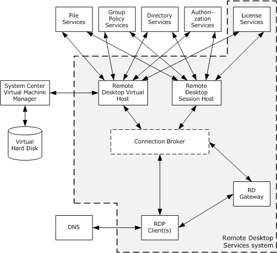

Figure 1: Remote Desktop Services overview diagram

An RD Session Host supports the use of external systems, such as [**directory service (DS)**](#gt_directory-service-ds), licensing services, [**domain**](#gt_domain) services, and security services. These services use protocols that are not a part of the Remote Desktop Services.

The [**Connection Broker**](#gt_connection-broker) component, shown with a dashed line in the previous diagram, is an optional component that is not necessary for an RDP client to connect to an RD Session Host. Connection Broker services assign users of RDP clients to user sessions on RD Session Hosts and can use an algorithm that balances the workload between RD Session Hosts.

### 2.1.1 System Capabilities

The Remote Desktop Services protocols are designed to support scenarios that allow users to access applications and data on a remote computer over the network. When a user wants to interact with a remote computer, the system facilitates this interaction by transferring graphics display information from the remote computer to the user and transporting input (such as keyboard or mouse input) from the user to the remote computer.

The overall function of this system can be classified into the following:

- Establishing a secure connection between an RDP client and an RD Session Host server.
- Redirection functionality.
- Terminating a connection between an RDP client and an RD Session Host server.

#### 2.1.1.1 Establishing a Secure Connection Between an RDP Client and an RD Session Host Server.

The Remote Desktop Services protocols allow an RDP client to securely connect to an RD Session Host server; in order to connect across a domain boundary, an RDP client uses a Virtual Private Network(VPN) or the protocol described in [MS-TSGU](../MS-TSGU/MS-TSGU.md) to first connect to an RD Gateway server.

#### 2.1.1.2 Redirection Functionality

When a Remote Desktop Protocol (RDP) connection exists between an RDP client and RD Session Host server, data and resources are frequently redirected. This redirection allows the RD Session Host server to access resources on the RDP client, as well as allowing an RD Session Host server to redirect data from remote applications on the RD Session Host server to the RDP client. Some examples of redirection functionality include the following:

- **Keyboard, mouse and touch input:** Data from the keyboard, mouse, and touch input (applicable in scenarios where the transfer of multitouch input frames--generated by a physical or virtual touch digitizer--is required from a terminal server client to a [**terminal server**](#gt_terminal-server)<3>) on the RDP client is redirected to the user session on the RD Session Host.
- **Camera:** Video capture data can be redirected from an RDP client to an RDP server.
- **Printer jobs:** Print jobs from the user session on the RD Session Host can be redirected to a printer attached to the RDP client.
- **Media player content:** An application running on the RD Session Host can redirect media player content to the RDP client.
- **File system data:** An RD Session Host can access local drives on the RDP client using file system redirection.
- **Clipboard:** Clipboard redirection enables a user to copy data from an application running on an RD Session Host to a clipboard located on the RDP client.
- **Smart card:** An RD Session Host can access credential data from a smart card connected to an RDP client.
- **Ports:** An RD Session Host can access devices connected to serial, parallel, and USB ports on an RDP client.
- **Credentials:** Credentials (username and password) are used to authenticate a user when connecting to an RD Session Host.

#### 2.1.1.3 Terminating a Connection Between an RDP Client and an RD Session Host Server

There are two types of terminating Remote Desktop connections, namely:

- [Logoff](#Section_2.1.1.3.1)
- [Disconnect](#Section_2.1.1.3.2)

##### 2.1.1.3.1 Logoff

The user of the RDP client logs off from an RD Session Host server, causing the user session on the RD Session Host server to be closed.

##### 2.1.1.3.2 Disconnect

An RDP client can become disconnected from an RD Session Host server because of network problems or because the RDP client is shut down prior to the user logging off the assigned session. When this occurs, the user session remains on the RD Session Host server for a certain amount of time, depending on the configuration of the RD Session Host server. This allows a user to reconnect to the existing session.

## 2.2 Protocol Summary

The tables in this section provide a comprehensive list of the member protocols of the Remote Desktop Services.

**Remote Desktop Services protocols**

| Protocol Name | Description | Short Name |
| --- | --- | --- |
| Remote Desktop Protocol: Basic Connectivity and Graphics Remoting | This protocol facilitates user interaction with a remote computer system by transferring graphics display information from the remote computer to the user and transferring input from the user to the remote computer, where the input is injected into the user session. This protocol also provides an extensible mechanism allowing specialized communication between components on the user computer and components running on the remote computer. | MS-RDPBCGR |
| Terminal Services Gateway Server Protocol | This protocol provides the ability to tunnel RDP communications through a gateway for a connection between an RDP client and an RD Session Host server behind a firewall. | MS-TSGU |
| Terminal Services: Terminal Server Runtime Interface | This protocol is used for remotely querying and configuring various aspects of an RD Session Host. For example, this protocol can be used to query the number of active sessions running on an RD Session Host. | MS-TSTS |
| Terminal Services: Workspace Provisioning Protocol | This protocol allows a unified view of user work resources for administrators that have no access to non-managed computers. The protocol is used to transfer information so that the client computer can launch a remote desktop and remote applications on a server or virtual computer. | MS-TSWP |

**Member protocols used to optimize graphical data, support session management and licensing**

| Protocol Name | Description | Short Name |
| --- | --- | --- |
| Remote Desktop Protocol: Desktop Composition Virtual Channel Extension | This protocol supports remote desktop composition (the composition of a sprite tree that represents the desktop, with nodes representing the sprites). | MS-RDPEDC |
| Remote Desktop Protocol: Graphics Devices Interfaces (GDI) Acceleration Extension | This protocol encodes the drawing operations that produce an image, reducing the bandwidth associated with graphics remoting. | MS-RDPEGDI |
| Remote Desktop Protocol: Composited Remoting V2 | This protocol is used to display the contents of a desktop running on one machine (the server) on a second remote machine (the client) connected to the first via a network. | MS-RDPCR2 |
| Remote Desktop Protocol: NSCodec Extension | This protocol specifies an image codec that can be used to encode screen images by utilizing efficient and effective compression. | MS-RDPNSC |
| Remote Desktop Protocol: RemoteFX Codec Extension | This protocol specifies a lossy image codec that can be used to encode screen images by utilizing efficient and effective compression. | MS-RDPRFX |
| Remote Desktop Protocol: Session Selection Extension | This protocol describes the messages exchanged between an RDP client and a server to facilitate the precise targeting of an application-sharing context. | MS-RDPEPS |
| Remote Desktop Protocol: Licensing Extension | This protocol allows authorized RDP clients or users to connect to an RD Session Host. This extension involves communication between the RDP client, the RD Session Host, and a license server. The RD Session Host can be configured to be in per-device or per-user license mode. Client Access Licenses (CALs) are installed on a license server, and when an RD Session Host requests a license on a client's behalf, the license server issues a license out of its available pool of licenses. | MS-RDPELE |

**Member protocols used to enable transporting device data or resource data between an RDP client and an RD Session Host server**

| Protocol Name | Description | Short Name |
| --- | --- | --- |
| Remote Desktop Protocol: Clipboard Virtual Channel Extension | This protocol provides basic programmatic access to the clipboard provided by an operating system and ensures that any application has the capability to place data onto the clipboard, extract data from the clipboard, enumerate the data formats available on the clipboard, and register to receive notifications when the system clipboard is updated. | MS-RDPECLIP |
| Remote Desktop Protocol: File System Virtual Channel Extension | This protocol provides access between the RD Session Host server and the RDP client file system drivers by redirecting all input/output requests and responses between the two. | MS-RDPEFS |
| Remote Desktop Protocol: Serial and Parallel Port Virtual Channel Extension | This protocol specifies the communication used to enable the redirection of ports between a terminal client and an RD Session Host server. By redirecting ports from the RDP client to the RD Session Host server, applications running on an RD Session Host server can access the remote devices attached to those ports. | MS-RDPESP |
| Remote Desktop Protocol: Print Virtual Channel Extension | This protocol specifies the communication used to enable the redirection of printers between an RDP client and an RD Session Host server. By redirecting printers from the RDP client to the RD Session Host server, applications running on a server can access the remote devices as if they were local printers. | MS-RDPEPC |
| Remote Desktop Protocol: Video Capture Virtual Channel Extension | This protocol enables the transfer of video capture data from the RDP client to the RD Session Host. For example, an application running on an RD Session Host can record video capture data. This data will be transferred from the RDP client to the RD Session Host, allowing the application to record from a video capture device installed on the RDP client. | MS-RDPECAM |
| Remote Desktop Protocol: Smart Card Virtual Channel Extension | This protocol enables client smart card devices to be available, within the context of a single RDP session, to server-side applications. | MS-RDPESC |
| Remote Desktop Protocol: Remote Programs Virtual Channel Extension | This protocol is a Remote Desktop Protocol (RDP) feature (as specified in [MS-RDPBCGR](../MS-RDPBCGR/MS-RDPBCGR.md)) that presents a remote application (running remotely on a remote application integrated locally (RAIL) server) as a local user application (running on the RAIL client computer). Also known as RAIL. | MS-RDPERP |
| Remote Desktop Protocol: Multiparty Virtual Channel Extension | This protocol enables the remote display of desktop and application content. To effectively implement an application-sharing or collaborative solution, additional information is conveyed to keep the participants apprised of who else is involved, in addition to which applications or windows are being shared. | MS-RDPEMC |
| Remote Desktop Protocol: Audio Output Virtual Channel Extension | This protocol transfers audio data from the RD Session Host server to the RDP client. For example, when the RD Session Host server plays an audio file, this protocol is used by the RD Session Host server to transfer the audio data to the RDP client. The RDP client can then play the audio. | MS-RDPEA |
| Remote Desktop Protocol: Dynamic Virtual Channel Extension | This protocol implements a generic connection-oriented communication channel on top of the virtual channel protocol. A dynamic virtual channel (DVC) is established over an existing static virtual channel. | MS-RDPEDYC |
| Remote Desktop Protocol: Plug and Play Devices Virtual Channel Extension | This protocol specifies the communication used to enable the redirection of plug and play devices between an RDP client and an RD Session Host server. | MS-RDPEPNP |
| Remote Desktop Protocol: XML Paper Specification (XPS) Print Virtual Channel Extension | This protocol specifies communication between a virtual printer driver installed on an RD Session Host server and a printer driver installed on the RDP client. The primary purpose of this protocol is to acquire printing capabilities and to display a printer-specific user interface on the RDP client. | MS-RDPEXPS |
| Remote Desktop Protocol: Audio Input Virtual Channel Extension | This protocol enables the transfer of audio data from the RDP client to the RD Session Host. For example, an application running on an RD Session Host can record audio data. This data will be transferred from the RDP client to the RD Session Host, allowing the application to record from an audio device installed on the RDP client. | MS-RDPEAI |
| Remote Desktop Protocol: USB Devices Virtual Channel Extension | This protocol is used to redirect universal serial bus (USB) devices from a terminal client to the [**terminal server**](#gt_terminal-server), which allows the server access to a device that is physically connected to the client as if the device were local to the server. | MS-RDPEUSB |
| Remote Desktop Protocol: Video Virtual Channel Extension | This protocol enables the transfer of synchronized audio and video data from an RD Session Host to an RDP client. The RDP client can play the audio and video data and synchronize this data using the timing information provided by the protocol. | MS-RDPEV |
| Remote Desktop Protocol: UDP Transport Extension | This protocol extends the transport mechanisms in RDP to enable network connectivity between the user’s machine and a remote computer system over the User Datagram Protocol (UDP). | MS-RDPEUDP |
| Remote Desktop Protocol: UDP Transport Extension Version 2 | This protocol specifies extensions to the transport mechanisms in RDP. It is used to exchange data, for example audio and video, between a remote desktop client and remote desktop server over UDP transport using a URCP based rate control. | MS-RDPEUDP2 |
| Remote Desktop Protocol: Graphics Pipeline Extension | This protocol is used by RDPBCGR to enable smart processing of graphics data. | MS-RDPEGFX |
| Remote Desktop Protocol: Multitransport Extension | This protocol enables open multiple transports as an extension to RDPBCGR. | MS-RDPEMT |
| Remote Desktop Protocol: Virtual Channel Echo Extension | This protocol is used to determine network characteristics (such as round-trip time (RTT)) between an RD Session Host and an RDP client. | MS-RDPEECO |
| Remote Desktop Protocol: Video Optimized Remoting Virtual Channel Extension | This protocol is designed to be run within the context of a Remote Desktop Protocol (RDP) virtual channel established between an RDP Client and an RD Session Host. This protocol extension is applicable when the RD Session Host server is displaying content that it classifies as video and needs to send that video data to the RDP client. | MS-RDPEVOR |
| Remote Desktop Protocol: Input Virtual Channel Extension | This protocol is used to transfer multitouch input frames (generated by a physical or virtual touch digitizer) or pen input from an RDP client to an RD Session Host server. | MS-RDPEI |
| Remote Desktop Protocol: Display Control Virtual Channel Extension | This protocol is used to request display configuration changes in a remote session. | MS-RDPEDISP |
| Remote Desktop Protocol: Authentication Redirection Virtual Channel | This protocol is used to perform authentication protocol operations over a virtual channel in the remote session. This allows the RDP server session to perform network authentication while not having access to the underlying user credentials. | MS-RDPEAR |
| Remote Desktop Protocol: WebAuthn Virtual Channel Protocol | This protocol provides a way for a user to do WebAuthn operations over the RDP protocol. It enables a server to send a WebAuthn request to a client. The client can then use this request to talk to authenticators (platform as well as cross-platform) and reply with the response. | MS-RDPEWA |

### 2.2.1 Protocol Relationship Diagram

The following diagram depicts the relationships among the protocols of the Remote Desktop Services system.

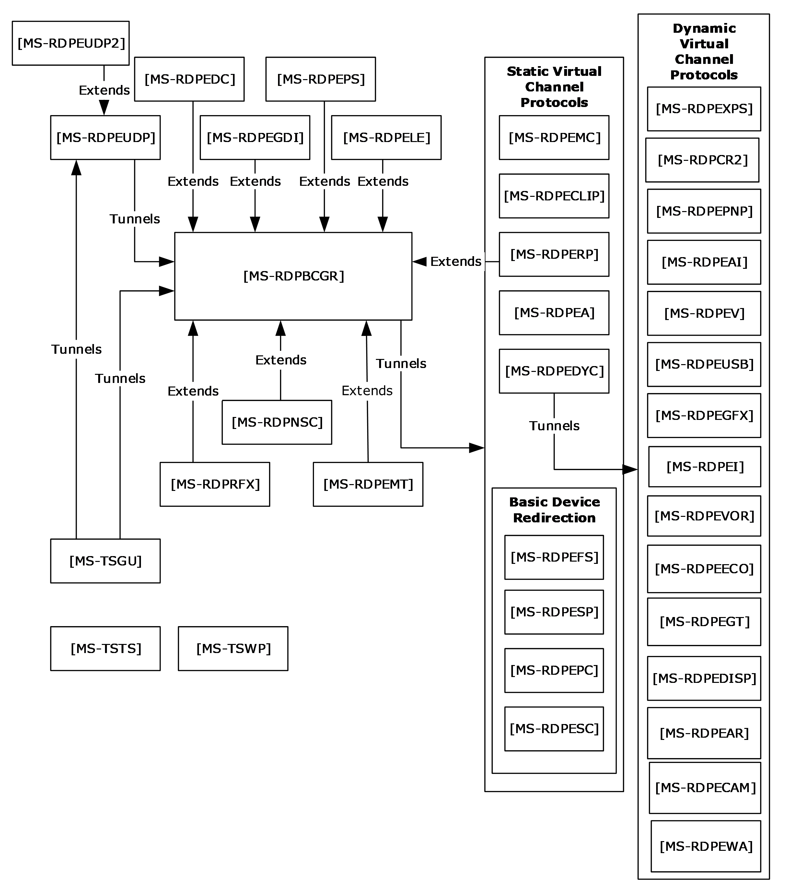

Figure 2: Relationships among Remote Desktop Protocols

## 2.3 Environment

The following sections identify the context in which the Remote Desktop Services exist. This includes the systems that use the interfaces provided by the Remote Desktop Services protocols, other systems that depend on this, and, as appropriate, how components of the system communicate.

### 2.3.1 Dependencies on This System

None.

### 2.3.2 Dependencies on Other Systems/Components

The Remote Desktop Services protocols depend on the following systems:

- Authentication and authorization services by domain controllers or Kerberos systems. Authentication services might depend on a certificate infrastructure to support the Secure Sockets Layer (SSL) protocol, as specified in [[SSL3]](https://go.microsoft.com/fwlink/?LinkId=90534).
- DNS as specified in [[RFC1035]](https://go.microsoft.com/fwlink/?LinkId=90264) for address resolution.
- Directory Services or other components (such as a [**Connection Broker**](#gt_connection-broker) or a System Center Virtual Machine Manager (SCVMM)) for assigning user sessions or virtual machines.
- File Services for Terminal Services publication of remote desktops and remote applications.

## 2.4 Assumptions and Preconditions

The Remote Desktop Services protocols assume that:

- The RDP client and RD Session Host server have network connectivity over TCP/IPv4 or IPV6, as specified in [[RFC793]](https://go.microsoft.com/fwlink/?LinkId=150872) and [[RFC2460]](https://go.microsoft.com/fwlink/?LinkId=90357).
- The RDP client initiating the connection is using an implementation of the Remote Desktop Protocol (RDP).
- The RD Session Host server is configured, and any firewall between the RDP client and RD Session Host server is configured to allow RDP traffic.
- The RD Session Host server is actively listening for RDP client connections on a registered port.

## 2.5 Use Cases

The following table lists the use cases that span the functionality of the Remote Desktop Services protocols. The use cases are grouped into three groups, as shown in the first column of the table.

**Classification of use cases into use case groups**

| Use case group | Use cases |
| --- | --- |
| Establishing a secure connection between an RDP client and an RD Session Host server | [Establish a Connection to an RD Session Host server in an Intranet Environment--RDP Client (section 2.5.1.1)](#Section_2.5.1.1) [Establish a Connection to a VM Host in an Intranet Environment--RDP Client (section 2.5.1.2)](#Section_2.5.1.2) [Establish a Connection Using a Remote Desktop Gateway--RDP Client (section 2.5.1.3)](#Section_2.5.1.3) [Establish a Connection to an RD Session Host server in an RD Session Host server Farm--RDP Client (section 2.5.1.4)](#Section_2.5.1.4) [Establishing a Multi transport UDP connection over an already established RDP connection to a RD Session Host (section 2.5.1.5)](#Section_2.5.1.5) |
| Redirection functionality | [Access Local Drives on an RDP Client--Remote Application (section 2.5.2.1)](#Section_2.5.2.1) [Redirect Clipboard Data from a Remote Application--RDP Client (section 2.5.2.2)](#Section_2.5.2.2) [Use Printer on RDP Client--Remote Application (section 2.5.2.3)](#Section_2.5.2.3) [Redirect Smart Card Data from an RDP Client--Remote Application (section 2.5.2.4)](#Section_2.5.2.4) [Access Plug and Play Device on an RDP Client--Remote Application (section 2.5.2.5)](#Section_2.5.2.5) [Present Content from RD Session Host Server on an RDP Client--Media Player (section 2.5.2.6)](#Section_2.5.2.6) [Access Audio Device on an RDP Client--Remote Application (section 2.5.2.7)](#Section_2.5.2.7) |
| Terminating a connection between an RDP client and an RD Session Host server | [Log Off from a Remote Session--RDP Client (section 2.5.3.1)](#Section_2.5.3.1) [Disconnect From a Remote Session--RDP Client (section 2.5.3.2)](#Section_2.5.3.2) |

The following sections provide detailed descriptions for each of the use cases in each group.

### 2.5.1 Establishing a Secure Connection Between an RDP Client and an RD Session Host Server Use Cases

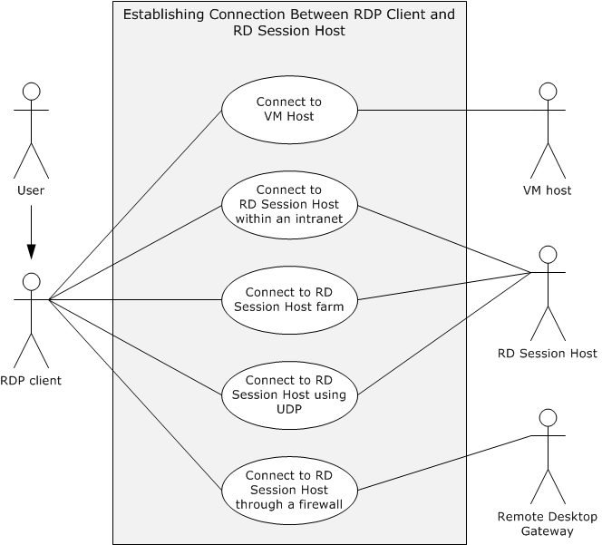

Figure 3: Establishing connection between RDP client and RD Session Host use cases diagram

#### 2.5.1.1 Establish a Connection to an RD Session Host Server in an Intranet Environment--RDP Client

**Goal**

For an RDP client to establish a connection with an RD Session Host server.

**Context of Use**

A user launches the RDP client to display and interact with a remote desktop or remote application. The RDP client establishes a connection to an RD Session Host that is hosting the remote desktop or remote application. In this use case, the connection between the RDP client and the RD Session Host server is established in an intranet environment. The preconditions are met, and licensing, authentication, authorization, and [**Domain Name System (DNS)**](#gt_domain-name-system-dns) services are available.

**Actors**

**User:** The primary actor is the user.

**RDP client:** The RDP client establishes a connection to the RD Session Host in order to interact with a remote desktop or remote application.

**RD Session Host:** The RD Session Host is hosting the remote desktop or remote application to which the RDP client is connecting.

**Stakeholders**

**None.**

**Preconditions**

The RD Session Host server is operational and listening for an RDP connect request on port 3389. If the RDP client is using the IPv6 protocol, the RD Session Host supports the IPv6 protocol.

**Main Success Scenario**

- Trigger: The RDP client initiates the connection when the user provides the name of the remote desktop to connect to.
- The RDP client resolves the name to an IP address using DNS.
- The RDP client establishes a secure RDP connection to the RD Session Host.
- The RDP client successfully negotiates use permissions with the RD Session Host using the client license.
- The RD Session Host checks the user credentials and then creates a user session for the RDP client.
- The RD Session Host transmits the desktop of the user session to the RDP client using the remote desktop system, and the RDP client displays the remote desktop.
- The user of the RDP client interacts with the remote desktop.
**Extensions**

In Windows 7 implementations, an RDP client can connect to a virtual machine on a VM Host, rather than a user session on an RD Session Host server.

#### 2.5.1.2 Establish a Connection to a VM Host in an Intranet Environment--RDP Client

**Goal**

For an RDP client to establish a connection with a VM Host.

**Context of Use**

A user launches the RDP client to display and interact with a remote desktop or remote application. The RDP client establishes a connection to a VM Host that is hosting the virtual machine running the remote desktop or remote application. In this use case, the connection between the RDP client and the VM Host is established in an intranet environment. The preconditions are met, and licensing, authentication, authorization, and Domain Name System (DNS) services are available.

**Actors**

**User:** The primary actor is the user.

**RDP client:** The RDP client establishes a connection to the VM Host in order to interact with a remote desktop or remote application.

**VM Host:** The VM Host is hosting the virtual machine running the remote desktop or remote application to which the direct actor is connecting.

**Stakeholders:**

**None.**

**Preconditions:** Windows 7 is being used. The VM Host is operational and listening for an RDP connect request. If the RDP client is using the IPv6 protocol, then the VM Host supports the IPv6 protocol.

**Main Success Scenario**

- Trigger: The RDP client initiates the connection when the user provides the name of the remote desktop to connect to.
- The RDP client resolves the name to an IP address using DNS.
- The RDP client establishes a secure RDP connection using a [**Connection Broker**](#gt_connection-broker). The Connection Broker looks up the assigned virtual machine for the user, prepares the virtual machine to be run under the VM Host, and returns the IP address of the virtual machine to the RDP client.
- The RDP client connects to the IP address of the virtual machine.
- The virtual machine transmits the remote desktop to the RDP client, and the RDP client displays the remote desktop.
- The user of the RDP client interacts with the remote desktop of the virtual machine.
**Extensions**

None.

#### 2.5.1.3 Establish a Connection Using a Remote Desktop Gateway--RDP Client

**Goal**

For an RDP client to establish a connection with a Remote Desktop Gateway.

**Context of Use**

The RDP client is using the Internet to transport communication. The RDP client is external to a firewall separating the desired RD Session Host server from the Internet. The RDP client uses a gateway to tunnel communication to the RD Session Host server. The preconditions are met, and licensing, authentication, authorization, and Domain Name System (DNS) services are available.

**Actors**

**User:** The primary actor is the user.

**RDP client:** The RDP client establishes a connection to the Terminal Services (TS) in order to interact with a remote desktop or remote application.

**Remote Desktop Gateway:** The Remote Desktop (RD) Gateway tunnels communication from the RDP client to an RD Session Host located behind a firewall.

**Stakeholders and Interests**

**None.**

**Preconditions**

The Remote Desktop Gateway is operational and listening for a connection request on a known port. The Remote Desktop Gateway is capable of making remote connections to the requested RD Session Host server. The RD Session Host is operational and listening for an RDP connect request. If the RDP client is using the IPv6 protocol, then the Remote Desktop Gateway supports the IPv6 protocol.

**Main Success Scenario**

- Trigger: The RDP client initiates the connection when a user provides the name of the remote desktop to connect to.
- The RDP client establishes a secure RDP connection to the RD Gateway through the RPC endpoint.
- The RD Gateway resolves the name to an IP address using DNS.
- The RD Gateway establishes an RDP connection to the RD Session Host server.
- The RDP client successfully negotiates use permissions with the RD Session Host server, using Remote Desktop Gateway and the client license.
- The RD Session Host server validates the client-provided certificates and client license and then creates a user session for the RDP client.
- The RD Session Host server transmits the desktop of the user session to the RDP client and the RDP client displays the remote desktop.
- The user of the RDP client interacts with the remote desktop (with keyboard and mouse through the RDP protocol).
**Extensions**

None.

#### 2.5.1.4 Establish a Connection to an RD Session Host Server in an RD Session Host Server Farm--RDP Client

**Goal**

For an RDP client to establish a connection to an RD Session Host within a server farm.

**Context of Use**

A user launches the RDP client to display and interact with a remote desktop or remote application. An RDP client initiates a connection to an RD Session Host server that is hosting the remote desktop or remote application, and the connection can be redirected to another RD Session Host server within the same server farm for the purposes of load balancing. In this use case, the connection between the RDP client and the RD Session Host server is established in an intranet environment. The preconditions are met, and connection brokering, licensing, authentication, authorization, and Domain Name System (DNS) services are available.

**Actors**

**User:** The primary actor is the user.

**RDP client:** The RDP client establishes a connection to the TS server in order to interact with a remote desktop or remote application.

**RD Session Host server:** The RD Session Host is hosting the remote desktop or remote application to which the direct actor is connecting.

**Stakeholders**

**Connection Broker:** The [**Connection Broker**](#gt_connection-broker) assigns the RDP client to an RD Session Host within a server farm according to an algorithm to optimize load balancing.

**Preconditions**

The RD Session Host is operational and listening for an RDP connect request. A Connection Broker is available to redirect the RDP client to an alternate RD Session Host server. If the RDP client is using the IPv6 protocol, then the RD Session Host supports the IPv6 protocol.

**Main Success Scenario**

- Trigger: The RDP client initiates the connection when the user provides the name of the remote desktop to connect to.
- The RDP client resolves the server name to an IP address using DNS services.
- The RDP client establishes a secure RDP connection to the RD Session Host server.
- The target RD Session Host server can redirect the RDP client connection attempt using a Connection Broker if the load on the server does not permit this new connection.
- If redirected, the RDP client opens a port on a different server in a farm and initializes an RDP connection to the alternate server.
- The RDP client successfully negotiates the client license with the RD Session Host.
- The RD Session Host creates a user session for the RDP client after credentials are checked.
- The RD Session Host sends the session desktop to the RDP client, and the RDP client displays the remote desktop.
- The user of the RDP client interacts with the remote desktop.
**Extensions**

In Windows 7 implementations, an RDP client can connect to a virtual machine on a VM Host, rather than a user session on an RD Session Host.

#### 2.5.1.5 Establish a Multi Transport UDP Connection Over an Already Established RDP Connection to a RD Session Host

**Goal**

To transfer data between an RDP client and an RD Session Host using multi transport UDP.

**Context of Use**

A user launches the RDP client to display and interact with a remote desktop or remote application. The RDP client establishes a connection to the RD Session Host that is hosting the remote desktop or remote application. In this use case, a multi transport UDP connection between the RDP client and the RD Session Host server is established on top of the existing RDP connection. The preconditions are met, and licensing, authentication, authorization, and Domain Name System (DNS) services are available.

**Actors**

**User:** The primary actor is the user.

**RDP client:** The RDP client establishes a connection to the RD Session Host in order to interact with a remote desktop or remote application.

**RD Session Host:** The RD Session Host is hosting the remote desktop or remote application to which the RDP client is connecting.

**Stakeholders**

None.

**Preconditions**

An RDP session is already established between the RDP client and the RD Session host.

**Main Success Scenario**

- Trigger: Based on the RDP client and network capabilities, the RD Session Host sends a request (containing information that identifies the connection) to the RDP client over the main RDP transport to initiate a multi transport connection.
- The RDP client then creates a multi transport connection by sending session-related information (which it received from the RD Session Host in the above step) to the RD Session Host.
- The RD Session Host server compares the incoming multi transport connection request to an existing main RDP transport connection to verify that they match and to authenticate the connection.
- If a successful connection match is found, the RD Session Host successfully initializes the multi transport connection.
- The RD Session Host and RDP client can then start transferring data over the multi transport connection.
**Extensions**

If the session-related information sent by the RDP client in the create multi transport request message does not match that of the RD Session Host, then the connection will be terminated.

### 2.5.2 Redirection Functionality Use Cases

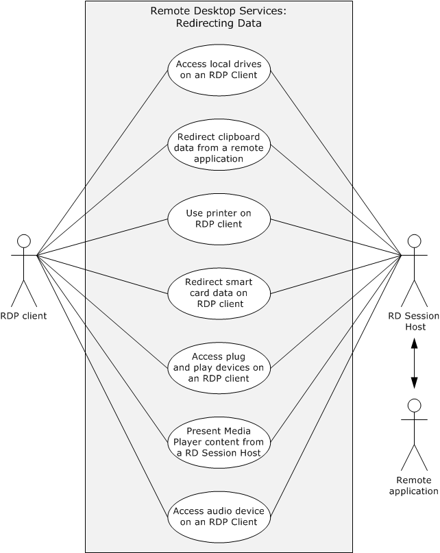

Figure 4: Redirection functionality use cases diagram

#### 2.5.2.1 Access Local Drives on an RDP Client--Remote Application

**Goal**

For the remote application to access local drives on the RDP client.

**Context of Use**

After an RDP client establishes a connection to an RD Session Host, a remote application running on the RD Session Host server can access local drives on the RDP client.

**Actors**

**Remote application:** The primary actor is the remote application. It is an application running on the remote machine.

**RDP client:** The RDP client redirects file system data from local drives.

**RD Session Host server:** The RD Session Host is hosting the remote desktop or remote application to which the direct actor is connecting. It manages redirecting file system data from the local drives to the remote application.

**Stakeholders**

**Local drives on the RDP client:** The local drives are accessible to the remote application or remote desktop after the RDP connection is established.

**Preconditions**

The RDP client is connected to the RD Session Host. The RDP connection supports file system redirection. The remote desktop or remote application is running on the RD Session Host. The RD Session Host server has permission to access the local drives on the RDP client.

**Main Success Scenario**

- Trigger: The remote application requests file system data from the local drives on the RDP client.
- The remote desktop system provides the connection to the local drives on the RDP client to the remote application.
- The remote application will have the ability to read from and write to the local drives on the RDP client.
**Extensions**

None.

#### 2.5.2.2 Redirect Clipboard Data from a Remote Application--RDP Client

**Goal**

To use the local clipboard of the RDP client to perform clipboard operations on a remote application running on an RD Session Host server.

**Context of Use**

The user of a remote application can copy data from a remote application and paste data to a remote application using the local clipboard when a static virtual channel supporting clipboard redirection is established during the initial RDP connection.

**Actors**

**RDP client:** The RDP client can copy data from a remote application or paste data to a remote application.

**Remote application:** It is an application running on the remote machine.

**RD Session Host:** The RD Session Host is hosting the remote desktop or remote application to which the direct actor is connecting. The RD Session Host manages redirecting clipboard data from the remote application to the clipboard on the RDP client.

**Stakeholders and Interests**

**Clipboard on the RDP client:** The clipboard on the RDP client is accessible to the remote application or remote desktop session after the RDP connection is established.

**Clipboard on the remote desktop:** The clipboard on the remote desktop is synchronized with the clipboard on the RDP client, providing the redirection functionality.

**Preconditions**

The RDP client is connected to the RD Session Host. The RDP connection supports clipboard redirection. The remote desktop or remote application is running on the RD Session Host. The RD Session Host has permission to access the clipboard on the RDP client.

**Main Success Scenario**

- Trigger: The RDP client attempts to use clipboard features to copy data from or paste data to a remote application.
- The remote desktop system provides access to clipboard operations between RDP client and remote application.
- The RDP client application will be able to do clipboard operations between client applications.
**Extensions**

None.

#### 2.5.2.3 Use Printer on RDP Client–Remote Application

**Goal**

For the remote application to send a print job to a printer on the RDP client, which prints the job.

**Context of Use**

After an RDP client establishes a connection to an RD Session Host server, a remote application running on the RD Session Host server can send a print job to the local printer on the RDP client.

**Actors**

**Remote application:** The primary actor is the remote application. It is as application running on the remote machine.

**RDP client:** The RDP client routes the print job to the local printer.

**RD Session Host:** The RD Session Host is hosting the remote desktop or remote application to which the direct actor is connecting. The RD Session Host manages redirecting the print job from the remote application to the printer on the RDP client.

**Stakeholders**

**Printer on the RDP client:** The printer on the RDP client is accessible to the remote application or remote desktop session after the RDP connection is established.

**Preconditions**

The RDP client is connected to the RD Session Host. The RDP connection supports printer redirection. The remote desktop or remote application is running on the RD Session Host. The RD Session Host has permission to access the local printer on the RDP client.

**Main Success Scenario**

- Trigger: The remote application sends a print job to the local printer on the RDP client.
- The remote desktop system provides access to the local printer on the RDP client to the remote application.
- The remote application running on the RD Session Host on behalf of the client will be able to print to the local printer on the RDP client.
**Extensions**

None.

#### 2.5.2.4 Redirect Smart Card Data from an RDP Client--Remote Application

**Goal**

For the remote application to access a smart card on the RDP client.

**Context of Use**

After an RDP client establishes a connection to an RD Session Host server, a remote application running on the RD Session Host server can access local drives on the RDP client.

**Actors**

**Remote application:** The primary actor is the remote application. It is an application running on the remote machine.

**RDP client:** The RDP client redirects smart card data to the remote application.

**RD Session Host:** The RD Session Host is hosting the remote desktop or remote application to which the direct actor is connecting. The RD Session Host manages redirecting smart card data from the RDP client to the remote application.

**Stakeholders**

**Smart Card:** The smart card is accessible to the remote application or remote desktop after the RDP connection is established.

**Preconditions**

The RDP client is connected to the RD Session Host server. The RDP connection supports smart card redirection. The remote desktop or remote application is running on the RD Session Host.

**Main Success Scenario**

- Trigger: The remote application requests the remote desktop system to access smart card data from the smart card on the RDP client.
- The remote desktop system provides access to the smart card on the RDP client to the remote application.
- The remote application running on the RD Session Host server will be able to access credential data on the smart card attached to the RDP client computer during logon.
**Extensions:** None.

#### 2.5.2.5 Access Plug and Play Device on an RDP Client--Remote Application

**Goal**

For the remote application to access a plug and play device on the RDP client.

**Context of Use**

After an RDP client establishes a connection to an RD Session Host server, a remote application running on the RD Session Host server can access a plug and play device on the RDP client.

**Actors**

**Remote application:** The primary actor is the remote application. It is an application running on the remote machine.

**RDP client:** The RDP client redirects plug and play data to the remote application.

**RD Session Host:** The RD Session Host is hosting the remote desktop or remote application to which the RDP client is connecting. The RD Session Host manages redirecting data from the plug and play device to the remote application.

**Stakeholders**

**Plug and play device**: The plug and play device is accessible to the remote application or remote desktop after the RDP connection is established.

**Preconditions**

The RDP client is connected to the RD Session Host server. The RDP connection supports plug and play redirection. The remote desktop or remote application is running on the RD Session Host. The RD Session Host has permission to access the plug and play device on the RDP client.

**Main Success Scenario**

- Trigger: The remote application requests the remote desktop system to access data from the plug and play device on the RDP client.
- The remote desktop system provides access to the plug and play device on the RDP client to the remote application.
- The remote application running on the RD Session Host server can access a plug and play device installed on the RDP client computer.
**Extensions**

None.

#### 2.5.2.6 Present Content from RD Session Host Server on an RDP Client--Media Player

**Goal**

To present content streamed from the media player running on the RD Session Host to the RDP client.

**Context of Use**

In Windows 7, media can be streamed from the media player running in the user session on the RD Session Host to the RDP client running on the remote system.

**Actors**

**Media player:** The primary actor is the media player. It is an application running on the remote machine that plays content on the RD Session Host server that is streamed to the RDP client for display.

**RDP client:** The RDP client receives and displays content from the media player on the RD Session Host server.

**RD Session Host:** The RD Session Host is hosting the remote desktop or remote application to which the RDP client is connecting. The RD Session Host server manages streaming content from the media player to the RDP client.

**Stakeholders**

**Preconditions**

Windows 7 is in use. The RDP client is connected to the RD Session Host server. The RDP connection supports media player redirection. The media player is running on the RD Session Host.

**Main Success Scenario**

- Trigger: The media player requests the remote desktop system to provide streaming content to the RDP client.
- The remote desktop system provides the remote application running the media player the access to stream content to the RDP client.
- The remote application running the media player on the RD Session Host will be able to stream media player content to the RDP client.
**Extensions**

None.

#### 2.5.2.7 Access Audio Device on an RDP Client--Remote Application

**Goal**

For the remote application to access an audio device on the RDP client.

**Context of Use**

After an RDP client establishes a connection to an RD Session Host, a remote application running on the RD Session Host server can access an audio device on the RDP client.

**Actors**

**Remote application:** The primary actor is the remote application. It is an application running on the remote machine.

**RDP client:** The RDP client routes audio content from the remote application to the local audio device.

**RD Session Host:** The RD Session Host is hosting the remote desktop or remote application to which the RDP client is connecting. The RD Session Host server manages redirecting audio data from the remote application to the audio device on the RDP client.

**Stakeholders and Interests**

**Audio device on the RDP client:** The audio device plays audio content that is sent from the remote application.

**Preconditions**

The RDP client is connected to the RD Session Host server. The RDP connection supports audio redirection. The remote desktop or remote application is running on the RD Session Host server. The RD Session Host server has permission to access the audio device on the RDP client.

**Main Success Scenario**

- Trigger: The remote application requests the remote desktop system to provide a connection to send audio content to the RDP client to play on the local audio device.
- The remote desktop system provides a remote application with the connection to the audio device on the RDP client.
- The remote application running on an RD Session Host will have the ability to stream audio content to an audio device connected to the RDP client.
**Extensions**

None.

#### 2.5.2.8 Use client credentials on RDP Client--Remote Application

**Goal**

For the RD Session Host to access network resources on behalf of a remote application. The RD Session host does not have access to the raw client credentials.

**Context of Use**

After an RDP Client establishes a connection to an RD Session Host, the remote application can securely access network resources, such as file shares, on behalf of the user.

**Actors**

**Remote application:** The primary actor is the remote application. It is an application running on the remote machine.

**RDP client:** The RDP Client handles requests from the RD Session Host for authentication information and calculates appropriate responses to prove the user’s identity.

**RD Session Host:** The RD Session Host hosts the remote desktop to which the RDP Client connects. The RD Session Host server requests authentication information from the RDP Client without ever seeing the user’s raw credentials.

**Stakeholders**

None.

**Preconditions**

The RDP Client is connected to the RD Session Host server. The RD Session Host is configured to allow credential redirection-based connections.

**Main Success Scenario**

- Trigger: A remote application attempts to access to a network resource.
- The RD Session Host provides an API to the application in order to build authentication data to pass to the network resource.
- The RD Session Host contacts the RDP Client to get the authentication data for the specific request.
- The RD Session Host receives the authentication data, then passes it to the remote application.
- The remote application passes the authentication data to the network resources in order to prove the identity of the user who initiated the RDP session.
**Extensions**

None.

### 2.5.3 Terminating a Connection Between an RDP Client and an RD Session Host Server Use Cases

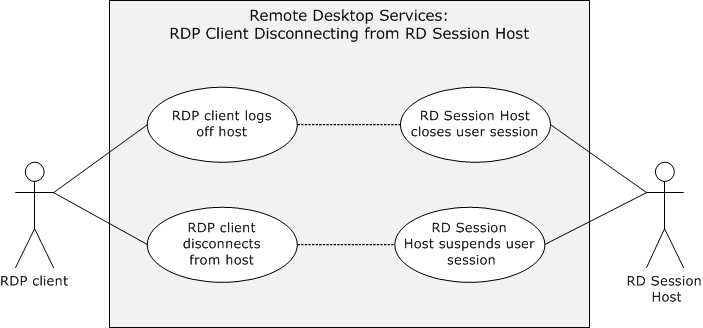

Figure 5: Disconnection use cases diagram

#### 2.5.3.1 Log Off from a Remote Session--RDP Client

**Goal**

The user of the RDP client logs off from an RD Session Host server, causing the user session on the RD Session Host server to be closed.

**Context of Use**

The user of the RDP client wants to terminate an RDP connection.

**Actors**

**RDP client:** The primary actor is the RDP client. The RDP client enables the user to log off the user session.

**Remote application:** It is an application running on the remote machine.

**RD Session Host:** The RD Session Host is hosting the remote desktop or remote application to which the direct actor is connecting. The RD Session Host server closes a user session and cleans up associated resources after an user logs off or an administrator forces the user session to close.

**Stakeholders**

**Administrator:** An administrator might need to force a user session closed using an administrative tool.

**User:** The user of the RDP client wants to close the assigned user session on the RD Session Host server.

**Preconditions**

Licensing, authentication, authorization, and DNS services are available. A connection exists between the RDP client and the RD Session Host.

**Main Success Scenario**

- Trigger: The user attempts to log off the remote desktop.
- After logging off the remote desktop, the RD Session Host terminates the user session and cleans up resources associated with the session.
**Extensions**

An administrator might force a user session to be terminated using an administrative tool.

#### 2.5.3.2 Disconnect From a Remote Session--RDP Client

**Goal**

The RDP client disconnects from an RD Session Host server, but the user session remains in a suspended mode for possible later use.

**Context of Use**

An RDP client can become disconnected from an RD Session Host server because of network problems or because the RDP client is shut down prior to the user logging off the assigned session. When this occurs, the user session remains on the RD Session Host server for a certain amount of time, depending on the configuration of the RD Session Host server. This allows an user to reconnect to the existing session.

**Actors**

**RDP client:** The primary actor is the RDP client. The RDP client establishes a connection to the RD Session Host in order to interact with a remote desktop or remote application .The RDP client enables the user to disconnect the user session

**Remote application:** It is an application running on the remote machine.

**RD Session Host:** The RD Session Host is hosting the remote desktop or remote application to which the direct actor is connecting. The RD Session Host server handles the disconnect request and keeps the session intact for a time-out period configured by the administrator.

**Stakeholders**

**Administrator:** An administrator of the RD Session Host server configures the session time-out values for a specified period in which reconnection to the disconnect session is feasible.

**Preconditions**

Licensing, authentication, authorization, and DNS services are available. A connection exists between the RDP client and RD Session Host server.

**Main Success Scenario**

- Trigger: The RDP client does not perform any action and remains idle for a certain period of time.
- The RDP client will be able to gracefully disconnect the user session so that reconnection to the same user session will be possible at a later time.
**Extensions**

None.

## 2.6 Versioning, Capability Negotiation, and Extensibility

The Remote Desktop protocols provide capability-based services, as described in [MS-RDPBCGR](../MS-RDPBCGR/MS-RDPBCGR.md). The capabilities and requirements of a client requesting a connection are established during the Remote Desktop Protocol (RDP) [**handshake**](#gt_handshake). Information exchanged about capabilities includes data such as drawing orders, desktop dimensions, allowed color depths, input device support, and cache structures. The RDP client and RD Session Host perform merge operations between their capabilities so that all RDP communication is consistent with negotiated expectations and can be processed by each party.

The Remote Desktop Services protocols do not define any vendor-extensible fields beyond those described in the specifications of the protocols supported by the system.

## 2.7 Error Handling

The Remote Desktop Services protocols do not define any error-handling requirements beyond those described in the specifications of the protocols supported by the system, as listed in section 2.2.

## 2.8 Coherency Requirements

This system has no special coherency requirements.

## 2.9 Security

The Remote Desktop Services protocols include security features for creating secure end-to-end connections between mutually authenticated RDP clients and RD Session Host servers. The Remote Desktop Services protocols also include security features to ensure the privacy and integrity of data exchanged using encryption. The security mechanisms that provide secure end-to-end communication for basic connections and virtual channels are described in [MS-RDPBCGR](../MS-RDPBCGR/MS-RDPBCGR.md) (section 5). For UDP datagram validation, see [MS-RDPEUDP](../MS-RDPEUDP/MS-RDPEUDP.md) section 5. The RDP Multi transport connections use SSL and DTLS respectively for reliable and unreliable UDP transport connections for data encryption and server certificate validation. In addition, there are general implementation-specific restrictions relating to some of the components of the Remote Desktop Services protocols as detailed in the following sections.

In multi transport connections, the client is authenticated to the server by presenting the secure cookie as part of the Tunnel Create Request PDU that the server provided to the client over the secure main RDP connection, as defined in [MS-RDPBCGR] section 2.2.2.

### 2.9.1 RDP Client

The RDP client implementation will ensure that user credentials are not locally stored in clear text form. Passwords are handled in an implementation-specific way.<4>

### 2.9.2 RD Session Host Server

The configuration data elements of the RD Session Host server that are persisted either in database or registry hives require administrator privileges to be accessible. In addition, management objects that interact with remote sessions are protected and require administrator privileges or local system access privileges to be accessible.

Administrators interacting with RD Session Host servers use the Terminal Services Terminal Server Runtime Interface Protocol, described in [MS-TSTS](../MS-TSTS/MS-TSTS.md).

### 2.9.3 RD Gateway

The elements that configure the Remote Desktop Gateway, such as policies regarding remote access and device redirection, are limited to administrator access.

## 2.10 Additional Considerations

There are no additional considerations.

# 3 Examples

## 3.1 Example 1: Connecting from an RDP Client to an RD Session Host

This example demonstrates the process of connecting from an RDP client to an RD Session Host as described in section [2.5.1.1](#Section_2.5.1.1).

**Prerequisites**

- A valid, non-expired license exists for the client on the License Server.
- The RD Session Host server is operational and listening for an RDP connect request on port 3389. If the RDP client is using the IPv6 protocol, the RD Session Host supports the IPv6 protocol.
**Initial System State**

The RDP client and RD Session Host are not connected.

**Final System State**

The RDP client is connected to the RD Session Host; the RDP client can start sending mouse and keyboard input to the RD Session Host; and the RD Session Host can send graphics output to the RDP client.

**Sequence of Events**

The diagram that follows illustrates one example of the messages that are exchanged between an RDP client and an RD Session Host in an environment where no intermediary gateway is used. The sequence of Connection Finalization events (steps 15-23) is not fixed, and the possible message flow is specified in detail in [MS-RDPBCGR](../MS-RDPBCGR/MS-RDPBCGR.md) section 1.3.1.1.

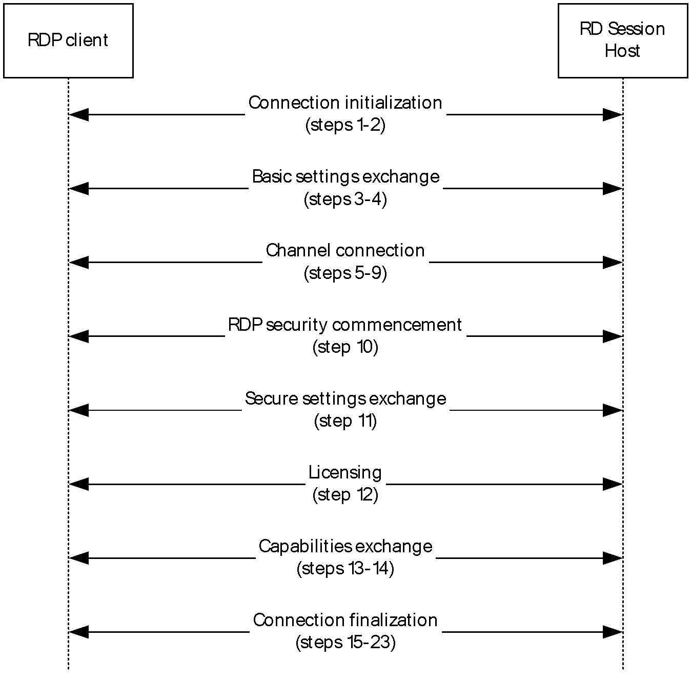

Figure 6: Sequence illustrating RDP Client connecting to an RD Session Host

The connection sequence is described in the following steps.

- The RDP client initiates the connection when the user provides the name of the remote desktop to connect to. The RDP client initiates a connection to the RD Session Host by sending an X.224 Connection Request protocol data unit (PDU), as described in [MS-RDPBCGR] section 1.3.1.1.
- The RD Session Host responds with an X.224 Connection Confirm PDU.
- The RDP client sends a Multipoint Communication Service (MCS) Connect Initial PDU with GCC Conference Create Request.
- The RD Session Host responds with an MCS Connect Response PDU with GCC Conference Create Response.
- The RDP client sends an MCS Erect Domain Request PDU.
- The RDP client sends an MCS Attach User Request PDU.
- The RD Session Host responds with an MCS Attach User Confirm PDU.
- The RDP client sends multiple (in this case six) MCS Channel Join Request PDUs.
- The RD Session Host sends multiple (in this case six) MCS Channel Join Confirm PDUs.
- The RDP client sends a Security Exchange PDU.
- The RDP client sends a Client Info PDU.
- The RD Session Host sends a License Error PDU-Valid Client.
- The RD Session Host sends a Demand Active PDU.
- The RDP client responds with a Confirm Active PDU.
- The RDP client sends a Synchronize PDU.
- The RDP client sends a Control PDU-Cooperate.
- The RDP client sends a Control PDU-Request Control.
- The RDP client sends zero or more Persistent Key List PDUs. In this case, zero PDUs are sent.
- The RDP client sends a Font List PDU.
- The RD Session Host sends a Synchronize PDU.
- The RD Session Host sends a Control PDU-Cooperate.
- The RD Session Host sends a Control PDU-Granted Control.
- The RD Session Host sends a Font Map PDU.
For more details on steps 1 through 11, and 13 through 23, see [MS-RDPBCGR] section 1.3.1.1. For details on step 12, see [MS-RDPELE](../MS-RDPELE/MS-RDPELE.md) section 1.3.3.

## 3.2 Example 2: Connecting from an RDP Client to an RD Session Host Through a Remote Desktop Gateway

This example demonstrates the process of connecting from an RDP client to an RD Session Host through a Remote Desktop Gateway as described in section [2.5.1.3](#Section_2.5.1.3)

**Prerequisites**

- A valid non-expired license exists for the client on the License Server.
- The Remote Desktop Gateway is operational and listening for a connection request on a known port. The Remote Desktop Gateway is capable of making remote connections to the requested RD Session Host server. The RD Session Host is operational and listening for an RDP connect request. If the RDP client is using the IPv6 protocol, then Remote Desktop Gateway supports the IPv6 protocol.
**Initial System State**

The RDP client and RD Session Host are not connected.

**Final System State**

The RDP client is connected to the RD Session Host through the Remote Desktop Gateway. The RDP client can start sending mouse and keyboard input to the RD Session Host, and the RD Session Host can start sending graphics output to the RDP client.

**Sequence of Events**

In the description of the connection sequence using an RD Gateway, steps 1-5 describe the process to create an RPC/HTTP tunnel. The data transfer phase referenced in [MS-TSGU](../MS-TSGU/MS-TSGU.md) refers to steps 6-14.

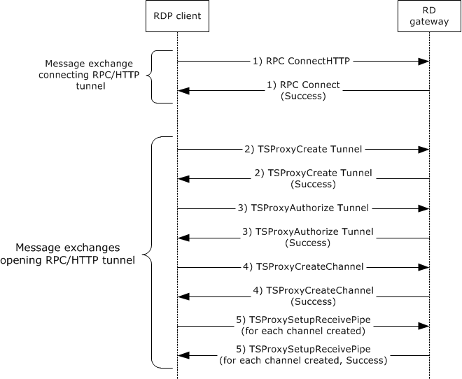

Figure 7: Creating an RPC over HTTP (RPC/HTTP) tunnel

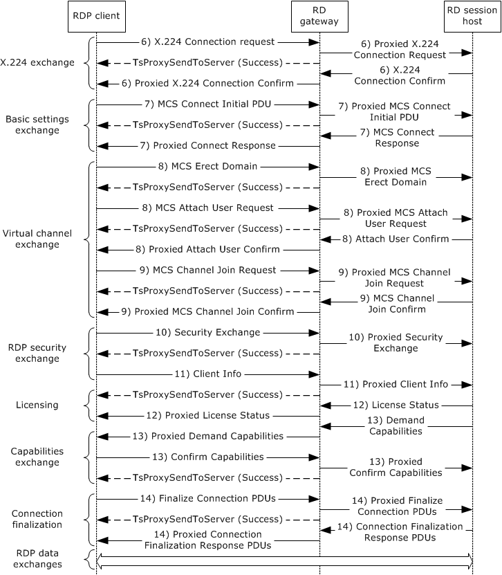

Figure 8: Creating an RDP connection through an RD Gateway

A description of the connection sequence using an RD Gateway is as follows:

- The RDP client initiates the connection when an user provides the name of the remote desktop to connect to. The RDP client sends an RPC Connect HTTP Request to the RD Gateway. The RD Gateway responds with a RPC Connect Response. This sequence is described in [MS-TSGU] section 2.1.
- The RDP client sends a TSProxyCreateTunnel Request to the RD Gateway to request that a tunnel be created. The RD Gateway responds with a TSProxyCreateTunnel Response. This sequence is described in [MS-TSGU] section 1.3.
- The RDP client sends a TSProxyAuthorizeTunnel Request to the RD Gateway to authorize the tunnel from the previous step. The RD Gateway responds with a TSProxyAuthorizeTunnel Response. This sequence is described in [MS-TSGU] section 1.3.
- The RDP client sends a TSProxyCreateChannel Request to the RD Gateway to create a channel. The RD Gateway responds with a TSProxyCreateChannel Response. This sequence is described in [MS-TSGU] section 1.3.
- For each channel, the RDP client sends a TSProxySetupReceivePipe Request to the RD Gateway to establish a pipe for data transfer. The RD Gateway responds with a TSProxySetupReceivePipe Response. This sequence is described in [MS-TSGU] section 1.3.
- By proxy, The RDP client initiates a connection to the RD Session Host by sending an X.224 Connection Request protocol data unit (PDU), as described in [MS-RDPBCGR](../MS-RDPBCGR/MS-RDPBCGR.md) section 1.3.1.1. The server responds with an X.224 Connection Confirm PDU. All subsequent data sent between the RDP client and RD server is wrapped in an X.224 Data PDU.
- By proxy, basic settings are exchanged between the RDP client and RD Session Host using the Multipoint Communication Service (MCS) Connect Initial PDU and MCS Connect Response PDU, as described in [MS-RDPBCGR] section 1.3.1.1.
- By proxy, the RDP client sends an MCS Erect Domain Request PDU, followed by an MCS Attach User Request PDU to attach the primary user identity to the MCS domain, as described in [MS-RDPBCGR] section 1.3.1.1. The server responds with an MCS Attach User Confirm PDU containing the user channel ID.
- By proxy, the RDP client proceeds to join the user channel, I/O channel, and all virtual channels by using multiple MCS Channel Join Request PDUs, as described in [MS-RDPBCGR] section 1.3.1.1. The RD Session Host confirms each channel with an MCS Channel Join Confirm PDU. All subsequent data sent from the RDP client to the RD Session Host is wrapped in an MCS Send Data Request PDU, while data sent from the RD Session Host to the RDP client is wrapped in an MCS Send Data Indication PDU. This is in addition to the data being wrapped by an X.224 Data PDU.
- If Standard RDP security mechanisms and encryption are being used, which they are for this example, the RDP client sends a Security Exchange PDU containing an encrypted 32-byte random number to the RD Session Host, by proxy, as described in [MS-RDPBCGR] section 1.3.1.1. All subsequent RDP traffic is then encrypted and a security header is included with the data if encryption is in force. The security header follows the X.224 and MCS Headers and indicates whether the attached data is encrypted.
- By proxy, the RDP client sends secure client data (such as username, password, and auto-reconnect cookie) to the server using the Client Info PDU, as described in [MS-RDPBCGR] section 1.3.1.1.
- By proxy, the RDP client and RD Server exchange licensing-related packets that are defined by the licensing mechanisms employed by the RD Session Host, as described in [MS-RDPBCGR] section 1.3.1.1. Different licensing scenarios are possible and are covered in [MS-RDPELE](../MS-RDPELE/MS-RDPELE.md) section 1.3.3. For this scenario it is assumed that a valid, nonexpired, license exists for the client on the License Server.
- By proxy, the RD Session Host sends the set of capabilities it supports to the RDP client in a Demand Active PDU, as described in [MS-RDPBCGR] (section 1.3.1.1). The RDP client responds with its capabilities by sending a Confirm Active PDU.
- By proxy, the RDP client and RD Session Host send PDUs to finalize the connection details, as described in [MS-RDPBCGR] section 1.3.1.1. The PDUs exchanged can be sent concurrently as long as the sequencing in either direction is maintained. After the RDP client receives the Font Map PDU, it can start sending mouse and keyboard input to the RD Session Host. After the RD Session Host receives the Font List PDU, the RD Session Host can start sending graphics output to the RDP client.

## 3.3 Example 3: Establishing a Dynamic Virtual Channel for Plug and Play Device Redirection

This example demonstrates the process of establishing a dynamic virtual channel for Plug and Play device redirection through a Remote Desktop Gateway as described in section [2.5.2.5](#Section_2.5.2.5).

**Prerequisites**

The RDP client is connected to the RD Session Host server. The RDP connection supports Plug and Play redirection. The remote desktop or remote application is running on the RD Session Host. The RD Session Host has permission to access the Plug and Play device on the RDP client.

**Initial System State**

The RDP client and RD Session Host are connected but there is no Plug and Play device redirection.

**Final System State**

Plug and Play device redirection exists between the RD Session Host and the RDP client.

**Sequence of Events**

The following figure describes the sequence of establishing a Dynamic Virtual Channel (DVC).

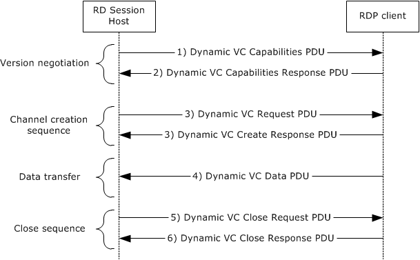

Figure 9: Detailed sequence establishing dynamic virtual channel

The following steps describe this sequence:

- The RD Session Host sends a Capabilities protocol data unit (PDU) that indicates the maximum supported version level as well as any capability information that is relevant for the supported version. For more details, see [MS-RDPEDYC](../MS-RDPEDYC/MS-RDPEDYC.md) section 2.2.1.
- The RDP client responds with a Capabilities Response PDU that states the maximum version level that it supports. For more details, see [MS-RDPEDYC] section 2.2.1.
- The RD Session Host and RDP client exchange Create Request and Create Response PDUs to establish the DVC for Plug and Play redirection. For more details, see [MS-RDPEDYC] section 2.2.2.
- The RDP client sends data from the Plug and Play device to the RD Session Host (as described in the next portion of this section). For more details, see [MS-RDPEDYC] section 2.2.3.
- To close the channel, the RD Session Host sends a Close Request PDU for the DVC. For more details, see [MS-RDPEDYC] section 2.2.4.
- The RDP client responds with a Close Response PDU. For more details, see [MS-RDPEDYC] section 2.2.4.
After the RDP connection sequence has begun and a DVC has been established, data from a Plug and Play device is redirected.

The following figure describes the sequence of adding a Plug and Play device to the RDP client, transferring data to and from the device, and removing the device from the RDP client.

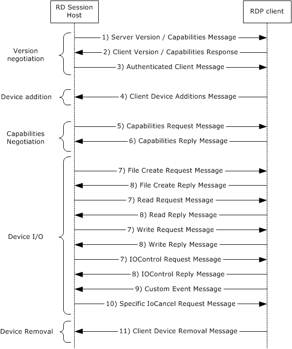

Figure 10: Detailed sequence for redirecting data from a Plug and Play device

The following steps describe this sequence:

- The RD Session Host exposes its capabilities and version information to the RDP client after the RDP connection is initialized, as described in [MS-RDPEPNP](../MS-RDPEPNP/MS-RDPEPNP.md) section 2.2.1.2.
- The RDP client responds by sending its capabilities and version information, as described in [MS-RDPEPNP] section 2.2.1.2.
- When the Plug and Play device is physically added to the RDP client, the RD Session Host sends an Authenticated Client message to the RDP client, as described in [MS-RDPEPNP] section 2.2.1.2.3 and section 2.2.1.3.1.
- The RDP client responds with a Client Device Additions message, as described in [MS-RDPEPNP] section 2.2.1.2.3 and section 2.2.1.3.1.
- The RD Session Host sends a Capabilities Request message to the RDP client, as described in [MS-RDPEPNP] section 2.2.2.2.1.
- The RDP client responds by exposing its capabilities, as described in [MS-RDPEPNP] section 2.2.2.2.2.
- Depending on the Plug and Play device added, device I/O messages such as File Create/Read/Write/IOControl Request messages can be sent from the TS Server to the RDP client.
- The RDP client responds with File Create/Read/Write/IOControl Response messages.
- The RDP client can send Custom Event messages to the TS Server with details.
- Depending on the RDP client message, the RD Session Host will send a Specific IoCancel Request message. For more details on steps 7 through 10, see [MS-RDPEPNP] section 2.2.2.3.
- The RDP client responds by sending a Client Device Removal message, as described in [MS-RDPEPNP] section 2.2.1.2.3 and section 2.2.1.3.2.

## 3.4 Example 4: Redirecting Clipboard Data

This example demonstrates the process of redirecting clipboard data on a remote application running on an RD Session Host server as described in section [2.5.2.2](#Section_2.5.2.2).

**Prerequisites**

The RDP client is connected to the RD Session Host. The RDP connection supports clipboard redirection. The remote desktop or remote application is running on the RD Session Host. The RD Session Host has permission to access the clipboard on the RDP client.

**Initial System State**

The RDP client and RD Session Host are connected but no clipboard operations between the client applications are possible.

**Final System State**

The RDP client application will be able to do clipboard operations between client applications.

**Sequence of Events**

The clipboard initialization sequence and the clipboard data transfer sequence is illustrated in the following diagrams.

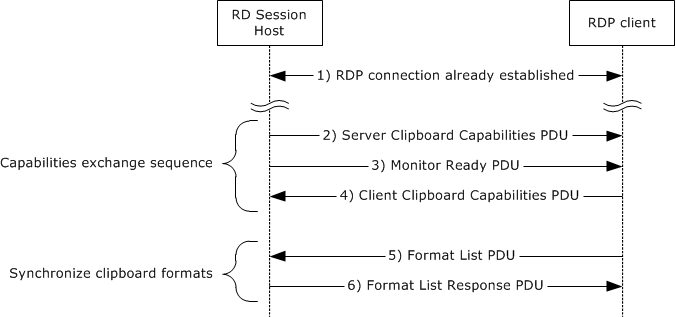

Figure 11: Clipboard initialization sequence

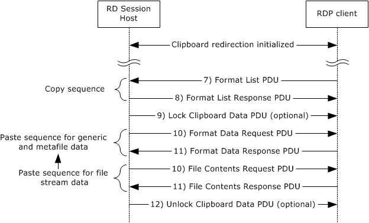

Figure 12: Data transfer sequence

The steps of the clipboard initialization sequence and data transfer sequence are as follows:

- The RDP client establishes a Remote Desktop Protocol (RDP) connection with the RD Session Host.
- The RD Session Host sends a Clipboard Capabilities protocol data unit (PDU) to the RDP client to advertise the capabilities that it supports.
- The RD Session Host sends a Monitor Ready PDU to the RDP client.
- Upon receiving the Monitor Ready PDU, the RDP client transmits its capabilities to the RD Session Host by using a Clipboard Capabilities PDU. For more details on steps 2, 3, and 4, see [MS-RDPECLIP](../MS-RDPECLIP/MS-RDPECLIP.md) section 2.2.2.
- The final stage of the Initialization Sequence involves synchronizing the clipboard formats on the RD Session Host clipboard and the RDP client. This is accomplished by effectively mimicking a copy operation on the RDP client by forcing it to send a Format List PDU to the RD Session Host.
- The RD Session Host responds with a Format List Response PDU.
- To copy the data, the RDP client sends a Format List PDU to the RD Session Host.
- The RD Session Host responds with a Format List Response PDU. For more details on steps 5 through 8, see [MS-RDPECLIP] section 2.2.3.
- The RD Session Host sends a Lock Clipboard Data PDU to retain data on the clipboard until Unlock Clipboard Data PDU, as described in [MS-RDPECLIP] section 2.2.4, is received<5>.
- The RD Session Host sends a Format Data Request PDU in cases of generic or metafile data or a File Contents Request PDU in cases of file stream data, as described in [MS-RDPECLIP] section 2.2.5.
- The client sends a Format Data Response PDU/File Contents Response PDU (with the data) accordingly, in response to the request sent by the RD Session Host, as described in [MS-RDPECLIP] section 2.2.5.
- The RD Session Host sends an Unlock Clipboard Data PDU to release data on the clipboard that was locked by the Lock Clipboard Data PDU, as described in [MS-RDPECLIP] section 2.2.4<6>.
The Lock Clipboard Data PDU can be sent at any point in time after the Format list PDU message of the Clipboard Initialization Sequence, and the Unlock Clipboard Data PDU can be sent only after the Lock Clipboard Data PDU is sent.

## 3.5 Example 5: Disconnection Sequence

This example demonstrates the process of disconnecting an RDP client from an RD Session Host as described in section [2.5.3](#Section_2.5.3).

There are two ways an RDP client can leave a connection with an RD Session Host:

- The user of the RDP client logs off from the RD Session Host.
- The RDP client is disconnected from an RD Session Host.

### 3.5.1 RDP Client Logoff from RD Session Host

This example demonstrates the process of disconnecting an RDP client from an RD Session Host as described in section [2.5.3.1](#Section_2.5.3.1).

**Prerequisites**

Licensing, authentication, authorization, and DNS services are available. A connection exists between the RDP client and RD Session Host.

**Initial System State**

The RDP client and RD Session Host are connected.

**Final System State**

The RDP client and RD Session Host are disconnected.

**Sequence of Events**

The disconnecting sequence is illustrated in the following diagram.

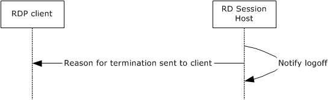

Figure 13: Sequence of RDP client logging off from RD Session Host

The following steps describe one particular example of this sequence:

- The user attempts to log off the remote desktop.
- After logging off the remote desktop, the RD Session Host communicates the reason for termination to the client by carrying out the following optional actions in sequence ([MS-RDPBCGR](../MS-RDPBCGR/MS-RDPBCGR.md) section 1.3.1.4.2):
- Sending a Set Error Info PDU ([MS-RDPBCGR] section 2.2.5.1.1) containing the error code 0x0000000C (ERRINFO_LOGOFF_BY_USER).
- Sending an MCS Disconnect Provider Ultimatum PDU ([MS-RDPBCGR] section 2.2.2.3) with the reason code set to "user requested".
- The RD Session Host terminates the user session and cleans up resources associated with the session.

### 3.5.2 RDP Client Disconnects from RD Session Host

This example demonstrates the process of disconnecting an RDP client from an RD Session Host as described in section [2.5.3.2](#Section_2.5.3.2).

**Prerequisites**

Licensing, authentication, authorization, and DNS services are available. A connection exists between the RDP client and RD Session Host.

**Initial System State**

The RDP client and RD Session Host are connected.

**Final System State**

The RDP client and RD Session Host are disconnected.

**Sequence of Events**

The disconnecting sequence is illustrated in the following diagram.

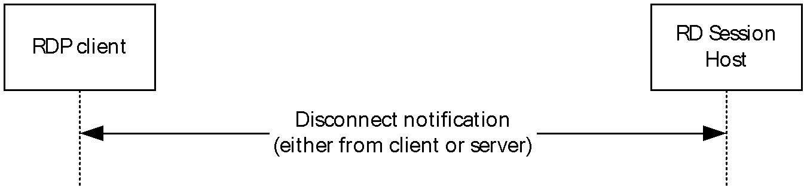

Figure 14: Disconnecting an RDP client from an RD Session Host

The following steps describe this sequence:

- The RDP client does not perform any action and remains idle for a certain period of time.
- The RDP client will be disconnected from the RD Session Host due to the RDP client being turned off because of network problems, or for other reasons. In these cases, the user session established on the RD Session Host remains active for a certain amount of time, depending on how the RD Session Host is configured.

## 3.6 Example 6: Establishing a Multitransport Connection

This example demonstrates the process of establishing a multitransport connection as described in section [2.5.1.5](#Section_2.5.1.5).

**Prerequisites**

- A valid, non-expired license exists for the client on the License Server.
- The RD Session Host server is operational and listening for an RDP connect request on port 3389. If the RDP client is using the IPv6 protocol, the RD Session Host supports the IPv6 protocol.
**Initial System State**

The RDP client and RD Session Host are not connected.

**Final System State**

The RDP client is connected to the RD Session Host and a multitransport connection exists which can be used to tunnel dynamic virtual channel data.

**Sequence of Events**

The multitransport setup sequence is initiated after the licensing phase of the RDP handshake [MS-RDPBCGR](../MS-RDPBCGR/MS-RDPBCGR.md) (section 1.3.1.1) and is illustrated in the following diagram:

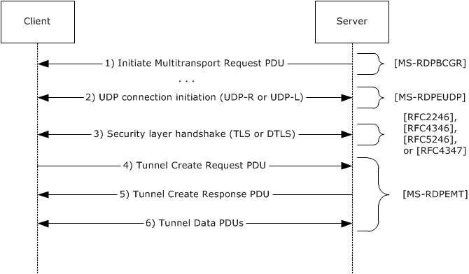

Figure 15: Establishing a Multitransport Connection

- The RDP server initiates a multitransport connection by sending an Initiate Multitransport Request PDU ([MS-RDPBCGR] section 2.2.15.1) to the RDP client over the main RDP connection.
- Upon receiving the Initiate Multitransport Request PDU, the client initiates the creation of the requested transport (reliable or lossy UDP) as described in [MS-RDPEUDP](../MS-RDPEUDP/MS-RDPEUDP.md) sections 1.3.2 and 1.3.2.1.
- After the transport has been successfully set up, the connection is secured by using Transport Layer Security (TLS) or Datagram Transport Layer Security (DTLS) to set up a secure channel. TLS ([[RFC2246]](https://go.microsoft.com/fwlink/?LinkId=90324), [[RFC4346]](https://go.microsoft.com/fwlink/?LinkId=90474) and [[RFC5246]](https://go.microsoft.com/fwlink/?LinkId=129803)) is used to secure reliable UDP transport connections, while DTLS ([[RFC4347]](https://go.microsoft.com/fwlink/?LinkId=227111)) is used to secure lossy UDP transport connections.
- After the secure channel has been established, the client finalizes the creation of the multitransport connection by sending a request ID and a security cookie to the server in the Tunnel Create Request PDU ([MS-RDPEMT](../MS-RDPEMT/MS-RDPEMT.md) section 2.2.2.1); this PDU is sent over the newly created and secured multitransport connection. The data sent in the Tunnel Create Request PDU is identical to the data that the client received over the main RDP connection as part of the Initiate Multitransport Request PDU. The server compares the data in the Tunnel Create Request PDU to the data that was sent over the main RDP connection in the Initiate Multitransport Request PDU.
- When the security check succeeds, the server indicates to the client that it was able to successfully initialize the multitransport connection by sending the Tunnel Create Response PDU ([MS-RDPEMT] section 2.2.2.2) over the multitransport connection.
- The server and client start transferring data over the multitransport connection.

# 4 Microsoft Implementations

The information in this specification is applicable to the following versions of Windows:

- Windows 2000 operating system
- Windows 2000 Server operating system
- Windows XP operating system
- Windows Server 2003 operating system
- Windows Vista operating system
- Windows Server 2008 operating system
- Windows 7 operating system
- Windows Server 2008 R2 operating system
- Windows 8 operating system
- Windows Server 2012 operating system
- Windows 8.1 operating system
- Windows Server 2012 R2 operating system
- Windows 10 operating system
- Windows Server 2016 operating system
- Windows Server operating system
- Windows Server 2019 operating system
- Windows Server 2022 operating system
- Windows 11 operating system
There are no variations in the behavior of the Remote Desktop Services protocols in different versions of Windows beyond those described in the specifications of the protocols supported by the system, as listed in section [Protocol Summary](#Section_2.2).

## 4.1 Product Behavior

<1> Section 2: UDP connection and data transfer is not supported by the Windows 2000, Windows 2000 Server, Windows XP, Windows Server 2003, Windows Vista, Windows Server 2008, Windows 7, and Windows Server 2008 R2 operating systems.

<2> Section 2: Remote Desktop Protocol: Graphics Pipeline Extension is not supported by the Windows 2000, Windows 2000 Server, Windows XP, Windows Server 2003, Windows Vista, Windows Server 2008, Windows 7, and Windows Server 2008 R2 operating systems.

<3> Section 2.1.1.2: Remote Desktop Protocol: Input Virtual Channel Extension is used for remoting touch and pen input and is not applicable in the Windows 2000, Windows 2000 Server, Windows XP, Windows Server 2003, Windows Vista, Windows Server 2008, Windows 7, and Windows Server 2008 R2 operating systems. Redirection of pen input is not supported by Windows 8, Windows Server 2012 operating system, Windows 8.1, and Windows Server 2012 R2.

<4> Section 2.9.1: In the Microsoft implementation of the Remote Desktop Services, the Windows security system is leveraged when handling user passwords.

<5> Section 3.4: The Lock Clipboard Data PDU and Unlock Clipboard Data PDU are mandatory in Windows 7 and Windows Server 2008 R2 operating system.

<6> Section 3.4: The Lock Clipboard Data PDU and Unlock Clipboard Data PDU are mandatory in Windows 7 and Windows Server 2008 R2.

# 5 Change Tracking

This section identifies changes that were made to this document since the last release. Changes are classified as Major, Minor, or None.

The revision class **Major** means that the technical content in the document was significantly revised. Major changes affect protocol interoperability or implementation. Examples of major changes are:

- A document revision that incorporates changes to interoperability requirements.
- A document revision that captures changes to protocol functionality.
The revision class **Minor** means that the meaning of the technical content was clarified. Minor changes do not affect protocol interoperability or implementation. Examples of minor changes are updates to clarify ambiguity at the sentence, paragraph, or table level.

The revision class **None** means that no new technical changes were introduced. Minor editorial and formatting changes may have been made, but the relevant technical content is identical to the last released version.

The changes made to this document are listed in the following table. For more information, please contact [dochelp@microsoft.com](mailto:dochelp@microsoft.com).

| Section | Description | Revision class |
| --- | --- | --- |
| [2.2](#Section_2.2) Protocol Summary | Added MS-RDPEWA to the list of protocols in the summary table. | Minor |

## Revision History

| Date | Version | Revision Class | Comments |
| --- | --- | --- | --- |
| 3/30/2012 | 1.0 | New | Released new document. |
| 7/12/2012 | 1.0 | None | No changes to the meaning, language, or formatting of the technical content. |
| 10/25/2012 | 2.0 | Major | Updated and revised the technical content. |
| 1/31/2013 | 2.0 | None | No changes to the meaning, language, or formatting of the technical content. |
| 8/8/2013 | 3.0 | Major | Updated and revised the technical content. |
| 11/14/2013 | 4.0 | Major | Updated and revised the technical content. |
| 2/13/2014 | 4.0 | None | No changes to the meaning, language, or formatting of the technical content. |
| 5/15/2014 | 4.0 | None | No changes to the meaning, language, or formatting of the technical content. |
| 6/30/2015 | 5.0 | Major | Significantly changed the technical content. |
| 9/24/2015 | 5.1 | Minor | Clarified the meaning of the technical content. |
| 10/16/2015 | 5.1 | None | No changes to the meaning, language, or formatting of the technical content. |
| 9/26/2016 | 5.2 | Minor | Clarified the meaning of the technical content. |
| 6/1/2017 | 5.2 | None | No changes to the meaning, language, or formatting of the technical content. |
| 12/15/2017 | 6.0 | Major | Significantly changed the technical content. |
| 11/5/2018 | 7.0 | Major | Significantly changed the technical content. |
| 6/3/2021 | 8.0 | Major | Significantly changed the technical content. |
| 10/26/2021 | 9.0 | Major | Significantly changed the technical content. |
| 3/13/2023 | 9.1 | Minor | Clarified the meaning of the technical content. |
