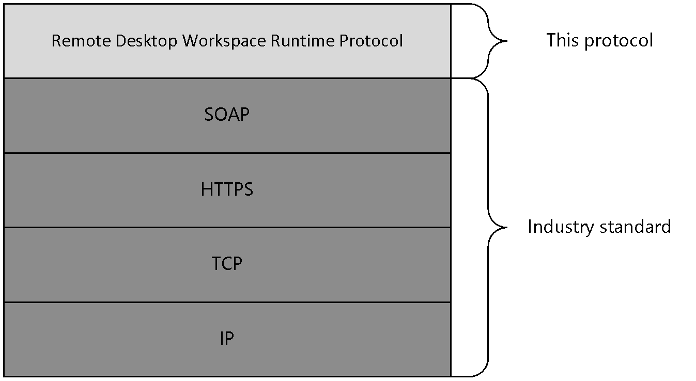

# [MS-RDWR]: Remote Desktop Workspace Runtime Protocol

Table of Contents

1 Introduction

- [1 Introduction](#Section_1)
  - [1.1 Glossary](#Section_1.1)
  - [1.2 References](#Section_1.2)
    - [1.2.1 Normative References](#Section_1.2.1)
    - [1.2.2 Informative References](#Section_1.2.2)
  - [1.3 Overview](#Section_1.3)
  - [1.4 Relationship to Other Protocols](#Section_1.4)
  - [1.5 Prerequisites/Preconditions](#Section_1.5)
  - [1.6 Applicability Statement](#Section_1.6)
  - [1.7 Versioning and Capability Negotiation](#Section_1.7)
  - [1.8 Vendor-Extensible Fields](#Section_1.8)
  - [1.9 Standards Assignments](#Section_1.9)

2 Messages

- [2 Messages](#Section_2)
  - [2.1 Transport](#Section_2.1)
  - [2.2 Common Message Syntax](#Section_2.2)
    - [2.2.1 Namespaces](#Section_2.2.1)
    - [2.2.2 Messages](#Section_2.2.2)
    - [2.2.3 Elements](#Section_2.2.3)
    - [2.2.4 Complex Types](#Section_2.2.4)
    - [2.2.5 Simple Types](#Section_2.2.5)
    - [2.2.6 Attributes](#Section_2.2.6)
    - [2.2.7 Groups](#Section_2.2.7)
    - [2.2.8 Attribute Groups](#Section_2.2.8)
    - [2.2.9 Common Data Structures](#Section_2.2.9)

3 Protocol Details

- [3 Protocol Details](#Section_3)
  - [3.1 RDWebServiceSoap Server Details](#Section_3.1)
    - [3.1.1 Abstract Data Model](#Section_3.1.1)
    - [3.1.2 Timers](#Section_3.1.2)
    - [3.1.3 Initialization](#Section_3.1.3)
    - [3.1.4 Message Processing Events and Sequencing Rules](#Section_3.1.4)
      - [3.1.4.1 GetRDPFiles](#Section_3.1.4.1)
        - [3.1.4.1.1 Messages](#Section_3.1.4.1.1)
          - [3.1.4.1.1.1 RDWebService_GetRDPFiles_InputMessage Message](#Section_3.1.4.1.1.1)
          - [3.1.4.1.1.2 RDWebService_GetRDPFiles_OutputMessage Message](#Section_3.1.4.1.1.2)
        - [3.1.4.1.2 Elements](#Section_3.1.4.1.2)
          - [3.1.4.1.2.1 GetRDPFiles](#Section_3.1.4.1.2.1)
          - [3.1.4.1.2.2 GetRDPFilesResponse](#Section_3.1.4.1.2.2)
        - [3.1.4.1.3 Complex Types](#Section_3.1.4.1.3)
          - [3.1.4.1.3.1 ArrayOfReconnectContent](#Section_3.1.4.1.3.1)
          - [3.1.4.1.3.2 ReconnectContent](#Section_3.1.4.1.3.2)
          - [3.1.4.1.3.3 ReconnectContents](#Section_3.1.4.1.3.3)
        - [3.1.4.1.4 Simple Types](#Section_3.1.4.1.4)
          - [3.1.4.1.4.1 ReconnectContentType](#Section_3.1.4.1.4.1)
    - [3.1.5 Timer Events](#Section_3.1.5)
    - [3.1.6 Other Local Events](#Section_3.1.6)
  - [3.2 RDWebServiceSoap Client Details](#Section_3.2)
    - [3.2.1 Abstract Data Model](#Section_3.2.1)
    - [3.2.2 Timers](#Section_3.2.2)
    - [3.2.3 Initialization](#Section_3.2.3)
    - [3.2.4 Message Processing Events and Sequencing Rules](#Section_3.2.4)
    - [3.2.5 Timer Events](#Section_3.2.5)
    - [3.2.6 Other Local Events](#Section_3.2.6)

4 Protocol Examples

- [4 Protocol Examples](#Section_4)
  - [4.1 An HTTP post request for data from the web service](#Section_4.1)
  - [4.2 A sample of the resources returned](#Section_4.2)

5 Security

- [5 Security](#Section_5)
  - [5.1 Security Considerations for Implementers](#Section_5.1)
  - [5.2 Index of Security Parameters](#Section_5.2)

6 Appendix A: Full WSDL

- [6 Appendix A: Full WSDL](#Section_6)

7 Appendix B: Product Behavior

- [7 Appendix B: Product Behavior](#Section_7)

8 Change Tracking

- [8 Change Tracking](#Section_8)

For the legal notice and IP terms, see [LEGAL.md](../LEGAL.md).
Last updated: 4/23/2024.
See [Revision History](#revision-history) for full version history.

# 1 Introduction

The Remote Desktop Workspace Runtime Protocol is a Web service-based protocol used to remotely retrieve the contents of the Remote Desktop Protocol (RDP) file that is associated to a user’s remote desktop or application-sharing session on a remote computer.

Sections 1.5, 1.8, 1.9, 2, and 3 of this specification are normative. All other sections and examples in this specification are informative.

## 1.1 Glossary

This document uses the following terms:

**Hypertext Transfer Protocol Secure (HTTPS)**: An extension of HTTP that securely encrypts and decrypts web page requests. In some older protocols, "Hypertext Transfer Protocol over Secure Sockets Layer" is still used (Secure Sockets Layer has been deprecated). For more information, see [[SSL3]](https://go.microsoft.com/fwlink/?LinkId=90534) and [[RFC5246]](https://go.microsoft.com/fwlink/?LinkId=129803).

**remote application**: An application running on a remote server.

**Remote Desktop Protocol (RDP)**: A multi-channel protocol that allows a user to connect to a computer running Microsoft Terminal Services (TS). RDP enables the exchange of client and server settings and also enables negotiation of common settings to use for the duration of the connection, so that input, graphics, and other data can be exchanged and processed between client and server.

**SOAP**: A lightweight protocol for exchanging structured information in a decentralized, distributed environment. [**SOAP**](#gt_soap) uses [**XML**](#gt_xml) technologies to define an extensible messaging framework, which provides a message construct that can be exchanged over a variety of underlying protocols. The framework has been designed to be independent of any particular programming model and other implementation-specific semantics. SOAP 1.2 supersedes SOAP 1.1. See [[SOAP1.2-1/2003]](https://go.microsoft.com/fwlink/?LinkId=90521).

**SOAP action**: The HTTP request header field used to indicate the intent of the [**SOAP**](#gt_soap) request, using a [**URI**](#gt_uniform-resource-identifier-uri) value. See [[SOAP1.1]](https://go.microsoft.com/fwlink/?LinkId=90520) section 6.1.1 for more information.

**SOAP body**: A container for the payload data being delivered by a [**SOAP message**](#gt_soap-message) to its recipient. See [[SOAP1.2-1/2007]](https://go.microsoft.com/fwlink/?LinkId=94664) section 5.3 for more information.

**SOAP message**: An [**XML**](#gt_xml) document consisting of a mandatory SOAP envelope, an optional SOAP header, and a mandatory [**SOAP body**](#gt_soap-body). See [SOAP1.2-1/2007] section 5 for more information.

**terminal services (TS)**: A service on a server computer that allows delivery of applications, or the desktop itself, to various computing devices. When a user runs an application on a terminal server, the application execution takes place on the server computer and only keyboard, mouse, and display information is transmitted over the network. Each user sees only his or her individual session, which is managed transparently by the server operating system and is independent of any other client session.

**Uniform Resource Identifier (URI)**: A string that identifies a resource. The URI is an addressing mechanism defined in Internet Engineering Task Force (IETF) Uniform Resource Identifier (URI): Generic Syntax [[RFC3986]](https://go.microsoft.com/fwlink/?LinkId=90453).

**Uniform Resource Locator (URL)**: A string of characters in a standardized format that identifies a document or resource on the World Wide Web. The format is as specified in [[RFC1738]](https://go.microsoft.com/fwlink/?LinkId=90287).

**WSDL message**: An abstract, typed definition of the data that is communicated during a [**WSDL operation**](#gt_wsdl-operation) [[WSDL]](https://go.microsoft.com/fwlink/?LinkId=90577). Also, an element that describes the data being exchanged between web service providers and clients.

**WSDL operation**: A single action or function of a web service. The execution of a WSDL operation typically requires the exchange of messages between the service requestor and the service provider.

**XML**: The Extensible Markup Language, as described in [[XML1.0]](https://go.microsoft.com/fwlink/?LinkId=90599).

**XML namespace**: A collection of names that is used to identify elements, types, and attributes in XML documents identified in a URI reference [RFC3986]. A combination of XML namespace and local name allows XML documents to use elements, types, and attributes that have the same names but come from different sources. For more information, see [[XMLNS-2ED]](https://go.microsoft.com/fwlink/?LinkId=90602).

**MAY, SHOULD, MUST, SHOULD NOT, MUST NOT:** These terms (in all caps) are used as defined in [[RFC2119]](https://go.microsoft.com/fwlink/?LinkId=90317). All statements of optional behavior use either MAY, SHOULD, or SHOULD NOT.

## 1.2 References

Links to a document in the Microsoft Open Specifications library point to the correct section in the most recently published version of the referenced document. However, because individual documents in the library are not updated at the same time, the section numbers in the documents may not match. You can confirm the correct section numbering by checking the [Errata](https://go.microsoft.com/fwlink/?linkid=850906).

### 1.2.1 Normative References

We conduct frequent surveys of the normative references to assure their continued availability. If you have any issue with finding a normative reference, please contact [dochelp@microsoft.com](mailto:dochelp@microsoft.com). We will assist you in finding the relevant information.

[MS-TSWP] Microsoft Corporation, "[Terminal Services Workspace Provisioning Protocol](../MS-TSWP/MS-TSWP.md)".

[RFC2119] Bradner, S., "Key words for use in RFCs to Indicate Requirement Levels", BCP 14, RFC 2119, March 1997, [https://www.rfc-editor.org/info/rfc2119](https://go.microsoft.com/fwlink/?LinkId=90317)

[RFC2818] Rescorla, E., "HTTP Over TLS", RFC 2818, May 2000, [https://www.rfc-editor.org/info/rfc2818](https://go.microsoft.com/fwlink/?LinkId=90383)

[SOAP1.1] Box, D., Ehnebuske, D., Kakivaya, G., et al., "Simple Object Access Protocol (SOAP) 1.1", W3C Note, May 2000, [https://www.w3.org/TR/2000/NOTE-SOAP-20000508/](https://go.microsoft.com/fwlink/?LinkId=90520)

[SOAP1.2-1/2003] Gudgin, M., Hadley, M., Mendelsohn, N., et al., "SOAP Version 1.2 Part 1: Messaging Framework", W3C Recommendation, June 2003, [http://www.w3.org/TR/2003/REC-soap12-part1-20030624](https://go.microsoft.com/fwlink/?LinkId=90521)

[SOAP1.2-2/2003] Gudgin, M., Hadley, M., Mendelsohn, N., et al., "SOAP Version 1.2 Part 2: Adjuncts", W3C Recommendation, June 2003, [http://www.w3.org/TR/2003/REC-soap12-part2-20030624](https://go.microsoft.com/fwlink/?LinkId=90522)

[WSDL] Christensen, E., Curbera, F., Meredith, G., and Weerawarana, S., "Web Services Description Language (WSDL) 1.1", W3C Note, March 2001, [https://www.w3.org/TR/2001/NOTE-wsdl-20010315](https://go.microsoft.com/fwlink/?LinkId=90577)

[XMLNS-2ED] Bray, T., Hollander, D., Layman, A., and Tobin, R., Eds., "Namespaces in XML 1.0 (Second Edition)", W3C Recommendation, August 2006, [https://www.w3.org/TR/2006/REC-xml-names-20060816/](https://go.microsoft.com/fwlink/?LinkId=90602)

[XMLSCHEMA1] Thompson, H., Beech, D., Maloney, M., and Mendelsohn, N., Eds., "XML Schema Part 1: Structures", W3C Recommendation, May 2001, [https://www.w3.org/TR/2001/REC-xmlschema-1-20010502/](https://go.microsoft.com/fwlink/?LinkId=90608)

[XMLSCHEMA2] Biron, P.V., Ed. and Malhotra, A., Ed., "XML Schema Part 2: Datatypes", W3C Recommendation, May 2001, [https://www.w3.org/TR/2001/REC-xmlschema-2-20010502/](https://go.microsoft.com/fwlink/?LinkId=90610)

### 1.2.2 Informative References

[MS-RDPBCGR] Microsoft Corporation, "[Remote Desktop Protocol: Basic Connectivity and Graphics Remoting](../MS-RDPBCGR/MS-RDPBCGR.md)".

[MSDN-TSCCRDP] Microsoft Corporation, "Terminal Services Client Configuration through the .rdp File", [http://msdn.microsoft.com/en-us/library/aa915001.aspx](https://go.microsoft.com/fwlink/?LinkId=167029)

## 1.3 Overview

The Remote Desktop Workspace Runtime Protocol retrieves [**Remote Desktop Protocol (RDP)**](#gt_remote-desktop-protocol-rdp) files, as described in [[MSDN-TSCCRDP]](https://go.microsoft.com/fwlink/?LinkId=167029), that are required to reestablish connections to a user’s session(s) on a remote server(s). The protocol returns the number of resources that corresponds to the number of connected and disconnected sessions the user has in the deployment. In addition, the type of session (desktop, remote application, or virtual machine (VM)) and the RDP file for reconnecting are returned. In order to reconnect the sessions, the presence of the [**Terminal Services**](#gt_terminal-services-ts) client is required to launch the application, and the Terminal Services client will use the RDP protocol [MS-RDPBCGR](../MS-RDPBCGR/MS-RDPBCGR.md) to connect.

## 1.4 Relationship to Other Protocols

The Remote Desktop Workspace Runtime Protocol uses [**SOAP**](#gt_soap) over [**Hypertext Transfer Protocol over Secure Sockets Layer (HTTPS)**](#gt_9239bd88-9747-44a6-83a6-473f53f175a7), as specified in [[RFC2818]](https://go.microsoft.com/fwlink/?LinkId=90383).

The following diagram illustrates the layering of the protocol stack.

Figure 1: Protocol Stack

## 1.5 Prerequisites/Preconditions

The following are prerequisites for the operation of the Remote Desktop Workspace Runtime Protocol:

- The Remote Desktop Workspace Runtime Protocol does not provide a mechanism for a client to discover the [**Uniform Resource Locator (URL)**](#gt_uniform-resource-locator-url) to the server; consequently, the client requires a valid URL to the server.
- The client machine has the necessary applications to launch any of the [**Remote Desktop Protocol (RDP)**](#gt_remote-desktop-protocol-rdp) configuration files [[MSDN-TSCCRDP]](https://go.microsoft.com/fwlink/?LinkId=167029) returned by the protocol. For example, the [**Terminal Services**](#gt_terminal-services-ts) client is required to launch the application or desktop and will use the RDP protocol [MS-RDPBCGR](../MS-RDPBCGR/MS-RDPBCGR.md) to connect.
- Both client and server implementations of the Remote Desktop Workspace Runtime Protocol are present and running.
- The Remote Desktop Workspace Runtime Protocol uses the authentication model based on [MS-TSWP](../MS-TSWP/MS-TSWP.md). For example, the re-use of the authentication cookie negotiated prior to this protocol starting, as described in [MS-TSWP] section 3.1.1.1.

## 1.6 Applicability Statement

The use of the Remote Desktop Workspace Runtime Protocol is appropriate when the client requires the resource files required to reconnect to the user’s remotely connected sessions. These resources represent the remote applications and or desktops that are associated to the user, in the form of RDP file contents.

## 1.7 Versioning and Capability Negotiation

The Remote Desktop Workspace Runtime Protocol defines a version field to facilitate the process of identifying the protocol version.

## 1.8 Vendor-Extensible Fields

The Remote Desktop Workspace Runtime Protocol does not define any vendor-extensible fields.

## 1.9 Standards Assignments

[**XML namespaces**](#gt_xml-namespace) used by [**SOAP**](#gt_soap)-based protocols are listed in section [2.2.1](#Section_2.2.1).

# 2 Messages

## 2.1 Transport

The Remote Desktop Workspace Runtime Protocol uses [**SOAP**](#gt_soap) over HTTPS for communication. The Remote Desktop Workspace Runtime Protocol is used as the transport to provide access to the user’s RDP file contents that are associated with their active [**remote application**](#gt_remote-application) sessions and/or remote desktop sessions.

## 2.2 Common Message Syntax

This section contains common definitions used by this protocol. The syntax of the definitions uses XML Schema, as defined in [[XMLSCHEMA1]](https://go.microsoft.com/fwlink/?LinkId=90608) and [[XMLSCHEMA2]](https://go.microsoft.com/fwlink/?LinkId=90610), and Web Services Description Language, as defined in [[WSDL]](https://go.microsoft.com/fwlink/?LinkId=90577).

### 2.2.1 Namespaces

This specification defines and references various [**XML namespaces**](#gt_xml-namespace) using the mechanisms specified in [[XMLNS-2ED]](https://go.microsoft.com/fwlink/?LinkId=90602). Although this specification associates a specific XML namespace prefix for each XML namespace that is used, the choice of any particular XML namespace prefix is implementation-specific and not significant for interoperability.

| Prefix | NameSpaces URI | Reference |
| --- | --- | --- |
| soap | http://schemas.xmlsoap.org/wsdl/soap/ | [[SOAP1.1]](https://go.microsoft.com/fwlink/?LinkId=90520) |
| xsd | http://www.w3.org/2001/XMLSchema | [[XMLSCHEMA1]](https://go.microsoft.com/fwlink/?LinkId=90608), [[XMLSCHEMA2]](https://go.microsoft.com/fwlink/?LinkId=90610) |
| soap12 | http://schemas.xmlsoap.org/wsdl/soap12/ | [[SOAP1.2-1/2003]](https://go.microsoft.com/fwlink/?LinkId=90521), [[SOAP1.2-2/2003]](https://go.microsoft.com/fwlink/?LinkId=90522) |
| tns | http://schemas.microsoft.com/ts/2010/09/rdweb | - |
| wsaw | http://www.w3.org/2006/05/addressing/wsdl | - |
| wsdl | http://schemas.xmlsoap.org/wsdl/ | [[WSDL]](https://go.microsoft.com/fwlink/?LinkId=90577) |

### 2.2.2 Messages

This specification does not define any common XML schema message definitions.

### 2.2.3 Elements

This specification does not define any common XML schema element definitions.

### 2.2.4 Complex Types

This specification does not define any common XML schema complex type definitions.

### 2.2.5 Simple Types

This specification does not define any common XML schema simple type definitions.

### 2.2.6 Attributes

This specification does not define any common XML schema attribute definitions.

### 2.2.7 Groups

This specification does not define any common XML schema group definitions.

### 2.2.8 Attribute Groups

This specification does not define any common XML schema attribute group definitions.

### 2.2.9 Common Data Structures

This specification does not define any common XML schema data structures.

# 3 Protocol Details

## 3.1 RDWebServiceSoap Server Details

The following sections describe the behavior of the Remote Desktop Workspace Runtime Protocol. This protocol follows a client-server model, whereby a client sends a [**SOAP message**](#gt_soap-message) that contains a request (a GetRDPFiles operation) to the server, and the server responds with a SOAP message that contains the response.

The following sections describe the behavior of the Remote Desktop Workspace Runtime Protocol.

### 3.1.1 Abstract Data Model

None.

### 3.1.2 Timers

None.

### 3.1.3 Initialization

When this protocol initializes, it MUST begin listening for [**SOAP**](#gt_soap) requests using the standard SOAP protocol and ports.

### 3.1.4 Message Processing Events and Sequencing Rules

This specification includes the following [**WSDL operations**](#gt_wsdl-operation).

| WSDL Operation | Description |
| --- | --- |
| GetRDPFiles | Retrieves an array of resources. |

#### 3.1.4.1 GetRDPFiles

A server processes a GetRDPFiles request using the Remote Desktop Workspace Runtime Protocol upon receiving a [**SOAP message**](#gt_soap-message) that contains the specified [**Uniform Resource Identifier (URI)**](#gt_uniform-resource-identifier-uri) as the [**SOAP action**](#gt_soap-action):

soapAction="http://schemas.microsoft.com/ts/2010/09/rdweb/GetRDPFiles"

This operation is specified by the following WSDL.

<wsdl:operation name="GetRDPFiles">

<wsdl:input wsaw:Action="http://schemas.microsoft.com/ts/2010/09/rdweb/GetRDPFiles" name="RDWebService_GetRDPFiles_InputMessage" message="tns:RDWebService_GetRDPFiles_InputMessage"/>

<wsdl:output wsaw:Action="http://schemas.microsoft.com/ts/2010/09/rdweb/GetRDPFiles" name="RDWebService_GetRDPFiles_OutputMessage" message="tns:RDWebService_GetRDPFiles_OutputMessage"/>

</wsdl:operation>

##### 3.1.4.1.1 Messages

The following table summarizes the set of [**WSDL message**](#gt_wsdl-message) definitions that are specific to this operation.

| Message | Description |
| --- | --- |
| RDWebService_GetRDPFiles_InputMessage | Contains a GetRDPFiles element. A message MUST NOT contain anything in the [**SOAP body**](#gt_soap-body). |
| RDWebService_GetRDPFiles_OutputMessage | The response to a GetRDPFilesSoapIn message, which contains a GetRDPFilesResponse element. A message that either MUST NOT contain anything if no resources are available to connect to or MUST contain resource-specific [**XML**](#gt_xml) in the SOAP body for resources to connect to. |

###### 3.1.4.1.1.1 RDWebService_GetRDPFiles_InputMessage Message

A [**WSDL message**](#gt_wsdl-message) containing the request for **GetRDPFiles** [**WSDL operation**](#gt_wsdl-operation).

The [**SOAP action**](#gt_soap-action) value is:

http://schemas.microsoft.com/ts/2010/09/rdweb/GetRDPFiles

The [**SOAP body**](#gt_soap-body) contains **GetRDPFiles** element.

<wsdl:message name="RDWebService_GetRDPFiles_InputMessage">

<wsdl:part name="GetRDPFiles" element="tns:GetRDPFiles"/>

</wsdl:message>

The GetRDPFilesSoapIn message contains a GetRDPFiles element, as specified in section [3.1.4.1.2.1](#Section_3.1.4.1.2.1).

###### 3.1.4.1.1.2 RDWebService_GetRDPFiles_OutputMessage Message

A [**WSDL message**](#gt_wsdl-message) containing the response for **GetRDPFiles** [**WSDL operation**](#gt_wsdl-operation).

The [**SOAP action**](#gt_soap-action) value is:

http://schemas.microsoft.com/ts/2010/09/rdweb/GetRDPFiles

The [**SOAP body**](#gt_soap-body) contains **GetRDPFilesResponse** element.

<wsdl:message name="RDWebService_GetRDPFiles_OutputMessage">

<wsdl:part name="GetRDPFilesResponse" element="tns:GetRDPFilesResponse"/>

</wsdl:message>

The GetRDPFilesSoapOut message contains a GetRDPFileResponse element in response to a GetRDPFilesSoapIn message. The GetRDPFileResponse element is specified in section [3.1.4.1.2.2](#Section_3.1.4.1.2.2).

##### 3.1.4.1.2 Elements

The following table summarizes the [**XML**](#gt_xml) schema element definitions that are specific to this operation.

| Element | Description |
| --- | --- |
| GetRDPFiles | Forms the body of GetRDPFiles request. An empty type that is used when making the request for RDP files. |
| GetRDPFilesResponse | Contains the response to a GetRDPFiles request. The overall container that defines the protocol configuration. |

###### 3.1.4.1.2.1 GetRDPFiles

The GetRDPFiles element forms the body of the request. This element contains no child elements and conveys no information.

<xsd:element name="GetRDPFiles" nillable="true">

<xsd:complexType/>

</xsd:element>

###### 3.1.4.1.2.2 GetRDPFilesResponse

The GetRDPFilesResponse contains the response to a GetRDPFiles request.

<xsd:element name="GetRDPFilesResponse" nillable="true">

<xsd:complexType>

<xsd:sequence>

<xsd:element minOccurs="1" maxOccurs="1" name="GetRDPFilesResult" nillable="true" type="tns:ReconnectContents"/>

</xsd:sequence>

</xsd:complexType>

</xsd:element>

**GetRDPFilesResult:**

GetRDPFilesResult is a complex type that contains a container called ReconnectContents types. The ReconnectContents container is described in section [3.1.4.1.3.3](#Section_3.1.4.1.3.3). GetRDPFilesResult contains the complex data type ReconnectContents.

The GetRDPFileResponse MUST contain at least one GetRDPFilesResult.

##### 3.1.4.1.3 Complex Types

The following table summarizes the XML schema complex type definitions that are specific to this operation.

| ComplexType | Description |
| --- | --- |
| ArrayOfReconnectContent | The container for the ReconnectContent complex type. |
| ReconnectContent | Used to contain the remote desktop file stream and type of resource defined. |
| ReconnectContents | The container that defines the version and array of contents received by the web server. |

###### 3.1.4.1.3.1 ArrayOfReconnectContent

ArrayOfReconnectContent is a complex type that specifies the collection of ReconnectContent types, as specified in section [3.1.4.1.3.2](#Section_3.1.4.1.3.2).

**Namespace:** http://schemas.microsoft.com/ts/2010/09/rdweb

<xsd:complexType name="ArrayOfReconnectContent">

<xsd:sequence>

<xsd:element minOccurs="0" maxOccurs="unbounded" name="ReconnectContent" nillable="true" type="tns:ReconnectContent"/>

</xsd:sequence>

</xsd:complexType>

**ReconnectContent:** A collection of ReconnectContent types.

###### 3.1.4.1.3.2 ReconnectContent

ReconnectContent has a string element that contains the RDP file stream, and a simple type called ReconnectContentType that is used to specify the type of RDP file stream. ReconnectContentType is specified in section [3.1.4.1.4.1](#Section_3.1.4.1.4.1). The RDP file stream consists of RDP files as described in [[MSDN-TSCCRDP]](https://go.microsoft.com/fwlink/?LinkId=167029).

**Namespace:** http://schemas.microsoft.com/ts/2010/09/rdweb

<xsd:complexType name="ReconnectContent">

<xsd:sequence>

<xsd:element minOccurs="0" maxOccurs="1" name="rdpStream" nillable="true" type="xsd:string"/>

<xsd:element minOccurs="1" maxOccurs="1" name="rct" type="tns:ReconnectContentType"/>

</xsd:sequence>

</xsd:complexType>

**rct:** ReconnectContentType is specified in section 3.1.4.1.4.1.

**rdpStream:** A file stream that consists of RDP files as described in [MSDN-TSCCRDP].

###### 3.1.4.1.3.3 ReconnectContents

The ReconnectContents type has a version string element and either zero or one type of ArrayOfReconnectContent type. The ArrayOfReconnectContent type is specified in section [3.1.4.1.3.1](#Section_3.1.4.1.3.1).

**Namespace:** http://schemas.microsoft.com/ts/2010/09/rdweb

<xsd:complexType name="ReconnectContents">

<xsd:sequence>

<xsd:element minOccurs="0" maxOccurs="1" name="version" nillable="true" type="xsd:string"/>

<xsd:element minOccurs="0" maxOccurs="1" name="wkspRC" nillable="true" type="tns:ArrayOfReconnectContent"/>

</xsd:sequence>

</xsd:complexType>

**version:** A complex type that contains a string to represent versioning of the Remote Desktop Workspace Runtime protocol. Define a value in this operation when it is implemented.

**wkspRC:** An element of type ArrayOfReconnectContent.

##### 3.1.4.1.4 Simple Types

The following table shows the Simple types inlcuded in the operation.

| SimpleType | Description |
| --- | --- |
| ReconnectContentType | An enumerated type to indicate whether the user's resource is remote desktop, remote application, or virtual machine-based. |

###### 3.1.4.1.4.1 ReconnectContentType

The valid values for this enumeration are "REMOTEDESKTOP", "VMREMOTEDESKTOP", or "REMOTEAPPLICATION".

**Namespace:** http://schemas.microsoft.com/ts/2010/09/rdweb

<xsd:simpleType name="ReconnectContentType">

<xsd:restriction base="xsd:string">

<xsd:enumeration value="REMOTEDESKTOP"/>

<xsd:enumeration value="VMREMOTEDESKTOP"/>

<xsd:enumeration value="REMOTEAPPLICATION"/>

</xsd:restriction>

</xsd:simpleType>

The following table specifies the allowable values for **ReconnectContentType.**

| Value | Meaning |
| --- | --- |
| REMOTEDESKTOP | Specifies a session type of remote desktop. |
| VMREMOTEDESKTOP | Specifies a session type of virtual machine. |
| REMOTEAPPLICATION | Specifies a session type of remote application. |

### 3.1.5 Timer Events

None.

### 3.1.6 Other Local Events

None.

## 3.2 RDWebServiceSoap Client Details

The client side of this protocol is simply a pass-through. That is, no additional timers or other state is required on the client side of this protocol. Calls made by the higher-layer protocol or application are passed directly to the transport, and the results returned by the transport are passed directly back to the higher-layer protocol or application.

### 3.2.1 Abstract Data Model

None.

### 3.2.2 Timers

None.

### 3.2.3 Initialization

None.

### 3.2.4 Message Processing Events and Sequencing Rules

None.

### 3.2.5 Timer Events

None.

### 3.2.6 Other Local Events

None.

# 4 Protocol Examples

## 4.1 An HTTP post request for data from the web service

The following is a request and response operation for RDP files resources.

POST /RDWeb/myWeb/rdwebservice.asmx HTTP/1.1

Host: localhost

Content-Type: text/xml; charset=utf-8

Content-Length: length

SOAPAction: "http://schemas.microsoft.com/ts/2010/09/rdweb/GetRDPFiles"

<?xml version="1.0" encoding="utf-8"?>

<soap:Envelope xmlns:xsi="http://www.w3.org/2001/XMLSchema-instance" xmlns:xsd="http://www.w3.org/2001/XMLSchema" xmlns:soap="http://schemas.xmlsoap.org/soap/envelope/">

<soap:Body>

<GetRDPFiles xmlns="http://schemas.microsoft.com/ts/2010/09/rdweb" />

</soap:Body>

</soap:Envelope>

HTTP/1.1 200 OK

Content-Type: text/xml; charset=utf-8

Content-Length: length

<?xml version="1.0" encoding="utf-8"?>

<soap:Envelope xmlns:xsi="http://www.w3.org/2001/XMLSchema-instance" xmlns:xsd="http://www.w3.org/2001/XMLSchema" xmlns:soap="http://schemas.xmlsoap.org/soap/envelope/">

<soap:Body>

<GetRDPFilesResponse xmlns="http://schemas.microsoft.com/ts/2010/09/rdweb">

<GetRDPFilesResult>

<version>string</version>

<wkspRC>

<ReconnectContent>

<rdpStream>string</rdpStream>

<rct>REMOTEAPPLICATION or REMOTEDESKTOP or VMREMOTEDESKTOP</rct>

</ReconnectContent>

<ReconnectContent>

<rdpStream>string</rdpStream>

<rct>REMOTEAPPLICATION or REMOTEDESKTOP or VMREMOTEDESKTOP</rct>

</ReconnectContent>

</wkspRC>

</GetRDPFilesResult>

</GetRDPFilesResponse>

</soap:Body>

</soap:Envelope>

## 4.2 A sample of the resources returned

The request in section [4.1](#Section_4.1) is made and the return is an xml payload consisting of three resources (RDP file streams) that are associated to the user’s remote desktop session, remote application session, or virtual machine.

<?xml version="1.0" encoding="UTF-8"?>

<ReconnectContents xmlns="http://schemas.microsoft.com/ts/2010/09/rdweb" xmlns:xsi="http://www.w3.org/2001/XMLSchema-instance" xmlns:xsd="http://www.w3.org/2001/XMLSchema">

<version>8.0</version>

<wkspRC>

<ReconnectContent>

<rdpStream>redirectclipboard:i:0 redirectprinters:i:0 redirectcomports:i:1 redirectsmartcards:i:0 devicestoredirect:s: drivestoredirect:s:* redirectdrives:i:1 session bpp:i:32 prompt for credentials on client:i:1 server port:i:3389 allow font smoothing:i:1 promptcredentialonce:i:1 authentication level:i:0 gatewayusagemethod:i:2 gatewayprofileusagemethod:i:0 gatewaycredentialssource:i:0 full address:s:RDVB9-101180.rdvteam.stbtest.microsoft.com workspace id:s:RDVB9-101180.rdvteam.stbtest.microsoft.com use redirection server name:i:1 loadbalanceinfo:s:tsv://MS Terminal Services Plugin.1.RDVB9-101180 use multimon:i:0 alternate full address:s:RDVB9-101180.rdvteam.stbtest.microsoft.com signscope:s:Full Address,Alternate Full Address,Use Redirection Server Name,Server Port,GatewayUsageMethod,GatewayProfileUsageMethod,GatewayCredentialsSource,PromptCredentialOnce,Authentication Level,RedirectDrives,RedirectPrinters,RedirectCOMPorts,RedirectSmartCards,RedirectClipboard,DevicesToRedirect,DrivesToRedirect,LoadBalanceInfo signature:s: Full Address,Alternate Full Address,Use Redirection Server Name,Server Port,GatewayUsageMethod,GatewayProfileUsageMethod,GatewayCredentialsSource,PromptCredentialOnce,Alternate Shell,RemoteApplicationProgram,RemoteApplicationMode,RemoteApplicationName,RemoteApplicationCmdLine,Authentication Level,RedirectDrives,RedirectPrinters,RedirectCOMPorts,RedirectSmartCards,RedirectClipboard,DevicesToRedirect,DrivesToRedirect,LoadBalanceInfo

signature:s:AQABAAEAAAAZEgAAMIISFQYJKoZIhvcNAQcCoIISBjCCEgICAQExCzAJBgUrDgMC GgUAMAsGCSqGSIb3DQEHAaCCEI8wggffMIIGx6ADAgECAhBfZzkIP2oDi06PGDo+ oaFJMA0GCSqGSIb3DQEBBQUAMBMxETAPBgNVBAMTCFNTTCBSb290MCAXDTkwMDEw MTAwMDAwMFoYDzIwOTAxMjMxMDAwMDAwWjATMREwDwYDVQQDEwhTU0wgUm9vdDCC ASIwDQYJKoZIhvcNAQEBBQADggEPADCCAQoCggEBAKBSnjeWWYGMhQa1IGbdEkbC ot14+TeYARdNAlsSIXOrD42ohMtR+owHtFAkY4zeanTZWO0vp6erI8osVvSv6jL4 Wf8WQ6qoNPK9WsHb3QbfcCXvq+EzRpiVbr+JF9OYsC2cuq3ZIw/3FnE7jWcbGOn5 DbXCtE6mHbpDgpnq2oG7PsU3rq+EBw8sIvPRegofdEns8GM8Dys+eYbCW4o7+EDy rtaqRuCnjZX5mdmdHIunlD4kzeVv5dFqoZoU5HMBIPPpK+D156+vZrQy6jyKkEqA w1zqBhqvHzXWv9+uYyfjsX82tRr6x3YnVnh5sdH+CMvpLKsr0fhvwe1Ocq3HCvMC AwEAAaOCBSswggUnMAwGA1UdEwQFMAMBAf8wggTVBg8rBgEEAYI3E4LfZ4ajUwEE ggTAMIIEvAQIU1NMVGVzdAAECFNTTFJvb3QAAgEBAgECBAhOAFUATABMAASCBJQH AgAAACQAAFJTQTIACAAAAQABAPMKx61yTu3Bb/jRK6ss6csI/tGxeXhWJ3bH+hq1 Nn+x4ydjrt+/1jUfrxoG6lzDgEqQijzqMrRmr6/n9eAr6fMgAXPkFJqhatHlb+XN JD6Up4scndmZ+ZWNp+BGqtau8kD4O4pbwoZ5PisPPGPw7El0Hwp60fMiLA8HhK+u N8U+u4Ha6pmCQ7odpk60wrUN+ekYG2eNO3EW9w8j2a26nC2wmNMXib9ulZhGM+Gr 7yVw3wbd28FavfI0qKpDFv9Z+DLqr/RWLMojq6enL+1Y2XRq3oxjJFC0B4z6UcuE qI0Pq3MhElsCTRcBmDf5eN2iwkYS3WYgtQaFjIFZljeeUqBfw57B47bG5/MuF5eq COGYcqAkeZDB8Ko3526kln923CqVuWIwg7XfTe3ayvlHP+4VhPlol/pII4OAdsVK NjfuHT/47UabRsmyzTiSCGL/mwGKEVxKxjI5ZLH8lgpb2j/JuhZt2Kd7FLpBHg1Y 3unPcdMBx7BIl8kjRaqVuTmY0u1U7xCewvNjC4O5VckPXukfMo5PadzhAHOp5QoM u6LI3yipTGGT7tFfcOkWaMFf+adtX364x6Trl8EzJHgjaQtvsZ8uegqoymUNffz+ 6fFp2gjKiHu0F4+GL4IiYQ9cijZNB8cZ33MdlXCgBCEGUYcG3u18iBioXBLo2tBF ouPCw2l/8zKg+DQp2LoBjWVkbBl7pw8dXzSUrOWiuaTJnzQ+MQNc9sCc4FJPfYJJ ANWa0ql7FN/5Skc3TU64G0StHnBudaFdF7V82ZYGWKyB3fZ8UNpmkOirxmyLpQQ7 WlcKYfqMiR5rZEbkGjPbkKCieJBUC3UFZnNgMGOLENm18DlReWgN0kNIMH4896mS B6B9kN2ywc1POmAE8DeBX6FzR13rbLKakm8CuTo7arS6nw/OuV1xKkOAMNvgUwFJ g6fqGbjkXoqePIbMXgXqFwXhLkqy/3sVkMW5C4sSQSHuOweWdtg6H6uKnE90OHYq k9FGBZ1F6bYyrTaxo6mObxDkrg5AZLgfp03UYdYADbghMG8oWP5W0wUYEXtH9B0H VO9ZZXg4nr1lfmII2tGY0Hhe6hSyynpkROaE6VI18D0KJ14Gi912YY95aUb0yj4b xcFrQf63P72PSPS1ZAUBlo+UsZ1/XfMvJjYiIvKc+wQ80tG0Vi24hfhcTDpiuNJ4 H/aMKdYwowEpYhQnGrC/yL5juBUhUB3x77lV8qZjb7wF46f9s0azbAf22XktqIC0 GFYEknWor1kiXYMW3DWFVpCd+2YB0c5jGrLivmdQtXcbx7AzcharSknUmVWfRUgC u8aIcVew+6b1Xs1JBsB2vdMPUB/QEZVtQiFfQWtOymxQEVqnZ9B60LBzY00ztkjC f+bNS24V/wo3vfQuEK0CuHLwmDTjr4Z/9ndy4u6PY0xDO9+pgLaWIhVZpkGl2M3g myN+XvtRDT1Olz7YdA96ur6xSWKcZyJPhYSoC0xm2nq/pBknoS585MbixyWQuldg MWhHnWNg0VTBV73zqkiQNmzBJDAdBgNVHQ4EFgQUKMnouHlh+66LZcePcoKz8gNB Ge4wHwYDVR0jBBgwFoAUKMnouHlh+66LZcePcoKz8gNBGe4wDQYJKoZIhvcNAQEF BQADggEBAEKDDEkzEnl+ZO5IckEzk5BuIWtD9ht/1SSIiectM0+tdhJqjLuTcoU6 d/DZoOREQbvfE3ketK9fHcY+leiCigD2g0XYxfNctFxpo1dPbbG1LIiyupUHzNBM mKriwTpXNhaEw1wySjBI9brzB1cOrrGK9Eilo48QLmqPeb4eMrW+h0PFjunaa+kR NABQOfxzwqg32T15z03dTlm59zL/qLvYRS7pDIFGjw4FdbdRhHDSYJv4CSzxcNpd GCmwRLAs92fKT59JBI7DWTozezZPXxf0aAjqfWNwjLgdNedIKcbN0DcAbEZBLQvD xKx2rJseV4iBo28tzGq8+c80fqInoxswggioMIIHkKADAgECAhCwk27ipHlCr02u fWa7Sv3pMA0GCSqGSIb3DQEBBQUAMBMxETAPBgNVBAMTCFNTTCBSb290MB4XDTEx MDIwMzAxMDIzM1oXDTExMDgwMzAxMDIzM1owNTEzMDEGA1UEAxMqUkRWQjktMTAx MTg0LnJkdnRlYW0uc3RidGVzdC5taWNyb3NvZnQuY29tMIIBIjANBgkqhkiG9w0B AQEFAAOCAQ8AMIIBCgKCAQEAoOOcj2o9ZWMG8iiz3e315xMvolgSVY/J6dy4pJz5 ZlsGXODw56nq4r9En8/AxEDqMu2DYJA1mc05xHYzqhZullbAV1khgN+EE2Jy0r0X Tt4slbiEITmtMj5wSYW0qbyrpPP0+inU6Zm+FZhkte+Ery/rO+/09c2ei02VRboQ aEox4jY22nLF7mOCsxdUzfBzFBE7pswtTl/qji6niTf7oyofKFOGZy4EwIrCadtH AvAlBR8GgZ6/snLurFl8bX0w0c5om/bQ51E0t6wPgjlitP41zokkWc9xubTgBb81 jp0+J1SgszJoD1qfRsteafy/MImLVNVfoSHn35GOs9wmZQIDAQABo4IF1DCCBdAw IwYDVR0fBBwwGjAYoBOgEYYPZmlsZTovL3Rlc3QuY3JsgQEAMAwGA1UdEwQFMAMC AQAwCwYDVR0PBAQDAgQwMBMGA1UdJQQMMAoGCCsGAQUFBwMBMBMGA1UdJQQMMAoG CCsGAQUFBwMDMDUGA1UdBwQuMCyCKlJEVkI5LTEwMTE4NC5yZHZ0ZWFtLnN0YnRl c3QubWljcm9zb2Z0LmNvbTA1BgNVHREELjAsgipSRFZCOS0xMDExODQucmR2dGVh bS5zdGJ0ZXN0Lm1pY3Jvc29mdC5jb20wggTTBg8rBgEEAYI3E4LfZ4ajUwEEggS+ MIIEugQIU1NMVGVzdAAEBnZhbGlkAAIBBAIBAQQITgBVAEwATAAEggSUBwIAAACk AABSU0EyAAgAAAEAAQBlJtyzjpHf5yGhX9VUi4kwv/xpXstGn1oPaDKzoFQnPp2O Nb8F4LS5cc9ZJInONf60YjmCD6y3NFHn0PabaM7RMH1tfFms7nKyv56BBh8FJfAC R9tpworABC5nhlMoHyqj+zeJpy6O6l9OLcymOxEUc/DNVBezgmPuxXLaNjbiMUpo ELpFlU2Lns319O876y+vhO+1ZJgVvpnp1Cn69POkq7yptIVJcD4yrTkhhLiVLN5O F73ScmIThN+AIVlXwFaWbhaqM3bEOc2ZNZBgg+0y6kDEwM+fRL/i6qnn8OBcBltm +ZykuNzpyY9VEliiLxPn9e3dsyjyBmNlPWqPnOOgE7R0OUSrYkiqVVnWDi+4qbfr yIkWgAnNx3qxUeBnrigL0948NHP6qHJuqiu1fz4yU/tbhlDlKJ0u2UziMhI5m66j LI2UU2b4x9LopuVcno8cVTwTmw7BCRJZsO3/VO75lyAtDHc+QLQ39rp846nE50+u JvZW6BU6/hYlIZT+gtCnWmT+Ixur1/r++4OOSgMiAtjR9liFdsoEN6LJwGzx+wFy Tt7P1OdJeLSiVir+6CUodaAFs+tfgDToSjsduT9wFRm8i83EXTu7xFwhGJZKgGsU vl6waYIsJZs+QZx/p1WtUNGMI3jyEvl6qGeloYpjmseTy0V86grxFyKZIAuIxeul EvAm6b1qD/btM0YMFZ8RNk7in8OjlBfZyO0f5kMvgBASipOvxGMcpnOmBsxKVpb8 ZBI+K7EWdkjq+W9ViatqO/6Qj9rVu5I5aWAPUoyxy3IF1E3yRs4pvPmNZzxpEh1/ dG19wlebHQZY3cZ1mN602j2fHZlyRHPCPdNBoGFLm/N2Z4qK5OtekuuH1k+xB4qY leZrC7sDVnPl28CroKI4G9SM8OSkPikKsrP34BcoGRoTFpeKkBQAk5fQOUbqUZit sVImrLLexBexlI9l84YBkf8rLaFWajFK+p1H68qBRFkOsvCpUWhBtiqc447qtCYj WrwUph6yt+orXmzkfiuKLcdJ1WJfb2t4JxwQf8OJWKxIKfVZy+aOk4BaB57PyC3o M/JRdxkCizW7G0W49nD4aMBiJNcgnsdnDm9ZhWUX1sMQKQwqvG7g4YGBWwG+8Zjv 99NT+V3Sw/LUbG7tjsAnPzJYG0Y6prwF749+M2FnBBOZWwdIrACT7izOGKEcPxWT LnKFu7PSksomly7cq5NskYD8bamcmxSIS7jwav/BLuTRGV5EWvGeM8eUfDkxQRRI OW3IDw0HjD6VYVNjyHs7q+xkNJsSBPRqD9mGgFfTjtyOhwHmLrIDwIJzIr54XqlT 8f7Dj4P5vPcUZhtOHC+00ZElmp7tODHX191uotAiPKSa3zH5S0kP93hOwepoZYhn rJNDDLpSk0rzyPZeg5F0W4ZmNv3YrLQ47RdoZbOPBu+U5yyD200lbHlRli56NJgr NsZMKnwx/Zghl/Yb9mge+jEbqUmxCfGrNTw7gIyXc3lS2CCVQLPcjTa5RjoaUobj bAzFh6uMUZaTUXKVU48wHwYDVR0jBBgwFoAUKMnouHlh+66LZcePcoKz8gNBGe4w DQYJKoZIhvcNAQEFBQADggEBAIIBdFJe+7TwikFEdvyJMkBeGigESQU3qIR8KBjC +EjuCWa2kEnh2H8MdEK1YAucHPJyFCwIo3RRb72HTeAb9/K0GlLuLiHEG6QJPO8U 8nE7vLncBCkVZ3RsoZnwqZBYXq7cGxOIOmEeNbB5z6IZUgqhwn1VxxfEz0eM2yw8 GGymBseh5F+PSCd6m8Xwfpv++MLymAFnYAASVLfviH+ZohNKPvpr7LAE6MlB6UFT LlSjDg+te1NAJGlPoEQlL1yNIkwIMo7fyJyA2QFFcHHW00X+kdZK62LK6lUAMYTi MOMhs3XOnNVUkzMPILVnC/W4WvgChZFl4dA9dNknm0WIEp8xggFOMIIBSgIBATAn MBMxETAPBgNVBAMTCFNTTCBSb290AhCwk27ipHlCr02ufWa7Sv3pMAkGBSsOAwIa BQAwDQYJKoZIhvcNAQEBBQAEggEARg6AoNGE/Fg16ohkHCT+AivrjbLSELtfB62m MBkmwGGl4M6GsM7x/pnhMrE1iGMXy91Oc/wdv0hojRhLo43DEdu/sQ0GgIkzFOFu C1gmLu88wUp7L45o7lWtrhwOWWsjMVskbj//5XGrQ9dJnFb2s0cFhtCTEkKuXMRA dSPn0YFHS2Uzk6hhNMmjQ1+jlEJy5mFAod1jHAJrdwaQcE7Ttwp5jh0zntUbKFE6 1z26UTmt4V61+Z/eqwtPvcAyibgUwVl80TayNSbmUd7fqVDPVaO9D+Pn4k1pEzfR 5dEvdHbLSCHbB7zr1YUh7KGsDCftNm7EIJZWXzoBnGwE6RAJSg==

</rdpStream>

<rct>REMOTEDESKTOP</rct>

</ReconnectContent>

<ReconnectContent>

<rdpStream>redirectclipboard:i:0 redirectprinters:i:0 redirectcomports:i:1 redirectsmartcards:i:0 devicestoredirect:s: drivestoredirect:s:* redirectdrives:i:1 session bpp:i:32 prompt for credentials on client:i:1 server port:i:3389 allow font smoothing:i:1 promptcredentialonce:i:1 authentication level:i:0 gatewayusagemethod:i:2 gatewayprofileusagemethod:i:0 gatewaycredentialssource:i:0 full address:s:RDVB9-101180.rdvteam.stbtest.microsoft.com workspace id:s:RDVB9-101180.rdvteam.stbtest.microsoft.com use redirection server name:i:1 loadbalanceinfo:s:tsv://MS Terminal Services Plugin.1.RDVB9-101180 use multimon:i:0 alternate full address:s:RDVB9-101180.rdvteam.stbtest.microsoft.com signscope:s:Full Address,Alternate Full Address,Use Redirection Server Name,Server Port,GatewayUsageMethod,GatewayProfileUsageMethod,GatewayCredentialsSource,PromptCredentialOnce,Authentication Level,RedirectDrives,RedirectPrinters,RedirectCOMPorts,RedirectSmartCards,RedirectClipboard,DevicesToRedirect,DrivesToRedirect,LoadBalanceInfo signature:s: Full Address,Alternate Full Address,Use Redirection Server Name,Server Port,GatewayUsageMethod,GatewayProfileUsageMethod,GatewayCredentialsSource,PromptCredentialOnce,Alternate Shell,RemoteApplicationProgram,RemoteApplicationMode,RemoteApplicationName,RemoteApplicationCmdLine,Authentication Level,RedirectDrives,RedirectPrinters,RedirectCOMPorts,RedirectSmartCards,RedirectClipboard,DevicesToRedirect,DrivesToRedirect,LoadBalanceInfo

signature:s:AQABAAEAAAAZEgAAMIISFQYJKoZIhvcNAQcCoIISBjCCEgICAQExCzAJBgUrDgMC GgUAMAsGCSqGSIb3DQEHAaCCEI8wggffMIIGx6ADAgECAhBfZzkIP2oDi06PGDo+ oaFJMA0GCSqGSIb3DQEBBQUAMBMxETAPBgNVBAMTCFNTTCBSb290MCAXDTkwMDEw MTAwMDAwMFoYDzIwOTAxMjMxMDAwMDAwWjATMREwDwYDVQQDEwhTU0wgUm9vdDCC ASIwDQYJKoZIhvcNAQEBBQADggEPADCCAQoCggEBAKBSnjeWWYGMhQa1IGbdEkbC ot14+TeYARdNAlsSIXOrD42ohMtR+owHtFAkY4zeanTZWO0vp6erI8osVvSv6jL4 Wf8WQ6qoNPK9WsHb3QbfcCXvq+EzRpiVbr+JF9OYsC2cuq3ZIw/3FnE7jWcbGOn5 DbXCtE6mHbpDgpnq2oG7PsU3rq+EBw8sIvPRegofdEns8GM8Dys+eYbCW4o7+EDy rtaqRuCnjZX5mdmdHIunlD4kzeVv5dFqoZoU5HMBIPPpK+D156+vZrQy6jyKkEqA w1zqBhqvHzXWv9+uYyfjsX82tRr6x3YnVnh5sdH+CMvpLKsr0fhvwe1Ocq3HCvMC AwEAAaOCBSswggUnMAwGA1UdEwQFMAMBAf8wggTVBg8rBgEEAYI3E4LfZ4ajUwEE ggTAMIIEvAQIU1NMVGVzdAAECFNTTFJvb3QAAgEBAgECBAhOAFUATABMAASCBJQH AgAAACQAAFJTQTIACAAAAQABAPMKx61yTu3Bb/jRK6ss6csI/tGxeXhWJ3bH+hq1 Nn+x4ydjrt+/1jUfrxoG6lzDgEqQijzqMrRmr6/n9eAr6fMgAXPkFJqhatHlb+XN JD6Up4scndmZ+ZWNp+BGqtau8kD4O4pbwoZ5PisPPGPw7El0Hwp60fMiLA8HhK+u N8U+u4Ha6pmCQ7odpk60wrUN+ekYG2eNO3EW9w8j2a26nC2wmNMXib9ulZhGM+Gr 7yVw3wbd28FavfI0qKpDFv9Z+DLqr/RWLMojq6enL+1Y2XRq3oxjJFC0B4z6UcuE qI0Pq3MhElsCTRcBmDf5eN2iwkYS3WYgtQaFjIFZljeeUqBfw57B47bG5/MuF5eq COGYcqAkeZDB8Ko3526kln923CqVuWIwg7XfTe3ayvlHP+4VhPlol/pII4OAdsVK NjfuHT/47UabRsmyzTiSCGL/mwGKEVxKxjI5ZLH8lgpb2j/JuhZt2Kd7FLpBHg1Y 3unPcdMBx7BIl8kjRaqVuTmY0u1U7xCewvNjC4O5VckPXukfMo5PadzhAHOp5QoM u6LI3yipTGGT7tFfcOkWaMFf+adtX364x6Trl8EzJHgjaQtvsZ8uegqoymUNffz+ 6fFp2gjKiHu0F4+GL4IiYQ9cijZNB8cZ33MdlXCgBCEGUYcG3u18iBioXBLo2tBF ouPCw2l/8zKg+DQp2LoBjWVkbBl7pw8dXzSUrOWiuaTJnzQ+MQNc9sCc4FJPfYJJ ANWa0ql7FN/5Skc3TU64G0StHnBudaFdF7V82ZYGWKyB3fZ8UNpmkOirxmyLpQQ7 WlcKYfqMiR5rZEbkGjPbkKCieJBUC3UFZnNgMGOLENm18DlReWgN0kNIMH4896mS B6B9kN2ywc1POmAE8DeBX6FzR13rbLKakm8CuTo7arS6nw/OuV1xKkOAMNvgUwFJ g6fqGbjkXoqePIbMXgXqFwXhLkqy/3sVkMW5C4sSQSHuOweWdtg6H6uKnE90OHYq k9FGBZ1F6bYyrTaxo6mObxDkrg5AZLgfp03UYdYADbghMG8oWP5W0wUYEXtH9B0H VO9ZZXg4nr1lfmII2tGY0Hhe6hSyynpkROaE6VI18D0KJ14Gi912YY95aUb0yj4b xcFrQf63P72PSPS1ZAUBlo+UsZ1/XfMvJjYiIvKc+wQ80tG0Vi24hfhcTDpiuNJ4 H/aMKdYwowEpYhQnGrC/yL5juBUhUB3x77lV8qZjb7wF46f9s0azbAf22XktqIC0 GFYEknWor1kiXYMW3DWFVpCd+2YB0c5jGrLivmdQtXcbx7AzcharSknUmVWfRUgC u8aIcVew+6b1Xs1JBsB2vdMPUB/QEZVtQiFfQWtOymxQEVqnZ9B60LBzY00ztkjC f+bNS24V/wo3vfQuEK0CuHLwmDTjr4Z/9ndy4u6PY0xDO9+pgLaWIhVZpkGl2M3g myN+XvtRDT1Olz7YdA96ur6xSWKcZyJPhYSoC0xm2nq/pBknoS585MbixyWQuldg MWhHnWNg0VTBV73zqkiQNmzBJDAdBgNVHQ4EFgQUKMnouHlh+66LZcePcoKz8gNB Ge4wHwYDVR0jBBgwFoAUKMnouHlh+66LZcePcoKz8gNBGe4wDQYJKoZIhvcNAQEF BQADggEBAEKDDEkzEnl+ZO5IckEzk5BuIWtD9ht/1SSIiectM0+tdhJqjLuTcoU6 d/DZoOREQbvfE3ketK9fHcY+leiCigD2g0XYxfNctFxpo1dPbbG1LIiyupUHzNBM mKriwTpXNhaEw1wySjBI9brzB1cOrrGK9Eilo48QLmqPeb4eMrW+h0PFjunaa+kR NABQOfxzwqg32T15z03dTlm59zL/qLvYRS7pDIFGjw4FdbdRhHDSYJv4CSzxcNpd GCmwRLAs92fKT59JBI7DWTozezZPXxf0aAjqfWNwjLgdNedIKcbN0DcAbEZBLQvD xKx2rJseV4iBo28tzGq8+c80fqInoxswggioMIIHkKADAgECAhCwk27ipHlCr02u fWa7Sv3pMA0GCSqGSIb3DQEBBQUAMBMxETAPBgNVBAMTCFNTTCBSb290MB4XDTEx MDIwMzAxMDIzM1oXDTExMDgwMzAxMDIzM1owNTEzMDEGA1UEAxMqUkRWQjktMTAx MTg0LnJkdnRlYW0uc3RidGVzdC5taWNyb3NvZnQuY29tMIIBIjANBgkqhkiG9w0B AQEFAAOCAQ8AMIIBCgKCAQEAoOOcj2o9ZWMG8iiz3e315xMvolgSVY/J6dy4pJz5 ZlsGXODw56nq4r9En8/AxEDqMu2DYJA1mc05xHYzqhZullbAV1khgN+EE2Jy0r0X Tt4slbiEITmtMj5wSYW0qbyrpPP0+inU6Zm+FZhkte+Ery/rO+/09c2ei02VRboQ aEox4jY22nLF7mOCsxdUzfBzFBE7pswtTl/qji6niTf7oyofKFOGZy4EwIrCadtH AvAlBR8GgZ6/snLurFl8bX0w0c5om/bQ51E0t6wPgjlitP41zokkWc9xubTgBb81 jp0+J1SgszJoD1qfRsteafy/MImLVNVfoSHn35GOs9wmZQIDAQABo4IF1DCCBdAw IwYDVR0fBBwwGjAYoBOgEYYPZmlsZTovL3Rlc3QuY3JsgQEAMAwGA1UdEwQFMAMC AQAwCwYDVR0PBAQDAgQwMBMGA1UdJQQMMAoGCCsGAQUFBwMBMBMGA1UdJQQMMAoG CCsGAQUFBwMDMDUGA1UdBwQuMCyCKlJEVkI5LTEwMTE4NC5yZHZ0ZWFtLnN0YnRl c3QubWljcm9zb2Z0LmNvbTA1BgNVHREELjAsgipSRFZCOS0xMDExODQucmR2dGVh bS5zdGJ0ZXN0Lm1pY3Jvc29mdC5jb20wggTTBg8rBgEEAYI3E4LfZ4ajUwEEggS+ MIIEugQIU1NMVGVzdAAEBnZhbGlkAAIBBAIBAQQITgBVAEwATAAEggSUBwIAAACk AABSU0EyAAgAAAEAAQBlJtyzjpHf5yGhX9VUi4kwv/xpXstGn1oPaDKzoFQnPp2O Nb8F4LS5cc9ZJInONf60YjmCD6y3NFHn0PabaM7RMH1tfFms7nKyv56BBh8FJfAC R9tpworABC5nhlMoHyqj+zeJpy6O6l9OLcymOxEUc/DNVBezgmPuxXLaNjbiMUpo ELpFlU2Lns319O876y+vhO+1ZJgVvpnp1Cn69POkq7yptIVJcD4yrTkhhLiVLN5O F73ScmIThN+AIVlXwFaWbhaqM3bEOc2ZNZBgg+0y6kDEwM+fRL/i6qnn8OBcBltm +ZykuNzpyY9VEliiLxPn9e3dsyjyBmNlPWqPnOOgE7R0OUSrYkiqVVnWDi+4qbfr yIkWgAnNx3qxUeBnrigL0948NHP6qHJuqiu1fz4yU/tbhlDlKJ0u2UziMhI5m66j LI2UU2b4x9LopuVcno8cVTwTmw7BCRJZsO3/VO75lyAtDHc+QLQ39rp846nE50+u JvZW6BU6/hYlIZT+gtCnWmT+Ixur1/r++4OOSgMiAtjR9liFdsoEN6LJwGzx+wFy Tt7P1OdJeLSiVir+6CUodaAFs+tfgDToSjsduT9wFRm8i83EXTu7xFwhGJZKgGsU vl6waYIsJZs+QZx/p1WtUNGMI3jyEvl6qGeloYpjmseTy0V86grxFyKZIAuIxeul EvAm6b1qD/btM0YMFZ8RNk7in8OjlBfZyO0f5kMvgBASipOvxGMcpnOmBsxKVpb8 ZBI+K7EWdkjq+W9ViatqO/6Qj9rVu5I5aWAPUoyxy3IF1E3yRs4pvPmNZzxpEh1/ dG19wlebHQZY3cZ1mN602j2fHZlyRHPCPdNBoGFLm/N2Z4qK5OtekuuH1k+xB4qY leZrC7sDVnPl28CroKI4G9SM8OSkPikKsrP34BcoGRoTFpeKkBQAk5fQOUbqUZit sVImrLLexBexlI9l84YBkf8rLaFWajFK+p1H68qBRFkOsvCpUWhBtiqc447qtCYj WrwUph6yt+orXmzkfiuKLcdJ1WJfb2t4JxwQf8OJWKxIKfVZy+aOk4BaB57PyC3o M/JRdxkCizW7G0W49nD4aMBiJNcgnsdnDm9ZhWUX1sMQKQwqvG7g4YGBWwG+8Zjv 99NT+V3Sw/LUbG7tjsAnPzJYG0Y6prwF749+M2FnBBOZWwdIrACT7izOGKEcPxWT LnKFu7PSksomly7cq5NskYD8bamcmxSIS7jwav/BLuTRGV5EWvGeM8eUfDkxQRRI OW3IDw0HjD6VYVNjyHs7q+xkNJsSBPRqD9mGgFfTjtyOhwHmLrIDwIJzIr54XqlT 8f7Dj4P5vPcUZhtOHC+00ZElmp7tODHX191uotAiPKSa3zH5S0kP93hOwepoZYhn rJNDDLpSk0rzyPZeg5F0W4ZmNv3YrLQ47RdoZbOPBu+U5yyD200lbHlRli56NJgr NsZMKnwx/Zghl/Yb9mge+jEbqUmxCfGrNTw7gIyXc3lS2CCVQLPcjTa5RjoaUobj bAzFh6uMUZaTUXKVU48wHwYDVR0jBBgwFoAUKMnouHlh+66LZcePcoKz8gNBGe4w DQYJKoZIhvcNAQEFBQADggEBAIIBdFJe+7TwikFEdvyJMkBeGigESQU3qIR8KBjC +EjuCWa2kEnh2H8MdEK1YAucHPJyFCwIo3RRb72HTeAb9/K0GlLuLiHEG6QJPO8U 8nE7vLncBCkVZ3RsoZnwqZBYXq7cGxOIOmEeNbB5z6IZUgqhwn1VxxfEz0eM2yw8 GGymBseh5F+PSCd6m8Xwfpv++MLymAFnYAASVLfviH+ZohNKPvpr7LAE6MlB6UFT LlSjDg+te1NAJGlPoEQlL1yNIkwIMo7fyJyA2QFFcHHW00X+kdZK62LK6lUAMYTi MOMhs3XOnNVUkzMPILVnC/W4WvgChZFl4dA9dNknm0WIEp8xggFOMIIBSgIBATAn MBMxETAPBgNVBAMTCFNTTCBSb290AhCwk27ipHlCr02ufWa7Sv3pMAkGBSsOAwIa BQAwDQYJKoZIhvcNAQEBBQAEggEARg6AoNGE/Fg16ohkHCT+AivrjbLSELtfB62m MBkmwGGl4M6GsM7x/pnhMrE1iGMXy91Oc/wdv0hojRhLo43DEdu/sQ0GgIkzFOFu C1gmLu88wUp7L45o7lWtrhwOWWsjMVskbj//5XGrQ9dJnFb2s0cFhtCTEkKuXMRA dSPn0YFHS2Uzk6hhNMmjQ1+jlEJy5mFAod1jHAJrdwaQcE7Ttwp5jh0zntUbKFE6 1z26UTmt4V61+Z/eqwtPvcAyibgUwVl80TayNSbmUd7fqVDPVaO9D+Pn4k1pEzfR 5dEvdHbLSCHbB7zr1YUh7KGsDCftNm7EIJZWXzoBnGwE6RAJSg==

</rdpStream>

<rct>REMOTEDESKTOP</rct>

</ReconnectContent>

<ReconnectContent>

<rdpStream>redirectclipboard:i:0 redirectprinters:i:0 redirectcomports:i:1 redirectsmartcards:i:0 devicestoredirect:s: drivestoredirect:s:* redirectdrives:i:1 session bpp:i:32 prompt for credentials on client:i:1 span monitors:i:1 use multimon:i:1 remoteapplicationmode:i:1 server port:i:3389 allow font smoothing:i:1 promptcredentialonce:i:1 authentication level:i:0 gatewayusagemethod:i:2 gatewayprofileusagemethod:i:0 gatewaycredentialssource:i:0 full address:s:RDVB9-101180.rdvteam.stbtest.microsoft.com alternate shell:s:||cmd remoteapplicationprogram:s:||cmd remoteapplicationname:s:cmd.exe remoteapplicationcmdline:s: workspace id:s:RDVB9-101180.rdvteam.stbtest.microsoft.com use redirection server name:i:1 loadbalanceinfo:s:tsv://MS Terminal Services Plugin.1.RDVB9-101180 alternate full address:s:RDVB9-101180.rdvteam.stbtest.microsoft.com signscope:s:Full Address,Alternate Full Address,Use Redirection Server Name,Server Port,GatewayUsageMethod,GatewayProfileUsageMethod,GatewayCredentialsSource,PromptCredentialOnce,Alternate Shell,RemoteApplicationProgram,RemoteApplicationMode,RemoteApplicationName,RemoteApplicationCmdLine,Authentication Level,RedirectDrives,RedirectPrinters,RedirectCOMPorts,RedirectSmartCards,RedirectClipboard,DevicesToRedirect,DrivesToRedirect,LoadBalanceInfo signature:s: Full Address,Alternate Full Address,Use Redirection Server Name,Server Port,GatewayUsageMethod,GatewayProfileUsageMethod,GatewayCredentialsSource,PromptCredentialOnce,Alternate Shell,RemoteApplicationProgram,RemoteApplicationMode,RemoteApplicationName,RemoteApplicationCmdLine,Authentication Level,RedirectDrives,RedirectPrinters,RedirectCOMPorts,RedirectSmartCards,RedirectClipboard,DevicesToRedirect,DrivesToRedirect,LoadBalanceInfo

signature:s:AQABAAEAAAAZEgAAMIISFQYJKoZIhvcNAQcCoIISBjCCEgICAQExCzAJBgUrDgMC GgUAMAsGCSqGSIb3DQEHAaCCEI8wggffMIIGx6ADAgECAhBfZzkIP2oDi06PGDo+ oaFJMA0GCSqGSIb3DQEBBQUAMBMxETAPBgNVBAMTCFNTTCBSb290MCAXDTkwMDEw MTAwMDAwMFoYDzIwOTAxMjMxMDAwMDAwWjATMREwDwYDVQQDEwhTU0wgUm9vdDCC ASIwDQYJKoZIhvcNAQEBBQADggEPADCCAQoCggEBAKBSnjeWWYGMhQa1IGbdEkbC ot14+TeYARdNAlsSIXOrD42ohMtR+owHtFAkY4zeanTZWO0vp6erI8osVvSv6jL4 Wf8WQ6qoNPK9WsHb3QbfcCXvq+EzRpiVbr+JF9OYsC2cuq3ZIw/3FnE7jWcbGOn5 DbXCtE6mHbpDgpnq2oG7PsU3rq+EBw8sIvPRegofdEns8GM8Dys+eYbCW4o7+EDy rtaqRuCnjZX5mdmdHIunlD4kzeVv5dFqoZoU5HMBIPPpK+D156+vZrQy6jyKkEqA w1zqBhqvHzXWv9+uYyfjsX82tRr6x3YnVnh5sdH+CMvpLKsr0fhvwe1Ocq3HCvMC AwEAAaOCBSswggUnMAwGA1UdEwQFMAMBAf8wggTVBg8rBgEEAYI3E4LfZ4ajUwEE ggTAMIIEvAQIU1NMVGVzdAAECFNTTFJvb3QAAgEBAgECBAhOAFUATABMAASCBJQH AgAAACQAAFJTQTIACAAAAQABAPMKx61yTu3Bb/jRK6ss6csI/tGxeXhWJ3bH+hq1 Nn+x4ydjrt+/1jUfrxoG6lzDgEqQijzqMrRmr6/n9eAr6fMgAXPkFJqhatHlb+XN JD6Up4scndmZ+ZWNp+BGqtau8kD4O4pbwoZ5PisPPGPw7El0Hwp60fMiLA8HhK+u N8U+u4Ha6pmCQ7odpk60wrUN+ekYG2eNO3EW9w8j2a26nC2wmNMXib9ulZhGM+Gr 7yVw3wbd28FavfI0qKpDFv9Z+DLqr/RWLMojq6enL+1Y2XRq3oxjJFC0B4z6UcuE qI0Pq3MhElsCTRcBmDf5eN2iwkYS3WYgtQaFjIFZljeeUqBfw57B47bG5/MuF5eq COGYcqAkeZDB8Ko3526kln923CqVuWIwg7XfTe3ayvlHP+4VhPlol/pII4OAdsVK NjfuHT/47UabRsmyzTiSCGL/mwGKEVxKxjI5ZLH8lgpb2j/JuhZt2Kd7FLpBHg1Y 3unPcdMBx7BIl8kjRaqVuTmY0u1U7xCewvNjC4O5VckPXukfMo5PadzhAHOp5QoM u6LI3yipTGGT7tFfcOkWaMFf+adtX364x6Trl8EzJHgjaQtvsZ8uegqoymUNffz+ 6fFp2gjKiHu0F4+GL4IiYQ9cijZNB8cZ33MdlXCgBCEGUYcG3u18iBioXBLo2tBF ouPCw2l/8zKg+DQp2LoBjWVkbBl7pw8dXzSUrOWiuaTJnzQ+MQNc9sCc4FJPfYJJ ANWa0ql7FN/5Skc3TU64G0StHnBudaFdF7V82ZYGWKyB3fZ8UNpmkOirxmyLpQQ7 WlcKYfqMiR5rZEbkGjPbkKCieJBUC3UFZnNgMGOLENm18DlReWgN0kNIMH4896mS B6B9kN2ywc1POmAE8DeBX6FzR13rbLKakm8CuTo7arS6nw/OuV1xKkOAMNvgUwFJ g6fqGbjkXoqePIbMXgXqFwXhLkqy/3sVkMW5C4sSQSHuOweWdtg6H6uKnE90OHYq k9FGBZ1F6bYyrTaxo6mObxDkrg5AZLgfp03UYdYADbghMG8oWP5W0wUYEXtH9B0H VO9ZZXg4nr1lfmII2tGY0Hhe6hSyynpkROaE6VI18D0KJ14Gi912YY95aUb0yj4b xcFrQf63P72PSPS1ZAUBlo+UsZ1/XfMvJjYiIvKc+wQ80tG0Vi24hfhcTDpiuNJ4 H/aMKdYwowEpYhQnGrC/yL5juBUhUB3x77lV8qZjb7wF46f9s0azbAf22XktqIC0 GFYEknWor1kiXYMW3DWFVpCd+2YB0c5jGrLivmdQtXcbx7AzcharSknUmVWfRUgC u8aIcVew+6b1Xs1JBsB2vdMPUB/QEZVtQiFfQWtOymxQEVqnZ9B60LBzY00ztkjC f+bNS24V/wo3vfQuEK0CuHLwmDTjr4Z/9ndy4u6PY0xDO9+pgLaWIhVZpkGl2M3g myN+XvtRDT1Olz7YdA96ur6xSWKcZyJPhYSoC0xm2nq/pBknoS585MbixyWQuldg MWhHnWNg0VTBV73zqkiQNmzBJDAdBgNVHQ4EFgQUKMnouHlh+66LZcePcoKz8gNB Ge4wHwYDVR0jBBgwFoAUKMnouHlh+66LZcePcoKz8gNBGe4wDQYJKoZIhvcNAQEF BQADggEBAEKDDEkzEnl+ZO5IckEzk5BuIWtD9ht/1SSIiectM0+tdhJqjLuTcoU6 d/DZoOREQbvfE3ketK9fHcY+leiCigD2g0XYxfNctFxpo1dPbbG1LIiyupUHzNBM mKriwTpXNhaEw1wySjBI9brzB1cOrrGK9Eilo48QLmqPeb4eMrW+h0PFjunaa+kR NABQOfxzwqg32T15z03dTlm59zL/qLvYRS7pDIFGjw4FdbdRhHDSYJv4CSzxcNpd GCmwRLAs92fKT59JBI7DWTozezZPXxf0aAjqfWNwjLgdNedIKcbN0DcAbEZBLQvD xKx2rJseV4iBo28tzGq8+c80fqInoxswggioMIIHkKADAgECAhCwk27ipHlCr02u fWa7Sv3pMA0GCSqGSIb3DQEBBQUAMBMxETAPBgNVBAMTCFNTTCBSb290MB4XDTEx MDIwMzAxMDIzM1oXDTExMDgwMzAxMDIzM1owNTEzMDEGA1UEAxMqUkRWQjktMTAx MTg0LnJkdnRlYW0uc3RidGVzdC5taWNyb3NvZnQuY29tMIIBIjANBgkqhkiG9w0B AQEFAAOCAQ8AMIIBCgKCAQEAoOOcj2o9ZWMG8iiz3e315xMvolgSVY/J6dy4pJz5 ZlsGXODw56nq4r9En8/AxEDqMu2DYJA1mc05xHYzqhZullbAV1khgN+EE2Jy0r0X Tt4slbiEITmtMj5wSYW0qbyrpPP0+inU6Zm+FZhkte+Ery/rO+/09c2ei02VRboQ aEox4jY22nLF7mOCsxdUzfBzFBE7pswtTl/qji6niTf7oyofKFOGZy4EwIrCadtH AvAlBR8GgZ6/snLurFl8bX0w0c5om/bQ51E0t6wPgjlitP41zokkWc9xubTgBb81 jp0+J1SgszJoD1qfRsteafy/MImLVNVfoSHn35GOs9wmZQIDAQABo4IF1DCCBdAw IwYDVR0fBBwwGjAYoBOgEYYPZmlsZTovL3Rlc3QuY3JsgQEAMAwGA1UdEwQFMAMC AQAwCwYDVR0PBAQDAgQwMBMGA1UdJQQMMAoGCCsGAQUFBwMBMBMGA1UdJQQMMAoG CCsGAQUFBwMDMDUGA1UdBwQuMCyCKlJEVkI5LTEwMTE4NC5yZHZ0ZWFtLnN0YnRl c3QubWljcm9zb2Z0LmNvbTA1BgNVHREELjAsgipSRFZCOS0xMDExODQucmR2dGVh bS5zdGJ0ZXN0Lm1pY3Jvc29mdC5jb20wggTTBg8rBgEEAYI3E4LfZ4ajUwEEggS+ MIIEugQIU1NMVGVzdAAEBnZhbGlkAAIBBAIBAQQITgBVAEwATAAEggSUBwIAAACk AABSU0EyAAgAAAEAAQBlJtyzjpHf5yGhX9VUi4kwv/xpXstGn1oPaDKzoFQnPp2O Nb8F4LS5cc9ZJInONf60YjmCD6y3NFHn0PabaM7RMH1tfFms7nKyv56BBh8FJfAC R9tpworABC5nhlMoHyqj+zeJpy6O6l9OLcymOxEUc/DNVBezgmPuxXLaNjbiMUpo ELpFlU2Lns319O876y+vhO+1ZJgVvpnp1Cn69POkq7yptIVJcD4yrTkhhLiVLN5O F73ScmIThN+AIVlXwFaWbhaqM3bEOc2ZNZBgg+0y6kDEwM+fRL/i6qnn8OBcBltm +ZykuNzpyY9VEliiLxPn9e3dsyjyBmNlPWqPnOOgE7R0OUSrYkiqVVnWDi+4qbfr yIkWgAnNx3qxUeBnrigL0948NHP6qHJuqiu1fz4yU/tbhlDlKJ0u2UziMhI5m66j LI2UU2b4x9LopuVcno8cVTwTmw7BCRJZsO3/VO75lyAtDHc+QLQ39rp846nE50+u JvZW6BU6/hYlIZT+gtCnWmT+Ixur1/r++4OOSgMiAtjR9liFdsoEN6LJwGzx+wFy Tt7P1OdJeLSiVir+6CUodaAFs+tfgDToSjsduT9wFRm8i83EXTu7xFwhGJZKgGsU vl6waYIsJZs+QZx/p1WtUNGMI3jyEvl6qGeloYpjmseTy0V86grxFyKZIAuIxeul EvAm6b1qD/btM0YMFZ8RNk7in8OjlBfZyO0f5kMvgBASipOvxGMcpnOmBsxKVpb8 ZBI+K7EWdkjq+W9ViatqO/6Qj9rVu5I5aWAPUoyxy3IF1E3yRs4pvPmNZzxpEh1/ dG19wlebHQZY3cZ1mN602j2fHZlyRHPCPdNBoGFLm/N2Z4qK5OtekuuH1k+xB4qY leZrC7sDVnPl28CroKI4G9SM8OSkPikKsrP34BcoGRoTFpeKkBQAk5fQOUbqUZit sVImrLLexBexlI9l84YBkf8rLaFWajFK+p1H68qBRFkOsvCpUWhBtiqc447qtCYj WrwUph6yt+orXmzkfiuKLcdJ1WJfb2t4JxwQf8OJWKxIKfVZy+aOk4BaB57PyC3o M/JRdxkCizW7G0W49nD4aMBiJNcgnsdnDm9ZhWUX1sMQKQwqvG7g4YGBWwG+8Zjv 99NT+V3Sw/LUbG7tjsAnPzJYG0Y6prwF749+M2FnBBOZWwdIrACT7izOGKEcPxWT LnKFu7PSksomly7cq5NskYD8bamcmxSIS7jwav/BLuTRGV5EWvGeM8eUfDkxQRRI OW3IDw0HjD6VYVNjyHs7q+xkNJsSBPRqD9mGgFfTjtyOhwHmLrIDwIJzIr54XqlT 8f7Dj4P5vPcUZhtOHC+00ZElmp7tODHX191uotAiPKSa3zH5S0kP93hOwepoZYhn rJNDDLpSk0rzyPZeg5F0W4ZmNv3YrLQ47RdoZbOPBu+U5yyD200lbHlRli56NJgr NsZMKnwx/Zghl/Yb9mge+jEbqUmxCfGrNTw7gIyXc3lS2CCVQLPcjTa5RjoaUobj bAzFh6uMUZaTUXKVU48wHwYDVR0jBBgwFoAUKMnouHlh+66LZcePcoKz8gNBGe4w DQYJKoZIhvcNAQEFBQADggEBAIIBdFJe+7TwikFEdvyJMkBeGigESQU3qIR8KBjC +EjuCWa2kEnh2H8MdEK1YAucHPJyFCwIo3RRb72HTeAb9/K0GlLuLiHEG6QJPO8U 8nE7vLncBCkVZ3RsoZnwqZBYXq7cGxOIOmEeNbB5z6IZUgqhwn1VxxfEz0eM2yw8 GGymBseh5F+PSCd6m8Xwfpv++MLymAFnYAASVLfviH+ZohNKPvpr7LAE6MlB6UFT LlSjDg+te1NAJGlPoEQlL1yNIkwIMo7fyJyA2QFFcHHW00X+kdZK62LK6lUAMYTi MOMhs3XOnNVUkzMPILVnC/W4WvgChZFl4dA9dNknm0WIEp8xggFOMIIBSgIBATAn MBMxETAPBgNVBAMTCFNTTCBSb290AhCwk27ipHlCr02ufWa7Sv3pMAkGBSsOAwIa BQAwDQYJKoZIhvcNAQEBBQAEggEARg6AoNGE/Fg16ohkHCT+AivrjbLSELtfB62m MBkmwGGl4M6GsM7x/pnhMrE1iGMXy91Oc/wdv0hojRhLo43DEdu/sQ0GgIkzFOFu C1gmLu88wUp7L45o7lWtrhwOWWsjMVskbj//5XGrQ9dJnFb2s0cFhtCTEkKuXMRA dSPn0YFHS2Uzk6hhNMmjQ1+jlEJy5mFAod1jHAJrdwaQcE7Ttwp5jh0zntUbKFE6 1z26UTmt4V61+Z/eqwtPvcAyibgUwVl80TayNSbmUd7fqVDPVaO9D+Pn4k1pEzfR 5dEvdHbLSCHbB7zr1YUh7KGsDCftNm7EIJZWXzoBnGwE6RAJSg==

</rdpStream>

<rct>REMOTEAPPLICATION</rct>

</ReconnectContent>

</wkspRC>

</ReconnectContents>

# 5 Security

## 5.1 Security Considerations for Implementers

There are no known additional security considerations for the Remote Desktop Workspace Runtime Protocol, but server implementers are encouraged to use transport mechanisms that support encryption and integrity verification of the messages.

## 5.2 Index of Security Parameters

None.

# 6 Appendix A: Full WSDL

<wsdl:definitions xmlns:soap="http://schemas.xmlsoap.org/wsdl/soap/" xmlns:xsd="http://www.w3.org/2001/XMLSchema" xmlns:soap12="http://schemas.xmlsoap.org/wsdl/soap12/" xmlns:tns="http://schemas.microsoft.com/ts/2010/09/rdweb" xmlns:wsaw="http://www.w3.org/2006/05/addressing/wsdl" targetNamespace="http://schemas.microsoft.com/ts/2010/09/rdweb" xmlns:wsdl="http://schemas.xmlsoap.org/wsdl/">

<wsdl:types>

<xsd:schema elementFormDefault="qualified" targetNamespace="http://schemas.microsoft.com/ts/2010/09/rdweb">

<xsd:element name="GetRDPFiles" nillable="true">

<xsd:complexType/>

</xsd:element>

<xsd:element name="GetRDPFilesResponse" nillable="true">

<xsd:complexType>

<xsd:sequence>

<xsd:element minOccurs="1" maxOccurs="1" name="GetRDPFilesResult" nillable="true" type="tns:ReconnectContents"/>

</xsd:sequence>

</xsd:complexType>

</xsd:element>

<xsd:complexType name="ReconnectContents">

<xsd:sequence>

<xsd:element minOccurs="0" maxOccurs="1" name="version" nillable="true" type="xsd:string"/>

<xsd:element minOccurs="0" maxOccurs="1" name="wkspRC" nillable="true" type="tns:ArrayOfReconnectContent"/>

</xsd:sequence>

</xsd:complexType>

<xsd:complexType name="ArrayOfReconnectContent">

<xsd:sequence>

<xsd:element minOccurs="0" maxOccurs="unbounded" name="ReconnectContent" nillable="true" type="tns:ReconnectContent"/>

</xsd:sequence>

</xsd:complexType>

<xsd:complexType name="ReconnectContent">

<xsd:sequence>

<xsd:element minOccurs="0" maxOccurs="1" name="rdpStream" nillable="true" type="xsd:string"/>

<xsd:element minOccurs="1" maxOccurs="1" name="rct" type="tns:ReconnectContentType"/>

</xsd:sequence>

</xsd:complexType>

<xsd:simpleType name="ReconnectContentType">

<xsd:restriction base="xsd:string">

<xsd:enumeration value="REMOTEDESKTOP"/>

<xsd:enumeration value="VMREMOTEDESKTOP"/>

<xsd:enumeration value="REMOTEAPPLICATION"/>

</xsd:restriction>

</xsd:simpleType>

</xsd:schema>

</wsdl:types>

<wsdl:portType name="RDWebService">

<wsdl:operation name="GetRDPFiles">

<wsdl:input wsaw:Action="http://schemas.microsoft.com/ts/2010/09/rdweb/GetRDPFiles" name="RDWebService_GetRDPFiles_InputMessage" message="tns:RDWebService_GetRDPFiles_InputMessage"/>

<wsdl:output wsaw:Action="http://schemas.microsoft.com/ts/2010/09/rdweb/GetRDPFiles" name="RDWebService_GetRDPFiles_OutputMessage" message="tns:RDWebService_GetRDPFiles_OutputMessage"/>

</wsdl:operation>

</wsdl:portType>

<wsdl:binding name="RDWebServiceSoap" type="tns:RDWebService">

<soap:binding transport="http://schemas.xmlsoap.org/soap/http"/>

<wsdl:operation name="GetRDPFiles">

<soap:operation soapAction="http://schemas.microsoft.com/ts/2010/09/rdweb/GetRDPFiles" style="document"/>

<wsdl:input name="RDWebService_GetRDPFiles_InputMessage">

<soap:body use="literal"/>

</wsdl:input>

<wsdl:output name="RDWebService_GetRDPFiles_OutputMessage">

<soap:body use="literal"/>

</wsdl:output>

</wsdl:operation>

</wsdl:binding>

<wsdl:binding name="RDWebServiceSoap12" type="tns:RDWebService">

<soap12:binding transport="http://schemas.xmlsoap.org/soap/http"/>

<wsdl:operation name="GetRDPFiles">

<soap12:operation soapAction="http://schemas.microsoft.com/ts/2010/09/rdweb/GetRDPFiles" style="document"/>

<wsdl:input name="RDWebService_GetRDPFiles_InputMessage">

<soap12:body use="literal"/>

</wsdl:input>

<wsdl:output name="RDWebService_GetRDPFiles_OutputMessage">

<soap12:body use="literal"/>

</wsdl:output>

</wsdl:operation>

</wsdl:binding>

<wsdl:message name="RDWebService_GetRDPFiles_InputMessage">

<wsdl:part name="GetRDPFiles" element="tns:GetRDPFiles"/>

</wsdl:message>

<wsdl:message name="RDWebService_GetRDPFiles_OutputMessage">

<wsdl:part name="GetRDPFilesResponse" element="tns:GetRDPFilesResponse"/>

</wsdl:message>

</wsdl:definitions>

# 7 Appendix B: Product Behavior

The information in this specification is applicable to the following Microsoft products or supplemental software. References to product versions include updates to those products.

- Windows 8 operating system
- Windows Server 2012 operating system
- Windows 8.1 operating system
- Windows Server 2012 R2 operating system
- Windows 10 operating system
- Windows Server 2016 operating system
- Windows Server 2019 operating system
- Windows Server 2022 operating system
- Windows 11 operating system
- Windows Server 2025 operating system
Exceptions, if any, are noted in this section. If an update version, service pack or Knowledge Base (KB) number appears with a product name, the behavior changed in that update. The new behavior also applies to subsequent updates unless otherwise specified. If a product edition appears with the product version, behavior is different in that product edition.

Unless otherwise specified, any statement of optional behavior in this specification that is prescribed using the terms "SHOULD" or "SHOULD NOT" implies product behavior in accordance with the SHOULD or SHOULD NOT prescription. Unless otherwise specified, the term "MAY" implies that the product does not follow the prescription.

# 8 Change Tracking

This section identifies changes that were made to this document since the last release. Changes are classified as Major, Minor, or None.

The revision class **Major** means that the technical content in the document was significantly revised. Major changes affect protocol interoperability or implementation. Examples of major changes are:

- A document revision that incorporates changes to interoperability requirements.
- A document revision that captures changes to protocol functionality.
The revision class **Minor** means that the meaning of the technical content was clarified. Minor changes do not affect protocol interoperability or implementation. Examples of minor changes are updates to clarify ambiguity at the sentence, paragraph, or table level.

The revision class **None** means that no new technical changes were introduced. Minor editorial and formatting changes may have been made, but the relevant technical content is identical to the last released version.

The changes made to this document are listed in the following table. For more information, please contact [dochelp@microsoft.com](mailto:dochelp@microsoft.com).

| Section | Description | Revision class |
| --- | --- | --- |
| [7](#Section_7) Appendix B: Product Behavior | Added Windows Server 2025 to the list of applicable products. | Major |

## Revision History

| Date | Version | Revision Class | Comments |
| --- | --- | --- | --- |
| 12/16/2011 | 1.0 | New | Released new document. |
| 3/30/2012 | 1.0 | None | No changes to the meaning, language, or formatting of the technical content. |
| 7/12/2012 | 1.0 | None | Significantly changed the technical content. |
| 10/25/2012 | 1.0 | None | No changes to the meaning, language, or formatting of the technical content. |
| 1/31/2013 | 1.0 | None | No changes to the meaning, language, or formatting of the technical content. |
| 8/8/2013 | 1.0 | None | No changes to the meaning, language, or formatting of the technical content. |
| 11/14/2013 | 1.0 | None | No changes to the meaning, language, or formatting of the technical content. |
| 2/13/2014 | 1.0 | None | No changes to the meaning, language, or formatting of the technical content. |
| 5/15/2014 | 1.0 | None | No changes to the meaning, language, or formatting of the technical content. |
| 6/30/2015 | 2.0 | Major | Significantly changed the technical content. |
| 10/16/2015 | 2.0 | None | No changes to the meaning, language, or formatting of the technical content. |
| 7/14/2016 | 2.0 | None | No changes to the meaning, language, or formatting of the technical content. |
| 6/1/2017 | 2.0 | None | No changes to the meaning, language, or formatting of the technical content. |
| 9/15/2017 | 3.0 | Major | Significantly changed the technical content. |
| 9/12/2018 | 4.0 | Major | Significantly changed the technical content. |
| 4/7/2021 | 5.0 | Major | Significantly changed the technical content. |
| 6/25/2021 | 6.0 | Major | Significantly changed the technical content. |
| 4/23/2024 | 7.0 | Major | Significantly changed the technical content. |
