# [MS-RMPRS]: Rights Management Services (RMS): Server-to-Server Protocol

Table of Contents

<details>
<summary>1 Introduction</summary>

- [1 Introduction](#Section_1)
  - [1.1 Glossary](#Section_1.1)
  - [1.2 References](#Section_1.2)
    - [1.2.1 Normative References](#Section_1.2.1)
    - [1.2.2 Informative References](#Section_1.2.2)
  - [1.3 Overview](#Section_1.3)
    - [1.3.1 ServerSoap (FindServiceLocations) Overview](#Section_1.3.1)
    - [1.3.2 SubEnrollServiceSoap Overview](#Section_1.3.2)
    - [1.3.3 ServerSoap (GetLicensorCertificate) Overview](#Section_1.3.3)
    - [1.3.4 GroupExpansionWebServiceSoap Overview](#Section_1.3.4)
    - [1.3.5 Binary Group Expansion Overview](#Section_1.3.5)
  - [1.4 Relationship to Other Protocols](#Section_1.4)
  - [1.5 Prerequisites/Preconditions](#Section_1.5)
  - [1.6 Applicability Statement](#Section_1.6)
  - [1.7 Versioning and Capability Negotiation](#Section_1.7)
  - [1.8 Vendor-Extensible Fields](#Section_1.8)
  - [1.9 Standards Assignments](#Section_1.9)
</details>

<details>
<summary>2 Messages</summary>

- [2 Messages](#Section_2)
  - [2.1 Transport](#Section_2.1)
    - [2.1.1 HTTP Transport for Binary Group Expansion](#Section_2.1.1)
      - [2.1.1.1 Client Details](#Section_2.1.1.1)
        - [2.1.1.1.1 Sending Request](#Section_2.1.1.1.1)
        - [2.1.1.1.2 Receiving Reply](#Section_2.1.1.1.2)
      - [2.1.1.2 Server Details](#Section_2.1.1.2)
        - [2.1.1.2.1 Receiving Request](#Section_2.1.1.2.1)
        - [2.1.1.2.2 Sending Reply](#Section_2.1.1.2.2)
  - [2.2 Common Message Syntax](#Section_2.2)
    - [2.2.1 Namespaces](#Section_2.2.1)
    - [2.2.2 Messages](#Section_2.2.2)
    - [2.2.3 Elements](#Section_2.2.3)
    - [2.2.4 Complex Types](#Section_2.2.4)
      - [2.2.4.1 ArrayOfString Complex Type](#Section_2.2.4.1)
      - [2.2.4.2 VersionData Complex Type](#Section_2.2.4.2)
    - [2.2.5 Simple Types](#Section_2.2.5)
    - [2.2.6 Attributes](#Section_2.2.6)
    - [2.2.7 Groups](#Section_2.2.7)
    - [2.2.8 Attribute Groups](#Section_2.2.8)
    - [2.2.9 Common Data Structures](#Section_2.2.9)
      - [2.2.9.1 Common Fault Codes](#Section_2.2.9.1)
  - [2.3 Binary Group Expansion Interface](#Section_2.3)
    - [2.3.1 Serialized Octet Stream](#Section_2.3.1)
      - [2.3.1.1 SerializationHeaderRecord](#Section_2.3.1.1)
      - [2.3.1.2 IsPrincipalMemberOfRequest](#Section_2.3.1.2)
        - [2.3.1.2.1 ArgumentsArray](#Section_2.3.1.2.1)
      - [2.3.1.3 IsPrincipalMemberOfResponse](#Section_2.3.1.3)
        - [2.3.1.3.1 ReturnArray](#Section_2.3.1.3.1)
        - [2.3.1.3.2 ReturnArgumentsArray](#Section_2.3.1.3.2)
      - [2.3.1.4 MessageEnd](#Section_2.3.1.4)
    - [2.3.2 Common Enumerations](#Section_2.3.2)
      - [2.3.2.1 RecordTypeEnumeration](#Section_2.3.2.1)
      - [2.3.2.2 BinaryTypeEnumeration](#Section_2.3.2.2)
      - [2.3.2.3 PrimitiveTypeEnumeration](#Section_2.3.2.3)
      - [2.3.2.4 MessageFlags](#Section_2.3.2.4)
    - [2.3.3 Common Structures](#Section_2.3.3)
      - [2.3.3.1 Single](#Section_2.3.3.1)
      - [2.3.3.2 ValueWithCode](#Section_2.3.3.2)
      - [2.3.3.3 StringValueWithCode](#Section_2.3.3.3)
      - [2.3.3.4 LengthPrefixedString](#Section_2.3.3.4)
    - [2.3.4 Common Records](#Section_2.3.4)
      - [2.3.4.1 BinaryLibrary](#Section_2.3.4.1)
      - [2.3.4.2 ArraySingleString](#Section_2.3.4.2)
      - [2.3.4.3 ArraySingleObject](#Section_2.3.4.3)
    - [2.3.5 Member Reference Records](#Section_2.3.5)
      - [2.3.5.1 MemberPrimitiveTyped](#Section_2.3.5.1)
      - [2.3.5.2 MemberPrimitiveUnTyped](#Section_2.3.5.2)
      - [2.3.5.3 MemberReference](#Section_2.3.5.3)
      - [2.3.5.4 ObjectNull](#Section_2.3.5.4)
      - [2.3.5.5 ObjectNullMultiple](#Section_2.3.5.5)
      - [2.3.5.6 ObjectNullMultiple256](#Section_2.3.5.6)
      - [2.3.5.7 BinaryObjectString](#Section_2.3.5.7)
    - [2.3.6 Class Records](#Section_2.3.6)
      - [2.3.6.1 LogicalCallContext](#Section_2.3.6.1)
      - [2.3.6.2 Principal](#Section_2.3.6.2)
      - [2.3.6.3 ExplicitParseEnum](#Section_2.3.6.3)
      - [2.3.6.4 ListDictionary](#Section_2.3.6.4)
      - [2.3.6.5 HashTable](#Section_2.3.6.5)
      - [2.3.6.6 StringCollection](#Section_2.3.6.6)
      - [2.3.6.7 DictionaryNode](#Section_2.3.6.7)
      - [2.3.6.8 ArrayList](#Section_2.3.6.8)
      - [2.3.6.9 RemotingException](#Section_2.3.6.9)
      - [2.3.6.10 ClassWithId](#Section_2.3.6.10)
</details>

<details>
<summary>3 Protocol Details</summary>

- [3 Protocol Details](#Section_3)
  - [3.1 Common Details](#Section_3.1)
    - [3.1.1 Abstract Data Model](#Section_3.1.1)
    - [3.1.2 Timers](#Section_3.1.2)
    - [3.1.3 Initialization](#Section_3.1.3)
    - [3.1.4 Message Processing Events and Sequencing Rules](#Section_3.1.4)
      - [3.1.4.1 Common SOAP Headers](#Section_3.1.4.1)
    - [3.1.5 Timer Events](#Section_3.1.5)
    - [3.1.6 Other Local Events](#Section_3.1.6)
  - [3.2 ServerSoap (FindServiceLocations) Server Details](#Section_3.2)
    - [3.2.1 Abstract Data Model](#Section_3.2.1)
    - [3.2.2 Timers](#Section_3.2.2)
    - [3.2.3 Initialization](#Section_3.2.3)
    - [3.2.4 Message Processing Events and Sequencing Rules](#Section_3.2.4)
      - [3.2.4.1 FindServiceLocations](#Section_3.2.4.1)
        - [3.2.4.1.1 Messages](#Section_3.2.4.1.1)
          - [3.2.4.1.1.1 FindServiceLocationsSoapIn Request](#Section_3.2.4.1.1.1)
          - [3.2.4.1.1.2 FindServiceLocationsSoapOut Response](#Section_3.2.4.1.1.2)
        - [3.2.4.1.2 Elements](#Section_3.2.4.1.2)
          - [3.2.4.1.2.1 FindServiceLocations](#Section_3.2.4.1.2.1)
          - [3.2.4.1.2.2 FindServiceLocationsResponse](#Section_3.2.4.1.2.2)
        - [3.2.4.1.3 Complex Types](#Section_3.2.4.1.3)
          - [3.2.4.1.3.1 ArrayOfServiceLocationRequest Complex Type](#Section_3.2.4.1.3.1)
          - [3.2.4.1.3.2 ServiceLocationRequest Complex Type](#Section_3.2.4.1.3.2)
          - [3.2.4.1.3.3 ArrayOfServiceLocationResponse Complex Type](#Section_3.2.4.1.3.3)
          - [3.2.4.1.3.4 ServiceLocationResponse Complex Type](#Section_3.2.4.1.3.4)
        - [3.2.4.1.4 Simple Types](#Section_3.2.4.1.4)
          - [3.2.4.1.4.1 ServiceType Simple Type](#Section_3.2.4.1.4.1)
    - [3.2.5 Timer Events](#Section_3.2.5)
    - [3.2.6 Other Local Events](#Section_3.2.6)
  - [3.3 SubEnrollServiceSoap Server Details](#Section_3.3)
    - [3.3.1 Abstract Data Model](#Section_3.3.1)
    - [3.3.2 Timers](#Section_3.3.2)
    - [3.3.3 Initialization](#Section_3.3.3)
    - [3.3.4 Message Processing Events and Sequencing Rules](#Section_3.3.4)
      - [3.3.4.1 SubEnroll](#Section_3.3.4.1)
        - [3.3.4.1.1 Messages](#Section_3.3.4.1.1)
          - [3.3.4.1.1.1 SubEnrollSoapIn Request](#Section_3.3.4.1.1.1)
          - [3.3.4.1.1.2 SubEnrollSoapOut Response](#Section_3.3.4.1.1.2)
        - [3.3.4.1.2 Elements](#Section_3.3.4.1.2)
          - [3.3.4.1.2.1 SubEnroll](#Section_3.3.4.1.2.1)
          - [3.3.4.1.2.2 SubEnrollResponse](#Section_3.3.4.1.2.2)
        - [3.3.4.1.3 Complex Types](#Section_3.3.4.1.3)
          - [3.3.4.1.3.1 SubEnrollParameters ComplexType](#Section_3.3.4.1.3.1)
          - [3.3.4.1.3.2 EnrolleeCertificatePublicKey Complex Type](#Section_3.3.4.1.3.2)
          - [3.3.4.1.3.3 EnrolleeServerInformation Complex Type](#Section_3.3.4.1.3.3)
          - [3.3.4.1.3.4 SubEnrollResponse Complex Type](#Section_3.3.4.1.3.4)
    - [3.3.5 Timer Events](#Section_3.3.5)
    - [3.3.6 Other Local Events](#Section_3.3.6)
  - [3.4 ServerSoap (GetLicensorCertificate) Server Details](#Section_3.4)
    - [3.4.1 Abstract Data Model](#Section_3.4.1)
    - [3.4.2 Timers](#Section_3.4.2)
    - [3.4.3 Initialization](#Section_3.4.3)
    - [3.4.4 Message Processing Events and Sequencing Rules](#Section_3.4.4)
      - [3.4.4.1 GetLicensorCertificate](#Section_3.4.4.1)
        - [3.4.4.1.1 Messages](#Section_3.4.4.1.1)
          - [3.4.4.1.1.1 GetLicensorCertificateSoapIn Request](#Section_3.4.4.1.1.1)
          - [3.4.4.1.1.2 GetLicensorCertificateSoapOut Response](#Section_3.4.4.1.1.2)
        - [3.4.4.1.2 Elements](#Section_3.4.4.1.2)
          - [3.4.4.1.2.1 GetLicensorCertificate](#Section_3.4.4.1.2.1)
          - [3.4.4.1.2.2 GetLicensorCertificateResponse](#Section_3.4.4.1.2.2)
        - [3.4.4.1.3 Complex Types](#Section_3.4.4.1.3)
          - [3.4.4.1.3.1 LicensorCertChain Complex Type](#Section_3.4.4.1.3.1)
          - [3.4.4.1.3.2 ArrayOfXmlNode Complex Type](#Section_3.4.4.1.3.2)
    - [3.4.5 Timer Events](#Section_3.4.5)
    - [3.4.6 Other Local Events](#Section_3.4.6)
  - [3.5 GroupExpansionWebServiceSoap Server Details](#Section_3.5)
    - [3.5.1 Abstract Data Model](#Section_3.5.1)
    - [3.5.2 Timers](#Section_3.5.2)
    - [3.5.3 Initialization](#Section_3.5.3)
    - [3.5.4 Message Processing Events and Sequencing Rules](#Section_3.5.4)
      - [3.5.4.1 IsPrincipalMemberOf](#Section_3.5.4.1)
        - [3.5.4.1.1 Messages](#Section_3.5.4.1.1)
          - [3.5.4.1.1.1 IsPrincipalMemberOfSoapIn Request](#Section_3.5.4.1.1.1)
          - [3.5.4.1.1.2 IsPrincipalMemberOfSoapOut Response](#Section_3.5.4.1.1.2)
        - [3.5.4.1.2 Elements](#Section_3.5.4.1.2)
          - [3.5.4.1.2.1 IsPrincipalMemberOf](#Section_3.5.4.1.2.1)
          - [3.5.4.1.2.2 IsPrincipalMemberOfResponse](#Section_3.5.4.1.2.2)
    - [3.5.5 Timer Events](#Section_3.5.5)
    - [3.5.6 Other Local Events](#Section_3.5.6)
  - [3.6 Binary Group Expansion Server Details](#Section_3.6)
    - [3.6.1 Abstract Data Model](#Section_3.6.1)
    - [3.6.2 Timers](#Section_3.6.2)
    - [3.6.3 Initialization](#Section_3.6.3)
    - [3.6.4 Message Processing Events and Sequencing Rules](#Section_3.6.4)
      - [3.6.4.1 IsPrincipalMemberOf](#Section_3.6.4.1)
    - [3.6.5 Timer Events](#Section_3.6.5)
    - [3.6.6 Other Local Events](#Section_3.6.6)
</details>

<details>
<summary>4 Protocol Examples</summary>

- [4 Protocol Examples](#Section_4)
  - [4.1 Accessing Protected Information as a Member of an Authorized Group](#Section_4.1)
  - [4.2 Provisioning an Extranet User](#Section_4.2)
  - [4.3 Binary Group Expansion](#Section_4.3)
</details>

<details>
<summary>5 Security</summary>

- [5 Security](#Section_5)
  - [5.1 Security Considerations for Implementers](#Section_5.1)
    - [5.1.1 ServerSoap (FindServiceLocations) Security Considerations](#Section_5.1.1)
    - [5.1.2 SubEnrollServiceSoap Security Considerations](#Section_5.1.2)
    - [5.1.3 ServerSoap (GetLicensorCertificate) Security Considerations](#Section_5.1.3)
    - [5.1.4 Group Expansion Security Considerations](#Section_5.1.4)
  - [5.2 Index of Security Parameters](#Section_5.2)
</details>

<details>
<summary>6 Appendix A: Full WSDL</summary>

- [6 Appendix A: Full WSDL](#Section_6)
  - [6.1 ServerSoap (FindServiceLocations) WSDL](#Section_6.1)
  - [6.2 SubEnrollServiceSoap WSDL](#Section_6.2)
  - [6.3 ServerSoap (GetLicensorCertificate) WSDL](#Section_6.3)
  - [6.4 GroupExpansionWebServiceSoap WSDL](#Section_6.4)
</details>

<details>
<summary>7 Appendix B: Product Behavior</summary>

- [7 Appendix B: Product Behavior](#Section_7)
</details>

<details>
<summary>8 Change Tracking</summary>

- [8 Change Tracking](#Section_8)
</details>

For the legal notice and IP terms, see [LEGAL.md](../LEGAL.md).
Last updated: 4/23/2024.
See [Revision History](#revision-history) for full version history.

<a id="Section_1"></a>
# 1 Introduction

This document specifies the Rights Management Services (RMS): Server-Server Protocol. The RMS: Server-Server Protocol is used to communicate information between RMS servers and consists of four separate port types and one binary interface:

- [ServerSoap (FindServiceLocations)](#Section_3.2.4.1.2.1): Using theServerSoap (FindServiceLocations) port type, one RMS server provides another with URLs for services that are requested.
- [SubEnrollServiceSoap](#Section_5.1.2): Using theSubEnrollServiceSoap port type, one RMS server bootstraps itself as a subordinate of another RMS server. In this process, the main server grants the subordinate server the right to perform only licensing tasks by issuing it a Server Licensor Certificate (SLC) that indicates this right.
- [ServerSoap (GetLicensorCertificate)](#Section_5.1.3): One RMS server acquires the public [**SLC**](#gt_server-licensor-certificate-slc) of another by using the ServerSoap (GetLicensorCertificate) port type in order to establish trust. This trust allows the requesting RMS server to trust [**RMS account certificates (RACs)**](#gt_rms-account-certificate-rac) issued by the responding RMS server.
- [GroupExpansionWebServiceSoap](#Section_6.4): An RMS server uses the GroupExpansionWebServiceSoap port type to ask another RMS server whether a specific user is a member of a specific [**directory**](#gt_directory) group.
- [Binary Group Expansion](#Section_4.3): This binary interface provides the same service as theGroupExpansionWebServiceSoap port type, by using a binary-over-HTTP interface.
The Binary Group Expansion interface uses a binary-formatted interface over HTTP. The port types (ServerSoap (FindServiceLocations), SubEnrollServiceSoap, ServerSoap (GetLicensorCertificate), and GroupExpansionWebServiceSoap) all use a SOAP-based protocol over HTTP.

Sections 1.5, 1.8, 1.9, 2, and 3 of this specification are normative. All other sections and examples in this specification are informative.

<a id="Section_1.1"></a>
## 1.1 Glossary

This document uses the following terms:

<a id="gt_active-directory"></a>
**Active Directory**: The Windows implementation of a general-purpose directory service, which uses LDAP as its primary access protocol. [**Active Directory**](#gt_active-directory) stores information about a variety of objects in the network such as user accounts, computer accounts, groups, and all related credential information used by Kerberos [MS-KILE](../MS-KILE/MS-KILE.md). [**Active Directory**](#gt_active-directory) is either deployed as Active Directory Domain Services (AD DS) or Active Directory Lightweight Directory Services (AD LDS), which are both described in [MS-ADOD](../MS-ADOD/MS-ADOD.md): Active Directory Protocols Overview.

<a id="gt_certificate"></a>
**certificate**: As used in this document, [**certificates**](#gt_certificate) are expressed in [XRML] section 1.2.

<a id="gt_certificate-chain"></a>
**certificate chain**: A sequence of [**certificates**](#gt_certificate), where each certificate in the sequence is signed by the subsequent certificate. The last certificate in the chain is normally a self-signed certificate.

<a id="gt_consumer"></a>
**consumer**: The user who uses [**protected content**](#gt_protected-content).

<a id="gt_directory"></a>
**directory**: The database that stores information about objects such as users, groups, computers, printers, and the directory service that makes this information available to users and applications.

<a id="gt_domain"></a>
**domain**: A set of users and computers sharing a common namespace and management infrastructure. At least one computer member of the set has to act as a domain controller (DC) and host a member list that identifies all members of the domain, as well as optionally hosting the [**Active Directory**](#gt_active-directory) service. The domain controller provides authentication of members, creating a unit of trust for its members. Each domain has an identifier that is shared among its members. For more information, see [MS-AUTHSOD](../MS-AUTHSOD/MS-AUTHSOD.md) section 1.1.1.5 and [MS-ADTS](../MS-ADTS/MS-ADTS.md).

<a id="gt_endpoint"></a>
**endpoint**: A network-specific address of a remote procedure call (RPC) server process for remote procedure calls. The actual name and type of the endpoint depends on the [**RPC**](#gt_remote-procedure-call-rpc) protocol sequence that is being used. For example, for RPC over TCP (RPC Protocol Sequence ncacn_ip_tcp), an endpoint might be TCP port 1025. For RPC over Server Message Block (RPC Protocol Sequence ncacn_np), an endpoint might be the name of a named pipe. For more information, see [[C706]](https://go.microsoft.com/fwlink/?LinkId=89824).

<a id="gt_forest"></a>
**forest**: One or more [**domains**](#gt_domain) that share a common schema and trust each other transitively. An organization can have multiple [**forests**](#gt_forest). A [**forest**](#gt_forest) establishes the security and administrative boundary for all the objects that reside within the [**domains**](#gt_domain) that belong to the [**forest**](#gt_forest). In contrast, a [**domain**](#gt_domain) establishes the administrative boundary for managing objects, such as users, groups, and computers. In addition, each [**domain**](#gt_domain) has individual security policies and trust relationships with other [**domains**](#gt_domain).

<a id="gt_globally-unique-identifier-guid"></a>
**globally unique identifier (GUID)**: A term used interchangeably with universally unique identifier (UUID) in Microsoft protocol technical documents (TDs). Interchanging the usage of these terms does not imply or require a specific algorithm or mechanism to generate the value. Specifically, the use of this term does not imply or require that the algorithms described in [[RFC4122]](https://go.microsoft.com/fwlink/?LinkId=90460) or [C706] must be used for generating the [**GUID**](#gt_guid). See also universally unique identifier (UUID).

<a id="gt_hash-table"></a>
**hash table**: A data structure that associates data keys with values to improve lookup efficiency.

<a id="gt_license"></a>
**license**: An XrML1.2 document that describes usage policy for [**protected content**](#gt_protected-content).

<a id="gt_protected-content"></a>
**protected content**: Any content or information (file, email) that has an RMS usage policy assigned to it, and is encrypted according to that policy. Also known as "Protected Information".

<a id="gt_publishing-license-pl"></a>
**publishing license (PL)**: An XrML 1.2 [**license**](#gt_license) that defines usage policy for [**protected content**](#gt_protected-content) and contains the content key with which that content is encrypted. The usage policy identifies all authorized users and the actions they are authorized to take with the content, along with any conditions on that usage. The publishing license tells the server what usage policies apply to a given piece of content and grants the server the right to issue [**use licenses (ULs)**](#gt_use-license-ul) based on that policy. The [**PL**](#gt_publishing-license-pl) is created when content is protected. Also known as an Issuance License (IL).

<a id="gt_remote-procedure-call-rpc"></a>
**remote procedure call (RPC)**: A communication protocol used primarily between client and server. The term has three definitions that are often used interchangeably: a runtime environment providing for communication facilities between computers (the RPC runtime); a set of request-and-response message exchanges between computers (the RPC exchange); and the single message from an RPC exchange (the RPC message). For more information, see [C706].

<a id="gt_rms-account-certificate-rac"></a>
**RMS account certificate (RAC)**: An XrML 1.2 [**certificate chain**](#gt_certificate-chain) that contains an asymmetric encryption key pair that is issued to a user account by an RMS Certification Service. The [**RAC**](#gt_rms-account-certificate-rac) binds that user account to a specific computer. The [**RAC**](#gt_rms-account-certificate-rac) represents the identity of a user who can access [**protected content**](#gt_protected-content). Also known as a Group Identity Certificate (GIC).

<a id="gt_secure-sockets-layer-ssl"></a>
**Secure Sockets Layer (SSL)**: A security protocol that supports confidentiality and integrity of messages in client and server applications that communicate over open networks. SSL supports server and, optionally, client authentication using X.509 certificates [[X509]](https://go.microsoft.com/fwlink/?LinkId=90590) and [[RFC5280]](https://go.microsoft.com/fwlink/?LinkId=131034). SSL is superseded by Transport Layer Security (TLS). TLS version 1.0 is based on SSL version 3.0 [[SSL3]](https://go.microsoft.com/fwlink/?LinkId=90534).

<a id="gt_server-licensor-certificate-slc"></a>
**server licensor certificate (SLC)**: An XrML 1.2 [**certificate**](#gt_certificate) that contains a public key issued to an RMS server by an RMS cloud service (RMS 1.0, RMS 1.0 SP1, and RMS 1.0 SP2) or Self Enrollment (RMS 2.0). The RMS client uses the RMS server's public key to encrypt the usage policy and content key in a publish license.

<a id="gt_use-license-ul"></a>
**use license (UL)**: An XrML 1.2 [**license**](#gt_license) that authorizes a user to access a given [**protected content**](#gt_protected-content) file and describes the usage policies that apply. Also known as an "End-User License (EUL)".

**MAY, SHOULD, MUST, SHOULD NOT, MUST NOT:** These terms (in all caps) are used as defined in [[RFC2119]](https://go.microsoft.com/fwlink/?LinkId=90317). All statements of optional behavior use either MAY, SHOULD, or SHOULD NOT.

<a id="Section_1.2"></a>
## 1.2 References

Links to a document in the Microsoft Open Specifications library point to the correct section in the most recently published version of the referenced document. However, because individual documents in the library are not updated at the same time, the section numbers in the documents may not match. You can confirm the correct section numbering by checking the [Errata](https://go.microsoft.com/fwlink/?linkid=850906).

<a id="Section_1.2.1"></a>
### 1.2.1 Normative References

We conduct frequent surveys of the normative references to assure their continued availability. If you have any issue with finding a normative reference, please contact [dochelp@microsoft.com](mailto:dochelp@microsoft.com). We will assist you in finding the relevant information.

[IEEE754] IEEE, "IEEE Standard for Binary Floating-Point Arithmetic", IEEE 754-1985, October 1985, [http://ieeexplore.ieee.org/servlet/opac?punumber=2355](https://go.microsoft.com/fwlink/?LinkId=89903)

[MS-DTYP] Microsoft Corporation, "[Windows Data Types](../MS-DTYP/MS-DTYP.md)".

[MS-NLMP] Microsoft Corporation, "[NT LAN Manager (NTLM) Authentication Protocol](../MS-NLMP/MS-NLMP.md)".

[MS-RMPR] Microsoft Corporation, "[Rights Management Services (RMS): Client-to-Server Protocol](../MS-RMPR/MS-RMPR.md)".

[NTLM] Microsoft Corporation, "Microsoft NTLM", [http://msdn.microsoft.com/en-us/library/aa378749.aspx](https://go.microsoft.com/fwlink/?LinkId=90235)

[RFC1945] Berners-Lee, T., Fielding, R., and Frystyk, H., "Hypertext Transfer Protocol -- HTTP/1.0", RFC 1945, May 1996, [https://www.rfc-editor.org/info/rfc1945](https://go.microsoft.com/fwlink/?LinkId=90300)

[RFC2119] Bradner, S., "Key words for use in RFCs to Indicate Requirement Levels", BCP 14, RFC 2119, March 1997, [https://www.rfc-editor.org/info/rfc2119](https://go.microsoft.com/fwlink/?LinkId=90317)

[RFC2616] Fielding, R., Gettys, J., Mogul, J., et al., "Hypertext Transfer Protocol -- HTTP/1.1", RFC 2616, June 1999, [https://www.rfc-editor.org/info/rfc2616](https://go.microsoft.com/fwlink/?LinkId=90372)

[RFC2617] Franks, J., Hallam-Baker, P., Hostetler, J., et al., "HTTP Authentication: Basic and Digest Access Authentication", RFC 2617, June 1999, [https://www.rfc-editor.org/info/rfc2617](https://go.microsoft.com/fwlink/?LinkId=90373)

[SOAP1.1] Box, D., Ehnebuske, D., Kakivaya, G., et al., "Simple Object Access Protocol (SOAP) 1.1", W3C Note, May 2000, [https://www.w3.org/TR/2000/NOTE-SOAP-20000508/](https://go.microsoft.com/fwlink/?LinkId=90520)

[SOAP1.2-1/2003] Gudgin, M., Hadley, M., Mendelsohn, N., et al., "SOAP Version 1.2 Part 1: Messaging Framework", W3C Recommendation, June 2003, [http://www.w3.org/TR/2003/REC-soap12-part1-20030624](https://go.microsoft.com/fwlink/?LinkId=90521)

[WSDLSOAP] Angelov, D., Ballinger, K., Butek, R., et al., "WSDL 1.1 Binding Extension for SOAP 1.2", W3C Member Submission, April 2006, [http://www.w3.org/Submission/2006/SUBM-wsdl11soap12-20060405/](https://go.microsoft.com/fwlink/?LinkId=131790)

[WSDL] Christensen, E., Curbera, F., Meredith, G., and Weerawarana, S., "Web Services Description Language (WSDL) 1.1", W3C Note, March 2001, [https://www.w3.org/TR/2001/NOTE-wsdl-20010315](https://go.microsoft.com/fwlink/?LinkId=90577)

[XMLNS] Bray, T., Hollander, D., Layman, A., et al., Eds., "Namespaces in XML 1.0 (Third Edition)", W3C Recommendation, December 2009, [https://www.w3.org/TR/2009/REC-xml-names-20091208/](https://go.microsoft.com/fwlink/?LinkId=191840)

[XMLSCHEMA1] Thompson, H., Beech, D., Maloney, M., and Mendelsohn, N., Eds., "XML Schema Part 1: Structures", W3C Recommendation, May 2001, [https://www.w3.org/TR/2001/REC-xmlschema-1-20010502/](https://go.microsoft.com/fwlink/?LinkId=90608)

[XMLSCHEMA2] Biron, P.V., Ed. and Malhotra, A., Ed., "XML Schema Part 2: Datatypes", W3C Recommendation, May 2001, [https://www.w3.org/TR/2001/REC-xmlschema-2-20010502/](https://go.microsoft.com/fwlink/?LinkId=90610)

[XRML] ContentGuard, Inc., "XrML: Extensible rights Markup Language Version 1.2", 2001, [http://contentguard.com/contact-us](https://go.microsoft.com/fwlink/?LinkId=324306)

**Note** Contact the owner of the XrML specification for more information.

<a id="Section_1.2.2"></a>
### 1.2.2 Informative References

[KERBKEY] Microsoft Corporation, "KERB_CRYPTO_KEY", [http://msdn.microsoft.com/en-us/library/aa378058.aspx](https://go.microsoft.com/fwlink/?LinkId=89926)

[RFC8017] Moriarty, K., Ed., Kaliski, B., Jonsson, J., and Rusch, A., "PKCS #1: RSA Cryptography Specifications Version 2.2", November 2016, [https://www.rfc-editor.org/info/rfc8017](https://go.microsoft.com/fwlink/?linkid=2164409)

<a id="Section_1.3"></a>
## 1.3 Overview

Rights Management Services (RMS) is a client/server technology that provides support for information protection through content encryption and fine-grained policy definition and enforcement. The Rights Management Services (RMS): Client-to-Server Protocol, as specified in [MS-RMPR](../MS-RMPR/MS-RMPR.md), enables end users to create and consume [**protected content**](#gt_protected-content).

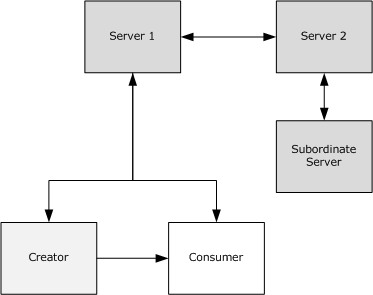

Figure 1: Roles in the RMS system

For the creation and consumption of protected information (or content), the RMS system involves three active roles: the creator, the [**consumer**](#gt_consumer), and the server. The creator and consumer are both roles of the RMS client. The interactions between the RMS client and the RMS server are specified in [MS-RMPR].

The RMS server has two primary responsibilities:

- Issue [**certificates**](#gt_certificate) to end users for use during creation and consumption of protected content.
- Make authorization decisions for access to protected content based on the policy that applies to that content, and issue [**licenses**](#gt_license) that record the authorization decision.
To issue licenses to end users, the RMS server first validates that the policy for the content grants access to the end user. The complexity for this validation can vary with the complexity of the surrounding network. For instance, distribution groups or other user groupings might require expansion; the [**directory**](#gt_directory) topology can include partitions or other compartmentalization that restrict free movement of authorization and authentication data. These cases can necessitate the use of multiple RMS servers deployed in each partition to facilitate flow of information necessary for making authorization decisions that result in license issuance.

Some cases, such as when a specific department within an enterprise wants further control over information protection policies, require an RMS server deployed as a subordinate to an existing server. These situations require a specific trust to be established between RMS servers.

In these complicated deployments, RMS servers need to communicate with one another to share data. This communication uses the Rights Management Services (RMS): Server-to-Server Protocol defined by this specification.

<a id="Section_1.3.1"></a>
### 1.3.1 ServerSoap (FindServiceLocations) Overview

RMS servers use the [ServerSoap (FindServiceLocations)](#Section_3.2.4.1.2.1) port type of the RMS: Server-Server Protocol to find the URLs for specific services that are provided by other RMS servers. This communication can be useful in two scenarios:

- Finding the appropriate URLs for a client to use for bootstrapping.
- Finding the Group Expansion port type on a remote server before making a cross-[**forest**](#gt_forest) group expansion request.
Clients contact the server for a bootstrapping process so they can begin functioning in the RMS system. This bootstrapping process is defined in the RMS: Client-to-Server Protocol, as specified in [MS-RMPR](../MS-RMPR/MS-RMPR.md). To bootstrap a specific user, the RMS server needs to authenticate that user and determine the user's email address by checking the [**directory**](#gt_directory). If the user's account resides in a partition of the directory that the RMS server cannot access, it cannot successfully bootstrap the user. A client starts the bootstrapping process by making a request for service locations to a specific RMS server. If that RMS server is not the appropriate server to bootstrap the client, the server can use the ServerSoap (FindServiceLocations) port type to find the URLs on the appropriate server, and then return them to the client.

The ServerSoap (FindServiceLocations) port type uses a SOAP-based protocol over HTTP. It exposes one request/response operation: [FindServiceLocations](#Section_3.2.4.1.2.1).

<a id="Section_1.3.2"></a>
### 1.3.2 SubEnrollServiceSoap Overview

RMS servers use the SubEnrollServiceSoap port type of the RMS: Server-to-Server Protocol to bootstrap subordinate RMS servers.

As shown in Figure 1, an RMS server can be deployed as a subordinate to another RMS server. A root RMS server grants a subordinate RMS server the right to perform only licensing tasks by issuing a subordinate [**server licensor certificate (SLC)**](#gt_server-licensor-certificate-slc) from its own. For a subordinate RMS server, this process replaces the standard RMS server bootstrapping process defined in [MS-RMPR](../MS-RMPR/MS-RMPR.md) section 3.1.3.

The SubEnrollServiceSoap port type uses a SOAP-based protocol over HTTP. It exposes one request/response operation: [SubEnroll](#Section_3.3.4.1.2.1).

<a id="Section_1.3.3"></a>
### 1.3.3 ServerSoap (GetLicensorCertificate) Overview

RMS servers use the [Get Licensor Certificate](#Section_3.4.4.1.2.1) port type of the RMS: Server-to-Server Protocol to establish trust from a root server to a subordinate server.

When a subordinate RMS server is deployed, it needs to trust identities issued by the root RMS server. This is accomplished by trusting [**certificates**](#gt_certificate) that were issued by the root RMS server by trusting the root RMS server's public key. The subordinate server can use the Get Licensor Certificate port type to retrieve the [**SLC**](#gt_server-licensor-certificate-slc) of the main server that contains the appropriate public key.

The Get Licensor Certificate port type uses a SOAP-based protocol over HTTP. It exposes one request/response operation: GetLicensorCertificate.

<a id="Section_1.3.4"></a>
### 1.3.4 GroupExpansionWebServiceSoap Overview

RMS servers use the [Group Expansion over SOAP](#Section_6.4) port type of the RMS: Server-Server Protocol to determine group membership of authorized users across complex network directories.

Access policy on RMS [**protected content**](#gt_protected-content) can specify individual users as well as distribution groups. When a [**consumer**](#gt_consumer) contacts the RMS server for authorization to access protected content, the server might need to consult the [**directory**](#gt_directory) to determine whether that user is a member of a group that is specified in the policy. If the group exists in a partition of the directory to which the RMS server does not have access, that RMS server needs to contact another server that does have appropriate permissions. This server-to-server communication can use either the Group Expansion over SOAP port type or the [Binary Group Expansion](#Section_4.3) interface.

The Group Expansion over SOAP port type exposes one request/response operation: [IsPrincipalMemberOf](#Section_3.5.4.1).

<a id="Section_1.3.5"></a>
### 1.3.5 Binary Group Expansion Overview

The [Binary Group Expansion](#Section_4.3) interface performs the same function as the [Group Expansion over SOAP](#Section_6.4) port type, as defined in section [1.3.4](#Section_1.3.4), only it does so using a binary-over-HTTP protocol. It exposes one request/response method: [IsPrincipalMemberOf](#Section_3.5.4.1).

<a id="Section_1.4"></a>
## 1.4 Relationship to Other Protocols

The [ServerSoap (FindServiceLocations)](#Section_3.2.4.1.2.1), [SubEnrollServiceSoap](#Section_5.1.2), [ServerSoap (GetLicensorCertificate)](#Section_5.1.3), and [GroupExpansionWebServiceSoap](#Section_6.4) port types all use a SOAP-based protocol that uses HTTP 1.1 as its transport.

The [Binary Group Expansion](#Section_4.3) interface uses a binary-formatted interface over HTTP 1.1.

The following diagram shows the transport stack used by the RMS: Server-Server Protocol.

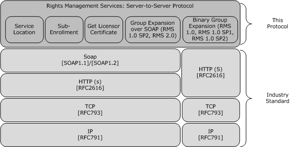

Figure 2: Transport stack for the RMS: Server-Server Protocol

<a id="Section_1.5"></a>
## 1.5 Prerequisites/Preconditions

It is assumed that the server either knows or can discover the appropriate service locations for the services it either provides or references in order to respond to Service Location requests.

It is also assumed that the server has been properly bootstrapped and initialized with its own [**SLC**](#gt_server-licensor-certificate-slc) in place in order to respond to Sub-Enrollment and Get Licensor Certificate requests.

Finally, it is assumed that the server either has connectivity to the [**directory**](#gt_directory) and permissions to query it, or the server is able to verify group membership in some other way (for example, through cached directory information) in order to respond to Group Expansion requests from either the [Binary Group Expansion Interface](#Section_4.3) interface or the [GroupExpansionWebServiceSoap](#Section_6.4) port type. interfaces.

<a id="Section_1.6"></a>
## 1.6 Applicability Statement

The RMS: Server-to-Server Protocol is used for communication between RMS servers when multiple server deployments are used together.

<a id="Section_1.7"></a>
## 1.7 Versioning and Capability Negotiation

This document covers versioning issues in the following areas:

- **Supported Transports:** This protocol is implemented on top of HTTP, as specified in section [2.1](#Section_6.4).
- **Protocol Versions:** The [ServerSoap (FindServiceLocations)](#Section_3.2.4.1.2.1) interface has only one version that is implemented using a SOAP-based protocol over HTTP. The [Binary Group Expansion](#Section_4.3) interface is used by RMS version 1.0 and RMS version 1.0 SP1. It is also used by RMS version 1.0 SP2 for backward compatibility when communicating with RMS version 1.0 servers or RMS version 1.0 SP1 servers. The [GroupExpansionWebServiceSoap](#Section_6.4) port type is used by RMS version 1.0 SP2 servers and RMS version 2.0 servers.<1>
- **Security and Authentication Methods:** This protocol passively supports Kerberos authentication over HTTP or HTTPS (as specified in [[KERBKEY]](https://go.microsoft.com/fwlink/?LinkId=89926)) and NTLM authentication over HTTP or HTTPS (as specified in [[NTLM]](https://go.microsoft.com/fwlink/?LinkId=90235)).
- **Localization:** There are no localization-dependent behaviors for the RMS: Server-to-Server Protocol.
- **Capability Negotiation:** The RMS: Server-to-Server Protocol supports limited capability negotiation by way of the VersionData type that is present on all SOAP-based protocol requests. On a request, the VersionData structure contains a MinimumVersion and MaximumVersion value, indicating the range of versions that the client is capable of understanding. On a response, the [VersionData](#Section_2.2.4.2) structure contains a MinimumVersion and MaximumVersion that the server is capable of understanding. The Binary Group Expansion versioning structure must be adhered to for Binary Group Expansion requests.
<a id="Section_1.8"></a>
## 1.8 Vendor-Extensible Fields

This protocol does not contain any vendor-extensible fields. All XML schema are considered nonextensible in the RMS: Server-Server Protocol.

<a id="Section_1.9"></a>
## 1.9 Standards Assignments

The RMS: Server-Server Protocol has not been assigned any standards by any recognized standards organization.

<a id="Section_2"></a>
# 2 Messages

<a id="Section_2.1"></a>
## 2.1 Transport

The RMS: Server-Server Protocol is composed of four port types and one binary-over-HTTP interface:

- Port types:
- [ServerSoap (FindServiceLocations)](#Section_3.2.4.1.2.1)
- [SubEnrollServiceSoap](#Section_5.1.2)
- [ServerSoap (GetLicensorCertificate)](#Section_5.1.3)
- GroupExpansionWebServiceSoap
- Binary-over-HTTP interface:
- [Binary Group Expansion](#Section_4.3)
Each port type MUST support SOAP over HTTP, using TCP/IP as the transport layer underneath HTTP. SOAP is used as specified in [[SOAP1.1]](https://go.microsoft.com/fwlink/?LinkId=90520) (and [[SOAP1.2-1/2003]](https://go.microsoft.com/fwlink/?LinkId=90521)), and HTTP is used as specified in [[RFC2616]](https://go.microsoft.com/fwlink/?LinkId=90372). Each Web service SHOULD support HTTPS for securing communications.<2>

The port types MUST be exposed by the server at the following [**endpoints**](#gt_endpoint), starting from any base URL:

- ServerSoap (FindServiceLocations): This port type, when implemented as specified in section 1.3.1, MUST be exposed at the following URLs:
- [baseURL]/certification/server.asmx: FindServiceLocations
- [baseURL]/licensing/server.asmx: FindServiceLocations
- SubEnrollServiceSoap: This port type, when implemented as specified in section 3.3, MUST be exposed at the following URL:
- [baseURL]/Certification/SubEnrollService.asmx: SubEnroll
- ServerSoap (GetLicensorCertificate): This port type, when implemented as specified in section 1.3.3, MUST be exposed at the following URLs:
- [baseURL]/certification/server.asmx: GetLicensorCertificate
- [baseURL]/licensing/server.asmx: GetLicensorCertificate
- GroupExpansionWebServiceSoap: This port type, when implemented as specified in section 2.1, MUST be exposed at the following URL:
- [baseURL]/groupexpansion/GroupExpansion.asmx: IsPrincipalMemberOf
- Binary Group Expansion: This interface, when implemented as specified in section 2.3, MUST be exposed at the following URL:
- [baseURL]/DrmRemote/DirectoryServices/DirectoryServices.rem
<a id="Section_2.1.1"></a>
### 2.1.1 HTTP Transport for Binary Group Expansion

The **Binary Group Expansion** interface uses the HTTP transport ( [[RFC1945]](https://go.microsoft.com/fwlink/?LinkId=90300) and [[RFC2616]](https://go.microsoft.com/fwlink/?LinkId=90372)) to transmit method invocation and return information. The message request of a remote method invocation MUST be sent as part of an HTTP request and the reply from the server MUST be sent as part of the HTTP response.

If instructed by a higher-level protocol in an implementation-specific way, implementations of this protocol MUST require that the HTTP implementation on the server use Basic or Digest Access Authentication for HTTP to authenticate the HTTP client, as specified in [[RFC2617]](https://go.microsoft.com/fwlink/?LinkId=90373) or NTLM authentication [MS-NLMP](../MS-NLMP/MS-NLMP.md) for HTTP.

The higher-level protocol MUST provide in an implementation-specific way either credentials in the form of user name/password or a client-side [**certificate**](#gt_certificate). Implementations of this protocol MUST NOT process the credentials or authentication information. Such processing typically happens entirely inside implementations of lower protocol layers.

<a id="Section_2.1.1.1"></a>
#### 2.1.1.1 Client Details

<a id="Section_2.1.1.1.1"></a>
##### 2.1.1.1.1 Sending Request

A remote method invocation request MUST be mapped to an HTTP request and MUST have the following HTTP headers:

- An implementation MUST use either HTTP/1.0 or HTTP/1.1.
- HTTP Method MUST be specified.
- The HTTP Method SHOULD be a POST.
- The HTTP Method MAY be M-POST.
- The Request-URI of the HTTP request message MUST be set to the URI of the [Binary Group Expansion](#Section_4.3) [**endpoint**](#gt_endpoint) as specified in section [2.1](#Section_6.4).
- The User-Agent SHOULD contain the string "MS .NET Remoting".
- The Content-Type MUST be "application/octet-stream".
- The message content MUST be transmitted as the HTTP request message body.
- The message body MAY be sent using chunked transfer coding as specified in [[RFC2616]](https://go.microsoft.com/fwlink/?LinkId=90372) section 3.6.1. If the message body is not chunked, the Content-Length entity header MUST contain the length of the message body in decimal number of octets.
<a id="Section_2.1.1.1.2"></a>
##### 2.1.1.1.2 Receiving Reply

The implementation MUST wait for a response. If a response is not received before an implementation-defined time-out, the implementation SHOULD cancel the request and report an error to the higher layer.

If the status code of the HTTP response is one of the successful codes as specified in [[RFC2616]](https://go.microsoft.com/fwlink/?LinkId=90372) section 10.2 or one of the server-error codes as specified in [RFC2616] section 10.5, the response MUST be processed further as specified in section [2.3](#Section_4.3). If the Status-Code is one of the client-error codes as specified in [RFC2616] section 10.4, the response MUST NOT be processed any further.

An implementation MAY handle other status codes in an implementation-specific way that complies with [RFC2616]. If an error occurs in processing of the other status codes, the response MUST NOT be processed any further.

<a id="Section_2.1.1.2"></a>
#### 2.1.1.2 Server Details

<a id="Section_2.1.1.2.1"></a>
##### 2.1.1.2.1 Receiving Request

A Remote Method invocation request is mapped to an HTTP request. An implementation MUST accept request messages that are sent using either HTTP/1.0 or HTTP/1.1. If the HTTP method is neither POST nor M-POST, or if the Content-Type is not "application/octet-stream", then an implementation MUST send back a transport fault as specified in the following list.

An implementation MUST send back an HTTP response:

- The HTTP Status-Code of the response MUST be 400.
- The Reason-Phrase SHOULD be "Bad Request".
- The Body of the response MUST be empty.
<a id="Section_2.1.1.2.2"></a>
##### 2.1.1.2.2 Sending Reply

A remote method reply is mapped to an HTTP response and MUST have the following HTTP header fields:

- The Content-Type of the response MUST match the Content-Type of the request.
- An implementation MUST return an HTTP response with a Status-Code and message body as shown in the following table. The Reason-Phrase value SHOULD be as follows.
| Request message | Status-Code | Reason-Phrase | Message body |
| --- | --- | --- | --- |
| Binary Group Expansion | 200 | OK | Serialized message content. |

<a id="Section_2.2"></a>
## 2.2 Common Message Syntax

This section contains common definitions used by this protocol. The syntax of the definitions uses XML schema as defined in [[XMLSCHEMA1]](https://go.microsoft.com/fwlink/?LinkId=90608) and [[XMLSCHEMA2]](https://go.microsoft.com/fwlink/?LinkId=90610), and Web Services Description Language as defined in [[WSDL]](https://go.microsoft.com/fwlink/?LinkId=90577).

This protocol uses curly-braced [**GUID**](#gt_guid) strings, as specified in [MS-DTYP](../MS-DTYP/MS-DTYP.md) section 2.3.4.3.

<a id="Section_2.2.1"></a>
### 2.2.1 Namespaces

This specification defines and references various XML namespaces using the mechanisms specified in [[XMLNS]](https://go.microsoft.com/fwlink/?LinkId=191840). Although this specification associates a specific XML namespace prefix for each XML namespace that is used, the choice of any particular XML namespace prefix is implementation-specific and not significant for interoperability.

| Prefix | XML namespace | Reference |
| --- | --- | --- |
| s | http://www.w3.org/2001/XMLSchema | [[XMLSCHEMA1]](https://go.microsoft.com/fwlink/?LinkId=90608) |
| soap | http://schemas.xmlsoap.org/wsdl/soap/ | [[WSDLSOAP]](https://go.microsoft.com/fwlink/?LinkId=131790) |
| soap12 | http://schemas.xmlsoap.org/wsdl/soap12/ | [[SOAP1.2-1/2003]](https://go.microsoft.com/fwlink/?LinkId=90521) |
| soapenc | http://schemas.xmlsoap.org/soap/encoding/ | [[SOAP1.1]](https://go.microsoft.com/fwlink/?LinkId=90520) |
| wsdl | http://schemas.xmlsoap.org/wsdl/ | [[WSDL]](https://go.microsoft.com/fwlink/?LinkId=90577) |
| http | http://schemas.xmlsoap.org/wsdl/http/ | [WSDL] |
| tns | http://microsoft.com/DRM/ServerService | - |
| tns | http://microsoft.com/DRM/SubEnrollmentService | - |
| tns | http://microsoft.com/DRM/GroupExpansionWebService | - |

<a id="Section_2.2.2"></a>
### 2.2.2 Messages

None.

<a id="Section_2.2.3"></a>
### 2.2.3 Elements

None.

<a id="Section_2.2.4"></a>
### 2.2.4 Complex Types

The following table summarizes the set of common XML Schema complex type definitions defined by this specification. XML Schema complex type definitions that are specific to a particular operation are described with the operation.

| Complex Type | Description |
| --- | --- |
| [ArrayOfString](#Section_2.2.4.1) | A container for an array of strings. |
| [VersionData](#Section_2.2.4.2) | Represents the capability version of the requestor and the responder. |

<a id="Section_2.2.4.1"></a>
#### 2.2.4.1 ArrayOfString Complex Type

The ArrayOfString complex type is used in the [SubEnrollServiceSoap (section 3.3)](#Section_5.1.2) and [GroupExpansionWebServiceSoap (section 3.5)](#Section_6.4) port types.

<s:complexType name="ArrayOfString">

<s:sequence>

<s:element minOccurs="0" maxOccurs="unbounded"

name="string" nillable="true"

type="s:string"

/>

</s:sequence>

</s:complexType>

**string**: A string value. In the SubEnrollServiceSoap port type, the **string** element contains XML representing a node in an [**SLC**](#gt_server-licensor-certificate-slc) [**certificate chain**](#gt_certificate-chain).

In the GroupExpansionWebServiceSoap port type, the **string** element contains the email address contact for a group for which membership is to be checked.

<a id="Section_2.2.4.2"></a>
#### 2.2.4.2 VersionData Complex Type

The VersionData complex type is used to represent the capability version of the requestor and the responder.

All four port types in the RMS: Server-Server Protocol (that is, [ServerSoap (FindServiceLocations)](#Section_3.2.4.1.2.1), [SubEnrollServiceSoap](#Section_5.1.2), [ServerSoap (GetLicensorCertificate)](#Section_5.1.3), and [GroupExpansionWebServiceSoap](#Section_6.4)) use the same SOAP header for both requests and responses. The SOAP header for requests and responses to these port types MUST contain the VersionDataelement.

<xs:complexType name="VersionData">

<xs:sequence>

<xs:element name="MinimumVersion"

type="string"

minOccurs="0"

maxOccurs="1"

/>

<xs:element name="MaximumVersion"

type="string"

minOccurs="0"

maxOccurs="1"

/>

</xs:sequence>

</xs:complexType>

**MinimumVersion**: Specifies the lowest capability version supported. The version data in this type is represented by a literal string conforming to the format "a.b.c.d". Subversion value "a" is the most major component of the version, value "b" is the next most major, value "c" is the next most major, and "d" is the minor subversion value.

**MaximumVersion**: Specifies the highest capability version supported. The version data in this type is represented by a literal string conforming to the format "a.b.c.d". Subversion value "a" is the most major component of the version, value "b" is the next most major, value "c" is the next most major, and "d" is the minor subversion value.

<a id="Section_2.2.5"></a>
### 2.2.5 Simple Types

None.

<a id="Section_2.2.6"></a>
### 2.2.6 Attributes

None.

<a id="Section_2.2.7"></a>
### 2.2.7 Groups

None.

<a id="Section_2.2.8"></a>
### 2.2.8 Attribute Groups

None.

<a id="Section_2.2.9"></a>
### 2.2.9 Common Data Structures

<a id="Section_2.2.9.1"></a>
#### 2.2.9.1 Common Fault Codes

For port types, the RMS: Server-Server Protocol allows a server to notify a requestor of application-level faults by generating SOAP faults (as specified in [[SOAP1.1]](https://go.microsoft.com/fwlink/?LinkId=90520) section 4.4). In the SOAP fault, the <faultcode> element contains the type of exception being thrown. The <faultstring> element contains the text of the exception being thrown.

The following table summarizes the exceptions that the responding server can return to the requesting server.

| Exception | Description |
| --- | --- |
| ArgumentException | Microsoft .NET Framework exception. |
| ArgumentOutOfRangeException | .NET Framework exception. |
| ArgumentNullException | .NET Framework exception. |
| FormatException | .NET Framework exception. |
| UnauthorizedAccessException | Access is unauthorized. |
| ADEntrySearchFailedException | Failed to find an entry in [**Active Directory**](#gt_active-directory). |
| DRMSArgumentException | An argument exception occurred. See the inner exception. |
| MalformedDataVersionException | A client request contained an invalid version number that cannot be processed. |
| UnsupportedDataVersionException | The data version the client requested is not supported. The server cannot process the request. |
| Microsoft.DigitalRightsManagement.Utilities.UnspecifiedErrorException | The exception is not allowed to be returned to the client. |

<a id="Section_2.3"></a>
## 2.3 Binary Group Expansion Interface

An RMS server uses the Binary Group Expansion interface to verify group membership of a specific user with another RMS server. Each message in this interface consists of a serialized octet stream.

The interface provides a mechanism for a requester to verify with a responder whether a specific user is currently a member of specific groups that the requestor cannot expand by contacting the [**directory**](#gt_directory) itself.

It is possible that a requested group contains a subgroup in another [**forest**](#gt_forest), causing the responder to make a new IsPrincipalMemberOf request to another server before it can respond to the original requestor. To prevent infinite loops or unacceptably long response times, the request specifies a number of servers that have been involved in servicing this group expansion request so far.

<a id="Section_2.3.1"></a>
### 2.3.1 Serialized Octet Stream

The Serialized Octet Stream contains a series of records. The first record MUST be a [SerializationHeaderRecord](#Section_2.3.1.1). For requests, the second record is an [IsPrincipalMemberOfRequest](#Section_3.5.4.1). For responses, the second record is an [IsPrincipalMemberOfResponse](#Section_3.5.4.1.2.2). The remainder of the stream MAY contain any number of additional records. The final record in the stream MUST be a [MessageEnd](#Section_2.3.1.4) record.

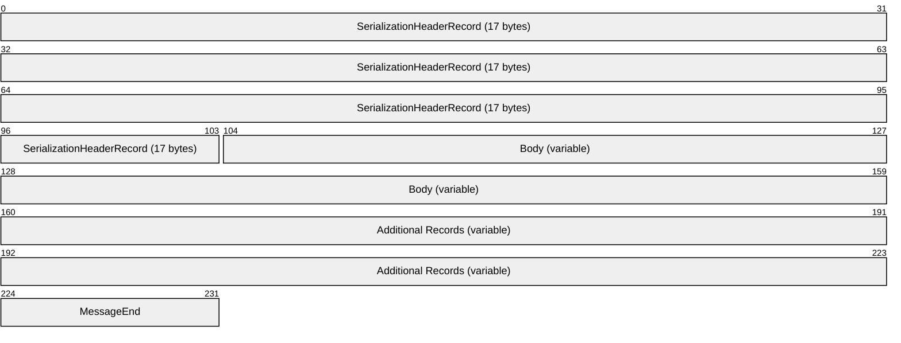

**SerializationHeaderRecord (17 bytes):** A SerializationHeaderRecord, as specified in section 2.3.1.1.

**Body (variable):** MUST be either an IsPrincipalMemberOfRequest record OR an IsPrincipalMemberOfResponse record.

**Additional Records (variable):** Any number of additional records, as specified in section [2.3.4](#Section_2.3.4).

When serializing class records, the values of each member MUST be serialized immediately following the record. The values are serialized in the same order as the **MemberNames** in the class record. The serialization format for each member value is determined by the **BinaryTypeEnum** corresponding to each member. If the member has an **AdditionalInfo** field in the class record, this will further specify the serialization format. When a class member value is serialized as a string, client implementations SHOULD NOT interpret the content of the string or take any action based on the content of the string.<3>

| BinaryTypeEnum | Serialized Structure |
| --- | --- |
| Primitive | [MemberPrimitiveUnTyped](#Section_2.3.5.2) (**AdditionalInfo** will specify the format of the serialized value.) |
| Object | [MemberPrimitiveTyped](#Section_2.3.5.1), [BinaryObjectString](#Section_2.3.5.7) |
| ObjectArray | Member Reference Record |
| Class or SystemClass | Class Record (**AdditionalInfo** will specify which class is to be serialized), Member Reference Record |
| String | BinaryObjectString, [MemberReference](#Section_2.3.5.3), [ObjectNull](#Section_2.3.5.4) |

**MessageEnd (1 byte):** A MessageEnd record, as specified in section 2.3.1.4.

<a id="Section_2.3.1.1"></a>
#### 2.3.1.1 SerializationHeaderRecord

The SerializationHeaderRecord record MUST be the first record in a binary serialization. This record has the major and minor version of the format and the IDs of the top object and the headers.

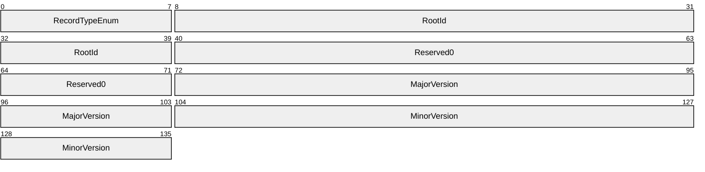

**RecordTypeEnum (1 byte):** A [RecordTypeEnumeration](#Section_2.3.2.1) value that identifies the record type. The value MUST be 0x00.

**RootId (4 bytes):**

An INT32 value ([MS-DTYP](../MS-DTYP/MS-DTYP.md) section 2.2.22) that identifies the root of the graph of nodes. The value of the field is set as follows.

- If an [IsPrincipalMemberOfRequest](#Section_3.5.4.1) record is present in the serialization stream, the value of this field MUST contain the **ObjectId** of the [ArgumentsArray](#Section_2.3.1.2.1) (section 2.3.1.2.1).
- If an [IsPrincipalMemberOfResponse](#Section_3.5.4.1.2.2) record is present in the serialization stream, the value of this field MUST contain the **ObjectId** of the [ReturnArray](#Section_2.3.1.3.1) (section 2.3.1.3.1).
**Reserved0 (4 bytes):** Reserved. MUST be set to 0xFFFFFFFF (-1) and MUST be ignored upon receipt.

**MajorVersion (4 bytes):** An INT32 value ([MS-DTYP] section 2.2.22) that identifies the major version of the format. The value of this field MUST be 0x00000001.

**MinorVersion (4 bytes):** An INT32 value ([MS-DTYP] section 2.2.22) that identifies the minor version of the protocol. The value of this field MUST be 0x00000000.

<a id="Section_2.3.1.2"></a>
#### 2.3.1.2 IsPrincipalMemberOfRequest

The IsPrincipalMemberOfRequest record contains information that is required to extend a Group Expansion request.

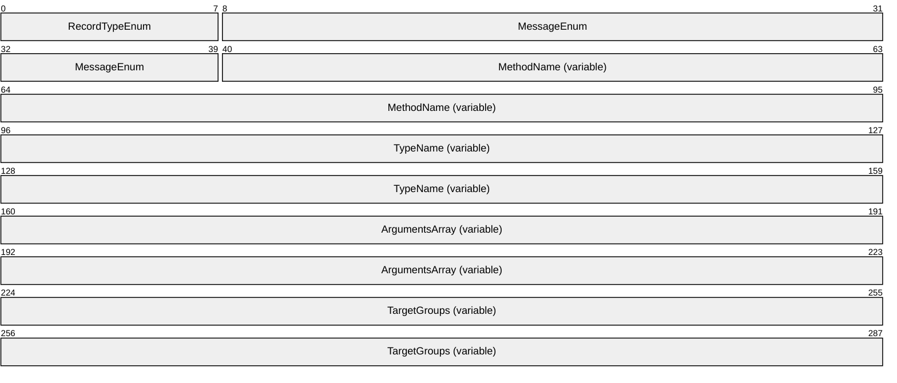

**RecordTypeEnum (1 byte):** A [RecordTypeEnumeration](#Section_2.3.2.1) value (section 2.3.2.1) that identifies the record type. The value MUST be 0x15 for an IsPrincipalMemberOfRequest.

**MessageEnum (4 bytes):** A [MessageFlags](#Section_2.3.2.4) value that indicates whether the arguments and call context are present. This MUST be set to 0x00000014. This value (0x00000014) is the logical OR of ArgsIsArray and NoContext.

**MethodName (variable):** A [StringValueWithCode](#Section_2.3.3.3) that represents the remote method name. This MUST be set to "IsPrincipalMemberOf".

**TypeName (variable):** A StringValueWithCode that represents the Server Type name. This value is specific to each version of the RMS Server-to-Server protocol that supports the [Binary Group Expansion Interface](#Section_4.3). The following list specifies the strings that each version uses.

"soap:RemoteActiveDirectoryServices, http://schemas.microsoft.com/clr/nsassem/Microsoft.DigitalRightsManagement.DirectoryServices/Plugin.DirectoryServices%2C%20Version%3D1.0.3246.0%2C%20Culture%3Dneutral%2C%20PublicKeyToken%3D31bf3856ad364e35"

The Server Type name used by RMS version 1.0.

"soap:RemoteActiveDirectoryServices, http://schemas.microsoft.com/clr/nsassem/Microsoft.DigitalRightsManagement.DirectoryServices/Plugin.DirectoryServices%2C%20Version%3D5.2.3790.134%2C%20Culture%3Dneutral%2C%20PublicKeyToken%3D31bf3856ad364e35"

The Server Type name used by RMS version 1.0 SP1.

"soap:RemoteActiveDirectoryServices, http://schemas.microsoft.com/clr/nsassem/Microsoft.DigitalRightsManagement.DirectoryServices/Plugin.DirectoryServices%2C%20Version%3D5.2.3790.300%2C%20Culture%3Dneutral%2C%20PublicKeyToken%3D31bf3856ad364e35"

The Server Type name used by RMS version 1.0 SP2.

**ArgumentsArray (variable):** An [ArgumentsArray](#Section_2.3.1.2.1) record that provides arguments to the IsPrincipalMemberOf operation. The ArgumentsArray record is specified in section 2.3.1.2.1.

**TargetGroups (variable):** An [ArraySingleString](#Section_2.3.4.2) record that contains one or more email addresses representing the groups for which membership is to be checked.

<a id="Section_2.3.1.2.1"></a>
##### 2.3.1.2.1 ArgumentsArray

The ArgumentsArray record contains arguments for the IsPrincipalMemberOf operation.

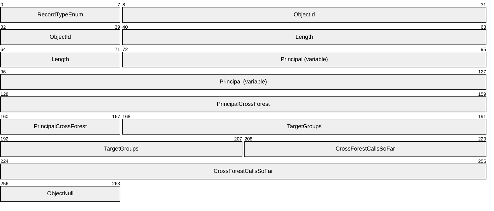

**RecordTypeEnum (1 byte):** A [RecordTypeEnumeration](#Section_2.3.2.1) value that identifies the record type. The value MUST be 0x10.

**ObjectId (4 bytes):** An INT32 value ([MS-DTYP](../MS-DTYP/MS-DTYP.md) section 2.2.22) that uniquely identifies the array instance in the serialization stream. The ID MUST be a positive integer. An implementation MAY use any algorithm to generate the unique IDs.

**Length (4 bytes):** An INT32 value ([MS-DTYP] section 2.2.22) that specifies the number of items in the array. The value MUST be 5.

**Principal (variable):** A RecordTypeEnumeration that contains the email address of the user whose group membership is to be verified.

**PrincipalCrossForest (5 bytes):** A [MemberReference](#Section_2.3.5.3) value that refers to the [Principal](#Section_2.3.6.2) [StringValueWithCode](#Section_2.3.3.3) field by **ObjectId**.

**TargetGroups (5 bytes):** A RecordTypeEnumeration value that identifies the **TargetGroups** [ArraySingleString](#Section_2.3.4.2) record by **ObjectId**. The **TargetGroups** field is specified in the [IsPrincipalMemberOfRequest](#Section_3.5.4.1) packet (section 2.3.1.2).

**CrossForestCallsSoFar (6 bytes):** A [MemberPrimitiveTyped](#Section_2.3.5.1) record that represents the number of servers that have been involved in servicing this group expansion request so far. This field is incremented as defined in section [2.3](#Section_4.3).

**ObjectNull (1 byte):** An [ObjectNull](#Section_2.3.5.4) record.

<a id="Section_2.3.1.3"></a>
#### 2.3.1.3 IsPrincipalMemberOfResponse

The IsPrincipalMemberOfResponse record contains the information returned in a [Binary Group Expansion](#Section_4.3) response.

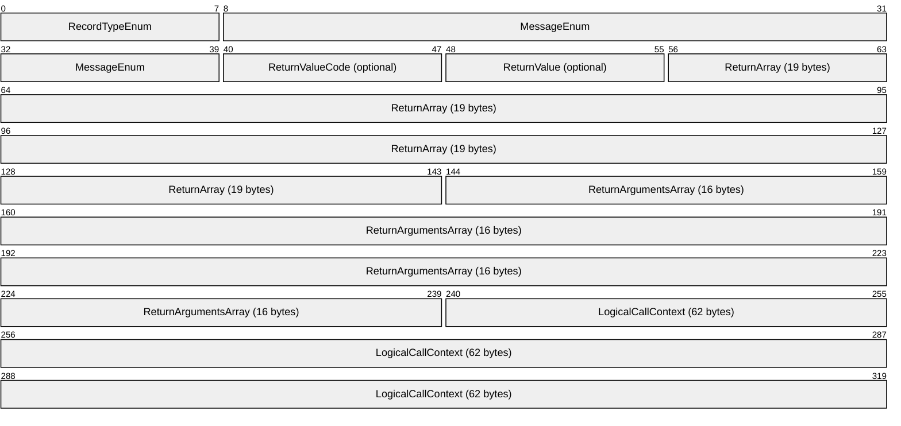

**RecordTypeEnum (1 byte):** A [RecordTypeEnumeration](#Section_2.3.2.1) value that identifies the record type. The value MUST be 0x16.

**MessageEnum (4 bytes):** A [MessageFlags](#Section_2.3.2.4) value that indicates whether the **Return Value**, **Arguments**, **Message Properties**, and **Call Context** are present. The value also specifies whether the **Return Value**, **Arguments**, and **Call Context** are present in this record or in the following **ReturnArray** record.

If the IsPrincipalMemberOf operation is successful, this value MUST be 0x00000848. This value (0x00000848) is the logical OR of ArgsInArray, ContextInArray, ReturnValueInline.

If an exception is returned by the IsPrincipalMemberOf operation, this value MUST be 0x00002241. This value (0x00002241) is the logical OR of NoArgs, ContextInArray, NoReturnValue, and ExceptionInArray.

**ReturnValueCode (1 byte):** A byte value that identifies the return value as being a BOOLEAN. It MUST be 0x01. This field MUST be present if **MessageEnum** contains ReturnValueInline. This field MUST not be present if MessageEnum contains no ReturnValue.

**ReturnValue (1 byte):** A BOOLEAN value that indicates the return value of the IsPrincipalMemberOf call. This field MUST be present if **MessageEnum** contains ReturnValueInline. This field MUST not be present if **MessageEnum** contains NoReturnValue. This value MUST be 0x01 if the principal is a member of one of the target groups. Otherwise this value MUST be 0x00.

**ReturnArray (19 bytes):** A [ReturnArray](#Section_2.3.1.3.1) record that contains the output arguments and context information for the IsPrincipalMemberOf call.

**ReturnArgumentsArray (16 bytes):** A [ReturnArgumentsArray](#Section_2.3.1.3.2) record (section 2.3.1.3.2) that contains return arguments for the IsPrincipalMemberOf call.

**LogicalCallContext (62 bytes):** A [LogicalCallContext](#Section_2.3.6.1) record, as specified in section 2.3.6.1.

<a id="Section_2.3.1.3.1"></a>
##### 2.3.1.3.1 ReturnArray

The ReturnArray record contains a pair of [MemberReferences](#Section_2.3.5.3) identifying the output arguments, exception details, or call context by **ObjectId**.

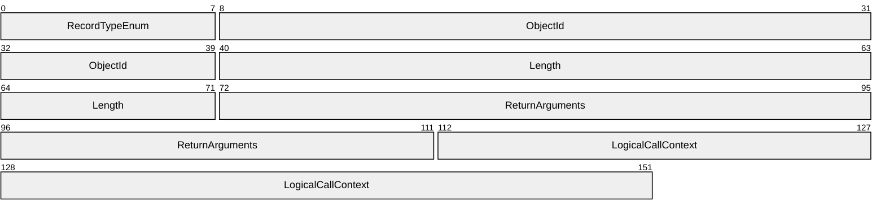

**RecordTypeEnum (1 byte):** A [RecordTypeEnumeration](#Section_2.3.2.1) value that identifies the record type. The value MUST be 0x10.

**ObjectId (4 bytes):** An INT32 value ([MS-DTYP](../MS-DTYP/MS-DTYP.md) section 2.2.22) that uniquely identifies the array instance in the serialization stream. The ID MUST be a positive integer. Any algorithm MAY be used to generate the unique IDs.

**Length (4 bytes):** An INT32 value ([MS-DTYP] section 2.2.22) that specifies the number of MemberReference structures in this record. The length value MUST be 2 to account for **ReturnArguments** and **LogicalCallContext**.

**ReturnArguments (5 bytes):** A MemberReference value that identifies a [ReturnArgumentsArray](#Section_2.3.1.3.2) record later in the serialization stream by **ObjectId**. If the **MessageEnum** field of the [IsPrincipalMemberOfResponse](#Section_3.5.4.1.2.2) record contains ExceptionInArray, this MemberReference will identify a [RemotingException](#Section_2.3.6.9) record later in the serialization stream by **ObjectId**.

**LogicalCallContext (5 bytes):** A MemberReference value that identifies a [LogicalCallContext](#Section_2.3.6.1) record later in the serialization stream by **ObjectId**. This LogicalCallContext MUST be present in the serialization stream.

<a id="Section_2.3.1.3.2"></a>
##### 2.3.1.3.2 ReturnArgumentsArray

The ReturnArgumentsArray record contains return arguments for the IsPrincipalMemberOf operation.

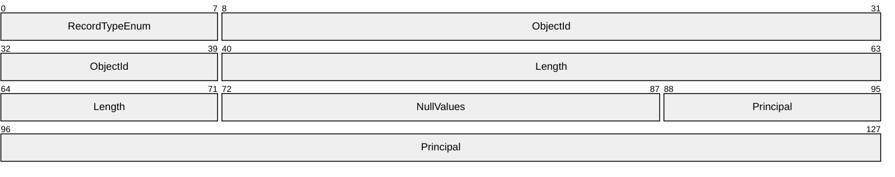

**RecordTypeEnum (1 byte):** A [RecordTypeEnumeration](#Section_2.3.2.1) value that identifies the record type. The value MUST be 0x10.

**ObjectId (4 bytes):** An INT32 value ([MS-DTYP](../MS-DTYP/MS-DTYP.md) section 2.2.22) that uniquely identifies the array instance in the serialization stream. The ID MUST be a positive integer. An implementation MAY use any algorithm to generate the unique IDs.

**Length (4 bytes):** An INT32 value ([MS-DTYP] section 2.2.22) that specifies the number of return arguments. The value MUST be 5.

**NullValues (2 bytes):** An [ObjectNullMultiple256](#Section_2.3.5.6) record. The value of the **NullCount** field MUST be 0x04.

**Principal (5 bytes):** A [MemberReference](#Section_2.3.5.3) value that identifies a [Principal](#Section_2.3.6.2) record later in the serialization stream by **Object Id**.

<a id="Section_2.3.1.4"></a>
#### 2.3.1.4 MessageEnd

The MessageEnd record marks the end of the serialization stream.


**RecordTypeEnum (1 byte):** A [RecordTypeEnumeration](#Section_2.3.2.1) value that identifies the record type. The value MUST be 0x0b.

<a id="Section_2.3.2"></a>
### 2.3.2 Common Enumerations

<a id="Section_2.3.2.1"></a>
#### 2.3.2.1 RecordTypeEnumeration

The RecordTypeEnumeration identifies the type of the record. Each record (except for [MemberPrimitiveUnTyped](#Section_2.3.5.2)) starts with a record type enumeration. The size of the enumeration is one BYTE.

typedef enum

{

SerializedStreamHeader = 0x00,

ClassWithId = 0x01,

SystemClassWithMembersAndTypes = 0x04,

ClassWithMembersAndTypes = 0x05,

BinaryObjectString = 0x06,

MemberPrimitiveTyped = 0x08,

MemberReference = 0x09,

ObjectNull = 0x0a,

MessageEnd = 0x0b,

BinaryLibrary = 0x0c,

ObjectNullMultiple256 = 0x0d,

ObjectNullMultiple = 0x0e,

ArraySingleObject = 0x10,

ArraySingleString = 0x11,

IsPrincipalMemberOfRequest = 0x15,

IsPrincipalMemberOfResponse = 0x16

} RecordTypeEnumeration;

**SerializedStreamHeader:** Identifies the [SerializationHeaderRecord](#Section_2.3.1.1).

**ClassWithId:** Identifies a [ClassWithId](#Section_2.3.6.10) record.

**SystemClassWithMembersAndTypes:** Identifies a class record that does not have a **LibraryId** field.

**ClassWithMembersAndTypes:** Identifies a Class Record that has a LibraryId field.

**BinaryObjectString:** Identifies a BinaryObjectString record.

**MemberPrimitiveTyped:** Identifies a MemberPrimitiveTyped record.

**MemberReference:** Identifies a MemberReference record.

**ObjectNull:** Identifies an ObjectNull record.

**MessageEnd:** Identifies a MessageEnd record.

**BinaryLibrary:** Identifies a BinaryLibrary record.

**ObjectNullMultiple256:** Identifies an ObjectNullMultiple256 record.

**ObjectNullMultiple:** Identifies an ObjectNullMultiple record.

**ArraySingleObject:** Identifies an ArraySingleObject record.

**ArraySingleString:** Identifies an ArraySingleString record.

**IsPrincipalMemberOfRequest:** Identifies a IsPrincipalMemberOfRequest record.

**IsPrincipalMemberOfResponse:** Identifies a IsPrincipalMemberOfResponse record.

<a id="Section_2.3.2.2"></a>
#### 2.3.2.2 BinaryTypeEnumeration

The BinaryTypeEnumeration identifies the type of a class member or an array item. The size of the enumeration is one BYTE.

typedef enum

{

Primitive = 0x00,

String = 0x01,

Object = 0x02,

SystemClass = 0x03,

Class = 0x04,

ObjectArray = 0x05,

StringArray = 0x06

} BinaryTypeEnumeration;

**Primitive:** The type is defined in [PrimitiveTypeEnumeration](#Section_2.3.2.3) and the type is not a string.

**String:** The type is a [LengthPrefixedString](#Section_2.3.3.4).

**Object:** The type is System.Object.

**SystemClass:** The type is a class in the system library.

**Class:** The type is a class that is not in the system library.

**ObjectArray:** The type is a single-dimensional array of System.Object with a lower bound of 0.

**StringArray:** The type is a single-dimensional array of string with a lower bound of 0.

<a id="Section_2.3.2.3"></a>
#### 2.3.2.3 PrimitiveTypeEnumeration

The PrimitiveTypeEnumeration identifies a primitive type value. The size of the enumeration is one BYTE.

typedef enum

{

Boolean = 0x01,

Byte = 0x02,

Int32 = 0x08,

Single = 0x0b,

Null = 0x11,

String = 0x12

} PrimitiveTypeEnumeration;

**Boolean:** Identifies a BOOLEAN ([MS-DTYP](../MS-DTYP/MS-DTYP.md) section 2.2.4).

**Byte:** Identifies a BYTE ([MS-DTYP] section 2.2.6).

**Int32:** Identifies an INT32 value ([MS-DTYP] section 2.2.22).

**Single:** Identifies a [Single](#Section_2.3.3.1), as specified in section 2.3.3.1.

**Null:** Identifies a null object.

**String:** Identifies a [LengthPrefixedString](#Section_2.3.3.4) value.

<a id="Section_2.3.2.4"></a>
#### 2.3.2.4 MessageFlags

The MessageFlags enumeration is used by the [IsPrincipalMemberOfRequest](#Section_3.5.4.1) or [IsPrincipalMemberOfResponse](#Section_3.5.4.1.2.2) records to provide information about the structure of the record. The type of the enumeration is INT32, as specified in [MS-DTYP](../MS-DTYP/MS-DTYP.md) section 2.2.22.

The following table is common for both the IsPrincipalMemberOfRequest and IsPrincipalMemberOfResponse records. The term "method record" is used in the description when it is applicable to both the records. The term "call array record" is used in the description when it is applicable to both [ArgumentsArray](#Section_2.3.1.2.1) and [ReturnArray](#Section_2.3.1.3.1).

typedef enum

{

NoArgs = 0x00000001,

ArgsIsArray = 0x00000004,

ArgsInArray = 0x00000008,

NoContext = 0x00000010,

ContextInArray = 0x00000040,

NoReturnValue = 0x00000200,

ReturnValueInline = 0x00000800,

ExceptionInArray = 0x00002000

} MessageFlags;

**NoArgs:** The record contains no arguments.

**ArgsIsArray:** Each argument is an item in a separate call array record.

**ArgsInArray:** The arguments array is an item in a separate call array record.

**NoContext:** The record does not contain a call context value.

**ContextInArray:** CallContext values are contained in an array that is contained in the call array record.

**NoReturnValue:** The return value is a null object.

**ReturnValueInline:** The return value is in the **ReturnValue** field of the IsPrincipalMemberOfResponse record.

**ExceptionInArray:** An exception is contained in the ReturnArray record.

<a id="Section_2.3.3"></a>
### 2.3.3 Common Structures

The [Binary Group Expansion](#Section_4.3) Interface makes use of the following primitive types as specified in [MS-DTYP](../MS-DTYP/MS-DTYP.md).

- BOOLEAN
- BYTE
- INT32
The byte-ordering of the multibyte data types is little-endian. The signed data types use two's complement to represent negative numbers.

Primitive types include the [Single](#Section_2.3.3.1) datatype, as specified in section 2.3.3.1.

<a id="Section_2.3.3.1"></a>
#### 2.3.3.1 Single

The Single structure represents a 32-bit, single-precision, floating-point value. Primitive types include the Single datatype.

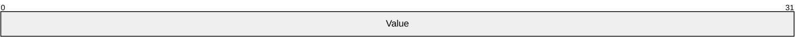

**Value (4 bytes):** A 32-bit, single-precision, floating-point value, as specified in [[IEEE754]](https://go.microsoft.com/fwlink/?LinkId=89903).

<a id="Section_2.3.3.2"></a>
#### 2.3.3.2 ValueWithCode

The ValueWithCode structure is used to associate a primitive value with an enum that identifies the primitive type of the primitive value. This structure is used when the primitive type is not String. When primitive type is String, a [StringValueWithCode](#Section_2.3.3.3) structure is used, as specified in section 2.3.3.3.

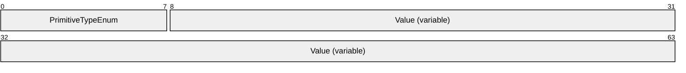

**PrimitiveTypeEnum (1 byte):** A [PrimitiveTypeEnumeration](#Section_2.3.2.3) value that specifies the type of the data.

**Value (variable):** A primitive value whose primitive type is identified by the **PrimitiveTypeEnum** field. For example, if the value of the **PrimitiveTypeEnum** field is the **PrimitiveTypeEnumeration** value INT32, the **Value** field MUST contain a valid INT32 instance ([MS-DTYP](../MS-DTYP/MS-DTYP.md) section 2.2.22). The length of the field is determined by the primitive type of the value. This field MUST NOT be present if the value of **PrimitiveTypeEnum** is Null (0x11).

<a id="Section_2.3.3.3"></a>
#### 2.3.3.3 StringValueWithCode

The StringValueWithCode structure is a [ValueWithCode](#Section_2.3.3.2) where [PrimitiveTypeEnumeration](#Section_2.3.2.3) is **String** (0x12). The **StringValue** field is serialized as a [LengthPrefixedString](#Section_2.3.3.4).

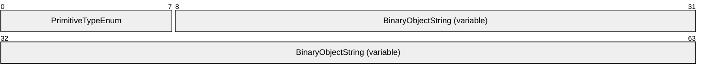

**PrimitiveTypeEnum (1 byte):** A PrimitiveTypeEnumeration value that specifies the primitive type of the data. The value MUST be 0x12 (**String**).

**BinaryObjectString (variable):** A LengthPrefixedString that contains the string value.

<a id="Section_2.3.3.4"></a>
#### 2.3.3.4 LengthPrefixedString

The LengthPrefixedString record represents a string value. The string is prefixed by the length of the UTF-8 encoded string in bytes. The length is encoded in a variable-length field with a minimum of 1 byte and a maximum of 5 bytes. The length is encoded as a variable-length field to minimize the wire size.

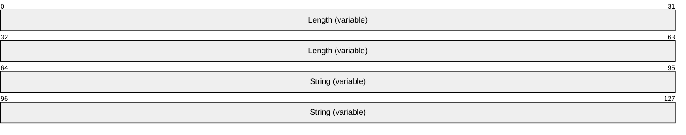

**Length (variable):** A numerical value that can range from 0 to 2147483647 (2^31) inclusive.

To minimize the wire size, the encoding of the length MUST be encoded as follows:

- The **Length** field MUST be at least 1 byte and MUST NOT be more than 5 bytes.
- Each byte MUST hold the **Length** value in its lower 7 bits.
- The high bit MUST be used to indicate that the length continues in the next byte.
- In the case that all 5 bytes are used, the high 5 bits in the fifth byte MUST be 0.


**Length_0-6 (7 bits):** Length values range from 0 to 127 (7 bits).

**A - Reserved_7 (1 bit):** The value MUST be 0.


**Length_0-6 (7 bits):** Length values range from 128 to 16383 (14 bits).

**A - Reserved_7 (1 bit):** The value MUST be 1.

**Length_8-14 (7 bits):** Length values range from 128 to 16383 (14 bits).

**B - Reserved_15 (1 bit):** The value MUST be 0.


**Length_0-6 (7 bits):** Length values range from 16384 to 2097151 (21 bits).

**A - Reserved_7 (1 bit):** The value MUST be 1.

**Length_8-14 (7 bits):** Length values range from 16384 to 2097151 (21 bits).

**B - Reserved_15 (1 bit):** The value MUST be 1.

**Length_16-22 (7 bits):** Length values range from 16384 to 2097151 (21 bits).

**C - Reserved_23 (1 bit):** The value MUST be 0.

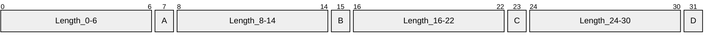

**Length_0-6 (7 bits):** Length values range from 2097152 to 268435445 (28 bits).

**A - Reserved_7 (1 bit):** The value MUST be 1.

**Length_8-14 (7 bits):** Length values range from 2097152 to 268435445 (28 bits).

**B - Reserved_15 (1 bit):** The value MUST be 1.

**Length_16-22 (7 bits):** Length values range from 2097152 to 268435445 (28 bits).

**C - Reserved_23 (1 bit):** The value MUST be 1.

**Length_24-30 (7 bits):** Length values range from 2097152 to 268435445 (28 bits).

**D - Reserved_31 (1 bit):** The value MUST be 0.

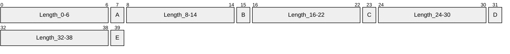

**Length_0-6 (7 bits):** Length values range from 268435456 to 2147483647 (31 bits).

**A - Reserved_7 (1 bit):** The value MUST be 1.

**Length_8-14 (7 bits):** Length values range from 268435456 to 2147483647 (31 bits).

**B - Reserved_15 (1 bit):** The value MUST be 1.

**Length_16-22 (7 bits):** Length values range from 268435456 to 2147483647 (31 bits).

**C - Reserved_23 (1 bit):** The value MUST be 1.

**Length_24-30 (7 bits):** Length values range from 268435456 to 2147483647 (31 bits).

**D - Reserved_31 (1 bit):** The value MUST be 1.

**Length_32-38 (7 bits):** Length values range from 268435456 to 2147483647 (31 bits).

**E - Reserved_39 (1 bit):** The value MUST be 0.

**String (variable):** A UTF-8 encoded string value. The number of bytes of the encoded string MUST be equal to the value specified in the **Length** field.

<a id="Section_2.3.4"></a>
### 2.3.4 Common Records

<a id="Section_2.3.4.1"></a>
#### 2.3.4.1 BinaryLibrary

The BinaryLibrary record associates a 32-bit integer ID with a Library name. <4> This allows other records to reference the library name by using the ID. This approach reduces the wire size when there are multiple records that reference the same library name.

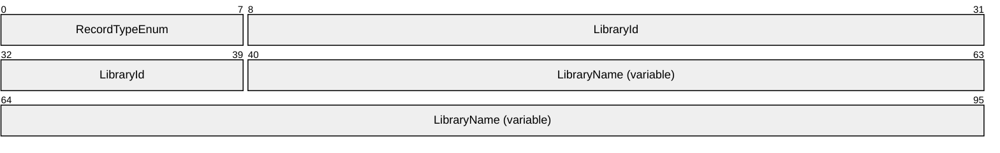

**RecordTypeEnum (1 byte):** A [RecordTypeEnumeration](#Section_2.3.2.1) value that identifies the record type. The value MUST be 0x0c.

**LibraryId (4 bytes):** An INT32 value ([MS-DTYP](../MS-DTYP/MS-DTYP.md) section 2.2.22) that uniquely identifies the library name in the serialization stream. The value MUST be a positive integer.

**LibraryName (variable):** A [LengthPrefixedString](#Section_2.3.3.4) value that represents the library name.

| Value | Meaning |
| --- | --- |
| "System, Version=1.0.5000.0, Culture=neutral, PublicKeyToken=b77a5c561934e089" | This library will be referenced by LibraryID in the following records: System.Collections.Specialized.ListDictionary System.Collections.Specialized.StringCollection System.Collections.Specialized.DictionaryNode |
| "Plugin.DirectoryServices, Version=1.0.3246.0, Culture=neutral, PublicKeyToken=31bf3856ad364e35" | This library will be referenced by LibraryID in the following records:<5> Principal ExplicitParseEnum |
| "Plugin.DirectoryServices, Version=5.2.3790.134, Culture=neutral, PublicKeyToken=31bf3856ad364e35" | This library will be referenced by LibraryID in the following records:<6> Principal ExplicitParseEnum |
| "Plugin.DirectoryServices, Version=5.2.3790.300, Culture=neutral, PublicKeyToken=31bf3856ad364e35" | This library will be referenced by LibraryID in the following records:<7> Principal ExplicitParseEnum |

<a id="Section_2.3.4.2"></a>
#### 2.3.4.2 ArraySingleString

The ArraySingleString record contains a single-dimensional array whose items are String values.

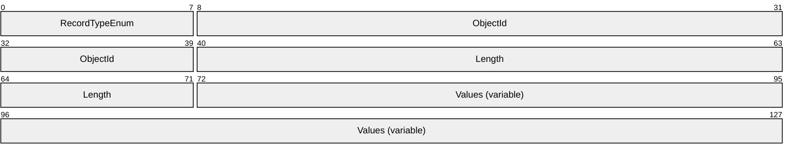

**RecordTypeEnum (1 byte):** A [RecordTypeEnumeration](#Section_2.3.2.1) value that identifies the record type. The value MUST be 0x11.

**ObjectId (4 bytes):** An INT32 value ([MS-DTYP](../MS-DTYP/MS-DTYP.md) section 2.2.22) that uniquely identifies the array instance in the serialization stream. The ID MUST be a positive integer.

**Length (4 bytes):** An INT32 value ([MS-DTYP] section 2.2.22) that specifies the number of items in the array. The value MUST be 0, to indicate no items, or a positive integer representing the number of items in the array.

**Values (variable):** A sequence of data values contained in the array. Each data value MUST be a valid [BinaryObjectString](#Section_2.3.5.7) record.

<a id="Section_2.3.4.3"></a>
#### 2.3.4.3 ArraySingleObject

The ArraySingleObject record contains a single-dimensional array in which each member record MAY contain any data value.


**RecordTypeEnum (1 byte):** A [RecordTypeEnumeration](#Section_2.3.2.1) value that identifies the record type. The value MUST be 0x10.

**ObjectId (4 bytes):** An INT32 value ([MS-DTYP](../MS-DTYP/MS-DTYP.md) section 2.2.22) that uniquely identifies the array instance in the serialization stream. The ID MUST be a positive integer.

**Length (4 bytes):** An INT32 value ([MS-DTYP] section 2.2.22) that specifies the number of items in the array. The value MUST be 0 or a positive integer.

**Values (variable):** A sequence of data values contained in the array. Each data value MUST be one of the record types defined in sections [2.3.4](#Section_2.3.4), [2.3.5](#Section_2.3.5), and [2.3.6](#Section_2.3.6).

<a id="Section_2.3.5"></a>
### 2.3.5 Member Reference Records

<a id="Section_2.3.5.1"></a>
#### 2.3.5.1 MemberPrimitiveTyped

The MemberPrimitiveTyped record contains a primitive type value other than a string.

```mermaid
packet-beta
  0-7: "RecordTypeEnum"
  8-15: "PrimitiveTypeEnum"
  16-63: "Value (variable)"
```

**RecordTypeEnum (1 byte):** A [RecordTypeEnumeration](#Section_2.3.2.1) value that identifies the record type. The value MUST be 0x08.

**PrimitiveTypeEnum (1 byte):** A RecordTypeEnumeration value that specifies the primitive type of data that is being transmitted. This field MUST NOT contain a value of 0x11 (Null) or 0x12 (String).

**Value (variable):** The value whose type is inferred from the [PrimitiveTypeEnumeration](#Section_2.3.2.3) field, as specified in the table in section 2.3.2.3.

<a id="Section_2.3.5.2"></a>
#### 2.3.5.2 MemberPrimitiveUnTyped

The MemberPrimitiveUnTyped record is the most compact record to represent a primitive type value. This type of record does not have a [RecordTypeEnumeration](#Section_2.3.2.1) to indicate the record type. The record MUST be used when a class record member value is a primitive type. Because the containing class specifies the primitive type of each member, the primitive type is not re-specified along with the value. Also, the primitive values cannot be referenced by any other record; therefore it does not require an **ObjectId**. This record has no field besides the value.

```mermaid
packet-beta
  0-63: "Value (variable)"
```

**Value (variable):** A primitive type value, other than a string.

<a id="Section_2.3.5.3"></a>
#### 2.3.5.3 MemberReference

The MemberReference record contains a reference to another record that contains the actual value. The record is used to serialize values of class members and array items.

```mermaid
packet-beta
  0-7: "RecordTypeEnum"
  8-39: "IdRef"
```

**RecordTypeEnum (1 byte):** A [LengthPrefixedString](#Section_2.3.3.4) value that identifies the record type. The value MUST be 0x09.

**IdRef (4 bytes):**

An INT32 value ([MS-DTYP](../MS-DTYP/MS-DTYP.md) section 2.2.22) that MUST be an ID of an object defined in another record.

- The value MUST be a positive integer.
- A class, array, or [BinaryObjectString](#Section_2.3.5.7) record MUST exist in the serialization stream with the value as its **ObjectId**. Unlike other ID references, there is no restriction on where the record that defines the ID appears in the serialization stream. A referenced record MAY appear after the referencing record.<8>
<a id="Section_2.3.5.4"></a>
#### 2.3.5.4 ObjectNull

The ObjectNull record contains a null object.

```mermaid
packet-beta
  0-7: "RecordTypeEnum"
```

**RecordTypeEnum (1 byte):** A [RecordTypeEnumeration](#Section_2.3.2.1) value that identifies the record type. The value MUST be 0x0a.

<a id="Section_2.3.5.5"></a>
#### 2.3.5.5 ObjectNullMultiple

The ObjectNullMultiple record provides a more compact form for multiple consecutive null records than using individual [ObjectNull](#Section_2.3.5.4) records.

```mermaid
packet-beta
  0-7: "RecordTypeEnum"
  8-39: "NullCount"
```

**RecordTypeEnum (1 byte):** A [RecordTypeEnumeration](#Section_2.3.2.1) value that identifies the record type. The value MUST be 0x0e.

**NullCount (4 bytes):** An INT32 value ([MS-DTYP](../MS-DTYP/MS-DTYP.md) section 2.2.22) that is the count of the number of consecutive null objects. The value MUST be a positive integer.

<a id="Section_2.3.5.6"></a>
#### 2.3.5.6 ObjectNullMultiple256

The ObjectNullMultiple256 record provides a compact form for multiple, consecutive null records when the count of null records is less than 256.

```mermaid
packet-beta
  0-7: "RecordTypeEnum"
  8-15: "NullCount"
```

**RecordTypeEnum (1 byte):** A [RecordTypeEnumeration](#Section_2.3.2.1) value that identifies the record type. The value MUST be 0x0d.

**NullCount (1 byte):** A BYTE value ([MS-DTYP](../MS-DTYP/MS-DTYP.md) section 2.2.6) that is the count of the number of consecutive null objects. The value MUST be in the range of 0 to 255, inclusive.

<a id="Section_2.3.5.7"></a>
#### 2.3.5.7 BinaryObjectString

The BinaryObjectString record identifies an object as a string object, and contains information about it.

```mermaid
packet-beta
  0-7: "RecordTypeEnum"
  8-39: "ObjectId"
  40-95: "Value (variable)"
```

**RecordTypeEnum (1 byte):** A [RecordTypeEnumeration](#Section_2.3.2.1) value that identifies the record type. The value MUST be 0x06.

**ObjectId (4 bytes):** An INT32 value ([MS-DTYP](../MS-DTYP/MS-DTYP.md) section 2.2.22) that uniquely identifies the string instance in the serialization stream. The value MUST be a positive integer.

**Value (variable):** A LengthPrefixedString value.

<a id="Section_2.3.6"></a>
### 2.3.6 Class Records

<a id="Section_2.3.6.1"></a>
#### 2.3.6.1 LogicalCallContext

The LogicalCallContext record is referenced by and serialized for the [ReturnArray](#Section_2.3.1.3.1) record.

```mermaid
packet-beta
  0-7: "RecordTypeEnum"
  8-39: "ObjectId"
  40-143: "ClassName (53 bytes)"
  144-175: "MemberCount"
```

**RecordTypeEnum (1 byte):** A [RecordTypeEnumeration](#Section_2.3.2.1) value that identifies the record type. Its value MUST be 0x04.

**ObjectId (4 bytes):** An INT32 value ([MS-DTYP](../MS-DTYP/MS-DTYP.md) section 2.2.22) that uniquely identifies the object in the serialization stream. An implementation MAY use any algorithm to generate the unique ID. If the **ObjectId** is referenced by a [MemberReference](#Section_2.3.5.3) record elsewhere in the serialization stream, the **ObjectId** MUST be positive. If the **ObjectId** is not referenced by any MemberReference in the serialization stream, then the **ObjectId** SHOULD be positive, but MAY be negative.

**ClassName (53 bytes):** A [LengthPrefixedString](#Section_2.3.3.4) identifying the class name. Its value MUST be "System.Runtime.Remoting.Messaging.LogicalCallContext".

**MemberCount (4 bytes):** An INT32 value ([MS-DTYP] section 2.2.22) that specifies the number of members in this type. Its value MUST be 0x00000000.

<a id="Section_2.3.6.2"></a>
#### 2.3.6.2 Principal

The Principal record contains information about a user that was discovered while checking group membership.

```mermaid
packet-beta
  0-7: "RecordTypeEnum"
  8-39: "ObjectId"
  40-151: "ClassName (62 bytes)"
  152-183: "MemberCount"
  184-263: "MemberName1 (22 bytes)"
  264-367: "MemberName2 (17 bytes)"
  368-463: "MemberName3 (16 bytes)"
  464-551: "MemberName4 (19 bytes)"
  552-663: "MemberName5 (22 bytes)"
  664-751: "MemberName6 (15 bytes)"
  752-831: "MemberName7 (22 bytes)"
  832-951: "MemberName8 (15 bytes)"
  952-1015: "MemberName9"
  1016-1103: "MemberName10 (27 bytes)"
  1104-1111: "BinaryTypeEnum1"
  1112-1119: "BinaryTypeEnum2"
  1120-1127: "BinaryTypeEnum3"
  1128-1135: "BinaryTypeEnum4"
  1136-1143: "BinaryTypeEnum5"
  1144-1151: "BinaryTypeEnum6"
  1152-1159: "BinaryTypeEnum7"
  1160-1167: "BinaryTypeEnum8"
  1168-1175: "BinaryTypeEnum9"
  1176-1183: "BinaryTypeEnum10"
  1184-1295: "AdditionalInfo1TypeName (46 bytes)"
  1296-1327: "AdditionalInfo1LibraryId"
  1328-1431: "AdditionalInfo2 (29 bytes)"
  1432-1511: "AdditionalInfo3TypeName (46 bytes)"
  1512-1543: "AdditionalInfo3LibraryId"
  1544-1631: "AdditionalInfo4 (31 bytes)"
  1632-1727: "AdditionalInfo5TypeName (48 bytes)"
  1728-1759: "AdditionalInfo5LibraryId"
  1760-1855: "AdditionalInfo8TypeName (80 bytes)"
  1856-1887: "AdditionalInfo8LibraryId"
  1888-1895: "AdditionalInfo9"
  1896-1903: "AdditionalInfo10"
  1904-1935: "LibraryId"
```

**RecordTypeEnum (1 byte):** A [RecordTypeEnumeration](#Section_2.3.2.1) value that identifies the record type. Its value MUST be 0x05.

**ObjectId (4 bytes):** An INT32 value ([MS-DTYP](../MS-DTYP/MS-DTYP.md) section 2.2.22) that uniquely identifies the object in the serialization stream. An implementation MAY use any algorithm to generate the unique IDs. If the **ObjectId** is referenced by a [MemberReference](#Section_2.3.5.3) record elsewhere in the serialization stream, the **ObjectId** MUST be positive. If the **ObjectId** is not referenced by any MemberReference in the serialization stream, then the **ObjectId** SHOULD be positive, but MAY be negative.

**ClassName (62 bytes):** A [LengthPrefixedString](#Section_2.3.3.4) identifying the class name. Its value MUST be "Microsoft.DigitalRightsManagement.DirectoryServices.Principal".

**MemberCount (4 bytes):** An INT32 value ([MS-DTYP] section 2.2.22) that specifies the number of members in this type. Its value MUST be 0x0000000a.

**MemberName1 (22 bytes):** A LengthPrefixedString containing the first member name. The value MUST be "_PrincipalIdentifiers".

**MemberName2 (17 bytes):** A LengthPrefixedString containing the second member name. The value MUST be "_GroupMembership".

**MemberName3 (16 bytes):** A LengthPrefixedString containing the third member name. The value MUST be "_ForeignMembers".

**MemberName4 (19 bytes):** A LengthPrefixedString containing the fourth member name. The value MUST be "_parsingDictionary".

**MemberName5 (22 bytes):** A LengthPrefixedString containing the fifth member name. The value MUST be "_ContainerObjectGuids".

**MemberName6 (15 bytes):** A LengthPrefixedString containing the sixth member name. The value MUST be "_strObjectGuid".

**MemberName7 (22 bytes):** A LengthPrefixedString containing the seventh member name. The value MUST be "_strOriginationForest".

**MemberName8 (15 bytes):** A LengthPrefixedString containing the eighth member name. The value MUST be "_explicitParse".

**MemberName9 (8 bytes):** A LengthPrefixedString containing the ninth member name. The value MUST be "_exists".

**MemberName10 (27 bytes):** A LengthPrefixedString containing the tenth member name. The value MUST be "DirectoryLookupXML+_exists".

**BinaryTypeEnum1 (1 byte):** A [BinaryTypeEnumeration](#Section_2.3.2.2) value that specifies the binary type of the first member value. The value MUST be 0x04 (Class).

**BinaryTypeEnum2 (1 byte):** A BinaryTypeEnumeration value that specifies the binary type of the second member value. The value MUST be 0x03 (SystemClass).

**BinaryTypeEnum3 (1 byte):** A BinaryTypeEnumeration value that specifies the binary type of the third member value. The value MUST be 0x04 (Class).

**BinaryTypeEnum4 (1 byte):** A BinaryTypeEnumeration value that specifies the binary type of the fourth member value. The value MUST be 0x03 (SystemClass).

**BinaryTypeEnum5 (1 byte):** A BinaryTypeEnumeration value that specifies the binary type of the fifth member value. The value MUST be 0x04 (Class).

**BinaryTypeEnum6 (1 byte):** A BinaryTypeEnumeration value that specifies the binary type of the sixth member value. The value MUST be 0x01 (String).

**BinaryTypeEnum7 (1 byte):** A BinaryTypeEnumeration value that specifies the binary type of the seventh member value. The value MUST be 0x01 (String).

**BinaryTypeEnum8 (1 byte):** A BinaryTypeEnumeration value that specifies the binary type of the eighth member value. The value MUST be 0x04 (Class).

**BinaryTypeEnum9 (1 byte):** A BinaryTypeEnumeration value that specifies the binary type of the ninth member value. The value MUST be 0x00 (Primitive).

**BinaryTypeEnum10 (1 byte):** A BinaryTypeEnumeration value that specifies the binary type of the tenth member value. The value MUST be 0x00 (Primitive).

**AdditionalInfo1TypeName (46 bytes):** A LengthPrefixedString containing the name of the class of the first member value. The value MUST be "System.Collections.Specialized.ListDictionary".

**AdditionalInfo1LibraryId (4 bytes):** An INT32 value ([MS-DTYP] section 2.2.22) value that represents the ID that identifies the library name corresponding to the call of the first member value. The record that contains this field in a serialization stream MUST be preceded by a [BinaryLibrary](#Section_2.3.4.1) record that defines the library name for the ID.

**AdditionalInfo2 (29 bytes):** A LengthPrefixedString containing the name of the class of the second member value. The value MUST be "System.Collections.Hashtable".

**AdditionalInfo3TypeName (46 bytes):** A LengthPrefixedString containing the name of the class of the third member value. The value MUST be "System.Collections.Specialized.ListDictionary".

**AdditionalInfo3LibraryId (4 bytes):** An INT32 value ([MS-DTYP] section 2.2.22) value that represents the ID that identifies the library name corresponding to the call of the third member value. The record that contains this field in a serialization stream MUST be preceded by a BinaryLibrary record that defines the library name for the ID.

**AdditionalInfo4 (31 bytes):** A LengthPrefixedString containing the name of the class of the fourth member value. The value MUST be "System.Collections.IDictionary".

**AdditionalInfo5TypeName (48 bytes):** A LengthPrefixedString containing the name of the class of the fifth member value. The value MUST be "System.Collections.Specialized.StringCollection".

**AdditionalInfo5LibraryId (4 bytes):** An INT32 value ([MS-DTYP] section 2.2.22) value that represents the ID that identifies the library name corresponding to the call of the fifth member value. The record that contains this field in a serialization stream MUST be preceded by a BinaryLibrary record that defines the library name for the ID.

**AdditionalInfo8TypeName (80 bytes):** A LengthPrefixedString containing the name of the class of the eighth member value. The value MUST be "Microsoft.DigitalRightsManagement.DirectoryServices.Principal+ExplicitParseEnum".

**AdditionalInfo8LibraryId (4 bytes):** An INT32 value ([MS-DTYP] section 2.2.22) value that represents the ID that identifies the library name corresponding to the call of the eighth member value. The record that contains this field in a serialization stream MUST be preceded by a BinaryLibrary record that defines the library name for the ID.

**AdditionalInfo9 (1 byte):** A [PrimitiveTypeEnumeration](#Section_2.3.2.3) value that specifies the primitive type of the ninth member value. The value MUST be 0x01 (Boolean).

**AdditionalInfo10 (1 byte):** A PrimitiveTypeEnumeration value that specifies the primitive type of the tenth member value. The value MUST be 0x01 (Boolean).

**LibraryId (4 bytes):** An INT32 value ([MS-DTYP] section 2.2.22) that references a BinaryLibrary record by its library ID. A BinaryLibrary record with the **LibraryId** MUST appear earlier in the serialization stream.

<a id="Section_2.3.6.3"></a>
#### 2.3.6.3 ExplicitParseEnum

The ExplicitParseEnum record is used to provide a value for the eighth serialized member value of a [Principal](#Section_2.3.6.2) record.

```mermaid
packet-beta
  0-7: "RecordTypeEnum"
  8-39: "ObjectId"
  40-135: "ClassName (80 bytes)"
  136-167: "MemberCount"
  168-231: "MemberName1"
  232-239: "BinaryTypeEnum1"
  240-247: "AdditionalInfo1"
  248-279: "LibraryId"
```

**RecordTypeEnum (1 byte):** A [PrimitiveTypeEnumeration](#Section_2.3.2.3) value that identifies the record type. Its value MUST be 0x05.

**ObjectId (4 bytes):** An INT32 value ([MS-DTYP](../MS-DTYP/MS-DTYP.md) section 2.2.22) that uniquely identifies the object in the serialization stream. An implementation MAY use any algorithm to generate the unique IDs. If the **ObjectId** is referenced by a [MemberReference](#Section_2.3.5.3) record elsewhere in the serialization stream, the **ObjectId** MUST be positive. If the **ObjectId** is not referenced by any MemberReference in the serialization stream, then the **ObjectId** SHOULD be positive, but MAY be negative.

**ClassName (80 bytes):** A [LengthPrefixedString](#Section_2.3.3.4) identifying the class name. Its value MUST be "Microsoft.DigitalRightsManagement.DirectoryServices.Principal+ExplicitParseEnum".

**MemberCount (4 bytes):** An INT32 value ([MS-DTYP] section 2.2.22) that specifies the number of members in this type. Its value MUST be 0x00000001.

**MemberName1 (8 bytes):** A LengthPrefixedString containing the first member name. The value MUST be "value__".

**BinaryTypeEnum1 (1 byte):** A [BinaryTypeEnumeration](#Section_2.3.2.2) value that specifies the binary type of the first member value. The value MUST be 0x00 (Primitive).

**AdditionalInfo1 (1 byte):** A PrimitiveTypeEnumeration value that specifies the primitive type of the first member value. The value MUST be 0x08 (for Int32).

**LibraryId (4 bytes):** An INT32 value ([MS-DTYP] section 2.2.22) that references a [BinaryLibrary](#Section_2.3.4.1) record by its library ID. A BinaryLibrary record with the **LibraryId** MUST appear earlier in the serialization stream.

<a id="Section_2.3.6.4"></a>
#### 2.3.6.4 ListDictionary

The ListDictionary record describes a linked list of key-value pairs.

```mermaid
packet-beta
  0-7: "RecordTypeEnum"
  8-39: "ObjectId"
  40-151: "ClassName (46 bytes)"
  152-183: "MemberCount"
  184-223: "MemberName1"
  224-287: "MemberName2"
  288-359: "MemberName3"
  360-431: "MemberName4"
  432-439: "BinaryTypeEnum1"
  440-447: "BinaryTypeEnum2"
  448-455: "BinaryTypeEnum3"
  456-463: "BinaryTypeEnum4"
  464-567: "AdditionalInfo1TypeName (61 bytes)"
  568-599: "AdditionalInfo1LibraryId"
  600-607: "AdditionalInfo2"
  608-615: "AdditionalInfo3"
  616-719: "AdditionalInfo4 (29 bytes)"
  720-751: "LibraryId"
```

**RecordTypeEnum (1 byte):** A [RecordTypeEnumeration](#Section_2.3.2.1) value that identifies the record type. Its value MUST be 0x05.

**ObjectId (4 bytes):** An INT32 value ([MS-DTYP](../MS-DTYP/MS-DTYP.md) section 2.2.22) that uniquely identifies the object in the serialization stream. An implementation MAY use any algorithm to generate the unique IDs. If the **ObjectId** is referenced by a [MemberReference](#Section_2.3.5.3) record elsewhere in the serialization stream, the **ObjectId** MUST be positive. If the **ObjectId** is not referenced by any MemberReference in the serialization stream, then the **ObjectId** SHOULD be positive, but MAY be negative.

**ClassName (46 bytes):** A [LengthPrefixedString](#Section_2.3.3.4) identifying the class name. Its value MUST be "System.Collections.Specialized.ListDictionary".

**MemberCount (4 bytes):** An INT32 value ([MS-DTYP] section 2.2.22) that specifies the number of members in this type. Its value MUST be 0x00000004.

**MemberName1 (5 bytes):** A LengthPrefixedString containing the first member name. The value MUST be "head".

**MemberName2 (8 bytes):** A LengthPrefixedString containing the second member name. The value MUST be "version".

**MemberName3 (9 bytes):** A LengthPrefixedString containing the third member name. The value MUST be "count".

**MemberName4 (9 bytes):** A LengthPrefixedString containing the fourth member name. The value MUST be "comparer".

**BinaryTypeEnum1 (1 byte):** A [BinaryTypeEnumeration](#Section_2.3.2.2) value that specifies the binary type of the first member value. The value MUST be 0x04 (Class).

**BinaryTypeEnum2 (1 byte):** A BinaryTypeEnumeration value that specifies the binary type of the second member value. The value MUST be 0x00 (Primitive).

**BinaryTypeEnum3 (1 byte):** A BinaryTypeEnumeration value that specifies the binary type of the third member value. The value MUST be 0x00 (Primitive).

**BinaryTypeEnum4 (1 byte):** A BinaryTypeEnumeration value that specifies the binary type of the fourth member value. The value MUST be 0x03 (SystemClass).

**AdditionalInfo1TypeName (61 bytes):** A LengthPrefixedString containing the name of the class of the first member value. The value MUST be "System.Collections.Specialized.ListDictionary+DictionaryNode".

**AdditionalInfo1LibraryId (4 bytes):** An INT32 value ([MS-DTYP] section 2.2.22) that represents the ID that identifies the library name corresponding to the call of the first member value. The record that contains this field in a serialization stream MUST be preceded by a [BinaryLibrary](#Section_2.3.4.1) record that defines the library name for the ID.

**AdditionalInfo2 (1 byte):** A [PrimitiveTypeEnumeration](#Section_2.3.2.3) value that specifies the primitive type of the second member value. The value MUST be 0x08 (Int32).

**AdditionalInfo3 (1 byte):** A PrimitiveTypeEnumeration value that specifies the primitive type of the third member value. The value MUST be 0x08 (Int32).

**AdditionalInfo4 (29 bytes):** A LengthPrefixedString containing the name of the class of the fourth member value. The value MUST be "System.Collections.IComparer".

**LibraryId (4 bytes):** An INT32 value ([MS-DTYP] section 2.2.22) that references a BinaryLibrary record by its library ID. A BinaryLibrary record with the **LibraryId** MUST appear earlier in the serialization stream.

<a id="Section_2.3.6.5"></a>
#### 2.3.6.5 HashTable

The HashTable defines an associative structure ([**hash table**](#gt_hash-table)) consisting of two arrays: one containing keys, the other containing values. These arrays are [ArraySingleObject](#Section_2.3.4.3) records in the serialized octet stream referenced using [MemberReference](#Section_2.3.5.3) records serialized as the sixth and seventh member values following this record. Both arrays MUST have the same length. The serialized value for the first member value MUST be 0.72.

```mermaid
packet-beta
  0-7: "RecordTypeEnum"
  8-39: "ObjectId"
  40-143: "ClassName (29 bytes)"
  144-175: "MemberCount"
  176-263: "MemberName1"
  264-327: "MemberName2"
  328-399: "MemberName3"
  400-503: "MemberName4 (17 bytes)"
  504-575: "MemberName5"
  576-615: "MemberName6"
  616-671: "MemberName7"
  672-679: "BinaryTypeEnum1"
  680-687: "BinaryTypeEnum2"
  688-695: "BinaryTypeEnum3"
  696-703: "BinaryTypeEnum4"
  704-711: "BinaryTypeEnum5"
  712-719: "BinaryTypeEnum6"
  720-727: "BinaryTypeEnum7"
  728-735: "AdditionalInfo1"
  736-743: "AdditionalInfo2"
  744-847: "AdditionalInfo3 (29 bytes)"
  848-951: "AdditionalInfo4 (37 bytes)"
  952-959: "AdditionalInfo5"
```

**RecordTypeEnum (1 byte):** A [RecordTypeEnumeration](#Section_2.3.2.1) value that identifies the record type. Its value MUST be 0x04.

**ObjectId (4 bytes):** An INT32 value ([MS-DTYP](../MS-DTYP/MS-DTYP.md) section 2.2.22) that uniquely identifies the object in the serialization stream. An implementation MAY use any algorithm to generate the unique IDs. If the **ObjectId** is referenced by a MemberReference record elsewhere in the serialization stream, the **ObjectId** MUST be positive. If the **ObjectId** is not referenced by any RecordTypeEnumeration in the serialization stream, then the **ObjectId** SHOULD be positive, but MAY be negative.

**ClassName (29 bytes):** A [LengthPrefixedString](#Section_2.3.3.4) identifying the class name. Its value MUST be "System.Collections.Hashtable".

**MemberCount (4 bytes):** An INT32 value ([MS-DTYP] section 2.2.22) that specifies the number of members in this type. Its value MUST be 0x00000007.

**MemberName1 (11 bytes):** A LengthPrefixedString containing the first member name. The value MUST be "LoadFactor".

**MemberName2 (8 bytes):** A LengthPrefixedString containing the second member name. The value MUST be "Version".

**MemberName3 (9 bytes):** A LengthPrefixedString containing the third member name. The value MUST be "Comparer".

**MemberName4 (17 bytes):** A LengthPrefixedString containing the fourth member name. The value MUST be "HashCodeProvider".

**MemberName5 (9 bytes):** A LengthPrefixedString containing the fifth member name. The value MUST be "HashSize".

**MemberName6 (5 bytes):** A LengthPrefixedString containing the sixth member name. The value MUST be "Keys".

**MemberName7 (7 bytes):** A LengthPrefixedString containing the seventh member name. The value MUST be "Values".

**BinaryTypeEnum1 (1 byte):** A BinaryTypeEnumeration value that specifies the binary type of the first member value. The value MUST be 0x00 (Primitive).

**BinaryTypeEnum2 (1 byte):** A BinaryTypeEnumeration value that specifies the binary type of the second member value. The value MUST be 0x00 (Primitive).

**BinaryTypeEnum3 (1 byte):** A BinaryTypeEnumeration value that specifies the binary type of the third member value. The value MUST be 0x03 (SystemClass).

**BinaryTypeEnum4 (1 byte):** A BinaryTypeEnumeration value that specifies the binary type of the fourth member value. The value MUST be 0x03 (SystemClass).

**BinaryTypeEnum5 (1 byte):** A BinaryTypeEnumeration value that specifies the binary type of the fifth member value. The value MUST be 0x00 (Primitive).

**BinaryTypeEnum6 (1 byte):** A BinaryTypeEnumeration value that specifies the binary type of the sixth member value. The value MUST be 0x05 (ObjectArray).

**BinaryTypeEnum7 (1 byte):** A BinaryTypeEnumeration value that specifies the binary type of the seventh member value. The value MUST be 0x05 (ObjectArray).

**AdditionalInfo1 (1 byte):** A [PrimitiveTypeEnumeration](#Section_2.3.2.3) value that specifies the primitive type of the first member value. The value MUST be 0x0b (Single).

**AdditionalInfo2 (1 byte):** A PrimitiveTypeEnumeration value that specifies the primitive type of the second member value. The value MUST be 0x08 (Int32).

**AdditionalInfo3 (29 bytes):** A LengthPrefixedString containing the name of the class of the third member value. The value MUST be "System.Collections.IComparer".

**AdditionalInfo4 (37 bytes):** A LengthPrefixedString containing the name of the class of the fourth member value. The value MUST be "System.Collections.IHashCodeProvider".

**AdditionalInfo5 (1 byte):** A PrimitiveTypeEnumeration value that specifies the primitive type of the fifth member value. The value MUST be 0x08 (Int32).

<a id="Section_2.3.6.6"></a>
#### 2.3.6.6 StringCollection

The StringCollection record defines a class containing an [ArrayList](#Section_2.3.6.8) of strings.

```mermaid
packet-beta
  0-7: "RecordTypeEnumeration"
  8-39: "ObjectId"
  40-135: "ClassName (48 bytes)"
  136-167: "MemberCount"
  168-207: "MemberName1"
  208-215: "BinaryTypeEnum1"
  216-287: "AdditionalInfo1 (29 bytes)"
  288-319: "LibraryId"
```

**RecordTypeEnumeration (1 byte):** A [LengthPrefixedString](#Section_2.3.3.4) value that identifies the record type. Its value MUST be 0x05.

**ObjectId (4 bytes):** An INT32 value ([MS-DTYP](../MS-DTYP/MS-DTYP.md) section 2.2.22) that uniquely identifies the object in the serialization stream. An implementation MAY use any algorithm to generate the unique IDs. If the **ObjectId** is referenced by a [MemberReference](#Section_2.3.5.3) record elsewhere in the serialization stream, the **ObjectId** MUST be positive. If the **ObjectId** is not referenced by any MemberReference in the serialization stream, then the **ObjectId** SHOULD be positive, but MAY be negative.

**ClassName (48 bytes):** A LengthPrefixedString identifying the class name. Its value MUST be "System.Collections.Specialized.StringCollection".

**MemberCount (4 bytes):** An INT32 value ([MS-DTYP] section 2.2.22) that specifies the number of members in this type. Its value MUST be 0x00000001.

**MemberName1 (5 bytes):** A LengthPrefixedString containing the first member name. The value MUST be "data".

**BinaryTypeEnum1 (1 byte):** A [BinaryTypeEnumeration](#Section_2.3.2.2) value that specifies the binary type of the first member value. The value MUST be 0x03 (SystemClass).

**AdditionalInfo1 (29 bytes):** A LengthPrefixedString containing the name of the class of the first member value. The value MUST be "System.Collections.ArrayList".

**LibraryId (4 bytes):** An INT32 value ([MS-DTYP] section 2.2.22) that references a [BinaryLibrary](#Section_2.3.4.1) record by its library ID. A BinaryLibrary record with the **LibraryId** MUST appear earlier in the serialization stream.

<a id="Section_2.3.6.7"></a>
#### 2.3.6.7 DictionaryNode

The DictionaryNode record defines a node in a [ListDictionary](#Section_2.3.6.4).

```mermaid
packet-beta
  0-7: "RecordTypeEnum"
  8-39: "ObjectId"
  40-143: "ClassName (61 bytes)"
  144-175: "MemberCount"
  176-207: "MemberName1"
  208-255: "MemberName2"
  256-295: "MemberName3"
  296-303: "BinaryTypeEnum1"
  304-311: "BinaryTypeEnum2"
  312-319: "BinaryTypeEnum3"
  320-423: "AdditionalInfo3TypeName (61 bytes)"
  424-455: "AdditionalInfo3LibraryId"
  456-487: "LibraryId"
```

**RecordTypeEnum (1 byte):** A [RecordTypeEnumeration](#Section_2.3.2.1) value that identifies the record type. Its value MUST be 0x05.

**ObjectId (4 bytes):** An INT32 value ([MS-DTYP](../MS-DTYP/MS-DTYP.md) section 2.2.22) that uniquely identifies the object in the serialization stream. An implementation MAY use any algorithm to generate the unique IDs. If the **ObjectId** is referenced by a [MemberReference](#Section_2.3.5.3) record elsewhere in the serialization stream, the **ObjectId** MUST be positive. If the **ObjectId** is not referenced by any MemberReference in the serialization stream, then the **ObjectId** SHOULD be positive, but MAY be negative.

**ClassName (61 bytes):** A [LengthPrefixedString](#Section_2.3.3.4) identifying the class name. Its value MUST be "System.Collections.Specialized.ListDictionary+DictionaryNode".

**MemberCount (4 bytes):** An INT32 value ([MS-DTYP] section 2.2.22) that specifies the number of members in this type. Its value MUST be 0x00000003.

**MemberName1 (4 bytes):** A LengthPrefixedString containing the first member name. The value MUST be "key".

**MemberName2 (6 bytes):** A LengthPrefixedString containing the second member name. The value MUST be "value".

**MemberName3 (5 bytes):** A LengthPrefixedString containing the third member name. The value MUST be "next".

**BinaryTypeEnum1 (1 byte):** A [BinaryTypeEnumeration](#Section_2.3.2.2) value that specifies the binary type of the first member value. The value MUST be 0x02 (Object).

**BinaryTypeEnum2 (1 byte):** A BinaryTypeEnumeration value that specifies the binary type of the second member value. The value MUST be 0x02 (Object).

**BinaryTypeEnum3 (1 byte):** A BinaryTypeEnumeration value that specifies the binary type of the third member value. The value MUST be 0x04 (Class).

**AdditionalInfo3TypeName (61 bytes):** A LengthPrefixedString containing the name of the class of the third member value. The value MUST be "System.Collections.Specialized.ListDictionary+DictionaryNode".

**AdditionalInfo3LibraryId (4 bytes):** An INT32 value ([MS-DTYP] section 2.2.22) value that represents the ID that identifies the library name corresponding to the call of the third member value. The record that contains this field in a serialization stream MUST be preceded by a [BinaryLibrary](#Section_2.3.4.1) record that defines the library name for the ID.

**LibraryId (4 bytes):** An INT32 value ([MS-DTYP] section 2.2.22) that references a BinaryLibrary record by its library ID. A BinaryLibrary record with the **LibraryId** MUST appear earlier in the serialization stream.

<a id="Section_2.3.6.8"></a>
#### 2.3.6.8 ArrayList

The ArrayList record defines an array of objects.

```mermaid
packet-beta
  0-7: "RecordTypeEnum"
  8-39: "ObjectId"
  40-143: "ClassName (29 bytes)"
  144-175: "MemberCount"
  176-231: "MemberName1"
  232-279: "MemberName2"
  280-351: "MemberName3"
  352-359: "BinaryTypeEnum1"
  360-367: "BinaryTypeEnum2"
  368-375: "BinaryTypeEnum3"
  376-383: "AdditionalInfo2"
  384-391: "AdditionalInfo3"
```

**RecordTypeEnum (1 byte):** A [RecordTypeEnumeration](#Section_2.3.2.1) value that identifies the record type. Its value MUST be 0x04.

**ObjectId (4 bytes):** An INT32 value ([MS-DTYP](../MS-DTYP/MS-DTYP.md) section 2.2.22) that uniquely identifies the object in the serialization stream. An implementation MAY use any algorithm to generate the unique IDs. If the **ObjectId** is referenced by a [MemberReference](#Section_2.3.5.3) record elsewhere in the serialization stream, the **ObjectId** MUST be positive. If the **ObjectId** is not referenced by any MemberReference in the serialization stream, then the **ObjectId** SHOULD be positive, but MAY be negative.

**ClassName (29 bytes):** A [LengthPrefixedString](#Section_2.3.3.4) identifying the class name. Its value MUST be "System.Collections.ArrayList".

**MemberCount (4 bytes):** An INT32 value ([MS-DTYP] section 2.2.22) that specifies the number of members in this type. Its value MUST be 0x00000003.

**MemberName1 (7 bytes):** A LengthPrefixedString containing the first member name. The value MUST be "_items".

**MemberName2 (6 bytes):** A LengthPrefixedString containing the second member name. The value MUST be "_size".

**MemberName3 (9 bytes):** A LengthPrefixedString containing the third member name. The value MUST be "_version".

**BinaryTypeEnum1 (1 byte):** A BinaryTypeEnumeration value that specifies the binary type of the first member value. The value MUST be 0x05 (ObjectArray).

**BinaryTypeEnum2 (1 byte):** A BinaryTypeEnumeration value that specifies the binary type of the second member value. The value MUST be 0x00 (Primitive).

**BinaryTypeEnum3 (1 byte):** A BinaryTypeEnumeration value that specifies the binary type of the third member value. The value MUST be 0x00 (Primitive).

**AdditionalInfo2 (1 byte):** A PrimitiveTypeEnumeration value that specifies the primitive type of the second member value. The value MUST be 0x08 (Int32).

**AdditionalInfo3 (1 byte):** A PrimitiveTypeEnumeration value that specifies the primitive type of the third member value. The value MUST be 0x08 (Int32).

<a id="Section_2.3.6.9"></a>
#### 2.3.6.9 RemotingException

The RemotingException record is used to serialize an exception when the server encounters an error processing the request.

```mermaid
packet-beta
  0-7: "RecordTypeEnum"
  8-39: "ObjectId"
  40-151: "ClassName (42 bytes)"
  152-183: "MemberCount"
  184-263: "MemberName1"
  264-327: "MemberName2"
  328-415: "MemberName3 (15 bytes)"
  416-479: "MemberName4"
  480-583: "MemberName5 (17 bytes)"
  584-671: "MemberName6 (23 bytes)"
  672-775: "MemberName7 (17 bytes)"
  776-871: "MemberName8 (16 bytes)"
  872-935: "MemberName9"
  936-991: "MemberName10"
  992-999: "BinaryTypeEnum1"
  1000-1007: "BinaryTypeEnum2"
  1008-1015: "BinaryTypeEnum3"
  1016-1023: "BinaryTypeEnum4"
  1024-1031: "BinaryTypeEnum5"
  1032-1039: "BinaryTypeEnum6"
  1040-1047: "BinaryTypeEnum7"
  1048-1055: "BinaryTypeEnum8"
  1056-1063: "BinaryTypeEnum9"
  1064-1071: "BinaryTypeEnum10"
  1072-1175: "AdditionalInfo3 (17 bytes)"
  1176-1183: "AdditionalInfo7"
  1184-1191: "AdditionalInfo9"
```

**RecordTypeEnum (1 byte):** A RemotingException value that identifies the record type. Its value MUST be 0x04.

**ObjectId (4 bytes):** An INT32 value ([MS-DTYP](../MS-DTYP/MS-DTYP.md) section 2.2.22) that uniquely identifies the object in the serialization stream. An implementation MAY use any algorithm to generate the unique IDs. If the **ObjectId** is referenced by a [MemberReference](#Section_2.3.5.3) record elsewhere in the serialization stream, the **ObjectId** MUST be positive. If the **ObjectId** is not referenced by any MemberReference in the serialization stream, then the **ObjectId** SHOULD be positive, but MAY be negative.

**ClassName (42 bytes):** A [LengthPrefixedString](#Section_2.3.3.4) identifying the class name. Its value MUST be "System.Runtime.Remoting.RemotingException".

**MemberCount (4 bytes):** An INT32 value ([MS-DTYP] section 2.2.22) that specifies the number of members in this type. Its value MUST be 0x0000000a.

**MemberName1 (10 bytes):** A LengthPrefixedString containing the first member name. The value MUST be "ClassName".

**MemberName2 (8 bytes):** A LengthPrefixedString containing the second member name. The value MUST be "Message".

**MemberName3 (15 bytes):** A LengthPrefixedString containing the third member name. The value MUST be "InnerException".

**MemberName4 (8 bytes):** A LengthPrefixedString containing the fourth member name. The value MUST be "HelpURL".

**MemberName5 (17 bytes):** A LengthPrefixedString containing the fifth member name. The value MUST be "StackTraceString".

**MemberName6 (23 bytes):** A LengthPrefixedString containing the sixth member name. The value MUST be "RemoteStackTraceString".

**MemberName7 (17 bytes):** A LengthPrefixedString containing the seventh member name. The value MUST be "RemoteStackIndex".

**MemberName8 (16 bytes):** A LengthPrefixedString containing the eighth member name. The value MUST be "ExceptionMethod".

**MemberName9 (8 bytes):** A LengthPrefixedString containing the ninth member name. The value MUST be "HResult".

**MemberName10 (7 bytes):** A LengthPrefixedString containing the tenth member name. The value MUST be "Source".

**BinaryTypeEnum1 (1 byte):** A [BinaryTypeEnumeration](#Section_2.3.2.2) value that specifies the binary type of the first member value. The value MUST be 0x01 (String).

**BinaryTypeEnum2 (1 byte):** A BinaryTypeEnumeration value that specifies the binary type of the second member value. The value MUST be 0x01 (String).

**BinaryTypeEnum3 (1 byte):** A BinaryTypeEnumeration value that specifies the binary type of the third member value. The value MUST be 0x03 (SystemClass).

**BinaryTypeEnum4 (1 byte):** A BinaryTypeEnumeration value that specifies the binary type of the fourth member value. The value MUST be 0x01 (String).

**BinaryTypeEnum5 (1 byte):** A BinaryTypeEnumeration value that specifies the binary type of the fifth member value. The value MUST be 0x01 (String).

**BinaryTypeEnum6 (1 byte):** A BinaryTypeEnumeration value that specifies the binary type of the sixth member value. The value MUST be 0x01 (String).

**BinaryTypeEnum7 (1 byte):** A BinaryTypeEnumeration value that specifies the binary type of the seventh member value. The value MUST be 0x00 (Primitive).

**BinaryTypeEnum8 (1 byte):** A BinaryTypeEnumeration value that specifies the binary type of the eighth member value. The value MUST be 0x01 (String).

**BinaryTypeEnum9 (1 byte):** A BinaryTypeEnumeration value that specifies the binary type of the ninth member value. The value MUST be 0x00 (Primitive).

**BinaryTypeEnum10 (1 byte):** A BinaryTypeEnumeration value that specifies the binary type of the tenth member value. The value MUST be 0x01 (String).

**AdditionalInfo3 (17 bytes):** A LengthPrefixedString containing the name of the class of the third member value. The value MUST be "System.Exception".

**AdditionalInfo7 (1 byte):** A [PrimitiveTypeEnumeration](#Section_2.3.2.3) value that specifies the primitive type of the seventh member value. The value MUST be 0x08 (Int32).

**AdditionalInfo9 (1 byte):** A PrimitiveTypeEnumeration value that specifies the primitive type of the ninth member value. The value MUST be 0x08 (Int32).

<a id="Section_2.3.6.10"></a>
#### 2.3.6.10 ClassWithId

The ClassWithId record is the most compact class record. It has no metadata. It refers to metadata defined in other class records.

```mermaid
packet-beta
  0-7: "RecordTypeEnum"
  8-39: "ObjectID"
  40-71: "MetadataID"
```

**RecordTypeEnum (1 byte):** A [RecordTypeEnumeration](#Section_2.3.2.1) value that identifies the record type. The value MUST be 0x01.

**ObjectID (4 bytes):** An INT32 value ([MS-DTYP](../MS-DTYP/MS-DTYP.md) section 2.2.22) that uniquely identifies the object in the serialization stream.

**MetadataID (4 bytes):** An INT32 value ([MS-DTYP] section 2.2.22) that references one of the other class records by its **ObjectId**. A class record with the value of this field in its **ObjectId** field MUST appear earlier in the serialization stream.

<a id="Section_3"></a>
# 3 Protocol Details

The Rights Management Services (RMS): Server-to-Server Protocol operates between two RMS servers. The initiator or requestor is the client for the protocol, and the responder is the server for the protocol. This protocol allows server operation with and without state, depending on the application.

The client side of this protocol is simply a pass-through. That is, no additional timers or other states are required on the client side of this protocol. Calls made by the higher-layer protocol or application are passed directly to the transport, and the results returned by the transport are passed directly back to the higher-layer protocol or application.

<a id="Section_3.1"></a>
## 3.1 Common Details

This section describes protocol details that are common between multiple port types.

<a id="Section_3.1.1"></a>
### 3.1.1 Abstract Data Model

None.

<a id="Section_3.1.2"></a>
### 3.1.2 Timers

None.

<a id="Section_3.1.3"></a>
### 3.1.3 Initialization

None.

<a id="Section_3.1.4"></a>
### 3.1.4 Message Processing Events and Sequencing Rules

None.

<a id="Section_3.1.4.1"></a>
#### 3.1.4.1 Common SOAP Headers

All four port types in the RMS: Server-Server Protocol (that is, [ServerSoap (FindServiceLocations)](#Section_3.2.4.1.2.1), [SubEnrollServiceSoap](#Section_5.1.2), [ServerSoap (GetLicensorCertificate)](#Section_5.1.3), and [GroupExpansionWebServiceSoap](#Section_6.4)) use the same SOAP header for both requests and responses. The SOAP header for requests and responses to these port types MUST contain the [VersionData](#Section_2.2.4.2) element specified in section 2.2.4.2.

**Request Headers**

When a request is made, the requestor MUST specify the lowest capability version it can support by using the *MinimumVersion* parameter. The client MUST specify the highest capability version it can support by using the *MaximumVersion* parameter. The client MUST make the request in accordance with the *MaximumVersion* capability version.

**Processing Request Headers**

When a responder receives a request, it MUST compare its own capability version to the capability version range presented by the requestor. The responder MUST assume that the requestor always makes a maximum-version request. The responder MUST reject the request with an error if its highest capability version is lower than the MaximumVersion specified by the requestor.

**Response Headers**

When responding to a requestor, including when responding with an error, the responder MUST specify the lowest capability version it can support as the MinimumVersion parameter. The responder MUST specify the highest capability version it can support as the MaximumVersion parameter. If the responder's maximum capability version is lower than the requestor's maximum capability version, the requestor SHOULD<9> resend its request and alter its request to conform to the capability version range specified by the responder.

<a id="Section_3.1.5"></a>
### 3.1.5 Timer Events

None.

<a id="Section_3.1.6"></a>
### 3.1.6 Other Local Events

None.

<a id="Section_3.2"></a>
## 3.2 ServerSoap (FindServiceLocations) Server Details

A requesting RMS server uses the ServerSoap (FindServiceLocations) port type for FindServiceLocations to discover the URLs of services offered by a responding RMS server. These URLs MAY be passed back to a client as a form of redirection, or they MAY be used by the requesting server to make another request of the responding RMS server.

The ServerSoap (FindServiceLocations) port type provides one operation: [FindServiceLocations](#Section_3.2.4.1.2.1).

<a id="Section_3.2.1"></a>
### 3.2.1 Abstract Data Model

This section describes a conceptual model of possible data organization that an implementation maintains to participate in this protocol. The described organization is provided to facilitate the explanation of how the protocol behaves. This document does not mandate that implementations adhere to this model as long as their external behavior is consistent with that described in this document. The conceptual data can be implemented by using a variety of techniques. Any data structure that stores the conceptual data MAY be used in the implementation.

In order to properly implement the [ServerSoap (FindServiceLocations)](#Section_3.2.4.1.2.1) port type, the responder MUST be able to provide the URLs it uses.

<a id="Section_3.2.2"></a>
### 3.2.2 Timers

None.

<a id="Section_3.2.3"></a>
### 3.2.3 Initialization

None.

<a id="Section_3.2.4"></a>
### 3.2.4 Message Processing Events and Sequencing Rules

An RMS server uses the [ServerSoap (FindServiceLocations)](#Section_3.2.4.1.2.1) port type to retrieve URLs for services that are either offered by or known to the responding server.

The following table summarizes the list of WSDL operations as defined by this specification:

| Operation | Description |
| --- | --- |
| [FindServiceLocations](#Section_3.2.4.1.2.1) | Allows a server to retrieve a URL for a specified service that is either offered by or known to the responding server. |

<a id="Section_3.2.4.1"></a>
#### 3.2.4.1 FindServiceLocations

The FindServiceLocations operation provides a mechanism for a requestor to retrieve a URL for a specified service that is either offered by or known to the responding server.

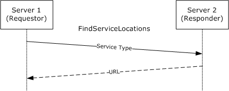

Figure 3: FindServiceLocations message sequence diagram

<wsdl:operation name="FindServiceLocations">

The SOAP operation is defined as follows.

<soap:operation

soapAction=

"http://microsoft.com/DRM/ServerService/FindServiceLocations"

style="document" />

**Request Validation**:

The responding server MUST validate the input parameters upon receiving a FindServiceLocations request. The FindServiceLocations request MUST follow the schema specified in section [3.2.4.1.1.1](#Section_3.2.4.1.1.1).

| Parameter | Description |
| --- | --- |
| ServiceType | MUST be a valid service type from the following list: LicensingService, CertificationService, DrmRemoteDirectoryServices, GroupExpansionService, LicensingInternalService, CertificationInternalService. Other service types are not supported. A single request MAY request URLs for multiple service types by including multiple <ServiceTypes> in the [ArrayOfServiceLocationRequest](#Section_3.2.4.1.3.1) as defined in section 3.2.4.1.3.1. |

**Data Processing**:

For a successful request, the responding server MUST return the appropriate service location URL. For an unsuccessful request, the server MUST return a fault code. The following table describes the URL expected for each service type.

| Service Type | Description |
| --- | --- |
| LicensingService | The URL of the responding server's licensing service (license.asmx). |
| CertificationService | The URL of the responding server's certification service (certification.asmx). |
| DrmRemoteDirectoryServices | The URL of the responding server's [Binary Group Expansion](#Section_4.3) interface.<10> |
| GroupExpansionService | The URL of the responding server's [GroupExpansionServerSoap](#Section_6.4) port type.<11> |
| LicensingInternalService | The internal URL of the responding server's the licensing service (license.asmx).<12> |
| CertificationInternalService | The internal URL of the responding server's certification service (certification.asmx).<13> |

**Response:**

A successful FindServiceLocations response MUST follow the schema specified in section [3.2.4.1.1.2](#Section_3.2.4.1.1.2). If multiple service types were requested, a successful response MUST include the same set of service types with corresponding URLs. If a specific URL is not available, the URL MUST be an empty string but the service type MUST still be included. For an unsuccessful request, the server MUST return a fault code. This operation throws only Common Fault Codes for the RMS: Server-Server Protocol as specified in section [2.2.9.1](#Section_2.2.9.1).

<a id="Section_3.2.4.1.1"></a>
##### 3.2.4.1.1 Messages

The following table summarizes the XML Schema message definitions that are specific to this operation.

| Message | Description |
| --- | --- |
| [FindServiceLocationsSoapIn request](#Section_3.2.4.1.1.1) | Requests a URL for a specific type of service (or services). |
| [FindServiceLocationsSoapOut response](#Section_3.2.4.1.1.2) | Returns a URL for each service that has been requested. |

<a id="Section_3.2.4.1.1.1"></a>
###### 3.2.4.1.1.1 FindServiceLocationsSoapIn Request

The FindServiceLocationsSoapIn request submits a type of service for which a URL is being requested. Multiple service locations MAY be requested at one time.<14>

<wsdl:message name="FindServiceLocationsSoapIn">

<wsdl:part name="parameters" element="tns:FindServiceLocations" />

</wsdl:message>

**parameters**: An element that contains the body of the SOAP request. A valid FindServiceLocationsSoapIn request MUST follow the schema specified in section [3.2.4.1.2.1](#Section_3.2.4.1.2.1).

<a id="Section_3.2.4.1.1.2"></a>
###### 3.2.4.1.1.2 FindServiceLocationsSoapOut Response

The FindServiceLocationsSoapOut response returns a URL for each service that has been requested when a URL is available.

Common fault codes are specified in section [2.2.9.1](#Section_2.2.9.1).

<wsdl:message name="FindServiceLocationsSoapOut">

<wsdl:part name="parameters"

element="tns:FindServiceLocationsResponse"

/>

</wsdl:message>

**parameters**: An element that contains the body of the SOAP response. A valid FindServiceLocationsSoapOut response MUST follow the schema defined in section [3.2.4.1.2.2](#Section_3.2.4.1.2.2).

<a id="Section_3.2.4.1.2"></a>
##### 3.2.4.1.2 Elements

The following table summarizes the set of common XML Schema complex type definitions defined by this specification.

| Complex Type | Description |
| --- | --- |
| [FindServiceLocationsRequest](#Section_3.2.4.1.2.1) | Contains the body of the SOAP request. |
| [FindServiceLocationsResponse](#Section_3.2.4.1.2.2) | Contains the body of the SOAP response. |

<a id="Section_3.2.4.1.2.1"></a>
###### 3.2.4.1.2.1 FindServiceLocations

The FindServiceLocationsRequest element contains the body of the SOAP request.

<s:element name="FindServiceLocations">

<s:complexType>

<s:sequence>

<s:element minOccurs="0" maxOccurs="1"

name="ServiceNames"

type="tns:ArrayOfServiceLocationRequest"

/>

</s:sequence>

</s:complexType>

</s:element>

**ServiceNames**: An array that allows for multiple service locations to be requested at one time. For a valid request, the array MUST contain at least one request for a service location. The array MAY contain more than one request for a service location. The array MUST follow the schema in section [3.2.4.1.3.1](#Section_3.2.4.1.3.1).

<a id="Section_3.2.4.1.2.2"></a>
###### 3.2.4.1.2.2 FindServiceLocationsResponse

The FindServiceLocationsResponse element contains the body of the SOAP response.

<s:element name="FindServiceLocationsResponse">

<s:complexType>

<s:sequence>

<s:element minOccurs="0" maxOccurs="1"

name="FindServiceLocationsResult"

type="tns:ArrayOfServiceLocationResponse"

/>

</s:sequence>

</s:complexType>

</s:element>

**FindServiceLocationResult**: An array that allows for multiple response elements to be returned at once. This array MUST contain the same number of elements as the array in the request. Each element of the array MUST contain a service location response, even if no URL was found. The array MUST follow the schema in section [3.2.4.1.3.3](#Section_3.2.4.1.3.3).

<a id="Section_3.2.4.1.3"></a>
##### 3.2.4.1.3 Complex Types

The following table summarizes the XML Schema complex type definitions that are specific to this operation.

| Complex Type | Description |
| --- | --- |
| [ArrayOfServiceLocationRequest](#Section_3.2.4.1.3.1) | Contains an array of [ServiceLocationRequest](#Section_3.2.4.1.3.2) complex types. |
| ServiceLocationRequest | Contains an enumeration of the requested service type. |
| [ArrayOfServiceLocationResponse](#Section_3.2.4.1.3.3) | Contains an array of [ServiceLocationResponse](#Section_3.2.4.1.3.3) complex types. |
| ServiceLocationResponse | Contains a URL of a server and the type of service the server offers. |

<a id="Section_3.2.4.1.3.1"></a>
###### 3.2.4.1.3.1 ArrayOfServiceLocationRequest Complex Type

The ArrayOfServiceLocationRequest complex type contains an array of [ServiceLocationRequest](#Section_3.2.4.1.3.2) complex types.

<s:complexType name="ArrayOfServiceLocationRequest">

<s:sequence>

<s:element minOccurs="0" maxOccurs="unbounded"

name="ServiceLocationRequest" nillable="true"

type="tns:ServiceLocationRequest" />

</s:sequence>

</s:complexType>

**ServiceLocationRequest**: A single request for a service location that MUST request a service type. The request MUST follow the schema in section 3.2.4.1.3.2.

<a id="Section_3.2.4.1.3.2"></a>
###### 3.2.4.1.3.2 ServiceLocationRequest Complex Type

The ServiceLocationRequest complex type contains an enumeration of the requested service type.

<s:complexType name="ServiceLocationRequest">

<s:sequence>

<s:element minOccurs="1" maxOccurs="1"

name="Type"

type="tns:ServiceType"

/>

</s:sequence>

</s:complexType>

**Type**: Contains the requested service type. MUST be specified as one string. MUST contain the enumeration of all known service types, as specified in section [3.2.4.1.4.1](#Section_3.2.4.1.4.1).

<a id="Section_3.2.4.1.3.3"></a>
###### 3.2.4.1.3.3 ArrayOfServiceLocationResponse Complex Type

The ArrayOfServiceLocationResponse contains an array of [ServiceLocationResponse](#Section_3.2.4.1.3.3) complex types.

<s:complexType name="ArrayOfServiceLocationResponse">

<s:sequence>

<s:element minOccurs="0" maxOccurs="unbounded"

name="ServiceLocationResponse" nillable="true"

type="tns:ServiceLocationResponse"

/>

</s:sequence>

</s:complexType>

**ServiceLocationResponse**: An individual response structure that contains the URL corresponding to a requested service type. Each service location response MUST contain a service type that matches the requested service type. The response includes the URL if found. The individual response structure MUST follow the schema in section 3.2.4.1.3.4.

<a id="Section_3.2.4.1.3.4"></a>
###### 3.2.4.1.3.4 ServiceLocationResponse Complex Type

The ServiceLocationResponse complex type contains a URL of a server and the type of service the server offers.

<s:complexType name="ServiceLocationResponse">

<s:sequence>

<s:element minOccurs="0" maxOccurs="1"

name="URL"

type="s:string"

/>

<s:element minOccurs="1" maxOccurs="1"

name="Type"

type="tns:ServiceType"

/>

</s:sequence>

</s:complexType>

**URL**: A string that contains the URL of the service location.

**Type**: A string that identifies the service type from the ServiceType enumeration as defined in section [3.2.4.1.4.1](#Section_3.2.4.1.4.1).

<a id="Section_3.2.4.1.4"></a>
##### 3.2.4.1.4 Simple Types

The following table summarizes the XML Schema simple type definitions that are specific to this operation.

| Simple Type | Description |
| --- | --- |
| [ServiceType](#Section_3.2.4.1.4.1) | Enumerates licensing service types. |

<a id="Section_3.2.4.1.4.1"></a>
###### 3.2.4.1.4.1 ServiceType Simple Type

The ServiceType simple type enumerates licensing service types.

<s:simpleType name="ServiceType">

<s:restriction base="s:string">

<s:enumeration value="EnrollmentService" />

<s:enumeration value="LicensingService" />

<s:enumeration value="PublishingService" />

<s:enumeration value="CertificationService" />

<s:enumeration value="ActivationService" />

<s:enumeration value="PrecertificationService" />

<s:enumeration value="ServerService" />

<s:enumeration value="DrmRemoteDirectoryServices" />

<s:enumeration value="GroupExpansionService" />

<s:enumeration value="LicensingInternalService" />

<s:enumeration value="CertificationInternalService" />

</s:restriction>

</s:simpleType>

| Value | Meaning |
| --- | --- |
| EnrollmentService | Identifies the enrollment service. MUST NOT be used with the RMS: Server-Server Protocol. |
| LicensingService | Identifies the licensing service (license.asmx). |
| PublishingService | Identifies the publishing service (publish.asmx). MUST NOT be used with the RMS: Server-Server Protocol. |
| CertificationService | Identifies the certification service (certification.asmx). |
| ActivationService | Identifies the activation service (activation.asmx). MUST NOT be used with the RMS: Server-Server Protocol. |
| PrecertificationService | Identifies the precertification service (precertification.asmx). MUST NOT be used with the RMS: Server-Server Protocol. |
| ServerService | Identifies the server service (server.asmx). MUST NOT be used with the RMS: Server-Server Protocol. |
| DrmRemoteDirectoryServices | Identifies the [Binary Group Expansion](#Section_4.3) interface.<15> |
| GroupExpansionService | Identifies the [Group Expansion over SOAP](#Section_6.4) port type.<16> |
| LicensingInternalService | Identifies the internal URL for the licensing service (license.asmx).<17> |
| CertificationInternalService | Identifies the internal URL for the certification service (certification.asmx).<18> |

<a id="Section_3.2.5"></a>
### 3.2.5 Timer Events

None.

<a id="Section_3.2.6"></a>
### 3.2.6 Other Local Events

None.

<a id="Section_3.3"></a>
## 3.3 SubEnrollServiceSoap Server Details

The [SubEnrollServiceSoap](#Section_5.1.2) port type provides a mechanism for a requesting RMS server to be bootstrapped as a subordinate of a responding RMS server. Following a successful bootstrapping process, the requestor will have the authority to perform licensing tasks but not certification tasks. Licensing and certification are defined in [MS-RMPR](../MS-RMPR/MS-RMPR.md) sections 3.4.4.1 and 3.3.4.1, respectively.

The SubEnrollServiceSoap port type provides one operation: [SubEnroll](#Section_3.3.4.1.2.1).

<a id="Section_3.3.1"></a>
### 3.3.1 Abstract Data Model

This section describes a conceptual model of possible data organization that an implementation maintains to participate in this protocol. The described organization is provided to facilitate the explanation of how the protocol behaves. This document does not mandate that implementations adhere to this model as long as their external behavior is consistent with that described in this document. The conceptual data can be implemented by using a variety of techniques. Any data structure that stores the conceptual data MAY be used in the implementation.

**SLC chain**: An XrML 1.2 [[XRML]](https://go.microsoft.com/fwlink/?LinkId=324306) [**certificate chain**](#gt_certificate-chain) that signs the RMS server's public key into the appropriate [**certificate**](#gt_certificate) hierarchy. The [**SLC**](#gt_server-licensor-certificate-slc) format is specified in RMS: Client-Server Protocol Specification ([MS-RMPR](../MS-RMPR/MS-RMPR.md) section 2.2.9).

**Server key pair**: An asymmetric key pair used for encryption and signing on the server.<19>

<a id="Section_3.3.2"></a>
### 3.3.2 Timers

None.

<a id="Section_3.3.3"></a>
### 3.3.3 Initialization

The requesting RMS server MUST generate its asymmetric key pair before calling the [Sub-Enrollment](#Section_5.1.2) port type on a responding server.

The responding RMS server MUST be bootstrapped in order for the Sub-Enrollment port type to function. RMS server bootstrapping is defined in [MS-RMPR](../MS-RMPR/MS-RMPR.md) section 3.1.3.

<a id="Section_3.3.4"></a>
### 3.3.4 Message Processing Events and Sequencing Rules

An RMS server uses the [SubEnrollServiceSoap](#Section_5.1.2) port type to generate and sign the [**server licensor certificate (SLC)**](#gt_server-licensor-certificate-slc) so that it can be bootstrapped as a subordinate RMS server. Each RMS server MUST have a valid SLC to issue [**licenses**](#gt_license) and [**certificates**](#gt_certificate). For SLC and server bootstrapping, see [MS-RMPR](../MS-RMPR/MS-RMPR.md) sections 2.2.9.2, 2.2.9.3, and 3.1.3.

The following table summarizes the list of WSDL operations as defined by this specification:

| Operation | Description |
| --- | --- |
| [SubEnroll](#Section_3.3.4.1.2.1) | Allows a server to request an SLC. An SLC is required for issuing licenses. |

<a id="Section_3.3.4.1"></a>
#### 3.3.4.1 SubEnroll

During the SubEnroll operation, the requestor submits its public key and its metadata. The response contains signed [**SLC**](#gt_server-licensor-certificate-slc) that grants the requestor the right to issue [**licenses**](#gt_license).

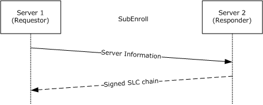

Figure 4: SubEnroll message sequence diagram

A subordinate RMS server generates its own asymmetric key pair. It then uses the SubEnroll operation to request that its public key be contained within an SLC chain that it can use to issue licenses to [**protected content**](#gt_protected-content).

<wsdl:operation name="SubEnroll">

The SOAP operation is defined as follows.

<soap:operation

soapAction="http://microsoft.com/DRM/SubEnrollmentService/SubEnroll"

style="document" />

**Request Validation**:

The responding server MUST validate the input parameters upon receiving a SubEnroll request. The [SubEnroll](#Section_3.3.4.1.2.1) request MUST follow the schema specified in section 3.3.4.1.1.1.

| Parameter | Description |
| --- | --- |
| aPublicKeyBytes | MUST contain the requestor's public key, represented as a base-64 encoded string. This key will be the public key that is issued in the resulting SLC.<20> |
| Guid | MUST contain a [**GUID**](#gt_guid) that will be used to identify the public key inside the resulting SLC. MUST be formatted as a 32-character hexadecimal string in the following format: {8chars-4chars-4chars-4chars-12chars}. |
| SKU | MUST be a string. Contains information such as the version information of the requesting server. |
| Version | MUST be a string. Contains information such as the version information of the requesting server. |
| URL | MUST be a string that contains the URL of the requesting server. |

**Data Processing**:

For a successful request, the responding server MUST generate and return a signed SLC chain. The leaf-node SLC MUST contain the public key that was submitted in the request and associate the SKU, version, and URL with that key. The responder's own SLC chain MUST be appended to the SLC that is generated for the requestor. The SLC format is specified in [MS-RMPR](../MS-RMPR/MS-RMPR.md) section 2.2.9.3. The SLC chain is specified in [MS-RMPR] section 2.2.9.2.

**Response**:

A successful [SubEnroll](#Section_3.3.4.1.2.1) response MUST follow the schema specified in section 3.3.4.1.1.2. A successful response MUST return the SLC chain that was generated for the requestor. For an unsuccessful request, the server MUST return a fault code. This operation throws only [Common Fault Codes](#Section_2.2.9.1) for the RMS: Server-Server Protocol.

<a id="Section_3.3.4.1.1"></a>
##### 3.3.4.1.1 Messages

The following table summarizes the XML Schema message definitions that are specific to this operation.

| Message | Description |
| --- | --- |
| [SubEnrollSoapIn request](#Section_3.3.4.1.2.1) | Requests a signed [**SLC**](#gt_server-licensor-certificate-slc) chain. Includes the server's public key and metadata attributes. |
| [SubEnrollSoapOut response](#Section_3.3.4.1.2.1) | Returns a signed SLC chain. |

<a id="Section_3.3.4.1.1.1"></a>
###### 3.3.4.1.1.1 SubEnrollSoapIn Request

The SubEnrollSoapIn request submits a public key and the attributes of the RMS server that is making the request.

<wsdl:message name="SubEnrollSoapIn">

<wsdl:part name="parameters" element="tns:SubEnroll" />

</wsdl:message>

**parameters**: An element that contains the body of the SOAP request. The body MUST contain exactly one [SubEnroll (section 3.3.4.1.2.1)](#Section_3.3.4.1.2.1) element.

<a id="Section_3.3.4.1.1.2"></a>
###### 3.3.4.1.1.2 SubEnrollSoapOut Response

The SubEnrollSoapOut response returns a signed [**SLC**](#gt_server-licensor-certificate-slc) chain.

<wsdl:message name="SubEnrollSoapOut">

<wsdl:part name="parameters" element="tns:SubEnrollResponse" />

</wsdl:message>

**parameters**: An element that contains the body of the SOAP response including the SLC chain. It MUST follow the schema defined in section [3.3.4.1.2.2](#Section_3.3.4.1.2.2).

<a id="Section_3.3.4.1.2"></a>
##### 3.3.4.1.2 Elements

The following table summarizes the set of common XML Schema complex type definitions defined by this specification.

| Complex Type | Description |
| --- | --- |
| [SubEnroll](#Section_3.3.4.1.2.1) | Contains the body of the SOAP request. |
| [SubEnrollResponse](#Section_3.3.4.1.2.2) | Contains the body of the SOAP response, and includes the [**SLC**](#gt_server-licensor-certificate-slc) chain. |

<a id="Section_3.3.4.1.2.1"></a>
###### 3.3.4.1.2.1 SubEnroll

The SubEnroll element contains the body of the SOAP request.

<s:element name="SubEnroll">

<s:complexType>

<s:sequence>

<s:element minOccurs="1" maxOccurs="1"

name="oInput"

type="tns:SubEnrollParameters"

/>

</s:sequence>

</s:complexType>

</s:element>

**oInput**: An object that contains the parameters of the enrollment request. The parameters MUST include a public key and attributes of the requestor. The object MUST follow the schema in section [3.3.4.1.3.1](#Section_3.3.4.1.3.1).

<a id="Section_3.3.4.1.2.2"></a>
###### 3.3.4.1.2.2 SubEnrollResponse

The SubEnrollResponse element contains the body of the SOAP response, and includes the [**SLC**](#gt_server-licensor-certificate-slc) chain.

<s:element name="SubEnrollResponse">

<s:complexType>

<s:sequence>

<s:element minOccurs="1" maxOccurs="1"

name="SubEnrollResult"

type="tns:SubEnrollResponse"

/>

</s:sequence>

</s:complexType>

</s:element>

**SubEnrollResult**: A structure that contains the resulting SLC chain. MUST follow the schema in section [3.3.4.1.3.4](#Section_3.3.4.1.3.4).

<a id="Section_3.3.4.1.3"></a>
##### 3.3.4.1.3 Complex Types

The following table summarizes the XML Schema complex type definitions that are specific to this operation.

| Complex Type | Description |
| --- | --- |
| [SubEnrollParameters](#Section_3.3.4.1.3.1) | Contains an enrolling server's public key and metadata. |
| [EnrolleeCertificatePublicKey](#Section_3.3.4.1.3.2) | Contains an enrolling server's public key, as well as a [**GUID**](#gt_guid) identifying the server. |
| [EnrolleeServerInformation](#Section_3.3.4.1.3.3) | Contains metadata about an enrolling server. |
| [SubEnrollResponse](#Section_3.3.4.1.3.4) | Contains an [**SLC**](#gt_server-licensor-certificate-slc) chain. |

<a id="Section_3.3.4.1.3.1"></a>
###### 3.3.4.1.3.1 SubEnrollParameters ComplexType

The SubEnrollParameters complex type contains an enrolling server's public key and metadata.

<s:complexType name="SubEnrollParameters">

<s:sequence>

<s:element minOccurs="1" maxOccurs="1"

name="CertificatePublicKey"

type="tns:EnrolleeCertificatePublicKey"

/>

<s:element minOccurs="1" maxOccurs="1"

name="EnrolleeInformation"

type="tns:EnrolleeServerInformation"

/>

</s:sequence>

</s:complexType>

**CertificatePublicKey**: A structure that contains the requestor's public key and [**GUID**](#gt_guid). It MUST follow the [EnrolleeCertificatePublicKey](#Section_3.3.4.1.3.2) schema in section 3.3.4.1.3.2 below.

**EnrolleeInformation**: A structure that contains attributes of the requestor. It MUST follow the [EnrolleeServerInformation](#Section_3.3.4.1.3.3) schema in section 3.3.4.1.3.3.

<a id="Section_3.3.4.1.3.2"></a>
###### 3.3.4.1.3.2 EnrolleeCertificatePublicKey Complex Type

The EnrolleeCertificatePublicKey complex type contains an enrolling server's public key, as well as a [**GUID**](#gt_guid) identifying the server.

<s:complexType name="EnrolleeCertificatePublicKey">

<s:sequence>

<s:element minOccurs="0" maxOccurs="1"

name="aPublicKeyBytes"

type="s:base64Binary"

/>

<s:element minOccurs="1" maxOccurs="1"

name="Guid"

type="s1:guid"

/>

</s:sequence>

</s:complexType>

**aPublicKeyBytes**: Contains the requestor's public key represented as a base-64 encoded string.<21>

**Guid**: Contains a GUID that identifies the requesting server among all other servers in the RMS system.

<a id="Section_3.3.4.1.3.3"></a>
###### 3.3.4.1.3.3 EnrolleeServerInformation Complex Type

The EnrolleeServerInformation complex type contains metadata about an enrolling server.

<s:complexType name="EnrolleeServerInformation">

<s:sequence>

<s:element minOccurs="0" maxOccurs="1"

name="SKU"

type="s:string"

/>

<s:element minOccurs="0" maxOccurs="1"

name="Version"

type="s:string"

/>

<s:element minOccurs="0" maxOccurs="1"

name="Name"

type="s:string"

/>

<s:element minOccurs="0" maxOccurs="1"

name="URL"

type="s:string"

/>

</s:sequence> 12345-123-0000007-18968

</s:complexType>

**SKU**: A string describing the version information of the requesting server.

**Version**: A string describing the version information of the requesting server.

**Name**: A string describing the friendly name for the requesting server. This is stamped in the [**SLC**](#gt_server-licensor-certificate-slc).

**URL**: A string that contains the URL of the requesting server.

<a id="Section_3.3.4.1.3.4"></a>
###### 3.3.4.1.3.4 SubEnrollResponse Complex Type

The SubEnrollResponse complex type contains an [**SLC**](#gt_server-licensor-certificate-slc) chain.

<s:complexType name="SubEnrollResponse">

<s:sequence>

<s:element minOccurs="0" maxOccurs="1"

name="LicensorCertificateChain"

type="tns:ArrayOfString"

/>

</s:sequence>

</s:complexType>

**LicensorCertificateChain**: An array of strings, with each element containing one node of the resulting SLC chain. It MUST follow the schema in section [2.2.4.1](#Section_2.2.4.1).

<a id="Section_3.3.5"></a>
### 3.3.5 Timer Events

None.

<a id="Section_3.3.6"></a>
### 3.3.6 Other Local Events

None.

<a id="Section_3.4"></a>
## 3.4 ServerSoap (GetLicensorCertificate) Server Details

The ServerSoap port type for GetLicensorCertificate is used to obtain licensor [**certificates**](#gt_certificate).

When an RMS server becomes a subordinate of another RMS server, it does not issue its own [**RMS Account Certificates (RACs)**](#gt_rms-account-certificate-rac); instead, it trusts RACs issued by the root RMS server.<22> To trust RACs issued by the root RMS server, the subordinate RMS server needs to know the public key of the root RMS server, which is contained in the root RMS server's [**SLC**](#gt_server-licensor-certificate-slc).

A subordinate RMS server uses the ServerSoap (GetLicensorCertificate) port type to acquire the root RMS server's SLC chain. The ServerSoap (GetLicensorCertificate) port type provides one operation: [GetLicensorCertificate](#Section_3.4.4.1.2.1).

<a id="Section_3.4.1"></a>
### 3.4.1 Abstract Data Model

This section describes a conceptual model of possible data organization that an implementation maintains to participate in this protocol. The described organization is provided to facilitate the explanation of how the protocol behaves. This document does not mandate that implementations adhere to this model as long as their external behavior is consistent with that described in this document. The conceptual data can be implemented by using a variety of techniques. Any data structure that stores the conceptual data MAY be used in the implementation.

**SLC chain**: An XrML 1.2 [[XRML]](https://go.microsoft.com/fwlink/?LinkId=324306) [**certificate chain**](#gt_certificate-chain) that signs the RMS server's public key into the appropriate [**certificate**](#gt_certificate) hierarchy. The [**SLC**](#gt_server-licensor-certificate-slc) format is specified in [MS-RMPR](../MS-RMPR/MS-RMPR.md) section 2.2.9.

<a id="Section_3.4.2"></a>
### 3.4.2 Timers

None.

<a id="Section_3.4.3"></a>
### 3.4.3 Initialization

The responding RMS server MUST be bootstrapped in order for the [ServerSoap (GetLicensorCertificate)](#Section_5.1.3) port type to function. RMS server bootstrapping is defined in [MS-RMPR](../MS-RMPR/MS-RMPR.md) section 3.1.3.

<a id="Section_3.4.4"></a>
### 3.4.4 Message Processing Events and Sequencing Rules

The following table summarizes the list of WSDL operations as defined by this specification:

| Operation | Description |
| --- | --- |
| [GetLicensorCertificate](#Section_3.4.4.1.2.1) | Provides a mechanism for a requestor to acquire the [**SLC**](#gt_server-licensor-certificate-slc) chain of the responder. |

<a id="Section_3.4.4.1"></a>
#### 3.4.4.1 GetLicensorCertificate

The GetLicensorCertificate operation provides a mechanism for a requestor to acquire the [**SLC**](#gt_server-licensor-certificate-slc) chain of the responder. The format of the SLC chain is defined in [MS-RMPR](../MS-RMPR/MS-RMPR.md) section 2.2.9.

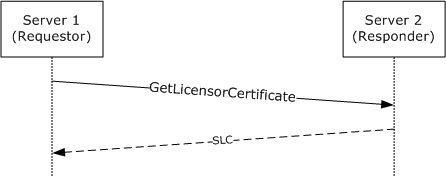

Figure 5: GetLicensorCertificate message sequence diagram

<wsdl:operation name="GetLicensorCertificate">

The SOAP operation is defined as follows.

<soap:operation

soapAction=

"http://microsoft.com/DRM/ServerService/GetLicensorCertificate"

style="document" />

**Request Validation**:

The responding server MUST validate the request upon receiving a GetLicensorCertificate request. There are no input parameters; however, the [GetLicensorCertificate request](#Section_3.4.4.1.2.1) MUST follow the schema specified in section 3.4.4.1.1.1.

**Response**:

A successful [GetLicensorCertificate response](#Section_3.4.4.1.2.1) MUST follow the schema specified in section 3.4.4.1.1.2. A successful response MUST return the responder's SLC chain. For an unsuccessful request, the server MUST return a fault code. This operation throws only [Common Fault Codes](#Section_2.2.9.1) for the RMS: Server-Server Protocol.

<a id="Section_3.4.4.1.1"></a>
##### 3.4.4.1.1 Messages

The following table summarizes the XML Schema message definitions that are specific to this operation.

| Message | Description |
| --- | --- |
| [GetLicensorCertificateSoapIn request](#Section_3.4.4.1.2.1) | Requests an [**SLC**](#gt_server-licensor-certificate-slc) chain. Contains no inputs. |
| [GetLicensorCertificateSoapOut response](#Section_3.4.4.1.2.1) | Returns the requestor's SLC chain. |

<a id="Section_3.4.4.1.1.1"></a>
###### 3.4.4.1.1.1 GetLicensorCertificateSoapIn Request

The GetLicensorCertificateSoapIn request submits no inputs.

<wsdl:message name="GetLicensorCertificateSoapIn">

<wsdl:part name="parameters" element="tns:GetLicensorCertificate" />

</wsdl:message>

**parameters**: An element that contains the body of the SOAP request. The body MUST contain exactly one [GetLicensorCertificate (section 3.4.4.1.2.1)](#Section_3.4.4.1.2.1) element.

<a id="Section_3.4.4.1.1.2"></a>
###### 3.4.4.1.1.2 GetLicensorCertificateSoapOut Response

The GetLicensorCertificateSoapOut response returns the requestor's [**SLC**](#gt_server-licensor-certificate-slc) chain.

<wsdl:message name="GetLicensorCertificateSoapOut">

<wsdl:part name="parameters"

element="tns:GetLicensorCertificateResponse"

/>

</wsdl:message>

**parameters**: An element that contains the body of the SOAP response including the responder's SLC chain. It MUST follow the schema defined in section [3.4.4.1.2.2](#Section_3.4.4.1.2.2).

<a id="Section_3.4.4.1.2"></a>
##### 3.4.4.1.2 Elements

The following table summarizes the set of common XML Schema complex type definitions defined by this specification.

| Complex Type | Description |
| --- | --- |
| [GetLicensorCertificate](#Section_3.4.4.1.2.1) | Included in the [GetLicensorCertificateSoapIn request (section 3.4.4.1.1.1)](#Section_3.4.4.1.2.1) as an empty message part. |
| [GetLicensorCertificateResponse](#Section_3.4.4.1.2.2) | Contains the body of the SOAP response, including the responder's [**SLC**](#gt_server-licensor-certificate-slc) chain. |

<a id="Section_3.4.4.1.2.1"></a>
###### 3.4.4.1.2.1 GetLicensorCertificate

The GetLicensorCertificate element is an empty element. It is included in the [GetLicensorCertificateSoapIn request (section 3.4.4.1.1.1)](#Section_3.4.4.1.2.1) as an empty message part.

<s:element name="GetLicensorCertificate">

<s:complexType />

</s:element>

<a id="Section_3.4.4.1.2.2"></a>
###### 3.4.4.1.2.2 GetLicensorCertificateResponse

The GetLicensorCertificateResponse element contains the body of the SOAP response, including the responder's [**SLC**](#gt_server-licensor-certificate-slc) chain.

<s:element name="GetLicensorCertificateResponse">

<s:complexType>

<s:sequence>

<s:element minOccurs="0" maxOccurs="1"

name="GetLicensorCertificateResult"

type="tns:LicensorCertChain"

/>

</s:sequence>

</s:complexType>

</s:element>

**GetLicensorCertificateResult**: A structure containing the responder's SLC chain. It MUST follow the schema in section [3.4.4.1.3.1](#Section_3.4.4.1.3.1).

<a id="Section_3.4.4.1.3"></a>
##### 3.4.4.1.3 Complex Types

The following table summarizes the XML Schema complex type definitions that are specific to this operation.

| Complex Type | Description |
| --- | --- |
| [LicensorCertChain](#Section_3.4.4.1.3.1) | Contains the responder's [**SLC**](#gt_server-licensor-certificate-slc) chain. |
| [ArrayOfXmlNode](#Section_3.4.4.1.3.2) | Contains an SLC [**certificate chain**](#gt_certificate-chain). |

<a id="Section_3.4.4.1.3.1"></a>
###### 3.4.4.1.3.1 LicensorCertChain Complex Type

The LicensorCertChain complex type contains the responder's [**SLC**](#gt_server-licensor-certificate-slc) chain.

<s:complexType name="LicensorCertChain">

<s:sequence>

<s:element minOccurs="0" maxOccurs="1"

name="CertificateChain"

type="tns:ArrayOfXmlNode"

/>

</s:sequence>

</s:complexType>

**CertificateChain**: Contains the responder's SLC chain as an array of XML nodes. It MUST follow the schema in section [3.4.4.1.3.2](#Section_3.4.4.1.3.2).

<a id="Section_3.4.4.1.3.2"></a>
###### 3.4.4.1.3.2 ArrayOfXmlNode Complex Type

The ArrayOfXmlNode complex type contains an [**SLC**](#gt_server-licensor-certificate-slc) [**certificate chain**](#gt_certificate-chain).

<s:complexType name="ArrayOfXmlNode">

<s:sequence>

<s:element minOccurs="0" maxOccurs="unbounded"

name="Certificate" nillable="true">

<s:complexType mixed="true">

<s:sequence>

<s:any />

</s:sequence>

</s:complexType>

</s:element>

</s:sequence>

</s:complexType>

**Certificate**: XML that contains the SLC certificate chain.

<a id="Section_3.4.5"></a>
### 3.4.5 Timer Events

None.

<a id="Section_3.4.6"></a>
### 3.4.6 Other Local Events

None.

<a id="Section_3.5"></a>
## 3.5 GroupExpansionWebServiceSoap Server Details

An RMS server can be requested to issue a Use License (UL) for content that has been published with a policy that specifies a group in a [**forest**](#gt_forest) that the RMS server cannot contact. In this case, the RMS server needs to contact the appropriate RMS server for that forest and request it to verify group membership. This communication SHOULD use the GroupExpansionWebServiceSoap port type. This communication MAY use the [Binary Group Expansion](#Section_4.3) interface.

RMS version 1.0 and RMS version 1.0 SP1 use the Binary Group Expansion interface. RMS version 1.0 SP2 supports both the Binary Group Expansion interface and the GroupExpansionWebServiceSoap port type. It will use the GroupExpansionWebServiceSoap interface whenever possible. RMS version 2.0 supports only the GroupExpansionWebServiceSoap interface.

The GroupExpansionWebServiceSoap port type provides one operation: [IsPrincipalMemberOf](#Section_3.5.4.1).

<a id="Section_3.5.1"></a>
### 3.5.1 Abstract Data Model

This section describes a conceptual model of possible data organization that an implementation maintains to participate in this protocol. The described organization is provided to facilitate the explanation of how the protocol behaves. This document does not mandate that implementations adhere to this model as long as their external behavior is consistent with that described in this document. The conceptual data can be implemented by using a variety of techniques. Any data structure that stores the conceptual data MAY be used in the implementation.

**Principal**: A user's identity specified by email address.

**Group**: The group for which membership needs to be evaluated.

**Group membership**: A [**directory**](#gt_directory) or other structure that defines the members of a distribution group.

<a id="Section_3.5.2"></a>
### 3.5.2 Timers

None.

<a id="Section_3.5.3"></a>
### 3.5.3 Initialization

None.

<a id="Section_3.5.4"></a>
### 3.5.4 Message Processing Events and Sequencing Rules

An RMS server uses the [GroupExpansionWebServiceSoap](#Section_6.4) port type to verify group membership of a specific user with another RMS server.

The following table summarizes the list of WSDL operations as defined by this specification.

| Operation | Description |
| --- | --- |
| [IsPrincipalMemberOf](#Section_3.5.4.1) | Provides a mechanism for verifying whether a specific user is currently a member of specific groups. |

<a id="Section_3.5.4.1"></a>
#### 3.5.4.1 IsPrincipalMemberOf

The IsPrincipalMemberOf operation provides a mechanism for verifying whether a specific user is currently a member of specific groups that the requestor cannot expand by contacting the [**directory**](#gt_directory) itself.

In the IsPrincipalMemberOf operation, the requestor specifies a principal name, the [**forest**](#gt_forest) of the principal, the target groups for which it needs an answer, and the count of cross-forest calls so far. The responder queries the directory and returns the membership status. IsPrincipalMemberOf MUST return true if the user is a member of at least one of the specified groups and MUST return false otherwise.

A properly formed [IsPrincipalMemberOf request](#Section_2.3.6.2) MUST contain valid data for each of these elements.

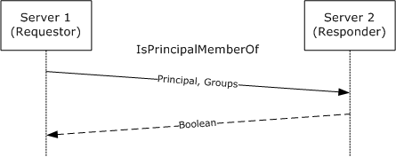

Figure 6: IsPrincipalMemberOf message sequence diagram

It is possible that a requested group contains a subgroup in another forest, causing the responder to make a new IsPrincipalMemberOf request to another server before it can respond to the original requestor. To prevent infinite loops or unacceptably long response times, the request specifies a number of servers that have been involved in servicing this group expansion request so far.

<wsdl:operation name="IsPrincipalMemberOf">

The SOAP operation is defined as follows.

<soap:operation

soapAction=

"http://microsoft.com/DRM/GroupExpansionWebService/IsPrincipalMemberOf"

style="document"/>

**Request Validation**:

The responding server MUST validate the input parameters upon receiving an IsPrincipalMemberOf request. For the [GroupExpansionWebServiceSoap](#Section_6.4) port type, the IsPrincipalMemberOf request MUST follow the schema specified in section 3.5.4.1.1.1. See section [3.6.4.1](#Section_3.5.4.1) for additional details regarding a successful binary request.

**Data Processing**:

For a successful request, the responding server checks the directory for the principal specified in the request and determines whether the principal is a member of one of the groups specified in the request.

If a requested group contains a subgroup in another forest, the responding server SHOULD make a new IsPrincipalMemberOf request to the appropriate server before it responds to the original requestor. In this new request, the count of cross-forest calls so far SHOULD be incremented. This specifies that another server has been involved in servicing this group expansion request. To prevent infinite loops or unacceptably long response times, a server SHOULD reject the request and return a fault if the count exceeds some predefined maximum.<23>

**Response**:

For the GroupExpansionWebServiceSoap port type, a successful IsPrincipalMemberOf response MUST follow the schema specified in section 3.5.4.1.1.1. See section 3.6.4.1 for additional details regarding a successful binary response.

A successful response MUST return either true or false indicating the group membership status. The status MUST be false if the principal cannot be found or if none of the groups can be found. For an unsuccessful request, the server MUST return a fault code. This operation throws only Common Fault Codes for the RMS: Server-to-Server Protocol as specified in section [2.2.9.1](#Section_2.2.9.1).

<a id="Section_3.5.4.1.1"></a>
##### 3.5.4.1.1 Messages

The following table summarizes the XML Schema message definitions that are specific to this operation.

| Message | Description |
| --- | --- |
| [IsPrincipalMemberOfSoapIn request](#Section_2.3.6.2) | Requests confirmation of group membership for the user. Contains information about the user, as well as information about the current group expansion operation. |
| [IsPrincipalMemberOfSoapOut response](#Section_3.5.4.1.1.2) | Returns a Boolean value that either confirms or denies group membership. |

<a id="Section_3.5.4.1.1.1"></a>
###### 3.5.4.1.1.1 IsPrincipalMemberOfSoapIn Request

The IsPrincipalMemberOfSoapIn request submits information about the user, one or more groups to be checked, and a count of the number of servers that have been involved in servicing this group expansion request so far.

<wsdl:message name="IsPrincipalMemberOfSoapIn">

<wsdl:part name="parameters" element="tns:IsPrincipalMemberOf" />

</wsdl:message>

**parameters**: An element that contains the body of the SOAP request. The body MUST contain exactly one [IsPrincipalMemberOf (section 3.5.4.1.2.1)](#Section_2.3.6.2) element.

<a id="Section_3.5.4.1.1.2"></a>
###### 3.5.4.1.1.2 IsPrincipalMemberOfSoapOut Response

The IsPrincipalMemberOfSoapOut response returns a Boolean value that either confirms or denies group membership.

<wsdl:message name="IsPrincipalMemberOfSoapOut">

<wsdl:part name="parameters"

element="tns:IsPrincipalMemberOfResponse"

/>

</wsdl:message>

**parameters**: An element that contains the body of the SOAP response containing the group membership status. It MUST contain an [**SLC**](#gt_server-licensor-certificate-slc) chain and it MUST follow the schema defined in section [3.5.4.1.2.2](#Section_3.5.4.1.2.2).

<a id="Section_3.5.4.1.2"></a>
##### 3.5.4.1.2 Elements

The following table summarizes the set of common XML Schema complex type definitions defined by this specification.

| Complex Type | Description |
| --- | --- |
| [IsPrincipalMemberOf](#Section_2.3.6.2) | Contains the body of the SOAP request. |
| [IsPrincipalMemberOfResponse](#Section_3.5.4.1.2.2) | Contains the body of the SOAP response containing the group membership status. |

<a id="Section_3.5.4.1.2.1"></a>
###### 3.5.4.1.2.1 IsPrincipalMemberOf

The IsPrincipalMemberOf element contains the body of the SOAP request.

<s:element name="IsPrincipalMemberOf">

<s:complexType>

<s:sequence>

<s:element minOccurs="0" maxOccurs="1"

name="principalName"

type="s:string"

/>

<s:element minOccurs="0" maxOccurs="1"

name="principalCrossForest"

type="s:string"

/>

<s:element minOccurs="0" maxOccurs="1"

name="targetGroups"

type="tns:ArrayOfString"

/>

<s:element minOccurs="1" maxOccurs="1"

name="crossForestCallsSoFar"

type="s:int"

/>

</s:sequence>

</s:complexType>

</s:element>

**principalName**: A string that contains the email address of the user whose group membership is to be verified.

**principalCrossForest**: Same as principalName. A string that contains the email address of the user whose group membership is to be verified.

**targetGroups**: An array of strings that contains one or more email addresses representing the groups for which membership is to be checked. MUST be an [ArrayOfString Complex Type (section 2.2.4.1)](#Section_2.2.4.1).

**crossForestCallsSoFar**: An integer that represents the number of servers that have been involved in servicing this group expansion request so far. Used to enforce an upper limit on how many servers can be involved in servicing a given request.

<a id="Section_3.5.4.1.2.2"></a>
###### 3.5.4.1.2.2 IsPrincipalMemberOfResponse

The IsPrincipalMemberOfResponse element contains the body of the SOAP response containing the group membership status.

<s:element name="IsPrincipalMemberOfResponse">

<s:complexType>

<s:sequence>

<s:element minOccurs="1" maxOccurs="1"

name="IsPrincipalMemberOfResult"

type="s:boolean"

/>

</s:sequence>

</s:complexType>

</s:element>

**IsPrincipalMemberOfResult**: A Boolean value that either confirms or denies group membership.

<a id="Section_3.5.5"></a>
### 3.5.5 Timer Events

None.

<a id="Section_3.5.6"></a>
### 3.5.6 Other Local Events

None.

<a id="Section_3.6"></a>
## 3.6 Binary Group Expansion Server Details

See section 3.6 for Group Expansion server details. The [Binary Group Expansion](#Section_4.3) syntax is defined in section 2.3.

The Binary Group Expansion interface provides one method: [IsPrincipalMemberOf](#Section_3.5.4.1).

<a id="Section_3.6.1"></a>
### 3.6.1 Abstract Data Model

See section [3.5.1](#Section_3.5.1) for the Group Expansion abstract data model.

<a id="Section_3.6.2"></a>
### 3.6.2 Timers

None.

<a id="Section_3.6.3"></a>
### 3.6.3 Initialization

None.

<a id="Section_3.6.4"></a>
### 3.6.4 Message Processing Events and Sequencing Rules

The [Binary Group Expansion](#Section_4.3) interface (section 2.3) provides a way of performing group expansion, and is an alternative to the [GroupExpansionWebServiceSoap](#Section_6.4) port type 3.5.

<a id="Section_3.6.4.1"></a>
#### 3.6.4.1 IsPrincipalMemberOf

Processing details for the IsPrincipalMemberOf method in the [Binary Group Expansion](#Section_4.3) interface are the same as those specified for the SOAP operation in section [3.5.4.1](#Section_3.5.4.1), with the following exceptions:

- For the Binary Group Expansion interface, a successful IsPrincipalMemberOf request MUST follow the definition specified in section [2.3.1.2](#Section_3.5.4.1).
- For the Binary Group Expansion interface, a successful IsPrincipalMemberOf response MUST follow the definition specified in section [2.3.1.3](#Section_3.5.4.1.2.2).
- SOAP fault codes are not thrown in the binary interface.
<a id="Section_3.6.5"></a>
### 3.6.5 Timer Events

None.

<a id="Section_3.6.6"></a>
### 3.6.6 Other Local Events

None.

<a id="Section_4"></a>
# 4 Protocol Examples

<a id="Section_4.1"></a>
## 4.1 Accessing Protected Information as a Member of an Authorized Group

An end user requires an authorization token ([**use license (UL)**](#gt_use-license-ul)) issued by an RMS server to access [**protected content**](#gt_protected-content). One of the conditions evaluated by the server when generating such an authorization token is the user's current membership in any groups that are authorized to consume the information, as specified by the policy of the protected content.

The following example applies to the IsPrincipalMemberOf operation for either the [Binary Group Expansion](#Section_4.3) interface or the [Group Expansion over SOAP](#Section_6.4) port type.

- Usage policy is extracted from protected content by the application.
The application extracts (or retrieves) the usage policy ([**publishing license (PL)**](#gt_publishing-license-pl)) from wherever the application has stored it. Storage of the usage policy associated with protected information (or content) is the responsibility of the application.

- AcquireLicense method is called.
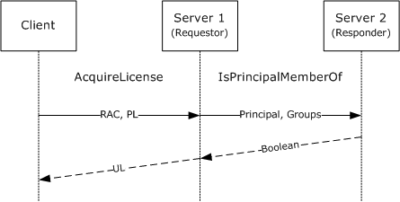

Figure 7: AcquireLicense method is called

The PL acquired in step 1 represents the complete usage policy issued by the author of the protected content. For the protected content to be consumable by an individual user, an authorization token (UL) must be issued by the server. This authorization token expresses what an individual user can do with the protected content.

The client calls the AcquireLicense web method, providing the requesting user's [**RMS account certificate (RAC)**](#gt_rms-account-certificate-rac) and the protected content PL, and passing any application-specific data provided by the application.

The server verifies that the RAC and PL were issued from an entity or entities it trusts. It then evaluates the full usage policy as it applies to the specific user named in the RAC, including verifying if the user is a member of any groups specified by the author as having authorization to access the protected information (or content).

To verify group membership, the server will either invoke a local [IsPrincipalMemberOf](#Section_3.5.4.1) procedure call to consult the [**directory**](#gt_directory) in the local [**domain**](#gt_domain), or it will contact an RMS server located in an external domain to consult that domain's directory by way of the IsPrincipalMemberOf [**remote procedure call (RPC)**](#gt_remote-procedure-call-rpc). The result of either is a Boolean response indicating if the named user is a member of a named group (or groups).

The server then issues a UL containing a set of usage policies for the user, and signs the UL. The UL is then returned to the client.

- Decryption of protected information (or content) using client APIs and authorization policy keys occurs.
The client receiving the UL from the server then uses the UL to decrypt and consume the protected content.

<a id="Section_4.2"></a>
## 4.2 Provisioning an Extranet User

To consume [**protected content**](#gt_protected-content), a user's client machine needs to contact an RMS server to be provisioned with specific [**certificates**](#gt_certificate) on the machine being used. These certificates can easily be obtained with the proper URLs. Sometimes the necessary URL information is not present on the client machine, either because the machine is not joined to a [**domain**](#gt_domain), or it is not joined to the same domain that contains the user's account. As defined in section [1.3.1](#Section_3.2.4.1.2.1), the appropriate RMS server for a specific service type can vary depending on the specific user.

To find the relevant RMS server's URL, the client has to first contact a general RMS server and invoke the FindServiceLocationsForUser [**RPC**](#gt_remote-procedure-call-rpc). The URL for this general RMS server can be found from the policy that has been applied to the protected information (or content). Alternately, the URL for the general server could be found via configuration settings or some application-specific or deployment-specific mechanism.

Once contacted, the general RMS server (server 1 in the following diagram) will in turn contact an appropriate RMS server (server 2 in the following diagram) for the specific user using the FindSeviceLocations operation of the [ServerSoap (FindServiceLocations)](#Section_3.2.4.1.2.1) port type, and return the appropriate direct URL to the client for subsequent requests to provision the necessary certificates.

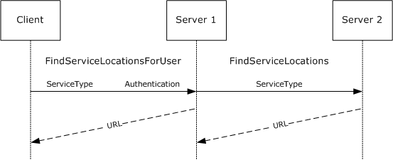

Figure 8: FindServiceLocations call resulting from AcquireLicense

- Client identifies general-purpose extranet RMS server URL.
The client determines the URL of the general-purpose RMS server from the policy applied to the protected content, configuration settings, or an application-specific or deployment-specific mechanism.

- Client makes a request to FindServiceLocationsForUser RPC.
The client makes a request to the FindServiceLocationsForUser Web service, providing the type of service whose URL is being requested and providing authentication of the user's identity.

- Server 1 makes a FindServerLocations request on behalf of the user.
If the user authenticates correctly, the server will find the user's home domain in the [**directory**](#gt_directory) and identify the appropriate RMS server for that domain (server 2). Server 1 will then make a FindServiceLocations request to server 2, specifying the service type that was requested by the client.

- Server 1 returns results to client.
Server 1 will then return the results of the request to server 2 to the client.

- Client contacts server 2 directly, via returned URLs.
The client will then contact server 2 directly and request the required provisioning certificates.

<a id="Section_4.3"></a>
## 4.3 Binary Group Expansion

This sample illustrates the messages used in the [Binary Group Expansion Interface](#Section_4.3). In this example, a client uses the [IsPrincipalMemberOf](#Section_3.5.4.1) operation to determine whether the user "mail=user1@contoso.com" is a mesmber of either of two target groups: "mail=group1_1@contoso.com" and "mail=group2@contoso.com".

The client creates a [Serialized Octet Stream](#Section_2.3.1) containing an [IsPrincipalMemberOfRequest](#Section_3.5.4.1) record. The network capture of this stream is as follows.

0000 00 01 00 00 00 FF FF FF FF 01 00 00 00 00 00 00 .....ÿÿÿÿ.......

0010 00 15 14 00 00 00 12 13 49 73 50 72 69 6E 63 69 ........IsPrinci

0020 70 61 6C 4D 65 6D 62 65 72 4F 66 12 F3 01 73 6F palMemberOf.ó.so

0030 61 70 3A 52 65 6D 6F 74 65 41 63 74 69 76 65 44 ap:RemoteActiveD

0040 69 72 65 63 74 6F 72 79 53 65 72 76 69 63 65 73 irectoryServices

0050 2C 20 68 74 74 70 3A 2F 2F 73 63 68 65 6D 61 73 , http://schemas

0060 2E 6D 69 63 72 6F 73 6F 66 74 2E 63 6F 6D 2F 63 .microsoft.com/c

0070 6C 72 2F 6E 73 61 73 73 65 6D 2F 4D 69 63 72 6F lr/nsassem/Micro

0080 73 6F 66 74 2E 44 69 67 69 74 61 6C 52 69 67 68 soft.DigitalRigh

0090 74 73 4D 61 6E 61 67 65 6D 65 6E 74 2E 44 69 72 tsManagement.Dir

00A0 65 63 74 6F 72 79 53 65 72 76 69 63 65 73 2F 50 ectoryServices/P

00B0 6C 75 67 69 6E 2E 44 69 72 65 63 74 6F 72 79 53 lugin.DirectoryS

00C0 65 72 76 69 63 65 73 25 32 43 25 32 30 56 65 72 ervices%2C%20Ver

00D0 73 69 6F 6E 25 33 44 35 2E 32 2E 33 37 39 30 2E sion%3D5.2.3790.

00E0 33 30 30 25 32 43 25 32 30 43 75 6C 74 75 72 65 300%2C%20Culture

00F0 25 33 44 6E 65 75 74 72 61 6C 25 32 43 25 32 30 %3Dneutral%2C%20

0100 50 75 62 6C 69 63 4B 65 79 54 6F 6B 65 6E 25 33 PublicKeyToken%3

0110 44 33 31 62 66 33 38 35 36 61 64 33 36 34 65 33 D31bf3856ad364e3

0120 35 10 01 00 00 00 05 00 00 00 06 02 00 00 00 16 5...............

0130 6D 61 69 6C 3D 75 73 65 72 31 40 63 6F 6E 74 6F mail=user1@conto

0140 73 6F 2E 63 6F 6D 09 02 00 00 00 09 03 00 00 00 so.com..........

0150 08 08 01 00 00 00 0A 11 03 00 00 00 02 00 00 00 ................

0160 06 04 00 00 00 19 6D 61 69 6C 3D 67 72 6F 75 70 ......mail=group

0170 31 5F 31 40 63 6F 6E 74 6F 73 6F 2E 63 6F 6D 06 1_1@contoso.com.

0180 05 00 00 00 17 6D 61 69 6C 3D 67 72 6F 75 70 32 .....mail=group2

0190 40 63 6F 6E 74 6F 73 6F 2E 63 6F 6D 0B @contoso.com.

The bytes listed in the preceding sample can be mapped to the logical request message as follows. The Binary Group Expansion Interface message structures are mapped as specified in section 2.3.

SerializationHeaderRecord:

RecordTypeEnum: SerializedStreamHeader (0x00)

RootId: 1

Reserved0: -1

MajorVersion: 1

MinorVersion: 0

IsPrincipalMemberOfRequest:

RecordTypeEnum: MethodCall (0x15)

MessageEnum: 0x14 (ArgsIsArray, NoContext)

MethodName:

StringValueWithCode:

PrimitiveTypeEnum: String (0x12)

StringValue: IsPrincipalMemberOf

TypeName:

StringValueWithCode:

PrimitiveTypeEnum: String (0x12)

StringValue: soap:RemoteActiveDirectoryServices, http://schemas.microsoft.com/clr/nsassem/Microsoft.DigitalRightsManagement.DirectoryServices/Plugin.DirectoryServices%2C%20Version%3D5.2.3790.300%2C%20Culture%3Dneutral%2C%20PublicKeyToken%3D31bf3856ad364e35

ArgumentsArray:

ArgumentsArray:

RecordTypeEnum: ArraySingleObject (0x10)

ObjectId: 1

Length: 5

Principal:

BinaryObjectString:

RecordTypeEnum: BinaryObjectString (0x06)

ObjectId: 2

Value: mail=user1@contoso.com

PrincipalCrossForest:

MemberReference:

RecordTypeEnum: MemberReference (0x09)

IdRef: 2

TargetGroups:

MemberReference:

RecordTypeEnum: MemberReference (0x09)

IdRef: 3

CrossForestCallsSoFar:

MemberPrimitiveTyped:

RecordTypeEnum: MemberPrimitiveTyped (0x08)

PrimitiveTypeEnum: Int32 (0x08)

Value: 1

ObjectNull:

ObjectNull:

RecordTypeEnum: ObjectNull (0x0A)

TargetGroups:

ArraySingleString:

RecordTypeEnum: ArraySingleString (0x11)

ObjectId: 3

Length: 2

Values:

BinaryObjectString:

RecordTypeEnum: BinaryObjectString (0x06)

ObjectId: 4

Value: mail=group1_1@contoso.com

BinaryObjectString:

RecordTypeEnum: BinaryObjectString (0x06)

ObjectId: 5

Value: mail=group2@contoso.com

MessageEnd:

RecordTypeEnum: MessageEnd (0x0B)

In this example, the **Principal** field of the [ArgumentsArray](#Section_2.3.1.2.1) contains the value "mail=user1@contoso.com" encoded as a [BinaryObjectString](#Section_2.3.5.7) record. The **TargetGroups** array contains two groups: "mail=group1_1@contoso.com" and "mail=group2@contoso.com", each specified as BinaryObjectString records.

The server determines in an implementation-specific way that the specified [Principal](#Section_2.3.6.2) is a member of one of the **TargetGroups**. It creates a Serialized Octet Stream containing an [IsPrincipalMemberOfResponse](#Section_3.5.4.1.2.2) record to return to the client. The network capture of this stream is as follows.

0000 00 01 00 00 00 FF FF FF FF 01 00 00 00 00 00 00 .....ÿÿÿÿ.......

0010 00 16 48 08 00 00 01 01 10 01 00 00 00 02 00 00 ..H.............

0020 00 09 02 00 00 00 09 03 00 00 00 10 02 00 00 00 ................

0030 05 00 00 00 0D 04 09 04 00 00 00 04 03 00 00 00 ................

0040 34 53 79 73 74 65 6D 2E 52 75 6E 74 69 6D 65 2E 4System.Runtime.

0050 52 65 6D 6F 74 69 6E 67 2E 4D 65 73 73 61 67 69 Remoting.Messagi

0060 6E 67 2E 4C 6F 67 69 63 61 6C 43 61 6C 6C 43 6F ng.LogicalCallCo

0070 6E 74 65 78 74 00 00 00 00 0C 05 00 00 00 60 50 ntext.........`P

0080 6C 75 67 69 6E 2E 44 69 72 65 63 74 6F 72 79 53 lugin.DirectoryS

0090 65 72 76 69 63 65 73 2C 20 56 65 72 73 69 6F 6E ervices, Version

00A0 3D 35 2E 32 2E 33 37 39 30 2E 33 30 30 2C 20 43 =5.2.3790.300, C

00B0 75 6C 74 75 72 65 3D 6E 65 75 74 72 61 6C 2C 20 ulture=neutral,

00C0 50 75 62 6C 69 63 4B 65 79 54 6F 6B 65 6E 3D 33 PublicKeyToken=3

00D0 31 62 66 33 38 35 36 61 64 33 36 34 65 33 35 0C 1bf3856ad364e35.

00E0 06 00 00 00 4C 53 79 73 74 65 6D 2C 20 56 65 72 ....LSystem, Ver

00F0 73 69 6F 6E 3D 31 2E 30 2E 35 30 30 30 2E 30 2C sion=1.0.5000.0,

0100 20 43 75 6C 74 75 72 65 3D 6E 65 75 74 72 61 6C Culture=neutral

0110 2C 20 50 75 62 6C 69 63 4B 65 79 54 6F 6B 65 6E , PublicKeyToken

0120 3D 62 37 37 61 35 63 35 36 31 39 33 34 65 30 38 =b77a5c561934e08

0130 39 05 04 00 00 00 3D 4D 69 63 72 6F 73 6F 66 74 9.....=Microsoft

0140 2E 44 69 67 69 74 61 6C 52 69 67 68 74 73 4D 61 .DigitalRightsMa

0150 6E 61 67 65 6D 65 6E 74 2E 44 69 72 65 63 74 6F nagement.Directo

0160 72 79 53 65 72 76 69 63 65 73 2E 50 72 69 6E 63 ryServices.Princ

0170 69 70 61 6C 0A 00 00 00 15 5F 50 72 69 6E 63 69 ipal....._Princi

0180 70 61 6C 49 64 65 6E 74 69 66 69 65 72 73 10 5F palIdentifiers._

0190 47 72 6F 75 70 4D 65 6D 62 65 72 73 68 69 70 0F GroupMembership.

01A0 5F 46 6F 72 65 69 67 6E 4D 65 6D 62 65 72 73 12 _ForeignMembers.

01B0 5F 70 61 72 73 69 6E 67 44 69 63 74 69 6F 6E 61 _parsingDictiona

01C0 72 79 15 5F 43 6F 6E 74 61 69 6E 65 72 4F 62 6A ry._ContainerObj

01D0 65 63 74 47 75 69 64 73 0E 5F 73 74 72 4F 62 6A ectGuids._strObj

01E0 65 63 74 47 75 69 64 15 5F 73 74 72 4F 72 69 67 ectGuid._strOrig

01F0 69 6E 61 74 69 6F 6E 46 6F 72 65 73 74 0E 5F 65 inationForest._e

0200 78 70 6C 69 63 69 74 50 61 72 73 65 07 5F 65 78 xplicitParse._ex

0210 69 73 74 73 1A 44 69 72 65 63 74 6F 72 79 4C 6F ists.DirectoryLo

0220 6F 6B 75 70 58 4D 4C 2B 5F 65 78 69 73 74 73 04 okupXML+_exists.

0230 03 04 03 04 01 01 04 00 00 2D 53 79 73 74 65 6D .........-System

0240 2E 43 6F 6C 6C 65 63 74 69 6F 6E 73 2E 53 70 65 .Collections.Spe

0250 63 69 61 6C 69 7A 65 64 2E 4C 69 73 74 44 69 63 cialized.ListDic

0260 74 69 6F 6E 61 72 79 06 00 00 00 1C 53 79 73 74 tionary.....Syst

0270 65 6D 2E 43 6F 6C 6C 65 63 74 69 6F 6E 73 2E 48 em.Collections.H

0280 61 73 68 74 61 62 6C 65 2D 53 79 73 74 65 6D 2E ashtable-System.

0290 43 6F 6C 6C 65 63 74 69 6F 6E 73 2E 53 70 65 63 Collections.Spec

02A0 69 61 6C 69 7A 65 64 2E 4C 69 73 74 44 69 63 74 ialized.ListDict

02B0 69 6F 6E 61 72 79 06 00 00 00 1E 53 79 73 74 65 ionary.....Syste

02C0 6D 2E 43 6F 6C 6C 65 63 74 69 6F 6E 73 2E 49 44 m.Collections.ID

02D0 69 63 74 69 6F 6E 61 72 79 2F 53 79 73 74 65 6D ictionary/System

02E0 2E 43 6F 6C 6C 65 63 74 69 6F 6E 73 2E 53 70 65 .Collections.Spe

02F0 63 69 61 6C 69 7A 65 64 2E 53 74 72 69 6E 67 43 cialized.StringC

0300 6F 6C 6C 65 63 74 69 6F 6E 06 00 00 00 4F 4D 69 ollection....OMi

0310 63 72 6F 73 6F 66 74 2E 44 69 67 69 74 61 6C 52 crosoft.DigitalR

0320 69 67 68 74 73 4D 61 6E 61 67 65 6D 65 6E 74 2E ightsManagement.

0330 44 69 72 65 63 74 6F 72 79 53 65 72 76 69 63 65 DirectoryService

0340 73 2E 50 72 69 6E 63 69 70 61 6C 2B 45 78 70 6C s.Principal+Expl

0350 69 63 69 74 50 61 72 73 65 45 6E 75 6D 05 00 00 icitParseEnum...

0360 00 01 01 05 00 00 00 09 07 00 00 00 09 08 00 00 ................

0370 00 0A 0A 09 09 00 00 00 06 0A 00 00 00 20 32 39 ............. 29

0380 39 32 65 34 66 35 62 65 65 62 64 64 34 62 62 31 92e4f5beebdd4bb1

0390 30 64 38 32 37 35 38 37 61 61 37 37 35 66 0A 05 0d827587aa775f..

03A0 F5 FF FF FF 4F 4D 69 63 72 6F 73 6F 66 74 2E 44 oÿÿÿOMicrosoft.D

03B0 69 67 69 74 61 6C 52 69 67 68 74 73 4D 61 6E 61 igitalRightsMana

03C0 67 65 6D 65 6E 74 2E 44 69 72 65 63 74 6F 72 79 gement.Directory

03D0 53 65 72 76 69 63 65 73 2E 50 72 69 6E 63 69 70 Services.Princip

03E0 61 6C 2B 45 78 70 6C 69 63 69 74 50 61 72 73 65 al+ExplicitParse

03F0 45 6E 75 6D 01 00 00 00 07 76 61 6C 75 65 5F 5F Enum.....value__

0400 00 08 05 00 00 00 00 00 00 00 01 01 05 07 00 00 ................

0410 00 2D 53 79 73 74 65 6D 2E 43 6F 6C 6C 65 63 74 .-System.Collect

0420 69 6F 6E 73 2E 53 70 65 63 69 61 6C 69 7A 65 64 ions.Specialized

0430 2E 4C 69 73 74 44 69 63 74 69 6F 6E 61 72 79 04 .ListDictionary.

0440 00 00 00 04 68 65 61 64 07 76 65 72 73 69 6F 6E ....head.version

0450 05 63 6F 75 6E 74 08 63 6F 6D 70 61 72 65 72 04 .count.comparer.

0460 00 00 03 3C 53 79 73 74 65 6D 2E 43 6F 6C 6C 65 ...<System.Colle

0470 63 74 69 6F 6E 73 2E 53 70 65 63 69 61 6C 69 7A ctions.Specializ

0480 65 64 2E 4C 69 73 74 44 69 63 74 69 6F 6E 61 72 ed.ListDictionar

0490 79 2B 44 69 63 74 69 6F 6E 61 72 79 4E 6F 64 65 y+DictionaryNode

04A0 06 00 00 00 08 08 1C 53 79 73 74 65 6D 2E 43 6F .......System.Co

04B0 6C 6C 65 63 74 69 6F 6E 73 2E 49 43 6F 6D 70 61 llections.ICompa

04C0 72 65 72 06 00 00 00 09 0C 00 00 00 02 00 00 00 rer.............

04D0 02 00 00 00 0A 04 08 00 00 00 1C 53 79 73 74 65 ...........Syste

04E0 6D 2E 43 6F 6C 6C 65 63 74 69 6F 6E 73 2E 48 61 m.Collections.Ha

04F0 73 68 74 61 62 6C 65 07 00 00 00 0A 4C 6F 61 64 shtable.....Load

0500 46 61 63 74 6F 72 07 56 65 72 73 69 6F 6E 08 43 Factor.Version.C

0510 6F 6D 70 61 72 65 72 10 48 61 73 68 43 6F 64 65 omparer.HashCode

0520 50 72 6F 76 69 64 65 72 08 48 61 73 68 53 69 7A Provider.HashSiz

0530 65 04 4B 65 79 73 06 56 61 6C 75 65 73 00 00 03 e.Keys.Values...

0540 03 00 05 05 0B 08 1C 53 79 73 74 65 6D 2E 43 6F .......System.Co

0550 6C 6C 65 63 74 69 6F 6E 73 2E 49 43 6F 6D 70 61 llections.ICompa

0560 72 65 72 24 53 79 73 74 65 6D 2E 43 6F 6C 6C 65 rer$System.Colle

0570 63 74 69 6F 6E 73 2E 49 48 61 73 68 43 6F 64 65 ctions.IHashCode

0580 50 72 6F 76 69 64 65 72 08 EC 51 38 3F 00 00 00 Provider.ìQ8?...

0590 00 0A 0A 0B 00 00 00 09 0D 00 00 00 09 0E 00 00 ................

05A0 00 05 09 00 00 00 2F 53 79 73 74 65 6D 2E 43 6F ....../System.Co

05B0 6C 6C 65 63 74 69 6F 6E 73 2E 53 70 65 63 69 61 llections.Specia

05C0 6C 69 7A 65 64 2E 53 74 72 69 6E 67 43 6F 6C 6C lized.StringColl

05D0 65 63 74 69 6F 6E 01 00 00 00 04 64 61 74 61 03 ection.....data.

05E0 1C 53 79 73 74 65 6D 2E 43 6F 6C 6C 65 63 74 69 .System.Collecti

05F0 6F 6E 73 2E 41 72 72 61 79 4C 69 73 74 06 00 00 ons.ArrayList...

0600 00 09 0F 00 00 00 05 0C 00 00 00 3C 53 79 73 74 ...........<Syst

0610 65 6D 2E 43 6F 6C 6C 65 63 74 69 6F 6E 73 2E 53 em.Collections.S

0620 70 65 63 69 61 6C 69 7A 65 64 2E 4C 69 73 74 44 pecialized.ListD

0630 69 63 74 69 6F 6E 61 72 79 2B 44 69 63 74 69 6F ictionary+Dictio

0640 6E 61 72 79 4E 6F 64 65 03 00 00 00 03 6B 65 79 naryNode.....key

0650 05 76 61 6C 75 65 04 6E 65 78 74 02 02 04 3C 53 .value.next...<S

0660 79 73 74 65 6D 2E 43 6F 6C 6C 65 63 74 69 6F 6E ystem.Collection

0670 73 2E 53 70 65 63 69 61 6C 69 7A 65 64 2E 4C 69 s.Specialized.Li

0680 73 74 44 69 63 74 69 6F 6E 61 72 79 2B 44 69 63 stDictionary+Dic

0690 74 69 6F 6E 61 72 79 4E 6F 64 65 06 00 00 00 06 tionaryNode.....

06A0 00 00 00 06 10 00 00 00 2F 69 64 3D 73 2D 31 2D ......../id=s-1-

06B0 35 2D 32 31 2D 38 37 38 33 38 30 32 34 33 2D 31 5-21-878380243-1

06C0 39 35 38 32 30 39 33 38 36 2D 38 39 36 36 37 39 958209386-896679

06D0 31 36 38 2D 31 33 34 30 08 01 01 09 11 00 00 00 168-1340........

06E0 10 0D 00 00 00 00 00 00 00 10 0E 00 00 00 00 00 ................

06F0 00 00 04 0F 00 00 00 1C 53 79 73 74 65 6D 2E 43 ........System.C

0700 6F 6C 6C 65 63 74 69 6F 6E 73 2E 41 72 72 61 79 ollections.Array

0710 4C 69 73 74 03 00 00 00 06 5F 69 74 65 6D 73 05 List....._items.

0720 5F 73 69 7A 65 08 5F 76 65 72 73 69 6F 6E 05 00 _size._version..

0730 00 08 08 09 12 00 00 00 02 00 00 00 02 00 00 00 ................

0740 01 11 00 00 00 0C 00 00 00 06 13 00 00 00 16 6D ...............m

0750 61 69 6C 3D 75 73 65 72 31 40 63 6F 6E 74 6F 73 ail=user1@contos

0760 6F 2E 63 6F 6D 08 01 01 0A 10 12 00 00 00 10 00 o.com...........

0770 00 00 06 14 00 00 00 20 35 62 39 38 64 39 66 31 ....... 5b98d9f1

0780 36 37 32 30 66 33 34 38 39 38 39 39 64 38 38 39 6720f3489899d889

0790 33 37 39 35 66 33 61 65 06 15 00 00 00 20 66 32 3795f3ae..... f2

07A0 61 30 66 30 34 38 33 37 34 35 63 62 34 63 61 32 a0f0483745cb4ca2

07B0 33 61 34 61 64 63 62 64 36 32 66 32 31 35 0D 0E 3a4adcbd62f215..

07C0 0B .

The bytes listed in the preceding sample can be mapped to the logical response message as follows. The Binary Group Expansion Interface message structures are mapped as specified in section 2.3.

SerializationHeaderRecord:

RecordTypeEnum: SerializedStreamHeader (0x00)

RootId: 1

Reserved0: -1

MajorVersion: 1

MinorVersion: 0

IsPrincipalMemberOfResponse:

RecordTypeEnum: MethodReturn (0x16)

MessageEnum: Ox0848 (ArgsInArray, ContextInArray, ReturnValueInline)

ReturnValueCode: Boolean (0x01)

ReturnValue: True (0x01)

ReturnArray:

RecordTypeEnum: ArraySingleObject (0x10)

ObjectId: 1

Length: 2

ReturnArguments:

MemberReference:

RecordTypeEnum: MemberReference (0x09)

IdRef: 2

LogicalCallContext:

MemberReference:

RecordTypeEnum: MemberReference (0x09)

IdRef: 3

ReturnArgumentsArray:

RecordTypeEnum: ArraySingleObject (0x10)

ObjectId: 2

Length: 5

NullValues:

ObjectNullMultiple256:

RecordTypeEnum: ObjectNullMultiple256 (0x0D)

NullCount: 4

Principal:

MemberReference:

RecordTypeEnum: MemberReference (0x09)

IdRef: 4

LogicalCallContext:

RecordTypeEnum: SystemClassWithMembersAndTypes (0x04)

ObjectId: 3

ClassName: System.Runtime.Remoting.Messaging.LogicalCallContext

MemberCount: 0

BinaryLibrary:

RecordTypeEnum: BinaryLibrary (0x0C)

LibraryId: 5

LibraryName: Plugin.DirectoryServices, Version=5.2.3790.300, Culture=neutral, PublicKeyToken=31bf3856ad364e35

BinaryLibrary:

RecordTypeEnum: BinaryLibrary (0x0C)

LibraryId: 6

LibraryName: System, Version=1.0.5000.0, Culture=neutral, PublicKeyToken=b77a5c561934e089

Principal:

RecordTypeEnum: ClassWithMembersAndTypes (0x05)

ObjectId: 4

ClassName: Microsoft.DigitalRightsManagement.DirectoryServices.Principal

MemberCount: 10

MemberName1: _PrincipalIdentifiers

MemberName2: _GroupMembership

MemberName3: _ForeignMembers

MemberName4: _parsingDictionary

MemberName5: _ContainerObjectGuids

MemberName6: _strObjectGuid

MemberName7: _strOriginationForest

MemberName8: _explicitParse

MemberName9: _exists

MemberName10: DirectoryLookupXML+_exists

BinaryTypeEnum1: Class (0x04)

BinaryTypeEnum2: SystemClass (0x03)

BinaryTypeEnum3: Class (0x04)

BinaryTypeEnum4: SystemClass (0x03)

BinaryTypeEnum5: Class (0x04)

BinaryTypeEnum6: String (0x01)

BinaryTypeEnum7: String (0x01)

BinaryTypeEnum8: Class (0x04)

BinaryTypeEnum9: Primitive (0x00)

BinaryTypeEnum10: Primitive (0x00)

AdditionalInfo1TypeName: System.Collections.Specialized.ListDictionary

AdditionalInfo1LibraryId: 6

AdditionalInfo2: System.Collections.Hashtable

AdditionalInfo3TypeName: System.Collections.Specialized.ListDictionary

AdditionalInfo3LibraryId: 6

AdditionalInfo4: System.Collections.IDictionary

AdditionalInfo5TypeName: System.Collections.Specialized.StringCollection

AdditionalInfo5LibraryId: 6

AdditionalInfo8TypeName: Microsoft.DigitalRightsManagement.DirectoryServices.Principal+ExplicitParseEnum

AdditionalInfo8LibraryId: 5

AdditionalInfo9: Boolean (0x01)

AdditionalInfo10: Boolean (0x01)

LibraryId: 5

SerializedMemberValues:

MemberValue1:

MemberReference:

RecordTypeEnum: MemberReference (0x09)

IdRef: 7

MemberValue2:

MemberReference:

RecordTypeEnum: MemberReference (0x09)

IdRef: 8

MemberValue3:

ObjectNull:

RecordTypeEnum: ObjectNull (0x0A)

MemberValue4:

ObjectNull:

RecordTypeEnum: ObjectNull (0x0A)

MemberValue5:

MemberReference:

RecordTypeEnum: MemberReference (0x09)

IdRef: 9

MemberValue6:

BinaryObjectString:

RecordTypeEnum: BinaryObjectString (0x06)

ObjectId: 10

Value: 2992e4f5beebdd4bb10d827587aa775f

MemberValue7:

ObjectNull:

RecordTypeEnum: ObjectNull (0x0A)

MemberValue8:

ExplicitParseEnum:

RecordTypeEnum: ClassWithMembersAndTypes (0x05)

ObjectId: -11

ClassName: Microsoft.DigitalRightsManagement.DirectoryServices.Principal+ExplicitParseEnum

MemberCount: 1

MemberName1: value__

BinaryTypeEnum1: Primitive (0x00)

AdditionalInfo1: Int32 (0x08)

LibraryId: 5

SerializedMemberValues:

MemberValue1:

MemberPrimitiveUnTyped:

Value: 0

MemberValue9:

MemberPrimitiveUnTyped:

Value: True (0x01)

MemberValue10:

MemberPrimitiveUnTyped:

Value: True (0x01)

ListDictionary:

RecordTypeEnum: ClassWithMembersAndTypes (0x05)

ObjectId: 7

ClassName: System.Collections.Specialized.ListDictionary

MemberCount: 4

MemberName1: head

MemberName2: version

MemberName3: count

MemberName4: comparer

BinaryTypeEnum1: Class (0x04)

BinaryTypeEnum2: Primitive (0x00)

BinaryTypeEnum3: Primitive (0x00)

BinaryTypeEnum4: SystemClass (0x03)

AdditionalInfo1TypeName: System.Collections.Specialized.ListDictionary+DictionaryNode

AdditionalInfo1LibraryId: 6

AdditionalInfo2: Int32 (0x08)

AdditionalInfo3: Int32 (0x08)

AdditionalInfo4: System.Collections.IComparer

LibraryId: 6

SerializedMemberValues:

MemberValue1:

MemberReference:

RecordTypeEnum: MemberReference (0x09)

IdRef: 12

MemberValue2:

MemberPrimitiveUnTyped:

Value: 2

MemberValue3:

MemberPrimitiveUnTyped:

Value: 2

MemberValue4:

ObjectNull:

RecordTypeEnum: ObjectNull (0x0A)

HashTable:

RecordTypeEnum: SystemClassWithMembersAndTypes (0x04)

ObjectId: 8

ClassName: System.Collections.Hashtable

MemberCount: 7

MemberName1: LoadFactor

MemberName2: Version

MemberName3: Comparer

MemberName4: HashCodeProvider

MemberName5: HashSize

MemberName6: Keys

MemberName7: Values

BinaryTypeEnum1: Primitive (0x00)

BinaryTypeEnum2: Primitive (0x00)

BinaryTypeEnum3: SystemClass (0x03)

BinaryTypeEnum4: SystemClass (0x03)

BinaryTypeEnum5: Primitive (0x00)

BinaryTypeEnum6: ObjectArray (0x05)

BinaryTypeEnum7: ObjectArray (0x05)

AdditionalInfo1: Single (0x0B)

AdditionalInfo2: Int32 (0x08)

AdditionalInfo3: System.Collections.IComparer

AdditionalInfo4: System.Collections.IHashCodeProvider

AdditionalInfo5: Int32 (0x08)

SerializedMemberValues:

MemberValue1:

MemberPrimitiveUnTyped:

Value: 0.72

MemberValue2:

MemberPrimitiveUnTyped:

Value: 0

MemberValue3:

ObjectNull:

RecordTypeEnum: ObjectNull (0x0A)

MemberValue4:

ObjectNull:

RecordTypeEnum: ObjectNull (0x0A)

MemberValue5:

MemberPrimitiveUnTyped:

Value: 11

MemberValue6:

MemberReference:

RecordTypeEnum: MemberReference (0x09)

IdRef: 13

MemberValue7:

MemberReference:

RecordTypeEnum: MemberReference (0x09)

IdRef: 14

StringCollection:

RecordTypeEnum: ClassWithMembersAndTypes (0x05)

ObjectId: 9

ClassName: System.Collections.Specialized.StringCollection

MemberCount: 1

MemberName1: data

BinaryTypeEnum1: SystemClass (0x03)

AdditionalInfo1: System.Collections.ArrayList

LibraryId: 6

SerializedMemberValues:

MemberValue1:

MemberReference:

RecordTypeEnum: MemberReference (0x09)

IdRef: 15

DictionaryNode:

RecordTypeEnum: ClassWithMembersAndTypes (0x05)

ObjectId: 12

ClassName: System.Collections.Specialized.ListDictionary+DictionaryNode

MemberCount: 3

MemberName1: key

MemberName2: value

MemberName3: next

BinaryTypeEnum1: Object (0x02)

BinaryTypeEnum2: Object (0x03)

BinaryTypeEnum3: Class (0x04)

AdditionalInfo3TypeName: System.Collections.Specialized.ListDictionary+DictionaryNode

AdditionalInfo3LibraryId: 6

LibraryId: 6

SerializedMemberValues:

MemberValue1:

BinaryObjectString:

RecordTypeEnum: BinaryObjectString (0x06)

ObjectId: 16

Value: id=s-1-5-21-878380243-1958209386-896679168-1340

MemberValue2:

MemberPrimitiveTyped:

RecordTypeEnum: MemberPrimitiveTyped (0x08)

PrimitiveTypeEnum: Boolean (0x01)

Value: True (0x01)

MemberValue3:

MemberReference:

RecordTypeEnum: MemberReference (0x09)

IdRef: 17

ArraySingleObject:

RecordTypeEnum: ArraySingleObject (0x10)

ObjectId: 13

Length: 0

ArraySingleObject:

RecordTypeEnum: ArraySingleObject (0x10)

ObjectId: 14

Length: 0

ArrayList:

RecordTypeEnum: SystemClassWithMembersAndTypes (0x04)

ObjectId: 15

ClassName: System.Collections.ArrayList

MemberCount: 3

MemberName1: _items

MemberName2: _size

MemberName3: _version

BinaryTypeEnum1: ObjectArray (0x05)

BinaryTypeEnum2: Primitive (0x00)

BinaryTypeEnum3: Primitive (0x00)

AdditionalInfo2: Int32 (0x08)

AdditionalInfo3: Int32 (0x08)

SerializedMemberValues:

MemberValue1:

MemberReference:

RecordTypeEnum: MemberReference (0x09)

IdRef: 18

MemberValue2:

MemberPrimitiveUnTyped:

Value: 2

MemberValue3:

MemberPrimitiveUnTyped:

Value: 2

ClassWithId:

RecordTypeEnum: ClassWithId (0x01)

ObjectId: 17

MetadataId: 12

SerializedMemberValues:

MemberValue1:

BinaryObjectString:

RecordTypeEnum: BinaryObjectString (0x06)

ObjectId: 19

Value: mail=user1@contoso.com

MemberValue2:

MemberPrimitiveTyped:

RecordTypeEnum: MemberPrimitiveTyped (0x08)

PrimitiveTypeEnum: Boolean (0x01)

Value: True (0x01)

MemberValue3:

ObjectNull:

RecordTypeEnum: ObjectNull (0x0A)

ArraySingleObject:

RecordTypeEnum: ArraySingleObject (0x10)

ObjectId: 18

Length: 16

Values:

BinaryObjectString:

RecordTypeEnum: BinaryObjectString (0x06)

ObjectId: 20

Value: 5b98d9f16720f3489899d8893795f3ae

BinaryObjectString:

RecordTypeEnum: BinaryObjectString (0x06)

ObjectId: 21

Value: f2a0f0483745cb4ca23a4adcbd62f215

ObjectNullMultiple256:

RecordTypeEnum: ObjectNullMultiple256 (0x0D)

NullCount: 14

MessageEnd:

RecordTypeEnum: MessageEnd (0x0B)

The client examines the **MessageEnum** flag in the IsPrincipalMemberOfResponse record to determine whether the request was successful. Because **ReturnValueInline** is set and **ExceptionInArray** is not set, the request was successful. The client examines the **ReturnValue** field of the IsPrincipalMemberOfResponse record to determine that the value "True" (0x01) was returned. The client deserializes the remainder of the message, ensuring its validity, but does not take any additional action based on the content. In particular, the client does not attempt to interpret the content of any strings that were serialized as class member values.

<a id="Section_5"></a>
# 5 Security

<a id="Section_5.1"></a>
## 5.1 Security Considerations for Implementers

<a id="Section_5.1.1"></a>
### 5.1.1 ServerSoap (FindServiceLocations) Security Considerations

The [ServerSoap (FindServiceLocations)](#Section_3.2.4.1.2.1) port type does not communicate any sensitive information. However, it is recommended that communication be performed over HTTPS instead of HTTP to mitigate any man-in-the-middle attacks that might allow an attacker to intercept a request for a service location and return the location of an untrustworthy server instead. If an attacker can lure a victim to use this untrustworthy server, [**protected content**](#gt_protected-content) published by that victim could be disclosed to the attacker.

Because the ServerSoap (FindServiceLocations) port type generally does not require intense processing for the responding server, it is not a severe target for denial-of-service attacks. However, the impact of such attacks can be further reduced by requiring authentication.

<a id="Section_5.1.2"></a>
### 5.1.2 SubEnrollServiceSoap Security Considerations

The [SubEnrollServiceSoap](#Section_5.1.2) port type does not communicate any sensitive information. However, it is strongly recommended that access to the SubEnrollServiceSoap port type be restricted by requiring authentication and using restrictive access control lists so that the deployment of RMS servers inside a given organization can be controlled and planned. Otherwise, an attacker might be able to deploy a sub-enrolled server that appears legitimate but is actually not sanctioned by the organization. If an attacker can lure a victim to use this untrustworthy server, [**protected content**](#gt_protected-content) published by that victim could be disclosed to the attacker. Sub-enrolled servers do not have the capability to [**license**](#gt_license) content that has been published against the root RMS server.

Responding to a [SubEnroll request](#Section_3.3.4.1.2.1) results in multiple asymmetric cryptography operations, making it a potential target for denial of service attacks. Restricting access to the port type as described will reduce this risk.

It is also recommended that communication be performed over HTTPS instead of HTTP to mitigate any man-in-the-middle attacks that might allow an attacker to use an untrustworthy server to issue [**SLC**](#gt_server-licensor-certificate-slc) chains to legitimate sub-enrolled servers. Although this attack will not result in any information disclosure, it can result in confusion and create an administrative burden to correct the situation.

<a id="Section_5.1.3"></a>
### 5.1.3 ServerSoap (GetLicensorCertificate) Security Considerations

The [ServerSoap (GetLicensorCertificate)](#Section_5.1.3) port type does not communicate any sensitive information. However, it is strongly recommended that communication be done over HTTPS instead of HTTP to mitigate any man-in-the-middle attacks. If launched successfully, such an attack could allow an untrustworthy server to be registered as a trusted [**RAC**](#gt_rms-account-certificate-rac) provider for a subordinate RMS server. Properly configured [**Secure Sockets Layer (SSL)**](#gt_secure-sockets-layer-ssl) is the recommended mitigation.

Because the ServerSoap (GetLicensorCertificate) port type generally does not require intense processing for the responding server, it is not a severe target for denial of service attacks. However, the impact of such attacks can be further reduced by requiring authentication.

<a id="Section_5.1.4"></a>
### 5.1.4 Group Expansion Security Considerations

[GroupExpansionWebServiceSoap](#Section_6.4) port type and the [Binary Group Expansion](#Section_4.3) interface could be used to communicate sensitive information. If group membership information is intended to be private for a given organization, it could be disclosed by an attacker using these interfaces. A man-in-the-middle attack on these interfaces could also result in an unauthorized user gaining access to content by spoofing a positive response to a group expansion request.

Group expansion is also a resource-intensive operation for the [**directory**](#gt_directory) server(s) being queried, so these interfaces are potential targets for distributed denial of service attacks on directory servers.

Because of this potential exposure, it is very strongly recommended that communication be performed over HTTPS instead of HTTP, and that authentication is required, and restrictive access control lists be used to limit access to these interfaces.

<a id="Section_5.2"></a>
## 5.2 Index of Security Parameters

None.

<a id="Section_6"></a>
# 6 Appendix A: Full WSDL

This section contains the full WSDL for each of the port types in the RMS: Server-Server Protocol.

<a id="Section_6.1"></a>
## 6.1 ServerSoap (FindServiceLocations) WSDL

<?xml version="1.0" encoding="utf-8"?>

<wsdl:definitions xmlns:soap="http://schemas.xmlsoap.org/wsdl/soap/"

xmlns:tm="http://microsoft.com/wsdl/mime/textMatching/"

xmlns:soapenc="http://schemas.xmlsoap.org/soap/encoding/"

xmlns:mime="http://schemas.xmlsoap.org/wsdl/mime/"

xmlns:tns="http://microsoft.com/DRM/ServerService"

xmlns:s="http://www.w3.org/2001/XMLSchema"

xmlns:soap12="http://schemas.xmlsoap.org/wsdl/soap12/"

xmlns:http="http://schemas.xmlsoap.org/wsdl/http/"

targetNamespace="http://microsoft.com/DRM/ServerService"

xmlns:wsdl="http://schemas.xmlsoap.org/wsdl/">

<wsdl:types>

<s:schema elementFormDefault="qualified"

targetNamespace="http://microsoft.com/DRM/ServerService">

<s:element name="VersionData" type="tns:VersionData" />

<s:complexType name="VersionData">

<s:sequence>

<s:element minOccurs="0" maxOccurs="1" name="MinimumVersion"

type="s:string" />

<s:element minOccurs="0" maxOccurs="1" name="MaximumVersion"

type="s:string" />

</s:sequence>

<s:anyAttribute />

</s:complexType>

<s:element name="FindServiceLocations">

<s:complexType>

<s:sequence>

<s:element minOccurs="0" maxOccurs="1" name="ServiceNames"

type="tns:ArrayOfServiceLocationRequest" />

</s:sequence>

</s:complexType>

</s:element>

<s:complexType name="ArrayOfServiceLocationRequest">

<s:sequence>

<s:element minOccurs="0" maxOccurs="unbounded"

name="ServiceLocationRequest" nillable="true"

type="tns:ServiceLocationRequest" />

</s:sequence>

</s:complexType>

<s:complexType name="ServiceLocationRequest">

<s:sequence>

<s:element minOccurs="1" maxOccurs="1" name="Type"

type="tns:ServiceType" />

</s:sequence>

</s:complexType>

<s:simpleType name="ServiceType">

<s:restriction base="s:string">

<s:enumeration value="EnrollmentService" />

<s:enumeration value="LicensingService" />

<s:enumeration value="PublishingService" />

<s:enumeration value="CertificationService" />

<s:enumeration value="ActivationService" />

<s:enumeration value="PrecertificationService" />

<s:enumeration value="ServerService" />

<s:enumeration value="DrmRemoteDirectoryServices" />

<s:enumeration value="GroupExpansionService" />

<s:enumeration value="LicensingInternalService" />

<s:enumeration value="CertificationInternalService" />

</s:restriction>

</s:simpleType>

<s:element name="FindServiceLocationsResponse">

<s:complexType>

<s:sequence>

<s:element minOccurs="0" maxOccurs="1"

name="FindServiceLocationsResult"

type="tns:ArrayOfServiceLocationResponse" />

</s:sequence>

</s:complexType>

</s:element>

<s:complexType name="ArrayOfServiceLocationResponse">

<s:sequence>

<s:element minOccurs="0" maxOccurs="unbounded"

name="ServiceLocationResponse" nillable="true"

type="tns:ServiceLocationResponse" />

</s:sequence>

</s:complexType>

<s:complexType name="ServiceLocationResponse">

<s:sequence>

<s:element minOccurs="0" maxOccurs="1" name="URL"

type="s:string" />

<s:element minOccurs="1" maxOccurs="1" name="Type"

type="tns:ServiceType" />

</s:sequence>

</s:complexType>

</s:schema>

</wsdl:types>

<wsdl:message name="FindServiceLocationsSoapIn">

<wsdl:part name="parameters" element="tns:FindServiceLocations"/>

</wsdl:message>

<wsdl:message name="FindServiceLocationsSoapOut">

<wsdl:part name="parameters"

element="tns:FindServiceLocationsResponse" />

</wsdl:message>

<wsdl:message name="FindServiceLocationsVersionData">

<wsdl:part name="VersionData" element="tns:VersionData" />

</wsdl:message>

<wsdl:portType name="ServerSoap">

<wsdl:operation name="FindServiceLocations">

<wsdl:input message="tns:FindServiceLocationsSoapIn" />

<wsdl:output message="tns:FindServiceLocationsSoapOut" />

</wsdl:operation>

</wsdl:portType>

<wsdl:binding name="ServerSoap" type="tns:ServerSoap">

<soap:binding transport="http://schemas.xmlsoap.org/soap/http"/>

<wsdl:operation name="FindServiceLocations">

<soap:operation soapAction=

"http://microsoft.com/DRM/ServerService/FindServiceLocations"

style="document" />

<wsdl:input>

<soap:body use="literal" />

<soap:header message="tns:FindServiceLocationsVersionData"

part="VersionData" use="literal" />

</wsdl:input>

<wsdl:output>

<soap:body use="literal" />

<soap:header message="tns:FindServiceLocationsVersionData"

part="VersionData" use="literal" />

</wsdl:output>

</wsdl:operation>

</wsdl:binding>

<wsdl:binding name="ServerSoap12" type="tns:ServerSoap">

<soap12:binding transport="http://schemas.xmlsoap.org/soap/http"/>

<wsdl:operation name="FindServiceLocations">

<soap12:operation soapAction=

"http://microsoft.com/DRM/ServerService/FindServiceLocations"

style="document" />

<wsdl:input>

<soap12:body use="literal" />

<soap12:header message="tns:FindServiceLocationsVersionData"

part="VersionData" use="literal" />

</wsdl:input>

<wsdl:output>

<soap12:body use="literal" />

<soap12:header message="tns:FindServiceLocationsVersionData"

part="VersionData" use="literal" />

</wsdl:output>

</wsdl:operation>

</wsdl:binding>

<wsdl:service name="Server">

<wsdl:port name="ServerSoap" binding="tns:ServerSoap">

<soap:address

location="http://localhost/_wmcs/licensing/server.asmx" />

</wsdl:port>

<wsdl:port name="ServerSoap12" binding="tns:ServerSoap12">

<soap12:address

location="http://localhost/_wmcs/licensing/server.asmx" />

</wsdl:port>

</wsdl:service>

</wsdl:definitions>

<a id="Section_6.2"></a>
## 6.2 SubEnrollServiceSoap WSDL

<?xml version="1.0" encoding="utf-8"?>

<wsdl:definitions xmlns:s1="http://microsoft.com/wsdl/types/"

xmlns:http="http://schemas.xmlsoap.org/wsdl/http/"

xmlns:soap="http://schemas.xmlsoap.org/wsdl/soap/"

xmlns:s="http://www.w3.org/2001/XMLSchema"

xmlns:soapenc="http://schemas.xmlsoap.org/soap/encoding/"

xmlns:tns="http://microsoft.com/DRM/SubEnrollmentService"

xmlns:tm="http://microsoft.com/wsdl/mime/textMatching/"

xmlns:mime="http://schemas.xmlsoap.org/wsdl/mime/"

targetNamespace="http://microsoft.com/DRM/SubEnrollmentService"

xmlns:wsdl="http://schemas.xmlsoap.org/wsdl/">

<wsdl:types>

<s:schema elementFormDefault="qualified"

targetNamespace="http://microsoft.com/DRM/SubEnrollmentService">

<s:import namespace="http://microsoft.com/wsdl/types/" />

<s:element name="SubEnroll">

<s:complexType>

<s:sequence>

<s:element minOccurs="1" maxOccurs="1" name="oInput"

type="tns:SubEnrollParameters" />

</s:sequence>

</s:complexType>

</s:element>

<s:complexType name="SubEnrollParameters">

<s:sequence>

<s:element minOccurs="1" maxOccurs="1"

name="CertificatePublicKey"

type="tns:EnrolleeCertificatePublicKey" />

<s:element minOccurs="1" maxOccurs="1"

name="EnrolleeInformation"

type="tns:EnrolleeServerInformation" />

</s:sequence>

</s:complexType>

<s:complexType name="EnrolleeCertificatePublicKey">

<s:sequence>

<s:element minOccurs="0" maxOccurs="1"

name="aPublicKeyBytes" type="s:base64Binary" />

<s:element minOccurs="1" maxOccurs="1"

name="Guid" type="s1:guid" />

</s:sequence>

</s:complexType>

<s:complexType name="EnrolleeServerInformation">

<s:sequence>

<s:element minOccurs="0" maxOccurs="1" name="SKU"

type="s:string" />

<s:element minOccurs="0" maxOccurs="1" name="Version"

type="s:string" />

<s:element minOccurs="0" maxOccurs="1" name="Name"

type="s:string" />

<s:element minOccurs="0" maxOccurs="1" name="URL"

type="s:string" />

</s:sequence>

</s:complexType>

<s:element name="SubEnrollResponse">

<s:complexType>

<s:sequence>

<s:element minOccurs="1" maxOccurs="1"

name="SubEnrollResult"

type="tns:SubEnrollResponse" />

</s:sequence>

</s:complexType>

</s:element>

<s:complexType name="SubEnrollResponse">

<s:sequence>

<s:element minOccurs="0" maxOccurs="1"

name="LicensorCertificateChain" type="tns:ArrayOfString" />

</s:sequence>

</s:complexType>

<s:complexType name="ArrayOfString">

<s:sequence>

<s:element minOccurs="0" maxOccurs="unbounded"

name="string" nillable="true" type="s:string" />

</s:sequence>

</s:complexType>

<s:element name="VersionData" type="tns:VersionData" />

<s:complexType name="VersionData">

<s:sequence>

<s:element minOccurs="0" maxOccurs="1"

name="MinimumVersion" type="s:string" />

<s:element minOccurs="0" maxOccurs="1"

name="MaximumVersion" type="s:string" />

</s:sequence>

</s:complexType>

</s:schema>

<s:schema elementFormDefault="qualified"

targetNamespace="http://microsoft.com/wsdl/types/">

<s:simpleType name="guid">

<s:restriction base="s:string">

<s:pattern value=

"[0-9a-fA-F]{8}-[0-9a-fA-F]{4}-[0-9a-fA-F]{4}-

[0-9a-fA-F]{4}-[0-9a-fA-F]{12}"/>

</s:restriction>

</s:simpleType>

</s:schema>

</wsdl:types>

<wsdl:message name="SubEnrollSoapIn">

<wsdl:part name="parameters" element="tns:SubEnroll" />

</wsdl:message>

<wsdl:message name="SubEnrollSoapOut">

<wsdl:part name="parameters" element="tns:SubEnrollResponse" />

</wsdl:message>

<wsdl:message name="SubEnrollVersionData">

<wsdl:part name="VersionData" element="tns:VersionData" />

</wsdl:message>

<wsdl:portType name="SubEnrollServiceSoap">

<wsdl:operation name="SubEnroll">

<documentation xmlns="http://schemas.xmlsoap.org/wsdl/">

SubEnrollment Entry Point</documentation>

<wsdl:input message="tns:SubEnrollSoapIn" />

<wsdl:output message="tns:SubEnrollSoapOut" />

</wsdl:operation>

</wsdl:portType>

<wsdl:binding name="SubEnrollServiceSoap"

type="tns:SubEnrollServiceSoap">

<soap:binding transport="http://schemas.xmlsoap.org/soap/http"

style="document" />

<wsdl:operation name="SubEnroll">

<soap:operation

soapAction=

"http://microsoft.com/DRM/SubEnrollmentService/SubEnroll"

style="document" />

<wsdl:input>

<soap:body use="literal" />

<soap:header message="tns:SubEnrollVersionData"

part="VersionData" use="literal" />

</wsdl:input>

<wsdl:output>

<soap:body use="literal" />

<soap:header message="tns:SubEnrollVersionData"

part="VersionData" use="literal" />

</wsdl:output>

</wsdl:operation>

</wsdl:binding>

<wsdl:service name="SubEnrollService">

<documentation xmlns="http://schemas.xmlsoap.org/wsdl/">

A web service used to enroll additional DRM servers in an enterprise

</documentation>

<wsdl:port name="SubEnrollServiceSoap"

binding="tns:SubEnrollServiceSoap">

<soap:address location="

http://rms01/_wmcs/Certification/SubEnrollService.asmx" />

</wsdl:port>

</wsdl:service>

</wsdl:definitions>

<a id="Section_6.3"></a>
## 6.3 ServerSoap (GetLicensorCertificate) WSDL

<?xml version="1.0" encoding="utf-8"?>

<wsdl:definitions xmlns:soap="http://schemas.xmlsoap.org/wsdl/soap/"

xmlns:tm="http://microsoft.com/wsdl/mime/textMatching/"

xmlns:soapenc="http://schemas.xmlsoap.org/soap/encoding/"

xmlns:mime="http://schemas.xmlsoap.org/wsdl/mime/"

xmlns:tns="http://microsoft.com/DRM/ServerService"

xmlns:s="http://www.w3.org/2001/XMLSchema"

xmlns:soap12="http://schemas.xmlsoap.org/wsdl/soap12/"

xmlns:http="http://schemas.xmlsoap.org/wsdl/http/"

targetNamespace="http://microsoft.com/DRM/ServerService"

xmlns:wsdl="http://schemas.xmlsoap.org/wsdl/">

<wsdl:types>

<s:schema elementFormDefault="qualified"

targetNamespace="http://microsoft.com/DRM/ServerService">

<s:element name="GetLicensorCertificate">

<s:complexType />

</s:element>

<s:element name="GetLicensorCertificateResponse">

<s:complexType>

<s:sequence>

<s:element minOccurs="0" maxOccurs="1"

name="GetLicensorCertificateResult"

type="tns:LicensorCertChain" />

</s:sequence>

</s:complexType>

</s:element>

<s:complexType name="LicensorCertChain">

<s:sequence>

<s:element minOccurs="0" maxOccurs="1"

name="CertificateChain" type="tns:ArrayOfXmlNode" />

</s:sequence>

</s:complexType>

<s:complexType name="ArrayOfXmlNode">

<s:sequence>

<s:element minOccurs="0" maxOccurs="unbounded"

name="Certificate" nillable="true">

<s:complexType mixed="true">

<s:sequence>

<s:any />

</s:sequence>

</s:complexType>

</s:element>

</s:sequence>

</s:complexType>

<s:element name="VersionData" type="tns:VersionData" />

<s:complexType name="VersionData">

<s:sequence>

<s:element minOccurs="0" maxOccurs="1"

name="MinimumVersion" type="s:string" />

<s:element minOccurs="0" maxOccurs="1"

name="MaximumVersion" type="s:string" />

</s:sequence>

<s:anyAttribute />

</s:complexType>

</s:schema>

</wsdl:types>

<wsdl:message name="GetLicensorCertificateSoapIn">

<wsdl:part name="parameters"

element="tns:GetLicensorCertificate" />

</wsdl:message>

<wsdl:message name="GetLicensorCertificateSoapOut">

<wsdl:part name="parameters"

element="tns:GetLicensorCertificateResponse" />

</wsdl:message>

<wsdl:message name="GetLicensorCertificateVersionData">

<wsdl:part name="VersionData" element="tns:VersionData" />

</wsdl:message>

<wsdl:portType name="ServerSoap">

<wsdl:operation name="GetLicensorCertificate">

<wsdl:input message="tns:GetLicensorCertificateSoapIn" />

<wsdl:output message="tns:GetLicensorCertificateSoapOut" />

</wsdl:operation>

</wsdl:portType>

<wsdl:binding name="ServerSoap" type="tns:ServerSoap">

<soap:binding transport="http://schemas.xmlsoap.org/soap/http" />

<wsdl:operation name="GetLicensorCertificate">

<soap:operation soapAction=

"http://microsoft.com/DRM/ServerService/GetLicensorCertificate"

style="document" />

<wsdl:input>

<soap:body use="literal" />

<soap:header message="tns:GetLicensorCertificateVersionData"

part="VersionData" use="literal" />

</wsdl:input>

<wsdl:output>

<soap:body use="literal" />

<soap:header message="tns:GetLicensorCertificateVersionData"

part="VersionData" use="literal" />

</wsdl:output>

</wsdl:operation>

</wsdl:binding>

<wsdl:binding name="ServerSoap12" type="tns:ServerSoap">

<soap12:binding transport="http://schemas.xmlsoap.org/soap/http"/>

<wsdl:operation name="GetLicensorCertificate">

<soap12:operation soapAction=

"http://microsoft.com/DRM/ServerService/GetLicensorCertificate"

style="document" />

<wsdl:input>

<soap12:body use="literal" />

<soap12:header message="tns:GetLicensorCertificateVersionData"

part="VersionData" use="literal" />

</wsdl:input>

<wsdl:output>

<soap12:body use="literal" />

<soap12:header message="tns:GetLicensorCertificateVersionData"

part="VersionData" use="literal" />

</wsdl:output>

</wsdl:operation>

</wsdl:binding>

<wsdl:service name="Server">

<wsdl:port name="ServerSoap" binding="tns:ServerSoap">

<soap:address location=

"http://localhost/_wmcs/licensing/server.asmx" />

</wsdl:port>

<wsdl:port name="ServerSoap12" binding="tns:ServerSoap12">

<soap12:address location=

"http://localhost/_wmcs/licensing/server.asmx" />

</wsdl:port>

</wsdl:service>

</wsdl:definitions>

<a id="Section_6.4"></a>
## 6.4 GroupExpansionWebServiceSoap WSDL

<?xml version="1.0" encoding="utf-8"?>

<wsdl:definitions xmlns:soap="http://schemas.xmlsoap.org/wsdl/soap/"

xmlns:tm="http://microsoft.com/wsdl/mime/textMatching/"

xmlns:soapenc="http://schemas.xmlsoap.org/soap/encoding/"

xmlns:mime="http://schemas.xmlsoap.org/wsdl/mime/"

xmlns:tns="http://microsoft.com/DRM/GroupExpansionWebService"

xmlns:s="http://www.w3.org/2001/XMLSchema"

xmlns:soap12="http://schemas.xmlsoap.org/wsdl/soap12/"

xmlns:http="http://schemas.xmlsoap.org/wsdl/http/"

targetNamespace="http://microsoft.com/DRM/GroupExpansionWebService"

xmlns:wsdl="http://schemas.xmlsoap.org/wsdl/">

<wsdl:types>

<s:schema elementFormDefault="qualified" targetNamespace=

"http://microsoft.com/DRM/GroupExpansionWebService">

<s:element name="IsPrincipalMemberOf">

<s:complexType>

<s:sequence>

<s:element minOccurs="0" maxOccurs="1"

name="principalName" type="s:string" />

<s:element minOccurs="0" maxOccurs="1"

name="principalCrossForest" type="s:string" />

<s:element minOccurs="0" maxOccurs="1"

name="targetGroups" type="tns:ArrayOfString" />

<s:element minOccurs="1" maxOccurs="1"

name="crossForestCallsSoFar" type="s:int" />

</s:sequence>

</s:complexType>

</s:element>

<s:complexType name="ArrayOfString">

<s:sequence>

<s:element minOccurs="0" maxOccurs="unbounded" name="string"

nillable="true" type="s:string" />

</s:sequence>

</s:complexType>

<s:element name="IsPrincipalMemberOfResponse">

<s:complexType>

<s:sequence>

<s:element minOccurs="1" maxOccurs="1"

name="IsPrincipalMemberOfResult" type="s:boolean" />

</s:sequence>

</s:complexType>

</s:element>

<s:element name="VersionData" type="tns:VersionData" />

<s:complexType name="VersionData">

<s:sequence>

<s:element minOccurs="0" maxOccurs="1"

name="MinimumVersion" type="s:string" />

<s:element minOccurs="0" maxOccurs="1"

name="MaximumVersion" type="s:string" />

</s:sequence>

<s:anyAttribute />

</s:complexType>

</s:schema>

</wsdl:types>

<wsdl:message name="IsPrincipalMemberOfSoapIn">

<wsdl:part name="parameters" element="tns:IsPrincipalMemberOf" />

</wsdl:message>

<wsdl:message name="IsPrincipalMemberOfSoapOut">

<wsdl:part name="parameters"

element="tns:IsPrincipalMemberOfResponse" />

</wsdl:message>

<wsdl:message name="IsPrincipalMemberOfVersionData">

<wsdl:part name="VersionData" element="tns:VersionData" />

</wsdl:message>

<wsdl:portType name="GroupExpansionWebServiceSoap">

<wsdl:operation name="IsPrincipalMemberOf">

<wsdl:input message="tns:IsPrincipalMemberOfSoapIn" />

<wsdl:output message="tns:IsPrincipalMemberOfSoapOut" />

</wsdl:operation>

</wsdl:portType>

<wsdl:binding name="GroupExpansionWebServiceSoap"

type="tns:GroupExpansionWebServiceSoap">

<soap:binding transport="http://schemas.xmlsoap.org/soap/http" />

<wsdl:operation name="IsPrincipalMemberOf">

<soap:operation soapAction=

"http://microsoft.com/DRM/GroupExpansionWebService/IsPrincipalMemberOf" style="document" />

<wsdl:input>

<soap:body use="literal" />

<soap:header message="tns:IsPrincipalMemberOfVersionData"

part="VersionData" use="literal" />

</wsdl:input>

<wsdl:output>

<soap:body use="literal" />

<soap:header message="tns:IsPrincipalMemberOfVersionData"

part="VersionData" use="literal" />

</wsdl:output>

</wsdl:operation>

</wsdl:binding>

<wsdl:binding name="GroupExpansionWebServiceSoap12"

type="tns:GroupExpansionWebServiceSoap">

<soap12:binding transport="http://schemas.xmlsoap.org/soap/http" />

<wsdl:operation name="IsPrincipalMemberOf">

<soap12:operation soapAction=

"http://microsoft.com/DRM/GroupExpansionWebService/IsPrincipalMemberOf" style="document" />

<wsdl:input>

<soap12:body use="literal" />

<soap12:header message="tns:IsPrincipalMemberOfVersionData"

part="VersionData" use="literal" />

</wsdl:input>

<wsdl:output>

<soap12:body use="literal" />

<soap12:header message="tns:IsPrincipalMemberOfVersionData"

part="VersionData" use="literal" />

</wsdl:output>

</wsdl:operation>

</wsdl:binding>

<wsdl:service name="GroupExpansionWebService">

<wsdl:port name="GroupExpansionWebServiceSoap"

binding="tns:GroupExpansionWebServiceSoap">

<soap:address location=

"http://localhost/_wmcs/groupexpansion/groupexpansion.asmx" />

</wsdl:port>

<wsdl:port name="GroupExpansionWebServiceSoap12"

binding="tns:GroupExpansionWebServiceSoap12">

<soap12:address location=

"http://localhost/_wmcs/groupexpansion/groupexpansion.asmx" />

</wsdl:port>

</wsdl:service>

</wsdl:definitions>

<a id="Section_7"></a>
# 7 Appendix B: Product Behavior

The information in this specification is applicable to the following Microsoft products or supplemental software. References to product versions include updates to those products.

- Windows Server 2003 operating system
- Windows Server 2008 operating system
- Windows Server 2008 R2 operating system
- Windows Server 2012 operating system
- Windows Server 2012 R2 operating system
- Windows Server 2016 operating system
- Windows Server operating system
- Windows Server 2019 operating system
- Windows Server 2022 operating system
- Windows Server 2025 operating system
Exceptions, if any, are noted in this section. If an update version, service pack or Knowledge Base (KB) number appears with a product name, the behavior changed in that update. The new behavior also applies to subsequent updates unless otherwise specified. If a product edition appears with the product version, behavior is different in that product edition.

Unless otherwise specified, any statement of optional behavior in this specification that is prescribed using the terms "SHOULD" or "SHOULD NOT" implies product behavior in accordance with the SHOULD or SHOULD NOT prescription. Unless otherwise specified, the term "MAY" implies that the product does not follow the prescription.

<1> Section 1.7: RMS version 1.0 servers, RMS version 1.0 SP1 servers, and RMS version 1.0 SP2 servers run on Windows Server 2003. RMS version 2.0 servers do not run on Windows Server 2003.

<2> Section 2.1: On Windows, RMS version 1.0 and RMS version 1.0 SP1 do not implement the [GroupExpansionWebServiceSoap](#Section_6.4) port type. RMS version 2.0 does not implement the [Binary Group Expansion](#Section_4.3) interface.

RMS version 2.0 does not implement the [SubEnrollServiceSoap](#Section_5.1.2) port type.

RMS version 1.0, RMS version 1.0 SP1, and RMS version 1.0 SP2 support SOAP 1.1 [[SOAP1.1]](https://go.microsoft.com/fwlink/?LinkId=90520) only. RMS version 2.0 supports both SOAP 1.1 and SOAP 1.2.

RMS supports HTTPS for securing its communications, although [**Secure Sockets Layer (SSL)**](#gt_secure-sockets-layer-ssl) is not configured by default.

<3> Section 2.3.1: The RMS server populates these strings with implementation-specific values. For successful responses, the RMS server ignores the contents of all such strings. If an exception occurs, the RMS server will use the strings serialized as member values of the [RemotingException](#Section_2.3.6.9) record in its error logging. No requirements are placed on the format of these strings.

<4> Section 2.3.4.1: The Microsoft RMS implementations will marshal one [BinaryLibrary](#Section_2.3.4.1) object every time at least one record is included referencing that **LibraryID**. The Microsoft RMS implementations will marshal the name of these libraries as present on the particular version of the implementation that is running. When processed, the Microsoft implementation will match the library name against the implementation-specific name of that library. If the strings do not match, the reply will be discarded.

<5> Section 2.3.4.1: The LibraryName field will be set to "Plugin.DirectoryServices, Version=1.0.3246.0, Culture=neutral, PublicKeyToken=31bf3856ad364e35" in all Microsoft RMS version 1.0 implementations.

<6> Section 2.3.4.1: The LibraryName field will be set to "Plugin.DirectoryServices, Version=5.2.3790.134, Culture=neutral, PublicKeyToken=31bf3856ad364e35" in all Microsoft RMS version 1.0 SP1 implementations.

<7> Section 2.3.4.1: The LibraryName field will be set to "Plugin.DirectoryServices, Version=5.2.3790.300, Culture=neutral, PublicKeyToken=31bf3856ad364e35" in all Microsoft RMS version 1.0 SP2 implementations

<8> Section 2.3.5.3: Windows places the record that defines the ID before or after the referencing record.

<9> Section 3.1.4.1: On Windows, all versions of RMS use a MinimumVersion and MaximumVersion of 1.0.0.0 for all SOAP requests in the RMS: Server-Server Protocol.

For SOAP responses:

- All versions of RMS use a MinimumVersion of 1.0.0.0.
- RMS versions 1.0 and 1.0 SP1 use a MaximumVersion of 1.0.0.0.
- RMS version 1.0 SP2, Windows Server 2008, and Windows Server 2008 R2 use a MaximumVersion of 1.1.0.0.
- Windows Server 2008 R2 Service Pack 1 (SP1), Windows Server 2012, Windows Server 2012 R2, Windows Server 2016, Windows Server operating system, and Windows Server 2019 use a MaximumVersion of 1.2.0.0.
<10> Section 3.2.4.1: In Windows, this is not used by RMS 2.0; it is only used by RMS 1.0, RMS 1.0 SP1, and RMS 1.0 SP2.

<11> Section 3.2.4.1: In Windows, this is not used by RMS 1.0 or RMS 1.0 SP1; it is only used by RMS 1.0 SP2 and RMS 2.0.

<12> Section 3.2.4.1: In Windows, this is not used by RMS 1.0, RMS 1.0 SP1, or RMS 1.0 SP2; it is only used by RMS 2.0.

<13> Section 3.2.4.1: In Windows, this is not used by RMS 1.0, RMS 1.0 SP1, or RMS 1.0 SP2; it is only used by RMS 2.0.

<14> Section 3.2.4.1.1.1: On Windows RMS Server requests only one service location at a time.

<15> Section 3.2.4.1.4.1: On Windows, this value is not used by RMS 2.0; this value is used only by RMS 1.0, RMS 1.0 SP1, and RMS 1.0 SP2.

<16> Section 3.2.4.1.4.1: On Windows, this value is not used by RMS 1.0 or RMS 1.0 SP1; this value is used only by RMS 1.0 SP2 and RMS 2.0.

<17> Section 3.2.4.1.4.1: On Windows, this value is not used by RMS 1.0, RMS 1.0 SP1, or RMS 1.0 SP2; this value is used only by RMS 2.0.

<18> Section 3.2.4.1.4.1: On Windows, this value is not used by RMS 1.0, RMS 1.0 SP1, or RMS 1.0 SP2; this value is used only by RMS 2.0.

<19> Section 3.3.1: In Windows, RMS server currently generates a random 1,024-bit RSA key pair on installation and retains this state.

<20> Section 3.3.4.1: RMS expects a 1024-bit RSA PKCS#1-encoded public key. For more information on PKCS#1, see [[RFC8017]](https://go.microsoft.com/fwlink/?linkid=2164409).

<21> Section 3.3.4.1.3.2: On Windows, RMS expects a 1024-bit RSA PKCS#1-encoded public key.

<22> Section 3.4: The SubEnrollServiceSoap port type is implemented only by RMS version 1.0, RMS version 1.0 SP1, and RMS version 1.0 SP2. Because RMS version 2.0 self-bootstraps, it neither calls nor exposes this interface.

<23> Section 3.5.4.1: In Windows, the predefined maximum count of cross-[**forest**](#gt_forest) calls is 10. After the incremented count of cross-forest calls reaches 10, Windows will reject the request and return a fault.

<a id="Section_8"></a>
# 8 Change Tracking

This section identifies changes that were made to this document since the last release. Changes are classified as Major, Minor, or None.

The revision class **Major** means that the technical content in the document was significantly revised. Major changes affect protocol interoperability or implementation. Examples of major changes are:

- A document revision that incorporates changes to interoperability requirements.
- A document revision that captures changes to protocol functionality.
The revision class **Minor** means that the meaning of the technical content was clarified. Minor changes do not affect protocol interoperability or implementation. Examples of minor changes are updates to clarify ambiguity at the sentence, paragraph, or table level.

The revision class **None** means that no new technical changes were introduced. Minor editorial and formatting changes may have been made, but the relevant technical content is identical to the last released version.

The changes made to this document are listed in the following table. For more information, please contact [dochelp@microsoft.com](mailto:dochelp@microsoft.com).

| Section | Description | Revision class |
| --- | --- | --- |
| [3.3.4.1](#Section_3.3.4.1.2.1) SubEnroll | Updated reference to PKCS1 to RFC8017. | Minor |
| [7](#Section_7) Appendix B: Product Behavior | Added Windows Server 2025 to the list of applicable products. | Major |

<a id="revision-history"></a>

## Revision History

| Date | Version | Revision Class | Comments |
| --- | --- | --- | --- |
| 6/1/2007 | 1.0 | Major | Initial Availability |
| 7/3/2007 | 1.0.1 | Editorial | Changed language and formatting in the technical content. |
| 8/10/2007 | 1.0.2 | Editorial | Changed language and formatting in the technical content. |
| 9/28/2007 | 1.0.3 | Editorial | Changed language and formatting in the technical content. |
| 10/23/2007 | 1.0.4 | Editorial | Changed language and formatting in the technical content. |
| 1/25/2008 | 1.0.5 | Editorial | Changed language and formatting in the technical content. |
| 3/14/2008 | 2.0 | Major | Updated and revised the technical content. |
| 6/20/2008 | 3.0 | Major | Updated and revised the technical content. |
| 7/25/2008 | 3.1 | Minor | Clarified the meaning of the technical content. |
| 8/29/2008 | 3.1.1 | Editorial | Changed language and formatting in the technical content. |
| 10/24/2008 | 3.1.2 | Editorial | Changed language and formatting in the technical content. |
| 12/5/2008 | 4.0 | Major | Updated and revised the technical content. |
| 1/16/2009 | 4.0.1 | Editorial | Changed language and formatting in the technical content. |
| 2/27/2009 | 4.0.2 | Editorial | Changed language and formatting in the technical content. |
| 4/10/2009 | 4.0.3 | Editorial | Changed language and formatting in the technical content. |
| 5/22/2009 | 5.0 | Major | Updated and revised the technical content. |
| 7/2/2009 | 5.0.1 | Editorial | Changed language and formatting in the technical content. |
| 8/14/2009 | 5.0.2 | Editorial | Changed language and formatting in the technical content. |
| 9/25/2009 | 5.1 | Minor | Clarified the meaning of the technical content. |
| 11/6/2009 | 5.1.1 | Editorial | Changed language and formatting in the technical content. |
| 12/18/2009 | 5.1.2 | Editorial | Changed language and formatting in the technical content. |
| 1/29/2010 | 6.0 | Major | Updated and revised the technical content. |
| 3/12/2010 | 6.0.1 | Editorial | Changed language and formatting in the technical content. |
| 4/23/2010 | 7.0 | Major | Updated and revised the technical content. |
| 6/4/2010 | 8.0 | Major | Updated and revised the technical content. |
| 7/16/2010 | 8.0 | None | No changes to the meaning, language, or formatting of the technical content. |
| 8/27/2010 | 9.0 | Major | Updated and revised the technical content. |
| 10/8/2010 | 9.0 | None | No changes to the meaning, language, or formatting of the technical content. |
| 11/19/2010 | 9.1 | Minor | Clarified the meaning of the technical content. |
| 1/7/2011 | 9.1 | None | No changes to the meaning, language, or formatting of the technical content. |
| 2/11/2011 | 9.1 | None | No changes to the meaning, language, or formatting of the technical content. |
| 3/25/2011 | 9.1 | None | No changes to the meaning, language, or formatting of the technical content. |
| 5/6/2011 | 9.1 | None | No changes to the meaning, language, or formatting of the technical content. |
| 6/17/2011 | 9.2 | Minor | Clarified the meaning of the technical content. |
| 9/23/2011 | 9.2 | None | No changes to the meaning, language, or formatting of the technical content. |
| 12/16/2011 | 9.2 | None | No changes to the meaning, language, or formatting of the technical content. |
| 3/30/2012 | 9.2 | None | No changes to the meaning, language, or formatting of the technical content. |
| 7/12/2012 | 9.2 | None | No changes to the meaning, language, or formatting of the technical content. |
| 10/25/2012 | 9.2 | None | No changes to the meaning, language, or formatting of the technical content. |
| 1/31/2013 | 9.2 | None | No changes to the meaning, language, or formatting of the technical content. |
| 8/8/2013 | 10.0 | Major | Updated and revised the technical content. |
| 11/14/2013 | 11.0 | Major | Updated and revised the technical content. |
| 2/13/2014 | 11.0 | None | No changes to the meaning, language, or formatting of the technical content. |
| 5/15/2014 | 11.0 | None | No changes to the meaning, language, or formatting of the technical content. |
| 6/30/2015 | 12.0 | Major | Significantly changed the technical content. |
| 7/14/2016 | 12.0 | None | No changes to the meaning, language, or formatting of the technical content. |
| 6/1/2017 | 12.0 | None | No changes to the meaning, language, or formatting of the technical content. |
| 9/15/2017 | 13.0 | Major | Significantly changed the technical content. |
| 9/12/2018 | 14.0 | Major | Significantly changed the technical content. |
| 4/7/2021 | 15.0 | Major | Significantly changed the technical content. |
| 4/23/2024 | 16.0 | Major | Significantly changed the technical content. |
