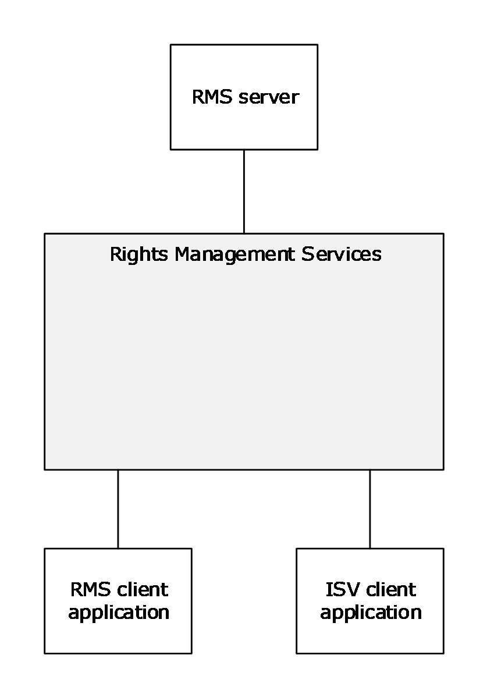
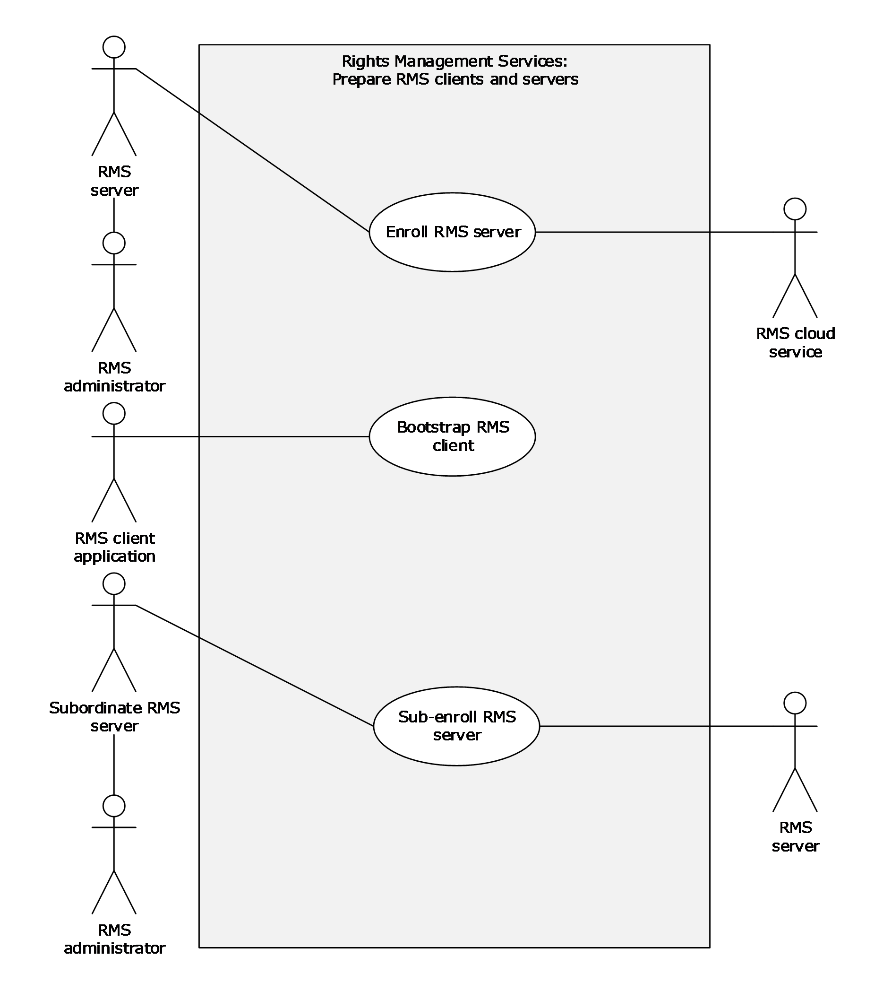
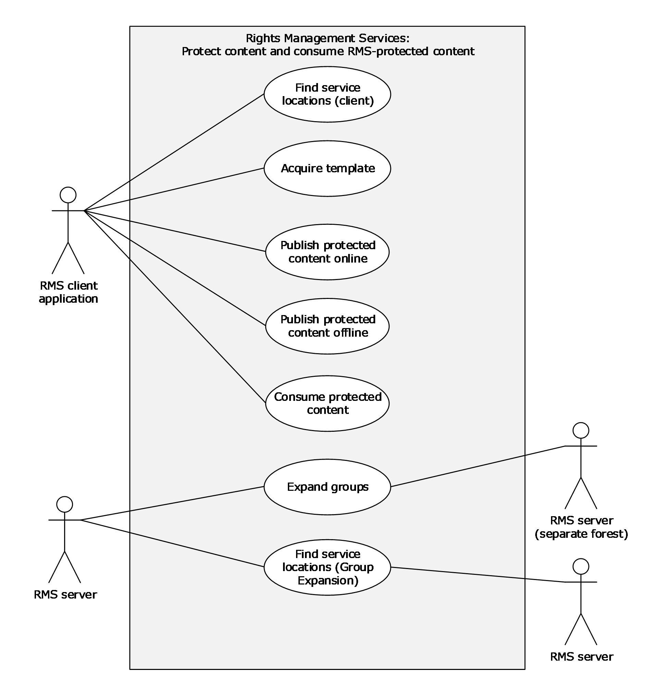
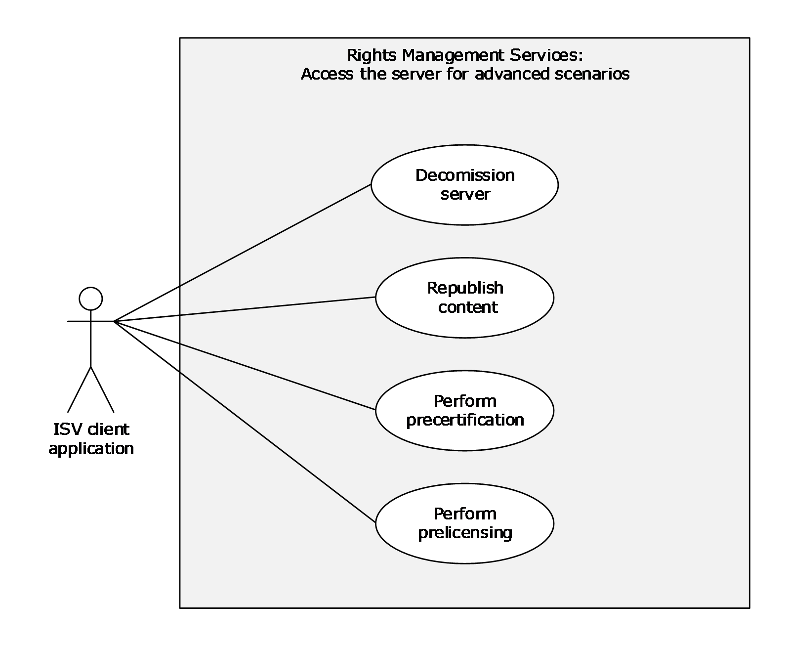
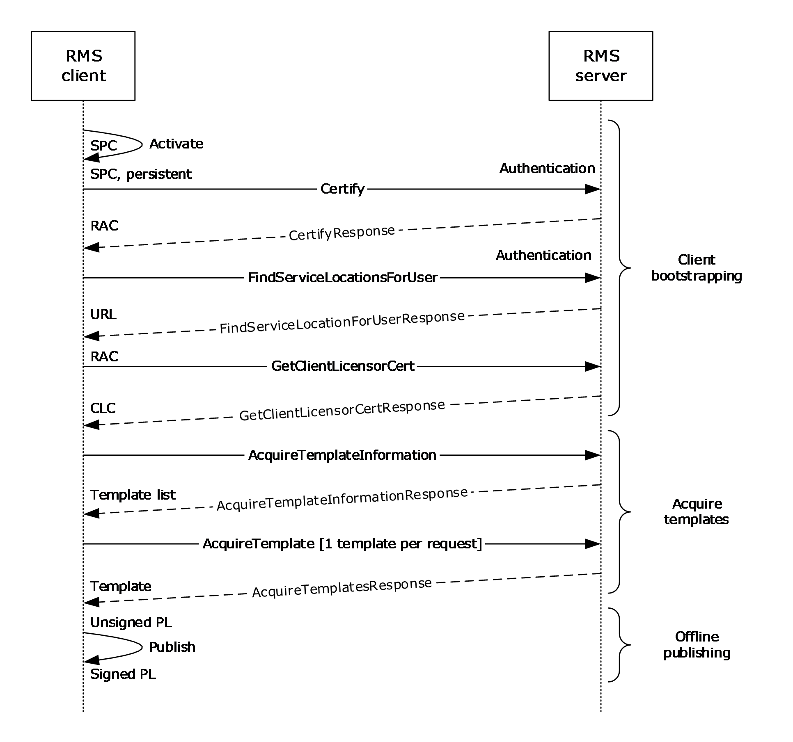
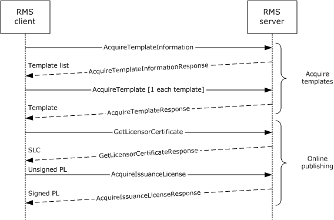
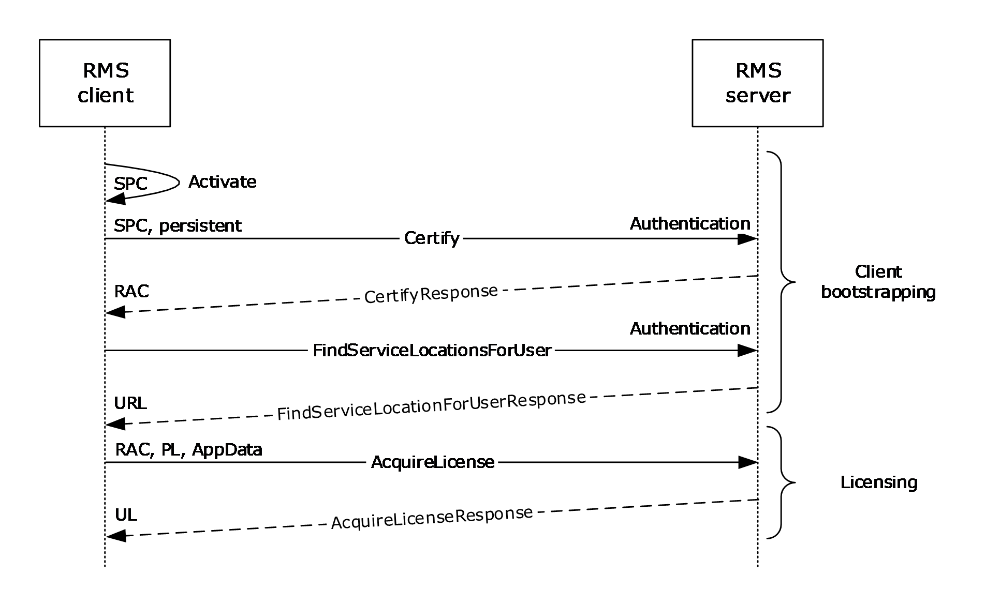

# [MS-RMSOD]: Rights Management Services Protocols Overview

Table of Contents

1 Introduction

- [1 Introduction](#Section_1)
  - [1.1 Conceptual Overview](#Section_1.1)
  - [1.2 Glossary](#Section_1.2)
  - [1.3 References](#Section_1.3)

2 Functional Architecture

- [2 Functional Architecture](#Section_2)
  - [2.1 Overview](#Section_2.1)
    - [2.1.1 Purpose of RMS](#Section_2.1.1)
    - [2.1.2 Functional Overview](#Section_2.1.2)
      - [2.1.2.1 Abstract Components](#Section_2.1.2.1)
      - [2.1.2.2 Client-to-Server and Server-to-Server Functionality](#Section_2.1.2.2)
    - [2.1.3 Communication Within RMS](#Section_2.1.3)
    - [2.1.4 Applicability](#Section_2.1.4)
    - [2.1.5 Relevant Standards](#Section_2.1.5)
  - [2.2 Protocol Summary](#Section_2.2)
  - [2.3 Environment](#Section_2.3)
    - [2.3.1 Dependencies on RMS](#Section_2.3.1)
    - [2.3.2 Dependencies on Other Systems/Components](#Section_2.3.2)
      - [2.3.2.1 SOAP](#Section_2.3.2.1)
      - [2.3.2.2 Cryptographic Keys](#Section_2.3.2.2)
      - [2.3.2.3 Directory Services](#Section_2.3.2.3)
      - [2.3.2.4 Federated Sign-On](#Section_2.3.2.4)
      - [2.3.2.5 XrML](#Section_2.3.2.5)
      - [2.3.2.6 RMS Certificates and Licenses](#Section_2.3.2.6)
  - [2.4 Assumptions and Preconditions](#Section_2.4)
  - [2.5 Use Cases](#Section_2.5)
    - [2.5.1 Actors](#Section_2.5.1)
    - [2.5.2 Supporting Actors and System Interests Summary](#Section_2.5.2)
    - [2.5.3 Use Case Summary Diagrams](#Section_2.5.3)
    - [2.5.4 Use Case Descriptions](#Section_2.5.4)
      - [2.5.4.1 Enroll RMS Server - RMS Server](#Section_2.5.4.1)
      - [2.5.4.2 Bootstrap RMS Client - RMS Client Application](#Section_2.5.4.2)
      - [2.5.4.3 Sub-Enroll Server - RMS Server](#Section_2.5.4.3)
      - [2.5.4.4 Find Service Locations for Client - RMS Server](#Section_2.5.4.4)
      - [2.5.4.5 Acquire Templates - RMS Client Application](#Section_2.5.4.5)
      - [2.5.4.6 Publish Protected Content Online - RMS Client Application](#Section_2.5.4.6)
      - [2.5.4.7 Publish Protected Content Offline - RMS Client Application](#Section_2.5.4.7)
      - [2.5.4.8 Consume Protected Content - RMS Client Application](#Section_2.5.4.8)
      - [2.5.4.9 Expand Groups - RMS Server](#Section_2.5.4.9)
      - [2.5.4.10 Find Service Locations for Group Expansion - RMS Server](#Section_2.5.4.10)
      - [2.5.4.11 Decommission Server - ISV Application](#Section_2.5.4.11)
      - [2.5.4.12 Republishing Content - ISV Application](#Section_2.5.4.12)
      - [2.5.4.13 Perform Precertification - ISV Application](#Section_2.5.4.13)
      - [2.5.4.14 Perform Prelicensing - ISV Application](#Section_2.5.4.14)
  - [2.6 Versioning, Capability Negotiation, and Extensibility](#Section_2.6)
  - [2.7 Error Handling](#Section_2.7)
  - [2.8 Coherency Requirements](#Section_2.8)
  - [2.9 Security](#Section_2.9)
  - [2.10 Additional Considerations](#Section_2.10)

3 Examples

- [3 Examples](#Section_3)
  - [3.1 Example 1: Activating the RMS Servers](#Section_3.1)
    - [3.1.1 Activate the Server](#Section_3.1.1)
    - [3.1.2 Activate a Subordinate RMS Server](#Section_3.1.2)
  - [3.2 Example 2: Using Offline Publishing to Protect Content](#Section_3.2)
    - [3.2.1 Client Bootstrapping](#Section_3.2.1)
      - [3.2.1.1 Activate the Computer](#Section_3.2.1.1)
      - [3.2.1.2 Find Service Locations](#Section_3.2.1.2)
      - [3.2.1.3 Certify the User](#Section_3.2.1.3)
      - [3.2.1.4 Acquire a CLC](#Section_3.2.1.4)
    - [3.2.2 Acquire Templates](#Section_3.2.2)
    - [3.2.3 Offline Publishing](#Section_3.2.3)
  - [3.3 Example 3: Using Online Publishing to Protect Content](#Section_3.3)
    - [3.3.1 Acquire Templates](#Section_3.3.1)
    - [3.3.2 Online Publishing](#Section_3.3.2)
      - [3.3.2.1 Acquire the Server's Certificate](#Section_3.3.2.1)
      - [3.3.2.2 Generate a Publishing License](#Section_3.3.2.2)
      - [3.3.2.3 Sign the Publishing License](#Section_3.3.2.3)
  - [3.4 Example 4: Consuming Protected Content](#Section_3.4)
    - [3.4.1 Client Bootstrapping](#Section_3.4.1)
      - [3.4.1.1 Activate the Computer](#Section_3.4.1.1)
      - [3.4.1.2 Certify the User](#Section_3.4.1.2)
      - [3.4.1.3 Find Service Locations](#Section_3.4.1.3)
    - [3.4.2 Licensing](#Section_3.4.2)
  - [3.5 Example 5: Accessing the Server for Advanced Scenarios](#Section_3.5)
    - [3.5.1 Republishing Content](#Section_3.5.1)
    - [3.5.2 Perform Precertification](#Section_3.5.2)
    - [3.5.3 Perform Prelicensing](#Section_3.5.3)
    - [3.5.4 Decommission Server](#Section_3.5.4)

4 Microsoft Implementations

- [4 Microsoft Implementations](#Section_4)
  - [4.1 Product Behavior](#Section_4.1)

5 Change Tracking

- [5 Change Tracking](#Section_5)

For the legal notice and IP terms, see [LEGAL.md](../LEGAL.md).
Last updated: 10/26/2021.
See [Revision History](#revision-history) for full version history.

# 1 Introduction

The Rights Management Services (RMS) protocols enable information-protection functionality that works with RMS-enabled applications to help safeguard digital information from unauthorized use, online and offline, inside and outside of the firewall. RMS is designed for organizations that have to protect sensitive and proprietary information, such as financial reports, product specifications, customer data, and confidential email messages. RMS can be used to help prevent sensitive information from intentionally or accidentally getting into the wrong hands.

This overview describes the intended functionality of the RMS protocols and the manner in which the RMS protocols interact. This description includes how RMS interacts with systems or applications that create or consume rights-protected content, how RMS servers interact, and how RMS interacts with management clients that have to configure and manage the system. It provides examples of some of the common user scenarios. It does not restate the processing rules and other details that are specific to each protocol. These details are described in the protocol specifications for each of the protocols and data structures that make up this system.

## 1.1 Conceptual Overview

This section summarizes concepts that are specific to the Rights Management Services (RMS) protocol group, including:

**Access and usage restrictions:** RMS allows individuals and administrators to encrypt and specify access and usage restrictions on various types of data, including documents and email messages. This functionality helps prevent sensitive information from being accessed and used by unauthorized persons. RMS includes persistent usage [**policies**](#gt_policy) and interacts with systems or applications that create or consume rights-protected content.

**Persistent usage policies:** RMS enhances an organization's security strategy by protecting information through persistent usage policies. RMS also enables usage rights, such as usage rights restricting copying, printing, or forwarding, to be enforced after the information is accessed by an authorized recipient. In addition, RMS helps organizations enforce corporate policy governing the control and dissemination of confidential or proprietary information. After permissions to content have been restricted by using rights management, the access and usage restrictions tend to be enforced no matter where the information is, because the access and usage restrictions tend to be stored in the content itself.

**Activation and enrollment:** Activation allows a machine to enroll in RMS. This process allows that machine to be used to create or consume usage policies. Servers can also be **decommissioned**, ending their participation in RMS.

**Publishing and consuming protected content:** The RMS protocols include functionality for publishing and consuming protected content. Content can be published online or offline.

**ISV extensions:** These extensions provide a means for implementations to access RMS without necessarily going through the RMS client.

## 1.2 Glossary

This document uses the following terms:

**Active Directory**: The Windows implementation of a general-purpose directory service, which uses LDAP as its primary access protocol. [**Active Directory**](#gt_active-directory) stores information about a variety of objects in the network such as user accounts, computer accounts, groups, and all related credential information used by Kerberos [MS-KILE](../MS-KILE/MS-KILE.md). [**Active Directory**](#gt_active-directory) is either deployed as Active Directory Domain Services (AD DS) or Active Directory Lightweight Directory Services (AD LDS), which are both described in [MS-ADOD](#Section_2.1): Active Directory Protocols Overview.

**bootstrapping**: A process that RMS clients can use to self-activate.

**certificate**: As used in this document, [**certificates**](#gt_certificate) are expressed in [XRML] section 1.2.

**certificate chain**: A sequence of [**certificates**](#gt_certificate), where each certificate in the sequence is signed by the subsequent certificate. The last certificate in the chain is normally a self-signed certificate.

**client licensor certificate (CLC) chain**: An XrML 1.2 [**certificate chain**](#gt_certificate-chain) that contains an asymmetric signing key pair issued to a user account by an RMS publishing service and binds that user account to a specific computer. The CLC grants the role of a user who can publish protected content.

**cloud service**: A set of one or more publicly available services that Microsoft operates.

**consumer**: The user who uses protected content.

**content key**: The symmetric key used to encrypt content.

**creator**: The user who creates protected content.

**forest**: One or more domains that share a common schema and trust each other transitively. An organization can have multiple [**forests**](#gt_forest). A [**forest**](#gt_forest) establishes the security and administrative boundary for all the objects that reside within the domains that belong to the [**forest**](#gt_forest). In contrast, a domain establishes the administrative boundary for managing objects, such as users, groups, and computers. In addition, each domain has individual security policies and trust relationships with other domains.

**globally unique identifier (GUID)**: A term used interchangeably with universally unique identifier (UUID) in Microsoft protocol technical documents (TDs). Interchanging the usage of these terms does not imply or require a specific algorithm or mechanism to generate the value. Specifically, the use of this term does not imply or require that the algorithms described in [[RFC4122]](https://go.microsoft.com/fwlink/?LinkId=90460) or [[C706]](https://go.microsoft.com/fwlink/?LinkId=89824) must be used for generating the [**GUID**](#gt_globally-unique-identifier-guid). See also universally unique identifier (UUID).

**license**: An XrML1.2 document that describes usage policy for protected content.

**NT LAN Manager (NTLM) Authentication Protocol**: A protocol using a challenge-response mechanism for authentication in which clients are able to verify their identities without sending a password to the server. It consists of three messages, commonly referred to as Type 1 (negotiation), Type 2 (challenge) and Type 3 (authentication).

**offline publishing**: The process of creating protected content and signing the associated [**publishing license**](#gt_publishing-license) using a previously acquired CLC.

**online publishing**: The process of creating protected content and contacting a server to have the [**publishing license**](#gt_publishing-license) signed.

**policy**: The set of rules that govern the interaction between a subject and an object or resource.

**publishing license**: An XrML 1.2 license that defines the usage policy for protected content and contains the content key with which that content is encrypted. The usage policy identifies all authorized users and the actions that they are authorized to take with the content, in addition to any usage conditions. The publishing license tells a server which usage policies apply to a specific piece of content and grants a server the right to issue use licenses (ULs) based on that policy. The publishing license is created when content is protected. Also referred to as "Issuance License (IL)."

**publishing license (PL)**: An XrML 1.2 [**license**](#gt_license) that defines usage policy for protected content and contains the content key with which that content is encrypted. The usage policy identifies all authorized users and the actions they are authorized to take with the content, along with any conditions on that usage. The [**publishing license**](#gt_publishing-license) tells the server what usage policies apply to a given piece of content and grants the server the right to issue [**use licenses (ULs)**](#gt_use-license-ul) based on that policy. The [**PL**](#gt_publishing-license-pl) is created when content is protected. Also known as an Issuance License (IL).

**rights policy template**: An XrML 1.2 document that contains a predefined usage policy that is used to create the [**PL**](#gt_publishing-license-pl) when content is protected. Conceptually, a [**rights policy template**](#gt_rights-policy-template) (or "template") is a blueprint for a [**PL**](#gt_publishing-license-pl), identifying authorized users and the actions they are authorized to take with the content (along with any conditions on that usage). Unlike a [**PL**](#gt_publishing-license-pl), a template does not contain a content key or information about the content owner. The content key and information about the content owner are required to be added when the [**PL**](#gt_publishing-license-pl) for a given piece is created from the template. End users can use a template when protecting a document instead of defining the specifics of the usage policy themselves. When a document is published using a template, the template is used to generate the [**PL**](#gt_publishing-license-pl).

**RMS account certificate (RAC)**: An XrML 1.2 [**certificate chain**](#gt_certificate-chain) that contains an asymmetric encryption key pair that is issued to a user account by an RMS Certification Service. The [**RAC**](#gt_rms-account-certificate-rac) binds that user account to a specific computer. The [**RAC**](#gt_rms-account-certificate-rac) represents the identity of a user who can access protected content. Also known as a Group Identity Certificate (GIC).

**security processor certificate (SPC)**: An XrML 1.2 [**certificate chain**](#gt_certificate-chain) generated during activation that contains the public key corresponding to the [**SPC**](#gt_security-processor-certificate-spc) private key. The [**SPC**](#gt_security-processor-certificate-spc) grants the role of a machine that can be used for working with protected content.

**security processor certificate (SPC) private key**: A unique private key that is generated at activation time and issued to the machine, either by self-activation or by calling the Activate method.

**server licensor certificate (SLC)**: An XrML 1.2 [**certificate**](#gt_certificate) that contains a public key issued to an RMS server by an RMS cloud service (RMS 1.0, RMS 1.0 SP1, and RMS 1.0 SP2) or Self Enrollment (RMS 2.0). The RMS client uses the RMS server's public key to encrypt the usage policy and content key in a publish license.

**service connection point (SCP)**: An object stored in [**Active Directory**](#gt_active-directory) that specifies the location of an RMS server.

**use license (UL)**: An XrML 1.2 [**license**](#gt_license) that authorizes a user to access a given protected content file and describes the usage policies that apply. Also known as an "End-User License (EUL)".

## 1.3 References

[FIPS180-2] National Institute of Standards and Technology, "Secure Hash Standard", FIPS PUB 180-2, August 2002, [http://csrc.nist.gov/publications/fips/fips180-2/fips180-2.pdf](https://go.microsoft.com/fwlink/?LinkId=89868)

[MS-ADOD] Microsoft Corporation, "[Active Directory Protocols Overview](#Section_2.1)".

[MS-MWBE] Microsoft Corporation, "[Microsoft Web Browser Federated Sign-On Protocol Extensions](#Section_2.3.2.4)".

[MS-MWBF] Microsoft Corporation, "[Microsoft Web Browser Federated Sign-On Protocol](#Section_2.3.2.4)".

[MS-NTHT] Microsoft Corporation, "[NTLM Over HTTP Protocol](../MS-NTHT/MS-NTHT.md)".

[MS-RMPRS] Microsoft Corporation, "[Rights Management Services (RMS): Server-to-Server Protocol](../MS-RMPRS/MS-RMPRS.md)".

[MS-RMPR] Microsoft Corporation, "[Rights Management Services (RMS): Client-to-Server Protocol](../MS-RMPR/MS-RMPR.md)".

[MS-RMSI] Microsoft Corporation, "[Rights Management Services (RMS): ISV Extension Protocol](../MS-RMSI/MS-RMSI.md)".

[RFC1945] Berners-Lee, T., Fielding, R., and Frystyk, H., "Hypertext Transfer Protocol -- HTTP/1.0", RFC 1945, May 1996, [http://www.ietf.org/rfc/rfc1945.txt](https://go.microsoft.com/fwlink/?LinkId=90300)

[RFC2616] Fielding, R., Gettys, J., Mogul, J., et al., "Hypertext Transfer Protocol -- HTTP/1.1", RFC 2616, June 1999, [http://www.rfc-editor.org/rfc/rfc2616.txt](https://go.microsoft.com/fwlink/?LinkId=90372)

[RFC3377] Hodges, J. and Morgan, R., "Lightweight Directory Access Protocol (v3): Technical Specification", RFC 3377, September 2002, [http://www.ietf.org/rfc/rfc3377.txt](https://go.microsoft.com/fwlink/?LinkID=91337)

[SOAP1.1] Box, D., Ehnebuske, D., Kakivaya, G., et al., "Simple Object Access Protocol (SOAP) 1.1", W3C Note, May 2000, [http://www.w3.org/TR/2000/NOTE-SOAP-20000508/](https://go.microsoft.com/fwlink/?LinkId=90520)

[SOAP1.2-1/2003] Gudgin, M., Hadley, M., Mendelsohn, N., et al., "SOAP Version 1.2 Part 1: Messaging Framework", W3C Recommendation, June 2003, [http://www.w3.org/TR/2003/REC-soap12-part1-20030624](https://go.microsoft.com/fwlink/?LinkId=90521)

[SOAP1.2-2/2003] Gudgin, M., Hadley, M., Mendelsohn, N., et al., "SOAP Version 1.2 Part 2: Adjuncts", W3C Recommendation, June 2003, [http://www.w3.org/TR/2003/REC-soap12-part2-20030624](https://go.microsoft.com/fwlink/?LinkId=90522)

[WSDL] Christensen, E., Curbera, F., Meredith, G., and Weerawarana, S., "Web Services Description Language (WSDL) 1.1", W3C Note, March 2001, [http://www.w3.org/TR/2001/NOTE-wsdl-20010315](https://go.microsoft.com/fwlink/?LinkId=90577)

[XML1.0] Bray, T., Paoli, J., Sperberg-McQueen, C.M., and Maler, E., "Extensible Markup Language (XML) 1.0 (Second Edition)", W3C Recommendation, October 2000, [http://www.w3.org/TR/2000/REC-xml-20001006](https://go.microsoft.com/fwlink/?LinkId=90599)

[XMLNS-2ED] Bray, T., Hollander, D., Layman, A., and Tobin, R., Eds., "Namespaces in XML 1.0 (Second Edition)", W3C Recommendation, August 2006, [http://www.w3.org/TR/2006/REC-xml-names-20060816/](https://go.microsoft.com/fwlink/?LinkId=90602)

[XMLSCHEMA1] Thompson, H., Beech, D., Maloney, M., and Mendelsohn, N., Eds., "XML Schema Part 1: Structures", W3C Recommendation, May 2001, [http://www.w3.org/TR/2001/REC-xmlschema-1-20010502/](https://go.microsoft.com/fwlink/?LinkId=90608)

[XMLSCHEMA2] Biron, P.V., Ed. and Malhotra, A., Ed., "XML Schema Part 2: Datatypes", W3C Recommendation, May 2001, [http://www.w3.org/TR/2001/REC-xmlschema-2-20010502/](https://go.microsoft.com/fwlink/?LinkId=90610)

[XPATH] Clark, J. and DeRose, S., "XML Path Language (XPath), Version 1.0", W3C Recommendation, November 1999, [http://www.w3.org/TR/1999/REC-xpath-19991116/](https://go.microsoft.com/fwlink/?LinkId=90611)

[XRML] ContentGuard, Inc., "XrML: Extensible rights Markup Language Version 1.2", 2001, [http://contentguard.com/contact-us](https://go.microsoft.com/fwlink/?LinkId=324306)

**Note** Contact the owner of the XrML specification for more information.

# 2 Functional Architecture

## 2.1 Overview

RMS has three major roles: the [**creator**](#gt_creator), the [**consumer**](#gt_consumer), and the **server**. The creator builds content and chooses an access [**policy**](#gt_policy) for that content. When the RMS creator protects the content, it is encrypted by using a randomly generated [**content key**](#gt_content-key). Both this key and the access policy are bound to the content in the form of a [**publishing license (PL)**](#gt_publishing-license-pl).

The consumer, upon receiving the document from the creator and opening it, supplies the server with the PL and the consumer's identity. If the consumer is granted access, according to the access policy in the [**license**](#gt_license), the server issues the consumer a [**use license (UL)**](#gt_use-license-ul) that specifies the access policy for the consumer and binds the content decryption key to the consumer's identity.

A client (or an ISV extension application) can play the role of a creator, a consumer, or both, depending on the type of implementation. The client is responsible for requesting [**certificates**](#gt_certificate), licenses, and policies from the server. The client is also responsible for enforcing authorization policies as they apply to protected information and for encrypting or decrypting content as appropriate.

The server role in RMS is responsible for issuing certifications, keys, and authorization policies, and for signing these issued certificates and policies with keys that it holds in escrow. It is also responsible for evaluating and issuing authorization policies that are based on identity credentials that the client provides in protocol requests.

### 2.1.1 Purpose of RMS

RMS provides the ability to secure information and to restrict access to authorized users. It also provides the ability to enforce access [**policies**](#gt_policy) and to restrict information access to trusted applications. RMS provides an administration interface to manage the system and to create access policies. The following diagram shows the major components that interact with RMS.

Figure 1: Major components interacting with RMS

The purpose of RMS is to:

- Provide a protection mechanism to ensure that data, such as email and documents, can be protected and consumed only by the intended recipients.
- Provide a record of transactions that are performed in the course of achieving this purpose.
RMS is comprised of the following functions:

- Issue the requisite [**certificates**](#gt_certificate) that are necessary for securing and consuming data.
- Store and manage the certificates that were previously mentioned.
- Store and manage [**rights policy templates**](#gt_rights-policy-template) (also known as "templates"), which provide policies for secured data that is defined on the enterprise level.
Creators use RMS to:

- Secure data, which includes the access policies for the data.
- Confirm content [**consumer**](#gt_consumer) identity and supply the consumer with decryption keys and access rights.
Consumers use RMS to:

- Obtain [**licenses**](#gt_license) to access protected data.

### 2.1.2 Functional Overview

This section describes the relationships between RMS and external components, RMS dependencies, and other components that are influenced by RMS.

#### 2.1.2.1 Abstract Components

At a high level, there are three main components in RMS: the RMS server, the RMS client application, and the ISV client applications. The RMS server, which acts only within RMS, provides RMS services such as issuing [**certificates**](#gt_certificate) and [**licenses**](#gt_license). The RMS client application interacts with RMS, acting as a client to an RMS server so that the user can protect content and access protected content. The ISV client application takes advantage of ISV extensions that supplement the client-server interface, providing direct access to the server for more advanced scenarios. ISV client applications can be implemented as standalone software or as part of an RMS client implementation, as indicated by the implementation-specific connection shown in the following diagram. The diagram shows the communication between RMS roles.

Figure 2: Basic communication with RMS

The following diagram shows how the RMS server exposes sets of interfaces that RMS client applications contact to perform RMS actions.

Figure 3: Distributed communication within RMS

The RMS server maintains RMS configuration, logging, and directory services databases. Additionally, certificates, such as an [**RMS account certificate (RAC)**](#gt_rms-account-certificate-rac), are stored in the database. A directory service is also required to provide user authentication and other directory services.

#### 2.1.2.2 Client-to-Server and Server-to-Server Functionality

RMS protocols have two main sets of services, the client-to-server services and the server-to-server services. The client-to-server services are the individual interfaces that RMS client applications call to perform RMS tasks such as [**bootstrapping**](#gt_bootstrapping), retrieving templates, publishing content, and licensing content. The server-to-server services are the tasks that are performed to determine group membership of users across complex network directories. The RMS protocols also have an ISV extension interface that can be used to enable RMS in applications that do not necessarily use the RMS client services.

The following diagram shows the structure of the services in RMS.

Figure 4: RMS white box diagram

**Client-to-server interfaces**

**Certification service:** The certification service provides RMS client applications with the ability to bootstrap and receive the necessary [**certificates**](#gt_certificate) to participate as a [**consumer**](#gt_consumer) in RMS. The certification service is the interface that RMS client applications use in the use case "Bootstrap RMS Client - RMS Client Application" described in section [2.5.4.2](#Section_2.5.4.2).

**Certify:** As part of the bootstrapping process, an RMS client makes a request to the **Certify** web request. This request includes the client's [**security processor certificate (SPC)**](#gt_security-processor-certificate-spc); authentication is also performed as part of this request. The server validates the data that it receives and, if it is authorized, returns the user's [**RAC**](#gt_rms-account-certificate-rac). Full details of the Certification Service schema can be found in [MS-RMPR](../MS-RMPR/MS-RMPR.md) section 3.3. Details of the **Certify** request can be found in [MS-RMPR] section 3.3.4.1.

**Licensing service:** The licensing web service provides two functions, issuing [**use licenses (ULs)**](#gt_use-license-ul) for protected content and providing [**rights policy templates**](#gt_rights-policy-template) to client applications that request them. Full details of the Licensing Service schema can be found in [MS-RMPR] section 3.4.

**AcquireLicense:** To consume protected content, the client acquires a use license, which gives the user access to the content and includes the key to decrypt the content and the usage [**policies**](#gt_policy) for the content. To acquire the use license, the client uses the **AcquireLicense** request, sending the RAC, [**publishing license (PL)**](#gt_publishing-license-pl), and application data to the RMS server. After validating the RAC and the PL in the request, the server returns the use license for the content. Details of the **AcquireLicense** request can be found in [MS-RMPR] section 3.4.4.1.

**AcquireTemplateInformation:** To retrieve rights policy templates, the client first makes a request to the **AcquireTemplateInformation** request. The server returns information about the available templates in the form of a list of [**globally unique identifiers (GUIDs)**](#gt_globally-unique-identifier-guid) and hashes corresponding to the server templates. Details of the **AcquireTemplateInformation** request can be found in [MS-RMPR] section 3.4.4.2.

**AcquireTemplates:** After receiving the list of templates, the client determines which templates to download from the server. The client uses the **AcquireTemplates** request with a list of rights policy template GUIDs and request templates corresponding to these GUIDs. Upon receiving the request, the server returns the templates to the client. Details of the **AcquireTemplates** request can be found in [MS-RMPR] section 3.4.4.3.

**Publishing service:** The publishing service has two functions, to sign publishing licenses (PLs), which are generated during [**online publishing**](#gt_online-publishing), and to provide [**client licensor certificate (CLC) chains**](#gt_client-licensor-certificate-clc-chain), which are used in [**offline publishing**](#gt_offline-publishing). The publishing service provides RMS client applications with the ability to participate as a publisher in RMS. Full details of the publishing service schema can be found in [MS-RMPR] section 3.5.

**AcquireIssuanceLicense:** During online publishing, the RMS client application gets the [**server licensor certificate (SLC)**](#gt_server-licensor-certificate-slc) chain from the server (see details on the **GetLicensorCertificate** operation in section [3.3.2.1](#Section_3.3.2.1)), generates a symmetric [**content key**](#gt_content-key), and generates usage restrictions. The RMS client application generates a publishing license (PL), which includes the content key and use restrictions. The content key and use restrictions are encrypted with the server's public key (from the SLC).

In online publishing, after the PL is created, it is signed by the server. The **AcquireIssuanceLicense** request is used to sign a PL during online publishing. The RMS client application makes an **AcquireIssuanceLicense** request to the server with the unsigned PL. The server signs the body of the PL and returns it to the RMS client application. Details of the **AcquireIssuanceLicense** request can be found in [MS-RMPR] section 3.5.4.1.

**GetClientLicensorCert:** During offline publishing, the RMS client application uses the CLC to publish content without contacting the RMS server. The CLC contains the server's public key, which is used to encrypt the content key and use restrictions in the PL. The CLC private key is used to sign the body of the PL.

The **GetClientLicensorCert** request is used to obtain the CLC for the user. The user needs to have a RAC and an SPC to use this method. In the **GetClientLicensorCert** request, the client submits a RAC chain and requests a CLC chain. When the server receives the request, it performs a signature validation on the RAC chain and verifies that it trusts the RAC. The server generates a CLC, which contains a unique asymmetric key pair. The server encrypts the CLC private key with the public key of the RAC, so that the RAC and the SPC are required to access the signing key in the CLC. Details of the **GetClientLicensorCert** request can be found in [MS-RMPR] section 3.5.4.2.

**Server service:** The server service has two purposes, to provide the service location for users and to provide the SLC for use in online publishing. Full details of the server service schema can be found in [MS-RMPR] section 3.7.

**FindServiceLocationsForUser:** Depending on the RMS server configuration, different servers can be used for different functions for a given user. The client uses the **FindServiceLocationsForUser** request to discover the appropriate server for various services for a given user. The server uses the GetAuthenticatedAccount abstract interface to determine the authenticated domain account. When servicing **FindServiceLocationsForUser** requests, Windows implementations of the RMS server use the GetAuthenticatedAccount abstract interface to retrieve the domain account, which is authenticated by using the [**NT LAN Manager (NTLM) Authentication Protocol**](#gt_nt-lan-manager-ntlm-authentication-protocol) through Microsoft Internet Information Services (IIS), as described in [MS-NTHT](../MS-NTHT/MS-NTHT.md). The SOAP request does not encapsulate the authentication.

When the RMS client application makes a **FindServiceLocationsForUser** request, it includes a service type (for example, "user certification") and requests its location. Given the authenticated domain account and the requested server type, the server determines the service location by using the GetDirectoryForAccount and GetServiceLocationForDirectory abstract interfaces and returns the URL to the RMS client application. Details of the **FindServiceLocationsForUser** request can be found in [MS-RMPR] section 3.7.4.2.

**GetLicensorCertificate:** During online publishing, the RMS client application retrieves the SLC from the RMS server. The SLC public key is used to encrypt the symmetric content key and use restrictions in the PL.

The RMS client application makes a **GetLicensorCertificate** request to the server; no information is sent in the request. Upon receiving the request, the server returns its SLC chain. Details of the **GetLicensorCertificate** request can be found in [MS-RMPR] section 3.7.4.1.

**Server-to-server interfaces**

**Find Service Locations:** RMS servers use the **Find Service Locations** interface of the Rights Management Services (RMS): Server-to-Server Protocol [MS-RMPR] to find the URLs for specific services that are provided by other RMS servers. This communication can be useful in two scenarios:

- Finding the appropriate URLs for a client to use for bootstrapping.
- Finding the **Group Expansion** interface on a remote server before making a group expansion request across [**forests**](#gt_forest).
Clients contact the server for a bootstrapping process to begin functioning in RMS. This bootstrapping process is defined in the RMS: Client-to-Server Protocol [MS-RMPR]. To bootstrap a specific user, the RMS server authenticates that user and determines the user's email address by checking the directory. If the user's account resides in a separate directory (forest) that the RMS server cannot access, it cannot successfully bootstrap the user. A client starts the bootstrapping process by making a request for service locations to a specific RMS server. If that RMS server is not the appropriate server to bootstrap the client, the server can use the **Find Service Locations** interface to find the URLs on the appropriate server and return them to the client.

The **Find Service Locations** interface uses a SOAP-based protocol over HTTP. It exposes one request/response method: **FindServiceLocations**.

**Sub-Enrollment:** RMS servers use the **Sub-Enrollment** interface of the RMS: Server-to-Server Protocol to bootstrap subordinate RMS servers.

As the preceding diagram shows, an RMS server can be deployed as a subordinate server to another RMS server. A root RMS server grants a subordinate RMS server the right to perform only licensing tasks by issuing a subordinate server licensor certificate (SLC) from its own SLC. For a subordinate RMS server, this process replaces the standard RMS server bootstrapping process defined in [MS-RMPR] section 3.1.3.

The **Sub-Enrollment** interface uses a SOAP-based protocol over HTTP. It exposes one request/response method: **SubEnroll**.

**Get Licensor Certificate:** RMS servers use the **Get Licensor Certificate** interface of the RMS: Server-to-Server Protocol to establish trust from a root server to a subordinate server.

When a subordinate RMS server is deployed, it needs to trust identities that are issued by the root RMS server. This requirement is accomplished by trusting certificates that were issued by the root RMS server by trusting the root RMS server's public key. The subordinate server can use the **Get Licensor Certificate** interface to retrieve the SLC of the main server that contains the appropriate public key.

The **Get Licensor Certificate** interface uses a SOAP-based protocol over HTTP. It exposes one request/response method: **GetLicensorCertificate**.

**Group Expansion over SOAP:** RMS servers use the **Group Expansion over SOAP** interface of the RMS: Server-to-Server Protocol to determine group membership of authorized users across complex network directories.

Access policy on RMS-protected content can specify individual users and distribution groups. When a consumer contacts the RMS server for authorization to access protected content, the server might have to check the directory to determine whether that user is a member of a group with rights to use the content. If that group exists in a separate directory (forest) to which the RMS server does not have access, the RMS server contacts another server that does have access to that directory and that can provide information about the group membership. This server-to-server communication can use either the **Group Expansion over SOAP** interface or the **Binary Group Expansion** interface.

The **Group Expansion over SOAP** interface exposes one request/response method: **IsPrincipalMemberOf**.

**Binary Group Expansion:** The **Binary Group Expansion** interface performs the same function as the **Group Expansion over SOAP** interface; however, it does so by using a binary-formatted message that is sent over HTTP. It exposes one request/response method: **IsPrincipalMemberOf**. This interface is not available in RMS: Server-to-Server Protocol version 2.0. For more details, see [MS-RMPRS](../MS-RMPRS/MS-RMPRS.md) section 3.5.

**ISV extension interfaces**

**Decommission server:** If an organization decides to stop using RMS entirely and to remove its deployment, it needs to remove RMS protection from content. One method is to have users with owner rights to each piece of content remove the protection. Realistically, however, it is often impractical to find these users because they might no longer belong to the organization in question. Another approach is to use the **Decommissioning** interface to extract the content key from a PL and return it so that it can then be used to decrypt the content. Because each protected document has a PL, and each PL has its own content key, this process needs to be repeated for each protected document that will have its protection removed.

When servicing the request, the RMS server does not verify that the requestor is supposed to be granted access to the content as indicated in the PL. Instead, the RMS server returns the content key to any requestor. As a result, the **Decommissioning** interface is disabled for normal operation by default. The interface exposes one request/response method to support decommissioning: **AcquireContentKey**.

**Precertification:** When protected content is sent to recipients, each recipient acquires a use license that grants access to the content. The use license describes the usage policy for that user with that content and encrypts the content key to the user's public key. This process and protocol is specified in the Rights Management Services (RMS): Client-to-Server Protocol [MS-RMPR].

As an optimization, the use license for a recipient can be generated in advance and be made available with the content at the time the recipient attempts to access it. The use license can be requested on behalf of the recipient by either the sender or a server application that might be involved in delivering the content to the recipient. This use license allows the recipient to access the content as soon as it is delivered without having to contact the RMS server, presuming that the recipient has already been bootstrapped.

In order to acquire a [**license**](#gt_license) on behalf of a recipient user, a requestor retrieves the public part of the recipient's RAC by using the **Precertification** interface, and then requests a use license from the RMS server by using the RMS: Client-to-Server Protocol, as specified in [MS-RMPR]. The **Precertification** interface exposes one request/response method to enable precertification: **Precertify**.

**Republishing:** After protected content is published, it might become necessary to alter the set of rights that are granted to users in the original PL. The EditIssuanceLicense operation ([MS-RMSI](../MS-RMSI/MS-RMSI.md) section 3.4.4.1) allows a client to submit the original signed PL and an unsigned PL that contains the altered rights. The RMS server responds with a new, signed PL that contains the same content key as the original PL.

PLs are required to permit republishing, as specified in [MS-RMSI] section 3.4.4.1. In addition, access to this service is typically restricted to computers or users that are trusted by the administrator. The **Republishing** interface exposes one request and response message to enable republishing via the EditIssuanceLicense operation.

**Prelicensing:** When using the **Precertification** interface, the application is required to contact a server that is capable of issuing a RAC for a specific recipient. In an environment with multiple certification services, an application might require an application-specific configuration to determine which certification service to use for each user. If multiple applications prelicense content, an administrator might have to configure this data in independent ways.

The **Prelicensing** interface shifts this responsibility to the RMS server. The application can specify a list of recipients by email address and provide a PL. The RMS server determines the public key for each user and issues a use license for each recipient. The use license is based on the rights that are granted in the PL. The RMS server itself can use the **Precertification** interface of another server to retrieve a public key for a user when the user's key resides on that server. The **Prelicensing** interface exposes one request/response message to enable prelicensing via the AcquirePreLicense operation ([MS-RMSI] section 3.5.4.1).

### 2.1.3 Communication Within RMS

RMS protocols use the SOAP messaging protocol for all communication. See [MS-RMPR](../MS-RMPR/MS-RMPR.md), [MS-RMPRS](../MS-RMPRS/MS-RMPRS.md), and [MS-RMSI](../MS-RMSI/MS-RMSI.md) for more information on the implementation of these interfaces.

### 2.1.4 Applicability

**Applicability:** The RMS protocols are used to manage user access to protected information, such as documents, email, and files.

### 2.1.5 Relevant Standards

**Conformance with external standards:** The RMS protocols use the following standards to enable interoperability with other external components.

Hypertext Transfer Protocol (HTTP), as specified in [[RFC2616]](https://go.microsoft.com/fwlink/?LinkId=90372). This protocol provides a standard for clients and servers to communicate. It defines how messages are formatted and transmitted, and what actions web servers and client applications take in response to various commands.

Extensible Markup Language, as specified in [[XML1.0]](https://go.microsoft.com/fwlink/?LinkId=90599), [[XMLNS-2ED]](https://go.microsoft.com/fwlink/?LinkId=90602), [[XMLSCHEMA1]](https://go.microsoft.com/fwlink/?LinkId=90608), [[XMLSCHEMA2]](https://go.microsoft.com/fwlink/?LinkId=90610), and [[XPATH]](https://go.microsoft.com/fwlink/?LinkId=90611). This standard provides a format for describing structured data. This facilitates more precise declarations of content and more meaningful search results across multiple platforms.

Secure Hash Standard, as specified in [[FIPS180-2]](https://go.microsoft.com/fwlink/?LinkId=89868). SHA hashes are used to sign messages. The RMS protocols can use SHA-1 or SHA256 hashes to sign messages, as specified in [MS-RMPR](../MS-RMPR/MS-RMPR.md) section 2.2.9.1.12 and [MS-RMPR] section 3.1.4.7. (Implementations prior to Windows Server 2012 operating system only support SHA-1.)

eXtensible Rights Markup Language, as specified in [[XRML]](https://go.microsoft.com/fwlink/?LinkId=324306). This standard provides descriptions of usage rights and conditions for digital contents, together with message integrity and entity authentication in these descriptions.

SOAP, as specified in [[SOAP1.1]](https://go.microsoft.com/fwlink/?LinkId=90520), [[SOAP1.2-1/2003]](https://go.microsoft.com/fwlink/?LinkId=90521), and [[SOAP1.2-2/2003]](https://go.microsoft.com/fwlink/?LinkId=90522). This standard provides a standard Internet protocol for exchanging structured information in a distributed environment.

Web Services Description Language, as specified in [[WSDL]](https://go.microsoft.com/fwlink/?LinkId=90577). This standard provides a general purpose XML language for describing the interface, protocol bindings, and the deployment details of network services.

NTLM over HTTP, as specified in [MS-NTHT](../MS-NTHT/MS-NTHT.md). This protocol provides network logon authentication by using a challenge and response process.

Active Directory, as described in [MS-ADOD](#Section_2.1), can be used with the Group Expansion services.

The LDAPv3 protocol, as described in [[RFC3377]](https://go.microsoft.com/fwlink/?LinkID=91337). This protocol can be used to retrieve the [**service connection points (SCPs)**](#gt_service-connection-point-scp) from Active Directory.

Microsoft Web Browser Federated Sign-On Protocol, as specified in [MS-MWBF](#Section_2.3.2.4) and [MS-MWBE](#Section_2.3.2.4). This standard allows integration with Active Directory Federation Services to support federated identities. It enables two-way collaboration between organizations when only one organization has an RMS server.

## 2.2 Protocol Summary

The following table provides a comprehensive list of the RMS protocols.

| Protocol name | Description | Short name |
| --- | --- | --- |
| Rights Management Services (RMS): Client-to-Server Protocol | This protocol obtains and issues [**certificates**](#gt_certificate) and [**licenses**](#gt_license) that are used for creating and working with protected content. The Rights Management Services (RMS): Client-to-Server Protocol is used for all client and server communication in relation to [**bootstrapping**](#gt_bootstrapping) a client, consuming protected content, or protecting content. This protocol uses SOAP ([[SOAP1.1]](https://go.microsoft.com/fwlink/?LinkId=90520) or [SOAP1.2-1/2007]) over HTTP [[RFC2616]](https://go.microsoft.com/fwlink/?LinkId=90372). HTTPS support is recommended; however, it is only required when using the Web Browser Federated Sign-on Protocol [MS-MWBF](#Section_2.3.2.4) in conjunction with the Licensing or Certification interfaces. | [MS-RMPR](../MS-RMPR/MS-RMPR.md) |
| Rights Management Services (RMS): Server-to-Server Protocol | This protocol locates RMS services, enrolls servers in RMS, and performs group expansion. The Rights Management Services (RMS): Server-to-Server Protocol is used for communication between RMS servers in relation to finding service locations and group expansion, and for enrolling subordinate RMS servers. This protocol uses SOAP over HTTP. HTTPS support is recommended, but not required. Binary group expansion uses the HTTP transport. | [MS-RMPRS](../MS-RMPRS/MS-RMPRS.md) |
| Rights Management Services (RMS): ISV Extension Protocols | This protocol communicates information between applications and RMS servers directly without using the RMS client. (ISV extensions are not supported in Windows 2000 operating system.) The Rights Management Services (RMS): ISV Extension Protocols are used for scenarios that are not supported by the RMS: Client-to-Server Protocol in relation to decommissioning protected content, precertifying users, prelicensing content, and republishing content. These protocols use SOAP over HTTP. HTTPS support is recommended, but not required. | [MS-RMSI](../MS-RMSI/MS-RMSI.md) |

## 2.3 Environment

The following sections identify the context in which RMS exists. RMS includes the systems that use the interfaces that are provided by the RMS protocols, other components that depend on RMS, and, as appropriate, the means by which components of RMS communicate.

The RMS protocols require HTTP network connectivity between clients and servers, typically over port 80. Optionally, HTTPS can be used, typically over port 443. The network needs Domain Name Services (DNS) with the RMS server registered in DNS. Clients can be located on private networks, such as an enterprise network that is managed by an IT department, or can communicate over the Internet.

An RMS client can be any device with the capability to connect to an RMS server by using HTTP. Client implementations are free to persistently store [**certificates**](#gt_certificate) that are provided by the RMS server.

An RMS server is a web server that is capable of communicating with clients over HTTP.

### 2.3.1 Dependencies on RMS

None.

### 2.3.2 Dependencies on Other Systems/Components

The RMS protocols depend on the following technologies:

- SOAP (section [2.3.2.1](#Section_2.3.2.1))
- Cryptographic keys (section [2.3.2.2](#Section_2.3.2.2))
- Directory services (section [2.3.2.3](#Section_2.3.2.3))
- Federated sign-on (section [2.3.2.4](#Section_2.3.2.4))
- XrML (section [2.3.2.5](#Section_2.3.2.5))
- RMS [**certificates**](#gt_certificate) and [**licenses**](#gt_license) (section [2.3.2.6](#Section_2.3.2.6))

#### 2.3.2.1 SOAP

SOAP is a simple XML-based protocol that enables applications to exchange information over HTTP. SOAP provides a way to communicate between applications that are running on different operating systems, with different technologies and programming languages.

The RMS protocols use the SOAP messaging protocol, as specified in [[SOAP1.1]](https://go.microsoft.com/fwlink/?LinkId=90520), for formatting requests and responses. It transmits these messages by using HTTP and/or HTTPS. SOAP is considered to be the wire format that is used for messaging, and HTTP and HTTPS are the underlying transport protocols. This requires that clients and servers have network connectivity and are correctly configured to use TCP/IP. There is no specific requirement for the type of physical networking topology. For more information about SOAP, see [SOAP1.1], [[SOAP1.2-1/2003]](https://go.microsoft.com/fwlink/?LinkId=90521), and [[SOAP1.2-2/2003]](https://go.microsoft.com/fwlink/?LinkId=90522).

#### 2.3.2.2 Cryptographic Keys

RMS uses both symmetric and asymmetric (also known as public-key) cryptography. Cryptography in RMS is used to protect various [**certificates**](#gt_certificate), [**licenses**](#gt_license), and content. This functionality provides organizations with a seamless way to protect and unprotect content without requiring their users to have any knowledge of the underlying system.

Symmetric-key cryptography refers to encryption methods in which the key that was used to encrypt information is the same key that decrypts the information. In asymmetric cryptography, there are two keys, a public key and a private key. The keys are mathematically related but it is not computationally feasible to determine one key with only the other. The public key can be freely distributed and is generally used to encrypt data or verify signatures. The private key is kept secret and is generally used for decrypting and signing data.

#### 2.3.2.3 Directory Services

RMS uses directory services, such as Active Directory, as a central repository for storing and retrieving identity and account information about RMS users. The directory services are also used to enable the RMS client to discover the RMS server and to authenticate requests to the server. In scenarios where Active Directory is used as the directory service and the RMS server has joined a domain, the domain serves as the primary source of identity for the RMS server and RMS users. The domain, through the relevant security protocols, provides the basis for authentication within the domain, allowing principals within the domain to establish authenticated connections with each other. After authentication, the domain provides authorization information in the form of additional identities representing groups, whereby authorization decisions can be made. RMS identifies users by email addresses (or security identifiers (SIDs)), which are stored in the directory. In scenarios where other directory services are used, separate authentication mechanisms can be used, such as anonymous authentication. For more information about Active Directory, see [MS-ADOD](#Section_2.1).

#### 2.3.2.4 Federated Sign-On

Use of federated sign-on allows enterprises to establish relationships for exchanging protected content with entities outside their directory infrastructure. For more information about federated sign-on, see the federated sign-On protocols and extensions ([MS-MWBE](#Section_2.3.2.4) and [MS-MWBF](#Section_2.3.2.4)).

#### 2.3.2.5 XrML

The eXtensible rights Markup Language (XrML) is a general-purpose, XML-based specification grammar for expressing rights and conditions that are associated with digital content, services, or any digital resource.

RMS uses an XML vocabulary to express digital rights: the eXtensible rights Markup Language (XrML), version 1.2.1. XrML specifies a rights-expression language that trusted systems in a trusted environment can use to express digital information [**policies**](#gt_policy). You can apply XrML [**licenses**](#gt_license) to trusted information that is in any format, such as email, office productivity tools, database contents, e-commerce downloads, line-of-business programs, and customer relationship management systems, to name a few. You can then enforce XrML licenses through any trusted rights management system that uses the XrML standard.

The rights to be managed are expressed in an XrML [**publishing license (PL)**](#gt_publishing-license-pl) that is associated with the protected information. The PL is an expression of how the information owner wants it to be used, protected, or distributed. The PL and the user's identity are passed to RMS, and if there is a direct correlation between the user's identity and the rights that are specified in the PL, RMS returns a [**use license (UL)**](#gt_use-license-ul).

These licenses are easily interpreted and managed by various interoperable rights management systems because they all use the XrML standard. Using licenses to manage information online provides ease-of-access from any location. After the UL is downloaded, a client implementation can access protected information both online and offline.

XrML supports an extensive list of rights. In addition, applications can define additional rights to meet particular needs. By defining additional rights, enterprises can build many business, usage, and workflow models to meet their specific requirements. For more information about XrML, see [[XRML]](https://go.microsoft.com/fwlink/?LinkId=324306).

#### 2.3.2.6 RMS Certificates and Licenses

RMS defines specific XrML [**certificates**](#gt_certificate) to identify and trust different entities in the system. Licenses are also XrML certificates but are used to specify rights and conditions that govern content use. The following sections describe the certificates and [**licenses**](#gt_license) that are used by RMS.

**Server licensor certificate:** The [**server licensor certificate (SLC)**](#gt_server-licensor-certificate-slc) represents a root of trust in the system and the enterprise. It is the identity of an RMS server and enables a server to issue certificates and licenses for working with protected content. The SLC grants the right to issue:

- [**Publishing licenses**](#gt_publishing-license-pl)
- [**Use licenses**](#gt_use-license-ul)
- Client licensor certificates
- [**Rights policy templates**](#gt_rights-policy-template)
- Rights account certificates
**security processor certificate:** The [**security processor certificate (SPC)**](#gt_security-processor-certificate-spc) is generated during activation and contains the public key corresponding to the [**security processor certificate (SPC) private key**](#gt_security-processor-certificate-spc-private-key). The SPC represents the identity of a computer that can be used for working with protected content. For more information about activation, see [MS-RMPR](../MS-RMPR/MS-RMPR.md) section 3.8.4.1.

**RMS account certificate:** The RMS account certificate represents the identity of a user who can access protected content.

**client licensor certificate:** The [**client licensor certificate (CLC)**](#gt_f5d0f10f-abb4-4219-9006-27c19ea7bb8f) enables a user to publish protected content offline.

**Publishing license:** The publishing license (PL) defines the usage [**policy**](#gt_policy) for protected content and contains the [**content key**](#gt_content-key) with which that content is encrypted. The usage policy identifies all authorized users and the actions that they are authorized to take with the content, along with any conditions on that usage. The PL communicates to the server what usage policies apply to a given piece of content and grants the server the right to issue use licenses (ULs) that are based on that policy. The PL is created when content is protected.

**Use license:** The UL authorizes access to a given piece of protected content and describes the usage policies that apply. The UL contains the symmetric content key for decrypting the content.

## 2.4 Assumptions and Preconditions

Given the environment described in section [2.3](#Section_2.1), RMS has the following assumptions and preconditions:

- The RMS server requires a database and stored procedures to perform operations.
- The RMS server has a directory available to authenticate users and retrieve the email address of user accounts. All user accounts and groups who use RMS to consume and publish content have an email address that is configured in the directory.
- DNS registration is configured for the RMS servers.
- Each RMS Web service supports SOAP [[SOAP1.1]](https://go.microsoft.com/fwlink/?LinkId=90520) over HTTP [[RFC2616]](https://go.microsoft.com/fwlink/?LinkId=90372) over TCP/IP.
Each member protocol that is supported by RMS, as listed in section [2.2](#Section_2.2), can have additional assumptions and preconditions when that protocol is being used. See the relevant member protocol specification for details.

## 2.5 Use Cases

This section describes the major use cases of the RMS protocols and the rationale for their use.

### 2.5.1 Actors

Stakeholders (actors) that use the RMS protocols include users, computers, applications, servers, and services. The actors that participate in the RMS use cases are:

**RMS user:** A person who uses an RMS client application. The primary objectives of an RMS user are to be able to protect and consume protected content.

**Client computer:** A computer or device, such as a mobile phone, that hosts an RMS client application.

**RMS client application:** An application that acts as a client to an RMS server. The application can be an end user-based or server-based application and can perform RMS functions such as protecting content and providing access to protected content.

**ISV application:** An application that might or might not use the RMS client. An application can be an end-user client application or a server application that uses RMS.

**RMS server:** The component that provides RMS services, such as issuing [**certificates**](#gt_certificate) and [**licenses**](#gt_license).

**RMS administrator:** A person who performs RMS administration in the enterprise and typically has full access to RMS servers. The RMS administrator configures the RMS server for use in RMS.

**RMS cloud service:** A Microsoft web service that provides enrollment services to RMS servers. All versions of the RMS server that precede version 2 contacted the Microsoft enrollment service to sign the [**SLC**](#gt_server-licensor-certificate-slc) key into the hierarchy. The RMS version 2 server has a shared enrollment private key and [**certificate chain**](#gt_certificate-chain). Upon initialization of the RMS version 2 server, the server generates its own unsigned SLC, signs it with this shared enrollment private key, and appends the certificate chain.

### 2.5.2 Supporting Actors and System Interests Summary

There are no other systems in which RMS is an actor.

### 2.5.3 Use Case Summary Diagrams

The following table provides an overview for the groups of use cases that span the functionality of the RMS protocols. The sections that follow provide detailed descriptions of the use cases in each group. Each use case is described in detail in section [2.5.4](#Section_2.5.4).

| Use case group | Use cases |
| --- | --- |
| Prepare RMS clients and servers to participate in RMS | Enroll RMS Server - RMS Server Bootstrap RMS Client - RMS Client Application Sub-Enroll Server - RMS Server |
| Protect content by using RMS; consume content that has been protected by using RMS | Find Service Locations for Client- RMS Server Acquire Templates - RMS Client Application Publish Protected Content Online - RMS Client Application Publish Protected Content Offline - RMS Client Application Consume Protected Content - RMS Client Application Expand Groups - RMS Server Find Service Locations for Group Expansion- RMS Server |
| Access the server for advanced scenarios | Decommission Server - ISV Application Republishing Content - ISV Application Perform Precertification - ISV Application Perform Prelicensing - ISV Application |

The following diagrams show the use cases in each use case group.

Figure 5: Preparing RMS clients and servers to participate in RMS

Figure 6: Protect content by using RMS; consume content that has been protected by using RMS

Figure 7: Access the server for advanced scenarios

### 2.5.4 Use Case Descriptions

#### 2.5.4.1 Enroll RMS Server - RMS Server

**Goal**

Enroll the server with the Microsoft [**cloud services**](#gt_cloud-service) so that clients trust the server and send it requests.

**Context of use**

An RMS server performs enrollment before servicing any client requests. Servers perform enrollment by generating an enrollment request and sending it to the RMS cloud service. Server enrollment requests contain the public portion of the RMS server's key pair and other enrollment information such as its [**GUID**](#gt_globally-unique-identifier-guid). Server enrollment requests can be made synchronously by the server directly contacting the RMS cloud service, or asynchronously by an RMS administrator exporting the enrollment request and contacting the RMS cloud service from another computer. For more information, see [MS-RMPR](../MS-RMPR/MS-RMPR.md) section 3.1.3.2

**Actors**

- **Direct actor**: The direct actor of this use case is the RMS server.
- **Primary actor**: The primary actor is the RMS administrator.
- **Supporting actors**: The supporting actor is the RMS cloud service.
**Stakeholders and interests**

- RMS server, as described in section [2.5.1](#Section_2.1).
- RMS administrator, as described in section 2.5.1.
- RMS cloud service, as described in section 2.5.1.
**Preconditions**

The server generates an asymmetric key pair for the [**certificate**](#gt_certificate) that represents the server's identity.

**Minimal guarantees**

If a correctly formatted enrollment request is sent to the RMS cloud service, a server certificate is generated, signed, and appended to the server enrollment [**certificate chain**](#gt_certificate-chain).

**Success guarantee**

The success guarantee is the same as the minimal guarantee.

**Main success scenario**

- Trigger: The administrator triggers this use case after RMS is installed on a server and when the server's certificate needs to be renewed.
- The RMS server makes an enrollment request to the RMS cloud service.
- The RMS cloud service returns a signed server certificate and the server enrollment certificate chain, which is then used by the server.
**Extensions**

Enrollment requests can also be made asynchronously by an RMS administrator exporting the enrollment request and sending it to the RMS cloud service from another computer.

#### 2.5.4.2 Bootstrap RMS Client - RMS Client Application

**Goal**

Prepare an RMS client application to participate in RMS.

**Context of use**

Client [**bootstrapping**](#gt_bootstrapping) is a set of initialization steps that clients complete before performing either [**offline publishing**](#gt_offline-publishing) or consuming content. During client bootstrapping, the client computer and the RMS user are configured to participate in RMS. This process involves various encryption key and [**certificate**](#gt_certificate) generations and exchanges.

**Actors**

- **Direct actor**: The direct actor of this use case is the RMS client application.
- **Primary actor**: The primary actor is the same as the direct actor.
- **Supporting actors**: None.
**Stakeholders and interests**

- RMS client application, as described in section [2.5.1](#Section_2.1).
- RMS user, as described in section 2.5.1.
- Client computer, as described in section 2.5.1.
- RMS server, as described in section 2.5.1.
**Preconditions**

The ability to discover the RMS services.

**Minimal guarantee**

The RMS user and client computer can be uniquely identified as participants in RMS and receive the appropriate certificates ([**RAC**](#gt_rms-account-certificate-rac)) to consume protected content.

**Success guarantee**

The success guarantee is the same as the minimal guarantee, with the additional receipt of the [**client licensor certificate (CLC)**](#gt_f5d0f10f-abb4-4219-9006-27c19ea7bb8f), which grants the ability to publish offline content.

**Main success scenario**

- Trigger: Typically, this use case is triggered by an RMS client application that needs to protect content or consume protected content for the first time. This scenario can be initiated by an RMS user by using an RMS client application or by automation in an RMS client application.
- The RMS client application discovers the RMS services that are necessary for this operation. This operation makes use of the certification service, and optionally, the publishing service.
- The RMS client application generates a [**security processor certificate (SPC)**](#gt_security-processor-certificate-spc) that is client computer-specific.
- The RMS client application sends the SPC to the certification RMS server and requests the user's RAC.
- The certification RMS server validates the SPC and the identity of the user, and sends the RAC to the RMS client application.
- To publish offline, the user needs a separate signing certificate that is bound to the user's identity in RMS. The client first finds the service location, by deriving it from a [**publishing license (PL)**](#gt_publishing-license-pl) or by discovering it from the directory service. (See [MS-RMPR](../MS-RMPR/MS-RMPR.md) section 3.1.4.4 for specific information on when Windows clients search [**Active Directory**](#gt_active-directory) for the [**SCP**](#gt_service-connection-point-scp). The client then sends a request to the publishing RMS server to retrieve the CLC.
**Extensions**

None.

#### 2.5.4.3 Sub-Enroll Server - RMS Server

**Goal**

RMS servers use **Sub-Enrollment**, part of the RMS: Server-to-Server Protocol, to bootstrap subordinate RMS servers. RMS servers also use the **Get Licensor Certificate** interface of the RMS: Server-to-Server Protocol to establish trust from a root server to a subordinate server.

**Context of use**

An RMS server can be deployed as a subordinate to another RMS server. A root RMS server grants a subordinate RMS server the right to perform only certain licensing tasks by issuing a subordinate [**server licensor certificate (SLC)**](#gt_server-licensor-certificate-slc)from its own. For a subordinate RMS server, this process replaces the standard RMS server [**bootstrapping**](#gt_bootstrapping) process specified in [MS-RMPR](../MS-RMPR/MS-RMPR.md) section 3.1.3.

When a subordinate RMS server is deployed, it needs to trust identities that are issued by the root RMS server. This is accomplished with a trusted [**certificate chain**](#gt_certificate-chain) that is issued by the root RMS server with the root RMS server's trusted public key. The subordinate server can use the **Get Licensor Certificate** interface to retrieve the SLC of the main server that contains the appropriate public key.

**Actors**

- **Direct actor**: The direct actor of this use case is the subordinate RMS server.
- **Primary actor**: The primary actor is the RMS administrator.
- **Supporting actors**: The root RMS server.
**Stakeholders and interests**

- RMS administrator.
- Subordinate RMS server.
- Root RMS server.
**Preconditions**

- The root RMS server is enrolled in RMS and is capable of granting server licensor certificates (SLCs).
- The subordinate RMS server is able to contact the root RMS server.
**Minimal guarantees**

The subordinate RMS server can grant limited content [**licenses**](#gt_license).

**Success guarantee**

The success guarantee is the same as the minimal guarantee.

**Main success scenario**

- Trigger: The RMS administrator creates a subordinate RMS server on behalf of the organization.
- The subordinate RMS server requests an SLC by sending a **SubEnroll** request to the root RMS server. This request includes a public key and the subordinate RMS server's attributes.
All versions before version 2.0 of Microsoft RMS server used subenrollment to sign the SLC into the hierarchy. RMS version 2 neither calls nor exposes the subenrollment interface. The RMS version 2 server has a shared enrollment private key and certificate chain. On RMS version 2 server initialization, the server generates its own unsigned SLC, signs it with this shared enrollment private key, and appends the certificate chain.

- The root RMS server responds with an SLC, granting the subordinate RMS server the right to act as an RMS server.
- The subordinate RMS server requests a limited licensor [**certificate**](#gt_certificate) from the root RMS server by using the GetLicensorCert operation.
- The root RMS server returns a licensor certificate to the subordinate RMS server.
**Extensions**

None.

#### 2.5.4.4 Find Service Locations for Client - RMS Server

**Goal**

Find the appropriate URLs for an RMS client to use.

**Context of use**

RMS servers use the **Service Location** interface of the RMS: Server-to-Server Protocol to find the URLs for specific services that are provided by other RMS servers.

**Actors**

- **Direct actor**: The direct actor of this use case is the specific RMS server that the client has contacted.
- **Primary actor**: The primary actor is the same as the direct actor.
- **Supporting actors**: Any number of other RMS servers.
**Stakeholders and interests**

- RMS client application, as described in section [2.5.1](#Section_2.1).
- RMS user, as described in section 2.5.1.
- Client computer, as described in section 2.5.1.
- RMS server, as described in section 2.5.1.
**Preconditions**

The specific RMS server has a list of other RMS servers in the system.

**Minimal guarantees**

The RMS server returns a URL for the requested service to the client.

**Success guarantee**

The success guarantee is the same as the minimal guarantee.

**Main success scenario**

- Trigger: A client starts the process by making a request to the RMS server that is located at an [**SCP**](#gt_service-connection-point-scp) known to the client.
- The RMS server receives a request from the client. This request includes one or more service types.
- The RMS server sends a request to one or more servers on its list of other RMS servers in the system. The request identifies the type of services requested.
- Each of the other RMS servers responds.
- At least one of the responses includes a valid set of SCPs for the services requested. This can be an SCP pointing to the other RMS server that responded or an SCP that is known to that server.
- The RMS server returns the SCP to the client.
**Extensions**

None.

#### 2.5.4.5 Acquire Templates - RMS Client Application

**Goal**

Retrieve the [**rights policy templates**](#gt_rights-policy-template) that are published by the RMS server for use in publishing protected content.

**Context of use**

Rights policy templates contain a predetermined access [**policy**](#gt_policy) that can be used by an RMS client application to assign rights when publishing protected content. Rights policy templates are published on the RMS server and, in order to be used, have to be retrieved by the RMS client application. RMS 2.0 provides an interface for clients to retrieve rights policy templates. RMS versions prior to 2.0 do not provide this interface.

**Actors**

- **Direct actor**: The direct actor of this use case is the RMS client application.
- **Primary actor**: The primary actor is the same as the direct actor.
- **Supporting actors**: None.
**Stakeholders and interests**

- RMS user, as described in section [2.5.1](#Section_2.1).
- RMS client application, as described in section 2.5.1.
- RMS server, as described in section 2.5.1.
- Client computer, as described in section 2.5.1.
**Preconditions**

The RMS client application needs to determine the location of the RMS server as specified in [MS-RMPR](../MS-RMPR/MS-RMPR.md) section 3.8.3.2.

**Minimal guarantees**

The RMS server returns the complete set of rights policy templates. It can also return individual rights policy templates when requested. The client can store individual templates in a local [**license**](#gt_license) store.

**Success guarantee**

The set of templates that have been updated on the server have been propagated to the client.

**Main success scenario**

- Trigger: This scenario can be triggered at any time, but generally an RMS client application triggers this use case at regular intervals to ensure it has the latest rights policy templates. An RMS client application can also enable an RMS user to trigger this use case.
- An RMS client application requests the list of templates available from the RMS server by using the AcquireTemplateInformation operation ([MS-RMPR] section 3.4.4.2).
- The RMS client application makes subsequent requests to the server for individual rights policy templates by using the AcquireTemplates operation ([MS-RMPR] section 3.4.4.3). The client places the templates from the server in a local license store.
**Extensions**

None.

#### 2.5.4.6 Publish Protected Content Online - RMS Client Application

**Goal**

Publish protected content by communicating directly with the RMS server.

**Context of use**

[**Online publishing**](#gt_online-publishing) allows publishing content by acquiring the public portion of the RMS server's [**server licensor certificate (SLC)**](#gt_server-licensor-certificate-slc), generating a [**publishing license (PL)**](#gt_publishing-license-pl) for the content, and sending that [**license**](#gt_license) to the server to be signed. Online publishing does not require client [**bootstrapping**](#gt_bootstrapping).

**Actors**

- **Direct actor**: The direct actor of this use case is the RMS client application.
- **Primary actor**: In an end-user client application, the primary actor is the RMS user. The primary actor can also be the RMS client application, for example, in the case of server or automated applications.
- **Supporting actors**: None.
**Stakeholders and interests**

- RMS user, as described in section [2.5.1](#Section_2.1).
- RMS client application, as described in section 2.5.1.
- RMS server, as described in section 2.5.1.
**Preconditions**

- If [**rights policy templates**](#gt_rights-policy-template) are used to protect the content, they need to have already been retrieved as described in section [2.5.4.4](#Section_2.5.4.4).
- The RMS client application needs to determine the location of the RMS server as specified in [MS-RMPR](../MS-RMPR/MS-RMPR.md) section 3.8.3.2.
**Minimal guarantees**

The RMS client application receives a signed PL for the content. The PL contains the location of the RMS server to retrieve a [**use license**](#gt_use-license-ul) to consume the content. The PL allows the intended recipient to consume the content.

**Success guarantee**

The success guarantee is the same as the minimal guarantee.

**Main success scenario**

- Trigger: An attempt to protect content by using RMS, which can be trigged by an RMS user using an RMS client application or by automation in an RMS client application.
- The RMS client application sends a request to the RMS server to retrieve the public portion of the server's SLC.
- The application generates a PL for the content being protected, which contains the [**content key**](#gt_content-key) and usage [**policy**](#gt_policy).
- The application encrypts the content key and usage policy in the PL by using the SLC public key.
- The client sends the PL to the RMS server to be signed, by using the **AcquireIssuanceLicense** request ([MS-RMPR] section 3.5.4.1).
- The RMS server returns the signed PL for the content.
**Extensions**

None.

#### 2.5.4.7 Publish Protected Content Offline - RMS Client Application

**Goal**

Protect content without making calls to an RMS server.

**Context of Use**

[**Offline publishing**](#gt_offline-publishing) gives an RMS client application the ability to publish content without making calls to the RMS server. Unlike [**online publishing**](#gt_online-publishing), client [**bootstrapping**](#gt_bootstrapping) is required for offline publishing.

**Actors**

- **Direct actor**: The direct actor of this use case is the RMS client application.
- **Primary actor**: In an end-user client application, the primary actor is the RMS user. The primary actor can also be the RMS client application, for example, in the case of server or automated applications.
- **Supporting actors**: None.
**Stakeholders and interests**

- RMS client application, as described in section [2.5.1](#Section_2.1).
- RMS user, as described in section 2.5.1.
**Preconditions**

- The client needs to be bootstrapped with the RMS server as described in section [2.5.4.2](#Section_2.5.4.2), including having a [**client licensor certificate (CLC)**](#gt_f5d0f10f-abb4-4219-9006-27c19ea7bb8f).
- If a template is used to publish offline, the client verifies that the key used to sign the template is the same as the key used to sign the CLC.
**Minimal guarantees**

The RMS client application protects the content and generates a [**publishing license**](#gt_publishing-license) for it. The publishing license contains the URL of the RMS server that can issue a [**use license**](#gt_use-license-ul) for the content. The [**license**](#gt_license) for the protected content allows the intended recipient to consume the content.

**Success guarantee**

The success guarantee is the same as the minimal guarantee.

**Main success scenario**

- Trigger: An attempt to protect content by using RMS, which can be trigged by an RMS user using an RMS client application, or by automation in an RMS Client application.
- The RMS client application protects the content and generates a publishing license for the protected content, which contains the usage [**policy**](#gt_policy) and the [**content key**](#gt_content-key).
- The usage policy and content key in the license are encrypted by using the server's [**SLC**](#gt_server-licensor-certificate-slc) public key, which was retrieved from the CLC.
- The license for the content is signed by using the CLC private key.
**Extensions**

None.

#### 2.5.4.8 Consume Protected Content - RMS Client Application

**Goal**

Remove protection from and consume content protected by RMS.

**Context of use**

Upon receiving protected content, the RMS client application submits the [**publishing license (PL)**](#gt_publishing-license-pl) and [**RAC**](#gt_rms-account-certificate-rac) to the server. The server validates the data that it received and returns a [**use license**](#gt_use-license-ul) that is used to unprotect the content for consumption.

**Note** Opaque, binary application data might also be returned attached to the **AcquireLicenseParams** response. See [MS-RMPR](../MS-RMPR/MS-RMPR.md) section 3.4.4.1.3.3 for more information.

**Actors**

- **Direct actor**: The direct actor of this use case is the RMS client application.
- **Primary actor**: In an end-user client application, the primary actor is the RMS user. The primary actor can also be the RMS client application, for example, in the case of server or automated applications.
- **Supporting actors**: None.
**Stakeholders and interests**

- RMS user, as described in section [2.5.1](#Section_2.1).
- RMS client application, as described in section 2.5.1.
- RMS server, as described in section 2.5.1.
**Preconditions**

- The client is bootstrapped with the RMS server as described in section [2.5.4.2](#Section_2.5.4.2).
- The RMS client application needs to determine the location of the RMS server (see [MS-RMPR] section 3.8.3.2).
**Minimal guarantees**

The RMS server evaluates the [**publishing license**](#gt_publishing-license), the RAC, and application data. If it trusts all three, it returns the appropriate [**license**](#gt_license); if it does not trust all three, it returns the appropriate fault code.

**Success guarantee**

The RMS client application receives the license to consume the content and is able to remove the protection.

**Main success scenario**

- Trigger: An attempt is made to access RMS-protected content by using an RMS client application. This process can be trigged by an RMS user using an RMS-aware application or by automation in an RMS client application.
- The RMS client application sends the publishing license that came with the content, the RAC, and the application data to the RMS server.
- The RMS server validates the data that it received. If it trusts the PL and the RAC, the server generates and sends a use license for the RMS client application to consume the content.
- The RMS client application receives the license to consume the content. The license contains the protected symmetric [**content key**](#gt_content-key) and usage [**policies**](#gt_policy).
**Extensions**

None.

#### 2.5.4.9 Expand Groups - RMS Server

**Goal**

Obtain a user's group membership and email address.

**Context of use**

RMS servers use Group Expansion, part of the RMS: Server-to-Server Protocol, to determine group membership of authorized users across complex network directories.

Access [**policy**](#gt_policy) on RMS-protected content can specify individual users and distribution groups. When a [**consumer**](#gt_consumer) contacts the RMS server for authorization to access protected content, the server might have to consult the directory to determine whether that user is a member of a group that is specified in the policy. If the group exists in a partition of the directory to which the RMS server does not have access, that RMS server contacts another server that does have appropriate permissions. This server-to-server communication can use either the **Group Expansion over SOAP** interface or the **Binary Group Expansion** interface.

The **Group Expansion over SOAP** interface exposes one request/response method: **IsPrincipalMemberOf**.

The **Binary Group Expansion** interface performs the same function as the **Group Expansion over SOAP** interface; however, it does so by using a set of binary-formatted messages that are sent over HTTP. It exposes one request/response method: **IsPrincipalMemberOf**.

**Actors**

- **Direct actor**: The direct actor of this use case is the RMS server that is the primary (first) server that the client has contacted and that authenticates the user.
- **Primary actor**: The primary actor is the same as the direct actor.
- **Supporting actors**: Any number of secondary RMS servers that are operating in other [**forests**](#gt_forest).
**Note** The terms "primary" and "secondary" are only used to distinguish the different actors in this use case. These terms are not meant to imply larger system relationships.

**Stakeholders and interests**

- RMS client application, as described in section [2.5.1](#Section_2.1).
- RMS user, as described in section 2.5.1.
- Client computer, as described in section 2.5.1.
- RMS server, as described in section 2.5.1.
**Preconditions**

The primary RMS server needs an [**SCP**](#gt_service-connection-point-scp) for Group Expansion in another forest. If the server does not meet this precondition, it can try to find a service location as described in section [2.5.4.10](#Section_2.5.4.10).

**Minimal guarantees**

The primary RMS server is able to determine the user's group membership and retrieve the user's email address.

**Success guarantee**

The success guarantee is the same as the minimal guarantee.

**Main success scenario**

- Trigger: The primary (or secondary) RMS server tries to determine the user's group membership, but the group membership is not found in the primary RMS server's domain.
- The primary RMS server sends a request to one or more secondary RMS servers in other forest. For each secondary RMS server:
- If the secondary RMS server can find the user in its directory service, it responds to the primary RMS server with the appropriate group membership information and the user's email address.
- If the secondary RMS server cannot find the user in its directory service, it also sends a Group Expansion request to one or more secondary RMS servers in other forests:
- The secondary RMS server starts at step 1 as if it were a primary RMS server.
- In the event of a successful response, the secondary RMS server responds to the primary RMS server that sent the initial service location request.
- The primary RMS server receives a response with the client's group membership and email address.
**Note** This is a recursive algorithm. Implementers have to prevent recursions for the same request from being executed multiple times through each server or forest.

**Extensions**

None.

#### 2.5.4.10 Find Service Locations for Group Expansion - RMS Server

**Goal**

Find the appropriate URLs for group expansion.

**Context of use**

RMS servers use the **Find Service Locations** interface to find the **Group Expansion** interface on a remote server before making a group expansion request across [**forests**](#gt_forest).

**Actors**

- **Direct actor**: The direct actor of this use case is the RMS server that needs to authenticate a user.
- **Primary actor**: The primary actor is the same as the direct actor.
- **Supporting actors**: Any number of other RMS servers.
**Stakeholders and interests**

RMS server, as described in section [2.5.1](#Section_2.1)

**Preconditions**

The specific RMS server already has a list of other RMS servers.

**Minimal guarantees**

The specific RMS server obtains a service location for group expansion on a server in a different forest.

**Success guarantee**

The success guarantee is the same as the minimal guarantee.

**Main success scenario**

- Trigger: The specific RMS server performs group expansion, but does not have one or more service locations for the Group Expansion service.
- The specific RMS server sends a Service Location request to one or more other RMS servers on its list, requesting the Group Expansion service.
- Each of the other RMS servers responds.
- At least one of the responses includes a valid [**SCP**](#gt_service-connection-point-scp) for group expansion on another forest. This service connection point can be an SCP pointing to one of the other RMS servers that responded or an SCP that is known to that server.
- The specific RMS server continues by performing group expansion.
**Extensions**

None.

#### 2.5.4.11 Decommission Server - ISV Application

**Goal**

Stop using RMS, while still allowing RMS-protected content to be used.

**Context of use**

If an organization decides to stop using RMS entirely and to remove its deployment, it needs to remove RMS protection from content. One method is to have users with owner rights to each piece of content remove the protection. Realistically, however, it might not be possible to find these users because they might no longer belong to the organization in question. Another approach is to use the **Decommissioning** interface to extract the [**content key**](#gt_content-key) from a [**publishing license (PL)**](#gt_publishing-license-pl) and return it so that it can then be used to decrypt the content. Because each protected document has a PL, and each PL has its own content key, this process is repeated for each protected document that will have its protection removed.

**Note** When servicing the request, the RMS server does not verify that the requestor is supposed to be granted access to the content as specified in the PL. Rather, the RMS server returns the content key to any requestor. As a result, the **Decommissioning** interface is disabled for normal operation by default.

**Actors**

- **Direct actor**: The direct actor of this use case is the RMS administrator.
- **Primary actor**: The primary actor is the RMS server.
- **Supporting actors**: Any other RMS servers in the system.
**Stakeholders and interests**

- RMS administrator, as described in section [2.5.1](#Section_2.1).
- ISV application, as described in section 2.5.1.
- Client computer, as described in section 2.5.1.
- RMS server, as described in section 2.5.1.
**Preconditions**

The RMS server has been bootstrapped into the system and has not yet been decommissioned.

**Minimal guarantees**

The content key is extracted from the PL. The protected content that is secured by the PL can be decrypted by using the content key.

**Success guarantee**

Content keys are extracted from all PLs. All protected content can be decrypted by using the corresponding content keys.

**Main success scenario**

- Trigger: RMS is being decommissioned at the enterprise level.
- The RMS administrator enables decommissioning on the RMS server, so that the **AcquireContentKey** operation can be accessed.
- The RMS administrator uses the **AcquireContentKey** method to request the content key for a PL in RMS and decrypts the content that is safeguarded by that PL.
- For the success guarantee, the RMS administrator repeats step 2 for each PL in RMS.
**Extensions**

None.

#### 2.5.4.12 Republishing Content - ISV Application

**Goal**

Create a new signed [**publishing license (PL)**](#gt_publishing-license-pl) that has the same [**content key**](#gt_content-key) as an existing signed PL.

**Context of use**

This interface is useful when there is a need to alter the set of rights that was granted to users in the original PL without re-encrypting the content with a new content key.

**Actors**

- **Direct actor**: The direct actor of this use case is the RMS client.
- **Primary actor**: The primary actor is the same as the direct actor.
- **Supporting actors**: The RMS server.
**Stakeholders and interests**

- RMS user, as described in section [2.5.1](#Section_2.1).
- ISV application, as described in section 2.5.1.
- Client computer, as described in section 2.5.1.
- RMS server, as described in section 2.5.1
**Preconditions**

- The RMS server has been bootstrapped into the system.
- The RMS client is authorized to call the EditIssuanceLicense service.
- The RMS client has a signed PL that allows republishing.
- The RMS client has an unsigned PL containing the new set of rights.
**Minimal guarantees**

The ISV application has a signed PL for the content. This PL contains the updated set of rights for the content. The PL contains the location of the RMS server to retrieve a [**use license**](#gt_use-license-ul) to consume the content. The PL allows the intended recipient to consume the content.

**Success guarantee**

The success guarantee is the same as the minimal guarantee.

**Main success scenario**

- Trigger: An RMS user replaces the set of rights granted by a PL without changing the content key that protects the content.
- The ISV application uses the EditIssuanceLicense operation to request an updated PL from the RMS server, submitting both the signed PL used to protect the content and an unsigned PL used for the updated set of rights.
- The RMS server adds the existing content key to the unsigned PL for the updated content, signs the PL, and returns it to the ISV application.
**Extensions**

None.

#### 2.5.4.13 Perform Precertification - ISV Application

**Goal**

Acquire a [**license**](#gt_license) on behalf of a recipient user.

**Context of use**

When protected content is sent to recipients, each recipient acquires a [**use license**](#gt_use-license-ul) that grants access to the content. The use license describes the usage [**policy**](#gt_policy) for that user with that content and encrypts the [**content key**](#gt_content-key) to the user's public key.

Precertification optimizes the process. With precertification, the use license for a recipient can be generated in advance and made available with the content at the time the recipient attempts to access it. The use license can be requested on behalf of the recipient by either the sender or a server application that might be involved in delivering the content to the recipient. This use license allows the recipient to access the content as soon as it is delivered without having to contact the RMS server, presuming that the recipient has already been bootstrapped.

**Actors**

- **Direct actor**: The direct actor of this use case is the ISV application.
- **Primary actor**: The primary actor is the requestor (an RMS user).
- **Supporting actors**: The RMS server and the recipient (an RMS user).
**Stakeholders and interests**

- ISV application, as described in section [2.5.1](#Section_2.1).
- The requestor, an RMS user, as described in section 2.5.1.
- The recipient, an RMS user, as described in section 2.5.1.
- Client computer, as described in section 2.5.1.
- RMS server, as described in section 2.5.1.
**Preconditions**

- The client is bootstrapped with the RMS server as described in section [2.5.4.2](#Section_2.5.4.2).
- The client needs to determine the location of the RMS server [MS-RMPR](../MS-RMPR/MS-RMPR.md) section 3.8.3.2).
**Minimal guarantees**

The requestor has the public part of the recipient's [**RAC**](#gt_rms-account-certificate-rac) and a use license (UL) allowing the recipient to use the protected content. The ISV application can then package the RAC and UL with the protected content, allowing the recipient to use the content as soon as it has been delivered.

**Success guarantee**

The success guarantee is the same as the minimal guarantee.

**Main success scenario**

- Trigger: The requestor wants to ensure that the recipient can use the content upon receipt.
- The requestor uses an ISV application on the client machine to request the ability to grant rights to the recipient.
- The ISV application contacts the RMS server, retrieving the public part of the recipient's RAC by using the **Precertification** interface. The RMS server returns the public part of the RAC.
- The ISV application requests a use license from the RMS server. The RMS server returns the use license.
**Extensions**

None.

#### 2.5.4.14 Perform Prelicensing - ISV Application

**Goal**

Acquire a [**license**](#gt_license) on behalf of a set of recipients.

**Context of use**

The context of use for prelicensing includes the context of use for precertification (section [2.5.4.13](#Section_2.5.4.13)), expanded to include the possible need to acquire [**use licenses**](#gt_use-license-ul) for multiple recipients.

Prelicensing adds further optimization for client implementations by allowing the RMS server to act on the client's behalf. With the prelicensing operation, the ISV application sends a list of recipients to the RMS server instead of performing precertification separately on each recipient. The RMS server performs precertification for each recipient and returns the associated public [**RACs**](#gt_rms-account-certificate-rac) and use licenses to the client. This approach does not require ISV applications to have as many entry points into RMS as precertification.

**Actors**

- **Direct actor**: The direct actor of this use case is the RMS client.
- **Primary actor**: The primary actor is the requestor (an RMS user).
- **Supporting actors**: The RMS server and the recipient (an RMS user).
**Stakeholders and interests**

- ISV application, as described in section [2.5.1](#Section_2.1).
- The requestor, an RMS user, as described in section 2.5.1.
- The recipients, a set of RMS users, as described in section 2.5.1.
- Client computer, as described in section 2.5.1.
- RMS server, as described in section 2.5.1.
**Preconditions**

- The client is bootstrapped with the RMS server as described in section [2.5.4.2](#Section_2.5.4.2).
- The client has a list of recipient's email addresses.
- The RMS client application needs to determine the location of the RMS server as specified in [MS-RMPR](../MS-RMPR/MS-RMPR.md) section 3.8.3.2.
**Minimal guarantees**

The requestor has a use license for each recipient.

**Success guarantee**

The success guarantee is the same as the minimal guarantee.

**Main success scenario**

- Trigger: The requestor wants to ensure that the recipients can use the content upon receipt.
- The requestor uses the ISV application on the client machine to request the ability to grant rights to a list of specific recipients.
- The RMS client contacts the RMS server, indicating the set of recipients by using a list of email addresses.
- For each recipient on the list, the RMS server performs precertification (section 2.5.4.13) on behalf of the client. The public portion of each recipient's RAC is stored locally, along with the recipient's use license; this set of data is the prelicensing result.
- The RMS server returns the prelicensing result to the ISV application.
**Extensions**

None.

## 2.6 Versioning, Capability Negotiation, and Extensibility

The RMS protocols have client and server versions 1.0, 1.0 SP1, 1.0 SP2, and 2.0.

The RMS protocols support limited capability negotiation via the VersionData type that is present on all protocol requests. On a request, the VersionData structure contains a MinimumVersion and MaximumVersion value indicating the range of versions that the client is capable of supporting. On a response, the VersionData structure contains a MinimumVersion and MaximumVersion value that the server is capable of supporting.

## 2.7 Error Handling

The RMS protocols are SOAP-based protocols that use HTTP 1.1 for transport. The protocols allow a server to notify a client of application-level faults by generating SOAP faults as specified in [[SOAP1.1]](https://go.microsoft.com/fwlink/?LinkId=90520) section 4.4. In the SOAP fault, the **faultcode** element contains the type of exception that is being thrown. The **faultstring** element contains the text of the exception that is being thrown. For more information about the SOAP faults from the RMS server, see [MS-RMPR](../MS-RMPR/MS-RMPR.md) section 3.1.4.5 and [MS-RMPRS](../MS-RMPRS/MS-RMPRS.md) section 2.2.9.1.

Some common areas of failure are:

- The [**certificate**](#gt_certificate) or [**license**](#gt_license) format or arguments are invalid.
- The certificate or license has expired.
- Access is unauthorized.
- The email address is invalid or formatted incorrectly.
- The machine certificate ([**SPC**](#gt_security-processor-certificate-spc)) is not valid.
- A certificate or license has been tampered with (signature validation failed).
- The VersionData element contains an invalid or unsupported version number.
- The user does not have rights in the [**publishing license (PL)**](#gt_publishing-license-pl).
- The certificate or license did not come from a trusted issuer.
The RMS protocols cannot function if there are failures on the services that they depend on, such as network connectivity, availability of DNS, or availability of a directory service.

**Note** The **Binary Group Expansion** interface uses the HTTP transport ([[RFC1945]](https://go.microsoft.com/fwlink/?LinkId=90300) and [[RFC2616]](https://go.microsoft.com/fwlink/?LinkId=90372)) and does not generate SOAP faults.

## 2.8 Coherency Requirements

None.

## 2.9 Security

This section documents security issues that are not otherwise described in the technical documents (TDs) for the RMS member protocols. It does not duplicate what is already in the RMS member protocol TDs unless there is some unique aspect that applies to RMS as a whole.

RMS does not define any security requirements beyond the security requirements described in the specifications of the protocols that are supported by RMS, as listed in section [2.2](#Section_2.2).

## 2.10 Additional Considerations

None.

# 3 Examples

This section provides a series of examples illustrating the use of the RMS protocols. The examples are:

- Protecting content by using [**offline publishing**](#gt_offline-publishing).
- Protecting content by using [**online publishing**](#gt_online-publishing).
- Consuming protected content.
Each example is described in the following sections as a set of conceptual actions that are interchanged between RMS and participants. These actions correspond to the interfaces described in section [2.1.2.2](#Section_2.1.2.2).

Each example, where applicable, assumes the client is well informed of the appropriate [**SCP**](#gt_service-connection-point-scp), which is obtained by using service location discovery, a directory service, or pre-existing local configuration data.

## 3.1 Example 1: Activating the RMS Servers

### 3.1.1 Activate the Server

Before participating in RMS, the RMS server enrolls as defined in [MS-RMPR](../MS-RMPR/MS-RMPR.md) section 3.1.3. To enroll, the RMS server needs to have a [**server licensor certificate (SLC)**](#gt_server-licensor-certificate-slc). Server enrollment requests can be made synchronously by the server directly contacting the RMS [**cloud service**](#gt_cloud-service), or asynchronously by an RMS administrator exporting the enrollment request and contacting the RMS cloud service from another computer.

Prior to RMS server version 2, the RMS server contacted the Microsoft enrollment cloud service to sign the SLC key into the hierarchy. The RMS version 2 server has a shared enrollment private key and [**certificate chain**](#gt_certificate-chain). On initialization of the RMS version 2 server, the server generates its own unsigned SLC, signs it with this shared enrollment private key, and then appends the certificate chain.

For more information about contacting the RMS cloud service, see [MS-RMPR] section 3.1.3.2.

### 3.1.2 Activate a Subordinate RMS Server

An RMS server can be deployed as a subordinate to another RMS server. A root RMS server grants the subordinate RMS server the right to perform only certain licensing tasks by issuing a subordinate [**SLC**](#gt_server-licensor-certificate-slc) that is based its own SLC. For a subordinate RMS server, this process replaces the standard RMS server [**bootstrapping**](#gt_bootstrapping) process defined in [MS-RMPR](../MS-RMPR/MS-RMPR.md) section 3.1.3.

To enroll, the subordinate RMS server requests an SLC by sending a **SubEnroll** request ([MS-RMPRS](../MS-RMPRS/MS-RMPRS.md) section 3.3.4.1) to the root RMS server. Then, to establish trust, the subordinate RMS server requests a limited licensor [**certificate**](#gt_certificate) from the root RMS server by using the GetLicensorCertificate operation ([MS-RMPRS] section 3.4.4.1).

## 3.2 Example 2: Using Offline Publishing to Protect Content

One of the most common tasks in RMS is that of publishing protected content using an RMS client application. This section describes the typical procedure for a user and computer that has not used RMS in the past to bootstrap the client, acquire a [**CLC**](#gt_f5d0f10f-abb4-4219-9006-27c19ea7bb8f), acquire templates and publish the content offline. Note that templates are an optional component of RMS but are included in this example.

The following diagram shows the message flow for this example.

Figure 8: Message flow for protecting content by using offline publishing

**Note** In the preceding diagram, the **Certify** and **FindServiceLocationsForUser** calls are interchangeable. It is possible to call **FindServiceLocationsForUser** (to get the service location for **GetClientLicensorCert**) before calling **Certify** as long as both requests are completed before calling **GetClientLicensorCert**.

### 3.2.1 Client Bootstrapping

#### 3.2.1.1 Activate the Computer

Before a computer or device can participate in RMS, it generates a [**security processor certificate (SPC)**](#gt_security-processor-certificate-spc). Beginning with RMS protocol versions 1.0 SP1, clients self-activate, generating their own SPC.<1> More details on activation can be found in [MS-RMPR](../MS-RMPR/MS-RMPR.md) section 3.2.4.1.

#### 3.2.1.2 Find Service Locations

Depending on the deployment topology of the servers in the network, different servers can be used for different functions for a given user. The client makes a **FindServiceLocationsForUser** request to the RMS server, and in return receives the URL of the server to make subsequent calls for client [**bootstrapping**](#gt_bootstrapping). Details about the **FindServiceLocationsForUser** method can be found in [MS-RMPR](../MS-RMPR/MS-RMPR.md) section 3.7.4.2.

#### 3.2.1.3 Certify the User

After the computer is activated, the user is certified to participate in RMS. This result is accomplished by binding an encryption key pair to both the user and the client computer by way of an [**RMS account certificate (RAC)**](#gt_rms-account-certificate-rac). The user has a RAC to access protected content or to publish protected content offline. Full details of client certification can be found in [MS-RMPR](../MS-RMPR/MS-RMPR.md) section 3.3.4.1.

#### 3.2.1.4 Acquire a CLC

To publish offline, the user has to have a signing key pair. The [**client licensor certificate (CLC)**](#gt_f5d0f10f-abb4-4219-9006-27c19ea7bb8f) binds a signing key pair to the user through the user's [**RAC**](#gt_rms-account-certificate-rac). The CLC private key is encrypted by the RAC public key, and the [**SPC**](#gt_security-processor-certificate-spc) and RAC are required to decrypt the signing key. The client uses the **GetClientLicensorCert** request to acquire a CLC from that server. More information can be found in [MS-RMPR](../MS-RMPR/MS-RMPR.md) section 3.5.4.2, which details the **GetClientLicensorCert** request.

### 3.2.2 Acquire Templates

An RMS client application can request [**rights policy templates**](#gt_rights-policy-template) from an RMS server. First, the RMS client application makes an **AcquireTemplateInformation** request to the server. The server returns information about the available templates in the form of a list of [**GUIDs**](#gt_globally-unique-identifier-guid) and hashes corresponding to the server templates. The client then makes **AcquireTemplate** requests to the server to download the templates. Windows implementations transmit [**licenses**](#gt_license) in batches of 25.

The client maintains a local store of templates and when subsequent **AcquireTemplateInformation** requests are made, the client compares the server list to the list in the local store. Windows clients do not maintain the list of templates as part of client and server operations. A Scheduled Tasks job is provided that can be enabled and is run separately to maintain the local store of templates.The client makes add/delete/edit updates to the templates in the local store. Through this process, the client always keeps its templates in sync with the templates on the server.

### 3.2.3 Offline Publishing

Publishing offline is performed entirely by the RMS client application and does not involve any interaction with the RMS server. When the client is used to protect content, it generates a [**publishing license (PL)**](#gt_publishing-license-pl) that contains the usage [**policy**](#gt_policy) and the [**content key**](#gt_content-key), both of which are encrypted by using the server's public key. The PL also contains a reference to a server that can be used to issue [**use licenses (ULs)**](#gt_use-license-ul) from the PL.

During [**offline publishing**](#gt_offline-publishing), the usage policy and content key are encrypted by using the server's public key from the ISSUER element of the [**client licensor certificate (CLC)**](#gt_f5d0f10f-abb4-4219-9006-27c19ea7bb8f). The PL is signed by using the CLC private key, and the resultant signed PL chain includes the PL, the CLC, and the [**server licensor certificate (SLC)**](#gt_server-licensor-certificate-slc) from the CLC chain. For more details on offline publishing, see [MS-RMPR](../MS-RMPR/MS-RMPR.md) section 1.3.5.

## 3.3 Example 3: Using Online Publishing to Protect Content

Content can be published by using [**online publishing**](#gt_online-publishing), where the client does not have to maintain [**certificates**](#gt_certificate) locally and use the server to sign [**publishing licenses (PLs)**](#gt_publishing-license-pl). In online publishing, the client computer is not required to be activated, and the client user is not required to be bootstrapped. This example describes a typical scenario using online publishing, assuming [**rights policy templates**](#gt_rights-policy-template) are used in the publishing process.

Figure 9: Message flow for protecting content when using online publishing

### 3.3.1 Acquire Templates

Templates are acquired as described in section [3.2.2](#Section_3.2.2).

### 3.3.2 Online Publishing

#### 3.3.2.1 Acquire the Server's Certificate

When publishing content, the RMS client application has to have the public key from the server's [**server licensor certificate (SLC)**](#gt_server-licensor-certificate-slc) to encrypt the symmetric [**content key**](#gt_content-key) and usage rights in the [**publishing license (PL)**](#gt_publishing-license-pl). This way, only the server can decrypt these elements, which it does to generate [**use licenses**](#gt_use-license-ul). To get the server's SLC, the RMS client application sends a request to the **GetLicensorCertificate** operation. No custom data is sent in this request, and when the server receives the request, it returns the SLC to the RMS client application.

#### 3.3.2.2 Generate a Publishing License

After the RMS client application has the [**server licensor certificate (SLC)**](#gt_server-licensor-certificate-slc) and templates that are required for publishing, it generates a [**publishing license (PL)**](#gt_publishing-license-pl). The RMS server is not contacted during this step. The application includes the symmetric [**content key**](#gt_content-key) and use restrictions in the PL and encrypts them by using the server's public key.

#### 3.3.2.3 Sign the Publishing License

The final step in [**online publishing**](#gt_online-publishing) is to sign the [**publishing license (PL)**](#gt_publishing-license-pl). This step is performed by the RMS client application by making an **AcquireIssuanceLicense** request to the RMS server. In the **AcquireIssuanceLicense** request, the unsigned PL is sent to the server; the server signs it and returns the signed PL.

## 3.4 Example 4: Consuming Protected Content

When a user receives protected content to consume, a series of steps are required to set them up in RMS and for the application to acquire a [**use license**](#gt_use-license-ul) to open the protected content. This section describes the typical steps that are performed to consume content, assuming the computer and user have not used RMS in the past.

Figure 10: Message flow for consuming protected content

**Note** In the preceding diagram, the **Certify** and **FindServiceLocationsForUser** calls are interchangeable. It is possible to call **FindServiceLocationsForUser** (to get the service location for **GetClientLicensorCert**) before calling **Certify** as long as both requests are completed before calling **AcquireLicense**.

### 3.4.1 Client Bootstrapping

#### 3.4.1.1 Activate the Computer

In this example, activating the computer for client bootstrapping is the same as in Example 2. See section [3.2.1.1](#Section_3.2.1.1) for more details.

#### 3.4.1.2 Certify the User

To access protected content, the user needs a [**RAC**](#gt_rms-account-certificate-rac) that corresponds to the user's account. After performing any necessary service discovery, the client uses the **Certify** request to acquire a RAC. The server issues an asymmetric encryption key pair and identifies the user account in RMS. The client has to have a valid [**security processor certificate (SPC)**](#gt_security-processor-certificate-spc) before calling the **Certify** request. Full details of client certification can be found in [MS-RMPR](../MS-RMPR/MS-RMPR.md) section 3.3.4.1.

#### 3.4.1.3 Find Service Locations

In this example, finding service locations for client bootstrapping is the same as in Example 2. See section [3.2.1.2](#Section_3.2.1.2) for details.

### 3.4.2 Licensing

The [**use license (UL)**](#gt_use-license-ul) describes what usage [**policies**](#gt_policy) apply to the user while accessing a particular protected content file. It also contains the [**content key**](#gt_content-key) that is encrypted with the user's [**RAC**](#gt_rms-account-certificate-rac) public key. The UL is the authorization token that allows a user to access protected content.

To retrieve the UL, the RMS client application issues an **AcquireLicense** request. In an **AcquireLicense** request, the client sends the [**publishing license (PL)**](#gt_publishing-license-pl) that came with the content along with the user's RAC and any application data to the RMS server. The server validates the RAC and PL and passes through any application data that is present. If validation succeeds and the user is granted access, the server generates a use license and returns it to the client. More details on the **AcquireLicense** request can be found in [MS-RMPR](../MS-RMPR/MS-RMPR.md) section 3.4.4.1.

## 3.5 Example 5: Accessing the Server for Advanced Scenarios

### 3.5.1 Republishing Content

Republishing is performed when there is a need to alter the set of rights that were granted to users in the original [**publishing license (PL)**](#gt_publishing-license-pl), but without re-encrypting the content with a new [**content key**](#gt_content-key).

To re-publish content, an ISV client application is used to request an updated PL from the RMS server. This request is made by using the EditIssuanceLicense operation ([MS-RMSI](../MS-RMSI/MS-RMSI.md) section 3.4.4.1). This request includes both the signed PL that is used to protect the content and an unsigned PL for the updated set of rights. The RMS server then adds the existing content key to the unsigned PL for the updated content, signs the PL, and returns it to the ISV client application.

### 3.5.2 Perform Precertification

Precertification is used to create a [**use license (UL)**](#gt_use-license-ul) for a recipient in advance, so that the UL can be provided with the content.

To precertify content, the requestor uses an ISV application on the client machine to request the ability to grant rights to the recipient. The ISV application contacts the RMS server, retrieving the public part of the recipient's [**RAC**](#gt_rms-account-certificate-rac) by using the Precertify operation ([MS-RMSI](../MS-RMSI/MS-RMSI.md) section 3.3.4.1). After receiving the public portion of the recipient's RAC, the ISV application gets the use license from the RMS server. The [**license**](#gt_license) can be obtained either through implementation-specific connections to the RMS client or by calling the AcquireLicense operation directly ([MS-RMPR](../MS-RMPR/MS-RMPR.md) section 3.4.4.1). The UL is then sent with the protected content and allows the recipient to access the content as soon as it is delivered.

### 3.5.3 Perform Prelicensing

Like precertification, prelicensing is used to obtain [**use licenses (ULs)**](#gt_use-license-ul) in advance. Prelicensing optimizes the process by allowing the RMS server to act on the client's behalf. Prelicensing does not require ISV applications to obtain use licenses by means other than the ISV extensions; instead, use licenses are acquired by the server and are returned as part of the prelicensing operation.

To prelicense content, the requestor uses an ISV application on the client machine to request the ability to grant rights to one or more recipients. The ISV application sends a list of recipients to the RMS server by using the AcquirePreLicense operation ([MS-RMSI](../MS-RMSI/MS-RMSI.md) section 3.5.4.1). The set of recipients is indicated with a list of email addresses. The RMS server performs precertification for each recipient and returns the associated use licenses to the ISV client application.

### 3.5.4 Decommission Server

Decommissioning is used to extract the [**content key**](#gt_content-key) from a [**publishing license (PL)**](#gt_publishing-license-pl) when decrypting protected content. The content can then be accessed outside of RMS or after RMS has been deactivated at the enterprise level.

To initiate decommissioning, the RMS administrator enables the **Decommissioning** interface on the RMS server. This interface is enabled so that the AcquireContentKey operation can be accessed. (The interface is disabled by default, to prevent unauthorized access; the RMS server does not verify the requestor's access in the PL.) For each piece of protected content that is being decommissioned out of RMS, the RMS administrator uses the AcquireContentKey operation ([MS-RMSI](../MS-RMSI/MS-RMSI.md) section 3.2.4.1) to request the content key for the protected content's PL. Then, the protected content that is safeguarded by that PL is decrypted by using that content's key. This process is repeated for each protected document that has to have its protection removed.

# 4 Microsoft Implementations

The information in this specification is applicable to the following versions of Windows:

- Windows 2000 operating system
- Windows XP operating system
- Windows Server 2003 operating system
- Windows Vista operating system
- Windows Server 2008 operating system
- Windows 7 operating system
- Windows Server 2008 R2 operating system
- Windows 8 operating system
- Windows Server 2012 operating system
- Windows 8.1 operating system
- Windows Server 2012 R2 operating system
- Windows 10 operating system
- Windows Server 2016 operating system
- Windows Server operating system
- Windows 10 v1809 operating system
- Windows Server 2019 operating system
- Windows Server 2022 operating system
- Windows 11 operating system

## 4.1 Product Behavior

<1> Section 3.2.1.1: Support for the RMS version 1.0 client has ended, and the cloud activation service is no longer available for activation requests. Activate requests from RMS version 1.0 clients are still made to the RMS server, but activation requests from the RMS server to the [**cloud service**](#gt_cloud-service) fail. This failure results in the server returning a failure to the RMS client.

Rights Management Services (RMS): Client-to-Server Protocol [MS-RMPR](../MS-RMPR/MS-RMPR.md) versions 1.0 SP1, 1.0 SP2, and 2.0 use self-activation. Self-activation continues to function as expected.

# 5 Change Tracking

This section identifies changes that were made to this document since the last release. Changes are classified as Major, Minor, or None.

The revision class **Major** means that the technical content in the document was significantly revised. Major changes affect protocol interoperability or implementation. Examples of major changes are:

- A document revision that incorporates changes to interoperability requirements.
- A document revision that captures changes to protocol functionality.
The revision class **Minor** means that the meaning of the technical content was clarified. Minor changes do not affect protocol interoperability or implementation. Examples of minor changes are updates to clarify ambiguity at the sentence, paragraph, or table level.

The revision class **None** means that no new technical changes were introduced. Minor editorial and formatting changes may have been made, but the relevant technical content is identical to the last released version.

The changes made to this document are listed in the following table. For more information, please contact [dochelp@microsoft.com](mailto:dochelp@microsoft.com).

| Section | Description | Revision class |
| --- | --- | --- |
| [4](#Section_4) Microsoft Implementations | Added Windows Server 2022 to the applicability list. | Major |
| 4 Microsoft Implementations | Updated for this version of Windows. | Major |

## Revision History

| Date | Version | Revision Class | Comments |
| --- | --- | --- | --- |
| 11/19/2010 | 1.0 | New | Released new document. |
| 1/7/2011 | 2.0 | Major | Updated and revised the technical content. |
| 2/11/2011 | 2.0 | None | No changes to the meaning, language, or formatting of the technical content. |
| 3/25/2011 | 2.0 | None | No changes to the meaning, language, or formatting of the technical content. |
| 5/6/2011 | 2.0 | None | No changes to the meaning, language, or formatting of the technical content. |
| 6/17/2011 | 3.0 | Major | Updated and revised the technical content. |
| 9/23/2011 | 3.0 | None | No changes to the meaning, language, or formatting of the technical content. |
| 12/16/2011 | 4.0 | Major | Updated and revised the technical content. |
| 3/30/2012 | 5.0 | Major | Updated and revised the technical content. |
| 7/12/2012 | 5.0 | None | No changes to the meaning, language, or formatting of the technical content. |
| 10/25/2012 | 5.0 | None | No changes to the meaning, language, or formatting of the technical content. |
| 1/31/2013 | 5.0 | None | No changes to the meaning, language, or formatting of the technical content. |
| 8/8/2013 | 6.0 | Major | Updated and revised the technical content. |
| 11/14/2013 | 6.0 | None | No changes to the meaning, language, or formatting of the technical content. |
| 2/13/2014 | 6.0 | None | No changes to the meaning, language, or formatting of the technical content. |
| 5/15/2014 | 6.0 | None | No changes to the meaning, language, or formatting of the technical content. |
| 6/30/2015 | 7.0 | Major | Significantly changed the technical content. |
| 10/16/2015 | 8.0 | Major | Significantly changed the technical content. |
| 9/26/2016 | 8.0 | None | No changes to the meaning, language, or formatting of the technical content. |
| 6/1/2017 | 9.0 | Major | Significantly changed the technical content. |
| 12/15/2017 | 10.0 | Major | Significantly changed the technical content. |
| 11/5/2018 | 11.0 | Major | Significantly changed the technical content. |
| 10/26/2021 | 12.0 | Major | Significantly changed the technical content. |
