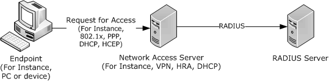
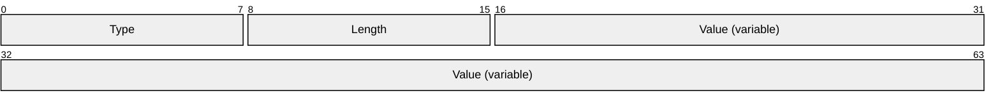
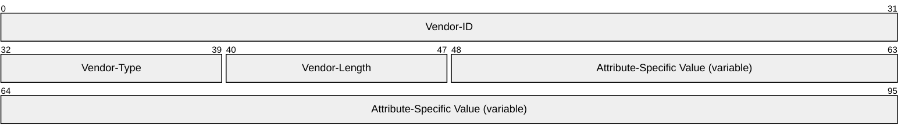
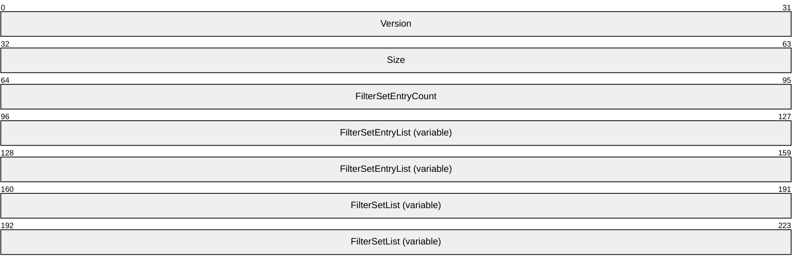
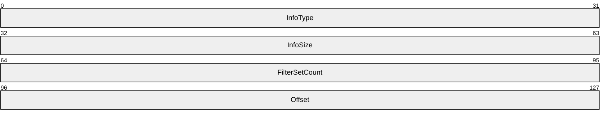
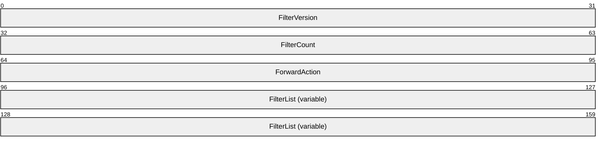
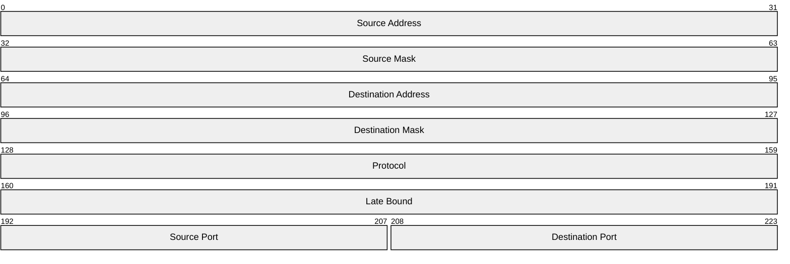
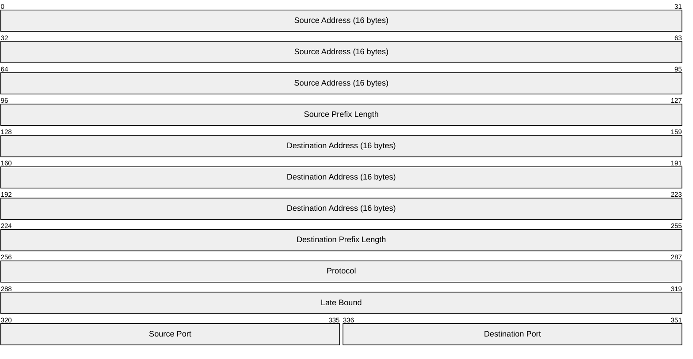
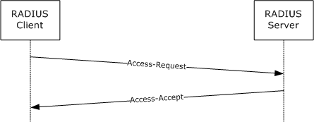

# [MS-RNAP]: Vendor-Specific RADIUS Attributes for Network Access Protection (NAP) Data Structure

Table of Contents

1 Introduction

- [1 Introduction](#Section_1)
  - [1.1 Glossary](#Section_1.1)
  - [1.2 References](#Section_1.2)
    - [1.2.1 Normative References](#Section_1.2.1)
    - [1.2.2 Informative References](#Section_1.2.2)
  - [1.3 Overview](#Section_1.3)
  - [1.4 Relationship to Other Protocols](#Section_1.4)
  - [1.5 Prerequisites/Preconditions](#Section_1.5)
  - [1.6 Applicability Statement](#Section_1.6)
  - [1.7 Versioning and Capability Negotiation](#Section_1.7)
  - [1.8 Vendor-Extensible Fields](#Section_1.8)
  - [1.9 Standards Assignments](#Section_1.9)

2 Messages

- [2 Messages](#Section_2)
  - [2.1 Transport](#Section_2.1)
  - [2.2 Message Syntax](#Section_2.2)
    - [2.2.1 Microsoft Vendor-Specific Attributes (VSAs)](#Section_2.2.1)
      - [2.2.1.1 MS-RAS-Client-Name](#Section_2.2.1.1)
      - [2.2.1.2 MS-RAS-Client-Version](#Section_2.2.1.2)
      - [2.2.1.3 MS-Quarantine-IPFilter](#Section_2.2.1.3)
      - [2.2.1.4 MS-Quarantine-Session-Timeout](#Section_2.2.1.4)
      - [2.2.1.5 MS-User-Security-Identity](#Section_2.2.1.5)
      - [2.2.1.6 MS-Identity-Type](#Section_2.2.1.6)
      - [2.2.1.7 MS-Service-Class](#Section_2.2.1.7)
      - [2.2.1.8 MS-Quarantine-User-Class](#Section_2.2.1.8)
      - [2.2.1.9 MS-Quarantine-State](#Section_2.2.1.9)
      - [2.2.1.10 MS-Quarantine-Grace-Time](#Section_2.2.1.10)
      - [2.2.1.11 MS-Network-Access-Server-Type](#Section_2.2.1.11)
      - [2.2.1.12 MS-AFW-Zone](#Section_2.2.1.12)
      - [2.2.1.13 MS-AFW-Protection-Level](#Section_2.2.1.13)
      - [2.2.1.14 MS-Machine-Name](#Section_2.2.1.14)
      - [2.2.1.15 MS-IPv6-Filter](#Section_2.2.1.15)
      - [2.2.1.16 MS-IPv4-Remediation-Servers](#Section_2.2.1.16)
      - [2.2.1.17 MS-IPv6-Remediation-Servers](#Section_2.2.1.17)
      - [2.2.1.18 Not-Quarantine-Capable](#Section_2.2.1.18)
      - [2.2.1.19 MS-Quarantine-SoH](#Section_2.2.1.19)
      - [2.2.1.20 MS-RAS-Correlation-ID](#Section_2.2.1.20)
      - [2.2.1.21 MS-Extended-Quarantine-State](#Section_2.2.1.21)
      - [2.2.1.22 HCAP-User-Groups](#Section_2.2.1.22)
      - [2.2.1.23 HCAP-Location-Group-Name](#Section_2.2.1.23)
      - [2.2.1.24 HCAP-User-Name](#Section_2.2.1.24)
      - [2.2.1.25 MS-User-IPv4-Address](#Section_2.2.1.25)
      - [2.2.1.26 MS-User-IPv6-Address](#Section_2.2.1.26)
      - [2.2.1.27 MS-RDG-Device-Redirection](#Section_2.2.1.27)
    - [2.2.2 Microsoft Vendor-Specific Values for RADIUS Attributes](#Section_2.2.2)
      - [2.2.2.1 Vendor-Specific Value for the Tunnel-Type RADIUS Attribute](#Section_2.2.2.1)

3 Protocol Details

- [3 Protocol Details](#Section_3)
  - [3.1 Common Details](#Section_3.1)
    - [3.1.1 Abstract Data Model](#Section_3.1.1)
    - [3.1.2 Timers](#Section_3.1.2)
    - [3.1.3 Initialization](#Section_3.1.3)
    - [3.1.4 Higher-Layer Triggered Events](#Section_3.1.4)
    - [3.1.5 Message Processing Events and Sequencing Rules](#Section_3.1.5)
      - [3.1.5.1 Windows Implementation of RADIUS Attributes](#Section_3.1.5.1)
      - [3.1.5.2 Microsoft VSA Support of RADIUS Messages](#Section_3.1.5.2)
      - [3.1.5.3 Processing RADIUS Attributes](#Section_3.1.5.3)
    - [3.1.6 Timer Events](#Section_3.1.6)
    - [3.1.7 Other Local Events](#Section_3.1.7)
  - [3.2 Server Details](#Section_3.2)
    - [3.2.1 Abstract Data Model](#Section_3.2.1)
    - [3.2.2 Timers](#Section_3.2.2)
    - [3.2.3 Initialization](#Section_3.2.3)
    - [3.2.4 Higher-Layer Triggered Events](#Section_3.2.4)
      - [3.2.4.1 Abstract Interface for Setting an SoHR](#Section_3.2.4.1)
    - [3.2.5 Message Processing Events and Sequencing Rules](#Section_3.2.5)
      - [3.2.5.1 Processing RADIUS Access-Request Messages](#Section_3.2.5.1)
        - [3.2.5.1.1 MS-RAS-Client-Name](#Section_3.2.5.1.1)
        - [3.2.5.1.2 MS-RAS-Client-Version](#Section_3.2.5.1.2)
        - [3.2.5.1.3 MS-User-Security-Identity](#Section_3.2.5.1.3)
        - [3.2.5.1.4 MS-Identity-Type](#Section_3.2.5.1.4)
        - [3.2.5.1.5 MS-Service-Class](#Section_3.2.5.1.5)
        - [3.2.5.1.6 MS-Network-Access-Server-Type](#Section_3.2.5.1.6)
        - [3.2.5.1.7 MS-Machine-Name](#Section_3.2.5.1.7)
        - [3.2.5.1.8 MS-Quarantine-SoH](#Section_3.2.5.1.8)
        - [3.2.5.1.9 MS-RAS-Correlation-ID](#Section_3.2.5.1.9)
        - [3.2.5.1.10 HCAP-User-Groups](#Section_3.2.5.1.10)
        - [3.2.5.1.11 HCAP-Location-Group-Name](#Section_3.2.5.1.11)
        - [3.2.5.1.12 HCAP-User-Name](#Section_3.2.5.1.12)
        - [3.2.5.1.13 MS-User-IPv4-Address](#Section_3.2.5.1.13)
        - [3.2.5.1.14 MS-User-IPv6-Address](#Section_3.2.5.1.14)
        - [3.2.5.1.15 Tunnel-Type](#Section_3.2.5.1.15)
      - [3.2.5.2 Creating RADIUS Access-Accept Messages](#Section_3.2.5.2)
        - [3.2.5.2.1 MS-Quarantine-IPFilter](#Section_3.2.5.2.1)
        - [3.2.5.2.2 MS-Quarantine-Session-Timeout](#Section_3.2.5.2.2)
        - [3.2.5.2.3 MS-Quarantine-User-Class](#Section_3.2.5.2.3)
        - [3.2.5.2.4 MS-Quarantine-State](#Section_3.2.5.2.4)
        - [3.2.5.2.5 MS-Quarantine-Grace-Time](#Section_3.2.5.2.5)
        - [3.2.5.2.6 MS-AFW-Zone](#Section_3.2.5.2.6)
        - [3.2.5.2.7 MS-AFW-Protection-Level](#Section_3.2.5.2.7)
        - [3.2.5.2.8 MS-IPv6-Filter](#Section_3.2.5.2.8)
        - [3.2.5.2.9 MS-IPv4-Remediation-Servers](#Section_3.2.5.2.9)
        - [3.2.5.2.10 MS-IPv6-Remediation-Servers](#Section_3.2.5.2.10)
        - [3.2.5.2.11 Not-Quarantine-Capable](#Section_3.2.5.2.11)
        - [3.2.5.2.12 MS-Quarantine-SoH](#Section_3.2.5.2.12)
        - [3.2.5.2.13 MS-Extended-Quarantine-State](#Section_3.2.5.2.13)
        - [3.2.5.2.14 MS-RDG-Device-Redirection](#Section_3.2.5.2.14)
    - [3.2.6 Timer Events](#Section_3.2.6)
    - [3.2.7 Other Local Events](#Section_3.2.7)
  - [3.3 Client Details](#Section_3.3)
    - [3.3.1 Abstract Data Model](#Section_3.3.1)
    - [3.3.2 Timers](#Section_3.3.2)
    - [3.3.3 Initialization](#Section_3.3.3)
    - [3.3.4 Higher-Layer Triggered Events](#Section_3.3.4)
      - [3.3.4.1 Abstract Interface for Sending an SoH](#Section_3.3.4.1)
    - [3.3.5 Message Processing Events and Sequencing Rules](#Section_3.3.5)
      - [3.3.5.1 Creating RADIUS Access-Request Messages](#Section_3.3.5.1)
        - [3.3.5.1.1 MS-RAS-Client-Name](#Section_3.3.5.1.1)
        - [3.3.5.1.2 MS-RAS-Client-Version](#Section_3.3.5.1.2)
        - [3.3.5.1.3 MS-User-Security-Identity](#Section_3.3.5.1.3)
        - [3.3.5.1.4 MS-Identity-Type](#Section_3.3.5.1.4)
        - [3.3.5.1.5 MS-Service-Class](#Section_3.3.5.1.5)
        - [3.3.5.1.6 MS-Network-Access-Server-Type](#Section_3.3.5.1.6)
        - [3.3.5.1.7 MS-Machine-Name](#Section_3.3.5.1.7)
        - [3.3.5.1.8 MS-Quarantine-SoH](#Section_3.3.5.1.8)
        - [3.3.5.1.9 MS-RAS-Correlation-ID](#Section_3.3.5.1.9)
        - [3.3.5.1.10 HCAP-User-Groups](#Section_3.3.5.1.10)
        - [3.3.5.1.11 HCAP-Location-Group-Name](#Section_3.3.5.1.11)
        - [3.3.5.1.12 HCAP-User-Name](#Section_3.3.5.1.12)
        - [3.3.5.1.13 MS-User-IPv4-Address](#Section_3.3.5.1.13)
        - [3.3.5.1.14 MS-User-IPv6-Address](#Section_3.3.5.1.14)
        - [3.3.5.1.15 Tunnel-Type](#Section_3.3.5.1.15)
      - [3.3.5.2 Processing RADIUS Access-Accept Messages](#Section_3.3.5.2)
        - [3.3.5.2.1 MS-Quarantine-IPFilter](#Section_3.3.5.2.1)
        - [3.3.5.2.2 MS-Quarantine-Session-Timeout](#Section_3.3.5.2.2)
        - [3.3.5.2.3 MS-Quarantine-User-Class](#Section_3.3.5.2.3)
        - [3.3.5.2.4 MS-Quarantine-State](#Section_3.3.5.2.4)
        - [3.3.5.2.5 MS-Quarantine-Grace-Time](#Section_3.3.5.2.5)
        - [3.3.5.2.6 MS-AFW-Zone](#Section_3.3.5.2.6)
        - [3.3.5.2.7 MS-AFW-Protection-Level](#Section_3.3.5.2.7)
        - [3.3.5.2.8 MS-IPv6-Filter](#Section_3.3.5.2.8)
        - [3.3.5.2.9 MS-IPv4-Remediation-Servers](#Section_3.3.5.2.9)
        - [3.3.5.2.10 MS-IPv6-Remediation-Servers](#Section_3.3.5.2.10)
        - [3.3.5.2.11 Not-Quarantine-Capable](#Section_3.3.5.2.11)
        - [3.3.5.2.12 MS-Quarantine-SoH](#Section_3.3.5.2.12)
        - [3.3.5.2.13 MS-Extended-Quarantine-State](#Section_3.3.5.2.13)
        - [3.3.5.2.14 MS-RDG-Device-Redirection](#Section_3.3.5.2.14)
      - [3.3.5.3 Processing RADIUS Access-Reject Messages](#Section_3.3.5.3)
    - [3.3.6 Timer Events](#Section_3.3.6)
    - [3.3.7 Other Local Events](#Section_3.3.7)

4 Protocol Examples

- [4 Protocol Examples](#Section_4)
  - [4.1 VPN Connection with RQC/RQS Quarantine](#Section_4.1)
  - [4.2 Health Registration Authority (HRA)](#Section_4.2)
  - [4.3 DHCP NAP](#Section_4.3)
  - [4.4 VPN NAP](#Section_4.4)

5 Security

- [5 Security](#Section_5)
  - [5.1 Security Considerations for Implementers](#Section_5.1)
  - [5.2 Index of Security Parameters](#Section_5.2)

6 Appendix A: Product Behavior

- [6 Appendix A: Product Behavior](#Section_6)

7 Change Tracking

- [7 Change Tracking](#Section_7)

For the legal notice and IP terms, see [LEGAL.md](../LEGAL.md).
Last updated: 6/1/2017.
See [Revision History](#revision-history) for full version history.

# 1 Introduction

The Remote Access Dial In User Service (RADIUS) Protocol (as specified in [[RFC2865]](https://go.microsoft.com/fwlink/?LinkId=90392)) provides authentication, authorization, and accounting (AAA) of [**endpoints**](#gt_endpoint) in scenarios such as wireless networking, dial-up networking, and virtual private networking (VPN).

RADIUS is an extensible protocol that allows vendors to provide specialized behavior through the use of [**vendor-specific attributes (VSAs)**](#gt_vendor-specific-attribute-vsa) ([RFC2865] section 5.26).

Sections 1.5, 1.8, 1.9, 2, and 3 of this specification are normative. All other sections and examples in this specification are informative.

## 1.1 Glossary

This document uses the following terms:

**Active Directory Domain Services (AD DS)**: A directory service (DS) implemented by a domain controller (DC). The DS provides a data store for objects that is distributed across multiple DCs. The DCs interoperate as peers to ensure that a local change to an object replicates correctly across DCs. For more information, see [MS-AUTHSOD](../MS-AUTHSOD/MS-AUTHSOD.md) section 1.1.1.5.2 and [MS-ADTS](../MS-ADTS/MS-ADTS.md). For information about product versions, see [MS-ADTS] section 1. See also Active Directory.

**Coordinated Universal Time (UTC)**: A high-precision atomic time standard that approximately tracks Universal Time (UT). It is the basis for legal, civil time all over the Earth. Time zones around the world are expressed as positive and negative offsets from UTC. In this role, it is also referred to as Zulu time (Z) and Greenwich Mean Time (GMT). In these specifications, all references to UTC refer to the time at UTC-0 (or GMT).

**Dynamic Host Configuration Protocol (DHCP) scope**: The full consecutive range of possible IP addresses for a network. Scopes typically define a single physical subnet on a network to which DHCP services are offered. Scopes also provide the primary way for the server to manage distribution and assignment of IP addresses and any related configuration parameters to clients on the network.

**Dynamic Host Configuration Protocol (DHCP) server**: A computer running a DHCP service that offers dynamic configuration of IP addresses and related information to DHCP-enabled clients.

**EAP**: See [**Extensible Authentication Protocol (EAP)**](#gt_extensible-authentication-protocol-eap).

**endpoint**: A client that is on a network and is requesting access to a [**network access server (NAS)**](#gt_network-access-server-nas).

**Extensible Authentication Protocol (EAP)**: A framework for authentication that is used to provide a pluggable model for adding authentication protocols for use in network access authentication, as specified in [[RFC3748]](https://go.microsoft.com/fwlink/?LinkId=90444).

**filter**: A configuration on a [**network access server (NAS)**](#gt_network-access-server-nas) that specifies the types of traffic that are acceptable for IP local host traffic. [**Filters**](#gt_filter) can block or allow traffic by IP address, IP protocol, TCP port, or User Datagram Protocol (UDP) port.

**globally unique identifier (GUID)**: A term used interchangeably with universally unique identifier (UUID) in Microsoft protocol technical documents (TDs). Interchanging the usage of these terms does not imply or require a specific algorithm or mechanism to generate the value. Specifically, the use of this term does not imply or require that the algorithms described in [[RFC4122]](https://go.microsoft.com/fwlink/?LinkId=90460) or [[C706]](https://go.microsoft.com/fwlink/?LinkId=89824) must be used for generating the [**GUID**](#gt_globally-unique-identifier-guid). See also universally unique identifier (UUID).

**health registration authority (HRA)**: The server-side component in the Health Certificate Enrollment Protocol. The [**HRA**](#gt_health-registration-authority-hra) is a registration authority (RA) that requests a health certificate from a certification authority (CA) upon validation of health.

**Internet Protocol security (IPsec)**: A framework of open standards for ensuring private, secure communications over Internet Protocol (IP) networks through the use of cryptographic security services. IPsec supports network-level peer authentication, data origin authentication, data integrity, data confidentiality (encryption), and replay protection. The Microsoft implementation of IPsec is based on standards developed by the Internet Engineering Task Force (IETF) IPsec working group.

**little-endian**: Multiple-byte values that are byte-ordered with the least significant byte stored in the memory location with the lowest address.

**Network Access Policy**: A set of rules that determines the behavior of a [**network access server (NAS)**](#gt_network-access-server-nas). The policy consists of a set of conditions that matches an access request to the policy and an access profile.

**Network Access Protection (NAP)**: A feature of an operating system that provides a platform for system health-validated access to private networks. [**NAP**](#gt_network-access-protection-nap) provides a way of detecting the health state of a network client that is attempting to connect to or communicate on a network, and limiting the access of the network client until the health policy requirements have been met. [**NAP**](#gt_network-access-protection-nap) is implemented through quarantines and health checks, as specified in [[TNC-IF-TNCCSPBSoH]](https://go.microsoft.com/fwlink/?LinkId=240054).

**network access server (NAS)**: A computer server that provides an access service for a user who is trying to access a network. A [**NAS**](#gt_network-access-server-nas) operates as a client of RADIUS. The [**RADIUS client**](#gt_radius-client) is responsible for passing user information to designated [**RADIUS servers**](#gt_radius-server) and then acting on the response returned by the [**RADIUS server**](#gt_radius-server). Examples of a NAS include: a VPN server, Wireless Access Point, 802.1x-enabled switch, or [**Network Access Protection (NAP)**](#gt_network-access-protection-nap) server.

**RADIUS attribute**: An abstract identifier for a value or set of values that describe elements of a RADIUS protocol exchange. RADIUS attributes describe the details of an endpoint's connection request and provides configuration data for a [**network access server (NAS)**](#gt_network-access-server-nas) to provide service to the endpoint.

**RADIUS client**: A client that is responsible for passing user information to designated RADIUS servers, and then acting on the response that is returned.

**RADIUS server**: A server that is responsible for receiving user connection requests, authenticating the user, and then returning all configuration information necessary for the client to deliver service to the user. A RADIUS server can act as a proxy client to other RADIUS servers or other kinds of authentication servers.

**Remote Access Service (RAS) server**: A type of [**network access server (NAS)**](#gt_network-access-server-nas) that provides modem dial-up or virtual private network (VPN) access to a network.

**Remote Desktop Gateway (RDG) server**: A gateway that enables authorized users to connect to remote computers on a corporate network from any computer with an Internet connection.

**RNAP**: Represents the collection of [**vendor-specific attributes (VSAs)**](#gt_vendor-specific-attribute-vsa) that are defined or described in this document. This term is used, for example, in discussions about whether a network entity is capable of processing the [**VSAs**](#gt_vendor-specific-attribute-vsa) defined in this document, as in "an RNAP-aware DHCP server".

**RNAP client**: A [**RADIUS client**](#gt_radius-client) that is capable of processing Microsoft-specific [**vendor-specific attributes (VSAs)**](#gt_vendor-specific-attribute-vsa).

**RNAP server**: A [**RADIUS server**](#gt_radius-server) that is capable of processing Microsoft-specific [**vendor-specific attributes (VSAs)**](#gt_vendor-specific-attribute-vsa).

**Routing and Remote Access Service (RRAS)**: A [**RADIUS client**](#gt_radius-client) that provisions routing and remote access service capabilities of a Windows operating system.

**routing and remote access service (RRAS) server**: A server implementation that is managed by the RRASM protocol and provides routing and remote access service functionality.

**security identifier (SID)**: An identifier for security principals that is used to identify an account or a group. Conceptually, the [**SID**](#gt_security-identifier-sid) is composed of an account authority portion (typically a domain) and a smaller integer representing an identity relative to the account authority, termed the relative identifier (RID). The [**SID**](#gt_security-identifier-sid) format is specified in [MS-DTYP](../MS-DTYP/MS-DTYP.md) section 2.4.2; a string representation of [**SIDs**](#gt_security-identifier-sid) is specified in [MS-DTYP] section 2.4.2 and [MS-AZOD](../MS-AZOD/MS-AZOD.md) section 1.1.1.2.

**statement of health (SoH)**: A collection of data generated by a system health entity, as specified in [TNC-IF-TNCCSPBSoH], which defines the health state of a machine. The data is interpreted by a Health Policy Server, which determines whether the machine is healthy or unhealthy according to the policies defined by an administrator.

**statement of health response (SoHR)**: A collection of data that represents the evaluation of the [**statement of health (SoH)**](#gt_statement-of-health-soh) according to network policies, as specified in [TNC-IF-TNCCSPBSoH].

**Unicode**: A character encoding standard developed by the Unicode Consortium that represents almost all of the written languages of the world. The [**Unicode**](#gt_unicode) standard [[UNICODE5.0.0/2007]](https://go.microsoft.com/fwlink/?LinkId=154659) provides three forms (UTF-8, UTF-16, and UTF-32) and seven schemes (UTF-8, UTF-16, UTF-16 BE, UTF-16 LE, UTF-32, UTF-32 LE, and UTF-32 BE).

**vendor-specific attribute (VSA)**: A RADIUS attribute ([RFC2865] section 5.26) whose Value field contains a vendor identifier, the vendor-attribute type, a length, and a vendor-defined value.

**MAY, SHOULD, MUST, SHOULD NOT, MUST NOT:** These terms (in all caps) are used as defined in [[RFC2119]](https://go.microsoft.com/fwlink/?LinkId=90317). All statements of optional behavior use either MAY, SHOULD, or SHOULD NOT.

## 1.2 References

Links to a document in the Microsoft Open Specifications library point to the correct section in the most recently published version of the referenced document. However, because individual documents in the library are not updated at the same time, the section numbers in the documents may not match. You can confirm the correct section numbering by checking the [Errata](http://msdn.microsoft.com/en-us/library/dn781092.aspx).

### 1.2.1 Normative References

We conduct frequent surveys of the normative references to assure their continued availability. If you have any issue with finding a normative reference, please contact [dochelp@microsoft.com](mailto:dochelp@microsoft.com). We will assist you in finding the relevant information.

[CM-HCAP] Cisco Systems and Microsoft Corporation, "Cisco Network Admission Control and Microsoft Network Access Protection Interoperability Architecture", [http://www.cisco.com/c/en/us/solutions/enterprise-networks/nac-microsoft-nap-interoperability-architecture/index.html](https://go.microsoft.com/fwlink/?LinkId=104241)

[IANA-ENT] Internet Assigned Numbers Authority, "Private Enterprise Numbers", January 2007, [http://www.iana.org/assignments/enterprise-numbers](https://go.microsoft.com/fwlink/?LinkId=89883)

[IANA-PROTO-NUM] IANA, "Protocol Numbers", February 2007, [http://www.iana.org/assignments/protocol-numbers](https://go.microsoft.com/fwlink/?LinkId=89889)

[MS-ADA2] Microsoft Corporation, "[Active Directory Schema Attributes M](../MS-ADA2/MS-ADA2.md)".

[MS-DTYP] Microsoft Corporation, "[Windows Data Types](../MS-DTYP/MS-DTYP.md)".

[MS-HCEP] Microsoft Corporation, "[Health Certificate Enrollment Protocol](../MS-HCEP/MS-HCEP.md)".

[MS-MSRP] Microsoft Corporation, "[Messenger Service Remote Protocol](../MS-MSRP/MS-MSRP.md)".

[MS-PEAP] Microsoft Corporation, "[Protected Extensible Authentication Protocol (PEAP)](../MS-PEAP/MS-PEAP.md)".

[RFC2119] Bradner, S., "Key words for use in RFCs to Indicate Requirement Levels", BCP 14, RFC 2119, March 1997, [http://www.rfc-editor.org/rfc/rfc2119.txt](https://go.microsoft.com/fwlink/?LinkId=90317)

[RFC2548] Zorn, G., "Microsoft Vendor-Specific RADIUS Attributes", RFC 2548, March 1999, [http://www.ietf.org/rfc/rfc2548.txt](https://go.microsoft.com/fwlink/?LinkId=90366)

[RFC2865] Rigney, C., Willens, S., Rubens, A., and Simpson, W., "Remote Authentication Dial In User Service (RADIUS)", RFC 2865, June 2000, [http://www.ietf.org/rfc/rfc2865.txt](https://go.microsoft.com/fwlink/?LinkId=90392)

[RFC2868] Zorn, G., Leifer, D., Rubens, A., Shriver, J., Holdrege, M., and Goyret, I., "RADIUS Attributes for Tunnel Protocol Support", RFC 2868, June 2000, [http://www.ietf.org/rfc/rfc2868.txt](https://go.microsoft.com/fwlink/?LinkId=90395)

[RFC3004] Stump, G., Droms, R., Gu, Y., Vyaghrapuri, R., Demirtjis, A., Beser, B., and Privat, J., "The User Class Option for DHCP", RFC 3004, June 2000, [http://www.ietf.org/rfc/rfc3004.txt](https://go.microsoft.com/fwlink/?LinkId=90402)

[RFC3162] Aboba, B., Zorn, G., and Mitton, D., "RADIUS and IPv6", RFC 3162, August 2001, [http://www.ietf.org/rfc/rfc3162.txt](https://go.microsoft.com/fwlink/?LinkId=90407)

[RFC5080] Nelson, D., and DeKoK, A., "Common Remote Authentication Dial In User Service (RADIUS) Implementation Issues and Suggested Fixes", RFC 5080, December 2007, [http://www.ietf.org/rfc/rfc5080.txt](https://go.microsoft.com/fwlink/?LinkId=120268)

[TNC-IF-TNCCSPBSoH] TCG, "TNC IF-TNCCS: Protocol Bindings for SoH", version 1.0, May 2007, [https://trustedcomputinggroup.org/tnc-if-tnccs-protocol-bindings-soh/](https://go.microsoft.com/fwlink/?LinkId=240054)

### 1.2.2 Informative References

[IEEE802.1X] Institute of Electrical and Electronics Engineers, "IEEE Standard for Local and Metropolitan Area Networks - Port-Based Network Access Control", December 2004, [http://ieeexplore.ieee.org/iel5/9828/30983/01438730.pdf](https://go.microsoft.com/fwlink/?LinkId=89910)

[MS-SSTP] Microsoft Corporation, "[Secure Socket Tunneling Protocol (SSTP)](../MS-SSTP/MS-SSTP.md)".

[MSDN-ANSI-CODEPAGE] Microsoft Corporation, "WideCharToMultiByte", 2006, [http://msdn.microsoft.com/en-us/library/aa450989.aspx](https://go.microsoft.com/fwlink/?LinkId=89953)

[MSFT-NAQC] Microsoft Corporation, "Network Access Quarantine Control in Windows Server 2003", 2004, [http://technet.microsoft.com/en-us/library/bb726973.aspx](https://go.microsoft.com/fwlink/?LinkId=90198)

[RFC1661] Simpson, W., Ed., "The Point-to-Point Protocol (PPP)", STD 51, RFC 1661, July 1994, [http://www.ietf.org/rfc/rfc1661.txt](https://go.microsoft.com/fwlink/?LinkId=90283)

[RFC2882] Mitton, D., Nortel Networks, "Network Access Servers Requirements: Extended RADIUS Practices", RFC 2882, July 2000, [http://www.ietf.org/rfc/rfc2882.txt](https://go.microsoft.com/fwlink/?LinkId=134196)

[RFC3579] Aboba, B. and Calhoun, P., "RADIUS (Remote Authentication Dial In User Service) Support For Extensible Authentication Protocol (EAP)", RFC 3579, September 2003, [http://www.ietf.org/rfc/rfc3579.txt](https://go.microsoft.com/fwlink/?LinkId=90435)

## 1.3 Overview

The Remote Authentication Dial-In User Service (RADIUS) Protocol, as specified in [[RFC2865]](https://go.microsoft.com/fwlink/?LinkId=90392), provides authentication, authorization, and accounting (AAA) of [**endpoints**](#gt_endpoint) in scenarios such as wireless networking, dial-up networking, and virtual private networking (VPN). This document specifies the Microsoft [**vendor-specific attributes (VSAs)**](#gt_vendor-specific-attribute-vsa) that are passed over RADIUS between the [**network access server (NAS)**](#gt_network-access-server-nas) and the [**RADIUS server**](#gt_radius-server) to authenticate and authorize connection requests, as well as to configure the level of network access provided by the NAS, and account for usage.

The following figure shows a common deployment model for the RADIUS Protocol.

Figure 1: Common RADIUS deployment model

A NAS provides network access to endpoints (for example, a client PC or device). A NAS can be a network infrastructure device, such as a switch or a wireless access point, or it can be a server, such as a VPN gateway or dial-up server.

Endpoints initiate communication with a NAS to establish connectivity with a network. A variety of protocols can be used to establish connectivity with a network, such as 802.1x (as specified in [[IEEE802.1X]](https://go.microsoft.com/fwlink/?LinkId=89910)) or Point-to-Point Protocol (PPP) (as specified in [[RFC1661]](https://go.microsoft.com/fwlink/?LinkId=90283)). The NAS then exchanges RADIUS messages with a RADIUS server to authenticate and authorize the endpoint's connectivity to the network. The RADIUS server is configured with policy to accept or reject the endpoint's connectivity request and to instruct the NAS regarding the network restrictions to enforce on the endpoint, if appropriate.

The RADIUS Protocol includes an extensibility mechanism that enables NAS vendors and RADIUS server vendors to expose features that are specific to their products through the use of vendor-specific attributes (VSAs), as specified in [RFC2865] section 5.26.

This document defines or otherwise describes the VSAs that are specific to Microsoft.

## 1.4 Relationship to Other Protocols

The [**VSAs**](#gt_vendor-specific-attribute-vsa) specified in this document rely on and are transported within the RADIUS protocol described in [[RFC2865]](https://go.microsoft.com/fwlink/?LinkId=90392).

Protocols between the client and the [**Network Access Protection (NAP)**](#gt_network-access-protection-nap) server (for example, PPP [[RFC1661]](https://go.microsoft.com/fwlink/?LinkId=90283), 802.1x [[IEEE802.1X]](https://go.microsoft.com/fwlink/?LinkId=89910), and Health Certificate Enrollment [MS-HCEP](../MS-HCEP/MS-HCEP.md)) relate to the Microsoft VSAs in the following ways:

- Unless otherwise noted, [**RADIUS attributes**](#gt_radius-attribute) are sent only between a [**RADIUS client**](#gt_radius-client) and a [**RADIUS server**](#gt_radius-server). However, some Microsoft RADIUS VSAs can be transported over the protocols between the [**endpoint**](#gt_endpoint) and the [**NAS**](#gt_network-access-server-nas) in addition to being transported over RADIUS. For example, the enrollment protocol transports the MS-AFW-Zone attribute, as specified in [MS-HCEP] section 2.2.2.2.
- The Microsoft RADIUS VSAs can affect the operation of the protocols between the endpoint and the NAS. For example, the [MS-Quarantine-Grace-Time](#Section_3.2.5.2.5) attribute sets a limit on the time that a client can remain connected through a particular NAS, regardless of the protocol between the client and the NAS.

## 1.5 Prerequisites/Preconditions

For the Microsoft [**VSAs**](#gt_vendor-specific-attribute-vsa) to be used, the RADIUS protocol described in [[RFC2865]](https://go.microsoft.com/fwlink/?LinkId=90392) and a set of [**Network Access Policies**](#gt_bb46d6b6-6834-4753-ba57-ce33f49a7b6e) are configured for use between a [**NAS**](#gt_network-access-server-nas) and a [**RADIUS server**](#gt_radius-server); specifically, an administrator is required to configure a RADIUS shared secret between a NAS and a RADIUS server.

## 1.6 Applicability Statement

The use of RADIUS [**VSAs**](#gt_vendor-specific-attribute-vsa) is applicable in those environments where the RADIUS protocol described in [[RFC2865]](https://go.microsoft.com/fwlink/?LinkId=90392) is used to authenticate and authorize network access requests.

## 1.7 Versioning and Capability Negotiation

None of the Microsoft RADIUS [**VSAs**](#gt_vendor-specific-attribute-vsa) described in this document affects the versioning or capability negotiation of the protocols they are transported over. Some of the Microsoft RADIUS VSAs described in this document might not be recognized by a particular type or model of [**NAS**](#gt_network-access-server-nas) - the behavior of a [**RADIUS client**](#gt_radius-client) encountering unknown attributes is described in [[RFC5080]](https://go.microsoft.com/fwlink/?LinkId=120268) section 2.5.

See the individual VSAs documented in section [2.2](#Section_2.2) for information about version fields, if any, that are used in each VSA.

## 1.8 Vendor-Extensible Fields

The Microsoft [**VSAs**](#gt_vendor-specific-attribute-vsa) themselves do not define any additional vendor-extensible fields.

## 1.9 Standards Assignments

| Parameter | Value | Reference |
| --- | --- | --- |
| RADIUS [**VSA**](#gt_vendor-specific-attribute-vsa) type | 0x1A | [[RFC2865]](https://go.microsoft.com/fwlink/?LinkId=90392), section 5.26 |
| SMI Network Management Private Enterprise Code for the Vendor ID field | 0x00000137 | [[IANA-ENT]](https://go.microsoft.com/fwlink/?LinkId=89883) |

# 2 Messages

This protocol references commonly used data types as defined in [MS-DTYP](../MS-DTYP/MS-DTYP.md).

## 2.1 Transport

The RADIUS Protocol, specified in [[RFC2865]](https://go.microsoft.com/fwlink/?LinkId=90392), defines the transport of RADIUS and associated attributes over UDP.

## 2.2 Message Syntax

The following sections contain information about the [**VSAs**](#gt_vendor-specific-attribute-vsa) that are defined in this document. These VSAs are used in RADIUS Access-Request and Access-Accept messages [[RFC2865]](https://go.microsoft.com/fwlink/?LinkId=90392) in the manner specified in sections [3.1.5.2](#Section_3.1.5.2), [3.2.5](#Section_3.2.5), and [3.3.5](#Section_3.3.5).

### 2.2.1 Microsoft Vendor-Specific Attributes (VSAs)

The RADIUS Protocol specification [[RFC2865]](https://go.microsoft.com/fwlink/?LinkId=90392) defines attribute type 0x1A as a [**VSA**](#gt_vendor-specific-attribute-vsa). This type was defined to allow vendors to extend the [**RADIUS attribute**](#gt_radius-attribute) set. For reference, the format of the standard RADIUS attribute is provided below.

When representing a VSA, the fields MUST be set as follows (for more details, see [RFC2865]).

**Type (1 byte):** An 8-bit unsigned integer that MUST be 0x1A, which indicates the type of the **Value** field as vendor-specific.

**Length (1 byte):** An 8-bit unsigned integer that MUST specify the sum of the lengths of an attribute's **Type**, **Length**, and **Value** fields, in bytes. For vendor-specific RADIUS attributes, the value MUST be at least 9 to account for the **Type**, **Length**, and **Value** fields. The RADIUS client SHOULD ignore the attribute if the value is less than 9.

**Value (variable):** For Microsoft vendor-specific RADIUS attributes, the value MUST be formatted as described in [RFC2865] section 5.26. For reference, the format is as follows.

**Vendor-ID (4 bytes):** A 32-bit unsigned integer in network byte order, the most significant 8 bits MUST be set to 0 and the remaining 24 bits MUST be set to the SMI code of the vendor taken from [[IANA-ENT]](https://go.microsoft.com/fwlink/?LinkId=89883). Microsoft VSAs MUST have the **Vendor-ID** field set to 311 (0x00000137).

**Vendor-Type (1 byte):** An 8-bit unsigned integer that MUST specify the VSA type contained in the **Attribute-Specific Value** field. Microsoft VSA vendor types MUST be set as specified in [[RFC2548]](https://go.microsoft.com/fwlink/?LinkId=90366) and in sections [2.2.1.1](#Section_3.2.5.1.1) through [2.2.1.27](#Section_2.2.1.27) of this specification.

**Vendor-Length (1 byte):** An 8-bit unsigned integer that MUST be set to 2 plus the length of **Attribute-Specific Value**. The RADIUS client SHOULD ignore the attribute if Vendor-Length is less than 3.

**Attribute-Specific Value (variable):** The value of the VSA specified in the **Vendor-Type** field. The format of the **Attribute-Specific Value** field for a given **Vendor-Type** MUST be set as specified in [RFC2548] and in sections 2.2.1.1 through 2.2.1.27 of this specification.

The attribute definitions in the following sections specify the specific parameters relevant to that extension.

#### 2.2.1.1 MS-RAS-Client-Name

MS-RAS-Client-Name is a [**VSA**](#gt_vendor-specific-attribute-vsa), as specified in section [2.2.1](#Section_2.2.1). It is used to specify the name of the [**endpoint**](#gt_endpoint) generating a request.

The fields of the **MS-RAS-Client-Name** VSA MUST be set as follows:

**Vendor-Type**: An 8-bit unsigned integer that MUST be set to 0x22 for **MS-RAS-Client-Name**.

**Vendor-Length**: An 8-bit unsigned integer that MUST be set to 2 added to the length of the **Attribute-Specific Value** field. Its value MUST be at least 3 and less than 36.

**Attribute-Specific Value**: This field MUST be the machine name of the endpoint that requests network access, sent in ASCII format, and MUST be null terminated. A valid character set includes the symbols ! @ # $ % ^ & ' ) ( . - _ { } ~ in addition to letters and numbers.<1>

For more details about MS-RAS-Client-Name, see sections [3.2.5.1.1](#Section_3.2.5.1.10) and [3.3.5.1.1](#Section_3.3.5.1.15).

#### 2.2.1.2 MS-RAS-Client-Version

MS-RAS-Client-Version is a [**VSA**](#gt_vendor-specific-attribute-vsa), as specified in section [2.2.1](#Section_2.2.1). It is used to specify the version of the [**endpoint**](#gt_endpoint) generating a request.

The fields of the MS-RAS-Client-Version vendor-specific attribute MUST be set as follows:

**Vendor-Type**: An 8-bit unsigned integer that MUST be set to 0x23 for MS-RAS-Client-Version.

**Vendor-Length**: An 8-bit unsigned integer that MUST be set to 2 added to the length of the **Attribute-Specific Value** field. Its value MUST be at least 3.

**Attribute-Specific Value**: This field MUST be the ASCII version string of a remote access client; this string MUST be in network byte order.<2>

For more details about MS-RAS-Client-Version, see sections [3.2.5.1.2](#Section_3.2.5.1.2) and [3.3.5.1.2](#Section_3.3.5.1.2).

#### 2.2.1.3 MS-Quarantine-IPFilter

MS-Quarantine-IPFilter is a [**VSA**](#gt_vendor-specific-attribute-vsa), as specified in section [2.2.1](#Section_2.2.1). It is used to specify the set of IP filters to be provisioned for the [**endpoint**](#gt_endpoint) associated with a RADIUS Access-Request (as specified in [[RFC2865]](https://go.microsoft.com/fwlink/?LinkId=90392)).

This attribute can be sent by a [**RADIUS server**](#gt_radius-server) to define the network-access scope of the endpoint. It is used only for IPv4 addresses. This attribute defines traffic filters to a [**NAS**](#gt_network-access-server-nas) for restricting access for a specific network-access connection. If multiple MS-Quarantine-IPFilter attributes are contained within a packet, they MUST be in order and they MUST be consecutive attributes in the packet. For the late bound field, this is used to allow a NAS to change a field in the filter after the connection with the endpoint is complete.

The fields of MS-Quarantine-IPFilter MUST be set as follows:

**Vendor-Type**: An 8-bit unsigned integer that MUST be set to 0x24 for MS-Quarantine-IPFilter.

**Vendor-Length**: An 8-bit unsigned integer that MUST be set to the length of the **Attribute-Specific Value** field plus 2. Its value MUST be at least 74 to specify at least 1 [**filter**](#gt_filter). The total length will depend on the number of filter sets and filters in each set.

**Attribute-Specific Value**: A list of IPv4 filter sets, defined as follows:

The usage of this attribute within Access-Request, Access-Accept, Access-Reject, Access-Challenge and Accounting-Request packets is defined in section [3.1.5.2](#Section_2). If multiple MS-Quarantine-IPFilter VSAs occur in a single RADIUS packet, the **Attribute-Specific Value** field from each MUST be concatenated in the order received to form the full MS-Quarantine-IPFilter value.

**Version (4 bytes):** A 32-bit unsigned integer in [**little-endian**](#gt_little-endian) byte order that MUST be set to 0x00000001. No other versions are defined. See section [3.1.5.3](#Section_3.1.5.3) for processing details.

**Size (4 bytes):** A 32-bit unsigned integer in little-endian byte order that MUST specify the size of the VSA field for this VSA, including the version, size, and subsequent filter set data. The size MUST be at least 72, so as to specify at least 1 filter. The total size will depend on the number of filter sets and filters in each set.

**FilterSetEntryCount (4 bytes):** A 32-bit unsigned integer in little-endian byte order that MUST specify the number of filter set entries. Its value MUST be greater than 0.

**FilterSetEntryList (variable):** A consecutive list of filter set entries, **FilterSetEntryCount** in number, each of which MUST be formatted as defined below.

**InfoType (4 bytes):** A 32-bit unsigned integer in little-endian order specifying the type of filters that are contained in the filter set list. The value MUST be one of the following.

| Value | Meaning |
| --- | --- |
| 0XFFFF0001 | Input filter: The filter MUST be applied to IP packets sent from the endpoint to the Network Access Server (NAS). |
| 0XFFFF0002 | Output filter: The filter MUST be applied to IP packets sent from the NAS to the endpoint. |
| 0XFFFF0009 | Site-to-site connection: IP traffic that matches this filter indicates to the NAS that a site-to-site connection MUST be connected and all IP packets matching this filter MUST be routed into the connection. |

**InfoSize (4 bytes):** A 32-bit unsigned integer in little-endian byte order that MUST specify the overall size, in bytes, of the list of filtersets specified by this filter set entry.

**FilterSetCount (4 bytes):** A 32-bit unsigned integer in little-endian byte order that MUST specify the number of filter sets in this entry. Its value MUST be greater than 0.

**Offset (4 bytes):** A 32-bit unsigned integer in little-endian byte order that MUST specify the offset of the start of the first filter set of this filter set entry within the **Attribute-Specific Value** of this VSA. Offset values are always multiples of 8 (in other words, a filter set MUST begin at an 8-octet aligned offset within the **Attribute-Specific Value**). To meet this requirement, any unused octets (holes) within the **Attribute-Specific Value** before or after a filter set MUST be set to 0 (in other words, padded), as necessary.

**FilterSetList (variable):** A consecutive list of filter sets equal in number to the value of **FilterSetCount**, each of which MUST be formatted as defined below.

**FilterVersion (4 bytes):** A 32-bit unsigned integer in little-endian byte order that MUST be set to 0x00000001. No other versions are defined. For processing details, see section 3.1.5.3.

**FilterCount (4 bytes):** A 32-bit unsigned integer in little-endian byte order that MUST specify the number of filters. Its value MUST be greater than 0.

**ForwardAction (4 bytes):** A 32-bit unsigned integer in little-endian byte order that MUST specify the action for the filter. Its value MUST be one of the following.

| Value | Meaning |
| --- | --- |
| 0x00000000 | Forward |
| 0x00000001 | Drop |

**FilterList (variable):** A consecutive list of filters, equal in number to the value of **FilterCount**, each of which MUST be formatted as defined below:

**Source Address (4 bytes):** A 32-bit unsigned integer in network byte order specifying the IPv4 source address for which the filter applies. A value of 0x0000000 in this field denotes ANY.

**Source Mask (4 bytes):** A 32-bit unsigned integer in network byte order specifying the subnet mask for the source address.

**Destination Address (4 bytes):** A 32-bit unsigned integer in network byte order specifying the IPv4 destination address for the filter. A value of 0x00000000 in this field denotes ANY.

**Destination Mask (4 bytes):** A 32-bit unsigned integer in network byte order specifying the subnet mask for the destination address in network byte order.

**Protocol (4 bytes):** A 32-bit unsigned integer in little-endian byte order specifying the protocol number (such as TCP or UDP) for the filter. Possible values include the following.

| Name | Value |
| --- | --- |
| ANY | 0x00000000 |
| ICMP | 0x00000001 |
| TCP | 0x00000006 |
| UDP | 0x00000011 |

The complete list is specified in [[IANA-PROTO-NUM]](https://go.microsoft.com/fwlink/?LinkId=89889).

**Late Bound (4 bytes):** A 32-bit unsigned integer in little-endian byte order specifying whether the fields in the filter is dynamically replaced by a NAS with values for specific endpoints. Its value MUST be at least one of the following or a bit-wise OR result of two or more such values.

| Value | Meaning |
| --- | --- |
| 0x00000000 | No Source or Destination Address or Mask Replacement |
| 0x00000001 | Source Address replaceable with a new address |
| 0x00000004 | Destination Address replaceable with a new address |
| 0x00000010 | Source Address Mask replaceable with a new Mask |
| 0x00000020 | Destination Address Mask replaceable with a new Mask |

**Source Port (2 bytes):** If the Protocol is TCP or UDP, this MUST be a 16-bit unsigned integer in network byte order that specifies a port number for the corresponding protocol. If the Protocol is ICMP or ICMPv6, this MUST be a 16-bit unsigned integer in little-endian byte order that specifies a corresponding type indicator for ICMP or ICMPv6. For all other protocol values, this MUST be set to 0 (byte order does not matter).

**Destination Port (2 bytes):** If the Protocol is TCP or UDP, this MUST be a 16-bit unsigned integer in network byte order that specifies a port number for the corresponding protocol. If the Protocol is ICMP or ICMPv6, this MUST be a 16-bit unsigned integer in little-endian byte order that specifies a corresponding code indicator for ICMP or ICMPv6. For all other protocol values, this MUST be set to 0 (byte order does not matter).

For more details about MS-Quarantine-IPFilter, see sections [3.2.5.2.1](#Section_3.2.5.2.12) and [3.3.5.2.1](#Section_3.3.5.2.12).

#### 2.2.1.4 MS-Quarantine-Session-Timeout

MS-Quarantine-Session-Timeout is a [**VSA**](#gt_vendor-specific-attribute-vsa), as specified in section [2.2.1](#Section_2.2.1). It is used to specify a timeout value used by a [**Routing and Remote Access Service (RRAS)**](#gt_routing-and-remote-access-service-rras) server.

The fields of MS-Quarantine-Session-Timeout MUST be set as follows:

**Vendor-Type**: An 8-bit unsigned integer that MUST be set to 0x25.

**Vendor-Length**: An 8-bit unsigned integer that MUST be set to 6.

**Attribute-Specific Value**: A 32-bit unsigned integer in network byte order that MUST contain the time in seconds that a restricted VPN connection can remain in a restricted state before being disconnected.

For more details about MS-Quarantine-Session-Timeout, see sections [3.2.5.2.2](#Section_3.2.5.2.2) and [3.3.5.2.2](#Section_3.3.5.2.2).

#### 2.2.1.5 MS-User-Security-Identity

MS-User-Security-Identity is a [**VSA**](#gt_vendor-specific-attribute-vsa), as specified in section [2.2.1](#Section_2.2.1). It is used to specify the [**security-identifier (SID)**](#gt_security-identifier-sid), as defined in [MS-DTYP](../MS-DTYP/MS-DTYP.md) section 2.4.2, of the user requesting access.

The fields of MS-User-Security-Identity MUST be set as follows:

**Vendor-Type**: An 8-bit unsigned integer that MUST be set to 0x28 for MS-User-Security-Identity.

**Vendor-Length**: An 8-bit unsigned integer that MUST be set to 2 plus the length of the **Attribute-Specific Value** field. Its value MUST be at least 3.

**Attribute-Specific Value**: This field MUST contain the account SID of the user requesting access in the format of a binary SID used to authenticate a remote access client.

#### 2.2.1.6 MS-Identity-Type

MS-Identity-Type is a [**VSA**](#gt_vendor-specific-attribute-vsa), as specified in section [2.2.1](#Section_2.2.1). It is used to specify that the [**RADIUS server**](#gt_radius-server) MUST process access authorization based on a machine health-check only.

The fields of MS-Identity-Type MUST be set as follows:

**Vendor-Type**: An 8-bit unsigned integer that MUST be set to 0x29.

**Vendor-Length**: An 8-bit unsigned integer that MUST be set to 6.

**Attribute-Specific Value**: A 32-bit unsigned integer in network byte order that MUST contain the following value.

| Value | Meaning |
| --- | --- |
| 0x00000001 | Indicates to the RADIUS server that this access request message is for a machine health check only and not for authentication. |

For more details about MS-Identity-Type, see sections [3.2.5.1.4](#Section_3.2.5.1.4) and [3.3.5.1.4](#Section_3.3.5.1.4).

#### 2.2.1.7 MS-Service-Class

MS-Service-Class is a [**VSA**](#gt_vendor-specific-attribute-vsa), as specified in section [2.2.1](#Section_2.2.1). It is used to specify which group of [**Dynamic Host Configuration Protocol (DHCP) scopes**](#gt_dynamic-host-configuration-protocol-dhcp-scope) will supply an IP address to the [**endpoint**](#gt_endpoint) requesting access.

The fields of MS-Service-Class MUST be set as follows:

**Vendor-Type**: An 8-bit unsigned integer that MUST be set to 0x2A.

**Vendor-Length**: An 8-bit unsigned integer that MUST be set to 2 plus the length of the **Attribute-Specific Value** field. Its value MUST be at least 3.

**Attribute-Specific Value**: The name of a group of DHCP scopes that correspond to the endpoint requesting access. This name string MUST be sent as characters using the code page of the current system (see [[MSDN-ANSI-CODEPAGE]](https://go.microsoft.com/fwlink/?LinkId=89953)). This field MUST only be used when the [**RADIUS client**](#gt_radius-client) is a [**Dynamic Host Configuration Protocol (DHCP) server**](#gt_dynamic-host-configuration-protocol-dhcp-server).

For more details about MS-Service-Class, see sections [3.2.5.1.5](#Section_3.2.5.1.5) and [3.3.5.1.5](#Section_3.3.5.1.5).

#### 2.2.1.8 MS-Quarantine-User-Class

MS-Quarantine-User-Class is a [**VSA**](#gt_vendor-specific-attribute-vsa), as specified in section [2.2.1](#Section_2.2.1). It is used to carry the name of a special DHCP user class, as specified in [[RFC3004]](https://go.microsoft.com/fwlink/?LinkId=90402), called [**NAP**](#gt_network-access-protection-nap) user class.

The fields of MS-Quarantine-User-Class MUST be set as follows:

**Vendor-Type**: An 8-bit unsigned integer that MUST be set to 0x2C.

**Vendor-Length**: An 8-bit unsigned integer that MUST be set to 2 plus the length of the **Attribute-Specific Value** field. RADIUS client SHOULD ignore the attribute if Vendor-Length is less than 3.

**Attribute-Specific Value**: This field MUST contain the name of the DHCP user class to be assigned to the [**endpoint**](#gt_endpoint) that is requesting access from a [**DHCP server**](#gt_dynamic-host-configuration-protocol-dhcp-server). The name MUST be sent in ASCII characters with the code page to be the current system Windows ANSI code page (see [[MSDN-ANSI-CODEPAGE]](https://go.microsoft.com/fwlink/?LinkId=89953)) in ANSI format (that is, the string is sent with ANSI code page). For more details about the DHCP option for user class, see [RFC3004].

For more details about MS-Quarantine-User-Class, see sections [3.2.5.2.3](#Section_3.2.5.2.3) and [3.3.5.2.3](#Section_3.3.5.2.3).

#### 2.2.1.9 MS-Quarantine-State

MS-Quarantine-State is a [**VSA**](#gt_vendor-specific-attribute-vsa), as specified in section [2.2.1](#Section_2.2.1). It is used to specify the target restrictive state of the [**endpoint**](#gt_endpoint).

The fields of MS-Quarantine-State MUST be set as follows:

**Vendor-Type**: An 8-bit unsigned integer that MUST be set to 0x2D.

**Vendor-Length**: An 8-bit unsigned integer that MUST be set to 6.

**Attribute-Specific Value**: A 32-bit unsigned integer in network byte order that MUST specify the network access level that the [**RADIUS server**](#gt_radius-server) authorizes for the endpoint. It MUST be one for the following values.

| Value | Meaning |
| --- | --- |
| 0x00000000 | Full access: The endpoint is given full access to the network. |
| 0x00000001 | Restricted: The endpoint is given limited access to the network. |
| 0x00000002 | On probation: The endpoint is given full access within a limited time period. |

For more details about MS-Quarantine-State, see sections [3.2.5.2.4](#Section_3.2.5.2.4) and [3.3.5.2.4](#Section_3.3.5.2.4).

#### 2.2.1.10 MS-Quarantine-Grace-Time

MS-Quarantine-Grace-Time is a [**VSA**](#gt_vendor-specific-attribute-vsa), as specified in section [2.2.1](#Section_2.2.1). It is used to specify the amount of time a host has to conform to network policy.

The fields of MS-Quarantine-Grace-Time MUST be set as follows:

**Vendor-Type**: An 8-bit unsigned integer that MUST be set to 0x2E.

**Vendor-Length**: An 8-bit unsigned integer that MUST be set to 6.

**Attribute-Specific Value**: A 32-bit unsigned integer in network byte order that MUST specify the number of seconds since January 1, 1970 [**Coordinated Universal Time (UTC)**](#gt_coordinated-universal-time-utc) that the [**RADIUS server**](#gt_radius-server) authorizes the [**endpoint**](#gt_endpoint) to have full network access. After this time, the endpoint is expected to be authorized to have only restricted access.

For more details about MS-Quarantine-Grace-Time, see sections [3.2.5.2.5](#Section_3.2.5.2.5) and [3.3.5.2.5](#Section_3.3.5.2.5).

#### 2.2.1.11 MS-Network-Access-Server-Type

MS-Network-Access-Server-Type is a [**VSA**](#gt_vendor-specific-attribute-vsa), as specified in section [2.2.1](#Section_2.2.1). It is used to specify the type of the network access server making the request.

The fields of MS-Network-Access-Server-Type MUST be set as follows:

**Vendor-Type**: An 8-bit unsigned integer that MUST be set to 0x2F.

**Vendor-Length**: An 8-bit unsigned integer that MUST be set to 6.

**Attribute-Specific Value**: A 32-bit unsigned integer in network byte order that MUST indicate the type of the [**NAS**](#gt_network-access-server-nas). The value MUST be interpreted in accordance with the following table:

| Value | Meaning |
| --- | --- |
| 0x00000000 | Unspecified |
| 0x00000001 | Terminal Server Gateway |
| 0x00000002 | [**Remote Access Service (RAS) server**](#gt_remote-access-service-ras-server) (VPN or dial-in) |
| 0x00000003 | [**DHCP server**](#gt_dynamic-host-configuration-protocol-dhcp-server) |
| 0x00000005 | [**Health Registration Authority (HRA)**](#gt_health-registration-authority-hra) |
| 0x00000006 | Host Credential Authorization Protocol (HCAP) server |
| All Other Values | A tag value used to identify applicable network access policies on the [**RADIUS server**](#gt_radius-server). |

For more details about MS-Network-Access-Server-Type, see sections [3.2.5.1.6](#Section_3.2.5.1.6) and [3.3.5.1.6](#Section_3.3.5.1.6).

#### 2.2.1.12 MS-AFW-Zone

MS-AFW-Zone is a [**VSA**](#gt_vendor-specific-attribute-vsa), as specified in section [2.2.1](#Section_2.2.1). When a [**network access server (NAS)**](#gt_network-access-server-nas) that understands this attribute receives it, it SHOULD provide it to the [**endpoint**](#gt_endpoint) that is requesting access (for example, secure zone, boundary zone, or quarantine zone), to be used as a hint for dynamic selection of a preconfigured [**Internet Protocol security (IPsec)**](#gt_internet-protocol-security-ipsec) policy by the endpoint.

The fields of MS-AFW-Zone MUST be set as follows:

**Vendor-Type**: An 8-bit unsigned integer that MUST be set to 0x30.

**Vendor-Length**: An 8-bit unsigned integer that MUST be set to 6.

**Attribute-Specific Value**: A 32-bit unsigned integer in network byte order that MUST indicate the protection level that the [**RADIUS server**](#gt_radius-server) authorizes for the endpoint. It MUST be set to one of the following values.

| Value | Meaning |
| --- | --- |
| 0x00000001 | Indicates that the endpoint SHOULD apply an IPsec policy that can require encryption (a boundary policy). |
| 0x00000002 | Indicates that the endpoint SHOULD apply an IPsec policy that does not require encryption (an unprotected policy). |
| 0x00000003 | Indicates that the endpoint SHOULD apply an IPsec policy that does require encryption (a protected policy). |

For more details about MS-AFW-Zone, see sections [3.2.5.2.6](#Section_3.2.5.2.6) and [3.3.5.2.6](#Section_3.3.5.2.6).

#### 2.2.1.13 MS-AFW-Protection-Level

MS-AFW-Protection-Level is a [**VSA**](#gt_vendor-specific-attribute-vsa), as specified in section [2.2.1](#Section_2.2.1). It is used as a hint for dynamic selection of a preconfigured [**IPsec**](#gt_internet-protocol-security-ipsec) policy by the [**endpoint**](#gt_endpoint) requesting access.

The fields of MS-AFW-Protection-Level MUST be set as follows:

**Vendor-Type**: An 8-bit unsigned integer that MUST be set to 0x31.

**Vendor-Length**: An 8-bit unsigned integer that MUST be set to 6.

**Attribute-Specific Value**: A 32-bit unsigned integer in network byte order that MUST indicate the protection level that the [**RADIUS server**](#gt_radius-server) authorizes for the endpoint. It MUST be set to one of the following values.

| Value | Meaning |
| --- | --- |
| 0x00000001 | Indicates that the certificate payload specified in the [MS-HCEP](../MS-HCEP/MS-HCEP.md) response can be used for signing data. |
| 0x00000002 | Indicates that the certificate payload in the HCEP response can be used for signing and encrypting data. |

For more information about MS-AFW-Protection-Level, see sections [3.2.5.2.7](#Section_3.2.5.2.7) and [3.3.5.2.7](#Section_3.3.5.2.7).

#### 2.2.1.14 MS-Machine-Name

MS-Machine-Name is a [**VSA**](#gt_vendor-specific-attribute-vsa), as specified in section [2.2.1](#Section_2.2.1). It is used to communicate the machine name of the [**endpoint**](#gt_endpoint) requesting network access.

The fields of MS-Machine-Name MUST be set as follows:

**Vendor-Type**: An 8-bit unsigned integer that MUST be set to 0x32.

**Vendor-Length**: An 8-bit unsigned integer that MUST be set to the length of the **Attribute-Specific Value** field plus 2. Its value MUST be at least 3.

**Attribute-Specific Value**: An octet string containing characters from Windows ANSI code page (see [[MSDN-ANSI-CODEPAGE]](https://go.microsoft.com/fwlink/?LinkId=89953)) in ANSI format and MUST specify the machine name of the endpoint requesting access.

For more details about MS-Machine-Name, see sections [3.2.5.1.7](#Section_3.2.5.1.7) and [3.3.5.1.7](#Section_3.3.5.1.7).

#### 2.2.1.15 MS-IPv6-Filter

MS-IPv6-Filter is a [**VSA**](#gt_vendor-specific-attribute-vsa), as specified in section [2.2.1](#Section_2.2.1). It is used to limit the inbound and/or outbound access of the [**endpoint**](#gt_endpoint).

This attribute can be sent by a [**RADIUS server**](#gt_radius-server) to define the network access scope of the endpoint. It is used only for IPv6 addresses and MS-Filter; [[RFC2548]](https://go.microsoft.com/fwlink/?LinkId=90366) VSA is the corresponding attribute for IPv4 addresses. The structure of MS-Filter is identical to the structure of [MS-Quarantine-IPFilter](#Section_3.2.5.2.1), as specified in section 2.2.1.3. <3> This attribute defines traffic filters to a [**NAS**](#gt_network-access-server-nas) for restricting access for a specific network access connection. If multiple MS-IPv6-Filter attributes are contained within a packet, they MUST be in order and they MUST be consecutive attributes in the packet.

The fields of MS-IPv6-Filter MUST be set as follows:

**Vendor-Type**: An 8-bit unsigned integer that MUST be set to 0x33.

**Vendor-Length**: An 8-bit unsigned integer that MUST be set to the length of the **Attribute-Specific Value** field plus 2. Its value MUST be at least 98, to specify a minimum of 1 filter. The total length will depend on the number of [**filter**](#gt_filter) sets and filters in each set.

**Attribute-Specific Value**: A list of IPv6 filter sets, defined as follows.

The usage of this attribute within Access-Request, Access-Accept, Access-Reject, Access-Challenge and Accounting-Request packets is defined in section [3.1.5.2](#Section_2). If multiple MS-IPv6-Filter attributes occur in a single RADIUS packet, the **Attribute-Specific Value** field from each MUST be concatenated in the order received to form the full MS-IPv6-Filter value.

**Version (4 bytes):** A 32-bit unsigned integer in network byte order that MUST be set to 0x00000001. No other versions are defined. For processing details, see section [3.1.5.3](#Section_3.1.5.3).

**Size (4 bytes):** A 32-bit unsigned integer in network byte order that MUST specify the size of the **Attribute-Specific Value** field for this VSA, including the version, size, and subsequent filter set data. The size MUST be at least 96, so as to specify at least one filter. The total size depends on the number of filter sets and filters in each set.

**FilterSetEntryCount (4 bytes):** A 32-bit unsigned integer in network byte order that MUST specify the number of filter set entries. Its value MUST be greater than 0.

**FilterSetEntryList (variable):** A list of consecutive filter set entries, equal in number to the value of **FilterSetEntryCount**, each of which MUST be formatted as defined below.

**InfoType (4 bytes):** A 32-bit unsigned integer in network byte order specifying the type of filters that are contained in the filter set list. The value MUST be one of the following.

| Value | Meaning |
| --- | --- |
| 0XFFFF0011 | Input filter - The filter NAS MUST be applied to IP packets sent from the endpoint to the NAS. |
| 0XFFFF0012 | Output filter - The filter MUST be applied to IP packets sent from the NAS to the endpoint. |

**InfoSize (4 bytes):** A 32-bit unsigned integer in network byte order specifying the overall size, in bytes, of the list of filter sets specified by this filter set entry.

**FilterSetCount (4 bytes):** A 32-bit unsigned integer in network byte order specifying the overall size, in bytes, of the list of filter sets specified by this filter set entry.

**Offset (4 bytes):** A 32-bit unsigned integer in network byte order specifying the offset of start of the first filter set of this filter set entry within the **Attribute-Specific Value** of this VSA. Offset values are always multiples of 8, and a filter set MUST therefore begin at an 8-octet aligned offset within the **Attribute-Specific Value**. To meet this requirement, any unused octets (holes) within the **Attribute-Specific Value** before or after a filter set MUST be set to 0 (padded) as necessary.

**FilterSetList (variable):** A list of consecutive filter sets, equal in number to the value of **FilterSetCount**, each of which MUST be formatted as defined below.

**FilterVersion (4 bytes):** A 32-bit unsigned integer in network byte order that MUST be set to 0x00000001. No other versions are defined. For processing details, see section 3.1.5.3.

**FilterCount (4 bytes):** A 32-bit unsigned integer in network byte order specifying the number of filters. Its value MUST be greater than 0.

**ForwardAction (4 bytes):** A 32-bit unsigned integer in network byte order specifying the action for the filter. Its value MUST be one of the following.

| Value | Meaning |
| --- | --- |
| 0x00000000 | Forward |
| 0x00000001 | Drop |

**FilterList (variable):** A list of consecutive filters, equal in number to the value of **FilterCount**, each of which MUST be formatted as defined below.

**Source Address (16 bytes):** A 128-bit unsigned integer in network byte order specifying the IPv6 source address for which the filter applies. A value of 0x00000000 in this field MUST denotes ANY.

**Source Prefix Length (4 bytes):** A 32-bit unsigned integer in network byte order specifying the prefix length for the source address. If this value is set to zero, the NAS MUST use ANY as a source address.

**Destination Address (16 bytes):** A 128-bit unsigned integer in network byte order that specifies the IPv6 destination address for the filter. A value of zero in this field denotes ANY.

**Destination Prefix Length (4 bytes):** A 32-bit unsigned integer in network byte order that specifies the Prefix Length for the destination address. If this value is set to zero, the NAS MUST use ANY as a Destination address.

**Protocol (4 bytes):** A 32-bit unsigned integer in network byte order specifying the protocol number (such as TCP or UDP) for the filter. Possible values include the following.

| Name | Value |
| --- | --- |
| ANY | 0x00000000 |
| ICMP | 0x00000001 |
| ICMPv6 | 0x0000003A |
| TCP | 0x00000006 |
| UDP | 0x00000011 |

**Late Bound (4 bytes):** A 32-bit unsigned integer in network byte order that indicates if the fields in the filter MAY be dynamically replaced by the NAS with values for specific endpoints. Its value MUST be at least one of the following or a bit-wise OR of two or more such values.

| Value | Meaning |
| --- | --- |
| 0x00000000 | No source or destination address or mask replacement |
| 0x00000001 | Source address replaceable with a new address |
| 0x00000004 | Destination address replaceable with a new address |
| 0x00000010 | Source address mask replaceable with a new mask |
| 0x00000020 | Destination address mask replaceable with a new mask |

**Source Port (2 bytes):** If the Protocol is TCP or UDP, this MUST be a 16-bit unsigned integer in network byte order that specifies a port number for the corresponding protocol. If the Protocol is ICMP or ICMPv6, this MUST be a 16-bit unsigned integer in network byte order that specifies a corresponding type indicator for ICMP or ICMPv6. For all other protocol values, this MUST be set to 0 (byte order does not matter).

**Destination Port (2 bytes):** If the Protocol is TCP or UDP, this MUST be a 16-bit unsigned integer in network byte order that specifies a port number for the corresponding protocol. If the Protocol is ICMP or ICMPv6, this MUST be a 16-bit unsigned integer in network byte order that specifies a corresponding code indicator for ICMP or ICMPv6. For all other protocol values, this MUST be set to 0 (byte order does not matter).

For more details about MS-IPv6-Filter, see sections [3.2.5.2.8](#Section_3.2.5.2.8) and [3.3.5.2.8](#Section_3.3.5.2.8).

#### 2.2.1.16 MS-IPv4-Remediation-Servers

MS-IPv4-Remediation-Servers is a [**VSA**](#gt_vendor-specific-attribute-vsa), as specified in section [2.2.1](#Section_2.2.1). This value contains a list of servers that are reachable by an [**endpoint**](#gt_endpoint) whose access is restricted, so that the endpoint can remediate itself.

The fields of MS-IPv4-Remediation-Servers MUST be set as follows:

**Vendor-Type**: An 8-bit unsigned integer that MUST be set to 0x34.

**Vendor-Length**: An 8-bit unsigned integer that MUST be set to the length of the **Attribute-Specific Value** field plus 2. Only values greater than 6 whose value modulo 4 equals 3 are valid.

**Attribute-Specific Value**: An 8-bit unsigned integer, which is reserved and which MUST be set to 0 by the [**RADIUS server**](#gt_radius-server), followed by a list of IPv4 addresses that the RADIUS server authorizes a restricted endpoint to access. The list MUST be formatted as a sequential series of 4-octet values. Each of the four-octet values MUST be an IPv4 address in network byte order.

For more details about MS-IPv4-Remediation-Servers, see sections [3.2.5.2.9](#Section_3.2.5.2.9) and [3.3.5.2.9](#Section_3.3.5.2.9).

#### 2.2.1.17 MS-IPv6-Remediation-Servers

MS-IPv6-Remediation-Servers is a [**VSA**](#gt_vendor-specific-attribute-vsa), as specified in section [2.2.1](#Section_2.2.1). This value contains a list of servers that are reachable by an [**endpoint**](#gt_endpoint) access whose access is restricted, so that the endpoint can remediate itself.

The fields of MS-IPv6-Remediation-Servers MUST be set as follows:

**Vendor-Type**: An 8-bit unsigned integer that MUST be set to 0x35.

**Vendor-Length**: An 8-bit unsigned integer that MUST be set to 2 plus the length of the **Attribute-Specific Value** field. Only values greater than 18 whose value modulo 16 equals 3 are valid.

**Attribute-Specific Value**: An 8-bit unsigned integer, which is reserved and which MUST be set to 0 by the [**RADIUS server**](#gt_radius-server), followed by a list of IPv6 addresses that the RADIUS server authorizes a restricted endpoint to access. The list MUST be formatted as a sequential series of 16-octet values. Each of the 16-octet values MUST be an IPv6 address in network byte order.

For more details about MS-IPv6-Remediation-Servers, see sections [3.2.5.2.10](#Section_3.2.5.2.10) and [3.3.5.2.10](#Section_3.3.5.2.10).

#### 2.2.1.18 Not-Quarantine-Capable

Not-Quarantine-Capable is a [**VSA**](#gt_vendor-specific-attribute-vsa) used by a RADIUS client to specify whether an [**endpoint**](#gt_endpoint) sent a [**statement of health (SoH)**](#gt_statement-of-health-soh), as specified in section [2.2.1](#Section_2.2.1).

The fields of Not-Quarantine-Capable MUST be set as follows:

**Vendor-Type**: An 8-bit unsigned integer that MUST be set to 0x36.

**Vendor-Length**: An 8-bit unsigned integer that MUST be set to 6.

**Attribute-Specific Value**: A 32-bit unsigned integer in network byte order that MUST indicate whether the endpoint is capable of reporting its state to the [**NAS**](#gt_network-access-server-nas). It MUST be one of the following values.

| Value | Meaning |
| --- | --- |
| 0x00000001 | The endpoint did not send a SoH. |
| 0x00000000 | The endpoint sent a SoH. |

For more details about Not-Quarantine-Capable, see sections [3.2.5.2.11](#Section_3.2.5.2.11) and [3.3.5.2.11](#Section_3.3.5.2.11).

#### 2.2.1.19 MS-Quarantine-SoH

MS-Quarantine-SoH is a [**VSA**](#gt_vendor-specific-attribute-vsa), as specified in section [2.2.1](#Section_2.2.1). It is used to carry Statement of Health information (as specified in [[TNC-IF-TNCCSPBSoH]](https://go.microsoft.com/fwlink/?LinkId=240054) section 3.5).

The fields of MS-Quarantine-SoH MUST be set as follows:

**Vendor-Type**: An 8-bit unsigned integer that MUST be set to 0x37.

**Vendor-Length**: An 8-bit unsigned integer that MUST be set to 2 plus the length of the **Attribute-Specific Value** field. Its value MUST be at least 12.

**Attribute-Specific Value**: This field MUST be formatted as an SoH, as specified in [TNC-IF-TNCCSPBSoH].

For more details about MS-Quarantine-SoH, see sections [3.2.5.1.8](#Section_3.2.5.1.8), [3.2.5.2.12](#Section_3.2.5.2.12), [3.3.5.1.8](#Section_3.3.5.1.8), and [3.3.5.2.12](#Section_3.3.5.2.12).

#### 2.2.1.20 MS-RAS-Correlation-ID

The MS-RAS-Correlation-ID is a [**VSA**](#gt_vendor-specific-attribute-vsa), as specified in section [2.2.1](#Section_2.2.1). It is used by the [**NAS**](#gt_network-access-server-nas) to send an identifier, which is used for the correlation of log events, to the [**RADIUS server**](#gt_radius-server).

The fields of MS-RAS-Correlation-ID MUST be set as follows:

**Vendor-Type**: An 8-bit unsigned integer that MUST be set to 0x38.

**Vendor-Length**: An 8-bit unsigned integer that MUST be set to the length of the [**globally unique identifier (GUID)**](#gt_globally-unique-identifier-guid) string in the **Attribute-Specific Value** plus 2.

**Attribute-Specific Value**: A 128-bit unsigned integer that SHOULD specify a GUID and be represented using a curly braced GUID string, as specified in [MS-DTYP](../MS-DTYP/MS-DTYP.md) section 2.3.4.

#### 2.2.1.21 MS-Extended-Quarantine-State

The MS-Extended-Quarantine-State [**VSA**](#gt_vendor-specific-attribute-vsa) is used to specify additional information about a restricted access decision by a [**RADIUS server**](#gt_radius-server), as specified in section [2.2.1](#Section_2.2.1).

The fields of MS-Extended-Quarantine-State MUST be set as follows:

**Vendor-Type**: An 8-bit unsigned integer that MUST be set to 0x39.

**Vendor-Length**: An 8-bit unsigned integer that MUST be set to 6.

**Attribute-Specific Value**: A 32-bit unsigned integer in network-byte order that MUST contain one of the following values.

| Value | Meaning |
| --- | --- |
| 0x00000000 | No data |
| 0x00000001 | Transition |
| 0x00000002 | Infected |
| 0x00000003 | Unknown |

#### 2.2.1.22 HCAP-User-Groups

HCAP-User-Groups is a [**VSA**](#gt_vendor-specific-attribute-vsa) used to specify user groups information received over an HCAP interface [[CM-HCAP]](https://go.microsoft.com/fwlink/?LinkId=104241) by a [**RADIUS client**](#gt_radius-client), as specified in section [2.2.1](#Section_2.2.1).

The fields of HCAP-User-Groups MUST be set as follows:

**Vendor-Type**: An 8-bit unsigned integer that MUST be set to 0x3A.

**Vendor-Length**: An 8-bit unsigned integer that MUST be set to the length of the **Attribute-Specific Value** field plus 2. Its value MUST be at least 3.

**Attribute-Specific Value**: An octet string that contains characters from Windows ANSI code page (for more information, see [[MSDN-ANSI-CODEPAGE]](https://go.microsoft.com/fwlink/?LinkId=89953)) and MUST specify the group name to which an HCAP user belongs (as specified in [MS-HCEP](../MS-HCEP/MS-HCEP.md)).

#### 2.2.1.23 HCAP-Location-Group-Name

HCAP-Location-Group-Name is a [**VSA**](#gt_vendor-specific-attribute-vsa) used to specify location group information received over a HCAP interface [[CM-HCAP]](https://go.microsoft.com/fwlink/?LinkId=104241) by a RADIUS client, as specified in section [2.2.1](#Section_2.2.1).

The fields of HCAP-Location-Group-Name MUST be set as follows:

**Vendor-Type**: An 8-bit unsigned integer that MUST be set to 0x3B.

**Vendor-Length**: An 8-bit unsigned integer that MUST be set to the length of the **Attribute-Specific Value** field plus 2. Its value MUST be at least 3.

**Attribute-Specific Value**: An octet string that contains characters from Windows ANSI code page (for more information, see [[MSDN-ANSI-CODEPAGE]](https://go.microsoft.com/fwlink/?LinkId=89953)) and MUST specify the location group name for the HCAP entity (as specified in [CM-HCAP]).

#### 2.2.1.24 HCAP-User-Name

HCAP-User-Name is a [**VSA**](#gt_vendor-specific-attribute-vsa) used to indicate user identity information received over a HCAP interface [[CM-HCAP]](https://go.microsoft.com/fwlink/?LinkId=104241) by a RADIUS client, as specified in section [2.2.1](#Section_2.2.1).

The fields of HCAP-User-Name MUST be set as follows:

**Vendor-Type**: An 8-bit unsigned integer that MUST be set to 0x3C.

**Vendor-Length**: An 8-bit unsigned integer that MUST be set to the length of the **Attribute-Specific Value** field plus 2. Its value MUST be at least 3.

**Attribute-Specific Value**: An octet string that contains characters from Windows ANSI code page (for more information, see [[MSDN-ANSI-CODEPAGE]](https://go.microsoft.com/fwlink/?LinkId=89953)) and MUST specify the name for the HCAP user (as specified in [CM-HCAP]).

#### 2.2.1.25 MS-User-IPv4-Address

MS-User-IPv4-Address is a [**VSA**](#gt_vendor-specific-attribute-vsa) used to specify the IPv4 address of the [**endpoint**](#gt_endpoint) as known to the RADIUS client, as specified in section [2.2.1](#Section_2.2.1).

The fields of MS-User-IPv4-Address MUST be set as follows:

**Vendor-Type**: An 8-bit unsigned integer that MUST be set to 0x3D.

**Vendor-Length**: An 8-bit unsigned integer that MUST be set to 6.

**Attribute-Specific Value**: A 32-bit unsigned integer in network byte order that MUST specify the IPv4 address of the machine of the user requesting network access.

#### 2.2.1.26 MS-User-IPv6-Address

MS-User-IPv6-Address is a [**VSA**](#gt_vendor-specific-attribute-vsa) used to specify the IPv6 address of the [**endpoint**](#gt_endpoint) as known to the RADIUS client, as specified in section [2.2.1](#Section_2.2.1).

The fields of MS-User-IPv6-Address MUST be set as follows:

**Vendor-Type**: An 8-bit unsigned integer that MUST be set to 0x3E.

**Vendor-Length**: An 8-bit unsigned integer that MUST be set to 18.

**Attribute-Specific Value**: A 128-bit unsigned integer in network byte order that MUST specify the IPv6 address of the machine of the user requesting network access.

#### 2.2.1.27 MS-RDG-Device-Redirection

MS-RDG-Device-Redirection is a [**VSA**](#gt_vendor-specific-attribute-vsa) specifying filters used by a [**Remote Desktop Gateway (RDG) server**](#gt_remote-desktop-gateway-rdg-server), as specified in section [2.2.1](#Section_2.2.1).

The fields of MS-RDG-Device-Redirection MUST be set as follows:

**Vendor-Type**: An 8-bit unsigned integer that MUST be set to 0x3F.

**Vendor-Length**: An 8-bit unsigned integer that MUST be set to 6.

**Attribute-Specific Value**: A 32-bit unsigned integer in network-byte order (bit 0 is the least significant bit) in which the bits MUST have following meaning.

| Bit Range | Field | Description |
| --- | --- | --- |
| Variable | 0 | Drives redirection (0: enabled, 1: disabled) |
| Variable | 1 | Printers redirection (0: enabled, 1: disabled) |
| Variable | 2 | Serial ports redirection (0: enabled, 1: disabled) |
| Variable | 3 | Clipboard redirection (0: enabled, 1: disabled) |
| Variable | 4 | Plug and play devices redirection (0: enabled, 1: disabled) |
| 5-28 | <Reserved for additional devices> | - |
| 1: Disable redirection for all devices 0: Device redirection is controlled by bits 0..4 | 29 | - |
| 1: Enable redirection for all devices 0: Device redirection is controlled, first, by bit 29 and then by bits 0..4 | 30 | - |
| Variable | 31 | <Unused> |

When either bit 29 or bit 30 is set to 1, the values for bits 0..4 are ignored.

### 2.2.2 Microsoft Vendor-Specific Values for RADIUS Attributes

#### 2.2.2.1 Vendor-Specific Value for the Tunnel-Type RADIUS Attribute

In addition to the values specified in [[RFC2868]](https://go.microsoft.com/fwlink/?LinkId=90395), the standard RADIUS attribute Tunnel-Type [RFC2868] is extended to include a value for the Secure Socket Tunneling Protocol (as specified in [MS-SSTP](../MS-SSTP/MS-SSTP.md)) of 0x013701 in network-byte order. This value was determined using the technique specified in [[RFC2882]](https://go.microsoft.com/fwlink/?LinkId=134196), in which "Vendor-Specific Values" are encoded by concatenating the private enterprise ID [[IANA-ENT]](https://go.microsoft.com/fwlink/?LinkId=89883) with an 8-bit unsigned integer value. In this case, a tunnel tag of zero is always used, along with the Microsoft private enterprise ID (0x0137) and an 8-bit unsigned integer value 0x01. As a result, the 4 octet value of the attribute (including the tag) is encoded as 0x00013701.<4>

# 3 Protocol Details

## 3.1 Common Details

### 3.1.1 Abstract Data Model

There are no common abstract data model elements.

### 3.1.2 Timers

There are no common timers.

### 3.1.3 Initialization

There is no common initialization.

### 3.1.4 Higher-Layer Triggered Events

There are no common higher-level events.

### 3.1.5 Message Processing Events and Sequencing Rules

#### 3.1.5.1 Windows Implementation of RADIUS Attributes

Section [3.1.5.2](#Section_2) specifies the Windows implementation of RADIUS [**VSA**](#gt_vendor-specific-attribute-vsa) attributes.<5>

RADIUS/NAS attributes get used in parallel to the use of RNAP on the server. This table explains the mapping from Active Directory to [**RADIUS attributes**](#gt_radius-attribute) and these RADIUS attributes follow the standard RADIUS architecture [[RFC2865]](https://go.microsoft.com/fwlink/?LinkId=90392) and [[RFC3162]](https://go.microsoft.com/fwlink/?LinkId=90407).

| Active Directory Attribute | Description |
| --- | --- |
| msNPCallingStationID [MS-ADA2](../MS-ADA2/MS-ADA2.md) 2.587 msNPSavedCallingStationID [MS-ADA2] 2.588 | [RFC2865] section 5.31 |
| msRADIUSCallbackNumber [MS-ADA2] 2.612 msRASSavedCallbackNumber [MS-ADA2] 2.622 | [RFC2865] section 5.19 |
| msRADIUSServiceType [MS-ADA2] 2.621 | [RFC2865] section 5.6 |
| msRADIUSFramedRoute [MS-ADA2] 2.617 msRASSavedFramedRoute [MS-ADA2] 2.624 | [RFC2865] section 5.22 |
| msRADIUSFramedIPAddress [MS-ADA2] 2.614 msRASSavedFramedIPAddress [MS-ADA2] 2.623 | [RFC2865] section 5.8 |
| msRADIUS-FramedInterfaceID [MS-ADA2] 2.613 msRADIUS-SavedFramedInterfaceID [MS-ADA2] 2.618 | [RFC3162] section 3.2 |
| msRADIUS-FramedIpv6Prefix [MS-ADA2] 2.615 msRADIUS-SavedFramedIpv6Prefix [MS-ADA2] 2.619 | [RFC3162] section 2.3 |
| msRADIUS-FramedIpv6Route [MS-ADA2] 2.616 msRADIUS-FramedIpv6Route [MS-ADA2] 2.620 | [RFC3162] section 2.5 |
| msNPAllowDialin [MS-ADA2] 2.585 | This attribute is present in values of TRUE or FALSE, which indicate that a given Machine Account will or will not be given network access. If the value is FALSE, the Machine Account will receive an access_reject response specified in [RFC2865]. |

#### 3.1.5.2 Microsoft VSA Support of RADIUS Messages

The RADIUS Protocol standard (as specified in [[RFC2865]](https://go.microsoft.com/fwlink/?LinkId=90392) section 4) defines the messages sent between a [**RADIUS client**](#gt_radius-client) and a [**RADIUS server**](#gt_radius-server). Each Microsoft [**VSA**](#gt_vendor-specific-attribute-vsa) is valid only in certain messages as defined in the second table.

The following table defines the meaning of the entries in the second table.

| Value | Meaning |
| --- | --- |
| 0 | This attribute MUST NOT be present in packet. |
| 0+ | Zero or more instances of this attribute MUST be present in the packet. |
| 0-1 | Zero or one instance of this attribute MUST be present in the packet. |

| Microsoft vendor-specific attribute | Request | Accept | Reject | Challenge | Accounting-Request |
| --- | --- | --- | --- | --- | --- |
| MS-RAS-Client-Name | 0-1 | 0 | 0 | 0 | 0-1 |
| MS-RAS-Client-Version | 0-1 | 0 | 0 | 0 | 0-1 |
| MS-Quarantine-IPFilter | 0 | 0+ | 0 | 0 | 0+ |
| MS-Quarantine-Session-Timeout | 0 | 0-1 | 0 | 0 | 0-1 |
| MS-User-Security-Identity | 0-1 | 0 | 0 | 0 | 0-1 |
| MS-Identity-Type | 0-1 | 0 | 0 | 0 | 0 |
| MS-Service-Class | 0-1 | 0 | 0 | 0 | 0 |
| MS-Quarantine-User-Class | 0 | 0-1 | 0 | 0 | 0 |
| MS-Quarantine-State | 0 | 0-1 | 0 | 0 | 0 |
| MS-Quarantine-Grace-Time | 0 | 0-1 | 0 | 0 | 0 |
| MS-Network-Access-Server-Type | 0-1 | 0 | 0 | 0 | 0 |
| MS-AFW-Zone | 0 | 0-1 | 0 | 0 | 0 |
| MS-AFW-Protection-Level | 0 | 0-1 | 0 | 0 | 0 |
| MS-Machine-Name | 0-1 | 0 | 0 | 0 | 0-1 |
| MS-IPv6-Filter | 0 | 0+ | 0 | 0 | 0+ |
| MS-IPv4-Remediation-Servers | 0 | 0-1 | 0 | 0 | 0 |
| MS-IPv6-Remediation-Servers | 0 | 0-1 | 0 | 0 | 0 |
| Not-Quarantine-Capable | 0 | 0-1 | 0 | 0 | 0 |
| MS-Quarantine-SoH | 0-1 | 0-1 | 0 | 0 | 0 |
| MS-RAS-Correlation-ID | 0-1 | 0 | 0 | 0 | 0-1 |
| MS-Extended-Quarantine-State | 0 | 0-1 | 0 | 0 | 0 |
| HCAP-User-Groups | 0-1 | 0 | 0 | 0 | 0 |
| HCAP-Location-Group-Name | 0-1 | 0 | 0 | 0 | 0 |
| HCAP-User-Name | 0-1 | 0 | 0 | 0 | 0 |
| MS-User-IPv4-Address | 0-1 | 0 | 0 | 0 | 0 |
| MS-User-IPv6-Address | 0-1 | 0 | 0 | 0 | 0 |
| MS-RDG-Device-Redirection | 0 | 0-1 | 0 | 0 | 0 |

#### 3.1.5.3 Processing RADIUS Attributes

As specified in [[RFC2865]](https://go.microsoft.com/fwlink/?LinkId=90392) section 5, [**RADIUS clients**](#gt_radius-client) and [**RADIUS servers**](#gt_radius-server) SHOULD<6> ignore [**VSAs**](#gt_vendor-specific-attribute-vsa) with unknown types.

### 3.1.6 Timer Events

None.

### 3.1.7 Other Local Events

None.

## 3.2 Server Details

### 3.2.1 Abstract Data Model

The RADIUS Protocol is a stateless protocol, as specified in [[RFC2865]](https://go.microsoft.com/fwlink/?LinkId=90392) section 2.5.

A RADIUS Access-Request is generated by a [**RADIUS client**](#gt_radius-client) based on a user request to a [**NAS**](#gt_network-access-server-nas). The [**RADIUS server**](#gt_radius-server) generates a response containing [**RADIUS attributes**](#gt_radius-attribute) based on the policy settings on the RADIUS server.

**ClientNapCompatibility Mapping**: The server SHOULD maintain a mapping that establishes the correspondence between a client, identified by an IP address, and NAP compatibility of that client. The mapping is a list of (IpAddress, Boolean) pairs. For initialization information about this ADM element, see section [3.2.3](#Section_3.2.3).

**PolicyConfiguration structure**: A structure that contains the policy that has been configured by the network administrator. The fields of the structure are as follows:

- **RASClientName**: A list of NULL-terminated strings that is used to restrict the allowed computer names of the [**endpoint**](#gt_endpoint) that is requesting access.
- **ServiceClass**: A list of NULL-terminated strings that is used to restrict the allowed names of the groups of [**DHCP scopes**](#gt_ac493b92-cb8a-468e-813a-ceca1da96f0e) that the endpoint requesting access MUST correspond to.
- **NetworkAccessServerType**: A list of 32-bit unsigned integers in network byte order. The list is used to restrict the allowed types of the NAS that is sending RADIUS Access-Request messages. Possible values for list items are specified in section [2.2.1.11](#Section_2.2.1.11).
- **MachineName**: A list of octet strings containing characters from the Windows ANSI code page (see [[MSDN-ANSI-CODEPAGE]](https://go.microsoft.com/fwlink/?LinkId=89953)) in ANSI format. The list is used to restrict the allowed machine names of the endpoint that is requesting access.
- **HCAPUserGroup**: A list of octet strings containing characters from Windows ANSI code page (see [MSDN-ANSI-CODEPAGE]) in ANSI format. The list is used to specify the group name to which an HCAP user belongs.
- **HCAPLocationGroupName**: A list of octet strings containing characters from Windows ANSI code page (see [MSDN-ANSI-CODEPAGE]) in ANSI format. The list is used to specify the location group name for the HCAP entity.
- **HCAPUserName**: A list of octet strings containing characters from Windows ANSI code page (see [MSDN-ANSI-CODEPAGE]) in ANSI format. The list is used to specify the name for the HCAP user.
- **UserIPv4Address**: A list of 32-bit unsigned integers in network byte order. The list is used to restrict the allowed IPv4 addresses of the endpoint that is requesting access. Possible values for list items are specified in section [2.2.1.25](#Section_2.2.1.25).
- **UserIPv6Address**: A list of 128-bit unsigned integers in network byte order. The list is used to restrict the allowed Ipv6 addresses of the endpoint that is requesting access. Possible values for list items are specified in section [2.2.1.26](#Section_2.2.1.26).

### 3.2.2 Timers

No timers are required. For a discussion of retransmission hints, see the RADIUS Protocol documentation, as specified in [[RFC2865]](https://go.microsoft.com/fwlink/?LinkId=90392).

### 3.2.3 Initialization

An administration agent of an [**RNAP server**](#gt_rnap-server) SHOULD allow configuring of [**NAP**](#gt_network-access-protection-nap) compatibility for clients. This configuration SHOULD be passed to the [**RADIUS server**](#gt_radius-server) using the following abstract interface:

HRESULT SetClientNAPCompatibility([in] IPAddress clientAddress, [in] Boolean isNAPCompatible);

The RADIUS server SHOULD store this configuration in the **ClientNapCompatibility Mapping** ADM element. For more information about this ADM element, see section [3.2.1](#Section_3.2.1).

The RNAP server uses the policy configuration for the RADIUS authorization. This configuration is maintained in an XML file on the server machine and is loaded into the **PolicyConfiguration structure** that is specified in section 3.2.1 when the server starts. The configuration is updated by the network administrator.

### 3.2.4 Higher-Layer Triggered Events

The RADIUS exchange is triggered by an Access-Request message sent from a [**NAS**](#gt_network-access-server-nas) as described in [[RFC2865]](https://go.microsoft.com/fwlink/?LinkId=90392) section 2.

#### 3.2.4.1 Abstract Interface for Setting an SoHR

**SendRadiusAccessAccept**: An abstract interface for setting a [**statement of health response (SoHR)**](#gt_statement-of-health-response-sohr) message and additional information to be encapsulated in a RADIUS Access-Accept response that is sent from the NAP Policy Server back to the original RADIUS requestor. Encapsulating this information in the Access-Accept message is described in section [3.2.5.2](#Section_2). The interface is defined as follows:

HRESULT SendRadiusAccessAccept(

[in] SoHR message,

[in] DWORD quarantineState,

[in] DWORD extendedQuarantineState,

[in] IPv4Filter ipv4Filter,

[in] IPv6Filter ipv6Filter,

[in] DWORD quarantineSessionTimeout,

[in] DWORD quarantineGraceTime,

[in] IPv4Address[] ipv4RemediationServers,

[in] IPv6Address[] ipv6RemediationServers,

[in] String dhcpQuarantineUserClass,

[in] DWORD rdgDeviceRedirection,

[in] DWORD afwZone,

[in] DWORD afwProtectionLevel

);

Unless otherwise specified, all multibyte elements are in host-byte order.

The following abstract type definitions are common to several parameters.

enum LateBoundFlags

{

NoReplacement = 0x00,

ReplaceSourceAddress = 0x01,

ReplaceDestinationAddress = 0x04,

ReplaceSourceMaskOrPrefix = 0x10,

ReplaceDestinationMaskOrPrefix = 0x20,

}

enum ForwardAction

{

Forward = 0,

Drop = 1

}

struct IPv4Address

{

Byte[4] bytes;

}

struct IPv6Address

{

Byte[16] bytes;

}

The remainder of this section describes the individual parameters of the SendRadiusAccessAccept abstract interface.

**message**: Opaque binary data containing the SoHR message.

struct SoHR

{

Byte[] bytes;

}

**quarantineState**: A DWORD value that specifies the quarantine state, as described in [[TNC-IF-TNCCSPBSoH]](https://go.microsoft.com/fwlink/?LinkId=240054) section 3.8.2.

**extendedQuarantineState**: A DWORD value that specifies the extended quarantine state, as described in [TNC-IF-TNCCSPBSoH] section 3.8.2.

**ipv4Filter**: An object of an IPv4Filter abstract type that specifies the network access scope of the [**endpoint**](#gt_endpoint). The IPv4Filter abstract type is defined as follows.

struct Filter_IPv4

{

IPv4Address sourceAddress;

IPv4Address sourceMask;

IPv4Address destinationAddress;

IPv4Address destinationMask;

DWORD protocol;

DWORD lateBoundFlags; // Bitwise combination of LateBoundFlags values

}

struct FilterSet

{

ForwardAction forwardAction;

Filter_IPv4[] filters;

}

enum InfoType_IPv4

{

InputFilter = 0xffff0001,

OutputFilter = 0xffff0002,

SiteToSiteConnection = 0xffff0009

}

srtuct FilterSetEntry_IPv4

{

InfoType_IPv4 infoType;

FilterSet_IPv4[] filterSets;

}

struct IPv4Filter

{

FilterSetEntry_IPv4[] filterEntries;

}

For more information about the meaning of individual fields and values, see section [2.2.1.3](#Section_2.2.1.3).

**ipv6Filter**: An object of an IPv6Filter abstract type that specifies the network access scope of the endpoint. The IPv6Filter abstract type is defined as follows.

struct Filter_IPv6

{

IPv6Address sourceAddress;

DWORD sourcePrefixLength;

IPv6Address destinationAddress;

DWORD destinationPrefixLength;

DWORD protocol;

DWORD lateBoundFlags; // Bitwise combination of LateBoundFlags values

}

struct FilterSet_IPv6

{

ForwardAction forwardAction;

Filter_IPv6[] filters;

}

enum InfoType_IPv6

{

InputFilter = 0xffff0011,

OutputFilter = 0xffff0012

}

srtuct FilterSetEntry_IPv6

{

InfoType_IPv6 infoType;

FilterSet_IPv6[] filterSets;

}

struct IPv6Filter

{

FilterSetEntry_IPv6[] filterEntries;

}

For more information about the meaning of individual fields and values, see section [2.2.1.15](#Section_2.2.1.15).

**quarantineSessionTimeout**: A DWORD value that specifies the time, in seconds, that a restricted connection can remain in a restricted state before being disconnected.

**quarantineGraceTime**: A DWORD value that specifies the end of the time period during which a noncompliant endpoint can get full access before being moved to a restricted connection. The time is represented as the number of seconds since January 1, 1970 [**UTC**](#gt_coordinated-universal-time-utc).

**ipv4RemediationServers**: An array of objects of the IPv4Address abstract type (defined earlier in this section) that specifies the addresses of available IPv4 remediation servers.

**ipv6RemediationServers**: An array of objects of the IPv6Address abstract type (defined earlier in this section) that specifies the addresses of available IPv6 remediation servers.

**dhcpQuarantineUserClass**: A string that specifies the user class to be used when assigning an IP address to an endpoint that has been granted restricted access. This parameter is applicable only when the client is a [**DHCP server**](#gt_dynamic-host-configuration-protocol-dhcp-server). Otherwise, it is ignored.

**rdgDeviceRedirection**: A DWORD value that specifies the device redirection options. For more information about possible values, see section [2.2.1.27](#Section_2.2.1.27). This parameter is applicable only when the client is an [**RDG server**](#gt_remote-desktop-gateway-rdg-server). Otherwise, it is ignored.

**afwZone**: A DWORD value that specifies the [**NAP**](#gt_network-access-protection-nap) zone, as described in [MS-HCEP](../MS-HCEP/MS-HCEP.md). This parameter is applicable only when the client is an HCEP server. Otherwise, it is ignored.

**afwProtectionLevel**: A DWORD value that specifies the NAP protection level, as described in [MS-HCEP]. This parameter is applicable only when the client is an HCEP server. Otherwise, it is ignored.

**Remarks:**

Note that the correlation ID is included in the SoHR as specified in [TNC-IF-TNCCSPBSoH]. The authentication is independent of the SoHR. It is handled by the underlying RADIUS protocol implementation and is outside the scope of this document.

### 3.2.5 Message Processing Events and Sequencing Rules

In general, RADIUS messages are handled as described in section [3.1.5](#Section_3.1.5). The following subsections describe details applicable to [**RADIUS servers**](#gt_radius-server).

RADIUS servers are responsible for receiving [**endpoint**](#gt_endpoint) connection requests from [**NASs**](#gt_network-access-server-nas), authenticating the user and/or computer, and authorizing the endpoint. The RADIUS server responds to the NAS with a set of [**RADIUS attributes**](#gt_radius-attribute) that place restrictions on, or otherwise specify requirements for, the connectivity that the NAS grants to the endpoint.

An [**RNAP server**](#gt_rnap-server) receives an [**SoH**](#gt_statement-of-health-soh) within an Access-Request message. An [**SoHR**](#gt_statement-of-health-response-sohr) is generated based on the SoH, and the policy is sent in an Access-Accept message, as specified in section [3.2.4.1](#Section_3.2.4.1). The following subsections describe the processing of Access-Request messages and the construction of Access-Accept messages.

#### 3.2.5.1 Processing RADIUS Access-Request Messages

When an [**RNAP server**](#gt_rnap-server) receives an Access-Request message sent from a [**NAS**](#gt_network-access-server-nas) (as specified in [[RFC2865]](https://go.microsoft.com/fwlink/?LinkId=90392)) that contains [**NAP**](#gt_network-access-protection-nap)-specific [**VSAs**](#gt_vendor-specific-attribute-vsa), every VSA is processed as described in the following sections.

##### 3.2.5.1.1 MS-RAS-Client-Name

When the [**RADIUS server**](#gt_radius-server) receives this [**VSA**](#gt_vendor-specific-attribute-vsa), it MUST search the **PolicyConfiguration.RASClientName** ADM element specified in section [3.2.1](#Section_3.2.1) for the value of the VSA. If a match is not found, the server SHOULD send an Access-Reject message to the NAS and stop processing.

For more details about this attribute, see section [2.2.1.1](#Section_3.2.5.1.1).

##### 3.2.5.1.2 MS-RAS-Client-Version

When the [**RADIUS server**](#gt_radius-server) receives this attribute, it uses the value of this [**VSA**](#gt_vendor-specific-attribute-vsa) to log the [**NAS**](#gt_network-access-server-nas) version that sent the access request.

For more details about this attribute, see section [2.2.1.2](#Section_2.2.1.2).

##### 3.2.5.1.3 MS-User-Security-Identity

If the RADIUS User-Name attribute ([[RFC2865]](https://go.microsoft.com/fwlink/?LinkId=90392) section 5.1) is found in the request, the [**RADIUS server**](#gt_radius-server) MUST ignore this attribute. Otherwise, the RADIUS server SHOULD convert the [**SID**](#gt_security-identifier-sid) to a Fully Qualified User Name using [**Active Directory Domain Services (AD DS)**](#gt_active-directory-domain-services-ad-ds). Once the Fully Qualified User Name is available, the server MUST follow the same processing rules specified in section [3.2.5.1.1](#Section_3.2.5.1.1). If the server fails to obtain the Fully Qualified User Name from AD DS, the server SHOULD send an Access-Reject message back to the [**NAS**](#gt_network-access-server-nas) and stop processing.

For more details about this attribute, see section [2.2.1.5](#Section_5).

##### 3.2.5.1.4 MS-Identity-Type

This attribute indicates whether a [**RADIUS server**](#gt_radius-server) performs only a machine health check (as specified in [[TNC-IF-TNCCSPBSoH]](https://go.microsoft.com/fwlink/?LinkId=240054)).

If a RADIUS server receives this attribute and its value is 0x00000001, the RADIUS server MUST NOT perform authentication; instead, it MUST perform a machine health check on this request. If a RADIUS server receives this attribute and its value is not 0x00000001, or a RADIUS server does not receive this attribute at all, it SHOULD perform authentication as well as a machine health check on this request.

The machine health check is performed as specified in [TNC-IF-TNCCSPBSoH], using the [**SoH**](#gt_statement-of-health-soh) statement received either in the MS-Quarantine-SoH attribute (see section [3.2.5.1.8](#Section_3.2.5.1.8)) or inside the [**Extensible Authentication Protocol (EAP)**](#gt_extensible-authentication-protocol-eap) packet (see [MS-PEAP](../MS-PEAP/MS-PEAP.md) section 2.2.8.2.2).

For more details about this attribute, see section [2.2.1.6](#Section_2.2.1.6).

##### 3.2.5.1.5 MS-Service-Class

When the [**RADIUS server**](#gt_radius-server) receives this [**VSA**](#gt_vendor-specific-attribute-vsa), it MUST search the **PolicyConfiguration.ServiceClass** ADM element specified in section [3.2.1](#Section_3.2.1) for the value of the VSA. If a match is not found, the server SHOULD send an Access-Reject message back to the [**NAS**](#gt_network-access-server-nas) and stop processing.

For more details about this attribute, see section [2.2.1.7](#Section_3.3.5.1.5).

##### 3.2.5.1.6 MS-Network-Access-Server-Type

When the [**RADIUS server**](#gt_radius-server) receives this [**VSA**](#gt_vendor-specific-attribute-vsa), it MUST search the **PolicyConfiguration.NetworkAccessServerType** ADM element specified in section [3.2.1](#Section_3.2.1) for the value of the VSA. If a match was not found, the server SHOULD send an Access-Reject message back to the [**NAS**](#gt_network-access-server-nas) and stop processing.

For more details about this attribute, see section [2.2.1.11](#Section_2.2.1.11).

##### 3.2.5.1.7 MS-Machine-Name

If a [**RADIUS server**](#gt_radius-server) receives this attribute, it SHOULD determine the machine groups to which the machine specified in the attribute belongs, and it MUST search the **PolicyConfiguration.MachineName** ADM element specified in section [3.2.1](#Section_3.2.1) for the value of the [**VSA**](#gt_vendor-specific-attribute-vsa). If a match was not found, the server SHOULD send an Access-Reject message back to the [**NAS**](#gt_network-access-server-nas) and stop processing.

For more details about this attribute, see section [2.2.1.14](#Section_2.2.1.14).

##### 3.2.5.1.8 MS-Quarantine-SoH

This attribute carries the [**SoH**](#gt_statement-of-health-soh) from the endpoint (specified in [[TNC-IF-TNCCSPBSoH]](https://go.microsoft.com/fwlink/?LinkId=240054)) when the [**Extensible Authentication Protocol (EAP)**](#gt_extensible-authentication-protocol-eap) is not used.

For more details about this attribute, see section [2.2.1.19](#Section_2.2.1.19).

##### 3.2.5.1.9 MS-RAS-Correlation-ID

A [**RADIUS client**](#gt_radius-client) MAY include this [**GUID**](#gt_globally-unique-identifier-guid) value attribute in Access-Request or Accounting-Request RADIUS [[RFC2865]](https://go.microsoft.com/fwlink/?LinkId=90392) messages to uniquely identify a session. The server SHOULD use the value of this attribute, if present, for correlation of log events.<7>

For more details about this attribute, see section [2.2.1.20](#Section_2.2.1.20).

##### 3.2.5.1.10 HCAP-User-Groups

When the [**RADIUS server**](#gt_radius-server) receives this [**VSA**](#gt_vendor-specific-attribute-vsa), it MUST search the **PolicyConfiguration.HCAPUserGroup** ADM element specified in section [3.2.1](#Section_3.2.1) for the value of the VSA. If a match is not found, the server SHOULD send an Access-Reject message to the [**NAS**](#gt_network-access-server-nas) and stop processing.

For more details about this attribute, see section [2.2.1.22](#Section_2.2.1.22).

##### 3.2.5.1.11 HCAP-Location-Group-Name

When the [**RADIUS server**](#gt_radius-server) receives this [**VSA**](#gt_vendor-specific-attribute-vsa), it MUST search the **PolicyConfiguration.HCAPLocationGroupName** ADM element specified in section [3.2.1](#Section_3.2.1) for the value of the VSA. If a match is not found, the server SHOULD send an Access-Reject message to the [**NAS**](#gt_network-access-server-nas) and stop processing.

For more details about this attribute, see section [2.2.1.23](#Section_2.2.1.23).

##### 3.2.5.1.12 HCAP-User-Name

When the [**RADIUS server**](#gt_radius-server) receives this [**VSA**](#gt_vendor-specific-attribute-vsa), it MUST search the **PolicyConfiguration.HCAPUserName** ADM element specified in section [3.2.1](#Section_3.2.1) for the value of the VSA. If a match was not found, the server SHOULD send an Access-Reject message to the [**NAS**](#gt_network-access-server-nas) and stop processing.

For more details about this attribute, see section [2.2.1.24](#Section_2.2.1.24).

##### 3.2.5.1.13 MS-User-IPv4-Address

When the [**RADIUS server**](#gt_radius-server) receives this [**VSA**](#gt_vendor-specific-attribute-vsa), it MUST search the **PolicyConfiguration.UserIPv4Address** ADM element specified in section [3.2.1](#Section_3.2.1) for the value of the VSA. If a match was not found, the server SHOULD send an Access-Reject message back to the [**NAS**](#gt_network-access-server-nas) and stop processing.

For more details about this attribute, see section [2.2.1.25](#Section_2.2.1.25).

##### 3.2.5.1.14 MS-User-IPv6-Address

When the [**RADIUS server**](#gt_radius-server) receives this [**VSA**](#gt_vendor-specific-attribute-vsa), it MUST search the **PolicyConfiguration.UserIPv6Address** ADM element specified in section [3.2.1](#Section_3.2.1) for the value of the VSA. If a match is not found, the server SHOULD send an Access-Reject message back to the [**NAS**](#gt_network-access-server-nas) and stop processing.

For more details about this attribute, see section [2.2.1.26](#Section_2.2.1.26).

##### 3.2.5.1.15 Tunnel-Type

A [**RADIUS server**](#gt_radius-server) MUST process the Tunnel-Type RADIUS attribute as specified in [[RFC2868]](https://go.microsoft.com/fwlink/?LinkId=90395), with one additional enhancement: if the value of the Tunnel-Type RADIUS attribute is 0x00013701, it SHOULD be taken as a hint to the RADIUS server that the tunneling protocol supported by the tunnel [**endpoint**](#gt_endpoint) is SSTP.<8>

When the RADIUS server receives this attribute, it checks the policy that has been configured by the server administrator. If configured to do so, the RADIUS server uses the value of this attribute to authorize the request.

For more details about this vendor-specific value for the Tunnel-Type RADIUS attribute, see section [2.2.2.1](#Section_3.2.5.1.15).

#### 3.2.5.2 Creating RADIUS Access-Accept Messages

When an [**RNAP server's**](#gt_rnap-server) SendRadiusAccessAccept abstract interface is called, the RNAP server MUST create an Access-Accept message. It SHOULD add relevant [**NAP**](#gt_network-access-protection-nap)-specific [**VSAs**](#gt_vendor-specific-attribute-vsa) as described in the following subsections. Such a [**RADIUS server**](#gt_radius-server) SHOULD look up the [**RADIUS client's**](#gt_radius-client) IP address in the **ClientNapCompatibility Mapping** ADM element and check the client's NAP compatibility. If the client is not NAP-compatible, the server SHOULD NOT include in the response any NAP-specific quarantine attributes. For more information about the **ClientNapCompatibility Mapping** ADM element, see section [3.2.1](#Section_3.2.1).<9>

If the RADIUS server does not support NAP machine-health checks or if the machine health was not evaluated, the attributes described in this section MUST NOT be used.

##### 3.2.5.2.1 MS-Quarantine-IPFilter

If the *ipv4Filter* parameter of the SendRadiusAccessAccept abstract interface (section [3.2.4.1](#Section_3.2.4.1)) specifies a filter, the [**RADIUS server**](#gt_radius-server) MUST add the MS-Quarantine-IPFilter attribute to the Access-Accept message in order to specify the network access scope of the [**endpoint**](#gt_endpoint). This attribute is constructed as described in section [2.2.1.3](#Section_3.2.5.2.1). The attribute-specific value is obtained by serializing the *ipv4Filter* parameter to the format described in that section.

##### 3.2.5.2.2 MS-Quarantine-Session-Timeout

If the *quarantineSessionTimeout* parameter of the SendRadiusAccessAccept abstract interface (section [3.2.4.1](#Section_3.2.4.1)) specifies a time-out, the [**RADIUS server**](#gt_radius-server) MUST add the MS-Quarantine-Session-Timeout attribute to the Access-Accept message in order to specify the time that a restricted connection can remain in a restricted state before being disconnected. This attribute is constructed as described in section [2.2.1.4](#Section_2.2.1.4). The attribute-specific value is obtained by converting the *quarantineSessionTimeout* parameter to network byte order.

##### 3.2.5.2.3 MS-Quarantine-User-Class

If the *dhcpQuarantineUserClass* parameter of the SendRadiusAccessAccept abstract interface (section [3.2.4.1](#Section_3.2.4.1)) specifies a user class and the [**RADIUS client**](#gt_radius-client) is a [**DHCP server**](#gt_dynamic-host-configuration-protocol-dhcp-server), the [**RADIUS server**](#gt_radius-server) MUST add the MS-Quarantine-User-Class attribute to the Access-Accept message in order to specify the user class to be used when assigning an IP address to an [**endpoint**](#gt_endpoint) that has been granted restricted access. This attribute is constructed as described in section [2.2.1.8](#Section_3.3.5.2.3). The attribute-specific value is obtained by serializing the *dhcpQuarantineUserClass* parameter to the format described in that section.

If the client is not a DHCP server, this attribute MUST NOT be used.

##### 3.2.5.2.4 MS-Quarantine-State

The [**RADIUS server**](#gt_radius-server) MUST add the MS-Quarantine-State attribute to the Access-Accept message in order to specify the network access level that the RADIUS server authorizes for the [**endpoint**](#gt_endpoint). This attribute is constructed as described in section [2.2.1.9](#Section_3.3.5.2.4). The attribute-specific value is obtained by converting the *quarantineState* parameter of the SendRadiusAccessAccept abstract interface (section [3.2.4.1](#Section_3.2.4.1)) to network byte order.

##### 3.2.5.2.5 MS-Quarantine-Grace-Time

If the *quarantineGraceTime* parameter of the SendRadiusAccessAccept abstract interface (section [3.2.4.1](#Section_3.2.4.1)) specifies a grace time, the [**RADIUS server**](#gt_radius-server) SHOULD add the MS-Quarantine-Grace-Time attribute to the Access-Accept message in order to specify the end of the time period during which the noncompliant [**endpoint**](#gt_endpoint) can have full access before being moved to a restricted connection. This attribute is constructed as described in section [2.2.1.10](#Section_3.2.5.2.5). The attribute-specific value is obtained by converting the *quarantineGraceTime* parameter to network byte order.

##### 3.2.5.2.6 MS-AFW-Zone

If the *afwZone* parameter of the SendRadiusAccessAccept abstract interface (section [3.2.4.1](#Section_3.2.4.1)) specifies a zone, and if the [**RADIUS client**](#gt_radius-client) is an HCEP server [MS-HCEP](../MS-HCEP/MS-HCEP.md), the [**RADIUS server**](#gt_radius-server) MUST add the MS-AFW-Zone attribute to the Access-Accept message in order to specify the [**NAP**](#gt_network-access-protection-nap) zone. This attribute is constructed as described in section [2.2.1.12](#Section_2.2.1.12). The attribute-specific value is obtained by converting the *afwZone* parameter to network byte order.

If the client is not an HCEP server, this attribute MUST NOT be used.

##### 3.2.5.2.7 MS-AFW-Protection-Level

If the *afwProtectionLevel* parameter of the SendRadiusAccessAccept abstract interface (section [3.2.4.1](#Section_3.2.4.1)) specifies a protection level, and if the [**RADIUS client**](#gt_radius-client) is an HCEP server [MS-HCEP](../MS-HCEP/MS-HCEP.md), the [**RADIUS server**](#gt_radius-server) MUST add the MS-AFW-Protection-Level attribute to the Access-Accept message in order to specify the [**NAP**](#gt_network-access-protection-nap) protection level. This attribute is constructed as described in section [2.2.1.13](#Section_2.2.1.13). The attribute-specific value is obtained by converting the *afwProtectionLevel* parameter to network byte order.

If the client is not an HCEP server, this attribute MUST NOT be used.

##### 3.2.5.2.8 MS-IPv6-Filter

If the *ipv6Filter* parameter of the SendRadiusAccessAccept abstract interface (section [3.2.4.1](#Section_3.2.4.1)) specifies a filter, the [**RADIUS server**](#gt_radius-server) MUST add the MS-IPv6-Filter attribute to the Access-Accept message in order to specify the network access scope of the [**endpoint**](#gt_endpoint). This attribute is constructed as described in section [2.2.1.15](#Section_2.2.1.15). The attribute-specific value is obtained by serializing the *ipv6Filter* parameter to the format described in that section.

##### 3.2.5.2.9 MS-IPv4-Remediation-Servers

If the *ipv4RemediationServers* parameter of the SendRadiusAccessAccept abstract interface (section [3.2.4.1](#Section_3.2.4.1)) specifies remediation servers, the [**RADIUS server**](#gt_radius-server) SHOULD add the MS-IPv4-Remediation-Servers attribute to the Access-Accept message in order to specify IPv4 remediation servers. This attribute is constructed as described in section [2.2.1.16](#Section_2.2.1.16). The attribute-specific value is obtained by serializing the *ipv4RemediationServers* parameter to the format described in that section.

##### 3.2.5.2.10 MS-IPv6-Remediation-Servers

If the *ipv6RemediationServers* parameter of the SendRadiusAccessAccept abstract interface (section [3.2.4.1](#Section_3.2.4.1)) specifies remediation servers, the [**RADIUS server**](#gt_radius-server) SHOULD add the MS-IPv6-Remediation-Servers attribute to the Access-Accept message in order to specify IPv6 remediation servers. This attribute is constructed as described in section [2.2.1.17](#Section_2.2.1.17). The attribute-specific value is obtained by serializing the *ipv6RemediationServers* parameter to the format described in that section.

##### 3.2.5.2.11 Not-Quarantine-Capable

The [**RADIUS server**](#gt_radius-server) SHOULD add the Not-Quarantine-Capable attribute to the Access-Accept message. The RADIUS server sets the value of the attribute to 0x00000001 if the server received an [**SoH**](#gt_statement-of-health-soh) payload (either in the [MS-Quarantine-SoH](#Section_2.2.1.19) attribute or inside the EAP payload). If the server did not receive an SoH payload, it SHOULD set the value to 0x00000000.

For more details about this attribute, see section [2.2.1.18](#Section_2.2.1.18).

##### 3.2.5.2.12 MS-Quarantine-SoH

This attribute carries the [**SoH**](#gt_statement-of-health-soh) from the endpoint and the [**SoHR**](#gt_statement-of-health-response-sohr) from the [**RADIUS server**](#gt_radius-server) (as specified in [[TNC-IF-TNCCSPBSoH]](https://go.microsoft.com/fwlink/?LinkId=240054)) when the [**Extensible Authentication Protocol (EAP)**](#gt_extensible-authentication-protocol-eap) is not used.

If [**EAP**](#gt_extensible-authentication-protocol-eap) is not used, the RADIUS server MUST add the MS-Quarantine-SoH attribute to the Access-Accept message in order to transfer the SoHR. This attribute is constructed as described in section [2.2.1.19](#Section_2.2.1.19). The attribute-specific value is obtained by copying the *message* parameter of the SendRadiusAccessAccept abstract interface (section [3.2.4.1](#Section_3.2.4.1)).

##### 3.2.5.2.13 MS-Extended-Quarantine-State

If the *extendedQuarantineState* parameter of the SendRadiusAccessAccept abstract interface (section [3.2.4.1](#Section_3.2.4.1)) specifies extended state, the [**RADIUS server**](#gt_radius-server) MUST add the MS-Extended-Quarantine-State attribute to the Access-Accept message in order to specify additional information about a restricted access decision. This attribute is constructed as described in section [2.2.1.21](#Section_2.2.1.21). The attribute-specific value is obtained by converting the *extendedQuarantineState* parameter to network byte order.

##### 3.2.5.2.14 MS-RDG-Device-Redirection

If the *rdgDeviceRedirection* parameter of the SendRadiusAccessAccept abstract interface (section [3.2.4.1](#Section_3.2.4.1)) specifies device redirection options, and if the client is an [**RDG server**](#gt_remote-desktop-gateway-rdg-server), the [**RADIUS server**](#gt_radius-server) MUST add the MS-RDG-Device-Redirection attribute to the Access-Accept message in order to specify the device redirection options. This attribute is constructed as described in section [2.2.1.27](#Section_2.2.1.27). The attribute-specific value is obtained by converting the *rdgDeviceRedirection* parameter to network byte order.

### 3.2.6 Timer Events

No timer events are required for this protocol.

For a discussion on retransmission hints, see [[RFC2865]](https://go.microsoft.com/fwlink/?LinkId=90392).

### 3.2.7 Other Local Events

None.

## 3.3 Client Details

### 3.3.1 Abstract Data Model

None.

### 3.3.2 Timers

No timers are required for this protocol.

For a discussion on retransmission hints, see [[RFC2865]](https://go.microsoft.com/fwlink/?LinkId=90392).

### 3.3.3 Initialization

None.

### 3.3.4 Higher-Layer Triggered Events

The RADIUS exchange is triggered by an [**endpoint**](#gt_endpoint) request to a [**NAS**](#gt_network-access-server-nas) for network access.

#### 3.3.4.1 Abstract Interface for Sending an SoH

**SendRadiusAccessRequest**: An abstract interface used by the PEP to send an [**SoH**](#gt_statement-of-health-soh) request to the NAP Policy Server. The interface is defined as follows:

HRESULT SendRadiusAccessRequest (

[in] SoH message

[in] String clientName,

[in] String clientVersion,

[in] SID securityIdentity,

[in] bool identityType,

[in] String serviceClass,

[in] DWORD networkAccessServerType,

[in] String machineName,

[in] GUID rasCorrelationId,

[in] IPv4Address userIpv4Address,

[in] IPv6Address userIpv6Address);

);

Unless otherwise specified, all multibyte elements are in host-byte order and all strings are [**Unicode**](#gt_unicode) strings.

The remainder of this section describes the individual parameters of the SendRadiusAccessRequest abstract interface.

**message**: Binary data containing the SoH message.

The following is the description of the SoH structure.

struct SoH{

void *pData,

DWORD dataLength

}

pData: A pointer to opaque binary data that contains the SoH.

dataLength: The number of bytes in the SoH data.

**clientName**: The name of the RAS client [**endpoint**](#gt_endpoint) machine.<10>

**clientVersion**: The version of the RAS client on the endpoint machine.<11>

**securityIdentity**: A binary data structure containing the [**security identifier (SID)**](#gt_security-identifier-sid) of the requesting user.

The following is a description of the SID structure:

struct SID

{

Void* pSidData,

DWORD sidDataLength

}

pSidData: A pointer to opaque binary data that contains the SID.

sidDataLength: The number of bytes in the SID data.

**identityType**: Indicates the type of authentication that the [**RADIUS server**](#gt_radius-server) performs. When this parameter is set to true, the RADIUS server MUST NOT perform authentication; instead, it MUST perform a machine health check on this request. If this parameter is set to false, the RADIUS server SHOULD perform authentication as well as a machine health check on this request.

**serviceClass**: The name of a group of [**DHCP scopes**](#gt_ac493b92-cb8a-468e-813a-ceca1da96f0e) that correspond to the endpoint that is requesting access. This parameter MUST be set to NULL in the case where the calling [**NAS**](#gt_network-access-server-nas) is not a [**DHCP server**](#gt_dynamic-host-configuration-protocol-dhcp-server).

**networkAccessServerType**: This parameter MUST indicate the type of the NAS according to section [2.2.1.11](#Section_2.2.1.11).

**machineName**: The machine name of the endpoint that is requesting network access.<12>

**rasCorrelationId**: A [**GUID**](#gt_globally-unique-identifier-guid) value sent in the RADIUS [[RFC2865]](https://go.microsoft.com/fwlink/?LinkId=90392) Access-Request or Accounting-Request messages to uniquely identify a RADIUS session. See section [3.2.5.1.9](#Section_3.2.5.1.9) for additional information.

The [**RRAS**](#gt_routing-and-remote-access-service-rras) server maintains a correlation ID property in its communication with the RRAS client in order to be able to set the MS-RAS-Correlation-ID attribute (section [3.3.5.1.9](#Section_3.3.5.1.9)) with the value of the RRAS correlation ID.<13>

**userIpv4Address**: A NAS sets this parameter with the value of the IPv4 address of the endpoint requesting network access.

The following is the structure definition of this parameter:

struct IPv4Address

{

Byte[4] bytes;

}

**userIpv6Address**: A NAS that supports IPv6 sets this attribute with the value of the IPv6 address of the endpoint requesting network access.<14>

A NAS that does not support IPv6 MUST set all the bytes of the structure to zero.

The following is the structure definition of this parameter.

struct IPv6Address

{

Byte[16] bytes;

}

**Remarks:**

Note that the correlation ID is included in the SoH as specified in [[TNC-IF-TNCCSPBSoH]](https://go.microsoft.com/fwlink/?LinkId=240054). The authentication is independent of the SoH. It is handled by the underlying RADIUS protocol implementation and is outside the scope of this document.

### 3.3.5 Message Processing Events and Sequencing Rules

In general, RADIUS messages are handled as described in section [3.1.5](#Section_3.1.5). The following subsections describe details applicable to [**RADIUS clients**](#gt_radius-client).

A [**NAS**](#gt_network-access-server-nas) operates as a client of RADIUS. The RADIUS client is responsible for passing user information to its designated [**RADIUS server**](#gt_radius-server) and then acting on the response that is returned.

#### 3.3.5.1 Creating RADIUS Access-Request Messages

When an [**RNAP client's**](#gt_2ed5225f-f3b7-43e5-9355-bdb61a99fa3b) SendRadiusAccessRequest abstract interface is called, the RNAP client MUST create an Access-Request message. It SHOULD add relevant [**NAP**](#gt_network-access-protection-nap)-specific attributes as described in the following subsections.

##### 3.3.5.1.1 MS-RAS-Client-Name

If the *clientName* parameter of the SendRadiusAccessRequest abstract interface (section [3.3.4.1](#Section_3.3.4.1)) is set to NULL, this attribute MUST NOT be set. Otherwise, the attribute-specific value is obtained by serializing the *clientName* parameter to the format described in section [2.2.1.1](#Section_3.2.5.1.1).

##### 3.3.5.1.2 MS-RAS-Client-Version

If the *clientVersion* parameter of the SendRadiusAccessRequest abstract interface (section [3.3.4.1](#Section_3.3.4.1)) is set to NULL, this attribute MUST NOT be set. Otherwise, the attribute-specific value is obtained by serializing the *clientVersion* parameter to the format described in section [2.2.1.2](#Section_2.2.1.2).

##### 3.3.5.1.3 MS-User-Security-Identity

If the RADIUS User-Name attribute ([[RFC2865]](https://go.microsoft.com/fwlink/?LinkId=90392) section 5.1) is not found in the RADIUS access_request, the MS-User-Security-Identity attribute is used for authentication on the [**RADIUS server**](#gt_radius-server) as specified in section [3.2.5.1.3](#Section_3.2.5.1.3).

If the RADIUS User-Name attribute ([RFC2865] section 5.1) is not NULL, this attribute MUST NOT be set.

If the **sidDataLength** field of the *securityIdentity* parameter of the SendRadiusAccessRequest abstract interface (section [3.3.4.1](#Section_3.3.4.1)) is set to zero, this attribute MUST NOT be set. Otherwise, the attribute-specific value is obtained by serializing the *securityIdentity* parameter to the format described in section [2.2.1.5](#Section_5).

##### 3.3.5.1.4 MS-Identity-Type

If the *identityType* parameter of the SendRadiusAccessRequest abstract interface (section [3.3.4.1](#Section_3.3.4.1)) is set to false, this attribute MUST NOT be set. Otherwise, the attribute-specific value is set to 0x00000001 according to the format described in section [2.2.1.6](#Section_2.2.1.6).

##### 3.3.5.1.5 MS-Service-Class

If the *serviceClass* parameter of the SendRadiusAccessRequest abstract interface (section [3.3.4.1](#Section_3.3.4.1)) is set to NULL, this attribute MUST NOT be set. Otherwise, the attribute-specific value is obtained by serializing the *serviceClass* parameter to the format described in section [2.2.1.7](#Section_3.3.5.1.5).

##### 3.3.5.1.6 MS-Network-Access-Server-Type

The attribute-specific value is obtained by serializing the *networkAccessServerType* parameter of the SendRadiusAccessRequest abstract interface (section [3.3.4.1](#Section_3.3.4.1)) to the format described in section [2.2.1.11](#Section_2.2.1.11).

##### 3.3.5.1.7 MS-Machine-Name

The attribute-specific value is obtained by serializing the *machineName* parameter of the SendRadiusAccessRequest abstract interface (section [3.3.4.1](#Section_3.3.4.1)) to the format described in section [2.2.1.14](#Section_2.2.1.14).

##### 3.3.5.1.8 MS-Quarantine-SoH

The attribute-specific value is obtained by serializing the *message* parameter of the SendRadiusAccessRequest abstract interface (section [3.3.4.1](#Section_3.3.4.1)) to the format described in section [2.2.1.19](#Section_2.2.1.19).

##### 3.3.5.1.9 MS-RAS-Correlation-ID

If the *rasCorrelationId* parameter of the SendRadiusAccessRequest abstract interface (section [3.3.4.1](#Section_3.3.4.1)) is set to the NULL GUID (all bytes are set to zero), this attribute MUST NOT be set. Otherwise, the attribute-specific value is obtained by serializing the *rasCorrelationId* parameter to the format described in section [2.2.1.20](#Section_2.2.1.20).

##### 3.3.5.1.10 HCAP-User-Groups

This [**VSA**](#gt_vendor-specific-attribute-vsa) is used only by Cisco Network Admission Control. For additional information on HCAP, see [[CM-HCAP]](https://go.microsoft.com/fwlink/?LinkId=104241).

##### 3.3.5.1.11 HCAP-Location-Group-Name

This [**VSA**](#gt_vendor-specific-attribute-vsa) is used only by Cisco Network Admission Control. For additional information on HCAP, see [[CM-HCAP]](https://go.microsoft.com/fwlink/?LinkId=104241).

##### 3.3.5.1.12 HCAP-User-Name

This [**VSA**](#gt_vendor-specific-attribute-vsa) is used only by Cisco Network Admission Control. For additional information on HCAP, see [[CM-HCAP]](https://go.microsoft.com/fwlink/?LinkId=104241).

##### 3.3.5.1.13 MS-User-IPv4-Address

The attribute-specific value is obtained by serializing the *userIpv4Address* parameter of the SendRadiusAccessRequest abstract interface (section [3.3.4.1](#Section_3.3.4.1)) to the format described in section [2.2.1.25](#Section_2.2.1.25).

##### 3.3.5.1.14 MS-User-IPv6-Address

If the *userIpv6Address* parameter of the SendRadiusAccessRequest abstract interface (section [3.3.4.1](#Section_3.3.4.1)) is set to a NULL address (all bytes are set to zero), this attribute MUST NOT be set. Otherwise, the attribute-specific value is obtained by serializing the *userIpv6Address* parameter to the format described in section [2.2.1.26](#Section_2.2.1.26).

##### 3.3.5.1.15 Tunnel-Type

A [**RADIUS client**](#gt_radius-client) MUST set the Tunnel-Type [**RADIUS attribute**](#gt_radius-attribute) as specified in [[RFC2868]](https://go.microsoft.com/fwlink/?LinkId=90395), with one additional enhancement: A VPN server that supports the Secure Socket Tunneling Protocol (SSTP) SHOULD use the vendor-specific value 0x00013701 for the RADIUS Tunnel-Type attribute in Access-Request messages that are sent to a [**RADIUS server**](#gt_radius-server), which indicates that the tunnels configured by it are as described in [MS-SSTP](../MS-SSTP/MS-SSTP.md).<15>

For more details about this vendor-specific value for the Tunnel-Type RADIUS attribute, see section [2.2.2.1](#Section_3.2.5.1.15).

#### 3.3.5.2 Processing RADIUS Access-Accept Messages

##### 3.3.5.2.1 MS-Quarantine-IPFilter

When a [**NAS**](#gt_network-access-server-nas) that supports this attribute <16> receives it, the NAS MUST apply the filters defined in this attribute on the [**endpoint**](#gt_endpoint) connection.

For the late bound field, this is used to allow a NAS to change a field in the filter after the connection with the endpoint is complete. For example, the attribute would be configured for "ANY" to be used as the source address. The filter is implemented on the NAS as ANY. When the connection with the endpoint completes and the client is assigned an address, the filter is replaced with a specific value.

For more details about this attribute, see section [2.2.1.3](#Section_3.2.5.2.1).

##### 3.3.5.2.2 MS-Quarantine-Session-Timeout

When a [**NAS**](#gt_network-access-server-nas) that supports this attribute receives the attribute, it applies a time-out for the [**endpoint**](#gt_endpoint) client connection set to the attribute's value, in seconds.

If the same endpoint client later gets an Access-Accept without this attribute (unrestricted), the time-out is dropped.

If the time-out expires while the connection is still in restricted quarantine, the NAS disconnects the endpoint connection. <17>

Clients that do not support this attribute ignore it.

For more details about this attribute, see section [2.2.1.4](#Section_2.2.1.4).

##### 3.3.5.2.3 MS-Quarantine-User-Class

This attribute is to be consumed by a DHCP [**RADIUS client**](#gt_radius-client) only.

When a DHCP RADIUS client receives this attribute, it assigns the DHCP client to the DHCP user class specified by this attribute, as specified in [[RFC3004]](https://go.microsoft.com/fwlink/?LinkId=90402).

Other RADIUS clients silently ignore this attribute.

For more information about this attribute, see section [2.2.1.8](#Section_3.3.5.2.3).

##### 3.3.5.2.4 MS-Quarantine-State

When a [**network access server (NAS)**](#gt_network-access-server-nas) receives this attribute, it assigns the restrictive state specified by this attribute (see [[TNC-IF-TNCCSPBSoH]](https://go.microsoft.com/fwlink/?LinkId=240054)) to the [**endpoint**](#gt_endpoint) requesting access.

This attribute indicates the level of network access that the [**RADIUS server**](#gt_radius-server) authorizes to the endpoint.

When an RNAP-aware [**DHCP server**](#gt_dynamic-host-configuration-protocol-dhcp-server) receives this attribute from an [**RNAP server**](#gt_rnap-server) in an Access-Accept message, it gives access rights accordingly to the endpoint requesting network access (for example, gives full access or restricted access).

If the value of the MS-Quarantine-State [**VSA**](#gt_vendor-specific-attribute-vsa) indicates a restricted state, the [**RADIUS client**](#gt_radius-client) MUST restrict the endpoint's network connectivity accordingly to locally configured policy and according to the following rules:

- The VPN server and Dial-up server MUST block all IP packets from the endpoint except for those specified in the MS-IPv4-Remediation-Servers (see section [3.3.5.2.9](#Section_3.3.5.2.9)) and MS-IPv6-Remediation-Servers (see section [3.3.5.2.10](#Section_3.3.5.2.10)) VSAs (if received).
- The DHCP server MUST assign host-specific routes to the DHCP client for the IP addresses specified in the MS-IPv4-Remediation-Servers (see section 3.3.5.2.9) and MS-IPv6-Remediation-Servers (see section 3.3.5.2.10) VSAs (if received). The DHCP server MUST NOT assign the client a default gateway.
- The [**health registration authority (HRA)**](#gt_health-registration-authority-hra) MUST NOT issue a certificate to the endpoint.
If the value of the MS-Quarantine-State VSA is either "Full Access" or "On Probation", the RADIUS client MUST NOT restrict the network connectivity of the endpoint.

If the value of the MS-Quarantine-State VSA is "On Probation", the RADIUS client MUST do the following:

- The VPN or Dial-Up Server MUST disconnect the endpoint after the time specified in the MS-Quarantine-Grace-Time elapses.
- The DHCP server MUST ensure that the DHCP lease expires for the endpoint before or at the same time specified in the MS-Quarantine-Grace-Time (see section [3.3.5.2.5](#Section_3.3.5.2.5)) VSA.
- The HRA MUST ignore this attribute.
For more details about this attribute, see section [2.2.1.9](#Section_3.3.5.2.4).

##### 3.3.5.2.5 MS-Quarantine-Grace-Time

When a [**NAS**](#gt_network-access-server-nas) receives this attribute in an Access-Accept message, it applies a time-out to the endpoint requesting network access set to expire at the time given by the attribute's value.

The NAS gives full access to the endpoint as long as the time-out has not expired.

After the time-out expires, the NAS moves the client to a restricted quarantine connection.

If the NAS later gets another Access-Accept for this endpoint, the previous grace time-out is dropped. Either the endpoint will get unrestricted access or a new grace time-out will be applied if this attribute is set again.

For more details about this attribute, see section [2.2.1.10](#Section_3.2.5.2.5).

##### 3.3.5.2.6 MS-AFW-Zone

This attribute is processed only by [**RADIUS clients**](#gt_radius-client) that are configured to support [**NAP**](#gt_network-access-protection-nap) [**IPsec**](#gt_internet-protocol-security-ipsec) policies.

When a [**network access server (NAS)**](#gt_network-access-server-nas) that understands this attribute receives it in an Access-Accept from a RADIUS server, it uses the value of this attribute to select which NAP zone (see [MS-HCEP](../MS-HCEP/MS-HCEP.md) and [[TNC-IF-TNCCSPBSoH]](https://go.microsoft.com/fwlink/?LinkId=240054)) to put an [**endpoint**](#gt_endpoint) to (for example, secure zone, boundary zone, or quarantine zone).

The NAS then sends the NAP zone to the endpoint using a mechanism that is understood by both NAS and the endpoint (for example, HCEP, as documented in [MS-HCEP] section 3.2.5.2), and applies the IPsec policy according to the new zone to this endpoint.

Other NAS RADIUS clients ignore this attribute.

For more details about this attribute, see section [2.2.1.12](#Section_2.2.1.12).

##### 3.3.5.2.7 MS-AFW-Protection-Level

This attribute is processed only by RADIUS clients that are configured to support [**NAP**](#gt_network-access-protection-nap) [**IPsec**](#gt_internet-protocol-security-ipsec) policies.

A [**NAS**](#gt_network-access-server-nas) receives this attribute from the [**RADIUS server**](#gt_radius-server) in an Access-Accept message. It uses this attribute to specify to the endpoint, via a communication mechanism understood by both NAS and the endpoint, the protection level (see [MS-HCEP](../MS-HCEP/MS-HCEP.md)) to use.

RADIUS clients that are not configured to support IPsec policies ignore this attribute.

For more details about this attribute, see section [2.2.1.13](#Section_2.2.1.13).

##### 3.3.5.2.8 MS-IPv6-Filter

Only the Microsoft [**Routing and Remote Access Service (RRAS)**](#gt_routing-and-remote-access-service-rras) [**RADIUS client**](#gt_radius-client) supports this attribute when configured to support RQS/RQC. If received by other RADIUS clients, it is silently discarded.

When a [**NAS**](#gt_network-access-server-nas) that supports this attribute receives it, the NAS MUST apply the defined filters on the [**endpoint**](#gt_endpoint) connection.

For the late bound field, this is used to allow a NAS to change a field in the [**filter**](#gt_filter) after the connection with the endpoint is complete. For example, the attribute could be configured for "ANY" to be used as the source address. The filter is implemented on the NAS as ANY. When the connection with the endpoint completes and the client is assigned an address, the filter could be replaced with a specific value.

For more details about this attribute, see section [2.2.1.15](#Section_2.2.1.15).

##### 3.3.5.2.9 MS-IPv4-Remediation-Servers

This attribute specifies the IPv4 addresses of the remediation servers. The first 8-bit unsigned integer, which is reserved and set to 0 by the [**RADIUS server**](#gt_radius-server), MAY be ignored by the [**RADIUS client**](#gt_radius-client).

When a [**NAS**](#gt_network-access-server-nas) that understands this attribute receives it, it SHOULD<18> authorize a restricted [**endpoint**](#gt_endpoint) to access the IPv4 addresses carried in this attribute.

If the RADIUS client does not support this attribute or does not support the required service (restricting the endpoint's access to remediation servers either via configuration (for example, DHCP) or filtering (for example, [**RRAS**](#gt_routing-and-remote-access-service-rras))), then it SHOULD ignore this attribute.

For more details about this attribute, see section [2.2.1.16](#Section_2.2.1.16).

##### 3.3.5.2.10 MS-IPv6-Remediation-Servers

This attribute specifies the IPv6 addresses of the remediation servers. The first 8-bit unsigned integer, which is reserved and set to 0 by the [**RADIUS server**](#gt_radius-server), MAY be ignored by the [**RADIUS client**](#gt_radius-client).

When a [**NAS**](#gt_network-access-server-nas) that understands this attribute receives it, it SHOULD authorize a restricted [**endpoint**](#gt_endpoint) to access the IPv6 addresses carried in this attribute.

A RADIUS client that does not implement this attribute or does not support the requested service (restriction of endpoint access to remediation servers) SHOULD ignore this attribute.

For more details about this attribute, see section [2.2.1.17](#Section_2.2.1.17).

##### 3.3.5.2.11 Not-Quarantine-Capable

This attribute indicates whether or not the [**endpoint**](#gt_endpoint) requesting network access is Network Access Protection (NAP)–capable.

When a [**NAS**](#gt_network-access-server-nas) receives this attribute from an [**RNAP server**](#gt_rnap-server), it can determine if the endpoint requesting networking access sent an [**SoH**](#gt_statement-of-health-soh). A NAS supporting the [**VSAs**](#gt_vendor-specific-attribute-vsa) specified in this document that receives a Not-Quarantine-Capable Attribute with a value indicating that the SoH was not sent (0x00000000) SHOULD NOT send [**NAP**](#gt_network-access-protection-nap)-related information to the endpoint.

A [**RADIUS client**](#gt_radius-client) that does not implement this attribute or does not support the requested service (restriction of access based on NAP-capability) SHOULD ignore this attribute.

For more details about this attribute, see section [2.2.1.18](#Section_2.2.1.18).

##### 3.3.5.2.12 MS-Quarantine-SoH

This attribute carries [**SoH**](#gt_statement-of-health-soh) response information (as specified in [[TNC-IF-TNCCSPBSoH]](https://go.microsoft.com/fwlink/?LinkId=240054)) when [**EAP**](#gt_extensible-authentication-protocol-eap) is not used.

For more details about this attribute, see section [2.2.1.19](#Section_2.2.1.19).

##### 3.3.5.2.13 MS-Extended-Quarantine-State

When a [**NAS**](#gt_network-access-server-nas) receives this attribute, it MUST assign the extended Quarantine state specified by this attribute, as specified in [[TNC-IF-TNCCSPBSoH]](https://go.microsoft.com/fwlink/?LinkId=240054), to the client requesting access. This attribute is used in NAP scenarios.

This attribute further qualifies the level of network access that the [**RADIUS server**](#gt_radius-server) authorizes to the endpoint. When a network access server receives this attribute from a RADIUS server in an Access-Accept message, it MAY combine the value of this attribute with the value of MS-Quarantine-State attribute in an implementation specific manner.<19>

For more details about this attribute, see section [2.2.1.21](#Section_2.2.1.21).

##### 3.3.5.2.14 MS-RDG-Device-Redirection

This attribute is consumed only by the Microsoft Remote Desktop Gateway [**RADIUS client**](#gt_radius-client).

When a Microsoft [**RDG server**](#gt_remote-desktop-gateway-rdg-server) receives this attribute in an Access-Accept message, it applies the device redirection functionality indicated by the bits set in the attribute's value. For the meaning of the bits, see section [2.2.1.27](#Section_2.2.1.27).

If bit 29 (disable all devices) is set, the client disables device redirection for all devices, regardless of the value of bit 30 (enable all devices) and bits 0–4 (disable a particular device).

If bit 29 is not set but bit 30 is set, the client enables device redirection for all devices, regardless of the value of bits 0–4.

A [**NAS**](#gt_network-access-server-nas) that is not a Microsoft RDG server ignores this attribute.

For more details about this attribute, see section 2.2.1.27.

#### 3.3.5.3 Processing RADIUS Access-Reject Messages

No [**RNAP**](#gt_rnap) attributes are present in Access-Reject messages.

### 3.3.6 Timer Events

No timer events are required for this protocol.

For a discussion on retransmission hints, see [[RFC2865]](https://go.microsoft.com/fwlink/?LinkId=90392).

### 3.3.7 Other Local Events

None.

# 4 Protocol Examples

The following sections describe several operations as used in common scenarios to illustrate the function of this protocol.

## 4.1 VPN Connection with RQC/RQS Quarantine

Figure 2: VPN Connection with RQC/RQS Quarantine example

In this example, a [**RAS server**](#gt_f8c23490-c220-4d75-a9bd-db04e8fc1c48) is configured as a [**RADIUS client**](#gt_radius-client) to use RADIUS as the authentication, authorization, and accounting protocol to a [**RADIUS server**](#gt_radius-server). Based on the data known to RAS, the RAS server formulates an Access-Request packet as follows:

- Attribute 0: NAS-Identifier = NAS Computer Name
- Attribute 1: MS-RAS-Client-Name = MSRAS-0-<NAS Client ComputerName>
- Attribute 2: MS-RAS-Client-Version = MSRASV5.20
- Attribute 3: NAS-IP-Address = IP address of the RAS server
- Attribute 4: Service-Type = Framed OR Callback Framed
- Attribute 5: Framed-Protocol = PPP
- Attribute 6: NAS-port = Port number
- Attribute 7: NAS-port-Type = Virtual
- Attribute 8: Calling-Station-ID = NAS client IP address
- Attribute 9: Tunnel-Type = PPTP/L2TP/SSTP
- Attribute 10: Tunnel-Medium-Type = IP
- Attribute 11: Tunnel-Client-Endpoint = NAS client IP address
- Attribute 12: MS-RAS-Version = MSRASV5.20
This is forwarded to the RADIUS server. The RADIUS server authenticates and authorizes the request. Based on the RADIUS server configuration, it responds with an Access-Accept packet with the following attributes:

- Attribute 0: MS-Quarantine-State = 0 [Full access]
- Attribute 1: MS-Quarantine-Session-Timeout = Time in seconds
- Attribute 2: MS-Quarantine-IPFilter = List of IPv4 traffic filters
- Attribute 3: MS-Filter = List IPv4 traffic filters
- Attribute 4: MS-IPv6-Filter = List IPv6 traffic filters
- Attribute 5: Tunnel-Type = List of tunnel types (PPTP/L2TP)
Note: Attributes 5 would be in the Access-Accept packet, provided they are set in the Settings placeholder other than the Conditions place holder for the relevant Network Policy configured on a RADIUS server.

For more information on RQC/RQS Quarantine, see [[MSFT-NAQC]](https://go.microsoft.com/fwlink/?LinkId=90198).

## 4.2 Health Registration Authority (HRA)

Figure 3: Health Registration Authority (HRA) example

In this example, an [**HRA**](#gt_health-registration-authority-hra) is configured as a [**RADIUS client**](#gt_radius-client) to use RADIUS as the authentication, authorization, and accounting protocol to a [**RADIUS server**](#gt_radius-server). Based on data collected from the access client, the HRA formulates an Access-Request packet as follows:

- Attribute 0: MS-Network-Access-Server-Type = 5 HRA
- Attribute 1: Acct-Session-Id = Transaction-id
- Attribute 2: Service-Type = Authorize-only
- Attribute 3: MS-Identity-Type = Machine health check
- Attribute 4: NAS-Port-Type = Ethernet
- Attribute 5: MS-Attribute-Machine-Name = The client's FQDN in ASCII characters with ANSI code page.
- Attribute 6: MS-SoH-Payload-Type = SoH blob
- Attribute 7: NAS-Identifier-Type = HCS server FQDN in ASCII characters with the code page to be the current system Windows ANSI code page (see [[MSDN-ANSI-CODEPAGE]](https://go.microsoft.com/fwlink/?LinkId=89953)).
- Attribute 8: NAS-Ip-Address = Server address
This is forwarded to the RADIUS server where the RADIUS server authenticates and authorizes the request. Based on the RADIUS server configuration, it responds with an Access-Accept packet with the following attributes:

- Attribute 0: MS-Quarantine-State = Full access
- Attribute 1: MS-AFW-Zone = Non-Boundary
- Attribute 2: MS-AFW-Protection-Level = Encrypted

## 4.3 DHCP NAP

Figure 4: DHCP NAP example

In this example, a [**DHCP Server**](#gt_dynamic-host-configuration-protocol-dhcp-server) is configured as a [**RADIUS client**](#gt_radius-client) to use RADIUS as the authentication, authorization, and accounting protocol to a [**RADIUS server**](#gt_radius-server). Based on data collected from the [**endpoint**](#gt_endpoint), the DHCP Server formulates an Access-Request packet as follows:

- Attribute 0: MS-Network-Access-Server-Type = 3 (DHCP)
- Attribute 1: Acct-Session-Id = Transaction-id
- Attribute 2: Service-Type = Authorize-only
- Attribute 3: MS-Identity-Type = Machine health check
- Attribute 4: NAS-Port-Type = Ethernet
- Attribute 5: MS-Attribute-Machine-Name = The client's FQDN in ANSI
- Attribute 6: MS-SoH-Payload-Type = SoH blob
- Attribute 7: NAS-Identifier-Type = HCS server FQDN in ANSI
- Attribute 8: NAS-Ip-Address = Server address
- Attribute 9: MS-Service-Class = DHCP service class
This is forwarded to the RADIUS server where the RADIUS server authenticates and authorizes the request. Based on the RADIUS server configuration, it responds with an Access-Accept packet with the following attributes:

- Attribute 0: MS-Quarantine-State = Full access
- Attribute 1: MS-IPv4-Remediation-Servers = List of IPv4 addresses
- Attribute 2: MS-Quarantine-User-Class = User class

## 4.4 VPN NAP

Figure 5: VPN NAP example

In this example, a [**RAS server**](#gt_f8c23490-c220-4d75-a9bd-db04e8fc1c48) is configured as a [**RADIUS client**](#gt_radius-client) to use RADIUS as the authentication, authorization, and accounting protocol to a [**RADIUS server**](#gt_radius-server). Based on the data known to RAS, RAS server formulates an Access-Request packet as follows:

- Attribute 0: NAS-Identifier = NAS computer name
- Attribute 1: NAS-IP-Address = IP address of the RAS server
- Attribute 2: Service-Type = Framed OR Callback Framed
- Attribute 3: Framed-Protocol = PPP
- Attribute 4: NAS-port = Port number
- Attribute 5: NAS-port-Type = Virtual
- Attribute 6: Calling-Station-Id = NAS client IP address
- Attribute 7: Tunnel-Type = PPTP/L2TP/SSTP
- Attribute 8: Tunnel-Medium-Type = IP
- Attribute 9: Tunnel-Client-Endpoint = NAS client IP address
- Attribute 10: MS-RAS-Version = MSRASV5.20
- Attribute 11: MS-Network-Access-Server-Type = 2 [RAS]
This is forwarded to the RADIUS server. The RADIUS server authenticates and authorizes the request. Based on the RADIUS server configuration, it responds with an Access-Accept packet with the following attributes:

- Attribute 0: MS-Quarantine-State = 1 [Restricted Access]
- Attribute 1: MS-Quarantine-Session-Timeout = Time in seconds
- Attribute 2: MS-Filter = List IPv4 traffic filters (the structure of MS-Filter is identical to the structure of MS-Quarantine-IPFilter, as specified in section [2.2.1.3](#Section_3.2.5.2.1)).
- Attribute 3: MS-IPv6-Filter = List IPv6 traffic filters
- Attribute 4: MS-IPv4-Remediation-Servers= List of IPv4 Addresses
- Attribute 5: MS-IPv6-Remediation-Servers= List of IPv6 Addresses
- Attribute 6: Tunnel-Type = List of tunnel types (PPTP/L2TP)
Note: Attributes 6 would be in the Access-Accept packet, provided they are set in the Settings place holder other than the Conditions place holder for the relevant Network Policy configured on RADIUS server.

# 5 Security

## 5.1 Security Considerations for Implementers

The Microsoft RADIUS [**VSAs**](#gt_vendor-specific-attribute-vsa) rely on the security of the RADIUS Protocol in which they are transported. There are many security considerations for the RADIUS Protocol, as specified in [[RFC2865]](https://go.microsoft.com/fwlink/?LinkId=90392) section 8 and [[RFC3579]](https://go.microsoft.com/fwlink/?LinkId=90435) section 4. It is best to deploy RADIUS over [**IPsec**](#gt_internet-protocol-security-ipsec) (as specified in [RFC3579] section 4.2) to mitigate the potential attacks against RADIUS alone.

Recommendations exist to mitigate most of the attacks against RADIUS. However, it cannot be assumed that these recommendations are universally deployed. As a result, in some environments, it is possible for an attacker to tamper with or spoof the RADIUS VSAs.

Perform validation checks against all VSAs received to prevent remote protocol parsing attacks. These validation checks will include, but are not necessarily limited to, the following:

- Ensuring that the VSA lengths fit within the containing [**RADIUS attribute**](#gt_radius-attribute).
- Ensuring that the VSA lengths fit within the RADIUS packet itself.
- Ensuring that all field values fall within acceptable ranges.
In addition, implementers can support a mode of operation wherein RADIUS will not be sent or received unless protected by IPsec, as specified in [RFC3579] section 4.2.<20>

## 5.2 Index of Security Parameters

| Security parameter | Section |
| --- | --- |
| MS-User-Security-Identity | [2.2.1.5](#Section_5) |

# 6 Appendix A: Product Behavior

The information in this specification is applicable to the following Microsoft products or supplemental software. References to product versions include released service packs.

- Windows 2000 operating system
- Windows XP operating system
- Windows Server 2003 operating system
- Windows Vista operating system
- Windows Server 2008 operating system
- Windows 7 operating system
- Windows Server 2008 R2 operating system
- Windows 8 operating system
- Windows Server 2012 operating system
- Windows 8.1 operating system
- Windows Server 2012 R2 operating system
Exceptions, if any, are noted below. If a service pack or Quick Fix Engineering (QFE) number appears with the product version, behavior changed in that service pack or QFE. The new behavior also applies to subsequent service packs of the product unless otherwise specified. If a product edition appears with the product version, behavior is different in that product edition.

Unless otherwise specified, any statement of optional behavior in this specification that is prescribed using the terms "SHOULD" or "SHOULD NOT" implies product behavior in accordance with the SHOULD or SHOULD NOT prescription. Unless otherwise specified, the term "MAY" implies that the product does not follow the prescription.

<1> Section 2.2.1.1: Windows [**endpoints**](#gt_endpoint) always use the format MS-RAS-x-<RAS Client Computer Name> (for example, MS-RAS-0-Laptop where "Laptop" is the name of the computer). The value of x is either 0 or 1, where 0 indicates that the messenger service is not running on the endpoint machine and 1 indicates that the messenger service is running. This information is useful to decide whether the Microsoft [**RRAS**](#gt_routing-and-remote-access-service-rras) Administrator can send messages to the user by using messenger service. (This is a UI/API option to "Send Messages to User" in Windows NT operating system, Windows 2000, Windows XP, and Windows Server 2003.) Also, note that this service is deprecated in Windows Vista and Windows Server 2008 and PPP always sends "MSRAS-0<>" on a Windows Vista client. For Windows Messenger Service, see [MS-MSRP](../MS-MSRP/MS-MSRP.md).

<2> Section 2.2.1.2: For Windows XP, the **Attribute-Specific Value** is "MSRASV5.10" and for Windows Vista, Windows 8 and Windows 8.1, this value is "MSRASV5.20".

<3> Section 2.2.1.15: When Windows is operating as a [**NAS**](#gt_network-access-server-nas) in a [**RAS server**](#gt_f8c23490-c220-4d75-a9bd-db04e8fc1c48) or VPN server role, the late bound flag uses the late bound flag in the following way:

- An endpoint initiates a connection to a NAS.
- The NAS forwards the connection request to the [**RADIUS server**](#gt_radius-server) using an access-request message.
- The RADIUS server processes the request and returns an access-accept message that contains the MS-IPv6-Filter attribute with a list of [**filters**](#gt_filter).
- The NAS implements the filter list for the endpoint connection and begins filtering traffic.
- The NAS and endpoint complete the connection request and the endpoint receives IP address information for the RAS connection.
- The NAS uses the IP addresses to alter the implemented filter list for the client connection. The filter list, if modified, based on the Late Bound flag is as follows:
- 0x00000001: The source address is replaced with the address assigned to the endpoint.
- 0x00000004: This is not implemented in Windows.
- 0x00000010: The source prefix is replaced with 64.
<4> Section 2.2.2.1: Only Windows Server 2008 R2, Windows Server 2012, and Windows Server 2012 R2 RADIUS servers support this vendor-specific value for the RADIUS Tunnel-Type attribute.

<5> Section 3.1.5.1: The Remote Authentication Dial-In User Service (RADIUS) Protocol standard, as specified in [[RFC2865]](https://go.microsoft.com/fwlink/?LinkId=90392), defines [**RADIUS attributes**](#gt_radius-attribute). One of the attributes in [RFC2865] section 5.26 defines a [**VSA**](#gt_vendor-specific-attribute-vsa) for use by implementers to extend the attribute set. Microsoft has created a number of VSAs for use with RADIUS to support authenticated network access. Some of these VSAs are as specified in [[RFC2548]](https://go.microsoft.com/fwlink/?LinkId=90366). The remaining VSAs will be documented in section [2.2.1](#Section_2.2.1) of this document. The following table shows which RADIUS VSAs are implemented in the various versions of Windows.

| Windows Server | Column 2 | Column 3 | Column 4 | Column 5 | Column 6 | Column 7 | Column 8 | Column 9 |
| --- | --- | --- | --- | --- | --- | --- | --- | --- |
| Microsoft VSA | Reference | Section | Windows Server 2000 | Windows Server 2003 | Windows Server 2008 | Windows Server 2008 R2 | Windows Server 2012 | Windows Server 2012 R2 |
| MS-CHAP-Response | [RFC2548] | 2.1.3 | Yes | Yes | Yes | Yes | Yes | Yes |
| MS-CHAP-Domain | [RFC2548] | 2.1.4 | Yes | Yes | Yes | Yes | Yes | Yes |
| MS-CHAP-Error | [RFC2548] | 2.1.5 | Yes | Yes | Yes | Yes | Yes | Yes |
| MS-CHAP-CPW-1 | [RFC2548] | 2.1.6 | Yes | Yes | Yes | Yes | Yes | Yes |
| MS-CHAP-CPW-2 | [RFC2548] | 2.1.7 | Yes | Yes | Yes | Yes | Yes | Yes |
| MS-CHAP-LM-Enc-PW | [RFC2548] | 2.1.8 | Yes | Yes | Yes | Yes | Yes | Yes |
| MS-CHAP-NT-Enc-PW | [RFC2548] | 2.2 | Yes | Yes | Yes | Yes | Yes | Yes |
| MS-CHAP2-Response | [RFC2548] | 2.3.2 | Yes | Yes | Yes | Yes | Yes | Yes |
| MS-CHAP2-Success | [RFC2548] | 2.3.3 | Yes | Yes | Yes | Yes | Yes | Yes |
| MS-CHAP2-CPW | [RFC2548] | 2.3.4 | Yes | Yes | Yes | Yes | Yes | Yes |
| MS-CHAP-MPPE-Keys | [RFC2548] | 2.4.1 | Yes | Yes | Yes | Yes | Yes | Yes |
| MS-MPPE-Send-Key | [RFC2548] | 2.4.2 | Yes | Yes | Yes | Yes | Yes | Yes |
| MS-MPPE-Recv-Key | [RFC2548] | 2.4.3 | Yes | Yes | Yes | Yes | Yes | Yes |
| MS-MPPE-Encryption-Types | [RFC2548] | 2.4.4 | Yes | Yes | Yes | Yes | Yes | Yes |
| MS-MPPE-Encryption-Policy | [RFC2548] | 2.4.5 | Yes | Yes | Yes | Yes | Yes | Yes |
| MS-BAP-Usage | [RFC2548] | 2.5.1 | Yes | Yes | Yes | Yes | Yes | Yes |
| MS-Link-Utilization-Threshold | [RFC2548] | 2.5.2 | Yes | Yes | Yes | Yes | Yes | Yes |
| MS-Link-Drop-Time-Limit | [RFC2548] | 2.5.3 | Yes | Yes | Yes | Yes | Yes | Yes |
| MS-Old-ARAP-Password | [RFC2548] | 2.6.1 | Yes | - | - | - | - | - |
| MS-New-ARAP-Password | [RFC2548] | 2.6.2 | Yes | - | - | - | - | - |
| MS-ARAP-PW-Change-Reason | [RFC2548] | 2.6.3 | Yes | - | - | - | - | - |
| MS-ARAP-Challenge | [RFC2548] | 2.6.4 | Yes | - | - | - | - | - |
| MS-RAS-Vendor | [RFC2548] | 2.7.1 | Yes | Yes | Yes | Yes | Yes | Yes |
| MS-RAS-Version | [RFC2548] | 2.7.2 | Yes | Yes | Yes | Yes | Yes | Yes |
| MS-Filter | [RFC2548] | 2.7.3 | Yes | Yes | Yes | Yes | Yes | Yes |
| MS-Acct-Auth-Type | [RFC2548] | 2.7.4 | Yes | Yes | Yes | Yes | Yes | Yes |
| MS-Acct-EAP-Type | [RFC2548] | 2.7.5 | Yes | Yes | Yes | Yes | Yes | Yes |
| MS-Primary-DNS-Server | [RFC2548] | 2.7.6 | Yes | Yes | Yes | Yes | Yes | Yes |
| MS-Secondary-DNS-Server | [RFC2548] | 2.7.7 | Yes | Yes | Yes | Yes | Yes | Yes |
| MS-Primary-NBNS-Server | [RFC2548] | 2.7.8 | Yes | Yes | Yes | Yes | Yes | Yes |
| MS-Secondary-NBNS-Server | [RFC2548] | 2.7.9 | Yes | Yes | Yes | Yes | Yes | Yes |
| MS-RAS-Client-Name | This document | [MS-RAS-Client-Name (section 2.2.1.1)](#Section_3.2.5.1.1) | - | Yes | Yes | Yes | Yes | Yes |
| MS-RAS-Client-Version | This document | [MS-RAS-Client-Version (section 2.2.1.2)](#Section_2.2.1.2) | - | Yes | Yes | Yes | Yes | Yes |
| MS-Quarantine-IPFilter | This document | [MS-Quarantine-IPFilter (section 2.2.1.3)](#Section_3.2.5.2.1) | - | Yes | Yes | Yes | Yes | Yes |
| MS-Quarantine-Session-Timeout | This document | [MS-Quarantine-Session-Timeout (section 2.2.1.4)](#Section_2.2.1.4) | - | Yes | Yes | Yes | Yes | Yes |
| MS-Identity-Type | This document | [MS-Identity-Type (section 2.2.1.6)](#Section_2.2.1.6) | - | - | Yes | Yes | Yes | Yes |
| MS-Service-Class | This document | [MS-Service-Class (section 2.2.1.7)](#Section_3.3.5.1.5) | - | - | Yes | Yes | Yes | Yes |
| MS-Quarantine-User-Class | This document | [MS-Quarantine-User-Class (section 2.2.1.8)](#Section_3.3.5.2.3) | - | - | Yes | Yes | Yes | Yes |
| MS-Quarantine-State | This document | [MS-Quarantine-State (section 2.2.1.9)](#Section_3.3.5.2.4) | - | - | Yes | Yes | Yes | Yes |
| MS-Quarantine-Grace-Time | This document | [MS-Quarantine-Grace-Time (section 2.2.1.10)](#Section_3.2.5.2.5) | - | - | Yes | Yes | Yes | Yes |
| MS-Network-Access-Server-Type | This document | [MS-Network-Access-Server-Type (section 2.2.1.11)](#Section_2.2.1.11) | - | - | Yes | Yes | Yes | Yes |
| MS-AFW-Zone | This document | [MS-AFW-Zone (section 2.2.1.12)](#Section_2.2.1.12) | - | - | Yes | Yes | Yes | Yes |
| MS-AFW-Protection-Level | This document | [MS-AFW-Protection-Level (section 2.2.1.13)](#Section_2.2.1.13) | - | - | Yes | Yes | Yes | Yes |
| MS-Machine-Name | This document | [MS-Machine-Name (section 2.2.1.14)](#Section_2.2.1.14) | - | - | Yes | Yes | Yes | Yes |
| MS-IPv6-Filter | This document | [MS-IPv6-Filter (section 2.2.1.15)](#Section_2.2.1.15) | - | - | Yes | Yes | Yes | Yes |
| MS-IPv4-Remediation-Servers | This document | [MS-IPv4-Remediation-Servers (section 2.2.1.16)](#Section_2.2.1.16) | - | - | Yes | Yes | Yes | Yes |
| MS-IPv6-Remediation-Servers | This document | [MS-IPv6-Remediation-Servers (section 2.2.1.17)](#Section_2.2.1.17) | - | - | Yes | Yes | Yes | Yes |
| Not-Quarantine-Capable | This document | [Not-Quarantine-Capable (section 2.2.1.18)](#Section_2.2.1.18) | - | - | Yes | Yes | Yes | Yes |
| MS-Quarantine-SoH | This document | [MS-Quarantine-SOH (section 2.2.1.19)](#Section_2.2.1.19) | - | - | Yes | Yes | Yes | Yes |
| MS-RAS-Correlation-ID | This document | [MS-RAS-Correlation-ID (section 2.2.1.20)](#Section_2.2.1.20) | - | - | Yes | Yes | Yes | Yes |
| MS-EYestended-Quarantine-State | This document | [MS-Extended-Quarantine-State (section 2.2.1.21)](#Section_2.2.1.21) | - | - | Yes | Yes | Yes | Yes |
| HCAP-User-Groups | This document | [HCAP-User-Groups (section 2.2.1.22)](#Section_2.2.1.22) | - | - | Yes | Yes | Yes | Yes |
| HCAP-Location-Group-Name | This document | [HCAP-Location-Group-Name (section 2.2.1.23)](#Section_2.2.1.23) | - | - | Yes | Yes | Yes | Yes |
| HCAP-User-Name | This document | [HCAP-User-Name (section 2.2.1.24)](#Section_2.2.1.24) | - | - | Yes | Yes | Yes | Yes |
| MS-User-IPv4-Address | This document | [MS-User-IPv4-Address (section 2.2.1.25)](#Section_2.2.1.25) | - | - | Yes | Yes | Yes | Yes |
| MS-User-IPv6-Address | This document | [MS-User-IPv6-Address (section 2.2.1.26)](#Section_2.2.1.26) | - | - | Yes | Yes | Yes | Yes |
| MS-RDG-Device-Redirection | This document | [MS-RDG-Device-Redirection (section 2.2.1.27)](#Section_2.2.1.27) | - | - | Yes | Yes | Yes | Yes |
| MS-Tunnel-Type | This document | [MS-Tunnel-Type (section 2.2.2.1)](#Section_3.2.5.1.15) | - | - | - | Yes | Yes | Yes |

<6> Section 3.1.5.3: Microsoft [**RADIUS clients**](#gt_radius-client) and RADIUS servers ignore VSAs in the following conditions:

- A VSA is received in a RADIUS message by a RADIUS client or RADIUS server that it is not supported per the preceding table. For example, do not send a Not-Quarantine-Capable VSA to a RADIUS server in an Access-Request message. If a RADIUS server receives such an attribute in an Access-Request message, it ignores it.
- A VSA is received by a RADIUS client or RADIUS server with invalid data (for example, a RADIUS client receives a Not-Quarantine-Capable VSA with a length of 2).
- A VSA is received with an unknown vendor ID/vendor type combination (for example, a RADIUS client receives a VSA with the vendor ID set to 0x00000137 and the vendor type set to 0xAA).
<7> Section 3.2.5.1.9: The Microsoft RRAS server sends this attribute in Access-Request and Accounting-Request messages to the RADIUS server. This attribute can be sent by any RADIUS client, not just RRAS.

<8> Section 3.2.5.1.15: Only Windows Server 2008 R2, Windows Server 2012, and Windows Server 2012 R2 RADIUS servers support this vendor-specific value for the RADIUS Tunnel-Type attribute.

<9> Section 3.2.5.2: When sending a response to a client configured as not compatible with [**NAP**](#gt_network-access-protection-nap), in Windows Server 2008, Windows Server 2008 R2, Windows Server 2012, and Windows Server 2012 R2, RADIUS servers will exclude from the response the following attributes, described in section [3.2.5](#Section_3.1.5): MS-Quarantine-User-Class, MS-Quarantine-State, MS-Quarantine-Grace-Time, MS-Machine-Name, MS-IPv4-Remediation-Servers, MS-IPv6-Remediation-Servers, Not-Quarantine-Capable, and MS-Extended-Quarantine-State.

<10> Section 3.3.4.1: Windows endpoints always use the format MS-RAS-x-<RAS Client Computer Name> (for example, MS-RAS-0-Laptop, where "Laptop" is the name of the computer in a string format). The value of x is either 0 or 1, where 0 indicates that the messenger service is not running on the endpoint machine and 1 indicates that the messenger service is running. This information is useful to decide whether the Microsoft RRAS Administrator can send messages to the user by using the messenger service. (This is a UI/API option to "Send Messages to User" in Windows NT, Windows 2000, Windows XP, and Windows Server 2003.) Also note that this service is deprecated in Windows Server 2008 and Windows Vista and PPP always sends "MSRAS-0<>" on a Windows Vista client. For Windows Messenger Service, see [MS-MSRP].

<11> Section 3.3.4.1: For Windows XP, the **Attribute-Specific Value** is "MSRASV5.10"; for Windows Vista, Windows Server 2008, Windows 7, Windows Server 2008 R2, Windows 8, Windows Server 2012, Windows 8.1, and Windows Server 2012 R2, this value is "MSRASV5.20".

<12> Section 3.3.4.1: When configured to support NAP, the Microsoft RRAS, DHCP, and [**HRA**](#gt_health-registration-authority-hra) RADIUS client send this attribute in an Access-Request message to a RADIUS server.

<13> Section 3.3.4.1: When configured to support NAP, the Microsoft RRAS server sends this attribute in an Access-Request message to the RADIUS server.

<14> Section 3.3.4.1: The Microsoft HCAP server sends this attribute in Access-Request messages to the RADIUS server.

Microsoft HCAP allows a user to integrate a Microsoft NAP solution with Cisco Network Admission Control, and the endpoint's IPv6 address obtained from Cisco Network Admission Control is put into this attribute by Microsoft HCAP.

<15> Section 3.3.5.1.15: Only Windows Server 2008 R2, Windows Server 2012, and Windows Server 2012 R2 VPN servers support this vendor-specific value for the RADIUS Tunnel-Type Attribute.

<16> Section 3.3.5.2.1: Only the Microsoft RRAS RADIUS client supports this attribute when configured to support RQS/RQC; if received by an HRA or a [**DHCP server**](#gt_dynamic-host-configuration-protocol-dhcp-server) acting as a RADIUS client, it is silently discarded.

<17> Section 3.3.5.2.2: Only the Microsoft RRAS server RADIUS client supports this attribute when configured to support RQS/RQC; if received by an HRA or a DHCP RADIUS client, it is silently discarded.

For RQS/RQC, see [VPN Connection with RQC / RQS quarantine (section 4.1)](#Section_4.1).

<18> Section 3.3.5.2.9: Only the Microsoft RRAS server and DHCP servers acting as RADIUS clients support this attribute when configured to support NAP; if received by an HRA RADIUS client, it is silently discarded.

<19> Section 3.3.5.2.13: No existing Microsoft product acting as a RADIUS client uses this VSA.

<20> Section 5.1: Windows does not support such a mode. However, [**IPsec**](#gt_internet-protocol-security-ipsec) can be configured on Windows to ensure equivalent behavior.

# 7 Change Tracking

No table of changes is available. The document is either new or has had no changes since its last release.

## Revision History

| Date | Version | Revision Class | Comments |
| --- | --- | --- | --- |
| 10/22/2006 | 0.01 | New | Version 0.01 release |
| 1/19/2007 | 1.0 | Major | Version 1.0 release |
| 3/2/2007 | 1.1 | Minor | Version 1.1 release |
| 4/3/2007 | 1.2 | Minor | Version 1.2 release |
| 5/11/2007 | 1.3 | Minor | Version 1.3 release |
| 6/1/2007 | 1.3.1 | Editorial | Changed language and formatting in the technical content. |
| 7/3/2007 | 2.0 | Major | Extensive revision of MS-Quarantine-IPFilter and MS-IPv6-Filter. |
| 7/20/2007 | 2.0.1 | Editorial | Changed language and formatting in the technical content. |
| 8/10/2007 | 2.0.2 | Editorial | Changed language and formatting in the technical content. |
| 9/28/2007 | 3.0 | Major | Added additional vendor-specific attributes. |
| 10/23/2007 | 4.0 | Major | Updated and revised the technical content. |
| 11/30/2007 | 4.1 | Minor | Clarified the meaning of the technical content. |
| 1/25/2008 | 4.1.1 | Editorial | Changed language and formatting in the technical content. |
| 3/14/2008 | 5.0 | Major | Updated and revised the technical content. |
| 5/16/2008 | 5.0.1 | Editorial | Changed language and formatting in the technical content. |
| 6/20/2008 | 6.0 | Major | Updated and revised the technical content. |
| 7/25/2008 | 7.0 | Major | Updated and revised the technical content. |
| 8/29/2008 | 8.0 | Major | Updated and revised the technical content. |
| 10/24/2008 | 8.1 | Minor | Clarified the meaning of the technical content. |
| 12/5/2008 | 9.0 | Major | Updated and revised the technical content. |
| 1/16/2009 | 10.0 | Major | Updated and revised the technical content. |
| 2/27/2009 | 10.0.1 | Editorial | Changed language and formatting in the technical content. |
| 4/10/2009 | 10.0.2 | Editorial | Changed language and formatting in the technical content. |
| 5/22/2009 | 10.1 | Minor | Clarified the meaning of the technical content. |
| 7/2/2009 | 10.1.1 | Editorial | Changed language and formatting in the technical content. |
| 8/14/2009 | 10.1.2 | Editorial | Changed language and formatting in the technical content. |
| 9/25/2009 | 10.2 | Minor | Clarified the meaning of the technical content. |
| 11/6/2009 | 10.2.1 | Editorial | Changed language and formatting in the technical content. |
| 12/18/2009 | 11.0 | Major | Updated and revised the technical content. |
| 1/29/2010 | 12.0 | Major | Updated and revised the technical content. |
| 3/12/2010 | 13.0 | Major | Updated and revised the technical content. |
| 4/23/2010 | 13.0.1 | Editorial | Changed language and formatting in the technical content. |
| 6/4/2010 | 13.1 | Minor | Clarified the meaning of the technical content. |
| 7/16/2010 | 13.1 | None | No changes to the meaning, language, or formatting of the technical content. |
| 8/27/2010 | 13.1 | None | No changes to the meaning, language, or formatting of the technical content. |
| 10/8/2010 | 13.1 | None | No changes to the meaning, language, or formatting of the technical content. |
| 11/19/2010 | 13.1 | None | No changes to the meaning, language, or formatting of the technical content. |
| 1/7/2011 | 13.1 | None | No changes to the meaning, language, or formatting of the technical content. |
| 2/11/2011 | 14.0 | Major | Updated and revised the technical content. |
| 3/25/2011 | 15.0 | Major | Updated and revised the technical content. |
| 5/6/2011 | 16.0 | Major | Updated and revised the technical content. |
| 6/17/2011 | 17.0 | Major | Updated and revised the technical content. |
| 9/23/2011 | 17.0 | None | No changes to the meaning, language, or formatting of the technical content. |
| 12/16/2011 | 18.0 | Major | Updated and revised the technical content. |
| 3/30/2012 | 18.1 | Minor | Clarified the meaning of the technical content. |
| 7/12/2012 | 18.2 | Minor | Clarified the meaning of the technical content. |
| 10/25/2012 | 18.2 | None | No changes to the meaning, language, or formatting of the technical content. |
| 1/31/2013 | 18.2 | None | No changes to the meaning, language, or formatting of the technical content. |
| 8/8/2013 | 19.0 | Major | Updated and revised the technical content. |
| 11/14/2013 | 19.0 | None | No changes to the meaning, language, or formatting of the technical content. |
| 2/13/2014 | 19.0 | None | No changes to the meaning, language, or formatting of the technical content. |
| 5/15/2014 | 19.0 | None | No changes to the meaning, language, or formatting of the technical content. |
| 6/30/2015 | 19.0 | None | No changes to the meaning, language, or formatting of the technical content. |
| 10/16/2015 | 19.0 | None | No changes to the meaning, language, or formatting of the technical content. |
| 7/14/2016 | 19.0 | None | No changes to the meaning, language, or formatting of the technical content. |
| 6/1/2017 | 19.0 | None | No changes to the meaning, language, or formatting of the technical content. |
