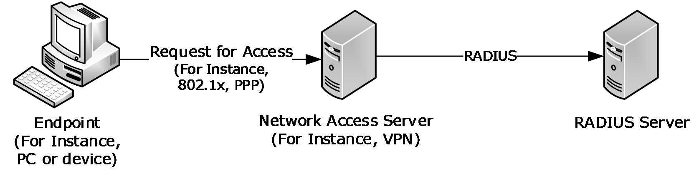
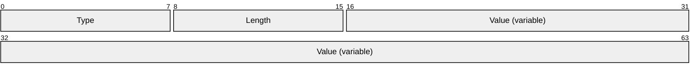
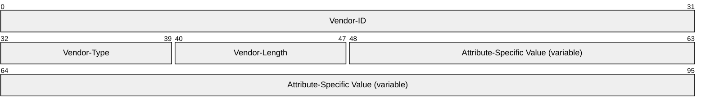
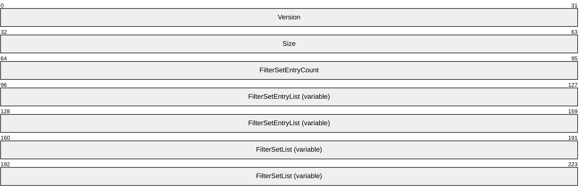
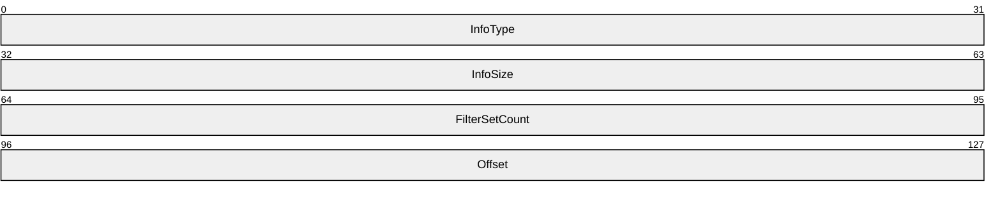
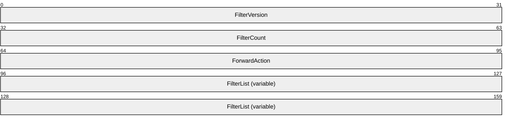
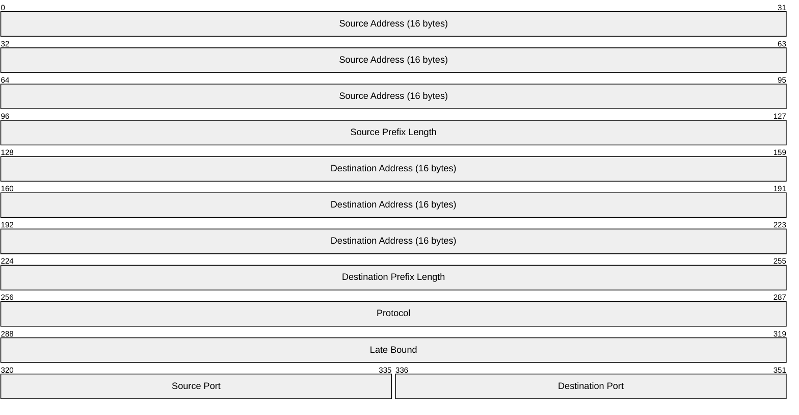

# [MS-RNAS]: Vendor-Specific RADIUS Attributes for Network Policy and Access Server Data Structure

Table of Contents

1 Introduction

- [1 Introduction](#Section_1)
  - [1.1 Glossary](#Section_1.1)
  - [1.2 References](#Section_1.2)
    - [1.2.1 Normative References](#Section_1.2.1)
    - [1.2.2 Informative References](#Section_1.2.2)
  - [1.3 Overview](#Section_1.3)
  - [1.4 Relationship to Other Protocols](#Section_1.4)
  - [1.5 Prerequisites/Preconditions](#Section_1.5)
  - [1.6 Applicability Statement](#Section_1.6)
  - [1.7 Versioning and Capability Negotiation](#Section_1.7)
  - [1.8 Vendor-Extensible Fields](#Section_1.8)
  - [1.9 Standards Assignments](#Section_1.9)

2 Messages

- [2 Messages](#Section_2)
  - [2.1 Transport](#Section_2.1)
  - [2.2 Message Syntax](#Section_2.2)
    - [2.2.1 Microsoft Vendor-Specific Attributes (VSAs)](#Section_2.2.1)
      - [2.2.1.1 MS-RAS-Client-Name](#Section_2.2.1.1)
      - [2.2.1.2 MS-RAS-Client-Version](#Section_2.2.1.2)
      - [2.2.1.3 MS-User-Security-Identity](#Section_2.2.1.3)
      - [2.2.1.4 MS-Network-Access-Server-Type](#Section_2.2.1.4)
      - [2.2.1.5 MS-Machine-Name](#Section_2.2.1.5)
      - [2.2.1.6 MS-IPv6-Filter](#Section_2.2.1.6)
      - [2.2.1.7 MS-RAS-Correlation-ID](#Section_2.2.1.7)
      - [2.2.1.8 MS-User-IPv4-Address](#Section_2.2.1.8)
      - [2.2.1.9 MS-User-IPv6-Address](#Section_2.2.1.9)
      - [2.2.1.10 MS-RDG-Device-Redirection](#Section_2.2.1.10)
      - [2.2.1.11 MS-Azure-Policy-ID](#Section_2.2.1.11)
    - [2.2.2 Microsoft Vendor-Specific Values for RADIUS Attributes](#Section_2.2.2)
      - [2.2.2.1 Vendor-Specific Value for the Tunnel-Type RADIUS Attribute](#Section_2.2.2.1)

3 Protocol Details

- [3 Protocol Details](#Section_3)
  - [3.1 Common Details](#Section_3.1)
    - [3.1.1 Abstract Data Model](#Section_3.1.1)
    - [3.1.2 Timers](#Section_3.1.2)
    - [3.1.3 Initialization](#Section_3.1.3)
    - [3.1.4 Higher-Layer Triggered Events](#Section_3.1.4)
    - [3.1.5 Message Processing Events and Sequencing Rules](#Section_3.1.5)
      - [3.1.5.1 Windows Implementation of RADIUS Attributes](#Section_3.1.5.1)
      - [3.1.5.2 Microsoft VSA Support of RADIUS Messages](#Section_3.1.5.2)
      - [3.1.5.3 Processing RADIUS Attributes](#Section_3.1.5.3)
    - [3.1.6 Timer Events](#Section_3.1.6)
    - [3.1.7 Other Local Events](#Section_3.1.7)
  - [3.2 Server Details](#Section_3.2)
    - [3.2.1 Abstract Data Model](#Section_3.2.1)
    - [3.2.2 Timers](#Section_3.2.2)
    - [3.2.3 Initialization](#Section_3.2.3)
    - [3.2.4 Higher-Layer Triggered Events](#Section_3.2.4)
      - [3.2.4.1 Abstract Interface for Setting an Access-Accept Message](#Section_3.2.4.1)
    - [3.2.5 Message Processing Events and Sequencing Rules](#Section_3.2.5)
      - [3.2.5.1 Processing RADIUS Access-Request Messages](#Section_3.2.5.1)
        - [3.2.5.1.1 MS-RAS-Client-Name](#Section_3.2.5.1.1)
        - [3.2.5.1.2 MS-RAS-Client-Version](#Section_3.2.5.1.2)
        - [3.2.5.1.3 MS-User-Security-Identity](#Section_3.2.5.1.3)
        - [3.2.5.1.4 MS-Network-Access-Server-Type](#Section_3.2.5.1.4)
        - [3.2.5.1.5 MS-Machine-Name](#Section_3.2.5.1.5)
        - [3.2.5.1.6 MS-RAS-Correlation-ID](#Section_3.2.5.1.6)
        - [3.2.5.1.7 MS-User-IPv4-Address](#Section_3.2.5.1.7)
        - [3.2.5.1.8 MS-User-IPv6-Address](#Section_3.2.5.1.8)
        - [3.2.5.1.9 Tunnel-Type](#Section_3.2.5.1.9)
      - [3.2.5.2 Creating RADIUS Access-Accept Messages](#Section_3.2.5.2)
        - [3.2.5.2.1 MS-IPv6-Filter](#Section_3.2.5.2.1)
        - [3.2.5.2.2 MS-RDG-Device-Redirection](#Section_3.2.5.2.2)
    - [3.2.6 Timer Events](#Section_3.2.6)
    - [3.2.7 Other Local Events](#Section_3.2.7)
  - [3.3 Client Details](#Section_3.3)
    - [3.3.1 Abstract Data Model](#Section_3.3.1)
    - [3.3.2 Timers](#Section_3.3.2)
    - [3.3.3 Initialization](#Section_3.3.3)
    - [3.3.4 Higher-Layer Triggered Events](#Section_3.3.4)
      - [3.3.4.1 Abstract Interface for Sending an Access Request Message](#Section_3.3.4.1)
    - [3.3.5 Message Processing Events and Sequencing Rules](#Section_3.3.5)
      - [3.3.5.1 Creating RADIUS Access-Request Messages](#Section_3.3.5.1)
        - [3.3.5.1.1 MS-RAS-Client-Name](#Section_3.3.5.1.1)
        - [3.3.5.1.2 MS-RAS-Client-Version](#Section_3.3.5.1.2)
        - [3.3.5.1.3 MS-User-Security-Identity](#Section_3.3.5.1.3)
        - [3.3.5.1.4 MS-Network-Access-Server-Type](#Section_3.3.5.1.4)
        - [3.3.5.1.5 MS-Machine-Name](#Section_3.3.5.1.5)
        - [3.3.5.1.6 MS-RAS-Correlation-ID](#Section_3.3.5.1.6)
        - [3.3.5.1.7 MS-User-IPv4-Address](#Section_3.3.5.1.7)
        - [3.3.5.1.8 MS-User-IPv6-Address](#Section_3.3.5.1.8)
        - [3.3.5.1.9 Tunnel-Type](#Section_3.3.5.1.9)
      - [3.3.5.2 Processing RADIUS Access-Accept Messages](#Section_3.3.5.2)
        - [3.3.5.2.1 MS-IPv6-Filter](#Section_3.3.5.2.1)
        - [3.3.5.2.2 MS-RDG-Device-Redirection](#Section_3.3.5.2.2)
        - [3.3.5.2.3 MS-Azure-Policy-ID](#Section_3.3.5.2.3)
      - [3.3.5.3 Processing RADIUS Access-Reject Messages](#Section_3.3.5.3)
    - [3.3.6 Timer Events](#Section_3.3.6)
    - [3.3.7 Other Local Events](#Section_3.3.7)

4 Protocol Examples

- [4 Protocol Examples](#Section_4)

5 Security

- [5 Security](#Section_5)
  - [5.1 Security Considerations for Implementers](#Section_5.1)
  - [5.2 Index of Security Parameters](#Section_5.2)

6 Appendix A: Product Behavior

- [6 Appendix A: Product Behavior](#Section_6)

7 Change Tracking

- [7 Change Tracking](#Section_7)

For the legal notice and IP terms, see [LEGAL.md](../LEGAL.md).
Last updated: 4/23/2024.
See [Revision History](#revision-history) for full version history.

# 1 Introduction

The Remote Access Dial In User Service (RADIUS) Protocol (as specified in [[RFC2865]](https://go.microsoft.com/fwlink/?LinkId=90392)) provides authentication, authorization, and accounting (AAA) of [**endpoints**](#gt_endpoint) in scenarios such as wireless networking, dial-up networking, and virtual private networking (VPN).

RADIUS is an extensible protocol that allows vendors to provide specialized behavior through the use of [**vendor-specific attributes (VSAs)**](#gt_vendor-specific-attribute-vsa) ([RFC2865] section 5.26).

Sections 1.5, 1.8, 1.9, 2, and 3 of this specification are normative. All other sections and examples in this specification are informative.

## 1.1 Glossary

This document uses the following terms:

**Active Directory Domain Services (AD DS)**: A directory service (DS) implemented by a domain controller (DC). The DS provides a data store for objects that is distributed across multiple DCs. The DCs interoperate as peers to ensure that a local change to an object replicates correctly across DCs. AD DS is a deployment of Active Directory [MS-ADTS](../MS-ADTS/MS-ADTS.md).

**Dynamic Host Configuration Protocol (DHCP) server**: A computer running a DHCP service that offers dynamic configuration of IP addresses and related information to DHCP-enabled clients.

**endpoint**: A client that is on a network and is requesting access to a [**network access server (NAS)**](#gt_network-access-server-nas).

**filter**: A configuration on a [**network access server (NAS)**](#gt_network-access-server-nas) that specifies the types of traffic that are acceptable for IP local host traffic. [**Filters**](#gt_filter) can block or allow traffic by IP address, IP protocol, TCP port, or User Datagram Protocol (UDP) port.

**globally unique identifier (GUID)**: A term used interchangeably with universally unique identifier (UUID) in Microsoft protocol technical documents (TDs). Interchanging the usage of these terms does not imply or require a specific algorithm or mechanism to generate the value. Specifically, the use of this term does not imply or require that the algorithms described in [[RFC4122]](https://go.microsoft.com/fwlink/?LinkId=90460) or [[C706]](https://go.microsoft.com/fwlink/?LinkId=89824) must be used for generating the [**GUID**](#gt_globally-unique-identifier-guid). See also universally unique identifier (UUID).

**health registration authority (HRA)**: The server-side component in the Health Certificate Enrollment Protocol. The [**HRA**](#gt_health-registration-authority-hra) is a registration authority (RA) that requests a health certificate from a certification authority (CA) upon validation of health.

**Internet Protocol security (IPsec)**: A framework of open standards for ensuring private, secure communications over Internet Protocol (IP) networks through the use of cryptographic security services. IPsec supports network-level peer authentication, data origin authentication, data integrity, data confidentiality (encryption), and replay protection.

**Network Access Policy**: A set of rules that determines the behavior of a [**network access server (NAS)**](#gt_network-access-server-nas). The policy consists of a set of conditions that matches an access request to the policy and an access profile.

**network access server (NAS)**: A computer server that provides an access service for a user who is trying to access a network. A [**NAS**](#gt_network-access-server-nas) operates as a client of RADIUS. The [**RADIUS client**](#gt_radius-client) is responsible for passing user information to designated [**RADIUS servers**](#gt_radius-server) and then acting on the response returned by the [**RADIUS server**](#gt_radius-server). Examples of a NAS include: a VPN server, Wireless Access Point, 802.1x-enabled switch, or Network Access Protection (NAP) server.

**octet**: A group of 8 bits often referred to as a byte.

**RADIUS attribute**: An abstract identifier for a value or set of values that describe elements of a RADIUS protocol exchange. RADIUS attributes describe the details of an endpoint's connection request and provides configuration data for a [**network access server (NAS)**](#gt_network-access-server-nas) to provide service to the endpoint.

**RADIUS client**: A client that is responsible for passing user information to designated RADIUS servers, and then acting on the response that is returned.

**RADIUS server**: A server that is responsible for receiving user connection requests, authenticating the user, and then returning all configuration information necessary for the client to deliver service to the user. A RADIUS server can act as a proxy client to other RADIUS servers or other kinds of authentication servers.

**Remote Access Service (RAS) server**: A type of [**network access server (NAS)**](#gt_network-access-server-nas) that provides modem dial-up or virtual private network (VPN) access to a network.

**Remote Desktop Gateway (RDG) server**: A gateway that enables authorized users to connect to remote computers on a corporate network from any computer with an Internet connection.

**RNAP**: Represents the collection of [**vendor-specific attributes (VSAs)**](#gt_vendor-specific-attribute-vsa) that are defined or described in this document. This term is used, for example, in discussions about whether a network entity is capable of processing the [**VSAs**](#gt_vendor-specific-attribute-vsa) defined in this document, as in "an RNAP-aware DHCP server".

**RNAS**: Represents the collection of vendor-specific attributes (VSAs) that are defined or described in this document. This term is used, for example, in discussions about whether a network entity is capable of processing the VSAs defined in this document, as in "an RNAS-aware DHCP server".

**RNAS server**: A RADIUS server that is capable of processing Microsoft-specific vendor-specific attributes (VSAs).

**routing and remote access service (RRAS) server**: A server implementation that is managed by the RRASM protocol and provides routing and remote access service functionality.

**security identifier (SID)**: An identifier for security principals that is used to identify an account or a group. Conceptually, the [**SID**](#gt_security-identifier-sid) is composed of an account authority portion (typically a domain) and a smaller integer representing an identity relative to the account authority, termed the relative identifier (RID). The [**SID**](#gt_security-identifier-sid) format is specified in [MS-DTYP](../MS-DTYP/MS-DTYP.md) section 2.4.2; a string representation of [**SIDs**](#gt_security-identifier-sid) is specified in [MS-DTYP] section 2.4.2 and [MS-AZOD](../MS-AZOD/MS-AZOD.md) section 1.1.1.2.

**Unicode**: A character encoding standard developed by the Unicode Consortium that represents almost all of the written languages of the world. The [**Unicode**](#gt_unicode) standard [[UNICODE5.0.0/2007]](https://go.microsoft.com/fwlink/?LinkId=154659) provides three forms (UTF-8, UTF-16, and UTF-32) and seven schemes (UTF-8, UTF-16, UTF-16 BE, UTF-16 LE, UTF-32, UTF-32 LE, and UTF-32 BE).

**vendor-specific attribute (VSA)**: A RADIUS attribute ([RFC2865] section 5.26) whose Value field contains a vendor identifier, the vendor-attribute type, a length, and a vendor-defined value.

**MAY, SHOULD, MUST, SHOULD NOT, MUST NOT:** These terms (in all caps) are used as defined in [[RFC2119]](https://go.microsoft.com/fwlink/?LinkId=90317). All statements of optional behavior use either MAY, SHOULD, or SHOULD NOT.

## 1.2 References

Links to a document in the Microsoft Open Specifications library point to the correct section in the most recently published version of the referenced document. However, because individual documents in the library are not updated at the same time, the section numbers in the documents may not match. You can confirm the correct section numbering by checking the [Errata](https://go.microsoft.com/fwlink/?linkid=850906).

### 1.2.1 Normative References

We conduct frequent surveys of the normative references to assure their continued availability. If you have any issue with finding a normative reference, please contact [dochelp@microsoft.com](mailto:dochelp@microsoft.com). We will assist you in finding the relevant information.

[IANA-ENT] Internet Assigned Numbers Authority, "Private Enterprise Numbers", January 2007, [http://www.iana.org/assignments/enterprise-numbers](https://go.microsoft.com/fwlink/?LinkId=89883)

[MS-ADA2] Microsoft Corporation, "[Active Directory Schema Attributes M](../MS-ADA2/MS-ADA2.md)".

[MS-DTYP] Microsoft Corporation, "[Windows Data Types](../MS-DTYP/MS-DTYP.md)".

[MS-SSTP] Microsoft Corporation, "[Secure Socket Tunneling Protocol (SSTP)](../MS-SSTP/MS-SSTP.md)".

[RFC2119] Bradner, S., "Key words for use in RFCs to Indicate Requirement Levels", BCP 14, RFC 2119, March 1997, [https://www.rfc-editor.org/info/rfc2119](https://go.microsoft.com/fwlink/?LinkId=90317)

[RFC2548] Zorn, G., "Microsoft Vendor-Specific RADIUS Attributes", RFC 2548, March 1999, [https://www.rfc-editor.org/info/rfc2548](https://go.microsoft.com/fwlink/?LinkId=90366)

[RFC2865] Rigney, C., Willens, S., Rubens, A., and Simpson, W., "Remote Authentication Dial In User Service (RADIUS)", RFC 2865, June 2000, [https://www.rfc-editor.org/info/rfc2865](https://go.microsoft.com/fwlink/?LinkId=90392)

[RFC2868] Zorn, G., Leifer, D., Rubens, A., Shriver, J., Holdrege, M., and Goyret, I., "RADIUS Attributes for Tunnel Protocol Support", RFC 2868, June 2000, [https://www.rfc-editor.org/info/rfc2868](https://go.microsoft.com/fwlink/?LinkId=90395)

[RFC2882] Mitton, D., Nortel Networks, "Network Access Servers Requirements: Extended RADIUS Practices", RFC 2882, July 2000, [https://www.rfc-editor.org/info/rfc2882](https://go.microsoft.com/fwlink/?LinkId=134196)

[RFC3162] Aboba, B., Zorn, G., and Mitton, D., "RADIUS and IPv6", RFC 3162, August 2001, [https://www.rfc-editor.org/info/rfc3162](https://go.microsoft.com/fwlink/?LinkId=90407)

[RFC3579] Aboba, B. and Calhoun, P., "RADIUS (Remote Authentication Dial In User Service) Support For Extensible Authentication Protocol (EAP)", RFC 3579, September 2003, [https://www.rfc-editor.org/info/rfc3579](https://go.microsoft.com/fwlink/?LinkId=90435)

### 1.2.2 Informative References

[IEEE802.1X] Institute of Electrical and Electronics Engineers, "IEEE Standard for Local and Metropolitan Area Networks - Port-Based Network Access Control", IEEE Std 802.1X-2004, [https://ieeexplore.ieee.org/document/1438730](https://go.microsoft.com/fwlink/?LinkId=89910)

**Note** Subscripton login or purchase to download the PDF

[MS-MSRP] Microsoft Corporation, "[Messenger Service Remote Protocol](../MS-MSRP/MS-MSRP.md)".

[MSDN-ANSI-CODEPAGE] Microsoft Corporation, "WideCharToMultiByte (Windows CE 5.0)", 09/14/2012, [https://learn.microsoft.com/en-us/previous-versions/windows/embedded/aa450989(v=msdn.10)](https://go.microsoft.com/fwlink/?LinkId=89953)

[RFC1661] Simpson, W., Ed., "The Point-to-Point Protocol (PPP)", STD 51, RFC 1661, July 1994, [https://www.rfc-editor.org/info/rfc1661](https://go.microsoft.com/fwlink/?LinkId=90283)

[RFC5080] Nelson, D., and DeKoK, A., "Common Remote Authentication Dial In User Service (RADIUS) Implementation Issues and Suggested Fixes", RFC 5080, December 2007, [http://www.ietf.org/rfc/rfc5080.txt](https://go.microsoft.com/fwlink/?LinkId=120268)

## 1.3 Overview

The Remote Authentication Dial-In User Service (RADIUS) Protocol, as specified in [[RFC2865]](https://go.microsoft.com/fwlink/?LinkId=90392), provides authentication, authorization, and accounting (AAA) of endpoints in scenarios such as wireless networking, dial-up networking, and virtual private networking (VPN). This document specifies the Microsoft vendor-specific attributes (VSAs) that are passed over RADIUS between the [**network access server (NAS)**](#gt_network-access-server-nas) and the [**RADIUS server**](#gt_radius-server) to authenticate and authorize connection requests, as well as to configure the level of network access provided by the NAS, and account for usage.

The following figure shows a common deployment model for the RADIUS Protocol.

Figure 1: Common RADIUS deployment model

A NAS provides network access to [**endpoints**](#gt_endpoint) (for example, a client PC or device). A NAS can be a network infrastructure device, such as a switch or a wireless access point, or it can be a server, such as a VPN gateway or dial-up server.

Endpoints initiate communication with a NAS to establish connectivity with a network. A variety of protocols can be used to establish connectivity with a network, such as 802.1x (as described in [[IEEE802.1X]](https://go.microsoft.com/fwlink/?LinkId=89910)) or Point-to-Point Protocol (PPP) (as described in [[RFC1661]](https://go.microsoft.com/fwlink/?LinkId=90283)). The NAS then exchanges RADIUS messages with a RADIUS server to authenticate and authorize the endpoint's connectivity to the network. The RADIUS server is configured with policy to accept or reject the endpoint's connectivity request and to instruct the NAS regarding the network restrictions to enforce on the endpoint, if appropriate.

The RADIUS Protocol includes an extensibility mechanism that enables NAS vendors and RADIUS server vendors to expose features that are specific to their products through the use of [**vendor-specific attributes (VSAs)**](#gt_vendor-specific-attribute-vsa) , as specified in [RFC2865] section 5.26.

This document defines or otherwise describes the VSAs that are specific to Microsoft.

## 1.4 Relationship to Other Protocols

The VSAs specified in this document rely on and are transported within the RADIUS protocol, as described in [[RFC2865]](https://go.microsoft.com/fwlink/?LinkId=90392).

Protocols between the client and the server (for example, PPP [[RFC1661]](https://go.microsoft.com/fwlink/?LinkId=90283) and 802.1x [[IEEE802.1X]](https://go.microsoft.com/fwlink/?LinkId=89910)) relate to the Microsoft VSAs in the following ways:

- Unless otherwise noted, [**RADIUS attributes**](#gt_radius-attribute) are sent only between a [**RADIUS client**](#gt_radius-client) and a [**RADIUS server**](#gt_radius-server). However, some Microsoft RADIUS [**VSAs**](#gt_vendor-specific-attribute-vsa) can be transported over the protocols between the endpoint and the NAS in addition to being transported over RADIUS.
- The Microsoft RADIUS VSAs can affect the operation of the protocols between the endpoint and the NAS.

## 1.5 Prerequisites/Preconditions

For the Microsoft [**VSAs**](#gt_vendor-specific-attribute-vsa) to be used, the RADIUS protocol as specified in [[RFC2865]](https://go.microsoft.com/fwlink/?LinkId=90392) and a set of [**Network Access Policies**](#gt_bb46d6b6-6834-4753-ba57-ce33f49a7b6e) are configured for use between a NAS and a RADIUS server; specifically, an administrator is required to configure a RADIUS shared secret between a NAS and a RADIUS server.

## 1.6 Applicability Statement

The use of RADIUS [**VSAs**](#gt_vendor-specific-attribute-vsa) is applicable in those environments where the RADIUS protocol described in [[RFC2865]](https://go.microsoft.com/fwlink/?LinkId=90392) is used to authenticate and authorize network access requests.

## 1.7 Versioning and Capability Negotiation

None of the Microsoft RADIUS [**VSAs**](#gt_vendor-specific-attribute-vsa) described in this document affects the versioning or capability negotiation of the protocols they are transported over. Some of the Microsoft RADIUS VSAs described in this document might not be recognized by a particular type or model of NAS - the behavior of a RADIUS client encountering unknown attributes is described in [[RFC5080]](https://go.microsoft.com/fwlink/?LinkId=120268) section 2.5.

See the individual VSAs documented in section [2.2](#Section_2.2) for information about version fields, if any, that are used in each VSA.

## 1.8 Vendor-Extensible Fields

The Microsoft [**VSAs**](#gt_vendor-specific-attribute-vsa) themselves do not define any additional vendor-extensible fields.

## 1.9 Standards Assignments

| Parameter | Value | Reference |
| --- | --- | --- |
| RADIUS [**VSA**](#gt_vendor-specific-attribute-vsa) type | 0x1A | [[RFC2865]](https://go.microsoft.com/fwlink/?LinkId=90392), section 5.26 |
| SMI Network Management Private Enterprise Code for the Vendor ID field | 0x00000137 | [[IANA-ENT]](https://go.microsoft.com/fwlink/?LinkId=89883) |

# 2 Messages

This protocol references commonly used data types as defined in [MS-DTYP](../MS-DTYP/MS-DTYP.md).

## 2.1 Transport

The RADIUS Protocol, specified in [[RFC2865]](https://go.microsoft.com/fwlink/?LinkId=90392), defines the transport of RADIUS and associated attributes over UDP.

## 2.2 Message Syntax

The following sections contain information about the [**VSAs**](#gt_vendor-specific-attribute-vsa) that are defined in this document. These VSAs are used in RADIUS Access-Request and Access-Accept messages [[RFC2865]](https://go.microsoft.com/fwlink/?LinkId=90392) in the manner specified in sections [3.1.5.2](#Section_2), [3.2.5](#Section_3.1.5), and [3.3.5](#Section_3.1.5).

### 2.2.1 Microsoft Vendor-Specific Attributes (VSAs)

The RADIUS Protocol specification [[RFC2865]](https://go.microsoft.com/fwlink/?LinkId=90392) defines attribute type 0x1A as a [**VSA**](#gt_vendor-specific-attribute-vsa). This type was defined to allow vendors to extend the [**RADIUS attribute**](#gt_radius-attribute) set. For reference, the format of the standard RADIUS attribute is provided below.

When representing a VSA, the fields MUST be set as follows (for more details, see [RFC2865]).

**Type (1 byte):** An 8-bit unsigned integer that MUST be 0x1A, which indicates the type of the **Value** field as vendor-specific.

**Length (1 byte):** An 8-bit unsigned integer that MUST specify the sum of the lengths of an attribute's **Type**, **Length**, and **Value** fields, in bytes. For vendor-specific RADIUS attributes, the value MUST be at least 9 to account for the **Type**, **Length**, and **Value** fields. The RADIUS client SHOULD ignore the attribute if the value is less than 9.

**Value (variable):** For Microsoft vendor-specific RADIUS attribute, the value MUST be formatted as specified in [RFC2865] section 5.26. For reference, the format is as follows.

**Vendor-ID (4 bytes):** A 32-bit unsigned integer in network byte order, the most significant 8 bits MUST be set to 0 and the remaining 24 bits MUST be set to the SMI code of the vendor taken from [[IANA-ENT]](https://go.microsoft.com/fwlink/?LinkId=89883). Microsoft VSAs MUST have the **Vendor-ID** field set to 311 (0x00000137).

**Vendor-Type (1 byte):** An 8-bit unsigned integer that MUST specify the VSA type contained in the **Attribute-Specific Value** field. Microsoft VSA vendor types MUST be set as specified in [[RFC2548]](https://go.microsoft.com/fwlink/?LinkId=90366) and in sections 2.2.1.1 through [2.2.1.10](#Section_2.2.1.10) of this specification.

**Vendor-Length (1 byte):** An 8-bit unsigned integer that MUST be set to 2 plus the length of **Attribute-Specific Value**. The RADIUS client SHOULD ignore the attribute if Vendor-Length is less than 3.

**Attribute-Specific Value (variable):** The value of the VSA specified in the **Vendor-Type** field. The format of the **Attribute-Specific Value** field for a given **Vendor-Type** MUST be set as specified in [RFC2548] and in sections 2.2.1.1 through 2.2.1.10 of this specification.

The attribute definitions in the following sections specify the specific parameters relevant to that extension.

#### 2.2.1.1 MS-RAS-Client-Name

MS-RAS-Client-Name is a [**VSA**](#gt_vendor-specific-attribute-vsa), as specified in section [2.2.1](#Section_2.2.1). It is used to specify the name of the [**endpoint**](#gt_endpoint) generating a request.

The fields of the **MS-RAS-Client-Name** VSA MUST be set as follows:

**Vendor-Type**: An 8-bit unsigned integer that MUST be set to 0x22 for **MS-RAS-Client-Name**.

**Vendor-Length**: An 8-bit unsigned integer that MUST be set to 2 added to the length of the **Attribute-Specific Value** field. Its value MUST be at least 3 and less than 36.

**Attribute-Specific Value**: This field MUST be the machine name of the endpoint that requests network access, sent in ASCII format, and MUST be null terminated. A valid character set includes the symbols ! @ # $ % ^ & ' ) ( . - _ { } ~ in addition to letters and numbers.<1>

For more details about MS-RAS-Client-Name, see sections [3.2.5.1.1](#Section_3.2.5.1.1) and [3.3.5.1.1](#Section_3.3.5.1.1).

#### 2.2.1.2 MS-RAS-Client-Version

MS-RAS-Client-Version is a [**VSA**](#gt_vendor-specific-attribute-vsa), as specified in section [2.2.1](#Section_2.2.1). It is used to specify the version of the [**endpoint**](#gt_endpoint) generating a request.

The fields of the MS-RAS-Client-Version vendor-specific attribute MUST be set as follows:

**Vendor-Type**: An 8-bit unsigned integer that MUST be set to 0x23 for [MS-RAS-Client-Version](#Section_2.2.1.2).

**Vendor-Length**: An 8-bit unsigned integer that MUST be set to 2 added to the length of the **Attribute-Specific Value** field. Its value MUST be at least 3.

**Attribute-Specific Value**: This field MUST be the ASCII version string of a remote access client; this string MUST be in network byte order.<2>

For more details about MS-RAS-Client-Version, see sections 3.2.5.1.2 and [3.3.5.1.2](#Section_3.3.5.1.2).

#### 2.2.1.3 MS-User-Security-Identity

MS-User-Security-Identity is a [**VSA**](#gt_vendor-specific-attribute-vsa), as specified in section [2.2.1](#Section_2.2.1). It is used to specify the [**security-identifier (SID)**](#gt_security-identifier-sid), as defined in [MS-DTYP](../MS-DTYP/MS-DTYP.md) section 2.4.2, of the user requesting access.

The fields of MS-User-Security-Identity MUST be set as follows:

**Vendor-Type**: An 8-bit unsigned integer that MUST be set to 0x28 for MS-User-Security-Identity.

**Vendor-Length**: An 8-bit unsigned integer that MUST be set to 2 plus the length of the **Attribute-Specific Value** field. Its value MUST be at least 3.

**Attribute-Specific Value**: This field MUST contain the account SID of the user requesting access in the format of a binary SID used to authenticate a remote access client.

#### 2.2.1.4 MS-Network-Access-Server-Type

MS-Network-Access-Server-Type is a [**VSA**](#gt_vendor-specific-attribute-vsa), as specified in section [2.2.1](#Section_2.2.1). It is used to specify the type of the network access server making the request.

The fields of MS-Network-Access-Server-Type MUST be set as follows:

**Vendor-Type**: An 8-bit unsigned integer that MUST be set to 0x2F.

**Vendor-Length**: An 8-bit unsigned integer that MUST be set to 6.

**Attribute-Specific Value**: A 32-bit unsigned integer in network byte order that MUST indicate the type of the [**NAS**](#gt_network-access-server-nas). The value MUST be interpreted in accordance with the following table:

| Value | Meaning |
| --- | --- |
| 0x00000000 | Unspecified |
| 0x00000001 | Terminal Server Gateway |
| 0x00000002 | [**Remote Access Service (RAS) server**](#gt_remote-access-service-ras-server) (VPN or dial-in) |
| 0x00000003 | [**DHCP server**](#gt_746786e7-458f-45aa-ab24-5534a94b4fb3) |
| 0x00000005 | [**Health Registration Authority (HRA)**](#gt_health-registration-authority-hra) |
| All Other Values | A tag value used to identify applicable network access policies on the [**RADIUS server**](#gt_radius-server). |

For more details about MS-Network-Access-Server-Type, see sections [3.2.5.1.4](#Section_3.2.5.1.4) and [3.3.5.1.4](#Section_3.3.5.1.4).

#### 2.2.1.5 MS-Machine-Name

MS-Machine-Name is a [**VSA**](#gt_vendor-specific-attribute-vsa), as specified in section [2.2.1](#Section_2.2.1). It is used to communicate the machine name of the endpoint requesting network access.

The fields of MS-Machine-Name MUST be set as follows:

**Vendor-Type**: An 8-bit unsigned integer that MUST be set to 0x32.

**Vendor-Length**: An 8-bit unsigned integer that MUST be set to the length of the **Attribute-Specific Value** field plus 2. Its value MUST be at least 3.

**Attribute-Specific Value**: An octet string containing characters from Windows ANSI code page (see [[MSDN-ANSI-CODEPAGE]](https://go.microsoft.com/fwlink/?LinkId=89953)) in ANSI format and MUST specify the machine name of the endpoint requesting access.

For more details about MS-Machine-Name, see sections [3.2.5.1.5](#Section_3.2.5.1.5) and [3.3.5.1.5](#Section_3.3.5.1.5).

#### 2.2.1.6 MS-IPv6-Filter

MS-IPv6-Filter is a [**VSA**](#gt_vendor-specific-attribute-vsa), as specified in section [2.2.1](#Section_2.2.1). It is used to limit the inbound and/or outbound access of the [**endpoint**](#gt_endpoint).

This attribute can be sent by a [**RADIUS server**](#gt_radius-server) to define the network access scope of the endpoint. It is used only for IPv6 addresses and MS-Filter; [[RFC2548]](https://go.microsoft.com/fwlink/?LinkId=90366) VSA is the corresponding attribute for IPv4 addresses.<3> This attribute defines traffic filters to a [**NAS**](#gt_network-access-server-nas) for restricting access for a specific network access connection. If multiple MS-IPv6-Filter attributes are contained within a packet, they MUST be in order and they MUST be consecutive attributes in the packet.

The fields of MS-IPv6-Filter MUST be set as follows:

**Vendor-Type**: An 8-bit unsigned integer that MUST be set to 0x33.

**Vendor-Length**: An 8-bit unsigned integer that MUST be set to the length of the **Attribute-Specific Value** field plus 2. Its value MUST be at least 98, to specify a minimum of 1 filter. The total length will depend on the number of [**filter**](#gt_filter) sets and filters in each set.

**Attribute-Specific Value**: A list of IPv6 filter sets, defined as follows.

The usage of this attribute within Access-Request, Access-Accept, Access-Reject, Access-Challenge and Accounting-Request packets is defined in section [3.1.5.2](#Section_2). If multiple MS-IPv6-Filter attributes occur in a single RADIUS packet, the **Attribute-Specific Value** field from each MUST be concatenated in the order received to form the full MS-IPv6-Filter value.

**Version (4 bytes):** A 32-bit unsigned integer in network byte order that MUST be set to 0x00000001. No other versions are defined. For processing details, see section [3.1.5.3](#Section_3.1.5.3).

**Size (4 bytes):** A 32-bit unsigned integer in network byte order that MUST specify the size of the **Attribute-Specific Value** field for this VSA, including the version, size, and subsequent filter set data. The size MUST be at least 96, so as to specify at least one filter. The total size depends on the number of filter sets and filters in each set.

**FilterSetEntryCount (4 bytes):** A 32-bit unsigned integer in network byte order that MUST specify the number of filter set entries. Its value MUST be greater than 0.

**FilterSetEntryList (variable):** A list of consecutive filter set entries, equal in number to the value of **FilterSetEntryCount**, each of which MUST be formatted as defined below.

**InfoType (4 bytes):** A 32-bit unsigned integer in network byte order specifying the type of filters that are contained in the filter set list. The value MUST be one of the following.

| Value | Meaning |
| --- | --- |
| 0XFFFF0011 | Input filter – The filter NAS MUST be applied to IP packets sent from the endpoint to the NAS. |
| 0XFFFF0012 | Output filter – The filter MUST be applied to IP packets sent from the NAS to the endpoint. |

**InfoSize (4 bytes):** A 32-bit unsigned integer in network byte order specifying the overall size, in bytes, of the list of filter sets specified by this filter set entry.

**FilterSetCount (4 bytes):** A 32-bit unsigned integer in network byte order specifying the overall size, in bytes, of the list of filter sets specified by this filter set entry.

**Offset (4 bytes):** A 32-bit unsigned integer in network byte order specifying the offset of start of the first filter set of this filter set entry within the **Attribute-Specific Value** of this VSA. Offset values are always multiples of 8, and a filter set MUST therefore begin at an 8-octet aligned offset within the **Attribute-Specific Value**. To meet this requirement, any unused octets (holes) within the **Attribute-Specific Value** before or after a filter set MUST be set to 0 (padded) as necessary.

**FilterSetList (variable):** A list of consecutive filter sets, equal in number to the value of **FilterSetCount**, each of which MUST be formatted as defined below.

**FilterVersion (4 bytes):** A 32-bit unsigned integer in network byte order that MUST be set to 0x00000001. No other versions are defined. For processing details, see section 3.1.5.3.

**FilterCount (4 bytes):** A 32-bit unsigned integer in network byte order specifying the number of filters. Its value MUST be greater than 0.

**ForwardAction (4 bytes):** A 32-bit unsigned integer in network byte order specifying the action for the filter. Its value MUST be one of the following.

| Value | Meaning |
| --- | --- |
| 0x00000000 | Forward |
| 0x00000001 | Drop |

**FilterList (variable):** A list of consecutive filters, equal in number to the value of **FilterCount**, each of which MUST be formatted as defined below.

**Source Address (16 bytes):** A 128-bit unsigned integer in network byte order specifying the IPv6 source address for which the filter applies. A value of 0x00000000 in this field MUST denote ANY.

**Source Prefix Length (4 bytes):** A 32-bit unsigned integer in network byte order specifying the prefix length for the source address. If this value is set to zero, the NAS MUST use ANY as a source address.

**Destination Address (16 bytes):** A 128-bit unsigned integer in network byte order that specifies the IPv6 destination address for the filter. A value of zero in this field denotes ANY.

**Destination Prefix Length (4 bytes):** A 32-bit unsigned integer in network byte order that specifies the Prefix Length for the destination address. If this value is set to zero, the NAS MUST use ANY as a destination address.

**Protocol (4 bytes):** A 32-bit unsigned integer in network byte order specifying the protocol number (such as TCP or UDP) for the filter. Possible values include the following.

| Name | Value |
| --- | --- |
| ANY | 0x00000000 |
| ICMP | 0x00000001 |
| ICMPv6 | 0x0000003A |
| TCP | 0x00000006 |
| UDP | 0x00000011 |

**Late Bound (4 bytes):** A 32-bit unsigned integer in network byte order that indicates if the fields in the filter MAY be dynamically replaced by the NAS with values for specific endpoints. Its value MUST be at least one of the following or a bit-wise OR of two or more such values.

| Value | Meaning |
| --- | --- |
| 0x00000000 | No source or destination address or mask replacement |
| 0x00000001 | Source address replaceable with a new address |
| 0x00000004 | Destination address replaceable with a new address |
| 0x00000010 | Source address mask replaceable with a new mask |
| 0x00000020 | Destination address mask replaceable with a new mask |

**Source Port (2 bytes):** If the Protocol is TCP or UDP, this MUST be a 16-bit unsigned integer in network byte order that specifies a port number for the corresponding protocol. If the Protocol is ICMP or ICMPv6, this MUST be a 16-bit unsigned integer in network byte order that specifies a corresponding type indicator for ICMP or ICMPv6. For all other protocol values, this MUST be set to 0 (byte order does not matter).

**Destination Port (2 bytes):** If the Protocol is TCP or UDP, this MUST be a 16-bit unsigned integer in network byte order that specifies a port number for the corresponding protocol. If the Protocol is ICMP or ICMPv6, this MUST be a 16-bit unsigned integer in network byte order that specifies a corresponding code indicator for ICMP or ICMPv6. For all other protocol values, this MUST be set to 0 (byte order does not matter).

For more details about MS-IPv6-Filter, see sections [3.2.5.2.1](#Section_3.2.5.2.1) and [3.3.5.2.1](#Section_3.3.5.2.1).

#### 2.2.1.7 MS-RAS-Correlation-ID

The MS-RAS-Correlation-ID is a [**VSA**](#gt_vendor-specific-attribute-vsa), as specified in section [2.2.1](#Section_2.2.1). It is used by the NAS to send an identifier, which is used for the correlation of log events, to the RADIUS server.

The fields of MS-RAS-Correlation-ID MUST be set as follows:

**Vendor-Type**: An 8-bit unsigned integer that MUST be set to 0x38.

**Vendor-Length**: An 8-bit unsigned integer that MUST be set to the length of the [**globally unique identifier (GUID)**](#gt_globally-unique-identifier-guid) string in the **Attribute-Specific Value** plus 2.

**Attribute-Specific Value**: A 128-bit unsigned integer that SHOULD specify a GUID and be represented using a curly braced GUID string, as specified in [MS-DTYP](../MS-DTYP/MS-DTYP.md) (section 2.3.4).

#### 2.2.1.8 MS-User-IPv4-Address

MS-User-IPv4-Address is a [**VSA**](#gt_vendor-specific-attribute-vsa) used to specify the IPv4 address of the [**endpoint**](#gt_endpoint) as known to the [**RADIUS client**](#gt_radius-client), as specified in section [2.2.1](#Section_2.2.1).

The fields of MS-User-IPv4-Address MUST be set as follows:

**Vendor-Type**: An 8-bit unsigned integer that MUST be set to 0x3D.

**Vendor-Length**: An 8-bit unsigned integer that MUST be set to 6.

**Attribute-Specific Value**: A 32-bit unsigned integer in network byte order that MUST specify the IPv4 address of the machine of the user requesting network access.

#### 2.2.1.9 MS-User-IPv6-Address

MS-User-IPv6-Address is a [**VSA**](#gt_vendor-specific-attribute-vsa) used to specify the IPv6 address of the [**endpoint**](#gt_endpoint) as known to the [**RADIUS client**](#gt_radius-client), as specified in section [2.2.1](#Section_2.2.1).

The fields of MS-User-IPv6-Address MUST be set as follows:

**Vendor-Type**: An 8-bit unsigned integer that MUST be set to 0x3E.

**Vendor-Length**: An 8-bit unsigned integer that MUST be set to 18.

**Attribute-Specific Value**: A 128-bit unsigned integer in network byte order that MUST specify the IPv6 address of the machine of the user requesting network access.

#### 2.2.1.10 MS-RDG-Device-Redirection

MS-RDG-Device-Redirection is a [**VSA**](#gt_vendor-specific-attribute-vsa) specifying filters used by a [**Remote Desktop Gateway (RDG) server**](#gt_remote-desktop-gateway-rdg-server), as specified in section [2.2.1](#Section_2.2.1).

The fields of MS-RDG-Device-Redirection MUST be set as follows:

**Vendor-Type**: An 8-bit unsigned integer that MUST be set to 0x3F.

**Vendor-Length**: An 8-bit unsigned integer that MUST be set to 6.

**Attribute-Specific Value**: A 32-bit unsigned integer in network-byte order (bit 0 is the least significant bit) in which the bits MUST have the following meaning.

| Bit Range | Field | Description |
| --- | --- | --- |
| Variable | 0 | Drives redirection (0: enabled, 1: disabled) |
| Variable | 1 | Printers redirection (0: enabled, 1: disabled) |
| Variable | 2 | Serial ports redirection (0: enabled, 1: disabled) |
| Variable | 3 | Clipboard redirection (0: enabled, 1: disabled) |
| Variable | 4 | Plug and play devices redirection (0: enabled, 1: disabled) |
| 5-28 | <Reserved for additional devices> | - |
| 1: Disable redirection for all devices 0: Device redirection is controlled by bits 0..4 | 29 | - |
| 1: Enable redirection for all devices 0: Device redirection is controlled, first, by bit 29 and then by bits 0..4 | 30 | - |
| Variable | 31 | <Unused> |

When either bit 29 or bit 30 is set to 1, the values for bits 0..4 are ignored.

#### 2.2.1.11 MS-Azure-Policy-ID

The MS-Azure-Policy-ID is a [**VSA**](#gt_vendor-specific-attribute-vsa), as specified in section [2.2.1](#Section_2.2.1). It is used by the Radius Server to send an identifier which is used by Azure Point to Site VPN Server to match an authenticated RADIUS user Policy configured on the Azure side. This Policy is used to select IP/ Routing configuration (assigned IP address) for the user. The fields of MS-Azure-Policy-ID MUST be set as follows:

**Vendor-Type**: An 8-bit unsigned integer that MUST be set to 0x41.

**Vendor-Length**: An 8-bit unsigned integer that MUST be set to the length of the [**octet**](#gt_octet) string in the **Attribute-Specific Value** plus 2.

**Attribute-Specific Value**: An octet string containing the Policy ID configured on the Azure Point to Site VPN Server.

### 2.2.2 Microsoft Vendor-Specific Values for RADIUS Attributes

#### 2.2.2.1 Vendor-Specific Value for the Tunnel-Type RADIUS Attribute

In addition to the values specified in [[RFC2868]](https://go.microsoft.com/fwlink/?LinkId=90395), the standard RADIUS attribute Tunnel-Type [RFC2868] is extended to include a value for the Secure Socket Tunneling Protocol (as specified in [MS-SSTP](../MS-SSTP/MS-SSTP.md)) of 0x013701 in network-byte order. This value was determined using the technique specified in [[RFC2882]](https://go.microsoft.com/fwlink/?LinkId=134196), in which "Vendor-Specific Values" are encoded by concatenating the private enterprise ID [[IANA-ENT]](https://go.microsoft.com/fwlink/?LinkId=89883) with an 8-bit unsigned integer value. In this case, a tunnel tag of zero is always used, along with the Microsoft private enterprise ID (0x0137) and an 8-bit unsigned integer value 0x01. As a result, the 4 octet value of the attribute (including the tag) is encoded as 0x00013701.

# 3 Protocol Details

## 3.1 Common Details

### 3.1.1 Abstract Data Model

There are no common abstract data model elements.

### 3.1.2 Timers

There are no common timers.

### 3.1.3 Initialization

There is no common initialization.

### 3.1.4 Higher-Layer Triggered Events

There are no common higher-level events.

### 3.1.5 Message Processing Events and Sequencing Rules

#### 3.1.5.1 Windows Implementation of RADIUS Attributes

Section 3.1.5.2 specifies the Windows implementation of RADIUS [**VSA**](#gt_vendor-specific-attribute-vsa) attributes.<4>

RADIUS/NAS attributes get used in parallel to the use of [**RNAS**](#gt_rnas) on the server. This table explains the mapping from Active Directory to [**RADIUS attributes**](#gt_radius-attribute) and these RADIUS attributes follow the standard RADIUS architecture [[RFC2865]](https://go.microsoft.com/fwlink/?LinkId=90392) and [[RFC3162]](https://go.microsoft.com/fwlink/?LinkId=90407).

| Active Directory Attribute | Description |
| --- | --- |
| msNPCallingStationID [MS-ADA2](../MS-ADA2/MS-ADA2.md) 2.604 msNPSavedCallingStationID [MS-ADA2] 2.605 | [RFC2865] section 5.31 |
| msRADIUSCallbackNumber [MS-ADA2] 2.629 msRASSavedCallbackNumber [MS-ADA2] 2.639 | [RFC2865] section 5.19 |
| msRADIUSServiceType [MS-ADA2] 2.638 | [RFC2865] section 5.6 |
| msRADIUSFramedRoute [MS-ADA2] 2.634 msRASSavedFramedRoute [MS-ADA2] 2.641 | [RFC2865] section 5.22 |
| msRADIUSFramedIPAddress [MS-ADA2] 2.631 msRASSavedFramedIPAddress [MS-ADA2] 2.640 | [RFC2865] section 5.8 |
| msRADIUS-FramedInterfaceID [MS-ADA2] 2.630 msRADIUS-SavedFramedInterfaceID [MS-ADA2] 2.635 | [RFC3162] section 3.2 |
| msRADIUS-FramedIpv6Prefix [MS-ADA2] 2.632 msRADIUS-SavedFramedIpv6Prefix [MS-ADA2] 2.636 | [RFC3162] section 2.3 |
| msRADIUS-FramedIpv6Route [MS-ADA2] 2.633 msRADIUS-FramedIpv6Route [MS-ADA2] 2.637 | [RFC3162] section 2.5 |
| msNPAllowDialin [MS-ADA2] 2.602 | This attribute is present in values of TRUE or FALSE, which indicate that a given Machine Account will or will not be given network access. If the value is FALSE, the Machine Account will receive an Access-Reject response specified in [RFC2865]. |

#### 3.1.5.2 Microsoft VSA Support of RADIUS Messages

The RADIUS Protocol standard (as specified in [[RFC2865]](https://go.microsoft.com/fwlink/?LinkId=90392) section 4) defines the messages sent between a [**RADIUS client**](#gt_radius-client) and a [**RADIUS server**](#gt_radius-server). Each Microsoft [**VSA**](#gt_vendor-specific-attribute-vsa) is valid only in certain messages as defined in the second table.

The following table defines the meaning of the entries in the second table.

| Value | Meaning |
| --- | --- |
| 0 | This attribute MUST NOT be present in packet. |
| 0+ | Zero or more instances of this attribute MUST be present in the packet. |
| 0-1 | Zero or one instance of this attribute MUST be present in the packet. |

| Microsoft vendor-specific attribute | Request | Accept | Reject | Challenge | Accounting-Request |
| --- | --- | --- | --- | --- | --- |
| MS-RAS-Client-Name | 0-1 | 0 | 0 | 0 | 0-1 |
| MS-RAS-Client-Version | 0-1 | 0 | 0 | 0 | 0-1 |
| MS-User-Security-Identity | 0-1 | 0 | 0 | 0 | 0-1 |
| MS-Network-Access-Server-Type | 0-1 | 0 | 0 | 0 | 0 |
| MS-Machine-Name | 0-1 | 0 | 0 | 0 | 0-1 |
| MS-IPv6-Filter | 0 | 0+ | 0 | 0 | 0+ |
| MS-RAS-Correlation-ID | 0-1 | 0 | 0 | 0 | 0-1 |
| MS-User-IPv4-Address | 0-1 | 0 | 0 | 0 | 0 |
| MS-User-IPv6-Address | 0-1 | 0 | 0 | 0 | 0 |
| MS-RDG-Device-Redirection | 0 | 0-1 | 0 | 0 | 0 |
| MS-Azure-Policy-ID | 0 | 0-1 | 0 | 0 | 0 |

#### 3.1.5.3 Processing RADIUS Attributes

As specified in [[RFC2865]](https://go.microsoft.com/fwlink/?LinkId=90392) section 5, RADIUS clients and RADIUS servers SHOULD<5> ignore [**VSAs**](#gt_vendor-specific-attribute-vsa) with unknown types.

### 3.1.6 Timer Events

None.

### 3.1.7 Other Local Events

None.

## 3.2 Server Details

### 3.2.1 Abstract Data Model

This section describes a conceptual model of possible data organization that an implementation maintains to participate in this protocol. The described organization is provided to facilitate the explanation of how the protocol behaves. This document does not mandate that implementations adhere to this model as long as their external behavior is consistent with that described in this document.

The RADIUS Protocol is a stateless protocol, as specified in [[RFC2865]](https://go.microsoft.com/fwlink/?LinkId=90392) section 2.5.

A RADIUS Access-Request is generated by a RADIUS client based on a user request to a NAS. The RADIUS server generates a response containing RADIUS attributes based on the policy settings on the RADIUS server.

**PolicyConfiguration structure**: A structure that contains the policy that has been configured by the network administrator. The fields of the structure are as follows:

- **RASClientName**: A list of NULL-terminated strings that is used to restrict the allowed computer names of the endpoint that is requesting access.
- **ServiceClass**: A list of NULL-terminated strings that is used to restrict the allowed names of the groups of DHCP scopes that the endpoint requesting access MUST correspond to.
- **NetworkAccessServerType**: A list of 32-bit unsigned integers in network byte order. The list is used to restrict the allowed types of the NAS that is sending RADIUS Access-Request messages. Possible values for list items are specified in section [2.2.1.4](#Section_3.2.5.1.4).
- **MachineName**: A list of octet strings containing characters from the Windows ANSI code page (see [[MSDN-ANSI-CODEPAGE]](https://go.microsoft.com/fwlink/?LinkId=89953)) in ANSI format. The list is used to restrict the allowed machine names of the endpoint that is requesting access.
- **UserIPv4Address**: A list of 32-bit unsigned integers in network byte order. The list is used to restrict the allowed IPv4 addresses of the endpoint that is requesting access. Possible values for list items are specified in section [2.2.1.8](#Section_2.2.1.8).
- **UserIPv6Address**: A list of 128-bit unsigned integers in network byte order. The list is used to restrict the allowed Ipv6 addresses of the endpoint that is requesting access. Possible values for list items are specified in section [2.2.1.9](#Section_2.2.1.9).

### 3.2.2 Timers

No timers are required. For a discussion of retransmission hints, see the RADIUS Protocol documentation, as specified in [[RFC2865]](https://go.microsoft.com/fwlink/?LinkId=90392).

### 3.2.3 Initialization

The [**RNAS server**](#gt_rnas-server) uses the policy configuration for the RADIUS authorization. This configuration is maintained in an XML file on the server machine and is loaded into the **PolicyConfiguration structure** that is specified in section [3.2.1](#Section_3.3.1) when the server starts. The configuration is updated by the network administrator.

### 3.2.4 Higher-Layer Triggered Events

The RADIUS exchange is triggered by an Access-Request message sent from a NAS as specified in [[RFC2865]](https://go.microsoft.com/fwlink/?LinkId=90392) section 2.

#### 3.2.4.1 Abstract Interface for Setting an Access-Accept Message

**SendRadiusAccessAccept**: An abstract interface for setting information to be encapsulated in a RADIUS Access-Accept response that is sent from the RNAS Policy Server back to the original RADIUS requestor. Encapsulating this information in the Access-Accept message is specified in section [3.2.5.2](#Section_3.2.5.2). The interface is defined as follows:

HRESULT SendRadiusAccessAccept(

[in] IPv4Filter ipv4Filter,

[in] IPv6Filter ipv6Filter,

[in] DWORD rdgDeviceRedirection

);

Unless otherwise specified, all multibyte elements are in host-byte order.

The following abstract type definitions are common to several parameters.

enum LateBoundFlags

{

NoReplacement = 0x00,

ReplaceSourceAddress = 0x01,

ReplaceDestinationAddress = 0x04,

ReplaceSourceMaskOrPrefix = 0x10,

ReplaceDestinationMaskOrPrefix = 0x20,

}

enum ForwardAction

{

Forward = 0,

Drop = 1

}

struct IPv4Address

{

Byte[4] bytes;

}

struct IPv6Address

{

Byte[16] bytes;

}

The remainder of this section describes the individual parameters of the SendRadiusAccessAccept abstract interface.

**ipv4Filter**: An object of an IPv4Filter abstract type that specifies the network access scope of the endpoint. The IPv4Filter abstract type is defined as follows.

struct Filter_IPv4

{

IPv4Address sourceAddress;

IPv4Address sourceMask;

IPv4Address destinationAddress;

IPv4Address destinationMask;

DWORD protocol;

DWORD lateBoundFlags; // Bitwise combination of LateBoundFlags values

}

struct FilterSet_IPv4

{

ForwardAction forwardAction;

Filter_IPv4[] filters;

}

enum InfoType_IPv4

{

InputFilter = 0xffff0001,

OutputFilter = 0xffff0002,

SiteToSiteConnection = 0xffff0009

}

struct FilterSetEntry_IPv4

{

InfoType_IPv4 infoType;

FilterSet_IPv4[] filterSets;

}

struct IPv4Filter

{

FilterSetEntry_IPv4[] filterEntries;

}

**ipv6Filter**: An object of an IPv6Filter abstract type that specifies the network access scope of the endpoint. The IPv6Filter abstract type is defined as follows.

struct Filter_IPv6

{

IPv6Address sourceAddress;

DWORD sourcePrefixLength;

IPv6Address destinationAddress;

DWORD destinationPrefixLength;

DWORD protocol;

DWORD lateBoundFlags; // Bitwise combination of LateBoundFlags values

}

struct FilterSet_IPv6

{

ForwardAction forwardAction;

Filter_IPv6[] filters;

}

enum InfoType_IPv6

{

InputFilter = 0xffff0011,

OutputFilter = 0xffff0012

}

struct FilterSetEntry_IPv6

{

InfoType_IPv6 infoType;

FilterSet_IPv6[] filterSets;

}

struct IPv6Filter

{

FilterSetEntry_IPv6[] filterEntries;

}

**rdgDeviceRedirection**: A DWORD value that specifies the device redirection options. For more information about possible values, see section [2.2.1.10](#Section_2.2.1.10). This parameter is applicable only when the client is an RDG server. Otherwise, it should be ignored.

### 3.2.5 Message Processing Events and Sequencing Rules

In general, RADIUS messages are handled as specified in section [3.1.5](#Section_3.1.5). The following subsections describe details applicable to RADIUS servers.

RADIUS servers are responsible for receiving endpoint connection requests from [**NASs**](#gt_network-access-server-nas), authenticating the user and/or computer, and authorizing the endpoint. The RADIUS server responds to the NAS with a set of RADIUS attributes that place restrictions on, or otherwise specify requirements for, the connectivity that the NAS grants to the endpoint.

#### 3.2.5.1 Processing RADIUS Access-Request Messages

When an [**RNAS server**](#gt_rnas-server) receives an Access-Request message sent from a [**network access server (NAS)**](#gt_network-access-server-nas) (as specified in [[RFC2865]](https://go.microsoft.com/fwlink/?LinkId=90392)), every [**VSA**](#gt_vendor-specific-attribute-vsa) is processed as specified in the following sections.

##### 3.2.5.1.1 MS-RAS-Client-Name

When the RADIUS server receives this [**VSA**](#gt_vendor-specific-attribute-vsa), it MUST search the **PolicyConfiguration.RASClientName** ADM element specified in section [3.2.1](#Section_3.3.1) for the value of the VSA. If a match is not found, the server SHOULD send an Access-Reject message to the NAS and stop processing.

For more details about this attribute, see section [2.2.1.1](#Section_2.2.1.1).

##### 3.2.5.1.2 MS-RAS-Client-Version

When the RADIUS server receives this attribute, it uses the value of this [**VSA**](#gt_vendor-specific-attribute-vsa) to log the NAS version that sent the access request.

For more details about this attribute, see section [2.2.1.2](#Section_2.2.1.2).

##### 3.2.5.1.3 MS-User-Security-Identity

If the RADIUS User-Name attribute ([[RFC2865]](https://go.microsoft.com/fwlink/?LinkId=90392) section 5.1) is found in the request, the RADIUS server MUST ignore this attribute. Otherwise, the RADIUS server SHOULD convert the SID to a Fully Qualified User Name using [**Active Directory Domain Services (AD DS)**](#gt_active-directory-domain-services-ad-ds). Once the Fully Qualified User Name is available, the server MUST follow the same processing rules specified in section [3.2.5.1.1](#Section_3.2.5.1.1). If the server fails to obtain the Fully Qualified User Name from AD DS, the server SHOULD send an Access-Reject message back to the NAS and stop processing.

For more details about this attribute, see section [2.2.1.3](#Section_5).

##### 3.2.5.1.4 MS-Network-Access-Server-Type

When the **RADIUS server** receives this VSA, it MUST search the **PolicyConfiguration.NetworkAccessServerType** ADM element specified in section [3.2.1](#Section_3.3.1) for the value of the VSA. If a match was not found, the server SHOULD send an Access-Reject message back to the NAS and stop processing.

For more details about this attribute, see section [2.2.1.4](#Section_3.2.5.1.4).

##### 3.2.5.1.5 MS-Machine-Name

If a RADIUS server receives this attribute, it SHOULD determine the machine groups to which the machine specified in the attribute belongs, and it MUST search the **PolicyConfiguration.MachineName** ADM element specified in section [3.2.1](#Section_3.3.1) for the value of the [**VSA**](#gt_vendor-specific-attribute-vsa). If a match was not found, the server SHOULD send an Access-Reject message back to the NAS and stop processing.

For more details about this attribute, see section [2.2.1.5](#Section_2.2.1.5).

##### 3.2.5.1.6 MS-RAS-Correlation-ID

A RADIUS client MAY include this GUID value attribute in Access-Request or Accounting-Request RADIUS [[RFC2865]](https://go.microsoft.com/fwlink/?LinkId=90392) messages to uniquely identify a session. The server SHOULD<6> use the value of this attribute, if present, for correlation of log events.

For more details about this attribute, see section [2.2.1.7](#Section_2.2.1.7).

##### 3.2.5.1.7 MS-User-IPv4-Address

When the RADIUS server receives this [**VSA**](#gt_vendor-specific-attribute-vsa), it MUST search the **PolicyConfiguration.UserIPv4Address** ADM element specified in section [3.2.1](#Section_3.3.1) for the value of the VSA. If a match was not found, the server SHOULD send an Access-Reject message back to the NAS and stop processing.

For more details about this attribute, see section [2.2.1.8](#Section_2.2.1.8).

##### 3.2.5.1.8 MS-User-IPv6-Address

When the RADIUS server receives this [**VSA**](#gt_vendor-specific-attribute-vsa), it MUST search the **PolicyConfiguration.UserIPv6Address** ADM element specified in section [3.2.1](#Section_3.3.1) for the value of the VSA. If a match is not found, the server SHOULD send an Access-Reject message back to the NAS and stop processing.

For more details about this attribute, see section [2.2.1.9](#Section_2.2.1.9).

##### 3.2.5.1.9 Tunnel-Type

A RADIUS server MUST process the Tunnel-Type RADIUS attribute as specified in [[RFC2868]](https://go.microsoft.com/fwlink/?LinkId=90395), with one additional enhancement: if the value of the Tunnel-Type RADIUS attribute is 0x00013701, it SHOULD be taken as a hint to the RADIUS server that the tunneling protocol supported by the tunnel endpoint is [MS-SSTP](../MS-SSTP/MS-SSTP.md).<7>

When the RADIUS server receives this attribute, it checks the policy that has been configured by the server administrator. If configured to do so, the RADIUS server uses the value of this attribute to authorize the request.

For more details about this vendor-specific value for the Tunnel-Type RADIUS attribute, see section [2.2.2.1](#Section_2.2.2.1).

#### 3.2.5.2 Creating RADIUS Access-Accept Messages

When an [**RNAS server's**](#gt_rnas-server) SendRadiusAccessAccept abstract interface is called, the RNAS server MUST create an Access-Accept message. It SHOULD add relevant [**VSAs**](#gt_vendor-specific-attribute-vsa) as specified in the following subsections.

##### 3.2.5.2.1 MS-IPv6-Filter

If the *ipv6Filter* parameter of the SendRadiusAccessAccept abstract interface (section [3.2.4.1](#Section_3.2.4.1)) specifies a filter, the RADIUS server MUST add the MS-IPv6-Filter attribute to the Access-Accept message in order to specify the network access scope of the endpoint. This attribute is constructed as specified in section [2.2.1.6](#Section_2.2.1.6). The attribute-specific value is obtained by serializing the *ipv6Filter* parameter to the format specified in that section.

##### 3.2.5.2.2 MS-RDG-Device-Redirection

If the *rdgDeviceRedirection* parameter of the SendRadiusAccessAccept abstract interface (section [3.2.4.1](#Section_3.2.4.1)) specifies device redirection options, and if the client is an RDG server, the RADIUS server MUST add the MS-RDG-Device-Redirection attribute to the Access-Accept message in order to specify the device redirection options. This attribute is constructed as specified in section [2.2.1.10](#Section_2.2.1.10). The attribute-specific value is obtained by converting the *rdgDeviceRedirection* parameter to network byte order.

### 3.2.6 Timer Events

No timer events are required for this protocol.

For a discussion on retransmission hints, see [[RFC2865]](https://go.microsoft.com/fwlink/?LinkId=90392).

### 3.2.7 Other Local Events

None.

## 3.3 Client Details

### 3.3.1 Abstract Data Model

None.

### 3.3.2 Timers

No timers are required for this protocol.

For a discussion on retransmission hints, see [[RFC2865]](https://go.microsoft.com/fwlink/?LinkId=90392).

### 3.3.3 Initialization

None.

### 3.3.4 Higher-Layer Triggered Events

The RADIUS exchange is triggered by an [**endpoint**](#gt_endpoint) request to a NAS for network access.

#### 3.3.4.1 Abstract Interface for Sending an Access Request Message

**SendRadiusAccessRequest**: An abstract interface used by the PEP to send an Access Request to the NAS Policy Server. The interface is defined as follows:

HRESULT SendRadiusAccessRequest (

[in] String clientName,

[in] String clientVersion,

[in] SID securityIdentity,

[in] bool identityType,

[in] String serviceClass,

[in] DWORD networkAccessServerType,

[in] String machineName,

[in] GUID rasCorrelationId,

[in] IPv4Address userIpv4Address,

[in] IPv6Address userIpv6Address);

);

Unless otherwise specified, all multibyte elements are in host-byte order and all strings are [**Unicode**](#gt_unicode) strings.

The remainder of this section describes the individual parameters of the SendRadiusAccessRequest abstract interface.

**clientName**: The name of the [**RAS**](#gt_f8c23490-c220-4d75-a9bd-db04e8fc1c48) client endpoint machine.<8>

**clientVersion:** The version of the RAS client on the endpoint machine.<9>

**securityIdentity**: A binary data structure containing the [**security identifier (SID)**](#gt_security-identifier-sid) of the requesting user.

The following is a description of the SID structure:

struct SID

{

Void* pSidData,

DWORD sidDataLength

}

// pSidData: A pointer to opaque binary data that contains the SID.

// sidDataLength: The number of bytes in the SID data.

**identityType**: Indicates the type of authentication that the [**RADIUS server**](#gt_radius-server) should perform. When this parameter is set to true, the RADIUS server MUST NOT perform authentication; instead, it MUST perform a machine health check on this request. If this parameter is set to false, the RADIUS server SHOULD perform authentication as well as a machine health check on this request.

**serviceClass**: The name of a group of DHCP scopes that correspond to the [**endpoint**](#gt_endpoint) that is requesting access. This parameter MUST be set to NULL in the case where the calling NAS is not a DHCP server.

**networkAccessServerType**: This parameter MUST indicate the type of the NAS according to section [2.2.1.4](#Section_3.2.5.1.4).

**machineName**: The machine name of the endpoint that is requesting network access.

**rasCorrelationId**: A GUID value sent in the RADIUS [RFC2865] Access-Request or Accounting-Request messages to uniquely identify a RADIUS session. See section [3.2.5.1.7](#Section_3.2.5.1.7) for additional information.

The [**RRAS**](#gt_f2515a6c-776c-43b4-a671-0c0963f60d11) server maintains a correlation ID property in its communication with the RRAS client in order to be able to set the MS-RAS-Correlation-ID attribute (section [2.2.1.7](#Section_2.2.1.7)) with the value of the RRAS correlation ID.

**userIpv4Address**: A NAS sets this parameter with the value of the IPv4 address of the endpoint requesting network access.

The following is the structure definition of this parameter:

struct IPv4Address

{

Byte[4] bytes;

}

**userIpv6Address**: A NAS that supports IPv6 sets this attribute with the value of the IPv6 address of the endpoint requesting network access.

A NAS that does not support IPv6 MUST set all the bytes of the structure to zero.

The following is the structure definition of this parameter.

struct IPv6Address

{

Byte[16] bytes;

}

### 3.3.5 Message Processing Events and Sequencing Rules

In general, RADIUS messages are handled as specified in section [3.1.5](#Section_3.1.5). The following subsections describe details applicable to RADIUS clients.

A NAS operates as a client of RADIUS. The RADIUS client is responsible for passing user information to its designated RADIUS server and then acting on the response that is returned.

#### 3.3.5.1 Creating RADIUS Access-Request Messages

When an [**RNAS**](#gt_rnas) client's SendRadiusAccessRequest abstract interface is called, the RNAS client MUST create an Access-Request message. It SHOULD add relevant attributes as specified in the following subsections.

##### 3.3.5.1.1 MS-RAS-Client-Name

If the *clientName* parameter of the SendRadiusAccessRequest abstract interface (section [3.3.4.1](#Section_3.3.4.1)) is set to NULL, this attribute MUST NOT be set. Otherwise, the attribute-specific value is obtained by serializing the *clientName* parameter to the format specified in section [2.2.1.1](#Section_2.2.1.1).

##### 3.3.5.1.2 MS-RAS-Client-Version

If the *clientVersion* parameter of the SendRadiusAccessRequest abstract interface (section [3.3.4.1](#Section_3.3.4.1)) is set to NULL, this attribute MUST NOT be set. Otherwise, the attribute-specific value is obtained by serializing the *clientVersion* parameter to the format specified in section [2.2.1.2](#Section_2.2.1.2).

##### 3.3.5.1.3 MS-User-Security-Identity

If the RADIUS User-Name attribute ([[RFC2865]](https://go.microsoft.com/fwlink/?LinkId=90392) section 5.1) is not found in the RADIUS access_request, the MS-User-Security-Identity attribute is used for authentication on the RADIUS server as specified in section [3.2.5.1.3](#Section_3.2.5.1.3).

If the RADIUS User-Name attribute ([RFC2865] section 5.1) is not NULL, this attribute MUST NOT be set.

If the **sidDataLength** field of the *securityIdentity* parameter of the SendRadiusAccessRequest abstract interface (section [3.3.4.1](#Section_3.3.4.1)) is set to zero, this attribute MUST NOT be set. Otherwise, the attribute-specific value is obtained by serializing the *securityIdentity* parameter to the format specified in section [2.2.1.3](#Section_5).

##### 3.3.5.1.4 MS-Network-Access-Server-Type

The attribute-specific value is obtained by serializing the *networkAccessServerType* parameter of the SendRadiusAccessRequest abstract interface (section [3.3.4.1](#Section_3.3.4.1)) to the format specified in section [2.2.1.4](#Section_3.2.5.1.4).

##### 3.3.5.1.5 MS-Machine-Name

The attribute-specific value is obtained by serializing the *machineName* parameter of the SendRadiusAccessRequest abstract interface (section [3.3.4.1](#Section_3.3.4.1)) to the format specified in section [2.2.1.5](#Section_2.2.1.5).

##### 3.3.5.1.6 MS-RAS-Correlation-ID

If the *rasCorrelationId* parameter of the SendRadiusAccessRequest abstract interface (section [3.3.4.1](#Section_3.3.4.1)) is set to the NULL GUID (all bytes are set to zero), this attribute MUST NOT be set. Otherwise, the attribute-specific value is obtained by serializing the *rasCorrelationId* parameter to the format specified in section [2.2.1.7](#Section_2.2.1.7).

##### 3.3.5.1.7 MS-User-IPv4-Address

The attribute-specific value is obtained by serializing the *userIpv4Address* parameter of the SendRadiusAccessRequest abstract interface (section [3.3.4.1](#Section_3.3.4.1)) to the format specified in section [2.2.1.8](#Section_2.2.1.8).

##### 3.3.5.1.8 MS-User-IPv6-Address

If the *userIpv6Address* parameter of the SendRadiusAccessRequest abstract interface (section [3.3.4.1](#Section_3.3.4.1)) is set to a NULL address (all bytes are set to zero), this attribute MUST NOT be set. Otherwise, the attribute-specific value is obtained by serializing the *userIpv6Address* parameter to the format specified in section [2.2.1.9](#Section_2.2.1.9).

##### 3.3.5.1.9 Tunnel-Type

A RADIUS client MUST set the Tunnel-Type RADIUS attribute as specified in [[RFC2868]](https://go.microsoft.com/fwlink/?LinkId=90395), with one additional enhancement: A VPN server that supports the Secure Socket Tunneling Protocol (SSTP) SHOULD use the vendor-specific value 0x00013701 for the RADIUS Tunnel-Type attribute in Access-Request messages that are sent to a RADIUS server, which indicates that the tunnels configured by it are as specified in [MS-SSTP](../MS-SSTP/MS-SSTP.md).<10>

For more details about this vendor-specific value for the Tunnel-Type RADIUS attribute, see section [2.2.2.1](#Section_2.2.2.1).

#### 3.3.5.2 Processing RADIUS Access-Accept Messages

##### 3.3.5.2.1 MS-IPv6-Filter

Only the Microsoft Routing and Remote Access Service (RRAS) RADIUS client supports this attribute when configured to support RQS/RQC. If received by other RADIUS clients, it is silently discarded.

When a NAS that supports this attribute receives it, the NAS MUST apply the defined filters on the endpoint connection.

For the Late Bound field, this is used to allow a NAS to change a field in the filter after the connection with the endpoint is complete. For example, the attribute could be configured for "ANY" to be used as the source address. The filter is implemented on the NAS as ANY. When the connection with the endpoint completes and the client is assigned an address, the filter could be replaced with a specific value.

For more details about this attribute, see section [2.2.1.6](#Section_2.2.1.6).

##### 3.3.5.2.2 MS-RDG-Device-Redirection

This attribute is consumed only by the Microsoft Remote Desktop Gateway RADIUS client.

When a Microsoft RDG server receives this attribute in an Access-Accept message, it applies the device redirection functionality indicated by the bits set in the attribute's value. For the meaning of the bits, see section [2.2.1.10](#Section_2.2.1.10).

If bit 29 (disable all devices) is set, the client disables device redirection for all devices, regardless of the value of bit 30 (enable all devices) and bits 0–4 (disable a particular device).

If bit 29 is not set but bit 30 is set, the client enables device redirection for all devices, regardless of the value of bits 0–4.

A NAS that is not a Microsoft RDG server ignores this attribute.

For more details about this attribute, see section 2.2.1.10.

##### 3.3.5.2.3 MS-Azure-Policy-ID

This attribute is consumed only by the Microsoft Azure Point to Site VPN Server.

When a Microsoft Azure Point to Site VPN Server receives this attribute in an Access-Accept message, it applies the IP/ Routing configuration set against Policy-id received for that user.

A NAS that is not a Microsoft Azure Point to Site VPN Server ignores this attribute.

For more details about this attribute, see section [2.2.1.11](#Section_2.2.1.11).

#### 3.3.5.3 Processing RADIUS Access-Reject Messages

No [**RNAP**](#gt_rnap) attributes are present in Access-Reject messages.

### 3.3.6 Timer Events

No timer events are required for this protocol.

For a discussion on retransmission hints, see [[RFC2865]](https://go.microsoft.com/fwlink/?LinkId=90392).

### 3.3.7 Other Local Events

None.

# 4 Protocol Examples

None.

# 5 Security

## 5.1 Security Considerations for Implementers

The Microsoft RADIUS VSAs rely on the security of the RADIUS Protocol in which they are transported. There are many security considerations for the RADIUS Protocol, as specified in [[RFC2865]](https://go.microsoft.com/fwlink/?LinkId=90392) section 8 and [[RFC3579]](https://go.microsoft.com/fwlink/?LinkId=90435) section 4. It is best to deploy RADIUS over IPsec (as specified in [RFC3579] section 4.2) to mitigate the potential attacks against RADIUS alone.

Recommendations exist to mitigate most of the attacks against RADIUS. However, it cannot be assumed that these recommendations are universally deployed. As a result, in some environments, it is possible for an attacker to tamper with or spoof the RADIUS VSAs.

Perform validation checks against all VSAs received to prevent remote protocol parsing attacks. These validation checks will include, but are not necessarily limited to, the following:

- Ensuring that the VSA lengths fit within the containing RADIUS attribute.
- Ensuring that the VSA lengths fit within the RADIUS packet itself.
- Ensuring that all field values fall within acceptable ranges.
In addition, implementers can support a mode of operation wherein RADIUS will not be sent or received unless protected by IPsec, as specified in [RFC3579] section 4.2.<11>

## 5.2 Index of Security Parameters

| Security parameter | Section |
| --- | --- |
| MS-User-Security-Identity | [2.2.1.3](#Section_5) |

# 6 Appendix A: Product Behavior

The information in this specification is applicable to the following Microsoft products or supplemental software. References to product versions include updates to those products.

- Windows 2000 operating system
- Windows XP operating system
- Windows Server 2003 operating system
- Windows Vista operating system
- Windows Server 2008 operating system
- Windows 7 operating system
- Windows Server 2008 R2 operating system
- Windows 8 operating system
- Windows Server 2012 operating system
- Windows 8.1 operating system
- Windows Server 2012 R2 operating system
- Windows 10 operating system
- Windows Server 2016 operating system
- Windows Server operating system
- Windows Server 2019 operating system
- Windows Server 2022 operating system
- Windows 11 operating system
- Windows Server 2025 operating system
Exceptions, if any, are noted in this section. If an update version, service pack or Knowledge Base (KB) number appears with a product name, the behavior changed in that update. The new behavior also applies to subsequent updates unless otherwise specified. If a product edition appears with the product version, behavior is different in that product edition.

Unless otherwise specified, any statement of optional behavior in this specification that is prescribed using the terms "SHOULD" or "SHOULD NOT" implies product behavior in accordance with the SHOULD or SHOULD NOT prescription. Unless otherwise specified, the term "MAY" implies that the product does not follow the prescription.

<1> Section 2.2.1.1: Windows [**endpoints**](#gt_endpoint) always use the format MS-RAS-x-<RAS Client Computer Name>, for example, MS-RAS-0-Laptop where "Laptop" is the name of the computer in a string format. The value of x is either 0 or 1, where 0 indicates that the messenger service is not running on the endpoint machine and 1 indicates that the messenger service is running. This information is useful to decide whether the Microsoft [**RRAS**](#gt_f2515a6c-776c-43b4-a671-0c0963f60d11) Administrator can send messages to the user by using messenger service. To "Send Messages to User" is a UI/API option in Windows NT operating system, Windows 2000, Windows XP, and Windows Server 2003. Also, note that this service is deprecated in Windows except in Windows NT, Windows 2000, Windows XP, and Windows Server 2003. PPP always sends "MSRAS-0<>" on Windows-based clients except on Windows 2000 and Windows XP. For Windows Messenger Service, see [MS-MSRP](../MS-MSRP/MS-MSRP.md).

<2> Section 2.2.1.2: For Windows XP, the **Attribute-Specific Value** is "MSRASV5.10". Otherwise for Windows-based clients, this value is "MSRASV5.20" except for Windows 2000 and Windows XP.

<3> Section 2.2.1.6: When Windows is operating as a [**NAS**](#gt_network-access-server-nas) in a [**RAS server**](#gt_f8c23490-c220-4d75-a9bd-db04e8fc1c48) or VPN server role, the Late Bound flag is used in the following way:

- An endpoint initiates a connection to a NAS.
- The NAS forwards the connection request to the [**RADIUS server**](#gt_radius-server) using an Access-Request message.
- The RADIUS server processes the request and returns an Access-Accept message that contains the MS-IPv6-Filter attribute with a list of [**filters**](#gt_filter).
- The NAS implements the filter list for the endpoint connection and begins filtering traffic.
- The NAS and endpoint complete the connection request, and the endpoint receives IP address information for the RAS connection.
- The NAS uses the IP addresses to alter the implemented filter list for the client connection. The filter list, if modified, based on the Late Bound flag is as follows:
- 0x00000001: The source address is replaced with the address assigned to the endpoint.
- 0x00000004: This is not implemented in Windows.
- 0x00000010: The source prefix is replaced with 64.
<4> Section 3.1.5.1: The Remote Authentication Dial-In User Service (RADIUS) Protocol standard, as specified in [[RFC2865]](https://go.microsoft.com/fwlink/?LinkId=90392), defines [**RADIUS attributes**](#gt_radius-attribute). One of the attributes in [RFC2865] section 5.26 defines a [**VSA**](#gt_vendor-specific-attribute-vsa) for use by implementers to extend the attribute set. Microsoft has created several VSAs for use with RADIUS to support authenticated network access. Some of these VSAs are as specified in [[RFC2548]](https://go.microsoft.com/fwlink/?LinkId=90366). The remaining VSAs will be documented in section [2.2.1](#Section_2.2.1) of this document. The following table shows which RADIUS VSAs are implemented in the various applicable Windows Server releases.

| Microsoft VSA | Reference | Section | Windows 2000 Server | Windows Server 2003 | Windows Server 2008 | Windows Server 2008 R2 | Windows Server 2012 | Windows Server 2012 R2 | Windows Server 2016 | Windows Server operating system | Windows Server 2019 |
| --- | --- | --- | --- | --- | --- | --- | --- | --- | --- | --- | --- |
| MS-CHAP-Response | [RFC2548] | 2.1.3 | Yes | Yes | Yes | Yes | Yes | Yes | Yes | Yes | Yes |
| MS-CHAP-Domain | [RFC2548] | 2.1.4 | Yes | Yes | Yes | Yes | Yes | Yes | Yes | Yes | Yes |
| MS-CHAP-Error | [RFC2548] | 2.1.5 | Yes | Yes | Yes | Yes | Yes | Yes | Yes | Yes | Yes |
| MS-CHAP-CPW-1 | [RFC2548] | 2.1.6 | Yes | Yes | Yes | Yes | Yes | Yes | Yes | Yes | Yes |
| MS-CHAP-CPW-2 | [RFC2548] | 2.1.7 | Yes | Yes | Yes | Yes | Yes | Yes | Yes | Yes | Yes |
| MS-CHAP-LM-Enc-PW | [RFC2548] | 2.1.8 | Yes | Yes | Yes | Yes | Yes | Yes | Yes | Yes | Yes |
| MS-CHAP-NT-Enc-PW | [RFC2548] | 2.2 | Yes | Yes | Yes | Yes | Yes | Yes | Yes | Yes | Yes |
| MS-CHAP2-Response | [RFC2548] | 2.3.2 | Yes | Yes | Yes | Yes | Yes | Yes | Yes | Yes | Yes |
| MS-CHAP2-Success | [RFC2548] | 2.3.3 | Yes | Yes | Yes | Yes | Yes | Yes | Yes | Yes | Yes |
| MS-CHAP2-CPW | [RFC2548] | 2.3.4 | Yes | Yes | Yes | Yes | Yes | Yes | Yes | Yes | Yes |
| MS-CHAP-MPPE-Keys | [RFC2548] | 2.4.1 | Yes | Yes | Yes | Yes | Yes | Yes | Yes | Yes | Yes |
| MS-MPPE-Send-Key | [RFC2548] | 2.4.2 | Yes | Yes | Yes | Yes | Yes | Yes | Yes | Yes | Yes |
| MS-MPPE-Recv-Key | [RFC2548] | 2.4.3 | Yes | Yes | Yes | Yes | Yes | Yes | Yes | Yes | Yes |
| MS-MPPE-Encryption-Types | [RFC2548] | 2.4.5 | Yes | Yes | Yes | Yes | Yes | Yes | Yes | Yes | Yes |
| MS-MPPE-Encryption-Policy | [RFC2548] | 2.4.4 | Yes | Yes | Yes | Yes | Yes | Yes | Yes | Yes | Yes |
| MS-BAP-Usage | [RFC2548] | 2.5.1 | Yes | Yes | Yes | Yes | Yes | Yes | Yes | Yes | Yes |
| MS-Link-Utilization-Threshold | [RFC2548] | 2.5.2 | Yes | Yes | Yes | Yes | Yes | Yes | Yes | Yes | Yes |
| MS-Link-Drop-Time-Limit | [RFC2548] | 2.5.3 | Yes | Yes | Yes | Yes | Yes | Yes | Yes | Yes | Yes |
| MS-Old-ARAP-Password | [RFC2548] | 2.6.1 | Yes | - | - | - | - | - | - | - | - |
| MS-New-ARAP-Password | [RFC2548] | 2.6.2 | Yes | - | - | - | - | - | - | - | - |
| MS-ARAP-PW-Change-Reason | [RFC2548] | 2.6.3 | Yes | - | - | - | - | - | - | - | - |
| MS-ARAP-Challenge | [RFC2548] | 2.6.4 | Yes | - | - | - | - | - | - | - | - |
| MS-RAS-Vendor | [RFC2548] | 2.7.1 | Yes | Yes | Yes | Yes | Yes | Yes | Yes | Yes | Yes |
| MS-RAS-Version | [RFC2548] | 2.7.2 | Yes | Yes | Yes | Yes | Yes | Yes | Yes | Yes | Yes |
| MS-Filter | [RFC2548] | 2.7.3 | Yes | Yes | Yes | Yes | Yes | Yes | Yes | Yes | Yes |
| MS-Acct-Auth-Type | [RFC2548] | 2.7.4 | Yes | Yes | Yes | Yes | Yes | Yes | Yes | Yes | Yes |
| MS-Acct-EAP-Type | [RFC2548] | 2.7.5 | Yes | Yes | Yes | Yes | Yes | Yes | Yes | Yes | Yes |
| MS-Primary-DNS-Server | [RFC2548] | 2.7.6 | Yes | Yes | Yes | Yes | Yes | Yes | Yes | Yes | Yes |
| MS-Secondary-DNS-Server | [RFC2548] | 2.7.7 | Yes | Yes | Yes | Yes | Yes | Yes | Yes | Yes | Yes |
| MS-Primary-NBNS-Server | [RFC2548] | 2.7.8 | Yes | Yes | Yes | Yes | Yes | Yes | Yes | Yes | Yes |
| MS-Secondary-NBNS-Server | [RFC2548] | 2.7.9 | Yes | Yes | Yes | Yes | Yes | Yes | Yes | Yes | Yes |
| MS-RAS-Client-Name | This document | [MS-RAS-Client-Name (section 2.2.1.1)](#Section_2.2.1.1) | - | Yes | Yes | Yes | Yes | Yes | Yes | Yes | Yes |
| MS-RAS-Client-Version | This document | [MS-RAS-Client-Version (section 2.2.1.2)](#Section_2.2.1.2) | - | Yes | Yes | Yes | Yes | Yes | Yes | Yes | Yes |
| MS-Network-Access-Server-Type | This document | [MS-Network-Access-Server-Type (section 2.2.1.4)](#Section_3.2.5.1.4) | - | - | Yes | Yes | Yes | Yes | - | - | - |
| MS-Machine-Name | This document | [MS-Machine-Name (section 2.2.1.5)](#Section_2.2.1.5) | - | - | Yes | Yes | Yes | Yes | - | - | - |
| MS-IPv6-Filter | This document | [MS-IPv6-Filter (section 2.2.1.6)](#Section_2.2.1.6) | - | - | Yes | Yes | Yes | Yes | Yes | Yes | Yes |
| MS-RAS-Correlation-ID | This document | [MS-RAS-Correlation-ID (section 2.2.1.7)](#Section_2.2.1.7) | - | - | Yes | Yes | Yes | Yes | - | - | - |
| MS-User-IPv4-Address | This document | [MS-User-IPv4-Address (section 2.2.1.8)](#Section_2.2.1.8) | - | - | Yes | Yes | Yes | Yes | - | - | - |
| MS-User-IPv6-Address | This document | [MS-User-IPv6-Address (section 2.2.1.9)](#Section_2.2.1.9) | - | - | Yes | Yes | Yes | Yes | - | - | - |
| MS-RDG-Device-Redirection | This document | [MS-RDG-Device-Redirection (section 2.2.1.10)](#Section_2.2.1.10) | - | - | Yes | Yes | Yes | Yes | - | - | - |
| MS-Tunnel-Type | This document | [MS-Tunnel-Type (section 2.2.2.1)](#Section_2.2.2.1) | - | - | Yes | Yes | Yes | Yes | - | - | - |

<5> Section 3.1.5.3: Microsoft RADIUS clients and RADIUS servers ignore VSAs in the following conditions:

- A VSA is received in a RADIUS message by a RADIUS client or RADIUS server that it is not supported per the preceding table. For example, do not send a Not-Quarantine-Capable VSA to a RADIUS server in an Access-Request message. If a RADIUS server receives such an attribute in an Access-Request message, it ignores it.
- A VSA is received by a RADIUS client or RADIUS server with invalid data (for example, a RADIUS client receives a Not-Quarantine-Capable VSA with a length of 2).
- A VSA is received with an unknown vendor ID/vendor type combination (for example, a RADIUS client receives a VSA with the vendor ID set to 0x00000137 and the vendor type set to 0xAA).
<6> Section 3.2.5.1.6: The Microsoft RRAS server sends this attribute in Access-Request and Accounting-Request messages to the RADIUS server. This attribute can be sent by any [**RADIUS client**](#gt_radius-client), not just RRAS.

<7> Section 3.2.5.1.9: Only Windows Server 2008, Windows Server 2008 R2, Windows Server 2012, and Windows Server 2012 R2 RADIUS servers support this vendor-specific value for the RADIUS Tunnel-Type attribute.

<8> Section 3.3.4.1: Windows endpoints always use the format MS-RAS-x-<RAS Client Computer Name>, for example, MS-RAS-0-Laptop, where "Laptop" is the name of the computer in a string format. The value of x is either 0 or 1, where 0 indicates that the messenger service is not running on the endpoint machine and 1 indicates that the messenger service is running. This information is useful to decide whether the Microsoft RRAS Administrator can send messages to the user by using the messenger service. To "Send Messages to User" is a UI/API option in Windows NT, Windows 2000, Windows XP, and Windows Server 2003.) Also, note that this service is deprecated in Windows except in Windows NT, Windows 2000, Windows XP, and Windows Server 2003. PPP always sends "MSRAS-0<>" on Windows-based clients, except on Windows 2000 and Windows XP. For Windows Messenger Service, see [MS-MSRP].

<9> Section 3.3.4.1: For Windows XP, the **Attribute-Specific Value** is "MSRASV5.10". Otherwise for Windows, this value is "MSRASV5.20", except for Windows 2000, Windows XP, and Windows Server 2003.

<10> Section 3.3.5.1.9: Only Windows Server 2008, Windows Server 2008 R2, Windows Server 2012, and Windows Server 2012 R2 VPN servers support this vendor-specific value for the RADIUS Tunnel-Type Attribute.

<11> Section 5.1: Windows does not support such a mode. However, [**IPsec**](#gt_internet-protocol-security-ipsec) can be configured on Windows to ensure equivalent behavior.

# 7 Change Tracking

This section identifies changes that were made to this document since the last release. Changes are classified as Major, Minor, or None.

The revision class **Major** means that the technical content in the document was significantly revised. Major changes affect protocol interoperability or implementation. Examples of major changes are:

- A document revision that incorporates changes to interoperability requirements.
- A document revision that captures changes to protocol functionality.
The revision class **Minor** means that the meaning of the technical content was clarified. Minor changes do not affect protocol interoperability or implementation. Examples of minor changes are updates to clarify ambiguity at the sentence, paragraph, or table level.

The revision class **None** means that no new technical changes were introduced. Minor editorial and formatting changes may have been made, but the relevant technical content is identical to the last released version.

The changes made to this document are listed in the following table. For more information, please contact [dochelp@microsoft.com](mailto:dochelp@microsoft.com).

| Section | Description | Revision class |
| --- | --- | --- |
| [6](#Section_6) Appendix A: Product Behavior | Added Windows Server 2025 to the list of applicable products. | Major |

## Revision History

| Date | Version | Revision Class | Comments |
| --- | --- | --- | --- |
| 6/30/2015 | 1.0 | New | Released new document. |
| 10/16/2015 | 1.0 | None | No changes to the meaning, language, or formatting of the technical content. |
| 7/14/2016 | 1.0 | None | No changes to the meaning, language, or formatting of the technical content. |
| 6/1/2017 | 1.0 | None | No changes to the meaning, language, or formatting of the technical content. |
| 9/15/2017 | 2.0 | Major | Significantly changed the technical content. |
| 9/12/2018 | 3.0 | Major | Significantly changed the technical content. |
| 4/7/2021 | 4.0 | Major | Significantly changed the technical content. |
| 6/25/2021 | 5.0 | Major | Significantly changed the technical content. |
| 9/20/2023 | 6.0 | Major | Significantly changed the technical content. |
| 4/23/2024 | 7.0 | Major | Significantly changed the technical content. |
