# [MS-RPCE]: Remote Procedure Call Protocol Extensions

Table of Contents

1 Introduction

- [1 Introduction](#Section_1)
  - [1.1 Glossary](#Section_1.1)
  - [1.2 References](#Section_1.2)
    - [1.2.1 Normative References](#Section_1.2.1)
    - [1.2.2 Informative References](#Section_1.2.2)
  - [1.3 Overview](#Section_1.3)
  - [1.4 Relationship to Other Protocols](#Section_1.4)
  - [1.5 Prerequisites/Preconditions](#Section_1.5)
  - [1.6 Applicability Statement](#Section_1.6)
  - [1.7 Versioning and Capability Negotiation](#Section_1.7)
  - [1.8 Vendor-Extensible Fields](#Section_1.8)
  - [1.9 Standards Assignments](#Section_1.9)

2 Messages

- [2 Messages](#Section_2)
  - [2.1 Transport](#Section_2.1)
    - [2.1.1 Connection-Oriented RPC Transports](#Section_2.1.1)
      - [2.1.1.1 TCP/IP (NCACN_IP_TCP)](#Section_2.1.1.1)
      - [2.1.1.2 SMB (NCACN_NP)](#Section_2.1.1.2)
      - [2.1.1.3 SPX (NCACN_SPX)](#Section_2.1.1.3)
      - [2.1.1.4 NetBIOS over IPX (NCACN_NB_IPX)](#Section_2.1.1.4)
      - [2.1.1.5 NetBIOS over TCP (NCACN_NB_TCP)](#Section_2.1.1.5)
      - [2.1.1.6 NetBIOS over NetBEUI (NCACN_NB_NB)](#Section_2.1.1.6)
      - [2.1.1.7 AppleTalk (NCACN_AT_DSP)](#Section_2.1.1.7)
      - [2.1.1.8 RPC over HTTP (ncacn_http)](#Section_2.1.1.8)
    - [2.1.2 Connectionless RPC Transports](#Section_2.1.2)
      - [2.1.2.1 UDP (NCADG_IP_UDP)](#Section_2.1.2.1)
      - [2.1.2.2 Internetwork Packet Exchange (IPX) (NCADG_IPX)](#Section_2.1.2.2)
  - [2.2 Message Syntax](#Section_2.2)
    - [2.2.1 Connection-Oriented and Connectionless RPC Messages](#Section_2.2.1)
      - [2.2.1.1 Common Types and Constants](#Section_2.2.1.1)
        - [2.2.1.1.1 RPC_IF_ID Type](#Section_2.2.1.1.1)
        - [2.2.1.1.2 Extended Error Information Signature Value](#Section_2.2.1.1.2)
        - [2.2.1.1.3 UUID Format](#Section_2.2.1.1.3)
        - [2.2.1.1.4 Mapping of a Context Handle](#Section_2.2.1.1.4)
        - [2.2.1.1.5 version_t](#Section_2.2.1.1.5)
        - [2.2.1.1.6 p_rt_versions_supported_t](#Section_2.2.1.1.6)
        - [2.2.1.1.7 Security Providers](#Section_2.2.1.1.7)
        - [2.2.1.1.8 Authentication Levels](#Section_2.2.1.1.8)
        - [2.2.1.1.9 Impersonation Level](#Section_2.2.1.1.9)
        - [2.2.1.1.10 Transport-Layer Impersonation Level](#Section_2.2.1.1.10)
      - [2.2.1.2 Endpoint Mapper Interface Extensions](#Section_2.2.1.2)
        - [2.2.1.2.1 EPT_S_CANT_PERFORM_OP](#Section_2.2.1.2.1)
        - [2.2.1.2.2 twr_t Type](#Section_2.2.1.2.2)
        - [2.2.1.2.3 error_status Type](#Section_2.2.1.2.3)
        - [2.2.1.2.4 ept_lookup Method](#Section_2.2.1.2.4)
        - [2.2.1.2.5 ept_map Method](#Section_2.2.1.2.5)
        - [2.2.1.2.6 ept_insert Method](#Section_2.2.1.2.6)
        - [2.2.1.2.7 ept_delete Method](#Section_2.2.1.2.7)
        - [2.2.1.2.8 ept_lookup_handle_free Method](#Section_2.2.1.2.8)
        - [2.2.1.2.9 ept_inq_object Method](#Section_2.2.1.2.9)
        - [2.2.1.2.10 ept_mgmt_delete Method](#Section_2.2.1.2.10)
        - [2.2.1.2.11 ept_lookup_handle_t Type](#Section_2.2.1.2.11)
      - [2.2.1.3 Management Interface Extensions](#Section_2.2.1.3)
        - [2.2.1.3.1 rpc_if_id_vector_p_t Type](#Section_2.2.1.3.1)
        - [2.2.1.3.2 StatisticsCount Type](#Section_2.2.1.3.2)
        - [2.2.1.3.3 rpc_mgmt_inq_stats Method](#Section_2.2.1.3.3)
        - [2.2.1.3.4 rpc_mgmt_inq_princ_name Method](#Section_2.2.1.3.4)
    - [2.2.2 Connection-Oriented RPC Messages](#Section_2.2.2)
      - [2.2.2.1 PDU Segments](#Section_2.2.2.1)
      - [2.2.2.2 PFC_MAYBE Flag](#Section_2.2.2.2)
      - [2.2.2.3 PFC_SUPPORT_HEADER_SIGN Flag](#Section_2.2.2.3)
      - [2.2.2.4 negotiate_ack Member of p_cont_def_result_t Enumerator](#Section_2.2.2.4)
      - [2.2.2.5 New Reasons for Bind Rejection](#Section_2.2.2.5)
      - [2.2.2.6 alloc_hint Interpretation](#Section_2.2.2.6)
      - [2.2.2.7 RPC_SYNTAX_IDENTIFIER](#Section_2.2.2.7)
      - [2.2.2.8 rpc_fault Packet](#Section_2.2.2.8)
      - [2.2.2.9 bind_nak Packet](#Section_2.2.2.9)
      - [2.2.2.10 rpc_auth_3 PDU](#Section_2.2.2.10)
      - [2.2.2.11 sec_trailer Structure](#Section_2.2.2.11)
      - [2.2.2.12 Authentication Tokens](#Section_2.2.2.12)
      - [2.2.2.13 Verification Trailer](#Section_2.2.2.13)
        - [2.2.2.13.1 rpc_sec_verification_trailer](#Section_2.2.2.13.1)
        - [2.2.2.13.2 rpc_sec_vt_bitmask](#Section_2.2.2.13.2)
        - [2.2.2.13.3 rpc_sec_vt_header2](#Section_2.2.2.13.3)
        - [2.2.2.13.4 rpc_sec_vt_pcontext](#Section_2.2.2.13.4)
      - [2.2.2.14 BindTimeFeatureNegotiationBitmask](#Section_2.2.2.14)
      - [2.2.2.15 BindTimeFeatureNegotiationResponseBitmask](#Section_2.2.2.15)
    - [2.2.3 Connectionless RPC Messages](#Section_2.2.3)
      - [2.2.3.1 PDU Segments](#Section_2.2.3.1)
      - [2.2.3.2 Fault Packet](#Section_2.2.3.2)
      - [2.2.3.3 PF2_UNRELATED Flag](#Section_2.2.3.3)
      - [2.2.3.4 sec_trailer_cl Structure](#Section_2.2.3.4)
      - [2.2.3.5 Authentication Tokens](#Section_2.2.3.5)
      - [2.2.3.6 fack Packet](#Section_2.2.3.6)
    - [2.2.4 IDL Syntax Extensions](#Section_2.2.4)
      - [2.2.4.1 New Primitive Types](#Section_2.2.4.1)
        - [2.2.4.1.1 wchar_t](#Section_2.2.4.1.1)
        - [2.2.4.1.2 __int3264](#Section_2.2.4.1.2)
        - [2.2.4.1.3 __int8, __int16, __int32, __int64](#Section_2.2.4.1.3)
        - [2.2.4.1.4 int](#Section_2.2.4.1.4)
      - [2.2.4.2 Callback](#Section_2.2.4.2)
      - [2.2.4.3 Array of Context Handles](#Section_2.2.4.3)
      - [2.2.4.4 Array of Strings](#Section_2.2.4.4)
      - [2.2.4.5 ms_union](#Section_2.2.4.5)
      - [2.2.4.6 v1_enum](#Section_2.2.4.6)
      - [2.2.4.7 Expression in Conformant, Varying, and Union Description](#Section_2.2.4.7)
      - [2.2.4.8 Unencapsulated Union](#Section_2.2.4.8)
      - [2.2.4.9 pointer_default](#Section_2.2.4.9)
      - [2.2.4.10 Pointer Attributes](#Section_2.2.4.10)
      - [2.2.4.11 Extension to Enumerated Type](#Section_2.2.4.11)
      - [2.2.4.12 NDR Transfer Syntax Identifier](#Section_2.2.4.12)
      - [2.2.4.13 byte_count](#Section_2.2.4.13)
      - [2.2.4.14 range](#Section_2.2.4.14)
        - [2.2.4.14.1 range Attribute to Limit the Scope of Integral Values and the Number of Elements in Pipe Chunks](#Section_2.2.4.14.1)
        - [2.2.4.14.2 range Attribute to Limit the Range of Maximum Count of Conformant Array and String Length](#Section_2.2.4.14.2)
      - [2.2.4.15 strict_context_handle](#Section_2.2.4.15)
      - [2.2.4.16 type_strict_context_handle](#Section_2.2.4.16)
      - [2.2.4.17 disable_consistency_check](#Section_2.2.4.17)
      - [2.2.4.18 Identifier Length](#Section_2.2.4.18)
    - [2.2.5 64-Bit Network Data Representation](#Section_2.2.5)
      - [2.2.5.1 NDR64 Transfer Syntax Identifier](#Section_2.2.5.1)
      - [2.2.5.2 NDR64 Simple Data Types](#Section_2.2.5.2)
      - [2.2.5.3 NDR64 Constructed Data Types](#Section_2.2.5.3)
        - [2.2.5.3.1 Representation Conventions](#Section_2.2.5.3.1)
        - [2.2.5.3.2 Arrays](#Section_2.2.5.3.2)
          - [2.2.5.3.2.1 Conformant Arrays](#Section_2.2.5.3.2.1)
          - [2.2.5.3.2.2 Varying Arrays](#Section_2.2.5.3.2.2)
          - [2.2.5.3.2.3 Conformant Varying Arrays](#Section_2.2.5.3.2.3)
          - [2.2.5.3.2.4 Multidimensional Arrays](#Section_2.2.5.3.2.4)
        - [2.2.5.3.3 Strings](#Section_2.2.5.3.3)
          - [2.2.5.3.3.1 Varying Strings](#Section_2.2.5.3.3.1)
          - [2.2.5.3.3.2 Conformant Varying Strings](#Section_2.2.5.3.3.2)
        - [2.2.5.3.4 Structures](#Section_2.2.5.3.4)
          - [2.2.5.3.4.1 Structure with Trailing Gap](#Section_2.2.5.3.4.1)
          - [2.2.5.3.4.2 Structure Containing a Conformant Array](#Section_2.2.5.3.4.2)
          - [2.2.5.3.4.3 Structure Containing a Conformant Varying Array](#Section_2.2.5.3.4.3)
          - [2.2.5.3.4.4 Unions](#Section_2.2.5.3.4.4)
          - [2.2.5.3.4.5 Pipes](#Section_2.2.5.3.4.5)
        - [2.2.5.3.5 Pointers](#Section_2.2.5.3.5)
          - [2.2.5.3.5.1 Embedded Reference Pointers](#Section_2.2.5.3.5.1)
    - [2.2.6 Type Serialization Version 1](#Section_2.2.6)
      - [2.2.6.1 Common Type Header for the Serialization Stream](#Section_2.2.6.1)
      - [2.2.6.2 Private Header for Constructed Type](#Section_2.2.6.2)
      - [2.2.6.3 Primitive Type Serialization](#Section_2.2.6.3)
    - [2.2.7 Type Serialization Version 2](#Section_2.2.7)
      - [2.2.7.1 Common Type Header](#Section_2.2.7.1)
      - [2.2.7.2 Private Header](#Section_2.2.7.2)

3 Protocol Details

- [3 Protocol Details](#Section_3)
  - [3.1 Connectionless and Connection-Oriented RPC Protocol Details](#Section_3.1)
    - [3.1.1 Common Details](#Section_3.1.1)
      - [3.1.1.1 Abstract Data Model](#Section_3.1.1.1)
        - [3.1.1.1.1 Security Context Handle](#Section_3.1.1.1.1)
        - [3.1.1.1.2 Client Credential Handle](#Section_3.1.1.1.2)
        - [3.1.1.1.3 Authorization Policy](#Section_3.1.1.1.3)
      - [3.1.1.2 Timers](#Section_3.1.1.2)
      - [3.1.1.3 Initialization](#Section_3.1.1.3)
      - [3.1.1.4 Higher-Layer Triggered Events](#Section_3.1.1.4)
        - [3.1.1.4.1 Causal Ordering](#Section_3.1.1.4.1)
        - [3.1.1.4.2 Impersonate Client](#Section_3.1.1.4.2)
      - [3.1.1.5 Message Processing Events and Sequencing Rules](#Section_3.1.1.5)
        - [3.1.1.5.1 Processing Extensions Details](#Section_3.1.1.5.1)
          - [3.1.1.5.1.1 Extension in NDR Transfer Syntax](#Section_3.1.1.5.1.1)
            - [3.1.1.5.1.1.1 __int3264](#Section_3.1.1.5.1.1.1)
            - [3.1.1.5.1.1.2 Binding Handle Extension](#Section_3.1.1.5.1.1.2)
        - [3.1.1.5.2 Indicating Octet Stream as Invalid](#Section_3.1.1.5.2)
        - [3.1.1.5.3 Strict NDR/NDR64 Data Consistency Check](#Section_3.1.1.5.3)
          - [3.1.1.5.3.1 Correlation Validation](#Section_3.1.1.5.3.1)
          - [3.1.1.5.3.2 Target Level 5.0](#Section_3.1.1.5.3.2)
            - [3.1.1.5.3.2.1 Correlation Validation Checks](#Section_3.1.1.5.3.2.1)
              - [3.1.1.5.3.2.1.1 Maximum Count of a Conformant Array or Conformant Varying Array Is Dictated by Another Parameter or Field of a Structure](#Section_3.1.1.5.3.2.1.1)
              - [3.1.1.5.3.2.1.2 Maximum Count of a Conformant Structure or Conformant Varying Structure Is Dictated by a Field of the Structure](#Section_3.1.1.5.3.2.1.2)
              - [3.1.1.5.3.2.1.3 Maximum Count of a Conformant Array or Conformant Varying Array Is a Constant Defined in IDL File](#Section_3.1.1.5.3.2.1.3)
              - [3.1.1.5.3.2.1.4 Maximum Count of a Conformant Structure or Conformant Varying Structure Is a Constant](#Section_3.1.1.5.3.2.1.4)
              - [3.1.1.5.3.2.1.5 first_is of a Varying Array or Conformant Varying Array Is Specified by Another Parameter or Field of a Structure](#Section_3.1.1.5.3.2.1.5)
              - [3.1.1.5.3.2.1.6 first_is of a Conformant Varying Structure Is Specified by a Field in the Structure](#Section_3.1.1.5.3.2.1.6)
              - [3.1.1.5.3.2.1.7 first_is of a Varying Array, Conformant Varying Array, or Conformant Varying Structure Is Not Present in IDL](#Section_3.1.1.5.3.2.1.7)
              - [3.1.1.5.3.2.1.8 Actual Count of a Varying Array or Conformant Varying Array Is Dictated by Another Parameter or Field of a Structure](#Section_3.1.1.5.3.2.1.8)
              - [3.1.1.5.3.2.1.9 Actual Count of a Conformant Varying Structure Is Dictated by a Field in the Structure](#Section_3.1.1.5.3.2.1.9)
              - [3.1.1.5.3.2.1.10 Maximum Count of a Conformant and Varying String Is Dictated by Another Parameter or Field of a Structure](#Section_3.1.1.5.3.2.1.10)
              - [3.1.1.5.3.2.1.11 Union Validation](#Section_3.1.1.5.3.2.1.11)
              - [3.1.1.5.3.2.1.12 General Conformant Varying Validation](#Section_3.1.1.5.3.2.1.12)
            - [3.1.1.5.3.2.2 Additional Limitations](#Section_3.1.1.5.3.2.2)
              - [3.1.1.5.3.2.2.1 Limiting Maximum Count and Octet Stream Length](#Section_3.1.1.5.3.2.2.1)
              - [3.1.1.5.3.2.2.2 strict_context_handle](#Section_3.1.1.5.3.2.2.2)
              - [3.1.1.5.3.2.2.3 Rejecting Insufficient Octet Stream](#Section_3.1.1.5.3.2.2.3)
              - [3.1.1.5.3.2.2.4 range Attribute to Limit the Scope of Integral Values and the Number of Elements in Pipe Chunks](#Section_3.1.1.5.3.2.2.4)
              - [3.1.1.5.3.2.2.5 auto_handle Deprecation](#Section_3.1.1.5.3.2.2.5)
              - [3.1.1.5.3.2.2.6 Ignoring Alignment Gap](#Section_3.1.1.5.3.2.2.6)
          - [3.1.1.5.3.3 Target Level 6.0](#Section_3.1.1.5.3.3)
            - [3.1.1.5.3.3.1 Additional Limitations](#Section_3.1.1.5.3.3.1)
              - [3.1.1.5.3.3.1.1 type_strict_context_handle](#Section_3.1.1.5.3.3.1.1)
              - [3.1.1.5.3.3.1.2 Unique or Full Pointer to Conformant Array Consistency Check](#Section_3.1.1.5.3.3.1.2)
              - [3.1.1.5.3.3.1.3 range Attribute to Limit the Range of Maximum Count of Conformant Array and String Length](#Section_3.1.1.5.3.3.1.3)
        - [3.1.1.5.4 Restriction on Remote Anonymous Calls](#Section_3.1.1.5.4)
        - [3.1.1.5.5 Returning Win32 Error Values](#Section_3.1.1.5.5)
      - [3.1.1.6 Timer Events](#Section_3.1.1.6)
      - [3.1.1.7 Other Local Events](#Section_3.1.1.7)
    - [3.1.2 Client Details](#Section_3.1.2)
      - [3.1.2.1 Abstract Data Model](#Section_3.1.2.1)
        - [3.1.2.1.1 Server Binding Handle](#Section_3.1.2.1.1)
      - [3.1.2.2 Timers](#Section_3.1.2.2)
      - [3.1.2.3 Initialization](#Section_3.1.2.3)
      - [3.1.2.4 Higher-Layer Triggered Events](#Section_3.1.2.4)
        - [3.1.2.4.1 Set Server Binding Handle Client Credentials](#Section_3.1.2.4.1)
      - [3.1.2.5 Message Processing Events and Sequencing Rules](#Section_3.1.2.5)
        - [3.1.2.5.1 Indicating Invalid Octet Stream on Client](#Section_3.1.2.5.1)
      - [3.1.2.6 Timer Events](#Section_3.1.2.6)
      - [3.1.2.7 Other Local Events](#Section_3.1.2.7)
        - [3.1.2.7.1 Client Conformant Validation Processing for Response Data](#Section_3.1.2.7.1)
          - [3.1.2.7.1.1 Maximum Count of a Conformant Array Is Dictated by Another Parameter or Field of a Structure](#Section_3.1.2.7.1.1)
          - [3.1.2.7.1.2 Offset and/or Actual Count of a Conformant Array Is Dictated by Another Parameter or Field of a Structure](#Section_3.1.2.7.1.2)
          - [3.1.2.7.1.3 Maximum Count of a Conformant and Varying String Is Dictated by Another Parameter](#Section_3.1.2.7.1.3)
          - [3.1.2.7.1.4 Maximum Count of Conformant Varying String Is Not Dictated by Other Parameters or Fields](#Section_3.1.2.7.1.4)
          - [3.1.2.7.1.5 Conformant Structure](#Section_3.1.2.7.1.5)
          - [3.1.2.7.1.6 Conformant Varying Structure](#Section_3.1.2.7.1.6)
    - [3.1.3 Server Details](#Section_3.1.3)
      - [3.1.3.1 Abstract Data Model](#Section_3.1.3.1)
        - [3.1.3.1.1 Table of Security Providers](#Section_3.1.3.1.1)
      - [3.1.3.2 Timers](#Section_3.1.3.2)
      - [3.1.3.3 Initialization](#Section_3.1.3.3)
        - [3.1.3.3.1 Delay Use of Protocol Sequences on the Endpoint Mapper](#Section_3.1.3.3.1)
      - [3.1.3.4 Higher-Layer Triggered Events](#Section_3.1.3.4)
        - [3.1.3.4.1 Retrieve Protocol Sequence](#Section_3.1.3.4.1)
        - [3.1.3.4.2 Adding Elements to the Table of Security Providers](#Section_3.1.3.4.2)
      - [3.1.3.5 Message Processing Events and Sequencing Rules](#Section_3.1.3.5)
        - [3.1.3.5.1 Server Stub Memory Allocation Limit](#Section_3.1.3.5.1)
        - [3.1.3.5.2 Indicating Invalid Octet Stream in Server](#Section_3.1.3.5.2)
        - [3.1.3.5.3 Interpretation of Tower Encodings](#Section_3.1.3.5.3)
      - [3.1.3.6 Timer Events](#Section_3.1.3.6)
      - [3.1.3.7 Other Local Events](#Section_3.1.3.7)
  - [3.2 Connectionless RPC Protocol Details](#Section_3.2)
    - [3.2.1 Common Details](#Section_3.2.1)
      - [3.2.1.1 Abstract Data Model](#Section_3.2.1.1)
        - [3.2.1.1.1 State Machines](#Section_3.2.1.1.1)
        - [3.2.1.1.2 Send Window (Call)](#Section_3.2.1.1.2)
        - [3.2.1.1.3 Receive Window (Call)](#Section_3.2.1.1.3)
      - [3.2.1.2 Timers](#Section_3.2.1.2)
      - [3.2.1.3 Initialization](#Section_3.2.1.3)
      - [3.2.1.4 Higher-Layer Triggered Events](#Section_3.2.1.4)
        - [3.2.1.4.1 Building and Using a Security Context](#Section_3.2.1.4.1)
          - [3.2.1.4.1.1 Using a Security Context](#Section_3.2.1.4.1.1)
        - [3.2.1.4.2 Callbacks](#Section_3.2.1.4.2)
      - [3.2.1.5 Message Processing Events and Sequencing Rules](#Section_3.2.1.5)
        - [3.2.1.5.1 Authentication](#Section_3.2.1.5.1)
        - [3.2.1.5.2 Overlapped Calls](#Section_3.2.1.5.2)
        - [3.2.1.5.3 Sliding Window Algorithm](#Section_3.2.1.5.3)
      - [3.2.1.6 Timer Events](#Section_3.2.1.6)
      - [3.2.1.7 Other Local Events](#Section_3.2.1.7)
    - [3.2.2 Client Details](#Section_3.2.2)
      - [3.2.2.1 Abstract Data Model](#Section_3.2.2.1)
        - [3.2.2.1.1 Supports PF2_Unrelated Flag](#Section_3.2.2.1.1)
        - [3.2.2.1.2 Security Provider Identifier](#Section_3.2.2.1.2)
        - [3.2.2.1.3 Authentication Level](#Section_3.2.2.1.3)
        - [3.2.2.1.4 Activity](#Section_3.2.2.1.4)
        - [3.2.2.1.5 Collection of Activities](#Section_3.2.2.1.5)
        - [3.2.2.1.6 Collection of Inactive Activities](#Section_3.2.2.1.6)
        - [3.2.2.1.7 Client Address Space](#Section_3.2.2.1.7)
        - [3.2.2.1.8 Table of CASs](#Section_3.2.2.1.8)
        - [3.2.2.1.9 Causal Ordering Flag](#Section_3.2.2.1.9)
        - [3.2.2.1.10 Call](#Section_3.2.2.1.10)
      - [3.2.2.2 Timers](#Section_3.2.2.2)
        - [3.2.2.2.1 Packet Retransmission Timer](#Section_3.2.2.2.1)
        - [3.2.2.2.2 Cancel Time-Out Timer](#Section_3.2.2.2.2)
        - [3.2.2.2.3 Delayed-Ack Timer](#Section_3.2.2.2.3)
        - [3.2.2.2.4 Context-Handle Keep-Alive Timer](#Section_3.2.2.2.4)
        - [3.2.2.2.5 Inactive Activity Timer](#Section_3.2.2.2.5)
      - [3.2.2.3 Initialization](#Section_3.2.2.3)
        - [3.2.2.3.1 Create a Binding Handle](#Section_3.2.2.3.1)
        - [3.2.2.3.2 Specify Security Settings](#Section_3.2.2.3.2)
      - [3.2.2.4 Higher-Layer Triggered Events](#Section_3.2.2.4)
        - [3.2.2.4.1 Make an RPC Method Call](#Section_3.2.2.4.1)
          - [3.2.2.4.1.1 Find a CAS](#Section_3.2.2.4.1.1)
          - [3.2.2.4.1.2 Find an Activity](#Section_3.2.2.4.1.2)
          - [3.2.2.4.1.3 Find or Create a Security Context](#Section_3.2.2.4.1.3)
          - [3.2.2.4.1.4 Create a Call](#Section_3.2.2.4.1.4)
          - [3.2.2.4.1.5 Queuing Multiple Calls](#Section_3.2.2.4.1.5)
        - [3.2.2.4.2 Cancel Requested](#Section_3.2.2.4.2)
      - [3.2.2.5 Message Processing Events and Sequencing Rules](#Section_3.2.2.5)
        - [3.2.2.5.1 REQUEST](#Section_3.2.2.5.1)
        - [3.2.2.5.2 PING](#Section_3.2.2.5.2)
        - [3.2.2.5.3 RESPONSE](#Section_3.2.2.5.3)
        - [3.2.2.5.4 FAULT](#Section_3.2.2.5.4)
        - [3.2.2.5.5 WORKING](#Section_3.2.2.5.5)
        - [3.2.2.5.6 NOCALL](#Section_3.2.2.5.6)
        - [3.2.2.5.7 REJECT](#Section_3.2.2.5.7)
        - [3.2.2.5.8 ACK](#Section_3.2.2.5.8)
        - [3.2.2.5.9 QUIT](#Section_3.2.2.5.9)
        - [3.2.2.5.10 FACK](#Section_3.2.2.5.10)
        - [3.2.2.5.11 QUACK](#Section_3.2.2.5.11)
      - [3.2.2.6 Timer Events](#Section_3.2.2.6)
        - [3.2.2.6.1 Inactive Activity Timer](#Section_3.2.2.6.1)
        - [3.2.2.6.2 Context-Handle Keep-Alive Timer](#Section_3.2.2.6.2)
        - [3.2.2.6.3 Delayed-Ack Timer](#Section_3.2.2.6.3)
      - [3.2.2.7 Other Local Events](#Section_3.2.2.7)
    - [3.2.3 Server Details](#Section_3.2.3)
      - [3.2.3.1 Abstract Data Model](#Section_3.2.3.1)
        - [3.2.3.1.1 Lowest-Allowed-Sequence Counter](#Section_3.2.3.1.1)
        - [3.2.3.1.2 CAS UUID](#Section_3.2.3.1.2)
        - [3.2.3.1.3 Lowest-Unused-Sequence Counter](#Section_3.2.3.1.3)
        - [3.2.3.1.4 Table of Security Contexts](#Section_3.2.3.1.4)
        - [3.2.3.1.5 Table of Activity IDs](#Section_3.2.3.1.5)
        - [3.2.3.1.6 Table of Client Address Spaces](#Section_3.2.3.1.6)
        - [3.2.3.1.7 Table of Active Calls per Activity](#Section_3.2.3.1.7)
        - [3.2.3.1.8 Call](#Section_3.2.3.1.8)
        - [3.2.3.1.9 CAS Context Handle List](#Section_3.2.3.1.9)
        - [3.2.3.1.10 Callback State](#Section_3.2.3.1.10)
      - [3.2.3.2 Timers](#Section_3.2.3.2)
        - [3.2.3.2.1 Call Fragment Retransmission Timer](#Section_3.2.3.2.1)
        - [3.2.3.2.2 Idle Scavenger Timer](#Section_3.2.3.2.2)
      - [3.2.3.3 Initialization](#Section_3.2.3.3)
      - [3.2.3.4 Higher-Layer Triggered Events](#Section_3.2.3.4)
        - [3.2.3.4.1 Failure Semantics](#Section_3.2.3.4.1)
        - [3.2.3.4.2 Retrieving Client Identity](#Section_3.2.3.4.2)
        - [3.2.3.4.3 Context Handle Generation](#Section_3.2.3.4.3)
      - [3.2.3.5 Message Processing Events and Sequencing Rules](#Section_3.2.3.5)
        - [3.2.3.5.1 Failure Semantics](#Section_3.2.3.5.1)
        - [3.2.3.5.2 Sequencing in Case of Errors](#Section_3.2.3.5.2)
        - [3.2.3.5.3 Packet Processing](#Section_3.2.3.5.3)
        - [3.2.3.5.4 REQUEST](#Section_3.2.3.5.4)
          - [3.2.3.5.4.1 STATE_INIT](#Section_3.2.3.5.4.1)
          - [3.2.3.5.4.2 STATE_RECEIVE_FRAGS](#Section_3.2.3.5.4.2)
          - [3.2.3.5.4.3 STATE_WORKING](#Section_3.2.3.5.4.3)
          - [3.2.3.5.4.4 STATE_SEND_FRAGS](#Section_3.2.3.5.4.4)
        - [3.2.3.5.5 PING](#Section_3.2.3.5.5)
          - [3.2.3.5.5.1 STATE_INIT](#Section_3.2.3.5.5.1)
          - [3.2.3.5.5.2 STATE_RECEIVE_FRAGS](#Section_3.2.3.5.5.2)
          - [3.2.3.5.5.3 STATE_WORKING](#Section_3.2.3.5.5.3)
          - [3.2.3.5.5.4 STATE_SEND_FRAGS](#Section_3.2.3.5.5.4)
        - [3.2.3.5.6 FACK](#Section_3.2.3.5.6)
        - [3.2.3.5.7 QUIT](#Section_3.2.3.5.7)
        - [3.2.3.5.8 ACK](#Section_3.2.3.5.8)
      - [3.2.3.6 Timer Events](#Section_3.2.3.6)
        - [3.2.3.6.1 Idle Scavenger Timer Expiry](#Section_3.2.3.6.1)
      - [3.2.3.7 Other Local Events](#Section_3.2.3.7)
  - [3.3 Connection-Oriented RPC Protocol Details](#Section_3.3)
    - [3.3.1 Common Details](#Section_3.3.1)
      - [3.3.1.1 Abstract Data Model](#Section_3.3.1.1)
        - [3.3.1.1.1 Association](#Section_3.3.1.1.1)
        - [3.3.1.1.2 Connection](#Section_3.3.1.1.2)
        - [3.3.1.1.3 Connection Multiplex Flag](#Section_3.3.1.1.3)
        - [3.3.1.1.4 List of Connections](#Section_3.3.1.1.4)
        - [3.3.1.1.5 Table of Associations](#Section_3.3.1.1.5)
        - [3.3.1.1.6 Table of Security Provider Info](#Section_3.3.1.1.6)
      - [3.3.1.2 Timers](#Section_3.3.1.2)
      - [3.3.1.3 Initialization](#Section_3.3.1.3)
      - [3.3.1.4 Higher-Layer Triggered Events](#Section_3.3.1.4)
        - [3.3.1.4.1 Context Handle Scope](#Section_3.3.1.4.1)
      - [3.3.1.5 Message Processing Events and Sequencing Rules](#Section_3.3.1.5)
        - [3.3.1.5.1 Protocol Version Number](#Section_3.3.1.5.1)
        - [3.3.1.5.2 Building and Using a Security Context](#Section_3.3.1.5.2)
          - [3.3.1.5.2.1 Building a Security Context](#Section_3.3.1.5.2.1)
          - [3.3.1.5.2.2 Using a Security Context](#Section_3.3.1.5.2.2)
        - [3.3.1.5.3 Bind Time Feature Negotiation](#Section_3.3.1.5.3)
        - [3.3.1.5.4 Security Context Multiplexing](#Section_3.3.1.5.4)
        - [3.3.1.5.5 Primary and Secondary Endpoint Address](#Section_3.3.1.5.5)
        - [3.3.1.5.6 Presentation Context and Transfer Syntax Negotiation](#Section_3.3.1.5.6)
        - [3.3.1.5.7 Adding a New RPC Transport Connection to an Association](#Section_3.3.1.5.7)
        - [3.3.1.5.8 Multiplexed Connections](#Section_3.3.1.5.8)
        - [3.3.1.5.9 Handling of Callbacks](#Section_3.3.1.5.9)
        - [3.3.1.5.10 Keeping Connections Open After Client Sends an Orphaned PDU](#Section_3.3.1.5.10)
      - [3.3.1.6 Timer Events](#Section_3.3.1.6)
      - [3.3.1.7 Other Local Events](#Section_3.3.1.7)
    - [3.3.2 Client Details](#Section_3.3.2)
      - [3.3.2.1 Abstract Data Model](#Section_3.3.2.1)
        - [3.3.2.1.1 Idle Connection Cleanup Enabled](#Section_3.3.2.1.1)
        - [3.3.2.1.2 Association Active Context Handle Count](#Section_3.3.2.1.2)
        - [3.3.2.1.3 Client Call](#Section_3.3.2.1.3)
        - [3.3.2.1.4 Client Connection](#Section_3.3.2.1.4)
        - [3.3.2.1.5 Server Binding Handle](#Section_3.3.2.1.5)
      - [3.3.2.2 Timers](#Section_3.3.2.2)
        - [3.3.2.2.1 Connection Time-Out Timer](#Section_3.3.2.2.1)
        - [3.3.2.2.2 Communication Time-Out Timer](#Section_3.3.2.2.2)
        - [3.3.2.2.3 Idle Connection Cleanup Timer](#Section_3.3.2.2.3)
      - [3.3.2.3 Initialization](#Section_3.3.2.3)
        - [3.3.2.3.1 Create a Binding Handle](#Section_3.3.2.3.1)
        - [3.3.2.3.2 Specify Security Settings](#Section_3.3.2.3.2)
      - [3.3.2.4 Higher-Layer Triggered Events](#Section_3.3.2.4)
        - [3.3.2.4.1 Make a Remote Procedure Method Call](#Section_3.3.2.4.1)
          - [3.3.2.4.1.1 Resolve the Binding Handle](#Section_3.3.2.4.1.1)
          - [3.3.2.4.1.2 Find an Association and a Connection](#Section_3.3.2.4.1.2)
          - [3.3.2.4.1.3 Build Security/Presentation Context](#Section_3.3.2.4.1.3)
          - [3.3.2.4.1.4 Enable Idle Connection Timeout](#Section_3.3.2.4.1.4)
        - [3.3.2.4.2 Release Context Handle](#Section_3.3.2.4.2)
      - [3.3.2.5 Message Processing Events and Sequencing Rules](#Section_3.3.2.5)
        - [3.3.2.5.1 rpc_fault PDU Processing Rules](#Section_3.3.2.5.1)
        - [3.3.2.5.2 Handling Responses](#Section_3.3.2.5.2)
      - [3.3.2.6 Timer Events](#Section_3.3.2.6)
        - [3.3.2.6.1 Communication Time-Out Timer](#Section_3.3.2.6.1)
        - [3.3.2.6.2 Idle Connection Cleanup Timer Expiry](#Section_3.3.2.6.2)
        - [3.3.2.6.3 Endpoint Mapper Requests Security Information](#Section_3.3.2.6.3)
      - [3.3.2.7 Other Local Events](#Section_3.3.2.7)
        - [3.3.2.7.1 Transport Connection Time-Out](#Section_3.3.2.7.1)
    - [3.3.3 Server Details](#Section_3.3.3)
      - [3.3.3.1 Abstract Data Model](#Section_3.3.3.1)
        - [3.3.3.1.1 Server Connection](#Section_3.3.3.1.1)
        - [3.3.3.1.2 Number of Registered Interfaces](#Section_3.3.3.1.2)
        - [3.3.3.1.3 Preferred Transfer Syntax](#Section_3.3.3.1.3)
        - [3.3.3.1.4 Supported Transfer Syntaxes](#Section_3.3.3.1.4)
        - [3.3.3.1.5 Server Call](#Section_3.3.3.1.5)
      - [3.3.3.2 Timers](#Section_3.3.3.2)
        - [3.3.3.2.1 Connection Time-Out](#Section_3.3.3.2.1)
      - [3.3.3.3 Initialization](#Section_3.3.3.3)
        - [3.3.3.3.1 Server-Side Initialization](#Section_3.3.3.3.1)
          - [3.3.3.3.1.1 Registering a Protocol Sequence by a Higher-Level Protocol](#Section_3.3.3.3.1.1)
          - [3.3.3.3.1.2 Registering an Interface by a Higher-Level Protocol](#Section_3.3.3.3.1.2)
          - [3.3.3.3.1.3 Registering a Security Provider by a Higher-Level Protocol](#Section_3.3.3.3.1.3)
          - [3.3.3.3.1.4 Registering a Dynamic Endpoint with Endpoint Mapper](#Section_3.3.3.3.1.4)
          - [3.3.3.3.1.5 Start Listening](#Section_3.3.3.3.1.5)
      - [3.3.3.4 Higher-Layer Triggered Events](#Section_3.3.3.4)
        - [3.3.3.4.1 Failure Semantics](#Section_3.3.3.4.1)
        - [3.3.3.4.2 shutdown PDUs](#Section_3.3.3.4.2)
        - [3.3.3.4.3 Retrieve the Client Identity and Authorization Information](#Section_3.3.3.4.3)
          - [3.3.3.4.3.1 Abstract Interface GetRpcImpersonationAccessToken](#Section_3.3.3.4.3.1)
          - [3.3.3.4.3.2 Abstract Interface RpcImpersonateClient](#Section_3.3.3.4.3.2)
          - [3.3.3.4.3.3 Abstract Interface RpcRevertToSelf](#Section_3.3.3.4.3.3)
      - [3.3.3.5 Message Processing Events and Sequencing Rules](#Section_3.3.3.5)
        - [3.3.3.5.1 Failure Semantics](#Section_3.3.3.5.1)
        - [3.3.3.5.2 call_id Field Must Increase Monotonically](#Section_3.3.3.5.2)
        - [3.3.3.5.3 Unknown Security Provider](#Section_3.3.3.5.3)
        - [3.3.3.5.4 Maximum Server Input Data Size](#Section_3.3.3.5.4)
        - [3.3.3.5.5 Limits of Presentation Contexts Negotiated](#Section_3.3.3.5.5)
        - [3.3.3.5.6 Dropping Packets for Old Calls](#Section_3.3.3.5.6)
        - [3.3.3.5.7 Handling Protocol Errors](#Section_3.3.3.5.7)
        - [3.3.3.5.8 Sequencing in Case of Errors](#Section_3.3.3.5.8)
      - [3.3.3.6 Timer Events](#Section_3.3.3.6)
      - [3.3.3.7 Other Local Events](#Section_3.3.3.7)
        - [3.3.3.7.1 Transport Connection Shutdown](#Section_3.3.3.7.1)
        - [3.3.3.7.2 Initialize Server Call Object Reference](#Section_3.3.3.7.2)

4 Protocol Examples

- [4 Protocol Examples](#Section_4)
  - [4.1 Packet Sequence for Secure, Connection-Oriented RPC Using Kerberos as Security Provider](#Section_4.1)
  - [4.2 Packet Sequence for Secure, Connection-Oriented RPC Using NTLM as Security Provider](#Section_4.2)
  - [4.3 Packet Sequence of the First Non-Idempotent RPCs of a Connectionless Activity](#Section_4.3)
  - [4.4 Connectionless RPCs With and Without a Delayed ACK](#Section_4.4)
  - [4.5 Connectionless Client Communicating with a Dynamic Server Endpoint](#Section_4.5)
  - [4.6 Correlation Example](#Section_4.6)
  - [4.7 UNICODE_STRING Representation](#Section_4.7)
  - [4.8 Example of Structure with Trailing Gap in NDR64](#Section_4.8)

5 Security

- [5 Security](#Section_5)
  - [5.1 Security Considerations for Implementers](#Section_5.1)
    - [5.1.1 Authentication Levels](#Section_5.1.1)
    - [5.1.2 Preferred Security Providers](#Section_5.1.2)
    - [5.1.3 Impersonation Levels](#Section_5.1.3)
  - [5.2 Index of Security Parameters](#Section_5.2)

6 Appendix A: Full Remote Procedure Call Extensions IDL

- [6 Appendix A: Full Remote Procedure Call Extensions IDL](#Section_6)

7 Appendix B: Product Behavior

- [7 Appendix B: Product Behavior](#Section_7)

For the legal notice and IP terms, see [LEGAL.md](../LEGAL.md).
Last updated: 9/16/2024.
See [Revision History](#revision-history) for full version history.

[8 Appendix C: RPC Extensions Conformance to [C706] Requirements 164](#_Toc178219754)

[8.1 Local Interfaces](#Section_8.1)
[8.2 Implicit and NULL Binding Handles](#Section_8.2)
[9 Change Tracking](#Section_9)

# 1 Introduction

Remote Procedure Call Protocol Extensions (RPCE) define a set of extensions to the DCE 1.1: Remote Procedure Call (RPC) specified in [[C706]](https://go.microsoft.com/fwlink/?LinkId=89824). RPCE adds new capabilities to the DCE RPC Protocol, such as allowing for more secure implementations to be built, and in some cases place additional restrictions upon the DCE RPC Protocol.

Sections 1.5, 1.8, 1.9, 2, and 3 of this specification are normative. All other sections and examples in this specification are informative.

## 1.1 Glossary

This document uses the following terms:

**64-bit Network Data Representation (NDR64)**: A specific instance of a [**remote procedure call (RPC) transfer syntax**](#gt_rpc-transfer-syntax). For more information about [**RPC transfer syntax**](#gt_rpc-transfer-syntax), see [[C706]](https://go.microsoft.com/fwlink/?LinkId=89824) section 14.

**activity**: Used as specified in [C706] section 9.5.

**application configuration file (ACF)**: A supplemental file that accompanies an [**Interface Definition Language (IDL)**](#gt_interface-definition-language-idl) specification and is used to specify stub processing rules. For more information, see "The Attribute Configuration Source" in Part 2 of [C706] and [MS-RPCE](#Section_290c38b192fe422991e64fc376610c15).

**authentication level**: A numeric value indicating the level of authentication or message protection that [**remote procedure call (RPC)**](#gt_remote-procedure-call-rpc) will apply to a specific message exchange. For more information, see [C706] section 13.1.2.1 and [MS-RPCE].

**Authentication Service (AS)**: A service that issues ticket granting tickets (TGTs), which are used for authenticating principals within the realm or domain served by the [**Authentication Service**](#gt_authentication-service-as).

**authentication type**: A numeric identifier that uniquely identifies a [**security provider**](#gt_security-provider).

**big-endian**: Multiple-byte values that are byte-ordered with the most significant byte stored in the memory location with the lowest address.

**binary large object (BLOB)**: A discrete packet of data that is stored in a database and is treated as a sequence of uninterpreted bytes.

**client address space (CAS)**: Used as specified in [C706] section 9.5.

**connectionless RPC**: An [**RPC**](#gt_remote-procedure-call-rpc) protocol dialect built on top of an [**RPC**](#gt_remote-procedure-call-rpc) transport that does not support connections. For more information, see [C706] section 12.

**connection-oriented RPC**: A [**remote procedure call (RPC)**](#gt_remote-procedure-call-rpc) protocol dialect built on top of an [**RPC**](#gt_remote-procedure-call-rpc) transport that supports connections. For more information, see [C706] section 12.

**conversation callback**: A [**remote procedure call (RPC)**](#gt_remote-procedure-call-rpc) request/response message exchange initiated by an RPC Server and received by an RPC Client. The message exchange is internal to the connectionless [**RPC**](#gt_remote-procedure-call-rpc) engine.

**correlation**: In an [**Interface Definition Language (IDL)**](#gt_interface-definition-language-idl) file, the runtime properties of one argument dictate the allowed runtime properties of another argument.

**deserialize**: See unmarshal.

**dynamic endpoint**: A network-specific server address that is requested and assigned at run time. For more information, see [C706].

**endpoint**: A network-specific address of a [**remote procedure call (RPC) server**](#gt_rpc-server) process for remote procedure calls. The actual name and type of the endpoint depends on the [**RPC**](#gt_remote-procedure-call-rpc) protocol sequence that is being used. For example, for RPC over TCP (RPC Protocol Sequence ncacn_ip_tcp), an endpoint might be TCP port 1025. For RPC over Server Message Block (RPC Protocol Sequence ncacn_np), an endpoint might be the name of a [**named pipe**](#gt_named-pipe). For more information, see [C706].

**endpoint mapper**: A service on a [**remote procedure call (RPC) server**](#gt_rpc-server) that maintains a database of [**dynamic endpoints**](#gt_dynamic-endpoint) and allows clients to map an interface/object UUID pair to a local [**dynamic endpoint**](#gt_dynamic-endpoint). For more information, see [C706].

**globally unique identifier (GUID)**: A term used interchangeably with [**universally unique identifier (UUID)**](#gt_universally-unique-identifier-uuid) in Microsoft protocol technical documents (TDs). Interchanging the usage of these terms does not imply or require a specific algorithm or mechanism to generate the value. Specifically, the use of this term does not imply or require that the algorithms described in [[RFC4122]](https://go.microsoft.com/fwlink/?LinkId=90460) or [C706] have to be used for generating the GUID. See also universally unique identifier (UUID).

**interface**: This term is used exactly as specified in [C706] section "Introduction to the RPC API" in Part 2.

**Interface Definition Language (IDL)**: The International Standards Organization (ISO) standard language for specifying the [**interface**](#gt_interface) for remote procedure calls. For more information, see [C706] section 4.

**Internetwork Packet Exchange (IPX)**: A protocol that provides connectionless datagram delivery of messages. See [[IPX]](https://go.microsoft.com/fwlink/?LinkId=89914).

**listening state**: A server or proxy state in which the server or proxy is able to accept and respond to events coming from the network.

**little-endian**: Multiple-byte values that are byte-ordered with the least significant byte stored in the memory location with the lowest address.

**marshal**: To encode one or more data structures into an octet stream using a specific [**remote procedure call (RPC)**](#gt_remote-procedure-call-rpc) transfer syntax (for example, marshaling a 32-bit integer).

**marshaling**: The act of formatting COM parameters for transmission over a [**remote procedure call (RPC)**](#gt_remote-procedure-call-rpc). For more information, see [MS-DCOM](../MS-DCOM/MS-DCOM.md).

**Microsoft Interface Definition Language (MIDL)**: The Microsoft implementation and extension of the OSF-DCE [**Interface Definition Language (IDL)**](#gt_interface-definition-language-idl). [**MIDL**](#gt_microsoft-interface-definition-language-midl) can also mean the [**Interface Definition Language (IDL)**](#gt_interface-definition-language-idl) compiler provided by Microsoft. For more information, see [MS-RPCE].

**named pipe**: A named, one-way, or duplex pipe for communication between a pipe server and one or more pipe clients.

**NetBEUI**: NetBIOS Enhanced User Interface. [**NetBEUI**](#gt_netbeui) is an enhanced NetBIOS protocol for network operating systems, originated by IBM for the LAN Manager server and now used with many other networks.

**NetBIOS**: A particular network transport that is part of the LAN Manager protocol suite. [**NetBIOS**](#gt_netbios) uses a broadcast communication style that was applicable to early segmented local area networks. A protocol family including name resolution, datagram, and connection services. For more information, see [[RFC1001]](https://go.microsoft.com/fwlink/?LinkId=90260) and [[RFC1002]](https://go.microsoft.com/fwlink/?LinkId=90261).

**NetBIOS host name**: The NetBIOS name of a host (as described in [RFC1001] section 14 and [RFC1002] section 4), with the extensions described in [MS-NBTE](../MS-NBTE/MS-NBTE.md).

**NetBIOS over TCP/IP (NBT)**: A feature that allows [**NetBIOS**](#gt_netbios) to be used over the TCP/IP protocol, as defined in [RFC1001] and [RFC1002].

**Network Data Representation (NDR)**: A specification that defines a mapping from [**Interface Definition Language (IDL)**](#gt_interface-definition-language-idl) data types onto octet streams. [**NDR**](#gt_network-data-representation-ndr) also refers to the runtime environment that implements the mapping facilities (for example, data provided to [**NDR**](#gt_network-data-representation-ndr)). For more information, see [MS-RPCE] and [C706] section 14.

**object UUID**: A [**UUID**](#gt_universally-unique-identifier-uuid) that is used to represent a resource available on the remote procedure call (RPC) servers. For more information, see [C706].

**opaque**: Data that the client does not use and data (or, more often, a handle) for use on the server on behalf of the client. Opaque data is sent to the client and returned to the server and used to access data or state information needed to process client calls/requests.

**opnum**: An operation number or numeric identifier that is used to identify a specific [**remote procedure call (RPC)**](#gt_remote-procedure-call-rpc) method or a method in an interface. For more information, see [C706] section 12.5.2.12 or [MS-RPCE].

**protocol data unit (PDU)**: Information that is delivered as a unit among peer entities of a network and that can contain control information, address information, or data. For more information on remote procedure call (RPC)-specific PDUs, see [C706] section 12.

**protocol identifier**: A numeric value that uniquely identifies an RPC transport protocol when describing a protocol in the context of a protocol tower. For more information, see [C706] Appendix I.

**protocol tower**: A protocol sequence along with its related address and protocol-specific information. For more information, see [C706] section 6.

**protocol variant**: A protocol version that is distinct and noninteroperable from other protocol versions when all versions are from the same group of related protocols.

**remote procedure call (RPC)**: A communication protocol used primarily between client and server. The term has three definitions that are often used interchangeably: a runtime environment providing for communication facilities between computers (the RPC runtime); a set of request-and-response message exchanges between computers (the RPC exchange); and the single message from an RPC exchange (the RPC message). For more information, see [C706].

**RPC client**: A computer on the network that sends messages using remote procedure call (RPC) as its transport, waits for responses, and is the initiator in an RPC exchange.

**RPC protocol sequence**: A character string that represents a valid combination of a [**remote procedure call (RPC)**](#gt_remote-procedure-call-rpc) protocol, a network layer protocol, and a transport layer protocol, as described in [C706] and [MS-RPCE].

**RPC server**: A computer on the network that waits for messages, processes them when they arrive, and sends responses using RPC as its transport acts as the responder during a remote procedure call (RPC) exchange.

**RPC transfer syntax**: A method for encoding messages defined in an Interface Definition Language (IDL) file. Remote procedure call (RPC) can support different encoding methods or transfer syntaxes. For more information, see [C706].

**RPC transport**: The underlying network services used by the remote procedure call (RPC) runtime for communications between network nodes. For more information, see [C706] section 2.

**security context**: An abstract data structure that contains authorization information for a particular security principal in the form of a Token/Authorization Context (see [MS-DTYP](../MS-DTYP/MS-DTYP.md) section 2.5.2). A server uses the authorization information in a [**security context**](#gt_security-context) to check access to requested resources. A [**security context**](#gt_security-context) also contains a key identifier that associates mutually established cryptographic keys, along with other information needed to perform secure communication with another security principal.

**security provider**: A pluggable security module that is specified by the protocol layer above the [**remote procedure call (RPC)**](#gt_remote-procedure-call-rpc) layer, and will cause the [**RPC**](#gt_remote-procedure-call-rpc) layer to use this module to secure messages in a communication session with the server. The security provider is sometimes referred to as an authentication service. For more information, see [C706] and [MS-RPCE].

**serialization**: A mechanism by which an application converts an object into an XML representation.

**serialize**: The process of taking an in-memory data structure, flat or otherwise, and turning it into a flat stream of bytes. See also [**marshal**](#gt_marshal).

**Server Message Block (SMB)**: A protocol that is used to request file and print services from server systems over a network. The SMB protocol extends the CIFS protocol with additional security, file, and disk management support. For more information, see [[CIFS]](https://go.microsoft.com/fwlink/?linkid=2109334) and [MS-SMB](../MS-SMB/MS-SMB.md).

**strict NDR/NDR64 data consistency check**: A set of related rules for data validation during processing of an octet stream.

**stub**: Used as specified in [C706] section 2.1.2.2. A [**stub**](#gt_stub) that is used on the client is called a "client [**stub**](#gt_stub)", and a [**stub**](#gt_stub) that is used on the server is called a "server [**stub**](#gt_stub)".

**universally unique identifier (UUID)**: A 128-bit value. UUIDs can be used for multiple purposes, from tagging objects with an extremely short lifetime, to reliably identifying very persistent objects in cross-process communication such as client and server interfaces, manager entry-point vectors, and [**RPC**](#gt_remote-procedure-call-rpc) objects. UUIDs are highly likely to be unique. UUIDs are also known as [**globally unique identifiers (GUIDs)**](#gt_globally-unique-identifier-guid) and these terms are used interchangeably in the Microsoft protocol technical documents (TDs). Interchanging the usage of these terms does not imply or require a specific algorithm or mechanism to generate the UUID. Specifically, the use of this term does not imply or require that the algorithms described in [RFC4122] or [C706] has to be used for generating the UUID.

**unmarshal**: In [**remote procedure call (RPC)**](#gt_remote-procedure-call-rpc), the process of decoding one or more data structures from an octet stream using a specific [**RPC**](#gt_remote-procedure-call-rpc) Transfer Syntax.

**User Datagram Protocol (UDP)**: The connectionless protocol within TCP/IP that corresponds to the transport layer in the ISO/OSI reference model.

**well-known endpoint**: A preassigned, network-specific, stable address for a particular client/server instance. For more information, see [C706].

**MAY, SHOULD, MUST, SHOULD NOT, MUST NOT:** These terms (in all caps) are used as defined in [[RFC2119]](https://go.microsoft.com/fwlink/?LinkId=90317). All statements of optional behavior use either MAY, SHOULD, or SHOULD NOT.

## 1.2 References

Links to a document in the Microsoft Open Specifications library point to the correct section in the most recently published version of the referenced document. However, because individual documents in the library are not updated at the same time, the section numbers in the documents may not match. You can confirm the correct section numbering by checking the [Errata](https://go.microsoft.com/fwlink/?linkid=850906).

### 1.2.1 Normative References

We conduct frequent surveys of the normative references to assure their continued availability. If you have any issue with finding a normative reference, please contact [dochelp@microsoft.com](mailto:dochelp@microsoft.com). We will assist you in finding the relevant information.

[C311] The Open Group, "DCE 1.1: Authentication and Security Services--Document Number C311", October 1997, [http://www.opengroup.org/onlinepubs/9668899/](https://go.microsoft.com/fwlink/?LinkId=89821)

[C706] The Open Group, "DCE 1.1: Remote Procedure Call", C706, August 1997, [https://publications.opengroup.org/c706](https://go.microsoft.com/fwlink/?LinkId=89824)

**Note** Registration is required to download the document.

[ISO/IEC/IEEE9945-7] International Organization for Standardization, "Information technology -- Portable Operating System Interface (POSIX®) Base Specifications", Issue 7", 2009, [http://www.iso.org/iso/iso_catalogue/catalogue_tc/catalogue_detail.htm?csnumber=50516](https://go.microsoft.com/fwlink/?LinkId=213995)

[MS-APDS] Microsoft Corporation, "[Authentication Protocol Domain Support](../MS-APDS/MS-APDS.md)".

[MS-CIFS] Microsoft Corporation, "[Common Internet File System (CIFS) Protocol](../MS-CIFS/MS-CIFS.md)".

[MS-DLTM] Microsoft Corporation, "[Distributed Link Tracking: Central Manager Protocol](../MS-DLTM/MS-DLTM.md)".

[MS-DSSP] Microsoft Corporation, "[Directory Services Setup Remote Protocol](../MS-DSSP/MS-DSSP.md)".

[MS-DTYP] Microsoft Corporation, "[Windows Data Types](../MS-DTYP/MS-DTYP.md)".

[MS-EERR] Microsoft Corporation, "[ExtendedError Remote Data Structure](../MS-EERR/MS-EERR.md)".

[MS-ERREF] Microsoft Corporation, "[Windows Error Codes](../MS-ERREF/MS-ERREF.md)".

[MS-KILE] Microsoft Corporation, "[Kerberos Protocol Extensions](../MS-KILE/MS-KILE.md)".

[MS-NLMP] Microsoft Corporation, "[NT LAN Manager (NTLM) Authentication Protocol](../MS-NLMP/MS-NLMP.md)".

[MS-NRPC] Microsoft Corporation, "[Netlogon Remote Protocol](../MS-NRPC/MS-NRPC.md)".

[MS-PAN] Microsoft Corporation, "[Print System Asynchronous Notification Protocol](../MS-PAN/MS-PAN.md)".

[MS-RPCH] Microsoft Corporation, "[Remote Procedure Call over HTTP Protocol](../MS-RPCH/MS-RPCH.md)".

[MS-RPCL] Microsoft Corporation, "[Remote Procedure Call Location Services Extensions](../MS-RPCL/MS-RPCL.md)".

[MS-SMB] Microsoft Corporation, "[Server Message Block (SMB) Protocol](../MS-SMB/MS-SMB.md)".

[MS-SPNG] Microsoft Corporation, "[Simple and Protected GSS-API Negotiation Mechanism (SPNEGO) Extension](../MS-SPNG/MS-SPNG.md)".

[MS-TLSP] Microsoft Corporation, "[Transport Layer Security (TLS) Profile](../MS-TLSP/MS-TLSP.md)".

[NETBEUI] IBM Corporation, "LAN Technical Reference: 802.2 and NetBIOS APIs", 1986, [https://www.ardent-tool.com/docs/boo/bk8p7001.boo](https://go.microsoft.com/fwlink/?LinkId=90224)

**Note** Requires IBM Softcopy Reader for Windows V4.0 to read the file.

[RFC1001] Network Working Group, "Protocol Standard for a NetBIOS Service on a TCP/UDP Transport: Concepts and Methods", RFC 1001, March 1987, [https://www.rfc-editor.org/info/rfc1001](https://go.microsoft.com/fwlink/?LinkId=90260)

[RFC1002] Network Working Group, "Protocol Standard for a NetBIOS Service on a TCP/UDP Transport: Detailed Specifications", STD 19, RFC 1002, March 1987, [https://www.rfc-editor.org/info/rfc1002](https://go.microsoft.com/fwlink/?LinkId=90261)

[RFC2119] Bradner, S., "Key words for use in RFCs to Indicate Requirement Levels", BCP 14, RFC 2119, March 1997, [https://www.rfc-editor.org/info/rfc2119](https://go.microsoft.com/fwlink/?LinkId=90317)

[RFC2743] Linn, J., "Generic Security Service Application Program Interface Version 2, Update 1", RFC 2743, January 2000, [https://www.rfc-editor.org/info/rfc2743](https://go.microsoft.com/fwlink/?LinkId=90378)

[RFC4121] Zhu, L., Jaganathan, K., and Hartman, S., "The Kerberos Version 5 Generic Security Service Application Program Interface (GSS-API) Mechanism: Version 2", RFC 4121, July 2005, [https://www.rfc-editor.org/info/rfc4121](https://go.microsoft.com/fwlink/?LinkId=90459)

[RFC4757] Jaganathan, K., Zhu, L., and Brezak, J., "The RC4-HMAC Kerberos Encryption Types Used by Microsoft Windows", RFC 4757, December 2006, [https://www.rfc-editor.org/info/rfc4757](https://go.microsoft.com/fwlink/?LinkId=90488)

[RFC81.3] French, C., and Salz, R., "DCE Assigned Values", RFC 81.3, December 1998, [http://www.opengroup.org/rfc/rfc81.3.html](https://go.microsoft.com/fwlink/?LinkId=90494)

### 1.2.2 Informative References

[GSS] Piper, D., and Swander, B., "A GSS-API Authentication Method for IKE", Internet Draft, July 2001, [http://tools.ietf.org/html/draft-ietf-ipsec-isakmp-gss-auth-07](https://go.microsoft.com/fwlink/?LinkId=89876)

[IPX] Novell Corporation, "Internetwork Packet Exchange (IPX)", [http://www.novell.com/documentation/nw6p/pdfdoc/ipx_enu/ipx_enu.pdf](https://go.microsoft.com/fwlink/?LinkId=89914)

[MS-NBTE] Microsoft Corporation, "[NetBIOS over TCP (NBT) Extensions](../MS-NBTE/MS-NBTE.md)".

[MSDN-DceErrorInqText] Microsoft Corporation, "DceErrorInqText function", [http://msdn.microsoft.com/en-us/library/aa373623(v=VS.85).aspx](https://go.microsoft.com/fwlink/?LinkId=216469)

[MSDN-I_RpcBindInqLocalCltPID] Microsoft Corporation, "I_RpcBindingInqLocalClientPID function", [http://msdn.microsoft.com/en-us/library/bb204771(VS.85).aspx](https://go.microsoft.com/fwlink/?LinkId=214949)

[MSDN-MesBufferHandleReset] Microsoft Corporation, "MesBufferHandleReset function", [http://msdn.microsoft.com/en-us/library/aa373980(v=VS.85).aspx](https://go.microsoft.com/fwlink/?LinkId=214950)

[MSDN-MesDecodeBufHandleCreate] Microsoft Corporation, "MesDecodeBufferHandleCreate function", [https://msdn.microsoft.com/en-us/library/aa373981(v=vs.85).aspx](https://go.microsoft.com/fwlink/?LinkId=823645)

[MSDN-MesDecodeIncremtHdlCreate] Microsoft Corporation, "MesDecodeIncrementalHandleCreate function", [https://msdn.microsoft.com/en-us/library/aa373982(v=vs.85).aspx](https://go.microsoft.com/fwlink/?LinkId=823646)

[MSDN-MesEncodeDynBufHdlCreate] Microsoft Corporation, "MesEncodeDynBufferHandleCreate function", [https://msdn.microsoft.com/en-us/library/aa373983(v=vs.85).aspx](https://go.microsoft.com/fwlink/?LinkId=823649)

[MSDN-MesEncodeFixBufHdlCreate] Microsoft Corporation, "MesEncodeFixedBufferHandleCreate function", [https://msdn.microsoft.com/en-us/library/aa373984(v=vs.85).aspx](https://go.microsoft.com/fwlink/?LinkId=823650)

[MSDN-MesEncodeIncremtHdlCreate] Microsoft Corporation, "MesEncodeIncrementalHandleCreate function", [https://msdn.microsoft.com/en-us/library/aa373985(v=vs.85).aspx](https://go.microsoft.com/fwlink/?LinkId=823651)

[MSDN-MesHandleFree] Microsoft Corporation, "MesHandleFree function", [http://msdn.microsoft.com/en-us/library/aa373986(v=VS.85).aspx](https://go.microsoft.com/fwlink/?LinkId=214955)

[MSDN-MesIncrementalHndReset] Microsoft Corporation, "MesIncrementalHandleReset function", [http://msdn.microsoft.com/en-us/library/aa373987(v=VS.85).aspx](https://go.microsoft.com/fwlink/?LinkId=214956)

[MSDN-MesInqProcEncodingId] Microsoft Corporation, "MesInqProcEncodingId function", [http://msdn.microsoft.com/en-us/library/aa373988(v=VS.85).aspx](https://go.microsoft.com/fwlink/?LinkId=214957)

[MSDN-MIDL] Microsoft Corporation, "Microsoft Interface Definition Language (MIDL)", [http://msdn.microsoft.com/en-us/library/ms950375.aspx](https://go.microsoft.com/fwlink/?LinkId=90041)

[MSDN-QueryContextAttributes] Microsoft Corporation, "QueryContextAttributes (General) function", [http://msdn.microsoft.com/en-us/library/aa379326%28v=vs.85%29.aspx](https://go.microsoft.com/fwlink/?LinkId=215880)

[MSDN-RpcAsyncAbortCall] Microsoft Corporation, "RpcAsyncAbortCall function", [http://msdn.microsoft.com/en-us/library/aa375565(v=VS.85).aspx](https://go.microsoft.com/fwlink/?LinkId=212288)

[MSDN-RpcAsyncCancelCall] Microsoft Corporation, "RpcAsyncCancelCall function", [http://msdn.microsoft.com/en-us/library/aa375570(v=VS.85).aspx](https://go.microsoft.com/fwlink/?LinkId=203526)

[MSDN-RpcAsyncCompleteCall] Microsoft Corporation, "RpcAsyncCompleteCall function", [http://msdn.microsoft.com/en-us/library/aa375572(v=VS.85).aspx](https://go.microsoft.com/fwlink/?LinkId=203527)

[MSDN-RpcAsyncGetCallStatus] Microsoft Corporation, "RpcAsyncGetCallStatus function", [http://msdn.microsoft.com/en-us/library/aa375576(v=VS.85).aspx](https://go.microsoft.com/fwlink/?LinkId=212289)

[MSDN-RpcAsyncInitializeHandle] Microsoft Corporation, "RpcAsyncInitializeHandle function", [http://msdn.microsoft.com/en-us/library/aa375578(VS.85).aspx](https://go.microsoft.com/fwlink/?LinkId=212294)

[MSDN-RpcAsyncRegisterInfo] Microsoft Corporation, "RpcAsyncRegisterInfo function", [http://msdn.microsoft.com/en-us/library/aa375581(v=VS.85).aspx](https://go.microsoft.com/fwlink/?LinkId=214958)

[MSDN-RpcBindingBind] Microsoft Corporation, "RpcBindingBind function", [http://msdn.microsoft.com/en-us/library/aa375583(v=VS.85).aspx](https://go.microsoft.com/fwlink/?LinkId=212296)

[MSDN-RpcBindingCopy] Microsoft Corporation, "RpcBindingCopy function", [http://msdn.microsoft.com/en-us/library/aa375585(v=VS.85).aspx](https://go.microsoft.com/fwlink/?LinkId=216470)

[MSDN-RpcBindingCreate] Microsoft Corporation, "RpcBindingCreate function", [http://msdn.microsoft.com/en-us/library/aa375587(v=VS.85).aspx](https://go.microsoft.com/fwlink/?LinkId=212297)

[MSDN-RpcBindingFree] Microsoft Corporation, "RpcBindingFree function", [http://msdn.microsoft.com/en-us/library/aa375588(v=VS.85).aspx](https://go.microsoft.com/fwlink/?LinkId=216471)

[MSDN-RpcBindingFromStringBind] Microsoft Corporation, "RpcBindingFromStringBind function", [http://msdn.microsoft.com/en-us/library/aa375590(v=VS.85).aspx](https://go.microsoft.com/fwlink/?LinkId=216472)

[MSDN-RpcBindingInqAuthClientEx] Microsoft Corporation, "RpcBindingInqAuthClientEx function", [https://msdn.microsoft.com/en-us/library/aa375592(v=vs.85).aspx](https://go.microsoft.com/fwlink/?LinkId=823652)

[MSDN-RpcBindingInqAuthClient] Microsoft Corporation, "RpcBindingInqAuthClient function", [http://msdn.microsoft.com/en-us/library/aa375591(v=VS.85).aspx](https://go.microsoft.com/fwlink/?LinkId=216473)

[MSDN-RpcBindingInqAuthInfoEx] Microsoft Corporation, "RpcBindingInqAuthInfoEx function", [http://msdn.microsoft.com/en-us/library/aa375595(v=VS.85).aspx](https://go.microsoft.com/fwlink/?LinkId=212303)

[MSDN-RpcBindingInqAuthInfo] Microsoft Corporation, "RpcBindingInqAuthInfo function", [http://msdn.microsoft.com/en-us/library/aa375593(v=VS.85).aspx](https://go.microsoft.com/fwlink/?LinkId=216474)

[MSDN-RpcBindingInqObject] Microsoft Corporation, "RpcBindingInqObject function", [http://msdn.microsoft.com/en-us/library/aa375598(v=VS.85).aspx](https://go.microsoft.com/fwlink/?LinkId=216475)

[MSDN-RpcBindingInqOption] Microsoft Corporation, "RpcBindingInqOption function", [http://msdn.microsoft.com/en-us/library/aa375600(v=VS.85).aspx](https://go.microsoft.com/fwlink/?LinkId=212307)

[MSDN-RpcBindingReset] Microsoft Corporation, "RpcBindingReset function", [http://msdn.microsoft.com/en-us/library/aa375603(v=VS.85).aspx](https://go.microsoft.com/fwlink/?LinkId=216476)

[MSDN-RpcBindingServerFromClient] Microsoft Corporation, "RpcBindingServerFromClient function", [http://msdn.microsoft.com/en-us/library/aa375604(v=VS.85).aspx](https://go.microsoft.com/fwlink/?LinkId=216477)

[MSDN-RpcBindingSetAuthInfoEx] Microsoft Corporation, "RpcBindingSetAuthInfoEx function", [http://msdn.microsoft.com/en-us/library/aa375608(v=VS.85).aspx](https://go.microsoft.com/fwlink/?LinkId=203529)

[MSDN-RpcBindingSetObject] Microsoft Corporation, "RpcBindingSetObject function", [http://msdn.microsoft.com/en-us/library/aa375609(v=VS.85).aspx](https://go.microsoft.com/fwlink/?LinkId=216479)

[MSDN-RpcBindingSetOption] Microsoft Corporation, "RpcBindingSetOption function", [http://msdn.microsoft.com/en-us/library/aa375611(v=VS.85).aspx](https://go.microsoft.com/fwlink/?LinkId=203530)

[MSDN-RpcBindingToStringBind] Microsoft Corporation, "RpcBindingToStringBinding function", [http://msdn.microsoft.com/en-us/library/aa375612(v=VS.85).aspx](https://go.microsoft.com/fwlink/?LinkId=216480)

[MSDN-RpcBindingUnbind] Microsoft Corporation, "RpcBindingUnbind function", [http://msdn.microsoft.com/en-us/library/aa375613(v=VS.85).aspx](https://go.microsoft.com/fwlink/?LinkId=212308)

[MSDN-RpcBindingVectorFree] Microsoft Corporation, "RpcBindingVectorFree function", [http://msdn.microsoft.com/en-us/library/aa375615(v=VS.85).aspx](https://go.microsoft.com/fwlink/?LinkId=216481)

[MSDN-RpcCancelThreadEx] Microsoft Corporation, "RpcCancelThreadEx function", [http://msdn.microsoft.com/en-us/library/aa375623(v=VS.85).aspx](https://go.microsoft.com/fwlink/?LinkId=203532)

[MSDN-RpcCancelThread] Microsoft Corporation, "RpcCancelThread function", [http://msdn.microsoft.com/en-us/library/aa375620(v=VS.85).aspx](https://go.microsoft.com/fwlink/?LinkId=203531)

[MSDN-RpcCertGenPrincipalName] Microsoft Corporation, "RpcCertGenPrincipalName function", [http://msdn.microsoft.com/en-us/library/aa375625(v=VS.85).aspx](https://go.microsoft.com/fwlink/?LinkId=212309)

[MSDN-RpcDiagnoseError] Microsoft Corporation, "RpcDiagnoseError function", [http://msdn.microsoft.com/en-us/library/aa375627(v=VS.85).aspx](https://go.microsoft.com/fwlink/?LinkId=212310)

[MSDN-RpcEpRegisterNoReplace] Microsoft Corporation, "RpcEpRegisterNoReplace function", [http://msdn.microsoft.com/en-us/library/aa375640(v=VS.85).aspx](https://go.microsoft.com/fwlink/?LinkId=216483)

[MSDN-RpcEpRegister] Microsoft Corporation, "RpcEpRegister function", [http://msdn.microsoft.com/en-us/library/aa375637(v=VS.85).aspx](https://go.microsoft.com/fwlink/?LinkId=216482)

[MSDN-RpcEpResolveBinding] Microsoft Corporation, "RpcEpResolveBinding function", [http://msdn.microsoft.com/en-us/library/aa375645(v=VS.85).aspx](https://go.microsoft.com/fwlink/?LinkId=216484)

[MSDN-RpcEpUnregister] Microsoft Corporation, "RpcEpUnregister function", [http://msdn.microsoft.com/en-us/library/aa375651(v=VS.85).aspx](https://go.microsoft.com/fwlink/?LinkId=216485)

[MSDN-RpcErrorAddRecord] Microsoft Corporation, "RpcErrorAddRecord function", [http://msdn.microsoft.com/en-us/library/aa375658(v=VS.85).aspx](https://go.microsoft.com/fwlink/?LinkId=203533)

[MSDN-RpcErrorClearInformation] Microsoft Corporation, "RpcErrorClearInformation function", [http://msdn.microsoft.com/en-us/library/aa375661(v=VS.85).aspx](https://go.microsoft.com/fwlink/?LinkId=203534)

[MSDN-RpcErrorEndEnumeration] Microsoft Corporation, "RpcErrorEndEnumeration function", [http://msdn.microsoft.com/en-us/library/aa375664(VS.85).aspx](https://go.microsoft.com/fwlink/?LinkId=212311)

[MSDN-RpcErrorGetNextRecord] Microsoft Corporation, "RpcErrorGetNextRecord function", [http://msdn.microsoft.com/en-us/library/aa375668(VS.85).aspx](https://go.microsoft.com/fwlink/?LinkId=212313)

[MSDN-RpcErrorGetNumberOfRecords] Microsoft Corporation, "RpcErrorGetNumberOfRecords function", [https://msdn.microsoft.com/en-us/library/aa375671(v=vs.85).aspx](https://go.microsoft.com/fwlink/?LinkId=823653)

[MSDN-RpcErrorLoadErrorInfo] Microsoft Corporation, "RpcErrorLoadErrorInfo function", [http://msdn.microsoft.com/en-us/library/aa375677(VS.85).aspx](https://go.microsoft.com/fwlink/?LinkId=212316)

[MSDN-RpcErrorResetEnumeration] Microsoft Corporation, "RpcErrorResetEnumeration function", [http://msdn.microsoft.com/en-us/library/aa375679(VS.85).aspx](https://go.microsoft.com/fwlink/?LinkId=212317)

[MSDN-RpcErrorSaveErrorInfo] Microsoft Corporation, "RpcErrorSaveErrorInfo function", [http://msdn.microsoft.com/en-us/library/aa375684(VS.85).aspx](https://go.microsoft.com/fwlink/?LinkId=212318)

[MSDN-RpcErrorStartEnumeration] Microsoft Corporation, "RpcErrorStartEnumeration function", [http://msdn.microsoft.com/en-us/library/aa375686(VS.85).aspx](https://go.microsoft.com/fwlink/?LinkId=212319)

[MSDN-RpcExceptionCode] Microsoft Corporation, "RpcExceptionCode function", [http://msdn.microsoft.com/en-us/library/aa375695(VS.85).aspx](https://go.microsoft.com/fwlink/?LinkId=212320)

[MSDN-RpcFreeAuthorizeContext] Microsoft Corporation, "RpcFreeAuthorizationContext function", [http://msdn.microsoft.com/en-us/library/aa375703(v=VS.85).aspx](https://go.microsoft.com/fwlink/?LinkId=214959)

[MSDN-RpcGetAuthContextForClient] Microsoft Corporation, "RpcGetAuthorizationContextForClient function", [https://msdn.microsoft.com/en-us/library/aa375709(v=vs.85).aspx](https://go.microsoft.com/fwlink/?LinkId=823654)

[MSDN-RpcIfIdVectorFree] Microsoft Corporation, "RpcIfIdVectorFree function", [http://msdn.microsoft.com/en-us/library/aa375711(v=VS.85).aspx](https://go.microsoft.com/fwlink/?LinkId=216486)

[MSDN-RpcIfInqId] Microsoft Corporation, "RpcIfInqId function", [http://msdn.microsoft.com/en-us/library/aa375714(v=VS.85).aspx](https://go.microsoft.com/fwlink/?LinkId=216487)

[MSDN-RpcImpersonateClient] Microsoft Corporation, "RpcImpersonateClient function", [http://msdn.microsoft.com/en-us/library/aa375720(VS.85).aspx](https://go.microsoft.com/fwlink/?LinkId=212321)

[MSDN-RpcMgmtEnableIdleCleanup] Microsoft Corporation, "RpcMgmtEnableIdleCleanup function", [http://msdn.microsoft.com/en-us/library/aa375748(v=VS.85).aspx](https://go.microsoft.com/fwlink/?LinkId=203535)

[MSDN-RpcMgmtEpEltInqBegin] Microsoft Corporation, "RpcMgmtEpEltInqBegin function", [http://msdn.microsoft.com/en-us/library/aa375734(v=VS.85).aspx](https://go.microsoft.com/fwlink/?LinkId=216488)

[MSDN-RpcMgmtEpEltInqDone] Microsoft Corporation, "RpcMgmtEpEltInqDone function", [http://msdn.microsoft.com/en-us/library/aa375736(v=VS.85).aspx](https://go.microsoft.com/fwlink/?LinkId=216489)

[MSDN-RpcMgmtEpEltInqNext] Microsoft Corporation, "RpcMgmtEpEltInqNext function", [http://msdn.microsoft.com/en-us/library/aa375738(v=VS.85).aspx](https://go.microsoft.com/fwlink/?LinkId=216490)

[MSDN-RpcMgmtEpUnregister] Microsoft Corporation, "RpcMgmtEpUnregister function", [http://msdn.microsoft.com/en-us/library/aa375741(v=VS.85).aspx](https://go.microsoft.com/fwlink/?LinkId=216491)

[MSDN-RpcMgmtInqComTimeout] Microsoft Corporation, "RpcMgmtInqComTimeout function", [http://msdn.microsoft.com/en-us/library/aa375746(v=VS.85).aspx](https://go.microsoft.com/fwlink/?LinkId=216492)

[MSDN-RpcMgmtInqDeftProtectLevel] Microsoft Corporation, "RpcMgmtInqDefaultProtectLevel function", [https://msdn.microsoft.com/en-us/library/aa375748(v=vs.85).aspx](https://go.microsoft.com/fwlink/?LinkId=823656)

[MSDN-RpcMgmtInqDfltProtectLvl] Microsoft Corporation, "RpcMgmtInqDefaultProtectLevel function", [http://msdn.microsoft.com/en-us/library/aa375748(v=VS.85).aspx](https://go.microsoft.com/fwlink/?LinkId=216493)

[MSDN-RpcMgmtInqIfIds] Microsoft Corporation, "RpcMgmtInqIfIds function", [http://msdn.microsoft.com/en-us/library/aa375752(v=VS.85).aspx](https://go.microsoft.com/fwlink/?LinkId=216494)

[MSDN-RpcMgmtInqServerPrincName] Microsoft Corporation, "RpcMgmtInqServerPrincName function", [http://msdn.microsoft.com/en-us/library/aa375756(v=VS.85).aspx](https://go.microsoft.com/fwlink/?LinkId=216495)

[MSDN-RpcMgmtInqStats] Microsoft Corporation, "RpcMgmtInqStats function", [http://msdn.microsoft.com/en-us/library/aa375759(v=VS.85).aspx](https://go.microsoft.com/fwlink/?LinkId=216496)

[MSDN-RpcMgmtIsServerListening] Microsoft Corporation, "RpcMgmtIsServerListening function", [http://msdn.microsoft.com/en-us/library/aa375763(v=VS.85).aspx](https://go.microsoft.com/fwlink/?LinkId=216497)

[MSDN-RpcMgmtSetAuthorizationFn] Microsoft Corporation, "RpcMgmtSetAuthorizationFn function", [http://msdn.microsoft.com/en-us/library/aa375767(v=VS.85).aspx](https://go.microsoft.com/fwlink/?LinkId=216498)

[MSDN-RpcMgmtSetCancelTimeout] Microsoft Corporation, "RpcMgmtSetCancelTimeout function", [http://msdn.microsoft.com/en-us/library/aa375771(v=VS.85).aspx](https://go.microsoft.com/fwlink/?LinkId=216499)

[MSDN-RpcMgmtSetComTimeout] Microsoft Corporation, "RpcMgmtSetComTimeout function", [http://msdn.microsoft.com/en-us/library/aa375779(v=VS.85).aspx](https://go.microsoft.com/fwlink/?LinkId=216500)

[MSDN-RpcMgmtSetServerStackSize] Microsoft Corporation, "RpcMgmtSetServerStackSize function", [http://msdn.microsoft.com/en-us/library/aa375783(v=VS.85).aspx](https://go.microsoft.com/fwlink/?LinkId=216501)

[MSDN-RpcMgmtStatsVectorFree] Microsoft Corporation, "RpcMgmtStatsVectorFree function", [http://msdn.microsoft.com/en-us/library/aa375791(v=VS.85).aspx](https://go.microsoft.com/fwlink/?LinkId=216502)

[MSDN-RpcMgmtStopSvrListening] Microsoft Corporation, "RpcMgmtStopServerListening function", [http://msdn.microsoft.com/en-us/library/aa375793(v=VS.85).aspx](https://go.microsoft.com/fwlink/?LinkId=216503)

[MSDN-RpcMgmtWaitServerListen] Microsoft Corporation, "RpcMgmtWaitServerListen function", [http://msdn.microsoft.com/en-us/library/aa375796(v=VS.85).aspx](https://go.microsoft.com/fwlink/?LinkId=212323)

[MSDN-RpcNetworkInqProtseqs] Microsoft Corporation, "RpcNetworkInqProtseqs function", [http://msdn.microsoft.com/en-us/library/aa375801(v=VS.85).aspx](https://go.microsoft.com/fwlink/?LinkId=216504)

[MSDN-RpcNetworkIsProtseqValid] Microsoft Corporation, "RpcNetworkIsProtseqValid function", [http://msdn.microsoft.com/en-us/library/aa375804(v=VS.85).aspx](https://go.microsoft.com/fwlink/?LinkId=216505)

[MSDN-RpcObjectInqType] Microsoft Corporation, "RpcObjectInqType function", [http://msdn.microsoft.com/en-us/library/aa378425(v=VS.85).aspx](https://go.microsoft.com/fwlink/?LinkId=216506)

[MSDN-RpcObjectSetInqFn] Microsoft Corporation, "RpcObjectSetInqFn function", [http://msdn.microsoft.com/en-us/library/aa378426(v=VS.85).aspx](https://go.microsoft.com/fwlink/?LinkId=216507)

[MSDN-RpcObjectSetType] Microsoft Corporation, "RpcObjectSetType function", [http://msdn.microsoft.com/en-us/library/aa378427(v=VS.85).aspx](https://go.microsoft.com/fwlink/?LinkId=216508)

[MSDN-RpcProtseqVectorFree] Microsoft Corporation, "RpcProtseqVectorFree function", [http://msdn.microsoft.com/en-us/library/aa378428(v=VS.85).aspx](https://go.microsoft.com/fwlink/?LinkId=216509)

[MSDN-RpcRaiseException] Microsoft Corporation, "RpcRaiseException function", [http://msdn.microsoft.com/en-us/library/aa378429(v=VS.85).aspx](https://go.microsoft.com/fwlink/?LinkId=203536)

[MSDN-RpcRevertToSelfEx] Microsoft Corporation, "RpcRevertToSelfEx function", [http://msdn.microsoft.com/en-us/library/aa378431(VS.85).aspx](https://go.microsoft.com/fwlink/?LinkId=212325)

[MSDN-RpcRevertToSelf] Microsoft Corporation, "RpcRevertToSelf function", [http://msdn.microsoft.com/en-us/library/aa378430(VS.85).aspx](https://go.microsoft.com/fwlink/?LinkId=212324)

[MSDN-RpcServerInqBindingHandle] Microsoft Corporation, "RpcServerInqBindingHandle function", [http://msdn.microsoft.com/en-us/library/aa378432(v=VS.85).aspx](https://go.microsoft.com/fwlink/?LinkId=212328)

[MSDN-RpcServerInqBindings] Microsoft Corporation, "RpcServerInqBindings function", [http://msdn.microsoft.com/en-us/library/aa378433(v=VS.85).aspx](https://go.microsoft.com/fwlink/?LinkId=216510)

[MSDN-RpcServerInqCallAttributes] Microsoft Corporation, "RpcServerInqCallAttributes function", [http://msdn.microsoft.com/en-us/library/aa378434(v=VS.85).aspx](https://go.microsoft.com/fwlink/?LinkId=212326)

[MSDN-RpcServerInqDeftPrincName] Microsoft Corporation, "RpcServerInqDefaultPrincName function", [https://msdn.microsoft.com/en-us/library/aa378435(v=vs.85).aspx](https://go.microsoft.com/fwlink/?LinkId=215380)

[MSDN-RpcServerInqIf] Microsoft Corporation, "RpcServerInqIf function", [http://msdn.microsoft.com/en-us/library/aa378436(v=VS.85).aspx](https://go.microsoft.com/fwlink/?LinkId=216511)

[MSDN-RpcServerListen] Microsoft Corporation, "RpcServerListen function", [http://msdn.microsoft.com/en-us/library/aa378437(v=VS.85).aspx](https://go.microsoft.com/fwlink/?LinkId=216512)

[MSDN-RpcServerRegisterAuthInfo] Microsoft Corporation, "RpcServerRegisterAuthInfo function", [http://msdn.microsoft.com/en-us/library/aa378438(v=VS.85).aspx](https://go.microsoft.com/fwlink/?LinkId=216513)

[MSDN-RpcServerRegisterIf2] Microsoft Corporation, "RpcServerRegisterIf2 function", [http://msdn.microsoft.com/en-us/library/aa378440(v=VS.85).aspx](https://go.microsoft.com/fwlink/?LinkId=203537)

[MSDN-RpcServerRegisterIfEx] Microsoft Corporation, "RpcServerRegisterIfEx function", [http://msdn.microsoft.com/en-us/library/aa378441(v=VS.85).aspx](https://go.microsoft.com/fwlink/?LinkId=214961)

[MSDN-RpcServerRegisterIf] Microsoft Corporation, "RpcServerRegisterIf function", [http://msdn.microsoft.com/en-us/library/aa378439(v=VS.85).aspx](https://go.microsoft.com/fwlink/?LinkId=203538)

[MSDN-RpcServerSubsForNotif] Microsoft Corporation, "RpcServerSubscribeForNotification function", [https://msdn.microsoft.com/en-us/library/aa378442(v=vs.85).aspx](https://go.microsoft.com/fwlink/?LinkId=215492)

[MSDN-RpcServerTestCancel] Microsoft Corporation, "RpcServerTestCancel function", [http://msdn.microsoft.com/en-us/library/aa378443(v=VS.85).aspx](https://go.microsoft.com/fwlink/?LinkId=212329)

[MSDN-RpcServerUnregisterIfEx] Microsoft Corporation, "RpcServerUnregisterIfEx function", [http://msdn.microsoft.com/en-us/library/aa378446(v=VS.85).aspx](https://go.microsoft.com/fwlink/?LinkId=203539)

[MSDN-RpcServerUnregisterIf] Microsoft Corporation, "RpcServerUnregisterIf function", [http://msdn.microsoft.com/en-us/library/aa378445(v=VS.85).aspx](https://go.microsoft.com/fwlink/?LinkId=204068)

[MSDN-RpcServerUnsubForNotif] Microsoft Corporation, "RpcServerUnsubscribeForNotification function", [http://msdn.microsoft.com/en-us/library/aa378447(v=VS.85).aspx](https://go.microsoft.com/fwlink/?LinkId=214963)

[MSDN-RpcServerUseAllProtseqsEx] Microsoft Corporation, "RpcServerUseAllProtseqsEx function", [http://msdn.microsoft.com/en-us/library/aa378449(v=VS.85).aspx](https://go.microsoft.com/fwlink/?LinkId=203540)

[MSDN-RpcServerUseAllProtseqsIf] Microsoft Corporation, "RpcServerUseAllProtseqsIf function", [http://msdn.microsoft.com/en-us/library/aa378450(v=VS.85).aspx](https://go.microsoft.com/fwlink/?LinkId=216515)

[MSDN-RpcServerUseAllProtseqs] Microsoft Corporation, "RpcServerUseAllProtseqs function", [http://msdn.microsoft.com/en-us/library/aa378448(v=VS.85).aspx](https://go.microsoft.com/fwlink/?LinkId=216514)

[MSDN-RpcServerUseProtseqEpEx] Microsoft Corporation, "RpcServerUseProtseqEpEx function", [http://msdn.microsoft.com/en-us/library/aa378454(v=VS.85).aspx](https://go.microsoft.com/fwlink/?LinkId=203547)

[MSDN-RpcServerUseProtseqEp] Microsoft Corporation, "RpcServerUseProtseqEp function", [http://msdn.microsoft.com/en-us/library/aa378453(v=VS.85).aspx](https://go.microsoft.com/fwlink/?LinkId=216517)

[MSDN-RpcServerUseProtseqEx] Microsoft Corporation, "RpcServerUseProtseqEx function", [http://msdn.microsoft.com/en-us/library/aa378455(v=VS.85).aspx](https://go.microsoft.com/fwlink/?LinkId=203542)

[MSDN-RpcServerUseProtseqIfEx] Microsoft Corporation, "RpcServerUseProtseqIfEx function", [http://msdn.microsoft.com/en-us/library/aa378457(v=VS.85).aspx](https://go.microsoft.com/fwlink/?LinkId=203548)

[MSDN-RpcServerUseProtseqIf] Microsoft Corporation, "RpcServerUseProtseqIf function", [http://msdn.microsoft.com/en-us/library/aa378456(v=VS.85).aspx](https://go.microsoft.com/fwlink/?LinkId=216518)

[MSDN-RpcServerUseProtseq] Microsoft Corporation, "RpcServerUseProtseq function", [http://msdn.microsoft.com/en-us/library/aa378452(v=VS.85).aspx](https://go.microsoft.com/fwlink/?LinkId=216516)

[MSDN-RpcServUseAllProtseqsIfEx] Microsoft Corporation, "RpcServerUseAllProtseqsIfEx function", [https://msdn.microsoft.com/en-us/library/aa378451(v=vs.85).aspx](https://go.microsoft.com/fwlink/?LinkId=215388)

[MSDN-RpcSmAllocate] Microsoft Corporation, "RpcSmAllocate function", [http://msdn.microsoft.com/en-us/library/aa378458(v=VS.85).aspx](https://go.microsoft.com/fwlink/?LinkId=216519)

[MSDN-RpcSmClientFree] Microsoft Corporation, "RpcSmClientFree function", [http://msdn.microsoft.com/en-us/library/aa378459(v=VS.85).aspx](https://go.microsoft.com/fwlink/?LinkId=216520)

[MSDN-RpcSmDestroyClientContext] Microsoft Corporation, "RpcSmDestroyClientContext function", [http://msdn.microsoft.com/en-us/library/aa378460(v=VS.85).aspx](https://go.microsoft.com/fwlink/?LinkId=216521)

[MSDN-RpcSmDisableAllocate] Microsoft Corporation, "RpcSmDisableAllocate function", [http://msdn.microsoft.com/en-us/library/aa378461(v=VS.85).aspx](https://go.microsoft.com/fwlink/?LinkId=216522)

[MSDN-RpcSmEnableAllocate] Microsoft Corporation, "RpcSmEnableAllocate function", [http://msdn.microsoft.com/en-us/library/aa378462(v=VS.85).aspx](https://go.microsoft.com/fwlink/?LinkId=216523)

[MSDN-RpcSmFree] Microsoft Corporation, "RpcSmFree function", [http://msdn.microsoft.com/en-us/library/aa378463(v=VS.85).aspx](https://go.microsoft.com/fwlink/?LinkId=216524)

[MSDN-RpcSmGetThreadHandle] Microsoft Corporation, "RpcSmGetThreadHandle function", [http://msdn.microsoft.com/en-us/library/aa378464(v=VS.85).aspx](https://go.microsoft.com/fwlink/?LinkId=216525)

[MSDN-RpcSmSetClientAllocFree] Microsoft Corporation, "RpcSmSetClientAllocFree function", [http://msdn.microsoft.com/en-us/library/aa378465(v=VS.85).aspx](https://go.microsoft.com/fwlink/?LinkId=216526)

[MSDN-RpcSmSetThreadHandle] Microsoft Corporation, "RpcSmSetThreadHandle function", [http://msdn.microsoft.com/en-us/library/aa378466(v=VS.85).aspx](https://go.microsoft.com/fwlink/?LinkId=216527)

[MSDN-RpcSmSwapClientAllocFree] Microsoft Corporation, "RpcSmSwapClientAllocFree function", [http://msdn.microsoft.com/en-us/library/aa378467(v=VS.85).aspx](https://go.microsoft.com/fwlink/?LinkId=216528)

[MSDN-RpcSsAllocate] Microsoft Corporation, "RpcSsAllocate function", [http://msdn.microsoft.com/en-us/library/aa378468(v=VS.85).aspx](https://go.microsoft.com/fwlink/?LinkId=214964)

[MSDN-RpcSsContextLockExclus] Microsoft Corporation, "RpcSsContextLockExclusive function", [http://msdn.microsoft.com/en-us/library/aa378469(v=VS.85).aspx](https://go.microsoft.com/fwlink/?LinkId=214965)

[MSDN-RpcSsContextLockShared] Microsoft Corporation, "RpcSsContextLockShared function", [http://msdn.microsoft.com/en-us/library/aa378470(v=VS.85).aspx](https://go.microsoft.com/fwlink/?LinkId=214966)

[MSDN-RpcSsDestroyClientContext] Microsoft Corporation, "RpcSsDestroyClientContext function", [http://msdn.microsoft.com/en-us/library/aa378471(v=VS.85).aspx](https://go.microsoft.com/fwlink/?LinkId=214967)

[MSDN-RpcSsDisableAllocate] Microsoft Corporation, "RpcSsDisableAllocate function", [http://msdn.microsoft.com/en-us/library/aa378472(v=VS.85).aspx](https://go.microsoft.com/fwlink/?LinkId=214968)

[MSDN-RpcSsDontSerializeContext] Microsoft Corporation, "RpcSsDontSerializeContext function", [http://msdn.microsoft.com/en-us/library/aa378473(v=VS.85).aspx](https://go.microsoft.com/fwlink/?LinkId=214969)

[MSDN-RpcSsEnableAllocate] Microsoft Corporation, "RpcSsEnableAllocate function", [http://msdn.microsoft.com/en-us/library/aa378474(v=VS.85).aspx](https://go.microsoft.com/fwlink/?LinkId=214970)

[MSDN-RpcSsFree] Microsoft Corporation, "RpcSsFree function", [http://msdn.microsoft.com/en-us/library/aa378475(v=VS.85).aspx](https://go.microsoft.com/fwlink/?LinkId=214971)

[MSDN-RpcSsGetThreadHandle] Microsoft Corporation, "RpcSsGetThreadHandle function", [http://msdn.microsoft.com/en-us/library/aa378476(v=VS.85).aspx](https://go.microsoft.com/fwlink/?LinkId=214972)

[MSDN-RpcSsSetClientAllocFree] Microsoft Corporation, "RpcSsSetClientAllocFree function", [http://msdn.microsoft.com/en-us/library/aa378477(v=VS.85).aspx](https://go.microsoft.com/fwlink/?LinkId=214973)

[MSDN-RpcSsSetThreadHandle] Microsoft Corporation, "RpcSsSetThreadHandle function", [http://msdn.microsoft.com/en-us/library/aa378478(v=VS.85).aspx](https://go.microsoft.com/fwlink/?LinkId=214974)

[MSDN-RpcSsSwapClientAllocFree] Microsoft Corporation, "RpcSsSwapClientAllocFree function", [http://msdn.microsoft.com/en-us/library/aa378479(v=VS.85).aspx](https://go.microsoft.com/fwlink/?LinkId=214975)

[MSDN-RpcStringBindingCompose] Microsoft Corporation, "RpcStringBindingCompose function", [http://msdn.microsoft.com/en-us/library/aa378481(v=VS.85).aspx](https://go.microsoft.com/fwlink/?LinkId=216529)

[MSDN-RpcStringBindingParse] Microsoft Corporation, "RpcStringBindingParse function", [http://msdn.microsoft.com/en-us/library/aa378482(v=VS.85).aspx](https://go.microsoft.com/fwlink/?LinkId=216530)

[MSDN-RpcStringFree] Microsoft Corporation, "RpcStringFree function", [http://msdn.microsoft.com/en-us/library/aa378483(v=VS.85).aspx](https://go.microsoft.com/fwlink/?LinkId=216531)

[MSDN-RpcTestCancel] Microsoft Corporation, "RpcTestCancel function", [http://msdn.microsoft.com/en-us/library/aa378484(v=VS.85).aspx](https://go.microsoft.com/fwlink/?LinkId=212330)

[MSDN-UuidCompare] Microsoft Corporation, "UuidCompare function", [http://msdn.microsoft.com/en-us/library/aa379201(v=VS.85).aspx](https://go.microsoft.com/fwlink/?LinkId=216532)

[MSDN-UuidCreateNil] Microsoft Corporation, "UuidCreateNil function", [http://msdn.microsoft.com/en-us/library/aa379262(v=VS.85).aspx](https://go.microsoft.com/fwlink/?LinkId=216534)

[MSDN-UUidCreateSequential] Microsoft Corporation, "UUidCreateSequential function", [http://msdn.microsoft.com/en-us/library/aa379322(v=VS.85).aspx](https://go.microsoft.com/fwlink/?LinkId=214976)

[MSDN-UuidCreate] Microsoft Corporation, "UuidCreate function", [http://msdn.microsoft.com/en-us/library/aa379205(v=VS.85).aspx](https://go.microsoft.com/fwlink/?LinkId=216533)

[MSDN-UuidEqual] Microsoft Corporation, "UuidEqual function", [http://msdn.microsoft.com/en-us/library/aa379329(v=VS.85).aspx](https://go.microsoft.com/fwlink/?LinkId=216535)

[MSDN-UuidFromString] Microsoft Corporation, "UuidFromString function", [http://msdn.microsoft.com/en-us/library/aa379336(v=VS.85).aspx](https://go.microsoft.com/fwlink/?LinkId=216536)

[MSDN-UuidHash] Microsoft Corporation, "UuidHash function", [http://msdn.microsoft.com/en-us/library/aa379343(v=VS.85).aspx](https://go.microsoft.com/fwlink/?LinkId=216537)

[MSDN-UuidIsNil] Microsoft Corporation, "UuidIsNil function", [http://msdn.microsoft.com/en-us/library/aa379347(v=VS.85).aspx](https://go.microsoft.com/fwlink/?LinkId=216538)

[MSDN-UuidToString] Microsoft Corporation, "UuidToString function", [http://msdn.microsoft.com/en-us/library/aa379352(v=VS.85).aspx](https://go.microsoft.com/fwlink/?LinkId=216539)

[MSFT-RPCIFRESTRICTION] Microsoft Corporation, "RPC Interface Restriction", [http://technet2.microsoft.com/windowsserver/en/library/8836be57-597b-4cda-bcf1-eb124ae5d49a1033.mspx?mfr=true](https://go.microsoft.com/fwlink/?LinkId=101714)

[PIPE] Microsoft Corporation, "Named Pipes", [http://msdn.microsoft.com/en-us/library/aa365590.aspx](https://go.microsoft.com/fwlink/?LinkId=90247)

[RFC1035] Mockapetris, P., "Domain Names - Implementation and Specification", STD 13, RFC 1035, November 1987, [https://www.rfc-editor.org/info/rfc1035](https://go.microsoft.com/fwlink/?LinkId=90264)

[RFC2181] Elz, R., and Bush, R., "Clarifications to the DNS Specification", RFC 2181, July 1997, [https://www.rfc-editor.org/info/rfc2181](https://go.microsoft.com/fwlink/?LinkId=127732)

[RFC4122] Leach, P., Mealling, M., and Salz, R., "A Universally Unique Identifier (UUID) URN Namespace", RFC 4122, July 2005, [https://www.rfc-editor.org/info/rfc4122](https://go.microsoft.com/fwlink/?LinkId=90460)

## 1.3 Overview

Remote Procedure Call Protocol Extensions (RPCE) defines a set of extensions to the DCE 1.1: Remote Procedure Call (RPC) specification, as specified in [[C706]](https://go.microsoft.com/fwlink/?LinkId=89824). These extensions that rely heavily on the DCE 1.1: RPC specification add new capabilities, allow for more secure implementations to be built, and in some cases place additional restrictions on the DCE RPC specification.

These extensions are grouped into the following categories:

- Support for additional [**RPC transports**](#gt_rpc-transport), specified in section [2.1](#Section_2.1).
- Extensions to the [**endpoint mapper**](#gt_endpoint-mapper) [**interface**](#gt_interface) designed to improve security, specified in section [2.2.1.2](#Section_2.2.1.2).
- Extensions to the remote management interface designed to improve security, specified in section [2.2.1.3](#Section_2.2.1.3).
- Extensions to improve diagnosis of errors returned from a remote node, specified in section [2.2.2.9](#Section_2.2.2.9) and in [MS-EERR](../MS-EERR/MS-EERR.md).
- An additional [**RPC transfer syntax**](#gt_rpc-transfer-syntax) ([**NDR64**](#gt_64-bit-network-data-representation-ndr64)) to allow for better performance on 64-bit systems, specified in section [2.2.5](#Section_2.2.5).
- An additional set of [**Network Data Representation (NDR)**](#gt_network-data-representation-ndr) data consistency checks and [**Interface Definition Language (IDL)**](#gt_interface-definition-language-idl)/[**application configuration file (ACF)**](#gt_application-configuration-file-acf) attributes to allow for more secure processing on both the [**RPC client**](#gt_rpc-client) and [**RPC server**](#gt_rpc-server), specified in section [3.1.1.5.2](#Section_3.1.1.5.2).
- An additional set of message protection conventions to allow for better and more efficient protection of messages transmitted on the network, specified in sections [2.2.2.11](#Section_2.2.2.11), [2.2.2.12](#Section_2.2.2.12), and [2.2.2.13](#Section_2.2.2.13).
- Additional capability negotiation mechanisms between clients and servers for backward compatibility, specified in sections [2.2.2.14](#Section_2.2.2.14), [2.2.2.15](#Section_2.2.2.15), and [3.3.1.5.3](#Section_3.3.1.5.3).
- Extensions to facilitate building more efficient client and server implementations, specified in sections [2.2.2.10](#Section_2.2.2.10) and [3.3.1.5.4](#Section_3.3.1.5.4).
- Miscellaneous extensions and clarifications of the DCE 1.1: RPC specification.

## 1.4 Relationship to Other Protocols

The RPCE extensions specify a set of extensions built on the DCE 1.1: RPC specification, as specified in [[C706]](https://go.microsoft.com/fwlink/?LinkId=89824).

The extensions that require message authentication and security rely on the following protocols: Kerberos ([MS-KILE](../MS-KILE/MS-KILE.md)), Simple and Protected Generic Security Service Application Program Interface Negotiation Mechanism (SPNEGO): Microsoft Extension ([MS-SPNG](../MS-SPNG/MS-SPNG.md)), NT LAN Manager (NTLM) Authentication Protocol ([MS-NLMP](../MS-NLMP/MS-NLMP.md)), Authentication Protocol Domain Support ([MS-APDS](../MS-APDS/MS-APDS.md)), Net Logon Remote Protocol ([MS-NRPC](../MS-NRPC/MS-NRPC.md)), and Transport Layer Security (TLS) Profile ([MS-TLSP](../MS-TLSP/MS-TLSP.md)). These extensions use the security protocol primitives specified in [[RFC2743]](https://go.microsoft.com/fwlink/?LinkId=90378).

The ExtendedError Remote Data Structure specified in [MS-EERR](../MS-EERR/MS-EERR.md) is built on top of these extensions and provides extended error information to an [**RPC client**](#gt_rpc-client).

Name services as described in [C706] are specified in [MS-RPCL](../MS-RPCL/MS-RPCL.md) (this is a legacy protocol that has been deprecated).

The Remote Procedure Call over HTTP Protocol as specified in [MS-RPCH](../MS-RPCH/MS-RPCH.md) is built below these extensions and enables the DCE 1.1: RPC specification with these extensions to be routed over an HTTP transport in a way that is friendly to firewalls and provides additional security. Details on the Remote Procedure Call over HTTP Protocol are not part of this document.

These extensions define mapping of the DCE 1.1: RPC specification over [**Server Message Block (SMB)**](#gt_server-message-block-smb) [MS-SMB](../MS-SMB/MS-SMB.md), TCP, [**User Datagram Protocol (UDP)**](#gt_user-datagram-protocol-udp), Sequenced Packet Exchange (SPX), [**Internetwork Package Exchange (IPX)**](#gt_f4b3465a-8dcb-4e48-b4e9-1369bb1fe7af), [**NetBIOS**](#gt_netbios) over IPX, [**NetBIOS over TCP/IP (NBT)**](#gt_netbios-over-tcpip-nbt), NetBIOS over [**NetBEUI**](#gt_netbeui), and AppleTalk as [**RPC transports**](#gt_rpc-transport).

The following diagram illustrates the layering of these extensions over various RPC transports.

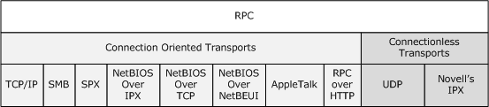

Figure 1: RPC extensions transports

Protocols that require a secure request-reply message exchange can use an implementation of these extensions. Examples of protocols that use an implementation of these extensions include the Directory Services Setup Remote Protocol (specified in [MS-DSSP](../MS-DSSP/MS-DSSP.md)), Distributed Link Tracking: Central Manager Protocol (specified in [MS-DLTM](../MS-DLTM/MS-DLTM.md)), and Print System Asynchronous Notification Protocol (specified in [MS-PAN](../MS-PAN/MS-PAN.md)).

## 1.5 Prerequisites/Preconditions

These extensions presume that the client and server [**stubs**](#gt_stub) for each [**RPC**](#gt_remote-procedure-call-rpc) being executed are available to the implementation on the [**RPC client**](#gt_rpc-client) and [**RPC server**](#gt_rpc-server), respectively.

The extensions do not impose other preconditions of their own, but they do inherit the preconditions required by the underlying [**RPC transport**](#gt_rpc-transport) and [**security provider**](#gt_security-provider) being used for a given RPC exchange.

## 1.6 Applicability Statement

The extensions specified herein do not change the basic applicability of the DCE 1.1: RPC specification, as specified in [[C706]](https://go.microsoft.com/fwlink/?LinkId=89824), but some extensions, as described in section [1.3](#Section_1.3), improve security. The DCE 1.1: RPC specification and the Remote Procedure Call Protocol are meta-protocols used to build application-level protocols. With its full set of extensions, the DCE 1.1: RPC specification can be used in a wide range of scenarios.

## 1.7 Versioning and Capability Negotiation

- **Supported Transports:** These [**RPC**](#gt_remote-procedure-call-rpc) extensions can be implemented on top of various [**RPC transports**](#gt_rpc-transport), as specified in section [2.1](#Section_2.1). Higher-level protocols on the client either discover the RPC transport supported by the server or know it in advance. Higher-level protocols on the client can also determine whether a server supports a given RPC transport by sending a message on the RPC transport. If the server supports the RPC transport, the communication succeeds. If the server does not support the RPC transport, the RPC transport either returns a transport-dependent error or returns no reply, depending on the transport. For details on client behavior in the case of no reply, see sections [3.2.2](#Section_3.2.2) and [3.3.2](#Section_3.3.2). If the transport returns an error, an implementation-specific error is returned to the application or the higher-level protocols.
- **Protocol Versions:** These RPC extensions do not introduce new [**protocol variants**](#gt_protocol-variant). The preexisting protocol variants are specified throughout this document. RPC extensions constrain the DCE 1.1: RPC specification, as specified in [[C706]](https://go.microsoft.com/fwlink/?LinkId=89824), to only support protocol version 5.0 for [**connection-oriented RPC**](#gt_connection-oriented-rpc), protocol version 4.0 for [**connectionless RPC**](#gt_connectionless-rpc), and protocol version 2.0 for the [**NDR**](#gt_network-data-representation-ndr) transfer syntax [**universally unique identifier (UUID)**](#gt_universally-unique-identifier-uuid). The DCE 1.1: RPC specification uses and extends the transfer syntax negotiation mechanism, as specified in section [3.3.1.5.6](#Section_3.3.1.5.6) and in [C706] chapter 12. Version negotiation is performed separately for each RPC interface, as specified in [C706] chapter 12.
- **Security and Authentication Methods:** RPC extensions use a model with a pluggable [**security provider**](#gt_security-provider) module for the actual security and authentication work. Higher-level protocols on the client should discover the security provider supported by the server or know them in advance. Higher-level protocols on the client can negotiate the use of RPC security providers by sending a message by using a given RPC security provider. If the server supports the RPC security provider, as specified in sections [3.3.3.1](#Section_3.3.3.1), [3.2.3.5.4](#Section_3.2.3.5.4), and [3.3.3.5.3](#Section_3.3.3.5.3), the communication succeeds. If the server does not support the RPC security provider, the server returns an error, as specified in section 3.3.3.5.3 for connection-oriented RPC protocols, or as specified in section 3.2.3.5.4 for connectionless RPC protocols.
- **Capability Negotiation:** For the capability negotiation specified in sections [2.2.2.3](#Section_2.2.2.3) and [2.2.3.3](#Section_2.2.3.3), this protocol uses unused bits in the RPC [**protocol data unit (PDU)**](#gt_protocol-data-unit-pdu) header, as specified in sections 2.2.2.3 and 2.2.3.3. This protocol also uses the bind time feature negotiation mechanism, as specified in section [3.3.1.5.3](#Section_3.3.1.5.3).

## 1.8 Vendor-Extensible Fields

In addition to the error codes specified in [[C706]](https://go.microsoft.com/fwlink/?LinkId=89824), these extensions use Win32 error codes as defined in [MS-ERREF](../MS-ERREF/MS-ERREF.md) section 2.2. Vendors SHOULD reuse those values with their indicated meanings. Choosing any other value runs the risk of a collision in the future.

## 1.9 Standards Assignments

These extensions do not introduce any standards assignments other than what is specified in [[C706]](https://go.microsoft.com/fwlink/?LinkId=89824) and [[RFC81.3]](https://go.microsoft.com/fwlink/?LinkId=90494).

# 2 Messages

This protocol references commonly use data types as defined in [MS-DTYP](../MS-DTYP/MS-DTYP.md).

## 2.1 Transport

[[C706]](https://go.microsoft.com/fwlink/?LinkId=89824) specifies two [**protocol variants**](#gt_protocol-variant) within [**connection-oriented RPC**](#gt_connection-oriented-rpc) and [**connectionless RPC**](#gt_connectionless-rpc). This specification maintains categorization for the descriptions of the [**RPC**](#gt_remote-procedure-call-rpc) protocol variants.

These extensions update the [**protocol identifiers**](#gt_protocol-identifier) that are specified in [C706] Appendix I which specifies that the protocol identifier can be one of three types:

- An octet string derived from an [**interface**](#gt_interface) [**UUID**](#gt_universally-unique-identifier-uuid) combined with a version number.
- An octet string derived from OSI object identifiers (OIDs).
- Single octet identifiers that are registered by the Open Software Foundation for commonly used protocols.
The extensions specified in this document mandate that the third type MUST be used for all communications.

Unless explicitly stated otherwise, the protocol identifier used by each protocol sequence specified in sections [2.1.1](#Section_2.1.1) and [2.1.2](#Section_2.1.2) is as specified in the table in [C706] Appendix I.

The [**RPC protocol sequence**](#gt_rpc-protocol-sequence) strings for the [**RPC transports**](#gt_rpc-transport) defined by these extensions are specified in the following table.<1>

| RPC transport | RPC protocol sequence string |
| --- | --- |
| SMB | ncacn_np (see section [2.1.1.2](#Section_2.1.1.2)) |
| TCP/IP (both IPv4 and IPv6) | ncacn_ip_tcp (see section [2.1.1.1](#Section_2.1.1.1)) |
| UDP | ncadg_ip_udp (see section [2.1.2.1](#Section_2.1.2.1)) |
| SPX | ncacn_spx (see section [2.1.1.3](#Section_2.1.1.3)) |
| IPX | ncadg_ipx (see section [2.1.2.2](#Section_2.1.2.2)) |
| NetBIOS over IPX | ncacn_nb_ipx (see section [2.1.1.4](#Section_2.1.1.4)) |
| NetBIOS over TCP | ncacn_nb_tcp (see section [2.1.1.5](#Section_2.1.1.5)) |
| NetBIOS over NetBEUI | ncacn_nb_nb (see section [2.1.1.6](#Section_2.1.1.6)) |
| AppleTalk | ncacn_at_dsp (see section [2.1.1.7](#Section_2.1.1.7)) |
| RPC over HTTP | ncacn_http (see section [2.1.1.8](#Section_2.1.1.8)) |

### 2.1.1 Connection-Oriented RPC Transports

All [**connection-oriented RPC**](#gt_connection-oriented-rpc) protocols specified in this document are carried by transport protocols that MAY satisfy the following requirements:

- The transport protocol allows a client to establish a connection with a server given a network address, [**endpoint**](#gt_endpoint), and, optionally, one or more network options.
- Each transport protocol connection is a duplex communication session that supports reliable, in order, at-most-once delivery semantics.
- Each connection can be established and can be terminated. Once established, a connection allows sending and receiving of unlimited amounts of data. Optionally, a transport can detect whether the other party to a connection has dropped off the connection and SHOULD indicate this to [**RPC**](#gt_remote-procedure-call-rpc) runtime. The details of how and when this is handled are specified in sections [3.3.2.2.1](#Section_3.3.2.2.1) and [3.3.2.7.1](#Section_3.3.2.7.1).
In sections [2.1.1.1](#Section_2.1.1.1) through [2.1.1.8](#Section_2.1.1.8), for each transport protocol that supports these extensions, this document specifies how the transport protocol fulfills the requirements given in this section and any other relevant transport-specific details.

#### 2.1.1.1 TCP/IP (NCACN_IP_TCP)

This protocol sequence specifies [**RPC**](#gt_remote-procedure-call-rpc) directly over TCP/IP. There are no intermediate protocols between TCP/IP and RPC.

When extensions that are not specified in sections [2.1.1](#Section_2.1.1) through [2.1.2](#Section_2.1.2) are enabled over the TCP transport protocol, the network address MUST be an IPv4 or IPv6 address or a server name.<2> The server name MUST be a Unicode string that represents either a NetBIOS host name (see [MS-NBTE](../MS-NBTE/MS-NBTE.md) section 2.2.1) or a fully qualified domain name (see [[RFC1035]](https://go.microsoft.com/fwlink/?LinkId=90264) section 3.1 and [[RFC2181]](https://go.microsoft.com/fwlink/?LinkId=127732) section 11).

The server name MUST resolve to an IPv4 or IPv6 address ([[RFC1001]](https://go.microsoft.com/fwlink/?LinkId=90260) [[RFC1002]](https://go.microsoft.com/fwlink/?LinkId=90261)). Server names are resolved by using **GetAddrInfo** or equivalent Windows APIs, which return a list of IP addresses. The server MUST attempt to connect to each IP address returned in the list. Connections are attempted in sequential order, a single address at a time. If the connection fails, the server MUST attempt to connect to the next IP address in the list.

IPv4 addresses MUST be supported and IPv6 addresses SHOULD be supported.

The [**endpoint**](#gt_endpoint) MUST be a 16-bit unsigned integer port number. The network address of the server and the endpoint are not transmitted over the network by these extensions but are used by lower-layer protocols to set up the connection.

RPC over TCP/IP MUST use [**endpoint mapper**](#gt_endpoint-mapper) [**well-known endpoint**](#gt_well-known-endpoint) 135, as specified in [[C706]](https://go.microsoft.com/fwlink/?LinkId=89824) Appendix H.

#### 2.1.1.2 SMB (NCACN_NP)

This protocol sequence specifies [**RPC**](#gt_remote-procedure-call-rpc) directly over SMB. There are no intermediate protocols between RPC and SMB.

When these extensions are enabled over the SMB transport protocol, the network address used by the client MUST be an IPv4 or IPv6 address or a server name.<3>The server name MUST be a Unicode string that represents either a NetBIOS host name (see [MS-NBTE](../MS-NBTE/MS-NBTE.md) section 2.2.1) or a fully qualified domain name (see [[RFC1035]](https://go.microsoft.com/fwlink/?LinkId=90264) section 3.1 and [[RFC2181]](https://go.microsoft.com/fwlink/?LinkId=127732) section 11).

The [**endpoint**](#gt_endpoint) MUST be a [**named pipe**](#gt_named-pipe) name. The network address and endpoint are not transmitted on the network by these extensions but are used by lower-layer protocols to set up the connection.

RPC over SMB MUST use an [**endpoint mapper**](#gt_endpoint-mapper) [**well-known endpoint**](#gt_well-known-endpoint) of \pipe\epmapper.

RPC over SMB MUST use a [**protocol identifier**](#gt_protocol-identifier) of 0x0F instead of 0x10, as specified in [[C706]](https://go.microsoft.com/fwlink/?LinkId=89824) Appendix I.<4>

The tower encoding for RPC over SMB MUST be the same as what is specified in [C706] Appendix L, for ncacn_ip_tcp. The port address MUST be the endpoint encoded into a NULL-terminated string in ASCII character format. The length of the string MUST be less than 0xFFFF bytes. For changes in how these extensions interpret the tower encoding see section [3.1.3.5.3](#Section_3.1.3.5.3).

When an application is creating a binding handle for RPC over named pipes, the application will provide a server name, endpoint, and credentials. The server name, endpoint, and credentials are provided to [**SMB**](#gt_server-message-block-smb) ([MS-CIFS](../MS-CIFS/MS-CIFS.md) section 3.4.4.1) to uniquely identify the named pipe (SMB session) which the RPC binding handle will use.

All [**PDUs**](#gt_protocol-data-unit-pdu) sent over SMB MUST be sent as named pipe writes ([MS-CIFS] section 3.4.4.2), and PDUs to be received MUST be received as named pipe reads, as specified in [MS-CIFS] section 3.4.4.3. However, in the case of synchronous RPCs, an implementation of these extensions MAY require the Server Message Block (SMB) Protocol ([MS-SMB](../MS-SMB/MS-SMB.md)) implementation to execute a transaction that encompasses the write of the last request PDU and the read of the first response PDU on the client. The last request PDU MUST be a bind, an alter_context, or the last fragment of a request. The first response PDU MUST be a bind_ack or bind_nak, an alter_context_response, or the first fragment of a response. The transaction over a write and read is as specified in [MS-CIFS].<5>

#### 2.1.1.3 SPX (NCACN_SPX)

This protocol sequence specifies [**RPC**](#gt_remote-procedure-call-rpc) directly over SPX. There are no intermediate protocols between RPC and SPX. An implementation MAY<6> support this protocol sequence.

When extensions that are not specified in sections [2.1.1](#Section_2.1.1) through [2.1.2](#Section_2.1.2) are enabled over the SPX transport protocol, the network address MUST be either a Netware machine name or a network and node number. For more information, see [[IPX]](https://go.microsoft.com/fwlink/?LinkId=89914), IPX Addressing.

The [**endpoint**](#gt_endpoint) MUST be a 16-bit unsigned integer port number. The network address of the server and the endpoint are not transmitted over the network by these extensions but are used by lower-layer protocols to set up the connection.

RPC over SPX MUST use an [**endpoint mapper**](#gt_endpoint-mapper) [**well-known endpoint**](#gt_well-known-endpoint) of 34280.

#### 2.1.1.4 NetBIOS over IPX (NCACN_NB_IPX)

This protocol sequence specifies [**RPC**](#gt_remote-procedure-call-rpc) directly over [**NetBIOS**](#gt_netbios) over IPX, which MAY<7><8> be supported. There are no intermediate protocols between RPC and NetBIOS over IPX. These extensions define three NetBIOS mappings for RPC. The mappings are the same at the RPC level but use a different NetBIOS transport. Some implementations can offer higher-layer protocols the opportunity to choose the NetBIOS transport to be used. This section covers the mapping of RPC to NetBIOS over IPX.<9>

When these extensions are enabled over the NetBIOS over IPX session service, as specified in [MS-CIFS](../MS-CIFS/MS-CIFS.md) section 2.1.1.3, the network address MUST be a [**NetBIOS host name**](#gt_netbios-host-name).

The [**endpoint**](#gt_endpoint) MUST be an 8-bit unsigned integer socket number. The network address and endpoint are not transmitted on the network by these extensions but are used by lower-layer protocols to set up the connection.

RPC over NetBIOS over IPX MUST use an [**endpoint mapper**](#gt_endpoint-mapper) [**well-known endpoint**](#gt_well-known-endpoint) of 135. RPC over NetBIOS over IPX MUST use a [**protocol identifier**](#gt_protocol-identifier) of 0x12 instead of the value of 0x11, as specified in [[C706]](https://go.microsoft.com/fwlink/?LinkId=89824) Appendix I.

When communicating between a client and a server by using NetBIOS over IPX, each RPC [**PDU**](#gt_protocol-data-unit-pdu) MUST be prefixed with a 4-octet sequence number encoded with [**little-endian**](#gt_little-endian) byte ordering, as defined in the following diagram.

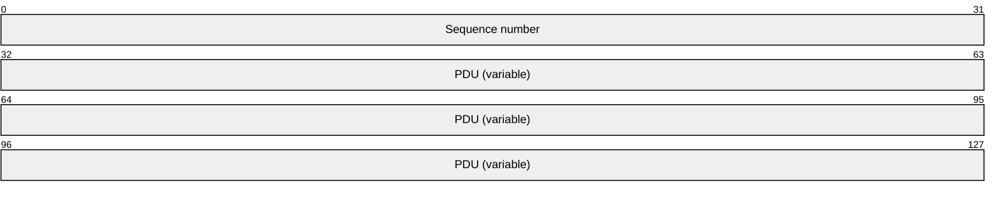

The sequence numbers SHOULD start at 0 and increase monotonically, wrapping if it exceeds 232-1, for each sent PDU on a given NetBIOS connection. The server SHOULD ignore the sequence number values.

#### 2.1.1.5 NetBIOS over TCP (NCACN_NB_TCP)

This protocol sequence specifies [**RPC**](#gt_remote-procedure-call-rpc) directly over NetBIOS over TCP. There are no intermediate protocols between RPC and NetBIOS over TCP. These extensions define three [**NetBIOS**](#gt_netbios) mappings for RPC. The mappings are the same at the RPC level but use a different NetBIOS transport. Some implementations can offer higher-layer protocols the opportunity to choose the NetBIOS transport to be used. This section covers the mapping of RPC to NetBIOS over TCP, which MAY<10><11><12> be supported.

When these extensions are enabled over the NetBIOS over TCP session service, the network address MUST be a NetBIOS machine name, as specified in [[RFC1001]](https://go.microsoft.com/fwlink/?LinkId=90260) and [[RFC1002]](https://go.microsoft.com/fwlink/?LinkId=90261).

The [**endpoint**](#gt_endpoint) MUST be an 8-bit unsigned integer port number. The network address and endpoint are not transmitted on the network by these extensions but are used by lower-layer protocols to set up the connection.

RPC over NetBIOS over TCP MUST use an [**endpoint mapper**](#gt_endpoint-mapper) [**well-known endpoint**](#gt_well-known-endpoint) of 135.

RPC over NetBIOS over TCP MUST use a [**protocol identifier**](#gt_protocol-identifier) of 0x12 instead of the value of 0x11, as specified in [[C706]](https://go.microsoft.com/fwlink/?LinkId=89824) Appendix I.

When communicating between a client and a server by using NetBIOS over TCP, each RPC [**PDU**](#gt_protocol-data-unit-pdu) MUST be prefixed with a 4-octet sequence number encoded with [**little-endian**](#gt_little-endian) byte ordering, as defined in the following diagram.

The sequence numbers SHOULD start at 0 and increase monotonically, wrapping if it exceeds 232-1, for each sent PDU on a given NetBIOS connection. The server SHOULD ignore the sequence number values.

#### 2.1.1.6 NetBIOS over NetBEUI (NCACN_NB_NB)

This protocol sequence specifies [**RPC**](#gt_remote-procedure-call-rpc) directly over NetBIOS over NetBEUI. There are no intermediate protocols between RPC and NetBIOS over NetBEUI. These extensions define three [**NetBIOS**](#gt_netbios) mappings for RPC. The mappings are the same at the RPC level but use a different NetBIOS transport. Some implementations can offer higher-layer protocols the opportunity to choose the NetBIOS transport to be used. This section covers the mapping of RPC to NetBIOS over NetBEUI, which MAY<13><14> be supported.

When these extensions are enabled over the NetBIOS over NetBEUI session service, as specified in [[NETBEUI]](https://go.microsoft.com/fwlink/?LinkId=90224), the network address MUST be a NetBIOS machine name, as specified in [NETBEUI].

The [**endpoint**](#gt_endpoint) MUST be an 8-bit unsigned integer port number. The network address and endpoint are not transmitted on the network by these extensions but are used by lower-layer protocols to set up the connection.

RPC over NetBIOS over NetBEUI MUST use an [**endpoint mapper**](#gt_endpoint-mapper) [**well-known endpoint**](#gt_well-known-endpoint) of 135.

RPC over NetBIOS over NetBEUI MUST use a [**protocol identifier**](#gt_protocol-identifier) of 0x12 instead of the value of 0x11, as specified in [[C706]](https://go.microsoft.com/fwlink/?LinkId=89824) Appendix I.

When communicating between a client and a server by using NetBIOS over NetBEUI, each RPC [**PDU**](#gt_protocol-data-unit-pdu) MUST be prefixed with a 4-octet sequence number encoded with [**little-endian**](#gt_little-endian) byte ordering, as defined in the following diagram.

The sequence numbers SHOULD start at 0 and increase monotonically, wrapping if it exceeds 232-1, for each sent PDU on a given NetBIOS connection. The server SHOULD ignore the sequence number values.

#### 2.1.1.7 AppleTalk (NCACN_AT_DSP)

This protocol sequence specifies [**RPC**](#gt_remote-procedure-call-rpc) directly over AppleTalk. There are no intermediate protocols between RPC and AppleTalk. This protocol sequence MAY<15> be supported.

RPC over AppleTalk MUST use a [**well-known endpoint**](#gt_well-known-endpoint). The [**endpoint**](#gt_endpoint) MUST be an AppleTalk Data Stream Protocol (ADSP) socket number, as specified in [AT] section 12. When extensions that are not specified in sections [2.1.1](#Section_2.1.1) through [2.1.2](#Section_2.1.2) are enabled over ADSP as specified in [AT], the network address MUST be an AppleTalk name or in the format machinename@zonename. If no zone is provided, the protocol MUST default to the client's zone. The network address and endpoint are not transmitted on the network by these extensions but are used by lower-layer protocols to set up the connection.

#### 2.1.1.8 RPC over HTTP (ncacn_http)

This protocol sequence specifies RPC over HTTP. The Remote Procedure Call over HTTP Protocol is the intermediate protocol between RPC and HTTP. RPC over HTTP v1 deviates from the requirements specified in section [2.1.1](#Section_2.1.1) (as specified in [MS-RPCH](../MS-RPCH/MS-RPCH.md) section 1.6).

Transport details are as specified in [MS-RPCH] section 2.1.

### 2.1.2 Connectionless RPC Transports

Earlier versions of [[C706]](https://go.microsoft.com/fwlink/?LinkId=89824) refer to the CL_CANCEL packet as a QUIT packet and to a CANCEL_ACK packet as a QUACK packet. The latter forms are used in this document. Connectionless RPC transports and RPC exchanges MAY<16> be supported.

#### 2.1.2.1 UDP (NCADG_IP_UDP)

This protocol sequence specifies [**RPC**](#gt_remote-procedure-call-rpc) directly over UDP. There are no intermediate protocols between RPC and UDP.<17>

When these extensions are enabled over the UDP transport protocol, the network address MUST be an IP address. The [**endpoint**](#gt_endpoint) MUST be a UDP port number. The network address and endpoint are not transmitted on the network by these extensions but are used by UDP or any lower-layer protocols to communicate with the server.

RPC over UDP MUST use [**endpoint mapper**](#gt_endpoint-mapper) [**well-known endpoint**](#gt_well-known-endpoint) 135, as specified in [[C706]](https://go.microsoft.com/fwlink/?LinkId=89824) Appendix H. It MUST use [**protocol identifier**](#gt_protocol-identifier) 0x08, as specified in [C706] Appendix I.

#### 2.1.2.2 Internetwork Packet Exchange (IPX) (NCADG_IPX)

This protocol sequence specifies [**RPC**](#gt_remote-procedure-call-rpc) directly over IPX. There are no intermediate protocols between RPC and IPX.<18>This protocol sequence MAY<19> be supported

When these extensions are enabled over the IPX datagram service, the network address MUST be either a Netware machine name or a network and node number. For more information, see [[IPX]](https://go.microsoft.com/fwlink/?LinkId=89914).

The [**endpoint**](#gt_endpoint) MUST be a 16-bit unsigned integer socket number. The network address and endpoint are not transmitted on the network by these extensions but are used by lower-layer protocols to communicate with the server.

RPC over IPX MUST use an [**endpoint mapper**](#gt_endpoint-mapper) [**well-known endpoint**](#gt_well-known-endpoint) of 34280. It MUST use [**protocol identifier**](#gt_protocol-identifier) 0x14, as specified in [[C706]](https://go.microsoft.com/fwlink/?LinkId=89824) Appendix I.

## 2.2 Message Syntax

For all non-IDL packet definitions in this section, this specification uses both [[C706]](https://go.microsoft.com/fwlink/?LinkId=89824) definition style and a packet diagram to facilitate understanding of how the [C706] specification is extended. In all non-IDL packet definitions in this section, bit ordering rules are the same as what is specified in [C706], unless explicitly stated otherwise.

Unless otherwise specified, all padding octets can be set to any arbitrary value when sent and MUST be ignored by the receiver.

### 2.2.1 Connection-Oriented and Connectionless RPC Messages

This section defines the messages that are common to [**connection-oriented RPC**](#gt_connection-oriented-rpc) and [**connectionless RPC**](#gt_connectionless-rpc) [**protocol variants**](#gt_protocol-variant). The messages that are specific to connection-oriented RPC and connectionless RPC are specified in their respective sections, [2.2.2](#Section_2.2.2) and [2.2.3](#Section_2.2.3).

#### 2.2.1.1 Common Types and Constants

##### 2.2.1.1.1 RPC_IF_ID Type

The **RPC_IF_ID** structure type extension introduces a new type defined as follows.

typedef struct {

UUID Uuid;

unsigned short VersMajor;

unsigned short VersMinor;

} RPC_IF_ID;

Use, meaning, and the layout of these fields are the same as the **rpc_if_id_t** type, as specified in [[C706]](https://go.microsoft.com/fwlink/?LinkId=89824) Appendix N.

**Uuud:** Specifies the interface [**UUID**](#gt_universally-unique-identifier-uuid).

**VersaMajor:** Major version number, an integer from 0 to 65535, inclusive.

**VersaMinor:** Minor version number, an integer from 0 to 65535, inclusive.

##### 2.2.1.1.2 Extended Error Information Signature Value

The value for the Signature field that specifies the presence of extended error information in a [bind_nak](#Section_2.2.2.9) [**PDU**](#gt_protocol-data-unit-pdu) MUST be 90740320-fad0-11d3-82d7-009027b130ab. The bind_nak PDU is as specified in [[C706]](https://go.microsoft.com/fwlink/?LinkId=89824) section 12.6.4, and is extended as specified in section 2.2.2.9.

##### 2.2.1.1.3 UUID Format

Implementations of these extensions MUST NOT enforce the restrictions on the UUID format, as specified in [[C706]](https://go.microsoft.com/fwlink/?LinkId=89824) Appendix A. A [**UUID**](#gt_universally-unique-identifier-uuid) MUST be treated as an [**opaque**](#gt_opaque) 128-bit number. Implementations can choose any algorithm to generate a UUID as long as the generated UUIDs are unique in space and time, as specified in [C706] Appendix A.<20>

##### 2.2.1.1.4 Mapping of a Context Handle

For an active context handle, implementations of these extensions SHOULD treat all the fields of the **ndr_context_handle**, as specified in [[C706]](https://go.microsoft.com/fwlink/?LinkId=89824) Appendix N, as a single opaque token. There MUST be a 1:1 relationship between this token and the context handle on the server.<21>

##### 2.2.1.1.5 version_t

The **version_t** structure specifies the major and minor version numbers of the run-time protocols supported by the server, as specified in [[C706]](https://go.microsoft.com/fwlink/?LinkId=89824).

typedef struct _version_t {

unsigned char major;

unsigned char minor;

} version_t,

*Pversion_t;

##### 2.2.1.1.6 p_rt_versions_supported_t

The **p_rt_versions_supported_t** structure contains a list of the run-time protocol versions supported by the server, as specified in [[C706]](https://go.microsoft.com/fwlink/?LinkId=89824).

typedef struct _p_rt_versions_supported_t {

unsigned char n_protocols;

[size_is(n_protocols)] version_t p_protocols[];

} p_rt_versions_supported_t,

*Pp_rt_versions_supported_t;

**n_protocols:** The number of protocols.

**p_protocols:** An array of [version_t](#Section_2.2.1.1.5) structures that specifies the major and minor protocol versions.

##### 2.2.1.1.7 Security Providers

The RPC protocol extensions do not require support for the dce_c_rpc_authn_protocol_krb5 [**security provider**](#gt_security-provider), as specified in [[C706]](https://go.microsoft.com/fwlink/?LinkId=89824) section 13. All of the requirements specified in [C706] section 13 are removed by these extensions.<22>

These extensions specify the following values for the security provider.

| Name | Value | Security provider |
| --- | --- | --- |
| RPC_C_AUTHN_NONE | 0x00 | No Authentication |
| RPC_C_AUTHN_GSS_NEGOTIATE | 0x09 | SPNEGO |
| RPC_C_AUTHN_WINNT | 0x0A | NTLM |
| RPC_C_AUTHN_GSS_SCHANNEL | 0x0E | TLS |
| RPC_C_AUTHN_GSS_KERBEROS | 0x10 | Kerberos |
| RPC_C_AUTHN_NETLOGON | 0x44 | Netlogon |
| RPC_C_AUTHN_DEFAULT | 0xFF | Same as RPC_C_AUTHN_WINNT |

On the client side, if the higher level protocol requests RPC_C_AUTHN_DEFAULT, the implementation MUST use RPC_C_AUTHN_WINNT instead.

The security provider underlying protocol and implementation defines the number of legs and whether the number of legs is odd or even that are used in the token exchange process that builds a security context. This information MAY be used for the processing of PDUs during that process.

These extensions specify the following number (if known) or even/oddness of the legs needed to build a security context.

| Name | # of or Even # of Token Exchange Legs |
| --- | --- |
| RPC_C_AUTHN_NONE | even |
| RPC_C_AUTHN_GSS_NEGOTIATE | even |
| RPC_C_AUTHN_WINNT | 3 |
| RPC_C_AUTHN_GSS_SCHANNEL | even |
| RPC_C_AUTHN_GSS_KERBEROS | even |
| RPC_C_AUTHN_NETLOGON | 3 |
| RPC_C_AUTHN_DEFAULT | unknown |

##### 2.2.1.1.8 Authentication Levels

The RPC protocol extensions specify the following values for the [**authentication levels**](#gt_authentication-level).

| Name | Value | Meaning |
| --- | --- | --- |
| RPC_C_AUTHN_LEVEL_DEFAULT | 0x00 | Same as RPC_C_AUTHN_LEVEL_CONNECT |
| RPC_C_AUTHN_LEVEL_NONE | 0x01 | No authentication. |
| RPC_C_AUTHN_LEVEL_CONNECT | 0x02 | Authenticates the credentials of the client and server. |
| RPC_C_AUTHN_LEVEL_CALL | 0x03 | Same as RPC_C_AUTHN_LEVEL_PKT. |
| RPC_C_AUTHN_LEVEL_PKT | 0x04 | Same as RPC_C_AUTHN_LEVEL_CONNECT but also prevents replay attacks. |
| RPC_C_AUTHN_LEVEL_PKT_INTEGRITY | 0x05 | Same as RPC_C_AUTHN_LEVEL_PKT but also verifies that none of the data transferred between the client and server has been modified. |
| RPC_C_AUTHN_LEVEL_PKT_PRIVACY | 0x06 | Same as RPC_C_AUTHN_LEVEL_PKT_INTEGRITY but also ensures that the data transferred can only be seen unencrypted by the client and the server. |

If the higher-level application or protocol requests an authentication level that the implementation or [**security provider**](#gt_security-provider) does not support, it MUST upgrade the request to the next highest supported level. RPC_C_AUTHN_LEVEL_PKT_PRIVACY MUST be supported.

On the client side, if the higher-level protocol requests RPC_C_AUTHN_LEVEL_CALL, the implementation MUST upgrade it to RPC_C_AUTHN_LEVEL_PKT. Similarly, on the server side, if the auth_level field of the sec_trailer structure as specified in sections [2.2.2.11](#Section_2.2.2.11) and [2.2.3.4](#Section_2.2.3.4) is RPC_C_AUTHN_LEVEL_CALL, the implementation MUST process it in the same manner as a packet with auth_level RPC_C_AUTHN_LEVEL_PKT.

Also, on the client side, if the higher-level protocol requests RPC_C_AUTHN_LEVEL_DEFAULT, the implementation MUST use RPC_C_AUTHN_LEVEL_CONNECT instead.

##### 2.2.1.1.9 Impersonation Level

For The RPC protocol extensions secure calls, the higher-level layer protocols often specify the impersonation level. Various impersonation levels, listed in the following table, allow the higher-layer protocols to control the capabilities of the client's identity that are available to the server. While building the [**security context**](#gt_security-context) (section [3.1.1.1.1](#Section_3.1.1.1.1)), the client implementation passes this to the [**security provider**](#gt_security-provider) on the first call to the implementation-specific equivalent of the abstract GSS_Init_sec_context call, as specified in [[RFC2743]](https://go.microsoft.com/fwlink/?LinkId=90378).

Client implementations of this extension MUST support the following impersonation levels. Note that the impersonation level does not itself appear in any RPC message and, hence, the numeric values of the following constants are implementation-specific. However, the values affect the token returned by the implementation-specific equivalent of the abstract GSS_Init_sec_context_call, as specified in [RFC2743].

| Value | Meaning |
| --- | --- |
| RPC_C_IMPL_LEVEL_IDENTITY | The server can obtain information about the security context of the client but cannot impersonate the client's security context. The client MUST pass the GSS_C_IDENTITY_FLAG (defined in [[RFC4757]](https://go.microsoft.com/fwlink/?LinkId=90488) section 7.1, which extends [RFC2743]) to the implementation-specific equivalent of the abstract GSS_Init_sec_context_call. |
| RPC_C_IMPL_LEVEL_IMPERSONATE | The server can impersonate the client's security context on the server system but cannot make requests to remote machines using the client security context. This is the default behavior, as specified in [RFC2743]. |
| RPC_C_IMPL_LEVEL_DELEGATE | The server can impersonate the client's security context on the server system and can make requests to remote machines using the client's security context. The client MUST pass the implementation-specific equivalent of the deleg_req_flag, as specified in [RFC2743] section 2.2.1. |

If the higher-level protocol does not specify an impersonation level, RPC_C_IMPL_LEVEL_IMPERSONATE MUST be used as the default.

##### 2.2.1.1.10 Transport-Layer Impersonation Level

Some RPC transports have the capability to send the identity of the client with the request to the server. For details on how this information is used by the RPC transport, see the documentation for the RPC transport, section [2.1](#Section_2.1).

Client implementations of these extensions MUST support the following impersonation levels. These impersonation levels allow protocols above RPC to control which capabilities of the client's identity are made available to the server. If the higher-level protocol does not provide any value for this impersonation level, implementation of these extensions MUST allow the underlying RPC transport to choose the default value.

Currently the only RPC transport listed in section 2.1 that is capable of sending the impersonation level to the server is SMB (ncacn_np). For more on how this information is used by SMB, see the description of impersonation level in [MS-CIFS](../MS-CIFS/MS-CIFS.md) section 2.2.4.64.

| Value | Meaning |
| --- | --- |
| SECURITY_ANONYMOUS | The server cannot obtain identification information about the client, and it cannot impersonate the client. |
| SECURITY_IDENTIFICATION | The server can obtain information about the security context of the client but cannot impersonate the client's security context. |
| SECURITY_IMPERSONATION | The server can impersonate the client's security context on the server system but cannot make requests to remote machines using the client security context. |
| SECURITY_DELEGATION | The server can impersonate the client's security context on the server system and can make requests to remote machines using the client's security context. |

Although SECURITY_IMPERSONATION and SECURITY_DELEGATION are permitted values and MAY be specified on either the client or server when the authentication context is negotiated, it is up to the higher-level protocol to interpret the resultant impersonation level (which can be different than what the client or server specified) and perform impersonation or delegation as needed.<23>

**Note** These transport-layer impersonation levels are separate from the ones specified in section [2.2.1.1.9](#Section_2.2.1.1.9) in the sense that they are specified separately by an application. Although the security meanings are the same (except that an anonymous level is not supported in section 2.2.1.1.9), the security is applied at different layers; for example, by the transport provider versus the security provider chosen by the application.

#### 2.2.1.2 Endpoint Mapper Interface Extensions

An [**endpoint mapper**](#gt_endpoint-mapper) [**interface**](#gt_interface) is specified in [[C706]](https://go.microsoft.com/fwlink/?LinkId=89824) Appendix O. These extensions update the definition in [C706], as specified in the following sections. All parts of the definition that are not mentioned in the following sections MUST be the same as what is specified in [C706].

##### 2.2.1.2.1 EPT_S_CANT_PERFORM_OP

This extension defines the EPT_S_CANT_PERFORM_OP constant to be equivalent to 0x6D8. EPT_S_CANT_PERFORM_OP signifies general failure to perform the requested operation (method call) on the [**endpoint mapper**](#gt_endpoint-mapper) [**interface**](#gt_interface).

##### 2.2.1.2.2 twr_t Type

This extension redefines the twr_t type, as specified in [[C706]](https://go.microsoft.com/fwlink/?LinkId=89824) Appendix L, by adding a range attribute to the **tower_length** field. The redefined type is specified as follows.<24>

typedef struct {

[range(0,2000)] unsigned long tower_length;

[size_is(tower_length)] BYTE tower_octet_string[];

} twr_t,

*twr_p_t;

The purpose and use of this structure remains unchanged with an exception related to processing, as specified in section [3.1.3.5.3](#Section_3.1.3.5.3).

##### 2.2.1.2.3 error_status Type

The error_status type is used to communicate method-specific error status to a caller.

This type is declared as follows:

typedef unsigned int error_status;

##### 2.2.1.2.4 ept_lookup Method

These extensions redefine the ept_lookup method, as specified in [[C706]](https://go.microsoft.com/fwlink/?LinkId=89824) Appendix O, by as follows:

- Adds the **ptr** attribute to the *object* and *Ifid* parameters.
- Adds the **range** attribute to the *max_ents* parameter.
- Removes the **[idempotent]** method attribute.
The redefined method is specified as follows.

void ept_lookup(

[in] handle_t hEpMapper,

[in] unsigned long inquiry_type,

[in, ptr] UUID* object,

[in, ptr] RPC_IF_ID* Ifid,

[in] unsigned long vers_option,

[in, out] ept_lookup_handle_t* entry_handle,

[in, range(0,500)] unsigned long max_ents,

[out] unsigned long* num_ents,

[out, length_is(*num_ents), size_is(max_ents)]

ept_entry_t entries[],

[out] error_status* status

);

**hEpMapper:** An [**RPC**](#gt_remote-procedure-call-rpc) binding handle as specified in [C706] section 2.

**inquiry_type:** The type of inquiry to perform. It SHOULD<25> be one of the following values.

| Value | Meaning |
| --- | --- |
| RPC_C_EP_ALL_ELTS 0x00000000 | Return all elements from the [**endpoint**](#gt_endpoint) map. The Ifid, vers_option, and object parameters MUST be ignored. |
| RPC_C_EP_MATCH_BY_IF 0x00000001 | Return endpoint map elements that contain the [**interface**](#gt_interface) identifier specified by the Ifid and vers_option values. |
| RPC_C_EP_MATCH_BY_OBJ 0x00000002 | Return endpoint map elements that contain the [**object UUID**](#gt_object-uuid) specified by object. |
| RPC_C_EP_MATCH_BY_BOTH 0x00000003 | Return endpoint map elements that contain the interface identifier and object UUID specified by Ifid, vers_option, and object. |

**object:** Optionally specifies an object UUID. A value of NULL indicates that no object UUID is specified.

**Ifid:** Optionally specifies an interface [**UUID**](#gt_universally-unique-identifier-uuid). A value of NULL indicates that no interface UUID is specified.

**vers_option:** The interface version constraint. MUST be one of the following values.

| Value | Meaning |
| --- | --- |
| RPC_C_VERS_ALL 0x00000001 | Return endpoint map elements that contain the specified interface UUID, regardless of the version numbers. |
| RPC_C_VERS_COMPATIBLE 0x00000002 | Return the endpoint map elements that contain the same major versions of the specified interface UUID and a minor version greater than or equal to the minor version of the specified UUID. |
| RPC_C_VERS_EXACT 0x00000003 | Return endpoint map elements that contain the specified version of the specified interface UUID. |
| RPC_C_VERS_MAJOR_ONLY 0x00000004 | Return endpoint map elements that contain the same version of the specified interface UUID and ignore the minor version. |
| RPC_C_VERS_UPTO 0x00000005 | Return endpoint map elements that contain a version of the specified interface UUID less than or equal to the specified major and minor version. |

**entry_handle:** On the first call, the client MUST set this to NULL. On successful completion of this method, returns a context handle that the client MUST use on subsequent calls to this method. In between calls if the client wishes to terminate the search, it MUST close the context handle by calling ept_lookup_handle_free.

**max_ents:** The maximum number of elements to be returned.

**num_ents:** The actual number of elements being returned.

**entries:** The elements that satisfy the specified search criteria.

**status:** MUST be one of a Win32 error code as specified in [MS-ERREF](../MS-ERREF/MS-ERREF.md), 0x16C9A0CD, or 0x16C9A0D6. All values other than those specified in the following table MUST be treated as a failure.

| Value | Meaning |
| --- | --- |
| 0x00000000 | The method call returned at least one element that matched the search criteria. |
| 0x16C9A0D6 | There are no elements that satisfy the specified search criteria. |

This method has no return values.

Everything else about this method remains as specified in [C706] Appendix O.<26>

##### 2.2.1.2.5 ept_map Method

These extensions redefine the ept_map method, as specified in [[C706]](https://go.microsoft.com/fwlink/?LinkId=89824) Appendix O, by way of the following:

- Adding the **ptr** attribute to the *obj* and *map_tower* parameters.
- Adding the **range** attribute to the *max_towers* parameter.
- Removing the **[idempotent]** method attribute.
The resulting method definition is specified as follows.

void ept_map(

[in] handle_t hEpMapper,

[in, ptr] UUID* obj,

[in, ptr] twr_p_t map_tower,

[in, out] ept_lookup_handle_t* entry_handle,

[in, range(0,500)] unsigned long max_towers,

[out] unsigned long* num_towers,

[out, ptr, size_is(max_towers), length_is(*num_towers)]

twr_p_t* ITowers,

[out] error_status* status

);

**hEpMapper:** An [**RPC**](#gt_remote-procedure-call-rpc) binding handle as specified in [C706] section 2.

**obj:** Optionally specifies an [**object UUID**](#gt_object-uuid). A value of NULL indicates that no object UUID is specified. Interfaces registered with a NULL object UUID will match any object UUID supplied here.

**map_tower:** The tower encoding to search for, as specified in [C706] Appendix L.

**entry_handle:** On the first call, the client MUST set this to NULL. On successful completion of this method, returns a context handle that the client MUST use on subsequent calls to this method. In between calls if the client wants to terminate the search, it MUST close the context handle by calling ept_lookup_handle_free.

**max_towers:** The maximum number of elements to be returned.

**num_towers:** The actual number of elements being returned.

**ITowers:** The tower encoding, as specified in [C706] Appendix L, of the elements found in the endpoint map.

**status:** MUST be one of a Win32 error code specified in [MS-ERREF](../MS-ERREF/MS-ERREF.md), 0X16C9A0CD, or 0X16C9A0D6. All values besides the following ones MUST be treated as failure.

| Value | Meaning |
| --- | --- |
| 0x00000000 | The method call returned at least one element that matched the search criteria. |
| 0x16C9A0D6 | There are no elements that satisfy the specified search criteria. |

This method has no return values.

Everything else about this method remains as specified in [C706] Appendix O. For more details, see section 2.3.3.3 in [C706]. Note that this redefinition has no wire impact and, therefore, it is interoperable with the [C706] implementation, as long as the max_towers value is less than 501.<27>

##### 2.2.1.2.6 ept_insert Method

These extensions do not require support for the ept_insert method. These extensions do not provide an alternative method.<28>

##### 2.2.1.2.7 ept_delete Method

These extensions remove support for the ept_delete method. A client implementation SHOULD NOT call this method.<29>

##### 2.2.1.2.8 ept_lookup_handle_free Method

The syntax of ept_lookup_handle_free method is as specified in [[C706]](https://go.microsoft.com/fwlink/?LinkId=89824) Appendix O, but [C706] Appendix O does not describe the meaning of the arguments. As such, the meaning of the arguments is given as follows.

void ept_lookup_handle_free(

[in] handle_t hEpMapper,

[in, out] ept_lookup_handle_t* entry_handle,

[out] error_status* status

);

**hEpMapper:** An [**RPC**](#gt_remote-procedure-call-rpc) binding handle as specified in [C706] section 2.

**entry_handle:** The context handle to free, which was received from a previous call to either ept_lookup or ept_map.

**status:** On return, this MUST be set to 0x00000000.

This method has no return values.

##### 2.2.1.2.9 ept_inq_object Method

These extensions remove support for the ept_inq_object method. A client implementation SHOULD NOT call this method. These extensions do not provide an alternative method.<30>

##### 2.2.1.2.10 ept_mgmt_delete Method

These extensions remove support for the ept_mgmt_delete method. A client implementation SHOULD NOT call this method. These extensions do not provide an alternative method.<31>

##### 2.2.1.2.11 ept_lookup_handle_t Type

The ept_lookup_handle_t type defines an opaque pointer that is used to represent a context handle, as specified in [[C706]](https://go.microsoft.com/fwlink/?LinkId=89824). It is returned from the server to the client.

This type is declared as follows:

typedef [context_handle] void* ept_lookup_handle_t;

#### 2.2.1.3 Management Interface Extensions

Remote Management Interface ([[C706]](https://go.microsoft.com/fwlink/?LinkId=89824) Appendix Q) defines a management [**interface**](#gt_interface). These extensions update the definition specified in [C706], as specified in the following sections. All parts of the definition that are not mentioned in the following sections MUST be the same as specified in [C706].

##### 2.2.1.3.1 rpc_if_id_vector_p_t Type

These extensions redefine the rpc_if_id_vector_p_t type, as specified in [[C706]](https://go.microsoft.com/fwlink/?LinkId=89824) Appendix N, by changing the type of the **IfId** field from **rpc_if_id_p_t** to **RPC_IF_ID**. This change does not affect the compatibility with the type defined in [C706].

The redefined structure is specified as follows.

typedef struct {

unsigned long Count;

[size_is(Count)] RPC_IF_ID* IfId[];

} rpc_if_id_vector_t,

*rpc_if_id_vector_p_t;

##### 2.2.1.3.2 StatisticsCount Type

These extensions introduce a new type, StatisticsCount.<32>

This type is declared as follows:

typedef [range(0,50)] unsigned long StatisticsCount;

It is used as the count of statistics elements for various methods.

##### 2.2.1.3.3 rpc_mgmt_inq_stats Method

These extensions redefine the rpc_mgmt_inq_stats method, as specified in [[C706]](https://go.microsoft.com/fwlink/?LinkId=89824) Appendix Q, by changing the type of the *count* parameter from unsigned long to [StatisticsCount](#Section_2.2.1.3.2). StatisticsCount (section 2.2.1.3.2) has a range attribute that affects compatibility with the definition in [C706], as specified in section [3.3.1.3](#Section_3.3.1.3). The redefined method is specified as follows.<33>

void rpc_mgmt_inq_stats(

[in] handle_t binding_handle,

[in, out] StatisticsCount* count,

[out, size_is(*count)] unsigned long statistics[],

[out] error_status_t* status

);

This method has no return values.

Everything else about this method remains as specified in [C706] Appendix Q.

##### 2.2.1.3.4 rpc_mgmt_inq_princ_name Method

These extensions redefine the rpc_mgmt_inq_princ_name method, as specified in [[C706]](https://go.microsoft.com/fwlink/?LinkId=89824) Appendix Q, by adding a range attribute to the *princ_name_size* parameter. This change affects compatibility with the definition in [C706].

The redefined method is specified as follows.<34>

void rpc_mgmt_inq_princ_name(

[in] handle_t binding_handle,

[in] unsigned long authn_proto,

[in, range(0, 4096)] unsigned long princ_name_size,

[out, string, size_is(princ_name_size)]

char princ_name[],

[out] error_status_t* status

);

This method has no return values.

Everything else about this method remains as specified in [C706] Appendix Q.

### 2.2.2 Connection-Oriented RPC Messages

#### 2.2.2.1 PDU Segments

A [**PDU**](#gt_protocol-data-unit-pdu) can be viewed as having several different segments. These segments are as follows:

- PDU **Header:** The header section of the PDU, as specified in [[C706]](https://go.microsoft.com/fwlink/?LinkId=89824) section 12.6.
- PDU **Body:** The body section of the PDU, as specified in [C706] section 12.6. It also includes the padding octets specified in section [2.2.2.11](#Section_2.2.2.11).
- **sec_trailer Structure:** The structure specified in section 2.2.2.11.
- **Authentication Token:** The authentication token [**binary large object (BLOB)**](#gt_binary-large-object-blob) of the PDU, as specified in section [2.2.2.12](#Section_2.2.2.12).
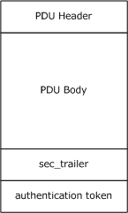

Figure 2: PDU structure

#### 2.2.2.2 PFC_MAYBE Flag

Implementations of these extensions MAY<35> ignore this flag. This flag is specified in [[C706]](https://go.microsoft.com/fwlink/?LinkId=89824) section 12.6.

#### 2.2.2.3 PFC_SUPPORT_HEADER_SIGN Flag

These extensions define a new [**PDU**](#gt_protocol-data-unit-pdu) flag for the **pfc_flags** in the common header fields that are specified in [[C706]](https://go.microsoft.com/fwlink/?LinkId=89824) section 12.6, with the numeric value of 0x04. The new flag, PFC_SUPPORT_HEADER_SIGN, has the same numeric value as the existing PFC_PENDING_CANCEL flag.

The PDU type MUST be examined to determine how to interpret this flag. (The PDU types are specified in section [2.2.2.10](#Section_2.2.2.10) and [C706] section 12.6.) For PDU types bind, bind_ack, alter_context, alter_context_resp, and rpc_auth_3, this flag MUST be interpreted as PFC_SUPPORT_HEADER_SIGN. For the remaining PDU types, this flag MUST be interpreted as PFC_PENDING_CANCEL.

#### 2.2.2.4 negotiate_ack Member of p_cont_def_result_t Enumerator

These extensions specify a new member, negotiate_ack, which is added to the p_cont_def_result_t enumeration (specified in [[C706]](https://go.microsoft.com/fwlink/?LinkId=89824) section 12.6), with the numeric value of 3. The enumeration SHOULD be as follows.

typedef short enum {

acceptance, user_rejection, provider_rejection, negotiate_ack

} p_cont_def_result_t;

For details on how this enumerator is used, see section [3.3.1.5.3](#Section_3.3.1.5.3).

#### 2.2.2.5 New Reasons for Bind Rejection

The following table briefly describes the reject reasons used by these extensions. These reasons are defined in [[C706]](https://go.microsoft.com/fwlink/?LinkId=89824) section 12.6.3.1.

| Reject reason | Value | Meaning |
| --- | --- | --- |
| REASON_NOT_SPECIFIED | 0x00 | If the reason for the error does not fit any of the other reasons specified in this section, then this rejection code SHOULD be used. |
| TEMPORARY_CONGESTION | 0x01 | Not Used. Client implementations of these extensions SHOULD treat this rejection code in the same manner as LOCAL_LIMIT_EXCEEDED. |
| LOCAL_LIMIT_EXCEEDED | 0x02 | The server could not complete the request due to lack of resources. |
| PROTOCOL_VERSION_NOT_SPECIFIED | 0x04 | The server detected a protocol error while processing an **rpc_bind** or **rpc_alter_context** [**PDU**](#gt_protocol-data-unit-pdu). |

These extensions add two new reasons for rejection in the [bind_nak](#Section_2.2.2.9) packet that is specified in [C706] section 12.6. The reasons are defined as follows.

| Reject reason | Value | Meaning |
| --- | --- | --- |
| authentication_type_not_recognized | 0x08 | [**Authentication type**](#gt_authentication-type) requested by client is not recognized by server. |
| invalid_checksum | 0x09 | This rejection code is used when an unrecoverable error is detected by the underlying security package. |

#### 2.2.2.6 alloc_hint Interpretation

These extensions impose additional restrictions on the **alloc_hint** field specified in [[C706]](https://go.microsoft.com/fwlink/?LinkId=89824) section 12.6. Implementations MUST allow for 0 to be specified, as specified in [C706]; implementations SHOULD reject calls when the **alloc_hint** is nonzero but exceeds the combined [**stub**](#gt_stub) data length of all fragments from a fragmented request or response.

If **alloc_hint** is set to a nonzero value and a request or a response is fragmented into multiple [**PDUs**](#gt_protocol-data-unit-pdu), implementations of these extensions SHOULD set the **alloc_hint** field in every PDU to be the combined stub data length of all remaining fragment PDUs.

An implementation that does not follow these rules might not be able to interoperate successfully with an implementation of these extensions.

#### 2.2.2.7 RPC_SYNTAX_IDENTIFIER

This type is equivalent in syntax and semantics to the p_syntax_id_t type, as specified in [[C706]](https://go.microsoft.com/fwlink/?LinkId=89824) section 12.6.

#### 2.2.2.8 rpc_fault Packet

[**Connection-Oriented RPC**](#gt_connection-oriented-rpc) [**PDUs**](#gt_protocol-data-unit-pdu) ([[C706]](https://go.microsoft.com/fwlink/?LinkId=89824) section 12.6) allows for [**stub**](#gt_stub) data to be present in rpc_fault PDUs. Clients implementing these extensions MUST ignore any stub data in an rpc_fault PDU, and servers MUST NOT generate stub data in an rpc_fault PDU. [C706] also prescribes that if the status in the rpc_fault PDU is 0, the actual error is in the stub data. These extensions always retrieve the actual error from the status field in the rpc_fault PDU. A server implementation MUST NOT send any of the error codes specified in section [3.3.3.5](#Section_3.3.3.5).

An implementation that does not follow these rules might not be able to interoperate successfully with an implementation of these extensions.

Connection-oriented RPC PDUs ([C706] section 12.6) set aside a reserved field. These extensions specify the least significant bit of the reserved field to be a flag indicating the presence of [**RPC**](#gt_remote-procedure-call-rpc) extended error information. Details on RPC extended error information are specified in [MS-EERR](../MS-EERR/MS-EERR.md). If RPC extended error information is present, it is specified as a variable length [**BLOB**](#gt_binary-large-object-blob), and its length MUST be calculated as alloc_hint - 0x20.

#### 2.2.2.9 bind_nak Packet

These extensions update the bind_nak packet, as specified in [[C706]](https://go.microsoft.com/fwlink/?LinkId=89824) section 12.6.4.5, to have the following definition.

typedef struct {

unsigned char rpc_vers;

unsigned char rpc_vers_minor;

unsigned char PTYPE;

unsigned char pfc_flags;

unsigned char packed_drep[4];

unsigned short frag_length;

unsigned short auth_length;

unsigned long call_id;

unsigned short provider_reject_reason;

p_rt_versions_supported_t versions;

UUID Signature;

} bind_nak;

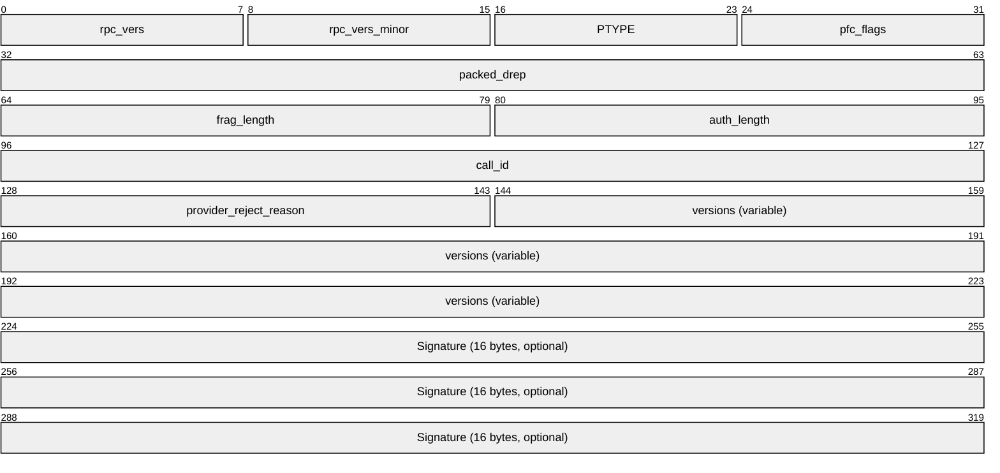

These extensions add the Signature field at the end as an optional field. The presence or absence of the Signature field MUST be determined as follows.

Assume that the client calculates the length of the [**PDU**](#gt_protocol-data-unit-pdu) until the Signature field as L.

- If the frag_length field is greater than or equal to L plus the size of the Signature field, the client SHOULD assume that the Signature field is present.
- Otherwise, the client SHOULD assume that the Signature field is not present.
The Signature field MUST be interpreted as a [**UUID**](#gt_universally-unique-identifier-uuid).

If the Signature field is equal to the extended error information signature value, as specified in section [2.2.1.1.2](#Section_2.2.1.1.2), the client MUST assume that the bind_nak PDU contains [**RPC**](#gt_remote-procedure-call-rpc) extended error information appended as a [**BLOB**](#gt_binary-large-object-blob), as specified in [MS-EERR](../MS-EERR/MS-EERR.md), immediately following the Signature field that continues until the end of the PDU. If RPC extended error information is present, the length of the BLOB containing it MUST be calculated as frag_length – 0x1C.

Clients MAY<36> ignore the RPC extended error information BLOB. Clients that interpret the BLOB MUST do so as specified in [MS-EERR].

If the Signature field is not equal to the extended error information Signature value, as specified in section 2.2.1.1.2, the client SHOULD ignore the Signature field and all information that follows it in this PDU.

#### 2.2.2.10 rpc_auth_3 PDU

These extensions specify a new [**PDU**](#gt_protocol-data-unit-pdu) type: rpc_auth_3. It is defined as follows.

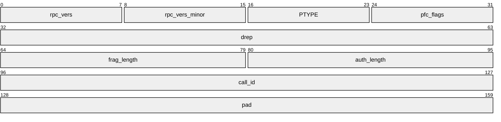

**rpc_vers (1 byte):** As specified by **rpc_vers** field in rpc_bind PDU in [[C706]](https://go.microsoft.com/fwlink/?LinkId=89824) section 12.6.

**rpc_vers_minor (1 byte):** As specified by **rpc_vers_minor** field in rpc_bind PDU in [C706] section 12.6.

**PTYPE (1 byte):** MUST be set to 0x10.

**pfc_flags (1 byte):** As specified by **pfc_flags** field in rpc_bind PDU in [C706] section 12.6.

**drep (4 bytes):** As specified by **drep** field in rpc_bind PDU in [C706] section 12.6.

**frag_length (2 bytes):** As specified by **frag_length** field in rpc_bind PDU in [C706] section 12.6.

**auth_length (2 bytes):** As specified by **auth_length** field in rpc_bind PDU in [C706] section 12.6. It MUST be greater than zero for this PDU type.

**call_id (4 bytes):** As specified by **call_id** field in rpc_bind PDU in [C706] section 12.6.

**pad (4 bytes):** Can be set to any arbitrary value when set and MUST be ignored on receipt. The **pad** field MUST be immediately followed by a [sec_trailer](#Section_2.2.2.11) structure whose layout, location, and alignment are as specified in section 2.2.2.11.

All the rules for processing PDUs specified in [C706] section 12.6, including but not limited to data representation, **pfc_flags**, and protocol version numbers, MUST be applied to this PDU as well. For more information, see section [3.3.1.5.2](#Section_3.3.1.5.2).

#### 2.2.2.11 sec_trailer Structure

These extensions define the sec_trailer structure to have syntax equivalent to the **auth_verifier_co_t** structure as specified in [[C706]](https://go.microsoft.com/fwlink/?LinkId=89824) section 12.6. The two structures have the same layout when sent on the network, but they name their fields differently and, in some cases, interpret their fields differently.

A nonzero value for the **auth_length** field indicates the presence of authentication information provided by the security provider. When the **auth_length** field is nonzero, the sec_trailer structure MUST be present.

For request and response [**PDUs**](#gt_protocol-data-unit-pdu), where the request and response PDUs are part of a fragmented request or response and authentication is requested (nonzero **auth_length**), the sec_trailer structure MUST be present in every fragment of the request or response.

The sec_trailer structure MUST be placed at the end of the PDU, including past [**stub**](#gt_stub) data, when present. The sec_trailer structure MUST be 16-byte aligned with respect to the beginning of the PDU Body. Padding octets MUST be used to align the sec_trailer structure if its natural beginning is not already 16-byte aligned.

All PDUs that carry sec_trailer information share certain common fields: **frag_length** and **auth_length**. The beginning of the sec_trailer structure for each PDU MUST be calculated to start from offset (**frag_length** – **auth_length** – 8) from the beginning of the PDU.

The structure is defined as follows.

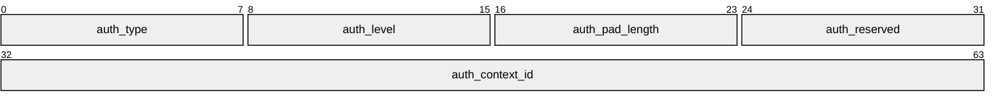

**auth_type (1 byte):** MUST contain an [**authentication type**](#gt_authentication-type). For information on how this is used, see sections [3.1.1.1.1](#Section_3.1.1.1.1), [3.3.1.5.2](#Section_3.3.1.5.2), and [3.1.3.1.1](#Section_3.1.3.1.1). If a request or response is fragmented, all PDUs from that request or response MUST have the same **auth_type**.

**auth_level (1 byte):** MUST contain one of the [**authentication levels**](#gt_authentication-level) as specified in section [2.2.1.1.8](#Section_2.2.1.1.8). The value serves a dual purpose. The first purpose is to specify what security protection is applied to what segment of the PDU, as specified in section 3.3.1.5.2. The second purpose is to serve as a parameter to the [**security provider**](#gt_security-provider) that it SHOULD use to determine how to provide protection for the respective PDU segment. For information on how security providers use that, see the documentation for the respective security provider. If a request or response is fragmented, all PDUs from that request or response MUST have the same **auth_level**.

**auth_pad_length (1 byte):** The number of padding octets, used to 16-byte align the sec_trailer structure, as specified earlier in this section. In the figure "PDU structure with verification trailer" in section [2.2.2.13](#Section_2.2.2.13), these octets are referred to as the Authentication Padding Octets.

**auth_reserved (1 byte):** SHOULD be 0 on store, and SHOULD be ignored on read.

**auth_context_id (4 bytes):** Numeric identifier that uniquely identifies the security context that MUST be used for this PDU within the context of the current [**RPC**](#gt_remote-procedure-call-rpc) connection. For information on security contexts, see section [3.3.1.5.4](#Section_3.3.1.5.4). An implementation MUST examine the **drep** field from the RPC PDU header to determine if this field is [**little-endian**](#gt_little-endian) or [**big-endian**](#gt_big-endian), as specified in [C706] section 14.2.5. If a request or response is fragmented, all PDUs from that request or response MUST have the same **auth_context_id**.

Immediately after the sec_trailer structure, there MUST be a [**BLOB**](#gt_binary-large-object-blob) carrying the authentication information produced by the security provider. This BLOB is called the authentication token and MUST be of size **auth_length**. The size MUST also be equal to the length from the first octet immediately after the sec_trailer structure all the way to the end of the fragment; the two values MUST be the same. For more information on what the authentication token contains, see section [2.2.2.12](#Section_2.2.2.12).

A client or a server that (during composing of a PDU) has allocated more space for the authentication token than the security provider fills in SHOULD<37> fill in the rest of the allocated space with zero octets. These zero octets are still considered to belong to the authentication token part of the PDU.

#### 2.2.2.12 Authentication Tokens

These extensions require the conceptual model specified in [[RFC2743]](https://go.microsoft.com/fwlink/?LinkId=90378) for all interactions with all [**security providers**](#gt_security-provider). An implementation instructs the Generic Security Services (GSS)-API–compatible security providers to operate in a distributed computing environment (DCE)–compatible manner by setting the DCE Style protocol variable. The following table details what [**PDU**](#gt_protocol-data-unit-pdu) type MUST carry (in its auth_ token segment) the output of what GSS [[GSS]](https://go.microsoft.com/fwlink/?LinkId=89876) call during processing, as specified in section [3.3.1.5.2.2](#Section_3.3.1.5.2.2).

| RPC PDU name | GSS call producing auth_value |
| --- | --- |
| Bind | First call to GSS_Init_sec_context, as specified in [RFC2743] section 2.2.1. |
| bind_ack | First call to GSS_Accept_sec_context, as specified in [RFC2743] section 2.2.2. |
| alter_context, rpc_auth_3 | Second and subsequent calls to GSS_Init_sec_context, as specified in [RFC2743] section 2.2.1. |
| alter_context_resp | Second and subsequent calls to GSS_Accept_sec_context, as specified in [RFC2743] section 2.2.2. |
| Request | If the auth_level (as specified in section [2.2.2.11](#Section_2.2.2.11)) is RPC_C_AUTHN_LEVEL_PKT_PRIVACY, call to GSS_WrapEx; else call to GSS_GetMICEx. See section 3.3.1.5.2.2 for details. |
| Response | If the auth_level (as specified in section 2.2.2.11) is RPC_C_AUTHN_LEVEL_PKT_PRIVACY, call to GSS_UnwrapEx; else call to GSS_VerifyMICEx. See section 3.3.1.5.2.2 for details. |

#### 2.2.2.13 Verification Trailer

Within exchanges in which the [**security provider**](#gt_security-provider) in use does not provide integrity protection, as specified in [[C706]](https://go.microsoft.com/fwlink/?LinkId=89824) section 13.2.5, these extensions specify an additional provision for providing integrity protection for certain portions of [**PDUs**](#gt_protocol-data-unit-pdu). The verification trailer encompasses several data structures. The data structures MUST only appear in a request PDU, and they SHOULD be placed in the PDU immediately after the [**stub**](#gt_stub) data but before the authentication padding octets. Therefore, for security purposes, the verification trailer is considered part of the PDU body. For a fragmented request, only the last PDU of the request MUST have a verification trailer. As a general rule, implementations SHOULD<38> add the verification trailer on request PDUs that have portions of the PDU that cannot be protected by the security provider while in transit on the network.

The following diagram shows a PDU body within a PDU structure, with stub data, verification trailer, and authentication padding octets.

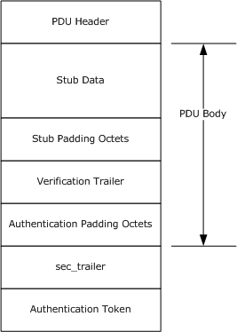

Figure 3: PDU structure with verification trailer

Client implementations MAY<39> send stub padding octets after the stub data. To maximize interoperability, server implementations SHOULD NOT assume that the verification trailer immediately follows the stub data but instead SHOULD search for a sequence of octets that matches the value of the signature, as specified in section [2.2.2.13.1](#Section_2.2.2.13.1), starting immediately after the end of the stub data and continuing until the end of the PDU.<40>

The verification trailer consists of a header and a body. The header MUST always contain an instance of the rpc_sec_verification_trailer structure that is specified in section 2.2.2.13.1. The beginning of the header MUST be 4-byte aligned with respect to the beginning of the PDU. If the stub data does not end on a 4-byte aligned boundary, padding octets MUST be added after the stub data. The padding bytes SHOULD be set to 0.

The verification trailer header MUST be immediately followed by the verification trailer body. The verification trailer body MUST consist of, at most, one instance from each of several data structures called verification trailer commands, which are specified in sections [2.2.2.13.2](#Section_2.2.2.13.2), [2.2.2.13.3](#Section_2.2.2.13.3), and [2.2.2.13.4](#Section_2.2.2.13.4).

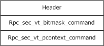

Figure 4: Verification trailer header and commands

The verification trailer commands can come in any order after the header. If more than one command is present, the next command MUST be placed immediately after the previous one. Each command MUST start with a common command header defined as the following.

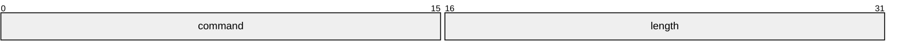

typedef struct {

USHORT command;

USHORT length;

} SEC_VT;

**command:** The commands MUST be encoded by using [**little-endian**](#gt_little-endian) encoding for all fields.

Valid combinations are defined immediately after the table.

| Value | Meaning |
| --- | --- |
| SEC_VT_COMMAND_BITMASK_1 0x0001 | This is an rpc_sec_vt_bitmask command, as specified in section 2.2.2.13.2. |
| SEC_VT_COMMAND_PCONTEXT 0x0002 | This is an rpc_sec_vt_pcontext command, as specified in section 2.2.2.13.4. |
| SEC_VT_COMMAND_HEADER2 0x0003 | This is an rpc_sec_vt_header2 command, as specified in section 2.2.2.13.3. |
| SEC_VT_COMMAND_END 0x4000 | This flag MUST be present in the last command in the verification trailer body. |
| SEC_VT_MUST_PROCESS_COMMAND 0x8000 | Indicates that the server MUST process this command. If the server does not support the command, it MUST reject the request. |

Least significant bits 0 through 13 (including 0 and 13) are used to hold the command type and MUST be considered a single field. Bits 14 and 15 are used to indicate command processing rules. If a server does not understand a command, it MUST ignore it unless the SEC_VT_MUST_PROCESS_COMMAND bit is set. If the server does not understand the command and the SEC_VT_MUST_PROCESS_COMMAND bit is set, it MUST treat the request as invalid, as if [**unmarshaling**](#gt_unmarshal) failure occurred, as specified in section [3.1.3.5.2](#Section_3.1.3.5.2), except that a status code of 5 SHOULD be used instead of the status code specified in section 3.1.3.5.2. Any combination of a value for the command type (bits 0 through 13) and command processing rules (bits 14 and 15) is valid.

**length:** The length field is in octets, MUST be a multiple of 4, and MUST NOT include the length of the command header. For fixed-size commands, the length field MUST be equal to the length of the fixed-size command.

##### 2.2.2.13.1 rpc_sec_verification_trailer

The **rpc_sec_verification_trailer** structure is defined as follows.

typedef struct {

unsigned char signature[8];

} rpc_sec_verification_trailer;

Whenever the verification trailer is present, the signature field MUST contain the following series of octets {0x8a, 0xe3, 0x13, 0x71, 0x02, 0xf4, 0x36, 0x71}. These values have no special protocol significance and only serve as a signature for this structure.

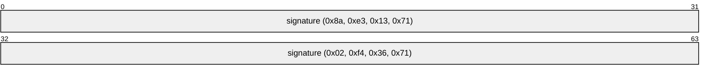

Client sends the verification trailer header whenever it needs to send a verification trailer body. For details on when a verification trailer body is sent, see the verification trailer commands that follow.

##### 2.2.2.13.2 rpc_sec_vt_bitmask

The **rpc_sec_vt_bitmask** structure command is defined as follows.

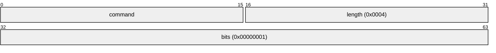

typedef struct {

USHORT command;

USHORT length;

ULONG bits;

} rpc_sec_vt_bitmask;

**command:** Least significant bits 0 through 13 MUST be SEC_VT_COMMAND_BITMASK_1. Bits 14 and 15 are as specified in section [2.2.2.13](#Section_2.2.2.13).

**Note** SEC_VT_COMMAND_BITMASK_1 has a value of 0x0001.

**length:** MUST be 0x0004.

**bits:** The bits field is a bitmask. A server MUST ignore bits it does not understand. Currently, there is only one bit defined: CLIENT_SUPPORT_HEADER_SIGNING (bitmask of 0x00000001). If this bit is set, the [PFC_SUPPORT_HEADER_SIGN](#Section_2.2.2.3) bit, as specified in section 2.2.2.3, MUST be present in the [**PDU**](#gt_protocol-data-unit-pdu) header for the bind PDU on this connection. For information on how PFC_SUPPORT_HEADER_SIGN is used, see section [3.3.1.5.2.2](#Section_3.3.1.5.2.2).<41>

##### 2.2.2.13.3 rpc_sec_vt_header2

This command is defined as follows.<42>

typedef struct {

USHORT command;

USHORT length;

unsigned char PTYPE;

unsigned char Reserved1;

unsigned short Reserved2;

unsigned char drep[4];

unsigned long call_id;

USHORT p_context_id_t;

unsigned SHORT opnum;

} rpc_sec_vt_header2;

**command:** Least significant bits 0 through 13 MUST be SEC_VT_COMMAND_HEADER2 (0x0003). Bits 14 and 15 are as specified in section [2.2.2.13](#Section_2.2.2.13).

**length:** MUST be 0x0010.

**PTYPE:** MUST be the same as the **PTYPE** field in the request [**PDU**](#gt_protocol-data-unit-pdu) header.

**Reserved1:** MUST be set to 0 when sent and MUST be ignored on receipt.

**Reserved2:** MUST be set to 0 when sent and MUST be ignored on receipt.

**drep:** MUST be the same as the **drep** field in the request PDU header.

**call_id:** MUST be the same as the **call_id** field in the request PDU header.

**p_context_id_t:** MUST be the same as the **p_cont_id** field in the request PDU header.

**opnum:** MUST be the same as the **opnum** field in the request PDU header.

The following table shows the format of rpc_sec_vt_header2.

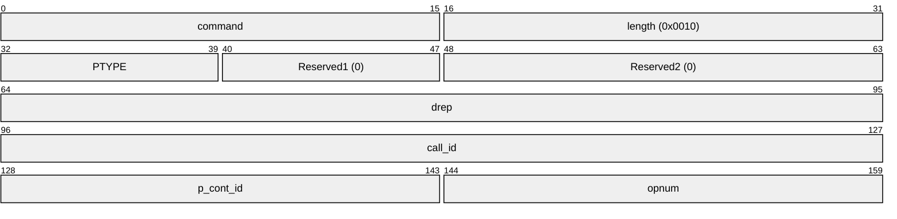

##### 2.2.2.13.4 rpc_sec_vt_pcontext

This command is defined as follows.<43>

typedef struct {

USHORT command;

USHORT length;

RPC_SYNTAX_IDENTIFIER InterfaceId;

RPC_SYNTAX_IDENTIFIER TransferSyntax;

} rpc_sec_vt_pcontext;

**command:** Least significant bits 0 through 13 MUST be 0x0002. Bits 14 and 15 are as specified in section [2.2.2.13](#Section_2.2.2.13).

**length:** MUST be set to 0x28.

**InterfaceId:** The [**interface**](#gt_interface) identifier for the presentation context of the request [**PDU**](#gt_protocol-data-unit-pdu) in which this verification trailer appears. This value MUST match the chosen abstract_syntax field from the bind or alter_context PDU where the presentation context was negotiated. For information on how a presentation context is negotiated, see section [3.3.1.5.6](#Section_3.3.1.5.6).

**TransferSyntax:** The transfer syntax identifier for the presentation context of the request PDU in which this verification trailer appears. This value MUST match the chosen transfer_syntax from the bind or alter_context PDU where the presentation context was negotiated. For information on how a presentation context is negotiated, see section 3.3.1.5.6.

The following table shows the format of the rpc_sec_vt_pcontext command.

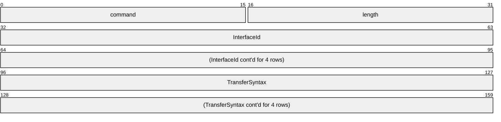

#### 2.2.2.14 BindTimeFeatureNegotiationBitmask

The bind time feature negotiation bitmask is an array of eight octets, each of which is interpreted as a bitmask. The format of the structure is as follows.

typedef struct {

unsigned char Bitmask[8];

} BindTimeFeatureNegotiationBitmask;

**Bitmask:** Currently, only the two least significant bits in the first element of the array are defined by the following table.

The rest SHOULD be reserved for future extensibility. For information on how this structure and the bits inside it are used, see section [3.3.1.5.3](#Section_3.3.1.5.3).

| Value | Meaning |
| --- | --- |
| SecurityContextMultiplexingSupported 0x01 | Client supports security context multiplexing, as specified in section [3.3.1.5.4](#Section_3.3.1.5.4). |
| KeepConnectionOnOrphanSupported 0x02 | Client supports keeping the connection open after sending the orphaned [**PDU**](#gt_protocol-data-unit-pdu), as specified in section [3.3.1.5.10](#Section_3.3.1.5.10). |

The following table shows the format of BindTimeFeatureNegotiationBitmask.

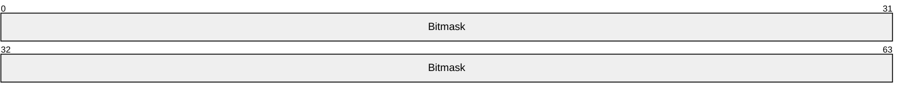

#### 2.2.2.15 BindTimeFeatureNegotiationResponseBitmask

The bind time feature negotiation response bitmask is an array of two octets, each of which is interpreted as a bitmask. The format of the structure is as follows.

typedef struct {

unsigned char Bitmask[2];

} BindTimeFeatureNegotiationResponseBitmask;

**Bitmask:** Currently, only the two least significant bits in the first element of the array are defined by the following table. The rest SHOULD be reserved for future extensibility. For information on how this structure and the bits inside it are used, see section [3.3.1.5.3](#Section_3.3.1.5.3).

| Value | Meaning |
| --- | --- |
| SecurityContextMultiplexingSupported 0x01 | Server supports security context multiplexing, as specified in section [3.3.1.5.4](#Section_3.3.1.5.4). |
| KeepConnectionOnOrphanSupported 0x02 | Server supports keeping the connection open after sending the orphaned [**PDU**](#gt_protocol-data-unit-pdu), as specified in section [3.3.1.5.10](#Section_3.3.1.5.10). |

The following table shows the format of BindTimeFeatureNegotiationResponseBitmask.

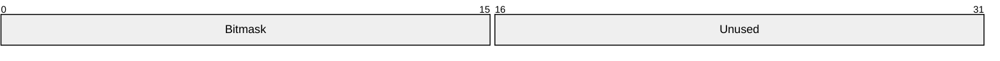

### 2.2.3 Connectionless RPC Messages

The format of each [**PDU**](#gt_protocol-data-unit-pdu) is as specified in [[C706]](https://go.microsoft.com/fwlink/?LinkId=89824) section 12. Connectionless RPC messages MAY<44> be supported.

#### 2.2.3.1 PDU Segments

A [**PDU**](#gt_protocol-data-unit-pdu) can be viewed as having several different segments. These segments are as follows:

- PDU Header: This is the header section of the PDU, as specified in [[C706]](https://go.microsoft.com/fwlink/?LinkId=89824) section 12.
- PDU Body: This is the body section of the PDU, as specified in [C706] section 12.
- [sec_trailer_cl Structure](#Section_2.2.3.4): The structure specified in section 2.2.3.4.
- Authentication Token: The authentication token [**BLOB**](#gt_binary-large-object-blob) of the PDU, as specified in section [2.2.3.5](#Section_2.2.3.5).
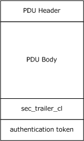

Figure 5: PDU structure

#### 2.2.3.2 Fault Packet

A fault [**PDU**](#gt_protocol-data-unit-pdu) MUST NOT contain any of the error codes specified in section [3.2.3.5](#Section_3.2.3.5).

#### 2.2.3.3 PF2_UNRELATED Flag

These extensions extend the [**PDU**](#gt_protocol-data-unit-pdu) format by defining the **reserved_04** bit of the second set of PDU flags (flags2), as specified in [[C706]](https://go.microsoft.com/fwlink/?LinkId=89824) section 12, as PF2_UNRELATED. This flag has meaning only in a REQUEST packet.

The server SHOULD<45> set the PF2_UNRELATED flag in all conv_who_are_you2 and conv_who_are_you_auth requests to indicate to the client that the server can correctly interpret client requests with the flag set.

The client MUST set the PF2_UNRELATED flag in a [REQUEST](#Section_3.2.2.5.1) packet if the packet SHOULD NOT cancel the [**activity's**](#gt_activity) previous call sequence numbers. For usage information, see section [3](#Section_3).

#### 2.2.3.4 sec_trailer_cl Structure

When a [**PDU**](#gt_protocol-data-unit-pdu) header's auth_proto field is nonzero, [[C706]](https://go.microsoft.com/fwlink/?LinkId=89824) section 12.3, and section 13.3.4, specify that the [**stub**](#gt_stub) data of the packet is padded to the next 8-byte boundary and MUST be followed by an auth_trailer_cl_t structure. These extensions divide the auth_trailer_cl_t type into a fixed-length security header and a variable-length token following the security header. For information on the authentication token, including determination of its length, see section [2.2.3.5](#Section_2.2.3.5).

For request and response PDUs, where the request and response PDUs are part of a fragmented request or where response and authentication are requested, the sec_trailer_cl structure is present in every fragment of the request or response.

typedef struct {

unsigned char auth_level;

unsigned char key_vers_num;

} sec_trailer_cl;

**auth_level:** This field MUST be one of the [**authentication levels**](#gt_authentication-level) specified in section [2.2.1.1.8](#Section_2.2.1.1.8). The values serve a dual purpose. The first purpose is to specify how security has to be applied to the PDU, as specified in section [3.3.1.5.2](#Section_3.3.1.5.2). The second purpose is to serve as a parameter to the security provider that it SHOULD use to determine how to provide protection for the PDU; for details on how [**security providers**](#gt_security-provider) use that, see the documentation for the respective security provider. If a request or response is fragmented, all PDUs from that request or response MUST have the same **auth_level**.

**key_vers_num:** This field is a numeric identifier that identifies the security context within the [**activity**](#gt_activity) that MUST be used for this PDU.

Immediately after the sec_trailer_cl structure, there MUST be a sequence of padding bytes followed by a [**BLOB**](#gt_binary-large-object-blob) carrying the authentication information produced by the security provider. This BLOB is called the authentication token.

If the **auth_level** is **RPC_C_AUTHN_LEVEL_PKT_PRIVACY**, the number of padding bytes is calculated as follows.

Number of padding bytes = MBSR4 - 2

where

- MBSR4: **MessageBlockSize** of the security context rounded up to a multiple of 4.
See the documentation for the respective security provider for the value of the **MessageBlockSize**. **MessageBlockSize** MUST be a power of 2.

For other **auth_level** values, the number of padding bytes is two.

#### 2.2.3.5 Authentication Tokens

The token length is not transmitted explicitly. A recipient infers the length of the token by subtracting the combined length of the [**connectionless RPC**](#gt_connectionless-rpc) header, [**stub**](#gt_stub) data, [sec_trailer_cl](#Section_2.2.3.4), and padding bytes from the length of the received packet, as reported by the underlying transport.

A client or a server (that, during processing, has allocated more space for the authentication token than the security provider fills in) SHOULD <46>fill in the rest of the allocated space with zero octets. These zero octets are still considered to belong to the authentication token part of the [**PDU**](#gt_protocol-data-unit-pdu).<47>

| RPC PDU | GSS call producing auth_value |
| --- | --- |
| Conv_who_are_you_auth's in_data parameter | First call to GSS_Accept_sec_context, as specified in [[RFC2743]](https://go.microsoft.com/fwlink/?LinkId=90378) section 2.2.2. |
| Conv_who_are_you_auth's out_data parameter | Second call to GSS_Init_sec_context, as specified in [RFC2743] section 2.2.1. If the data cannot be returned in a single PDU, the server queries the remainder with calls to conv_who_are_you_auth_more(). |
| Request PDU | If the auth_level (as specified in section 2.2.3.4) is RPC_C_AUTHN_LEVEL_PKT_PRIVACY, call to GSS_Wrap (as specified in [RFC2743] section 2.3.3); else call to GSS_GetMIC (as specified in [RFC2743] section 2.3.1). |
| Response PDU | If the auth_level (as specified in section 2.2.3.4) is RPC_C_AUTHN_LEVEL_PKT_PRIVACY, call to GSS_Unwrap (as specified in [RFC2743] section 2.3.4); else call to GSS_VerifyMIC (as specified in [RFC2743] section 2.3.2). |

#### 2.2.3.6 fack Packet

Implementation of these extensions MUST send or receive fack packets with the **vers** field set to 0 or 1. For either version, the definition of the fack [**PDU**](#gt_protocol-data-unit-pdu) remains the same as defined in [[C706]](https://go.microsoft.com/fwlink/?LinkId=89824) section 12.5.3.4.<48>

### 2.2.4 IDL Syntax Extensions

Extensions specified in sections [2.2.4.1](#Section_2.2.4.1) through [2.2.4.11](#Section_2.2.4.11) affect the syntax of the message, while extensions specified in sections [2.2.4.13](#Section_2.2.4.13) through [2.2.4.17](#Section_2.2.4.17) affect the processing of the message without directly changing the messages. Extensions specified in section [2.2.4.18](#Section_2.2.4.18) affects neither the syntax nor the processing of the message.

#### 2.2.4.1 New Primitive Types

##### 2.2.4.1.1 wchar_t

wchar_t designates a wide character type. It is treated as an unsigned short by using the rules for an unsigned short, as specified in [[C706]](https://go.microsoft.com/fwlink/?LinkId=89824) section 14.2.5.

A **string** attribute can be applied to a pointer or array of type wchar_t. This indicates a string of wide characters, as specified in [C706] section 14.3.4. The terminator for a wide character string is two octets of zero (0).

##### 2.2.4.1.2 __int3264

In [**NDR**](#gt_network-data-representation-ndr) transfer syntax, __int3264, as specified in [MS-DTYP](../MS-DTYP/MS-DTYP.md) section 2.2.1, is represented as four octets in the octet stream by using the same format as a long integer.

In [**64-Bit Network Data Representation (NDR64)**](#gt_64-bit-network-data-representation-ndr64) transfer syntax, __int3264 is treated as hyper, as specified in [[C706]](https://go.microsoft.com/fwlink/?LinkId=89824) section 14.2.5.

##### 2.2.4.1.3 __int8, __int16, __int32, __int64

Sized integer types are supported in these extensions. Applications can declare 8-bit, 16-bit, 32-bit, or 64-bit integer variables by using the __intn type specifier, where n is 8, 16, 32, or 64. __int8, __int16, __int32, __int64 MUST be synonymous to small, short, long, and hyper, respectively, as specified in [[C706]](https://go.microsoft.com/fwlink/?LinkId=89824) section 14.2.5.

##### 2.2.4.1.4 int

**int** MUST be treated as synonymous to **long** as specified in [[C706]](https://go.microsoft.com/fwlink/?LinkId=89824) section 14.2.5.

#### 2.2.4.2 Callback

These extensions allow static callback functions to be declared in the client side of a distributed application. This functionality provides a way for the server to make an [**RPC**](#gt_remote-procedure-call-rpc) method call to the client. During a callback, the original client that initiates the call is defined as a callback server.

Callback routines are declared by using a **callback** keyword in an [**IDL**](#gt_interface-definition-language-idl) file.

These extensions use operation numbers ([**opnums**](#gt_opnum)) to inform a callback server of the operation it SHOULD call. Callback operations and noncallback operations use overlapping ranges of opnums starting at zero to identify the operation by using the following rules: Operation numbers for callback operations MUST be generated consecutively, counting callback operations only, beginning with 0 (zero), in the order in which callback operations appear in the IDL source. Callback operations MUST be excluded in calculating the operation numbers for noncallback operations. If an operation is called in the context of a callback (for information on handling callbacks, see section [3.3.1.5.9](#Section_3.3.1.5.9)), an implementation of this extension MUST use the callback opnum range for calling the method. If an operation is not called in the context of a callback, an implementation of this extension MUST use the opnum range, as specified in [[C706]](https://go.microsoft.com/fwlink/?LinkId=89824) section 5.2.1.

#### 2.2.4.3 Array of Context Handles

These extensions extend the use of context handles (as specified in [[C706]](https://go.microsoft.com/fwlink/?LinkId=89824) section 4.2.16.6), by allowing arrays of context handles.

Context handles MUST be parameters, as specified in [C706] section 4.2.16.6. They are valid as an array element but MUST NOT be structure or union members and MUST NOT be the base type of a pipe.<49>

#### 2.2.4.4 Array of Strings

As specified in [[C706]](https://go.microsoft.com/fwlink/?LinkId=89824) section 14.3.5, an array of strings is treated uniquely by requiring a common string length. These extensions override this base specification as follows: An array of strings MUST be represented as an ordered sequence of representations of the array elements.

#### 2.2.4.5 ms_union

As an extension to the [**NDR**](#gt_network-data-representation-ndr) definition of union alignment (as specified in [[C706]](https://go.microsoft.com/fwlink/?LinkId=89824) section 14.3.8), these extensions dictate that the discriminant MUST be aligned per the alignment rules of the data type of the discriminant, and the selected arm MUST be aligned to the largest alignment of all the arms, when ms_union is enabled. Also, in case of an array, each element of the array MUST be aligned to the largest alignment of all the arms. ms_union MUST be ignored in [**NDR64**](#gt_64-bit-network-data-representation-ndr64) transfer syntax. ms_union MUST be ignored for encapsulated unions.

ms_union is enabled for a union by applying the **ms_union** type attribute to that union in its [**IDL**](#gt_interface-definition-language-idl) file, or for all unions in the IDL file, by using an implementation-specific compiler option.<50>

#### 2.2.4.6 v1_enum

Enumerated types MUST be treated as signed 32-bit integers when the **v1_enum** attribute is applied. v1_enum MUST be ignored in [**NDR64**](#gt_64-bit-network-data-representation-ndr64) transfer syntax.

**v1_enum** can be enabled by specifying v1_enum when defining enumerated types in [**Microsoft Interface Definition Language (MIDL)**](#gt_microsoft-interface-definition-language-midl) [[MSDN-MIDL]](https://go.microsoft.com/fwlink/?LinkId=90041).

#### 2.2.4.7 Expression in Conformant, Varying, and Union Description

In these extensions, **first_is**, **last_is**, **length_is**, **size_is**, **max_is**, and union switch attributes SHOULD accept C-language expressions that evaluate to an integer that represents the runtime value of each specific attribute.<51>

For more information, see the example in section [4.7](#Section_4.7), UNICODE_STRING Representation.

#### 2.2.4.8 Unencapsulated Union

These extensions extend the specification for marshaling unions to allow *[in]* or *[in,out]* parameters to be used as the discriminant for [out] or [in,out] unencapsulated unions. As specified in [[C706]](https://go.microsoft.com/fwlink/?LinkId=89824) section 14.3.8, the discriminant of an unencapsulated union MUST be [**marshaled**](#gt_marshal) both as the parameter specified in the switch_is construct and as the first part of the union representation. This custom-marshaling is extended as follows: The discriminant of the unencapsulated union MUST be marshaled as the parameter specified in the switch_is construct in the input or output octet stream(s) specified by the directional attribute(s) of the parameter. In addition, the discriminant MUST be marshaled as the first part of the union representation as specified in [C706] section 14.3.8, in the input or output octet stream(s) specified by the directional attribute(s) of the union.

#### 2.2.4.9 pointer_default

With these extensions, the pointer_default attribute, as specified in [[C706]](https://go.microsoft.com/fwlink/?LinkId=89824) section 4.2.4, is not required. Its default value MUST be pointer_default (unique) when the attribute is absent.

#### 2.2.4.10 Pointer Attributes

These extensions make the following changes to the pointer attributes as defined in [[C706]](https://go.microsoft.com/fwlink/?LinkId=89824) section 4.2.20.3.

- These extensions MUST allow a pointer attribute, of the first pointer, specified at the reference site (directly in the syntax of an operation declaration) to override the pointer attribute specified at the declared site.
- With these extensions, if a method returns a pointer to a type, both [unique] and [ptr] types of pointers MUST be permitted.

#### 2.2.4.11 Extension to Enumerated Type

These extensions extend the syntax of Enumerated Types as specified in [[C706]](https://go.microsoft.com/fwlink/?LinkId=89824) section 4.2.13.

<enumeration_type> ::=enum { <Identifier_tag> [ , <Identifier_tag> … }

<Identifier_tag> ::= <Identifier> [ = <Identifier_literal> ]

An <Identifier_literal> used in an <Identifier_tag> MUST be in the range of 0 to 32,767.

#### 2.2.4.12 NDR Transfer Syntax Identifier

[[C706]](https://go.microsoft.com/fwlink/?LinkId=89824) Appendix I, specifies the NDR transfer syntax identifier. These extensions augment the version number of the same [**NDR**](#gt_network-data-representation-ndr) transfer syntax [**UUID**](#gt_universally-unique-identifier-uuid) to be 2.0, as specified in the following table.

| UUID | Version | Comments |
| --- | --- | --- |
| 8a885d04-1ceb-11c9-9fe8-08002b104860 | 02 | Version 2.0 data representation protocol |

#### 2.2.4.13 byte_count

These extensions allow a higher-level protocol to specify the memory size in bytes of a given parameter as the value of another parameter. This MUST be specified by the byte_count parameter<52> attribute in an [**ACF**](#gt_application-configuration-file-acf), which the implementation MUST interpret as calling this extension.

[function-attribute-list ] function-name(

[byte_count(length-variable-name)] parameter-name,

...);

#### 2.2.4.14 range

The range attribute is only applicable in [**strict NDR/NDR64 data consistency checking**](#gt_strict-ndrndr64-data-consistency-check), as specified in section [3.1.1.5.3](#Section_3.1.1.5.3).

##### 2.2.4.14.1 range Attribute to Limit the Scope of Integral Values and the Number of Elements in Pipe Chunks

The range is specified by the [range] attribute accepted by [**MIDL**](#gt_microsoft-interface-definition-language-midl).

[range(low-val, high-val)] type-specifier declarator.

low-val and high-val are integer constant expressions as specified in [[C706]](https://go.microsoft.com/fwlink/?LinkId=89824) "P 14.01" in section 4.4.1.

##### 2.2.4.14.2 range Attribute to Limit the Range of Maximum Count of Conformant Array and String Length

[**MIDL**](#gt_microsoft-interface-definition-language-midl) extends the productions of [**IDL**](#gt_interface-definition-language-idl) syntax with the following range definition.

[range(low-val, high-val), <conf_range_attr>] type-specifier

declarator

conf_range_attr::=size_is<var_attr_list>|

max_is<var_attr_list>|

string

low-val and high-val are integer constant expressions as specified in [[C706]](https://go.microsoft.com/fwlink/?LinkId=89824) "P 14.01" section 4.4.1.

#### 2.2.4.15 strict_context_handle

A strict context handle is activated by a strict_context_handle attribute in an [**interface**](#gt_interface) definition block in an [**ACF**](#gt_application-configuration-file-acf). This attribute is only applicable in the [**strict NDR/NDR64 data consistency checking**](#gt_strict-ndrndr64-data-consistency-check) extension specified in section [3.1.1.5.3](#Section_3.1.1.5.3).

#### 2.2.4.16 type_strict_context_handle

Type strict context handle is activated by specifying the type_strict_context_handle attribute in an [**interface**](#gt_interface) definition block in an [**ACF**](#gt_application-configuration-file-acf). This attribute is only applicable in target level 6.0 of strict NDR/NDR64 data consistency checking, as specified in section [3.1.1.5.3](#Section_3.1.1.5.3).

#### 2.2.4.17 disable_consistency_check

The Pointer attribute [disable_consistency_check] disables the check specified in section [3.1.1.5.3.3.1.2](#Section_3.1.1.5.3.3.1.2). This attribute is only applicable in the strict NDR/NDR64 data consistency checking extension specified in section [3.1.1.5.3](#Section_3.1.1.5.3).

#### 2.2.4.18 Identifier Length

These extensions allow the user supplied identifiers in an IDL file to have a maximum length of 255 characters. The following table of allowed lengths replaces the table specified in [[C706]](https://go.microsoft.com/fwlink/?LinkId=89824) section 4.5.

| Bit Range | Field | Description |
| --- | --- | --- |
| Variable | Interface name | 255 |
| Variable | Type with **transmit_as** attribute | 255 |
| Variable | Type with **handle** attribute | 255 |
| Variable | Type with **context_handle** attribute | 255 |
| Variable | Type with **represent_as** attribute | 255 |

Note that the constructed identifiers will hence correspondingly longer than 255. For example, since the major and minor version numbers can have upto five digits, since they are unsigned 16-bit integers as specified in [C706] section 6.2.3.3, the constructed identifier <interface>_v<major version>_<minor version>_c_ifspec can have a length upto 277 characters. This is a change from [C706] section 4.2.1.2 which limits all identifiers to 31 characters.

### 2.2.5 64-Bit Network Data Representation

The 64-Bit Network Data Representation transfer syntax is a set of modifications to the [**NDR**](#gt_network-data-representation-ndr) transfer syntax, as specified in [[C706]](https://go.microsoft.com/fwlink/?LinkId=89824) chapter 14. [**NDR64**](#gt_64-bit-network-data-representation-ndr64) MAY<53> be supported.

All [**PDUs**](#gt_protocol-data-unit-pdu) encoded with the NDR64 transfer syntax MUST use a value of 0x10 for the data representation format label, as specified in [C706] section 14.1. This value indicates [**little-endian**](#gt_little-endian) integer and floating-pointer byte order, IEEE floating-point format representation, and ASCII character format, as specified in [C706] section 14.1.

#### 2.2.5.1 NDR64 Transfer Syntax Identifier

| UUID | Version | Comments |
| --- | --- | --- |
| 71710533-BEBA-4937-8319-B5DBEF9CCC36 | 01 | NDR64 data representation protocol |

#### 2.2.5.2 NDR64 Simple Data Types

[**NDR64**](#gt_64-bit-network-data-representation-ndr64) supports all simple types defined by [**NDR**](#gt_network-data-representation-ndr) (as specified in [[C706]](https://go.microsoft.com/fwlink/?LinkId=89824) section 14.2) with the same alignment requirements except for enumerated types, which MUST be represented as signed long integers (4 octets) in NDR64.

#### 2.2.5.3 NDR64 Constructed Data Types

[**NDR64**](#gt_64-bit-network-data-representation-ndr64) supports constructed data types defined for [**NDR**](#gt_network-data-representation-ndr) (as specified in [[C706]](https://go.microsoft.com/fwlink/?LinkId=89824) section 14.3) with some exceptions. The following sections specify differences between the NDR64 data representation and the NDR data representation.

##### 2.2.5.3.1 Representation Conventions

To be consistent with what is specified in [[C706]](https://go.microsoft.com/fwlink/?LinkId=89824), diagrams describing data representation in [**NDR**](#gt_network-data-representation-ndr)/[**NDR64**](#gt_64-bit-network-data-representation-ndr64) extensions follow representation conventions as specified in [C706] section 14.2.1.

##### 2.2.5.3.2 Arrays

###### 2.2.5.3.2.1 Conformant Arrays

[**NDR64**](#gt_64-bit-network-data-representation-ndr64) represents a conformant array as an ordered sequence of representations of the array elements preceded by an unsigned 64-bit integer. The 64-bit integer MUST specify the number of array elements transmitted, including empty elements, as shown in the following figure.<54>

Figure 6: Conformant arrays

###### 2.2.5.3.2.2 Varying Arrays

[**NDR64**](#gt_64-bit-network-data-representation-ndr64) represents a varying array as an ordered sequence of representations of the array elements preceded by two unsigned 64-bit integers. The first 64-bit integer MUST specify the offset from the first index of the array to the first index of the actual subset being passed. The second 64-bit integer MUST specify the actual number of elements being passed, as shown in the following figure.<55>

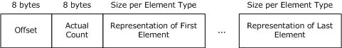

Figure 7: Varying arrays

###### 2.2.5.3.2.3 Conformant Varying Arrays

[**NDR64**](#gt_64-bit-network-data-representation-ndr64) represents a conformant varying array as an ordered sequence of representations of the array elements preceded by three unsigned 64-bit integers. The first 64-bit integer MUST specify the maximum number of elements in the array. The second 64-bit integer MUST specify the offset from the first index of the array to the first index of the actual subset being passed. The third 64-bit integer MUST specify the actual number of elements being passed. The 64-bit integers that indicate the offset and the actual count MUST always be present, even if the maximum count is 0 (zero). See the following figure.<56>

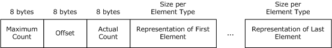

Figure 8: Conformant varying arrays

###### 2.2.5.3.2.4 Multidimensional Arrays

[**NDR64**](#gt_64-bit-network-data-representation-ndr64) follows the same [**NDR**](#gt_network-data-representation-ndr) representation for multidimensional arrays, as specified in [[C706]](https://go.microsoft.com/fwlink/?LinkId=89824) sections 14.3.3.6 through 14.3.3.9, except for the maximum count, offset, and actual count. In NDR64, these MUST be specified as 64-bit unsigned integers rather than 32-bit long integers.

##### 2.2.5.3.3 Strings

In [**NDR64**](#gt_64-bit-network-data-representation-ndr64), the elements in a string MUST be characters, wide characters (16-bit characters specified by [wchar_t](#Section_2.2.4.1.1)), octets, or structures, all of whose elements are octets.

###### 2.2.5.3.3.1 Varying Strings

[**NDR64**](#gt_64-bit-network-data-representation-ndr64) represents a varying string as an ordered sequence of representations of the string elements preceded by two unsigned 64-bit integers. The first 64-bit integer MUST specify the offset from the first index of the string to the first index of the actual subset being passed. The second 64-bit integer MUST specify the actual number of elements being passed, including the terminator.

The first 64-bit integer (offset) MUST be 0 (zero). See the following figure.

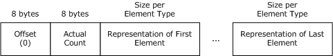

Figure 9: Varying strings

###### 2.2.5.3.3.2 Conformant Varying Strings

[**NDR64**](#gt_64-bit-network-data-representation-ndr64) represents a conformant varying string as an ordered sequence of representations of the string elements preceded by three unsigned 64-bit integers. The first 64-bit integer MUST specify the maximum number of elements in the string, including the terminator. The second 64-bit integer MUST specify the offset from the first index of the string to the first index of the actual subset being passed. The third 64-bit integer MUST specify the actual number of elements being passed, including the terminator.

The second 64-bit integer (offset) MUST be 0 (zero). See the following figure.

Figure 10: Conformant varying strings

##### 2.2.5.3.4 Structures

###### 2.2.5.3.4.1 Structure with Trailing Gap

[**NDR64**](#gt_64-bit-network-data-representation-ndr64) represents a structure as an ordered sequence of representations of the structure members. The trailing gap from the last nonconformant and nonvarying field to the alignment of the structure MUST be represented as a trailing **pad**. The size of the structure MUST be a multiple of its alignment. See the following figure.

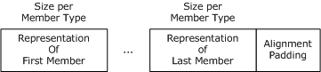

Figure 11: Structure with trailing gap

For more information, see the example in section [4.8](#Section_4.8).

###### 2.2.5.3.4.2 Structure Containing a Conformant Array

In the [**NDR64**](#gt_64-bit-network-data-representation-ndr64) representation of a structure that contains a conformant array, the unsigned 64-bit long integers that specify maximum element counts for the dimensions of the array MUST appear at the beginning of the structure, and the array elements MUST appear in place at the end of the structure. The diagram in the following figure shows the representation of a structure containing a unidimensional conformant array.

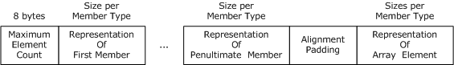

Figure 12: Structure containing a unidimensional conformant array

###### 2.2.5.3.4.3 Structure Containing a Conformant Varying Array

In the [**NDR64**](#gt_64-bit-network-data-representation-ndr64) representation of a structure that contains a conformant varying array, the 64-bit maximum counts for dimensions of the array MUST appear at the beginning of the structure. The 64-bit offsets and the 64-bit actual counts MUST remain in place at the end of the structure immediately preceding the array elements. The diagram in the following figure shows the representation of a structure containing a unidimensional conformant varying array.

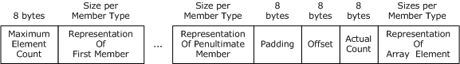

Figure 13: Structure containing a unidimensional conformant varying array

###### 2.2.5.3.4.4 Unions

[**NDR64**](#gt_64-bit-network-data-representation-ndr64) represents a union as a representation of the tag followed by a representation of the selected member. Unions are aligned according to the largest of the union arms. The selected member is aligned to the largest alignment of all the arms.

###### 2.2.5.3.4.5 Pipes

In [**NDR64**](#gt_64-bit-network-data-representation-ndr64), a pipe element can be of any [**NDR**](#gt_network-data-representation-ndr) primitive or constructed type except the following:

- Pipes
- Pointers
- Either conformant or varying arrays or both conformant and varying arrays
- Structures that contain either conformant or varying arrays or that contain both conformant and varying arrays
NDR64 represents a pipe as a sequence of chunks. Each chunk is represented as an ordered sequence of representations of the elements in the chunk. The sequence MUST be preceded by a 64-bit unsigned integer that specifies the number of elements in the chunk and MUST be followed by a 64-bit unsigned integer that specifies the arithmetic negate of the value of the number of elements in the chunk, treated as a signed 64-bit integer. The final chunk MUST contain no elements and MUST consist only of two unsigned 64-bit integers with the value 0 (zero). A chunk MUST contain, at most 231-1 elements of the pipe (as opposed to 232-1, as supported in NDR as specified in [[C706]](https://go.microsoft.com/fwlink/?LinkId=89824)).

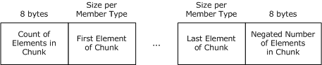

Figure 14: A pipe as a sequence of chunks

##### 2.2.5.3.5 Pointers

A pointer representation MUST be 8 bytes. Pointer representations MUST be aligned on 8-byte boundaries in the octet stream.

###### 2.2.5.3.5.1 Embedded Reference Pointers

An embedded reference pointer MUST be represented in two parts: an 8-octet value in place that MUST NOT be NULL and a possibly deferred representation of the referent. The algorithm for deferral of referent is as specified by [**NDR**](#gt_network-data-representation-ndr) in [[C706]](https://go.microsoft.com/fwlink/?LinkId=89824) section 14.3.12.3. [**NDR64**](#gt_64-bit-network-data-representation-ndr64) MUST NOT implement the special case specified by NDR for arrays of reference pointers, and the 8-octet non-NULL value MUST always be transmitted in place.

### 2.2.6 Type Serialization Version 1

Type serialization version 1 is a set of extensions to the [**IDL**](#gt_interface-definition-language-idl)/+ pickle, as specified in [[C311]](https://go.microsoft.com/fwlink/?LinkId=89821) Part 2, IDL/[**NDR**](#gt_network-data-representation-ndr) Pickle. Implementations of these extensions allow [**marshaling**](#gt_marshaling)/[**unmarshaling**](#gt_unmarshal) according to the NDR transfer syntax of application-specified types by using an application-provided octet stream.

Type serialization version 1 can use either a [**little-endian**](#gt_little-endian) or [**big-endian**](#gt_big-endian) integer and floating-pointer byte order but MUST use the IEEE floating-point format representation and ASCII character format. See the following figure.

Figure 15: Type serialization version 1

Multiple top-level data types can be [**serialized**](#gt_704e83c1-4e24-4ca2-a2e0-81ec77914bc3) into the same type [**serialization**](#gt_serialization) stream in the same way multiple parameters in a procedure are marshaling into an octet stream. A top-level data type is the data type an application provides to the implementation of these extensions to be serialized or [**de-serialized**](#gt_6c5144b9-bdbd-4c6a-b544-309486392879). A top-level data type MUST be either an NDR-constructed type or a primitive type. Each top-level data type is serialized/de-serialized as a whole, according to the rules that follow.

#### 2.2.6.1 Common Type Header for the Serialization Stream

One common type header is created per [**serialization**](#gt_serialization) octet stream. The common header applies to all of the typed data in the octet stream. This common type header MUST be presented by using [**little-endian**](#gt_little-endian) format in the octet stream. The first byte of the common type header MUST be equal to 1 to indicate this level of type serialization.

The common type header alignment MUST be aligned on an 8-byte boundary.

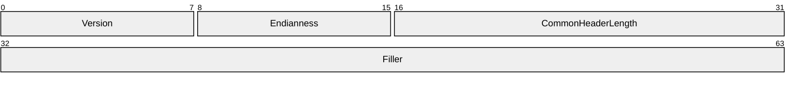

**Version (1 byte):** MUST be set to 1 to indicate type serialization version 1.

**Endianness (1 byte):** Specifies the endianness of types serialized in the octet stream as follows.<57>

| Value | Meaning |
| --- | --- |
| 0x10 | Little-endian |
| 0x00 | [**Big-endian**](#gt_big-endian) |

**CommonHeaderLength (2 bytes):** The length in bytes of this common type header. MUST be set to 8.

**Filler (4 bytes):** Reserved field. MUST be set to 0XCCCCCCCC on [**marshaling**](#gt_marshaling) and SHOULD be ignored during [**unmarshaling**](#gt_unmarshal).

#### 2.2.6.2 Private Header for Constructed Type

A top-level [**NDR**](#gt_network-data-representation-ndr) constructed type MUST be preceded by a private header, as specified in this section.

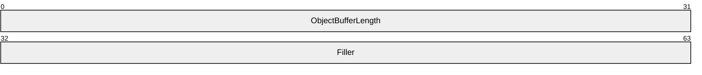

**ObjectBufferLength (4 bytes):** Indicates the length of a [**serialized**](#gt_704e83c1-4e24-4ca2-a2e0-81ec77914bc3) top-level type in the octet stream. It MUST include the padding length and exclude the header itself.

**Filler (4 bytes):** Reserved field. MUST be set to 0 (zero) during [**marshaling**](#gt_marshaling), and SHOULD be ignored during [**unmarshaling**](#gt_unmarshal).

The private type header MUST be aligned on an 8-byte boundary in the octet stream. If the length of the serialized top-level constructed type in the octet stream is not a multiple of 8 octets, the data MUST be padded at the end to ensure its total length is an integral multiple of 8 bytes in length.

Like a parameter in a procedure, the top-level constructed type MUST be represented in NDR format in the octet stream following the private header.

#### 2.2.6.3 Primitive Type Serialization

For any top-level [**NDR**](#gt_network-data-representation-ndr) primitive type, there MUST NOT be any private header preceding the actual type. The type MUST be aligned on an 8-byte boundary. If the size of the primitive type is not an integral multiple of 8 bytes, the data MUST be padded at the end to ensure that its total length is an integral multiple of 8 bytes.

### 2.2.7 Type Serialization Version 2

Version 2 of type [**serialization**](#gt_serialization) is a set of modifications to type serialization version 1, as specified in section [2.2.6](#Section_2.2.6). Implementations of these extensions allow [**marshaling**](#gt_marshaling)/[**unmarshaling**](#gt_unmarshal) of application-specified data types by using an application-provided serialization stream, according to either [**NDR**](#gt_network-data-representation-ndr) or [**NDR64**](#gt_64-bit-network-data-representation-ndr64) transfer syntax.

Type serialization version 2 MUST use [**little-endian**](#gt_little-endian) integer and floating-pointer byte order, IEEE floating-point format representation, and ASCII character format. The first byte in the octet stream MUST be 2 to indicate this level of type serialization.

#### 2.2.7.1 Common Type Header

One common type header is created per [**serialization**](#gt_serialization) octet stream. The common header applies to all of the typed data in the octet stream. The common type header MUST be aligned on a 16-byte boundary.

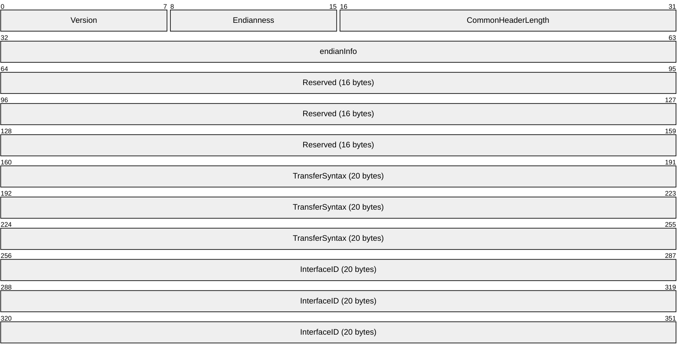

**Version (1 byte):** MUST be set to 2 to indicate type serialization version 2.

**Endianness (1 byte):** MUST be set to [**little-endian**](#gt_little-endian) (0x10).

**CommonHeaderLength (2 bytes):** Indicates the length in bytes of the common header. MUST be 0x40.

**endianInfo (4 bytes):** Reserved field. MUST be set to 0XCCCCCCCC during [**marshaling**](#gt_marshaling), and SHOULD be ignored during [**unmarshaling**](#gt_unmarshal).

**Reserved (16 bytes):** Reserved fields. MUST be set to 0XCCCCCCCC during marshaling and SHOULD be ignored during unmarshaling.

**TransferSyntax (20 bytes):** [**RPC transfer syntax**](#gt_rpc-transfer-syntax) identifier used to encode data in the octet stream. It MUST use [RPC_SYNTAX_IDENTIFIER](#Section_2.2.2.7) format, as specified in section 2.2.2.7. It MUST be either the [**NDR**](#gt_network-data-representation-ndr) transfer syntax identifier or the [**NDR64**](#gt_64-bit-network-data-representation-ndr64) transfer syntax identifier.

**InterfaceID (20 bytes):** [**Interface**](#gt_interface) identifier, as specified in the [**IDL**](#gt_interface-definition-language-idl) file. It MUST use the interface identifier format, as specified in [[C706]](https://go.microsoft.com/fwlink/?LinkId=89824) section 3.1.9. Implementations MAY ignore the value of this field.<58>

Similar to Type Serialization Version 1 (section [2.2.6)](#Section_2.2.6), multiple top-level data types can be serialized into the same type serialization stream, in the same way that multiple parameters in a procedure are marshaled into an octet stream. All top-level data types in the same octet stream MUST be serialized by using the same transfer syntax as specified in the Common Type Header.

#### 2.2.7.2 Private Header

In type [**serialization**](#gt_serialization) version 2, the private header MUST precede all top-level data types in the octet stream.

The private type header MUST be aligned on a 16-byte boundary. If the length of the [**serialized**](#gt_704e83c1-4e24-4ca2-a2e0-81ec77914bc3) top-level data type in the octet stream is not a multiple of 16 octets, the data must be padded at the end to ensure that its total length is an integral multiple of 16 octets in length.

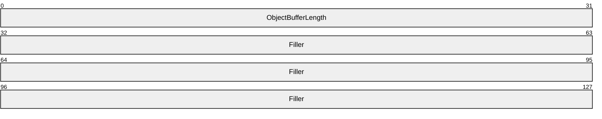

**ObjectBufferLength (4 bytes):** Indicates the length of a serialized top-level data type in the octet stream. It MUST include the padding length and exclude the header itself.

**Filler (12 bytes):** Reserved field. MUST be set to 0 (zero).

# 3 Protocol Details

[**RPC**](#gt_remote-procedure-call-rpc) extensions preserve the DCE 1.1: RPC specification [[C706]](https://go.microsoft.com/fwlink/?LinkId=89824) model of operation between an initiator (or client) and a responder (or server). RPC has two [**protocol variants**](#gt_protocol-variant): connection-oriented and connectionless. The following sections first specify protocol details that are common between [**connectionless RPC**](#gt_connectionless-rpc) and [**connection-oriented RPC**](#gt_connection-oriented-rpc) protocol variants and then specify details particular to each.

## 3.1 Connectionless and Connection-Oriented RPC Protocol Details

This section defines the protocol details that are common between [**connectionless RPC**](#gt_connectionless-rpc) and [**connection-oriented RPC**](#gt_connection-oriented-rpc) [**protocol variants**](#gt_protocol-variant).

### 3.1.1 Common Details

This section defines the protocol details that are common between the client and server roles.

#### 3.1.1.1 Abstract Data Model

##### 3.1.1.1.1 Security Context Handle

**Security Context Handle**: A security context handle is created and populated by the security provider but is used by the [**RPC**](#gt_remote-procedure-call-rpc) runtime and higher-level protocols, as specified in sections [3.2.1.4.1](#Section_3.2.1.4.1) and [3.3.1.5.2](#Section_3.3.1.5.2). The **security context handle** is obtained by calling an implementation-specific equivalent of the abstract **GSS_Accept_sec_context** on the server or **GSS_Init_sec_context** on the client, as specified in [[RFC2743]](https://go.microsoft.com/fwlink/?LinkId=90378). The handle and associated resources are released by calling the implementation-specific **GSS_Delete_sec_context** equivalent.

The security context handle can be queried using the implementation-specific equivalent of **GSS_Inquire_context** as specified in [RFC2743]. The information obtained from the context MUST include the following:

- **Context Identifier**: A value generated by cryptographic hash (and therefore reliably unique), which can be used as a cross-process identifier of the security context negotiated between the client and server during packet protected connectionless RPC. This value is communicated through the **key_vers_num** described previously in section [2.2.3.4](#Section_2.2.3.4) and in [[C706]](https://go.microsoft.com/fwlink/?LinkId=89824).
- **Error Value**: The error value returned by the security provider if an error results during the construction of the security context.
- **Security Provider Identifier**
- **Client Credential Identity**, as specified in section 3.2.1.4.1.
- **Authentication Level**
- **Impersonation Level**, as specified in section [2.2.1.1.9](#Section_2.2.1.1.9).
- **Token/Authorization Context**, as specified in [MS-DTYP](../MS-DTYP/MS-DTYP.md) section 2.5.2. This token is created by the authentication protocols when the RPC client and server authenticate, as specified in [C706] section 13.1 "The Generic RPC Security Model". When the Kerberos authentication protocol is used the token is constructed as in [MS-KILE](../MS-KILE/MS-KILE.md) section 3.4.5.3 "Processing Authorization Data". When the NTLM authentication protocol is used the token is constructed as in [MS-APDS](../MS-APDS/MS-APDS.md) section 3.1.5 "Processing Events and Sequencing Rules". This token can be used for impersonation or obtaining the user SID or a group SID related to the RPC caller, as specified in [Abstract Interface GetRpcImpersonationAccessToken (section 3.3.3.4.3.1)](#Section_3.3.3.4.3.1).

##### 3.1.1.1.2 Client Credential Handle

**Client Credential Handle**: A **client credential handle** is a reference to a specific set of client identity credentials. A **client credential handle** is a parameter used when creating a **security context handle**. The **client credential handle** is obtained by calling an implementation-specific equivalent of the abstract **GSS_Acquire_cred** call as specified in [[RFC2743]](https://go.microsoft.com/fwlink/?LinkId=90378). The handle and associated resources are released by calling the implementation-specific GSS_Release_cred equivalent.

The value of the client credential handle MAY be used to match client identities. In those implementations, if two handle value matches, then the client identities (and credentials) MUST be guaranteed to be the same.

##### 3.1.1.1.3 Authorization Policy

This extension introduces authorization policies that an administrator on the server machine can deploy that restrict access to all [**RPC**](#gt_remote-procedure-call-rpc) [**interfaces**](#gt_interface) on the server.

**RestrictRemoteClients**: A 32-bit value that forces RPC to perform an additional security checks for all interfaces. The scope of this ADM element is global to the RPC server.<59>The possible values are the following:

| Flag | Value | Description |
| --- | --- | --- |
| RPC_RESTRICT_REMOTE_CLIENT_NONE | 0 | Causes the server to bypass the RPC interface restriction. |
| RPC_RESTRICT_REMOTE_CLIENT_DEFAULT | 1 | All remote anonymous calls are rejected by the RPC runtime except calls coming in through [**named pipes**](#gt_named-pipe) (ncacn_np). If an interface is registered with the RPC_IF_ALLOW_CALLBACKS_WITH_NO_AUTH flag, then the interface is not restricted. |
| RPC_RESTRICT_REMOTE_CLIENT_HIGH | 2 | All remote anonymous calls are rejected by the RPC runtime with no exemptions. |

**EnableAuthEpResolution**: A Boolean value global to the [**RPC client**](#gt_rpc-client) runtime that enables authenticated calls to the Endpoint Mapper. If the server's **RestrictRemoteClients** value is set to RPC_RESTRICT_REMOTE_CLIENT_DEFAULT or RPC_RESTRICT_REMOTE_CLIENT_HIGH, the RPC Endpoint Mapper interface MUST not be accessible anonymously. Typically, an RPC client that attempts to make a call using a [**dynamic endpoint**](#gt_dynamic-endpoint) will first query the RPC Endpoint Mapper on the server to determine what endpoint it SHOULD connect to. This query is performed anonymously, even if the RPC client call itself is performed using RPC security. The RPC client runtime SHOULD be configurable to perform an authenticated query to the Endpoint Mapper. This authenticated query MUST only be performed if the actual RPC client call uses RPC authentication.<60>

There is no way for a client to discover if the EndPoint Mapper requires authenticated calls. As described in [[C706]](https://go.microsoft.com/fwlink/?LinkId=89824) section 2.12.4, a client can explicitly resolve a partially bound server binding handle by calling the equivalent of **rpc_ep_resolve_binding**. A partially bound server binding handle will also be automatically resolved by the RPC runtime when doing an RPC call using a partially bound server binding handle. In both cases, there is no way for a client to force an authenticated query to the end point mapper. The query to the end point mapper will use the partially bound server binding handle security information to interact with the EndPoint Mapper. As a consequence, if the client is not doing a secure call to the server, it won't be able to interact with an EndPoint mapper if the **EnableAuthEpResolution** flag is set.

**RPC_IF_ALLOW_CALLBACKS_WITH_NO_AUTH**: A Boolean value maintained in the scope of an RPC interface that overrides the behavior of **RestrictRemoteClients** when it is set to RPC_RESTRICT_REMOTE_CLIENT_DEFAULT, and allows the interface to process unauthenticated calls.<61>

When processing a receive Server Call, an implementation of this protocol must perform one of the following actions depending on the value of the **RestrictRemoteClients** ADM element:

- 0 : Perform no additional checks and consider this check as successful.
- 1 : Examine the **Server Call** ADM element to determine if there is a Security Context ADM element associated with this call. If a Security Context exists, then this check is considered as successful. If there is no Security Context, then examine the RPC Interface ADM element for this Call to determine if **the RPC_IF_ALLOW_CALLBACKS_WITH_NO_AUTH** flag is set. If this flag is set, then consider this check as successful. If this flag is not set, then examine the **Server Connection** ADM element to determine if the transport protocol is ncanc_np. If this transport protocol is ncacn_np, then this check is considered as successful; otherwise, consider this check as failed
- 2 : Examine the **Server Call** ADM element to determine if there is a Security Context ADM element associated with this call. If a Security Context exists, then this check is considered as successful; otherwise, consider this check as failed.
The **RestrictRemoteClients** ADM element has no default value and implementations of this protocol MUST determine the value through an implementation manner.<62> A higher-layer protocol MAY provide additional authorization checks that are enforced on the Server Call. If any of the checks fail, then an implementation of this protocol MUST respond to the client with a RPC_FAULT PDU and terminate the connection.

#### 3.1.1.2 Timers

There are no timers that are common between [**connectionless RPC**](#gt_connectionless-rpc) and [**connection-oriented RPC**](#gt_connection-oriented-rpc) [**protocol variants**](#gt_protocol-variant).

#### 3.1.1.3 Initialization

There is no initialization that is common between [**connectionless RPC**](#gt_connectionless-rpc) and [**connection-oriented RPC**](#gt_connection-oriented-rpc) [**protocol variants**](#gt_protocol-variant).

#### 3.1.1.4 Higher-Layer Triggered Events

##### 3.1.1.4.1 Causal Ordering

These extensions allow for higher-level protocols to issue method calls that are said to be causally ordered. If any two method calls N and N+1 are specified to be causally ordered on the client, these extensions MUST ensure that N is dispatched before N+1 on the server. On the client, the exact way in which method calls are specified to be causally ordered is implementation-specific. On the server, the exact way in which dispatch of N is determined to be complete so that N+1 can be dispatched is also implementation-specific.

##### 3.1.1.4.2 Impersonate Client

These extensions allow higher-layer protocols to use a [**security context**](#gt_security-context) to make runtime authorization decisions on the server. When a higher-layer protocol requests the RPC runtime to impersonate the client on the server, the RPC local server [**interface**](#gt_interface) retrieves the security context (section [3.3.1.5.2.2](#Section_3.3.1.5.2.2)) and makes it available to the higher-layer protocol in an implementation-specific manner for the higher-layer protocol's use in future authorization decisions. If a security context is not available for the connection, the attempt to impersonate the client fails. See section [3.3.3.4.3](#Section_3.3.3.4.3) for details on the higher-level trigger event associated with retrieving the client's identity.

#### 3.1.1.5 Message Processing Events and Sequencing Rules

##### 3.1.1.5.1 Processing Extensions Details

###### 3.1.1.5.1.1 Extension in NDR Transfer Syntax

Section [2.2.4](#Section_2.2.4) specifies the [**IDL**](#gt_interface-definition-language-idl) extensions that affect the syntax and processing of the messages.

__int3264

__int3264, as specified in [MS-DTYP](../MS-DTYP/MS-DTYP.md) section , is represented in the octet stream as 4 octets in [**NDR**](#gt_network-data-representation-ndr) transfer syntax. On 32-bit platforms, it is represented as a 4-byte integer in memory. On 64-bit platforms, it is represented as an 8-byte integer, and the higher 4 bytes are truncated on the sender side during [**marshaling**](#gt_marshaling) and extended appropriately (signed or unsigned) on the receiving side during [**unmarshaling**](#gt_unmarshal).

Binding Handle Extension

[[C706]](https://go.microsoft.com/fwlink/?LinkId=89824) section 4.3.5 specifies requirements for binding handle usage. In the Remote Procedure Call Protocol, a binding handle MAY appear anywhere in a method's list of parameters.<63>

##### 3.1.1.5.2 Indicating Octet Stream as Invalid

The [**RPC**](#gt_remote-procedure-call-rpc) runtime MUST indicate to higher-layer protocols on the client about invalid octet streams, including different data consistency check failures, as specified in section [3.1.2.5.1](#Section_3.1.2.5.1). On the server side, the RPC runtime MUST handle an invalid octet stream, as specified in section [3.1.3.5.2](#Section_3.1.3.5.2).

##### 3.1.1.5.3 Strict NDR/NDR64 Data Consistency Check

These extensions update the DCE 1.1: RPC specification [[C706]](https://go.microsoft.com/fwlink/?LinkId=89824) by specifying that, during unmarshaling, invalid octet streams SHOULD be rejected by enforcing a set of rules referred to as strict data consistency checks. All the consistency check rules specified in the following sections are also applicable to [**NDR**](#gt_network-data-representation-ndr)64 transfer syntax. This is often referred to as robust check.

The consistency checks are grouped into categories called target levels. The two target levels are target level 5.0 (as specified in section [3.1.1.5.3.2](#Section_3.1.1.5.3.2)) and target level 6.0 (as specified in section [3.1.1.5.3.3](#Section_3.1.1.5.3.3)). Target level 6.0 is a strict superset of target level 5.0.

A consistency check is the act of ascertaining a certain relation between two or more values in the octet stream inside an implementation of these extensions. If the relation is true, the consistency check MUST be regarded as passing. If the relation is not true, the consistency check MUST be regarded as failing. The set of consistency check rules follow, and [**correlation**](#gt_correlation) validation is the most important one.

###### 3.1.1.5.3.1 Correlation Validation

Correlation validation is performed between two fields or two parameters during unmarshaling. The fields/parameters that can be correlated are defined using the productions specified in [[C706]](https://go.microsoft.com/fwlink/?LinkId=89824) section 4.4.1. In the productions that specify [**IDL**](#gt_interface-definition-language-idl) syntax, in production 67-69, the field with a specific <field_attribute> is defined as being correlated to the argument specified by <Identifier>. The argument identified by <Identifier> is defined as dictating the [**correlation**](#gt_correlation).

The correlation validation process MUST validate the consistency between the two correlated values in the octet stream according to the rules that follow. Correlation validation MUST be regarded as succeeding if the two values are evaluated to be equal to each other; otherwise, the validation MUST be regarded as failing. There are several basic types of correlation validation:

- Conformance correlation validation: Succeeds if the maximum count is equal to the evaluation result for the correlated argument where the correlated argument is determined via the production rules given earlier in this section.
- Varying correlation validation: Succeeds if the actual count is equal to the evaluation result for the correlated argument where the correlated argument is determined via the production rules given earlier in this section.
- Offset correlation validation: Succeeds if the offset count is equal to the evaluation result for the correlated argument where the correlated argument is determined via the production rules given earlier in this section.
- Union correlation validation: Succeeds if the union tag is equal to the evaluation result for the correlated argument where the correlated argument is determined via the production rules given earlier in this section.
In these extensions, an expression is allowed in conformance, varying, or union, as specified in section [2.2.4.7](#Section_2.2.4.7). Correlation validation SHOULD check the correlation between the correlated values after the expression is evaluated, and MUST succeed if the correlated values are equal after evaluating the expression.

For correlation validation usage, see the example in section [4.6](#Section_4.6).

###### 3.1.1.5.3.2 Target Level 5.0

This section specifies target level 5.0 [**strict NDR/NDR64 data consistency check**](#gt_strict-ndrndr64-data-consistency-check) [**correlation**](#gt_correlation) validation checks. Target level 5.0 SHOULD<64> be supported.

Correlation Validation Checks

These extensions clarify the interpretation as specified in [[C706]](https://go.microsoft.com/fwlink/?LinkId=89824) for the cases that follow with regard to different [**correlation**](#gt_correlation) validation scenarios.

Maximum Count of a Conformant Array or Conformant Varying Array Is Dictated by Another Parameter or Field of a Structure

This target level implementation of these extensions SHOULD validate the conformance [**correlation**](#gt_correlation) between the maximum count of the [conformant array](#Section_2.2.5.3.2.1) and the parameter or field dictating the conformance. If the conformant correlation validation fails, the implementation MUST indicate the octet stream as invalid.

Maximum Count of a Conformant Structure or Conformant Varying Structure Is Dictated by a Field of the Structure

This target level implementation of these extensions SHOULD validate the conformance [**correlation**](#gt_correlation) between the maximum count of the [conformant array](#Section_2.2.5.3.2.1) and the field dictating the conformance. If the conformance correlation validation fails, the implementation MUST indicate the octet stream as invalid.

Maximum Count of a Conformant Array or Conformant Varying Array Is a Constant Defined in IDL File

This target level implementation of these extensions SHOULD validate the conformance [**correlation**](#gt_correlation) between the maximum count of the [conformant array](#Section_2.2.5.3.2.1) and the constant. If the conformance correlation validation fails, the implementation MUST indicate the octet stream as invalid.

Maximum Count of a Conformant Structure or Conformant Varying Structure Is a Constant

This target level implementation of these extensions SHOULD validate the conformance [**correlation**](#gt_correlation) between the maximum count of the [conformant array](#Section_2.2.5.3.2.1) and the constant. If the conformance correlation validation fails, the implementation MUST indicate the octet stream as invalid.

first_is of a Varying Array or Conformant Varying Array Is Specified by Another Parameter or Field of a Structure

This target level implementation of these extensions SHOULD validate the offset [**correlation**](#gt_correlation) between the offset of the [varying array](#Section_2.2.5.3.2.2) and the parameter or field dictating the offset. If the offset correlation validation fails, the implementation MUST indicate the octet stream as invalid.

first_is of a Conformant Varying Structure Is Specified by a Field in the Structure

This target level implementation of these extensions SHOULD validate the offset [**correlation**](#gt_correlation) between the offset of the [varying array](#Section_2.2.5.3.2.2) and the field dictating the offset. If the offset correlation validation fails, the implementation MUST indicate the octet stream as invalid.

first_is of a Varying Array, Conformant Varying Array, or Conformant Varying Structure Is Not Present in IDL

This target-level implementation of these extensions SHOULD validate that the offset of the [varying array](#Section_2.2.5.3.2.2) equals 0 (zero). If the offset value is not 0 (zero), the implementation MUST indicate the octet stream as invalid.

Actual Count of a Varying Array or Conformant Varying Array Is Dictated by Another Parameter or Field of a Structure

This target level implementation of these extensions SHOULD validate the varying [**correlation**](#gt_correlation) between the actual count of the [varying array](#Section_2.2.5.3.2.2) and the parameter or field dictating the actual count. If the varying correlation validation fails, the implementation MUST indicate the octet stream as invalid.

Actual Count of a Conformant Varying Structure Is Dictated by a Field in the Structure

This target level implementation of these extensions SHOULD validate the varying [**correlation**](#gt_correlation) between the actual count of the [varying array](#Section_2.2.5.3.2.2) and the field dictating the actual count. If the varying correlation validation fails, the implementation MUST indicate the octet stream as invalid.

Maximum Count of a Conformant and Varying String Is Dictated by Another Parameter or Field of a Structure

This target level implementation of these extensions SHOULD validate the conformance [**correlation**](#gt_correlation) between the maximum count of the conformant and varying string against the parameter or field dictating the conformance, and it SHOULD also validate that the offset of the string is equal to 0 (zero). If either validation fails, the implementation MUST indicate the octet stream as invalid.

Union Validation

Similar to conformant validation, this target-level implementation of these extensions SHOULD validate the discriminant of the union against the representation of the union tag, as specified in [[C706]](https://go.microsoft.com/fwlink/?LinkId=89824) section 14.3.8. If the union [**correlation**](#gt_correlation) validation fails, the implementation MUST indicate the octet stream as invalid.

General Conformant Varying Validation

In all conformant varying cases, the maximum count MUST be equal to or greater than the sum of actual count and offset. If this validation fails, the implementation MUST treat the octet stream as invalid.

Additional Limitations

These extensions add the following limitations to those as specified in [[C706]](https://go.microsoft.com/fwlink/?LinkId=89824).

Limiting Maximum Count and Octet Stream Length

These extensions specify that a conformant array or conformant and varying string SHOULD have, at most, 231-1 elements in each dimension.<65>

strict_context_handle

A context handle created by a method belonging to one [**interface**](#gt_interface) SHOULD NOT be accepted by a method belonging to another interface when a strict_context_handle consistency check is activated. For more information on syntax details, see section [2.2.4.15](#Section_2.2.4.15).

Rejecting Insufficient Octet Stream

An octet stream MUST contain sufficient data to [**unmarshal**](#gt_unmarshal) all the required parameters. Implementation of these extensions SHOULD indicate the octet stream as invalid if there is insufficient data.

range Attribute to Limit the Scope of Integral Values and the Number of Elements in Pipe Chunks

In target level 5.0 of [**strict NDR/NDR64 data consistency checking**](#gt_strict-ndrndr64-data-consistency-check), implementation of these extensions can limit the allowed scope for integral types and pipes. If the integral data value is out of the specified range scope, the implementation SHOULD indicate the octet stream as invalid.

Implementation of these extensions can also limit the acceptable range of elements in a pipe chunk. The implementation SHOULD indicate the octet stream as invalid if the number of elements in a pipe chunk is out of the specific range scope. For syntax information, see section [2.2.4.14.1](#Section_2.2.4.14.1).

auto_handle Deprecation

Implementation of this level of the extensions SHOULD NOT accept the auto_handle attribute if specified on an [**interface**](#gt_interface).<66>

Ignoring Alignment Gap

The content of alignment gaps, either within a structure or before an item in the octet stream, SHOULD be ignored.

###### 3.1.1.5.3.3 Target Level 6.0

This section specifies target level 6.0 [**strict NDR/NDR64 data consistency check**](#gt_strict-ndrndr64-data-consistency-check) limitations.<67>

Additional Limitations

type_strict_context_handle

An implementation of these extensions at this target level can activate the type strict context handle. When it is activated, the implementation SHOULD reject the use of context handles as an argument if the argument type on the method being called is different from the argument type on the method that created the context handle.

Context handles defined with unique type names are treated as being of different types for the purpose of the type_strict_context_handle check. For example, the following two context handles are two different types.

typedef [context_handle] void * PCTXT1;

typedef [context_handle] void * PCTXT2;

For syntax information, see section [2.2.4.16](#Section_2.2.4.16).

Unique or Full Pointer to Conformant Array Consistency Check

A conformant array or conformant and varying string correlated with another parameter or field can be referred by a unique pointer or full pointer. While it is allowed to have a nonzero correlated value with a NULL pointer (as specified in [[C706]](https://go.microsoft.com/fwlink/?LinkId=89824) section 14.3.10), implementations of these extensions SHOULD indicate the octet stream as invalid if all of the following conditions are met:

- Correlated value evaluates to be nonzero.
- The unique or full pointer that refers to the conformant array or conformant and varying string is NULL (0).
- The conformant array or conformant and varying string does not have the disable_consistency_check attribute as specified in section [2.2.4.17](#Section_2.2.4.17).<68>
range Attribute to Limit the Range of Maximum Count of Conformant Array and String Length

In target level 6.0 of [**strict NDR/NDR64 data consistency check**](#gt_strict-ndrndr64-data-consistency-check), in addition to the target level 5.0 range checks, implementations of these extensions can also limit the acceptable range for conformant array and string. Implementations can indicate the acceptable value range for the maximum count of the conformant array when a range is applied to the conformance. The implementation SHOULD indicate the octet stream as invalid if the maximum count of a conformant array is not in the specified acceptable range.

When a range is applied to a conformant and varying string without [**correlation**](#gt_correlation), it indicates the acceptable length, including the NULL terminator, of the string. The implementation SHOULD indicate the octet stream as invalid if the string length, including terminator, is outside the acceptable range. For syntax information, see section [2.2.4.14.2](#Section_2.2.4.14.2).

##### 3.1.1.5.4 Restriction on Remote Anonymous Calls

For security reasons, an implementation of these extensions MAY choose to reject remote anonymous calls.<69>

##### 3.1.1.5.5 Returning Win32 Error Values

Whenever a server implementation returns an error code in the fault or reject [**PDU**](#gt_protocol-data-unit-pdu), the client implementation MUST use the following conversion table and return the corresponding Win32 error code to the client application. The term "not mapped" indicates that the error code value returned to the client application is the same as in the fault or reject PDU. Otherwise, the name of the value defined in [MS-ERREF](../MS-ERREF/MS-ERREF.md) that is to be returned is shown. The Status Codes are defined in [[C706]](https://go.microsoft.com/fwlink/?LinkId=89824) section N.2.

| Status Code | Win32 Error Code |
| --- | --- |
| nca_s_comm_failure | RPC_S_COMM_FAILURE |
| nca_op_rng_error | RPC_S_PROCNUM_OUT_OF_RANGE |
| nca_unk_if | RPC_S_UNKNOWN_IF |
| nca_wrong_boot_time | Not mapped. |
| nca_s_you_crashed | RPC_S_CALL_FAILED |
| nca_proto_error | RPC_S_PROTOCOL_ERROR |
| nca_out_args_too_big | RPC_S_SERVER_OUT_OF_MEMORY |
| nca_server_too_busy | RPC_S_SERVER_TOO_BUSY |
| nca_unsupported_type | RPC_S_UNSUPPORTED_TYPE |
| nca_s_fault_int_div_by_zero | RPC_S_ZERO_DIVIDE |
| nca_s_fault_addr_error | RPC_S_ADDRESS_ERROR |
| nca_s_fault_fp_div_zero | RPC_S_FP_DIV_ZERO |
| nca_s_fault_fp_underflow | RPC_S_FP_UNDERFLOW |
| nca_s_fault_fp_overflow | RPC_S_FP_OVERFLOW |
| nca_s_fault_invalid_tag | RPC_S_INVALID_TAG |
| nca_s_fault_invalid_bound | RPC_S_INVALID_BOUND |
| nca_rpc_version_mismatch | RPC_S_PROTOCOL_ERROR |
| nca_unspec_reject | RPC_S_CALL_FAILED |
| nca_s_bad_actid | RPC_S_CALL_FAILED_DNE |
| nca_who_are_you_failed | RPC_S_CALL_FAILED |
| nca_manager_not_entered | RPC_S_CALL_FAILED_DNE |
| nca_s_fault_cancel | RPC_S_CALL_CANCELLED |
| nca_s_fault_ill_inst | RPC_S_ADDRESS_ERROR |
| nca_s_fault_fp_error | RPC_S_FP_OVERFLOW |
| nca_s_fault_int_overflow | RPC_S_ADDRESS_ERROR |
| nca_s_fault_unspec | RPC_S_CALL_FAILED |
| nca_s_fault_remote_comm_failure | Not mapped. |
| nca_s_fault_pipe_empty | RPC_X_PIPE_EMPTY |
| nca_s_fault_pipe_closed | RPC_X_PIPE_CLOSED |
| nca_s_fault_pipe_order | RPC_X_WRONG_PIPE_ORDER |
| nca_s_fault_pipe_discipline | RPC_X_PIPE_DISCIPLINE_ERROR |
| nca_s_fault_pipe_comm_error | RPC_S_COMM_FAILURE |
| nca_s_fault_pipe_memory | RPC_S_OUT_OF_MEMORY |
| nca_s_fault_context_mismatch | RPC_X_SS_CONTEXT_MISMATCH |
| nca_s_fault_remote_no_memory | RPC_S_SERVER_OUT_OF_MEMORY |
| nca_invalid_pres_context_id | RPC_S_PROTOCOL_ERROR |
| nca_unsupported_authn_level | RPC_S_UNSUPPORTED_AUTHN_LEVEL |
| nca_invalid_checksum | RPC_S_CALL_FAILED_DNE |
| nca_invalid_crc | RPC_S_CALL_FAILED_DNE |
| nca_s_fault_user_defined | Not mapped. |
| nca_s_fault_tx_open_failed | Not mapped. |
| nca_s_fault_codeset_conv_error | Not mapped. |
| nca_s_fault_object_not_found | Not mapped. |
| nca_s_fault_no_client_stub | Not mapped. |

#### 3.1.1.6 Timer Events

There are no timer events that are common between [**connectionless RPC**](#gt_connectionless-rpc) and [**connection-oriented RPC**](#gt_connection-oriented-rpc) [**protocol variants**](#gt_protocol-variant).

#### 3.1.1.7 Other Local Events

There are no other local events that are common between [**connectionless RPC**](#gt_connectionless-rpc) and [**connection-oriented RPC**](#gt_connection-oriented-rpc) [**protocol variants**](#gt_protocol-variant).

### 3.1.2 Client Details

#### 3.1.2.1 Abstract Data Model

This section specifies a conceptual model of possible data organization that an implementation maintains to participate in this protocol. The described organization is provided to facilitate the explanation of how the protocol behaves. This document does not mandate that implementations adhere to this model as long as their external behavior is consistent with that described in this document.

##### 3.1.2.1.1 Server Binding Handle

This document extends the definition of a server binding handle in the following way:

- **AuthIdentity**: [[C706]](https://go.microsoft.com/fwlink/?LinkId=89824) describes the auth_identity handle as a handle to a data structure that contains the client's authentication and authorization credentials. To be compliant with this extension, **AuthIdentity** replaces the generic auth_identity handle and MUST store a **Client Credential Handle**. See section [3.1.2.4.1](#Section_3.1.2.4.1) for details on setting the **AuthIdentity** by the higher-layer protocol.

#### 3.1.2.2 Timers

There are no timers that are common between clients for [**connectionless RPC**](#gt_connectionless-rpc) and [**connection-oriented RPC**](#gt_connection-oriented-rpc) [**protocol variants**](#gt_protocol-variant).

#### 3.1.2.3 Initialization

There is no initialization that is common between clients for [**connectionless RPC**](#gt_connectionless-rpc) and [**connection-oriented RPC**](#gt_connection-oriented-rpc) [**protocol variants**](#gt_protocol-variant).

#### 3.1.2.4 Higher-Layer Triggered Events

##### 3.1.2.4.1 Set Server Binding Handle Client Credentials

The higher layer protocol MAY optionally set security information for the server binding handle using the equivalent of **rpc_binding_set_auth_info()**. Implementations of these extensions MUST set the server binding handle's **AuthIdentity** using the output handle from calling an implementation-specific equivalent of the abstract **GSS_Acquire_cred** call as specified in [[RFC2743]](https://go.microsoft.com/fwlink/?LinkId=90378).

If the **auth_identity** parameter to **rpc_binding_set_auth_info** is NULL, the client MUST use the default credentials of the current execution context by specifying GSS_C_NO_CREDENTIAL.

If the **auth_identity** parameter to **rpc_binding_set_auth_info** includes credentials, the client MUST use the supplied credentials when calling **GSS_Acquire_cred**.

#### 3.1.2.5 Message Processing Events and Sequencing Rules

##### 3.1.2.5.1 Indicating Invalid Octet Stream on Client

Implementations of these extensions MUST notify higher layers of invalid octet streams, including data consistency check failures, in an implementation-specific way. This can be through returning a status code, throwing an exception, or in some other implementation-specific way that is not defined by this specification. Details on Win32 error codes are specified in [MS-ERREF](../MS-ERREF/MS-ERREF.md).

#### 3.1.2.6 Timer Events

None.

#### 3.1.2.7 Other Local Events

##### 3.1.2.7.1 Client Conformant Validation Processing for Response Data

In target level 5.0 of [**strict NDR/NDR64 data consistency check**](#gt_strict-ndrndr64-data-consistency-check), as specified in section [3.1.1.5.3.2](#Section_3.1.1.5.3.2), implementations of these extensions SHOULD perform the following [**correlation**](#gt_correlation) validation in the client [**stub**](#gt_stub) if the [**RPC**](#gt_remote-procedure-call-rpc) runtime writes into client-provided memory during unmarshaling.

###### 3.1.2.7.1.1 Maximum Count of a Conformant Array Is Dictated by Another Parameter or Field of a Structure

This target level of implementation for these extensions MUST:

- Capture the evaluation result of the parameter dictating the conformance before unmarshaling for later use during unmarshaling.
- Indicate the octet stream as invalid during unmarshaling if the maximum count of the conformant array of the response data exceeds the evaluation result of the parameter dictating the conformance that was previously captured.

###### 3.1.2.7.1.2 Offset and/or Actual Count of a Conformant Array Is Dictated by Another Parameter or Field of a Structure

This target level of implementation for these extensions MUST:

- Capture the evaluation result of the parameter dictating the conformance before unmarshaling for later use during unmarshaling.
- Indicate the octet stream as invalid during unmarshaling if the sum of offset and actual count of the conformant varying array of the response data exceeds the evaluation result of the parameter dictating the conformance that was previously captured.

###### 3.1.2.7.1.3 Maximum Count of a Conformant and Varying String Is Dictated by Another Parameter

This target level of implementation for these extensions MUST:

- Capture the evaluation result of the parameter dictating the conformance before unmarshaling for later use during unmarshaling.
- Indicate the octet stream as invalid during unmarshaling if the string length, including terminator, of the response data exceeds the evaluation result of the parameter dictating the conformance that was previously captured.

###### 3.1.2.7.1.4 Maximum Count of Conformant Varying String Is Not Dictated by Other Parameters or Fields

This target level of implementation for these extensions MUST:

- Capture the string length, including terminator, before unmarshaling for later use during unmarshaling.
- Indicate the octet stream as invalid during unmarshaling if the string length, including terminator, of the response data exceeds the evaluation result of the parameter dictating the conformance that was previously captured.

###### 3.1.2.7.1.5 Conformant Structure

This target level of implementation for these extensions MUST:

- Capture the evaluation result of the field dictating the conformance before unmarshaling for later use during unmarshaling.
- Indicate the octet stream as invalid during unmarshaling if the maximum count of the conformant structure of the response data exceeds the evaluation result of the field dictating the conformance that was previously captured.

###### 3.1.2.7.1.6 Conformant Varying Structure

This target level of implementation for these extensions MUST:

- Capture the evaluation result of the field dictating the conformance before unmarshaling for later use during unmarshaling.
- Indicate the octet stream as invalid during unmarshaling if the sum of offset and actual count of the conformant varying structure from the response data exceeds the evaluation result of the field dictating the conformance that was previously captured.<70>

### 3.1.3 Server Details

#### 3.1.3.1 Abstract Data Model

This section specifies the elements of the abstract data model that are common between servers for [**connectionless RPC**](#gt_connectionless-rpc) and [**connection-oriented RPC**](#gt_connection-oriented-rpc) [**protocol variants**](#gt_protocol-variant).

##### 3.1.3.1.1 Table of Security Providers

**Table of Security Providers**: A server implementation MUST maintain an abstraction of a **Table of Security Providers** indexed by Security Provider value as defined in section [2.2.1.1.7](#Section_2.2.1.1.7). The table MUST have fields for security provider and principal name.

Higher-level protocols indicate to the [**RPC**](#gt_remote-procedure-call-rpc) runtime when to add rows to the **Table of Security Providers** using implementation-specific APIs. Once a row has been added to the Table of Security Providers it cannot be removed or modified.

Many [**PDUs**](#gt_protocol-data-unit-pdu) that arrive at a server have a field that selects a Security Provider (also called an [**authentication type**](#gt_authentication-type)). These extensions MUST use the Security Provider in the PDU as a selector in the **Table of Security Providers** to route the PDU for processing to the correct security provider.

#### 3.1.3.2 Timers

There are no timers that are common between servers for [**connectionless RPC**](#gt_connectionless-rpc) and [**connection-oriented RPC**](#gt_connection-oriented-rpc) [**protocol variants**](#gt_protocol-variant).

#### 3.1.3.3 Initialization

##### 3.1.3.3.1 Delay Use of Protocol Sequences on the Endpoint Mapper

On a system that supports a given protocol sequence, these extensions explicitly allow an [**endpoint mapper**](#gt_endpoint-mapper) instance to delay listening on that protocol sequence until at least one server using [**dynamic endpoints**](#gt_dynamic-endpoint) on the system is listening on that protocol sequence.

Even though a system is fully capable of using a protocol sequence, it MAY choose not to listen on a particular protocol sequence when no server is using it. Therefore, a client implementation of these extensions MUST NOT assume that a system that is not listening on a particular protocol sequence is necessarily incapable of supporting that protocol sequence.<71>

#### 3.1.3.4 Higher-Layer Triggered Events

##### 3.1.3.4.1 Retrieve Protocol Sequence

Implementations of these extensions MUST export to higher-layer protocols the capability to retrieve the protocol sequence used for a particular [**remote procedure call (RPC)**](#gt_remote-procedure-call-rpc). This information is available using a binding handle as specified in [[C706]](https://go.microsoft.com/fwlink/?LinkId=89824) section 6.2.1. Section [2.1](#Section_2.1) specifies the protocol sequence strings corresponding to RPC transports.

##### 3.1.3.4.2 Adding Elements to the Table of Security Providers

A higher-level protocol on the server can modify the Table of Security Providers to specify the security providers that can be used to provide security for the context.

- The higher-layer protocol MUST specify a valid Security Provider value.
- The higher-layer protocol MAY specify a server principal name depending on the requirements of the security provider being added.
- If the Security Provider value specified is valid, return **RPC_S_OK**(0x00000000). Otherwise, return **RPC_S_UNKNOWN_AUTHN_SERVICE** (0x000006D3).

#### 3.1.3.5 Message Processing Events and Sequencing Rules

##### 3.1.3.5.1 Server Stub Memory Allocation Limit

An implementation MAY<72> choose to limit the size of server stub memory allocation.

##### 3.1.3.5.2 Indicating Invalid Octet Stream in Server

When the [**RPC**](#gt_remote-procedure-call-rpc) runtime determines that a network octet stream is invalid, it MUST indicate the failure to the client. The form of the indication is dependent on whether the RPC [**protocol variant**](#gt_protocol-variant) used is connection-oriented or connectionless. For information about how a connection-oriented protocol variant returns a server unmarshaling failure to the client, see section [3.3.3.4.1](#Section_3.3.3.4.1). For information about how a connectionless protocol variant returns a server unmarshaling failure to the client, see section [3.2.3.5.1](#Section_3.2.3.5.1). In either case, the status code returned MUST be 0X6F7.

Details about Win32 error codes are specified in [MS-ERREF](../MS-ERREF/MS-ERREF.md).

##### 3.1.3.5.3 Interpretation of Tower Encodings

These extensions change some details on how the tower encodings, as specified in [[C706]](https://go.microsoft.com/fwlink/?LinkId=89824) Appendix L, are interpreted. All provisions specified in [C706] that are not specifically overridden here are assumed to be the same as specified in [C706].

- Implementations of these extensions MUST ignore the network address portion of the tower. Therefore, the endpoint mapper MUST only accept interface registration of interfaces that are running locally on the machine.
- As specified, [C706] allows for any number of floors in the tower encoding. Implementations of these extensions SHOULD reject towers with more than six floors.

#### 3.1.3.6 Timer Events

There are no timer events that are common between servers for [**connectionless RPC**](#gt_connectionless-rpc) and [**connection-oriented RPC**](#gt_connection-oriented-rpc) [**protocol variants**](#gt_protocol-variant).

#### 3.1.3.7 Other Local Events

There are no other local events that are common between servers for [**connectionless RPC**](#gt_connectionless-rpc) and [**connection-oriented RPC**](#gt_connection-oriented-rpc) [**protocol variants**](#gt_protocol-variant).

## 3.2 Connectionless RPC Protocol Details

Connectionless RPC MAY<73> be supported; an implementation SHOULD instead fail connectionless requests with an RPC_S_CANNOT_SUPPORT (0X000006E4) error.

### 3.2.1 Common Details

#### 3.2.1.1 Abstract Data Model

This section specifies a conceptual model of possible data organization that an implementation maintains to participate in this protocol. The described organization is provided to facilitate the explanation of how the protocol behaves. This document does not mandate that implementations adhere to this model as long as their external behavior is consistent with that described in this document.

##### 3.2.1.1.1 State Machines

Connectionless Protocol Machines ([[C706]](https://go.microsoft.com/fwlink/?LinkId=89824) section 9.6) contains state machines for the client and server roles. These extensions replace the state machines, as specified in [C706], with the state machines specified in sections [3.2.2.1](#Section_3.2.2.1), [3.2.3.1](#Section_3.2.3.1) and [3.2.1.5.3](#Section_3.2.1.5.3).

##### 3.2.1.1.2 Send Window (Call)

Send Window: The client and server SHOULD implement an abstraction of a **send window** in its **call** object to support an implementation of a sliding window algorithm. The Windows-based client and server call objects share a common packet-windowing implementation that maintains separate windows for the data to be sent and received. For a particular call, the **send window** contains the following properties:

- **Sent Fragment List**: For every call, the client and server MUST maintain a **Sent Fragment List** of fragment descriptors that represents the set of fragments that have been sent to the client or server but for which a FACK has not yet been received.
The **Sent Fragment List** is maintained as a ring buffer containing a number of fragment descriptors. The maximum number of elements in the **Sent Fragment List** is limited by the greater of the Outbound Fragment Window and **Maximum_window_size**.

Fragments are added to the **Sent Fragment List** when they are sent, and are removed when a FACK PDU is received for the corresponding fragment. Removing a fragment from the **Sent Fragment List** enables further fragments to be sent.

- **Fragment_final**: An unsigned 32-bit integer representing the final fragment to be sent. It is calculated using the size of the call to be sent divided by the **Maximum_fragment_length**.
- **Fragment_base**: An unsigned 32-bit integer representing the first unacknowledged fragment of the call to be sent. It is zero initially and advanced when the receiver acknowledges one or more additional fragments.
- **Outbound Fragment Window**: The client and server maintain an unsigned 32-bit integer containing the window size that indicates the maximum number of unacknowledged fragments that the remote client and server are ready to receive.
The value is initialized from the current value of the activity's **Maximum_window_size**.

- **Burst_length**: The number of fragments to transmit at one time. Initially one; limited by the **Outbound Fragment Window**. It is incremented when a FACK is received and halved when a receive times out as detected by the **Packet Retransmission Timer**. The minimum value is 0. For details, see the discussion of Packet Transmission Behavior in section [3.2.1.5.3](#Section_3.2.1.5.3).
- **Send_serial_number**: The serial number of the next packet to be sent. Initially zero; incremented after every sent fragment and, for client implementations, every PING packet.
- **Fack_serial_number**: The latest serial number acknowledged by the recipient. Initially zero; updated when a received FACK or NOCALL carries a higher value in its **serial_num** field.
- **Maximum PDU Length**: The size of the largest packet that can be sent and received by the transport. Set to 1,024 bytes for the first call of an activity. At the end of the call, the current value is stored in the activity, and the next call begins with the stored value. When a FACK or NOCALL is received, the value is updated to the lower of the local transport limit and the value in the packet's **max_tsdu** field.
- **Maximum_fragment_length**: The largest amount of [**stub**](#gt_stub) data that fits in a single [**PDU**](#gt_protocol-data-unit-pdu). It is equal to the **Maximum PDU Length** minus 0x80 bytes for the [**RPC**](#gt_remote-procedure-call-rpc) header and the number of bytes required for the security trailer. It is updated whenever **Maximum PDU Length** is updated.

##### 3.2.1.1.3 Receive Window (Call)

**Receive Window**: The client and server SHOULD implement an abstraction of a **receive window** in its **call** object to support an implementation of a sliding window algorithm. The Windows-based client and server call objects share a common packet-windowing implementation that maintains separate windows for the data to be sent and received. For a particular call, the **receive window** contains the following properties:

- **Received Fragment List**: For every call, the client and server MUST maintain a list of received fragments indexed by fragment number, as defined in [[C706]](https://go.microsoft.com/fwlink/?LinkId=89824) section 12.5.2.16, and also containing the fragment's serial number. The list is used to collect fragments until all fragments for the call have been received. All fragments have been received when the receiver has received a fragment with the flag value **lastfrag**, as defined in [C706] section 12.5.2.3, and all fragments are present from fragment number zero up to and including the fragment number of the fragment with **lastfrag** set.
The **Received Fragment List** is initially empty at the beginning of a call. The **Received Fragment List** is deleted when a call is completed.

- **Receive Fragment Base**: For a call, an integer variable that indicates the lowest fragment number which can be received and added to the **Received Fragment List**. A fragment with a fragment number greater than or equal to the **Receive Fragment Base** value is added to the **Received Fragment List**.
- **Receive serial number**: The latest fragment serial number received in this call.

#### 3.2.1.2 Timers

There are no timers that are common between the client and server.

#### 3.2.1.3 Initialization

There is no initialization that is common between the client and server.

#### 3.2.1.4 Higher-Layer Triggered Events

##### 3.2.1.4.1 Building and Using a Security Context

To make a secure call, a security context needs to be created before it can be used. The process of creation involves exchanging one or more messages between the client and server implementations of a security provider. This process is also called building a security context. During the process of building a security context, a security provider can optionally exchange messages with an entity other than the client or server (for example, a Key Distribution Center (KDC)), but this exchange is not addressed in this document. The scope of a built security context is the activity. If a client wants to use a security context on a different activity, it MUST totally rebuild it for that different activity.

Upon receiving and processing an authentication token at any point in the authentication on either the client or server, the security provider MUST indicate to [**RPC**](#gt_remote-procedure-call-rpc) runtime one of three abstract results from the processing: an error, a success, or a request for further security legs, as specified in [[RFC2743]](https://go.microsoft.com/fwlink/?LinkId=90378). If the security provider indicates an error, the RPC runtime takes recovery action that is dependent on the location of the error.

The process of building a security context MUST start on the client. The client begins the process by using the server binding handle's **AuthIdentity** to create an authentication token using the server binding handle's specified **security provider identifier** by invoking an implementation-specific equivalent of the abstract GSS_Init_sec_context call, as specified in [RFC2743]. The client MUST choose a value for the **key_vers_num** field of the [sec_trailer_cl](#Section_2.2.3.4) structure such that it is unique within the scope of the given activity. The client then MUST use the token to sign or seal one or more request [**PDUs**](#gt_protocol-data-unit-pdu) and then sends them to the server. If any of these steps encounters a failure, the client RPC runtime MUST set the activity's **Discard** flag to TRUE and discard the [**activity**](#gt_activity) unless it is expecting responses to other calls belonging to the activity. For details on multiple calls on the same activity, see section [3.2.1.5.2](#Section_3.2.1.5.2)

When the server receives a PDU containing a nonzero **auth_proto** field, it checks the **key_vers_num** field of the PDUs sec_trailer_cl structure. If the server does not already have a security context in the [Table of Security Contexts](#Section_3.2.3.1.4) matching the **key_vers_num**, it MUST do the following:

- Locate a Security Provider from the [Table of Security Providers](#Section_3.1.3.1.1) using the value in the **auth_proto** field.
- Request that it create a new security context.
- Create a token through an implementation-specific equivalent of the abstract **GSS_Accept_sec_context** call, as specified in [RFC2743].
The server MUST send the token to the client by creating a binding handle to the client and calling **conv_who_are_you_auth** with the token in the **in_data** parameter. If the token is large enough to require calls to **conv_who_are_you_auth_more**, the server MUST preserve the token in the server's **security buffer** in the activity entry in the **Table of Activity IDs** until it has sent the entire token to the client. If the security provider returns success from processing the authentication token, the security context is successfully created. If any of these steps encounters an error, the server SHOULD send a fault or reject PDU, as appropriate, and discard the security context.

The client MUST provide the token to its security provider by using an implementation-specific equivalent of the abstract **GSS_Init_sec_context** call, as specified in [RFC2743], and MUST send the response token to the server in the **out_data** parameter of the **conv_who_are_you_auth**. If the response token is large enough to require calls to **conv_who_are_you_auth_more**, the client MUST preserve the token in the client activity's **security buffer**, until it has returned all of the token to the server. If the security provider returns success from processing the authentication token, the security context is successfully created. If any of these steps encounters an error, the client SHOULD send a fault or reject PDU, as appropriate, and discard the security context.

If the security provider indicates a request for further security legs, the server SHOULD send a nocall PDU to the client and discard the security context.

For information on client and server state machines, see sections [3.2.2.1](#Section_3.2.2.1) and [3.2.3.1](#Section_3.2.3.1).

Once negotiated, a security context SHOULD be maintained by both client and server implementations for the lifetime of the activity it is negotiated on, unless the security provider indicates that the context has expired by returning the SEC_E_CONTEXT_EXPIRED error when the RPC runtime attempts to use the security context.

If security contexts are maintained, then the client SHOULD store the resultant **security context handle** in the client activities **security context handle** property. The client SHOULD store the **client credential handle** used to create the **security context handle** in the client activity's **client credential handle** property. The server SHOULD store the resultant **security context handle** in the appropriate **Table of Activity IDs Table of Security Contexts**.

If the client received an error using the security context, it MUST attempt to build another security context as described previously in this section.

If the server receives an error using the security context, the packet that it is currently being processed is discarded.

###### 3.2.1.4.1.1 Using a Security Context

After a security context is built, the security context (referenced by the **security context handle**) can be used by the [**RPC**](#gt_remote-procedure-call-rpc) runtime and higher-level protocols to perform authorization decisions. Besides using the security context for authorization decisions, the RPC runtime can also use the security context to create a logical stream of data that is protected from tampering and information disclosure on the network.

The amount of protection applied depends on the [**authentication level**](#gt_authentication-level) for the security context requested by the client when the security context is created. The authentication level is applied in two dimensions:

- In the first dimension, the authentication level controls what capabilities the RPC runtime MUST request from the security provider when the security context is being built, as detailed in the first table that follows in this section. It is possible for a security provider to not be able to provide a certain capability. In this case, the lack of the capability MUST be considered by the RPC runtime as equivalent to the security provider returning an error and is handled as specified in the previous section.
- In the second dimension, the authentication level controls how the RPC runtime MUST perform [**PDU**](#gt_protocol-data-unit-pdu) protection for the different PDU segments using the security context as detailed in the second table that follows in this section.
The following table specifies the abstract capability that the RPC runtime MUST request from the security provider when the security context is being created. The capabilities are further specified in [[RFC2743]](https://go.microsoft.com/fwlink/?LinkId=90378) section 1.2.1.2. The capabilities requested at each level include the ones requested at the previous level.

| Authentication level | Capability requested |
| --- | --- |
| RPC_C_AUTHN_LEVEL_CONNECT | None |
| RPC_C_AUTHN_LEVEL_PKT | Replay Detect |
| RPC_C_AUTHN_LEVEL_PKT_INTEGRITY | Sequence Detect, Integrity |
| RPC_C_AUTHN_LEVEL_PKT_PRIVACY | Confidentiality |

As specified earlier in this section, once the security context is built, the RPC runtime MUST also use the authentication level to determine how the different PDU segments are protected.

Header signing is not supported in connectionless RPC.

| Authentication level | PDU header | PDU body | sec_trailer |
| --- | --- | --- | --- |
| RPC_C_AUTHN_LEVEL_CONNECT | None | None | None |
| RPC_C_AUTHN_LEVEL_PKT | None | None | None |
| RPC_C_AUTHN_LEVEL_PKT_INTEGRITY | None | Integrity | None |
| RPC_C_AUTHN_LEVEL_PKT_PRIVACY | None | Confidentiality | None |

In the preceding table, "None" means no protection, "Integrity" means an integrity check per [RFC2743] section 2.3.1 MUST be applied, and "Confidentiality" means that the segment MUST be encrypted (**conf_req_flag** is TRUE per [RFC2743] section 2.3.3).

The above levels of protection can be applied through an implementation-specific equivalent of the abstract **GSS_Wrap** call, as specified in [RFC2743]. The receiver of a protected packed can verify the integrity of the packet or decrypted using an implementation-specific equivalent of the abstract **GSS_Unwrap**.

This protocol does not specify whether the authentication token itself is protected from tampering by the security provider. It also does not specify how the security provider applies integrity or confidentiality protection to a PDU segment. The algorithms for doing so are specific to the security provider. For information about a security provider, see the documentation for that security provider.

##### 3.2.1.4.2 Callbacks

[**Connectionless RPC**](#gt_connectionless-rpc) protocols do not have support for application-level callback calls.

#### 3.2.1.5 Message Processing Events and Sequencing Rules

##### 3.2.1.5.1 Authentication

The [**marshaled**](#gt_marshal) [**stub**](#gt_stub) data of a client's **conv_who_are_you_auth** response SHOULD fit into a single unfragmented [RESPONSE](#Section_3.2.2.5.3) packet for maximum interoperability. <74>

These extensions do not require support for the [**Authentication Service**](#gt_authentication-service-as) rpc_c_authn_dce_secret, as specified in [[C706]](https://go.microsoft.com/fwlink/?LinkId=89824) section 13.1.2.2. It supports authentication by using the NTLM Authentication Protocol and Kerberos Protocol, using [**authentication type**](#gt_authentication-type) constants as specified in section [2.2.1.1.7](#Section_2.2.1.1.7). The authentication tokens present in each [**PDU**](#gt_protocol-data-unit-pdu) are specified in section [2.2.3.5](#Section_2.2.3.5).<75>

##### 3.2.1.5.2 Overlapped Calls

These extensions extend the connectionless protocol, as specified in [[C706]](https://go.microsoft.com/fwlink/?LinkId=89824), to allow multiple simultaneously active calls in a single [**activity**](#gt_activity). This reduces the overhead of asynchronous calls, which ordinarily require a separate activity and security context for each overlapping call. Use of the new feature requires that both the client and server support the extension.

The processing order for calls on the server is specified in [C706] section 6.1. That definition is preserved in these extensions. These extensions deviate from what is specified in [C706] by allowing the [in] and [out] buffers of multiple calls to overlap in transmission.

The server **conv_who_are_you2** and **conv_who_are_you_auth** [**conversation callbacks**](#gt_conversation-callback) SHOULD set the **PF2_UNRELATED** bit; this indicates to the client that the server is capable of handling overlapped calls correctly.

After the client has successfully processed a conversation callback with the **PF2_UNRELATED** flag set, it SHOULD set the client's **Supports PF2_Unrelated Flag** and overlap calls on any activity in the **Client Address Space** for that particular RPC server if the implementation-specific methods for call invocation allow the specification of simultaneous or asynchronous call invocations, and the higher-layer protocol requests simultaneous or asynchronous calls..<76>All calls where the higher-layer protocol requests simultaneous or asynchronous behavior MUST set the **Overlapping** ADM element of the call to TRUE. If **Overlapping** is set to TRUE, the client MUST set the **PF2_UNRELATED** flag in each [REQUEST](#Section_3.2.2.5.1) packet that is sent before a call with a lower sequence number has completed. This informs the server not to cancel or complete other active calls with lower sequence numbers.<77>

When the client has not successfully processed a conversation callback with the **PF2_UNRELATED** flag set, it MUST NOT overlap multiple calls of an activity. In particular, the client MUST NOT send a REQUEST for a call until all calls with lower sequence numbers have entered **STATE_ACK_PENDING**, **STATE_COMPLETE**, or **STATE_FAULT**. The client MUST NOT set the **PF2_UNRELATED** flag in any REQUEST packet.

Overlapped calls all use the same **Security Context Handle** associated to their parent activity. If the activity's security context (identified by the activity's **Security Context Handle**) is renegotiated while calls are overlapped, it might happen that certain PDUs will be handled with the wrong security context and thus will fail the security verification. In such a case, the packets are dropped and the protocol relies on the **Communication Time-Out Timer** to resend the packet using the new security context.

The client and server MUST NOT set the **PF2_UNRELATED** flag in the header of any other packet type.

See section [3.2.2.4.1.5](#Section_3.2.2.4.1.5) for details of how overlapped calls are processed on the client.

##### 3.2.1.5.3 Sliding Window Algorithm

[[C706]](https://go.microsoft.com/fwlink/?LinkId=89824) sections 9.5.5, 10.1, and 10.2 allow conforming implementations broad latitude in implementing the sliding window algorithm for [REQUEST](#Section_3.2.2.5.1) and [RESPONSE](#Section_3.2.2.5.3) fragments. The Windows behavior is compatible with clients and servers that use other windowing implementations conforming to [C706]. The following section specifies the implementation of the sliding window algorithm.

Packet Transmission Behavior. A client call sends fragments in the following three cases:

- When the call is first instantiated, the [Send Window (Call)](#Section_3.2.1.1.2) and its properties are initialized and the client sends a burst of fragments.
- When a FACK or NOCALL-with-body is received from the server. The Send Window (Call) is updated and the client sends a burst of fragments.
- When the **Packet Retransmission Timer** is triggered (for more information, see section [3.2.2.2.1](#Section_3.2.2.2.1)). The client halves the Send Window (Call) **Burst_length** property and sends a burst of fragments.
When the client or server must send a burst of fragments, it attempts to send a number of fragments equal to the **Burst_length** property of the Send Window (Call) ADM element. The sender first attempts to extend the window by sending never-before-sent fragments. All fragments except the last are sent with the **PF_NOFACK** flag set. The last fragment sent clears the **PF_NOFACK** flag unless (a) it is the final fragment of the call data, or (b) it is overlapping a previous async call of the [**activity**](#gt_activity) (that is, the **PF2_UNRELATED** flag is set). Otherwise, it too is sent with the **PF_NOFACK** flag. If fewer than **Burst_length** are sent because the call data is too short or the Outbound Fragment Window property of the Send Window (Call) ADM element limit is reached, the **Burst_length** is halved. If no fragments at all are sent, the lowest unacknowledged fragment is resent with the **PF_NOFACK** flag cleared.

Response to Packets:

When a packet with **PF_NOFACK** cleared is received, the recipient sends a FACK with a version-zero body. The **max_tdsu** field is set to the maximum [**PDU**](#gt_protocol-data-unit-pdu) length for the transport (for more information, see section [2.1.2](#Section_2.1.2)). The **max_frag_size** field is set to the maximum unfragmented packet length for the transport (for more information, see section 2.1.2). The **window_size** field is calculated by dividing a version-specific constant by the number of calls currently using the port.<78> For client ports, the number of calls is typically one, but might be higher if multiple asynchronous calls are in progress. If the resulting window size is less than one, it is set to one. If the resulting window size is greater than 32, it is set to 32. The **serial_num** field is set to the current value of the Send Window (Call) ADM element's **Receive serial number** property. The **selack_num**, **selack**, and **header** fragnum fields are set based on the fragments received, as specified in [C706] section 12. When an [**RPC**](#gt_remote-procedure-call-rpc) receives a fragment with a length signifying a **Maximum PDU Length** larger than the current value in the **Send Window**, the implied length is calculated by rounding the total packet length down to the nearest multiple of 8. The activity's **Maximum PDU Length** is then set to the lower of this rounded value and the local transport limit. Therefore, the new value takes effect with the next call of the activity.

#### 3.2.1.6 Timer Events

There are no common timers between the client and server.

#### 3.2.1.7 Other Local Events

There are no other local events that are common between the client and server.

### 3.2.2 Client Details

#### 3.2.2.1 Abstract Data Model

This section specifies a conceptual model of possible data organization that an implementation maintains to participate in this protocol. The described organization is provided to facilitate the explanation of how the protocol behaves. This document does not mandate that implementations adhere to this model as long as their external behavior is consistent with that described in this document.

##### 3.2.2.1.1 Supports PF2_Unrelated Flag

**Supports PF2_Unrelated Flag**: The flag is a Boolean value that indicates whether the server supports overlapping calls for a single [**activity**](#gt_activity). See section [4.3](#Section_4.3) for a description of the packet exchange happening between a client and a server.

The flag is initialized to FALSE.

It is updated when a **conv_who_are_you2** conversation callback is performed by the server on any activity between the client and the server.

##### 3.2.2.1.2 Security Provider Identifier

**Security Provider Identifier** : A value from the list of available [**security providers**](#gt_security-provider), as defined in section [2.2.1.1.7](#Section_2.2.1.1.7).

##### 3.2.2.1.3 Authentication Level

**Authentication Level**: A value from the list of authentication levels, as defined in section [2.2.1.1.8](#Section_2.2.1.1.8).

##### 3.2.2.1.4 Activity

**Activity**: A structure that contains the following information related to an [**activity**](#gt_activity). The elements of the structure are:

- **Activity UUID**: A unique identifier for the activity. Section [2.2.1.1.3](#Section_2.2.1.1.3) specifies [**UUID**](#gt_universally-unique-identifier-uuid) format requirements.
- **Sequence Number**: An unsigned 32-bit integer, as specified in [[C706]](https://go.microsoft.com/fwlink/?LinkId=89824) section 12.5.2.11. There is no provision for overflow of sequence numbers.<79>
- **Security Context Handle**
- **Client Credential Handle**: The **Client Credential Handle** used to create the activity's **Security Content Handle**.
- **Active Call Reference** counter: Counter indicating the number of active calls associated with the activity.
- **Current Call**: A reference to a **Call** element in the List of Active Calls. The **Current Call** is the call for which the client is actively sending fragments and, possibly, waiting for a response from the server. The **Current Call** is initialized for a new **Activity** to NULL but will be updated to a new **Call** element as soon as it is created in the new activity. See section [3.2.2.4.1.5](#Section_3.2.2.4.1.5) for details of the relationship between **Current Call** and the **List of Active Calls**.
- **Delayed-Ack Timer**: The client MUST store a reference to an instance of a **Delayed-Ack Timer** for the **current call** of this activity.
- **List of Active Calls**: A list of active **call** elements. The list is ordered such that the most recent call on the activity (the Call with the highest **call_id**) is always last on the list and the active call with the lowest **call_id** is at the front of the list. The client MUST remove calls from the list when they transition to STATE_COMPLETE or STATE_FAULT.
- [Context-Handle Keep-Alive Timer](#Section_3.2.2.2.4)
- **Context Handle Count**: Each activity maintains a list of active context handles as a 32-bit unsigned integer. Context handles are defined in [C706] section 4.2.16.6. The processing rules for creating and releasing context handles are found in [C706] section 6.1.6. **Context Handle Count** is initialized to zero when a new activity is created. **Context Handle Count** is incremented when a new context handle is created and decremented when one is released.
- **Maximum_window_size**: An unsigned 32-bit integer representing the maximum number of unacknowledged fragments that can be sent to the server. This value is set to one for the first call of an activity. The maximum supported value is 32. This value is continuously updated by the **window_size** field of a FACK or NOCALL.
- **Maximum PDU Length**: Each activity tracks the size of the largest packet that can be sent and received by the transport. This value is set to 1,024 bytes for the first call of an activity. At the end of each call, the current value is stored in the activity, and the next call begins with the stored value. When a FACK or NOCALL is received, the value is updated to the lower of the local transport limit and the value in the packet's **max_tsdu** field.
- **Last Use Timestamp**: The last use timestamp is updated whenever a PDU is sent or received for any **Call** associated with the activity.
- **Security Buffer**: A buffer to preserve the security token that needs to be sent in a **conv_who_are_you_auth_more**, as described in section [3.2.1.4.1](#Section_3.2.1.4.1). The entire security token MAY be stored here and sent using repeated calls to **conv_who_are_you_auth_more**.
- **Discard**: A Boolean flag indicating that the activity will be discarded as soon as all Calls on the activity complete. This flag is set to FALSE when the activity is allocated. It is set to TRUE to prevent new calls from using the activity.

##### 3.2.2.1.5 Collection of Activities

**Collection of Activities**: The [**CAS**](#gt_client-address-space-cas) also maintains a list of currently active [Activity](#Section_3.2.2.1.4) elements with the corresponding server that represent the currently active asynchronous connections established with the server.

A **Collection of Activities** is initially empty and gets a new element added when a new activity is created. There is no limit on the number of activities that can be added to an activity collection.

When the **Active Call Reference counter** for an Activity reaches zero, the Activity is removed from the **Collection of Activities** and added to the **Collection of Inactive Activities**.

##### 3.2.2.1.6 Collection of Inactive Activities

**Collection of Inactive Activities**: The CAS also maintains a list of currently inactive activity elements with the corresponding server that represents currently inactive asynchronous connections established with the server.

A **Collection of Inactive Activities** is initially empty and gets a new element added to it when the Active Call Reference counter for an activity goes to zero.

**Activity** elements are removed from the **Collection of Inactive Activities** by the [Inactive Activity Timer](#Section_3.2.2.2.5).

##### 3.2.2.1.7 Client Address Space

Definitions of the [**CAS**](#gt_client-address-space-cas) identifier are specified in [[C706]](https://go.microsoft.com/fwlink/?LinkId=89824) section 9.5.4.

The CAS holds data relevant to the client's view of a particular [**RPC server**](#gt_rpc-server):

- Server's transport.
- Server's host name or address.
- Server's endpoint, or the transport's [**endpoint mapper**](#gt_endpoint-mapper) endpoint if the server endpoint is unknown.
- Binding handle as specified in [C706] section 6.2.1.
The client also caches several parameters of the server instance to improve the speed and latency of future calls:

- [Collection of Activities](#Section_3.2.2.1.5)
- [Collection of Inactive Activities](#Section_3.2.2.1.6)
- [Supports PF2_Unrelated Flag](#Section_3.2.2.1.1)
The CAS caches the values from one connection to the other and uses the cached value to start a new connection, thus providing the last seen values exposed by the server.

##### 3.2.2.1.8 Table of CASs

**Table of CASs:** The client MUST maintain a **Table of CASs** which contains all [**CAS**](#gt_client-address-space-cas) elements for the client.

##### 3.2.2.1.9 Causal Ordering Flag

**Causal Ordering Flag**: A Boolean value that indicates whether causal ordering semantics, as described in section [3.1.1.4.1](#Section_3.1.1.4.1), should apply.

The default value for the **causal ordering** flag is FALSE

##### 3.2.2.1.10 Call

The call is a data element that encapsulates the state associated with a client call. The client call is specified by a state machine with the following states.

| State | Description |
| --- | --- |
| STATE_QUEUED | The call is queued by the client and will transition to STATE_SEND_FRAGS when possible. This is the call's initial state. |
| STATE_SEND_FRAGS | The client is sending fragments of the call's [in] parameters to the server. |
| STATE_DISPATCHED | The server has called the server application stub. |
| STATE_RECEIVE_FRAGS | The server is sending fragments of the call's [out] parameters to the client. |
| STATE_ACK_PENDING | [out] parameters are received, and the call is waiting to send an ACK packet. |
| STATE_COMPLETE | The call completed successfully. This is a terminal state. |
| STATE_FAULT | The call failed. This is a terminal state. |

When a call reaches **STATE_COMPLETE** or **STATE_FAULT**, the client MUST decrement the associated **Active Call Reference** counter. See section [3.2.2.4.1.2](#Section_3.2.2.4.1.2) for more information on how a call is associated with an activity.

The call maintains several properties:

- **Call State**: an implementation-specific value that represents the call state from the preceding table.
- A flag F_CANCELED that is true when the client application cancels the call.
- A counter CANCEL_EVENT_ID that identifies a particular cancellation attempt. It is an unsigned long counter, initialized to a value of 0. The CANCEL_EVENT_ID is incremented each time before sending QUIT message (so that the first CANCEL_EVENT_ID is 1). Sending a QUIT message happens every time a call is being canceled and is always initiated by the client.
- **Status**: A 32-bit unsigned integer that contains the status code for the call as described in [[C706]](https://go.microsoft.com/fwlink/?LinkId=89824) section 2.9. See section [3.1.1.5.5](#Section_3.1.1.5.5) for information on processing rules related to returning status codes to a higher-layer protocol.
- [Causal Ordering Flag](#Section_3.2.2.1.9)
- [Send Window (Call)](#Section_3.2.1.1.2)
- [Receive Window (Call)](#Section_3.2.1.1.3)
- **Sequence Number**: An unsigned 32-bit integer, as specified in [C706] section 12.5.2.11, that identifies this **Call**.
- **Overlapping**: A Boolean flag that indicates whether the call SHOULD use overlapped behavior as described in section [3.2.1.5.2](#Section_3.2.1.5.2). The client SHOULD set this flag to TRUE if the activity's **Client Address Space Supports PF2_Unrelated Flag** is set to TRUE. When the flag is set, each call from the client MUST set the **PF2_UNRELATED flag** in each REQUEST packet.
- **Activity UUID**: The UUID of the activity associated with the **Call** as specified in [C706] section 9.5.3. Initialization of the Activity UUID for a call is specified in section 3.2.2.4.1.2.
- **Packet Retransmission Timer**: The Packet Retransmission Timer for the call. See section [3.2.2.2.1](#Section_3.2.2.2.1) for a description of the timer.
When the call reaches a terminal state (STATE_COMPLETE or STATE_FAULT), all the call properties listed in the preceding list are invalidated and SHOULD be freed.

The following diagram illustrates the state transitions.

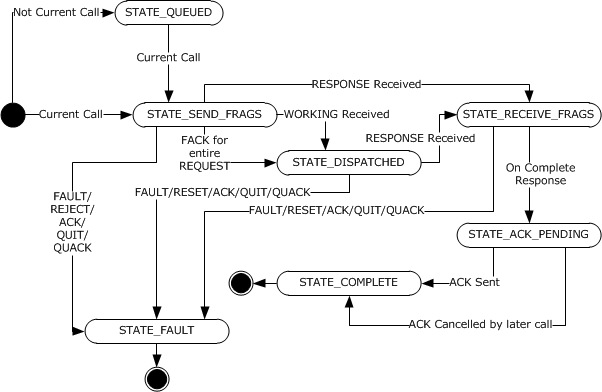

Figure 16: State transitions

**Note** The preceding conceptual data can be implemented by using a variety of techniques.

#### 3.2.2.2 Timers

##### 3.2.2.2.1 Packet Retransmission Timer

The packet retransmission timer is started when the client call transmits a [REQUEST](#Section_3.2.2.5.1), [FACK](#Section_3.2.2.5.10), [PING](#Section_3.2.2.5.2), or [QUIT](#Section_3.2.2.5.9) packet. The timer is canceled when the client receives a response from the server. If the timer expires, the previously transmitted packet SHOULD be considered lost, and the client SHOULD send new packets following the procedure specified in section [3.2.1.5.3](#Section_3.2.1.5.3). If the call's **F_CANCELED** flag is set, a QUIT packet is sent; otherwise, the packet type depends on the **Call State**:

- STATE_SEND_FRAGS -> REQUEST
- STATE_DISPATCHED-> PING
- STATE_RECEIVE_FRAGS ->FACK
The timer interval SHOULD be initially 1 second. When a call in **STATE_DISPATCHED** receives a [WORKING](#Section_3.2.2.5.5) packet or a [NOCALL](#Section_3.2.2.5.6) packet with a body that specifies a window size of zero, the timer interval SHOULD be doubled. The interval SHOULD be limited to a maximum of 32 seconds. In addition, when a call's **F_CANCELED** flag is set, the timer interval SHOULD be limited to the max of 2 seconds or the cancel time-out. If the timer expires, the previously transmitted packet SHOULD be considered as lost, and the client SHOULD send new packets following the procedure specified in section 3.2.1.5.3.

##### 3.2.2.2.2 Cancel Time-Out Timer

The cancel time-out timer MUST be started when the client call's **F_CANCELED** flag is set by an external entity in an implementation-specific manner <80>. The timer MUST be canceled when the client receives a [QUACK](#Section_3.2.2.5.11) packet whose event ID matches the call's **CANCEL_EVENT_ID**. If the timer expires, the **Call State** MUST move into **STATE_FAULT**.

The default value of the timer SHOULD be infinite. A client application SHOULD be able to specify a value in an implementation-specific way.

##### 3.2.2.2.3 Delayed-Ack Timer

As described in [[C706]](https://go.microsoft.com/fwlink/?LinkId=89824) section 12.5.3.1, a client can implicitly acknowledge receipt of response by sending a new request to the server. The **Delayed-Ack Timer** creates a window where a higher-layer protocol can submit a new call, which will be sent instead of an ACK PDU. The new call might be already queued in the activity's List of Active Calls (see section [3.2.2.4.1.5](#Section_3.2.2.4.1.5)) or might be initiated during the timer's window. The activity's **Delayed-Ack Timer** MUST be started when the activity's **current call** enters **Call State STATE_ACK_PENDING**. The timer MUST be canceled when the client initiates another call by using the same **Activity**.

##### 3.2.2.2.4 Context-Handle Keep-Alive Timer

This timer SHOULD be kept per [**activity**](#gt_activity) (not per call).<81> It SHOULD be started with an interval of 20 seconds when the client increments the activity's **Context Handle Count**, as long as the timer is not already started. It SHOULD be canceled when the activity's **Context Handle Count** reaches zero.

##### 3.2.2.2.5 Inactive Activity Timer

**Inactive Activity Timer**: The **Inactive Activity Timer** is responsible for monitoring inactive activities that should be removed. The timer is global and monitors the entirety of inactive activities using the **Collection of Inactive Activities** in each **Client Address Space** for each entry in the **Table of CASs**. The timer is started when the RPC client runtime is started and initialized to 30 seconds.

#### 3.2.2.3 Initialization

A client is initialized when a higher-level protocol supplies to the client-side implementation of the [**RPC**](#gt_remote-procedure-call-rpc) runtime sufficient information to start making RPCs, including the information required to create a binding handle (see section [3.2.2.3.1](#Section_3.2.2.3.1)) and, optionally, security setting preferences (see section [3.2.2.3.2](#Section_3.2.2.3.2)).

##### 3.2.2.3.1 Create a Binding Handle

Information about creating a binding handle is specified in [[C706]](https://go.microsoft.com/fwlink/?LinkId=89824) section 2.3.

##### 3.2.2.3.2 Specify Security Settings

If a higher-level protocol requires security for its remote procedure method calls, it MUST supply to the client-side implementation of the [**RPC**](#gt_remote-procedure-call-rpc) the following runtime information:

- What security provider it wants to use.
- What [**authentication level**](#gt_authentication-level) it wants to use.
- Optionally what impersonation level it wants to use.
- A **Client Credential Handle**
- Any other security provider–specific information necessary for the security provider to function.
Higher-level protocols can specify security settings using the abstract interfaces as described in [Appendix C](#Section_8.1). Higher-level protocols on the Windows runtime can use the RpcBindingSetAuthInfo and RpcBindingSetAuthInfoEx APIs.

#### 3.2.2.4 Higher-Layer Triggered Events

##### 3.2.2.4.1 Make an RPC Method Call

###### 3.2.2.4.1.1 Find a CAS

The client MUST find or create a [**CAS**](#gt_client-address-space-cas) contained in the Table of CASs wherein the CAS binding handle values for host address, protocol sequence, and endpoint match the client's desired values for host address, protocol sequence, and endpoint. A client SHOULD choose an existing CAS if a matching one exists.

If a new CAS is created, and the server is using a [**dynamic endpoint**](#gt_dynamic-endpoint), the CAS initially points to the dynamic endpoint for the [**RPC protocol sequence**](#gt_rpc-protocol-sequence) being used. Otherwise, the CAS refers to the server's [**well-known endpoint**](#gt_well-known-endpoint).

###### 3.2.2.4.1.2 Find an Activity

If the client has chosen an existing **CAS**, the client SHOULD use an existing compatible [**activity**](#gt_activity) if possible. Selection of a compatible activity within the scope of existing **CAS** is performed according to the following algorithm:

Search the CAS's Collection of Activities and choose an Activity that satisfies the following conditions:

- The **Activity**'s **Discard** flag MUST be set to FALSE.
- If the **Activity**'s **Current CallOverlapping** flag is set to TRUE, and the **Activity**'s **Current CallCausal Ordering Flag** is TRUE, and the **Activity** has one or more call elements in the **List of Active Calls**, it MUST use that activity. If the server does not support the PF2_UNRELATED flag (from the **Client Address SpaceSupports PF2_UNRELATED Flag** element) of the selected activity, the client cannot begin the call until the **Activity**'s **Current Call** has completed.
- If the **Activity**'s **Current CallOverlapping** flag is set to FALSE or the **Activity**'s **Current Call** Casual Ordering Flag is FALSE, and the **Activity** has one or more call elements in the **List of Active Calls** in the state STATE_ACK_PENDING, it SHOULD use that activity.
- If a compatible activity is not found in the **Collection of Activities**, the client MUST search the **Collection of Inactive Activities** and SHOULD use an activity from that collection if one exists.
If the client finds a compatible activity during the algorithmic search just described, a second order check is made to verify compatibility of security settings of the considered activity and the server binding handle provided for the new RPC method calls is made. The following settings are compared:

From the Activity's Security Context Handle and the server binding handle for the call:

- **Security Provider Identifier**
- **Authentication Level**
- **Impersonation Level**
Security Provider Identifier, Authentication Level and Impersonation Level elements of the call's server binding handle security settings are as defined in [[C706]](https://go.microsoft.com/fwlink/?LinkId=89824) section 2.7.

In addition to the above, the activity's **Client Credential Handle** and the server binding handle **AuthIdentity** (see section [3.1.1.1.2](#Section_3.1.1.1.2)) MUST be equal. The implication of this check is that the new call and the existing activity use the same **Client Credential Handle**.

All elements MUST match exactly. If the security settings check fails, the algorithm continues.

If the compatible activity is found in the **Collection of Activities**, then increment the activity's **Active Call Reference** counter.

If the compatible activity is found in the **Collection of Inactive Activities**, then increment the activity's **Active Call Reference** counter and move the activity to the **Collection of Activities**. If the compatible activity has a prior call (from the activity's <List of Active Calls>) in either the STATE_COMPLETED or STATE_ACK_PENDING state, the activity's sequence number MUST be incremented, and the activity's delayed-ack timer MUST be canceled.

If the new **call** is assigned to an existing, compatible **activity**, set the **call**'s **Activity UUID** element to the **Activity UUID** of the existing element.

If a compatible activity is not available, the client MUST create a new one. Its sequence number MUST be initialized to zero and the **Active Call Reference** counter MUST be set to one. Set the **call**'s **Activity UUID** element to the **Activity UUID** of the new activity.

###### 3.2.2.4.1.3 Find or Create a Security Context

The client SHOULD use the [**activity's**](#gt_activity) current [**security context**](#gt_security-context), represented by the activity's **security context handle**, unless the context has expired. <82>If the client chooses to create a new security context for any reason, then it will set the activity's current **security context handle** equal to the handle value for the new security context created. See section [3.2.1.4.1.1](#Section_3.2.1.4.1.1) for information on creating a security context. Each security context MUST have a unique **Context Identifier** (transmitted as **key_vers_num**), which is specified in the [sec_trailer](#Section_2.2.3.4) structure, to allow the server to identify which security context is used for a given [**PDU**](#gt_protocol-data-unit-pdu).

###### 3.2.2.4.1.4 Create a Call

A new call MUST be created by using the current activity ID and sequence number. The new call MUST have **Call State** set to STATE_QUEUED, F_CANCELED MUST be set to false, CANCEL_EVENT_ID MUST be set to zero, the **Sent Fragment List** and **Received Fragment List** MUST be cleared, and the **Receive Fragment Base** MUST be set to zero.

The new **call** is added to the activity's **List of Active Calls**.

If the Activity's **Current Call** is NULL, the Activity's **Current Call** is set to the call just created. The **Call State** (for this new call) is set to **STATE_SEND_FRAGMENTS**, and the client MUST send one or more request fragments.

###### 3.2.2.4.1.5 Queuing Multiple Calls

When a higher-layer protocol makes multiple calls on the same activity, they are queued in the activity's **List of Active Calls**. Only one call can be in STATE_SEND_FRAGMENTS at any given time. The call that is in this state is the Activity's **Current Call**.

If calls on the activity are not being overlapped (call's **Overlapping** element is set to FALSE) as described in section [3.2.1.5.2](#Section_3.2.1.5.2), the client MUST receive the server's response before the next call in the queue can be processed (meaning transition to STATE_SEND_FRAGMENTS). This behavior is in accordance with [[C706]](https://go.microsoft.com/fwlink/?LinkId=89824). The presence of a next queued call affects the next state of the Current Call after it has received the server's response: if there is no next queued call, the Current Call will transition to STATE_ACK_PENDING. The transition to STATE_ACK_PENDING triggers the initialization of the Delayed-Ack Tmer. If there is a next queued call, the Current Call transitions immediately to STATE_COMPLETE and **Current Call** is set to the next queued call.

If overlapping calls are being made on the activity (call's **Overlapping** element is set to FALSE and call's activity's **Client Address Space** Supports PF2_Unrelated Flag is set to true), the client does not have to wait for the client to reach STATE_COMPLETE or STATE_FAULT before beginning the next call. When overlapping calls are being made, the client will set the Activity's **Current Call** to the next call in the List of Active Calls (if there is a next call) whenever the **Current Call** transitions to STATE_DISPATCHED.

In all cases, calls MUST still be sent in order of their **call_id** and all fragments of one call MUST be sent (**Call** transitions to STATE_DISPATCHED) before fragments of another call can be sent.

##### 3.2.2.4.2 Cancel Requested

If the client application cancels the call, the call's F_CANCELED flag is set and CANCEL_EVENT_ID is incremented. For details, see section [3.2.2.2.2](#Section_3.2.2.2.2).

#### 3.2.2.5 Message Processing Events and Sequencing Rules

The packet semantics are the same as what is specified in [[C706]](https://go.microsoft.com/fwlink/?LinkId=89824) sections 6 and 12.5.

The packet type MUST be one of the connectionless packet types specified in [C706]; otherwise, the packet is discarded. Incoming packets MUST be processed while the **Call State** is set to STATE_SEND_FRAGS, STATE_DISPATCHED, or STATE_RECEIVE_FRAGS; in other states, they MUST be discarded.

For a non-[REQUEST](#Section_3.2.2.5.1) packet, the activity ID and the sequence number in the packet MUST match those of the call itself. If the **auth_proto** field is nonzero, the implementation MUST compare the **auth_proto** to the authentication level of the activity's **Security Context Handle** and then the packet MUST be verified by using the activity's **Security Context Handle**, as described in section [3.2.1.4.1.1](#Section_3.2.1.4.1.1). Otherwise, the packet MUST be discarded silently.

A packet that has not been discarded by one of the preceding rules MUST cancel the call packet retransmission timer, as specified in section [3.2.2.2.1](#Section_3.2.2.2.1). If the server uses a [**dynamic endpoint**](#gt_dynamic-endpoint) and the [**CAS**](#gt_client-address-space-cas) points to the [**endpoint mapper**](#gt_endpoint-mapper) endpoint for the protocol, the CAS SHOULD be updated to point to the server endpoint that sent the packet. For more information, see the protocol example in section [4.5](#Section_4.5).

The following sections define handling of specific packet types.

##### 3.2.2.5.1 REQUEST

A REQUEST packet MUST have **auth_type** equal to zero, and its [**interface**](#gt_interface) ID MUST match the conversation manager interface as specified in [[C706]](https://go.microsoft.com/fwlink/?LinkId=89824) Appendix P. The packet's Header.Flags.frag bit MUST be zero. Otherwise, the packet MUST be discarded.

If the packet is accepted, it is processed as specified in [C706] Appendix P. Implementations of this protocol SHOULD serialize execution of conversation manager callback calls.

##### 3.2.2.5.2 PING

When processing a PING PDU, an implementation MUST examine the Callback State (section [3.2.3.1.10](#Section_3.2.3.1.10)). If a conversation manager callback in progress, the client MAY respond with a WORKING packet.<83> If a conversation manager callback is not in progress, then the packet SHOULD be discarded.

##### 3.2.2.5.3 RESPONSE

The response fragment number is compared to the **Receive Fragment Base**. If the fragment number is less than the **Receive Fragment Base**, then the fragment MUST be discarded. If the fragment number is greater than or equal to the **Receive Fragment Base**, then the fragment is added to the **Received Fragment List**, and a [FACK](#Section_3.2.2.5.10) MUST be sent unless the packet's Header.Flags.Nofack flag is set. If the **Call State** is STATE_SEND_FRAGS or STATE_DISPATCHED, the **Call State** MUST change to STATE_RECEIVE_FRAGS. If the fragment number indicates that all inbound fragments are received, [**RPC**](#gt_remote-procedure-call-rpc) MUST deliver the data to the client application, and the call MUST set **Call State** to STATE_ACK_PENDING if there is no next queued call in the activity's **List of Active Calls**. If there is a next queued call, the call's **Call State** is set to STATE_COMPLETE.

All fragments related to a packet are removed from the **Received Fragment List** when a full packet can be formed.

##### 3.2.2.5.4 FAULT

The **Call State** MUST change to STATE_FAULT and Status set to the status code in the fault packet.

##### 3.2.2.5.5 WORKING

All outbound fragments MUST have been received. All outbound fragments have been received when the client's [Send Window (Call)](#Section_3.2.1.1.2)'s **Fragment_base** value is greater than its **Fragment_final** value. If the **Call State** is STATE_SEND_FRAGS, the **Call State** MUST change to STATE_DISPATCHED. When the **Call State** changes to STATE_DISPATCHED, this MAY trigger a call queuing operation as specified in section [3.2.2.4.1.5](#Section_3.2.2.4.1.5).

##### 3.2.2.5.6 NOCALL

The **Outbound Fragment Window** SHOULD be updated, and the client SHOULD send a burst of [REQUEST](#Section_3.2.2.5.1) fragments.<84>

##### 3.2.2.5.7 REJECT

The **Call State** MUST change to STATE_FAULT with STATUS set to the status code in the packet.

##### 3.2.2.5.8 ACK

The **Call State** SHOULD change to STATE_FAULT with STATUS set to 0x6C0.

##### 3.2.2.5.9 QUIT

The **Call State** SHOULD change to STATE_FAULT with STATUS set to 0X6C0.

##### 3.2.2.5.10 FACK

The **Outbound Fragment Window** MUST be updated, and the client SHOULD send a burst of [REQUEST](#Section_3.2.2.5.1) fragments. When a FACK [**PDU**](#gt_protocol-data-unit-pdu) is received, the corresponding fragment MUST be removed from the **Sent Fragment List**.

If a FACK PDU is received for a fragment number that is higher than the fragment number for any other fragments in the **Sent Fragment List** then those fragments are retransmitted.

If the server has received all request fragments, the **Call State** SHOULD change to STATE_DISPATCHED. When the **Call State** changes to STATE_DISPATCHED, this MAY trigger a call queuing operation as described in section [3.2.2.4.1.5](#Section_3.2.2.4.1.5).

##### 3.2.2.5.11 QUACK

The client SHOULD check the following conditions before taking prescribed actions:

- If the F_CANCELED flag is false, the packet MUST be discarded. No further processing is necessary.
- If the packet has body data of length 0, this indicates that the server has orphaned the **Current Call**. **F_CANCELED** flag MUST be set to false and the call MUST be transitioned to **STATE_FAULT**.
- The following conditions indicate protocol errors; the packet MUST be discarded with no additional processing:
- If the packet has body data, and the length of the body data is less than 9 bytes.
- The body version is not zero.
- The packet's event ID does not match the call's **CANCEL_EVENT_ID**.
- Having received a valid QUACK where the packet's event ID matches the call's **CANCEL_EVENT_ID**, **F_CANCELED** flag MUST be set to false and the call MUST be transitioned to **STATE_FAULT**.

#### 3.2.2.6 Timer Events

For information on timers, see section [3.2.2.2](#Section_3.2.2.2).

##### 3.2.2.6.1 Inactive Activity Timer

When the timer expires, the client MUST scan all activities in the **Collection of Inactive Activities** in each **Client Address Space** for each entry in the **Table of CASs**, examine the activity's **Last Use Timestamp**, and remove those that have been inactive for an interval that is longer than an implementation-specific value.<85>

If the activity meets the previously described criteria, it is deleted.

After processing, the inactive activity timer is reset to an implementation-specific interval.<86>

##### 3.2.2.6.2 Context-Handle Keep-Alive Timer

When the timer expires, the client SHOULD make a call to **convc_indy** specifying the activity's UUID as the **cas_uuid** parameter.

##### 3.2.2.6.3 Delayed-Ack Timer

When the timer expires, the client MUST send an ACK packet to the server and enter **Call State STATE_COMPLETE**. The timer interval SHOULD be 2 seconds.

#### 3.2.2.7 Other Local Events

None.

### 3.2.3 Server Details

#### 3.2.3.1 Abstract Data Model

This section describes a conceptual model of possible data organization that an implementation maintains to participate in this protocol. The described organization is provided to facilitate the explanation of how the protocol behaves. This document does not mandate that implementations adhere to this model as long as their external behavior is consistent with that described in this document.

##### 3.2.3.1.1 Lowest-Allowed-Sequence Counter

**Lowest-Allowed-Sequence Counter**: A server implementation MUST maintain an abstraction of a **Lowest-Allowed-Sequence Counter** for each activity which represents the **sequence number** of the oldest active call initiated by the client. The initial value MUST be zero. When processing packets, the server MUST reference the [Table of Activity IDs](#Section_3.2.3.1.5) by using the current activity ID, consider packets with sequence numbers less than the **Lowest-Allowed-Sequence Counter** as retired, and discard the packet.

##### 3.2.3.1.2 CAS UUID

**CAS UUID**: A server implementation MUST maintain an abstraction of a client address space (**CAS**) universally unique identifier (**UUID**) that is an index into the CAS table.

##### 3.2.3.1.3 Lowest-Unused-Sequence Counter

**Lowest-Unused-Sequence Counter:** A server implementation MUST maintain an abstraction of a **Lowest-Unused-Sequence Counter** for each activity, which represents the **sequence number** (as defined in [[C706]](https://go.microsoft.com/fwlink/?LinkId=89824) section 12.5.2.11) of the next call that will be initiated by the client. The data type is an unsigned integer and permitted values are 0 to UINT_MAX. The initial value MUST be zero. When processing packets, the server MUST reference the [Table of Activity IDs](#Section_3.2.3.1.5) using the current activity ID and consider packets with sequence numbers:

- Greater than the **Lowest-Allowed-Sequence Counter**, but less than the **Lowest-Unused-Sequence Counter** as active and to be processed.
- Greater than or equal to the **Lowest-Unused-Sequence Counter** as new packets to be processed in the future.

##### 3.2.3.1.4 Table of Security Contexts

**Table of Security Contexts**: The server maintains a list of [**security contexts**](#gt_security-context), indexed by the security context identifiers currently in use and containing a **security context handle**. Lookups in the table are permitted using the **auth_context_id** field in the [sec_trailer (section 2.2.2.11)](#Section_2.2.2.11) data structure of the incoming [**PDU**](#gt_protocol-data-unit-pdu).

Packet integrity verification and/or encryption/decryption is performed, as described in section [3.2.1.4.1.1](#Section_3.2.1.4.1.1), using the security context handle value.

A new row is added to the table when a new security context is built.

##### 3.2.3.1.5 Table of Activity IDs

**Table of Activity IDs**: The server maintains a table of [**activities**](#gt_activity) indexed by the **Activity UUID**. For each activity, it maintains the following:

- A [Lowest-Allowed-Sequence Counter](#Section_3.2.3.1.1).
- A [Lowest-Unused-Sequence Counter](#Section_3.2.3.1.3).
- A [CAS UUID](#Section_3.2.3.1.2).
- If the activity is secure, a [Table of Security Contexts](#Section_3.2.3.1.4).
- **Last Use Timestamp**: The last use timestamp is updated whenever a PDU is sent or received for any **Call** associated with the activity.
- **Maximum PDU Length**: An unsigned short integer (max value 64KB). Each activity tracks the size of the largest packet that can be sent and received by the transport. This value is set to 1,024 bytes for the first call of an activity. When a FACK or NOCALL is received, the value is updated to the lower of the local transport limit and the value in the packet's **max_tsdu** field.
- **Binding handle**: Binding handle as specified in [[C706]](https://go.microsoft.com/fwlink/?LinkId=89824) section 6.2.1.
- **Security Buffer**: A buffer to preserve the security token that needs to be sent in a **conv_who_are_you_auth_more**, as described in section [3.2.1.4.1](#Section_3.2.1.4.1). The entire security token MAY be stored here and sent using repeated calls to **conv_who_are_you_auth_more**.
- **Table of Active Calls per Activity**: Contains a table of all of the active calls for this activity.
When an activity is created, its **CAS UUID** is NULL; when a conv_who_are_you2 or conv_who_are_you_auth call for the activity completes successfully, the activity's **CAS UUID** is set to the returned value.

An incoming request [**PDU**](#gt_protocol-data-unit-pdu) with a given security context identifier MUST be routed to the security context retrieved from the Table of Security Contexts row with the same security context identifier.

The [Idle scavenger Timer](#Section_3.2.3.2.2) event specifies the processing rules for removing rows from the Table of Activity IDs.

##### 3.2.3.1.6 Table of Client Address Spaces

**Table of Client Address Spaces**: The server maintains a **Table of CASs** indexed by **CAS UUID**, as specified in [[C706]](https://go.microsoft.com/fwlink/?LinkId=89824) Appendix P. For each [**CAS**](#gt_client-address-space-cas), the server maintains a **CAS Context Handle List** associated with the client address space. Whenever a call on an activity instantiates a context handle, the context handle is added to the **CAS Context Handle List** for the [**activity's**](#gt_activity) CAS.

The server deletes a **CAS UUID** and its associated context handles and activities if none of the **CAS UUIDs** activities receive any packets over a 5-minute period. This follows TIMEOUT_IDLE, as specified in [C706] Appendix K.<87>

##### 3.2.3.1.7 Table of Active Calls per Activity

**Table of Active Calls per Activity**: The server maintains a table of active calls per activity. Each call is indexed by the call sequence number, as specified in [[C706]](https://go.microsoft.com/fwlink/?LinkId=89824) section 9.5.3. In general, calls are removed from the table when the call transitions to **STATE_COMPLETE**. Calls are also removed from the **Table of Active Calls per Activity** if they have been idle for more than an implementation-specific period of time. See Idle Scavenger Timer for details on idle call removal. A new entry is added to the table when a new call arrives with a sequence number greater than or equal to the Lowest-Unused-Sequence Counter for the activity.

There is no provision for overflow of sequence numbers sent by the client. If the sequence number wraps around, the server will not create a new entry and in such a case will result in discarded packets as described in section [3.2.3.5.4](#Section_3.2.3.5.4). A client interacting with a server MUST NOT wrap around the sequence number on a specific activity.

##### 3.2.3.1.8 Call

**Call**: The server call (see the following figure) is defined by a state machine with the following states.

| State | Description |
| --- | --- |
| STATE_INIT | The call has not received a packet. This is the initial state. |
| STATE_RECEIVE_FRAGS | The server is still expecting fragments to form a full packet. A server registers that it has received enough fragments when it has received all the fragments of a packet, including the one indicating that it is the last fragment of the packet. |
| STATE_WORKING | The server has dispatched the call to the application [**stub**](#gt_stub). |
| STATE_SEND_FRAGS | The server is sending the reply to the client. |
| STATE_COMPLETE | The call is no longer active. This is a terminal state. |

The call maintains the following state elements:

- Last Fragment Received Timestamp: This timestamp value is updated whenever a fragment is received by the server.
Contrary to what is specified in [[C706]](https://go.microsoft.com/fwlink/?LinkId=89824) Appendix P, implementations of these extensions MUST NOT call conv_who_are_you. Instead, they MUST call conv_who_are_you2.

These extensions also MUST NOT call conv_are_you_there.

The server **call** element maintains the several properties:

- **Call State**: an implementation-specific value that represents the call state from the preceding table. At call creation, **Call State** is set to STATE_INIT.
- [Send Window (Call)](#Section_3.2.1.1.2)
- [Receive Window (Call)](#Section_3.2.1.1.3)
- [Callback State](#Section_3.2.3.1.10)
- **Activity UUID**: The UUID of the activity associated with the **Call**. This value is extracted from the header of the call as specified in [C706] section 12.5.2.
- **CANCEL_EVENT_ID**: An unsigned 32-bit counter that identifies a particular cancellation attempt. Initialized to a value of 0.
- **Sequence Number**: An unsigned 32-bit integer, as specified in [C706] section 12.5.2.11, that identifies this **Call**.
- **Overlapped**: Set when the client REQUEST_PDU has the PF2_UNRELATED flag set.

Figure 17: State diagram for server call

**Note** The preceding conceptual data can be implemented by using a variety of techniques. Any data structure that stores the preceding conceptual data can be used in the implementation.

##### 3.2.3.1.9 CAS Context Handle List

**CAS Context Handle List**: The server maintains a list of active context handles (as specified in [[C706]](https://go.microsoft.com/fwlink/?LinkId=89824) section 4.2.16.6) for each CAS. Whenever a call on an activity instantiates a context handle, the context handle is added to the list for the activity's CAS. This list is deleted when the CAS is deleted. The call's **Activity UUID** links a call with an **Activity**.

##### 3.2.3.1.10 Callback State

**Callback State**: A server conversation can only have a single outstanding conversation callback in progress at a time. **Callback State** is a boolean value that indicates if a conversation callback is in progress. See section [3.2.3.5.4.2](#Section_3.2.3.5.4.2) for more information on when a conversation callback is needed.

**Callback State** is set to true when a conversation callback is started and reset to false when it is completed.

#### 3.2.3.2 Timers

##### 3.2.3.2.1 Call Fragment Retransmission Timer

The call fragment retransmission timer MUST be set when a burst of fragments (one or more) is sent to the client. It MUST be canceled when the fragments are acknowledged by the client explicitly via **FACK** or implicitly by **ACK** or a higher-sequence **REQUEST**. When the timer expires, the server SHOULD resend the burst of fragments.<88>

##### 3.2.3.2.2 Idle Scavenger Timer

**idle scavenger timer**: The **idle scavenger timer** is a global timer responsible for monitoring calls and activities to detect idle state. When the RPC server initializes, the timer is initialized and the initial timer expiration is set to an implementation-specific value.<89>

#### 3.2.3.3 Initialization

These extensions make no changes to initialization other than what is specified in section [3.2.3.1](#Section_3.2.3.1).

#### 3.2.3.4 Higher-Layer Triggered Events

##### 3.2.3.4.1 Failure Semantics

A server protocol built on top of these extensions can encounter a failure while executing a method call. It can handle the failure at the application protocol layer, it can expose the failure to the [**RPC**](#gt_remote-procedure-call-rpc) protocol layer, or it can choose application-specific handling not specified in this document.

If it handles the error at the application protocol layer, the interaction appears to be successful from the point of view of the RPC runtime. The [out] parameters are filled, and the RPC implementation on the server sends a response [**PDU**](#gt_protocol-data-unit-pdu) with the [**stub**](#gt_stub) data (as specified in [[C706]](https://go.microsoft.com/fwlink/?LinkId=89824) section 14.4). In this case, the [out] parameters SHOULD indicate the occurrence of an error, although the exact mechanism for doing so is left to the application protocol layer.

If the server implementation of the application protocol layer exposes the error to the RPC protocol layer, it SHOULD indicate to the RPC runtime (usually through calling an API) that the method call has failed, and, if so, it also SHOULD supply a single unsigned long number that indicates the failure code.

In this case, the server SHOULD send back to the client a fault PDU (as specified in [C706] section 12.5.3.5) where the status field of the fault PDU is set to the failure code received from the application protocol layer. The call then enters **STATE_COMPLETE**.<90>

##### 3.2.3.4.2 Retrieving Client Identity

During the authorization process, a higher-level protocol on the server often needs to retrieve the identity of the client making a given request. A server implementation MUST try to retrieve the client identity by executing the following steps in this order:

- If the **auth_proto** field of the client request is nonzero, the server MUST lookup the **security context handle** from the activity's **Table of Security Contexts** using the **key_vers_num** in the [sec_trailer_cl](#Section_2.2.3.4) of the request and MUST request that the security provider that created the security context retrieve the client identity. For details on how a security provider determines the client identity, see the documentation for the respective security provider.
- If the **auth_proto** field of the client request is zero, the server MUST report this to the higher-level protocol in an implementation-specific way.

##### 3.2.3.4.3 Context Handle Generation

If a server [**stub**](#gt_stub) needs to create a context handle and the activity of the call has a NULL **CAS UUID**, the server SHOULD generate a conv_who_are_you2 [**conversation callback**](#gt_conversation-callback) to determine the correct **CAS UUID**. If the conversation callback fails, the stub SHOULD raise an exception with the status code of the conversation callback. The **CAS UUID** is used to find the [**CAS**](#gt_client-address-space-cas) in the **Table of Client Address Spaces**. The context handle is added to the **CAS Context Handle List** for the CAS.

#### 3.2.3.5 Message Processing Events and Sequencing Rules

The packet semantics are as specified in [[C706]](https://go.microsoft.com/fwlink/?LinkId=89824) section 6 and [C706] section 12.

##### 3.2.3.5.1 Failure Semantics

If, during the processing of a method call on the server, the server encounters an error, it SHOULD send back to the client a fault [**PDU**](#gt_protocol-data-unit-pdu) (as specified in [[C706]](https://go.microsoft.com/fwlink/?LinkId=89824) section 12.5.3.5) where the status field of the fault PDU is set to a descriptive status code. If an authorization policy (as specified in section [3.1.1.1.3](#Section_3.1.1.1.3)), restricting the access to the server is deployed, and server MUST set the status field to 0x00000005 in the fault PDU being sent back to the client. If the server is unable to send a fault PDU, as specified here, it MUST ignore further packets with the same activity ID and sequence number.

Servers can send any status code in the status field of a fault PDU except the following status codes, which a server MUST NOT send to the client. These status codes have special significance, and their presence in the status field might be flagged as a protocol error by the client.

| Status codes that MUST NOT be sent by RPC servers |
| --- |
| ERROR_SUCCESS (0x00000000) |
| STATUS_GUARD_PAGE_VIOLATION (0x80000001) |
| STATUS_DATATYPE_MISALIGNMENT (0x80000002) |
| STATUS_BREAKPOINT (0x80000003) |
| STATUS_ACCESS_VIOLATION (0xC0000005) |
| STATUS_IN_PAGE_ERROR (0xC0000006) |
| STATUS_ILLEGAL_INSTRUCTION (0xC000001D) |
| STATUS_PRIVILEGED_INSTRUCTION (0xC0000096) |
| STATUS_INSTRUCTION_MISALIGNMENT (0xC00000AA) |
| STATUS_STACK_OVERFLOW (0xC00000FD) |
| STATUS_POSSIBLE_DEADLOCK (0xC0000194) |
| STATUS_HANDLE_NOT_CLOSABLE (0xC0000235) |
| STATUS_STACK_BUFFER_OVERRUN (0xC0000409) |
| STATUS_ASSERTION_FAILURE (0xC0000420) |

##### 3.2.3.5.2 Sequencing in Case of Errors

If a fragmented request with multiple [**PDUs**](#gt_protocol-data-unit-pdu) includes a PDU with an error, implementations of these extensions SHOULD return a fault PDU as soon as they have processed the PDU with the error. They SHOULD NOT wait to receive all PDUs of a fragmented request before sending the fault PDU.

##### 3.2.3.5.3 Packet Processing

Received packets MUST have a valid [**RPC**](#gt_remote-procedure-call-rpc) header, and the packet type MUST be one of the following: [REQUEST](#Section_3.2.2.5.1), [PING](#Section_3.2.2.5.2), [FACK](#Section_3.2.2.5.10), [QUIT](#Section_3.2.2.5.9), or [ACK](#Section_3.2.2.5.8). Other packet types MUST be discarded.

If the PDU's activity ID matches an existing activity on the server, but the PDU's **dc_rpc_cl_pkt_hdr_t.auth_proto** or **sec_trailer_cl.auth_level** fields do not match those in the activity, the server SHOULD ignore the packet.<91>

Handling of specific packet types follows.

##### 3.2.3.5.4 REQUEST

When a packet of type REQUEST is received, the server MUST execute the following steps:

- Set a 32-bit integer N to the sequence number in the packet header.
- Using the activity ID in the message header, find the activity in the **Table of Activity IDs**. If the activity is found in the **Table of Activity IDs**, then process the packet according to the following rules:
- If N is less than the **activity ID** element's lowest-allowed-sequence number, the server MUST discard the packet.<92>
- If N is greater than or equal to the **activity ID** element's lowest-allowed-sequence and N is less than the **activity ID** element's lowest-unused-sequence, the server MUST search for an existing call object with **Sequence Number** equal to N in the **Table of Active Calls per Activity**. If no call was found, the server MUST discard the message.
- If N is greater than or equal to the **activity ID** element's lowest-unused-sequence, the server MUST create a new **call** object with **Sequence Number** equal to N and add it to the **Table of Active Calls per Activity** for the activity. The server MUST set the **activity ID** element's lowest-unused-sequence to N+1. If the packet's PF2_UNRELATED flag is false, the server MUST discard all call objects with lesser sequence from the **Table of Active Calls per Activity** for the activity and set the **activity ID** element's lowest-allowed-sequence to N. The server MUST set the new call's **Call State** to STATE_INIT.
- If the **activity ID** is not found in the **Table of Activity IDs**, create a new entry in the **Table of Activity IDs** and perform the following actions on the new entry:
- Set the lowest-allowed-sequence counter to N.
- Set the lowest-unused-sequence counter to N.
- Initialize the CAS UUID to NULL.
- Set the **Last Use Timestamp** to the current machine time.
- Create a new **call** object with **Sequence Number** equal to N and add it to the **Table of Active Calls per Activity** for the activity. The server MUST set the **activity ID** element's lowest-unused-sequence to N+1. If the packet's PF2_UNRELATED flag is set, the server MUST set the **activity ID** element's lowest-allowed-sequence to N. The server MUST set the new **Call State** to STATE_INIT.
- If the message was not discarded, the server MUST process the message according to the current state of the call object kept in **Call State**, as described in sections [3.2.3.5.4.1](#Section_3.2.3.5.4.1) through [3.2.3.5.4.4](#Section_3.2.3.5.4.4).

###### 3.2.3.5.4.1 STATE_INIT

The server MUST clear the **Sent Fragment List** and **Received Fragment List** and reset the **Receive Fragment Base** to zero. The server MUST set the **Call State** to STATE_RECEIVE_FRAGS and continue with processing for that state.

###### 3.2.3.5.4.2 STATE_RECEIVE_FRAGS

The server MUST take the following actions for every fragment received:

- If the packet is undersized (less than the size of the Connectionless PDU header as defined in [[C706]](https://go.microsoft.com/fwlink/?LinkId=89824) section 12.5.1), the server MUST drop it. No further processing is required.
- If the packet is oversized, the server MUST drop it and send a FACK-with-body PDU indicating to the client the current limit of the server buffer (implementation specific) using the **window_size** field of the FACK PDU body as described in section 12.5.3.4 of [C706]. No further processing is required.
- Update the **Received Fragment List**.
- Update the **Last Fragment Received Timestamp** of the call.
- If a [**Callback State**](#gt_conversation-callback) is false, check whether a conversation callback is required. If the call is not secure, is non-idempotent, and has an unknown **CAS UUID** (determined by searching the **Table of Client Address Spaces**), begin a **conv_who_are_you2**. When the callback completes, set the **Table of Activity IDs** entry **CAS UUID** to the value returned by the client. If the **CAS UUID** is not represented in the **Table of Client Address Spaces**, create a new entry in the **Table of Client Address Spaces** and set the new entry's **CAS Context Handle List** to NULL
- If the call is secure and the server does not have a security context in the activity's **Table of Security Contexts** that matches the key_vers_num in the packet's security trailer, begin a **conv_who_are_you_auth** and set Callback State to true. See section [3.2.1.4.1](#Section_3.2.1.4.1) for more information on how the callback generates a security context. If the server has no credentials matching the packet's **auth_proto** field, fail the conversation callback with status 0x000006D3.
- If the conversation callback fails, send a [REJECT](#Section_3.2.2.5.7) to the client, change the call state to STATE_COMPLETE, remove the call from the **Table of Active Calls per Activity**, and update the **Lowest-Allowed-Sequence Counter** of the activity. End Processing.
- If the conversation callback (for the purpose of establishing a security context) succeeds, add the resulting **Security Context Handle** to the activity's **Table of Security Contexts**.
- Send a FACK PDU with a body (as specified in [C706] section 12.5.3.4) and version field value set to 1, to the client.
- Update the **Last Use Timestamp** value in the **Table of Activity IDs** activity entry.
- If all receive fragments are present in the **Received Fragment List**, or if the call uses DCE pipes, and the server has received all the [in] arguments that are not marked with the [[PIPE]](https://go.microsoft.com/fwlink/?LinkId=90247) attribute in the [**IDL**](#gt_interface-definition-language-idl) file, set **Call State** to STATE_WORKING and dispatch to the application [**stub**](#gt_stub). For information about how the [in] arguments that are marked with the [PIPE] attribute in the IDL file are received in an application stub through the pull procedure, refer to [C706] section 5.1.4.
- If the received packet has the PF2_UNRELATED flag set, set **Overlapped** in the server call to TRUE, otherwise, set it to FALSE.

###### 3.2.3.5.4.3 STATE_WORKING

If all request fragments are received, the server MUST reply with a [WORKING](#Section_3.2.2.5.5) packet. No further processing is required.

When a call is dispatched:

- If the call is secure, ask the security provider to verify or decrypt the received packets, as appropriate, follow the processing information specified in section [3.2.1.4.1.1](#Section_3.2.1.4.1.1). If an error occurs, send a [REJECT](#Section_3.2.2.5.7) to the client, change the call state to STATE_COMPLETE, remove the call from the activity, and update the lowest-allowed-sequence of the activity. The call is finished.
- Dispatch to the application [**stub**](#gt_stub).
- After the application stub completes successfully, check whether a later call sequence has already been dispatched on this activity. If so, and **Overlapped** in the server call is false, skip further processing of this sequence.
- If the [maybe] flag (as defined in [[C706]](https://go.microsoft.com/fwlink/?LinkId=89824) sections 12.5.2 and 12.5.3.9) is set, no reply is needed. Change the **Call State** to STATE_COMPLETE, remove the call from the activity, and update the lowest-allowed-sequence of the activity. The call is finished.
- Set the **Call State** to STATE_SEND_FRAGS, and send one or more response fragments to the client.

###### 3.2.3.5.4.4 STATE_SEND_FRAGS

The server MUST send a burst of [RESPONSE](#Section_3.2.2.5.3) fragments and update the Sent Fragment List. The sliding window algorithm for RESPONSE fragments is implementation-specific. For more information, see section [3.2.1.1.1](#Section_3.2.1.1.1).

The **Call State** changes to **STATE_COMPLETE** (see section [3.2.2.1.10](#Section_3.2.2.1.10)) in one of the following conditions:

- If a request is received with the PF2_UNRELATED flag cleared and a sequence number greater than the activity's previous call.
- If the response fragments are acknowledged by the client, with respect to the packet's Header.Flags.Nofack flag, as specified in section 3.2.2.5.3.

##### 3.2.3.5.5 PING

If the packet sequence is higher than all of the [**activity's**](#gt_activity) active calls, the server MUST reply with a [NOCALL](#Section_3.2.2.5.6) without body data. Otherwise, if the activity contains no active call for the packet sequence, discard the packet.

Otherwise, the packet matches an active call. Because client packets might be duplicated and reordered in transit, the server MAY ignore the packet using implementation-specific criteria in order to avoid redundant responses.<93> If not, the server MUST check the **Call State**, as specified in the sections that follow.

###### 3.2.3.5.5.1 STATE_INIT

The server MUST reply with **NOCALL-with-body**.

###### 3.2.3.5.5.2 STATE_RECEIVE_FRAGS

If all request fragments for the call have been received and the state is in transition to STATE_WORKING, the server MUST reply with [WORKING](#Section_3.2.2.5.5). Otherwise, the server MUST reply with **FACK-with-body**.

###### 3.2.3.5.5.3 STATE_WORKING

The server MUST reply with [WORKING](#Section_3.2.2.5.5).

###### 3.2.3.5.5.4 STATE_SEND_FRAGS

The server MUST send a burst of [RESPONSE](#Section_3.2.2.5.3) fragments.

##### 3.2.3.5.6 FACK

If the **Call State** is not [STATE_SEND_FRAGS](#Section_3.2.3.5.4.4), discard the packet. Otherwise, update the **Sent Fragment List** and send a burst of [RESPONSE](#Section_3.2.2.5.3) fragments.

##### 3.2.3.5.7 QUIT

If the packet's event ID is greater than the call's **CANCEL_EVENT_ID** field, set the call's **CANCEL_EVENT_ID** to the packet's event ID, remove the call from the **Table of Active Calls per Activity** and send a [QUACK](#Section_3.2.2.5.11).

If the packet's event ID is equal to the call's **CANCEL_EVENT_ID**, reply with a QUACK.

If the packet's event ID is less than the call's **CANCEL_EVENT_ID**, discard the packet.

##### 3.2.3.5.8 ACK

If the **Call State** is not [STATE_SEND_FRAGS](#Section_3.2.3.5.4.4), discard the packet. Otherwise, change the **Call State** to **STATE_COMPLETE**, remove the call from the **Table of Active Calls per Activity**, and update the lowest-allowed-sequence of the activity. The call is finished.

#### 3.2.3.6 Timer Events

For more information on timers, see section [3.2.3.2](#Section_3.2.3.2).

##### 3.2.3.6.1 Idle Scavenger Timer Expiry

When the Idle Scavenger Timer expires, the server MUST scan all activities and remove idle calls and activities. After processing the following rules, the **idle scavenger timer** is reset to an implementation-specific interval.<94>

See product behavior note <95>for additional information.

**Idle Call Processing**: For each call in the **Table of Active Calls per Activity**, the server examines the **Last Fragment Received** timestamp value and compares it with the current time. If the interval is longer than an implementation specific value <96>, the call is determined to be idle and is removed from the **Table of Active Calls per Activity**.

**Idle Activity Processing**: For each activity in the **Table of Activity IDs**, the server examines the activities **Last Use Timestamp** and compares it with the current time. If the interval is longer than a period of TIMEOUT_IDLE as specified in [[C706]](https://go.microsoft.com/fwlink/?LinkId=89824) Section 10.2.6, the activity is determined to be idle and is deleted from the **Table of Activity IDs**.

When an activity is deleted, the server MUST perform the following:

- Delete all security contexts associated with the activity's **Table of Security Contexts**.
- Using the activity's CAS UUID, lookup the appropriate CAS in the **Table of Client Address Spaces**, delete the Client Address Space and its **CAS Context Handle List**.

#### 3.2.3.7 Other Local Events

No local events are specified for implementations of [**connectionless RPC**](#gt_connectionless-rpc) servers.

## 3.3 Connection-Oriented RPC Protocol Details

### 3.3.1 Common Details

This section defines the protocol details that are common between a [**connection-oriented RPC**](#gt_connection-oriented-rpc) server and a connection-oriented [**RPC client**](#gt_rpc-client).

#### 3.3.1.1 Abstract Data Model

This section specifies a conceptual model of possible data organization that an implementation maintains to participate in this protocol. The specified organization is provided to facilitate the explanation of how the protocol behaves. This document does not mandate that implementations adhere to this model as long as their external behavior is consistent with that described in this document.

##### 3.3.1.1.1 Association

**Association**: An **association** is a set of [**RPC transport**](#gt_rpc-transport) connections between a client process and a server endpoint. On the abstract level, the **association** can have any number of connections in it, although memory constraints and limitations of the RPC transport that establishes these connections mean that, in practice, the number of connections in an **association** is much more limited. All RPC transport connections in a given **association** are explicitly joined to an **association**, as specified in section [3.3.1.5.7](#Section_3.3.1.5.7). Both the client and server have an abstraction for **association**.

[[C706]](https://go.microsoft.com/fwlink/?LinkId=89824) uses the phrase association group for what this specification refers to as an **association**.

Each **association** contains the following properties:

- Binding handle as specified in [C706] section 6.2.1
- **List of Connections**: All **connection** elements bound to this **association**.
- **Bind Features Bitmask**: An octet bitmask that stores the result of Bind Time Feature Negotiation as defined in section [3.3.1.5.3](#Section_3.3.1.5.3). When features are successfully negotiated, the bits are set as defined in BindTimeFeatureNegotiationBitmask section [2.2.2.14](#Section_2.2.2.14). When these bits are set in the client and server, they indicate that the corresponding features are supported for this association.
- **List of Supported Transfer Syntaxes**: The list of all transfer syntaxes supported by the association. The content of this list is implementation-specific, and is discussed in [C706] Appendix I.
- **Table of Presentation Contexts**: A table of presentation contexts that have been negotiated by one or more **connections** bound to this **association**.

##### 3.3.1.1.2 Connection

**Connection**: A **connection** is an [**RPC**](#gt_remote-procedure-call-rpc)-level abstraction that denotes the data structures associated with a given [**RPC transport**](#gt_rpc-transport) connection. There is a 1:1 relationship between an RPC transport connection and an RPC connection. The RPC runtime on both the client and server maintains an abstract data handle that is a reference for each TCP/IP connection if the RPC transport is TCP/IP. Each connection MUST belong to exactly one association. Once a **connection** is tied to an **association**, a **connection** cannot change the association that it belongs to. If the transport is NCACN_NP the server maintains a reference to an **RPCServerGenericNamedPipeOpen** (see [MS-CIFS](../MS-CIFS/MS-CIFS.md) section 3.5.4.1)

[[C706]](https://go.microsoft.com/fwlink/?LinkId=89824) uses the term association for what this document refers to as a connection.

The **connection** ADM element contains the following properties:

- A list of associated **Server Call** or **Client Call** elements.
- **Table of Security Context Handles**: A table that contains all of the **security context handles** that have been negotiated with the remote client or server and indexed by the security context identifiers currently in use. Lookups in the table are permitted using the **auth_context_id** field in the sec_trailer (section [2.2.2.11](#Section_2.2.2.11)) data structure of the incoming PDU. If Security Context Multiplexing has not been negotiated, as described in section [3.3.1.5.4](#Section_3.3.1.5.4), the list will contain only a single **security context handle**.
Packet integrity verification and/or encryption/decryption is performed, as described in section [3.3.1.5.2.2](#Section_3.3.1.5.2.2), using the security context handle value that is contained in each security context row.

A new row is added to the table when a new security context is built.

- **Connection Multiplex Flag**
- **Supports Header Signing Flag**: Both the client and server maintain a Boolean value flag that indicates whether the remote party supports header signing as described in section 3.3.1.5.2.2. The default value is FALSE.
- **Transport Handle**: The client and server MUST maintain an abstract reference to an underlying transport mechanism instance.
- **Association**: The client and server MUST maintain a reference to the **association** to which the **connection** is tied.
- **List of Negotiated Presentation Contexts**: The list of presentation contexts that have been negotiated for this connection. See sections [3.3.1.5.6](#Section_3.3.1.5.6) and [3.3.2.4.1.3](#Section_3.3.2.4.1.3) for how elements are added to this list.
- **NamedPipe**: An **RPCServerGenericNamedPipeOpen** structure, see [MS-CIFS] section 3.5.4.1.

##### 3.3.1.1.3 Connection Multiplex Flag

**Connection Multiplex Flag:** A value that SHOULD be maintained for each connection on both the client and server that indicates whether the connection supports concurrent multiplexing. The flag has 3 possible values: Unknown, Yes, and No. The default value is Unknown. The mechanism used to express these values is implementation-specific.

##### 3.3.1.1.4 List of Connections

**List of Connections**: The client and server MUST implement an abstraction of a list of **connection** elements which are bound to a given association. The list need not be ordered or indexed by any value specific to a particular connection.

##### 3.3.1.1.5 Table of Associations

**Table of Associations**: The client and server SHOULD maintain a list of all associations. The **Table of Associations** is initialized when the client and server applications are started and are initially empty. Whenever a new **association** is created (as specified in [[C706]](https://go.microsoft.com/fwlink/?LinkId=89824) section 9.3.3), it is added to the table. Whenever the last connection in an association is closed, the association is removed from the table and destroyed.

##### 3.3.1.1.6 Table of Security Provider Info

**Table of Security Provider Info**: The client and server SHOULD maintain a table indexed by the Security Provider ID value (for example, **RPC_C_AUTHN_GSS_KERBEROS**) that defines the number of legs required to negotiate a security context. See section [2.2.1.1.7](#Section_2.2.1.1.7) for more information on security providers and section [3.3.1.5.2.1](#Section_3.3.1.5.2.1) for usage details.

#### 3.3.1.2 Timers

There are no timers that are common between a connection-oriented client and a connection-oriented server.

#### 3.3.1.3 Initialization

There is no initialization that is common between a connection-oriented client and a connection-oriented server.

#### 3.3.1.4 Higher-Layer Triggered Events

##### 3.3.1.4.1 Context Handle Scope

The operations on a context handle are as specified in [[C706]](https://go.microsoft.com/fwlink/?LinkId=89824) section 5.1.6. This section clarifies the scope of the context handle as interpreted by these extensions. As specified in [C706] section 5.1.6, the context handle is created by the client sending a null context handle in a method call, and by the server returning a nonnull context handle in the [**stub**](#gt_stub) data in the response to the same method call. The [**RPC transport**](#gt_rpc-transport) connection on which the request and response are transmitted belongs to an association, as specified in sections [3.3.1.1.1](#Section_3.3.1.1.1) and [3.3.1.1.2](#Section_3.3.1.1.2). The scope of a context handle is this association. If a request/response exchange on one association leads to the creation of a context handle, and this context handle is passed to a different association, the server SHOULD reject the request.

#### 3.3.1.5 Message Processing Events and Sequencing Rules

##### 3.3.1.5.1 Protocol Version Number

These extensions constrain the protocol version numbers that are used in [**PDUs**](#gt_protocol-data-unit-pdu), as specified in [[C706]](https://go.microsoft.com/fwlink/?LinkId=89824) section 12. These extensions recognize only major version 5 and minor version 0. If a PDU with a different major or minor version is sent to a client or server, the client or server SHOULD return an error.<97>

##### 3.3.1.5.2 Building and Using a Security Context

###### 3.3.1.5.2.1 Building a Security Context

To make a secure call, a security context needs to be created before it can be used. The process of creation involves exchanging one or more messages between the client and server implementations of a security provider. This process is also called building a security context.

During the process of building a security context, a security provider can optionally exchange messages with an entity other than the client or server (for example, a KDC).

The scope of a built security context is the connection. If a client wants to use a security context on a different connection, it MUST totally rebuild it for that different connection.

To build a security context, an [**RPC client**](#gt_rpc-client) and an [**RPC server**](#gt_rpc-server) exchange a series of bind/bind_ack or alter_context/alter_context_resp [**PDUs**](#gt_protocol-data-unit-pdu) with authentication information. The process MUST start on the client, as follows:

- If the client has already sent a bind PDU on the connection it wants to build the security context on, it MUST start the sequence of building a security context with an alter_context PDU.
- If the client has not already sent a bind PDU on that connection, it MUST start the sequence of building a security context with a bind PDU.
The process continues on the server as follows:

- If the server receives a bind PDU, it MUST respond with a bind_ack or bind_nak PDU.
- If a server receives an alter_context PDU, it MUST respond with an alter_context_resp PDU or, in the case of error, with a fault PDU.
In case of catastrophic errors (such as an out of memory condition or buffer overrun), a server MAY send a fault PDU or just close the connection. For information on client and server state machines, see sections [3.3.2](#Section_3.3.2) and [3.3.3](#Section_3.3.3).

Once a client decides on the type of PDU, it MUST start the sequence by requesting the security provider for an authentication token using an implementation-specific equivalent of the abstract GSS_Init_sec_context call, as specified in [[RFC2743]](https://go.microsoft.com/fwlink/?LinkId=90378). See [MS-APDS](../MS-APDS/MS-APDS.md) section 3.1.5 for NTLM details and see [[RFC4121]](https://go.microsoft.com/fwlink/?LinkId=90459) and [MS-KILE](../MS-KILE/MS-KILE.md) section 3.2.5.2 for Kerberos details. This PDU MUST be sent to the server with authentication information added, as specified in section [2.2.2.11](#Section_2.2.2.11).

When authentication information is associated with a connection as specified in section 2.2.2.11 and **auth_length** is nonzero as specified in [[C706]](https://go.microsoft.com/fwlink/?LinkId=89824) section 13.2.6, the Security Context contains a token that represents the client identity populated by the security provider. See [MS-APDS] section 3.1.5 "Processing Events and Sequencing Rules" and [MS-KILE] section 3.4.5.3 "Processing Authorization Data" for details of population of the token. See [MS-DTYP](../MS-DTYP/MS-DTYP.md) section 2.5.2 "Token/Authorization Context" for details of the members of tokens.

If no authentication information is obtainable as specified in section 2.2.2.11 and the transport protocol is NCACN_NP, the security context is obtained as described in [MS-CIFS](../MS-CIFS/MS-CIFS.md) section 3.5.4.3 supplying the **Connection NamedPipe** ADM element as a parameter.

The client MUST choose a value for the **auth_context_id** of the sec_trailer structure such that it is unique within the scope of the given connection. Each message with an authentication token sent to the other party is also called a security leg. Thus, the first message from the client to the server is also called the first leg of the security context creation. The server MUST retrieve the authentication token and hand it off to the security provider indicated by the **auth_type** field.

The interaction between these extensions and the security provider on the server MUST happen through an implementation-specific equivalent of the abstract GSS_Accept_sec_context call, as specified in [RFC2743]. Upon receiving and processing an authentication token at any leg of the authentication on either the client or server, the security provider MUST indicate to [**RPC**](#gt_remote-procedure-call-rpc) runtime one of three abstract results from the processing: an error, a success, or a request for further security legs, as specified in [RFC2743]:

- If the security provider indicates an error, the RPC runtime MUST take recovery action depending on whether this is the client or server.
- If this is the client, the RPC runtime discards the security context and MUST NOT send any further PDUs on that connection. It SHOULD close the connection unless it is expecting responses on a multiplexed connection, as specified in section [3.3.1.5.8](#Section_3.3.1.5.8), in which case it SHOULD set the Activity's **Discard** flag to TRUE. If it does not wait for all responses on a multiplexed connection, it MUST provide indication in an implementation-specific way to upper layers that the outstanding calls have failed.
- If the security provider returns an error on the server, the server MUST respond with a bind_nak or a fault PDU, depending on the PDU that the client sent, as specified earlier. The server SHOULD also discard the security context in this case.
- If the security provider returns a success from processing the authentication token, the security context is successfully created. If the security provider returns a success on the client, the client is ready to use this security context. If the security provider on the server returns a success, the server MUST still respond with a bind_ack or alter_context_resp PDU, as specified earlier. In this case, it SHOULD return an empty (zero-length) authentication token to the client.
- If the security provider indicates to the RPC runtime a request for further security legs, it MUST always produce another authentication token along with the request for further security legs. In this case, the RPC runtime MUST send another leg of the security context creation by using that authentication token. If this happens on the client, the client MUST send an alter_context PDU. The p_context_elem structure of the alter_context PDU SHOULD be the same as the content of the PDU sent in the previous leg from the client. If this happens on the server, it MUST respond with a bind_ack or an alter_context_resp PDU, except when a security provider has an odd number of legs as specified in the following section, using the authentication token produced by the security provider.
If a client has implemented a Table of Security Provider Info, then it has the knowledge of how many legs different [**security providers**](#gt_security-provider) use . If the client determines during lookup in this table that a given security provider has an odd number of legs, the client SHOULD use an [rpc_auth_3 PDU](#Section_2.2.2.10) instead of an alter_context PDU for the last leg. The client MUST NOT use an rpc_auth_3 PDU unless it is certain that the current leg is the last leg of exchange. The server MUST NOT respond to an rpc_auth_3 PDU. If the processing of the authentication token from an rpc_auth_3 PDU results in an error, the RPC runtime on the server SHOULD return a fault PDU on the first request that uses this security context with the status field set to the **security context handle Error Value**.

If a client is not sure how many legs a given security provider uses, it MUST assume that the number of legs is even.<98>

Once negotiated, the client and server add the resultant **security context handle** to the **connection's Table of Security Context Handles**.

###### 3.3.1.5.2.2 Using a Security Context

After a security context is built, the security context can be used by the [**RPC**](#gt_remote-procedure-call-rpc) runtime and higher-level protocols to perform authorization decisions. Besides using the security context for authorization decisions, the RPC runtime can also use the security context to create a logical stream of data that is protected from tampering and information disclosure on the network.

The amount of protection applied depends on the [**authentication level**](#gt_authentication-level) for the security context requested by the client when the security context is created. The authentication level is applied in two dimensions:

- In the first dimension, it controls what capabilities the RPC runtime MUST request from the security provider when the security context is being built, as detailed in the first table that follows. It is possible for a security provider to not be able to provide a certain capability. In this case, the lack of the capability MUST be considered by the RPC runtime as equivalent to the security provider returning an error and MUST be handled as specified in the previous section.
- In the second dimension, the authentication level controls how the security provider runtime MUST perform [**PDU**](#gt_protocol-data-unit-pdu) protection on the different PDU segments using the security context, as detailed in the second table that follows.
The following table specifies the abstract capability that the RPC runtime MUST request from the security provider when the security context is being created. The capabilities in the following table are further specified in [[RFC2743]](https://go.microsoft.com/fwlink/?LinkId=90378) section 1.2.1.2. The capabilities requested at each level include the ones requested at the previous level.

| Authentication level | Capability requested |
| --- | --- |
| RPC_C_AUTHN_LEVEL_CONNECT | None |
| RPC_C_AUTHN_LEVEL_PKT | Replay Detect |
| RPC_C_AUTHN_LEVEL_PKT_INTEGRITY | Sequence Detect, integrity |
| RPC_C_AUTHN_LEVEL_PKT_PRIVACY | Confidentiality |

As specified earlier, once the security context is built, the RPC runtime MUST also use the authentication level to control how the security context is used to protect request and response PDUs sent to the other side.

One of the first decisions that needs to be negotiated is whether the security provider on each side supports what this specification calls header signing. Header signing is an operation in which a security provider can provide integrity protection to a segment of the PDU such that the integrity protection does not modify the content of that segment. The segments of the PDU are specified in section [2.2.2.1](#Section_2.2.2.1). The RPC runtime on the client determines in an implementation-specific way if the security provider on the client supports header signing. If it does, the first bind or alter_context PDU that the client sends on a connection that carries authentication information and whose authentication level is integrity or higher MUST have its PFC_SUPPORT_HEADER_SIGN bit set. The RPC runtime on the server also determines in an implementation-specific way whether the security provider on the server supports header signing, and, if it does not, it MUST respond to the client with a PDU whose PFC_SUPPORT_HEADER_SIGN bit is cleared. If it does support header signing, it MUST respond to the client with a PDU whose PFC_SUPPORT_HEADER_SIGN bit is set.

Using this mechanism, the client and server agree if header signing should be done for this connection. If both the client and server support header signing, both set the connection's **Supports Header Signing Flag** to TRUE. Once agreed, the client and server apply protection to request and response PDUs in the same way.

If the client and server **Supports Header Signing Flag** is TRUE, the party that sends the PDU asks the security provider to apply the following protection to the different PDU segments.

| Authentication level | PDU header | PDU body | sec_trailer |
| --- | --- | --- | --- |
| RPC_C_AUTHN_LEVEL_CONNECT | None | None | None |
| RPC_C_AUTHN_LEVEL_PKT | None | None | None |
| RPC_C_AUTHN_LEVEL_PKT_INTEGRITY | Integrity | Integrity | Integrity |
| RPC_C_AUTHN_LEVEL_PKT_PRIVACY | Integrity | Confidentiality | Integrity |

If either the client or server **Supports Header Signing Flag** is FALSE, the RPC runtime on the sending side asks the security provider to apply the following protection to the different PDU segments.

| Authentication level | PDU header | PDU body | sec_trailer |
| --- | --- | --- | --- |
| RPC_C_AUTHN_LEVEL_CONNECT | None | None | None |
| RPC_C_AUTHN_LEVEL_CALL | None | None | None |
| RPC_C_AUTHN_LEVEL_PKT | None | None | None |
| RPC_C_AUTHN_LEVEL_PKT_INTEGRITY | None | Integrity | None |
| RPC_C_AUTHN_LEVEL_PKT_PRIVACY | None | Confidentiality | None |

In the preceding tables, "None" means no protection, "Integrity" means an integrity check per [RFC2743] section 2.3.1 MUST be applied, and "Confidentiality" means that the segment MUST be encrypted.

The PDU header, PDU body, and sec_trailer MUST be passed in the input message, in this order, to GSS_WrapEx, GSS_UnwrapEx, GSS_GetMICEx, and GSS_VerifyMICEx. For integrity protection the sign flag for that PDU segment MUST be set to TRUE, else it MUST be set to FALSE. For confidentiality protection, the **conf_req_flag** for that PDU segment MUST be set to TRUE, else it MUST be set to FALSE.

The PDU header, PDU body, and sec_trailer from the output message of GSS_WrapEx and GSS_VerifyMICEx MUST be sent to the other side (client or server) as part of the request or response PDU, and the signature output MUST be sent to the other side (client or server) as the authentication token as specified in section [2.2.2.12](#Section_2.2.2.12).

If the authentication level is RPC_C_AUTHN_LEVEL_PKT_PRIVACY, the PDU body will be encrypted. The PDU body from the output message of GSS_UnwrapEx represents the plain text version of the PDU body. The PDU header and sec_trailer output from the output message SHOULD be ignored. Similarly the signature output SHOULD be ignored.

For further details on GSS_WrapEx, see [MS-NLMP](../MS-NLMP/MS-NLMP.md) section 3.4.6 , [MS-KILE](../MS-KILE/MS-KILE.md) section 3.4.5.4 and [MS-TLSP](../MS-TLSP/MS-TLSP.md) section 3.1.5.1.

For details on GSS_UnwrapEx, see [MS-NLMP] section 3.4.7 , [MS-KILE] section 3.4.5.5 and [MS-TLSP] section 3.1.5.2.

For further details on GSS_GetMICEx, see [MS-NLMP] section 3.4.8 and [MS-KILE] section 3.4.5.6.

For further details on GSS_VerifyMICEx, see [MS-NLMP] section 3.4.9 and [MS-KILE] section 3.4.5.7.

If the authentication level is connect, the security provider MUST use for request and response PDUs an authentication token that is optional and that does not need to be transmitted to the other side.

This protocol does not specify whether the authentication token itself is protected from tampering by the security provider. It also does not specify how the security provider applies integrity or confidentiality protection to a PDU segment. The algorithms for doing so are specific to the security provider. For details about a security provider, see the documentation for that security provider.

##### 3.3.1.5.3 Bind Time Feature Negotiation

These extensions introduce additional rules about how a bind [**PDU**](#gt_protocol-data-unit-pdu) SHOULD be composed by the client and processed by the server, and how the response bind_ack PDU SHOULD be composed by the server and processed by the client. [[C706]](https://go.microsoft.com/fwlink/?LinkId=89824) sections 12.6.4.3 and 12.6.4.4 specify a bind PDU and a bind_ack PDU. When sending a bind PDU, a client SHOULD add an element in the **p_cont_elem** array that has the same value for the **abstract_syntax** field as the previous element in the **p_cont_elem** array, but that MUST have exactly one element in the **transfer_syntaxes** array; also, its **if_uuid** field MUST have the following prefix: 6CB71C2C-9812-4540 and a version number of 1.0. If a client does so, it is said to have indicated support for bind time feature negotiation. A client MUST have at most, one element in the **p_cont_elem** array that has an **if_uuid** with that prefix in the **transfer_syntaxes** array. If a client has indicated support for bind time feature negotiation, the message processing rule in this section SHOULD be applied by the server implementation to all messages for this connection. If a client has not indicated support for bind time feature negotiation, the message processing rules in this section do not apply to this connection.<99>

If a client has indicated support for bind time feature negotiation, the eight octets immediately after the prefix are interpreted as BindTimeFeatureNegotiationBitmask, as specified in section [2.2.2.14](#Section_2.2.2.14). If the **SecurityContextMultiplexingSupported** bit is set, this means the client supports security context multiplexing, as specified in section [3.3.1.5.4](#Section_3.3.1.5.4). If the KeepConnectionOnOrphan bit is set, this means the client supports keeping the connection open after an orphaned PDU is sent, as specified in section [3.3.1.5.10](#Section_3.3.1.5.10).

As specified in [C706], section 12.6.3.1, the **bind_ack** PDU MUST contain the same number of <p_result_t> elements in <p_result_list> as the number of elements in **p_cont_array** in the bind PDU. Each <p_result_t> element represents the response from the server for each element in the **p_cont_array**. Thus the elements in the <p_result_list> MUST be in the same order as the elements in the **p_cont_array**.

The server MUST set the corresponding **p_result_t** element in the **p_result_list** in the bind_ack PDU described as follows. If the server supports bind time feature negotiation, it MUST reply with the result field in the p_result_t structure of the bind_ack PDU equal to negotiate_ack, and it MUST use the reason field of the **p_result_t** structure as a BindTimeFeatureNegotiationResponseBitmask structure. The server MUST set the **transfer_syntax** element in the **p_result_t** structure to zero.

If a client has set the **SecurityContextMultiplexingSupported** bit in the BindTimeFeatureNegotiationResponseBitmask structure, and the server supports security context multiplexing, the server SHOULD set the **SecurityContextMultiplexingSupported** bit of the BindTimeFeatureNegotiationResponseBitmask structure.

If the server does not support security context multiplexing, the server MUST clear the **SecurityContextMultiplexingSupported** bit of the BindTimeFeatureNegotiationResponseBitmask structure. If the **SecurityContextMultiplexingSupported** bit in the BindTimeFeatureNegotiationResponseBitmask structure is set, and if the client supports security context multiplexing, then security context multiplexing SHOULD be used on this connection, as specified in section 3.3.1.5.4.<100>

If a client has set the KeepConnectionOnOrphanSupported bit in the BindTimeFeatureNegotiationBitmask structure and the server supports keeping the connection open after an orphaned PDU is received, the server SHOULD set the KeepConnectionOnOrphanSupported bit in the BindTimeFeatureNegotiationResponseBitmask structure.

If the server does not support keeping the connection open after an orphaned PDU is received, the server MUST clear the KeepConnectionOnOrphanSupported bit in the BindTimeFeatureNegotiationResponseBitmask. If the KeepConnectionOnOrphanSupported bit in the BindTimeFeatureNegotiationResponseBitmask is set and the client supports keeping the connection open after an orphaned PDU is sent, the client SHOULD start keeping the connection open after sending an orphaned PDU on the connection, as specified in Keeping Connections Open After Client Sends an Orphaned PDU (section 3.3.1.5.10).<101>

For future extensibility, these rules MUST be applied by the server and the client to all reserved bits in the BindTimeFeatureNegotiationResponseBitmask and BindTimeFeatureNegotiationResponseBitmask structures:

- If a client supports a given feature, the client MUST set the bit (or set of bits) associated with this feature.
- If a bit (or set of bits) used to communicate that a client supports a given feature is not set, the server MUST assume that the client does not support this feature.
- If a server does support the feature, the server MUST set the bits associated with that feature in the BindTimeFeatureNegotiationResponseBitmask bitmask.
- A server MUST clear all bits in the BindTimeFeatureNegotiationResponseBitmask bitmask that it interprets are reserved.
Any bind time features that are successfully negotiated are stored in the client and server's **Association's Bind Features Bitmask**.

##### 3.3.1.5.4 Security Context Multiplexing

These extensions allow for a client implementation to use more than one [**security context**](#gt_security-context) per connection. A client implementation MUST NOT do security context multiplexing unless the **Association's Bind Feature Bitmask** has the **SecurityContextMultiplexingSupported** bit set. When security context multiplexing has been negotiated, if a client needs to negotiate a new security context, it is allowed to do so on an existing connection subject to the constraints in the server state machine. These extensions also introduce some constraints and conventions along with this capability. If there is only one security context on a given connection, and this security context has the [**authentication level**](#gt_authentication-level) connect, a client and a server MAY choose not to send authentication information for that security context. In such a case, the server MUST treat request [**PDUs**](#gt_protocol-data-unit-pdu) without authentication information as if they had Connect level authentication information, and all other security context attributes are picked from the only security context negotiated on the connection.<102>

A client MUST send authentication information for all request PDUs if the higher-level protocol on the client has asked for the connect authentication level and there is more than one security context negotiated for the connection.

A client MUST NOT build more than 2,000 security contexts per connection, but it MAY choose to impose an even lower limit on the number of security contexts that can be built on a connection.<103>

The server MAY enforce a limit in the number of security contexts that can be associated with a single connection.

If a server receives a request to associate a security context with an existing connection, the server SHOULD check that such limit has not been reached.<104>

If the new security context exceeds the server's limit, the server MUST send to the client an rpc_fault packet with the RPC_S_PROTOCOL_ERROR error code.

If the new association would make the limit be exceeded, the server MUST send to the client an rpc_fault packet with the RPC_S_PROTOCOL_ERROR error code.

##### 3.3.1.5.5 Primary and Secondary Endpoint Address

Primary and Secondary Endpoint Addresses ([[C706]](https://go.microsoft.com/fwlink/?LinkId=89824) section 9.3.3.2) allows a server to have a primary and secondary endpoint address. These extensions recognize the syntactic rules associated with a primary and secondary endpoint address, but they discard all semantic meaning of a primary and secondary endpoint address. Servers that implement these extensions SHOULD return a secondary endpoint address that is the same as the primary endpoint address. Clients that implement these extensions SHOULD ignore the secondary endpoint address. Implementations of this protocol MUST conform to [C706] with respect to transmitting, storing, and failure handling of the secondary endpoint. Clients SHOULD ignore secondary endpoints that the server returns.

##### 3.3.1.5.6 Presentation Context and Transfer Syntax Negotiation

These extensions extend and augment the message processing rules for presentation context and transfer syntax negotiation, as specified in [[C706]](https://go.microsoft.com/fwlink/?LinkId=89824) section 12.6. The scope of a presentation context in these extensions is a connection.

The basic model for the negotiation process is that the client enumerates all transfer syntaxes it supports, and the server chooses one of them. A detailed description of the processing rules follows.

If a client supports multiple transfer syntaxes, as listed in the **List of Supported Transfer Syntaxes** in the **association**, the client SHOULD send multiple elements in the **p_cont_elem** array of the p_cont_elem_t structure, as specified in [C706] section 12. The **abstract_syntax** field in each element of the array SHOULD contain the same **if_uuid** and **if_version**, and the **transfer_syntaxes** array of each element SHOULD have one element only. The **if_uuid** and **if_version** of the element in the **transfer_syntaxes** array MUST contain the transfer syntax [**UUID**](#gt_universally-unique-identifier-uuid) and version number for the transfer syntax the client is proposing.

The server responds with a bind_ack or alter_context_resp [**PDU**](#gt_protocol-data-unit-pdu) depending on what PDU the client sent to it. The server SHOULD accept, at most, one of the transfer syntaxes. Selection of a transfer syntax is based on the following criteria:

- If one of the client proposed transfer syntaxes matches the server's preferred transfer syntax, then that transfer syntax is accepted.
- If the client does not propose a transfer syntax that matches the server's preferred transfer syntax, the first transfer syntax in the client's list of proposed syntaxes which is also supported by the server is accepted.
- If none of the proposed transfer syntaxes are supported, the server MUST send a **bind_ack** with all transfer syntaxes rejected.
The response of the server is a p_result_list_t structure that MUST have the same number of elements as the p_cont_elem_t structure the client sent to it. Each array element in the p_result_list_t structure is interpreted to correspond to the array element in the p_cont_elem_t structure in the same position of the array. For example, the first array element in the p_result_list_t structure is interpreted to correspond to the first array element in the p_cont_elem_t structure. If the server does not recognize the **abstract_syntax** field in an array element in the p_cont_elem_t structure, it MUST set the result field in the p_result_list_t structure corresponding to that array element to **abstract_syntax_not_supported**. If the server recognizes the **abstract_syntax** field, the server MUST set the result field corresponding to the transfer syntax it prefers to use to the "acceptance" value and the result field corresponding to all other transfer syntaxes to the "provider_rejection" value. Both of these values are as specified in [C706] section 12.6.

The client SHOULD NOT interpret the rejection of a transfer syntax as an indication that the server will not accept this transfer syntax at a future date but instead SHOULD interpret the rejection as an indication that the server prefers the transfer syntax it accepted over the other transfer syntaxes proposed by the client. A client is allowed to propose a rejected transfer syntax at a later time, but if it has a choice, the client SHOULD use the transfer syntax that the server accepted instead of trying to renegotiate a transfer syntax that was rejected earlier by the server.

If the client receives a **bind_ack** with no accepted transfer syntax, the client MUST fail the call.<105>

If the client attempts to negotiate a presentation context when the server already has 4000 X **NumberOfRegisteredInterfaces** or greater presentation contexts, the server MUST fail negotiation of a presentation context with **bind_nak** packet. The client behavior when receiving the bind_nak packet is as described in [C706] section 11.1.3 (CO_CLIENT Events, RCV_BIND_NAK event).

Once negotiated, a presentation context SHOULD be maintained by both the client and server implementations for the lifetime of the connection it was negotiated on by adding it to the **Table of Presentation Contexts** in the **association** and to the **List of Negotiated Presentation Contexts** in the **connection**.

Servers SHOULD implement at least transfer syntax [**NDR**](#gt_network-data-representation-ndr), as defined in this document, to allow for a fallback transfer syntax if another transfer syntax cannot be negotiated.<106>

##### 3.3.1.5.7 Adding a New RPC Transport Connection to an Association

The **assoc_group_id** field in the bind [**PDU**](#gt_protocol-data-unit-pdu) is as specified in [[C706]](https://go.microsoft.com/fwlink/?LinkId=89824) section 12.6.4.3. These extensions add some constraints to the protocol specified in [C706]. If a new connection tries to join an existing association by setting the **assoc_group_id** field to the value of an existing association, the server SHOULD establish from the [**RPC transport**](#gt_rpc-transport) whether the connection comes from the same machine as the connection that created the association. If yes, it MUST allow the connection to join the association. If no, it SHOULD NOT allow the connection to join the association. The only transports capable of determining this conclusively are RPC over TCP, RPC over HTTP and RPC over Named Pipes. For other transports this checks SHOULD be omitted.

Determining the identity of the client machine is performed in a transport-specific manner. For RPC over TCP, an implementation of this protocol MUST use the client's IP address. For RPC over HTTP, an implementation of this protocol MUST use the Association Group ID of the client. For RPC over Named Pipes, an implementation of this protocol MUST use the client machine name.

##### 3.3.1.5.8 Multiplexed Connections

A client SHOULD<107> support concurrent multiplexing on a connection.

A client can indicate to the server that it wants to do concurrent multiplexing on a connection. It does that by setting the PFC_CONC_MPX bit, as specified in [[C706]](https://go.microsoft.com/fwlink/?LinkId=89824) section 12. If the server also supports this capability, it responds with a [**PDU**](#gt_protocol-data-unit-pdu) that also has the same bit set. At this point both the client and server MUST set the **Connection Multiplex Flag** to Yes. Once concurrent multiplexing on a connection is negotiated, a client is allowed to send another request on a connection before it receives a response on a previous request, provided that the server is in CONTEXT_NEGOTIATED or Dispatched state. A client still MUST send all request PDUs for a fragmented request before it can move on to the next. Each request on the connection MUST abide by the same rule.

If a client negotiates a connection that does not support concurrent multiplexing (also called an exclusive connection), a client MUST wait for all PDUs of a response to arrive before it can send a request PDU for the next call.

##### 3.3.1.5.9 Handling of Callbacks

Method calls declared as callbacks have some additional rules for handling on the network compared to calls without this attribute. A callback on the network is represented as a regular [**RPC**](#gt_remote-procedure-call-rpc) except that the direction of the [**PDUs**](#gt_protocol-data-unit-pdu) is reversed. The server sends one or more request PDUs, and the client responds with one or more response PDUs. The server MUST NOT send request PDUs while in any state other than the Dispatch state, and a client SHOULD NOT accept callbacks in any state other than the Wait For Response state.

Callbacks are allowed recourse to any level that the implementation is willing to support. That is, if a client gets a callback, it SHOULD initiate another RPC method call by sending more request PDUs instead of replying to the previous request. This same rule applies for the server. For the server, if it sends one or more request PDUs during the Dispatch state, the call that is in the Dispatch state is called a nesting or outer call. The callback call that the request PDUs sent from the server is called a nested or inner call. For the client, if it sends one or more request PDUs during the Wait For Response state, the call that is in the Wait For Response state is called a nesting or outer call. The callback call that the request PDUs sent from the client is called a nested or inner call. Callback calls by definition use the presentation and security context of the nesting call and MUST NOT send bind or alter_context PDUs.

The **call_id** field for all request and response PDUs of a nested callback MUST be the same as the **call_id** of the request/response PDUs of the nesting callback.

##### 3.3.1.5.10 Keeping Connections Open After Client Sends an Orphaned PDU

A client implementation MUST NOT keep the connection open after sending the orphaned [**PDU**](#gt_protocol-data-unit-pdu) unless the **Association's Bind Feature Bitmask** has the **KeepConnectionOnOrphanSupported** bit set.

#### 3.3.1.6 Timer Events

There are no timer events that are common between a connection-oriented client and a connection-oriented server.

#### 3.3.1.7 Other Local Events

There are no other local events that are common between a connection-oriented client and a connection-oriented server.

### 3.3.2 Client Details

The following diagram defines the client state machine.

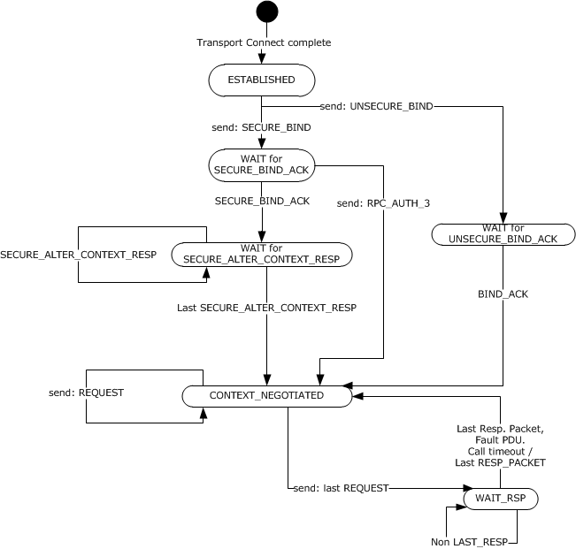

Figure 18: Client state machine

| State | Description |
| --- | --- |
| ESTABLISHED | The client has received a transport connect complete indicating that a new transport connection has been established. |
| WAIT for UNSECURE_BIND_ACK | The client has sent the bind [**PDU**](#gt_protocol-data-unit-pdu), in case of an unsecure call. |
| CONTEXT_NEGOTIATED | The client is ready to send the request PDU. |
| WAIT for SECURE_BIND_ACK | The client has sent a bind PDU, in case of a secure call. |
| WAIT for SECURE_ALTER_CONTEXT_RESP | The client has sent a SECURE_ALTER_CONTEXT PDU and is waiting for an answer. |
| WAIT_RSP | The client is waiting for a response PDU. |

Notes on this state machine:

When a state does not show an error transition, these extensions handle the error from this state by closing the connection.

When concurrent multiplexing is used on a connection, as soon as an independent logical thread of execution makes a transition from CONTEXT_NEGOTIATED to WAIT_RSP state, another independent logical thread of execution can make the transition from CONTEXT_NEGOTIATED to WAIT_RSP. Only one logical thread of execution is allowed to make this transition at a given time, but multiple logical threads of execution can be in the WAIT_RSP state. A client MUST NOT send any request PDU for request N+1 before it sends all request PDUs for request N.

If concurrent multiplexing on a connection is not enabled, a client MUST NOT send any request PDU for request N+1 before it receives all the response PDUs for request N.

#### 3.3.2.1 Abstract Data Model

This section describes a conceptual model of possible data organization that an implementation maintains to participate in this protocol. The described organization is provided to facilitate the explanation of how the protocol behaves. This document does not mandate that implementations adhere to this model as long as their external behavior is consistent with that described in this document.

**Note** The conceptual data can be implemented by using a variety of techniques.

##### 3.3.2.1.1 Idle Connection Cleanup Enabled

**Idle Connection Cleanup Enabled:** A flag that, if set, indicates that cleaning up idle connections is enabled. It MUST be clear by default.

##### 3.3.2.1.2 Association Active Context Handle Count

**Association Active Context Handle Count**: The client version of the **Association** ADM element, as described in section [3.3.1.1.1](#Section_3.3.1.1.1), includes a count of active context handles, stored in a 32-bit unsigned integer. When a new **association** is created, the count is zero. The **Association Active Context Handle Count** is incremented when context handles are created for an **association** according to the mechanisms described in [[C706]](https://go.microsoft.com/fwlink/?LinkId=89824). Likewise, the **Association Active Context Handle Count** is decremented when context handles are released. The client SHOULD not allow the count of context handles to overflow the data type, although the chance of doing so without exceeding the server's resource limits is very minimal.

##### 3.3.2.1.3 Client Call

The **client call** is a data element that encapsulates the state associated with a **client call**. The **client call** is specified by a state machine with the following states.

| State | Description |
| --- | --- |
| STATE_SEND_PDUS | The client is sending request PDUs of the call's [in] parameters to the server. This is the call's initial state. |
| STATE_DISPATCHED | The server has received all Request PDUs and is processing the request. |
| STATE_RECEIVE_PDU | The server is sending reply PDUs of the call's [out] parameters to the client. |
| STATE_COMPLETE | The call completed successfully. This is a terminal state. |
| STATE_FAULT | The call failed. This is a terminal state. |

The client call states are depicted in the following diagram:

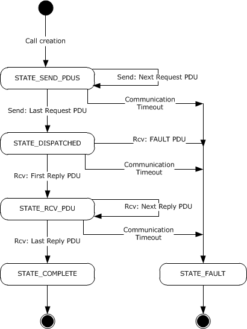

Figure 19: Client Call State Diagram

**Client Call**: The **client call** data structure maintains state and property information relating to a **client call**, as specified in [[C706]](https://go.microsoft.com/fwlink/?LinkId=89824) section 9.3.4. Each **client call** contains the following properties:

- **Connection**: As specified in section [3.3.1.5.5](#Section_3.3.1.5.5), each call MUST establish and maintain an affinity for a single **connection**. The mechanism of linking a call to a **connection** is implementation-dependent. The process for determining an appropriate **connection** is described in section [3.3.2.4.1.2](#Section_3.3.2.4.1.2).
- **Call_id**: An unsigned 32-bit integer identifying the call, as defined in [C706] section 12.6.3.5.
- **Communication Time-out Value**: A 32-bit integer value that specifies a time-out period in milliseconds for PDU transmission. This value is set by higher-level protocol in an implementation specific manner<108> prior to making a call. See section [3.3.2.2.2](#Section_3.3.2.2.2) for more information on how this affects PDU transmission. If not specified by the higher-layer protocol, the default value is MAX_INT.
- **Call State**: An implementation-specific value that represents the call state from the preceding table.

##### 3.3.2.1.4 Client Connection

**Client Connection**: The **client connection** data structure maintains state and property information relating to a client connection. The client connection includes all of the properties of the [connection](#Section_3.3.1.1.2) element and has the following additional properties:

- **Last Use Time**: A value that indicates the last time the client connection handled a response PDU.
- **Discard**: A Boolean flag indicating that the **Client Connection** SHOULD NOT be used for new **Call**s. This flag is set to FALSE when the activity is allocated. It is set to TRUE to prevent new calls from using the activity.

##### 3.3.2.1.5 Server Binding Handle

**Server Binding Handle**: An implementation MAY extend the [[C706]](https://go.microsoft.com/fwlink/?LinkId=89824) definition of a Binding Handle to include additional properties.

The clients Server Binding Handle contains the following properties:

- **Communication Time-Out Value**: A 32-bit integer value that specifies a time-out period in milliseconds for any PDU transmission using this binding handle. The default value is 15 minutes (900,000 milliseconds). This value is set by higher-level protocol at bind time in an implementation-specific manner.<109> See section [3.3.2.2.2](#Section_3.3.2.2.2) for more information on how this affects PDU transmission.

#### 3.3.2.2 Timers

##### 3.3.2.2.1 Connection Time-Out Timer

**Connection Time-Out Timer**: Whenever a method call is pending, a higher-layer protocol or application can instruct the [**RPC transport**](#gt_rpc-transport) to monitor the state of the connection in an implementation-dependent<110> manner, above and beyond the monitoring provided by default by the RPC transport, so that if the server crashes or loses network connectivity to the client, the client can take recovery action. A method is considered pending on the server from a client perspective if all fragments of request have been sent and no replies have started arriving. Depending on the protocol sequence for the method call, the establishment of the timer acts only as advice to the [**RPC**](#gt_remote-procedure-call-rpc) runtime system.

When this timer expires, the expiry is not noticed at the RPC protocol level but is noticed at the TCP/IP protocol level and shows as a local event, as specified in section [3.3.2.7.1](#Section_3.3.2.7.1).

##### 3.3.2.2.2 Communication Time-Out Timer

**Communication Time-Out Timer:** The [**RPC**](#gt_remote-procedure-call-rpc) runtime on the client allows a higher-level protocol to instruct it to set up a timer that expires if the send of a [**PDU**](#gt_protocol-data-unit-pdu) has not completed within the prescribed time interval, or no response PDU is received within the prescribed time interval after the request PDU has been sent. The timeout value for this timer is supplied to the RPC runtime by a higher-level protocol. The Communication Time-Out Timer is started as soon as a PDU is sent. It is canceled when the corresponding response PDU is received. If a **Server Binding Handle Communication Time-Out Value** and a client **Call Communication Time-Out Value** are both specified, the lower of the two time-out values MUST be used. The higher-level protocol can set the communication time-out value at any time. It is usually done when the binding handle created prior to call start is configured, and applies to all calls using the binding handle. Once the timer is started, it can only be canceled by the reception of the corresponding response PDU.

##### 3.3.2.2.3 Idle Connection Cleanup Timer

When the **Idle Connection Cleanup Enabled** flag is set to true, the client MUST enable a global timer for checking whether connections are idle. This global timer is named the **Idle Connection Cleanup Timer**, and its period is set to an implementation-specific value between 1 and 40 seconds inclusive.

On expiration of this global timer, the Idle Connection Cleanup Timer Expiry event is fired.

#### 3.3.2.3 Initialization

A client is initialized when a higher-level protocol supplies to the client-side implementation of the [**RPC**](#gt_remote-procedure-call-rpc) runtime sufficient information to start making RPCs, including the information required to create a binding handle (see section [3.3.2.3.1](#Section_3.3.2.3.1)) and, optionally, security setting preferences (see section [3.3.2.3.2](#Section_3.3.2.3.2)).

##### 3.3.2.3.1 Create a Binding Handle

The information needed to create a binding handle is as specified in [[C706]](https://go.microsoft.com/fwlink/?LinkId=89824) section 2.

##### 3.3.2.3.2 Specify Security Settings

If a higher-level protocol wants to use security for its remote procedure method calls, it MUST supply to the client-side implementation of the [**RPC**](#gt_remote-procedure-call-rpc) runtime information on the following:

- What security provider to use.
- What [**authentication level**](#gt_authentication-level) to use.
- Any other security provider–specific information necessary for the security provider to function.

#### 3.3.2.4 Higher-Layer Triggered Events

##### 3.3.2.4.1 Make a Remote Procedure Method Call

When a higher-level protocol on the client makes a remote procedure method call, the client makes a number of choices that determine what actions are triggered.

###### 3.3.2.4.1.1 Resolve the Binding Handle

As a first step, a client MUST ensure that the binding handle is a fully bound binding handle, and, if not, it MUST resolve it. In this stage, these extensions conform to those specified in [[C706]](https://go.microsoft.com/fwlink/?LinkId=89824) section 6.2.2. This specification also refers to a fully bound binding handle as a resolved binding handle.

###### 3.3.2.4.1.2 Find an Association and a Connection

When a binding handle is fully bound, the client MUST find or create an association for this call. If an association cannot be found, the client MUST attempt to create a new one, as specified in [[C706]](https://go.microsoft.com/fwlink/?LinkId=89824) section 9.3. If the client has an existing association to the same server, identified by comparing the server name, endpoint, and protocol in the Binding handle element of the association (section [3.3.1.1.1](#Section_3.3.1.1.1)), then the client SHOULD reuse that association, provided that the constraints as specified in section [3.3.1.4.1](#Section_3.3.1.4.1) are kept. Within an existing association, a client can choose to use an existing **connection** or create a new **connection**. A client is free to use any **connection** that meets the requirements specified in this document. For any two causally ordered calls N and N+1, a client MUST choose the same **connection** for N+1 that it chose for N. The client MUST not select a connection with the **Discard** flag set.

If the client creates a new **connection** in an existing association, the new **connection** is added to the association's **List of Connections**. If a new association and **connection** are created, the new **connection** is used to initialize the association's **List of Connections**.

When a **connection** is found or created, the **Client Call** connection property is set to the **connection**.

###### 3.3.2.4.1.3 Build Security/Presentation Context

A client cannot execute a remote procedure method call on a connection if there is no presentation context for the [**interface**](#gt_interface) and transfer syntaxes used by the call in the **List of Negotiated Presentation Contexts**. If such a presentation context already exists, the client can use it. If not, the client follows the steps specified in section [3.3.1.5.6](#Section_3.3.1.5.6) and in [[C706]](https://go.microsoft.com/fwlink/?LinkId=89824) sections 9, 11, and 12 to create a presentation context.

If the remote procedure method call uses security, the client MUST attempt to find or create a security context for that call. The steps to create a security context are specified in section [3.3.1.5.2](#Section_3.3.1.5.2).<111>

The client SHOULD try to reuse existing presentation contexts and security contexts that are present on the connection. If the client needs to negotiate both a new presentation context and a new security context on the connection, the client also SHOULD do so with a single exchange of bind/bind_ack or alter_context/alter_context_resp, which might take multiple [**PDUs**](#gt_protocol-data-unit-pdu), where the PDUs carry both information necessary for building the security context and information necessary for building the presentation context. The new presentation context SHOULD be added to the **List of Negotiated Presentation Contexts** in the **connection**, and, if not there already, to the **Table of Presentation Contexts** in the **association** to which the connection is bound.

###### 3.3.2.4.1.4 Enable Idle Connection Timeout

When a higher layer protocol requests that idle connection timeout be enabled, the client MUST set the **Idle Connection Cleanup Enabled** flag. This enables the [Idle Connection Cleanup Timer](#Section_3.3.2.2.3).

The Idle Connection Cleanup Enabled flag remains enabled until cleared.

When a higher-layer protocol requests that idle connection timeout be disabled, the client MUST clear the Idle Connection Cleanup Enabled flag. This disables the Idle Connection Cleanup Timer.

The mechanism to set the **Idle Connection Cleanup Enabled** flag is implementation-specific. <112>

##### 3.3.2.4.2 Release Context Handle

When a higher-layer protocol requests that a context handle be released using the implementation-specific version of the abstract API **rpc_sm_destroy_client_context( )** as described in [[C706]](https://go.microsoft.com/fwlink/?LinkId=89824), this extension requires that the related **Association Active Context Handle Count** MUST be decremented.

#### 3.3.2.5 Message Processing Events and Sequencing Rules

##### 3.3.2.5.1 rpc_fault PDU Processing Rules

If a client receives an rpc_fault [**PDU**](#gt_protocol-data-unit-pdu) where the status field is one of the error codes specified in section [3.3.3.5.1](#Section_3.3.3.5.1), it SHOULD treat this as a protocol error and SHOULD return an error code to the client application indicative of a protocol error.<113>

##### 3.3.2.5.2 Handling Responses

If connection concurrent multiplexing is used, a client might receive response [**PDUs**](#gt_protocol-data-unit-pdu) for many requests concurrently. The client MUST use the **call_id** field of the response PDU to determine what response belongs to what remote procedure method call.

An implementation of these extensions on the client SHOULD enforce a limit on the alloc_hint it receives in the response PDU to be no more than 231-1.

When a response PDU is received, the client MUST update the **Last Use Time** on the connection time to the current time.

#### 3.3.2.6 Timer Events

##### 3.3.2.6.1 Communication Time-Out Timer

If the Communication Time-Out Timer for any PDU expires, the **Client Call** associated with the PDU MUST be considered canceled. The client SHOULD send a **QUIT PDU** and transition the call state to STATE_FAULT.

##### 3.3.2.6.2 Idle Connection Cleanup Timer Expiry

When the **Idle Connection Cleanup Timer** expires, the client MUST enumerate all connections, using the client's **Table of Associations**, and consider each connection eligible for cleanup.

The client MUST determine that a connection is eligible for cleanup if its **Last Use Time** is greater than 10 seconds from the current time.

However, if the number of connections in all associations, counting the number of **connection** elements in each **association** from the **Table of Associations**, is more than a defined threshold of connections,<114> or the sum of the number of **security context handles** in all connections in an **association** is more than the defined threshold of existing **security context handles**,<115> the client MUST determine a connection is eligible for cleanup, if its **Last Use Time** is greater than 5 seconds from the current time.

When the client considers the connection is eligible for cleanup, the connection MUST be closed, unless it is the only connection for an association to the server and there is at least one active context handle on the association as determined by examining the association's [Association Active Context Handle Count](#Section_3.3.2.1.2).

The **Idle Connection Cleanup Timer** is restarted as soon as the processing is completed.

##### 3.3.2.6.3 Endpoint Mapper Requests Security Information

As specified, [[C706]](https://go.microsoft.com/fwlink/?LinkId=89824) does not make it explicit what security information needs to be applied to requests from the client to the [**endpoint mapper**](#gt_endpoint-mapper) to resolve the endpoint for an [**interface**](#gt_interface). These extensions prescribe that clients MAY use security for making requests to the endpoint mapper. If they do, the [**authentication type**](#gt_authentication-type) SHOULD be the same as the authentication type for the partial binding handle that the client is trying to resolve and SHOULD have the integrity [**authentication level**](#gt_authentication-level).

If a security provider uses an authentication type that is not specified here, and this authentication type requires other parameters for the authentication, an implementation SHOULD choose values for these parameters that maximize interoperability while making the endpoint mapper requests safe from tampering when in transit on the network.<116>

#### 3.3.2.7 Other Local Events

##### 3.3.2.7.1 Transport Connection Time-Out

This event is triggered when the [**RPC transport**](#gt_rpc-transport) indicates to [**RPC**](#gt_remote-procedure-call-rpc) that the connection has timed out. Different RPC transports interpret this differently. Connections using NCACN_IP_TCP as the transport time-out when the **Connection Time-Out Timer** expires. For information on how a given RPC transport times out connections, see the documentation for the respective transport. When this event occurs on a connection, all security and presentation contexts are considered invalid. All calls that are in progress on this connection are considered failed, and an implementation-specific error is returned to the higher-layer protocol. A call is considered in progress on a connection if at least one [**PDU**](#gt_protocol-data-unit-pdu) has been sent for that call and not all PDUs from the server have been received for that call.

### 3.3.3 Server Details

The following diagram illustrates the state machine for an [**RPC**](#gt_remote-procedure-call-rpc) connection. The transitions in the following diagram represents received PDUs.

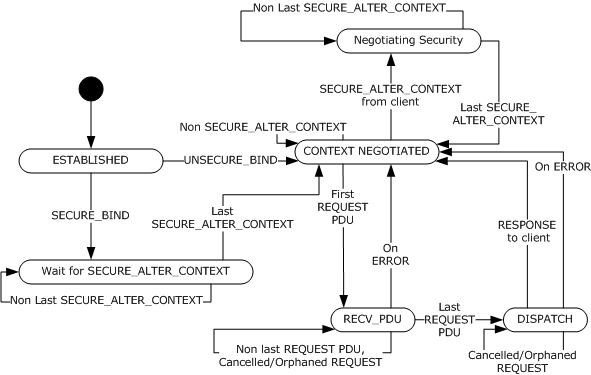

Figure 20: State machine for an RPC connection

| State | Description |
| --- | --- |
| ESTABLISHED | The server has accepted an incoming transport connection. |
| Wait for SECURE_ALTER_CONTEXT | The server has received a SECURE_BIND_PDU and replied with SECURE_BIND_ACK_PDU. It is ready to receive the SECURE_ALTER_CONTEXT PDUs. On receiving, the server sends back a SECURE_ALTER_CONTEXT_PDU_RESP PDU to the client. |
| CONTEXT_NEGOTIATED | The server received the last SECURE_ALTER_CONTEXT PDU and replied with the last SECURE_ALTER_CONTEXT PDU response. The server is ready to start receiving REQUEST PDUs or ALTER_CONTEXT PDUs (secure or unsecure) from the client. |
| Negotiating Security | The server has received a SECURE_ALTER_CONTEXT from the client and replied with a SECURE_ALTER_CONTEXT_RESP. |
| RECV_PDU | The server has received a request PDU. |
| DISPATCH | The server is ready to send the response to the client. |

Notes on this state machine:

When a state does not show an error transition, these extensions handle errors from this state by closing the connection or sending a bind_nak/fault [**PDU**](#gt_protocol-data-unit-pdu), as specified in sections [3.3.1.5.2](#Section_3.3.1.5.2), [3.3.1.5.6](#Section_3.3.1.5.6), and [3.3.3.5.7](#Section_3.3.3.5.7).

When concurrent multiplexing is used on a connection, as soon as an independent logical thread of execution makes a transition from RECV_PDU state to DISPATCH, another independent logical thread of execution can make the transition from CONTEXT_NEGOTIATED to RECV_PDU. Only one logical thread of execution is allowed to reside in the RECV_PDU state, but multiple logical threads of execution can be in the DISPATCH state. A client MUST NOT send any request PDU for request N+1 before it sends all request PDUs for request N.

If concurrent multiplexing on a connection is not enabled, a client MUST NOT send any request PDU for request N+1 before it receives all the response PDUs for request N.

#### 3.3.3.1 Abstract Data Model

This section specifies a conceptual model of possible data organization that an implementation maintains to participate in this protocol. The described organization is provided to facilitate the explanation of how the protocol behaves. This document does not mandate that implementations adhere to this model as long as their external behavior is consistent with that described in this document.

##### 3.3.3.1.1 Server Connection

**Server Connection**: The **Server Connection** data structure maintains state and property information relating to a server connection. The **Server Connection** includes all of the properties of the [connection](#Section_3.3.1.1.2) element and has the following additional properties:

- **Current call_id**: The server maintains a **Current call_id** for each connection. The **Current call_id** is the highest **call_id** that the server has received on this connection.
- **Table of Presentation Contexts:** A table of presentation contexts indexed by the presentation context ID (which is same as the value of the **p_cont_id** field in the request [**PDU**](#gt_protocol-data-unit-pdu) header, as specified in [[C706]](https://go.microsoft.com/fwlink/?LinkId=89824) section 12.6.4.9). An incoming request PDU with a given presentation context ID MUST be routed to the [**interface**](#gt_interface) retrieved from the table row with the same presentation context ID. A new row is added to the table when a new presentation context is negotiated.

##### 3.3.3.1.2 Number of Registered Interfaces

**NumberOfRegisteredInterfaces**: The RPC server maintains a global value which is the total number of registered interfaces named **NumberOfRegisteredInterfaces**.

##### 3.3.3.1.3 Preferred Transfer Syntax

**Preferred Transfer Syntax**: Each RPC interface registered on the server MAY contain a **UUID_type_id**entifier that specifies preferred transfer syntax. The Preferred Transfer Syntax SHOULD be initialized to match one of the **UUID_type_identifier**s in the list of Supported Transfer Syntaxes. If present, this Preferred Transfer Syntax SHOULD be processed as specified in [3.3.1.5.6](#Section_3.3.1.5.6).

##### 3.3.3.1.4 Supported Transfer Syntaxes

**Supported Transfer Syntaxes**: Each RPC interface registered on the server MAY contain an array of **UUID_type_identifi**e**rs** that specifies the supported transfer syntaxes for the interface.

##### 3.3.3.1.5 Server Call

The **server call** is a data element that encapsulates the state associated with a server call. The **server call** is specified by a state machine with the following states.

| State | Description |
| --- | --- |
| STATE_RECEIVE_PDU | The server is receiving request PDUs of the call's [in] parameters from the client. This is the server's initial state. |
| STATE_DISPATCHED | The server has received all Request PDUs and is processing the request. |
| STATE_SEND_PDU | The server is sending reply PDUs of the call's [out] parameters to the client. |
| STATE_COMPLETE | The call completed. This is a terminal state. |

The **server call** states are depicted in the following diagram.

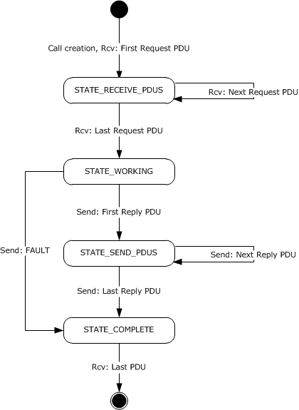

Figure 21: Server call state

**Server Call**: The **server call** data structure maintains state and property information relating to a **server call**, as specified in [[C706]](https://go.microsoft.com/fwlink/?LinkId=89824) section 9.3.4. [C706] section 2.3.3.1 specifies a client binding handle. For these extensions, a client binding handle gives access to the **Server Call** object and the associated Security Context. Each **server call** contains the following properties:

- **Connection**: As specified in section [3.3.1.5.5](#Section_3.3.1.5.5), each call MUST establish and maintain an affinity for a single **connection**. The mechanism of linking a call to a **connection** is implementation-dependent.
- **Call_id**: An unsigned 32-bit integer identifying the call, as defined in [C706] section 12.6.3.5.
- **Call State**: An implementation-specific value that represents the call state from the preceding table.

#### 3.3.3.2 Timers

##### 3.3.3.2.1 Connection Time-Out

A higher-level protocol on the server can instruct the [**RPC**](#gt_remote-procedure-call-rpc) runtime to monitor the state of the connection in an implementation-dependent<117> manner above and beyond the monitoring provided by default by the [**RPC transport**](#gt_rpc-transport), so that if the client crashes or loses network connectivity to the server, the server can take recovery action. In the common case, the recovery action is a context handle rundown. Depending on the protocol sequence for the method call, the establishment of the timer acts only as advice to the RPC runtime system.

When this timer expires, the expiry is not noticed at the RPC protocol level, but it is noticed at the TCP/IP protocol level and shows as a local event, as specified in section [3.3.3.7.1](#Section_3.3.3.7.1).

#### 3.3.3.3 Initialization

##### 3.3.3.3.1 Server-Side Initialization

These extensions are initialized by performing the actions as specified in the following topics.

The ADM element [NumberOfRegisteredInterfaces](#Section_fc6e7f67260e4cfbbf1847828137a635) is initialized to 0.

###### 3.3.3.3.1.1 Registering a Protocol Sequence by a Higher-Level Protocol

A higher-level protocol MUST register a protocol sequence. Without an [**RPC transport**](#gt_rpc-transport) to deliver the messages, these extensions cannot work.

###### 3.3.3.3.1.2 Registering an Interface by a Higher-Level Protocol

A higher-level protocol MUST register an [**interface**](#gt_interface) for these extensions to be useful. Even without registering an interface, these extensions can function, but they return errors, as specified in section [3.3.1.5.6](#Section_3.3.1.5.6), for all attempts to negotiate a presentation context, which means that no [**RPCs**](#gt_remote-procedure-call-rpc) can be made.

###### 3.3.3.3.1.3 Registering a Security Provider by a Higher-Level Protocol

If receiving a secure call is expected, a higher-level protocol MUST indicate to the [**RPC**](#gt_remote-procedure-call-rpc) runtime on the server that it is willing to accept calls that are secured by a given security provider. The higher-level protocol does this by registering with the RPC runtime on the server the information specified in section [3.1.3.1.1](#Section_3.1.3.1.1).<118>

###### 3.3.3.3.1.4 Registering a Dynamic Endpoint with Endpoint Mapper

If a server is using a [**dynamic endpoint**](#gt_dynamic-endpoint), it SHOULD register the list of [**endpoints**](#gt_endpoint) that are associated with the given interface [**UUID**](#gt_universally-unique-identifier-uuid)/version and [**object UUID**](#gt_object-uuid) with the local instance of the [**endpoint mapper**](#gt_endpoint-mapper). This is done in an implementation-specific way. These extensions do not allow registering on nonlocal instances of the endpoint mapper.

If a server uses a [**well-known endpoint**](#gt_well-known-endpoint) or uses a mechanism specified outside these extensions for discovery of dynamic endpoint, it can skip this step.

###### 3.3.3.3.1.5 Start Listening

A server MUST instruct its [**RPC transport**](#gt_rpc-transport) to get into [**listening state**](#gt_listening-state). The definition of a listening state depends on the RPC transport being used. For details on a given RPC transport, see the documentation for that RPC transport.

#### 3.3.3.4 Higher-Layer Triggered Events

##### 3.3.3.4.1 Failure Semantics

A server protocol built on top of these extensions can encounter a failure while executing a method call. It has two options to handle the failure. It can handle the failure either at the application protocol layer or at the [**RPC**](#gt_remote-procedure-call-rpc) protocol layer.

If it handles the error at the application protocol layer, the interaction appears to be successful from an RPC point of view. The [out] parameters are filled, and the RPC implementation on the server sends a response [**PDU**](#gt_protocol-data-unit-pdu) with the [**stub**](#gt_stub) data, as specified in [[C706]](https://go.microsoft.com/fwlink/?LinkId=89824) section 14.4. In this case, the [out] parameters SHOULD indicate the occurrence of an error, although the exact mechanism for doing so is left to the application protocol layer.

If the error is handled at the RPC protocol layer, the server implementation of the application protocol layer indicates to the RPC runtime (usually through calling an API) that the method call failed and then supplies a single, unsigned long number that indicates the failure code. In this case, the server SHOULD send back to the client a fault PDU (as specified in [C706] section 12.6.4.7), where the status field of the fault PDU is set to the failure code received from the application protocol layer.<119>

##### 3.3.3.4.2 shutdown PDUs

Servers MAY send shutdown [**PDUs**](#gt_protocol-data-unit-pdu), as specified in [[C706]](https://go.microsoft.com/fwlink/?LinkId=89824) section 12.6.4.11, when they need the client to terminate a connection and free up server resources.<120>

##### 3.3.3.4.3 Retrieve the Client Identity and Authorization Information

A higher-layer protocol can call the abstract interface **GetRpcImpersonationAccessToken()**, specified in section [3.3.3.4.3.1](#Section_3.3.3.4.3.1), to obtain an impersonation token.

###### 3.3.3.4.3.1 Abstract Interface GetRpcImpersonationAccessToken

These extensions provide the ability for a higher-layer protocol to obtain a "Token/Authorization Context" (as specified in [MS-DTYP](../MS-DTYP/MS-DTYP.md) section 2.5.2) that represents the client making the RPC call.

Token/Authorization Context GetRpcImpersonationAccessToken(rpc_binding_handle_t);

**Input Parameter**: A binding handle on the server that represents a binding to a client, known as "the client binding handle" as described in [[C706]](https://go.microsoft.com/fwlink/?LinkId=89824) and clarified in section [3.3.1.1.6](#Section_3.3.1.1.6) of these extensions. If a non-NULL binding handle argument is provided, then the server MUST interpret it as a pointer or handle to a **Server Call** object.

If a NULL binding handle argument is provided then the Security Context of the client making the RPC call is obtained as if by calling **pthread_getspecific** using CURRENT_CALL_OBJECT_REF_KEY (see section [3.3.3.7.2](#Section_3.3.3.7.2)) as a thread-specific data key to retrieve a pointer or handle to the **Server Call** object.

The **Server Call** object contains a Security Context Handle. The Security Context Handle identifies the required Token.

The implementation of the abstract interface **GetRpcImpersonationAccessToken** then returns as output the **Token/Authorization Context** from the Security Context referred to by the Security Context Handle that is a member of the **Server Call** object. The Token is retrieved from the security context by using the implementation-specific equivalent of GSS_Inquire_context as specified in [[RFC2743]](https://go.microsoft.com/fwlink/?LinkId=90378) section 2.2.6.<121>

**Output Parameter**: A Token/Authorization context representing the client making the RPC call. The element is of type Token/Authorization Context specified in [MS-DTYP] section 2.5.2. The Token returned represents the identity of the client currently being served. See (*[Tanenbaum]* section 11.8, Security in Windows 2000).

If client Identity is not available in the form of a Token then a NULL is returned.

###### 3.3.3.4.3.2 Abstract Interface RpcImpersonateClient

A server thread that is processing a client remote procedure call can call the **RpcImpersonateClient** abstract interface to impersonate the active client.

void RpcImpersonateClient(RPC_BINDING_HANDLE BindingHandle);

Binding handle on the server that represents a binding to a client. The server impersonates the client indicated by this handle.

If a NULL binding handle argument is provided then the Security Context of the client making the RPC call is obtained as if by calling **pthread_getspecific** using CURRENT_CALL_OBJECT_REF_KEY (see section [3.3.3.7.2](#Section_3.3.3.7.2)) as a thread specific data key to retrieve a pointer or handle to the **Server Call** object.

The **Server Call** object contains a Security Context Handle. The Security Context Handle identifies the required Token representative of the active client. The Token is retrieved from the security context using the implementation-specific equivalent of the GSS_Inquire_context as specified in [[RFC2743]](https://go.microsoft.com/fwlink/?LinkId=90378) section 2.2.6.<122>

After the token is retrieved it is used by the underlying security infrastructure for access checks on secured objects until either another call to **RpcImpersonateClient** is made or [RpcRevertToSelf](#Section_3.3.3.4.3.3) is called. This is the equivalent to supplying the retrieved token as the Token parameter to the Access Check Algorithm defined in [MS-DTYP](../MS-DTYP/MS-DTYP.md) section 2.5.3.2 whenever access checks for a secured object are performed.

###### 3.3.3.4.3.3 Abstract Interface RpcRevertToSelf

The server calls **RpcRevertToSelf** to end impersonation and to reestablish its own security identity.

void RpcRevertToSelf(void);

#### 3.3.3.5 Message Processing Events and Sequencing Rules

##### 3.3.3.5.1 Failure Semantics

If the server encounters an error during the processing of a method call on the server, it SHOULD send back to the client a fault [**PDU**](#gt_protocol-data-unit-pdu), as specified in [[C706]](https://go.microsoft.com/fwlink/?LinkId=89824) section 12.6.4.7, where the status field of the fault PDU is set to a descriptive status code. If the server is unable to send a fault PDU as specified here, it MUST close the transport connection. The exact protocol primitive used for closing a transport connection depends on the [**RPC transport**](#gt_rpc-transport) and is documented in the normative reference for that transport.

Servers can send any status code in the status field of a fault PDU except the following status codes, which a server MUST NOT send to the client. These status codes have special significance, and their presence in the status field MAY be flagged as a protocol error by the client.

| Status codes that MUST NOT be sent by RPC servers |
| --- |
| ERROR_SUCCESS (0x00000000) |
| STATUS_GUARD_PAGE_VIOLATION (0x80000001) |
| STATUS_DATATYPE_MISALIGNMENT (0x80000002) |
| STATUS_BREAKPOINT (0x80000003) |
| STATUS_ACCESS_VIOLATION (0xC0000005) |
| STATUS_IN_PAGE_ERROR (0xC0000006) |
| STATUS_ILLEGAL_INSTRUCTION (0xC000001D) |
| STATUS_PRIVILEGED_INSTRUCTION (0xC0000096) |
| STATUS_INSTRUCTION_MISALIGNMENT (0xC00000AA) |
| STATUS_STACK_OVERFLOW (0xC00000FD) |
| STATUS_POSSIBLE_DEADLOCK (0xC0000194) |
| STATUS_HANDLE_NOT_CLOSABLE (0xC0000235) |
| STATUS_STACK_BUFFER_OVERRUN (0xC0000409) |
| STATUS_ASSERTION_FAILURE (0xC0000420) |

##### 3.3.3.5.2 call_id Field Must Increase Monotonically

The **call_id** field of any request that arrives on the server MUST monotonically increase. All [**PDUs**](#gt_protocol-data-unit-pdu) of a fragmented request MUST have the same value in the **call_id** field. An implementation SHOULD reject PDUs that violate this rule, as specified in section [3.3.3.5.7](#Section_3.3.3.5.7).<123>

##### 3.3.3.5.3 Unknown Security Provider

If a bind or alter_context [**PDU**](#gt_protocol-data-unit-pdu) arrives on the server with an **auth_type** field set to a security provider that is not present in the abstract table specified in section [3.1.3.1.1](#Section_3.1.3.1.1), an implementation of these extensions MUST return error **authentication_type_not_recognized** in the bind_nak or fault PDU.

##### 3.3.3.5.4 Maximum Server Input Data Size

The combined length of the [**stub**](#gt_stub) data for all fragments of a request SHOULD not exceed 4 megabytes. If it exceeds 4 megabytes, the server implementation SHOULD return a fault packet with the status field set to 0x00000005.<124>

##### 3.3.3.5.5 Limits of Presentation Contexts Negotiated

The server MUST restrict the number of presentation contexts to 4,000 * [NumberOfRegisteredInterfaces](#Section_fc6e7f67260e4cfbbf1847828137a635).

The server MUST update the value of NumberOfRegisteredInterfaces each time a new interface is registered or unregistered. Higher-level protocols can register or unregister a new interface by using the abstract interfaces described in [Appendix C](#Section_1.3). When running on the Windows [**RPC**](#gt_remote-procedure-call-rpc) implementation, higher-level protocols use the RpcServerRegisterIf (see [[MSDN-RpcServerRegisterIf]](https://go.microsoft.com/fwlink/?LinkId=203538)) and RpcServerUnregisterIf (see [[MSDN-RpcServerUnregisterIf]](https://go.microsoft.com/fwlink/?LinkId=204068)) APIs.

If a client attempts to negotiate a presentation context over the limit, the server MUST reject the negotiation and reply with a [bind_nak](#Section_2.2.2.9) with provider_reject_reason set to local_limit_exceeded_reject 2 (0x2).

##### 3.3.3.5.6 Dropping Packets for Old Calls

If a server implementation receives a request [**PDU**](#gt_protocol-data-unit-pdu) without the PFC_FIRST_FRAG flag and there is no active call for the connection, it SHOULD compare the **call_id** field from the PDU to the **Current call_id** on the **Server Connection**. If the **call_id** field is smaller by less than 150, the server SHOULD ignore the packet. If the **call_id** field is smaller by 150 or more, the server SHOULD treat this as a protocol error, as specified in section [3.3.3.5.7](#Section_3.3.3.5.7).<125>

##### 3.3.3.5.7 Handling Protocol Errors

If a server implementation encounters a condition it interprets to be a protocol error as a result of processing a request [**PDU**](#gt_protocol-data-unit-pdu), it MUST send back to the client a fault PDU with the status field set to 0x1C01000B. This status value is specified in [[C706]](https://go.microsoft.com/fwlink/?LinkId=89824) section N.2.

##### 3.3.3.5.8 Sequencing in Case of Errors

In the case of a fragmented request with multiple [**PDUs**](#gt_protocol-data-unit-pdu) and an error found in a nonlast PDU, implementations of these extensions SHOULD return a fault PDU as soon as they have processed the PDU with the error. They SHOULD NOT wait to receive all PDUs of a fragmented request before sending the fault PDU.

#### 3.3.3.6 Timer Events

For more information on timer events, see section [3.3.3.2.1](#Section_3.3.3.2.1).

#### 3.3.3.7 Other Local Events

##### 3.3.3.7.1 Transport Connection Shutdown

This event is triggered when the [**RPC transport**](#gt_rpc-transport) indicates to [**RPC**](#gt_remote-procedure-call-rpc) that a connection has timed out. Different RPC transports interpret this differently. For details on how a given RPC transport times out connections, see the documentation for the respective transport. When this event occurs on a connection, all security contexts and presentation contexts are considered invalid. If the connection is the last connection for an association, the context handles belonging to that association are run down.

##### 3.3.3.7.2 Initialize Server Call Object Reference

This event is triggered when an RPC call occurs between a client and a server.

An RPC server associates the **Server Call** object with a thread of execution by using an implementation-dependent process and MUST behave as if it is using thread-specific data in a POSIX Thread (see [[ISO/IEC/IEEE9945-7]](https://go.microsoft.com/fwlink/?LinkId=213995) section 1.c) as follows:

The thread uses a unique key defined as CURRENT_CALL_OBJECT_REF as a thread-specific data key. The thread stores a handle to the **Server Call object** by using **pthread_setspecific** using the thread-specific data key (CURRENT_CALL_OBJECT_REF_KEY).

pthread_setspecific(CURRENT_CALL_OBJECT_REF_KEY, Server Call object);

**Note** The **Server Call Object** handle is stored for later retrieval in the case where the RPC runtime is invoked with a NULL client binding handle (see [[C706]](https://go.microsoft.com/fwlink/?LinkId=89824) section 2.3.3.1 for a specification of a client binding handle). This allows the RPC runtime to retrieve the current call object.

# 4 Protocol Examples

The following sections describe protocol examples for both [**connection-oriented RPC**](#gt_connection-oriented-rpc) and [**connectionless RPC**](#gt_connectionless-rpc) scenarios.

## 4.1 Packet Sequence for Secure, Connection-Oriented RPC Using Kerberos as Security Provider

The following example shows a packet sequence for a secure, [**connection-oriented RPC**](#gt_connection-oriented-rpc) using Kerberos as the security provider.

Figure 22: Packet sequence

Individual packet exchanges are specified in detail.

**SECURE_BIND:** [**RPC**](#gt_remote-procedure-call-rpc) bind [**PDU**](#gt_protocol-data-unit-pdu) with [sec_trailer](#Section_2.2.2.11) and auth_token. Auth_token is generated by calling the implementation equivalent of the abstract GSS_Init_sec_context call. Upon receiving this, the server calls the implementation equivalent of the abstract GSS_Accept_sec_context call, which returns an auth_token and continue status in this example. Assume the following:

- The client chooses the **auth_context_id** field in the sec_trailer sent with this PDU to be 1.
- The client uses the RPC_C_AUTHN_LEVEL_PKT_PRIVACY [**authentication level**](#gt_authentication-level), and the [**Authentication Service (AS)**](#gt_authentication-service-as) is Kerberos.
- The client sets the PFC_SUPPORT_HEADER_SIGN flag in the PDU header.
**SECURE_BIND_ACK:** RPC bind_ack PDU with sec_trailer and auth_token. **PFC_SUPPORT_HEADER_SIGN** flag in the PDU header is also set in this example. Auth_token is generated by the server in the previous step. Upon receiving that PDU, the client calls the implementation equivalent of the abstract GSS_Init_sec_context call, which returns an auth_token and continue status in this example.

**SECURE_ALTER_CONTEXT:** An alter_context PDU with the auth_token obtained in the previous step. Upon receiving this PDU, the server calls the implementation equivalent of the abstract GSS_Accept_sec_context call, which returns an auth_token and continue status in this example.

**SECURE_ALTER_CONTEXT_RESP:** An alter_context_resp PDU with sec_trailer and auth_token. Auth_token is generated by the server in the previous step. Upon receiving that PDU, the client calls the implementation equivalent of the abstract GSS_Init_sec_context call, which returns an auth_token and success status in this example. The client knows the security context is ready to be used.

**REQ_PDU #1:** Client [**marshals**](#gt_marshal) the application data and prepares a stream of octets with the marshaled [**stub**](#gt_stub) data. In this example, assume that the stream is larger than one PDU and fits into two PDUs. The client sends a request PDU that contains a header, a message body with as much stub data as it can fit in this PDU, sec_trailer with the **auth_context_id** field set to 1, and auth_token generated by the implementation-specific equivalent of the abstract GSS_WrapEx. The message body is sealed, and the header is signed by the GSS_WrapEx. Upon receiving this PDU, the server calls the implementation-specific equivalent of the abstract GSS_UnwrapEx call to verify that the packet has not been tampered with.

**REQ_PDU #2:** Request PDU that contains a header, a message body with remaining stub data, sec_trailer with the **auth_context_id** field set to 1, and auth_token generated by the implementation-specific equivalent of the abstract GSS_WrapEx call. The message body is sealed, and the header is signed by the GSS_WrapEx. Upon receiving this PDU, the server calls the implementation-specific equivalent of the abstract GSS_UnwrapEx call to verify that the packet has not been tampered with. The server has the full octet stream with the verified stub data and [**unmarshals**](#gt_unmarshal) the data, calls the server routine for this method, and waits for it to finish execution. Once this completes, it proceeds to the next step.

**RESP_PDU #1:** Server marshals the application data into an octet stream with the marshaled stub data. Assume that the marshaled stub data does not fit into a single PDU. The server sends a response PDU that contains a header, a message body with as much stub data as it can fit into this PDU, sec_trailer with the **auth_context_id** field set to 1, and auth_token generated by the implementation-specific equivalent of the abstract GSS_WrapEx. The message body is sealed, and the header is signed by the GSS_WrapEx. Upon receiving this PDU, the client calls the implementation-specific equivalent of the abstract GSS_UnwrapEx call to verify that the packet has not been tampered with.

**RESP_PDU #2**: Response PDU that contains a header, a message body with remaining stub data, sec_trailer with the **auth_context_id** field set to 1, and auth_token generated by the implementation-specific equivalent of the abstract GSS_WrapEx call. The message body is sealed, and the header is signed by the GSS_WrapEx. Upon receiving this PDU, the client calls the implementation-specific equivalent of the abstract GSS_UnwrapEx call to verify that the packet has not been tampered with. Then it unmarshals the application data from the octet stream in the stub data and returns the data to the client application.

## 4.2 Packet Sequence for Secure, Connection-Oriented RPC Using NTLM as Security Provider

The following example shows a packet exchange sequence for a secure, [**connection-oriented RPC**](#gt_connection-oriented-rpc) using NTLM as the security provider.

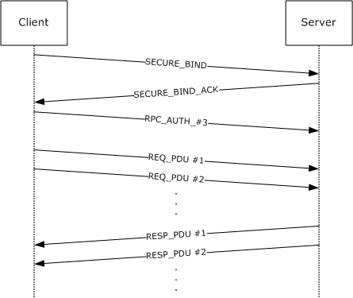

Figure 23: Packet exchange sequence

Individual packets are specified in detail.

**SECURE_BIND:** [**RPC**](#gt_remote-procedure-call-rpc) bind [**PDU**](#gt_protocol-data-unit-pdu) with [sec_trailer](#Section_2.2.2.11) and auth_token. Auth_token is generated by calling the implementation equivalent of the abstract GSS_Init_sec_context call. Upon receiving that, the server calls the implementation equivalent of the abstract GSS_Accept_sec_context call, which returns an auth_token and continue status in this example. Assume the following:

- The client chooses the **auth_context_id** field in the sec_trailer sent with this PDU to be 1.
- The client uses the RPC_C_AUTHN_LEVEL_PKT_PRIVACY authentication level and the Authentication Service (AS) NTLM.
- The client sets the **PFC_SUPPORT_HEADER_SIGN** flag in the PDU header.
**SECURE_BIND_ACK:** RPC bind_ack PDU with sec_trailer and auth_token. The PFC_SUPPORT_HEADER_SIGN flag in the PDU header is also set in this example. Auth_token is generated by the server in the previous step. Upon receiving that PDU, the client calls the implementation equivalent of the abstract GSS_Init_sec_context call, which returns an auth_token and continue status in this example.

**RPC_AUTH_3:** The client knows that this is an NTLM that uses three legs. It sends an [rpc_auth_3 PDU](#Section_2.2.2.10) with the auth_token obtained in the previous step. Upon receiving this PDU, the server calls the implementation equivalent of the abstract GSS_Accept_sec_context call, which returns success status in this example.

**REQ_PDU #1:** The client [**marshals**](#gt_marshal) the application data and prepares a stream of octets with the marshaled [**stub**](#gt_stub) data. In this example, assume that the stream is larger than one PDU and fits into two PDUs. The client sends a request PDU that contains a header, a message body with as much stub data as it can fit in this PDU, sec_trailer with the **auth_context_id** field set to 1, and auth_token generated by the implementation-specific equivalent of the abstract GSS_WrapEx. The message body is sealed, and the header is signed by the GSS_WrapEx. Upon receiving this PDU, the server calls the implementation-specific equivalent of the abstract GSS_UnwrapEx call to verify that the packet has not been tampered with.

**REQ_PDU #2:** Request PDU that contains a header, a message body with remaining stub data, sec_trailer with the **auth_context_id** field set to 1, and auth_token generated by the implementation-specific equivalent of the abstract GSS_WrapEx call. The message body is sealed, and the header is signed by the GSS_WrapEx. Upon receiving this PDU, the server calls the implementation-specific equivalent of the abstract GSS_UnwrapEx call to verify that the packet has not been tampered with. The server has the full octet stream with the verified stub data and [**unmarshals**](#gt_unmarshal) the data, calls the server routine for this method, and waits for it to finish execution. Once this completes, it proceeds to the next step.

**RESP_PDU #1:** Server marshals the application data into an octet stream with the marshaled stub data. Assume that the marshaled stub data does not fit into a single PDU. The server sends a response PDU that contains a header, a message body with as much stub data as it can fit into this PDU, sec_trailer with the **auth_context_id** field set to 1, and auth_token generated by the implementation-specific equivalent of the abstract GSS_WrapEx. The message body is sealed, and the header is signed by the GSS_WrapEx. Upon receiving this PDU, the client calls the implementation-specific equivalent of the abstract GSS_UnwrapEx call to verify that the packet has not been tampered with.

**RESP_PDU #2:** Response PDU that contains a header, a message body with remaining stub data, sec_trailer with the **auth_context_id** field set to 1, and auth_token generated by the implementation-specific equivalent of the abstract GSS_WrapEx call. The message body is sealed, and the header is signed by the GSS_Wrap. Upon receiving this PDU, the client calls the implementation-specific equivalent of the abstract GSS_UnwrapEx call to verify that the packet has not been tampered with. Then it unmarshals the application data from the octet stream in the stub data and returns them to the client application.

## 4.3 Packet Sequence of the First Non-Idempotent RPCs of a Connectionless Activity

The following example shows the packet exchange when a connectionless client makes two sequential non-idempotent [**RPCs**](#gt_remote-procedure-call-rpc) to a server that the client process has not previously contacted. Individual packets are defined here.

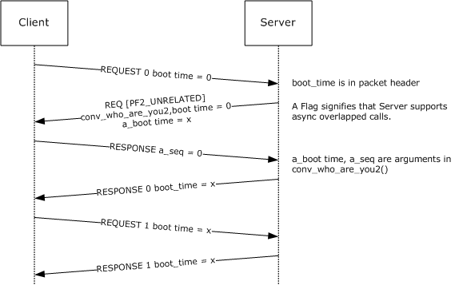

Figure 24: Packet exchange

**REQUEST 0**: A request [**PDU**](#gt_protocol-data-unit-pdu) for the client's first call. The activity ID in the header is the newly formed client activity ID, and the sequence number is zero. Because the client does not know the server's boot time, the boot time in the packet header is zero.

**REQ [PF2_UNRELATED]**: A conv_who_are_you2 request. This is a REQUEST PDU. The activity ID is a newly generated [**GUID**](#gt_globally-unique-identifier-guid), and the sequence number is zero because this is the first call from the server process to the client process.

The *actuid* parameter of the request contains the activity ID of **REQUEST 0**. The boot time parameter of the request contains the server's nonzero boot time.

The PF2_UNRELATED flag is set because the server supports this feature.

**RESPONSE**: A conv_who_are_you2 response. This is a RESPONSE PDU. The activity ID and sequence number in the RPC header match the ones in **REQ [PF2_UNRELATED]**.

The *seq* parameter of the response contains zero because the lowest currently active call sequence of *actuid* is zero.

The *cas_uuid* parameter of the response contains the client's non-NULL **CAS UUID**.

**RESPONSE 0**: A response PDU for the client's first call. The activity ID and sequence number match those in the **REQUEST 0**.

The boot time in the packet header is the server's nonzero boot time.

**REQUEST 1**: A request PDU for the client's second call. The activity ID is the same as in **REQUEST 0**; sequence number is one; boot time is the same as boot_time from **REQ [PF2_UNRELATED]**.

**RESPONSE 1**: A response PDU for the client's second call. The activity ID and sequence number match those in **REQUEST 1**.

The boot time in the packet header is the server's nonzero boot time.

## 4.4 Connectionless RPCs With and Without a Delayed ACK

The following example illustrates the client sending an ACK packet.

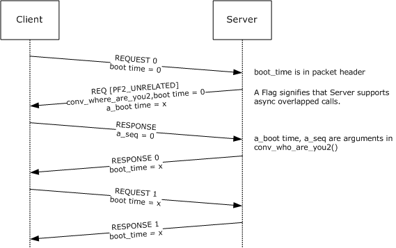

Figure 25: Client sending an ACK packet

There is no ACK sent between the [**RPCs**](#gt_remote-procedure-call-rpc) with sequence numbers 0 and 1 because less than 2 seconds elapse between RPC 0's last response [**PDU**](#gt_protocol-data-unit-pdu) and RPC 1's first request PDU.

The corresponding delay between sequence 1 and sequence 2 is larger than 2 seconds, so 2 seconds after the last response PDU of call 1, the client sends an ACK packet whose sequence number is 1. This does not affect the PDUs for call sequence 2.

## 4.5 Connectionless Client Communicating with a Dynamic Server Endpoint

The following example illustrates a connectionless client issuing a sequence of calls to a server that uses a dynamic UDP endpoint.

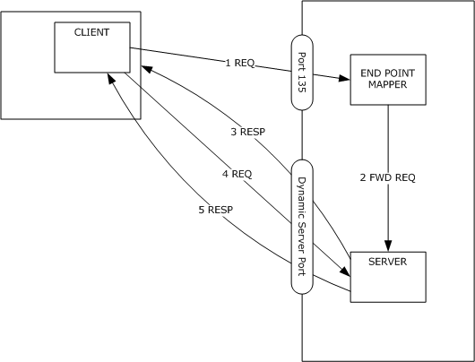

Figure 26: Connectionless client issuing a sequence of calls

Initially, the client has no knowledge of the server's actual endpoint, so the first request [**PDU**](#gt_protocol-data-unit-pdu) (packet #1) is sent to the [**endpoint mapper**](#gt_endpoint-mapper) port for UDP, which is port 135.

The endpoint mapper forwards the request and the client endpoint to the [**RPC server**](#gt_rpc-server) in an implementation-dependent way (packet #2).

The server processes the request, as usual, and replies directly to the client endpoint (packet #3).

While processing the received PDU, the client updates its internal structures (**Client Address Space**, Server's endpoint) so that further PDUs belonging to this activity are sent directly to the correct server port. After this point, the client communicates directly with the RPC server (request #4 and reply #5).

## 4.6 Correlation Example

void CorrelatedMethod([in] long Size,

[in,size_is(Size)] short * pArray );

In this method, the value of Size dictates the size of conformant array pArray in octet stream. Parameter Size is [**correlated**](#gt_correlation) to parameter pArray.

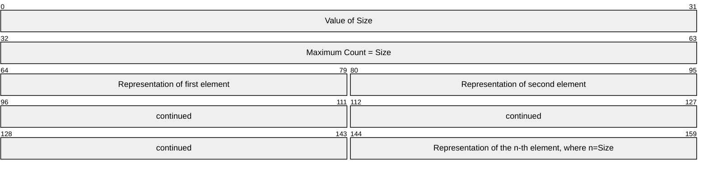

The maximum count of the conformant array is the value of Size. In the example, correlation validation succeeds if the value of Size is equal to the maximum count of the conformant array referred by pArray.

## 4.7 UNICODE_STRING Representation

The following structure uses expression in both conformance and varying description.

typedef struct _UNICODE_STRING {

unsigned short Length;

unsigned short MaximumLength;

[size_is(MaximumLength/2),length_is(Length/2)]

unsigned short * pString;

} UNICODE_STRING;

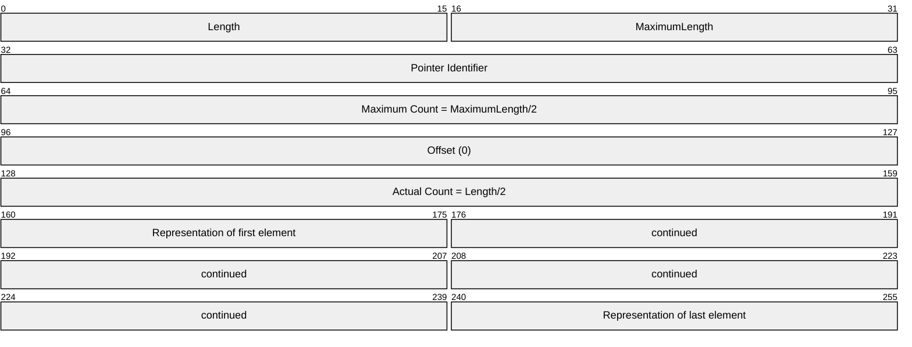

In this example, in the conformant varying array referred by pString, the maximum count is what the expression (MaximumLength/2) evaluates to, and the actual count is what the expression (Length/2) evaluates to.

In the target level 5.0 data consistency check, the implementation validates that the maximum count of the conformant varying array referred by pString is equal to the evaluation result of the expression (MaximumLength/2), and the actual count is equal to the evaluation result of the expression (Length/2).

## 4.8 Example of Structure with Trailing Gap in NDR64

This example shows a structure with a trailing gap in [**NDR64**](#gt_64-bit-network-data-representation-ndr64).

typedef struct _StructWithPad

{

long l;

short s;

} StructWithPad;

The size of the structure in the octet stream contains a 2-byte trailing gap to make its size 8, a multiple of the structure's alignment, 4.

# 5 Security

## 5.1 Security Considerations for Implementers

### 5.1.1 Authentication Levels

Implementations can create programming [**interfaces**](#gt_interface) and corresponding documentation for accessing functionality offered by these extensions in a way that encourages higher-level protocols to use [**authentication levels**](#gt_authentication-level) of RPC_C_AUTHN_LEVEL_PKT_INTEGRITY and RPC_C_AUTHN_LEVEL_PKT_PRIVACY. Lower authentication levels provide weak security only. If integrity or confidentiality protection is requested, it SHOULD be provided either by the security provider or by using the verification trailer, as specified in section [2.2.2.13](#Section_2.2.2.13).

### 5.1.2 Preferred Security Providers

Implementations can create programming interfaces (3) and corresponding documentation for accessing functionality offered by these extensions in a way that encourages higher-level protocols to not use NTLM as the security provider. SPNEGO and Kerberos offer stronger security.

### 5.1.3 Impersonation Levels

Implementers should create programming [**interfaces**](#gt_interface) and corresponding documentation for accessing functionality offered by these extensions in a way that encourages higher-level protocols to use the principle of least privilege. Because the default impersonation level is RPC_C_IMPL_LEVEL_IMPERSONATE, higher-level protocols SHOULD use RPC_C_IMPL_LEVEL_IDENTITY if possible.

## 5.2 Index of Security Parameters

| Security parameter | Section |
| --- | --- |
| Security provider | [2.2.1.1.7](#Section_2.2.1.1.7) |
| Authentication level | [2.2.1.1.8](#Section_2.2.1.1.8) |
| Impersonation level | [2.2.1.1.9](#Section_2.2.1.1.9) |

# 6 Appendix A: Full Remote Procedure Call Extensions IDL

For ease of implementation, the full [**RPC**](#gt_remote-procedure-call-rpc) extensions [**IDL**](#gt_interface-definition-language-idl) interface is provided.

typedef struct _GUID

{

unsigned long Data1;

unsigned short Data2;

unsigned short Data3;

byte Data4[8];

} GUID;

typedef GUID UUID;

typedef struct _FILETIME

{

unsigned long dwLowDateTime;

unsigned long dwHighDateTime;

} FILETIME;

typedef struct _LARGE_INTEGER

{

__int64 QuadPart;

} LARGE_INTEGER;

typedef __int64 LONGLONG;

typedef unsigned __int64 ULONGLONG;

typedef long NTSTATUS;

typedef unsigned long DWORD;

# 7 Appendix B: Product Behavior

The information in this specification is applicable to the following Microsoft products or supplemental software. References to product versions include updates to those products.

The terms "earlier" and "later", when used with a product version, refer to either all preceding versions or all subsequent versions, respectively. The term "through" refers to the inclusive range of versions. Applicable Microsoft products are listed chronologically in this section.

**Windows Client**

- Windows NT operating system
- Windows 2000 Professional operating system
- Windows XP operating system
- Windows Vista operating system
- Windows 7 operating system
- Windows 8 operating system
- Windows 8.1 operating system
- Windows 10 operating system
- Windows 11 operating system
**Windows Server**

- Windows NT Server operating system
- Windows 2000 Server operating system
- Windows Server 2003 operating system
- Windows Server 2003 R2 operating system
- Windows Server 2008 operating system
- Windows Server 2008 R2 operating system
- Windows Server 2012 operating system
- Windows Server 2012 R2 operating system
- Windows Server 2016 operating system
- Windows Server operating system
- Windows Server 2019 operating system
- Windows Server 2022 operating system
- Windows Server 2025 operating system
Exceptions, if any, are noted in this section. If an update version, service pack or Knowledge Base (KB) number appears with a product name, the behavior changed in that update. The new behavior also applies to subsequent updates unless otherwise specified. If a product edition appears with the product version, behavior is different in that product edition.

Unless otherwise specified, any statement of optional behavior in this specification that is prescribed using the terms "SHOULD" or "SHOULD NOT" implies product behavior in accordance with the SHOULD or SHOULD NOT prescription. Unless otherwise specified, the term "MAY" implies that the product does not follow the prescription.

<1> Section 2.1: **Protocol towers** based on Banyan Vines, DECnet, and Microsoft Message Queuing (MSMQ) are deprecated and are only supported on Windows NT and Windows 2000 operating system.

<2> Section 2.1.1.1: In Windows NT and Windows 2000, IPv6 addresses are not supported.

<3> Section 2.1.1.2: In Windows NT and Windows 2000 IPv6 addresses are not supported.

<4> Section 2.1.1.2: The [**protocol identifier**](#gt_protocol-identifier) 0x10 was implemented by legacy versions of Windows for historical reasons and is preserved by current versions for backward compatibility.

<5> Section 2.1.1.2: Windows always asks the [**Server Message Block**](#gt_server-message-block-smb) implementation to execute a transaction over the [**named pipe**](#gt_named-pipe) for all [**PDUs**](#gt_protocol-data-unit-pdu) except bind and bind_ack on the client for synchronous [**RPC**](#gt_remote-procedure-call-rpc) calls that do not have a communication timeout associated with the RPC call.

<6> Section 2.1.1.3: Only Windows Server 2012 R2 and earlier support this protocol sequence.

<7> Section 2.1.1.4: Only Windows Server 2012 R2 and earlier support this protocol sequence.

<8> Section 2.1.1.4: Windows implementations of [**NetBIOS**](#gt_netbios) require processes to listen on a specific network interface device, and they have no provisions for routing messages between network interfaces that are not directly attached to the same link. For a Windows [**RPC client**](#gt_rpc-client) and [**RPC server**](#gt_rpc-server) to communicate, the server has to be listening on a network interface that the client can reach.

<9> Section 2.1.1.4: This protocol identifier was implemented by legacy versions of Windows for historical reasons and is preserved by current versions for backward compatibility.

<10> Section 2.1.1.5: This protocol identifier was implemented by legacy versions of Windows for historical reasons and is preserved by current versions for backward compatibility.

<11> Section 2.1.1.5: Windows implementations of NetBIOS require processes to listen on a specific network interface device, and they have no provisions for routing messages between network interfaces that are not directly attached to the same link. For a Windows RPC client and RPC server to communicate, the server has to be listening on a network interface that the client can reach.

<12> Section 2.1.1.5: Only Windows NT and Windows 2000 support this protocol sequence.

<13> Section 2.1.1.6: Windows implementations of NetBIOS require processes to listen on a specific network interface device, and they have no provisions for routing messages between network interfaces that are not directly attached to the same link. For a Windows RPC client and RPC server to communicate, the server has to be listening on a network interface that the client can reach.

<14> Section 2.1.1.6: Only Windows NT and Windows 2000 support this protocol sequence.

<15> Section 2.1.1.7: Only Windows NT and Windows 2000 support this protocol sequence.

<16> Section 2.1.2: Windows based clients and servers support [**connectionless RPC**](#gt_connectionless-rpc) exchanges and connectionless [**RPC transports**](#gt_rpc-transport).

<17> Section 2.1.2.1: When a connectionless RPC server or RPC client runs over UDP on Windows NT 4.0 operating system, the maximum size of a PDU is 1,024 bytes. Details on PDU length and fragmentation of request and response buffers are as specified in [[C706]](https://go.microsoft.com/fwlink/?LinkId=89824) section 12.5.1. When a connectionless RPC server or RPC client runs over UDP on all other versions of Windows, the maximum size of a PDU is 4,096 bytes. Details on PDU length and fragmentation of request and response buffers are as specified in [C706] section 12.5.3.

<18> Section 2.1.2.2: When connectionless RPC exchange occurs over IPX on Windows NT 4.0, the maximum size of a PDU is 1,024 bytes. For details about PDU length and fragmentation of request and response buffers, see [C706] section 12.5.1. When connectionless RPC exchange occurs over IPX on all other versions of Windows, the maximum size of a PDU is 1,464 bytes. For details about PDU length and fragmentation of request and response buffers, see [C706] section 12.5.3.

<19> Section 2.1.2.2: Only Windows NT and Windows 2000 support this protocol sequence.

<20> Section 2.2.1.1.3: Windows uses the algorithm specified in [[RFC4122]](https://go.microsoft.com/fwlink/?LinkId=90460) to generate the [**UUID**](#gt_universally-unique-identifier-uuid).

<21> Section 2.2.1.1.4: Windows–based servers set the **context_handle_attributes** field to zero.

<22> Section 2.2.1.1.7: Without the installation of additional software, Windows supports the following [**authentication types**](#gt_authentication-type):

Security Provider

- Simple and Protected GSS-API Negotiation Mechanism (SPNEGO)
- NT LAN Manager (NTLM)
- Kerberos
- Netlogon
<23> Section 2.2.1.1.10: The Windows implementation of SMB server operations do not implement SECURITY_DELEGATION functionality.

<24> Section 2.2.1.2.2: Windows NT, Windows 2000 and Windows XP use the same definition of the structure that is specified in [C706] Appendix L.

<25> Section 2.2.1.2.4: Windows treats any value other than the listed possible values as 0x00000000.

<26> Section 2.2.1.2.4: Windows redefines the same method as follows:

- Adds the **ptr** attribute to the *object* and *Ifid* parameters.
- Removes the **[idempotent]** method attribute.
The redefined method is as follows.

void

ept_lookup (

[in] handle_t hEpMapper,

[in] unsigned long inquiry_type,

[in, ptr] UUID * object,

[in, ptr] RPC_IF_ID * Ifid,

[in] unsigned long vers_option,

[in, out] ept_lookup_handle_t *entry_handle,

[in, range(0, 500)] unsigned long max_ents,

[out] unsigned long *num_ents,

[out, length_is(*num_ents), size_is(max_ents)]

ept_entry_t entries[],

[out] error_status *status

);

Everything else about this method remains as specified in [C706] Appendix O.

<27> Section 2.2.1.2.5: Windows NT, Windows 2000 and Windows XP redefine the method as follows:

- Adds the **ptr** attribute to the *obj* and *map_tower* parameters.
- Removes the **[idempotent]** method attribute.
The redefined method is as follows.

void __RPC_FAR

ept_map (

[in] handle_t hEpMapper,

[in, ptr] UUID * obj,

[in, ptr] twr_p_t

map_tower,

[in, out] ept_lookup_handle_t *entry_handle,

[in] unsigned long max_towers,

[out] unsigned long *num_towers,

[out, ptr, size_is(max_towers),length_is(*num_towers)]

twr_p_t *ITowers,

[out] error_status *status

);

Everything else about this method remains as specified in [C706] Appendix O. Note that this redefinition has no wire impact, and therefore, it is interoperable with the [C706] implementation.

<28> Section 2.2.1.2.6: Windows NT 4.0 supports this method. The definition of the method for Windows NT 4.0 operating system Option Pack for Windows NT Server is as specified in [C706] Appendix O. Windows 2000, Windows XP, and Windows Server 2003 preserve the Windows NT 4.0 definition of the method. However, the method performs no operation, returning **EPT_S_CANT_PERFORM_OP** in the status field.

All other versions of Windows remove all parameters to the method to redefine the method as follows.

void ept_insert(void);

This method performs no operation. However, instead of returning **EPT_S_CANT_PERFORM_OP** in the status field, the method raises an **EPT_S_CANT_PERFORM_OP** exception.

<29> Section 2.2.1.2.7: Windows NT 4.0 supports this method. The definition of the method for Windows NT 4.0 is specified in [C706] Appendix O. Windows 2000, Windows XP, and Windows Server 2003 preserve the Windows NT 4.0 definition of the method. However, the method performs no operation, and returns **EPT_S_CANT_PERFORM_OP** in the status field.

All other versions of Windows remove all parameters to the method to redefine the method as follows.

void ept_delete(void);

This method performs no operation. However, instead of returning **EPT_S_CANT_PERFORM_OP** in the status field, the method raises an **EPT_S_CANT_PERFORM_OP** exception.

<30> Section 2.2.1.2.9: On Windows NT 4.0, Windows 2000, Windows XP, and Windows Server 2003, this method performs no operation and returns EPT_S_CANT_PERFORM_OP in the status field. On these versions of the operating system, this method is defined as follows.

void

ept_inq_object (

[in] handle_t hEpMapper,

[in] UUID * object,

[out] error_status *status

);

All other versions of Windows remove all parameters to the method to redefine the method as follows.

void ept_inq_object(void);

This method performs no operation. However, instead of returning **EPT_S_CANT_PERFORM_OP** in the status field, the method raises an **EPT_S_CANT_PERFORM_OP** exception.

<31> Section 2.2.1.2.10: Windows NT 4.0 supports this method. The definition and behavior of the method are as specified in [C706] Appendix O. Windows 2000, Windows XP, and Windows Server 2003 preserve the Windows NT 4.0 definition of the method. However, the method performs no operation, returning **EPT_S_CANT_PERFORM_OP** in the status field.

All other versions of the Windows remove all parameters to the method to redefine the method as follows.

void ept_mgmt_delete(void);

This method performs no operation. However, instead of returning **EPT_S_CANT_PERFORM_OP** in the status field, the method raises an **EPT_S_CANT_PERFORM_OP** exception.

<32> Section 2.2.1.3.2: This type is not defined in Windows 2000 Server and earlier.

<33> Section 2.2.1.3.3: Windows NT, Windows 2000 and Windows XP use the definition of the method specified in [C706] Appendix Q.

<34> Section 2.2.1.3.4: Windows NT, Windows 2000 and Windows XP use the definition of the method specified in [C706] Appendix Q.

<35> Section 2.2.2.2: Windows ignores the PFC_MAYBE flag when it is present in a PDU.

<36> Section 2.2.2.9: Windows NT and Windows 2000 ignore the RPC extended error information [**BLOB**](#gt_binary-large-object-blob).

<37> Section 2.2.2.11: Clients on Windows XP operating system Service Pack 2 (SP2) and earlier send undefined octets at the end of the authentication token, if the security provider indicates a shorter length of the authentication token than the sender of the data estimated initially.

<38> Section 2.2.2.13: Clients and servers in Windows Server 2003 operating system with Service Pack 3 (SP3) and earlier do not send the verification trailer for an RPC with the pipe [**IDL**](#gt_interface-definition-language-idl) attribute, as specified in [C706] section 4.2. All other versions of Windows will send the verification trailer for an RPC with a pipe IDL attribute only if all the parameters with a pipe attribute are [out] only.

<39> Section 2.2.2.13: Stub padding octets are sent by Windows 2000 Server operating system Service Pack 4 (SP4) through Windows Server 2003 with SP3.

<40> Section 2.2.2.13: Support for verification trailers is present on Windows 2000 Server SP4 through Windows Server 2003 with SP3. The parts of the verification trailer that are used by Windows and when is specified in sections [2.2.2.13.3](#Section_2.2.2.13.3) and [2.2.2.13.4](#Section_2.2.2.13.4).

<41> Section 2.2.2.13.2: In Windows, this verification trailer command is sent only for the first request on a connection.

<42> Section 2.2.2.13.3: In Windows, this verification trailer command is sent for every request when the security provider does not support header signing. Windows does not send this verification trailer if the security provider being used is RPC_C_AUTHN_GSS_NEGOTIATE, RPC_C_AUTHN_WINNT, RPC_C_AUTHN_GSS_KERBEROS or RPC_C_AUTHN_NETLOGON.

<43> Section 2.2.2.13.4: In Windows, this verification trailer command is sent on the first request PDU that uses an abstract_syntax and transfer_syntax that were previously sent on a bind or alter_context PDU.

<44> Section 2.2.3: Only Windows Server 2003 and earlier support connectionless RPC messages.

<45> Section 2.2.3.3: PF2_UNRELATED is not set in Windows NT Server 4.0 operating system.

<46> Section 2.2.3.5: Only clients in Windows XP operating system Service Pack 1 (SP1) and earlier send undefined octets at the end of the authentication token if the security provider indicates a shorter length of the authentication token than the sender of the data estimated initially.

<47> Section 2.2.3.5: These extensions require the model specified in [[RFC2743]](https://go.microsoft.com/fwlink/?LinkId=90378) for all interactions with all [**security providers**](#gt_security-provider). An implementation instructs the GSS-compatible security provider to operate in a DCE-compatible manner by setting the DCE Style protocol variable. The following table details what PDU type carries (in its token section) the output of the GSS [[GSS]](https://go.microsoft.com/fwlink/?LinkId=89876) call. Note that the first call to GSS_Init_sec_context generates no token transmitted to the server and that there is no support for a provider requiring more than two calls to GSS_Init_sec_context or GSS_Accept_sec_context.

<48> Section 2.2.3.6: The Windows implementation always sends the fack PDU with the **vers** field set to 1.

<49> Section 2.2.4.3: Arrays of context handles are not supported Windows NT, Windows 2000, Windows XP, and Windows Server 2003.

<50> Section 2.2.4.5: In the Windows version of the [**Microsoft Interface Definition Language (MIDL)**](#gt_microsoft-interface-definition-language-midl), this is accomplished by compiling with the [ms_union](#Section_2.2.4.5) MIDL compiler option on MIDL compilers, starting with version 3.01.75.

<51> Section 2.2.4.7: Windows supports a subset of the expressions allowed in C language in both [**NDR64**](#gt_64-bit-network-data-representation-ndr64) transfer syntax and when target level 6.0 [**strict NDR/NDR64 data consistency check**](#gt_strict-ndrndr64-data-consistency-check) is requested. The subset is the same in both cases.

<52> Section 2.2.4.13: Windows implementation indicates the octet stream as invalid if the provided byte count is not big enough to contain all the memory needed to [**unmarshal**](#gt_unmarshal) the pointer indicated by the other pointer parameter. [byte_count](#Section_2.2.4.13) is not supported in NDR64 transfer syntax.

<53> Section 2.2.5: NDR64 is available on 64-bit versions of Windows. NDR64 is not available for connectionless RPC. NDR64 is not available on Windows NT and Windows 2000.

<54> Section 2.2.5.3.2.1: A conformant array can contain, at most, 231-1 elements in Windows.

<55> Section 2.2.5.3.2.2: A varying array can contain, at most, 231-1 elements in Windows.

<56> Section 2.2.5.3.2.3: In Windows, a conformant varying array can contain, at most, 231-1-o elements where o is the offset.

<57> Section 2.2.6.1: If the endianness is not 0x10 indicating [**little-endian**](#gt_little-endian), Windows assumes [**big-endian**](#gt_big-endian), as specified in section [2.2.6.1](#Section_2.2.6.1).

<58> Section 2.2.7.1: During unmarshaling, Windows ignores the value of the **InterfaceID** field.

<59> Section 3.1.1.1.3: In Windows, this value is kept in the registry and is set by the administrator of the machine. The value is always used by the server.

<60> Section 3.1.1.1.3: In Windows, this value is kept in the registry and is set by the administrator of the machine. The value is always used by the server.

<61> Section 3.1.1.1.3: In Windows, this value is kept in the registry and is set by the administrator of the machine. The value is always used by the server.

<62> Section 3.1.1.1.3: In Windows, this value is kept in the registry and is set by the administrator of the machine. The value is always used by the server. The default value for Windows based servers is 0. The default value for Windows based clients is 1.

<63> Section 3.1.1.5.1.1.2: The Windows system always selects the leftmost [in] handle as the binding handle.

<64> Section 3.1.1.5.3.2: This level of strict NDR/NDR64 data consistency check is enabled by using target robust compiler option, using a MIDL compiler. Target level 5.0 strict NDR/NDR64 data consistency check is not available in Windows NT.

<65> Section 3.1.1.5.3.2.2.1: If the maximum memory size exceeds 231-1 bytes for a conformant structure, conformant varying structure, conformant array, conformant varying array, or conformant and varying string, the octet stream is indicated as invalid.

<66> Section 3.1.1.5.3.2.2.5: Interfaces using [auto_handle](#Section_3.1.1.5.3.2.2.5) are rejected in this level of consistency check.

<67> Section 3.1.1.5.3.3: This level of strict NDR/NDR64 data consistency check is enabled by using the target NT60 compiler option, using a MIDL compiler. Target level 6.0 strict NDR/NDR64 data consistency check is not available on clients and servers Windows Server 2003 and earlier.

<68> Section 3.1.1.5.3.3.1.2: This behavior is not available in clients and servers Windows Server 2003 and earlier when the IDL file is compiled for target level 6.0 strict NDR/NDR64 data consistency check. This behavior is turned off if the IDL file is compiled with MIDL command backward_compat switch option maybenull_sizeis.

<69> Section 3.1.1.5.4: By default, Windows based clients and servers Windows Server 2008 R2 and earlier allow remote anonymous calls; otherwise, remote anonymous calls are not allowed. For details and how to change this behavior, see [[MSFT-RPCIFRESTRICTION]](https://go.microsoft.com/fwlink/?LinkId=101714).

<70> Section 3.1.2.7.1.6: These additional client conformant validation checks are not available in clients and servers Windows Server 2003 and earlier. Users can disable these validations through registry and/or application compatibility settings. There is no validation support for multiple dimension conformant/varying arrays. A subset of the rules specified in this section are available in Windows Server 2003 operating system with Service Pack 1 (SP1), as listed. These validations can be disabled by Windows registry settings.

- Validations are available for parameter-level [**correlation**](#gt_correlation) only. There is no support for embedded pointers, arrays, or structures.
- Validations are available for [**NDR**](#gt_network-data-representation-ndr) transfer syntax only. There is no support for NDR64 transfer syntax.
- Conformant array, conformant varying array, or conformant varying string parameter are declared earlier in the parameter list before the parameter describing the conformance.
- Conformance can only be specified by dereference of another parameter, the value of another parameter plus one, the value of another parameter minus one, the value of another parameter multiplied by two, or the value of another parameter divided by two.
There is no validation support for a conformant varying string whose maximum count is not specified by another parameter.

<71> Section 3.1.3.3.1: On Windows, the endpoint mapper does not listen on a protocol sequence until at least one server using dynamic endpoints on the system starts to listen on that protocol sequence.

<72> Section 3.1.3.5.1: Windows provides a configuration setting to limit the size of server stub memory allocation.

<73> Section 3.2: Windows based clients and servers support connectionless RPC [**protocol variants**](#gt_protocol-variant).

<74> Section 3.2.1.5.1: Windows NT 4.0 will only interoperate if the response fits into a single unfragmented response. A client can interoperate using multiple fragmented response packets with a server running on Windows 2000, Windows XP or Windows Server 2003.

<75> Section 3.2.1.5.1: Windows NT 4.0 does not have support for Kerberos.

<76> Section 3.2.1.5.2: In Windows, RPC provides a set of asynchronous call invocation APIs. See section [8.1](#Section_8.1) for APIs listing.

<77> Section 3.2.1.5.2: Only Windows NT 4.0 does not support multiple simultaneous active calls in a single activity.

<78> Section 3.2.1.5.3: The version-specific constant is 0x10000 for RPC servers that run on Windows based clients and is 0x40000 for RPC servers that run on Windows based servers. RPC clients use 0x2000.

<79> Section 3.2.2.1.4: In all versions of Windows, sequence numbers (and representations including Lowest-Allowed-Sequence Counter and Lowest-Unused-Sequence Counter) will "wrap around" to zero (0) if the next sequence number exceeds the maximum value for an unsigned 32-bit data type.

<80> Section 3.2.2.2.2: Windows RPC provides the API **RpcAsyncCancelCall** to set the **F_CANCELED** flag.

<81> Section 3.2.2.2.4: Windows NT 4.0 does not implement this timer.

<82> Section 3.2.2.4.1.3: Windows does not check the expiration of the security context.

<83> Section 3.2.2.5.2: Windows silently discards [PING](#Section_3.2.2.5.2) packets.

<84> Section 3.2.2.5.6: Windows follows the guidance specified in section [3.2.2.5.6](#Section_3.2.2.5.6). If the client has accepted five consecutive NOCALL packets containing a packet body with a **window_size** greater than 0, the call state is changed to STATE_FAULT.

<85> Section 3.2.2.6.1: In Windows RPC clients, set this interval to a constant value of 120 seconds.

<86> Section 3.2.2.6.1: In Windows RPC clients, set this interval to a constant value of 30 seconds.

<87> Section 3.2.3.1.6: In Windows NT 4.0, at most, one call can be in progress per activity. When a packet of a higher sequence number is accepted, the call with the lower sequence is canceled, and the higher number becomes the new lowest-allowed-sequence.

<88> Section 3.2.3.2.1: In Windows NT 4.0, the timer interval is always three seconds. In all other versions of Windows, the interval is effectively infinite: The server sends a burst of packets only in response to a client packet.

<89> Section 3.2.3.2.2: In Windows RPC servers, set this interval to a constant value of 30 seconds.

<90> Section 3.2.3.4.1: In Windows, the server implementation of the application protocol layer indicates to the RPC runtime that the error is handled at the RPC protocol layer by raising an exception.

<91> Section 3.2.3.5.3: Windows-based servers follow this clause, except that the **dc_rpc_cl_pkt_hdr_t.auth_proto check** is skipped when the PDU type is PING or the maybe flag ([C706]) is set in the **dc_rpc_cl_pkt_hdr_t.flags1** field.

<92> Section 3.2.3.5.4: Windows NT 4.0 has the following behavior when receiving this packet: Find or create an activity object for the activity ID in the header. If the [**activity's**](#gt_activity) lowest-allowed-sequence number is higher than the packet sequence number, discard the packet. If no active call exists with the packet sequence, create a call with that sequence in STATE_INIT and add it to the activity. Set the activity's lowest-allowed-sequence to the packet sequence. Process the packet according to the call state.

<93> Section 3.2.3.5.5: Windows-based servers answer the PING only if its serial number is higher than the serial number of any client packet previously seen in this call.

<94> Section 3.2.3.6.1: In Windows RPC servers, set this interval to a constant value of 30 seconds.

<95> Section 3.2.3.6.1: In Windows RPC servers, implement the idle scavenger timer event as a delayed procedure that is asynchronously called from a thread whose dynamic priority boosting is disabled. As a result, the scan for scavenging idle calls and activities could be delayed. To alleviate this, after receiving a new packet and dispatching to its activity's call, if the idle scavenger timer has already expired, then the server processes idle scavenging.

<96> Section 3.2.3.6.1: In Windows RPC servers set this interval to a constant value of 15 seconds.

<97> Section 3.3.1.5.1: Servers return a PDU indicating an error depending on the received PDU with the invalid version number, as specified in section [3.3.3.5.7](#Section_3.3.3.5.7).

<98> Section 3.3.1.5.2.1: In the following list Windows assumes the security providers use three legs, see section [2.2.1.1.7](#Section_2.2.1.1.7):

Security Provider

- NTLM
- NetLogon
<99> Section 3.3.1.5.3: Windows clients and servers in Windows Server 2003 and earlier do not support the bind time feature negotiation, the server uses the behavior specified in [C706], and the client does not indicate support for bind time feature negotiation and security context multiplexing. Otherwise, the server uses the message processing rules in this section, and clients always indicate support for bind time feature negotiation and for security context multiplexing. Windows allows a client to disable proposing use of the bind time feature negotiation through configuration.

<100> Section 3.3.1.5.3: Windows-based clients in Windows Server 2003 and earlier do not use security context multiplexing on this connection.

<101> Section 3.3.1.5.3: Windows-based clients in Windows Server 2003 and earlier do not support keeping the connection open after sending the orphaned PDU. Also, Windows-based servers in Windows Server 2003 and earlier do not support keeping the connection open after receiving the orphaned PDU.

<102> Section 3.3.1.5.4: Windows-based clients and servers do not send authentication information in this case.

<103> Section 3.3.1.5.4: A Windows-based client that is capable of [**security context**](#gt_security-context) multiplexing does not build more than 1,000 security contexts per connection.

<104> Section 3.3.1.5.4: Windows NT 4.0 and Windows 2000 do not enforce a limit of security contexts per connection; otherwise, Windows enforces a limit of 2,048 security contexts per connection.

<105> Section 3.3.1.5.6: Windows-based clients return error RPC_S_UNSUPPORTED_TRANS_SYN.

<106> Section 3.3.1.5.6: Windows-based clients negotiate a transfer syntax in parallel with [**marshaling**](#gt_marshaling) data using transfer syntax NDR in cases where an existing connection does not support both the NDR and NDR64 ([2.2.5](#Section_2.2.5)) transfer syntaxes or there are multiple transfer syntax bindings that are available but no preferred transfer syntax. In such cases, the client always proposes NDR as one of the transfer syntaxes, and, if the server accepts a transfer syntax different from NDR, the client attempts to renegotiate transfer syntax NDR, which is used to send the requests already marshaled. But the server-accepted transfer syntax in the first negotiation is used for requests that have not started transfer syntax negotiation by the time the first negotiation completed.

<107> Section 3.3.1.5.8: Windows NT does not support concurrent multiplexing on a connection.

<108> Section 3.3.2.1.3: The Windows API to set this value is the RpcBindingSetOption() function with Option set to RPC_C_OPT_CALL_TIMEOUT.

<109> Section 3.3.2.1.5: Windows NT Server 4.0 does not set the bind time-out value. Windows implementations use the RpcMgmtSetComTimeout API.

<110> Section 3.3.2.2.1: Only [NCACN_IP_TCP](#Section_2.1.1.1) makes use of this timer. The RPC runtime on the client instructs the TCP/IP stack on the client to use a potentially smaller value than the default for the TCP keep-alives to monitor the state of the connection. The value used for the timer is determined by a higher-level protocol. A higher-level protocol passes a value between 0 and 10, and, in Windows 2000 through Windows Server 2012 R2, the RPC runtime on the client uses these values as an indication of how long to wait for a response from the server before it turns on keep-alives. The value passed in by a higher-level protocol is interpreted according to the following table. The default is time-out parameter 5. Once the keep-alives are turned on, the implementation of these extensions instruct the TCP/IP stack to send one keep-alive packet every second.

| Time-out parameter | Actual delay before turning on keep-alives (in seconds) |
| --- | --- |
| 0 (RPC_C_BINDING_MIN_TIMEOUT) | 120 |
| 1 | 240 |
| 2 | 360 |
| 3 | 480 |
| 4 | 600 |
| 5 (RPC_C_BINDING_DEFAULT_TIMEOUT) | 720 |
| 6 | 840 |
| 7 | 960 |
| 8 | 1,080 |
| 9 (RPC_C_BINDING_MAX_TIMEOUT) | 1,200 |
| 10 (RPC_C_BINDING_INFINITE_TIMEOUT) | Never |

<111> Section 3.3.2.4.1.3: The RPC runtime on the Windows client can obtain the credentials from a higher-level protocol that can supply a user name/domain/password, or it can use the implicit credentials of the logon session that is attached to the thread on which the call is made.

<112> Section 3.3.2.4.1.4: In Windows, the higher layer protocol can use the **RpcMgmtEnableIdleCleanup** function.

<113> Section 3.3.2.5.1: Windows-based clients return error code 0x6C0 (RPC_S_PROTOCOL_ERROR) to the client application in this case.

<114> Section 3.3.2.6.2: Windows defines a threshold of existing connections above which the system will apply a more aggressive timeout. This value is fixed to 500.

<115> Section 3.3.2.6.2: Windows defines a threshold of existing security contexts above which the system will apply a more aggressive timeout. This value is fixed to 500.

<116> Section 3.3.2.6.3: In Windows, the application of this protection is triggered through configuration or APIs available to higher layers. The following table lists the Windows behavior for the various security providers:

| Security provider | Security information applied for endpoint mapper requests |
| --- | --- |
| Kerberos | NTLM |
| NTLM | NTLM |
| Simple and Protected GSS-API Negotiation Mechanism | NTLM |
| Netlogon | None |

<117> Section 3.3.3.2.1: Only NCACN_IP_TCP makes use of this timer. The RPC runtime on the server instructs the TCP/IP stack on the server to use a potentially smaller value than the default for the TCP keep-alives to monitor the state of the connection. The value used for the timer is determined by a higher-level protocol. A higher-level protocol passes a value between 0 and 10, and the RPC runtime on the server uses these values as an indication of how long to wait for a packet from the client before it turns on keep-alives. The value passed in by a higher-level protocol is interpreted according to the same table that is specified in section [3.3.2.2.1](#Section_3.3.2.2.1) product note. The default is parameter value 5. Once the keep-alives are turned on, the implementation of these extensions instruct the TCP/IP stack to send one keep-alive packet every second. This behavior is not supported on Windows NT, Windows 2000, and Windows XP.

<118> Section 3.3.3.3.1.3: In Windows, the name of the security provider module is retrieved from the registry by using the authentication_type constant supplied by the higher-level protocol.

<119> Section 3.3.3.4.1: In Windows, the server implementation of the application protocol layer indicates to the RPC runtime that the error is handled at the RPC protocol layer by raising an exception.

<120> Section 3.3.3.4.2: Windows-based servers never send shutdown packets.

<121> Section 3.3.3.4.3.1: The Windows equivalent of GSS_Inquire_context is known as QueryContextAttributes (Negotiate), the access token is retrieved by specifying SECPKG_ATTR_ACCESS_TOKEN as the attribute of the context to be returned. (See [[MSDN-QueryContextAttributes]](https://go.microsoft.com/fwlink/?LinkId=215880)).

<122> Section 3.3.3.4.3.2: The Windows equivalent of GSS_Inquire_context is known as QueryContextAttributes (Negotiate), the token is retrieved by specifying SECPKG_ATTR_ACCESS_TOKEN as the attribute of the context to be returned. (See [MSDN-QueryContextAttributes].)

<123> Section 3.3.3.5.2: Windows systems reject **call_id** values greater than 0x7FFFFFFF and do not allow **call_id** rollover.

<124> Section 3.3.3.5.4: This behavior can be turned off by higher-level protocols or machine configuration. Note that the limit on Windows 2000 is 1 megabyte; Windows NT 4.0 does not implement such a limit.

<125> Section 3.3.3.5.6: This message handling is not present in Windows XP SP1 and earlier.

# Appendix C: RPC Extensions Conformance to [C706] Requirements

The following table documents the conformance of [**RPC**](#gt_remote-procedure-call-rpc) extensions to the [[C706]](https://go.microsoft.com/fwlink/?LinkId=89824) specification against the list of conformance requirements specified in [C706] section 1.3, except for any portion that relates to name services. The Windows implementation of name services is detailed in Remote Procedure Call Location Services Protocol [MS-RPCL](../MS-RPCL/MS-RPCL.md) (This is a legacy protocol that has been deprecated). In cases where these extensions do not conform to [C706], specific section references are provided only where the conformance failure is specified explicitly by an individual section. Conformance failures specified across numerous sections are not accompanied by lists of those sections.

| Conformance requirements from [C706] section 1.3 | Status of this specification |
| --- | --- |
| Implementations support the API naming, syntax, and semantics, as defined in chapter 3. Implementations can extend the set of status codes documented in chapter 3. | The API differences between [C706] and RPC extensions are documented in Appendix C. |
| Implementations support the naming, syntax, and semantics for [**IDL**](#gt_interface-definition-language-idl), as specified in chapter 4. | Conforms to aspects that affect the protocol and interoperability except where noted in this specification in sections [2.2.4](#Section_2.2.4) through [2.2.7](#Section_2.2.7) and [3.1.1.5](#Section_3.1.1.5). |
| Implementations support the naming, syntax, and semantics for [**stubs**](#gt_stub), as specified in chapter 5. | Conforms except where noted in this specification in sections 2.2.4 through 2.2.7, 3.1.1.5, and [3.1.2.5.1](#Section_3.1.2.5.1). |
| Implementations support the semantics specified in chapter 6. | Conforms, except that Microsoft support for NSI interface and associated extensions to name service are detailed in [MS-RPCL] have been deprecated. |
| Implementations support the service semantics specified in chapter 7. | Conforms. |
| Implementations follow the conformance rules specified in chapter 9. | This specification redefines the state machines of [C706] in sections [3.2.1.1.1](#Section_3.2.1.1.1), [3.2.2.1](#Section_3.2.2.1), [3.2.3.1](#Section_3.2.3.1), [3.3.2](#Section_3.3.2), and [3.3.3](#Section_3.3.3). |
| Implementations support the syntax of the [**PDU**](#gt_protocol-data-unit-pdu) encodings in chapter 12. | Conforms except where noted in this specification in sections [2.2.2](#Section_2.2.2) and [2.2.3](#Section_2.2.3). |
| Implementations support the Authentication Verifier encodings, as specified in chapter 13. | Conforms except as noted in section [2.2.2.11](#Section_2.2.2.11). |
| Implementations support the rules and encodings for [**NDR**](#gt_network-data-representation-ndr), as specified in chapter 14. | Conforms except where noted in this specification in sections 2.2.4 through 2.2.7, 3.1.1.5, 3.1.2.5.1, [3.1.2.7.1](#Section_3.1.2.7.1), and [3.1.3.5](#Section_3.1.3.5). |
| Implementations support the syntax, semantics, and encoding for [**UUIDs**](#gt_universally-unique-identifier-uuid), as specified in appendix A. | Conforms except where noted in this specification in section [2.2.1.1.3](#Section_2.2.1.1.3). |
| Implementations support the naming and semantics for protocol sequence strings, as specified in appendix B. | Conforms except where noted in this specification in section [2.1](#Section_2.1). |
| Implementations support the naming and semantics for the name_syntax arguments, as specified in appendix C. | Extensions to name services are documented in [MS-RPCL]. |
| Implementations support the naming and semantics for security parameters, as specified in appendix D. | Remote Procedure Call extensions does not implement the authentication scheme specified in Appendix D of [C706]. Remote Procedure Call extensions security and authentication is specified in section [5](#Section_5), with additional security provider details in section [2.2.1.1.7](#Section_2.2.1.1.7) and modifications to rpc_c_authn_dce_secret in section [3.2.1.5.1](#Section_3.2.1.5.1). |
| Implementations support the naming and encodings for comm_status and fault_status, as specified in appendix E. | Conformant with respect to status codes sent between network nodes, but not conformant with respect to status codes returned to the higher-layer protocol. The status codes returned to the higher-layer protocol are specified in section [3.1.1.5.5](#Section_3.1.1.5.5). |
| Implementations support the mapping from IDL types to NDR types, and from NDR types to defined International Organization for Standardization (ISO) C types, as specified in appendix F. | Conforms IDL to NDR mappings conform with [C706] except where noted in section [2.2.4.1](#Section_2.2.4.1), where Remote Procedure Call extensions extends the specification with new types. |
| Implementations support the portable character set, as specified in appendix G. | Conforms. |
| Implementations use the [**endpoint mapper**](#gt_endpoint-mapper) ports, as specified in appendix H, for the corresponding protocols. | Conforms for TCP/IP and UPD transports (NCACN_IP_TCP and NCADG_IP_UDP). Other transports use other ports as specified in section 2.1. |
| Implementations adhere to the rules for [**protocol identifier**](#gt_protocol-identifier) assignment, as specified in appendix I. | Not conformant, as specified in this specification in section 2.1. |
| Implementations adhere to the mappings for directory service attributes, as specified in the DCE: Directory Services specification. | Remote Procedure Call extensions is not an implementation or extension of DCE: Directory Services. |
| Implementations provide defaults for the protocol machine values specified in appendix K. | This specification redefines the protocol state machines that are specified in [C706], in sections 3.2.1.1.1, 3.2.2.1, 3.2.3.1, 3.3.2, and 3.3.3. Some specific values from appendix K are used in this specification where noted. |
| Implementations obey the special [**protocol tower**](#gt_protocol-tower) encoding rules specified in appendix L. | Conforms. |
| Implementations support the syntax and semantics of the dce_error_inq_text routine specified in appendix M. | Conforms. |
| Implementations adhere to the mappings for transfer syntax UUIDs, as specified in appendix N. | Conforms except where noted in this specification in section [3.3.1.5.3](#Section_3.3.1.5.3) and [2.2.5.1](#Section_2.2.5.1). Remote Procedure Call extensions uses an NDR64 transfer syntax UUID (section 2.2.5.1) which modifies section 2.3 of [C706] "Binding" and adds addition UUID_type_identifiers to the list specified in Appendix I. |
| Implementations support the endpoint mapper semantics, as specified in appendix O. | Conforms except where noted in this specification in section [2.2.1.2](#Section_2.2.1.2). |
| Implementations support the conversation manager semantics, as specified in appendix P. | Conforms except where noted in this specification in section [3.2](#Section_3.2). |
| Implementations support the remote management semantics, as specified in appendix Q. | Conforms except where noted in this specification in section [2.2.1.3](#Section_2.2.1.3). |
| Implementations register all protocol sequences with the Open Software Foundation (OSF), as specified in [C706] appendix B. | The protocol sequence strings listed in section 2.1 that are not already specified in [C706] appendix B have not been registered with OSF. |

## 8.1 Local Interfaces

Provides local interfaces for RPC server implementations that in some instances differ from those local interfaces specified in [[C706]](https://go.microsoft.com/fwlink/?LinkId=89824). The tables below detail the differences, additions, and exceptions.

Additions:

The following APIs are not defined in [C706] and are additions in the Remote Procedure Call extensions implementation. The definition for each API is located on MSDN and is identified in the following table.

| Windows RPC API | Reference |
| --- | --- |
| I_RpcBindingInqLocalClientPID | [[MSDN-I_RpcBindInqLocalCltPID]](https://go.microsoft.com/fwlink/?LinkId=214949) |
| MesBufferHandleReset | [[MSDN-MesBufferHandleReset]](https://go.microsoft.com/fwlink/?LinkId=214950) |
| MesDecodeBufferHandleCreate | [[MSDN-MesDecodeBufHandleCreate]](https://go.microsoft.com/fwlink/?LinkId=823645) |
| MesDecodeIncrementalHandleCreate | [[MSDN-MesDecodeIncremtHdlCreate]](https://go.microsoft.com/fwlink/?LinkId=823646) |
| MesEncodeDynBufferHandleCreate | [[MSDN-MesEncodeDynBufHdlCreate]](https://go.microsoft.com/fwlink/?LinkId=823649) |
| MesEncodeFixedBufferHandleCreate | [[MSDN-MesEncodeFixBufHdlCreate]](https://go.microsoft.com/fwlink/?LinkId=823650) |
| MesEncodeIncrementalHandleCreate | [[MSDN-MesEncodeIncremtHdlCreate]](https://go.microsoft.com/fwlink/?LinkId=823651) |
| MesHandleFree | [[MSDN-MesHandleFree]](https://go.microsoft.com/fwlink/?LinkId=214955) |
| MesIncrementalHandleReset | [[MSDN-MesIncrementalHndReset]](https://go.microsoft.com/fwlink/?LinkId=214956) |
| MesInqProcEncodingId | [[MSDN-MesInqProcEncodingId]](https://go.microsoft.com/fwlink/?LinkId=214957) |
| RpcAsyncAbortCall | [[MSDN-RpcAsyncAbortCall]](https://go.microsoft.com/fwlink/?LinkId=212288) |
| RpcAsyncCancelCall | [[MSDN-RpcAsyncCancelCall]](https://go.microsoft.com/fwlink/?LinkId=203526) |
| RpcAsyncCompleteCall | [[MSDN-RpcAsyncCompleteCall]](https://go.microsoft.com/fwlink/?LinkId=203527) |
| RpcAsyncGetCallStatus | [[MSDN-RpcAsyncGetCallStatus]](https://go.microsoft.com/fwlink/?LinkId=212289) |
| RpcAsyncInitializeHandle | [[MSDN-RpcAsyncInitializeHandle]](https://go.microsoft.com/fwlink/?LinkId=212294) |
| RpcAsyncRegisterInfo | [[MSDN-RpcAsyncRegisterInfo]](https://go.microsoft.com/fwlink/?LinkId=214958) |
| RpcBindingBind | [[MSDN-RpcBindingBind]](https://go.microsoft.com/fwlink/?LinkId=212296) |
| RpcBindingCreate | [[MSDN-RpcBindingCreate]](https://go.microsoft.com/fwlink/?LinkId=212297) |
| RpcBindingInqAuthClientEx | [[MSDN-RpcBindingInqAuthClientEx]](https://go.microsoft.com/fwlink/?LinkId=823652) |
| RpcBindingInqAuthInfoEx | [[MSDN-RpcBindingInqAuthInfoEx]](https://go.microsoft.com/fwlink/?LinkId=212303) |
| RpcBindingInqOption | [[MSDN-RpcBindingInqOption]](https://go.microsoft.com/fwlink/?LinkId=212307) |
| RpcBindingSetAuthInfoEx | [[MSDN-RpcBindingSetAuthInfoEx]](https://go.microsoft.com/fwlink/?LinkId=203529) |
| RpcBindingSetOption | [[MSDN-RpcBindingSetOption]](https://go.microsoft.com/fwlink/?LinkId=203530) |
| RpcBindingUnbind | [[MSDN-RpcBindingUnbind]](https://go.microsoft.com/fwlink/?LinkId=212308) |
| RpcCancelThread | [[MSDN-RpcCancelThread]](https://go.microsoft.com/fwlink/?LinkId=203531) |
| RpcCancelThreadEx | [[MSDN-RpcCancelThreadEx]](https://go.microsoft.com/fwlink/?LinkId=203532) |
| RpcCertGeneratePrincipalName | [[MSDN-RpcCertGenPrincipalName]](https://go.microsoft.com/fwlink/?LinkId=212309) |
| RpcDiagnoseError | [[MSDN-RpcDiagnoseError]](https://go.microsoft.com/fwlink/?LinkId=212310) |
| RpcErrorAddRecord | [[MSDN-RpcErrorAddRecord]](https://go.microsoft.com/fwlink/?LinkId=203533) |
| RpcErrorClearInformation | [[MSDN-RpcErrorClearInformation]](https://go.microsoft.com/fwlink/?LinkId=203534) |
| RpcErrorEndEnumeration | [[MSDN-RpcErrorEndEnumeration]](https://go.microsoft.com/fwlink/?LinkId=212311) |
| RpcErrorGetNextRecord | [[MSDN-RpcErrorGetNextRecord]](https://go.microsoft.com/fwlink/?LinkId=212313) |
| RpcErrorGetNumberOfRecords | [[MSDN-RpcErrorGetNumberOfRecords]](https://go.microsoft.com/fwlink/?LinkId=823653) |
| RpcErrorLoadErrorInfo | [[MSDN-RpcErrorLoadErrorInfo]](https://go.microsoft.com/fwlink/?LinkId=212316) |
| RpcErrorResetEnumeration | [[MSDN-RpcErrorResetEnumeration]](https://go.microsoft.com/fwlink/?LinkId=212317) |
| RpcErrorSaveErrorInfo | [[MSDN-RpcErrorSaveErrorInfo]](https://go.microsoft.com/fwlink/?LinkId=212318) |
| RpcErrorStartEnumeration | [[MSDN-RpcErrorStartEnumeration]](https://go.microsoft.com/fwlink/?LinkId=212319) |
| RpcExceptionCode | [[MSDN-RpcExceptionCode]](https://go.microsoft.com/fwlink/?LinkId=212320) |
| RpcFreeAuthorizationContext | [[MSDN-RpcFreeAuthorizeContext]](https://go.microsoft.com/fwlink/?LinkId=214959) |
| RpcGetAuthorizationContextForClient | [[MSDN-RpcGetAuthContextForClient]](https://go.microsoft.com/fwlink/?LinkId=823654) |
| RpcImpersonateClient | [[MSDN-RpcImpersonateClient]](https://go.microsoft.com/fwlink/?LinkId=212321) |
| RpcMgmtEnableIdleCleanup | [[MSDN-RpcMgmtEnableIdleCleanup]](https://go.microsoft.com/fwlink/?LinkId=203535) |
| RpcMgmtInqDefaultProtectLevel | [[MSDN-RpcMgmtInqDeftProtectLevel]](https://go.microsoft.com/fwlink/?LinkId=823656) |
| RpcMgmtWaitServerListen | [[MSDN-RpcMgmtWaitServerListen]](https://go.microsoft.com/fwlink/?LinkId=212323) |
| RpcRaiseException | [[MSDN-RpcRaiseException]](https://go.microsoft.com/fwlink/?LinkId=203536) |
| RpcRevertToSelf | [[MSDN-RpcRevertToSelf]](https://go.microsoft.com/fwlink/?LinkId=212324) |
| RpcRevertToSelfEx | [[MSDN-RpcRevertToSelfEx]](https://go.microsoft.com/fwlink/?LinkId=212325) |
| RpcServerInqBindingHandle | [[MSDN-RpcServerInqBindingHandle]](https://go.microsoft.com/fwlink/?LinkId=212328) |
| RpcServerInqCallAttributes | [[MSDN-RpcServerInqCallAttributes]](https://go.microsoft.com/fwlink/?LinkId=212326) |
| RpcServerInqDefaultPrincName | [[MSDN-RpcServerInqDeftPrincName]](https://go.microsoft.com/fwlink/?LinkId=215380) |
| RpcServerRegisterIf | [[MSDN-RpcServerRegisterIf]](https://go.microsoft.com/fwlink/?LinkId=203538) |
| RpcServerRegisterIf2 | [[MSDN-RpcServerRegisterIf2]](https://go.microsoft.com/fwlink/?LinkId=203537) |
| RpcServerRegisterIfEx | [[MSDN-RpcServerRegisterIfEx]](https://go.microsoft.com/fwlink/?LinkId=214961) |
| RpcServerSubscribeForNotification | [[MSDN-RpcServerSubsForNotif]](https://go.microsoft.com/fwlink/?LinkId=215492) |
| RpcServerUnsubscribeForNotification | [[MSDN-RpcServerUnsubForNotif]](https://go.microsoft.com/fwlink/?LinkId=214963) |
| RpcServerTestCancel | [[MSDN-RpcServerTestCancel]](https://go.microsoft.com/fwlink/?LinkId=212329) |
| RpcServerUnregisterIf | [[MSDN-RpcServerUnregisterIf]](https://go.microsoft.com/fwlink/?LinkId=204068) |
| RpcServerUnregisterIfEx | [[MSDN-RpcServerUnregisterIfEx]](https://go.microsoft.com/fwlink/?LinkId=203539) |
| RpcServerUseAllProtseqsEx | [[MSDN-RpcServerUseAllProtseqsEx]](https://go.microsoft.com/fwlink/?LinkId=203540) |
| RpcServerUseAllProtseqsIfEx | [[MSDN-RpcServUseAllProtseqsIfEx]](https://go.microsoft.com/fwlink/?LinkId=215388) |
| RpcServerUseProtseqEx | [[MSDN-RpcServerUseProtseqEx]](https://go.microsoft.com/fwlink/?LinkId=203542) |
| RpcServerUseProtseqEpEx | [[MSDN-RpcServerUseProtseqEpEx]](https://go.microsoft.com/fwlink/?LinkId=203547) |
| RpcServerUseProtseqIfEx | [[MSDN-RpcServerUseProtseqIfEx]](https://go.microsoft.com/fwlink/?LinkId=203548) |
| RpcSsAllocate | [[MSDN-RpcSsAllocate]](https://go.microsoft.com/fwlink/?LinkId=214964) |
| RpcSsContextLockExclusive | [[MSDN-RpcSsContextLockExclus]](https://go.microsoft.com/fwlink/?LinkId=214965) |
| RpcSsContextLockShared | [[MSDN-RpcSsContextLockShared]](https://go.microsoft.com/fwlink/?LinkId=214966) |
| RpcSsDestroyClientContext | [[MSDN-RpcSsDestroyClientContext]](https://go.microsoft.com/fwlink/?LinkId=214967) |
| RpcSsDisableAllocate | [[MSDN-RpcSsDisableAllocate]](https://go.microsoft.com/fwlink/?LinkId=214968) |
| RpcSsDontSerializeContext | [[MSDN-RpcSsDontSerializeContext]](https://go.microsoft.com/fwlink/?LinkId=214969) |
| RpcSsEnableAllocate | [[MSDN-RpcSsEnableAllocate]](https://go.microsoft.com/fwlink/?LinkId=214970) |
| RpcSsFree | [[MSDN-RpcSsFree]](https://go.microsoft.com/fwlink/?LinkId=214971) |
| RpcSsGetThreadHandle | [[MSDN-RpcSsGetThreadHandle]](https://go.microsoft.com/fwlink/?LinkId=214972) |
| RpcSsSetClientAllocFree | [[MSDN-RpcSsSetClientAllocFree]](https://go.microsoft.com/fwlink/?LinkId=214973) |
| RpcSsSetThreadHandle | [[MSDN-RpcSsSetThreadHandle]](https://go.microsoft.com/fwlink/?LinkId=214974) |
| RpcSsSwapClientAllocFree | [[MSDN-RpcSsSwapClientAllocFree]](https://go.microsoft.com/fwlink/?LinkId=214975) |
| RpcTestCancel | [[MSDN-RpcTestCancel]](https://go.microsoft.com/fwlink/?LinkId=212330) |
| UuidCreateSequential | [[MSDN-UUidCreateSequential]](https://go.microsoft.com/fwlink/?LinkId=214976) |

**Exceptions**

The following APIs as defined in [C706] do not have an equivalent API in the Windows implementation of this protocol extension.

- cs_byte_from_netcs
- cs_byte_local_size
- cs_byte_net_size
- cs_byte_to_netcs
- dce_cs_loc_to_rgy
- dce_cs_rgy_to_loc
- rpc_binding_inq_auth_caller
- rpc_cs_binding_set_tags
- rpc_cs_char_set_compat_check
- rpc_cs_eval_with_universal
- rpc_cs_eval_without_universal
- rpc_cs_get_tags
- rpc_rgy_get_codesets
- rpc_rgy_get_max_bytes
- rpc_ss_bind_authn_client
- rpc_tower_to_binding
- rpc_tower_vector_free
- rpc_tower_vector_from_binding
- wchar_t_from_netcs
- wchar_t_local_size
- wchar_t_net_size
- wchar_t_to_netcs
**Name Differences**

| API as defined in [C706] | Closest equivalent in Windows | MSDN Reference |
| --- | --- | --- |
| dce_error_inq_text | DceErrorInqText | [[MSDN-DceErrorInqText]](https://go.microsoft.com/fwlink/?LinkId=216469) |
| rpc_binding_copy | RpcBindingCopy | [[MSDN-RpcBindingCopy]](https://go.microsoft.com/fwlink/?LinkId=216470) |
| rpc_binding_free | RpcBindingFree | [[MSDN-RpcBindingFree]](https://go.microsoft.com/fwlink/?LinkId=216471) |
| rpc_binding_from_string_binding | RpcBindingFromStringBinding | [[MSDN-RpcBindingFromStringBind]](https://go.microsoft.com/fwlink/?LinkId=216472) |
| rpc_binding_inq_auth_client | RpcBindingInqAuthClient | [[MSDN-RpcBindingInqAuthClient]](https://go.microsoft.com/fwlink/?LinkId=216473) |
| rpc_binding_inq_auth_info | RpcBindingInqAuthInfo | [[MSDN-RpcBindingInqAuthInfo]](https://go.microsoft.com/fwlink/?LinkId=216474) |
| rpc_binding_inq_object | RpcBindingInqObject | [[MSDN-RpcBindingInqObject]](https://go.microsoft.com/fwlink/?LinkId=216475) |
| rpc_binding_reset | RpcBindingReset | [[MSDN-RpcBindingReset]](https://go.microsoft.com/fwlink/?LinkId=216476) |
| rpc_binding_server_from_client | RpcBindingServerFromClient | [[MSDN-RpcBindingServerFromClient]](https://go.microsoft.com/fwlink/?LinkId=216477) |
| rpc_binding_set_auth_info | RpcBindingSetAuthInfo | [MSDN-RpcBindingSetAuthInfoEx] |
| rpc_binding_set_object | RpcBindingSetObject | [[MSDN-RpcBindingSetObject]](https://go.microsoft.com/fwlink/?LinkId=216479) |
| rpc_binding_to_string_binding | RpcBindingToStringBinding | [[MSDN-RpcBindingToStringBind]](https://go.microsoft.com/fwlink/?LinkId=216480) |
| rpc_binding_vector_free | RpcBindingVectorFree | [[MSDN-RpcBindingVectorFree]](https://go.microsoft.com/fwlink/?LinkId=216481) |
| rpc_ep_register | RpcEpRegister | [[MSDN-RpcEpRegister]](https://go.microsoft.com/fwlink/?LinkId=216482) |
| rpc_ep_register_no_replace | RpcEpRegisterNoReplace | [[MSDN-RpcEpRegisterNoReplace]](https://go.microsoft.com/fwlink/?LinkId=216483) |
| rpc_ep_resolve_binding | RpcEpResolveBinding | [[MSDN-RpcEpResolveBinding]](https://go.microsoft.com/fwlink/?LinkId=216484) |
| rpc_ep_unregister | RpcEpUnregister | [[MSDN-RpcEpUnregister]](https://go.microsoft.com/fwlink/?LinkId=216485) |
| rpc_if_id_vector_free | RpcIfIdVectorFree | [[MSDN-RpcIfIdVectorFree]](https://go.microsoft.com/fwlink/?LinkId=216486) |
| rpc_if_inq_id | RpcIfInqId | [[MSDN-RpcIfInqId]](https://go.microsoft.com/fwlink/?LinkId=216487) |
| rpc_mgmt_ep_elt_inq_begin | RpcMgmtEpEltInqBegin | [[MSDN-RpcMgmtEpEltInqBegin]](https://go.microsoft.com/fwlink/?LinkId=216488) |
| rpc_mgmt_ep_elt_inq_done | RpcMgmtEpEltInqDone | [[MSDN-RpcMgmtEpEltInqDone]](https://go.microsoft.com/fwlink/?LinkId=216489) |
| rpc_mgmt_ep_elt_inq_next | RpcMgmtEpEltInqNext | [[MSDN-RpcMgmtEpEltInqNext]](https://go.microsoft.com/fwlink/?LinkId=216490) |
| rpc_mgmt_ep_unregister | RpcMgmtEpUnregister | [[MSDN-RpcMgmtEpUnregister]](https://go.microsoft.com/fwlink/?LinkId=216491) |
| rpc_mgmt_inq_com_timeout | RpcMgmtInqComTimeout | [[MSDN-RpcMgmtInqComTimeout]](https://go.microsoft.com/fwlink/?LinkId=216492) |
| rpc_mgmt_inq_dflt_protect_level | RpcMgmtInqDfltProtectLevel | [[MSDN-RpcMgmtInqDfltProtectLvl]](https://go.microsoft.com/fwlink/?LinkId=216493) |
| rpc_mgmt_inq_if_ids | RpcMgmtInqIfIds | [[MSDN-RpcMgmtInqIfIds]](https://go.microsoft.com/fwlink/?LinkId=216494) |
| rpc_mgmt_inq_server_princ_name | RpcMgmtInqServerPrincName | [[MSDN-RpcMgmtInqServerPrincName]](https://go.microsoft.com/fwlink/?LinkId=216495) |
| rpc_mgmt_inq_stats | RpcMgmtInqStats | [[MSDN-RpcMgmtInqStats]](https://go.microsoft.com/fwlink/?LinkId=216496) |
| rpc_mgmt_is_server_listening | RpcMgmtIsServerListening | [[MSDN-RpcMgmtIsServerListening]](https://go.microsoft.com/fwlink/?LinkId=216497) |
| rpc_mgmt_set_authorization_fn | RpcMgmtSetAuthorizationFn | [[MSDN-RpcMgmtSetAuthorizationFn]](https://go.microsoft.com/fwlink/?LinkId=216498) |
| rpc_mgmt_set_cancel_timeout | RpcMgmtSetCancelTimeout | [[MSDN-RpcMgmtSetCancelTimeout]](https://go.microsoft.com/fwlink/?LinkId=216499) |
| rpc_mgmt_set_com_timeout | RpcMgmtSetComTimeout | [[MSDN-RpcMgmtSetComTimeout]](https://go.microsoft.com/fwlink/?LinkId=216500) |
| rpc_mgmt_set_server_stack_size | RpcMgmtSetServerStackSize | [[MSDN-RpcMgmtSetServerStackSize]](https://go.microsoft.com/fwlink/?LinkId=216501) |
| rpc_mgmt_stats_vector_free | RpcMgmtStatsVectorFree | [[MSDN-RpcMgmtStatsVectorFree]](https://go.microsoft.com/fwlink/?LinkId=216502) |
| rpc_mgmt_stop_server_listening | RpcMgmtStopServerListening | [[MSDN-RpcMgmtStopSvrListening]](https://go.microsoft.com/fwlink/?LinkId=216503) |
| rpc_network_inq_protseqs | RpcNetworkInqProtseqs | [[MSDN-RpcNetworkInqProtseqs]](https://go.microsoft.com/fwlink/?LinkId=216504) |
| rpc_network_is_protseq_valid | RpcNetworkIsProtseqValid | [[MSDN-RpcNetworkIsProtseqValid]](https://go.microsoft.com/fwlink/?LinkId=216505) |
| rpc_object_inq_type | RpcObjectInqType | [[MSDN-RpcObjectInqType]](https://go.microsoft.com/fwlink/?LinkId=216506) |
| rpc_object_set_inq_fn | RpcObjectSetInqFn | [[MSDN-RpcObjectSetInqFn]](https://go.microsoft.com/fwlink/?LinkId=216507) |
| rpc_object_set_type | RpcObjectSetType | [[MSDN-RpcObjectSetType]](https://go.microsoft.com/fwlink/?LinkId=216508) |
| rpc_protseq_vector_free | RpcProtseqVectorFree | [[MSDN-RpcProtseqVectorFree]](https://go.microsoft.com/fwlink/?LinkId=216509) |
| rpc_server_inq_bindings | RpcServerInqBindings | [[MSDN-RpcServerInqBindings]](https://go.microsoft.com/fwlink/?LinkId=216510) |
| rpc_server_inq_if | RpcServerInqIf | [[MSDN-RpcServerInqIf]](https://go.microsoft.com/fwlink/?LinkId=216511) |
| rpc_server_listen | RpcServerListen | [[MSDN-RpcServerListen]](https://go.microsoft.com/fwlink/?LinkId=216512) |
| rpc_server_register_auth_info | RpcServerRegisterAuthInfo | [[MSDN-RpcServerRegisterAuthInfo]](https://go.microsoft.com/fwlink/?LinkId=216513) |
| rpc_server_register_if | RpcServerRegisterIf | [MSDN-RpcServerRegisterIf] |
| rpc_server_unregister_if | RpcServerUnregisterIf | [MSDN-RpcServerUnregisterIf] |
| rpc_server_use_all_protseqs | RpcServerUseAllProtseqs | [[MSDN-RpcServerUseAllProtseqs]](https://go.microsoft.com/fwlink/?LinkId=216514) |
| rpc_server_use_all_protseqs_if | RpcServerUseAllProtseqsIf | [[MSDN-RpcServerUseAllProtseqsIf]](https://go.microsoft.com/fwlink/?LinkId=216515) |
| rpc_server_use_protseq | RpcServerUseProtseq | [[MSDN-RpcServerUseProtseq]](https://go.microsoft.com/fwlink/?LinkId=216516) |
| rpc_server_use_protseq_ep | RpcServerUseProtseqEp | [[MSDN-RpcServerUseProtseqEp]](https://go.microsoft.com/fwlink/?LinkId=216517) |
| rpc_server_use_protseq_if | RpcServerUseProtseqIf | [[MSDN-RpcServerUseProtseqIf]](https://go.microsoft.com/fwlink/?LinkId=216518) |
| rpc_sm_allocate | RpcSmAllocate | [[MSDN-RpcSmAllocate]](https://go.microsoft.com/fwlink/?LinkId=216519) |
| rpc_sm_client_free | RpcSmClientFree | [[MSDN-RpcSmClientFree]](https://go.microsoft.com/fwlink/?LinkId=216520) |
| rpc_sm_destroy_client_context | RpcSmDestroyClientContext | [[MSDN-RpcSmDestroyClientContext]](https://go.microsoft.com/fwlink/?LinkId=216521) |
| rpc_sm_disable_allocate | RpcSmDisableAllocate | [[MSDN-RpcSmDisableAllocate]](https://go.microsoft.com/fwlink/?LinkId=216522) |
| rpc_sm_enable_allocate | RpcSmEnableAllocate | [[MSDN-RpcSmEnableAllocate]](https://go.microsoft.com/fwlink/?LinkId=216523) |
| rpc_sm_free | RpcSmFree | [[MSDN-RpcSmFree]](https://go.microsoft.com/fwlink/?LinkId=216524) |
| rpc_sm_get_thread_handle | RpcSmGetThreadHandle | [[MSDN-RpcSmGetThreadHandle]](https://go.microsoft.com/fwlink/?LinkId=216525) |
| rpc_sm_set_client_alloc_free | RpcSmSetClientAllocFree | [[MSDN-RpcSmSetClientAllocFree]](https://go.microsoft.com/fwlink/?LinkId=216526) |
| rpc_sm_set_thread_handle | RpcSmSetThreadHandle | [[MSDN-RpcSmSetThreadHandle]](https://go.microsoft.com/fwlink/?LinkId=216527) |
| rpc_sm_swap_client_alloc_free | RpcSmSwapClientAllocFree | [[MSDN-RpcSmSwapClientAllocFree]](https://go.microsoft.com/fwlink/?LinkId=216528) |
| rpc_string_binding_compose | RpcStringBindingCompose | [[MSDN-RpcStringBindingCompose]](https://go.microsoft.com/fwlink/?LinkId=216529) |
| rpc_string_binding_parse | RpcStringBindingParse | [[MSDN-RpcStringBindingParse]](https://go.microsoft.com/fwlink/?LinkId=216530) |
| rpc_string_free | RpcStringFree | [[MSDN-RpcStringFree]](https://go.microsoft.com/fwlink/?LinkId=216531) |
| uuid_compare | UuidCompare | [[MSDN-UuidCompare]](https://go.microsoft.com/fwlink/?LinkId=216532) |
| uuid_create | UuidCreate | [[MSDN-UuidCreate]](https://go.microsoft.com/fwlink/?LinkId=216533) |
| uuid_create_nil | UuidCreateNil | [[MSDN-UuidCreateNil]](https://go.microsoft.com/fwlink/?LinkId=216534) |
| uuid_equal | UuidEqual | [[MSDN-UuidEqual]](https://go.microsoft.com/fwlink/?LinkId=216535) |
| uuid_from_string | UuidFromString | [[MSDN-UuidFromString]](https://go.microsoft.com/fwlink/?LinkId=216536) |
| uuid_hash | UuidHash | [[MSDN-UuidHash]](https://go.microsoft.com/fwlink/?LinkId=216537) |
| uuid_is_nil | UuidIsNil | [[MSDN-UuidIsNil]](https://go.microsoft.com/fwlink/?LinkId=216538) |
| uuid_to_string | UuidToString | [[MSDN-UuidToString]](https://go.microsoft.com/fwlink/?LinkId=216539) |

## 8.2 Implicit and NULL Binding Handles

RPC run-time library functions do not accept implicit binding handles. Binding methods are described in [[C706]](https://go.microsoft.com/fwlink/?LinkId=89824) section 2.3.3, Chapter 4.

If the binding handle passed to a RPC run-time library function is NULL, then the current Server Call Object of the client making the RPC call is obtained as if by calling **pthread_getspecific** using CURRENT_CALL_OBJECT_REF (see section [3.3.3.7.2](#Section_3.3.3.7.2)) Initialize Server Call Object Reference) as a thread-specific data key to retrieve a handle to the Server Call object to be used as the binding handle.

# 9 Change Tracking

No table of changes is available. The document is either new or has had no changes since its last release.

## Revision History

| Date | Version | Revision Class | Comments |
| --- | --- | --- | --- |
| 10/22/2006 | 0.01 | New | Version 0.01 release |
| 1/19/2007 | 1.0 | Major | Version 1.0 release |
| 3/2/2007 | 1.1 | Minor | Version 1.1 release |
| 4/3/2007 | 1.2 | Minor | Version 1.2 release |
| 5/11/2007 | 1.3 | Minor | Version 1.3 release |
| 6/1/2007 | 1.3.1 | Editorial | Changed language and formatting in the technical content. |
| 7/3/2007 | 1.3.2 | Editorial | Changed language and formatting in the technical content. |
| 7/20/2007 | 1.3.3 | Editorial | Changed language and formatting in the technical content. |
| 8/10/2007 | 2.0 | Major | Added new content. |
| 9/28/2007 | 2.0.1 | Editorial | Changed language and formatting in the technical content. |
| 10/23/2007 | 2.1 | Minor | Added new content. |
| 11/30/2007 | 2.1.1 | Editorial | Changed language and formatting in the technical content. |
| 1/25/2008 | 2.1.2 | Editorial | Changed language and formatting in the technical content. |
| 3/14/2008 | 2.1.3 | Editorial | Changed language and formatting in the technical content. |
| 5/16/2008 | 2.1.4 | Editorial | Changed language and formatting in the technical content. |
| 6/20/2008 | 3.0 | Major | Updated and revised the technical content. |
| 7/25/2008 | 3.1 | Minor | Clarified the meaning of the technical content. |
| 8/29/2008 | 3.2 | Minor | Clarified the meaning of the technical content. |
| 10/24/2008 | 4.0 | Major | Updated and revised the technical content. |
| 12/5/2008 | 5.0 | Major | Updated and revised the technical content. |
| 1/16/2009 | 6.0 | Major | Updated and revised the technical content. |
| 2/27/2009 | 7.0 | Major | Updated and revised the technical content. |
| 4/10/2009 | 8.0 | Major | Updated and revised the technical content. |
| 5/22/2009 | 8.0.1 | Editorial | Changed language and formatting in the technical content. |
| 7/2/2009 | 9.0 | Major | Updated and revised the technical content. |
| 8/14/2009 | 10.0 | Major | Updated and revised the technical content. |
| 9/25/2009 | 11.0 | Major | Updated and revised the technical content. |
| 11/6/2009 | 11.0.1 | Editorial | Changed language and formatting in the technical content. |
| 12/18/2009 | 12.0 | Major | Updated and revised the technical content. |
| 1/29/2010 | 12.1 | Minor | Clarified the meaning of the technical content. |
| 3/12/2010 | 13.0 | Major | Updated and revised the technical content. |
| 4/23/2010 | 14.0 | Major | Updated and revised the technical content. |
| 6/4/2010 | 15.0 | Major | Updated and revised the technical content. |
| 7/16/2010 | 16.0 | Major | Updated and revised the technical content. |
| 8/27/2010 | 17.0 | Major | Updated and revised the technical content. |
| 10/8/2010 | 18.0 | Major | Updated and revised the technical content. |
| 11/19/2010 | 19.0 | Major | Updated and revised the technical content. |
| 1/7/2011 | 20.0 | Major | Updated and revised the technical content. |
| 2/11/2011 | 21.0 | Major | Updated and revised the technical content. |
| 3/25/2011 | 22.0 | Major | Updated and revised the technical content. |
| 5/6/2011 | 23.0 | Major | Updated and revised the technical content. |
| 6/17/2011 | 23.1 | Minor | Clarified the meaning of the technical content. |
| 9/23/2011 | 23.1 | None | No changes to the meaning, language, or formatting of the technical content. |
| 12/16/2011 | 24.0 | Major | Updated and revised the technical content. |
| 3/30/2012 | 24.0 | None | No changes to the meaning, language, or formatting of the technical content. |
| 7/12/2012 | 24.1 | Minor | Clarified the meaning of the technical content. |
| 10/25/2012 | 25.0 | Major | Updated and revised the technical content. |
| 1/31/2013 | 25.0 | None | No changes to the meaning, language, or formatting of the technical content. |
| 8/8/2013 | 26.0 | Major | Updated and revised the technical content. |
| 11/14/2013 | 27.0 | Major | Updated and revised the technical content. |
| 2/13/2014 | 27.0 | None | No changes to the meaning, language, or formatting of the technical content. |
| 5/15/2014 | 27.0 | None | No changes to the meaning, language, or formatting of the technical content. |
| 6/30/2015 | 28.0 | Major | Significantly changed the technical content. |
| 10/16/2015 | 28.0 | None | No changes to the meaning, language, or formatting of the technical content. |
| 7/14/2016 | 28.0 | None | No changes to the meaning, language, or formatting of the technical content. |
| 6/1/2017 | 29.0 | Major | Significantly changed the technical content. |
| 9/15/2017 | 30.0 | Major | Significantly changed the technical content. |
| 12/1/2017 | 30.0 | None | No changes to the meaning, language, or formatting of the technical content. |
| 9/12/2018 | 31.0 | Major | Significantly changed the technical content. |
| 4/7/2021 | 32.0 | Major | Significantly changed the technical content. |
| 6/25/2021 | 33.0 | Major | Significantly changed the technical content. |
| 4/23/2024 | 33.0 | None | No changes to the meaning, language, or formatting of the technical content. |
| 7/8/2024 | 34.0 | Major | Significantly changed the technical content. |
| 7/29/2024 | 35.0 | Major | Significantly changed the technical content. |
| 9/16/2024 | 35.0 | None | No changes to the meaning, language, or formatting of the technical content. |
