# [MS-RPCH]: Remote Procedure Call over HTTP Protocol

Table of Contents

<details>
<summary>1 Introduction</summary>

- [1 Introduction](#Section_1)
  - [1.1 Glossary](#Section_1.1)
  - [1.2 References](#Section_1.2)
    - [1.2.1 Normative References](#Section_1.2.1)
    - [1.2.2 Informative References](#Section_1.2.2)
  - [1.3 Overview](#Section_1.3)
    - [1.3.1 Extensions to HTTP Functionality](#Section_1.3.1)
    - [1.3.2 Roles and Dialects](#Section_1.3.2)
    - [1.3.3 HTTP Proxy Use](#Section_1.3.3)
    - [1.3.4 High-Level Overview](#Section_1.3.4)
  - [1.4 Relationship to Other Protocols](#Section_1.4)
  - [1.5 Prerequisites/Preconditions](#Section_1.5)
  - [1.6 Applicability Statement](#Section_1.6)
  - [1.7 Versioning and Capability Negotiation](#Section_1.7)
  - [1.8 Vendor-Extensible Fields](#Section_1.8)
  - [1.9 Standards Assignments](#Section_1.9)
</details>

<details>
<summary>2 Messages</summary>

- [2 Messages](#Section_2)
  - [2.1 Transport](#Section_2.1)
    - [2.1.1 RPC over HTTP v1 Transport](#Section_2.1.1)
      - [2.1.1.1 Client to Mixed Proxy Traffic](#Section_2.1.1.1)
        - [2.1.1.1.1 RPC Connect Request](#Section_2.1.1.1.1)
        - [2.1.1.1.2 RPC Connect Response](#Section_2.1.1.1.2)
        - [2.1.1.1.3 Inbound PDU Stream](#Section_2.1.1.1.3)
        - [2.1.1.1.4 Outbound PDU Stream](#Section_2.1.1.1.4)
      - [2.1.1.2 Mixed Proxy to Server Traffic](#Section_2.1.1.2)
        - [2.1.1.2.1 Legacy Server Response](#Section_2.1.1.2.1)
    - [2.1.2 RPC over HTTP v2 Transport](#Section_2.1.2)
      - [2.1.2.1 Client to Inbound or Outbound Proxy](#Section_2.1.2.1)
        - [2.1.2.1.1 IN Channel Request](#Section_2.1.2.1.1)
        - [2.1.2.1.2 OUT Channel Request](#Section_2.1.2.1.2)
        - [2.1.2.1.3 IN Channel Response](#Section_2.1.2.1.3)
        - [2.1.2.1.4 OUT Channel Response](#Section_2.1.2.1.4)
        - [2.1.2.1.5 Echo Request](#Section_2.1.2.1.5)
        - [2.1.2.1.6 Echo Response](#Section_2.1.2.1.6)
        - [2.1.2.1.7 Inbound PDU Stream](#Section_2.1.2.1.7)
        - [2.1.2.1.8 Outbound PDU Stream](#Section_2.1.2.1.8)
      - [2.1.2.2 Inbound or Outbound Proxy to Server](#Section_2.1.2.2)
        - [2.1.2.2.1 Legacy Server Response](#Section_2.1.2.2.1)
  - [2.2 Message Syntax](#Section_2.2)
    - [2.2.1 Common Conventions](#Section_2.2.1)
    - [2.2.2 URI Encoding](#Section_2.2.2)
    - [2.2.3 Common Data Structures](#Section_2.2.3)
      - [2.2.3.1 RTS Cookie](#Section_2.2.3.1)
      - [2.2.3.2 Client Address](#Section_2.2.3.2)
        - [2.2.3.2.1 Client Address - IPv4](#Section_2.2.3.2.1)
        - [2.2.3.2.2 Client Address - IPv6](#Section_2.2.3.2.2)
      - [2.2.3.3 Forward Destinations](#Section_2.2.3.3)
      - [2.2.3.4 Flow Control Acknowledgment](#Section_2.2.3.4)
      - [2.2.3.5 RTS Commands](#Section_2.2.3.5)
        - [2.2.3.5.1 ReceiveWindowSize](#Section_2.2.3.5.1)
        - [2.2.3.5.2 FlowControlAck](#Section_2.2.3.5.2)
        - [2.2.3.5.3 ConnectionTimeout](#Section_2.2.3.5.3)
        - [2.2.3.5.4 Cookie](#Section_2.2.3.5.4)
        - [2.2.3.5.5 ChannelLifetime](#Section_2.2.3.5.5)
        - [2.2.3.5.6 ClientKeepalive](#Section_2.2.3.5.6)
        - [2.2.3.5.7 Version](#Section_2.2.3.5.7)
        - [2.2.3.5.8 Empty](#Section_2.2.3.5.8)
        - [2.2.3.5.9 Padding](#Section_2.2.3.5.9)
        - [2.2.3.5.10 NegativeANCE](#Section_2.2.3.5.10)
        - [2.2.3.5.11 ANCE](#Section_2.2.3.5.11)
        - [2.2.3.5.12 ClientAddress](#Section_2.2.3.5.12)
        - [2.2.3.5.13 AssociationGroupId](#Section_2.2.3.5.13)
        - [2.2.3.5.14 Destination](#Section_2.2.3.5.14)
        - [2.2.3.5.15 PingTrafficSentNotify](#Section_2.2.3.5.15)
      - [2.2.3.6 RTS PDU Structure](#Section_2.2.3.6)
        - [2.2.3.6.1 RTS PDU Header](#Section_2.2.3.6.1)
        - [2.2.3.6.2 RTS PDU Body](#Section_2.2.3.6.2)
    - [2.2.4 RTS PDUs](#Section_2.2.4)
      - [2.2.4.1 RTS PDUs Naming and Document Conventions](#Section_2.2.4.1)
      - [2.2.4.2 CONN/A1 RTS PDU](#Section_2.2.4.2)
      - [2.2.4.3 CONN/A2 RTS PDU](#Section_2.2.4.3)
      - [2.2.4.4 CONN/A3 RTS PDU](#Section_2.2.4.4)
      - [2.2.4.5 CONN/B1 RTS PDU](#Section_2.2.4.5)
      - [2.2.4.6 CONN/B2 RTS PDU](#Section_2.2.4.6)
      - [2.2.4.7 CONN/B3 RTS PDU](#Section_2.2.4.7)
      - [2.2.4.8 CONN/C1 RTS PDU](#Section_2.2.4.8)
      - [2.2.4.9 CONN/C2 RTS PDU](#Section_2.2.4.9)
      - [2.2.4.10 IN_R1/A1 RTS PDU](#Section_2.2.4.10)
      - [2.2.4.11 IN_R1/A2 RTS PDU](#Section_2.2.4.11)
      - [2.2.4.12 IN_R1/A3 RTS PDU](#Section_2.2.4.12)
      - [2.2.4.13 IN_R1/A4 RTS PDU](#Section_2.2.4.13)
      - [2.2.4.14 IN_R1/A5 RTS PDU](#Section_2.2.4.14)
      - [2.2.4.15 IN_R1/A6 RTS PDU](#Section_2.2.4.15)
      - [2.2.4.16 IN_R1/B1 RTS PDU](#Section_2.2.4.16)
      - [2.2.4.17 IN_R1/B2 RTS PDU](#Section_2.2.4.17)
      - [2.2.4.18 IN_R2/A1 RTS PDU](#Section_2.2.4.18)
      - [2.2.4.19 IN_R2/A2 RTS PDU](#Section_2.2.4.19)
      - [2.2.4.20 IN_R2/A3 RTS PDU](#Section_2.2.4.20)
      - [2.2.4.21 IN_R2/A4 RTS PDU](#Section_2.2.4.21)
      - [2.2.4.22 IN_R2/A5 RTS PDU](#Section_2.2.4.22)
      - [2.2.4.23 OUT_R1/A1 RTS PDU](#Section_2.2.4.23)
      - [2.2.4.24 OUT_R1/A2 RTS PDU](#Section_2.2.4.24)
      - [2.2.4.25 OUT_R1/A3 RTS PDU](#Section_2.2.4.25)
      - [2.2.4.26 OUT_R1/A4 RTS PDU](#Section_2.2.4.26)
      - [2.2.4.27 OUT_R1/A5 RTS PDU](#Section_2.2.4.27)
      - [2.2.4.28 OUT_R1/A6 RTS PDU](#Section_2.2.4.28)
      - [2.2.4.29 OUT_R1/A7 RTS PDU](#Section_2.2.4.29)
      - [2.2.4.30 OUT_R1/A8 RTS PDU](#Section_2.2.4.30)
      - [2.2.4.31 OUT_R1/A9 RTS PDU](#Section_2.2.4.31)
      - [2.2.4.32 OUT_R1/A10 RTS PDU](#Section_2.2.4.32)
      - [2.2.4.33 OUT_R1/A11 RTS PDU](#Section_2.2.4.33)
      - [2.2.4.34 OUT_R2/A1 RTS PDU](#Section_2.2.4.34)
      - [2.2.4.35 OUT_R2/A2 RTS PDU](#Section_2.2.4.35)
      - [2.2.4.36 OUT_R2/A3 RTS PDU](#Section_2.2.4.36)
      - [2.2.4.37 OUT_R2/A4 RTS PDU](#Section_2.2.4.37)
      - [2.2.4.38 OUT_R2/A5 RTS PDU](#Section_2.2.4.38)
      - [2.2.4.39 OUT_R2/A6 RTS PDU](#Section_2.2.4.39)
      - [2.2.4.40 OUT_R2/A7 RTS PDU](#Section_2.2.4.40)
      - [2.2.4.41 OUT_R2/A8 RTS PDU](#Section_2.2.4.41)
      - [2.2.4.42 OUT_R2/B1 RTS PDU](#Section_2.2.4.42)
      - [2.2.4.43 OUT_R2/B2 RTS PDU](#Section_2.2.4.43)
      - [2.2.4.44 OUT_R2/B3 RTS PDU](#Section_2.2.4.44)
      - [2.2.4.45 OUT_R2/C1 RTS PDU](#Section_2.2.4.45)
      - [2.2.4.46 Keep-Alive RTS PDU](#Section_2.2.4.46)
      - [2.2.4.47 Ping Traffic Sent Notify RTS PDU](#Section_2.2.4.47)
      - [2.2.4.48 Echo RTS PDU](#Section_2.2.4.48)
      - [2.2.4.49 Ping RTS PDU](#Section_2.2.4.49)
      - [2.2.4.50 FlowControlAck RTS PDU](#Section_2.2.4.50)
      - [2.2.4.51 FlowControlAckWithDestination RTS PDU](#Section_2.2.4.51)
</details>

<details>
<summary>3 Protocol Details</summary>

- [3 Protocol Details](#Section_3)
  - [3.1 RPC over HTTP v1 Protocol Details](#Section_3.1)
    - [3.1.1 Client Details](#Section_3.1.1)
      - [3.1.1.1 Abstract Data Model](#Section_3.1.1.1)
      - [3.1.1.2 Timers](#Section_3.1.1.2)
        - [3.1.1.2.1 Connection Setup Timer](#Section_3.1.1.2.1)
      - [3.1.1.3 Initialization](#Section_3.1.1.3)
      - [3.1.1.4 Higher-Layer Triggered Events](#Section_3.1.1.4)
        - [3.1.1.4.1 Opening a Connection](#Section_3.1.1.4.1)
        - [3.1.1.4.2 Sending a PDU](#Section_3.1.1.4.2)
        - [3.1.1.4.3 Closing a Connection](#Section_3.1.1.4.3)
      - [3.1.1.5 Message Processing Events and Sequencing Rules](#Section_3.1.1.5)
        - [3.1.1.5.1 Receiving a PDU](#Section_3.1.1.5.1)
        - [3.1.1.5.2 Encountering a Connection Error](#Section_3.1.1.5.2)
      - [3.1.1.6 Timer Events](#Section_3.1.1.6)
      - [3.1.1.7 Other Local Events](#Section_3.1.1.7)
    - [3.1.2 Mixed Proxy Details](#Section_3.1.2)
      - [3.1.2.1 Abstract Data Model](#Section_3.1.2.1)
      - [3.1.2.2 Timers](#Section_3.1.2.2)
      - [3.1.2.3 Initialization](#Section_3.1.2.3)
      - [3.1.2.4 Higher-Layer Triggered Events](#Section_3.1.2.4)
      - [3.1.2.5 Message Processing Events and Sequencing Rules](#Section_3.1.2.5)
        - [3.1.2.5.1 RPC Connect Request Received](#Section_3.1.2.5.1)
        - [3.1.2.5.2 PDU Received](#Section_3.1.2.5.2)
        - [3.1.2.5.3 Connection Close or Connection Error Encountered](#Section_3.1.2.5.3)
      - [3.1.2.6 Timer Events](#Section_3.1.2.6)
      - [3.1.2.7 Other Local Events](#Section_3.1.2.7)
    - [3.1.3 Server Details](#Section_3.1.3)
      - [3.1.3.1 Abstract Data Model](#Section_3.1.3.1)
      - [3.1.3.2 Initialization](#Section_3.1.3.2)
      - [3.1.3.3 Higher-Layer Triggered Events](#Section_3.1.3.3)
        - [3.1.3.3.1 Sending a PDU](#Section_3.1.3.3.1)
      - [3.1.3.4 Message Processing Events and Sequencing Rules](#Section_3.1.3.4)
        - [3.1.3.4.1 Establishing a Connection](#Section_3.1.3.4.1)
        - [3.1.3.4.2 Receiving a PDU](#Section_3.1.3.4.2)
        - [3.1.3.4.3 Encountering a Connection Error](#Section_3.1.3.4.3)
      - [3.1.3.5 Timers](#Section_3.1.3.5)
      - [3.1.3.6 Timer Events](#Section_3.1.3.6)
      - [3.1.3.7 Other Local Events](#Section_3.1.3.7)
  - [3.2 RPC over HTTP v2 Protocol Details](#Section_3.2)
    - [3.2.1 Common Details](#Section_3.2.1)
      - [3.2.1.1 Abstract Data Model](#Section_3.2.1.1)
        - [3.2.1.1.1 Virtual Connection, Virtual Channel Hierarchy, and Protocol Variables](#Section_3.2.1.1.1)
        - [3.2.1.1.2 Virtual Connection Cookie Table](#Section_3.2.1.1.2)
        - [3.2.1.1.3 Virtual Connection ADM Elements](#Section_3.2.1.1.3)
        - [3.2.1.1.4 Sending Channel and Receiving Channel](#Section_3.2.1.1.4)
        - [3.2.1.1.5 Receiving Channel](#Section_3.2.1.1.5)
          - [3.2.1.1.5.1 ReceiveWindow](#Section_3.2.1.1.5.1)
            - [3.2.1.1.5.1.1 ReceiveWindowSize](#Section_3.2.1.1.5.1.1)
            - [3.2.1.1.5.1.2 Receiver AvailableWindow](#Section_3.2.1.1.5.1.2)
            - [3.2.1.1.5.1.3 Recipient BytesReceived](#Section_3.2.1.1.5.1.3)
            - [3.2.1.1.5.1.4 AvailableWindowAdvertised](#Section_3.2.1.1.5.1.4)
        - [3.2.1.1.6 Ping Originator](#Section_3.2.1.1.6)
          - [3.2.1.1.6.1 ConnectionTimeout](#Section_3.2.1.1.6.1)
          - [3.2.1.1.6.2 LastPacketSentTimestamp](#Section_3.2.1.1.6.2)
          - [3.2.1.1.6.3 KeepAlive Interval](#Section_3.2.1.1.6.3)
      - [3.2.1.2 Timers](#Section_3.2.1.2)
        - [3.2.1.2.1 PingTimer](#Section_3.2.1.2.1)
        - [3.2.1.2.2 Connection Timeout Timer](#Section_3.2.1.2.2)
      - [3.2.1.3 Initialization](#Section_3.2.1.3)
        - [3.2.1.3.1 Flow Control and ReceiveWindow Processing](#Section_3.2.1.3.1)
        - [3.2.1.3.2 BytesSent](#Section_3.2.1.3.2)
      - [3.2.1.4 Higher-Layer Triggered Events](#Section_3.2.1.4)
        - [3.2.1.4.1 Flow Control and ReceiveWindow Higher-Layer Triggered Events](#Section_3.2.1.4.1)
          - [3.2.1.4.1.1 Consuming RPC PDUs](#Section_3.2.1.4.1.1)
          - [3.2.1.4.1.2 Queuing RPC PDUs](#Section_3.2.1.4.1.2)
          - [3.2.1.4.1.3 Dequeuing RPC PDUs](#Section_3.2.1.4.1.3)
      - [3.2.1.5 Message Processing Events and Sequencing Rules](#Section_3.2.1.5)
        - [3.2.1.5.1 Flow Control and ReceiveWindow Processing](#Section_3.2.1.5.1)
          - [3.2.1.5.1.1 Receiving RPC PDUs](#Section_3.2.1.5.1.1)
          - [3.2.1.5.1.2 FlowControlAck RTS PDU](#Section_3.2.1.5.1.2)
          - [3.2.1.5.1.3 ReceiveWindowSize](#Section_3.2.1.5.1.3)
        - [3.2.1.5.2 PDU Forwarding](#Section_3.2.1.5.2)
        - [3.2.1.5.3 Protocol Sequences](#Section_3.2.1.5.3)
          - [3.2.1.5.3.1 Connection Establishment](#Section_3.2.1.5.3.1)
          - [3.2.1.5.3.2 IN Channel Recycling 1](#Section_3.2.1.5.3.2)
          - [3.2.1.5.3.3 IN Channel Recycling 2](#Section_3.2.1.5.3.3)
          - [3.2.1.5.3.4 OUT Channel Recycling 1](#Section_3.2.1.5.3.4)
          - [3.2.1.5.3.5 OUT Channel Recycling 2](#Section_3.2.1.5.3.5)
      - [3.2.1.6 Timer Events](#Section_3.2.1.6)
      - [3.2.1.7 Other Local Events](#Section_3.2.1.7)
    - [3.2.2 Client Details](#Section_3.2.2)
      - [3.2.2.1 Abstract Data Model](#Section_3.2.2.1)
        - [3.2.2.1.1 KeepAlive interval](#Section_3.2.2.1.1)
        - [3.2.2.1.2 proxy use](#Section_3.2.2.1.2)
        - [3.2.2.1.3 Channel Lifetime Sent](#Section_3.2.2.1.3)
        - [3.2.2.1.4 Virtual In Channel State](#Section_3.2.2.1.4)
        - [3.2.2.1.5 Virtual Out Channel State](#Section_3.2.2.1.5)
        - [3.2.2.1.6 CurrentKeepAliveTime](#Section_3.2.2.1.6)
        - [3.2.2.1.7 CurrentKeepAliveInterval](#Section_3.2.2.1.7)
      - [3.2.2.2 Timers](#Section_3.2.2.2)
        - [3.2.2.2.1 Connection Time-Out Timer](#Section_3.2.2.2.1)
        - [3.2.2.2.2 Keep-Alive Timer](#Section_3.2.2.2.2)
        - [3.2.2.2.3 Proxy Use Determination Timer](#Section_3.2.2.2.3)
      - [3.2.2.3 Initialization](#Section_3.2.2.3)
      - [3.2.2.4 Higher-Layer Triggered Events](#Section_3.2.2.4)
        - [3.2.2.4.1 Opening a Connection](#Section_3.2.2.4.1)
          - [3.2.2.4.1.1 Determining HTTP Proxy Use](#Section_3.2.2.4.1.1)
          - [3.2.2.4.1.2 Connection Opening](#Section_3.2.2.4.1.2)
        - [3.2.2.4.2 Sending a PDU](#Section_3.2.2.4.2)
        - [3.2.2.4.3 Closing a Connection](#Section_3.2.2.4.3)
        - [3.2.2.4.4 Setting the KeepAlive interval Protocol Variable](#Section_3.2.2.4.4)
      - [3.2.2.5 Message Processing Events and Sequencing Rules](#Section_3.2.2.5)
        - [3.2.2.5.1 Echo Response](#Section_3.2.2.5.1)
        - [3.2.2.5.2 OUT Channel Response](#Section_3.2.2.5.2)
        - [3.2.2.5.3 CONN/A3 RTS PDU](#Section_3.2.2.5.3)
        - [3.2.2.5.4 CONN/C2 RTS PDU](#Section_3.2.2.5.4)
        - [3.2.2.5.5 IN_R1/A4 and IN_R2/A4 RTS PDUs](#Section_3.2.2.5.5)
        - [3.2.2.5.6 OUT_R1/A2 and OUT_R2/A2 RTS PDUs](#Section_3.2.2.5.6)
        - [3.2.2.5.7 OUT_R1/A6 RTS PDU](#Section_3.2.2.5.7)
        - [3.2.2.5.8 OUT_R1/A10 RTS PDU](#Section_3.2.2.5.8)
        - [3.2.2.5.9 OUT_R2/A6 RTS PDU](#Section_3.2.2.5.9)
        - [3.2.2.5.10 OUT_R2/B3 RTS PDU](#Section_3.2.2.5.10)
        - [3.2.2.5.11 Connection Close, Connection Error, and Protocol Error Encountered](#Section_3.2.2.5.11)
        - [3.2.2.5.12 IN Channel Recycling](#Section_3.2.2.5.12)
      - [3.2.2.6 Timer Events](#Section_3.2.2.6)
        - [3.2.2.6.1 Connection Time-Out Timer Expiry](#Section_3.2.2.6.1)
        - [3.2.2.6.2 Keep-Alive Timer Expiry](#Section_3.2.2.6.2)
        - [3.2.2.6.3 Proxy Use Determination Timer Expiry](#Section_3.2.2.6.3)
      - [3.2.2.7 Other Local Events](#Section_3.2.2.7)
    - [3.2.3 Inbound Proxy Details](#Section_3.2.3)
      - [3.2.3.1 Abstract Data Model](#Section_3.2.3.1)
        - [3.2.3.1.1 ChannelLifetime](#Section_3.2.3.1.1)
        - [3.2.3.1.2 CurrentClientKeepAliveInterval](#Section_3.2.3.1.2)
        - [3.2.3.1.3 ClientAddress](#Section_3.2.3.1.3)
        - [3.2.3.1.4 KeepAlive interval](#Section_3.2.3.1.4)
        - [3.2.3.1.5 Resource Type UUID](#Section_3.2.3.1.5)
        - [3.2.3.1.6 Session UUID](#Section_3.2.3.1.6)
        - [3.2.3.1.7 Default IN Channel](#Section_3.2.3.1.7)
      - [3.2.3.2 Timers](#Section_3.2.3.2)
        - [3.2.3.2.1 Keep-Alive Timer](#Section_3.2.3.2.1)
      - [3.2.3.3 Initialization](#Section_3.2.3.3)
      - [3.2.3.4 Higher-Layer Triggered Events](#Section_3.2.3.4)
      - [3.2.3.5 Message Processing Events and Sequencing Rules](#Section_3.2.3.5)
        - [3.2.3.5.1 RPC IN Channel Request Received](#Section_3.2.3.5.1)
        - [3.2.3.5.2 RPC PDU Received](#Section_3.2.3.5.2)
        - [3.2.3.5.3 CONN/B1 RTS PDU](#Section_3.2.3.5.3)
        - [3.2.3.5.4 CONN/B3 RTS PDU](#Section_3.2.3.5.4)
        - [3.2.3.5.5 IN_R1/A1 and IN_R2/A1 RTS PDUs](#Section_3.2.3.5.5)
          - [3.2.3.5.5.1 Virtual Connection Cookie Found](#Section_3.2.3.5.5.1)
          - [3.2.3.5.5.2 Virtual Connection Cookie Not Found](#Section_3.2.3.5.5.2)
        - [3.2.3.5.6 IN_R1/A5 RTS PDU](#Section_3.2.3.5.6)
        - [3.2.3.5.7 IN_R1/B2 RTS PDU](#Section_3.2.3.5.7)
        - [3.2.3.5.8 IN_R2/A5 RTS PDU](#Section_3.2.3.5.8)
        - [3.2.3.5.9 Echo Request PDU](#Section_3.2.3.5.9)
        - [3.2.3.5.10 Connection Close, Connection Error, and Protocol Error Encountered](#Section_3.2.3.5.10)
        - [3.2.3.5.11 Processing Errors](#Section_3.2.3.5.11)
        - [3.2.3.5.12 Legacy Server Response](#Section_3.2.3.5.12)
      - [3.2.3.6 Timer Events](#Section_3.2.3.6)
      - [3.2.3.7 Other Local Events](#Section_3.2.3.7)
    - [3.2.4 Outbound Proxy Details](#Section_3.2.4)
      - [3.2.4.1 Abstract Data Model](#Section_3.2.4.1)
        - [3.2.4.1.1 Resource Type UUID](#Section_3.2.4.1.1)
        - [3.2.4.1.2 Session UUID](#Section_3.2.4.1.2)
      - [3.2.4.2 Timers](#Section_3.2.4.2)
      - [3.2.4.3 Initialization](#Section_3.2.4.3)
      - [3.2.4.4 Higher-Layer Triggered Events](#Section_3.2.4.4)
      - [3.2.4.5 Message Processing Events and Sequencing Rules](#Section_3.2.4.5)
        - [3.2.4.5.1 RPC OUT Channel Request Received](#Section_3.2.4.5.1)
        - [3.2.4.5.2 RPC PDU Received](#Section_3.2.4.5.2)
        - [3.2.4.5.3 CONN/A1 RTS PDU](#Section_3.2.4.5.3)
        - [3.2.4.5.4 CONN/C1 RTS PDU](#Section_3.2.4.5.4)
        - [3.2.4.5.5 OUT_R1/A1 or OUT_R2/A1 RTS PDUs](#Section_3.2.4.5.5)
        - [3.2.4.5.6 OUT_R1/A3 or OUT_R2/A3 RTS PDUs](#Section_3.2.4.5.6)
          - [3.2.4.5.6.1 Virtual Connection Cookie Found](#Section_3.2.4.5.6.1)
          - [3.2.4.5.6.2 Virtual Connection Cookie Not Found](#Section_3.2.4.5.6.2)
        - [3.2.4.5.7 OUT_R1/A5 RTS PDU](#Section_3.2.4.5.7)
        - [3.2.4.5.8 OUT_R1/A9 RTS PDU](#Section_3.2.4.5.8)
        - [3.2.4.5.9 OUT_R1/A11 RTS PDU](#Section_3.2.4.5.9)
        - [3.2.4.5.10 OUT_R2/B1 RTS PDU](#Section_3.2.4.5.10)
        - [3.2.4.5.11 OUT_R2/C1 RTS PDU](#Section_3.2.4.5.11)
        - [3.2.4.5.12 OUT_R2/B2 RTS PDU](#Section_3.2.4.5.12)
        - [3.2.4.5.13 Echo Request PDU](#Section_3.2.4.5.13)
        - [3.2.4.5.14 Connection Close, Connection Error, and Protocol Error Encountered](#Section_3.2.4.5.14)
        - [3.2.4.5.15 Legacy Server Response](#Section_3.2.4.5.15)
      - [3.2.4.6 Timer Events](#Section_3.2.4.6)
      - [3.2.4.7 Other Local Events](#Section_3.2.4.7)
    - [3.2.5 Server Details](#Section_3.2.5)
      - [3.2.5.1 Abstract Data Model](#Section_3.2.5.1)
      - [3.2.5.2 Timers](#Section_3.2.5.2)
        - [3.2.5.2.1 Connection Setup Timer](#Section_3.2.5.2.1)
      - [3.2.5.3 Initialization](#Section_3.2.5.3)
        - [3.2.5.3.1 Virtual Connection Cookie Table](#Section_3.2.5.3.1)
        - [3.2.5.3.2 Server Virtual Connection](#Section_3.2.5.3.2)
      - [3.2.5.4 Higher-Layer Triggered Events](#Section_3.2.5.4)
        - [3.2.5.4.1 Sending a PDU](#Section_3.2.5.4.1)
      - [3.2.5.5 Message Processing Events and Sequencing Rules](#Section_3.2.5.5)
        - [3.2.5.5.1 Establishing a Connection](#Section_3.2.5.5.1)
        - [3.2.5.5.2 Receiving an RPC PDU](#Section_3.2.5.5.2)
        - [3.2.5.5.3 CONN/A2 RTS PDU](#Section_3.2.5.5.3)
          - [3.2.5.5.3.1 Virtual Connection Not Found](#Section_3.2.5.5.3.1)
          - [3.2.5.5.3.2 Virtual Connection Found](#Section_3.2.5.5.3.2)
        - [3.2.5.5.4 CONN/B2 RTS PDU](#Section_3.2.5.5.4)
          - [3.2.5.5.4.1 Virtual Connection Not Found](#Section_3.2.5.5.4.1)
          - [3.2.5.5.4.2 Virtual Connection Found](#Section_3.2.5.5.4.2)
        - [3.2.5.5.5 IN_R1/A2 RTS PDU](#Section_3.2.5.5.5)
        - [3.2.5.5.6 IN_R1/A6 RTS PDU](#Section_3.2.5.5.6)
        - [3.2.5.5.7 IN_R1/B1 RTS PDU](#Section_3.2.5.5.7)
        - [3.2.5.5.8 IN_R2/A2 RTS PDU](#Section_3.2.5.5.8)
        - [3.2.5.5.9 OUT_R1/A4 RTS PDU](#Section_3.2.5.5.9)
        - [3.2.5.5.10 OUT_R1/A8 RTS PDU](#Section_3.2.5.5.10)
        - [3.2.5.5.11 OUT_R2/A4 RTS PDU](#Section_3.2.5.5.11)
        - [3.2.5.5.12 OUT_R2/A8 RTS PDU](#Section_3.2.5.5.12)
        - [3.2.5.5.13 Connection Close, Connection Error, and Protocol Error Encountered](#Section_3.2.5.5.13)
        - [3.2.5.5.14 Ping Traffic Sent Notify RTS PDU on Server](#Section_3.2.5.5.14)
        - [3.2.5.5.15 OUT Channel Recycling](#Section_3.2.5.5.15)
      - [3.2.5.6 Timer Events](#Section_3.2.5.6)
        - [3.2.5.6.1 Connection Setup Timer Expiry](#Section_3.2.5.6.1)
      - [3.2.5.7 Other Local Events](#Section_3.2.5.7)
</details>

<details>
<summary>4 Protocol Examples</summary>

- [4 Protocol Examples](#Section_4)
  - [4.1 Virtual Connection Open Example](#Section_4.1)
  - [4.2 Flow Control and Receive Windows Example](#Section_4.2)
</details>

<details>
<summary>5 Security</summary>

- [5 Security](#Section_5)
  - [5.1 Security Considerations for Implementers](#Section_5.1)
  - [5.2 Index of Security Parameters](#Section_5.2)
</details>

<details>
<summary>6 Appendix A: Product Behavior</summary>

- [6 Appendix A: Product Behavior](#Section_6)
</details>

<details>
<summary>7 Change Tracking</summary>

- [7 Change Tracking](#Section_7)
</details>

For the legal notice and IP terms, see [LEGAL.md](../LEGAL.md).
Last updated: 7/29/2024.
See [Revision History](#revision-history) for full version history.

<a id="Section_1"></a>
# 1 Introduction

This document specifies the use of HTTP or HTTPS as a transport for the [**Remote Procedure Call (RPC)**](#gt_remote-procedure-call-rpc) Protocol, as specified in [[C706]](https://go.microsoft.com/fwlink/?LinkId=89824) and extended as specified in [MS-RPCE](../MS-RPCE/MS-RPCE.md). The specification builds upon and relies heavily upon the [C706] and [MS-RPCE] specifications, and readers need to be familiar with their terms and concepts.

The Remote Procedure Call (RPC) over HTTP Protocol tunnels RPC network traffic from an [**RPC client**](#gt_rpc-client) to an [**RPC server**](#gt_rpc-server) through a network agent referred to as an [**RPC over HTTP proxy**](#gt_rpc-over-http-proxy). The protocol is applicable to network topologies where the use of an HTTP-based or HTTPS-based transport is necessary—for example, to traverse an application firewall—and the application or computer systems communicating over the topology require the use of the RPC Protocol.

Sections 1.5, 1.8, 1.9, 2, and 3 of this specification are normative. All other sections and examples in this specification are informative.

<a id="Section_1.1"></a>
## 1.1 Glossary

This document uses the following terms:

<a id="gt_augmented-backus-naur-form-abnf"></a>
**Augmented Backus-Naur Form (ABNF)**: A modified version of Backus-Naur Form (BNF), commonly used by Internet specifications. ABNF notation balances compactness and simplicity with reasonable representational power. ABNF differs from standard BNF in its definitions and uses of naming rules, repetition, alternatives, order-independence, and value ranges. For more information, see [[RFC5234]](https://go.microsoft.com/fwlink/?LinkId=123096).

<a id="gt_base64-encoding"></a>
**base64 encoding**: A binary-to-text encoding scheme whereby an arbitrary sequence of bytes is converted to a sequence of printable ASCII characters, as described in [[RFC4648]](https://go.microsoft.com/fwlink/?LinkId=90487).

<a id="gt_binary-large-object-blob"></a>
**binary large object (BLOB)**: A discrete packet of data that is stored in a database and is treated as a sequence of uninterpreted bytes.

<a id="gt_certificate"></a>
**certificate**: A certificate is a collection of attributes and extensions that can be stored persistently. The set of attributes in a certificate can vary depending on the intended usage of the certificate. A certificate securely binds a public key to the entity that holds the corresponding private key. A certificate is commonly used for authentication and secure exchange of information on open networks, such as the Internet, extranets, and intranets. Certificates are digitally signed by the issuing certification authority (CA) and can be issued for a user, a computer, or a service. The most widely accepted format for certificates is defined by the ITU-T X.509 version 3 international standards. For more information about attributes and extensions, see [[RFC3280]](https://go.microsoft.com/fwlink/?LinkId=90414) and [[X509]](https://go.microsoft.com/fwlink/?LinkId=90590) sections 7 and 8.

<a id="gt_channel-lifetime"></a>
**channel lifetime**: The maximum content length of an IN channel or OUT channel (in bytes).

<a id="gt_channel-recycling"></a>
**channel recycling**: The set of mechanisms involved in closing an open IN or OUT channel N and opening a new IN or OUT channel N+1. The opening and subsequent closing occur as part of the sequence of channels forming a virtual IN or OUT channel.

<a id="gt_client"></a>
**client**: A computer on which the [**remote procedure call (RPC) client**](#gt_rpc-client) is executing.

<a id="gt_dynamic-endpoint"></a>
**dynamic endpoint**: A network-specific server address that is requested and assigned at run time. For more information, see [[C706]](https://go.microsoft.com/fwlink/?LinkId=89824).

<a id="gt_echo-request"></a>
**echo request**: A message sent to an inbound proxy or outbound proxy in order to elicit a response.

<a id="gt_echo-response"></a>
**echo response**: A message sent by an inbound proxy or outbound proxy in response to an echo request.

<a id="gt_endpoint"></a>
**endpoint**: A network-specific address of a [**remote procedure call (RPC) server**](#gt_rpc-server) process for remote procedure calls. The actual name and type of the endpoint depends on the [**RPC**](#gt_remote-procedure-call-rpc) protocol sequence that is being used. For example, for RPC over TCP (RPC Protocol Sequence ncacn_ip_tcp), an endpoint might be TCP port 1025. For RPC over Server Message Block (RPC Protocol Sequence ncacn_np), an endpoint might be the name of a named pipe. For more information, see [C706].

<a id="gt_expire"></a>
**expire**: A process in which an object, such as an external data connection, becomes invalid because its allotted time period has ended.

<a id="gt_http-client"></a>
**HTTP client**: A program that establishes connections for the purpose of sending requests, as specified in [[RFC2616]](https://go.microsoft.com/fwlink/?LinkId=90372).

<a id="gt_http-proxy"></a>
**HTTP proxy**: An intermediary program that acts as both a server and a client for the purpose of making requests on behalf of other clients. For more information, see [RFC2616].

<a id="gt_http-server"></a>
**HTTP server**: An application that accepts connections in order to service requests by sending back responses. For more information, see [RFC2616].

<a id="gt_in-channel"></a>
**IN channel**: An inbound HTTP request or an inbound TCP/IP connection between two network nodes acting in one of the roles defined by this protocol. An IN channel is independent from the underlying transport and can be based on an HTTP or HTTPS request or on a TCP connection.

<a id="gt_in-channel-recycling"></a>
**IN channel recycling**: The set of mechanisms involved in closing an open IN channel N and opening a new IN channel N+1. The opening and subsequent closing occur as part of the sequence of channels forming a virtual [**IN channel**](#gt_in-channel).

<a id="gt_inbound"></a>
**inbound**: The network traffic flowing from the [**client**](#gt_client) to the [**server**](#gt_server).

<a id="gt_inbound-proxy"></a>
**inbound proxy**: A network node that acts as an RPC over HTTP proxy for inbound traffic between an RPC [**client**](#gt_client) and an RPC server.

<a id="gt_internet-host-name"></a>
**Internet host name**: The name of a host as defined in [[RFC1123]](https://go.microsoft.com/fwlink/?LinkId=90268) section 2.1, with the extensions described in [MS-HNDS](../MS-HNDS/MS-HNDS.md).

<a id="gt_little-endian"></a>
**little-endian**: Multiple-byte values that are byte-ordered with the least significant byte stored in the memory location with the lowest address.

<a id="gt_mixed-proxy"></a>
**mixed proxy**: A network node that acts as a proxy for both inbound and outbound traffic between a client and a server.

<a id="gt_out-channel"></a>
**OUT channel**: An outbound HTTP response or an outbound TCP/IP connection between two network nodes acting in one of the roles defined by a protocol. An OUT channel is independent from the underlying transport and can be based on an HTTP or HTTPS response or on a TCP connection.

<a id="gt_out-channel-recycling"></a>
**OUT channel recycling**: The set of mechanisms involved in closing an open OUT channel N and opening a new OUT channel N+1. The opening and subsequent closing occur as part of the sequence of channels forming a virtual OUT channel.

<a id="gt_outbound"></a>
**outbound**: Network traffic flowing from the server to the client.

<a id="gt_outbound-proxy"></a>
**outbound proxy**: A network node that acts as an RPC over HTTP proxy for outbound traffic between an RPC client and an RPC server.

<a id="gt_pdu-stream"></a>
**PDU stream**: An ordered sequence of [**RPC**](#gt_remote-procedure-call-rpc) and RPC over HTTP protocol data units.

<a id="gt_plugged-channel-mode"></a>
**plugged channel mode**: A channel mode in which an IN channel or OUT channel instance queues [**protocol data units (PDUs)**](#gt_request-to-send-rts-protocol-data-unit-pdu) instead of sending them immediately.

<a id="gt_predecessor-channel"></a>
**predecessor channel**: In the context of IN channel recycling or OUT channel recycling, the previous IN channel or OUT channel (–1 where N is the reference point) in the sequence of channels forming a virtual IN channel or virtual OUT channel.

<a id="gt_predecessor-inbound-proxy"></a>
**predecessor inbound proxy**: An inbound proxy to which a predecessor channel was established.

<a id="gt_predecessor-outbound-proxy"></a>
**predecessor outbound proxy**: An outbound proxy to which a predecessor channel was established.

<a id="gt_protocol-data-unit-pdu"></a>
**protocol data unit (PDU)**: Information that is delivered as a unit among peer entities of a network and that can contain control information, address information, or data. For more information on remote procedure call (RPC)-specific PDUs, see [C706] section 12.

<a id="gt_protocol-dialect"></a>
**protocol dialect**: A protocol version that is distinct and non-interoperable from other protocol versions from the same group of related protocols.

<a id="gt_proxy"></a>
**proxy**: A network node that accepts network traffic originating from one network agent and transmits it to another network agent.

<a id="gt_receive-window"></a>
**receive window**: The amount of memory that a recipient of network traffic has committed to queuing [**protocol data units (PDUs)**](#gt_request-to-send-rts-protocol-data-unit-pdu) that it cannot process immediately.

<a id="gt_remote-procedure-call-rpc"></a>
**remote procedure call (RPC)**: A communication protocol used primarily between client and server. The term has three definitions that are often used interchangeably: a runtime environment providing for communication facilities between computers (the RPC runtime); a set of request-and-response message exchanges between computers (the RPC exchange); and the single message from an RPC exchange (the RPC message). For more information, see [C706].

<a id="gt_replacement-channel"></a>
**replacement channel**: An IN channel or OUT channel other than the first in the sequence of IN channels or OUT channels that constitute a virtual IN channel or virtual OUT channel.

<a id="gt_request-to-send-rts-cookie"></a>
**Request to Send (RTS) cookie**: A 16-byte cryptographically strong random number exchanged between parties in a remote procedure call (RPC) over HTTP protocol sequence. An RTS cookie has the same uniqueness requirements as a UUID, and implementations can use a UUID as the RTS cookie. An RTS cookie is used to reference virtual connections, IN channels, OUT channels, and other protocol entities.

<a id="gt_request-to-send-rts-protocol-data-unit-pdu"></a>
**Request to Send (RTS) Protocol Data Unit (PDU)**: A [**PDU**](#gt_request-to-send-rts-protocol-data-unit-pdu) that is used to control communication settings on an IN channel or OUT channel, virtual IN channel or virtual OUT channel, or virtual connection.

<a id="gt_rpc-client"></a>
**RPC client**: A computer on the network that sends messages using remote procedure call (RPC) as its transport, waits for responses, and is the initiator in an RPC exchange.

<a id="gt_rpc-over-http-proxy"></a>
**RPC over HTTP proxy**: A mixed proxy, inbound proxy, or outbound proxy.

<a id="gt_rpc-pdu"></a>
**RPC PDU**: A protocol data unit (PDU) originating in the remote procedure call (RPC) runtime. For more information on RPC PDUs, see [C706] section 12 and [MS-RPCE](../MS-RPCE/MS-RPCE.md) section 2.

<a id="gt_rpc-protocol-sequence"></a>
**RPC protocol sequence**: A character string that represents a valid combination of a [**remote procedure call (RPC)**](#gt_remote-procedure-call-rpc) protocol, a network layer protocol, and a transport layer protocol, as described in [C706] and [MS-RPCE].

<a id="gt_rpc-server"></a>
**RPC server**: A computer on the network that waits for messages, processes them when they arrive, and sends responses using RPC as its transport acts as the responder during a remote procedure call (RPC) exchange.

<a id="gt_rpc-transport"></a>
**RPC transport**: The underlying network services used by the remote procedure call (RPC) runtime for communications between network nodes. For more information, see [C706] section 2.

<a id="gt_server"></a>
**server**: A computer on which the [**remote procedure call (RPC)**](#gt_remote-procedure-call-rpc) server is executing.

<a id="gt_successor-channel"></a>
**successor channel**: In the context of IN channel recycling or OUT channel recycling, the next IN channel or OUT channel in the sequence of channels forming a virtual IN channel or virtual OUT channel (N+1 where N represents the reference point in the sequence).

<a id="gt_successor-inbound-proxy"></a>
**successor inbound proxy**: An inbound proxy to which a successor channel is established.

<a id="gt_successor-outbound-proxy"></a>
**successor outbound proxy**: An outbound proxy to which a successor channel is established.

<a id="gt_uniform-resource-identifier-uri"></a>
**Uniform Resource Identifier (URI)**: A string that identifies a resource. The URI is an addressing mechanism defined in Internet Engineering Task Force (IETF) Uniform Resource Identifier (URI): Generic Syntax [[RFC3986]](https://go.microsoft.com/fwlink/?LinkId=90453).

<a id="gt_universally-unique-identifier-uuid"></a>
**universally unique identifier (UUID)**: A 128-bit value. UUIDs can be used for multiple purposes, from tagging objects with an extremely short lifetime, to reliably identifying very persistent objects in cross-process communication such as client and server interfaces, manager entry-point vectors, and [**RPC**](#gt_remote-procedure-call-rpc) objects. UUIDs are highly likely to be unique. UUIDs are also known as globally unique identifiers (GUIDs) and these terms are used interchangeably in the Microsoft protocol technical documents (TDs). Interchanging the usage of these terms does not imply or require a specific algorithm or mechanism to generate the UUID. Specifically, the use of this term does not imply or require that the algorithms described in [[RFC4122]](https://go.microsoft.com/fwlink/?LinkId=90460) or [C706] has to be used for generating the UUID.

<a id="gt_unplug-a-channel"></a>
**unplug a channel**: To switch a channel from plugged channel mode to unplugged channel mode.

<a id="gt_unplugged-channel-mode"></a>
**unplugged channel mode**: A channel mode in which an IN channel or OUT channel instance sends [**protocol data units (PDUs)**](#gt_request-to-send-rts-protocol-data-unit-pdu) immediately instead of queuing them. This is the default mode for channels.

<a id="gt_virtual-connection"></a>
**virtual connection**: A pair consisting of one virtual IN channel and one virtual OUT channel between the same remote procedure call (RPC) client and RPC server that provides full-duplex, reliable, in-order, at-most-once delivery communication capabilities.

<a id="gt_virtual-in-channel"></a>
**virtual IN channel**: A communication session between a [**remote procedure call (RPC)**](#gt_remote-procedure-call-rpc) client and an [**RPC**](#gt_remote-procedure-call-rpc) server that can span multiple IN channels. When the communication session spans multiple IN channels, the IN channels are sequentially ordered in time with partial overlap in time between channel N and channel N+1 in the sequence. A virtual IN channel provides half-duplex, RPC client-to-RPC server, reliable, in-order, at-most-once delivery communication capabilities.

<a id="gt_virtual-out-channel"></a>
**virtual OUT channel**: A communication session between a [**remote procedure call (RPC)**](#gt_remote-procedure-call-rpc) client and an [**RPC**](#gt_remote-procedure-call-rpc) server that can span multiple OUT channels. When the communication session spans multiple OUT channels, the OUT channels are sequentially ordered in time with partial overlap in time between channel N and channel N+1 in the sequence. A virtual OUT channel provides half-duplex, RPC server-to-RPC client, reliable, in-order, at-most-once delivery communication capabilities.

<a id="gt_well-known-endpoint"></a>
**well-known endpoint**: A preassigned, network-specific, stable address for a particular client/server instance. For more information, see [C706].

**MAY, SHOULD, MUST, SHOULD NOT, MUST NOT:** These terms (in all caps) are used as defined in [[RFC2119]](https://go.microsoft.com/fwlink/?LinkId=90317). All statements of optional behavior use either MAY, SHOULD, or SHOULD NOT.

<a id="Section_1.2"></a>
## 1.2 References

Links to a document in the Microsoft Open Specifications library point to the correct section in the most recently published version of the referenced document. However, because individual documents in the library are not updated at the same time, the section numbers in the documents may not match. You can confirm the correct section numbering by checking the [Errata](https://go.microsoft.com/fwlink/?linkid=850906).

<a id="Section_1.2.1"></a>
### 1.2.1 Normative References

We conduct frequent surveys of the normative references to assure their continued availability. If you have any issue with finding a normative reference, please contact [dochelp@microsoft.com](mailto:dochelp@microsoft.com). We will assist you in finding the relevant information.

[C706] The Open Group, "DCE 1.1: Remote Procedure Call", C706, August 1997, [https://publications.opengroup.org/c706](https://go.microsoft.com/fwlink/?LinkId=89824)

**Note** Registration is required to download the document.

[MS-DTYP] Microsoft Corporation, "[Windows Data Types](../MS-DTYP/MS-DTYP.md)".

[MS-EERR] Microsoft Corporation, "[ExtendedError Remote Data Structure](../MS-EERR/MS-EERR.md)".

[MS-ERREF] Microsoft Corporation, "[Windows Error Codes](../MS-ERREF/MS-ERREF.md)".

[MS-NTHT] Microsoft Corporation, "[NTLM Over HTTP Protocol](../MS-NTHT/MS-NTHT.md)".

[MS-RPCE] Microsoft Corporation, "[Remote Procedure Call Protocol Extensions](../MS-RPCE/MS-RPCE.md)".

[NETBEUI] IBM Corporation, "LAN Technical Reference: 802.2 and NetBIOS APIs", 1986, [https://www.ardent-tool.com/docs/boo/bk8p7001.boo](https://go.microsoft.com/fwlink/?LinkId=90224)

**Note** Requires IBM Softcopy Reader for Windows V4.0 to read the file.

[RFC1001] Network Working Group, "Protocol Standard for a NetBIOS Service on a TCP/UDP Transport: Concepts and Methods", RFC 1001, March 1987, [https://www.rfc-editor.org/info/rfc1001](https://go.microsoft.com/fwlink/?LinkId=90260)

[RFC1002] Network Working Group, "Protocol Standard for a NetBIOS Service on a TCP/UDP Transport: Detailed Specifications", STD 19, RFC 1002, March 1987, [https://www.rfc-editor.org/info/rfc1002](https://go.microsoft.com/fwlink/?LinkId=90261)

[RFC1123] Braden, R., "Requirements for Internet Hosts - Application and Support", RFC 1123, October 1989, [https://www.rfc-editor.org/info/rfc1123](https://go.microsoft.com/fwlink/?LinkId=90268)

[RFC2119] Bradner, S., "Key words for use in RFCs to Indicate Requirement Levels", BCP 14, RFC 2119, March 1997, [https://www.rfc-editor.org/info/rfc2119](https://go.microsoft.com/fwlink/?LinkId=90317)

[RFC2616] Fielding, R., Gettys, J., Mogul, J., et al., "Hypertext Transfer Protocol -- HTTP/1.1", RFC 2616, June 1999, [https://www.rfc-editor.org/info/rfc2616](https://go.microsoft.com/fwlink/?LinkId=90372)

[RFC2617] Franks, J., Hallam-Baker, P., Hostetler, J., et al., "HTTP Authentication: Basic and Digest Access Authentication", RFC 2617, June 1999, [https://www.rfc-editor.org/info/rfc2617](https://go.microsoft.com/fwlink/?LinkId=90373)

[RFC3548] Josefsson, S., Ed., "The Base16, Base32, and Base64 Data Encodings", RFC 3548, July 2003, [https://www.rfc-editor.org/info/rfc3548](https://go.microsoft.com/fwlink/?LinkId=90432)

[RFC4291] Hinden, R. and Deering, S., "IP Version 6 Addressing Architecture", RFC 4291, February 2006, [https://www.rfc-editor.org/info/rfc4291](https://go.microsoft.com/fwlink/?LinkId=90464)

[RFC4648] Josefsson, S., "The Base16, Base32, and Base64 Data Encodings", RFC 4648, October 2006, [https://www.rfc-editor.org/info/rfc4648](https://go.microsoft.com/fwlink/?LinkId=90487)

[US-ASCII] Injosoft AB, "ASCII Code - The extended ASCII table", [https://www.ascii-code.com/](https://go.microsoft.com/fwlink/?LinkId=90557)

<a id="Section_1.2.2"></a>
### 1.2.2 Informative References

[IANAPORT] IANA, "Service Name and Transport Protocol Port Number Registry", [https://www.iana.org/assignments/service-names-port-numbers/service-names-port-numbers.xhtml](https://go.microsoft.com/fwlink/?LinkId=89888)

[MSDN-RPCHTTPTRCRED] Microsoft Corporation, "RPC_HTTP_TRANSPORT_CREDENTIALS structure", [http://msdn.microsoft.com/en-us/library/aa378624.aspx](https://go.microsoft.com/fwlink/?LinkId=90078)

[MSDN-RPCSECQOSV2] Microsoft Corporation, "RPC_SECURITY_QOS_V2 structure", [http://msdn.microsoft.com/en-us/library/aa378648.aspx](https://go.microsoft.com/fwlink/?LinkId=90112)

[RFC2818] Rescorla, E., "HTTP Over TLS", RFC 2818, May 2000, [https://www.rfc-editor.org/info/rfc2818](https://go.microsoft.com/fwlink/?LinkId=90383)

[RFC5234] Crocker, D., Ed., and Overell, P., "Augmented BNF for Syntax Specifications: ABNF", STD 68, RFC 5234, January 2008, [https://www.rfc-editor.org/info/rfc5234](https://go.microsoft.com/fwlink/?LinkId=123096)

<a id="Section_1.3"></a>
## 1.3 Overview

The following three sections present an overview of the following:

- The provisions in the RPC over HTTP Protocol that enable the use of HTTP as a transport.
- The roles and dialects comprising the RPC over HTTP Protocol.
- The encoding of [**RPC**](#gt_remote-procedure-call-rpc) [**protocol data units (PDUs)**](#gt_request-to-send-rts-protocol-data-unit-pdu) within HTTP requests and responses.
<a id="Section_1.3.1"></a>
### 1.3.1 Extensions to HTTP Functionality

Each connection-oriented transport must meet the requirements specified in [MS-RPCE](../MS-RPCE/MS-RPCE.md) section 2.1.1. The RPC over HTTP Protocol incorporates the following provisions to meet those requirements using HTTP [[RFC2616]](https://go.microsoft.com/fwlink/?LinkId=90372):

- Duplex communications using virtual channels.
- Stream semantics through incrementally sending contents from the message body.
- Unlimited data stream using a sequence of HTTP requests or HTTP responses instead of using chunked transfer encoding ([RFC2616] section 3.6.1).
<a id="Section_1.3.2"></a>
### 1.3.2 Roles and Dialects

The RPC over HTTP Protocol defines the role of an [**RPC over HTTP proxy**](#gt_rpc-over-http-proxy) that can be deployed to relay network traffic between a [**client**](#gt_client) and a [**server**](#gt_server) residing on networks separated by a firewall through which HTTP or HTTPS traffic is permitted to flow.

RPC over HTTP Protocol has two main [**protocol dialects**](#gt_protocol-dialect): [RPC over HTTP v1](#Section_3.1) and [RPC over HTTP v2](#Section_3.2). Different roles are defined for each dialect.

RPC over HTTP v1 defines the roles of a client, a server, and an RPC over HTTP proxy, called a [**mixed proxy**](#gt_mixed-proxy) in this specification. The following diagram shows the different roles and their relationships.


Figure 1: RPC over HTTP v1 roles

RPC over HTTP v2 works in a more complex topology and defines the roles of a client, a server, an [**inbound**](#gt_inbound) RPC over HTTP proxy, and an [**outbound**](#gt_outbound) RPC over HTTP proxy. RPC over HTTP v2 proxies do not have fixed roles. They can act as inbound or outbound proxies depending on the protocol sequence in which they participate. The following diagram shows the different roles and their interactions.

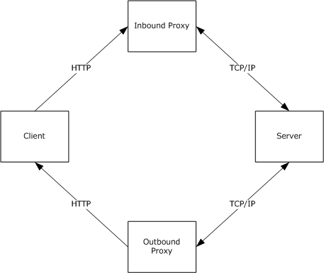

Figure 2: RPC over HTTP v2 roles

The roles defined herein are preserved even when the [**inbound proxy**](#gt_inbound-proxy) and [**outbound proxy**](#gt_outbound-proxy) roles run on the same network node. However, this protocol does not assume that the inbound proxy and outbound proxy reside on the same network node. Load balancing and clustering technologies, among others, might cause the inbound proxy and outbound proxy to run on different network nodes.<1>

An RPC over HTTP proxy that only supports RPC over HTTP v2 cannot interoperate with an RPC over HTTP v1 client or an RPC over HTTP v1 server.

The differences between RPC over HTTP v1 and v2 fall into three main categories, based on the following:

- The RPC over HTTP [**PDUs**](#gt_request-to-send-rts-protocol-data-unit-pdu) and RPC over HTTP PDUs' location
- The [**proxy**](#gt_proxy) roles
- The mapping of [**RPC**](#gt_remote-procedure-call-rpc) and RPC over HTTP PDUs to HTTP requests
**Note** In the figure above, the arrows indicate direction in which the PDU flow through the various roles.

<a id="Section_1.3.3"></a>
### 1.3.3 HTTP Proxy Use

In certain network topologies, the connection from the client to an [**RPC over HTTP proxy**](#gt_rpc-over-http-proxy) has to go through an [**HTTP proxy**](#gt_http-proxy). Thus before establishing a connection to the RPC over HTTP proxy, the client is required to determine whether a HTTP proxy is required to be used.

To do this determination, the client tries sending a message both with and without using an HTTP proxy. If it gets a response without using an HTTP proxy, then it does not use the HTTP proxy for subsequent communication. If it gets a response only by using an HTTP proxy, then it uses the HTTP proxy for subsequent communication.

<a id="Section_1.3.4"></a>
### 1.3.4 High-Level Overview

The [**RPC**](#gt_remote-procedure-call-rpc) Protocol transmits RPC PDUs between [**RPC clients**](#gt_rpc-client) and [**RPC servers**](#gt_rpc-server). At a very high level, this protocol functions as an [**RPC transport**](#gt_rpc-transport) and relays (tunnels) these [**PDUs**](#gt_request-to-send-rts-protocol-data-unit-pdu) to the [**server**](#gt_server) using HTTP (or HTTPS) and TCP/IP as specified in section [1.4](#Section_1.4).

The RPC over HTTP Protocol takes an [**RPC PDU**](#gt_rpc-pdu) that is generated [[C706]](https://go.microsoft.com/fwlink/?LinkId=89824) and extended [MS-RPCE](../MS-RPCE/MS-RPCE.md) on either an RPC client or an RPC server and transfers it to the other side, to the RPC server for the RPC client and to the RPC client for the RPC server, using a network agent called an [**RPC over HTTP proxy**](#gt_rpc-over-http-proxy). All traffic has to go through an RPC over HTTP proxy.

The most common deployment configuration, even though it is not a requirement for this protocol, is for the [**client**](#gt_client) to be separated from the RPC over HTTP proxy by a wide area network (WAN) such as the Internet where the network traffic for this protocol travels over HTTP or HTTPS. The RPC over HTTP proxy and the RPC server are usually connected through a local area network (LAN) where the network traffic for this protocol travels over TCP/IP.

The RPC PDUs are conceptually viewed by the RPC over HTTP Protocol as an ordered sequence or stream of PDUs that can travel from RPC client to RPC server or from RPC server to RPC client. This protocol does not modify or consume RPC PDUs. The only exception to this rule is when using HTTPS and [RPC over HTTP v2](#Section_3.2). In this case, RPC PDUs will be encrypted at the [**HTTP client**](#gt_http-client) and decrypted at the [**inbound**](#gt_inbound) or [**outbound proxy**](#gt_outbound-proxy) when traveling between an HTTP client and an [**inbound proxy**](#gt_inbound-proxy) or outbound proxy.

The RPC over HTTP Protocol inserts its own PDUs into the RPC [**PDU stream**](#gt_pdu-stream) and routes the resulting stream of PDUs over HTTP requests and responses or TCP/IP connections as defined throughout this specification. Using [**Augmented Backus-Naur Form (ABNF)**](#gt_augmented-backus-naur-form-abnf) notation [[RFC5234]](https://go.microsoft.com/fwlink/?LinkId=123096), the definition of the resulting stream of RPC and RPC over HTTP PDUs outside the protocol sequences specified in section [3](#Section_1.3) of this specification is as follows.

1*((1*(RPC over HTTP PDU))*(RPC PDU))

The following diagram illustrates this definition.


Figure 3: RPC over HTTP PDU stream

An example PDU stream is provided in section [4.1](#Section_4.1).

In addition to specifying how the PDUs are ordered and mapped to the underlying transport, the RPC over HTTP v2 dialect of this protocol specifies the following:

- How an implementation maps an unbounded number of PDUs from a stream onto a number of HTTP requests and responses, each of which is bounded by its content length. This is done through a process called [**channel recycling**](#gt_channel-recycling), specified in section [3.2](#Section_3.2).
- How an implementation prevents HTTP requests and responses that are used by the RPC over HTTP Protocol from being timed out as idle by network agents. This is done by sending PDUs in a process called pinging, as specified in section 3.2. The same pinging process is used to detect whether the other party is still running and reachable through the network.
<a id="Section_1.4"></a>
## 1.4 Relationship to Other Protocols

The RPC over HTTP Protocol is used in conjunction with the Remote Procedure Call (RPC) Protocol Extensions, as specified in [MS-RPCE](../MS-RPCE/MS-RPCE.md) and relies on HTTP 1.0 and keep-alive connections from HTTP 1.1 [[RFC2616]](https://go.microsoft.com/fwlink/?LinkId=90372). It also relies on HTTPS [[RFC2818]](https://go.microsoft.com/fwlink/?LinkId=90383) for data protection services. The following diagram illustrates the protocol layering for this protocol on the [**client**](#gt_client).

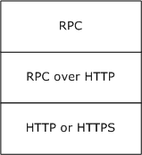

Figure 4: Protocol layering on the client

For RPC over HTTP, the mixed, [**inbound**](#gt_inbound), and [**outbound proxies**](#gt_outbound-proxy) use the protocol layering shown in the following diagram for their client-facing part.


Figure 5: Protocol layering on client-facing proxy

For the server-facing part of the mixed, inbound, and outbound proxy, the protocol layering is as shown in the following diagram.

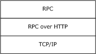

Figure 6: Protocol layering on server-facing proxy

The [**server**](#gt_server) uses the protocol layering shown in the following diagram.

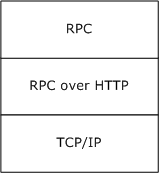

Figure 7: Protocol layering on server

A consequence of this protocol layering is that an [**RPC client**](#gt_rpc-client) using [**RPC**](#gt_remote-procedure-call-rpc) over TCP (ncacn_ip_tcp) predecessor [**RPC protocol sequence**](#gt_rpc-protocol-sequence) cannot interoperate with an [**RPC server**](#gt_rpc-server) using RPC over HTTP (ncacn_http) RPC protocol sequence and vice versa.

[RPC over HTTP v1](#Section_3.1) can run on HTTP only. [RPC over HTTP v2](#Section_3.2) can run over either HTTP or HTTPS. The decision on whether to use HTTP or HTTPS is made by the client based on information provided by higher-layer protocols.

RPC over HTTP v2 transmits error information encoded using the ExtendedError Remote Data Structure, as specified in [MS-EERR](../MS-EERR/MS-EERR.md).

<a id="Section_1.5"></a>
## 1.5 Prerequisites/Preconditions

If HTTPS transport is used, a [**certificate**](#gt_certificate) is deployed on the [**inbound**](#gt_inbound) and [**outbound proxies**](#gt_outbound-proxy).

The RPC over HTTP Protocol does not define any means for activating a [**server**](#gt_server) or [**proxy**](#gt_proxy), and thus the server and all proxies are fully initialized and listening before the RPC over HTTP Protocol can start operating. The server is listening on a well-known or [**dynamic endpoint**](#gt_dynamic-endpoint). RPC over HTTP proxies listen in an implementation-specific way on the [**URIs**](#gt_uniform-resource-identifier-uri) specified in sections [3.1.2.3](#Section_3.1.2) and [3.2.3.3](#Section_3.2.3.3).

<a id="Section_1.6"></a>
## 1.6 Applicability Statement

The RPC over HTTP Protocol is applicable to scenarios where an [**RPC client**](#gt_rpc-client) needs to communicate with an [**RPC server**](#gt_rpc-server) and, due to network constraints (for example, topology, firewalls, protocols, and so on), an HTTP transport is used.

This protocol is also applicable when data is received from the Internet or other public networks and additional protection for the RPC server is required. RPC over HTTP is generally not applicable in cases where a single [**RPC**](#gt_remote-procedure-call-rpc) method call will be executed with little data exchanged by the RPC client and the RPC server. The reason is that the additional security provisions of this protocol and the additional synchronization required by [**inbound**](#gt_inbound) and [**outbound proxies**](#gt_outbound-proxy) introduce significant overhead on the initial connection establishment. Once a connection is established, RPC over HTTP is very efficient in transmitting data between RPC clients and RPC servers.

[RPC over HTTP v1](#Section_3.1) is superseded by [RPC over HTTP v2](#Section_3.2) and cannot be used unless maintaining backward compatibility with RPC over HTTP v1 is required.<2> RPC over HTTP v1 has weak security and poor compatibility with existing HTTP infrastructure, and it deviates from RPC connection-oriented protocol requirements ([MS-RPCE](../MS-RPCE/MS-RPCE.md) section 2.1.1). More specifically, RPC over HTTP v1 does not meet the second requirement in the bulleted list in [MS-RPCE] section 2.1.1 because it fails to maintain a reliable communication session. RPC over HTTP v1 fails to keep the communication session open if the network agents deem the communication session idle.

<a id="Section_1.7"></a>
## 1.7 Versioning and Capability Negotiation

**Supported Transports:** The RPC over HTTP Protocol can run on top of HTTP 1.0 or HTTPS. [RPC over HTTP v2](#Section_3.2) requires HTTP 1.1 connection keep-alive support. Details are provided in section [2.1.2.1](#Section_3.2.3). For historical reasons related to how this protocol has evolved, some HTTP requests and HTTP responses are versioned as 1.0 and some are versioned as 1.1. When not specified explicitly in this specification, version 1.1 is assumed to be the default.

- **Protocol Versions:** This protocol supports the following explicit [**protocol dialects**](#gt_protocol-dialect): RPC over HTTP v1 and RPC over HTTP v2. These protocol dialects are defined in section [1.3.2](#Section_1.3). RPC over HTTP v2 supports versioning within RPC over HTTP v2 as defined in section [2.2.3.5.7](#Section_2.2.3.5.7). [RPC over HTTP v1](#Section_3.1) has no support for versioning.
- **Security and Authentication Methods:** This protocol relies on the security provided by HTTPS and HTTP Basic, or NTLM authentication [MS-NTHT](../MS-NTHT/MS-NTHT.md), and acts as a pass-through for the security provided by [**RPC**](#gt_remote-procedure-call-rpc). The RPC over HTTP Protocol does not have security and authentication provisions of its own.
- **Capability Negotiation:** This protocol negotiates one of its two protocol dialects, RPC over HTTP v1 and RPC over HTTP v2, by trying to first establish a connection using RPC over HTTP v2. If this connection fails, the protocol falls back to RPC over HTTP v1. The negotiation between RPC over HTTP v1 and RPC over HTTP v2 is defined in section [3](#Section_1.3).
<a id="Section_1.8"></a>
## 1.8 Vendor-Extensible Fields

The RPC over HTTP Protocol does not include vendor-extensible fields. However, this protocol builds on top of HTTP (or HTTPS), which allows vendors to add new HTTP headers [[RFC2616]](https://go.microsoft.com/fwlink/?LinkId=90372). This protocol also allows vendors to add HTTP headers, but it ignores all such headers.

<a id="Section_1.9"></a>
## 1.9 Standards Assignments

| Parameter | Value | Reference |
| --- | --- | --- |
| RPC over HTTP [**endpoint**](#gt_endpoint) mapper TCP port | 593 | As specified in [[IANAPORT]](https://go.microsoft.com/fwlink/?LinkId=89888) |

<a id="Section_2"></a>
# 2 Messages

This section defines how the RPC over HTTP Protocol maps over lower-layer protocols, and it defines the syntax for the messages used by this protocol.

The message syntax in this specification uses the notation and conventions specified in [[RFC2616]](https://go.microsoft.com/fwlink/?LinkId=90372) section 2. The parsing constructs OCTET, CHAR, UPALPHA, LOALPHA, ALPHA, DIGIT, CTL, CR, LF, SP, HT, CRLF, LWS, TEXT, and HEX used in this specification are the same as those specified in [RFC2616] section 2.2.

This protocol references commonly used data types as defined in [MS-DTYP](../MS-DTYP/MS-DTYP.md).

<a id="Section_2.1"></a>
## 2.1 Transport

Both [RPC over HTTP v1](#Section_3.1) and [RPC over HTTP v2](#Section_3.2) start their transport mapping process from a stream of [**RPC**](#gt_remote-procedure-call-rpc) and RPC over HTTP [**PDUs**](#gt_request-to-send-rts-protocol-data-unit-pdu) that need to be mapped to one or more HTTP or HTTPS requests and TCP/IP connections. Both [**protocol dialects**](#gt_protocol-dialect) also share the following characteristics:

- An [**endpoint**](#gt_endpoint) mapper with a [**well-known endpoint**](#gt_well-known-endpoint) of 593.
- An RPC protocol identifier of 0x1F.
- An RPC network address for the [**RPC server**](#gt_rpc-server) provided by a higher layer that MUST be an [IPv4](#Section_ee4d80b3b8de4064b46aba9af967ad6e) or [IPv6](#Section_7fa9fa893b2f4f359a7451e488afab40) address.
- The RPC endpoint for the RPC server MUST be a TCP/IP port number.
- The predecessor [**RPC protocol sequence**](#gt_rpc-protocol-sequence) is "ncacn_http".
- RPC network options provided by higher layers that:
- MUST contain a valid IPv4 or IPv6 address for the HTTP server.<3>
- MAY contain an [**HTTP proxy**](#gt_http-proxy).<4>
<a id="Section_2.1.1"></a>
### 2.1.1 RPC over HTTP v1 Transport

The following sections define the mapping of the [**RPC**](#gt_remote-procedure-call-rpc) over HTTP v1 [**protocol dialect**](#gt_protocol-dialect) over lower-layer protocols. From a high-level perspective, this protocol uses a single, custom HTTP request between the [**client**](#gt_client) and the [**mixed proxy**](#gt_mixed-proxy), and all RPC PDUs are mapped as [**binary large objects (BLOBs)**](#gt_binary-large-object-blob) in the message body of this request.

<a id="Section_2.1.1.1"></a>
#### 2.1.1.1 Client to Mixed Proxy Traffic

[RPC over HTTP v1](#Section_3.1) MUST use HTTP between the [**client**](#gt_client) and the [**mixed proxy**](#gt_mixed-proxy). It MUST use a single HTTP request to map both [**inbound**](#gt_inbound) and [**outbound**](#gt_outbound) traffic to the [**server**](#gt_server). The HTTP request MUST be initiated from the client and MUST be received by an [**HTTP server**](#gt_http-server) that runs on the mixed proxy. The address of the HTTP server is provided by a higher-layer protocol as specified in section [2.1](#Section_2.1). RPC over HTTP v1 MUST use port 80 for the HTTP traffic.

The syntax of the HTTP requests and HTTP response used by the RPC over HTTP Protocol are defined in [RPC Connect Request (section 2.1.1.1.1)](#Section_2.1.1.1.1) and [RPC Connect Response (section 2.1.1.1.2)](#Section_2.1.1.1.2). [Inbound PDU Stream (section 2.1.1.1.3)](#Section_2.1.1.1.3) and [Outbound PDU Stream (section 2.1.1.1.4)](#Section_2.1.1.1.4) define how [**RPC PDUs**](#gt_remote-procedure-call-rpc) are mapped to an HTTP request or an HTTP response.

<a id="Section_2.1.1.1.1"></a>
##### 2.1.1.1.1 RPC Connect Request

The [**RPC**](#gt_remote-procedure-call-rpc) connect request is an HTTP request that MUST have the following HTTP header fields.

**Method:** MUST be set to "RPC_CONNECT".

**Pragma:** MUST be set to the string "No-cache".

**Protocol:** [**Clients**](#gt_client) MUST set this to 1.1. [**Proxies**](#gt_proxy) SHOULD ignore this header field.

**URL:** The [**server**](#gt_server) name and port MUST be encoded in this field as specified in section [2.2.2](#Section_2.2.2) of this specification.

**User-Agent:** MUST be set to the string "RPC".

**Message Body:** MUST be composed as specified in section [2.1.1.1.3](#Section_2.1.1.1.3).

This request MUST not use the **Content-Type** and **Content-Length** header fields. It also MUST NOT use transfer coding or specify a MIME type.

<a id="Section_2.1.1.1.2"></a>
##### 2.1.1.1.2 RPC Connect Response

The [**RPC**](#gt_remote-procedure-call-rpc) connect response is an HTTP response that MUST have the following HTTP header fields.

**Status Line:** [[RFC2616]](https://go.microsoft.com/fwlink/?LinkId=90372) section 6.1 specifies that the status line be composed of three nonspace subfields. The three subfields MUST be set to the following values:

- **HTTP-Version:** MUST be the string "HTTP/1.1"
- **Reason-Phrase:** MUST be the string "OK"
- **Status-Code:** MUST be an HTTP status code in the inclusive range 200-299.
**Message Body:** Must be composed as specified in section [2.1.1.1.4](#Section_2.1.1.1.4) of this specification.

<a id="Section_2.1.1.1.3"></a>
##### 2.1.1.1.3 Inbound PDU Stream

Inbound [**PDUs**](#gt_request-to-send-rts-protocol-data-unit-pdu) from the [**PDU stream**](#gt_pdu-stream) MUST be encoded as [**BLOBs**](#gt_binary-large-object-blob) in the message body of the [**RPC**](#gt_remote-procedure-call-rpc) connect request. The first [**inbound**](#gt_inbound) PDU MUST start from the beginning of the message body of the RPC connect request, and each subsequent PDU from the PDU stream MUST be placed as a BLOB immediately after the previous PDU in the RPC connect request without any delimiters. The following diagram defines the layout of the PDUs in the message body of the RPC connect request.


Figure 8: Inbound connect request PDU stream

Each PDU encoded as a BLOB contains its length inside the PDU as specified in [[C706]](https://go.microsoft.com/fwlink/?LinkId=89824) section 12, RPC PDU Encodings, and thus no delimiters are necessary between the BLOBs. For [RPC over HTTP v1](#Section_3.1), the implementation of the underlying HTTP transport MUST be capable of the following:

- Duplex communication.
- Sending a potentially unbounded number of PDUs in the message body of the RPC connect request while at the same time receiving a potentially unbounded number of PDUs in the message body of the RPC connect response. This protocol specifically allows for sending and receiving a potentially unbounded number of PDUs in the message body of the RPC connect request.
The PDUs are sent in the message body as they are generated for [**unplugged channel mode**](#gt_unplugged-channel-mode). In this mode, PDU N MUST be sent as soon as it is generated and will not wait for PDU N+1 to be generated.

<a id="Section_2.1.1.1.4"></a>
##### 2.1.1.1.4 Outbound PDU Stream

[**Outbound**](#gt_outbound) [**PDUs**](#gt_request-to-send-rts-protocol-data-unit-pdu) from the [**PDU stream**](#gt_pdu-stream) MUST be encoded as [**BLOBs**](#gt_binary-large-object-blob) in the message body of the [**RPC**](#gt_remote-procedure-call-rpc) connect response. The first PDU in the RPC connect response MUST start from the beginning of the message body of the RPC connect response, and each subsequent PDU from the PDU stream MUST be placed as a BLOB immediately after the previous PDU in the RPC connect response without any delimiters. The following diagram defines the layout of the PDUs in the message body of the RPC connect response.

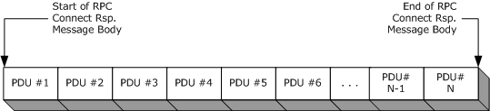

Figure 9: Outbound RPC connect response PDU stream

Each PDU encoded as a BLOB contains its length inside the PDU as specified in [[C706]](https://go.microsoft.com/fwlink/?LinkId=89824) section 12, RPC PDU Encodings, and thus no delimiters are necessary between the BLOBs.

For [RPC over HTTP v1](#Section_3.1), the implementation of the underlying HTTP transport MUST be capable of the following:

- Duplex communication.
- Sending a potentially unbounded number of PDUs in the message body of the RPC connect request, while at the same time receiving a potentially unbounded number of PDUs in the message body of the RPC connect response.
The PDUs are sent in the message body as they are generated for [**unplugged channel mode**](#gt_unplugged-channel-mode). In this mode, PDU N MUST be sent as soon as it is generated and will not wait for PDU N+1 to be generated.

<a id="Section_2.1.1.2"></a>
#### 2.1.1.2 Mixed Proxy to Server Traffic

[RPC over HTTP v1](#Section_3.1) uses TCP/IP between the [**mixed proxy**](#gt_mixed-proxy) and the [**server**](#gt_server). The TCP connection MUST be initiated by the mixed proxy. The server name and port to be used for setting up the TCP connection MUST be extracted from the [**URI**](#gt_uniform-resource-identifier-uri) of the HTTP request as specified in section [2.1.1.1](#Section_2.1.1.1). Once the connection is established, the mixed proxy and the server MUST use this connection for transmission of all the [**PDUs**](#gt_request-to-send-rts-protocol-data-unit-pdu) in the [**PDU stream**](#gt_pdu-stream).

<a id="Section_2.1.1.2.1"></a>
##### 2.1.1.2.1 Legacy Server Response

A server MUST send the ASCII [[US-ASCII]](https://go.microsoft.com/fwlink/?LinkId=90557) string "ncacn_http/1.0" to the [**mixed proxy**](#gt_mixed-proxy) as soon as the TCP connection from the mixed proxy to the server is established. This string literal is called the legacy server response.

<a id="Section_2.1.2"></a>
### 2.1.2 RPC over HTTP v2 Transport

The following sections define the mapping of the RPC over HTTP v2 [**protocol dialect**](#gt_protocol-dialect) over lower-layer protocols. From a high-level perspective, in its steady state this protocol uses a pair of custom HTTP requests from the [**client**](#gt_client) to the [**inbound proxy**](#gt_inbound-proxy) and from the client to the [**outbound proxy**](#gt_outbound-proxy). All [**inbound**](#gt_inbound) [**RPC PDUs**](#gt_remote-procedure-call-rpc) are mapped as [**BLOBs**](#gt_binary-large-object-blob) in the message body of the custom request to the inbound proxy, and all [**outbound**](#gt_outbound) RPC PDUs are mapped as BLOBs in the message body of the custom request to the outbound proxy.

<a id="Section_2.1.2.1"></a>
#### 2.1.2.1 Client to Inbound or Outbound Proxy

[RPC over HTTP v2](#Section_3.2) MUST operate either on top of HTTP or on top of HTTPS. It requires HTTP 1.0 plus connection keep-alive support from HTTP 1.1. Mapping to both protocols happens identically. In this section, mapping is defined only on HTTP, but the same rules apply for HTTPS.<5>

If instructed by a higher-level protocol in an implementation-specific way, implementations of this protocol MUST require the HTTP implementation on the [**client**](#gt_client) to authenticate to the [**HTTP server**](#gt_http-server) running on the [**inbound proxy**](#gt_inbound-proxy) or [**outbound proxy**](#gt_outbound-proxy) using basic authentication for HTTP [[RFC2617]](https://go.microsoft.com/fwlink/?LinkId=90373) or NTLM authentication for HTTP [MS-NTHT](../MS-NTHT/MS-NTHT.md).

The higher-level protocol MUST provide, in an implementation-specific way, either credentials in the form of user name/password or a client-side [**certificate**](#gt_certificate). Implementations of this protocol MUST NOT process the credentials or authentication information. Such processing typically happens entirely inside implementations of lower protocol layers.<6>

The same mapping MUST be applied for both the inbound proxy and the outbound proxy traffic. A client implementation SHOULD instruct the implementation of the HTTP protocol on which it runs to use an implementation-specific but reasonable time-out value for all requests.<7>

RPC over HTTP v2 MUST always use a pair of HTTP requests to build a [**virtual connection**](#gt_virtual-connection) (2). The HTTP requests MUST be initiated by the client and received by the inbound proxy and outbound proxy.

Both HTTP requests have implementation-specific content length as defined in the following sections. The address of the HTTP server is provided by a higher-layer protocol. RPC over HTTP v2 always uses port 80 for HTTP traffic and port 443 for HTTPS traffic.

The next few sections describe the HTTP IN channel request (section [2.1.2.1.1](#Section_2.1.2.1.1)) and OUT channel request (section [2.1.2.1.2](#Section_2.1.2.1.2)), and the IN channel response (section [2.1.2.1.3](#Section_2.1.2.1.3)) and OUT channel response (section [2.1.2.1.4](#Section_2.1.2.1.4)) used by RPC over HTTP v2 as well as the mapping of the [**PDU stream**](#gt_pdu-stream) on top of these requests. The general syntax and meaning of each of the HTTP header fields are specified in [[RFC2616]](https://go.microsoft.com/fwlink/?LinkId=90372). Sections 2.1.2.1.1 through [2.1.2.1.8](#Section_2.1.2.1.8) only define the use of a given header field when this protocol uses the field in a more specific or different meaning than the one specified in [RFC2616]. RPC over HTTP v2 protocol entirely preserves the syntax and semantics of any HTTP header field not explicitly mentioned here.

<a id="Section_2.1.2.1.1"></a>
##### 2.1.2.1.1 IN Channel Request

The [**IN channel**](#gt_in-channel) request is an HTTP request [[RFC2616]](https://go.microsoft.com/fwlink/?LinkId=90372). The header fields of that HTTP request are as follows:

**Method:** MUST be the "RPC_IN_DATA" string.

**Accept:** [**Clients**](#gt_client) SHOULD set this to "application/rpc" string literal. [**Inbound proxies**](#gt_inbound-proxy) MUST ignore this header field.

**Cache-Control:** Clients MUST set this to "no-cache". Inbound proxies MUST ignore this header field.

**Connection:** Clients MUST set this to "Keep-Alive". Inbound proxies MUST ignore this header field.

**Content-Length:** MUST be in the inclusive range of 128 kilobytes to 2 gigabytes.<8>

**Host:** Clients MUST set this to the server name of the inbound proxy ([RFC2616] section 14.23 "Host"). Inbound proxies SHOULD ignore this header field.

**Pragma Directives**:

- Clients MUST add a "No-cache" pragma directive as specified in [RFC2616] section 14.32. Inbound proxies MUST ignore this directive.
- If the higher-layer protocol or application specified a connectiontimeout, a client MUST add a pragma directive of the form "Pragma:MinConnTimeout=T", where T is a decimal string representation of the minimum connection time-out, in seconds, to be used for this IN channel. The time-out MUST be in the inclusive range of 120 to 14,400 seconds.
- If the higher-layer protocol or application specified a Resource Type UUID, a client MUST add a pragma directive of the form "Pragma:ResourceTypeUuid=R", where R is a [**UUID**](#gt_universally-unique-identifier-uuid) formatted as a string ([C706]- Section A.3. This pragma specifies the Resource Type UUID for this channel. For more details on Resource Type UUID, see section [3.2.3.1.5](#Section_3.2.3.1.5).
- If the higher-layer protocol or application specified a Session UUID, a client MUST add a pragma directive of the form "Pragma:SessionId=S", where S is a UUID formatted as a string. This pragma specifies the Session UUID for this channel. For more details on Session UUID, see section [3.2.3.1.6](#Section_3.2.3.1.6).
**Protocol:** Clients SHOULD set this to 1.0. Inbound proxies SHOULD ignore this header field.

**URL:** The server name and port MUST be encoded in this field. For details on encoding, see section [2.2.2](#Section_2.2.2).

**User-Agent:** Clients SHOULD set this to the "MSRPC" string literal. Inbound proxies SHOULD ignore this header field.

**Message Body:** For details on how the message body of an IN channel request MUST be created, see section [2.1.2.1.7](#Section_2.1.2.1.7).

<a id="Section_2.1.2.1.2"></a>
##### 2.1.2.1.2 OUT Channel Request

The [**OUT channel**](#gt_out-channel) request is an HTTP request [[RFC2616]](https://go.microsoft.com/fwlink/?LinkId=90372). The header fields of that HTTP request are as follows:

**Method:** MUST be set to the "RPC_OUT_DATA" string.

**Accept:** Clients SHOULD set this to "application/rpc" string literal. [**Outbound proxies**](#gt_outbound-proxy) MUST ignore this header field.

**Cache-Control:** Clients MUST set this to "no-cache". Outbound proxies MUST ignore this header field.

**Connection:** Clients MUST set this to "Keep-Alive". Outbound proxies MUST ignore this header field.

**Content-Length:** MUST be set to 76 for nonreplacement OUT channels and set to 120 for [**replacement OUT channels**](#gt_replacement-channel).

**Host:** Clients MUST set this to the server name of the outbound proxy ([RFC2616] section 14.23, Host). Outbound proxies SHOULD ignore this header field.

**Pragma Directives**:

- Clients MUST add a "No-cache" pragma directive as specified in [RFC2616] section 14.32. Outbound proxies MUST ignore this directive.
- Optional pragma directive that, if present, MUST be defined to have the format "Pragma:MinConnTimeout=T", where T MUST be a decimal string representation of the minimum connection time-out, in seconds, to be used for this OUT channel. The time-out MUST be in the inclusive range of 120 to 14,400 seconds.
- Optional pragma directive that, if present, MUST be defined to have the format "Pragma:ResourceTypeUuid=R", where R MUST be a [**UUID**](#gt_universally-unique-identifier-uuid) formatted as a string ([[C706]](https://go.microsoft.com/fwlink/?LinkId=89824) Appendix A, Universal Unique Identifier). This pragma specifies the Resource Type UUID for this channel. For more details on Resource Type UUID, see section [3.2.3.1.5](#Section_3.2.3.1.5).
- Optional pragma directive that, if present, MUST be defined to have the format "Pragma:SessionId=S", where S MUST be a UUID formatted as a string ([C706] Appendix A, Universal Unique Identifier). This pragma specifies the session ID for this channel.
**Protocol:** Clients SHOULD set this to 1.0. Outbound proxies SHOULD ignore this header field.

**URL:** The server name and port are encoded in this field. For information on how the encoding is done, see section [2.2.2](#Section_2.2.2) of this specification.

**User-Agent:** Clients SHOULD set this to the "MSRPC" string literal. Outbound proxies SHOULD ignore this header field.

**Message Body:** For the definition of how the message body of an OUT channel request MUST be created, see section [2.1.2.1.8](#Section_2.1.2.1.8) of this specification.

<a id="Section_2.1.2.1.3"></a>
##### 2.1.2.1.3 IN Channel Response

The [**IN channel**](#gt_in-channel) response is an HTTP response [[RFC2616]](https://go.microsoft.com/fwlink/?LinkId=90372). It is used only in error conditions on the [**RPC over HTTP proxy**](#gt_rpc-over-http-proxy). The HTTP header fields and message body syntax that are different from [RFC2616] are as follows:

**Status Line:** [RFC2616] section 6.1 specifies that the status line be composed of three nonspace subfields:

- **HTTP-Version:** SHOULD be the character sequence HTTP/1.0.
- **Reason-Phrase:** MUST be in the following form:
reason-phrase = "RPC Error: " RPC-Error [ee-info]

RPC-Error = 1*HEX

ee-info = ", EEInfo: " EncodedEEInfo

- **RPC-Error:** MUST be interpreted as a hexadecimal representation of an error code. The error code MUST be an implementation-specific value between 0x0 and 0xFFFFFFFF. The error code MUST NOT be one of the error codes specified in [MS-RPCE](../MS-RPCE/MS-RPCE.md) section 3.3.3.5.1.<9>
**ee-info:** Is part of the reason-phrase and MUST be present if error information is available to the [**inbound proxy**](#gt_inbound-proxy). The behavior of the inbound proxy is defined in section [3.2.3.5.11](#Section_3.2.3.5.11).

**EncodedEEInfo:** MUST be a [**base64**](#gt_179b9392-9019-45a3-880b-26f6890522b7)-encoded [**BLOB**](#gt_binary-large-object-blob). The base64 encoding MUST be as specified in [[RFC4648]](https://go.microsoft.com/fwlink/?LinkId=90487) section 4. The content of the BLOB is specified in [MS-EERR](../MS-EERR/MS-EERR.md). The BLOB MUST continue until the CRLF delimiter at the end of the status line.

The total length of the reason-phrase line MUST NOT exceed 1,024 bytes.

**Status-Code:** MUST be the character sequence 503.

**MessageBody:** MUST be in the following format.

message-body = ["RPC EEInfo:" EncodedEEInfo]

**EncodedEEInfo:** MUST be a base64 BLOB. The base64 encoding MUST be as specified in [RFC4648] section 4. The content of the BLOB is specified in [MS-EERR]. The BLOB MUST continue until the CRLF delimiter at the end of the message body.

<a id="Section_2.1.2.1.4"></a>
##### 2.1.2.1.4 OUT Channel Response

The [**OUT channel**](#gt_out-channel) response is sent in both success and failure cases. In success case, the header fields of the HTTP response to the OUT channel request are as follows:

**Content-Length:** MUST be set to an implementation-specific value in the inclusive range of 128 kilobytes to 2 gigabytes.<10>

**Content-Type:** MUST be set to the string literal "application/rpc".

**Status Line:** [[RFC2616]](https://go.microsoft.com/fwlink/?LinkId=90372) section 6.1 specifies that the status line be composed of three nonspace subfields:

- **HTTP-Version:** MUST be the character sequence HTTP/1.1.
- **Status-Code:** MUST be the character sequence 200.
- **Reason-Phrase:** MUST be the character sequence Success.
In a failure case, the format of the OUT channel response is the same as the [**IN channel**](#gt_in-channel) response as defined in section [2.1.2.1.3](#Section_2.1.2.1.3) of this specification.

<a id="Section_2.1.2.1.5"></a>
##### 2.1.2.1.5 Echo Request

An echo request is used in the [**proxy**](#gt_proxy) discovery protocol sequence. The header fields for an echo request are as follows:

**Method:** MUST be set to either the "RPC_IN_DATA" or the "RPC_OUT_DATA" string. Both are valid. The [**client**](#gt_client) SHOULD use "RPC_IN_DATA" when it is sending an echo request as part of a protocol sequence associated with [**IN channels**](#gt_in-channel) and SHOULD use "RPC_OUT_DATA" when it is sending an echo request as part of a protocol sequence associated with [**OUT channels**](#gt_out-channel). If the client sends "RPC_IN_DATA" in this field, the proxy MUST act as [**inbound proxy**](#gt_inbound-proxy). If the client sends "RPC_OUT_DATA" in this field, the proxy MUST act as [**outbound proxy**](#gt_outbound-proxy).

**Accept:** Clients SHOULD set this to the "application/rpc" string literal. [**Inbound**](#gt_inbound) and outbound proxies MUST ignore this header field.

**Cache-Control:** Clients MUST set this to "no-cache". Inbound and outbound proxies MUST ignore this header field.

**Connection:** Clients SHOULD set this to Keep-Alive. Inbound and outbound proxies MUST ignore this header field.

**Content-Length:** Clients MUST set this header field to a value in the inclusive range of 0 to 0x10.<11>

**Host:** Clients MUST set this to the server name of the inbound or outbound proxies as specified in [[RFC2616]](https://go.microsoft.com/fwlink/?LinkId=90372) section 14.23, Host. Inbound and outbound proxies SHOULD ignore this header field.

**Pragma Directives:**

- Clients MUST add a "No-cache" pragma directive as specified in [RFC2616] section 14.32. Inbound and outbound proxies MUST ignore this directive.
**Protocol:** Clients SHOULD set this to 1.0. Inbound and outbound proxies SHOULD ignore this header field.

**URL:** The server name and port are encoded in this field. For information on how the encoding is done, see section [2.2.2](#Section_2.2.2).

**User-Agent:** Clients SHOULD set this to the "MSRPC" string literal. Inbound and outbound proxies SHOULD ignore this header field.

**Message Body:** Clients MAY set the message body to random content they choose as specified in [RFC2616].<12> Inbound and outbound proxies MUST ignore the message body.

<a id="Section_2.1.2.1.6"></a>
##### 2.1.2.1.6 Echo Response

An echo response is used in the [**proxy**](#gt_proxy) discovery protocol sequence. This response is sent by an [**inbound**](#gt_inbound) or [**outbound proxy**](#gt_outbound-proxy) as an HTTP response to the echo HTTP request. The same echo response is sent by both inbound and outbound proxies.

The header fields of the HTTP response are as follows:

**Connection:** Inbound and outbound proxies SHOULD set this to Keep-Alive. Clients MUST ignore this header field.

**Content-Length:** Inbound and outbound proxies MUST set this field to 20. Clients MUST ignore this header field.

**Content-Type:** Inbound and outbound proxies MUST set this header field to the string literal "application/rpc". Clients SHOULD ignore this header field.

**Status Line:** [[RFC2616]](https://go.microsoft.com/fwlink/?LinkId=90372) section 6.1 specifies that the status line be composed of three nonspace subfields:

- **HTTP-Version:** The HTTP protocol version of the [**HTTP server**](#gt_http-server). This protocol does not require any particular HTTP version. Any HTTP version that is 1.0 or higher SHOULD be accepted by implementations of this protocol.
- **Reason-Phrase:** MUST be Success.
- **Status-Code:** MUST be 200.
Implementations SHOULD respond with the Status Line as specified above. It is not a requirement of this protocol for implementations to use the **status-code** field to indicate errors, though implementations MAY do so.

**Message Body:** Inbound and outbound proxies put in the message body the echo response RTS packet described in section [2.2.4.48](#Section_2.2.4.48) and encoded as a [**BLOB**](#gt_binary-large-object-blob).

<a id="Section_2.1.2.1.7"></a>
##### 2.1.2.1.7 Inbound PDU Stream

[**Inbound**](#gt_inbound) [**PDUs**](#gt_request-to-send-rts-protocol-data-unit-pdu) from the [**PDU stream**](#gt_pdu-stream) MUST be encoded as BLOBs in the message body of the [**IN channel**](#gt_in-channel). The first PDU in the IN channel MUST start from the beginning of the message body of the IN channel, and each subsequent PDU from the PDU stream MUST be placed as a BLOB immediately after the previous PDU in the IN channel without any delimiters. The following diagram describes the layout of the PDUs in the message body of the IN channel.


Figure 10: IN channel message PDU stream

Each PDU is encoded as a variable-sized BLOB containing its length inside the PDU; therefore, no delimiters are necessary between the BLOBs. The length of the [**RPC**](#gt_remote-procedure-call-rpc) PDUs is specified in [[C706]](https://go.microsoft.com/fwlink/?LinkId=89824) section 12, RPC PDU Encodings. The length of the [**RTS PDUs**](#gt_682437f3-1c41-420d-ae08-3178f5611ddd) is defined in section [2.2.3.6](#Section_2.2.3.6) of this specification. An IN channel contains a variable number of PDUs, and the PDUs themselves might have variant sizes. An IN channel MUST NOT contain more PDUs than can fit in its maximum content length as indicated by the Content-Length header. If there is not enough space on an IN channel for another PDU from the PDU stream, the IN channel is considered [**expired**](#gt_7160f109-6fd1-46b3-923f-0fae133ea0e9) and MUST NOT be used by the [**client**](#gt_client) anymore. A successor IN channel MUST be established. For more details on how the client manages the [**channel lifetime**](#gt_channel-lifetime), see section [3.2.2](#Section_3.2.2).

The PDUs MUST be sent in the message body as they are generated: PDU N MUST be sent as soon as it is generated and MUST NOT wait for PDU N+1 to be generated.

By using the message body of the IN channel to transmit PDUs over HTTP/HTTPS, this protocol obtains a half-duplex channel for a limited number of bytes that provides reliable, in-order, at-most-once delivery semantics between a client and [**inbound proxy**](#gt_inbound-proxy).

<a id="Section_2.1.2.1.8"></a>
##### 2.1.2.1.8 Outbound PDU Stream

[**Outbound**](#gt_outbound) [**PDUs**](#gt_request-to-send-rts-protocol-data-unit-pdu) from the [**PDU stream**](#gt_pdu-stream) MUST be encoded as BLOBs in the message body of the [**OUT channel**](#gt_out-channel). The first PDU in the OUT channel MUST start from the beginning of the message body of the OUT channel, and each subsequent PDU from the PDU stream MUST be placed as a BLOB immediately after the previous PDU in the OUT channel without any delimiters. The following diagram describes the layout of the PDUs in the message body of the OUT channel.

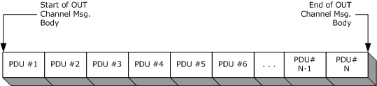

Figure 11: OUT channel message PDU stream

Each PDU encoded as a BLOB contains its length inside the PDU and thus no delimiters are necessary between the BLOBs. The length of the [**RPC**](#gt_remote-procedure-call-rpc) PDUs is defined in RPC PDU Encodings [[C706]](https://go.microsoft.com/fwlink/?LinkId=89824) section 12. The length of the [**RTS PDUs**](#gt_682437f3-1c41-420d-ae08-3178f5611ddd) is defined in section [2.2.3.6](#Section_2.2.3.6).

An OUT channel contains a variable number of PDUs and the PDUs themselves might have variable sizes. An OUT channel MUST NOT contain more PDUs than can fit in its maximum content length as indicated by the Content-Length header. If there is not enough space on an OUT channel for another PDU from the PDU stream, the OUT channel is considered [**expired**](#gt_7160f109-6fd1-46b3-923f-0fae133ea0e9) and MUST NOT be used by the server anymore. A successor OUT channel MUST be established. How the server manages the [**channel lifetime**](#gt_channel-lifetime) is specified in section [3.2.5](#Section_3.2.5).

The PDUs are sent in the message body as they are generated. PDU N MUST be sent as soon as it is generated and will not wait for PDU N+1 to be generated.

By using the message body of the OUT channel to transmit PDUs over HTTP/HTTPS, this protocol obtains a half-duplex channel for a limited number of bytes that provides reliable, in-order, at-most-once delivery semantics between a [**client**](#gt_client) and outbound proxy.

<a id="Section_2.1.2.2"></a>
#### 2.1.2.2 Inbound or Outbound Proxy to Server

[RPC over HTTP v2](#Section_3.2) uses TCP/IP between the [**inbound**](#gt_inbound) or outbound proxy and the server. The same mapping is applied for both the inbound and the outbound proxy.

The TCP connection is initiated by the inbound or outbound proxy. The server name and port to be used for setting up the TCP connection are extracted from the URL of the HTTP request as specified in section [2.1.1.1](#Section_2.1.1.1). Once the connection is established, the [**inbound proxy**](#gt_inbound-proxy) or outbound proxy and the server use this connection for transmission of all the [**PDUs**](#gt_request-to-send-rts-protocol-data-unit-pdu) of the [**PDU stream**](#gt_pdu-stream).

By using a TCP/IP connection between the inbound or outbound proxy and the server, implementations of this protocol obtain a full-duplex channel for an unlimited number of bytes that provides reliable, in-order, at-most-once delivery semantics.

<a id="Section_2.1.2.2.1"></a>
##### 2.1.2.2.1 Legacy Server Response

A server SHOULD send the string literal "ncacn_http/1.0" to the [**inbound**](#gt_inbound) or outbound proxy as soon as the TCP connection from the inbound or outbound proxy to the server is established. This string literal is called the legacy server response.

<a id="Section_2.2"></a>
## 2.2 Message Syntax

This section defines the message syntax for the messages and [**PDUs**](#gt_request-to-send-rts-protocol-data-unit-pdu) used by this protocol. First, it specifies the conventions and some common data structures used in multiple messages. Then it defines the rules for combining the common data structures, and finally, it defines the PDUs for this protocol.

<a id="Section_2.2.1"></a>
### 2.2.1 Common Conventions

All data structures described in this section share the following common characteristics:

- All numeric fields MUST be encoded using [**little-endian**](#gt_little-endian) byte ordering.
- Alignment for all data structures except the [**URI**](#gt_uniform-resource-identifier-uri) MUST be 4 bytes.
- All structures in this section except the URI are used for [RPC over HTTP v2](#Section_3.2) only.
<a id="Section_2.2.2"></a>
### 2.2.2 URI Encoding

The format of the [**URI**](#gt_uniform-resource-identifier-uri) header field of the HTTP request has a special interpretation in this protocol. As specified in [[RFC2616]](https://go.microsoft.com/fwlink/?LinkId=90372), the URI is to be of the following form.

http-URL = "http:" "//" host [ ":" port ] [ abs-path

[ "?" query ]]

This protocol specifies that **abs-path** MUST be present for [RPC over HTTP v2](#Section_3.2) and MUST have the following form.

nocert-path = "/rpc/rpcproxy.dll"

withcert-path = "/rpcwithcert/rpcproxy.dll"

abs-path = nocert-path / withcert-path

The form matching **withcert-path** MUST be used whenever the client authenticates to the [**HTTP server**](#gt_http-server) using a client-side [**certificate**](#gt_certificate). The form matching **nocert-path** MUST be used in all other cases.<13>

This protocol specifies that **query** string MUST be present for RPC over HTTP v2 and MUST be of the following form.

query = server-name ":" server-port

The [**inbound proxy**](#gt_inbound-proxy) or outbound proxy uses the query string to establish a connection to an [**RPC**](#gt_remote-procedure-call-rpc) over the HTTP server, as specified in sections [3.2.3.5.3](#Section_3.2.3.5.3) and [3.2.4.5.3](#Section_3.2.4.5.3).

server-name = DNS-Name / IP-literal-address /

IPv6-literal-address / NetBIOS-Name

server-port = 1*6(DIGIT)

The length of **server-name** MUST be less than 1,024 characters.

**DNS-Name:** An [**Internet host name**](#gt_internet-host-name) or IP_literal_address that is the string representation of an IP literal address, as specified in [[RFC1123]](https://go.microsoft.com/fwlink/?LinkId=90268) section 2.1.

**IPv6-literal-address:** MUST be the string representation of an IPv6 literal address as specified in [[RFC4291]](https://go.microsoft.com/fwlink/?LinkId=90464) section 2.

**NetBIOS-Name:** MUST be a NetBIOS name. For more details about NetBIOS, refer to [[NETBEUI]](https://go.microsoft.com/fwlink/?LinkId=90224), [[RFC1001]](https://go.microsoft.com/fwlink/?LinkId=90260), and [[RFC1002]](https://go.microsoft.com/fwlink/?LinkId=90261).

<a id="Section_2.2.3"></a>
### 2.2.3 Common Data Structures

This section defines several common data structures and values used by the RPC over HTTP Protocol. They are used in multiple [**PDUs**](#gt_request-to-send-rts-protocol-data-unit-pdu). The PDUs themselves are defined in section [2.2.4](#Section_2.2.4). The common conventions for the messages are defined in section [2.2.1](#Section_2.2.1).

<a id="Section_2.2.3.1"></a>
#### 2.2.3.1 RTS Cookie

The RTS cookie is a token exchanged between parties in an RPC over HTTP Protocol sequence and is used to name objects and abstractions as defined throughout this specification. This section defines the encoding for an [**RTS cookie**](#gt_578c1075-051d-40c2-9fa4-0aeb1ca20002).

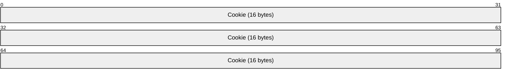

The value chosen for an RTS cookie SHOULD be a 16-byte cryptographically strong random number. It has the same uniqueness requirements as a [**UUID**](#gt_universally-unique-identifier-uuid), and implementations MAY use a UUID as the RTS cookie.<14>

<a id="Section_2.2.3.2"></a>
#### 2.2.3.2 Client Address

The [**client**](#gt_client) address data structure is used to transmit the IP address of a client to a [**proxy**](#gt_proxy) or a server. It has two basic formats: [IPv4](#Section_ee4d80b3b8de4064b46aba9af967ad6e) and [IPv6](#Section_7fa9fa893b2f4f359a7451e488afab40), as described in sections 2.2.3.2.1 and 2.2.3.2.2.

<a id="Section_2.2.3.2.1"></a>
##### 2.2.3.2.1 Client Address - IPv4

The client address data structure is used to transmit the IP address of a [**client**](#gt_client) to a [**proxy**](#gt_proxy) or a server. The encoding of the client address for the IPv4 format is as follows.

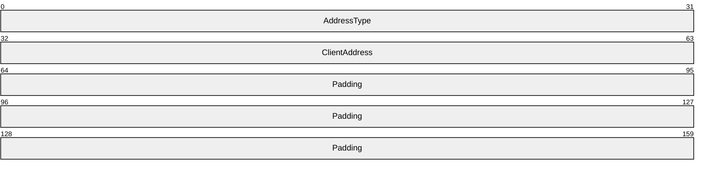

**AddressType (4 bytes):** MUST be set to the value 0 to indicate IPv4 format.

**ClientAddress (4 bytes):** MUST contain the IPv4 address of the client in [**little-endian**](#gt_little-endian) byte order.

**Padding (12 bytes):** Senders SHOULD set all bytes in this field to the value 0x00. Receivers MUST ignore this field.

<a id="Section_2.2.3.2.2"></a>
##### 2.2.3.2.2 Client Address - IPv6

The client address data structure is used to transmit the IP address of a client to a [**proxy**](#gt_proxy) or a server. The encoding of the client address for the IPv6 format is as follows.

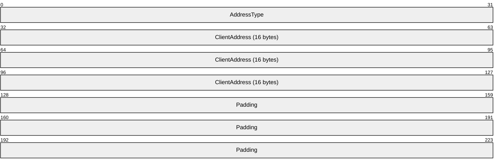

**AddressType (4 bytes):** MUST be set to the value 1 to indicate IPv6 format.

**ClientAddress (16 bytes):** MUST contain the IPv6 address of the client in [**little-endian**](#gt_little-endian) byte order.

**Padding (12 bytes):** Senders SHOULD set all bytes in this field to the value 0x00. Receivers MUST ignore this field.

<a id="Section_2.2.3.3"></a>
#### 2.2.3.3 Forward Destinations

The forward destination enumeration specifies the target of a forwarded [**PDU**](#gt_request-to-send-rts-protocol-data-unit-pdu) as per the following table.

| Constant/value | Description |
| --- | --- |
| FDClient 0x00000000 | Forward to client |
| FDInProxy 0x00000001 | Forward to [**inbound proxy**](#gt_inbound-proxy) |
| FDServer 0x00000002 | Forward to server |
| FDOutProxy 0x00000003 | Forward to outbound proxy |

If a PDU is forwarded, the party that originally created the PDU is called the originator of the PDU and the party that sends the PDU to the next hop in the forwarding chain is called the sender of the PDU. For a definition of the processing rules related to PDU forwarding, see section [3.2.1.5.2](#Section_3.2.1.5.2).

<a id="Section_2.2.3.4"></a>
#### 2.2.3.4 Flow Control Acknowledgment

The Flow Control Acknowledgment data structure is embedded in a packet performing some sort of flow control acknowledgment for traffic received. The encoding of this data structure is as follows.

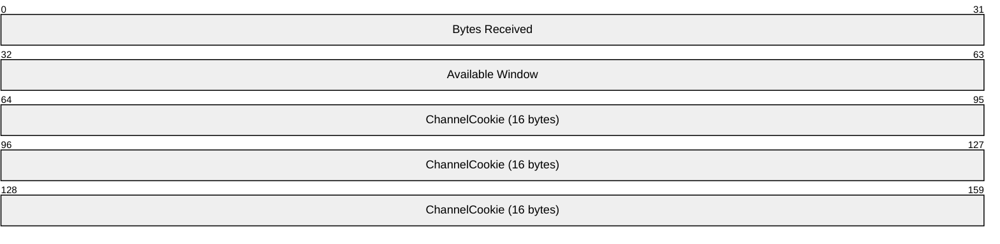

**Bytes Received (4 bytes):** The number of bytes received at the time the flow control acknowledgment was issued. For a definition of the processing rules related to flow control acknowledgment, see section [3.2.1.1](#Section_3.2.1.1). This value MUST be in the inclusive range of 0 to the [**channel lifetime**](#gt_channel-lifetime) denoted by the channel cookie field.

**Available Window (4 bytes):** The number of bytes available in the **ReceiveWindow** of the originator of this [**PDU**](#gt_request-to-send-rts-protocol-data-unit-pdu).

**ChannelCookie (16 bytes):** An [**RTS cookie**](#gt_578c1075-051d-40c2-9fa4-0aeb1ca20002) that uniquely identifies the channel for which the traffic received is being acknowledged (see section [2.2.3.1](#Section_2.2.3.1)).

<a id="Section_2.2.3.5"></a>
#### 2.2.3.5 RTS Commands

The [**RTS PDUs**](#gt_682437f3-1c41-420d-ae08-3178f5611ddd) contain a series of commands. This section defines the valid RTS commands. Section [2.2.3.6](#Section_2.2.3.6) defines how the commands are ordered in a [**PDU**](#gt_request-to-send-rts-protocol-data-unit-pdu).

The type of each command in an RTS PDU is identified by a numeric value. Each command is used in one or more RTS PDUs as defined in sections [2.2.4.2](#Section_2.2.4.2) through [2.2.4.50](#Section_2.2.4.50). Section [3.2](#Section_3.2) defines when each RTS PDU is used, who sends it, and who receives it. The following table specifies the numeric value and meaning of each command type.

| Value | Meaning |
| --- | --- |
| ReceiveWindowSize (0x00000000) | The [ReceiveWindowSize](#Section_2.2.3.5.1) command communicates the size of the **ReceiveWindow**. |
| FlowControlAck (0x00000001) | The [FlowControlAck](#Section_2.2.3.5.2) command carries acknowledgment for traffic received. |
| ConnectionTimeout (0x00000002) | The [ConnectionTimeout](#Section_3.2.1.1.6.1) command specifies the configured connection time-out. |
| Cookie (0x00000003) | The [Cookie](#Section_2.2.3.5.4) command carries an [**RTS cookie**](#gt_578c1075-051d-40c2-9fa4-0aeb1ca20002). |
| ChannelLifetime (0x00000004) | The [ChannelLifetime](#Section_3.2.3.1.1) command specifies the [**channel lifetime**](#gt_channel-lifetime). |
| ClientKeepalive (0x00000005) | The [ClientKeepalive](#Section_2.2.3.5.6) command carries the desired interval for sending keep-alive PDUs. |
| Version (0x00000006) | The [Version](#Section_2.2.3.5.7) command carries the [RPC over HTTP v2](#Section_3.2) version number for the sender of the PDU that contains this command. |
| Empty (0x00000007) | [Empty](#Section_2.2.3.5.8) command. |
| Padding (0x00000008) | [Padding](#Section_2.2.3.5.9) is a variable-size command used to pad the size of an RTS PDU to a desired size. |
| NegativeANCE (0x00000009) | The [NegativeANCE](#Section_2.2.3.5.10) command indicates that a [**successor channel**](#gt_successor-channel) was not established successfully. |
| ANCE (0x0000000A) | The [ANCE](#Section_2.2.3.5.11) command indicates that a successor channel was established successfully. |
| ClientAddress (0x0000000B) | The [ClientAddress](#Section_2.2.3.5.12) command carries the client IP address. The IP address is encoded as specified in section [2.2.3.2](#Section_2.2.3.2). Regardless of who sends this PDU, the address MUST be interpreted to be the address of the client. |
| AssociationGroupId (0x0000000C) | The [AssociationGroupId](#Section_2.2.3.5.13) command carries the client association group ID as specified in section 2.2.3.5.13. Regardless of who sends this PDU, the association group ID MUST be interpreted to be that of the client. |
| Destination (0x0000000D) | The [Destination](#Section_2.2.3.5.14) command carries the destination to which a PDU MUST be forwarded. |
| PingTrafficSentNotify (0x0000000E) | The [PingTrafficSentNotify](#Section_2.2.3.5.15) command carries the number of bytes sent by the outbound proxy to the client as part of ping traffic. |

<a id="Section_2.2.3.5.1"></a>
<a id="Section_3.2.1.1.5.1.1"></a>
##### 2.2.3.5.1 ReceiveWindowSize

The ReceiveWindowSize command specifies the size of the **ReceiveWindow** of a party. The party from which the **ReceiveWindow** originated is specified in the section for the [**RTS PDU**](#gt_682437f3-1c41-420d-ae08-3178f5611ddd) that contains this command. The structure of the command is as follows.

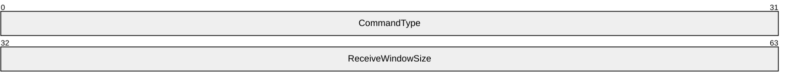

**CommandType (4 bytes):** MUST be the value ReceiveWindowSize (0x00000000).

**ReceiveWindowSize (4 bytes):** The size of the **ReceiveWindow**, in bytes. It MUST be in the inclusive range of 8 kilobytes to 256 kilobytes. The **ReceiveWindow** MUST be greater than or equal to the [**PDU**](#gt_request-to-send-rts-protocol-data-unit-pdu) fragment size transmitted in the bind/bind_ack packets at the [**RPC**](#gt_remote-procedure-call-rpc) layer ([[C706]](https://go.microsoft.com/fwlink/?LinkId=89824) section 12.4).<15>

The **ReceiveWindowSize** field from this PDU MUST be used to set the ReceiveWindowSize ADM from section [3.2.1.1.5.1.1](#Section_2.2.3.5.1).

<a id="Section_2.2.3.5.2"></a>
##### 2.2.3.5.2 FlowControlAck

The FlowControlAck command specifies acknowledgment for traffic received. The structure of the command is as follows.

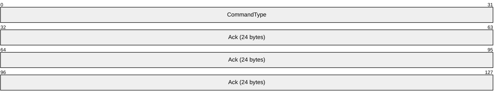

**CommandType (4 bytes):** MUST be the value FlowControlAck (0x00000001).

**Ack (24 bytes):** MUST be a flow control acknowledgment structure as defined in section [2.2.3.4](#Section_2.2.3.4).

<a id="Section_2.2.3.5.3"></a>
##### 2.2.3.5.3 ConnectionTimeout

The ConnectionTimeout command specifies the desired frequency for sending keep-alive [**PDUs**](#gt_request-to-send-rts-protocol-data-unit-pdu) generated by this protocol as defined in section [3.2](#Section_3.2). The party from which the connection time-out originated is specified in the section for the [**RTS PDU**](#gt_682437f3-1c41-420d-ae08-3178f5611ddd) that contains this command.

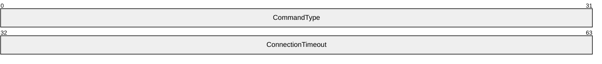

**CommandType (4 bytes):** MUST be the value ConnectionTimeout (0x00000002).

**ConnectionTimeout (4 bytes):** MUST be the integer value for the client keep-alive that this connection is configured to use, in milliseconds. The value MUST be in the inclusive range of 120,000 through 14,400,000 milliseconds.

<a id="Section_2.2.3.5.4"></a>
##### 2.2.3.5.4 Cookie

The Cookie command specifies an [RTS cookie](#Section_2.2.3.1). The meaning of the RTS cookie is inferred from its position in the command sequence as specified in section [2.2.4](#Section_2.2.4) and the context established by the protocol sequence as defined in section [3.2](#Section_3.2).

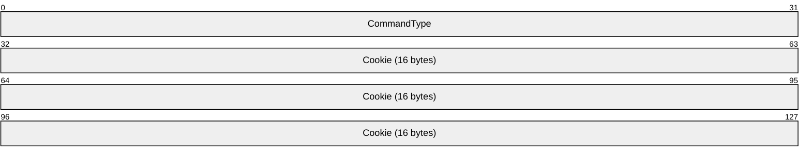

**CommandType (4 bytes):** MUST be the value Cookie (0x00000003).

**Cookie (16 bytes):** MUST contain an RTS cookie, which is specified in 2.2.3.1.

<a id="Section_2.2.3.5.5"></a>
##### 2.2.3.5.5 ChannelLifetime

The ChannelLifetime command specifies the [**channel lifetime**](#gt_channel-lifetime). The party from which the channel lifetime originated is specified in the sections that define the [**RTS PDU**](#gt_682437f3-1c41-420d-ae08-3178f5611ddd) that contains this command.


**CommandType (4 bytes):** MUST be the value ChannelLifetime (0x00000004).

**ChannelLifetime (4 bytes):** The channel lifetime, in bytes. This value MUST be in the inclusive range of 128 kilobytes through 2 gigabytes.<16>

<a id="Section_2.2.3.5.6"></a>
##### 2.2.3.5.6 ClientKeepalive

The ClientKeepalive command carries the desired interval for sending keep-alive [**PDUs**](#gt_request-to-send-rts-protocol-data-unit-pdu) on behalf of the client whose usage is defined in section [3.2](#Section_3.2). The party from which the client keep-alive originated is specified in the sections that define the [**RTS PDU**](#gt_682437f3-1c41-420d-ae08-3178f5611ddd) that contains this command.

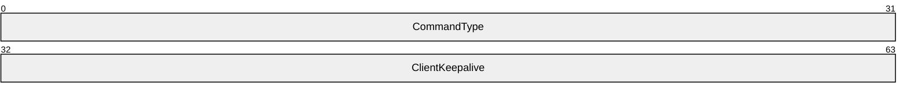

**CommandType (4 bytes):** MUST be the value ClientKeepalive (0x00000005).

**ClientKeepalive (4 bytes):** An unsigned integer that specifies the keep-alive interval, in milliseconds, that this connection is configured to use. This value MUST be 0 or in the inclusive range of 60,000 through 4,294,967,295. If it is 0, it MUST be interpreted as 300,000.

<a id="Section_2.2.3.5.7"></a>
##### 2.2.3.5.7 Version

The Version command specifies an [RPC over HTTP v2](#Section_3.2) version number. This version number allows versioning within RPC over HTTP v2. Version information MUST be interpreted to refer to the sender of the [**PDU**](#gt_request-to-send-rts-protocol-data-unit-pdu).

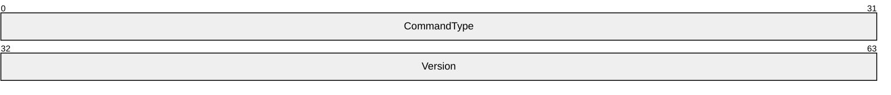

**CommandType (4 bytes):** MUST be the value Version (0x00000006).

**Version (4 bytes):** An unsigned integer that specifies the version of RPC over HTTP v2 that the sender of the PDU will use. Implementation of this protocol SHOULD set this to 1 on sending and MUST ignore it on receiving.

<a id="Section_2.2.3.5.8"></a>
##### 2.2.3.5.8 Empty

The Empty command specifies an empty command with no contents. Its meaning is context-specific and is defined in section [3.2](#Section_3.2).

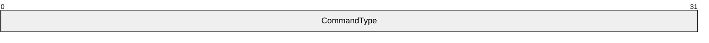

**CommandType (4 bytes):** MUST be the value Empty (0x00000007).

<a id="Section_2.2.3.5.9"></a>
##### 2.2.3.5.9 Padding

The Padding command is a variable-size command that can be used to pad the size of an [**RTS PDU**](#gt_682437f3-1c41-420d-ae08-3178f5611ddd) to a desired size, as specified in section [2.2.4.45](#Section_2.2.4.45).

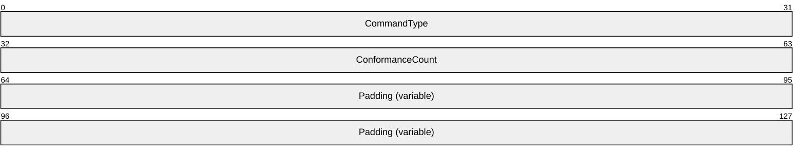

**CommandType (4 bytes):** MUST be the value Padding (0x00000008).

**ConformanceCount (4 bytes):** The size of the padding field, in bytes. It MUST be in the inclusive range of 0 to 0xFFFF.

**Padding (variable):** An array of padding bytes that is **ConformanceCount** bytes long. Protocol implementations SHOULD initialize padding bytes to zero on sending and MUST ignore them on receiving.

<a id="Section_2.2.3.5.10"></a>
##### 2.2.3.5.10 NegativeANCE

The NegativeANCE command specifies that a [**successor channel**](#gt_successor-channel) was not established successfully.


**CommandType (4 bytes):** MUST be the value NegativeANCE (0x00000009).

<a id="Section_2.2.3.5.11"></a>
##### 2.2.3.5.11 ANCE

The ANCE command specifies that a [**successor channel**](#gt_successor-channel) was established successfully.


**CommandType (4 bytes):** MUST be the value ANCE (0x0000000A).

<a id="Section_2.2.3.5.12"></a>
##### 2.2.3.5.12 ClientAddress

The ClientAddress command specifies the IP address of the client. Regardless of who sends this [**PDU**](#gt_request-to-send-rts-protocol-data-unit-pdu), the address MUST be interpreted to be the address of the client.

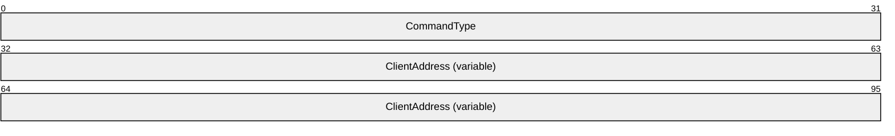

**CommandType (4 bytes):** MUST be the value ClientAddress (0x0000000B).

**ClientAddress (variable):** MUST contain the address of the client and is encoded as defined in section [2.2.3.2](#Section_2.2.3.2).

<a id="Section_2.2.3.5.13"></a>
##### 2.2.3.5.13 AssociationGroupId

The AssociationGroupId command specifies the client association group ID. The client association group ID is an [RTS cookie](#Section_2.2.3.1) that the higher layer protocol MAY use to uniquely identify instances of this client across multiple virtual connections. Implementations of this protocol MAY use this cookie as part of load balancing logic. Regardless of who sends this [**PDU**](#gt_request-to-send-rts-protocol-data-unit-pdu), the association group ID MUST be interpreted to be that of the client.

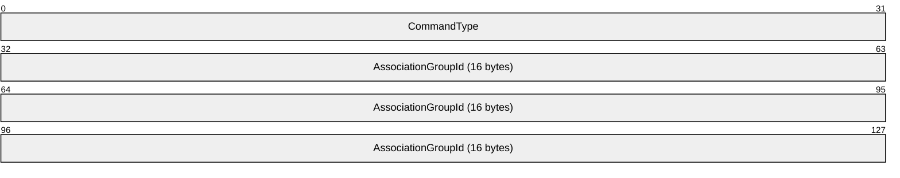

**CommandType (4 bytes):** MUST be the value AssociationGroupId (0x0000000C).

**AssociationGroupId (16 bytes):** MUST be encoded as an RTS cookie that the client generated for this association as explained in this section. It is encoded as defined in section 2.2.3.1.

<a id="Section_2.2.3.5.14"></a>
##### 2.2.3.5.14 Destination

The Destination command specifies the destination to which a [**PDU**](#gt_request-to-send-rts-protocol-data-unit-pdu) that carries this command MUST be forwarded.

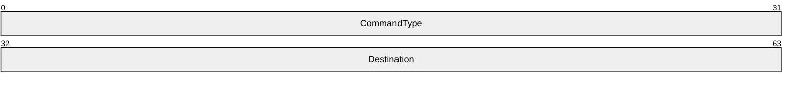

**CommandType (4 bytes):** MUST be the value Destination (0x0000000D).

**Destination (4 bytes):** MUST be one of the values defined in section [2.2.3.3](#Section_2.2.3.3). For more details about PDU forwarding, see section [3.2.1.5.2](#Section_3.2.1.5.2).

<a id="Section_2.2.3.5.15"></a>
##### 2.2.3.5.15 PingTrafficSentNotify

The PingTrafficSentNotify command specifies the number of bytes sent by the outbound proxy to the client as part of ping traffic. It is sent from an outbound proxy to the server and notifies the server that the outbound proxy has sent the specified number of bytes to the client as part of pinging the client.

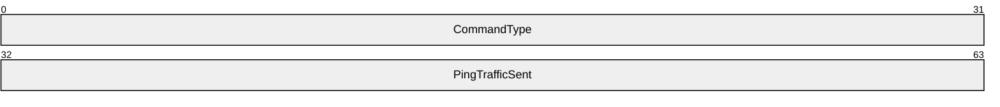

**CommandType (4 bytes):** MUST be the value PingTrafficSentNotify (0x0000000E).

**PingTrafficSent (4 bytes):** MUST be the number of bytes sent by the outbound proxy. [**Servers**](#gt_server) SHOULD impose an implementation-specific reasonable upper bound on this value.<17>

<a id="Section_2.2.3.6"></a>
#### 2.2.3.6 RTS PDU Structure

The [**RTS PDU**](#gt_682437f3-1c41-420d-ae08-3178f5611ddd) MUST be composed of exactly one header and zero, one or more RTS commands defined in section [2.2.3.5](#Section_2.2.3.5) in the RTS PDU body. The following diagram illustrates the structure.

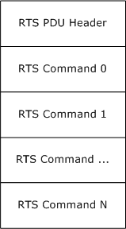

Figure 12: RTS PDU structure

<a id="Section_2.2.3.6.1"></a>
##### 2.2.3.6.1 RTS PDU Header

The RTS PDU Header has the same layout as the common header of the connection-oriented [**RPC**](#gt_remote-procedure-call-rpc) [**PDU**](#gt_request-to-send-rts-protocol-data-unit-pdu) as specified in [[C706]](https://go.microsoft.com/fwlink/?LinkId=89824) section 12.6.1, with a few additional requirements around the contents of the header fields. The additional requirements are as follows:

- All fields MUST use [**little-endian**](#gt_little-endian) byte order.
- Fragmentation MUST NOT occur for an [**RTS PDU**](#gt_682437f3-1c41-420d-ae08-3178f5611ddd).
- PFC_FIRST_FRAG and PFC_LAST_FRAG MUST be present in all RTS PDUs, and all other PFC flags MUST NOT be present.
- The rpc_vers and rpc_vers_minor fields MUST contain version information as described in [MS-RPCE](../MS-RPCE/MS-RPCE.md) section 1.7.
- PTYPE MUST be set to a value of 20. This field differentiates RTS packets from other RPC packets.
- The packed_drep MUST indicate little-endian integer and floating-pointer byte order, IEEE float-point format representation, and ASCII character format as specified in [C706] section 12.6.
- The auth_length MUST be set to 0.
- The frag_length field MUST reflect the size of the header plus the size of all commands, including the variable portion of variable-sized commands.
- The call_id MUST be set to 0 by senders and MUST be 0 on receipt.
This protocol adds two more fields to the RTS PDU header that MUST be present immediately after the common header. The following diagram specifies the header format.

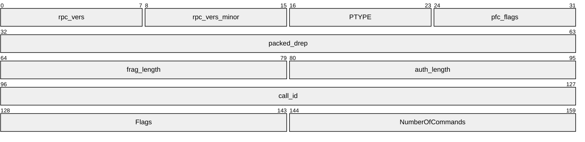

**rpc_vers (1 byte):** As specified in [C706] section 12.6.1, with additional requirements specified earlier in this section.

**rpc_vers_minor (1 byte):** As specified in [C706] section 12.6.1, with additional requirements specified earlier in this section.

**PTYPE (1 byte):** As specified in [C706] section 12.6.1, with additional requirements specified earlier in this section.

**pfc_flags (1 byte):** As specified in [C706] section 12.6.1, with additional requirements specified earlier in this section.

**packed_drep (4 bytes):** As specified in [C706] section 12.6.1, with additional requirements specified earlier in this section. **packed_drep** takes the following form.

```mermaid
packet-beta
  0-7: "drep[0]"
  8-15: "drep[1]"
  16-23: "drep[2]"
  24-31: "drep[3]"
```

**frag_length (2 bytes):** As specified in [C706] section 12.6.1, with additional requirements specified earlier in this section.

| Value | Meaning |
| --- | --- |
| RTS_FLAG_NONE 0x0000 | No special flags. |
| RTS_FLAG_PING 0x0001 | Proves that the sender is still active; can also be used to flush the pipeline by the other party. |
| RTS_FLAG_OTHER_CMD 0x0002 | Indicates that the PDU contains a command that cannot be defined by the other flags in this table. |
| RTS_FLAG_RECYCLE_CHANNEL 0x0004 | Indicates that the PDU is associated with recycling a channel. |
| RTS_FLAG_IN_CHANNEL 0x0008 | Indicates that the PDU is associated with IN channel communications. |
| RTS_FLAG_OUT_CHANNEL 0x0010 | Indicates that the PDU is associated with OUT channel communications. |
| RTS_FLAG_EOF 0x0020 | Indicates that this is the last PDU on an IN channel or OUT channel. Not all channels, however, use this to indicate the last PDU. |
| RTS_FLAG_ECHO 0x0040 | Signifies that this PDU is an [**echo request**](#gt_echo-request) or response. |

**auth_length (2 bytes):** As specified in [C706] section 12.6.1, with additional requirements specified earlier in this section.

**call_id (4 bytes):** As specified in [C706] section 12.6.1, with additional requirements specified earlier in this section.

**Flags (2 bytes):** MUST contain one or more of the following flags. The valid combination of flags for each RTS PDU is defined in section [2.2.4](#Section_2.2.4) of this specification. The following table is meant to define numeric values for each flag and as an aid in understanding this specification, and to convey the general context in which a given flag is used. Precise definition on what flags MUST be used for each RTS PDU can be obtained from the section for the respective RTS PDU in section 2.2.4. An implementation MUST NOT change the flags in the RTS PDU as defined in the respective RTS PDU section within section 2.2.4.

**NumberOfCommands (2 bytes):** An implementation MUST set this field to be equal to the number of commands in the RTS PDU body.

<a id="Section_2.2.3.6.2"></a>
##### 2.2.3.6.2 RTS PDU Body

The [**RTS PDU**](#gt_682437f3-1c41-420d-ae08-3178f5611ddd) body MUST be composed of zero, one or more RTS commands. The first command MUST be placed immediately after the RTS PDU header. Each subsequent command MUST be placed immediately after the previous command without any padding or delimiters until all commands in the [**PDU**](#gt_request-to-send-rts-protocol-data-unit-pdu) are placed. The order of commands in the RTS PDU body is significant from a protocol perspective, and implementations MUST follow the rules about command ordering specified in section [2.2.4](#Section_2.2.4).

<a id="Section_2.2.4"></a>
### 2.2.4 RTS PDUs

This protocol defines specific sequence of [**PDU**](#gt_request-to-send-rts-protocol-data-unit-pdu) commands that are combined into single PDUs. These PDUs are referred to as [**RTS PDUs**](#gt_682437f3-1c41-420d-ae08-3178f5611ddd) and form the basis of routing and control flow in [RPC over HTTP v2](#Section_3.2).

This section defines the syntax of the RTS PDUs using the common structure and command definitions specified earlier in this section.

<a id="Section_2.2.4.1"></a>
#### 2.2.4.1 RTS PDUs Naming and Document Conventions

All definitions in this section share some common naming conventions. An [**RTS PDU**](#gt_682437f3-1c41-420d-ae08-3178f5611ddd) can be one of three types. It can be used by a single protocol sequence only; it can be used in more than one protocol sequence; or it can be used outside a protocol sequence. If the RTS PDU is specific to a single protocol sequence, the name of the [**PDU**](#gt_request-to-send-rts-protocol-data-unit-pdu) is created by using a strict convention that allows for an RTS PDU to be associated quickly with its place in the protocol sequence. The name of the RTS PDU is not reflected on the network and thus has no protocol significance other than making it easier to find and understand information in this specification. The name of this type of RTS PDU follows the format shown here.

RTS-PDU-name = protocol-sequence-name "/" group-name group-order

protocol-sequence-name = "CONN" / "IN_R1" / "IN_R2" / "OUT_R1" /

"OUT_R2"

group-name = "A" / "B" / "C"

group-order = 1*(DIGIT)

The names of the protocol sequences are given in sections [3.2.1.5.3.1](#Section_3.2.1.5.3.1) through [3.2.1.5.3.5](#Section_3.2.1.5.3.5) of this specification. The group-name is a group of PDUs within the protocol sequence, and the name and meaning of the group is defined in the section for the respective protocol sequence. The group-order is a number that starts at 1 and is incremented sequentially for each RTS PDU in the group. For example, CONN/A1 is the first RTS PDU from group A from protocol sequence CONN.

If an RTS PDU is used in more than one protocol sequence or is used outside a protocol sequence, the convention defined earlier is not used. Instead, the name of the PDU is descriptive of the meaning of the PDU and is not associated in any way with the protocol sequences in which it is used.

As defined in section [2.2.3.6](#Section_2.2.3.6), an RTS PDU is composed of an RTS PDU header and one or more RTS PDU commands.

RTS PDUs are uniquely identified by the combination of the following: the **Flags** field in the RTS header, the number of commands, and the command types. However, there are only a small number of RTS PDUs that are legal on each channel in each state, so while there are a large number of RTS PDUs, a receiver only has to check a small number of possibilities when an RTS PDU is received on a given channel in a given state. See the section on each RTS PDU under section [2.2.4](#Section_2.2.4) for the channel, Flags field, number of commands, and the command types for that RTS PDU, and the section on receiving each RTS PDU under section [3](#Section_1.3) for the states.

<a id="Section_2.2.4.2"></a>
#### 2.2.4.2 CONN/A1 RTS PDU

The CONN/A1 RTS PDU MUST be sent from the client to the outbound proxy on the OUT channel to initiate the establishment of a [**virtual connection**](#gt_virtual-connection).

```mermaid
packet-beta
  0-95: "RTS Header (20 bytes)"
  96-159: "Version"
  160-255: "VirtualConnectionCookie (20 bytes)"
  256-351: "OUTChannelCookie (20 bytes)"
  352-415: "ReceiveWindowSize"
```

**RTS Header (20 bytes):** See section [2.2.3.6.1](#Section_2.2.3.6.1). The **Flags** field of RTS Header MUST be the value of RTS_FLAG_NONE. The **NumberOfCommands** field of the RTS Header MUST be the value 4.

**Version (8 bytes):** MUST be a [Version](#Section_2.2.3.5.7) command indicating the [RPC over HTTP v2](#Section_3.2) protocol Version as specified in section 2.2.3.5.7.

**VirtualConnectionCookie (20 bytes):** MUST be a [Cookie](#Section_2.2.3.5.4) command identifying the virtual connection that is being established by this protocol sequence. The Cookie command format is defined in section 2.2.3.5.4.

**OUTChannelCookie (20 bytes):** MUST be a Cookie command identifying the OUT channel that this protocol sequence is trying to establish. The Cookie command format is defined in section 2.2.3.5.4.

**ReceiveWindowSize (8 bytes):** MUST be a [ReceiveWindowSize](#Section_2.2.3.5.1) command containing the size of the **ReceiveWindow** for the client OUT channel. The ReceiveWindowSize command format is defined in section 2.2.3.5.1

<a id="Section_2.2.4.3"></a>
#### 2.2.4.3 CONN/A2 RTS PDU

The CONN/A2 RTS PDU MUST be sent from the outbound proxy to the server on the OUT channel to initiate the establishment of a [**virtual connection**](#gt_virtual-connection).

```mermaid
packet-beta
  0-95: "RTS Header (20 bytes)"
  96-159: "Version"
  160-255: "VirtualConnectionCookie (20 bytes)"
  256-351: "OUTChannelCookie (20 bytes)"
  352-415: "ChannelLifetime"
  416-479: "ReceiveWindowSize"
```

**RTS Header (20 bytes):** See section [2.2.3.6.1](#Section_2.2.3.6.1). The **Flags** field of the RTS Header MUST be the value RTS_FLAG_OUT_CHANNEL. The **NumberOfCommands** field of the RTS Header MUST be the value 5.

**Version (8 bytes):** MUST be a [Version](#Section_2.2.3.5.7) command containing the lower of the outbound proxy version and the client version reported in the [CONN/A1 RTS PDU](#Section_2.2.4.2). The format for the [RPC over HTTP v2](#Section_3.2) protocol Version command is defined in section 2.2.3.5.7.

**VirtualConnectionCookie (20 bytes):** MUST be a [Cookie](#Section_2.2.3.5.4) command identifying the virtual connection that this protocol sequence is trying to establish. The Cookie command format is defined in section 2.2.3.5.4.

**OUTChannelCookie (20 bytes):** MUST be a Cookie command for the OUT channel that this protocol sequence is trying to establish. The Cookie command format is defined in section 2.2.3.5.4.

**ChannelLifetime (8 bytes):** MUST be a [ChannelLifetime](#Section_3.2.3.1.1) command containing the lifetime, in bytes, of the OUT channel from the outbound proxy to the client. The ChannelLifetime command format is defined in section 2.2.3.5.5.

**ReceiveWindowSize (8 bytes):** MUST be a [ReceiveWindowSize](#Section_2.2.3.5.1) command containing the size of the **ReceiveWindow** for the OUT channel to the [**proxy**](#gt_proxy). The ReceiveWindowSize command format is defined in section 2.2.3.5.1.

<a id="Section_2.2.4.4"></a>
#### 2.2.4.4 CONN/A3 RTS PDU

The CONN/A3 RTS PDU MUST be sent from the outbound proxy to the client on the OUT channel to continue the establishment of the [**virtual connection**](#gt_virtual-connection).

```mermaid
packet-beta
  0-95: "RTS Header (20 bytes)"
  96-159: "ConnectionTimeout"
```

**RTS Header (20 bytes):** See section [2.2.3.6.1](#Section_2.2.3.6.1). The **Flags** field of the RTS Header MUST be the value RTS_FLAG_NONE. The **NumberOfCommands** field of the RTS Header MUST be the value 1.

**ConnectionTimeout (8 bytes):** MUST be a [ConnectionTimeout](#Section_3.2.1.1.6.1) command containing the connection time-out for the OUT channel between the outbound proxy and the client. The ConnectionTimeout command format is defined in section 2.2.3.5.3.

<a id="Section_2.2.4.5"></a>
#### 2.2.4.5 CONN/B1 RTS PDU

The CONN/B1 RTS PDU MUST be sent from the client to the [**inbound proxy**](#gt_inbound-proxy) on the IN channel to initiate the establishment of a [**virtual connection**](#gt_virtual-connection).

```mermaid
packet-beta
  0-95: "RTS Header (20 bytes)"
  96-159: "Version"
  160-255: "VirtualConnectionCookie (20 bytes)"
  256-351: "INChannelCookie (20 bytes)"
  352-415: "ChannelLifetime"
  416-479: "ClientKeepalive"
  480-575: "AssociationGroupId (20 bytes)"
```

**RTS Header (20 bytes):** See section [2.2.3.6.1](#Section_2.2.3.6.1). The **Flags** field of the RTS Header MUST be the value RTS_FLAG_NONE. The **NumberOfCommands** field of the RTS Header MUST be the value 6.

**Version (8 bytes):** MUST be a [Version](#Section_2.2.3.5.7) command containing the version of [RPC over HTTP v2](#Section_3.2) that the client supports, formatted as specified in section 2.2.3.5.7.

**VirtualConnectionCookie (20 bytes):** MUST be a [Cookie](#Section_2.2.3.5.4) command identifying the virtual connection that this protocol sequence is trying to establish. The Cookie command format is defined in section 2.2.3.5.4.

**INChannelCookie (20 bytes):** MUST be a Cookie command identifying the IN channel cookie that this protocol sequence is trying to establish. The Cookie command format is defined in section 2.2.3.5.4.

**ChannelLifetime (8 bytes):** MUST be a [ChannelLifetime](#Section_3.2.3.1.1) command containing the lifetime in bytes of the IN channel from the client to the inbound proxy. The ChannelLifetime command format is defined in 2.2.3.5.5. This field is used for troubleshooting only and has no protocol significance. Inbound proxies SHOULD ignore the value of this field.

**ClientKeepalive (8 bytes):** MUST be a [ClientKeepalive](#Section_2.2.3.5.6) command containing the keep-alive interval that the client wants the inbound proxy to use on the IN channel between the inbound proxy and the server. The ClientKeepalive command format is defined in section 2.2.3.5.6.

**AssociationGroupId (20 bytes):** MUST be an [AssociationGroupId](#Section_2.2.3.5.13) command containing the association group ID for the client. The AssociationGroupId command format is defined in section 2.2.3.5.13.

<a id="Section_2.2.4.6"></a>
#### 2.2.4.6 CONN/B2 RTS PDU

The CONN/B2 RTS PDU MUST be sent from the [**inbound proxy**](#gt_inbound-proxy) to the server on the IN channel to initiate the establishment of a [**virtual connection**](#gt_virtual-connection).

```mermaid
packet-beta
  0-95: "RTS Header (20 bytes)"
  96-159: "Version"
  160-255: "VirtualConnectionCookie (20 bytes)"
  256-351: "INChannelCookie (20 bytes)"
  352-415: "ReceiveWindowSize"
  416-479: "ConnectionTimeout"
  480-575: "AssociationGroupId (20 bytes)"
  576-639: "ClientAddress (variable)"
```

**RTS Header (20 bytes):** See section [2.2.3.6.1](#Section_2.2.3.6.1). The **Flags** field of the RTS Header MUST be the value RTS_FLAG_IN_CHANNEL. The **NumberOfCommands** field of the RTS Header MUST be the value 7.

**Version (8 bytes):** MUST be a [Version](#Section_2.2.3.5.7) command containing the lower of the inbound proxy version and the client version reported in CONN/B1 [**RTS PDU**](#gt_682437f3-1c41-420d-ae08-3178f5611ddd). The format for the [RPC over HTTP v2](#Section_3.2) protocol Version command is defined in section 2.2.3.5.7.

**VirtualConnectionCookie (20 bytes):** MUST be a [Cookie](#Section_2.2.3.5.4) command for the virtual connection this protocol sequence is trying to establish. The Cookie command format is defined in section 2.2.3.5.4.

**INChannelCookie (20 bytes):** MUST be a Cookie command for the IN channel that this protocol sequence is trying to establish. The Cookie command format is defined in section 2.2.3.5.4.

**ReceiveWindowSize (8 bytes):** MUST be a [ReceiveWindowSize](#Section_2.2.3.5.1) command containing the size of the **ReceiveWindow** for the IN channel to the inbound proxy. The ReceiveWindowSize command format is defined in section 2.2.3.5.1.

**ConnectionTimeout (8 bytes):** MUST be a [ConnectionTimeout](#Section_3.2.1.1.6.1) command containing the connection time-out for the IN channel between the inbound proxy and the client. The ConnectionTimeout command format is defined in section 2.2.3.5.3.

**AssociationGroupId (20 bytes):** MUST be an [AssociationGroupId](#Section_2.2.3.5.13) command containing the association group ID for the client. The AssociationGroupId command format is defined in section 2.2.3.5.13.

**ClientAddress (variable):** MUST be a [ClientAddress](#Section_2.2.3.5.12) command containing the IP address of the client as seen by the inbound proxy. The ClientAddress command format is defined in section 2.2.3.5.12.

<a id="Section_2.2.4.7"></a>
#### 2.2.4.7 CONN/B3 RTS PDU

The CONN/B3 RTS PDU MUST be sent from the server to the [**inbound proxy**](#gt_inbound-proxy) on the IN channel to notify it that a [**virtual connection**](#gt_virtual-connection) has been established.

```mermaid
packet-beta
  0-95: "RTS Header (20 bytes)"
  96-159: "ReceiveWindowSize"
  160-223: "Version"
```

**RTS Header (20 bytes):** See section [2.2.3.6.1](#Section_2.2.3.6.1). The **Flags** field of the RTS Header MUST be the value RTS_FLAG_NONE. The **NumberOfCommands** field of the RTS Header MUST be the value 2.

**ReceiveWindowSize (8 bytes):** MUST be a [ReceiveWindowSize](#Section_2.2.3.5.1) command containing the size of the **ReceiveWindow** for the server IN channel. The ReceiveWindowSize command format is defined in section 2.2.3.5.1.

**Version (8 bytes):** MUST be a [Version](#Section_2.2.3.5.7) command containing the lowest of the [CONN/B2 RTS PDU (section 2.2.4.6)](#Section_2.2.4.6) version, the [CONN/A2 RTS PDU (section 2.2.4.3)](#Section_2.2.4.3) version, and the server [RPC over HTTP v2](#Section_3.2) version. The format for the RPC over HTTP v2 protocol Version command is defined in section 2.2.3.5.7.

<a id="Section_2.2.4.8"></a>
#### 2.2.4.8 CONN/C1 RTS PDU

The CONN/C1 RTS PDU MUST be sent from the server to the outbound proxy on the OUT channel to notify it that a [**virtual connection**](#gt_virtual-connection) has been established.

```mermaid
packet-beta
  0-95: "RTS Header (20 bytes)"
  96-159: "Version"
  160-223: "ReceiveWindowSize"
  224-287: "ConnectionTimeout"
```

**RTS Header (20 bytes):** See section [2.2.3.6.1](#Section_2.2.3.6.1). The **Flags** field of the RTS Header MUST be the value RTS_FLAG_NONE. The **NumberOfCommands** field of the RTS Header MUST be the value 3.

**Version (8 bytes):** MUST be a [Version](#Section_2.2.3.5.7) command containing the lowest of the [CONN/B2 RTS PDU (section 2.2.4.6)](#Section_2.2.4.6) version, the [CONN/A2 RTS PDU (section 2.2.4.3)](#Section_2.2.4.3) version, and the server [RPC over HTTP v2](#Section_3.2) version. The format for the RPC over HTTP v2 protocol Version command is defined in section 2.2.3.5.7.

**ReceiveWindowSize (8 bytes):** MUST be a [ReceiveWindowSize](#Section_2.2.3.5.1) command containing the size of the **ReceiveWindow** for the IN channel to the [**inbound proxy**](#gt_inbound-proxy). The ReceiveWindowSize command format is defined in section 2.2.3.5.1.

**ConnectionTimeout (8 bytes):** MUST be a [ConnectionTimeout](#Section_3.2.1.1.6.1) command containing the connection time-out for the IN channel between the inbound proxy and the client. The ConnectionTimeout command format is defined in section 2.2.3.5.3.

<a id="Section_2.2.4.9"></a>
#### 2.2.4.9 CONN/C2 RTS PDU

The CONN/C2 RTS PDU MUST be sent from the outbound proxy to the client on the OUT channel to notify it that a [**virtual connection**](#gt_virtual-connection) has been established.

```mermaid
packet-beta
  0-95: "RTS Header (20 bytes)"
  96-159: "Version"
  160-223: "ReceiveWindowSize"
  224-287: "ConnectionTimeout"
```

**RTS Header (20 bytes):** See section [2.2.3.6.1](#Section_2.2.3.6.1). The **Flags** field of the RTS Header MUST be the value RTS_FLAG_NONE. The **NumberOfCommands** field of the RTS Header MUST be the value 3.

**Version (8 bytes):** MUST be a [Version](#Section_2.2.3.5.7) command containing the CONN/C1 version. The format of the [RPC over HTTP v2](#Section_3.2) protocol Version command is defined in section 2.2.3.5.7.

**ReceiveWindowSize (8 bytes):** MUST be a [ReceiveWindowSize](#Section_2.2.3.5.1) command containing the size of the **ReceiveWindow** for the IN channel to the [**inbound proxy**](#gt_inbound-proxy). The ReceiveWindowSize command format is defined in section 2.2.3.5.1.

**ConnectionTimeout (8 bytes):** MUST be a [ConnectionTimeout](#Section_3.2.1.1.6.1) command containing the connection time-out for the IN channel between the inbound proxy and the client. The ConnectionTimeout command format is defined in section 2.2.3.5.3.

<a id="Section_2.2.4.10"></a>
#### 2.2.4.10 IN_R1/A1 RTS PDU

The IN_R1/A1 RTS PDU MUST be sent from the client to the [**inbound proxy**](#gt_inbound-proxy) on a successor instance of an IN channel to initiate the establishment of a successor IN channel.

```mermaid
packet-beta
  0-95: "RTS Header (20 bytes)"
  96-159: "Version"
  160-255: "VirtualConnectionCookie (20 bytes)"
  256-351: "PredecessorChannelCookie (20 bytes)"
  352-447: "SuccessorChannelCookie (20 bytes)"
```

**RTS Header (20 bytes):** See section [2.2.3.6.1](#Section_2.2.3.6.1). The **Flags** field of the RTS Header MUST be the value RTS_FLAG_RECYCLE_CHANNEL. The **NumberOfCommands** field of the RTS Header MUST be the value 4.

**Version (8 bytes):** MUST be a [Version](#Section_2.2.3.5.7) command containing the client [RPC over HTTP v2](#Section_3.2) protocol version. The format of the RPC over HTTP v2 protocol Version command is defined in section 2.2.3.5.7.

**VirtualConnectionCookie (20 bytes):** MUST be a [Cookie](#Section_2.2.3.5.4) command for the [**virtual connection**](#gt_virtual-connection) that this IN channel belongs to. The Cookie command format is defined in section 2.2.3.5.4.

**PredecessorChannelCookie (20 bytes):** MUST be a Cookie command that is the cookie of the predecessor IN channel. The Cookie command format is defined in section 2.2.3.5.4.

**SuccessorChannelCookie (20 bytes):** MUST be a Cookie command identifying the successor IN channel. The Cookie command format is defined in section 2.2.3.5.4.

<a id="Section_2.2.4.11"></a>
#### 2.2.4.11 IN_R1/A2 RTS PDU

The IN_R1/A2 RTS PDU MUST be sent from the [**successor inbound proxy**](#gt_successor-inbound-proxy) to the server on the IN channel to initiate the establishment of a successor IN channel.

```mermaid
packet-beta
  0-95: "RTS Header (20 bytes)"
  96-159: "Version"
  160-255: "VirtualConnectionCookie (20 bytes)"
  256-351: "PredecessorChannelCookie (20 bytes)"
  352-447: "SuccessorChannelCookie (20 bytes)"
  448-511: "InboundProxyReceiveWindowSize"
  512-575: "InboundProxyConnectionTimeout"
```

**RTS Header (20 bytes):** See section [2.2.3.6.1](#Section_2.2.3.6.1). The **Flags** field of the RTS Header MUST be the bit-wise OR of the values "RTS_FLAG_IN_CHANNEL" and "RTS_FLAG_RECYCLE_CHANNEL". The **NumberOfCommands** field of the RTS Header MUST be the value 6.

**Version (8 bytes):** MUST be a [Version](#Section_2.2.3.5.7) command containing the lower of the IN_R1/A1 version and the [**inbound proxy**](#gt_inbound-proxy) version. The format of the [RPC over HTTP v2](#Section_3.2) protocol Version command is defined in section 2.2.3.5.7.

**VirtualConnectionCookie (20 bytes):** MUST be a [Cookie](#Section_2.2.3.5.4) command for the [**virtual connection**](#gt_virtual-connection) this IN channel belongs to. The Cookie command format is defined in section 2.2.3.5.4.

**PredecessorChannelCookie (20 bytes):** MUST be a Cookie command for the predecessor IN channel. The Cookie command format is defined in section 2.2.3.5.4.

**SuccessorChannelCookie (20 bytes):** MUST be a Cookie command identifying the successor IN channel. The Cookie command format is defined in section 2.2.3.5.4.

**InboundProxyReceiveWindowSize (8 bytes):** MUST be a [ReceiveWindowSize](#Section_2.2.3.5.1) command containing the size of the **ReceiveWindow** for the IN channel to the inbound proxy. The ReceiveWindowSize command format is defined in section 2.2.3.5.1.

**InboundProxyConnectionTimeout (8 bytes):** MUST be a [ConnectionTimeout](#Section_3.2.1.1.6.1) command specifying the connection time-out for the IN channel between the successor inbound proxy and the client. The ConnectionTimeout command format is defined in section 2.2.3.5.3.

<a id="Section_2.2.4.12"></a>
#### 2.2.4.12 IN_R1/A3 RTS PDU

The IN_R1/A3 RTS PDU MUST be sent from the server to the outbound proxy on the OUT channel to continue the establishment of a successor IN channel.

```mermaid
packet-beta
  0-95: "RTS Header (20 bytes)"
  96-159: "Destination"
  160-223: "Version"
  224-287: "InboundProxyReceiveWindowSize"
  288-351: "InboundProxyConnectionTimeout"
```

**RTS Header (20 bytes):** See section [2.2.3.6.1](#Section_2.2.3.6.1). The **Flags** field of the RTS Header MUST be the value RTS_FLAG_NONE. The **NumberOfCommands** field of the RTS Header MUST be the value 4.

**Destination (8 bytes):** MUST be a [Destination](#Section_2.2.3.5.14) command. The **Destination** field for the Destination command MUST be set to value FDClient as specified in section [2.2.3.3](#Section_2.2.3.3). The Destination command format is defined in section 2.2.3.5.14.

**Version (8 bytes):** MUST be a [Version](#Section_2.2.3.5.7) command specifying the lower of the IN_R1/A2 and the server version. The format of the [RPC over HTTP v2](#Section_3.2) protocol Version command is defined in section 2.2.3.5.7.

**InboundProxyReceiveWindowSize (8 bytes):** MUST be a [ReceiveWindowSize](#Section_2.2.3.5.1) command specifying the size of the **ReceiveWindow** for the successor IN channel to the [**inbound proxy**](#gt_inbound-proxy). The ReceiveWindowSize command format is defined in section 2.2.3.5.1.

**InboundProxyConnectionTimeout (8 bytes):** MUST be a [ConnectionTimeout](#Section_3.2.1.1.6.1) command specifying the connection time-out for the IN channel between the [**successor inbound proxy**](#gt_successor-inbound-proxy) and the client. The ConnectionTimeout command format is defined in section 2.2.3.5.3.

<a id="Section_2.2.4.13"></a>
#### 2.2.4.13 IN_R1/A4 RTS PDU

The IN_R1/A4 RTS PDU MUST be sent from the outbound proxy to the client on the OUT channel to continue the establishment of a successor IN channel as part of the IN_R1 protocol sequence.

```mermaid
packet-beta
  0-95: "RTS Header (20 bytes)"
  96-159: "Destination"
  160-223: "Version"
  224-287: "InboundProxyReceiveWindowSize"
  288-351: "InboundProxyConnectionTimeout"
```

**RTS Header (20 bytes):** See section [2.2.3.6.1](#Section_2.2.3.6.1). The **Flags** field of the RTS Header MUST be the value RTS_FLAG_NONE. The **NumberOfCommands** field of the RTS Header MUST be the value 4.

**Destination (8 bytes):** MUST be a [Destination](#Section_2.2.3.5.14) command. The **Destination** field for the Destination command MUST be set to value FDClient as specified in section [2.2.3.3](#Section_2.2.3.3). The Destination command format is defined in section 2.2.3.5.14.

**Version (8 bytes):** MUST be a [Version](#Section_2.2.3.5.7) command specifying the lower of the [IN_R1/A2](#Section_3.2.5.5.5) version and the server version. The format of the [RPC over HTTP v2](#Section_3.2) protocol Version command is defined in section 2.2.3.5.7.

**InboundProxyReceiveWindowSize (8 bytes):** MUST be a [ReceiveWindowSize](#Section_2.2.3.5.1) command specifying the size of the **ReceiveWindow** for the IN channel to the [**inbound proxy**](#gt_inbound-proxy). The ReceiveWindowSize command format is defined in section 2.2.3.5.1.

**InboundProxyConnectionTimeout (8 bytes):** MUST be a [ConnectionTimeout](#Section_3.2.1.1.6.1) command specifying the connection time-out for the IN channel between the [**successor inbound proxy**](#gt_successor-inbound-proxy) and the client. The ConnectionTimeout command format is defined in section 2.2.3.5.3.

<a id="Section_2.2.4.14"></a>
#### 2.2.4.14 IN_R1/A5 RTS PDU

The IN_R1/A5 RTS PDU MUST be sent from the client to the [**predecessor inbound proxy**](#gt_predecessor-inbound-proxy) on the predecessor instance of the IN channel to continue the establishment of a successor IN channel.

```mermaid
packet-beta
  0-95: "RTS Header (20 bytes)"
  96-191: "SuccessorINChannelCookie (20 bytes)"
```

**RTS Header (20 bytes):** See section [2.2.3.6.1](#Section_2.2.3.6.1). The **Flags** field of the RTS Header MUST be the value RTS_FLAG_NONE. The **NumberOfCommands** field of the RTS Header MUST be the value 1.

**SuccessorINChannelCookie (20 bytes):** MUST be a [Cookie](#Section_2.2.3.5.4) command identifying the [**successor IN channel**](#gt_successor-channel) cookie. The Cookie command format is defined in section 2.2.3.5.4.

<a id="Section_2.2.4.15"></a>
#### 2.2.4.15 IN_R1/A6 RTS PDU

The IN_R1/A6 RTS PDU MUST be sent from the [**predecessor inbound proxy**](#gt_predecessor-inbound-proxy) to the server on the predecessor instance of the IN channel to continue the establishment of a successor IN channel.

```mermaid
packet-beta
  0-95: "RTS Header (20 bytes)"
  96-191: "SuccessorINChannelCookie (20 bytes)"
```

**RTS Header (20 bytes):** See section [2.2.3.6.1](#Section_2.2.3.6.1). The **Flags** field of the RTS Header MUST be the value RTS_FLAG_NONE. The **NumberOfCommands** field of the RTS Header MUST be the value 1.

**SuccessorINChannelCookie (20 bytes):** MUST be a [Cookie](#Section_2.2.3.5.4) command identifying the successor IN channel cookie. The Cookie command format is defined in section 2.2.3.5.4.

<a id="Section_2.2.4.16"></a>
#### 2.2.4.16 IN_R1/B1 RTS PDU

The IN_R1/B1 RTS PDU MUST be sent from the [**predecessor inbound proxy**](#gt_predecessor-inbound-proxy) to the server on the predecessor instance of the IN channel to continue the establishment of a successor IN channel.

```mermaid
packet-beta
  0-95: "RTS Header (20 bytes)"
  96-127: "Empty"
```

**RTS Header (20 bytes):** See section [2.2.3.6.1](#Section_2.2.3.6.1). The **Flags** field of the RTS Header MUST be the value RTS_FLAG_NONE. The **NumberOfCommands** field of the RTS Header MUST be the value 1.

**Empty (4 bytes):** MUST be an [Empty](#Section_2.2.3.5.8) command. The format of the Empty command is defined in section 2.2.3.5.8.

<a id="Section_2.2.4.17"></a>
#### 2.2.4.17 IN_R1/B2 RTS PDU

The IN_R1/B2 RTS PDU MUST be sent from the server to the [**successor inbound proxy**](#gt_successor-inbound-proxy) on the successor IN channel to complete the establishment of a successor IN channel.

```mermaid
packet-beta
  0-95: "RTS Header (20 bytes)"
  96-159: "ServerReceiveWindowSize"
```

**RTS Header (20 bytes):** See section [2.2.3.6.1](#Section_2.2.3.6.1). The **Flags** field of the RTS Header MUST be the value RTS_FLAG_NONE. The **NumberOfCommands** field of the RTS Header MUST be the value 1.

**ServerReceiveWindowSize (8 bytes):** MUST be a [ReceiveWindowSize](#Section_2.2.3.5.1) command specifying the **ReceiveWindow** size of the server. The ReceiveWindowSize command format is defined in section 2.2.3.5.1.

<a id="Section_2.2.4.18"></a>
#### 2.2.4.18 IN_R2/A1 RTS PDU

The IN_R2/A1 RTS PDU MUST be sent from the client to the [**inbound proxy**](#gt_inbound-proxy) on a successor IN channel to initiate the establishment of a successor IN channel.

```mermaid
packet-beta
  0-95: "RTS Header (20 bytes)"
  96-159: "Version"
  160-255: "VirtualConnectionCookie (20 bytes)"
  256-351: "PredecessorChannelCookie (20 bytes)"
  352-447: "SuccessorChannelCookie (20 bytes)"
```

**RTS Header (20 bytes):** See section [2.2.3.6.1](#Section_2.2.3.6.1). The **Flags** field of the RTS Header MUST be the value RTS_FLAG_RECYCLE_CHANNEL. The **NumberOfCommands** field of the RTS Header MUST be the value 4.

**Version (8 bytes):** MUST be a [Version](#Section_2.2.3.5.7) command specifying the client [RPC over HTTP v2](#Section_3.2) protocol version. The format of the RPC over HTTP v2 protocol Version command is defined in section 2.2.3.5.7.

**VirtualConnectionCookie (20 bytes):** MUST be a [Cookie](#Section_2.2.3.5.4) command that is the cookie of the [**virtual connection**](#gt_virtual-connection) to which this IN channel belongs. The Cookie command format is defined in section 2.2.3.5.4.

**PredecessorChannelCookie (20 bytes):** MUST be a Cookie command that is the cookie of the predecessor IN channel. The Cookie command format is defined in section 2.2.3.5.4.

**SuccessorChannelCookie (20 bytes):** MUST be a Cookie command identifying the [**successor IN channel**](#gt_successor-channel) cookie. The Cookie command format is defined in section 2.2.3.5.4.

<a id="Section_2.2.4.19"></a>
#### 2.2.4.19 IN_R2/A2 RTS PDU

The IN_R2/A2 RTS PDU MUST be sent from the [**inbound proxy**](#gt_inbound-proxy) to the server on the IN channel to continue the establishment of a successor IN channel.

```mermaid
packet-beta
  0-95: "RTS Header (20 bytes)"
  96-191: "SuccessorChannelCookie (20 bytes)"
```

**RTS Header (20 bytes):** See section [2.2.3.6.1](#Section_2.2.3.6.1). The **Flags** field of the RTS Header MUST be the value RTS_FLAG_NONE. The **NumberOfCommands** field of the RTS Header MUST be the value 1.

**SuccessorChannelCookie (20 bytes):** MUST be a [Cookie](#Section_2.2.3.5.4) command identifying the successor IN channel cookie. The Cookie command format is defined in section 2.2.3.5.4.

<a id="Section_2.2.4.20"></a>
#### 2.2.4.20 IN_R2/A3 RTS PDU

The IN_R2/A3 RTS PDU MUST be sent from the server to the outbound proxy on the OUT channel to continue the establishment of a successor IN channel.

```mermaid
packet-beta
  0-95: "RTS Header (20 bytes)"
  96-159: "Destination"
```

**RTS Header (20 bytes):** See section [2.2.3.6.1](#Section_2.2.3.6.1). The **Flags** field of the RTS Header MUST be the value RTS_FLAG_NONE. The **NumberOfCommands** field of the RTS Header MUST be the value 1.

**Destination (8 bytes):** MUST be a [Destination](#Section_2.2.3.5.14) command. The **Destination** field for the Destination command MUST be set to value FDClient as specified in section [2.2.3.3](#Section_2.2.3.3). The Destination command format is defined in section 2.2.3.5.14.

<a id="Section_2.2.4.21"></a>
#### 2.2.4.21 IN_R2/A4 RTS PDU

The IN_R2/A4 RTS PDU MUST be sent from the outbound proxy to the client on the OUT channel to continue the establishment of a successor IN channel.

```mermaid
packet-beta
  0-95: "RTS Header (20 bytes)"
  96-159: "Destination"
```

**RTS Header (20 bytes):** See section [2.2.3.6.1](#Section_2.2.3.6.1). The **Flags** field of the RTS Header MUST be the value RTS_FLAG_NONE. The **NumberOfCommands** field of the RTS Header MUST be the value 1.

**Destination (8 bytes):** MUST be a [Destination](#Section_2.2.3.5.14) command. The **Destination** field for the Destination command MUST be set to value FDClient as specified in section [2.2.3.3](#Section_2.2.3.3). The Destination command format is defined in section 2.2.3.5.14.

<a id="Section_2.2.4.22"></a>
#### 2.2.4.22 IN_R2/A5 RTS PDU

The IN_R2/A5 RTS PDU MUST be sent from the client to the [**inbound proxy**](#gt_inbound-proxy) on the predecessor instance of the IN channel to continue the establishment of a successor IN channel.

```mermaid
packet-beta
  0-95: "RTS Header (20 bytes)"
  96-191: "SuccessorChannelCookie (20 bytes)"
```

**RTS Header (20 bytes):** See section [2.2.3.6.1](#Section_2.2.3.6.1). The **Flags** field of the RTS Header MUST be the value RTS_FLAG_NONE. The **NumberOfCommands** field of the RTS Header MUST be the value 1.

**SuccessorChannelCookie (20 bytes):** MUST be a [Cookie](#Section_2.2.3.5.4) command identifying the successor IN channel cookie. The Cookie command format is defined in section 2.2.3.5.4.

<a id="Section_2.2.4.23"></a>
#### 2.2.4.23 OUT_R1/A1 RTS PDU

The OUT_R1/A1 RTS PDU MUST be sent from the server to the outbound proxy on the OUT channel to initiate the establishment of a successor OUT channel.

```mermaid
packet-beta
  0-95: "RTS Header (20 bytes)"
  96-159: "Destination"
```

**RTS Header (20 bytes):** See section [2.2.3.6.1](#Section_2.2.3.6.1). The **Flags** field of the RTS Header MUST be the value RTS_FLAG_RECYCLE_CHANNEL. The **NumberOfCommands** field of the RTS Header MUST be the value 1.

**Destination (8 bytes):** MUST be a [Destination](#Section_2.2.3.5.14) command. The **Destination** field for the Destination command MUST be set to the value FDClient as specified in section [2.2.3.3](#Section_2.2.3.3). The Destination command format is defined in section 2.2.3.5.14.

<a id="Section_2.2.4.24"></a>
#### 2.2.4.24 OUT_R1/A2 RTS PDU

The OUT_R1/A2 RTS PDU MUST be sent from the outbound proxy to the client on the OUT channel to initiate the establishment of a successor OUT channel.

```mermaid
packet-beta
  0-95: "RTS Header (20 bytes)"
  96-159: "Destination"
```

**RTS Header (20 bytes):** See section [2.2.3.6.1](#Section_2.2.3.6.1). The **Flags** field of the RTS Header MUST be the value RTS_FLAG_RECYCLE_CHANNEL. The **NumberOfCommands** field of the RTS Header MUST be the value 1.

**Destination (8 bytes):** MUST be a [Destination](#Section_2.2.3.5.14) command. The **Destination** field for the Destination command MUST be set to the value FDClient as specified in section [2.2.3.3](#Section_2.2.3.3). The Destination command format is defined in section 2.2.3.5.14.

<a id="Section_2.2.4.25"></a>
#### 2.2.4.25 OUT_R1/A3 RTS PDU

The OUT_R1/A3 RTS PDU MUST be sent from the client to the [**successor outbound proxy**](#gt_successor-outbound-proxy) on the successor OUT channel to initiate the establishment of a successor OUT channel.

```mermaid
packet-beta
  0-95: "RTS Header (20 bytes)"
  96-159: "Version"
  160-255: "VirtualConnectionCookie (20 bytes)"
  256-351: "PredecessorChannelCookie (20 bytes)"
  352-447: "SuccessorChannelCookie (20 bytes)"
  448-511: "OutboundProxyReceiveWindowSize"
```

**RTS Header (20 bytes):** See section [2.2.3.6.1](#Section_2.2.3.6.1). The **Flags** field of the RTS Header MUST be the value RTS_FLAG_RECYCLE_CHANNEL. The **NumberOfCommands** field of the RTS Header MUST be the value 5.

**Version (8 bytes):** MUST be a [Version](#Section_2.2.3.5.7) command specifying the client [RPC over HTTP v2](#Section_3.2) protocol version. The format of the RPC over HTTP v2 protocol Version command is defined in section 2.2.3.5.7.

**VirtualConnectionCookie (20 bytes):** MUST be a [Cookie](#Section_2.2.3.5.4) command that is the cookie of the [**virtual connection**](#gt_virtual-connection) that this OUT channel belongs to. The Cookie command format is defined in section 2.2.3.5.4.

**PredecessorChannelCookie (20 bytes):** MUST be a Cookie command that is the cookie of the [**predecessor OUT channel**](#gt_predecessor-channel). The Cookie command format is defined in section 2.2.3.5.4.

**SuccessorChannelCookie (20 bytes):** MUST be a Cookie command identifying the successor OUT channel cookie. The Cookie command format is defined in section 2.2.3.5.4.

**OutboundProxyReceiveWindowSize (8 bytes):** MUST be a [ReceiveWindowSize](#Section_2.2.3.5.1) command specifying the size of the **ReceiveWindow** for the client OUT channel. The ReceiveWindowSize command format is defined in section 2.2.3.5.1.

<a id="Section_2.2.4.26"></a>
#### 2.2.4.26 OUT_R1/A4 RTS PDU

The OUT_R1/A4 RTS PDU MUST be sent from the [**successor outbound proxy**](#gt_successor-outbound-proxy) to the server on the OUT channel to initiate the establishment of a successor OUT channel.

```mermaid
packet-beta
  0-95: "RTS Header (20 bytes)"
  96-159: "Version"
  160-255: "VirtualConnectionCookie (20 bytes)"
  256-351: "PredecessorChannelCookie (20 bytes)"
  352-447: "SuccessorChannelCookie (20 bytes)"
  448-511: "ChannelLifetime"
  512-575: "OutboundProxyReceiveWindowSize"
  576-639: "OutboundProxyConnectionTimeout"
```

**RTS Header (20 bytes):** See section [2.2.3.6.1](#Section_2.2.3.6.1). The **Flags** field of the RTS Header MUST be the bit-wise OR of the values "RTS_FLAG_RECYCLE_CHANNEL" and "RTS_FLAG_OUT_CHANNEL". The **NumberOfCommands** field of the RTS Header MUST be the value 7.

**Version (8 bytes):** MUST be a [Version](#Section_2.2.3.5.7) command specifying the lower of the outbound proxy [RPC over HTTP v2](#Section_3.2) protocol version and [OUT_R1/A3](#Section_3.2.4.5.6) protocol version. The format of the RPC over HTTP v2 protocol Version command is defined in section 2.2.3.5.7.

**VirtualConnectionCookie (20 bytes):** MUST be a [Cookie](#Section_2.2.3.5.4) command that is the cookie of the [**virtual connection**](#gt_virtual-connection) that this OUT channel belongs to. The Cookie command format is defined in section 2.2.3.5.4.

**PredecessorChannelCookie (20 bytes):** MUST be a Cookie command that is the cookie of the predecessor OUT channel. The Cookie command format is defined in section 2.2.3.5.4.

**SuccessorChannelCookie (20 bytes):** MUST be a Cookie command identifying the successor OUT channel cookie. The Cookie command format is defined in section 2.2.3.5.4.

**ChannelLifetime (8 bytes):** MUST be a [ChannelLifetime](#Section_3.2.3.1.1) command specifying the lifetime in bytes of the OUT channel from the outbound proxy to the client. The ChannelLifetime command format is defined in section 2.2.3.5.5.

**OutboundProxyReceiveWindowSize (8 bytes):** MUST be a [ReceiveWindowSize](#Section_2.2.3.5.1) command specifying the size of the **ReceiveWindow** for the successor OUT channel to the outbound proxy. The ReceiveWindowSize command format is defined in section 2.2.3.5.1.

**OutboundProxyConnectionTimeout (8 bytes):** MUST be a [ConnectionTimeout](#Section_3.2.1.1.6.1) command specifying the connection time-out for the OUT channel between the successor outbound proxy and the client. The ConnectionTimeout command format is defined in section 2.2.3.5.3. This command is for troubleshooting purposes only and has no protocol significance. The server SHOULD ignore this value.

<a id="Section_2.2.4.27"></a>
#### 2.2.4.27 OUT_R1/A5 RTS PDU

The OUT_R1/A5 RTS PDU MUST be sent from the server to the [**predecessor outbound proxy**](#gt_predecessor-outbound-proxy) on the predecessor instance of the OUT channel to continue the establishment of a successor OUT channel.

```mermaid
packet-beta
  0-95: "RTS Header (20 bytes)"
  96-159: "Destination"
  160-223: "Version"
  224-287: "OutboundProxyConnectionTimeout"
```

**RTS Header (20 bytes):** See section [2.2.3.6.1](#Section_2.2.3.6.1). The **Flags** field of the RTS Header MUST be the value RTS_FLAG_OUT_CHANNEL. The **NumberOfCommands** field of the RTS Header MUST be the value 3.

**Destination (8 bytes):** MUST be a [Destination](#Section_2.2.3.5.14) command. The **Destination** field for the Destination command MUST be set to the value FDClient as specified in section [2.2.3.3](#Section_2.2.3.3). The Destination command format is defined in section 2.2.3.5.14.

**Version (8 bytes):** MUST be a [Version](#Section_2.2.3.5.7) command specifying the lower of the server [RPC over HTTP v2](#Section_3.2) protocol version and [OUT_R1/A4](#Section_2.2.4.26) version. The format of the RPC over HTTP v2 protocol Version command is defined in section 2.2.3.5.7.

**OutboundProxyConnectionTimeout (8 bytes):** MUST be a [ConnectionTimeout](#Section_3.2.1.1.6.1) command specifying the connection time-out for the OUT channel between the [**successor outbound proxy**](#gt_successor-outbound-proxy) and the client. The ConnectionTimeout command format is defined in section 2.2.3.5.3. This command is used for troubleshooting purposes only and has no protocol significance. The predecessor outbound proxy SHOULD ignore this value.

<a id="Section_2.2.4.28"></a>
#### 2.2.4.28 OUT_R1/A6 RTS PDU

The OUT_R1/A6 RTS PDU MUST be sent from the [**predecessor outbound proxy**](#gt_predecessor-outbound-proxy) to the client on the OUT channel to continue the establishment of a successor OUT channel.

```mermaid
packet-beta
  0-95: "RTS Header (20 bytes)"
  96-159: "Destination"
  160-223: "Version"
  224-287: "OutboundProxyConnectionTimeout"
```

**RTS Header (20 bytes):** See section [2.2.3.6.1](#Section_2.2.3.6.1). The **Flags** field of the RTS Header MUST be the value RTS_FLAG_OUT_CHANNEL. The **NumberOfCommands** field of the RTS Header MUST be the value 3.

**Destination (8 bytes):** MUST be a [Destination](#Section_2.2.3.5.14) command. The **Destination** field of the Destination command MUST be set to value FDClient as specified in section [2.2.3.3](#Section_2.2.3.3). The Destination command format is defined in section 2.2.3.5.14.

**Version (8 bytes):** MUST be a [Version](#Section_2.2.3.5.7) command specifying the lower of the server [RPC over HTTP v2 Protocol](#Section_3.2) version and [OUT_R1/A4](#Section_2.2.4.26) version. The format of the RPC over HTTP v2 protocol Version command is defined in section 2.2.3.5.7.

**OutboundProxyConnectionTimeout (8 bytes):** MUST be a [ConnectionTimeout](#Section_3.2.1.1.6.1) command specifying the connection time-out for the OUT channel between the [**successor outbound proxy**](#gt_successor-outbound-proxy) and the client. The ConnectionTimeout command format is defined in section 2.2.3.5.3. This command is useful for troubleshooting purposes only and has no protocol significance. The client SHOULD ignore this value.

<a id="Section_2.2.4.29"></a>
#### 2.2.4.29 OUT_R1/A7 RTS PDU

The OUT_R1/A7 RTS PDU MUST be sent from the client to the [**inbound proxy**](#gt_inbound-proxy) on the IN channel to continue the establishment of a successor OUT channel as part of the OUT_R1 protocol sequence specified in section [3.2.1.5.3.4](#Section_3.2.1.5.3.4).

```mermaid
packet-beta
  0-95: "RTS Header (20 bytes)"
  96-159: "Destination"
  160-255: "SuccessorChannelCookie (20 bytes)"
```

**RTS Header (20 bytes):** See section [2.2.3.6.1](#Section_2.2.3.6.1). The **Flags** field of the RTS Header MUST be the value RTS_FLAG_OUT_CHANNEL. The **NumberOfCommands** field of the RTS Header MUST be the value 2.

**Destination (8 bytes):** MUST be a [Destination](#Section_2.2.3.5.14) command. The **Destination** field for the Destination command MUST be set to the value FDServer, as specified in section [2.2.3.3](#Section_2.2.3.3). The Destination command format is defined in section 2.2.3.5.14.

**SuccessorChannelCookie (20 bytes):** MUST be a [Cookie](#Section_2.2.3.5.4) command identifying the successor OUT channel cookie. The Cookie command format is defined in section 2.2.3.5.4.

<a id="Section_2.2.4.30"></a>
#### 2.2.4.30 OUT_R1/A8 RTS PDU

The OUT_R1/A8 RTS PDU MUST be sent from the [**inbound proxy**](#gt_inbound-proxy) to the server on the IN channel to continue the establishment of a successor OUT channel.

```mermaid
packet-beta
  0-95: "RTS Header (20 bytes)"
  96-159: "Destination"
  160-255: "SuccessorChannelCookie (20 bytes)"
```

**RTS Header (20 bytes):** See section [2.2.3.6.1](#Section_2.2.3.6.1). The **Flags** field of the RTS Header MUST be the value RTS_FLAG_OUT_CHANNEL. The **NumberOfCommands** field of the RTS Header MUST be the value 2.

**Destination (8 bytes):** MUST be a [Destination](#Section_2.2.3.5.14) command. The **Destination** field for the Destination command MUST be set to the value FDServer, as specified in section [2.2.3.3](#Section_2.2.3.3). The Destination command format is defined in section 2.2.3.5.14.

**SuccessorChannelCookie (20 bytes):** MUST be a [Cookie](#Section_2.2.3.5.4) command identifying the successor OUT channel cookie. The Cookie command format is defined in section 2.2.3.5.4.

<a id="Section_2.2.4.31"></a>
#### 2.2.4.31 OUT_R1/A9 RTS PDU

The OUT_R1/A9 RTS PDU MUST be sent from the server to the [**predecessor outbound proxy**](#gt_predecessor-outbound-proxy) to indicate to it that the successor [**virtual OUT channel**](#gt_virtual-out-channel) was established successfully.

```mermaid
packet-beta
  0-95: "RTS Header (20 bytes)"
  96-127: "ANCE"
```

**RTS Header (20 bytes):** See section [2.2.3.6.1](#Section_2.2.3.6.1). The **Flags** field of the RTS Header MUST be the value RTS_FLAG_NONE. The **NumberOfCommands** field of the RTS Header MUST be the value 1.

**ANCE (4 bytes):** MUST be an [ANCE](#Section_2.2.3.5.11) command. The format of the ANCE command is defined in section 2.2.3.5.11.

<a id="Section_2.2.4.32"></a>
#### 2.2.4.32 OUT_R1/A10 RTS PDU

The OUT_R1/A10 RTS PDU MUST be sent from the [**predecessor outbound proxy**](#gt_predecessor-outbound-proxy) to the client to indicate that the successor [**virtual OUT channel**](#gt_virtual-out-channel) was established successfully.

```mermaid
packet-beta
  0-95: "RTS Header (20 bytes)"
  96-127: "ANCE"
```

**RTS Header (20 bytes):** See section [2.2.3.6.1](#Section_2.2.3.6.1). The **Flags** field of the RTS Header MUST be the value RTS_FLAG_NONE. The **NumberOfCommands** field of the RTS Header MUST be the value 1.

**ANCE (4 bytes):** MUST be an [ANCE](#Section_2.2.3.5.11) command. The format of the ANCE command is defined in section 2.2.3.5.11.

<a id="Section_2.2.4.33"></a>
#### 2.2.4.33 OUT_R1/A11 RTS PDU

The OUT_R1/A11 RTS PDU MUST be sent from the client to the [**successor outbound proxy**](#gt_successor-outbound-proxy) to indicate to it that the successor [**virtual OUT channel**](#gt_virtual-out-channel) was established successfully.

```mermaid
packet-beta
  0-95: "RTS Header (20 bytes)"
  96-127: "ANCE"
```

**RTS Header (20 bytes):** See section [2.2.3.6.1](#Section_2.2.3.6.1). The **Flags** field of the RTS Header MUST be the value RTS_FLAG_NONE. The **NumberOfCommands** field of the RTS Header MUST be the value 1.

**ANCE (4 bytes):** MUST be an [ANCE](#Section_2.2.3.5.11) command. The format of the ANCE command is defined in section 2.2.3.5.11.

<a id="Section_2.2.4.34"></a>
#### 2.2.4.34 OUT_R2/A1 RTS PDU

The OUT_R2/A1 RTS PDU MUST be sent from the server to the outbound proxy on the OUT channel to initiate the establishment of a successor OUT channel.

```mermaid
packet-beta
  0-95: "RTS Header (20 bytes)"
  96-159: "Destination"
```

**RTS Header (20 bytes):** See section [2.2.3.6.1](#Section_2.2.3.6.1). The **Flags** field of the RTS Header MUST be the value RTS_FLAG_RECYCLE_CHANNEL. The **NumberOfCommands** field of the RTS Header MUST be the value 1.

**Destination (8 bytes):** MUST be a [Destination](#Section_2.2.3.5.14) command. The **Destination** field for the Destination command MUST be set to the value FDClient as specified in section [2.2.3.3](#Section_2.2.3.3). The Destination command format is defined in section 2.2.3.5.14.

<a id="Section_2.2.4.35"></a>
#### 2.2.4.35 OUT_R2/A2 RTS PDU

The OUT_R2/A2 RTS PDU MUST be sent from the outbound proxy to the client on the OUT channel to initiate the establishment of a successor OUT channel.

```mermaid
packet-beta
  0-95: "RTS Header (20 bytes)"
  96-159: "Destination"
```

**RTS Header (20 bytes):** See section [2.2.3.6.1](#Section_2.2.3.6.1). The **Flags** field of the RTS Header MUST be the value RTS_FLAG_RECYCLE_CHANNEL. The **NumberOfCommands** field of the RTS Header MUST be the value 1.

**Destination (8 bytes):** MUST be a [Destination](#Section_2.2.3.5.14) command. The **Destination** field for the Destination command MUST be set to the value FDClient as specified in section [2.2.3.3](#Section_2.2.3.3). The Destination command format is defined in section 2.2.3.5.14.

<a id="Section_2.2.4.36"></a>
#### 2.2.4.36 OUT_R2/A3 RTS PDU

The OUT_R2/A3 RTS PDU MUST be sent from the client to the [**successor outbound proxy**](#gt_successor-outbound-proxy) on the successor OUT channel to continue initiating the establishment of a successor OUT channel.

```mermaid
packet-beta
  0-95: "RTS Header (20 bytes)"
  96-159: "Version"
  160-255: "VirtualConnectionCookie (20 bytes)"
  256-351: "PredecessorChannelCookie (20 bytes)"
  352-447: "SuccessorChannelCookie (20 bytes)"
  448-511: "ClientReceiveWindowSize"
```

**RTS Header (20 bytes):** See section [2.2.3.6.1](#Section_2.2.3.6.1). The **Flags** field of the RTS Header MUST be the value RTS_FLAG_RECYCLE_CHANNEL. The **NumberOfCommands** field of the RTS Header MUST be the value 5.

**Version (8 bytes):** MUST be a [Version](#Section_2.2.3.5.7) command specifying the client [RPC over HTTP v2](#Section_3.2) protocol version. The format of the RPC over HTTP v2 protocol Version command is defined in section 2.2.3.5.7.

**VirtualConnectionCookie (20 bytes):** MUST be a [Cookie](#Section_2.2.3.5.4) command that contains the cookie of the [**virtual connection**](#gt_virtual-connection) that this OUT channel belongs to. The Cookie command format is defined in section 2.2.3.5.4.

**PredecessorChannelCookie (20 bytes):** MUST be a Cookie command that contains the cookie of the predecessor OUT channel. The Cookie command format is defined in section 2.2.3.5.4.

**SuccessorChannelCookie (20 bytes):** MUST be a Cookie command identifying the successor OUT channel cookie. The Cookie command format is defined in section 2.2.3.5.4.

**ClientReceiveWindowSize (8 bytes):** MUST be a [ReceiveWindowSize](#Section_2.2.3.5.1) command specifying the size of the **ReceiveWindow** for the client OUT channel. The ReceiveWindowSize command format is defined in section 2.2.3.5.1.

<a id="Section_2.2.4.37"></a>
#### 2.2.4.37 OUT_R2/A4 RTS PDU

The OUT_R2/A4 RTS PDU MUST be sent from the outbound proxy to the server on the OUT channel to continue the establishment of a successor OUT channel.

```mermaid
packet-beta
  0-95: "RTS Header (20 bytes)"
  96-191: "SuccessorChannelCookie (20 bytes)"
```

**RTS Header (20 bytes):** See section [2.2.3.6.1](#Section_2.2.3.6.1). The **Flags** field of the RTS Header MUST be the value RTS_FLAG_NONE. The **NumberOfCommands** field of the RTS Header MUST be the value 1.

**SuccessorChannelCookie (20 bytes):** MUST be a [Cookie](#Section_2.2.3.5.4) command identifying the [**successor OUT channel**](#gt_successor-channel) cookie. The Cookie command format is defined in section 2.2.3.5.4.

<a id="Section_2.2.4.38"></a>
#### 2.2.4.38 OUT_R2/A5 RTS PDU

The OUT_R2/A5 RTS PDU MUST be sent from the server to the outbound proxy to indicate to it that the successor [**virtual OUT channel**](#gt_virtual-out-channel) was established successfully.

```mermaid
packet-beta
  0-95: "RTS Header (20 bytes)"
  96-159: "Destination"
  160-191: "ANCE"
```

**RTS Header (20 bytes):** See section [2.2.3.6.1](#Section_2.2.3.6.1). The **Flags** field of the RTS Header MUST be the value RTS_FLAG_NONE. The **NumberOfCommands** field of the RTS Header MUST be the value 2.

**Destination (8 bytes):** MUST be a [Destination](#Section_2.2.3.5.14) command. The **Destination** field for the Destination command MUST be set to the value FDClient, as specified in section [2.2.3.3](#Section_2.2.3.3). The Destination command format is defined in section 2.2.3.5.14.

**ANCE (4 bytes):** MUST be an [ANCE](#Section_2.2.3.5.11) command. The format of the ANCE command is defined in section 2.2.3.5.11.

<a id="Section_2.2.4.39"></a>
#### 2.2.4.39 OUT_R2/A6 RTS PDU

The OUT_R2/A6 RTS PDU MUST be forwarded by the outbound proxy to the client as requested in the **Destination** field. It serves the same purpose as [OUT_R2/A5](#Section_2.2.4.38).

```mermaid
packet-beta
  0-95: "RTS Header (20 bytes)"
  96-159: "Destination"
  160-191: "ANCE"
```

**RTS Header (20 bytes):** See section [2.2.3.6.1](#Section_2.2.3.6.1). The **Flags** field of the RTS Header MUST be the value RTS_FLAG_NONE. The **NumberOfCommands** field of the RTS Header MUST be the value 2.

**Destination (8 bytes):** MUST be a [Destination](#Section_2.2.3.5.14) command. The **Destination** field for the Destination command MUST be set to the value FDClient, as specified in section [2.2.3.3](#Section_2.2.3.3). The Destination command format is defined in section 2.2.3.5.14.

**ANCE (4 bytes):** MUST be an [ANCE](#Section_2.2.3.5.11) command. The format of the ANCE command is defined in section 2.2.3.5.11.

<a id="Section_2.2.4.40"></a>
#### 2.2.4.40 OUT_R2/A7 RTS PDU

The OUT_R2/A7 RTS PDU MUST be sent from the client to the [**inbound proxy**](#gt_inbound-proxy) on the IN channel to continue the establishment of a successor OUT channel.

```mermaid
packet-beta
  0-95: "RTS Header (20 bytes)"
  96-159: "Destination"
  160-255: "SuccessorChannelCookie (20 bytes)"
  256-319: "Version"
```

**RTS Header (20 bytes):** See section [2.2.3.6.1](#Section_2.2.3.6.1). The **Flags** field of the RTS Header MUST be the value RTS_FLAG_OUT_CHANNEL. The **NumberOfCommands** field of the RTS Header MUST be the value 3.

**Destination (8 bytes):** MUST be a [Destination](#Section_2.2.3.5.14) command. The **Destination** field for the Destination command MUST be set to the value FDServer, as specified in section [2.2.3.3](#Section_2.2.3.3). The Destination command format is defined in section 2.2.3.5.14.

**SuccessorChannelCookie (20 bytes):** MUST be a [Cookie](#Section_2.2.3.5.4) command identifying the successor OUT channel cookie. The Cookie command format is defined in section 2.2.3.5.4.

**Version (8 bytes):** MUST be a [Version](#Section_2.2.3.5.7) command indicating the RPC over HTTP v2 protocol version as specified in section 2.2.3.5.7.

<a id="Section_2.2.4.41"></a>
#### 2.2.4.41 OUT_R2/A8 RTS PDU

The OUT_R2/A8 RTS PDU MUST be sent from the [**inbound proxy**](#gt_inbound-proxy) to the server on the IN channel to continue the establishment of a successor OUT channel.

```mermaid
packet-beta
  0-95: "RTS Header (20 bytes)"
  96-159: "Destination"
  160-255: "SuccessorChannelCookie (20 bytes)"
```

**RTS Header (20 bytes):** See section [2.2.3.6.1](#Section_2.2.3.6.1). The **Flags** field of the RTS Header MUST be the value RTS_FLAG_OUT_CHANNEL. The **NumberOfCommands** field of the RTS Header MUST be the value 2.

**Destination (8 bytes):** MUST be a [Destination](#Section_2.2.3.5.14) command. The **Destination** field for the Destination command MUST be set to the value FDServer, as specified in section [2.2.3.3](#Section_2.2.3.3). The Destination command format is defined in section 2.2.3.5.14.

**SuccessorChannelCookie (20 bytes):** MUST be a [Cookie](#Section_2.2.3.5.4) command identifying the successor OUT channel cookie. The Cookie command format is defined in section 2.2.3.5.4.

<a id="Section_2.2.4.42"></a>
#### 2.2.4.42 OUT_R2/B1 RTS PDU

The OUT_R2/B1 RTS PDU MUST be sent from the server to the outbound proxy to indicate to it that the successor [**virtual OUT channel**](#gt_virtual-out-channel) was established successfully.

```mermaid
packet-beta
  0-95: "RTS Header (20 bytes)"
  96-127: "ANCE"
```

**RTS Header (20 bytes):** See section [2.2.3.6.1](#Section_2.2.3.6.1). The **Flags** field of the RTS Header MUST be the value RTS_FLAG_NONE. The **NumberOfCommands** field of the RTS Header MUST be the value 1.

**ANCE (4 bytes):** MUST be an [ANCE](#Section_2.2.3.5.11) command. The format of the ANCE command is defined in section 2.2.3.5.11.

<a id="Section_2.2.4.43"></a>
#### 2.2.4.43 OUT_R2/B2 RTS PDU

The OUT_R2/B2 RTS PDU MUST be sent from the server to the outbound proxy to indicate to it that the successor [**virtual OUT channel**](#gt_virtual-out-channel) was not established successfully.

```mermaid
packet-beta
  0-95: "RTS Header (20 bytes)"
  96-127: "NANCE"
```

**RTS Header (20 bytes):** See section [2.2.3.6.1](#Section_2.2.3.6.1). The **Flags** field of the RTS Header MUST be the value RTS_FLAG_NONE. The **NumberOfCommands** field of the RTS Header MUST be the value 1.

**NANCE (4 bytes):** MUST be a [NegativeANCE](#Section_2.2.3.5.10) command. The format of the NegativeANCE command is defined in section 2.2.3.5.10.

<a id="Section_2.2.4.44"></a>
#### 2.2.4.44 OUT_R2/B3 RTS PDU

The OUT_R2/B3 RTS PDU MUST be sent from the outbound proxy to the client to indicate to it that the successor [**virtual OUT channel**](#gt_virtual-out-channel) was established successfully.

```mermaid
packet-beta
  0-95: "RTS Header (20 bytes)"
  96-127: "ANCE"
```

**RTS Header (20 bytes):** See section [2.2.3.6.1](#Section_2.2.3.6.1). The **Flags** field of the RTS Header MUST be the value RTS_FLAG_EOF. The **NumberOfCommands** field of the RTS Header MUST be the value 1.

**ANCE (4 bytes):** MUST be an [ANCE](#Section_2.2.3.5.11) command. The format of the ANCE command is defined in section 2.2.3.5.11.

<a id="Section_2.2.4.45"></a>
#### 2.2.4.45 OUT_R2/C1 RTS PDU

The OUT_R2/C1 RTS PDU MUST be sent from the client to the outbound proxy as part of the OUT_R2 protocol sequence to fill up the predeclared content length for the OUT channel HTTP request defined in section [2.1.2.1.2](#Section_2.1.2.1.2).

```mermaid
packet-beta
  0-95: "RTS Header (20 bytes)"
  96-159: "EmptyOrPadding (variable)"
```

**RTS Header (20 bytes):** See section [2.2.3.6.1](#Section_2.2.3.6.1). The **Flags** field of the RTS Header MUST be the value RTS_FLAG_PING. The **NumberOfCommands** field of the RTS Header MUST be the value 1.

**EmptyOrPadding (variable):** MUST be an [Empty](#Section_2.2.3.5.8) command or a [Padding](#Section_2.2.3.5.9) command. This [**RTS PDU**](#gt_682437f3-1c41-420d-ae08-3178f5611ddd) MUST be exactly the same size as [OUT_R1/A11](#Section_3.2.4.5.9). Whichever of the two commands produces the desired [**PDU**](#gt_request-to-send-rts-protocol-data-unit-pdu) size MUST be used. If the Padding command is used, the value for the **ConformanceCount** field MUST be chosen such that PDU has a size equal to the size of OUT_R1/A11. The Empty command format is defined in section 2.2.3.5.8. The Padding command format is defined in section 2.2.3.5.9.

<a id="Section_2.2.4.46"></a>
#### 2.2.4.46 Keep-Alive RTS PDU

The Keep-Alive RTS PDU is used outside a protocol sequence to tell the [**inbound proxy**](#gt_inbound-proxy) to modify the keep-alive settings on the IN channel between the inbound proxy and the server.

```mermaid
packet-beta
  0-95: "RTS Header (20 bytes)"
  96-159: "ClientKeepalive"
```

**RTS Header (20 bytes):** See section [2.2.3.6.1](#Section_2.2.3.6.1). The **Flags** field of the RTS Header MUST be the value RTS_FLAG_OTHER_CMD. The **NumberOfCommands** field of the RTS Header MUST be the value 1.

**ClientKeepalive (8 bytes):** MUST be a [ClientKeepalive](#Section_2.2.3.5.6) command specifying the keep-alive interval that the client wants the inbound proxy to use for the IN channel between the inbound proxy and the server. The ClientKeepalive command format is defined in section 2.2.3.5.6.

<a id="Section_2.2.4.47"></a>
#### 2.2.4.47 Ping Traffic Sent Notify RTS PDU

The Ping Traffic Sent Notify RTS PDU SHOULD be sent from the outbound proxy to the server on the OUT channel from the server to the outbound proxy, informing the server that the outbound proxy has sent a given number of bytes as ping traffic and the server MUST adjust its OUT channel lifetime. This [**RTS PDU**](#gt_682437f3-1c41-420d-ae08-3178f5611ddd) is sent outside other protocol sequences.

```mermaid
packet-beta
  0-95: "RTS Header (20 bytes)"
  96-159: "PingTrafficSentNotify"
```

**RTS Header (20 bytes):** See section [2.2.3.6.1](#Section_2.2.3.6.1). The **Flags** field of the RTS Header MUST be the value RTS_FLAG_OTHER_CMD. The **NumberOfCommands** field of the RTS Header MUST be the value 1.

**PingTrafficSentNotify (8 bytes):** MUST be a [PingTrafficSentNotify](#Section_2.2.3.5.15) command specifying the number of bytes sent by the outbound proxy on the OUT channel between the outbound proxy and the client. The format of the PingTrafficSentNotify command is defined in section 2.2.3.5.15.

<a id="Section_2.2.4.48"></a>
#### 2.2.4.48 Echo RTS PDU

The Echo RTS PDU SHOULD be sent from the [**inbound**](#gt_inbound) or outbound proxy as the message body of the [**echo response**](#gt_echo-response) message defined in section [2.1.2.1.6](#Section_2.1.2.1.6).

```mermaid
packet-beta
  0-95: "RTS Header (20 bytes)"
```

**RTS Header (20 bytes):** See section [2.2.3.6.1](#Section_2.2.3.6.1). The **Flags** field of the RTS Header MUST be the value RTS_FLAG_ECHO. The **NumberOfCommands** field of the RTS Header MUST be the value 0.

<a id="Section_2.2.4.49"></a>
#### 2.2.4.49 Ping RTS PDU

The Ping RTS PDU SHOULD be sent from the client to the [**inbound proxy**](#gt_inbound-proxy) and from the outbound proxy to the client. This [**PDU**](#gt_request-to-send-rts-protocol-data-unit-pdu) is sent outside other protocol sequences.

```mermaid
packet-beta
  0-95: "RTS Header (20 bytes)"
```

**RTS Header (20 bytes):** See section [2.2.3.6.1](#Section_2.2.3.6.1). The **Flags** field of the RTS Header MUST be the value RTS_FLAG_PING. The **NumberOfCommands** field of the RTS Header MUST be the value 0.

<a id="Section_2.2.4.50"></a>
#### 2.2.4.50 FlowControlAck RTS PDU

The FlowControlAck RTS PDU MUST be sent from any recipient to its sender, and the forwarding rules in section [3.2.1.5.2](#Section_3.2.1.5.2) MUST be observed. This [**PDU**](#gt_request-to-send-rts-protocol-data-unit-pdu) is sent outside other protocol sequences.

```mermaid
packet-beta
  0-95: "RTS Header (20 bytes)"
  96-191: "FlowControlAck (28 bytes)"
```

**RTS Header (20 bytes):** See section [2.2.3.6.1](#Section_2.2.3.6.1). The **Flags** field of the RTS Header MUST be the value RTS_FLAG_OTHER_CMD. The **NumberOfCommands** field of the RTS Header MUST be the value 1.

**FlowControlAck (28 bytes):** MUST be a [FlowControlAck](#Section_2.2.3.5.2) command containing the flow control acknowledgment. The format of the FlowControlAck command is defined in section 2.2.3.5.2.

<a id="Section_2.2.4.51"></a>
#### 2.2.4.51 FlowControlAckWithDestination RTS PDU

The FlowControlAckWithDestination RTS PDU MUST be sent from any recipient to its sender, and the forwarding rules in section [3.2.1.5.2](#Section_3.2.1.5.2) MUST be observed. This [**PDU**](#gt_request-to-send-rts-protocol-data-unit-pdu) is sent outside other protocol sequences.

```mermaid
packet-beta
  0-95: "RTS Header (20 bytes)"
  96-159: "Destination"
  160-255: "FlowControlAck (28 bytes)"
```

**RTS Header (20 bytes):** See section [2.2.3.6.1](#Section_2.2.3.6.1). The **Flags** field of the RTS Header MUST be the value RTS_FLAG_OTHER_CMD. The **NumberOfCommands** field of the RTS Header MUST be the value 2.

**Destination (8 bytes):** MUST be a [Destination](#Section_2.2.3.5.14) command. The Destination command format is defined in section 2.2.3.5.14.

**FlowControlAck (28 bytes):** MUST be a [FlowControlAck](#Section_2.2.3.5.2) command containing the flow control acknowledgment. The format of the FlowControlAck command is defined in section 2.2.3.5.2.

<a id="Section_3"></a>
# 3 Protocol Details

This section is divided into two parts. The first part defines the protocol roles and processing for [RPC over HTTP v1](#Section_3.1). The second part deals with roles and processing for [RPC over HTTP v2](#Section_3.2). The next paragraph specifies how the roles are assigned.

A client node SHOULD be capable of using both RPC over HTTP v1 and RPC over HTTP v2 [**protocol dialects**](#gt_protocol-dialect). A client node SHOULD try to use the RPC over HTTP v2 protocol dialect first; if that fails, it SHOULD fall back to the RPC over HTTP v1 protocol dialect, unless it has knowledge obtained outside this protocol that RPC over HTTP v1 will not work. In this case, it MUST return an implementation-specific error to a higher-level protocol and not try RPC over HTTP v1.<18>

A server node SHOULD be capable of listening and responding to both RPC over HTTP v1 and RPC over HTTP v2 protocol dialects at the same time using the same network address and [**endpoint**](#gt_endpoint). Once a TCP/IP connection to it is established, the server MUST use the first [**PDU**](#gt_request-to-send-rts-protocol-data-unit-pdu) that it receives to determine whether the given TCP/IP connection will be used as part of an RPC over HTTP v1 [**virtual connection**](#gt_virtual-connection) or an RPC over HTTP v2 virtual connection. If the server receives any [**RTS PDU**](#gt_682437f3-1c41-420d-ae08-3178f5611ddd), it MUST assume that this TCP/IP connection is part of an RPC over HTTP v2 virtual connection. If the first PDU the server receives on a given TCP/IP connection is an [**RPC PDU**](#gt_rpc-pdu) and not an RTS PDU, it MUST assume that the TCP/IP connection is part of an RPC over HTTP v1 virtual connection.

All [**proxies**](#gt_proxy) SHOULD be capable of listening and responding to both RPC over HTTP v1 and RPC over HTTP v2 requests at the same time using the same URL. If a proxy receives an HTTP request with an RPC_CONNECT method, it MUST use the RPC over HTTP v1 protocol dialect and act as [**mixed proxy**](#gt_mixed-proxy) for this particular HTTP request. If it receives an HTTP request with the RPC_IN_DATA method, it MUST use the RPC over HTTP v2 protocol dialect and it MUST act in the [**inbound proxy**](#gt_inbound-proxy) role for this particular HTTP request. If a proxy receives an HTTP request with the RPC_OUT_DATA method, it MUST use the RPC over HTTP v2 protocol dialect and it MUST act in the outbound proxy role for this particular HTTP request.

When a proxy receives a message in a protocol dialect that it does not implement, it SHOULD process the message exactly as it processes any other message that it does not understand for the protocol dialects that it does implement. The processing rules for each protocol dialect are specified throughout this section.

<a id="Section_3.1"></a>
## 3.1 RPC over HTTP v1 Protocol Details

For all of its roles, [RPC over HTTP v1](#Section_3.1) follows a very simple processing mechanism. Once the connection is established, the protocol acts as a pass-through mechanism where arriving data from the network is passed in an implementation-specific way to the next (higher) protocol layer without processing. Data sent by higher protocol layers is also sent on the network without processing.<19>

Details are given in the following sections.

<a id="Section_3.1.1"></a>
### 3.1.1 Client Details

The client adheres to the following state machine.

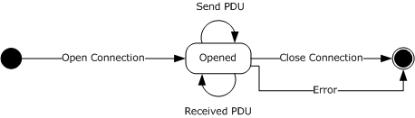

Figure 13: Client state machine

<a id="Section_3.1.1.1"></a>
#### 3.1.1.1 Abstract Data Model

None.

<a id="Section_3.1.1.2"></a>
#### 3.1.1.2 Timers

None.

<a id="Section_3.1.1.2.1"></a>
##### 3.1.1.2.1 Connection Setup Timer

The Connection setup timer MUST be set when the RPC connect HTTP request as specified in section [2.1.1.1.1](#Section_2.1.1.1.1) is sent. If this timer expires before the RPC connect response is received, the connection setup MUST treat this as a connection error and process it as specified in section [3.1.3.4.3](#Section_3.1.3.4.3).

<a id="Section_3.1.1.3"></a>
#### 3.1.1.3 Initialization

None.

<a id="Section_3.1.1.4"></a>
#### 3.1.1.4 Higher-Layer Triggered Events

The [RPC over HTTP v1](#Section_3.1) client has three higher-layer triggered events: opening a connection (section [3.1.1.4.1](#Section_3.1.1.4.1)), sending a PDU (section [3.1.1.4.2](#Section_3.1.1.4.2)), and closing a connection (section [3.1.1.4.3](#Section_3.1.1.4.3)).

<a id="Section_3.1.1.4.1"></a>
##### 3.1.1.4.1 Opening a Connection

When an implementation of a higher-level protocol calls an implementation of the RPC over HTTP Protocol to open a new connection to the server, this protocol MUST perform the following sequence of steps:

- Send an RPC connect HTTP request as specified in section [2.1.1.1.1](#Section_2.1.1.1.1). The server-name component of the [**URI**](#gt_uniform-resource-identifier-uri) as defined in section [2.2.2](#Section_2.2.2) SHOULD be the network address given to [**RPC**](#gt_remote-procedure-call-rpc). The [**endpoint**](#gt_endpoint) given to RPC will be placed in the server-port component of the URI as defined in section 2.2.2. Thus, the created HTTP request MUST be sent to a [**mixed proxy**](#gt_mixed-proxy) whose name is extracted from the network options given to the RPC runtime in an implementation-specific way.
- Move to a wait state and wait until a network event or a timeout occurs.
The protocol MUST treat any status code in the range 200 to 299, inclusive, as an indication of success. Any other status code MUST be treated by the protocol as a connection error and be processed as specified in section [3.1.3.4.3](#Section_3.1.3.4.3). If no RPC connect response is received (as specified in section [2.1.1.1.2](#Section_2.1.1.1.2)) before the timeout occurs, the protocol MUST treat this as a connection error and process it as specified in section 3.1.3.4.3.

If a connection is successfully opened, the protocol MUST cancel the Connection Setup timer.

<a id="Section_3.1.1.4.2"></a>
##### 3.1.1.4.2 Sending a PDU

When an implementation of a higher-level protocol calls an implementation of this protocol to send a [**PDU**](#gt_request-to-send-rts-protocol-data-unit-pdu) to the server, an implementation of this protocol MUST copy the PDU as a BLOB in the message body of the [**RPC**](#gt_remote-procedure-call-rpc) connect request as specified in section [2.1.1.1.3](#Section_2.1.1.1.3) and MUST send it to the [**mixed proxy**](#gt_mixed-proxy).

<a id="Section_3.1.1.4.3"></a>
##### 3.1.1.4.3 Closing a Connection

When a higher-level protocol calls an implementation of this protocol to close the connection, an implementation of this protocol MUST call to the lower-level protocol to close the connection to the server.

<a id="Section_3.1.1.5"></a>
#### 3.1.1.5 Message Processing Events and Sequencing Rules

A client that implements the [RPC over HTTP v1](#Section_3.1) [**protocol dialect**](#gt_protocol-dialect) performs two message processing events: receiving a PDU (section [3.1.1.5.1](#Section_3.1.1.5.1)) and encountering a connection error (section [3.1.1.5.2](#Section_3.1.1.5.2)).

<a id="Section_3.1.1.5.1"></a>
##### 3.1.1.5.1 Receiving a PDU

When an implementation of this protocol receives a [**PDU**](#gt_request-to-send-rts-protocol-data-unit-pdu), it MUST pass it on to a higher-layer protocol without modifying the contents of the PDU. This happens in an implementation-specific way.<20>

<a id="Section_3.1.1.5.2"></a>
##### 3.1.1.5.2 Encountering a Connection Error

When an implementation of this protocol encounters an error on a connection, it MUST indicate this error to a higher-level protocol in an implementation-specific way and MUST treat the connection as closed.<21>

<a id="Section_3.1.1.6"></a>
#### 3.1.1.6 Timer Events

None.

<a id="Section_3.1.1.7"></a>
#### 3.1.1.7 Other Local Events

None.

<a id="Section_3.1.2"></a>
### 3.1.2 Mixed Proxy Details

The [**mixed proxy**](#gt_mixed-proxy) adheres to the following state machine.

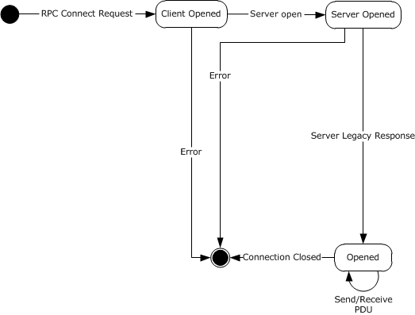

Figure 14: Proxy state machine

<a id="Section_3.1.2.1"></a>
#### 3.1.2.1 Abstract Data Model

**Server Legacy Response Received**: A Boolean value that indicates whether a server legacy response was received and PDUs received can be consumed.

<a id="Section_3.1.2.2"></a>
#### 3.1.2.2 Timers

None.

<a id="Section_3.1.2.3"></a>
#### 3.1.2.3 Initialization

Implementations of this protocol MUST listen on HTTP/HTTPS URL namespace "/".

**Server Legacy Response Received** is initialized to false indicating a response has not yet been received.

<a id="Section_3.1.2.4"></a>
#### 3.1.2.4 Higher-Layer Triggered Events

None.

<a id="Section_3.1.2.5"></a>
#### 3.1.2.5 Message Processing Events and Sequencing Rules

A [**mixed proxy**](#gt_mixed-proxy) that implements the [RPC over HTTP v1](#Section_3.1) [**protocol dialect**](#gt_protocol-dialect) performs three message processing events: receiving an RPC connect request (section [3.1.2.5.1](#Section_3.1.2.5.1)), receiving a PDU (section [3.1.2.5.2](#Section_3.1.2.5.2)), and encountering a connection close/connection error (section [3.1.2.5.3](#Section_3.1.2.5.3)).

<a id="Section_3.1.2.5.1"></a>
##### 3.1.2.5.1 RPC Connect Request Received

When a [**mixed proxy**](#gt_mixed-proxy) receives an [**RPC**](#gt_remote-procedure-call-rpc) connect request, it MUST retrieve the server name and server port from the [**URI**](#gt_uniform-resource-identifier-uri) of the RPC connect request as specified in section [2.2.2](#Section_2.2.2). It MUST establish a TCP connection to the server using the server name and port. It then waits for the server legacy response defined in section [2.1.1.2.1](#Section_2.1.1.2.1). The mixed proxy MUST NOT respond to [**PDUs**](#gt_request-to-send-rts-protocol-data-unit-pdu) received from the client as specified in section [3.1.2.5.2](#Section_3.1.2.5.2) until a server legacy response is received. When a server legacy response is received, the mixed proxy MUST respond to the client with the header of an RPC connect response as specified in section [2.1.1.1.2](#Section_2.1.1.1.2). It MUST also begin processing PDUs received in the message body of the RPC connect request from the client, as specified in section [2.1.1.1.3](#Section_2.1.1.1.3), as well as PDUs coming from the server.

<a id="Section_3.1.2.5.2"></a>
##### 3.1.2.5.2 PDU Received

A [**mixed proxy**](#gt_mixed-proxy) can receive a [**PDU**](#gt_request-to-send-rts-protocol-data-unit-pdu) from the client or server. If a PDU is received from the client as defined in section [2.1.1.1.3](#Section_2.1.1.1.3), it MUST forward the PDU to the server. If a PDU is received from the server, it MUST forward it to the client as specified in section [2.1.1.1.4](#Section_2.1.1.1.4).

<a id="Section_3.1.2.5.3"></a>
##### 3.1.2.5.3 Connection Close or Connection Error Encountered

Connection close and connection error MUST be handled identically. This section discusses connection close only.

A connection close can be initiated by either the client or the server. If a connection close is initiated by the client, the [**mixed proxy**](#gt_mixed-proxy) MUST close the connection to the server and transition to the closed state. If a connection close is initiated by the server, the mixed proxy MUST close the connection to the client and transition to the closed state.

<a id="Section_3.1.2.6"></a>
#### 3.1.2.6 Timer Events

None.

<a id="Section_3.1.2.7"></a>
#### 3.1.2.7 Other Local Events

None.

<a id="Section_3.1.3"></a>
### 3.1.3 Server Details

The server adheres to the following state machine.

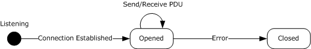

Figure 15: Server state machine

<a id="Section_3.1.3.1"></a>
#### 3.1.3.1 Abstract Data Model

None.

<a id="Section_3.1.3.2"></a>
#### 3.1.3.2 Initialization

Implementations of this protocol MUST listen on a TCP [**endpoint**](#gt_endpoint) defined by a higher-level protocol.

<a id="Section_3.1.3.3"></a>
#### 3.1.3.3 Higher-Layer Triggered Events

This section specifies the processing that MUST occur when a higher-layer protocol sends a [**PDU**](#gt_request-to-send-rts-protocol-data-unit-pdu) on a server that implements the [RPC over HTTP v1](#Section_3.1) [**protocol dialect**](#gt_protocol-dialect).

<a id="Section_3.1.3.3.1"></a>
##### 3.1.3.3.1 Sending a PDU

When a higher-layer protocol sends a [**PDU**](#gt_request-to-send-rts-protocol-data-unit-pdu) on a server that implements the [RPC over HTTP v1](#Section_3.1) [**protocol dialect**](#gt_protocol-dialect), the PDU MUST be sent to the [**mixed proxy**](#gt_mixed-proxy).

<a id="Section_3.1.3.4"></a>
#### 3.1.3.4 Message Processing Events and Sequencing Rules

A server that implements the [RPC over HTTP v1](#Section_3.1) [**protocol dialect**](#gt_protocol-dialect) performs three message processing events: establishing a connection (section [3.1.3.4.1](#Section_3.1.3.4.1)), receiving a PDU (section [3.1.3.4.2](#Section_3.1.3.4.2)), and encountering a connection error (section [3.1.3.4.3](#Section_3.1.3.4.3)).

<a id="Section_3.1.3.4.1"></a>
##### 3.1.3.4.1 Establishing a Connection

When a connection to the server is established, the server MUST send a server legacy response as specified in section [2.1.1.2.1](#Section_2.1.1.2.1) and move to the opened state.

<a id="Section_3.1.3.4.2"></a>
##### 3.1.3.4.2 Receiving a PDU

When an implementation of this protocol receives a [**PDU**](#gt_request-to-send-rts-protocol-data-unit-pdu), it MUST pass it on to a higher-layer protocol without modifying the contents of the PDU. This happens in an implementation-specific way.<22>

<a id="Section_3.1.3.4.3"></a>
##### 3.1.3.4.3 Encountering a Connection Error

When an implementation of this protocol encounters an error on a connection, it MUST indicate this error to a higher-level protocol in an implementation-specific way and MUST transition to the closed state.<23>

<a id="Section_3.1.3.5"></a>
#### 3.1.3.5 Timers

None.

<a id="Section_3.1.3.6"></a>
#### 3.1.3.6 Timer Events

None.

<a id="Section_3.1.3.7"></a>
#### 3.1.3.7 Other Local Events

None.

<a id="Section_3.2"></a>
## 3.2 RPC over HTTP v2 Protocol Details

The client and server do not have fixed roles; each software agent that has an implementation of this protocol can act as a client, as a server, or as both. The role that a given network node assumes is determined by which local interface ([MS-RPCE](../MS-RPCE/MS-RPCE.md) section 8.1) the higher-layer protocol uses and which protocol sequence is used. If the higher-layered protocol uses the ncacn_http [**RPC protocol sequence**](#gt_rpc-protocol-sequence), as specified in [MS-RPCE] section 3, and invokes **RpcBindingFromStringBinding** or equivalent, then this software agent acts as a client. If the higher-layered protocol uses the ncacn_http RPC protocol sequence, as specified in [MS-RPCE] section 3, and invokes **RpcServerUseProtseq** or equivalent, then this software agent acts as a server.

The [**inbound proxies**](#gt_inbound-proxy) and outbound proxies are software processes that run on a network node and are usually set up by a network administrator. A single software agent can act as an inbound proxy, an outbound proxy, or both. A [**proxy**](#gt_proxy) MUST act as an inbound proxy if it gets an IN channel request as defined in section [2.1.2.1.1](#Section_2.1.2.1.1). It MUST act as an outbound proxy if it gets an OUT channel request as defined in section [2.1.2.1.2](#Section_2.1.2.1.2). The scope of the role it assumes is for the [**virtual IN channel**](#gt_virtual-in-channel) or OUT channel. A single network node can act as inbound proxy for a given virtual IN channel and at the same time as an outbound proxy for a given [**virtual OUT channel**](#gt_virtual-out-channel).

<a id="Section_3.2.1"></a>
### 3.2.1 Common Details

Several processing aspects are either common between all [RPC over HTTP v2](#Section_3.2) protocol roles or impact multiple roles. They are described in this section.

<a id="Section_3.2.1.1"></a>
#### 3.2.1.1 Abstract Data Model

This section specifies the elements of the abstract data model for [RPC over HTTP v2](#Section_3.2). Those elements include the relationship between the different abstractions (section [3.2.1.1.1](#Section_3.2.1.1.1)), [**receive windows**](#gt_receive-window) and flow control (section [3.2.1.1.4](#Section_3.2.1.1.4)), and connection time-out (section [3.2.1.1.6.1](#Section_3.2.1.1.6.1)).

<a id="Section_3.2.1.1.1"></a>
##### 3.2.1.1.1 Virtual Connection, Virtual Channel Hierarchy, and Protocol Variables

Each role specified by this protocol need to maintain a hierarchical data structure where at most one [**virtual IN**](#gt_virtual-in-channel) and at most one [**virtual OUT channel**](#gt_virtual-out-channel) are associated with a [**virtual connection**](#gt_virtual-connection), where each role MAY execute on separate network nodes.

The virtual channels that are components of a given virtual connection are defined to belong to this virtual connection. Each virtual connection is identified uniquely among a client, any number of [**inbound proxies**](#gt_inbound-proxy), any number of outbound proxies, and a serverby using an [**RTS cookie**](#gt_578c1075-051d-40c2-9fa4-0aeb1ca20002) known as a virtual connection cookie. Multiple inbound and outbound proxies MAY be deployed in conjunction with a TCP layer or HTTP layer load balancer to improve scalability and reliability. All load balancing MUST be performed in a manner transparent to the client. All roles defined by this protocol maintain a protocol variable to store the virtual connection cookie for a specific virtual connection. The virtual connection cookie is generated by the client. Other parties acquire the cookie by exchanging one or more [**PDUs**](#gt_request-to-send-rts-protocol-data-unit-pdu) with the client.

Each virtual IN channel is composed of an IN channel between a client and an inbound proxy and a second IN channel between an inbound proxy and a server.

Each virtual OUT channel is composed of an OUT channel between a client and an outbound proxy and a second OUT channel between an outbound proxy and a server.

Both of these channels are defined to be components of the virtual channel and transitively to be components of the virtual connection. It is also said that they belong to the virtual channel and transitively to the virtual connection.

The relationship is illustrated by the following diagram.

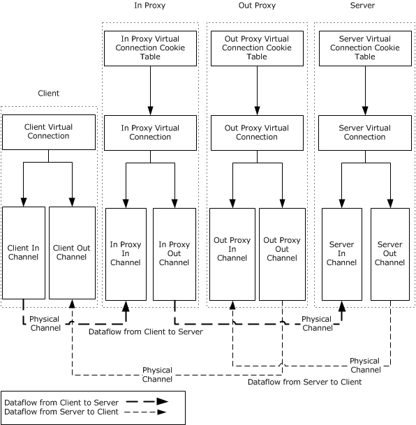

Figure 16: Virtual connection hierarchy

Each IN channel and OUT channel instance is identified uniquely among a client, one or more inbound proxies, one or more outbound proxies, and a server using an RTS cookie known as a "channel cookie".

As specified in sections [2.1.2.1.7](#Section_2.1.2.1.7) and [2.1.2.1.8](#Section_2.1.2.1.8), both virtual IN channel and virtual OUT channel are limited to transmitting only a certain number of bytes. For a virtual connection to be capable of sending an unlimited number of bytes, it must be able to discard [**IN channels**](#gt_in-channel) or [**OUT channels**](#gt_out-channel) whose lifetime has [**expired**](#gt_7160f109-6fd1-46b3-923f-0fae133ea0e9) and replace them with successor IN channels or OUT channels. The process of discarding a [**predecessor IN channel**](#gt_predecessor-channel) or OUT channel and establishing a successor IN channel or OUT channel while ensuring that the reliable, in-order, at-most-once delivery guarantee is maintained is called [**channel recycling**](#gt_channel-recycling). The successor IN channel or OUT channel is called a predecessor [**replacement channel**](#gt_replacement-channel). During the recycling process, there is a period of time when both a predecessor channel and a [**successor channel**](#gt_successor-channel) instance are available. One of these is called the default channel, and the other is called the nondefault channel. The protocol sequences and message processing rules throughout section [3](#Section_1.3) specify which channel is the default in each particular case.

Every instance of a role belonging to this protocol maintains common abstract data elements for the Virtual Connection, the Virtual Connection Cookie Table, the Sending Channel, the Receiving Channel, and the Ping Originator. The abstract data elements and model for these common elements are described in the immediately following sections.

For each role that this protocol can operate in, additional abstract data elements are required. They are described in the following sections:

- Server role Abstract Data Model: section [3.2.5.1](#Section_3.2.5.1)
- Inbound Proxy role Abstract Data Model: section [3.2.3.1](#Section_3.2.3.1)
- Outbound Proxy role Abstract Data Model: section [3.2.4.1](#Section_3.2.4.1)
- Client role Abstract Data Model: section [3.2.2.1](#Section_3.2.2.1)
<a id="Section_3.2.1.1.2"></a>
##### 3.2.1.1.2 Virtual Connection Cookie Table

Implementations of this protocol MUST maintain a **Virtual Connection Cookie Table** indexed by the [**virtual connection**](#gt_virtual-connection) [**RTS cookie**](#gt_578c1075-051d-40c2-9fa4-0aeb1ca20002). Each row in the table contains:

- The virtual connection RTS cookie ([2.2.3.1](#Section_2.2.3.1)).
- A reference to the virtual connection.
When the reference count drops to zero, the row in the table MUST be deleted. The table size is limited by the host operating system memory constraints.

<a id="Section_3.2.1.1.3"></a>
##### 3.2.1.1.3 Virtual Connection ADM Elements

**Virtual Connection Cookie**

Implementations of this protocol MUST maintain a [**Virtual Connection**](#gt_virtual-connection) Cookie that is a RTS cookie ([2.2.3.1](#Section_2.2.3.1)). The value of the Virtual Connection Cookie is the same as the Virtual Connection [**RTS cookie**](#gt_578c1075-051d-40c2-9fa4-0aeb1ca20002) for this Virtual Connection in the Virtual Connection Cookie Table.

**Virtual Connection State**

Implementations of this protocol MUST maintain a protocol variable for the Virtual Connection State which is used to track the current state in the role-specific state machine. Each role initializes the Virtual Connection State to a role-specific state value.

**Default IN Channel**

Implementations of this protocol MUST maintain a reference to the Default IN Channel. During [**channel recycling**](#gt_channel-recycling), a Virtual Connection has two [**IN channels**](#gt_in-channel) active.

A default IN channel is a protocol variable that indicates which of the two channels is the default channel. Outside channel recycling, there is only one IN channel at a given point in time, and this channel is always considered the default channel. The default channel MUST be used for sending all [**RPC PDUs**](#gt_remote-procedure-call-rpc). Sending of [**RTS PDUs**](#gt_682437f3-1c41-420d-ae08-3178f5611ddd) is specified in section [3.2.2.4.2](#Section_3.2.2.4.2).

**Non-Default IN Channel**

Implementations of this protocol MUST maintain a reference to the Non-Default IN Channel. During channel recycling, a Virtual Connection has two IN channels active.

**Default IN Channel Cookie**

Implementations of this protocol MUST maintain an RTS cookie (2.2.3.1) for the Default IN Channel.

**Non-Default IN Channel Cookie**

Implementations of this protocol MUST maintain an RTS cookie (2.2.3.1) for the Non-Default IN Channel.

**Default OUT Channel**

Implementations of this protocol MUST maintain a reference to the Default OUT Channel.

**Non-Default OUT Channel**

Implementations of this protocol MUST maintain a reference to the Non-Default OUT Channel.

**Default OUT Channel Cookie**

Implementations of this protocol MUST maintain an RTS cookie (2.2.3.1) for the Default OUT Channel.

**Non-Default OUT Channel Cookie**

Implementations of this protocol MUST maintain an RTS cookie (2.2.3.1) for the Non-Default OUT Channel.

**Protocol Version**

Implementations of this protocol MUST maintain a variable to contain the ProtocolVersion which is of unsigned integer type. A value of 1 indicates RPC/HTTP2 version of the protocol.

**AssociationGroupId**

Implementations of this protocol MUST maintain an RTS cookie (2.2.3.1) called AssociationGroupId that can be used by higher-layer protocols to link multiple virtual connections.

<a id="Section_3.2.1.1.4"></a>
##### 3.2.1.1.4 Sending Channel and Receiving Channel

Each IN channel or OUT channel has two parties: a sender and a recipient. This section specifies an abstract data model that senders and recipients MUST adhere to in order to implement flow control for this protocol. This protocol specifies that only [**RPC PDUs**](#gt_remote-procedure-call-rpc) are subject to the flow control abstract data model. [**RTS PDUs**](#gt_682437f3-1c41-420d-ae08-3178f5611ddd) and the HTTP request and response headers are not subject to flow control. Implementations of this protocol MUST NOT include them when computing any of the variables specified by this abstract data model.

The following sections define the separate protocol variables that are part of the [**receive windows**](#gt_receive-window) and flow control data model.

**Sending Channel**

**PlugState**

Implementations of this protocol MUST maintain a Boolean value named PlugState to represent if the Sending Channel is in the [**Plugged Channel Mode**](#gt_plugged-channel-mode) or the [**Unplugged Channel Mode**](#gt_unplugged-channel-mode).

**SendQueue**

In the context of receive windows and flow control, a sender MUST maintain a queue of PDUs that are required to be sent. The size and maximum length of the SendQueue are implementation-specific and on Windows implementations, bounded by available system memory.

**ChannelLifeTimeSent**

The sender MUST keep track of the total bytes sent over the IN channel or OUT channel instance it uses to send PDUs. This abstract variable is called BytesSent. This variable MUST be the integer count of bytes that the connection has sent. BytesSent will have the inclusive range of zero and two gigabytes (the max of ChannelLifeTime).

**Sender AvailableWindow**

The sender MUST keep track of the local size, in bytes, of the available **ReceiveWindow**. This variable is called **Sender AvailableWindow**.

**PeerReceiveWindow**

The sender MUST keep track of the size, in bytes, of the maximum receiving channel's ReceiveWindow.

<a id="Section_3.2.1.1.5"></a>
##### 3.2.1.1.5 Receiving Channel

<a id="Section_3.2.1.1.5.1"></a>
###### 3.2.1.1.5.1 ReceiveWindow

The first element of the abstract data model is the concept of a [**receive window**](#gt_receive-window). A receiver determines what amount of machine memory it is can commit to queue [**PDUs**](#gt_request-to-send-rts-protocol-data-unit-pdu) received from the sender. This amount of memory is called a receive window, and on the abstract level, the receiver MUST treat the ReceiveWindow data structure as a queue. The receiver SHOULD choose an initial value for the receive window based on an implementation-specific algorithm.<24>

ReceiveWindowSize

This element of the abstract data model is an unsigned 32-bit number indicating the size of the receive window.

<a id="Section_3.2.1.1.5.1.2"></a>
Receiver AvailableWindow

As the receiver queues and releases [**PDUs**](#gt_request-to-send-rts-protocol-data-unit-pdu) in its **ReceiveWindow**, it MUST locally keep track of how much space it has left in its **ReceiveWindow**, in bytes. The size of the **ReceiveWindow** minus the sum of the size of all [**RPC PDUs**](#gt_remote-procedure-call-rpc) that the receiver queued in this **ReceiveWindow** is called Receiver AvailableWindow. Receiver AvailableWindow can range from 0 to the value of [**receive window**](#gt_receive-window).

<a id="Section_3.2.1.1.5.1.3"></a>
Recipient BytesReceived

The receiver MUST maintain an unsigned 32-bit **BytesReceived** variable that tracks the total bytes received on the IN channel or OUT channel instance.

<a id="Section_3.2.1.1.5.1.4"></a>
AvailableWindowAdvertised

The AvailableWindowAdvertised variable MAY be maintained by implementations of this protocol. Implementations of this protocol MAY implement the flow control algorithm without using this variable. In the latter case, implementations of this protocol can skip the rest of this section.<25>

If an implementation maintains this protocol variable, it SHOULD follow the abstract data model specified in the rest of this section.

As specified in section [3.2.1.4.1.1](#Section_3.2.1.4.1.1), each time a receiver sends a flow control acknowledgment to the sender, it MUST advertise the size of the Receiver AvailableWindow field.

The AvailableWindowAdvertised variable keeps track of the value of the Receiver AvailableWindow field the last time the receiver advertised it to the sender. The AvailableWindowAdvertised variable is initialized to be the same size as the **ReceiveWindow** variable.

<a id="Section_3.2.1.1.6"></a>
##### 3.2.1.1.6 Ping Originator

When the SendingChannel is part of a [**virtual connection**](#gt_virtual-connection) in an Outbound Proxy or Client role (transmitting HTTP data), the SendingChannel maintains additional protocol variables called the Ping Originator.

<a id="Section_3.2.1.1.6.1"></a>
###### 3.2.1.1.6.1 ConnectionTimeout

Network agents handling HTTP traffic often time out connections that are perceived as idle. An implementation of this protocol SHOULD try to prevent [**virtual connections**](#gt_virtual-connection) that are still in use from being timed out by network agents handling the HTTP traffic. If network agents do time out connections perceived as idle, clients, inbound proxies, and outbound proxies MUST maintain an abstract variable, which is the amount of time that the network agents handling the HTTP traffic are likely to allow an RPC over HTTP channel to remain open and idle. That abstract variable is called **ConnectionTimeout**. **ConnectionTimeout** can range in value from 30 seconds to 1800 seconds.

Implementations of this protocol prevent [**IN channels**](#gt_in-channel) and [**OUT channels**](#gt_out-channel) that are in use from being timed out by network agents by sending small packets between the client and the [**inbound proxy**](#gt_inbound-proxy) and between the outbound proxy and the client. Details on this process are provided in the sections for the client (section [3.2.2](#Section_3.2.2)) or for the outbound proxy (section [3.2.4](#Section_3.2.4)), respectively.

<a id="Section_3.2.1.1.6.2"></a>
###### 3.2.1.1.6.2 LastPacketSentTimestamp

The protocol MUST maintain a timestamp indicating the last time a packet was sent on this SendingChannel.

**PingTimer**

The SendingChannel MUST maintain a timer on expiration indicates a PING PDU must be sent to the receiving channel. The PING PDU is sent to the receiving channel when no data has been sent within half of the time value of the **KeepAliveInterval**.

<a id="Section_3.2.1.1.6.3"></a>
###### 3.2.1.1.6.3 KeepAlive Interval

[KeepAlive interval](#Section_3.2.1.1.6.3) is a protocol variable that can be changed by higher layers. Implementations of this protocol SHOULD interpret this variable as the maximum time interval that a higher layer can wait before it establishes with certainty whether the server has dropped out of a conversation.

The higher-level Remote Procedure Call Protocol Extensions specify usage of this in [MS-RPCE](../MS-RPCE/MS-RPCE.md) section 3.3.2.2.1. In TCP [**RPC transport**](#gt_rpc-transport) (ncacn_ip_tcp), the Remote Procedure Call Protocol Extensions specify that the keep-alive interval is changed. In HTTP RPC transport, this protocol variable is changed instead.

<a id="Section_3.2.1.2"></a>
#### 3.2.1.2 Timers

<a id="Section_3.2.1.2.1"></a>
##### 3.2.1.2.1 PingTimer

If the SendingChannel is part of a [**Virtual Connection**](#gt_virtual-connection) in the Outbound Proxy or Client roles, the SendingChannel maintains a PingTimer that on expiration indicates a PING PDU must be sent to the receiving channel. The PING PDU is sent to the receiving channel when no data has been sent within half of the value of the KeepAliveInterval.

The PingTimer expiration time is set to half of the value of the KeepAlive Interval. When the PingTimer expires, the protocol MUST determine if the time since the LastPacketSentTimestamp is greater than half of the value of the KeepAliveInterval. If so, the protoclol MUST send a PING PDU to the receiving channel.

<a id="Section_3.2.1.2.2"></a>
##### 3.2.1.2.2 Connection Timeout Timer

The connection timeout timer interval is controlled by the [ConnectionTimeout (section 3.2.1.1.6.1)](#Section_3.2.1.1.6.1) protocol variable. The interval of this timer MUST be changed to the value of the connection timeout protocol variable each time the protocol variable is changed.

<a id="Section_3.2.1.3"></a>
#### 3.2.1.3 Initialization

This section specifies the initialization steps that are common among all roles in the [RPC over HTTP v2](#Section_3.2) [**protocol dialect**](#gt_protocol-dialect).

- [BytesSent (section 3.2.1.1.4)](#Section_3.2.1.1.4) is initialized to 0 bytes.
- [Recipient BytesReceived (section 3.2.1.1.5.1.3)](#Section_3.2.1.1.5.1.3) is initialized to 0 bytes.
- [Receiver AvailableWindow (section 3.2.1.1.5.1.2)](#Section_3.2.1.1.5.1.2) is initialized to 0 bytes.
- Sender AvailableWindow (section 3.2.1.1.4) is initialized to the value of **ReceiveWindow** on the recipient side.
- [ConnectionTimeout (section 3.2.1.1.6.1)](#Section_3.2.1.1.6.1) is initialized to an implementation specific value within the range of 30 seconds to 1800 seconds.<26>
- **Default IN Channel** is initialized to the first or primary channel. When the server is initialized, there is only one IN channel.
- **KeepAlive Interval** is initialized to zero and is interpreted as having no keep alive requested by the higher-layer protocol.
- **Default OUT Channel** is initialized to indicate the first or primary OUT channel. Except during channel recycling, which is not active when the server is first initialized, there is only a single OUT channel.
- **Virtual Connection Cookie Table** is initialized to an empty table.
<a id="Section_3.2.1.3.1"></a>
##### 3.2.1.3.1 Flow Control and ReceiveWindow Processing

The receiver MUST advertise the size of the **ReceiveWindow** using the [ReceiveWindowSize](#Section_2.2.3.5.1) RTS command as defined in section 2.2.3.5.1, and the sender MUST initialize its abstract data model from this RTS command and initialize the **Send Queue** to an initial empty state. This advertising happens in a way that is specific to each role and, as such, is defined in the section for each specific role.

<a id="Section_3.2.1.3.2"></a>
##### 3.2.1.3.2 BytesSent

The abstract data model MUST initialize [BytesSent (section 3.2.1.1.4)](#Section_3.2.1.1.4) to zero.

<a id="Section_3.2.1.4"></a>
#### 3.2.1.4 Higher-Layer Triggered Events

This section specifies the flow control and **ReceiveWindow** processing rules that are common among all roles in the [RPC over HTTP v2](#Section_3.2) [**protocol dialect**](#gt_protocol-dialect).

<a id="Section_3.2.1.4.1"></a>
##### 3.2.1.4.1 Flow Control and ReceiveWindow Higher-Layer Triggered Events

<a id="Section_3.2.1.4.1.1"></a>
###### 3.2.1.4.1.1 Consuming RPC PDUs

Per the abstract data model defined in section [3.2.1.1.5.1](#Section_3.2.1.1.5.1), the **ReceiveWindow** can be modeled as a queue. On the client and server, the act of releasing an [**RPC PDU**](#gt_rpc-pdu) from the **ReceiveWindow** by a higher layer is called consuming this RPC PDU. On the [**inbound**](#gt_inbound) and outbound proxies, the act of forwarding an RPC PDU from the **ReceiveWindow** to the next hop is also called consuming this RPC PDU. This section defines common processing for consuming an RPC PDU.

When the recipient consumes an RPC PDU from the **ReceiveWindow**, it recalculates the [Receiver AvailableWindow](#Section_3.2.1.1.5.1.2) defined in section 3.2.1.1.5.1.2. If the Receiver AvailableWindow is determined to be greater than an implementation-specific threshold (as defined later in this section), the recipient will send to the sender a [FlowControlAck RTS PDU](#Section_2.2.4.50) as specified in section 2.2.4.50, indicating in the command the value of the protocol variable BytesReceived on the channel instance, the Receiver AvailableWindow during the time the FlowControlAck RTS PDUs was sent, and the channel cookie specified for this channel in section [3.2.1.1.1](#Section_3.2.1.1.1). The receiver SHOULD choose a threshold value that keeps the number of FlowControlAck RTS PDUs small, while avoiding the sender queuing packets on high-latency links.

The [AvailableWindowAdvertised](#Section_3.2.1.1.5.1.4) variable is updated to the Receiver AvailableWindow that was set in the last FlowControlAck RTS PDU.<27>

<a id="Section_3.2.1.4.1.2"></a>
###### 3.2.1.4.1.2 Queuing RPC PDUs

Whenever an [**RPC PDU**](#gt_rpc-pdu) is to be sent, the sender MUST queue the respective PDU on the send queue, and then follow the logic in sequence as in section [3.2.1.4.1.3](#Section_3.2.1.4.1.3).

<a id="Section_3.2.1.4.1.3"></a>
###### 3.2.1.4.1.3 Dequeuing RPC PDUs

If the Sender AvailableWindow is greater than the number of bytes in the first queued RPC PDU, the implementation MUST send queued PDUs in order until either no RPC PDUs remain in the queue or the Sender AvailableWindow is less than the number of bytes in the next queued RPC PDU.

Each time an RPC PDU is dequeued, an implementation MUST do the following:

- Increment the BytesSent protocol variable by the number of bytes in the RPC PDU sent.
- Decrement the Sender AvailableWindow by the same amount.
<a id="Section_3.2.1.5"></a>
#### 3.2.1.5 Message Processing Events and Sequencing Rules

This section specifies flow control and receive-window processing rules, [**PDU**](#gt_request-to-send-rts-protocol-data-unit-pdu) forwarding rules, and protocol sequences that are common among all roles in the [RPC over HTTP v2](#Section_3.2) [**protocol dialect**](#gt_protocol-dialect).

<a id="Section_3.2.1.5.1"></a>
##### 3.2.1.5.1 Flow Control and ReceiveWindow Processing

This section specifies flow control (section [3.2.1.5.1.2](#Section_3.2.1.5.1.2)) and **ReceiveWindow** (section [3.2.1.5.1.1](#Section_3.2.1.5.1.1)) processing rules common among all roles in the [RPC over HTTP v2](#Section_3.2) [**protocol dialect**](#gt_protocol-dialect).

<a id="Section_3.2.1.5.1.1"></a>
###### 3.2.1.5.1.1 Receiving RPC PDUs

As it receives [**RPC PDUs**](#gt_remote-procedure-call-rpc), an implementation of this protocol MUST queue the [**PDUs**](#gt_request-to-send-rts-protocol-data-unit-pdu) in its **ReceiveWindow**. As it queues the PDUs, the recipient MUST do the following:

- Decrement [Receiver AvailableWindow](#Section_3.2.1.1.5.1.2) by the number of bytes in the [**RPC PDU**](#gt_rpc-pdu) it queued.
- Increment [BytesReceived](#Section_cb7b66206c724eca979ced3fbe76c679) by the same amount.
- If a protocol implementation implements [AvailableWindowAdvertised](#Section_3.2.1.1.5.1.4), decrement it by the same amount.
When the sender receives a [FlowControlAck RTS PDU](#Section_2.2.4.50), it MUST use the following formula to recalculate its Sender AvailableWindow variable:

Sender AvailableWindow = Receiver AvailableWindow_from_ack - (BytesSent - BytesReceived_from_ack).

Where:

Receiver AvailableWindow_from_ack is the Available Window field in the FlowControl Acknowledgement Structure (section [2.2.3.4](#Section_2.2.3.4)) in the PDU received.

BytesReceived_from_ack is the Bytes Received field in the Flow Control Acknowledgement structure in the PDU received.

If the Receiver AvailableWindow becomes negative or becomes greater than the **ReceiveWindow** advertised by the recipient, a sender SHOULD treat the FlowControlAck RTS PDU as an invalid PDU and process it according to the rules for processing invalid PDUs, as defined in the section for the respective role.

<a id="Section_3.2.1.5.1.2"></a>
###### 3.2.1.5.1.2 FlowControlAck RTS PDU

All senders of [**RTS PDUs**](#gt_682437f3-1c41-420d-ae08-3178f5611ddd) process flow control acknowledgment RTS PDUs as specified in section [2.2.4.50](#Section_2.2.4.50) identically. An implementation MUST execute the following sequence of steps to process a FlowControlAck RTS PDU in this order:

- A FlowControlAck RTS PDU is received on some channel.
- The **ChannelCookie** field from the [FlowControlAck](#Section_2.2.3.5.2) RTS command is compared against the channel cookies for all channels belonging to this [**virtual connection**](#gt_virtual-connection), and a matching channel is selected. If no matching channel can be found, an implementation of this protocol MUST discard the [**PDU**](#gt_request-to-send-rts-protocol-data-unit-pdu) and MUST NOT do any further processing for this PDU.
- Recalculate its local copy of Sender AvailableWindow using the following formula:
Sender AvailableWindow = Sender AvailableWindow_from_ack - (BytesSent - BytesReceived_from_ack).

Where:

Sender AvailableWindow_from_ack is the Available Window field in FlowControl Acknowledgement Structure (section [2.2.3.4](#Section_2.2.3.4)) in the PDU received.

BytesReceived_from_ack is the Bytes Received field in the Flow Control Acknowledgement structure specified.

- Dequeue any RPC PDUs possible as specified in section [3.2.1.4.1.3](#Section_3.2.1.4.1.3).
<a id="Section_3.2.1.5.1.3"></a>
###### 3.2.1.5.1.3 ReceiveWindowSize

When processing a **ReceiveWindowSize** RTS command ([2.2.3.5.1](#Section_2.2.3.5.1)), an implementation of this protocol MUST set its **ReceiveWindowSize** ADM ([3.2.1.1.5.1.1](#Section_2.2.3.5.1)) to the value of the **ReceiveWindowSize** field in this command.

<a id="Section_3.2.1.5.2"></a>
##### 3.2.1.5.2 PDU Forwarding

The [RPC over HTTP v2](#Section_3.2) [**IN channels**](#gt_in-channel) and [**OUT channels**](#gt_out-channel) that are based on an HTTP or HTTPS transport are half duplex. This means that one party might not be able to send a [**PDU**](#gt_request-to-send-rts-protocol-data-unit-pdu) to another party if the half-duplex channel is going in the other direction. To resolve this problem, RPC over HTTP v2 uses the concept of [**RTS PDU**](#gt_682437f3-1c41-420d-ae08-3178f5611ddd) forwarding. When RTS PDU forwarding is used, a sender MUST mark a PDU as needing forwarding by setting an RTS destination command in the PDU. An implementation of this protocol MUST NOT add a destination command to a RTS PDU that does not have a destination command already. Only RTS PDUs that already have a destination command are subject to forwarding. Once the RTS PDU is marked for forwarding, a sender acts on the fact that only the IN channel between client and [**inbound proxy**](#gt_inbound-proxy) and the OUT channel between the client and the outbound proxy are half duplex and MUST send the RTS PDU to the next hop according to the following table.

| Sender | Destination | Next hop |
| --- | --- | --- |
| client | inbound proxy | direct |
| client | outbound proxy | inbound proxy |
| client | server | inbound proxy |
| inbound proxy | outbound proxy | server |
| inbound proxy | client | server |
| inbound proxy | server | direct |
| outbound proxy | inbound proxy | server |
| outbound proxy | client | direct |
| outbound proxy | server | direct |
| server | inbound proxy | direct |
| server | outbound proxy | direct |
| server | client | outbound proxy |

If a sender has a "direct" value in the next hop column of the routing table, it MUST NOT use the forwarding mechanism but instead MUST send the PDU directly.

Upon receiving such an RTS PDU, the receiver MUST forward the PDU to the next hop, which MUST be determined by indexing the preceding table by its own role as the value of the sender column and the destination as the value of the destination column.

<a id="Section_3.2.1.5.3"></a>
##### 3.2.1.5.3 Protocol Sequences

This section provides diagrams and explanations that facilitate understanding sections [3.2.2](#Section_3.2.2), [3.2.3](#Section_3.2.3), [3.2.4](#Section_3.2.4), and [3.2.5](#Section_3.2.5). It is not intended to replace these sections. The diagrams in this section illustrate at a high level the flow of [**RTS PDUs**](#gt_682437f3-1c41-420d-ae08-3178f5611ddd) among the different roles during the different protocol sequences. They can be used to put into context the definitions used throughout the rest of the document.

<a id="Section_3.2.1.5.3.1"></a>
###### 3.2.1.5.3.1 Connection Establishment

The connection establishment protocol sequence illustrates establishing a [**virtual connection**](#gt_virtual-connection) between a client and a server. The name of this sequence is CONN. It has three [**PDU**](#gt_request-to-send-rts-protocol-data-unit-pdu) groups.

| Group name | Meaning |
| --- | --- |
| A | PDUs sent on the [**OUT channels**](#gt_out-channel) that initiate and perform the virtual connection establishment |
| B | PDUs sent on the IN channel |
| C | PDUs sent on the OUT channels that complete virtual connection establishment |

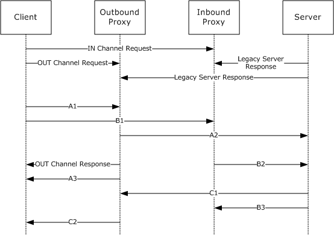

Figure 17: Connection establishment protocol sequence

The references for the PDUs used in this protocol sequence are as follows.

| Diagram label | PDU name and reference section |
| --- | --- |
| IN channel request | [IN Channel Request (section 2.1.2.1.1)](#Section_2.1.2.1.1) |
| OUT channel request | [OUT Channel Request (section 2.1.2.1.2)](#Section_2.1.2.1.2) |
| OUT channel response | [Out Channel Response (section 2.1.2.1.4)](#Section_2.1.2.1.4) |
| Legacy server response | [Legacy Server Response (section 2.1.2.2.1)](#Section_2.1.2.2.1) |
| A1 | [CONN/A1 RTS PDU (section 2.2.4.2)](#Section_2.2.4.2) |
| A2 | [CONN/A2 RTS PDU (section 2.2.4.3)](#Section_2.2.4.3) |
| A3 | [CONN/A3 RTS PDU (section 2.2.4.4)](#Section_2.2.4.4) |
| B1 | [CONN/B1 RTS PDU (section 2.2.4.5)](#Section_3.2.3.5.3) |
| B2 | [CONN/B2 RTS PDU (section 2.2.4.6)](#Section_2.2.4.6) |
| B3 | [CONN/B3 RTS PDU (section 2.2.4.7)](#Section_2.2.4.7) |
| C1 | [CONN/C1 RTS PDU (section 2.2.4.8)](#Section_3.2.4.5.4) |
| C2 | [CONN/C2 RTS PDU (section 2.2.4.9)](#Section_2.2.4.9) |

The processing rules for this protocol sequence are specified in sections [3.2.2](#Section_3.2.2) through [3.2.5](#Section_3.2.5) of this specification.

**Note** In an effort to improve readability, the establishments of TCP connections are not shown in the figure.

<a id="Section_3.2.1.5.3.2"></a>
###### 3.2.1.5.3.2 IN Channel Recycling 1

The IN channel recycling 1 protocol sequence illustrates recycling of a [**virtual IN channel**](#gt_virtual-in-channel). The name of this sequence is IN_R1. It has two [**PDU**](#gt_request-to-send-rts-protocol-data-unit-pdu) groups.

| Group name | Meaning |
| --- | --- |
| A | PDUs that initiate and perform the virtual [**channel recycling**](#gt_channel-recycling) |
| B | PDUs that complete the virtual channel recycling |

The following diagram depicts the sequence of events in the IN channel recycling 1 protocol.


Figure 18: IN channel recycling 1 protocol sequence

The references for the PDUs used in this protocol sequence are shown in the following table.

| Diagram label | PDU name and reference section |
| --- | --- |
| IN channel request | [IN Channel Request (section 2.1.2.1.1)](#Section_2.1.2.1.1) |
| Legacy server response | [Legacy Server Response (section 2.1.2.2.1)](#Section_2.1.2.2.1) |
| A1 | [IN_R1/A1 RTS PDU (section 2.2.4.10)](#Section_2.2.4.10) |
| A2 | [IN_R1/A2 RTS PDU (section 2.2.4.11)](#Section_3.2.5.5.5) |
| A3 | [IN_R1/A3 RTS PDU (section 2.2.4.12)](#Section_2.2.4.12) |
| A4 | [IN_R1/A4 RTS PDU (section 2.2.4.13)](#Section_2.2.4.13) |
| A5 | [IN_R1/A5 RTS PDU (section 2.2.4.14)](#Section_2.2.4.14) |
| A6 | [IN_R1/A6 RTS PDU (section 2.2.4.15)](#Section_3.2.5.5.6) |
| B1 | [IN_R1/B1 RTS PDU (section 2.2.4.16)](#Section_3.2.5.5.7) |
| B2 | [IN_R1/B2 RTS PDU (section 2.2.4.17)](#Section_2.2.4.17) |

The processing rules for this protocol sequence are specified in sections [3.2.2](#Section_3.2.2) through [3.2.5](#Section_3.2.5) of this specification.

**Note** In an effort to improve readability, the establishments of TCP connections are not shown in the figure.

<a id="Section_3.2.1.5.3.3"></a>
###### 3.2.1.5.3.3 IN Channel Recycling 2

The IN channel recycling 2 protocol sequence illustrates recycling of a [**virtual IN channel**](#gt_virtual-in-channel). The name of this sequence is IN_R2. This protocol sequence is very similar to protocol sequence IN_R1. They start identically, and only when processing [IN_R1/A1 RTS PDU](#Section_2.2.4.10) do they diverge based on dynamic decisions made by the [**inbound proxy**](#gt_inbound-proxy) as defined in section [3.2.3.5.5](#Section_3.2.3.5.5). This protocol sequence has a single [**PDU**](#gt_request-to-send-rts-protocol-data-unit-pdu) group: A.

The following diagram depicts the sequence of events in the IN channel recycling 2 protocol.

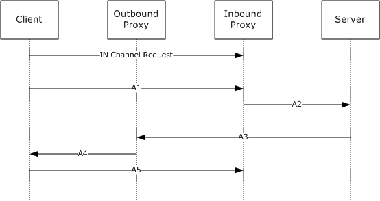

Figure 19: IN channel recycling 2 protocol sequence

The references for the PDUs used in this protocol sequence are as follows.

| Diagram label | PDU name and reference section |
| --- | --- |
| IN channel request | [IN Channel Request (section 2.1.2.1.1)](#Section_2.1.2.1.1) |
| A1 | [IN_R2/A1 RTS PDU (section 2.2.4.18)](#Section_2.2.4.18) |
| A2 | [IN_R2/A2 RTS PDU (section 2.2.4.19)](#Section_3.2.5.5.8) |
| A3 | [IN_R2/A3 RTS PDU (section 2.2.4.20)](#Section_2.2.4.20) |
| A4 | [IN_R2/A4 RTS PDU (section 2.2.4.21)](#Section_2.2.4.21) |
| A5 | [IN_R2/A5 RTS PDU (section 2.2.4.22)](#Section_3.2.3.5.8) |

The processing rules for this protocol sequence are specified in sections [3.2.2](#Section_3.2.2) through [3.2.5](#Section_3.2.5) of this specification.

**Note** In an effort to improve readability, the establishments of TCP connections are not shown in the figure.

<a id="Section_3.2.1.5.3.4"></a>
###### 3.2.1.5.3.4 OUT Channel Recycling 1

The OUT channel recycling 1 protocol sequence illustrates recycling of a [**virtual OUT channel**](#gt_virtual-out-channel). The name of this sequence is OUT_R1. It has a single [**PDU**](#gt_request-to-send-rts-protocol-data-unit-pdu) group: A.

The following diagram depicts the sequence of events in the OUT channel recycling 1 protocol.

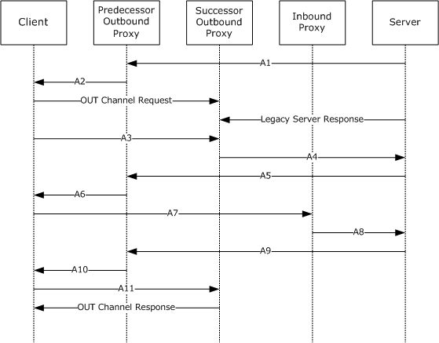

Figure 20: OUT channel recycling 1 protocol sequence

The references for the PDUs used in this protocol sequence are as follows.

| Diagram label | PDU name and reference section |
| --- | --- |
| OUT channel request | [OUT Channel Request (section 2.1.2.1.2)](#Section_2.1.2.1.2) |
| OUT channel response | [OUT Channel Response (section 2.1.2.1.4)](#Section_2.1.2.1.4) |
| Legacy server response | [Legacy Server Response (section 2.1.2.2.1)](#Section_2.1.2.2.1) |
| A1 | [OUT_R1/A1 RTS PDU (section 2.2.4.23)](#Section_2.2.4.23) |
| A2 | [OUT_R1/A2 RTS PDU (section 2.2.4.24)](#Section_2.2.4.24) |
| A3 | [OUT_R1/A3 RTS PDU (section 2.2.4.25)](#Section_3.2.4.5.6) |
| A4 | [OUT_R1/A4 RTS PDU (section 2.2.4.26)](#Section_2.2.4.26) |
| A5 | [OUT_R1/A5 RTS PDU (section 2.2.4.27)](#Section_2.2.4.27) |
| A6 | [OUT_R1/A6 RTS PDU (section 2.2.4.28)](#Section_2.2.4.28) |
| A7 | [OUT_R1/A7 RTS PDU (section 2.2.4.29)](#Section_2.2.4.29) |
| A8 | [OUT_R1/A8 RTS PDU (section 2.2.4.30)](#Section_3.2.5.5.10) |
| A9 | [OUT_R1/A9 RTS PDU (section 2.2.4.31)](#Section_2.2.4.31) |
| A10 | [OUT_R1/A10 RTS PDU (section 2.2.4.32)](#Section_3.2.2.5.8) |
| A11 | [OUT_R1/A11 RTS PDU (section 2.2.4.33)](#Section_3.2.4.5.9) |

The processing rules for this protocol sequence are specified in sections [3.2.2](#Section_3.2.2) through [3.2.5](#Section_3.2.5) of this specification.

**Note** In an effort to improve readability, the establishments of TCP connections are not shown in the figure.

<a id="Section_3.2.1.5.3.5"></a>
###### 3.2.1.5.3.5 OUT Channel Recycling 2

The OUT channel recycling 2 protocol sequence recycles a [**virtual OUT channel**](#gt_virtual-out-channel). The name of this sequence is OUT_R2. This protocol sequence is very similar to protocol sequence OUT_R1. The two start identically, and while processing [OUT_R1/A3 RTS PDU](#Section_3.2.4.5.6) they diverge based on dynamic decisions made by the outbound proxy as specified in section [3.2.4.5.6](#Section_3.2.4.5.6). It has two [**PDU**](#gt_request-to-send-rts-protocol-data-unit-pdu) groups.

| Group name | Meaning |
| --- | --- |
| A | PDUs that initiate and perform the virtual [**channel recycling**](#gt_channel-recycling) |
| B | PDUs that complete the virtual channel recycling |

The following diagram depicts the sequence of events in the OUT channel recycling 2 protocol.

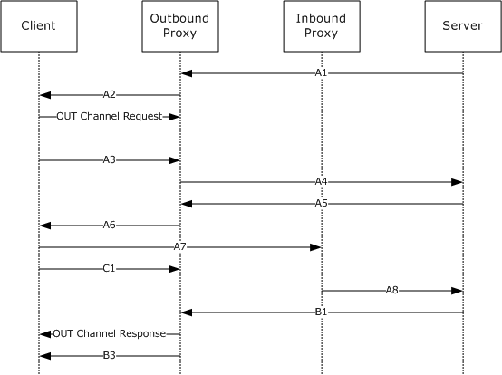

Figure 21: OUT channel recycling 2 protocol sequence

The references for the PDUs used in this protocol sequence are as follows.

| Diagram label | PDU name and reference section |
| --- | --- |
| OUT channel request | [OUT Channel Request (section 2.1.2.1.2)](#Section_2.1.2.1.2) |
| OUT channel response | [OUT Channel Response (section 2.1.2.1.4)](#Section_2.1.2.1.4) |
| A1 | [OUT_R2/A1 RTS PDU (section 2.2.4.34)](#Section_2.2.4.34) |
| A2 | [OUT_R2/A2 RTS PDU (section 2.2.4.35)](#Section_2.2.4.35) |
| A3 | [OUT_R2/A3 RTS PDU (section 2.2.4.36)](#Section_2.2.4.36) |
| A4 | [OUT_R2/A4 RTS PDU (section 2.2.4.37)](#Section_3.2.5.5.11) |
| A5 | [OUT_R2/A5 RTS PDU (section 2.2.4.38)](#Section_2.2.4.38) |
| A6 | [OUT_R2/A6 RTS PDU (section 2.2.4.39)](#Section_2.2.4.39) |
| A7 | [OUT_R2/A7 RTS PDU (section 2.2.4.40)](#Section_2.2.4.40) |
| A8 | [OUT_R2/A8 RTS PDU (section 2.2.4.41)](#Section_2.2.4.41) |
| B1 | [OUT_R2/B1 RTS PDU (section 2.2.4.42)](#Section_2.2.4.42) |
| B3 | [OUT_R2/B3 RTS PDU (section 2.2.4.44)](#Section_3.2.2.5.10) |
| C1 | [OUT_R2/C1 RTS PDU (section 2.2.4.45)](#Section_2.2.4.45) |

The processing rules for this protocol sequence are specified in sections [3.2.2](#Section_3.2.2) through [3.2.5](#Section_3.2.5) of this specification.

**Note** In an effort to improve readability, the establishments of TCP connections are not shown in the figure.

<a id="Section_3.2.1.6"></a>
#### 3.2.1.6 Timer Events

None.

<a id="Section_3.2.1.7"></a>
#### 3.2.1.7 Other Local Events

None.

<a id="Section_3.2.2"></a>
### 3.2.2 Client Details

This section defines the protocol details for the client role in the [RPC over HTTP v2](#Section_3.2) [**protocol dialects**](#gt_protocol-dialect).

An implementation of this protocol on the client MUST conform to the state machines given in this section. The first state machine is the overall client state machine for the [**virtual connection**](#gt_virtual-connection).

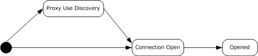

Figure 22: Overall client state machine

This overall client state machine defines the relationship of the other state machines given here. Details about when the state machines are started and the state transitions made by these state machines are given later in this section.

The [**proxy**](#gt_proxy) use determination state machine, shown in the following figure, MUST be used when the client is determining whether it will use an [**HTTP proxy**](#gt_http-proxy) for communicating with the [**inbound proxy**](#gt_inbound-proxy) and outbound proxy.

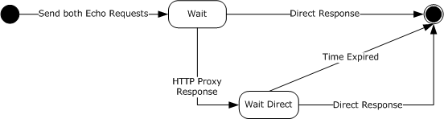

Figure 23: Proxy use determination

For more details on proxy use determination, see section [3.2.2.4.1.1](#Section_3.2.2.4.1.1).

The virtual connection open state machine, shown in the following figure, MUST be used when the client is trying to establish a virtual connection to the server.

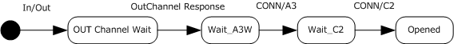

Figure 24: Virtual connection open

For more details on establishing a virtual connection, see sections [3.2.1.5.3.1](#Section_3.2.1.5.3.1) and [3.2.2.4.1.2](#Section_3.2.2.4.1.2).

The [**virtual IN channel**](#gt_virtual-in-channel) state machine, shown in the following figure, MUST be used when the client is trying to recycle an IN channel. It uses the protocol sequence IN_R1 as specified in section [3.2.1.5.3.2](#Section_3.2.1.5.3.2) or IN_R2 as specified in section [3.2.1.5.3.3](#Section_3.2.1.5.3.3).

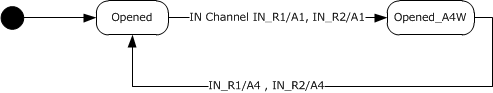

Figure 25: Client virtual IN channel state machine

For more details on recycling an IN channel, see section [3.2.2.5.12](#Section_3.2.2.5.12).

The [**virtual OUT channel**](#gt_virtual-out-channel) state machine, shown in the following figure, MUST be used when the client is trying to recycle an OUT channel. It uses the protocol sequence OUT_R1 as specified in section [3.2.1.5.3.4](#Section_3.2.1.5.3.4) or OUT_R2 as specified in section [3.2.1.5.3.5](#Section_3.2.1.5.3.5).

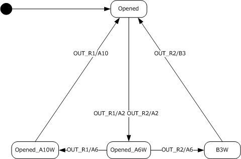

Figure 26: Client virtual OUT channel state machine

For more details on recycling an OUT channel, see section [3.2.2.5.6](#Section_3.2.2.5.6).

<a id="Section_3.2.2.1"></a>
#### 3.2.2.1 Abstract Data Model

This section describes a conceptual model of a possible data organization that an implementation might maintain to participate in this protocol. The described organization is provided to facilitate the explanation of how the protocol behaves. This document does not mandate that implementations adhere to this model as long as their external behavior is consistent with that described in this document.

A client maintains 3 sets of protocol variables:

- A Client [**Virtual Connection**](#gt_virtual-connection): A Virtual Connection as described in the common protocol variables section [3.2.1.1.3](#Section_3.2.1.1.3).
- A Client Out Channel: An out channel consisting of the data elements described in the Receiving Channel data elements, as described in the common protocol variables section [3.2.1.1.5](#Section_3.2.1.1.5).
- A Client In Channel: An in channel consisting of the data elements described in the Sending Channel and Ping Originator in the common protocol variable section [3.2.1.1.4](#Section_3.2.1.1.4).
The client also maintains a set of client-specific ADM elements as described in the following section.

<a id="Section_3.2.2.1.1"></a>
##### 3.2.2.1.1 KeepAlive interval

KeepAlive interval is a protocol variable that can be changed by higher layers. Implementations of this protocol SHOULD interpret this variable as the maximum time interval that a higher layer can wait before it establishes with certainty whether the server has dropped out of a conversation.

The higher-level Remote Procedure Call Protocol Extensions specify usage of this in [MS-RPCE](../MS-RPCE/MS-RPCE.md) section 3.3.2.2.1. In TCP [**RPC transport**](#gt_rpc-transport) (ncacn_ip_tcp), the Remote Procedure Call Protocol Extensions specify that the keep-alive interval is changed. In HTTP RPC transport, this protocol variable is changed instead.

<a id="Section_3.2.2.1.2"></a>
##### 3.2.2.1.2 proxy use

The Proxy Use variable tells the client implementation if it should use an [**HTTP proxy**](#gt_http-proxy) to connect to the [**RPC over HTTP v2 proxy**](#gt_rpc-over-http-proxy). It can have two values: use an HTTP proxy (called indirect connection) or not use an HTTP proxy (called direct connection).

<a id="Section_3.2.2.1.3"></a>
##### 3.2.2.1.3 Channel Lifetime Sent

An implementation of this protocol MUST maintain a protocol variable, **Channel Lifetime Sent**, that indicates the number of bytes sent by all [**RTS PDUs**](#gt_682437f3-1c41-420d-ae08-3178f5611ddd) and [**RPC PDUs**](#gt_remote-procedure-call-rpc) on a specific IN channel. Each time an [**RPC PDU**](#gt_rpc-pdu) or RTS PDU is sent, this protocol variable MUST be incremented by the size in bytes of the [**PDU**](#gt_request-to-send-rts-protocol-data-unit-pdu) that was sent.

<a id="Section_3.2.2.1.4"></a>
##### 3.2.2.1.4 Virtual In Channel State

Implementations of this protocol MUST maintain a protocol variable that contains the current state in the [**Virtual In Channel**](#gt_virtual-in-channel) state machine.

<a id="Section_3.2.2.1.5"></a>
##### 3.2.2.1.5 Virtual Out Channel State

Implementations of this protocol MUST maintain a protocol variable that contains the current state in the [**Virtual Out Channel**](#gt_virtual-out-channel) state machine.

<a id="Section_3.2.2.1.6"></a>
##### 3.2.2.1.6 CurrentKeepAliveTime

Implementations of this protocol MUST maintain a protocol variable that contains the current Keep Alive Time, which can be set by higher-layer protocols. The CurrentKeepAliveTime is the time after the first PDU is sent before a Ping RTS PDU is sent (section [2.2.4.49](#Section_2.2.4.49)).

<a id="Section_3.2.2.1.7"></a>
##### 3.2.2.1.7 CurrentKeepAliveInterval

Implementations of this protocol MUST maintain a protocol variable that contains the current Keep Alive Interval, which can be set by higher-layer protocols. The CurrentKeepAliveInterval represents the time between the sending of subsequent Ping RTS PDUs are sent after the first Ping RTS PDU is sent.

<a id="Section_3.2.2.2"></a>
#### 3.2.2.2 Timers

An implementation of the [RPC over HTTP v2](#Section_3.2) [**protocol dialect**](#gt_protocol-dialect) on the client SHOULD implement the following timers:

- Connection time-out timer (section [3.2.2.2.1](#Section_3.2.2.2.1))
- Keep-alive timer (section [3.2.2.2.2](#Section_3.2.2.2.2))
- Proxy use determination timer (section [3.2.2.2.3](#Section_3.2.2.2.3))
<a id="Section_3.2.2.2.1"></a>
##### 3.2.2.2.1 Connection Time-Out Timer

The connection time-out timer is a recurring timer set to an interval equal to the value of the **ConnectionTimeout** field value from [CONN/A3 RTS PDU](#Section_2.2.4.4), [IN_R1/A4 RTS PDU](#Section_2.2.4.13), or [IN_R2/A4 RTS PDU](#Section_2.2.4.21) as specified in section [2.2.4](#Section_2.2.4). A client implementation MAY choose a lower value for this timer.<28>

<a id="Section_3.2.2.2.2"></a>
##### 3.2.2.2.2 Keep-Alive Timer

The keep-alive timer is a recurring timer set when the [**virtual connection**](#gt_virtual-connection) is opened. The interval is controlled by the keep-alive interval protocol variable, which is set by a higher layer.

<a id="Section_3.2.2.2.3"></a>
##### 3.2.2.2.3 Proxy Use Determination Timer

A [**proxy**](#gt_proxy) use determination timer SHOULD be used for the duration of the proxy use determination protocol sequence only. It MAY have a value of 200 milliseconds or use a heuristic that adjusts this value based on network and past results of proxy use determination.<29>

<a id="Section_3.2.2.3"></a>
#### 3.2.2.3 Initialization

For this protocol to be initialized successfully, the higher-level [**RPC**](#gt_remote-procedure-call-rpc) protocol as specified in [MS-RPCE](../MS-RPCE/MS-RPCE.md) MUST be initialized successfully. Specifically, the initialization steps specified in [MS-RPCE] section 3.3.2.3 MUST be completed. This protocol imposes an additional initialization step in which the network options passed to RPC by higher-level protocols MUST contain a valid [**RPC over HTTP proxy**](#gt_rpc-over-http-proxy) name. Higher-level protocols also MUST indicate in an implementation-specific way whether HTTP or HTTPS will be used and whether HTTP authentication or client [**certificate**](#gt_certificate) authentication will be used.<30>

**Proxy Use** is initialized to not use an HTTP proxy.

**Channel Lifetime Set** is initialized to 0 bytes.

The Client In Channel Sending Channel and Ping Originator elements are initialized as described in the common data elements section.

The Client Out Channel Receiving Channel is initialized as described in the common data elements section.

The **CurrentKeepAliveTime** is set to an implementation-specific value that indicates the Keep Alive timer is disabled and not used. The CurrentKeepAliveTime can be set by a higher-layer protocol.

The **CurrentKeepAliveInterval** is set to 0. The CurrentKeepAliveTimeInterval can be set by a higher-layer protocol.

<a id="Section_3.2.2.4"></a>
#### 3.2.2.4 Higher-Layer Triggered Events

This section defines the higher-layer triggered events for the [RPC over HTTP v2](#Section_3.2) [**protocol dialect**](#gt_protocol-dialect). These events include opening a connection (section [3.2.2.4.1](#Section_3.2.2.4.1.2)), sending a PDU (section [3.2.2.4.2](#Section_3.2.2.4.2)), closing a connection (section [3.2.2.4.3](#Section_3.2.2.4.3)), and setting the keep-alive interval protocol variable (section [3.2.2.4.4](#Section_3.2.2.4.4)).

<a id="Section_3.2.2.4.1"></a>
##### 3.2.2.4.1 Opening a Connection

When an implementation of a higher-level protocol calls into an implementation of this protocol to open a new connection to the server, optionally specifying a connection timeout value, a ResourceType UUID (section [3.2.3.1.5](#Section_3.2.3.1.5)), and/or a Session UUID (section [3.2.3.1.6](#Section_3.2.3.1.6)), an implementation of this protocol MUST perform the following sequence of steps:

- Establish whether the implementation needs to perform proxy use determination, and if it does, perform the proxy use determination. This step is optional.
- Open a [**virtual connection**](#gt_virtual-connection) to the server as specified in section [3.2.2.4.1.2](#Section_3.2.2.4.1.2). For more information on the protocol sequence for opening a virtual connection, see section [3.2.1.5.3.1](#Section_3.2.1.5.3.1).
Each of the steps is broken down into more detailed steps in the sections [Determining Proxy Use (section 3.2.2.4.1.1)](#Section_3.2.2.4.1.1) and Connection Opening (section 3.2.2.4.1.2).

<a id="Section_3.2.2.4.1.1"></a>
###### 3.2.2.4.1.1 Determining HTTP Proxy Use

The first step of opening a connection is to determine proxy use. This step is optional and MAY<31> be skipped by an implementation if it has information from other sources about whether an [**HTTP proxy**](#gt_http-proxy) is needed to connect to the [**RPC over HTTP v2 proxy**](#gt_rpc-over-http-proxy) and which HTTP proxy it needs to use. If the client does not perform this step, the client MUST transition to the Connection Open state and execute the Connection Opening sequence as specified in section [3.2.2.4.1.2](#Section_3.2.2.4.1.2).

If a client implementation knows the name of an HTTP proxy but does not know whether the HTTP proxy needs to be used, it MUST perform the following sequence of steps to determine proxy use:

- Send an [**echo request**](#gt_echo-request) as specified in section [2.1.2.1.5](#Section_2.1.2.1.5) to the RPC over HTTP proxy through the HTTP proxy it knows about. It SHOULD set the Method in Echo Request to RPC_IN_DATA.
- Send an echo request as specified in section 2.1.2.1.5 directly to the RPC over HTTP proxy without going through the HTTP proxy it knows about. It SHOULD set the Method in Echo Request to RPC_IN_DATA.
- Move to wait state and wait for events from the network or wait for the timeout as specified in section [3.2.2.6.3](#Section_3.2.2.6.3).
Once HTTP proxy use has been determined, the client MUST transition to the Connection Open state and execute the Connection Opening sequence, as specified in section 3.2.2.4.1.2.

If no [Echo Response](#Section_2.1.2.1.6) PDUs are received (as specified in section 2.1.2.1.6) and the timer expires, it MUST be treated as a connection error and be processed as specified in section [3.1.3.4.3](#Section_3.1.3.4.3).

<a id="Section_3.2.2.4.1.2"></a>
###### 3.2.2.4.1.2 Connection Opening

When opening a virtual connection to the server, an implementation of this protocol MUST perform the following sequence of steps:

- Send an IN channel request as specified in section [2.1.2.1.1](#Section_2.1.2.1.1), containing the connection timeout, ResourceType UUID, and Session UUID values, if any, supplied by the higher-layer protocol or application.
- Send an OUT channel request as specified in section [2.1.2.1.2](#Section_2.1.2.1.2).
- Send a CONN/A1 RTS PDU as specified in section [2.2.4.2](#Section_2.2.4.2)
- Send a CONN/B1 RTS PDU as specified in section [2.2.4.5](#Section_3.2.3.5.3)
- Wait for the connection establishment protocol sequence as specified in [3.2.1.5.3.1](#Section_3.2.1.5.3.1) to complete
An implementation MAY execute steps 1 and 2 in parallel. An implementation SHOULD execute steps 3 and 4 in parallel. An implementation MUST execute step 3 after completion of step 1 and execute step 4 after completion of step 2.

<a id="Section_3.2.2.4.2"></a>
##### 3.2.2.4.2 Sending a PDU

The sending a PDU event is valid only in the [**virtual connection**](#gt_virtual-connection) opened state. In any other state an implementation of this protocol MUST treat this as an error and return an implementation-specific error to higher layers.

When a higher-level protocol requests that an implementation of this protocol send a [**PDU**](#gt_request-to-send-rts-protocol-data-unit-pdu) to the server, the implementation of this protocol MUST copy the PDU as a BLOB in the message body of the default [**RPC**](#gt_remote-procedure-call-rpc) IN channel request as specified in section [2.1.2.1.7](#Section_2.1.2.1.7). If an implementation of this protocol encounters an error while sending the data, it MUST do the following:

- Indicate to a higher layer in an implementation-specific way that the operation failed.
Windows implementations of this protocol will return an error to the Windows implementation of the Remote Procedure Call Protocol Extensions, as specified in [MS-RPCE](../MS-RPCE/MS-RPCE.md), to indicate the send PDU operation failed.

- Treat the connection as closed.
- Request the HTTP protocol stack to close all [**IN channels**](#gt_in-channel) and [**OUT channels**](#gt_out-channel) for this virtual connection.
If the [channel lifetime sent](#Section_3.2.2.1.3) protocol variable for the default IN channel approaches the [**channel lifetime**](#gt_channel-lifetime) (as specified later in this paragraph), the implementation of this protocol MUST initiate [**channel recycling**](#gt_channel-recycling) as defined in this section. An implementation MAY define when the number of bytes sent is approaching the channel lifetime in an implementation-specific way, but it SHOULD define it in such a way as to balance between two conflicting objectives: to open the successor IN channel early enough that it is fully opened before the [**predecessor channel**](#gt_predecessor-channel) has [**expired**](#gt_7160f109-6fd1-46b3-923f-0fae133ea0e9) and yet use as much of the predecessor channel as it can.<32>

For more information on the protocol sequence for recycling an IN channel, see sections [3.2.1.5.3.2](#Section_3.2.1.5.3.2) and [3.2.1.5.3.3](#Section_3.2.1.5.3.3).

<a id="Section_3.2.2.4.3"></a>
##### 3.2.2.4.3 Closing a Connection

When an implementation of a higher-level protocol calls an implementation of this protocol to close a connection, implementations of this protocol MUST do the following:

- Treat the connection as closed.
- Request the HTTP protocol stack to close all [**IN channels**](#gt_in-channel) and [**OUT channels**](#gt_out-channel) for this [**virtual connection**](#gt_virtual-connection).
<a id="Section_3.2.2.4.4"></a>
##### 3.2.2.4.4 Setting the KeepAlive interval Protocol Variable

When the higher-layer sets the [KeepAlive interval (section 3.2.2.1.1)](#Section_3.2.1.1.6.3) variable, implementations of this protocol MUST change the KeepAlive interval protocol variable as requested by the higher-layer protocol.

<a id="Section_3.2.2.5"></a>
#### 3.2.2.5 Message Processing Events and Sequencing Rules

All messages meeting any of the following criteria SHOULD be treated by the client as protocol errors and be processed as specified in section [3.2.2.5.11](#Section_3.2.2.5.11):

- Messages not specifically listed in this section
- Messages whose syntax is specified as invalid in section [2](#Section_1.3) of this specification
- Events that are specified in this section as protocol errors
<a id="Section_3.2.2.5.1"></a>
##### 3.2.2.5.1 Echo Response

The echo response is expected only in the states that are part of the proxy use determination state machine. All other states SHOULD treat this response as a protocol error.

If this response arrives in wait state, the following actions MUST be performed:

- If the [**echo response**](#gt_echo-response) to the [**echo request**](#gt_echo-request) sent directly to the [**RPC**](#gt_remote-procedure-call-rpc) over [**HTTP proxy**](#gt_http-proxy) arrives before the echo response sent to the RPC over HTTP proxy through an HTTP proxy, the client is finished with proxy use determination. It MUST initialize the proxy use variable to directly connect and proceed to connection opening.
- If the echo response to the echo request sent to the RPC over HTTP proxy through the HTTP proxy arrives first, the client MUST start a proxy use determination timer as specified in section [3.2.2.2.3](#Section_3.2.2.2.3) and transition to Wait_Direct state and wait for further events from the network.
If the response arrives in Wait_Direct state, the following actions are performed:

- The response is, by virtue of the position in the state diagram, a response to the echo request sent directly to the RPC over HTTP proxy.
- The client is finished with proxy use determination and MUST cancel the proxy use determination timer, initialize the proxy use variable to direct connect, and move to connection opening.
<a id="Section_3.2.2.5.2"></a>
##### 3.2.2.5.2 OUT Channel Response

A client implementation MUST NOT accept the OUT channel HTTP response in any state other than Out Channel Wait. If received in any other state, this HTTP response is a protocol error. Therefore, the client MUST consider the [**virtual connection**](#gt_virtual-connection) opening a failure and indicate this to higher layers in an implementation-specific way. The Windows implementation returns RPC_S_PROTOCOL_ERROR, as specified in [MS-ERREF](../MS-ERREF/MS-ERREF.md), to higher-layer protocols.

If this HTTP response is received in Out Channel Wait state, the client MUST process the fields of this response as defined in this section.

First, the client MUST determine whether the response indicates a success or a failure. If the status-code is set to 200, the client MUST interpret this as a success, and it MUST do the following:

- Ignore the values of all other header fields.
- Transition to Wait_A3W state.
- Wait for network events.
- Skip the rest of the processing in this section.
If the status code is not set to 200, the client MUST interpret this as a failure and follow the same processing rules as specified in section [3.2.2.5.6](#Section_3.2.2.5.6).

<a id="Section_3.2.2.5.3"></a>
##### 3.2.2.5.3 CONN/A3 RTS PDU

A client implementation MUST NOT accept the [CONN/A3 RTS PDU](#Section_2.2.4.4) in any state other than Wait_A3W. If received in any other state, this [**PDU**](#gt_request-to-send-rts-protocol-data-unit-pdu) is a protocol error and the client MUST consider the [**virtual connection**](#gt_virtual-connection) opening a failure and indicate this to higher layers in an implementation-specific way.

- Set the ConnectionTimeout in the Ping Originator of the Client's IN Channel to the ConnectionTimeout in the CONN/A3 PDU.
If this [**RTS PDU**](#gt_682437f3-1c41-420d-ae08-3178f5611ddd) is received in Wait_A3W state, the client MUST transition the state machine to Wait_C2 state and wait for network events.

<a id="Section_3.2.2.5.4"></a>
##### 3.2.2.5.4 CONN/C2 RTS PDU

A client implementation MUST NOT accept the [CONN/C2 RTS PDU](#Section_2.2.4.9) in any state other than Wait_C2. If received in any other state, this [**PDU**](#gt_request-to-send-rts-protocol-data-unit-pdu) is a protocol error and the client MUST consider the [**virtual connection**](#gt_virtual-connection) opening a failure and indicate this to higher layers in an implementation-specific way.

If this [**RTS PDU**](#gt_682437f3-1c41-420d-ae08-3178f5611ddd) is received in Wait_C2 state, the client implementation MUST do the following:

- Transition the state machine to opened state.
- Set the connection time-out protocol variable to the value of the **ConnectionTimeout** field from the CONN/C2 RTS PDU.
- Set the PeerReceiveWindow value in the SendingChannel of the Client IN Channel to the ReceiveWindowSize value in the CONN/C2 PDU.
- Indicate to higher-layer protocols that the virtual connection opening is a success.
From this moment on, the client implementation MUST conform to the [**virtual IN channel**](#gt_virtual-in-channel) and [**virtual OUT channel**](#gt_virtual-out-channel) state machines separately as specified in the beginning of section [3.2.2](#Section_3.2.2). Both of these state machines start in opened state.

<a id="Section_3.2.2.5.5"></a>
##### 3.2.2.5.5 IN_R1/A4 and IN_R2/A4 RTS PDUs

The [IN_R1/A4 RTS PDU](#Section_2.2.4.13) and the [IN_R2/A4 RTS PDU](#Section_2.2.4.21) are processed identically by implementations of this protocol. This section defines processing of IN_R1/A4, but all definitions provided herein apply to IN_R2/A4 as well.

A client implementation MUST NOT accept this [**RTS PDU**](#gt_682437f3-1c41-420d-ae08-3178f5611ddd) in any state other than Opened_A4W. If received in any other state, this [**PDU**](#gt_request-to-send-rts-protocol-data-unit-pdu) is a protocol error and the client MUST close the [**virtual connection**](#gt_virtual-connection) and indicate this to higher layers in an implementation-specific way.The Windows implementation returns RPC_S_PROTOCOL_ERROR, as specified in [MS-ERREF](../MS-ERREF/MS-ERREF.md), to higher-layer protocols.

If this RTS PDU is received in Opened_A4W, the client implementation MUST perform the following actions in the sequence given:

- Switch the successor IN channel to [**plugged channel mode**](#gt_plugged-channel-mode).
- Set default IN channel to be the successor IN channel.
- Set the ConnectionTimeout of the Ping Originator in the Client IN Channel to the value of the **InboundProxyConnectionTimeout** field in the IN_R1/A4 PDU.
- Set the PeerReceiveWindow in the Client IN Channel SendingChannel to the value of the **InboundProxyReceiveWindowSize** field in the IN_R1/A4 PDU.
- Wait until all RTS and [**RPC PDUs**](#gt_remote-procedure-call-rpc) on the predecessor IN channel are sent.
- Send [IN_R1/A5 RTS PDU](#Section_2.2.4.14) on the predecessor IN channel. Set the value of SuccessorInChannelCookie in the IN R1/A5 RTS PDU to the value of DefaultInChannelCookie in the Client Virtual Connection.
- Unplug the successor IN channel.
<a id="Section_3.2.2.5.6"></a>
##### 3.2.2.5.6 OUT_R1/A2 and OUT_R2/A2 RTS PDUs

The [OUT_R1/A2 RTS PDU](#Section_2.2.4.24) and the [OUT_R2/A2 RTS PDU](#Section_2.2.4.35) are processed identically by implementations of this protocol. This section defines processing for OUT_R1/A2, but all definitions provided herein apply to OUT_R2/A2 as well.

A client implementation MUST NOT accept these [**RTS PDUs**](#gt_682437f3-1c41-420d-ae08-3178f5611ddd) in any state of the [**virtual OUT channel**](#gt_virtual-out-channel) other than opened. If it is received in any other state, the client MUST treat it as a protocol error as defined in section [3.2.2.5.11](#Section_3.2.2.5.11).

If this RTS PDU is received in opened state, the client implementation MUST perform the following actions in the sequence given:

- Create a successor OUT channel instance and send an OUT channel request to the outbound proxy. The successor OUT channel instance MUST be considered the successor OUT channel, and the existing OUT channel MUST be considered the predecessor OUT channel. The successor OUT channel is attached as a component to the virtual OUT channel.
- Send [OUT_R1/A3 RTS PDU](#Section_3.2.4.5.6) on the successor OUT channel.
- Set the OutboundProxyReceiveWindowSize in the OUT R1/A3 RTS PDU to the value of ReceiveWindowSize in the Client OUT Channel.
- Set the PredecessorChannelCookie in the OUT R1/A3 RTS PDU to the value of DefaultOutChannelCookie in the Client [**Virtual Connection**](#gt_virtual-connection).
- Set the SuccessorChannelCookie in the OUT R1/A3 RTS PDU to the value of NonDefaultOutChannelCookie in the Client Virtual Connection.
- Set the VirtualConnectionCookie in the OUT R1/A3 RTS PDU to the value of the VirtualConnectionCookie in the Client Virtual Connection.
- Set the ProtocolVersion in the OUT R1/A3 RTS PDU to the value of ProtocolVersion in the Client Virtual Connection.
- Transition the virtual OUT channel state machine to Opened_A6W state.
<a id="Section_3.2.2.5.7"></a>
##### 3.2.2.5.7 OUT_R1/A6 RTS PDU

A client implementation MUST NOT accept the [OUT_R1/A6 RTS PDU](#Section_2.2.4.28) in any state of the [**virtual OUT channel**](#gt_virtual-out-channel) other than Opened_A6W. If it is received in any other state, the client MUST treat it as a protocol error as defined in section [3.2.2.5.11](#Section_3.2.2.5.11).

If this [**RTS PDU**](#gt_682437f3-1c41-420d-ae08-3178f5611ddd) is received in Opened_A6W, the client implementation MUST perform the following actions in the sequence given:

- Send [OUT_R1/A7 RTS PDU](#Section_2.2.4.29) on the IN channel and set the value of SuccessorChannelCookie in the OUT R1/A7 RTS PDU to the value of NonDefaultOutChannelCookie in the Client [**Virtual Connection**](#gt_virtual-connection).
- Transition the virtual OUT channel state machine to Opened_A10W state.
<a id="Section_3.2.2.5.8"></a>
##### 3.2.2.5.8 OUT_R1/A10 RTS PDU

A client implementation MUST NOT accept the [OUT_R1/A10 RTS PDU](#Section_3.2.2.5.8) in any state of the [**virtual OUT channel**](#gt_virtual-out-channel) other than Opened_A10W. If it is received in any other state, the client MUST treat it as a protocol error as specified in section [3.2.2.5.11](#Section_3.2.2.5.11).

If this [**RTS PDU**](#gt_682437f3-1c41-420d-ae08-3178f5611ddd) is received in Opened_A10W, the client implementation MUST perform the following actions in the sequence given:

- Set the successor OUT channel as the default OUT channel.
- Send [OUT_R1/A11 RTS PDU](#Section_3.2.4.5.9) on the successor OUT channel.
- Transition the virtual OUT channel state machine to opened state.
- Implementations MUST ignore any subsequent bytes received on the predecessor channel.
- Close the predecessor OUT channel.
<a id="Section_3.2.2.5.9"></a>
##### 3.2.2.5.9 OUT_R2/A6 RTS PDU

A client implementation MUST NOT accept the [OUT_R2/A6 RTS PDU](#Section_2.2.4.39) in any state of the [**virtual OUT channel**](#gt_virtual-out-channel) other than Opened_A6W. If it is received in any other state, the client MUST treat it as a protocol error as specified in section [3.2.2.5.11](#Section_3.2.2.5.11).

If this [**RTS PDU**](#gt_682437f3-1c41-420d-ae08-3178f5611ddd) is received in Opened_A6W, the client implementation MUST perform the following actions in the sequence given:

- Send [OUT_R2/A7 RTS PDU](#Section_2.2.4.40) on the IN channel. Set the value of SuccessorChannelCookie in the OUT R2/A7 RTS PDU to the value of NonDefaultOutChannelCookie in the Client Virtual Connection.
- Send [OUT_R2/C1 RTS PDU](#Section_2.2.4.45) on the successor OUT channel.
- Transition the virtual OUT channel state machine to B3W state.
<a id="Section_3.2.2.5.10"></a>
##### 3.2.2.5.10 OUT_R2/B3 RTS PDU

A client implementation MUST NOT accept the [OUT_R2/B3 RTS PDU](#Section_3.2.2.5.10) in any state of the [**virtual OUT channel**](#gt_virtual-out-channel) other than B3W. If it is received in any other state, the client MUST treat it as a protocol error as specified in section [3.2.2.5.11](#Section_3.2.2.5.11).

If this [**RTS PDU**](#gt_682437f3-1c41-420d-ae08-3178f5611ddd) is received in B3W, the client implementation MUST perform the following actions in the sequence given:

- Switch the default OUT channel to the successor OUT channel.
- Transition the virtual OUT channel state machine to the opened state.
- Implementations MUST ignore additional bytes sent on the predecessor channel after the OUT_R3/B3 RTS PDU is received.
- Close the predecessor OUT channel.
<a id="Section_3.2.2.5.11"></a>
##### 3.2.2.5.11 Connection Close, Connection Error, and Protocol Error Encountered

Connection close and connection error encountered MUST be handled and indicated to higher layers identically by implementations of this protocol. This section discusses connection close only, and implementations of this protocol MUST handle connection errors that it encounters in the same way. A connection close can come from either the [**inbound proxy**](#gt_inbound-proxy) or outbound proxy. Processing is equivalent in both cases.

This section discusses connection close from the outbound proxy, but all parts of the specification in this section apply equally to connection close received from the inbound proxy. If a connection is closed by the outbound proxy, the client implementation MUST find the [**virtual connection**](#gt_virtual-connection) to which the OUT channel belongs, and unless the OUT channel is in state opened and the connection close comes from a [**predecessor outbound proxy**](#gt_predecessor-outbound-proxy), the client implementation MUST do the following:

- Free any data structures associated with it.
- Close all the channels that belong to this virtual connection.
- Stop execution on the state machine.
If the connection is closed in state opened and the connection close comes from a predecessor outbound proxy, the client implementation MUST ignore this event.

If a connection close by the inbound proxy is preceded by an IN channel response as specified in section [2.1.2.1.3](#Section_2.1.2.1.3), the client MUST process its fields as specified later in this section.

Section 2.1.2.1.3 defines the reason-phrase, which should be interpreted as follows.

**RPC-Error:** MUST be interpreted by the client implementation as a hexadecimal representation of an error code and MUST be returned to a higher-layer protocol in an implementation-specific way.<33>

Clients SHOULD ignore ee-info in the message header if the message body contains it.

**EncodedEEInfo:** MUST be interpreted by the client implementation as a [**base64**](#gt_179b9392-9019-45a3-880b-26f6890522b7)-encoded [MS-EERR](../MS-EERR/MS-EERR.md) BLOB and MUST be processed as specified in [MS-EERR] and made available to higher-layer protocols in an implementation-specific way.

The message-body MUST be in the format specified in section 2.1.2.1.3.

If the message-body has EncodedEEInfo, the client SHOULD use that and ignore the EncodedEEInfo from the message header.

**EncodedEEInfo:** MUST be interpreted by the client implementation as a base64-encoded [MS-EERR] BLOB and MUST be processed as specified in [MS-EERR] and made available to higher-layer protocols in an implementation-specific way.<34>

The client implementation MUST handle the protocol error in the following manner:

- Close all channels to the [**inbound**](#gt_inbound) and outbound proxy for the virtual connection on which the error was encountered.
- Free all data structures associated with the virtual connection.
- Stop execution on the state machine.
<a id="Section_3.2.2.5.12"></a>
##### 3.2.2.5.12 IN Channel Recycling

[**IN channel recycling**](#gt_in-channel-recycling) MUST NOT be started unless the IN channel is in an opened state. If the number of bytes sent on the channel approaches the [**channel lifetime**](#gt_channel-lifetime) and the IN channel is not in an opened state, implementations of this protocol SHOULD return an implementation-specific error to higher layers.The Windows implementation returns RPC_S_PROTOCOL_ERROR, as specified in [MS-ERREF](../MS-ERREF/MS-ERREF.md), to higher-layer protocols.

An implementation of this protocol MUST start IN channel recycling by sending out an IN channel request as specified in sections [2.1.2.1.1](#Section_2.1.2.1.1) and [3.2.2.4.1.2](#Section_3.2.2.4.1.2) immediately followed by an [IN_R1/A1 RTS PDU](#Section_2.2.4.10), as specified in section 2.2.4.10, in the message body of the IN channel request. This IN channel request is the beginning of the [**successor channel**](#gt_successor-channel), and the existing IN channel request is the [**predecessor channel**](#gt_predecessor-channel). The successor IN channel request is set to be the nondefault IN channel. Then the implementation MUST transition the IN channel state machine to Opened_A4W state and wait for network events. The client implementation MUST be able to execute the IN channel recycling and [**OUT channel recycling**](#gt_out-channel-recycling) state machines in parallel.

<a id="Section_3.2.2.6"></a>
#### 3.2.2.6 Timer Events

An implementation of an [RPC over HTTP v2](#Section_3.2) client SHOULD implement the following timers:

- Connection Time-Out Timer Expiry (section [3.2.2.6.1](#Section_3.2.2.6.1))
- Keep-Alive Timer Expiry (section [3.2.2.6.2](#Section_3.2.2.6.2))
- Proxy Use Determination Timer Expiry (section [3.2.2.6.3](#Section_3.2.2.6.3))
<a id="Section_3.2.2.6.1"></a>
##### 3.2.2.6.1 Connection Time-Out Timer Expiry

Each time the connection time-out timer expires, the client implementation of this protocol MUST send a [Ping RTS PDU](#Section_2.2.4.49) as specified in section 2.2.4.49 unless the LastSendTimeStamp has been set recently. "Recently" MAY be interpreted in an implementation-specific way.<35>

<a id="Section_3.2.2.6.2"></a>
##### 3.2.2.6.2 Keep-Alive Timer Expiry

Each time the keep-alive timer expires, the client implementation of this protocol MUST send a [Ping RTS PDU (section 2.2.4.49)](#Section_2.2.4.49) unless LastSendTimeStamp has been set recently. "Recently" MAY be interpreted in an implementation-specific way.<36>

<a id="Section_3.2.2.6.3"></a>
##### 3.2.2.6.3 Proxy Use Determination Timer Expiry

If the proxy use determination timer expires, the client MUST complete proxy use determination, initialize the proxy use variable to indirect connect, transition to the Connection Open state, and execute the Connection Opening sequence, as specified in section [3.2.2.4.1.2](#Section_3.2.2.4.1.2).

<a id="Section_3.2.2.7"></a>
#### 3.2.2.7 Other Local Events

An implementation of this protocol is not required to handle other local events.

<a id="Section_3.2.3"></a>
### 3.2.3 Inbound Proxy Details

This section contains details specific to an implementation of an [**inbound proxy**](#gt_inbound-proxy). The state machine in the following diagram specifies the states and the transitions between them for the inbound proxy. Which event causes which transition is specified in section [3.2.3.5](#Section_3.2.3.5).

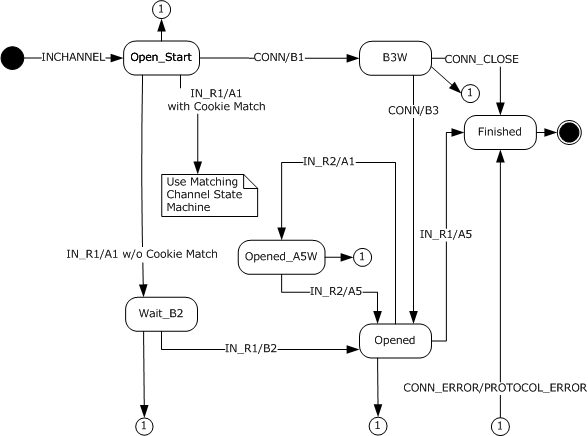

Figure 27: Inbound proxy state machine

The inbound proxy state machine is used when the inbound proxy is processing messages and [**PDUs**](#gt_request-to-send-rts-protocol-data-unit-pdu) coming from the network. When the state machine transitions to "Use Matching Channel State Machine", the state machine execution for this state machine stops and the current event (IN_R1/A1 with Cookie Match) is interpreted as IN_R2/A1 event for the state machine of the matching IN channel as specified in section [3.2.3.5.5](#Section_3.2.3.5.5).

<a id="Section_3.2.3.1"></a>
#### 3.2.3.1 Abstract Data Model

This section describes a conceptual model of possible data organization that an implementation might maintain to participate in this protocol. The described organization explains how the protocol behaves. This document does not mandate that implementations adhere to this model as long as their external behavior is consistent with that described in this document.

An [**inbound proxy**](#gt_inbound-proxy) maintains several abstract protocol variables and data structures:

- A [**Virtual Connection**](#gt_virtual-connection) Cookie Table as described in the common virtual connection elements in the preceding paragraphs.
- For each Virtual Connection in the Virtual Connection Cookie Table, the common Virtual Connection elements as described in the preceding paragraphs.
- For each Virtual Connection, an IN Channel which consists of the ReceivingChannel elements as described in the common section.
- For each Virtual Connection, an OUT Channel which consists of the SendingChannel elements as described in the common section.
- A set of Inbound Proxy-specific data elements as described in the following list.
- KeepAlive interval (section [3.2.3.1.4](#Section_3.2.3.1.4))
- Resource type UUID (section [3.2.3.1.5](#Section_3.2.3.1.5))
- Session UUID (section [3.2.3.1.6](#Section_3.2.3.1.6))
<a id="Section_3.2.3.1.1"></a>
##### 3.2.3.1.1 ChannelLifetime

ChannelLifetime is a protocol variable that contains the total number of bytes that can be sent across this channel. The value of ChannelLifetime is set by the content length of the HTTP header when the channel is established.

<a id="Section_3.2.3.1.2"></a>
##### 3.2.3.1.2 CurrentClientKeepAliveInterval

Implementations of this protocol MUST maintain a variable that contains the CurrentClientKeepAliveInterval.

<a id="Section_3.2.3.1.3"></a>
##### 3.2.3.1.3 ClientAddress

Implementations of this protocol MUST maintain a variable that contains the IPv4 or IPv6 address of the client ([2.2.3.2](#Section_2.2.3.2)).

<a id="Section_3.2.3.1.4"></a>
##### 3.2.3.1.4 KeepAlive interval

KeepAlive interval is a protocol variable that SHOULD be changed in response to network events. Implementations of this protocol SHOULD interpret this variable as the maximum time interval that a client can wait before it establishes with certainty whether the server has dropped out of a conversation. The initial value is an implementation-specific value.<37>

<a id="Section_3.2.3.1.5"></a>
##### 3.2.3.1.5 Resource Type UUID

Implementations of this protocol MAY maintain a protocol variable for each virtual IN channel called Resource Type UUID. Initially, when the IN channel is created, the value of this variable is not set. This protocol variable is not currently used but is reserved for future extensibility.<38>

<a id="Section_3.2.3.1.6"></a>
##### 3.2.3.1.6 Session UUID

Implementations of this protocol MAY maintain a protocol variable for each [**virtual IN channel**](#gt_virtual-in-channel) called Session UUID. Initially, when the IN channel is created, the value of this variable is not set. This protocol variable is not currently used but is reserved for future extensibility.<39>

<a id="Section_3.2.3.1.7"></a>
##### 3.2.3.1.7 Default IN Channel

During [**channel recycling**](#gt_channel-recycling), an [**inbound proxy**](#gt_inbound-proxy) MAY have two IN channels active. A default IN channel is a protocol variable that indicates which of the two channels is the default channel. Outside channel recycling, there is only one IN channel at a given point in time, and this channel is always considered the default channel. The default channel MUST be used for sending all [**RPC PDUs**](#gt_remote-procedure-call-rpc) and all [**RTS PDUs**](#gt_682437f3-1c41-420d-ae08-3178f5611ddd) not specifically defined to have different processing rules in section [3.2.3.5](#Section_3.2.3.5).

<a id="Section_3.2.3.2"></a>
#### 3.2.3.2 Timers

An implementation of the [RPC over HTTP v2](#Section_3.2) [**protocol dialect**](#gt_protocol-dialect) on the [**inbound proxy**](#gt_inbound-proxy) SHOULD implement the keep-alive timer as defined in section [3.2.3.2.1](#Section_3.2.3.2.1).

<a id="Section_3.2.3.2.1"></a>
##### 3.2.3.2.1 Keep-Alive Timer

The recurring keep-alive timer MUST be first set when an IN channel from the [**inbound proxy**](#gt_inbound-proxy) to the server is opened. The interval MUST be equal to the keep-alive interval protocol variable that is set through network events. This timer is set in the [RPC over HTTP v2](#Section_3.2) protocol layer but is implemented by the TCP implementation on the inbound proxy, and its expiry shows up as a connection error on the IN channel to the server.

<a id="Section_3.2.3.3"></a>
#### 3.2.3.3 Initialization

As part of initialization, implementations of this protocol MUST listen on HTTP/HTTPS URL namespace "/rpc/rpcproxy.dll" and SHOULD listen on HTTP/HTTPS URL namespace "/rpcwithcert/rpcproxy.dll".<40>

- [Connection Timeout (section 3.2.1.1.6.1)](#Section_3.2.1.1.6.1) is initialized to a value specified in the local server registry.<41>
- [Default IN Channel (section 3.2.3.1.7)](#Section_3.2.3.1.7) is initialized to indicate the first or primary channel.
- **KeepAlive Interval** is initialized to half of the Connection Timeout value.
- The **Virtual Connection Cookie Table** is initialized to an empty table with no rows.
<a id="Section_3.2.3.4"></a>
#### 3.2.3.4 Higher-Layer Triggered Events

There are no higher-layer triggered events on the [**inbound proxy**](#gt_inbound-proxy).

<a id="Section_3.2.3.5"></a>
#### 3.2.3.5 Message Processing Events and Sequencing Rules

The messages and [**PDUs**](#gt_request-to-send-rts-protocol-data-unit-pdu) listed in this section correspond to events in the state diagram in section [3.2.3](#Section_3.2.3).

All messages not specifically listed in this section and not marked for PDU forwarding as specified in section [3.2.1.5.2](#Section_3.2.1.5.2), or messages whose syntax is specified in section [2](#Section_1.3) of this protocol as invalid, SHOULD be treated by implementations of this protocol on the [**inbound proxy**](#gt_inbound-proxy) as protocol errors, as defined in section [3.2.3.5.10](#Section_3.2.3.5.10).

<a id="Section_3.2.3.5.1"></a>
##### 3.2.3.5.1 RPC IN Channel Request Received

When an [**RPC over HTTP v2 proxy**](#gt_rpc-over-http-proxy) receives an RPC IN channel HTTP request, it MUST assume the role of an [**inbound proxy**](#gt_inbound-proxy) and transition to Open_Start state. The processing of the HTTP header fields from the HTTP request are defined as follows:

**Accept:** Implementations of this protocol on the inbound proxy SHOULD ignore this header field.

**Cache-Control:** Implementations of this protocol on the inbound proxy SHOULD ignore this header field.

**Connection:** Implementations of this protocol on the inbound proxy SHOULD ignore this header field.

**Content-Length:** Implementations of this protocol on the inbound proxy SHOULD ignore this header field.

**Pragma Directives:**

- Implementations of this protocol on the inbound proxy SHOULD ignore the "No-cache" pragma directive if present.
- Implementations of this protocol on the inbound proxy SHOULD ignore the "Pragma:MinConnTimeout=T" directive if present.
- Implementations of this protocol on the inbound proxy SHOULD check for the presence of the "Pragma:ResourceTypeUuid=R" directive and if present, MUST set the Resource Type [**UUID**](#gt_universally-unique-identifier-uuid) protocol variable to the R value.
- Implementations of this protocol on the inbound proxy SHOULD check for the presence of the "Pragma:SessionId=S" directive and if present, MUST set the Session UUID protocol variable to the S value.
**Protocol:** Implementations of this protocol on the inbound proxy SHOULD ignore this header field.

**User-Agent:** Implementations of this protocol on the inbound proxy SHOULD ignore this header field.

<a id="Section_3.2.3.5.2"></a>
##### 3.2.3.5.2 RPC PDU Received

An [**RPC PDU**](#gt_rpc-pdu) MUST be received from the client only and MUST NOT be received from the server. If the RPC PDU is received on an IN channel from the server, the [**inbound proxy**](#gt_inbound-proxy) MUST close the IN channel to the server and the IN channel to the client for the [**virtual IN channel**](#gt_virtual-in-channel) to which the IN channel to the server belongs.

If the [**PDU**](#gt_request-to-send-rts-protocol-data-unit-pdu) is received from the client as specified in section [2.1.2.1.7](#Section_2.1.2.1.7), an implementation of this protocol MUST forward it to the server using the default IN channel and conforming to flow control provisions as specified in section [3.2.1.4.1.2](#Section_3.2.1.4.1.2).

<a id="Section_3.2.3.5.3"></a>
##### 3.2.3.5.3 CONN/B1 RTS PDU

An [**inbound proxy**](#gt_inbound-proxy) implementation MUST NOT accept the [CONN/B1 RTS PDU](#Section_3.2.3.5.3) in any state other than Open_Start. If it is received in any other state, the inbound proxy MUST treat this [**PDU**](#gt_request-to-send-rts-protocol-data-unit-pdu) as a protocol error as defined in section [3.2.3.5.10](#Section_3.2.3.5.10).

If this [**RTS PDU**](#gt_682437f3-1c41-420d-ae08-3178f5611ddd) is received in Open_Start state, the inbound proxy implementation MUST perform the following actions in the sequence given:

- Establish a TCP connection to the server using the server name and port from the IN channel request as specified in section [2.2.2](#Section_2.2.2).
- Set the keep-alive protocol variable to the value from the [ClientKeepalive](#Section_2.2.3.5.6) command of this PDU.
- Set the value of ChannelLifetime in the inbound proxy [**Virtual Connection**](#gt_virtual-connection) to the value of ChannelLifetime from the CONN/B1 PDU.
- Set the value of the DefaultInChannelCookie in the inbound proxy Virtual Connection to the value of INChannelCookie from the CONN/B1 PDU.
- Set the value of AssociationGroupId in the inbound proxy Virtual Connection to the value of AssociationGroupId in the CONN/B1 PDU.
- Send the CONN/B2 RTS PDU to the server as specified in section [2.2.4.6](#Section_2.2.4.6).
- Set the value of ConnectionTimeout in the CONN/B2 RTS PDU to the value of ConnectionTimeout in the inbound proxy Virtual Connection.
- Set the value of INChannelCookie in the CONN/B2 RTS PDU to the value of DefaultInChannelCookie from the inbound proxy Virtual Connection.
- Set the value of ReceiveWindowSize in the CONN/B2 RTS PDU to the value of ReceiveWindowSize in the inbound proxy Virtual Connection.
- Set the value of VirtualConnectionCookie in the CONN/B2 RTS PDU to the value of VirtualConnectionCookie from the inbound proxy Virtual Connection.
- Set the value of ProtocolVersion in the CONN/B2 RTS PDU to the value of ProtocolVersion from the inbound proxy Protocol Version.
- Add the virtual connection cookie to the virtual connection cookie table.
- Switch the IN channel to the server to [**plugged channel mode**](#gt_plugged-channel-mode).
- Transition the state to B3W.
<a id="Section_3.2.3.5.4"></a>
##### 3.2.3.5.4 CONN/B3 RTS PDU

An [**inbound proxy**](#gt_inbound-proxy) implementation MUST NOT accept the [CONN/B3 RTS PDU](#Section_2.2.4.7) in any state other than B3W. If it is received in any other state, this [**PDU**](#gt_request-to-send-rts-protocol-data-unit-pdu) is a protocol error and the inbound proxy MUST treat it as a protocol error as specified in section [3.2.3.5.10](#Section_3.2.3.5.10).

If this [**RTS PDU**](#gt_682437f3-1c41-420d-ae08-3178f5611ddd) is received in B3W state, the inbound proxy implementation MUST perform the following actions in the sequence given:

- Switch the IN channel to the server to [**unplugged channel mode**](#gt_unplugged-channel-mode).
- Set the value of PeerReceiveWindow in the inbound proxy OUT channel to the value of ReceiveWindowSize in the CONN/B3 PDU.
- Transition the state to opened.
<a id="Section_3.2.3.5.5"></a>
##### 3.2.3.5.5 IN_R1/A1 and IN_R2/A1 RTS PDUs

The [IN_R1/A1 RTS PDU](#Section_2.2.4.10) and the [IN_R2/A1 RTS PDU](#Section_2.2.4.18) have the same format and are processed identically by the [**inbound proxy**](#gt_inbound-proxy). This section defines processing for IN_R1/A1 only, but the same processing rules apply to IN_R2/A1.

An inbound proxy implementation MUST NOT accept this [**RTS PDU**](#gt_682437f3-1c41-420d-ae08-3178f5611ddd) in any state other than Open_Start. If received in any other state, this [**PDU**](#gt_request-to-send-rts-protocol-data-unit-pdu) is a protocol error and the inbound proxy MUST treat it as a protocol error as specified in section [3.2.3.5.10](#Section_3.2.3.5.10).

If this RTS PDU is received in Open_Start state, the inbound proxy implementation MUST retrieve the [**virtual connection**](#gt_virtual-connection) cookie from the IN_R1/A1 RTS PDU and search for a matching entry in the virtual connection cookie table. If found, it MUST execute the sequence of steps in section [3.2.3.5.5.1](#Section_3.2.3.5.5.1). If not found, it MUST execute the sequence of steps in section [3.2.3.5.5.2](#Section_3.2.3.5.5.2).

<a id="Section_3.2.3.5.5.1"></a>
###### 3.2.3.5.5.1 Virtual Connection Cookie Found

If the [**virtual connection**](#gt_virtual-connection) cookie is found in the virtual connection cookie table, an implementation of this protocol MUST execute these steps:

- [**Inbound proxy**](#gt_inbound-proxy) MUST conform to IN_R2 protocol sequence.
- The [**virtual IN channel**](#gt_virtual-in-channel) that belongs to the virtual connection found in the virtual connection cookie table is verified to be in opened state. If the verification fails, it is a protocol error and MUST be treated as a protocol error as specified in section [3.2.3.5.10](#Section_3.2.3.5.10). If the verification succeeds, the IN channel instance MUST be set as a nondefault IN channel and a component of the virtual IN channel found through the virtual connection cookie table. In terms of virtual IN channel state machine, this message MUST effect a transition as an IN_R2/A1 event from the opened state to the Opened_A5W state.
- The successor IN channel from client to inbound proxy is switched to [**plugged channel mode**](#gt_plugged-channel-mode).
- The server MUST compare the value of PredecessorChannelCookie in the IN R2/A1 PDU to the value of the DefaultInChannelCookie from the inbound proxy Virtual Connection. If they do not match, the server MUST treat it as a protocol error as specified in section 3.2.3.5.10.
- Set the value of the DefaultInChannelCookie in the inbound proxy Virtual Connection to the value of SuccessorChannelCookie from the IN R2/A1 PDU.
- Wait for further network events.
<a id="Section_3.2.3.5.5.2"></a>
###### 3.2.3.5.5.2 Virtual Connection Cookie Not Found

If the [**virtual connection**](#gt_virtual-connection) cookie is not found in the virtual connection cookie table, an implementation of this protocol MUST execute these steps:

- The [**inbound proxy**](#gt_inbound-proxy) MUST conform to IN_R1 protocol sequence.
- Establish a TCP connection to the server using the server name and port from the IN channel request, as specified in section [2.2.2](#Section_2.2.2).
- Add the virtual connection cookie to the virtual connection cookie table.
- Send [IN_R1/A2 RTS PDU](#Section_3.2.5.5.5), as specified in section 2.2.4.11, to the server.
The IN_R1/A2 RTS PDU **InboundProxyReceiveWindowSize** and **InboundProxyConnectionTimeout** fields come from the IN channel protocol variables [ReceiveWindowSize (section 3.2.1.1.5.1.1)](#Section_2.2.3.5.1) and [ConnectionTimeout (section 3.2.1.1.6.1)](#Section_3.2.1.1.6.1), respectively.

- Set the value of ProtocolVersion in the IN_R1/A2 RTS PDU to the value of ProtocolVersion from the inbound proxy Virtual Connection.
- Set the value of NonDefaultInChannelCookie in the inbound proxy Virtual Connection to the value of PredecessorChannelCookie from the IN_R1/A1 PDU.
- Set the value of DefaultInChannelCookie in the inbound proxy Virtual Connection to the value of SuccessorChannelCookie from the IN_R1/A1 PDU.
- Switch the successor IN channel to [**plugged channel mode**](#gt_plugged-channel-mode).
- Transition to state Wait_B2.
<a id="Section_3.2.3.5.6"></a>
##### 3.2.3.5.6 IN_R1/A5 RTS PDU

An [**inbound proxy**](#gt_inbound-proxy) implementation MUST NOT accept the [IN_R1/A5 RTS PDU](#Section_2.2.4.14) in any state other than opened. If received in any other state, this [**PDU**](#gt_request-to-send-rts-protocol-data-unit-pdu) is a protocol error and the inbound proxy MUST treat it as a protocol error as specified in section [3.2.3.5.10](#Section_3.2.3.5.10).

If this [**RTS PDU**](#gt_682437f3-1c41-420d-ae08-3178f5611ddd) is received in opened state, the inbound proxy implementation MUST perform the following actions in the sequence given:

- Send [IN_R1/A6 RTS PDU](#Section_3.2.5.5.6) to the server. The IN_R1/A6 PDU is initialized by using the elements of the IN_R1/A5 RTS PDU.
- Send RPC PDUs queued due to flow control, if it has any, to the server as specified in section [3.2.1.4.1.3](#Section_3.2.1.4.1.3).
- Send [IN_R1/B1 RTS PDU](#Section_3.2.5.5.7) to the server.
- Close the connection to the client and to the server.
- Transition to the finished state.
<a id="Section_3.2.3.5.7"></a>
##### 3.2.3.5.7 IN_R1/B2 RTS PDU

An [**inbound proxy**](#gt_inbound-proxy) implementation MUST NOT accept the [IN_R1/B2 RTS PDU](#Section_2.2.4.17) in any state other than Wait_B2. If received in any other state, this [**PDU**](#gt_request-to-send-rts-protocol-data-unit-pdu) is a protocol error and the inbound proxy MUST treat it as a protocol error as specified in section [3.2.3.5.10](#Section_3.2.3.5.10).

If this [**RTS PDU**](#gt_682437f3-1c41-420d-ae08-3178f5611ddd) is received in Wait_B2 state, the inbound proxy implementation MUST perform the following actions in the sequence given:

- Switch the successor IN channel to [**unplugged channel mode**](#gt_unplugged-channel-mode).
- Set the value of PeerReceiveWindow in the inbound proxy OUT Channel to the value from ServerReceiveWindowSize from the IN_R1/B2 RTS PDU.
- Transition the state to opened.
<a id="Section_3.2.3.5.8"></a>
##### 3.2.3.5.8 IN_R2/A5 RTS PDU

An [**inbound proxy**](#gt_inbound-proxy) implementation MUST NOT accept the [IN_R2/A5 RTS PDU](#Section_3.2.3.5.8) in any state other than Opened_A5W, and it MUST NOT accept this [**RTS PDU**](#gt_682437f3-1c41-420d-ae08-3178f5611ddd) unless it is sent on the predecessor IN channel from the client to the inbound proxy. If either of these conditions is not met, this [**PDU**](#gt_request-to-send-rts-protocol-data-unit-pdu) is a protocol error and the inbound proxy MUST treat it as protocol error as specified in section [3.2.3.5.10](#Section_3.2.3.5.10).

If this RTS PDU is received in Opened_A5W state, the inbound proxy implementation MUST perform the following actions in the sequence given:

- Verify that the channel cookie in this RTS PDU matches the successor IN channel cookie. If it does not match, it MUST close the successor IN channel, transition to opened state, and skip the rest of the steps in this section.
- Transition the state to opened.
- Close the predecessor IN channel to the client.
<a id="Section_3.2.3.5.9"></a>
##### 3.2.3.5.9 Echo Request PDU

An inbound proxy implementation MUST NOT accept the Echo Request PDU in any state other than Open_Start. If received in any other state, this PDU is a protocol error and the inbound proxy implementation MUST treat it as a protocol error as specified in section [3.2.3.5.10](#Section_3.2.3.5.10).

If this PDU is received in an Open_Start state, then the inbound proxy implementation MUST perform the following actions in the sequence given:

- Send an Echo Response PDU to the client.
- Transition to the Finished state.
<a id="Section_3.2.3.5.10"></a>
##### 3.2.3.5.10 Connection Close, Connection Error, and Protocol Error Encountered

Connection close and connection error encountered MUST be processed identically by implementations of this protocol. This section discusses connection close only, and implementations of this protocol MUST process connection errors that it encounters in the same way.

A connection close can come from either the client or the server. If a connection close comes from the client, the [**inbound proxy**](#gt_inbound-proxy) MUST free any data structures associated with it. If the connection close does not come while in a finished state, the inbound proxy MUST close all IN channels to the client and all IN channels to the server that belong to the [**virtual connection**](#gt_virtual-connection) on which the close occurred, free all data structures associated with the virtual connection, and transition to the finished state. If the connection closed comes in the finished state, the inbound proxy MUST ignore this event.

If a connection close comes from the server, the inbound proxy MUST close all IN channels to the client and all IN channels to the server that belong to the virtual connection on which the close occurred, free all data structures associated with the virtual connection, and transition to the finished state.

Protocol error MUST be handled by the inbound proxy implementation by closing all IN channels to the client and all IN channels to the server that belong to the virtual connection on which the error occurred, freeing all data structures associated with the virtual connection, and transition to the finished state.

<a id="Section_3.2.3.5.11"></a>
##### 3.2.3.5.11 Processing Errors

If an implementation of this protocol on the [**inbound proxy**](#gt_inbound-proxy) encounters a processing error outside protocol errors, it SHOULD try to send an IN channel response as specified in section [2.1.2.1.3](#Section_2.1.2.1.3). If an implementation runs out of local resources to create a well-formed IN channel response as defined in this section, it SHOULD close the connection as if a protocol error was encountered as specified in section [3.2.3.5.10](#Section_3.2.3.5.10). If it is able to create a well-formed IN channel response, an implementation of this protocol performs the following steps:

- MUST set the status-code to 503.
- MUST set the **RPC-Error** field from the IN channel response to a hexadecimal representation of an implementation-specific error code. Windows implementations use Windows error codes as specified in [MS-ERREF](../MS-ERREF/MS-ERREF.md).
- SHOULD set the ee-info part of the reason-phrase from the IN channel response whenever the inbound proxy has additional error information in the format specified in [MS-EERR](../MS-EERR/MS-EERR.md), as follows: EncodedEEInfo from the IN channel response SHOULD be set to a [**base64**](#gt_179b9392-9019-45a3-880b-26f6890522b7)-encoded BLOB of the extended error information, as specified in [MS-EERR]. The base64 encoding MUST be as specified in [[RFC4648]](https://go.microsoft.com/fwlink/?LinkId=90487) section 4. The content of the BLOB itself is specified in [MS-EERR]. Implementations of this protocol SHOULD ensure that the total length of the reason-phrase line does not exceed 1,024 bytes.
- SHOULD set the message body as specified in section 2.1.2.1.3, and the EncodedEEInfo SHOULD be set to a base64-encoded BLOB. The base64 encoding MUST be as specified in [[RFC3548]](https://go.microsoft.com/fwlink/?LinkId=90432) section 4. The content of the BLOB is as specified in [MS-EERR].
<a id="Section_3.2.3.5.12"></a>
##### 3.2.3.5.12 Legacy Server Response

[**Inbound proxies**](#gt_inbound-proxy) MUST ignore the legacy server response and MUST NOT treat the absence of a legacy server response as a protocol error.

<a id="Section_3.2.3.6"></a>
#### 3.2.3.6 Timer Events

The keep-alive timer specified in section [3.2.3.2.1](#Section_3.2.3.2.1) does not expire in a way that results in events for this protocol.

<a id="Section_3.2.3.7"></a>
#### 3.2.3.7 Other Local Events

An implementation of this protocol is not required to handle other local events.

<a id="Section_3.2.4"></a>
### 3.2.4 Outbound Proxy Details

This section gives details specific to an implementation of an outbound proxy. The state machine in the following diagram specifies the states and the transitions between them for the outbound proxy. Which event causes which transition is specified in section [3.2.4.5](#Section_3.2.4.5).

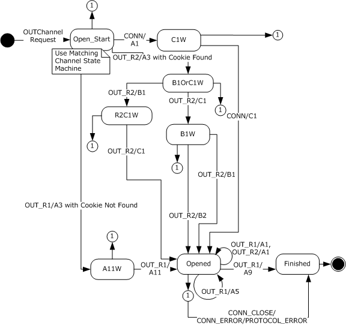

Figure 28: Outbound proxy state machine

The outbound proxy state machine is used when the outbound proxy is processing messages and [**PDUs**](#gt_request-to-send-rts-protocol-data-unit-pdu) coming from the network. When the state machine transitions to "Use Matching Channel State Machine", this means the state machine execution for this state machine stops and the current event (OUT_R1/A3 with Cookie Match) is interpreted as OUT_R2/A3 event for the state machine of the matching IN channel as specified in section [3.2.4.5.6](#Section_3.2.4.5.6).

<a id="Section_3.2.4.1"></a>
#### 3.2.4.1 Abstract Data Model

This section describes a conceptual model of possible data organization that an implementation maintains to participate in this protocol. The described organization is provided to facilitate the explanation of how the protocol behaves. This document does not mandate that implementations adhere to this model as long as their external behavior is consistent with that described in this document.

An outbound proxy maintains several abstract protocol variables and data structures:

- A [**virtual connection**](#gt_virtual-connection) cookie table as described in the common section.
- For each Virtual Connection, the data elements for a Virtual Connection as described in the common section.
- An IN Channel consisting of the data elements for a Receiving Channel as described in the common section.
- An OUT Channel consisting of the data elements for a Sending Channel and the Ping Originator as described in the common section.
- A set of Outbound Proxy-specific data elements as described in the following list.
- Resource Type UUID (section [3.2.4.1.1](#Section_3.2.4.1.1))
- Session UUID (section [3.2.4.1.2](#Section_3.2.4.1.2))
<a id="Section_3.2.4.1.1"></a>
##### 3.2.4.1.1 Resource Type UUID

Implementations of this protocol MAY maintain a protocol variable for each [**virtual OUT channel**](#gt_virtual-out-channel) called Resource Type UUID. Initially, when the OUT channel is created, the value of this variable is not set. This protocol variable is not currently used but is reserved for future extensibility.<42>

<a id="Section_3.2.4.1.2"></a>
##### 3.2.4.1.2 Session UUID

Implementations of this protocol MAY maintain a protocol variable, called Session UUID, for each [**virtual OUT channel**](#gt_virtual-out-channel). Initially, when the OUT channel is created, the value of this variable is not set. This protocol variable is not currently used but is reserved for future extensibility.<43>

<a id="Section_3.2.4.2"></a>
#### 3.2.4.2 Timers

An implementation of the [RPC over HTTP v2](#Section_3.2) [**protocol dialect**](#gt_protocol-dialect) on the outbound proxy SHOULD implement the connection time-out timer defined in section [3.2.1.2.2](#Section_3.2.1.2.2).

<a id="Section_3.2.4.3"></a>
#### 3.2.4.3 Initialization

As part of initialization, implementations of this protocol MUST listen on HTTP/HTTPS URL namespace "/rpc/rpcproxy.dll" and SHOULD listen on HTTP/HTTPS URL namespace "/rpcwithcert/rpcproxy.dll".<44>

<a id="Section_3.2.4.4"></a>
#### 3.2.4.4 Higher-Layer Triggered Events

There are no higher-layer triggered events on the outbound proxy.

<a id="Section_3.2.4.5"></a>
#### 3.2.4.5 Message Processing Events and Sequencing Rules

The messages and [**PDUs**](#gt_request-to-send-rts-protocol-data-unit-pdu) listed in this section correspond to events in the state diagram in section [3.2.4](#Section_3.2.4).

All messages not specifically listed in this section and not marked for PDU forwarding as specified in section [3.2.1.5.2](#Section_3.2.1.5.2), or messages whose syntax is specified in section [2](#Section_1.3) of this protocol as invalid, SHOULD be treated by implementations of this protocol on the outbound proxy as protocol errors as specified in section [3.2.4.5.14](#Section_3.2.4.5.14).

<a id="Section_3.2.4.5.1"></a>
##### 3.2.4.5.1 RPC OUT Channel Request Received

When an [**RPC over HTTP v2 proxy**](#gt_rpc-over-http-proxy) receives the RPC OUT channel HTTP request, it MUST assume the role of an outbound proxy and transition to the Open_Start state. The processing of the HTTP header fields from the HTTP request are defined as follows:

**Accept:** Implementations of this protocol on the outbound proxy SHOULD ignore this header field.

**Cache-Control:** Implementations of this protocol on the outbound proxy SHOULD ignore this header field.

**Connection:** Implementations of this protocol on the outbound proxy SHOULD ignore this header field.

**Content-Length:** Implementations of this protocol on the outbound proxy SHOULD ignore this header field.

**Pragma Directives:**

- Implementations of this protocol on the outbound proxy SHOULD ignore pragma directive "No-cache".
- If the "Pragma:MinConnTimeout=T" directive is present, implementations of this protocol on the outbound proxy MUST initialize the ConnectionTimeout protocol variable to the value of T from the pragma.
- Implementations of this protocol on the outbound proxy SHOULD check for the presence of the "Pragma:ResourceTypeUuid=R" directive, and if present, MUST set the Resource Type [**UUID**](#gt_universally-unique-identifier-uuid) protocol variable to the R value.
- Implementations of this protocol on the outbound proxy SHOULD check for the presence of the "Pragma:SessionId=S" directive, and if present, MUST set the Session UUID protocol variable to the S value.
**Protocol:** Implementations of this protocol on the outbound proxy SHOULD ignore this header field.

**User-Agent:** Implementations of this protocol on the outbound proxy SHOULD ignore this header field.

<a id="Section_3.2.4.5.2"></a>
##### 3.2.4.5.2 RPC PDU Received

An [**RPC PDU**](#gt_rpc-pdu) MUST be received from the server only and MUST NOT be received from the client. If the RPC PDU is received on an OUT channel from the client, the outbound proxy MUST close the OUT channel to the client and the OUT channel to the server for the [**virtual OUT channel**](#gt_virtual-out-channel) to which the OUT channel to the client belongs.

If the [**PDU**](#gt_request-to-send-rts-protocol-data-unit-pdu) is received from the server on a given connection, an implementation of this protocol MUST find the default OUT channel that belongs to the same [**virtual connection**](#gt_virtual-connection) as the connection on which the PDU from the server was received. Once the OUT channel is found, an implementation of this protocol MUST copy the PDU as a BLOB in the message body of this OUT channel request as defined in section [2.1.2.1.2](#Section_2.1.2.1.2) and send the PDU subject to flow control requirements as specified in section [3.2.1.5.1](#Section_3.2.1.5.1).

<a id="Section_3.2.4.5.3"></a>
##### 3.2.4.5.3 CONN/A1 RTS PDU

An outbound proxy implementation MUST NOT accept the [CONN/A1 RTS PDU](#Section_2.2.4.2) in any state other than Open_Start. If it is received in any other state, the outbound proxy MUST treat this [**PDU**](#gt_request-to-send-rts-protocol-data-unit-pdu) as a protocol error as specified in section [3.2.4.5.14](#Section_3.2.4.5.14).

If this [**RTS PDU**](#gt_682437f3-1c41-420d-ae08-3178f5611ddd) is received in Open_Start state, the outbound proxy implementation MUST perform the following actions in the sequence given:

- Establish a TCP connection to the server using the server name and port from the OUT channel request as specified in section [2.2.2](#Section_2.2.2).
- Send [CONN/A2 RTS PDU](#Section_2.2.4.3) to the server, setting the **ChannelLifetime** field to the value of the ChannelLifetime protocol variable of the Virtual OUT Channel.
- Set the value of OutChannelCookie in the CONN/A2 RTS PDU to the value of DefaultOutChannelCookie from the outbound proxy [**Virtual Connection**](#gt_virtual-connection).
- Set the value of ReceiveWindowSize in the CONN/A2 RTS PDU to the value of ReceiveWindow from the outbound proxy Virtual Connection.
- Set the value of ProtocolVersion in the CONN/A2 RTS PDU to the value of ProtocolVersion from the outbound proxy Virtual Connection.
- If all operations so far have been successful, send an OUT channel response on the OUT channel to the client. The fields for OUT channel response are defined as follows:
- HTTP-Version: MUST be the string "HTTP/1.1".
- Status-Code: MUST be the string "200".
- Reason-Phrase: MUST be "Success".
- Content-Type: Outbound proxies MUST set this header field to the string "application/rpc".
- Content-Length: Outbound proxies MUST set this field to an implementation-specific value in the inclusive range of 128 kilobytes to 2 gigabytes.<45>
In failure case, the outbound proxy MUST use the same processing rules as the [**inbound proxy**](#gt_inbound-proxy) as defined in section [3.2.3.5.11](#Section_3.2.3.5.11) and skip the rest of the processing in this section.

- Send [CONN/A3 RTS PDU](#Section_2.2.4.4) on the OUT channel to the client. Set the value of ConnectionTimeout in the CONN/A3 RTS PDU to the value of ConnectionTimeout from the outbound proxy Virtual Connection.
- Add the virtual connection cookie to the virtual connection cookie table.
- The ReceiveWindowSize from this PDU MUST be used to set the **ReceiveWindowSize** ADM from section [3.2.1.1.5.1.1](#Section_2.2.3.5.1).
- Set the value of DefaultOutChannelCookie in the outbound proxy Virtual Connection to the value of OutChannelCookie in the CONN/A1 RTS PDU.
- Transition the state to C1W and wait for further network events.
<a id="Section_3.2.4.5.4"></a>
##### 3.2.4.5.4 CONN/C1 RTS PDU

An outbound proxy implementation MUST NOT accept the [CONN/C1 RTS PDU](#Section_3.2.4.5.4) in any state other than C1W. If it is received in any other state, the outbound proxy MUST treat this [**PDU**](#gt_request-to-send-rts-protocol-data-unit-pdu) as a protocol error as specified in section [3.2.4.5.14](#Section_3.2.4.5.14).

If this [**RTS PDU**](#gt_682437f3-1c41-420d-ae08-3178f5611ddd) is received in C1W state, the outbound proxy implementation MUST perform the following actions in the sequence given:

- Send [CONN/C2 RTS PDU](#Section_2.2.4.9) on the OUT channel to the client. The CONN/C2 RTS PDU is initialized using the elements of the CONN/C1 RTS PDU.
- Set the value of ProtocolVersion in the CONN/C2 RTS PDU to the value of ProtocolVersion in the outbound proxy [**Virtual Connection**](#gt_virtual-connection).
- Set the value of ReceiveWindowSize in the CONN/C2 RTS PDU to the value of ReceiveWindowSize in the Outbound Proxy In Channel.
- Set the value of ConnectionTimeout in the CONN/C2 RTS PDU to the value of ConnectionTimeout in the Outbound Proxy Virtual Connection.
- Transition the state to opened.
<a id="Section_3.2.4.5.5"></a>
##### 3.2.4.5.5 OUT_R1/A1 or OUT_R2/A1 RTS PDUs

The [OUT_R1/A1 RTS PDU](#Section_2.2.4.23) and the [OUT_R2/A1 RTS PDU](#Section_2.2.4.34) have the same format and are processed identically by the outbound proxy. This section explains processing for OUT_R1/A1 only, but the same processing rules apply to OUT_R2/A1.

An outbound proxy implementation MUST NOT accept this [**RTS PDU**](#gt_682437f3-1c41-420d-ae08-3178f5611ddd) in any state other than opened. If it is received in any other state, the outbound proxy MUST treat this [**PDU**](#gt_request-to-send-rts-protocol-data-unit-pdu) as a protocol error as specified in section [3.2.4.5.14](#Section_3.2.4.5.14).

If this RTS PDU is received in opened state, the outbound proxy implementation MUST send [OUT_R1/A2](#Section_2.2.4.24) or [OUT_R2/A2](#Section_2.2.4.35) to the client, depending on whether OUT_R1/A1 or OUT_R2/A1 is received on the default OUT channel. OUT_R1/A2 and OUT_R2/A2 have the same format.

<a id="Section_3.2.4.5.6"></a>
##### 3.2.4.5.6 OUT_R1/A3 or OUT_R2/A3 RTS PDUs

The [OUT_R1/A3 RTS PDU](#Section_3.2.4.5.6) and the [OUT_R2/A3 RTS PDU](#Section_2.2.4.36) have the same format, and the outbound proxy determines which [**RTS PDU**](#gt_682437f3-1c41-420d-ae08-3178f5611ddd) it received based on internal state as defined in this section.

An outbound proxy implementation MUST NOT accept either of these RTS PDUs in any state other than Open_Start. If they are received in any other state, the outbound proxy MUST treat these [**PDUs**](#gt_request-to-send-rts-protocol-data-unit-pdu) as a protocol error as specified in section [3.2.4.5.14](#Section_3.2.4.5.14).

If either of these RTS PDUs is received in the Open_Start state, the outbound proxy implementation MUST retrieve the [**virtual connection**](#gt_virtual-connection) cookie from the OUT_R1/A3 RTS PDU and search for a matching cookie in the virtual connection cookie table. If found, it MUST execute the sequence of steps specified in section [3.2.4.5.6.1](#Section_3.2.4.5.6.1). If not found, it MUST execute the sequence of steps specified in section [3.2.4.5.6.2](#Section_3.2.4.5.6.2).

<a id="Section_3.2.4.5.6.1"></a>
###### 3.2.4.5.6.1 Virtual Connection Cookie Found

If the [**virtual connection**](#gt_virtual-connection) cookie is found in the virtual connection cookie table, an implementation of this protocol MUST execute these steps:

- Conform the outbound proxy to the OUT_R2 protocol sequence.
- Initialize an instance of the Outbound Proxy OUT Channel and set the Non Default Outbound Channel Reference of the Outbound Proxy Virtual Connection, which is considered the [**successor channel**](#gt_successor-channel).
- Set the Non Default OUT Channel Cookie in the Outbound Proxy Virtual Connection to the value of SuccessorChannelCookie in the OUT_R2/A3 RTS PDU.
- Compare the PredecessorChannelCookie in the OUT_R2/A3 PDU to the Default OUT Channel Cookie in the Outbound Proxy Virtual Connection. If they do not match, the outbound proxy MUST treat this PDU as a protocol error as specified in section [3.2.4.5.14](#Section_3.2.4.5.14).
- Set the value of PeerReceiveWIndow in the outbound proxy OUT Channel to the value of OutboundProxyReceiveWindowSize in the OUT R2/A3 RTS PDU.
- Send [OUT_R2/A4 RTS PDU](#Section_3.2.5.5.11) to the server.
- Switch the successor OUT channel instance to [**plugged channel mode**](#gt_plugged-channel-mode).
- Transition the state machine to state B1OrC1W.
<a id="Section_3.2.4.5.6.2"></a>
###### 3.2.4.5.6.2 Virtual Connection Cookie Not Found

If the [**virtual connection**](#gt_virtual-connection) cookie is not found in the virtual connection cookie table, an implementation of this protocol MUST execute these steps:

- Conform the outbound proxy to the OUT_R1 protocol sequence.
- Establish a TCP connection to the server using the server name and port from the OUT channel request as specified in section [2.2.2](#Section_2.2.2).
- Send [OUT_R1/A4 RTS PDU](#Section_2.2.4.26) to the server, setting the **ChannelLifetime** field to the value of the ChannelLifetime protocol variable of the Virtual OUT Channel of the virtual connection.
- Set the value of OutboundProxyConnectionTimeout in the OUT R1/A4 RTS PDU to the value of ConnectionTimeout from the outbound proxy Virtual Connection.
- Set the value of OutboundProxyReceiveWindowSize in the OUT R1/A4 RTS PDU to the value of ReceiveWindowSize in the outbound proxy Virtual Connection.
- Set the value of PredecessorChannelCookie in the OUT R1/A4 RTS PDU to the value of DefaultOutChannelCookie in the outbound proxy Virtual Connection.
- Set the value of SuccessorChannelCookie in the OUT R1/A4 RTS PDU to the value of NonDefaultOutChannelCookie from the outbound proxy Virtual Connection.
- Set the value of ProtocolVersion in the OUT R1/A4 RTS PDU to the value of ProtocolVersion from the outbound proxy Virtual Connection.
- Switch the successor OUT channel instance to [**plugged channel mode**](#gt_plugged-channel-mode).
- Transition to state A11W.
<a id="Section_3.2.4.5.7"></a>
##### 3.2.4.5.7 OUT_R1/A5 RTS PDU

An outbound proxy implementation MUST NOT accept the [OUT_R1/A5 RTS PDU](#Section_2.2.4.27) in any state other than opened. If it is received in any other state, the outbound proxy MUST treat this [**PDU**](#gt_request-to-send-rts-protocol-data-unit-pdu) as a protocol error as specified in section [3.2.4.5.14](#Section_3.2.4.5.14).

If this [**RTS PDU**](#gt_682437f3-1c41-420d-ae08-3178f5611ddd) is received in opened state, the outbound proxy implementation MUST send the [OUT_R1/A6 RTS PDU](#Section_2.2.4.28) to the client on the default OUT channel. The OUT R1/A6 RTS PDU is initialized using the elements of the OUT R1/A5 RTS PDU. The state remains unchanged.

<a id="Section_3.2.4.5.8"></a>
##### 3.2.4.5.8 OUT_R1/A9 RTS PDU

An outbound proxy implementation MUST NOT accept the [OUT_R1/A9 RTS PDU](#Section_2.2.4.31) in any state other than opened. If it is received in any other state, the outbound proxy MUST treat this [**PDU**](#gt_request-to-send-rts-protocol-data-unit-pdu) as a protocol error as specified in section [3.2.4.5.14](#Section_3.2.4.5.14).

If this [**RTS PDU**](#gt_682437f3-1c41-420d-ae08-3178f5611ddd) is received in opened state, an implementation of the outbound proxy implementation MUST execute these steps:

- Send [**RPC PDUs**](#gt_remote-procedure-call-rpc) that might be queued due to flow control to the client on the default OUT channel, observing flow control rules as specified in section [3.2.1.4.1.3](#Section_3.2.1.4.1.3).
- Send [OUT_R1/A10 RTS PDU](#Section_3.2.2.5.8) to the client on the default OUT channel. Implementations SHOULD NOT send any additional bytes on the connection.<46>
- Close the connection to the client and to the server.
- Transition the state to the finished state.
<a id="Section_3.2.4.5.9"></a>
##### 3.2.4.5.9 OUT_R1/A11 RTS PDU

An outbound proxy implementation MUST NOT accept the [OUT_R1/A11 RTS PDU](#Section_3.2.4.5.9) in any state other than A11W. If it is received in another state, the outbound proxy MUST treat this [**PDU**](#gt_request-to-send-rts-protocol-data-unit-pdu) as a protocol error as specified in section [3.2.4.5.14](#Section_3.2.4.5.14).

If this [**RTS PDU**](#gt_682437f3-1c41-420d-ae08-3178f5611ddd) is received in A11W state, the outbound proxy implementation MUST perform the following actions in the sequence given:

- Switch the successor OUT channel to [**unplugged channel mode**](#gt_unplugged-channel-mode).
- Send an OUT channel response on the OUT channel to the client. The fields for an OUT channel response are defined as follows:
- HTTP version: MUST be the string "HTTP/1.1".
- Status-Code: MUST be the string "200".
- Reason-Phrase: MUST be the string "Success".
- Content-Type: Outbound proxies MUST set this header field to the string "application/rpc".
- Content-Length: Outbound proxies MUST set this field to an implementation-specific value in the inclusive range of 128 kilobytes to 2 gigabytes.<47>
- Transition the state to opened.
<a id="Section_3.2.4.5.10"></a>
##### 3.2.4.5.10 OUT_R2/B1 RTS PDU

An outbound proxy implementation MUST NOT accept the [OUT_R2/B1 RTS PDU](#Section_2.2.4.42) in any state other than B1W or B1OrC1W. If this condition is not met, the outbound proxy MUST treat this [**PDU**](#gt_request-to-send-rts-protocol-data-unit-pdu) as a protocol error as specified in section [3.2.4.5.14](#Section_3.2.4.5.14).

If this [**RTS PDU**](#gt_682437f3-1c41-420d-ae08-3178f5611ddd) is received in B1W state, the outbound proxy implementation MUST perform the following actions in the sequence given:

- Send all [**RPC PDUs**](#gt_remote-procedure-call-rpc) that might be queued due to flow control to the client on the default OUT channel, observing flow control rules as specified in section [3.2.1.4.1.3](#Section_3.2.1.4.1.3).
- Send [OUT_R2/B3 RTS PDU](#Section_3.2.2.5.10) to the client on the default OUT channel. Implementations SHOULD NOT send any additional bytes on the channel after the OUT_R2/B3 RTS PDU.<48>
- Switch the default OUT channel to the successor OUT channel instance.
- Switch the default OUT channel to [**unplugged channel mode**](#gt_unplugged-channel-mode).
- Send OUT channel response header as specified in section [2.1.2.1.4](#Section_2.1.2.1.4) on the successor OUT channel instance.
- Transition the state to opened.
- Close the predecessor OUT channel to the client.
If this RTS PDU is received in the B1OrC1W state, the outbound proxy implementation MUST perform the following actions in the sequence given:

- Send all RPC PDUs that might be queued due to flow control to the client on the default OUT channel, observing flow control rules as specified in section 3.2.1.4.1.3
- Send OUT_R2/B3 RTS PDU to the client on the default OUT channel. Implementations SHOULD NOT send any additional bytes on the channel after the OUT_R2/B3 RTS PDU.<49>
- Switch the default OUT channel to the successor OUT channel instance.
- Switch the default OUT channel to unplugged channel mode.
- Transition the state to R2C1W state and wait for further network events.
- Close the predecessor OUT channel to the client.
<a id="Section_3.2.4.5.11"></a>
##### 3.2.4.5.11 OUT_R2/C1 RTS PDU

An outbound proxy implementation MUST NOT accept the OUT_R2/C1 RTS PDU in any state other than R2C1W or B1OrC1W. If this condition is not met, the outbound proxy MUST treat the PDU as a protocol error as specified in section [3.2.4.5.14](#Section_3.2.4.5.14).

If this [**RTS PDU**](#gt_682437f3-1c41-420d-ae08-3178f5611ddd) is received in the R2C1W state, the outbound proxy implementation MUST perform the following actions in the sequence given:

- Send the OUT channel response header as specified in section [2.1.2.1.4](#Section_2.1.2.1.4) on the successor OUT channel instance.
- Transition the state to opened.
If this RTS PDU is received in the B1OrC1W state, the outbound proxy implementation MUST perform the following actions in the sequence given:

- Transition the state to B1W state and wait for further network events.
<a id="Section_3.2.4.5.12"></a>
##### 3.2.4.5.12 OUT_R2/B2 RTS PDU

An outbound proxy implementation MUST NOT accept the [OUT_R2/B2 RTS PDU](#Section_3.2.4.5.12) in any state other than B1W. If this condition is not met, this [**PDU**](#gt_request-to-send-rts-protocol-data-unit-pdu) is a protocol error and the outbound proxy MUST treat it as a protocol error as specified in section [3.2.4.5.14](#Section_3.2.4.5.14).

If this [**RTS PDU**](#gt_682437f3-1c41-420d-ae08-3178f5611ddd) is received in B1W state, the outbound proxy implementation MUST perform the following actions in the sequence given:

- Transition the state to opened.
- Close the successor OUT channel to the client.
<a id="Section_3.2.4.5.13"></a>
##### 3.2.4.5.13 Echo Request PDU

An outbound proxy implementation MUST NOT accept the Echo Request PDU in any state other than Open_Start. If this condition is not met, the outbound proxy implementation MUST treat it as a protocol error as specified in section [3.2.4.5.14](#Section_3.2.4.5.14).

If this PDU is received in an Open_Start state, then the outbound proxy implementation MUST perform the following actions in the sequence given:

- Send an Echo Response PDU to the client.
- Transition to the Finished state.
<a id="Section_3.2.4.5.14"></a>
##### 3.2.4.5.14 Connection Close, Connection Error, and Protocol Error Encountered

Connection close and connection error encountered MUST be handled identically by implementations of this protocol. This section discusses connection close. Implementations of this protocol MUST handle connection errors that it encounters in the same way. A connection close can come from either the client or the server. If a connection close comes from the client, the outbound proxy MUST free any data structures associated with it. If the connection close does not come while in a finished state, the outbound proxy MUST close all [**OUT channels**](#gt_out-channel) to the client and all OUT channels to the server, free all data structures associated with the [**virtual connection**](#gt_virtual-connection), and transition to finished state. If the connection close comes in the finished state, the outbound proxy MUST ignore this event.

If a connection close comes from the server, the outbound proxy MUST close all OUT channels to the client and all OUT channels to the server, free all data structures associated with the virtual connection, and transition to finished state.

Protocol error MUST be handled by the outbound proxy implementation by closing all OUT channels to the client and all OUT channels to the server, freeing all data structures associated with the virtual connection, and transitioning to finished state.

<a id="Section_3.2.4.5.15"></a>
##### 3.2.4.5.15 Legacy Server Response

Outbound proxies MUST ignore the legacy server response and MUST NOT treat the absence of a legacy server response as a protocol error.

<a id="Section_3.2.4.6"></a>
#### 3.2.4.6 Timer Events

Each time the connection time-out timer defined in section [3.2.1.2.2](#Section_3.2.1.2.2) expires, an implementation of this protocol MUST send a [Ping RTS PDU (section 2.2.4.49)](#Section_2.2.4.49) on the default OUT channel for this [**virtual connection**](#gt_virtual-connection). This will prevent network agents from closing the connection used by the OUT channel response due to it being idle. An implementation of this protocol MAY choose when to notify the server that it has sent a [**PDU**](#gt_request-to-send-rts-protocol-data-unit-pdu) to the client and thus consume part of the OUT channel lifetime. When it chooses to notify the server, it MUST do so using a [Ping Traffic Sent Notify RTS PDU (section 2.2.4.47)](#Section_2.2.4.47).<50>

<a id="Section_3.2.4.7"></a>
#### 3.2.4.7 Other Local Events

An implementation of this protocol is not required to handle other local events.

<a id="Section_3.2.5"></a>
### 3.2.5 Server Details

This section gives details specific to an implementation of a server. The state machine shown in the following figure specifies the states and the transitions between them for the server. Which event causes which transition is specified in sections [3.2.5.4](#Section_3.2.5.4) and [3.2.5.5](#Section_3.2.5.5).

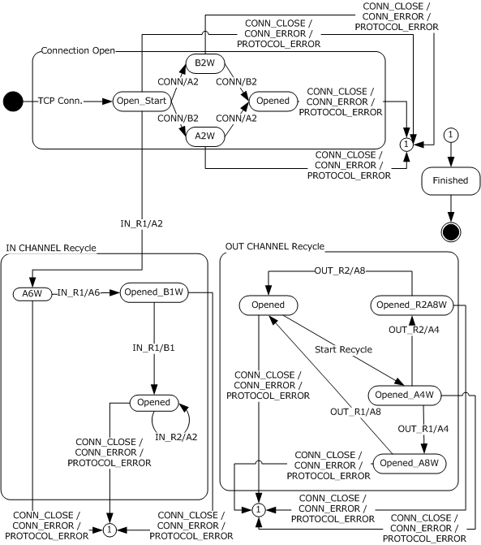

Figure 29: Server state machine

The server state machine is used when the server is processing messages and [**PDUs**](#gt_request-to-send-rts-protocol-data-unit-pdu) coming from the network. The following description of the state machine is provided as an aid to understanding the overall work of the state machines. This description is not a substitute for the processing specifications in section 3.2.5.5.

The connection open state machine is used during connection opening. Once a transition to the opened state of that state machine is made, the IN channel and OUT channel state machines are started from the opened state. The IN channel and OUT channel have independent state machines that run in parallel.

When a new TCP connection to the server is established, the server implementation does not yet know whether this connection will be used to establish a new [**virtual connection**](#gt_virtual-connection) or to recycle an IN channel or an OUT channel. This is why, at this stage, the state machine is in Open_Start state. Once an [**RTS PDU**](#gt_682437f3-1c41-420d-ae08-3178f5611ddd) is received, an implementation of this protocol can inspect the RTS PDU and determine which state machine it will use.

<a id="Section_3.2.5.1"></a>
#### 3.2.5.1 Abstract Data Model

This section describes a conceptual model of possible data organization that an implementation maintains to participate in this protocol. The described organization is provided to facilitate the explanation of how the protocol behaves. This document does not mandate that implementations adhere to this model, as long as their external behavior is consistent with that described in this document.

When functioning in the server role, this protocol maintains a number of variables:

- A Virtual Connection Cookie Table as described in the common Abstract Data Model (ADM) elements section.
- For each [**Virtual Connection**](#gt_virtual-connection) in the Virtual Connection Cookie Table, the Virtual Connection data elements as described in the common section.
- For each Virtual Connection, an OUT Channel consisting of the **SendingChannel** ADM elements in the common section.
- For each Virtual Connection, an IN Channel consisting of the **ReceivingChannel** ADM elements in the common section.
- A number of server role-specific elements as described in the following list.
- **In Proxy Connection Timeout**: a time duration used to configure the In Proxy Connection Timer.
- **Association Group Id**: a cookie defined in section [2.2.3.1](#Section_2.2.3.1) that uniquely identifies an association.
- **Connection Setup Timer**: a timer used to detect failed connection establishment as defined in section [3.2.5.2.1](#Section_3.2.5.2.1).
- **Client Address**: the client address as defined in section [2.2.3.2](#Section_2.2.3.2).
- **Virtual IN Channel State**: a variable to contain the current state of the Virtual IN Channel State machine.
- **Virtual OUT Channel State**: a variable to contain the current state of the Virtual OUT Channel State machine.
<a id="Section_3.2.5.2"></a>
#### 3.2.5.2 Timers

An implementation of the [RPC over HTTP v2](#Section_3.2) [**protocol dialect**](#gt_protocol-dialect) on the server SHOULD implement the connection setup timer defined in section [3.2.5.2.1](#Section_3.2.5.2.1).

<a id="Section_3.2.5.2.1"></a>
##### 3.2.5.2.1 Connection Setup Timer

The connections setup timer SHOULD be set to expire in 15 minutes. It is used to detect a case where the IN channel of a [**virtual connection**](#gt_virtual-connection) is set up but the OUT channel of the same virtual connection is not, or vice versa.

<a id="Section_3.2.5.3"></a>
#### 3.2.5.3 Initialization

Implementations of this protocol MUST listen on a TCP port defined by a higher-level protocol.

The [Virtual Connection Cookie Table](#Section_3.2.1.1.2) is initialized as an empty table.

**Default OUT Channel** is initialized to indicate the first or primary channel. Except during channel recycling, which is not active when the protocol is initialized, there is only a single OUT channel.

**Temporary Cookie Variable** is initialized to a new [**RTS cookie**](#gt_578c1075-051d-40c2-9fa4-0aeb1ca20002) of arbitrary value. The initial value of the cookie will not be used in protocol behavior.

<a id="Section_3.2.5.3.1"></a>
##### 3.2.5.3.1 Virtual Connection Cookie Table

The Server Virtual Connection Cookie table is initialized to an empty state.

<a id="Section_3.2.5.3.2"></a>
##### 3.2.5.3.2 Server Virtual Connection

The Server Virtual Connection is initialized from a CONN/A2, as defined in section [3.2.5.5.3](#Section_3.2.5.5.3), or a CONN/B2 PDU, as defined in section [3.2.5.5.4](#Section_3.2.5.5.4.2).

- Server Virtual Connection Cookie - the cookie is copied from the VirtualConnectionCookie in either the CONN/A2 or CONN/B2 packet.
- Default In Channel Reference - If this is a CONN/B2 packet, then a Server In Channel is initialized from the CONN/B2 packet and set; otherwise, this is set to an empty reference.
- Non-Default In Channel Reference - initialized to an empty reference.
- Default Out Channel Reference - If this is a CONN/A2 packet, then a Server Out Channel is initialized from the CONN/A2 packet and set; otherwise, this is set to an empty reference.
- Non-Default Out Channel Reference - initialized to an empty reference.
- In Channel State - initialized to the Open_Start state.
- Out Channel State - initialized to the Open_Start state.
- Protocol Version - initialized from Version field of either the CONN/A2 or the CONN/B2 PDU.
- In Proxy Connection Timeout - initialized from the **ConnectionTimeout** field of the CONN/B2 PDU.
- Association Group ID - initialized from the CONN/B2 PDU.
- Connection Setup Timer - initialized as defined in section [3.2.5.2.1](#Section_3.2.5.2.1).
- Client Address - initialized from the CONN/B2 PDU.
<a id="Section_3.2.5.4"></a>
#### 3.2.5.4 Higher-Layer Triggered Events

An implementation of this [**protocol dialect**](#gt_protocol-dialect) on the server MUST handle sending a [**PDU**](#gt_request-to-send-rts-protocol-data-unit-pdu) from a higher layer.

<a id="Section_3.2.5.4.1"></a>
##### 3.2.5.4.1 Sending a PDU

When an implementation of a higher-level protocol calls to an implementation of this protocol to send a [**PDU**](#gt_request-to-send-rts-protocol-data-unit-pdu) to the client, the implementation of this protocol MUST send the PDU on the default OUT channel to the outbound proxy, subject to flow control requirements as specified in section [3.2.1.5.1](#Section_3.2.1.5.1).

If the implementation of this protocol encounters an error while sending the data, it MUST take the following actions:

- Indicate to the higher layer, in an implementation-specific way, that the operation failed.
- Treat the connection as closed.
- Request the TCP protocol stack to close all IN channel and [**OUT channels**](#gt_out-channel) that belong to this [**virtual connection**](#gt_virtual-connection).
If the [**channel lifetime**](#gt_channel-lifetime) sent protocol variable for the default OUT channel approaches the channel lifetime as specified later in this paragraph, the implementation of this protocol MUST initiate [**channel recycling**](#gt_channel-recycling) as defined in this section. An implementation MAY define when the number of bytes sent is approaching the channel lifetime in an implementation-specific way. However, it SHOULD define it in such a way as to open the successor OUT channel early enough so that it is fully opened before the [**predecessor channel**](#gt_predecessor-channel) has channel lifetime, and yet use as much of the predecessor channel as it can.<51>

For more information on the protocol sequences associated with OUT channel recycling, see sections [3.2.1.5.3.4](#Section_3.2.1.5.3.4) and [3.2.1.5.3.5](#Section_3.2.1.5.3.5) of this document.

<a id="Section_3.2.5.5"></a>
#### 3.2.5.5 Message Processing Events and Sequencing Rules

Unless explicitly specified in a message or [**PDU**](#gt_request-to-send-rts-protocol-data-unit-pdu) section, the messages and PDUs listed in this section correspond to events in the state diagram at the beginning of section [3.2.5](#Section_3.2.5).

All messages not specifically listed in this section, or messages whose syntax is specified in section [2](#Section_1.3) of this protocol as invalid, SHOULD be treated by implementations of this protocol on the server as protocol errors, as defined in section [3.2.5.5.13](#Section_3.2.5.5.13).

<a id="Section_3.2.5.5.1"></a>
##### 3.2.5.5.1 Establishing a Connection

When a connection to the server is established, the server SHOULD send the legacy server response as specified in section [2.1.1.2.1](#Section_2.1.1.2.1) and transition to state Open_Start.

<a id="Section_3.2.5.5.2"></a>
##### 3.2.5.5.2 Receiving an RPC PDU

When an implementation of this protocol receives an [**RPC PDU**](#gt_rpc-pdu), it MUST pass it on to a higher-layer protocol without modifying the contents of the RPC PDU. This happens in an implementation-specific way. If it encounters a protocol error while processing the RPC PDU, it MUST handle the error as defined in section [3.2.5.5.13](#Section_3.2.5.5.13).<52>

<a id="Section_3.2.5.5.3"></a>
##### 3.2.5.5.3 CONN/A2 RTS PDU

A server implementation MUST NOT accept the [CONN/A2 RTS PDU](#Section_2.2.4.3) in any state other than Open_Start or A2W. If this condition is not met, the server MUST treat this [**PDU**](#gt_request-to-send-rts-protocol-data-unit-pdu) as a protocol error as specified in section [3.2.5.5.13](#Section_3.2.5.5.13).

A server implementation MUST extract the [**virtual connection**](#gt_virtual-connection) cookie from the CONN/A2 RTS PDU and search for this cookie value in the virtual connection cookie table. If found, the virtual connection is called the existing virtual connection. In such a case, the server implementation MUST verify that the existing virtual connection is in state A2W. If it is, the server implementation MUST continue execution on the state machine of the existing virtual connection and MUST continue processing this PDU as specified in section [3.2.5.5.3.2](#Section_3.2.5.5.3.2). If this condition is not met, the server MUST treat this PDU as a protocol error, as specified in section 3.2.5.5.13.

If the server implementation fails to find a virtual connection in the virtual connection cookie table with the same cookie as the virtual connection cookie from this PDU, the server MUST continue processing as specified in section [3.2.5.5.3.1](#Section_3.2.5.5.3.1) of this document. In such a case, the server implementation MUST verify that the new virtual connection is in state **Open_Start**. If this condition is met, the server MUST treat this PDU as a protocol error, as specified in section 3.2.5.5.13

<a id="Section_3.2.5.5.3.1"></a>
###### 3.2.5.5.3.1 Virtual Connection Not Found

If the [**virtual connection**](#gt_virtual-connection) is not found in the virtual connection cookie table as specified in the previous section, an implementation of this protocol MUST perform the following actions in the sequence given:

- Set up the connection setup timer defined in section [3.2.5.2.1](#Section_3.2.5.2.1).
- Add the virtual connection cookie to the virtual connection cookie table.
- Set the value of ChannelLifeTime in the server OUT Channel to the value of ChannelLifeTime from the CONN/A2 RTS PDU.
- Set the value of DefaultOutChannelCookie in the server Virtual Connection to the value of OUTChannelCookie from the CONN/A2 RTS PDU.
- Set the value of PeerReceiveWindow in the server OUT Channel to the value of ReceiveWindowSize from the CONN/A2 RTS PDU.
- Set the value of ProtocolVersion in the server Virtual Connection to the value of ProtocolVersion from the CONN/A2 RTS PDU.
- Transition to state B2W and wait for further events.
<a id="Section_3.2.5.5.3.2"></a>
###### 3.2.5.5.3.2 Virtual Connection Found

If the [**virtual connection**](#gt_virtual-connection) is found in the virtual connection cookie table as specified in the previous section, an implementation of this protocol MUST perform the following actions in the sequence given:

- Cancel the connection setup timer defined in section [3.2.5.2.1](#Section_3.2.5.2.1).
- Set the value of ProtocolVersion in the server Virtual Connection to the minimum of the value of ServerVirtualConnection in the CONN/A2 PDU and the value of ProtocolVersion in the CONN/A2 PDU.
- Send [CONN/C1 RTS PDU](#Section_3.2.4.5.4) on the OUT channel to the outbound proxy.
- Set the value of ProtocolVersion in the CONN/C1 RTS PDU to the value of ProtocolVersion from the server Virtual Connection.
- Set the value of ReceiveWindowSize in the CONN/C1 RTS PDU to the value of InProxyReceiveWindowSize in the server Virtual Connection.
- Set the value of ConnectionTimeout in the CONN/C1 RTS PDU to the value of InProxyConnectionTimeout from the server Virtual Connection.
- Send [CONN/B3 RTS PDU](#Section_2.2.4.7) on the IN channel to the [**inbound proxy**](#gt_inbound-proxy).
- Set the value of ReceiveWindowSize in the CONN/B3 RTS PDU to the value of ReceiveWindow from the server IN Channel.
- Set the value of **Version** in the CONN/B3 RTS PDU to the value of **Protocol Version** from the Server Virtual Connection.
- Transition to opened state.
- The [**virtual IN channels**](#gt_virtual-in-channel) and [**virtual OUT channel**](#gt_virtual-out-channel) MUST start their own state machines as specified in the beginning of section [3.2.5](#Section_3.2.5) of this document.
<a id="Section_3.2.5.5.4"></a>
##### 3.2.5.5.4 CONN/B2 RTS PDU

A server implementation MUST extract the [**virtual connection**](#gt_virtual-connection) cookie from the [CONN/B2 RTS PDU](#Section_2.2.4.6) and search for this cookie value in the virtual connection cookie table. If found, the virtual connection is called an existing virtual connection. In such a case, the server implementation MUST verify that the existing virtual connection is in state B2W, and if it is, it MUST continue execution on the state machine of the existing virtual connection and MUST continue processing this [**PDU**](#gt_request-to-send-rts-protocol-data-unit-pdu) as specified in section [3.2.5.5.4.2](#Section_3.2.5.5.4.2).

If the server implementation fails to find a virtual connection in the virtual connection cookie table with the same cookie as the virtual connection cookie from this PDU, the server MUST continue processing as specified in section [3.2.5.5.4.1](#Section_3.2.5.5.4.1). In such a case, the server implementation MUST verify that the new virtual connection is in state **Open_Start**. If this condition is not met, the server MUST treat this PDU as a protocol error, as specified in section [3.2.5.5.13](#Section_3.2.5.5.13).

A server implementation MUST NOT accept the CONN/B2 RTS PDU in any state other than **Open_Start** or **B2W**. If this condition is not met, the server MUST treat this PDU as a protocol error, as specified in section 3.2.5.5.13.

<a id="Section_3.2.5.5.4.1"></a>
###### 3.2.5.5.4.1 Virtual Connection Not Found

If the [**virtual connection**](#gt_virtual-connection) is not found in the virtual connection cookie table as specified in the previous section, an implementation of this protocol MUST perform the following actions in the sequence given:

- Set up the connection setup timer specified in section [3.2.5.2.1](#Section_3.2.5.2.1).
- Add the virtual connection cookie to the virtual connection cookie table.
- Set the value from AssociationGroupID in the server Virtual Connection to the value of AssociationGroupId in the CONN/B2 PDU.
- Set the value of ClientAddress in the server Virtual Connection to the value of ClientAddress in the CONN/B2 PDU.
- Set the value of InPoxyConnectionTimeout in the server Virtual Connection to the value of ConnectionTimeout from the CONN/B2 PDU.
- Set the value of DefaultInChannelCookie in the server Virtual Connection to the value of InChannelCookie from the CONN/B2 PDU.
- Set the value of InProxyReceiveWindow in the server Virtual Connection to the value of ReceiveWindowSize from the CONN/B2 PDU.
- Set the value of ProtocolVersion in the server Virtual Connection to the value of ProtocolVersion in the CONN/B2 PDU.
- Transition to state A2W.
<a id="Section_3.2.5.5.4.2"></a>
###### 3.2.5.5.4.2 Virtual Connection Found

If the [**virtual connection**](#gt_virtual-connection) is found in the virtual connection cookie table as specified in the previous section, an implementation of this protocol MUST perform the following actions in the sequence given:

- Cancel the connection setup timer defined in section [3.2.5.2.1](#Section_3.2.5.2.1).
- Set the value of ProtocolVersion in the server Virtual Connection to the minimum of the value of ProtocolVersion in the server Virtual Connection and the value of ProtocolVersion from the CONN/B2 PDU.
- Send [CONN/C1 RTS PDU](#Section_3.2.4.5.4) on the OUT channel to the outbound proxy.
- Set the value of **ProtocolVersion** in the CONN/C1 RTS PDU to the value of **ProtocolVersion** from the server Virtual Connection.
- Set the value of the **ReceiveWindowSize** in the CONN/C1 RTS PDU to the value of **InProxyReceiveWindowSize** in the server Virtual Connection.
- Set the value of **ConnectionTimeout** in the CONN/C1 RTS PDU to the value of **InProxyConnectionTimeout** from the server Virtual Connection.
- Send [CONN/B3 RTS PDU](#Section_2.2.4.7) on the IN channel to the [**inbound proxy**](#gt_inbound-proxy).
- Set the value of **ReceiveWindowSize** in the CONN/B3 RTS PDU to the value of **ReceiveWindow** from the server IN Channel.
- Set the value of **Version** in the CONN/B3 RTS PDU to the value of **Protocol Version** from the Server Virtual Connection.
- Set the value of ProtocolVersion in the CONN/B3 RTS PDU to the value of ProtocolVersion from the server Virtual Connection.
- Transition to the opened state.
- The virtual IN and [**OUT channels**](#gt_out-channel) MUST start their own state machines as specified in the beginning of section [3.2.5](#Section_3.2.5).
<a id="Section_3.2.5.5.5"></a>
##### 3.2.5.5.5 IN_R1/A2 RTS PDU

A server implementation MUST NOT accept the [IN_R1/A2 RTS PDU](#Section_3.2.5.5.5) in any state other than Open_Start. If this condition is not met, the server MUST treat this [**PDU**](#gt_request-to-send-rts-protocol-data-unit-pdu) as a protocol error as specified in section [3.2.5.5.13](#Section_3.2.5.5.13).

If this [**RTS PDU**](#gt_682437f3-1c41-420d-ae08-3178f5611ddd) is received in Open_Start state, an implementation of this protocol MUST perform the following actions in the sequence given:

- Retrieve the [**virtual connection**](#gt_virtual-connection) cookie from this RTS PDU and find it in the virtual connection cookie table. If the connection is not found, an implementation of this protocol MUST treat this as a protocol error, MUST handle this as specified in section 3.2.5.5.13, and MUST skip the rest of the processing in this section. If found, an implementation of this protocol MUST execute steps two through six.
- Once the virtual connection is found, the IN channel on which this RTS PDU arrived MUST be attached as a component to the virtual IN channel for the virtual connection, and it MUST also be set as nondefault and successor IN channel. The existing IN channel is considered the [**predecessor channel**](#gt_predecessor-channel).
- Verify that the **PredecessorChannelCookie** from this RTS PDU matches the IN channel cookie on the predecessor IN channel. If they do not match, an implementation of this protocol MUST treat this as a protocol error, MUST handle this as specified in section 3.2.5.5.13, and MUST skip the rest of the processing in this section. If they match, an implementation of this protocol MUST execute steps four through six.
- Set up the connection setup timer defined in section [3.2.5.2.1](#Section_3.2.5.2.1).
- Send [IN_R1/A3 RTS PDU](#Section_2.2.4.12) on the default OUT channel to the outbound proxy.
Incoming IN_R1/A2 RTS PDU elements MUST be copied to the IN_R1/A3 RTS PDU and MUST be copied to the virtual connection **ReceiveWindowSize** ([3.2.1.1.5.1.1](#Section_2.2.3.5.1)) and **ConnectionTimeout** ([3.2.1.1.6.1](#Section_3.2.1.1.6.1)) ADM elements.

- Set the value of ProtocolVersion in the IN_R1/A3 RTS PDU to the value of ProtocolVersion from the server Virtual Connection.
- Transition to the A6W state.
<a id="Section_3.2.5.5.6"></a>
##### 3.2.5.5.6 IN_R1/A6 RTS PDU

A server implementation MUST NOT accept the [IN_R1/A6 RTS PDU](#Section_3.2.5.5.6) in any state other than A6W. If this condition is not met, the server MUST treat this [**PDU**](#gt_request-to-send-rts-protocol-data-unit-pdu) as a protocol error as specified in section [3.2.5.5.13](#Section_3.2.5.5.13).

If this [**RTS PDU**](#gt_682437f3-1c41-420d-ae08-3178f5611ddd) is received in A6W state, an implementation of this protocol MUST perform the following actions in the sequence given:

- Cancel the connection setup timer defined in section [3.2.5.2.1](#Section_3.2.5.2.1) in the server [**Virtual Connection**](#gt_virtual-connection).
- Compare the value of NonDefaultInChannelCookie in the server Virtual Connection to the value of SuccessorInChannelCookie from the IN_R1/A6 RTS PDU. If the values do not match, the server MUST treat it as a protocol error as specified in section [3.2.3.5.10](#Section_3.2.3.5.10).
- Transition to the Opened_B1W state.
<a id="Section_3.2.5.5.7"></a>
##### 3.2.5.5.7 IN_R1/B1 RTS PDU

A server implementation MUST NOT accept the [IN_R1/B1 RTS PDU](#Section_3.2.5.5.7) in any state other than Opened_B1W. If this condition is not met, the server MUST treat this [**PDU**](#gt_request-to-send-rts-protocol-data-unit-pdu) as a protocol error as specified in section [3.2.5.5.13](#Section_3.2.5.5.13).

If this [**RTS PDU**](#gt_682437f3-1c41-420d-ae08-3178f5611ddd) is received in Opened_B1W state, an implementation of this protocol MUST perform the following actions in the sequence given:

- Switch the default IN channel from the predecessor IN channel to the successor IN channel.
- Send [IN_R1/B2 RTS PDU](#Section_2.2.4.17) on the successor IN channel to the [**inbound proxy**](#gt_inbound-proxy).
- Set the value of ServerReceiveWindowSize in the IN R1/B2 RTS PDU to the value of ReceiveWindowSize from the server [**Virtual Connection**](#gt_virtual-connection).
- Close the IN channel connection to the [**predecessor inbound proxy**](#gt_predecessor-inbound-proxy).
- Transition to the opened state.
<a id="Section_3.2.5.5.8"></a>
##### 3.2.5.5.8 IN_R2/A2 RTS PDU

A server implementation MUST NOT accept the [IN_R2/A2 RTS PDU](#Section_3.2.5.5.8) in any state other than opened. If this condition is not met, the server MUST treat this [**PDU**](#gt_request-to-send-rts-protocol-data-unit-pdu) as a protocol error as specified in section [3.2.5.5.13](#Section_3.2.5.5.13).

If this [**RTS PDU**](#gt_682437f3-1c41-420d-ae08-3178f5611ddd) is received in opened state, an implementation of this protocol MUST perform the following actions in the sequence given:

- Update the Virtual IN **channel cookie** for the Virtual IN connection on which this RTS PDU is received with the **SuccessorChannelCookie** from this RTS PDU.
- Send [IN_R2/A3 RTS PDU](#Section_2.2.4.20) on the default OUT channel to the outbound proxy.
State does not change as a result of this event.

<a id="Section_3.2.5.5.9"></a>
##### 3.2.5.5.9 OUT_R1/A4 RTS PDU

A server implementation MUST NOT accept the [OUT_R1/A4 RTS PDU](#Section_2.2.4.26) in any state other than Opened_A4W. If this condition is not met, the server MUST treat this [**PDU**](#gt_request-to-send-rts-protocol-data-unit-pdu) as a protocol error as specified in section [3.2.5.5.13](#Section_3.2.5.5.13).

If this [**RTS PDU**](#gt_682437f3-1c41-420d-ae08-3178f5611ddd) is received in Opened_A4W state, an implementation of this protocol MUST perform the following actions in the sequence given:

- Send [OUT_R1/A5 RTS PDU](#Section_2.2.4.27) on the predecessor OUT channel to the outbound proxy.
- Set the value of ProtocolVersion in the OUT R1/A5 RTS PDU to the value of ProtocolVersion in the server [**Virtual Connection**](#gt_virtual-connection).
- Set the value of OutboundProxyConnectionTimeout in the OUT R1/A5 RTS PDU to the value of OutboundProxyConnectionTimeout from the OUT R1/A4 RTS PDU.
- Set the value of ChannelLifetime in the outbound proxy Virtual Connection to the value of ChannelLifetime from the OUT R1/A4 RTS PDU.
- Set the value of ConnectionTimeout in the outbound proxy Virtual Connection to the value of OutboundProxyConnectionTimeout from the OUT R1/A4 RTS PDU.
- Set the value of PeerReceiveWindow in the outbound proxy OUT Channel to the value of OutboundProxyReceiveWindowSize in the OUT R1/A4 RTS PDU.
- Compare the value of DefaultOutChannelCookie in the outbound proxy Virtual Connection to the value of PredecessorChannelCookie in the OUT R1/A4 RTS PDU. If they do not match, the outbound proxy MUST treat it as a protocol error as specified in section [3.2.3.5.10](#Section_3.2.3.5.10).
- Set the value of NonDefaultOutChannelCookie in the outbound proxy Virtual Connection to the value of SuccessorChannelCookie from the OUT R1/A4 RTS PDU.
- Transition state to Opened_A8W.
<a id="Section_3.2.5.5.10"></a>
##### 3.2.5.5.10 OUT_R1/A8 RTS PDU

A server implementation MUST NOT accept the [OUT_R1/A8 RTS PDU](#Section_3.2.5.5.10) in any state other than Opened_A8W. If this condition is not met, the server MUST treat this [**PDU**](#gt_request-to-send-rts-protocol-data-unit-pdu) as a protocol error as specified in section [3.2.5.5.13](#Section_3.2.5.5.13).

If this [**RTS PDU**](#gt_682437f3-1c41-420d-ae08-3178f5611ddd) is received in Opened_A8W state, an implementation of this protocol MUST perform the following actions in the sequence given:

- Transition to opened state.
- Compare the value of NoNDefaultOutChannelCookie in the server [**Virtual Connection**](#gt_virtual-connection) to the value of SuccessorChannelCookie from the OUT R1/A8 PDU. If this condition is not met, the server MUST treat this PDU as a protocol error as specified in section 3.2.5.5.13.
- Switch the default OUT channel from the predecessor OUT channel to the successor OUT channel.
- Send [OUT_R1/A9 RTS PDU](#Section_2.2.4.31) on the predecessor OUT channel to the outbound proxy.
<a id="Section_3.2.5.5.11"></a>
##### 3.2.5.5.11 OUT_R2/A4 RTS PDU

A server implementation MUST NOT accept the [OUT_R2/A4 RTS PDU](#Section_3.2.5.5.11) in any state other than Opened_A4W. If this condition is not met, the server MUST treat this [**PDU**](#gt_request-to-send-rts-protocol-data-unit-pdu) as a protocol error as specified in section [3.2.5.5.13](#Section_3.2.5.5.13).

If this [**RTS PDU**](#gt_682437f3-1c41-420d-ae08-3178f5611ddd) is received in Opened_A4W state, an implementation of this protocol MUST perform the following actions in the sequence given:

- Transition to Opened_R2A8W state.
- Send [OUT_R2/A5 RTS PDU](#Section_2.2.4.38) on the OUT channel to the outbound proxy.
- Store the SuccessorChannelCookie from this PDU in the Non Default Out Channel Cookie in the server [**Virtual Connection**](#gt_virtual-connection).
<a id="Section_3.2.5.5.12"></a>
##### 3.2.5.5.12 OUT_R2/A8 RTS PDU

A server implementation MUST NOT accept the [OUT_R2/A8 RTS PDU](#Section_2.2.4.41) in any state other than Opened_R2A8W. If this condition is not met, the server MUST treat this [**PDU**](#gt_request-to-send-rts-protocol-data-unit-pdu) as a protocol error as specified in section [3.2.5.5.13](#Section_3.2.5.5.13).

If this [**RTS PDU**](#gt_682437f3-1c41-420d-ae08-3178f5611ddd) is received in Opened_R2A8W state, an implementation of this protocol MUST compare the **channel cookie** from this RTS PDU to the one stored in the temporary cookie variable as specified in section [3.2.1.1.2](#Section_3.2.1.1.2). If the cookies match, implementations of this protocol MUST send OUT_R2/B1 RTS PDU on the OUT channel to the outbound proxy, transition to opened state, and update the **channel cookie** on the OUT channel with the one from this RTS PDU. If the cookies do not match, this protocol MUST send [OUT_R2/B2 RTS PDU](#Section_3.2.4.5.12) on the OUT channel and handle this as a protocol error as specified in section 3.2.5.5.13.

<a id="Section_3.2.5.5.13"></a>
##### 3.2.5.5.13 Connection Close, Connection Error, and Protocol Error Encountered

Connection close and connection error encountered MUST be handled identically by implementations of this protocol. This section discusses connection close only. Implementations of this protocol MUST handle connection errors that it encounters in the same way. A connection close can come from either the [**inbound**](#gt_inbound) or outbound proxy. Processing is equivalent in both cases. This section discusses connection close from the [**inbound proxy**](#gt_inbound-proxy), but all parts of the specification in this section apply equally to connection close received from the outbound proxy. If a connection close comes from the inbound proxy, the server implementation MUST find the [**virtual connection**](#gt_virtual-connection) to which the IN channel belongs, and unless the IN channel is in state opened and the connection close comes from a [**predecessor inbound proxy**](#gt_predecessor-inbound-proxy), the server implementation MUST take the following actions:

- Free any data structures associated with it.
- Close all the channels that belong to this virtual connection.
- Transition to the finished state.
If the connection close comes in state opened and the connection close comes from a predecessor inbound proxy, the server implementation MUST ignore this event.

Protocol error MUST be handled by the server implementation by closing all channels to the inbound proxy and the outbound proxy for the virtual connection on which the error was encountered, free all data structures associated with the virtual connection, and transition to the finished state.

<a id="Section_3.2.5.5.14"></a>
##### 3.2.5.5.14 Ping Traffic Sent Notify RTS PDU on Server

The [Ping Traffic Sent Notify RTS PDU](#Section_2.2.4.47) does not correspond to an event in the state machine. It can be received and is valid in any state. When an implementation of the server receives this [**PDU**](#gt_request-to-send-rts-protocol-data-unit-pdu), it MUST add the value in the **PingTrafficSent** field of the [PingTrafficSentNotify (section 2.2.3.5.15)](#Section_2.2.3.5.15) command to the [channel lifetime sent](#Section_3.2.2.1.3) protocol variable. If as a result of this addition, the [**channel lifetime**](#gt_channel-lifetime) protocol variable approaches the channel lifetime as specified in section [3.2.5.4.1](#Section_3.2.5.4.1), the implementation of this protocol MUST start [**channel recycling**](#gt_channel-recycling) exactly as specified in section [3.2.5.5.15](#Section_3.2.5.5.15).

<a id="Section_3.2.5.5.15"></a>
##### 3.2.5.5.15 OUT Channel Recycling

[**OUT channel recycling**](#gt_out-channel-recycling) MUST NOT be started unless the OUT channel is in the opened state. If the number of bytes sent on the channel approaches the [**channel lifetime**](#gt_channel-lifetime) and the OUT channel is not in the opened state, implementations of this protocol SHOULD return an implementation-specific error to higher layers. Windows implementations return RPC_S_PROTOCOL_ERROR as specified in [MS-ERREF](../MS-ERREF/MS-ERREF.md).

An implementation of this protocol MUST start OUT channel recycling by sending out an [OUT_R2/A1 RTS PDU](#Section_2.2.4.34) as specified in section 2.2.4.34 to the outbound proxy. Then it MUST transition the OUT channel state to Opened_A4W state and wait for network events. The server implementation MUST be able to execute the [**IN channel recycling**](#gt_in-channel-recycling) and associated state machine and OUT channel recycling and associated state machines in parallel.

<a id="Section_3.2.5.6"></a>
#### 3.2.5.6 Timer Events

This section defines the processing that occurs when the connection setup timer defined in section [3.2.5.2.1](#Section_3.2.5.2.1) expires.

<a id="Section_3.2.5.6.1"></a>
##### 3.2.5.6.1 Connection Setup Timer Expiry

The connection setup timer expiry event is treated as a connection error as specified in section [3.2.5.5.13](#Section_3.2.5.5.13).

<a id="Section_3.2.5.7"></a>
#### 3.2.5.7 Other Local Events

An implementation of this protocol is not required to handle other local events.

<a id="Section_4"></a>
# 4 Protocol Examples

The following sections specify protocol examples: [**virtual connection**](#gt_virtual-connection) open (section [4.1](#Section_4.1)) and flow control and [**receive windows**](#gt_receive-window) (section [4.2](#Section_4.2)).

<a id="Section_4.1"></a>
## 4.1 Virtual Connection Open Example

This example describes the sequence of [**RTS PDUs**](#gt_682437f3-1c41-420d-ae08-3178f5611ddd) that is sent during the process of opening a [**virtual connection**](#gt_virtual-connection).

The process of opening a virtual connection starts by a higher-layer protocol implementation (for example, [**RPC**](#gt_remote-procedure-call-rpc) Runtime) requesting an implementation of this protocol to open a connection to an [**RPC server**](#gt_rpc-server).

As a first step, an implementation of this protocol determines whether or not it needs to use an [**HTTP proxy**](#gt_http-proxy). For the purposes of this example, assume that the implementation cannot determine through means outside this protocol whether it should use a specific HTTP proxy or connect to the predecessor [**RPC over HTTP proxy**](#gt_rpc-over-http-proxy) directly. In this case, the client implementation runs the proxy use determination protocol sequence. It sends an [**echo request**](#gt_echo-request) message as specified in section [2.1.2.1.5](#Section_2.1.2.1.5) to the [**inbound proxy**](#gt_inbound-proxy) without using the HTTP proxy. It also sends an echo request message as specified in section 2.1.2.1.5 to the outbound proxy through the HTTP proxy.

Then the client transitions to the wait state in the proxy use determination state machine defined in section [3.2.2](#Section_3.2.2) and waits for an [**echo response**](#gt_echo-response) message. The inbound proxy replies first with an echo response message, and the proxy use determination is completed. The proxy use protocol variable defined in section [3.2.2.1.2](#Section_3.2.2.1.2) is set to "direct connection," and the client implementation proceeds to the next step and state machine, that is, connection opening.

Connection opening is started by the client implementation sending an IN channel request and an OUT channel request to the inbound proxy and outbound proxy respectively. Then it sends [CONN/A1 RTS PDU](#Section_2.2.4.2) to the outbound proxy and [CONN/B1 RTS PDU](#Section_3.2.3.5.3) to the inbound proxy. Then it transitions to the "OUT Channel Wait" state in the virtual connection open in the state machine shown in section 3.2.2.

The inbound proxy receives the IN channel request and transitions to the Open_Start state. Then it receives CONN/B1 RTS PDU. It extracts the server name and port from the URL part of the IN channel request as specified in section [2.2.2](#Section_2.2.2) and establishes a TCP connection to that server and port. The inbound proxy sends [CONN/B2 RTS PDU (section 2.2.4.6)](#Section_2.2.4.6) to the server and sets the keep-alive protocol variable to the value from the ClientKeepalive command from the CONN/B1 RTS PDU. As a final processing step for this [**PDU**](#gt_request-to-send-rts-protocol-data-unit-pdu), the inbound proxy adds a row in the virtual connection cookie table for the inbound proxy with the virtual connection cookie extracted from the CONN/B1 RTS PDU, switches the IN channel to the server to [**plugged channel mode**](#gt_plugged-channel-mode), and transitions to state B3W.

The outbound proxy receives the OUT channel request and transitions to the Open_Start state. Then it receives CONN/A1 RTS PDU. It extracts the server name and port from the URL part of the OUT channel request as specified in section 2.2.2 and establishes a TCP connection to that server and port. The outbound proxy sends [CONN/A2 RTS PDU (section 2.2.4.3)](#Section_2.2.4.3) to the server, sends an OUT channel response to the client, adds a row in the virtual connection cookie table for the outbound proxy with the virtual connection cookie extracted from the CONN/A1 RTS PDU, and transitions to the C1W state.

When the TCP connection from the inbound proxy to the server is established, the server transitions to the Open_Start state for that connection. Then it receives the CONN/B2 RTS PDU and searches for the virtual connection cookie from the CONN/B2 RTS PDU in its virtual connection table. It is not found, so the connection setup timer is started and the virtual connection is transitioned to the A2W state.

When the TCP connection from the outbound proxy to the server is established, the server transitions to the Open_Start state for that connection. Then it receives the CONN/A2 RTS PDU and searches for the virtual connection cookie from the CONN/A2 RTS PDU in its virtual connection table. It is not found, so the connection setup timer is started and the virtual connection is transitioned to the B2W state.

When the TCP connection from the inbound proxy to the server is established, the server transitions to the Open_Start state for that connection. Then it receives the CONN/B2 RTS PDU and searches for the virtual connection cookie from the CONN/B2 RTS PDU in its virtual connection table. It is found, so the connection setup timer is canceled and execution continues on the state machine of the existing virtual connection, which is A2W. The server implementation sends [CONN/C1 RTS PDU](#Section_3.2.4.5.4) on its OUT channel to the outbound proxy, sends [CONN/B3 RTS PDU](#Section_2.2.4.7) on the IN channel to the inbound proxy, and transitions to the opened state.

When the inbound proxy receives the CONN/B3 RTS PDU, it switches the IN channel to the server to [**unplugged channel mode**](#gt_unplugged-channel-mode) and transitions to opened state.

When the outbound proxy receives the CONN/C1 RTS PDU, it sends [CONN/C2 RTS PDU](#Section_2.2.4.9) on the OUT channel to the client and transitions to the opened state.

When the client receives the OUT channel response, it transitions to the Wait_A3W state. When it receives [CONN/A3 RTS PDU](#Section_2.2.4.4), it transitions to the Wait_C2 state. When it receives CONN/C2 RTS PDU, it transitions to the opened state, sets the connection time-out protocol variable to the value of the **ConnectionTimeout** field from the CONN/C2 RTS PDU, and indicates to a higher-layer protocol that the connection is opened.

<a id="Section_4.2"></a>
## 4.2 Flow Control and Receive Windows Example

This example demonstrates how flow control and [**receive windows**](#gt_receive-window) work on the abstract level between a sender and a recipient on a channel instance A with fictitious numbers.

| Bit Range | Field | Description |
| --- | --- | --- |
| Initial state where the receiver on channel A has successfully advertised a receive window of 1,000 bytes but no [**RPC PDUs**](#gt_remote-procedure-call-rpc) have been sent on channel A. | 1,000 | 0 1,000 0 |
| Variable | The sender sends 250 bytes of data to the recipient on channel A and decrements its local available receive window for channel A by the amount of data sent. The sender also increments its total bytes sent by the number of bytes sent. | 750 250 1,000 0 |
| Variable | The recipient receives the 250 bytes of data on channel A but does not release it from the receive window yet. The recipient decrements its local available receive window for channel A by the number of bytes received. The recipient also increments its total bytes received by the number of bytes received. | 750 250 750 250 |
| Variable | The recipient releases 100 bytes of data from the receive window for channel A and increments its local available receive window by the number of bytes removed. The recipient sends a flow control acknowledgment back to the sender on channel A with 250 for the BytesReceived and 850 for the AvailableWindow. | 750 250 850 250 |
| Variable | Before the flow control acknowledgment is received by the sender, the sender sends another 500 bytes of data to the recipient on channel A and decrements its local available receive window for channel A by the amount of data sent. The sender also increments its total bytes sent by the number of bytes sent. | 250 750 850 250 |
| The sender receives the flow control acknowledgment packet and updates its local available receive window for channel A with the following formula: AvailableWindow = AvailableWindow_from_ack - (BytesSent - BytesReceived_from_ack) In this example, the formula expands to: 850 - (750 - 250) = 350 | 350 | 750 850 250 |
| Variable | The recipient receives the 500 bytes of data on channel A, but does not release it from the receive window yet. The recipient decrements its local available receive window for channel A by the number of bytes received. | 350 750 350 750 |
| Variable | The recipient releases 200 bytes of data from the receive buffer for channel A and increments its local available receive window by the number of bytes removed. The recipient sends a flow control acknowledgment back to the sender on channel A with 750 for the BytesReceived and 550 for the AvailableWindow. | 350 750 550 750 |
| The sender receives the second flow control acknowledgment and updates its local available receive window for channel A with the following formula: 550 - (750 - 750) = 550 | 550 | 750 550 750 |
| Variable | The recipient releases the remaining 550 bytes of data from the receive window for channel A and increments its local available receive window by the number of bytes removed. The recipient sends a flow control acknowledgment packet back to the server on channel A with 750 for the BytesReceived and 1,000 for the AvailableWindow. | 550 750 1,000 750 |
| The sender receives the third flow control acknowledgment and updates its local available receive window for channel A with the following formula: 1,000 - (750 - 750) = 1000 | 1,000 | 750 1,000 750 |

<a id="Section_5"></a>
# 5 Security

<a id="Section_5.1"></a>
## 5.1 Security Considerations for Implementers

[RPC over HTTP v1](#Section_3.1) has inadequate security. It is recommended that implementers consider using and implementing [RPC over HTTP v2](#Section_3.2).

It is recommended that implementers consider building implementations that use or encourage the use of RPC over HTTP v2 built on top of HTTPS and enforce the use of HTTP authentication and mandate authorization of the client on the [**inbound**](#gt_inbound) and outbound proxies.

<a id="Section_5.2"></a>
## 5.2 Index of Security Parameters

| Security parameter | Section |
| --- | --- |
| Authentication information | [1.7](#Section_1.7) |
| Client authentication | [2.1.2.1](#Section_3.2.3) |
| Server authentication | [2.2.2](#Section_2.2.2) |

<a id="Section_6"></a>
# 6 Appendix A: Product Behavior

The information in this specification is applicable to the following Microsoft products or supplemental software. References to product versions include updates to those products.

- Windows NT operating system
- Windows 2000 operating system
- Windows XP operating system
- Windows Server 2003 operating system
- Windows Vista operating system
- Windows Server 2008 operating system
- Windows 7 operating system
- Windows Server 2008 R2 operating system
- Windows 8 operating system
- Windows Server 2012 operating system
- Windows 8.1 operating system
- Windows Server 2012 R2 operating system
- Windows 10 operating system
- Windows Server 2016 operating system
- Windows Server operating system
- Windows Server 2019 operating system
- Windows Server 2022 operating system
- Windows 11 operating system
- Windows Server 2025 operating system
Exceptions, if any, are noted in this section. If an update version, service pack or Knowledge Base (KB) number appears with a product name, the behavior changed in that update. The new behavior also applies to subsequent updates unless otherwise specified. If a product edition appears with the product version, behavior is different in that product edition.

Unless otherwise specified, any statement of optional behavior in this specification that is prescribed using the terms "SHOULD" or "SHOULD NOT" implies product behavior in accordance with the SHOULD or SHOULD NOT prescription. Unless otherwise specified, the term "MAY" implies that the product does not follow the prescription.

<1> Section 1.3.2: RPC over HTTP v2 is not supported Windows NT , Windows 2000 and Windows XP, without SP1.

<2> Section 1.6: Windows NT does not support [RPC over HTTP v1](#Section_3.1); otherwise Windows supports RPC over HTTP v1. Windows still supports RPC over HTTP v1 for backward compatibility reasons, but Microsoft is actively looking to remove support for RPC over HTTP v1 in future versions of Windows. Windows NT, Windows 2000, and Windows XP without SP1 do not support RPC over HTTP v2.

<3> Section 2.1: RPC over HTTP v1 does not support [IPv6](#Section_7fa9fa893b2f4f359a7451e488afab40) addresses, and RPC over HTTP v2 supports IPv6 addresses but not on Windows 2000 and Windows XP.

<4> Section 2.1: RPC over HTTP v1 and RPC over HTTP v2 on Windows allow a higher-level protocol to specify an [**HTTP proxy**](#gt_http-proxy) to be used by this protocol.

<5> Section 2.1.2.1: For HTTPS, the RPC over HTTP Protocol uses the machine default settings for negotiating security options and does not modify them.

<6> Section 2.1.2.1: Windows NT, Windows 2000 and Windows XP do not support authentication using a client-side SSL/TLS [**certificate**](#gt_certificate).

<7> Section 2.1.2.1: Windows implementations of this protocol request the HTTP protocol stack to use a 30-minute time-out.

<8> Section 2.1.2.1.1: Windows clients will set this value to 1 gigabyte by default, but this can be overridden by client configuration.

<9> Section 2.1.2.1.3: Windows implementations use Windows error codes, as specified in [MS-ERREF](../MS-ERREF/MS-ERREF.md).

<10> Section 2.1.2.1.4: Windows outbound proxies will set this value to 1 gigabyte by default, but this can be overridden by outbound proxy configuration.

<11> Section 2.1.2.1.5: Windows clients will set this value to 4.

<12> Section 2.1.2.1.5: Windows clients will send an array of four octets in the message body with the successive values being 0xF8, 0xE8, 0x18, 0x08. These values have no special significance and serve only as a signature for this message.

<13> Section 2.2.2: Windows versions prior to Windows Server 2003 operating system with Service Pack 1 (SP1) do not accept the second version of **abs-path**.

<14> Section 2.2.3.1: Windows implementations of this protocol use a [**UUID**](#gt_universally-unique-identifier-uuid) for all [**RTS cookies**](#gt_578c1075-051d-40c2-9fa4-0aeb1ca20002).

<15> Section 2.2.3.5.1: Windows uses 64-kilobyte [**receive windows**](#gt_receive-window) by default, but registry configuration can override that.

<16> Section 2.2.3.5.5: Windows clients will set this value to 1 gigabyte by default, but this can be overridden by configuration.

<17> Section 2.2.3.5.15: Windows-based servers impose a limit that an outbound proxy does not send more than 8 kilobytes of ping traffic within a window of 4 minutes.

<18> Section 3: Windows implementations of this protocol will return one of the errors, as specified in [MS-ERREF], to higher-level protocols. The exact error depends on the failure condition that occurred.

<19> Section 3.1: Windows implementations of this protocol pass data arriving from the Winsock APIs to the Windows implementation of the RPCE Protocol extensions, as specified in [MS-RPCE](../MS-RPCE/MS-RPCE.md), and send data from the Windows implementations of the Remote Procedure Call Protocol Extensions [MS-RPCE] to the Winsock APIs.

<20> Section 3.1.1.5.1: Windows implementations of this protocol hand off data received from the Winsock APIs to the Windows implementation of the Remote Procedure Call Protocol Extensions, as specified in [MS-RPCE].

<21> Section 3.1.1.5.2: Windows implementations of this protocol will return an error to the Windows implementation of the Remote Procedure Call Protocol Extensions, as specified in [MS-RPCE], indicating that an error has occurred.

<22> Section 3.1.3.4.2: Windows implementations of this protocol pass on received data from the Winsock APIs to the Windows implementation of the RPC extensions specified in [MS-RPCE].

<23> Section 3.1.3.4.3: Windows implementations of this protocol will return an error to the Windows implementation of the Remote Procedure Call Protocol Extensions, as specified in [MS-RPCE] to indicate the occurrence of an error.

<24> Section 3.2.1.1.5.1: Windows implementations of this protocol choose by default a receive window of 64 kilobytes. Administrators can override this size via configuration.

<25> Section 3.2.1.1.5.1.4: Windows implementations of this protocol maintain the AvailableWindowAdvertised variable.

<26> Section 3.2.1.3: Windows implementations initialize the value to 30 seconds by default.

<27> Section 3.2.1.4.1.1: When an [**RPC PDU**](#gt_rpc-pdu) is consumed on the receiver, if the size of [AvailableWindowAdvertised](#Section_3.2.1.1.5.1) is less than half of the originally advertised **ReceiveWindow**, a new [FlowControlAck RTS PDU](#Section_2.2.4.50) is sent by the recipient to the sender.

<28> Section 3.2.2.2.1: Windows clients allow a system administrator to force a lower connection time-out interval through the registry.

<29> Section 3.2.2.2.3: Windows always uses 200 milliseconds.

<30> Section 3.2.2.3: Higher-level protocols indicate whether HTTP or HTTPS will be used by specifying the RPC_C_HTTP_FLAG_USE_SSL flag in the RPC_SECURITY_QOS_V2 structure when calling the RpcBindingSetAuthInfoEx API as documented in [[MSDN-RPCSECQOSV2]](https://go.microsoft.com/fwlink/?LinkId=90112). HTTP authentication or client certificate authentication is specified by setting the authentication schemes in the RPC_SECURITY_QOS_V2 structure when calling the pcBindingSetAuthInfoEx API, as documented in [[MSDN-RPCHTTPTRCRED]](https://go.microsoft.com/fwlink/?LinkId=90078).

<31> Section 3.2.2.4.1.1: Windows consults registry configuration to see if it should do Proxy use determination, and depending on registry contents, it uses WinHttp autoproxy discovery to find out if it is required to use an HTTP proxy.

<32> Section 3.2.2.4.2: Windows implementations of this protocol will start [**IN channel recycling**](#gt_in-channel-recycling) on the client when 4 kilobytes remain of the [**channel lifetime**](#gt_channel-lifetime).

<33> Section 3.2.2.5.11: The Windows implementation of this protocol returns the value of the **RPC-Error** field as an error code to the [**RPC**](#gt_remote-procedure-call-rpc) method call during which the error was encountered.

<34> Section 3.2.2.5.11: Windows NT, Windows 2000, Windows XP, and Windows Server 2003 send EncodedEEInfo only in the message header; otherwise Windows sends EncodedEEInfo in both the message header and message body.

<35> Section 3.2.2.6.1: Windows implementations interpret "recently" to mean that another RPC or [**RTS PDU**](#gt_682437f3-1c41-420d-ae08-3178f5611ddd) was sent on this channel more recently than one-half of the value of the connection time-out protocol variable.

<36> Section 3.2.2.6.2: Windows implementations interpret "recently" to mean that another RPC or RTS PDU was sent on this channel more recently than one-half of the value of the [KeepAlive interval](#Section_3.2.1.1.6.3) protocol variable.

<37> Section 3.2.3.1.4: Windows [**inbound proxies**](#gt_inbound-proxy) leave the system default value for the keep-alive value for the TCP stack.

<38> Section 3.2.3.1.5: Windows maintains the [Resource Type UUID](#Section_3.2.3.1.5) protocol variable as specified in this section.

<39> Section 3.2.3.1.6: Windows maintains the [Session UUID](#Section_3.2.3.1.6) protocol variable as specified in this section.

<40> Section 3.2.3.3: Windows NT, Windows 2000, Windows XP and Windows Server 2003 without SP 1 do not listen on HTTP/HTTPS URL namespace "/rpcwithcert/rpcproxy.dll".

<41> Section 3.2.3.3: The Windows implementation of this protocol reads the value of the ConnectionTimeout variable from the local machine configuration. The default value is 900.

<42> Section 3.2.4.1.1: The Windows implementation of this protocol maintains the [Resource Type UUID](#Section_3.2.4.1.1) protocol variable.

<43> Section 3.2.4.1.2: The Windows implementation of this protocol maintains the [Session UUID](#Section_3.2.4.1.2) protocol variable.

<44> Section 3.2.4.3: Windows Server 2003 with SP1 and subsequent service packs, Windows Vista, and subssequent listen on HTTP/HTTPS URL namespace "/rpcwithcert/rpcproxy.dll".

<45> Section 3.2.4.5.3: Windows outbound proxies will set the value of the Content-Length field to 1 gigabyte by default, but this setting can be overridden by the outbound proxy configuration.

<46> Section 3.2.4.5.8: Windows Server 2003 and Windows Server 2008 send UNDEFINED additional bytes after the [OUT_R1/A10 RTS PDU](#Section_3.2.2.5.8) and before closing the connection.

<47> Section 3.2.4.5.9: Windows outbound proxies will set the value of the Content-Length field to 1 gigabyte by default, but this setting can be overridden by the outbound proxy configuration.

<48> Section 3.2.4.5.10: Windows Server 2003 and Windows Server 2008 send UNDEFINED additional bytes after the [OUT_R2/B3 RTS PDU](#Section_3.2.2.5.10) and before closing the connection.

<49> Section 3.2.4.5.10: Windows Server 2003 and Windows Server 2008 send UNDEFINED additional bytes after the OUT_R2/B3 RTS PDU and before closing the connection.

<50> Section 3.2.4.6: The Windows implementation of this protocol notifies the server that it sent a [Ping RTS PDU](#Section_2.2.4.49) as follows: Each time it sends a Ping RTS PDU, it increments a protocol variable by the size in bytes of the Ping RTS PDU. Each time this protocol variable exceeds 1031, the protocol implementation will send a [Ping Traffic Sent Notify RTS PDU](#Section_2.2.4.47) with the size of this protocol variable being set in the PingTrafficSent field of the [PingTrafficSentNotify (section 2.2.3.5.15)](#Section_2.2.3.5.15) command, and it will reset the protocol variable to zero.

<51> Section 3.2.5.4.1: Windows implementations of this protocol will start OUT channel recycling on the client when 8 kilobytes remain of the channel lifetime.

<52> Section 3.2.5.5.2: The Windows implementation of this protocol will pass on [**PDUs**](#gt_request-to-send-rts-protocol-data-unit-pdu) it received from the Winsock APIs to the Windows implementation as specified in [MS-RPCE].

<a id="Section_7"></a>
# 7 Change Tracking

This section identifies changes that were made to this document since the last release. Changes are classified as Major, Minor, or None.

The revision class **Major** means that the technical content in the document was significantly revised. Major changes affect protocol interoperability or implementation. Examples of major changes are:

- A document revision that incorporates changes to interoperability requirements.
- A document revision that captures changes to protocol functionality.
The revision class **Minor** means that the meaning of the technical content was clarified. Minor changes do not affect protocol interoperability or implementation. Examples of minor changes are updates to clarify ambiguity at the sentence, paragraph, or table level.

The revision class **None** means that no new technical changes were introduced. Minor editorial and formatting changes may have been made, but the relevant technical content is identical to the last released version.

The changes made to this document are listed in the following table. For more information, please contact [dochelp@microsoft.com](mailto:dochelp@microsoft.com).

| Section | Description | Revision class |
| --- | --- | --- |
| [2.2.2](#Section_2.2.2) URI Encoding | 11751 : Reinstated [NETBEUI] as reference with download link | Major |

<a id="revision-history"></a>

## Revision History

| Date | Version | Revision Class | Comments |
| --- | --- | --- | --- |
| 10/22/2006 | 0.01 | New | Version 0.01 release |
| 1/19/2007 | 1.0 | Major | Version 1.0 release |
| 3/2/2007 | 1.1 | Minor | Version 1.1 release |
| 4/3/2007 | 1.2 | Minor | Version 1.2 release |
| 5/11/2007 | 1.3 | Minor | Version 1.3 release |
| 6/1/2007 | 1.3.1 | Editorial | Changed language and formatting in the technical content. |
| 7/3/2007 | 1.3.2 | Editorial | Changed language and formatting in the technical content. |
| 7/20/2007 | 1.3.3 | Editorial | Changed language and formatting in the technical content. |
| 8/10/2007 | 1.3.4 | Editorial | Changed language and formatting in the technical content. |
| 9/28/2007 | 1.3.5 | Editorial | Changed language and formatting in the technical content. |
| 10/23/2007 | 1.3.6 | Editorial | Changed language and formatting in the technical content. |
| 11/30/2007 | 1.3.7 | Editorial | Changed language and formatting in the technical content. |
| 1/25/2008 | 1.3.8 | Editorial | Changed language and formatting in the technical content. |
| 3/14/2008 | 1.3.9 | Editorial | Changed language and formatting in the technical content. |
| 5/16/2008 | 1.3.10 | Editorial | Changed language and formatting in the technical content. |
| 6/20/2008 | 1.3.11 | Editorial | Changed language and formatting in the technical content. |
| 7/25/2008 | 1.3.12 | Editorial | Changed language and formatting in the technical content. |
| 8/29/2008 | 1.3.13 | Editorial | Changed language and formatting in the technical content. |
| 10/24/2008 | 2.0 | Major | Updated and revised the technical content. |
| 12/5/2008 | 3.0 | Major | Updated and revised the technical content. |
| 1/16/2009 | 4.0 | Major | Updated and revised the technical content. |
| 2/27/2009 | 5.0 | Major | Updated and revised the technical content. |
| 4/10/2009 | 6.0 | Major | Updated and revised the technical content. |
| 5/22/2009 | 6.0.1 | Editorial | Changed language and formatting in the technical content. |
| 7/2/2009 | 6.0.2 | Editorial | Changed language and formatting in the technical content. |
| 8/14/2009 | 6.1 | Minor | Clarified the meaning of the technical content. |
| 9/25/2009 | 7.0 | Major | Updated and revised the technical content. |
| 11/6/2009 | 8.0 | Major | Updated and revised the technical content. |
| 12/18/2009 | 8.1 | Minor | Clarified the meaning of the technical content. |
| 1/29/2010 | 8.2 | Minor | Clarified the meaning of the technical content. |
| 3/12/2010 | 8.2.1 | Editorial | Changed language and formatting in the technical content. |
| 4/23/2010 | 8.2.2 | Editorial | Changed language and formatting in the technical content. |
| 6/4/2010 | 8.2.3 | Editorial | Changed language and formatting in the technical content. |
| 7/16/2010 | 8.2.3 | None | No changes to the meaning, language, or formatting of the technical content. |
| 8/27/2010 | 8.2.3 | None | No changes to the meaning, language, or formatting of the technical content. |
| 10/8/2010 | 9.0 | Major | Updated and revised the technical content. |
| 11/19/2010 | 10.0 | Major | Updated and revised the technical content. |
| 1/7/2011 | 10.1 | Minor | Clarified the meaning of the technical content. |
| 2/11/2011 | 11.0 | Major | Updated and revised the technical content. |
| 3/25/2011 | 12.0 | Major | Updated and revised the technical content. |
| 5/6/2011 | 12.0 | None | No changes to the meaning, language, or formatting of the technical content. |
| 6/17/2011 | 12.1 | Minor | Clarified the meaning of the technical content. |
| 9/23/2011 | 12.1 | None | No changes to the meaning, language, or formatting of the technical content. |
| 12/16/2011 | 13.0 | Major | Updated and revised the technical content. |
| 3/30/2012 | 13.0 | None | No changes to the meaning, language, or formatting of the technical content. |
| 7/12/2012 | 13.1 | Minor | Clarified the meaning of the technical content. |
| 10/25/2012 | 13.1 | None | No changes to the meaning, language, or formatting of the technical content. |
| 1/31/2013 | 13.1 | None | No changes to the meaning, language, or formatting of the technical content. |
| 8/8/2013 | 14.0 | Major | Updated and revised the technical content. |
| 11/14/2013 | 14.0 | None | No changes to the meaning, language, or formatting of the technical content. |
| 2/13/2014 | 14.0 | None | No changes to the meaning, language, or formatting of the technical content. |
| 5/15/2014 | 14.0 | None | No changes to the meaning, language, or formatting of the technical content. |
| 6/30/2015 | 15.0 | Major | Significantly changed the technical content. |
| 10/16/2015 | 15.0 | None | No changes to the meaning, language, or formatting of the technical content. |
| 7/14/2016 | 15.0 | None | No changes to the meaning, language, or formatting of the technical content. |
| 6/1/2017 | 15.0 | None | No changes to the meaning, language, or formatting of the technical content. |
| 9/15/2017 | 16.0 | Major | Significantly changed the technical content. |
| 12/1/2017 | 16.0 | None | No changes to the meaning, language, or formatting of the technical content. |
| 9/12/2018 | 17.0 | Major | Significantly changed the technical content. |
| 4/7/2021 | 18.0 | Major | Significantly changed the technical content. |
| 6/25/2021 | 19.0 | Major | Significantly changed the technical content. |
| 4/23/2024 | 20.0 | Major | Significantly changed the technical content. |
| 7/8/2024 | 21.0 | Major | Significantly changed the technical content. |
| 7/29/2024 | 22.0 | Major | Significantly changed the technical content. |
