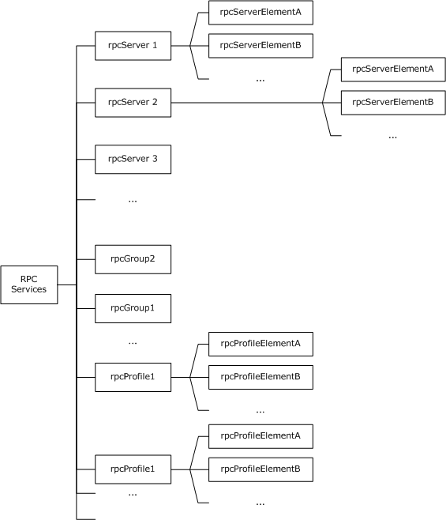
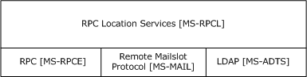
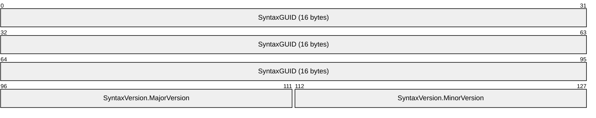
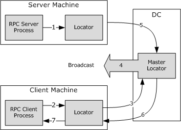
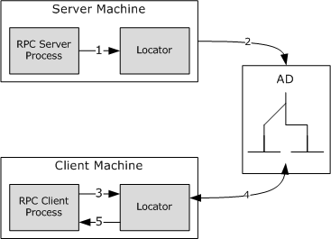
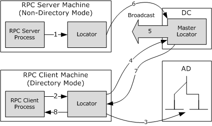

# [MS-RPCL]: Remote Procedure Call Location Services Extensions

Table of Contents

1 Introduction

- [1 Introduction](#Section_1)
  - [1.1 Glossary](#Section_1.1)
  - [1.2 References](#Section_1.2)
    - [1.2.1 Normative References](#Section_1.2.1)
    - [1.2.2 Informative References](#Section_1.2.2)
  - [1.3 Protocol Overview](#Section_1.3)
    - [1.3.1 Roles](#Section_1.3.1)
    - [1.3.2 Modes](#Section_1.3.2)
    - [1.3.3 Name Service Entries in Active Directory](#Section_1.3.3)
  - [1.4 Relationship to Other Protocols](#Section_1.4)
  - [1.5 Prerequisites/Preconditions](#Section_1.5)
  - [1.6 Applicability Statement](#Section_1.6)
  - [1.7 Versioning and Capability Negotiation](#Section_1.7)
  - [1.8 Vendor-Extensible Fields](#Section_1.8)
  - [1.9 Standards Assignments](#Section_1.9)

2 Messages

- [2 Messages](#Section_2)
  - [2.1 Transport](#Section_2.1)
  - [2.2 Common Data Types](#Section_2.2)
    - [2.2.1 Constants](#Section_2.2.1)
    - [2.2.2 Extensions to the Name Service Entry Name Syntax](#Section_2.2.2)
    - [2.2.3 LocToLoc RPC Interface Types](#Section_2.2.3)
      - [2.2.3.1 STRING_T](#Section_2.2.3.1)
      - [2.2.3.2 NSI_UUID_P_T](#Section_2.2.3.2)
      - [2.2.3.3 NSI_UUID_VECTOR_T](#Section_2.2.3.3)
      - [2.2.3.4 NSI_UUID_VECTOR_P_T](#Section_2.2.3.4)
      - [2.2.3.5 NSI_NS_HANDLE_T](#Section_2.2.3.5)
      - [2.2.3.6 NSI_STRING_BINDING_T](#Section_2.2.3.6)
      - [2.2.3.7 NSI_BINDING_T](#Section_2.2.3.7)
      - [2.2.3.8 NSI_BINDING_VECTOR_T](#Section_2.2.3.8)
      - [2.2.3.9 NSI_BINDING_VECTOR_P_T](#Section_2.2.3.9)
    - [2.2.4 Mailslot Structures](#Section_2.2.4)
      - [2.2.4.1 Common Details](#Section_2.2.4.1)
        - [2.2.4.1.1 Mailslot Sender](#Section_2.2.4.1.1)
        - [2.2.4.1.2 RPC_SYNTAX_IDENTIFIER](#Section_2.2.4.1.2)
      - [2.2.4.2 Broadcast Lookup](#Section_2.2.4.2)
        - [2.2.4.2.1 QueryPacket](#Section_2.2.4.2.1)
        - [2.2.4.2.2 QueryReply](#Section_2.2.4.2.2)
          - [2.2.4.2.2.1 MAILSLOT_ENTRY_TYPE](#Section_2.2.4.2.2.1)
          - [2.2.4.2.2.2 ReplyBuffer](#Section_2.2.4.2.2.2)
          - [2.2.4.2.2.3 fixed_part_of_reply](#Section_2.2.4.2.2.3)
      - [2.2.4.3 Master Locator Discovery](#Section_2.2.4.3)
        - [2.2.4.3.1 QUERYLOCATOR](#Section_2.2.4.3.1)
        - [2.2.4.3.2 QUERYLOCATORREPLY](#Section_2.2.4.3.2)
    - [2.2.5 Active Directory Schema Specifications](#Section_2.2.5)
      - [2.2.5.1 Common Details](#Section_2.2.5.1)
        - [2.2.5.1.1 Name Service Entry RDN](#Section_2.2.5.1.1)
        - [2.2.5.1.2 Reference Attributes](#Section_2.2.5.1.2)
        - [2.2.5.1.3 RPC Syntax Identifier Attribute](#Section_2.2.5.1.3)
      - [2.2.5.2 rpcContainer Class](#Section_2.2.5.2)
      - [2.2.5.3 rpcServer Class](#Section_2.2.5.3)
      - [2.2.5.4 rpcProfile Class](#Section_2.2.5.4)
      - [2.2.5.5 rpcGroup Class](#Section_2.2.5.5)
      - [2.2.5.6 rpcServerElement Class](#Section_2.2.5.6)
      - [2.2.5.7 rpcProfileElement Class](#Section_2.2.5.7)
    - [2.2.6 LDAP Operation Details](#Section_2.2.6)
      - [2.2.6.1 LDAP Abstract Data Elements](#Section_2.2.6.1)
      - [2.2.6.2 LDAP Operation Details](#Section_2.2.6.2)
        - [2.2.6.2.1 LDAP Query](#Section_2.2.6.2.1)
        - [2.2.6.2.2 LDAP Add](#Section_2.2.6.2.2)
        - [2.2.6.2.3 LDAP Delete](#Section_2.2.6.2.3)
        - [2.2.6.2.4 LDAP Modify](#Section_2.2.6.2.4)
        - [2.2.6.2.5 LDAP Bind](#Section_2.2.6.2.5)
        - [2.2.6.2.6 LDAP Unbind](#Section_2.2.6.2.6)
  - [2.3 Directory Service Schema Elements](#Section_2.3)

3 Protocol Details

- [3 Protocol Details](#Section_3)
  - [3.1 LocToLoc Common Details](#Section_3.1)
    - [3.1.1 Abstract Data Model](#Section_3.1.1)
      - [3.1.1.1 RPC Services Container](#Section_3.1.1.1)
    - [3.1.2 Timers](#Section_3.1.2)
    - [3.1.3 Initialization](#Section_3.1.3)
      - [3.1.3.1 Mode Initialization](#Section_3.1.3.1)
      - [3.1.3.2 Master and Nonmaster Locator Initialization](#Section_3.1.3.2)
    - [3.1.4 Message Processing Events and Sequencing Rules](#Section_3.1.4)
      - [3.1.4.1 I_nsi_lookup_begin (Opnum 0)](#Section_3.1.4.1)
      - [3.1.4.2 I_nsi_lookup_next (Opnum 2)](#Section_3.1.4.2)
      - [3.1.4.3 I_nsi_lookup_done (Opnum 1)](#Section_3.1.4.3)
      - [3.1.4.4 I_nsi_ping_locator (Opnum 4)](#Section_3.1.4.4)
      - [3.1.4.5 I_nsi_entry_object_inq_begin (Opnum 6)](#Section_3.1.4.5)
      - [3.1.4.6 I_nsi_entry_object_inq_next (Opnum 3)](#Section_3.1.4.6)
      - [3.1.4.7 I_nsi_entry_object_inq_done (Opnum 5)](#Section_3.1.4.7)
    - [3.1.5 Timer Events](#Section_3.1.5)
    - [3.1.6 Other Local Events](#Section_3.1.6)
  - [3.2 LocToLoc Server Locator Details](#Section_3.2)
    - [3.2.1 Nondirectory Mode](#Section_3.2.1)
      - [3.2.1.1 Abstract Data Model](#Section_3.2.1.1)
      - [3.2.1.2 Timers](#Section_3.2.1.2)
      - [3.2.1.3 Initialization](#Section_3.2.1.3)
      - [3.2.1.4 Higher-Layer Triggered Events](#Section_3.2.1.4)
        - [3.2.1.4.1 Updating a Server Entry](#Section_3.2.1.4.1)
        - [3.2.1.4.2 Setting the Maximum Expiration Age](#Section_3.2.1.4.2)
      - [3.2.1.5 Message Processing Events and Sequencing Rules](#Section_3.2.1.5)
        - [3.2.1.5.1 Broadcast Lookup Response](#Section_3.2.1.5.1)
      - [3.2.1.6 Timer Events](#Section_3.2.1.6)
      - [3.2.1.7 Other Local Events](#Section_3.2.1.7)
    - [3.2.2 Directory-Only Mode](#Section_3.2.2)
      - [3.2.2.1 Abstract Data Model](#Section_3.2.2.1)
      - [3.2.2.2 Timers](#Section_3.2.2.2)
      - [3.2.2.3 Initialization](#Section_3.2.2.3)
      - [3.2.2.4 Higher-Layer Triggered Events](#Section_3.2.2.4)
        - [3.2.2.4.1 Updating a Server Entry](#Section_3.2.2.4.1)
        - [3.2.2.4.2 Updating a Group Entry](#Section_3.2.2.4.2)
        - [3.2.2.4.3 Updating a Profile Entry](#Section_3.2.2.4.3)
        - [3.2.2.4.4 Creating a New Entry](#Section_3.2.2.4.4)
      - [3.2.2.5 Message Processing Events and Sequencing Rules](#Section_3.2.2.5)
      - [3.2.2.6 Timer Events](#Section_3.2.2.6)
      - [3.2.2.7 Other Local Events](#Section_3.2.2.7)
    - [3.2.3 Directory Mode](#Section_3.2.3)
      - [3.2.3.1 Abstract Data Model](#Section_3.2.3.1)
      - [3.2.3.2 Timers](#Section_3.2.3.2)
      - [3.2.3.3 Initialization](#Section_3.2.3.3)
      - [3.2.3.4 Higher-Layer Triggered Events](#Section_3.2.3.4)
        - [3.2.3.4.1 Updating a Server Entry](#Section_3.2.3.4.1)
        - [3.2.3.4.2 Updating a Group Entry](#Section_3.2.3.4.2)
        - [3.2.3.4.3 Updating a Profile Entry](#Section_3.2.3.4.3)
      - [3.2.3.5 Message Processing Events and Sequencing Rules](#Section_3.2.3.5)
      - [3.2.3.6 Timer Events](#Section_3.2.3.6)
      - [3.2.3.7 Other Local Events](#Section_3.2.3.7)
  - [3.3 LocToLoc Client Locator Details](#Section_3.3)
    - [3.3.1 Nondirectory Mode](#Section_3.3.1)
      - [3.3.1.1 Abstract Data Model](#Section_3.3.1.1)
      - [3.3.1.2 Timers](#Section_3.3.1.2)
      - [3.3.1.3 Initialization](#Section_3.3.1.3)
      - [3.3.1.4 Higher-Layer Triggered Events](#Section_3.3.1.4)
        - [3.3.1.4.1 Binding Lookup](#Section_3.3.1.4.1)
        - [3.3.1.4.2 Object UUID Lookup](#Section_3.3.1.4.2)
        - [3.3.1.4.3 Master Locator Discovery](#Section_3.3.1.4.3)
      - [3.3.1.5 Message Processing Events and Sequencing Rules](#Section_3.3.1.5)
      - [3.3.1.6 Timer Events](#Section_3.3.1.6)
      - [3.3.1.7 Other Local Events](#Section_3.3.1.7)
    - [3.3.2 Directory-Only Mode](#Section_3.3.2)
      - [3.3.2.1 Abstract Data Model](#Section_3.3.2.1)
      - [3.3.2.2 Timers](#Section_3.3.2.2)
      - [3.3.2.3 Initialization](#Section_3.3.2.3)
      - [3.3.2.4 Higher-Layer Triggered Events](#Section_3.3.2.4)
        - [3.3.2.4.1 Query with Entry Name](#Section_3.3.2.4.1)
        - [3.3.2.4.2 Query Without Entry Name](#Section_3.3.2.4.2)
      - [3.3.2.5 Message Processing Events and Sequencing Rules](#Section_3.3.2.5)
      - [3.3.2.6 Timer Events](#Section_3.3.2.6)
      - [3.3.2.7 Other Local Events](#Section_3.3.2.7)
    - [3.3.3 Directory Mode](#Section_3.3.3)
      - [3.3.3.1 Abstract Data Model](#Section_3.3.3.1)
      - [3.3.3.2 Timers](#Section_3.3.3.2)
      - [3.3.3.3 Initialization](#Section_3.3.3.3)
      - [3.3.3.4 Higher-Layer Triggered Events](#Section_3.3.3.4)
        - [3.3.3.4.1 Query with Entry Name](#Section_3.3.3.4.1)
        - [3.3.3.4.2 Query Without Entry Name](#Section_3.3.3.4.2)
      - [3.3.3.5 Message Processing Events and Sequencing Rules](#Section_3.3.3.5)
      - [3.3.3.6 Timer Events](#Section_3.3.3.6)
      - [3.3.3.7 Other Local Events](#Section_3.3.3.7)
  - [3.4 LocToLoc Master Locator Details](#Section_3.4)
    - [3.4.1 Nondirectory Mode](#Section_3.4.1)
      - [3.4.1.1 Abstract Data Model](#Section_3.4.1.1)
      - [3.4.1.2 Timers](#Section_3.4.1.2)
      - [3.4.1.3 Initialization](#Section_3.4.1.3)
      - [3.4.1.4 Higher-Layer Triggered Events](#Section_3.4.1.4)
      - [3.4.1.5 Message Processing Events and Sequencing Rules](#Section_3.4.1.5)
        - [3.4.1.5.1 Lookup Request](#Section_3.4.1.5.1)
          - [3.4.1.5.1.1 Broadcast Lookup](#Section_3.4.1.5.1.1)
        - [3.4.1.5.2 Master Locator Response](#Section_3.4.1.5.2)
        - [3.4.1.5.3 Master Locator Ping Response](#Section_3.4.1.5.3)
      - [3.4.1.6 Timer Events](#Section_3.4.1.6)
      - [3.4.1.7 Other Local Events](#Section_3.4.1.7)
    - [3.4.2 Directory Mode](#Section_3.4.2)
    - [3.4.3 Directory-Only Mode](#Section_3.4.3)

4 Protocol Examples

- [4 Protocol Examples](#Section_4)
  - [4.1 Nondirectory Mode Operation](#Section_4.1)
  - [4.2 Directory-Only Mode Operation](#Section_4.2)
  - [4.3 Server in Nondirectory Mode and Client in Directory Mode](#Section_4.3)

5 Security

- [5 Security](#Section_5)
  - [5.1 Security Considerations for Implementers](#Section_5.1)
  - [5.2 Index of Security Parameters](#Section_5.2)

6 Appendix A: Full IDL

- [6 Appendix A: Full IDL](#Section_6)

7 Appendix B: Product Behavior

- [7 Appendix B: Product Behavior](#Section_7)

8 Appendix C: API Mappings

- [8 Appendix C: API Mappings](#Section_8)

9 Change Tracking

- [9 Change Tracking](#Section_9)

For the legal notice and IP terms, see [LEGAL.md](../LEGAL.md).
Last updated: 6/1/2017.
See [Revision History](#revision-history) for full version history.

# 1 Introduction

The Remote Procedure Call Location Services Extensions is a legacy protocol that has been deprecated and is not used by Microsoft. Implementers should use the DCE-based RPC Location Services capabilities in [[C706]](https://go.microsoft.com/fwlink/?LinkId=89824).

The Remote Procedure Call Location Services Extensions is a set of extensions/restrictions to the distributed computing environment (DCE) remote procedure call (RPC) Location Services specified in [C706]. These extensions add new capabilities to the DCE RPC Location Services Protocol.

This document specifies a set of extensions and restrictions to the DCE RPC Location Services specification as specified in [C706].

Sections 1.5, 1.8, 1.9, 2, and 3 of this specification are normative. All other sections and examples in this specification are informative.

## 1.1 Glossary

This document uses the following terms:

**Active Directory**: A general-purpose network directory service. [**Active Directory**](#gt_active-directory) also refers to the Windows implementation of a directory service. [**Active Directory**](#gt_active-directory) stores information about a variety of objects in the network. Importantly, user accounts, computer accounts, groups, and all related credential information used by the Windows implementation of Kerberos are stored in [**Active Directory**](#gt_active-directory). [**Active Directory**](#gt_active-directory) is either deployed as Active Directory Domain Services (AD DS) or Active Directory Lightweight Directory Services (AD LDS). [MS-ADTS](../MS-ADTS/MS-ADTS.md) describes both forms. For more information, see [MS-AUTHSOD](../MS-AUTHSOD/MS-AUTHSOD.md) section 1.1.1.5.2, Lightweight Directory Access Protocol (LDAP) versions 2 and 3, Kerberos, and DNS.

**binding**: The string representation of the protocol sequence, NetworkAddress, and optionally the [**endpoint**](#gt_endpoint). Also referred to as "string binding". For more information, see [[C706]](https://go.microsoft.com/fwlink/?LinkId=89824) section "String Bindings".

**client locator**: A service that enables lookup of entries exported to the [**remote procedure call (RPC)**](#gt_remote-procedure-call-rpc) name service.

**domain**: A set of users and computers sharing a common namespace and management infrastructure. At least one computer member of the set must act as a [**domain controller (DC)**](#gt_domain-controller-dc) and host a member list that identifies all members of the domain, as well as optionally hosting the [**Active Directory**](#gt_active-directory) service. The domain controller provides authentication of members, creating a unit of trust for its members. Each domain has an identifier that is shared among its members. For more information, see [MS-AUTHSOD] section 1.1.1.5 and [MS-ADTS].

**domain controller (DC)**: The service, running on a server, that implements [**Active Directory**](#gt_active-directory), or the server hosting this service. The service hosts the data store for objects and interoperates with other [**DCs**](#gt_domain-controller-dc) to ensure that a local change to an object replicates correctly across all [**DCs**](#gt_domain-controller-dc). When [**Active Directory**](#gt_active-directory) is operating as Active Directory Domain Services (AD DS), the [**DC**](#gt_domain-controller-dc) contains full NC replicas of the configuration naming context (config NC), schema naming context (schema NC), and one of the domain NCs in its forest. If the AD DS [**DC**](#gt_domain-controller-dc) is a global catalog server (GC server), it contains partial NC replicas of the remaining domain NCs in its forest. For more information, see [MS-AUTHSOD] section 1.1.1.5.2 and [MS-ADTS]. When [**Active Directory**](#gt_active-directory) is operating as Active Directory Lightweight Directory Services (AD LDS), several AD LDS [**DCs**](#gt_domain-controller-dc) can run on one server. When [**Active Directory**](#gt_active-directory) is operating as AD DS, only one AD DS [**DC**](#gt_domain-controller-dc) can run on one server. However, several AD LDS [**DCs**](#gt_domain-controller-dc) can coexist with one AD DS [**DC**](#gt_domain-controller-dc) on one server. The AD LDS [**DC**](#gt_domain-controller-dc) contains full NC replicas of the config NC and the schema NC in its forest. The domain controller is the server side of Authentication Protocol Domain Support [MS-APDS](../MS-APDS/MS-APDS.md).

**endpoint**: A network-specific address of a remote procedure call (RPC) server process for remote procedure calls. The actual name and type of the endpoint depends on the [**RPC**](#gt_remote-procedure-call-rpc) protocol sequence that is being used. For example, for RPC over TCP (RPC Protocol Sequence ncacn_ip_tcp), an endpoint might be TCP port 1025. For RPC over Server Message Block (RPC Protocol Sequence ncacn_np), an endpoint might be the name of a named pipe. For more information, see [C706].

**fully qualified domain name (FQDN)**: In [**Active Directory**](#gt_active-directory), a fully qualified domain name (FQDN) that identifies a [**domain**](#gt_domain).

**globally unique identifier (GUID)**: A term used interchangeably with [**universally unique identifier (UUID)**](#gt_universally-unique-identifier-uuid) in Microsoft protocol technical documents (TDs). Interchanging the usage of these terms does not imply or require a specific algorithm or mechanism to generate the value. Specifically, the use of this term does not imply or require that the algorithms described in [[RFC4122]](https://go.microsoft.com/fwlink/?LinkId=90460) or [C706] must be used for generating the [**GUID**](#gt_globally-unique-identifier-guid). See also [**universally unique identifier (UUID)**](#gt_universally-unique-identifier-uuid).

**Interface Definition Language (IDL)**: The International Standards Organization (ISO) standard language for specifying the interface for remote procedure calls. For more information, see [C706] section 4.

**locator**: In [**remote procedure call (RPC)**](#gt_remote-procedure-call-rpc), a component of the [**remote procedure call name service**](#gt_c87b207a-c8b7-4ae9-982a-65dc2cbe993b) that runs on a given machine and facilitates the name service operations of exports and lookups.

**mailslot**: A form of datagram communication using the Server Message Block (SMB) protocol, as specified in [MS-MAIL](../MS-MAIL/MS-MAIL.md).

**master locator**: A server that enables querying for server entries exported on a different machine.

**Microsoft Interface Definition Language (MIDL)**: The Microsoft implementation and extension of the OSF-DCE [**Interface Definition Language (IDL)**](#gt_interface-definition-language-idl). [**MIDL**](#gt_microsoft-interface-definition-language-midl) can also mean the [**Interface Definition Language (IDL)**](#gt_interface-definition-language-idl) compiler provided by Microsoft. For more information, see [MS-RPCE](../MS-RPCE/MS-RPCE.md).

**name service entry**: A unit of advertisement that is exported to the RPC Name Service. These entries are of three types: a Server Entry, which contains bindings for a single server and optionally a set of Object UUIDs (for more information, see [C706] section 2.4.3); a Group Entry, which contains names of one or more server entries, other groups, or both (for more information, see [C706] section 2.4.3); and a Profile Entry, which contains a prioritized set of profile elements (for more information, see [C706] section 2.4.3).

**object UUID**: A [**UUID**](#gt_universally-unique-identifier-uuid) that is used to represent a resource available on the remote procedure call (RPC) servers. For more information, see [C706].

**profile element**: A record that corresponds to a single [**remote procedure call (RPC)**](#gt_remote-procedure-call-rpc) interface and that refers to a server entry, group, or profile. For more information, see [C706] section 2.4.3.

**relative distinguished name (RDN)**: In the [**Active Directory**](#gt_active-directory) directory service, the unique name of a child element relative to its parent in Active Directory. The RDN of a child element combined with the [**fully qualified domain name (FQDN)**](#gt_fully-qualified-domain-name-fqdn) of the parent forms the FQDN of the child.

**remote procedure call (RPC)**: A context-dependent term commonly overloaded with three meanings. Note that much of the industry literature concerning RPC technologies uses this term interchangeably for any of the three meanings. Following are the three definitions: (*) The runtime environment providing remote procedure call facilities. The preferred usage for this meaning is "RPC runtime". (*) The pattern of request and response message exchange between two parties (typically, a client and a server). The preferred usage for this meaning is "RPC exchange". (*) A single message from an exchange as defined in the previous definition. The preferred usage for this term is "RPC message". For more information about RPC, see [C706].

**remote procedure call (RPC) name service**: A service that allows servers to export binding information, and clients to find it, in an efficient manner. For more information, see [C706] chapter 2, "Name Service Interface".

**RPC protocol sequence**: A character string that represents a valid combination of a [**remote procedure call (RPC)**](#gt_remote-procedure-call-rpc) protocol, a network layer protocol, and a transport layer protocol, as described in [C706] and [MS-RPCE].

**RPC transfer syntax**: A method for encoding messages defined in an Interface Definition Language (IDL) file. Remote procedure call (RPC) can support different encoding methods or transfer syntaxes. For more information, see [C706].

**server locator**: Enables exporting of entries to the [**remote procedure call (RPC)**](#gt_remote-procedure-call-rpc) name service.

**Unicode**: A character encoding standard developed by the Unicode Consortium that represents almost all of the written languages of the world. The [**Unicode**](#gt_unicode) standard [[UNICODE5.0.0/2007]](https://go.microsoft.com/fwlink/?LinkId=154659) provides three forms (UTF-8, UTF-16, and UTF-32) and seven schemes (UTF-8, UTF-16, UTF-16 BE, UTF-16 LE, UTF-32, UTF-32 LE, and UTF-32 BE).

**universally unique identifier (UUID)**: A 128-bit value. UUIDs can be used for multiple purposes, from tagging objects with an extremely short lifetime, to reliably identifying very persistent objects in cross-process communication such as client and server interfaces, manager entry-point vectors, and [**RPC**](#gt_remote-procedure-call-rpc) objects. UUIDs are highly likely to be unique. UUIDs are also known as [**globally unique identifiers (GUIDs)**](#gt_globally-unique-identifier-guid) and these terms are used interchangeably in the Microsoft protocol technical documents (TDs). Interchanging the usage of these terms does not imply or require a specific algorithm or mechanism to generate the UUID. Specifically, the use of this term does not imply or require that the algorithms described in [RFC4122] or [C706] must be used for generating the UUID.

**well-known endpoint**: A preassigned, network-specific, stable address for a particular client/server instance. For more information, see [C706].

**MAY, SHOULD, MUST, SHOULD NOT, MUST NOT:** These terms (in all caps) are used as defined in [[RFC2119]](https://go.microsoft.com/fwlink/?LinkId=90317). All statements of optional behavior use either MAY, SHOULD, or SHOULD NOT.

## 1.2 References

Links to a document in the Microsoft Open Specifications library point to the correct section in the most recently published version of the referenced document. However, because individual documents in the library are not updated at the same time, the section numbers in the documents may not match. You can confirm the correct section numbering by checking the [Errata](http://msdn.microsoft.com/en-us/library/dn781092.aspx).

### 1.2.1 Normative References

We conduct frequent surveys of the normative references to assure their continued availability. If you have any issue with finding a normative reference, please contact [dochelp@microsoft.com](mailto:dochelp@microsoft.com). We will assist you in finding the relevant information.

[C705] The Open Group, "DCE 1.1: Directory Services", C705, August 1997, [https://www2.opengroup.org/ogsys/catalog/c705](https://go.microsoft.com/fwlink/?LinkId=89823)

[C706] The Open Group, "DCE 1.1: Remote Procedure Call", C706, August 1997, [https://www2.opengroup.org/ogsys/catalog/c706](https://go.microsoft.com/fwlink/?LinkId=89824)

[MS-ADA1] Microsoft Corporation, "[Active Directory Schema Attributes A-L](../MS-ADA1/MS-ADA1.md)".

[MS-ADA3] Microsoft Corporation, "[Active Directory Schema Attributes N-Z](../MS-ADA3/MS-ADA3.md)".

[MS-ADSC] Microsoft Corporation, "[Active Directory Schema Classes](../MS-ADSC/MS-ADSC.md)".

[MS-ADTS] Microsoft Corporation, "[Active Directory Technical Specification](../MS-ADTS/MS-ADTS.md)".

[MS-DTYP] Microsoft Corporation, "[Windows Data Types](../MS-DTYP/MS-DTYP.md)".

[MS-MAIL] Microsoft Corporation, "[Remote Mailslot Protocol](../MS-MAIL/MS-MAIL.md)".

[MS-NRPC] Microsoft Corporation, "[Netlogon Remote Protocol](../MS-NRPC/MS-NRPC.md)".

[MS-RPCE] Microsoft Corporation, "[Remote Procedure Call Protocol Extensions](../MS-RPCE/MS-RPCE.md)".

[NETBEUI] IBM Corporation, "LAN Technical Reference: 802.2 and NetBIOS APIs", 1986, [http://publibz.boulder.ibm.com/cgi-bin/bookmgr_OS390/BOOKS/BK8P7001/CCONTENTS](https://go.microsoft.com/fwlink/?LinkId=90224)

[RFC1001] Network Working Group, "Protocol Standard for a NetBIOS Service on a TCP/UDP Transport: Concepts and Methods", RFC 1001, March 1987, [http://www.ietf.org/rfc/rfc1001.txt](https://go.microsoft.com/fwlink/?LinkId=90260)

[RFC1002] Network Working Group, "Protocol Standard for a NetBIOS Service on a TCP/UDP Transport: Detailed Specifications", STD 19, RFC 1002, March 1987, [http://www.rfc-editor.org/rfc/rfc1002.txt](https://go.microsoft.com/fwlink/?LinkId=90261)

[RFC2119] Bradner, S., "Key words for use in RFCs to Indicate Requirement Levels", BCP 14, RFC 2119, March 1997, [http://www.rfc-editor.org/rfc/rfc2119.txt](https://go.microsoft.com/fwlink/?LinkId=90317)

[RFC2251] Wahl, M., Howes, T., and Kille, S., "Lightweight Directory Access Protocol (v3)", RFC 2251, December 1997, [http://www.ietf.org/rfc/rfc2251.txt](https://go.microsoft.com/fwlink/?LinkId=90325)

[RFC4120] Neuman, C., Yu, T., Hartman, S., and Raeburn, K., "The Kerberos Network Authentication Service (V5)", RFC 4120, July 2005, [http://www.rfc-editor.org/rfc/rfc4120.txt](https://go.microsoft.com/fwlink/?LinkId=90458)

[RFC4178] Zhu, L., Leach, P., Jaganathan, K., and Ingersoll, W., "The Simple and Protected Generic Security Service Application Program Interface (GSS-API) Negotiation Mechanism", RFC 4178, October 2005, [http://www.rfc-editor.org/rfc/rfc4178.txt](https://go.microsoft.com/fwlink/?LinkId=90461)

[UNICODE] The Unicode Consortium, "The Unicode Consortium Home Page", [http://www.unicode.org/](https://go.microsoft.com/fwlink/?LinkId=90550)

### 1.2.2 Informative References

None.

## 1.3 Protocol Overview

This specification extends the DCE RPC Location Services specification defined in the section "Name Service Interface" in Part 2 of [[C706]](https://go.microsoft.com/fwlink/?LinkId=89824). These extensions add new capabilities to the DCE RPC Location Services Protocol and, in some cases, place additional restrictions upon it. This specification adheres to the abstract data model as specified in [C706] Part 2, but an implementation of this specification will not interoperate with an implementation of [C706] Part 2.

This document refers to the Windows implementation of the DCE RPC Location services protocol as "LocToLoc".

This document includes the following:

- An extension to provide RPC Location Services functionality in an environment where a centrally accessible directory service like [**Active Directory**](#gt_active-directory) directory service is not available. For more details, see Nondirectory mode in section [1.3.2](#Section_1.3.2).
- An extension defining the implementation of the RPC Location Services specification in an Active Directory environment. For more details, see Directory-only mode in section 1.3.2.
- An extension enabling interoperable RPC Location Service functionality between locators running outside an Active Directory environment, and locators running inside an Active Directory environment. For more details, see Directory mode in section 1.3.2.
- An extension of the syntax for [**name service entries**](#gt_name-service-entry) to include a [**domain**](#gt_domain) name. For more details, see section [2.2.2](#Section_2.2.2).
- A restriction requiring profile, group, and server attributes to be defined on separate name service entries. These attributes are as specified in section "Name Service Attributes" in [C706]. For more details, see section [1.3.3](#Section_1.3.3).
- A restriction requiring clients to be members of an Active Directory domain to support persistently storing exported name service entries. For more details, see section 1.3.2.
- A restriction requiring clients to be members of an Active Directory domain to support profile and group attributes. For more details, see sections [3.2.1](#Section_1.3), [3.3.3](#Section_1.3).

### 1.3.1 Roles

A [**locator**](#gt_locator) conceptually operates in the following three roles. Over the course of a given [**protocol sequence**](#gt_0c171cc7-e9c4-41b6-95a9-536db0042c7a), a given locator can simultaneously occupy more than one of these roles:

- [**Server locator**](#gt_server-locator): A locator running on a computer on which a given [**name service entry**](#gt_name-service-entry) is originally exported.
- [**Client locator**](#gt_client-locator): A locator running on a computer on which a given name service entry is looked up.
- [**Master locator**](#gt_master-locator): A locator that facilitates communication between client locators and server locators.

### 1.3.2 Modes

A locator runs in exactly one of the following modes.

**Nondirectory mode:** In this mode, a locator supports lookup and export of server entries without support for persistently stored [**name service entries**](#gt_name-service-entry), and therefore, it does not rely on an [**Active Directory**](#gt_active-directory) store. Functionalities related to profile and group entries are not supported.

**Directory mode:** In this mode, a locator supports persistently storing all name service entries including group and profile entries by relying on an Active Directory store. A locator in this mode runs on a computer joined to an Active Directory [**domain**](#gt_domain). [**Locators**](#gt_locator) in this mode interoperate with locators in Nondirectory mode in the following ways:

- [**Client locators**](#gt_client-locator) in this mode support lookups of server entries from [**server locators**](#gt_server-locator) running in Nondirectory mode.
- Server locators in this mode support lookups of server entries from client locators running in Nondirectory mode.
Functionalities related to lookup, export of server entries, profile, and group entries are supported in Directory mode.

**Directory-only mode:** In this mode, a locator supports the persistent storage of all name service entries including group and profile entries by relying on an Active Directory store. A locator in this mode runs on a computer joined to an Active Directory domain. Locators in this mode do not interoperate with locators running in Nondirectory mode.

In this mode, a locator is not permitted to do the following:

- Respond or listen to [**mailslot**](#gt_mailslot) requests.
- Initiate any mailslot requests.
- Forward a lookup request that originated locally to the [**master locator**](#gt_master-locator).
Functionalities are the same as for Directory mode, except as noted above.

### 1.3.3 Name Service Entries in Active Directory

In [**Active Directory**](#gt_active-directory) [**domain**](#gt_domain) environments, this specification persistently stores [**RPC name service**](#gt_c87b207a-c8b7-4ae9-982a-65dc2cbe993b) entries in the Active Directory store. The following schema elements are used to implement persistent storing, as specified in section [2.2.5](#Section_1.3).

| Schema class | Description |
| --- | --- |
| rpcServer | Represents a server entry. This instance contains the [**object UUIDs**](#gt_object-uuid) exported to the server entry. Interfaces exported by the server are represented as child elements of this instance of type rpcServerElement. |
| rpcGroup | Represents a group entry. This instance contains group members of the Group Entry. |
| rpcProfile | Represents a profile entry. [**Profile elements**](#gt_profile-element) in this profile entry are represented as child elements of this instance of type rpcProfileElement. |
| rpcServerElement | Represents a single interface exported to the server entry represented by the parent container. |
| rpcProfileElement | Represents a profile element exported to the profile entry represented by the parent container. An entry with an interface identifier specification of null [**GUID**](#gt_globally-unique-identifier-guid) represents the default profile element of the profile entry. |

The following diagram shows the layout of the RPC name service entries in the Active Directory store.

Figure 1: Active Directory layout

## 1.4 Relationship to Other Protocols

The Remote Procedure Call Location Services Extensions depend on the following protocols:

- [**Locators**](#gt_locator) depend on the [**domain controller (DC)**](#gt_domain-controller-dc) and [**domain**](#gt_domain) discovery mechanism [MS-ADTS](../MS-ADTS/MS-ADTS.md) to obtain information about domains and to select their mode of operation, as specified in section [3.1.3.1](#Section_3.1.3.1).
- [**Client locators**](#gt_client-locator) depend on Remote Procedure Call Protocol Extensions [MS-RPCE](../MS-RPCE/MS-RPCE.md) for forwarding requests to the [**master locator**](#gt_master-locator), as specified in section [3.3.1.4](#Section_3.2.3).
- Master locators depend on the Remote Mailslot Protocol [MS-MAIL](../MS-MAIL/MS-MAIL.md) to broadcast requests for the queries they receive, as specified in section [3.4.1.5.1](#Section_3.4.1.5.1.1). [**Server locators**](#gt_server-locator) depend on the Remote Mailslot Protocol for responding to broadcast requests, as specified in section [3.2.1.5](#Section_3.3.1.5).
- Client locators depend on the Remote Mailslot Protocol to dynamically discover the master locator, as specified in sections [3.3.1.4.3](#Section_3.3.1.4.3) and [3.4.1.5.2](#Section_3.4.1.5.2).
- Server locators depend on Lightweight Directory Access Protocol (LDAP) [MS-ADTS] for persistently storing name service entries in the [**Active Directory**](#gt_active-directory) store, as specified in section [3.2.2.4](#Section_3.2.2).
- Client locators depend on LDAP [MS-ADTS] to look up persistently stored entries in Active Directory for the name service entries, as specified in section [3.3.2.4](#Section_3.2.2).
No other protocols have a dependency on this protocol.

The following diagram illustrates the layering of the protocols.

Figure 2: Relationship to other protocols

## 1.5 Prerequisites/Preconditions

Elements of these protocol extensions incorporate [**RPC**](#gt_remote-procedure-call-rpc) interfaces and, as a result, inherit the prerequisites identified in [MS-RPCE](../MS-RPCE/MS-RPCE.md) that are common to RPC interfaces.

These protocol extensions assume that an implementation has previously determined the following:

- Whether it is operating on a computer joined to an [**Active Directory**](#gt_active-directory) [**domain**](#gt_domain).
- Whether it is running on the [**DC**](#gt_domain-controller-dc) for a domain. A locator running on a DC runs as a [**master locator**](#gt_master-locator).
When operating as a member of an Active Directory domain, a locator must be able to access the Active Directory during initialization to support Active Directory–supported functionalities as specified in section [1.3.2](#Section_1.3.2).

For more information, see section [3.1.3.1](#Section_3.1.3.1).

## 1.6 Applicability Statement

The Remote Procedure Call Location Services Extensions do not restrict the applicability of [[C706]](https://go.microsoft.com/fwlink/?LinkId=89824); rather, they extend its applicability to environments where computers have no centrally accessible directory service.

## 1.7 Versioning and Capability Negotiation

**Supported Transports**

The [**client locator**](#gt_client-locator) communicates with the [**master locator**](#gt_master-locator) using the RPC over Server Message Block (SMB) Protocol sequence (ncacn_np). For more information, see section [2.1](#Section_2.1).

The client locator uses the Remote Mailslot Protocol [MS-MAIL](../MS-MAIL/MS-MAIL.md) to discover master locators. For more information, see section [3.3.1.4.3](#Section_3.3.1.4.3).

The master locator uses the Remote Mailslot Protocol [MS-MAIL] to broadcast requests to [**server locators**](#gt_server-locator) and receive their responses. For more information, see section [3.4.1.5](#Section_3.3.1.5).

When operating on a [**domain**](#gt_domain)-joined computer, the locator uses the LDAP protocol to issue queries and updates to [**Active Directory**](#gt_active-directory) in its domain. For more information, see sections [3.2.2.4](#Section_3.2.2) and [3.3.2.4](#Section_3.2.2).

**Capability Negotiation**<1>

Protocol version: This protocol's [**RPC**](#gt_remote-procedure-call-rpc) interface has a single version number of 1.0. The RPC versioning and capability negotiation in this situation is as specified in [[C706]](https://go.microsoft.com/fwlink/?LinkId=89824) and in [MS-RPCE](../MS-RPCE/MS-RPCE.md) section 1.7.

**Security and Authentication Methods**

RPC interfaces: The RPC interfaces defined by these extensions use the default security settings for RPC over SMB and do not register any additional security providers ([MS-RPCE] section 3.3.3.3). Default security is used for the RPC interfaces of these extensions. More information on security used by the RPC is specified in [MS-RPCE].

LDAP: When [**binding**](#gt_binding) through LDAP, the Generic Security Services-Simple and Protected Generic Security Service Application Program Interface Negotiation Mechanism (GSS-SPNEGO) profile for Simple Authentication and Security Layer (SASL) is selected. The GSS-SPNEGO profile uses an implementation specified in [[RFC4178]](https://go.microsoft.com/fwlink/?LinkId=90461) and will result in an actual security mechanism being selected. Typically, this mechanism is Kerberos [[RFC4120]](https://go.microsoft.com/fwlink/?LinkId=90458), but others are possible. If the GSS-Kerberos profile is selected, then Kerberos is used. If Kerberos is used, then the name passed in for authentication is "LDAP/hostname-of-ldap-server". For more information on LDAP, see [MS-ADTS](../MS-ADTS/MS-ADTS.md).

## 1.8 Vendor-Extensible Fields

This protocol does not define any vendor-extensible fields.

## 1.9 Standards Assignments

This protocol uses the following RPC UUID, RPC endpoint, and Mailslot destination standard assignments.

| Parameter | Value | Reference |
| --- | --- | --- |
| LocToLoc RPC Interface UUID | [**UUID**](#gt_universally-unique-identifier-uuid): e33c0cc4-0482-101a-bc0c-02608c6ba218 | As specified in section [2.1](#Section_2.1) |
| LocToLoc RPC Interface End Point | Pipe Name: \pipe\Locator | As specified in section 2.1 |
| Master Locator Discovery Request Mailslot | \Mailslot\Resp_s | As specified in section 2.1 |
| Master Locator Discovery Response Mailslot | \Mailslot\Resp_c | As specified in section 2.1 |
| Broadcast Lookup Request Mailslot | \Mailslot\RpcLoc_s | As specified in section 2.1 |
| Broadcast Lookup Response Mailslot | \Mailslot\RpcLoc_c | As specified in section 2.1 |

# 2 Messages

## 2.1 Transport

Lookup forwarding: The [**client locators**](#gt_client-locator) forward lookup requests to [**master locators**](#gt_master-locator) over the LocToLoc [**RPC**](#gt_remote-procedure-call-rpc) interface. The RPC interface uses the RPC over SMB [**protocol sequence**](#gt_0c171cc7-e9c4-41b6-95a9-536db0042c7a), as specified in [MS-RPCE](../MS-RPCE/MS-RPCE.md).

This protocol uses the following [**well-known endpoint**](#gt_well-known-endpoint):

- \pipe\Locator
This [**endpoint**](#gt_endpoint) is a pipe name for RPC over SMB, as specified in [MS-RPCE].

This protocol MUST use the [**UUID**](#gt_universally-unique-identifier-uuid) specified in section [1.9](#Section_1.9). The RPC version number is 1.0.

Broadcast lookup: Master locators broadcast requests for server entries by writing to a mailslot (as specified in [MS-MAIL](../MS-MAIL/MS-MAIL.md) section 3.1.4.1) with the following destination and address:

- Destination can be either all reachable computers on the network or all computers in a [**domain**](#gt_domain).
- Address: String literal "\Mailslot\RpcLoc_s".
[**Server locators**](#gt_server-locator) respond to broadcast requests from master locators by using the Remote Mailslot Protocol with the following destination and address:

- Mailslot destination: The machine that sent the broadcast request to which this is a response.
- Address: String literal "\Mailslot\RpcLoc_c".
Master locator discovery: Client locators discover the master locator by using the Remote Mailslot Protocol with the following destination and address:

- Mailslot destination: All reachable computers on the network.
- Address: String literal "\Mailslot\Resp_s".
Master locators respond to discovery requests by using the Remote Mailslot Protocol with the following destination and address:

- Mailslot destination: The machine that sent the broadcast request to which this is a response.
- Address: String literal "\Mailslot\Resp_c".
Active Directory lookup: A [**locator**](#gt_locator) on a domain-joined machine uses LDAP to determine whether [**Active Directory**](#gt_active-directory) is accessible and to read and write data from Active Directory in the computer's domain. For more information, see section [3.1.3.1](#Section_3.1.3.1). For more information on LDAP, see [MS-ADTS](../MS-ADTS/MS-ADTS.md).

## 2.2 Common Data Types

### 2.2.1 Constants

| Value | Description |
| --- | --- |
| RPC_C_NS_SYNTAX_DCE (0x3) | Specifies the syntax of the entry name, as specified in section [2.2.2](#Section_2.2.2). |
| NSI_S_OK (0x0) | Used to indicate that the LocToLoc method call executed successfully. |

### 2.2.2 Extensions to the Name Service Entry Name Syntax

All name service entries MUST be identified by an entry name. The syntax of the entry name is specified by the constant RPC_C_NS_SYNTAX_DCE defined in the preceding section. This syntax allows specification of a [**domain**](#gt_domain) name, which is an extension of the syntax specified in section "DCE Name Syntax" in [[C705]](https://go.microsoft.com/fwlink/?LinkId=89823) Part 1.

An entry name is a case-insensitive, null-terminated Unicode [[UNICODE]](https://go.microsoft.com/fwlink/?LinkId=90550) string. The entry name MUST be less than 256 characters. Entry names used in the LocToLoc [**RPC**](#gt_remote-procedure-call-rpc) methods are further restricted so that the maximum length of the entry name (including the terminating NULL character) MUST be less than or equal to 100 characters. Entry names MUST be in one of the following forms.

**Local Specification:**

/.:/name

**Domain Specification:**

/.../domainname/name

**name:** Specifies an identifier for the entry. This field can contain a slash (/) character. When operating in directory or directory-only mode, this field MUST NOT contain any characters that are disallowed in the [**relative distinguished name (RDN)**](#gt_relative-distinguished-name-rdn) of an [**Active Directory**](#gt_active-directory) object, as specified in [MS-ADTS](../MS-ADTS/MS-ADTS.md). This is a restriction on the syntax specified in section "DCE Name Syntax" in [C705] part 1.

**domainname:** Specifies the name of the domain. This field MUST NOT contain the delimiting slash (/) character.

### 2.2.3 LocToLoc RPC Interface Types

This [**RPC**](#gt_remote-procedure-call-rpc) interface defines data types in addition to the RPC base types and definitions specified in [[C706]](https://go.microsoft.com/fwlink/?LinkId=89824) and [MS-RPCE](../MS-RPCE/MS-RPCE.md).

The following table summarizes the types that are defined in this specification.

| Data type |
| --- |
| [STRING_T](#Section_2.2.3.1) |
| [NSI_UUID_P_T](#Section_2.2.3.2) |
| [NSI_UUID_VECTOR_T](#Section_2.2.3.3) |
| [NSI_UUID_VECTOR_P_T](#Section_2.2.3.4) |
| [NSI_NS_HANDLE_T](#Section_2.2.3.5) |
| [NSI_STRING_BINDING_T](#Section_2.2.3.6) |
| [NSI_BINDING_T](#Section_2.2.3.7) |
| [NSI_BINDING_VECTOR_T](#Section_2.2.3.8) |
| [NSI_BINDING_VECTOR_P_T](#Section_2.2.3.9) |

#### 2.2.3.1 STRING_T

The STRING_T type defines a string of Unicode [[UNICODE]](https://go.microsoft.com/fwlink/?LinkId=90550) characters.

This type is declared as follows:

typedef [string, unique] wchar_t* STRING_T;

#### 2.2.3.2 NSI_UUID_P_T

The NSI_UUID_P_T type defines a pointer to a [**GUID**](#gt_globally-unique-identifier-guid) structure.

This type is declared as follows:

typedef [unique] GUID* NSI_UUID_P_T;

#### 2.2.3.3 NSI_UUID_VECTOR_T

The NSI_UUID_VECTOR_T type defines an array of [NSI_UUID_P_T](#Section_2.2.3.2) structures.

typedef struct _NSI_UUID_VECTOR_T {

unsigned long count;

[size_is(count)] NSI_UUID_P_T uuid[*];

} NSI_UUID_VECTOR_T;

**count:** MUST specify the number of NSI_UUID_P_T elements in the **uuid** member.

**uuid:** An array of NSI_UUID_P_T entries.

#### 2.2.3.4 NSI_UUID_VECTOR_P_T

The NSI_UUID_VECTOR_P_T type defines a pointer to the [NSI_UUID_VECTOR_T](#Section_2.2.3.3) structure.

This type is declared as follows:

typedef [unique] NSI_UUID_VECTOR_T* NSI_UUID_VECTOR_P_T;

#### 2.2.3.5 NSI_NS_HANDLE_T

The NSI_NS_HANDLE_T type defines an opaque pointer that is used to represent a context handle, as specified in [[C706]](https://go.microsoft.com/fwlink/?LinkId=89824) and [MS-RPCE](../MS-RPCE/MS-RPCE.md). It is returned from the server to the client.

This type is declared as follows:

typedef [context_handle] void* NSI_NS_HANDLE_T;

#### 2.2.3.6 NSI_STRING_BINDING_T

The NSI_STRING_BINDING_T type defines a Unicode [[UNICODE]](https://go.microsoft.com/fwlink/?LinkId=90550) string that is used to represent [**binding**](#gt_binding) information and which MAY optionally contain [**endpoint**](#gt_endpoint) information.<2>

This type is declared as follows:

typedef [string] wchar_t* NSI_STRING_BINDING_T;

#### 2.2.3.7 NSI_BINDING_T

The NSI_BINDING_T type defines an association of a [**binding**](#gt_binding) with a server entry.

typedef struct _NSI_BINDING_T {

NSI_STRING_BINDING_T string;

unsigned long entry_name_syntax;

STRING_T entry_name;

} NSI_BINDING_T;

**string:** A Unicode [[UNICODE]](https://go.microsoft.com/fwlink/?LinkId=90550) string that contains a string binding. For more information, see section "String Bindings" in [[C706]](https://go.microsoft.com/fwlink/?LinkId=89824) Part 2.

**entry_name_syntax:** An unsigned 32-bit integer specifying the syntax of the entry_name field. This value MUST be RPC_C_NS_SYNTAX_DCE.

**entry_name:** A Unicode [UNICODE] string specifying the entry name of the [**name service entry**](#gt_name-service-entry), using the syntax identified by the entry_name_syntax parameter as specified in section [2.2.2](#Section_2.2.2).

#### 2.2.3.8 NSI_BINDING_VECTOR_T

The NSI_BINDING_VECTOR_T type is defined to hold an array of [**binding**](#gt_binding) information entries.

typedef struct _NSI_BINDING_VECTOR_T {

unsigned long count;

[size_is(count)] NSI_BINDING_T binding[*];

} NSI_BINDING_VECTOR_T;

**count:** MUST specify the number of [NSI_BINDING_T](#Section_2.2.3.7) elements in the binding array.

**binding:** An array of binding information entries.

#### 2.2.3.9 NSI_BINDING_VECTOR_P_T

The NSI_BINDING_VECTOR_P_T type defines a pointer to an [NSI_BINDING_VECTOR_T](#Section_2.2.3.8) structure.

This type is declared as follows:

typedef [unique] NSI_BINDING_VECTOR_T* NSI_BINDING_VECTOR_P_T;

### 2.2.4 Mailslot Structures

This section specifies structures sent and received by using the Remote Mailslot Protocol for the following operations:

- [Broadcast Lookup (section 2.2.4.2)](#Section_3.4.1.5.1.1)
- [Master Locator Discovery (section 2.2.4.3)](#Section_2.2.4.3)

#### 2.2.4.1 Common Details

This section specifies the syntax for attributes common to the definitions of several objects in this protocol.

##### 2.2.4.1.1 Mailslot Sender

[**Mailslot**](#gt_mailslot) requests and responses, as specified in sections [2.2.4.2.1](#Section_2.2.4.2.1), [2.2.4.3.1](#Section_2.2.4.3.1), and [2.2.4.3.2](#Section_2.2.4.3.2), include information about the sender.

The sender information MUST be a null-terminated string of the following form.

SenderName = \\ComputerName

ComputerName MUST be the NetBIOS name of the computer where the mailslot originated. For more information on NetBIOS, see [[NETBEUI]](https://go.microsoft.com/fwlink/?LinkId=90224), [[RFC1001]](https://go.microsoft.com/fwlink/?LinkId=90260), and [[RFC1002]](https://go.microsoft.com/fwlink/?LinkId=90261).

##### 2.2.4.1.2 RPC_SYNTAX_IDENTIFIER

This structure MUST contain a [**GUID**](#gt_globally-unique-identifier-guid) and version information ([MS-RPCE](../MS-RPCE/MS-RPCE.md) section 2.2.2.7). It is identical to the RPC_SYNTAX_IDENTIFIER structure used in the LocToLoc interface in section [3.1.4](#Section_3.3.1.5). This structure is used to represent the following:

- Identifier and version of an interface.
- Identifier and version of [**transfer syntax**](#gt_01216ea7-ac8a-4cc8-9d19-b901bc424c09) for an interface.

**SyntaxGUID (16 bytes):** As specified in [MS-RPCE] section 2.2.2.7.

**SyntaxVersion.MajorVersion (2 bytes):** As specified in [MS-RPCE] section 2.2.2.7.

**SyntaxVersion.MinorVersion (2 bytes):** As specified in [MS-RPCE] section 2.2.2.7.

#### 2.2.4.2 Broadcast Lookup

A [**master locator**](#gt_master-locator) broadcasts a request for information by using the Remote Mailslot Protocol when it receives a query as specified in section [3.4.1.5.1](#Section_3.4.1.5.1.1):

- This request MUST be sent over the [**mailslot**](#gt_mailslot) by using the [QueryPacket](#Section_2.2.4.2.1) structure specified in section 2.2.4.2.1.
- [**Server locators**](#gt_server-locator) MUST respond to the request with the [QueryReply](#Section_2.2.4.2.2) structure specified in section 2.2.4.2.2.

##### 2.2.4.2.1 QueryPacket

The QueryPacket structure defines the format of the messages sent by the [**master locator**](#gt_master-locator).

typedef struct {

RPC_SYNTAX_IDENTIFIER Interface;

GUID Object;

WCHAR WkstaName[20];

WCHAR EntryName[100];

} QueryPacket;

**Interface:** Optionally MUST specify the identifier and version for the interface being queried. MUST be filled with zeros to indicate that no interface identifier is specified. The type of the structure is specified in section [2.2.4.1.2](#Section_2.2.4.1.2).

**Object:** Optionally MUST specify the [**UUID**](#gt_universally-unique-identifier-uuid) for the object being queried. MUST be filled with zeros to indicate that no [**object UUID**](#gt_object-uuid) is specified.

**WkstaName:** MUST be a [**Mailslot**](#gt_mailslot) sender as specified in section [2.2.4.1.1](#Section_2.2.4.1.1). This parameter is limited to 20 characters including the null terminator.

**EntryName:** MUST specify the [**name service entry**](#gt_name-service-entry) being looked for. This parameter MUST conform to the RPC_C_NS_SYNTAX_DCE syntax as specified in section [2.2.2](#Section_2.2.2). MUST be filled with all zeros to indicate that no name service entry is specified.

##### 2.2.4.2.2 QueryReply

The QueryReply structure defines the response of a [**server locator**](#gt_server-locator) to a [**master locator**](#gt_master-locator) [Broadcast Lookup](#Section_3.4.1.5.1.1) query

typedef struct {

WCHAR Domain[20];

ReplyBuffer Buffer[];

} QueryReply;

**Domain:** MUST be a null-terminated, fixed-length buffer that MUST contain the NetBIOS domain name of the computer on which the server locator is running. Information on NetBIOS is specified in [[NETBEUI]](https://go.microsoft.com/fwlink/?LinkId=90224), [[RFC1001]](https://go.microsoft.com/fwlink/?LinkId=90260), and [[RFC1002]](https://go.microsoft.com/fwlink/?LinkId=90261). The NULL termination character is included in the fixed-length size of 20 WCHAR.

**Buffer:** MUST contain the response from the server locator. The buffer MUST be an array of [ReplyBuffer](#Section_2.2.4.2.2.2) structures terminated by 4 zero-initialized bytes. The size of the buffer MUST NOT exceed 1000 bytes, including any zero-initialized bytes for termination between ReplyBuffer structures. Reply buffers are specified in section 2.2.4.2.2.2.

###### 2.2.4.2.2.1 MAILSLOT_ENTRY_TYPE

The MAILSLOT_ENTRY_TYPE enumeration defines the type of response being sent as a response to the [**master locator**](#gt_master-locator) request.

typedef enum

{

MailslotServerEntryType = 1

} MAILSLOT_ENTRY_TYPE;

**MailslotServerEntryType:** Server entry is contained in this response.

###### 2.2.4.2.2.2 ReplyBuffer

The ReplyBuffer structure specifies the layout of the response in the [QueryReply](#Section_2.2.4.2.2) structure.

typedef struct {

fixed_part_of_reply fpr;

wchar_t entryName[fpr.EntryNameLength];

long objListSize;

DWORD unused;

GUID objUUID[objListSize];

wchar_t binding[fpr.BindingLength];

} ReplyBuffer;

**fpr:** MUST contain the fixed part of the reply. For more information, see section [2.2.4.2.2.3](#Section_2.2.4.2.2.3).

**entryName:** A null-terminated [**Unicode**](#gt_unicode) buffer that MUST contain the name of the [**name service entry**](#gt_name-service-entry) as specified by the RPC_C_NS_SYNTAX_DCE syntax. The size (in characters) of this buffer, including the terminating null character, MUST be fpr.EntryNameLength.

**objListSize:** MUST contain the number of [**object UUIDs**](#gt_object-uuid) present in the objUUID array.

**unused:** Senders MUST set this to zero, and receivers MUST ignore it.

**objUUID:** An array of object UUIDs exported on the name service entry. The number of object UUIDs in this buffer MUST be equal to the objListSize. The size of this buffer MUST be the number of object UUIDs in this buffer.

**binding:** A null-terminated Unicode buffer that MUST contain a string [**binding**](#gt_binding) exported to the name service entry. The size (in characters) of this buffer, including the terminating null character, MUST be fpr.BindingLength.

###### 2.2.4.2.2.3 fixed_part_of_reply

The fixed_part_of_reply structure defines the layout of the **Buffer** field in the [QueryReply](#Section_2.2.4.2.2) structure that forms the [**server locator's**](#gt_server-locator) response to the [**master locator's**](#gt_master-locator) query.

typedef struct fixed_part_of_reply {

MAILSLOT_ENTRY_TYPE type;

DWORD unused1[5];

unsigned long unused2;

unsigned long unused3;

RPC_SYNTAX_IDENTIFIER Interface;

RPC_SYNTAX_IDENTIFIER XferSyntax;

unsigned long BindingLength;

DWORD unused4;

unsigned long EntryNameLength;

DWORD unused5;

} fixed_part_of_reply;

**type:** MUST specify the type of response. This MUST contain MailslotServerEntryType as specified in section [2.2.4.2.2.1](#Section_2.2.4.2.2.1).

**unused1:** Can be set to any arbitrary value when set and MUST be ignored on receipt.

**unused2:** Can be set to any arbitrary value when set and MUST be ignored on receipt.

**unused3:** Can be set to any arbitrary value when set and MUST be ignored on receipt.

**Interface:** Specifies the interface being returned. The structure MUST be as specified in section [2.2.4.1.2](#Section_2.2.4.1.2).

**XferSyntax:** Specifies the [**transfer syntax**](#gt_01216ea7-ac8a-4cc8-9d19-b901bc424c09) for the interface being returned. The structure is specified in section 2.2.4.1.2.

**BindingLength:** Specifies the number of characters (including the terminating null) in the string [**binding**](#gt_binding) that appears in the binding field of the [ReplyBuffer](#Section_2.2.4.2.2.2) structure that contains this fixed_part_of_reply structure.

**unused4:** Can be set to any arbitrary value when set and MUST be ignored on receipt.

**EntryNameLength:** MUST specify the number of characters (including the terminating null) in the entry name that appears in the **entryName** field of the ReplyBuffer structure that contains this fixed_part_of_reply structure.

**unused5:** Can be set to any arbitrary value when set and MUST be ignored on receipt.

#### 2.2.4.3 Master Locator Discovery

[**Client locators**](#gt_client-locator) broadcast requests to find [**master locators**](#gt_master-locator), as specified in section [3.3.1.4.3](#Section_3.3.1.4.3):

- These requests are sent over [**mailslot**](#gt_mailslot) by using the [QUERYLOCATOR](#Section_2.2.4.3.1) structure.
- Master locators respond to the request over mailslot by using the [QUERYLOCATORREPLY](#Section_2.2.4.3.2) structure.

##### 2.2.4.3.1 QUERYLOCATOR

The QUERYLOCATOR structure defines the structure that is sent by using the Remote Mailslot Protocol when the [**client locator**](#gt_client-locator) is looking for a [**master locator**](#gt_master-locator).

typedef struct {

unsigned long MessageType;

unsigned long SenderOsType;

wchar_t RequesterName[18];

} QUERYLOCATOR;

**MessageType:** This defines the type of the message being sent. It MUST be the following value.

| Value | Meaning |
| --- | --- |
| QUERY_MASTER_LOCATOR 0x01 | Query for an existing master locator. |

**SenderOsType:** An identifier indicating the type of operating system running on the computer of the sender [**locator**](#gt_locator). This MUST be the following value.

| Value | Meaning |
| --- | --- |
| OS_NTWKGRP 0x04 | The operating system is Windows NT 4.0 operating system or later. |

**RequesterName:** The [**mailslot**](#gt_mailslot) sender as specified in section [2.2.4.1.1](#Section_2.2.4.1.1). This parameter is limited to 18 characters including the terminating null character.

##### 2.2.4.3.2 QUERYLOCATORREPLY

The QUERYLOCATORREPLY structure represents the data that is sent back by a [**master locator**](#gt_master-locator) in response to a master locator discovery request.

typedef struct {

unsigned long unused;

unsigned long Hint;

unsigned long Uptime;

unsigned short SenderName[18];

} QUERYLOCATORREPLY;

**unused:** MUST be ignored by both client and server.

**Hint:** A hint representing the type of responding [**locator**](#gt_locator). It MUST be the following value.

| Value | Meaning |
| --- | --- |
| REPLY_MASTER_LOCATOR 0x01 | This locator is a master locator. |

**Uptime:** SHOULD contain the number of elapsed seconds since the sending computer started up.<3>

**SenderName:** MUST contain the mailslot sender as specified in section [2.2.4.1.1](#Section_2.2.4.1.1). This parameter is limited to 18 characters including the terminating null character.

### 2.2.5 Active Directory Schema Specifications

The following sections specify the schemas of objects relevant to this protocol. For more details, see [MS-ADSC](../MS-ADSC/MS-ADSC.md), [MS-ADA1](../MS-ADA1/MS-ADA1.md), and [MS-ADA3](../MS-ADA3/MS-ADA3.md).

#### 2.2.5.1 Common Details

This section specifies the syntax for attributes common to the definitions of several objects.

##### 2.2.5.1.1 Name Service Entry RDN

The [**RDN**](#gt_relative-distinguished-name-rdn) attribute of an object specifies the identifier for the object relative to its [**Active Directory**](#gt_active-directory) path. For a [**name service entry**](#gt_name-service-entry), this attribute MUST be identical to the name component of the object's corresponding name service entry name as specified by using RPC_C_NS_SYNTAX_DCE (section [2.2.2](#Section_2.2.2)).<4>

##### 2.2.5.1.2 Reference Attributes

The Reference Attribute specifies a reference to a [**name service entry**](#gt_name-service-entry) in [**Active Directory**](#gt_active-directory). The value of the attribute MUST be a modified LDAP URL for an object in Active Directory that represents the referenced name service entry. This attribute MUST be identical to the object's LDAP URL without the URL scheme ("ldap:"). For more information on LDAP URLs, see [MS-ADTS](../MS-ADTS/MS-ADTS.md).

In addition to being a valid LDAP URL, the Reference Attribute MUST adhere to the following format. This format is defined by using the extended Backus-Naur Form (BNF) specified in [[C706]](https://go.microsoft.com/fwlink/?LinkId=89824).

Reference Attribute Value = "//" Domain "/cn=" Entry "," RestOfLDAPURL

Domain: MUST be a valid [**fully qualified domain name (FQDN)**](#gt_fully-qualified-domain-name-fqdn) of the domain.

Entry: MUST be identical to the name component of the object's name service entry name specified by using the syntax described in section [2.2.2](#Section_2.2.2).

RestOfLDAPURL: MUST be the rest of the LDAP URL and MUST conform to the LDAP URL syntax specified in [MS-ADTS], without the domain and URL scheme ("ldap:").

##### 2.2.5.1.3 RPC Syntax Identifier Attribute

An RPC Syntax Identifier attribute represents an [RPC_SYNTAX_IDENTIFIER](#Section_2.2.4.1.2) structure. This attribute specifies either of the following properties:

- Identifier and version of an interface.
- Identifier and version of [**transfer syntax**](#gt_01216ea7-ac8a-4cc8-9d19-b901bc424c09) for an interface.
This structure MUST be specified as a string in the following format. The syntax of the format is according to extended BNF as specified in [[C706]](https://go.microsoft.com/fwlink/?LinkId=89824).

UUIDAndVersion =UUID "." Version

Version =<Digit><Digit><Digit><Digit><Digit> "." <Digit>

<Digit><Digit><Digit><Digit>

Digit = "0" | "1" | "2" | "3" | "4" | "5" | "6" | "7" | "8" | "9"

The [**UUID**](#gt_universally-unique-identifier-uuid) MUST be encoded as the string representation of the interface UUID, as specified in the "Universal Unique Identifier" section in Appendix A of [C706]. The numeric value of each of the Digit productions MUST be less than or equal to 216-1.

#### 2.2.5.2 rpcContainer Class

The rpcContainer class MUST represent the container in which all the [**RPC name service**](#gt_c87b207a-c8b7-4ae9-982a-65dc2cbe993b) entries are created in [**Active Directory**](#gt_active-directory). More information on the "Class rpcContainer" can be found in [MS-ADSC](../MS-ADSC/MS-ADSC.md) section 2.234. The following attributes on the rpcContainer class are accessed by this protocol.

unsigned long nameServiceFlags

Optional

**nameServiceFlags:** If the value is nonzero, then all locators in the domain MUST run in directory mode. If the value is 0, then all locators in the domain MUST run in directory-only mode. The value is treated as a nonzero value when not set. For more information on the Attribute nameServiceFlags, see [MS-ADA3](../MS-ADA3/MS-ADA3.md).

#### 2.2.5.3 rpcServer Class

The rpcServer class MUST represent an [**RPC name service**](#gt_c87b207a-c8b7-4ae9-982a-65dc2cbe993b) server entry in [**Active Directory**](#gt_active-directory). See also "Class rpcServer" in [MS-ADSC](../MS-ADSC/MS-ADSC.md). The rpcServer class contains child elements of class [rpcServerElement](#Section_2.2.5.6) (section 2.2.5.6) that represent individual [**RPC**](#gt_remote-procedure-call-rpc) interfaces exported to the corresponding server entry. The following attributes on the rpcServer class are accessed by the Remote Procedure Call Location Services Protocol.

string rpcNsObjectID

Optional, MultiValued

string description

Optional

string RDN

Mandatory

**rpcNsObjectID:** MUST be the list of [**object UUIDs**](#gt_object-uuid) exported to the corresponding Server Entry. Each object UUID MUST be stored in a string form encoded as defined in the "Universal Unique Identifier" section in Appendix A of [[C706]](https://go.microsoft.com/fwlink/?LinkId=89824). See also "Attribute rpcNsObjectID" in [MS-ADA3](../MS-ADA3/MS-ADA3.md).

**description:** An implementation-specific informative text string for the [**name service entry**](#gt_name-service-entry). See also "Attribute description" in [MS-ADA1](../MS-ADA1/MS-ADA1.md).

**RDN:** The [**RDN**](#gt_relative-distinguished-name-rdn) of the entry as specified in [Name Service Entry RDN (section 2.2.5.1.1)](#Section_2.2.5.1.1).

#### 2.2.5.4 rpcProfile Class

The rpcProfile class MUST represent an [**RPC name service**](#gt_c87b207a-c8b7-4ae9-982a-65dc2cbe993b) profile entry in [**Active Directory**](#gt_active-directory). See also "Class rpcProfile" in [MS-ADSC](../MS-ADSC/MS-ADSC.md) section 2.237. The class contains child elements of class [rpcProfileElement](#Section_2.2.5.7) (section 2.2.5.7). The following attributes on this class are accessed by the RPC Location Services Extensions Protocol.

string RDN

Mandatory

**RDN:** The [**RDN**](#gt_relative-distinguished-name-rdn) of the entry as specified in [Name Service Entry RDN (section 2.2.5.1.1)](#Section_2.2.5.1.1).

#### 2.2.5.5 rpcGroup Class

The rpcGroup class MUST represent an [**RPC name service**](#gt_c87b207a-c8b7-4ae9-982a-65dc2cbe993b) group entry in [**Active Directory**](#gt_active-directory). See also "Class rpcGroup" in [MS-ADSC](../MS-ADSC/MS-ADSC.md) section 2.236. The following attributes on this class are accessed by the RPC Location Services Extensions Protocol.

string rpcNsGroup

Optional, Multivalued

string RDN

Mandatory

**rpcNsGroup:** MUST be a set of references for the entries that are members of this group. Each reference is specified in [Reference Attributes (section 2.2.5.1.2)](#Section_2.2.5.1.2). For more information, see "Attribute rpcNsGroup" in [MS-ADA3](../MS-ADA3/MS-ADA3.md). The values in this attribute are unordered.

**RDN:** The [**RDN**](#gt_relative-distinguished-name-rdn) of the entry MUST be as specified in [Name Service Entry RDN (section 2.2.5.1.1)](#Section_2.2.5.1.1).

#### 2.2.5.6 rpcServerElement Class

The rpcServerElement class MUST represent a single [**RPC**](#gt_remote-procedure-call-rpc) interface in a given RPC server entry in [**Active Directory**](#gt_active-directory). See also "Class rpcServerElement" in [MS-ADSC](../MS-ADSC/MS-ADSC.md) section 2.240. Every instance of this class MUST be the child of an instance of class [rpcServer](#Section_2.2.5.3). The following attributes on this class are accessed by the Remote Procedure Call Location Services Extensions Protocol.

string rpcNsBindings

Mandatory, Multivalued

string rpcNsInterfaceID

Mandatory

string rpcNsTransferSyntax

Mandatory

string RDN

Mandatory

**rpcNsBindings:** An array of one or more string bindings for this RPC interface. See also "Attribute rpcNsBindings" in [MS-ADA3](../MS-ADA3/MS-ADA3.md). The string bindings can optionally contain [**endpoint**](#gt_endpoint) information. The format is described in "String Bindings" in Part 2 of [[C706]](https://go.microsoft.com/fwlink/?LinkId=89824).

**rpcNsInterfaceID:** A string that encodes the interface identifier and version of this RPC interface; MUST be as specified in [RPC Syntax Identifier Attribute (section 2.2.5.1.3)](#Section_2.2.5.1.3). See also "Attribute rpcNsInterfaceID" in [MS-ADA3].

**rpcNsTransferSyntax:** A string that encodes the [**transfer syntax**](#gt_01216ea7-ac8a-4cc8-9d19-b901bc424c09) for this RPC interface; MUST be as specified in RPC Syntax Identifier Attribute (section 2.2.5.1.3). See also "Attribute rpcNsTransferSyntax" in [MS-ADA3].

**RDN:** Name of the entry. [**RDN**](#gt_relative-distinguished-name-rdn) MUST be the same as the rpcNsInterfaceID.

#### 2.2.5.7 rpcProfileElement Class

The rpcProfileElement class represents a single entry in a given [**RPC**](#gt_remote-procedure-call-rpc) profile in [**Active Directory**](#gt_active-directory). See also "Class rpcProfileElement" in [MS-ADSC](../MS-ADSC/MS-ADSC.md) section 2.238. Every instance of this class must be the child of an instance of class [rpcProfile](#Section_2.2.5.4). The following attributes on this class are accessed by the RPC Location Services Extensions Protocol.

string rpcNsInterfaceID

Mandatory

unsigned long rpcNsPriority

Mandatory

string rpcNsAnnotation

Optional

string rpcNsProfileEntry

Optional

string RDN

Mandatory

**rpcNsInterfaceID:** A string that encodes the interface identifier and version of this RPC interface, as specified in [RPC Syntax Identifier Attribute (section 2.2.5.1.3)](#Section_2.2.5.1.3). See also "Attribute rpcNsInterfaceID" in [MS-ADA3](../MS-ADA3/MS-ADA3.md).

**rpcNsPriority:** An integer that MUST represent the priority of the [**profile element**](#gt_profile-element) as specified in "rpc_ns_profile_elt_add" in [[C706]](https://go.microsoft.com/fwlink/?LinkId=89824) Part 2. See also "Attribute rpcNsPriority" in [MS-ADA3].

**rpcNsAnnotation:** An optional informative text string for the entry. See also "Attribute rpcNsAnnotation" in [MS-ADA3]. This attribute MUST be ignored if set to an empty string.

**rpcNsProfileEntry:** MUST be a reference to the entry corresponding to this profile element. This attribute is specified in [Reference Attributes (section 2.2.5.1.2)](#Section_2.2.5.1.2). See also "Attribute rpcNsProfileEntry" in [MS-ADA3].

**RDN:** The [**RDN**](#gt_relative-distinguished-name-rdn) of the entry that MUST be the same as the RDN of the referred entry. The RDN of the entry MUST be as specified in [Name Service Entry RDN (section 2.2.5.1.1)](#Section_2.2.5.1.1).

### 2.2.6 LDAP Operation Details

All LDAP operations in this document are described here in terms of the abstract interfaces defined in [MS-ADTS](../MS-ADTS/MS-ADTS.md) section 7.

#### 2.2.6.1 LDAP Abstract Data Elements

**ADConnection**: A handle to the [**Active Directory**](#gt_active-directory) server.

#### 2.2.6.2 LDAP Operation Details

##### 2.2.6.2.1 LDAP Query

To write LDAP data, the server locator MUST perform the LDAP operation specified in [MS-ADTS](../MS-ADTS/MS-ADTS.md) section 7.6.1.6, Performing an LDAP Operation on an ADConnection. The TaskInputADConnection value MUST be the ADCONNECTION_HANDLE object ([MS-DTYP](../MS-DTYP/MS-DTYP.md) section 2.2.2, ADCONNECTION_HANDLE) stored in **ADConnection**. The TaskInputRequestMessage MUST contain an LDAP searchRequest message ([[RFC2251]](https://go.microsoft.com/fwlink/?LinkId=90325) section 4.7) formatted per section [2.2.5](#Section_1.3).

##### 2.2.6.2.2 LDAP Add

To write LDAP data, the server locator MUST perform the LDAP operation specified in [MS-ADTS](../MS-ADTS/MS-ADTS.md) section 7.6.1.6, Performing an LDAP Operation on an ADConnection. The TaskInputADConnection value MUST be the ADCONNECTION_HANDLE object ([MS-DTYP](../MS-DTYP/MS-DTYP.md) section 2.2.2, ADCONNECTION_HANDLE) stored in **ADConnection**. The TaskInputRequestMessage MUST contain an LDAP AddRequest message ([[RFC2251]](https://go.microsoft.com/fwlink/?LinkId=90325) section 4.7) formatted per section [2.2.5](#Section_1.3).

##### 2.2.6.2.3 LDAP Delete

To write LDAP data, the server locator MUST perform the LDAP operation specified in [MS-ADTS](../MS-ADTS/MS-ADTS.md) section 7.6.1.6, Performing an LDAP Operation on an ADConnection. The TaskInputADConnection value MUST be the ADCONNECTION_HANDLE object ([MS-DTYP](../MS-DTYP/MS-DTYP.md) section 2.2.2, ADCONNECTION_HANDLE) stored in **ADConnection**. The TaskInputRequestMessage MUST contain an LDAP delRequest message ([[RFC2251]](https://go.microsoft.com/fwlink/?LinkId=90325) section 4.7) formatted per section [2.2.5](#Section_1.3).

##### 2.2.6.2.4 LDAP Modify

To write LDAP data, the server locator MUST perform the LDAP operation specified in [MS-ADTS](../MS-ADTS/MS-ADTS.md) section 7.6.1.6, Performing an LDAP Operation on an ADConnection. The TaskInputADConnection value MUST be the ADCONNECTION_HANDLE object ([MS-DTYP](../MS-DTYP/MS-DTYP.md) section 2.2.2, ADCONNECTION_HANDLE) stored in **ADConnection**. The TaskInputRequestMessage MUST contain an LDAP ModifyRequest message ([[RFC2251]](https://go.microsoft.com/fwlink/?LinkId=90325) section 4.7) formatted per section [2.2.5](#Section_1.3).

##### 2.2.6.2.5 LDAP Bind

Whenever the server locator issues LDAP commands to the [**Active Directory**](#gt_active-directory), it must first bind to the Active Directory. Binding is accomplished by this processing sequence. If any of the operations specified below fail, the entire sequence MUST be terminated.

- The Client invokes the Initialize an ADConnection task, as defined in [MS-ADTS](../MS-ADTS/MS-ADTS.md) section 7.6.1.1, with the following parameters:
- *TaskInputTargetName*: Name of the domain controller as determined by DsrGetDcNameEx2 and documented in the individual sections where LDAP is used.
- *TaskInputPortNumber*: 389.
Store the new TaskReturnADConnection returned from the task as the **ADConnection** ADM element.

If the task returns failure, application MUST be terminated and an event SHOULD be logged using an implementation-specific mechanism.

- The client invokes the Setting an LDAP Option on an ADConnection task, as defined in [MS-ADTS] section 7.6.1.2, with the following parameters:
- *TaskInputADConnection*: Value of the **ADConnection** ADM element.
- *TaskInputOptionName*: LDAP_OPT_AUTH_INFO.
- *TaskInputOptionValue*:
- bindMethod: SASL using the GSS-SPNEGO mechanism ([MS-ADTS] section 5.1.1.1.1)
- name: NULL
- password: NULL
If the task returns failure, the application MUST be terminated and an event SHOULD be logged using an implementation-specific mechanism.

- The Client invokes the Establishing an ADConnection task, as defined in [MS-ADTS] section 7.6.1.3, with the following parameter:
- *TaskInputADConnection*: Value of the **ADConnection** ADM element.
If the task returns FALSE, the application MUST be terminated and an event SHOULD be logged using an implementation-specific mechanism.

- After the Active Directory connection is initialized and the options are set, the client invokes the Performing an LDAP Bind on an ADConnection task, as defined in [MS-ADTS] section 7.6.1.4, with the following parameter:
- *TaskInputADConnection*: Value of the **ADConnection** ADM element.
If the TaskReturnStatus returned is not zero, the application MUST be terminated and an event SHOULD be logged using an implementation-specific mechanism.

##### 2.2.6.2.6 LDAP Unbind

After the server locator has completed issuing LDAP commands, it must unbind from the [**Active Directory**](#gt_active-directory). Unbinding is accomplished by this processing sequence.

- The client performs the termination of the Active Directory connection with the Active Directory by invoking the Performing an LDAP Unbind on an ADConnection task, defined in [MS-ADTS](../MS-ADTS/MS-ADTS.md) section 7.6.1.5, with the following parameter:
- *TaskInputADConnection*: Value of the **ADConnection** ADM element.

## 2.3 Directory Service Schema Elements

This protocol accesses the following Directory Service schema classes and attributes listed in the following table.

For the syntactic specifications of the following **<Class>** or **<Class><Attribute>** pairs, refer [MS-ADSC](../MS-ADSC/MS-ADSC.md), [MS-ADA1](../MS-ADA1/MS-ADA1.md), [MS-ADA3](../MS-ADA3/MS-ADA3.md).

| Class | Attribute |
| --- | --- |
| rpcContainer | nameServiceFlags |
| rpcServer | rpcNsObjectID description RDN |
| rpcProfile | RDN |
| rpcGroup | rpcNsGroup RDN |
| rpcServerElement | rpcNsBindings rpcNsInterfaceID rpcNsTransferSyntax RDN |
| rpcProfileElement | rpcNsInterfaceID rpcNsPriority rpcNsAnnotation rpcNsProfileEntry RDN |

# 3 Protocol Details

The relationship between various server, group, and profile entries is specified in "Name Service Attributes", [[C706]](https://go.microsoft.com/fwlink/?LinkId=89824) section 2. This specification preserves those relationships in all respects except where explicitly stated otherwise.

The search algorithm used for lookup of bindings is defined in "Search Algorithm", [C706] section 2. This specification maintains that algorithm as specified in all respects.

## 3.1 LocToLoc Common Details

This section specifies the details that are common to different [**locator**](#gt_locator) roles.

### 3.1.1 Abstract Data Model

This section specifies a conceptual model of possible data organization that an implementation maintains to participate in this protocol. The organization helps explain how the protocol behaves. This document does not mandate that implementations adhere to this model as long as their external behavior is consistent with the behavior described in this document.

#### 3.1.1.1 RPC Services Container

In Directory and Directory-only modes, locators rely on an [**Active Directory**](#gt_active-directory) store (Active Directory Entry Cache, see section [3.2.2.1](#Section_3.2.2)) in the domain of the computer for persistently storing and looking up name service entries represented as Active Directory objects. These Active Directory objects MUST reside under the CN=RpcServices, CN=System location under the Domain Naming Context of the computer domain. This container MUST be of class [rpcContainer](#Section_2.2.5.2) and can have direct child objects as instances of classes [rpcServer](#Section_2.2.5.3), [rpcGroup](#Section_2.2.5.5), and [rpcProfile](#Section_2.2.5.4). Correspondence between [**name service entries**](#gt_name-service-entry) and Active Directory schema classes is specified in [Name Service Entries in Active Directory (section 1.3.3)](#Section_1.3.3).

**Entry FQDN**: The [**fully qualified domain name (FQDN)**](#gt_fully-qualified-domain-name-fqdn) of a given Active Directory entry representation MUST be defined by concatenating the [**RDN**](#gt_relative-distinguished-name-rdn) of the entry ([Name Service Entry RDN (section 2.2.5.1.1)](#Section_2.2.5.1.1)) with the FQDN of the [**RPC**](#gt_remote-procedure-call-rpc) services container.

**Domain name**: The name of the domain the computer is a member of, or empty if the computer is not joined to a domain. It is assumed that this is known prior to initialization of these extensions.

**Domain Controller flag**: A flag, if set indicates that the computer is acting as a domain controller for the domain. It is assumed that this is known prior to initialization of these extensions.

### 3.1.2 Timers

No common timers are required across all [**locator**](#gt_locator) roles.

### 3.1.3 Initialization

#### 3.1.3.1 Mode Initialization

Any implementation of the RPC Location Services Protocol Extensions MUST determine its mode using the following algorithm:

- The [**locator**](#gt_locator) determines whether the computer is joined to a domain. If the computer is not joined to a domain, the locator MUST set its mode to nondirectory mode. If the computer is joined to a domain, the locator issues an LDAP query to retrieve the **nameServiceFlags** attribute of the [**Active Directory**](#gt_active-directory) [**RPC**](#gt_remote-procedure-call-rpc) services container. Information from Active Directory MUST be queried in the context of the security principal of the computer.
- If the attribute is not retrieved successfully, the locator MUST set its mode to nondirectory mode.<5>
- If the attribute is retrieved successfully and is unspecified or specifies a nonzero value, the locator MUST set its mode to directory mode.<6>
- Otherwise, if the attribute is retrieved successfully and is specified as zero, the locator MUST set its mode to Directory-only.

#### 3.1.3.2 Master and Nonmaster Locator Initialization

Any implementation of the Remote Procedure Call Location Services Extensions MUST determine its role using the following algorithm:

- The locator determines whether the computer on which it is running, is joined to the domain and whether it is acting as a [**domain controller**](#gt_domain-controller-dc) of the domain.
- Locators running on a domain controller MUST initialize as a [**master locator**](#gt_master-locator).
- Locators running on a domain-joined computer, but not running as a domain controller, MUST initialize as a nonmaster locator. A nonmaster locator MUST initialize the list of potential master locators by enumerating the computers running as domain controllers in the domain.
- Locators running on a non-domain-joined computer MUST initialize as a nonmaster locator. An implementation SHOULD change its role from nonmaster locator to master locator if no master locator is discovered by the master locator discovery process or if the master locators discovered are not reachable. As part of this process, the locator MUST perform master locator-specific initialization, as specified in section [3.4.1.3](#Section_3.2.3).
- Any locator that becomes a master locator and responds to a master locator discovery query or sends a broadcast lookup request as specified in section [3.4](#Section_3.4) SHOULD continue to remain as a master locator.
- Master locator reachability MAY be determined by making a call on the [I_nsi_ping_locator](#Section_3.1.4.4) method on the LocToLoc interface.<7>

### 3.1.4 Message Processing Events and Sequencing Rules

The ILocToLoc interface is used by [**client locators**](#gt_client-locator) to forward lookup requests to [**master locators**](#gt_master-locator).

Methods in RPC Opnum Order

| Method | Description |
| --- | --- |
| [I_nsi_lookup_begin](#Section_3.1.4.1) | Invoked by a client locator to enumerate the [**binding**](#gt_binding) information for a set of [**RPC**](#gt_remote-procedure-call-rpc) servers that satisfy a given set of criteria. Opnum: 0 |
| [I_nsi_lookup_done](#Section_3.1.4.3) | Invoked to free any resources associated with the context handle returned by a preceding call to the I_nsi_lookup_begin method. Opnum: 1 |
| [I_nsi_lookup_next](#Section_3.1.4.2) | Invoked to continue an enumeration of binding vectors that satisfy the criteria specified in a call to the I_nsi_lookup_begin method. The number of bindings in the binding_vector is limited by the parameter binding_max_count specified in the call to the I_nsi_lookup_begin method. Opnum: 2 |
| [I_nsi_entry_object_inq_next](#Section_3.1.4.6) | Invoked to continue an enumeration initiated by a previous call to the I_nsi_entry_object_inq_next method. Opnum: 3 |
| [I_nsi_ping_locator](#Section_3.1.4.4) | Invoked by the client to determine whether the target computer is available as a master locator. Opnum: 4 |
| [I_nsi_entry_object_inq_done](#Section_3.1.4.7) | Invoked to free any resources associated with the context handle returned by a preceding call to the [I_nsi_entry_object_inq_begin](#Section_3.1.4.5) method. Opnum: 5 |
| I_nsi_entry_object_inq_begin | Invoked to enumerate the [**object UUIDs**](#gt_object-uuid) on a [**name service entry**](#gt_name-service-entry). Opnum: 6 |

#### 3.1.4.1 I_nsi_lookup_begin (Opnum 0)

The I_nsi_lookup_begin method is invoked by a [**client locator**](#gt_client-locator) to enumerate the [**binding**](#gt_binding) information for a set of [**RPC**](#gt_remote-procedure-call-rpc) servers that satisfy a given set of criteria. The [**Microsoft Interface Definition Language (MIDL)**](#gt_microsoft-interface-definition-language-midl) syntax of the method is specified as follows.

void I_nsi_lookup_begin(

[in] handle_t hrpcPrimaryLocatorHndl,

[in] unsigned long entry_name_syntax,

[in] STRING_T entry_name,

[in, unique] RPC_SYNTAX_IDENTIFIER* interfaceid,

[in, unique] RPC_SYNTAX_IDENTIFIER* xfersyntax,

[in] NSI_UUID_P_T obj_uuid,

[in] unsigned long binding_max_count,

[in] unsigned long MaxCacheAge,

[out] NSI_NS_HANDLE_T* import_context,

[out] unsigned short* status

);

**hrpcPrimaryLocatorHndl:** An RPC server binding handle, as specified in [[C706]](https://go.microsoft.com/fwlink/?LinkId=89824) Part 2, "Binding Handle". A client creates this handle by binding to the locator server using the UUID specified in section [1.9](#Section_1.9) and endpoint specified in section [2.1](#Section_2.1). A client can create the binding handle using the rpc_string_binding_compose and rpc_binding_from_string_binding APIs (as specified in [C706] the "rpc_string_binding_compose" section) or equivalent on the client systems' implementation of RPC. When all operations using this handle are completed, use the equivalent of rpc_binding_free to free the handle resources.

**entry_name_syntax:** An identifier that represents the syntax used for entry_name. The value MUST be RPC_C_NS_SYNTAX_DCE.<8>

**entry_name:** A Unicode [[UNICODE]](https://go.microsoft.com/fwlink/?LinkId=90550) string optionally specifying the entry name of the [**name service entry**](#gt_name-service-entry), using the syntax identified by the entry_name_syntax parameter, as specified in section [2.2.2](#Section_2.2.2). This parameter can optionally be null or an empty string.

**interfaceid:** An optional interface specification. Specified to request only bindings for server entries that have advertised interfaces compatible with this parameter. The client sets interfaceid to NULL to indicate that this parameter is not specified. Interface compatibility is specified in section [3.4.1.5.1](#Section_3.4.1.5.1.1).

**xfersyntax:** An optional [**transfer syntax**](#gt_01216ea7-ac8a-4cc8-9d19-b901bc424c09) specification. Specified to request only bindings for server entries that have advertised interfaces compatible with this parameter. The client sets xfersyntax to NULL to indicate that this parameter is not specified. Interface compatibility is specified in section 3.4.1.5.1.

**obj_uuid:** An optional pointer to an [**object UUID**](#gt_object-uuid) specification. Specified to request only bindings for the server entries that export this object UUID. If the parameter is NULL or if it contains a null [**GUID**](#gt_globally-unique-identifier-guid), the parameter is ignored.

**binding_max_count:** The maximum number of elements allowed in the binding vector returned from the [I_nsi_lookup_next](#Section_3.1.4.2) method. If 0 is specified, an appropriate implementation-specific default maximum MUST be used.<9>

**MaxCacheAge:** Specifies the maximum number of seconds that any results returned from a cache might have been present in the cache without being refreshed. This information is as specified in [C706] Part 2, Name Service Caching.

**import_context:** On successful completion of this method, returns a context handle for enumerating binding vectors by using the I_nsi_lookup_next method. This context handle MUST be closed by using the [I_nsi_lookup_done](#Section_3.1.4.3) method.

**status:** A 16-bit value that indicates the results of the method call. In case of success, the value MUST be NSI_S_OK. The value MUST be a nonzero value on failure. All failures MUST be treated identically as failure of the whole enumeration process.

**Return Values:** This method does not return any values. RPC exceptions might be thrown from this method.

Exceptions Thrown

No exceptions are thrown beyond those thrown by the underlying RPC protocol, as specified in [MS-RPCE](../MS-RPCE/MS-RPCE.md).

#### 3.1.4.2 I_nsi_lookup_next (Opnum 2)

The I_nsi_lookup_next method is invoked to continue an enumeration of [**binding**](#gt_binding) vectors that satisfy the criteria specified in a call to the [I_nsi_lookup_begin](#Section_3.1.4.1) method. The number of bindings in the binding_vector is limited by the parameter binding_max_count specified in the call to the I_nsi_lookup_begin method. The [**MIDL**](#gt_microsoft-interface-definition-language-midl) syntax of this method is specified as follows.

void I_nsi_lookup_next(

[in] handle_t hrpcPrimaryLocatorHndl,

[in] NSI_NS_HANDLE_T import_context,

[out] NSI_BINDING_VECTOR_P_T* binding_vector,

[out] unsigned short* status

);

**hrpcPrimaryLocatorHndl:** An [**RPC**](#gt_remote-procedure-call-rpc) server binding handle, as specified in [[C706]](https://go.microsoft.com/fwlink/?LinkId=89824) Part 2, "Binding Handle". A client creates this handle by binding to the locator server using the UUID specified in section [1.9](#Section_1.9) and endpoint specified in section [2.1](#Section_2.1). A client can create the binding handle using the rpc_string_binding_compose and rpc_binding_from_string_binding APIs (as specified in [C706] the "rpc_string_binding_compose" section) or equivalent on the client systems' implementation of RPC. When all operations using this handle are completed, use the equivalent of rpc_binding_free to free the handle resources.

**import_context:** A context handle returned by a preceding call to the I_nsi_lookup_begin method.

**binding_vector:** On successful completion, returns a vector containing bindings that satisfy the criteria defined in the preceding call to the I_nsi_lookup_begin method. The caller MUST not assume that the bindings are ordered. The client is responsible for freeing the memory allocated for the **binding_vector**. The memory allocated for the **binding_vector** does not need to be freed before subsequent calls to I_nsi_lookup_next.

**status:** A 16-bit value that indicates the result of the method call. Any other values, except those listed as follows, MUST be treated as failures and MUST be treated identically. Failure is typically a serious condition (e.g., host out of memory) and SHOULD abort the current operation and then propagated to the higher-layer caller. In the event of failure, the caller SHOULD invoke [I_nsi_lookup_done](#Section_3.1.4.3) immediately, although it might fail as well.

| Value | Meaning |
| --- | --- |
| NSI_S_OK 0x00000000 | The call returned successfully and binding vector contains at least one binding. There can be additional bindings that satisfy the criteria. |
| NSI_S_NO_MORE_BINDINGS 0x00000001 | There are no more bindings that satisfy the criteria and binding vector contains no bindings. |

**Return Values:** This method does not return any values.

Exceptions Thrown

No exceptions are thrown beyond those thrown by the underlying RPC protocol, as specified in [MS-RPCE](../MS-RPCE/MS-RPCE.md).

#### 3.1.4.3 I_nsi_lookup_done (Opnum 1)

The I_nsi_lookup_done method is invoked to free any resources associated with the context handle returned by a preceding call to the [I_nsi_lookup_begin](#Section_3.1.4.1) method. The [**MIDL**](#gt_microsoft-interface-definition-language-midl) syntax of this method is specified as follows.

void I_nsi_lookup_done(

[in] handle_t hrpcPrimaryLocatorHndl,

[in, out] NSI_NS_HANDLE_T* import_context,

[out] unsigned short* status

);

**hrpcPrimaryLocatorHndl:** An [**RPC**](#gt_remote-procedure-call-rpc) server [**binding**](#gt_binding) handle, as specified in [[C706]](https://go.microsoft.com/fwlink/?LinkId=89824) Part 2, "Binding Handle". A client creates this handle by binding to the locator server using the UUID specified in section [1.9](#Section_1.9) and endpoint specified in section [2.1](#Section_2.1). A client can create the binding handle using the rpc_string_binding_compose and rpc_binding_from_string_binding APIs (as specified in [C706] the "rpc_string_binding_compose" section) or equivalent on the client system's implementation of RPC. When all operations using this handle are completed, use the equivalent of rpc_binding_free to free the handle resources.

**import_context:** A context handle returned by the server from a preceding call to the I_nsi_lookup_begin method. On successful completion, this parameter MUST be set to NULL by the server and MUST NOT be modified on failure.

**status:** A 16-bit value that indicates the results of the method call. In case of success, the value will contain NSI_S_OK, or a nonzero value on failure. All failures MUST be treated identically as a failure of the freeing process initiated by this method, but no further action is required by the caller.

**Return Values:** This method does not return any values.

Exceptions Thrown

No exceptions are thrown beyond those thrown by the underlying RPC protocol, as specified in [MS-RPCE](../MS-RPCE/MS-RPCE.md).

#### 3.1.4.4 I_nsi_ping_locator (Opnum 4)

The I_nsi_ping_locator method is invoked by the client to determine if the target computer is available as a [**master locator**](#gt_master-locator). The [**MIDL**](#gt_microsoft-interface-definition-language-midl) syntax of the method is specified as follows.

void I_nsi_ping_locator(

[in] handle_t hLocatortoPing,

[out] error_status_t* status

);

**hLocatortoPing:** An [**RPC**](#gt_remote-procedure-call-rpc) primitive [**binding**](#gt_binding) handle, as specified in [[C706]](https://go.microsoft.com/fwlink/?LinkId=89824) Part 2, "Binding Handle". A client creates this handle by binding to the locator server using a UUID specified in section [1.9](#Section_1.9) and an endpoint specified in section [2.1](#Section_2.1) using the **rpc_string_binding_compose** and **rpc_binding_from_string_binding** APIs [C706] or equivalent on the client systems implementation of RPC.

**status:** A 32-bit value that indicates the results of the method call. In case of success, the value will contain NSI_S_OK, or a nonzero value on failure. All failures MUST be treated identically as a failure of the pinging process initiated by this method, and the target computer SHOULD be treated as unavailable as a master locator.<10>

**Return Values:** This method does not return any values.

Exceptions Thrown

No exceptions are thrown beyond those thrown by the underlying RPC protocol, as specified in [MS-RPCE](../MS-RPCE/MS-RPCE.md).

#### 3.1.4.5 I_nsi_entry_object_inq_begin (Opnum 6)

The I_nsi_entry_object_inq_begin method is invoked to enumerate the [**object UUIDs**](#gt_object-uuid) on a [**name service entry**](#gt_name-service-entry). The [**MIDL**](#gt_microsoft-interface-definition-language-midl) syntax of the method is specified as follows.

void I_nsi_entry_object_inq_begin(

[in] handle_t hrpcPrimaryLocatorHndl,

[in] unsigned long EntryNameSyntax,

[in] STRING_T EntryName,

[out] NSI_NS_HANDLE_T* InqContext,

[out] unsigned short* status

);

**hrpcPrimaryLocatorHndl:** An [**RPC**](#gt_remote-procedure-call-rpc) server binding handle, as specified in [[C706]](https://go.microsoft.com/fwlink/?LinkId=89824) Part 2, "Binding Handle". A client creates this handle by binding to the locator server using the UUID specified in section [1.9](#Section_1.9) and endpoint specified in section [2.1](#Section_2.1). A client can create the binding handle using the rpc_string_binding_compose and rpc_binding_from_string_binding APIs (as specified in [C706] the "rpc_string_binding_compose" section) or equivalent on the client system's implementation of RPC. When all operations using this handle are completed, use the equivalent of rpc_binding_free to free the handle resources.

**EntryNameSyntax:** An identifier that represents the syntax used for the entry_name parameter. The value MUST be RPC_C_NS_SYNTAX_DCE.

**EntryName:** A Unicode [[UNICODE]](https://go.microsoft.com/fwlink/?LinkId=90550) string specifying the entry name of the name service entry, using the syntax identified by the entry_name_syntax parameter, as specified in section [2.2.2](#Section_2.2.2).

**InqContext:** On successful completion, returns a context handle for enumerating object UUID vectors by using the [I_nsi_entry_object_inq_next](#Section_3.1.4.6) method. This context handle MUST be closed by using the [I_nsi_entry_object_inq_done](#Section_3.1.4.7) method.

**status:** A 16-bit value that indicates the results of the method call. In case of success, the value will contain NSI_S_OK, or a nonzero value on failure. All failures MUST be treated identically as a failure of the whole enumeration process.

**Return Values:** This method does not return any values. RPC exceptions can be thrown from this method.

Server Operations

The server MUST first validate that the **Entry Cache** contains a server entry with an entry name equal to the value of the *EntryName* parameter. If a server entry exists, the server MUST set the value of the *status* parameter to 0 and create a new NSI_NS_HANDLE_T (section [2.2.3.5](#Section_2.2.3.5)) and return it to the caller in the *InqContext* parameter.

If the **Entry Cache** does not contain a server entry with an entry name equal to the value of the *EntryName* parameter, the server MUST set the value of the *status* parameter to NSI_S_NO_MORE_BINDINGS (1).

Exceptions Thrown

No exceptions are thrown beyond those thrown by the underlying RPC protocol, as specified in [MS-RPCE](../MS-RPCE/MS-RPCE.md).

#### 3.1.4.6 I_nsi_entry_object_inq_next (Opnum 3)

The I_nsi_entry_object_inq_next method is invoked to continue an enumeration initiated by a previous call to the [I_nsi_entry_object_inq_begin](#Section_3.1.4.5) method. The [**MIDL**](#gt_microsoft-interface-definition-language-midl) syntax of the method is specified as follows.

void I_nsi_entry_object_inq_next(

[in] handle_t hrpcPrimaryLocatorHndl,

[in] NSI_NS_HANDLE_T InqContext,

[out] NSI_UUID_VECTOR_P_T* uuid_vec,

[out] unsigned short* status

);

**hrpcPrimaryLocatorHndl:** An [**RPC**](#gt_remote-procedure-call-rpc) server binding handle, as specified in [[C706]](https://go.microsoft.com/fwlink/?LinkId=89824) Part 2, "Binding Handle". A client creates this handle by binding to the locator server using the UUID specified in section [1.9](#Section_1.9) and endpoint specified in section [2.1](#Section_2.1). A client can create the binding handle using the rpc_string_binding_compose and rpc_binding_from_string_binding APIs (as specified in [C706] the "rpc_string_binding_compose" section) or equivalent on the client system's implementation of RPC. When all operations using this handle are completed, use the equivalent of rpc_binding_free to free the handle resources.

**InqContext:** A context handle returned by the server from a preceding call to the I_nsi_entry_object_inq_begin method.

**uuid_vec:** On successful completion, returns a vector of [**object UUIDs**](#gt_object-uuid) for the [**name service entry**](#gt_name-service-entry). The caller of this method is responsible for freeing any memory allocated for this parameter.

**status:** A 16-bit value that indicates the results of the method call. In case of success, the value will contain NSI_S_OK, or a nonzero value on failure. All failures MUST be treated identically as a failure of the continuation of the enumeration process.

**Return Values:** This method does not return any values. RPC exceptions can be thrown from this method.

Server Operations

The server MUST set the value of *status* to 0 (NSI_S_OK) and set the value of *uuid_vec* to a vector of object UUIDs for the name service entry specified by the *InqContext* parameter.

For a failed operation, if the name service entry specified by the *InqContext* parameter has no object UUIDs, the server MUST set the value of *status* to NSI_S_OK and set the value of *uuid_vec* to NULL.

Exceptions Thrown

No exceptions are thrown beyond those thrown by the underlying RPC protocol, as specified in [MS-RPCE](../MS-RPCE/MS-RPCE.md).

#### 3.1.4.7 I_nsi_entry_object_inq_done (Opnum 5)

The I_nsi_entry_object_inq_done method is invoked to free any resources associated with the context handle returned by a preceding call to the [I_nsi_entry_object_inq_begin](#Section_3.1.4.5) method. The [**MIDL**](#gt_microsoft-interface-definition-language-midl) syntax of the method is specified as follows.

void I_nsi_entry_object_inq_done(

[in, out] NSI_NS_HANDLE_T* InqContext,

[out] unsigned short* status

);

**InqContext:** A context handle returned by the server from a preceding I_nsi_entry_object_inq_begin call. On successful completion, this parameter MUST be set to NULL by the server and MUST NOT be modified on failure.

**status:** A 16-bit value that indicates the results of the method call. In case of success the value will contain NSI_S_OK, or a nonzero value on failure. All failures MUST be treated identically as a failure of the freeing of resources initiated by this method, but no further action is required by the caller.

**Return Values:** This method does not return any values. [**RPC**](#gt_remote-procedure-call-rpc) exceptions can be thrown from this method.

Exceptions Thrown

No exceptions are thrown beyond those thrown by the underlying RPC protocol, as specified in [MS-RPCE](../MS-RPCE/MS-RPCE.md).

### 3.1.5 Timer Events

No common timer events are applicable across all locator roles.

### 3.1.6 Other Local Events

No other local events are applicable across all locator roles.

## 3.2 LocToLoc Server Locator Details

A [**server locator**](#gt_server-locator) receives calls to export entries and, based on its mode, optionally responds to broadcast lookup requests.

For more information on Windows APIs that implement [**RPC name service**](#gt_c87b207a-c8b7-4ae9-982a-65dc2cbe993b) functionality, see section [6](#Section_6).

### 3.2.1 Nondirectory Mode

In this mode, a [**server locator**](#gt_server-locator) stores server entry information in a local nonpersistent cache and uses the cached information to respond to broadcast lookup requests. Only server entries are supported in this mode; profile and group entries are not supported.

#### 3.2.1.1 Abstract Data Model

**Entry Cache:** Each [**server locator**](#gt_server-locator) MUST maintain a cache of its server entries and its associated [**object UUIDs**](#gt_object-uuid), interface information, and entry creation time. This cache is used to respond to broadcast lookup requests. The server entries in the cache MUST be indexed as follows:

- By name of the server entry.
- By interface identifier of the interfaces exported in the server entry.
The size of the **Entry Cache** is bounded by host operating system memory constraints and the handlings of any failures that occur when that size is exceeded are explained in the context of each server method. (see section [3.2.1.4.1](#Section_3.2.1.4.1)).

**Maximum Expiration Age:** Each server locator MUST maintain a local, unsigned, 32-bit numerical value that indicates the maximum age of a server entry in seconds. **Maximum Expiration Age** must be greater than 5 seconds, default to 300 seconds, and the upper bound is limited only by the size of the 32-bit numerical value.

#### 3.2.1.2 Timers

**Entry Cache Cleanup Timer:** This timer expires every 5 minutes (300) seconds. The period of the **Entry Cache Cleanup Timer** is not configurable.

For each expiration of the timer, the server first determines the current time. The server MUST then examine all server entries in the **Entry Cache** and remove any server entries that were created **Maximum Expiration Age** seconds before the current time.

#### 3.2.1.3 Initialization

The **Entry Cache** MUST be initialized to an empty list that contains no server entries.

**Maximum Expiration Age** must be initialized to 300 seconds.

The [**server locator**](#gt_server-locator) initializes the [**mailslot**](#gt_mailslot) used to receive broadcast lookups (section [2.1](#Section_2.1)) for [**name service entries**](#gt_name-service-entry) and then starts listening on the mailslot for queries.

#### 3.2.1.4 Higher-Layer Triggered Events

A higher-level protocol or application can invoke a higher-layer triggered event to modify server entries. Group and profile entries MUST NOT be supported in this mode.

When a server entry is modified by a higher-layer triggered event, the cached entry MUST be updated.

##### 3.2.1.4.1 Updating a Server Entry

Parameters:

- **Bindings** [in]: An array of one or more string bindings for this RPC interface. The string bindings can optionally contain endpoint information. The format is described in "String Bindings" in Part 2 of [[C706]](https://go.microsoft.com/fwlink/?LinkId=89824).
- **Interface Identifier** [in]: A string that encodes the interface identifier and version of this RPC interface. This string MUST be as specified in RPC Syntax Identifier Attribute (section [2.2.5.1.3](#Section_2.2.5.1.3)).
- **Transfer Syntax** [in]: A string that encodes the transfer syntax for this RPC interface; MUST be as specified in RPC Syntax Identifier Attribute (section 2.2.5.1.3).
- **Action** [in]: Indicates if the **Server Entry** is to be modified or deleted.
- **Status** [out]: Indicates to the caller if the **Server Entry** update was successful or if it failed with a specific status code.
In non-directory mode, the server updates its local **Entry Cache** when requested by a higher-level protocol.

If **Action** is set to delete the server entry, the server removes all entries in the **Entry Cache** with any of the bindings specified in the *Bindings* parameter.

If **Action** is set to modified, for each binding in the *Bindings* parameter, find the matching server entry in the **Entry Cache**. If no matching server entry is found, create a new server entry. For each found or created server entry, update the interface identifier and/or Transfer Syntax.

The server can return the following status codes:

- **RPC_S_OK**: Indicates successful completion of modification or deletion of a **Server Entry**.
- **RPC_S_OUT_OF_MEMORY**: Indicates that the **Server Entry** could not be updated because of an out of memory condition.
- **RPC_S_ENTRY_NOT_FOUND**: Indicates that the **Server Entry** could not be located in the **Entry Cache**. This error is returned when **Action** is set to delete the server entry and the server entry cannot be found.

##### 3.2.1.4.2 Setting the Maximum Expiration Age

Parameters:

- *Expiration Age* [in]: An unsigned 32-bit value indicating the maximum expiration age, in seconds, of all server entries in the Entry Cache.
- *Status* [out]: Indicates to the caller if setting the maximum expiration age was successful or if it failed with a specific status code.
If **Expiration Age** is equal to zero or less than 5 seconds, the server MUST set *Status* to a nonzero value.

If **Expiration Age** is nonzero and greater than 5 seconds, the server MUST set *Status* to 0 and set the **Maximum Expiration Age** ADM element to the value of **Expiration Age**.

#### 3.2.1.5 Message Processing Events and Sequencing Rules

When a broadcast lookup request for server entries is received, the following actions MUST be taken:

- The [**server locator**](#gt_server-locator) MUST read the computer name of the requester from the **WkstaName** field in the [QueryPacket](#Section_2.2.4.2.1) structure.
- The server locator MUST extract the objectUUID, interfaceid, and entry_name information from the corresponding fields specified in the QueryPacket.
- The server locator MUST locate interfaces exported to the server entries in the entry cache that match the request, as specified in the following items:
- Entry name criterion: An entry name criterion MUST be treated as unspecified if the entry_name field is filled with zero bytes.
- If the entry name is specified with a domain name part that does not match the NetBIOS domain name of the computer in a case-insensitive comparison, all cached entries MUST be treated as not matching the request's entry name criterion.
- If the entry name is specified with no domain name part, any cached entry whose name matches the specified entry name in a case-insensitive comparison MUST be treated as matching the request's entry name criterion. All the interfaces exported to this entry MUST be treated as matching the request's entry name criterion.
- If the entry name is unspecified, all cached entries MUST be treated as matching the request's entry name criterion. Any interface exported to any entry MUST be treated as matching the request's entry name criterion.
- Interface identifier criterion: An interface identifier criterion MUST be treated as unspecified if the interface field in the QueryPacket is filled with zero bytes.
- If the interface identifier is specified, any interfaces with a [**UUID**](#gt_universally-unique-identifier-uuid) that matches the QueryPacket interface identifier UUID MUST be treated as matching the request's interface identifier criterion. The interface version MUST be ignored for evaluating this criterion.
- If the interface identifier is unspecified, all cached entries MUST be treated as matching the request's interface identifier criterion. Any interface exported to any entry MUST be treated as matching the request's interface identifier criterion.
- The [**object UUID**](#gt_object-uuid) value MUST be ignored.
- Interfaces that match both the entry name criteria and the interface identifier criteria MUST be treated as matching the request. If both the entry name and the interface identifier are unspecified, both the entry name criteria and the interface identifier criteria MUST be treated as matching the request and all server entries MUST be used to form the [QueryReply](#Section_2.2.4.2.2) structure.
- Interfaces that do not match both the entry name criteria and the interface identifier criteria MUST be treated as matching no interfaces. Interfaces that meet only one of the criteria (for example, entry name is matched, but no interface identifier is specified) MUST be treated as matching no interfaces.
- Interfaces with matching server entries MUST be used to form a QueryReply structure. If no interfaces are matched, the server MUST respond with a QueryReply structure with an empty [ReplyBuffer](#Section_2.2.4.2.2.2).

##### 3.2.1.5.1 Broadcast Lookup Response

The [**server locator**](#gt_server-locator) MUST compose one or more [QueryReply](#Section_2.2.4.2.2) messages in response to the [QueryPacket](#Section_2.2.4.2.1) as follows:

- Initialize the **Domain** field in the QueryReply structure with the NetBIOS [**domain**](#gt_domain) name of the computer. If the computer is a non-domain-joined computer, the **Domain** field MUST be initialized to an empty string.
- Form a sequence of [ReplyBuffers](#Section_2.2.4.2.2.2). For each binding in a matching interface, the server locator initializes a ReplyBuffer structure.
- The **fpr** field of the ReplyBuffer MUST be initialized as follows:
- **fpr.type** MUST be set to **MailslotServiceEntryType**. For more information, see section[2.2.4.2.2.1](#Section_2.2.4.2.2.1).
- **fpr.Interface** and **fpr.XferSyntx** MUST be initialized, respectively, by the interface identifier and [**transfer syntax**](#gt_01216ea7-ac8a-4cc8-9d19-b901bc424c09) of matching interface.
- **fpr.BindingLength** MUST be set to the size (in characters, including the terminating null character) of the **fpr.binding** buffer.
- **fpr.EntryNameLength** MUST be set to the size (in characters, including the terminating null character) of the **entryName** field of the ReplyBuffer structure that contains this fixed_part_of_reply structure.
- The **fpr.unused**[1..5] fields MUST be initialized as noted in section [2.2.4.2.2.3](#Section_2.2.4.2.2.3).
- The **entryName** field of the ReplyBuffer is initialized with the name of the server entry.
- The **objListSize** field MUST be equal to the number of object UUIDs present in the ***objUUID*** array.
- The ***objUUID*** field MUST be initialized with the list of [**object UUIDs**](#gt_object-uuid) exported to the server entry.
- The binding field MUST be initialized with a null-terminated UNICODE string binding exported to the name service entry. The size (in characters) of this buffer, including the terminating null character, MUST be **fpr.BindingLength**.
- The **Buffer** field in QueryReply MUST be filled with the sequence of the ReplyBuffer structures and MUST be terminated as specified in section 2.2.4.2.2.
- If the QueryReply structure reached its maximum length, the server locator MUST queue the QueryReply structure for transmission and then initialize an additional QueryReply to hold any remaining reply buffers.
- All the QueryReply structures composed MUST be sent individually to the requester specified in the QueryPacket.WkstaName over Remote Mailslot Protocol to the address \Mailslot\RpcLoc_c.

#### 3.2.1.6 Timer Events

No timer events are applicable in this mode.

#### 3.2.1.7 Other Local Events

No other local events are applicable in this mode.

### 3.2.2 Directory-Only Mode

In this mode, when a [**name service entry**](#gt_name-service-entry) is exported, a persistent entry is created in [**Active Directory**](#gt_active-directory). Server, profile, and group entries are supported and corresponding objects are created in Active Directory by using the schema classes specified in section [1.3.3](#Section_1.3.3). In this mode, the [**server locator**](#gt_server-locator) does not maintain any local cache of server entries and does not listen or respond to broadcast lookup requests.

#### 3.2.2.1 Abstract Data Model

**Active Directory Entry Cache**: [**Active Directory**](#gt_active-directory) MUST be used as the store for a persistent representation of the name service entries, as specified in section [3.1.1.1](#Section_3.1.1.1).

#### 3.2.2.2 Timers

No timers are required in this mode.

#### 3.2.2.3 Initialization

An implementation SHOULD cache a connection to [**Active Directory**](#gt_active-directory) for optimization.<11>

#### 3.2.2.4 Higher-Layer Triggered Events

A higher-level protocol or application can make a call to modify server, group, or profile entries.

When a [**name service entry**](#gt_name-service-entry) is modified, the [**server locator**](#gt_server-locator) MUST update the [**Active Directory**](#gt_active-directory) of the computer's domain with the modification by using LDAP, as specified in [MS-ADTS](../MS-ADTS/MS-ADTS.md). This LDAP request MUST be made in the context of the security principal that originated the call into the [**RPC name service**](#gt_c87b207a-c8b7-4ae9-982a-65dc2cbe993b). Active Directory schema classes are specified in section [2.2.5](#Section_1.3).

##### 3.2.2.4.1 Updating a Server Entry

Parameters:

- **Server Entry** [in]: An rpcServer class in [**Active Directory**](#gt_active-directory) to be modified or deleted.
- **Action** [in]: Indicates if the **Server Entry** is to be modified or deleted.
- **Status** [out]: Indicates to the caller if the **Server Entry** update was successful or if it failed with a specific status code.
Server entries MUST be represented by using the [rpcServer](#Section_2.2.5.3) class in Active Directory. If **Server Entry** is set to NULL or not provided, the server MUST fail the method and return **RPC_S_ENTRY_NOT_FOUND**. When a server entry is modified by adding or removing an interface, interface binding, or an [**object UUID**](#gt_object-uuid), the following actions MUST be taken:

The server MUST locate a writable domain controller for the domain in which the RPC locator server is joined, by invoking the **DsrGetDcNameEx2** method on the local Netlogon server [MS-NRPC](../MS-NRPC/MS-NRPC.md) and specifying the following parameters:

- ComputerName = NULL
- AccountName = NULL
- AllowableAccountControlBits = 0
- DomainName = NULL
- DomainGuid = NULL
- SiteName = NULL
- Flags = (DS_WRITABLE_FLAG | DS_DS_FLAG) ([MS-ADTS](../MS-ADTS/MS-ADTS.md) (section 6.3.1.2)).
Upon success, the server uses the domain controller specified in the **DomainControllerName** field of the returned *DomainControllerInfo* parameter of the subsequent operations. If the **DsrGetDcNameEx2** method fails, the server MUST fail this method and return the status code to the caller.

The server uses a default timeout value for LDAP operations, and no retries are required.

- The [**server locator**](#gt_server-locator) MUST form the entry [**FQDN**](#gt_fully-qualified-domain-name-fqdn) from the **Server Entry**, as specified in section [3.1.1.1](../MS-ADTS/MS-ADTS.md), and issue an LDAP query (see LDAP Operation Details, section [2.2.6](#Section_2.2.6)) to read the corresponding Active Directory object ([MS-ADTS] section 3.1.1.4).
- The server locator MUST create or modify the Active Directory object as follows:
- If an Active Directory object exists with the entry FQDN, the server locator MUST verify that the object represents a server entry by verifying that the Active Directory object is of class rpcServer.
- If the Active Directory object represents a server entry, and if the description attribute on the Active Directory object is **Created Entry**, the Active Directory object MUST be treated as an empty [**name service entry**](#gt_name-service-entry), as specified in section [3.2.2.4.4](#Section_3.2.2.4.4). The server locator MUST modify the description to an implementation-specific value other than **Created Entry**.
- If no Active Directory object exists for the entry FQDN, the server locator MUST create a new Active Directory object of class rpcServer to represent the server entry.
Any error codes returned from procedures used to interact with Active Directory are returned to the caller.

- The server locator MUST compare information in this [**RPC name service**](#gt_c87b207a-c8b7-4ae9-982a-65dc2cbe993b) modification with the data already in Active Directory. If there are any differences, the server locator MUST modify the new or preexisting server entry as follows:
- The server locator MUST update the object UUIDs of the server entry to match the data in the export.
- The server locator MUST create or modify the corresponding child Active Directory object of type [rpcServerElement](#Section_2.2.5.6) (section 2.2.5.6) to update its interface information.
- The server locator MUST generate the [**RDN**](#gt_relative-distinguished-name-rdn) attribute of the rpcServerElement as specified in section 2.2.5.6.
- The server locator MUST modify the **rpcNsBindings** attribute with bindings in this export.
- The server locator MUST modify the **rpcNsInterfaceID** attribute with the interface identifier and version.
- The server locator MUST modify the **rpcNsTransferSyntax** attribute with the [**transfer syntax**](#gt_01216ea7-ac8a-4cc8-9d19-b901bc424c09) of the interface.
- If the Action parameter indicates that the server entry is to be deleted, the server locator MUST delete the Active Directory object retrieved in step 1 above ([MS-ADTS] section 3.1.1.5.5 "Delete Operation"). If the **Server Entry** is not found, the server MUST return error **RPC_S_ENTRY_NOT_FOUND**.

##### 3.2.2.4.2 Updating a Group Entry

Parameters:

- **Group Entry** [in]: An rpcGroup class in [**Active Directory**](#gt_active-directory) to be modified or deleted.
- **Action** [in]: Indicates if the **Group Entry** is to be modified or deleted.
- **Status** [out]: Indicates to the caller if the group entry update was successful or if it failed with a specific status code.
Group entries MUST be represented by using the rpcGroup class in Active Directory. If Group Entry is set to NULL or not provided, the server MUST fail the method and return RPC_S_ENTRY_NOT_FOUND.

When a group entry is modified by adding or removing a member, the following actions MUST be taken.

The server MUST locate a writable domain controller for the domain in which the RPC locator server is joined by invoking the **DsrGetDcNameEx2** method on the local Netlogon server [MS-NRPC](../MS-NRPC/MS-NRPC.md) and specifying the following parameters:

- ComputerName = NULL
- AccountName = NULL
- AllowableAccountControlBits = 0
- DomainName = NULL
- DomainGuid = NULL
- SiteName = NULL
- Flags = (DS_WRITABLE_FLAG | DS_DS_FLAG) ([MS-ADTS](../MS-ADTS/MS-ADTS.md) (section 6.3.1.2)).
Upon success, the server uses the domain controller specified in the **DomainControllerName** field of the returned *DomainControllerInfo* parameter of the subsequent operations. If the **DsrGetDcNameEx2** method fails, the server MUST fail this method and return the status code to the caller.

The server uses a default timeout value for LDAP operations and no retries are required.

- The [**server locator**](#gt_server-locator) forms the entry [**FQDN**](#gt_fully-qualified-domain-name-fqdn), as specified in section [3.1.1.1](../MS-ADTS/MS-ADTS.md), and issues an LDAP query to retrieve the corresponding Active Directory object ([MS-ADTS] section 3.1.1.4).
- The server locator MUST create or modify the Active Directory object as follows:
- If an Active Directory object exists with the entry FQDN, the server locator MUST verify that the Active Directory object represents a group entry by verifying that the Active Directory object is of class [rpcGroup](#Section_2.2.5.5).
- If the Active Directory object exists with the entry FQDN and is of class rpcServer, and if its description matches the string Created Entry, the Active Directory object MUST be treated as an empty [**name service entry**](#gt_name-service-entry), as specified in section [3.2.2.4.4](#Section_3.2.2.4.4). The Active Directory object MUST matches both criteria. The server locator MUST delete the Active Directory object and re-create an Active Directory object of class rpcGroup in its place. The server locator MUST change the description of the Active Directory object to something other than **Created Entry**.
- If no Active Directory object exists for the entry FQDN, the server locator MUST create a new object of class rpcGroup to represent the group entry.
- If an Active Directory object exists for the entry FQDN, but does not have class rpcGroup, the server locator MUST return RPC_S_ENTRY_TYPE_MISMATCH.
- The server locator MUST compare information in this [**RPC name service**](#gt_c87b207a-c8b7-4ae9-982a-65dc2cbe993b) modification with the data already in Active Directory. If there are any differences, the server locator MUST modify the new or preexisting group entry as follows:
- The server locator MUST update group members to include any represented in the **rpcNsGroup** attribute.
- If the Action parameter indicates that the group entry is to be deleted, the server locator MUST delete the Active Directory object retrieved in step 1 earlier in this section ([MS-ADTS] section 3.1.1.5.5, Delete Operation). If the **Group Entry** is not found, the server MUST return error **RPC_S_ENTRY_NOT_FOUND**.
Any errors encountered from lower-level protocols (e.g., LDAP) are returned to the caller. If the operation is successful status code to the higher-layer protocol (RPC_S_OK).

##### 3.2.2.4.3 Updating a Profile Entry

Parameters:

- **Profile Entry** [in]: An rpcProfile class in [**Active Directory**](#gt_active-directory) to be modified or deleted.
- **Action** [in]: Indicates if the **Profile Entry** is to be modified or deleted.
- **Status** [out]: Indicates to the caller if the **Profile Entry** update was successful or if it failed with a specific status code.
Profile entries MUST be represented by using the [rpcProfile](#Section_2.2.5.4) class in Active Directory. If profile entry is set to NULL or not provided, the server MUST fail the method and return RPC_S_ENTRY_NOT_FOUND. When a profile entry is modified by adding or removing a [**profile element**](#gt_profile-element), the following actions MUST be taken:

The server MUST locate a writable domain controller for the domain in which the RPC locator server is joined by invoking the **DsrGetDcNameEx2** method on the local Netlogon server [MS-NRPC](../MS-NRPC/MS-NRPC.md) and specifying the following parameters:

- ComputerName = NULL
- AccountName = NULL
- AllowableAccountControlBits = 0
- DomainName = NULL
- DomainGuid = NULL
- SiteName = NULL
- Flags = (DS_WRITABLE_FLAG | DS_DS_FLAG) ([MS-ADTS](../MS-ADTS/MS-ADTS.md) (section 6.3.1.2)).
Upon success, the server uses the domain controller specified in the **DomainControllerName** field of the returned *DomainControllerInfo* parameter for the subsequent operations. If the **DsrGetDcNameEx2** method fails, the server MUST fail this method and return the status code to the caller.

The server uses a default timeout value for LDAP operations and no retries are required.

- The [**server locator**](#gt_server-locator) MUST form the entry [**FQDN**](#gt_fully-qualified-domain-name-fqdn), as specified in section [3.1.1.1](../MS-ADTS/MS-ADTS.md), and issue an LDAP query (see LDAP Operation Details, section [2.2.6](#Section_2.2.6)) to retrieve the corresponding Active Directory object. ([MS-ADTS] section 3.1.1.4).
- The server locator MUST create or modify the Active Directory object as follows:
- If an Active Directory object exists with the entry FQDN, the server locator MUST verify that the Active Directory object represents a profile entry by verifying that the Active Directory object is of class rpcProfile.
- If the Active Directory object exists with the entry FQDN and is of class [rpcServer](#Section_2.2.5.3), and if its description matches the string **Created Entry**, the object MUST be treated as an empty [**name service entry**](#gt_name-service-entry), as specified in section [3.2.2.4.4](#Section_3.2.2.4.4). The Active Directory object MUST match both criteria. The server locator MUST delete the Active Directory object and re-create an Active Directory object of class rpcProfile in its place. The server locator MUST change the description of the Active Directory object to something other than **Created Entry**.
- If no Active Directory object exists for the entry FQDN, the server locator MUST create a new object of class rpcProfile to represent the Profile Entry.
- If an Active Directory object exists for the entry FQDN, but does not have class rpcProfile, the server locator MUST return RPC_S_EBTRY_TYPE_MISMATCH.
- The server locator MUST compare information in this [**RPC name service**](#gt_c87b207a-c8b7-4ae9-982a-65dc2cbe993b) modification with the data already in Active Directory. If there are any differences, the server locator MUST modify the new or preexisting profile entry as follows:
- The server locator MUST generate the [**RDN**](#gt_relative-distinguished-name-rdn) attribute of the rpcProfileElement, as specified in section [2.2.5.7](#Section_2.2.5.7).
- The **rpcNsProfileEntry** attribute MUST be initialized as a Reference Attribute referring to the name service entry referred to by this profile element, as a modified LDAP URL string referring to the name service entry's actual location in Active Directory.
- The **rpcNsInterfaceId**, **rpcNsPriority**, and **rpcNsAnnotation** attributes MUST be replaced with the interface identifier, and Priority and Annotation properties of the profile entry, respectively.
- The server locator MUST create or modify the corresponding child Active Directory object of type rpcProfileElement 2.2.5.7 to represent a profile element.
- If the Action parameter indicates that the profile entry is to be deleted, the server locator MUST delete the Active Directory object retrieved in step 1 earlier in this section ([MS-ADTS] section 3.1.1.5.5, Delete Operation). If the Profile Entry is not found, the server MUST return error **RPC_S_ENTRY_NOT_FOUND**.
Any errors encountered while processing this event MUST be returned to the caller. If updating the profile entry is successful, the server returns a successful status code RPC_S_OK.

##### 3.2.2.4.4 Creating a New Entry

Parameters:

- **Server Entry** [in]: The name of the server, group, or profile entry to create. All entries are initially created as class rpcServer.
- **Status** [out]: Indicates to the caller if the server entry creation was successful or if it failed with a specific error code.
The [**server locator**](#gt_server-locator) MUST take the following actions to create an [**Active Directory**](#gt_active-directory) object representing a [**name service entry**](#gt_name-service-entry).

The server MUST locate a writable domain controller for the domain in which the RPC locator server is joined by invoking the **DsrGetDcNameEx2** method on the local Netlogon server [MS-NRPC](../MS-NRPC/MS-NRPC.md) and specifying the following parameters:

- ComputerName = NULL
- AccountName = NULL
- AllowableAccountControlBits = 0
- DomainName = NULL
- DomainGuid = NULL
- SiteName = NULL
- Flags = (DS_WRITABLE_FLAG | DS_DS_FLAG) ([MS-ADTS](../MS-ADTS/MS-ADTS.md) (section 6.3.1.2)).
Upon success, the server uses the domain controller specified in the **DomainControllerName** field of the returned *DomainControllerInfo* parameter for the subsequent operations. If the **DsrGetDcNameEx2** method fails, the server MUST fail this method and return the status code to the caller.

The server uses a default timeout value for LDAP operations and no retries are required.

- The server locator forms the entry [**FQDN**](#gt_fully-qualified-domain-name-fqdn) for the Server Entry, as specified in section [3.1.1.1](../MS-ADTS/MS-ADTS.md), and issues an LDAP query ([MS-ADTS] section 3.1.1.4).
- If an Active Directory object exists with the entry FQDN, whether or not the object is class rpcServer, the server locator MUST make no further modifications and return the status RPC_S_ENTRY_ALREADY_EXISTS.
- If no Active Directory object exists for the entry FQDN, the server locator MUST create a new object of class [rpcServer](#Section_2.2.5.3) to represent an empty name service entry. The server locator MUST update the description of the entry to be "Created Entry" ([MS-ADTS] section 3.1.1.5.2). If any LDAP errors are encountered creating the new object in Active Directory, they are returned to the caller in Status.
- If the new object was successfully created with no LDAP or other errors, indicate success to the caller by returning **RPC_S_OK**.

#### 3.2.2.5 Message Processing Events and Sequencing Rules

All message processing events and sequencing rules are as specified in section [3.2.2.4](#Section_3.2.2) in the context of processing higher-layer events.

#### 3.2.2.6 Timer Events

No timer events are applicable in this mode.

#### 3.2.2.7 Other Local Events

No other local events are applicable in this mode.

### 3.2.3 Directory Mode

In directory mode, when a [**name service entry**](#gt_name-service-entry) is exported, a persistent entry is created in [**Active Directory**](#gt_active-directory).

Server, group, and profile entries are supported and corresponding objects are created in Active Directory, as specified in section [1.3.3](#Section_1.3.3). In addition, in directory mode, the [**server locator**](#gt_server-locator) stores server entry information in a nonpersistent cache and uses the cached information to respond to broadcast lookup requests.

#### 3.2.3.1 Abstract Data Model

The abstract data model is as specified in sections [3.2.1.1](#Section_3.2.3) and [3.2.2.1](#Section_3.2.2).

#### 3.2.3.2 Timers

No timers are required in this mode.

#### 3.2.3.3 Initialization

The [**server locator**](#gt_server-locator) initializes as specified in sections [3.2.1.3](#Section_3.2.3) and [3.2.2.3](#Section_3.2.2).

#### 3.2.3.4 Higher-Layer Triggered Events

A higher-level protocol or application can make a call to modify server, group, or profile entries.

When an entry is modified, the [**server locator**](#gt_server-locator) MUST update the [**Active Directory**](#gt_active-directory) store of the computer's domain with information, as specified in section [3.2.2.4](#Section_3.2.2).

##### 3.2.3.4.1 Updating a Server Entry

Updating a server entry in Directory Mode has the same parameters as updating a server entry in Directory-Only mode ([3.2.2.4.1](#Section_3.2.2.4.1)) followed by a server operation to update the local Entry Cache.

The [**server locator**](#gt_server-locator) MUST update the Entry Cache with information as specified in section [3.2.1.4.1](#Section_3.2.1.4.1) in the same manner as if the server were running in a non-directory mode. If the server encounters an out of memory or cache size limitation condition, it MUST return error RPC_S_OUT_OF_MEMORY to the caller.

##### 3.2.3.4.2 Updating a Group Entry

Updating a group entry in Directory Mode has the same parameters as updating a group entry in Directory-Only Mode ([3.2.2.4.2](#Section_3.2.2.4.2)).

Group entries are not supported by the Entry Cache.

##### 3.2.3.4.3 Updating a Profile Entry

Updating a profile entry in Directory Mode has the same parameters as updating a profile entry in Directory-Only mode (section [3.2.2.4.3](#Section_3.2.2.4.3)).

Profile entries are not supported by the Entry Cache.

#### 3.2.3.5 Message Processing Events and Sequencing Rules

When a broadcast lookup request for server entries is received, the [**server locator**](#gt_server-locator) MUST respond, as specified in section [3.2.1.5](#Section_3.3.1.5).

Additional message processing events and sequencing rules are specified in section [3.2.2.5](#Section_3.3.1.5), in the context of processing higher-layer events.

#### 3.2.3.6 Timer Events

No timer events are applicable in this mode.

#### 3.2.3.7 Other Local Events

No other local events are applicable in this mode.

## 3.3 LocToLoc Client Locator Details

The [**client locator**](#gt_client-locator) receives lookup requests from applications and higher-layer protocols and returns results from the [**RPC name service**](#gt_c87b207a-c8b7-4ae9-982a-65dc2cbe993b) to the caller.

For details on Windows APIs that implement RPC name service functionality, see section [6](#Section_6).

### 3.3.1 Nondirectory Mode

In nondirectory mode, the [**client locator**](#gt_client-locator) only supports the lookup of server entries; profile and group entries are not supported. When a request for lookup is received, the client locator MUST forward the request to the [**master locator**](#gt_master-locator) and collect the results, if the results cannot be found in the cache.

#### 3.3.1.1 Abstract Data Model

Discovered Entries cache: The [**client locator**](#gt_client-locator) SHOULD maintain a local cache of recently discovered server entries with its associated [**object UUIDs**](#gt_object-uuid) and interface information. Each server entry in the cache MUST also have the time stamp when it was added to the cache so that it can be removed if necessary. This value MUST also be used to calculate whether the [**name service entry**](#gt_name-service-entry) has expired.

Master Locator cache: The client locator MUST maintain a list of [**master locators**](#gt_master-locator) that can be used to forward the request.

#### 3.3.1.2 Timers

Master locator response timer: The [**client locator**](#gt_client-locator) MUST use this timer to wait for responses to a [**master locator**](#gt_master-locator) discovery request. This timer is started when the client locator sends a master locator discovery request.<12>

#### 3.3.1.3 Initialization

The Discovered Entries cache MUST be initialized as empty.

Master Locator cache: On a domain-joined computer, the [**client locator**](#gt_client-locator) MUST initialize with the list of [**locators**](#gt_locator) running on the [**domain controllers**](#gt_domain-controller-dc) for the computer's domain. Domain controllers can be discovered as specified in [MS-ADTS](../MS-ADTS/MS-ADTS.md).

On a non-domain-joined computer, the client locator MUST initialize this list to an empty list.

#### 3.3.1.4 Higher-Layer Triggered Events

A higher-level protocol or application can make a call to look up information from a server entry. The call can do the following:

- Enumerate properties of a given server entry.
- Look up bindings with optional criteria specifying an interface identifier and its [**transfer syntax**](#gt_01216ea7-ac8a-4cc8-9d19-b901bc424c09), [**object UUID**](#gt_object-uuid), or entry_name, as supported by the implementation.
When a request is received, the [**client locator**](#gt_client-locator) MUST take the following actions:

- The client locator MUST look up in the Discovered Entries cache for entries that have not yet expired.
- The client locator MUST forward the request to the [**master locator**](#gt_master-locator) by using the LocToLoc [**RPC**](#gt_remote-procedure-call-rpc) interface (section [3.1.4](#Section_3.3.1.5)), if there was no matching entry cached, or if matching entries in the cache have expired. The client locator can optimize by first returning results from the discovered entries from the cache before forwarding the request to the master locator.
- A non-domain-joined client locator MUST initiate a master locator discovery request if the master locator cache is empty (section [3.3.1.4.3](#Section_3.3.1.4.3)). It can use any of the [**locators**](#gt_locator) that responded to the request as the master locator to forward the lookup request.
- The client locator MUST take the actions described in the following subsections to forward the request to the master locator (sections [3.3.1.4.1](#Section_3.3.1.4.1) and [3.3.1.4.2](#Section_3.3.1.4.2)).<13>

##### 3.3.1.4.1 Binding Lookup

- The [**client locator**](#gt_client-locator) MUST invoke the [I_nsi_lookup_begin](#Section_3.1.4.1) method with the following parameters:
- If an entry name is specified in the request, the client locator MUST initialize the entry_name parameter with the entry name in the syntax specified by RPC_C_NS_SYNTAX_DCE, and the entry_name_syntax MUST be initialized to RPC_C_NS_SYNTAX_DCE. If the entry name is not specified in the request, this parameter MUST be set to NULL.
- If an interface is specified in the request, the client locator MUST initialize the *interfaceid* parameter with the interface identifier and version information. If the interface is not specified in the request, this parameter MUST be set to NULL.
- If a [**transfer syntax**](#gt_01216ea7-ac8a-4cc8-9d19-b901bc424c09) is specified for the interface specified in the request, the client locator MUST initialize the *xfersyntax* parameter with the transfer syntax identifier and version information. If a transfer syntax is not specified in the request, this parameter MUST be set to NULL.
- If [**object UUIDs**](#gt_object-uuid) are specified in the request, the client locator MUST initialize the *obj_uuid* parameter with the object UUIDs specified in the request. If the object UUIDs are not specified in the request, this parameter MUST be set to NULL.
- The client locator MUST initialize a value for the Binding_max_count as appropriate for the implementation.<14>
- The client locator MUST initialize a value for the MaxCacheAge based on the request.<15>
- The client locator MUST use the context handle received to enumerate results matching the criteria by invoking the [I_nsi_lookup_next](#Section_3.1.4.2) method with the context handle.
- The client locator MUST invoke the [I_nsi_lookup_done](#Section_3.1.4.3) method with the context handle to free resources associated with the context handle.

##### 3.3.1.4.2 Object UUID Lookup

- The [**client locator**](#gt_client-locator) MUST call the [I_nsi_entry_object_inq_begin](#Section_3.1.4.5) method with the following parameters:
- The client locator MUST initialize the *entry_name* parameter with the entry name in the syntax specified by RPC_C_NS_SYNTAX_DCE, and the entry_name_syntax MUST be initialized to RPC_C_NS_SYNTAX_DCE.
- The client locator MUST use the context handle received to enumerate [**object UUIDs**](#gt_object-uuid) by invoking the [I_nsi_entry_object_inq_next](#Section_3.1.4.6) method with the context handle.<16>
- The client locator MUST invoke the [I_nsi_entry_object_inq_done](#Section_3.1.4.7) method with the context handle to free resources associated with the context handle.

##### 3.3.1.4.3 Master Locator Discovery

A non-domain-joined [**client locator**](#gt_client-locator) MUST initiate a locator discovery process. To initiate this, the client locator MUST take the following actions:

- The client locator MUST wait for any ongoing broadcast request to complete.
- The client locator MUST form a [QUERYLOCATOR](#Section_2.2.4.3.1) structure and initialize in the **RequesterName** field with the NetBIOS name of the computer on which it is running.
- The client locator MUST broadcast the resulting message request to all reachable computers as specified for [**master locator**](#gt_master-locator) discovery in section [2.1](#Section_2.1).
- The client locator MUST start the master locator response timer and initiate a wait for the response on the mailslot, as specified for master locator discovery in section 2.1.
- Before the master locator response timer expires, the client locator MUST receive each valid response into a [QUERYLOCATORREPLY](#Section_2.2.4.3.2) structure.
- On expiration of the master locator response timer, the client locator MUST stop processing responses.
- The client locator MUST update the master locator cache with the **SenderName** field in all valid received QUERYLOCATORREPLY structures.

#### 3.3.1.5 Message Processing Events and Sequencing Rules

All message processing events and sequencing rules are specified in section [3.3.1.4](#Section_3.2.3) in the context of processing higher-layer events.

#### 3.3.1.6 Timer Events

On expiration of the [**master locator**](#gt_master-locator) response timer, the [**client locator**](#gt_client-locator) MUST stop processing responses to the master locator discovery request.

#### 3.3.1.7 Other Local Events

No other local events are applicable in this mode.

### 3.3.2 Directory-Only Mode

In directory-only mode, the [**client locator**](#gt_client-locator) supports the lookup of server, group, and profile entries. When a request for lookup is received, a lookup for the corresponding object is made in [**Active Directory**](#gt_active-directory).

#### 3.3.2.1 Abstract Data Model

There is no specific abstract data model in directory-only mode. [**Active Directory**](#gt_active-directory) is used as the store for a persistent representation of the name service entries.

#### 3.3.2.2 Timers

No timers are required in this mode.

#### 3.3.2.3 Initialization

An implementation SHOULD cache a connection to [**Active Directory**](#gt_active-directory) for optimization.<17>

#### 3.3.2.4 Higher-Layer Triggered Events

A higher-level protocol or application can make a call to look up information from a [**name service entry**](#gt_name-service-entry). The call can do the following:

- Look up server, group, or profile entries by specifying a specific entry name and enumerate the properties of any matching entries. These are processed as specified in section [3.3.2.4.1](#Section_3.3.2.4.1).
- Look up binding information for server entries. These lookups do not necessarily specify an entry name, but MAY contain optional criteria that specify the interface identifier and its [**transfer syntax**](#gt_01216ea7-ac8a-4cc8-9d19-b901bc424c09), [**object UUID**](#gt_object-uuid), or entry_name, as supported by the implementation. These are processed as specified in section [3.3.2.4.2](#Section_3.3.2.4.2).
The [**client locator**](#gt_client-locator) looks up [**Active Directory**](#gt_active-directory) for the name service entries specified in the lookup request in the context of the security principal who originated the call into the [**RPC name service**](#gt_c87b207a-c8b7-4ae9-982a-65dc2cbe993b). The enumerated matching objects are returned to the higher-layer protocol or application. Query processing is specified in the following sections.

##### 3.3.2.4.1 Query with Entry Name

If the entry name is specified in the lookup, the following actions MUST be taken:

- The [**client locator**](#gt_client-locator) MUST form the entry FQDN, as specified in section [3.1.1.1](#Section_3.1.1.1), and issue an LDAP query (see LDAP Operation Details, section [2.2.6](#Section_2.2.6)).
- The client locator MUST check whether the [**Active Directory**](#gt_active-directory) object is of class [rpcServer](#Section_2.2.5.3), [rpcGroup](#Section_2.2.5.5), or [rpcProfile](#Section_2.2.5.4) to determine whether it represents a [**name service entry**](#gt_name-service-entry) of type server, group, or profile entry, respectively.
- If the object is of class rpcServer or rpcProfile, the client locator MUST issue an LDAP query (see LDAP Operation Details, section 2.2.6) to look up child Active Directory objects representing the interfaces or [**profile elements**](#gt_profile-element) associated with the name service entry.
- If the Active Directory object is a group or profile entry, the client locator MUST perform one of the following additional actions:
- If the name service entry is a group entry, the client locator MUST issue LDAP queries (see LDAP Operation Details, section 2.2.6) to enumerate the name service entries that are members of the group. The entry FQDN is formed by concatenating the scheme (ldap:) to the LDAP URL strings in the rpcNsGroup attribute, as specified in section [2.2.5.1.2](#Section_2.2.5.1.2).
- If the name service entry is a profile entry, the client locator MUST issue LDAP queries (see LDAP Operation Details, section 2.2.6) to enumerate the name service entries that are referred to by the profile elements. The entry FQDN is formed by concatenating the scheme (ldap:) to the LDAP URL string in the rpcNsProfileEntry attribute, as specified in section 2.2.5.1.2.<18>

##### 3.3.2.4.2 Query Without Entry Name

If an entry name is not specified in a lookup operation, the [**client locator**](#gt_client-locator) MUST treat it as a lookup of the binding information for server entries. Additionally, the higher-layer protocol or application MAY indicate, in an implementation-specific way, that the query is for the binding information for server entries. In this case, the following actions MUST be taken:

- The client locator MUST issue a one-level LDAP query (see LDAP Operation Details section [2.2.6](#Section_2.2.6)) under the [**RPC**](#gt_remote-procedure-call-rpc) services container with one of the following queries:
- (& (objectClass = rpcServer) (rpcNsObjectID=<string object UUID>)) if an [**object UUID**](#gt_object-uuid) is specified in the request. The object UUID is encoded as the string representation of the object UUID, as specified in "Universal Unique Identifier" in [[C706]](https://go.microsoft.com/fwlink/?LinkId=89824) Appendix A.
- (& (objectClass = rpcServer)) if no object UUID is specified in the request.
- For each matching object returned from [**Active Directory**](#gt_active-directory), the client locator MUST enumerate all children to assemble a list of interfaces and their bindings exported in the server entry.
- The request MAY specify additional criteria as listed in section [3.3.2.4](#Section_3.2.2). The client locator MUST perform further refinement of the search results returned from Active Directory to return binding information only from interfaces that match all the specified criteria. If no additional criteria are specified, the client locator MUST treat all returned Active Directory objects as matching.

#### 3.3.2.5 Message Processing Events and Sequencing Rules

All message processing events and sequencing rules are specified in section [3.3.2.4](#Section_3.2.2) in the context of processing higher-layer events.

#### 3.3.2.6 Timer Events

No timer events are applicable in this mode.

#### 3.3.2.7 Other Local Events

No other local events are applicable in this mode.

### 3.3.3 Directory Mode

In this mode, the [**client locator**](#gt_client-locator) supports the lookup of server, group, or profile entries. When a request for lookup is received, the client locator does a lookup in [**Active Directory**](#gt_active-directory). If the [**name service entry**](#gt_name-service-entry) is not found in Active Directory, the client locator forwards the request to a [**master locator**](#gt_master-locator). Note that since this mode is only valid on a domain-joined computer, none of the non-domain-joined behavior (including master locator discovery) is applicable in this mode.

#### 3.3.3.1 Abstract Data Model

The abstract data model is as specified in sections [3.3.1.1](#Section_3.2.3) and [3.3.2.1](#Section_3.2.2).

#### 3.3.3.2 Timers

No timers are required in this mode.

#### 3.3.3.3 Initialization

The [**client locator**](#gt_client-locator) initializes as specified in section [3.3.1.3](#Section_3.2.3) for domain-joined computers.

#### 3.3.3.4 Higher-Layer Triggered Events

A higher-level protocol or an application can make a call to look up information from a [**name service entry**](#gt_name-service-entry). The call can do the following:

- Look up server, group, or profile entries, and enumerate their properties.
- Look up bindings with some optional criteria like [**object UUID**](#gt_object-uuid) or entry_name, as supported by the implementation.

##### 3.3.3.4.1 Query with Entry Name

If the entry name is specified, the following actions MUST be taken:

- The [**client locator**](#gt_client-locator) MUST query [**Active Directory**](#gt_active-directory) for the entry as specified in section [3.3.2.4.1](#Section_3.3.2.4.1).
- If the entry is found in Active Directory, the client locator MUST return this information to the caller. The client locator MUST NOT forward the request to the [**master locator**](#gt_master-locator).
- If the entry was not found in Active Directory, the client locator MUST forward the request to the master locator, as specified in section [3.3.1.4](#Section_3.2.3), as applicable to a domain-joined computer.

##### 3.3.3.4.2 Query Without Entry Name

If the entry name is not specified, the [**client locator**](#gt_client-locator) MUST forward the request to the [**master locator**](#gt_master-locator) (section [3.3.1.4](#Section_3.2.3)) as applicable to a domain-joined computer.

#### 3.3.3.5 Message Processing Events and Sequencing Rules

All message processing events and sequencing rules are specified in sections [3.3.1.4](#Section_3.2.3) and [3.3.2.4](#Section_3.2.2) in the context of processing higher-layer events.

#### 3.3.3.6 Timer Events

No timer events are applicable in this mode.

#### 3.3.3.7 Other Local Events

No other local events are applicable in this mode.

## 3.4 LocToLoc Master Locator Details

A [**master locator**](#gt_master-locator) facilitates communication between [**client locators**](#gt_client-locator) and [**server locators**](#gt_server-locator). A master locator MUST listen for forwarded requests from client locators on the LocToLoc [**RPC**](#gt_remote-procedure-call-rpc) interface (section [3.1.4](#Section_3.3.1.5)), and it MUST broadcast the requests to reach any potential server locators. There can be multiple master locators, and different client locators can forward requests to different master locators. An implementation of a master locator SHOULD choose to cache the responses that it receives from server locators by implementing the Discovered Entries cache as specified in section [3.4.1.1](#Section_3.2.3).

### 3.4.1 Nondirectory Mode

The [**master locator**](#gt_master-locator) facilitates lookup of server entries from computers on which the server entry is not directly exported. Profile and group entries are not supported in this mode.

#### 3.4.1.1 Abstract Data Model

Discovered Entries cache: Each [**master locator**](#gt_master-locator) MUST maintain a cache of server entries, and their associated [**object UUIDs**](#gt_object-uuid), and interface information that has been received as a response to a broadcast lookup request. Each server entry MUST also have the time stamp when it was added to the cache so that it can be removed if necessary. This value MUST also be used to calculate whether the [**name service entry**](#gt_name-service-entry) has expired. The master locator SHOULD use the cache entries that have not expired for a lookup request instead of broadcasting a broadcast lookup request.<19>

Client Response cache: The master locator MUST maintain a cache of server entries that have been received as part of the broadcast but have not been enumerated by the [**client locator**](#gt_client-locator) that invoked the method on the LocToLoc interface. This cache SHOULD be combined with the Discovered Entries cache.<20>

#### 3.4.1.2 Timers

Broadcast response timer: The [**master locator**](#gt_master-locator) MUST use this timer to wait for messages in response to a broadcast lookup request. This timer is started when a broadcast lookup request is sent.<21>

#### 3.4.1.3 Initialization

The [**master locator**](#gt_master-locator) MUST initialize the Discovered Entries cache to an empty list.

The master locator SHOULD initialize the LocToLoc interface and begin listening for requests.<22>

The master locator MUST initialize the mailslot addresses (section [2.1](#Section_2.1)) to:

- Receive responses to broadcast lookup request.
- Respond to master locator discovery requests.

#### 3.4.1.4 Higher-Layer Triggered Events

No higher-layer triggered events are applicable in this mode.

#### 3.4.1.5 Message Processing Events and Sequencing Rules

A [**master locator**](#gt_master-locator) responds to the following:

- Lookup requests received on the LocToLoc [**RPC**](#gt_remote-procedure-call-rpc) interface.
- Master locator discovery requests received.
- Ping Locator requests.

##### 3.4.1.5.1 Lookup Request

When a [**master locator**](#gt_master-locator) receives a lookup request on the LocToLoc interface (section [3.1.4](#Section_3.3.1.5)), the following actions MUST be taken:

- The master locator MUST validate the parameters as follows:
- entry_name_syntax:
- This parameter MUST be RPC_C_NS_SYNTAX_DCE.<23>
- entry_name:
- The length of the parameter MUST NOT exceed the maximum length as specified in section [2.2.2](#Section_2.2.2).
- The name MUST match the syntax specified by the entry_name_syntax parameter as specified in section 2.2.2. The master locator MUST NOT validate the name field of the entry name to check for characters that are not allowed in an [**RDN**](#gt_relative-distinguished-name-rdn).
- This parameter MUST NOT be NULL for an [I_nsi_entry_object_inq_begin](#Section_3.1.4.5) call on the LocToLoc interface.
- If parameter validation fails, processing MUST terminate, and the master locator SHOULD either return an error in response or raise an [**RPC**](#gt_remote-procedure-call-rpc) exception.
- The master locator MUST locate any unexpired server entries in the Discovered Entries cache that match the request, including the **interfaceid**, **xfersyntax**, and **obj_uuid** parameters. If a match is found, the master locator MUST ignore the match if it has been in the cache for longer than the time specified in the *MaxCacheAge* parameter in the [I_nsi_lookup_begin](#Section_3.1.4.1) call. If *MaxCacheAge* is not specified in the parameter, an appropriate default value SHOULD be used.<24>
- If no such entries are found, the master locator MUST initiate broadcast lookup and collect the responses as specified in section [3.4.1.5.1.1](#Section_3.4.1.5.1.1).
- If the broadcast lookup is initiated to handle a lookup request made by invoking the I_nsi_lookup_begin method on LocToLoc interface, the master locator MUST compute compatible interfaces in the responses in the following manner:
- If an interfaceid is specified, interfaces with the following properties MUST be considered compatible:
- Interface Identifier of the interface equals the value in the SyntaxGUID field in *interfaceid* parameter.
- Major version of the interface equals the SyntaxVersion.MajorVersion field in the *interfaceid* parameter.
- Minor version of the interface is greater than or equal to the SyntaxVersion.MinorVersion field in *interfaceid* parameter.
- If a TransferSyntax is specified by the parameter xfersyntax, interfaces with the following properties MUST be considered compatible:
- TransferSyntax identifier of the interface equals the value in the SyntaxGUID field in *xfersyntax* parameter.
- Major version of the TransferSyntax of the interface equals the SyntaxVersion.MajorVersion field in the *xfersyntax* parameter.
- Minor version of the TransferSyntax of the interface is greater than or equal to the SyntaxVersion.MinorVersion field in *xfersyntax* parameter.
- If an [**object UUID**](#gt_object-uuid) is specified by the parameter obj_uuid, interfaces that do not contain matching Object UUIDs MUST be considered incompatible.
- The master locator MUST return binding information from the compatible interfaces to the callers of [I_nsi_lookup_next](#Section_3.1.4.2).
- The master locator MUST return all object UUID information from the matching entry to the callers of [I_nsi_entry_object_inq_next](#Section_3.1.4.6) in a single [**UUID**](#gt_universally-unique-identifier-uuid) vector.
- The master locator creates an RPC context handle as specified in [[C706]](https://go.microsoft.com/fwlink/?LinkId=89824) to identify the relevant entries in the client response cache as part of the processing for the **I_nsi_lookup_begin** or **I_nsi_entry_object_begin** calls. This context handle is returned to the client locator. The master locator MUST maintain entries in the client response cache until the [**client locator**](#gt_client-locator) has finished enumerating through the results. The master locator MUST consider that a client locator has finished the enumeration if the following occur:
- The client locator invokes the [I_nsi_lookup_done](#Section_3.1.4.3) or [I_nsi_entry_object_inq_done](#Section_3.1.4.7) method with the corresponding context handle.
- A disconnect is detected by RPC as specified in section "Context Handle Rundown" in [C706] Part 3.

###### 3.4.1.5.1.1 Broadcast Lookup

The [**master locator**](#gt_master-locator) MUST initiate a broadcast lookup to look for entries exported to server locators on other computers. To initiate this, the master locator MUST take the following actions:

- MUST wait for any ongoing broadcast lookup request to complete.
- MUST initialize a [QueryPacket](#Section_2.2.4.2.1) structure as follows:
- Initialize the **WkstaName** field in the structure with the NetBIOS name of the computer.
- If the method called was [I_nsi_lookup_begin](#Section_3.1.4.1), initialize the QueryPacket structure's Interface, Object, and EntryName fields with the interfaceid, obj_uuid, and entry_name parameters specified in the request, respectively. For any parameter not specified in the request, the corresponding QueryPacket field MUST be initialized to all zeros.
- If the method called was [I_nsi_entry_object_inq_begin](#Section_3.1.4.5), the master locator MUST initialize the QueryPacket structure's EntryName field with the entry_name parameter. The QueryPacket structure's interfaceid and obj_uuid field MUST be initialized to all zeros.
- The QueryPacket structure MUST be broadcast to a destination chosen based on the entry name, as follows:
- If the domainname component of entry name is absent in the entry_name parameter or if the entry_name is empty, the master locator MUST broadcast the request to all reachable computers on the network, as specified for broadcast lookup in section [2.1](#Section_2.1).
- If the domainname component of entry name is present in the entry_name parameter, the master locator MUST broadcast the request to all computers in the domain represented by the domainname as specified for broadcast lookup in section 2.1.
- The master locator MUST start the broadcast response timer and wait for responses, as specified for broadcast lookup in section 2.1.
- While the broadcast response timer has not yet expired, the master locator MUST receive each valid response into a [QueryReply](#Section_2.2.4.2.2) structure.
- The master locator MUST ignore any responses in which the domain field in the QueryReply structure does not match the NetBIOS domain name of the computer in a case-insensitive comparison.
- The master locator MUST ignore the remaining reply buffers after an invalid [reply buffer (section 2.2.4.2.2.2)](#Section_2.2.4.2.2.2). A reply buffer MUST be considered invalid under the following conditions:
- If the type field in the [fixed_part_of_reply](#Section_2.2.4.2.2.3) structure does not match MailslotServerEntryType(1).
- If the length of the Unicode [[UNICODE]](https://go.microsoft.com/fwlink/?LinkId=90550) string in **entryName** field is not equal to the field EntryNameLength in the fixed_part_of_reply structure.
- If the **entryName** field does not match the syntax specified in section [2.2.2](#Section_2.2.2). The master locator MUST NOT do any validations on the name field of the entry name to check for characters that are not allowed in an RDN (section 2.2.2).
- If the **objListSize** field exceeds the maximum length that can fit in the reply buffer.
- If the length of the Binding field is not equal to the field **BindingLength** in the fixed_part_of_reply.
- The master locator MUST update the Client Response cache and Discovered Entries cache with valid responses.
- On expiration of the broadcast response timer, the master locator MUST stop processing responses.

##### 3.4.1.5.2 Master Locator Response

When a [**master locator**](#gt_master-locator) discovery request is received, the following actions MUST be taken:

- The master locator MUST read the computer name of the requester from the **RequesterName** field in the [QUERYLOCATOR](#Section_2.2.4.3.1) structure.
- The master locator MUST initialize a [QUERYLOCATORREPLY](#Section_2.2.4.3.2) structure with the following values:
- The Hint field in QUERYLOCATORREPLY MUST be initialized with REPLY_MASTER_LOCATOR.
- The **Uptime** field in QUERYLOCATORREPLY MUST be initialized with the amount of time in seconds that the master locator has been running since startup.<25>
- The **SenderName** field in QUERYLOCATORREPLY MUST be initialized with the name of the computer.
- The master locator MUST send the composed QUERYLOCATORREPLY structure to the requester over the Remote Mailslot Protocol with the computer name of the requestor, obtained in step 1, as the destination and "\Mailslot\Resp_c" as the address.

##### 3.4.1.5.3 Master Locator Ping Response

When a master locator ping call is received, the following actions MUST be taken:

- Return NSI_S_OK in the status value

#### 3.4.1.6 Timer Events

On expiration of the broadcast response timer, the [**master locator**](#gt_master-locator) MUST stop accepting responses for the broadcast lookup request, as specified in section [3.4.1.5.1.1](#Section_3.4.1.5.1.1).

#### 3.4.1.7 Other Local Events

No other local events are applicable in this mode.

### 3.4.2 Directory Mode

In this mode, the [**master locator**](#gt_master-locator) behaves in a manner identical to the specification in section [3.4.1](#Section_1.3).

### 3.4.3 Directory-Only Mode

In this mode, a locator MUST NOT act as a [**master locator**](#gt_master-locator).

# 4 Protocol Examples

## 4.1 Nondirectory Mode Operation

The following diagram shows an example of the protocol in which all client, server, and master locators are in nondirectory mode.

Figure 3: Nondirectory mode

The sequence is described in the following steps:

- The server exports its interface, and the [**server locator**](#gt_server-locator) updates its cache. For more information, see section [3.2.1.4](#Section_3.2.3).
- The client initiates a lookup by name.
- The [**client locator**](#gt_client-locator) forwards the request to the [**master locator**](#gt_master-locator). For more information, see section [3.3.1.4](#Section_3.2.3).
- The master locator sends out a broadcast. For more information, see section [3.4.1.5](#Section_3.3.1.5).
- The server locator responds to the broadcast. For more information, see section [3.2.1.5](#Section_3.3.1.5).
- The master locator gets the information and returns it to the client locator. For more information, see section 3.4.1.5.
- The client locator returns the lookup handle to the client process.

## 4.2 Directory-Only Mode Operation

The following diagram shows an example of the protocol in which both client and server are in directory-only mode.

Figure 4: Directory-only mode

The sequence is described in the following steps:

- The server exports the interface.
- The [**server locator**](#gt_server-locator) exports the [**name service entry**](#gt_name-service-entry) to [**Active Directory**](#gt_active-directory). For more information, see section [3.2.2.4.1](#Section_3.2.2.4.1).
- The client initiates a lookup by name.
- The [**client locator**](#gt_client-locator) initiates a DS lookup and finds the name service entry. For more information, see section [3.3.2.4.1](#Section_3.3.2.4.1).
- The client locator returns the lookup handle to the client process.

## 4.3 Server in Nondirectory Mode and Client in Directory Mode

The following diagram shows an example of the protocol in which the client and master locators are running in directory mode, and the [**server locator**](#gt_server-locator) is running in nondirectory mode.

Figure 5: Directory mode

The sequence is described in the following steps:

- The server exports the interface, and the server locator updates to its local cache. For more information, see section [3.2.1.4](#Section_3.2.3).
- The client initiates a lookup by name.
- The [**client locator**](#gt_client-locator) initiates a DS lookup and does not find the [**name service entry**](#gt_name-service-entry). For more information, see section [3.3.3.4.1](#Section_3.3.3.4.1).
- The client locator forwards the request to the [**master locator**](#gt_master-locator). For more information, see section 3.3.3.4.1.
- The master locator sends out a broadcast request. For more information, see section [3.4.1.5](#Section_3.3.1.5).
- The server locator responds to the request. For more information, see section [3.2.1.5](#Section_3.3.1.5).
- The master locator gets the information and returns it to the client locator. For more information, see section 3.4.1.5.
- The client locator returns the lookup handle to the client process.

# 5 Security

## 5.1 Security Considerations for Implementers

[**Mailslots**](#gt_mailslot) have no security on them. This MAY be disabled in directory-only mode, as specified in section [1.3.2](#Section_1.3.2).

Access control lists (ACLs) on the default [**RPC**](#gt_remote-procedure-call-rpc) services container are specified in [MS-ADTS](../MS-ADTS/MS-ADTS.md).

The LocToLoc interface uses the default security settings and does not register any security providers, as specified in [MS-RPCE](../MS-RPCE/MS-RPCE.md) section 3.3.3.3.

## 5.2 Index of Security Parameters

| Security parameter | Section |
| --- | --- |
| Discussion of security on mailslots, default [**RPC**](#gt_remote-procedure-call-rpc) containers, and the RPC interface | [Security Considerations for Implementers (section 5.1)](#Section_5) |

# 6 Appendix A: Full IDL

For ease of implementation, the following full [**Interface Definition Language (IDL)**](#gt_interface-definition-language-idl) is provided, where "ms-dtyp.idl" is the IDL, as specified in [MS-DTYP](../MS-DTYP/MS-DTYP.md) section 5<26>.

import "ms-dtyp.idl";

typedef struct _RPC_VERSION {

unsigned short MajorVersion;

unsigned short MinorVersion;

} RPC_VERSION;

typedef struct _RPC_SYNTAX_IDENTIFIER {

GUID SyntaxGUID;

RPC_VERSION SyntaxVersion;

} RPC_SYNTAX_IDENTIFIER;

typedef [string, unique] wchar_t *STRING_T;

typedef [string] wchar_t *NSI_STRING_BINDING_T;

typedef [context_handle] void *NSI_NS_HANDLE_T;

typedef [unique] GUID *NSI_UUID_P_T;

typedef struct _NSI_BINDING_T {

NSI_STRING_BINDING_T string;

unsigned long entry_name_syntax;

STRING_T entry_name;

} NSI_BINDING_T;

typedef struct _NSI_BINDING_VECTOR_T {

unsigned long count;

[size_is(count)] NSI_BINDING_T binding[*];

} NSI_BINDING_VECTOR_T;

typedef [unique] NSI_BINDING_VECTOR_T *NSI_BINDING_VECTOR_P_T;

typedef struct _NSI_UUID_VECTOR_T {

unsigned long count;

[size_is(count)] NSI_UUID_P_T uuid[*];

} NSI_UUID_VECTOR_T;

typedef [unique] NSI_UUID_VECTOR_T *NSI_UUID_VECTOR_P_T;

[

uuid (e33c0cc4-0482-101a-bc0c-02608c6ba218),

version (1.0),

pointer_default (unique)

]

interface LocToLoc

{

void I_nsi_lookup_begin(

[in] handle_t hrpcPrimaryLocatorHndl,

[in] unsigned long entry_name_syntax,

[in] STRING_T entry_name,

[in,unique] RPC_SYNTAX_IDENTIFIER *interfaceid,

[in,unique] RPC_SYNTAX_IDENTIFIER *xfersyntax,

[in] NSI_UUID_P_T obj_uuid,

[in] unsigned long binding_max_count,

[in] unsigned long MaxCacheAge,

[out] NSI_NS_HANDLE_T *import_context,

[out] unsigned short *status

);

void I_nsi_lookup_done(

[in] handle_t hrpcPrimaryLocatorHndl,

[in,out] NSI_NS_HANDLE_T *import_context,

[out] unsigned short *status

);

void I_nsi_lookup_next(

[in] handle_t hrpcPrimaryLocatorHndl,

[in] NSI_NS_HANDLE_T import_context,

[out] NSI_BINDING_VECTOR_P_T *binding_vector,

[out] unsigned short *status

);

void I_nsi_entry_object_inq_next(

[in] handle_t hrpcPrimaryLocatorHndl,

[in] NSI_NS_HANDLE_T InqContext,

[out] NSI_UUID_VECTOR_P_T *uuid_vec,

[out] unsigned short *status

);

void I_nsi_ping_locator(

[in] handle_t hLocatortoPing,

[out] error_status_t *status

);

void I_nsi_entry_object_inq_done(

[in,out] NSI_NS_HANDLE_T *InqContext,

[out] unsigned short *status

);

void I_nsi_entry_object_inq_begin(

[in] handle_t hrpcPrimaryLocatorHndl,

[in] unsigned long EntryNameSyntax,

[in] STRING_T EntryName,

[out] NSI_NS_HANDLE_T *InqContext,

[out] unsigned short *status

);

}

# 7 Appendix B: Product Behavior

The information in this specification is applicable to the following Microsoft products or supplemental software. References to product versions include released service packs.

- Windows NT operating system
- Windows 2000 operating system
- Windows XP operating system
- Windows Server 2003 operating system
Exceptions, if any, are noted below. If a service pack or Quick Fix Engineering (QFE) number appears with the product version, behavior changed in that service pack or QFE. The new behavior also applies to subsequent service packs of the product unless otherwise specified. If a product edition appears with the product version, behavior is different in that product edition.

Unless otherwise specified, any statement of optional behavior in this specification that is prescribed using the terms "SHOULD" or "SHOULD NOT" implies product behavior in accordance with the SHOULD or SHOULD NOT prescription. Unless otherwise specified, the term "MAY" implies that the product does not follow the prescription.

<1> Section 1.7: The Windows NT 4.0 operating system version of this protocol always runs in nondirectory mode.

<2> Section 2.2.3.6: The Windows implementation of locator does not store [**endpoint**](#gt_endpoint) information.

<3> Section 2.2.4.3.2: This value is unused by the receiver of this message.

<4> Section 2.2.5.1.1: **Locator** ignores the domain name if any is specified in the entry name.

<5> Section 3.1.3.1: The Windows NT 4.0 locator always runs in this mode.

<6> Section 3.1.3.1: By default, **nameServiceFlags** is not set in [**Active Directory**](#gt_active-directory).

<7> Section 3.1.3.2: On a non-domain-joined computer, the non[**master locator**](#gt_master-locator) discovers the master locator by issuing a master locator discovery query. In addition, locators also cache the sender of a broadcast lookup request as a master locator (see section [3.4.1.5.1](#Section_3.4.1.5.1.1)). On a non-domain-joined computer, if none of the locators in its cache is accessible as determined by calling the [I_nsi_ping_locator](#Section_3.1.4.4) method on the target locator once, a nonmaster locator changes its role to be a master locator.

<8> Section 3.1.4.1: The master locator ignores this value if the entry_name is null or an empty string.

<9> Section 3.1.4.1: The locator assumes the default value of 100 if 0 is specified.

<10> Section 3.1.4.4: Windows XP, Windows Server 2003, Windows Vista operating system, Windows Server 2008 operating system and Windows Server 2008 R2 operating system always return NSI_S_OK.

<11> Section 3.2.2.3: The [**server locator**](#gt_server-locator) establishes and caches a connection to Active Directory at startup.

<12> Section 3.3.1.2: This timer is initialized to 3 seconds and has a granularity of 1 msec. Each time a response is received, the current time-out period is halved and used as the new time-out period.

<13> Section 3.3.1.4: The [**client locator**](#gt_client-locator) only forwards the request to the master locator if the request cannot be satisfied locally first by looking at the unexpired name service entries in the cache. The client locator only forwards the request to the master locator if the request cannot be satisfied locally first by looking at the unexpired name service entries in the cache.

<14> Section 3.3.1.4.1: Windows initializes this value to be the same as the value specified by the caller. If the caller has not specified a value, a default value of 100 is used.

<15> Section 3.3.1.4.1: Windows initializes this value to be the same as the value specified by the caller. If the caller has not specified a value, a default value of 7,200 is used.

<16> Section 3.3.1.4.2: Client locator invokes this method to retrieve all the [**object UUIDs**](#gt_object-uuid) associated with the [**name service entry**](#gt_name-service-entry).

<17> Section 3.3.2.3: The client locator initializes a connection to Active Directory when it starts.

<18> Section 3.3.2.4.1: The client locator eliminates cycles in this lookup by keeping track of the nodes visited by the search algorithm. The client locator performs the lookup of the referred entries only as needed.

<19> Section 3.4.1.1: The Master locator only broadcasts a lookup request once it has returned the results from the Discovered Entries cache (taking into account the cache expiration age specified by the caller) and if the last broadcast lookup request for the entry was made before the cache expiration time.

<20> Section 3.4.1.1: The Master locator updates the Discovered Entries cache with the information from Broadcast Lookup responses and uses the Discovered Entries cache to return results for subsequent enumerations by the client locators.

<21> Section 3.4.1.2: This timer is initialized to 3 seconds and has a granularity of 1 msec. Each time a response is received, the current time-out period is halved and used as the new time-out period.

<22> Section 3.4.1.3: The Windows implementation initializes the LocToLoc interface only after one of the name service function is invoked locally on the machine. An example of the name service functions is RpcNsBindingExport.

<23> Section 3.4.1.5.1: The master locator ignores this value if the entry_name is null or an empty string.

<24> Section 3.4.1.5.1: The master locator uses a default value of 7,200 seconds if a value of 0 is specified and no calls have been made to update the cache expiration value on the master locator.

<25> Section 3.4.1.5.2: This parameter wraps around in 136 years.

<26> Section 6: The Microsoft implementation of the OCSP admin interface has a CLSID whose value is { 0x6d5ad135, 0x1730, 0x4f19, { 0xa4, 0xeb, 0x3f, 0x78, 0xe7, 0xc9, 0x76, 0xbb}}.

# 8 Appendix C: API Mappings

The following table specifies mapping between APIs [[C706]](https://go.microsoft.com/fwlink/?LinkId=89824) for [**RPC name service**](#gt_c87b207a-c8b7-4ae9-982a-65dc2cbe993b) and corresponding APIs in Windows.

All APIs are as specified in [C706] section 3, RPC API Manual.

| RPC name service APIs in [C706] | Windows APIs |
| --- | --- |
| rpc_ns_binding_export | RpcNsBindingExportA/ RpcNsBindingExportW |
| rpc_ns_binding_import_begin | RpcNsBindingImportBeginA/ RpcNsBindingImportBeginW |
| rpc_ns_binding_import_done | RpcNsBindingImportDone |
| rpc_ns_binding_import_next | RpcNsBindingImportNext |
| rpc_ns_binding_inq_entry_name | No equivalent API |
| rpc_ns_binding_lookup_begin | RpcNsBindingLookupBeginA/ RpcNsBindingLookupBeginW |
| rpc_ns_binding_lookup_done | RpcNsBindingLookupDone |
| rpc_ns_binding_lookup_next | RpcNsBindingLookupNext |
| rpc_ns_binding_select | RpcNsBindingSelect |
| rpc_ns_binding_unexport | RpcNsBindingUnexportA/ RpcNsBindingUnexportW |
| rpc_ns_entry_expand_name | RpcNsEntryExpandNameA/ RpcNsEntryExpandNameW |
| rpc_ns_entry_inq_resolution | No equivalent API |
| rpc_ns_entry_object_inq_begin | RpcNsEntryObjectInqBeginA/ RpcNsEntryObjectInqBeginW |
| rpc_ns_entry_object_inq_done | RpcNsEntryObjectInqDone |
| rpc_ns_entry_object_inq_next | RpcNsEntryObjectInqNext |
| rpc_ns_group_delete | RpcNsGroupDeleteA/ RpcNsGroupDeleteW |
| rpc_ns_group_mbr_add | RpcNsGroupMbrAddA/ RpcNsGroupMbrAddW |
| rpc_ns_group_mbr_inq_begin | RpcNsGroupMbrInqBeginA/ RpcNsGroupMbrInqBeginW |
| rpc_ns_group_mbr_inq_done | RpcNsGroupMbrInqDone |
| rpc_ns_group_mbr_inq_next | RpcNsGroupMbrInqNextA/ RpcNsGroupMbrInqNextW |
| rpc_ns_group_mbr_remove | RpcNsGroupMbrRemoveA/ RpcNsGroupMbrRemoveW |
| rpc_ns_import_ctx_add_eval | No equivalent API |
| rpc_ns_mgmt_binding_unexport | RpcNsMgmtBindingUnexportA/ RpcNsMgmtBindingUnexportW |
| rpc_ns_mgmt_entry_create | RpcNsMgmtEntryCreateA/ RpcNsMgmtEntryCreateW |
| rpc_ns_mgmt_entry_delete | RpcNsMgmtEntryDeleteA/ RpcNsMgmtEntryDeleteW |
| rpc_ns_mgmt_entry_inq_if_ids | RpcNsMgmtEntryInqIfIdsA/ RpcNsMgmtEntryInqIfIdsW |
| rpc_ns_mgmt_free_codesets | No equivalent API |
| rpc_ns_mgmt_handle_set_exp_age | RpcNsMgmtHandleSetExpAge |
| rpc_ns_mgmt_inq_exp_age | RpcNsMgmtInqExpAge |
| rpc_ns_mgmt_read_codesets | No equivalent API |
| rpc_ns_mgmt_remove_attribute | No equivalent API |
| rpc_ns_mgmt_set_attribute | No equivalent API |
| rpc_ns_mgmt_set_exp_age | RpcNsMgmtSetExpAge |
| rpc_ns_profile_delete | RpcNsProfileDeleteA/ RpcNsProfileDeleteW |
| rpc_ns_profile_elt_add | RpcNsProfileEltAddA/ RpcNsProfileEltAddW |
| rpc_ns_profile_elt_inq_begin | RpcNsProfileEltInqBeginA/ RpcNsProfileEltInqBeginW |
| rpc_ns_profile_elt_inq_done | RpcNsProfileEltInqDone |
| rpc_ns_profile_elt_inq_next | RpcNsProfileEltInqNextA/ RpcNsProfileEltInqNextW |
| rpc_ns_profile_elt_remove | RpcNsProfileEltRemoveA/ RpcNsProfileEltRemoveW |

# 9 Change Tracking

No table of changes is available. The document is either new or has had no changes since its last release.

## Revision History

| Date | Version | Revision Class | Comments |
| --- | --- | --- | --- |
| 10/22/2006 | 0.01 | New | Version 0.01 release |
| 1/19/2007 | 1.0 | Major | Version 1.0 release |
| 3/2/2007 | 1.1 | Minor | Version 1.1 release |
| 4/3/2007 | 1.2 | Minor | Version 1.2 release |
| 5/11/2007 | 1.3 | Minor | Version 1.3 release |
| 7/3/2007 | 1.3.1 | Editorial | Changed language and formatting in the technical content. |
| 7/20/2007 | 1.3.2 | Editorial | Changed language and formatting in the technical content. |
| 8/10/2007 | 1.3.3 | Editorial | Changed language and formatting in the technical content. |
| 9/28/2007 | 1.3.4 | Editorial | Changed language and formatting in the technical content. |
| 10/23/2007 | 1.3.5 | Editorial | Changed language and formatting in the technical content. |
| 11/30/2007 | 1.3.6 | Editorial | Changed language and formatting in the technical content. |
| 1/25/2008 | 1.3.7 | Editorial | Changed language and formatting in the technical content. |
| 3/14/2008 | 1.3.8 | Editorial | Changed language and formatting in the technical content. |
| 5/16/2008 | 1.3.9 | Editorial | Changed language and formatting in the technical content. |
| 6/20/2008 | 2.0 | Major | Updated and revised the technical content. |
| 7/25/2008 | 2.1 | Minor | Clarified the meaning of the technical content. |
| 8/29/2008 | 2.2 | Minor | Clarified the meaning of the technical content. |
| 10/24/2008 | 3.0 | Major | Updated and revised the technical content. |
| 12/5/2008 | 3.0.1 | Editorial | Changed language and formatting in the technical content. |
| 1/16/2009 | 3.0.2 | Editorial | Changed language and formatting in the technical content. |
| 2/27/2009 | 4.0 | Major | Updated and revised the technical content. |
| 4/10/2009 | 4.0.1 | Editorial | Changed language and formatting in the technical content. |
| 5/22/2009 | 4.0.2 | Editorial | Changed language and formatting in the technical content. |
| 7/2/2009 | 4.0.3 | Editorial | Changed language and formatting in the technical content. |
| 8/14/2009 | 4.0.4 | Editorial | Changed language and formatting in the technical content. |
| 9/25/2009 | 4.1 | Minor | Clarified the meaning of the technical content. |
| 11/6/2009 | 4.1.1 | Editorial | Changed language and formatting in the technical content. |
| 12/18/2009 | 4.1.2 | Editorial | Changed language and formatting in the technical content. |
| 1/29/2010 | 4.2 | Minor | Clarified the meaning of the technical content. |
| 3/12/2010 | 4.2.1 | Editorial | Changed language and formatting in the technical content. |
| 4/23/2010 | 4.2.2 | Editorial | Changed language and formatting in the technical content. |
| 6/4/2010 | 5.0 | Major | Updated and revised the technical content. |
| 7/16/2010 | 6.0 | Major | Updated and revised the technical content. |
| 8/27/2010 | 6.0 | None | No changes to the meaning, language, or formatting of the technical content. |
| 10/8/2010 | 7.0 | Major | Updated and revised the technical content. |
| 11/19/2010 | 8.0 | Major | Updated and revised the technical content. |
| 1/7/2011 | 9.0 | Major | Updated and revised the technical content. |
| 2/11/2011 | 10.0 | Major | Updated and revised the technical content. |
| 3/25/2011 | 11.0 | Major | Updated and revised the technical content. |
| 5/6/2011 | 12.0 | Major | Updated and revised the technical content. |
| 6/17/2011 | 12.1 | Minor | Clarified the meaning of the technical content. |
| 9/23/2011 | 12.1 | None | No changes to the meaning, language, or formatting of the technical content. |
| 12/16/2011 | 12.1 | None | No changes to the meaning, language, or formatting of the technical content. |
| 3/30/2012 | 12.1 | None | No changes to the meaning, language, or formatting of the technical content. |
| 7/12/2012 | 12.1 | None | No changes to the meaning, language, or formatting of the technical content. |
| 10/25/2012 | 12.1 | None | No changes to the meaning, language, or formatting of the technical content. |
| 1/31/2013 | 12.1 | None | No changes to the meaning, language, or formatting of the technical content. |
| 8/8/2013 | 12.1 | None | No changes to the meaning, language, or formatting of the technical content. |
| 11/14/2013 | 12.1 | None | No changes to the meaning, language, or formatting of the technical content. |
| 2/13/2014 | 12.1 | None | No changes to the meaning, language, or formatting of the technical content. |
| 5/15/2014 | 12.1 | None | No changes to the meaning, language, or formatting of the technical content. |
| 6/30/2015 | 12.1 | None | No changes to the meaning, language, or formatting of the technical content. |
| 10/16/2015 | 12.1 | None | No changes to the meaning, language, or formatting of the technical content. |
| 7/14/2016 | 12.1 | None | No changes to the meaning, language, or formatting of the technical content. |
| 6/1/2017 | 12.1 | None | No changes to the meaning, language, or formatting of the technical content. |
