# [MS-RPRN]: Print System Remote Protocol

Table of Contents

<details>
<summary>1 Introduction</summary>

- [1 Introduction](#Section_1)
  - [1.1 Glossary](#Section_1.1)
  - [1.2 References](#Section_1.2)
    - [1.2.1 Normative References](#Section_1.2.1)
    - [1.2.2 Informative References](#Section_1.2.2)
  - [1.3 Overview](#Section_1.3)
    - [1.3.1 Management of the Print System](#Section_1.3.1)
    - [1.3.2 Communication of Print Job Data](#Section_1.3.2)
    - [1.3.3 Notification of Print System Changes](#Section_1.3.3)
  - [1.4 Relationship to Other Protocols](#Section_1.4)
  - [1.5 Prerequisites/Preconditions](#Section_1.5)
  - [1.6 Applicability Statement](#Section_1.6)
  - [1.7 Versioning and Capability Negotiation](#Section_1.7)
  - [1.8 Vendor-Extensible Fields](#Section_1.8)
  - [1.9 Standards Assignments](#Section_1.9)
</details>

<details>
<summary>2 Messages</summary>

- [2 Messages](#Section_2)
  - [2.1 Transport](#Section_2.1)
  - [2.2 Common Data Types](#Section_2.2)
    - [2.2.1 IDL Data Types](#Section_2.2.1)
      - [2.2.1.1 Common IDL Data Types](#Section_2.2.1.1)
        - [2.2.1.1.1 DEVMODE](#Section_2.2.1.1.1)
        - [2.2.1.1.2 GDI_HANDLE](#Section_2.2.1.1.2)
        - [2.2.1.1.3 LANGID](#Section_2.2.1.1.3)
        - [2.2.1.1.4 PRINTER_HANDLE](#Section_2.2.1.1.4)
        - [2.2.1.1.5 RECTL](#Section_2.2.1.1.5)
        - [2.2.1.1.6 SIZE](#Section_2.2.1.1.6)
        - [2.2.1.1.7 STRING_HANDLE](#Section_2.2.1.1.7)
      - [2.2.1.2 Containers](#Section_2.2.1.2)
        - [2.2.1.2.1 DEVMODE_CONTAINER](#Section_2.2.1.2.1)
        - [2.2.1.2.2 DOC_INFO_CONTAINER](#Section_2.2.1.2.2)
        - [2.2.1.2.3 DRIVER_CONTAINER](#Section_2.2.1.2.3)
        - [2.2.1.2.4 FORM_CONTAINER](#Section_2.2.1.2.4)
        - [2.2.1.2.5 JOB_CONTAINER](#Section_2.2.1.2.5)
        - [2.2.1.2.6 MONITOR_CONTAINER](#Section_2.2.1.2.6)
        - [2.2.1.2.7 PORT_CONTAINER](#Section_2.2.1.2.7)
        - [2.2.1.2.8 PORT_VAR_CONTAINER](#Section_2.2.1.2.8)
        - [2.2.1.2.9 PRINTER_CONTAINER](#Section_2.2.1.2.9)
        - [2.2.1.2.10 RPC_BIDI_REQUEST_CONTAINER](#Section_2.2.1.2.10)
        - [2.2.1.2.11 RPC_BIDI_RESPONSE_CONTAINER](#Section_2.2.1.2.11)
        - [2.2.1.2.12 RPC_BINARY_CONTAINER](#Section_2.2.1.2.12)
        - [2.2.1.2.13 SECURITY_CONTAINER](#Section_2.2.1.2.13)
        - [2.2.1.2.14 SPLCLIENT_CONTAINER](#Section_2.2.1.2.14)
        - [2.2.1.2.15 STRING_CONTAINER](#Section_2.2.1.2.15)
        - [2.2.1.2.16 SYSTEMTIME_CONTAINER](#Section_2.2.1.2.16)
        - [2.2.1.2.17 RPC_BranchOfficeJobDataContainer](#Section_2.2.1.2.17)
      - [2.2.1.3 Members in INFO Structures](#Section_2.2.1.3)
        - [2.2.1.3.1 DRIVER_INFO and RPC_DRIVER_INFO Members](#Section_2.2.1.3.1)
        - [2.2.1.3.2 FORM_INFO and RPC_FORM_INFO Members](#Section_2.2.1.3.2)
        - [2.2.1.3.3 JOB_INFO Members](#Section_2.2.1.3.3)
        - [2.2.1.3.4 MONITOR_INFO Members](#Section_2.2.1.3.4)
        - [2.2.1.3.5 PORT_INFO Members](#Section_2.2.1.3.5)
        - [2.2.1.3.6 PRINTER_INFO Members](#Section_2.2.1.3.6)
        - [2.2.1.3.7 SPLCLIENT_INFO Members](#Section_2.2.1.3.7)
      - [2.2.1.4 DOC_INFO_1](#Section_2.2.1.4)
      - [2.2.1.5 DRIVER_INFO](#Section_2.2.1.5)
        - [2.2.1.5.1 DRIVER_INFO_1](#Section_2.2.1.5.1)
        - [2.2.1.5.2 DRIVER_INFO_2](#Section_2.2.1.5.2)
        - [2.2.1.5.3 RPC_DRIVER_INFO_3](#Section_2.2.1.5.3)
        - [2.2.1.5.4 RPC_DRIVER_INFO_4](#Section_2.2.1.5.4)
        - [2.2.1.5.5 RPC_DRIVER_INFO_6](#Section_2.2.1.5.5)
        - [2.2.1.5.6 RPC_DRIVER_INFO_8](#Section_2.2.1.5.6)
      - [2.2.1.6 FORM_INFO](#Section_2.2.1.6)
        - [2.2.1.6.1 FORM_INFO_1](#Section_2.2.1.6.1)
        - [2.2.1.6.2 RPC_FORM_INFO_2](#Section_2.2.1.6.2)
      - [2.2.1.7 JOB_INFO](#Section_2.2.1.7)
        - [2.2.1.7.1 JOB_INFO_1](#Section_2.2.1.7.1)
        - [2.2.1.7.2 JOB_INFO_2](#Section_2.2.1.7.2)
        - [2.2.1.7.3 JOB_INFO_3](#Section_2.2.1.7.3)
        - [2.2.1.7.4 JOB_INFO_4](#Section_2.2.1.7.4)
      - [2.2.1.8 MONITOR_INFO](#Section_2.2.1.8)
        - [2.2.1.8.1 MONITOR_INFO_1](#Section_2.2.1.8.1)
        - [2.2.1.8.2 MONITOR_INFO_2](#Section_2.2.1.8.2)
      - [2.2.1.9 PORT_INFO](#Section_2.2.1.9)
        - [2.2.1.9.1 PORT_INFO_1](#Section_2.2.1.9.1)
        - [2.2.1.9.2 PORT_INFO_2](#Section_2.2.1.9.2)
        - [2.2.1.9.3 PORT_INFO_3](#Section_2.2.1.9.3)
        - [2.2.1.9.4 PORT_INFO_FF](#Section_2.2.1.9.4)
      - [2.2.1.10 PRINTER_INFO](#Section_2.2.1.10)
        - [2.2.1.10.1 PRINTER_INFO_STRESS](#Section_2.2.1.10.1)
        - [2.2.1.10.2 PRINTER_INFO_1](#Section_2.2.1.10.2)
        - [2.2.1.10.3 PRINTER_INFO_2](#Section_2.2.1.10.3)
        - [2.2.1.10.4 PRINTER_INFO_3](#Section_2.2.1.10.4)
        - [2.2.1.10.5 PRINTER_INFO_4](#Section_2.2.1.10.5)
        - [2.2.1.10.6 PRINTER_INFO_5](#Section_2.2.1.10.6)
        - [2.2.1.10.7 PRINTER_INFO_6](#Section_2.2.1.10.7)
        - [2.2.1.10.8 PRINTER_INFO_7](#Section_2.2.1.10.8)
        - [2.2.1.10.9 PRINTER_INFO_8](#Section_2.2.1.10.9)
        - [2.2.1.10.10 PRINTER_INFO_9](#Section_2.2.1.10.10)
      - [2.2.1.11 SPLCLIENT_INFO](#Section_2.2.1.11)
        - [2.2.1.11.1 SPLCLIENT_INFO_1](#Section_2.2.1.11.1)
        - [2.2.1.11.2 SPLCLIENT_INFO_2](#Section_2.2.1.11.2)
        - [2.2.1.11.3 SPLCLIENT_INFO_3](#Section_2.2.1.11.3)
      - [2.2.1.12 Bidirectional Communication Data](#Section_2.2.1.12)
        - [2.2.1.12.1 RPC_BIDI_REQUEST_DATA](#Section_2.2.1.12.1)
        - [2.2.1.12.2 RPC_BIDI_RESPONSE_DATA](#Section_2.2.1.12.2)
        - [2.2.1.12.3 RPC_BIDI_DATA](#Section_2.2.1.12.3)
      - [2.2.1.13 Printer Notification Data](#Section_2.2.1.13)
        - [2.2.1.13.1 RPC_V2_NOTIFY_OPTIONS](#Section_2.2.1.13.1)
        - [2.2.1.13.2 RPC_V2_NOTIFY_OPTIONS_TYPE](#Section_2.2.1.13.2)
        - [2.2.1.13.3 RPC_V2_NOTIFY_INFO](#Section_2.2.1.13.3)
        - [2.2.1.13.4 RPC_V2_NOTIFY_INFO_DATA](#Section_2.2.1.13.4)
        - [2.2.1.13.5 RPC_V2_NOTIFY_INFO_DATA_DATA](#Section_2.2.1.13.5)
        - [2.2.1.13.6 RPC_V2_UREPLY_PRINTER](#Section_2.2.1.13.6)
      - [2.2.1.14 Job Named Properties](#Section_2.2.1.14)
        - [2.2.1.14.1 RPC_PrintPropertyValue](#Section_2.2.1.14.1)
        - [2.2.1.14.2 RPC_PrintNamedProperty](#Section_2.2.1.14.2)
        - [2.2.1.14.3 RPC_EPrintPropertyType](#Section_2.2.1.14.3)
        - [2.2.1.14.4 SPLFILE_CONTENT_TYPE_PROP_NAME](#Section_2.2.1.14.4)
      - [2.2.1.15 Branch Office Print Remote Logging Structures](#Section_2.2.1.15)
        - [2.2.1.15.1 EBranchOfficeJobEventType](#Section_2.2.1.15.1)
        - [2.2.1.15.2 RPC_BranchOfficeJobData](#Section_2.2.1.15.2)
        - [2.2.1.15.3 RPC_BranchOfficeJobDataError](#Section_2.2.1.15.3)
        - [2.2.1.15.4 RPC_BranchOfficeJobDataPipelineFailed](#Section_2.2.1.15.4)
        - [2.2.1.15.5 RPC_BranchOfficeJobDataPrinted](#Section_2.2.1.15.5)
        - [2.2.1.15.6 RPC_BranchOfficeJobDataRendered](#Section_2.2.1.15.6)
        - [2.2.1.15.7 RPC_BranchOfficeLogOfflineFileFull](#Section_2.2.1.15.7)
    - [2.2.2 Custom-Marshaled Data Types](#Section_2.2.2)
      - [2.2.2.1 _DEVMODE](#Section_2.2.2.1)
        - [2.2.2.1.1 PostScript Driver Extra Data](#Section_2.2.2.1.1)
        - [2.2.2.1.2 Generic Driver Extra Data](#Section_2.2.2.1.2)
        - [2.2.2.1.3 OEM Driver Extra Data](#Section_2.2.2.1.3)
        - [2.2.2.1.4 Print Ticket Driver Extra Data](#Section_2.2.2.1.4)
      - [2.2.2.2 Members in Custom-Marshaled INFO structures](#Section_2.2.2.2)
      - [2.2.2.3 _DATATYPES_INFO_1](#Section_2.2.2.3)
      - [2.2.2.4 _DRIVER_INFO](#Section_2.2.2.4)
        - [2.2.2.4.1 _DRIVER_INFO_1](#Section_2.2.2.4.1)
        - [2.2.2.4.2 _DRIVER_INFO_2](#Section_2.2.2.4.2)
        - [2.2.2.4.3 _DRIVER_INFO_3](#Section_2.2.2.4.3)
        - [2.2.2.4.4 _DRIVER_INFO_4](#Section_2.2.2.4.4)
        - [2.2.2.4.5 _DRIVER_INFO_5](#Section_2.2.2.4.5)
        - [2.2.2.4.6 _DRIVER_INFO_6](#Section_2.2.2.4.6)
        - [2.2.2.4.7 _DRIVER_INFO_7](#Section_2.2.2.4.7)
        - [2.2.2.4.8 _DRIVER_INFO_8](#Section_2.2.2.4.8)
        - [2.2.2.4.9 _DRIVER_INFO_101](#Section_2.2.2.4.9)
        - [2.2.2.4.10 _DRIVER_FILE_INFO](#Section_2.2.2.4.10)
      - [2.2.2.5 _FORM_INFO](#Section_2.2.2.5)
        - [2.2.2.5.1 _FORM_INFO_1](#Section_2.2.2.5.1)
        - [2.2.2.5.2 _FORM_INFO_2](#Section_2.2.2.5.2)
      - [2.2.2.6 _JOB_INFO](#Section_2.2.2.6)
        - [2.2.2.6.1 _JOB_INFO_1](#Section_2.2.2.6.1)
        - [2.2.2.6.2 _JOB_INFO_2](#Section_2.2.2.6.2)
        - [2.2.2.6.3 _JOB_INFO_3](#Section_2.2.2.6.3)
        - [2.2.2.6.4 _JOB_INFO_4](#Section_2.2.2.6.4)
      - [2.2.2.7 _MONITOR_INFO](#Section_2.2.2.7)
        - [2.2.2.7.1 _MONITOR_INFO_1](#Section_2.2.2.7.1)
        - [2.2.2.7.2 _MONITOR_INFO_2](#Section_2.2.2.7.2)
      - [2.2.2.8 _PORT_INFO](#Section_2.2.2.8)
        - [2.2.2.8.1 _PORT_INFO_1](#Section_2.2.2.8.1)
        - [2.2.2.8.2 _PORT_INFO_2](#Section_2.2.2.8.2)
      - [2.2.2.9 _PRINTER_INFO](#Section_2.2.2.9)
        - [2.2.2.9.1 _PRINTER_INFO_STRESS](#Section_2.2.2.9.1)
        - [2.2.2.9.2 _PRINTER_INFO_1](#Section_2.2.2.9.2)
        - [2.2.2.9.3 _PRINTER_INFO_2](#Section_2.2.2.9.3)
        - [2.2.2.9.4 _PRINTER_INFO_3](#Section_2.2.2.9.4)
        - [2.2.2.9.5 _PRINTER_INFO_4](#Section_2.2.2.9.5)
        - [2.2.2.9.6 _PRINTER_INFO_5](#Section_2.2.2.9.6)
        - [2.2.2.9.7 _PRINTER_INFO_6](#Section_2.2.2.9.7)
        - [2.2.2.9.8 _PRINTER_INFO_7](#Section_2.2.2.9.8)
        - [2.2.2.9.9 _PRINTER_INFO_8](#Section_2.2.2.9.9)
      - [2.2.2.10 _PRINTPROCESSOR_INFO_1](#Section_2.2.2.10)
      - [2.2.2.11 PRINTER_ENUM_VALUES](#Section_2.2.2.11)
      - [2.2.2.12 UNIVERSAL_FONT_ID](#Section_2.2.2.12)
      - [2.2.2.13 CORE_PRINTER_DRIVER](#Section_2.2.2.13)
      - [2.2.2.14 TCPMON Structures](#Section_2.2.2.14)
        - [2.2.2.14.1 CONFIG_INFO_DATA_1](#Section_2.2.2.14.1)
        - [2.2.2.14.2 DELETE_PORT_DATA_1](#Section_2.2.2.14.2)
        - [2.2.2.14.3 PORT_DATA_1](#Section_2.2.2.14.3)
        - [2.2.2.14.4 PORT_DATA_2](#Section_2.2.2.14.4)
        - [2.2.2.14.5 PORT_DATA_LIST_1](#Section_2.2.2.14.5)
      - [2.2.2.15 WSDMON Structures](#Section_2.2.2.15)
        - [2.2.2.15.1 WSD_DRIVER_DATA](#Section_2.2.2.15.1)
        - [2.2.2.15.2 WSD_BACKUP_PORT_DATA](#Section_2.2.2.15.2)
        - [2.2.2.15.3 WSD_BACKUP_PORT_DATA_EX](#Section_2.2.2.15.3)
      - [2.2.2.16 APMON Structures](#Section_2.2.2.16)
        - [2.2.2.16.1 APPORT_DATA_1](#Section_2.2.2.16.1)
        - [2.2.2.16.2 APMON_BACKUP_PORT_DATA](#Section_2.2.2.16.2)
    - [2.2.3 Constants](#Section_2.2.3)
      - [2.2.3.1 Access Values](#Section_2.2.3.1)
      - [2.2.3.2 Change Notification Flags](#Section_2.2.3.2)
      - [2.2.3.3 Job Notification Values](#Section_2.2.3.3)
      - [2.2.3.4 Server Notification Values](#Section_2.2.3.4)
      - [2.2.3.5 Notification Data Type Values](#Section_2.2.3.5)
      - [2.2.3.6 Printer Change Flags](#Section_2.2.3.6)
        - [2.2.3.6.1 Printer Change Flags for Use with a Printer Handle](#Section_2.2.3.6.1)
        - [2.2.3.6.2 Printer Change Flags for Use with a Server Handle](#Section_2.2.3.6.2)
      - [2.2.3.7 Printer Enumeration Flags](#Section_2.2.3.7)
      - [2.2.3.8 Printer Notification Values](#Section_2.2.3.8)
      - [2.2.3.9 Registry Type Values](#Section_2.2.3.9)
      - [2.2.3.10 Server Handle Key Values](#Section_2.2.3.10)
        - [2.2.3.10.1 OSVERSIONINFO](#Section_2.2.3.10.1)
        - [2.2.3.10.2 OSVERSIONINFOEX](#Section_2.2.3.10.2)
        - [2.2.3.10.3 OS_TYPE Enumeration](#Section_2.2.3.10.3)
        - [2.2.3.10.4 Event Log Flags](#Section_2.2.3.10.4)
        - [2.2.3.10.5 Product Suite Flags](#Section_2.2.3.10.5)
        - [2.2.3.10.6 Thread Priority Values](#Section_2.2.3.10.6)
      - [2.2.3.11 Printer Data Values](#Section_2.2.3.11)
      - [2.2.3.12 Status and Attribute Values](#Section_2.2.3.12)
      - [2.2.3.13 BIDI_TYPE Enumeration](#Section_2.2.3.13)
    - [2.2.4 Rules for Members](#Section_2.2.4)
      - [2.2.4.1 Access Values](#Section_2.2.4.1)
      - [2.2.4.2 Datatype Names](#Section_2.2.4.2)
      - [2.2.4.3 Driver Names](#Section_2.2.4.3)
      - [2.2.4.4 Environment Names](#Section_2.2.4.4)
      - [2.2.4.5 Form Names](#Section_2.2.4.5)
      - [2.2.4.6 Job Control Values](#Section_2.2.4.6)
      - [2.2.4.7 Key Names](#Section_2.2.4.7)
      - [2.2.4.8 Monitor Names](#Section_2.2.4.8)
      - [2.2.4.9 Path Names](#Section_2.2.4.9)
      - [2.2.4.10 Port Names](#Section_2.2.4.10)
      - [2.2.4.11 Print Processor Names](#Section_2.2.4.11)
      - [2.2.4.12 Print Provider Names](#Section_2.2.4.12)
      - [2.2.4.13 Printer Change Values](#Section_2.2.4.13)
      - [2.2.4.14 Printer Names](#Section_2.2.4.14)
      - [2.2.4.15 Registry Type Values](#Section_2.2.4.15)
      - [2.2.4.16 Server Names](#Section_2.2.4.16)
      - [2.2.4.17 User Names](#Section_2.2.4.17)
      - [2.2.4.18 Value Names](#Section_2.2.4.18)
  - [2.3 Directory Service Interaction](#Section_2.3)
    - [2.3.1 Interaction Summary](#Section_2.3.1)
    - [2.3.2 Directory Service Schema Elements](#Section_2.3.2)
    - [2.3.3 Interaction Details](#Section_2.3.3)
      - [2.3.3.1 Publishing a Print Queue to the Active Directory](#Section_2.3.3.1)
      - [2.3.3.2 Modifying or Deleting a Print Queue in the Active Directory](#Section_2.3.3.2)
      - [2.3.3.3 Searching for Print Queues in the Active Directory](#Section_2.3.3.3)
      - [2.3.3.4 Initializing the Print Server for Active Directory](#Section_2.3.3.4)
</details>

<details>
<summary>3 Protocol Details</summary>

- [3 Protocol Details](#Section_3)
  - [3.1 Server Details](#Section_3.1)
    - [3.1.1 Abstract Data Model](#Section_3.1.1)
    - [3.1.2 Timers](#Section_3.1.2)
    - [3.1.3 Initialization](#Section_3.1.3)
    - [3.1.4 Message Processing Events and Sequencing Rules](#Section_3.1.4)
      - [3.1.4.1 Commonly Used Parameters](#Section_3.1.4.1)
        - [3.1.4.1.1 Datatype Name Parameters](#Section_3.1.4.1.1)
        - [3.1.4.1.2 Dynamically Typed Query Parameters](#Section_3.1.4.1.2)
        - [3.1.4.1.3 Environment Name Parameters](#Section_3.1.4.1.3)
        - [3.1.4.1.4 Print Server Name Parameters](#Section_3.1.4.1.4)
        - [3.1.4.1.5 Printer Name Parameters](#Section_3.1.4.1.5)
        - [3.1.4.1.6 Standard Parameter Validation](#Section_3.1.4.1.6)
        - [3.1.4.1.7 String Query Parameters](#Section_3.1.4.1.7)
        - [3.1.4.1.8 CONTAINER Parameters](#Section_3.1.4.1.8)
          - [3.1.4.1.8.1 DEVMODE_CONTAINER Parameters](#Section_3.1.4.1.8.1)
          - [3.1.4.1.8.2 DOC_INFO_CONTAINER Parameters](#Section_3.1.4.1.8.2)
          - [3.1.4.1.8.3 DRIVER_CONTAINER Parameters](#Section_3.1.4.1.8.3)
          - [3.1.4.1.8.4 FORM_CONTAINER Parameters](#Section_3.1.4.1.8.4)
          - [3.1.4.1.8.5 PORT_CONTAINER Parameters](#Section_3.1.4.1.8.5)
          - [3.1.4.1.8.6 PRINTER_CONTAINER Parameters](#Section_3.1.4.1.8.6)
          - [3.1.4.1.8.7 SECURITY_CONTAINER Parameters](#Section_3.1.4.1.8.7)
          - [3.1.4.1.8.8 SPLCLIENT_CONTAINER Parameters](#Section_3.1.4.1.8.8)
          - [3.1.4.1.8.9 MONITOR_CONTAINER Parameters](#Section_3.1.4.1.8.9)
        - [3.1.4.1.9 INFO Structures Query Parameters](#Section_3.1.4.1.9)
        - [3.1.4.1.10 PRINTER_ENUM_VALUES Structures Query Parameters](#Section_3.1.4.1.10)
        - [3.1.4.1.11 PRINTER_HANDLE Parameters](#Section_3.1.4.1.11)
      - [3.1.4.2 Printer Management and Discovery Methods](#Section_3.1.4.2)
        - [3.1.4.2.1 RpcEnumPrinters (Opnum 0)](#Section_3.1.4.2.1)
        - [3.1.4.2.2 RpcOpenPrinter (Opnum 1)](#Section_3.1.4.2.2)
        - [3.1.4.2.3 RpcAddPrinter (Opnum 5)](#Section_3.1.4.2.3)
        - [3.1.4.2.4 RpcDeletePrinter (Opnum 6)](#Section_3.1.4.2.4)
        - [3.1.4.2.5 RpcSetPrinter (Opnum 7)](#Section_3.1.4.2.5)
        - [3.1.4.2.6 RpcGetPrinter (Opnum 8)](#Section_3.1.4.2.6)
        - [3.1.4.2.7 RpcGetPrinterData (Opnum 26)](#Section_3.1.4.2.7)
        - [3.1.4.2.8 RpcSetPrinterData (Opnum 27)](#Section_3.1.4.2.8)
        - [3.1.4.2.9 RpcClosePrinter (Opnum 29)](#Section_3.1.4.2.9)
        - [3.1.4.2.10 RpcCreatePrinterIC (Opnum 40)](#Section_3.1.4.2.10)
        - [3.1.4.2.11 RpcPlayGdiScriptOnPrinterIC (Opnum 41)](#Section_3.1.4.2.11)
        - [3.1.4.2.12 RpcDeletePrinterIC (Opnum 42)](#Section_3.1.4.2.12)
        - [3.1.4.2.13 RpcResetPrinter (Opnum 52)](#Section_3.1.4.2.13)
        - [3.1.4.2.14 RpcOpenPrinterEx (Opnum 69)](#Section_3.1.4.2.14)
        - [3.1.4.2.15 RpcAddPrinterEx (Opnum 70)](#Section_3.1.4.2.15)
        - [3.1.4.2.16 RpcEnumPrinterData (Opnum 72)](#Section_3.1.4.2.16)
        - [3.1.4.2.17 RpcDeletePrinterData (Opnum 73)](#Section_3.1.4.2.17)
        - [3.1.4.2.18 RpcSetPrinterDataEx (Opnum 77)](#Section_3.1.4.2.18)
        - [3.1.4.2.19 RpcGetPrinterDataEx (Opnum 78)](#Section_3.1.4.2.19)
        - [3.1.4.2.20 RpcEnumPrinterDataEx (Opnum 79)](#Section_3.1.4.2.20)
        - [3.1.4.2.21 RpcEnumPrinterKey (Opnum 80)](#Section_3.1.4.2.21)
        - [3.1.4.2.22 RpcDeletePrinterDataEx (Opnum 81)](#Section_3.1.4.2.22)
        - [3.1.4.2.23 RpcDeletePrinterKey (Opnum 82)](#Section_3.1.4.2.23)
        - [3.1.4.2.24 RpcAddPerMachineConnection (Opnum 85)](#Section_3.1.4.2.24)
        - [3.1.4.2.25 RpcDeletePerMachineConnection (Opnum 86)](#Section_3.1.4.2.25)
        - [3.1.4.2.26 RpcEnumPerMachineConnections (Opnum 87)](#Section_3.1.4.2.26)
        - [3.1.4.2.27 RpcSendRecvBidiData (Opnum 97)](#Section_3.1.4.2.27)
      - [3.1.4.3 Job Management Methods](#Section_3.1.4.3)
        - [3.1.4.3.1 RpcSetJob (Opnum 2)](#Section_3.1.4.3.1)
        - [3.1.4.3.2 RpcGetJob (Opnum 3)](#Section_3.1.4.3.2)
        - [3.1.4.3.3 RpcEnumJobs (Opnum 4)](#Section_3.1.4.3.3)
        - [3.1.4.3.4 RpcAddJob (Opnum 24)](#Section_3.1.4.3.4)
        - [3.1.4.3.5 RpcScheduleJob (Opnum 25)](#Section_3.1.4.3.5)
      - [3.1.4.4 Printer Driver Management Methods](#Section_3.1.4.4)
        - [3.1.4.4.1 RpcAddPrinterDriver (Opnum 9)](#Section_3.1.4.4.1)
        - [3.1.4.4.2 RpcEnumPrinterDrivers (Opnum 10)](#Section_3.1.4.4.2)
        - [3.1.4.4.3 RpcGetPrinterDriver (Opnum 11)](#Section_3.1.4.4.3)
        - [3.1.4.4.4 RpcGetPrinterDriverDirectory (Opnum 12)](#Section_3.1.4.4.4)
        - [3.1.4.4.5 RpcDeletePrinterDriver (Opnum 13)](#Section_3.1.4.4.5)
        - [3.1.4.4.6 RpcGetPrinterDriver2 (Opnum 53)](#Section_3.1.4.4.6)
        - [3.1.4.4.7 RpcDeletePrinterDriverEx (Opnum 84)](#Section_3.1.4.4.7)
        - [3.1.4.4.8 RpcAddPrinterDriverEx (Opnum 89)](#Section_3.1.4.4.8)
        - [3.1.4.4.9 RpcGetCorePrinterDrivers (Opnum 102)](#Section_3.1.4.4.9)
        - [3.1.4.4.10 RpcGetPrinterDriverPackagePath (Opnum 104)](#Section_3.1.4.4.10)
      - [3.1.4.5 Form Management Methods](#Section_3.1.4.5)
        - [3.1.4.5.1 RpcAddForm (Opnum 30)](#Section_3.1.4.5.1)
        - [3.1.4.5.2 RpcDeleteForm (Opnum 31)](#Section_3.1.4.5.2)
        - [3.1.4.5.3 RpcGetForm (Opnum 32)](#Section_3.1.4.5.3)
        - [3.1.4.5.4 RpcSetForm (Opnum 33)](#Section_3.1.4.5.4)
        - [3.1.4.5.5 RpcEnumForms (Opnum 34)](#Section_3.1.4.5.5)
      - [3.1.4.6 Port Management Methods](#Section_3.1.4.6)
        - [3.1.4.6.1 RpcEnumPorts (Opnum 35)](#Section_3.1.4.6.1)
        - [3.1.4.6.2 RpcDeletePort (Opnum 39)](#Section_3.1.4.6.2)
        - [3.1.4.6.3 RpcAddPortEx (Opnum 61)](#Section_3.1.4.6.3)
        - [3.1.4.6.4 RpcSetPort (Opnum 71)](#Section_3.1.4.6.4)
        - [3.1.4.6.5 RpcXcvData (Opnum 88)](#Section_3.1.4.6.5)
      - [3.1.4.7 Port Monitor Management Methods](#Section_3.1.4.7)
        - [3.1.4.7.1 RpcEnumMonitors (Opnum 36)](#Section_3.1.4.7.1)
        - [3.1.4.7.2 RpcAddMonitor (Opnum 46)](#Section_3.1.4.7.2)
        - [3.1.4.7.3 RpcDeleteMonitor (Opnum 47)](#Section_3.1.4.7.3)
      - [3.1.4.8 Print Processor Management Methods](#Section_3.1.4.8)
        - [3.1.4.8.1 RpcAddPrintProcessor (Opnum 14)](#Section_3.1.4.8.1)
        - [3.1.4.8.2 RpcEnumPrintProcessors (Opnum 15)](#Section_3.1.4.8.2)
        - [3.1.4.8.3 RpcGetPrintProcessorDirectory (Opnum 16)](#Section_3.1.4.8.3)
        - [3.1.4.8.4 RpcDeletePrintProcessor (Opnum 48)](#Section_3.1.4.8.4)
        - [3.1.4.8.5 RpcEnumPrintProcessorDatatypes (Opnum 51)](#Section_3.1.4.8.5)
      - [3.1.4.9 Document Printing Methods](#Section_3.1.4.9)
        - [3.1.4.9.1 RpcStartDocPrinter (Opnum 17)](#Section_3.1.4.9.1)
        - [3.1.4.9.2 RpcStartPagePrinter (Opnum 18)](#Section_3.1.4.9.2)
        - [3.1.4.9.3 RpcWritePrinter (Opnum 19)](#Section_3.1.4.9.3)
        - [3.1.4.9.4 RpcEndPagePrinter (Opnum 20)](#Section_3.1.4.9.4)
        - [3.1.4.9.5 RpcAbortPrinter (Opnum 21)](#Section_3.1.4.9.5)
        - [3.1.4.9.6 RpcReadPrinter (Opnum 22)](#Section_3.1.4.9.6)
        - [3.1.4.9.7 RpcEndDocPrinter (Opnum 23)](#Section_3.1.4.9.7)
        - [3.1.4.9.8 RpcFlushPrinter (Opnum 96)](#Section_3.1.4.9.8)
      - [3.1.4.10 Notification Methods](#Section_3.1.4.10)
        - [3.1.4.10.1 RpcWaitForPrinterChange (Opnum 28)](#Section_3.1.4.10.1)
        - [3.1.4.10.2 RpcFindClosePrinterChangeNotification (Opnum 56)](#Section_3.1.4.10.2)
        - [3.1.4.10.3 RpcRemoteFindFirstPrinterChangeNotification (Opnum 62)](#Section_3.1.4.10.3)
        - [3.1.4.10.4 RpcRemoteFindFirstPrinterChangeNotificationEx (Opnum 65)](#Section_3.1.4.10.4)
        - [3.1.4.10.5 RpcRouterRefreshPrinterChangeNotification (Opnum 67)](#Section_3.1.4.10.5)
      - [3.1.4.11 Monitor Module Methods](#Section_3.1.4.11)
        - [3.1.4.11.1 LOCALMON](#Section_3.1.4.11.1)
        - [3.1.4.11.2 LPRMON](#Section_3.1.4.11.2)
        - [3.1.4.11.3 TCPMON](#Section_3.1.4.11.3)
        - [3.1.4.11.4 WSDMON](#Section_3.1.4.11.4)
        - [3.1.4.11.5 APMON](#Section_3.1.4.11.5)
      - [3.1.4.12 Job Named Property Management Methods](#Section_3.1.4.12)
        - [3.1.4.12.1 RpcGetJobNamedPropertyValue (Opnum 110)](#Section_3.1.4.12.1)
        - [3.1.4.12.2 RpcSetJobNamedProperty (Opnum 111)](#Section_3.1.4.12.2)
        - [3.1.4.12.3 RpcDeleteJobNamedProperty (Opnum 112)](#Section_3.1.4.12.3)
        - [3.1.4.12.4 RpcEnumJobNamedProperties (Opnum 113)](#Section_3.1.4.12.4)
      - [3.1.4.13 Branch Office Print Remote Logging Methods](#Section_3.1.4.13)
        - [3.1.4.13.1 RpcLogJobInfoForBranchOffice (Opnum 116)](#Section_3.1.4.13.1)
      - [3.1.4.14 Print Support Application Methods](#Section_3.1.4.14)
        - [3.1.4.14.1 RpcRegeneratePrintDeviceCapabilities (Opnum 117)](#Section_3.1.4.14.1)
        - [3.1.4.14.2 RpcIppCreateJobOnPrinter (Opnum 119)](#Section_3.1.4.14.2)
        - [3.1.4.14.3 RpcIppGetJobAttributes (Opnum 120)](#Section_3.1.4.14.3)
        - [3.1.4.14.4 RpcIppSetJobAttributes (Opnum 121)](#Section_3.1.4.14.4)
        - [3.1.4.14.5 RpcIppGetPrinterAttributes (Opnum 122)](#Section_3.1.4.14.5)
        - [3.1.4.14.6 RpcIppSetPrinterAttributes (Opnum 123)](#Section_3.1.4.14.6)
    - [3.1.5 Timer Events](#Section_3.1.5)
    - [3.1.6 Other Local Events](#Section_3.1.6)
  - [3.2 Client Details](#Section_3.2)
    - [3.2.1 Abstract Data Model](#Section_3.2.1)
    - [3.2.2 Timers](#Section_3.2.2)
    - [3.2.3 Initialization](#Section_3.2.3)
    - [3.2.4 Message Processing Events and Sequencing Rules](#Section_3.2.4)
      - [3.2.4.1 Client-Side Notification Processing Methods](#Section_3.2.4.1)
        - [3.2.4.1.1 RpcReplyOpenPrinter (Opnum 58)](#Section_3.2.4.1.1)
        - [3.2.4.1.2 RpcRouterReplyPrinter (Opnum 59)](#Section_3.2.4.1.2)
        - [3.2.4.1.3 RpcReplyClosePrinter (Opnum 60)](#Section_3.2.4.1.3)
        - [3.2.4.1.4 RpcRouterReplyPrinterEx (Opnum 66)](#Section_3.2.4.1.4)
      - [3.2.4.2 Client Interaction with the Print Server](#Section_3.2.4.2)
        - [3.2.4.2.1 Printing a Document Using RpcStartDocPrinter](#Section_3.2.4.2.1)
        - [3.2.4.2.2 Enumerating Printers on a Print Server](#Section_3.2.4.2.2)
        - [3.2.4.2.3 Enumerating Jobs on a Printer](#Section_3.2.4.2.3)
        - [3.2.4.2.4 Receiving Notifications from a Print Server](#Section_3.2.4.2.4)
        - [3.2.4.2.5 Announcing Shared Printers to Print Servers](#Section_3.2.4.2.5)
        - [3.2.4.2.6 Adding a Printer to a Print Server](#Section_3.2.4.2.6)
    - [3.2.5 Timer Events](#Section_3.2.5)
    - [3.2.6 Other Local Events](#Section_3.2.6)
</details>

<details>
<summary>4 Protocol Examples</summary>

- [4 Protocol Examples](#Section_4)
  - [4.1 Adding a Printer to a Server](#Section_4.1)
  - [4.2 Adding a Printer Driver to a Server](#Section_4.2)
  - [4.3 Enumerating and Managing Printers](#Section_4.3)
  - [4.4 Enumerating Jobs and Modifying Job Settings](#Section_4.4)
  - [4.5 Receiving Notifications on Printing Events](#Section_4.5)
</details>

<details>
<summary>5 Security Considerations</summary>

- [5 Security Considerations](#Section_5)
</details>

<details>
<summary>6 Appendix A: Full IDL</summary>

- [6 Appendix A: Full IDL](#Section_6)
</details>

<details>
<summary>7 Appendix B: Product Behavior</summary>

- [7 Appendix B: Product Behavior](#Section_7)
</details>

<details>
<summary>8 Change Tracking</summary>

- [8 Change Tracking](#Section_8)
</details>

For the legal notice and IP terms, see [LEGAL.md](../LEGAL.md).
Last updated: 8/11/2025.
See [Revision History](#revision-history) for full version history.

<a id="Section_1"></a>
# 1 Introduction

The Print System Remote Protocol is a synchronous Remote Procedure Call (RPC)-based protocol used by a print client to send print jobs to a print server, to direct their processing, to add or remove print queues, and to perform other print system management functions.

An enhanced replacement for this protocol is specified in [MS-PAR] The Print System Asynchronous Remote Protocol. It provides asynchronous forms of the synchronous operations supported by the Print System Remote Protocol and extends them with additional asynchronous operations. It also provides for higher-level authentication in RPC calls between client and server.

Sections 1.5, 1.8, 1.9, 2, and 3 of this specification are normative. All other sections and examples in this specification are informative.

<a id="Section_1.1"></a>
## 1.1 Glossary

This document uses the following terms:

<a id="gt_3d-printer"></a>
**3D printer**: A [**device**](#gt_device) that constructs a physical, three-dimensional object from a digital model.

<a id="gt_access-control-entry-ace"></a>
**access control entry (ACE)**: An entry in an access control list (ACL) that contains a set of user rights and a [**security identifier (SID)**](#gt_security-identifier-sid) that identifies a principal for whom the rights are allowed, denied, or audited.

<a id="gt_access-level"></a>
**access level**: The type of access that the client requests for an object, such as read access, write access, or administrative access.

<a id="gt_active-directory"></a>
**Active Directory**: The Windows implementation of a general-purpose [**directory service**](#gt_directory-service-ds), which uses [**LDAP**](#gt_lightweight-directory-access-protocol-ldap) as its primary access protocol. Active Directory stores information about a variety of objects in the network such as user accounts, computer accounts, groups, and all related credential information used by Kerberos [MS-KILE](../MS-KILE/MS-KILE.md). Active Directory is either deployed as Active Directory Domain Services (AD DS) or Active Directory Lightweight Directory Services (AD LDS), which are both described in [MS-ADOD](../MS-ADOD/MS-ADOD.md): Active Directory Protocols Overview.

<a id="gt_adaptive-port-monitor-apmon"></a>
**adaptive port monitor (APMON)**: A port monitor that supports printing to network printers that comply with either Web Services for Devices (WSD) or the internet printing protocol (IPP). The monitor automatically selects whether to use WSD or IPP.

<a id="gt_application-server-mode"></a>
**application server mode**: A mode in which [**Terminal Services**](#gt_terminal-services-ts) require a client access license (CAL) to allow remote access to sessions on a terminal server.

<a id="gt_ascii"></a>
**ASCII**: The American Standard Code for Information Interchange (ASCII) is an 8-bit character-encoding scheme based on the English alphabet. ASCII codes represent text in computers, communications equipment, and other devices that work with text. ASCII refers to a single 8-bit ASCII character or an array of 8-bit ASCII characters with the high bit of each character set to zero.

<a id="gt_authentication"></a>
**authentication**: The ability of one entity to determine the identity of another entity.

<a id="gt_bidirectional"></a>
**bidirectional**: The ability to move, transfer, or transmit in two directions.

<a id="gt_big-endian"></a>
**big-endian**: Multiple-byte values that are byte-ordered with the most significant byte stored in the memory location with the lowest address.

<a id="gt_branch-office-print-mode"></a>
**branch office print mode**: An operating mode in which a [**print client**](#gt_print-client) is able to perform branch office printing. Every shared printer on a [**print server**](#gt_print-server) can be configured to operate in branch office print mode.

<a id="gt_branch-office-print-remote-logging"></a>
**branch office print remote logging**: An operating mode in which a [**print client**](#gt_print-client) logs printing-related [**Windows Events**](#gt_windows-event) on the [**print server**](#gt_print-server). Branch office print remote logging occurs only when the [**print client**](#gt_print-client) is in [**branch office print mode**](#gt_branch-office-print-mode).

<a id="gt_checksum"></a>
**checksum**: A value that is the summation of a byte stream. By comparing the checksums computed from a data item at two different times, one can quickly assess whether the data items are identical.

<a id="gt_class-printer-driver"></a>
**class printer driver**: Any [**printer driver**](#gt_printer-driver) declared by its manufacturer to be one from which a [**derived printer driver**](#gt_derived-printer-driver) can derive. A [**class printer driver**](#gt_class-printer-driver) cannot itself be a [**derived printer driver**](#gt_derived-printer-driver). Typically, [**class printer drivers**](#gt_class-printer-driver) are generic and work with a variety of [**devices**](#gt_device), while [**derived printer drivers**](#gt_derived-printer-driver) work with a particular [**device**](#gt_device) and support features specific to that [**device**](#gt_device).

<a id="gt_color-matching"></a>
**color matching**: The conversion of a color, sent from its original color space, to its visually closest color in the destination color space. See also [**Image Color Management (ICM)**](#gt_image-color-management-icm).

<a id="gt_color-profile"></a>
**color profile**: A file that contains information about how to convert colors in the color space and the color gamut of a specific device into a device-independent color space. A device-specific color profile is called a "device profile". For more information on using color and device profiles, see [[MSDN-UDP]](https://go.microsoft.com/fwlink/?LinkId=90151).

<a id="gt_container"></a>
**container**: An object in the directory that can serve as the parent for other objects. In the absence of schema constraints, all objects would be [**containers**](#gt_container). The schema allows only objects of specific classes to be [**containers**](#gt_container).

<a id="gt_core-printer-driver"></a>
**core printer driver**: A [**printer driver**](#gt_printer-driver) that other printer drivers depend on. This term includes the Unidrv and Pscript printer drivers. For more information, see [[MSDN-UNIDRV]](https://go.microsoft.com/fwlink/?LinkId=184749) and [[MSDN-PSCRIPT]](https://go.microsoft.com/fwlink/?LinkId=184750) respectively.

<a id="gt_curly-braced-guid-string"></a>
**curly braced GUID string**: The string representation of a 128-bit globally unique identifier ([**GUID**](#gt_globally-unique-identifier-guid)) using the form {XXXXXXXX-XXXX-XXXX-XXXX-XXXXXXXXXXXX}, where X denotes a hexadecimal digit. The string representation between the enclosing braces is the standard representation of a GUID as described in [[RFC4122]](https://go.microsoft.com/fwlink/?LinkId=90460) section 3. Unlike a GUIDString, a curly braced GUID string includes enclosing braces.

<a id="gt_cyclic-redundancy-check-crc"></a>
**cyclic redundancy check (CRC)**: An algorithm used to produce a [**checksum**](#gt_checksum) (a small, fixed number of bits) against a block of data, such as a packet of network traffic or a block of a computer file. The CRC is a broad class of functions used to detect errors after transmission or storage. A CRC is designed to catch random errors, as opposed to intentional errors. If errors might be introduced by a motivated and intelligent adversary, a cryptographic hash function has to be used instead.

<a id="gt_data-type"></a>
**data type**: A string that specifies the format of data that a printing application sends to a printer in a [**print job**](#gt_print-job). Data types include [**enhanced metafile spool format (EMFSPOOL)**](#gt_enhanced-metafile-spool-format-emfspool) and [**RAW format**](#gt_raw-format). For rules governing [**data type**](#gt_data-type) names, see section 2.2.4.2.

<a id="gt_derived-printer-driver"></a>
**derived printer driver**: A [**printer driver**](#gt_printer-driver) declared by its manufacturer to depend on a particular [**class printer driver**](#gt_class-printer-driver) by sharing modules with the [**class printer driver**](#gt_class-printer-driver).

<a id="gt_device"></a>
**device**: Any peripheral or part of a computer system that can send or receive data.

<a id="gt_device-driver"></a>
**device driver**: The software that the system uses to communicate with a device such as a display, printer, mouse, or communications adapter. An abstraction layer that restricts access of applications to various hardware devices on a given computer system. It is often referred to simply as a "driver".

<a id="gt_directed-discovery"></a>
**directed discovery**: A discovery method used by [**WSD**](#gt_web-services-on-devices-wsd) devices. Directed discovery is used to discover devices on a subnet that is not the local subnet.

<a id="gt_directory-service-ds"></a>
**directory service (DS)**: A service that stores and organizes information about a computer network's users and network shares, and that allows network administrators to manage users' access to the shares. See also [**Active Directory**](#gt_active-directory).

<a id="gt_discretionary-access-control-list-dacl"></a>
**discretionary access control list (DACL)**: An access control list (ACL) that is controlled by the owner of an object and that specifies the access particular users or groups can have to the object.

<a id="gt_distinguished-name-dn"></a>
**distinguished name (DN)**: A name that uniquely identifies an object by using the [**relative distinguished name (RDN)**](#gt_relative-distinguished-name-rdn) for the object, and the names of container objects and domains that contain the object. The distinguished name (DN) identifies the object and its location in a tree.

<a id="gt_dithering"></a>
**dithering**: A form of digital [**halftoning**](#gt_halftoning).

<a id="gt_domain"></a>
**domain**: A set of users and computers sharing a common namespace and management infrastructure. At least one computer member of the set has to act as a [**domain controller (DC)**](#gt_domain-controller-dc) and host a member list that identifies all members of the domain, as well as optionally hosting the [**Active Directory**](#gt_active-directory) service. The domain controller provides authentication of members, creating a unit of trust for its members. Each domain has an identifier that is shared among its members. For more information, see [MS-AUTHSOD](../MS-AUTHSOD/MS-AUTHSOD.md) section 1.1.1.5 and [MS-ADTS](../MS-ADTS/MS-ADTS.md).

<a id="gt_domain-controller-dc"></a>
**domain controller (DC)**: The service, running on a server, that implements [**Active Directory**](#gt_active-directory), or the server hosting this service. The service hosts the data store for objects and interoperates with other [**DCs**](#gt_domain-controller-dc) to ensure that a local change to an object replicates correctly across all [**DCs**](#gt_domain-controller-dc). When [**Active Directory**](#gt_active-directory) is operating as Active Directory Domain Services (AD DS), the [**DC**](#gt_domain-controller-dc) contains full NC replicas of the configuration naming context (config NC), schema naming context (schema NC), and one of the domain NCs in its forest. If the AD DS [**DC**](#gt_domain-controller-dc) is a global catalog server (GC server), it contains partial NC replicas of the remaining domain NCs in its forest. For more information, see [MS-AUTHSOD] section 1.1.1.5.2 and [MS-ADTS]. When [**Active Directory**](#gt_active-directory) is operating as Active Directory Lightweight Directory Services (AD LDS), several AD LDS [**DCs**](#gt_domain-controller-dc) can run on one server. When [**Active Directory**](#gt_active-directory) is operating as AD DS, only one AD DS [**DC**](#gt_domain-controller-dc) can run on one server. However, several AD LDS [**DCs**](#gt_domain-controller-dc) can coexist with one AD DS [**DC**](#gt_domain-controller-dc) on one server. The AD LDS [**DC**](#gt_domain-controller-dc) contains full NC replicas of the config NC and the schema NC in its forest. The domain controller is the server side of Authentication Protocol Domain Support [MS-APDS](../MS-APDS/MS-APDS.md).

<a id="gt_domain-name"></a>
**domain name**: A domain name or a NetBIOS name that identifies a [**domain**](#gt_domain).

<a id="gt_domain-name-system-dns"></a>
**Domain Name System (DNS)**: A hierarchical, distributed database that contains mappings of domain names to various types of data, such as IP addresses. DNS enables the location of computers and services by user-friendly names, and it also enables the discovery of other information stored in the database.

<a id="gt_driver-package"></a>
**driver package**: A collection of the files needed to successfully load a driver. This includes the device information (.inf) file, the catalog file, and all of the binaries that are copied by the .inf file. Multiple drivers packaged together for deployment purposes.

<a id="gt_driver-store"></a>
**driver store**: A secure location on the local hard disk where the entire driver package is copied.

<a id="gt_endpoint"></a>
**endpoint**: A network-specific address of a remote procedure call (RPC) server process for remote procedure calls. The actual name and type of the endpoint depends on the [**RPC**](#gt_remote-procedure-call-rpc) protocol sequence that is being used. For example, for RPC over TCP (RPC Protocol Sequence ncacn_ip_tcp), an endpoint might be TCP port 1025. For RPC over Server Message Block (RPC Protocol Sequence ncacn_np), an endpoint might be the name of a named pipe. For more information, see [[C706]](https://go.microsoft.com/fwlink/?LinkId=89824).

<a id="gt_enhanced-metafile-format-emf"></a>
**enhanced metafile format (EMF)**: A file format that supports the device-independent definitions of images.

<a id="gt_enhanced-metafile-spool-format-emfspool"></a>
**enhanced metafile spool format (EMFSPOOL)**: A format that specifies a structure of [**enhanced metafile format (EMF)**](#gt_enhanced-metafile-format-emf) records used for defining application and device-independent printer [**spool files**](#gt_spool-file).

<a id="gt_event-channel"></a>
**event channel**: A collection of [**Windows Events**](#gt_windows-event) that is provided by the system. Also referred to as an event log. The name of an event channel is composed of an event provider name combined with a channel type string. Valid channel types are "Admin", "Analytic", "Debug", and "Operational". For more information, see [[MSDN-WINEV]](https://go.microsoft.com/fwlink/?LinkId=90161).

<a id="gt_event-id"></a>
**event ID**: An identifier for the data represented by a [**Windows Event**](#gt_windows-event). Event IDs are unique with each event provider. For more information, see [MSDN-WINEV].

<a id="gt_fax-printer"></a>
**fax printer**: A [**print queue**](#gt_print-queue) that sends all print jobs to fax recipients as fax documents containing the printed data.

<a id="gt_file"></a>
**file**: An entity of data in the file system that a user can access and manage. A file has to have a unique name in its directory. It consists of one or more streams of bytes that hold a set of related data, plus a set of attributes also called properties that describe the file or the data within the file. The creation time of a file is an example of a file attribute.

<a id="gt_file-printer"></a>
**file printer**: A [**print queue**](#gt_print-queue) that does not represent a physical device, but instead converts all print jobs to files containing the printed data.

<a id="gt_fully-qualified-domain-name-fqdn"></a>
**fully qualified domain name (FQDN)**: An unambiguous domain name that gives an absolute location in the [**Domain Name System's (DNS)**](#gt_domain-name-system-dns) hierarchy tree, as defined in [[RFC1035]](https://go.microsoft.com/fwlink/?LinkId=90264) section 3.1 and [[RFC2181]](https://go.microsoft.com/fwlink/?LinkId=127732) section 11.

<a id="gt_global-catalog-gc"></a>
**global catalog (GC)**: A unified partial view of multiple [**naming contexts (NCs)**](#gt_naming-context-nc) in a distributed partitioned directory. The [**Active Directory**](#gt_active-directory) directory service [**GC**](#gt_global-catalog-gc) is implemented by GC servers. The definition of [**global catalog**](#gt_global-catalog-gc) is specified in [MS-ADTS] section 3.1.1.1.8.

<a id="gt_globally-unique-identifier-guid"></a>
**globally unique identifier (GUID)**: A term used interchangeably with [**universally unique identifier (UUID)**](#gt_universally-unique-identifier-uuid) in Microsoft protocol technical documents (TDs). Interchanging the usage of these terms does not imply or require a specific algorithm or mechanism to generate the value. Specifically, the use of this term does not imply or require that the algorithms described in [RFC4122] or [C706] have to be used for generating the GUID. See also universally unique identifier (UUID).

<a id="gt_graphics-device-interface-gdi"></a>
**Graphics Device Interface (GDI)**: An API supported on 16-bit and 32-bit versions of the operating system which supports graphics operations and image manipulation on logical graphics objects.

<a id="gt_halftoning"></a>
**halftoning**: The process of converting grayscale, or continuous-tone graphics or images, to a representation with a discrete number of gray (or tone) levels.

<a id="gt_image-color-management-icm"></a>
**Image Color Management (ICM)**: Technology that ensures that a color image, graphic, or text object is rendered as closely as possible to its original intent on any device despite differences in imaging technologies and color capabilities between devices.

<a id="gt_inf-file"></a>
**INF file**: A file that provides setup information required to set up a device, such as a list of valid logical configurations for the device and the names of driver files associated with the device.

<a id="gt_information-context"></a>
**information context**: A special-purpose printer object that can only be used to obtain information about fonts that are supported by a printer. For more information, see [[MSDN-FONTS]](https://go.microsoft.com/fwlink/?LinkId=90008).

<a id="gt_interface-definition-language-idl"></a>
**Interface Definition Language (IDL)**: The International Standards Organization (ISO) standard language for specifying the interface for remote procedure calls. For more information, see [C706] section 4.

<a id="gt_internet-printing-protocol-ipp"></a>
**Internet Printing Protocol (IPP)**: A standard protocol for printing and for the management of print jobs and printer settings over the Internet. It is built on the Hypertext Transfer Protocol (HTTP).

<a id="gt_internet-protocol-version-4-ipv4"></a>
**Internet Protocol version 4 (IPv4)**: An Internet protocol that has 32-bit source and destination addresses. IPv4 is the predecessor of IPv6.

<a id="gt_internet-protocol-version-6-ipv6"></a>
**Internet Protocol version 6 (IPv6)**: A revised version of the Internet Protocol (IP) designed to address growth on the Internet. Improvements include a 128-bit IP address size, expanded routing capabilities, and support for [**authentication**](#gt_authentication) and privacy.

<a id="gt_language-monitor"></a>
**language monitor**: An executable object that provides a communications path between a [**print queue**](#gt_print-queue) and a printer's [**port monitor**](#gt_port-monitor). [**Language monitors**](#gt_language-monitor) add control information to the data stream, such as commands defined by a [**Page Description Language (PDL)**](#gt_page-description-language-pdl). They are optional, and are only associated with a particular type of printer if specified in the printer's [**INF file**](#gt_inf-file).

<a id="gt_lightweight-directory-access-protocol-ldap"></a>
**Lightweight Directory Access Protocol (LDAP)**: The primary access protocol for [**Active Directory**](#gt_active-directory). Lightweight Directory Access Protocol (LDAP) is an industry-standard protocol, established by the Internet Engineering Task Force (IETF), which allows users to query and update information in a [**directory service (DS)**](#gt_directory-service-ds), as described in [MS-ADTS]. The Lightweight Directory Access Protocol can be either version 2 [[RFC1777]](https://go.microsoft.com/fwlink/?LinkId=90290) or version 3 [[RFC3377]](https://go.microsoft.com/fwlink/?LinkID=91337).

<a id="gt_little-endian"></a>
**little-endian**: Multiple-byte values that are byte-ordered with the least significant byte stored in the memory location with the lowest address.

<a id="gt_localmon"></a>
**LOCALMON**: The [**port monitor**](#gt_port-monitor) that manages local serial ("COM") and parallel ("LPT") [**ports**](#gt_port) on a machine.

<a id="gt_lprmon"></a>
**LPRMON**: The [**port monitor module**](#gt_port-monitor-module) that allows [**print servers**](#gt_print-server) to send [**print jobs**](#gt_print-job) to machines that support UNIX [**print server**](#gt_print-server) functions.

<a id="gt_management-information-base-mib"></a>
**Management Information Base (MIB)**: A set of Simple Network Management Protocol (SNMP)-managed [RFC1157] network objects that are a logical representation of physical networking components. Each managed object in a MIB has a unique identifier. The identifier includes the object's type (counter, string, gauge, or address), the object's access level (read or read/write), size restrictions, and range information.

<a id="gt_marshal"></a>
**marshal**: To encode one or more data structures into an octet stream using a specific [**remote procedure call (RPC)**](#gt_remote-procedure-call-rpc) transfer syntax (for example, marshaling a 32-bit integer).

<a id="gt_microsoft-windows-printservice"></a>
**Microsoft-Windows-PrintService**: An event provider for printing services on operating systems.

<a id="gt_monitor-module"></a>
**monitor module**: An executable object that provides a communication path between the [**print system**](#gt_print-system) and the printers on a server.

<a id="gt_multicast-discovery"></a>
**multicast discovery**: A discovery method used by [**WSD**](#gt_web-services-on-devices-wsd) devices. Multicast discovery is used to discover devices on the local subnet.

<a id="gt_multisz"></a>
**multisz**: A data type that defines an array of null-terminated, 16-bit [**Unicode**](#gt_unicode) [**UTF-16LE**](#gt_utf-16le)-encoded strings, with an additional null after the final string.

<a id="gt_naming-context-nc"></a>
**naming context (NC)**: An [**NC**](#gt_naming-context-nc) is a set of objects organized as a tree. It is referenced by a DSName. The [**DN**](#gt_distinguished-name-dn) of the DSName is the distinguishedName attribute of the tree root. The [**GUID**](#gt_globally-unique-identifier-guid) of the DSName is the objectGUID attribute of the tree root. The [**security identifier (SID)**](#gt_security-identifier-sid) of the DSName, if present, is the objectSid attribute of the tree root; for Active Directory Domain Services (AD DS), the [**SID**](#gt_security-identifier-sid) is present if and only if the [**NC**](#gt_naming-context-nc) is a domain naming context (domain NC). [**Active Directory**](#gt_active-directory) supports organizing several [**NCs**](#gt_naming-context-nc) into a tree structure.

<a id="gt_netbios"></a>
**NetBIOS**: A particular network transport that is part of the LAN Manager protocol suite. [**NetBIOS**](#gt_netbios) uses a broadcast communication style that was applicable to early segmented local area networks. A protocol family including name resolution, datagram, and connection services. For more information, see [[RFC1001]](https://go.microsoft.com/fwlink/?LinkId=90260) and [[RFC1002]](https://go.microsoft.com/fwlink/?LinkId=90261).

<a id="gt_network-data-representation-ndr"></a>
**Network Data Representation (NDR)**: A specification that defines a mapping from [**Interface Definition Language (IDL)**](#gt_interface-definition-language-idl) data types onto octet streams. [**NDR**](#gt_network-data-representation-ndr) also refers to the runtime environment that implements the mapping facilities (for example, data provided to [**NDR**](#gt_network-data-representation-ndr)). For more information, see [MS-RPCE](../MS-RPCE/MS-RPCE.md) and [C706] section 14.

<a id="gt_n-up-printing"></a>
**n-up printing**: The act of arranging multiple logical pages on a physical sheet of paper.

<a id="gt_open-xml-paper-specification-openxps"></a>
**Open XML Paper Specification (OpenXPS)**: The [**XML Paper Specification (XPS)**](#gt_xml-paper-specification-xps) document format based on the European Carton Makers Association (ECMA) standard ECMA-388 [[ECMA-388]](https://go.microsoft.com/fwlink/?LinkId=158846).

<a id="gt_opnum"></a>
**opnum**: An operation number or numeric identifier that is used to identify a specific [**remote procedure call (RPC)**](#gt_remote-procedure-call-rpc) method or a method in an interface. For more information, see [C706] section 12.5.2.12 or [MS-RPCE].

<a id="gt_page-description-language-pdl"></a>
**page description language (PDL)**: The language for describing the layout and contents of a printed page. Common examples are PostScript and [**Printer Control Language (PCL)**](#gt_printer-control-language-pcl).

<a id="gt_plug-in"></a>
**plug-in**: An executable module that can be loaded by the [**print server**](#gt_print-server) to perform specific functions.

<a id="gt_port"></a>
**port**: A logical name that represents a connection to a [**device**](#gt_device). A [**port**](#gt_port) can represent a network address (for example, a TCP/IP address) or a local connection (for example, a [**USB**](#gt_universal-serial-bus-usb) [**port**](#gt_port)).

<a id="gt_port-monitor"></a>
**port monitor**: A [**plug-in**](#gt_plug-in) that communicates with a [**device**](#gt_device) that is connected to a port. A [**port monitor**](#gt_port-monitor) can interact with the [**device**](#gt_device) locally, remotely over a network, or through some other communication channel. The data that passes through a [**port monitor**](#gt_port-monitor) is in a form that can be understood by the destination [**device**](#gt_device), such as [**page description language (PDL)**](#gt_page-description-language-pdl).

<a id="gt_port-monitor-module"></a>
**port monitor module**: A [**monitor module**](#gt_monitor-module) for a [**port monitor**](#gt_port-monitor).

<a id="gt_postscript"></a>
**PostScript**: A [**page description language**](#gt_page-description-language-pdl) developed by Adobe Systems that is primarily used for printing documents on laser printers. It is the standard for desktop publishing.

<a id="gt_principal"></a>
**principal**: An authenticated entity that initiates a message or channel in a distributed system.

<a id="gt_print-client"></a>
**print client**: The application or user that is trying to apply an operation on the print system either by printing a job or by managing the data structures or devices maintained by the print system.

<a id="gt_print-job"></a>
**print job**: The rendered [**page description language (PDL)**](#gt_page-description-language-pdl) output data sent to a print device for a particular application or user request.

<a id="gt_print-pipeline"></a>
**Print Pipeline**: A service in the [**XPS**](#gt_xml-paper-specification-xps) printing subsystem that applies a series of [**printer driver**](#gt_printer-driver)-defined filters to the data in an [**XPS**](#gt_xml-paper-specification-xps) printer [**spool file**](#gt_spool-file).

<a id="gt_print-processor"></a>
**print processor**: A [**plug-in**](#gt_plug-in) that runs on the [**print server**](#gt_print-server) and processes [**print job**](#gt_print-job) data before it is sent to a print [**device**](#gt_device).

<a id="gt_print-provider"></a>
**print provider**: A [**plug-in**](#gt_plug-in) that runs on the [**print server**](#gt_print-server) and routes [**print system**](#gt_print-system) requests. Print providers are an implementation detail and are not required by this protocol.

<a id="gt_print-queue"></a>
**print queue**: The logical entity to which jobs can be submitted for a particular print device. Associated with a print queue is a print driver, a user's print configuration in the form of a DEVMODE structure, and a system print configuration stored in the system registry.

<a id="gt_print-server"></a>
**print server**: A machine that hosts the print system and all its different components.

<a id="gt_print-system"></a>
**print system**: A system component that is responsible for coordinating and controlling the operation of [**print queues**](#gt_print-queue), [**printer drivers**](#gt_printer-driver), and [**print jobs**](#gt_print-job).

<a id="gt_print-system-remote-protocol-stress-analysis"></a>
**print system remote protocol stress analysis**: An optional diagnostic procedure that is used to analyze [**print server**](#gt_print-server) load, error counts, throughput, and other metrics.

<a id="gt_printer-control-language-pcl"></a>
**Printer Control Language (PCL)**: A [**page description language (PDL)**](#gt_page-description-language-pdl) developed by Hewlett Packard for its laser and ink-jet printers.

<a id="gt_printer-driver"></a>
**printer driver**: The interface component between the operating system and the printer device. It is responsible for processing the application data into a [**page description language (PDL)**](#gt_page-description-language-pdl) that can be interpreted by the printer device.

<a id="gt_printer-driver-downgrade"></a>
**printer driver downgrade**: An upgrade operation where an older [**printer driver**](#gt_printer-driver) is installed, replacing a newer [**printer driver**](#gt_printer-driver).

<a id="gt_printer-driver-isolation"></a>
**printer driver isolation**: An implementation technology by which a [**print server**](#gt_print-server) segregates [**printer driver**](#gt_printer-driver) execution into one or more processes separate from the [**print server**](#gt_print-server) to isolate the [**print server**](#gt_print-server) and other [**printer drivers**](#gt_printer-driver) from the side effects of faulty drivers.

<a id="gt_printer-driver-manifest"></a>
**printer driver manifest**: A file that is installed with a [**printer driver**](#gt_printer-driver) and lists attributes of the [**printer driver**](#gt_printer-driver). The formatting of [**printer driver manifests**](#gt_printer-driver-manifest) is specific to the print server implementation.

<a id="gt_printer-driver-upgrade"></a>
**printer driver upgrade**: An upgrade operation where a newer [**printer driver**](#gt_printer-driver) is installed, replacing an older [**printer driver**](#gt_printer-driver).

<a id="gt_printer-form"></a>
**printer form**: A preprinted blank paper form, or a print job's virtual representation of this form, which enables a printer to position form elements in their physical location on the page.

<a id="gt_printer-key"></a>
**printer key**: A string that uniquely identifies a path under the main [**registry**](#gt_registry) key where printer configuration data is kept. Rules for printer key names are defined in section 2.2.4.7.

<a id="gt_printer-ui-application"></a>
**printer UI application**: An implementation-specific application optionally installed together with a printer driver. A printer UI application provides access to the user to discover available printer features and monitor and modify printer configuration settings.

<a id="gt_raw-format"></a>
**RAW format**: A [**data type**](#gt_data-type) consisting of [**PDL**](#gt_page-description-language-pdl) data that can be sent to a [**device**](#gt_device) without further processing.

<a id="gt_registry"></a>
**registry**: A local system-defined database in which applications and system components store and retrieve configuration data. It is a hierarchical data store with lightly typed elements that are logically stored in tree format. Applications use the registry API to retrieve, modify, or delete registry data. The data stored in the registry varies according to the version of the operating system.

<a id="gt_relative-distinguished-name-rdn"></a>
**relative distinguished name (RDN)**: The name of an object relative to its parent. This is the leftmost attribute-value pair in the [**distinguished name (DN)**](#gt_distinguished-name-dn) of an object. For example, in the [**DN**](#gt_distinguished-name-dn) "cn=Peter Houston, ou=NTDEV, dc=microsoft, dc=com", the [**RDN**](#gt_relative-distinguished-name-rdn) is "cn=Peter Houston". For more information, see [[RFC2251]](https://go.microsoft.com/fwlink/?LinkId=90325).

<a id="gt_remote-administration-protocol-rap"></a>
**Remote Administration Protocol (RAP)**: A synchronous request/response protocol, used prior to the development of the remote procedure call (RPC) protocol, for marshaling and unmarshaling procedure call input and output arguments into messages and for reliably transporting messages to and from clients and servers.

<a id="gt_remote-procedure-call-rpc"></a>
**remote procedure call (RPC)**: A communication protocol used primarily between client and server. The term has three definitions that are often used interchangeably: a runtime environment providing for communication facilities between computers (the RPC runtime); a set of request-and-response message exchanges between computers (the RPC exchange); and the single message from an RPC exchange (the RPC message). For more information, see [C706].

<a id="gt_rpc-context-handle"></a>
**RPC context handle**: A representation of state maintained between a remote procedure call (RPC) client and server. The state is maintained on the server on behalf of the client. An RPC context handle is created by the server and given to the client. The client passes the RPC context handle back to the server in method calls to assist in identifying the state. For more information, see [C706].

<a id="gt_rpc-endpoint"></a>
**RPC endpoint**: A network-specific address of a server process for remote procedure calls (RPCs). The actual name of the RPC endpoint depends on the RPC protocol sequence being used. For example, for the NCACN_IP_TCP RPC protocol sequence an RPC endpoint might be TCP port 1025. For more information, see [C706].

<a id="gt_rpc-transfer-syntax"></a>
**RPC transfer syntax**: A method for encoding messages defined in an Interface Definition Language (IDL) file. Remote procedure call (RPC) can support different encoding methods or transfer syntaxes. For more information, see [C706].

<a id="gt_rpc-transport"></a>
**RPC transport**: The underlying network services used by the remote procedure call (RPC) runtime for communications between network nodes. For more information, see [C706] section 2.

<a id="gt_rpc_binding_from_string_binding"></a>
**rpc_binding_from_string_binding**: A method that returns an [**RPC context handle**](#gt_rpc-context-handle) binding handle from a string representation of a binding handle. For more information, see [C706] section "String Bindings".

<a id="gt_sasl"></a>
**SASL**: The Simple Authentication and Security Layer, as described in [[RFC2222]](https://go.microsoft.com/fwlink/?LinkId=90322). This is an authentication mechanism used by the [**Lightweight Directory Access Protocol (LDAP)**](#gt_lightweight-directory-access-protocol-ldap).

<a id="gt_schema"></a>
**schema**: The set of attributes and object classes that govern the creation and update of objects.

<a id="gt_security-descriptor"></a>
**security descriptor**: A data structure containing the security information associated with a securable object. A [**security descriptor**](#gt_security-descriptor) identifies an object's owner by its [**security identifier (SID)**](#gt_security-identifier-sid). If access control is configured for the object, its [**security descriptor**](#gt_security-descriptor) contains a [**discretionary access control list (DACL)**](#gt_discretionary-access-control-list-dacl) with [**SIDs**](#gt_security-identifier-sid) for the security principals who are allowed or denied access. Applications use this structure to set and query an object's security status. The [**security descriptor**](#gt_security-descriptor) is used to guard access to an object as well as to control which type of auditing takes place when the object is accessed. The [**security descriptor**](#gt_security-descriptor) format is specified in [MS-DTYP](../MS-DTYP/MS-DTYP.md) section 2.4.6; a string representation of [**security descriptors**](#gt_security-descriptor), called SDDL, is specified in [MS-DTYP] section 2.5.1.

<a id="gt_security-identifier-sid"></a>
**security identifier (SID)**: An identifier for security principals that is used to identify an account or a group. Conceptually, the [**SID**](#gt_security-identifier-sid) is composed of an account authority portion (typically a [**domain**](#gt_domain)) and a smaller integer representing an identity relative to the account authority, termed the relative identifier (RID). The [**SID**](#gt_security-identifier-sid) format is specified in [MS-DTYP] section 2.4.2; a string representation of [**SIDs**](#gt_security-identifier-sid) is specified in [MS-DTYP] section 2.4.2 and [MS-AZOD](../MS-AZOD/MS-AZOD.md) section 1.1.1.2.

<a id="gt_security-provider"></a>
**security provider**: A pluggable security module that is specified by the protocol layer above the [**remote procedure call (RPC)**](#gt_remote-procedure-call-rpc) layer, and will cause the [**RPC**](#gt_remote-procedure-call-rpc) layer to use this module to secure messages in a communication session with the server. The security provider is sometimes referred to as an [**authentication**](#gt_authentication) service. For more information, see [C706] and [MS-RPCE].

<a id="gt_server"></a>
**server**: A computer on which the [**remote procedure call (RPC)**](#gt_remote-procedure-call-rpc) server is executing.

<a id="gt_server-message-block-smb"></a>
**Server Message Block (SMB)**: A protocol that is used to request file and print services from server systems over a network. The SMB protocol extends the CIFS protocol with additional security, file, and disk management support. For more information, see [[CIFS]](https://go.microsoft.com/fwlink/?linkid=2109334) and [MS-SMB](../MS-SMB/MS-SMB.md).

<a id="gt_server-restart"></a>
**server restart**: Any event that causes the [**print server**](#gt_print-server) to stop and start again, including a service or process shutdown and restart, an operating system shutdown and restart, or an unscheduled event, such as a power failure.

<a id="gt_service-printer"></a>
**service printer**: A [**print queue**](#gt_print-queue) that sends rendered print jobs to a destination external to the print server using an implementation-specific mechanism that is opaque to the print server.

<a id="gt_shared-printer"></a>
**shared printer**: A [**print queue**](#gt_print-queue) that is available to [**print clients**](#gt_print-client) as a share.

<a id="gt_simple-and-protected-gss-api-negotiation-mechanism-spnego"></a>
**Simple and Protected GSS-API Negotiation Mechanism (SPNEGO)**: An [**authentication**](#gt_authentication) mechanism that allows Generic Security Services (GSS) peers to determine whether their credentials support a common set of GSS-API security mechanisms, to negotiate different options within a given security mechanism or different options from several security mechanisms, to select a service, and to establish a security context among themselves using that service. [**SPNEGO**](#gt_simple-and-protected-gss-api-negotiation-mechanism-spnego) is specified in [[RFC4178]](https://go.microsoft.com/fwlink/?LinkId=90461).

<a id="gt_spool-file"></a>
**spool file**: A representation of application content data than can be processed by a [**printer driver**](#gt_printer-driver). Common examples are enhanced metafile format and [**XML Paper Specification (XPS)**](#gt_xml-paper-specification-xps) [[MSDN-XMLP]](https://go.microsoft.com/fwlink/?LinkId=90172). For more information, see [[MSDN-META]](https://go.microsoft.com/fwlink/?LinkId=90040).

<a id="gt_string-resource"></a>
**string resource**: A string that is stored in a resource file and that can be retrieved with a key. A [**string resource**](#gt_string-resource) is localizable into multiple languages. It is up to an AsyncUI client implementation to determine which language string to retrieve for a given key.

<a id="gt_system-access-control-list-sacl"></a>
**system access control list (SACL)**: An access control list (ACL) that controls the generation of audit messages for attempts to access a securable object. The ability to get or set an object's [**SACL**](#gt_system-access-control-list-sacl) is controlled by a privilege typically held only by system administrators.

<a id="gt_tcpmon"></a>
**TCPMON**: The [**port monitor module**](#gt_port-monitor-module) that manages standard [**TCP**](#gt_transmission-control-protocol-tcp)/IP [**ports**](#gt_port) on a machine. [**TCPMON**](#gt_tcpmon) supports configuring a [**TCP**](#gt_transmission-control-protocol-tcp)/IP [**port**](#gt_port) and obtaining information about the [**port**](#gt_port) configuration.

<a id="gt_terminal-services-ts"></a>
**terminal services (TS)**: A service on a server computer that allows delivery of applications, or the desktop itself, to various computing devices. When a user runs an application on a terminal server, the application execution takes place on the server computer and only keyboard, mouse, and display information is transmitted over the network. Each user sees only his or her individual session, which is managed transparently by the server operating system and is independent of any other client session.

<a id="gt_transmission-control-protocol-tcp"></a>
**Transmission Control Protocol (TCP)**: A protocol used with the Internet Protocol (IP) to send data in the form of message units between computers over the Internet. TCP handles keeping track of the individual units of data (called packets) that a message is divided into for efficient routing through the Internet.

<a id="gt_unicast"></a>
**unicast**: A delivery method used by media servers for providing content to connected clients in which each client receives a discrete stream that no other client has access to.

<a id="gt_unicode"></a>
**Unicode**: A character encoding standard developed by the Unicode Consortium that represents almost all of the written languages of the world. The [**Unicode**](#gt_unicode) standard [[UNICODE5.0.0/2007]](https://go.microsoft.com/fwlink/?LinkId=154659) provides three forms (UTF-8, UTF-16, and UTF-32) and seven schemes (UTF-8, UTF-16, UTF-16 BE, UTF-16 LE, UTF-32, UTF-32 LE, and UTF-32 BE).

<a id="gt_unicode-string"></a>
**Unicode string**: A [**Unicode**](#gt_unicode) 8-bit string is an ordered sequence of 8-bit units, a [**Unicode**](#gt_unicode) 16-bit string is an ordered sequence of 16-bit code units, and a [**Unicode**](#gt_unicode) 32-bit string is an ordered sequence of 32-bit code units. In some cases, it could be acceptable not to terminate with a terminating null character. Unless otherwise specified, all [**Unicode strings**](#gt_unicode-string) follow the [**UTF-16LE**](#gt_utf-16le) encoding scheme with no Byte Order Mark (BOM).

<a id="gt_uniform-resource-identifier-uri"></a>
**Uniform Resource Identifier (URI)**: A string that identifies a resource. The URI is an addressing mechanism defined in Internet Engineering Task Force (IETF) Uniform Resource Identifier (URI): Generic Syntax [[RFC3986]](https://go.microsoft.com/fwlink/?LinkId=90453).

<a id="gt_uniform-resource-locator-url"></a>
**Uniform Resource Locator (URL)**: A string of characters in a standardized format that identifies a document or resource on the World Wide Web. The format is as specified in [[RFC1738]](https://go.microsoft.com/fwlink/?LinkId=90287).

<a id="gt_universal-naming-convention-unc"></a>
**Universal Naming Convention (UNC)**: A string format that specifies the location of a resource. For more information, see [MS-DTYP] section 2.2.57.

<a id="gt_universal-plug-and-play-upnp"></a>
**Universal Plug and Play (UPnP)**: A set of computer network protocols, published by the UPnP Forum [[UPnP]](https://go.microsoft.com/fwlink/?LinkId=90553), that allow devices to connect seamlessly and that simplify the implementation of networks in home (data sharing, communications, and entertainment) and corporate environments. UPnP achieves this by defining and publishing UPnP device control protocols built upon open, Internet-based communication standards.

<a id="gt_universal-serial-bus-usb"></a>
**universal serial bus (USB)**: An external bus that supports Plug and Play installation. It allows devices to be connected and disconnected without shutting down or restarting the computer.

<a id="gt_universally-unique-identifier-uuid"></a>
**universally unique identifier (UUID)**: A 128-bit value. UUIDs can be used for multiple purposes, from tagging objects with an extremely short lifetime, to reliably identifying very persistent objects in cross-process communication such as client and server interfaces, manager entry-point vectors, and [**RPC**](#gt_remote-procedure-call-rpc) objects. UUIDs are highly likely to be unique. UUIDs are also known as [**globally unique identifiers (GUIDs)**](#gt_globally-unique-identifier-guid) and these terms are used interchangeably in the Microsoft protocol technical documents (TDs). Interchanging the usage of these terms does not imply or require a specific algorithm or mechanism to generate the UUID. Specifically, the use of this term does not imply or require that the algorithms described in [RFC4122] or [C706] has to be used for generating the UUID.

<a id="gt_unix"></a>
**UNIX**: A multiuser, multitasking operating system developed at Bell Laboratories in the 1970s. In this document, the term "[**UNIX**](#gt_unix)" is used to refer to any derivatives of this operating system.

<a id="gt_usbmon"></a>
**USBMON**: The port monitor that manages local USB ports on a Windows machine.

<a id="gt_utf-16le"></a>
**UTF-16LE**: The Unicode Transformation Format - 16-bit, Little Endian encoding scheme. It is used to encode [**Unicode**](#gt_unicode) characters as a sequence of 16-bit codes, each encoded as two 8-bit bytes with the least-significant byte first.

<a id="gt_virtual-printer"></a>
**virtual printer**: A [**print queue**](#gt_print-queue) that does not produce physical printed output, and is not a [**fax printer**](#gt_fax-printer), [**file printer**](#gt_file-printer), or [**service printer**](#gt_service-printer).

<a id="gt_web-services-for-devices-wsd"></a>
**Web Services for Devices (WSD)**: A technology and associated API that expands on Microsoft's Web Services Dynamic Discovery Protocol [[WS-Discovery]](https://go.microsoft.com/fwlink/?LinkId=90576) to allow a client to discover and access remote devices and associated services across a network. WSD supports device discovery, description, control, and eventing.

<a id="gt_web-services-on-devices-wsd"></a>
**Web Services on Devices (WSD)**: A function-discovery protocol used to discover and communicate certain data structures in a HomeGroup network environment. Implementation details are specified in [[DPWS]](https://go.microsoft.com/fwlink/?LinkId=127841).

<a id="gt_well-known-endpoint"></a>
**well-known endpoint**: A preassigned, network-specific, stable address for a particular client/server instance. For more information, see [C706].

<a id="gt_white-point"></a>
**white point**: The color value used as the reference to which the user adapts.

<a id="gt_windows-event"></a>
**Windows Event**: A technology and associated API that is typically used for troubleshooting application and driver software on a computer. An event contains an identifier and associated data. Events are published by an event provider to an [**event channel**](#gt_event-channel) for consumption, and the identifiers are unique to the event provider. For more information, see [MSDN-WINEV].

<a id="gt_writability"></a>
**writability**: The abstract feature capability representing the ability of a [**domain controller (DC)**](#gt_domain-controller-dc) to accept modifications and issue originating updates, with respect to a given [**naming context (NC)**](#gt_naming-context-nc) replica.

<a id="gt_wsdmon"></a>
**WSDMON**: The [**port monitor**](#gt_port-monitor) that supports printing to network printers that comply with [**WSD**](#gt_web-services-on-devices-wsd) technology.

<a id="gt_ws-print"></a>
**WS-Print**: The [**schema**](#gt_schema) for [**WSD**](#gt_web-services-on-devices-wsd) printing. For more information, see [[MSDN-WSPRINT]](https://go.microsoft.com/fwlink/?LinkId=299386).

<a id="gt_xml-paper-specification-xps"></a>
**XML Paper Specification (XPS)**: An XML-based document format. [**XML Paper Specification (XPS)**](#gt_xml-paper-specification-xps) specifies the set of conventions for the use of XML and other widely available technologies to describe the content and appearance of paginated documents. For more information, see [[MSFT-XMLPAPER]](https://go.microsoft.com/fwlink/?LinkId=90214).

**MAY, SHOULD, MUST, SHOULD NOT, MUST NOT:** These terms (in all caps) are used as defined in [[RFC2119]](https://go.microsoft.com/fwlink/?LinkId=90317). All statements of optional behavior use either MAY, SHOULD, or SHOULD NOT.

<a id="Section_1.2"></a>
## 1.2 References

Links to a document in the Microsoft Open Specifications library point to the correct section in the most recently published version of the referenced document. However, because individual documents in the library are not updated at the same time, the section numbers in the documents may not match. You can confirm the correct section numbering by checking the [Errata](https://go.microsoft.com/fwlink/?linkid=850906).

<a id="Section_1.2.1"></a>
### 1.2.1 Normative References

We conduct frequent surveys of the normative references to assure their continued availability. If you have any issue with finding a normative reference, please contact [dochelp@microsoft.com](mailto:dochelp@microsoft.com). We will assist you in finding the relevant information.

[C706] The Open Group, "DCE 1.1: Remote Procedure Call", C706, August 1997, [https://publications.opengroup.org/c706](https://go.microsoft.com/fwlink/?LinkId=89824)

**Note** Registration is required to download the document.

[IEEE1284] Institute of Electrical and Electronics Engineers, "IEEE Standard Signaling Method for a Bidirectional Parallel Peripheral Interface for Personal Computers - Description", IEEE Std 1284, 1994, [https://standards.ieee.org/standard/1284-1994.html](https://go.microsoft.com/fwlink/?LinkId=89898)

**Note** There is a charge to download the specification.

[MS-ADA3] Microsoft Corporation, "[Active Directory Schema Attributes N-Z](../MS-ADA3/MS-ADA3.md)".

[MS-ADLS] Microsoft Corporation, "[Active Directory Lightweight Directory Services Schema](../MS-ADLS/MS-ADLS.md)".

[MS-ADSC] Microsoft Corporation, "[Active Directory Schema Classes](../MS-ADSC/MS-ADSC.md)".

[MS-ADTS] Microsoft Corporation, "[Active Directory Technical Specification](../MS-ADTS/MS-ADTS.md)".

[MS-DRSR] Microsoft Corporation, "[Directory Replication Service (DRS) Remote Protocol](../MS-DRSR/MS-DRSR.md)".

[MS-DTYP] Microsoft Corporation, "[Windows Data Types](../MS-DTYP/MS-DTYP.md)".

[MS-ERREF] Microsoft Corporation, "[Windows Error Codes](../MS-ERREF/MS-ERREF.md)".

[MS-LCID] Microsoft Corporation, "[Windows Language Code Identifier (LCID) Reference](../MS-LCID/MS-LCID.md)".

[MS-PAR] Microsoft Corporation, "[Print System Asynchronous Remote Protocol](../MS-PAR/MS-PAR.md)".

[MS-RAP] Microsoft Corporation, "[Remote Administration Protocol](../MS-RAP/MS-RAP.md)".

[MS-RPCE] Microsoft Corporation, "[Remote Procedure Call Protocol Extensions](../MS-RPCE/MS-RPCE.md)".

[MS-RRP] Microsoft Corporation, "[Windows Remote Registry Protocol](../MS-RRP/MS-RRP.md)".

[MS-SMB2] Microsoft Corporation, "[Server Message Block (SMB) Protocol Versions 2 and 3](../MS-SMB2/MS-SMB2.md)".

[MS-SMB] Microsoft Corporation, "[Server Message Block (SMB) Protocol](../MS-SMB/MS-SMB.md)".

[MSDN-MPD] Microsoft Corporation, "Microsoft Print Drivers", [http://msdn.microsoft.com/en-us/library/ff556565.aspx](https://go.microsoft.com/fwlink/?LinkId=91840)

[RFC1001] Network Working Group, "Protocol Standard for a NetBIOS Service on a TCP/UDP Transport: Concepts and Methods", RFC 1001, March 1987, [https://www.rfc-editor.org/info/rfc1001](https://go.microsoft.com/fwlink/?LinkId=90260)

[RFC1157] Case, J., Fedor, M., Schoffstall, M., and Davin, J., "A Simple Network Management Protocol (SNMP)", RFC 1157, May 1990, [https://www.rfc-editor.org/info/rfc1157](https://go.microsoft.com/fwlink/?LinkId=121934)

[RFC1179] McLaughlin III, L., "Line Printer Daemon Protocol", RFC 1179, August 1990, [https://www.rfc-editor.org/info/rfc1179](https://go.microsoft.com/fwlink/?LinkId=90269)

[RFC2119] Bradner, S., "Key words for use in RFCs to Indicate Requirement Levels", BCP 14, RFC 2119, March 1997, [https://www.rfc-editor.org/info/rfc2119](https://go.microsoft.com/fwlink/?LinkId=90317)

[RFC2251] Wahl, M., Howes, T., and Kille, S., "Lightweight Directory Access Protocol (v3)", RFC 2251, December 1997, [https://www.rfc-editor.org/info/rfc2251](https://go.microsoft.com/fwlink/?LinkId=90325)

[RFC2254] Howes, T., "The String Representation of LDAP Search Filters", RFC 2254, December 1997, [https://www.rfc-editor.org/info/rfc2254](https://go.microsoft.com/fwlink/?LinkId=90328)

[RFC2616] Fielding, R., Gettys, J., Mogul, J., et al., "Hypertext Transfer Protocol -- HTTP/1.1", RFC 2616, June 1999, [https://www.rfc-editor.org/info/rfc2616](https://go.microsoft.com/fwlink/?LinkId=90372)

[RFC2781] Hoffman, P., and Yergeau, F., "UTF-16, an encoding of ISO 10646", RFC 2781, February 2000, [https://www.rfc-editor.org/info/rfc2781](https://go.microsoft.com/fwlink/?LinkId=90380)

[RFC3986] Berners-Lee, T., Fielding, R., and Masinter, L., "Uniform Resource Identifier (URI): Generic Syntax", STD 66, RFC 3986, January 2005, [https://www.rfc-editor.org/info/rfc3986](https://go.microsoft.com/fwlink/?LinkId=90453)

[RFC4122] Leach, P., Mealling, M., and Salz, R., "A Universally Unique Identifier (UUID) URN Namespace", RFC 4122, July 2005, [https://www.rfc-editor.org/info/rfc4122](https://go.microsoft.com/fwlink/?LinkId=90460)

[RFC8010] Sweet, M. and McDonald, I., "Internet Printing Protocol/1.1: Encoding and Transport", RFC 8010, January 2017, [https://www.rfc-editor.org/info/rfc8010](https://go.microsoft.com/fwlink/?linkid=2157950)

[RFC8011] Sweet, M. and McDonald, I., "Internet Printing Protocol/1.1: Model and Semantics", RFC 8011, January 2017, [https://www.rfc-editor.org/info/rfc8011](https://go.microsoft.com/fwlink/?linkid=2157750)

<a id="Section_1.2.2"></a>
### 1.2.2 Informative References

[DEVMODE] Microsoft Corporation, "DEVMODE structure", [http://msdn.microsoft.com/en-us/library/dd183565(VS.85).aspx](https://go.microsoft.com/fwlink/?LinkId=89844)

[ECMA-388] ECMA International, "Open XML Paper Specification", ECMA-388, June 2009, [http://www.ecma-international.org/publications/standards/Ecma-388.htm](https://go.microsoft.com/fwlink/?LinkId=158846)

[IEEE-PWG] Institute of Electrical and Electronics Engineers, "Printer Working Group", The IEEE Industry Standard and Technology Organization (ISTO), [https://www.pwg.org/index.html](https://go.microsoft.com/fwlink/?linkid=2133506)

[IEEE802.3-2008] Institute of Electrical and Electronics Engineers, "Part 3: Carrier Sense Multiple Access with Collision Detection (CSMA/CD) Access Method and Physical Layer Specifications - Description", IEEE Std 802.3, 2008, [https://standards.ieee.org/standard/802_3-2008.html](https://go.microsoft.com/fwlink/?LinkId=161001)

**Note** There is a charge to download the specification.

[MS-ADOD] Microsoft Corporation, "[Active Directory Protocols Overview](../MS-ADOD/MS-ADOD.md)".

[MS-AZOD] Microsoft Corporation, "[Authorization Protocols Overview](../MS-AZOD/MS-AZOD.md)".

[MS-EMFSPOOL] Microsoft Corporation, "[Enhanced Metafile Spool Format](../MS-EMFSPOOL/MS-EMFSPOOL.md)".

[MS-EMF] Microsoft Corporation, "[Enhanced Metafile Format](../MS-EMF/MS-EMF.md)".

[MS-PAN] Microsoft Corporation, "[Print System Asynchronous Notification Protocol](../MS-PAN/MS-PAN.md)".

[MSDN-ADOVRVW] Microsoft Corporation, "Active Directory Schema Terminology", [http://msdn.microsoft.com/en-us/library/ms675087.aspx](https://go.microsoft.com/fwlink/?LinkId=89951)

[MSDN-BIDI] Microsoft Corporation, "Bidirectional Communication", [https://learn.microsoft.com/en-us/windows-hardware/drivers/print/bidirectional-communication](https://go.microsoft.com/fwlink/?LinkId=122185)

[MSDN-CAB] Microsoft Corporation, "Microsoft Cabinet Format", March 1997, [http://msdn.microsoft.com/en-us/library/bb417343.aspx](https://go.microsoft.com/fwlink/?LinkId=226293)

[MSDN-FIELD] Microsoft Corporation, "Field Attributes", [http://msdn.microsoft.com/en-us/library/aa373864(VS.85).aspx](https://go.microsoft.com/fwlink/?LinkId=184577)

[MSDN-GPDFiles] Microsoft Corporation, "Introduction to GPD Files", [http://msdn.microsoft.com/en-us/library/ff551750(VS.85).aspx](https://go.microsoft.com/fwlink/?LinkId=221046)

[MSDN-MUI] Microsoft Corporation, "Language Identifier Constants and Strings", [https://learn.microsoft.com/en-us/windows/win32/intl/language-identifier-constants-and-strings](https://go.microsoft.com/fwlink/?LinkId=90048)

[MSDN-SPOOL] Microsoft Corporation, "Print Spooler Components", [http://msdn.microsoft.com/en-us/library/ff561109.aspx](https://go.microsoft.com/fwlink/?LinkId=90134)

[MSDN-UINF] Microsoft Corporation, "Using INF Files", [http://msdn.microsoft.com/en-us/library/Aa741213.aspx](https://go.microsoft.com/fwlink/?LinkId=90152)

[MSDN-XMLP] Microsoft Corporation, "A First Look at APIs For Creating XML Paper Specification Documents", January 2006, [http://msdn.microsoft.com/en-us/magazine/cc163664.aspx](https://go.microsoft.com/fwlink/?LinkId=90172)

**Note** The 2006 archive is located further down the page.

[MSFT-XMLPAPER] Microsoft Corporation, "XML Paper Specification", [https://learn.microsoft.com/en-us/previous-versions/windows/hardware/design/dn641615(v=vs.85)](https://go.microsoft.com/fwlink/?LinkId=90214)

[PS-PPD4.3] Adobe Systems Incorporated, "PostScript Printer Description File Format Specification", version 4.3, February 1996, [https://forums.adobe.com/api/core/v3/attachments/126313/data](https://go.microsoft.com/fwlink/?LinkId=221049)

[RFC819] Su, Z.S. and Postel, J., "The Domain Naming Convention for Internet User Applications", RFC 819, August 1982, [https://www.rfc-editor.org/info/rfc819](https://go.microsoft.com/fwlink/?LinkId=90495)

[USBPRINT] USB Implementers Forum, "Universal Serial Bus Device Class Definition for Printing Devices", version 1.1, January 2000, [https://www.usb.org/sites/default/files/usbprint11a021811.pdf](https://go.microsoft.com/fwlink/?LinkId=240056)

<a id="Section_1.3"></a>
## 1.3 Overview

The Print System Remote Protocol (RPRN) is based on the Remote Procedure Call (RPC) protocol, as defined in in [[C706]](https://go.microsoft.com/fwlink/?LinkId=89824) and [MS-RPCE](../MS-RPCE/MS-RPCE.md). It supports synchronous printing and spooling operations between a client and a server and includes print job control and print system management.

An enhanced replacement for this protocol is defined in [MS-PAR](../MS-PAR/MS-PAR.md) The Print System Asynchronous Remote Protocol. It provides asynchronous forms of the synchronous operations supported by the Print System Remote Protocol and extends them with additional asynchronous operations. It also provides for higher-level authentication in RPC calls between client and server (see [MS-PAR] sections 3.1.3 and 3.2.3.

The Print System Remote Protocol provides the following functions:

- Management of the [**print system**](#gt_print-system) of a [**print server**](#gt_print-server) from a client.
- Communication of [**print job**](#gt_print-job) data from a client to a print server.
- Notifications to the client of changes in the print server's print system.
Server processing instructions are specified by the parameters that are used in the protocol methods. These parameters include:

- [**Printer driver**](#gt_printer-driver) configuration information.
- The [**spool file**](#gt_spool-file) format for the print data that is sent by the client.
- The [**access level**](#gt_access-level) of the connection.
- The target [**print queue**](#gt_print-queue) name for name-based methods.
- A handle to the target print queue for handle-based methods.
Status information is communicated back to the client in the return codes from calls that are made to the print server.

The following sections give an overview of these functions.

<a id="Section_1.3.1"></a>
### 1.3.1 Management of the Print System

A client can use this protocol to perform remote management operations on a [**print server**](#gt_print-server). With server access credentials, client applications can manipulate the print server state and print server components, such as [**printer driver**](#gt_printer-driver) configuration and [**print queue**](#gt_print-queue) configuration, or add printer drivers and printers; they can monitor the print queue status; and they can perform general print server administration.

These operations are supported in the protocol by a set of [container](#Section_2.2.1.2) structures that are used by different [**print system**](#gt_print-system) components, specifically: [DRIVER_CONTAINER](#Section_2.2.1.2.3), [FORM_CONTAINER](#Section_2.2.1.2.4), [JOB_CONTAINER](#Section_2.2.1.2.5), [PORT_CONTAINER](#Section_2.2.1.2.7), [SECURITY_CONTAINER](#Section_2.2.1.2.13), and [PRINTER_CONTAINER](#Section_2.2.1.2.9). These print system components are supported as specified in section [2.2.1](#Section_2.2.1).

To produce printed output that is the same, regardless of the configuration, the printer driver that is installed on the client computer must be identical to or compatible with the printer driver that is installed on the print server. This protocol provides the methods that the client can use after it connects to a printer on a print server to obtain the information about the printer driver that is associated with the printer. If necessary, the client computer can use this information to download the printer driver from the print server. For more information about printer drivers, see [[MSDN-MPD]](https://go.microsoft.com/fwlink/?LinkId=91840).

The client can also use this protocol to obtain detailed information about the settings of the printer and the printer driver that are installed on the server. The client application can use this information to perform layout and to make device-specific choices about paper formats, resolution, and color handling. After the client connects to a printer, this protocol provides the methods that the client can use to query these settings.

The following figure illustrates this interaction, using the scenario of adding a new printer as an example.

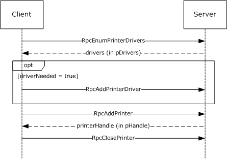

Figure 1: Adding a new printer

<a id="Section_1.3.2"></a>
### 1.3.2 Communication of Print Job Data

Communication of [**print job**](#gt_print-job) data enables a client to print to devices that are hosted by [**print servers**](#gt_print-server).

In one configuration, a client uses a [**printer driver**](#gt_printer-driver) that is installed on the client computer to convert a graphical representation of application content and layout into [**device**](#gt_device)-specific [**page description language (PDL)**](#gt_page-description-language-pdl) data. It then sends the data, also called [**RAW**](#gt_raw-format) data, to the print server using methods this protocol provides. The print server can temporarily store the RAW data from the client in a [**spool file**](#gt_spool-file), or it can print it immediately. As the print server sends the data to the target printer, the [**print processor**](#gt_print-processor) on the print server that is associated with the target printer can post-process the RAW data in an implementation-specific way.

In another configuration, a client sends data to the print server in an intermediate format that contains graphics primitives and layout information in addition to processing instructions for the print server. The print server can temporarily store this intermediate data in a spool file, or it can print it immediately. As the data is sent to the printer, the print processor on the print server that is associated with the printer converts the data from the intermediate spool file to device-specific PDL data, typically by using the printer driver that is installed on the print server.

The following diagram illustrates this interaction.

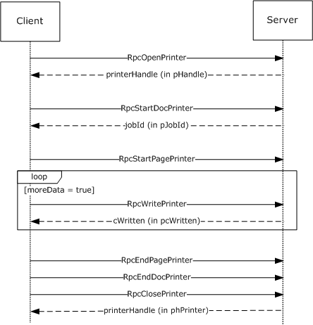

Figure 2: Communication of print job data

<a id="Section_1.3.3"></a>
### 1.3.3 Notification of Print System Changes

This protocol also provides the methods that a [**print client**](#gt_print-client) can use to register for incremental change notifications. These notifications enable the client application to maintain an accurate local view of the printer and [**printer driver**](#gt_printer-driver) settings by enabling the client application to synchronize the local view with the actual settings of those components on the [**print server**](#gt_print-server), without having to repeatedly query the server for its complete configuration information.

For status updates, a print client registers for notifications of state changes when it connects to a print server. The server creates a new [**remote procedure call (RPC)**](#gt_remote-procedure-call-rpc) connection in the reverse direction, back to the client, which is subsequently used to send notifications to the client. When the status of a server resource changes—such as a [**print queue**](#gt_print-queue) goes online, goes offline, or enters an error state—the server sends a notification to the registered client.

Notifications include status changes of print server resources; for example, when a print queue goes online, goes offline, or enters an error state.

The following diagram illustrates this interaction. For more information, see section [3.2.4.2.4](#Section_3.2.4.2.4).

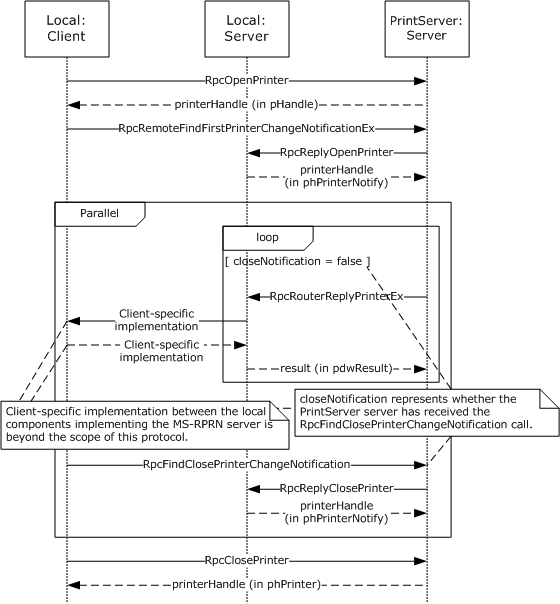

Figure 3: Notification of print system changes

The box labeled 'Local Server' in the above diagram represents an entity running on the client system. This entity is either implemented in the end-user application or in a separate process. Since the entity implements a Print System Remote Protocol [**endpoint**](#gt_endpoint), which can only be registered once per system, there can be at most one of these entities running on the client system at any time. If an end-user application directly implements this entity, this end-user application would not be able to run on a system that also runs a [**print system**](#gt_print-system) implementation, and only one such application could.

In addition to composing and returning the notifications, the print server maintains a change identifier that it changes whenever the server-side printing configuration changes; for example, changes to user-configurable settings, print queue items, [**print job**](#gt_print-job) status, or to the printer driver would cause this identifier to change. The print client can query this change identifier by using the [RpcGetPrinterData (section 3.1.4.2.7)](#Section_3.1.4.2.7) method that is defined in this protocol and calling it with the *pValueName* parameter pointing to the string "ChangeID".

When a disconnected print client reconnects to the print server, it can query the change identifier again, and if the change identifier is different from the one returned when it queried before it was disconnected, the client retrieves the complete configuration information and updates its view of the server configuration by using printer driver management methods (section [3.1.4.4](#Section_3.1.4.4)).

<a id="Section_1.4"></a>
## 1.4 Relationship to Other Protocols

The Print System Remote Protocol is dependent on the [**RPC**](#gt_remote-procedure-call-rpc) protocol specified in [MS-RPCE](../MS-RPCE/MS-RPCE.md).

The Print System Remote Protocol does not specify methods for file transfer between client and server; therefore, the [**Server Message Block (SMB)**](#gt_server-message-block-smb) Version 2.0 Protocol, specified in [MS-SMB2](../MS-SMB2/MS-SMB2.md), is the preferred protocol for all file transfer operations, including [**printer driver**](#gt_printer-driver) downloads.

These protocol relationships are shown in the following figure:

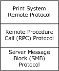

Figure 4: Protocol Relationships

The Print System Remote Protocol is related to other protocols as follows:

- The Print System Asynchronous Notification Protocol [MS-PAN](../MS-PAN/MS-PAN.md) is dependent on the Print System Remote Protocol.
- The Print System Asynchronous Remote Protocol, described in [MS-PAR](../MS-PAR/MS-PAR.md), uses many data structures and parameter definitions that are also specified in sections [2.2.1](#Section_2.2.1) and [2.2.2](#Section_2.2.2) of this specification.
**Note:** A [**print server**](#gt_print-server) can optionally include an implementation of Print System Asynchronous Remote with Print System Remote.

- Limited enumeration of printer configuration information can be done using the [**Remote Administration Protocol (RAP)**](#gt_remote-administration-protocol-rap) [MS-RAP](../MS-RAP/MS-RAP.md); however, the Print System Asynchronous Remote Protocol provides richer semantics than RAP. Because RAP is not supported over SMB Version 2.0, Print System Remote is the preferred access protocol for printer configuration information.
- The print client and print server implementations of this protocol use the Active Directory Technical Specification Protocol [MS-ADTS](../MS-ADTS/MS-ADTS.md) to locate domain controllers and use [**LDAP**](#gt_lightweight-directory-access-protocol-ldap) defined in [[RFC2251]](https://go.microsoft.com/fwlink/?LinkId=90325) to access data in the [**Active Directory**](#gt_active-directory) when available. This protocol does not require availability of Active Directory. For more details, see [Directory Service Interaction (section 2.3)](#Section_2.3).<1>
<a id="Section_1.5"></a>
## 1.5 Prerequisites/Preconditions

This protocol is an [**RPC**](#gt_remote-procedure-call-rpc) interface and therefore has the prerequisites specified in [MS-RPCE](../MS-RPCE/MS-RPCE.md) section 1.5 as being common to RPC interfaces.

It is assumed that a client of this protocol has obtained the name of a [**print server**](#gt_print-server) that supports this protocol before it is invoked. There are various ways a client can accomplish that; for details see [MS-ADLS](../MS-ADLS/MS-ADLS.md), [MS-ADSC](../MS-ADSC/MS-ADSC.md), [MS-RAP](../MS-RAP/MS-RAP.md), and [MS-SMB2](../MS-SMB2/MS-SMB2.md).

<a id="Section_1.6"></a>
## 1.6 Applicability Statement

The Print System Remote Protocol is applicable only for printing operations between a system functioning as a client and a system functioning as a [**print server**](#gt_print-server). This protocol scales from home use, in which a single printer is connected to a single computer; to office use, in which print-devices are shared between computers; to enterprise use, in which multiple print servers are employed in a cluster configuration, and the client configuration is managed by a directory access protocol, such as [**Active Directory**](#gt_active-directory) [MS-ADTS](../MS-ADTS/MS-ADTS.md).

<a id="Section_1.7"></a>
## 1.7 Versioning and Capability Negotiation

This specification covers versioning issues in the following areas:

- **Supported Transports**: The Print System Remote Protocol uses [**RPC**](#gt_remote-procedure-call-rpc) over named pipes only.
- **Protocol Versions**: The protocol version specified in the [**Interface Definition Language (IDL)**](#gt_interface-definition-language-idl) file is 1.0.
Versioning of data structures defined by the protocol is controlled using a **Level** value in all Containers (section [2.2.1.2)](#Section_2.2.1.2); the usage pattern of Level values is defined in section [2.2](#Section_2.2). Levels can be sequential, and data structures identified by a later version level, if extending an earlier level, are a superset of the data structure identified by the earlier level. The Level value is also a parameter to some RPC methods.

- **Security and Authentication Methods**: Versioning of security is handled by the underlying [**RPC transport**](#gt_rpc-transport); see [MS-RPCE](../MS-RPCE/MS-RPCE.md) section 3.3.3.3 for more information.
- **Localization**: This protocol specifies languages and localizable [**string resources**](#gt_string-resource) for [**printer forms**](#gt_printer-form). See LANGID (section [2.2.1.1.3](#Section_2.2.1.1.3)) and **RPC_FORM_INFO_2** structure (section [2.2.1.6.2](#Section_2.2.1.6.2)) for details.
- **Return Values**: The methods that make up this RPC interface return zero to indicate successful completion and nonzero values to indicate failure, except where specified otherwise. A server-side implementation of this protocol can use any nonzero Win32 error value to signify an error condition (section [1.8](#Section_1.8)). Unless otherwise specified, clients of the Print System Remote Protocol do not interpret returned error codes; they simply return error codes to invoking applications without taking any protocol action.
- **Capability Negotiation**: Functional negotiation is supported by using container levels (section 2.2.1.2). On connection to a server, the client requests a level. If the information level is a level supported by the server, the server processes the request. Otherwise, the server returns an error to the client, and the client can repeat the request with a lower level.
Furthermore, to avoid unnecessary network calls, the client determines the server's capabilities by comparing the value returned by the server in the **dwBuildNumber** member of OSVERSIONINFO (section [2.2.3.10.1](#Section_2.2.3.10.1)) with well-known version-specific **dwBuildNumber** values.<2>

<a id="Section_1.8"></a>
## 1.8 Vendor-Extensible Fields

The methods defined in the Print System Remote Protocol specify either the DWORD or HRESULT [**data type**](#gt_data-type) for return values. DWORD return values are Win32 error codes specified in [MS-ERREF](../MS-ERREF/MS-ERREF.md) section 2.2. Implementers reuse those values with their indicated meanings. Choosing any other value runs the risk of collisions.

HRESULT method return values are defined in [MS-ERREF] section 2.1. Vendors can define their own HRESULT values, provided they set the C bit (0x20000000) for each vendor-defined value, indicating the value is a customer code.

Print server implementations MUST generate [**GUIDs**](#gt_globally-unique-identifier-guid), as defined in [MS-DTYP](../MS-DTYP/MS-DTYP.md) sections 2.3.4, 2.3.4.2, and 2.3.4.3, strings for the purpose of identifying specific printers. The 128-bit value encoded by the GUID string SHOULD conform to the specification in [[RFC4122]](https://go.microsoft.com/fwlink/?LinkId=90460) section 4.

<a id="Section_1.9"></a>
## 1.9 Standards Assignments

The Print System Remote Protocol requires use of the following private assignments:

| Parameter | Value | Reference |
| --- | --- | --- |
| [**RPC**](#gt_remote-procedure-call-rpc) [**UUID**](#gt_universally-unique-identifier-uuid) | 12345678-1234-ABCD-EF00-0123456789AB | [Message Processing Events and Sequencing Rules (section 3.1.4)](#Section_3.1.4) |
| RPC [**well-known endpoint**](#gt_well-known-endpoint) | **\pipe\spoolss** | [Transport (section 2.1)](#Section_2.1) |

<a id="Section_2"></a>
# 2 Messages

<a id="Section_2.1"></a>
## 2.1 Transport

The Print System Remote Protocol uses [**RPC**](#gt_remote-procedure-call-rpc) over named pipes ([MS-RPCE](../MS-RPCE/MS-RPCE.md) section 2.1.1.2) for RPC sequences. The [**well-known endpoint**](#gt_well-known-endpoint) **\pipe\spoolss** is used for RPC calls made from the [**print client**](#gt_print-client) to the [**print server**](#gt_print-server). The client MUST use no [**authentication**](#gt_authentication), and the server MUST accept connections without authentication.

An [**endpoint**](#gt_endpoint) with the same name MUST also be used for RPC calls made from the server to send printer change notifications back to the client; those calls are RpcReplyOpenPrinter (section [3.2.4.1.1](#Section_3.2.4.1.1)), RpcRouterReplyPrinter (section [3.2.4.1.2](#Section_3.2.4.1.2)), RpcReplyClosePrinter (section [3.2.4.1.3](#Section_3.2.4.1.3)), and RpcRouterReplyPrinterEx (section [3.2.4.1.4](#Section_3.2.4.1.4)).

The client MUST accept connections without authentication from the server for these methods. If the client provides authentication information ([MS-RPCE] section 2.2.1.1.8), the server SHOULD<3> impersonate the client ([MS-RPCE] section 2.2.1.1.9), while processing a method.

<a id="Section_2.2"></a>
## 2.2 Common Data Types

The Print System Remote Protocol MUST indicate to the [**RPC**](#gt_remote-procedure-call-rpc) runtime that it is to support both the [**Network Data Representation (NDR)**](#gt_network-data-representation-ndr) and **NDR64** [**RPC transfer syntaxes**](#gt_01216ea7-ac8a-4cc8-9d19-b901bc424c09) and provide a negotiation mechanism for determining which transfer syntax is used ([MS-RPCE](../MS-RPCE/MS-RPCE.md) section 3).

This protocol MUST enable the **ms_union** extension ([MS-RPCE] section 2.2.4).

The Print System Remote Protocol employs a combination of the following data representations:

- [**IDL**](#gt_interface-definition-language-idl) data structures used with RPC methods, including structures used as containers for custom-[**marshaled**](#gt_37e89d91-2800-49d1-9d17-45ebe167ad87), custom C data (section [2.2.1](#Section_2.2.1)).
- Custom C data structures and their wire formats used within custom marshaled data streams (section [2.2.2](#Section_2.2.2)).
Unless noted otherwise, the following statements apply to this specification:

- All strings defined in this protocol MUST consist of characters encoded in [**Unicode**](#gt_unicode) [**UTF-16LE**](#gt_utf-16le) and MUST be null-terminated. Each UTF-16 codepoint in a string, including terminating null characters, MUST occupy 16 bits ([[RFC2781]](https://go.microsoft.com/fwlink/?LinkId=90380), section 2.1).
- A list of strings is referred to as a [**multisz**](#gt_multisz) in this protocol. In a multisz, the characters making up the string N+1 MUST directly follow the terminating null character of string N. The last string in a multisz MUST be terminated by two null characters.
- All parameters or members specifying the number of characters in a string or multisz specify the number of characters including terminating null characters.
- All constraints specifying the maximum number of characters in a string or multisz specify the number of characters including terminating null characters.
- All parameters or members specifying the number of bytes in buffers containing a string or multisz specify the number of bytes including terminating null characters.
- Custom-marshaled data that consists of more than a single byte is specified in [**little-endian**](#gt_little-endian) byte order.
- The term NULL means a NULL pointer, and zero means the number 0.
- All parameters or members specifying the size of a buffer pointed to by another parameter or member MUST be zero if the pointer parameter or member is NULL.
- The term "empty string" means a string containing only the terminating null character.
- The term "optional pointer" means that providing a pointer value in the parameter or member is optional. If the pointer value is not provided, the value of the parameter or member MUST be NULL.
- This protocol specification uses [**curly braced GUID strings**](#gt_curly-braced-guid-string) ([MS-DTYP](../MS-DTYP/MS-DTYP.md) section 2.3.4.3).
This protocol introduces a variety of data types that bundle information about printers, [**printer drivers**](#gt_printer-driver), [**print jobs**](#gt_print-job), and [**ports**](#gt_port). These data types are collectively referred to as [INFO](#Section_3.1.4.1.9) data types, and include [DRIVER_INFO_1 (section 2.2.1.5.1)](#Section_2.2.1.5.1), [PRINTER_INFO_1 (section 2.2.1.10.2)](#Section_2.2.1.10.2), [JOB_INFO_1 (section 2.2.1.7.1)](#Section_2.2.1.7.1), and [PORT_INFO_1 (section 2.2.1.9.1)](#Section_2.2.1.9.1). As data types were refined in the evolution of this protocol, new INFO data type versions have been introduced to represent extended or different bundles of information. The term "level" is used to differentiate between the different type versions, and the number of the level is reflected in the name of the data type, for example, JOB_INFO_1, [JOB_INFO_2](#Section_2.2.1.7.2), and [JOB_INFO_3](#Section_2.2.1.7.3).

To simplify method parameter lists and to increase robustness of RPC marshaling, the protocol introduces CONTAINER data types, which consolidate the input parameters used by RPC methods. Some CONTAINER data types hold a Level value along with a union of pointer values pointing to different INFO data type versions; the specific Level values available for each CONTAINER data type are documented in section [2.2.1.2](#Section_2.2.1.2). For example, a [JOB_CONTAINER (section 2.2.1.2.5)](#Section_2.2.1.2.5) contains a level value and a union of pointers to the different [JOB_INFO](#Section_2.2.1.7) data type versions, which are selected by the Level value. Other CONTAINER data types hold a pointer value that points to a structure, along with a numerical value representing the size of the structure. For example, a [DEVMODE_CONTAINER (section 2.2.1.2.1)](#Section_2.2.1.2.1) contains a size value and a pointer to a custom-marshaled structure. Finally, several CONTAINER data types hold a version value, a value representing a set of flags, an array of structures, and a value representing the number of elements in the array. The [RPC_BIDI_REQUEST_CONTAINER (section 2.2.1.2.10)](#Section_2.2.1.2.10) is an example of a CONTAINER data type in this category.

Most of the INFO data types have an IDL form and a custom-marshaled form. IDL forms can be used in conjunction with CONTAINER data types, as input parameters to methods that set values, such as [RpcSetPrinter (section 3.1.4.2.5)](#Section_3.1.4.2.5), while custom-marshaled forms can be used as output parameters to methods that get values, such as [RpcGetPrinter (section 3.1.4.2.6)](#Section_3.1.4.2.6). The layout and order of members of IDL forms are in most cases the same as those of corresponding custom-marshaled forms, with the distinction that IDL forms use the type "[string] wchar_t *" to point to strings, while custom-marshaled forms use an offset relative to the start of the structure.

As an exception to the preceding rule, the layout of IDL-marshaled structures that contain pointers to multisz data **differs** from the layout of custom-marshaled forms, in that IDL-marshaled structures need to define a **length** member for each IDL-marshaled member of type **pointer to** multisz; the names of such IDL-marshaled members start with RPC_.

To increase clarity, an underscore has been prepended to the names of all custom-marshaled structures, for which an IDL-marshaled form exists. For example, [_DRIVER_INFO_1](#Section_2.2.2.4.1) is the name of the custom-marshaled structure that corresponds to DRIVER_INFO_1, the IDL-marshaled form.

When IDL-marshaled structures that contain pointer types to variable-length data without field IDL attributes [[MSDN-FIELD]](https://go.microsoft.com/fwlink/?LinkId=184577), such as [string] or [size_is(...)], are used as input arguments to methods, either directly or in CONTAINER structures, the pointers and variables to which they point cannot be marshaled by RPC, because RPC does not know the length of the data that is pointed to. Examples are the **pSecurityDescriptor** and **pDevMode** members of the [PRINTER_INFO_2](#Section_2.2.1.10.3) structure.

To address this problem, methods that specify such input arguments accept separate CONTAINER structures that pass in custom-marshaled or self-relative forms of the pointers and the variables that they reference. Examples of such methods are RpcSetPrinter and [RpcAddPrinterEx (section 3.1.4.2.15)](#Section_3.1.4.2.15). Individual method sections specify how affected pointer members and CONTAINER structures MUST be treated.

<a id="Section_2.2.1"></a>
### 2.2.1 IDL Data Types

In addition to the [**RPC**](#gt_remote-procedure-call-rpc) base types and definitions specified in [[C706]](https://go.microsoft.com/fwlink/?LinkId=89824) and [MS-DTYP](../MS-DTYP/MS-DTYP.md), the Print System Remote Protocol defines data types in the following sections:

- [Common IDL Data Types (section 2.2.1.1)](#Section_2.2.1.1)
- [Containers (section 2.2.1.2)](#Section_2.2.1.2)
- [Members in INFO Structures (section 2.2.1.3)](#Section_2.2.1.3)
- [DOC_INFO_1 (section 2.2.1.4)](#Section_2.2.1.4)
- [DRIVER_INFO (section 2.2.1.5)](#Section_2.2.1.5)
- [FORM_INFO (section 2.2.1.6)](#Section_2.2.1.6)
- [JOB_INFO (section 2.2.1.7)](#Section_2.2.1.7)
- [MONITOR_INFO (section 2.2.1.8)](#Section_2.2.1.8)
- [PORT_INFO (section 2.2.1.9)](#Section_2.2.1.9)
- [PRINTER_INFO (section 2.2.1.10)](#Section_2.2.1.10)
- [SPLCLIENT_INFO (section 2.2.1.11)](#Section_2.2.1.11)
- [Bidirectional Communication Data (section 2.2.1.12)](#Section_2.2.1.12)
- [Printer Notification Data (section 2.2.1.13)](#Section_2.2.1.13)
- [Job Named Properties (section 2.2.1.14)](#Section_2.2.1.14)
- [Branch Office Print Remote Logging Structures (section 2.2.1.15)](#Section_2.2.1.15)
<a id="Section_2.2.1.1"></a>
#### 2.2.1.1 Common IDL Data Types

<a id="Section_2.2.1.1.1"></a>
##### 2.2.1.1.1 DEVMODE

The **DEVMODE** structure is a truncated form of the variable-length, custom-[**marshaled**](#gt_37e89d91-2800-49d1-9d17-45ebe167ad87) [_DEVMODE](#Section_2.2.2.1) structure (section 2.2.2.1), which is version-specific and implementation-specific and cannot be expressed using [**IDL**](#gt_interface-definition-language-idl) attributes.

All members of this structure are specified in section 2.2.2.1.

typedef struct _devicemode {

wchar_t dmDeviceName[32];

unsigned short dmSpecVersion;

unsigned short dmDriverVersion;

unsigned short dmSize;

unsigned short dmDriverExtra;

DWORD dmFields;

short dmOrientation;

short dmPaperSize;

short dmPaperLength;

short dmPaperWidth;

short dmScale;

short dmCopies;

short dmDefaultSource;

short dmPrintQuality;

short dmColor;

short dmDuplex;

short dmYResolution;

short dmTTOption;

short dmCollate;

wchar_t dmFormName[32];

unsigned short reserved0;

DWORD reserved1;

DWORD reserved2;

DWORD reserved3;

DWORD dmNup;

DWORD reserved4;

DWORD dmICMMethod;

DWORD dmICMIntent;

DWORD dmMediaType;

DWORD dmDitherType;

DWORD reserved5;

DWORD reserved6;

DWORD reserved7;

DWORD reserved8;

} DEVMODE;

<a id="Section_2.2.1.1.2"></a>
##### 2.2.1.1.2 GDI_HANDLE

The GDI_HANDLE serves as an [**RPC context handle**](#gt_rpc-context-handle) for methods that specify a printer [**information context**](#gt_information-context) handle parameter. RPC context handles are specified in [[C706]](https://go.microsoft.com/fwlink/?LinkId=89824) sections 2 and 6.

This type is declared as follows:

typedef [context_handle] void* GDI_HANDLE;

The GDI_HANDLE context handle is returned by [RpcCreatePrinterIC](#Section_3.1.4.2.10).

<a id="Section_2.2.1.1.3"></a>
##### 2.2.1.1.3 LANGID

The LANGID data type identifies the human language used for the user interface for printing. Details are specified in [MS-LCID](../MS-LCID/MS-LCID.md).

This type is declared as follows:

typedef unsigned short LANGID;

<a id="Section_2.2.1.1.4"></a>
##### 2.2.1.1.4 PRINTER_HANDLE

The PRINTER_HANDLE serves as an [**RPC context handle**](#gt_rpc-context-handle) for methods that specify a printer object handle parameter. RPC context handles are specified in [[C706]](https://go.microsoft.com/fwlink/?LinkId=89824) sections 2 and 6.

This type is declared as follows:

typedef [context_handle] void* PRINTER_HANDLE;

The PRINTER_HANDLE context handle is returned by [RpcAddPrinter](#Section_3.1.4.2.3), [RpcAddPrinterEx](#Section_3.1.4.2.15), [RpcOpenPrinter](#Section_3.1.4.2.2), and [RpcOpenPrinterEx](#Section_3.1.4.2.14).

<a id="Section_2.2.1.1.5"></a>
##### 2.2.1.1.5 RECTL

The **RECTL** structure defines a rectangle on a form, with two (x,y) coordinates in 1/1000 millimeter units.

typedef struct {

long left;

long top;

long right;

long bottom;

} RECTL;

**left:** The x-coordinate of the upper-left corner of the rectangle relative to the left edge of the form. This value MUST be an integer greater than or equal to 0 and it MUST be smaller than or equal to the 'right'.

**top:** The y-coordinate of the upper-left corner of the rectangle relative to the top edge of the form. This value MUST be an integer greater than or equal to 0 and it MUST be smaller than or equal to the 'bottom'.

**right:** The x-coordinate of the lower-right corner of the rectangle relative to the left edge of the form. This value MUST be greater than or equal to 'left'.

**bottom:** The y-coordinate of the lower-right corner of the rectangle relative to the top edge of the form. This value MUST be greater than or equal to 'top'.

<a id="Section_2.2.1.1.6"></a>
##### 2.2.1.1.6 SIZE

The **SIZE** structure defines the area of a form, with a width and height in thousandth-of-a-millimeter units.

typedef struct {

long cx;

long cy;

} SIZE;

**cx:** The width, and it MUST be an integer greater than or equal to 0.

**cy:** The height, and it MUST be an integer greater than or equal to 0.

<a id="Section_2.2.1.1.7"></a>
##### 2.2.1.1.7 STRING_HANDLE

The STRING_HANDLE serves as an [**RPC**](#gt_remote-procedure-call-rpc) binding handle for methods that do not specify a [PRINTER_HANDLE](#Section_2.2.1.1.4) parameter. RPC binding handles are specified in [[C706]](https://go.microsoft.com/fwlink/?LinkId=89824).

This type is declared as follows:

typedef [handle] wchar_t* STRING_HANDLE;

To build the binding handle for those methods, RPC requires an RPC protocol sequence, a network address, and an [**endpoint**](#gt_endpoint). Both the RPC protocol sequence and the endpoint are bound to the RPC interface; they MUST be named pipes and **\pipe\spoolss**, respectively. The network address MUST be defined by the printer or [**print server**](#gt_print-server) name. The printer name can be in the form **\\server\printer** (for rules governing printer names, see section [2.2.4.14](#Section_2.2.4.14)), and the server MUST be used as the network address.

<a id="Section_2.2.1.2"></a>
#### 2.2.1.2 Containers

<a id="Section_2.2.1.2.1"></a>
##### 2.2.1.2.1 DEVMODE_CONTAINER

The **DEVMODE_CONTAINER** structure specifies a **_DEVMODE** structure (section [2.2.2.1](#Section_2.2.2.1)), which contains data for the initialization of a print device by a [**printer driver**](#gt_printer-driver).

typedef struct _DEVMODE_CONTAINER {

DWORD cbBuf;

[size_is(cbBuf), unique] BYTE* pDevMode;

} DEVMODE_CONTAINER;

**cbBuf:** The size, in bytes, of the buffer pointed to by the **pDevMode** member.

**pDevMode:** An optional pointer to a variable-length, custom-[**marshaled**](#gt_37e89d91-2800-49d1-9d17-45ebe167ad87) **_DEVMODE** structure. The NULL value MUST be used to indicate that the default initialization data for the printer driver SHOULD be used.

<a id="Section_2.2.1.2.2"></a>
##### 2.2.1.2.2 DOC_INFO_CONTAINER

The **DOC_INFO_CONTAINER** structure provides information about the document to be printed, using the **DOC_INFO_1** structure.

typedef struct _DOC_INFO_CONTAINER {

DWORD Level;

[switch_is(Level)] union {

[case(1)]

DOC_INFO_1* pDocInfo1;

} DocInfo;

} DOC_INFO_CONTAINER;

**Level:** This member specifies the information level of the **DocInfo** member data. The value of this member MUST be set to 0x00000001.

**DocInfo:** This member MUST define document properties, using an information structure that MUST correspond to the value of the **Level** member.

**pDocInfo1:** A pointer to a **DOC_INFO_1** structure (section [2.2.1.4](#Section_2.2.1.4)) that describes the document that is printed.

<a id="Section_2.2.1.2.3"></a>
##### 2.2.1.2.3 DRIVER_CONTAINER

The **DRIVER_CONTAINER** structure provides information about [**printer drivers**](#gt_printer-driver) by using **DRIVER_INFO** structures (section [2.2.1.5](#Section_2.2.1.5)). The **DriverInfo** member specifies the structure that defines the properties of a printer driver.

typedef struct _DRIVER_CONTAINER {

DWORD Level;

[switch_is(Level)] union {

[case(1)]

DRIVER_INFO_1* pNotUsed;

[case(2)]

DRIVER_INFO_2* Level2;

[case(3)]

RPC_DRIVER_INFO_3* Level3;

[case(4)]

RPC_DRIVER_INFO_4* Level4;

[case(6)]

RPC_DRIVER_INFO_6* Level6;

[case(8)]

RPC_DRIVER_INFO_8* Level8;

} DriverInfo;

} DRIVER_CONTAINER;

**Level:** Specifies the information level of the **DriverInfo** data. The value of this member MUST be in the range 0x00000002 to 0x00000004 inclusive, 0x00000006, or 0x00000008.

**DriverInfo:** Defines printer driver properties by using an information structure that corresponds to the value of the **Level** member.

**pNotUsed:** A pointer to a structure that is specified only as a placeholder in the IDL and MUST be ignored.

**Level2:** If the **Level** member is 0x00000002, this member is a pointer to a **DRIVER_INFO_2** structure that provides printer driver information. For details, see section [2.2.1.5.2](#Section_2.2.1.5.2).

**Level3:** If the **Level** member is 0x00000003, this member is a pointer to an **RPC_DRIVER_INFO_3** structure that provides printer driver information. For details, see section [2.2.1.5.3](#Section_2.2.1.5.3).

**Level4:** If the **Level** member is 0x00000004, this member is a pointer to an **RPC_DRIVER_INFO_4** structure that provides printer driver information. For details, see section [2.2.1.5.4](#Section_2.2.1.5.4).

**Level6:** If the **Level** member is 0x00000006, this member is a pointer to an **RPC_DRIVER_INFO_6** structure that provides printer driver information. For details, see section [2.2.1.5.5](#Section_2.2.1.5.5).

**Level8:** If the **Level** member is 0x00000008, this member is a pointer to an **RPC_DRIVER_INFO_8** structure that provides printer driver information. For details, see section [2.2.1.5.6](#Section_2.2.1.5.6).

<a id="Section_2.2.1.2.4"></a>
##### 2.2.1.2.4 FORM_CONTAINER

The **FORM_CONTAINER** structure provides information about [**printer forms**](#gt_printer-form), using **FORM_INFO** structures. The **FormInfo** member specifies the structure that defines the printer form properties.

typedef struct _FORM_CONTAINER {

DWORD Level;

[switch_is(Level)] union {

[case(1)]

FORM_INFO_1* pFormInfo1;

[case(2)]

RPC_FORM_INFO_2* pFormInfo2;

} FormInfo;

} FORM_CONTAINER;

**Level:** The information level of the **FormInfo** data. The value of this member MUST be 0x00000001 or 0x00000002.

**FormInfo:** This member MUST define printer form properties, using an information structure that MUST correspond to the value of the **Level** member.

**pFormInfo1:** If the **Level** member is 0x00000001, this member is a pointer to a **FORM_INFO_1** structure, which provides information about a printer form. For details, see section [2.2.1.6.1](#Section_2.2.1.6.1).

**pFormInfo2:** If the **Level** member is 0x00000002, this member is a pointer to a **RPC_FORM_INFO_2** structure, which provides information about a printer form. For details, see section [2.2.1.6.2](#Section_2.2.1.6.2).

<a id="Section_2.2.1.2.5"></a>
##### 2.2.1.2.5 JOB_CONTAINER

The **JOB_CONTAINER** structure provides information about [**print jobs**](#gt_print-job), using **JOB_INFO** structures. The **JobInfo** member specifies the structure that defines the print job properties.

typedef struct _JOB_CONTAINER {

DWORD Level;

[switch_is(Level)] union {

[case(1)]

JOB_INFO_1* Level1;

[case(2)]

JOB_INFO_2* Level2;

[case(3)]

JOB_INFO_3* Level3;

[case(4)]

JOB_INFO_4* Level4;

} JobInfo;

} JOB_CONTAINER;

**Level:** Specifies the information level of the **JobInfo** data. The value of this member MUST be in the range 0x00000001 to 0x00000004 inclusive.

**JobInfo:** Defines print job properties, using an information structure that corresponds to the value of the **Level** member.

**Level1:** If the **Level** member is 0x00000001, this member is a pointer to a **JOB_INFO_1** structure that provides print job information. For details, see section [2.2.1.7.1](#Section_2.2.1.7.1).

**Level2:** If the **Level** member is 0x00000002, this member is a pointer to a **JOB_INFO_2** structure that provides print job information. For details, see section [2.2.1.7.2](#Section_2.2.1.7.2).

**Level3:** If the **Level** member is 0x00000003, this member is a pointer to a **JOB_INFO_3** structure that provides print job information. For details, see section [2.2.1.7.3](#Section_2.2.1.7.3).

**Level4:** If the **Level** member is 0x00000004, this member is a pointer to a **JOB_INFO_4** structure that provides print job information. For details, see section [2.2.1.7.4](#Section_2.2.1.7.4).

<a id="Section_2.2.1.2.6"></a>
##### 2.2.1.2.6 MONITOR_CONTAINER

The **MONITOR_CONTAINER** structure provides information about [**port monitors**](#gt_port-monitor), using **MONITOR_INFO** structures. The **MonitorInfo** member specifies the structure that defines the port monitor properties.

typedef struct _MONITOR_CONTAINER {

DWORD Level;

[switch_is(Level)] union {

[case(1)]

MONITOR_INFO_1* pMonitorInfo1;

[case(2)]

MONITOR_INFO_2* pMonitorInfo2;

} MonitorInfo;

} MONITOR_CONTAINER;

**Level:** Specifies the information level of the **MonitorInfo** data. The value of this member MUST be 0x00000001 or 0x00000002.

**MonitorInfo:** Defines port monitor properties, using an information structure that corresponds to the value of the **Level** member.

**pMonitorInfo1:** If the **Level** member is 0x00000001, this member is a pointer to a **MONITOR_INFO_1** structure that provides information about a port monitor. For details, see section [2.2.1.8.1](#Section_2.2.1.8.1).

**pMonitorInfo2:** If the **Level** member is 0x00000002, this member is a pointer to a **MONITOR_INFO_2** structure that provides information about a port monitor. For details, see section [2.2.1.8.2](#Section_2.2.1.8.2).

<a id="Section_2.2.1.2.7"></a>
##### 2.2.1.2.7 PORT_CONTAINER

The **PORT_CONTAINER** structure provides information about printer [**ports**](#gt_port), using [PORT_INFO](#Section_2.2.1.9) structures.<4> The **PortInfo** member specifies the structure that defines the port properties.

typedef struct _PORT_CONTAINER {

DWORD Level;

[switch_is(0x00FFFFFF & Level)]

union {

[case(1)]

PORT_INFO_1* pPortInfo1;

[case(2)]

PORT_INFO_2* pPortInfo2;

[case(3)]

PORT_INFO_3* pPortInfo3;

[case(0x00FFFFFF)]

PORT_INFO_FF* pPortInfoFF;

} PortInfo;

} PORT_CONTAINER;

**Level:** Specifies the information level of the **PortInfo** data. The value of this member MUST be in the range 0x00000001 to 0x00000003 inclusive, or 0xFFFFFFFF.

**PortInfo:** Defines port properties, using an information structure that corresponds to the value of the **Level** member.

**Note:** Despite the bitwise AND of **Level** with 0x00FFFFFF, no values for **Level** are valid besides those specified.

**pPortInfo1:** If the **Level** member is 0x00000001, this member is a pointer to a **PORT_INFO_1** structure that provides information about the printer port. For details, see section [2.2.1.9.1](#Section_2.2.1.9.1).

**pPortInfo2:** If the **Level** member is 0x00000002, this member is a pointer to a **PORT_INFO_2** structure that provides information about the printer port. For details, see section [2.2.1.9.2](#Section_2.2.1.9.2).

**pPortInfo3:** If the **Level** member is 0x00000003, this member is a pointer to a **PORT_INFO_3** structure that provides information about the printer port. For details, see section [2.2.1.9.3](#Section_2.2.1.9.3).

**pPortInfoFF:** If the **Level** member is 0xFFFFFFFF, this member is a pointer to a **PORT_INFO_FF** structure that provides information about the printer port. For details, see section [2.2.1.9.4](#Section_2.2.1.9.4).

<a id="Section_2.2.1.2.8"></a>
##### 2.2.1.2.8 PORT_VAR_CONTAINER

The **PORT_VAR_CONTAINER** structure provides information for supported printer [**port monitors**](#gt_port-monitor).<5>

typedef struct _PORT_VAR_CONTAINER {

DWORD cbMonitorData;

[size_is(cbMonitorData), unique]

BYTE* pMonitorData;

} PORT_VAR_CONTAINER;

**cbMonitorData:** The size, in bytes, of the buffer that is pointed to by the **pMonitorData** member.

**pMonitorData:** An optional pointer to a block of data that is passed to the port monitor.

<a id="Section_2.2.1.2.9"></a>
##### 2.2.1.2.9 PRINTER_CONTAINER

The **PRINTER_CONTAINER** structure provides information about printer properties and state information, using **PRINTER_INFO** structures (section [2.2.1.10](#Section_2.2.1.10)). The **PrinterInfo** member specifies the structure that defines the printer properties.

typedef struct _PRINTER_CONTAINER {

DWORD Level;

[switch_is(Level)] union {

[case(0)]

PRINTER_INFO_STRESS* pPrinterInfoStress;

[case(1)]

PRINTER_INFO_1* pPrinterInfo1;

[case(2)]

PRINTER_INFO_2* pPrinterInfo2;

[case(3)]

PRINTER_INFO_3* pPrinterInfo3;

[case(4)]

PRINTER_INFO_4* pPrinterInfo4;

[case(5)]

PRINTER_INFO_5* pPrinterInfo5;

[case(6)]

PRINTER_INFO_6* pPrinterInfo6;

[case(7)]

PRINTER_INFO_7* pPrinterInfo7;

[case(8)]

PRINTER_INFO_8* pPrinterInfo8;

[case(9)]

PRINTER_INFO_9* pPrinterInfo9;

} PrinterInfo;

} PRINTER_CONTAINER;

**Level:** Specifies the information level of the **PrinterInfo** data. The value of this member MUST be in the range 0x00000000 to 0x00000009 inclusive.

**PrinterInfo:** Provides printer information using a container structure that corresponds to the value specified by the **Level** member.

**pPrinterInfoStress:** If the **Level** member is 0x00000000, this member is a pointer to a **PRINTER_INFO_STRESS** structure (section [2.2.1.10.1](#Section_2.2.1.10.1)), which provides diagnostic printer information.

**pPrinterInfo1:** If the **Level** member is 0x00000001, this member is a pointer to a **PRINTER_INFO_1** (section [2.2.1.10.2](#Section_2.2.1.10.2)) structure, which provides printer information.

**pPrinterInfo2:**If the **Level** member is 0x00000002, this member is a pointer to a **PRINTER_INFO_2** (section [2.2.1.10.3](#Section_2.2.1.10.3)) structure, which provides detailed printer information.

**pPrinterInfo3:** If the **Level** member is 0x00000003, this member is a pointer to a **PRINTER_INFO_3** (section [2.2.1.10.4](#Section_2.2.1.10.4)) structure, which provides printer security information.

**pPrinterInfo4:** If the **Level** member is 0x00000004, this member is a pointer to a **PRINTER_INFO_4** (section [2.2.1.10.5](#Section_2.2.1.10.5)) structure, which provides a subset of the printer information.

**pPrinterInfo5:** If the **Level** member is 0x00000005, this member is a pointer to a **PRINTER_INFO_5** (section [2.2.1.10.6](#Section_2.2.1.10.6)) structure, which provides information about the printer attributes.

**pPrinterInfo6:** If the **Level** member is 0x00000006, this member is a pointer to a **PRINTER_INFO_6** (section [2.2.1.10.7](#Section_2.2.1.10.7)) structure, which provides information about the status of the printer.

**pPrinterInfo7:** If the **Level** member is 0x00000007, this member is a pointer to a **PRINTER_INFO_7** (section [2.2.1.10.8](#Section_2.2.1.10.8)) structure, which provides [**directory service (DS)**](#gt_directory-service-ds) information.

**pPrinterInfo8:** If the **Level** member is 0x00000008, this member is a pointer to a **PRINTER_INFO_8** (section [2.2.1.10.9](#Section_2.2.1.10.9)) structure, which provides information about the global [**printer driver**](#gt_printer-driver) settings for a printer.

**pPrinterInfo9:** If the **Level** member is 0x00000009, this member is a pointer to a **PRINTER_INFO_9** (section [2.2.1.10.10](#Section_2.2.1.10.10)) structure. The **PRINTER_INFO_9** structure is not used remotely, but it is included in this structure to yield a compatible [**IDL**](#gt_interface-definition-language-idl) file. The [**print server**](#gt_print-server) MUST respond with ERROR_NOT_SUPPORTED if it receives a **PRINTER_CONTAINER** structure with a **Level** value equal to 0x00000009.

<a id="Section_2.2.1.2.10"></a>
##### 2.2.1.2.10 RPC_BIDI_REQUEST_CONTAINER

The **RPC_BIDI_REQUEST_CONTAINER** structure is a container for a list of [**bidirectional**](#gt_bidirectional) requests.<6>

typedef struct _RPC_BIDI_REQUEST_CONTAINER {

DWORD Version;

DWORD Flags;

DWORD Count;

[size_is(Count), unique] RPC_BIDI_REQUEST_DATA aData[];

} RPC_BIDI_REQUEST_CONTAINER;

**Version:** The version of the bidirectional API schema. The value of this member MUST be 0x00000001.

**Flags:** A value that MUST be set to zero when sent and MUST be ignored on receipt.

**Count:** The number of bidirectional requests in the **aData** member.

**aData:** An array of **RPC_BIDI_REQUEST_DATA** structures. Each structure in this member contains a single bidirectional request. For details, see section [2.2.1.12.1](#Section_2.2.1.12.1).

<a id="Section_2.2.1.2.11"></a>
##### 2.2.1.2.11 RPC_BIDI_RESPONSE_CONTAINER

The **RPC_BIDI_RESPONSE_CONTAINER** structure is a container for a list of [**bidirectional**](#gt_bidirectional) responses.<7>

typedef struct _RPC_BIDI_RESPONSE_CONTAINER {

DWORD Version;

DWORD Flags;

DWORD Count;

[size_is(Count), unique] RPC_BIDI_RESPONSE_DATA aData[];

} RPC_BIDI_RESPONSE_CONTAINER;

**Version:** This member MUST contain the value that specifies the version of the bidirectional API [**schema**](#gt_schema). The value MUST be 0x00000001.

**Flags:** A set of flags that are reserved for system use. The value of this member MUST be set to zero when sent and MUST be ignored on receipt.

**Count:** Specifies the number of bidirectional responses in the **aData** member.

**aData:** An array of **RPC_BIDI_RESPONSE_DATA** structures. Each structure in this member MUST contain a single bidirectional response. For more information, see section [2.2.1.12.2](#Section_2.2.1.12.2).

<a id="Section_2.2.1.2.12"></a>
##### 2.2.1.2.12 RPC_BINARY_CONTAINER

The **RPC_BINARY_CONTAINER** structure is a container for binary printer data and is used in the **RPC_BIDI_DATA** (section [2.2.1.12.3)](#Section_d6e679dc5a244936ac6858251dbd1555) structure.<8>

typedef struct _RPC_BINARY_CONTAINER {

DWORD cbBuf;

[size_is(cbBuf), unique] BYTE* pszString;

} RPC_BINARY_CONTAINER;

**cbBuf:** This member specifies the size, in bytes, of the buffer that is pointed to by the **pszString** member.

**pszString:** A pointer to an array of bytes that contain binary printer data.

<a id="Section_2.2.1.2.13"></a>
##### 2.2.1.2.13 SECURITY_CONTAINER

The **SECURITY_CONTAINER** structure specifies a **SECURITY_DESCRIPTOR** structure ([MS-DTYP](../MS-DTYP/MS-DTYP.md) section 2.4.6), which contains security information.

typedef struct SECURITY_CONTAINER {

DWORD cbBuf;

[size_is(cbBuf), unique] BYTE* pSecurity;

} SECURITY_CONTAINER;

**cbBuf:** The size, in bytes, of the buffer that is pointed to by the **pSecurity** member.

**pSecurity:** An optional pointer to a self-relative **SECURITY_DESCRIPTOR** structure.

<a id="Section_2.2.1.2.14"></a>
##### 2.2.1.2.14 SPLCLIENT_CONTAINER

The **SPLCLIENT_CONTAINER** structure contains an information structure that provides data about the connecting client.<9>

typedef struct _SPLCLIENT_CONTAINER {

DWORD Level;

[switch_is(Level)] union {

[case(1)]

SPLCLIENT_INFO_1* pClientInfo1;

[case(2)]

SPLCLIENT_INFO_2* pNotUsed1;

[case(3)]

SPLCLIENT_INFO_3* pNotUsed2;

} ClientInfo;

} SPLCLIENT_CONTAINER;

**Level:** The information level that is used by the **ClientInfo** member to determine the information structure. The value MUST be 0x00000001.

**ClientInfo:** Client information in a structure that corresponds to the information level specified by the **Level** member.

**pClientInfo1:** A pointer to an **SPLCLIENT_INFO_1** structure (section [2.2.1.11.1)](#Section_dd99a589aecd4c259111ded01b10f347) information.

**pNotUsed1:** A pointer to a structure that is specified only as a placeholder in the IDL and MUST be ignored.

**pNotUsed2:** A pointer to a structure that is specified only as a placeholder in the IDL and MUST be ignored.

<a id="Section_2.2.1.2.15"></a>
##### 2.2.1.2.15 STRING_CONTAINER

The **STRING_CONTAINER** structure contains a string.<10>

typedef struct _STRING_CONTAINER {

DWORD cbBuf;

[size_is(cbBuf/2), unique] WCHAR* pszString;

} STRING_CONTAINER;

**cbBuf:** This member specifies the size, in bytes, of the buffer that is pointed to by the **pszString** member. The value of this number MUST be an even number.

**pszString:** A pointer to a string. The string that is referenced by this member MUST NOT be empty.

<a id="Section_2.2.1.2.16"></a>
##### 2.2.1.2.16 SYSTEMTIME_CONTAINER

The **SYSTEMTIME_CONTAINER** structure is a container for a **SYSTEMTIME** structure ([MS-DTYP](../MS-DTYP/MS-DTYP.md) section 2.3.13) that specifies a date and time using individual members for the month, day, year, weekday, hour, minute, second, and millisecond.<11>

typedef struct _SYSTEMTIME_CONTAINER {

DWORD cbBuf;

SYSTEMTIME* pSystemTime;

} SYSTEMTIME_CONTAINER;

**cbBuf:** The size, in bytes, of the buffer that is pointed to by the **pSystemTime** member.

**pSystemTime:** A pointer to a **SYSTEMTIME** structure.

<a id="Section_2.2.1.2.17"></a>
##### 2.2.1.2.17 RPC_BranchOfficeJobDataContainer

The **RPC_BranchOfficeJobDataContainer** structure is a container for an array of **RPC_BranchOfficeJobData** structures (section [2.2.1.15.2](#Section_2.2.1.15.2)).<12>

typedef struct {

DWORD cJobDataEntries;

[size_is(cJobDataEntries), unique]

RPC_BranchOfficeJobData JobData[];

} RPC_BranchOfficeJobDataContainer;

**cJobDataEntries:** The number of **RPC_BranchOfficeJobData** structures in the **JobData** member.

**JobData:** An array of **RPC_BranchOfficeJobData** structures. Each structure in the array contains a single **Branch Office Print Remote Log Entry** (section [3.1.1](#Section_3.1.1)).

<a id="Section_2.2.1.3"></a>
#### 2.2.1.3 Members in INFO Structures

This section specifies common members of [**IDL**](#gt_interface-definition-language-idl)-[**marshaled**](#gt_37e89d91-2800-49d1-9d17-45ebe167ad87) INFO structures, which are used consistently with corresponding members of custom-marshaled INFO structures (section [2.2.2.2](#Section_2.2.2.2)).

The individual INFO sections provide definitions only for the following:

- Members that are not defined in this section.
- Members that are not defined in corresponding INFO subsections within this section.
- Members whose definitions in their corresponding INFO structures differ from their definitions in this section and subsections.
The type of each member is specified in its corresponding INFO structure section.

**pPrinterName:** A pointer to a string that specifies the name of a printer. For rules governing printer names, see section [2.2.4.14](#Section_2.2.4.14).

**pServerName:** A pointer to a string that specifies the name of the server that hosts the printer. For rules governing server names, see section [2.2.4.16](#Section_2.2.4.16).

**Reserved:** This member is reserved for future use. The value of this member SHOULD be set to zero when sent and MUST be ignored on receipt.

**dwReserved2:** This member is reserved for future use. The value of this member SHOULD be set to zero when sent and MUST be ignored on receipt.

**dwReserved3:** This member is reserved for future use. The value of this member SHOULD be set to zero when sent and MUST be ignored on receipt.

<a id="Section_2.2.1.3.1"></a>
##### 2.2.1.3.1 DRIVER_INFO and RPC_DRIVER_INFO Members

This section describes members commonly used in **DRIVER_INFO** (section [2.2.1.5)](#Section_2.2.1.5) and **RPC_DRIVER_INFO** (section 2.2.1.3.1) structures.

**pName:** A pointer to a string that specifies the name of the [**printer driver**](#gt_printer-driver); for example, "QMS 810". For rules governing printer driver names, see section [2.2.4.3](#Section_2.2.4.3).

**cVersion (4 bytes):** A DWORD that has an implementation-specific value that identifies the driver version and the operating system version for which the printer driver was written. The driver version contained by each printer driver object in the "List of Printer Drivers" is described in section [3.1.1](#Section_3.1.1).<13>

**ConfigFileArray (variable):** A string that specifies a file name or a full path and file name for the printer driver configuration module. The location of this buffer is determined by the value of the **ConfigFileOffset** member.

**ConfigFileOffset (4 bytes):** An unsigned integer that specifies the number of bytes from the start of the structure to the start of the **ConfigFileArray** member.

**DataFileArray (variable):** A string that specifies a file name or a full path and file name for the file that contains printer driver data. The location of this buffer is determined by the value of the **DataFileOffset** member.

**DataFileOffset (4 bytes):** An unsigned integer that specifies the number of bytes from the start of the structure to the start of the **DataFileArray** member.

**DefaultDataTypeArray (variable):** A string that specifies the default data type of print jobs created by the driver. The location of this buffer is determined by the value of the **DefaultDataTypeOffset** member.

**DefaultDataTypeOffset (4 bytes):** An unsigned integer that specifies the number of bytes from the start of the structure to the start of the **DefaultDataTypeArray** member.

**DependentFilesArray (variable):** A [**multisz**](#gt_multisz) that specifies the names of the files that the printer driver is dependent on. The location of this buffer is determined by the value of the **DependentFilesOffset** member.

**DependentFilesOffset (4 bytes):** An unsigned integer that specifies the number of bytes from the start of the structure to the start of the **DependentFilesArray** member.

**DriverPathArray (variable):** A string that specifies a file name or full path and file name for the file that contains the printer driver. The location of this buffer is determined by the value of the **DependentFilesOffset** member.

**DriverPathOffset (4 bytes):** An unsigned integer that specifies the number of bytes from the start of the structure to the start of the **DriverPathArray** member.

**EnvironmentArray (variable):** A string that specifies the environment that the printer driver supports. The location of this buffer is determined by the value of the **EnvironmentOffset** member.

**EnvironmentOffset (4 bytes):** An unsigned integer that specifies the number of bytes from the start of the structure to the start of the **EnvironmentArray** member.

**HardwareIDArray (variable):** A string that specifies the hardware identifier for the printer driver. The location of this buffer is determined by the value of the **HardwareIDOffset** member.

**HardwareIDOffset (4 bytes):** An unsigned integer that specifies the number of bytes from the start of the structure to the start of the **HardwareIDArray** member

**HelpFileArray (variable):** A string that specifies a file name or a full path and file name for the printer driver help file. The location of this buffer is determined by the value of the **HelpFileOffset** member.

**HelpFileOffset (4 bytes):** An unsigned integer that specifies the number of bytes from the start of the structure to the start of the **HelpFileArray** member.

**MfgNameArray (variable):** A string that specifies the manufacturer's name. The location of this buffer is determined by the value of the **MfgNameOffset** member.

**MfgNameOffset (4 bytes):** An unsigned integer that specifies the number of bytes from the start of the structure to the start of the **MfgNameArray** member.

**MonitorNameArray (variable):** A string that specifies a language monitor. The location of this buffer is determined by the value of the **MonitorNameOffset** member.

**MonitorNameOffset (4 bytes):** An unsigned integer that specifies the number of bytes from the start of the structure to the start of the **MonitorNameArray** member.

**szzPreviousNamesArray (variable):** A multisz that specifies any previous printer drivers that are compatible with this driver. The location of this buffer is determined by the value of the **szzPreviousNamesOffset** member.

**szzPreviousNamesOffset (4 bytes):** An unsigned integer that specifies the number of bytes from the start of the structure to the start of the **szzPreviousNamesArray** member.

**OEMUrlArray (variable):** A string that specifies the URL for the manufacturer of the printer driver. The location of this buffer is determined by the value of the **OEMUrlOffset** member.

**OEMUrlOffset (4 bytes):** An unsigned integer that specifies the number of bytes from the start of the structure to the start of the **OEMUrlArray** member.

**ProviderArray (variable):** A string that specifies the publisher of the printer driver. The location of this buffer is determined by the value of the **ProviderOffset** member.

**ProviderOffset (4 bytes):** An unsigned integer that specifies the number of bytes from the start of the structure to the start of the **ProviderArray** member.

**pEnvironment**: A pointer to a string that specifies the environment that the printer driver supports. For rules governing environment names, see section [2.2.4.4](#Section_2.2.4.4).

**pDriverPath**: A pointer to a string that specifies a file name or full path and file name for the file that contains the printer driver. For more information on driver files, see [[MSDN-MPD]](https://go.microsoft.com/fwlink/?LinkId=91840). For rules governing path names, see section [2.2.4.9](#Section_2.2.4.9).

**pDataFile**: A pointer to a string that specifies a file name or a full path and file name for the file that contains printer driver data. For more information on driver files, see [MSDN-MPD]. For rules governing path names, see section 2.2.4.9.

**pConfigFile**: A pointer to a string that specifies a file name or a full path and file name for the printer driver configuration module. For more information on driver files, see [MSDN-MPD]. For rules governing path names, see section 2.2.4.9.

**pHelpFile**: An optional pointer to a string that specifies a file name or a full path and file name for the printer driver help file. For more information on driver files, see [MSDN-MPD]. For rules governing path names, see section 2.2.4.9.

**pMonitorName**: An optional pointer to a string that specifies a [**language monitor**](#gt_language-monitor). For rules governing monitor names, see section [2.2.4.8](#Section_2.2.4.8).<14>

**pDefaultDataType**: An optional pointer to a string that specifies the default [**data type**](#gt_data-type) of [**print jobs**](#gt_print-job) created with this driver (for example, [**enhanced metafile spool format (EMFSPOOL)**](#gt_enhanced-metafile-spool-format-emfspool) or [**RAW Format**](#gt_raw-format)). For rules governing data type names, see section [2.2.4.2](#Section_2.2.4.2).

**cchDependentFiles**: The number of characters in the multisz pointed to by **pDependentFiles**.

**pDependentFiles**: An optional pointer to a multisz that specifies the names of the files that the printer driver is dependent on. If specified, this list MUST include at least one file name and SHOULD be ordered as follows:

- The file name of the [**printer driver manifest**](#gt_printer-driver-manifest), if present.
- If the printer driver is a [**derived printer driver**](#gt_derived-printer-driver), the names of all the files the derived printer driver depends on. If the printer driver is not a derived printer driver, all of the other files the printer driver depends on.
- If the printer driver is a derived printer driver, the file name of the printer driver manifest of the corresponding [**class printer driver**](#gt_class-printer-driver).
- If the printer driver is a derived printer driver, the names of all of the files the corresponding class printer driver depends on.<15>
**cchPreviousNames**: The value of this member MUST be the number of characters in the multisz pointed to by **pszzPreviousNames**.

**pszzPreviousNames**: An optional pointer to a multisz that specifies any previous printer drivers that are compatible with this driver.

**dwlDriverVersion**: The printer driver version number. The format of this number is specified by each printer driver manufacturer. A [**print client**](#gt_print-client) can use this value to determine whether a printer driver on the [**print server**](#gt_print-server) matches the version available on the client.<16>

**ftDriverDate**: The value of this member MUST be the manufacturer build date of the printer driver. The FILETIME format is specified in [MS-DTYP](../MS-DTYP/MS-DTYP.md) section 2.3.3.

**pMfgName**: An optional pointer to a string that specifies the manufacturer's name.

**pOEMUrl**: An optional pointer to a string that specifies the URL for the manufacturer of the printer driver.

**pHardwareID**: An optional pointer to a string that specifies the hardware identifier for the printer driver.

**pProvider**: An optional pointer to a string that specifies the publisher of the printer driver.

<a id="Section_2.2.1.3.2"></a>
##### 2.2.1.3.2 FORM_INFO and RPC_FORM_INFO Members

This section describes the members that are commonly used in **FORM_INFO** and **RPC_FORM_INFO** structures.

**Flags**: The form property from the following table.

| Name/value | Description |
| --- | --- |
| FORM_USER 0x00000000 | The form has been defined by the user and appears in the registry. |
| FORM_BUILTIN 0x00000001 | The form is part of the spooler and does not appear in the registry. |
| FORM_PRINTER 0x00000002 | The form is associated with a particular printer and appears in the registry. |

**pName**: A pointer to a string that specifies the form name. For rules governing form names, see section [2.2.4.5](#Section_2.2.4.5).

**Size**: The form's width and height in thousandths of millimeters using a **SIZE** structure.

**ImageableArea**: The part of the form that the printer can print on as a rectangle in thousandths of millimeters using a **RECTL** structure.

<a id="Section_2.2.1.3.3"></a>
##### 2.2.1.3.3 JOB_INFO Members

This section describes members commonly used in **JOB_INFO** structures.

**pMachineName**: This member is a pointer to a string that specifies the name of a server that hosts a printer. For rules governing server names, see section [2.2.4.16](#Section_2.2.4.16).

**pUserName**: An optional pointer to a string that specifies the name of a user that owns a [**print job**](#gt_print-job). For rules governing user names, see section [2.2.4.17](#Section_2.2.4.17).

**pNotifyName**: An optional pointer to a string that specifies the name of a user to be notified when a job is complete or when an error occurs while printing a job. For rules governing user names, see section 2.2.4.17.

**pDocument**: An optional pointer to a string that specifies the name of a print job.

**pDatatype**: This member is a pointer to a string that specifies the type of data that a printing application sends to a printer in a print job. The identified [**data type**](#gt_data-type) MUST be supported by the [**print processor**](#gt_print-processor) that is associated with the printer that is processing the job. For rules governing data type names, see section [2.2.4.2](#Section_2.2.4.2).

**pPrintProcessor**: This member is a pointer to a string that specifies the name of a print processor that is used to print a job. For rules governing print processor names, see section [2.2.4.11](#Section_2.2.4.11).

**pParameters**: An optional pointer to a string that specifies default print processor parameters.

**pDriverName**: An optional pointer to a string that specifies the name of a [**printer driver**](#gt_printer-driver) to process a print job. For rules governing printer driver names, see section [2.2.4.3](#Section_2.2.4.3).

**pDevMode**: An optional pointer to a truncated **DEVMODE** structure (section [2.2.1.1.1](#Section_2.2.1.1.1)) and MUST be ignored on receipt. Actual **DEVMODE** data is passed to a method via a custom-[**marshaled**](#gt_37e89d91-2800-49d1-9d17-45ebe167ad87) **_DEVMODE** structure (section [2.2.2.1](#Section_2.2.2.1)) in a **DEVMODE_CONTAINER** (section [2.2.1.2.1](#Section_2.2.1.2.1)).

**pSecurityDescriptor**: An optional pointer to a **SECURITY_DESCRIPTOR** structure ([MS-DTYP](../MS-DTYP/MS-DTYP.md) section 2.4.6) and MUST be ignored on receipt. Actual **SECURITY_DESCRIPTOR** data is passed to a method via a self-relative **SECURITY_DESCRIPTOR** structure in a **SECURITY_CONTAINER** (section [2.2.1.2.13](#Section_2.2.1.2.13)).

**JobId**: This member contains an identifier for a print job.

**pStatus**: An optional pointer to a string that describes job status. The text is implementation-specific and can be displayed to the user, but it MUST NOT have any other functional effect. An example of job status is "Cannot print - Black ink must be replaced."

**Status**: This member specifies job status. The value of this member is the result of a bitwise OR of zero or more of the job status values defined in section [2.2.3.12](#Section_2.2.3.12).

Client applications can display the job status to a user. It is an implementation-specific string and SHOULD support all job status descriptions specified in section 2.2.3.12 for all corresponding status bits. If **pStatus** is not NULL, the string that is pointed to by **pStatus** SHOULD be displayed instead.

**Priority**: This member specifies information about job priority as a decimal number from 0 through 99, inclusive.

**Position**: This member specifies a job's position in a queue, where one represents the next job that is printed.

**TotalPages**: This member specifies the number of pages a document contains. It can be zero.

**PagesPrinted**: This member specifies the number of pages that have been printed. It can be zero.

**Submitted**: This member is a **SYSTEMTIME** structure ([MS-DTYP] section 2.3.13) that specifies when a document was spooled.

**StartTime**: This member specifies the earliest time that a printer can print a job. The time is expressed as the number of minutes after 12:00 AM GMT within a 24-hour boundary.

**UntilTime**: This member specifies the latest time that the printer can print a job. The time is expressed as the number of minutes after 12:00 AM GMT within a 24-hour boundary.

**Size**: This member specifies the size of a job, in bytes.

**Time**: This member specifies the number of milliseconds that have elapsed since printing began.

<a id="Section_2.2.1.3.4"></a>
##### 2.2.1.3.4 MONITOR_INFO Members

This section describes the members that are commonly used in **MONITOR_INFO** structures.

**pName**: A pointer to a string that specifies the name of the [**port monitor**](#gt_port-monitor). For rules governing port monitor names, see section [2.2.4.8](#Section_2.2.4.8).

<a id="Section_2.2.1.3.5"></a>
##### 2.2.1.3.5 PORT_INFO Members

This section describes members commonly used in **PORT_INFO** structures.

**pPortName**: A pointer to a string that specifies a supported printer [**port**](#gt_port). For rules governing port names, see section [2.2.4.10](#Section_2.2.4.10).

<a id="Section_2.2.1.3.6"></a>
##### 2.2.1.3.6 PRINTER_INFO Members

This section describes members commonly used in **PRINTER_INFO** structures.

**pDescription**: An optional pointer to a string that specifies a description of the printer.<17>

**pComment**: An optional pointer to a string that specifies additional information about the printer.<18>

**Status**: This member specifies the printer status. It is the result of a bitwise OR of zero or more printer status values (section [2.2.3.12](#Section_2.2.3.12)).

**Attributes**: This member specifies printer attributes. It is the result of a bitwise OR of zero or more printer attribute values (section 2.2.3.12).

**pDevMode**: An optional pointer to a truncated **DEVMODE** structure (section [2.2.1.1.1](#Section_2.2.1.1.1)) and MUST be ignored on receipt. Actual **DEVMODE** data is passed to a method via a custom-[**marshaled**](#gt_37e89d91-2800-49d1-9d17-45ebe167ad87) **_DEVMODE** structure (section [2.2.2.1](#Section_2.2.2.1)) in a **DEVMODE_CONTAINER** (section [2.2.1.2.1](#Section_2.2.1.2.1)).

**pSecurityDescriptor**: An optional pointer to a **SECURITY_DESCRIPTOR** structure ([MS-DTYP](../MS-DTYP/MS-DTYP.md) section 2.4.6) and MUST be ignored on receipt. Actual **SECURITY_DESCRIPTOR** data is passed to a method via a self-relative **SECURITY_DESCRIPTOR** structure in a **SECURITY_CONTAINER** (section [2.2.1.2.13](#Section_2.2.1.2.13)).

**pPortName**: This member is a pointer to a string that specifies the ports used to transmit data to a printer. For rules governing [**port**](#gt_port) names, see section [2.2.4.10](#Section_2.2.4.10).

<a id="Section_2.2.1.3.7"></a>
##### 2.2.1.3.7 SPLCLIENT_INFO Members

This section describes members commonly used in **SPLCLIENT_INFO** structures.

**pMachineName**: This member is a pointer to a string that provides the client computer name. Client computer names are governed by the same rules as server names (section [2.2.4.16](#Section_2.2.4.16)).

**pUserName**: This member is a pointer to a string that provides a user name.

**dwBuildNum**: The value of this member specifies the build number of the client operating system.

**dwMajorVersion**: The value of this member is the implementation-specific major version number of the client operating system.<19>

**dwMinorVersion**: The value of this member is the implementation-specific minor version number of the client operating system.<20>

**wProcessorArchitecture**: The value of this member is the implementation-specific identifier for the client system's processor architecture.<21> The value of this member SHOULD be ignored on receipt.

<a id="Section_2.2.1.4"></a>
#### 2.2.1.4 DOC_INFO_1

The **DOC_INFO_1** structure describes a document that is printed.

typedef struct _DOC_INFO_1 {

[string] wchar_t* pDocName;

[string] wchar_t* pOutputFile;

[string] wchar_t* pDatatype;

} DOC_INFO_1;

**pDocName:** An optional pointer to a string that provides the name of the document. If this member is NULL, the [**print server**](#gt_print-server) SHOULD use an implementation-specific default job name.<22>

**pOutputFile:** An optional pointer to a string that specifies the name of an output file. For rules governing path names, see section [2.2.4.9](#Section_2.2.4.9).

**pDatatype:** An optional pointer to a string that identifies the type of data used to record the document. For rules governing [**data type**](#gt_data-type) names, see section [2.2.4.2](#Section_2.2.4.2).

<a id="Section_2.2.1.5"></a>
#### 2.2.1.5 DRIVER_INFO

<a id="Section_2.2.1.5.1"></a>
##### 2.2.1.5.1 DRIVER_INFO_1

The **DRIVER_INFO_1** structure provides information about a [**printer driver**](#gt_printer-driver).

typedef struct _DRIVER_INFO_1 {

[string] wchar_t* pName;

} DRIVER_INFO_1;

All members not defined in this section are specified in sections [2.2.1.3.1](#Section_2.2.1.3.1) and [2.2.1.3](#Section_2.2.1.3).

<a id="Section_2.2.1.5.2"></a>
##### 2.2.1.5.2 DRIVER_INFO_2

The **DRIVER_INFO_2** structure provides information about a [**printer driver**](#gt_printer-driver).

typedef struct _DRIVER_INFO_2 {

DWORD cVersion;

[string] wchar_t* pName;

[string] wchar_t* pEnvironment;

[string] wchar_t* pDriverPath;

[string] wchar_t* pDataFile;

[string] wchar_t* pConfigFile;

} DRIVER_INFO_2;

All members not defined in this section are specified in sections [2.2.1.3.1](#Section_2.2.1.3.1) and [2.2.1.3](#Section_2.2.1.3).

<a id="Section_2.2.1.5.3"></a>
##### 2.2.1.5.3 RPC_DRIVER_INFO_3

The **RPC_DRIVER_INFO_3** structure provides information about a [**printer driver**](#gt_printer-driver).<23>

typedef struct _RPC_DRIVER_INFO_3 {

DWORD cVersion;

[string] wchar_t* pName;

[string] wchar_t* pEnvironment;

[string] wchar_t* pDriverPath;

[string] wchar_t* pDataFile;

[string] wchar_t* pConfigFile;

[string] wchar_t* pHelpFile;

[string] wchar_t* pMonitorName;

[string] wchar_t* pDefaultDataType;

DWORD cchDependentFiles;

[size_is(cchDependentFiles), unique]

wchar_t* pDependentFiles;

} RPC_DRIVER_INFO_3;

All members not defined in this section are specified in sections [2.2.1.3.1](#Section_2.2.1.3.1) and [2.2.1.3](#Section_2.2.1.3).

<a id="Section_2.2.1.5.4"></a>
##### 2.2.1.5.4 RPC_DRIVER_INFO_4

The **RPC_DRIVER_INFO_4** structure provides information about a [**printer driver**](#gt_printer-driver).<24>

typedef struct _RPC_DRIVER_INFO_4 {

DWORD cVersion;

[string] wchar_t* pName;

[string] wchar_t* pEnvironment;

[string] wchar_t* pDriverPath;

[string] wchar_t* pDataFile;

[string] wchar_t* pConfigFile;

[string] wchar_t* pHelpFile;

[string] wchar_t* pMonitorName;

[string] wchar_t* pDefaultDataType;

DWORD cchDependentFiles;

[size_is(cchDependentFiles), unique]

wchar_t* pDependentFiles;

DWORD cchPreviousNames;

[size_is(cchPreviousNames), unique]

wchar_t* pszzPreviousNames;

} RPC_DRIVER_INFO_4;

All members not defined in this section are specified in sections [2.2.1.3.1](#Section_2.2.1.3.1) and [2.2.1.3](#Section_2.2.1.3).

<a id="Section_2.2.1.5.5"></a>
##### 2.2.1.5.5 RPC_DRIVER_INFO_6

The **RPC_DRIVER_INFO_6** structure provides extended [**printer driver**](#gt_printer-driver) information.<25>

typedef struct _RPC_DRIVER_INFO_6 {

DWORD cVersion;

[string] wchar_t* pName;

[string] wchar_t* pEnvironment;

[string] wchar_t* pDriverPath;

[string] wchar_t* pDataFile;

[string] wchar_t* pConfigFile;

[string] wchar_t* pHelpFile;

[string] wchar_t* pMonitorName;

[string] wchar_t* pDefaultDataType;

DWORD cchDependentFiles;

[size_is(cchDependentFiles), unique]

wchar_t* pDependentFiles;

DWORD cchPreviousNames;

[size_is(cchPreviousNames), unique]

wchar_t* pszzPreviousNames;

FILETIME ftDriverDate;

DWORDLONG dwlDriverVersion;

[string] wchar_t* pMfgName;

[string] wchar_t* pOEMUrl;

[string] wchar_t* pHardwareID;

[string] wchar_t* pProvider;

} RPC_DRIVER_INFO_6;

All members not defined in this section are specified in sections [2.2.1.3.1](#Section_2.2.1.3.1) and [2.2.1.3](#Section_2.2.1.3).

<a id="Section_2.2.1.5.6"></a>
##### 2.2.1.5.6 RPC_DRIVER_INFO_8

The **RPC_DRIVER_INFO_8** structure specifies extended [**printer driver**](#gt_printer-driver) information.<26>

typedef struct _RPC_DRIVER_INFO_8 {

DWORD cVersion;

[string] wchar_t* pName;

[string] wchar_t* pEnvironment;

[string] wchar_t* pDriverPath;

[string] wchar_t* pDataFile;

[string] wchar_t* pConfigFile;

[string] wchar_t* pHelpFile;

[string] wchar_t* pMonitorName;

[string] wchar_t* pDefaultDataType;

DWORD cchDependentFiles;

[size_is(cchDependentFiles), unique]

wchar_t* pDependentFiles;

DWORD cchPreviousNames;

[size_is(cchPreviousNames), unique]

wchar_t* pszzPreviousNames;

FILETIME ftDriverDate;

DWORDLONG dwlDriverVersion;

[string] wchar_t* pMfgName;

[string] wchar_t* pOEMUrl;

[string] wchar_t* pHardwareID;

[string] wchar_t* pProvider;

[string] wchar_t* pPrintProcessor;

[string] wchar_t* pVendorSetup;

DWORD cchColorProfiles;

[size_is(cchColorProfiles), unique]

wchar_t* pszzColorProfiles;

[string] wchar_t* pInfPath;

DWORD dwPrinterDriverAttributes;

DWORD cchCoreDependencies;

[size_is(cchCoreDependencies), unique]

wchar_t* pszzCoreDriverDependencies;

FILETIME ftMinInboxDriverVerDate;

DWORDLONG dwlMinInboxDriverVerVersion;

} RPC_DRIVER_INFO_8;

**pPrintProcessor:** A pointer to a string that specifies the [**print processor**](#gt_print-processor) for this printer. For rules governing print processor names, see section [2.2.4.11](#Section_2.2.4.11).

**pVendorSetup:** An optional pointer to a string that specifies the name of the vendor setup file used for hardware vendor-provided custom setup.

**cchColorProfiles:** The number of characters in the [**multisz**](#gt_multisz) structure pointed to by the **pszzColorProfiles** member.

**pszzColorProfiles:** An optional pointer to a multisz structure that contains the names of all [**color profile**](#gt_color-profile) files for this driver.

**pInfPath:** An optional pointer to a string that specifies the path to the installation configuration file in the [**driver store**](#gt_driver-store) that identifies the printer driver for installation.<27>

When used as an input parameter in a call to [RpcAddPrinterDriverEx (section 3.1.4.4.8)](#Section_3.1.4.4.8), this pointer MUST be NULL. When used as output in the custom-marshaled form of this structure (**_DRIVER_INFO_8** section [2.2.2.4.8](#Section_2.2.2.4.8)), the server SHOULD set this value for package-aware drivers.

**dwPrinterDriverAttributes:** A bit field that specifies attributes of the printer driver.

When used as an input parameter in a call to RpcAddPrinterDriverEx, this value MUST be zero. When used as output in the custom-marshaled form of this structure (**_DRIVER_INFO_8**), this bit field is defined as one or more of the bit flags described in the following table.

| Name/value | Description |
| --- | --- |
| PRINTER_DRIVER_PACKAGE_AWARE 0x00000001 | The printer driver is part of a driver package.<28> |
| PRINTER_DRIVER_XPS 0x00000002 | The printer driver supports the Microsoft [**XML Paper Specification (XPS)**](#gt_xml-paper-specification-xps) format described in [[MSFT-XMLPAPER]](https://go.microsoft.com/fwlink/?LinkId=90214).<29> |
| PRINTER_DRIVER_SANDBOX_ENABLED 0x00000004 | The printer driver is compatible with [**printer driver isolation**](#gt_printer-driver-isolation).<30> |
| PRINTER_DRIVER_CLASS 0x00000008 | The printer driver is a [**class printer driver**](#gt_class-printer-driver).<31> |
| PRINTER_DRIVER_DERIVED 0x00000010 | The printer driver is a [**derived printer driver**](#gt_derived-printer-driver).<32> |
| PRINTER_DRIVER_NOT_SHAREABLE 0x00000020 | Printers using the printer driver cannot be shared.<33> |
| PRINTER_DRIVER_CATEGORY_FAX 0x00000040 | The printer driver is intended for use with [**fax printers**](#gt_fax-printer).<34> |
| PRINTER_DRIVER_CATEGORY_FILE 00x00000080 | The printer driver is intended for use with [**file printers**](#gt_file-printer).<35> |
| PRINTER_DRIVER_CATEGORY_VIRTUAL 0x00000100 | The printer driver is intended for use with [**virtual printers**](#gt_virtual-printer).<36> |
| PRINTER_DRIVER_CATEGORY_SERVICE 0x00000200 | The printer driver is intended for use with [**service printers**](#gt_service-printer).<37> |
| PRINTER_DRIVER_SOFT_RESET_REQUIRED 0x00000400 | Printers using this printer driver SHOULD use an implementation-specific mechanism to reset the printer when a print job is canceled.<38> |
| PRINTER_DRIVER_CATEGORY_3D 0x00001000 | The printer driver is intended for use with [**3D printers**](#gt_3d-printer).<39> |

**cchCoreDependencies:** The number of characters in the multisz structure pointed to by the **pszzCoreDriverDependencies** member.

**pszzCoreDriverDependencies:** An optional pointer to a multisz structure that contains the names of the core dependencies as specified by the installation configuration file. These names specify the core sections of the installation configuration file that are required by the printer driver.<40>

**ftMinInboxDriverVerDate:** A FILETIME value ([MS-DTYP](../MS-DTYP/MS-DTYP.md) section 2.3.3) that specifies the minimum date version that is required in order for any [**core printer driver**](#gt_core-printer-driver) to be used as a dependency as listed in the multisz structure pointed to by the **pszzCoreDriverDependencies** member. The value of this member MUST be specified in the same format as the **ftDriverDate** member.<41>

**dwlMinInboxDriverVerVersion:** The minimum file version that is required for any core printer driver to be used as a dependency as listed in the multisz structure pointed to by the **pszzCoreDriverDependencies** member. The value of this member MUST be specified in the same format as the **dwlDriverVersion** member.<42>

All members not defined in this section are specified in sections [2.2.1.3.1](#Section_2.2.1.3.1) and [2.2.1.3](#Section_2.2.1.3).

<a id="Section_2.2.1.6"></a>
#### 2.2.1.6 FORM_INFO

<a id="Section_2.2.1.6.1"></a>
##### 2.2.1.6.1 FORM_INFO_1

The **FORM_INFO_1** structure provides information about a [**printer form**](#gt_printer-form).

typedef struct _FORM_INFO_1 {

DWORD Flags;

[string] wchar_t* pName;

SIZE Size;

RECTL ImageableArea;

} FORM_INFO_1;

All members not defined in this section are specified in sections [2.2.1.3.2](#Section_2.2.1.3.2) and [2.2.1.3](#Section_2.2.1.3).

<a id="Section_2.2.1.6.2"></a>
##### 2.2.1.6.2 RPC_FORM_INFO_2

The **RPC_FORM_INFO_2** structure provides information about a [**printer form**](#gt_printer-form) that includes its origin, dimensions, the dimensions of its printable area, and its display name.<43>

typedef struct _RPC_FORM_INFO_2 {

DWORD Flags;

[string, unique] const wchar_t* pName;

SIZE Size;

RECTL ImageableArea;

[string, unique] const char* pKeyword;

DWORD StringType;

[string, unique] const wchar_t* pMuiDll;

DWORD dwResourceId;

[string, unique] const wchar_t* pDisplayName;

LANGID wLangID;

} RPC_FORM_INFO_2;

**pKeyword:** This member MUST be set to NULL by the client if the value of the **Flags** member is set to FORM_BUILTIN; otherwise, this member is a pointer to a string that specifies a unique, localization-independent identifier for this form.<44>

**StringType:** A value that specifies how a form's display name is passed. The value of this member MUST be a value from the following table.

| Name/value | Description |
| --- | --- |
| STRING_NONE 0x00000001 | Use the default display name, a string that is pointed to by the **pName** member. No localized display name exists. |
| STRING_MUIDLL 0x00000002 | Load the form name from the library of [**string resources**](#gt_string-resource) that is identified by the **pMuiDll** member. The **dwResourceId** member specifies the ID of the form name string in that library. |
| STRING_LANGPAIR 0x00000004 | Use the form name, a string that is pointed to by the **pDisplayName** member, and the language that is identified by the **wLangID** member. |

**pMuiDll:** A NULL pointer and MUST be ignored on receipt if **StringType** is not equal to **STRING_MUIDLL**, or it is a pointer to a string that contains the name of a library of string resources. String resources can be localized into multiple languages.<45>

**dwResourceId:** The value of this member SHOULD be set to zero when sent and ignored on receipt if the value of the **StringType** member is not equal to **STRING_MUIDLL**; otherwise, the value of this member specifies the string resource ID of the form name in the library that is identified by the string that is pointed to by the **pMuiDll** member.

**pDisplayName:** A NULL pointer and ignored on receipt if **StringType** is not equal to **STRING_LANGPAIR**; otherwise, this member is a pointer to a string that specifies the form name.

**wLangID:** The value of this member SHOULD be set to zero when sent and ignored on receipt if **StringType** is not equal to **STRING_LANGPAIR**; otherwise, the value of this member MUST be the Language Identifier of the **pDisplayName** member [MS-LCID](../MS-LCID/MS-LCID.md).

All members not defined in this section are specified in sections [2.2.1.3.2](#Section_2.2.1.3.2) and [2.2.1.3](#Section_2.2.1.3).

<a id="Section_2.2.1.7"></a>
#### 2.2.1.7 JOB_INFO

<a id="Section_2.2.1.7.1"></a>
##### 2.2.1.7.1 JOB_INFO_1

The **JOB_INFO_1** structure provides information about a [**print job**](#gt_print-job).

typedef struct _JOB_INFO_1 {

DWORD JobId;

[string] wchar_t* pPrinterName;

[string] wchar_t* pMachineName;

[string] wchar_t* pUserName;

[string] wchar_t* pDocument;

[string] wchar_t* pDatatype;

[string] wchar_t* pStatus;

DWORD Status;

DWORD Priority;

DWORD Position;

DWORD TotalPages;

DWORD PagesPrinted;

SYSTEMTIME Submitted;

} JOB_INFO_1;

All members not defined in this section are specified in sections [2.2.1.3.3](#Section_2.2.1.3.3) and [2.2.1.3](#Section_2.2.1.3).

<a id="Section_2.2.1.7.2"></a>
##### 2.2.1.7.2 JOB_INFO_2

The **JOB_INFO_2** structure provides information about a [**print job**](#gt_print-job).

typedef struct _JOB_INFO_2 {

DWORD JobId;

[string] wchar_t* pPrinterName;

[string] wchar_t* pMachineName;

[string] wchar_t* pUserName;

[string] wchar_t* pDocument;

[string] wchar_t* pNotifyName;

[string] wchar_t* pDatatype;

[string] wchar_t* pPrintProcessor;

[string] wchar_t* pParameters;

[string] wchar_t* pDriverName;

ULONG_PTR pDevMode;

[string] wchar_t* pStatus;

ULONG_PTR pSecurityDescriptor;

DWORD Status;

DWORD Priority;

DWORD Position;

DWORD StartTime;

DWORD UntilTime;

DWORD TotalPages;

DWORD Size;

SYSTEMTIME Submitted;

DWORD Time;

DWORD PagesPrinted;

} JOB_INFO_2;

All members not defined in this section are specified in sections [2.2.1.3.3](#Section_2.2.1.3.3) and [2.2.1.3](#Section_2.2.1.3).

<a id="Section_2.2.1.7.3"></a>
##### 2.2.1.7.3 JOB_INFO_3

The **JOB_INFO_3** structure provides information about a [**print job**](#gt_print-job).<46>

typedef struct _JOB_INFO_3 {

DWORD JobId;

DWORD NextJobId;

DWORD Reserved;

} JOB_INFO_3;

**NextJobId:** An identifier that specifies the print job in the queue following the job identified by the **JobId** member. A value of zero indicates that there are no jobs following the job identified by the **JobId** member.

When used as input to [RpcSetJob (section 3.1.4.3.1)](#Section_3.1.4.3.1) to alter the order of print jobs and link them together, **JobId** and **NextJobId** MUST be nonzero and SHOULD be obtained through [RpcEnumJobs (section 3.1.4.3.3)](#Section_3.1.4.3.3) or [RpcGetJob (section 3.1.4.3.2)](#Section_3.1.4.3.2).

All members not defined in this section are specified in sections [2.2.1.3.3](#Section_2.2.1.3.3) and [2.2.1.3](#Section_2.2.1.3).

<a id="Section_2.2.1.7.4"></a>
##### 2.2.1.7.4 JOB_INFO_4

The **JOB_INFO_4** structure provides information about a [**print job**](#gt_print-job).<47>

typedef struct _JOB_INFO_4 {

DWORD JobId;

[string] wchar_t* pPrinterName;

[string] wchar_t* pMachineName;

[string] wchar_t* pUserName;

[string] wchar_t* pDocument;

[string] wchar_t* pNotifyName;

[string] wchar_t* pDatatype;

[string] wchar_t* pPrintProcessor;

[string] wchar_t* pParameters;

[string] wchar_t* pDriverName;

ULONG_PTR pDevMode;

[string] wchar_t* pStatus;

ULONG_PTR pSecurityDescriptor;

DWORD Status;

DWORD Priority;

DWORD Position;

DWORD StartTime;

DWORD UntilTime;

DWORD TotalPages;

DWORD Size;

SYSTEMTIME Submitted;

DWORD Time;

DWORD PagesPrinted;

long SizeHigh;

} JOB_INFO_4;

**SizeHigh:** This member specifies the high-order 32 bits of a 64-bit unsigned integer that specifies the size of the job, in bytes.

All members not defined in this section are specified in sections [2.2.1.3.3](#Section_2.2.1.3.3) and [2.2.1.3](#Section_2.2.1.3).

<a id="Section_2.2.1.8"></a>
#### 2.2.1.8 MONITOR_INFO

<a id="Section_2.2.1.8.1"></a>
##### 2.2.1.8.1 MONITOR_INFO_1

The **MONITOR_INFO_1** structure provides information about a monitor.

typedef struct _MONITOR_INFO_1 {

[string] wchar_t* pName;

} MONITOR_INFO_1;

All members not defined in this section are specified in sections [2.2.1.3.4](#Section_2.2.1.3.4) and [2.2.1.3](#Section_2.2.1.3).

<a id="Section_2.2.1.8.2"></a>
##### 2.2.1.8.2 MONITOR_INFO_2

The **MONITOR_INFO_2** structure provides information about a monitor.

typedef struct _MONITOR_INFO_2 {

[string] wchar_t* pName;

[string] wchar_t* pEnvironment;

[string] wchar_t* pDLLName;

} MONITOR_INFO_2;

**pEnvironment:** A pointer to a string that specifies the environment that the monitor supports. The environment specified MUST match the [**print server's**](#gt_print-server) operating system. For rules governing environment names and Windows behaviors, see section [2.2.4.4](#Section_2.2.4.4).

**pDLLName:** A pointer to a string that specifies the name of the [**port monitor**](#gt_port-monitor) executable object.

All members not defined in this section are specified in sections [2.2.1.3.4](#Section_2.2.1.3.4) and [2.2.1.3](#Section_2.2.1.3).

<a id="Section_2.2.1.9"></a>
#### 2.2.1.9 PORT_INFO

<a id="Section_2.2.1.9.1"></a>
##### 2.2.1.9.1 PORT_INFO_1

The **PORT_INFO_1** structure provides information about a [**port**](#gt_port).

typedef struct _PORT_INFO_1 {

[string] wchar_t* pPortName;

} PORT_INFO_1;

All members not defined in this section are specified in sections [2.2.1.3.5](#Section_2.2.1.3.5) and [2.2.1.3](#Section_2.2.1.3).

<a id="Section_2.2.1.9.2"></a>
##### 2.2.1.9.2 PORT_INFO_2

The **PORT_INFO_2** structure provides information about a [**port**](#gt_port).

typedef struct _PORT_INFO_2 {

[string] wchar_t* pPortName;

[string] wchar_t* pMonitorName;

[string] wchar_t* pDescription;

DWORD fPortType;

DWORD Reserved;

} PORT_INFO_2;

**pMonitorName:** A pointer to a string that specifies an installed [**port monitor**](#gt_port-monitor). For rules governing port monitor names, see section [2.2.4.8](#Section_2.2.4.8).

**pDescription:** An optional pointer to a string that specifies additional implementation-specific information about the printer port.<48>

**fPortType:** A bit field that specifies attributes of the printer port. These flags can be combined to specify multiple attributes.

| Name/value | Description |
| --- | --- |
| PORT_TYPE_WRITE 0x00000001 | The port can be written to. |
| PORT_TYPE_READ 0x00000002 | The port can be read from. |
| PORT_TYPE_REDIRECTED 0x00000004 | The port is a [**Terminal Services**](#gt_terminal-services-ts) redirected port. |
| PORT_TYPE_NET_ATTACHED 0x00000008 | The port is a network TCP/IP port. |

All members not defined in this section are specified in sections [2.2.1.3.5](#Section_2.2.1.3.5) and [2.2.1.3](#Section_2.2.1.3).

<a id="Section_2.2.1.9.3"></a>
##### 2.2.1.9.3 PORT_INFO_3

The **PORT_INFO_3** structure provides information about a [**port**](#gt_port).<49>

typedef struct _PORT_INFO_3 {

DWORD dwStatus;

[string] wchar_t* pszStatus;

DWORD dwSeverity;

} PORT_INFO_3;

**dwStatus:** The new port status. This value MUST be one of the following.

| Name/value | Description |
| --- | --- |
| PORT_STATUS_CLEAR 0x00000000 | Clears the printer port status. |
| PORT_STATUS_OFFLINE 0x00000001 | The port’s printer is offline. |
| PORT_STATUS_PAPER_JAM 0x00000002 | The port’s printer has a paper jam. |
| PORT_STATUS_PAPER_OUT 0x00000003 | The port’s printer is out of paper. |
| PORT_STATUS_OUTPUT_BIN_FULL 0x00000004 | The port’s printer's output bin is full. |
| PORT_STATUS_PAPER_PROBLEM 0x00000005 | The port’s printer has a paper problem. |
| PORT_STATUS_NO_TONER 0x00000006 | The port’s printer is out of toner. |
| PORT_STATUS_DOOR_OPEN 0x00000007 | The door of the port’s printer is open. |
| PORT_STATUS_USER_INTERVENTION 0x00000008 | The port’s printer requires user intervention. |
| PORT_STATUS_OUT_OF_MEMORY 0x00000009 | The port’s printer is out of memory. |
| PORT_STATUS_TONER_LOW 0x0000000A | The port’s printer is low on toner. |
| PORT_STATUS_WARMING_UP 0x0000000B | The port’s printer is warming up. |
| PORT_STATUS_POWER_SAVE 0x0000000C | The port’s printer is in a power-conservation mode. |

**pszStatus:** An optional pointer to a string that specifies a status description.

**dwSeverity:** The severity of the port status value. This value MUST be one of the following.

| Name/value | Description |
| --- | --- |
| PORT_STATUS_TYPE_ERROR 0x00000001 | The port status value indicates an error. |
| PORT_STATUS_TYPE_WARNING 0x00000002 | The port status value is a warning. |
| PORT_STATUS_TYPE_INFO 0x00000003 | The port status value is informational. |

All members not defined in this section are specified in sections [2.2.1.3.5](#Section_2.2.1.3.5) and [2.2.1.3](#Section_2.2.1.3).

<a id="Section_2.2.1.9.4"></a>
##### 2.2.1.9.4 PORT_INFO_FF

The **PORT_INFO_FF** structure is used to communicate [**port**](#gt_port) information to a local [**port monitor**](#gt_port-monitor).<50>

typedef struct _PORT_INFO_FF {

[string] wchar_t* pPortName;

DWORD cbMonitorData;

BYTE* pMonitorData;

} PORT_INFO_FF;

**cbMonitorData:** A value that SHOULD be set to zero when sent and MUST be ignored on receipt.

**pMonitorData:** A pointer that SHOULD be set to NULL when sent and MUST be ignored on receipt.

All members not defined in this section are specified in sections [2.2.1.3.5](#Section_2.2.1.3.5) and [2.2.1.3](#Section_2.2.1.3).

<a id="Section_2.2.1.10"></a>
#### 2.2.1.10 PRINTER_INFO

<a id="Section_2.2.1.10.1"></a>
##### 2.2.1.10.1 PRINTER_INFO_STRESS

The **PRINTER_INFO_STRESS** structure provides diagnostic printer information used for [**print system remote protocol stress analysis**](#gt_print-system-remote-protocol-stress-analysis).<51>

typedef struct _PRINTER_INFO_STRESS {

[string] wchar_t* pPrinterName;

[string] wchar_t* pServerName;

DWORD cJobs;

DWORD cTotalJobs;

DWORD cTotalBytes;

SYSTEMTIME stUpTime;

DWORD MaxcRef;

DWORD cTotalPagesPrinted;

DWORD dwGetVersion;

DWORD fFreeBuild;

DWORD cSpooling;

DWORD cMaxSpooling;

DWORD cRef;

DWORD cErrorOutOfPaper;

DWORD cErrorNotReady;

DWORD cJobError;

DWORD dwNumberOfProcessors;

DWORD dwProcessorType;

DWORD dwHighPartTotalBytes;

DWORD cChangeID;

DWORD dwLastError;

DWORD Status;

DWORD cEnumerateNetworkPrinters;

DWORD cAddNetPrinters;

unsigned short wProcessorArchitecture;

unsigned short wProcessorLevel;

DWORD cRefIC;

DWORD dwReserved2;

DWORD dwReserved3;

} PRINTER_INFO_STRESS;

**cJobs:** The number of jobs that are currently in the [**print queue**](#gt_print-queue).

**cTotalJobs:** The total number of jobs that have been spooled since the [**print server**](#gt_print-server) was started.

**cTotalBytes:** The low-order 32 bits of an unsigned 64-bit value that specifies the total number of bytes that have been printed since system startup. The high-order 32 bits are specified by the **dwHighPartTotalBytes** member.

**stUpTime:** The time the printer data structure was created, in SYSTEMTIME format ([MS-DTYP](../MS-DTYP/MS-DTYP.md) section 2.3.13).

**MaxcRef:** The historic maximum value of the **cRef** member.

**cTotalPagesPrinted:** The total number of pages printed.

**dwGetVersion:** An implementation-specific value that specifies the version of the operating system.<52>

**fFreeBuild:** An implementation-specific value that MUST be ignored on receipt.<53>

**cSpooling:** The number of actively spooling jobs.

**cMaxSpooling:** The historic maximum number of actively spooling jobs.

**cRef:** The reference count for opened printer objects.

**cErrorOutOfPaper:** The total number of out-of-paper errors.

**cErrorNotReady:** The total number of not-ready errors.

**cJobError:** The total number of job errors.

**dwNumberOfProcessors:** The number of processors in the computer on which the print server is running.

**dwProcessorType:** An implementation-specific value that identifies the type of processor in the computer.<54>

**dwHighPartTotalBytes:** The high-order 32 bits of an unsigned 64-bit value that specifies the total number of bytes that have been printed since system startup. The low-order 32 bits are specified by the **cTotalBytes** member.

**cChangeID:** A unique number that identifies the last change.

**dwLastError:** An implementation-specific error code for the last error that occurred with this printer.<55>

**Status:** The current printer status (section [2.2.3.12](#Section_2.2.3.12)).

**cEnumerateNetworkPrinters:** The number of times the network printers in the "List of Known Printers" have been requested.

**cAddNetPrinters:** The number of network printers added, per server.

**wProcessorArchitecture:** An implementation-specific value that identifies the system's processor architecture. This value SHOULD be ignored on receipt.<56>

**wProcessorLevel:** An implementation-specific value that identifies the system's architecture-dependent processor level. This value SHOULD be ignored on receipt.<57>

**cRefIC:** The number of open [**information context**](#gt_information-context) handles.

All members not defined in this section are specified in sections [2.2.1.3.6](#Section_2.2.1.3.6) and [2.2.1.3](#Section_2.2.1.3).

<a id="Section_2.2.1.10.2"></a>
##### 2.2.1.10.2 PRINTER_INFO_1

The **PRINTER_INFO_1** structure provides information about a printer.

typedef struct _PRINTER_INFO_1 {

DWORD Flags;

[string] wchar_t* pDescription;

[string] wchar_t* pName;

[string] wchar_t* pComment;

} PRINTER_INFO_1;

**Flags:** The value of this member MUST be the result of a bitwise OR of zero or more of the [Printer Enumeration Flags (section 2.2.3.7)](#Section_2.2.3.7).

If the **PRINTER_INFO_1** structure is used in a **PRINTER_CONTAINER** (section [2.2.1.2.9)](#Section_2.2.1.2.9) as input to [RpcAddPrinter (section 3.1.4.2.3)](#Section_3.1.4.2.3) or [RpcAddPrinterEx (section 3.1.4.2.15)](#Section_3.1.4.2.15), **Flags** MUST be a bitwise OR of zero or more of the PRINTER_ATTRIBUTE values defined in [Status and Attribute Values (section 2.2.3.12)](#Section_2.2.3.12).

**pName:** This member is synonymous with **pPrinterName** (section [3.1.4.1.5](#Section_3.1.4.1.5)).

All members not defined in this section are specified in sections [2.2.1.3.6](#Section_2.2.1.3.6) and [2.2.1.3](#Section_2.2.1.3).

<a id="Section_2.2.1.10.3"></a>
##### 2.2.1.10.3 PRINTER_INFO_2

The **PRINTER_INFO_2** structure provides information about a printer.

typedef struct _PRINTER_INFO_2 {

[string] wchar_t* pServerName;

[string] wchar_t* pPrinterName;

[string] wchar_t* pShareName;

[string] wchar_t* pPortName;

[string] wchar_t* pDriverName;

[string] wchar_t* pComment;

[string] wchar_t* pLocation;

ULONG_PTR pDevMode;

[string] wchar_t* pSepFile;

[string] wchar_t* pPrintProcessor;

[string] wchar_t* pDatatype;

[string] wchar_t* pParameters;

ULONG_PTR pSecurityDescriptor;

DWORD Attributes;

DWORD Priority;

DWORD DefaultPriority;

DWORD StartTime;

DWORD UntilTime;

DWORD Status;

DWORD cJobs;

DWORD AveragePPM;

} PRINTER_INFO_2;

**pShareName:** An optional pointer to a string that specifies the share name for the printer. This string MUST be ignored unless the **Attributes** member contains the **PRINTER_ATTRIBUTE_SHARED** flag. For rules governing path names, see section [2.2.4.9](#Section_2.2.4.9).

**pDriverName:** This member is a pointer to a string that specifies the name of the [**printer driver**](#gt_printer-driver). For rules governing printer driver names, see section [2.2.4.3](#Section_2.2.4.3).

**pLocation:** An optional pointer to a string that specifies the location of the printer.

**pSepFile:** An optional pointer to a string that specifies the name of a file whose contents are used to create a separator page. This page is used to separate [**print jobs**](#gt_print-job) sent to the printer. For rules governing path names, see section 2.2.4.9.

**pPrintProcessor:** An optional pointer to a string that specifies the name of the [**print processor**](#gt_print-processor) used by the printer. For rules governing print processor names, see section [2.2.4.11](#Section_2.2.4.11).

If this member is NULL on input, the server SHOULD use the print processor that is associated with the printer driver identified by the string pointed to by the **pDriverName** member.

**pDatatype:** An optional pointer to a string that specifies the default data format used to record print jobs on the printer. For rules governing [**data type**](#gt_data-type) names, see section [2.2.4.2](#Section_2.2.4.2).

If this member is NULL on input, the server MUST choose a default data type from one of the data types supported by the print processor associated with the printer.<58>

**pParameters:** An optional pointer to a string that specifies the default print processor parameters.

**Priority:** The value of this member specifies a priority value that the spooler uses to route each print job. The value of this member MUST be from 0 through 99, inclusive.

**DefaultPriority:** The value of this member specifies the default priority value assigned to each print job. The value of this member MUST be from 0 through 99, inclusive.

**StartTime:** The value of this member specifies the earliest time that a job can be printed. The time is expressed as the number of minutes after 12:00 AM GMT within a 24-hour boundary.

**UntilTime:** The value of this member specifies the latest time that a job can be printed. The time is expressed as the number of minutes after 12:00 AM GMT within a 24-hour boundary.

**cJobs:** The value of this member specifies the number of print jobs that have been queued for the printer.

**AveragePPM:** The value of this member specifies the average pages per minute that have been printed on the printer.

All members not defined in this section are specified in sections [2.2.1.3.6](#Section_2.2.1.3.6) and [2.2.1.3](#Section_2.2.1.3).

<a id="Section_2.2.1.10.4"></a>
##### 2.2.1.10.4 PRINTER_INFO_3

The **PRINTER_INFO_3** structure provides information about a printer.

typedef struct _PRINTER_INFO_3 {

ULONG_PTR pSecurityDescriptor;

} PRINTER_INFO_3;

All members not defined in this section are specified in sections [2.2.1.3.6](#Section_2.2.1.3.6) and [2.2.1.3](#Section_2.2.1.3).

<a id="Section_2.2.1.10.5"></a>
##### 2.2.1.10.5 PRINTER_INFO_4

The **PRINTER_INFO_4** structure provides information about a printer.<59>

typedef struct _PRINTER_INFO_4 {

[string] wchar_t* pPrinterName;

[string] wchar_t* pServerName;

DWORD Attributes;

} PRINTER_INFO_4;

All members not defined in this section are specified in sections [2.2.1.3.6](#Section_2.2.1.3.6) and [2.2.1.3](#Section_2.2.1.3).

<a id="Section_2.2.1.10.6"></a>
##### 2.2.1.10.6 PRINTER_INFO_5

The **PRINTER_INFO_5** structure provides information about a printer.<60>

typedef struct _PRINTER_INFO_5 {

[string] wchar_t* pPrinterName;

[string] wchar_t* pPortName;

DWORD Attributes;

DWORD DeviceNotSelectedTimeout;

DWORD TransmissionRetryTimeout;

} PRINTER_INFO_5;

**DeviceNotSelectedTimeout:** The maximum number of milliseconds between select attempts. The **DeviceNotSelectedTimeout** value controls communication between the [**print server**](#gt_print-server) and a print device. It does not have any effect on communication between the [**print client**](#gt_print-client) and the print server.

**TransmissionRetryTimeout:** The maximum number of milliseconds between retransmission attempts. The **TransmissionRetryTimeout** value controls communication between the print server and a print device. It does not have any effect on communication between the print client and the print server.

All members not defined in this section are specified in sections [2.2.1.3.6](#Section_2.2.1.3.6) and [2.2.1.3](#Section_2.2.1.3).

<a id="Section_2.2.1.10.7"></a>
##### 2.2.1.10.7 PRINTER_INFO_6

The **PRINTER_INFO_6** structure provides information about a printer.<61>

typedef struct _PRINTER_INFO_6 {

DWORD dwStatus;

} PRINTER_INFO_6;

**dwStatus:** The printer status. It MUST be the result of a bitwise OR of zero or more of the printer status values defined in section [2.2.3.12](#Section_2.2.3.12).

All members not defined in this section are specified in sections [2.2.1.3.6](#Section_2.2.1.3.6) and [2.2.1.3](#Section_2.2.1.3).

<a id="Section_2.2.1.10.8"></a>
##### 2.2.1.10.8 PRINTER_INFO_7

The **PRINTER_INFO_7** structure provides [**directory service (DS)**](#gt_directory-service-ds) information about a printer.<62>

typedef struct _PRINTER_INFO_7 {

[string] wchar_t* pszObjectGUID;

DWORD dwAction;

} PRINTER_INFO_7;

**pszObjectGUID:** A pointer to a [**curly braced GUID string**](#gt_curly-braced-guid-string) that specifies the [**GUID**](#gt_globally-unique-identifier-guid) used by the DS to identify this printer, if it is used in a response to RpcGetPrinter (section [3.1.4.2.6](#Section_3.1.4.2.6)). The string MUST conform to the curly braced GUID string format ([MS-DTYP](../MS-DTYP/MS-DTYP.md) section 2.3.4.3).

This pointer SHOULD be NULL when sent and MUST be ignored on receipt if it is used by the [**print client**](#gt_print-client) in a call to RpcSetPrinter (section [3.1.4.2.5](#Section_3.1.4.2.5)).

**dwAction:** An action for the printer to perform if it used by the client in a call to RpcSetPrinter.

The value of this member represents a DS-specific publishing state by the server if it is used in a response to RpcGetPrinter.

The value of this member MUST be a constant from the following table:

| Name/value | Description |
| --- | --- |
| DSPRINT_PUBLISH 0x00000001 | RpcSetPrinter: The server MUST publish the printer's data in the DS (section [2.3.3.1](#Section_2.3.3.1)). RpcGetPrinter: The server MUST set this value to indicate the printer is published in the DS. |
| DSPRINT_UPDATE 0x00000002 | RpcSetPrinter: The server MUST update the printer's published data in the DS (section [2.3.3.2](#Section_2.3.3.2)). RpcGetPrinter: This value MUST NOT be returned by the server. |
| DSPRINT_UNPUBLISH 0x00000004 | RpcSetPrinter: The server MUST remove the printer's published data from the DS (section 2.3.3.2). RpcGetPrinter: The server MUST set this value to indicate the printer is not published. |
| DSPRINT_REPUBLISH 0x00000008 | RpcSetPrinter: The server MUST unpublish (section 2.3.3.2) and publish again (section 2.3.3.1) the DS data for the printer. Republishing also MUST change the GUID of the published printer. RpcGetPrinter: The server MUST NOT set this value. |
| DSPRINT_PENDING 0x80000000 | RpcSetPrinter: This value MUST NOT be used by the client. RpcGetPrinter: The server MUST return this value, if a previous publish or unpublish action initiated by RpcSetPrinter is still in progress. |

All members not defined in this section are specified in sections [2.2.1.3.6](#Section_2.2.1.3.6) and [2.2.1.3](#Section_2.2.1.3).

<a id="Section_2.2.1.10.9"></a>
##### 2.2.1.10.9 PRINTER_INFO_8

The **PRINTER_INFO_8** structure provides information about a printer.<63>

This structure is used for the global default settings of a printer.

typedef struct _PRINTER_INFO_8 {

ULONG_PTR pDevMode;

} PRINTER_INFO_8;

All members not defined in this section are specified in sections [2.2.1.3.6](#Section_2.2.1.3.6) and [2.2.1.3](#Section_2.2.1.3).

<a id="Section_2.2.1.10.10"></a>
##### 2.2.1.10.10 PRINTER_INFO_9

The **PRINTER_INFO_9** structure is not used remotely.<64>

typedef struct _PRINTER_INFO_9 {

ULONG_PTR pDevMode;

} PRINTER_INFO_9;

<a id="Section_2.2.1.11"></a>
#### 2.2.1.11 SPLCLIENT_INFO

<a id="Section_2.2.1.11.1"></a>
##### 2.2.1.11.1 SPLCLIENT_INFO_1

The **SPLCLIENT_INFO_1** structure provides information about the calling client of the [**print server**](#gt_print-server).<65>

typedef struct _SPLCLIENT_INFO_1 {

DWORD dwSize;

[string] wchar_t* pMachineName;

[string] wchar_t* pUserName;

DWORD dwBuildNum;

DWORD dwMajorVersion;

DWORD dwMinorVersion;

unsigned short wProcessorArchitecture;

} SPLCLIENT_INFO_1;

**dwSize:** The size, in bytes, of the structure.

All members not defined in this section are specified in sections [2.2.1.3.7](#Section_2.2.1.3.7) and [2.2.1.3](#Section_2.2.1.3).

<a id="Section_2.2.1.11.2"></a>
##### 2.2.1.11.2 SPLCLIENT_INFO_2

The **SPLCLIENT_INFO_2** structure is specified only as a placeholder in the IDL. It is not sent over the wire.

typedef struct _SPLCLIENT_INFO_2 {

LONG_PTR notUsed;

} SPLCLIENT_INFO_2;

**notUsed:** A value that MUST be ignored.

<a id="Section_2.2.1.11.3"></a>
##### 2.2.1.11.3 SPLCLIENT_INFO_3

The **SPLCLIENT_INFO_3** structure provides information about the calling client of the [**print server**](#gt_print-server).<66>

typedef struct _SPLCLIENT_INFO_3 {

unsigned int cbSize;

DWORD dwFlags;

DWORD dwSize;

[string] wchar_t* pMachineName;

[string] wchar_t* pUserName;

DWORD dwBuildNum;

DWORD dwMajorVersion;

DWORD dwMinorVersion;

unsigned short wProcessorArchitecture;

unsigned __int64 hSplPrinter;

} SPLCLIENT_INFO_3;

**cbSize:** The size, in bytes, of the structure.

**dwFlags:** Reserved for future use. The value of this member SHOULD be set to zero when sent and MUST be ignored on receipt.

**dwSize:** Reserved for future use. The value of this member SHOULD be set to zero when sent and MUST be ignored on receipt.

**hSplPrinter:** This member MUST NOT be used remotely, and the value of this member SHOULD be set to zero for calls that are made remotely.

All members not defined in this section are specified in sections [2.2.1.3.7](#Section_2.2.1.3.7) and [2.2.1.3](#Section_2.2.1.3).

<a id="Section_2.2.1.12"></a>
#### 2.2.1.12 Bidirectional Communication Data

<a id="Section_2.2.1.12.1"></a>
##### 2.2.1.12.1 RPC_BIDI_REQUEST_DATA

The **RPC_BIDI_REQUEST_DATA** structure holds a single [**bidirectional**](#gt_bidirectional) request.<67> The request is part of a bidirectional communication request using the [RpcSendRecvBidiData (section 3.1.4.2.27)](#Section_3.1.4.2.27) method. One or more **RPC_BIDI_REQUEST_DATA** structures MUST be contained in a **RPC_BIDI_REQUEST_CONTAINER** (section [2.2.1.2.10)](#Section_4ea856c44c374485868ae7ac8e331e5e).

typedef struct _RPC_BIDI_REQUEST_DATA {

DWORD dwReqNumber;

[string, unique] wchar_t* pSchema;

RPC_BIDI_DATA data;

} RPC_BIDI_REQUEST_DATA;

**dwReqNumber:** The index of the request, which is used to match a response to a request in a multirequest operation.

**pSchema:** A pointer to the [**schema**](#gt_schema) string that identifies the requested information.<68>

**data:** The data that is associated with the schema.

<a id="Section_2.2.1.12.2"></a>
##### 2.2.1.12.2 RPC_BIDI_RESPONSE_DATA

The **RPC_BIDI_RESPONSE_DATA** structure holds a single [**bidirectional**](#gt_bidirectional) response.<69>

typedef struct _RPC_BIDI_RESPONSE_DATA {

DWORD dwResult;

DWORD dwReqNumber;

[string, unique] wchar_t* pSchema;

RPC_BIDI_DATA data;

} RPC_BIDI_RESPONSE_DATA;

**dwResult:** The result of the operation that used this structure. If the operation was successful, the value of this member MUST be set to zero; otherwise, the value of this member MUST be set to a nonzero value.<70>

**dwReqNumber:** The index of the response, which is used to match the response to the request in a multi-request operation.

**pSchema:** A pointer to the [**schema**](#gt_schema) string that identifies the requested information.<71>

**data:** The data that is associated with the schema. This can be a single piece of data or a homogeneous data list. The data MUST be composed of a name, a type, and a value; for example, "\Printer.Stapler:CurrentValue". It is referenced by its name under **Properties**.

<a id="Section_2.2.1.12.3"></a>
##### 2.2.1.12.3 RPC_BIDI_DATA

The **RPC_BIDI_DATA** structure is used to store the values of a [**bidirectional**](#gt_bidirectional) [**schema**](#gt_schema).<72>

typedef struct _RPC_BIDI_DATA {

DWORD dwBidiType;

[switch_is(dwBidiType)] union {

[case(BIDI_NULL,BIDI_BOOL)]

int bData;

[case(BIDI_INT)]

long iData;

[case(BIDI_STRING,BIDI_TEXT,BIDI_ENUM)]

[string, unique] wchar_t* sData;

[case(BIDI_FLOAT)]

float fData;

[case(BIDI_BLOB)]

RPC_BINARY_CONTAINER biData;

} u;

} RPC_BIDI_DATA;

**dwBidiType:** The type of data in a bidirectional request. The value of this member specifies a valid structure for the **u** union. The value of this member MUST be one of the **BIDI_TYPE** enumeration values specified in section [2.2.3.13](#Section_2.2.3.13).

**u:** The bidirectional data in the format specified by the value of the **dwBidiType** member.

**bData:** This case indicates that either there is no bidirectional data, or the bidirectional data is a Boolean value.

**iData:** This case indicates that the bidirectional data is an integer.

**sData:** This case indicates that the bidirectional data is either a string, text data, or an enumeration.

**fData:** The bidirectional data is a floating-point number.

**biData:** This case indicates that the bidirectional data is an **RPC_BINARY_CONTAINER** structure.

<a id="Section_2.2.1.13"></a>
#### 2.2.1.13 Printer Notification Data

<a id="Section_2.2.1.13.1"></a>
##### 2.2.1.13.1 RPC_V2_NOTIFY_OPTIONS

The **RPC_V2_NOTIFY_OPTIONS** structure specifies options for a change notification object that monitors a printer or [**print server**](#gt_print-server) for any changes in state.<73>

typedef struct _RPC_V2_NOTIFY_OPTIONS {

DWORD Version;

DWORD Reserved;

DWORD Count;

[size_is(Count), unique] RPC_V2_NOTIFY_OPTIONS_TYPE* pTypes;

} RPC_V2_NOTIFY_OPTIONS;

**Version:** The version of the structure. The value of this member MUST be 0x00000002.

**Reserved:** A bit field that specifies attributes of the change notification. The name "Reserved" is intentional.

| Name/value | Description |
| --- | --- |
| PRINTER_NOTIFY_OPTIONS_REFRESH 0x00000001 | Refreshed data is requested from the server for all monitored members. |

**Count:** The number of **RPC_V2_NOTIFY_OPTIONS_TYPE** structures (section [2.2.1.13.2)](#Section_3cce2507707d4a8e8ce8388463a24952) in the array pointed to by the **pTypes** member.

**pTypes:** A pointer to an array of **RPC_V2_NOTIFY_OPTIONS_TYPE** structures, each of which identifies a set of [**print job**](#gt_print-job) or printer information members to be monitored by a printer change notification object.

<a id="Section_2.2.1.13.2"></a>
##### 2.2.1.13.2 RPC_V2_NOTIFY_OPTIONS_TYPE

The **RPC_V2_NOTIFY_OPTIONS_TYPE** structure specifies the set of printer or job information members to be monitored by a printer change notification object.<74>

typedef struct _RPC_V2_NOTIFY_OPTIONS_TYPE {

unsigned short Type;

unsigned short Reserved0;

DWORD Reserved1;

DWORD Reserved2;

DWORD Count;

[size_is(Count), unique] unsigned short* pFields;

} RPC_V2_NOTIFY_OPTIONS_TYPE;

**Type:** The value of this member specifies the type of notification to watch for. The value of this member MUST be one of the constant values from the following table.

| Name/value | Description |
| --- | --- |
| PRINTER_NOTIFY_TYPE 0x0000 | Indicates that the members specified in the array that is pointed to by the **pFields** member are printer notification constants. |
| JOB_NOTIFY_TYPE 0x0001 | Indicates that the members specified in the array that is pointed to by the **pFields** member are job notification constants. |
| SERVER_NOTIFY_TYPE 0x0002 | Indicates that the members specified in the array that is pointed to by the **pFields** member are server notification constants.<75> |

**Reserved0:** The value of this member MUST be set to zero when sent and MUST be ignored on receipt.

**Reserved1:** The value of this member MUST be set to zero when sent and MUST be ignored on receipt.

**Reserved2:** The value of this member MUST be set to zero when sent and MUST be ignored on receipt.

**Count:** The number of elements in the **pFields** array.

**pFields:** A pointer to an array that MUST identify the job or printer information members to be monitored. The array MUST consist entirely of elements that are either job notification values (section [2.2.3.3](#Section_2.2.3.3)) or printer notification values (section [2.2.3.8](#Section_2.2.3.8)), depending on the value of the **Type** member. The two types of notification values MUST NOT be mixed within a given instance of the array.

<a id="Section_2.2.1.13.3"></a>
##### 2.2.1.13.3 RPC_V2_NOTIFY_INFO

The **RPC_V2_NOTIFY_INFO** structure specifies printer or [**print job**](#gt_print-job) notification information.<76>

typedef struct _RPC_V2_NOTIFY_INFO {

DWORD Version;

DWORD Flags;

DWORD Count;

[size_is(Count), unique] RPC_V2_NOTIFY_INFO_DATA aData[];

} RPC_V2_NOTIFY_INFO;

**Version:** The version of the structure. The value of this member MUST be 0x00000002.

**Flags:** A bit field that specifies the state of the notification structure.

| Name/value | Description |
| --- | --- |
| PRINTER_NOTIFY_INFO_DISCARDED 0x00000001 | An overflow or error has occurred, and notifications have been lost. The [**print server**](#gt_print-server) MUST NOT send additional notifications until the client has made a call to [RpcRouterRefreshPrinterChangeNotification (section 3.1.4.10.5)](#Section_3.1.4.10.5). |

**Count:** The number of **RPC_V2_NOTIFY_INFO_DATA** structures (section [2.2.1.13.4)](#Section_2.2.1.13.4) in the **aData** array.

**aData:** An array of **RPC_V2_NOTIFY_INFO_DATA** structures, each of which identifies a single print job or printer information member and specifies the current data for that member.

<a id="Section_2.2.1.13.4"></a>
##### 2.2.1.13.4 RPC_V2_NOTIFY_INFO_DATA

The **RPC_V2_NOTIFY_INFO_DATA** structure specifies printer or [**print job**](#gt_print-job) notification information data.<77>

typedef struct _RPC_V2_NOTIFY_INFO_DATA {

unsigned short Type;

unsigned short Field;

DWORD Reserved;

DWORD Id;

[switch_is(Reserved & 0xFFFF)]

RPC_V2_NOTIFY_INFO_DATA_DATA Data;

} RPC_V2_NOTIFY_INFO_DATA;

**Type:** The type of notification information that is contained in this structure. This MUST be one of the following values:

| Name/value | Description |
| --- | --- |
| PRINTER_NOTIFY_TYPE 0x0000 | Printer-related notifications |
| JOB_NOTIFY_TYPE 0x0001 | Job-related notifications |

**Field:** The member that changed using the printer notification values and job notification values in sections [2.2.3.8](#Section_2.2.3.8) and [2.2.3.3](#Section_2.2.3.3).

**Reserved:** The member of the RPC_V2_NOTIFY_INFO_DATA_DATA union (section [2.2.1.13.5)](#Section_7567e260f0044427832c4eda6449bfa0) that is used to specify the data type of the **Data** member. Only the 16 least-significant bits of this member are used. The value of these bits MUST be one of the [Notification Data Type values (section 2.2.3.5)](#Section_2.2.3.5).

**Id:** The job identifier if the **Type** member specifies **JOB_NOTIFY_TYPE**; otherwise, this value MUST be ignored.

**Data:** The data determined by the values of the **Type** and **Reserved** members of this structure. The data is in an **RPC_V2_NOTIFY_INFO_DATA_DATA** structure using the data type specified by the value of the **Reserved** member.

<a id="Section_2.2.1.13.5"></a>
##### 2.2.1.13.5 RPC_V2_NOTIFY_INFO_DATA_DATA

The RPC_V2_NOTIFY_INFO_DATA_DATA union specifies the data information container for the current notification.<78> The case attributes of this union are specified by [Notification Data Type values (section 2.2.3.5)](#Section_2.2.3.5).

typedef

[switch_type(DWORD)]

union _RPC_V2_NOTIFY_INFO_DATA_DATA {

[case(TABLE_STRING)]

STRING_CONTAINER String;

[case(TABLE_DWORD)]

DWORD dwData[2];

[case(TABLE_TIME)]

SYSTEMTIME_CONTAINER SystemTime;

[case(TABLE_DEVMODE)]

DEVMODE_CONTAINER DevMode;

[case(TABLE_SECURITYDESCRIPTOR)]

SECURITY_CONTAINER SecurityDescriptor;

} RPC_V2_NOTIFY_INFO_DATA_DATA;

**String:** Case **TABLE_STRING**: This member specifies a **STRING_CONTAINER** structure (section [2.2.1.2.15)](#Section_5f6aaa8dad83427892fa2afaaf8b75fc).

**dwData:** Case **TABLE_DWORD**: This member specifies an array of two **DWORD** values that contain the member's current data.

**SystemTime:** Case **TABLE_TIME** This member specifies a **SYSTEMTIME_CONTAINER** structure (section [2.2.1.2.16)](#Section_1438066b4b56488898213e2432dc0f07).

**DevMode:** Case **TABLE_DEVMODE**: This member specifies a **DEVMODE_CONTAINER** structure (section [2.2.1.2.1)](#Section_2.2.1.2.1) that defines default printer attributes such as the paper orientation and printing resolution.

**SecurityDescriptor:** Case **TABLE_SECURITYDESCRIPTOR**: This member specifies a **SECURITY_CONTAINER** structure (section [2.2.1.2.13)](#Section_2.2.1.2.13), in which the **pSecurity** member is a pointer to a **SECURITY_DESCRIPTOR** structure ([MS-DTYP](../MS-DTYP/MS-DTYP.md) section 2.4.6) in self-relative form.

<a id="Section_2.2.1.13.6"></a>
##### 2.2.1.13.6 RPC_V2_UREPLY_PRINTER

The RPC_V2_UREPLY_PRINTER union defines printer notification responses.<79>

typedef

[switch_type(DWORD)]

union _RPC_V2_UREPLY_PRINTER {

[case(0)]

RPC_V2_NOTIFY_INFO* pInfo;

} RPC_V2_UREPLY_PRINTER;

**pInfo:** A pointer to an **RPC_V2_NOTIFY_INFO** structure, which MUST contain notification information.

<a id="Section_2.2.1.14"></a>
#### 2.2.1.14 Job Named Properties

<a id="Section_2.2.1.14.1"></a>
##### 2.2.1.14.1 RPC_PrintPropertyValue

The **RPC_PrintPropertyValue** structure specifies the value of a Job Named Property (section [3.1.1](#Section_3.1.1)).<80>

typedef struct {

RPC_EPrintPropertyType ePropertyType;

[switch_is(ePropertyType)] union {

[case(kRpcPropertyTypeString)] [string]

wchar_t* propertyString;

[case(kRpcPropertyTypeInt32)] LONG propertyInt32;

[case(kRpcPropertyTypeInt64)] LONGLONG propertyInt64;

[case(kRpcPropertyTypeByte)] BYTE propertyByte;

[case(kRpcPropertyTypeBuffer)] struct {

DWORD cbBuf;

[size_is(cbBuf)] BYTE* pBuf;

} propertyBlob;

} value;

} RPC_PrintPropertyValue;

**ePropertyType:** The type of the value. All enumeration values specified in section [2.2.1.14.3](#Section_2.2.1.14.3) are valid.

**propertyString:** A pointer to a string containing the property value. Valid only if **ePropertyType** is set to **kRpcPropertyTypeString**.

**propertyInt32:** The property value as a signed 32-bit integer. Valid only if **ePropertyType** is set to **kRpcPropertyTypeInt32**.

**propertyInt64:** The property value as a signed 64-bit integer. Valid only if **ePropertyType** is set to **kRpcPropertyTypeInt64**.

**propertyByte:** The property value as a byte. Valid only if **ePropertyType** is set to kRpcPropertyTypeByte.

**propertyBlob:** An embedded structure that describes the buffer containing the property value as an array of bytes. Valid only if **ePropertyType** is set to **kRpcPropertyTypeBuffer**.

**cbBuf:** Member of the **propertyBlob** structure that specifies the length, in bytes, of the property value contained in the **pBuf** buffer when **ePropertyType** is set to **kRpcPropertyTypeBuffer**.

**pBuf:** Member of the **propertyBlob** structure that contains a pointer to the buffer containing the property value when **ePropertyType** is set to **kRpcPropertyTypeBuffer**.

<a id="Section_2.2.1.14.2"></a>
##### 2.2.1.14.2 RPC_PrintNamedProperty

The **RPC_PrintNamedProperty** structure specifies a Job Named Property (section [3.1.1](#Section_3.1.1)).<81>

typedef struct {

[string] wchar_t* propertyName;

RPC_PrintPropertyValue propertyValue;

} RPC_PrintNamedProperty;

**propertyName:** A pointer to a string containing the name of the property.

**propertyValue:** An **RPC_PrintPropertyValue** structure (section [2.2.1.14.1)](#Section_2ed8404520264696b2e263dbffdc6d21) containing the value of the property.

<a id="Section_2.2.1.14.3"></a>
##### 2.2.1.14.3 RPC_EPrintPropertyType

The **RPC_EPrintPropertyType** enumeration specifies the type of the value contained by a Job Named Property (section [3.1.1](#Section_3.1.1)).<82>

typedef enum

{

kRpcPropertyTypeString = 1,

kRpcPropertyTypeInt32,

kRpcPropertyTypeInt64,

kRpcPropertyTypeByte,

kRpcPropertyTypeBuffer

} RPC_EPrintPropertyType;

**kRpcPropertyTypeString:** The property value is a string.

**kRpcPropertyTypeInt32:** The property value is a signed 32-bit integer.

**kRpcPropertyTypeInt64:** The property value is a signed 64-bit integer.

**kRpcPropertyTypeByte:** The property value is a byte.

**kRpcPropertyTypeBuffer:** The property value consists of an array of bytes contained in a buffer.

<a id="Section_2.2.1.14.4"></a>
##### 2.2.1.14.4 SPLFILE_CONTENT_TYPE_PROP_NAME

The SPL_CONTENT_TYPE_PROP_NAME constant defines the name of a standard **Job Named Property** (section [3.1.1](#Section_3.1.1)) that specifies the [**spool file**](#gt_spool-file) format for the print data that is sent by the client.<83>

#define SPLFILE_CONTENT_TYPE_PROP_NAME L"Spool File Contents"

The following are the valid string values for this property.

| Value | Description |
| --- | --- |
| L"TYPE_XPS_MS" | Microsoft [**XML Paper Specification (XPS)**](#gt_xml-paper-specification-xps) format. For more information, see [[MSFT-XMLPAPER]](https://go.microsoft.com/fwlink/?LinkId=90214). |
| L"TYPE_XPS_OPEN" | [**OpenXPS**](#gt_open-xml-paper-specification-openxps) format. For more information, see [[ECMA-388]](https://go.microsoft.com/fwlink/?LinkId=158846). |
| L"TYPE_PDL_POSTSCRIPT" | [**Page description language (PDL)**](#gt_page-description-language-pdl) [**PostScript**](#gt_postscript) format. |
| L"SPLFILE_CONTENT_TYPE_PDL_UNKNOWN" | Unknown PDL format. |

[**Print servers**](#gt_print-server) are not required to support this property. [**Print clients**](#gt_print-client) are not required to support or set this property. If a print client does not set this property on a [**print job**](#gt_print-job) that the client submits to a print server, but the print server supports this property, the print server SHOULD by default select the value L"TYPE_XPS_MS".

<a id="Section_2.2.1.15"></a>
#### 2.2.1.15 Branch Office Print Remote Logging Structures

<a id="Section_2.2.1.15.1"></a>
##### 2.2.1.15.1 EBranchOfficeJobEventType

The E**BranchOfficeJobEventType** enumeration specifies the type of [**Windows Event**](#gt_windows-event) contained by a **Branch Office Print Remote Log Entry** (section [3.1.1](#Section_3.1.1)).<84>

typedef enum

{

kInvalidJobState = 0,

kLogJobPrinted,

kLogJobRendered,

kLogJobError,

kLogJobPipelineError,

kLogOfflineFileFull

} EBranchOfficeJobEventType;

**kInvalidJobState:** The Windows Event is an unknown type.

**kLogJobPrinted:** The **Branch Office Print Remote Log Entry** contains a Windows Event that corresponds to [**event ID**](#gt_event-id) 307.

**kLogJobRendered:** The Branch Office Print Remote Log Entry contains a Windows Event that corresponds to event ID 805.

**kLogJobError:** The Branch Office Print Remote Log Entry contains a Windows Event that corresponds to event ID 372.

**kLogJobPipelineError:** The Branch Office Print Remote Log Entry contains a Windows Event that corresponds to event ID 824.

**kLogOfflineFileFull:** The Branch Office Print Remote Log Entry contains a Windows Event that corresponds to event ID 868.

<a id="Section_2.2.1.15.2"></a>
##### 2.2.1.15.2 RPC_BranchOfficeJobData

The **RPC_BranchOfficeJobData** structure holds a [**branch office print remote logging**](#gt_branch-office-print-remote-logging) structure that contains the data required to log a single **Branch Office Print Remote Log Entry** (section [3.1.1](#Section_3.1.1)) corresponding to a specific type of [**Windows Event**](#gt_windows-event).<85>

typedef struct {

EBranchOfficeJobEventType eEventType;

DWORD JobId;

[switch_type(EBranchOfficeJobEventType), switch_is(eEventType)]

union {

[case(kLogJobPrinted)]

RPC_BranchOfficeJobDataPrinted LogJobPrinted;

[case(kLogJobRendered)]

RPC_BranchOfficeJobDataRendered LogJobRendered;

[case(kLogJobError)]

RPC_BranchOfficeJobDataError LogJobError;

[case(kLogJobPipelineError)]

RPC_BranchOfficeJobDataPipelineFailed LogPipelineFailed;

[case(kLogOfflineFileFull)]

RPC_BranchOfficeLogOfflineFileFull LogOfflineFileFull;

} JobInfo;

} RPC_BranchOfficeJobData;

**eEventType:** The type of Windows Event to which the **Branch Office Print Remote Log Entry** corresponds, which MUST be an **EBranchOfficeJobEventType** (section [2.2.1.15.1)](#Section_d070101180b3473d843cedf7e4c5bc86) value.

**JobId:** The identifier of a [**print job**](#gt_print-job).

**JobInfo:** The branch office print remote logging structure that contains the data required to log a **Branch Office Print Remote Log Entry** corresponding to the **eEventType** member value.

**LogJobPrinted:** An **RPC_BranchOfficeJobDataPrinted** (section [2.2.1.15.5)](#Section_b4a220487837460eb1bd8d34f4270f29) structure for a **Branch Office Print Remote Log Entry** corresponding to [**event ID**](#gt_event-id) 307. This structure is present only if **eEventType** is set to **kLogJobPrinted**.

**LogJobRendered:** An **RPC_BranchOfficeJobDataRendered** (section [2.2.1.15.6)](#Section_e90ee32f12f44310923871aca7dd9cb1) structure for a **Branch Office Print Remote Log Entry** corresponding to event ID 805. This structure is present only if **eEventType** is set to **kLogJobRendered**.

**LogJobError:** An **RPC_BranchOfficeJobDataError** (section [2.2.1.15.3)](#Section_d86fd29b95124c80a14b5f5fb25e5975) structure for a **Branch Office Print Remote Log Entry** corresponding to event ID 372. This structure is present only if **eEventType** is set to **kLogJobError**.

**LogPipelineFailed:** An **RPC_BranchOfficeJobDataPipelineFailed** (section [2.2.1.15.4)](#Section_31a2aecb2d7a4846a93be4fd708863e0) structure for a **Branch Office Print Remote Log Entry** corresponding to event ID 824. This structure is present only if **eEventType** is set to **kLogJobPipelineError**.

**LogOfflineFileFull:** An **RPC_BranchOfficeLogOfflineFileFull** (section [2.2.1.15.7)](#Section_55fcc7c1d63e448888cd8ce5d9dd945c) structure for a **Branch Office Print Remote Log Entry** corresponding to event ID 868. This structure is present only if **eEventType** is set to **kLogOfflineFileFull**.

<a id="Section_2.2.1.15.3"></a>
##### 2.2.1.15.3 RPC_BranchOfficeJobDataError

The **RPC_BranchOfficeJobDataError** structure holds a single **Branch Office Print Remote Log Entry** (section [3.1.1](#Section_3.1.1)).<86> This entry contains the information needed to create [**event ID**](#gt_event-id) 372 in the [**Microsoft-Windows-PrintService**](#gt_microsoft-windows-printservice)/Admin [**event channel**](#gt_event-channel).

typedef struct {

DWORD LastError;

[string] wchar_t* pDocumentName;

[string] wchar_t* pUserName;

[string] wchar_t* pPrinterName;

[string] wchar_t* pDataType;

LONGLONG TotalSize;

LONGLONG PrintedSize;

DWORD TotalPages;

DWORD PrintedPages;

[string] wchar_t* pMachineName;

[string] wchar_t* pJobError;

[string] wchar_t* pErrorDescription;

} RPC_BranchOfficeJobDataError;

**LastError:** A 32-bit unsigned integer that specifies an implementation-specific error code for the last error that occurred during processing of this [**print job**](#gt_print-job).

**pDocumentName:** A pointer to a string that specifies the name of the print document for this print job.

**pUserName:** A pointer to a string that specifies the name of the user that owns the print job. For rules governing user names, see section [2.2.4.17](#Section_2.2.4.17).

**pPrinterName:** A pointer to a string that specifies the name of the printer used for the print job. For rules governing printer names, see section [2.2.4.14](#Section_2.2.4.14).

**pDataType:** A pointer to a string that specifies the type of data that the printing application sent to the printer in the print job. The identified [**data type**](#gt_data-type) MUST be supported by the [**print processor**](#gt_print-processor) that is associated with the printer that is processing the job. For rules governing data type names, see section [2.2.4.2](#Section_2.2.4.2).

**TotalSize:** A 64-bit signed integer that specifies the size of the print job, in bytes. This value MUST be greater than zero.

**PrintedSize:** A 64-bit signed integer that specifies the amount of data for the print job that actually got processed and sent to the printer, in bytes. This value MUST be zero or greater.

**TotalPages:** A 32-bit unsigned integer that specifies the number of pages the document contains.

**PrintedPages:** A 32-bit unsigned integer that specifies the number of pages of the document that actually got processed and sent to the printer.

**pMachineName:** A pointer to a string that specifies the name of the client computer that owns the print job. For rules governing computer names, see section [2.2.4.16](#Section_2.2.4.16).

**pJobError:** A pointer to a string that specifies the text representation of the value of the **LastError** error code.

**pErrorDescription:** A pointer to an optional string that specifies message text for a system-defined error corresponding to the value of the **LastError** error code.

<a id="Section_2.2.1.15.4"></a>
##### 2.2.1.15.4 RPC_BranchOfficeJobDataPipelineFailed

The **RPC_BranchOfficeJobDataPipelineFailed** structure holds a single **Branch Office Print Remote Log Entry** (section [3.1.1](#Section_3.1.1)).<87> This entry contains the information needed to create [**event ID**](#gt_event-id) 824 in the [**Microsoft-Windows-PrintService**](#gt_microsoft-windows-printservice)/Operational [**event channel**](#gt_event-channel).

typedef struct {

[string] wchar_t* pDocumentName;

[string] wchar_t* pPrinterName;

[string] wchar_t* pExtraErrorInfo;

} RPC_BranchOfficeJobDataPipelineFailed;

**pDocumentName:** A pointer to a string that specifies the name of the print document for this [**print job**](#gt_print-job).

**pPrinterName:** A pointer to a string that specifies the name of the printer used for the print job. For rules governing printer names, see section [2.2.4.14](#Section_2.2.4.14).

**pExtraErrorInfo:** A pointer to an optional string that specifies additional text associated with the failure in the [**Print Pipeline**](#gt_print-pipeline).

<a id="Section_2.2.1.15.5"></a>
##### 2.2.1.15.5 RPC_BranchOfficeJobDataPrinted

The **RPC_BranchOfficeJobDataPrinted** structure holds a single **Branch Office Print Remote Log Entry** (section [3.1.1](#Section_3.1.1)).<88> This entry contains the information needed to create [**event ID**](#gt_event-id) 307 in the [**Microsoft-Windows-PrintService**](#gt_microsoft-windows-printservice)/Operational [**event channel**](#gt_event-channel).

typedef struct {

DWORD Status;

[string] wchar_t* pDocumentName;

[string] wchar_t* pUserName;

[string] wchar_t* pMachineName;

[string] wchar_t* pPrinterName;

[string] wchar_t* pPortName;

LONGLONG Size;

DWORD TotalPages;

} RPC_BranchOfficeJobDataPrinted;

**Status:** A 32-bit unsigned integer that specifies an implementation-specific error code for the last error that occurred during the processing of this [**print job**](#gt_print-job).

**pDocumentName:** A string that specifies the name of the print document for this print job.

**pUserName:** A pointer to a string that specifies the name of the user that owns the print job. For rules governing user names, see section [2.2.4.17](#Section_2.2.4.17).

**pMachineName:** A pointer to a string that specifies the name of the client computer that owns the print job. For rules governing computer names, see section [2.2.4.16](#Section_2.2.4.16).

**pPrinterName:** A pointer to a string that specifies the name of the printer used for the print job. For rules governing printer names, see section [2.2.4.14](#Section_2.2.4.14).

**pPortName:** A pointer to a string that specifies a supported printer [**port**](#gt_port). For rules governing port names, see section [2.2.4.10](#Section_2.2.4.10).

**Size:** A 64-bit signed integer that specifies the size of the print job, in bytes.

**TotalPages:** A 32-bit unsigned integer that specifies the number of pages the document contains.

<a id="Section_2.2.1.15.6"></a>
##### 2.2.1.15.6 RPC_BranchOfficeJobDataRendered

The **RPC_BranchOfficeJobDataRendered** structure holds a single **Branch Office Print Remote Log Entry** (section [3.1.1](#Section_3.1.1)).<89> This entry contains the information needed to create [**event ID**](#gt_event-id) 805 in the [**Microsoft-Windows-PrintService**](#gt_microsoft-windows-printservice)/Operational [**event channel**](#gt_event-channel).

typedef struct {

LONGLONG Size;

DWORD ICMMethod;

short Color;

short PrintQuality;

short YResolution;

short Copies;

short TTOption;

} RPC_BranchOfficeJobDataRendered;

**Size:** A 64-bit signed integer that specifies the size of the [**print job**](#gt_print-job), in bytes.

**ICMMethod:** A 32-bit unsigned integer that specifies how [**Image Color Management (ICM)**](#gt_image-color-management-icm) is handled for the print job. See the definition of the **dmICMMethod** field in section [2.2.2.1](#Section_2.2.2.1).

**Color:** A 16-bit signed integer that specifies the color mode to use for the print job. See the definition of the **dmColor** field in section 2.2.2.1.

**PrintQuality:** A 16-bit signed integer that specifies the printer resolution for the print job. See the definition of the **dmPrintQuality** field in section 2.2.2.1.

**YResolution:** A 16-bit signed integer that specifies the vertical-resolution in dots per inch for the print job. See the definition of the **dmYResolution** field in section 2.2.2.1.

**Copies:** A 16-bit signed integer that specifies the number of copies to be printed for the print job. See the definition of the **dmCopies** field in section 2.2.2.1.

**TTOption:** A 16-bit signed integer that specifies how TrueType fonts are printed for the print job. See the definition of the **dmTTOption** field in section 2.2.2.1.

<a id="Section_2.2.1.15.7"></a>
##### 2.2.1.15.7 RPC_BranchOfficeLogOfflineFileFull

The **RPC_BranchOfficeLogOfflineFileFull** structure holds a single **Branch Office Print Remote Log Entry** (section [3.1.1](#Section_3.1.1))<90> that indicates the **Branch Office Print Remote Log Offline Archive** (section [3.2.1](#Section_3.2.1)) has exceeded the maximum allowed size.<91> This entry contains the information needed to create [**event ID**](#gt_event-id) 868 in the [**Microsoft-Windows-PrintService**](#gt_microsoft-windows-printservice)/Admin [**event channel**](#gt_event-channel).

typedef struct {

[string] wchar_t* pMachineName;

} RPC_BranchOfficeLogOfflineFileFull;

**pMachineName:** A pointer to a string that specifies the name of the client computer that encountered the **Branch Office Print Remote Log Offline Archive** full condition. For rules governing computer names, see section [2.2.4.16](#Section_2.2.4.16).

<a id="Section_2.2.2"></a>
### 2.2.2 Custom-Marshaled Data Types

This section specifies data structures that are custom-[**marshaled**](#gt_37e89d91-2800-49d1-9d17-45ebe167ad87), including those that contain "_INFO" in their names. All custom-marshaled **INFO** data structures MUST be completely ignored on input, and validation of their contents MUST NOT take place.

Custom-marshaled **INFO** data structures consist of single **Fixed_Portion** blocks for methods accepting or returning a single structure, and arrays of one or more **Fixed_Portion** blocks for methods accepting or returning an array of structures. The size of the **Fixed_Portion** data is the size of a single **Fixed_Portion** block multiplied by the number of **Fixed_Portion** blocks returned. The **Fixed_Portion** data is followed by a single **Variable_Data** block, which contains variable-length fields. The size of the **Variable_Data** block is the size specified by the caller in the *cbBuf* parameter of the call minus the size of the **Fixed_Portion** data.

For each field in a **Variable_Data** block, a corresponding offset value is specified in a field of a **Fixed_Portion** block. A **Variable_Data** field is located by adding that offset value to the address of the start of the **Fixed_Portion** block in which that offset is defined.

This generic structure of custom-marshaled **INFO** data structures is represented by the following diagram.

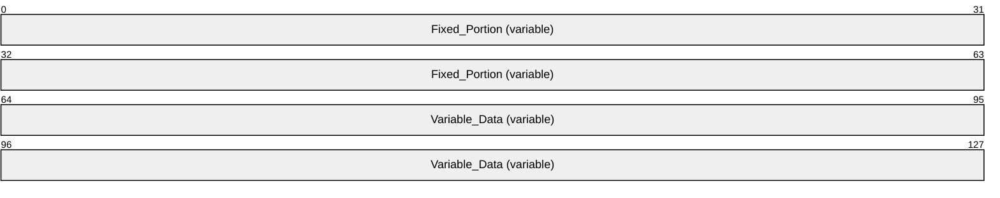

**Fixed_Portion (variable):** An array of one or more **Fixed_Portion** blocks, each consisting of one or more fixed-length fields. The specific structure of the **Fixed_Portion** block is defined for each **INFO** structure.

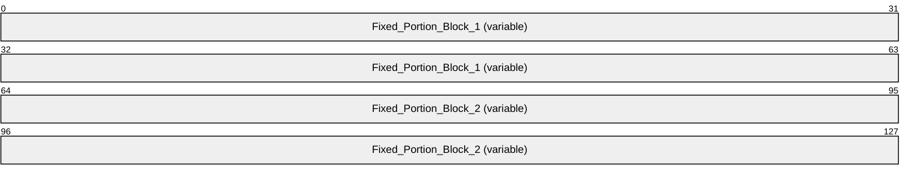

**Fixed_Portion_Block_1 (variable): Fixed_Portion** block 1.


**Fixed_Portion_Block_1_Field_1 (4 bytes):** Fixed-length field 1 of **Fixed_Portion** block 1. Although the length of this field is shown as 4 bytes, its actual length is indeterminate in this generic structure.

**Fixed_Portion_Block_1_Field_2 (4 bytes):** Fixed-length field 2 of **Fixed_Portion** block 1. This field contains an offset to **Variable_Data_Field_1**, which is relative to the start of **Fixed_Portion** block 1.

**Fixed_Portion_Block_2 (variable):** Optional **Fixed_Portion** block 2.

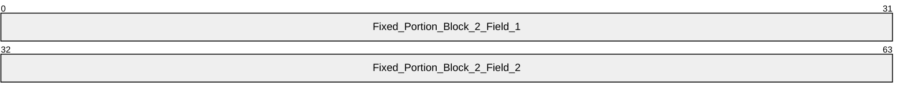

**Fixed_Portion_Block_2_Field_1 (4 bytes):** Fixed-length field 1 of **Fixed_Portion** block 2. Although the length of this field is shown as 4 bytes, its actual length is indeterminate in this generic structure.

**Fixed_Portion_Block_2_Field_2 (4 bytes):** Fixed-length field 2 of **Fixed_Portion** block 2. This field contains an offset to **Variable_Data_Field_2**, which is relative to the start of **Fixed_Portion** block 2.

**Variable_Data (variable):** A data block of variable length. Because the data is not necessarily aligned on 16-bit boundaries, it is specified as an array of bytes of arbitrary length; however, data fields in the **Variable_Data** block MUST be aligned on natural boundaries matching their data type. That is, **WCHAR** fields MUST be aligned on 2-byte boundaries, **DWORD** fields MUST be aligned on 4-byte boundaries, and so on.

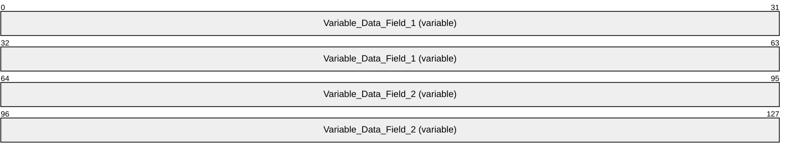

**Variable_Data_Field_1 (variable):** Variable-length field 1 of the **Variable_Data** block.

**Variable_Data_Field_2 (variable):** Variable-length field 2 of the **Variable_Data** block.

The following characteristics apply to the fields in custom-marshaled **INFO** data structures:

- The start of the **Fixed_Portion** block MUST be 32-bit aligned.
- The order of fields in the **Fixed_Portion** block is defined by the specific **INFO** structure layout.
- Data fields in the **Variable_Data** block can appear in arbitrary order.
- One or more offsets in **Fixed_Portion** blocks can locate the same field in the **Variable_Data** block; or there can be a one-to-one correspondence between offsets and **Variable_Data** fields.
- The **Variable_Data** fields SHOULD be packed tightly in the **Variable_Data** block, filling the **Variable_Data** block from the end toward the beginning, such that, if the *cbBuf* parameter specified by the caller is larger than the sum of all **Fixed_Portion** blocks and all **Variable_Data** fields, the unused space in the **[out]** buffer receiving the custom-marshaled **INFO** structure forms a gap between the end of the last **Fixed_Portion** block and the beginning of the first **Variable_Data** field; however, client-side unmarshaling code that processes a custom-marshaled **INFO** structure SHOULD be prepared to correctly handle data that does not fill the **Variable_Data** block from the end toward the beginning, or is not tightly packed and includes unused space in arbitrary positions of the **Variable_Data** block.<92>
<a id="Section_2.2.2.1"></a>
#### 2.2.2.1 _DEVMODE

The **_DEVMODE** structure defines initialization data for a printer. Although the **_DEVMODE** structure does not contain any pointers, it is still custom-[**marshaled**](#gt_37e89d91-2800-49d1-9d17-45ebe167ad87), because the size of the structure is version-specific and implementation-specific, and cannot be expressed using [**IDL**](#gt_interface-definition-language-idl) attributes. It has the following message format.

The [**print server**](#gt_print-server) MUST accept **_DEVMODE** structures with truncated public information. A truncated **_DEVMODE** structure contains a subset of fields, from **dmDeviceName** up to and including **dmFields**, plus at least those fields that are initialized as specified by **dmFields**. It is followed by private, [**printer driver**](#gt_printer-driver)–specific data, the size of which is specified by the **dmDriverExtra** field.

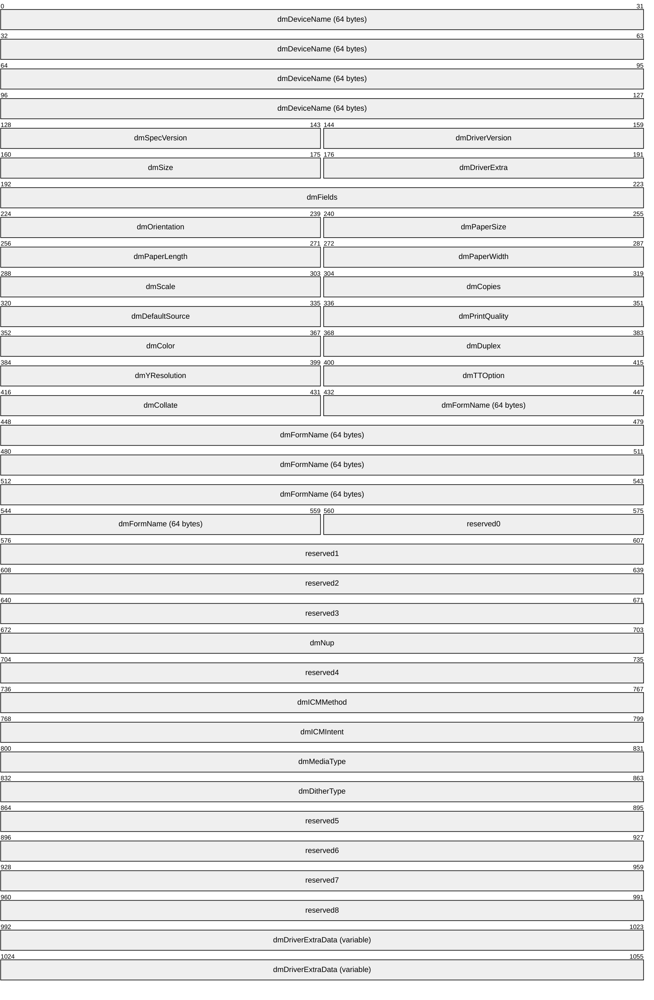

**dmDeviceName (64 bytes):** A 32-element array of 16-bit [**Unicode**](#gt_unicode) characters that form a null-terminated string that specifies the name of the printer. Printer name strings that are longer than 32 characters are truncated to fit the array. For more rules governing printer names, see section [2.2.4.14](#Section_2.2.4.14).

**dmSpecVersion (2 bytes):** The version of initialization data specification on which the **_DEVMODE** structure is based. This value SHOULD be 0x0401.<93>

**dmDriverVersion (2 bytes):** For printers, an optional, implementation-defined version of the printer driver.<94>

**dmSize (2 bytes):** The size, in bytes, of the **_DEVMODE** structure, which MUST be a multiple of 4. This value does not include the length of any private, printer driver–specific data that follows the **_DEVMODE** structure's public fields. The size of private data is specified by the **dmDriverExtra** value.

If the **_DEVMODE** structure contains truncated public information, the value of **dmSize** is at least the size, in bytes, of a subset of fields, from **dmDeviceName** up to and including **dmFields**, plus fields that are initialized as specified by **dmFields**.

**dmDriverExtra (2 bytes):** The size, in bytes, of the private, printer driver–specific data that follows this structure.

**dmFields (4 bytes):** A bitfield that specifies the fields of the **_DEVMODE** structure that have been initialized. If a bit is set, the corresponding field MUST be initialized and MUST be processed on receipt. If a bit is not set, the value of the corresponding field SHOULD be zero when sent and MUST be ignored on receipt.

The value of this field is the result of a bitwise OR of the following bits.

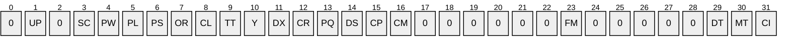

| Name | Description |
| --- | --- |
| DM_ICMINTENT CI | If this bit is set, the **dmICMIntent** field MUST be initialized. |
| DM_MEDIATYPE MT | If this bit is set, the **dmMediaType** field MUST be initialized. |
| DM_DITHERTYPE DT | If this bit is set, the **dmDitherType** field MUST be initialized. |
| DM_FORMNAME FM | If this bit is set, the **dmFormName** field MUST be initialized. |
| DM_ICMMETHOD CM | If this bit is set, the **dmICMMethod** field MUST be initialized. |
| DM_COPIES CP | If this bit is set, the **dmCopies** field MUST be initialized. |
| DM_DEFAULTSOURCE DS | If this bit is set, the **dmDefaultSource** field MUST be initialized. |
| DM_PRINTQUALITY PQ | If this bit is set, the **dmPrintQuality** field MUST be initialized. |
| DM_COLOR CR | If this bit is set, the **dmColor** field MUST be initialized. |
| DM_DUPLEX DX | If this bit is set, the **dmDuplex** field MUST be initialized. |
| DM_YRESOLUTION Y | If this bit is set, the **dmYResolution** field MUST be initialized. |
| DM_TTOPTION TT | If this bit is set, the **dmTTOption** field MUST be initialized. |
| DM_COLLATE CL | If this bit is set, the **dmCollate** field MUST be initialized. |
| DM_ORIENTATION OR | If this bit is set, the **dmOrientation** field MUST be initialized. |
| DM_PAPERSIZE PS | If this bit is set, the **dmPaperSize** field MUST be initialized. This bit MUST NOT be set if either DM_PAPERLENGTH or DM_PAPERWIDTH are set. |
| DM_PAPERLENGTH PL | If this bit is set, the **dmPaperLength** field MUST be initialized. This bit MUST NOT be set if DM_PAPERSIZE is set. |
| DM_PAPERWIDTH PW | If this bit is set, the **dmPaperWidth** field MUST be initialized. This bit MUST NOT be set if DM_PAPERSIZE is set. |
| DM_SCALE SC | If this bit is set, the **dmScale** field MUST be initialized. |
| DM_NUP UP | If this bit is set, the **dmNup** field MUST be initialized. |

**dmOrientation (2 bytes):** For printers, the orientation for output. If the DM_ORIENTATION bit is set in **dmFields**, the value of this field SHOULD be one of the following.

| Name/value | Description |
| --- | --- |
| DMORIENT_POTRAIT 0x0001 | "Portrait" orientation. |
| DMORIENT_LANDSCAPE 0x0002 | "Landscape" orientation. |

**dmPaperSize (2 bytes):** For printers, the size of the output media. If the DM_PAPERSIZE bit is set in **dmFields**, the value of this field SHOULD<95> be one of the following, or it MAY be a device-specific value that is greater than or equal to 0x0100.

| Name/value | Description |
| --- | --- |
| DMPAPER_LETTER 0x0001 | Letter, 8 1/2 x 11 inches |
| DMPAPER_LEGAL 0x0005 | Legal, 8 1/2 x 14 inches |
| DMPAPER_10X14 0x0010 | 10 x 14-inch sheet |
| DMPAPER_11X17 0x0011 | 11 x 17-inch sheet |
| DMPAPER_12X11 0x005A | 12 x 11-inch sheet |
| DMPAPER_A3 0x0008 | A3 sheet, 297 x 420 millimeters |
| DMPAPER_A3_ROTATED 0x004C | A3 rotated sheet, 420 x 297 millimeters |
| DMPAPER_A4 0x0009 | A4 sheet, 210 x 297 millimeters |
| DMPAPER_A4_ROTATED 0x004D | A4 rotated sheet, 297 x 210 millimeters |
| DMPAPER_A4SMALL 0x000A | A4 small sheet, 210 x 297 millimeters |
| DMPAPER_A5 0x000B | A5 sheet, 148 x 210 millimeters |
| DMPAPER_A5_ROTATED 0x004E | A5 rotated sheet, 210 x 148 millimeters |
| DMPAPER_A6 0x0046 | A6 sheet, 105 x 148 millimeters |
| DMPAPER_A6_ROTATED 0x0053 | A6 rotated sheet, 148 x 105 millimeters |
| DMPAPER_B4 0x000C | B4 sheet, 250 x 354 millimeters |
| DMPAPER_B4_JIS_ROTATED 0x004F | B4 (JIS) rotated sheet, 364 x 257 millimeters |
| DMPAPER_B5 0x000D | B5 sheet, 182 x 257-millimeter paper |
| DMPAPER_B5_JIS_ROTATED 0x0050 | B5 (JIS) rotated sheet, 257 x 182 millimeters |
| DMPAPER_B6_JIS 0x0058 | B6 (JIS) sheet, 128 x 182 millimeters |
| DMPAPER_B6_JIS_ROTATED 0x0059 | B6 (JIS) rotated sheet, 182 x 128 millimeters |
| DMPAPER_CSHEET 0x0018 | C Sheet, 17 x 22 inches |
| DMPAPER_DBL_JAPANESE_POSTCARD 0x0045 | Double Japanese Postcard, 200 x 148 millimeters |
| DMPAPER_DBL_JAPANESE_POSTCARD_ROTATED 0x0052 | Double Japanese Postcard Rotated, 148 x 200 millimeters |
| DMPAPER_DSHEET 0x0019 | D Sheet, 22 x 34 inches |
| DMPAPER_ENV_9 0x0013 | #9 Envelope, 3 7/8 x 8 7/8 inches |
| DMPAPER_ENV_10 0x0014 | #10 Envelope, 4 1/8 x 9 1/2 inches |
| DMPAPER_ENV_11 0x0015 | #11 Envelope, 4 1/2 x 10 3/8 inches |
| DMPAPER_ENV_12 0x0016 | #12 Envelope, 4 3/4 x 11 inches |
| DMPAPER_ENV_14 0x0017 | #14 Envelope, 5 x 11 1/2 inches |
| DMPAPER_ENV_C5 0x001C | C5 Envelope, 162 x 229 millimeters |
| DMPAPER_ENV_C3 0x001D | C3 Envelope, 324 x 458 millimeters |
| DMPAPER_ENV_C4 0x001E | C4 Envelope, 229 x 324 millimeters |
| DMPAPER_ENV_C6 0x001F | C6 Envelope, 114 x 162 millimeters |
| DMPAPER_ENV_C65 0x0020 | C65 Envelope, 114 x 229 millimeters |
| DMPAPER_ENV_B4 0x0021 | B4 Envelope, 250 x 353 millimeters |
| DMPAPER_ENV_B5 0x0022 | B5 Envelope, 176 x 250 millimeters |
| DMPAPER_ENV_B6 0x0023 | B6 Envelope, 176 x 125 millimeters |
| DMPAPER_ENV_DL 0x001B | DL Envelope, 110 x 220 millimeters |
| DMPAPER_ENV_ITALY 0x0024 | Italy Envelope, 110 x 230 millimeters |
| DMPAPER_ENV_MONARCH 0x0025 | Monarch Envelope, 3 7/8 x 7 1/2 inches |
| DMPAPER_ENV_PERSONAL 0x0026 | 6 3/4 Envelope, 3 5/8 x 6 1/2 inches |
| DMPAPER_ESHEET 0x001A | E Sheet, 34 x 44 inches |
| DMPAPER_EXECUTIVE 0x0007 | Executive, 7 1/4 x 10 1/2 inches |
| DMPAPER_FANFOLD_US 0x0027 | US Std Fanfold, 14 7/8 x 11 inches |
| DMPAPER_FANFOLD_STD_GERMAN 0x0028 | German Std Fanfold, 8 1/2 x 12 inches |
| DMPAPER_FANFOLD_LGL_GERMAN 0x0029 | German Legal Fanfold, 8 x 13 inches |
| DMPAPER_FOLIO 0x000E | Folio, 8 1/2 x 13-inch paper |
| DMPAPER_JAPANESE_POSTCARD_ROTATED 0x0051 | Japanese Postcard Rotated, 148 x 100 millimeters |
| DMPAPER_JENV_CHOU3 0x0049 | Japanese Envelope Chou #3 |
| DMPAPER_JENV_CHOU3_ROTATED 0x0056 | Japanese Envelope Chou #3 Rotated |
| DMPAPER_JENV_CHOU4 0x004A | Japanese Envelope Chou #4 |
| DMPAPER_JENV_CHOU4_ROTATED 0x0057 | Japanese Envelope Chou #4 Rotated |
| DMPAPER_JENV_KAKU2 0x0047 | Japanese Envelope Kaku #2 |
| DMPAPER_JENV_KAKU2_ROTATED 0x0054 | Japanese Envelope Kaku #2 Rotated |
| DMPAPER_JENV_KAKU3 0x0048 | Japanese Envelope Kaku #3 |
| DMPAPER_JENV_KAKU3_ROTATED 0x0055 | Japanese Envelope Kaku #3 Rotated |
| DMPAPER_JENV_YOU4 0x005B | Japanese Envelope You #4 |
| DMPAPER_JENV_YOU4_ROTATED 0x005C | Japanese Envelope You #4 Rotated |
| DMPAPER_LEDGER 0x0004 | Ledger, 17 x 11 inches |
| DMPAPER_LETTER_ROTATED 0x004B | Letter Rotated, 11 by 8 1/2 inches |
| DMPAPER_LETTERSMALL 0x0002 | Letter Small, 8 1/2 x 11 inches |
| DMPAPER_NOTE 0x0012 | Note, 8 1/2 x 11-inches |
| DMPAPER_P16K 0x005D | PRC 16K, 146 x 215 millimeters |
| DMPAPER_P16K_ROTATED 0x006A | PRC 16K Rotated, 215 x 146 millimeters |
| DMPAPER_P32K 0x005E | PRC 32K, 97 x 151 millimeters |
| DMPAPER_P32K_ROTATED 0x006B | PRC 32K Rotated, 151 x 97 millimeters |
| DMPAPER_P32KBIG 0x005F | PRC 32K(Big) 97 x 151 millimeters |
| DMPAPER_P32KBIG_ROTATED 0x006C | PRC 32K(Big) Rotated, 151 x 97 millimeters |
| DMPAPER_PENV_1 0x0060 | PRC Envelope #1, 102 by 165 millimeters |
| DMPAPER_PENV_1_ROTATED 0x006D | PRC Envelope #1 Rotated, 165 x 102 millimeters |
| DMPAPER_PENV_2 0x0061 | PRC Envelope #2, 102 x 176 millimeters |
| DMPAPER_PENV_2_ROTATED 0x006E | PRC Envelope #2 Rotated, 176 x 102 millimeters |
| DMPAPER_PENV_3 0x0062 | PRC Envelope #3, 125 x 176 millimeters |
| DMPAPER_PENV_3_ROTATED 0x006F | PRC Envelope #3 Rotated, 176 x 125 millimeters |
| DMPAPER_PENV_4 0x0063 | PRC Envelope #4, 110 x 208 millimeters |
| DMPAPER_PENV_4_ROTATED 0x0070 | PRC Envelope #4 Rotated, 208 x 110 millimeters |
| DMPAPER_PENV_5 0x0064 | PRC Envelope #5, 110 x 220 millimeters |
| DMPAPER_PENV_5_ROTATED 0x0071 | PRC Envelope #5 Rotated, 220 x 110 millimeters |
| DMPAPER_PENV_6 0x0065 | PRC Envelope #6, 120 x 230 millimeters |
| DMPAPER_PENV_6_ROTATED 0x0072 | PRC Envelope #6 Rotated, 230 x 120 millimeters |
| DMPAPER_PENV_7 0x0066 | PRC Envelope #7, 160 x 230 millimeters |
| DMPAPER_PENV_7_ROTATED 0x0073 | PRC Envelope #7 Rotated, 230 x 160 millimeters |
| DMPAPER_PENV_8 0x0067 | PRC Envelope #8, 120 x 309 millimeters |
| DMPAPER_PENV_8_ROTATED 0x0074 | PRC Envelope #8 Rotated, 309 x 120 millimeters |
| DMPAPER_PENV_9 0x0068 | PRC Envelope #9, 229 x 324 millimeters |
| DMPAPER_PENV_9_ROTATED 0x0075 | PRC Envelope #9 Rotated, 324 x 229 millimeters |
| DMPAPER_PENV_10 0x0069 | PRC Envelope #10, 324 x 458 millimeters |
| DMPAPER_PENV_10_ROTATED 0x0076 | PRC Envelope #10 Rotated, 458 x 324 millimeters |
| DMPAPER_QUARTO 0x000F | Quarto, 215 x 275 millimeter paper |
| DMPAPER_STATEMENT 0x0006 | Statement, 5 1/2 x 8 1/2 inches |
| DMPAPER_TABLOID 0x0003 | Tabloid, 11 x 17 inches |
| 0x0100 ≤ *value* | The value is device-specific. |

**dmPaperLength (2 bytes):** If the DM_PAPERLENGTH bit is set in the **dmFields** field, this field specifies the length of the paper, in tenths of a millimeter, to use in the printer for which the job is destined.

**dmPaperWidth (2 bytes):** If the DM_PAPERWIDTH bit is set in the **dmFields** field, this field specifies the width of the paper, in tenths of a millimeter, to use in the printer for which the job is destined.

**dmScale (2 bytes):** If the DM_SCALE bit is set in the **dmFields** field, this field specifies the percentage factor by which the printed output is to be scaled.

**dmCopies (2 bytes):** If the DM_COPIES bit is set in the **dmFields** field, this field specifies the number of copies to be printed, if the device supports multiple-page copies.

**dmDefaultSource (2 bytes):** If the DM_DEFAULTSOURCE bit is set in the **dmFields** field, this field specifies the paper source.

The value of this field SHOULD be one of the following, or it MAY be a device-specific value that is greater than or equal to 0x0100.

| Name/value | Description |
| --- | --- |
| DMBIN_UPPER 0x0001 | Select the upper paper bin. This value is also used for the paper source for printers that only have one paper bin. |
| DMBIN_LOWER 0x0002 | Select the lower bin. |
| DMBIN_MIDDLE 0x0003 | Select the middle paper bin. |
| DMBIN_MANUAL 0x0004 | Manually select the paper bin. |
| DMBIN_ENVELOPE 0x0005 | Select the auto envelope bin. |
| DMBIN_ENVMANUAL 0x0006 | Select the manual envelope bin. |
| DMBIN_AUTO 0x0007 | Auto-select the bin. |
| DMBIN_TRACTOR 0x0008 | Select the bin with the tractor paper. |
| DMBIN_SMALLFMT 0x0009 | Select the bin with the smaller paper format. |
| DMBIN_LARGEFMT 0x000A | Select the bin with the larger paper format. |
| DMBIN_LARGECAPACITY 0x000B | Select the bin with large capacity. |
| DMBIN_CASSETTE 0x000E | Select the cassette bin. |
| DMBIN_FORMSOURCE 0x000F | Select the bin with the required form. |

**dmPrintQuality (2 bytes):** If the DM_PRINTQUALITY bit is set in the **dmFields** field, this field specifies the printer resolution. The value of this field MUST be either a positive value that specifies a device-dependent resolution in dots per inch (DPI) or one of the following four predefined device-independent values that are mapped to a device-specific resolution in an implementation-specific manner.

| Name/value | Description |
| --- | --- |
| DMRES_HIGH 0xFFFC | High-resolution printouts |
| DMRES_MEDIUM 0xFFFD | Medium-resolution printouts |
| DMRES_LOW 0xFFFE | Low-resolution printouts |
| DMRES_DRAFT 0xFFFF | Draft-resolution printouts |

**dmColor (2 bytes):** If the DM_COLOR bit is set in the **dmFields** field, this field specifies the color mode to use with color printers. The value of this field MUST be one of the following.

| Name/value | Description |
| --- | --- |
| DMRES_MONOCHROME 0x0001 | Use monochrome printing mode. |
| DMRES_COLOR 0x0002 | Use color printing mode. |

**dmDuplex (2 bytes):** If the DM_DUPLEX bit is set in the **dmFields** field, this field specifies duplex or double-sided printing for printers that are capable of duplex printing. The value of this field MUST be one of the following.

| Name/value | Description |
| --- | --- |
| DMDUP_SIMPLEX 0x0001 | Normal (non-duplex) printing. |
| DMDUP_VERTICAL 0x0002 | Long-edge binding; that is, the long edge of the page is vertical. |
| DMDUP_HORIZONTAL 0x0003 | Short-edge binding; that is, the long edge of the page is horizontal. |

**dmYResolution (2 bytes):** If the DM_YRESOLUTION bit is set in the **dmFields**, this field specifies the y-resolution, in dots per inch, of the printer.

**dmTTOption (2 bytes):** If the DM_TTOPTION bit is set in the **dmFields** field, this field specifies how TrueType fonts MUST be printed. The value of this field MUST be one of the following.

| Name/value | Description |
| --- | --- |
| DMTT_BITMAP 0x0001 | Prints TrueType fonts as graphics. This is the default action for dot-matrix printers. |
| DMTT_DOWNLOAD 0x0002 | Downloads TrueType fonts as soft fonts. This is the default action for Hewlett-Packard printers that use [**printer control language (PCL)**](#gt_printer-control-language-pcl). |
| DMTT_SUBDEV 0x0003 | Substitutes device fonts for TrueType fonts. This is the default action for PostScript printers. |
| DMTT_DOWNLOAD_OUTLINE 0x0004 | Downloads TrueType fonts as outline soft fonts.<96> |

**dmCollate (2 bytes):** If the DM_COLLATE bit is set in the **dmFields** field, this field specifies whether collation is used when printing multiple copies. The value of this field is one of the following:

| Name/value | Description |
| --- | --- |
| DMCOLLATE_FALSE 0x0000 | Do not collate when printing multiple copies. |
| DMCOLLATE_TRUE 0x0001 | Collate when printing multiple copies. |

**dmFormName (64 bytes):** This field is a 32-element array of 16-bit Unicode characters. If the DM_FORMNAME bit is set in the **dmFields** field, this field specifies the name of the form to use, for example, "Letter" or "Legal". The value of this field is restricted to 32 characters, including the trailing null. Form names that are longer than 32 characters, including the trailing null, are truncated to fit the array.

**reserved0 (2 bytes):** A value that SHOULD be zero when sent and MUST be ignored on receipt.

**reserved1 (4 bytes):** A value that SHOULD be zero when sent and MUST be ignored on receipt.

**reserved2 (4 bytes):** A value that SHOULD be zero when sent and MUST be ignored on receipt.

**reserved3 (4 bytes):** A value that SHOULD be zero when sent and MUST be ignored on receipt.

**dmNup (4 bytes):** If the DM_NUP bit is set in the **dmFields**, this field specifies the responsibility for performing page layout for [**N-Up Printing**](#gt_n-up-printing). It is one of the following values:

| Name/value | Description |
| --- | --- |
| DMNUP_SYSTEM 0x00000001 | The print server does the page layout. |
| DMNUP_ONEUP 0x00000002 | The application does the page layout. |

**reserved4 (4 bytes):** A value that SHOULD be zero when sent and MUST be ignored on receipt.

**dmICMMethod (4 bytes):** If the DM_ICMMETHOD bit is set in the **dmFields** field, this field specifies how [**Image Color Management (ICM)**](#gt_image-color-management-icm) is handled. For a non-ICM application, this field determines if ICM is enabled or disabled. For ICM applications, the system examines this field to determine how to handle ICM support. The value of this field is one of the following predefined values or a printer driver-defined value greater than or equal to 0x00000100.

| Name/value | Description |
| --- | --- |
| DMICMMETHOD_NONE 0x00000001 | Specifies that ICM is disabled. |
| DMICMMETHOD_SYSTEM 0x00000002 | Specifies that ICM is handled by the system on which the [**page description language (PDL)**](#gt_page-description-language-pdl) data is generated. |
| DMICMMETHOD_DRIVER 0x00000003 | Specifies that ICM is handled by the printer driver. |
| DMICMMETHOD_DEVICE 0x00000004 | Specifies that ICM is handled by the destination device. |

**dmICMIntent (4 bytes):** If the DM_ICMINTENT bit is set in the **dmFields** field, this field specifies which [**color matching**](#gt_color-matching) method, or intent, is used by default. This field is primarily for non-ICM applications. ICM applications can establish intents by using the ICM functions. The value of this field is one of the following predefined values, or a printer driver defined value greater than or equal to 0x00000100.

| Name/value | Description |
| --- | --- |
| DMICM_SATURATE 0x00000001 | Color matching SHOULD be optimized for color saturation. |
| DMICM_CONTRAST 0x00000002 | Color matching SHOULD optimize for color contrast. |
| DMICM_COLORIMETRIC 0x00000003 | Color matching SHOULD optimize to match the exact color requested. |
| DMICM_ABS_COLORIMETRIC 0x00000004 | Color matching SHOULD optimize to match the exact color requested without [**white point**](#gt_white-point) mapping. |

**dmMediaType (4 bytes):** If the DM_MEDIATYPE bit is set in the **dmFields** field, this field specifies the type of media to print on. The value of this field is one of the following predefined values or else a printer driver-defined value greater than or equal to 0x00000100.

| Name/value | Description |
| --- | --- |
| DMMEDIA_STANDARD 0x00000001 | Plain paper |
| DMMEDIA_TRANSPARENCY 0x00000002 | Transparent film |
| DMMEDIA_GLOSSY 0x00000003 | Glossy paper |

**dmDitherType (4 bytes):** If the DM_DITHERTYPE bit is set in the **dmFields** field, this field specifies how [**dithering**](#gt_dithering) is to be done. The value of this field is one of the following predefined values or else a printer driver-defined value greater than or equal to 0x00000100.

| Name/value | Description |
| --- | --- |
| DMDITHER_NONE 0x00000001 | No dithering. |
| DMDITHER_COARSE 0x00000002 | Dithering with a coarse brush. |
| DMDITHER_FINE 0x00000003 | Dithering with a fine brush. |
| DMDITHER_LINEART 0x00000004 | Line art dithering, a special dithering method that produces well defined borders between black, white, and gray scaling. |
| DMDITHER_ERRORDIFFUSION 0x00000005 | Error diffusion dithering.<97> |
| DMDITHER_RESERVED6 0x00000006 | Same as DMDITHER_LINEART. |
| DMDITHER_RESERVED7 0x00000007 | Same as DMDITHER_LINEART. |
| DMDITHER_RESERVED8 0x00000008 | Same as DMDITHER_LINEART. |
| DMDITHER_RESERVED9 0x00000009 | Same as DMDITHER_LINEART. |
| DMDITHER_GRAYSCALE 0x0000000A | Device does gray scaling. |

**reserved5 (4 bytes):** A value that SHOULD be zero when sent and MUST be ignored on receipt.

**reserved6 (4 bytes):** A value that SHOULD be zero when sent and MUST be ignored on receipt.

**reserved7 (4 bytes):** A value that SHOULD be zero when sent and MUST be ignored on receipt.

**reserved8 (4 bytes):** A value that SHOULD be zero when sent and MUST be ignored on receipt.

**dmDriverExtraData (variable):** This field can contain implementation-specific printer driver data. Its size in bytes is specified by the **dmDriverExtra** field.<98>

<a id="Section_2.2.2.1.1"></a>
##### 2.2.2.1.1 PostScript Driver Extra Data

The PostScript Driver Extra Data information can be found in [Appendix B: Product Behavior](#Section_7).<99>

<a id="Section_2.2.2.1.2"></a>
##### 2.2.2.1.2 Generic Driver Extra Data

The Generic Driver Extra Data information can be found in [Appendix B: Product Behavior](#Section_7).<100>

<a id="Section_2.2.2.1.3"></a>
##### 2.2.2.1.3 OEM Driver Extra Data

The OEM (vendor-supplied) Driver Extra Data information can be found in [Appendix B: Product Behavior](#Section_7).<101>

<a id="Section_2.2.2.1.4"></a>
##### 2.2.2.1.4 Print Ticket Driver Extra Data

The Print Ticket Driver Extra Data information can be found in [Appendix B: Product Behavior](#Section_7).<102>

<a id="Section_2.2.2.2"></a>
#### 2.2.2.2 Members in Custom-Marshaled INFO structures

This section specifies common members of custom-[**marshaled**](#gt_37e89d91-2800-49d1-9d17-45ebe167ad87) INFO structures, which are used consistently with corresponding members of [**IDL**](#gt_interface-definition-language-idl)-marshaled INFO structures (section [2.2.1.3](#Section_2.2.1.3)), according to the following rules:

- **MEMBERNAME** is derived by trimming the leading "p" from the pointer, string pointer, or [**multisz**](#gt_multisz) pointer member of the IDL-marshaled INFO structure.
- The custom-marshaled INFO structure form contains an **Offset** member whose name is derived by appending "Offset" to **MEMBERNAME**.
- The **Offset** member is a 32-bit unsigned integer that specifies the number of bytes from the start of the structure to the start of the bytes making up the pointed-to data, string, or multisz. That data, string, or multisz area is represented in the custom-marshaled structure by a member whose name is derived by appending "Array" to **MEMBERNAME**. The length of that member is variable and includes the terminating null character for string data or the two terminating null characters for multisz data, respectively.
- If the pointer, string pointer, or multisz pointer member in the IDL-marshaled structure form is optional—that is, NULL—it can be represented by a zero **Offset** in a custom-marshaled structure. The corresponding **Array** member is then considered optional and is present only if the **Offset** is not zero.
Unless noted otherwise, all other members of IDL-marshaled INFO structure forms are represented identically in the corresponding custom-marshaled INFO structure forms.

<a id="Section_2.2.2.3"></a>
#### 2.2.2.3 _DATATYPES_INFO_1

The _**DATATYPES_INFO_1** structure contains information about the [**data type**](#gt_data-type) used to record a [**print job**](#gt_print-job).


**Fixed_Portion (variable):** An array of one or more fixed-size fields, which are defined as follows.

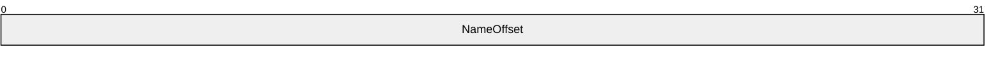

**NameOffset (4 bytes):** A 32-bit unsigned integer that specifies the number of bytes from the start of the structure to the **NameArray** member.

**Variable_Data (variable):** An array of zero or more optional, variable-size fields, which are defined as follows.

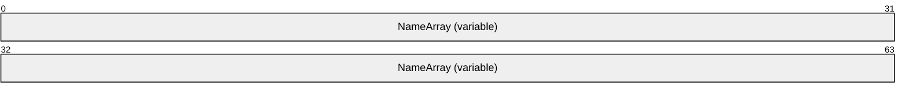

**NameArray (variable):** A string that specifies the data type used to record a print job. The location of this buffer is determined by the value of the **NameOffset** member. For rules governing data type names, see section [2.2.4.2](#Section_2.2.4.2).

<a id="Section_2.2.2.4"></a>
#### 2.2.2.4 _DRIVER_INFO

<a id="Section_2.2.2.4.1"></a>
##### 2.2.2.4.1 _DRIVER_INFO_1

The **_DRIVER_INFO_1** structure specifies [**printer driver**](#gt_printer-driver) information. It is a custom-[**marshaled**](#gt_37e89d91-2800-49d1-9d17-45ebe167ad87) form of the **_DRIVER_INFO_1** (section [2.2.1.5.1)](#Section_df308bbf8ff74b0f930bcb9b90080b90) structure.


**Fixed_Portion (variable):** An array of one or more fixed-size fields, which are defined as follows.


**NameOffset (4 bytes):** An unsigned integer that specifies the number of bytes from the start of the structure to the **NameArray** member.

**Variable_Data (variable):** An array of zero or more optional, variable-size fields, which are defined as follows.


**NameArray (variable):** A string that specifies the Printer Driver Name. The location of this buffer is determined by the value of the **NameOffset** member.

<a id="Section_2.2.2.4.2"></a>
##### 2.2.2.4.2 _DRIVER_INFO_2

The **_DRIVER_INFO_2** structure specifies [**printer driver**](#gt_printer-driver) information. It is a custom-[**marshaled**](#gt_37e89d91-2800-49d1-9d17-45ebe167ad87) form of the **_DRIVER_INFO_2** (section [2.2.1.5.2)](#Section_2.2.1.5.2) structure.


**Fixed_Portion (variable):** An array of one or more groups of fixed-size fields, which are defined as follows.


**cVersion (4 bytes):** A DWORD that has an implementation-specific value that identifies the driver version and the operating system version for which the printer driver was written, as specified in section [2.2.1.3.1](#Section_2.2.1.3.1).

**NameOffset (4 bytes):** A 32-bit unsigned integer that specifies the number of bytes from the start of the structure to the **NameArray** member.

**EnvironmentOffset (4 bytes):** An unsigned integer that specifies the number of bytes from the start of the structure to the start of the **EnvironmentArray** member.

**DriverPathOffset (4 bytes):** An unsigned integer that specifies the number of bytes from the start of the structure to the start of the **DriverPathArray** member.

**DataFileOffset (4 bytes):** An unsigned integer that specifies the number of bytes from the start of the structure to the start of the **DataFileArray** member.

**ConfigFileOffset (4 bytes):** An unsigned integer that specifies the number of bytes from the start of the structure to the start of the **ConfigFileArray** member.

**Variable_Data (variable):** An array of zero or more groups of optional, variable-size fields, which are defined as follows.

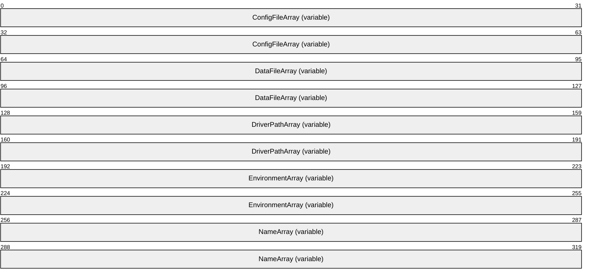

**ConfigFileArray (variable):** A string that specifies a file name or a full path and file name for the printer driver configuration module. The location of this buffer is determined by the value of the **ConfigFileOffset** member.

**DataFileArray (variable):** A string that specifies a file name or a full path and file name for the file that contains printer driver data. The location of this buffer is determined by the value of the **DataFileOffset** member.

**DriverPathArray (variable):** A string that specifies a file name or full path and file name for the file that contains the printer driver. The location of this buffer is determined by the value of the **DependentFilesOffset** member.

**EnvironmentArray (variable):** A string that specifies the environment that the printer driver supports. The location of this buffer is determined by the value of the **EnvironmentOffset** member.

**NameArray (variable):** This member MUST contain a string that specifies the print processor name. The location of this buffer is determined by the value of the **NameOffset** member. For rules governing print processor names, see section [2.2.4.11](#Section_2.2.4.11).

<a id="Section_2.2.2.4.3"></a>
##### 2.2.2.4.3 _DRIVER_INFO_3

The **_DRIVER_INFO_3** structure specifies [**printer driver**](#gt_printer-driver) information.<103> It is a custom-[**marshaled**](#gt_37e89d91-2800-49d1-9d17-45ebe167ad87) form of the **RPC_DRIVER_INFO_3** (section [2.2.1.5.3)](#Section_2.2.1.5.3) structure.


**Fixed_Portion (variable):** An array of one or more groups of fixed-size fields, which are defined as follows.

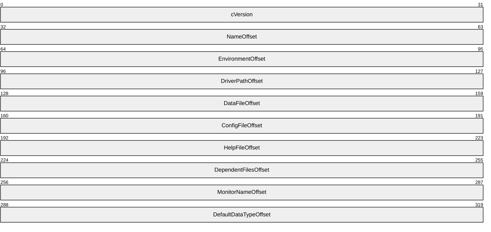

**cVersion (4 bytes):** A DWORD that has an implementation-specific value that identifies the driver version and the operating system version for which the printer driver was written, as specified in section [2.2.1.3.1](#Section_2.2.1.3.1).

**NameOffset (4 bytes):** A 32-bit unsigned integer that specifies the number of bytes from the start of the structure to the **NameArray** member.

**EnvironmentOffset (4 bytes):** An unsigned integer that specifies the number of bytes from the start of the structure to the start of the **EnvironmentArray** member.

**DriverPathOffset (4 bytes):** An unsigned integer that specifies the number of bytes from the start of the structure to the start of the **DriverPathArray** member.

**DataFileOffset (4 bytes):** An unsigned integer that specifies the number of bytes from the start of the structure to the start of the **DataFileArray** member.

**ConfigFileOffset (4 bytes):** An unsigned integer that specifies the number of bytes from the start of the structure to the start of the **ConfigFileArray** member.

**HelpFileOffset (4 bytes):** An unsigned integer that specifies the number of bytes from the start of the structure to the start of the **HelpFileArray** member.

**DependentFilesOffset (4 bytes):** An unsigned integer that specifies the number of bytes from the start of the structure to the start of the **DependentFilesArray** member.

**MonitorNameOffset (4 bytes):** An unsigned integer that specifies the number of bytes from the start of the structure to the start of the **MonitorNameArray** member.

**DefaultDataTypeOffset (4 bytes):** An unsigned integer that specifies the number of bytes from the start of the structure to the start of the **DefaultDataTypeArray** member.

**Variable_Data (variable):** An array of zero or more groups of optional, variable-size fields, which are defined as follows.

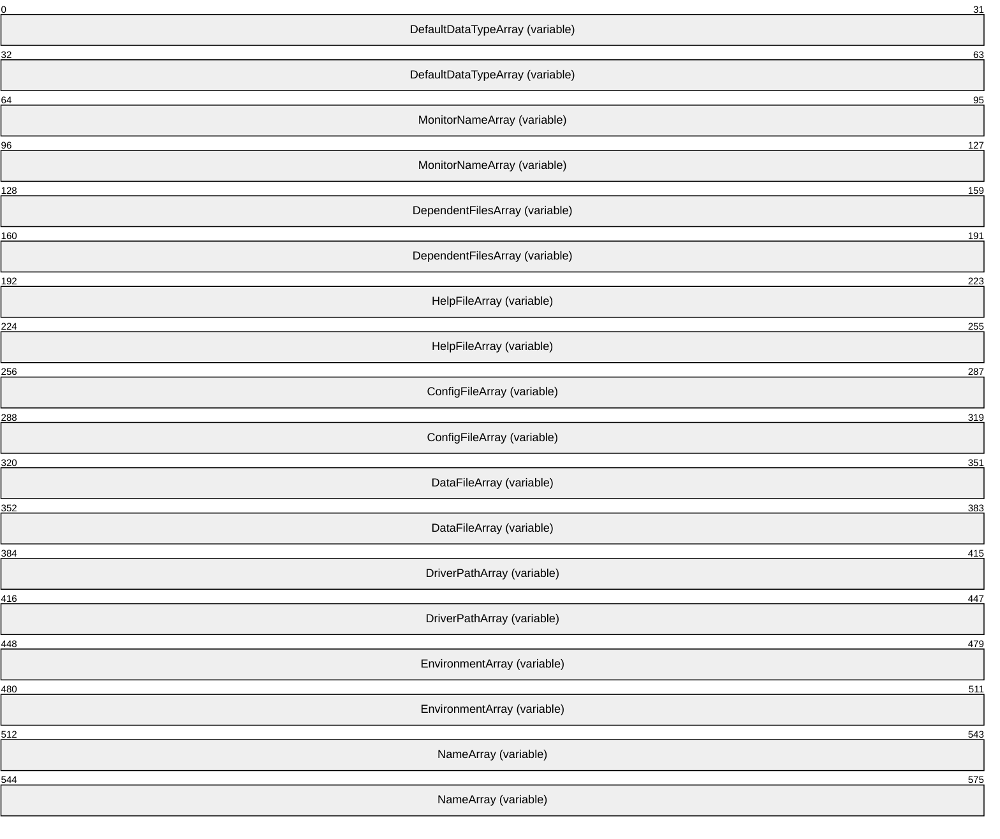

**DefaultDataTypeArray (variable):** A string that specifies the default data type of print jobs created by the driver. The location of this buffer is determined by the value of the **DefaultDataTypeOffset** member.

**MonitorNameArray (variable):** A string that specifies a language monitor. The location of this buffer is determined by the value of the **MonitorNameOffset** member.

**DependentFilesArray (variable):** A multisz that specifies the names of the files that the printer driver is dependent on. The location of this buffer is determined by the value of the **DependentFilesOffset** member.

**HelpFileArray (variable):** A string that specifies a file name or a full path and file name for the printer driver help file. The location of this buffer is determined by the value of the **HelpFileOffset** member.

**ConfigFileArray (variable):** A string that specifies a file name or a full path and file name for the printer driver configuration module. The location of this buffer is determined by the value of the **ConfigFileOffset** member.

**DataFileArray (variable):** A string that specifies a file name or a full path and file name for the file that contains printer driver data. The location of this buffer is determined by the value of the **DataFileOffset** member.

**DriverPathArray (variable):** A string that specifies a file name or full path and file name for the file that contains the printer driver. The location of this buffer is determined by the value of the **DependentFilesOffset** member.

**EnvironmentArray (variable):** A string that specifies the environment that the printer driver supports. The location of this buffer is determined by the value of the **EnvironmentOffset** member.

**NameArray (variable):** This member MUST contain a string that specifies the print processor name. The location of this buffer is determined by the value of the **NameOffset** member. For rules governing print processor names, see section [2.2.4.11](#Section_2.2.4.11).

<a id="Section_2.2.2.4.4"></a>
##### 2.2.2.4.4 _DRIVER_INFO_4

The **_DRIVER_INFO_4** structure specifies [**printer driver**](#gt_printer-driver) information.<104> It is a custom-[**marshaled**](#gt_37e89d91-2800-49d1-9d17-45ebe167ad87) form of the **_RPC_DRIVER_INFO_4** (section [2.2.1.5.4)](#Section_2.2.1.5.4) structure.


**Fixed_Portion (variable):** An array of one or more groups of fixed-size fields, which are defined as follows.

```mermaid
packet-beta
  0-31: "cVersion"
  32-63: "NameOffset"
  64-95: "EnvironmentOffset"
  96-127: "DriverPathOffset"
  128-159: "DataFileOffset"
  160-191: "ConfigFileOffset"
  192-223: "HelpFileOffset"
  224-255: "DependentFilesOffset"
  256-287: "MonitorNameOffset"
  288-319: "DefaultDataTypeOffset"
  320-351: "szzPreviousNamesOffset"
```

**cVersion (4 bytes)**: A DWORD that has an implementation-specific value that identifies the driver version and the operating system version for which the printer driver was written, as specified in section [2.2.1.3.1](#Section_2.2.1.3.1).

**NameOffset (4 bytes):** A 32-bit unsigned integer that specifies the number of bytes from the start of the structure to the **NameArray** member.

**EnvironmentOffset (4 bytes):** An unsigned integer that specifies the number of bytes from the start of the structure to the start of the **EnvironmentArray** member.

**DriverPathOffset (4 bytes):** An unsigned integer that specifies the number of bytes from the start of the structure to the start of the **DriverPathArray** member.

**DataFileOffset (4 bytes):** An unsigned integer that specifies the number of bytes from the start of the structure to the start of the **DataFileArray** member.

**ConfigFileOffset (4 bytes):** An unsigned integer that specifies the number of bytes from the start of the structure to the start of the **ConfigFileArray** member.

**HelpFileOffset (4 bytes):** An unsigned integer that specifies the number of bytes from the start of the structure to the start of the **HelpFileArray** member.

**DependentFilesOffset (4 bytes):** An unsigned integer that specifies the number of bytes from the start of the structure to the start of the **DependentFilesArray** member.

**MonitorNameOffset (4 bytes):** An unsigned integer that specifies the number of bytes from the start of the structure to the start of the **MonitorNameArray** member.

**DefaultDataTypeOffset (4 bytes):** An unsigned integer that specifies the number of bytes from the start of the structure to the start of the **DefaultDataTypeArray** member.

**szzPreviousNamesOffset (4 bytes):** An unsigned integer that specifies the number of bytes from the start of the structure to the start of the **szzPreviousNamesArray** member.

**Variable_Data (variable):** An array of zero or more groups of optional, variable-size fields, which are defined as follows.

```mermaid
packet-beta
  0-63: "szzPreviousNamesArray (variable)"
  64-127: "DefaultDataTypeArray (variable)"
  128-191: "MonitorNameArray (variable)"
  192-255: "DependentFilesArray (variable)"
  256-319: "HelpFileArray (variable)"
  320-383: "ConfigFileArray (variable)"
  384-447: "DataFileArray (variable)"
  448-511: "DriverPathArray (variable)"
  512-575: "EnvironmentArray (variable)"
  576-639: "NameArray (variable)"
```

**szzPreviousNamesArray (variable):** A multisz that specifies any previous printer drivers that are compatible with this driver. The location of this buffer is determined by the value of the **szzPreviousNamesOffset** member.

**DefaultDataTypeArray (variable):** A string that specifies the default data type of print jobs created by the driver. The location of this buffer is determined by the value of the **DefaultDataTypeOffset** member.

**MonitorNameArray (variable):** A string that specifies a language monitor. The location of this buffer is determined by the value of the **MonitorNameOffset** member.

**DependentFilesArray (variable):** A multisz that specifies the names of the files that the printer driver is dependent on. The location of this buffer is determined by the value of the **DependentFilesOffset** member.

**HelpFileArray (variable):** A string that specifies a file name or a full path and file name for the printer driver help file. The location of this buffer is determined by the value of the **HelpFileOffset** member.

**ConfigFileArray (variable):** A string that specifies a file name or a full path and file name for the printer driver configuration module. The location of this buffer is determined by the value of the **ConfigFileOffset** member.

**DataFileArray (variable):** A string that specifies a file name or a full path and file name for the file that contains printer driver data. The location of this buffer is determined by the value of the **DataFileOffset** member.

**DriverPathArray (variable):** A string that specifies a file name or full path and file name for the file that contains the printer driver. The location of this buffer is determined by the value of the **DependentFilesOffset** member.

**EnvironmentArray (variable):** A string that specifies the environment that the printer driver supports. The location of this buffer is determined by the value of the **EnvironmentOffset** member.

**NameArray (variable):** This member MUST contain a string that specifies the printer driver name. The location of this buffer is determined by the value of the **NameOffset** member. For rules governing print processor names, see section [2.2.4.11](#Section_2.2.4.11).

<a id="Section_2.2.2.4.5"></a>
##### 2.2.2.4.5 _DRIVER_INFO_5

The **_DRIVER_INFO_5** structure specifies [**printer driver**](#gt_printer-driver) information.<105>

```mermaid
packet-beta
  0-63: "Fixed_Portion (variable)"
  64-127: "Variable_Data (variable)"
```

**Fixed_Portion (variable):** An array of one or more groups of fixed-size fields, which are defined as follows.

```mermaid
packet-beta
  0-31: "cVersion"
  32-63: "NameOffset"
  64-95: "EnvironmentOffset"
  96-127: "DriverPathOffset"
  128-159: "DataFileOffset"
  160-191: "ConfigFileOffset"
  192-223: "dwDriverAttributes"
  224-255: "dwConfigVersion"
  256-287: "dwDriverVersion"
```

**cVersion (4 bytes):** A DWORD that has an implementation-specific value that identifies the driver version and the operating system version for which the printer driver was written, as specified in section [2.2.1.3.1](#Section_2.2.1.3.1).

**NameOffset (4 bytes):** A 32-bit unsigned integer that specifies the number of bytes from the start of the structure to the **NameArray** member.

**EnvironmentOffset (4 bytes):** An unsigned integer that specifies the number of bytes from the start of the structure to the start of the **EnvironmentArray** member.

**DriverPathOffset (4 bytes):** An unsigned integer that specifies the number of bytes from the start of the structure to the start of the **DriverPathArray** member.

**DataFileOffset (4 bytes):** An unsigned integer that specifies the number of bytes from the start of the structure to the start of the **DataFileArray** member.

**ConfigFileOffset (4 bytes):** An unsigned integer that specifies the number of bytes from the start of the structure to the start of the **ConfigFileArray** member.

**dwDriverAttributes (4 bytes):** A bit field that specifies attributes of the printer driver.

```mermaid
packet-beta
  0-0: "0"
  1-1: "0"
  2-2: "0"
  3-3: "0"
  4-4: "0"
  5-5: "0"
  6-6: "0"
  7-7: "A"
  8-8: "0"
  9-9: "0"
  10-10: "0"
  11-11: "0"
  12-12: "0"
  13-13: "0"
  14-14: "0"
  15-15: "0"
  16-16: "0"
  17-17: "0"
  18-18: "0"
  19-19: "0"
  20-20: "0"
  21-21: "0"
  22-22: "0"
  23-23: "0"
  24-24: "0"
  25-25: "0"
  26-26: "0"
  27-27: "0"
  28-28: "0"
  29-29: "0"
  30-30: "0"
  31-31: "0"
```

Where the bits are defined as follows.

| Name | Description |
| --- | --- |
| PRINTER_DRIVER_PACKAGE_AWARE A | The printer driver is part of a driver package. |

**dwConfigVersion (4 bytes):** The number of times the printer driver configuration file has been upgraded (replaced with a newer binary) or downgraded (replaced with an older binary) since the system was restarted.

**dwDriverVersion (4 bytes):** The number of times the printer driver executable file has been upgraded (replaced with a newer binary) or downgraded (replaced with an older binary) since the system was restarted.

**Variable_Data (variable):** An array of zero or more groups of optional, variable-size fields, which are defined as follows.

```mermaid
packet-beta
  0-63: "ConfigFileArray (variable)"
  64-127: "DataFileArray (variable)"
  128-191: "DriverPathArray (variable)"
  192-255: "EnvironmentArray (variable)"
  256-319: "NameArray (variable)"
```

**ConfigFileArray (variable):** A string that specifies a file name or a full path and file name for the printer driver configuration module. The location of this buffer is determined by the value of the **ConfigFileOffset** member.

**DataFileArray (variable):** A string that specifies a file name or a full path and file name for the file that contains printer driver data. The location of this buffer is determined by the value of the **DataFileOffset** member.

**DriverPathArray (variable):** A string that specifies a file name or full path and file name for the file that contains the printer driver. The location of this buffer is determined by the value of the **DependentFilesOffset** member.

**EnvironmentArray (variable):** A string that specifies the environment that the printer driver supports. The location of this buffer is determined by the value of the **EnvironmentOffset** member.

**NameArray (variable):** This member MUST contain a string that specifies the [**print processor**](#gt_print-processor) name. The location of this buffer is determined by the value of the **NameOffset** member. For rules governing print processor names, see section [2.2.4.11](#Section_2.2.4.11).

Members not defined in this section are identical to members in the **_DRIVER_INFO_4** structure (section [2.2.2.4.4)](#Section_2a53e91004c34aba905a26741dcd59dd).

<a id="Section_2.2.2.4.6"></a>
##### 2.2.2.4.6 _DRIVER_INFO_6

The **_DRIVER_INFO_6** structure specifies [**printer driver**](#gt_printer-driver) information.<106> It is a custom-[**marshaled**](#gt_37e89d91-2800-49d1-9d17-45ebe167ad87) form of the **RPC_DRIVER_INFO_6** (section [2.2.1.5.5)](#Section_2.2.1.5.5) structure.

```mermaid
packet-beta
  0-63: "Fixed_Portion (variable)"
  64-127: "Variable_Data (variable)"
```

**Fixed_Portion (variable):** An array of one or more groups of fixed-size fields, which are defined as follows.

```mermaid
packet-beta
  0-31: "cVersion"
  32-63: "NameOffset"
  64-95: "EnvironmentOffset"
  96-127: "DriverPathOffset"
  128-159: "DataFileOffset"
  160-191: "ConfigFileOffset"
  192-223: "HelpFileOffset"
  224-255: "DependentFilesOffset"
  256-287: "MonitorNameOffset"
  288-319: "DefaultDataTypeOffset"
  320-351: "szzPreviousNamesOffset"
  352-383: "ftDriverDate.dwLowDateTime"
  384-415: "ftDriverDate.dwHighDateTime"
  416-447: "PaddingForAlignment"
  448-511: "dwlDriverVersion"
  512-543: "MfgNameOffset"
  544-575: "OEMUrlOffset"
  576-607: "HardwareIDOffset"
  608-639: "ProviderOffset"
```

**cVersion (4 bytes):** A DWORD that has an implementation-specific value that identifies the driver version and the operating system version for which the printer driver was written, as specified in section [2.2.1.3.1](#Section_2.2.1.3.1).

**NameOffset (4 bytes):** A 32-bit unsigned integer that specifies the number of bytes from the start of the structure to the **NameArray** member.

**EnvironmentOffset (4 bytes):** An unsigned integer that specifies the number of bytes from the start of the structure to the start of the **EnvironmentArray** member.

**DriverPathOffset (4 bytes):** An unsigned integer that specifies the number of bytes from the start of the structure to the start of the **DriverPathArray** member.

**DataFileOffset (4 bytes):** An unsigned integer that specifies the number of bytes from the start of the structure to the start of the **DataFileArray** member.

**ConfigFileOffset (4 bytes):** An unsigned integer that specifies the number of bytes from the start of the structure to the start of the **ConfigFileArray** member.

**HelpFileOffset (4 bytes):** An unsigned integer that specifies the number of bytes from the start of the structure to the start of the **HelpFileArray** member.

**DependentFilesOffset (4 bytes):** An unsigned integer that specifies the number of bytes from the start of the structure to the start of the **DependentFilesArray** member.

**MonitorNameOffset (4 bytes):** An unsigned integer that specifies the number of bytes from the start of the structure to the start of the **MonitorNameArray** member.

**DefaultDataTypeOffset (4 bytes):** An unsigned integer that specifies the number of bytes from the start of the structure to the start of the **DefaultDataTypeArray** member.

**szzPreviousNamesOffset (4 bytes):** An unsigned integer that specifies the number of bytes from the start of the structure to the start of the **szzPreviousNamesArray** member.

**ftDriverDate.dwLowDateTime (4 bytes):** A FILETIME value ([MS-DTYP](../MS-DTYP/MS-DTYP.md) section 2.3.3) that specifies the date this package was published, see field DWORD dwLowDateTime.

**ftDriverDate.dwHighDateTime (4 bytes):** A FILETIME value ([MS-DTYP] section 2.3.3) that specifies the date this package was published, see field DWORD dwHighDateTime.

**PaddingForAlignment (4 bytes):** 4 bytes of padding to align the **dwlDriverVersion** field on an 8-byte boundary. The contents of this field MUST be ignored.

**dwlDriverVersion (8 bytes):** A 64-bit value that specifies the version of the core printer driver that can be used to match the driver version in the driver installation control file.<107>

**MfgNameOffset (4 bytes):** An unsigned integer that specifies the number of bytes from the start of the structure to the start of the **MfgNameArray** member.

**OEMUrlOffset (4 bytes):** An unsigned integer that specifies the number of bytes from the start of the structure to the start of the **OEMUrlArray** member.

**HardwareIDOffset (4 bytes):** An unsigned integer that specifies the number of bytes from the start of the structure to the start of the **HardwareIDArray** member.

**ProviderOffset (4 bytes):** An unsigned integer that specifies the number of bytes from the start of the structure to the start of the **ProviderArray** member.

**Variable_Data (variable):** An array of zero or more groups of optional, variable-size fields, which are defined as follows.

```mermaid
packet-beta
  0-63: "ProviderArray (variable)"
  64-127: "HardwareIDArray (variable)"
  128-191: "OEMUrlArray (variable)"
  192-255: "MfgNameArray (variable)"
  256-319: "szzPreviousNamesArray (variable)"
  320-383: "DefaultDataTypeArray (variable)"
  384-447: "MonitorNameArray (variable)"
  448-511: "DependentFilesArray (variable)"
  512-575: "HelpFileArray (variable)"
  576-639: "ConfigFileArray (variable)"
  640-703: "DataFileArray (variable)"
  704-767: "DriverPathArray (variable)"
  768-831: "EnvironmentArray (variable)"
  832-895: "NameArray (variable)"
```

**ProviderArray (variable):** A string that specifies the publisher of the printer driver. The location of this buffer is determined by the value of the **ProviderOffset** member.

**HardwareIDArray (variable):** A string that specifies the hardware identifier for the printer driver. The location of this buffer is determined by the value of the **HardwareIDOffset** member.

**OEMUrlArray (variable):** A string that specifies the URL for the manufacturer of the printer driver. The location of this buffer is determined by the value of the **OEMUrlOffset** member.

**MfgNameArray (variable):** A string that specifies the manufacturer's name. The location of this buffer is determined by the value of the **MfgNameOffset** member.

**szzPreviousNamesArray (variable):** A multisz that specifies any previous printer drivers that are compatible with this driver. The location of this buffer is determined by the value of the **szzPreviousNamesOffset** member.

**DefaultDataTypeArray (variable):** A string that specifies the default data type of print jobs created by the driver. The location of this buffer is determined by the value of the **DefaultDataTypeOffset** member.

**MonitorNameArray (variable):** A string that specifies a language monitor. The location of this buffer is determined by the value of the **MonitorNameOffset** member.

**DependentFilesArray (variable):** A **multisz** that specifies the names of the files that the printer driver is dependent on. The location of this buffer is determined by the value of the **DependentFilesOffset** member.

**HelpFileArray (variable):** A string that specifies a file name or a full path and file name for the printer driver help file. The location of this buffer is determined by the value of the **HelpFileOffset** member.

**ConfigFileArray (variable):** A string that specifies a file name or a full path and file name for the printer driver configuration module. The location of this buffer is determined by the value of the **ConfigFileOffset** member.

**DataFileArray (variable):** A string that specifies a file name or a full path and file name for the file that contains printer driver data. The location of this buffer is determined by the value of the **DataFileOffset** member.

**DriverPathArray (variable):** A string that specifies a file name or full path and file name for the file that contains the printer driver. The location of this buffer is determined by the value of the **DependentFilesOffset** member.

**EnvironmentArray (variable):** A string that specifies the environment that the printer driver supports. The location of this buffer is determined by the value of the **EnvironmentOffset** member.

**NameArray (variable):** This member MUST contain a string that specifies the [**print processor**](#gt_print-processor) name. The location of this buffer is determined by the value of the **NameOffset** member. For rules governing print processor names, see section [2.2.4.11](#Section_2.2.4.11).

<a id="Section_2.2.2.4.7"></a>
##### 2.2.2.4.7 _DRIVER_INFO_7

The **_DRIVER_INFO_7** structure specifies [**printer driver**](#gt_printer-driver) information.<108>

```mermaid
packet-beta
  0-63: "Fixed_Portion (variable)"
  64-127: "Variable_Data (variable)"
```

**Fixed_Portion (variable):** An array of one or more groups of fixed-size fields, which are defined as follows.

```mermaid
packet-beta
  0-31: "cbSize"
  32-63: "cVersion"
  64-95: "szDriverNameOffset"
  96-127: "szInfNameOffset"
  128-159: "szInstallSourceRootOffset"
```

**cbSize (4 bytes):** The size, in bytes, of the **_DRIVER_INFO_7** data structure.

**cVersion (4 bytes):** A DWORD that has an implementation-specific value that identifies the driver version and the operating system version for which the printer driver was written, as specified in section [2.2.1.3.1](#Section_2.2.1.3.1).

**szDriverNameOffset (4 bytes):** This member is synonymous with the **NameOffset** member.

**szInfNameOffset (4 bytes):** An unsigned integer that specifies the number of bytes from the start of the structure to the start of the **szInfNameArray** member.

**szInstallSourceRootOffset (4 bytes):** An unsigned integer that specifies the number of bytes from the start of the structure to the start of the **szInstallSourceRootArray** member.

**Variable_Data (variable):** An array of zero or more groups of optional, variable-size fields, which are defined as follows.

```mermaid
packet-beta
  0-63: "szInstallSourceRootArray (variable)"
  64-127: "szInfNameArray (variable)"
  128-191: "szDriverNameArray (variable)"
```

**szInstallSourceRootArray (variable):** A string that specifies the path from which the driver MUST be installed. The location of this buffer is determined by the value of the **szInstallSourceRootOffset** member.

**szInfNameArray (variable):** A string that specifies the name of the driver's installation configuration file. The location of this buffer is determined by the value of the **szInfNameOffset** member.<109>

**szDriverNameArray (variable):** This member is synonymous with the **NameArray** member.

<a id="Section_2.2.2.4.8"></a>
##### 2.2.2.4.8 _DRIVER_INFO_8

The **_DRIVER_INFO_8** structure specifies [**printer driver**](#gt_printer-driver) information.<110> It is a custom-[**marshaled**](#gt_37e89d91-2800-49d1-9d17-45ebe167ad87) form of the **RPC_DRIVER_INFO_8** (section [2.2.1.5.6](#Section_2.2.1.5.6)).

```mermaid
packet-beta
  0-63: "Fixed_Portion (variable)"
  64-127: "Variable_Data (variable)"
```

**Fixed_Portion (variable):** An array of one or more groups of fixed-size fields, which are defined as follows.

```mermaid
packet-beta
  0-31: "cVersion"
  32-63: "NameOffset"
  64-95: "EnvironmentOffset"
  96-127: "DriverPathOffset"
  128-159: "DataFileOffset"
  160-191: "ConfigFileOffset"
  192-223: "HelpFileOffset"
  224-255: "DependentFilesOffset"
  256-287: "MonitorNameOffset"
  288-319: "DefaultDataTypeOffset"
  320-351: "szzPreviousNamesOffset"
  352-383: "ftDriverDate.dwLowDateTime"
  384-415: "ftDriverDate.dwHighDateTime"
  416-447: "PaddingForAlignment"
  448-511: "dwlDriverVersion"
  512-543: "MfgNameOffset"
  544-575: "OEMUrlOffset"
  576-607: "HardwareIDOffset"
  608-639: "ProviderOffset"
  640-671: "PrintProcessorOffset"
  672-703: "VendorSetupOffset"
  704-735: "szzColorProfilesOffset"
  736-767: "InfPathOffset"
  768-799: "dwPrinterDriverAttributes"
  800-831: "szzCoreDependenciesOffset"
  832-895: "ftMinInboxDriverVerDate"
  896-959: "dwlMinInboxDriverVerVersion"
```

**cVersion (4 bytes):** A DWORD that has an implementation-specific value that identifies the driver version and the operating system version for which the printer driver was written, as specified in section [2.2.1.3.1](#Section_2.2.1.3.1).

**NameOffset (4 bytes):** A 32-bit unsigned integer that specifies the number of bytes from the start of the structure to the **NameArray** member.

**EnvironmentOffset (4 bytes):** An unsigned integer that specifies the number of bytes from the start of the structure to the start of the **EnvironmentArray** member.

**DriverPathOffset (4 bytes):** An unsigned integer that specifies the number of bytes from the start of the structure to the start of the **DriverPathArray** member.

**DataFileOffset (4 bytes):** An unsigned integer that specifies the number of bytes from the start of the structure to the start of the **DataFileArray** member.

**ConfigFileOffset (4 bytes):** An unsigned integer that specifies the number of bytes from the start of the structure to the start of the **ConfigFileArray** member.

**HelpFileOffset (4 bytes):** An unsigned integer that specifies the number of bytes from the start of the structure to the start of the **HelpFileArray** member.

**DependentFilesOffset (4 bytes):** An unsigned integer that specifies the number of bytes from the start of the structure to the start of the **DependentFilesArray** member.

**MonitorNameOffset (4 bytes):** An unsigned integer that specifies the number of bytes from the start of the structure to the start of the **MonitorNameArray** member.

**DefaultDataTypeOffset (4 bytes):** An unsigned integer that specifies the number of bytes from the start of the structure to the start of the **DefaultDataTypeArray** member.

**szzPreviousNamesOffset (4 bytes):** An unsigned integer that specifies the number of bytes from the start of the structure to the start of the **szzPreviousNamesArray** member.

**ftDriverDate.dwLowDateTime (4 bytes):** A FILETIME value ([MS-DTYP](../MS-DTYP/MS-DTYP.md) section 2.3.3) that specifies the date this package was published, see field DWORD dwLowDateTime.

**ftDriverDate.dwHighDateTime (4 bytes):** A FILETIME value ([MS-DTYP] section 2.3.3) that specifies the date this package was published, see field DWORD dwHighDateTime.

**PaddingForAlignment (4 bytes):** 4 bytes of padding to align the **dwlDriverVersion** field on an 8-byte boundary. The contents of this field MUST be ignored.

**dwlDriverVersion (8 bytes):** A 64-bit value that specifies the version of the core printer driver that can be used to match the driver version in the driver installation control file.<111>

**MfgNameOffset (4 bytes):** An unsigned integer that specifies the number of bytes from the start of the structure to the start of the **MfgNameArray** member.

**OEMUrlOffset (4 bytes):** An unsigned integer that specifies the number of bytes from the start of the structure to the start of the **OEMUrlArray** member.

**HardwareIDOffset (4 bytes):** An unsigned integer that specifies the number of bytes from the start of the structure to the start of the **HardwareIDArray** member.

**ProviderOffset (4 bytes):** An unsigned integer that specifies the number of bytes from the start of the structure to the start of the **ProviderArray** member.

**PrintProcessorOffset (4 bytes):** An unsigned integer that specifies the number of bytes from the start of the structure to the **PrintProcessorArray** member.

**VendorSetupOffset (4 bytes):** An unsigned integer that specifies the number of bytes from the start of the structure to the **VendorSetupArray** member.

**szzColorProfilesOffset (4 bytes):** An unsigned integer that specifies the number of bytes from the start of the structure to the **szzColorProfilesArray** member.

**InfPathOffset (4 bytes):** An unsigned integer that specifies the number of bytes from the start of the structure to the **InfPathArray** member.

**dwPrinterDriverAttributes (4 bytes):** A bit field that specifies attributes of the printer driver. When used as an input parameter in a call to RpcAddPrinterDriverEx, this value MUST be zero. When used as output in the custom-marshaled form of this structure (**_DRIVER_INFO_8**), this bit field is defined as one or more of the bit flags described in the table in section 2.2.1.5.6

**szzCoreDependenciesOffset (4 bytes):** An unsigned integer that specifies the number of bytes from the start of the structure to the **szzCoreDependenciesArray**.

**ftMinInboxDriverVerDate (8 bytes):** The minimum date version that is required in order for any [**core printer driver**](#gt_core-printer-driver) to be used as a dependency as listed in the multisz structure pointed to by the **pszzCoreDriverDependencies** member. The value of this member MUST be specified in the same format as the **ftDriverDate** member.<112>

**dwlMinInboxDriverVerVersion (8 bytes):** The minimum file version that is required for any core printer driver to be used as a dependency as listed in the multisz structure pointed to by the **pszzCoreDriverDependencies** member. The value of this member MUST be specified in the same format as the **dwlDriverVersion** member, as specified in section 2.2.1.5.6.<113>

**Variable_Data (variable):** An array of zero or more groups of optional, variable-size fields, which are defined as follows.

```mermaid
packet-beta
  0-63: "InfPathArray (variable)"
  64-127: "szzColorProfilesArray (variable)"
  128-191: "VendorSetupArray (variable)"
  192-255: "PrintProcessorArray (variable)"
  256-319: "ProviderArray (variable)"
  320-383: "HardwareIDArray (variable)"
  384-447: "OEMUrlArray (variable)"
  448-511: "MfgNameArray (variable)"
  512-575: "szzPreviousNamesArray (variable)"
  576-639: "DefaultDataTypeArray (variable)"
  640-703: "MonitorNameArray (variable)"
  704-767: "DependentFilesArray (variable)"
  768-831: "HelpFileArray (variable)"
  832-895: "ConfigFileArray (variable)"
  896-959: "DataFileArray (variable)"
  960-1023: "DriverPathArray (variable)"
  1024-1087: "EnvironmentArray (variable)"
  1088-1151: "NameArray (variable)"
  1152-1215: "szzCoreDependenciesArray (variable)"
```

**InfPathArray (variable):** See **pInfPath** specified in section 2.2.1.5.6.

**szzColorProfilesArray (variable):** A string that specifies the color profiles of the driver. The location of this buffer is determined by the value of the **szzColorProfilesOffset** member.

**VendorSetupArray (variable):** A string that specifies the vendor setup DLL for the driver. The location of this buffer is determined by the value of the **VendorSetupOffset** member.

**PrintProcessorArray (variable):** A string that specifies the print processor associated with the driver. The location of this buffer is determined by the value of the **PrintProcessorOffset** member.

**ProviderArray (variable):** A string that specifies the publisher of the printer driver. The location of this buffer is determined by the value of the **ProviderOffset** member.

**HardwareIDArray (variable):** A string that specifies the hardware identifier for the printer driver. The location of this buffer is determined by the value of the **HardwareIDOffset** member.

**OEMUrlArray (variable):** A string that specifies the URL for the manufacturer of the printer driver. The location of this buffer is determined by the value of the **OEMUrlOffset** member.

**MfgNameArray (variable):** A string that specifies the manufacturer’s name. The location of this buffer is determined by the value of the **MfgNameOffset** member.

**szzPreviousNamesArray (variable):** A multisz that specifies any previous printer drivers that are compatible with this driver. The location of this buffer is determined by the value of the **szzPreviousNamesOffset** member.

**DefaultDataTypeArray (variable):** A string that specifies the default data type of print jobs created by the driver. The location of this buffer is determined by the value of the **DefaultDataTypeOffset** member.

**MonitorNameArray (variable):** A string that specifies a language monitor. The location of this buffer is determined by the value of the **MonitorNameOffset** member.

**DependentFilesArray (variable):** A [**multisz**](#gt_multisz) that specifies the names of the files that the printer driver is dependent on. The location of this buffer is determined by the value of the **DependentFilesOffset** member.

**HelpFileArray (variable):** A string that specifies a file name or a full path and file name for the printer driver help file. The location of this buffer is determined by the value of the **HelpFileOffset** member.

**ConfigFileArray (variable):** A string that specifies a file name or a full path and file name for the printer driver configuration module. The location of this buffer is determined by the value of the **ConfigFileOffset** member.

**DataFileArray (variable):** A string that specifies a file name or a full path and file name for the file that contains printer driver data. The location of this buffer is determined by the value of the **DataFileOffset** member.

**DriverPathArray (variable):** A string that specifies a file name or full path and file name for the file that contains the printer driver. The location of this buffer is determined by the value of the **DependentFilesOffset** member.

**EnvironmentArray (variable):** A string that specifies the environment that the printer driver supports. The location of this buffer is determined by the value of the **EnvironmentOffset** member.

**NameArray (variable):** This member MUST contain a string that specifies the [**print processor**](#gt_print-processor) name. The location of this buffer is determined by the value of the **NameOffset** member. For rules governing print processor names, see section [2.2.4.11](#Section_2.2.4.11).

**szzCoreDependenciesArray (variable):** A string that specifies the core dependencies of the driver. The location of this buffer is determined by the value of the **szzCoreDependenciesOffset** member.

<a id="Section_2.2.2.4.9"></a>
##### 2.2.2.4.9 _DRIVER_INFO_101

The **_DRIVER_INFO_101** structure specifies [**printer driver**](#gt_printer-driver) information.

```mermaid
packet-beta
  0-63: "Fixed_Portion (variable)"
  64-127: "Variable_Data (variable)"
```

**Fixed_Portion (variable):** An array of one or more groups of fixed-size fields, which are defined as follows.

```mermaid
packet-beta
  0-31: "cVersion"
  32-63: "NameOffset"
  64-95: "EnvironmentOffset"
  96-127: "FileInfoOffset"
  128-159: "dwFileCount"
  160-191: "MonitorNameOffset"
  192-223: "DefaultDataTypeOffset"
  224-255: "szzPreviousNamesOffset"
  256-319: "ftDriverDate"
  320-383: "dwlDriverVersion"
  384-415: "MfgNameOffset"
  416-447: "OEMUrlOffset"
  448-479: "HardwareIDOffset"
  480-511: "ProviderOffset"
```

**cVersion (4 bytes):** A DWORD that has an implementation-specific value that identifies the driver version and the operating system version for which the printer driver was written, as specified in section [2.2.1.3.1](#Section_2.2.1.3.1).

**NameOffset (4 bytes):** A 32-bit unsigned integer that specifies the number of bytes from the start of the structure to the **NameArray** member.

**EnvironmentOffset (4 bytes):** An unsigned integer that specifies the number of bytes from the start of the structure to the start of the **EnvironmentArray** member.

**FileInfoOffset (4 bytes):** An unsigned integer that specifies the number of bytes from the start of the structure to the start of the **FileInfoArray** member.

**dwFileCount (4 bytes):** An unsigned integer that specifies the number of **_DRIVER_FILE_INFO** structures in the **FileInfoArray** member.

**MonitorNameOffset (4 bytes):** An unsigned integer that specifies the number of bytes from the start of the structure to the start of the **MonitorNameArray** member.

**DefaultDataTypeOffset (4 bytes):** An unsigned integer that specifies the number of bytes from the start of the structure to the start of the **DefaultDataTypeArray** member.

**szzPreviousNamesOffset (4 bytes):** An unsigned integer that specifies the number of bytes from the start of the structure to the start of the **szzPreviousNamesArray** member.

**ftDriverDate (8 bytes):** A FILETIME value ([MS-DTYP](../MS-DTYP/MS-DTYP.md) section 2.3.3) that specifies the date this package was published.<114>

**dwlDriverVersion (8 bytes):** A 64-bit value that specifies the version of the core printer driver that can be used to match the driver version in the driver installation control file.<115>

**MfgNameOffset (4 bytes):** An unsigned integer that specifies the number of bytes from the start of the structure to the start of the **MfgNameArray** member.

**OEMUrlOffset (4 bytes):** An unsigned integer that specifies the number of bytes from the start of the structure to the start of the **OEMUrlArray** member.

**HardwareIDOffset (4 bytes):** An unsigned integer that specifies the number of bytes from the start of the structure to the start of the **HardwareIDArray** member.

**ProviderOffset (4 bytes):** An unsigned integer that specifies the number of bytes from the start of the structure to the start of the **ProviderArray** member.

**Variable_Data (variable):** An array of zero or more groups of optional, variable-size fields, which are defined as follows.

```mermaid
packet-beta
  0-65: "ProviderArray (variable)"
  66-131: "HardwareIDArray (variable)"
  132-197: "OEMUrlArray (variable)"
  198-263: "MfgNameArray (variable)"
  264-329: "szzPreviousNamesArray (variable)"
  330-395: "DefaultDataTypeArray (variable)"
  396-461: "MonitorNameArray (variable)"
  462-527: "FileInfoArray (variable)"
  528-593: "EnvironmentArray (variable)"
  594-659: "NameArray (variable)"
```

**ProviderArray (variable):** A string that specifies the publisher of the printer driver. The location of this buffer is determined by the value of the **ProviderOffset** member.

**HardwareIDArray (variable):** A string that specifies the hardware identifier for the printer driver. The location of this buffer is determined by the value of the **HardwareIDOffset** member.

**OEMUrlArray (variable):** A string that specifies the URL for the manufacturer of the printer driver. The location of this buffer is determined by the value of the **OEMUrlOffset** member.

**MfgNameArray (variable):** A string that specifies the manufacturer's name. The location of this buffer is determined by the value of the **MfgNameOffset** member.

**szzPreviousNamesArray (variable):** A multisz that specifies any previous printer drivers that are compatible with this driver. The location of this buffer is determined by the value of the **szzPreviousNamesOffset** member.

**DefaultDataTypeArray (variable):** A string that specifies the default data type of print jobs created by the driver. The location of this buffer is determined by the value of the **DefaultDataTypeOffset** member.

**MonitorNameArray (variable):** A string that specifies a language monitor. The location of this buffer is determined by the value of the **MonitorNameOffset** member.

**FileInfoArray (variable):** This member MUST be an array of **_DRIVER_FILE_INFO** structures. The number of elements in the array MUST be the same as the value of the **dwFileCount** member.

**EnvironmentArray (variable):** A string that specifies the environment that the printer driver supports. The location of this buffer is determined by the value of the **EnvironmentOffset** member.

**NameArray (variable):** This member MUST contain a string that specifies the [**print processor**](#gt_print-processor) name. The location of this buffer is determined by the value of the **NameOffset** member. For rules governing print processor names, see section [2.2.4.11](#Section_2.2.4.11).

**Note:** Member definitions for all members not defined in this section are identical to members in **_DRIVER_INFO_8** (section [2.2.2.4.8)](#Section_2.2.2.4.8).

<a id="Section_2.2.2.4.10"></a>
##### 2.2.2.4.10 _DRIVER_FILE_INFO

The **_DRIVER_FILE_INFO** structure specifies information about a file belonging to a [**printer driver**](#gt_printer-driver).

```mermaid
packet-beta
  0-63: "Fixed_Portion (variable)"
  64-127: "Variable_Data (variable)"
```

**Fixed_Portion (variable):** An array of one or more groups of fixed-size fields, which are defined as follows.

```mermaid
packet-beta
  0-31: "FileNameOffset"
  32-63: "FileType"
  64-95: "FileVersion"
```

**FileNameOffset (4 bytes):** A 32-bit unsigned integer that specifies the number of bytes from the start of the **_DRIVER_INFO_101** (section [2.2.2.4.9)](#Section_821d675e39444c77b4ec3b519883cfa6) structure that contains this structure to the start of the **FileNameArray** field.

**FileType (4 bytes):** A 32-bit unsigned integer that specifies the file type using one of the constant values from the following table.

| Value | Description |
| --- | --- |
| 0x00000000 | The file is a rendering driver module executable. |
| 0x00000001 | The file is a configuration module executable. |
| 0x00000002 | The file is a driver data file. |
| 0x00000003 | The file is a driver help file. |
| 0x00000004 | The file is a dependent file with a type other than the preceding file types. |

**FileVersion (4 bytes):** The version of the printer driver file. The actual value is specific to the implementation of the printer driver. Since printer drivers are developed by third parties, it is not practical to list all possible values.

A [**print client**](#gt_print-client) SHOULD use this field to detect a change to the printer driver on a [**print server**](#gt_print-server).<116>

**Variable_Data (variable):** An array of zero or more optional, variable-size fields, which are defined as follows.

```mermaid
packet-beta
  0-63: "FileNameArray (variable)"
```

**FileNameArray (variable):** A null-terminated string that specifies the name of the file in [**Unicode**](#gt_unicode) [**UTF-16LE**](#gt_utf-16le) characters. The location of this buffer is determined by the value of the **FileNameOffset** field.

<a id="Section_2.2.2.5"></a>
#### 2.2.2.5 _FORM_INFO

<a id="Section_2.2.2.5.1"></a>
##### 2.2.2.5.1 _FORM_INFO_1

The **_FORM_INFO_1** structure specifies printer media information. It is a custom-[**marshaled**](#gt_37e89d91-2800-49d1-9d17-45ebe167ad87) form of the **_FORM_INFO_1** (section [2.2.1.6.1)](#Section_2.2.1.6.1) structure.

```mermaid
packet-beta
  0-63: "Fixed_Portion (variable)"
  64-127: "Variable_Data (variable)"
```

**Fixed_Portion (variable):** An array of one or more groups of fixed-size fields, which are defined as follows.

```mermaid
packet-beta
  0-31: "Flags"
  32-63: "NameOffset"
  64-95: "Size.cx"
  96-127: "Size.cy"
  128-159: "ImageableArea.left"
  160-191: "ImageableArea.top"
  192-223: "ImageableArea.right"
  224-255: "ImageableArea.bottom"
```

**Flags (4 bytes):** The form property from the following table.

| Name/value | Description |
| --- | --- |
| FORM_USER 0x00000000 | The form has been defined by the user and appears in the registry. |
| FORM_BUILTIN 0x00000001 | The form is part of the spooler and does not appear in the registry. |
| FORM_PRINTER 0x00000002 | The form is associated with a particular printer and appears in the registry. |

**NameOffset (4 bytes):** An unsigned integer that specifies the number of bytes from the start of the structure to the start of the **NameArray** member.

**Size.cx (4 bytes):** A long integer. The form's width in thousandths of millimeters using a [SIZE](#Section_2.2.1.1.6) structure, as specified in section 2.2.1.1.6.

**Size.cy (4 bytes):** A long integer. The form's height in thousandths of millimeters using a SIZE structure, as specified in section 2.2.1.1.6.

**ImageableArea:** The part of the form that the printer can print on as a rectangle in thousandths of millimeters using a **RECTL** structure, as specified in section [2.2.1.1.5](#Section_2.2.1.1.5).

**ImageableArea.left (4 bytes):** The x-coordinate of the upper-left corner of the rectangle relative to the top edge of the form.

**ImageableArea.top (4 bytes):** The y-coordinate of the upper-left corner of the rectangle relative to the top edge of the form.

**ImageableArea.right (4 bytes):** The x-coordinate of the lower-right corner of the rectangle relative to the left edge of the form.

**ImageableArea.bottom (4 bytes):** The y-coordinate of the lower-right corner of the rectangle relative to the top edge of the form.

**Variable_Data (variable):** An array of zero or more optional, variable-size fields, which are defined as follows.

```mermaid
packet-beta
  0-63: "NameArray (variable)"
```

**NameArray (variable):** This member MUST contain a string that specifies the [**print processor**](#gt_print-processor) name. The location of this buffer is determined by the value of the **NameOffset** member. For rules governing print processor names, see section [2.2.4.11](#Section_2.2.4.11).

All members not defined in this section are specified in sections [2.2.1.3.2](#Section_2.2.1.3.2) and [2.2.2.3](#Section_2.2.2.3).

<a id="Section_2.2.2.5.2"></a>
##### 2.2.2.5.2 _FORM_INFO_2

The **_FORM_INFO_2** structure specifies printer media information.<117> It is a custom-[**marshaled**](#gt_37e89d91-2800-49d1-9d17-45ebe167ad87) form of the **RPC_FORM_INFO_2** (section [2.2.1.6.2)](#Section_2.2.1.6.2) structure.

```mermaid
packet-beta
  0-63: "Fixed_Portion (variable)"
  64-127: "Variable_Data (variable)"
```

**Fixed_Portion (variable):** An array of one or more groups of fixed-size fields, which are defined as follows.

```mermaid
packet-beta
  0-31: "Flags"
  32-63: "NameOffset"
  64-95: "Size.cx"
  96-127: "Size.cy"
  128-159: "ImageableArea.left"
  160-191: "ImageableArea.top"
  192-223: "ImageableArea.right"
  224-255: "ImageableArea.bottom"
  256-287: "KeywordOffset"
  288-319: "StringType"
  320-351: "MuiDllOffset"
  352-383: "dwResourceId"
  384-415: "DisplayNameOffset"
  416-431: "wLangID"
  432-447: "unused"
```

**Flags (4 bytes):** The form property from the following table.

| Name/value | Description |
| --- | --- |
| FORM_USER 0x00000000 | The form has been defined by the user and appears in the registry. |
| FORM_BUILTIN 0x00000001 | The form is part of the spooler and does not appear in the registry. |
| FORM_PRINTER 0x00000002 | The form is associated with a particular printer and appears in the registry. |

**NameOffset (4 bytes):** An unsigned integer that specifies the number of bytes from the start of the structure to the start of the **NameArray** member.

**Size.cx (4 bytes):** A long integer. The form's width in thousandths of millimeters using a **SIZE** structure, as specified in section [2.2.1.1.6](#Section_2.2.1.1.6).

**Size.cy (4 bytes):** A long integer. The form's height in thousandths of millimeters using a **SIZE** structure, as specified in section 2.2.1.1.6.

**ImageableArea:** The part of the form that the printer can print on as a rectangle in thousandths of millimeters using a **RECTL** structure, as specified in section [2.2.1.1.5](#Section_2.2.1.1.5).

**ImageableArea.left (4 bytes):** The x-coordinate of the upper-left corner of the rectangle relative to the top edge of the form.

**ImageableArea.top (4 bytes):** The y-coordinate of the upper-left corner of the rectangle relative to the top edge of the form.

**ImageableArea.right (4 bytes):** The x-coordinate of the lower-right corner of the rectangle relative to the left edge of the form.

**ImageableArea.bottom (4 bytes):** The y-coordinate of the lower-right corner of the rectangle relative to the top edge of the form.

**KeywordOffset (4 bytes):** An unsigned integer that specifies the number of bytes from the start of the structure to the **KeywordArray** member.

**StringType (4 bytes):** A value that specifies how a form's display name is passed. The value of this member MUST be a value from the table in section 2.2.1.6.2.

**MuiDllOffset (4 bytes):** An unsigned integer that specifies the number of bytes from the start of the structure to the **MuiDllArray** member.

**dwResourceId (4 bytes):** The value of this member SHOULD be set to zero when sent and ignored on receipt if the value of the **StringType** member is not equal to **STRING_MUIDLL**; otherwise, the value of this member specifies the string resource ID of the form name in the library that is identified by the string that is pointed to by the **pMuiDll** member.

**DisplayNameOffset (4 bytes):** An unsigned integer that specifies the number of bytes from the start of the structure to the **DisplayNameArray** member.

**wLangID (2 bytes):** The value of this member SHOULD be set to zero when sent and ignored on receipt if **StringType** is not equal to **STRING_LANGPAIR**; otherwise, the value of this member MUST be the Language Identifier of the **pDisplayName** member [MS-LCID](../MS-LCID/MS-LCID.md).

**unused (2 bytes):** A value that SHOULD be set to zero when sent and MUST be ignored on receipt.

**Variable_Data (variable):** An array of zero or more groups of optional, variable-size fields, which are defined as follows.

```mermaid
packet-beta
  0-63: "NameArray (variable)"
  64-127: "KeywordArray (variable)"
  128-191: "MuiDllArray (variable)"
  192-255: "DisplayNameArray (variable)"
```

**NameArray (variable):** A string that specifies the data type used to record a print job. The location of this buffer is determined by the value of the **NameOffset** member. For rules governing data type names, see section [2.2.4.2](#Section_2.2.4.2).

**KeywordArray (variable):** A string that specifies the form’s unique keyword. The location of this buffer is determined by the value of the **KeywordOffset** member.

**MuiDllArray (variable):** A string that specifies the MUI resource DLL name of the form. The location of this buffer is determined by the value of the **MuiDllOffset** member.

**DisplayNameArray (variable):** A string that specifies the localized form name. The location of this buffer is determined by the value of the **DisplayNameOffset** member.

<a id="Section_2.2.2.6"></a>
#### 2.2.2.6 _JOB_INFO

<a id="Section_2.2.2.6.1"></a>
##### 2.2.2.6.1 _JOB_INFO_1

The **_JOB_INFO_1** structure specifies [**print job**](#gt_print-job) information. It is a custom-[**marshaled**](#gt_37e89d91-2800-49d1-9d17-45ebe167ad87) form of the **_JOB_INFO_1** (section [2.2.1.7.1)](#Section_2.2.1.7.1) structure.

```mermaid
packet-beta
  0-63: "Fixed_Portion (variable)"
  64-127: "Variable_Data (variable)"
```

**Fixed_Portion (variable):** An array of one or more groups of fixed-size fields, which are defined as follows.

```mermaid
packet-beta
  0-31: "JobId"
  32-63: "PrinterNameOffset"
  64-95: "MachineNameOffset"
  96-127: "UserNameOffset"
  128-159: "DocumentOffset"
  160-191: "DatatypeOffset"
  192-223: "StatusOffset"
  224-255: "Status"
  256-287: "Priority"
  288-319: "Position"
  320-351: "TotalPages"
  352-383: "PagesPrinted"
  384-399: "Submitted.wYear"
  400-415: "Submitted.wMonth"
  416-431: "Submitted.wDayOfWeek"
  432-447: "Submitted.wDay"
  448-463: "Submitted.wHour"
  464-479: "Submitted.wMinute"
  480-495: "Submitted.wSecond"
  496-511: "Submitted.wMilliseconds"
```

**JobId (4 bytes):** The identifier of a print job.

**PrinterNameOffset (4 bytes):** An unsigned integer that specifies the number of bytes from the start of the structure to the start of the **PrinterNameArray** member.

**MachineNameOffset (4 bytes):** An unsigned integer that specifies the number of bytes from the start of the structure to the start of the **MachineNameArray** member.

**UserNameOffset (4 bytes):** An unsigned integer that specifies the number of bytes from the start of the structure to the start of the **UserNameArray** member.

**DocumentOffset (4 bytes):** An unsigned integer that specifies the number of bytes from the start of the structure to the start of the **DocumentArray** member.

**DatatypeOffset (4 bytes):** An unsigned integer that specifies the number of bytes from the start of the structure to the start of the **DatatypeArray** member.

**StatusOffset (4 bytes):** An unsigned integer that specifies the number of bytes from the start of the structure to the start of the **StatusArray** member.

**Status (4 bytes):** The current printer status (section [2.2.3.12](#Section_2.2.3.12)).

**Priority (4 bytes):** The job priority as a decimal number from 0 through 99, inclusive.

**Position (4 bytes):** The job's position in a queue, where one represents the next job that is printed.

**TotalPages (4 bytes):** The number of pages a document contains. It can be zero.

**PagesPrinted (4 bytes):** The number of pages that have been printed. It can be zero.

**Submitted (16 bytes):** This member is a **SYSTEMTIME** structure ([MS-DTYP](../MS-DTYP/MS-DTYP.md) section 2.3.13) that specifies when a document was spooled. Each field is 2 bytes that contains a WORD sized member in UTC.

**Variable_Data (variable):** An array of zero or more groups of optional, variable-size fields, which are defined as follows.

```mermaid
packet-beta
  0-63: "StatusArray (variable)"
  64-127: "DatatypeArray (variable)"
  128-191: "DocumentArray (variable)"
  192-255: "UserNameArray (variable)"
  256-319: "MachineNameArray (variable)"
  320-383: "PrinterNameArray (variable)"
```

**StatusArray (variable):** A string that specifies the status of the job. The location of this buffer is determined by the value of the **StatusOffset** member.

**DatatypeArray (variable):** A string that specifies the job’s datatype. The location of this buffer is determined by the value of the **DatatypeOffset** member.

**DocumentArray (variable):** A string that specifies the document name. The location of this buffer is determined by the value of the **DocumentOffset** member.

**UserNameArray (variable):** A string that specifies the user name of the job. The location of this buffer is determined by the value of the **UserNameOffset** member.

**MachineNameArray (variable):** A string that specifies the name of the machine for the job. The location of this buffer is determined by the value of the **MachineNameOffset** member.

**PrinterNameArray (variable):** A string that specifies the name of the printer for the job. The location of this buffer is determined by the value of the **PrinterNameOffset** member.

Fields that are not defined in this section are specified in section [2.2.1.3.3](#Section_2.2.1.3.3).

<a id="Section_2.2.2.6.2"></a>
##### 2.2.2.6.2 _JOB_INFO_2

The **_JOB_INFO_2** structure specifies [**print job**](#gt_print-job) information. It is a custom-[**marshaled**](#gt_37e89d91-2800-49d1-9d17-45ebe167ad87) form of the **_JOB_INFO_2** (section [2.2.1.7.2)](#Section_2.2.1.7.2) structure.

```mermaid
packet-beta
  0-63: "Fixed_Portion (variable)"
  64-127: "Variable_Data (variable)"
```

**Fixed_Portion (variable):** An array of one or more groups of fixed-size fields, which are defined as follows.

```mermaid
packet-beta
  0-31: "JobId"
  32-63: "PrinterNameOffset"
  64-95: "MachineNameOffset"
  96-127: "UserNameOffset"
  128-159: "DocumentOffset"
  160-191: "NotifyNameOffset"
  192-223: "DatatypeOffset"
  224-255: "PrintProcessorOffset"
  256-287: "ParametersOffset"
  288-319: "DriverNameOffset"
  320-351: "DevModeOffset"
  352-383: "StatusOffset"
  384-415: "SecurityDescriptorOffset"
  416-447: "Status"
  448-479: "Priority"
  480-511: "Position"
  512-543: "StartTime"
  544-575: "UntilTime"
  576-607: "TotalPages"
  608-639: "Size"
  640-655: "Submitted.wYear"
  656-671: "Submitted.wMonth"
  672-687: "Submitted.wDayOfWeek"
  688-703: "Submitted.wDay"
  704-719: "Submitted.wHour"
  720-735: "Submitted.wMinute"
  736-751: "Submitted.wSecond"
  752-767: "Submitted.wMilliseconds"
  768-799: "Time"
  800-831: "PagesPrinted"
```

**JobId (4 bytes):** The identifier of a print job.

**PrinterNameOffset (4 bytes):** An unsigned integer that specifies the number of bytes from the start of the structure to the start of the **PrinterNameArray** member.

**MachineNameOffset (4 bytes):** An unsigned integer that specifies the number of bytes from the start of the structure to the start of the **MachineNameArray** member.

**UserNameOffset (4 bytes):** An unsigned integer that specifies the number of bytes from the start of the structure to the start of the **UserNameArray** member.

**DocumentOffset (4 bytes):** An unsigned integer that specifies the number of bytes from the start of the structure to the start of the **DocumentArray** member.

**NotifyNameOffset (4 bytes):** An unsigned integer that specifies the number of bytes from the start of the structure to the start of the **NotifyNameArray** member.

**DatatypeOffset (4 bytes):** An unsigned integer that specifies the number of bytes from the start of the structure to the start of the **DatatypeArray** member.

**PrintProcessorOffset (4 bytes):** An unsigned integer that specifies the number of bytes from the start of the structure to the start of the **PrintProcessorArray** member.

**ParametersOffset (4 bytes):** An unsigned integer that specifies the number of bytes from the start of the structure to the start of the **ParametersArray** member.

**DriverNameOffset (4 bytes):** An unsigned integer that specifies the number of bytes from the start of the structure to the start of the **DriverNameArray** member.

**DevModeOffset (4 bytes):** An unsigned integer that specifies the number of bytes from the start of the structure to the start of the **DevModeArray** member.

**StatusOffset (4 bytes):** An unsigned integer that specifies the number of bytes from the start of the structure to the start of the **StatusArray** member.

**SecurityDescriptorOffset (4 bytes):** An unsigned integer that specifies the number of bytes from the start of the structure to the start of the **SecurityDescriptorArray** member.

**Status (4 bytes):** The current printer status (section [2.2.3.12](#Section_2.2.3.12)).

**Priority (4 bytes):** The job priority as a decimal number from 0 through 99, inclusive.

**Position (4 bytes):** The job’s position in a queue, where one represents the next job that is printed.

**StartTime (4 bytes):** The earliest time that a printer can print a job. The time is expressed as the number of minutes after 12:00 AM GMT within a 24-hour boundary.

**UntilTime (4 bytes):** The latest time that the printer can print a job. The time is expressed as the number of minutes after 12:00 AM GMT within a 24-hour boundary.

**TotalPages (4 bytes):** The number of pages a document contains. It can be zero.

**Size (4 bytes):** The size of a job, in bytes.

**Submitted (16 bytes):** This member is a **SYSTEMTIME** structure ([MS-DTYP](../MS-DTYP/MS-DTYP.md) section 2.3.13) that specifies when a document was spooled. Each field is 2 bytes that contains a WORD sized member in UTC.

**Time (4 bytes):** The number of milliseconds that have elapsed since printing began.

**PagesPrinted (4 bytes):** The number of pages that have been printed. It can be zero.

**Variable_Data (variable):** An array of zero or more groups of optional, variable-size fields, which are defined as follows.

```mermaid
packet-beta
  0-63: "SecurityDescriptorArray (variable)"
  64-127: "StatusArray (variable)"
  128-191: "DevModeArray (variable)"
  192-255: "DriverNameArray (variable)"
  256-319: "ParametersArray (variable)"
  320-383: "PrintProcessorArray (variable)"
  384-447: "DatatypeArray (variable)"
  448-511: "NotifyNameArray (variable)"
  512-575: "DocumentArray (variable)"
  576-639: "UserNameArray (variable)"
  640-703: "MachineNameArray (variable)"
  704-767: "PrinterNameArray (variable)"
```

**SecurityDescriptorArray (variable):** A **SECURITY_DESCRIPTOR** structure that specifies the security information of the job. The location of this buffer is determined by the value of the **SecurityDescriptorOffset** member.

**StatusArray (variable):** A string that specifies the status of the job. The location of this buffer is determined by the value of the **StatusOffset** member.

**DevModeArray (variable):** A DevMode structure that specifies the DevMode information for the job. The location of this buffer is determined by the value of the **DevModeOffset** member.

**DriverNameArray (variable):** A string that specifies the name of the driver for the job. The location of this buffer is determined by the value of the **DriverNameOffset** member.

**ParametersArray (variable):** A string that specifies the parameters of the job. The location of this buffer is determined by the value of the **ParametersOffset** member.

**PrintProcessorArray (variable):** A string that specifies the print processor for the job. The location of this buffer is determined by the value of the **PrintProcessorOffset** member.

**DatatypeArray (variable):** A string that specifies the job’s datatype. The location of this buffer is determined by the value of the **DatatypeOffset** member.

**NotifyNameArray (variable):** A string that specifies the notification name of the job. The location of this buffer is determined by the value of the **NotifyNameOffset** member.

**DocumentArray (variable):** A string that specifies the document name. The location of this buffer is determined by the value of the **DocumentOffset** member.

**UserNameArray (variable):** A string that specifies the user name of the job. The location of this buffer is determined by the value of the **UserNameOffset** member.

**MachineNameArray (variable):** A string that specifies the name of the machine for the job. The location of this buffer is determined by the value of the **MachineNameOffset** member.

**PrinterNameArray (variable):** A string that specifies the name of the printer for the job. The location of this buffer is determined by the value of the **PrinterNameOffset** member.

Fields that are not defined in this section are specified in section [2.2.1.3.3](#Section_2.2.1.3.3).

<a id="Section_2.2.2.6.3"></a>
##### 2.2.2.6.3 _JOB_INFO_3

The **_JOB_INFO_3** structure specifies information about the order of [**print jobs**](#gt_print-job), and it is used to alter the order of print jobs.<118> It is a custom-[**marshaled**](#gt_37e89d91-2800-49d1-9d17-45ebe167ad87) form of the **_JOB_INFO_3** (section [2.2.1.7.3)](#Section_2.2.1.7.3) structure.

```mermaid
packet-beta
  0-63: "Fixed_Portion (variable)"
```

**Fixed_Portion (variable):** An array of one or more groups of fixed-size fields, which are defined as follows.

```mermaid
packet-beta
  0-31: "JobId"
  32-63: "NextJobId"
  64-95: "Reserved"
```

**JobId (4 bytes):** The identifier of a print job.

**NextJobId (4 bytes):** An identifier that specifies the print job in the queue following the job identified by the **JobId** member. A value of zero indicates that there are no jobs following the job identified by the **JobId** member.

**Reserved (4 bytes):** This member is reserved for future use. The value of this member SHOULD be set to zero when sent and MUST be ignored on receipt.

Fields that are not defined in this section are specified in sections 2.2.1.7.3, and [2.2.1.3](#Section_2.2.1.3).

<a id="Section_2.2.2.6.4"></a>
##### 2.2.2.6.4 _JOB_INFO_4

The **_JOB_INFO_4** structure specifies [**print job**](#gt_print-job) information.<119> It is a custom-[**marshaled**](#gt_37e89d91-2800-49d1-9d17-45ebe167ad87) form of the **_JOB_INFO_4** (section [2.2.1.7.4)](#Section_2.2.1.7.4) structure.

```mermaid
packet-beta
  0-63: "Fixed_Portion (variable)"
  64-127: "Variable_Data (variable)"
```

**Fixed_Portion (variable):** An array of one or more groups of fixed-size fields, which are defined as follows.

```mermaid
packet-beta
  0-31: "JobId"
  32-63: "PrinterNameOffset"
  64-95: "MachineNameOffset"
  96-127: "UserNameOffset"
  128-159: "DocumentOffset"
  160-191: "NotifyNameOffset"
  192-223: "DatatypeOffset"
  224-255: "PrintProcessorOffset"
  256-287: "ParametersOffset"
  288-319: "DriverNameOffset"
  320-351: "DevModeOffset"
  352-383: "StatusOffset"
  384-415: "SecurityDescriptorOffset"
  416-447: "Status"
  448-479: "Priority"
  480-511: "Position"
  512-543: "StartTime"
  544-575: "UntilTime"
  576-607: "TotalPages"
  608-639: "Size"
  640-655: "Submitted.wYear"
  656-671: "Submitted.wMonth"
  672-687: "Submitted.wDayOfWeek"
  688-703: "Submitted.wDay"
  704-719: "Submitted.wHour"
  720-735: "Submitted.wMinute"
  736-751: "Submitted.wSecond"
  752-767: "Submitted.wMilliseconds"
  768-799: "Time"
  800-831: "PagesPrinted"
  832-863: "SizeHigh"
```

**JobId (4 bytes):** The identifier of a print job.

**PrinterNameOffset (4 bytes):** An unsigned integer that specifies the number of bytes from the start of the structure to the start of the **PrinterNameArray** member.

**MachineNameOffset (4 bytes):** An unsigned integer that specifies the number of bytes from the start of the structure to the start of the **MachineNameArray** member.

**UserNameOffset (4 bytes):** An unsigned integer that specifies the number of bytes from the start of the structure to the start of the **UserNameArray** member.

**DocumentOffset (4 bytes):** An unsigned integer that specifies the number of bytes from the start of the structure to the start of the **DocumentArray** member.

**NotifyNameOffset (4 bytes):** An unsigned integer that specifies the number of bytes from the start of the structure to the start of the **NotifyNameArray** member.

**DatatypeOffset (4 bytes):** An unsigned integer that specifies the number of bytes from the start of the structure to the start of the **DatatypeArray** member.

**PrintProcessorOffset (4 bytes):** An unsigned integer that specifies the number of bytes from the start of the structure to the start of the **PrintProcessorArray** member.

**ParametersOffset (4 bytes):** An unsigned integer that specifies the number of bytes from the start of the structure to the start of the **ParametersArray** member.

**DriverNameOffset (4 bytes):** An unsigned integer that specifies the number of bytes from the start of the structure to the start of the **DriverNameArray** member.

**DevModeOffset (4 bytes):** An unsigned integer that specifies the number of bytes from the start of the structure to the start of the **DevModeArray** member.

**StatusOffset (4 bytes):** An unsigned integer that specifies the number of bytes from the start of the structure to the start of the **StatusArray** member.

**SecurityDescriptorOffset (4 bytes):** An unsigned integer that specifies the number of bytes from the start of the structure to the start of the **SecurityDescriptorArray** member.

**Status (4 bytes):** The current printer status (section [2.2.3.12](#Section_2.2.3.12)).

**Priority (4 bytes):** The job priority as a decimal number from 0 through 99, inclusive.

**Position (4 bytes):** The job's position in a queue, where one represents the next job that is printed.

**StartTime (4 bytes):** The earliest time that a printer can print a job. The time is expressed as the number of minutes after 12:00 AM GMT within a 24-hour boundary.

**UntilTime (4 bytes):** The latest time that the printer can print a job. The time is expressed as the number of minutes after 12:00 AM GMT within a 24-hour boundary.

**TotalPages (4 bytes):** The number of pages a document contains. It can be zero.

**Size (4 bytes):** The size of a job, in bytes.

**Submitted (16 bytes):** This member is a **SYSTEMTIME** structure ([MS-DTYP](../MS-DTYP/MS-DTYP.md) section 2.3.13) that specifies when a document was spooled. Each field is 2 bytes that contains a WORD sized member in UTC.

**Time (4 bytes):** The number of milliseconds that have elapsed since printing began.

**PagesPrinted (4 bytes):** The number of pages that have been printed. It can be zero.

**SizeHigh (4 bytes):** This member specifies the high-order 32 bits of a 64-bit unsigned integer that specifies the size of the job, in bytes.

**Variable_Data (variable):** An array of zero or more groups of optional, variable-size fields, which are defined as follows.

```mermaid
packet-beta
  0-63: "SecurityDescriptorArray (variable)"
  64-127: "StatusArray (variable)"
  128-191: "DevModeArray (variable)"
  192-255: "DriverNameArray (variable)"
  256-319: "ParametersArray (variable)"
  320-383: "PrintProcessorArray (variable)"
  384-447: "DatatypeArray (variable)"
  448-511: "NotifyNameArray (variable)"
  512-575: "DocumentArray (variable)"
  576-639: "UserNameArray (variable)"
  640-703: "MachineNameArray (variable)"
  704-767: "PrinterNameArray (variable)"
```

**SecurityDescriptorArray (variable):** A **SECURITY_DESCRIPTOR** structure that specifies the security information of the job. The location of this buffer is determined by the value of the **SecurityDescriptorOffset** member.

**StatusArray (variable):** A string that specifies the status of the job. The location of this buffer is determined by the value of the **StatusOffset** member.

**DevModeArray (variable):** A DevMode structure that specifies the DevMode info for the job. The location of this buffer is determined by the value of the **DevModeOffset** member.

**DriverNameArray (variable):** A string that specifies the name of the driver for the job. The location of this buffer is determined by the value of the **DriverNameOffset** member.

**ParametersArray (variable):** A string that specifies the parameters of the job. The location of this buffer is determined by the value of the **ParametersOffset** member.

**PrintProcessorArray (variable):** A string that specifies the print processor for the job. The location of this buffer is determined by the value of the **PrintProcessorOffset** member.

**DatatypeArray (variable):** A string that specifies the job’s datatype. The location of this buffer is determined by the value of the **DatatypeOffset** member.

**NotifyNameArray (variable):** A string that specifies the notification name of the job. The location of this buffer is determined by the value of the **NotifyNameOffset** member.

**DocumentArray (variable):** A string that specifies the document name. The location of this buffer is determined by the value of the **DocumentOffset** member.

**UserNameArray (variable):** A string that specifies the user name of the job. The location of this buffer is determined by the value of the **UserNameOffset** member.

**MachineNameArray (variable):** A string that specifies the name of the machine for the job. The location of this buffer is determined by the value of the **MachineNameOffset** member.

**PrinterNameArray (variable):** A string that specifies the name of the printer for the job. The location of this buffer is determined by the value of the **PrinterNameOffset** member.

Fields that are not defined in this section are specified in section [2.2.1.3.3](#Section_2.2.1.3.3).

<a id="Section_2.2.2.7"></a>
#### 2.2.2.7 _MONITOR_INFO

<a id="Section_2.2.2.7.1"></a>
##### 2.2.2.7.1 _MONITOR_INFO_1

The **_MONITOR_INFO_1** structure identifies an installed [**port monitor**](#gt_port-monitor). It is a custom-[**marshaled**](#gt_37e89d91-2800-49d1-9d17-45ebe167ad87) form of the **_MONITOR_INFO_1** (section [2.2.1.8.1)](#Section_2.2.1.8.1) structure.

```mermaid
packet-beta
  0-63: "Fixed_Portion (variable)"
  64-127: "Variable_Data (variable)"
```

**Fixed_Portion (variable):** An array of one or more fixed-size fields, which are defined as follows.

```mermaid
packet-beta
  0-31: "NameOffset"
```

**NameOffset (4 bytes):** A 32-bit unsigned integer that specifies the number of bytes from the start of the structure to the **NameArray** member.

**Variable_Data (variable):** An array of zero or more optional, variable-size fields, which are defined as follows.

```mermaid
packet-beta
  0-63: "NameArray (variable)"
```

**NameArray (variable):** This member MUST contain a string that specifies the [**print processor**](#gt_print-processor) name. The location of this buffer is determined by the value of the **NameOffset** member. For rules governing print processor names, see section [2.2.4.11](#Section_2.2.4.11).

<a id="Section_2.2.2.7.2"></a>
##### 2.2.2.7.2 _MONITOR_INFO_2

The **_MONITOR_INFO_2** structure is used to identify a [**port monitor**](#gt_port-monitor). It is a custom-[**marshaled**](#gt_37e89d91-2800-49d1-9d17-45ebe167ad87) form of the **_MONITOR_INFO_2** (section [2.2.1.8.2)](#Section_2.2.1.8.2) structure.

```mermaid
packet-beta
  0-63: "Fixed_Portion (variable)"
  64-127: "Variable_Data (variable)"
```

**Fixed_Portion (variable):** An array of one or more groups of fixed-size fields, which are defined as follows.

```mermaid
packet-beta
  0-31: "NameOffset"
  32-63: "EnvironmentOffset"
  64-95: "DLLNameOffset"
```

**NameOffset (4 bytes):** An unsigned integer that specifies the number of bytes from the start of the structure to the **NameArray** member.

**EnvironmentOffset (4 bytes):** An unsigned integer that specifies the number of bytes from the start of the structure to the **EnvironmentArray** member.

**DLLNameOffset (4 bytes):** An unsigned integer that specifies the number of bytes from the start of the structure to the **DllNameArray** member.

**Variable_Data (variable):** An array of zero or more groups of optional, variable-size fields, which are defined as follows.

```mermaid
packet-beta
  0-63: "DLLNameArray (variable)"
  64-127: "EnvironmentArray (variable)"
  128-191: "NameArray (variable)"
```

**DLLNameArray (variable):** A string that specifies the DLL name of the port monitor. The location of this buffer is determined by the value of the **DllNameOffset** member.

**EnvironmentArray (variable):** A string that specifies the environment of the monitor. The location of this buffer is determined by the value of the **EnvironmentOffset** member.

**NameArray (variable):** A string that specifies the port monitor’s name. The location of this buffer is determined by the value of the **NameOffset** member.

<a id="Section_2.2.2.8"></a>
#### 2.2.2.8 _PORT_INFO

<a id="Section_2.2.2.8.1"></a>
##### 2.2.2.8.1 _PORT_INFO_1

The **_PORT_INFO_1** structure specifies information about a printer [**port**](#gt_port). It is a custom-[**marshaled**](#gt_37e89d91-2800-49d1-9d17-45ebe167ad87) form of the **_PORT_INFO_1** (section [2.2.1.9.1)](#Section_2.2.1.9.1) structure.

```mermaid
packet-beta
  0-63: "Fixed_Portion (variable)"
  64-127: "Variable_Data (variable)"
```

**Fixed_Portion (variable):** An array of one or more fixed-size fields, which are defined as follows.

```mermaid
packet-beta
  0-31: "NameOffset"
```

**NameOffset (4 bytes):** An unsigned integer that specifies the number of bytes from the start of the structure to the start of the **NameArray** member.

**Variable_Data (variable):** An array of zero or more optional, variable-size fields, which are defined as follows.

```mermaid
packet-beta
  0-63: "NameArray (variable)"
```

**NameArray (variable):** A string that specifies the name of the port. The location of this buffer is determined by the value of the **NameOffset** member.

<a id="Section_2.2.2.8.2"></a>
##### 2.2.2.8.2 _PORT_INFO_2

The **_PORT_INFO_2** structure specifies information about a printer [**port**](#gt_port). It is a custom-[**marshaled**](#gt_37e89d91-2800-49d1-9d17-45ebe167ad87) form of the **_PORT_INFO_2** (section [2.2.1.9.2)](#Section_2.2.1.9.2) structure.

```mermaid
packet-beta
  0-63: "Fixed_Portion (variable)"
  64-127: "Variable_Data (variable)"
```

**Fixed_Portion (variable):** An array of one or more groups of fixed-size fields, which are defined as follows.

```mermaid
packet-beta
  0-31: "PortNameOffset"
  32-63: "MonitorNameOffset"
  64-95: "DescriptionOffset"
  96-127: "fPortType"
  128-159: "Reserved"
```

**PortNameOffset (4 bytes):** An unsigned integer that specifies the number of bytes from the start of the structure to the start of the **PortNameArray** member.

**MonitorNameOffset (4 bytes):** An unsigned integer that specifies the number of bytes from the start of the structure to the start of the **MonitorNameArray** member.

**DescriptionOffset (4 bytes):** An unsigned integer that specifies the number of bytes from the start of the structure to the start of the **DescriptionArray** member.

**fPortType (4 bytes):** A bit field that specifies attributes of the printer port. These flags can be combined to specify multiple attributes. See section 2.2.1.9.2 for the flag values.

**Reserved (4 bytes):** This member is reserved for future use. The value of this member SHOULD be set to zero when sent and MUST be ignored on receipt.

**Variable_Data (variable):** An array of zero or more groups of optional, variable-size fields, which are defined as follows.

```mermaid
packet-beta
  0-63: "DescriptionArray (variable)"
  64-127: "MonitorNameArray (variable)"
  128-191: "PortNameArray (variable)"
```

**DescriptionArray (variable):** A string that specifies the port description. The location of this buffer is determined by the value of the **DescriptionOffset** member.

**MonitorNameArray (variable):** A string that specifies the monitor’s name. The location of this buffer is determined by the value of the **MonitorNameOffset** member.

**PortNameArray (variable):** A string that specifies the name of the port. The location of this buffer is determined by the value of the **PortNameOffset** member.

<a id="Section_2.2.2.9"></a>
#### 2.2.2.9 _PRINTER_INFO

<a id="Section_2.2.2.9.1"></a>
##### 2.2.2.9.1 _PRINTER_INFO_STRESS

The **_PRINTER_INFO_STRESS** structure specifies printer diagnostic information.<120> It is a custom-[**marshaled**](#gt_37e89d91-2800-49d1-9d17-45ebe167ad87) form of the **_PRINTER_INFO_STRESS** (section [2.2.1.10.1)](#Section_2.2.1.10.1) structure. This form of the **_PRINTER_INFO_STRESS** structure corresponds to an information **Level** value of 0x00000000.

```mermaid
packet-beta
  0-63: "Fixed_Portion (variable)"
  64-127: "Variable_Data (variable)"
```

**Fixed_Portion (variable):** An array of one or more groups of fixed-size fields, which are defined as follows.

```mermaid
packet-beta
  0-31: "PrinterNameOffset"
  32-63: "ServerNameOffset"
  64-95: "cJobs"
  96-127: "cTotalJobs"
  128-159: "cTotalBytes"
  160-175: "stUpTime.wYear"
  176-191: "stUpTime.wMonth"
  192-207: "stUpTime.wDayOfWeek"
  208-223: "stUpTime.wDay"
  224-239: "stUpTime.wHour"
  240-255: "stUpTime.wMinute"
  256-271: "stUpTime.wSecond"
  272-287: "stUpTime.wMilliseconds"
  288-319: "MaxcRef"
  320-351: "cTotalPagesPrinted"
  352-383: "dwGetVersion"
  384-415: "fFreeBuild"
  416-447: "cSpooling"
  448-479: "cMaxSpooling"
  480-511: "cRef"
  512-543: "cErrorOutOfPaper"
  544-575: "cErrorNotReady"
  576-607: "cJobError"
  608-639: "dwNumberOfProcessors"
  640-671: "dwProcessorType"
  672-703: "dwHighPartTotalBytes"
  704-735: "cChangeID"
  736-767: "dwLastError"
  768-799: "Status"
  800-831: "cEnumerateNetworkPrinters"
  832-863: "cAddNetPrinters"
  864-879: "wProcessorArchitecture"
  880-895: "wProcessorLevel"
  896-927: "cRefIC"
  928-959: "dwReserved2"
  960-991: "dwReserved3"
```

**PrinterNameOffset (4 bytes):** An unsigned integer that specifies the number of bytes from the start of the structure to the start of the **PrinterNameArray** member.

**ServerNameOffset (4 bytes):** An unsigned integer that specifies the number of bytes from the start of the structure to the start of the **ServerNameArray** member.

**cJobs (4 bytes):** The number of jobs that are currently in the [**print queue**](#gt_print-queue) .

**cTotalJobs (4 bytes):** The total number of jobs that have been spooled since the [**print server**](#gt_print-server) was started.

**cTotalBytes (4 bytes):** The low-order 32 bits of an unsigned 64-bit value that specifies the total number of bytes that have been printed since system startup.

**stUpTime (16 bytes):** The time the printer data structure was created. It is a **SYSTEMTIME** structure ([MS-DTYP](../MS-DTYP/MS-DTYP.md) section 2.3.13). Each field is 2 bytes that contains a WORD sized member in UTC.

**MaxcRef (4 bytes):** The historic maximum value of the **cRef** member.

**cTotalPagesPrinted (4 bytes):** The total number of pages printed.

**dwGetVersion (4 bytes):** An implementation-specific value that specifies the version of the operating system.<121>

**fFreeBuild (4 bytes):** An implementation-specific value that MUST be ignored on receipt.<122>

**cSpooling (4 bytes):** The number of actively spooling jobs.

**cMaxSpooling (4 bytes):** The historic maximum number of actively spooling jobs.

**cRef (4 bytes):** The reference count for opened printer objects.

**cErrorOutOfPaper (4 bytes):** The total number of out-of-paper errors.

**cErrorNotReady (4 bytes):** The total number of not-ready errors.

**cJobError (4 bytes):** The total number of job errors.

**dwNumberOfProcessors (4 bytes):** The number of processors in the computer on which the print server is running.

**dwProcessorType (4 bytes):** An implementation-specific value that identifies the type of processor in the computer.<123>

**dwHighPartTotalBytes (4 bytes):** The high-order 32 bits of an unsigned 64-bit value that specifies the total number of bytes that have been printed since system startup. The low-order 32 bits are specified by the **cTotalBytes** member.

**cChangeID (4 bytes):** A unique number that identifies the last change.

**dwLastError (4 bytes):** An implementation-specific error code for the last error that occurred with this printer.<124>

**Status (4 bytes):** The current printer status (section [2.2.3.12](#Section_2.2.3.12)).

**cEnumerateNetworkPrinters (4 bytes):** The number of times the network printers in the "List of Known Printers" have been requested.

**cAddNetPrinters (4 bytes):** The number of network printers added, per server.

**wProcessorArchitecture (2 bytes):** An implementation-specific value that identifies the system's processor architecture. This value SHOULD be ignored on receipt.<125>

**wProcessorLevel (2 bytes):** An implementation-specific value that identifies the system's architecture-dependent processor level. This value SHOULD be ignored on receipt.<126>

**cRefIC (4 bytes):** The number of open [**information context (IC)**](#gt_information-context) handles.

**dwReserved2 (4 bytes):** Reserved for future use. The value of this member SHOULD be set to zero when sent and MUST be ignored on receipt.

**dwReserved3 (4 bytes):** Reserved for future use. The value of this member SHOULD be set to zero when sent and MUST be ignored on receipt.

**Variable_Data (variable):** An array of zero or more groups of optional, variable-size fields, which are defined as follows.

```mermaid
packet-beta
  0-63: "PrinterNameArray (variable)"
  64-127: "ServerNameArray (variable)"
```

**PrinterNameArray (variable):** A string that specifies the printer name. The location of this buffer is determined by the value of the **PrinterNameOffset** member.

**ServerNameArray (variable):** A string that specifies the server name. The location of this buffer is determined by the value of the **ServerNameOffset** member.

<a id="Section_2.2.2.9.2"></a>
##### 2.2.2.9.2 _PRINTER_INFO_1

The **_PRINTER_INFO_1** structure specifies printer information. It is a custom-[**marshaled**](#gt_37e89d91-2800-49d1-9d17-45ebe167ad87) form of the **_PRINTER_INFO_1** (section [2.2.1.10.2)](#Section_2.2.1.10.2) structure. See **_PRINTER_INFO_1** for the definition of **Flags**.

```mermaid
packet-beta
  0-63: "Fixed_Portion (variable)"
  64-127: "Variable_Data (variable)"
```

**Fixed_Portion (variable):** An array of one or more groups of fixed-size fields, which are defined as follows.

```mermaid
packet-beta
  0-31: "Flags"
  32-63: "DescriptionOffset"
  64-95: "NameOffset"
  96-127: "CommentOffset"
```

**Flags (4 bytes):** The value of this member MUST be the result of a bitwise OR of zero or more of the [Printer Enumeration Flags](#Section_2.2.3.7) (section 2.2.3.7). If the **_PRINTER_INFO_1** structure is used in a **PRINTER_CONTAINER** (section [2.2.1.2.9](#Section_2.2.1.2.9)) as input to RpcAddPrinter (section [3.1.4.2.3](#Section_3.1.4.2.3)) or RpcAddPrinterEx (section [3.1.4.2.15](#Section_3.1.4.2.15)), **Flags** MUST be a bitwise OR of zero or more of the PRINTER_ATTRIBUTE values defined in Status and Attribute Values (section [2.2.3.12](#Section_2.2.3.12)).

**DescriptionOffset (4 bytes):** An unsigned integer that specifies the number of bytes from the start of the structure to the start of the **DescriptionArray** member.

**NameOffset (4 bytes):** An unsigned integer that specifies the number of bytes from the start of the structure to the start of the **NameArray** member.

**CommentOffset (4 bytes):** An unsigned integer that specifies the number of bytes from the start of the structure to the start of the **CommentArray** member.

**Variable_Data (variable):** An array of zero or more groups of optional, variable-size fields, which are defined as follows.

```mermaid
packet-beta
  0-63: "CommentArray (variable)"
  64-127: "NameArray (variable)"
  128-191: "DescriptionArray (variable)"
```

**CommentArray (variable):** A string that specifies a comment associated with the printer. The location of this buffer is determined by the value of the **CommentOffset** member.

**NameArray (variable):** A string that specifies the name of the printer. The location of this buffer is determined by the value of the **NameOffset** member.

**DescriptionArray (variable):** A string that specifies the printer name, driver name, and location of the printer. The location of this buffer is determined by the value of the **DescriptionOffset** member.

<a id="Section_2.2.2.9.3"></a>
##### 2.2.2.9.3 _PRINTER_INFO_2

The **_PRINTER_INFO_2** structure specifies printer information. It is a custom-[**marshaled**](#gt_37e89d91-2800-49d1-9d17-45ebe167ad87) form of the **_PRINTER_INFO_2** (section [2.2.1.10.3)](#Section_2.2.1.10.3) structure.

```mermaid
packet-beta
  0-63: "Fixed_Portion (variable)"
  64-127: "Variable_Data (variable)"
```

**Fixed_Portion (variable):** An array of one or more groups of fixed-size fields, which are defined as follows.

```mermaid
packet-beta
  0-31: "ServerNameOffset"
  32-63: "PrinterNameOffset"
  64-95: "ShareNameOffset"
  96-127: "PortNameOffset"
  128-159: "DriverNameOffset"
  160-191: "CommentOffset"
  192-223: "LocationOffset"
  224-255: "DevModeOffset"
  256-287: "SepFileOffset"
  288-319: "PrintProcessorOffset"
  320-351: "DatatypeOffset"
  352-383: "ParametersOffset"
  384-415: "SecurityDescriptorOffset"
  416-447: "Attributes"
  448-479: "Priority"
  480-511: "DefaultPriority"
  512-543: "StartTime"
  544-575: "UntilTime"
  576-607: "Status"
  608-639: "cJobs"
  640-671: "AveragePPM"
```

**ServerNameOffset (4 bytes):** An unsigned integer that specifies the number of bytes from the start of the structure to the start of the **ServerNameArray** member.

**PrinterNameOffset (4 bytes):** An unsigned integer that specifies the number of bytes from the start of the structure to the start of the **PrinterNameArray** member.

**ShareNameOffset (4 bytes):** An unsigned integer that specifies the number of bytes from the start of the structure to the start of the **ShareNameArray** member.

**PortNameOffset (4 bytes):** An unsigned integer that specifies the number of bytes from the start of the structure to the start of the **PortNameArray** member.

**DriverNameOffset (4 bytes):** An unsigned integer that specifies the number of bytes from the start of the structure to the start of the **DriverNameArray** member.

**CommentOffset (4 bytes):** An unsigned integer that specifies the number of bytes from the start of the structure to the start of the **CommentArray** member.

**LocationOffset (4 bytes):** An unsigned integer that specifies the number of bytes from the start of the structure to the start of the **LocationArray** member.

**DevModeOffset (4 bytes):** An unsigned integer that specifies the number of bytes from the start of the structure to the start of the **DevModeArray** member.

**SepFileOffset (4 bytes):** An unsigned integer that specifies the number of bytes from the start of the structure to the start of the **SepFileArray** member.

**PrintProcessorOffset (4 bytes):** An unsigned integer that specifies the number of bytes from the start of the structure to the start of the **PrintProcessorArray** member.

**DatatypeOffset (4 bytes):** An unsigned integer that specifies the number of bytes from the start of the structure to the start of the **DatatypeArray** member.

**ParametersOffset (4 bytes):** An unsigned integer that specifies the number of bytes from the start of the structure to the start of the **ParametersArray** member.

**SecurityDescriptorOffset (4 bytes):** An unsigned integer that specifies the number of bytes from the start of the structure to the start of the **SecurityDescriptorArray** member.

**Attributes (4 bytes):** Specifies printer attributes. It is the result of a bitwise OR of zero or more printer attribute values (section [2.2.3.12](#Section_2.2.3.12)).

**Priority (4 bytes):** Specifies information about job priority as a decimal number from 0 through 99, inclusive.

**DefaultPriority (4 bytes):** Specifies the default priority value assigned to each print job. The value of this member MUST be from 0 through 99, inclusive.

**StartTime (4 bytes):** Specifies the earliest time that a job can be printed. The time is expressed as the number of minutes after 12:00 AM GMT within a 24-hour boundary.

**UntilTime (4 bytes):** Specifies the latest time that a job can be printed. The time is expressed as the number of minutes after 12:00 AM GMT within a 24-hour boundary.

**cJobs (4 bytes):** The number of jobs that are currently in the [**print queue**](#gt_print-queue).

**AveragePPM (4 bytes):** Specifies the average pages per minute that have been printed on the printer.

**Variable_Data (variable):** An array of zero or more groups of optional, variable-size fields, which are defined as follows.

```mermaid
packet-beta
  0-63: "SecurityDescriptorArray (variable)"
  64-127: "ParametersArray (variable)"
  128-191: "DatatypeArray (variable)"
  192-255: "PrintProcessorArray (variable)"
  256-319: "SepFileArray (variable)"
  320-383: "DevModeArray (variable)"
  384-447: "LocationArray (variable)"
  448-511: "CommentArray (variable)"
  512-575: "DriverNameArray (variable)"
  576-639: "PortNameArray (variable)"
  640-703: "ShareNameArray (variable)"
  704-767: "PrinterNameArray (variable)"
  768-831: "ServerNameArray (variable)"
```

**SecurityDescriptorArray (variable):** A **SECURITY_DESCRIPTOR** structure that specifies the security information of the printer. The location of this buffer is determined by the value of the **SecurityDescriptorOffset** member.

**ParametersArray (variable):** A string that specifies the printer’s parameters. The location of this buffer is determined by the value of the **ParametersOffset** member.

**DatatypeArray (variable):** A string that specifies the datatype of the printer. The location of this buffer is determined by the value of the **Datatype** member.

**PrintProcessorArray (variable):** A string that specifies the name of the print processor. The location of this buffer is determined by the value of the **PrintProcesorOffset** member.

**SepFileArray (variable):** A string that specifies the name of the separator file. The location of this buffer is determined by the value of the **SepFileOffset** member.

**DevModeArray (variable):** A DevMode structure that specifies the printer’s DevMode information. The location of this buffer is determined by the value of the **DevModeOffset** member.

**LocationArray (variable):** A string that specifies the location of the printer. The location of this buffer is determined by the value of the **LocationOffset** member.

**CommentArray (variable):** A string that specifies a comment associated with the printer. The location of this buffer is determined by the value of the **CommentOffset** member.

**DriverNameArray (variable):** A string that specifies the name of the driver. The location of this buffer is determined by the value of the **DriverNameOffset** member.

**PortNameArray (variable):** A string that specifies the name of the port. The location of this buffer is determined by the value of the **PortNameOffset** member.

**ShareNameArray (variable):** A string that specifies the share name of the printer. The location of this buffer is determined by the value of the **ShareNameOffset** member.

**PrinterNameArray (variable):** A string that specifies the name of the printer. The location of this buffer is determined by the value of the **PrinterNameOffset** member.

**ServerNameArray (variable):** A string that specifies the name of the server. The location of this buffer is determined by the value of the **ServerNameOffser** member.

<a id="Section_2.2.2.9.4"></a>
##### 2.2.2.9.4 _PRINTER_INFO_3

The **_PRINTER_INFO_3** structure specifies printer information. It is a custom-[**marshaled**](#gt_37e89d91-2800-49d1-9d17-45ebe167ad87) form of the **_PRINTER_INFO_3** (section [2.2.1.10.4)](#Section_2.2.1.10.4) structure.

```mermaid
packet-beta
  0-63: "Fixed_Portion (variable)"
  64-127: "Variable_Data (variable)"
```

**Fixed_Portion (variable):** An array of one or more fixed-size fields, which are defined as follows.

```mermaid
packet-beta
  0-31: "SecurityDescriptorOffset"
```

**SecurityDescriptorOffset (4 bytes):** An unsigned integer that specifies the number of bytes from the start of the structure to the start of the **SecurityDescriptorArray** member.

**Variable_Data (variable):** An array of zero or more optional, variable-size fields, which are defined as follows.

```mermaid
packet-beta
  0-63: "SecurityDescriptorArray (variable)"
```

**SecurityDescriptorArray (variable):** A **SECURITY_DESCRIPTOR** structure that specifies the printer’s security information. The location of this buffer is determined by the value of the **SecurityDescriptorOffset** member.

<a id="Section_2.2.2.9.5"></a>
##### 2.2.2.9.5 _PRINTER_INFO_4

The **_PRINTER_INFO_4** structure specifies printer information.<127> It is a custom-[**marshaled**](#gt_37e89d91-2800-49d1-9d17-45ebe167ad87) form of the **_PRINTER_INFO_4** (section [2.2.1.10.5)](#Section_2.2.1.10.5) structure.

```mermaid
packet-beta
  0-63: "Fixed_Portion (variable)"
  64-127: "Variable_Data (variable)"
```

**Fixed_Portion (variable):** An array of one or more groups of fixed-size fields, which are defined as follows.

```mermaid
packet-beta
  0-31: "PrinterNameOffset"
  32-63: "ServerNameOffset"
  64-95: "Attributes"
```

**PrinterNameOffset (4 bytes):** An unsigned integer that specifies the number of bytes from the start of the structure to the start of the **PrinterNameArray** member.

**ServerNameOffset (4 bytes):** An unsigned integer that specifies the number of bytes from the start of the structure to the start of the **ServerNameArray** member.

**Attributes (4 bytes):** Specifies printer attributes. It is the result of a bitwise OR of zero or more printer attribute values (section [2.2.3.12](#Section_2.2.3.12)).

**Variable_Data (variable):** An array of zero or more groups of optional, variable-size fields, which are defined as follows.

```mermaid
packet-beta
  0-63: "ServerNameArray (variable)"
  64-127: "PrinterNameArray (variable)"
```

**ServerNameArray (variable):** A string that specifies the name of the server. The location of this buffer is determined by the value of the **ServerNameOffset** member.

**PrinterNameArray (variable):** A string that specifies the name of the printer. The location of this buffer is determined by the value of the **PrinterNameOffset** member.

<a id="Section_2.2.2.9.6"></a>
##### 2.2.2.9.6 _PRINTER_INFO_5

The **_PRINTER_INFO_5** structure specifies printer information.<128> It is a custom-[**marshaled**](#gt_37e89d91-2800-49d1-9d17-45ebe167ad87) form of the **_PRINTER_INFO_5** (section [2.2.1.10.6)](#Section_2.2.1.10.6) structure.

```mermaid
packet-beta
  0-63: "Fixed_Portion (variable)"
  64-127: "Variable_Data (variable)"
```

**Fixed_Portion (variable):** An array of one or more groups of fixed-size fields, which are defined as follows.

```mermaid
packet-beta
  0-31: "PrinterNameOffset"
  32-63: "PortNameOffset"
  64-95: "Attributes"
  96-127: "DeviceNotSelectedTimeout"
  128-159: "TransmissionRetryTimeout"
```

**PrinterNameOffset (4 bytes):** An unsigned integer that specifies the number of bytes from the start of the structure to the start of the **PrinterNameArray** member.

**PortNameOffset (4 bytes):** An unsigned integer that specifies the number of bytes from the start of the structure to the start of the **PortNameArray** member.

**Attributes (4 bytes):** Specifies printer attributes. It is the result of a bitwise OR of zero or more printer attribute values (section [2.2.3.12](#Section_2.2.3.12)).

**DeviceNotSelectedTimeout (4 bytes):** The maximum number of milliseconds between select attempts. The value controls communication between the [**print server**](#gt_print-server) and a print device. It does not have any effect on communication between the [**print client**](#gt_print-client) and the print server.

**TransmissionRetryTimeout (4 bytes):** The maximum number of milliseconds between retransmission attempts. The value controls communication between the print server and a print device. It does not have any effect on communication between the print client and the print server.

**Variable_Data (variable):** An array of zero or more groups of optional, variable-size fields, which are defined as follows.

```mermaid
packet-beta
  0-63: "PortNameArray (variable)"
  64-127: "PrinterNameArray (variable)"
```

**PortNameArray (variable):** A string that specifies the name of the port. The location of this buffer is determined by the value of the **PortNameOffset** member.

**PrinterNameArray (variable):** A string that specifies the name of the printer. The location of this buffer is determined by the value of the **PrinterNameOffset** member.

<a id="Section_2.2.2.9.7"></a>
##### 2.2.2.9.7 _PRINTER_INFO_6

The **_PRINTER_INFO_6** structure specifies printer information.<129> It is a custom-[**marshaled**](#gt_37e89d91-2800-49d1-9d17-45ebe167ad87) form of the **_PRINTER_INFO_6** (section [2.2.1.10.7)](#Section_2.2.1.10.7) structure.

```mermaid
packet-beta
  0-63: "Fixed_Portion (variable)"
```

**Fixed_Portion (variable):** An array of one or more fixed-size fields, which are defined as follows.

```mermaid
packet-beta
  0-31: "dwStatus"
```

**dwStatus (4 bytes):** The new printer status, which is a value specified in [Status and Attribute Values (section 2.2.3.12)](#Section_2.2.3.12).

<a id="Section_2.2.2.9.8"></a>
##### 2.2.2.9.8 _PRINTER_INFO_7

The **_PRINTER_INFO_7** structure specifies printer information.<130> It is a custom-[**marshaled**](#gt_37e89d91-2800-49d1-9d17-45ebe167ad87) form of the **_PRINTER_INFO_7** (section [2.2.1.10.8)](#Section_2.2.1.10.8) structure.

```mermaid
packet-beta
  0-63: "Fixed_Portion (variable)"
  64-127: "Variable_Data (variable)"
```

**Fixed_Portion (variable):** An array of one or more groups of fixed-size fields, which are defined as follows.

```mermaid
packet-beta
  0-31: "szObjectGUIDOffset"
  32-63: "dwAction"
```

**szObjectGUIDOffset (4 bytes):** An unsigned integer that specifies the number of bytes from the start of the structure to the start of the **szObjectGUIDArray** member.

**dwAction (4 bytes):** An action for the printer to perform if it used by the client in a call to RpcSetPrinter. The value of this member represents a DS-specific publishing state by the server if it is used in a response to RpcGetPrinter. The value of this member MUST be a constant from the table in section 2.2.1.10.8.

**Variable_Data (variable):** An array of zero or more optional, variable-size fields, which are defined as follows.

```mermaid
packet-beta
  0-63: "szObjectGUIDArray (variable)"
```

**szObjectGUIDArray (variable):** A string that specifies the GUID of the printer. The location of this buffer is determined by the value of the **szObjectGUIDOffset** member.

<a id="Section_2.2.2.9.9"></a>
##### 2.2.2.9.9 _PRINTER_INFO_8

The **_PRINTER_INFO_8** structure specifies printer information.<131> It is a custom-[**marshaled**](#gt_37e89d91-2800-49d1-9d17-45ebe167ad87) form of the **_PRINTER_INFO_8** (section [2.2.1.10.9)](#Section_2.2.1.10.9) structure.

```mermaid
packet-beta
  0-63: "Fixed_Portion (variable)"
  64-127: "Variable_Data (variable)"
```

**Fixed_Portion (variable):** An array of one or more fixed-size fields, which are defined as follows.

```mermaid
packet-beta
  0-31: "DevModeOffset"
```

**DevModeOffset (4 bytes):** An unsigned integer that specifies the number of bytes from the start of the structure to the start of the **DevModeArray** member.

**Variable_Data (variable):** An array of zero or more optional, variable-size fields, which are defined as follows.

```mermaid
packet-beta
  0-63: "DevModeArray (variable)"
```

**DevModeArray (variable):** A DevMode structure that specifies the DevMode information of the printer. The location of this buffer is determined by the value of the **DevModeOffset** member.

<a id="Section_2.2.2.10"></a>
#### 2.2.2.10 _PRINTPROCESSOR_INFO_1

The **_PRINTPROCESSOR_INFO_1** structure specifies printer information.

```mermaid
packet-beta
  0-63: "Fixed_Portion (variable)"
  64-127: "Variable_Data (variable)"
```

**Fixed_Portion (variable):** An array of one or more fixed-size fields, which are defined as follows.

```mermaid
packet-beta
  0-31: "NameOffset"
```

**NameOffset (4 bytes):** An unsigned integer that specifies the number of bytes from the start of the structure to the start of the **NameArray** member.

**Variable_Data (variable):** An array of zero or more optional, variable-size fields, which are defined as follows.

```mermaid
packet-beta
  0-63: "NameArray (variable)"
```

**NameArray (variable):** This member MUST contain a string that specifies the [**print processor**](#gt_print-processor) name. The location of this buffer is determined by the value of the **NameOffset** member. For rules governing print processor names, see section [2.2.4.11](#Section_2.2.4.11).

<a id="Section_2.2.2.11"></a>
#### 2.2.2.11 PRINTER_ENUM_VALUES

The **PRINTER_ENUM_VALUES** structure specifies the value name, type, and data for a printer configuration value.<132>

```mermaid
packet-beta
  0-63: "Fixed_Portion (variable)"
  64-127: "Variable_Data (variable)"
```

**Fixed_Portion (variable):** An array of one or more groups of fixed-size fields, which are defined as follows.

```mermaid
packet-beta
  0-31: "ValueNameOffset"
  32-63: "cbValueName"
  64-95: "dwType"
  96-127: "DataOffset"
  128-159: "cbData"
```

**ValueNameOffset (4 bytes):** An unsigned integer that specifies the number of bytes from the start of the structure to the start of the **ValueNameArray** member.

**cbValueName (4 bytes):** The size of the **ValueNameArray**, in bytes.

**dwType (4 bytes):** The data type of the data in the **DataArray** member. For a list of the possible type codes, see section [2.2.3.9](#Section_2.2.3.9). For rules governing [**registry**](#gt_registry) type values, see section [2.2.4.15](#Section_2.2.4.15).

**DataOffset (4 bytes):** An unsigned integer that specifies the number of bytes from the start of the structure to the start of the **Data** member.

**cbData (4 bytes):** The number of bytes retrieved in the **DataArray** buffer.

**Variable_Data (variable):** An array of zero or more groups of optional, variable-size fields, which are defined as follows.

```mermaid
packet-beta
  0-63: "ValueNameArray (variable)"
  64-127: "DataArray (variable)"
```

**ValueNameArray (variable):** This member MUST contain a string that specifies the value name. The location of this buffer is determined by the value of the **ValueNameOffset** member. For rules governing value names, see section [2.2.4.18](#Section_2.2.4.18).

**DataArray (variable):** This member MUST contain the data for the retrieved value.

<a id="Section_2.2.2.12"></a>
#### 2.2.2.12 UNIVERSAL_FONT_ID

The **UNIVERSAL_FONT_ID** structure identifies a font.

```mermaid
packet-beta
  0-31: "Checksum"
  32-63: "Index"
```

**Checksum (4 bytes):** A 32-bit unsigned integer that is the implementation-specific [**checksum**](#gt_checksum) of the font.<133>

**Index (4 bytes):** A 32-bit unsigned integer that is an index associated with the font. The meaning of this field is determined by the type of font.

**Note:** The **UNIVERSAL_FONT_ID** structure is equivalent to the [**enhanced metafile format (EMF)**](#gt_enhanced-metafile-format-emf) UniversalFontId object ([MS-EMF](../MS-EMF/MS-EMF.md) section 2.2.27).

<a id="Section_2.2.2.13"></a>
#### 2.2.2.13 CORE_PRINTER_DRIVER

The **CORE_PRINTER_DRIVER** structure defines information that identifies a specific [**core printer driver**](#gt_core-printer-driver).<134> See the **RpcGetCorePrinterDrivers** method (section [3.1.4.4.9](#Section_3.1.4.4.9)) for an example of its use.

```mermaid
packet-beta
  0-127: "CoreDriverGUID (16 bytes)"
  128-191: "ftDriverDate"
  192-255: "dwlDriverVersion"
  256-383: "szPackageID (520 bytes)"
```

**CoreDriverGUID (16 bytes):** A [**GUID**](#gt_globally-unique-identifier-guid) that uniquely identifies the package.

**ftDriverDate (8 bytes):** A FILETIME value ([MS-DTYP](../MS-DTYP/MS-DTYP.md) section 2.3.3) that specifies the date this package was published.<135>

**dwlDriverVersion (8 bytes):** A 64-bit value that specifies the version of the core printer driver that can be used to match the driver version in the driver installation control file.<136>

**szPackageID (520 bytes):** A **string** that specifies the package name.

<a id="Section_2.2.2.14"></a>
#### 2.2.2.14 TCPMON Structures

<a id="Section_2.2.2.14.1"></a>
##### 2.2.2.14.1 CONFIG_INFO_DATA_1

The **CONFIG_INFO_DATA_1** structure specifies printer configuration data.

```mermaid
packet-beta
  0-127: "PortName (128 bytes)"
  128-159: "Version"
```

**PortName (128 bytes):** A null-terminated [**Unicode string**](#gt_unicode-string), which is the name of the [**port**](#gt_port) to be queried for configuration information.

**Version (4 bytes):** A 32-bit unsigned integer that indicates whether a **PORT_DATA_1** or **PORT_DATA_2** structure is provided to return the configuration information. This value MUST be 0x00000001 or 0x00000002.

<a id="Section_2.2.2.14.2"></a>
##### 2.2.2.14.2 DELETE_PORT_DATA_1

The **DELETE_PORT_DATA_1** structure specifies the [**port**](#gt_port) to be deleted.

```mermaid
packet-beta
  0-127: "PortName (128 bytes)"
  128-239: "Name (98 bytes)"
  240-255: "PaddingForAlignment"
  256-287: "Version"
  288-319: "Reserved"
```

**PortName (128 bytes):** A null-terminated [**Unicode string**](#gt_unicode-string), which is the name of the port to be deleted.

**Name (98 bytes):** A null-terminated Unicode string, which is the server name for the port to be deleted.

**PaddingForAlignment (2 bytes):** 2 bytes of padding to align **Version** field on a 4-byte boundary. The contents of this field MUST be ignored.

**Version (4 bytes):** A 32-bit unsigned integer that is the version of this structure. This value MUST be 0x00000001.

**Reserved (4 bytes):** A 32-bit unsigned integer that is set to zero.

<a id="Section_2.2.2.14.3"></a>
##### 2.2.2.14.3 PORT_DATA_1

The **PORT_DATA_1** structure specifies level 1 port configuration data.

```mermaid
packet-beta
  0-127: "PortName (128 bytes)"
  128-159: "Version"
  160-191: "Protocol"
  192-223: "Size"
  224-255: "Reserved"
  256-367: "HostAddress (98 bytes)"
  368-447: "SNMPCommunity (66 bytes)"
  448-479: "DoubleSpool"
  480-591: "Queue (66 bytes)"
  592-687: "IPAddress (32 bytes)"
  688-767: "HardwareAddress (26 bytes)"
  768-879: "DeviceType (514 bytes)"
  880-895: "PaddingForAlignment"
  896-927: "PortNumber"
  928-959: "SNMPEnabled"
  960-991: "SNMPDevIndex"
```

**PortName (128 bytes):** A null-terminated [**Unicode string**](#gt_unicode-string), which is the name of the [**port**](#gt_port).

**Version (4 bytes):** A 32-bit unsigned integer that specifies the version number of the **PORT_DATA_1** structure. This value MUST be 0x00000001.

**Protocol (4 bytes):** A 32-bit unsigned integer that specifies the protocol to use for the port. This value MUST be either **PROTOCOL_RAWTCP_TYPE** (0x00000001), indicating that the port expects RAW print data, or **PROTOCOL_LPR_TYPE** (0x00000002), indicating that the port expects to be driven as an LPR port.

**Size (4 bytes):** A 32-bit unsigned integer that specifies the size, in bytes, of the **PORT_DATA_1** structure.

**Reserved (4 bytes):** A 32-bit unsigned integer that is set to zero.

**HostAddress (98 bytes):** A null-terminated Unicode string, which is the IP address or host name of the printer.

**SNMPCommunity (66 bytes):** A null-terminated Unicode string, which is the Simple Network Management Protocol (SNMP) [[RFC1157]](https://go.microsoft.com/fwlink/?LinkId=121934) community name of the printer.

**DoubleSpool (4 bytes):** A 32-bit unsigned integer that, if nonzero, indicates that double spooling is enabled or, if zero, indicates that double spooling is disabled.

**Queue (66 bytes):** A null-terminated Unicode string, which is the LPR queue name.

**IPAddress (32 bytes):** A null-terminated Unicode string, which is the [**IPv4**](#gt_internet-protocol-version-4-ipv4) address of the printer.

**HardwareAddress (26 bytes):** A null-terminated Unicode string, which is the MAC address of the printer.

**DeviceType (514 bytes):** A null-terminated Unicode string, which is the generic SNMP system device description OID 1.3.6.1.2.1.1.1 (for a network device object ID).

**PaddingForAlignment (2 bytes):** 2 bytes of padding to align the **PortNumber** field on a 4-byte boundary. The contents of this field MUST be ignored.

**PortNumber (4 bytes):** A 32-bit unsigned integer that is the port number of the device.

**SNMPEnabled (4 bytes):** A 32-bit unsigned integer that MUST be nonzero if the device supports SNMP.

**SNMPDevIndex (4 bytes):** A 32-bit unsigned integer that is the SNMP device index.

<a id="Section_2.2.2.14.4"></a>
##### 2.2.2.14.4 PORT_DATA_2

The **PORT_DATA_2** structure specifies level 2 port configuration data.<137>

```mermaid
packet-beta
  0-127: "PortName (128 bytes)"
  128-159: "Version"
  160-191: "Protocol"
  192-223: "Size"
  224-255: "Reserved"
  256-383: "HostAddress (256 bytes)"
  384-495: "SNMPCommunity (66 bytes)"
  496-511: "PaddingForAlignment"
  512-543: "DoubleSpool"
  544-655: "Queue (66 bytes)"
  656-735: "DeviceType (514 bytes)"
  736-767: "PortNumber"
  768-799: "SNMPEnabled"
  800-831: "SNMPDevIndex"
  832-863: "PortMonitorMibIndex"
```

**PortName (128 bytes):** A null-terminated [**Unicode string**](#gt_unicode-string), which is the name of the [**port**](#gt_port).

**Version (4 bytes):** A 32-bit unsigned integer that specifies the version number of the **PORT_DATA_2** structure. This value MUST be 0x00000002.

**Protocol (4 bytes):** A 32-bit unsigned integer that specifies the protocol to use for the port. This value MUST be either **PROTOCOL_RAWTCP_TYPE** (0x00000001), indicating that the port expects RAW print data, or **PROTOCOL_LPR_TYPE** (0x00000002), indicating that the port expects to be driven as an LPR port.

| Name/value | Description |
| --- | --- |
| PROTOCOL_RAWTCP_TYPE 0x00000001 | The port expects RAW print data. |
| PROTOCOL_LPR_TYPE 0x00000002 | The port expects to be driven as an LPR port. |

**Size (4 bytes):** A 32-bit unsigned integer that specifies the size, in bytes, of the **PORT_DATA_2** structure.

**Reserved (4 bytes):** A 32-bit unsigned integer that is set to zero.

**HostAddress (256 bytes):** A null-terminated Unicode string, which is the IP address or host name of the printer.

**SNMPCommunity (66 bytes):** A null-terminated Unicode string, which is the Simple Network Management Protocol (SNMP) [[RFC1157]](https://go.microsoft.com/fwlink/?LinkId=121934) community name of the printer.

**PaddingForAlignment (2 bytes):** 2 bytes of padding to align the **DoubleSpool** field on a 4-byte boundary. The contents of this field MUST be ignored.

**DoubleSpool (4 bytes):** A 32-bit unsigned integer that, if nonzero, indicates double spooling is enabled or, if zero, indicates that double spooling is disabled.

**Queue (66 bytes):** A null-terminated Unicode string, which is the LPR queue name.

**DeviceType (514 bytes):** A null-terminated Unicode string, which is the generic SNMP system device description OID 1.3.6.1.2.1.1.1 (for a network device object ID).

**PortNumber (4 bytes):** A 32-bit unsigned integer that is the port number of the device.

**SNMPEnabled (4 bytes):** A 32-bit unsigned integer that, if nonzero, indicates that the device supports SNMP.

**SNMPDevIndex (4 bytes):** A 32-bit unsigned integer that is the SNMP device index.

**PortMonitorMibIndex (4 bytes):** A 32-bit unsigned integer that specifies the index in the network devices Printer Working Group (PWG) [[IEEE-PWG]](https://go.microsoft.com/fwlink/?linkid=2133506) [**port Monitor**](#gt_port-monitor) [**Management Information Base (MIB)**](#gt_management-information-base-mib) for the current [**TCPMON**](#gt_tcpmon) port. This index is used to query the IEEE 1284 device ID for the attached printer. For details, see [[IEEE1284]](https://go.microsoft.com/fwlink/?LinkId=89898).

<a id="Section_2.2.2.14.5"></a>
##### 2.2.2.14.5 PORT_DATA_LIST_1

The **PORT_DATA_LIST_1** structure specifies an array of **PORT_DATA_2** structures.<138>

```mermaid
packet-beta
  0-31: "Version"
  32-63: "PortDataNum"
  64-127: "PortData (variable)"
```

**Version (4 bytes):** A 32-bit unsigned integer that specifies the version number of the **PORT_DATA_LIST_1** structure. This value MUST be 0x00000001.

**PortDataNum (4 bytes):** A 32-bit unsigned integer that is the number of **PORT_DATA_2** structures contained in the **PortData** array of this **PORT_DATA_LIST_1** structure.

**PortData (variable):** An array of **PORT_DATA_2** structures.

<a id="Section_2.2.2.15"></a>
#### 2.2.2.15 WSDMON Structures

<a id="Section_2.2.2.15.1"></a>
##### 2.2.2.15.1 WSD_DRIVER_DATA

The **WSD_DRIVER_DATA** structure holds information on the discovered printer.

```mermaid
packet-beta
  0-127: "IEEE1284Id (520 bytes)"
  128-255: "ModelName (520 bytes)"
```

**IEEE1284Id (520 bytes):** A null-terminated [**Unicode string**](#gt_unicode-string), which is the IEEE 1284 [**device**](#gt_device) ID for the discovered printer (for details, see [[IEEE1284]](https://go.microsoft.com/fwlink/?LinkId=89898)). This can be used to generate the correct [**Universal Plug and Play (UPnP)**](#gt_universal-plug-and-play-upnp) ID for the [**printer driver**](#gt_printer-driver).

**ModelName (520 bytes):** A null-terminated Unicode string, which is the name of the printer model discovered.

<a id="Section_2.2.2.15.2"></a>
##### 2.2.2.15.2 WSD_BACKUP_PORT_DATA

The **WSD_BACKUP_PORT_DATA** structure specifies information about the [**Web Services for Devices (WSD)**](#gt_web-services-for-devices-wsd) backup [**port**](#gt_port).

```mermaid
packet-beta
  0-31: "DiscoveryMethod"
  32-159: "GlobalID (2048 bytes)"
  160-287: "RemoteURL (2048 bytes)"
```

**DiscoveryMethod (4 bytes):** A 32-bit unsigned integer that specifies how the WSD port was initially discovered. Possible values are in the following table.

| Name/value | Description |
| --- | --- |
| kMulticast 0x00000000 | The WSD port was initially discovered by using [**multicast discovery**](#gt_multicast-discovery). |
| kDirected 0x00000001 | The WSD port was initially discovered by using [**directed discovery**](#gt_directed-discovery). |

**GlobalID (2048 bytes):** A null-terminated [**Unicode string**](#gt_unicode-string) which, if **DiscoveryMethod** is kMulticast, specifies the **PKEY_PNPX_GlobalIdentify** of the [**device**](#gt_device) attached to the WSD port; otherwise, this field MUST be a NULL pointer.

**RemoteURL (2048 bytes):** A null-terminated Unicode string which, if **DiscoveryMethod** is kDirected, specifies the [**URL**](#gt_uniform-resource-locator-url) of the device attached to the WSD port; otherwise, this field MUST be a NULL pointer.

<a id="Section_2.2.2.15.3"></a>
##### 2.2.2.15.3 WSD_BACKUP_PORT_DATA_EX

The **WSD_BACKUP_PORT_DATA_EX** structure specifies information to restore for the [**Web Services for Devices (WSD)**](#gt_web-services-for-devices-wsd) [**port**](#gt_port).<139>

```mermaid
packet-beta
  0-31: "DiscoveryMethod"
  32-159: "GlobalID (2048 bytes)"
  160-287: "ServiceID (2048 bytes)"
  288-415: "RemoteURL (2048 bytes)"
```

**DiscoveryMethod (4 bytes):** A 32-bit unsigned integer that specifies how the WSD port was initially discovered. Possible values are in the following table.

| Name/value | Description |
| --- | --- |
| kMulticast 0x00000000 | The WSD port was discovered by using [**multicast discovery**](#gt_multicast-discovery). |
| kDirected 0x00000001 | The WSD port was discovered by using [**directed discovery**](#gt_directed-discovery). |

**GlobalID (2048 bytes):** A null-terminated [**Unicode string**](#gt_unicode-string) that specifies the **PKEY_PNPX_GlobalIdentify** of the device attached to the WSD port.

**ServiceID (2048 bytes):** A null-terminated Unicode string that specifies the **PKEY_PNPX_ServiceId** of the [**WS-Print**](#gt_ws-print) printer service within the [**device**](#gt_device) represented by the WSD port.

**RemoteURL (2048 bytes):** A null-terminated Unicode string which, if **DiscoveryMethod** is kDirected, specifies the [**URL**](#gt_uniform-resource-locator-url) of the device attached to the WSD port; otherwise, this field MUST be NULL.

<a id="Section_2.2.2.16"></a>
#### 2.2.2.16 APMON Structures

<a id="Section_2.2.2.16.1"></a>
##### 2.2.2.16.1 APPORT_DATA_1

The **APPORT_DATA_1** structure specifies port configuration data.<140>

```mermaid
packet-beta
  0-31: "Version"
  32-63: "Protocol"
  64-191: "DeviceOrServiceUrl (520 bytes)"
```

**Version (4 bytes):** A 32-bit unsigned integer that specifies the version number of the **APPORT_DATA_1** structure. This value MUST be 0x00000001.

**Protocol (4 bytes):** A 32-bit unsigned integer that specifies the installation protocol of the [**APMON**](#gt_adaptive-port-monitor-apmon) port.

| Name/value | Description |
| --- | --- |
| kWsd 0x00000001 | The APMON port was installed by using [**Web Services for Devices (WSD)**](#gt_web-services-for-devices-wsd). |
| kIpp 0x00000002 | The APMON port was discovered by using [**IPP**](#gt_internet-printing-protocol-ipp). |

**DeviceOrServiceUrl (520 bytes):** A null-terminated [**Unicode string**](#gt_unicode-string) that specifies the directed discovery URL of the [**device**](#gt_device) attached to the APMON port.

<a id="Section_2.2.2.16.2"></a>
##### 2.2.2.16.2 APMON_BACKUP_PORT_DATA

The **APMON_BACKUP_PORT_DATA** structure specifies backup information that can be used to restore an [**APMON**](#gt_adaptive-port-monitor-apmon) port.<141>

```mermaid
packet-beta
  0-31: "WsdPortBackupSize"
  32-63: "IppPortBackupSize"
  64-95: "IppBackupDataOffset"
  96-223: "BackupData (variable)"
```

**WsdPortBackupSize (4 bytes):** A 32-bit unsigned integer that specifies the size of the backup data for the [**WSD**](#gt_web-services-on-devices-wsd) protocol object of the APMON port. A value of zero means there is no WSD backup data.

**IppPortBackupSize (4 bytes):** A 32-bit unsigned integer that specifies the size of the backup data for the [**IPP**](#gt_internet-printing-protocol-ipp) protocol object of the APMON port. A value of zero means there is no IPP backup data.

**IppBackupDataOffset (4 bytes):** A 32-bit unsigned integer that specifies an offset into the BackupData buffer to the start of the IPP backup data. If there is no WSD backup data, this value SHOULD be zero.

**BackupData (variable):** A variable size buffer of data that represents the information required to restore an APMON port. This buffer will contain data for either a WSD print device or an IPP print device. The total size of the buffer will be at least as large as the sum of WsdPortBackupSize and IppPortBackupSize.

<a id="Section_2.2.3"></a>
### 2.2.3 Constants

<a id="Section_2.2.3.1"></a>
#### 2.2.3.1 Access Values

The **Access Values** in the following table lists [**access level**](#gt_access-level) values that a [**print client**](#gt_print-client) can specify when opening a [**print job**](#gt_print-job) object, [**port**](#gt_port) object, printer object, or [**print server**](#gt_print-server) object. The type of object that an access value applies to is indicated in its name, as follows:

- Access values that are named starting with "JOB" are used for opening print job objects.
- Access values that are named starting with "PRINTER" are used for opening printer objects and port objects.
- Access values that are named starting with "SERVER" are used for opening print server objects.
The ACCESS_MASK data type ([MS-DTYP](../MS-DTYP/MS-DTYP.md) section 2.4.3) specifies standard access rights and reserves a range of values for protocol-specific use. The following table defines printing-specific access rights in the reserved range and in combination with standard access rights. For more information concerning access rights, see [MS-AZOD](../MS-AZOD/MS-AZOD.md) section 1.1.1.5.

For completeness, the table lists all defined access values and identifies those that MUST NOT be used with the Print System Remote Protocol.

| Name/value | Description |
| --- | --- |
| JOB_ACCESS_ADMINISTER 0x00000010 | Printing-specific authorization to cancel, pause, resume, or restart the job ([MS-DTYP] ACCESS_MASK Bit 27). |
| JOB_ACCESS_READ 0x00000020 | Printing-specific read rights for the [**spool file**](#gt_spool-file) ([MS-DTYP] ACCESS_MASK Bit 26).<142> |
| JOB_EXECUTE 0x00020010 | Access rights for jobs combining **RC** (Read Control) of ACCESS_MASK with printing-specific **JOB_ACCESS_ADMINISTER**. This value MUST NOT be passed over the wire. If it is, the server SHOULD return ERROR_ACCESS_DENIED. |
| JOB_READ 0x00020020 | Access rights for jobs combining **RC** (Read Control) of ACCESS_MASK with printing-specific **JOB_ACCESS_READ**. |
| JOB_WRITE 0x00020010 | Access rights for jobs combining **RC** (Read Control) of ACCESS_MASK with printing-specific **JOB_ACCESS_ADMINISTER**. This value MUST NOT be passed over the wire. If it is, the server SHOULD return ERROR_ACCESS_DENIED. |
| JOB_ALL_ACCESS 0x000F0030 | Access rights for printers to perform all administrative tasks and basic printing operations except SYNCHRONIZE ([MS-DTYP] ACCESS_MASK Bit 'SY'). Combines STANDARD_RIGHTS_REQUIRED (ACCESS_MASK Bits 'RC', 'DE', 'WD', 'WO'), JOB_ACCESS_ADMINISTER (ACCESS_MASK Bit 27), and JOB_ACCESS_READ (ACCESS_MASK Bit 26). |
| PRINTER_ACCESS_ADMINISTER 0x00000004 | Printing-specific access rights for printers to perform administrative tasks ([MS-DTYP] ACCESS_MASK Bit 29). |
| PRINTER_ACCESS_USE 0x00000008 | Printing-specific access rights for printers to perform basic printing operations ([MS-DTYP] ACCESS_MASK Bit 28). |
| PRINTER_ACCESS_MANAGE_LIMITED 0x00000040 | Printing-specific access rights for printers to perform printer data management operations ([MS-DTYP] ACCESS_MASK Bit 25).<143> |
| PRINTER_ALL_ACCESS 0x000F000C | Access rights for printers to perform all administrative tasks and basic printing operations except synchronization. Combines **WO** (Write Owner), **WD** (Write DACL), **RC** (Read Control), and **DE** (Delete) of ACCESS_MASK with printing-specific **PRINTER_ACCESS_ADMINISTER** and printing-specific **PRINTER_ACCESS_USE**. |
| PRINTER_EXECUTE 0x00020008 | Access rights for printers combining **RC** (Read Control) of ACCESS_MASK with printing-specific **PRINTER_ACCESS_USE**. |
| PRINTER_READ 0x00020008 | Access rights for printers combining **RC** (Read Control) of ACCESS_MASK with printing-specific **PRINTER_ACCESS_USE**. |
| PRINTER_WRITE 0x00020008 | Access rights for printers combining **RC** (Read Control) of ACCESS_MASK with printing-specific **PRINTER_ACCESS_USE**. |
| SERVER_ACCESS_ADMINISTER 0x00000001 | Printing-specific access rights to administer print servers ([MS-DTYP] ACCESS_MASK Bit 31). |
| SERVER_ACCESS_ENUMERATE 0x00000002 | Printing-specific access rights to enumerate print servers ([MS-DTYP] ACCESS_MASK Bit 30). |
| SERVER_ALL_ACCESS 0x000F0003 | Access rights for print servers to perform all administrative tasks and basic printing operations except synchronization. Combines **WO** (Write Owner), **WD** (Write DACL), **RC** (Read Control), and **DE** (Delete) of ACCESS_MASK with printing-specific **SERVER_ACCESS_ADMINISTER** and printing-specific **SERVER_ACCESS_ENUMERATE**. |
| SERVER_EXECUTE 0x00020002 | Access rights for print servers combining **RC** (Read Control) of ACCESS_MASK with printing-specific **SERVER_ACCESS_ENUMERATE**. |
| SERVER_READ 0x00020002 | Access rights for print servers combining **RC** (Read Control) of ACCESS_MASK with printing-specific **SERVER_ACCESS_ENUMERATE**. |
| SERVER_WRITE 0x00020003 | Access rights for print servers combining **RC** (Read Control) of ACCESS_MASK with printing-specific **SERVER_ACCESS_ADMINISTER** and printing-specific **SERVER_ACCESS_ENUMERATE**. |
| SPECIFIC_RIGHTS_ALL 0x0000FFFF | All specific rights.<144> This value MUST NOT be passed over the wire. It SHOULD only be used locally, as a mask to determine the protocol-specific subset of access values. |
| STANDARD_RIGHTS_ALL 0x001F0000 | Combines **SY** (Synchronize), **WO** (Write Owner), **WD** (Write DACL), **RC** (Read Control), and **DE** (Delete) of ACCESS_MASK.<145> This value MUST NOT be passed over the wire. It SHOULD only be used locally, as a mask to determine the standard set of access values. |
| STANDARD_RIGHTS_EXECUTE 0x00020000 | Standard rights, set to **RC** (Read Control) of ACCESS_MASK. |
| STANDARD_RIGHTS_READ 0x00020000 | Standard read rights, set to **RC** (Read Control) of ACCESS_MASK. |
| STANDARD_RIGHTS_REQUIRED 0x000F0000 | Standard rights, combines **WO** (Write Owner), **WD** (Write DACL), **RC** (Read Control), and **DE** (Delete) of ACCESS_MASK. |
| STANDARD_RIGHTS_WRITE 0x00020000 | Standard write rights, set to **RC** (Read Control) of ACCESS_MASK. |
| SYNCHRONIZE 0x00100000 | The right to use the object for synchronization, set to **SY** (Synchronize) of ACCESS_MASK.<146> This value MUST NOT be passed over the wire. If it is, the server SHOULD return ERROR_ACCESS_DENIED. |
| DELETE 0x00010000 | The right to delete an object, set to **DE** (Delete) of ACCESS_MASK. |
| READ_CONTROL 0x00020000 | The right to read the information in the object's [**security descriptor**](#gt_security-descriptor), not including the information in the [**system access control list (SACL)**](#gt_system-access-control-list-sacl), set to **RC** (Read Control) of ACCESS_MASK. |
| WRITE_DAC 0x00040000 | The right to modify the [**discretionary access control list (DACL)**](#gt_discretionary-access-control-list-dacl) in the object's security descriptor, set to **WD** (Write DACL) of ACCESS_MASK. |
| WRITE_OWNER 0x00080000 | The right to change the owner in the object's security descriptor, set to **WO** (Write Owner) of ACCESS_MASK. |
| GENERIC_READ 0x80000000 | **GR** (Generic Read) of ACCESS_MASK: For server object, access is mapped to **SERVER_READ**. For printer object, access is mapped to **PRINTER_READ**. For print job, access is mapped to **JOB_READ**. |
| GENERIC_WRITE 0x40000000 | **GW** (Generic Write) of ACCESS_MASK: For server object, access is mapped to **SERVER_WRITE**. For printer object, access is mapped to **PRINTER_WRITE**. For print job, access is mapped to **JOB_WRITE**. |
| GENERIC_EXECUTE 0x20000000 | **GX** (Generic Execute) of ACCESS_MASK: For server object, access is mapped to **SERVER_EXECUTE**. For printer object, access is mapped to **PRINTER_EXECUTE**. For print job, access is mapped to **JOB_EXECUTE**. |
| GENERIC_ALL 0x10000000 | **GA** (Generic All) of ACCESS_MASK: For server object, access is mapped to **SERVER_ALL_ACCESS**. For printer object, access is mapped to **PRINTER_ALL_ACCESS**. For print job, access is mapped to **JOB_ALL_ACCESS**. |

<a id="Section_2.2.3.2"></a>
#### 2.2.3.2 Change Notification Flags

The **Change Notification Flags** specify change notification information and options.<147>

The following bit flag is set by a [**print server**](#gt_print-server) in the **Flags** member of an **RPC_V2_NOTIFY_INFO** structure (section [2.2.1.13.3)](#Section_2.2.1.13.3).

| Name/value | Description |
| --- | --- |
| PRINTER_NOTIFY_INFO_DISCARDED 0x00000001 | An overflow or error has occurred, and notifications have been lost. The print server MUST NOT send additional notifications until the client has made a call to [RpcRouterRefreshPrinterChangeNotification (section 3.1.4.10.5)](#Section_3.1.4.10.5). |

The following bit flags are set by a [**print client**](#gt_print-client) in the variable pointed to by the *pdwResult* parameter in a call to [RpcRouterReplyPrinterEx (section 3.2.4.1.4)](#Section_3.2.4.1.4). They are used to indicate the results of processing the state of an **RPC_V2_NOTIFY_INFO** structure.

These flags can be combined to specify multiple results.

| Name/value | Description |
| --- | --- |
| PRINTER_NOTIFY_INFO_DISCARDNOTED 0x00010000 | The client acknowledges receiving and processing the **PRINTER_NOTIFY_INFO_DISCARDED** notification. |
| PRINTER_NOTIFY_INFO_COLORMISMATCH 0x00080000 | The value of the *dwColor* parameter in a call to RpcRouterReplyPrinterEx does not match the value the client previously passed to the server in a call to RpcRouterRefreshPrinterChangeNotification. |

The following bit flag is set by a print client in the **Reserved** member of an [RPC_V2_NOTIFY_OPTIONS structure (section 2.2.1.13.1)](#Section_2.2.1.13.1).

| Name/value | Description |
| --- | --- |
| PRINTER_NOTIFY_OPTIONS_REFRESH 0x00000001 | Refreshed data is requested from the server for all monitored members. |

<a id="Section_2.2.3.3"></a>
#### 2.2.3.3 Job Notification Values

The **Job Notification Values** specify types of changes in the **Data** member of an **RPC_V2_NOTIFY_INFO_DATA** (section [2.2.1.13.4)](#Section_2.2.1.13.4) structure.<148> **Reserved** members are specified by [Notification Data Type Values (section 2.2.3.5)](#Section_2.2.3.5), and **String** values are specified in **JOB_INFO** (section [2.2.2.6)](#Section_2.2.2.6) structures. The [**print server**](#gt_print-server) passes these notification values to a [**print client**](#gt_print-client) using [RpcRouterReplyPrinterEx (section 3.2.4.1.4)](#Section_3.2.4.1.4).

| Name/value | Description |
| --- | --- |
| JOB_NOTIFY_FIELD_PRINTER_NAME 0x0000 | Specifies that the printer name for the [**print job**](#gt_print-job) has changed. **Reserved** contains **TABLE_STRING**, and **Data.String** contains the new printer name (**pPrinterName** in **JOB_INFO** structures). |
| JOB_NOTIFY_FIELD_MACHINE_NAME 0x0001 | Specifies that the server name for the job has changed. **Reserved** contains **TABLE_STRING**, and **Data.String** contains the new server name (**pMachineName** in **JOB_INFO** structures). |
| JOB_NOTIFY_FIELD_PORT_NAME 0x0002 | Specifies that the [**port**](#gt_port) for the job has changed. **Reserved** contains **TABLE_STRING**, and **Data.String** contains a string specifying the new port the job is printed on (**pPortName** in **JOB_INFO** structures). |
| JOB_NOTIFY_FIELD_USER_NAME 0x0003 | Specifies that the user name for the job has changed. **Reserved** contains **TABLE_STRING**, and **Data.String** contains the new user name (**pUserName** in **JOB_INFO** structures). |
| JOB_NOTIFY_FIELD_NOTIFY_NAME 0x0004 | Specifies that the notify name for the job has changed. **Reserved** contains **TABLE_STRING**, and **Data.String** contains the new notify name (**pNotifyName** in **JOB_INFO** structures). |
| JOB_NOTIFY_FIELD_DATATYPE 0x0005 | Specifies that the default [**data type**](#gt_data-type) for the job has changed. **Reserved** contains **TABLE_STRING**, and **Data.String** contains the new default data type (**pDatatype** in **JOB_INFO** structures). |
| JOB_NOTIFY_FIELD_PRINT_PROCESSOR 0x0006 | Specifies that the [**print processor**](#gt_print-processor) associated with the job has changed. **Reserved** contains **TABLE_STRING**, and **Data.String** contains the new print processor name (**pPrintProcessor** in **JOB_INFO** structures). |
| JOB_NOTIFY_FIELD_PARAMETERS 0x0007 | Specifies that the default print processor parameters for the job have changed. **Reserved** contains **TABLE_STRING**, and **Data.String** contains the new print processor parameters value (**pParameters** in **JOB_INFO** structures). |
| JOB_NOTIFY_FIELD_DRIVER_NAME 0x0008 | Specifies that the [**printer driver**](#gt_printer-driver) for the job has changed. **Reserved** contains **TABLE_STRING**, and **Data.String** contains the new printer driver name (**pDriverName** in **JOB_INFO** structures). |
| JOB_NOTIFY_FIELD_DEVMODE 0x0009 | Specifies that the default _**DEVMODE** (section [2.2.2.1)](#Section_2.2.2.1) structure for the job has changed. **Reserved** contains **TABLE_DEVMODE**, and **Data.DevMode** contains the new **DEVMODE** structure (**pDevMode** in **JOB_INFO** structures). |
| JOB_NOTIFY_FIELD_STATUS 0x000A | Specifies that the status for the job has changed. **Reserved** contains **TABLE_DWORD**, and **Data.dwData[0]** contains the new **Status**. |
| JOB_NOTIFY_FIELD_STATUS_STRING 0x000B | The textual representation for the job status has changed. **Reserved** contains **TABLE_STRING**, and **Data.String** contains the new status string (**pStatus** in **JOB_INFO** structures). |
| JOB_NOTIFY_FIELD_SECURITY_DESCRIPTOR 0x000C | Security descriptor for the job has changed. **Reserved** contains **TABLE_SECURITYDESCRIPTOR**, and **Data.SecurityDescriptor** contains the new security descriptor (**pSecurityDescriptor** in **JOB_INFO** structures). |
| JOB_NOTIFY_FIELD_DOCUMENT 0x000D | Specifies that the document name for the job has changed. **Reserved** contains **TABLE_STRING**, and **Data.String** contains the new document name (**pDocument** in **JOB_INFO** structures). |
| JOB_NOTIFY_FIELD_PRIORITY 0x000E | Specifies that the current priority for the job has changed. **Reserved** contains **TABLE_DWORD**, and **Data.dwData[0]** contains the new **Priority** value. |
| JOB_NOTIFY_FIELD_POSITION 0x000F | Specifies that the position in the queue for the job has changed. **Reserved** contains **TABLE_DWORD**, and **Data.dwData[0]** contains the new **Position** value. |
| JOB_NOTIFY_FIELD_SUBMITTED 0x0010 | Specifies that the submitted time for the job has changed. **Reserved** contains **TABLE_TIME**, and **Data.SystemTime** contains the new **Submitted** value. |
| JOB_NOTIFY_FIELD_START_TIME 0x0011 | Specifies that the earliest start time for the job has changed. **Reserved** contains **TABLE_DWORD**, and **Data.dwData[0]** contains the new **StartTime** value. |
| JOB_NOTIFY_FIELD_UNTIL_TIME 0x0012 | Specifies that the latest print time for the job has changed. **Reserved** contains **TABLE_DWORD**, and **Data.dwData[0]** contains the new **UntilTime** value. |
| JOB_NOTIFY_FIELD_TIME 0x0013 | Specifies that the total print time for the job has changed. **Reserved** contains **TABLE_DWORD**, and **Data.dwData[0]** contains the new **Time** value. |
| JOB_NOTIFY_FIELD_TOTAL_PAGES 0x0014 | Specifies that the total number of pages of the job has changed. **Reserved** contains **TABLE_DWORD**, and **Data.dwData[0]** contains the new **cTotalPagesPrinted** value. |
| JOB_NOTIFY_FIELD_PAGES_PRINTED 0x0015 | Specifies that the number of pages that have been printed has changed. **Reserved** contains **TABLE_DWORD**, and **Data.dwData[0]** contains the new **PagesPrinted** value. |
| JOB_NOTIFY_FIELD_TOTAL_BYTES 0x0016 | Specifies that the total number of bytes of the job has changed. **Reserved** contains **TABLE_DWORD**, **Data.dwData[0]** contains the new **Size**, and **Data.dwData[1]** contains the new **SizeHigh** value. |
| JOB_NOTIFY_FIELD_BYTES_PRINTED 0x0017 | Specifies that the total number of bytes that have been printed has changed. **Reserved** contains **TABLE_DWORD**, **Data.dwData[0]** contains the 32 low-order bits of the number of bytes printed, and **Data.dwData[1]** contains the 32 high-order bits of the number of bytes printed. |

<a id="Section_2.2.3.4"></a>
#### 2.2.3.4 Server Notification Values

The **Server Notification Values** specify types of changes in the **Data** member of an **RPC_V2_NOTIFY_INFO_DATA** structure (section [2.2.1.13.4](#Section_2.2.1.13.4)). **Reserved** members are specified by notification data type values (section [2.2.3.5](#Section_2.2.3.5)). The [**print server**](#gt_print-server) passes these notification values to a [**print client**](#gt_print-client) using [RpcRouterReplyPrinterEx (section 3.2.4.1.4)](#Section_3.2.4.1.4).

| Name/value | Description |
| --- | --- |
| SERVER_NOTIFY_FIELD_PRINT_DRIVER_ISOLATION_GROUP 0x0000 | Specifies that the [**printer driver**](#gt_printer-driver) isolation group setting for the print server has changed. **Reserved** contains **TABLE_STRING** and **Data.String** contains the updated value of the print server's "PrintDriverIsolationGroups" configuration data. For details, see [Server Handle Key Values (section 2.2.3.10)](#Section_2.2.3.10).<149> |

<a id="Section_2.2.3.5"></a>
#### 2.2.3.5 Notification Data Type Values

The **Notification Data Type Values** are used to specify the data type of the **Data** member in the **Reserved** member defined in [RPC_V2_NOTIFY_INFO_DATA structure (section 2.2.1.13.4)](#Section_2.2.1.13.4).

| Name/value | Description |
| --- | --- |
| TABLE_DWORD 0x0001 | The notification data member MUST contain a two-DWORD array. |
| TABLE_STRING 0x0002 | The notification data member MUST contain a string. |
| TABLE_DEVMODE 0x0003 | The notification data member is a pointer to a [DEVMODE_CONTAINER structure (section 2.2.1.2.1)](#Section_2.2.1.2.1). |
| TABLE_TIME 0x0004 | The notification data member MUST contain a [SYSTEMTIME_CONTAINER structure (section 2.2.1.2.16)](#Section_2.2.1.2.16). |
| TABLE_SECURITYDESCRIPTOR 0x0005 | The notification data member MUST contain a [SECURITY_CONTAINER structure (section 2.2.1.2.13)](#Section_2.2.1.2.13). |

<a id="Section_2.2.3.6"></a>
#### 2.2.3.6 Printer Change Flags

The **Printer Change Flags** specify changes to a printer configuration. These flags can be combined to specify multiple changes.

<a id="Section_2.2.3.6.1"></a>
##### 2.2.3.6.1 Printer Change Flags for Use with a Printer Handle

These flags are for use with a printer handle, and all other bits MUST be ignored when used with a printer handle.

| Name/value | Description |
| --- | --- |
| PRINTER_CHANGE_SET_PRINTER 0x00000002 | Printer object properties were configured. |
| PRINTER_CHANGE_DELETE_PRINTER 0x00000004 | A printer object was deleted. |
| PRINTER_CHANGE_PRINTER 0x000000FF | A printer object changed in some way. A client can use this value to indicate that it accepts all change notifications regarding printers. The server SHOULD set only the individual flags corresponding to the changes that actually occurred. |
| PRINTER_CHANGE_ADD_JOB 0x00000100 | A [**print job**](#gt_print-job) was added. |
| PRINTER_CHANGE_SET_JOB 0x00000200 | Print job properties were configured. |
| PRINTER_CHANGE_DELETE_JOB 0x00000400 | A print job was deleted. |
| PRINTER_CHANGE_WRITE_JOB 0x00000800 | A print job was written. |
| PRINTER_CHANGE_JOB 0x0000FF00 | A print job changed in some way. A client can use this value to indicate that it accepts all change notifications regarding print jobs. The server SHOULD set only the individual flags corresponding to the changes that actually occurred. |
| PRINTER_CHANGE_SET_PRINTER_DRIVER 0x20000000 | A [**printer driver**](#gt_printer-driver) was specified.<150> |
| PRINTER_CHANGE_TIMEOUT 0x80000000 | Returned by [RpcWaitForPrinterChange (section 3.1.4.10.1)](#Section_3.1.4.10.1) if the implementation-specific timeout has expired. |
| PRINTER_CHANGE_ALL 0x7777FFFF | A change was made to one or more printer-related objects, including print job, form, [**port**](#gt_port), **processor**, or printer driver, or to the printer object itself. A client can use this value to indicate that it is interested in all change notifications. The server SHOULD set only the individual flags corresponding to the changes that actually occurred.<151> |
| PRINTER_CHANGE_ALL_2 0x7F77FFFF | Identical with PRINTER_CHANGE_ALL (0x7777FFFF).<152> |

For more information about the rules governing printer change values, see section [2.2.4.13](#Section_2.2.4.13).

<a id="Section_2.2.3.6.2"></a>
##### 2.2.3.6.2 Printer Change Flags for Use with a Server Handle

These flags are for use with a server handle, and all other bits MUST be ignored when used with a server handle.

| Name/value | Description |
| --- | --- |
| PRINTER_CHANGE_ADD_PRINTER_DRIVER 0x10000000 | A [**printer driver**](#gt_printer-driver) was added. |
| PRINTER_CHANGE_DELETE_PRINTER_DRIVER 0x40000000 | A printer driver was deleted. |
| PRINTER_CHANGE_PRINTER_DRIVER 0x70000000 | A printer driver was changed in some way. A client can use this to indicate that it accepts all change notifications regarding printer drivers. The server SHOULD set only the individual flags corresponding to the changes that actually occurred. |
| PRINTER_CHANGE_ADD_FORM 0x00010000 | A form was added. |
| PRINTER_CHANGE_DELETE_FORM 0x00040000 | A form was deleted. |
| PRINTER_CHANGE_SET_FORM 0x00020000 | Form properties were configured. |
| PRINTER_CHANGE_FORM 0x00070000 | A form was changed in some way. A client can use this to indicate that it accepts all change notifications regarding forms. The server SHOULD set only the individual flags corresponding to the changes that actually occurred. |
| PRINTER_CHANGE_ADD_PORT 0x00100000 | A [**port**](#gt_port) was added. |
| PRINTER_CHANGE_CONFIGURE_PORT 0x00200000 | Port properties were configured. |
| PRINTER_CHANGE_DELETE_PORT 0x00400000 | A port was deleted. |
| PRINTER_CHANGE_PORT 0x00700000 | A port was changed in some way. A client can use this to indicate that it accepts all change notifications regarding ports. The server SHOULD set only the individual flags corresponding to the changes that actually occurred. |
| PRINTER_CHANGE_ADD_PRINT_PROCESSOR 0x01000000 | A [**print processor**](#gt_print-processor) was added. |
| PRINTER_CHANGE_DELETE_PRINT_PROCESSOR 0x04000000 | A print processor was deleted. |
| PRINTER_CHANGE_PRINT_PROCESSOR 0x07000000 | The properties for a print processor were updated. A client can use this to indicate that it accepts all change notifications regarding print processors. The server SHOULD set only the individual flags corresponding to the changes that actually occurred. |
| PRINTER_CHANGE_ADD_PRINTER 0x00000001 | A printer object was added. |
| PRINTER_CHANGE_FAILED_CONNECTION_PRINTER 0x00000008 | A connection to a printer object failed.<153> |
| PRINTER_CHANGE_SERVER 0x08000000 | A change was made to one or more of the monitored server configuration settings.<154> |

For more information about the rules governing printer change values, see section [2.2.4.13](#Section_2.2.4.13).

<a id="Section_2.2.3.7"></a>
#### 2.2.3.7 Printer Enumeration Flags

The **Printer Enumeration Flags** specify types of printers to enumerate. These flags can be combined to specify multiple printer types.

| Name/value | Description |
| --- | --- |
| PRINTER_ENUM_LOCAL 0x00000002 | Enumerate local printer objects. |
| PRINTER_ENUM_CONNECTIONS 0x00000004 | Enumerate printer connections previously added through [RpcAddPerMachineConnection](#Section_3.1.4.2.24). |
| PRINTER_ENUM_NAME 0x00000008 | Enumerate printers on the [**print server**](#gt_print-server), network [**domain**](#gt_domain), or a specific [**print provider**](#gt_print-provider). |
| PRINTER_ENUM_REMOTE 0x00000010 | Enumerate network printers and other print servers that are in the same domain as the print server. |
| PRINTER_ENUM_SHARED 0x00000020 | Only enumerate printers with the shared attribute set. This flag MUST be combined with one or more of the other flags. |
| PRINTER_ENUM_NETWORK 0x00000040 | Enumerate network printers that are in the same domain as the print server. |
| PRINTER_ENUM_EXPAND 0x00004000 | Indicates that the printer object contains further enumerable child objects. When a server enumerates print servers (section [3.1.4.2.1](#Section_3.1.4.2.1)), the server can set this bit for each enumerated server whose name matches the server's [**domain name**](#gt_domain-name). |
| PRINTER_ENUM_CONTAINER 0x00008000 | Indicates that the printer object is capable of containing enumerable objects. One such object is a print provider, which is a print server that contains printers. |
| PRINTER_ENUM_ICON1 0x00010000 | Indicates that, where appropriate, an application treats the printer object as a top-level network name, such as Windows network. A GUI application can <155> choose to display an icon of choice for this type of object. |
| PRINTER_ENUM_ICON2 0x00020000 | Indicates that, where appropriate, an application treats an object as a network domain name. A GUI application can<156> choose to display an icon of choice for this type of object. |
| PRINTER_ENUM_ICON3 0x00040000 | Indicates that, where appropriate, an application treats an object as a print server. A GUI application can<157> choose to display an icon of choice for this type of object. |
| PRINTER_ENUM_ICON8 0x00800000 | Indicates that, where appropriate, an application treats an object as a print server. A GUI application can<158> choose to display an icon of choice for this type of object. |
| PRINTER_ENUM_HIDE 0x01000000 | Indicates that an application cannot display the printer object.<159> |

<a id="Section_2.2.3.8"></a>
#### 2.2.3.8 Printer Notification Values

The **Printer Notification Values** specify types of changes in printer data and/or state for which [**print clients**](#gt_print-client) can be notified.

The following constants can be used in the *fdwOptions* parameters of the RpcRemoteFindFirstPrinterChangeNotification (section [3.1.4.10.3](#Section_3.1.4.10.3)) and RpcRemoteFindFirstPrinterChangeNotificationEx (section [3.1.4.10.4](#Section_3.1.4.10.4)) methods. They specify the categories of printers for which change notifications are returned.

| Name/value | Description |
| --- | --- |
| 0x00000000 | Return notifications for 2D printers only. |
| PRINTER_NOTIFY_CATEGORY_ALL 0x00010000 | Return notifications for both 2D and [**3D printers**](#gt_3d-printer).<160><161> |
| PRINTER_NOTIFY_CATEGORY_3D 0x00020000 | Return notifications for 3D printers only.<162> |

The following constants can be used in the **Data** member of an **RPC_V2_NOTIFY_INFO_DATA** (section [2.2.1.13.4)](#Section_2.2.1.13.4) structure.<163> **Reserved** members are specified by [Notification Data Type Values (section 2.2.3.5)](#Section_2.2.3.5), and **String** values are specified in **PRINTER_INFO** (section [2.2.1.10)](#Section_2.2.1.10) structures. The [**print server**](#gt_print-server) passes these notification values to a print client using [RpcRouterReplyPrinterEx (section 3.2.4.1.4)](#Section_3.2.4.1.4).

| Name/value | Description |
| --- | --- |
| PRINTER_NOTIFY_FIELD_ATTRIBUTES 0x000D | Specifies that printer attributes have changed. **Reserved** contains **TABLE_DWORD**, and **Data.dwData[0]** contains the new **Attributes** value. |
| PRINTER_NOTIFY_FIELD_AVERAGE_PPM 0x0015 | Specifies that the average pages per minute for the printer has changed. **Reserved** contains **TABLE_DWORD**, and **Data.dwData[0]** contains the new **AveragePPM** value. |
| PRINTER_NOTIFY_FIELD_BRANCH_OFFICE_PRINTING 0x001C | Specifies that the EnableBranchOfficePrinting [printer data value (section 2.2.3.11)](#Section_2.2.3.11) for the printer has changed. **Reserved** contains **TABLE_DWORD**, and **Data.dwData[0]** contains the new value for the EnableBranchOfficePrinting printer data value.<164> |
| PRINTER_NOTIFY_FIELD_BYTES_PRINTED 0x0019 | Specifies that the number of bytes that have been printed has changed. **Reserved** contains **TABLE_DWORD**, and **Data.dwData[0]** contains the new **cTotalBytes** value. |
| PRINTER_NOTIFY_FIELD_CJOBS 0x0014 | Specifies that the number of [**print jobs**](#gt_print-job) that are queued for the printer has changed. **Reserved** contains **TABLE_DWORD**, and **Data.dwData[0]** contains the new **cJobs** value. |
| PRINTER_NOTIFY_FIELD_COMMENT 0x0005 | Specifies that the printer comment has changed. **Reserved** contains **TABLE_STRING**, and **Data.String** contains the new comment (**pComment** in **PRINTER_INFO** structures). |
| PRINTER_NOTIFY_FIELD_DATATYPE 0x000B | Specifies that the printer default [**data type**](#gt_data-type) has changed. **Reserved** contains **TABLE_STRING**, and **Data.String** contains the new comment (**pDatatype** in **PRINTER_INFO** structures). |
| PRINTER_NOTIFY_FIELD_DEFAULT_PRIORITY 0x000F | Specifies that the default priority for the printer has changed. **Reserved** contains **TABLE_DWORD**, and **Data.dwData[0]** contains the new **DefaultPriority**. |
| PRINTER_NOTIFY_FIELD_DEVMODE 0x0007 | Specifies that the default _**DEVMODE** (section [2.2.2.1)](#Section_2.2.2.1) structure for the printer has changed. **Reserved** contains **TABLE_DEVMODE**, and **Data.DevMode** contains the new **DEVMODE** structure (**pDevMode** in **PRINTER_INFO** structures). |
| PRINTER_NOTIFY_FIELD_DRIVER_NAME 0x0004 | Specifies that the [**printer driver**](#gt_printer-driver) for the printer has changed. **Reserved** contains **TABLE_STRING**, and **Data.String** contains the new printer driver name (**pDriverName** in **PRINTER_INFO** structures). |
| PRINTER_NOTIFY_FIELD_LOCATION 0x0006 | Specifies that the printer location has changed. **Reserved** contains **TABLE_STRING**, and **Data.String** contains the new location description value (**pLocation** in **PRINTER_INFO** structures). |
| PRINTER_NOTIFY_FIELD_OBJECT_GUID 0x001A | Specifies that the printer object [**GUID**](#gt_globally-unique-identifier-guid) has changed.<165> **Reserved** contains **TABLE_STRING**, and **Data.String** contains the new printer GUID value (**pszObjectGUID** in **PRINTER_INFO** structures). |
| PRINTER_NOTIFY_FIELD_PAGES_PRINTED 0x0017 | Specifies that the number of pages that have been printed for the printer has changed. **Reserved** contains **TABLE_DWORD**, and **Data.dwData[0]** contains the new **PagesPrinted** value. |
| PRINTER_NOTIFY_FIELD_PARAMETERS 0x000A | Specifies that the default [**print processor**](#gt_print-processor) parameters for the printer have changed. **Reserved** contains **TABLE_STRING**, and **Data.String** contains the new print processor parameters value (**pParameters** in **PRINTER_INFO** structures). |
| PRINTER_NOTIFY_FIELD_PORT_NAME 0x0003 | Specifies that the default [**port**](#gt_port) name for the printer has changed. **Reserved** contains **TABLE_STRING**, and **Data.String** contains the new port name value (**pPortName** in **PRINTER_INFO** structures). |
| PRINTER_NOTIFY_FIELD_PRINTER_NAME 0x0001 | Specifies that the printer name has changed. **Reserved** contains **TABLE_STRING**, and **Data.String** contains the new printer name value (**pPrinterName** in **PRINTER_INFO** structures). |
| PRINTER_NOTIFY_FIELD_PRINT_PROCESSOR 0x0009 | Specifies that the print processor associated with the printer has changed. **Reserved** contains **TABLE_STRING**, and **Data.String** contains the new print processor name value (**pPrintProcessor** in **PRINTER_INFO** structures). |
| PRINTER_NOTIFY_FIELD_PRIORITY 0x000E | Specifies that the current priority for the printer has changed. **Reserved** contains **TABLE_DWORD**, and **Data.dwData[0]** contains the new **Priority** value. |
| PRINTER_NOTIFY_FIELD_SECURITY_DESCRIPTOR 0x000C | Specifies that the security descriptor for the printer has changed. **Reserved** contains **TABLE_SECURITYDESCRIPTOR**, and **Data.SecurityDescriptor** contains the new security descriptor value (**pSecurityDescriptor** in **PRINTER_INFO** structures). |
| PRINTER_NOTIFY_FIELD_SEPFILE 0x0008 | Specifies that the separator page for the printer has changed. **Reserved** contains **TABLE_STRING**, and **Data.String** contains the new separator page value (**pSepFile** in **PRINTER_INFO** structures). |
| PRINTER_NOTIFY_FIELD_SERVER_NAME 0x0000 | Specifies that the server name for the printer has changed. **Reserved** contains **TABLE_STRING**, and **Data.String** contains the new server name value (**pServerName** in **PRINTER_INFO** structures). |
| PRINTER_NOTIFY_FIELD_SHARE_NAME 0x0002 | Specifies that the printer share name has changed. **Reserved** contains **TABLE_STRING**, and **Data.String** contains the new share name value (**pShareName** in **PRINTER_INFO** structures). |
| PRINTER_NOTIFY_FIELD_START_TIME 0x0010 | Specifies that the earliest start time for the printer has changed. **Reserved** contains **TABLE_DWORD**, and **Data.dwData[0]** contains the new **StartTime** value. |
| PRINTER_NOTIFY_FIELD_STATUS 0x0012 | Specifies that the status for the printer has changed. **Reserved** contains **TABLE_DWORD**, and **Data.dwData[0]** contains the new **Status** value. |
| PRINTER_NOTIFY_FIELD_TOTAL_BYTES 0x0018 | Specifies that the total number of bytes that have been printed on the printer has changed. **Reserved** contains **TABLE_DWORD**, and **Data.dwData[0]** contains the new **cTotalBytes** value. |
| PRINTER_NOTIFY_FIELD_TOTAL_PAGES 0x0016 | Specifies that the total number of pages that have been printed on the printer has changed. **Reserved** contains **TABLE_DWORD**, and **Data.dwData[0]** contains the new **cTotalPagesPrinted** value. |
| PRINTER_NOTIFY_FIELD_UNTIL_TIME 0x0011 | Specifies that the latest print time for the printer has changed. **Reserved** contains **TABLE_DWORD**, and **Data.dwData[0]** contains the new **UntilTime** value. |

<a id="Section_2.2.3.9"></a>
#### 2.2.3.9 Registry Type Values

The **Registry Type Values** specify the type of a data value in the registry using one of the constants specified in the following table.

| Registry type name/value | Description |
| --- | --- |
| REG_NONE 0x00000000 | No value type is defined. |
| REG_SZ 0x00000001 | A string. |
| REG_EXPAND_SZ 0x00000002 | A string that can contain unexpanded references to environment variables, for example, "%PATH%". |
| REG_BINARY 0x00000003 | Binary data in any form. |
| REG_DWORD 0x00000004 | A 32-bit number. |
| REG_DWORD_LITTLE_ENDIAN 0x00000004 | A 32-bit number in [**little-endian**](#gt_little-endian) format; equivalent to REG_DWORD. |
| REG_DWORD_BIG_ENDIAN 0x00000005 | A 32-bit number in [**big-endian**](#gt_big-endian) format. |
| REG_LINK 0x00000006 | Symbolic link to a [**registry**](#gt_registry) key. |
| REG_MULTI_SZ 0x00000007 | A **REG_MULTI_SZ** structure as specified in [MS-RRP](../MS-RRP/MS-RRP.md) section 2.2.5. |
| REG_RESOURCE_LIST 0x00000008 | A [**device driver**](#gt_device-driver) resource list. |
| REG_QWORD 0x0000000B | A 64-bit number. |
| REG_QWORD_LITTLE_ENDIAN 0x0000000B | A 64-bit number in little-endian format; equivalent to REG_QWORD. |

<a id="Section_2.2.3.10"></a>
#### 2.2.3.10 Server Handle Key Values

The **Server Handle Key Values** are used to store printer configuration data. The values named in the following table MUST be supported by [**print servers**](#gt_print-server) as follows:

- In a call to [RpcGetPrinterData](#Section_3.1.4.2.7) or [RpcGetPrinterDataEx](#Section_3.1.4.2.19), the *pValueName* parameter identifies the data that MUST be returned in the *pData* parameter. The value pointed to by *pValueName* MUST be one of the strings specified in the "Server handle key value name" column.
The specified [**registry**](#gt_registry) type values are defined in section [2.2.3.9](#Section_2.2.3.9).

- If the "Read-write" column is checked, a print server SHOULD keep track of the value set by a call to [RpcSetPrinterData](#Section_3.1.4.2.8) or [RpcSetPrinterDataEx](#Section_3.1.4.2.18) in the *pData* parameter, and it SHOULD return the same value in a subsequent call to RpcGetPrinterData or RpcGetPrinterDataEx.
- The "Description" column describes the printer configuration data that is associated with the server handle key value name, and in some cases it specifies print server behavior. If the "Behavior optional" column is checked, that behavior is implementation-specific and not mandatory.
| Server handle key value name /registry type | Read-write | Behavior optional | Description |
| --- | --- | --- | --- |
| "Architecture" REG_SZ | - | - | A string that specifies the OS [Environment Name (section 2.2.4.4)](#Section_2.2.4.4), as determined by the processor architecture. |
| "BeepEnabled" REG_DWORD | X | X | If this value is nonzero, the print server issues a beep sound on the local console. |
| "DefaultSpoolDirectory" REG_SZ | X | - | The [**UNC**](#gt_universal-naming-convention-unc) path for the directory in which the print server stores spooled [**print jobs**](#gt_print-job). |
| "DNSMachineName" REG_SZ | - | - | [**Domain Name System (DNS)**](#gt_domain-name-system-dns) computer name. |
| "DsPresent" REG_DWORD | - | - | 0x0001 if the print server is joined to a [**domain**](#gt_domain) with [**directory services**](#gt_directory-service-ds), zero if not. |
| "DsPresentForUser" REG_DWORD | - | - | 0x0001 if the user is logged on to a domain with directory services, zero if not. |
| "EventLog" REG_DWORD | X | X | A bit mask specifying which events for a print server to log in its internal event log. It is a bitwise OR of zero or more of the [Event Log Flags (section 2.2.3.10.4)](#Section_2.2.3.10.4). |
| "MajorVersion" REG_DWORD | - | - | The major OS version. See **dwMajorVersion** in [SPLCLIENT_INFO Members (section 2.2.1.3.7)](#Section_2.2.1.3.7) for details. |
| "MinorVersion" REG_DWORD | - | - | The minor OS version. See **dwMinorVersion** in SPLCLIENT_INFO Members (section 2.2.1.3.7) for details. |
| "NetPopup" REG_DWORD | X | X | If this value is nonzero, the print server MAY alert the [**print client**](#gt_print-client) of the status of a print job.<166> |
| "NetPopupToComputer" REG_DWORD | X | X | If this value is nonzero, the print server MAY alert the print client of changes to the status of a print job.<167> |
| "OSVersion" REG_BINARY | - | - | OS version information, in the form of an [OSVERSIONINFO structure (section 2.2.3.10.1)](#Section_2.2.3.10.1). |
| "OSVersionEx" REG_BINARY | - | - | Extended OS version information, in the form of an [OSVERSIONINFOEX structure (section 2.2.3.10.2)](#Section_2.2.3.10.2). |
| "PortThreadPriority" REG_DWORD | X | X | The current priority of the thread on which the print server sends data to printers. This value MUST be one of the [Thread Priority values (section 2.2.3.10.6)](#Section_2.2.3.10.6) constants. This key name MAY be used remotely.<168> |
| "PortThreadPriorityDefault" REG_DWORD | - | X | The default priority of the thread on which the print server sends data to printers. This value MUST be one of the Thread Priority values constants. This key name MAY be used remotely.<169> |
| "RemoteFax" REG_DWORD | - | - | 0x0001 if the Microsoft Fax [**printer driver**](#gt_printer-driver) supports remote clients, zero otherwise. If this value is zero, print client connections to the Microsoft Fax printer driver SHOULD NOT be made. |
| "RestartJobOnPoolEnabled" REG_DWORD | X | - | A nonzero value indicates that **SPLREG_RESTART_JOB_ON_POOL_ERROR** is enabled. This key name MAY be used remotely.<170> |
| "RestartJobOnPoolError" REG_DWORD | X | - | The minimum time, in seconds, when a print job is restarted on another port after an error occurs. This key name MAY be used remotely.<171> |
| "RetryPopup" REG_DWORD | X | X | If this value is nonzero, the print server MAY offer the print client an option to retry a print job.<172> This key name MAY be used remotely.<173> |
| "SchedulerThreadPriority" REG_DWORD | X | X | The current priority of the thread on which the print server schedules jobs for sending to printers. This value MUST be one of the Thread Priority values constants. This key name MAY be used remotely.<174> |
| "SchedulerThreadPriorityDefault" REG_DWORD | - | X | The default priority of the thread on which the print server schedules jobs for sending to printers. This value MUST be one of the Thread Priority values constants. This key name MAY be used remotely.<175> |
| "W3SvcInstalled" REG_DWORD | - | - | 0x0001 if the web printing services are installed on the machine that hosts the print server. |
| "PrintDriverIsolationGroups" REG_SZ | X | X | A string that specifies groups of printer driver names.<176> The printer drivers in each group are executed in the same process, but printer drivers in different groups are executed in separate processes. The format of the string is as follows: Printer driver names within a group are separated from each other by a single backslash "\". Groups are separated from each other by two backslashes "\\". The last group is terminated by a null character. |
| "PrintDriverIsolationTimeBeforeRecycle" REG_DWORD | X | X | A time in milliseconds that specifies the maximum time span a [**printer driver isolation**](#gt_printer-driver-isolation) process can be used before it is shut down and restarted; the shut down and restart sequence reclaims memory potentially leaked by drivers.<177> |
| "PrintDriverIsolationMaxobjsBeforeRecycle" REG_DWORD | X | X | A count that specifies the maximum number of operations a printer driver isolation process is used before it is shut down and restarted; the shut down and restart sequence reclaims memory potentially leaked by drivers.<178> |
| "PrintDriverIsolationIdleTimeout" REG_DWORD | X | X | A time in milliseconds that specifies the maximum time a printer driver isolation process remains idle before it is shut down.<179> |
| "PrintDriverIsolationExecutionPolicy" REG_DWORD | - | X | An integer that specifies if printer driver isolation is enabled on the print server. 0x00000000 indicates that printer driver isolation is disabled. 0x00000001 indicates that printer driver isolation is enabled.<180> |
| "PrintDriverIsolationOverrideCompat" REG_DWORD | - | X | An integer value that specifies if the print server overrides the printer driver's indication of printer driver isolation compatibility.<181> 0x00000001 indicates that the print server runs the printer driver in isolation mode, even if they do not indicate that they are compatible through the [PRINTER_DRIVER_SANDBOX_ENABLED](#Section_2.2.1.5.6) driver attribute flag. |
| "V4DriverDisallowPrinterUIApp" REG_DWORD | X | X | An integer value that specifies if printer drivers with a driver version (**cVersion** in section [2.2.1.3.1](#Section_2.2.1.3.1)) of 0x00000004 are enabled to run their [**printer UI applications**](#gt_printer-ui-application), if any.<182> If the value is not configured, or if the value is set to 0x00000000, running of printer UI applications is enabled. If the value is set to 0x00000001, running of printer UI applications is disabled. This value has no effect on drivers with a driver version other than 0x00000004. By default this value is not configured. |

<a id="Section_2.2.3.10.1"></a>
##### 2.2.3.10.1 OSVERSIONINFO

The **OSVERSIONINFO** structure specifies operating system (OS) version information for use with Server Handle Key Values (section [2.2.3.10](#Section_2.2.3.10)).

```mermaid
packet-beta
  0-31: "dwOSVersionInfoSize"
  32-63: "dwMajorVersion"
  64-95: "dwMinorVersion"
  96-127: "dwBuildNumber"
  128-159: "dwPlatformId"
  160-287: "szCSDVersion (256 bytes)"
```

**dwOSVersionInfoSize (4 bytes):** The size of the **OSVERSIONINFO** structure in bytes.

**dwMajorVersion (4 bytes):** The major OS version. See **dwMajorVersion** in [SPLCLIENT_INFO Members (section 2.2.1.3.7)](#Section_2.2.1.3.7) for details.

**dwMinorVersion (4 bytes):** The minor OS version. See **dwMinorVersion** in SPLCLIENT_INFO Members (section 2.2.1.3.7) for details.

**dwBuildNumber (4 bytes):** The build number of the OS. This is a version-specific value.<183>

**dwPlatformId (4 bytes):** The OS platform. See **wProcessorArchitecture** in SPLCLIENT_INFO Members (section 2.2.1.3.7) for details.

**szCSDVersion (256 bytes):** A maintenance string for Microsoft Product Support Services (PSS) use.

<a id="Section_2.2.3.10.2"></a>
##### 2.2.3.10.2 OSVERSIONINFOEX

The **OSVERSIONINFOEX** structure specifies extended operating system (OS) version information for use with [Server Handle Key Values (section 2.2.3.10)](#Section_2.2.3.10).

```mermaid
packet-beta
  0-127: "OSVersionInfo (276 bytes)"
  128-143: "wServicePackMajor"
  144-159: "wServicePackMinor"
  160-175: "wSuiteMask"
  176-183: "wProductType"
  184-191: "wReserved"
```

**OSVersionInfo (276 bytes):** An **OSVERSIONINFO** structure (section [2.2.3.10.1)](#Section_2.2.3.10.1), which specifies basic OS version information.

**wServicePackMajor (2 bytes):** The major version number of the latest Service Pack installed on the system. For example, for Service Pack 3, the major version number is 3. If no Service Pack has been installed, the value is zero.

**wServicePackMinor (2 bytes):** The minor version number of the latest Service Pack installed on the system. For example, for Service Pack 3, the minor version number is 0.

**wSuiteMask (2 bytes):** A value that identifies the product suites available on the system, consisting of [Product Suite Flags (section 2.2.3.10.5)](#Section_2.2.3.10.5).

**wProductType (1 byte):** Additional information about the OS, which MUST be an [OS_TYPE enumeration (section 2.2.3.10.3)](#Section_2.2.3.10.3) value.

**wReserved (1 byte):** A field that SHOULD be initialized to zero when sent and MUST be ignored on receipt.

<a id="Section_2.2.3.10.3"></a>
##### 2.2.3.10.3 OS_TYPE Enumeration

The **OS_TYPE** enumeration specifies information about the operating system (OS) type for use with Server Handle Key Values (section [2.2.3.10](#Section_2.2.3.10)).<184>

typedef enum

{

VER_NT_WORKSTATION = 0x00000001,

VER_NT_DOMAIN_CONTROLLER = 0x00000002,

VER_NT_SERVER = 0x00000003

} OS_TYPE;

**VER_NT_WORKSTATION:** The OS is a Windows NT operating system workstation.

**VER_NT_DOMAIN_CONTROLLER:** The OS is a Windows NT [**domain controller**](#gt_domain-controller-dc).

**VER_NT_SERVER:** The OS is a Windows NT server. A server that is also a domain controller is reported as **VER_NT_DOMAIN_CONTROLLER**, not **VER_NT_SERVER**.

<a id="Section_2.2.3.10.4"></a>
##### 2.2.3.10.4 Event Log Flags

The **Event Log Flags** specify events for a [**print server**](#gt_print-server) to log in its internal event log, for use with [Server Handle Key Values (section 2.2.3.10)](#Section_2.2.3.10). These flags can be combined to specify multiple options.

| Name/value | Description |
| --- | --- |
| EVENTLOG_ERROR_TYPE 0x00000001 | An event that indicates a significant problem such as loss of data or loss of functionality. For example, a service fails to load during startup. |
| EVENTLOG_WARNING_TYPE 0x00000002 | An event that is not necessarily significant, but might indicate a possible future problem. For example, disk space is low. If an application can recover from an event without loss of functionality or data, it can classify the event as a warning. |
| EVENTLOG_INFORMATION_TYPE 0x00000004 | An event that describes the successful operation of an application, driver, or service. For example, a network driver loads successfully. |
| EVENTLOG_AUDIT_SUCCESS 0x00000008 | An event that records an audited security access attempt that is successful. For example, a user's attempt to log onto a system is successful. |
| EVENTLOG_AUDIT_FAILURE 0x00000010 | An event that records an audited security access attempt that fails. For example, a user's attempt to access a network drive fails. |

<a id="Section_2.2.3.10.5"></a>
##### 2.2.3.10.5 Product Suite Flags

The **Product Suite Flags** are implementation-specific values for the product suites that are available on the operating system (OS). They are used with [Server Handle Key Values (section 2.2.3.10)](#Section_2.2.3.10).<185>

<a id="Section_2.2.3.10.6"></a>
##### 2.2.3.10.6 Thread Priority Values

The **Thread Priority Values** specify priorities for threads on which [**print servers**](#gt_print-server) schedule jobs or send data to printers, for use with [Server Handle Key Values (section 2.2.3.10)](#Section_2.2.3.10).

| Name/value | Description |
| --- | --- |
| THREAD_PRIORITY_LOWEST 0xFFFFFFFE | The thread can be scheduled after threads with any other priority. |
| THREAD_PRIORITY_BELOW_NORMAL 0xFFFFFFFF | The thread can be scheduled after threads with normal priority and before those with lowest priority. |
| THREAD_PRIORITY_NORMAL 0x00000000 | The thread can be scheduled after threads with above normal priority and before those with below normal priority. Threads have normal priority by default. |
| THREAD_PRIORITY_ABOVE_NORMAL 0x00000001 | The thread can be scheduled after threads with highest priority and before those with normal priority. |
| THREAD_PRIORITY_HIGHEST 0x00000002 | The thread can be scheduled before threads with any other priority. |

<a id="Section_2.2.3.11"></a>
#### 2.2.3.11 Printer Data Values

The **Printer Data Values** are used to store printer configuration data. The values named in the following table MUST be supported on [**print servers**](#gt_print-server) for each printer as follows:

- In a call to [RpcGetPrinterData (section 3.1.4.2.7)](#Section_3.1.4.2.7) or [RpcGetPrinterDataEx (section 3.1.4.2.19)](#Section_3.1.4.2.19), the *pValueName* parameter identifies the data that MUST be returned in the *pData* parameter. The key name pointed to by *pKeyName* MUST be NULL, and the value pointed to by *pValueName* MUST be one of the strings specified in the "Printer data value name" column.
The specified [**registry**](#gt_registry) type values are defined in section [2.2.3.9](#Section_2.2.3.9).

- If the "Read-write" column is checked, a print server SHOULD keep track of the value set by a call to [RpcSetPrinterData (section 3.1.4.2.8)](#Section_3.1.4.2.8) or [RpcSetPrinterDataEx (section 3.1.4.2.18)](#Section_3.1.4.2.18) in the *pData* parameter, and it SHOULD return the same value in a subsequent call to RpcGetPrinterData or RpcGetPrinterDataEx.
- The "Description" column describes the printer configuration data that is associated with the printer data value name, and in some cases it specifies print server behavior. If the "Behavior optional" column is checked, that behavior is implementation-specific and not mandatory.<186>
| Printer data value name / registry type | Read-write | Behavior optional | Description |
| --- | --- | --- | --- |
| "HardwareId" REG_SZ | - | X | A string that identifies compatible [**printer drivers**](#gt_printer-driver) for the printer. The value of this identifier is implementation-specific.<187> |
| "EnableBranchOfficePrinting" REG_DWORD | - | X | An integer that specifies whether [**print clients**](#gt_print-client) connect directly to the printer. If the value exists and contains a REG_DWORD value of 0x00000001, print clients render [**print jobs**](#gt_print-job) and send printed data directly to the printer instead of using the [Job Management Methods (section 3.1.4.3)](#Section_3.1.4.3) and [Document Printing Methods (section 3.1.4.9)](#Section_3.1.4.9) on the print server.<188> |
| "SeparatorFileData" | - | X | If the printer driver for the printer has a driver version of 0x00000004, and the EnableBranchOfficePrinting printer data value exists and contains a REG_DWORD value of 0x00000001, this value contains the contents of the separator page, if any, associated with the printer.<189> |
| "V4_Driver_Hardware_IDs" REG_MULTI_SZ | - | - | A [**multisz**](#gt_multisz) containing one or more [**curly braced GUID strings**](#gt_curly-braced-guid-string) that identify the compatible printer drivers with a driver version (**cVersion** in section [2.2.1.3.1](#Section_2.2.1.3.1)) of 0x00000004.<190> This value is required for printers with drivers having a driver version of 0x00000004. |
| "XpsFormat" REG_BINARY | - | X | A binary value that specifies the [**XML Paper Specification (XPS)**](#gt_xml-paper-specification-xps) formats that the server supports: Microsoft XPS [[MSFT-XMLPAPER]](https://go.microsoft.com/fwlink/?LinkId=90214) and/or [**OpenXPS**](#gt_open-xml-paper-specification-openxps) [[ECMA-388]](https://go.microsoft.com/fwlink/?LinkId=158846).<191> The binary value MUST be either one of the following two: A single DWORD (4 bytes) if only one XPS format is supported. A pair of DWORDs (8 bytes) if both XPS formats are supported. Each DWORD MUST contain one of the following two values: 0x00000001 for Microsoft XPS. 0x00000002 for OpenXPS. When both formats are supported, the two DWORD values can be specified in any order. |
| "MergedData" REG_BINARY | - | - | A binary value that specifies the contents of the GPD ([[MSDN-GPDFiles]](https://go.microsoft.com/fwlink/?LinkId=221046)) or PPD ([[PS-PPD4.3]](https://go.microsoft.com/fwlink/?LinkId=221049)) file for a printer driver with a driver version of 0x00000004.<192> This value is required for printers with printer drivers having a driver version of 0x00000004. |
| "MergedDataName" REG_SZ | - | - | A string value that specifies the name of the GPD ([MSDN-GPDFiles] or PPD ([PS-PPD4.3]) file for a printer driver with a driver version of 0x00000004.<193> This value is required for printers with printer drivers having a driver version of 0x00000004. |
| "BranchOfficeLoggingEnabled" REG_DWORD | - | X | An integer that specifies whether [**branch office print remote logging**](#gt_branch-office-print-remote-logging) is enabled, which means that print clients operating in [**branch office print mode**](#gt_branch-office-print-mode) SHOULD log printing-related [**Windows Events**](#gt_windows-event) on the print server.<194> If this value is not configured, or if it is set to 0x00000001, the client SHOULD create printing events on the server as well as the client. If the value is set to zero, the client SHOULD NOT create printing events on the server. |
| "BranchOfficeOfflineLogSize" REG_DWORD | - | X | The maximum size, in megabytes (MB), of the **Branch Office Print Remote Log Offline Archive** (section [3.2.1](#Section_3.2.1)).<195> This value MUST be 1 MB or more. If the print client is unable to contact the print server when processing a branch office print job, and branch office print remote logging is enabled, the printing event SHOULD be written to the **Branch Office Print Remote Log Offline Archive**. If the offline archive exceeds this maximum size, printing events SHOULD be discarded, and the server, when it can be contacted, SHOULD be informed of the overflow condition. If this value is not configured, an implementation-defined default value SHOULD<196> be used. If this value is set to zero, the client SHOULD NOT create printing events on the server. |
| "MinimumSupportedClientBuild" REG_DWORD | - | X | An integer value that specifies the minimum print client version required in order to connect to this printer. This is expressed as a Windows build number and is provided by printer drivers having a version of 0x00000004 which have known dependencies that cannot be met on clients with versions prior to this build number. If the build number of the print client is less than this value, the client MUST NOT create a connection to this printer. If this value is not supplied or is zero, any client, regardless of build number, can connect to this printer. |

<a id="Section_2.2.3.12"></a>
#### 2.2.3.12 Status and Attribute Values

The **Status and Attribute Values** in the following tables specify printer statuses and printer attributes.

| Printer status name/value | Description |
| --- | --- |
| PRINTER_STATUS_BUSY 0x00000200 | The printer is busy. |
| PRINTER_STATUS_DOOR_OPEN 0x00400000 | The printer door is open. |
| PRINTER_STATUS_ERROR 0x00000002 | The printer is in an error state. |
| PRINTER_STATUS_INITIALIZING 0x00008000 | The printer is initializing. |
| PRINTER_STATUS_IO_ACTIVE 0x00000100 | The printer is in an active input or output state. |
| PRINTER_STATUS_MANUAL_FEED 0x00000020 | The printer is in a manual feed state. |
| PRINTER_STATUS_NOT_AVAILABLE 0x00001000 | The printer is not available for printing. |
| PRINTER_STATUS_NO_TONER 0x00040000 | The printer is out of toner. |
| PRINTER_STATUS_OFFLINE 0x00000080 | The printer is offline. |
| PRINTER_STATUS_OUTPUT_BIN_FULL 0x00000800 | The printer's output bin is full. |
| PRINTER_STATUS_OUT_OF_MEMORY 0x00200000 | The printer has run out of memory. |
| PRINTER_STATUS_PAGE_PUNT 0x00080000 | The printer cannot print the current page. |
| PRINTER_STATUS_PAPER_JAM 0x00000008 | Paper is stuck in the printer. |
| PRINTER_STATUS_PAPER_OUT 0x00000010 | The printer is out of paper. |
| PRINTER_STATUS_PAPER_PROBLEM 0x00000040 | The printer has an unspecified paper problem. |
| PRINTER_STATUS_PAUSED 0x00000001 | The printer is paused. |
| PRINTER_STATUS_PENDING_DELETION 0x00000004 | The printer is being deleted as a result of a client's call to [RpcDeletePrinter](#Section_3.1.4.2.4). No new jobs can be submitted on existing printer objects for that printer. |
| PRINTER_STATUS_POWER_SAVE 0x01000000 | The printer is in power-save mode.<197> |
| PRINTER_STATUS_PRINTING 0x00000400 | The printer is printing. |
| PRINTER_STATUS_PROCESSING 0x00004000 | The printer is processing a [**print job**](#gt_print-job). |
| PRINTER_STATUS_SERVER_OFFLINE 0x02000000 | The printer is offline.<198> |
| PRINTER_STATUS_SERVER_UNKNOWN 0x00800000 | The printer status is unknown.<199> |
| PRINTER_STATUS_TONER_LOW 0x00020000 | The printer is low on toner. |
| PRINTER_STATUS_USER_INTERVENTION 0x00100000 | The printer has an error that requires the user to do something. |
| PRINTER_STATUS_WAITING 0x00002000 | The printer is waiting. |
| PRINTER_STATUS_WARMING_UP 0x00010000 | The printer is warming up. |

| Printer attribute name/value | Description |
| --- | --- |
| PRINTER_ATTRIBUTE_DEFAULT 0x00000004 | Indicates the printer is the default printer in the system. |
| PRINTER_ATTRIBUTE_DIRECT 0x00000002 | Job is sent directly to the printer (it is not spooled). |
| PRINTER_ATTRIBUTE_DO_COMPLETE_FIRST 0x00000200 | If set and printer is set for print-while-spooling, any jobs that have completed spooling are scheduled to print before jobs that have not completed spooling.<200> |
| PRINTER_ATTRIBUTE_ENABLE_BIDI 0x00000800 | Indicates whether [**bidirectional**](#gt_bidirectional) communications are enabled for the printer.<201> |
| PRINTER_ATTRIBUTE_ENABLE_DEVQ 0x00000080 | Setting this flag causes mismatched documents to be held in the queue.<202> |
| PRINTER_ATTRIBUTE_FAX 0x00004000 | If set, printer is a fax printer. |
| PRINTER_ATTRIBUTE_KEEPPRINTEDJOBS 0x00000100 | If set, jobs are kept after they are printed. If cleared, jobs are deleted.<203> |
| PRINTER_ATTRIBUTE_LOCAL 0x00000040 | Printer is a local printer. |
| PRINTER_ATTRIBUTE_NETWORK 0x00000010 | Printer is a network printer connection. |
| PRINTER_ATTRIBUTE_PUBLISHED 0x00002000 | Indicates whether the printer is published in the [**directory service (DS)**](#gt_directory-service-ds).<204> |
| PRINTER_ATTRIBUTE_QUEUED 0x00000001 | If set, the printer spools and starts printing after the last page is spooled. If cleared, and **PRINTER_ATTRIBUTE_DIRECT** is not set, the printer spools and prints while spooling. |
| PRINTER_ATTRIBUTE_RAW_ONLY 0x00001000 | Indicates that only [**RAW**](#gt_raw-format) [**data type**](#gt_data-type) print jobs MUST be spooled.<205> |
| PRINTER_ATTRIBUTE_SHARED 0x00000008 | Printer is shared. |
| PRINTER_ATTRIBUTE_TS 0x00008000 | Printer is a redirected terminal server printer. |
| PRINTER_ATTRIBUTE_WORK_OFFLINE 0x00000400 | Indicates whether the printer is currently connected. If the printer is not currently connected, print jobs continue to spool.<206> |

| Job status name/value | Description |
| --- | --- |
| JOB_STATUS_BLOCKED_DEVQ 0x00000200 | Printer driver cannot print the job.<207> |
| JOB_STATUS_COMPLETE 0x00001000 | Job has been delivered to the printer. |
| JOB_STATUS_DELETED 0x00000100 | Job has been deleted.<208> |
| JOB_STATUS_DELETING 0x00000004 | Job is being deleted. |
| JOB_STATUS_ERROR 0x00000002 | An error is associated with the job. |
| JOB_STATUS_OFFLINE 0x00000020 | Printer is offline. |
| JOB_STATUS_PAPEROUT 0x00000040 | Printer is out of paper. |
| JOB_STATUS_PAUSED 0x00000001 | Job is paused. |
| JOB_STATUS_PRINTED 0x00000080 | Job has printed. |
| JOB_STATUS_PRINTING 0x00000010 | Job is printing. |
| JOB_STATUS_RESTART 0x00000800 | Job has been restarted.<209> |
| JOB_STATUS_SPOOLING 0x00000008 | Job is spooling. |
| JOB_STATUS_USER_INTERVENTION 0x00000400 | Printer has an error that requires the user to do something.<210> |

<a id="Section_2.2.3.13"></a>
#### 2.2.3.13 BIDI_TYPE Enumeration

The **BIDI_TYPE** enumeration specifies the type of data transferred in a [**bidirectional**](#gt_bidirectional) operation.

typedef enum

{

BIDI_NULL = 0,

BIDI_INT = 1,

BIDI_FLOAT = 2,

BIDI_BOOL = 3,

BIDI_STRING = 4,

BIDI_TEXT = 5,

BIDI_ENUM = 6,

BIDI_BLOB = 7

} BIDI_TYPE;

**BIDI_NULL:** No bidirectional data.

**BIDI_INT:** Bidirectional data is an integer.

**BIDI_FLOAT:** Bidirectional data is a floating-point number.

**BIDI_BOOL:** Bidirectional data is a Boolean value.

**BIDI_STRING:** Bidirectional data is a string.

**BIDI_TEXT:** Bidirectional data is text data.

**BIDI_ENUM:** Bidirectional data is an enumeration.

**BIDI_BLOB:** Bidirectional data is a data **BLOB**.

<a id="Section_2.2.4"></a>
### 2.2.4 Rules for Members

The following sections specify rules for the common string and flag members that are passed as parameters, or are parts of structures that are passed as parameters, to methods in this protocol.

<a id="Section_2.2.4.1"></a>
#### 2.2.4.1 Access Values

Access values specify the access rights that a caller is requesting.

<a id="Section_2.2.4.2"></a>
#### 2.2.4.2 Datatype Names

A **Datatype Name** is a string that contains the name of a [**data type**](#gt_data-type). It MUST uniquely identify a format for print data that is supported by a [**print processor**](#gt_print-processor). The string MUST NOT be empty.

The data type SHOULD be specified by the implementation.<211>

<a id="Section_2.2.4.3"></a>
#### 2.2.4.3 Driver Names

A **Driver Name** is a string that contains the name of a [**printer driver**](#gt_printer-driver). The string MUST NOT be empty.

An implementation MAY restrict the length of driver name strings.<212>

<a id="Section_2.2.4.4"></a>
#### 2.2.4.4 Environment Names

An **Environment Name** is a string that contains the name of the operating system environment. The string MUST permit white space and MUST NOT be empty.

Environment name strings MAY be specified by the implementation.<213>

<a id="Section_2.2.4.5"></a>
#### 2.2.4.5 Form Names

A **Form Name** is a string that contains the name of a [**printer form**](#gt_printer-form). It MUST uniquely identify a printer form on the system. The string MUST NOT be empty.

An implementation MAY restrict the length of form name strings.<214>

<a id="Section_2.2.4.6"></a>
#### 2.2.4.6 Job Control Values

Job control values specify actions such as pause and cancel (section [3.1.4.3.1](#Section_3.1.4.3.1)) for a list of job control values and their meanings). A job control value MUST NOT be zero if a job control action is required.

<a id="Section_2.2.4.7"></a>
#### 2.2.4.7 Key Names

A Key Name is a string that contains the name of a [**printer key**](#gt_printer-key). It MUST uniquely identify a path under the main [**registry**](#gt_registry) key where printer configuration data is kept. The string MUST permit a backslash ("\") as delimiter for paths with one or more subkeys.

An implementation MAY restrict the length of key name strings.<215>

<a id="Section_2.2.4.8"></a>
#### 2.2.4.8 Monitor Names

A **Monitor Name** is a string that contains the name of a [**port monitor**](#gt_port-monitor). It MUST uniquely identify a port monitor on the system. The string MUST NOT be empty.

An implementation MAY restrict the length of monitor name strings.<216>

<a id="Section_2.2.4.9"></a>
#### 2.2.4.9 Path Names

A **Path Name** is a string that contains the file name, or full path and file name, including subdirectories, for the identified file. The string MUST permit white space and MUST NOT be empty.

If the path name string identifies a network-addressable file, it MUST be a **DNS**, **NetBIOS**, [**IPv4**](#gt_internet-protocol-version-4-ipv4), or [**universal naming convention (UNC)**](#gt_universal-naming-convention-unc) name, or it SHOULD be an [**IPv6**](#gt_internet-protocol-version-6-ipv6) name.<217> The string SHOULD be of the form "\\ServerName\ShareName" and MUST identify a unique shared folder on the machine.

The pattern followed by path name strings of local files SHOULD be specified by the implementation.<218>

An implementation SHOULD restrict the length of path name strings.<219>

For further information on **DNS** names, see [[RFC819]](https://go.microsoft.com/fwlink/?LinkId=90495) section 2. **NetBIOS** names are specified in [[RFC1001]](https://go.microsoft.com/fwlink/?LinkId=90260) section 14.

<a id="Section_2.2.4.10"></a>
#### 2.2.4.10 Port Names

A **Port Name** is a string that contains the name of a printer [**port**](#gt_port). The string MUST NOT be empty.

The pattern followed by port name strings MAY be specified by the [**port monitor**](#gt_port-monitor) implementation that they belong to.<220>

<a id="Section_2.2.4.11"></a>
#### 2.2.4.11 Print Processor Names

A **Print Processor Name** specifies a string that contains the name of a [**print processor**](#gt_print-processor). It MUST uniquely identify a print processor for a given operating system environment. The string SHOULD NOT be empty.

An implementation MAY restrict the length of print processor name strings.<221>

<a id="Section_2.2.4.12"></a>
#### 2.2.4.12 Print Provider Names

A **Print Provider Name** is a string that contains the name of a [**print provider**](#gt_print-provider). It MUST uniquely identify a print provider on the system. The string MUST NOT be empty.

An implementation MAY restrict the length of print provider strings.<222>

<a id="Section_2.2.4.13"></a>
#### 2.2.4.13 Printer Change Values

The **Printer Change values** specify printing-related events that occur on a [**print server**](#gt_print-server). These values consist of **Printer Change Flags** (section [2.2.3.6](#Section_2.2.3.6)).

<a id="Section_2.2.4.14"></a>
#### 2.2.4.14 Printer Names

A **Printer Name** is a string that contains the name of a facility for output. It MUST uniquely identify a destination that is local or on a [**print server**](#gt_print-server). The string MUST NOT be empty.

In RpcOpenPrinter and RpcOpenPrinterEx parameters (sections [3.1.4.2.2](#Section_3.1.4.2.2) and [3.1.4.2.14](#Section_3.1.4.2.14)), all instances of printer names MUST follow either the **PRINTER_NAME** or **PRINTER_NAME_EX** pattern. In any other context, printer names MUST follow the **PRINTER_NAME** pattern.

The **PRINTER_NAME** pattern is defined as follows

UNICODE_NOCOMMA_NOBACKSLASH = <Any UTF-16LE character except ","

and "\">

UNICODE_NOBACKSLASH = <Any UTF-16LE character, except "\">

PRINTER_NAME = (SERVER_NAME LOCAL_PRINTER_NAME) |

(WEB_PRINT_SERVER "/" "printers" "/" LOCAL_PRINTER_NAME "/"

".printer")

WEB_PRINT_SERVER = "http: " "//" host [":" port]

LOCAL_PRINTER_NAME = 1#UNICODE_NOCOMMA_NOBACKSLASH

where:

- **SERVER_NAME** is defined in section [2.2.4.16](#Section_2.2.4.16).
- **WEB_PRINT_SERVER** specifies the address of the web print server.
- **LOCAL_PRINTER_NAME** is a string specifying the local printer name or share name of the printer. Printer names MUST NOT contain the characters ',' and '\'.
Basic notational conventions are specified in [[RFC2616]](https://go.microsoft.com/fwlink/?LinkId=90372) section 2, and the terms **host** and **port** are defined in [[RFC3986]](https://go.microsoft.com/fwlink/?LinkId=90453) section 3.2.2.

The **PRINTER_NAME_EX** pattern extends the **PRINTER_NAME** pattern and is defined as follows:

PRINTER_NAME_EX = PRINTER_NAME_EX1 | PRINTER_NAME_EX2 |

PRINTER_NAME_EX3 | PRINTER_NAME_EX4 | PRINTER_NAME_EX5

PRINTER_NAME_EX1 = SERVER_NAME LOCAL_PRINTER_NAME "," #" "

"Job " #" " JOB_IDENTIFIER

JOB_IDENTIFIER = MUST be between 1 and 2,147,483,648, inclusive.

PRINTER_NAME_EX2 = SERVER_NAME LOCAL_PORT_NAME "," #" " "Port"

PORT_NAME = 1#UNICODE_NOCOMMA

PRINTER_NAME_EX3 = SERVER_NAME_NE "\," #" " "XcvPort "

PORT_NAME

PORT_NAME = 1#UNICODE_NOCOMMA

PRINTER_NAME_EX4 = SERVER_NAME_NE "\," #" " "XcvMonitor "

PORT_MONITOR_NAME

PORT_MONITOR_NAME = 1#UNICODE_NOBACKSLASH

PRINTER_NAME_EX5 = SERVER_NAME_NE

where:

- **SERVER_NAME_NE** is defined in section 2.2.4.16
- **PRINTER_NAME_EX1** specifies the [**print job**](#gt_print-job) identified by **JOB_IDENTIFIER** on the printer specified with **PrinterName**.
When the **PRINTER_NAME_EX1** form is used as the name parameter with RpcOpenPrinter or RpcOpenPrinterEx, a job object is returned that can be used with RpcReadPrinter and RpcWritePrinter (sections [3.1.4.9.6](#Section_3.1.4.9.6) and [3.1.4.9.3](#Section_3.1.4.9.3)) to read and write job content.

- **JOB_IDENTIFIER** specifies a server-wide unique decimal identifier for the print job.
- **PRINTER_NAME_EX2** specifies the name of the [**port**](#gt_port) to be opened.
When the **PRINTER_NAME_EX2** form is used as the name parameter with RpcOpenPrinter or RpcOpenPrinterEx, a port object is returned that can be used with RpcStartDocPrinter (section [3.1.4.9.1](#Section_3.1.4.9.1)) and RpcWritePrinter to print directly to a port without intermediate spooling.

- **PORT_NAME** is a port name (section [2.2.4.10](#Section_2.2.4.10)).
- **PRINTER_NAME_EX3** specifies the name of the port to be opened.
When the **PRINTER_NAME_EX3** form is used as the name parameter with RpcOpenPrinter or RpcOpenPrinterEx, a port object is returned that can be used with RpcXcvData (section [3.1.4.6.5](#Section_3.1.4.6.5)) to communicate directly with a port.

- **PRINTER_NAME_EX4** specifies the name of the port monitor to be opened.
When this form is used as the name parameter with RpcOpenPrinter or RpcOpenPrinterEx, a port monitor object is returned that can be used with RpcXcvData to communicate directly with a [**port monitor**](#gt_port-monitor).

- **PORT_MONITOR_NAME** is a monitor name (section [2.2.4.8](#Section_2.2.4.8)).
- **PRINTER_NAME_EX5** specifies the print server to be opened.
The **PRINTER_NAME_WITH_POSTFIX** pattern extends the **PRINTER_NAME** and **PRINTER_NAME_EX** patterns and is defined as follows:

PRINTER_NAME_WITH_POSTFIX = PRINTER_NAME_PREFIX "," PRINTER_NAME_POSTFIX

where:

- **PRINTER_NAME_PREFIX** is the **PRINTER_NAME** or **PRINTER_NAME_EX** pattern.
- **PRINTER_NAME_POSTFIX** is an implementation-defined string.
An implementation can use just the **PRINTER_NAME** and **PRINTER_NAME_EX** patterns instead of the **PRINTER_NAME_WITH_POSTFIX** pattern.<223>

An implementation MAY restrict the length of printer name strings.<224>

<a id="Section_2.2.4.15"></a>
#### 2.2.4.15 Registry Type Values

A **Registry Type Value** specifies the type of a data value in the [**registry**](#gt_registry) using one of the constants specified in Registry Type Value (section [2.2.3.9](#Section_2.2.3.9)).

<a id="Section_2.2.4.16"></a>
#### 2.2.4.16 Server Names

A **Server Name** is a string that contains the name of a [**print server**](#gt_print-server). It MUST be a **DNS**, **NetBIOS**, [**IPv4**](#gt_internet-protocol-version-4-ipv4), or [**Universal Naming Convention (UNC)**](#gt_universal-naming-convention-unc) name, or it MAY be an [**IPv6**](#gt_internet-protocol-version-6-ipv6) name.<225> An empty server name string is interpreted as identifying the server that the [**RPC server endpoint**](#gt_rpc-endpoint) is bound to.

Server names MUST follow the **SERVER_NAME** pattern, which is defined as follows.

SERVER_NAME = "\\" host "\" | ""

The **SERVER_NAME_NE** pattern is used where a non-empty server name is required and is defined as follows.

SERVER_NAME_NE = "\\" host

An implementation can restrict the length of server name strings.<226>

For further information on **DNS** names, see [[RFC819]](https://go.microsoft.com/fwlink/?LinkId=90495) section 2. Details about **NetBIOS** names are specified in [[RFC1001]](https://go.microsoft.com/fwlink/?LinkId=90260) section 14. Details about basic notational conventions are specified in [[RFC2616]](https://go.microsoft.com/fwlink/?LinkId=90372) section 2. The definition of **host** is specified in [[RFC3986]](https://go.microsoft.com/fwlink/?LinkId=90453) section 3.2.2.

<a id="Section_2.2.4.17"></a>
#### 2.2.4.17 User Names

A **User Name** is a string that contains the name of a valid [**principal**](#gt_principal). It MUST be formatted as either an [**Active Directory**](#gt_active-directory) name or a name with a fully qualified domain. The string MUST NOT be empty,

For more information on user names, see [[MSDN-ADOVRVW]](https://go.microsoft.com/fwlink/?LinkId=89951) Object Names and Identities.

<a id="Section_2.2.4.18"></a>
#### 2.2.4.18 Value Names

A **Value Name** is a string that contains the name of a value that is kept under a [**printer key**](#gt_printer-key). The string MUST NOT be empty.

An implementation can restrict the length of value name strings.<227>

<a id="Section_2.3"></a>
## 2.3 Directory Service Interaction

<a id="Section_2.3.1"></a>
### 2.3.1 Interaction Summary

The Print System Remote Protocol SHOULD<228> initiate interactions with [**Active Directory**](#gt_active-directory) in the following way:

- The [**print client**](#gt_print-client) calls RpcSetPrinter with a PRINTER_CONTAINER structure that is initialized to contain a Level value of 0x00000007 and a pointer to a PRINTER_INFO_7 structure, which specifies the publishing action for the server to take for a [**print queue**](#gt_print-queue). The possible actions are publishing data about a print queue to the Active Directory, modifying the directory data for a print queue already published in the Active Directory, and removing the data for a print queue from the Active Directory.
- The print client calls RpcSetPrinter with a PRINTER_HANDLE that is a handle to a print queue that the [**print server**](#gt_print-server) has published to the Active Directory, and as a result of the print client request, the print server either changes the printer driver associated with the print queue or modifies print queue configuration settings that the print server has published in the Active Directory.
- The print client calls RpcDeletePrinter with a PRINTER_HANDLE that is a handle to a print queue that the print server has published to the Active Directory.
Print servers use [**LDAP**](#gt_lightweight-directory-access-protocol-ldap) [[RFC2251]](https://go.microsoft.com/fwlink/?LinkId=90325) to access data in Active Directory. The implementation of LDAP by Active Directory is specified in [MS-ADTS](../MS-ADTS/MS-ADTS.md) section 3.1.1.4.

<a id="Section_2.3.2"></a>
### 2.3.2 Directory Service Schema Elements

[**Print servers**](#gt_print-server) access the [**directory service (DS)**](#gt_directory-service-ds) [**schema**](#gt_schema) classes and attributes that are listed in this section. For the syntactic definitions of the <Class> and <Class> <Attribute> pairs, see [MS-ADSC](../MS-ADSC/MS-ADSC.md) and [MS-ADA3](../MS-ADA3/MS-ADA3.md).

- The print server uses the printQueue [**Active Directory**](#gt_active-directory) schema class ([MS-ADSC] section 2.226) to publish a [**print queue**](#gt_print-queue).
- When creating a print queue object in the Active Directory, the print server specifies the following mandatory attributes of the printQueue Active Directory schema object.
| Class | Attribute |
| --- | --- |
| printQueue | versionNumber ([MS-ADA3] section 2.362) uNCName ([MS-ADA3] section 2.331) shortServerName ([MS-ADA3] section 2.264) serverName ([MS-ADA3] section 2.241) printerName ([MS-ADA3] section 2.130) |

- When creating a print queue object in the Active Directory, the print server SHOULD specify the following optional attributes of the printQueue Active Directory schema object.
| Class | Attribute |
| --- | --- |
| printQueue | priority printStatus printStartTime printStaplingSupported printSpooling printShareName printSeparatorFile printRateUnit printRate printPagesPerMinute printOwner printOrientationsSupported printNumberUp printNotify printNetworkAddress printMinYExtent printMinXExtent printMemory printMediaSupported printMediaReady printMaxYExtent printMaxXExtent printMaxResolutionSupported printMaxCopies printMACAddress printLanguage printKeepPrintedJobs printFormName printEndTime printDuplexSupported printColor printCollate printBinNames printAttributes portName physicalLocationObject operatingSystemVersion operatingSystemServicePack operatingSystemHotfix operatingSystem location driverVersion driverName defaultPriority bytesPerMinute assetNumber |

<a id="Section_2.3.3"></a>
### 2.3.3 Interaction Details

[**Print servers**](#gt_print-server) access data in the [**Active Directory**](#gt_active-directory) through the [**domain controller**](#gt_domain-controller-dc), which acts as an [**LDAP**](#gt_lightweight-directory-access-protocol-ldap) server. Print servers locate the domain controller by using the mechanism specified in [MS-ADTS](../MS-ADTS/MS-ADTS.md) section 6.3.6.1. The remainder of this section describes the sequences of steps performed by print servers in their interactions with the Active Directory.

Unless noted otherwise, the print server SHOULD detect any LDAP failures that can occur during all of the following operations: publishing a print queue to the Active Directory (section [2.3.3.1](#Section_2.3.3.1)), modifying or deleting a [**print queue**](#gt_print-queue) in the Active Directory (section [2.3.3.2](#Section_2.3.3.2)), or searching for print queues in the Active Directory (section [2.3.3.3](#Section_2.3.3.3)). If the print server detects an LDAP failure, it SHOULD retry the complete publish, modification, deletion, or search operation. Retries SHOULD be separated by time intervals decaying from 10 seconds to 2 hours.

Because of LDAP failures, print queue objects in the Active Directory do not necessarily match the state of the print server at all times. Aside from update operations executed at print server initialization or periodically (section [2.3.3.4](#Section_2.3.3.4)), print servers can attempt to maintain consistency between their internal state and the objects in the Active Directory using other processes.

<a id="Section_2.3.3.1"></a>
#### 2.3.3.1 Publishing a Print Queue to the Active Directory

[**Print servers**](#gt_print-server) perform the following steps when fulfilling a client request to publish a [**print queue**](#gt_print-queue) to the [**Active Directory**](#gt_active-directory).

- Locate the [**domain controller**](#gt_domain-controller-dc) (section [2.3.3](#Section_2.3.3)).
- Determine the [**distinguished name (DN)**](#gt_distinguished-name-dn) for the [**container**](#gt_container) representing the print server in the directory. This container is created when the print server joins the [**domain**](#gt_domain) ([MS-ADOD](../MS-ADOD/MS-ADOD.md) section 2.7.7.1). The print server uses the DRSR protocol [MS-DRSR](../MS-DRSR/MS-DRSR.md) to determine the DN, as follows.
- The print server calls the [**RPC**](#gt_remote-procedure-call-rpc) method IDL_DRSCrackNames as defined in [MS-DRSR] section 4.1.4. The input arguments for this call are the following.
| Attribute | Description |
| --- | --- |
| hDrs | Context handle returned from calling IDL_DRSBind ([MS-DRSR] section 4.1.3). |
| dwInVersion | 1 |
| pmsgIn | A request with a string containing one name. This is the name of the computer's domain account (<domain>\<computer>, where <domain> is the name of the domain and <computer> is the name of the computer). The **formatOffered** field is DS_UNKNOWN_NAME, a member of the DS_NAME_FORMAT enumeration ([MS-DRSR] section 4.1.4.1.3). The **formatDesired** field is DS_FQDN_1779_NAME, also defined in the DS_NAME_FORMAT enumeration. |

If the IDL_DRSCrackNames method is successful, it returns the object name in the requested format, which is the [**fully qualified domain name (FQDN)**](#gt_fully-qualified-domain-name-fqdn) in this case ([MS-DRSR] section 4.1.4).

- Create the directory service object representing the printer by using the LDAP protocol. The specific steps are as follows:
- The print server binds to the [**LDAP**](#gt_lightweight-directory-access-protocol-ldap) server by using the bind operation defined in of [[RFC2251]](https://go.microsoft.com/fwlink/?LinkId=90325) section 4.2. The **version** field MUST be set to 3, the **name** field MUST be a null value, and the authentication mechanism MUST be the GSS_SPNEGO [**Simple Authentication and Security Layer (SASL)**](#gt_sasl) mechanism ( [MS-ADTS](../MS-ADTS/MS-ADTS.md) section 3.1.1.3.4.5.2).
- The print server generates a [**relative distinguished name (RDN)**](#gt_relative-distinguished-name-rdn) ([RFC2251], section 3.2), for the printer object in the directory. This DN is relative to the DN of the computer's directory object determined previously. There are no restrictions on the RDN generated beyond those requirements stated in [RFC2251]. The FQDN for the printer object is the RDN generated here, prepended to the DN of the computer's directory object, as specified in [RFC2251].
- The print server adds the printer object to the directory and sets the attributes on the object by using exactly one LDAP add operation and any number of LDAP modify operations, as defined in [RFC2251] sections 4.7 and 4.9. The printer object MUST conform to the schema for the printQueue Active Directory object class (section [2.3.2](#Section_2.3.2)).
In accordance with the schema, the print server MUST set the required properties of the printer object as part of the LDAP add request. These required properties MUST be set as follows.

| Attribute | Description |
| --- | --- |
| versionNumber | 4 |
| shortServerName | A string containing the machine name of the print server. |
| serverName | A string containing the fully qualified DNS name, as defined in [[RFC819]](https://go.microsoft.com/fwlink/?LinkId=90495), of the print server. |
| printerName | A string containing the name of the printer. This corresponds to the **pPrinterName** field (section [3.1.4.1.5](#Section_3.1.4.1.5)). |
| uNCName | A string containing the UNC name of the printer. This is of the form "\\<serverName>\<printerName>", where <serverName> is the value of serverName as defined in this table, and <printerName> is the value of printerName. |

The print server SHOULD publish to the directory any of the optional attributes specified in the schema for the print queue object class. The print server determines the values for both the mandatory and optional attributes in the schema by querying its internal state or the [**printer driver**](#gt_printer-driver) associated with the printer, as necessary depending on the print server implementation.<229>

The print server SHOULD also publish to the directory values previously set under certain predefined keys ("DsSpooler", "DsDriver", and "DsUser") by print clients using calls to **RpcSetPrinterDataEx** (section [3.1.4.2.18](#Section_3.1.4.2.18)). If the name of a value under one of these keys matches the name of an attribute in the printQueue object class schema, the print server SHOULD set the value of this attribute in the directory object to the data stored in the printer data value.<230>

For all attribute values the print server determined by querying internal state or a printer driver, as specified earlier in this section, the print server SHOULD save these values into the printer data corresponding to the printer. Print clients can later access these data values using calls to **RpcGetPrinterDataEx** (section [3.1.4.2.19](#Section_3.1.4.2.19)). The print server SHOULD save these values under the predefined "DsSpooler" key if it determined the value by querying internal state or the predefined "DsDriver" key if it queried a printer driver. The print server SHOULD use value names that are the same as the names of the corresponding LDAP attributes.

If the LDAP add operation fails, the print server SHOULD wait for the retry interval specified in section 2.3.3 and then perform all the steps in this section. If the LDAP add operation succeeds but any LDAP modify operation fails, the print server SHOULD retry, as specified in section [2.3.3.2](#Section_2.3.3.2), each failed LDAP modify operation.

- The print server unbinds from the LDAP server by using the unbind operation defined in [RFC2251] section 4.3.
<a id="Section_2.3.3.2"></a>
#### 2.3.3.2 Modifying or Deleting a Print Queue in the Active Directory

[**Print servers**](#gt_print-server) perform the following steps when modifying or deleting a [**print queue**](#gt_print-queue) in the [**Active Directory**](#gt_active-directory).

- Locate the domain controller and bind to the [**LDAP**](#gt_lightweight-directory-access-protocol-ldap) server as specified in section [2.3.3.1](#Section_2.3.3.1).
- Determine the fully qualified [**DN**](#gt_distinguished-name-dn) of the print queue object in the directory, either by searching for the print queue (section [2.3.3.3](#Section_2.3.3.3)), or by using implementation-specific state saved during the publish operation.<231>
- Initiate LDAP modify or delete operations (sections 4.6 and 4.8 of [[RFC2251]](https://go.microsoft.com/fwlink/?LinkId=90325)) to update or delete the object as desired.<232>
- Unbind from the LDAP server as specified in section 2.3.3.1.
<a id="Section_2.3.3.3"></a>
#### 2.3.3.3 Searching for Print Queues in the Active Directory

[**Print servers**](#gt_print-server) also use [**LDAP**](#gt_lightweight-directory-access-protocol-ldap) to search for [**print queues**](#gt_print-queue) in the [**Active Directory**](#gt_active-directory). Print servers perform the following steps to search for print queues:

- Locate the domain controller and bind to the LDAP server (section [2.3.3.1](#Section_2.3.3.1)).
- Search for print queues with the desired attributes, using the LDAP search operation ([RFC2251] section 4.5). The format of the LDAP search request is defined in [RFC2251]section 4.5.1. The parameters of the search request are set as follows.
| Parameter | Description |
| --- | --- |
| baseObject | Print servers SHOULD specify the default naming context retrieved from the root DSE. The root DSE is defined in [MS-ADTS](../MS-ADTS/MS-ADTS.md) section 1.1, and the default naming context attribute is specified in [MS-ADTS] section 3.1.1.3.2.3. |
| scope | Print servers SHOULD specify wholeSubtree. |
| derefAliases | Print servers SHOULD specify neverDerefAliases. |
| sizeLimit | This value is dependent on the print server implementation and does not affect the protocol. |
| timeLimit | This value is dependent on the print server implementation and does not affect the protocol. |
| filter | The filter parameter of the search request MUST contain the requirement that the returned objects be of the print queue object class. In the string representation of filters [[RFC2254]](https://go.microsoft.com/fwlink/?LinkId=90328), this requirement is written as "(objectClass = printQueue)". In conjunction with this requirement, the filter can contain any restrictions based on any combination of attributes of the schema for the print queue object class. |
| attributes | The print server can request any set of attributes in the schema, but it SHOULD NOT fail if any optional attribute is missing. |

- Unbind from the LDAP server as described in section 2.3.3.1.
Print servers MAY<233> also search the [**global catalog (GC)**](#gt_global-catalog-gc) for print queues in other [**NCs**](#gt_naming-context-nc). The GC and naming contexts are defined in section [1.1](#Section_1.1). The Active Directory implementation of the GC is specified in [MS-ADTS] section 3.1.1.1.8. Print clients use LDAP to perform searches on the GC in the same way as above.

Print servers MAY<234> negotiate encryption of LDAP messages as part of the [**SASL**](#gt_sasl) authentication during the binding process ([MS-ADTS] section 5.1.1.1.2).

If an Active Directory print queue object is enumerated by the search, but the mandatory information specified in section [2.3.2](#Section_2.3.2) is not present in that print queue object, the print server SHOULD ignore this object and continue to the next enumerated print queue object.

Print servers can retry failed LDAP search operations.

<a id="Section_2.3.3.4"></a>
#### 2.3.3.4 Initializing the Print Server for Active Directory

[**Print servers**](#gt_print-server) perform the following initialization when [**Active Directory**](#gt_active-directory) is available:

- Enumerate through the **List of Printers** and, for each [**print queue**](#gt_print-queue) with the PRINTER_ATTRIBUTE_PUBLISHED flag set, verify that the print queue is already published into the Active Directory. If the print queue is not already published, publish the print queue to the Active Directory (section [2.3.3.1](#Section_2.3.3.1)). If the print queue is already published, verify that the data in the Active Directory is current and, if not, update the Active Directory entry for this print queue (section [2.3.3.2](#Section_2.3.3.2)). If the print queue is marked as "Delete Pending", delete the Active Directory entry for the print queue. If an Active Directory operation fails for a print queue, the print server SHOULD continue enumerating through the **List of Printers**.
Print servers can also perform the following periodic operations when Active Directory is available, but only when the print server is configured to do so:

- Periodically enumerate through the **List of Printers** and update the Active Directory as described earlier in this section.<235>
- Periodically search for the print queues in the Active Directory (section [2.3.3.3](#Section_2.3.3.3)) and delete (section 2.3.3.2) all print queues that are not present in the current **List of Printers**.<236>
<a id="Section_3"></a>
# 3 Protocol Details

<a id="Section_3.1"></a>
## 3.1 Server Details

<a id="Section_3.1.1"></a>
### 3.1.1 Abstract Data Model

This section describes a conceptual model of a possible data organization that a [**print server**](#gt_print-server) implementation might need to maintain in order to participate in this protocol. The described organization is provided to facilitate the explanation of how the protocol behaves. This specification does not mandate that implementations adhere to this model as long as their external behavior is consistent with that described in this specification.

This protocol depends on an abstract data model that maintains information about printers and related objects. These objects represent physical output devices, and they are used in the protocol to communicate with those devices, to print to them, and to manage their configurations.

A print server has a SECURITY_DESCRIPTOR controlling access to the server object. By default, the SECURITY_DESCRIPTOR allows SERVER_ALL_ACCESS to members of the Administrators group and SERVER_EXECUTE access to all other users.

A print server behaves as if it hosted the following objects in the following hierarchy.

**Note** The abstract data model specified for this protocol is identical to that specified for the Print System Asynchronous Remote Protocol [MS-PAR](../MS-PAR/MS-PAR.md). A print server maintains only one copy of the data underlying the implementation that exposes this protocol or [MS-PAR].

**List of Print Server Names:** It is assumed that a client of this protocol has obtained the name of at least one print server that supports this protocol before it is invoked. There are various ways a client can build a **List of Print Server Names** [MS-ADLS](../MS-ADLS/MS-ADLS.md) [MS-ADSC](../MS-ADSC/MS-ADSC.md) [MS-RAP](../MS-RAP/MS-RAP.md) [MS-SMB2](../MS-SMB2/MS-SMB2.md).

The server name that is passed to the print server by the client can differ from the server name that the print server determined upon its own initialization; for example, when aliasing of server names via DNS or [**directory services (DS)**](#gt_directory-service-ds) takes place.

Other methods, such as [RpcAddPerMachineConnection (section 3.1.4.2.24)](#Section_3.1.4.2.24), pass in an additional server name parameter that identifies a print server that is different from the one handling the API call. To correctly resolve server names, each print server maintains a mapping between server names and server addresses. When composing a response to the client, the print server that handles the API call uses the same server name that the client passed as the parameter in this call.

A print server does not persist the **List of Print Server Names** between [**server restarts**](#gt_server-restart).

**List of Form Objects:** Form objects represent information about units of physical media on output devices, which are available to [**print clients**](#gt_print-client). Examples are [**printer forms**](#gt_printer-form), such as sheets of paper. Each form object also contains a data element indicating whether the form object was added by a user and if the form object is specific to a printer.

Form objects are added, removed, accessed, and enumerated using [Form Management Methods (section 3.1.4.5)](#Section_3.1.4.5).

A print server initializes the **List of Form Objects** to contain an implementation-specific set of built-in form objects. A print server persists the **List of Form Objects** between server restarts.

**List of Printers:** Each printer, also referred to as a [**print queue**](#gt_print-queue), represents a physical print device or a number of homogeneous physical devices installed on the print server. Each printer object maintains the following data elements:

- A name that uniquely identifies the printer.
- A reference to a [**printer driver**](#gt_printer-driver) object for the printer.
- A reference to a [**print processor**](#gt_print-processor) object.
- References to one or more [**port**](#gt_port) objects.<237>
- A list of queued or printing [**print jobs**](#gt_print-job), where each print job has a SECURITY_DESCRIPTOR controlling access to the print job and a data type, which specifies the type of data provided by the printing application to the printer during the print job. By default, the SECURITY_DESCRIPTOR allows JOB_ALL_ACCESS to members of the Administrators group and to the client who created the print job, as well as a separate JOB_READ access to the client who created the job. Each print job can also have zero or more **Job Named Properties**.<238><239>
- Global [_DEVMODE](#Section_2.2.2.1) settings.
- Per-user _DEVMODE settings.
- A SECURITY_DESCRIPTOR controlling access to the printer object. By default, the SECURITY_DESCRIPTOR allows PRINTER_ALL_ACCESS to members of the Administrators group and PRINTER_ACCESS_USE to all other users.
- The name of the default data type for the printer.
- A list of clients to be notified by the server about printer changes. Each entry in this list contains the change notifications requested by one client (the notification filter settings from the client), the mechanism used to send notifications to this client, and the information about the client destination where the server sends these notifications. Clients can request printer change notifications using [Notification Methods (section 3.1.4.10)](#Section_3.1.4.10).
A print server initializes the **List of Printers** to the persisted **List of Printers**. The server does not persist the **List of Printers** between server restarts.

**Persisted List of Printers:** A print server maintains a **Persisted List of Printers** in persistent storage, which is identical to the **List of Printers**. A print server updates the **Persisted List of Printers** whenever it updates the **List of Printers**.

**List of Printer Drivers:** Each printer driver represents the software component responsible for converting print content submitted by applications into device-specific commands. Each printer driver object maintains the following data elements:

- A name that uniquely identifies the printer driver.
- A rendering module, a configuration module, and a data module.
In addition, each printer driver object can maintain a list of Boolean values indicating whether the manufacturer of the printer driver declares it to have any of the following attributes, where a Boolean value of TRUE indicates that the printer driver has that attribute:

- The printer driver is a [**class printer driver**](#gt_class-printer-driver).
- The printer driver is a [**derived printer driver**](#gt_derived-printer-driver).
- Printers using the printer driver cannot be shared from the print server to print clients.
- The printer driver is intended for use with [**fax printers**](#gt_fax-printer).
- The printer driver is intended for use with [**file printers**](#gt_file-printer).
- The printer driver is intended for use with [**service printers**](#gt_service-printer).
- The printer driver is intended for use with [**virtual printers**](#gt_virtual-printer).
In addition, each printer driver object maintains the following optional data elements:

- A list of dependent files.
- Information about the printer driver manufacturer, timestamp, and driver version.<240>
Drivers are added, removed, enumerated, and managed using [Printer Driver Management Methods (section 3.1.4.4)](#Section_3.1.4.4).

A print server initializes the List of Printers to an empty list. The server persists the list of drivers between server restarts.

**List of Core Printer Drivers:** The server maintains a second list of printer drivers containing the [**core printer drivers**](#gt_core-printer-driver) installed on the [**server**](#gt_server).

**List of Language Monitors:** A [**language monitor**](#gt_language-monitor) is a module that is tightly coupled to a printer driver and is part of the printer driver installation. It filters [**RAW format**](#gt_raw-format) data as it is being sent from the printer driver to a port monitor, which then sends the data to the port. Language monitors add control information to the data stream, such as commands defined by a [**page description language (PDL)**](#gt_page-description-language-pdl). Language monitors are optional and are only associated with a particular type of printer if specified in the [**INF file**](#gt_inf-file) for the printer.

Language monitors are added, removed, and enumerated using [Port Monitor Management Methods (section 3.1.4.7)](#Section_3.1.4.7).

A print server initializes the **List of Language Monitors** to an empty list. The server persists the **List of Language Monitors** between server restarts.

**List of Port Monitors:** A port monitor is a component that can send buffers of data to devices using supported protocols. Port monitors can manage extended communication with the device, such as collection status information from the device. Port monitors can expose zero or more ports.

[**Port monitor modules**](#gt_port-monitor-module) are implementation-specific for a given port type. A printer port identifies a device connected to the machine via an implementation-specific protocol understood by its parent port monitor.

Port monitors are added, removed, and enumerated using Port Monitor Management Methods (section 3.1.4.7).

A print server initializes the **list of port monitors** to an empty list.<241> The server persists the **list of port monitors** between server restarts.

**List of Ports:** A port represents a connection to an actual print device. Ports are exposed and managed by port monitors.

Each port monitor can persist the **list of ports** it manages between server restarts.

**List of Print Providers:** A [**print provider**](#gt_print-provider) performs transparent routing of [**print system**](#gt_print-system) calls to a local or remote spooler. When [RpcEnumPrinters (section 3.1.4.2.1)](#Section_3.1.4.2.1) is called, an implementation-defined print provider name can be returned.<242>

A print server initializes the list of print providers to contain an implementation-specific set of included print providers. A print server persists the list of print providers between server restarts.<243>

**List of Print Processors:** Print processors, provided by device manufacturers or generic suppliers, perform additional manipulation of print content before it is sent to the device.

A print server persists the list of print processors between server restarts.

**List of Known Printers:** The server can maintain a **list of known printers** that includes printers not installed on the print server but installed on other print servers reachable on the network. The printers in this list are only used when composing a response for RpcEnumPrinters with the appropriate flags set, as specified in RpcEnumPrinters. This list facilitates printer detection in networks without directory services.

A print server does not persist the list of known printers between server restarts.

**List of Warned Printer Drivers:** The server can maintain a **List of Printers** that cannot be added through calls to [RpcAddPrinterDriverEx (section 3.1.4.4.8)](#Section_3.1.4.4.8) unless the appropriate flag is set, as specified in RpcAddPrinterDriverEx.<244>

If a print server maintains a list of List of Warned Printer Drivers, it is persisted between server restarts.<245>

**List of Notification Clients:** A print server maintains a list of print clients that are notified upon server changes. Each entry in this list contains the change notifications requested by one client (the notification filter settings from the client), the mechanism used to send notifications to that client, and the information about the client destination where the server sends these notifications. Clients can request server change notifications by using Notification Methods (section 3.1.4.10).

A print server does not persist the list of notification clients between server restarts.

**Job Named Properties:** Each print job in a print queue can have zero or more **Job Named Properties** (also referred to as named properties or properties). The **Job Named Properties** are created, written, read, and deleted by the client. Each **Job Named Property** contains a name and a value. Unless deleted by the client, the **Job Named Properties** of a print job persist as long as the respective print job exists in the print queue.<246>

**List of Per-Machine Connections:** The server maintains a list of [**shared printers**](#gt_shared-printer) on other print servers. When a print server is used as a print client, all users logging on to the machine can use printers in this list without explicitly specifying the print server name or printer name of the shared printer.

A print server persists the **list of per-machine connections** between server restarts.

**Branch Office Print Remote Log Entries:** Each shared printer on a print server can be configured to operate in [**branch office print mode**](#gt_branch-office-print-mode).<247> This mode enables a print client to print documents directly to a print device as defined by the print server, instead of routing print data to the server and then to the print device.

When in branch office print mode, if [**branch office print remote logging**](#gt_branch-office-print-remote-logging) is enabled, the print client creates certain [**event channel**](#gt_event-channel) entries on the print server in response to [**Windows Events**](#gt_windows-event) while processing a print job. To do this, the client creates a structure that contains a **Branch Office Print Remote Log Entry** with the information needed to create the [**event ID**](#gt_event-id) in the correct event channel on the server, and it sends it to the server by using [RpcLogJobInfoForBranchOffice (section 3.1.4.13.1)](#Section_3.1.4.13.1).

If the print server cannot be contacted when the print job is being processed, the print client writes remote log entries to a **Branch Office Print Remote Log Offline Archive** (section [3.2.1](#Section_3.2.1)) for transmission at a later time.

The abstract data model associates each printer with a single printer driver, one or more printer ports, and exactly one print processor. Every object stored in the abstract data model defines an associated set of attributes, as specified in [IDL Data Types (section 2.2.1)](#Section_2.2.1) and [Custom-Marshaled Data Types (section 2.2.2)](#Section_2.2.2).

Where the preceding data model requires persistence, and unless specified otherwise, the print server stores one persistent copy of each object in the [**registry**](#gt_registry).<248>

The server is responsible for ensuring consistency among persistently stored objects and their transient copies.<249> The server is also responsible for managing any resources, including memory, disk space, locks, and physical ports, that are used for object representations, throughout the lifetimes of the objects.

**Note:** The previous conceptual data can be implemented using a variety of techniques. A print server can implement such data as needed.

<a id="Section_3.1.2"></a>
### 3.1.2 Timers

No protocol timer events are required on the server beyond timers for the underlying [**RPC**](#gt_remote-procedure-call-rpc) protocol.

<a id="Section_3.1.3"></a>
### 3.1.3 Initialization

The server SHOULD listen on the [**well-known endpoints**](#gt_well-known-endpoint) defined for this [**RPC**](#gt_remote-procedure-call-rpc) interface in section [2.1](#Section_2.1).

The server MUST perform initialization according to the following rules, when calling an RPC notification method on the client:

- Create an RPC binding handle to the server [**RPC endpoint**](#gt_rpc-endpoint) (the client implements a server [**endpoint**](#gt_endpoint) for this protocol in order to process notifications) or use an [**RPC context handle**](#gt_rpc-context-handle) [[C706]](https://go.microsoft.com/fwlink/?LinkId=89824).
- Use RPC handles of the following types:
- Context handles that are used across multiple calls to the client, for methods taking a [PRINTER_HANDLE](#Section_2.2.1.1.4).
- Handles that are bound to a single call to the client, for name-based methods taking a [STRING_HANDLE](#Section_2.2.1.1.7). An [**rpc_binding_from_string_binding**](#gt_rpc_binding_from_string_binding) method MUST be implemented by the server.
- When creating the **RPC binding handle** on the named pipe **\pipe\spoolss**, the server MUST specify an **ImpersonationLevel** of 2 (**Impersonation**) ([MS-SMB2](../MS-SMB2/MS-SMB2.md), section 2.2.13).
If [**Active Directory**](#gt_active-directory) is available, the server SHOULD<250> perform according to the rules specified in section [2.3.3.4](#Section_2.3.3.4) when starting additional initialization.

Both the server and the client MUST ignore all [**LDAP**](#gt_lightweight-directory-access-protocol-ldap) operation failures that occur during their initialization. For example, if LDAP initialization for one print queue fails, the server MUST ignore this failure and SHOULD continue to execute the remaining LDAP initializations for the remaining print queues.

<a id="Section_3.1.4"></a>
### 3.1.4 Message Processing Events and Sequencing Rules

The Print System Remote Protocol MUST indicate the following to the [**RPC**](#gt_remote-procedure-call-rpc) **runtime** specified in [MS-RPCE](../MS-RPCE/MS-RPCE.md) section 3.

- It is to perform a strict [**NDR**](#gt_network-data-representation-ndr) data consistency check at target level 6.0.
- It is to reject a NULL unique or full pointer with non-zero conformant value.
- Using the **strict_context_handle** attribute, it is to reject the use of context handles that are created by the methods of a different RPC interface.
The methods that are defined by this protocol are grouped into functional categories, and their syntax and behavior are specified in sections, as shown in the following table.

| Functional category | Description | Section |
| --- | --- | --- |
| Printer management and discovery | Methods used for discovering and obtaining access to supported printers. | [3.1.4.2](#Section_3.1.4.2) |
| Job management | Methods for discovering, defining, and scheduling [**print jobs**](#gt_print-job). | [3.1.4.3](#Section_3.1.4.3) |
| Printer driver management | Methods for discovering and installing [**printer drivers**](#gt_printer-driver). | [3.1.4.4](#Section_3.1.4.4) |
| Form management | Methods for discovering and configuring [**printer forms**](#gt_printer-form). | [3.1.4.5](#Section_3.1.4.5) |
| Printer port management | Methods for discovering and communicating with printer ports. | [3.1.4.6](#Section_3.1.4.6) |
| Port monitor management | Methods for discovering and installing [**port monitor**](#gt_port-monitor) modules. | [3.1.4.7](#Section_3.1.4.7) |
| Print processor management | Methods for discovering and manipulating [**print processor**](#gt_print-processor) objects. | [3.1.4.8](#Section_3.1.4.8) |
| Document printing | Methods for printing documents, pages and data. | [3.1.4.9](#Section_3.1.4.9) |
| Notifications | Methods for obtaining notifications of printing events. | [3.1.4.10](#Section_3.1.4.10) |
| Monitor modules | Methods specified by executable [**language monitors**](#gt_language-monitor). | [3.1.4.11](#Section_3.1.4.11) |
| Job named property management | Methods for creating, updating, deleting, and enumerating **Job Named Properties** (section [3.1.1](#Section_3.1.1)).<251> | [3.1.4.12](#Section_3.1.4.12) |
| [**Branch office print remote logging**](#gt_branch-office-print-remote-logging) | Methods for processing **Branch Office Print Remote Log Entries** (section 3.1.1).<252> | [3.1.4.13](#Section_3.1.4.13) |

The following table lists all the methods of the Print System Remote Protocol in ascending [**opnum**](#gt_opnum) order.

Methods in RPC Opnum Order

| Method | Description |
| --- | --- |
| [RpcEnumPrinters](#Section_3.1.4.2.1) | RpcEnumPrinters enumerates available printers, [**print servers**](#gt_print-server), [**domains**](#gt_domain), or [**print providers**](#gt_print-provider). Opnum: 0 |
| [RpcOpenPrinter](#Section_3.1.4.2.2) | RpcOpenPrinter retrieves a handle for a printer, port, port monitor, print job, or print server. Opnum: 1 |
| [RpcSetJob](#Section_3.1.4.3.1) | RpcSetJob pauses, resumes, cancels, or restarts a print job. It also sets print job parameters, for example, the job priority and the document name. Opnum: 2 |
| [RpcGetJob](#Section_3.1.4.3.2) | RpcGetJob retrieves information about a specified print job. Opnum: 3 |
| [RpcEnumJobs](#Section_3.1.4.3.3) | RpcEnumJobs retrieves information about a specified set of print jobs for a specified printer. Opnum: 4 |
| [RpcAddPrinter](#Section_3.1.4.2.3) | RpcAddPrinter adds a printer to the list of supported printers for a specified server. Opnum: 5 |
| [RpcDeletePrinter](#Section_3.1.4.2.4) | RpcDeletePrinter deletes the specified printer object. Opnum: 6 |
| [RpcSetPrinter](#Section_3.1.4.2.5) | RpcSetPrinter sets the data for a specified printer or sets the state of the specified printer by pausing or resuming printing, or clearing all print jobs. Opnum: 7 |
| [RpcGetPrinter](#Section_3.1.4.2.6) | RpcGetPrinter retrieves information about a specified printer. Opnum: 8 |
| [RpcAddPrinterDriver](#Section_3.1.4.4.1) | RpcAddPrinterDriver installs a printer driver on the print server and links the configuration, data, and printer driver files. Opnum: 9 |
| [RpcEnumPrinterDrivers](#Section_3.1.4.4.2) | RpcEnumPrinterDrivers enumerates the printer drivers installed on a specified print server. Opnum: 10 |
| [RpcGetPrinterDriver](#Section_3.1.4.4.3) | RpcGetPrinterDriver retrieves printer driver data for the specified printer. Opnum: 11 |
| [RpcGetPrinterDriverDirectory](#Section_3.1.4.4.4) | RpcGetPrinterDriverDirectory retrieves the path of the printer driver directory. Opnum: 12 |
| [RpcDeletePrinterDriver](#Section_3.1.4.4.5) | RpcDeletePrinterDriver removes the specified printer driver from the list of supported drivers for a print server. Opnum: 13 |
| [RpcAddPrintProcessor](#Section_3.1.4.8.1) | RpcAddPrintProcessor installs a print processor on the specified server and adds its name to an internal list of supported print processors. Opnum: 14 |
| [RpcEnumPrintProcessors](#Section_3.1.4.8.2) | RpcEnumPrintProcessors enumerates the print processors installed on a specified server. Opnum: 15 |
| [RpcGetPrintProcessorDirectory](#Section_3.1.4.8.3) | RpcGetPrintProcessorDirectory retrieves the path for the print processor on the specified server. Opnum: 16 |
| [RpcStartDocPrinter](#Section_3.1.4.9.1) | RpcStartDocPrinter notifies the print spooler that a document is being spooled for printing. Opnum: 17 |
| [RpcStartPagePrinter](#Section_3.1.4.9.2) | RpcStartPagePrinter notifies the spooler that a page is about to be printed on the specified printer. Opnum: 18 |
| [RpcWritePrinter](#Section_3.1.4.9.3) | RpcWritePrinter sends data to the print spooler. Opnum: 19 |
| [RpcEndPagePrinter](#Section_3.1.4.9.4) | RpcEndPagePrinter notifies the print spooler that the application is at the end of a page in a print job. Opnum: 20 |
| [RpcAbortPrinter](#Section_3.1.4.9.5) | RpcAbortPrinter aborts the currently spooling print document. Opnum: 21 |
| [RpcReadPrinter](#Section_3.1.4.9.6) | RpcReadPrinter retrieves data from the specified printer. Opnum: 22 |
| [RpcEndDocPrinter](#Section_3.1.4.9.7) | RpcEndDocPrinter notifies the print spooler that the application is at the end of the current print job. Opnum: 23 |
| [RpcAddJob](#Section_3.1.4.3.4) | RpcAddJob returns ERROR_INVALID_PARAMETER. Opnum: 24 |
| [RpcScheduleJob](#Section_3.1.4.3.5) | RpcScheduleJob returns ERROR_SPL_NO_ADDJOB. Opnum: 25 |
| [RpcGetPrinterData](#Section_3.1.4.2.7) | RpcGetPrinterData retrieves configuration data for a printer or print server. Opnum: 26 |
| [RpcSetPrinterData](#Section_3.1.4.2.8) | RpcSetPrinterData sets the configuration data for a printer or print server. Opnum: 27 |
| [RpcWaitForPrinterChange](#Section_3.1.4.10.1) | RpcWaitForPrinterChange retrieves information about the most recent change notification associated with a printer or print server. Opnum: 28 |
| [RpcClosePrinter](#Section_3.1.4.2.9) | RpcClosePrinter closes a handle to a printer object, server object, job object, or port object. Opnum: 29 |
| [RpcAddForm](#Section_3.1.4.5.1) | RpcAddForm adds a form name to the list of supported forms. Opnum: 30 |
| [RpcDeleteForm](#Section_3.1.4.5.2) | RpcDeleteForm removes a form name from the list of supported forms. Opnum: 31 |
| [RpcGetForm](#Section_3.1.4.5.3) | RpcGetForm retrieves information about a specified form. Opnum: 32 |
| [RpcSetForm](#Section_3.1.4.5.4) | RpcSetForm replaces the form information for the specified form. Opnum: 33 |
| [RpcEnumForms](#Section_3.1.4.5.5) | RpcEnumForms enumerates the forms that the specified printer supports. Opnum: 34 |
| [RpcEnumPorts](#Section_3.1.4.6.1) | RpcEnumPorts enumerates the ports that are available for printing on a specified server. Opnum: 35 |
| [RpcEnumMonitors](#Section_3.1.4.7.1) | RpcEnumMonitors retrieves information about the port monitors installed on the specified server. Opnum: 36 |
| Opnum37NotUsedOnWire | Reserved for local use. Opnum: 37 |
| Opnum38NotUsedOnWire | Reserved for local use. Opnum: 38 |
| [RpcDeletePort](#Section_3.1.4.6.2) | RpcDeletePort removes a port added by the [RpcAddPortEx](#Section_3.1.4.6.3) method. Opnum: 39 |
| [RpcCreatePrinterIC](#Section_3.1.4.2.10) | RpcCreatePrinterIC is called by the [**Graphics Device Interface (GDI)**](#gt_graphics-device-interface-gdi) to create an [**information context**](#gt_information-context) for a printer. Opnum: 40 |
| [RpcPlayGdiScriptOnPrinterIC](#Section_3.1.4.2.11) | RpcPlayGdiScriptOnPrinterIC returns identifying information for fonts available for printing to a printer object. Opnum: 41 |
| [RpcDeletePrinterIC](#Section_3.1.4.2.12) | RpcDeletePrinterIC deletes a printer information context (IC). Opnum: 42 |
| Opnum43NotUsedOnWire | Reserved for local use. Opnum: 43 |
| Opnum44NotUsedOnWire | Reserved for local use. Opnum: 44 |
| Opnum45NotUsedOnWire | Reserved for local use. Opnum: 45 |
| [RpcAddMonitor](#Section_3.1.4.7.2) | RpcAddMonitor installs a local port monitor and links the configuration, data, and monitor files. Opnum: 46 |
| [RpcDeleteMonitor](#Section_3.1.4.7.3) | RpcDeleteMonitor removes a port monitor. Opnum: 47 |
| [RpcDeletePrintProcessor](#Section_3.1.4.8.4) | RpcDeletePrintProcessor removes a print processor. Opnum: 48 |
| Opnum49NotUsedOnWire | Reserved for local use. Opnum: 49 |
| Opnum50NotUsedOnWire | Reserved for local use. Opnum: 50 |
| [RpcEnumPrintProcessorDatatypes](#Section_3.1.4.8.5) | RpcEnumPrintProcessorDatatypes enumerates the data types that a specified print processor supports. Opnum: 51 |
| [RpcResetPrinter](#Section_3.1.4.2.13) | RpcResetPrinter resets the [**data type**](#gt_data-type) and [**device**](#gt_device) mode values to use for printing documents submitted by RpcStartDocPrinter (section 3.1.4.9.1). Opnum: 52 |
| [RpcGetPrinterDriver2](#Section_3.1.4.4.6) | RpcGetPrinterDriver2 retrieves printer driver data for the specified printer. Opnum: 53 |
| Opnum54NotUsedOnWire | Reserved for local use. Opnum: 54 |
| Opnum55NotUsedOnWire | Reserved for local use. Opnum: 55 |
| [RpcFindClosePrinterChangeNotification](#Section_3.1.4.10.2) | RpcFindClosePrinterChangeNotification closes a change notification object created by calling [RpcRemoteFindFirstPrinterChangeNotification (section 3.1.4.10.3)](#Section_3.1.4.10.3). The printer or print server associated with the change notification object no longer will be monitored by that object. Opnum: 56 |
| Opnum57NotUsedOnWire | Reserved for local use. Opnum: 57 |
| [RpcReplyOpenPrinter](#Section_3.2.4.1.1) | RpcReplyOpenPrinter establishes a context handle from the server to the client. The server uses the context handle to send notification data to the client machine. Opnum: 58 |
| [RpcRouterReplyPrinter](#Section_3.2.4.1.2) | RpcRouterReplyPrinter handles the notification coming from a remote router, as opposed to one coming from a print provider. Opnum: 59 |
| [RpcReplyClosePrinter](#Section_3.2.4.1.3) | RpcReplyClosePrinter closes the notification channel opened by the RpcReplyOpenPrinter (section 3.2.4.1.1) method between the server and client. Opnum: 60 |
| RpcAddPortEx | RpcAddPortEx adds a port name to the list of supported ports. Opnum: 61 |
| RpcRemoteFindFirstPrinterChangeNotification | RpcRemoteFindFirstPrinterChangeNotification creates a remote change notification object that monitors changes to printer objects and sends change notifications to the client using the method RpcRouterReplyPrinter (section 3.2.4.1.2). Opnum: 62 |
| Opnum63NotUsedOnWire | Reserved for local use. Opnum: 63 |
| Opnum64NotUsedOnWire | Reserved for local use. Opnum: 64 |
| [RpcRemoteFindFirstPrinterChangeNotificationEx](#Section_3.1.4.10.4) | RpcRemoteFindFirstPrinterChangeNotificationEx creates a remote change notification object that monitors changes to printer objects and sends change notifications to the client using the method [RpcRouterReplyPrinterEx (section 3.2.4.1.4)](#Section_3.2.4.1.4). Opnum: 65 |
| RpcRouterReplyPrinterEx | RpcRouterReplyPrinterEx handles the notification coming from a remote router, as opposed to one coming from a print provider. It is similar to RpcRouterReplyPrinter but an [RPC_V2_UREPLY_PRINTER](#Section_2.2.1.13.6) structure to specify the set of notifications that the client requested. Opnum: 66 |
| [RpcRouterRefreshPrinterChangeNotification](#Section_3.1.4.10.5) | RpcRouterRefreshPrinterChangeNotification returns change notification information. Opnum: 67 |
| Opnum68NotUsedOnWire | Reserved for local use. Opnum: 68 |
| [RpcOpenPrinterEx](#Section_3.1.4.2.14) | RpcOpenPrinterEx retrieves handle for a printer, port, port monitor, print job, or print server. This method is similar to RpcOpenPrinter but takes a pointer to an [SPLCLIENT_CONTAINER (section 2.2.1.2.14)](#Section_2.2.1.2.14) structure, which contains information about the connecting client. Opnum: 69 |
| [RpcAddPrinterEx](#Section_3.1.4.2.15) | RpcAddPrinterEx installs a printer on the print server. This method is similar to RpcAddPrinter but takes a pointer to an SPLCLIENT_CONTAINER structure, which contains information about the connecting client. Opnum: 70 |
| [RpcSetPort](#Section_3.1.4.6.4) | RpcSetPort sets the status associated with a printer port. Opnum: 71 |
| [RpcEnumPrinterData](#Section_3.1.4.2.16) | RpcEnumPrinterData enumerates configuration data for a specified printer. Opnum: 72 |
| [RpcDeletePrinterData](#Section_3.1.4.2.17) | RpcDeletePrinterData deletes specified configuration data for a printer. Opnum: 73 |
| Opnum74NotUsedOnWire | Reserved for local use. Opnum: 74 |
| Opnum75NotUsedOnWire | Reserved for local use. Opnum: 75 |
| Opnum76NotUsedOnWire | Reserved for local use. Opnum: 76 |
| [RpcSetPrinterDataEx](#Section_3.1.4.2.18) | RpcSetPrinterDataEx sets the configuration data for a printer or print server. This method is similar to RpcSetPrinterData but also allows the caller to specify the registry key under which to store the data. Opnum: 77 |
| [RpcGetPrinterDataEx](#Section_3.1.4.2.19) | RpcGetPrinterDataEx retrieves configuration data for the specified printer or print server. This method extends RpcGetPrinterData and can retrieve values sorted under a specified key by RpcSetPrinterDataEx. Opnum: 78 |
| [RpcEnumPrinterDataEx](#Section_3.1.4.2.20) | RpcEnumPrinterDataEx enumerates all value names and data for a specified printer and key. This method extends RpcEnumPrinterData by retrieving several values in a single call. Opnum: 79 |
| [RpcEnumPrinterKey](#Section_3.1.4.2.21) | RpcEnumPrinterKey enumerates the subkeys of a specified key for a specified printer. Printer data is stored in the registry. Opnum: 80 |
| [RpcDeletePrinterDataEx](#Section_3.1.4.2.22) | RpcDeletePrinterDataEx deletes specified configuration data for a printer. This method is similar to RpcDeletePrinterData but accesses the configuration data using a set of named and typed values that are stored in a hierarchy of registry keys. Opnum: 81 |
| [RpcDeletePrinterKey](#Section_3.1.4.2.23) | RpcDeletePrinterKey deletes a specified key and all of its subkeys for a specified printer. Opnum: 82 |
| Opnum83NotUsedOnWire | Reserved for local use. Opnum: 83 |
| [RpcDeletePrinterDriverEx](#Section_3.1.4.4.7) | RpcDeletePrinterDriverEx removes the specified printer driver from the list of supported drivers for a print server and deletes the files associated with the driver. This method is similar to RpcDeletePrinterDriver but can also delete specific versions of the driver. Opnum: 84 |
| [RpcAddPerMachineConnection](#Section_3.1.4.2.24) | RpcAddPerMachineConnection stores the print server name and the name of the binary executable used as a provider for a particular connection. Opnum: 85 |
| [RpcDeletePerMachineConnection](#Section_3.1.4.2.25) | RpcDeletePerMachineConnection deletes information about a server and connection provider. Opnum: 86 |
| [RpcEnumPerMachineConnections](#Section_3.1.4.2.26) | RpcEnumPerMachineConnections enumerates each of the connections and copies [PRINTER_INFO_4 (section 2.2.1.10.5)](#Section_2.2.1.10.5) structures for all the per-machine connections to the buffer **pPrinterEnum**. Opnum: 87 |
| [RpcXcvData](#Section_3.1.4.6.5) | RpcXcvData provides an extensible mechanism by which a client can control ports on the server and exchange port-specific commands and data with the server. See section 3.1.4.11 for details on language monitor methods. Opnum: 88 |
| [RpcAddPrinterDriverEx](#Section_3.1.4.4.8) | RpcAddPrinterDriverEx installs a printer driver on the print server. This method performs a function similar to RpcAddPrinterDriver and additionally allows options to be specified which permit [**printer driver upgrade**](#gt_printer-driver-upgrade), [**printer driver downgrade**](#gt_printer-driver-downgrade), copying of newer files only, and copying of all files regardless of their time stamps. Opnum: 89 |
| Opnum90NotUsedOnWire | Reserved for local use. Opnum: 90 |
| Opnum91NotUsedOnWire | Reserved for local use. Opnum: 91 |
| Opnum92NotUsedOnWire | Reserved for local use. Opnum: 92 |
| Opnum93NotUsedOnWire | Reserved for local use. Opnum: 93 |
| Opnum94NotUsedOnWire | Reserved for local use. Opnum: 94 |
| Opnum95NotUsedOnWire | Reserved for local use. Opnum: 95 |
| [RpcFlushPrinter](#Section_3.1.4.9.8) | RpcFlushPrinter is used by the printer driver to send a buffer of bytes to the port to cleanly abort a print job. It also allows delaying the I/O line to the printer. Opnum: 96 |
| [RpcSendRecvBidiData](#Section_3.1.4.2.27) | RpcSendRecvBidiData sends and receives [**bidirectional**](#gt_bidirectional) data. This method is used to communicate with port monitors that support such data. Opnum: 97 |
| Opnum98NotUsedOnWire | Reserved for local use. Opnum: 98 |
| Opnum99NotUsedOnWire | Reserved for local use. Opnum: 99 |
| Opnum100NotUsedOnWire | Reserved for local use. Opnum: 100 |
| Opnum101NotUsedOnWire | Reserved for local use. Opnum: 101 |
| [RpcGetCorePrinterDrivers](#Section_3.1.4.4.9) | RpcGetCorePrinterDrivers gets the [**GUIDs**](#gt_globally-unique-identifier-guid), versions, and publish dates of the specified [**core printer drivers**](#gt_core-printer-driver), and the paths to their packages. Opnum: 102 |
| Opnum103NotUsedOnWire | Reserved for local use. Opnum: 103 |
| [RpcGetPrinterDriverPackagePath](#Section_3.1.4.4.10) | RpcGetPrinterDriverPackagePath gets the path to the specified printer driver package. Opnum: 104 |
| Opnum105NotUsedOnWire | Reserved for local use. Opnum: 105 |
| Opnum106NotUsedOnWire | Reserved for local use. Opnum: 106 |
| Opnum107NotUsedOnWire | Reserved for local use. Opnum: 107 |
| Opnum108NotUsedOnWire | Reserved for local use. Opnum: 108 |
| Opnum109NotUsedOnWire | Reserved for local use. Opnum: 109 |
| [RpcGetJobNamedPropertyValue](#Section_3.1.4.12.1) | **RpcGetJobNamedPropertyValue** retrieves the value of the specified **Job Named Property** (section 3.1.1) for the specified print job. Opnum: 110 |
| [RpcSetJobNamedProperty](#Section_3.1.4.12.2) | **RpcSetJobNamedProperty** creates a new **Job Named Property** or changes the value of an existing **Job Named Property** for the specified print job. Opnum: 111 |
| [RpcDeleteJobNamedProperty](#Section_3.1.4.12.3) | **RpcDeleteJobNamedProperty** deletes a **Job Named Property** for the specified print job. Opnum: 112 |
| [RpcEnumJobNamedProperties](#Section_3.1.4.12.4) | **RpcEnumJobNamedProperties** enumerates the **Job Named Properties** for the specified print job. Opnum: 113 |
| Opnum114NotUsedOnWire | Reserved for local use. Opnum: 114 |
| Opnum115NotUsedOnWire | Reserved for local use. Opnum: 115 |
| [RpcLogJobInfoForBranchOffice](#Section_3.1.4.13.1) | **RpcLogJobInfoForBranchOffice** processes one or more **Branch Office Print Remote Log Entries** (section 3.1.1). Opnum: 116 |

In the preceding table, the term "Reserved for local use" means that the client MUST NOT send the opnum, and server behavior is undefined since it does not affect interoperability.<253>

All these methods are request/response RPC methods. They MUST return zero to indicate successful completion and nonzero values to indicate failure, unless noted otherwise.

Unless stated otherwise, if a method fails for any reason, returning a nonzero failure value, the server state as visible to the client through this or any other protocol MUST NOT change.

Two nonzero return codes have specific meanings in this protocol, ERROR_MORE_DATA and ERROR_INSUFFICIENT_BUFFER [MS-ERREF](../MS-ERREF/MS-ERREF.md). When a method declaration in this specification has an output parameter that supplies a needed buffer size, one of the values in the following table can be returned from a call to that method to enable the caller to discover that size. Thus, there are circumstances in which a nonzero return value SHOULD NOT be treated as an error, but, instead, the client SHOULD allocate a buffer with a larger size and retry the request. These cases are noted in the method definitions in this section.

| Name/value | Description |
| --- | --- |
| ERROR_INSUFFICIENT_BUFFER 0x0000007A | The data area passed to a system call is too small. |
| ERROR_MORE_DATA 0x000000EA | More data is available. |

<a id="Section_3.1.4.1"></a>
#### 3.1.4.1 Commonly Used Parameters

This section describes parameters commonly used in method calls with consistent definitions. The type of each parameter is given by the method declaration in the relevant method sections.

Individual method sections specify only parameters whose definitions are different from, or that are not listed in, this section; however, they might impose additional restrictions on the values of parameters defined in this section.

<a id="Section_3.1.4.1.1"></a>
##### 3.1.4.1.1 Datatype Name Parameters

*pDatatype*: This parameter MUST be one of the following:

- NULL, to indicate that the default [**data type**](#gt_data-type) for the printer MUST be used.
- A pointer to a string that specifies the data type to be associated with the printer handle.
For rules governing data type names, see section [2.2.4.2](#Section_2.2.4.2).

The individual method sections include the following parameter validation steps by reference:

- If *pDatatype* is not NULL, verify that the string that is referenced by the *pDatatype* parameter identifies one of the data types that the printer or [**print server**](#gt_print-server) supports, and if that verification fails, return ERROR_INVALID_DATATYPE.
**Note:** A client SHOULD use [RpcEnumPrintProcessorDatatypes (section 3.1.4.8.5)](#Section_3.1.4.8.5), specifying a [**print processor**](#gt_print-processor), to obtain a list of supported data types.

<a id="Section_3.1.4.1.2"></a>
##### 3.1.4.1.2 Dynamically Typed Query Parameters

Unless notified otherwise, methods returning one or more dynamically-typed values use a common API pattern, in which the caller passes in the following parameters:

- *BUFFER*: A buffer into which the server copies the requested dynamically-typed values. The term "BUFFER" is used here as a placeholder. Each method section defines which of its parameters is the pointer to the buffer.
- *pType*: An optional pointer to a variable that receives a code that indicates the type of data that is stored in the specified value. For a list of possible type values, see section [2.2.3.9](#Section_2.2.3.9).
- *nSize* or *cbData*: The size, in bytes, of the buffer. This value can be larger than the required size for the requested dynamically-typed values.
- *pcbNeeded* or *pcbData*: A pointer to a variable into which the server copies the number of bytes between the start of *BUFFER* and the last byte written by the server into *BUFFER*, both inclusive; or the required size of the buffer, in bytes, if the value of the buffer size parameter is smaller than the size of the data to return to the caller.
For methods capable of returning more than one dynamically-typed value, the caller also passes in:

- *pcReturned*: A pointer to a variable into which the server copies the number of dynamically-typed values that were written to the buffer, if the buffer was large enough to hold them. If the buffer is not large enough to hold these dynamically typed values, the client SHOULD ignore the value that the server can return through pcReturned.
The individual method sections include the following parameter validation steps by reference:

- The server MUST verify that the value of the buffer size parameter is not smaller than the number of bytes required to hold the dynamically-typed values to be written to the buffer. If that verification fails, the server MUST write the number of bytes required into the variable that is pointed to by *pcbNeeded* and return ERROR_MORE_DATA.
- If the value of the buffer size parameter is not zero, the server MUST verify that a pointer to the buffer was passed in. If that verification fails, the server MUST return ERROR_INVALID_USER_BUFFER.
The individual method sections include the following processing and response steps by reference:

- The server MUST populate *BUFFER* with dynamically-typed values enumerated according to method-specific enumeration steps.
- If *pType* is not a NULL pointer, the server MUST write the type of the data returned in *BUFFER* to the variable pointed to by *pType*.
- For methods capable of returning more than one dynamically-typed value, the server MUST store the number of values that were written to *BUFFER* into the variable pointed to by *pcReturned*.
- The server MUST return zero for success or a nonzero error code if the method was not successful.
Except for diagnostic purposes, the server state as visible to the client through this protocol MUST NOT change as a result of processing the method call.

<a id="Section_3.1.4.1.3"></a>
##### 3.1.4.1.3 Environment Name Parameters

*pEnvironment*: This parameter MUST either be NULL or a pointer to a string that specifies the environment name. For rules governing environment names and Windows behaviors, see section [2.2.4.4](#Section_2.2.4.4).

The individual method sections include the following parameter validation steps by reference:

- If *pEnvironment* is NULL, use the local environment of the [**print server**](#gt_print-server).
- If *pEnvironment* is a pointer, verify that the string that is referenced by the *pEnvironment* parameter identifies an environment name that is supported on this server, and if that verification fails, return ERROR_INVALID_ENVIRONMENT.
<a id="Section_3.1.4.1.4"></a>
##### 3.1.4.1.4 Print Server Name Parameters

*pName*: This parameter is a pointer to a string that specifies the name of the [**print server**](#gt_print-server) that the method operates on. This MUST be a [**Domain Name System (DNS)**](#gt_domain-name-system-dns), [**NetBIOS**](#gt_netbios), [**Internet Protocol version 4 (IPv4)**](#gt_internet-protocol-version-4-ipv4), [**Internet Protocol version 6 (IPv6)**](#gt_internet-protocol-version-6-ipv6), or [**Universal Naming Convention (UNC)**](#gt_universal-naming-convention-unc) name that [**remote procedure call (RPC)**](#gt_remote-procedure-call-rpc) binds to, and it MUST uniquely identify a print server on the network.

For all methods taking a [STRING_HANDLE](#Section_2.2.1.1.7) custom binding handle parameter, the Print System Remote Protocol assumes that the bind routine provided by the client uses the name provided through the *pName* parameter to create the **RPC binding**, although that is not strictly necessary from an RPC perspective. Although it is possible to create an **RPC binding** to a different server than that identified by the *pName* parameter, the Print System Remote Protocol has not been designed and tested for that usage pattern. However, server implementations MAY choose to implement support for server names not identical to the server name used to create the **RPC binding**, and as a result effectively route the call to another server.<254>

**Note** Regardless of the preceding statement, server implementations MUST NOT assume that the server name passed via the *pName* parameter matches the name the server determined upon its own initialization; the server name passed in could differ from that name as a result of server name aliasing, for example, by use of **DNS** names or [**directory services**](#gt_directory-service-ds). The server MUST use the passed-in name to compose names for responses because the client is not aware that aliasing occurred.

**RPC binding** handles are specified in [[C706]](https://go.microsoft.com/fwlink/?LinkId=89824). For rules governing server names, see section [2.2.4.16](#Section_2.2.4.16).

*pServer*: Synonymous with *pName*.

*pszServer*: Synonymous with *pName*.

*Name*: Synonymous with *pName*.

The individual method sections include the following parameter validation steps by reference:

- Verify that the string pointed to by the *Name* parameter is well-formed according to the rules governing server names (section 2.2.4.16). If that verification fails, return the error code ERROR_INVALID_NAME.
- Verify that the string pointed to by the *Name* parameter corresponds to a server name. If that verification fails, return any of the following error codes: ERROR_INVALID_NAME, ERROR_INVALID_PARAMETER, or ERROR_INVALID_PRINTER_NAME.
The server SHOULD perform this validation step to ensure correctness with clients that do not derive the RPC binding directly from the STRING_HANDLE parameter.<255>

<a id="Section_3.1.4.1.5"></a>
##### 3.1.4.1.5 Printer Name Parameters

*pPrinterName*: This parameter is a pointer to a string that specifies the name of the printer connection, printer object, server object, job object, or [**port**](#gt_port) object. The string that is referenced by this parameter MUST NOT be empty. For rules governing printer names, see section [2.2.4.14](#Section_2.2.4.14).

The individual method sections include the following parameter validation steps by reference:

- Verify that the string pointed to by *pPrinterName* is well-formed according to the rules governing printer names. If that verification fails, return the error code ERROR_INVALID_PRINTER_NAME. When the string pointed to by *pPrinterName* contains a printer name postfix string appended at the end, the server SHOULD:
- Ignore both the comma character preceding the postfix string and the postfix string.
- Use only the printer name specified by the prefix string.
- Validate the prefix string according to the rules governing printer names.
The server can execute additional implementation-specific validation of the postfix string, including rejecting unsupported postfix string values by returning an implementation-specific error code.

- For server names, verify that the server name portion of the string corresponds to a server name. If that verification fails, return any of the following error codes: ERROR_INVALID_NAME, ERROR_INVALID_PARAMETER, or ERROR_INVALID_PRINTER_NAME.
The server SHOULD perform this validation step to ensure correctness with clients that do not derive the [**RPC**](#gt_remote-procedure-call-rpc) binding directly from the [STRING_HANDLE](#Section_2.2.1.1.7) parameter.<256>

- For printer, job, or port names, verify that the remainder of the string corresponds to a printer, job, or port name. If that verification fails, return the error code ERROR_INVALID_PRINTER_NAME.
- For port and port monitor, open requests by using [RpcOpenPrinter](#Section_3.1.4.2.2) or [RpcOpenPrinterEx](#Section_3.1.4.2.14), and verify that the port monitor supports all the optional methods: **XcvOpenPort**, **XcvDataPort**, and **XcvClosePort**. And if that verification fails, return ERROR_INVALID_PRINT_MONITOR.
<a id="Section_3.1.4.1.6"></a>
##### 3.1.4.1.6 Standard Parameter Validation

The implementation MUST apply the following validation rules to all parameters unless more specific statements appear in the individual method sections.

| Term used to describe parameter | Required validation |
| --- | --- |
| X is a pointer to a string. | Verify that X is not NULL. If that verification fails, return ERROR_INVALID_PARAMETER. |
| X MUST be A. | Verify that X is A. If that verification fails, return ERROR_INVALID_PARAMETER. |
| X MUST be a value from A through B, inclusive. | Verify that X is a value that is greater than or equal to A and less than or equal to B. If that verification fails, return ERROR_INVALID_PARAMETER. |
| X MUST NOT be A. | Verify that X is a value that is not A. If that verification fails, return ERROR_INVALID_PARAMETER. |
| X MUST be one of <list>. | Verify that X is a value that is a member of <list>. If that verification fails, return ERROR_INVALID_PARAMETER. |
| X MUST be the result of a bitwise OR of zero or more of the flags in <list>. | If <list> contains the statement "All other bits MUST be zero", verify that the only bits that are set are those that are specified in <list>. If that verification fails, return ERROR_INVALID_PARAMETER. |
| X MUST be the result of a bitwise OR of one or more of the flags in <list>. | Verify that at least one of the bit flags from <list> is set and if that verification fails, return ERROR_INVALID_PARAMETER. If <list> contains the statement "All other bits MUST be zero", verify that the only bits that are set are the bits that are specified in <list>. If that verification fails, return ERROR_INVALID_PARAMETER. |

<a id="Section_3.1.4.1.7"></a>
##### 3.1.4.1.7 String Query Parameters

Unless noted otherwise, methods that return one or more string values use a common API pattern, in which the caller passes in the following parameters:

- *Level*: The value 0x00000001, if this parameter is present in the method signature.
- *BUFFER*: A buffer into which the server copies the requested string values. The term BUFFER is used here as a placeholder. Each method section defines which of its parameters is the pointer to the buffer. Methods capable of returning more than one string value MUST write the values to the buffer as a [**multisz**](#gt_multisz).
- *cbBuf*: The size, in bytes, of the buffer. This value can be larger than the required size for the requested string values.
- *pcbNeeded*: A pointer to a variable into which the server copies the number of bytes between the start of the buffer and the last byte written by the server into the buffer, both inclusive, or the required size of the buffer, in bytes, if the value of the *cbBuf* parameter is smaller than the actual size of the data to return to the caller.
For methods that are capable of returning more than one string value, the following parameter interpretation applies:

- If a *pcReturned* parameter is present in the method signature, it is a pointer to a variable into which the server copies the actual number of string values that are written to *BUFFER*, if the buffer is large enough to hold them.
- If a *pcReturned* parameter is not present in the method signature, the caller MUST interpret the data returned in *BUFFER* as a multisz.
The individual method sections include the following parameter validation steps by reference:

- The server MUST verify that the value of *cbBuf* is not smaller than the number of bytes required to hold the string values to be written to the buffer. If that verification fails, the server MUST write the number of bytes required to the variable pointed to by the *pcbNeeded* parameter and return ERROR_INSUFFICIENT_BUFFER.
- If the value of the *cbBuf* parameter is not zero, the server MUST verify that a pointer to the buffer was passed in. If that verification fails, the server MUST return ERROR_INVALID_USER_BUFFER.
The individual method sections include the following processing and response steps by reference:

- The server MUST populate *BUFFER* with string values enumerated according to method-specific enumeration steps. Multiple string values MUST be represented as a multisz.
- For methods that are capable of returning more than one string value, if a *pcReturned* parameter is present in the method signature, the server MUST store the number of string values written to *BUFFER* into the variable pointed to by *pcReturned*.
- The server MUST return zero for success, or a nonzero error code if the method was not successful.
Except for diagnostic purposes, the server state as visible to the client through this protocol MUST NOT change as a result of processing the method call.

<a id="Section_3.1.4.1.8"></a>
##### 3.1.4.1.8 CONTAINER Parameters

This section specifies common [CONTAINER](#Section_2.2.1.2) parameters and related validation and processing requirements.

<a id="Section_3.1.4.1.8.1"></a>
###### 3.1.4.1.8.1 DEVMODE_CONTAINER Parameters

*pDevMode*: This parameter is a pointer to a [DEVMODE_CONTAINER (section 2.2.1.2.1)](#Section_2.2.1.2.1) structure.

*pDevModeContainer*: This parameter is synonymous with *pDevMode*.

The individual method sections include the following parameter validation steps by reference:

- If the *pDevModeContainer* parameter is declared with the "unique" [**IDL**](#gt_interface-definition-language-idl) attribute, and its value is NULL, the server SHOULD skip the validation steps and assume validation success.
- If the *pDevModeContainer* parameter is not declared with the "unique" IDL attribute, the server MAY verify that its value is not NULL.<257>
- The server SHOULD verify that the *pDevMode* member of the DEVMODE_CONTAINER that is pointed to by *pDevModeContainer* is NULL, or that the [_DEVMODE (section 2.2.2.1)](#Section_2.2.2.1) structure that is pointed to by the *pDevMode* member is valid, which means that the total size specified in _DEVMODE MUST be less than or equal to the number of bytes specified by the value of the **cbBuf** member of the DEVMODE_CONTAINER.
- The server SHOULD verify that the **dmSize** and **dmDriverExtra** members of the _DEVMODE structure comply with the constraints defined in section 2.2.2.1, and that the sum of their values is not larger than the *cbBuf* member of the DEVMODE_CONTAINER.
**Note:** The server uses the [**printer driver**](#gt_printer-driver) associated with a [**print queue**](#gt_print-queue) to validate all other _DEVMODE members. Incorrect settings for these other members are silently corrected by the printer driver. Therefore, the [**print client**](#gt_print-client) SHOULD obtain a valid _DEVMODE from the printer driver or print queue to use as template for the DEVMODE_CONTAINER parameter. The client SHOULD modify selected fields only as necessary and as indicated by the printer driver capabilities that are returned by a local call to the printer driver.

Unless noted otherwise, if any of the preceding validation steps fail, the server SHOULD return ERROR_INVALID_PARAMETER.

<a id="Section_3.1.4.1.8.2"></a>
###### 3.1.4.1.8.2 DOC_INFO_CONTAINER Parameters

*pDocInfoContainer*: This parameter is a pointer to a [DOC_INFO_CONTAINER (section 2.2.1.2.2)](#Section_2.2.1.2.2) structure that specifies the document to print.

The individual method sections include the following parameter validation steps by reference:

- If the *pDocInfoContainer* parameter is declared with the "unique" [**IDL**](#gt_interface-definition-language-idl) attribute, and its value is NULL, skip the validation steps and assume validation success.
- If the *pDocInfoContainer* parameter is not declared with the "unique" IDL attribute, the server MAY verify that its value is not NULL.<258>
- Verify that the value of the **Level** member in the DOC_INFO_CONTAINER is 0x00000001.
- Verify that the **pDocInfo1** pointer in the DOC_INFO_CONTAINER is not NULL.
- Verify that all members of the structure that is pointed to by the **pDocInfo1** pointer in the DOC_INFO_CONTAINER comply with the constraints defined in section 2.2.1.2.2.
Unless noted otherwise, if any of the preceding validation steps fail, return ERROR_INVALID_PARAMETER.

<a id="Section_3.1.4.1.8.3"></a>
###### 3.1.4.1.8.3 DRIVER_CONTAINER Parameters

*pDriverContainer*: This parameter is a pointer to a [DRIVER_CONTAINER (section 2.2.1.2.3)](#Section_2.2.1.2.3) structure that specifies [**printer driver**](#gt_printer-driver) information. The value of the **Level** member of the DRIVER_CONTAINER structure MUST be 0x00000002, 0x00000003, 0x00000004, 0x00000006, or 0x00000008.

The individual method sections include the following parameter validation steps by reference:

- If the *pDriverContainer* parameter is declared with the "unique" [**IDL**](#gt_interface-definition-language-idl) attribute, and its value is NULL, skip the validation steps and assume validation success.
- Verify that *pDriverContainer* points to a DRIVER_CONTAINER structure that specifies an appropriate level, as defined in the referring method definition. If that verification fails, return ERROR_INVALID_LEVEL.
- Verify that, within the [DRIVER_INFO (section 2.2.1.5)](#Section_2.2.1.5) structure that is contained in DRIVER_CONTAINER, the **pEnvironment** member specifies an environment name that is supported on the server (section [2.2.4.4](#Section_2.2.4.4)). If that verification fails, return ERROR_INVALID_ENVIRONMENT.
- Verify that all members of DRIVER_CONTAINER comply with the constraints defined in section 2.2.1.2.3.
Unless noted otherwise, if any of the preceding validation steps fail, return ERROR_INVALID_PARAMETER.

<a id="Section_3.1.4.1.8.4"></a>
###### 3.1.4.1.8.4 FORM_CONTAINER Parameters

*pFormInfoContainer*: This parameter is a pointer to a [FORM_CONTAINER (section 2.2.1.2.4)](#Section_2.2.1.2.4) structure that specifies form information.

The individual method sections include the following parameter validation steps by reference:

- If the *pFormInfoContainer* parameter is declared with the "unique" [**IDL**](#gt_interface-definition-language-idl) attribute, and its value is NULL, skip the validation steps and assume validation success.
- Verify that *pFormInfoContainer* points to a FORM_CONTAINER that specifies an appropriate level as defined in the referring method definition. If that verification fails, return ERROR_INVALID_LEVEL.
- Verify that all members of the FORM_CONTAINER structure comply with the constraints defined in section 2.2.1.2.4.
Unless noted otherwise, if any of the preceding validation steps fail, return ERROR_INVALID_PARAMETER.

<a id="Section_3.1.4.1.8.5"></a>
###### 3.1.4.1.8.5 PORT_CONTAINER Parameters

*pPortContainer*: This parameter is a pointer to [PORT_CONTAINER (section 2.2.1.2.7)](#Section_2.2.1.2.7) structure that specifies [**port**](#gt_port) information.

The individual method sections include the following parameter validation steps by reference:

- If the *pPortContainer* parameter is declared with the "unique" [**IDL**](#gt_interface-definition-language-idl) attribute, and its value is NULL, skip the validation steps and assume validation success.
- Verify that *pPortContainer* points to a PORT_CONTAINER that specifies an appropriate level as defined in the referring method definition. If that verification fails, return ERROR_INVALID_LEVEL.
- Verify that all members of the PORT_CONTAINER structure comply with the constraints specified in section 2.2.1.2.7.
Unless noted otherwise, if any of the above validation steps fail, return ERROR_INVALID_PARAMETER.

<a id="Section_3.1.4.1.8.6"></a>
###### 3.1.4.1.8.6 PRINTER_CONTAINER Parameters

*pPrinterContainer*: This parameter is a pointer to a [PRINTER_CONTAINER (section 2.2.1.2.9)](#Section_2.2.1.2.9) structure, which specifies printer information. The **Level** member of the PRINTER_CONTAINER MUST be between 0x00000000 and 0x00000008, inclusive. When the **Level** member is 0x00000002, the **Status**, **cJobs**, and **AveragePPM** members of the [PRINTER_INFO_2](#Section_2.2.1.10.3) structure (sections [2.2.1.3.6](#Section_2.2.1.3.6) and 2.2.1.10.3) MUST be set to zero by the caller and MUST be ignored on receipt. For details concerning [PRINTER_INFO](#Section_2.2.1.10) structures, see section 2.2.1.10.

The individual method sections include the following parameter validation steps by reference:

- If the *pPrinterContainer* parameter is declared with the "unique" [**IDL**](#gt_interface-definition-language-idl) attribute, and its value is NULL, skip the validation steps and assume validation success.
- Verify that *pPrinterContainer* points to a PRINTER_CONTAINER that specifies an appropriate level as defined in the referring method definition. If that verification fails, return ERROR_INVALID_LEVEL.
- If *pDatatype* is not NULL, verify that it points to a string that identifies a [**data type**](#gt_data-type) supported by the associated [**print processor**](#gt_print-processor). If that verification fails, return ERROR_INVALID_DATATYPE.
- If *pPrintProcessor* is not NULL, verify that it points to a string that identifies a print processor. If that verification fails, return ERROR_UNKNOWN_PRINTPROCESSOR.
- If *pSepFile* is not NULL, verify that it points to a string that names an existing file on the server. If that verification fails, return ERROR_INVALID_SEPARATOR_FILE.
- Verify that *pPortName* is not NULL and points to a string that identifies an existing [**port**](#gt_port) on the server. If that verification fails, return ERROR_UNKNOWN_PORT.
- Verify that *pDriverName* is not NULL and points to a string that identifies an existing [**printer driver**](#gt_printer-driver) on the server. If that verification fails, return ERROR_UNKNOWN_PRINTER_DRIVER.
- Verify that, if the *Attributes* parameter has the flag PRINTER_ATTRIBUTE_SHARED (section [2.2.3.12](#Section_2.2.3.12)) set, the printer driver identified by *pDriverName* does not have the attribute that printers using that printer driver cannot be shared (section [3.1.1](#Section_3.1.1)). If that verification fails, return ERROR_PRINTER_NOT_SHAREABLE.
- Verify that the **Priority** member of PRINTER_INFO_2 is within the range specified in section 2.2.1.10.3. If that verification fails, return ERROR_INVALID_PRIORITY.
- Verify that all members of the PRINTER_CONTAINER structure comply with the constraints defined in section 2.2.1.10, with the exception of **pServerName**, which SHOULD be ignored.
Unless noted otherwise, if any of the preceding validation steps fail, return ERROR_INVALID_PARAMETER.

The individual method sections further include the following parameter processing steps by reference:

- If the value of the **Level** member specifies a PRINTER_INFO structure that contains a **pDevMode** member (section 2.2.1.3.6), replace the value of that member with the **pDevMode** value of the [DEVMODE_CONTAINER](#Section_2.2.1.2.1) structure (section 2.2.1.2.1) that is pointed to by the *pDevModeContainer* parameter of the method.
- If the value of the **Level** member specifies a PRINTER_INFO structure that contains a **pSecurityDescriptor** member (section 2.2.1.3.6), replace the value of that member with the **pSecurity** value of the [SECURITY_CONTAINER](#Section_2.2.1.2.13) structure (2.2.1.2.13) that is pointed to by the *pSecurityContainer* parameter of the method.
<a id="Section_3.1.4.1.8.7"></a>
###### 3.1.4.1.8.7 SECURITY_CONTAINER Parameters

*pSecurityContainer*: This parameter is a pointer to a SECURITY_CONTAINER structure (section [2.2.1.2.13](#Section_2.2.1.2.13)) that specifies security information and components. The created printer MUST allow security access based on this information.<259>

The individual method sections include the following parameter validation steps by reference:

- If the *pSecurityContainer* parameter is declared with the "unique" [**IDL**](#gt_interface-definition-language-idl) attribute, and its value is NULL, skip the validation steps and assume validation success.
- Verify that the **pSecurity** member of the SECURITY_CONTAINER structure is NULL, or that it points to a well-formed SECURITY_DESCRIPTOR in self-relative form ([MS-DTYP](../MS-DTYP/MS-DTYP.md) section 2.4.6).
Unless noted otherwise, if any of the preceding validation steps fail, return ERROR_INVALID_PARAMETER.

<a id="Section_3.1.4.1.8.8"></a>
###### 3.1.4.1.8.8 SPLCLIENT_CONTAINER Parameters

*pClientInfo*: This parameter is a pointer to an [SPLCLIENT_CONTAINER (section 2.2.1.2.14)](#Section_2.2.1.2.14) structure that specifies client information. The **Level** member of the SPLCLIENT_CONTAINER structure MUST be 0x00000001.<260> The value of the **dwBuildNum** member is used to verify that the client OS version is valid. It is a version-specific number.<261>

The individual method sections include the following parameter validation steps by reference:

- If the *pClientInfo* parameter is declared with the "unique" [**IDL**](#gt_interface-definition-language-idl) attribute, and its value is NULL, skip the validation steps and assume validation success.
- Verify that *pClientInfo* points to an SPLCLIENT_CONTAINER that contains a pointer to a structure, and that all members of that structure comply with the constraints defined in section 2.2.1.2.14.
Unless noted otherwise, if any of the preceding validation steps fail, return ERROR_INVALID_PARAMETER.

<a id="Section_3.1.4.1.8.9"></a>
###### 3.1.4.1.8.9 MONITOR_CONTAINER Parameters

*pMonitorContainer*: This parameter is a pointer to a [MONITOR_CONTAINER (section 2.2.1.2.6)](#Section_2.2.1.2.6) structure that specifies monitor information. The individual method sections include the following parameter validation steps by reference:

- If the *pMonitorContainer* parameter is declared with the "unique" [**IDL**](#gt_interface-definition-language-idl) attribute, and its value is NULL, skip the validation steps and assume validation success.
- Verify that *pMonitorContainer* points to a MONITOR_CONTAINER that specifies an appropriate level as defined in the referring method definition. If that verification fails, return ERROR_INVALID_LEVEL.
- If the value of the **Level** member specifies a [MONITOR_INFO](#Section_2.2.1.8) structure that contains a **pEnvironment** member, verify that the string that is referenced by **pEnvironment** identifies an environment name that is supported on this server; and if that verification fails, return ERROR_INVALID_ENVIRONMENT.
- If the value of the **Level** member specifies a **MONITOR_INFO** structure that contains a **pEnvironment** member, the environment name referenced by **pEnvironment** is "Windows ARM", and this server doesn’t support that environment name (section [2.2.4.4](#Section_2.2.4.4)), return ERROR_NOT_SUPPORTED. Print servers can optionally be configured to not perform this validation step.<262>
- Verify that all members of the MONITOR_CONTAINER structure comply with the constraints defined in 2.2.1.8.
Unless noted otherwise, if any of the preceding validation steps fail, return ERROR_INVALID_PARAMETER.

<a id="Section_3.1.4.1.9"></a>
##### 3.1.4.1.9 INFO Structures Query Parameters

Unless noted otherwise, methods that return one or more of the INFO structures (sections [2.2.1.3](#Section_2.2.1.3) to [2.2.1.11](#Section_2.2.1.11)) use a common API pattern, in which the caller passes in the following parameters:

- *Level*: The desired information level of the INFO structures, if this parameter is present in the method signature.
- *BUFFER*: A buffer into which the server copies the requested INFO structures. The term "BUFFER" is used here as a placeholder. Each method section defines which of its parameters contains the pointer to the buffer.
- *cbBuf*: The size, in bytes, of the buffer. The value of *cbBuf* can be larger than the required size for the requested INFO structures.
- *pcbNeeded*: A pointer to a variable into which the server copies the number of bytes between the start of *BUFFER* and the last byte written by the server into *BUFFER*, both inclusive; or the required size of the buffer, in bytes, if the value of *cbBuf* is smaller than the size of the data to return to the caller.
For methods capable of returning more than one INFO structure, the caller also passes in:

- *pcReturned*: This parameter is a pointer to a variable into which the server copies the number of INFO structures written to the buffer, if the buffer was large enough to hold them.
The individual method sections use the following documentation conventions:

- **BUFFER TYPE**: The type of INFO structures returned which is one of the following:
- _DATATYPES_INFO_1
- _DRIVER_INFO
- _FORM_INFO
- _JOB_INFO
- _MONITOR_INFO
- _PORT_INFO
- _PRINTER_INFO
- _PRINTPROCESSOR_INFO_1
- *Level*: The valid levels of INFO structures.
The individual method sections include the following parameter validation steps by reference:

- The server MUST verify that *Level* is valid, and if that verification fails, the server MUST return ERROR_INVALID_LEVEL.
- The server MUST verify that the value of *cbBuf* is not smaller than the number of bytes required to hold the INFO structures to be written to the buffer, and if that verification fails, the server MUST write the number of bytes required into the variable pointed to by *pcbNeeded* and return ERROR_INSUFFICIENT_BUFFER.
- If the value of *cbBuf* is zero, the server MUST ignore the pointer to the buffer that was passed in. If the value of *cbBuf* is not zero, the server MUST verify that the pointer to the buffer that was passed in is a pointer, and if that verification fails, the server MUST return ERROR_INVALID_USER_BUFFER.
The individual method sections include the following processing and response steps by reference:

- The server MUST populate *BUFFER* with INFO structures of a type specified by **TYPE** that describe the objects enumerated according to method-specific enumeration steps.
- For methods capable of returning more than one INFO structure, the server MUST store the number of INFO structures that it writes to *BUFFER* in the variable pointed to by *pcReturned*.
- The server MUST return zero for success or a nonzero error code if the method was not successful.
Except for diagnostic purposes, the server state as visible to the client through this protocol MUST NOT change as a result of processing the method call.

<a id="Section_3.1.4.1.10"></a>
##### 3.1.4.1.10 PRINTER_ENUM_VALUES Structures Query Parameters

Unless noted otherwise, methods returning one or more PRINTER_ENUM_VALUES structures (section [2.2.2.11](#Section_2.2.2.11)) use a common API pattern, in which the caller passes in the following parameters:

- *BUFFER*: A buffer into which the server copies the requested PRINTER_ENUM_VALUES structures. The term "BUFFER" is used here as a placeholder; each method section defines which of its parameters contains a pointer to the buffer.
- *cbEnumValues*: The size, in bytes, of *BUFFER*. The value of *cbEnumValues* can be larger than the required size for the requested PRINTER_ENUM_VALUES structures.
- *pcbEnumValues*: A pointer to a variable into which the server copies the number of bytes between the start of *BUFFER* and the last byte written by the server into *BUFFER*, both inclusive; or the required size of the buffer, in bytes, if the value of *cbEnumValues* is smaller than the size of the data to return to the caller.
For methods capable of returning more than one PRINTER_ENUM_VALUES structure, the caller also passes in:

- *pnEnumValues*: A pointer to a variable into which the server copies the number of PRINTER_ENUM_VALUES structures written to the buffer if it is large enough to hold them.
The individual method sections include the following parameter validation steps by reference:

- The server MUST verify that the value of *cbEnumValues* is not smaller than the number of bytes required by the PRINTER_ENUM_VALUES structures to be written to the buffer. If that verification fails, the server MUST write the number of bytes required to the variable that is pointed to by *pcbEnumValues* and return ERROR_MORE_DATA.
- If the value of *cbEnumValues* is not zero, the server MUST verify that a pointer to the buffer was passed in. If that verification fails, the server MUST return ERROR_INVALID_USER_BUFFER.
- For a printer object with a printer driver version (**cVersion** in section [2.2.1.3.1](#Section_2.2.1.3.1)) of 0x00000004, the server SHOULD verify that the size in bytes of the data to be returned to the client (the value to be returned via the *pcbEnumValues* parameter) does not exceed 0xFFFFFFFF bytes. If this verification fails, the server SHOULD<263> return ERROR_NOT_ENOUGH_MEMORY.
The individual method sections include the following processing and response steps by reference:

- The server MUST populate *BUFFER* with PRINTER_ENUM_VALUES structures that describe the enumerated objects according to method-specific enumeration steps.
- For methods capable of returning more than one PRINTER_ENUM_VALUES structure, the server MUST write the number of PRINTER_ENUM_VALUES structures that were written to *BUFFER* into the variable pointed to by the *pnEnumValues* parameter.
- The server MUST return zero for success or a nonzero error code if the method was not successful.
Except for diagnostic purposes, the server state as visible to the client through this protocol MUST NOT change because of processing the method call.

<a id="Section_3.1.4.1.11"></a>
##### 3.1.4.1.11 PRINTER_HANDLE Parameters

*hPrinter*: An [**RPC context handle**](#gt_rpc-context-handle) [[C706]](https://go.microsoft.com/fwlink/?LinkId=89824) to an object managed by the server. The individual method sections describe which methods are used to obtain the handle and which types of object (printer object, server object, [**port**](#gt_port) object, or job object) are acceptable.

The individual method sections include the following parameter validation steps by reference:

- Verify that *hPrinter* is an RPC context handle to an object managed by the server.
- Verify that *hPrinter* is an RPC context handle to an appropriate object as defined in the referring method definition.
- Unless noted otherwise, if the preceding validation steps fail, return ERROR_INVALID_PARAMETER [MS-ERREF](../MS-ERREF/MS-ERREF.md).
<a id="Section_3.1.4.2"></a>
#### 3.1.4.2 Printer Management and Discovery Methods

This section specifies methods for discovering and obtaining access to supported printers.

| Method | Description |
| --- | --- |
| [RpcEnumPrinters](#Section_3.1.4.2.1) | RpcEnumPrinters enumerates available printers, [**print servers**](#gt_print-server), [**domains**](#gt_domain), or [**print providers**](#gt_print-provider). Opnum 0 |
| [RpcOpenPrinter](#Section_3.1.4.2.2) | RpcOpenPrinter retrieves a handle for a printer, [**port**](#gt_port), port monitor, print job, or print server. Opnum 1 |
| [RpcAddPrinter](#Section_3.1.4.2.3) | RpcAddPrinter adds a printer to the list of supported printers for a specified server. Opnum 5 |
| [RpcDeletePrinter](#Section_3.1.4.2.4) | RpcDeletePrinter deletes the specified printer object. Opnum 6 |
| [RpcSetPrinter](#Section_3.1.4.2.5) | RpcSetPrinter sets the data for a specified printer or sets the state of the specified printer by pausing or resuming printing or clearing all [**print jobs**](#gt_print-job). Opnum 7 |
| [RpcGetPrinter](#Section_3.1.4.2.6) | RpcGetPrinter retrieves information about a specified printer. Opnum 8 |
| [RpcGetPrinterData](#Section_3.1.4.2.7) | RpcGetPrinterData retrieves printer configuration data for a printer or print server. Opnum 26 |
| [RpcSetPrinterData](#Section_3.1.4.2.8) | RpcSetPrinterData sets the configuration data for a printer or print server. Opnum 27 |
| [RpcClosePrinter](#Section_3.1.4.2.9) | RpcClosePrinter closes a handle to a printer object, server object, job object, or port object. Opnum 29 |
| [RpcCreatePrinterIC](#Section_3.1.4.2.10) | RpcCreatePrinterIC called by the [**Graphics Device Interface (GDI)**](#gt_graphics-device-interface-gdi) to create an [**information context**](#gt_information-context) for a printer. Opnum 40 |
| [RpcPlayGdiScriptOnPrinterIC](#Section_3.1.4.2.11) | RpcPlayGdiScriptOnPrinterIC returns identifying information for fonts available for printing to a printer object. Opnum 41 |
| [RpcDeletePrinterIC](#Section_3.1.4.2.12) | RpcDeletePrinterIC deletes a printer information context. Opnum 42 |
| [RpcResetPrinter](#Section_3.1.4.2.13) | RpcResetPrinter resets the [**data type**](#gt_data-type) and [**device**](#gt_device) mode values to use for printing documents submitted by the [RpcStartDocPrinter](#Section_3.1.4.9.1) method (section 3.1.4.9.1). Opnum 52 |
| [RpcOpenPrinterEx](#Section_3.1.4.2.14) | RpcOpenPrinterEx retrieves a handle for a printer, port, port monitor, print job, or print server. Opnum 69 |
| [RpcAddPrinterEx](#Section_3.1.4.2.15) | RpcAddPrinterEx installs a printer on the print server. Opnum 70 |
| [RpcEnumPrinterData](#Section_3.1.4.2.16) | RpcEnumPrinterData enumerates configuration data for a specified printer. Opnum 72 |
| [RpcDeletePrinterData](#Section_3.1.4.2.17) | RpcDeletePrinterData deletes specified configuration data for a printer. Opnum 73 |
| [RpcSetPrinterDataEx](#Section_3.1.4.2.18) | RpcSetPrinterDataEx sets the configuration data for a printer or print server. This method extends RpcSetPrinterData (section 3.1.4.2.8), but by additionally allowing the caller to specify the [**registry**](#gt_registry) key under which to store the data. Opnum 77 |
| [RpcGetPrinterDataEx](#Section_3.1.4.2.19) | RpcGetPrinterDataEx retrieves configuration data for the specified printer or print server. This method extends RpcGetPrinterData (section 3.1.4.2.7) and can retrieve values sorted under a specified key by RpcSetPrinterDataEx (section 3.1.4.2.18). Opnum 78 |
| [RpcEnumPrinterDataEx](#Section_3.1.4.2.20) | RpcEnumPrinterDataEx enumerates all value names and data for a specified printer and key. This method extends RpcEnumPrinterData (section 3.1.4.2.16) by retrieving several values in a single call. Opnum 79 |
| [RpcEnumPrinterKey](#Section_3.1.4.2.21) | RpcEnumPrinterKey enumerates the subkeys of a specified key for a specified printer. Printer data is stored in the registry. Opnum 80 |
| [RpcDeletePrinterDataEx](#Section_3.1.4.2.22) | RpcDeletePrinterDataEx deletes a specified value from a printer's configuration data, which consists of a set of named and typed values stored in a hierarchy of registry keys. Opnum 81 |
| [RpcDeletePrinterKey](#Section_3.1.4.2.23) | RpcDeletePrinterKey deletes a specified key and all of its subkeys for a specified printer. Opnum 82 |
| [RpcAddPerMachineConnection](#Section_3.1.4.2.24) | RpcAddPerMachineConnection stores the print server name and the name of the binary executable used as a provider for a particular connection. Opnum 85 |
| [RpcDeletePerMachineConnection](#Section_3.1.4.2.25) | RpcDeletePerMachineConnection deletes information about a server and connection provider. Opnum 86 |
| [RpcEnumPerMachineConnections](#Section_3.1.4.2.26) | RpcEnumPerMachineConnections enumerates each connection and copies [PRINTER_INFO_4](#Section_2.2.1.10.5) structures (section 2.2.1.10.5) for all the per-machine connections into the buffer *pPrinterEnum*. Opnum 87 |
| [RpcSendRecvBidiData](#Section_3.1.4.2.27) | RpcSendRecvBidiData sends and receives [**bidirectional**](#gt_bidirectional) data. This method is used to communicate with [**port monitors**](#gt_port-monitor) that support such data. Opnum 97 |

<a id="Section_3.1.4.2.1"></a>
##### 3.1.4.2.1 RpcEnumPrinters (Opnum 0)

RpcEnumPrinters enumerates available printers, [**print servers**](#gt_print-server), [**domains**](#gt_domain), or [**print providers**](#gt_print-provider).

DWORD RpcEnumPrinters(

[in] DWORD Flags,

[in, string, unique] STRING_HANDLE Name,

[in] DWORD Level,

[in, out, unique, size_is(cbBuf)]

BYTE* pPrinterEnum,

[in] DWORD cbBuf,

[out] DWORD* pcbNeeded,

[out] DWORD* pcReturned

);

**Flags:** The types of print objects that this method enumerates. The value of this parameter is the result of a bitwise OR of one or more of the [Printer Enumeration Flags (section 2.2.3.7)](#Section_2.2.3.7), with the following additional specifications:

- **PRINTER_ENUM_NAME**: If the *Name* parameter is NULL or points to an empty string, and the *Level* parameter value is 0x00000001, available print providers SHOULD be enumerated. If this flag is not set, the server SHOULD ignore the *Name* parameter.
- **PRINTER_ENUM_REMOTE**: The *Level* parameter value MUST be 0x00000001.
- **PRINTER_ENUM_NETWORK**: The *Level* parameter value MUST be 0x00000001.
**Name:** NULL or a server name parameter as specified in [Printer Server Name Parameters (section 3.1.4.1.4)](#Section_3.1.4.1.4). If the *Flags* parameter contains the **PRINTER_ENUM_NAME** flag, the *Name* parameter value controls where the server SHOULD enumerate. The server SHOULD enumerate locally if the *Name* parameter is either NULL or an empty string; otherwise, remotely on the server whose name is specified by the *Name* string.

**Level:** The level of printer information structure, as follows.

| Value | Description |
| --- | --- |
| 0x00000000 | [_PRINTER_INFO_STRESS (section 2.2.2.9.1)](#Section_2.2.2.9.1) |
| 0x00000001 | [_PRINTER_INFO_1 (section 2.2.2.9.2)](#Section_2.2.2.9.2) |
| 0x00000002 | [_PRINTER_INFO_2 (section 2.2.2.9.3)](#Section_2.2.2.9.3) |
| 0x00000004 | [_PRINTER_INFO_4 (section 2.2.2.9.5)](#Section_2.2.2.9.5) |
| 0x00000005 | [_PRINTER_INFO_5 (section 2.2.2.9.6)](#Section_2.2.2.9.6) |

**pPrinterEnum:** A pointer to a [BUFFER](#Section_3.1.4.1.9) defined in INFO Structures Query Parameters (section 3.1.4.1.9).

**BUFFER TYPE**: PRINTER_INFO.

This parameter can be NULL if the value of *cbBuf* is zero.

**cbBuf:** An input parameter that adheres to the specification in INFO Structures Query Parameters.

**pcbNeeded:** An output parameter that adheres to the specification in INFO Structures Query Parameters.

**pcReturned:** An output parameter that adheres to the specification in INFO Structures Query Parameters.

**Return Values:** This method MUST return zero (ERROR_SUCCESS) to indicate successful completion and SHOULD<264> return a nonzero Windows error code ([MS-ERREF](../MS-ERREF/MS-ERREF.md) section 2.2) to indicate failure.

Upon receiving this message, the server SHOULD validate parameters as follows:

- Perform validation steps as specified in Print Server Name Parameters (section 3.1.4.1.4).
- Perform validation steps as specified in INFO Structures Query Parameters (section 3.1.4.1.9).
- If the **PRINTER_ENUM_NETWORK** or **PRINTER_ENUM_REMOTE** flag is set, verify that the value of the *Level* parameter is 0x00000001. Otherwise, the server SHOULD return ERROR_INVALID_LEVEL.
- Additional validation MAY<265> be performed.
If parameter validation fails, the server MUST fail the operation immediately and return a nonzero error response to the client. Otherwise, the server MUST process the message and compose a response to the client as follows:

- If the value of the *Level* parameter is 0x00000001 and the **PRINTER_ENUM_NETWORK** bit is set in the *Flags* parameter, the server SHOULD enumerate all printers from the "List of Known Printers" (section [3.1.1](#Section_3.1.1)).<266>
If the server does not maintain a list of known printers, or if the list has not contained at least one entry for an implementation-specific period of time, the server SHOULD return ERROR_CAN_NOT_COMPLETE.<267>

- For any other validated values for the *Level* and *Flags* parameters, the server SHOULD enumerate all printers in the "List of Printers" (section 3.1.1) on the print server or print provider that comply with the value of the *Flags* parameter. This information SHOULD be restricted for security reasons.<268>
- Using the enumerated objects, perform the processing and response steps specified in INFO Structures Query Parameters (section 3.1.4.1.9).
- Return the status of the operation.
<a id="Section_3.1.4.2.2"></a>
##### 3.1.4.2.2 RpcOpenPrinter (Opnum 1)

RpcOpenPrinter retrieves a handle for a printer, [**port**](#gt_port), port monitor, [**print job**](#gt_print-job), or [**print server**](#gt_print-server).

DWORD RpcOpenPrinter(

[in, string, unique] STRING_HANDLE pPrinterName,

[out] PRINTER_HANDLE* pHandle,

[in, string, unique] wchar_t* pDatatype,

[in] DEVMODE_CONTAINER* pDevModeContainer,

[in] DWORD AccessRequired

);

**pPrinterName:** A [STRING_HANDLE (section 2.2.1.1.7)](#Section_2.2.1.1.7) for a printer connection, printer object, server object, job object, port object, or port monitor object. For opening a server object, this parameter MUST adhere to the specification in [Print Server Name Parameters (section 3.1.4.1.4)](#Section_3.1.4.1.4); for opening all other objects, it MUST adhere to the specification in [Printer Name Parameters (section 3.1.4.1.5)](#Section_3.1.4.1.5).

**pHandle:** A pointer to a [PRINTER_HANDLE (section 2.2.1.1.4)](#Section_2.2.1.1.4) that MUST receive the [**RPC context handle**](#gt_rpc-context-handle) [[C706]](https://go.microsoft.com/fwlink/?LinkId=89824) to the object identified by the *pPrinterName* parameter.

**pDatatype:** A pointer to a string that specifies the [**data type**](#gt_data-type) to be associated with the printer handle. This parameter MUST adhere to the specification in [Datatype Name Parameters (section 3.1.4.1.1)](#Section_3.1.4.1.1).

**pDevModeContainer:** A pointer to a [DEVMODE_CONTAINER](#Section_2.2.1.2.1) structure. This parameter MUST adhere to the specification in [DEVMODE_CONTAINER Parameters (section 3.1.4.1.8.1)](#Section_3.1.4.1.8.1).

**AccessRequired:** The [**access level**](#gt_access-level) that the client requires for interacting with the object to which a handle is being opened. The value of this parameter is one of those specified in [Access Values (section 2.2.3.1)](#Section_2.2.3.1) or 0. For rules governing access values, see section [2.2.4.1](#Section_2.2.4.1).

If AccessRequired is set to 0 (if no specific access level is requested), the server MUST assume a GENERIC_READ (section 2.2.3.1) access level.

**Return Values:** This method MUST return zero (ERROR_SUCCESS) to indicate successful completion or a nonzero Windows error code to indicate failure [MS-ERREF](../MS-ERREF/MS-ERREF.md).

Upon receiving this message, the server MUST validate parameters as follows:

- For opening a server object, perform the validation steps specified in Print Server Name Parameters; for opening all other objects, perform the validation steps specified in Printer Name Parameters.
- Perform the validation steps that are specified in Datatype Name Parameters (section 3.1.4.1.1).
- Perform the validation steps that are specified in DEVMODE_CONTAINER Parameters (section 3.1.4.1.8.1).
- Verify that the client issuing the call has authorization equivalent to the value of the *AccessRequired* parameter.
If parameter validation fails, the server MUST fail the operation immediately and return a nonzero error response to the client. Otherwise, the server MUST process the message and compose a response to the client as follows:

- Locate one of the following objects that corresponds to the request:
- The printer in the "List of Printers", or a job queued for that printer
- The server in the "List of Print Server Names"
- The port monitor in the "List of Port Monitors"
- The port in the "List of Ports".
These lists are specified in section [3.1.1](#Section_3.1.1).

- Create an implementation-specific representation of the printer, server, job, port monitor, or port ("the object") that MUST include:
- A [**remote procedure call (RPC)**](#gt_remote-procedure-call-rpc) handle, which is a snapshot of the printer, server, job, port monitor, or port data that is specific to this instance of the invocation.
- The data from *pDataType* and *pDevModeContainer*, if they were not NULL.
- All other relevant, implementation-specific data required to process all other protocol methods passing in a PRINTER_HANDLE.
- Store the RPC handle for the object in the variable pointed to by *pHandle*.
- Increment the reference count of the object to prevent deletion.
- Return the status of the operation.
<a id="Section_3.1.4.2.3"></a>
##### 3.1.4.2.3 RpcAddPrinter (Opnum 5)

RpcAddPrinter adds a printer to the list of supported printers for a specified server.

DWORD RpcAddPrinter(

[in, string, unique] STRING_HANDLE pName,

[in] PRINTER_CONTAINER* pPrinterContainer,

[in] DEVMODE_CONTAINER* pDevModeContainer,

[in] SECURITY_CONTAINER* pSecurityContainer,

[out] PRINTER_HANDLE* pHandle

);

**pName:** A parameter specified in [Print Server Name Parameters (section 3.1.4.1.4)](#Section_3.1.4.1.4).

**pPrinterContainer:** A parameter specified in [PRINTER_CONTAINER Parameters (section 3.1.4.1.8.6)](#Section_3.1.4.1.8.6). The **Level** member of the PRINTER_CONTAINER MUST be 0x00000001 or 0x00000002.

**pDevModeContainer:** A parameter specified in [DEVMODE_CONTAINER Parameters (section 3.1.4.1.8.1)](#Section_3.1.4.1.8.1).

**pSecurityContainer:** A parameter specified in [SECURITY_CONTAINER Parameters (section 3.1.4.1.8.7)](#Section_3.1.4.1.8.7).

**pHandle:** A pointer to a variable that receives the printer [**RPC context handle**](#gt_rpc-context-handle) to the printer object added. RPC context handles are specified in [[C706]](https://go.microsoft.com/fwlink/?LinkId=89824).

**Return Values:** This method MUST return zero (ERROR_SUCCESS) to indicate successful completion or a nonzero Windows error code to indicate failure [MS-ERREF](../MS-ERREF/MS-ERREF.md).

Upon receiving this message, the server MUST validate parameters as follows:

- Perform validation steps as specified in Print Server Name Parameters (section 3.1.4.1.4).
- Perform validation steps as specified in PRINTER_CONTAINER Parameters (section 3.1.4.1.8.6).
- Perform validation steps as specified in DEVMODE_CONTAINER Parameters (section 3.1.4.1.8.1).
- Perform validation steps as specified in SECURITY_CONTAINER Parameters (section 3.1.4.1.8.7).
- If the **Level** member of the [PRINTER_CONTAINER](#Section_2.2.1.2.9) is 0x00000002:
- Verify that the [**printer driver**](#gt_printer-driver) specified in the [PRINTER_INFO](#Section_2.2.1.10) that is pointed to by the **pointer** member of the PRINTER_CONTAINER pointed to by *pPrinterContainer* already exists in the system, and if that verification fails, return ERROR_UNKNOWN_PRINTER_DRIVER [MS-ERREF].
- Verify that the [**port**](#gt_port) specified in the PRINTER_INFO that is pointed to by the **pointer** member of the PRINTER_CONTAINER pointed to by *pPrinterContainer* already exists in the system, and if that verification fails, return ERROR_UNKNOWN_PORT [MS-ERREF].
- Verify that the print processor specified in the PRINTER_INFO that is pointed to by the **pointer** member of the PRINTER_CONTAINER pointed to by *pPrinterContainer* already exists in the system, and if that verification fails, return ERROR_UNKNOWN_PRINTPROCESSOR [MS-ERREF].
- Verify that the printer with the name specified in the PRINTER_INFO that is pointed to by the **pointer** member of the PRINTER_CONTAINER pointed to by *pPrinterContainer* does not already exist in the system, and if that verification fails, return ERROR_PRINTER_ALREADY_EXISTS [MS-ERREF].
- Additional validation MAY<269> be performed.
If parameter validation fails, the server MUST fail the operation immediately and return a nonzero error response to the client. Otherwise, the server MUST process the message and compose a response to the client as follows:

- Perform PRINTER_CONTAINER parameter processing steps as specified in PRINTER_CONTAINER Parameters (section 3.1.4.1.8.6).
- If the value of the **Level** member of the PRINTER_CONTAINER is 0x00000001, and if the server does not maintain a "List of Known Printers", the server MUST return ERROR_PRINTER_ALREADY_EXISTS [MS-ERREF]. Otherwise, the server MUST continue to process the message and compose a response to the client as follows:
- If the [PRINTER_ATTRIBUTE_SHARED](#Section_2.2.3.12) bit is set in the **Flags** member of the [PRINTER_INFO_1](#Section_2.2.1.10.2) structure, add the printer<270> to the "List of Known Printers" as specified in section [3.1.1](#Section_3.1.1).
- If PRINTER_ATTRIBUTE_SHARED bit is not set in the **Flags** member of the PRINTER_INFO_1 structure, remove the printer from the "List of Known Printers".
- Store NULL in the output parameter pointed to by *pHandle*.
- Increment the number of network printers added to this server.
- Return ERROR_PRINTER_ALREADY_EXISTS [MS-ERREF].
**Note:** An error return code is required by [**remote procedure call (RPC)**](#gt_remote-procedure-call-rpc) because NULL was stored to the output parameter pointed to by *pHandle*.

- If the **Level** member of the PRINTER_CONTAINER is 0x00000002:
- Create the printer object and assign to it the security descriptor from the [SECURITY_CONTAINER](#Section_2.2.1.2.13) that is pointed to by *pSecurityContainer* parameter.
- Add the printer to the "List of Printers" (section 3.1.1).
- Create a session that includes:
- An RPC handle
- A snapshot of the printer data specific to this instance of the printer invocation.
- The data from the [DEVMODE](#Section_2.2.2.1) that is contained in the [DEVMODE_CONTAINER](#Section_2.2.1.2.1) pointed to by the *pDevModeContainer* parameter if it is not NULL.
- Store the RPC handle for the session in the output parameter pointed to by *pHandle*. The handle returned from this method MUST be granted [PRINTER_ALL_ACCESS](#Section_945c4df5496949c5b1ce59c1b3f35024) permission.
- Increment the printer's reference count to prevent deletion.
- If there are any clients that are registered for notifications on the server object change, a notification MUST be sent to those clients.
- Return the status of the operation.
<a id="Section_3.1.4.2.4"></a>
##### 3.1.4.2.4 RpcDeletePrinter (Opnum 6)

RpcDeletePrinter is a method that deletes the specified printer object.

DWORD RpcDeletePrinter(

[in] PRINTER_HANDLE hPrinter

);

**hPrinter:** A handle to a printer object that MUST have been opened by using the [RpcAddPrinter](#Section_3.1.4.2.3), [RpcAddPrinterEx](#Section_3.1.4.2.15), [RpcOpenPrinter](#Section_3.1.4.2.2), or [RpcOpenPrinterEx](#Section_3.1.4.2.14) methods.

**Return Values:** This method MUST return zero (ERROR_SUCCESS) to indicate successful completion or a nonzero Windows error code to indicate failure [MS-ERREF](../MS-ERREF/MS-ERREF.md).

Upon receiving this message, the server MUST validate parameters as follows:

- Perform the validation steps as specified in [PRINTER_HANDLE Parameters (section 3.1.4.1.11)](#Section_3.1.4.1.11).
- If any jobs are pending on the printer, use the implementation-specific policy to determine if a delete operation can be made pending or if an error is returned.<271>
Additional validation MAY be performed. <272>

If parameter validation fails, the server MUST fail the operation immediately and return a nonzero error response to the client. Otherwise, the server MUST process the message and compose a response to the client as follows:

- Mark the printer object as "Delete Pending".
- Modify the list of printers in the system to exclude the deleted printer for any subsequent calls to [RpcEnumPrinters](#Section_3.1.4.2.1), RpcOpenPrinter, RpcOpenPrinterEx, and [RpcStartDocPrinter](#Section_3.1.4.9.1). Clients that already have a valid handle to the same printer object MAY continue using the printer object for all operations except RpcStartDocPrinter.
- If the deleted printer has been published to the directory service, delete the print queue object from the directory as specified in section [2.3.3.2](#Section_2.3.3.2).<273> If the directory service operation fails, the print server MUST continue processing the printer deletion operation and MUST NOT return the status of the directory service operation to the client.
- If any clients have registered for notifications of the server object change, a notification MUST be broadcast to them.
- Return the status of the operation.
<a id="Section_3.1.4.2.5"></a>
##### 3.1.4.2.5 RpcSetPrinter (Opnum 7)

RpcSetPrinter sets the data or state of a specified printer by pausing or resuming printing or by clearing all [**print jobs**](#gt_print-job).

DWORD RpcSetPrinter(

[in] PRINTER_HANDLE hPrinter,

[in] PRINTER_CONTAINER* pPrinterContainer,

[in] DEVMODE_CONTAINER* pDevModeContainer,

[in] SECURITY_CONTAINER* pSecurityContainer,

[in] DWORD Command

);

**hPrinter:** A handle to a printer object or server object that was opened by [RpcAddPrinter (section 3.1.4.2.3)](#Section_3.1.4.2.3), [RpcAddPrinterEx (section 3.1.4.2.15)](#Section_3.1.4.2.15), [RpcOpenPrinter (section 3.1.4.2.2)](#Section_3.1.4.2.2), or [RpcOpenPrinterEx (section 3.1.4.2.14)](#Section_3.1.4.2.14).

**pPrinterContainer:** A parameter specified in [PRINTER_CONTAINER Parameters (section 3.1.4.1.8.6)](#Section_3.1.4.1.8.6). If the *Command* is 0, the **Level** member of the [PRINTER_CONTAINER](#Section_2.2.1.2.9) MUST be 0x00000000 or a number from 0x00000002 to 0x00000007. If the *Command* parameter is 1, 2, or 3, the **Level** member of the PRINTER_CONTAINER MUST be 0x00000000.

**pDevModeContainer:** A parameter specified in [DEVMODE_CONTAINER Parameters (section 3.1.4.1.8.1)](#Section_3.1.4.1.8.1).

**pSecurityContainer:** A parameter specified in [SECURITY_CONTAINER Parameters (section 3.1.4.1.8.7)](#Section_3.1.4.1.8.7).

**Command:** A value that specifies an action to perform. If this value is non-zero, it is one of the printer control values in the following table, and the **Level** member of the PRINTER_CONTAINER (section 2.2.1.2.9) structure that is pointed to by the *pPrinterContainer* parameter MUST be 0x00000000.

| Name/value | Description |
| --- | --- |
| PRINTER_CONTROL_PAUSE 0x00000001 | Pauses the printer object. |
| PRINTER_CONTROL_RESUME 0x00000002 | Resumes a paused printer object. |
| PRINTER_CONTROL_PURGE 0x00000003 | Deletes all print jobs queued for the printer object. |

If this value is zero, the **PrinterInfo** member of the PRINTER_CONTAINER structure that is pointed to by the *pPrinterContainer* parameter MUST contain a pointer to a [PRINTER_INFO (section 2.2.2.9)](#Section_2.2.2.9) structure that this method can use. See section [2.2.1.10.1](#Section_2.2.1.10.1) for details.

**Return Values:** This method MUST return zero (ERROR_SUCCESS) to indicate successful completion or a nonzero Windows error code to indicate failure [MS-ERREF](../MS-ERREF/MS-ERREF.md).

Upon receiving this message, the server MUST validate parameters as follows:

- Perform the validation steps specified in [PRINTER_HANDLE Parameters (section 3.1.4.1.11)](#Section_3.1.4.1.11).
- Perform the validation steps specified in PRINTER_CONTAINER Parameters.
- Verify that the information provided in the PRINTER_CONTAINER that is pointed to by the *pPrinterContainer* parameter is consistent with the value in *Command*, according to the following table:
| Command | Level in PRINTER_CONTAINER |
| --- | --- |
| 0x00000000 | 0x00000000 or a number from 0x00000002 to 0x00000007, inclusive. |
| 0x00000001 | 0x00000000. |
| 0x00000002 | 0x00000000. |
| 0x00000003 | 0x00000000. |

If this verification fails, return ERROR_INVALID_LEVEL.

- Perform the validation steps specified in DEVMODE_CONTAINER Parameters (section 3.1.4.1.8.1).
- Perform the validation steps specified in SECURITY_CONTAINER Parameters (section 3.1.4.1.8.7).
- If the **Level** member of the PRINTER_CONTAINER is 0x00000007 and the **dwAction** field in the **PRINTER_INFO_7** structure that is pointed to by the **pPrinterInfo7** member of the PRINTER_CONTAINER pointed to by **pPrinterContainer** is DSPRINT_UPDATE (0x00000002):
- Verify that *hPrinter* specifies a printer object that is already published in the directory service. If *hPrinter* represents a printer that is not already published in the directory service, the server MUST fail the call by returning an HRESULT ([MS-ERREF] section 2.1) code of 0x80070002 with the same meaning as the ERROR_FILE_NOT_FOUND error specified in [MS-ERREF].
- Additional validation SHOULD<274> be performed.
If parameter validation fails, the server MUST fail the operation immediately and return a nonzero error response to the client. Otherwise, the server MUST process the message and compose a response to the client as follows:

- If *hPrinter* specifies a server object, the server MUST only apply the [SECURITY_CONTAINER](#Section_2.2.1.2.13) parameter to set the [**print server's**](#gt_print-server) security descriptor, and MUST not perform the remaining processing steps that follow.
- Perform PRINTER_CONTAINER parameter processing steps that are specified in PRINTER_CONTAINER Parameters.
- Perform the operation from the following table that corresponds to the value of the *Command* parameter.
| Name/value | Operation that is performed |
| --- | --- |
| No command 0x0000000 | Update the printer configuration using the settings in *pPrinterContainer*.<275> |
| Pause the printer 0x00000001 | Temporarily suspend sending data to the printer without changing the state of any jobs associated with the printer. Clients are allowed to continue adding data to the job. |
| Resume the printer 0x00000002 | Resume sending data to the printer without changing the state of any jobs associated with the printer. |
| Purge the printer 0x00000003 | Remove all jobs that are currently associated with the printer and mark them as having failed to print. |

- If *hPrinter* specifies a printer object that the print server has published in the [**Active Directory**](#gt_active-directory), and as a result of this call the print server has changed the printer driver associated with the printer or changed printer configuration information that the print server has published in the Active Directory, update the [**print queue**](#gt_print-queue) object in the directory as specified in section [2.3.3.2](#Section_2.3.3.2) with attributes obtained from the print queue configuration and the printer driver as specified in section [2.3.3.1](#Section_2.3.3.1).<276> If the directory service operation fails, the print server MUST continue processing the current call and MUST NOT return the status of the directory service operation to the client.
- If any clients registered for notifications of the printer object change, a notification MUST be broadcast to them.
- Return the status of the operation.
<a id="Section_3.1.4.2.6"></a>
##### 3.1.4.2.6 RpcGetPrinter (Opnum 8)

RpcGetPrinter retrieves information about a specified printer.

DWORD RpcGetPrinter(

[in] PRINTER_HANDLE hPrinter,

[in] DWORD Level,

[in, out, unique, size_is(cbBuf)]

BYTE* pPrinter,

[in] DWORD cbBuf,

[out] DWORD* pcbNeeded

);

**hPrinter:** A handle to a printer object that was opened by [RpcAddPrinter (section 3.1.4.2.3)](#Section_3.1.4.2.3), [RpcAddPrinterEx (section 3.1.4.2.15)](#Section_3.1.4.2.15), [RpcOpenPrinter (section 3.1.4.2.2)](#Section_3.1.4.2.2), or [RpcOpenPrinterEx (section 3.1.4.2.14)](#Section_3.1.4.2.14). This value MAY be a handle to a [**print server**](#gt_print-server) object.<277>

**Level:** The level of printer information structure, as follows.

| Value | Description |
| --- | --- |
| 0x00000000 | Corresponds to [_PRINTER_INFO_STRESS (section 2.2.2.9.1)](#Section_2.2.2.9.1). |
| 0x00000001 | Corresponds to [_PRINTER_INFO_1 (section 2.2.2.9.2)](#Section_2.2.2.9.2). |
| 0x00000002 | Corresponds to [_PRINTER_INFO_2 (section 2.2.2.9.3)](#Section_2.2.2.9.3). |
| 0x00000003 | Corresponds to [_PRINTER_INFO_3 (section 2.2.2.9.4)](#Section_2.2.2.9.4). |
| 0x00000004 | Corresponds to [_PRINTER_INFO_4 (section 2.2.2.9.5)](#Section_2.2.2.9.5). |
| 0x00000005 | Corresponds to [_PRINTER_INFO_5 (section 2.2.2.9.6)](#Section_2.2.2.9.6). |
| 0x00000006 | Corresponds to [PRINTER_INFO_6 (section 2.2.2.9.7)](#Section_2.2.2.9.7). |
| 0x00000007 | Corresponds to [PRINTER_INFO_7 (section 2.2.2.9.8)](#Section_2.2.2.9.8). |
| 0x00000008 | Corresponds to [_PRINTER_INFO_8 (section 2.2.2.9.9)](#Section_2.2.2.9.9). |
| 0x00000009 | Not valid remotely; the server MUST respond by returning ERROR_NOT_SUPPORTED. |

**pPrinter:** A pointer to a [BUFFER](#Section_3.1.4.1.9) (INFO Structures Query Parameters (section 3.1.4.1.9)).

**BUFFER TYPE:** PRINTER_INFO.

**cbBuf:** A parameter specified in INFO Structures Query Parameters.

**pcbNeeded:** A parameter specified in INFO Structures Query Parameters.

**Return Values:** This method MUST return zero (ERROR_SUCCESS) to indicate successful completion or a nonzero Windows error code to indicate failure [MS-ERREF](../MS-ERREF/MS-ERREF.md).

Upon receiving this message, the server MUST validate parameters as follows:

- Perform the validation steps specified in [PRINTER_HANDLE Parameters (section 3.1.4.1.11)](#Section_3.1.4.1.11).
- Perform the validation steps specified in INFO Structures Query Parameters.
- Additional validation MAY<278> be performed.
If parameter validation fails, the server MUST fail the operation immediately and return a nonzero error response to the client. Otherwise, the server MUST process the message and compose a response to the client as follows:

- Using information about the printer, perform the processing and response steps specified in INFO Structures Query Parameters.
- Return the status of the operation.
<a id="Section_3.1.4.2.7"></a>
##### 3.1.4.2.7 RpcGetPrinterData (Opnum 26)

RpcGetPrinterData retrieves printer configuration data for a printer or [**print server**](#gt_print-server).

DWORD RpcGetPrinterData(

[in] PRINTER_HANDLE hPrinter,

[in, string] wchar_t* pValueName,

[out] DWORD* pType,

[out, size_is(nSize)] BYTE* pData,

[in] DWORD nSize,

[out] DWORD* pcbNeeded

);

**hPrinter:** A handle to a printer object or server object that was opened by [RpcAddPrinter (section 3.1.4.2.3)](#Section_3.1.4.2.3), [RpcAddPrinterEx (section 3.1.4.2.15)](#Section_3.1.4.2.15), [RpcOpenPrinter (section 3.1.4.2.2)](#Section_3.1.4.2.2), or [RpcOpenPrinterEx (section 3.1.4.2.14)](#Section_3.1.4.2.14).

**pValueName:** A pointer to a string that identifies the configuration data to get. For rules governing value names, see section [2.2.4.18](#Section_2.2.4.18).

For print servers, the value name is one of the predefined strings listed in [Server Handle Key Values (section 2.2.3.10)](#Section_2.2.3.10).

For printer objects, the value name MAY be one of the predefined strings listed in [Printer Data Values (section 2.2.3.11)](#Section_2.2.3.11). Also, the value name "ChangeID"<279> is reserved by the protocol and has a special meaning. It identifies a read-only value that specifies that a change identifier is returned in the buffer pointed to by *pData*. This identifier is a **DWORD** that is set by the print server to a new, unique value each time printer information changes. The client SHOULD use the change identifier to decide if it has stale information about a printer object, in which case it SHOULD call this method or [RpcGetPrinter (section 3.1.4.2.6)](#Section_3.1.4.2.6) to update its view of the printer object. Only the fact that the *pData* buffer value changes is significant; the change identifier value itself is arbitrary. If the value name is not one of these predefined strings, it is an arbitrary string defined by the printer driver associated with the printer object or by client applications.

**pType:** A parameter specified in [Dynamically Typed Query Parameters (section 3.1.4.1.2)](#Section_3.1.4.1.2).

**pData:** A pointer to BUFFER as specified in Dynamically Typed Query Parameters.

This parameter can be NULL if *nSize* equals zero

**nSize:** A parameter specified in Dynamically Typed Query Parameters.

**pcbNeeded:** A parameter specified in Dynamically Typed Query Parameters.

**Return Values:** This method MUST return zero (ERROR_SUCCESS) to indicate successful completion or a nonzero Windows error code to indicate failure [MS-ERREF](../MS-ERREF/MS-ERREF.md).

Upon receiving this message, the server validates parameters as follows:

- The server MUST perform the validation steps that are specified in [PRINTER_HANDLE Parameters (section 3.1.4.1.11)](#Section_3.1.4.1.11).
- The server MUST perform the validation steps that are specified in Dynamically Typed Query Parameters.
- For server objects, the server MUST verify that the *pValueName* parameter points to a string that is one of the predefined value names listed in Server Handle Key Values (section 2.2.3.10). If this verification fails, return ERROR_INVALID_PARAMETER.
- For printer objects, the server MUST verify that, if the *pValueName* parameter points to a string that is one of the predefined value names listed in Printer Data Values (section 2.2.3.11), the print server supports retrieving the value for this printer according to the rules in section 2.2.3.11. If this verification fails, return ERROR_NOT_SUPPORTED.
- For printer objects, the server MAY verify that the *pValueName* parameter points to a string that complies with the rules specified in section 2.2.4.18.
- The server MUST NOT perform access checks on the *hPrinter* object.
If parameter validation fails, the server MUST fail the operation immediately and return a nonzero error response to the client. Otherwise, the server MUST process the message and compose a response to the client as follows:

- With the data identified by *pValueName*, perform the processing and response steps<280> specified in Dynamically Typed Query Parameters.
- Return the status of the operation.
<a id="Section_3.1.4.2.8"></a>
##### 3.1.4.2.8 RpcSetPrinterData (Opnum 27)

RpcSetPrinterData sets the configuration data for a printer or [**print server**](#gt_print-server).

DWORD RpcSetPrinterData(

[in] PRINTER_HANDLE hPrinter,

[in, string] wchar_t* pValueName,

[in] DWORD Type,

[in, size_is(cbData)] BYTE* pData,

[in] DWORD cbData

);

**hPrinter:** A handle to a printer object or server object that was opened by [RpcAddPrinter (section 3.1.4.2.3)](#Section_3.1.4.2.3), [RpcAddPrinterEx (section 3.1.4.2.15)](#Section_3.1.4.2.15), [RpcOpenPrinter (section 3.1.4.2.2)](#Section_3.1.4.2.2), or [RpcOpenPrinterEx (section 3.1.4.2.14)](#Section_3.1.4.2.14).

**pValueName:** A pointer to a string that identifies the configuration data to set. For rules governing value names, see section [2.2.4.18](#Section_2.2.4.18).

For print servers, the value name is one of the predefined strings listed in [Server Handle Key Values (section 2.2.3.10)](#Section_2.2.3.10).

For printer objects, the value name is an arbitrary string defined by the [**printer driver**](#gt_printer-driver) associated with the printer object. The value name "ChangeID"<281> is reserved by the protocol and MUST NOT be used in a call to RpcSetPrinterData.

**Type:** The type value for data pointed to by the *pData* parameter. This value SHOULD be one of the type codes defined in section [2.2.3.9](#Section_2.2.3.9). For rules governing [**registry**](#gt_registry) type values, see section [2.2.4.15](#Section_2.2.4.15).

**pData:** A pointer to an array of bytes that contain the printer configuration data. The type of the data in the buffer is specified by the *Type* parameter.

**cbData:** The size, in bytes, of the *pData* array. This value SHOULD NOT be zero.

**Return Values:** This method MUST return zero (ERROR_SUCCESS) to indicate successful completion or a nonzero Windows error code to indicate failure [MS-ERREF](../MS-ERREF/MS-ERREF.md).

Upon receiving this message, the server validates parameters as follows:

- The server MUST perform the validation steps that are specified in [PRINTER_HANDLE Parameters (section 3.1.4.1.11)](#Section_3.1.4.1.11),.
- For server objects, the server MUST verify that the *pValueName* parameter points to a string that is one of the predefined value names listed in Server Handle Key Values with the "read-write" column selected. If this verification fails, return ERROR_INVALID_PARAMETER.
- For printer objects, the server MAY verify that the *pValueName* parameter points to a string that complies with the rules specified in section 2.2.4.18.
- Additional validation SHOULD<282> be performed.
If parameter validation fails, the server MUST fail the operation immediately and return a nonzero error response to the client. Otherwise, the server MUST process the message and compose a response to the client as follows:

- Set the printer data associated with *pValueName* to the data pointed to by *pData*.<283>
- Return the status of the operation.
<a id="Section_3.1.4.2.9"></a>
##### 3.1.4.2.9 RpcClosePrinter (Opnum 29)

RpcClosePrinter closes a handle to a printer object, server object, job object, or [**port**](#gt_port) object.

DWORD RpcClosePrinter(

[in, out] PRINTER_HANDLE* phPrinter

);

**phPrinter:** A pointer to a handle to a printer object, server object, job object, or port object that was opened by [RpcAddPrinter (section 3.1.4.2.3)](#Section_3.1.4.2.3), [RpcAddPrinterEx (section 3.1.4.2.15)](#Section_3.1.4.2.15), [RpcOpenPrinter (section 3.1.4.2.2)](#Section_3.1.4.2.2), or [RpcOpenPrinterEx (section 3.1.4.2.14)](#Section_3.1.4.2.14).

**Return Values:** This method MUST return zero (ERROR_SUCCESS) to indicate successful completion or a nonzero Windows error code to indicate failure [MS-ERREF](../MS-ERREF/MS-ERREF.md).

Upon receiving this message, the server MUST validate parameters as follows:

- Perform the validation steps that are specified in [PRINTER_HANDLE Parameters (section 3.1.4.1.11)](#Section_3.1.4.1.11). This method SHOULD assume that the handle to the printer object, server object, job object, or port object can be used without further access checks.
If parameter validation fails, the server MUST fail the operation immediately and return a nonzero error response to the client.

Otherwise, the server MUST process the message and compose a response to the client as follows:

- If the object is a printer object, and [RpcStartDocPrinter](#Section_3.1.4.9.1) has been called without a matching [RpcEndDocPrinter](#Section_3.1.4.9.7), the same processing as for RpcEndDocPrinter MUST occur.
If there is an active notification context associated with the object, as a result of the client not calling [RpcFindClosePrinterChangeNotification](#Section_3.1.4.10.2), the server MUST close the notification context now by calling the client's [RpcReplyClosePrinter](#Section_3.2.4.1.3) method.

- Free any internal state that is associated with the handle that is pointed to by *phPrinter*.
- Store NULL in the variable that is pointed to by *phPrinter*.
- Decrement the reference count on that object.
- If the object is a printer object marked as "Delete Pending", and the usage count is zero, the following steps MUST be performed:
- Handle any pending jobs in an implementation-specific manner.
- Clear references to this printer from any other data structures.
- Delete the printer object.
- Return the status of the operation.
<a id="Section_3.1.4.2.10"></a>
##### 3.1.4.2.10 RpcCreatePrinterIC (Opnum 40)

RpcCreatePrinterIC is called by the [**Graphics Device Interface (GDI)**](#gt_graphics-device-interface-gdi) to create an [**information context**](#gt_information-context) for a specified printer.

DWORD RpcCreatePrinterIC(

[in] PRINTER_HANDLE hPrinter,

[out] GDI_HANDLE* pHandle,

[in] DEVMODE_CONTAINER* pDevModeContainer

);

**hPrinter:** A handle to a printer object (section [2.2.1.1.4](#Section_2.2.1.1.4)) that was opened by [RpcAddPrinter (section 3.1.4.2.3)](#Section_3.1.4.2.3), [RpcAddPrinterEx (section 3.1.4.2.15)](#Section_3.1.4.2.15), [RpcOpenPrinter (section 3.1.4.2.2)](#Section_3.1.4.2.2), or [RpcOpenPrinterEx (section 3.1.4.2.14)](#Section_3.1.4.2.14).

**pHandle:** A pointer to a printer information context handle (section [2.2.1.1.2](#Section_2.2.1.1.2)).

**pDevModeContainer:** A parameter specified in [DEVMODE_CONTAINER Parameters (section 3.1.4.1.8.1)](#Section_3.1.4.1.8.1).

**Return Values:** This method MUST return zero (ERROR_SUCCESS) to indicate successful completion or a nonzero Windows error code to indicate failure [MS-ERREF](../MS-ERREF/MS-ERREF.md).

Upon receiving this message, the server MUST validate parameters as follows:

- Perform the validation steps specified in [PRINTER_HANDLE Parameters (section 3.1.4.1.11)](#Section_3.1.4.1.11). This method SHOULD assume that the handle to the printer object can be used without further access checks.
- Perform the validation steps specified in DEVMODE_CONTAINER Parameters.
If parameter validation fails, the server MUST fail the operation immediately and return a nonzero error response to the client. Otherwise, the server MUST process the message and compose a response to the client as follows:

- Perform implementation-specific steps to create the appropriate printer information context.
- Store an [**RPC context handle**](#gt_rpc-context-handle) associated with the information context in *pHandle*.
- Return the status of the operation.
Except for diagnostic purposes, the server state, as visible to the client through this or any other protocol, MUST NOT change as a result of processing this call.

<a id="Section_3.1.4.2.11"></a>
##### 3.1.4.2.11 RpcPlayGdiScriptOnPrinterIC (Opnum 41)

RpcPlayGdiScriptOnPrinterIC returns font information for a printer connection. [UNIVERSAL_FONT_ID (section 2.2.2.12)](#Section_2.2.2.12) structures are used to identify the fonts.

DWORD RpcPlayGdiScriptOnPrinterIC(

[in] GDI_HANDLE hPrinterIC,

[in, size_is(cIn)] BYTE* pIn,

[in] DWORD cIn,

[out, size_is(cOut)] BYTE* pOut,

[in] DWORD cOut,

[in] DWORD ul

);

**hPrinterIC:** A printer [**information context**](#gt_information-context) handle (section [2.2.1.1.2](#Section_2.2.1.1.2)) that was returned by [RpcCreatePrinterIC (section 3.1.4.2.10)](#Section_3.1.4.2.10).

**pIn:** A pointer that SHOULD be set to NULL when sent and MUST be ignored on receipt.

**cIn:** A value that SHOULD be set to zero when sent and MUST be ignored on receipt.

**pOut:** A pointer to a buffer, the size and contents of which are determined by the value of the *cOut* parameter.

**cOut:** The size, in bytes, of the buffer pointed to by *pOut*.

**ul:** A value that SHOULD be set to zero when sent and MUST be ignored on receipt.

**Return Values:** This method MUST return zero (ERROR_SUCCESS) to indicate successful completion or a nonzero Windows error code to indicate failure [MS-ERREF](../MS-ERREF/MS-ERREF.md).

Upon receiving this message, the server MUST validate the following:

- Verify that *hPrinterIC* is a valid printer information context handle. This method SHOULD assume that this handle can be used without further access checks.<284>
- Verify that the value of the *pOut* parameter is not NULL.<285>
- Verify the value of the *cOut* parameter as follows:
- If *cOut* is less than 0x00000004, ERROR_NOT_ENOUGH_MEMORY SHOULD be returned [MS-ERREF].
- If *cOut* is equal to 0x00000004, proceed.
- If *cOut* is greater than 0x00000004, it specifies the size of the buffer pointed to by the *pOut* parameter. In this case, the minimum value of *cOut* is computed as follows:
((*pOut) * (size of(UNIVERSAL_FONT_ID))) + 0x00000004

The buffer pointed to by *pOut* MUST be large enough to contain all the font information plus a DWORD for the number of fonts. If the value of *cOut* is less than this minimum, ERROR_NOT_ENOUGH_MEMORY SHOULD be returned.

If parameter validation fails, the server MUST fail the operation immediately and return a nonzero error response to the client. Otherwise, the server MUST process the message and compose a response to the client as follows:

- If *cOut* is equal to 0x00000004, the value of *pOut* is a pointer to a DWORD that specifies the number of UNIVERSAL_FONT_ID structures to be returned by the next call to this method.
- If *cOut* is greater than 0x00000004, font information MUST be returned as follows:
- Query the fonts that are available on the server.
- Write the DWORD number of fonts to the buffer location that is pointed to by the value of the *pOut* parameter.
- Write UNIVERSAL_FONT_ID structures for the fonts to the buffer location that is pointed to by the value of *pOut* plus 0x00000004.
A [**print client**](#gt_print-client) MAY assume that the fonts identified by the UNIVERSAL_FONT_ID structures are available on the [**print server**](#gt_print-server) for use in spooled [**print jobs**](#gt_print-job).<286>

- Return the status of the operation.
Except for diagnostic purposes, the server state, as visible to the client through this or any other protocol, MUST NOT change as a result of processing this call.

<a id="Section_3.1.4.2.12"></a>
##### 3.1.4.2.12 RpcDeletePrinterIC (Opnum 42)

RpcDeletePrinterIC deletes a printer [**information context**](#gt_information-context).

DWORD RpcDeletePrinterIC(

[in, out] GDI_HANDLE* phPrinterIC

);

**phPrinterIC:** A pointer to a printer information context handle (section [2.2.1.1.2](#Section_2.2.1.1.2)) that was returned by [RpcCreatePrinterIC (section 3.1.4.2.10)](#Section_3.1.4.2.10).

**Return Values:** This method MUST return zero (ERROR_SUCCESS) to indicate successful completion or a nonzero Windows error code to indicate failure [MS-ERREF](../MS-ERREF/MS-ERREF.md).

Upon receiving this message, the server MUST verify that the handle pointed to by the *phPrinterIC* parameter is associated with an information context. This method SHOULD assume that this handle can be used without further access checks.

If parameter validation fails, the server MUST fail the operation immediately and return a nonzero error response to the client. Otherwise, the server MUST process the message and compose a response to the client as follows:

- Delete the printer information context.
- Store NULL in the variable pointed to by *phPrinterIC*.
- Return the status of the operation.
Except for diagnostic purposes, the server state, as visible to the client through this or any other protocol, MUST NOT change as a result of processing this call.

<a id="Section_3.1.4.2.13"></a>
##### 3.1.4.2.13 RpcResetPrinter (Opnum 52)

RpcResetPrinter resets the [**data type**](#gt_data-type) and [**device**](#gt_device) mode (For more information, see [[DEVMODE]](https://go.microsoft.com/fwlink/?LinkId=89844)) values to use for printing documents submitted by the [RpcStartDocPrinter (section 3.1.4.9.1)](#Section_3.1.4.9.1) method.

DWORD RpcResetPrinter(

[in] PRINTER_HANDLE hPrinter,

[in, string, unique] wchar_t* pDatatype,

[in] DEVMODE_CONTAINER* pDevModeContainer

);

**hPrinter:** A handle to a printer object that was opened by [RpcAddPrinter (section 3.1.4.2.3)](#Section_3.1.4.2.3), [RpcAddPrinterEx (section 3.1.4.2.15)](#Section_3.1.4.2.15), [RpcOpenPrinter (section 3.1.4.2.2)](#Section_3.1.4.2.2), or [RpcOpenPrinterEx (section 3.1.4.2.14)](#Section_3.1.4.2.14).

**pDatatype:** A parameter specified in [Datatype Name Parameters (section 3.1.4.1.1)](#Section_3.1.4.1.1).

**pDevModeContainer:** A parameter specified in [DEVMODE_CONTAINER Parameters](#Section_3.1.4.1.8.1).

**Return Values:** This method MUST return zero (ERROR_SUCCESS) to indicate successful completion or a nonzero Windows error code to indicate failure [MS-ERREF](../MS-ERREF/MS-ERREF.md).

Upon receiving this message, the server MUST validate parameters as follows:

- Perform the validation steps specified in [PRINTER_HANDLE Parameters (section 3.1.4.1.11)](#Section_3.1.4.1.11). This method SHOULD assume that the handle to the printer object can be used without further access checks.
- Perform the validation steps specified in Datatype Name Parameters.
- Perform the validation steps specified in DEVMODE_CONTAINER Parameters.
If parameter validation fails, the server MUST fail the operation immediately and return a nonzero error response to the client. Otherwise, the server MUST process the message and compose a response to the client as follows:

- Update the default data type that is associated with the context for *hPrinter*.
- Update the default [DEVMODE](#Section_2.2.2.1) structure that is associated with the context for *hPrinter*.
- Return the status of the operation.
<a id="Section_3.1.4.2.14"></a>
##### 3.1.4.2.14 RpcOpenPrinterEx (Opnum 69)

RpcOpenPrinterEx retrieves a handle for a printer, [**port**](#gt_port), port monitor, [**print job**](#gt_print-job), or [**print server**](#gt_print-server).<287>

DWORD RpcOpenPrinterEx(

[in, string, unique] STRING_HANDLE pPrinterName,

[out] PRINTER_HANDLE* pHandle,

[in, string, unique] wchar_t* pDatatype,

[in] DEVMODE_CONTAINER* pDevModeContainer,

[in] DWORD AccessRequired,

[in] SPLCLIENT_CONTAINER* pClientInfo

);

**pPrinterName:** A [STRING_HANDLE (section 2.2.1.1.7)](#Section_2.2.1.1.7) for a printer connection, printer object, server object, job object, port object, or port monitor object. For opening a server object, this parameter MUST adhere to the specification in [Print Server Name Parameters (section 3.1.4.1.4)](#Section_3.1.4.1.4); for opening all other objects, it MUST adhere to the specification in [Printer Name Parameters (section 3.1.4.1.5)](#Section_3.1.4.1.5).

**pHandle:** A pointer to a [PRINTER_HANDLE (section 2.2.1.1.4)](#Section_2.2.1.1.4) that MUST receive the [**RPC context handle**](#gt_rpc-context-handle) [[C706]](https://go.microsoft.com/fwlink/?LinkId=89824) to the object identified by the *pPrinterName* parameter.

**pDatatype:** A pointer to a string that specifies the [**data type**](#gt_data-type) to be associated with the printer handle. This parameter MUST adhere to the specification in [Datatype Name Parameters (section 3.1.4.1.1)](#Section_3.1.4.1.1).

**pDevModeContainer:** A pointer to a [DEVMODE_CONTAINER](#Section_2.2.1.2.1) structure. This parameter MUST adhere to the specification in [DEVMODE_CONTAINER Parameters (section 3.1.4.1.8.1)](#Section_3.1.4.1.8.1).

**AccessRequired:** The [**access level**](#gt_access-level) that the client requires for interacting with the object to which a handle is being opened. The value of this parameter is one of those specified in [Access Values (section 2.2.3.1)](#Section_2.2.3.1). For rules governing access values, see section [2.2.4.1](#Section_2.2.4.1).

If no specific access level is requested, the server MUST assume a generic read access level.

**pClientInfo:** A pointer to a [SPLCLIENT_CONTAINER (section 2.2.1.2.14)](#Section_2.2.1.2.14) structure. This parameter MUST adhere to the specification in [SPLCLIENT_CONTAINER Parameters (section 3.1.4.1.8.8)](#Section_3.1.4.1.8.8).

The value of the **Level** member of the container that is pointed to by *pClientInfo* MUST be 0x00000001.

**Return Values:** This method MUST return zero (ERROR_SUCCESS) to indicate successful completion or a nonzero Windows error code to indicate failure [MS-ERREF](../MS-ERREF/MS-ERREF.md).

Upon receiving this message, the server MUST validate parameters as follows:

- For opening a server object, perform the validation steps specified in Print Server Name Parameters; for opening all other objects, perform the validation steps specified in Printer Name Parameters.
- Perform the validation steps that are specified in Datatype Name Parameters.
- Perform the validation steps that are specified in DEVMODE_CONTAINER Parameters (section 3.1.4.1.8.1).
- Perform the validation steps that are specified in SPLCLIENT_CONTAINER Parameters (section 3.1.4.1.8.8).
- Verify that the client issuing the call has authorization equivalent to the value of the *AccessRequired* parameter. If verification fails, return ERROR_ACCESS_DENIED.
If parameter validation fails, the server MUST fail the operation immediately and return a nonzero error response to the client. Otherwise, the server MUST process the message and compose a response to the client as follows:

- Locate one of the following objects that correspond to the request:
- The printer in the "List of Printers", or a job queued for that printer;
- The server in the "List of Print Server Names"; or
- The port monitor in the "List of Port Monitors"; or
- The port in the "List of Ports".
These lists are specified in section [3.1.1](#Section_3.1.1).

- Create an implementation-specific representation of the printer, server, job, port monitor, or port ("the object") that MUST include:
- An **RPC handle**, which is a snapshot of the printer, server, job, port monitor, or port data that is specific to this instance of the invocation.
- The data from *pDatatype* and *pDevModeContainer*, if they are not NULL.
- All other relevant, implementation-specific data that is required to process all other protocol methods that pass in a PRINTER_HANDLE.
- The data from *pClientInfo*, if it is not NULL.
- Increment the object's reference count to prevent deletion.
- Store the **RPC handle** for the session in the output parameter *pHandle*.
- Return the status of the operation.
<a id="Section_3.1.4.2.15"></a>
##### 3.1.4.2.15 RpcAddPrinterEx (Opnum 70)

RpcAddPrinterEx installs a printer on the [**print server**](#gt_print-server).<288>

DWORD RpcAddPrinterEx(

[in, string, unique] STRING_HANDLE pName,

[in] PRINTER_CONTAINER* pPrinterContainer,

[in] DEVMODE_CONTAINER* pDevModeContainer,

[in] SECURITY_CONTAINER* pSecurityContainer,

[in] SPLCLIENT_CONTAINER* pClientInfo,

[out] PRINTER_HANDLE* pHandle

);

**pName:** A parameter specified in [Print Server Name Parameters (section 3.1.4.1.4)](#Section_3.1.4.1.4).

**pPrinterContainer:** A parameter specified in [PRINTER_CONTAINER Parameters (section 3.1.4.1.8.6)](#Section_3.1.4.1.8.6). The **Level** member of the [PRINTER_CONTAINER](#Section_2.2.1.2.9) MUST be 0x00000001 or 0x00000002.

**pDevModeContainer:** A parameter specified in [DEVMODE_CONTAINER Parameters (section 3.1.4.1.8.1)](#Section_3.1.4.1.8.1).

**pSecurityContainer:** A parameter specified in [SECURITY_CONTAINER Parameters (section 3.1.4.1.8.7)](#Section_3.1.4.1.8.7).

**pClientInfo:** A parameter specified in [SPLCLIENT_CONTAINER Parameters (section 3.1.4.1.8.8)](#Section_3.1.4.1.8.8).

**pHandle:** A pointer to a variable that MUST receive the printer [**remote procedure call (RPC) context handle**](#gt_rpc-context-handle) to the printer object added. RPC context handles are specified in [[C706]](https://go.microsoft.com/fwlink/?LinkId=89824).

**Return Values:** This method MUST return zero (ERROR_SUCCESS) to indicate successful completion or a nonzero Windows error code to indicate failure [MS-ERREF](../MS-ERREF/MS-ERREF.md).

Upon receiving this message, the server MUST validate parameters as follows:

- Perform the validation steps specified in Print Server Name Parameters.
- Perform the validation steps specified in PRINTER_CONTAINER Parameters.
- Perform the validation steps specified in DEVMODE_CONTAINER Parameters.
- Perform the validation steps specified in SECURITY_CONTAINER Parameters.
- Perform the validation steps specified in SPLCLIENT_CONTAINER Parameters.
- If the value of the **Level** member of the PRINTER_CONTAINER that is pointed to by the *pPrinterContainer* parameter is 0x00000002:
- Verify that the [**printer driver**](#gt_printer-driver) specified in the [PRINTER_INFO](#Section_2.2.1.10) that is pointed to by the **pointer** member of the PRINTER_CONTAINER pointed to by the *pPrinterContainer* parameter already exists in the system; if that verification fails, return ERROR_UNKNOWN_PRINTER_DRIVER [MS-ERREF].
- Verify that the [**port**](#gt_port) specified in the PRINTER_INFO that is pointed to by the **pointer** member of the PRINTER_CONTAINER pointed to by the *pPrinterContainer* parameter already exists in the system; if that verification fails, return ERROR_UNKNOWN_PORT [MS-ERREF].
- Verify that the [**print processor**](#gt_print-processor) specified in the PRINTER_INFO that is pointed to by the **pointer** member of the PRINTER_CONTAINER pointed to by the *pPrinterContainer* parameter already exists in the system; if that verification fails, return ERROR_UNKNOWN_PRINTPROCESSOR [MS-ERREF].
- Verify that the printer with the name specified in the PRINTER_INFO that is pointed to by the **pointer** member of the PRINTER_CONTAINER pointed to by the *pPrinterContainer* parameter does not already exist in the system; if that verification fails, return ERROR_PRINTER_ALREADY_EXISTS [MS-ERREF].
- Additional validation MAY<289> be performed.
If parameter validation fails, the server MUST fail the operation immediately and return a nonzero error response to the client. Otherwise, the server MUST process the message and compose a response to the client as follows:

- Perform PRINTER_CONTAINER parameter processing steps as specified in PRINTER_CONTAINER Parameters, section 3.1.4.1.8.6.
- If the value of the **Level** member of the PRINTER_CONTAINER that is pointed to by the *pPrinterContainer* parameter is 0x00000001, and if the server does not maintain a "List of Known Printers", the server MUST return ERROR_PRINTER_ALREADY_EXISTS [MS-ERREF]. Otherwise, the server MUST continue to process the message and compose a response to the client as follows:
- If the [PRINTER_ATTRIBUTE_SHARED](#Section_2.2.3.12) bit is set in the **Flags** member of the PRINTER_INFO structure pointed to by the **pPrinterInfo1** member of the PRINTER_CONTAINER that is pointed to by the *pPrinterContainer* parameter, add the printer to the "List of Known Printers" as specified in [Abstract Data Model (section 3.1.1)](#Section_3.1.1).<290>
- If PRINTER_ATTRIBUTE_SHARED is not set in the **Flags** member of the PRINTER_INFO structure pointed to by the **pPrinterInfo1** member of the PRINTER_CONTAINER that is pointed to by the *pPrinterContainer* parameter, remove the printer from the "List of Known Printers".
- Store NULL in the output parameter that is pointed to by *pHandle*.
- Return ERROR_PRINTER_ALREADY_EXISTS [MS-ERREF].
**Note:** An error return code is required by [**remote procedure call (RPC)**](#gt_remote-procedure-call-rpc) because NULL was stored to the output parameter pointed to by *pHandle*.

- If the value of the **Level** member of the PRINTER_CONTAINER that is pointed to by the *pPrinterContainer* parameter is 0x00000002:
- Instead of failing the validation steps for missing printer driver, port, and print processor, the server MAY create the required printer driver, port, and print processor if they do not exist in the system.<291>
- Create the printer object and assign to it the security descriptor from the [SECURITY_CONTAINER](#Section_2.2.1.2.13) that is pointed to by the *pSecurityContainer* parameter.
- Add the printer to the "List of Printers" specified in section 3.1.1).
- Create a session that includes:
- An **RPC handle**.
- A snapshot of the printer data specific to this instance of the printer invocation.
- The data from [DEVMODE](#Section_2.2.2.1) that is contained in the [DEVMODE_CONTAINER](#Section_2.2.1.2.1) pointed to by the *pDevModeContainer* parameter if it is not NULL.
- The data from the [SPLCLIENT_CONTAINER](#Section_2.2.1.2.14) that is pointed to by the *pClientInfo* parameter if it is not NULL.
- Store the **RPC handle** for the session in the output parameter *pHandle*. The handle returned from this method MUST be granted [PRINTER_ALL_ACCESS](#Section_945c4df5496949c5b1ce59c1b3f35024) permission.
- Increment the printer's reference count to prevent deletion.
- If any clients are registered for notifications of the server object change, a notification MUST be broadcast to them.
- Return the status of the operation.
<a id="Section_3.1.4.2.16"></a>
##### 3.1.4.2.16 RpcEnumPrinterData (Opnum 72)

RpcEnumPrinterData enumerates configuration data for a specified printer.<292>

DWORD RpcEnumPrinterData(

[in] PRINTER_HANDLE hPrinter,

[in] DWORD dwIndex,

[out, size_is(cbValueName/sizeof(wchar_t))]

wchar_t* pValueName,

[in] DWORD cbValueName,

[out] DWORD* pcbValueName,

[out] DWORD* pType,

[out, size_is(cbData)] BYTE* pData,

[in] DWORD cbData,

[out] DWORD* pcbData

);

**hPrinter:** A handle to a printer object that was opened by [RpcAddPrinter (section 3.1.4.2.3)](#Section_3.1.4.2.3), [RpcAddPrinterEx (section 3.1.4.2.15)](#Section_3.1.4.2.15), [RpcOpenPrinter (section 3.1.4.2.2)](#Section_3.1.4.2.2), or [RpcOpenPrinterEx (section 3.1.4.2.14)](#Section_3.1.4.2.14).

**dwIndex:** The index of the configuration data value to retrieve. The value MUST be greater than or equal to zero and less than the total number of configuration data values for the printer. The client SHOULD use **RpcEnumPrinterKeys** to determine the total number of configuration data values for the printer.

**pValueName:** A pointer to a buffer that receives a string specifying the name of the configuration data value. For rules governing value names, see section [2.2.4.18](#Section_2.2.4.18).

This parameter can be NULL if *cbValueName* equals zero.

**cbValueName:** The size, in bytes, of the buffer that is pointed to by the *pValueName* parameter.

**pcbValueName:** A pointer to a variable that receives the number of bytes stored in the buffer that is pointed to by the *pValueName* parameter.

**pType:** A parameter specified in [Dynamically Typed Query Parameters (section 3.1.4.1.2)](#Section_3.1.4.1.2).

**pData:** A pointer to BUFFER as specified in Dynamically Typed Query Parameters. This parameter can be NULL if *cbData* equals zero.

**cbData:** A parameter specified in Dynamically Typed Query Parameters.

**pcbData:** A parameter specified in Dynamically Typed Query Parameters.

**Return Values:** This method MUST return zero (ERROR_SUCCESS) to indicate successful completion or a nonzero Windows error code to indicate failure [MS-ERREF](../MS-ERREF/MS-ERREF.md).

Upon receiving this message, the server MUST validate parameters as follows:

- Perform the validation steps specified in [PRINTER_HANDLE Parameters (section 3.1.4.1.11)](#Section_3.1.4.1.11). This method SHOULD assume that the handle to the printer object can be used without further access checks.
- Verify that the value of the *cbValueName* parameter is not smaller than the number of bytes required to hold the string that specifies the name of the value. If that verification fails, the server MUST update the variable that is pointed to by the *pcbValueName* parameter with the number of bytes required and return ERROR_MORE_DATA [MS-ERREF].
- Verify that the value of the *dwIndex* parameter is greater than or equal to zero, and smaller than the total number of values for the printer. If *dwIndex* is greater than or equal to the number of values available for the printer, the server MUST return ERROR_NO_MORE_ITEMS, as specified in [MS-ERREF]
- Perform the validation steps specified in Dynamically Typed Query Parameters.
If parameter validation fails, the server MUST fail the operation immediately and return a nonzero error response to the client. Otherwise, the server MUST process the message and compose a response to the client as follows:

- Store the name of the printer property in the string buffer that is pointed to by the *pValueName* parameter and store the length of the name stored in the variable that is pointed to by the *pcbValueName* parameter.
- Using the data identified by *pValueName*,<293> perform the processing and response steps specified in Dynamically Typed Query Parameters.
- Return the status of the operation.
<a id="Section_3.1.4.2.17"></a>
##### 3.1.4.2.17 RpcDeletePrinterData (Opnum 73)

RpcDeletePrinterData deletes specified configuration data for a printer.<294>

DWORD RpcDeletePrinterData(

[in] PRINTER_HANDLE hPrinter,

[in, string] wchar_t* pValueName

);

**hPrinter:** A handle to a printer object that was opened by [RpcAddPrinter (section 3.1.4.2.3)](#Section_3.1.4.2.3), [RpcAddPrinterEx (section 3.1.4.2.15)](#Section_3.1.4.2.15), [RpcOpenPrinter (section 3.1.4.2.2)](#Section_3.1.4.2.2), or [RpcOpenPrinterEx (section 3.1.4.2.14)](#Section_3.1.4.2.14).

**pValueName:** A pointer to a string that identifies the configuration data to delete. For rules governing value names, see section [2.2.4.18](#Section_2.2.4.18).

The value name is an arbitrary string defined by the [**printer driver**](#gt_printer-driver) associated with the printer object. The value name "ChangeID" is reserved by the protocol and MUST NOT be used in a call to RpcDeletePrinterData.<295>

**Return Values:** This method MUST return zero (ERROR_SUCCESS) to indicate successful completion or a nonzero Windows error code to indicate failure [MS-ERREF](../MS-ERREF/MS-ERREF.md).

Upon receiving this message, the server validates parameters as follows:

- The server MUST perform the validation steps that are specified in [PRINTER_HANDLE Parameters (section 3.1.4.1.11)](#Section_3.1.4.1.11).
- The server MAY verify that the value name is not "ChangeID" and that it complies with the rules specified in section 2.2.4.18.
- Additional validation SHOULD<296> be performed.
If parameter validation fails, the server MUST fail the operation immediately and return a nonzero error response to the client. Otherwise, the server MUST process the message and compose a response to the client as follows:

- Delete the printer data specified by *pValueName*.<297>
- Return the status of the operation.
<a id="Section_3.1.4.2.18"></a>
##### 3.1.4.2.18 RpcSetPrinterDataEx (Opnum 77)

RpcSetPrinterDataEx sets the configuration data for a printer or [**print server**](#gt_print-server).<298> This method is similar to [RpcSetPrinterData (section 3.1.4.2.8)](#Section_3.1.4.2.8) but additionally allows the caller to specify the [**registry**](#gt_registry) key under which to store the data.

DWORD RpcSetPrinterDataEx(

[in] PRINTER_HANDLE hPrinter,

[in, string] const wchar_t* pKeyName,

[in, string] const wchar_t* pValueName,

[in] DWORD Type,

[in, size_is(cbData)] BYTE* pData,

[in] DWORD cbData

);

**hPrinter:** A handle to a printer object or server object that was opened by [RpcAddPrinter (section 3.1.4.2.3)](#Section_3.1.4.2.3), [RpcAddPrinterEx (section 3.1.4.2.15)](#Section_3.1.4.2.15), [RpcOpenPrinter (section 3.1.4.2.2)](#Section_3.1.4.2.2), or [RpcOpenPrinterEx (section 3.1.4.2.14)](#Section_3.1.4.2.14).

**pKeyName:** A pointer to a string that specifies the key under which the value is to be set. A key name is an arbitrary string defined by the [**printer driver**](#gt_printer-driver) associated with the printer object. For rules governing key names, see section [2.2.4.7](#Section_2.2.4.7).

If *hPrinter* is a handle to a server object, the key name can be NULL, and the server MUST ignore this parameter.

**pValueName:** A pointer to a string that identifies the data to set. For rules governing value names, see section [2.2.4.18](#Section_2.2.4.18).

For print servers, a value name is one of the predefined strings listed in [Server Handle Key Values (section 2.2.3.10)](#Section_2.2.3.10).

For printer objects, a value name is an arbitrary string defined by the printer driver associated with the printer object. The value name "ChangeID" is reserved by the protocol and MUST NOT be used in a call to RpcSetPrinterDataEx.<299>

**Type:** A code that indicates the type of data that is pointed to by the *pData* parameter. The value SHOULD be one of the possible type codes defined by type values in section [2.2.3.9](#Section_2.2.3.9). For rules governing registry type values, see section [2.2.4.15](#Section_2.2.4.15).

**pData:** A pointer to an array of bytes that contain the printer configuration data. The type of the data in the buffer is specified by the *Type* parameter.

**cbData:** The size, in bytes, of the *pData* array. This value SHOULD NOT be zero.

**Return Values:** This method MUST return zero (ERROR_SUCCESS) to indicate successful completion or a nonzero Windows error code to indicate failure [MS-ERREF](../MS-ERREF/MS-ERREF.md).

Upon receiving this message, the server validates parameters as follows:

- The server MUST perform the validation steps that are specified in [PRINTER_HANDLE Parameters (section 3.1.4.1.11)](#Section_3.1.4.1.11).
- If the *hPrinter* parameter is a handle to a printer object, the server MUST verify that the *pKeyName* parameter points to a string that complies with the rules for key names specified in section 2.2.4.7.
- For server objects, the server MUST verify that the *pValueName* parameter points to a string that is one of the predefined value names listed in Server Handle Key Values (section 2.2.3.10) with the "read-write" column selected. If this verification fails, return ERROR_INVALID_PARAMETER.
- For printer objects, the server MAY verify that the *pValueName* parameter points to a string that complies with the rules specified in section 2.2.4.18.
- Additional validation SHOULD<300> be performed.
If parameter validation fails, the server MUST fail the operation immediately and return a nonzero error response to the client. Otherwise, the server MUST process the message and compose a response to the client as follows:

- If the *hPrinter* parameter is a handle to a printer object, store the data that is provided by *pData* with the type that is supplied by *Type* in the printer data value that is identified by *pKeyName* and *pValueName*.
- If *hPrinter* is a handle to a server object, store the data that is provided by *pData* with the type that is supplied by *Type* in the server data value that is identified by the *pValueName* parameter.
- Return the status of the operation.
<a id="Section_3.1.4.2.19"></a>
##### 3.1.4.2.19 RpcGetPrinterDataEx (Opnum 78)

RpcGetPrinterDataEx retrieves configuration data for the specified printer or [**print server**](#gt_print-server).<301> This method is similar to [RpcGetPrinterData (section 3.1.4.2.7)](#Section_3.1.4.2.7), but it also allows the caller to specify the [**registry**](#gt_registry) key from which to retrieve the data.

DWORD RpcGetPrinterDataEx(

[in] PRINTER_HANDLE hPrinter,

[in, string] const wchar_t* pKeyName,

[in, string] const wchar_t* pValueName,

[out] DWORD* pType,

[out, size_is(nSize)] BYTE* pData,

[in] DWORD nSize,

[out] DWORD* pcbNeeded

);

**hPrinter:** A handle to a printer object or server object that was opened by [RpcAddPrinter (section 3.1.4.2.3)](#Section_3.1.4.2.3), [RpcAddPrinterEx (section 3.1.4.2.15)](#Section_3.1.4.2.15), [RpcOpenPrinter (section 3.1.4.2.2)](#Section_3.1.4.2.2), or [RpcOpenPrinterEx (section 3.1.4.2.14)](#Section_3.1.4.2.14).

**pKeyName:** A pointer to a string that specifies the key under which the value is to be queried. A key name is an arbitrary string defined by the [**printer driver**](#gt_printer-driver) associated with the printer object. For rules governing key names, see section [2.2.4.7](#Section_2.2.4.7).

If *hPrinter* is a handle to a server object, the key name can be NULL.

**pValueName:** A pointer to a string that identifies the data to get. For rules governing value names, see section [2.2.4.18](#Section_2.2.4.18).

For print servers, the value name is one of the predefined strings listed in [Server Handle Key Values (section 2.2.3.10)](#Section_2.2.3.10).

For printer objects, the value name MAY be one of the predefined strings listed in [Printer Data Values (section 2.2.3.11)](#Section_2.2.3.11). If the value name is not one of the predefined strings, it is an arbitrary string defined by the printer driver associated with the printer object. See RpcGetPrinterData for further details on the interpretation of this value.

**pType:** A parameter specified in [Dynamically Typed Query Parameters (section 3.1.4.1.2)](#Section_3.1.4.1.2).

**pData:** A pointer to BUFFER, as specified in Dynamically Typed Query Parameters. This parameter can be NULL if *nSize* equals zero

**nSize:** A parameter specified in Dynamically Typed Query Parameters.

**pcbNeeded:** A parameter specified in Dynamically Typed Query Parameters.

**Return Values:** This method MUST return zero (ERROR_SUCCESS) to indicate successful completion or a nonzero Windows error code to indicate failure [MS-ERREF](../MS-ERREF/MS-ERREF.md).

Upon receiving this message, the server validates parameters as follows:

- The server MUST perform the validation steps that are specified in [PRINTER_HANDLE Parameters (section 3.1.4.1.11)](#Section_3.1.4.1.11).
- If *hPrinter* is a handle to a printer object, the server MUST verify that the *pKeyName* parameter points to a string that complies with the rules for key names specified in section 2.2.4.7.
- For server objects, the server MUST verify that the *pValueName* parameter points to a string that is one of the predefined value names listed in Server Handle Key Values (section 2.2.3.10). If this verification fails, return ERROR_INVALID_PARAMETER.
- For printer objects, the server MUST verify that, if the *pValueName* parameter points to a string that is one of the predefined value names listed in Printer Data Values (section 2.2.3.11), the print server supports retrieving the value for this printer according to the rules in section 2.2.3.11. If this verification fails, return ERROR_NOT_SUPPORTED.
- For printer objects, the server MAY verify that the *pValueName* parameter points to a string that complies with the rules specified in section 2.2.4.18.
- The server MUST perform the validation steps that are specified in section 3.1.4.1.2.
- The server MUST NOT perform access checks on the *hPrinter* object.
- If *hPrinter* is a handle to a printer object with a printer driver version (**cVersion** in section [2.2.1.3.1](#Section_2.2.1.3.1)) of 0x00000004, the server SHOULD verify that the size in bytes of the data to be returned to the client (the value to be returned via the *pcbNeeded* parameter) does not exceed 0xFFFFFFFF bytes. If this verification fails, the server SHOULD return ERROR_NOT_ENOUGH_MEMORY.<302>
- If *hPrinter* is a handle to a printer object with a printer driver version of 0x00000004, the server SHOULD verify that that the *pValueName* parameter points to a string value that is supported for the printer object. If this verification fails, the server SHOULD return ERROR_NOT_SUPPORTED.<303>
If parameter validation fails, the server MUST fail the operation immediately and return a nonzero error response to the client. Otherwise, the server MUST process the message and compose a response to the client as follows:

- If the *hPrinter* parameter is a handle to a printer object, with the data identified by *pKeyName* and *pValueName*, perform the processing and response steps that are specified in section 3.1.4.1.2.
- If *hPrinter* is a handle to a server object, with the data that is identified by *pValueName*, perform the processing and response steps that are specified in section 3.1.4.1.2.
- Return the status of the operation.
<a id="Section_3.1.4.2.20"></a>
##### 3.1.4.2.20 RpcEnumPrinterDataEx (Opnum 79)

RpcEnumPrinterDataEx enumerates all value names and data for a specified printer and key.<304> This method is similar to [RpcEnumPrinterData](#Section_3.1.4.2.16) (section 3.1.4.2.16) but also allows the caller to specify the [**registry**](#gt_registry) key from which to enumerate the data, and allows retrieving several values in a single call.

DWORD RpcEnumPrinterDataEx(

[in] PRINTER_HANDLE hPrinter,

[in, string] const wchar_t* pKeyName,

[out, size_is(cbEnumValues)] BYTE* pEnumValues,

[in] DWORD cbEnumValues,

[out] DWORD* pcbEnumValues,

[out] DWORD* pnEnumValues

);

**hPrinter:** A handle to a printer object that was opened by [RpcAddPrinter (section 3.1.4.2.3)](#Section_3.1.4.2.3), [RpcAddPrinterEx (section 3.1.4.2.15)](#Section_3.1.4.2.15), [RpcOpenPrinter (section 3.1.4.2.2)](#Section_3.1.4.2.2), or [RpcOpenPrinterEx (section 3.1.4.2.14)](#Section_3.1.4.2.14).

**pKeyName:** A pointer to a string that specifies the key containing the values to enumerate. A key name is an arbitrary string defined by the [**printer driver**](#gt_printer-driver) associated with the printer object. For rules governing key names, see section [2.2.4.7](#Section_2.2.4.7).

**pEnumValues:** A pointer to [BUFFER](#Section_6f49353314324438bd5940f97a02e688) as specified in PRINTER_ENUM_VALUES Structures Query Parameters (section 3.1.4.1.10).

This parameter can be NULL if *cbEnumValues* equals zero.

**cbEnumValues:** A parameter specified in PRINTER_ENUM_VALUES Structures Query Parameters.

**pcbEnumValues:** A parameter specified in PRINTER_ENUM_VALUES Structures Query Parameters.

**pnEnumValues:** A parameter specified in PRINTER_ENUM_VALUES Structures Query Parameters.

**Return Values:** This method MUST return zero (ERROR_SUCCESS) to indicate successful completion or a nonzero Windows error code to indicate failure [MS-ERREF](../MS-ERREF/MS-ERREF.md).

Upon receiving this message, the server MUST validate parameters as follows:

- Perform the validation steps specified in [PRINTER_HANDLE Parameters (section 3.1.4.1.11)](#Section_3.1.4.1.11). This method SHOULD assume that the handle to the printer object can be used without further access checks.
- Verify that the *pKeyName* parameter points to a string that complies with the rules for key names specified in section 2.2.4.7. If this verification fails, return ERROR_INVALID_PARAMETER.
- Perform the validation steps specified in PRINTER_ENUM_VALUES Structures Query Parameters.
If parameter validation fails, the server MUST fail the operation immediately and return a nonzero error response to the client. Otherwise, the server MUST process the message and compose a response to the client as follows:

- Enumerate all the values referenced by the specified printer data key.
- Using the enumerated objects, perform the processing and response steps specified in PRINTER_ENUM_VALUES Structures Query Parameters.
- Return the status of the operation.
<a id="Section_3.1.4.2.21"></a>
##### 3.1.4.2.21 RpcEnumPrinterKey (Opnum 80)

RpcEnumPrinterKey enumerates the subkeys of a specified key for a specified printer.<305>

DWORD RpcEnumPrinterKey(

[in] PRINTER_HANDLE hPrinter,

[in, string] const wchar_t* pKeyName,

[out, size_is(cbSubkey/sizeof(wchar_t))]

wchar_t* pSubkey,

[in] DWORD cbSubkey,

[out] DWORD* pcbSubkey

);

**hPrinter:** A handle to a printer object that was opened by [RpcAddPrinter (section 3.1.4.2.3)](#Section_3.1.4.2.3), [RpcAddPrinterEx (section 3.1.4.2.15)](#Section_3.1.4.2.15), [RpcOpenPrinter (section 3.1.4.2.2)](#Section_3.1.4.2.2), or [RpcOpenPrinterEx (section 3.1.4.2.14)](#Section_3.1.4.2.14).

**pKeyName:** A pointer to a string that specifies the key containing the subkeys to enumerate. A key name is an arbitrary string defined by the [**printer driver**](#gt_printer-driver) associated with the printer object. For rules governing key names, see section [2.2.4.7](#Section_2.2.4.7).

**pSubkey:** A pointer to BUFFER as specified in [String Query Parameters (section 3.1.4.1.7)](#Section_3.1.4.1.7).

This parameter can be NULL if *cbSubkey* equals zero.

**cbSubkey:** A value that is synonymous with the *cbBuf* parameter specified in String Query Parameters.

**pcbSubkey:** A value that is synonymous with the *pcbNeeded* parameter specified in String Query Parameters.

**Return Values:** This method MUST return zero (ERROR_SUCCESS) to indicate successful completion or a nonzero Windows error code to indicate failure [MS-ERREF](../MS-ERREF/MS-ERREF.md).

Upon receiving this message, the server MUST validate parameters as follows:

- Perform the validation steps specified in [PRINTER_HANDLE Parameters (section 3.1.4.1.11)](#Section_3.1.4.1.11). This method SHOULD assume that the handle to the printer object can be used without further access checks.
- Perform the validation steps specified in String Query Parameters, substituting ERROR_MORE_DATA [MS-ERREF] for ERROR_INSUFFICIENT_BUFFER.
- Verify that the key specified in the string that is pointed to by the *pKeyName* parameter exists on the server. If it does not exist, the server MUST return ERROR_FILE_NOT_FOUND [MS-ERREF].
If parameter validation fails, the server MUST fail the operation immediately and return a nonzero error response to the client. Otherwise, the server MUST process the message and compose a response to the client as follows:

- Enumerate the key names that have the key specified in the string that is pointed to by the *pKeyName* parameter as an immediate parent. This method returns zero or more key names by storing them as multisz values in the *BUFFER* pointed to by *pSubkey*.
- Using the enumerated objects, perform the processing and response steps that are specified in String Query Parameters.
- Return the status of the operation.
<a id="Section_3.1.4.2.22"></a>
##### 3.1.4.2.22 RpcDeletePrinterDataEx (Opnum 81)

RpcDeletePrinterDataEx deletes a specified value from a printer's configuration data, which consists of a set of named and typed values stored in a hierarchy of [**registry**](#gt_registry) keys.<306>

DWORD RpcDeletePrinterDataEx(

[in] PRINTER_HANDLE hPrinter,

[in, string] const wchar_t* pKeyName,

[in, string] const wchar_t* pValueName

);

**hPrinter:** A handle to a printer object that was opened by [RpcAddPrinter (section 3.1.4.2.3)](#Section_3.1.4.2.3), [RpcAddPrinterEx (section 3.1.4.2.15)](#Section_3.1.4.2.15), [RpcOpenPrinter (section 3.1.4.2.2)](#Section_3.1.4.2.2), or [RpcOpenPrinterEx (section 3.1.4.2.14)](#Section_3.1.4.2.14).

**pKeyName:** A pointer to a string that specifies the key containing the value to delete. A key name is an arbitrary string defined by the [**printer driver**](#gt_printer-driver) associated with the printer object. For rules governing key names, see section [2.2.4.7](#Section_2.2.4.7).

**pValueName:** A pointer to a string that identifies the configuration data to delete. For rules governing value names, see section [2.2.4.18](#Section_2.2.4.18).

The value name is an arbitrary string defined by the printer driver associated with the printer object. The value name "ChangeID"<307> is reserved by the protocol and SHOULD NOT be used in a call to RpcDeletePrinterDataEx.

**Return Values:** This method MUST return zero (ERROR_SUCCESS) to indicate successful completion or a nonzero Windows error code to indicate failure [MS-ERREF](../MS-ERREF/MS-ERREF.md).

Upon receiving this message, the server validates parameters as follows:

- The server MUST perform the validation steps that are specified in [PRINTER_HANDLE Parameters (section 3.1.4.1.11)](#Section_3.1.4.1.11),.
- The server MUST verify that the *pKeyName* parameter points to a string that complies with the rules for key names specified in section 2.2.4.7. If this verification fails, return ERROR_INVALID_PARAMETER.
- The server MAY verify that the *pValueName* parameter points to a string that complies with the rules specified in section 2.2.4.18.
- Additional validation SHOULD<308> be performed.
If parameter validation fails, the server MUST fail the operation immediately, returning a nonzero error response to the client. Otherwise, the server MUST process the message and compose a response to the client as follows:

- Delete the printer data value indicated by the *pKeyName* and *pValueName* parameters.
- Return the status of the operation.
<a id="Section_3.1.4.2.23"></a>
##### 3.1.4.2.23 RpcDeletePrinterKey (Opnum 82)

RpcDeletePrinterKey deletes a specified key and all of its subkeys for a specified printer.<309>

DWORD RpcDeletePrinterKey(

[in] PRINTER_HANDLE hPrinter,

[in, string] const wchar_t* pKeyName

);

**hPrinter:** A handle to a printer object that was opened by [RpcAddPrinter (section 3.1.4.2.3)](#Section_3.1.4.2.3), [RpcAddPrinterEx (section 3.1.4.2.15)](#Section_3.1.4.2.15), [RpcOpenPrinter (section 3.1.4.2.2)](#Section_3.1.4.2.2), or [RpcOpenPrinterEx (section 3.1.4.2.14)](#Section_3.1.4.2.14) methods.

**pKeyName:** A pointer to a string that specifies the key to delete. A key name is an arbitrary string defined by the [**printer driver**](#gt_printer-driver) associated with the printer object. For rules governing key names, see section [2.2.4.7](#Section_2.2.4.7).

**Return Values:** This method MUST return zero (ERROR_SUCCESS) to indicate successful completion or a nonzero Windows error code to indicate failure [MS-ERREF](../MS-ERREF/MS-ERREF.md).

Upon receiving this message, the server MUST validate parameters as follows:

- Perform the validation steps that are specified in [PRINTER_HANDLE Parameters (section 3.1.4.1.11)](#Section_3.1.4.1.11).
- Verify that the *pKeyName* parameter points to a string that complies with the rules for key names specified in section 2.2.4.7. If this verification fails, return ERROR_INVALID_PARAMETER.
- Additional validation MAY<310> be performed.
If parameter validation fails, the server MUST fail the operation immediately and return a nonzero error response to the client. Otherwise, the server MUST process the message and compose a response to the client as follows:

- Delete the printer data key indicated by the *pKeyName* parameter and all the subkeys of that key.
- Return the status of the operation.
<a id="Section_3.1.4.2.24"></a>
##### 3.1.4.2.24 RpcAddPerMachineConnection (Opnum 85)

RpcAddPerMachineConnection adds a remote printer name to the list of supported printer connections for every user who locally logs onto the computer running the [**print server**](#gt_print-server).<311>

This method is used for remote administration of client computers running the [**print system**](#gt_print-system).

DWORD RpcAddPerMachineConnection(

[in, string, unique] STRING_HANDLE pServer,

[in, string] const wchar_t* pPrinterName,

[in, string] const wchar_t* pPrintServer,

[in, string] const wchar_t* pProvider

);

**pServer:** A value that adheres to the specification in [Print Server Name Parameters (section 3.1.4.1.4)](#Section_3.1.4.1.4).

**pPrinterName:** A value that adheres to the specification in [Printer Name Parameters (section 3.1.4.1.5)](#Section_3.1.4.1.5). A printer connection of the form:

SERVER_NAME LOCAL_PRINTER_NAME [with a non-empty SERVER_NAME.]

**pPrintServer:** A pointer to a string that specifies the name of the print server that is hosting the printer to which the connection is established. For rules governing server names, see section [2.2.4.16](#Section_2.2.4.16).

**pProvider:** A pointer to a string that specifies the name of a [**print provider**](#gt_print-provider). If the string is the empty string "", an implementation-specific default print provider name is used.<312> For rules governing print provider names, see section [2.2.4.12](#Section_2.2.4.12).

**Return Values:** This method MUST return zero (ERROR_SUCCESS) to indicate successful completion or a nonzero Windows error code to indicate failure [MS-ERREF](../MS-ERREF/MS-ERREF.md).

Upon receiving this message, the server MUST validate parameters as follows:

- Perform the validation steps that are specified in Printer Name Parameters. Perform validations only of the correctness of the syntax of the name; do not perform existence checks for the actual printer object. The existence checks are deferred until the actual creation of the printer object upon user login, and no status feedback is possible. The administration client, therefore, is expected to pass only existing names.
- Perform the validation steps that are specified in Print Server Name Parameters. Perform validations only of the correctness of the syntax of the name; do not perform existence checks for the actual server object. The existence checks are deferred until the actual creation of the printer object upon user login, and no status feedback is possible. The administration client, therefore, is expected to pass only existing names.
- Verify that a per-machine printer connection with the same name does not already exist; and if that verification fails, return ERROR_PRINTER_ALREADY_EXISTS [MS-ERREF].
- Additional validation MAY<313> be performed.
If parameter validation fails, the server MUST fail the operation immediately and return a nonzero error response to the client. Otherwise, the server MUST process the message and compose a response to the client as follows:

- Add the printer to the **list of per-machine connections** on the print server.
- Defer creation of the actual printer object for each user until the user logs on, and then create a printer object for the printer connection to the printer specified in *pPrinterName*. The created printer object cannot be shared and can be used only when locally logged onto the computer.
- Return the status of the operation.
<a id="Section_3.1.4.2.25"></a>
##### 3.1.4.2.25 RpcDeletePerMachineConnection (Opnum 86)

RpcDeletePerMachineConnection deletes information about a printer connection.<314>

This method is used for remote administration of client computers running the [**print system**](#gt_print-system).

DWORD RpcDeletePerMachineConnection(

[in, string, unique] STRING_HANDLE pServer,

[in, string] const wchar_t* pPrinterName

);

**pServer:** A parameter specified in Print Server Name Parameters (section [3.1.4.1.4](#Section_3.1.4.1.4)).

**pPrinterName:** A parameter specified in Printer Name Parameters (section [3.1.4.1.5](#Section_3.1.4.1.5)) which specifies a printer connection.

**Return Values:** This method MUST return zero (ERROR_SUCCESS) to indicate successful completion or a nonzero Windows error code to indicate failure [MS-ERREF](../MS-ERREF/MS-ERREF.md).

Upon receiving this message, the server MUST validate parameters as follows:

- Perform the validation steps specified in Print Server Name Parameters.
- Perform the validation steps specified in Printer Name Parameters.
- Verify that the per-machine connection exists, and if that fails, return ERROR_INVALID_PRINTER_NAME.
- Additional validation MAY be performed.<315>
If parameter validation fails, the server MUST fail the operation immediately and return a nonzero error response to the client. Otherwise, the server MUST process the message and compose a response to the client as follows:

- Delete the per-machine printer connection from the **list of per-machine connections** that is identified by the string that is pointed to by the *pPrinterName* parameter. Defer deletion of the actual printer object for each user until the user logs on, and then delete the printer object for the printer connection to the printer specified in *pPrinterName*.
- Return the status of the operation.
<a id="Section_3.1.4.2.26"></a>
##### 3.1.4.2.26 RpcEnumPerMachineConnections (Opnum 87)

Enumerates each of the connections and copies [PRINTER_INFO_4 (section 2.2.1.10.5)](#Section_2.2.1.10.5) structures for all the per-machine connections into the buffer *pPrinterEnum*.<316>

This method is used for remote administration of client computers running the [**print system**](#gt_print-system).

DWORD RpcEnumPerMachineConnections(

[in, string, unique] STRING_HANDLE pServer,

[in, out, unique, size_is(cbBuf)]

BYTE* pPrinterEnum,

[in] DWORD cbBuf,

[out] DWORD* pcbNeeded,

[out] DWORD* pcReturned

);

**pServer:** A parameter specified in [Print Server Name Parameters (section 3.1.4.1.4)](#Section_3.1.4.1.4).

**pPrinterEnum:** A pointer to the [BUFFER](#Section_3.1.4.1.9), as specified in INFO Structures Query Parameters (section 3.1.4.1.9).

**BUFFER TYPE:** PRINTER_INFO_4

This parameter can be NULL if *cbBuf* equals zero.

**cbBuf:** A parameter specified in section 3.1.4.1.9.

**pcbNeeded:** A parameter specified in section 3.1.4.1.9.

**pcReturned:** A parameter specified in section 3.1.4.1.9.

**Return Values:** This method MUST return zero (ERROR_SUCCESS) to indicate successful completion or a nonzero Windows error code to indicate failure [MS-ERREF](../MS-ERREF/MS-ERREF.md).

Upon receiving this message, the server MUST validate parameters as follows:

- Perform the validation steps specified in section 3.1.4.1.4.
- Perform the validation steps specified in section 3.1.4.1.9.
- This method SHOULD NOT perform any access checks.
If parameter validation fails, the server MUST fail the operation immediately and return a nonzero error response to the client. Otherwise, the server MUST process the message and compose a response to the client as follows:

- Enumerate all printers in the **list of per-machine connections** on the server that is identified by the *pServer* parameter (regardless of whether the user has logged on and the printer object has actually been created).
- Using the enumerated objects, perform the processing and response steps specified in section 3.1.4.1.9.
- Return the status of the operation.
The server MUST NOT change the list of printer objects representing pushed printers as part of processing this method.

<a id="Section_3.1.4.2.27"></a>
##### 3.1.4.2.27 RpcSendRecvBidiData (Opnum 97)

The **RpcSendRecvBidiData** method sends and receives [**bidirectional**](#gt_bidirectional) data. This method is used to communicate with [**port monitors**](#gt_port-monitor) that support such data.<317>

DWORD RpcSendRecvBidiData(

[in] PRINTER_HANDLE hPrinter,

[in, string, unique] const wchar_t* pAction,

[in] RPC_BIDI_REQUEST_CONTAINER* pReqData,

[out] RPC_BIDI_RESPONSE_CONTAINER** ppRespData

);

**hPrinter:** A handle to a printer object or [**port**](#gt_port) object that was opened by [RpcAddPrinter (section 3.1.4.2.3)](#Section_3.1.4.2.3), [RpcAddPrinterEx (section 3.1.4.2.15)](#Section_3.1.4.2.15), [RpcOpenPrinter (section 3.1.4.2.2)](#Section_3.1.4.2.2), or [RpcOpenPrinterEx (section 3.1.4.2.14)](#Section_3.1.4.2.14).

**pAction:** A pointer to a string that specifies an action to take. The following actions SHOULD be supported.<318>, <319> Port monitors MAY support additional, implementation-specific action strings.

| Name/value | Description |
| --- | --- |
| BIDI_ACTION_ENUM_SCHEMA "EnumSchema" | The method MUST enumerate the supported schemas. The *pReqData* parameter MUST be ignored. The method MUST store one or more values that correspond to supported [**schema**](#gt_schema) entries in the buffer that is pointed to by the *ppRespData* parameter. |
| BIDI_ACTION_GET "Get" | The method MUST return the specific value item requested. The *pReqData* parameter specifies a single value entry in the schema. The method MUST store the value of that entry in the buffer that is pointed to by the *ppRespData* parameter. |
| BIDI_ACTION_SET "Set" | The method MUST store the supplied data in a single value item in the schema. The *pReqData* parameter specifies a single value entry for the schema and the new value to be stored there. This action MUST NOT change the contents of the buffer that is pointed to by the *ppRespData* parameter. |
| BIDI_ACTION_GET_ALL "GetAll" | The method MUST return one or more value items that are reachable from the requested schema item. The *pReqData* parameter specifies an entry in the schema, which is either a value item or an inner schema entry. The action MUST store one or more value entries, and their associated values, in the buffer that is pointed to by the *ppRespData* parameter. |
| BIDI_ACTION_GET_WITH_ARGUMENT "GetWithArgument" | The method MUST return one or more value items that are reachable from the requested schema item. The *pReqData* parameter specifies an entry in the schema, which is either a value item or an inner schema entry, and a data value to be used when processing the request. The action MUST store one or more value entries, and their associated values, in the buffer that is pointed to by the *ppRespData* parameter. |

**pReqData:** A pointer to an [RPC_BIDI_REQUEST_CONTAINER (section 2.2.1.2.10)](#Section_2.2.1.2.10) structure that contains the requested binary data.

**ppRespData:** A pointer to a variable that receives a pointer to a [RPC_BIDI_RESPONSE_CONTAINER (section 2.2.1.2.11)](#Section_2.2.1.2.11) structure that contains the response binary data.

**Return Values:** This method MUST return zero (ERROR_SUCCESS) to indicate successful completion or a nonzero Windows error code to indicate failure [MS-ERREF](../MS-ERREF/MS-ERREF.md).

Upon receiving this message, the server MUST validate parameters as follows:

- Perform the validation steps specified in [PRINTER_HANDLE Parameters (section 3.1.4.1.11)](#Section_3.1.4.1.11). This method SHOULD assume that the handle to the printer or port object can be used without further access checks.
- Verify that the port monitor supports this method, and if that verification fails, return ERROR_NOT_SUPPORTED.
- Verify that the string that is pointed to by the *pAction* parameter specifies a valid command and is supported by the port monitor, and if that verification fails, return any of the following error codes to indicate the request cannot be supported: ERROR_NOT_SUPPORTED, ERROR_INVALID_PARAMETER.
- Verify that the *pReqData* is a pointer, and if that verification fails, return ERROR_INVALID_PARAMETER.
- Additional validation MAY be performed<320>.
If parameter validation fails, the server MUST fail the operation immediately and return a nonzero error response to the client. Otherwise, the server MUST process the message and compose a response to the client as follows:

- If the *hPrinter* parameter is a handle to a printer object, load the executable object of the monitor supporting the port associated with the printer identified by *hPrinter*.
- If the *hPrinter* parameter is a handle to a port object, load the executable object of the monitor supporting the port identified by *hPrinter*.
- Invoke the method in that library that is identified by the value of the *pAction* parameter and pass *pReqData* to that method.
- Copy the data that is sent from the action method in the buffer that is pointed to by the *ppRespData* parameter; the number of response items MUST match the number of request items.
- Return the status of the operation.
<a id="Section_3.1.4.3"></a>
#### 3.1.4.3 Job Management Methods

This section specifies methods for discovering, defining, and scheduling [**print jobs**](#gt_print-job).

| Method | Description |
| --- | --- |
| [RpcSetJob](#Section_3.1.4.3.1) | RpcSetJob pauses, resumes, cancels, or restarts a print job. It also sets print job parameters, such as the job priority and the document name. Opnum 2 |
| [RpcGetJob](#Section_3.1.4.3.2) | RpcGetJob retrieves information about a specified print job. Opnum 3 |
| [RpcEnumJobs](#Section_3.1.4.3.3) | RpcEnumJobs retrieves information about a specified set of print jobs for a specified printer. Opnum 4 |
| [RpcAddJob](#Section_3.1.4.3.4) | RpcAddJob returns ERROR_INVALID_PARAMETER. Opnum 24 |
| [RpcScheduleJob](#Section_3.1.4.3.5) | RpcScheduleJob returns ERROR_SPL_NO_ADDJOB. Opnum 25 |

<a id="Section_3.1.4.3.1"></a>
##### 3.1.4.3.1 RpcSetJob (Opnum 2)

RpcSetJob pauses, resumes, cancels, or restarts a [**print job**](#gt_print-job). It also sets print job parameters, such as the job priority and the document name.

DWORD RpcSetJob(

[in] PRINTER_HANDLE hPrinter,

[in] DWORD JobId,

[in, unique] JOB_CONTAINER* pJobContainer,

[in] DWORD Command

);

**hPrinter:** A [PRINTER_HANDLE (section 2.2.1.1.4)](#Section_2.2.1.1.4) to a printer object, job object, or server object that was opened by [RpcAddPrinter (section 3.1.4.2.3)](#Section_3.1.4.2.3), [RpcAddPrinterEx (section 3.1.4.2.15)](#Section_3.1.4.2.15), [RpcOpenPrinter (section 3.1.4.2.2)](#Section_3.1.4.2.2), or [RpcOpenPrinterEx (section 3.1.4.2.14)](#Section_3.1.4.2.14).

**JobId:** The identifier of the print job. This value MUST NOT be zero.

**pJobContainer:** An optional pointer to a [JOB_CONTAINER (section 2.2.1.2.5)](#Section_2.2.1.2.5) that specifies the parameters to set on the job object.

If the value of the *Command* parameter is zero, this pointer MUST be specified.

**Command:** A [Job Control Value (section 2.2.4.6)](#Section_2.2.4.6) that specifies an action. This value MUST be one of the following job control actions:

| Name/value | Description |
| --- | --- |
| 0x00000000 | Perform no additional action. |
| JOB_CONTROL_PAUSE 0x00000001 | Pause the print job. |
| JOB_CONTROL_RESUME 0x00000002 | Resume a paused print job. |
| JOB_CONTROL_CANCEL 0x00000003 | Delete a print job.<321> |
| JOB_CONTROL_RESTART 0x00000004 | Restart a print job. |
| JOB_CONTROL_DELETE 0x00000005 | Delete a print job.<322> |
| JOB_CONTROL_SENT_TO_PRINTER 0x00000006 | Used by [**port monitors**](#gt_port-monitor) to signal that a print job has been sent to the printer. This value SHOULD NOT be used remotely. |
| JOB_CONTROL_LAST_PAGE_EJECTED 0x00000007 | Used by [**language monitors**](#gt_language-monitor) to signal that the last page of a print job has been ejected from the printer. This value SHOULD NOT be used remotely. |
| JOB_CONTROL_RETAIN 0x00000008 | Keep the print job in the [**print queue**](#gt_print-queue) after it prints. |
| JOB_CONTROL_RELEASE 0x00000009 | Release the print job, undoing the effect of a **JOB_CONTROL_RETAIN** action. |

**Return Values:** This method MUST return zero (ERROR_SUCCESS) to indicate successful completion or a nonzero Windows error code to indicate failure [MS-ERREF](../MS-ERREF/MS-ERREF.md).

Upon receiving this message, the server MUST validate parameters as follows:

- Perform the validation steps for [PRINTER_HANDLE parameters (section 3.1.4.1.11)](#Section_3.1.4.1.11).
- Verify that the value of the *JobId* parameter corresponds to a print job in the list of jobs. If this method is called with a job object handle, *JobId* MUST match the job identifier specified in the call to RpcOpenPrinter or RpcOpenPrinterEx.
- If the *pJobContainer* parameter is specified, verify that it points to a valid JOB_CONTAINER as follows:
- The **Level** member MUST be a value between 0x00000001 and 0x00000004, inclusive;
- The **JobInfo** member MUST point to a [JOB_INFO structure (section 2.2.1.7)](#Section_2.2.1.7);
- If the **Level** value specified in JOB_CONTAINER is 0x00000003, the **JobId** member of the contained [JOB_INFO_3 structure (section 2.2.1.7.3)](#Section_2.2.1.7.3) MUST match the *JobId* input parameter; otherwise, the *JobId* parameter MUST be ignored.
- The members of the JOB_INFO structure MUST comply with the constraints specified for [JOB_INFO members (section 2.2.1.3.3)](#Section_2.2.1.3.3) with the exception of **JobId** for all levels except 0x00000003, **PrinterName**, **ServerName**, **PrinterDriverName**, **Size**, **Submitted**, **Time**, **TotalPages**, **pDevMode**, and **pSecurityDescriptor**, which MUST be ignored, and **pMachineName**, which SHOULD be ignored.
- If the **Level** value specified in JOB_CONTAINER is 0x00000001, 0x00000002, or 0x00000004, perform the validation steps that are specified in [Datatype Name Parameters (section 3.1.4.1.1)](#Section_3.1.4.1.1) on the *pDataType* member of the JOB_INFO structure.
- If the **Level** value specified in JOB_CONTAINER is 0x00000002 or 0x00000004, and the print processor specified in the *pPrintProcessor* member of the JOB_INFO structure does not already exist in the system, the server SHOULD return ERROR_UNKNOWN_PRINTPROCESSOR to the client.
- Verify that the *Command* parameter is a supported command.
- Additional validation SHOULD<323> be performed.
If parameter validation fails, the server MUST fail the operation immediately and return to the client ERROR_INVALID_PARAMETER or another nonzero error specified in the preceding JOB_CONTAINER validation steps; otherwise, the server MUST process the message and respond to the client as follows:

- Modify the job with a **JobId** that matches the *JobId* input parameter to reflect the required changes based on the value of *Command*:
- (0x00000000): No additional action is performed.
- Pausing the print job (0x00000001): Pause the current job specified by *JobId* and allow any succeeding job to print.
- Resuming the print job (0x00000002): Resume the job specified by *JobId*.
- Canceling the print job (0x00000003): Cancel the job specified by *JobId*.
- Restarting the print job (0x00000004): Reinitialize the internal state of the job specified by *JobId* and re-schedule the job for printing.
- Deleting the print job (0x00000005): Delete the job specified by *JobId* and any internal structures representing that job.
- Sent the print job to the printer (0x00000006): MAY be set by port monitors associated with a [**port**](#gt_port) to signal the job has been sent completely to the [**device**](#gt_device), but it is not sent over the wire.
- Last Page Ejected (0x00000007): MAY be set by language monitors associated with a port to signal that the physical printer ejected the last page of the job, but it is not sent over the wire.
- Retain Job (0x00000008): Keep the print job in the print queue after printing is finished. It MAY then be restarted.
- Release Job (0x00000009): Release a job previously retained. Remove the print job from the queue if it has finished printing and has not been restarted.
- If any clients have registered for notification of a job object change, those clients SHOULD be sent notifications about the changes that the server performs.
- Modify the print job with a **JobId** that matches the *JobId* input parameter by applying the information in the JOB_INFO structure that is contained in the JOB_CONTAINER specified by the *pJobContainer* parameter. The following modifications SHOULD be performed:
- If the **Level** value specified in JOB_CONTAINER is 0x00000003, the contained JOB_INFO_3 structure specifies the order of print jobs in the job queue. The server SHOULD change the order of jobs so that the job with the identifier specified by the **NextJobId** member of JOB_INFO_3 follows immediately after the job with the identifier specified by the **JobId** member. In addition, the server SHOULD link the two jobs together, so they form an atomic entity and are scheduled such that no other job can intervene between them.
- If the **Level** value specified in JOB_CONTAINER is 0x00000001, 0x00000002, or 0x00000004, the contained [JOB_INFO_1 (section 2.2.1.7.1)](#Section_2.2.1.7.1), [JOB_INFO_2 (section 2.2.1.7.2)](#Section_2.2.1.7.2), or [JOB_INFO_4 (section 2.2.1.7.4)](#Section_2.2.1.7.4) structure, respectively, specifies the new position of the print job in the job queue. The server SHOULD set the position of the job to the value specified by the **Position** member of the JOB_INFO structure, and the server SHOULD reorder the list of jobs to reflect the new positions.
- Return the status of the operation.
<a id="Section_3.1.4.3.2"></a>
##### 3.1.4.3.2 RpcGetJob (Opnum 3)

RpcGetJob retrieves information about a specified [**print job**](#gt_print-job).

DWORD RpcGetJob(

[in] PRINTER_HANDLE hPrinter,

[in] DWORD JobId,

[in] DWORD Level,

[in, out, unique, size_is(cbBuf)]

BYTE* pJob,

[in] DWORD cbBuf,

[out] DWORD* pcbNeeded

);

**hPrinter:** A handle to a printer object, job object, or server object that was opened by [RpcAddPrinter (section 3.1.4.2.3)](#Section_3.1.4.2.3), [RpcAddPrinterEx (section 3.1.4.2.15)](#Section_3.1.4.2.15), [RpcOpenPrinter (section 3.1.4.2.2)](#Section_3.1.4.2.2), or [RpcOpenPrinterEx (section 3.1.4.2.14)](#Section_3.1.4.2.14).

**JobId:** The identifier of the print job. This value MUST NOT be zero.

**Level:** The job information level. This value MUST be 0x00000001, 0x00000002, 0x00000003, or 0x00000004.

**pJob:** A pointer to [BUFFER](#Section_3.1.4.1.9) as specified in INFO Structures Query Parameters (section 3.1.4.1.9).

**BUFFER TYPE**: _JOB_INFO.

This parameter can be NULL if *cbBuf* equals zero.

**cbBuf:** A parameter specified in section 3.1.4.1.9.

**pcbNeeded:** A parameter specified in section 3.1.4.1.9.

**Return Values:** This method MUST return zero (ERROR_SUCCESS) to indicate successful completion or a nonzero Windows error code to indicate failure [MS-ERREF](../MS-ERREF/MS-ERREF.md).

Upon receiving this message, the server MUST validate parameters as follows:

- Perform the validation steps specified in [PRINTER_HANDLE Parameters (section 3.1.4.1.11)](#Section_3.1.4.1.11). This method SHOULD assume that the handle to the printer or server object can be used without further access checks.
- Verify that the value of the *JobId* parameter corresponds to a job in the list of jobs. If this verification fails, return ERROR_INVALID_PARAMETER.
- Perform the validation steps that are specified in section 3.1.4.1.9.
If parameter validation fails, the server MUST fail the operation immediately and return a nonzero error response to the client. Otherwise, the server MUST process the message and compose a response to the client as follows:

- Using information about the job, perform the processing and response steps specified in section 3.1.4.1.9.
- Return the status of the operation.
<a id="Section_3.1.4.3.3"></a>
##### 3.1.4.3.3 RpcEnumJobs (Opnum 4)

RpcEnumJobs retrieves information about a specified set of [**print jobs**](#gt_print-job) for a specified printer or [**port**](#gt_port).

DWORD RpcEnumJobs(

[in] PRINTER_HANDLE hPrinter,

[in] DWORD FirstJob,

[in] DWORD NoJobs,

[in] DWORD Level,

[in, out, unique, size_is(cbBuf)]

BYTE* pJob,

[in] DWORD cbBuf,

[out] DWORD* pcbNeeded,

[out] DWORD* pcReturned

);

**hPrinter:** A handle to a printer object or port object that was opened by [RpcAddPrinter (section 3.1.4.2.3)](#Section_3.1.4.2.3), [RpcAddPrinterEx (section 3.1.4.2.15)](#Section_3.1.4.2.15), [RpcOpenPrinter (section 3.1.4.2.2)](#Section_3.1.4.2.2), or [RpcOpenPrinterEx (section 3.1.4.2.14)](#Section_3.1.4.2.14).

**FirstJob:** The zero-based position within the [**print queue**](#gt_print-queue) of the first print job to enumerate.

**NoJobs:** The total number of print jobs to enumerate.

**Level:** The job information level.

This value MUST be 0x00000001, 0x00000002, 0x00000003, or 0x00000004.

**pJob:** A pointer to the [BUFFER](#Section_3.1.4.1.9) structure specified in INFO Structures Query Parameters (section 3.1.4.1.9).

**BUFFER TYPE**: _JOB_INFO.

This parameter can be NULL if *cbBuf* equals zero.

**cbBuf:** Specified in INFO Structures Query Parameters (section 3.1.4.1.9).

**pcbNeeded:** Specified in INFO Structures Query Parameters (section 3.1.4.1.9).

**pcReturned:** Specified in INFO Structures Query Parameters (section 3.1.4.1.9).

**Return Values:** This method MUST return zero (ERROR_SUCCESS) to indicate successful completion or a nonzero Windows error code to indicate failure [MS-ERREF](../MS-ERREF/MS-ERREF.md).

Upon receiving this message, the server MUST validate parameters as follows:

- Perform the validation steps specified in [PRINTER_HANDLE Parameters (section 3.1.4.1.11)](#Section_3.1.4.1.11). This method SHOULD assume that the handle to the printer or port object can be used without further access checks.
- Perform the validation steps specified in INFO Structures Query Parameters (section 3.1.4.1.9).
If parameter validation fails, the server MUST fail the operation immediately and return a nonzero error response to the client. Otherwise, the server MUST process the message and compose a response to the client as follows:

- If *hPrinter* specifies a printer object, enumerate jobs on the job queue of the printer, up to the number specified by the *NoJobs* parameter, starting with the job whose index is specified by the *FirstJob* parameter.
- If *hPrinter* specifies a port object, enumerate jobs on the job queue of an arbitrary printer associated with that port, up to the number specified by the *NoJobs* parameter, starting with the job whose index is as specified by the *FirstJob* parameter. The method for selecting an arbitrary printer SHOULD match the method used when [RpcStartDocPrinter (section 3.1.4.9.1)](#Section_3.1.4.9.1) is called with a port object.
- Using the enumerated objects, perform the processing and response steps specified in section 3.1.4.1.9.
- Return the status of the operation.
<a id="Section_3.1.4.3.4"></a>
##### 3.1.4.3.4 RpcAddJob (Opnum 24)

RpcAddJob does not perform any function but returns a nonzero Windows error code to indicate failure.

DWORD RpcAddJob(

[in] PRINTER_HANDLE hPrinter,

[in] DWORD Level,

[in, out, unique, size_is(cbBuf)]

BYTE* pAddJob,

[in] DWORD cbBuf,

[out] DWORD* pcbNeeded

);

**hPrinter:** A handle to a printer object that was opened using [RpcAddPrinter (section 3.1.4.2.3)](#Section_3.1.4.2.3), [RpcAddPrinterEx (section 3.1.4.2.15)](#Section_3.1.4.2.15), [RpcOpenPrinter (section 3.1.4.2.2)](#Section_3.1.4.2.2), or [RpcOpenPrinterEx (section 3.1.4.2.14)](#Section_3.1.4.2.14).

**Level:** A value that MUST be 0x00000001, 0x00000002 or 0x00000003.

**pAddJob:** A pointer to a buffer of undefined values. This value can be NULL if *cbBuf* is zero and *Level* is 0x00000001.

**cbBuf:** The size, in bytes, of the buffer pointed to by *pAddJob*. If *Level* is 0x00000002 or 0x00000003, this value SHOULD be greater than or equal to 10 bytes.

**pcbNeeded:** A pointer to a variable that SHOULD receive zero.

**Return Values:** This method MUST return a nonzero Windows error code to indicate failure [MS-ERREF](../MS-ERREF/MS-ERREF.md).

Upon receiving this message, the server SHOULD validate parameters as follows:

- Verify that *Level* is valid, and if this verification fails, return ERROR_INVALID_LEVEL.
- If *Level* is 0x0000002 or 0x0000003, verify the following:
- The value of *cbBuf* is greater than or equal to 10 bytes on 32-bit implementations and 18 bytes on 64-bit implementations. If this verification fails, return ERROR_INVALID_DATATYPE.
- At offset 0 from the beginning of the *pAddJob* buffer, there is a 32-bit value on 32-bit implementations and a 64-bit value on 64-bit implementations, between 0 and *cbBuf*, inclusive. If this verification fails, return ERROR_INVALID_LEVEL.
If parameter validation fails, the server SHOULD fail the operation immediately and return a nonzero error response to the client. Otherwise, the server MUST return ERROR_INVALID_PARAMETER.

This method MUST be implemented to ensure compatibility with protocol clients.

<a id="Section_3.1.4.3.5"></a>
##### 3.1.4.3.5 RpcScheduleJob (Opnum 25)

RpcScheduleJob does not perform any function, but returns a nonzero Windows error code to indicate failure.

DWORD RpcScheduleJob(

[in] PRINTER_HANDLE hPrinter,

[in] DWORD JobId

);

**hPrinter:** A handle to a printer object that was opened using [RpcAddPrinter](#Section_3.1.4.2.3), [RpcAddPrinterEx](#Section_3.1.4.2.15), [RpcOpenPrinter](#Section_3.1.4.2.2), or [RpcOpenPrinterEx](#Section_3.1.4.2.14).

**JobId:** The identifier of the print job.

**Return Values:** This method MUST return a nonzero Windows error code to indicate failure [MS-ERREF](../MS-ERREF/MS-ERREF.md).

Upon receiving this message, the server SHOULD validate parameters as follows:

- Perform the validation steps specified in [PRINTER_HANDLE Parameters (section 3.1.4.1.11)](#Section_3.1.4.1.11).
If parameter validation fails, the server SHOULD fail the operation immediately and return a nonzero error response to the client. Otherwise, the server MUST return ERROR_SPL_NO_ADDJOB.

This method MUST be implemented to ensure compatibility with protocol clients.

<a id="Section_3.1.4.4"></a>
#### 3.1.4.4 Printer Driver Management Methods

This section specifies methods for discovering and installing [**printer drivers**](#gt_printer-driver).

| Method | Description |
| --- | --- |
| [RpcAddPrinterDriver](#Section_3.1.4.4.1) | RpcAddPrinterDriver installs a printer driver on the [**print server**](#gt_print-server) and links the configuration, data, and printer driver files. Opnum 9 |
| [RpcEnumPrinterDrivers](#Section_3.1.4.4.2) | RpcEnumPrinterDrivers enumerates the printer drivers installed on a specified print server. Opnum 10 |
| [RpcGetPrinterDriver](#Section_3.1.4.4.3) | RpcGetPrinterDriver retrieves printer driver data for the specified printer. Opnum 11 |
| [RpcGetPrinterDriverDirectory](#Section_3.1.4.4.4) | RpcGetPrinterDriverDirectory retrieves the path of the printer driver directory. Opnum 12 |
| [RpcDeletePrinterDriver](#Section_3.1.4.4.5) | RpcDeletePrinterDriver removes the specified printer driver from the list of supported drivers for a server. Opnum 13 |
| [RpcGetPrinterDriver2](#Section_3.1.4.4.6) | RpcGetPrinterDriver2 retrieves printer driver data for the specified printer. Opnum 53 |
| [RpcDeletePrinterDriverEx](#Section_3.1.4.4.7) | RpcDeletePrinterDriverEx removes the specified printer driver from the list of supported drivers for a server and deletes the files associated with the printer driver. This method also can delete specific versions of the printer driver. Opnum 84 |
| [RpcAddPrinterDriverEx](#Section_3.1.4.4.8) | RpcAddPrinterDriverEx installs a printer driver on the print server. This method performs a similar function as RpcAddPrinterDriver (section 3.1.4.4.1) and is also used to specify options that permit [**printer driver upgrade**](#gt_printer-driver-upgrade), [**printer driver downgrade**](#gt_printer-driver-downgrade), copying of newer files only, and copying of all files (regardless of their time stamps). Opnum 89 |
| [RpcGetCorePrinterDrivers](#Section_3.1.4.4.9) | RpcGetCorePrinterDrivers gets the [**GUIDs**](#gt_globally-unique-identifier-guid), versions, and publish dates of the specified [**core printer drivers**](#gt_core-printer-driver), and the paths to their packages. Opnum 102 |
| [RpcGetPrinterDriverPackagePath](#Section_3.1.4.4.10) | RpcGetPrinterDriverPackagePath gets the path to the specified printer driver package. Opnum 104 |

<a id="Section_3.1.4.4.1"></a>
##### 3.1.4.4.1 RpcAddPrinterDriver (Opnum 9)

RpcAddPrinterDriver installs a [**printer driver**](#gt_printer-driver) on the [**print server**](#gt_print-server) and links the configuration, data, and printer driver files.

DWORD RpcAddPrinterDriver(

[in, string, unique] STRING_HANDLE pName,

[in] DRIVER_CONTAINER* pDriverContainer

);

**pName:** Specified in [Print Server Name Parameters (section 3.1.4.1.4)](#Section_3.1.4.1.4).

**pDriverContainer:** Specified in [DRIVER_CONTAINER Parameters (section 3.1.4.1.8.3)](#Section_3.1.4.1.8.3). The **Level** member of the [DRIVER_CONTAINER](#Section_2.2.1.2.3) MUST be 0x00000002, 0x00000003, or 0x00000004.

**Return Values:** This method MUST return zero (ERROR_SUCCESS) to indicate successful completion or a nonzero Windows error code to indicate failure [MS-ERREF](../MS-ERREF/MS-ERREF.md).

Upon receiving this message, the server MUST perform the validation steps specified in:

- Print Server Name Parameters (section 3.1.4.1.4).
- DRIVER_CONTAINER Parameters.
Additional validation MAY<324> be performed.

In addition, print servers SHOULD<325> validate parameters as follows:

- Validate that the **cVersion** member of the **DRIVER_INFO** structure contained in the DRIVER_CONTAINER pointed to by the *pDriverContainer* is strictly less than 0x00000004. If this validation fails, return ERROR_PRINTER_DRIVER_BLOCKED.
- Validate that the **pEnvironment** member of the **DRIVER_INFO** structure contained in the DRIVER_CONTAINER pointed to by the *pDriverContainer* parameter is not "Windows ARM". If this validation fails, return ERROR_NOT_SUPPORTED.
If the installation requested by the print client is a printer driver upgrade, print servers SHOULD perform the following additional validation steps:

- Validate that the currently installed printer driver is not a class printer driver.
- Validate that if the currently installed printer driver has a driver version of 0x00000004, the currently installed printer driver does not have a newer driver date, or if the driver dates are the same, that the currently installed printer driver does not have a newer manufacturer-provided driver version number.
- Validate that if the currently installed printer driver has a driver version of 0x00000004, there are no printers on the print server that are shared and also use the currently installed printer driver.
If this validation fails, the print server MUST return ERROR_PRINTER_DRIVER_BLOCKED.

If parameter validation fails, the server MUST fail the operation immediately and return a nonzero error response to the client. Otherwise, the server MUST process the message and compose a response to the client as follows:

- Copy the printer driver files to their destination. If the copy operation fails, the server MUST fail the call immediately and return a nonzero error response to the client.
- Create the printer driver object, using an implementation-specific mechanism to determine the Boolean values of each of the attributes of the printer driver object.<326>
- If any clients have registered for notification of server object changes, a notification MUST be broadcast to them.
- Return the status of the operation.
<a id="Section_3.1.4.4.2"></a>
##### 3.1.4.4.2 RpcEnumPrinterDrivers (Opnum 10)

RpcEnumPrinterDrivers enumerates the [**printer drivers**](#gt_printer-driver) installed on a specified [**print server**](#gt_print-server).

DWORD RpcEnumPrinterDrivers(

[in, string, unique] STRING_HANDLE pName,

[in, string, unique] wchar_t* pEnvironment,

[in] DWORD Level,

[in, out, unique, size_is(cbBuf)]

BYTE* pDrivers,

[in] DWORD cbBuf,

[out] DWORD* pcbNeeded,

[out] DWORD* pcReturned

);

**pName:** Specified in [Print Server Name Parameters (section 3.1.4.1.4)](#Section_3.1.4.1.4).

**pEnvironment:** Specified in [Environment Name Parameters (section 3.1.4.1.3)](#Section_3.1.4.1.3).<327>

**Level:** The driver information level.

| Value | Description |
| --- | --- |
| 0x00000001 | Corresponds to [_DRIVER_INFO_1 (section 2.2.2.4.1)](#Section_2.2.2.4.1). |
| 0x00000002 | Corresponds to [_DRIVER_INFO_2 (section 2.2.2.4.2)](#Section_2.2.2.4.2). |
| 0x00000003 | Corresponds to [_DRIVER_INFO_3 (section 2.2.2.4.3)](#Section_2.2.2.4.3). |
| 0x00000004 | Corresponds to [_DRIVER_INFO_4 (section 2.2.2.4.4)](#Section_2.2.2.4.4). |
| 0x00000005 | Corresponds to [_DRIVER_INFO_5 (section 2.2.2.4.5)](#Section_2.2.2.4.5). |
| 0x00000006 | Corresponds to [_DRIVER_INFO_6 (section 2.2.2.4.6)](#Section_2.2.2.4.6). |
| 0x00000008 | Corresponds to [_DRIVER_INFO_8 (section 2.2.2.4.8)](#Section_2.2.2.4.8). |

**pDrivers:** A pointer to the [BUFFER](#Section_3.1.4.1.9), as specified in INFO Structures Query Parameters (section 3.1.4.1.9).

**BUFFER TYPE**: _DRIVER_INFO.

This parameter can be NULL if *cbBuf* equals zero.

**cbBuf:** Specified in INFO Structures Query Parameters (section 3.1.4.1.9).

**pcbNeeded:** Specified in INFO Structures Query Parameters (section 3.1.4.1.9).

**pcReturned:** Specified in INFO Structures Query Parameters (section 3.1.4.1.9).

**Return Values:** This method MUST return zero (ERROR_SUCCESS) to indicate successful completion or a nonzero Windows error code to indicate failure [MS-ERREF](../MS-ERREF/MS-ERREF.md).

Upon receiving this message, the server MUST perform the validation steps specified in the following sections:

- Print Server Name Parameters (section 3.1.4.1.4).
- Environment Name Parameters (section 3.1.4.1.3).
- INFO Structures Query Parameters (section 3.1.4.1.9).
Additional validation MAY<328> be performed.

If parameter validation fails, the server MUST fail the operation immediately and return a nonzero error response to the client. Otherwise, the server MUST process the message and compose a response to the client as follows:<329>

- Enumerate all drivers on the specified print server that match the requested environment.
- Using the enumerated objects, perform the processing and response steps specified in INFO Structures Query Parameters (section 3.1.4.1.9).
- If at any point during the operation the print server failed to calculate the size of the **INFO** structure for any printer driver, the print server SHOULD fail the operation immediately and return ERROR_CAN_NOT_COMPLETE.<330>
- Return the status of the operation.
<a id="Section_3.1.4.4.3"></a>
##### 3.1.4.4.3 RpcGetPrinterDriver (Opnum 11)

RpcGetPrinterDriver retrieves [**printer driver**](#gt_printer-driver) data for the specified printer.

DWORD RpcGetPrinterDriver(

[in] PRINTER_HANDLE hPrinter,

[in, string, unique] wchar_t* pEnvironment,

[in] DWORD Level,

[in, out, unique, size_is(cbBuf)]

BYTE* pDriver,

[in] DWORD cbBuf,

[out] DWORD* pcbNeeded

);

**hPrinter:** A handle to a printer object that was opened by [RpcAddPrinter (section 3.1.4.2.3)](#Section_3.1.4.2.3), [RpcAddPrinterEx (section 3.1.4.2.15)](#Section_3.1.4.2.15), [RpcOpenPrinter (section 3.1.4.2.2)](#Section_3.1.4.2.2), or [RpcOpenPrinterEx (section 3.1.4.2.14)](#Section_3.1.4.2.14).

**pEnvironment:** A parameter specified in [Environment Name Parameters (section 3.1.4.1.3)](#Section_3.1.4.1.3).

**Level:** The driver information level.

| Value | Description |
| --- | --- |
| 0x00000001 | Corresponds to [_DRIVER_INFO_1 (section 2.2.2.4.1)](#Section_2.2.2.4.1). |
| 0x00000002 | Corresponds to [_DRIVER_INFO_2 (section 2.2.2.4.2)](#Section_2.2.2.4.2). |
| 0x00000003 | Corresponds to [_DRIVER_INFO_3 (section 2.2.2.4.3)](#Section_2.2.2.4.3). |
| 0x00000004 | Corresponds to [_DRIVER_INFO_4 (section 2.2.2.4.4)](#Section_2.2.2.4.4). |
| 0x00000006 | Corresponds to [_DRIVER_INFO_6 (section 2.2.2.4.6)](#Section_2.2.2.4.6). |
| 0x00000008 | Corresponds to [_DRIVER_INFO_8 (section 2.2.2.4.8)](#Section_2.2.2.4.8). |

**pDriver:** An optional pointer to *BUFFER*, as specified in [INFO Structures Query Parameters (section 3.1.4.1.9)](#Section_3.1.4.1.9).

**BUFFER TYPE**: _DRIVER_INFO.

This parameter SHOULD be NULL if *cbBuf* is zero.

**cbBuf:** Specified in INFO Structures Query Parameters.

**pcbNeeded:** Specified in INFO Structures Query Parameters.

**Return Values:** This method MUST return zero (ERROR_SUCCESS) to indicate successful completion or a nonzero Windows error code to indicate failure [MS-ERREF](../MS-ERREF/MS-ERREF.md).

Upon receiving this message, the server MUST validate parameters by performing the validation steps specified in:

- [PRINTER_HANDLE Parameters (section 3.1.4.1.11)](#Section_3.1.4.1.11)). This method SHOULD assume that the handle to the printer object can be used without further access checks.
- Environment Name Parameters (section 3.1.4.1.3).
- INFO Structures Query Parameters (section 3.1.4.1.9).
If parameter validation fails, the server MUST fail the operation immediately and return a nonzero error response to the client. Otherwise, the server MUST process the message and compose a response to the client as follows:

- The server SHOULD select a printer driver that meets the following specifications:
- Compatible with the environment specified by the *pEnvironment* parameter.
- Compatible with one of the printer drivers listed in the **pszzPreviousNames** member of the [DRIVER_INFO](#Section_2.2.1.5) of the printer driver that is associated with the printer.
If such a printer driver cannot be located, the server SHOULD return ERROR_UNKNOWN_PRINTER_DRIVER.<331>

- Using the information about the printer driver, perform the processing and response steps specified in INFO Structures Query Parameters.
- Return the status of the operation.
<a id="Section_3.1.4.4.4"></a>
##### 3.1.4.4.4 RpcGetPrinterDriverDirectory (Opnum 12)

RpcGetPrinterDriverDirectory retrieves the path of the [**printer driver**](#gt_printer-driver) directory.

DWORD RpcGetPrinterDriverDirectory(

[in, string, unique] STRING_HANDLE pName,

[in, string, unique] wchar_t* pEnvironment,

[in] DWORD Level,

[in, out, unique, size_is(cbBuf)]

BYTE* pDriverDirectory,

[in] DWORD cbBuf,

[out] DWORD* pcbNeeded

);

**pName:** Specified in [Print Server Name Parameters (section 3.1.4.1.4)](#Section_3.1.4.1.4).

**pEnvironment:** Specified in [Environment Name Parameters (section 3.1.4.1.3)](#Section_3.1.4.1.3).

**Level:** The value 0x00000001.

**pDriverDirectory:** An optional pointer to *BUFFER*, as specified in [String Query Parameters (section 3.1.4.1.7)](#Section_3.1.4.1.7). If *cbBuf* is zero, this parameter SHOULD be NULL.

**cbBuf:** See String Query Parameters (section 3.1.4.1.7).

**pcbNeeded:** See String Query Parameters (section 3.1.4.1.7).

**Return Values:** This method MUST return zero (ERROR_SUCCESS) to indicate successful completion or a nonzero Windows error code to indicate failure [MS-ERREF](../MS-ERREF/MS-ERREF.md).

Upon receiving this message, the server MUST validate parameters by performing the validation steps specified in:

- Print Server Name Parameters (section 3.1.4.1.4).
- Environment Name Parameters (section 3.1.4.1.3).
- String Query Parameters (section 3.1.4.1.7).
Additional validation MAY be performed.<332>

If parameter validation fails, the server MUST fail the operation immediately and return a nonzero error response to the client. Otherwise, the server MUST process the message and compose a response to the client as follows:

- With the path of the printer driver directory on the [**print server**](#gt_print-server), perform the processing and response steps specified in String Query Parameters.
- Return the status of the operation.
<a id="Section_3.1.4.4.5"></a>
##### 3.1.4.4.5 RpcDeletePrinterDriver (Opnum 13)

RpcDeletePrinterDriver removes the specified [**printer driver**](#gt_printer-driver) from the list of supported drivers for a server.

DWORD RpcDeletePrinterDriver(

[in, string, unique] STRING_HANDLE pName,

[in, string] wchar_t* pEnvironment,

[in, string] wchar_t* pDriverName

);

**pName:** Specified in [Print Server Name Parameters (section 3.1.4.1.4)](#Section_3.1.4.1.4).

**pEnvironment:** Specified in [Environment Name Parameters (section 3.1.4.1.3)](#Section_3.1.4.1.3).

**pDriverName:** A pointer to a string that specifies the name of the printer driver to delete. For rules governing printer driver names, see section [2.2.4.3](#Section_2.2.4.3).

**Return Values:** This method MUST return zero (ERROR_SUCCESS) to indicate successful completion or a nonzero Windows error code to indicate failure [MS-ERREF](../MS-ERREF/MS-ERREF.md).

Upon receiving this message, the server MUST validate parameters as follows:

- Perform the validation steps that are specified in Print Server Name Parameters.
- Perform the validation steps that are specified in Environment Name Parameters.
- Verify that the string pointed to by the *pDriverName* parameter contains the name of a driver that is part of the list of drivers that are installed on the server for the environment specified by the string pointed to by the *pEnvironment* parameter; if that verification fails, return ERROR_UNKNOWN_PRINTER_DRIVER.
- Verify that the printer driver is not used by any printer in the system, and if that verification fails, return ERROR_PRINTER_DRIVER_IN_USE.
- Additional validation MAY<333> be performed.
If parameter validation fails, the server MUST fail the operation immediately and return a nonzero error response to the client. Otherwise, the server MUST process the message and compose a response to the client as follows:

- Clear all references to this printer driver from any other data structures.
- Delete the printer driver object.
- If any clients have registered for notifications of the server object change, a notification MUST be broadcast to them.
- Return the status of the operation.
<a id="Section_3.1.4.4.6"></a>
##### 3.1.4.4.6 RpcGetPrinterDriver2 (Opnum 53)

RpcGetPrinterDriver2 retrieves [**printer driver**](#gt_printer-driver) data for the specified printer.<334>

DWORD RpcGetPrinterDriver2(

[in] PRINTER_HANDLE hPrinter,

[in, string, unique] wchar_t* pEnvironment,

[in] DWORD Level,

[in, out, unique, size_is(cbBuf)]

BYTE* pDriver,

[in] DWORD cbBuf,

[out] DWORD* pcbNeeded,

[in] DWORD dwClientMajorVersion,

[in] DWORD dwClientMinorVersion,

[out] DWORD* pdwServerMaxVersion,

[out] DWORD* pdwServerMinVersion

);

**hPrinter:** A handle to a printer object that was opened by [RpcAddPrinter (section 3.1.4.2.3)](#Section_3.1.4.2.3), [RpcAddPrinterEx (section 3.1.4.2.15)](#Section_3.1.4.2.15), [RpcOpenPrinter (section 3.1.4.2.2)](#Section_3.1.4.2.2), or [RpcOpenPrinterEx (section 3.1.4.2.14)](#Section_3.1.4.2.14).

**pEnvironment:** A parameter specified in [Environment Name Parameters (section 3.1.4.1.3)](#Section_3.1.4.1.3).

**Level:** The driver information level.

| Value | Description |
| --- | --- |
| 0x00000001 | Corresponds to [_DRIVER_INFO_1 (section 2.2.2.4.1)](#Section_2.2.2.4.1). |
| 0x00000002 | Corresponds to [_DRIVER_INFO_2 (section 2.2.2.4.2)](#Section_2.2.2.4.2). |
| 0x00000003 | Corresponds to [_DRIVER_INFO_3 (section 2.2.2.4.3)](#Section_2.2.2.4.3). |
| 0x00000004 | Corresponds to [_DRIVER_INFO_4 (section 2.2.2.4.4)](#Section_2.2.2.4.4). |
| 0x00000005 | Corresponds to [_DRIVER_INFO_5 (section 2.2.2.4.5)](#Section_2.2.2.4.5). |
| 0x00000006 | Corresponds to [_DRIVER_INFO_6 (section 2.2.2.4.6)](#Section_2.2.2.4.6). |
| 0x00000008 | Corresponds to [_DRIVER_INFO_8 (section 2.2.2.4.8)](#Section_2.2.2.4.8). |
| 0x00000065 | Corresponds to [_DRIVER_INFO_101 (section 2.2.2.4.9)](#Section_2.2.2.4.9). |

**pDriver:** A pointer to the [BUFFER](#Section_3.1.4.1.9), as specified in INFO Structures Query Parameters (section 3.1.4.1.9).

**BUFFER TYPE**: _DRIVER_INFO.

This parameter can be NULL if *cbBuf* is zero.

**cbBuf:** A parameter specified in INFO Structures Query Parameters.

**pcbNeeded:** A parameter specified in INFO Structures Query Parameters.

**dwClientMajorVersion:** The implementation-specific major printer driver version of the client operating system.<335>

**dwClientMinorVersion:** The implementation-specific minor printer driver version of the client operating system.<336>

**pdwServerMaxVersion:** A pointer to a DWORD that receives the implementation-specific major version that the operating system supports for that printer driver.

**pdwServerMinVersion:** A pointer to a DWORD that receives the implementation-specific minimum version that the operating system supports for that printer driver.<337>

**Return Values:** This method MUST return zero (ERROR_SUCCESS) to indicate successful completion or a nonzero Windows error code to indicate failure [MS-ERREF](../MS-ERREF/MS-ERREF.md).

Upon receiving this message, the server MUST validate parameters as follows:

- Perform the validation steps specified in [PRINTER_HANDLE Parameters (section 3.1.4.1.11)](#Section_3.1.4.1.11). This method SHOULD assume that the handle to the printer object can be used without further access checks.
- Perform the validation steps specified in Environment Name Parameters.
- Perform the validation steps specified in INFO Structures Query Parameters.
In addition, the print server SHOULD validate that, if the *Level* parameter is 0x00000065, the printer driver associated with the printer object has a driver version strictly less than 0x00000004. If that validation fails, this method MUST return ERROR_CAN_NOT_COMPLETE.<338>

If parameter validation fails, the server MUST fail the operation immediately and return a nonzero error response to the client. Otherwise, the server MUST process the message and compose a response to the client as follows:

- Find a printer driver that is compatible with the OS version on the specified [**print server**](#gt_print-server) that is specified by the value of the *dwClientMajorVersion* and *dwClientMinorVersion* parameters.
- Using the identified printer driver, perform the processing and response steps specified in INFO Structures Query Parameters.
If parameter validation was successful, the server SHOULD also perform the following steps:

- Store the actual compatible operating system version for the printer driver in the variables pointed to by the *pdwServerMaxVersion* and *pdwServerMinVersion* parameters.
- Return the status of the operation.
<a id="Section_3.1.4.4.7"></a>
##### 3.1.4.4.7 RpcDeletePrinterDriverEx (Opnum 84)

RpcDeletePrinterDriverEx removes the specified [**printer driver**](#gt_printer-driver) from the list of supported drivers for a server and deletes the files associated with it.<339> This method can also be used to delete specific versions of a driver.

DWORD RpcDeletePrinterDriverEx(

[in, string, unique] STRING_HANDLE pName,

[in, string] wchar_t* pEnvironment,

[in, string] wchar_t* pDriverName,

[in] DWORD dwDeleteFlag,

[in] DWORD dwVersionNum

);

**pName:** A [STRING_HANDLE structure (section 2.2.1.1.7)](#Section_2.2.1.1.7) that conforms to the parameter specification in [Print Server Name Parameters (section 3.1.4.1.4)](#Section_3.1.4.1.4).

**pEnvironment:** A string that conforms to the parameter specification in [Environment Name Parameters (section 3.1.4.1.3)](#Section_3.1.4.1.3).

**pDriverName:** A pointer to a string that specifies the name of the printer driver to delete. For rules governing printer driver names, see section [2.2.4.3](#Section_2.2.4.3).

**dwDeleteFlag:** A bit field that specifies options for deleting files and versions of the printer driver. If the value of this parameter is zero, the driver MUST be removed from the list of supported drivers, and the driver files MUST remain on the [**print server**](#gt_print-server).

These flags can be combined to specify multiple options.

| Name/value | Description |
| --- | --- |
| DPD_DELETE_UNUSED_FILES 0x00000001 | Remove unused printer driver files. In this case, an error MUST NOT be returned if some of the files are being used by another installed driver. |
| DPD_DELETE_SPECIFIC_VERSION 0x00000002 | Delete the version specified by the value of the *dwVersionNum* parameter. Because more than one version of a printer driver can be installed on a print server, setting this flag does not guarantee that the driver is removed from the list of supported drivers on the server. |
| DPD_DELETE_ALL_FILES 0x00000004 | Delete the printer driver only if all its associated files can be removed. In this case, an error MUST be returned if some of the files are being used by another installed driver. |

**dwVersionNum:** The version of the printer driver to delete.

The value of this parameter is implementation-specific and identifies the driver version and the operating system for which the driver was written. The driver version for each printer driver object in a **List of Printers** (section [3.1.1](#Section_3.1.1)). It has the same format and meaning as the **cVersion** members in [RPC_DRIVER_INFO structures (section 2.2.1.5)](#Section_2.2.1.5).<340>

This parameter MUST be ignored if the **DPD_DELETE_SPECIFIC_VERSION** flag in the *dwDeleteFlag* parameter is not set.

**Return Values:** This method MUST return zero (ERROR_SUCCESS) to indicate successful completion or a nonzero Windows error code to indicate failure [MS-ERREF](../MS-ERREF/MS-ERREF.md).

Upon receiving this message, the server MUST validate the following:

- Perform the validation steps for Print Server Name Parameters.
- Perform the validation steps for Environment Name Parameters.
- Verify that the string pointed to by the *pDriverName* parameter contains the name of a driver that is part of the list of drivers that are installed on the server for the environment specified by the string pointed to by the *pEnvironment* parameter. If that verification fails, ERROR_UNKNOWN_PRINTER_DRIVER MUST be returned.
- Verify that the printer driver identified by *pDriverName* is not being used by any printer in the system. If that verification fails, ERROR_PRINTER_DRIVER_IN_USE MUST be returned.
- Verify that the value of the *dwDeleteFlag* parameter contains the result of the bitwise OR of zero or more of the **DPD_DELETE** defined constants and that all other bits are zero. If that verification fails, ERROR_INVALID_PARAMETER MUST be returned.
- Additional validation MAY<341> be performed.
If parameter validation fails, the server MUST fail the operation immediately and return a nonzero error response to the client. Otherwise, the server MUST process the message and compose a response to the client as follows:

- Clear references to this version of the printer driver in any other data structures.
- Delete the printer driver object and any associated driver files in compliance with the settings in the *dwDeleteFlag* parameter.
- If the **DPD_DELETE_SPECIFIC_VERSION** bit is set in *dwDeleteFlag*, delete only printer drivers with a version number that matches the value of *dwVersionNum*.
- If any clients have registered for notification of server object changes, a notification MUST be broadcast to them.
- Return the status of the operation.
<a id="Section_3.1.4.4.8"></a>
##### 3.1.4.4.8 RpcAddPrinterDriverEx (Opnum 89)

RpcAddPrinterDriverEx installs a [**printer driver**](#gt_printer-driver) on the [**print server**](#gt_print-server).<342> This method performs a function similar to RpcAddPrinterDriver (section [3.1.4.4.1](#Section_3.1.4.4.1)) and is also used to specify options that permit [**printer driver upgrade**](#gt_printer-driver-upgrade), [**printer driver downgrade**](#gt_printer-driver-downgrade), copying of newer files only, and copying of all files regardless of their time stamps.

DWORD RpcAddPrinterDriverEx(

[in, string, unique] STRING_HANDLE pName,

[in] DRIVER_CONTAINER* pDriverContainer,

[in] DWORD dwFileCopyFlags

);

**pName:** A string that conforms to the parameter specification in [Print Server Name Parameters (section 3.1.4.1.4)](#Section_3.1.4.1.4).

**pDriverContainer:** A pointer to a [DRIVER_CONTAINER structure (section 2.2.1.2.3)](#Section_2.2.1.2.3) that MUST conform to the specification in [DRIVER_CONTAINER parameters (section 3.1.4.1.8.3)](#Section_3.1.4.1.8.3).

The **Level** member of the DRIVER_CONTAINER refers to the level of driver information structure, as follows:

| Value | Description |
| --- | --- |
| 0x00000002 | DRIVER_INFO_2 (section [2.2.1.5.2](#Section_2.2.1.5.2)). |
| 0x00000003 | RPC_DRIVER_INFO_3 (section [2.2.1.5.3](#Section_2.2.1.5.3)). |
| 0x00000004 | RPC_DRIVER_INFO_4 (section [2.2.1.5.4](#Section_2.2.1.5.4)). |
| 0x00000006 | RPC_DRIVER_INFO_6 (section [2.2.1.5.5](#Section_2.2.1.5.5)). |
| 0x00000008 | RPC_DRIVER_INFO_8 (section [2.2.1.5.6](#Section_2.2.1.5.6)). |

**dwFileCopyFlags:** A bit field that specifies options for copying replacement printer driver files. The value of this parameter is a combination of flags from the following tables.

Exactly one of the following flags MUST be specified:

| Name/value | Description |
| --- | --- |
| APD_STRICT_UPGRADE 0x00000001 | Add the replacement printer driver only if none of the files of the replacement driver are older than any corresponding files of the currently installed driver. |
| APD_STRICT_DOWNGRADE 0x00000002 | Add the replacement printer driver only if none of the files of the currently installed driver are older than any corresponding files of the replacement driver. |
| APD_COPY_ALL_FILES 0x00000004 | Add the printer driver and copy all the files in the driver directory. File time stamps MUST be ignored. |
| APD_COPY_NEW_FILES 0x00000008 | Add the printer driver and copy the files in the driver directory that are newer than any of the corresponding files that are currently in use. |

Zero or more of the following flags can be specified.

| Name/value | Description |
| --- | --- |
| APD_COPY_FROM_DIRECTORY 0x00000010 | Add the printer driver by using the fully qualified file names that are specified in the _DRIVER_INFO_6 structure. If this flag is specified, one of the other copy flags in this bit field MUST be specified. |
| APD_DONT_COPY_FILES_TO_CLUSTER 0x00001000 | When adding a printer driver to a print server cluster, do not copy the driver files to the shared cluster disk. |
| APD_COPY_TO_ALL_SPOOLERS 0x00002000 | Add the printer driver to cluster spooler servers. |
| APD_INSTALL_WARNED_DRIVER 0x00008000 | Add the printer driver, even if it is in the server's **List of Warned Printer Drivers** (section [3.1.1](#Section_3.1.1)).<343> |
| APD_RETURN_BLOCKING_STATUS_CODE 0x00010000 | Specifies the implementation-specific error code to return if the printer driver is blocked from installation by server policy.<344> |

**Return Values:** This method MUST return zero (ERROR_SUCCESS) to indicate successful completion or a nonzero Windows error code to indicate failure [MS-ERREF](../MS-ERREF/MS-ERREF.md).

Upon receiving this message, the server MUST validate parameters as follows:

- Perform the validation steps that are specified in Print Server Name Parameters (section 3.1.4.1.4).
- Perform the validation steps that are specified in DRIVER_CONTAINER Parameters.
- Verify that *dwFileCopyFlags* contains a valid flag value or set of values as specified in the *dwFileCopyFlags* parameter definition above. If this verification fails, return ERROR_INVALID_PARAMETER.
- Additional validation MAY<345> be performed.
In addition, print servers SHOULD<346> validate parameters as follows:

- Validate that the **cVersion** member of the **DRIVER_INFO** structure contained in the DRIVER_CONTAINER pointed to by the pDriverContainer is strictly less than 0x00000004. If this validation fails, return ERROR_PRINTER_DRIVER_BLOCKED.
- Validate that the **pEnvironment** member of the **DRIVER_INFO** structure contained in the DRIVER_CONTAINER pointed to by the *pDriverContainer* parameter is not "Windows ARM". If this validation fails, return ERROR_NOT_SUPPORTED.
If the installation requested by the print client is a printer driver upgrade, print servers SHOULD perform the following additional validation steps:

- Validate that the currently installed printer driver is not a class printer driver.
- Validate that if the currently installed printer driver has a driver version of 0x00000004, the currently installed printer driver does not have a newer driver date, or if the driver dates are the same, that the currently installed printer driver does not have a newer manufacturer-provided driver version number.
- Validate that if the currently installed printer driver has a driver version of 0x00000004, there are no printers on the print server that are shared and also use the currently installed printer driver.
If this validation fails, the print server MUST return ERROR_PRINTER_DRIVER_BLOCKED.

If parameter validation fails, the server MUST fail the operation immediately and return a nonzero error response to the client. Otherwise, the server MUST process the message and compose a response to the client as follows:

- Copy the printer driver files to their destinations, in compliance with the settings specified by the value of the *dwFileCopyFlags* parameter.
- Create the printer driver object, using an implementation-specific mechanism to determine the Boolean values of each of the attributes of the printer driver.
- If any clients have registered for notification of server object changes, a notification MUST be broadcast to them.
- Return the status of the operation.
<a id="Section_3.1.4.4.9"></a>
##### 3.1.4.4.9 RpcGetCorePrinterDrivers (Opnum 102)

RpcGetCorePrinterDrivers gets the [**GUIDs**](#gt_globally-unique-identifier-guid), versions, and publish dates of the specified [**core printer drivers**](#gt_core-printer-driver), and the paths to their packages.<347>

HRESULT RpcGetCorePrinterDrivers(

[in, string, unique] STRING_HANDLE pszServer,

[in, string] const wchar_t* pszEnvironment,

[in] DWORD cchCoreDrivers,

[in, size_is(cchCoreDrivers)] const wchar_t* pszzCoreDriverDependencies,

[in] DWORD cCorePrinterDrivers,

[out, size_is(cCorePrinterDrivers)]

CORE_PRINTER_DRIVER* pCorePrinterDrivers

);

**pszServer:** A STRING_HANDLE (section [2.2.1.1.7](#Section_2.2.1.1.7)) for a server object. This parameter MUST adhere to the specification in Print Server Name Parameters (section [3.1.4.1.4](#Section_3.1.4.1.4)).

**pszEnvironment:** A pointer to a **string** that specifies the environment name for which the core printer driver information is returned. For rules governing environment names and product behaviors, see section [2.2.4.4](#Section_2.2.4.4).

**cchCoreDrivers:** The size, in bytes, of the buffer that is referenced by the *pszzCoreDriverDependencies* parameter.

**pszzCoreDriverDependencies:** A pointer to a [**multisz**](#gt_multisz) that contains a list of IDs of the core printer drivers to be retrieved.<348>

A print client SHOULD obtain this list of IDs as follows:

- Call RpcGetPrinterDriver (section [3.1.4.4.3](#Section_3.1.4.4.3)) with a *Level* parameter value of 0x00000008.
- A pointer to a _DRIVER_INFO_8 custom-marshaled structure (section [2.2.2.4.8](#Section_2.2.2.4.8)) is returned in the *pDriver* parameter.
- In the _DRIVER_INFO_8 structure, the **szzCoreDependenciesOffset** member contains an offset to a multisz that contains the list of IDs.
**cCorePrinterDrivers:** The count of CORE_PRINTER_DRIVER (section [2.2.2.13](#Section_2.2.2.13)) structures that are contained in the buffer that is pointed to by the *pCorePrinterDrivers* parameter. It MUST equal the number of IDs that are specified in the multisz that is pointed to by the *pszzCoreDriverDependencies* parameter.

**pCorePrinterDrivers:** A pointer to a buffer that receives an array of CORE_PRINTER_DRIVER structures.

**Return Values:** This method MUST return zero or an **HRESULT** success value ([MS-ERREF](../MS-ERREF/MS-ERREF.md) section 2.1) to indicate successful completion or an ***HRESULT*** error value to indicate failure.

**Exceptions Thrown:** This method MUST NOT throw any exceptions other than those that are thrown by the underlying RPC protocol [MS-RPCE](../MS-RPCE/MS-RPCE.md).

**Parameter Validation Requirements:** Upon receiving this method call, the server MUST validate parameters as follows:

- The string pointed to by the *pszEnvironment* parameter specifies one of the supported environment names on the server for that type of driver; otherwise the server MUST return ERROR_INVALID_ENVIRONMENT.
- *cCorePrinterDrivers* MUST be equal to or greater than 1; otherwise the server MUST return ERROR_INVALID_PARAMETER.
- *cCorePrinterDrivers* MUST be equal to the number of GUIDs present in *pszzCoreDriverDependencies*; otherwise the server MUST return ERROR_INVALID_PARAMETER.
- The *pCorePrinterDrivers* parameter MUST NOT be NULL.
If parameter validation fails, the server MUST fail the operation immediately, and return a nonzero error response to the client.

**Processing and Response Requirements:** If parameter validation succeeds, the server MUST process the method call by

- Enumerating the CORE_PRINTER_DRIVER structures in the system.
- Populating each CORE_PRINTER_DRIVER structure in the supplied buffer with information about the core printer driver.
- Returning a response that MUST contain the output parameters mentioned above and the status of the operation.
The server MUST NOT change the **List of Core Printer Drivers** as part of processing this method call.

<a id="Section_3.1.4.4.10"></a>
##### 3.1.4.4.10 RpcGetPrinterDriverPackagePath (Opnum 104)

RpcGetPrinterDriverPackagePath gets the path to the specified printer driver package.<349>

HRESULT RpcGetPrinterDriverPackagePath(

[in, string, unique] STRING_HANDLE pszServer,

[in, string] const wchar_t* pszEnvironment,

[in, string, unique] const wchar_t* pszLanguage,

[in, string] const wchar_t* pszPackageID,

[in, out, unique, size_is(cchDriverPackageCab)]

wchar_t* pszDriverPackageCab,

[in] DWORD cchDriverPackageCab,

[out] LPDWORD pcchRequiredSize

);

**pszServer:** A [STRING_HANDLE (section 2.2.1.1.7)](#Section_2.2.1.1.7) for a server object. This parameter MUST adhere to the specification in [Print Server Name Parameters (section 3.1.4.1.4)](#Section_3.1.4.1.4).

**pszEnvironment:** A pointer to a string that specifies the environment name for which the [**driver package**](#gt_driver-package) path MUST be returned. For rules governing environment names, see section [2.2.4.4](#Section_2.2.4.4).

**pszLanguage:** An optional pointer to a string that specifies the language for which the driver package path MUST<350> be returned.

**pszPackageID:** A pointer to a string that specifies the package name. The package name MUST be obtained by calling RpcGetCorePrinterDrivers.

**pszDriverPackageCab:** This parameter is a pointer to a buffer that receives a string that specifies the path name of the driver package file.<351> For rules governing path names, see section [2.2.4.9](#Section_2.2.4.9). *pszDriverPackageCab* MUST NOT be NULL unless *cchDriverPackageCab* is zero.

**cchDriverPackageCab:** This parameter specifies the size, in characters, of the buffer that is referenced by the *pszDriverPackageCab* parameter. The value of this parameter MAY<352> be zero.

**pcchRequiredSize:** A pointer to a variable that MUST receive the required size of the buffer that is pointed to by the *pszDriverPackageCab* parameter.

**Return Values:** This method MUST return zero or an **HRESULT** success value ([MS-ERREF](../MS-ERREF/MS-ERREF.md) section 2.1) to indicate successful completion or an **HRESULT** error value to indicate failure.

**Exceptions Thrown:** This method MUST NOT throw any exceptions other than those that are thrown by the underlying RPC protocol [MS-RPCE](../MS-RPCE/MS-RPCE.md).

**Parameter Validation Requirements:** Upon receiving this method call, the server MUST validate parameters as follows:

- The string pointed to by the *pszEnvironment* parameter specifies one of the supported environment names on the server for that type of driver; otherwise the server MUST return ERROR_INVALID_ENVIRONMENT.
- The value of the *pszPackageID* parameter MUST NOT be NULL; otherwise the server MUST return ERROR_INVALID_PARAMETER.
- The value of the *pcchRequiredSize* parameter MUST NOT be NULL; otherwise the server MUST return ERROR_INVALID_PARAMETER.
- The size specified by *cchDriverPackageCab* MUST be sufficient to hold the path name of the driver package file; otherwise the server MUST calculate the required number of characters and write this number to the variable pointed to by the *pcchRequiredSize* output parameter, and return ERROR_INSUFFICIENT_BUFFER.
If parameter validation fails, the server MUST fail the operation immediately and return a nonzero error response to the client.

**Processing and Response Requirements:** If parameter validation succeeds, the server MUST process the method call by:

- Searching for the driver package cab file for the specified *pszPackageID*.
- Returning the driver package cab path for package ID in the output parameter pszDriverPackageCab.
- Setting the contents of the parameter *pcchRequiredSize* to the size of the string buffer required to hold the driver package cab.
- Returning a response that MUST contain the output parameters mentioned above and the status of the operation.
The server MUST NOT change the list of driver package cabs as part of processing this method call.

<a id="Section_3.1.4.5"></a>
#### 3.1.4.5 Form Management Methods

This section specifies methods for discovering and configuring [**printer forms**](#gt_printer-form).

| Method | Description |
| --- | --- |
| [RpcAddForm](#Section_3.1.4.5.1) | RpcAddForm adds a form name to the list of supported forms. Opnum 30 |
| [RpcDeleteForm](#Section_3.1.4.5.2) | RpcDeleteForm removes a form name from the list of supported forms. Opnum 31 |
| [RpcGetForm](#Section_3.1.4.5.3) | RpcGetForm retrieves information about a specified form. Opnum 32 |
| [RpcSetForm](#Section_3.1.4.5.4) | RpcSetForm replaces the form information for the specified form. Opnum 33 |
| [RpcEnumForms](#Section_3.1.4.5.5) | The RpcEnumForms method enumerates the forms that the specified printer supports. Opnum 34 |

<a id="Section_3.1.4.5.1"></a>
##### 3.1.4.5.1 RpcAddForm (Opnum 30)

RpcAddForm adds a form name to the list of supported forms.

DWORD RpcAddForm(

[in] PRINTER_HANDLE hPrinter,

[in] FORM_CONTAINER* pFormInfoContainer

);

**hPrinter:** A handle to a printer object or server object that MUST have been opened using the [RpcAddPrinter](#Section_3.1.4.2.3), [RpcAddPrinterEx](#Section_3.1.4.2.15), [RpcOpenPrinter](#Section_3.1.4.2.2), or [RpcOpenPrinterEx](#Section_3.1.4.2.14) methods.

**pFormInfoContainer:** This parameter MUST adhere to the parameter specification in [FORM_CONTAINER Parameters (section 3.1.4.1.8.4)](#Section_3.1.4.1.8.4).

**Return Values:** This method MUST return zero (ERROR_SUCCESS) to indicate successful completion or a nonzero Windows error code to indicate failure [MS-ERREF](../MS-ERREF/MS-ERREF.md).

Upon receiving this message, the server MUST validate the following:

- Perform the validation steps that are specified in [PRINTER_HANDLE Parameters (section 3.1.4.1.11)](#Section_3.1.4.1.11).
- Perform the validation steps that are specified in FORM_CONTAINER Parameters (section 3.1.4.1.8.4).
- Verify that the form does not already exist, and if that verification fails, return ERROR_FILE_EXISTS [MS-ERREF].
- Additional validation MAY<353> be performed.
If parameter validation fails, the server MUST fail the operation immediately and return a nonzero error response to the client. Otherwise, the server MUST process the message and compose a response to the client as follows:

- Create the form object.
- If any clients have registered for notification of server object changes, a notification MUST be broadcast to them.
- Return the status of the operation.
<a id="Section_3.1.4.5.2"></a>
##### 3.1.4.5.2 RpcDeleteForm (Opnum 31)

RpcDeleteForm removes a form name from the list of supported forms.

DWORD RpcDeleteForm(

[in] PRINTER_HANDLE hPrinter,

[in, string] wchar_t* pFormName

);

**hPrinter:** A handle to a printer object or server object that MUST have been opened by using the [RpcAddPrinter](#Section_3.1.4.2.3), [RpcAddPrinterEx](#Section_3.1.4.2.15), [RpcOpenPrinter](#Section_3.1.4.2.2), or [RpcOpenPrinterEx](#Section_3.1.4.2.14) methods.

**pFormName:** A pointer to a string that MUST identify the form to delete. For rules governing form names, see section [2.2.4.5](#Section_2.2.4.5).

**Return Values:** This method MUST return zero (ERROR_SUCCESS) to indicate successful completion or a nonzero Windows error code to indicate failure [MS-ERREF](../MS-ERREF/MS-ERREF.md).

Upon receiving this message, the server MUST validate the following:

- Perform the validation steps that are specified in [PRINTER_HANDLE Parameters (section 3.1.4.1.11)](#Section_3.1.4.1.11).
- Verify that the *pFormName* parameter points to a string that identifies an existing form. If that verification fails, return ERROR_INVALID_FORM_NAME [MS-ERREF].
- Additional validation MAY<354> be performed.
If parameter validation fails, the server MUST fail the operation immediately and return a nonzero error response to the client. Otherwise, the server MUST process the message and compose a response to the client as follows:

- Clear the references to this form from any other data structures.
- Delete the form object.
- If any clients have registered for notification of server object changes, a notification MUST be broadcast to them.
- Return the status of the operation.
<a id="Section_3.1.4.5.3"></a>
##### 3.1.4.5.3 RpcGetForm (Opnum 32)

RpcGetForm retrieves information about a specified form.

DWORD RpcGetForm(

[in] PRINTER_HANDLE hPrinter,

[in, string] wchar_t* pFormName,

[in] DWORD Level,

[in, out, unique, size_is(cbBuf)]

BYTE* pForm,

[in] DWORD cbBuf,

[out] DWORD* pcbNeeded

);

**hPrinter:** A handle to a printer object or server object that was opened by [RpcAddPrinter (section 3.1.4.2.3)](#Section_3.1.4.2.3), [RpcAddPrinterEx (section 3.1.4.2.15)](#Section_3.1.4.2.15), [RpcOpenPrinter (section 3.1.4.2.2)](#Section_3.1.4.2.2), or [RpcOpenPrinterEx (section 3.1.4.2.14)](#Section_3.1.4.2.14).

**pFormName:** A pointer to a string that specifies the form name for which data is required. For rules governing form names, see section [2.2.4.5](#Section_2.2.4.5).

**Level:** The form information level.

| Value | Description |
| --- | --- |
| 0x00000001 | Corresponds to [_FORM_INFO_1 (section 2.2.2.5.1)](#Section_2.2.2.5.1). |
| 0x00000002 | Corresponds to [_FORM_INFO_2 (section 2.2.2.5.2)](#Section_2.2.2.5.2). |

**pForm:** A pointer to the [BUFFER](#Section_3.1.4.1.9), as specified in INFO Structures Query Parameters (section 3.1.4.1.9).

**BUFFER TYPE**: _FORM_INFO.

This parameter can be NULL if *cbBuf* equals zero.

**cbBuf:** Specified in INFO Structures Query Parameters.

**pcbNeeded:** Specified in INFO Structures Query Parameters.

**Return Values:** This method MUST return zero (ERROR_SUCCESS) to indicate successful completion or a nonzero Windows error code to indicate failure [MS-ERREF](../MS-ERREF/MS-ERREF.md).

Upon receiving this message, the server MUST validate parameters as follows:

- Perform the validation steps that are specified in [PRINTER_HANDLE Parameters (section 3.1.4.1.11)](#Section_3.1.4.1.11). This method SHOULD assume that the handle to the printer or server object can be used without further access checks.
- Verify that the *pFormName* parameter points to a string that identifies an existing form. If that verification fails, return ERROR_INVALID_FORM_NAME [MS-ERREF].
- Perform the validation steps specified in INFO Structures Query Parameters.
If parameter validation fails, the server MUST fail the operation immediately and return a nonzero error response to the client. Otherwise, the server MUST process the message and compose a response to the client as follows:

- Using information about the form, perform the processing and response steps specified in INFO Structures Query Parameters.
- Return the status of the operation.
<a id="Section_3.1.4.5.4"></a>
##### 3.1.4.5.4 RpcSetForm (Opnum 33)

RpcSetForm replaces the form information for the specified form.

DWORD RpcSetForm(

[in] PRINTER_HANDLE hPrinter,

[in, string] wchar_t* pFormName,

[in] FORM_CONTAINER* pFormInfoContainer

);

**hPrinter:** A handle to a printer object or server object that was opened by [RpcAddPrinter (section 3.1.4.2.3)](#Section_3.1.4.2.3), [RpcAddPrinterEx (section 3.1.4.2.15)](#Section_3.1.4.2.15), [RpcOpenPrinter (section 3.1.4.2.2)](#Section_3.1.4.2.2), or [RpcOpenPrinterEx (section 3.1.4.2.14)](#Section_3.1.4.2.14).

**pFormName:** A pointer to a string that specifies the form name on which the form information is set. For rules governing form names, see section [2.2.4.5](#Section_2.2.4.5).

**pFormInfoContainer:** A parameter specified in [FORM_CONTAINER Parameters](#Section_3.1.4.1.8.4), section 3.1.4.1.8.4.

**Return Values:** This method MUST return zero (ERROR_SUCCESS) to indicate successful completion or a nonzero Windows error code to indicate failure [MS-ERREF](../MS-ERREF/MS-ERREF.md).

Upon receiving this message, the server MUST validate parameters as follows:

- Perform the validation steps specified in [PRINTER_HANDLE Parameters](#Section_2.2.1.1.4), section 3.1.4.1.11.
- Verify that the *pFormName* parameter points to a string that identifies an existing form. If that verification fails, return ERROR_INVALID_FORM_NAME [MS-ERREF].
- Perform the validation steps that are specified in FORM_CONTAINER Parameters, section 3.1.4.1.8.4.
- Additional validation MAY<355> be performed.
If parameter validation fails, the server MUST fail the operation immediately and return a nonzero error response to the client. Otherwise, the server MUST process the message and compose a response to the client as follows:

- Modify the object that corresponds to *pFormName* in order to reflect the new settings supplied in *pFormInfoContainer*.
- If any clients have registered for notification of server object changes, a notification MUST be broadcast to them.
- Return the status of the operation.
<a id="Section_3.1.4.5.5"></a>
##### 3.1.4.5.5 RpcEnumForms (Opnum 34)

The RpcEnumForms method enumerates the forms that the specified printer supports.

DWORD RpcEnumForms(

[in] PRINTER_HANDLE hPrinter,

[in] DWORD Level,

[in, out, unique, size_is(cbBuf)]

BYTE* pForm,

[in] DWORD cbBuf,

[out] DWORD* pcbNeeded,

[out] DWORD* pcReturned

);

**hPrinter:** A handle to a printer object or server object that MUST have been opened by using the [RpcAddPrinter](#Section_3.1.4.2.3), [RpcAddPrinterEx](#Section_3.1.4.2.15), [RpcOpenPrinter](#Section_3.1.4.2.2), or [RpcOpenPrinterEx](#Section_3.1.4.2.14) methods.

**Level:** This value refers to the level of form information structure, as follows.

| Value | Description |
| --- | --- |
| 0x00000001 | Corresponds to [_FORM_INFO_1](#Section_2.2.2.5.1) (section 2.2.2.5.1). |
| 0x00000002 | Corresponds to [_FORM_INFO_2](#Section_2.2.2.5.2) (section 2.2.2.5.2). |

**pForm:** This parameter MAY be NULL if *cbBuf* equals zero; otherwise, it is a pointer to the [BUFFER](#Section_3.1.4.1.9), as specified in INFO Structures Query Parameters, section 3.1.4.1.9.

**BUFFER TYPE**: _FORM_INFO.

**cbBuf:** This parameter MUST adhere to the parameter specification in INFO Structures Query Parameters, section 3.1.4.1.9.

**pcbNeeded:** This parameter MUST adhere to the parameter specification in INFO Structures Query Parameters, section 3.1.4.1.9.

**pcReturned:** This parameter MUST adhere to the parameter specification in INFO Structures Query Parameters, section 3.1.4.1.9.

**Return Values:** This method MUST return zero (ERROR_SUCCESS) to indicate successful completion or a nonzero Windows error code to indicate failure [MS-ERREF](../MS-ERREF/MS-ERREF.md).

Upon receiving this message, the server MUST validate parameters as follows:

- Perform the validation steps that are specified in [PRINTER_HANDLE Parameters](#Section_2.2.1.1.4), section 3.1.4.1.11.
- Perform the validation steps that are specified in INFO Structures Query Parameters, section 3.1.4.1.9.
- The server MUST NOT perform access checks on the *hPrinter* object.
If parameter validation fails, the server MUST fail the operation immediately and return a nonzero error response to the client. Otherwise, the server MUST process the message and compose a response to the client as follows:

- Enumerate all forms on the printer or [**print server**](#gt_print-server).
- Using the enumerated objects, perform the processing and response steps specified in INFO Structures Query Parameters, section 3.1.4.1.9.
- Return the status of the operation.
<a id="Section_3.1.4.6"></a>
#### 3.1.4.6 Port Management Methods

This section specifies methods for discovering and communicating with printer [**ports**](#gt_port).

| Method | Description |
| --- | --- |
| [RpcEnumPorts](#Section_3.1.4.6.1) | RpcEnumPorts enumerates the ports that are available for printing on a specified server. |
| [RpcDeletePort](#Section_3.1.4.6.2) | Removes a port added by the [RpcAddPortEx](#Section_3.1.4.6.3) method (section 3.1.4.6.3). |
| RpcAddPortEx | RpcAddPortEx adds a port name to the list of supported ports. |
| [RpcSetPort](#Section_3.1.4.6.4) | RpcSetPort sets the status associated with a printer port. |
| [RpcXcvData](#Section_3.1.4.6.5) | RpcXcvData provides an extensible mechanism by which a client can control ports on the server and exchange port-specific commands and data with the server. For more information about [**language monitor**](#gt_language-monitor) methods, see section [3.1.4.11](#Section_3.1.4.11). |

<a id="Section_3.1.4.6.1"></a>
##### 3.1.4.6.1 RpcEnumPorts (Opnum 35)

RpcEnumPorts enumerates the [**ports**](#gt_port) that are available for printing on a specified server.

DWORD RpcEnumPorts(

[in, string, unique] STRING_HANDLE pName,

[in] DWORD Level,

[in, out, unique, size_is(cbBuf)]

BYTE* pPort,

[in] DWORD cbBuf,

[out] DWORD* pcbNeeded,

[out] DWORD* pcReturned

);

**pName:** A parameter specified in [Print Server Name Parameters](#Section_3.1.4.1.4), section 3.1.4.1.4.

**Level:** The port information level.

| Value | Description |
| --- | --- |
| 0x00000001 | Corresponds to [_PORT_INFO_1](#Section_2.2.2.8.1) (section 2.2.2.8.1). |
| 0x00000002 | Corresponds to [_PORT_INFO_2](#Section_2.2.2.8.2) (section 2.2.2.8.2). |

**pPort:** A pointer to the BUFFER, as specified in INFO Structures Query Parameters, section [3.1.4.1.9](#Section_3.1.4.1.9).

**BUFFER TYPE**: _PORT_INFO.

This parameter can be NULL if *cbBuf* equals zero.

**cbBuf:** A parameter specified in INFO Structures Query Parameters.

**pcbNeeded:** A parameter specified in INFO Structures Query Parameters.

**pcReturned:** A parameter specified in INFO Structures Query Parameters.

**Return Values:** This method MUST return zero (ERROR_SUCCESS) to indicate successful completion or a nonzero Windows error code to indicate failure [MS-ERREF](../MS-ERREF/MS-ERREF.md).

Upon receiving this message, the server MUST validate parameters as follows:

- Perform the validation steps specified in Print Server Name Parameters, section 3.1.4.1.4.
- Perform the validation steps specified in INFO Structures Query Parameters, section 3.1.4.1.9.
- Additional validation MAY<356> be performed.
If parameter validation fails, the server MUST fail the operation immediately and return a nonzero error response to the client. Otherwise, the server MUST process the message and compose a response to the client as follows:

- Enumerate all ports on the [**print server**](#gt_print-server).
- Using the enumerated objects, perform the processing and response steps specified in INFO Structures Query Parameters, section 3.1.4.1.9.
- Return the status of the operation.
<a id="Section_3.1.4.6.2"></a>
##### 3.1.4.6.2 RpcDeletePort (Opnum 39)

Removes a [**port**](#gt_port).<357>

DWORD RpcDeletePort(

[in, string, unique] STRING_HANDLE pName,

[in] ULONG_PTR hWnd,

[in, string] wchar_t* pPortName

);

**pName:** A parameter specified in [Print Server Name Parameters (section 3.1.4.1.4)](#Section_3.1.4.1.4).

**hWnd:** The value of this parameter SHOULD be set to zero when sent and MUST be ignored on receipt.

**pPortName:** A pointer to a string that specifies the name of the port that is deleted. For rules governing port names, see section [2.2.4.10](#Section_2.2.4.10).

**Return Values:** This method MUST return zero (ERROR_SUCCESS) to indicate successful completion or a nonzero Windows error code to indicate failure [MS-ERREF](../MS-ERREF/MS-ERREF.md).

Upon receiving this message, the server MUST validate the following:

- Perform the validation steps specified in Print Server Name Parameters (section 3.1.4.1.4).
- Verify that the string that is referenced by *pPortName* represents a port installed on the server, and if that validation fails, return ERROR_UNKNOWN_PORT.
- Verify that the [**port monitor**](#gt_port-monitor) for the port supports the **DeletePort** [**monitor module**](#gt_monitor-module) method, and if that validation fails, return ERROR_NOT_SUPPORTED.
- Verify that the port is not being used by any printer or print job in the system, and if that validation fails, return ERROR_BUSY.
- Additional validation MAY<358> be performed.
If parameter validation fails, the server MUST fail the operation immediately and return a nonzero error response to the client. Otherwise, the server MUST process the message and compose a response to the client as follows:

- Clear the references to this port from any other data structures.
- Delete the port object.
- Modify the list of ports in the system to exclude the deleted port.
- If any clients have registered for notification of server object changes, a notification MUST be broadcast to them.
- Return the status of the operation.
<a id="Section_3.1.4.6.3"></a>
##### 3.1.4.6.3 RpcAddPortEx (Opnum 61)

RpcAddPortEx adds a [**port**](#gt_port) name to the list of supported ports.<359>

DWORD RpcAddPortEx(

[in, string, unique] STRING_HANDLE pName,

[in] PORT_CONTAINER* pPortContainer,

[in] PORT_VAR_CONTAINER* pPortVarContainer,

[in, string] wchar_t* pMonitorName

);

**pName:** A parameter specified in [Print Server Name Parameters (section 3.1.4.1.4)](#Section_3.1.4.1.4).

**pPortContainer:** A parameter specified in [PORT_CONTAINER Parameters (section 3.1.4.1.8.5)](#Section_3.1.4.1.8.5). The value of the **Level** member in the [PORT_CONTAINER](#Section_2.2.1.2.7) that is referenced by this parameter MUST be 0x00000001 or 0xFFFFFFFF.

**pPortVarContainer:** A pointer to a [PORT_VAR_CONTAINER (section 2.2.1.2.8)](#Section_2.2.1.2.8) information structure that contains information about the port.

**pMonitorName:** A pointer to a string that specifies the monitor associated with the port. For rules governing monitor names, see section [2.2.4.8](#Section_2.2.4.8).

**Return Values:** This method MUST return zero (ERROR_SUCCESS) to indicate successful completion or a nonzero Windows error code to indicate failure [MS-ERREF](../MS-ERREF/MS-ERREF.md).

Upon receiving this message, the server MUST validate parameters as follows:

- Perform the validation steps specified in Print Server Name Parameters (section 3.1.4.1.4).
- Perform the validation steps specified in PORT_CONTAINER Parameters (section 3.1.4.1.8.5).
- If the value of the **Level** member of the PORT_CONTAINER that is referenced by the *pPortContainer* parameter is 0xFFFFFFFF, verify that the *pPortVarContainer* parameter is not NULL; if that verification fails, return ERROR_INVALID_PARAMETER [MS-ERREF].
- Verify that the port does not already exist, and if that verification fails, return ERROR_ALREADY_EXISTS [MS-ERREF].
- Verify that the port monitor identified by the *pMonitorName* parameter exists, and if that verification fails, the server MUST return ERROR_INVALID_NAME [MS-ERREF].
- Verify that the port monitor for the port supports the **AddPort** [**monitor module**](#gt_monitor-module) method, and if that validation fails, return ERROR_INVALID_PARAMETER.
- Additional validation MAY<360> be performed.
If parameter validation fails, the server MUST fail the operation immediately and return a nonzero error response to the client. Otherwise, the server MUST process the message and compose a response to the client as follows:

- Create a new port that is compatible with the [**port monitor**](#gt_port-monitor) identified by the string that is referenced by the *pMonitorName* parameter; if the **Level** member of the PORT_CONTAINER is 0xFFFFFFFF, pass the data that is contained in the PORT_VAR_CONTAINER that is pointed to by the *pPortVarContainer* parameter to the port monitor.
- Associate the new port with the port monitor identified by the string that is referenced by the *pMonitorName* parameter.
- Modify the list of ports in the system to include the port created by this method.
- If any clients have registered for notification of server object changes, a notification MUST be broadcast to them.
- Return the status of the operation.
<a id="Section_3.1.4.6.4"></a>
##### 3.1.4.6.4 RpcSetPort (Opnum 71)

RpcSetPort sets the status associated with a printer [**port**](#gt_port).<361>

DWORD RpcSetPort(

[in, string, unique] STRING_HANDLE pName,

[in, string, unique] wchar_t* pPortName,

[in] PORT_CONTAINER* pPortContainer

);

**pName:** A parameter that adheres to the specification in [Print Server Name Parameters (section 3.1.4.1.4)](#Section_3.1.4.1.4).

**pPortName:** A pointer to a string that specifies the name of the printer port. For rules governing port names, see section [2.2.4.10](#Section_2.2.4.10).

**pPortContainer:** A parameter that adheres to the specification in [PORT_CONTAINER Parameters (section 3.1.4.1.8.5)](#Section_3.1.4.1.8.5). The level as specified in the **Level** member of the [PORT_CONTAINER](#Section_2.2.1.2.7) structure MUST be 0x00000003.

**Return Values:** This method MUST return zero (ERROR_SUCCESS) to indicate successful completion or a nonzero Windows error code to indicate failure [MS-ERREF](../MS-ERREF/MS-ERREF.md).

Upon receiving this message, the server MUST validate parameters as follows:

- Verify that the string that is referenced by *pPortName* represents a port installed on the server, and if validation fails, the server MUST fail the operation immediately and return ERROR_UNKNOWN_PORT.
- Perform the validation steps that are specified in Print Server Name Parameters.
- Perform the validation steps that are specified in PORT_CONTAINER Parameters.
- Additional validation MAY<362> be performed.
If parameter validation fails, the server MUST fail the operation immediately and return a nonzero error response to the client. Otherwise, the server MUST process the message and compose a response to the client as follows:

- The *pPortContainer* parameter points to a PORT_CONTAINER structure. This structure references a [PORT_INFO](#Section_2.2.1.9) structure that contains members **dwStatus**, **pszStatus**, and **dwSeverity**. Copy these members to the port object that is referenced by the *pPortName* parameter.
- Return the status of the operation.
<a id="Section_3.1.4.6.5"></a>
##### 3.1.4.6.5 RpcXcvData (Opnum 88)

RpcXcvData provides an extensible mechanism by which a client can control [**ports**](#gt_port) on the server and exchange port specific commands and data with the server.<363>

DWORD RpcXcvData(

[in] PRINTER_HANDLE hXcv,

[in, string] const wchar_t* pszDataName,

[in, size_is(cbInputData)] BYTE* pInputData,

[in] DWORD cbInputData,

[out, size_is(cbOutputData)] BYTE* pOutputData,

[in] DWORD cbOutputData,

[out] DWORD* pcbOutputNeeded,

[in, out] DWORD* pdwStatus

);

**hXcv:** A handle to a port or port monitor object that was opened by [RpcOpenPrinter (section 3.1.4.2.2)](#Section_3.1.4.2.2) or [RpcOpenPrinterEx (section 3.1.4.2.14)](#Section_3.1.4.2.14).

**pszDataName:** A pointer to a string representing the name of the requested data or action. The following table shows the actions that SHOULD be supported. Other [**port monitor**](#gt_port-monitor)–specific action strings MAY be supported.<364>

| Value | Description |
| --- | --- |
| "AddPort" | Add an instance of a specific port type controlled by the port monitor. |
| "DeletePort" | Delete an instance of a specific port type controlled by the port monitor. |
| "MonitorUI" | The action returns the name of the associated port monitor client-side executable configuration module in the buffer that is referenced by the *pOutputData* parameter. |

**pInputData:** A pointer to a buffer that contains input data. This parameter can be NULL if *cbInputData* equals zero.

**cbInputData:** The size, in bytes, of the buffer pointed to by the *pInputData* parameter.

**pOutputData:** A pointer to a buffer to receive output data. This parameter can be NULL if *cbOutputData* equals zero.

**cbOutputData:** The size, in bytes, of the buffer pointed to by the *pOutputData* parameter.

**pcbOutputNeeded:** A pointer to a location that receives the size, in bytes, required for the buffer pointed to by the *pOutputData* parameter.

**pdwStatus:** A pointer to a variable that receives the status value that is returned by the port monitor's XcvData method. The value MUST be zero to indicate successful completion or a nonzero Windows error code to indicate failure [MS-ERREF](../MS-ERREF/MS-ERREF.md).

**Return Values:** This method MUST return zero (ERROR_SUCCESS) to indicate that the [**print server**](#gt_print-server) successfully called the port monitor's XcvData method, or a nonzero Windows error code to indicate failure [MS-ERREF].

Upon receiving this message, the server MUST validate parameters as follows:

- Perform the validation steps specified in [PRINTER_HANDLE Parameters](#Section_2.2.1.1.4), section 3.1.4.1.11, substituting *hXcv* for *hPrinter*. This method assumes that the handle to the port object can be used without further access checks.
The print server SHOULD<365> further validate parameters as follows:

- Verify that the string referenced by the *pszDataName* parameter is a valid command name, and if that verification fails, return ERROR_INVALID_PARAMETER.
- Verify that *pdwStatus* is not NULL, and if that verification fails, return ERROR_INVALID_PARAMETER.
- If the *pszDataName* parameter is set to "AddPort", verify that the *pInputData* parameter is not set to NULL, verify that the value of the *cbInputData* parameter is not zero and that the *pInputData* parameter contains a null terminated character string, and if those verifications fail, return ERROR_INVALID_DATA.
- If the action returns information in *pOutputData* and *cbOutputData* is not zero, verify that the value of the *pOutputData* parameter is not NULL, and if that verification fails, return ERROR_INVALID_PARAMETER.
- For actions that return data in the buffer that is pointed to by the *pOutputData* parameter, verify that the size of the buffer, as specified by the value of the *cbOutputData* parameter, is sufficient. If that verification fails, store the required buffer size in the variable that is pointed to by the *pcbOutputNeeded* parameter and return ERROR_INSUFFICIENT_BUFFER [MS-ERREF].
If parameter validation fails, the server MUST fail the operation immediately and return a nonzero error response to the client. Otherwise, the server MUST process the message and compose a response to the client as follows:

- Load the executable object of the monitor that supports the port that is associated with the port object that is referenced by the *hXcv* parameter.
- Invoke the **XcvData** method in that library, passing in the *pszDataName*, *pInputData*, *cbInputData*, *pOutputData*, *cbOutputData*, *pcbOutputNeeded*, and *pdwStatus* parameters.
- Return the status from the **XcvData** method.
The port monitor's **XcvData** method processes the message by performing the operation indicated by the string pointed to by the *pszDataName* parameter, and then composes a response as follows:

- If the *pOutputData* parameter is not NULL, copy the output data from the method into *pOutputData*, up to the limit that is specified by the value of the *cbOutputData* parameter.
- Write the size of the data that was copied into *pcbOutputNeeded*.
- If the *pdwStatus* parameter is not NULL, store the status of the port in the variable that is referenced by the *pdwStatus* parameter.
- Return the status of the operation.
<a id="Section_3.1.4.7"></a>
#### 3.1.4.7 Port Monitor Management Methods

This section specifies methods for discovering and installing [**port monitors**](#gt_port-monitor).

| Method | Description |
| --- | --- |
| [RpcEnumMonitors](#Section_3.1.4.7.1) | The RpcEnumMonitors method retrieves information about the port monitors installed on the specified server. Opnum 36 |
| [RpcAddMonitor](#Section_3.1.4.7.2) | RpcAddMonitor installs a local port monitor and links the configuration, data, and monitor files. Opnum 46 |
| [RpcDeleteMonitor](#Section_3.1.4.7.3) | RpcDeleteMonitor removes a port monitor. Opnum 47 |

<a id="Section_3.1.4.7.1"></a>
##### 3.1.4.7.1 RpcEnumMonitors (Opnum 36)

The RpcEnumMonitors method retrieves information about the [**port monitors**](#gt_port-monitor) installed on the specified server.

DWORD RpcEnumMonitors(

[in, string, unique] STRING_HANDLE pName,

[in] DWORD Level,

[in, out, unique, size_is(cbBuf)]

BYTE* pMonitor,

[in] DWORD cbBuf,

[out] DWORD* pcbNeeded,

[out] DWORD* pcReturned

);

**pName:** This parameter MUST adhere to the parameter specification in [Print Server Name Parameters](#Section_3.1.4.1.4), section 3.1.4.1.4.

**Level:** This value refers to the level of port monitor information structure, as follows.

| Value | Description |
| --- | --- |
| 0x00000001 | Corresponds to [_MONITOR_INFO_1](#Section_2.2.2.7.1) (section 2.2.2.7.1). |
| 0x00000002 | Corresponds to [_MONITOR_INFO_2](#Section_2.2.2.7.2) (section 2.2.2.7.2). |

**pMonitor:** This parameter SHOULD be ignored if *cbBuf* equals zero; otherwise, it is a pointer to the [BUFFER](#Section_3.1.4.1.9), as specified in INFO Structures Query Parameters, section 3.1.4.1.9.

**BUFFER TYPE**: _MONITOR_INFO.

**cbBuf:** This parameter MUST adhere to the parameter specification in INFO Structures Query Parameters, section 3.1.4.1.9.

**pcbNeeded:** This parameter MUST adhere to the parameter specification in INFO Structures Query Parameters, section 3.1.4.1.9.

**pcReturned:** This parameter MUST adhere to the parameter specification in INFO Structures Query Parameters, section 3.1.4.1.9.

**Return Values:** This method MUST return zero (ERROR_SUCCESS) to indicate successful completion or a nonzero Windows error code to indicate failure [MS-ERREF](../MS-ERREF/MS-ERREF.md).

Upon receiving this message, the server MUST validate parameters as follows:

- Perform the validation steps that are specified in Print Server Name Parameters, section 3.1.4.1.4.
- Perform the validation steps that are specified in INFO Structures Query Parameters, section 3.1.4.1.9.
- Additional validation MAY<366> be performed.
If parameter validation fails, the server MUST fail the operation immediately and return a nonzero error response to the client. Otherwise, the server MUST process the message and compose a response to the client as follows:

- Enumerate all port monitors supporting the methods listed as required or optional in section [Monitor Module Methods (section 3.1.4.11)](#Section_3.1.4.11) on the [**print server**](#gt_print-server).<367>
- Using the enumerated objects, perform the processing and response steps specified in INFO Structures Query Parameters, section 3.1.4.1.9.
- Return the status of the operation.
<a id="Section_3.1.4.7.2"></a>
##### 3.1.4.7.2 RpcAddMonitor (Opnum 46)

RpcAddMonitor installs a local [**port monitor**](#gt_port-monitor) and links the configuration, data, and monitor files.

DWORD RpcAddMonitor(

[in, string, unique] STRING_HANDLE Name,

[in] MONITOR_CONTAINER* pMonitorContainer

);

**Name:** A parameter that adheres to the specification in [Print Server Name Parameters (section 3.1.4.1.4)](#Section_3.1.4.1.4).

**pMonitorContainer:** A parameter that adheres to the specification in [MONITOR_CONTAINER Parameters (section 3.1.4.1.8.9)](#Section_3.1.4.1.8.9). The **Level** member of the [MONITOR_CONTAINER](#Section_2.2.1.2.6) MUST be 0x00000002.

**Return Values:** This method MUST return zero (ERROR_SUCCESS) to indicate successful completion or a nonzero Windows error code to indicate failure [MS-ERREF](../MS-ERREF/MS-ERREF.md).

Upon receiving this message, the server MUST validate parameters as follows:

- Perform the validation steps that are specified in Print Server Name Parameters, section 3.1.4.1.4.
- Perform validation steps as specified in MONITOR_CONTAINER Parameters (section 3.1.4.1.8.9).
- Verify that the port monitor does not already exist in the system, and if that verification fails, return *ERROR_PRINT_MONITOR_ALREADY_INSTALLED* [MS-ERREF].
- Additional validation MAY<368> be performed.
If parameter validation fails, the server MUST fail the operation immediately and return a nonzero error response to the client. Otherwise, the server MUST process the message and compose a response to the client as follows:

- Create the monitor object.
- Return the status of the operation.
<a id="Section_3.1.4.7.3"></a>
##### 3.1.4.7.3 RpcDeleteMonitor (Opnum 47)

RpcDeleteMonitor removes a [**port monitor**](#gt_port-monitor).

DWORD RpcDeleteMonitor(

[in, string, unique] STRING_HANDLE Name,

[in, string, unique] wchar_t* pEnvironment,

[in, string] wchar_t* pMonitorName

);

**Name:** This parameter MUST adhere to the parameter specification in [Print Server Name Parameters](#Section_3.1.4.1.4), section 3.1.4.1.4.

**pEnvironment:** This parameter MUST adhere to the parameter specification in [Environment Name Parameters](#Section_3.1.4.1.3), section 3.1.4.1.3.

**pMonitorName:** A pointer to a string that specifies the name of the monitor to remove. For rules governing monitor names, see section [2.2.4.8](#Section_2.2.4.8).

**Return Values:** This method MUST return zero (ERROR_SUCCESS) to indicate successful completion or a nonzero Windows error code to indicate failure [MS-ERREF](../MS-ERREF/MS-ERREF.md).

Upon receiving this message, the server MUST validate the following:

- Perform the validation steps that are specified in Print Server Name Parameters, section 3.1.4.1.4.
- Perform the validation steps that are specified in Environment Name Parameters, section 3.1.4.1.3.
- Verify that the *pMonitorName* parameter points to a string identifying a port monitor installed on the system and, if that verification fails, return ERROR_UNKNOWN_PRINT_MONITOR as specified in MS-ERREF section 2.2.
- Verify that there are no [**ports**](#gt_port) (in use by any printer or print job) on the system that are controlled by this monitor at this time and, if that verification fails, return ERROR_PRINT_MONITOR_IN_USE as specified in MS-ERREF section 2.2.
- Additional validation MAY be performed.<369>
If parameter validation fails, the server MUST fail the operation immediately and return a nonzero error response to the client. Otherwise, the server MUST process the message and compose a response to the client as follows:

- Clear references to the port monitor from any other data structures.
- Delete the port monitor object.
- Return the status of the operation.
<a id="Section_3.1.4.8"></a>
#### 3.1.4.8 Print Processor Management Methods

This section specifies methods for discovering and manipulating print processor objects.

| Method | Description |
| --- | --- |
| [RpcAddPrintProcessor](#Section_3.1.4.8.1) | RpcAddPrintProcessor installs a [**print processor**](#gt_print-processor) on the specified server and adds its name to an internal list of supported print processors. Opnum 14 |
| [RpcEnumPrintProcessors](#Section_3.1.4.8.2) | RpcEnumPrintProcessors enumerates the print processors installed on a specified server. Opnum 15 |
| [RpcGetPrintProcessorDirectory](#Section_3.1.4.8.3) | RpcGetPrintProcessorDirectory retrieves the path for the print processor on the specified server. Opnum 16 |
| [RpcDeletePrintProcessor](#Section_3.1.4.8.4) | RpcDeletePrintProcessor removes a print processor. Opnum 48 |
| [RpcEnumPrintProcessorDatatypes](#Section_3.1.4.8.5) | RpcEnumPrintProcessorDatatypes enumerates the data types that a specified print processor supports. Opnum 51 |

<a id="Section_3.1.4.8.1"></a>
##### 3.1.4.8.1 RpcAddPrintProcessor (Opnum 14)

RpcAddPrintProcessor installs a [**print processor**](#gt_print-processor) on the specified server and adds its name to an internal list of supported print processors.

DWORD RpcAddPrintProcessor(

[in, string, unique] STRING_HANDLE pName,

[in, string] wchar_t* pEnvironment,

[in, string] wchar_t* pPathName,

[in, string] wchar_t* pPrintProcessorName

);

**pName:** This parameter MUST adhere to the parameter specification in [Print Server Name Parameters (section 3.1.4.1.4)](#Section_3.1.4.1.4).

**pEnvironment:** This parameter MUST adhere to the parameter specification in [Environment Name Parameters (section 3.1.4.1.3)](#Section_3.1.4.1.3).

**pPathName:** A pointer to a string that specifies the file name of the print processor. For rules governing path names, see section [2.2.4.9](#Section_2.2.4.9).

**pPrintProcessorName:** A pointer to a string that specifies the name of the print processor. For rules governing print processor names, see section [2.2.4.11](#Section_2.2.4.11).

**Return Values:** This method MUST return zero (ERROR_SUCCESS) to indicate successful completion or a nonzero Windows error code to indicate failure [MS-ERREF](../MS-ERREF/MS-ERREF.md).

Upon receiving this message, the server MUST validate parameters as follows:

- Perform the validation steps that are specified in Print Server Name Parameters.
- Perform the validation steps that are specified in Environment Name Parameters.
- Verify that the path identified by the string that is referenced by the *pPathName* parameter contains the necessary file for installing the print processor.
- Verify that the print processor to be added does not have the name "winprint", and if that verification fails, return ERROR_PRINT_PROCESSOR_ALREADY_INSTALLED [MS-ERREF].
- Verify that the environment name specified by the *pEnvironment* parameter is not "Windows ARM", and if that verification fails, return ERROR_NOT_SUPPORTED [MS-ERREF].<370>
- Additional validation MAY<371> be performed.
If parameter validation fails, the server MUST fail the operation immediately and return a nonzero error response to the client. Otherwise, the server MUST process the message and compose a response to the client as follows:

- Copy the print processor file as appropriate to its destination and overwrite an existing print processor with the same name, if necessary.
- Create the print processor object.
- If any clients have registered for notification of server object changes, a notification MUST be broadcast to them.
- Return the status of the operation.
<a id="Section_3.1.4.8.2"></a>
##### 3.1.4.8.2 RpcEnumPrintProcessors (Opnum 15)

RpcEnumPrintProcessors enumerates the [**print processors**](#gt_print-processor) installed on a specified server.

DWORD RpcEnumPrintProcessors(

[in, string, unique] STRING_HANDLE pName,

[in, string, unique] wchar_t* pEnvironment,

[in] DWORD Level,

[in, out, unique, size_is(cbBuf)]

BYTE* pPrintProcessorInfo,

[in] DWORD cbBuf,

[out] DWORD* pcbNeeded,

[out] DWORD* pcReturned

);

**pName:** A parameter specified in [Print Server Name Parameters](#Section_3.1.4.1.4), section 3.1.4.1.4.

**pEnvironment:** A parameter specified in [Environment Name Parameters](#Section_3.1.4.1.3), section 3.1.4.1.3.

**Level:** The information level. This value MUST be 0x00000001.

**pPrintProcessorInfo:** A pointer to [BUFFER](#Section_3.1.4.1.9) as specified in INFO Structures Query Parameters, section 3.1.4.1.9

**BUFFER TYPE**: _PRINTPROCESSOR_INFO_1.

This parameter can be NULL if *cbBuf* equals zero.

**cbBuf:** A parameter specified in INFO Structures Query Parameters, section 3.1.4.1.9.

**pcbNeeded:** A parameter specified in INFO Structures Query Parameters, section 3.1.4.1.9.

**pcReturned:** A parameter specified in INFO Structures Query Parameters, section 3.1.4.1.9.

**Return Values:** This method MUST return zero (ERROR_SUCCESS) to indicate successful completion or a nonzero Windows error code to indicate failure [MS-ERREF](../MS-ERREF/MS-ERREF.md).

Upon receiving this message, the server MUST validate parameters as follows:

- Perform the validation steps specified in Print Server Name Parameters, section 3.1.4.1.4.
- Perform the validation steps specified in Environment Name Parameters, section 3.1.4.1.3.
- Perform the validation steps specified in INFO Structures Query Parameters, section 3.1.4.1.9.
- Additional validation MAY<372> be performed.
If parameter validation fails, the server MUST fail the operation immediately and return a nonzero error response to the client. Otherwise, the server MUST process the message and compose a response to the client as follows:

- Enumerate all print processors on the [**print server**](#gt_print-server).
- Using the enumerated objects, perform the processing and response steps specified in INFO Structures Query Parameters, section 3.1.4.1.9.
- Return the status of the operation.
<a id="Section_3.1.4.8.3"></a>
##### 3.1.4.8.3 RpcGetPrintProcessorDirectory (Opnum 16)

RpcGetPrintProcessorDirectory retrieves the path for the [**print processor**](#gt_print-processor) on the specified server.

DWORD RpcGetPrintProcessorDirectory(

[in, string, unique] STRING_HANDLE pName,

[in, string, unique] wchar_t* pEnvironment,

[in] DWORD Level,

[in, out, unique, size_is(cbBuf)]

BYTE* pPrintProcessorDirectory,

[in] DWORD cbBuf,

[out] DWORD* pcbNeeded

);

**pName:** This parameter MUST adhere to the parameter specification in [Print Server Name Parameters](#Section_3.1.4.1.4), section 3.1.4.1.4.

**pEnvironment:** This parameter MUST adhere to the parameter specification in [Environment Name Parameters](#Section_3.1.4.1.3), section 3.1.4.1.3.

**Level:** The value of this parameter MUST be 0x00000001.

**pPrintProcessorDirectory:** This parameter MAY be NULL if *cbBuf* equals zero; otherwise, it is a pointer to [BUFFER](#Section_6bae59aff92341b9b39513872aaf2ce0) as specified in String Query Parameters, section 3.1.4.1.7.

**cbBuf:** This parameter MUST adhere to the parameter specification in String Query Parameters, section 3.1.4.1.7.

**pcbNeeded:** This parameter MUST adhere to the parameter specification in String Query Parameters, section 3.1.4.1.7.

**Return Values:** This method MUST return zero (ERROR_SUCCESS) to indicate successful completion or a nonzero Windows error code to indicate failure [MS-ERREF](../MS-ERREF/MS-ERREF.md).

Upon receiving this message, the server MUST validate parameters as follows:

- Perform the validation steps that are specified in Print Server Name Parameters, section 3.1.4.1.4.
- Perform the validation steps that are specified in Environment Name Parameters, section 3.1.4.1.3.
- Perform the validation steps that are specified in String Query Parameters, section 3.1.4.1.7.
- Additional validation MAY<373> be performed.
If parameter validation fails, the server MUST fail the operation immediately and return a nonzero error response to the client. Otherwise, the server MUST process the message and compose a response to the client as follows:

- Using the path of the print processor directory on the [**print server**](#gt_print-server), perform the processing and response steps specified in String Query Parameters, section 3.1.4.1.7.
- Return the status of the operation.
<a id="Section_3.1.4.8.4"></a>
##### 3.1.4.8.4 RpcDeletePrintProcessor (Opnum 48)

RpcDeletePrintProcessor removes a [**print processor**](#gt_print-processor).

DWORD RpcDeletePrintProcessor(

[in, string, unique] STRING_HANDLE Name,

[in, string, unique] wchar_t* pEnvironment,

[in, string] wchar_t* pPrintProcessorName

);

**Name:** A parameter specified in [Print Server Name Parameters (section 3.1.4.1.4)](#Section_3.1.4.1.4).

**pEnvironment:** A parameter specified in [Environment Name Parameters (section 3.1.4.1.3)](#Section_3.1.4.1.3).

**pPrintProcessorName:** A pointer to a string that specifies the name of the print processor that is removed. For rules governing print processor names, see [Print Processor Names (section 2.2.4.11)](#Section_2.2.4.11).

**Return Values:** This method MUST return zero (ERROR_SUCCESS) to indicate successful completion or a nonzero Windows error code to indicate failure [MS-ERREF](../MS-ERREF/MS-ERREF.md).

Upon receiving this message, the server MUST validate the following:

- Perform the validation steps specified in Print Server Name Parameters.
- Perform the validation steps specified in Environment Name Parameters.
- The string that is referenced by the *pPrintProcessorName* parameter identifies a print processor installed on the server.
- Verify that there are no printers on the system that use the print processor at this time, and if that verification fails, return ERROR_CAN_NOT_COMPLETE.
- Additional validation MAY<374> be performed.
If parameter validation fails, the server MUST fail the operation immediately and return a nonzero error response to the client. Otherwise, the server MUST process the message and compose a response to the client as follows:

- Clear all references to the specified print processor from any other data structures.
- Delete the print processor object.
- If any clients have registered for notification of server object changes, a notification MUST be broadcast to them.
- Return the status of the operation.
<a id="Section_3.1.4.8.5"></a>
##### 3.1.4.8.5 RpcEnumPrintProcessorDatatypes (Opnum 51)

RpcEnumPrintProcessorDatatypes enumerates the data types that a specified [**print processor**](#gt_print-processor) supports.

DWORD RpcEnumPrintProcessorDatatypes(

[in, string, unique] STRING_HANDLE pName,

[in, string, unique] wchar_t* pPrintProcessorName,

[in] DWORD Level,

[in, out, unique, size_is(cbBuf)]

BYTE* pDatatypes,

[in] DWORD cbBuf,

[out] DWORD* pcbNeeded,

[out] DWORD* pcReturned

);

**pName:** This parameter MUST adhere to the parameter specification in [Print Server Name Parameters](#Section_3.1.4.1.4), section 3.1.4.1.4.

**pPrintProcessorName:** A pointer to a string that specifies the name of the print processor whose data types MUST be enumerated. For rules governing print processor names, see section [2.2.4.11](#Section_2.2.4.11).

**Level:** The value of this parameter MUST be 0x00000001.

**pDatatypes:** This parameter MAY be NULL if *cbBuf* equals zero; otherwise, it is a pointer to [BUFFER](#Section_3.1.4.1.9) as specified in INFO Structures Query Parameters, section 3.1.4.1.9.

**BUFFER TYPE:** _DATATYPES_INFO_1

**cbBuf:** This parameter MUST adhere to the parameter specification in INFO Structures Query Parameters, section 3.1.4.1.9.

**pcbNeeded:** This parameter MUST adhere to the parameter specification in INFO Structures Query Parameters, section 3.1.4.1.9.

**pcReturned:** This parameter MUST adhere to the parameter specification in INFO Structures Query Parameters, section 3.1.4.1.9.

**Return Values:** This method MUST return zero (ERROR_SUCCESS) to indicate successful completion or a nonzero Windows error code to indicate failure [MS-ERREF](../MS-ERREF/MS-ERREF.md).

Upon receiving this message, the server MUST validate parameters as follows:

- Perform the validation steps that are specified in Print Server Name Parameters, section 3.1.4.1.4.
- Verify that the print processor that is identified by the string that is referenced by the *pPrintProcessorName* parameter is in the list of print processors.
- Perform the validation steps that are specified in INFO Structures Query Parameters, section 3.1.4.1.9.
- Additional validation MAY<375> be performed.
If parameter validation fails, the server MUST fail the operation immediately and return a nonzero error response to the client. Otherwise, the server MUST process the message and compose a response to the client as follows:

- Enumerate all data types that are supported by the specified print processor.
- Using the enumerated objects, perform the processing and response steps specified in INFO Structures Query Parameters, section 3.1.4.1.9.
- Return the status of the operation.
<a id="Section_3.1.4.9"></a>
#### 3.1.4.9 Document Printing Methods

This section specifies methods for printing documents, pages, and data.

| Method | Description |
| --- | --- |
| [RpcStartDocPrinter](#Section_3.1.4.9.1) | RpcStartDocPrinter notifies the print spooler that a document is being spooled for printing. Opnum 17 |
| [RpcStartPagePrinter](#Section_3.1.4.9.2) | RpcStartPagePrinter notifies the spooler that a page is about to be printed on the specified printer. Opnum 18 |
| [RpcWritePrinter](#Section_3.1.4.9.3) | RpcWritePrinter sends data to the print spooler. Opnum 19 |
| [RpcEndPagePrinter](#Section_3.1.4.9.4) | RpcEndPagePrinter notifies the print spooler that the application is at the end of a page in a [**print job**](#gt_print-job). Opnum 20 |
| [RpcAbortPrinter](#Section_3.1.4.9.5) | RpcAbortPrinter aborts the currently spooling print document. Opnum 21 |
| [RpcReadPrinter](#Section_3.1.4.9.6) | RpcReadPrinter retrieves data from the specified printer. Opnum 22 |
| [RpcEndDocPrinter](#Section_3.1.4.9.7) | RpcEndDocPrinter notifies the print spooler that the application is at the end of the current print job. Opnum 23 |
| [RpcFlushPrinter](#Section_3.1.4.9.8) | RpcFlushPrinter is used by the [**printer driver**](#gt_printer-driver) to send a buffer of bytes to the [**port**](#gt_port) to cleanly abort a print job. It also allows delaying the I/O line to the printer. Opnum 96 |

<a id="Section_3.1.4.9.1"></a>
##### 3.1.4.9.1 RpcStartDocPrinter (Opnum 17)

RpcStartDocPrinter notifies the [**print server**](#gt_print-server) that a document is being spooled for printing.

DWORD RpcStartDocPrinter(

[in] PRINTER_HANDLE hPrinter,

[in] DOC_INFO_CONTAINER* pDocInfoContainer,

[out] DWORD* pJobId

);

**hPrinter:** A handle to a printer object or [**port**](#gt_port) object that was opened by [RpcAddPrinter (section 3.1.4.2.3)](#Section_3.1.4.2.3), [RpcAddPrinterEx (section 3.1.4.2.15)](#Section_3.1.4.2.15), [RpcOpenPrinter (section 3.1.4.2.2)](#Section_3.1.4.2.2), or [RpcOpenPrinterEx (section 3.1.4.2.14)](#Section_3.1.4.2.14). The printer handle MUST NOT be in use for printing another document at the time of this call.

**pDocInfoContainer:** A parameter specified in [DOC_INFO_CONTAINER Parameters (section 3.1.4.1.8.2)](#Section_3.1.4.1.8.2).

**pJobId:** A pointer to a variable that receives a nonzero [**print job**](#gt_print-job) identifier. The job MUST be created with an identifier that is unique for this printer.

**Return Values:** This method MUST return zero (ERROR_SUCCESS) to indicate successful completion or a nonzero Windows error code to indicate failure [MS-ERREF](../MS-ERREF/MS-ERREF.md).

Upon receiving this message, the server MUST validate the following:

- Perform the validation steps that are specified in [PRINTER_HANDLE Parameters (section 3.1.4.1.11)](#Section_3.1.4.1.11). This method SHOULD assume that the handle to the printer or port object can be used without further access checks.
- Perform the validation steps that are specified in DOC_INFO_CONTAINER Parameters.
- The server MUST verify that RpcStartDocPrinter does not get called twice for a given printer or port object without an intervening call to [RpcEndDocPrinter (section 3.1.4.9.7)](#Section_3.1.4.9.7). If that verification fails, return ERROR_INVALID_HANDLE.
If parameter validation fails, the server MUST fail the operation immediately and return a nonzero error response to the client. Otherwise, the server MUST process the message and compose a response to the client as follows:

- Create the job object and associate it with a job queue.
- If *hPrinter* is a printer object handle, associate the job with the job queue of that printer object.
- If *hPrinter* is a port object handle, select an arbitrary printer object associated with that port object and associate the job with the job queue of that printer object.
- Associate a data type with the print job.
- If the **pDatatype** member of the [DOC_INFO_1](#Section_2.2.1.4) structure that is pointed to by the **pDocInfo1** pointer in the [DOC_INFO_CONTAINER](#Section_2.2.1.2.2) and pointed to by *pDocInfoContainer* is non-NULL, then use the data type specified in **pDatatype** as the data type for the print job.
- If the **pDatatype** member of the DOC_INFO_1 structure is NULL, *hPrinter* is a printer object handle, and the data type contained in the context for *hPrinter* is non-NULL, then use the data type specified by the context for *hPrinter* for the print job.
- If the **pDatatype** member of the DOC_INFO_1 structure is NULL and the context for *hPrinter* does not contain a data type, then use the printer's default data type for the print job.
- Write the ID of the created job in the variable that is pointed to by the *pJobId* parameter.
- If any clients that have registered for notification of the job object creation, a notification MUST be broadcast to them.
- Return the status of the operation.
<a id="Section_3.1.4.9.2"></a>
##### 3.1.4.9.2 RpcStartPagePrinter (Opnum 18)

RpcStartPagePrinter notifies the spooler that a page is about to be printed on the specified printer.

DWORD RpcStartPagePrinter(

[in] PRINTER_HANDLE hPrinter

);

**hPrinter:** A handle to a printer object or [**port**](#gt_port) object that was opened by [RpcAddPrinter (section 3.1.4.2.3)](#Section_3.1.4.2.3), [RpcAddPrinterEx (section 3.1.4.2.15)](#Section_3.1.4.2.15), [RpcOpenPrinter (section 3.1.4.2.2)](#Section_3.1.4.2.2), or [RpcOpenPrinterEx (section 3.1.4.2.14)](#Section_3.1.4.2.14).

**Return Values:** This method MUST return zero (ERROR_SUCCESS) to indicate successful completion or a nonzero Windows error code to indicate failure [MS-ERREF](../MS-ERREF/MS-ERREF.md).

Upon receiving this message, the server MUST validate the following:

- Perform the validation steps that are specified in [PRINTER_HANDLE Parameters (section 3.1.4.1.11)](#Section_3.1.4.1.11). This method SHOULD assume that the handle to the printer or port object can be used without further access checks.
- Verify that a job has been associated with *hPrinter* using [RpcStartDocPrinter](#Section_3.1.4.9.1), and if that verification fails, return ERROR_SPL_NO_STARTDOC [MS-ERREF].
- Verify that printing of the job has not been canceled, and if that verification fails, return ERROR_PRINT_CANCELLED [MS-ERREF].
If parameter validation fails, the server MUST fail the operation immediately and return a nonzero error response to the client. Otherwise, the server MUST process the message and compose a response to the client as follows:

- Update [**print job**](#gt_print-job) statistics to reflect incremented page count.
- Return the status of the operation.
For each page of a print job, a [**print client**](#gt_print-client) SHOULD perform the following sequence of actions:

- call RpcStartPagePrinter.
- call [RpcWritePrinter (section 3.1.4.9.3)](#Section_3.1.4.9.3) zero or more times.
- call [RpcEndPagePrinter (section 3.1.4.9.4)](#Section_3.1.4.9.4).
The [**print server**](#gt_print-server) SHOULD treat the calls to RpcStartPagePrinter and RpcEndPagePrinter as informational only, with the only visible result being updating the page count of the print job. The server MUST NOT make any assumptions or perform any validation steps regarding the relative order or frequency of calls to these three methods.

<a id="Section_3.1.4.9.3"></a>
##### 3.1.4.9.3 RpcWritePrinter (Opnum 19)

RpcWritePrinter sends data to the [**print server**](#gt_print-server).

DWORD RpcWritePrinter(

[in] PRINTER_HANDLE hPrinter,

[in, size_is(cbBuf)] BYTE* pBuf,

[in] DWORD cbBuf,

[out] DWORD* pcWritten

);

**hPrinter:** A handle to a printer object or [**port**](#gt_port) object that was opened by [RpcAddPrinter (section 3.1.4.2.3)](#Section_3.1.4.2.3), [RpcAddPrinterEx (section 3.1.4.2.15)](#Section_3.1.4.2.15), [RpcOpenPrinter (section 3.1.4.2.2)](#Section_3.1.4.2.2), or [RpcOpenPrinterEx (section 3.1.4.2.14)](#Section_3.1.4.2.14).

**pBuf:** A pointer to a buffer that contains the data to be written. This parameter can be NULL if the value of the *cbBuf* parameter is zero.

**cbBuf:** The number of bytes of data to be written.

**pcWritten:** A pointer to a value that receives the number of bytes of data that were written.

**Return Values:** This method MUST return zero (ERROR_SUCCESS) to indicate successful completion or a nonzero Windows error code to indicate failure [MS-ERREF](../MS-ERREF/MS-ERREF.md).

Upon receiving this message, the server MUST validate parameters as follows:

- Perform the validation steps that are specified in [PRINTER_HANDLE Parameters](#Section_2.2.1.1.4), section 3.1.4.1.11. This method SHOULD assume that the handle to the printer or port object can be used without further access checks.
- Verify that a job has been associated with *hPrinter* using [RpcStartDocPrinter](#Section_3.1.4.9.1), and if that verification fails, return ERROR_SPL_NO_STARTDOC [MS-ERREF].
- Verify that printing of the job has not been canceled, and if that verification fails, return ERROR_PRINT_CANCELLED [MS-ERREF].
- If *cbBuf* is not zero, verify that *pBuf* is not NULL.
If parameter validation fails, the server MUST fail the operation immediately and return a nonzero error response to the client. Otherwise, the server MUST process the message and compose a response to the client as follows:

- If the *hPrinter* parameter is a printer object handle, copy *cbBuf* bytes of data pointed to by *pBuf* to the job; depending on server policy and settings, the data is added to temporary storage of the job (for example, a [**spool file**](#gt_spool-file)), or sent directly to the port.
- If the *hPrinter* parameter is a port object handle, copy *cbBuf* bytes of data pointed to by *pBuf* directly to the port.
- Write the number of bytes that were written to the variable that is pointed to by the *pcWritten* parameter.
- Return the status of the operation.
- If the operation is successful, the server MUST modify the job object to indicate the number of bytes written so far to that job.
<a id="Section_3.1.4.9.4"></a>
##### 3.1.4.9.4 RpcEndPagePrinter (Opnum 20)

RpcEndPagePrinter notifies the [**print server**](#gt_print-server) that the application is at the end of a page in a [**print job**](#gt_print-job).

DWORD RpcEndPagePrinter(

[in] PRINTER_HANDLE hPrinter

);

**hPrinter:** A handle to a printer object or [**port**](#gt_port) object that was opened by [RpcAddPrinter (section 3.1.4.2.3)](#Section_3.1.4.2.3), [RpcAddPrinterEx (section 3.1.4.2.15)](#Section_3.1.4.2.15), [RpcOpenPrinter (section 3.1.4.2.2)](#Section_3.1.4.2.2), or [RpcOpenPrinterEx (section 3.1.4.2.14)](#Section_3.1.4.2.14).

**Return Values:** This method MUST return zero (ERROR_SUCCESS) to indicate successful completion or a nonzero Windows error code to indicate failure [MS-ERREF](../MS-ERREF/MS-ERREF.md).

Upon receiving this message, the server MUST validate parameters as follows:

- Perform the validation steps that are specified in [PRINTER_HANDLE Parameters (section 3.1.4.1.11)](#Section_3.1.4.1.11). This method SHOULD assume that the handle to the printer or port object can be used without further access checks.
- Verify that printing of the job has not been canceled, and if that verification fails, return ERROR_PRINT_CANCELLED [MS-ERREF].
If parameter validation fails, the server MUST fail the operation immediately and return a nonzero error response to the client. Otherwise, the server MUST process the message and compose a response to the client as follows:

- This method MAY trigger scheduling the job to the [**device**](#gt_device), depending on server settings and policy, such as "Print while spooling".
- Update the count of the pages processed and printed so far in the job object.
- If any clients have registered for notification of job object changes, a notification MUST be broadcast to them.
- Return the status of the operation.
<a id="Section_3.1.4.9.5"></a>
##### 3.1.4.9.5 RpcAbortPrinter (Opnum 21)

RpcAbortPrinter aborts the currently spooling print document.

DWORD RpcAbortPrinter(

[in] PRINTER_HANDLE hPrinter

);

**hPrinter:** A handle to a printer object or [**port**](#gt_port) object that was opened by [RpcAddPrinter (section 3.1.4.2.3)](#Section_3.1.4.2.3), [RpcAddPrinterEx (section 3.1.4.2.15)](#Section_3.1.4.2.15), [RpcOpenPrinter (section 3.1.4.2.2)](#Section_3.1.4.2.2), or [RpcOpenPrinterEx (section 3.1.4.2.14)](#Section_3.1.4.2.14).

**Return Values:** This method MUST return zero (ERROR_SUCCESS) to indicate successful completion or a nonzero Windows error code to indicate failure [MS-ERREF](../MS-ERREF/MS-ERREF.md).

Upon receiving this message, the server MUST validate parameters as follows:

- Perform the validation steps that are specified in [PRINTER_HANDLE Parameters (section 3.1.4.1.11)](#Section_3.1.4.1.11). This method SHOULD assume that the handle to the printer or port object can be used without further access checks.
- Verify that a job has been associated with *hPrinter* by using [RpcStartDocPrinter](#Section_3.1.4.9.1), and if that verification fails, return ERROR_SPL_NO_STARTDOC [MS-ERREF].
If parameter validation fails, the server MUST fail the operation immediately and return a nonzero error response to the client. Otherwise, the server MUST process the message and compose a response to the client as follows:

- The current job is aborted. If it is in spool stage, spooling MUST stop. If it is in printing stage, printing MUST stop.
- Modify the job object to indicate that the job has been aborted.
- Delete the [**spool file**](#gt_spool-file), if one exists.
- Delete the job object.
- Modify the list of jobs to exclude this deleted job.
- Return the status of the operation.
<a id="Section_3.1.4.9.6"></a>
##### 3.1.4.9.6 RpcReadPrinter (Opnum 22)

RpcReadPrinter retrieves data from the specified job or [**port**](#gt_port).

DWORD RpcReadPrinter(

[in] PRINTER_HANDLE hPrinter,

[out, size_is(cbBuf)] BYTE* pBuf,

[in] DWORD cbBuf,

[out] DWORD* pcNoBytesRead

);

**hPrinter:** A handle to a job object or port object that was opened by [RpcOpenPrinter (section 3.1.4.2.2)](#Section_3.1.4.2.2) or [RpcOpenPrinterEx (section 3.1.4.2.14)](#Section_3.1.4.2.14).

**pBuf:** A pointer to a buffer that receives the printer data. If the *hPrinter* parameter is the handle to a port object, this method returns the data that is returned by the [**port monitor**](#gt_port-monitor).

This parameter can be NULL if the value of the *cbBuf* parameter is zero.

**cbBuf:** The size, in bytes, of data to be read into the buffer that is pointed to by the *pBuf* parameter.

**pcNoBytesRead:** A pointer to a variable that receives the number of bytes of data copied into the array to which *pBuf* points.

**Return Values:** This method MUST return zero (ERROR_SUCCESS) to indicate successful completion or a nonzero Windows error code to indicate failure [MS-ERREF](../MS-ERREF/MS-ERREF.md).

Upon receiving this message, the server MUST validate parameters as follows:

- Perform the validation steps that are specified in [PRINTER_HANDLE Parameters (section 3.1.4.1.11)](#Section_3.1.4.1.11).
- Verify that printing of the job has not been canceled and if that verification fails, return ERROR_PRINT_CANCELLED [MS-ERREF].
- If the value of the *cbBuf* parameter is not zero, verify that the *pBuf* parameter is not NULL.
- Additional validation MAY<376> be performed.
If parameter validation fails, the server MUST fail the operation immediately and return a nonzero error response to the client. Otherwise, the server MUST process the message and compose a response to the client as follows:

- If the *hPrinter* parameter is a job object handle, copy data from the temporary storage of the job object to the buffer pointed to by *pBuf*, up to the number of bytes indicated in *cbBuf*, or to the end of the temporary storage's data, whichever comes first.
- If the *hPrinter* parameter is a port object handle, read directly from the port and copy the read data to the buffer pointed to by *pBuf*, up to the number of bytes indicated in *cbBuf* or until no more data can be read, whichever comes first. This requires that the port monitor for the port supports reading data from the port; otherwise, return ERROR_INVALID_HANDLE.<377>
- Write the number of bytes that were copied to the variable that is pointed to by *pcNoBytesRead*.
- If reading from a job object, update the read pointer, so a subsequent read continues at the correct location.
- Return the status of the operation.
<a id="Section_3.1.4.9.7"></a>
##### 3.1.4.9.7 RpcEndDocPrinter (Opnum 23)

RpcEndDocPrinter notifies the [**print server**](#gt_print-server) that the application is at the end of the current [**print job**](#gt_print-job).

DWORD RpcEndDocPrinter(

[in] PRINTER_HANDLE hPrinter

);

**hPrinter:** A handle to a printer object or [**port**](#gt_port) object that was opened by [RpcAddPrinter (section 3.1.4.2.3)](#Section_3.1.4.2.3), [RpcAddPrinterEx (section 3.1.4.2.15)](#Section_3.1.4.2.15), [RpcOpenPrinter (section 3.1.4.2.2)](#Section_3.1.4.2.2), or [RpcOpenPrinterEx (section 3.1.4.2.14)](#Section_3.1.4.2.14).

**Return Values:** This method MUST return zero (ERROR_SUCCESS) to indicate successful completion or a nonzero Windows error code to indicate failure [MS-ERREF](../MS-ERREF/MS-ERREF.md).

Upon receiving this message, the server MUST validate parameters as follows:

- Perform the validation steps that are specified in [PRINTER_HANDLE Parameters](#Section_2.2.1.1.4), section 3.1.4.1.11. This method SHOULD assume that the handle to the printer or port object can be used without further access checks.
- Verify that a print job has been associated with *hPrinter* using [RpcStartDocPrinter (section 3.1.4.9.1)](#Section_3.1.4.9.1), and if that verification fails, return ERROR_SPL_NO_STARTDOC [MS-ERREF].
If parameter validation fails, the server MUST fail the operation immediately and return a nonzero error response to the client. Otherwise, the server MUST process the message and compose a response to the client as follows:

- If any clients have registered for notification of job object changes, a notification MUST be broadcast to them.
- Modify the state of the job object to indicate the job has completed spooling if *hPrinter* is a printer object handle; or has completed printing if *hPrinter* is a port object handle.
- If the *hPrinter* parameter is a printer object handle, schedule the job for printing—subject to the configuration of the server and implementation-specific policies—and modify the state of the job object to indicate the job is printing.
- Return the status of the operation.
<a id="Section_3.1.4.9.8"></a>
##### 3.1.4.9.8 RpcFlushPrinter (Opnum 96)

RpcFlushPrinter is used by [**printer drivers**](#gt_printer-driver) to send a buffer of bytes to a specified [**port**](#gt_port) to cleanly abort a [**print job**](#gt_print-job).<378> It also allows delaying the I/O line to the printer.

DWORD RpcFlushPrinter(

[in] PRINTER_HANDLE hPrinter,

[in, size_is(cbBuf)] BYTE* pBuf,

[in] DWORD cbBuf,

[out] DWORD* pcWritten,

[in] DWORD cSleep

);

**hPrinter:** A handle to a port object that was opened by [RpcOpenPrinter (section 3.1.4.2.2)](#Section_3.1.4.2.2) or [RpcOpenPrinterEx (section 3.1.4.2.14)](#Section_3.1.4.2.14).

**pBuf:** A pointer to the array of bytes containing the data to be written to the printer. This parameter can be NULL if the value of the *cbBuf* parameter is zero.

**cbBuf:** The size, in bytes, of the array pointed to by the *pBuf* parameter.

**pcWritten:** A pointer to a variable that receives the number of bytes of data that were written to the printer.

**cSleep:** The time, in milliseconds, to delay the I/O line to the printer port. A value of zero indicates no delay.

**Return Values:** This method MUST return zero (ERROR_SUCCESS) to indicate successful completion or a nonzero Windows error code to indicate failure [MS-ERREF](../MS-ERREF/MS-ERREF.md).

Upon receiving this message, the server MUST validate parameters as follows:

- Perform the validation steps that are specified in [PRINTER_HANDLE Parameters (section 3.1.4.1.11)](#Section_3.1.4.1.11). This method SHOULD assume that the handle to the port object can be used without further access checks.
- Verify that a previous [RpcWritePrinter (section 3.1.4.9.3)](#Section_3.1.4.9.3) on the same port object has failed due to job cancellation, and if that verification fails, return ERROR_INVALID_HANDLE as specified in [MS-ERREF].
- If the value of the *cbBuf* parameter is not zero, verify that the *pBuf* parameter is not NULL.
If parameter validation fails, the server MUST fail the operation immediately and return a nonzero error response to the client. Otherwise, the server MUST process the message and compose a response to the client as follows:

- Send the contents of the buffer that is pointed to by the *pBuf* parameter to the port.
- If the value of the *cSleep* parameter is not zero, the server MUST halt operations to the port for the number of milliseconds specified by the value of the *cSleep* parameter.
- Write the number of bytes that were written to the port, to the variable that is pointed to by the *pcWritten* parameter.
- Return the status of the operation.
<a id="Section_3.1.4.10"></a>
#### 3.1.4.10 Notification Methods

This section specifies methods for obtaining notifications of printing events.

| Method | Description |
| --- | --- |
| [RpcWaitForPrinterChange](#Section_3.1.4.10.1) | RpcWaitForPrinterChange retrieves information about the most recent change notification associated with a printer or [**print server**](#gt_print-server). Opnum 28 |
| [RpcFindClosePrinterChangeNotification](#Section_3.1.4.10.2) | RpcFindClosePrinterChangeNotification closes a change notification object created by calling either the [RpcRemoteFindFirstPrinterChangeNotification](#Section_3.1.4.10.3) or [RpcRemoteFindFirstPrinterChangeNotificationEx](#Section_3.1.4.10.4) function. The printer or print server associated with the change notification object is no longer monitored by that object. Opnum 56 |
| RpcRemoteFindFirstPrinterChangeNotification | RpcRemoteFindFirstPrinterChangeNotification creates a remote change notification object that monitors changes to printer objects, and sends change notifications to the client using the method [RpcRouterReplyPrinter](#Section_3.2.4.1.2) (section 3.2.4.1.2). Opnum 62 |
| RpcRemoteFindFirstPrinterChangeNotificationEx | RpcRemoteFindFirstPrinterChangeNotificationEx creates a remote change notification object that monitors changes to printer objects, and sends change notifications to the client using the method [RpcRouterReplyPrinterEx](#Section_3.2.4.1.4) (section 3.2.4.1.4). Opnum 65 |
| [RpcRouterRefreshPrinterChangeNotification](#Section_3.1.4.10.5) | RpcRouterRefreshPrinterChangeNotification returns change notification information. Opnum 67 |

<a id="Section_3.1.4.10.1"></a>
##### 3.1.4.10.1 RpcWaitForPrinterChange (Opnum 28)

RpcWaitForPrinterChange retrieves information about the most recent change notification that is associated with a printer or [**print server**](#gt_print-server).

DWORD RpcWaitForPrinterChange(

[in] PRINTER_HANDLE hPrinter,

[in] DWORD Flags,

[out] DWORD* pFlags

);

**hPrinter:** A handle to a printer object or server object that was opened by [RpcAddPrinter (section 3.1.4.2.3)](#Section_3.1.4.2.3), [RpcAddPrinterEx (section 3.1.4.2.15)](#Section_3.1.4.2.15), [RpcOpenPrinter (section 3.1.4.2.2)](#Section_3.1.4.2.2), or [RpcOpenPrinterEx (section 3.1.4.2.14)](#Section_3.1.4.2.14).

**Flags:** The change notifications to wait for. The value of this parameter is a bitwise OR of one or more printer change values, defined in sections [2.2.3.6.1](#Section_2.2.3.6.1) and [2.2.3.6.2](#Section_2.2.3.6.2). For rules governing printer change values, see section [2.2.4.13](#Section_2.2.4.13).

**pFlags:** A pointer to a variable that receives the bitwise OR combination of one or more printer change values.

**Return Values:** This method MUST return zero (ERROR_SUCCESS) to indicate successful completion or a nonzero Windows error code to indicate failure [MS-ERREF](../MS-ERREF/MS-ERREF.md).

Upon receiving this message, the server MUST validate parameters as follows:

- Perform the validation steps that are specified in [PRINTER_HANDLE Parameters](#Section_2.2.1.1.4), section 3.1.4.1.11. This method SHOULD assume that the handle to the printer or server object can be used without further access checks.
If parameter validation fails, the server MUST fail the operation immediately, returning a nonzero error response to the client. Otherwise, the server MUST process the message and compose a response to the client as follows:

- Add the client and the requested change notifications to the list of notification clients for the printer or server object.
- Wait for an implementation-specific period of time,<379> or until one of the changes specified by the value of the *Flags* parameter occurs.
- Remove the client from the list of notification clients for the printer or server object.
- If the *hPrinter* handle is closed with [RpcClosePrinter (section 3.1.4.2.9)](#Section_3.1.4.2.9) during this wait period, return ERROR_INVALID_HANDLE.
- If one or more of the specified changes occurred within the time-out period, write a bitwise OR combination of the changes to the variable that is pointed to by *pFlags* and return zero.
- If the time-out period has expired without any of the specified changes, return **PRINTER_CHANGE_TIMEOUT** [MS-ERREF].
**Note:** Because this method waits for an implementation-specific, potentially long, period of time, it can cause the client system to stop responding. Therefore, this method is deprecated and SHOULD NOT be used. The implementer of a protocol client SHOULD consider using [RpcRemoteFindFirstPrinterChangeNotificationEx](#Section_3.1.4.10.4) instead.

<a id="Section_3.1.4.10.2"></a>
##### 3.1.4.10.2 RpcFindClosePrinterChangeNotification (Opnum 56)

The RpcFindClosePrinterChangeNotification method closes a change notification object created by [RpcRemoteFindFirstPrinterChangeNotification (section 3.1.4.10.3)](#Section_3.1.4.10.3) or [RpcRemoteFindFirstPrinterChangeNotificationEx (section 3.1.4.10.4)](#Section_3.1.4.10.4).<380> The printer or [**print server**](#gt_print-server) associated with the change notification object is no longer monitored by that object.

DWORD RpcFindClosePrinterChangeNotification(

[in] PRINTER_HANDLE hPrinter

);

**hPrinter:** A handle to a printer object or server object that was opened by [RpcAddPrinter (section 3.1.4.2.3)](#Section_3.1.4.2.3), [RpcAddPrinterEx (section 3.1.4.2.15)](#Section_3.1.4.2.15), [RpcOpenPrinter (section 3.1.4.2.2)](#Section_3.1.4.2.2), or [RpcOpenPrinterEx (section 3.1.4.2.14)](#Section_3.1.4.2.14).

**Return Values:** This method MUST return zero (ERROR_SUCCESS) to indicate successful completion or a nonzero Windows error code to indicate failure [MS-ERREF](../MS-ERREF/MS-ERREF.md).

Upon receiving this message, the server MUST validate parameters as follows:

- Perform validation steps as specified in [PRINTER_HANDLE Parameters](#Section_2.2.1.1.4), section 3.1.4.1.11. This method SHOULD assume that the handle to the printer or server object can be used without further access checks.
- Verify that there is a change notification object associated with the printer object handle.
If parameter validation fails, the server MUST fail the operation immediately and return a nonzero error response to the client. Otherwise, the server MUST process the message and compose a response to the client as follows:

- Clear all internal change notification objects associated with the *hPrinter*.
- Remove the client from the list of notification clients for the server or printer object.
- Return the status of the operation.
<a id="Section_3.1.4.10.3"></a>
##### 3.1.4.10.3 RpcRemoteFindFirstPrinterChangeNotification (Opnum 62)

RpcRemoteFindFirstPrinterChangeNotification creates a remote change notification object that monitors changes to printer objects and sends change notifications to a [**print client**](#gt_print-client) using either [RpcRouterReplyPrinter (section 3.2.4.1.2)](#Section_3.2.4.1.2) or [RpcRouterReplyPrinterEx (section 3.2.4.1.4)](#Section_3.2.4.1.4).

DWORD RpcRemoteFindFirstPrinterChangeNotification(

[in] PRINTER_HANDLE hPrinter,

[in] DWORD fdwFlags,

[in] DWORD fdwOptions,

[in, string, unique] wchar_t* pszLocalMachine,

[in] DWORD dwPrinterLocal,

[in, range(0,512)] DWORD cbBuffer,

[in, out, unique, size_is(cbBuffer)]

BYTE* pBuffer

);

**hPrinter:** A handle to a printer or server object that was opened by [RpcAddPrinter (section 3.1.4.2.3)](#Section_3.1.4.2.3), [RpcAddPrinterEx (section 3.1.4.2.15)](#Section_3.1.4.2.15), [RpcOpenPrinter (section 3.1.4.2.2)](#Section_3.1.4.2.2), or [RpcOpenPrinterEx (section 3.1.4.2.14)](#Section_3.1.4.2.14).

**fdwFlags:** Flags that specify the conditions that are required for a change notification object to enter a signaled state. A change notification MUST occur when one or more of the specified conditions are met.

This parameter specifies a bitwise OR of zero or more [Printer Change Values (section 2.2.4.13)](#Section_2.2.4.13). The rules governing printer change values are specified in section 2.2.4.13.

**fdwOptions:** The category of printers for which change notifications are returned. This parameter MUST be one of the supported values specified in Printer Notification Values (section [2.2.3.8](#Section_2.2.3.8)).

**pszLocalMachine:** A pointer to a string that represents the name of the client computer. The rules governing server names are specified in section [2.2.4.16](#Section_2.2.4.16).

**dwPrinterLocal:** An implementation-specific unique value that MUST be sufficient for the client to determine whether a call to [RpcReplyOpenPrinter (section 3.2.4.1.1)](#Section_3.2.4.1.1) by the server is associated with the *hPrinter* parameter in this call.<381>

**cbBuffer:** A value that SHOULD be set to zero when sent and MUST be ignored on receipt.

**pBuffer:** A pointer that MUST be set to NULL when sent and MUST be ignored on receipt.

**Return Values:** This method MUST return zero (ERROR_SUCCESS) to indicate successful completion or a nonzero Windows error code to indicate failure [MS-ERREF](../MS-ERREF/MS-ERREF.md).

Upon receiving this message, the [**print server**](#gt_print-server) MUST validate parameters as follows:

- Perform the validation steps specified in [PRINTER_HANDLE Parameters (section 3.1.4.1.11)](#Section_3.1.4.1.11). This method SHOULD assume that the handle to the printer or server object can be used without further access checks.
- Verify that a notification object is not already associated with the current handle.
If parameter validation fails, the server MUST fail the operation immediately returning a nonzero error response to the client. Otherwise, the server MUST process the message and compose a response to the client as follows:

- Create and initialize a notification object that captures the notification settings requested by the user.
- Create and initialize a notification channel back to the client, over which the server can communicate the change notifications. This MUST be done by calling RpcReplyOpenPrinter on the client specified by the name pointed to by *pszLocalMachine*.
- Associate the notification object with the context for *hPrinter*.
- After the preceding steps have been performed, the server SHOULD add the client to the list of notification clients for the printer object or server object, and it SHOULD notify the client by using RpcRouterReplyPrinter or RpcRouterReplyPrinterEx when the object changes.
The choice of notification methods does not depend on whether notifications have been requested using RpcRemoteFindFirstPrinterChangeNotification or [RpcRemoteFindFirstPrinterChangeNotificationEx](#Section_3.1.4.10.4). It is based on whether notifications can be expressed in the *fdwFlags* parameter of RpcRouterReplyPrinter alone, or if additional information is required to be provided using the additional parameters of RpcRouterReplyPrinterEx.

- Return the status of the operation.
<a id="Section_3.1.4.10.4"></a>
##### 3.1.4.10.4 RpcRemoteFindFirstPrinterChangeNotificationEx (Opnum 65)

RpcRemoteFindFirstPrinterChangeNotificationEx creates a remote change notification object that monitors changes to printer objects and sends change notifications to a [**print client**](#gt_print-client) using either [RpcRouterReplyPrinter (section 3.2.4.1.2)](#Section_3.2.4.1.2) or [RpcRouterReplyPrinterEx (section 3.2.4.1.4)](#Section_3.2.4.1.4).

DWORD RpcRemoteFindFirstPrinterChangeNotificationEx(

[in] PRINTER_HANDLE hPrinter,

[in] DWORD fdwFlags,

[in] DWORD fdwOptions,

[in, string, unique] wchar_t* pszLocalMachine,

[in] DWORD dwPrinterLocal,

[in, unique] RPC_V2_NOTIFY_OPTIONS* pOptions

);

**hPrinter:** A handle to a printer or server object that was opened by [RpcAddPrinter (section 3.1.4.2.3)](#Section_3.1.4.2.3), [RpcAddPrinterEx (section 3.1.4.2.15)](#Section_3.1.4.2.15), [RpcOpenPrinter (section 3.1.4.2.2)](#Section_3.1.4.2.2), or [RpcOpenPrinterEx (section 3.1.4.2.14)](#Section_3.1.4.2.14).

**fdwFlags:** Flags that specify the conditions that are required for a change notification object to enter a signaled state. A change notification MUST occur when one or more of the specified conditions are met.

This parameter specifies a bitwise OR of zero or more [Printer Change Values (section 2.2.4.13)](#Section_2.2.4.13). The rules governing printer change values are specified in section 2.2.4.13.

**fdwOptions:** The category of printers for which change notifications are returned. This parameter MUST be one of the supported values specified in Printer Notification Values (section [2.2.3.8](#Section_2.2.3.8)).

**pszLocalMachine:** A pointer to a string that represents the name of the client computer. The rules governing server names are specified in section [2.2.4.16](#Section_2.2.4.16).

**dwPrinterLocal:** An implementation-specific unique value that MUST be sufficient for the client to determine whether a call to [RpcReplyOpenPrinter (section 3.2.4.1.1)](#Section_3.2.4.1.1) by the server is associated with the *hPrinter* parameter in this call.<382>

**pOptions:** A pointer to an [RPC_V2_NOTIFY_OPTIONS (section 2.2.1.13.1)](#Section_2.2.1.13.1) structure that specifies printer or job members that the client listens to for notifications. For lists of members that can be monitored, see Printer Notification Values (section 2.2.3.8) and [Job Notification Values (section 2.2.3.3)](#Section_2.2.3.3).

The value of this parameter can be NULL if the value of *fdwFlags* is nonzero.

**Return Values:** This method MUST return zero (ERROR_SUCCESS) to indicate successful completion or a nonzero Windows error code to indicate failure [MS-ERREF](../MS-ERREF/MS-ERREF.md).

Upon receiving this message, the server MUST validate parameters as follows:

- Perform the validation steps specified in [PRINTER_HANDLE Parameters (section 3.1.4.1.11)](#Section_3.1.4.1.11). This method SHOULD assume that the handle to the printer or server object can be used without further access checks.
- Verify that a notification object is not already associated with the current handle.
- Verify that either *pOptions* is not NULL or that the value *fdwFlags* is valid and not zero.
If parameter validation fails, the server MUST fail the operation immediately returning a nonzero error response to the client. Otherwise, the server MUST process the message and compose a response to the client as follows:

- Create and initialize a notification object that captures the notification settings requested by the user.
- Create and initialize a notification channel back to the client over which the server MUST communicate the change notifications. This MUST be done by calling RpcReplyOpenPrinter on the client specified by the name pointed to by *pszLocalMachine*.
- Associate the notification object with the context for *hPrinter*.
- After the preceding steps have been performed, the server SHOULD add the client to the list of notification clients for the printer object or server object, and it SHOULD notify the client by using RpcRouterReplyPrinter or RpcRouterReplyPrinterEx when the object changes.
The choice of notification methods does not depend on whether notifications have been requested using [RpcRemoteFindFirstPrinterChangeNotification](#Section_3.1.4.10.3) or RpcRemoteFindFirstPrinterChangeNotificationEx. It is based on whether notifications can be expressed in the *fdwFlags* parameter of RpcRouterReplyPrinter alone, or if additional information is required to be provided using the additional parameters of RpcRouterReplyPrinterEx.

- Return the status of the operation.
<a id="Section_3.1.4.10.5"></a>
##### 3.1.4.10.5 RpcRouterRefreshPrinterChangeNotification (Opnum 67)

RpcRouterRefreshPrinterChangeNotification returns change notification information.<383>

DWORD RpcRouterRefreshPrinterChangeNotification(

[in] PRINTER_HANDLE hPrinter,

[in] DWORD dwColor,

[in, unique] RPC_V2_NOTIFY_OPTIONS* pOptions,

[out] RPC_V2_NOTIFY_INFO** ppInfo

);

**hPrinter:** A handle to a printer object or server object that was opened by [RpcAddPrinter (section 3.1.4.2.3)](#Section_3.1.4.2.3), [RpcAddPrinterEx (section 3.1.4.2.15)](#Section_3.1.4.2.15), [RpcOpenPrinter (section 3.1.4.2.2)](#Section_3.1.4.2.2), or [RpcOpenPrinterEx (section 3.1.4.2.14)](#Section_3.1.4.2.14).

This handle MUST have been previously used successfully by the client in a call to [RpcRemoteFindFirstPrinterChangeNotification (section 3.1.4.10.3)](#Section_3.1.4.10.3) or [RpcRemoteFindFirstPrinterChangeNotificationEx (section 3.1.4.10.4)](#Section_3.1.4.10.4), and it MUST NOT have been closed by calling [RpcFindClosePrinterChangeNotification (section 3.1.4.10.2)](#Section_3.1.4.10.2).

**dwColor:** An implementation-specific value that MAY be used by [**print clients**](#gt_print-client) to get an indication of the order of notifications.<384>

**pOptions:** A pointer to an [RPC_V2_NOTIFY_OPTIONS (section 2.2.1.13.1)](#Section_2.2.1.13.1) structure that specifies printer or job members that the client listens to for notifications. For lists of members that can be monitored, see [Printer Notification Values (section 2.2.3.8)](#Section_2.2.3.8) and [Job Notification Values (section 2.2.3.3)](#Section_2.2.3.3).

**ppInfo:** A pointer to a variable that receives a pointer to an [RPC_V2_NOTIFY_INFO (section 2.2.1.13.3)](#Section_2.2.1.13.3) structure that contains notification information.

**Return Values:** This method MUST return zero (ERROR_SUCCESS) to indicate successful completion or a nonzero Windows error code to indicate failure [MS-ERREF](../MS-ERREF/MS-ERREF.md).

Upon receiving this message, the server MUST validate parameters as follows:

- Perform the validation steps that are specified in [PRINTER_HANDLE Parameters (section 3.1.4.1.11)](#Section_3.1.4.1.11). This method SHOULD assume that the handle to the printer or server object can be used without further access checks.
- Verify that the client is in the list of notification clients for the printer object or server object.
- Verify that a notification back channel to the client has been established and is still open.
If parameter validation fails, the server MUST fail the operation immediately and return a nonzero error response to the client. Otherwise, the server MUST process the message and compose a response to the client as follows:

- Collect all the notification data requested for the printer objects.
- Allocate a buffer and write the collected notification data in the buffer.
- Associate the buffer with *ppInfo* output parameter.
- Return the status of the operation.
This method MUST be called when the client receives an RPC_V2_NOTIFY_INFO structure with the **PRINTER_NOTIFY_INFO_DISCARDED** bit set in its **Flags** member. This indicates that an overflow or other error has occurred and that notifications might have been lost, which sets the notification object to the discarded state. The server MUST NOT send any additional notifications until the client makes this method call. If the operation is successful, the server MUST modify the notification object to clear the discarded state.

<a id="Section_3.1.4.11"></a>
#### 3.1.4.11 Monitor Module Methods

A [**monitor module**](#gt_monitor-module) is a server-side executable object that provides a communication path between a [**print server**](#gt_print-server) and the drivers that access hardware on a machine. A port monitor module manages access to I/O [**port**](#gt_port) hardware.

[**Port monitor modules**](#gt_port-monitor-module) are implementation specific for a given port type.

A port monitor module provides the actual implementation used by the print spooler when one of the [Port Management Methods (section 3.1.4.6)](#Section_3.1.4.6) is called. The print spooler also uses methods provided by the port monitor module to communicate with the physical print device.

Port monitor modules MUST support the following methods:

- Either: OpenPort or OpenPortEx
- ClosePort
- StartDocPort
- WritePort
- ReadPort
- EndDocPort
Port monitor modules MAY<385> support the following optional methods:

- AddPort
- AddPortEx
- ConfigurePort
- DeletePort
Port monitor modules SHOULD support an additional set of methods, all of which MUST either be implemented together or not be present at all:

- XcvOpenPort
- XcvDataPort
- XcvClosePort
**XcvData** SHOULD support the following actions (section [3.1.4.6.5](#Section_3.1.4.6.5)):

- AddPort
- DeletePort
- MonitorUI
Actions MUST be specified by the client in a string pointed to by the *pszDataName* parameter of RpcXcvData.

Additional actions MAY be supported in a given implementation.<386> The following sections, [LOCALMON](#Section_3.1.4.11.1) and [LPRMON](#Section_3.1.4.11.2), describe the implementation of the **XcvData** method, its supported actions, and corresponding behaviors in the [**LOCALMON**](#gt_localmon) and [**LPRMON**](#gt_lprmon) monitor modules. All method descriptions assume the standard buffer size validation pattern, as specified for the RpcXcvData method. Unless otherwise specified, for actions not using *pInputData*, *pInputData* MUST be NULL and *cbInputData* MUST be zero. Unless otherwise specified, for actions not using *pOutputData*, *pOutputData* MUST be NULL, *cbOutputData* MUST be zero, and *pcbOutputNeeded* MUST be NULL. For historical reasons, the names of some of the actions supported by **XcvData** are identical to some of the other port monitor module methods. The server method RpcXcvData routes calls to a [**port monitor's**](#gt_port-monitor) **XcvData** method, and the parameter lists of RpcXcvData and the port monitor's **XcvData** are identical.

<a id="Section_3.1.4.11.1"></a>
##### 3.1.4.11.1 LOCALMON

This section describes the implementation of **XcvData** methods in [**LOCALMON**](#gt_localmon). This [**monitor module**](#gt_monitor-module) is used to control parallel and serial [**ports**](#gt_port) that could have a printer connected to them.<387>

For parallel and serial port naming, see section [2.2.4.10](#Section_2.2.4.10). For more information about the values listed in the left column in the following table, see section [3.1.4.6.5](#Section_3.1.4.6.5).

| Value | Description |
| --- | --- |
| "MonitorUI" | This action returns the name of the client-side interface monitor. The *pOutputData* parameter is a pointer to the buffer that receives the string representing the name of the interface monitor. |
| "AddPort" | This action adds a local port. The *pInputData* parameter is a pointer to a string representing the name of the port. |
| "DeletePort" | This action deletes a local port. The *pInputData* parameter is a pointer to a string representing the name of the port. |
| "ConfigureLPTPortCommandOK" | This action determines configuration of the LPT port and sets the transmission retry timeout. The *pInputData* parameter is a pointer to a string representing a number from 1 through 3, inclusive. Those numbers map to the port to configure, whether it is "LPT1" OR "LPT2" OR "LPT3". The *pOutputData* parameter is not used. |
| "PortExists" | This action checks whether a local port exists in the [**print server's**](#gt_print-server) list of port objects. The *pInputData* parameter is a pointer to a string representing the name of the port. The *pOutputData* parameter is a pointer to a DWORD variable that MUST receive the value 0 if the port does not exist and a nonzero value if the port exists. |
| "PortIsValid" | This action determines whether a given name is a valid port name accepted by the [**port monitor**](#gt_port-monitor). The *pInputData* parameter is a pointer to a string representing the name of the port. If the port identifies a valid port name, the method MUST return ERROR_SUCCESS; otherwise, it MUST return a nonzero error code. |

<a id="Section_3.1.4.11.2"></a>
##### 3.1.4.11.2 LPRMON

This section describes the implementation of **XcvData** methods in [**LPRMON**](#gt_lprmon). This [**monitor module**](#gt_monitor-module) is used to control printers over a network on machines that have implemented Unix [**print server**](#gt_print-server) functions and expose them through the **Line Printer (LPR) Protocol**, as defined in [[RFC1179]](https://go.microsoft.com/fwlink/?LinkId=90269).<388>

For network [**port**](#gt_port) naming, see section [2.2.4.10](#Section_2.2.4.10). For more information about the values listed in the Value column in the following table, see section [3.1.4.6.5](#Section_3.1.4.6.5).

| Value | Description |
| --- | --- |
| "MonitorUI" | This action returns the name of the client-side interface monitor. The *pOutputData* parameter is a pointer to a buffer that receives the string representing the name of the interface monitor. |
| "AddPort" | This action adds an LPR printer port. The *pInputData* parameter is a pointer to a string representing the name of the port. The *pOutputData* parameter is not used. |
| "DeletePort" | This action deletes an LPR printer port. The *pInputData* parameter is a pointer to a string representing the name of the port. The *pOutputData* parameter is not used. |
| "CheckPrinter" | This action checks on the LPR printer port. The *pInputData* parameter is a pointer to a string representing the name of the port connected to the printer. |

<a id="Section_3.1.4.11.3"></a>
##### 3.1.4.11.3 TCPMON

Information about the implementation of the [**TCPMON**](#gt_tcpmon) [**monitor module**](#gt_monitor-module) can be found in the command value following table and in the subsections that follow.

The TCPMON monitor module is used to control printers directly connected to a **TCP/IP** network.<389>

For network [**port**](#gt_port) naming, see section [2.2.4.10](#Section_2.2.4.10).

For structures used with the TCPMON monitor module, see section [2.2.2.14](#Section_2.2.2.14)

The following table defines command values used by the TCPMON monitor module.<390>

| Value | Description |
| --- | --- |
| "AddPort" | This action adds a printer port. The *pInputData* parameter is a pointer to a [PORT_DATA_1](#Section_2.2.2.14.3) or [PORT_DATA_2](#Section_2.2.2.14.4) structure. |
| "DeletePort" | This action deletes a printer port. The *pInputData* parameter is a pointer to a [DELETE_PORT_DATA_1](#Section_2.2.2.14.2) structure. |
| "MonitorUI" | This action returns the name of the client-side monitor interface module. The *pOutputData* parameter is a pointer to a buffer that receives the string representing the name of the interface module. |
| "ConfigPort" | This action configures a printer port. The *pInputData* parameter is a pointer to a PORT_DATA_1 or PORT_DATA_2 structure. |
| "GetConfigInfo" | This action gets configuration information for a printer port. The *pInputData* parameter is a pointer to a [CONFIG_INFO_DATA_1](#Section_2.2.2.14.1) structure. The *pOutputData* parameter points to a buffer that receives a PORT_DATA_1 or PORT_DATA_2 structure describing the port. |
| "HostAddress" | This action gets the printer's host name. *pOutputData* is a pointer to a buffer that receives a string containing the printer's host name. |
| "IPAddress" | This action gets the printer's IP address. *pOutputData* is a pointer to a buffer that receives a string containing the printer's IP address. |
| "SNMPCommunity" | This action gets the printer's Simple Network Management Protocol (SNMP) [[RFC1157]](https://go.microsoft.com/fwlink/?LinkId=121934) community name. *pOutputData* is a pointer to a buffer that receives a string containing the printer's SNMP community name. |
| "SNMPDeviceIndex" | This action gets the printer's SNMP device index. *pOutputData* is a pointer to a variable that receives a DWORD value containing the printer's SNMP device index. |
| "SNMPEnabled" | This action determines whether SNMP is enabled for the printer. *pOutputData* is a pointer to a variable that receives the DWORD value 0x00000000 if SNMP is disabled and a nonzero value otherwise. |
| "GetIdlePollingState" | This action determines whether TCPMON is set to poll automatically for the printer ("idle polling"). *pOutputData* is a pointer to a variable that receives the DWORD value 0x00000000 if idle polling is disabled, and a nonzero value otherwise. |
| "SetIdlePollingState" | This action sets the idle polling state for the printer. *pInputData* is a pointer to a DWORD which is set to 0x00000001 to enable idle polling, and to 0x00000000 to disable it. |
| "SetDeviceIDOid" | This action sets the OID (Object Identifier for a device on the network) used to query the IEEE 1284 device ID from the printer. (For details, see [[IEEE1284]](https://go.microsoft.com/fwlink/?LinkId=89898).) *pInputData* is a pointer to a string specifying the OID. If this OID is not set, TCPMON uses a default of "1.3.6.1.4.1.2699.1.2.1.2.1.1.3.<1-based port index>". |
| "DeviceID" | This action initiates a query for the IEEE 1284 device ID. *pOutputData* is a pointer to a buffer that receives a string containing the IEEE 1284 device ID. (For details, see [IEEE1284]). |
| "GetPortList" | This action requests the list of supported ports on a device. *pInputData* is a pointer to a string containing the IP address of hostname of the device. *pOutputData* is a pointer to a buffer that receives a [PORT_DATA_LIST_1](#Section_2.2.2.14.5) structure. |
| "CleanupPort" | This action attempts to remove the TCP/IP port associated with the **hXcv** handle. If printers are still using the port, it is not removed. |

<a id="Section_3.1.4.11.4"></a>
##### 3.1.4.11.4 WSDMON

This section describes the implementation of the [XcvData](#Section_3.1.4.6.5) method in [**WSDMON**](#gt_wsdmon). This [**monitor module**](#gt_monitor-module) is used to control [**Web Services for Devices (WSD)**](#gt_web-services-for-devices-wsd) printers.<391> WSDMON does not have a corresponding user interface module.

For network [**port**](#gt_port) naming, see section [2.2.4.10](#Section_2.2.4.10).

For structures used with the WSDMON monitor module, see section [2.2.2.15](#Section_2.2.2.15).

The following table defines command values used by the WSDMON monitor module.<392>

| Value | Description |
| --- | --- |
| "CleanupPort" | Attempts to remove the Web Services for Devices (WSD) port associated with the **hXcv** handle. If printers are still using the port, it is not removed. |
| "DeviceID" | Initiates a query for the [**WSD**](#gt_web-services-on-devices-wsd) **DeviceID**. The required value for the *pOutputData* parameter is a pointer to a buffer that receives a string containing the WSD **DeviceID** (PKEY_PNPX_GlobalIdentity). |
| "PnPXID" | Initiates a query for the WSD **PnPXID**. The required value for the *pOutputData* parameter is a pointer to a buffer that receives a string containing the WSD **PnPXID** (PKEY_PNPX_ID). |
| "ResetCommunication" | Attempts to make sure that the communication between the printer and the operating system is working properly. |
| "ServiceID" | Initiates a query for the WSD **ServiceID**. The required value for the *pOutputData* parameter is a pointer to a buffer that receives a string containing the WSD **ServiceID** (PKEY_PNPX_ServiceID). |
| "CheckCluster" | Determines whether the queried server is a stand-alone server or a cluster node. The required value for the *pOutputData* parameter is a pointer to a variable that receives the DWORD value 0x00000000 if the queried server is not a cluster node and a nonzero value otherwise. |
| "DiscoverDevice" | Uses WS-discovery directed [**unicast**](#gt_unicast) search to try to find a WSD–enabled [**device**](#gt_device) at the supplied [**URI**](#gt_uniform-resource-identifier-uri) of the [**endpoint**](#gt_endpoint). The required value for the *pInputData* parameter is a pointer to a string specifying the URI of the WSD endpoint. If a WSD device is found, and it supports the WSD print service definition, ERROR_SUCCESS is returned; otherwise, ERROR_PRINTER_NOT_FOUND is returned [MS-ERREF](../MS-ERREF/MS-ERREF.md). |
| "DriverAvailable" | Determines whether a [**printer driver**](#gt_printer-driver) for the queried device is available in the server's [**driver store**](#gt_driver-store). The required value for the *pInputData* parameter is a pointer to a string specifying the URI of the WSD endpoint. The required value for the *pOutputData* parameter is a pointer to a buffer that receives a [WSD_DRIVER_DATA](#Section_2.2.2.15.1) structure if the specified endpoint supports a WSD Printer Service and a driver is available. If the endpoint does not support the WSD Printer Service, ERROR_PRINTER_NOT_FOUND is returned [MS-ERREF]. If no driver can be found, ERROR_CANNOT_DETECT_DRIVER_FAILURE is returned. |
| "AssocDevice" | Searches for a WSD Printer Service at the supplied URI of the endpoint and installs the printer if found. This command is only supported on stand-alone servers. The required value for the *pInputData* parameter is a pointer to a string specifying the URI of the WSD endpoint. If a WSD Printer Service is found, a **PnPX** installation of the printer is initiated; otherwise, ERROR_PRINTER_NOT_FOUND is returned [MS-ERREF]. |
| "AddPrinterPort" | Searches for a WSD Printer Service at the supplied URI of the endpoint, and if one is found, creates a new WSD port connected to the discovered device. This command is only supported on cluster servers. The required value for the *pInputData* parameter is a pointer to a string specifying the URI of the WSD endpoint. The required value for the *pOutputData* parameter is a pointer to a buffer that receives a string identifying the new port name if a WSD Printer Service is found; otherwise, ERROR_PRINTER_NOT_FOUND is returned [MS-ERREF]. |
| "BackupPort" | Initiates a query for the WSD port backup data. The required value for the *pOutputData* parameter is a pointer to a buffer that receives a [WSD_BACKUP_PORT_DATA](#Section_2.2.2.15.2) structure. |
| "AssocDeviceMulticast" | Searches for a WSD Printer Service at the device endpoint that is specified by the **GlobalID**, which in turn is specified by the string pointed to by *pInputData*, and installs the printer if found. This command is only supported on stand-alone servers. The required value for the *pInputData* parameter is a pointer to a string specifying the **GlobalID** of the WSD endpoint. If a WSD Printer Service is found, a **PnPX** installation of the printer is initiated; otherwise, ERROR_PRINTER_NOT_FOUND is returned [MS-ERREF]. |
| "RestorePort" | Searches for a WSD printer service that is identified by the **ServiceID** at the device endpoint specified by the **GlobalID** and optionally **RemoteURL**, depending on the value of the **DiscoveryMethod**.<393> If the value of **DiscoveryMethod** is *kMulticast*, only the **ServiceID** and **GlobalID** values MUST be used for the search. If the value of **DiscoveryMethod** is *kDirected*, the **ServiceID**, **GlobalID**, and **RemoteURL** values MUST be used for the search. The required value for the *pInputData* parameter is a [WSD_BACKUP_PORT_DATA_EX](#Section_2.2.2.15.3) structure (section 2.2.2.15.3) that contains the values relevant to the printer port to restore. If a matching WSD printer service is found, a **PnPX** installation of the printer is initiated; otherwise a new port with the specified information is created with a status of PORT_STATUS_OFFLINE (section [2.2.1.9.3](#Section_2.2.1.9.3)). The required value for the *pOutputData* parameter is a pointer to a buffer that receives a string identifying the new port by name. |
| "AddMulticastPort" | Searches for a WSD Printer Service at the device endpoint that is specified by the **GlobalID**, which in turn is specified by the string pointed to by *pInputData*, and if one is found, creates a new WSD port connected to the discovered device.<394><395> |

<a id="Section_3.1.4.11.5"></a>
##### 3.1.4.11.5 APMON

This section describes the implementation of the XcvData method in [**APMON**](#gt_adaptive-port-monitor-apmon). The APMON monitor module is used to control [**Web Services for Devices (WSD)**](#gt_web-services-for-devices-wsd) printers and [**Internet Printing Protocol (IPP)**](#gt_internet-printing-protocol-ipp) printers.<396>

For network port naming, see section [2.2.2.4.10](#Section_2.2.2.4.10).

For structures used with the APMON monitor module, see section [2.2.2.16](#Section_2.2.2.16). APMON also supports all of the XcvData commands listed in this section for ports connected to WSD printers (see section [3.1.4.11.4](#Section_3.1.4.11.4)).

The following table defines command values used by the APMON monitor module.

| Value | Description |
| --- | --- |
| "MonitorUI" | This action returns the name of the client-side monitor interface module. The *pOutputData* parameter is a pointer to a buffer that receives the string representing the name of the interface module. |
| “AssocIppDirected” | This action searches for an IPP print service at the supplied URI of the endpoint and installs the printer if found. The required value for the *pInputData* parameter is a pointer to a string specifying the URI of the IPP print endpoint. If an IPP print service is found, a **PnPX** installation of the printer is initiated; otherwise, ERROR_PRINTER_NOT_FOUND is returned [MS-ERREF](../MS-ERREF/MS-ERREF.md). |
| “CheckAPPortSupport” | This action determines whether the queried server supports the APMON-based XcvData commands. The required value for the *pOutputData* parameter is a pointer to a variable that receives a nonzero DWORD value: 0x00000000 if the queried server supports APMON commands; otherwise, ERROR_INVALID_PARAMETER is returned [MS-ERREF]. |
| "GetAPPortInfo" | This action gets configuration information for a printer port. The *pOutputData* parameter points to a buffer that receives an **APPORT_DATA_1** structure (section [2.2.2.16.1](#Section_2.2.2.16.1)) describing the port. |
| "ConfigAPPort" | This action configures a printer port. The *pInputData* parameter is a pointer to an **APPORT_DATA_1** structure (section 2.2.2.16.1). |
| “GetBackupAPPortSize” | This action initiates a query for the size of the APMON port backup data for a printer port. The required value for the *pOutputData* parameter is a pointer to a variable that receives a nonzero DWORD value that indicates the size of an **APMON_BACKUP_PORT_DATA** structure (section [2.2.2.16.2)](#Section_899fbf96815a4cb796e9a72f9e02b69e) that should be allocated for a subsequent BackupAPPort command for this queried port. |
| “BackupAPPort” | This action initiates a query for the APMON port backup data. The required value for the *pOutputData* parameter is a pointer to a buffer that receives an **APMON_BACKUP_PORT_DATA** structure (section 2.2.2.16.2). |
| “RestoreAPPort” | This action searches for a WSD or IPP print device based on the input data. The required value for the *pInputData* parameter is an **APMON_BACKUP_PORT_DATA** structure (section 2.2.2.16.2) that contains the values relevant to the printer port to restore. If a matching WSD or IPP printer service is found, a **PnPX** installation of the printer is initiated. The required value for the *pOutputData* parameter is a pointer to a buffer that receives a string identifying the new port by name. |

<a id="Section_3.1.4.12"></a>
#### 3.1.4.12 Job Named Property Management Methods

This section specifies methods for creating, updating, deleting, and enumerating **Job Named Properties** (section [3.1.1](#Section_3.1.1)) for a specified [**print job**](#gt_print-job).

| Method | Description |
| --- | --- |
| [RpcGetJobNamedPropertyValue (section 3.1.4.12.1)](#Section_3.1.4.12.1) | RpcGetJobNamedPropertyValue retrieves the value of the specified **Job Named Property** for the print job. Opnum 110 |
| [RpcSetJobNamedProperty (section 3.1.4.12.2)](#Section_3.1.4.12.2) | RpcSetJobNamedProperty creates a new **Job Named Property** or changes the value of an existing **Job Named Property** for the print job. Opnum 111 |
| [RpcDeleteJobNamedProperty (section 3.1.4.12.3)](#Section_3.1.4.12.3) | RpcDeleteJobNamedProperty deletes a **Job Named Property** for the print job. Opnum 112 |
| [RpcEnumJobNamedProperties (section 3.1.4.12.4)](#Section_3.1.4.12.4) | RpcEnumJobNamedProperties enumerates the **Job Named Properties** for the print job. Opnum 113 |

<a id="Section_3.1.4.12.1"></a>
##### 3.1.4.12.1 RpcGetJobNamedPropertyValue (Opnum 110)

**RpcGetJobNamedPropertyValue** retrieves the current value of the specified **Job Named Property** (section [3.1.1](#Section_3.1.1)).<397>

DWORD RpcGetJobNamedPropertyValue(

[in] PRINTER_HANDLE hPrinter,

[in] DWORD JobId,

[in, string] const wchar_t* pszName,

[out] RPC_PrintPropertyValue* pValue

);

**hPrinter:** A [PRINTER_HANDLE (section 2.2.1.1.4)](#Section_2.2.1.1.4) to a printer object, job object, or server object that was opened by [RpcAddPrinter (section 3.1.4.2.3)](#Section_3.1.4.2.3), [RpcAddPrinterEx (section 3.1.4.2.15)](#Section_3.1.4.2.15), [RpcOpenPrinter (section 3.1.4.2.2)](#Section_3.1.4.2.2), or [RpcOpenPrinterEx (section 3.1.4.2.14)](#Section_3.1.4.2.14).

**JobId:** The identifier of a [**print job**](#gt_print-job). This value MUST NOT be zero.

**pszName:** A pointer to a string that specifies the **Job Named Property** to be queried. This pointer MUST NOT be NULL.

**pValue:** A pointer to an [RPC_PrintPropertyValue (section 2.2.1.14.1)](#Section_2.2.1.14.1) structure that on return from this call contains the value of the **Job Named Property** specified by the *pszName* argument.

**Return Values:** This method MUST return zero (ERROR_SUCCESS) to indicate successful completion or a nonzero Windows error code to indicate failure [MS-ERREF](../MS-ERREF/MS-ERREF.md).

On receiving this message, the server MUST validate the following:

- Perform the validation steps that are specified in [PRINTER_HANDLE Parameters (section 3.1.4.1.11)](#Section_3.1.4.1.11).
- Verify that the value of the *JobId* parameter corresponds to a job in the list of jobs. If the object specified by the *hPrinter* parameter is a server object, search for a print job in each printer in the list of printers on the [**print server**](#gt_print-server). If the object specified by the *hPrinter* parameter is a printer object, search for a print job only in the list of print jobs for the specified printer. If the object specified by the *hPrinter* parameter is a job object, compare the identifier of this print job with the specified *JobId*. If this verification fails, return ERROR_INVALID_PARAMETER.
- Verify that the value of the *pValue* parameter is a pointer to a string. If this verification fails, return ERROR_INVALID_PARAMETER.
- Verify that the value of the *pszName* parameter corresponds to an existing **Job Named Property** for the print job specified with the *JobId* parameter. If this verification fails, return ERROR_NOT_FOUND.
If parameter validation fails, the server MUST fail the operation immediately and return a nonzero error response to the [**print client**](#gt_print-client). Otherwise, the server MUST process the message and compose a response to the client as follows:

- Allocate and initialize a buffer with the **RPC_PrintPropertyValue** structure to be returned to the client via the *pValue* parameter.
- Return the status of the operation.
On successful completion of this call, the client SHOULD free the buffer specified by the *pValue* parameter.

<a id="Section_3.1.4.12.2"></a>
##### 3.1.4.12.2 RpcSetJobNamedProperty (Opnum 111)

**RpcSetJobNamedProperty** creates a new **Job Named Property** (section [3.1.1](#Section_3.1.1)), or changes the value of an existing **Job Named Property** for the specified [**print job**](#gt_print-job).<398>

DWORD RpcSetJobNamedProperty(

[in] PRINTER_HANDLE hPrinter,

[in] DWORD JobId,

[in] RPC_PrintNamedProperty* pProperty

);

**hPrinter:** A [PRINTER_HANDLE (section 2.2.1.1.4)](#Section_2.2.1.1.4) to a printer object, job object, or server object that was opened by [RpcAddPrinter (section 3.1.4.2.3)](#Section_3.1.4.2.3), [RpcAddPrinterEx (section 3.1.4.2.15)](#Section_3.1.4.2.15), [RpcOpenPrinter (section 3.1.4.2.2)](#Section_3.1.4.2.2), or [RpcOpenPrinterEx (section 3.1.4.2.14)](#Section_3.1.4.2.14).

**JobId:** The identifier of a print job. This value MUST NOT be zero.

**pProperty:** A pointer to an [RPC_PrintNamedProperty (section 2.2.1.14.2)](#Section_2.2.1.14.2) structure specifies the property to be created if it does not exist for the print job specified by the *JobId* parameter, or update an existing property with a new value. This pointer MUST NOT be NULL.

**Return Values:** This method MUST return zero (ERROR_SUCCESS) to indicate successful completion or a nonzero Windows error code to indicate failure [MS-ERREF](../MS-ERREF/MS-ERREF.md).

Upon receiving this message, the server MUST validate the following:

- Perform the validation steps that are specified in [PRINTER_HANDLE Parameters (section 3.1.4.1.11)](#Section_3.1.4.1.11).
- Verify that the value of the *JobId* parameter corresponds to a job in the list of jobs. If the object specified by the *hPrinter* parameter is a server object, search for a print job in each printer in the list of printers on the [**print server**](#gt_print-server). If the object specified by the *hPrinter* parameter is a printer object, search for a print job only in the list of print jobs for the specified printer. If the object specified by the *hPrinter* parameter is a job object, compare the identifier of this print job with the specified *JobId*. If this verification fails, return ERROR_INVALID_PARAMETER.
- Verify that the RPC_PrintNamedProperty structure specified by the *pProperty* parameter contains an **ePropertyType** member set to a valid value as specified in section [2.2.1.14.3](#Section_2.2.1.14.3). If this verification fails, return ERROR_INVALID_FLAGS.
If parameter validation fails, the server MUST fail the operation immediately and return a nonzero error response to the client. Otherwise, the server MUST process the message and compose a response to the client as follows:

- If the property specified by the *pProperty* parameter does not exist for the print job specified by the *JobId* parameter, create a new property with the name and value specified by the *pProperty* parameter.
- If the property specified by the *pProperty* parameter does exist for the print job specified by the *JobId* parameter, update the property with the value specified by the *pProperty* parameter.
- Return the status of the operation.
<a id="Section_3.1.4.12.3"></a>
##### 3.1.4.12.3 RpcDeleteJobNamedProperty (Opnum 112)

**RpcDeleteJobNamedProperty** deletes an existing **Job Named Property** (section [3.1.1](#Section_3.1.1)) for the specified print job.<399>

DWORD RpcDeleteJobNamedProperty(

[in] PRINTER_HANDLE hPrinter,

[in] DWORD JobId,

[in, string] const wchar_t* pszName

);

**hPrinter:** A [PRINTER_HANDLE (section 2.2.1.1.4)](#Section_2.2.1.1.4) to a printer object, job object, or server object that was opened by [RpcAddPrinter (section 3.1.4.2.3)](#Section_3.1.4.2.3), [RpcAddPrinterEx (section 3.1.4.2.15)](#Section_3.1.4.2.15), [RpcOpenPrinter (section 3.1.4.2.2)](#Section_3.1.4.2.2), or [RpcOpenPrinterEx (section 3.1.4.2.14)](#Section_3.1.4.2.14).

**JobId:** The identifier of a [**print job**](#gt_print-job). This value MUST NOT be zero.

**pszName:** A pointer to a string that specifies the **Job Named Property** to be deleted. This pointer MUST NOT be NULL.

**Return Values:** This method MUST return zero (ERROR_SUCCESS) to indicate successful completion or a nonzero Windows error code to indicate failure [MS-ERREF](../MS-ERREF/MS-ERREF.md).

Upon receiving this message, the server MUST validate the following:

- Perform the validation steps that are specified in [PRINTER_HANDLE Parameters (section 3.1.4.1.11)](#Section_3.1.4.1.11).
- Verify that the value of the *JobId* parameter corresponds to a job in the list of jobs. If the object specified by the *hPrinter* parameter is a server object, search for a print job in each printer in the list of printers on the [**print server**](#gt_print-server). If the object specified by the *hPrinter* parameter is a printer object, search for a print job only in the list of print jobs for the specified printer. If the object specified by the *hPrinter* parameter is a job object, compare the identifier of this print job with the specified *JobId*. If this verification fails, return ERROR_INVALID_PARAMETER.
- Verify that the value of the *pszName* parameter is a pointer to a string. If this verification fails, return ERROR_INVALID_PARAMETER.
- Verify that the value of the *pszName* parameter corresponds to an existing **Job Named Property** for the print job specified with the *JobId* parameter. If this verification fails, return ERROR_NOT_FOUND.
If parameter validation fails, the server MUST fail the operation immediately and return a nonzero error response to the client. Otherwise, the server MUST process the message and compose a response to the client as follows:

- Delete the property specified by the *pszName* parameter for the print job specified by the *JobId* parameter.
- Return the status of the operation.
<a id="Section_3.1.4.12.4"></a>
##### 3.1.4.12.4 RpcEnumJobNamedProperties (Opnum 113)

**RpcEnumJobNamedProperties** enumerates the **Job Named Properties** (section [3.1.1](#Section_3.1.1)) for the specified [**print job**](#gt_print-job).<400>

DWORD RpcEnumJobNamedProperties(

[in] PRINTER_HANDLE hPrinter,

[in] DWORD JobId,

[out] DWORD* pcProperties,

[out, size_is(,*pcProperties)] RPC_PrintNamedProperty** ppProperties

);

**hPrinter:** A [PRINTER_HANDLE (section 2.2.1.1.4)](#Section_2.2.1.1.4) to a printer object, job object, or server object that was opened by [RpcAddPrinter (section 3.1.4.2.3)](#Section_3.1.4.2.3), [RpcAddPrinterEx (section 3.1.4.2.15)](#Section_3.1.4.2.15), [RpcOpenPrinter (section 3.1.4.2.2)](#Section_3.1.4.2.2), or [RpcOpenPrinterEx (section 3.1.4.2.14)](#Section_3.1.4.2.14).

**JobId:** The identifier of a print job. This value MUST NOT be zero.

**pcProperties:** On successful return from this call, this parameter is a pointer to the address of an array of [RPC_PrintNamedProperty (section 2.2.1.14.2)](#Section_2.2.1.14.2) structures returned. This pointer MUST NOT be NULL.

**ppProperties:** On successful return from this call, this parameter is a pointer to the address of an array of RPC_PrintNamedProperty structures returned. This pointer MUST NOT be NULL.

**Return Values:** This method MUST return zero (ERROR_SUCCESS) to indicate successful completion or a nonzero Windows error code to indicate failure [MS-ERREF](../MS-ERREF/MS-ERREF.md).

Upon receiving this message, the server MUST validate the following:

- Perform the validation steps that are specified in [PRINTER_HANDLE Parameters (section 3.1.4.1.11)](#Section_3.1.4.1.11).
- Verify that the value of the *JobId* parameter corresponds to a job in the list of jobs. If the object specified by the *hPrinter* parameter is a server object, search for a print job in each printer in the list of printers on the [**print server**](#gt_print-server). If the object specified by the *hPrinter* parameter is a printer object, search for a print job only in the list of print jobs for the specified printer. If the object specified by the *hPrinter* parameter is a job object, compare the identifier of this print job with the specified *JobId*. If this verification fails, return ERROR_INVALID_PARAMETER.
- Verify that the *pcProperties* and *ppProperties* pointers are not NULL. If this verification fails, return ERROR_INVALID_PARAMETER.
- Verify that the buffer to contain the array of **RPC_PrintNamedProperty** structures can be successfully allocated. If this verification fails, return ERROR_NOT_ENOUGH_MEMORY.
If parameter validation fails, the server MUST fail the operation immediately and return a nonzero error response to the client. Otherwise, the server MUST process the message and compose a response to the client as follows:

- Allocate and initialize a buffer containing the array of **RPC_PrintNamedProperty** structures to be returned to the client via the *ppProperties* parameter.
- Return the number of enumerated properties (the number of returned **RPC_PrintNamedProperty** structures) in the *pcProperties* parameter.
- Return the status of the operation.
Upon a successful completion of this call the client SHOULD free the buffer specified by the *ppProperties* parameter.

<a id="Section_3.1.4.13"></a>
#### 3.1.4.13 Branch Office Print Remote Logging Methods

This section specifies methods for processing **Branch Office Print Remote Log Entries** (section [3.1.1](#Section_3.1.1)) for a specified printer.

| Method | Description |
| --- | --- |
| [RpcLogJobInfoForBranchOffice (section 3.1.4.13.1)](#Section_3.1.4.13.1) | RpcLogJobInfoForBranchOffice processes one or more **Branch Office Print Remote Log Entries** by writing them to the [**Microsoft-Windows-PrintService**](#gt_microsoft-windows-printservice)/Admin and Microsoft-Windows-PrintService/Operations [**event channels**](#gt_event-channel). Opnum: 116 |

<a id="Section_3.1.4.13.1"></a>
##### 3.1.4.13.1 RpcLogJobInfoForBranchOffice (Opnum 116)

RpcLogJobInfoForBranchOffice processes one or more **Branch Office Print Remote Log Entries** (section [3.1.1](#Section_3.1.1)).<401>

DWORD RpcLogJobInfoForBranchOffice(

[in] PRINTER_HANDLE hPrinter,

[in, ref] RPC_BranchOfficeJobDataContainer* pBranchOfficeJobDataContainer

);

**hPrinter:** A [PRINTER_HANDLE (section 2.2.1.1.4)](#Section_2.2.1.1.4) to a printer object that was opened by [RpcAddPrinter (section 3.1.4.2.3)](#Section_3.1.4.2.3), [RpcAddPrinterEx (section 3.1.4.2.15)](#Section_3.1.4.2.15), [RpcOpenPrinter (section 3.1.4.2.2)](#Section_3.1.4.2.2), or [RpcOpenPrinterEx (section 3.1.4.2.14)](#Section_3.1.4.2.14).

**pBranchOfficeJobDataContainer:** A pointer to an [RPC_BranchOfficeJobDataContainer (section 2.2.1.2.17)](#Section_2.2.1.2.17) structure that contains one or more [RPC_BranchOfficeJobData (section 2.2.1.15.2)](#Section_2.2.1.15.2) structures, each of which holds a single **Branch Office Print Remote Log Entry**.

**Return Values:** This method MUST return zero (ERROR_SUCCESS) to indicate successful completion or a nonzero Windows error code to indicate failure [MS-ERREF](../MS-ERREF/MS-ERREF.md).

On receiving this message, the server MUST validate the following:

- Perform the validation steps that are specified in [PRINTER_HANDLE Parameters (section 3.1.4.1.11)](#Section_3.1.4.1.11). This method SHOULD assume that the handle to the printer object can be used without further access checks.
- Verify that the value of the *pBranchOfficeJobDataContainer* parameter is a pointer, and if that verification fails, return ERROR_INVALID_PARAMETER.
If parameter validation fails, the server MUST fail the operation immediately and return a nonzero error response to the client. Otherwise, the server MUST process the message and compose a response to the client as follows:

- Create [**event channel**](#gt_event-channel) entries that correspond to the data in the array of RPC_BranchOfficeJobData structures in the RPC_BranchOfficeJobDataContainer structure specified by the *pBranchOfficeJobDataContainer* parameter. The number of structures is specified by the **cJobDataEntries** member of the container structure.
- Return the status of the operation.
<a id="Section_3.1.4.14"></a>
#### 3.1.4.14 Print Support Application Methods

This section specifies methods for print support applications to use for handling Mopria certified and [**IPP**](#gt_internet-printing-protocol-ipp) printers.<402>

| Method | Description |
| --- | --- |
| RpcRegeneratePrintDeviceCapabilities [(section 3.1.4.14.1)](#Section_3.1.4.14.1) | Regenerates the printer device capabilities configuration file. Upon receiving this call, the server ensures the print devices capabilities for the specified printer are up to date. Opnum:117 |
| Opnum118NotUsedOnWire | Reserved for local use. Opnum: 118 |
| RpcIppCreateJobOnPrinter [(section 3.1.4.14.2)](#Section_3.1.4.14.2) | Calls the IPP printer handler to issue a create job message for IPP printers supporting this request and having the current print job active, or stores the attributes and [**PDL**](#gt_page-description-language-pdl) format to cache. The server propagates the cached values to the printer when the job becomes active and the printer is able to handle the request. Opnum: 119 |
| RpcIppGetJobAttributes [(section 3.1.4.14.](#Section_3.1.4.14.3)3) | Sends a server request for IPP job attributes from the printer for the active print job or attributes retrieved from the cache. Opnum: 120 |
| RpcIppSetJobAttributes [(section 3.1.4.14.4)](#Section_3.1.4.14.4) | Sends a set job attributes request to the printer for the active print job or stores them to the cache. The server propagates the cached values to the printer when the job becomes active and the printer is able to handle the request. Opnum: 121 |
| RpcIppGetPrinterAttributes [(section 3.1.4.14.5)](#Section_3.1.4.14.5) | Requests IPP printer attributes from the printer via Get-Printer-Attributes IPP request. This request can be sent to the connected printer even when there are no active print jobs present. Opnum: 122 |
| RpcIppSetPrinterAttributes [(section 3.1.4.14.6)](#Section_3.1.4.14.6) | Sends a set printer attributes request to the printer via Set-Printer-Attributes IPP request. This request can be sent to the connected printer even when there are no active print jobs present. Opnum: 123 |

<a id="Section_3.1.4.14.1"></a>
##### 3.1.4.14.1 RpcRegeneratePrintDeviceCapabilities (Opnum 117)

RpcRegeneratePrintDeviceCapabilities regenerates the PrintDeviceCapabilities printer configuration file using [**IPP**](#gt_internet-printing-protocol-ipp) attributes obtained from a get-printer-attributes IPP request (see [[RFC8011]](https://go.microsoft.com/fwlink/?linkid=2157750)).<403>

DWORD

RpcRegeneratePrintDeviceCapabilities(

[in] PRINTER_HANDLE hPrinter

);

**hPrinter:** A PRINTER_HANDLE [(section 2.2.1.1.4)](#Section_2.2.1.1.4) to a printer object that was opened by RpcAddPrinter [(section 3.1.4.2.3)](#Section_3.1.4.2.3), RpcAddPrinterEx [(section 3.1.4.2.15)](#Section_3.1.4.2.15), RpcOpenPrinter [(section 3.1.4.2.2)](#Section_3.1.4.2.2), or RpcOpenPrinterEx [(section 3.1.4.2.14)](#Section_3.1.4.2.14).

**Return Values**: This method MUST return zero (ERROR_SUCCESS) to indicate successful completion or a nonzero Windows error code to indicate failure [MS-ERREF](../MS-ERREF/MS-ERREF.md).

Upon receiving this message, the server MUST validate the following:

- Perform the validation steps that are specified in PRINTER_HANDLE Parameters [(section 3.1.4.1.11)](#Section_3.1.4.1.11).
If parameter validation fails, the server MUST fail the operation immediately and return a nonzero error response to the client. Otherwise, the server MUST process the message and compose a response to the client as follows:

- Return the status of the operation.
<a id="Section_3.1.4.14.2"></a>
##### 3.1.4.14.2 RpcIppCreateJobOnPrinter (Opnum 119)

RpcIppCreateJobOnPrinter calls the [**IPP**](#gt_internet-printing-protocol-ipp) printer handler to issue create-job message if the printer supports it or, otherwise, cache the attributes. <404> See [[RFC8011]](https://go.microsoft.com/fwlink/?linkid=2157750), section 4.2.4.

HRESULT

RpcIppCreateJobOnPrinter(

[in] PRINTER_HANDLE hPrinter,

[in] DWORD jobId,

[in, string, unique] const wchar_t* pdlFormat,

[in] DWORD jobAttributeGroupBufferSize,

[in, size_is(jobAttributeGroupBufferSize)] BYTE* jobAttributeGroupBuffer,

[out, ref] DWORD* ippResponseBufferSize,

[out, size_is(, *ippResponseBufferSize), ref] BYTE** ippResponseBuffer

);

**hPrinter:** A PRINTER_HANDLE [(section 2.2.1.1.4)](#Section_2.2.1.1.4) to a printer object that was opened by RpcAddPrinter [(section 3.1.4.2.3)](#Section_3.1.4.2.3), RpcAddPrinterEx [(section 3.1.4.2.15)](#Section_3.1.4.2.15), RpcOpenPrinter [(section 3.1.4.2.2)](#Section_3.1.4.2.2), or RpcOpenPrinterEx [(section 3.1.4.2.14)](#Section_3.1.4.2.14).

**jobId:** The identifier of a [**print job**](#gt_print-job). This value MUST NOT be zero.

**pdlFormat:** Pointer to a null-terminated string of 16-bit Unicode characters representing the format of the [**PDL**](#gt_page-description-language-pdl). Supported PDL formats depend on the printer. For the list of possible values for this parameter, see [RFC8011], [https://tools.ietf.org/html/rfc8011 - section-5.1.10](#section-5.1.10)section 5.1.10.

**jobAttributeGroupBufferSize:** The size, in bytes, of the buffer pointed to by the *jobAttributeGroupBuffer*.

**jobAttributeGroupBuffer:** A pointer to a buffer containing a serialized IPP attribute group (see [[RFC8010]](https://go.microsoft.com/fwlink/?linkid=2157950), section 4.2.1).

**ippResponseBufferSize:** A pointer to a variable that receives the number of bytes in the buffer pointed to by the *ippResponseBuffer* parameter on a successful return from this call.

**ippResponseBuffer:** On a successful return from this call, this parameter is a pointer to the buffer containing the serialized IPP response from the printer (see [RFC8010], section 3.1.1) or the response generated by the server in case the job is not yet active, and the attributes have been cached.

**Return Values**: This method MUST return zero or an HRESULT success value (see [MS-ERREF](../MS-ERREF/MS-ERREF.md), section 2.1) to indicate successful completion, or an HRESULT error value to indicate failure.

On receiving this message, the server MUST validate the following:

- Perform the validation steps that are specified in PRINTER_HANDLE Parameters [(section 3.1.4.1.11)](#Section_3.1.4.1.11).
- Verify that *ippResponseBuffer* and *ippResponseBufferSize* parameters are not null.
If parameter validation fails, the server MUST fail the operation immediately and return a nonzero error response to the [**print client**](#gt_print-client). Otherwise, the server MUST process the message and compose a response to the client as follows:

- Allocate and initialize a buffer with a serialized IPP response to be returned to the client via the *ippResponseBuffer* parameter.
- Update the value pointed to by *ippResponseBufferSize* with the number of bytes allocated for the buffer pointed to by the *ippResponseBuffer* parameter.
- Return the status of the operation.
On successful completion of this call, the client SHOULD free the buffer specified by the *ippResponseBuffer* parameter.

<a id="Section_3.1.4.14.3"></a>
##### 3.1.4.14.3 RpcIppGetJobAttributes (Opnum 120)

RpcIppGetJobAttributes requests [**IPP**](#gt_internet-printing-protocol-ipp) job attributes from the printer or job attribute cache if the job has not been sent to the printer. <405> See [[RFC8011]](https://go.microsoft.com/fwlink/?linkid=2157750), section 4.3.4.

HRESULT

RpcIppGetJobAttributes(

[in] PRINTER_HANDLE hPrinter,

[in] DWORD jobId,

[in] DWORD attributeNameCount,

[in, string, size_is(attributeNameCount)] const wchar_t** attributeNames,

[out, ref] DWORD* ippResponseBufferSize,

[out, size_is(, *ippResponseBufferSize), ref] BYTE** ippResponseBuffer

);

**hPrinter:** A PRINTER_HANDLE [(section 2.2.1.1.4)](#Section_2.2.1.1.4) to a printer object that was opened by RpcAddPrinter [(section 3.1.4.2.3)](#Section_3.1.4.2.3), RpcAddPrinterEx [(section 3.1.4.2.15)](#Section_3.1.4.2.15), RpcOpenPrinter [(section 3.1.4.2.2)](#Section_3.1.4.2.2), or RpcOpenPrinterEx [(section 3.1.4.2.14)](#Section_3.1.4.2.14).

**jobId:** The identifier of a [**print job**](#gt_print-job). This value MUST NOT be zero.

**attributeNameCount:** The number of elements in the array pointed to by *attributeNames* parameter.

**attributeNames:** Array of pointers to null-terminated strings of 16-bit Unicode characters representing the attribute names requested.

**ippResponseBufferSize:** A pointer to a variable that receives the number of bytes in the buffer pointed to by the *ippResponseBuffer* parameter on a successful return from this call.

**ippResponseBuffer:** On a successful return from this call, this parameter is a pointer to the buffer containing the serialized IPP response from the printer (see [[RFC8010]](https://go.microsoft.com/fwlink/?linkid=2157950), section 3.1.1) or the response generated by the server in case the job is not yet active, and the attributes have been read from the cache.

**Return Values**: This method MUST return zero or an HRESULT success value (see [MS-ERREF](../MS-ERREF/MS-ERREF.md), section 2.1) to indicate successful completion, or an HRESULT error value to indicate failure.

On receiving this message, the server MUST validate the following:

- Perform the validation steps that are specified in PRINTER_HANDLE Parameters [(section 3.1.4.1.11)](#Section_3.1.4.1.11).
- Verify that *ippResponseBuffer* and *ippResponseBufferSize* parameters are not null.
If parameter validation fails, the server MUST fail the operation immediately and return a nonzero error response to the [**print client**](#gt_print-client). Otherwise, the server MUST process the message and compose a response to the client as follows:

- Allocate and initialize a buffer with the serialized IPP response to be returned to the client via the *ippResponseBuffer* parameter.
- Update the value pointed to by *ippResponseBufferSize* with the number of bytes allocated for the buffer pointed to by the *ippResponseBuffer* parameter.
- Return the status of the operation.
On successful completion of this call, the client SHOULD free the buffer specified by the *ippResponseBuffer* parameter.

<a id="Section_3.1.4.14.4"></a>
##### 3.1.4.14.4 RpcIppSetJobAttributes (Opnum 121)

RpcIppSetJobAttributes sends a set job attributes request to the printer or stores job attribute to the cache if the job is still in the queue and has not been sent to the printer.<406>

HRESULT

RpcIppSetJobAttributes(

[in] PRINTER_HANDLE hPrinter,

[in] DWORD jobId,

[in] DWORD jobAttributeGroupBufferSize,

[in, size_is(jobAttributeGroupBufferSize)] BYTE* jobAttributeGroupBuffer,

[out, ref] DWORD* ippResponseBufferSize,

[out, size_is(, *ippResponseBufferSize), ref] BYTE** ippResponseBuffer

);

**hPrinter:** A PRINTER_HANDLE [(section 2.2.1.1.4)](#Section_2.2.1.1.4) to a printer object that was opened by RpcAddPrinter [(section 3.1.4.2.3)](#Section_3.1.4.2.3), RpcAddPrinterEx [(section 3.1.4.2.15)](#Section_3.1.4.2.15), RpcOpenPrinter [(section 3.1.4.2.2)](#Section_3.1.4.2.2), or RpcOpenPrinterEx [(section 3.1.4.2.14)](#Section_3.1.4.2.14).

**jobId:** The identifier of a [**print job**](#gt_print-job). This value MUST NOT be zero.

**jobAttributeGroupBufferSize:** The size, in bytes, of the buffer pointed to by the *jobAttributeGroupBuffer* parameter.

**jobAttributeGroupBuffer:** A pointer to a buffer containing serialized [**IPP**](#gt_internet-printing-protocol-ipp) attribute group data (see [[RFC8010]](https://go.microsoft.com/fwlink/?linkid=2157950), section 4.2.1).

**ippResponseBufferSize:** A pointer to a variable that receives the number of bytes in the buffer pointed to by the *ippResponseBuffer* parameter on a successful return from this call.

**ippResponseBuffer:** On a successful return from this call, this parameter is a pointer to the buffer containing the serialized IPP response from the printer (see [RFC8010], section 3.1.1) or the response generated by the server in case the job is not yet active, and the attributes have been cached.

**Return Values**: This method MUST return zero or an HRESULT success value (see [MS-ERREF](../MS-ERREF/MS-ERREF.md), section 2.1) to indicate successful completion, or an HRESULT error value to indicate failure.

On receiving this message, the server MUST validate the following:

- Perform the validation steps that are specified in PRINTER_HANDLE Parameters [(section 3.1.4.1.11)](#Section_3.1.4.1.11).
- Verify that *ippResponseBuffer* and *ippResponseBufferSize* parameters are not null.
If parameter validation fails, the server MUST fail the operation immediately and return a nonzero error response to the [**print client**](#gt_print-client). Otherwise, the server MUST process the message and compose a response to the client as follows:

- Allocate and initialize a buffer with the serialized IPP response to be returned to the client via the *ippResponseBuffer* parameter.
- Update the value pointed to by *ippResponseBufferSize* with the number of bytes allocated for the buffer pointed to by the *ippResponseBuffer* parameter.
- Return the status of the operation.
On successful completion of this call, the client SHOULD free the buffer specified by the *ippResponseBuffer* parameter.

<a id="Section_3.1.4.14.5"></a>
##### 3.1.4.14.5 RpcIppGetPrinterAttributes (Opnum 122)

RpcIppGetPrinterAttributes requests [**IPP**](#gt_internet-printing-protocol-ipp) printer attributes from the printer.<407>

HRESULT

RpcIppGetPrinterAttributes(

[in] PRINTER_HANDLE hPrinter,

[in] DWORD attributeNameCount,

[in, string, size_is(attributeNameCount)] const wchar_t** attributeNames,

[out, ref] DWORD* ippResponseBufferSize,

[out, size_is(, *ippResponseBufferSize), ref] BYTE** ippResponseBuffer

);

**hPrinter:** A PRINTER_HANDLE [(section 2.2.1.1.4)](#Section_2.2.1.1.4) to a printer object that was opened by RpcAddPrinter [(section 3.1.4.2.3)](#Section_3.1.4.2.3), RpcAddPrinterEx [(section 3.1.4.2.15)](#Section_3.1.4.2.15), RpcOpenPrinter [(section 3.1.4.2.2)](#Section_3.1.4.2.2), or RpcOpenPrinterEx [(section 3.1.4.2.14)](#Section_3.1.4.2.14).

**attributeNameCount:** The number of elements in the array pointed to by *attributeNames* parameter.

**attributeNames:** An array of pointers to null-terminated strings of 16-bit Unicode characters representing the attribute names requested.

**ippResponseBufferSize:** A pointer to a variable that receives the number of bytes in the buffer pointed to by the *ippResponseBuffer* parameter on a successful return from this call.

**ippResponseBuffer:** On a successful return from this call, this parameter is a pointer to the buffer containing the serialized IPP response from the printer (see [[RFC8010]](https://go.microsoft.com/fwlink/?linkid=2157950), section 3.1.1).

**Return Values**: This method MUST return zero or an HRESULT success value (see [MS-ERREF](../MS-ERREF/MS-ERREF.md), section 2.1) to indicate successful completion, or an HRESULT error value to indicate failure.

On receiving this message, the server MUST validate the following:

- Perform the validation steps that are specified in PRINTER_HANDLE Parameters [(section 3.1.4.1.11)](#Section_3.1.4.1.11).
- Verify that *ippResponseBuffer* and *ippResponseBufferSize* parameters are not null.
If parameter validation fails, the server MUST fail the operation immediately and return a nonzero error response to the [**print client**](#gt_print-client). Otherwise, the server MUST process the message and compose a response to the client as follows:

- Allocate and initialize a buffer with the serialized IPP response to be returned to the client via the *ippResponseBuffer* parameter.
- Update the value pointed to by *ippResponseBufferSize* with the number of bytes allocated for the buffer pointed to by the *ippResponseBuffer* parameter.
- Return the status of the operation.
On successful completion of this call, the client SHOULD free the buffer specified by the *ippResponseBuffer* parameter.

<a id="Section_3.1.4.14.6"></a>
##### 3.1.4.14.6 RpcIppSetPrinterAttributes (Opnum 123)

RpcIppSetPrinterAttributes sends a set printer attributes request to the printer.<408>

HRESULT

RpcIppSetPrinterAttributes(

[in] PRINTER_HANDLE hPrinter,

[in] DWORD jobAttributeGroupBufferSize,

[in, size_is(jobAttributeGroupBufferSize)] BYTE* jobAttributeGroupBuffer,

[out, ref] DWORD* ippResponseBufferSize,

[out, size_is(, *ippResponseBufferSize), ref] BYTE** ippResponseBuffer

);

**hPrinter:** A PRINTER_HANDLE [(section 2.2.1.1.4)](#Section_2.2.1.1.4) to a printer object that was opened by RpcAddPrinter [(section 3.1.4.2.3)](#Section_3.1.4.2.3), RpcAddPrinterEx [(section 3.1.4.2.15)](#Section_3.1.4.2.15), RpcOpenPrinter [(section 3.1.4.2.2)](#Section_3.1.4.2.2), or RpcOpenPrinterEx [(section 3.1.4.2.14)](#Section_3.1.4.2.14).

**jobAttributeGroupBufferSize:** The size, in bytes, of the buffer pointed to by the *jobAttributeGroupBuffer* parameter.

**jobAttributeGroupBuffer:** A pointer to a buffer containing a serialized [**IPP**](#gt_internet-printing-protocol-ipp) attribute group (see [[RFC8010]](https://go.microsoft.com/fwlink/?linkid=2157950), section 4.2.1).

**ippResponseBufferSize:** A pointer to a variable that receives the number of bytes in the buffer pointed to by the *ippResponseBuffer* parameter on a successful return from this call.

**ippResponseBuffer:** On a successful return from this call, this parameter is a pointer to the buffer containing the serialized IPP response from the printer (see [RFC8010], section 3.1.1).

**Return Values**: This method MUST return zero or an HRESULT success value (see [MS-ERREF](../MS-ERREF/MS-ERREF.md), section 2.1) to indicate successful completion, or an HRESULT error value to indicate failure.

On receiving this message, the server MUST validate the following:

- Perform the validation steps that are specified in PRINTER_HANDLE Parameters [(section 3.1.4.1.11)](#Section_3.1.4.1.11).
- Verify that *ippResponseBuffer* and *ippResponseBufferSize* parameters are not null.
If parameter validation fails, the server MUST fail the operation immediately and return a nonzero error response to the [**print client**](#gt_print-client). Otherwise, the server MUST process the message and compose a response to the client as follows:

- Allocate and initialize a buffer with the serialized IPP response to be returned to the client via the *ippResponseBuffer* parameter.
- Update the value pointed to by *ippResponseBufferSize* with the number of bytes allocated for the buffer pointed to by the *ippResponseBuffer* parameter.
- Return the status of the operation.
On successful completion of this call, the client SHOULD free the buffer specified by the *ippResponseBuffer* parameter.

<a id="Section_3.1.5"></a>
### 3.1.5 Timer Events

No protocol timer events are required on the server beyond the timers required in the underlying [**remote procedure call (RPC)**](#gt_remote-procedure-call-rpc) protocol.

<a id="Section_3.1.6"></a>
### 3.1.6 Other Local Events

No additional local events are used on the client beyond the events maintained in the underlying [**remote procedure call (RPC)**](#gt_remote-procedure-call-rpc) protocol.

<a id="Section_3.2"></a>
## 3.2 Client Details

<a id="Section_3.2.1"></a>
### 3.2.1 Abstract Data Model

This section describes a conceptual model of a possible data organization that a [**print client**](#gt_print-client) implementation might need to maintain in order to participate in this protocol. The described organization is provided to facilitate the explanation of how the protocol behaves. This specification does not mandate that implementations adhere to this model as long as their external behavior is consistent with that described in this specification.

The following abstract data model is used to support a print client operating in [**branch office print mode**](#gt_branch-office-print-mode).<409>

**Branch Office Print Remote Log Offline Archive:** When [**branch office print remote logging**](#gt_branch-office-print-remote-logging) is enabled (section [2.2.3.11](#Section_2.2.3.11)), a print client can create certain [**event channel**](#gt_event-channel) entries on the [**print server**](#gt_print-server) in response to [**Windows Events**](#gt_windows-event) while processing a [**print job**](#gt_print-job). Those entries are in the form of **Branch Office Print Remote Log Entries** (section [3.1.1](#Section_3.1.1)) in [Branch Office Print Remote Logging Structures (section 2.2.1.15)](#Section_2.2.1.15), and they are sent to the server in a [RPC_BranchOfficeJobDataContainer (section 2.2.1.2.17)](#Section_2.2.1.2.17) by using the [RpcLogJobInfoForBranchOffice (section 3.1.4.13.1)](#Section_3.1.4.13.1) method.

If a print client is unable to contact the print server when processing a branch office print job, printing-related Windows Events are written to the **Branch Office Print Remote Log Offline Archive**. When contact with the print server is restored, those entries can be retransmitted.

**Branch Office Print Remote Log Offline Archive Overflow Flag:** If the Branch Office Print Remote Log Offline Archive exceeds its maximum size (section 2.2.3.11), the Branch Office Print Remote Log Offline Archive Overflow Flag is set to TRUE.<410> It is initialized to FALSE, and it is reset to FALSE after the connection with the print server has been restored and the server has been notified of the overflow.

To notify the print server of an overflow of the offline archive, the print client creates a **Branch Office Print Remote Log Entry** in a [RPC_BranchOfficeLogOfflineFileFull (section 2.2.1.15.7)](#Section_2.2.1.15.7) structure and sends it to the server.

<a id="Section_3.2.2"></a>
### 3.2.2 Timers

No protocol timers are required beyond those used internally by [**remote procedure call (RPC)**](#gt_remote-procedure-call-rpc) ([MS-RPCE](../MS-RPCE/MS-RPCE.md) section 3.2.3.2) to implement resiliency to network outages.

<a id="Section_3.2.3"></a>
### 3.2.3 Initialization

The client MUST perform initialization according to the following rules when calling an [**RPC**](#gt_remote-procedure-call-rpc) method:

- Either create an RPC binding handle to the server or use an [**RPC context handle**](#gt_rpc-context-handle). Details concerning binding handles are as specified in [[C706]](https://go.microsoft.com/fwlink/?LinkId=89824).
- Use context handles across multiple calls to the server for methods taking a [PRINTER_HANDLE](#Section_2.2.1.1.4).
- Use handles bound to a single call to the server for name-based methods taking a [STRING_HANDLE](#Section_2.2.1.1.7). An [**rpc_binding_from_string_binding**](#gt_rpc_binding_from_string_binding) method MUST be implemented by the client.
- Reuse a context handle in multiple invocations when creating a [**print job**](#gt_print-job), such as in a call to [RpcOpenPrinter](#Section_3.1.4.2.2) followed by multiple calls to [RpcStartPagePrinter](#Section_3.1.4.9.2) and [RpcWritePrinter](#Section_3.1.4.9.3). For an example of this sequence of calls, see section [3.2.4.2.1](#Section_3.2.4.2.1).
- A context handle SHOULD be reused in multiple invocations when getting or setting information on a printer, such as in a call to RpcOpenPrinter followed by multiple calls to [RpcGetPrinter](#Section_3.1.4.2.6), [RpcGetPrinterData](#Section_3.1.4.2.7), [RpcSetPrinter](#Section_3.1.4.2.5), or other methods taking a PRINTER_HANDLE or [GDI_HANDLE](#Section_2.2.1.1.2).
- When creating the RPC binding handle on the named pipe **\pipe\spoolss**, the client MUST specify an **ImpersonationLevel** of 2 (**Impersonation** [MS-SMB2](../MS-SMB2/MS-SMB2.md) (section 2.2.13).
<a id="Section_3.2.4"></a>
### 3.2.4 Message Processing Events and Sequencing Rules

This protocol MUST indicate to the [**remote procedure call (RPC)**](#gt_remote-procedure-call-rpc) runtime ([MS-RPCE](../MS-RPCE/MS-RPCE.md) section 3) that:

- It is to perform a strict [**network data representation (NDR)**](#gt_network-data-representation-ndr) data consistency check at target level 6.0.
- It is to reject a NULL unique or full pointer with a nonzero conformant value.
The [**print client**](#gt_print-client) SHOULD ignore errors returned from the RPC server and SHOULD notify the application invoker of the error received in the higher layer. Unless otherwise specified, no special message processing is required on the client beyond that required in the underlying RPC protocol.<411>

<a id="Section_3.2.4.1"></a>
#### 3.2.4.1 Client-Side Notification Processing Methods

This section specifies processing rules for the notification-processing methods that a [**print client**](#gt_print-client) system MUST implement in its *Local Server* component to handle notifications from a [**print server**](#gt_print-server).

| Method | Description |
| --- | --- |
| [RpcReplyOpenPrinter](#Section_3.2.4.1.1) | Establishes a context handle from a print server to a print client. Opnum 58 |
| [RpcRouterReplyPrinter](#Section_3.2.4.1.2) | Handles a notification from a print server. Opnum 59 |
| [RpcReplyClosePrinter](#Section_3.2.4.1.3) | Closes the notification channel between a print server and a print client. Opnum 60 |
| [RpcRouterReplyPrinterEx](#Section_3.2.4.1.4) | Handles a notification from a print server. Opnum 66 |

All these methods are request/response [**remote procedure call (RPC)**](#gt_remote-procedure-call-rpc) methods. They MUST return zero to indicate successful completion and nonzero values to indicate failure, except where specifically described.

<a id="Section_3.2.4.1.1"></a>
##### 3.2.4.1.1 RpcReplyOpenPrinter (Opnum 58)

RpcReplyOpenPrinter establishes a context handle from a [**print server**](#gt_print-server) to a [**print client**](#gt_print-client).<412> The server uses the [**RPC context handle**](#gt_rpc-context-handle) returned by this method to send notification data to the client machine.

DWORD RpcReplyOpenPrinter(

[in, string] STRING_HANDLE pMachine,

[out] PRINTER_HANDLE* phPrinterNotify,

[in] DWORD dwPrinterRemote,

[in] DWORD dwType,

[in, range(0,512)] DWORD cbBuffer,

[in, unique, size_is(cbBuffer)]

BYTE* pBuffer

);

**pMachine:** A string that specifies the print client computer name. It is synonymous with *pName*, as specified in [Print Server Name Parameters (section 3.1.4.1.4)](#Section_3.1.4.1.4).

**phPrinterNotify:** A pointer to a remote printer RPC context handle that is used by a print server to send notifications to a print client. RPC context handles are specified in [[C706]](https://go.microsoft.com/fwlink/?LinkId=89824).

**dwPrinterRemote:** A value that is supplied to the server by the *dwPrinterLocal* parameter of a corresponding call to [RpcRemoteFindFirstPrinterChangeNotification (section 3.1.4.10.3)](#Section_3.1.4.10.3) or [RpcRemoteFindFirstPrinterChangeNotificationEx (section 3.1.4.10.4)](#Section_3.1.4.10.4). This value MUST NOT be zero.

**dwType:** A value that MUST be 0x00000001.

**cbBuffer:** A value that SHOULD be set to zero when sent and MUST be ignored on receipt.

**pBuffer:** A pointer that SHOULD be set to NULL when sent and MUST be ignored on receipt.

**Return Values:** This method MUST return zero (ERROR_SUCCESS) to indicate successful completion or a nonzero Windows error code to indicate failure [MS-ERREF](../MS-ERREF/MS-ERREF.md).

Upon receiving this message, the client MUST validate parameters by verifying that the *pMachine* parameter corresponds to the current machine.

This method SHOULD execute without further access checks.

If parameter validation fails, the client MUST fail the operation immediately and return a nonzero error response to the server. Otherwise, the client MUST process the message as follows:

- Locate the notification state that is identified by the *dwPrinterRemote* parameter.
- Create a back channel RPC context handle and associate it with this notification state.
- Store the back channel RPC context handle in the handle pointed to by *phPrinterNotify*.
- Return the status of the operation.<413>
<a id="Section_3.2.4.1.2"></a>
##### 3.2.4.1.2 RpcRouterReplyPrinter (Opnum 59)

RpcRouterReplyPrinter handles a notification from a [**print server**](#gt_print-server).<414>

DWORD RpcRouterReplyPrinter(

[in] PRINTER_HANDLE hNotify,

[in] DWORD fdwFlags,

[in, range(0,512)] DWORD cbBuffer,

[in, unique, size_is(cbBuffer)]

BYTE* pBuffer

);

**hNotify:** A notification handle that was opened by the server using [RpcReplyOpenPrinter (section 3.2.4.1.1)](#Section_3.2.4.1.1).

**fdwFlags:** A value that contains [Printer Change Flags (section 2.2.3.6)](#Section_2.2.3.6), which indicate changes in printer configuration values.

**cbBuffer:** A value that SHOULD be set to zero when sent and MUST be ignored on receipt.

**pBuffer:** A pointer that SHOULD be set to NULL when sent and MUST be ignored on receipt.

**Return Values:** This method MUST return zero (ERROR_SUCCESS) to indicate successful completion or a nonzero Windows error code to indicate failure [MS-ERREF](../MS-ERREF/MS-ERREF.md).

Upon receiving this message, the [**print client**](#gt_print-client) MUST validate parameters as follows:

- Verify that the *hNotify* parameter is an [**RPC context handle**](#gt_rpc-context-handle) to a notification object opened by calling RpcReplyOpenPrinter. If that verification fails, ERROR_INVALID_HANDLE MUST be returned. This method SHOULD assume that this handle can be used without further access checks.
If parameter validation fails, the client MUST fail the operation immediately and return a nonzero error response to the server. Otherwise, the client MUST process the message as follows:

- Capture the *fdwFlags* in the notification state it maintains.
- If the operation is successful, the client MUST send the received data to the caller that registered for the notifications, by calling [RpcRemoteFindFirstPrinterChangeNotification (section 3.1.4.10.3)](#Section_3.1.4.10.3) or [RpcRemoteFindFirstPrinterChangeNotificationEx (section 3.1.4.10.4)](#Section_3.1.4.10.4).
<a id="Section_3.2.4.1.3"></a>
##### 3.2.4.1.3 RpcReplyClosePrinter (Opnum 60)

RpcReplyClosePrinter closes the notification channel between a [**print server**](#gt_print-server) and a [**print client**](#gt_print-client).<415>

DWORD RpcReplyClosePrinter(

[in, out] PRINTER_HANDLE* phNotify

);

**phNotify:** A pointer to the notification context handle to close that was opened by [RpcReplyOpenPrinter (section 3.2.4.1.1)](#Section_3.2.4.1.1).

**Return Values:** This method MUST return zero (ERROR_SUCCESS) to indicate successful completion or a nonzero Windows error code to indicate failure [MS-ERREF](../MS-ERREF/MS-ERREF.md).

Upon receiving this message, the client MUST validate parameters as follows:

- Verify that the *phNotify* parameter is an [**RPC context handle**](#gt_rpc-context-handle) to a notification object that was opened using RpcReplyOpenPrinter. If that verification fails, ERROR_INVALID_HANDLE MUST be returned. This method SHOULD assume that this handle can be used without further access checks.
If parameter validation fails, the client MUST fail the operation immediately and return a nonzero error response to the server. Otherwise, the client MUST process the message as follows:

- Free the context handle associated with the notification state.
- Return a response to the client containing the output parameters and the status of the operation.
- If the operation is successful, the client MUST modify the notification state by removing the back channel context handle associated with it.
<a id="Section_3.2.4.1.4"></a>
##### 3.2.4.1.4 RpcRouterReplyPrinterEx (Opnum 66)

RpcRouterReplyPrinterEx handles a notification from a [**print server**](#gt_print-server).<416>

DWORD RpcRouterReplyPrinterEx(

[in] PRINTER_HANDLE hNotify,

[in] DWORD dwColor,

[in] DWORD fdwFlags,

[out] DWORD* pdwResult,

[in] DWORD dwReplyType,

[in, switch_is(dwReplyType)] RPC_V2_UREPLY_PRINTER Reply

);

**hNotify:** A notification [**RPC context handle**](#gt_rpc-context-handle) that was opened by [RpcReplyOpenPrinter (section 3.2.4.1.1)](#Section_3.2.4.1.1).

**dwColor:** The value that was most recently specified by the client in the *dwColor* parameter of a call to [RpcRouterRefreshPrinterChangeNotification (section 3.1.4.10.5)](#Section_3.1.4.10.5).

**fdwFlags:** A value that contains [Printer Change Flags (section 2.2.3.6)](#Section_2.2.3.6), which indicate changes in printer configuration values.

**pdwResult:** A pointer to a value that contains [Change Notification Flags (section 2.2.3.2)](#Section_2.2.3.2), which indicate how the client processed the notification.

**dwReplyType:** A value that MUST be zero.

**Reply:** A pointer to an [RPC_V2_UREPLY_PRINTER](#Section_2.2.1.13.6) union, which contains a pointer to an [RPC_V2_NOTIFY_INFO](#Section_2.2.1.13.3) structure, which contains available notification data that matched the set of notifications that the client previously requested.

**Return Values:** This method MUST return zero (ERROR_SUCCESS) to indicate successful completion or a nonzero Windows error code to indicate failure [MS-ERREF](../MS-ERREF/MS-ERREF.md).

Upon receiving this message, the [**print client**](#gt_print-client) MUST validate parameters as follows:

- Verify that the *hNotify* parameter is an RPC context handle to a notification object that was opened using RpcReplyOpenPrinter, and if that verification fails, return ERROR_INVALID_HANDLE [MS-ERREF]. This method SHOULD assume that this handle can be used without further access checks.
- Verify that the value of the *dwColor* parameter matches the last value that was passed in the *dwColor* parameter in the call to RpcRouterRefreshPrinterChangeNotification; if that verification fails, set the **PRINTER_NOTIFY_INFO_COLORMISMATCH** bit in the variable pointed to by *pdwResult* and return 0.
If parameter validation fails, the client MUST fail the operation immediately and return a nonzero error response to the server. Otherwise, the client MUST process the message as follows:

- Capture the *fdwFlags* in the notification state it maintains.
- Capture the notification data provided in the *Reply* parameter in the notification state.
- Store the result of processing the notification (Change Notification Flags) to the variable pointed to by *pdwResult*.
<a id="Section_3.2.4.2"></a>
#### 3.2.4.2 Client Interaction with the Print Server

This section contains sequence specifications that the client MUST follow to perform specific tasks on the [**print server**](#gt_print-server). See [Protocol Examples (section 4)](#Section_4) for additional information and sequence diagrams.

<a id="Section_3.2.4.2.1"></a>
##### 3.2.4.2.1 Printing a Document Using RpcStartDocPrinter

To print a document using [RpcStartDocPrinter (section 3.1.4.9.1)](#Section_3.1.4.9.1), the client MUST perform the following steps:

- Invoke [RpcOpenPrinter (section 3.1.4.2.2)](#Section_3.1.4.2.2), supplying the name of the target printer in the *pPrinterName* parameter and an *AccessRequired* [Access Value (section 2.2.3.1)](#Section_2.2.3.1) that includes **PRINTER_ACCESS_USE**.
- Using the printer handle obtained from RpcOpenPrinter:
- Invoke RpcStartDocPrinter to initiate the [**print job**](#gt_print-job).
- For each page in the print job:
- Optionally invoke [RpcStartPagePrinter](#Section_3.1.4.9.2) to begin the page.
- Invoke [RpcWritePrinter](#Section_3.1.4.9.3) to send the client's print data to the printer.
- Optionally invoke [RpcEndPagePrinter](#Section_3.1.4.9.4) to end the page.
- Optionally invoke [RpcEndDocPrinter](#Section_3.1.4.9.7) to end the print job.
- If the client called RpcEndDocPrinter in step 2.3, the client can perform the following:
- Repeat step 2 for additional print jobs.
- Optionally invoke [RpcClosePrinter](#Section_3.1.4.2.9) when finished.
If the client did not call RpcEndDocPrinter in step 2.3, the client MUST invoke RpcClosePrinter, and the server processes the call assuming an implicit call to RpcEndDocPrinter.

<a id="Section_3.2.4.2.2"></a>
##### 3.2.4.2.2 Enumerating Printers on a Print Server

To enumerate the printers on a [**print server**](#gt_print-server), the [**print client**](#gt_print-client) performs the following steps:

- Invoke [RpcEnumPrinters](#Section_3.1.4.2.1), supplying the name of the target print server in the *Name* parameter, the types of printers to enumerate in the *Flags* parameter, an information level value in *Level*, zero in *cbBuf*, and a pointer to a variable to store the required buffer size in *pcbNeeded*.
- While RpcEnumPrinters returns with ERROR_INSUFFICIENT_BUFFER:
- Allocate new printer information buffer space with a size from the returned value for *pcbNeeded*.
- Invoke RpcEnumPrinters, supplying the name of the target print server in the *Name* parameter, the types of printers to enumerate in the *Flags* parameter, an information level value in *Level*, a pointer to the printer information buffer in *pPrinterEnum*, the allocated size of the printer information buffer in *cbBuf*, a pointer to a variable to store the required buffer size in *pcbNeeded*, and a location to store the number of printer information items returned in *pcReturned*.
**Note:** Because the number of printers can change at any time, the client SHOULD be prepared to receive ERROR_INSUFFICIENT_BUFFER even after allocating the correct buffer size the first time.

<a id="Section_3.2.4.2.3"></a>
##### 3.2.4.2.3 Enumerating Jobs on a Printer

To enumerate the jobs that are currently queued to a printer, the [**print client**](#gt_print-client) performs the following steps:

- Invoke [RpcOpenPrinter](#Section_3.1.4.2.2), supplying the name of the target printer in the *pPrinterName* parameter and an *AccessRequired* value that includes [PRINTER_ACCESS_USE](#Section_945c4df5496949c5b1ce59c1b3f35024).
- Using the printer handle that was obtained from RpcOpenPrinter:
- Set a local job position context to the desired starting index, typically zero.
- Set a local number of jobs to return in a single operation.<417>
- Until an [RpcEnumJobs](#Section_3.1.4.3.3) call returns with a success status and a **pcReturned** pointing to a value of zero, or until the expected set of jobs has been returned:
- Invoke RpcEnumJobs, supplying the job position context in *FirstJob*, the number of jobs to return in a call in *NoJobs*, the desired information level in *Level*, a pointer to the job information buffer in *pJob*, the size of the job information buffer in *cbBuf*, a pointer to a variable to store the required buffer size in *pcbNeeded*, and a pointer to a variable to store the number of job information structures returned in *pcReturned*.
- While RpcEnumJobs returns with ERROR_INSUFFICIENT_BUFFER [MS-ERREF](../MS-ERREF/MS-ERREF.md):
- Allocate a new job information buffer with the size returned in *pcbNeeded*.
- Invoke RpcEnumJobs, supplying the job position context in *FirstJob*, the number of jobs to return in a call in *NoJobs*, the desired information level in *Level*, a pointer to the job information buffer in *pJob*, the size of the job information buffer in *cbBuf*, a pointer to a variable to store the required buffer size in *pcbNeeded*, and a pointer to a variable to store the number of job information structures in *pcReturned*.
**Note:** Because the number of jobs can change at any time, the client SHOULD be prepared to receive ERROR_INSUFFICIENT_BUFFER even after allocating the correct buffer size the first time.

- Increase the local job position context by the value supplied in *pcReturned*.
- The client SHOULD invoke [RpcClosePrinter](#Section_3.1.4.2.9) with the printer handle obtained from RpcOpenPrinter or repeat step 2 if there are further job enumeration requests to make.
<a id="Section_3.2.4.2.4"></a>
##### 3.2.4.2.4 Receiving Notifications from a Print Server

To receive notifications for a printing event, a [**print client**](#gt_print-client) performs the following steps:

- Invoke [RpcOpenPrinter (section 3.1.4.2.2)](#Section_3.1.4.2.2), supplying the name of the target printer in the *pPrinterName* parameter and an *AccessRequired* value that includes **PRINTER_ACCESS_USE** from [Access Values (section 2.2.3.1)](#Section_2.2.3.1).
- Using the printer handle that was obtained from RpcOpenPrinter, invoke [RpcRemoteFindFirstPrinterChangeNotificationEx (section 3.1.4.10.4)](#Section_3.1.4.10.4), supplying the notification flags and the job and printer fields that notifications are to be delivered for. The call also supplies a value in *dwPrinterLocal* that the client can use to identify the source for the later notifications.
The [**print server**](#gt_print-server) opens a channel to the client as a result of processing this call by calling the client's [RpcReplyOpenPrinter (section 3.2.4.1.1)](#Section_3.2.4.1.1) method.

- Process notifications as follows:
- Process an RpcReplyOpenPrinter call, using the value in *dwPrinterRemote* to determine the client context established by the *dwPrinterLocal* parameter in a previous RpcRemoteFindFirstPrinterChangeNotificationEx call.
- This call MUST produce an [**remote procedure call (RPC)**](#gt_remote-procedure-call-rpc) handle that the later notifications use.
- Process [RpcRouterReplyPrinter (section 3.2.4.1.2)](#Section_3.2.4.1.2) and [RpcRouterReplyPrinterEx (section 3.2.4.1.4)](#Section_3.2.4.1.4) method calls. The server calls RpcRouterReplyPrinter for notifications that do not have associated data and RpcRouterReplyPrinterEx for notifications that do have associated data. The value of *fdwFlags* specifies the notification type and any associated data.
- To terminate the notifications, the client SHOULD invoke [RpcFindClosePrinterChangeNotification](#Section_3.1.4.10.2), supplying the printer handle obtained from RpcOpenPrinter.
The server closes the channel to the client as a result of processing this call by calling [RpcReplyClosePrinter](#Section_3.2.4.1.3) on the client.

- Process an RpcReplyClosePrinter to terminate the notification sequence. This provides the RPC handle from the associated RpcReplyOpenPrinter call.
- The client SHOULD call [RpcClosePrinter](#Section_3.1.4.2.9). If the client has not called RpcFindClosePrinterChangeNotification in step 4, the server implicitly closes the notification channel and calls RpcReplyClosePrinter, which the client processes as specified in step 5.
<a id="Section_3.2.4.2.5"></a>
##### 3.2.4.2.5 Announcing Shared Printers to Print Servers

To announce its shared printers to [**print servers**](#gt_print-server), the [**print client**](#gt_print-client) performs these steps:

- Make a policy-specific determination whether shared printers are enumerated to print servers.<418>
- If shared printers are enumerated, for each printer installed on the client that has the [PRINTER_ATTRIBUTE_SHARED](#Section_2.2.3.12) set, create a [PRINTER_CONTAINER](#Section_2.2.1.2.9) with **Level** set to 0x00000001, and populate it with a [PRINTER_INFO_1](#Section_2.2.1.10.2) describing the printer, and then call the print server's [RpcAddPrinter](#Section_3.1.4.2.3) or [RpcAddPrinterEx](#Section_3.1.4.2.15) method.<419>
<a id="Section_3.2.4.2.6"></a>
##### 3.2.4.2.6 Adding a Printer to a Print Server

To add a printer to a [**print server**](#gt_print-server), the [**print client**](#gt_print-client) performs these steps:

- The client can use methods defined by this protocol to query the print server for information used to initialize other data structures.<420>
- The client SHOULD call the print server's [RpcEnumPrinterDrivers](#Section_3.1.4.4.2) to determine whether a [**printer driver**](#gt_printer-driver) for the new printer is already installed on the server.
- If a printer driver is not already installed, the client SHOULD call [RpcAddPrinterDriver](#Section_3.1.4.4.1) or [RpcAddPrinterDriverEx](#Section_3.1.4.4.8) to install a printer driver for the new printer.
- The client MUST allocate a [PRINTER_CONTAINER](#Section_2.2.1.2.9) structure and populate it with a [PRINTER_INFO_2](#Section_2.2.1.10.3) structure describing the new printer.
- The client MUST allocate a [DEVMODE_CONTAINER](#Section_2.2.1.2.1) and populate it with the default DEVMODE for the new printer.
- The client MUST allocate a [SECURITY_CONTAINER](#Section_2.2.1.2.13) and populate it with a SECURITY_DESCRIPTOR containing the security information for the new printer.
- The client MUST call the print server's [RpcAddPrinter](#Section_3.1.4.2.3) with the print server's name, and the CONTAINER parameters from steps 4, 5, and 6. Alternatively, the client can use the [RpcAddPrinterEx](#Section_3.1.4.2.15) and specify an additional [SPLCLIENT_CONTAINER](#Section_2.2.1.2.14) that describes the client in more detail. RpcAddPrinterEx returns a [PRINTER_HANDLE](#Section_2.2.1.1.4) to the newly added printer in the variable pointed to by *pHandle*. The client SHOULD close that handle using [RpcClosePrinter](#Section_3.1.4.2.9) when it no longer requires it.
<a id="Section_3.2.5"></a>
### 3.2.5 Timer Events

No protocol timer events are required on the client beyond the timers required in the underlying [**RPC**](#gt_remote-procedure-call-rpc) protocol.

<a id="Section_3.2.6"></a>
### 3.2.6 Other Local Events

A client's invocation of each method is typically the result of local application activity. The local application on the client computer specifies values for all input parameters. No other higher-layer triggered events are processed. The values specified for input parameters are described in section [2](#Section_2).

No additional local events are used on the client beyond the events maintained in the underlying [**remote procedure call (RPC)**](#gt_remote-procedure-call-rpc) protocol.

<a id="Section_4"></a>
# 4 Protocol Examples

<a id="Section_4.1"></a>
## 4.1 Adding a Printer to a Server

To add a printer ("HP LaserJet 4") to a [**print server**](#gt_print-server) ("CORPSERV"), a client ("TESTCLT") performs the following steps:

- Enumerate existing [**printer drivers**](#gt_printer-driver) using [RpcEnumPrinterDrivers](#Section_3.1.4.4.2).
- The client obtains the server platform by calling [RpcGetPrinterData](#Section_3.1.4.2.7) on a server object with the "Architecture" key value.
- The client calls RpcEnumPrinterDrivers, specifying the environment parameter to match the server platform.
RpcEnumPrinterDrivers( L"\\\\CORPSERV"., L"Windows NT x86", 1, NULL, 0, &countBytesNeeded, &driversFound )

- The server returns ERROR_INSUFFICIENT_BUFFER and sets *countBytesNeeded* large enough to store [_DRIVER_INFO_1](#Section_2.2.2.4.1) structures for all drivers matching the specified environment "Windows NT x86".
- The client allocates memory, setting the size of driverInfo1[] to *countBytesNeeded*, and calls RpcEnumPrinterDrivers again.
RpcEnumPrinterDrivers ( L"\\\\CORPSERV", L"Windows NT x86", 1, driverInfo1, countBytesNeeded, &countBytesNeeded, &driversFound )

- The server writes a _DRIVER_INFO_1 structure for each driver matching the specified environment ("Windows NT x86") to the output buffer, writes the number of _DRIVER_INFO_1 structures to driversFound, and returns 0 (success).
**Note:** If the number of drivers on the server has increased between the first and second call to RpcEnumPrinterDrivers, the server returns ERROR_INSUFFICIENT_BUFFER from the second call as well. In that case, the server updates *countBytesNeeded* and the client allocates more memory and calls RpcEnumPrinterDrivers again.

- Select an existing printer driver or add a new printer driver using [RpcAddPrinterDriver](#Section_3.1.4.4.1).
- Assume the server returned a driver named "HP LaserJet 4".
- The client calls [RpcEnumPorts](#Section_3.1.4.6.1) to enumerate the available ports. This process is analogous to the previous step, which enumerated printer drivers using RpcEnumPrinterDrivers.
- The client displays a dialog box so the end user can pick the driver, enter a desired port, and optionally enter a share name for the new printer.
- If the driver does not already exist, or the client requests to update the driver, use RpcAddPrinterDriver to add the driver to the print server, as shown in [4.2](#Section_4.2).
- Populate a [PRINTER_INFO_2](#Section_2.2.1.10.3) structure with information about the new printer and call [RpcAddPrinter](#Section_3.1.4.2.3).
- The client allocates and zero-initializes a PRINTER_INFO_2 structure.
- The client sets the following members of the structure:
pPrinterName = L"HP LaserJet 4" /* Typically set to the driver name */

pShareName = L"My Printer" /* Any name the user selects */

pPortName = L"172.10.10.10" /* A port that exists on the server */

pDriverName = L"HP LaserJet 4" /* Driver selected in previous step */

For pPortName, the client might have previously enumerated the server's ports using RpcEnumPorts or the user might know a valid port name.

The client initializes all other members of the structure to zero or NULL, as appropriate. Or, the client specifies higher DRIVER_INFO levels in the call to RpcEnumPrinterDrivers to obtain more details to initialize these structure members. Or, the client prompts the user to specify values such as priorities or times at which the printer is available and initializes these members with the values specified by the user.

- The client allocates a [PRINTER_CONTAINER (section 2.2.1.2.9)](#Section_2.2.1.2.9) structure and initializes it to contain the prepared PRINTER_INFO_2.
- The client allocates a [DEVMODE_CONTAINER](#Section_2.2.1.2.1) devmodeContainer structure, and optionally initializes it with a [DEVMODE](#Section_2.2.1.1.1) structure.
- The client allocates a [SECURITY_CONTAINER](#Section_2.2.1.2.13) securityContainer structure, and optionally initializes it with a SECURITY_DESCRIPTOR.
- The client calls RpcAddPrinter to add the printer.
RpcAddPrinter( L"\\\\CORPSERV", &printerContainer, &devmodeContainer, &securityContainer, &hPrinter )

- The server creates the print queue, writes the handle to hPrinter, and returns 0 (success).
- Close the returned [PRINTER_HANDLE](#Section_2.2.1.1.4) using [RpcClosePrinter](#Section_3.1.4.2.9).
- When the client is done using the print queue, the client closes it.
RpcClosePrinter( &hPrinter )

- The server frees the memory associated with the print queue handle, sets hPrinter to NULL, and returns 0 (success).
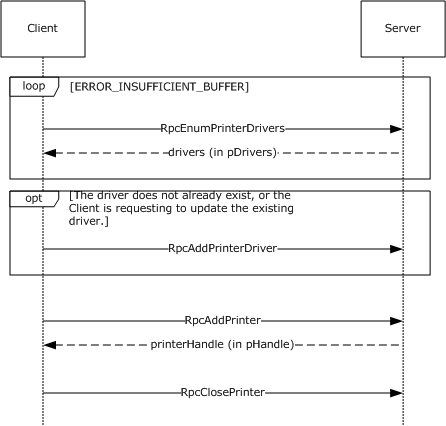

Figure 5: Adding a printer to a server

<a id="Section_4.2"></a>
## 4.2 Adding a Printer Driver to a Server

To add or update a [**printer driver**](#gt_printer-driver) ("OEM Printer Driver") to a [**print server**](#gt_print-server) ("CORPSERV"), a client ("TESTCLT") performs the following steps.

- Enumerate existing printer drivers using [RpcEnumPrinterDrivers](#Section_3.1.4.4.2).
See [4.1](#Section_4.1) for an example using RpcEnumPrinterDrivers.

- If the printer driver does not already exist or the client requests to update the printer driver, use [RpcAddPrinterDriver](#Section_3.1.4.4.1) to add the driver to the print server.
- The client ensures that the files for the printer driver are in a location accessible to the server. For that purpose, the client can share a local directory containing the files, or use [MS-SMB](../MS-SMB/MS-SMB.md) to place the files into a directory on the server.
- The client then allocates and populates a [DRIVER_INFO_2](#Section_2.2.1.5.2) structure as follows:
pName = L"OEM Printer Driver";

pEnvironment = L"Windows NT x86"; /* Environment the driver is compatible with */

pDriverPath = "\\\\CORPSERV\\C$\\DRIVERSTAGING\\OEMDRV.DLL";

pDataFile = "\\\\CORPSERV\\C$\\DRIVERSTAGING\\OEMDATA.DLL";

pConfigFile = "\\\\CORPSERV\\C$\\DRIVERSTAGING\\OEMUI.DLL";

- The client allocates a [DRIVER_CONTAINER](#Section_2.2.1.2.3) driverContainer structure and initializes it to contain the DRIVER_INFO_2 structure.
- The client calls RpcAddPrinterDriver.
RpcAddPrinterDriver( L"\\\\CORPSERV", &driverContainer );

- The server adds the printer driver and returns 0 (success).
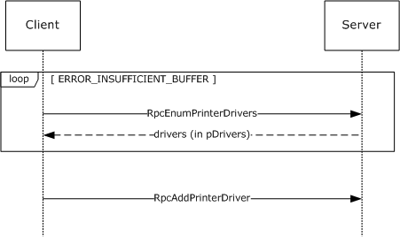

Figure 6: Adding a printer driver to a server

<a id="Section_4.3"></a>
## 4.3 Enumerating and Managing Printers

To manage printers on a [**print server**](#gt_print-server) ("CORPSERV"), a client ("TESTCLT") performs the following steps.

- Enumerate existing printers using [RpcEnumPrinters](#Section_3.1.4.2.1).
- The client calls RpcEnumPrinters.
RpcEnumPrinters( PRINTER_ENUM_NAME, L"\\\\CORPSERV", 2, NULL, 0, &countBytesNeeded, &printersFound );

- The server returns ERROR_INSUFFICIENT_BUFFER and sets *countBytesNeeded* to the size needed to store [_PRINTER_INFO_2](#Section_2.2.2.9.3) structures for all shared print queues.
- The client allocates memory in printerInfo2[] with the size set to *countBytesNeeded*.
- The client calls RpcEnumPrinters.
RpcEnumPrinters( PRINTER_ENUM_NAME, L"\\\\CORPSERV", 2, printerInfo2, countBytesNeeded, &countBytesNeeded, &printersFound );

- The server writes a _PRINTER_INFO_2 structure for each shared print queue to the output buffer, writes the number of _PRINTER_INFO_2 structures to printersFound, and returns 0 (success).
**Note:** If the number of shared print queues on the server has increased between the first and second call to RpcEnumPrinters, the server returns ERROR_INSUFFICIENT_BUFFER from the second call as well. In that case, the server updates *countBytesNeeded*, and the client allocates more memory and repeats the call to RpcEnumPrinters.

- Open a handle to the print queue using [RpcOpenPrinter](#Section_3.1.4.2.2).
- The client selects a print queue from the _PRINTER_INFO_2 structure and uses the **pPrinterName** or **pShareName** to open the print queue handle as follows:
- The client allocates and initializes a [DEVMODE_CONTAINER](#Section_2.2.1.2.1) devmodeContainer structure.
- The client calls RpcOpenPrinter.
RpcOpenPrinter( L"\\\\CORPSERV\\My Printer", &hPrinter, L"RAW", &devmodeContainer, PRINTER_ACCESS_USE);

- The server allocates printer handle, writes it to hPrinter, and returns 0 (success).
- Retrieve current information about a printer using [RpcGetPrinter](#Section_3.1.4.2.6).
- The client calls RpcGetPrinter.
RpcGetPrinter(hPrinter, 2, NULL, 0, &countBytesNeeded);

- The server returns ERROR_INSUFFICIENT_BUFFER and sets *countBytesNeeded* to store a _PRINTER_INFO_2 structure for the print queue.
- The client allocates memory in printerInfo2[] with size set to *countBytesNeeded*.
- The client calls RpcGetPrinter.
RpcGetPrinter( hPrinter, 2, printerInfo2, countBytesNeeded, &countBytesNeeded );

- The server writes a _PRINTER_INFO_2 structure for the [**print queue**](#gt_print-queue) to the output buffer and returns 0 (success).
**Note:** If the size of data for the print queue on the server has increased between the first and second call to RpcGetPrinter, the server returns ERROR_INSUFFICIENT_BUFFER from the second call as well. That can happen under a race condition if another client changes the print queue data. In that case, the server updates *countBytesNeeded*, and the client allocates more memory and repeats the call to RpcGetPrinter.

- Use [RpcSetPrinter](#Section_3.1.4.2.5) to modify the state of the printer.
- The client allocates a [PRINTER_INFO_2](#Section_2.2.1.10.3) structure and populates it with members from the previously acquired _PRINTER_INFO_2. The client changes those members that require change:
pLocation = L"Building 84, Room 1129";

- The client allocates a [PRINTER_CONTAINER](#Section_2.2.1.2.9) printerContainer structure and initializes it to contain the prepared PRINTER_INFO_2.
- The client allocates a DEVMODE_CONTAINER devmodeContainer structure, and optionally initializes it with a [DEVMODE](#Section_2.2.1.1.1) structure.
- The client allocates a [SECURITY_CONTAINER](#Section_2.2.1.2.13) securityContainer structure, and optionally initializes it with a SECURITY_DESCRIPTOR.
- The client calls RpcSetPrinter.
RpcSetPrinter( hPrinter, &printerContainer, &devmodeContainer, &securityContainer, 0 );

- The server modifies the print queue and returns 0 (success).
- Close the printer using [RpcClosePrinter](#Section_3.1.4.2.9).
- The client calls RpcClosePrinter.
RpcClosePrinter( &hPrinter );

- The server frees the memory associated with the print queue handle, sets hPrinter to NULL, and returns 0 (success).
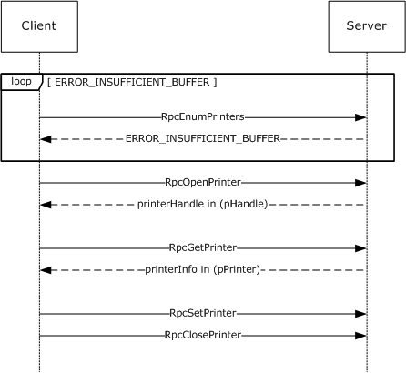

Figure 7: Enumerating and managing printers on a server

<a id="Section_4.4"></a>
## 4.4 Enumerating Jobs and Modifying Job Settings

To enumerate [**print jobs**](#gt_print-job) on a server ("CORPSERV"), modify job settings, or change job priorities, the client ("TESTCLT") performs the following steps.

- Open the printer using [RpcOpenPrinter](#Section_3.1.4.2.2).
- The client allocates and initializes a *devmodeContainer* structure (section [2.2.1.2.1](#Section_2.2.1.2.1)).
- The client calls RpcOpenPrinter.
RpcOpenPrinter( L"\\\\CORPSERV\\My Printer", &hPrinter, L"RAW", &devmodeContainer, PRINTER_ACCESS_USE );

- The server allocates a printer handle, writes it to *hPrinter*, and returns 0 (success).
- Enumerate jobs scheduled for printing on the printer using [RpcEnumJobs](#Section_3.1.4.3.3).
- The client calls RpcEnumJobs with *FirstJob* set to 0 and *NoJobs* set to the maximum unsigned integer to return all jobs.
RpcEnumJobs( hPrinter, 0, 0xFFFFFFFF, 1, NULL, 0, &countBytesNeeded, &jobsFound );

- The server returns ERROR_INSUFFICIENT_BUFFER and sets *countBytesNeeded* to store [_JOB_INFO_1](#Section_2.2.2.6.1) structures for all shared print queues.
- The client allocates memory in *jobInfo1[]* with size set to *countBytesNeeded*.
- The client calls RpcEnumJobs.
RpcEnumJobs( hPrinter, 0, 0xFFFFFFFF, 1, jobInfo1, countBytesNeeded, &countBytesNeeded, &jobsFound );

- The server writes _JOB_INFO_1 for all jobs on the print queue to the output buffer, writes the number of _JOB_INFO_1 structures to *jobsFound*, and returns 0 (success).
**Note:** If the number of jobs on the print queue on the server has increased between the first and second call to RpcEnumJobs, the server returns ERROR_INSUFFICIENT_BUFFER from the second call as well. In that case, the server updates *countBytesNeeded*, and the client allocates more memory and repeats the call to RpcEnumJobs.

- Modify job settings or job priority using [RpcSetJob](#Section_3.1.4.3.1).
- The client picks a job from the list of _JOB_INFO_1 structures that it requests to modify. For this example, we assume the **JobId** is 12 and we want to cancel the job.
- The client allocates and zero-initializes a *jobContainer* structure (section [2.2.1.2.5](#Section_2.2.1.2.5)).
- To modify job settings, the client calls RpcSetJob with the *Command* parameter set to zero.
RpcSetJob( hPrinter, 12, &jobContainer, 0 );

- To control the processing of a job, such as to cancel it, the client calls RpcSetJob with a non-zero *Command* parameter.
RpcSetJob( hPrinter, 12, &jobContainer, JOB_CONTROL_CANCEL );

- The server modifies the specified print job and returns 0 (success).
- The client closes the printer using RpcClosePrinter.
RpcClosePrinter( &hPrinter );

The server frees the memory associated with the print queue handle, sets *hPrinter* to NULL, and returns 0 (success).


Figure 8: Enumerating jobs and modifying job settings

<a id="Section_4.5"></a>
## 4.5 Receiving Notifications on Printing Events

To receive notifications concerning state changes of print servers, printers, and print jobs, a client ("TESTCLT") can perform the following steps, as shown in the figure in [Notification of Print System Changes (section 1.3.3)](#Section_1.3.3).

- Open a handle to a printer using [RpcOpenPrinter (section 3.1.4.2.2)](#Section_3.1.4.2.2).
- The client calls RpcOpenPrinter.
RpcOpenPrinter( L"\\\\CORPSERV\\My Printer", &hPrinter, L"RAW", &devmodeContainer, PRINTER_ACCESS_USE );

- The server allocates a printer handle, writes it to hPrinter, and returns 0 (success).
- Register for change notifications using [RpcRemoteFindFirstPrinterChangeNotificationEx (section 3.1.4.10.4)](#Section_3.1.4.10.4):
- The client allocates and initializes a [RPC_V2_NOTIFY_OPTIONS](#Section_2.2.1.13.3) notifyOptions structure as follows:
WORD notifyFieldsJob[] = { 0x000A /*JOB_NOTIFY_FIELD_STATUS*/, 0x000D /*JOB_NOTIFY_FIELD_DOCUMENT*/ };

RPC_V2_NOTIFY_OPTIONS_TYPE notifyTypes[1] = {{1 /*JOB_NOTIFY_TYPE*/, 0, 0, 0, 2, notifyFieldsJob }};

RPC_V2_NOTIFY_OPTIONS notifyOptions = {0x00000002,0x00000000,1,notifyTypes};

- The client calls RpcRemoteFindFirstPrinterChangeNotificationEx.
RpcRemoteFindFirstPrinterChangeNotificationEx( hPrinter, 0x00000100 /* PRINTER_CHANGE_ADD_JOB */, 0, L"\\\\TESTCLT", 4711, &notifyOptions );

/* The number 4711 is a unique number used as a cookie to match the server's response. */

- The server calls the client's [RpcReplyOpenPrinter (section 3.2.4.1.1)](#Section_3.2.4.1.1) method to open a reverse channel, which is used to send change notifications to the client. The client has to return an RPC binding handle that identifies the reverse channel.
- The server calls RpcReplyOpenPrinter.
RpcReplyOpenPrinter( L"\\\\TESTCLT", &hPrinterNotify, 4711, 1, 0, NULL );

- The client opens a notification context and associates it with the open printer handle hPrinter. In order to do so, client matches the dwPrinterRemote value (4711 in this example).
- The client writes the notification context handle to hPrinterNotify and returns 0 (success) to the server.
- The server returns 0 (success) from processing RpcRemoteFindFirstPrinterChangeNotificationEx.
- As long as the client stays registered for notifications, the server calls the client's [RpcRouterReplyPrinter (section 3.2.4.1.2)](#Section_3.2.4.1.2) or [RpcRouterReplyPrinterEx (section 3.2.4.1.4)](#Section_3.2.4.1.4) method for each change of the requested type that occurs on the server.
Whenever the monitored print queue changes on the server, the server filters the change according to the filter options specified by the client in the registration call and:

- The server allocates and initializes an [RPC_V2_UREPLY_PRINTER](#Section_2.2.1.13.6) reply structure:
RPC_V2_NOTIFY_INFO notifyInfo; /* Note: Pseudo-code only, assumes sufficient memory has been allocated for aData[] array at end of structure */

notifyInfo.Version = 2;

notifyInfo.Flags = 0;

notifyInfo.Count = 1;

notifyInfo.aData[0].Type = 1; /* JOB_NOTIFY_TYPE */

notifyInfo.aData[0].Field = 0xD /* JOB_NOTIFY_FIELD_DOCUMENT */ notifyInfo.aData[0].String.pszString = L"My Test Print Job Name";

notifyInfo.aData[0].Id = 12; /* This print job has ID 12 */

RPC_V2_UREPLY_PRINTER reply;

Reply.pInfo = &notifyInfo;

- The server calls the client's RpcRouterReplyPrinterEx.
RpcRouterReplyPrinterEx( hPrinterNotify, 1, 0x00000100 /* PRINTER_CHANGE_ADD_JOB */, &result, 0, &reply );

- The client reflects the change in its internal state.
- The client writes processing flags to the variable result and returns 0 (success).
- Route the change notifications to applications or process it to reflect state changes.
The client makes local calls to applications or processes to notify them of the state change.

- When state changes are no longer accepted, the client unregisters from notifications by calling [RpcFindClosePrinterChangeNotification (section 3.1.4.10.2)](#Section_3.1.4.10.2) with the handle returned by the call to RpcOpenPrinter.
RpcFindClosePrinterChangeNotification( hPrinter );

- The server calls the client's [RpcReplyClosePrinter (section 3.2.4.1.3)](#Section_3.2.4.1.3) with the handle previously obtained by RpcReplyOpenPrinter, notifying the client to close the binding handle for the reverse channel.
RpcReplyClosePrinter( &hPrinterNotify );

- The client cleans up the notification context, writes NULL to hPrinterNotify, and returns 0 (success).
- The server returns 0 (success) from RpcFindClosePrinterChangeNotification.
- The client closes the handle to the printer or server object using [RpcClosePrinter (section 3.1.4.2.9)](#Section_3.1.4.2.9).
RpcClosePrinter( &hPrinter );

The server frees the memory associated with the print queue handle, sets hPrinter to NULL, and returns 0 (success).

<a id="Section_5"></a>
# 5 Security Considerations

Security considerations for both authenticated and unauthenticated [**RPC**](#gt_remote-procedure-call-rpc) are specified in [[C706]](https://go.microsoft.com/fwlink/?LinkId=89824) chapters Introduction to the RPC API and Security.<421>

<a id="Section_6"></a>
# 6 Appendix A: Full IDL

For ease of implementation, the full stand-alone [**Interface Definition Language (IDL)**](#gt_interface-definition-language-idl) is provided. Some of the data types and structures used by this protocol are defined in other documents. In order for this IDL to stand alone, those types and structures, from [MS-DTYP](../MS-DTYP/MS-DTYP.md), are included below.

// [MS-RPRN] interface

[

uuid(12345678-1234-ABCD-EF00-0123456789AB),

version(1.0),

ms_union,

endpoint("ncacn_np:[\\pipe\\spoolss]"),

pointer_default(unique)

]

interface winspool {

import "ms-dtyp.idl";

// [MS-RPRN] common constants

#define TABLE_DWORD 0x1

#define TABLE_STRING 0x2

#define TABLE_DEVMODE 0x3

#define TABLE_TIME 0x4

#define TABLE_SECURITYDESCRIPTOR 0x5

#define SPLFILE_CONTENT_TYPE_PROP_NAME L"Spool File Contents"

// [MS-RPRN] common enumerations

typedef enum {

VER_NT_WORKSTATION = 0x00000001,

VER_NT_DOMAIN_CONTROLLER = 0x00000002,

VER_NT_SERVER = 0x00000003

} OS_TYPE;

typedef enum {

BIDI_NULL = 0,

BIDI_INT = 1,

BIDI_FLOAT = 2,

BIDI_BOOL = 3,

BIDI_STRING = 4,

BIDI_TEXT = 5,

BIDI_ENUM = 6,

BIDI_BLOB = 7

} BIDI_TYPE;

typedef enum {

kRpcPropertyTypeString = 1,

kRpcPropertyTypeInt32,

kRpcPropertyTypeInt64,

kRpcPropertyTypeByte,

kRpcPropertyTypeBuffer

} RPC_EPrintPropertyType;

// [MS-RPRN] common data types

typedef unsigned short LANGID;

typedef [context_handle] void* GDI_HANDLE;

typedef [context_handle] void* PRINTER_HANDLE;

typedef [handle] wchar_t* STRING_HANDLE;

// [MS-RPRN] common utility structures

typedef struct {

long cx;

long cy;

} SIZE;

typedef struct {

long left;

long top;

long right;

long bottom;

} RECTL;

// [MS-RPRN] common device state structure

typedef struct _devicemode {

wchar_t dmDeviceName[32];

unsigned short dmSpecVersion;

unsigned short dmDriverVersion;

unsigned short dmSize;

unsigned short dmDriverExtra;

DWORD dmFields;

short dmOrientation;

short dmPaperSize;

short dmPaperLength;

short dmPaperWidth;

short dmScale;

short dmCopies;

short dmDefaultSource;

short dmPrintQuality;

short dmColor;

short dmDuplex;

short dmYResolution;

short dmTTOption;

short dmCollate;

wchar_t dmFormName[32];

unsigned short reserved0;

DWORD reserved1;

DWORD reserved2;

DWORD reserved3;

DWORD dmNup;

DWORD reserved4;

DWORD dmICMMethod;

DWORD dmICMIntent;

DWORD dmMediaType;

DWORD dmDitherType;

DWORD reserved5;

DWORD reserved6;

DWORD reserved7;

DWORD reserved8;

} DEVMODE;

// [MS-RPRN] common info structures

typedef struct _DOC_INFO_1 {

[string] wchar_t* pDocName;

[string] wchar_t* pOutputFile;

[string] wchar_t* pDatatype;

} DOC_INFO_1;

typedef struct _DRIVER_INFO_1 {

[string] wchar_t* pName;

} DRIVER_INFO_1;

typedef struct _DRIVER_INFO_2 {

DWORD cVersion;

[string] wchar_t* pName;

[string] wchar_t* pEnvironment;

[string] wchar_t* pDriverPath;

[string] wchar_t* pDataFile;

[string] wchar_t* pConfigFile;

} DRIVER_INFO_2;

typedef struct _RPC_DRIVER_INFO_3 {

DWORD cVersion;

[string] wchar_t* pName;

[string] wchar_t* pEnvironment;

[string] wchar_t* pDriverPath;

[string] wchar_t* pDataFile;

[string] wchar_t* pConfigFile;

[string] wchar_t* pHelpFile;

[string] wchar_t* pMonitorName;

[string] wchar_t* pDefaultDataType;

DWORD cchDependentFiles;

[size_is(cchDependentFiles), unique]

wchar_t* pDependentFiles;

} RPC_DRIVER_INFO_3;

typedef struct _RPC_DRIVER_INFO_4 {

DWORD cVersion;

[string] wchar_t* pName;

[string] wchar_t* pEnvironment;

[string] wchar_t* pDriverPath;

[string] wchar_t* pDataFile;

[string] wchar_t* pConfigFile;

[string] wchar_t* pHelpFile;

[string] wchar_t* pMonitorName;

[string] wchar_t* pDefaultDataType;

DWORD cchDependentFiles;

[size_is(cchDependentFiles), unique]

wchar_t* pDependentFiles;

DWORD cchPreviousNames;

[size_is(cchPreviousNames), unique]

wchar_t* pszzPreviousNames;

} RPC_DRIVER_INFO_4;

typedef struct _RPC_DRIVER_INFO_6 {

DWORD cVersion;

[string] wchar_t* pName;

[string] wchar_t* pEnvironment;

[string] wchar_t* pDriverPath;

[string] wchar_t* pDataFile;

[string] wchar_t* pConfigFile;

[string] wchar_t* pHelpFile;

[string] wchar_t* pMonitorName;

[string] wchar_t* pDefaultDataType;

DWORD cchDependentFiles;

[size_is(cchDependentFiles), unique]

wchar_t* pDependentFiles;

DWORD cchPreviousNames;

[size_is(cchPreviousNames), unique]

wchar_t* pszzPreviousNames;

FILETIME ftDriverDate;

DWORDLONG dwlDriverVersion;

[string] wchar_t* pMfgName;

[string] wchar_t* pOEMUrl;

[string] wchar_t* pHardwareID;

[string] wchar_t* pProvider;

} RPC_DRIVER_INFO_6;

typedef struct _RPC_DRIVER_INFO_8 {

DWORD cVersion;

[string] wchar_t* pName;

[string] wchar_t* pEnvironment;

[string] wchar_t* pDriverPath;

[string] wchar_t* pDataFile;

[string] wchar_t* pConfigFile;

[string] wchar_t* pHelpFile;

[string] wchar_t* pMonitorName;

[string] wchar_t* pDefaultDataType;

DWORD cchDependentFiles;

[size_is(cchDependentFiles), unique]

wchar_t* pDependentFiles;

DWORD cchPreviousNames;

[size_is(cchPreviousNames), unique]

wchar_t* pszzPreviousNames;

FILETIME ftDriverDate;

DWORDLONG dwlDriverVersion;

[string] wchar_t* pMfgName;

[string] wchar_t* pOEMUrl;

[string] wchar_t* pHardwareID;

[string] wchar_t* pProvider;

[string] wchar_t* pPrintProcessor;

[string] wchar_t* pVendorSetup;

DWORD cchColorProfiles;

[size_is(cchColorProfiles), unique]

wchar_t* pszzColorProfiles;

[string] wchar_t* pInfPath;

DWORD dwPrinterDriverAttributes;

DWORD cchCoreDependencies;

[size_is(cchCoreDependencies), unique]

wchar_t* pszzCoreDriverDependencies;

FILETIME ftMinInboxDriverVerDate;

DWORDLONG dwlMinInboxDriverVerVersion;

} RPC_DRIVER_INFO_8;

typedef struct _FORM_INFO_1 {

DWORD Flags;

[string] wchar_t* pName;

SIZE Size;

RECTL ImageableArea;

} FORM_INFO_1;

typedef struct _RPC_FORM_INFO_2 {

DWORD Flags;

[string, unique] const wchar_t* pName;

SIZE Size;

RECTL ImageableArea;

[string, unique] const char* pKeyword;

DWORD StringType;

[string, unique] const wchar_t* pMuiDll;

DWORD dwResourceId;

[string, unique] const wchar_t* pDisplayName;

LANGID wLangID;

} RPC_FORM_INFO_2;

typedef struct _JOB_INFO_1 {

DWORD JobId;

[string] wchar_t* pPrinterName;

[string] wchar_t* pMachineName;

[string] wchar_t* pUserName;

[string] wchar_t* pDocument;

[string] wchar_t* pDatatype;

[string] wchar_t* pStatus;

DWORD Status;

DWORD Priority;

DWORD Position;

DWORD TotalPages;

DWORD PagesPrinted;

SYSTEMTIME Submitted;

} JOB_INFO_1;

typedef struct _JOB_INFO_2 {

DWORD JobId;

[string] wchar_t* pPrinterName;

[string] wchar_t* pMachineName;

[string] wchar_t* pUserName;

[string] wchar_t* pDocument;

[string] wchar_t* pNotifyName;

[string] wchar_t* pDatatype;

[string] wchar_t* pPrintProcessor;

[string] wchar_t* pParameters;

[string] wchar_t* pDriverName;

ULONG_PTR pDevMode;

[string] wchar_t* pStatus;

ULONG_PTR pSecurityDescriptor;

DWORD Status;

DWORD Priority;

DWORD Position;

DWORD StartTime;

DWORD UntilTime;

DWORD TotalPages;

DWORD Size;

SYSTEMTIME Submitted;

DWORD Time;

DWORD PagesPrinted;

} JOB_INFO_2;

typedef struct _JOB_INFO_3 {

DWORD JobId;

DWORD NextJobId;

DWORD Reserved;

} JOB_INFO_3;

typedef struct _JOB_INFO_4 {

DWORD JobId;

[string] wchar_t* pPrinterName;

[string] wchar_t* pMachineName;

[string] wchar_t* pUserName;

[string] wchar_t* pDocument;

[string] wchar_t* pNotifyName;

[string] wchar_t* pDatatype;

[string] wchar_t* pPrintProcessor;

[string] wchar_t* pParameters;

[string] wchar_t* pDriverName;

ULONG_PTR pDevMode;

[string] wchar_t* pStatus;

ULONG_PTR pSecurityDescriptor;

DWORD Status;

DWORD Priority;

DWORD Position;

DWORD StartTime;

DWORD UntilTime;

DWORD TotalPages;

DWORD Size;

SYSTEMTIME Submitted;

DWORD Time;

DWORD PagesPrinted;

long SizeHigh;

} JOB_INFO_4;

typedef struct _MONITOR_INFO_1 {

[string] wchar_t* pName;

} MONITOR_INFO_1;

typedef struct _MONITOR_INFO_2 {

[string] wchar_t* pName;

[string] wchar_t* pEnvironment;

[string] wchar_t* pDLLName;

} MONITOR_INFO_2;

typedef struct _PORT_INFO_1 {

[string] wchar_t* pPortName;

} PORT_INFO_1;

typedef struct _PORT_INFO_2 {

[string] wchar_t* pPortName;

[string] wchar_t* pMonitorName;

[string] wchar_t* pDescription;

DWORD fPortType;

DWORD Reserved;

} PORT_INFO_2;

typedef struct _PORT_INFO_3 {

DWORD dwStatus;

[string] wchar_t* pszStatus;

DWORD dwSeverity;

} PORT_INFO_3;

typedef struct _PORT_INFO_FF {

[string] wchar_t* pPortName;

DWORD cbMonitorData;

BYTE* pMonitorData;

} PORT_INFO_FF;

typedef struct _PRINTER_INFO_STRESS {

[string] wchar_t* pPrinterName;

[string] wchar_t* pServerName;

DWORD cJobs;

DWORD cTotalJobs;

DWORD cTotalBytes;

SYSTEMTIME stUpTime;

DWORD MaxcRef;

DWORD cTotalPagesPrinted;

DWORD dwGetVersion;

DWORD fFreeBuild;

DWORD cSpooling;

DWORD cMaxSpooling;

DWORD cRef;

DWORD cErrorOutOfPaper;

DWORD cErrorNotReady;

DWORD cJobError;

DWORD dwNumberOfProcessors;

DWORD dwProcessorType;

DWORD dwHighPartTotalBytes;

DWORD cChangeID;

DWORD dwLastError;

DWORD Status;

DWORD cEnumerateNetworkPrinters;

DWORD cAddNetPrinters;

unsigned short wProcessorArchitecture;

unsigned short wProcessorLevel;

DWORD cRefIC;

DWORD dwReserved2;

DWORD dwReserved3;

} PRINTER_INFO_STRESS;

typedef struct _PRINTER_INFO_1 {

DWORD Flags;

[string] wchar_t* pDescription;

[string] wchar_t* pName;

[string] wchar_t* pComment;

} PRINTER_INFO_1;

typedef struct _PRINTER_INFO_2 {

[string] wchar_t* pServerName;

[string] wchar_t* pPrinterName;

[string] wchar_t* pShareName;

[string] wchar_t* pPortName;

[string] wchar_t* pDriverName;

[string] wchar_t* pComment;

[string] wchar_t* pLocation;

ULONG_PTR pDevMode;

[string] wchar_t* pSepFile;

[string] wchar_t* pPrintProcessor;

[string] wchar_t* pDatatype;

[string] wchar_t* pParameters;

ULONG_PTR pSecurityDescriptor;

DWORD Attributes;

DWORD Priority;

DWORD DefaultPriority;

DWORD StartTime;

DWORD UntilTime;

DWORD Status;

DWORD cJobs;

DWORD AveragePPM;

} PRINTER_INFO_2;

typedef struct _PRINTER_INFO_3 {

ULONG_PTR pSecurityDescriptor;

} PRINTER_INFO_3;

typedef struct _PRINTER_INFO_4 {

[string] wchar_t* pPrinterName;

[string] wchar_t* pServerName;

DWORD Attributes;

} PRINTER_INFO_4;

typedef struct _PRINTER_INFO_5 {

[string] wchar_t* pPrinterName;

[string] wchar_t* pPortName;

DWORD Attributes;

DWORD DeviceNotSelectedTimeout;

DWORD TransmissionRetryTimeout;

} PRINTER_INFO_5;

typedef struct _PRINTER_INFO_6 {

DWORD dwStatus;

} PRINTER_INFO_6;

typedef struct _PRINTER_INFO_7 {

[string] wchar_t* pszObjectGUID;

DWORD dwAction;

} PRINTER_INFO_7;

typedef struct _PRINTER_INFO_8 {

ULONG_PTR pDevMode;

} PRINTER_INFO_8;

typedef struct _PRINTER_INFO_9 {

ULONG_PTR pDevMode;

} PRINTER_INFO_9;

typedef struct _SPLCLIENT_INFO_1 {

DWORD dwSize;

[string] wchar_t* pMachineName;

[string] wchar_t* pUserName;

DWORD dwBuildNum;

DWORD dwMajorVersion;

DWORD dwMinorVersion;

unsigned short wProcessorArchitecture;

} SPLCLIENT_INFO_1;

typedef struct _SPLCLIENT_INFO_2 {

LONG_PTR notUsed;

} SPLCLIENT_INFO_2;

typedef struct _SPLCLIENT_INFO_3 {

unsigned int cbSize;

DWORD dwFlags;

DWORD dwSize;

[string] wchar_t* pMachineName;

[string] wchar_t* pUserName;

DWORD dwBuildNum;

DWORD dwMajorVersion;

DWORD dwMinorVersion;

unsigned short wProcessorArchitecture;

unsigned __int64 hSplPrinter;

} SPLCLIENT_INFO_3;

// [MS-RPRN] common info container structures

typedef struct _DEVMODE_CONTAINER {

DWORD cbBuf;

[size_is(cbBuf), unique] BYTE* pDevMode;

} DEVMODE_CONTAINER;

typedef struct _DOC_INFO_CONTAINER {

DWORD Level;

[switch_is(Level)] union {

[case(1)]

DOC_INFO_1* pDocInfo1;

} DocInfo;

} DOC_INFO_CONTAINER;

typedef struct _DRIVER_CONTAINER {

DWORD Level;

[switch_is(Level)] union {

[case(1)]

DRIVER_INFO_1* pNotUsed;

[case(2)]

DRIVER_INFO_2* Level2;

[case(3)]

RPC_DRIVER_INFO_3* Level3;

[case(4)]

RPC_DRIVER_INFO_4* Level4;

[case(6)]

RPC_DRIVER_INFO_6* Level6;

[case(8)]

RPC_DRIVER_INFO_8* Level8;

} DriverInfo;

} DRIVER_CONTAINER;

typedef struct _FORM_CONTAINER {

DWORD Level;

[switch_is(Level)] union {

[case(1)]

FORM_INFO_1* pFormInfo1;

[case(2)]

RPC_FORM_INFO_2* pFormInfo2;

} FormInfo;

} FORM_CONTAINER;

typedef struct _JOB_CONTAINER {

DWORD Level;

[switch_is(Level)] union {

[case(1)]

JOB_INFO_1* Level1;

[case(2)]

JOB_INFO_2* Level2;

[case(3)]

JOB_INFO_3* Level3;

[case(4)]

JOB_INFO_4* Level4;

} JobInfo;

} JOB_CONTAINER;

typedef struct _MONITOR_CONTAINER {

DWORD Level;

[switch_is(Level)] union {

[case(1)]

MONITOR_INFO_1* pMonitorInfo1;

[case(2)]

MONITOR_INFO_2* pMonitorInfo2;

} MonitorInfo;

} MONITOR_CONTAINER;

typedef struct _PORT_CONTAINER {

DWORD Level;

[switch_is(0x00FFFFFF & Level)]

union {

[case(1)]

PORT_INFO_1* pPortInfo1;

[case(2)]

PORT_INFO_2* pPortInfo2;

[case(3)]

PORT_INFO_3* pPortInfo3;

[case(0x00FFFFFF)]

PORT_INFO_FF* pPortInfoFF;

} PortInfo;

} PORT_CONTAINER;

typedef struct _PORT_VAR_CONTAINER {

DWORD cbMonitorData;

[size_is(cbMonitorData), unique] BYTE*

pMonitorData;

} PORT_VAR_CONTAINER;

typedef struct _PRINTER_CONTAINER {

DWORD Level;

[switch_is(Level)] union {

[case(0)]

PRINTER_INFO_STRESS* pPrinterInfoStress;

[case(1)]

PRINTER_INFO_1* pPrinterInfo1;

[case(2)]

PRINTER_INFO_2* pPrinterInfo2;

[case(3)]

PRINTER_INFO_3* pPrinterInfo3;

[case(4)]

PRINTER_INFO_4* pPrinterInfo4;

[case(5)]

PRINTER_INFO_5* pPrinterInfo5;

[case(6)]

PRINTER_INFO_6* pPrinterInfo6;

[case(7)]

PRINTER_INFO_7* pPrinterInfo7;

[case(8)]

PRINTER_INFO_8* pPrinterInfo8;

[case(9)]

PRINTER_INFO_9* pPrinterInfo9;

} PrinterInfo;

} PRINTER_CONTAINER;

typedef struct _RPC_BINARY_CONTAINER {

DWORD cbBuf;

[size_is(cbBuf), unique] BYTE* pszString;

} RPC_BINARY_CONTAINER;

typedef struct _RPC_BIDI_DATA {

DWORD dwBidiType;

[switch_is(dwBidiType)] union {

[case(BIDI_NULL, BIDI_BOOL)]

int bData;

[case(BIDI_INT)]

long iData;

[case(BIDI_STRING, BIDI_TEXT, BIDI_ENUM)]

[string,unique] wchar_t* sData;

[case(BIDI_FLOAT)]

float fData;

[case(BIDI_BLOB)]

RPC_BINARY_CONTAINER biData;

} u;

} RPC_BIDI_DATA;

typedef struct _RPC_BIDI_REQUEST_DATA {

DWORD dwReqNumber;

[string, unique] wchar_t* pSchema;

RPC_BIDI_DATA data;

} RPC_BIDI_REQUEST_DATA;

typedef struct _RPC_BIDI_RESPONSE_DATA {

DWORD dwResult;

DWORD dwReqNumber;

[string, unique] wchar_t* pSchema;

RPC_BIDI_DATA data;

} RPC_BIDI_RESPONSE_DATA;

typedef struct _RPC_BIDI_REQUEST_CONTAINER {

DWORD Version;

DWORD Flags;

DWORD Count;

[size_is(Count), unique] RPC_BIDI_REQUEST_DATA aData[];

} RPC_BIDI_REQUEST_CONTAINER;

typedef struct _RPC_BIDI_RESPONSE_CONTAINER {

DWORD Version;

DWORD Flags;

DWORD Count;

[size_is(Count), unique] RPC_BIDI_RESPONSE_DATA aData[];

} RPC_BIDI_RESPONSE_CONTAINER;

typedef struct SECURITY_CONTAINER {

DWORD cbBuf;

[size_is(cbBuf), unique] BYTE* pSecurity;

} SECURITY_CONTAINER;

typedef struct _SPLCLIENT_CONTAINER {

DWORD Level;

[switch_is(Level)] union {

[case(1)]

SPLCLIENT_INFO_1* pClientInfo1;

[case(2)]

SPLCLIENT_INFO_2* pNotUsed1;

[case(3)]

SPLCLIENT_INFO_3* pNotUsed2;

} ClientInfo;

} SPLCLIENT_CONTAINER;

typedef struct _STRING_CONTAINER {

DWORD cbBuf;

[size_is(cbBuf/2), unique] WCHAR* pszString;

} STRING_CONTAINER;

typedef struct _SYSTEMTIME_CONTAINER {

DWORD cbBuf;

SYSTEMTIME* pSystemTime;

} SYSTEMTIME_CONTAINER;

typedef struct _RPC_V2_NOTIFY_OPTIONS_TYPE {

unsigned short Type;

unsigned short Reserved0;

DWORD Reserved1;

DWORD Reserved2;

DWORD Count;

[size_is(Count), unique] unsigned short* pFields;

} RPC_V2_NOTIFY_OPTIONS_TYPE;

typedef struct _RPC_V2_NOTIFY_OPTIONS {

DWORD Version;

DWORD Reserved;

DWORD Count;

[size_is(Count), unique] RPC_V2_NOTIFY_OPTIONS_TYPE* pTypes;

} RPC_V2_NOTIFY_OPTIONS;

typedef

[switch_type (DWORD)]

union _RPC_V2_NOTIFY_INFO_DATA_DATA {

[case(TABLE_STRING)]

STRING_CONTAINER String;

[case(TABLE_DWORD)]

DWORD dwData[2];

[case(TABLE_TIME)]

SYSTEMTIME_CONTAINER SystemTime;

[case(TABLE_DEVMODE)]

DEVMODE_CONTAINER DevMode;

[case(TABLE_SECURITYDESCRIPTOR)]

SECURITY_CONTAINER SecurityDescriptor;

} RPC_V2_NOTIFY_INFO_DATA_DATA;

typedef struct _RPC_V2_NOTIFY_INFO_DATA {

unsigned short Type;

unsigned short Field;

DWORD Reserved;

DWORD Id;

[switch_is(Reserved & 0xFFFF)]

RPC_V2_NOTIFY_INFO_DATA_DATA Data;

} RPC_V2_NOTIFY_INFO_DATA;

typedef struct _RPC_V2_NOTIFY_INFO {

DWORD Version;

DWORD Flags;

DWORD Count;

[size_is(Count), unique] RPC_V2_NOTIFY_INFO_DATA aData[];

} RPC_V2_NOTIFY_INFO;

typedef [switch_type(DWORD)] union _RPC_V2_UREPLY_PRINTER {

[case (0)]

RPC_V2_NOTIFY_INFO* pInfo;

} RPC_V2_UREPLY_PRINTER;

typedef struct _CORE_PRINTER_DRIVER {

GUID CoreDriverGUID;

FILETIME ftDriverDate;

DWORDLONG dwlDriverVersion;

wchar_t szPackageID[260];

} CORE_PRINTER_DRIVER;

typedef struct {

RPC_EPrintPropertyType ePropertyType;

[switch_is(ePropertyType)]

union {

[case(kRpcPropertyTypeString)]

[string] wchar_t *propertyString;

[case(kRpcPropertyTypeInt32)]

LONG propertyInt32;

[case(kRpcPropertyTypeInt64)]

LONGLONG propertyInt64;

[case(kRpcPropertyTypeByte)]

BYTE propertyByte;

[case(kRpcPropertyTypeBuffer)]

struct {

DWORD cbBuf;

[size_is(cbBuf)] BYTE *pBuf;

} propertyBlob;

} value;

} RPC_PrintPropertyValue;

typedef struct {

[string] wchar_t *propertyName;

RPC_PrintPropertyValue propertyValue;

} RPC_PrintNamedProperty;

typedef enum {

kInvalidJobState = 0,

kLogJobPrinted,

kLogJobRendered,

kLogJobError,

kLogJobPipelineError,

kLogOfflineFileFull

} EBranchOfficeJobEventType;

typedef struct {

DWORD Status;

[string] wchar_t* pDocumentName;

[string] wchar_t* pUserName;

[string] wchar_t* pMachineName;

[string] wchar_t* pPrinterName;

[string] wchar_t* pPortName;

LONGLONG Size;

DWORD TotalPages;

} RPC_BranchOfficeJobDataPrinted;

typedef struct {

LONGLONG Size;

DWORD ICMMethod;

short Color;

short PrintQuality;

short YResolution;

short Copies;

short TTOption;

} RPC_BranchOfficeJobDataRendered;

typedef struct {

DWORD LastError;

[string] wchar_t* pDocumentName;

[string] wchar_t* pUserName;

[string] wchar_t* pPrinterName;

[string] wchar_t* pDataType;

LONGLONG TotalSize;

LONGLONG PrintedSize;

DWORD TotalPages;

DWORD PrintedPages;

[string] wchar_t* pMachineName;

[string] wchar_t* pJobError;

[string] wchar_t* pErrorDescription;

} RPC_BranchOfficeJobDataError;

typedef struct {

[string] wchar_t* pDocumentName;

[string] wchar_t* pPrinterName;

[string] wchar_t* pExtraErrorInfo;

} RPC_BranchOfficeJobDataPipelineFailed;

typedef struct {

[string] wchar_t* pMachineName;

} RPC_BranchOfficeLogOfflineFileFull;

typedef struct {

EBranchOfficeJobEventType eEventType;

DWORD JobId;

[switch_type(EBranchOfficeJobEventType), switch_is(eEventType)]

union {

[case(kLogJobPrinted)]

RPC_BranchOfficeJobDataPrinted LogJobPrinted;

[case(kLogJobRendered)]

RPC_BranchOfficeJobDataRendered LogJobRendered;

[case(kLogJobError)]

RPC_BranchOfficeJobDataError LogJobError;

[case(kLogJobPipelineError)]

RPC_BranchOfficeJobDataPipelineFailed LogPipelineFailed;

[case(kLogOfflineFileFull)]

RPC_BranchOfficeLogOfflineFileFull LogOfflineFileFull;

} JobInfo;

} RPC_BranchOfficeJobData;

typedef struct {

DWORD cJobDataEntries;

[size_is(cJobDataEntries), unique] RPC_BranchOfficeJobData JobData[];

} RPC_BranchOfficeJobDataContainer;

// [MS-RPRN] methods

DWORD

RpcEnumPrinters(

[in] DWORD Flags,

[in, string, unique] STRING_HANDLE Name,

[in] DWORD Level,

[in, out, unique, size_is(cbBuf)] BYTE*

pPrinterEnum,

[in] DWORD cbBuf,

[out] DWORD* pcbNeeded,

[out] DWORD* pcReturned

);

DWORD

RpcOpenPrinter(

[in, string, unique] STRING_HANDLE pPrinterName,

[out] PRINTER_HANDLE* pHandle,

[in, string, unique] wchar_t* pDatatype,

[in] DEVMODE_CONTAINER* pDevModeContainer,

[in] DWORD AccessRequired

);

DWORD

RpcSetJob(

[in] PRINTER_HANDLE hPrinter,

[in] DWORD JobId,

[in, unique] JOB_CONTAINER* pJobContainer,

[in] DWORD Command

);

DWORD

RpcGetJob(

[in] PRINTER_HANDLE hPrinter,

[in] DWORD JobId,

[in] DWORD Level,

[in, out, unique, size_is(cbBuf)] BYTE*

pJob,

[in] DWORD cbBuf,

[out] DWORD* pcbNeeded

);

DWORD

RpcEnumJobs(

[in] PRINTER_HANDLE hPrinter,

[in] DWORD FirstJob,

[in] DWORD NoJobs,

[in] DWORD Level,

[in, out, unique, size_is(cbBuf)] BYTE*

pJob,

[in] DWORD cbBuf,

[out] DWORD* pcbNeeded,

[out] DWORD* pcReturned

);

DWORD

RpcAddPrinter(

[in, string, unique] STRING_HANDLE pName,

[in] PRINTER_CONTAINER* pPrinterContainer,

[in] DEVMODE_CONTAINER* pDevModeContainer,

[in] SECURITY_CONTAINER* pSecurityContainer,

[out] PRINTER_HANDLE* pHandle

);

DWORD

RpcDeletePrinter(

[in] PRINTER_HANDLE hPrinter

);

DWORD

RpcSetPrinter(

[in] PRINTER_HANDLE hPrinter,

[in] PRINTER_CONTAINER* pPrinterContainer,

[in] DEVMODE_CONTAINER* pDevModeContainer,

[in] SECURITY_CONTAINER* pSecurityContainer,

[in] DWORD Command

);

DWORD

RpcGetPrinter(

[in] PRINTER_HANDLE hPrinter,

[in] DWORD Level,

[in, out, unique, size_is(cbBuf)] BYTE*

pPrinter,

[in] DWORD cbBuf,

[out] DWORD* pcbNeeded

);

DWORD

RpcAddPrinterDriver(

[in, string, unique] STRING_HANDLE pName,

[in] DRIVER_CONTAINER* pDriverContainer

);

DWORD

RpcEnumPrinterDrivers(

[in, string, unique] STRING_HANDLE pName,

[in, string, unique] wchar_t* pEnvironment,

[in] DWORD Level,

[in, out, unique, size_is(cbBuf)] BYTE*

pDrivers,

[in] DWORD cbBuf,

[out] DWORD* pcbNeeded,

[out] DWORD* pcReturned

);

DWORD

RpcGetPrinterDriver(

[in] PRINTER_HANDLE hPrinter,

[in, string, unique] wchar_t* pEnvironment,

[in] DWORD Level,

[in, out, unique, size_is(cbBuf)] BYTE*

pDriver,

[in] DWORD cbBuf,

[out] DWORD* pcbNeeded

);

DWORD

RpcGetPrinterDriverDirectory(

[in, string, unique] STRING_HANDLE pName,

[in, string, unique] wchar_t* pEnvironment,

[in] DWORD Level,

[in, out, unique, size_is(cbBuf)] BYTE*

pDriverDirectory,

[in] DWORD cbBuf,

[out] DWORD* pcbNeeded

);

DWORD

RpcDeletePrinterDriver(

[in, string, unique] STRING_HANDLE pName,

[in, string] wchar_t* pEnvironment,

[in, string] wchar_t* pDriverName

);

DWORD

RpcAddPrintProcessor(

[in, string, unique] STRING_HANDLE pName,

[in, string] wchar_t* pEnvironment,

[in, string] wchar_t* pPathName,

[in, string] wchar_t* pPrintProcessorName

);

DWORD

RpcEnumPrintProcessors(

[in, string, unique] STRING_HANDLE pName,

[in, string, unique] wchar_t* pEnvironment,

[in] DWORD Level,

[in, out, unique, size_is(cbBuf)] BYTE*

pPrintProcessorInfo,

[in] DWORD cbBuf,

[out] DWORD* pcbNeeded,

[out] DWORD* pcReturned

);

DWORD

RpcGetPrintProcessorDirectory(

[in, string, unique] STRING_HANDLE pName,

[in, string, unique] wchar_t* pEnvironment,

[in] DWORD Level,

[in, out, unique, size_is(cbBuf)] BYTE*

pPrintProcessorDirectory,

[in] DWORD cbBuf,

[out] DWORD* pcbNeeded

);

DWORD

RpcStartDocPrinter(

[in] PRINTER_HANDLE hPrinter,

[in] DOC_INFO_CONTAINER* pDocInfoContainer,

[out] DWORD* pJobId

);

DWORD

RpcStartPagePrinter(

[in] PRINTER_HANDLE hPrinter

);

DWORD

RpcWritePrinter(

[in] PRINTER_HANDLE hPrinter,

[in, size_is(cbBuf)] BYTE* pBuf,

[in] DWORD cbBuf,

[out] DWORD* pcWritten

);

DWORD

RpcEndPagePrinter(

[in] PRINTER_HANDLE hPrinter

);

DWORD

RpcAbortPrinter(

[in] PRINTER_HANDLE hPrinter

);

DWORD

RpcReadPrinter(

[in] PRINTER_HANDLE hPrinter,

[out, size_is(cbBuf)] BYTE* pBuf,

[in] DWORD cbBuf,

[out] DWORD* pcNoBytesRead

);

DWORD

RpcEndDocPrinter(

[in] PRINTER_HANDLE hPrinter

);

DWORD

RpcAddJob(

[in] PRINTER_HANDLE hPrinter,

[in] DWORD Level,

[in, out, unique, size_is(cbBuf)] BYTE*

pAddJob,

[in] DWORD cbBuf,

[out] DWORD* pcbNeeded

);

DWORD

RpcScheduleJob(

[in] PRINTER_HANDLE hPrinter,

[in] DWORD JobId

);

DWORD

RpcGetPrinterData(

[in] PRINTER_HANDLE hPrinter,

[in, string] wchar_t* pValueName,

[out] DWORD* pType,

[out, size_is(nSize)] BYTE* pData,

[in] DWORD nSize,

[out] DWORD* pcbNeeded

);

DWORD

RpcSetPrinterData(

[in] PRINTER_HANDLE hPrinter,

[in, string] wchar_t* pValueName,

[in] DWORD Type,

[in, size_is(cbData)] BYTE* pData,

[in] DWORD cbData

);

DWORD

RpcWaitForPrinterChange(

[in] PRINTER_HANDLE hPrinter,

[in] DWORD Flags,

[out] DWORD* pFlags

);

DWORD

RpcClosePrinter(

[in, out] PRINTER_HANDLE*phPrinter

);

DWORD

RpcAddForm(

[in] PRINTER_HANDLE hPrinter,

[in] FORM_CONTAINER* pFormInfoContainer

);

DWORD

RpcDeleteForm(

[in] PRINTER_HANDLE hPrinter,

[in, string] wchar_t* pFormName

);

DWORD

RpcGetForm(

[in] PRINTER_HANDLE hPrinter,

[in, string] wchar_t* pFormName,

[in] DWORD Level,

[in, out, unique, size_is(cbBuf)] BYTE*

pForm,

[in] DWORD cbBuf,

[out] DWORD* pcbNeeded

);

DWORD

RpcSetForm(

[in] PRINTER_HANDLE hPrinter,

[in, string] wchar_t* pFormName,

[in] FORM_CONTAINER* pFormInfoContainer

);

DWORD

RpcEnumForms(

[in] PRINTER_HANDLE hPrinter,

[in] DWORD Level,

[in, out, unique, size_is(cbBuf)] BYTE*

pForm,

[in] DWORD cbBuf,

[out] DWORD* pcbNeeded,

[out] DWORD* pcReturned

);

DWORD

RpcEnumPorts(

[in, string, unique] STRING_HANDLE pName,

[in] DWORD Level,

[in, out, unique, size_is(cbBuf)] BYTE*

pPort,

[in] DWORD cbBuf,

[out] DWORD* pcbNeeded,

[out] DWORD* pcReturned

);

DWORD

RpcEnumMonitors(

[in, string, unique] STRING_HANDLE pName,

[in] DWORD Level,

[in, out, unique, size_is(cbBuf)] BYTE*

pMonitor,

[in] DWORD cbBuf,

[out] DWORD* pcbNeeded,

[out] DWORD* pcReturned

);

void

Opnum37NotUsedOnWire();

void

Opnum38NotUsedOnWire();

DWORD

RpcDeletePort(

[in, string, unique] STRING_HANDLE pName,

[in] ULONG_PTR hWnd,

[in, string] wchar_t* pPortName

);

DWORD

RpcCreatePrinterIC(

[in] PRINTER_HANDLE hPrinter,

[out] GDI_HANDLE* pHandle,

[in] DEVMODE_CONTAINER* pDevModeContainer

);

DWORD

RpcPlayGdiScriptOnPrinterIC(

[in] GDI_HANDLE hPrinterIC,

[in, size_is(cIn)] BYTE* pIn,

[in] DWORD cIn,

[out, size_is(cOut)] BYTE* pOut,

[in] DWORD cOut,

[in] DWORD ul

);

DWORD

RpcDeletePrinterIC(

[in, out] GDI_HANDLE* phPrinterIC

);

void

Opnum43NotUsedOnWire();

void

Opnum44NotUsedOnWire();

void

Opnum45NotUsedOnWire();

DWORD

RpcAddMonitor(

[in, string, unique] STRING_HANDLE Name,

[in] MONITOR_CONTAINER* pMonitorContainer

);

DWORD

RpcDeleteMonitor(

[in, string, unique] STRING_HANDLE Name,

[in, string, unique] wchar_t* pEnvironment,

[in, string] wchar_t* pMonitorName

);

DWORD

RpcDeletePrintProcessor(

[in, string, unique] STRING_HANDLE Name,

[in, string, unique] wchar_t* pEnvironment,

[in, string] wchar_t* pPrintProcessorName

);

void

Opnum49NotUsedOnWire();

void

Opnum50NotUsedOnWire();

DWORD

RpcEnumPrintProcessorDatatypes(

[in, string, unique] STRING_HANDLE pName,

[in, string, unique] wchar_t* pPrintProcessorName,

[in] DWORD Level,

[in, out, unique, size_is(cbBuf)] BYTE*

pDatatypes,

[in] DWORD cbBuf,

[out] DWORD* pcbNeeded,

[out] DWORD* pcReturned

);

DWORD

RpcResetPrinter(

[in] PRINTER_HANDLE hPrinter,

[in, string, unique] wchar_t* pDatatype,

[in] DEVMODE_CONTAINER* pDevModeContainer

);

DWORD

RpcGetPrinterDriver2(

[in] PRINTER_HANDLE hPrinter,

[in, string, unique] wchar_t* pEnvironment,

[in] DWORD Level,

[in, out, unique, size_is(cbBuf)] BYTE*

pDriver,

[in] DWORD cbBuf,

[out] DWORD* pcbNeeded,

[in] DWORD dwClientMajorVersion,

[in] DWORD dwClientMinorVersion,

[out] DWORD* pdwServerMaxVersion,

[out] DWORD* pdwServerMinVersion

);

void

Opnum54NotUsedOnWire();

void

Opnum55NotUsedOnWire();

DWORD

RpcFindClosePrinterChangeNotification(

[in] PRINTER_HANDLE hPrinter

);

void

Opnum57NotUsedOnWire();

DWORD

RpcReplyOpenPrinter(

[in, string] STRING_HANDLE pMachine,

[out] PRINTER_HANDLE*phPrinterNotify,

[in] DWORD dwPrinterRemote,

[in] DWORD dwType,

[in, range(0, 512)] DWORD cbBuffer,

[in, unique, size_is(cbBuffer)] BYTE*

pBuffer

);

DWORD

RpcRouterReplyPrinter(

[in] PRINTER_HANDLE hNotify,

[in] DWORD fdwFlags,

[in, range(0, 512)] DWORD cbBuffer,

[in, unique, size_is(cbBuffer)] BYTE*

pBuffer

);

DWORD

RpcReplyClosePrinter(

[in, out] PRINTER_HANDLE*phNotify

);

DWORD

RpcAddPortEx(

[in, string, unique] STRING_HANDLE pName,

[in] PORT_CONTAINER* pPortContainer,

[in] PORT_VAR_CONTAINER* pPortVarContainer,

[in, string] wchar_t* pMonitorName

);

DWORD

RpcRemoteFindFirstPrinterChangeNotification(

[in] PRINTER_HANDLE hPrinter,

[in] DWORD fdwFlags,

[in] DWORD fdwOptions,

[in, string, unique] wchar_t* pszLocalMachine,

[in] DWORD dwPrinterLocal,

[in, range(0, 512)] DWORD cbBuffer,

[in, out, unique, size_is(cbBuffer)]

BYTE* pBuffer

);

void

Opnum63NotUsedOnWire();

void

Opnum64NotUsedOnWire();

DWORD

RpcRemoteFindFirstPrinterChangeNotificationEx(

[in] PRINTER_HANDLE hPrinter,

[in] DWORD fdwFlags,

[in] DWORD fdwOptions,

[in, string, unique] wchar_t* pszLocalMachine,

[in] DWORD dwPrinterLocal,

[in, unique] RPC_V2_NOTIFY_OPTIONS* pOptions

);

DWORD

RpcRouterReplyPrinterEx(

[in] PRINTER_HANDLE hNotify,

[in] DWORD dwColor,

[in] DWORD fdwFlags,

[out] DWORD* pdwResult,

[in] DWORD dwReplyType,

[in, switch_is(dwReplyType)] RPC_V2_UREPLY_PRINTER Reply

);

DWORD

RpcRouterRefreshPrinterChangeNotification(

[in] PRINTER_HANDLE hPrinter,

[in] DWORD dwColor,

[in, unique] RPC_V2_NOTIFY_OPTIONS* pOptions,

[out] RPC_V2_NOTIFY_INFO** ppInfo

);

void

Opnum68NotUsedOnWire();

DWORD

RpcOpenPrinterEx(

[in, string, unique] STRING_HANDLE pPrinterName,

[out] PRINTER_HANDLE* pHandle,

[in, string, unique] wchar_t* pDatatype,

[in] DEVMODE_CONTAINER* pDevModeContainer,

[in] DWORD AccessRequired,

[in] SPLCLIENT_CONTAINER* pClientInfo

);

DWORD

RpcAddPrinterEx(

[in, string, unique] STRING_HANDLE pName,

[in] PRINTER_CONTAINER* pPrinterContainer,

[in] DEVMODE_CONTAINER* pDevModeContainer,

[in] SECURITY_CONTAINER* pSecurityContainer,

[in] SPLCLIENT_CONTAINER* pClientInfo,

[out] PRINTER_HANDLE* pHandle

);

DWORD

RpcSetPort(

[in, string, unique] STRING_HANDLE pName,

[in, string, unique] wchar_t* pPortName,

[in] PORT_CONTAINER* pPortContainer

);

DWORD

RpcEnumPrinterData(

[in] PRINTER_HANDLE hPrinter,

[in] DWORD dwIndex,

[out, size_is(cbValueName/sizeof(wchar_t))] wchar_t* pValueName,

[in] DWORD cbValueName,

[out] DWORD* pcbValueName,

[out] DWORD* pType,

[out, size_is(cbData)] BYTE* pData,

[in] DWORD cbData,

[out] DWORD* pcbData

);

DWORD

RpcDeletePrinterData(

[in] PRINTER_HANDLE hPrinter,

[in, string] wchar_t* pValueName

);

void

Opnum74NotUsedOnWire();

void

Opnum75NotUsedOnWire();

void

Opnum76NotUsedOnWire();

DWORD

RpcSetPrinterDataEx(

[in] PRINTER_HANDLE hPrinter,

[in, string] const wchar_t* pKeyName,

[in, string] const wchar_t* pValueName,

[in] DWORD Type,

[in, size_is(cbData)] BYTE* pData,

[in] DWORD cbData

);

DWORD

RpcGetPrinterDataEx(

[in] PRINTER_HANDLE hPrinter,

[in, string] const wchar_t* pKeyName,

[in, string] const wchar_t* pValueName,

[out] DWORD* pType,

[out, size_is(nSize)] BYTE* pData,

[in] DWORD nSize,

[out] DWORD* pcbNeeded

);

DWORD

RpcEnumPrinterDataEx(

[in] PRINTER_HANDLE hPrinter,

[in, string] const wchar_t* pKeyName,

[out, size_is(cbEnumValues)] BYTE* pEnumValues,

[in] DWORD cbEnumValues,

[out] DWORD* pcbEnumValues,

[out] DWORD* pnEnumValues

);

DWORD

RpcEnumPrinterKey(

[in] PRINTER_HANDLE hPrinter,

[in, string] const wchar_t* pKeyName,

[out, size_is(cbSubkey/sizeof(wchar_t))] wchar_t* pSubkey,

[in] DWORD cbSubkey,

[out] DWORD* pcbSubkey

);

DWORD

RpcDeletePrinterDataEx(

[in] PRINTER_HANDLE hPrinter,

[in, string] const wchar_t* pKeyName,

[in, string] const wchar_t* pValueName

);

DWORD

RpcDeletePrinterKey(

[in] PRINTER_HANDLE hPrinter,

[in, string] const wchar_t* pKeyName

);

void

Opnum83NotUsedOnWire();

DWORD

RpcDeletePrinterDriverEx(

[in, string, unique] STRING_HANDLE pName,

[in, string] wchar_t* pEnvironment,

[in, string] wchar_t* pDriverName,

[in] DWORD dwDeleteFlag,

[in] DWORD dwVersionNum

);

DWORD

RpcAddPerMachineConnection(

[in, string, unique] STRING_HANDLE pServer,

[in, string] const wchar_t* pPrinterName,

[in, string] const wchar_t* pPrintServer,

[in, string] const wchar_t* pProvider

);

DWORD

RpcDeletePerMachineConnection(

[in, string, unique] STRING_HANDLE pServer,

[in, string] const wchar_t* pPrinterName

);

DWORD

RpcEnumPerMachineConnections(

[in, string, unique] STRING_HANDLE pServer,

[in, out, unique, size_is(cbBuf)] BYTE*

pPrinterEnum,

[in] DWORD cbBuf,

[out] DWORD* pcbNeeded,

[out] DWORD* pcReturned

);

DWORD

RpcXcvData(

[in] PRINTER_HANDLE hXcv,

[in, string] const wchar_t* pszDataName,

[in, size_is(cbInputData)] BYTE* pInputData,

[in] DWORD cbInputData,

[out, size_is(cbOutputData)] BYTE* pOutputData,

[in] DWORD cbOutputData,

[out] DWORD* pcbOutputNeeded,

[in, out] DWORD* pdwStatus

);

DWORD

RpcAddPrinterDriverEx(

[in, string, unique] STRING_HANDLE pName,

[in] DRIVER_CONTAINER* pDriverContainer,

[in] DWORD dwFileCopyFlags

);

void

Opnum90NotUsedOnWire();

void

Opnum91NotUsedOnWire();

void

Opnum92NotUsedOnWire();

void

Opnum93NotUsedOnWire();

void

Opnum94NotUsedOnWire();

void

Opnum95NotUsedOnWire();

DWORD

RpcFlushPrinter(

[in] PRINTER_HANDLE hPrinter,

[in, size_is(cbBuf)] BYTE* pBuf,

[in] DWORD cbBuf,

[out] DWORD* pcWritten,

[in] DWORD cSleep

);

DWORD RpcSendRecvBidiData(

[in] PRINTER_HANDLE hPrinter,

[in, string, unique] const wchar_t* pAction,

[in] RPC_BIDI_REQUEST_CONTAINER* pReqData,

[out] RPC_BIDI_RESPONSE_CONTAINER** ppRespData);

void

Opnum98NotUsedOnWire();

void

Opnum99NotUsedOnWire();

void

Opnum100NotUsedOnWire();

void

Opnum101NotUsedOnWire();

HRESULT RpcGetCorePrinterDrivers(

[in, string, unique] STRING_HANDLE pszServer,

[in, string] const wchar_t * pszEnvironment,

[in] DWORD cchCoreDrivers,

[in, size_is(cchCoreDrivers)] const wchar_t * pszzCoreDriverDependencies,

[in] DWORD cCorePrinterDrivers,

[out, size_is(cCorePrinterDrivers)] CORE_PRINTER_DRIVER * pCorePrinterDrivers);

void

Opnum103NotUsedOnWire();

HRESULT RpcGetPrinterDriverPackagePath(

[in, string, unique] STRING_HANDLE pszServer,

[in, string] const wchar_t * pszEnvironment,

[in, string, unique] const wchar_t * pszLanguage,

[in, string] const wchar_t * pszPackageID,

[in, out, unique, size_is(cchDriverPackageCab)]

wchar_t * pszDriverPackageCab,

[in] DWORD cchDriverPackageCab,

[out] LPDWORD pcchRequiredSize);

void

Opnum105NotUsedOnWire();

void

Opnum106NotUsedOnWire();

void

Opnum107NotUsedOnWire();

void

Opnum108NotUsedOnWire();

void

Opnum109NotUsedOnWire();

DWORD RpcGetJobNamedPropertyValue(

[in] PRINTER_HANDLE hPrinter,

[in] DWORD JobId,

[in, string] const wchar_t *pszName,

[out] RPC_PrintPropertyValue *pValue);

DWORD RpcSetJobNamedProperty(

[in] PRINTER_HANDLE hPrinter,

[in] DWORD JobId,

[in] RPC_PrintNamedProperty *pProperty);

DWORD RpcDeleteJobNamedProperty(

[in] PRINTER_HANDLE hPrinter,

[in] DWORD JobId,

[in, string] const wchar_t *pszName);

DWORD RpcEnumJobNamedProperties(

[in] PRINTER_HANDLE hPrinter,

[in] DWORD JobId,

[out] DWORD *pcProperties,

[out, size_is(,*pcProperties)] RPC_PrintNamedProperty **ppProperties);

void

Opnum114NotUsedOnWire();

void

Opnum115NotUsedOnWire();

DWORD

RpcLogJobInfoForBranchOffice(

[in] PRINTER_HANDLE hPrinter,

[in, ref] RPC_BranchOfficeJobDataContainer *pBranchOfficeJobDataContainer);

DWORD

RpcRegeneratePrintDeviceCapabilities(

[in] PRINTER_HANDLE hPrinter

);

void

Opnum118NotUsedOnWire();

HRESULT

RpcIppCreateJobOnPrinter(

[in] PRINTER_HANDLE hPrinter,

[in] DWORD jobId,

[in, string, unique] const wchar_t* pdlFormat,

[in] DWORD jobAttributeGroupBufferSize,

[in, size_is(jobAttributeGroupBufferSize)] BYTE* jobAttributeGroupBuffer,

[out, ref] DWORD* ippResponseBufferSize,

[out, size_is(, *ippResponseBufferSize), ref] BYTE** ippResponseBuffer

);

HRESULT

RpcIppGetJobAttributes(

[in] PRINTER_HANDLE hPrinter,

[in] DWORD jobId,

[in] DWORD attributeNameCount,

[in, string, size_is(attributeNameCount)] const wchar_t** attributeNames,

[out, ref] DWORD* ippResponseBufferSize,

[out, size_is(, *ippResponseBufferSize), ref] BYTE** ippResponseBuffer

);

HRESULT

RpcIppSetJobAttributes(

[in] PRINTER_HANDLE hPrinter,

[in] DWORD jobId,

[in] DWORD jobAttributeGroupBufferSize,

[in, size_is(jobAttributeGroupBufferSize)] BYTE* jobAttributeGroupBuffer,

[out, ref] DWORD* ippResponseBufferSize,

[out, size_is(, *ippResponseBufferSize), ref] BYTE** ippResponseBuffer

);

HRESULT

RpcIppGetPrinterAttributes(

[in] PRINTER_HANDLE hPrinter,

[in] DWORD attributeNameCount,

[in, string, size_is(attributeNameCount)] const wchar_t** attributeNames,

[out, ref] DWORD* ippResponseBufferSize,

[out, size_is(, *ippResponseBufferSize), ref] BYTE** ippResponseBuffer

);

HRESULT

RpcIppSetPrinterAttributes(

[in] PRINTER_HANDLE hPrinter,

[in] DWORD jobAttributeGroupBufferSize,

[in, size_is(jobAttributeGroupBufferSize)] BYTE* jobAttributeGroupBuffer,

[out, ref] DWORD* ippResponseBufferSize,

[out, size_is(, *ippResponseBufferSize), ref] BYTE** ippResponseBuffer

);

}

<a id="Section_7"></a>
# 7 Appendix B: Product Behavior

The information in this specification is applicable to the following Microsoft products or supplemental software. References to product versions include updates to those products.

**Note**: The terms "earlier" and "later", when used with a product version, refer to either all preceding versions or all subsequent versions, respectively. The term "through" refers to the inclusive range of versions. Applicable Microsoft products are listed chronologically in this section.

| Windows version | Client role | Server role |
| --- | --- | --- |
| Windows NT 3.1 operating system | Yes | Yes |
| Windows NT 3.5 operating system | Yes | Yes |
| Windows NT 3.51 operating system | Yes | Yes |
| Windows 95 operating system | Yes | - |
| Windows NT 4.0 operating system | Yes | Yes |
| Windows 98 operating system | Yes | - |
| Windows 2000 operating system | Yes | Yes |
| Windows Millennium Edition operating system | Yes | - |
| Windows XP operating system | Yes | Yes |
| Windows Server 2003 operating system | Yes | Yes |
| Windows Vista operating system | Yes | Yes |
| Windows Server 2008 operating system | Yes | Yes |
| Windows 7 operating system | Yes | Yes |
| Windows Server 2008 R2 operating system | Yes | Yes |
| Windows 8 operating system | Yes | Yes |
| Windows Server 2012 operating system | Yes | Yes |
| Windows 8.1 operating system | Yes | Yes |
| Windows Server 2012 R2 operating system | Yes | Yes |
| Windows 10 operating system | Yes | Yes |
| Windows Server 2016 operating system | Yes | Yes |
| Windows Server operating system | Yes | Yes |
| Windows Server 2019 operating system | Yes | Yes |
| Windows Server 2022 operating system | Yes | Yes |
| Windows 11 operating system | Yes | Yes |
| Windows Server 2025 operating system | Yes | Yes |

Exceptions, if any, are noted in this section. If an update version, service pack or Knowledge Base (KB) number appears with a product name, the behavior changed in that update. The new behavior also applies to subsequent updates unless otherwise specified. If a product edition appears with the product version, behavior is different in that product edition.

Unless otherwise specified, any statement of optional behavior in this specification that is prescribed using the terms "SHOULD" or "SHOULD NOT" implies product behavior in accordance with the SHOULD or SHOULD NOT prescription. Unless otherwise specified, the term "MAY" implies that the product does not follow the prescription.

<1> Section 1.4: Windows [**print servers**](#gt_print-server) can publish printers to [**Active Directory**](#gt_active-directory), and [**print clients**](#gt_print-client) can search Active Directory for printers. Windows NT 3.51 and Windows NT 4.0, print clients and servers do not interact with Active Directory.

<2> Section 1.7: The values of the **dwBuildNumber** member in the OSVERSIONINFO structure (section [2.2.3.10.1](#Section_2.2.3.10.1)) for specific versions of Windows are shown in the table that follows.

| Version | dwBuildNumber value |
| --- | --- |
| Windows Server 2025 | >= 26100 |
| Windows 11 | >= 22000 |
| Windows Server 2022 | >= 20348 |
| Windows Server 2019 | >= 17633 |
| Windows 10 and Windows Server 2016 | >= 10586 |
| Windows 8.1 and Windows Server 2012 R2 | >= 9431 |
| Windows 8 and Windows Server 2012 | >= 9200 |
| Windows 7 and Windows Server 2008 R2 | >= 7007 |
| Windows Vista operating system with Service Pack 1 (SP1) and Windows Server 2008 | >= 6001 |
| Windows Vista and Windows Server 2008 | >= 6000 |
| Windows XP operating system Service Pack 1 (SP1) | >= 2196 |
| Windows XP and Windows Server 2003 | >= 2196 |
| Windows 2000 | >= 1382 |
| Windows NT 4.0 | >= 1381 |

<3> Section 2.1: The Windows server impersonates the client when processing a method, and it registers [**security providers**](#gt_security-provider) as follows:

- Windows NT 3.1, Windows NT 3.5, Windows NT 3.51, Windows NT 4.0, and Windows 2000 servers do not register a security provider.
- Windows Server 2003 server registers the NT LAN Manager (NTLM) security provider.
- Otherwise, servers register the [**Simple and Protected GSS-API Negotiation Mechanism (SPNEGO)**](#gt_simple-and-protected-gss-api-negotiation-mechanism-spnego) security provider.
<4> Section 2.2.1.2.7: The feature provided by the **PORT_CONTAINER** structure is not supported on the following Windows versions: Windows NT 3.1, Windows 95, Windows 98, and Windows Millennium Edition.

<5> Section 2.2.1.2.8: The feature provided by the **PORT_VAR_CONTAINER** structure is not supported on the following Windows versions: Windows NT 3.1, Windows 95, Windows 98, and Windows Millennium Edition.

<6> Section 2.2.1.2.10: The feature provided by the **RPC_BIDI_REQUEST_CONTAINER** structure is not supported on the following Windows versions: Windows NT 3.1, Windows NT 3.5, Windows NT 3.51, Windows 95, Windows NT 4.0, Windows 98, Windows 2000 operating system, and Windows Millennium Edition.

<7> Section 2.2.1.2.11: The feature provided by the **RPC_BIDI_RESPONSE_CONTAINER** structure is not supported on the following Windows versions: Windows NT 3.1, Windows NT 3.5, Windows NT 3.51, Windows 95, Windows NT 4.0, Windows 98, Windows 2000, and Windows Millennium Edition.

<8> Section 2.2.1.2.12: The feature provided by the **RPC_BINARY_CONTAINER** structure is not supported on the following Windows versions: Windows NT 3.1, Windows NT 3.5, Windows NT 3.51, Windows 95, Windows NT 4.0, Windows 98, Windows 2000, and Windows Millennium Edition.

<9> Section 2.2.1.2.14: The feature provided by the **SPLCLIENT_CONTAINER** structure is not supported on the following Windows versions: Windows NT 3.1, Windows NT 3.5, Windows NT 3.51, Windows 95, Windows 98, and Windows Millennium Edition.

<10> Section 2.2.1.2.15: The feature provided by the **STRING_CONTAINER** structure is not supported on the following Windows versions: Windows NT 3.1, Windows 95, Windows 98, and Windows Millennium Edition.

<11> Section 2.2.1.2.16: The feature provided by the **SYSTEMTIME_CONTAINER** structure is not supported on the following Windows versions: Windows NT 3.1, Windows 95, Windows 98, and Windows Millennium Edition.

<12> Section 2.2.1.2.17: The feature provided by the **RPC_BranchOfficeJobDataContainer** structure is not supported on the following Windows versions: Windows NT 3.1, Windows NT 3.5, Windows NT 3.51, Windows 95, Windows NT 4.0, Windows 98, Windows 2000, Windows Millennium Edition, Windows XP, Windows Server 2003, Windows Vista, Windows Server 2008, Windows 7, Windows Server 2008 R2, Windows 8, and Windows Server 2012.

<13> Section 2.2.1.3.1: The Windows operating system uses the following values to indicate [**printer drivers**](#gt_printer-driver) on different OS versions:

| Value | Description |
| --- | --- |
| 0x00000000 | The printer driver for Windows 95, Windows 98, and Windows Millennium Edition. |
| 0x00000001 | The printer driver for Windows NT 3.51. |
| 0x00000002 | Kernel-mode printer driver for Windows NT 4.0. |
| 0x00000003 | User-mode printer driver for Windows 2000, Windows XP, Windows Server 2003, Windows Vista, Windows Server 2008, Windows 7, and Windows Server 2008 R2. |
| 0x00000004 | User-mode printer driver for Windows 8 and later and Windows Server 2012 and later. |

<14> Section 2.2.1.3.1: In Windows, a [**language monitor**](#gt_language-monitor) is specified for printers capable of [**bidirectional**](#gt_bidirectional) communication. The name is specific to a printer manufacturer. For example, the name of a language monitor could be "PJL monitor".

<15> Section 2.2.1.3.1: Windows print servers do not use this ordering for **pDependentFiles** members of returned **DRIVER_INFO** (section [2.2.1.5)](#Section_2.2.1.5) and **DRIVER_INFO** and **RPC_DRIVER_INFO** Members (section [2.2.1.3.1)](#Section_2.2.1.3.1) structures on the following Windows versions: Windows NT 3.1, Windows NT 3.5, Windows NT 3.51, Windows 95, Windows NT 4.0, Windows 98, Windows 2000, Windows Millennium Edition, Windows XP, Windows Server 2003, Windows Vista, Windows Server 2008, Windows 7, and Windows Server 2008 R2.

<16> Section 2.2.1.3.1: Windows operating systems use a combination of the OS major and minor numbers, the build number, and the revision. For example, the printer driver version number 0x000500020ECE0726 represents:

- OS Major Version: 0x0005
- OS Minor Version: 0x0002
- Build number: 0x0ECE (3790)
- Revision: 0x0726 (1830)
Windows clients use this value to check the versions of server printer driver, and when a version does not match, the user is prompted to update the driver.

<17> Section 2.2.1.3.6: In Windows, if non-NULL, the string length is less than or equal to 1,041 characters.

<18> Section 2.2.1.3.6: In Windows, if non-NULL, the string length is less than or equal to 256 characters.

<19> Section 2.2.1.3.7: The Windows implementation uses the following major version values.

| Value | Description |
| --- | --- |
| 0x00000004 | The operating system is Windows 95, Windows NT 4.0, Windows 98, or Windows Millennium Edition. |
| 0x00000005 | The operating system is Windows 2000, Windows XP, or Windows Server 2003. |
| 0x00000006 | The operating system is Windows Vista through Windows 8.1 and Windows Server 2008 through Windows Server 2012 R2 operating system. |
| 0x0000000A | The operating system is Windows 10 and later and Windows Server 2016 and later. |

<20> Section 2.2.1.3.7: The Windows implementation uses the following minor version values.

| Value | Description |
| --- | --- |
| 0x00000000 | The operating system is Windows 95, Windows NT 4.0, Windows 2000, Windows Vista, Windows Server 2008, Windows 8, Windows Server 2012, Windows 8.1, Windows Server 2012 R2, Windows 10, Windows Server 2016, Windows Server 2019, Windows 11, Windows Server 2022 or Windows Server 2025 |
| 0x00000001 | The operating system is Windows XP, Windows 7, Windows Server 2008, Windows 8, Windows Server 2012, Windows 8.1, Windows Server 2012 R2, Windows 10, Windows Server 2016, Windows Server operating system, or Windows Server 2019. |
| 0x00000002 | The operating system is Windows XP Professional x64 Edition operating system or Windows Server 2003. |
| 0x0000000A | The operating system is Windows 98. |
| 0x0000005A | The operating system is Windows Millennium Edition. |

<21> Section 2.2.1.3.7: The Windows implementation uses the following processor architecture values:

| Name/value | Description |
| --- | --- |
| PROCESSOR_ARCHITECTURE_INTEL 0x0000 | x86 architecture |
| PROCESSOR_ARCHITECTURE_IA64 0x0006 | Itanium architecture |
| PROCESSOR_ARCHITECTURE_AMD64 0x0009 | AMD64 architecture |
| PROCESSOR_ARCHITECTURE_ARM 0x0005 | ARM architecture |

<22> Section 2.2.1.4: In Windows the default job name is "No Document Name".

<23> Section 2.2.1.5.3: The feature provided by the **RPC_DRIVER_INFO_3** structure is not supported on the following Windows versions: Windows NT 3.1, Windows NT 3.5, Windows NT 3.51, Windows 95, Windows 98, and Windows Millennium Edition.

<24> Section 2.2.1.5.4: The feature provided by the **RPC_DRIVER_INFO_4** structure is not supported on the following Windows versions: Windows NT 3.1, Windows NT 3.5, Windows NT 3.51, Windows 95, Windows NT 4.0, Windows 98, and Windows Millennium Edition.

<25> Section 2.2.1.5.5: The feature provided by the **RPC_DRIVER_INFO_6** structure is not supported on the following Windows versions: Windows NT 3.1, Windows NT 3.5, Windows NT 3.51, Windows 95, Windows NT 4.0, Windows 98, and Windows Millennium Edition.

<26> Section 2.2.1.5.6: The feature provided by the **RPC_DRIVER_INFO_8** structure is not supported on the following Windows versions: Windows NT 3.1, Windows NT 3.5, Windows NT 3.51, Windows 95, Windows NT 4.0, Windows 98, Windows 2000, Windows Millennium Edition, Windows XP, and Windows Server 2003.

<27> Section 2.2.1.5.6: Windows uses [**INF files**](#gt_inf-file) to define the printer driver configuration.

<28> Section 2.2.1.5.6: The PRINTER_DRIVER_PACKAGE_AWARE flag was introduced with Windows Vista.

<29> Section 2.2.1.5.6: Windows print servers determine that a printer driver supports the Microsoft [**XML Paper Specification (XPS)**](#gt_xml-paper-specification-xps) format described in [[MSFT-XMLPAPER]](https://go.microsoft.com/fwlink/?LinkId=90214) if and only if the list of dependent files associated with that printer driver contains the [**file**](#gt_file) "PipelineConfig.xml".

This feature is not supported on the following Windows versions: Windows NT 3.1, Windows NT 3.5, Windows NT 3.51, Windows 95, Windows NT 4.0, Windows 98, Windows 2000, Windows Millennium Edition, Windows XP, Windows Server 2003, Windows Vista, Windows Server 2008, Windows 7, and Windows Server 2008 R2.

<30> Section 2.2.1.5.6: The PRINTER_DRIVER_SANDBOX_ENABLED flag and the feature it provides is not supported on the following Windows versions: Windows NT 3.1, Windows NT 3.5, Windows NT 3.51, Windows 95, Windows NT 4.0, Windows 98, Windows 2000, Windows Millennium Edition, Windows XP, Windows Server 2003, Windows Vista, and Windows Server 2008.

<31> Section 2.2.1.5.6: The PRINTER_DRIVER_CLASS flag and the feature it provides is not supported on the following Windows versions: Windows NT 3.1, Windows NT 3.5, Windows NT 3.51, Windows 95, Windows NT 4.0, Windows 98, Windows 2000, Windows Millennium Edition, Windows XP, Windows Server 2003, Windows Vista, Windows Server 2008, Windows 7, and Windows Server 2008 R2.

<32> Section 2.2.1.5.6: The PRINTER_DRIVER_DERIVED flag and the feature it provides is not supported on the following Windows versions: Windows NT 3.1, Windows NT 3.5, Windows NT 3.51, Windows 95, Windows NT 4.0, Windows 98, Windows 2000, Windows Millennium Edition, Windows XP, Windows Server 2003, Windows Vista, Windows Server 2008, Windows 7, and Windows Server 2008 R2.

<33> Section 2.2.1.5.6: The PRINTER_DRIVER_NOT_SHAREABLE flag and the feature it provides is not supported on the following Windows versions: Windows NT 3.1, Windows NT 3.5, Windows NT 3.51, Windows 95, Windows NT 4.0, Windows 98, Windows 2000, Windows Millennium Edition, Windows XP, Windows Server 2003, Windows Vista, Windows Server 2008, Windows 7, and Windows Server 2008 R2.

<34> Section 2.2.1.5.6: The PRINTER_DRIVER_CATEGORY_FAX flag and the feature it provides is not supported on the following Windows versions: Windows NT 3.1, Windows NT 3.5, Windows NT 3.51, Windows 95, Windows NT 4.0, Windows 98, Windows 2000, Windows Millennium Edition, Windows XP, Windows Server 2003, Windows Vista, Windows Server 2008, Windows 7, and Windows Server 2008 R2.

<35> Section 2.2.1.5.6: The PRINTER_DRIVER_CATEGORY_FILE flag and the feature it provides is not supported on the following Windows versions: Windows NT 3.1, Windows NT 3.5, Windows NT 3.51, Windows 95, Windows NT 4.0, Windows 98, Windows 2000, Windows Millennium Edition, Windows XP, Windows Server 2003, Windows Vista, Windows Server 2008, Windows 7, and Windows Server 2008 R2.

<36> Section 2.2.1.5.6: The PRINTER_DRIVER_CATEGORY_VIRTUAL flag and the feature it provides is not supported on the following Windows versions: Windows NT 3.1, Windows NT 3.5, Windows NT 3.51, Windows 95, Windows NT 4.0, Windows 98, Windows 2000, Windows Millennium Edition, Windows XP, Windows Server 2003, Windows Vista, Windows Server 2008, Windows 7, and Windows Server 2008 R2.

<37> Section 2.2.1.5.6: The PRINTER_DRIVER_CATEGORY_SERVICE flag and the feature it provides is not supported on the following Windows versions: Windows NT 3.1, Windows NT 3.5, Windows NT 3.51, Windows 95, Windows NT 4.0, Windows 98, Windows 2000, Windows Millennium Edition, Windows XP, Windows Server 2003, Windows Vista, Windows Server 2008, Windows 7, and Windows Server 2008 R2.

<38> Section 2.2.1.5.6: When the [**print queue**](#gt_print-queue) is associated with a printer port corresponding to a USB printer, Windows print servers use the USB soft reset mechanism described in [[USBPRINT]](https://go.microsoft.com/fwlink/?LinkId=240056) section 4.2.3. This feature and the PRINTER_DRIVER_SOFT_RESET_REQUIRED flag is not supported on the following Windows versions: Windows NT 3.1, Windows NT 3.5, Windows NT 3.51, Windows 95, Windows NT 4.0, Windows 98, Windows 2000, Windows Millennium Edition, Windows XP, Windows Server 2003, Windows Vista, Windows Server 2008, Windows 7, and Windows Server 2008 R2.

<39> Section 2.2.1.5.6: The PRINTER_DRIVER_CATEGORY_3D flag and the feature it provides is not supported on the following Windows versions: Windows NT 3.1, Windows NT 3.5, Windows NT 3.51, Windows 95, Windows NT 4.0, Windows 98, Windows 2000, Windows Millennium Edition, Windows XP, Windows Server 2003, Windows Vista, Windows Server 2008, Windows 7, Windows Server 2008 R2, Windows 8, and Windows Server 2012.

<40> Section 2.2.1.5.6: The concepts of [**core printer driver**](#gt_core-printer-driver) and core driver dependencies are Windows–specific implementation details.

<41> Section 2.2.1.5.6: In Windows, this member applies to only package-aware printer driver.

<42> Section 2.2.1.5.6: Windows reads this value from the printer driver INF file.

<43> Section 2.2.1.6.2: The feature provided by the **RPC_FORM_INFO_2** structure is not supported on the following Windows versions: Windows NT 3.1, Windows NT 3.5, Windows NT 3.51, Windows 95, Windows NT 4.0, Windows 98, Windows 2000, Windows Millennium Edition, Windows XP, and Windows Server 2003.

<44> Section 2.2.1.6.2: Printer drivers generate an implementation-specific unique identifier. Windows print servers generate a unique [**GUID**](#gt_globally-unique-identifier-guid).

<45> Section 2.2.1.6.2: Windows provides Multilingual User Interface (MUI) DLLs that contain localized [**string resources**](#gt_string-resource) for inbox printer drivers. For third-party printer drivers, whether to localize strings is an implementation decision.

<46> Section 2.2.1.7.3: The feature provided by the **JOB_INFO_3** structure is not supported on the following Windows versions: Windows NT 3.1, Windows NT 3.5, Windows NT 3.51, Windows 95, Windows 98, and Windows Millennium Edition.

<47> Section 2.2.1.7.4: The feature provided by the **JOB_INFO_4** structure is not supported on the following Windows versions: Windows NT 3.1, Windows NT 3.5, Windows NT 3.51, Windows 95, Windows NT 4.0, Windows 98, Windows 2000, Windows Millennium Edition, Windows XP, and Windows Server 2003.

<48> Section 2.2.1.9.2: Windows specifies a descriptive name for the [**port monitor**](#gt_port-monitor). For example: "Standard TCP/IP Port", "Fax Monitor Port", or "Local Port".

<49> Section 2.2.1.9.3: The feature provided by the **PORT_INFO_3** structure is not supported on the following Windows versions: Windows NT 3.1, Windows NT 3.5, Windows NT 3.51, Windows 95, Windows 98, and Windows Millennium Edition.

<50> Section 2.2.1.9.4: The feature provided by the **PORT_INFO_FF** structure is not supported on the following Windows versions: Windows NT 3.1, Windows 95, Windows 98, and Windows Millennium Edition.

<51> Section 2.2.1.10.1: The feature provided by the **PRINTER_INFO_STRESS** structure is not supported on the following Windows versions: Windows NT 3.1, Windows 95, Windows 98, and Windows Millennium Edition.

<52> Section 2.2.1.10.1: Windows calculates the version by storing the build version in the high-order 16 bits, and the operation system release number in the low-order 16 bits. For example, 0x0A280005 corresponds to XP build 2600.

<53> Section 2.2.1.10.1: The Windows debugging build of the print server sets **fFreeBuild** to 0, and the release build of the print server sets **fFreeBuild** to 1.

<54> Section 2.2.1.10.1: Windows uses the following values:

| Name/value | Description |
| --- | --- |
| PROCESSOR_INTEL_386 0x00000182 | Intel 80386 compatible |
| PROCESSOR_INTEL_486 0x000001E6 | Intel 80486 compatible |
| PROCESSOR_INTEL_PENTIUM 0x0000024A | Intel Pentium compatible |
| PROCESSOR_INTEL_IA64 0x00000898 | Intel Itanium-based compatible |
| PROCESSOR_AMD_X8664 0x000021D8 | AMD x64 compatible |
| PROCESSOR_ARM 0x00000000 | ARM compatible |

<55> Section 2.2.1.10.1: Windows returns a nonzero Win32 error code to indicate failure ([MS-ERREF](../MS-ERREF/MS-ERREF.md) section 2.2).

<56> Section 2.2.1.10.1: Windows uses the following values:

| Name/value | Description |
| --- | --- |
| PROCESSOR_ARCHITECTURE_INTEL 0x0000 | x86 architecture |
| PROCESSOR_ARCHITECTURE_IA64 0x0006 | Itanium architecture |
| PROCESSOR_ARCHITECTURE_AMD64 0x0009 | AMD64 architecture |
| PROCESSOR_ARCHITECTURE_ARM 0x0005 | ARM architecture |

<57> Section 2.2.1.10.1: Windows uses the value of 1 for **PROCESSOR_ARCHITECTURE_IA64** and **PROCESSOR_ARCHITECTURE_AMD64**.

For **PROCESSOR_ARCHITECTURE_INTEL** and **PROCESSOR_ARCHITECTURE_ARM**, Windows uses the value defined by the CPU vendor.

<58> Section 2.2.1.10.3: Windows servers select the first data type in the list of data types obtained from the [**print processor**](#gt_print-processor). This list is obtained by the same mechanism as in [RpcEnumPrintProcessorDatatypes (section 3.1.4.8.5)](#Section_3.1.4.8.5).

<59> Section 2.2.1.10.5: The feature provided by the **PRINTER_INFO_4** structure is not supported on the following Windows versions: Windows NT 3.1, Windows 95, Windows 98, and Windows Millennium Edition.

<60> Section 2.2.1.10.6: The feature provided by the **PRINTER_INFO_5** structure is not supported on the following Windows versions: Windows NT 3.1, Windows NT 3.5, Windows NT 3.51, Windows 95, Windows 98, and Windows Millennium Edition.

<61> Section 2.2.1.10.7: The feature provided by the **PRINTER_INFO_6** structure is not supported on the following Windows versions: Windows NT 3.1, Windows NT 3.5, Windows NT 3.51, Windows 95, Windows 98, and Windows Millennium Edition.

<62> Section 2.2.1.10.8: The feature provided by the **PRINTER_INFO_7** structure is not supported on the following Windows versions: Windows NT 3.1, Windows NT 3.5, Windows NT 3.51, Windows 95, Windows NT 4.0, Windows 98, and Windows Millennium Edition.

<63> Section 2.2.1.10.9: The feature provided by the **PRINTER_INFO_8** structure is not supported on the following Windows versions: Windows NT 3.1, Windows NT 3.5, Windows NT 3.51, Windows 95, Windows NT 4.0, Windows 98, and Windows Millennium Edition.

<64> Section 2.2.1.10.10: The feature provided by the **PRINTER_INFO_9** structure is not supported on the following Windows versions: Windows NT 3.1, Windows NT 3.5, Windows NT 3.51, Windows 95, Windows NT 4.0, Windows 98, and Windows Millennium Edition.

<65> Section 2.2.1.11.1: The feature provided by the **SPLCLIENT_INFO_1** structure is not supported on the following Windows versions: Windows NT 3.1, Windows NT 3.5, Windows NT 3.51, Windows 95, Windows 98, and Windows Millennium Edition.

<66> Section 2.2.1.11.3: The feature provided for by the **SPLCLIENT_INFO_3** structure is not supported on the following Windows versions: Windows NT 3.1, Windows NT 3.5, Windows NT 3.51, Windows 95, Windows NT 4.0, Windows 98, Windows 2000, Windows Millennium Edition, Windows XP, and Windows Server 2003.

<67> Section 2.2.1.12.1: The feature provided by the **RPC_BIDI_REQUEST_DATA** structure is not supported on the following Windows versions: Windows NT 3.1, Windows NT 3.5, Windows NT 3.51, Windows 95, Windows NT 4.0, Windows 98, Windows 2000, and Windows Millennium Edition.

<68> Section 2.2.1.12.1: The bidirectional communications [**schema**](#gt_schema) is a hierarchy of printer attributes, some of which are properties, with the rest being values or value entries. Bidirectional communications interfaces are implemented by printer-specific components. A detailed description of printer drivers and the bidirectional communications schema can be found in the Windows Device Driver Kit. See [[MSDN-MPD]](https://go.microsoft.com/fwlink/?LinkId=91840) and [[MSDN-BIDI]](https://go.microsoft.com/fwlink/?LinkId=122185) for further information.

<69> Section 2.2.1.12.2: The feature provided by the **RPC_BIDI_RESPONSE_DATA** structure is not supported on the following Windows versions: Windows NT 3.1, Windows NT 3.5, Windows NT 3.51, Windows 95, Windows NT 4.0, Windows 98, Windows 2000, and Windows Millennium Edition.

<70> Section 2.2.1.12.2: Windows returns a nonzero error code to indicate failure [MS-ERREF].

<71> Section 2.2.1.12.2: The bidirectional communications schema is a hierarchy of printer attributes, some of which are properties, with the rest being values or value entries. Bidirectional communications interfaces are implemented by printer-specific components. A detailed description of printer drivers and the bidirectional communications schema can be found in the Windows Device Driver Kit.

<72> Section 2.2.1.12.3: The feature provided by the **RPC_BIDI_DATA** structure is not supported on the following Windows versions: Windows NT 3.1, Windows NT 3.5, Windows NT 3.51, Windows 95, Windows NT 4.0, Windows 98, Windows 2000, and Windows Millennium Edition.

<73> Section 2.2.1.13.1: The feature provided by the **RPC_V2_NOTIFY_OPTIONS** structure is not supported on the following Windows versions: Windows NT 3.1, Windows 95, Windows 98, and Windows Millennium Edition.

<74> Section 2.2.1.13.2: The feature provided by the **RPC_V2_NOTIFY_OPTIONS_TYPE** structure is not supported on the following Windows versions: Windows NT 3.1, Windows 95, Windows 98, and Windows Millennium Edition.

<75> Section 2.2.1.13.2: The feature provided by the **SERVER_NOTIFY_TYPE** flag is not supported on the following Windows versions: Windows NT 3.1, Windows NT 3.5, Windows NT 3.51, Windows 95, Windows NT 4.0, Windows 98, Windows 2000, Windows Millennium Edition, Windows XP, Windows Server 2003, Windows Vista, and Windows Server 2008.

<76> Section 2.2.1.13.3: The feature provided by the **RPC_V2_NOTIFY_INFO** structure is not supported on the following Windows versions: Windows NT 3.1, Windows 95, Windows 98, and Windows Millennium Edition.

<77> Section 2.2.1.13.4: The feature provided by the **RPC_V2_NOTIFY_INFO_DATA** structure is not supported on the following Windows versions: Windows NT 3.1, Windows 95, Windows 98, and Windows Millennium Edition.

<78> Section 2.2.1.13.5: The feature provided by the RPC_V2_NOTIFY_INFO_DATA_DATA union is not supported on the following Windows versions: Windows NT 3.1, Windows 95, Windows 98, and Windows Millennium Edition.

<79> Section 2.2.1.13.6: The feature provided by the RPC_V2_UREPLY_PRINTER union is not supported on the following Windows versions: Windows NT 3.1, Windows 95, Windows 98, and Windows Millennium Edition.

<80> Section 2.2.1.14.1: The feature provided by the **RPC_PrintPropertyValue** structure is not supported on the following Windows versions: Windows NT 3.1, Windows NT 3.5, Windows NT 3.51, Windows 95, Windows NT 4.0, Windows 98, Windows 2000, Windows Millennium Edition, Windows XP, Windows Server 2003, Windows Vista, Windows Server 2008, Windows 7, and Windows Server 2008 R2.

<81> Section 2.2.1.14.2: The feature provided by the **RPC_PrintNamedProperty** structure is not supported on the following Windows versions: Windows NT 3.1, Windows NT 3.5, Windows NT 3.51, Windows 95, Windows NT 4.0, Windows 98, Windows 2000, Windows Millennium Edition, Windows XP, Windows Server 2003, Windows Vista, Windows Server 2008, Windows 7, and Windows Server 2008 R2.

<82> Section 2.2.1.14.3: The feature provided by the **RPC_EPrintPropertyType** enumeration is not supported on the following Windows versions: Windows NT 3.1, Windows NT 3.5, Windows NT 3.51, Windows 95, Windows NT 4.0, Windows 98, Windows 2000, Windows Millennium Edition, Windows XP, Windows Server 2003, Windows Vista, Windows Server 2008, Windows 7, and Windows Server 2008 R2.

<83> Section 2.2.1.14.4: The feature provided by the **Job Named Property** with the name defined by the SPL_FILE_CONTENT_TYPE_PROP_NAME constant is not supported on the following Windows versions: Windows NT 3.1, Windows NT 3.5, Windows NT 3.51, Windows 95, Windows NT 4.0, Windows 98, Windows 2000, Windows Millennium Edition, Windows XP, Windows Server 2003, Windows Vista, Windows Server 2008, Windows 7, and Windows Server 2008 R2.

<84> Section 2.2.1.15.1: The feature provided by the **EBranchOfficeJobEventType** enumeration is not supported on the following Windows versions: Windows NT 3.1, Windows NT 3.5, Windows NT 3.51, Windows 95, Windows NT 4.0, Windows 98, Windows 2000, Windows Millennium Edition, Windows XP, Windows Server 2003, Windows Vista, Windows Server 2008, Windows 7, Windows Server 2008 R2, Windows 8, and Windows Server 2012.

<85> Section 2.2.1.15.2: The feature provided by the **RPC_BranchOfficeJobData** structure is not supported on the following Windows versions: Windows NT 3.1, Windows NT 3.5, Windows NT 3.51, Windows 95, Windows NT 4.0, Windows 98, Windows 2000, Windows Millennium Edition, Windows XP, Windows Server 2003, Windows Vista, Windows Server 2008, Windows 7, Windows Server 2008 R2, Windows 8, and Windows Server 2012.

<86> Section 2.2.1.15.3: The feature provided by the **RPC_BranchOfficeJobDataError** structure is not supported on the following Windows versions: Windows NT 3.1, Windows NT 3.5, Windows NT 3.51, Windows 95, Windows NT 4.0, Windows 98, Windows 2000, Windows Millennium Edition, Windows XP, Windows Server 2003, Windows Vista, Windows Server 2008, Windows 7, Windows Server 2008 R2, Windows 8, and Windows Server 2012.

<87> Section 2.2.1.15.4: The feature provided by the **RPC_BranchOfficeJobDataPipelineFailed** structure is not supported on the following Windows versions: Windows NT 3.1, Windows NT 3.5, Windows NT 3.51, Windows 95, Windows NT 4.0, Windows 98, Windows 2000, Windows Millennium Edition, Windows XP, Windows Server 2003, Windows Vista, Windows Server 2008, Windows 7, Windows Server 2008 R2, Windows 8, and Windows Server 2012.

<88> Section 2.2.1.15.5: The feature provided by the **RPC_BranchOfficeJobDataPrinted** structure is not supported on the following Windows versions: Windows NT 3.1, Windows NT 3.5, Windows NT 3.51, Windows 95, Windows NT 4.0, Windows 98, Windows 2000, Windows Millennium Edition, Windows XP, Windows Server 2003, Windows Vista, Windows Server 2008, Windows 7, Windows Server 2008 R2, Windows 8, and Windows Server 2012.

<89> Section 2.2.1.15.6: The feature provided by the **RPC_BranchOfficeJobDataRendered** structure is not supported on the following Windows versions: Windows NT 3.1, Windows NT 3.5, Windows NT 3.51, Windows 95, Windows NT 4.0, Windows 98, Windows 2000, Windows Millennium Edition, Windows XP, Windows Server 2003, Windows Vista, Windows Server 2008, Windows 7, Windows Server 2008 R2, Windows 8, and Windows Server 2012.

<90> Section 2.2.1.15.7: The feature provided by the **RPC_BranchOfficeLogOfflineFileFull** structure is not supported on the following Windows versions: Windows NT 3.1, Windows NT 3.5, Windows NT 3.51, Windows 95, Windows NT 4.0, Windows 98, Windows 2000, Windows Millennium Edition, Windows XP, Windows Server 2003, Windows Vista, Windows Server 2008, Windows 7, Windows Server 2008 R2, Windows 8, and Windows Server 2012.

<91> Section 2.2.1.15.7: The maximum allowed size is determined by the implementation. On Windows, the default value is 10 MB.

<92> Section 2.2.2: The 64-bit Editions of Windows versions do not correctly handle custom-marshaled **INFO** structures where the unused space is not between the end of the last **Fixed_Portion** block and the beginning of the first **Variable_Data** field. This does not apply to the following Windows versions:

- Windows NT 3.1
- Windows NT 3.5
- Windows NT 3.51
- Windows NT 4.0
- Windows 2000
<93> Section 2.2.2.1: Versions of initialization data specifications correspond to versions of Windows operating systems as follows.

| Value | Description |
| --- | --- |
| 0x0320 | Windows NT 3.1, Windows NT 3.5, and Windows NT 3.51. |
| 0x0400 | Windows 95, Windows 98, and Windows Millennium Edition. |
| 0x0401 | Windows NT 4.0, Windows 2000, Windows XP and later and Windows Server 2003 and later. |

<94> Section 2.2.2.1: Versions of printer drivers correspond to versions of Windows operating systems as follows.

| Value | Description |
| --- | --- |
| 0x0301 — 0x03FF | Windows NT 3.1, Windows NT 3.5, and Windows NT 3.51 user-mode printer drivers, and Windows NT 4.0 kernel-mode printer drivers. |
| 0x0500 — 0x05FF | Windows 2000, Windows XP, and Windows Server 2003 user-mode printer drivers. |
| 0x0600 — 0x06FF | Windows Vista and later and Windows Server 2008 and later. |

<95> Section 2.2.2.1: The following tables lists the values that are not supported by Windows NT 3.1, Windows NT 3.5, Windows NT 3.51, and Windows 95.

| Name | Description |
| --- | --- |
| DMPAPER_12X11 | 12 x 11-inch sheet |
| DMPAPER_A3_ROTATED | A3 rotated sheet, 420 x 297 millimeters |
| DMPAPER_A4_ROTATED | A4 rotated sheet, 297 x 210 millimeters |
| DMPAPER_A5_ROTATED | A5 rotated sheet, 210 x 148 millimeters |
| DMPAPER_A6 | A6 sheet, 105 x 148 millimeters |
| DMPAPER_A6_ROTATED | A6 rotated sheet, 148 x 105 millimeters |
| DMPAPER_B4_JIS_ROTATED | B4 (JIS) rotated sheet, 364 x 257 millimeters |
| DMPAPER_B5_JIS_ROTATED | B5 (JIS) rotated sheet, 257 x 182 millimeters |
| DMPAPER_B6_JIS | B6 (JIS) sheet, 128 x 182 millimeters |
| DMPAPER_B6_JIS_ROTATED | B6 (JIS) rotated sheet, 182 x 128 millimeters |
| DMPAPER_DBL_JAPANESE_POSTCARD | Double Japanese Postcard, 200 x 148 millimeters |
| DMPAPER_DBL_JAPANESE_POSTCARD_ROTATED | Double Japanese Postcard Rotated, 148 x 200 millimeters |
| DMPAPER_JAPANESE_POSTCARD_ROTATED | Japanese Postcard Rotated, 148 x 100 millimeters |
| DMPAPER_JENV_CHOU3 | Japanese Envelope Chou #3 |
| DMPAPER_JENV_CHOU3_ROTATED | Japanese Envelope Chou #3 Rotated |
| DMPAPER_JENV_CHOU4 | Japanese Envelope Chou #4 |
| DMPAPER_JENV_CHOU4_ROTATED | Japanese Envelope Chou #4 Rotated |
| DMPAPER_JENV_KAKU2 | Japanese Envelope Kaku #2 |
| DMPAPER_JENV_KAKU2_ROTATED | Japanese Envelope Kaku #2 Rotated |
| DMPAPER_JENV_KAKU3 | Japanese Envelope Kaku #3 |
| DMPAPER_JENV_KAKU3_ROTATED | Japanese Envelope Kaku #3 Rotated |
| DMPAPER_JENV_YOU4 | Japanese Envelope You #4 |
| DMPAPER_JENV_YOU4_ROTATED | Japanese Envelope You #4 Rotated |
| DMPAPER_P16K | PRC 16K, 146 x 215 millimeters |
| DMPAPER_P16K_ROTATED | PRC 16K Rotated, 215 x 146 millimeters |
| DMPAPER_P32K | PRC 32K, 97 x 151 millimeters |
| DMPAPER_P32K_ROTATED | PRC 32K Rotated, 151 x 97 millimeters |
| DMPAPER_P32KBIG | PRC 32K(Big) 97 x 151 millimeters |
| DMPAPER_P32KBIG_ROTATED | PRC 32K(Big) Rotated, 151 x 97 millimeters |
| DMPAPER_PENV_1 | PRC Envelope #1, 102 by 165 millimeters |
| DMPAPER_PENV_1_ROTATED | PRC Envelope #1 Rotated, 165 x 102 millimeters |
| DMPAPER_PENV_2 | PRC Envelope #2, 102 x 176 millimeters |
| DMPAPER_PENV_2_ROTATED | PRC Envelope #2 Rotated, 176 x 102 millimeters |
| DMPAPER_PENV_3 | PRC Envelope #3, 125 x 176 millimeters |
| DMPAPER_PENV_3_ROTATED | PRC Envelope #3 Rotated, 176 x 125 millimeters |
| DMPAPER_PENV_4 | PRC Envelope #4, 110 x 208 millimeters |
| DMPAPER_PENV_4_ROTATED | PRC Envelope #4 Rotated, 208 x 110 millimeters |
| DMPAPER_PENV_5 | PRC Envelope #5, 110 x 220 millimeters |
| DMPAPER_PENV_5_ROTATED | PRC Envelope #5 Rotated, 220 x 110 millimeters |
| DMPAPER_PENV_6 | PRC Envelope #6, 120 x 230 millimeters |
| DMPAPER_PENV_6_ROTATED | PRC Envelope #6 Rotated, 230 x 120 millimeters |
| DMPAPER_PENV_7 | PRC Envelope #7, 160 x 230 millimeters |
| DMPAPER_PENV_7_ROTATED | PRC Envelope #7 Rotated, 230 x 160 millimeters |
| DMPAPER_PENV_8 | PRC Envelope #8, 120 x 309 millimeters |
| DMPAPER_PENV_8_ROTATED | PRC Envelope #8 Rotated, 309 x 120 millimeters |
| DMPAPER_PENV_9 | PRC Envelope #9, 229 x 324 millimeters |
| DMPAPER_PENV_9_ROTATED | PRC Envelope #9 Rotated, 324 x 229 millimeters |
| DMPAPER_PENV_10 | PRC Envelope #10, 324 x 458 millimeters |
| DMPAPER_PENV_10_ROTATED | PRC Envelope #10 Rotated, 458 x 324 millimeters |

<96> Section 2.2.2.1: The DMTT_DOWNLOAD_OUTLINE flag (downloaded TT fonts as outline soft fonts) is not supported on the following Windows versions: Windows NT 3.1, Windows NT 3.5, Windows NT 3.51, and Windows 95.

<97> Section 2.2.2.1: The **DMDITHER_ERRORDIFFUSION** flag (error diffusion dithering) is only supported on the following Windows versions: Windows 95, Windows 98, and Windows Millennium Edition.

<98> Section 2.2.2.1: The value of this field is set by printer manufacturers, depending on the requirements of the printer driver.

<99> Section 2.2.2.1.1: **PSCRIPT** is the Windows [**PostScript**](#gt_postscript) core printer driver. It stores its private data in the **_DEVMODE dmDriverExtraData** field in one of the structures described in this section, followed by zero or one **JTEX**P (section [2.2.2.1.4)](#Section_2.2.2.1.4) structure, followed by zero or more **OEM_DMEXTRA** (section [2.2.2.1.3)](#Section_2.2.2.1.3) structures.

These structures are not part of the protocol defined in this specification, and they are subject to change without notice. Implementations of compatible printer drivers check the structure version and discard any data they do not handle.

Fields that are common to these structures are described following the last structure in this product behavior note.

**PSDRVEXTRA351:** The structure used by the **PSCRIPT** driver released with Windows NT 3.51 when the **dmDriverVersion** of the **_DEVMODE** structure is 0x0350.

```mermaid
packet-beta
  0-31: "dwSignature"
  32-63: "dwFlags"
  64-191: "wchEPSFile (80 bytes)"
  192-207: "caSize"
  208-223: "caFlags"
  224-239: "caIlluminantIndex"
  240-255: "caRedGamma"
  256-271: "caGreenGamma"
  272-287: "caBlueGamma"
  288-303: "caReferenceBlack"
  304-319: "caReferenceWhite"
  320-335: "caContrast"
  336-351: "caBrightness"
  352-367: "caColorfulness"
  368-383: "caRedGreenTint"
```

**PSDRVEXTRA400:** The structure used by the **PSCRIPT** driver released with Windows NT 4.0 when the **dmDriverVersion** of the **_DEVMODE** structure is 0x0400.

```mermaid
packet-beta
  0-31: "dwSignature"
  32-63: "dwFlags"
  64-191: "wchEPSFile (80 bytes)"
  192-207: "caSize"
  208-223: "caFlags"
  224-239: "caIlluminantIndex"
  240-255: "caRedGamma"
  256-271: "caGreenGamma"
  272-287: "caBlueGamma"
  288-303: "caReferenceBlack"
  304-319: "caReferenceWhite"
  320-335: "caContrast"
  336-351: "caBrightness"
  352-367: "caColorfulness"
  368-383: "caRedGreenTint"
  384-399: "wChecksum"
  400-415: "wOptions"
  416-543: "aOptions (256 bytes)"
```

**wChecksum (2 bytes):** The value of this field is a checksum of the **aubOptions** array.

**wOptions (2 bytes):** The value of this field is the number of entries in the **aubOptions** array that are initialized.

**aubOptions (256 bytes):** This field is an array of 64 bytes in length and contains user interface selections. Unused fields are initialized to zero. The meaning of the entries in this array differs for each supported printer model. Upon receipt, the checksum of this array is computed and compared to **wChecksum**. The array is used only if the checksums match.

**PSDRVEXTRA500:** The structure used by the **PSCRIPT** driver released with Windows 2000 and Windows XP when the **dmDriverVersion** of the **_DEVMODE** structure is 0x0501.

```mermaid
packet-beta
  0-31: "dwSignature"
  32-63: "dwFlags"
  64-191: "wchEPSFile (80 bytes)"
  192-207: "caSize"
  208-223: "caFlags"
  224-239: "caIlluminantIndex"
  240-255: "caRedGamma"
  256-271: "caGreenGamma"
  272-287: "caBlueGamma"
  288-303: "caReferenceBlack"
  304-319: "caReferenceWhite"
  320-335: "caContrast"
  336-351: "caBrightness"
  352-367: "caColorfulness"
  368-383: "caRedGreenTint"
  384-399: "wReserved1"
  400-415: "wSize"
  416-447: "fxScrFreq"
  448-479: "fxScrAngle"
  480-511: "iDialect"
  512-543: "iTTDLFmt"
  544-575: "bReversePrint"
  576-607: "iLayout"
  608-639: "iPSLevel"
  640-671: "dwReserved2"
  672-687: "wOEMExtra"
  688-703: "wVer"
  704-735: "dwX"
  736-767: "dwY"
  768-799: "dwWidthOffset"
  800-831: "dwHeightOffset"
  832-847: "wFeedDirection"
  848-863: "wCutSheet"
  864-991: "dwReserved3 (16 bytes)"
  992-1023: "dwChecksum32"
  1024-1055: "dwOptions"
  1056-1183: "aOptions (256 bytes)"
```

**wReserved1 (2 bytes):** Zero when sent and ignored on receipt.

**wSize (2 bytes):** The same as **wCoreFullSize** in **PSDRVEXTRA**.

**PSDRVEXTRA:** The structure used by the **PSCRIPT** driver released with Windows except for Windows NT 3.1, Windows NT 3.5, Windows NT 3.51, Windows 95, Windows NT 4.0, Windows 98, Windows 2000, Windows Millennium Edition, Windows XP, and Windows Server 2003, when the **dmDriverVersion** value of the **_DEVMODE** structure is 0x0600.

```mermaid
packet-beta
  0-31: "dwSignature"
  32-63: "dwFlags"
  64-191: "wchEPSFile (80 bytes)"
  192-207: "caSize"
  208-223: "caFlags"
  224-239: "caIlluminantIndex"
  240-255: "caRedGamma"
  256-271: "caGreenGamma"
  272-287: "caBlueGamma"
  288-303: "caReferenceBlack"
  304-319: "caReferenceWhite"
  320-335: "caContrast"
  336-351: "caBrightness"
  352-367: "caColorfulness"
  368-383: "caRedGreenTint"
  384-399: "wCoreJTExpSize"
  400-415: "wCoreFullSize"
  416-447: "fxScrFreq"
  448-479: "fxScrAngle"
  480-511: "iDialect"
  512-543: "iTTDLFmt"
  544-575: "bReversePrint"
  576-607: "iLayout"
  608-639: "iPSLevel"
  640-671: "dwReserved2"
  672-687: "wOEMExtra"
  688-703: "wVer"
  704-735: "dwX"
  736-767: "dwY"
  768-799: "dwWidthOffset"
  800-831: "dwHeightOffset"
  832-847: "wFeedDirection"
  848-863: "wCutSheet"
  864-991: "dwReserved3 (16 bytes)"
  992-1023: "dwChecksum32"
  1024-1055: "dwOptions"
  1056-1183: "aOptions (512 bytes)"
  1184-1215: "dwNupDirection"
  1216-1247: "dwNupBorderFlags"
  1248-1279: "dwBookletFlags"
  1280-1311: "dwPadding"
```

**wCoreJTExpSize (2 bytes):** The size of the optional **JTEXP** structure that can follow this structure.

**wCoreFullSize (2 bytes):** The size of the **PSDRVEXTRA** structure plus the value of **wCoreJTExpSize**.

**dwNupDirection (4 bytes):** One of the following values. This field is used only if [**N-Up printing**](#gt_n-up-printing) is selected.

| Value | Description |
| --- | --- |
| 0x00000001 | Print N-Up pages left-to-right, top-to-bottom. |
| 0x00000002 | Print N-Up pages top-to-bottom, left-to-right. |
| 0x00000004 | Print N-Up pages right-to-left, top-to-bottom. |
| 0x00000008 | Print N-Up pages top-to-bottom, right-to-left. |

**dwNupBorderFlags (4 bytes):** One of the following values. This field is used only if N-Up printing is selected.

| Value | Description |
| --- | --- |
| 0x00000000 | Print borders around N-Up pages. |
| 0x00000001 | Do not print borders around N-Up pages. |

**dwBookletFlags (4 bytes):** One of the following values. This field is used only if booklet printing is selected.

| Value | Description |
| --- | --- |
| 0x00000000 | Print booklet so that pages flip to the left (western style). |
| 0x00000001 | Print booklet so that pages flip to the right. |

**dwPadding (4 bytes):** Zero when sent and ignored on receipt.

The following are descriptions of common fields in **PSDRVEXTRA** structures.

**dwSignature (4 bytes):** The value 0x56495250.

**dwFlags (4 bytes):** The bitwise OR of zero or more of the following values.

| Value | Description |
| --- | --- |
| 0x00000002 | Send PostScript driver error handler code. |
| 0x00000004 | Print mirror image. |
| 0x00000010 | Print negative image of page. |
| 0x00000040 | Compress bitmaps. |
| 0x00000200 | If **_DEVMODE** field **dmOrientation** is set to 2 (LANDSCAPE), rotate page by an additional 180 degrees. |
| 0x00002000 | If driver is initialized by GDI, inform GDI that metafile spooling is requested. |

**wchEPSFile (80 bytes):** Not used.

**caSize (2 bytes):** The value 24.

**caFlags (2 bytes):** Not used.

**caIlluminantIndex (2 bytes):** Not used.

**caRedGamma (2 bytes):** Not used.

**caGreenGamma (2 bytes):** Not used.

**caBlueGamma (2 bytes):** Not used.

**caReferenceBlack (2 bytes):** Not used.

**caReferenceWhite (2 bytes):** Not used.

**caContrast (2 bytes):** Not used.

**caBrightness (2 bytes):** Not used.

**caColorfulness (2 bytes):** Not used.

**caRedGreenTint (2 bytes):** Not used.

**fxScrFreq (2 bytes):** Not used.

**fxScrAngle (4 bytes):** Not used.

**iDialect (4 bytes):** One of the following values.

| Value | Description |
| --- | --- |
| 0x00000000 | Optimize generated PostScript for speed. |
| 0x00000001 | Optimize generated PostScript for portability. |
| 0x00000002 | Optimize generated PostScript for EPS use. |
| 0x00000003 | Optimize generated PostScript for archival. |

**iTTDLFmt (4 bytes):** One of the following values.

| Value | Description |
| --- | --- |
| 0x00000000 | Download fonts in default format, pick the best suited format for font. |
| 0x00000001 | Download fonts as Type 1 outlines. |
| 0x00000002 | Download fonts as Type 3 bitmaps. |
| 0x00000003 | Download fonts as Type 42 fonts. |
| 0x00000004 | Same as 0x00000000. |
| 0x00000005 | Same as 0x00000000. |

**bReversePrint (4 bytes):** Page printing order. If the value of this field is nonzero, print pages in reverse order; otherwise, print pages in normal order.

**iLayout (4 bytes):** One of the following values.

| Value | Description |
| --- | --- |
| 0x00000000 | N-Up printing disabled. |
| 0x00000001 | Print 2-Up. |
| 0x00000002 | Print 4-Up. |
| 0x00000003 | Print 6-Up. |
| 0x00000004 | Print 9-Up. |
| 0x00000005 | Print 16-Up. |
| 0x00000006 | Print as a booklet. |

**iPSLevel (4 bytes):** One of the following values.

| Value | Description |
| --- | --- |
| 0x00000001 | Use only PostScript level 1 features. |
| 0x00000002 | Use only PostScript level 1 and level 2 features. |
| 0x00000003 | Use all PostScript features available for level 1, level 2, and level 3. |

**dwReserved2 (4 bytes):** Zero when sent and ignored on receipt.

**wOEMExtra (2 bytes):** The total size of the optional private data that can follow this structure. It is used by the vendor-supplied printer driver [**plug-in**](#gt_plug-in).

**wVer (2 bytes):** The value 0x0010.

**dwX (4 bytes):** The width in 1/1000th millimeter units of the custom paper size. This field is used only if the **dmPaperSize** field of **_DEVMODE** is set to 0x7FFF.

**dwY (4 bytes):** The height in 1/1000th millimeter units of the custom paper size. This field is used only if the **dmPaperSize** field of **_DEVMODE** is set to 0x7FFF.

**dwWidthOffset (4 bytes):** The left unprintable margin, in 1/1000th of a millimeter, of the custom paper size. This field is used only if the **dmPaperSize** field of **_DEVMODE** is set to 0x7FFF.

**dwHeightOffset (4 bytes):** The top unprintable margin, in 1/1000th of a millimeter, of the custom paper size. This field is used only if the **dmPaperSize** field of **_DEVMODE** is set to 0x7FFF.

**wFeedDirection (2 bytes):** One of the following values.

| Value | Description |
| --- | --- |
| 0x0000 | The paper is physically fed into the print mechanism with its long edge first. |
| 0x0001 | The paper is physically fed into the print mechanism with its short edge first. |
| 0x0002 | The paper is physically fed into the print mechanism with its long edge first, but upside down. |
| 0x0003 | The paper is physically fed into the print mechanism with its long edge first, but upside down. |

**wCutSheet (2 bytes):** Zero for roll-fed custom paper sizes and nonzero for cut sheet custom paper. This field is used only if the **dmPaperSize** field of **_DEVMODE** is set to 0x7FFF.

**dwReserved3 (16 bytes):** Zero when sent and ignored on receipt.

**dwChecksum32 (4 bytes):** The checksum of the names of the vendor-defined features and feature options that are supported by the printer model, as provided by the printer driver. The [**checksum**](#gt_checksum) is calculated using the 32-bit [**cyclic redundancy check (CRC)**](#gt_cyclic-redundancy-check-crc) function defined in section 3.2.9 of [[IEEE802.3-2008]](https://go.microsoft.com/fwlink/?LinkId=161001). For each feature, the checksum is calculated on the null-terminated [**ASCII**](#gt_ascii) string representations of the feature name and each of the feature options in order. The checksum is accumulated in this manner over all the features supported by the printer model.

**dwOptions (4 bytes):** The number of entries in the **aOptions** array.

**aOptions (256 or 512 bytes):** An array that contains the options selected by the user for each vendor-defined feature. Unused fields are initialized to zero. The meanings of the values differ for each supported printer model.

<100> Section 2.2.2.1.2: **UNIDRV** is the generic Windows core printer driver for all printers that do not use PostScript. It stores its private data in the [_DEVMODE](#Section_2.2.2.1) **dmDriverExtraData** field in one of the structures described in this section, followed by zero or one JTEXP (section 2.2.2.1.4) structure, followed by zero or more OEM_DMEXTRA (section 2.2.2.1.3) structures.

These structures are not part of the protocol defined in this specification, and they are subject to change without notice. Implementations of compatible printer drivers check the structure version and discard any data they do not handle.

Fields that are common to these structures are described following the last structure in this product behavior note.

**UNIDRVEXTRA3_4**: defined by the **UNIDRV** driver released with Windows NT 3.5 and Windows NT 4.0. This structure is used for **dmDriverExtraData** if the **dmDriverVersion** field of the **_DEVMODE** structure is 0x0301.

```mermaid
packet-beta
  0-47: "wReserved[0]"
  48-63: "(repeats for total of 56 reserved words)"
```

**wReserved**: This field is no longer used by **UNIDRV**.

**UNIDRVEXTRA500**: The structure used by the **UNIDRV** driver released with Windows 2000 and Windows XP when the **dmDriverVersion** field of the **DEVMODE** structure is 0x0500.

```mermaid
packet-beta
  0-31: "dwSignature"
  32-47: "wVer"
  48-63: "sPadding"
  64-79: "wSize"
  80-95: "wOEMExtra"
  96-127: "dwChecksum32"
  128-159: "dwFlags"
  160-191: "bReversePrint"
  192-223: "iLayout"
  224-255: "iQuality"
  256-351: "wReserved"
  352-383: "dwOptions"
  384-447: "aOptions[0]"
  448-479: "(repeats for a total of 128 aOptions array elements)"
  480-511: "aOptions[127]"
```

**sPadding**: Zero when sent and ignored on receipt.

**wSize**: The same as **wCoreFullSize** in **UNIDRVEXTRA**.

**UNIDRVEXTRA**: The structure used by the **UNIDRV** driver released with Windows except for Windows NT 3.1, Windows NT 3.5, Windows NT 3.51, Windows 95, Windows NT 4.0, Windows 98, Windows 2000, Windows Millennium Edition, Windows XP, and Windows Server 2003, when the **dmDriverVersion** value of the **DEVMODE** structure is 0x0600.

```mermaid
packet-beta
  0-31: "dwSignature"
  32-47: "wVer"
  48-63: "wCoreJTExpSize"
  64-79: "wCoreFullSize"
  80-95: "wOEMExtra"
  96-127: "dwChecksum32"
  128-159: "dwFlags"
  160-191: "bReversePrint"
  192-223: "iLayout"
  224-255: "iQuality"
  256-351: "wReserved"
  352-383: "dwOptions"
  384-447: "aOptions[0]"
  448-479: "(repeats for a total of 128 aOptions array elements)"
  480-511: "aOptions[127]"
  512-543: "dwNupDirection"
  544-575: "dwNupBorderFlags"
  576-607: "dwBookletFlags"
```

**wCoreJTExpSize (2 bytes):** The size of the optional **JTEXP** structure that can follow this structure.

**wCoreFullSize (2 bytes):** The size of the **UNIDRVEXTRA** structure plus the value of **wCoreJTExpSize**.

**dwNupDirection (4 bytes):** One of the following values. This field is used only if N-Up printing is selected.

| Value | Description |
| --- | --- |
| 0x00000001 | Print N-Up pages left-to-right, top-to-bottom. |
| 0x00000002 | Print N-Up pages top-to-bottom, left-to-right. |
| 0x00000004 | Print N-Up pages right-to-left, top-to-bottom. |
| 0x00000008 | Print N-Up pages top-to-bottom, right-to-left. |

**dwNupBorderFlags (4 bytes):** One of the following values. This field is used only if N-Up Printing is selected.

| Value | Description |
| --- | --- |
| 0x00000000 | Print borders around N-Up pages. |
| 0x00000001 | Do not print borders around N-Up pages. |

**dwBookletFlags (4 bytes):** One of the following values. This field is used only if booklet printing is selected.

| Value | Description |
| --- | --- |
| 0x00000000 | Print booklet so that pages flip to the left (western style). |
| 0x00000001 | Print booklet so that pages flip to the right. |

The following are descriptions of common fields in **UNIDRVEXTRA** structures.

**dwSignature (4 bytes):** The value 0x44494E55.

**dwFlags (4 bytes):** The bitwise OR of zero or more of the following values.

| Value | Description |
| --- | --- |
| 0x00000002 | Print text as graphics (do not use fonts). |
| 0x00000010 | Do not use [**EMFSPOOL**](#gt_enhanced-metafile-spool-format-emfspool) spooling. |
| 0x00000080 | Use Custom Quality [**halftoning**](#gt_halftoning). |

**bReversePrint (4 bytes):** Page printing order. If the value is nonzero, print pages in reverse order; otherwise, print pages in normal order.

**iLayout (4 bytes):** One of the following values.

| Value | Description |
| --- | --- |
| 0x00000000 | N-Up printing disabled. |
| 0x00000001 | Print 2-Up. |
| 0x00000002 | Print 4-Up. |
| 0x00000003 | Print 6-Up. |
| 0x00000004 | Print 9-Up. |
| 0x00000005 | Print 16-Up. |
| 0x00000006 | Print as a booklet. |

**iQuality (4 bytes):** One of the following values.

| Value | Description |
| --- | --- |
| 0x00000000 | Best Quality |
| 0x00000001 | Medium Quality |
| 0x00000002 | Draft Quality |

**wReserved (12 bytes):** Zero when sent and ignored on receipt.

**wOEMExtra (2 bytes):** The total size of the optional private data that can follow this structure. It is used by the vendor-supplied printer driver plug-in.

**wVer (2 bytes):** The value 0x0022.

**dwChecksum32 (4 bytes):** The checksum of the names of the vendor-defined features and feature options that are supported by the printer model, as provided by the printer driver. The checksum is calculated using the 32-bit CRC function defined in section 3.2.9 of [IEEE802.3-2008]. For each feature, the checksum is calculated on the null-terminated ASCII string representations of the feature name and each of the feature options in order. The checksum is accumulated in this manner over all the features supported by the printer model.

**dwOptions (4 bytes):** The number of entries in the **aOptions** array.

**aOptions (512 bytes):** An array that contains the options selected by the user for each vendor-defined feature. Unused fields are initialized to zero. The meanings of the values differ for each supported printer model.

<101> Section 2.2.2.1.3: This is the **OEM_DMEXTRA** structure, which contains the **_DEVMODE dmDriverExtraData** defined by vendor-supplied driver plug-in modules.

```mermaid
packet-beta
  0-31: "dwSize"
  32-63: "dwSignature"
  64-95: "dwVersion"
  96-159: "Vendor-defined Data (variable)"
```

**dwSize (4 bytes):** The total size of the vendor-defined data.

**dwSignature (4 bytes):** A vendor-defined unique number.

**dwVersion (4 bytes):** The version of the vendor-supplied plug-in.

**Vendor-defined Data (variable)**: A variable-length field that holds vendor-defined data.

<102> Section 2.2.2.1.4: This is the **JTEXP** structure, which contains the **_DEVMODE dmDriverExtraData** defined by Windows to hold feature selection information.

```mermaid
packet-beta
  0-31: "dwSize"
  32-63: "dwSignature"
  64-95: "dwVersion"
  96-111: "wJTHdrSize"
  112-127: "wCoreMFOSize"
  128-191: "ModelName (variable)"
  192-255: "FeatureOptionPairs (variable)"
```

**dwSize (4 bytes):** The total size of the **JTEXP** structure. This size is large enough to accommodate any possible combination of options for the vendor-specified features stored in **FeatureOptionPairs**.

**dwSignature (4 bytes):** The value 0x534D544A.

**dwVersion (4 bytes):** The value zero.

**wJTHdrSize (2 bytes):** The value 16.

**wCoreMFOSize (2 bytes):** The combined size of **ModelName** and **FeatureOptionPairs**. This is exactly 16 bytes less than **dwSize**.

**ModelName (variable)**: A zero-terminated [**UTF-16LE**](#gt_utf-16le) encoded string specifying the name of the printer model.

**FeatureOptionPairs (variable)**: A concatenation of an even number of zero-terminated ASCII strings, terminated by an additional zero character. Each pair of two consecutive strings specifies a vendor-defined feature and the currently selected option for that feature. Each printer driver provides its own list of features and possible option values for each feature.

<103> Section 2.2.2.4.3: The feature provided by the **_DRIVER_INFO_3** structure is not supported on the following Windows versions: Windows NT 3.1, Windows NT 3.5, Windows NT 3.51, Windows 95, Windows 98, and Windows Millennium Edition.

<104> Section 2.2.2.4.4: The feature provided by the **_DRIVER_INFO_4** structure is not supported on the following Windows version: Windows 2000.

<105> Section 2.2.2.4.5: The feature provided by the **_DRIVER_INFO_5** structure is not supported on the following Windows versions: Windows NT 3.1, Windows NT 3.5, Windows NT 3.51, Windows 95, Windows NT 4.0, Windows 98, and Windows Millennium Edition.

<106> Section 2.2.2.4.6: The feature provided by the **_DRIVER_INFO_6** structure is not supported on the following Windows versions: Windows NT 3.1, Windows NT 3.5, Windows NT 3.51, Windows 95, Windows NT 4.0, Windows 98, and Windows Millennium Edition.

<107> Section 2.2.2.4.6: In Windows implementations, the driver version is matched to the version portion of the INF file **DriverVer** member. For information about INF file syntax, see [[MSDN-UINF]](https://go.microsoft.com/fwlink/?LinkId=90152) .

<108> Section 2.2.2.4.7: The feature provided by the **_DRIVER_INFO_7** structure is not supported on the following Windows versions: Windows NT 3.1, Windows NT 3.5, Windows NT 3.51, Windows 95, Windows NT 4.0, Windows 98, Windows 2000, and Windows Millennium Edition.

<109> Section 2.2.2.4.7: Windows uses INF files for installation configuration data. For more information, see [MSDN-UINF] for more details.

<110> Section 2.2.2.4.8: The feature provided by the **_DRIVER_INFO_8** structure is not supported on the following Windows versions: Windows NT 3.1, Windows NT 3.5, Windows NT 3.51, Windows 95, Windows NT 4.0, Windows 98, Windows 2000, Windows Millennium Edition, Windows XP, and Windows Server 2003.

<111> Section 2.2.2.4.8: In Windows implementations, the driver version is matched to the version portion of the INF file **DriverVer** member. For information about INF file syntax, see [MSDN-UINF].

<112> Section 2.2.2.4.8: In Windows, this member applies to only package-aware printer driver.

<113> Section 2.2.2.4.8: Windows reads this value from the printer driver INF file.

<114> Section 2.2.2.4.9: In Windows, this member applies to only package-aware printer driver.

<115> Section 2.2.2.4.9: In Windows implementations, the driver version is matched to the version portion of the INF file **DriverVer** member. For information about INF file syntax, see [MSDN-UINF].

<116> Section 2.2.2.4.10: Windows print clients use this field to detect changes to printer driver files and to decide whether to update their local copies.

<117> Section 2.2.2.5.2: The feature provided by the **_FORM_INFO_2** structure is not supported on the following Windows versions: Windows NT 3.1, Windows NT 3.5, Windows NT 3.51, Windows 95, Windows NT 4.0, Windows 98, Windows 2000, Windows Millennium Edition, Windows XP, and Windows Server 2003.

<118> Section 2.2.2.6.3: The feature provided by the **_JOB_INFO_3** structure is not supported on the following Windows versions: Windows NT 3.1, Windows NT 3.5, Windows NT 3.51, Windows 95, Windows 98, and Windows Millennium Edition.

<119> Section 2.2.2.6.4: The feature provided by the **_JOB_INFO_4** structure is not supported on the following Windows versions: Windows NT 3.1, Windows NT 3.5, Windows NT 3.51, Windows 95, Windows NT 4.0, Windows 98, Windows 2000, Windows Millennium Edition, Windows XP, and Windows Server 2003.

<120> Section 2.2.2.9.1: The feature provided by the **_PRINTER_INFO_STRESS** structure is not supported on the following Windows versions: Windows NT 3.1, Windows 95, Windows 98, and Windows Millennium Edition.

<121> Section 2.2.2.9.1: Windows calculates the version by storing the build version in the high-order 16 bits, and the operation system release number in the low-order 16 bits. For example, 0x0A280005 corresponds to XP build 2600.

<122> Section 2.2.2.9.1: The Windows debugging build of the print server sets **fFreeBuild** to 0, and the release build of the print server sets **fFreeBuild** to 1.

<123> Section 2.2.2.9.1: Windows uses the following values.

| Name/value | Description |
| --- | --- |
| PROCESSOR_INTEL_386 0x00000182 | Intel 80386 compatible |
| PROCESSOR_INTEL_486 0x000001E6 | Intel 80486 compatible |
| PROCESSOR_INTEL_PENTIUM 0x0000024A | Intel Pentium compatible |
| PROCESSOR_INTEL_IA64 0x00000898 | Intel Itanium-based compatible |
| PROCESSOR_AMD_X8664 0x000021D8 | AMD x64 compatible |
| PROCESSOR_ARM 0x00000000 | ARM compatible |

<124> Section 2.2.2.9.1: Windows returns a nonzero Microsoft Win32 error code to indicate failure ([MS-ERREF] section 2.2).

<125> Section 2.2.2.9.1: Windows uses the following values:

| Name/value | Description |
| --- | --- |
| PROCESSOR_ARCHITECTURE_INTEL 0x0000 | x86 architecture |
| PROCESSOR_ARCHITECTURE_IA64 0x0006 | Itanium architecture |
| PROCESSOR_ARCHITECTURE_AMD64 0x0009 | AMD64 architecture |
| PROCESSOR_ARCHITECTURE_ARM 0x0005 | ARM architecture |

<126> Section 2.2.2.9.1: Windows uses the value of 1 for **PROCESSOR_ARCHITECTURE_IA64** and **PROCESSOR_ARCHITECTURE_AMD64**.

<127> Section 2.2.2.9.5: The feature provided for by the **_PRINTER_INFO_4** structure is not supported on the following Windows versions: Windows NT 3.1, Windows 95, Windows 98, and Windows Millennium Edition.

<128> Section 2.2.2.9.6: The feature provided by the **_PRINTER_INFO_5** structure is not supported on the following Windows versions: Windows NT 3.1, Windows NT 3.5, Windows NT 3.51, Windows 95, Windows 98, and Windows Millennium Edition.

<129> Section 2.2.2.9.7: The feature provided by the **_PRINTER_INFO_6** structure is not supported on the following Windows versions: Windows NT 3.1, Windows NT 3.5, Windows NT 3.51, Windows 95, Windows 98, and Windows Millennium Edition.

<130> Section 2.2.2.9.8: The feature provided by the **_PRINTER_INFO_7** structure is not supported on the following Windows versions: Windows NT 3.1, Windows NT 3.5, Windows NT 3.51, Windows 95, Windows NT 4.0, Windows 98, and Windows Millennium Edition.

<131> Section 2.2.2.9.9: The feature provided by the **_PRINTER_INFO_8** structure is not supported on the following Windows versions: Windows NT 3.1, Windows NT 3.5, Windows NT 3.51, Windows 95, Windows NT 4.0, Windows 98, and Windows Millennium Edition.

<132> Section 2.2.2.11: The feature provided by the **PRINTER_ENUM_VALUES** structure is not supported on the following Windows versions: Windows NT 3.1, Windows NT 3.5, Windows NT 3.51, Windows 95, Windows NT 4.0, Windows 98, and Windows Millennium Edition.

<133> Section 2.2.2.12: The Windows print server obtains this checksum by calling the **GdiQueryFonts** API method.

<134> Section 2.2.2.13: The feature provided by the **CORE_PRINTER_DRIVER** structure is not supported on the following Windows versions: Windows NT 3.1, Windows NT 3.5, Windows NT 3.51, Windows 95, Windows NT 4.0, Windows 98, Windows 2000, Windows Millennium Edition, Windows XP, Windows Server 2003, Windows Vista, and Windows Server 2008.

<135> Section 2.2.2.13: In Windows, this member applies to only package-aware printer driver.

<136> Section 2.2.2.13: In Windows implementations, the driver version is matched to the version portion of the INF file **DriverVer** member. For information about INF file syntax, see [MSDN-UINF].

<137> Section 2.2.2.14.4: The feature provided by the **PORT_DATA_2** structure is not supported on the following Windows versions: Windows NT 3.1, Windows NT 3.5, Windows NT 3.51, Windows 95, Windows NT 4.0, Windows 98, Windows 2000, Windows Millennium Edition, Windows XP, and Windows Server 2003.

<138> Section 2.2.2.14.5: The feature provided by the **PORT_DATA_LIST_1** structure is not supported on the following Windows versions: Windows NT 3.1, Windows NT 3.5, Windows NT 3.51, Windows 95, Windows NT 4.0, Windows 98, Windows 2000, Windows Millennium Edition, Windows XP, and Windows Server 2003.

<139> Section 2.2.2.15.3: The feature provided by the **WSD_BACKUP_PORT_DATA_EX** structure is not supported on the following Windows versions: Windows NT 3.1, Windows NT 3.5, Windows NT 3.51, Windows 95, Windows NT 4.0, Windows 98, Windows 2000, Windows Millennium Edition, Windows XP, Windows Server 2003, Windows Vista, Windows Server 2008, Windows 7, Windows Server 2008 R2, Windows 8, and Windows Server 2012.

<140> Section 2.2.2.16.1: Supported on Windows Server 2022 and later.

<141> Section 2.2.2.16.2: Supported on Windows Server 2022 and later.

<142> Section 2.2.3.1: The feature provided by the **JOB_ACCESS_READ** value is not supported on the following Windows versions: Windows NT 3.1, Windows NT 3.5, Windows NT 3.51, Windows 95, Windows NT 4.0, Windows 98, Windows 2000, Windows Millennium Edition, Windows XP, and Windows Server 2003.

<143> Section 2.2.3.1: The feature provided by the **PRINTER_ACCESS_MANAGE_LIMITED** value is not supported on the following Windows versions: Windows NT 3.1, Windows NT 3.5, Windows NT 3.51, Windows 95, Windows NT 4.0, Windows 98, Windows 2000, Windows Millennium Edition, Windows XP, Windows Server 2003, Windows Vista, Windows Server 2008, Windows 7, Windows Server 2008 R2, Windows 8, and Windows Server 2012.

<144> Section 2.2.3.1: The feature provided by the **SPECIFIC_RIGHTS_ALL** value is not supported on the following Windows versions: Windows NT 3.1, Windows 95, Windows 98, and Windows Millennium Edition.

<145> Section 2.2.3.1: The feature provided by the **STANDARD_RIGHTS_AL**L value is not supported on the following Windows versions: Windows NT 3.1, Windows 95, Windows 98, and Windows Millennium Edition.

<146> Section 2.2.3.1: The feature provided by the **SYNCHRONIZE** value is not supported on the following Windows versions: Windows NT 3.1, Windows 95, Windows 98, and Windows Millennium Edition.

<147> Section 2.2.3.2: Change notification flags are not supported on the following Windows versions: Windows NT 3.1, Windows NT 3.5, Windows 95, Windows 98, and Windows Millennium Edition.

<148> Section 2.2.3.3: Job notification values are not supported on the following Windows versions: Windows NT 3.1, Windows NT 3.5, Windows 95, Windows 98, and Windows Millennium Edition.

<149> Section 2.2.3.4: The feature provided by the **SERVER_NOTIFY_FIELD_PRINT_DRIVER_ISOLATION_GROUP** value is not supported on the following Windows versions: Windows NT 3.1, Windows NT 3.5, Windows NT 3.51, Windows 95, Windows NT 4.0, Windows 98, Windows 2000, Windows Millennium Edition, Windows XP, Windows Server 2003, Windows Vista, and Windows Server 2008.

<150> Section 2.2.3.6.1: The feature provided by the **PRINTER_CHANGE_SET_PRINTER_DRIVER** flag is not supported on the following Windows versions: Windows NT 3.1, Windows 95, Windows 98, and Windows Millennium Edition.

<151> Section 2.2.3.6.1: The feature provided by the **PRINTER_CHANGE_ALL** flag is supported on the following Windows versions: Windows NT 3.51, Windows NT 4.0, Windows 2000, Windows XP, Windows Server 2003, Windows Vista, Windows Server 2008, Windows 7, and Windows Server 2008 R2.

<152> Section 2.2.3.6.1: The feature provided by the **PRINTER_CHANGE_ALL_2** flag is not supported on the following Windows versions: Windows NT 3.1, Windows NT 3.5, Windows NT 3.51, Windows 95, Windows NT 4.0, Windows 98, Windows 2000, Windows Millennium Edition, Windows XP, Windows Server 2003, Windows Vista, Windows Server 2008, Windows 7, and Windows Server 2008 R2.

<153> Section 2.2.3.6.2: The feature provided by the **PRINTER_CHANGE_FAILED_CONNECTION_PRINTER** flag is not supported on the following Windows versions: Windows NT 3.1, Windows 95, Windows 98, and Windows Millennium Edition.

<154> Section 2.2.3.6.2: The feature provided by the **PRINTER_CHANGE_SERVER** flag is not supported on the following Windows versions: Windows NT 3.1, Windows NT 3.5, Windows NT 3.51, Windows 95, Windows NT 4.0, Windows 98, Windows 2000, Windows Millennium Edition, Windows XP, Windows Server 2003, Windows Vista, and Windows Server 2008.

<155> Section 2.2.3.7: Windows displays this printer in its list of network-available printers.

<156> Section 2.2.3.7: Windows displays this printer in its list of network-available printers.

<157> Section 2.2.3.7: Windows displays this printer in its list of network-available printers.

<158> Section 2.2.3.7: Windows displays this printer in its list of network-available printers.

<159> Section 2.2.3.7: The feature provided by the **PRINTER_ENUM_HIDE** flag is not supported on the following Windows versions: Windows NT 3.1, Windows NT 3.5, Windows NT 3.51, Windows 95, Windows NT 4.0, Windows 98, and Windows Millennium Edition.

<160> Section 2.2.3.8: **3D printers** are not supported on the following Windows versions: Windows NT 3.1, Windows NT 3.5, Windows NT 3.51, Windows NT 4.0, Windows 98, Windows 2000, Windows Millennium Edition, Windows XP, Windows Server 2003, Windows Vista, Windows Server 2008, Windows 7, Windows Server 2008 R2, Windows 8, and Windows Server 2012.

<161> Section 2.2.3.8: The feature provided by the **PRINTER_NOTIFY_CATEGORY_ALL** value is not supported on the following Windows versions: Windows NT 3.1, Windows NT 3.5, Windows NT 3.51, Windows NT 4.0, Windows 98, Windows 2000, Windows Millennium Edition, Windows XP, Windows Server 2003, Windows Vista, Windows Server 2008, Windows 7, Windows Server 2008 R2, Windows 8, and Windows Server 2012.

<162> Section 2.2.3.8: The feature provided by the **PRINTER_NOTIFY_CATEGORY_3D** value is not supported on the following Windows versions: Windows NT 3.1, Windows NT 3.5, Windows NT 3.51, Windows NT 4.0, Windows 98, Windows 2000, Windows Millennium Edition, Windows XP, Windows Server 2003, Windows Vista, Windows Server 2008, Windows 7, Windows Server 2008 R2, Windows 8, and Windows Server 2012.

<163> Section 2.2.3.8: Unless noted otherwise, these printer notification values are not supported on the following Windows versions: Windows NT 3.1, Windows 98, and Windows Millennium Edition.

<164> Section 2.2.3.8: The feature provided by the **PRINTER_NOTIFY_FIELD_BRANCH_OFFICE_PRINTING** value is not supported on the following Windows versions: Windows NT 3.1, Windows NT 3.5, Windows NT 3.51, Windows NT 4.0, Windows 98, Windows 2000, Windows Millennium Edition, Windows XP, Windows Server 2003, Windows Vista, Windows Server 2008, Windows 7, and Windows Server 2008 R2.

<165> Section 2.2.3.8: The feature provided by the of the **PRINTER_NOTIFY_FIELD_OBJECT_GUID** value is not supported on the following Windows versions: Windows NT 3.1, Windows NT 3.5, Windows NT 3.51, Windows NT 4.0, Windows 98, and Windows Millennium Edition.

<166> Section 2.2.3.10: The feature provided by the **"NetPopup"** value is supported on the following Windows versions: Windows NT 3.51, Windows NT 4.0, Windows 2000, Windows XP, and Windows Server 2003.

<167> Section 2.2.3.10: The feature provided by the "**NetPopupToComputer"** value is supported on the following Windows versions: Windows 2000, and Windows Server 2003.

<168> Section 2.2.3.10: Windows does not use this key name remotely.

<169> Section 2.2.3.10: Windows does not use this key name remotely.

<170> Section 2.2.3.10: Windows does not use this key name remotely.

<171> Section 2.2.3.10: Windows does not use this key name remotely.

<172> Section 2.2.3.10: The feature provided by the **"RetryPopup"** value is supported on the following Windows versions: Windows NT 3.51, Windows NT 4.0, Windows 2000, Windows XP, and Windows Server 2003.

<173> Section 2.2.3.10: Windows does not use this key name remotely.

<174> Section 2.2.3.10: Windows does not use this key name remotely.

<175> Section 2.2.3.10: Windows does not use this key name remotely.

<176> Section 2.2.3.10: The feature provided by the **"PrintDriverIsolationGroups"** value is not supported on the following Windows versions: Windows NT 3.1, Windows NT 3.5, Windows NT 3.51, Windows 95, Windows NT 4.0, Windows 98, Windows 2000, Windows Millennium Edition, Windows XP, Windows Server 2003, Windows Vista, and Windows Server 2008.

<177> Section 2.2.3.10: The feature provided by the **"PrintDriverIsolationTimeBeforeRecycle"** value is not supported on the following Windows versions: Windows NT 3.1, Windows NT 3.5, Windows NT 3.51, Windows 95, Windows NT 4.0, Windows 98, Windows 2000, Windows Millennium Edition, Windows XP, Windows Server 2003, Windows Vista, and Windows Server 2008.

<178> Section 2.2.3.10: The feature provided by the **"PrintDriverIsolationMaxobjsBeforeRecycle"** value is not supported on the following Windows versions: Windows NT 3.1, Windows NT 3.5, Windows NT 3.51, Windows 95, Windows NT 4.0, Windows 98, Windows 2000, Windows Millennium Edition, Windows XP, Windows Server 2003, Windows Vista, and Windows Server 2008.

<179> Section 2.2.3.10: The feature provided by the **"PrintDriverIsolationIdleTimeout"** value is not supported on the following Windows versions: Windows NT 3.1, Windows NT 3.5, Windows NT 3.51, Windows 95, Windows NT 4.0, Windows 98, Windows 2000, Windows Millennium Edition, Windows XP, Windows Server 2003, Windows Vista, and Windows Server 2008.

<180> Section 2.2.3.10: The feature provided by the **"PrintDriverIsolationExecutionPolicy"** value is not supported on the following Windows versions: Windows NT 3.1, Windows NT 3.5, Windows NT 3.51, Windows 95, Windows NT 4.0, Windows 98, Windows 2000, Windows Millennium Edition, Windows XP, Windows Server 2003, Windows Vista, and Windows Server 2008.

<181> Section 2.2.3.10: The feature provided by the **"PrintDriverIsolationOverrideCompat"** value is not supported on the following Windows versions: Windows NT 3.1, Windows NT 3.5, Windows NT 3.51, Windows 95, Windows NT 4.0, Windows 98, Windows 2000, Windows Millennium Edition, Windows XP, Windows Server 2003, Windows Vista, and Windows Server 2008.

<182> Section 2.2.3.10: Windows by default does not configure this value, allowing drivers with a driver version (**cVersion** in section 2.2.1.3.1) of 0x00000004 to run printer UI applications if available. An administrator can change this behavior by creating the "HKLM\Software\Policies\Microsoft\Windows NT\Printers\V4DriverDisallowPrinterUIApp" REG_DWORD value in the registry and initializing this value with 0x00000001. This feature is not supported on the following Windows versions: Windows NT 3.1, Windows NT 3.5, Windows NT 3.51, Windows 95, Windows NT 4.0, Windows 98, Windows 2000, Windows Millennium Edition, Windows XP, Windows Server 2003, Windows Vista, Windows Server 2008, Windows 7, and Windows Server 2008 R2.

<183> Section 2.2.3.10.1: The values of the **dwBuildNumber** member in the **OSVERSIONINFO** structure (section 2.2.3.10.1) for specific versions of Windows are listed in the product behavior note for **dwBuildNumber** in Versioning and Capability Negotiation (section [1.7](#Section_1.7)).

<184> Section 2.2.3.10.3: Windows uses the following values to specify information about the OS type for use with Server Handle Key Values (section [2.2.3.10](#Section_2.2.3.10)).

| Name/value | Description |
| --- | --- |
| VER_NT_WORKSTATION 0x00000001 | The value indicates one of the following Windows versions: Windows 2000 Professional operating system, Windows XP, Windows Vista and later. |
| VER_NT_DOMAIN_CONTROLLER 0x00000002 | This value indicates one of the following Windows versions: Windows 2000 Server operating system, Windows Server 2003 and later. |
| VER_NT_SERVER 0x00000003 | This value indicates one of the following windows versions: Windows 2000 Server, Windows Server 2003 and later. |

<185> Section 2.2.3.10.5: Windows uses the following values, which can be combined to specify multiple product suites.

| Name/value | Description |
| --- | --- |
| VER_SUITE_SMALLBUSINESS 0x00000001 | Microsoft Small Business Server was once installed on the system, but it might have been upgraded to another version of Windows. |
| VER_SUITE_ENTERPRISE 0x00000002 | Windows NT Server 4.0 operating system, Enterprise Edition, Windows 2000 Advanced Server operating system, Windows Server 2003 Enterprise Edition operating system, or Windows Server 2008 Enterprise operating system is installed. |
| VER_SUITE_BACKOFFICE 0x00000004 | Microsoft BackOffice components are installed. |
| VER_SUITE_TERMINAL 0x00000010 | [**Terminal Services**](#gt_terminal-services-ts) is installed. If **VER_SUITE_TERMINAL** is set but **VER_SUITE_SINGLEUSERTS** is not set, the system is running in [**application server mode**](#gt_application-server-mode). |
| VER_SUITE_SMALLBUSINESS_RESTRICTED 0x00000020 | Microsoft Small Business Server is installed with the restrictive client license in force. |
| VER_SUITE_EMBEDDEDNT 0x00000040 | Windows XP Embedded is installed. |
| VER_SUITE_DATACENTER 0x00000080 | Windows 2000 Datacenter Server operating system, Windows Server 2003 Datacenter Edition operating system, or Windows Server 2008 Datacenter operating system is installed. |
| VER_SUITE_SINGLEUSERTS 0x00000100 | Remote Desktop is supported, but only one interactive session. This value is set unless the system is running in application server mode. |
| VER_SUITE_PERSONAL 0x00000200 | Windows XP Home Edition operating system, Windows Vista Home Basic, or Windows Vista Home Premium is installed. |
| VER_SUITE_BLADE 0x00000400 | Windows Server 2003 Web Edition operating system is installed. |
| VER_SUITE_STORAGE_SERVER 0x00002000 | Windows Storage Server 2003 R2 or Windows Storage Server 2003 is installed. |
| VER_SUITE_COMPUTE_SERVER 0x00004000 | Windows Server 2003 operating system Compute Cluster Edition is installed. |
| VER_SUITE_WH_SERVER 0x00008000 | Windows Home Server is installed. |

<186> Section 2.2.3.11: The feature provided by the "Behavior optional" column is not supported on the following Windows versions: Windows NT 3.1, Windows NT 3.5, Windows NT 3.51, Windows 95, Windows NT 4.0, Windows 98, Windows 2000, Windows Millennium Edition, Windows XP, Windows Server 2003, Windows Vista, Windows Server 2008, Windows 7, and Windows Server 2008 R2.

<187> Section 2.2.3.11: The feature provided by the **"HardwareId"** value is not supported on the following Windows versions: Windows NT 3.1, Windows NT 3.5, Windows NT 3.51, Windows 95, Windows NT 4.0, Windows 98, Windows 2000, Windows Millennium Edition, Windows XP, Windows Server 2003, Windows Vista, Windows Server 2008, Windows 7, and Windows Server 2008 R2.

<188> Section 2.2.3.11: The feature provided by the **"EnableBranchOfficePrinting"** value is not supported on the following Windows versions: Windows NT 3.1, Windows NT 3.5, Windows NT 3.51, Windows 95, Windows NT 4.0, Windows 98, Windows 2000, Windows Millennium Edition, Windows XP, Windows Server 2003, Windows Vista, Windows Server 2008, Windows 7, and Windows Server 2008 R2.

<189> Section 2.2.3.11: The feature provided by the **"SeparatorFileData"** value is not supported on the following Windows versions: Windows NT 3.1, Windows NT 3.5, Windows NT 3.51, Windows 95, Windows NT 4.0, Windows 98, Windows 2000, Windows Millennium Edition, Windows XP, Windows Server 2003, Windows Vista, Windows Server 2008, Windows 7, and Windows Server 2008 R2.

<190> Section 2.2.3.11: Windows reports as the last driver identifier in the list the Microsoft Universal Sharing driver ({A9838643-5862-4F72-ACAF-F4CECE098759}). This value is not supported on the following Windows versions: Windows NT 3.1, Windows NT 3.5, Windows NT 3.51, Windows 95, Windows NT 4.0, Windows 98, Windows 2000, Windows Millennium Edition, Windows XP, Windows Server 2003, Windows Vista, Windows Server 2008, Windows 7, and Windows Server 2008 R2.

<191> Section 2.2.3.11: The feature provided by the **"XpsFormat"** value is not supported on the following Windows versions: Windows NT 3.1, Windows NT 3.5, Windows NT 3.51, Windows 95, Windows NT 4.0, Windows 98, Windows 2000, Windows Millennium Edition, Windows XP, Windows Server 2003, Windows Vista, Windows Server 2008, Windows 7, and Windows Server 2008 R2.

<192> Section 2.2.3.11: The feature provided by the **"MergedData"** value is not supported on the following Windows versions: Windows NT 3.1, Windows NT 3.5, Windows NT 3.51, Windows 95, Windows NT 4.0, Windows 98, Windows 2000, Windows Millennium Edition, Windows XP, Windows Server 2003, Windows Vista, Windows Server 2008, Windows 7, and Windows Server 2008 R2.

<193> Section 2.2.3.11: The feature provided by the **"MergedDataName"** value is not supported on the following Windows versions: Windows NT 3.1, Windows NT 3.5, Windows NT 3.51, Windows 95, Windows NT 4.0, Windows 98, Windows 2000, Windows Millennium Edition, Windows XP, Windows Server 2003, Windows Vista, Windows Server 2008, Windows 7, and Windows Server 2008 R2.

<194> Section 2.2.3.11: The feature provided by the **"BranchOfficeLoggingEnabled"** value is not supported on the following Windows versions: Windows NT 3.1, Windows NT 3.5, Windows NT 3.51, Windows 95, Windows NT 4.0, Windows 98, Windows 2000, Windows Millennium Edition, Windows XP, Windows Server 2003, Windows Vista, Windows Server 2008, Windows 7, Windows Server 2008 R2, Windows 8, and Windows Server 2012.

<195> Section 2.2.3.11: The feature provided by the **"BranchOfficeOfflineLogSize"** value is not supported on the following Windows versions: Windows NT 3.1, Windows NT 3.5, Windows NT 3.51, Windows 95, Windows NT 4.0, Windows 98, Windows 2000, Windows Millennium Edition, Windows XP, Windows Server 2003, Windows Vista, Windows Server 2008, Windows 7, Windows Server 2008 R2, Windows 8, and Windows Server 2012.

<196> Section 2.2.3.11: The default value on Windows implementations is 10 MB.

<197> Section 2.2.3.12: The feature provided by the **PRINTER_STATUS_POWER_SAVE** value is not supported on the following Windows versions: Windows NT 3.1, Windows 95, Windows 98, and Windows Millennium Edition.

<198> Section 2.2.3.12: The feature provided by the **PRINTER_STATUS_SERVER_OFFLINE** value is not supported on the following Windows versions: Windows NT 3.1, Windows NT 3.5, Windows NT 3.51, Windows 95, Windows NT 4.0, Windows 98, Windows 2000, Windows Millennium Edition, Windows XP, and Windows Server 2003.

<199> Section 2.2.3.12: The feature provided by the **PRINTER_STATUS_SERVER_UNKNOWN** value is not supported on the following Windows versions: Windows NT 3.1, Windows 95, Windows 98, and Windows Millennium Edition.

<200> Section 2.2.3.12: The feature provided by the **PRINTER_ATTRIBUTE_DO_COMPLETE_FIRST** value is not supported on the following Windows versions: Windows NT 3.1, Windows 95, Windows 98, and Windows Millennium Edition.

<201> Section 2.2.3.12: The feature provided by the **PRINTER_ATTRIBUTE_ENABLE_BIDI** value is not supported on the following Windows versions: Windows NT 3.1, Windows 95, Windows 98, and Windows Millennium Edition.

<202> Section 2.2.3.12: The feature provided by the **PRINTER_ATTRIBUTE_ENABLE_DEVQ** value is not supported on the following Windows versions: Windows NT 3.1, Windows 95, Windows 98, and Windows Millennium Edition.

<203> Section 2.2.3.12: The feature provided by the **PRINTER_ATTRIBUTE_KEEPPRINTEDJOBS** value is not supported on the following Windows versions: Windows NT 3.1, Windows 95, Windows 98, and Windows Millennium Edition.

<204> Section 2.2.3.12: The feature provided by the **PRINTER_ATTRIBUTE_PUBLISHED** value is not supported on the following Windows versions: Windows NT 3.1, Windows NT 3.5, Windows NT 3.51, Windows 95, Windows NT 4.0, Windows 98, and Windows Millennium Edition.

<205> Section 2.2.3.12: The feature provided by the **PRINTER_ATTRIBUTE_RAW_ONLY** value is not supported on the following Windows versions: Windows NT 3.1, Windows NT 3.5, Windows NT 3.51, Windows 95, Windows 98, and Windows Millennium Edition.

<206> Section 2.2.3.12: The feature provided by the **PRINTER_ATTRIBUTE_WORK_OFFLINE** value is not supported on the following Windows versions: Windows NT 3.1, Windows 95, Windows 98, and Windows Millennium Edition.

<207> Section 2.2.3.12: The feature provided by the **JOB_STATUS_BLOCKED_DEVQ** value is not supported on the following Windows versions: Windows NT 3.1, Windows 95, Windows 98, and Windows Millennium Edition.

<208> Section 2.2.3.12: The feature provided by the **JOB_STATUS_DELETED** value is not supported on the following Windows versions: Windows NT 3.1, Windows 95, Windows 98, and Windows Millennium Edition.

<209> Section 2.2.3.12: The feature provided by the **JOB_STATUS_RESTART** value is not supported on the following Windows versions: Windows NT 3.1, Windows NT 3.5, Windows NT 3.51, Windows 95, Windows 98, and Windows Millennium Edition.

<210> Section 2.2.3.12: The feature provided by the **JOB_STATUS_USER_INTERVENTION** value is not supported on the following Windows versions: Windows NT 3.1, Windows 95, Windows 98, and Windows Millennium Edition.

<211> Section 2.2.4.2: Windows supports the [**spool file**](#gt_spool-file) [**data type**](#gt_data-type) formats EMFSPOOL, [**RAW format**](#gt_raw-format), XML Paper Specification (XPS), and custom data types defined by custom print processors. For more information on these formats, see [MS-EMFSPOOL](../MS-EMFSPOOL/MS-EMFSPOOL.md), [[MSDN-SPOOL]](https://go.microsoft.com/fwlink/?LinkId=90134), [[MSDN-XMLP]](https://go.microsoft.com/fwlink/?LinkId=90172), and [MSFT-XMLPAPER].

Windows standard print processors support the following case-insensitive data type name strings:

| Value | Description |
| --- | --- |
| "RAW" | RAW |
| "RAW [FF appended]" | RAW |
| "RAW [FF auto]" | RAW |
| "NT EMF 1.003" | EMFSPOOL |
| "NT EMF 1.006" | EMFSPOOL |
| "NT EMF 1.007" | EMFSPOOL |
| "NT EMF 1.008" | EMFSPOOL |
| "TEXT" | Plain text |
| "XPS_PASS" | XPS passthrough: Not supported on Windows NT 3.1, Windows NT 3.5, Windows NT 3.51, Windows 95, Windows NT 4.0, Windows 98, Windows 2000, Windows Millennium Edition, Windows XP, and Windows Server 2003. |
| "XPS2GDI" | XPS data to be converted into a new [**Graphics Device Interface (GDI)**](#gt_graphics-device-interface-gdi) [**print job**](#gt_print-job) to send to the device: Not supported on Windows NT 3.1, Windows NT 3.5, Windows NT 3.51, Windows 95, Windows NT 4.0, Windows 98, Windows 2000, Windows Millennium Edition, Windows XP, Windows Server 2003, Windows Vista, Windows Server 2008, Windows 7, and Windows Server 2008 R2. |

<212> Section 2.2.4.3: Windows restricts driver name strings to 260 characters, including the terminating null character.

<213> Section 2.2.4.4: The environment name strings "Windows 4.0" and "Windows NT x86" are not supported on the following Windows versions: Windows NT 3.1, Windows 95, Windows 98, and Windows Millennium Edition.

The environment name string "Windows IA64" is not supported on the following Windows versions: Windows NT 3.1, Windows NT 3.5, Windows NT 3.51, Windows 95, Windows NT 4.0, Windows 98, and Windows Millennium Edition.

The environment name string "Windows x64" is not supported on the following Windows versions: Windows NT 3.1, Windows NT 3.5, Windows NT 3.51, Windows 95, Windows NT 4.0, Windows 98, Windows 2000, and Windows Millennium Edition.

The environment name string "Windows ARM" is not supported on the following Windows versions, and only on print servers with the "Windows ARM" operating system environment: Windows NT 3.1, Windows NT 3.5, Windows NT 3.51, Windows 95, Windows NT 4.0, Windows 98, Windows 2000, Windows Millennium Edition, Windows XP, Windows Server 2003, Windows Vista, Windows Server 2008, Windows 7, and Windows Server 2008 R2.

<214> Section 2.2.4.5: Windows restricts form name strings to 260 characters, including the terminating null character.

<215> Section 2.2.4.7: Windows restricts key name strings to 260 characters, including the terminating null character.

<216> Section 2.2.4.8: Windows restricts monitor name strings to 260 characters, including the terminating null character.

<217> Section 2.2.4.9: **IPv6** names are not supported on Windows NT 3.1, Windows NT 3.5, Windows NT 3.51, Windows 95, Windows NT 4.0, Windows 98, Windows 2000, Windows Millennium Edition, Windows XP, and Windows Server 2003.

<218> Section 2.2.4.9: Windows uses the following pattern for local files:

NAME = <any TEXT except "\">

DIRECTORY = "\" 1#NAME

FILENAME = "\" 1#NAME

PATH = [alpha ":"] #DIRECTORY FILENAME

<219> Section 2.2.4.9: Windows restricts path name strings to 519 characters, including the terminating null character.

<220> Section 2.2.4.10: Windows uses the following patterns for port (2) names:

PARALLEL_PORT = "LPT" DIGIT ":"

SERIAL_PORT = "COM" DIGIT ":"

FILE_PORT = "FILE:"

USB_PORT = "USB" 1#DIGIT ":"

UNC_PORT = SERVER_NAME DIRECTORY FILENAME

LOCAL_FILE_PORT = PATH

PORT_NAME = (PARALLEL_PORT | SERIAL_PORT | FILE_PORT | USB_PORT |

UNC_PORT | LOCAL_FILE_PORT)

where:

- **SERVER_NAME** is specified in section [2.2.4.16](#Section_2.2.4.16).
- **DIRECTORY** is specified in section [2.2.4.9](#Section_2.2.4.9).
- **PARALLEL_PORT** is used for devices attached through a parallel port.
- **SERIAL_PORT** is used for devices attached through a serial port.
- **FILE_PORT** is used to send data to a file.
- **USB_PORT** is used for devices attached through a [**universal serial bus (USB)**](#gt_universal-serial-bus-usb) port.
- **UNC_PORT** is used for network printers attached directly through an IP address or a network address.
Windows supports the pooling of ports. When printing to a printer associated with a pool of ports, the first available port is picked by the print server. Port pooling allows representation of multiple identical physical printers as a single logical printer. Pooled port names are represented as a comma-separated list of port names, for example, "LPT1:,LPT2:".

Clients connecting to a Windows print server need to be prepared to handle pooled ports correctly; for example, they cannot rely on individual port names enumerated by the [RpcEnumPorts](#Section_3.1.4.6.1) method to match the string pointed to by the **pPortName** member of a [PRINTER_INFO (section 2.2.1.10)](#Section_2.2.1.10) structure.

<221> Section 2.2.4.11: Windows restricts print processor name strings to 260 characters, including the terminating NULL character.

<222> Section 2.2.4.12: Windows restricts print provider name strings to 260 characters, including the terminating null character.

<223> Section 2.2.4.14: Windows uses the following **PRINTER_NAME_POSTFIX** values: "LocalOnly", "LocalsplOnly", and "DrvConvert". "LocalOnly" means that the client asks the server to use only local printer settings for [RpcGetPrinterData](#Section_3.1.4.2.7) and [RpcSetPrinterData](#Section_3.1.4.2.8), and it specifies that the client is not interested in printing to this local printer but only in accessing the printer's local settings. "LocalsplOnly" and "DrvConvert" are treated the same way and mean that the client asks the server to open only the local printer with the respective name (**PRINTER_NAME_PREFIX**) if such local printer exists. These postfix strings are used on Windows during the upgrade of a printer driver and in other cases where it is preferred that a printer is accessed locally.

<224> Section 2.2.4.14: Windows restricts printer name strings to 539 characters (259 + 260 + 20), including all backslashes, other separators, and the terminating null character.

<225> Section 2.2.4.16: IPv6 names are not supported on the following Windows versions: Windows NT 3.1, Windows NT 3.5, Windows NT 3.51, Windows 95, Windows NT 4.0, Windows 98, Windows 2000, Windows Millennium Edition, Windows XP, and Windows Server 2003.

<226> Section 2.2.4.16: Windows restricts server name strings to 259 characters, including the two leading backslash characters and trailing backslash character.

<227> Section 2.2.4.18: Windows restricts value name strings to 260 characters, including the terminating null character.

<228> Section 2.3.1: Windows NT 3.1, Windows NT 3.51, and Windows NT 4.0 print servers do not interact with Active Directory.

<229> Section 2.3.3.1: Windows print servers attempt to set the following attributes based on internal print spooler state:

- uNCName
- serverName
- shortServerName
- versionNumber
- printerName
- description
- driverName
- location
- portName
- printStartTime
- printEndTime
- printKeepPrintedJobs
- printSeparatorFile
- printShareName
- printSpooling
- priority
- url
- flags
- printStatus
- printAttributes
- driverVersion
Windows print servers attempt to set the following attributes based on the results of querying the printer driver configuration module:

- printBinNames
- printCollate
- printColor
- printDuplexSupported
- printStaplingSupported
- printMaxXExtent
- printMaxYExtent
- printMinXExtent
- printMinYExtent
- printMediaSupported
- printMediaReady
- printNumberUp
- printMemory
- printOrientationsSupported
- printMaxResolutionSupported
- printLanguage
- printRate
- printRateUnits
- printPagesPerMinute
All other attributes in the print schema can be set indirectly by print clients using [RpcSetPrinterDataEx (section 3.1.4.2.18)](#Section_3.1.4.2.18), as specified in section [2.3.3.1](#Section_2.3.3.1).

<230> Section 2.3.3.1: Windows print servers publish a value under one of the "DsSpooler", "DsDriver", and "DsUser" keys to the directory, if its name corresponds to an attribute in the schema for the print queue object class.

<231> Section 2.3.3.2: Windows print servers persist a string representing the GUID for the published object in the directory. This string corresponds to the **pszObjectGUID** member of the [PRINTER_INFO_7](#Section_2.2.1.10.8) structure. Windows print servers then call the **IDL_DRSCrackNames** method of the DRSR protocol, documented in [MS-DRSR](../MS-DRSR/MS-DRSR.md) section 4.1.4, on the domain controller to convert the GUID string into the fully qualified [**DN**](#gt_distinguished-name-dn) of the object.

<232> Section 2.3.3.2: When a Windows print server performs an [**LDAP**](#gt_lightweight-directory-access-protocol-ldap) update operation for a print queue, it always updates all of the LDAP attributes corresponding to the printer data values under one printer data key ("DsSpooler", "DsDriver", or "DsUser") where the server has stored attributes as described in section 2.3.3.1.

<233> Section 2.3.3.3: Windows print servers search only the current naming context by default, but users can still choose to search other naming contexts. Windows 2000, Windows XP, and Windows Server 2003 print servers search the [**GC**](#gt_global-catalog-gc) for print queues in all naming contexts.

<234> Section 2.3.3.3: Windows print servers do not use encryption except when users choose to customize the printer search by specifying other [**NCs**](#gt_naming-context-nc) or more detailed filters. Windows 2000, Windows XP, and Windows Server 2003 print servers negotiate encryption for LDAP requests.

<235> Section 2.3.3.4: By default, Windows servers never perform this periodic operation. An administrator can change this behavior by writing a duration, in minutes, to the "HKLM\Software\Policies\Microsoft\Windows NT\Printers\VerifyPublishedState" value (REG_DWORD type) in the registry.

<236> Section 2.3.3.4: On Windows print servers that are configured as [**writable**](#gt_5e5f9997-e6b4-4a73-aa22-984814b83a18) [**domain controllers (DC)**](#gt_domain-controller-dc), the periodic search procedure is, by default, executed every 8 hours. The default period can be changed by writing the new time period, in minutes, to the "HKLM\Software\Policies\Microsoft\Windows NT\Printers\PruningInterval" value (REG_DWORD type) in the registry. Windows servers not configured as writable domain controllers do not execute this periodic search.

<237> Section 3.1.1: Windows implements port pooling. A printer object can manage references to multiple port objects. A physical print device is connected to each of the port objects, but the physical print devices are substantially the same. Windows transparently distributes incoming jobs to the multiple port objects to balance workload.

<238> Section 3.1.1: Windows creates the print job SECURITY_DESCRIPTOR by inheriting the SECURITY_DESCRIPTOR of the printer (which by default grants JOB_ALL_ACCESS to members of the Administrators group and to the creator/owner client) and by adding an access allowed entry that grants JOB_READ access to the submitting client.

<239> Section 3.1.1: **Job Named Properties** are not supported on the following Windows versions: Windows NT 3.1, Windows NT 3.5, Windows NT 3.51, Windows 95, Windows NT 4.0, Windows 98, Windows 2000, Windows Millennium Edition, Windows XP, Windows Server 2003, Windows Vista, Windows Server 2008, Windows 7, and Windows Server 2008 R2.

<240> Section 3.1.1: In Windows implementations, the user-mode printer driver version is a DWORD that is set to one of the following values:

| Value | Description |
| --- | --- |
| 0x00000001 | Windows NT 3.51 user-mode printer drivers |
| 0x00000002 | Windows NT 4.0 user-mode printer drivers. |
| 0x00000003 | Windows 2000, Windows XP, Windows Server 2003, Windows Vista, Windows Server 2008, Windows 7, and Windows Server 2008 R2 user-mode printer drivers. |
| 0x00000004 | Windows 8 and later and Windows Server 2012 and later user-mode printer drivers. |

<241> Section 3.1.1: Windows print servers initialize the list to contain the [**TCPMON**](#gt_tcpmon) port monitor, which provides support for [**TCP**](#gt_transmission-control-protocol-tcp)/IP-connected printers.

<242> Section 3.1.1: **Print providers** are Windows–specific and not required by this protocol.

<243> Section 3.1.1: In addition to the **list of print providers** persisted in the registry, the **list of print providers** on Windows print servers also includes a print provider named "Windows NT Local Print Provider".

<244> Section 3.1.1: The only versions of Windows servers that maintain such a list are Windows XP and Windows Server 2003. Administrators can configure this list. In all other versions of Windows, this list does not exist.

<245> Section 3.1.1: Windows print servers that maintain a **List of Warned Printer Drivers** persist the list in an INF file called printupg.inf.

<246> Section 3.1.1: **Job Named Properties** are not supported on the following Windows versions: Windows NT 3.1, Windows NT 3.5, Windows NT 3.51, Windows 95, Windows NT 4.0, Windows 98, Windows 2000, Windows Millennium Edition, Windows XP, Windows Server 2003, Windows Vista, Windows Server 2008, Windows 7, and Windows Server 2008 R2.

<247> Section 3.1.1: **Branch office print mode** is not supported on the following Windows versions: Windows NT 3.1, Windows NT 3.5, Windows NT 3.51, Windows 95, Windows NT 4.0, Windows 98, Windows 2000, Windows Millennium Edition, Windows XP, Windows Server 2003, Windows Vista, Windows Server 2008, Windows 7, Windows Server 2008 R2, Windows 8, and Windows Server 2012.

<248> Section 3.1.1: **Persistence of Abstract Data Model in the Registry**

[**Print system**](#gt_print-system) management tools such as **printmig**, **brm**, and other third-party applications read and write [**registry**](#gt_registry) values that are used by the Windows print server to persist its abstract data model. Windows print servers also persist objects from the abstract data model and other settings in the registry, as described in the following table.

Note that the value of the registry key entry shown in the table below is wrapped to the following line at the backslash character for easier reading. The actual string value is one contiguous string.

For example: A value in the table such as

HKLM\

SYSTEM\

CurrentControlSet\

Control\

Print

represents a registry key path string that would be entered in a string variable as:

"HKLM\SYSTEM\CurrentControlSet\Control\Print"

| Registry key | Value | Type | Description |
| --- | --- | --- | --- |
| HKLM\ SYSTEM\ CurrentControlSet\ Control\ Print\ | - | - | - |
| - | MaxRPCSize | REG_DWORD | Maximum buffer size accepted by the server in [**RPC**](#gt_remote-procedure-call-rpc) calls. The default used, if this value is not present, is 50MB. |
| HKLM\ SYSTEM\ CurrentControlSet\ Control\ Print\ Environments\ [Env Name]\ Drivers | - | - | The **list of printer drivers** installed on the print server for the environment named [Env Name]. |
| HKLM\ SYSTEM\ CurrentControlSet\ Control\ Print\ Environments\ [Env Name]\ Drivers\ [Version]\ [Driver Name] | - | - | Information about the printer driver named [Driver Name] having the version identified by [Version] for the environment named [Env Name]. |
| - | Configuration File | REG_SZ | Persisted DRIVER_INFO member **pConfigFile**. |
| - | Data File | REG_SZ | Persisted DRIVER_INFO member **pDataFile**. |
| - | Driver | REG_SZ | Persisted DRIVER_INFO member **pDriverPath**. |
| - | Help File | REG_SZ | Persisted DRIVER_INFO member **pHelpFile**. |
| - | Monitor | REG_SZ | Persisted DRIVER_INFO member **pMonitorName**. |
| - | Datatype | REG_SZ | Persisted DRIVER_INFO member **pDefaultDataType**. |
| - | Dependent Files | REG_MULTI_SZ | Persisted DRIVER_INFO member **pDependentFiles**. |
| - | Previous Names | REG_MULTI_SZ | Persisted DRIVER_INFO member **pszzPreviousNames**. |
| - | Version | REG_DWORD | Persisted DRIVER_INFO member **cVersion**. |
| - | Manufacturer | REG_SZ | Persisted DRIVER_INFO member **pMfgName**. |
| - | OEM URL | REG_SZ | Persisted DRIVER_INFO member **pOEMUrl**. |
| - | HardwareID | REG_SZ | Persisted DRIVER_INFO member **pHardwareID**. |
| - | Provider | REG_SZ | Persisted DRIVER_INFO member **pProvider**. |
| - | DriverDate | REG_BINARY | Persisted DRIVER_INFO member **ftDriverDate**. |
| - | DriverVersion | REG_BINARY | Persisted DRIVER_INFO member **dwlDriverVersion**. |
| HKLM\ SYSTEM\ CurrentControlSet\ Control\ Print\ Environments\ [Env Name]\ Print Processors | - | - | The **list of print processors** installed on the print server for the environment named [Env Name]. |
| HKLM\ SYSTEM\ CurrentControlSet\ Control\ Print\ Environments\ [Env Name]\ Print Processors\ [Processor Name] | - | - | Information about the print processor named [Processor Name] for the environment named [Env Name]. |
| - | Driver | REG_SZ | Persisted **pPathName** parameter used when print processor was added by the [RpcAddPrintProcessor (section 3.1.4.8.1)](#Section_3.1.4.8.1) method. |
| HKLM\ SYSTEM\ CurrentControlSet\ Control\ Print\ Forms | - | - | The **List of Form Objects** installed on the print server. |
| HKLM\ SYSTEM\ CurrentControlSet\ Control\ Print\ Monitors | - | - | The **List of Language Monitors** and port monitors installed on the print server. |
| HKLM\ SYSTEM\ CurrentControlSet\ Control\ Print\ Monitors\ [Monitor Name] | - | - | Information about the port monitor named [Monitor Name]. |
| - | Driver | REG_SZ | Persisted [MONITOR_INFO_2 (section 2.2.1.8.2)](#Section_2.2.1.8.2) member **pDLLName**. |
| HKLM\ SYSTEM\ CurrentControlSet\ Control\ Print\ Monitors\ LPR Port\ Ports | - | - | Information about LPR [**ports**](#gt_port). |
| HKLM\ SYSTEM\ CurrentControlSet\ Control\ Print\ Monitors\ LPR Port\ Ports\ [Port name] | - | - | Information about the LPR port named [Port Name]. |
| - | Server Name | REG_SZ | Host address of server exposing LPR port. |
| - | Printer Name | REG_SZ | Queue name on LPR server. |
| HKLM\ SYSTEM\ CurrentControlSet\ Control\ Print\ Monitors\ Standard TCP/IP Port\ Ports | - | - | - |
| HKLM\ SOFTWARE\ DigitalEquipmentCorporation\ Network Printing Software | All subkeys and values | - | Opaque data for DEC Networking monitors. |
| HKLM\ SOFTWARE\ Hewlett-Packard\ HP JetAdmin | All subkeys and values | - | Opaque data for HP JetAdmin monitors. |
| HKLM\ SOFTWARE\ Lexmark | All subkeys and values | - | Opaque data for Lexmark Networking monitors. |
| HKLM\ SOFTWARE\ Microsoft\ Windows NT operating system\ CurrentVersion\ Ports | - | - | List of all ports installed with the print server. |
| - | [Port Name] | REG_SZ | Implementation-specific initialization parameters for the port named [Port Name]. If there are no initialization parameters, the value specifies an empty string. |
| HKLM\ SOFTWARE\ Microsoft\ Windows NT\ CurrentVersion\ Print\ Connections | - | - | The **list of per-machine connections** on the print server. |
| HKLM\ SOFTWARE\ Microsoft\ Windows NT\ CurrentVersion\ Print\ Printers | - | - | The **persisted list of printers** installed on the print server. |
| - | DefaultSpoolDirectory | REG_SZ | The directory used by the print server for storing temporary print job data. |
| HKLM\ SOFTWARE\ Microsoft\ Windows NT\ CurrentVersion\ Print\ Printers\ [Printer Name] | - | - | Information about the printer named [Printer Name]. |
| - | Share Name | REG_SZ | Persisted [PRINTER_INFO](#Section_2.2.1.3.6) member **pShareName**. |
| - | Print Processor | REG_SZ | Persisted PRINTER_INFO member **pPrintProcessor**. |
| - | Datatype | REG_SZ | Persisted PRINTER_INFO member **pDatatype**. |
| - | Parameters | REG_SZ | Persisted PRINTER_INFO member **pParameters**. |
| - | ObjectGUID | - | Persisted PRINTER_INFO member **pszObjectGUID**. |
| - | Printer Driver | REG_SZ | Persisted PRINTER_INFO member **pDriverName**. |
| - | Default _DEVMODE | REG_SZ | Persisted [PRINTER_INFO_8](#Section_2.2.1.10.9) member **pDevMode**. |
| - | Priority | REG_DWORD | Persisted PRINTER_INFO member **Priority**. |
| - | Default Priority | REG_DWORD | Persisted PRINTER_INFO member **DefaultPriority**. |
| - | StartTime | REG_DWORD | Persisted PRINTER_INFO member **StartTime**. |
| - | UntilTime | REG_DWORD | Persisted PRINTER_INFO member **UntilTime**. |
| - | Separator File | REG_SZ | Persisted PRINTER_INFO member **pSepFile**. |
| - | Location | REG_SZ | Persisted PRINTER_INFO member **pLocation**. |
| - | Attributes | REG_DWORD | Persisted PRINTER_INFO member **Attributes**. |
| - | Security | REG_BINARY | Persisted PRINTER_INFO member **pSecurityDescriptor**. |
| - | Port | REG_SZ | Persisted PRINTER_INFO member **pPortName**. |
| HKLM\ SOFTWARE\ Microsoft\ Windows NT\ CurrentVersion\ Print\ Providers | - | - | The **list of print providers** installed on the print server. |

Definitions for placeholders in the preceding table:

- [Env Name] is an environment name (section [2.2.4.4](#Section_2.2.4.4)).
- [Version] is "Version-0", "Version-1", "Version-2", "Version-3", or "Version 4". The numbers 0–4 (0x00000000 – 0x00000004) are defined in the **cVersion** member (section 2.2.1.3.1).
- [Driver Name] is a driver name (section [2.2.4.3](#Section_2.2.4.3)).
- [Processor Name] is a print processor name (section [2.2.4.11](#Section_2.2.4.11)).
- [Monitor Name] is a monitor name (section [2.2.4.8](#Section_2.2.4.8)).
- [Port Name] is a port name ([2.2.4.10](#Section_2.2.4.10)).
- [Printer Name] is a printer name (section [2.2.4.14](#Section_2.2.4.14)).
<249> Section 3.1.1: **Locations of Print System Components in the Server File System**

Print system management tools such as **printmig**, **brm**, and other, third-party applications remotely access files that are loaded or executed by the Windows print server. Windows print server loads or executes files as described in the following table.

| File description | Location on print server file system |
| --- | --- |
| Printer driver files | %systemroot%\system32\spool\drivers\[env-dir]\[version-dir] |
| Print processor files | %systemroot%\system32\spool\prtprocs\[env-dir] |
| Separator files | %systemroot%\system32\spool\sepfiles |

Definitions for placeholders in the preceding table:

[env-dir] specifies one of the following strings, depending on the [Env Name] of the driver:

- "W32X86" for the environment string "Windows NT x86"
- "IA64" for the environment string "Windows IA64"
- "WIN40" for the environment string "Windows 4.0"
- "W32ALPHA" for the environment string "Windows NT Alpha_AXP"
- "X64" for the environment string "Windows X64"
- "ARM" for the environment string "Windows ARM"
[version-dir] is one of the strings "0", "1", "2", "3", or "4", matching the DRIVER_INFO member **cVersion**.

The %systemroot% environment variable is shared by the print server using the share name "admin$".

<250> Section 3.1.3: Windows print servers can publish printers to Active Directory, and print clients can search it for printers. Windows NT 3.1, Windows NT 3.51, and Windows NT 4.0 print clients and servers do not interact with Active Directory. Windows 95, Windows 98, and Windows Millennium Edition print clients do not interact with Active Directory.

<251> Section 3.1.4: The job named property management methods are not supported on the following Windows versions: Windows NT 3.1, Windows NT 3.5, Windows NT 3.51, Windows 95, Windows NT 4.0, Windows 98, Windows 2000, Windows Millennium Edition, Windows XP, Windows Server 2003, Windows Vista, Windows Server 2008, Windows 7, and Windows Server 2008 R2.

<252> Section 3.1.4: **Branch office print remote logging** methods are not supported on the following Windows versions: Windows NT 3.1, Windows NT 3.5, Windows NT 3.51, Windows 95, Windows NT 4.0, Windows 98, Windows 2000, Windows Millennium Edition, Windows XP, Windows Server 2003, Windows Vista, Windows Server 2008, Windows 7, Windows Server 2008 R2, Windows 8, and Windows Server 2012.

<253> Section 3.1.4: The following table lists the opnums that are only used locally by Windows, never remotely.

| Opnum number | Method |
| --- | --- |
| Opnum: 37 | Opnum37NotUsedOnWire |
| Opnum: 38 | Opnum38NotUsedOnWire |
| Opnum: 43 | Opnum43NotUsedOnWire |
| Opnum: 44 | Opnum44NotUsedOnWire |
| Opnum: 45 | Opnum45NotUsedOnWire |
| Opnum: 49 | Opnum49NotUsedOnWire |
| Opnum: 50 | Opnum50NotUsedOnWire |
| Opnum: 54 | Opnum54NotUsedOnWire |
| Opnum: 55 | Opnum55NotUsedOnWire |
| Opnum: 57 | Opnum57NotUsedOnWire |
| Opnum: 63 | Opnum63NotUsedOnWire |
| Opnum: 64 | Opnum64NotUsedOnWire |
| Opnum: 68 | Opnum68NotUsedOnWire |
| Opnum: 74 | Opnum74NotUsedOnWire |
| Opnum: 75 | Opnum75NotUsedOnWire |
| Opnum: 76 | Opnum76NotUsedOnWire |
| Opnum: 83 | Opnum83NotUsedOnWire |
| Opnum: 90 | Opnum90NotUsedOnWire |
| Opnum: 91 | Opnum91NotUsedOnWire |
| Opnum: 92 | Opnum92NotUsedOnWire |
| Opnum: 93 | Opnum93NotUsedOnWire |
| Opnum: 94 | Opnum94NotUsedOnWire |
| Opnum: 95 | Opnum95NotUsedOnWire |
| Opnum: 98 | Opnum98NotUsedOnWire |
| Opnum: 99 | Opnum99NotUsedOnWire |
| Opnum: 100 | Opnum100NotUsedOnWire |
| Opnum: 101 | Opnum101NotUsedOnWire |
| Opnum: 103 | Opnum103NotUsedOnWire |
| Opnum: 105 | Opnum105NotUsedOnWire |
| Opnum: 106 | Opnum106NotUsedOnWire |
| Opnum: 107 | Opnum107NotUsedOnWire |
| Opnum: 108 | Opnum108NotUsedOnWire |
| Opnum: 109 | Opnum109NotUsedOnWire |
| Opnum: 114 | Opnum114NotUsedOnWire |
| Opnum: 115 | Opnum115NotUsedOnWire |

<254> Section 3.1.4.1.4: IPv6 names are not supported on the following Windows versions: Windows NT 3.1, Windows NT 3.5, Windows NT 3.51, Windows 95, Windows NT 4.0, Windows 98, Windows 2000, Windows Millennium Edition, Windows XP, and Windows Server 2003.

<255> Section 3.1.4.1.4: All Windows client implementations derive the RPC binding directly from the [STRING_HANDLE](#Section_2.2.1.1.7) binding parameter, and all Windows server implementations perform this validation step.

<256> Section 3.1.4.1.5: All Windows client implementations derive the RPC binding directly from the STRING_HANDLE binding parameter, and all Windows server implementations perform this validation step.

<257> Section 3.1.4.1.8.1: In Windows, when the *pDevModeContainer* parameter is not declared with the "unique" IDL attribute and is set to a value of NULL, the underlying RPC protocol [MS-RPCE](../MS-RPCE/MS-RPCE.md) implementation stops the invalid call and throws an exception before the call reaches the server.

<258> Section 3.1.4.1.8.2: In Windows, when the *pDocInfoContainer* parameter is not declared with the "unique" IDL attribute and is set to a value of NULL, the underlying RPC protocol [MS-RPCE] implementation stops the invalid call and throws an exception before the call reaches the server.

<259> Section 3.1.4.1.8.7: If the value of the **pSecurity** member in the [SECURITY_CONTAINER](#Section_2.2.1.2.13) structure is NULL, a default security descriptor is used.

The owner in the security descriptor is the local system. The [**discretionary access control list (DACL)**](#gt_discretionary-access-control-list-dacl) contains [**access control entries (ACEs)**](#gt_b581857f-39aa-4979-876b-daba67a40f15), which grant the following permissions:

- Full control to the administrator's group and to the user who added the printer.
- Print permissions to "everyone".
- Permissions to control (cancel, pause, resume) the job to the user who submits the job.
Windows NT, Windows 2000, Windows XP, and Windows Server 2003: The owner in the security descriptor is the user who added the printer. The DACL contains ACEs that grant the following permissions:

- Full control to administrators and power users groups.
- Print permissions to "everyone".
- Permissions to control (cancel, pause, resume) the job to the user who submits the job.
This does not apply to Windows 95, Windows 98, and Windows Millennium Edition.

<260> Section 3.1.4.1.8.8: Windows does not use the following members: **pUserName**, **dwMajorVersion**, **dwMinorVersion**, and **wProcessorArchitecture**. **pMachineName** is used only if the server cannot determine the client machine name using remote procedure call (RPC) functions. The **pMachineName** member can be NULL.

<261> Section 3.1.4.1.8.8: The values of the **dwBuildNumber** member in the OSVERSIONINFO structure (section 2.2.3.10.1) for specific versions of Windows are listed in the product behavior note for **dwBuildNumber** in Versioning and Capability Negotiation (section 1.7).

On Windows Vista and later, an error is returned if the value is less than that shown for the corresponding Windows version in the table.

<262> Section 3.1.4.1.8.9: This validation step cannot be performed on the following Windows versions: Windows NT 3.1, Windows NT 3.5, Windows NT 3.51, Windows 95, Windows NT 4.0, Windows 98, Windows 2000, Windows Millennium Edition, Windows XP, Windows Server 2003, Windows Vista, Windows Server 2008, Windows 7, or Windows Server 2008 R2.

An administrator can configure a print server to not perform this validation step by writing a nonzero value to the "HKLM\System\CurrentControlSet\Control\Print\ARMTestMode" value (REG_DWORD type) in the registry.

<263> Section 3.1.4.1.10: This verification is not done on the following Windows versions: Windows NT 3.1, Windows NT 3.5, Windows NT 3.51, Windows 95, Windows NT 4.0, Windows 98, Windows 2000, Windows Millennium Edition, Windows XP, Windows Server 2003, Windows Vista, Windows Server 2008, Windows 7, or Windows Server 2008 R2.

<264> Section 3.1.4.2.1: Windows servers return E_NOTIMPL ([MS-ERREF] section 2.3.1) for error conditions or if no printers are found matching the requested flags, except for servers in the following versions: Windows NT 3.1, Windows NT 3.5, Windows NT 3.51, Windows NT 4.0, Windows 2000, Windows XP, Windows Server 2003.

<265> Section 3.1.4.2.1: Windows servers check that the client user has the [SERVER_ACCESS_ENUMERATE](#Section_945c4df5496949c5b1ce59c1b3f35024) permission.

<266> Section 3.1.4.2.1: Windows servers return the printers in alphabetical order.

<267> Section 3.1.4.2.1: Windows uses a policy-defined period (default: 60 minutes) from the first call to [RpcAddPrinter](#Section_3.1.4.2.3) with *Level* set to 0x00000001 to determine whether ERROR_CAN_NOT_COMPLETE is returned.

<268> Section 3.1.4.2.1: In Windows, the enumeration is restricted as follows:

- Unshared printers are enumerated only if the user has the SERVER_ACCESS_ADMINISTER permission.
- Only those printers whose security descriptor grants PRINTER_ACCESS_USE to the caller are enumerated.
<269> Section 3.1.4.2.3: The Windows server checks that the client user has implementation-specific permission, such as SERVER_ACCESS_ADMINISTER, to install a printer.

<270> Section 3.1.4.2.3: Windows stores the time when the printer is added to the list. When a printer is added, Windows removes any printer on the list that was added more than 70 minutes ago. Windows stores a maximum of 256 printers in the list. If the limit is reached, no new printers are added, and ERROR_OUTOFMEMORY [MS-ERREF] is returned.

<271> Section 3.1.4.2.4: In Windows, the server verifies that the printer object has been opened with an access value including the generic **DELETE** permission, for example, PRINTER_ALL_ACCESS.

<272> Section 3.1.4.2.4: The Windows server verifies that the client user has the PRINTER_ACCESS_ADMINISTER permission.

<273> Section 3.1.4.2.4: The delete print queue object from the directory feature of the **RpcDeletePrinter** method is not supported on the following Windows versions: Windows NT 3.1, Windows NT 3.5, Windows NT 3.51, Windows 95, Windows NT 4.0, Windows 98, and Windows Millennium Edition.

<274> Section 3.1.4.2.5: The Windows server verifies for a printer object that the object has been opened with PRINTER_ACCESS_ADMINISTER permission, and for a server object that the object has been opened with SERVER_ACCESS_ADMINISTER permission.

<275> Section 3.1.4.2.5: Except for Windows NT 3.1, Windows NT 3.5, Windows NT 3.51, and Windows NT 4.0, Windows servers can return the ERROR_IO_PENDING error code from the [RpcSetPrinter](#Section_3.1.4.2.5) call when the **Level** member of the **PRINTER_CONTAINER** pointed to by *pPrinterContainer* is 0x7, indicating a directory service operation, and the server implementation uses an asynchronous mechanism to perform the operation.

<276> Section 3.1.4.2.5: This feature of the **RpcSetPrinter** method is not supported on the following Windows versions: Windows NT 3.1, Windows NT 3.5, Windows NT 3.51, Windows 95, Windows NT 4.0, Windows 98, and Windows Millennium Edition.

<277> Section 3.1.4.2.6: In Windows, the hPrinter parameter is a handle to a printer or print server object if the the *Level* value is 0x00000003, except in Windows 2000, Windows XP, and Windows Server 2003.

<278> Section 3.1.4.2.6: The Windows server verifies for a printer object that the object has been opened with PRINTER_ACCESS_USE permission, and for a server object that the object has been opened with SERVER_ACCESS_ENUMERATE permission.

<279> Section 3.1.4.2.7: In Windows, the detection of the string "ChangeID" is case-insensitive.

<280> Section 3.1.4.2.7: In Windows, the data identified by *pValueName* for printer objects is stored in the registry under the key "PrinterDriverData"; therefore, [RpcGetPrinterDataEx](#Section_3.1.4.2.19) is used with *pKeyName* pointing to the string "PrinterDriverData" to access the identical set of values.

<281> Section 3.1.4.2.8: In Windows, the detection of the string "ChangeID" is case-insensitive.

<282> Section 3.1.4.2.8: In Windows, if *hPrinter* is a server object handle, the server checks that the client user has SERVER_ACCESS_ADMINISTER permission. If *hPrinter* is a printer object handle, the server checks that the client user has PRINTER_ACCESS_ADMINISTER permission.

The server does not check whether the client user has either PRINTER_ACCESS_ADMINISTER or PRINTER_ACCESS_MANAGE LIMITED permission in the following windows versions: Windows NT 3.1, Windows NT 3.5, Windows NT 3.51, Windows NT 4.0, Windows 2000, Windows XP, Windows Server 2003, Windows Vista, Windows Server 2008, Windows 7, Windows Server 2008 R2, Windows 8, and Windows Server 2012.

<283> Section 3.1.4.2.8: In Windows the data identified by *pValueName* for printer objects is stored in the registry under the key "PrinterDriverData"; therefore, RpcSetPrinterDataEx is used with *pKeyName* pointing to the string "PrinterDriverData" to access the identical set of values.

For server objects, there is no aliasing of value and key because the server ignores the *pKeyName* parameter of the RpcSetPrinterDataEx method when called with a handle to a server object.

<284> Section 3.1.4.2.11: In Windows, the underlying RPC protocol [MS-RPCE] implementation stops the invalid call and throws an exception before the call reaches the server.

<285> Section 3.1.4.2.11: In Windows, the underlying RPC protocol [MS-RPCE] implementation stops the invalid call and throws an exception before the call reaches the server.

<286> Section 3.1.4.2.11: When creating print jobs in EMFSPOOL format [MS-EMFSPOOL], Windows print clients use the [UNIVERSAL_FONT_ID](#Section_2.2.2.12) structures returned by [RpcPlayGdiScriptOnPrinterIC](#Section_3.1.4.2.11) to determine if the server has copies of specific fonts, and if so, the client does not embed those fonts in the EMFSPOOL data sent to the print server.

<287> Section 3.1.4.2.14: The feature provided by the **RpcOpenPrinterEx** method is not supported on the following Windows versions: Windows NT 3.1, Windows NT 3.5, Windows NT 3.51, Windows 95, Windows 98, and Windows Millennium Edition.

<288> Section 3.1.4.2.15: The **RpcAddPrinterEx** method is not supported on Windows NT 3.1, Windows NT 3.5, Windows NT 3.51, Windows 95, Windows 98, and Windows Millennium Edition.

<289> Section 3.1.4.2.15: In Windows, the server checks that the client user has implementation-specific permissions to install a printer, typically SERVER_ACCESS_ADMINISTER.

<290> Section 3.1.4.2.15: Windows stores the time when the printer is added to the list. When a printer is added, Windows removes any printer on the list that was added more than a policy-defined period (default 70 minutes) ago. Windows stores a maximum of 256 printers in the list. If the limit is reached, no new printers are added, and ERROR_OUTOFMEMORY is returned [MS-ERREF].

<291> Section 3.1.4.2.15: Windows fails this call if, at the time of this call, the server does not have installed all the following: the printer driver, the port, and the print processor.

<292> Section 3.1.4.2.16: The feature provided by the **RpcEnumPrinterData** method is not supported on the following Windows versions: Windows NT 3.1, Windows NT 3.5, Windows NT 3.51, Windows 95, Windows 98, and Windows Millennium Edition.

<293> Section 3.1.4.2.16: In Windows, for printer objects, the data identified by *pValueName* is stored in the registry under the key named "PrinterDriverData"; therefore, [RpcEnumPrinterDataEx](#Section_3.1.4.2.20) is used with *pKeyName* pointing to the string "PrinterDriverData" to access the identical set of values.

<294> Section 3.1.4.2.17: The feature provided by the **RpcDeletePrinterData** method is not supported on the following Windows versions: Windows NT 3.1, Windows NT 3.5, Windows NT 3.51, Windows 95, Windows 98, and Windows Millennium Edition.

<295> Section 3.1.4.2.17: In Windows, the detection of the string "ChangeID" is case-insensitive.

<296> Section 3.1.4.2.17: In Windows, the server checks that the client user has PRINTER_ACCESS_ADMINISTER permission.

<297> Section 3.1.4.2.17: In Windows, the data identified by *pValueName* for printer objects is stored in the registry under the key named "PrinterDriverData"; therefore, [RpcDeletePrinterDataEx](#Section_3.1.4.2.22) is used with *pKeyName* pointing to the string "PrinterDriverData" to access the identical set of values.

<298> Section 3.1.4.2.18: The feature provided by the **RpcSetPrinterDataEx** method is not supported on the following Windows versions: Windows NT 3.1, Windows NT 3.5, Windows NT 3.51, Windows 95, Windows NT 4.0, Windows 98, and Windows Millennium Edition.

<299> Section 3.1.4.2.18: In Windows, the detection of the string "ChangeID" is case-insensitive.

<300> Section 3.1.4.2.18: In Windows, if *hPrinter* is a server object handle, the server checks that the client user has SERVER_ACCESS_ADMINISTER permission. If *hPrinter* is a printer object handle, the server checks that the client user has PRINTER_ACCESS_ADMINISTER permission.

<301> Section 3.1.4.2.19: The feature provided by the **RpcGetPrinterDataEx** method is not supported on the following Windows versions: Windows NT 3.1, Windows NT 3.5, Windows NT 3.51, Windows 95, Windows NT 4.0, Windows 98, and Windows Millennium Edition.

<302> Section 3.1.4.2.19: This verification of the **RpcGetPrinterDataEx** is not done on the following Windows versions: Windows NT 3.1, Windows NT 3.5, Windows NT 3.51, Windows 95, Windows NT 4.0, Windows 98, Windows 2000, Windows Millennium Edition, Windows XP, Windows Server 2003, Windows Vista, Windows Server 2008, Windows 7, and Windows Server 2008 R2.

<303> Section 3.1.4.2.19: This verification of the **RpcGetPrinterDataEx** is not done by the following Windows versions: Windows NT 3.1, Windows NT 3.5, Windows NT 3.51, Windows 95, Windows NT 4.0, Windows 98, Windows 2000, Windows Millennium Edition, Windows XP, Windows Server 2003, Windows Vista, Windows Server 2008, Windows 7, and Windows Server 2008 R2.

<304> Section 3.1.4.2.20: The feature provided by the **RpcEnumPrinterDataEx** method is not supported on the following Windows versions: Windows NT 3.1, Windows NT 3.5, Windows NT 3.51, Windows 95, Windows NT 4.0, Windows 98, and Windows Millennium Edition.

<305> Section 3.1.4.2.21: The feature provided by the **RpcEnumPrinterKey** method is not supported on the following Windows versions: Windows NT 3.1, Windows NT 3.5, Windows NT 3.51, Windows 95, Windows NT 4.0, Windows 98, and Windows Millennium Edition.

<306> Section 3.1.4.2.22: The feature provided by the **RpcDeleterinterDataEx** method is not supported on the following Windows versions: Windows NT 3.1, Windows NT 3.5, Windows NT 3.51, Windows 95, Windows NT 4.0, Windows 98, and Windows Millennium Edition.

<307> Section 3.1.4.2.22: In Windows, the detection of the string "ChangeID" is case-insensitive.

<308> Section 3.1.4.2.22: In Windows, the server checks that the client user has the PRINTER_ACCESS_ADMINISTER permission.

<309> Section 3.1.4.2.23: The feature provided by the **RpcDeletePrinterKey** method is not supported on the following Windows versions: Windows NT 3.1, Windows NT 3.5, Windows NT 3.51, Windows 95, Windows NT 4.0, Windows 98, and Windows Millennium Edition.

<310> Section 3.1.4.2.23: In Windows, the server checks that the client user has the PRINTER_ACCESS_ADMINISTER permission.

<311> Section 3.1.4.2.24: The feature provided by the **RpcAddPerMachineConnection** method is not supported on the following Windows versions: Windows NT 3.1, Windows NT 3.5, Windows NT 3.51, Windows 95, Windows NT 4.0, Windows 98, and Windows Millennium Edition.

<312> Section 3.1.4.2.24: In Windows, the name of the print provider file is used and is stored in the Windows registry. If *pProvider* is NULL, the Windows operating system uses Win32spl.dll as the name of the executable object.

Print providers are a Windows implementation detail and are not required by this protocol. Windows print clients do not use a non-NULL *pProvider* parameter remotely, but third-party software can do so. As there is no protocol method to enumerate print providers remotely, a client would need specific knowledge about the internal implementation of the server to specify a meaningful print provider name.

<313> Section 3.1.4.2.24: In Windows, the server checks that the client user has the SERVER_ACCESS_ADMINISTER permission.

<314> Section 3.1.4.2.25: The feature provided by the RpcDeletePerMachineConnection method is not supported on the following Windows versions: Windows NT 3.1, Windows NT 3.5, Windows NT 3.51, Windows 95, Windows NT 4.0, Windows 98, and Windows Millennium Edition.

<315> Section 3.1.4.2.25: The Windows server checks that the client user has SERVER_ACCESS_ADMINISTER permission.

<316> Section 3.1.4.2.26: The feature provided by the **RpcEnumPerMachineConnections** method is not supported on the following Windows versions: Windows NT 3.1, Windows NT 3.5, Windows NT 3.51, Windows 95, Windows NT 4.0, Windows 98, and Windows Millennium Edition.

<317> Section 3.1.4.2.27: The **RpcSendRecvBidiData** method is not supported on the following Windows versions: Windows NT 3.1, Windows NT 3.5, Windows NT 3.51, Windows 95, Windows NT 4.0, Windows 98, Windows 2000, and Windows Millennium Edition.

<318> Section 3.1.4.2.27: Port monitors shipping with Windows support the following actions only for [TCPMON](#Section_3.1.4.11.3) and [WSDMON](#Section_3.1.4.11.4), but only if connected to a printer capable of bidirectional communication: BIDI_ACTION_ENUM_SCHEMA, BIDI_ACTION_GET, and BIDI_ACTION_GET_ALL. All other port monitors shipping with Windows do not support the RpcSendRecvBidiData method.

<319> Section 3.1.4.2.27: Port monitors shipping with Windows support the BIDI_ACTION_GET_WITH_ARGUMENT action for WSDMON, if connected to a printer capable of bidirectional communication, and if the Windows version supports RpcSendRecvBidiData.

<320> Section 3.1.4.2.27: TCPMON and WSDMON check that the port or printer object has been opened with an access value that includes the PRINTER_ACCESS_USE bit.

<321> Section 3.1.4.3.1: In Windows, the command codes JOB_CONTROL_CANCEL (0x00000003) and JOB_CONTROL_DELETE (0x00000005) are equivalent. The redundancy is caused by historical reasons, but both are supported.

<322> Section 3.1.4.3.1: In Windows, the command codes JOB_CONTROL_CANCEL (0x00000003) and JOB_CONTROL_DELETE (0x00000005) are equivalent. The redundancy is caused by historical reasons, but both are supported.

<323> Section 3.1.4.3.1: For JOB_CONTROL_CANCEL and JOB_CONTROL_DELETE requests, the server verifies that the client has generic DELETE permission. For all other requests, the server verifies that the client has JOB_ACCESS_ADMINISTER permission for the job. For a job position change request, the server additionally verifies that the handle is a printer or server object and has been opened with PRINTER_ACCESS_ADMINISTER requested.

<324> Section 3.1.4.4.1: The Windows server checks that the client user has SERVER_ACCESS_ADMINISTER permission.

<325> Section 3.1.4.4.1: The parameter validation performed by **RpcAddPrinterDriver** is not supported by Windows NT 3.1, Windows NT 3.5, Windows NT 3.51, Windows 95, Windows NT 4.0, Windows 98, Windows 2000, Windows Millennium Edition, Windows XP, Windows Server 2003, Windows Vista, Windows Server 2008, Windows 7, or Windows Server 2008 R2.

<326> Section 3.1.4.4.1: When a print client adds a printer driver to a Windows print server using [RpcAddPrinterDriver](#Section_3.1.4.4.1), the print server sets the Boolean values representing each of the printer driver's attributes to a Boolean value of FALSE, indicating that the printer driver does not have any of these attributes.

<327> Section 3.1.4.4.2: In Windows, if the string contains "All" or "AllCluster", all printer drivers for all environments are enumerated.

<328> Section 3.1.4.4.2: The Windows server checks that the client user has SERVER_ACCESS_ENUMERATE permission.

<329> Section 3.1.4.4.2: The parameter validation performed by **RpcEnumPrinterDrivers** is not performed on Windows NT 3.1, Windows NT 3.5, Windows NT 3.51, Windows 95, Windows NT 4.0, Windows 98, Windows 2000, Windows Millennium Edition, Windows XP, Windows Server 2003, Windows Vista, Windows Server 2008, Windows 7, or Windows Server 2008 R2.

<330> Section 3.1.4.4.2: This validation step performed by the **RpcGetPrinterDriver** method is not performed on the following Windows versions: Windows NT 3.1, Windows NT 3.5, Windows NT 3.51, Windows 95, Windows NT 4.0, Windows 98, Windows 2000, Windows Millennium Edition, Windows XP, Windows Server 2003, Windows Vista, Windows Server 2008, Windows 7, or Windows Server 2008 R2.

<331> Section 3.1.4.4.3: Windows servers complete the request only if the specified environment is "Windows 4.0" and **pszzPreviousNames** contains the name of a printer driver that is installed on the server for the "Windows 4.0" environment; otherwise, the server returns ERROR_UNKNOWN_PRINTER_DRIVER. For other environments, the clients can use [RpcGetPrinterDriver2](#Section_3.1.4.4.6) when the server supports this method.

<332> Section 3.1.4.4.4: The Windows server checks that the client user has SERVER_ACCESS_ENUMERATE permission.

<333> Section 3.1.4.4.5: In Windows, the server checks that the client user has the SERVER_ACCESS_ADMINISTER permission.

<334> Section 3.1.4.4.6: The feature provided by the **RpcGetPrinterDriver2** method is not supported on the following Windows versions: Windows NT 3.1, Windows 95, Windows 98, and Windows Millennium Edition.

<335> Section 3.1.4.4.6: The following table shows the unsigned 32-bit major operating system version number that is used by Windows clients and servers.

| Major version | Description |
| --- | --- |
| 0x00000004 | The operating system is Windows 95, Windows NT 4.0, Windows 98, or Windows Millennium Edition. |
| 0x00000005 | The operating system is Windows 2000, Windows XP, Windows Server 2003, or Windows Server 2003 R2 operating system. |
| 0x00000006 | The operating system is Windows Vista and later and Windows Server 2008 and later. |

<336> Section 3.1.4.4.6: The following table shows the unsigned 32-bit minor operating system version number that is used by Windows clients and servers.

| Minor version | Description |
| --- | --- |
| 0x00000000 | The operating system is Windows 2000, Windows Vista, or Windows Server 2008. |
| 0x00000001 | The operating system is Windows XP, Windows 7, or Windows Server 2008 R2. |
| 0x00000002 | The operating system is Windows XP Professional x64 Edition, Windows Server 2003, Windows Server 2003 R2, Windows 8, or Windows Server 2012. |
| 0x00000003 | The operating system is Windows 8.1 and later and Windows Server 2012 R2 and later. |

<337> Section 3.1.4.4.6: *pdwServerMaxVersion* and *pdwServerMinVersion* are ignored by the Windows print server, and therefore no values are returned. However, the caller is expected to submit valid pointer values for *pdwServerMaxVersion* and *pdwServerMinVersion* to ensure that the call can be correctly received by the server.

**Note** If both *dwClientMajorVersion* and *dwClientMinorVersion* are set to 0xFFFFFFFF, the print server returns printer driver information for the printer driver version matching the operating system version on which the print server is running.

<338> Section 3.1.4.4.6: This validation step is not performed on the following Windows versions: Windows NT 3.1, Windows NT 3.5, Windows NT 3.51, Windows 95, Windows NT 4.0, Windows 98, Windows 2000, Windows Millennium Edition, Windows XP, Windows Server 2003, Windows Vista, Windows Server 2008, Windows 7, and Windows Server 2008 R2.

<339> Section 3.1.4.4.7: This feature is not supported on the following Windows versions: Windows NT 3.1, Windows NT 3.5, Windows NT 3.51, Windows 95, Windows NT 4.0, Windows 98, and Windows Millennium Edition.

<340> Section 3.1.4.4.7: Windows sets this parameter to one of the following values.

| Value | Description |
| --- | --- |
| 0x00000001 | Windows NT 3.51 user-mode printer drivers |
| 0x00000002 | Windows NT 4.0 user-mode printer drivers |
| 0x00000003 | Windows 2000, Windows XP, Windows Server 2003, Windows Vista, Windows Server 2008, Windows 7, and Windows Server 2008 R2 user-mode printer drivers. |
| 0x00000004 | Windows 8 and later and Windows Server 2012 and later user-mode printer drivers. |

<341> Section 3.1.4.4.7: In Windows, the server checks that the client user has SERVER_ACCESS_ADMINISTER (section 2.2.3.1) permission.

<342> Section 3.1.4.4.8: The RpcAddPrinterDriverEx method is not supported on Windows NT 3.1, Windows NT 3.5, Windows NT 3.51, Windows 95, Windows NT 4.0, Windows 98, and Windows Millennium Edition.

<343> Section 3.1.4.4.8: On Windows XP and Windows Server 2003, the print server maintains a **List of Warned Printer Drivers** (section [3.1.1](#Section_3.1.1)). Printer drivers in this list are added to the server if the **APD_INSTALL_WARNED_DRIVER** bit is set.

If a client attempts to add a printer driver that is in the list, but with this bit not set, the server returns the ERROR_PRINTER_DRIVER_WARNED error code. If a client attempts to add a printer driver that is in the list, and with this bit set, the server attempts to add the printer driver (section [3.1.4.4.8](#Section_3.1.4.4.8)). On all other versions of Windows, this list does not exist, and the flag is ignored.

On Windows XP and Windows Server 2003, the print client detects the ERROR_PRINTER_DRIVER_WARNED error code returned from RpcAddPrinterDriverEx and asks the user whether to continue adding the printer driver. If the user continues, the client sets the **APD_INSTALL_WARNED_DRIVER** bit in the **dwFileCopyFlags** field and calls the method again.

On Windows Vista, Windows Server 2008, Windows 7, and Windows Server 2008 R2, the client detects the ERROR_PRINTER_DRIVER_WARNED error code and informs the user that the driver could not be installed. Clients with these versions of the operating system do not use the **APD_INSTALL_WARNED_DRIVER** flag.

<344> Section 3.1.4.4.8: In Windows, if this bit is set, ERROR_PRINTER_DRIVER_BLOCKED is returned. if this bit is not set, ERROR_UNKNOWN_PRINTER_DRIVER is returned.

<345> Section 3.1.4.4.8: In Windows, the server checks that the client user has the SERVER_ACCESS_ADMINISTER permission.

<346> Section 3.1.4.4.8: These validation steps are not performed on Windows NT 3.1, Windows NT 3.5, Windows NT 3.51, Windows 95, Windows NT 4.0, Windows 98, Windows 2000, Windows Millennium Edition, Windows XP, Windows Server 2003, Windows Vista, Windows Server 2008, Windows 7, and Windows Server 2008 R2.

<347> Section 3.1.4.4.9: This method is not used remotely by print clients on Windows NT 3.1, Windows NT 3.5, Windows NT 3.51, Windows 95, Windows NT 4.0, Windows 98, Windows 2000, Windows Millennium Edition, Windows XP, Windows Server 2003, Windows Vista, and Windows Server 2008.

<348> Section 3.1.4.4.9: In Windows, the IDs are [**curly braced GUID string**](#gt_curly-braced-guid-string) representations of 128-bit GUIDs.

<349> Section 3.1.4.4.10: The **RpcGetPrinterDriverPackagePath** method is used remotely only if the client is at least Windows 7 operating system and the server is at least Windows Server 2008 R2 operating system.

<350> Section 3.1.4.4.10: All Windows versions: The *pszLanguage* string is specified using the identifiers specified for the Locale Name in [[MSDN-MUI]](https://go.microsoft.com/fwlink/?LinkId=90048).

<351> Section 3.1.4.4.10: All Windows versions: *pszDriverPackageCab* points to a string containing the path name of a cabinet file for the driver package. For more information, see [[MSDN-CAB]](https://go.microsoft.com/fwlink/?LinkId=226293).

<352> Section 3.1.4.4.10: All Windows versions: If the parameter is zero, Windows fills in the variable pointed to by *pcchRequiredSize* with the valid size.

<353> Section 3.1.4.5.1: In Windows, the server checks that the client user has SERVER_ACCESS_ADMINISTER permission.

<354> Section 3.1.4.5.2: In Windows, the server checks that the client user has SERVER_ACCESS_ADMINISTER permission.

<355> Section 3.1.4.5.4: The Windows server checks that the client user has SERVER_ACCESS_ADMINISTER permission.

<356> Section 3.1.4.6.1: The Windows server checks that the client user has SERVER_ACCESS_ENUMERATE permission.

<357> Section 3.1.4.6.2: The **RpcDeletePort** method is only called over the wire by Windows NT 4.0 operating system clients.

<358> Section 3.1.4.6.2: Windows Vista, Windows Server 2008, Windows 7, Windows Server 2008 R2, Windows 8, Windows Server 2012, Windows 8.1, and Windows Server 2012 R2 check that the client user has SERVER_ACCESS_ENUMERATE permission. All other Windows versions check that the client user has SERVER_ACCESS_ADMINISTER permission.

<359> Section 3.1.4.6.3: The feature provided by the **RpcAddPortEx** method is not supported on the following Windows versions: Windows NT 3.1, Windows 95, Windows 98, and Windows Millennium Edition.

<360> Section 3.1.4.6.3: In Windows, the server checks that the client user has the SERVER_ACCESS_ADMINISTER permission.

<361> Section 3.1.4.6.4: The feature supported by the **RpcSetPort** method is not supported on the following Windows versions: Windows NT 3.1, Windows NT 3.5, Windows NT 3.51, Windows 95, Windows 98, and Windows Millennium Edition.

<362> Section 3.1.4.6.4: In Windows, the server checks that the client user has SERVER_ACCESS_ADMINISTER permission.

<363> Section 3.1.4.6.5: In Windows, the actions and data retrieval supported by **RpcXcvData** are performed by executing the **RpcXcvData** method on the [**port monitor module**](#gt_port-monitor-module) referenced by the input handle. For more information about [**monitor module**](#gt_monitor-module) methods, see section [3.1.4.11](#Section_3.1.4.11). The feature provided by the **RpcXcvData** method is not supported on the following Windows versions: Windows NT 3.1, Windows NT 3.5, Windows NT 3.51, Windows 95, Windows NT 4.0, Windows 98, and Windows Millennium Edition.

<364> Section 3.1.4.6.5: For Windows–specific behavior, see section 3.1.4.11.

<365> Section 3.1.4.6.5: The additional validation steps done by the **RpcXcvData** method are not performed on the following Windows versions: Windows NT 3.1, Windows NT 3.5, Windows NT 3.51, Windows 95, Windows NT 4.0, Windows 98, Windows 2000, Windows Millennium Edition, and Windows XP.

<366> Section 3.1.4.7.1: In Windows, the server checks that the client user has SERVER_ACCESS_ENUMERATE permission.

<367> Section 3.1.4.7.1: On Windows servers, the monitors supporting these methods are [**LOCALMON**](#gt_localmon), [**LPRMON**](#gt_lprmon), TCPMON, [**USBMON**](#gt_usbmon), and [**WSDMON**](#gt_wsdmon).

<368> Section 3.1.4.7.2: In Windows, the server checks that the client user has SERVER_ACCESS_ADMINISTER permission.

<369> Section 3.1.4.7.3: In Windows, the server checks that the client user has SERVER_ACCESS_ADMINISTER permission.

<370> Section 3.1.4.8.1: This validation step is not performed on the following Windows versions: Windows NT 3.1, Windows NT 3.5, Windows NT 3.51, Windows 95, Windows NT 4.0, Windows 98, Windows 2000, Windows Millennium Edition, Windows XP, Windows Server 2003, Windows Vista, Windows Server 2008, Windows 7, and Windows Server 2008 R2.

<371> Section 3.1.4.8.1: In Windows, the server checks that the client user has SERVER_ACCESS_ADMINISTER permission.

<372> Section 3.1.4.8.2: The Windows server checks that the client user has SERVER_ACCESS_ENUMERATE permission.

<373> Section 3.1.4.8.3: In Windows, the server checks that the client user has SERVER_ACCESS_ENUMERATE permission.

<374> Section 3.1.4.8.4: The Windows server checks that the client user has SERVER_ACCESS_ADMINISTER permission.

<375> Section 3.1.4.8.5: In Windows, the server checks that the client user has SERVER_ACCESS_ENUMERATE permission.

<376> Section 3.1.4.9.6: For a job object, the Windows server verifies that the calling client has been granted an access value that includes the **JOB_READ** permission (section 2.2.3.1). For a port object, the Windows server verifies that the calling client has, for the currently printing job on that port, an access value that includes the **JOB_READ** permission.

<377> Section 3.1.4.9.6: The Local Port monitor in Windows supports reading from COM ports.

<378> Section 3.1.4.9.8: The feature provided by the **RpcFlushPrinter** method is not supported on the following Windows versions: Windows NT 3.1, Windows NT 3.5, Windows NT 3.51, Windows 95, Windows NT 4.0, Windows 98, and Windows Millennium Edition.

<379> Section 3.1.4.10.1: Windows waits for up to 600 seconds.

<380> Section 3.1.4.10.2: The feature provided by the **RpcFindClosePrinterChangeNotification** method is not supported on the following Windows versions: Windows NT 3.1, Windows 95, Windows 2000, and Windows Millennium Edition.

<381> Section 3.1.4.10.3: Windows clients generate an arbitrary unique value for each known printer.

<382> Section 3.1.4.10.4: Windows clients generate an arbitrary unique value for each known printer.

<383> Section 3.1.4.10.5: The feature provided by the **RpcRouterRefreshPrinterChangeNotification** method is not supported on the following Windows versions: Windows NT 3.1, Windows 95, Windows 98, and Windows Millennium Edition.

<384> Section 3.1.4.10.5: Windows clients pass in monotonically increasing values for the *dwColor* parameter in calls to this method. Windows servers use these values in calls to [RpcRouterReplyPrinterEx (section 3.2.4.1.4)](#Section_3.2.4.1.4). Clients determine the most recent notification data returned by the server by comparing the values of this parameter. Clients discard the notification data received in a call to RpcRouterReplyPrinterEx if the *dwColor* value is different from the value that was received most recently from [RpcRouterRefreshPrinterChangeNotification](#Section_3.1.4.10.5).

Windows uses this mechanism because of the possible ordering reversal of calls caused by network latency.

<385> Section 3.1.4.11: The Windows port monitors support these functions in the following cases:

- In Windows NT 3.5 and Windows NT 4.0, [LOCALMON](#Section_3.1.4.11.1) supports AddPortEx, AddPort, ConfigurePort, and DeletePort.
- LOCALMON does not support AddPortEx and TCPMON does not support AddPortEx, AddPort, ConfigurePort, and DeletePort on the following Windows versions: Windows NT 3.1, Windows NT 3.5, Windows NT 3.51, Windows 95, Windows NT 4.0, Windows 98, and Windows Millennium Edition.
<386> Section 3.1.4.11: The Windows operating system provides port monitor modules in the form of executable dynamic-link libraries (DLLs). Examples are:

- **localmon.dll**, which manages local serial ("COM") and parallel ("LPT") ports on a Windows machine (section 3.1.4.11.1).
- **lprmon.dll**, which allows a Windows print server to send print jobs to machines that support [**UNIX**](#gt_unix) print-server functions (section [3.1.4.11.2](#Section_3.1.4.11.2)).
- **tcpmon.dll**, which manages standard TCP/IP ports on a Windows machine (section 3.1.4.11.3).
- **usbmon.dll**, which manages local USB ports on a Windows machine.
- **wsdmon.dll**, which manages [**Web Services for Devices (WSD)**](#gt_web-services-for-devices-wsd) ports (section 3.1.4.11.4), except on Windows NT 3.1, Windows NT 3.5, Windows NT 3.51, Windows NT 4.0, Windows 98, Windows 2000, Windows Millennium Edition, Windows XP, and Windows Server 2003.
All the functions that LOCALMON exports have been incorporated into **localspl.dll** in Windows, except for the following versions: Windows NT 3.1, Windows NT 3.5, Windows NT 3.51, Windows NT 4.0, and Windows 98. Also, in Windows, except for the preceding versions, port monitors are divided into two DLLs, a port monitor server DLL and a port monitor user interface DLL.

<387> Section 3.1.4.11.1: With the exception of the following versions of Windows: Windows NT 3.1, Windows NT 3.5, Windows NT 3.51, Windows 95, Windows NT 4.0, Windows 98, and Windows Millennium Edition, LOCALMON is packaged inside another executable component called **localspl.dll**; the presentation is captured in a separate monitor module. The user interface module corresponding to LOCALMON is called **localui**.

<388> Section 3.1.4.11.2: The LPRMON monitor module is not supported on the following Windows versions: Windows NT 3.1, Windows NT 3.5, Windows NT 3.51, Windows 95, Windows NT 4.0, Windows 98, and Windows Millennium Edition. The user interface module corresponding to LPRMON is called **lprmonui**.

<389> Section 3.1.4.11.3: The TCPMON monitor module is not supported on the following Windows versions: Windows NT 3.1, Windows NT 3.5, Windows NT 3.51, Windows 95, Windows NT 4.0, Windows 98, and Windows Millennium Edition. The user interface module corresponding to TCPMON is called **tcpmonui**.

<390> Section 3.1.4.11.3: The TCPMON monitor module command values "SetDeviceIDOid", "DeviceID", "GetPortList", and "CleanupPort" are not supported on Windows NT 3.1, Windows NT 3.5, Windows NT 3.51, Windows 95, Windows NT 4.0, Windows 98, Windows 2000, Windows Millennium Edition, Windows XP, and Windows Server 2003.

<391> Section 3.1.4.11.4: The **WSDMON** monitor module is not supported on the following Windows versions: Windows NT 3.1, Windows NT 3.5, Windows NT 3.51, Windows 95, Windows NT 4.0, Windows 98, Windows 2000, Windows Millennium Edition, Windows XP, and Windows Server 2003.

<392> Section 3.1.4.11.4: The **WSDMON** monitor module command values "CheckCluster", "DiscoverDevice", "DriverAvailable", "AssocDevice", "AddPrinterPort", "BackupPort", and "AssocDeviceMulticast" are not supported on the following Windows versions: Windows NT 3.1, Windows NT 3.5, Windows NT 3.51, Windows 95, Windows NT 4.0, Windows 98, Windows 2000, Windows Millennium Edition, Windows XP, Windows Server 2003, and Windows Vista.

<393> Section 3.1.4.11.4: The **WSDMON** monitor module command value "RestorePort" is not supported on the following Windows versions: Windows NT 3.1, Windows NT 3.5, Windows NT 3.51, Windows 95, Windows NT 4.0, Windows 98, Windows 2000, Windows Millennium Edition, Windows XP, Windows Server 2003, Windows Vista, Windows Server 2008, Windows 7, Windows Server 2008 R2, Windows 8, and Windows Server 2012.

<394> Section 3.1.4.11.4: This command is supported on stand-alone servers only. The *pInputData* parameter is a pointer to a string specifying the **GlobalID** of the WSD endpoint. The *pOutputData* parameter is a pointer to a buffer that receives a string identifying the new port name if a WSD Printer Service is found; otherwise, ERROR_PRINTER_NOT_FOUND is returned ([MS-ERREF]).

<395> Section 3.1.4.11.4: The **WSDMON** monitor module command value "AddMulticastPort" is not supported on the following Windows versions: Windows NT 3.1, Windows NT 3.5, Windows NT 3.51, Windows 95, Windows NT 4.0, Windows 98, Windows 2000, Windows Millennium Edition, Windows XP, Windows Server 2003, Windows Vista, Windows Server 2008, Windows 7, Windows Server 2008 R2, Windows 8, Windows Server 2012, Windows 8.1, and Windows Server 2012 R2.

<396> Section 3.1.4.11.5: Supported on Windows Server 2022 and later.

<397> Section 3.1.4.12.1: The feature provided by the **RpcGetJobNamedPropertyValue** method is not supported on the following Windows versions: Windows NT 3.1, Windows NT 3.5, Windows NT 3.51, Windows 95, Windows NT 4.0, Windows 98, Windows 2000, Windows Millennium Edition, Windows XP, Windows Server 2003, Windows Vista, Windows Server 2008, Windows 7, and Windows Server 2008 R2.

<398> Section 3.1.4.12.2: The feature provided by the **RpcSetJobNamedProperty** method is not supported on the following Windows versions: Windows NT 3.1, Windows NT 3.5, Windows NT 3.51, Windows 95, Windows NT 4.0, Windows 98, Windows 2000, Windows Millennium Edition, Windows XP, Windows Server 2003, Windows Vista, Windows Server 2008, Windows 7, and Windows Server 2008 R2.

<399> Section 3.1.4.12.3: The feature provided by the **RpcDeleteJobNamedProperty** method is not supported on the following Windows versions: Windows NT 3.1, Windows NT 3.5, Windows NT 3.51, Windows 95, Windows NT 4.0, Windows 98, Windows 2000, Windows Millennium Edition, Windows XP, Windows Server 2003, Windows Vista, Windows Server 2008, Windows 7, and Windows Server 2008 R2.

<400> Section 3.1.4.12.4: The feature provided by the **RpcEnumJobNamedProperties** method is not supported on the following Windows versions: Windows NT 3.1, Windows NT 3.5, Windows NT 3.51, Windows 95, Windows NT 4.0, Windows 98, Windows 2000, Windows Millennium Edition, Windows XP, Windows Server 2003, Windows Vista, Windows Server 2008, Windows 7, and Windows Server 2008 R2.

<401> Section 3.1.4.13.1: The feature provided by the **RpcLogJobInfoForBranchOffice** method is not supported on the following Windows versions: Windows NT 3.1, Windows NT 3.5, Windows NT 3.51, Windows 95, Windows NT 4.0, Windows 98, Windows 2000, Windows Millennium Edition, Windows XP, Windows Server 2003, Windows Vista, Windows Server 2008, Windows 7, Windows Server 2008 R2, Windows 8, and Windows Server 2012.

<402> Section 3.1.4.14: Supported on Windows Server 2022 and later.

<403> Section 3.1.4.14.1: Supported on Windows Server 2022 and later.

<404> Section 3.1.4.14.2: Supported on Windows Server 2022 and later.

<405> Section 3.1.4.14.3: Supported on Windows Server 2022 and later.

<406> Section 3.1.4.14.4: Supported on Windows Server 2022 and later.

<407> Section 3.1.4.14.5: Supported on Windows Server 2022 and later.

<408> Section 3.1.4.14.6: Supported on Windows Server 2022 and later.

<409> Section 3.2.1: Branch office print remote logging is not supported on the following Windows versions: Windows NT 3.1, Windows NT 3.5, Windows NT 3.51, Windows 95, Windows NT 4.0, Windows 98, Windows 2000, Windows Millennium Edition, Windows XP, Windows Server 2003, Windows Vista, Windows Server 2008, Windows 7, Windows Server 2008 R2, Windows 8, and Windows Server 2012.

<410> Section 3.2.1: In Windows, this data element is stored in the print spooler.

<411> Section 3.2.4: The Windows implementation ignores errors and passes them back to the invoker.

<412> Section 3.2.4.1.1: The feature provided by the **RpcReplyOpenPrinter** method is not supported on the following Windows versions: Windows NT 3.1, Windows 95, Windows 98, and Windows Millennium Edition.

<413> Section 3.2.4.1.1: The Windows server calls [RpcReplyOpenPrinter](#Section_3.2.4.1.1) during the processing of a call to [RpcRemoteFindFirstPrinterChangeNotificationEx](#Section_3.1.4.10.4). The return value indicates the success of that processing.

<414> Section 3.2.4.1.2: The **RpcRouterReplyPrinter** method is called only by Windows NT 3.5 clients.

<415> Section 3.2.4.1.3: The feature provided by the **RpcReplyClosePrinter** method is not supported on the following Windows versions: Windows NT 3.1, Windows 95, Windows 98, and Windows Millennium Edition.

<416> Section 3.2.4.1.4: The **RpcRouterReplyPrinterEx** method is not supported on Windows NT 3.1, Windows NT 3.5, Windows 95, Windows 98, and Windows Millennium Edition.

<417> Section 3.2.4.2.3: Windows clients set the number of jobs to 0xFFFFFFFF to obtain the full list in a single operation.

<418> Section 3.2.4.2.5: Windows clients only enumerate their shared printers if no [**directory services**](#gt_directory-service-ds) are available in the [**domain**](#gt_domain).

<419> Section 3.2.4.2.5: Windows clients enumerate their shared printers up to a default of three print servers and a default of two workstations and one additional server per 32 print servers found. The values can be changed via policy settings.

<420> Section 3.2.4.2.6: A Windows client uses [RpcOpenPrinterEx](#Section_3.1.4.2.14) to open a handle for the server object. Then the Windows client uses RpcGetPrinterData with the value names "Architecture", "MajorVersion", and "OSVersion" to obtain information about the server's environment. This information is used to select an appropriate printer driver. The client subsequently closes the server object handle using [RpcClosePrinter](#Section_3.1.4.2.9). The Windows-based client also uses RpcEnumPorts to populate a list with ports available on the server from which the end-user can select the port for the new printer. The Windows-based client uses [RpcEnumMonitors](#Section_3.1.4.7.1) to determine a port monitor for the new printer. The Windows-based client uses [RpcGetPrinterDriverDirectory](#Section_3.1.4.4.4) to determine the destination directory in case the new printer requires that a printer driver be installed.

<421> Section 5: Windows print server follows a security model in which the print server, print queues, and print job are securable resources. Each of these resources has a [**security descriptor**](#gt_security-descriptor) that is associated with it. The SD contains the security information that is associated with a resource on the print server. The print server checks the client access to resources by comparing the security information that is associated with the caller against the SD of the resource. SDs are specified by the **SECURITY_DESCRIPTOR** structure ([MS-DTYP](../MS-DTYP/MS-DTYP.md) section 2.4.6).

Each RPC client has associated with it an access token, which contains the [**security identifier (SID)**](#gt_security-identifier-sid) of the user making the RPC call. The SD identifies the owner of the printing resource and contains a discretionary access control list (DACL). The DACL contains access control entries (ACEs), which specify the SID of a user or group of users, and whether access rights are to be allowed, denied, or audited. For resources on a print server, the ACEs specify operations including print, manage printers, and manage documents in a print queue.

The SD that is associated with the print server or print queue controls the creation of the context handle ([PRINTER_HANDLE](#Section_2.2.1.1.4) section 2.2.1.1.4) and the outcome of operations that use the handle. These operations range from printing and job management to listening for notifications.

The SDs for a Windows-based print server are used to control the creation and deletion of print queues on the server; the installation of print system components, including printer drivers, print processors, and port monitors; and the enumeration of resources on the server. A server SD is not write-accessible to callers. In addition to being used to control callers' access to resources, the server SD is also used as the "parent" in the creation of the print queue's SD.

**Note:** The SD of the Windows-based print server is different from the SD that is applied on the named pipe of the spool. The SD of the spool's named pipe controls the RPC client's access to make RPC calls to the print server. The SD of the Windows-based print server is used to control the caller's permissions to perform various operations on the print server.

The SD of the print queue controls the setting of print queue properties, such as the port and printer driver that are used for printing; the rendering and device settings; or the sharing or security parameters. The printer SD allows auditing operations such as printing; managing printers and documents; reading and changing permissions; and taking ownership.

Each print job has an associated SD, which is created by using the SD of the print queue as parent. The user who submitted the document for printing is the owner of the print job and has permission to manage the print job during its lifetime.

When a PRINTER_HANDLE is opened for a specific printing resource, the caller specifies the access that is needed for subsequent operations, including printer or server administration; printing on a printer or print server; and reading, writing, or administrating a print job. If the caller has the specified permissions, the print handle is created and can be used for subsequent calls.

In addition to handle-based operations, the SD is used for access checks when enumerations, printer [**driver package**](#gt_driver-package) installation, or other non-handle-based operations are performed.

<a id="Section_8"></a>
# 8 Change Tracking

This section identifies changes that were made to this document since the last release. Changes are classified as Major, Minor, or None.

The revision class **Major** means that the technical content in the document was significantly revised. Major changes affect protocol interoperability or implementation. Examples of major changes are:

- A document revision that incorporates changes to interoperability requirements.
- A document revision that captures changes to protocol functionality.
The revision class **Minor** means that the meaning of the technical content was clarified. Minor changes do not affect protocol interoperability or implementation. Examples of minor changes are updates to clarify ambiguity at the sentence, paragraph, or table level.

The revision class **None** means that no new technical changes were introduced. Minor editorial and formatting changes may have been made, but the relevant technical content is identical to the last released version.

The changes made to this document are listed in the following table. For more information, please contact [dochelp@microsoft.com](mailto:dochelp@microsoft.com).

| Section | Description | Revision class |
| --- | --- | --- |
| [6](#Section_6) Appendix A: Full IDL | 30454 : Fixed brace and removed deprecated feature "disable_consistency_check" for full IDL compilation. | Major |

<a id="revision-history"></a>

## Revision History

| Date | Version | Revision Class | Comments |
| --- | --- | --- | --- |
| 2/22/2007 | 0.01 | New | Version 0.01 release |
| 6/1/2007 | 1.0 | Major | Updated and revised the technical content. |
| 7/3/2007 | 2.0 | Major | Editorial changes, plus added a new section for a wsdmon monitor module for the WSD_BACKUP_PORT_DATA packet structure. |
| 7/20/2007 | 2.0.1 | Editorial | Changed language and formatting in the technical content. |
| 8/10/2007 | 2.0.2 | Editorial | Changed language and formatting in the technical content. |
| 9/28/2007 | 2.1 | Minor | Clarified the meaning of the technical content. |
| 10/23/2007 | 2.2 | Minor | Clarified the meaning of the technical content. |
| 11/30/2007 | 2.2.1 | Editorial | Changed language and formatting in the technical content. |
| 1/25/2008 | 2.3 | Minor | Clarified the meaning of the technical content. |
| 3/14/2008 | 3.0 | Major | Updated and revised the technical content. |
| 5/16/2008 | 4.0 | Major | Updated and revised the technical content. |
| 6/20/2008 | 5.0 | Major | Updated and revised the technical content. |
| 7/25/2008 | 5.1 | Minor | Clarified the meaning of the technical content. |
| 8/29/2008 | 6.0 | Major | Updated and revised the technical content. |
| 10/24/2008 | 7.0 | Major | Updated and revised the technical content. |
| 12/5/2008 | 8.0 | Major | Updated and revised the technical content. |
| 1/16/2009 | 8.1 | Minor | Clarified the meaning of the technical content. |
| 2/27/2009 | 9.0 | Major | Updated and revised the technical content. |
| 4/10/2009 | 10.0 | Major | Updated and revised the technical content. |
| 5/22/2009 | 11.0 | Major | Updated and revised the technical content. |
| 7/2/2009 | 12.0 | Major | Updated and revised the technical content. |
| 8/14/2009 | 12.1 | Minor | Clarified the meaning of the technical content. |
| 9/25/2009 | 12.2 | Minor | Clarified the meaning of the technical content. |
| 11/6/2009 | 12.3 | Minor | Clarified the meaning of the technical content. |
| 12/18/2009 | 13.0 | Major | Updated and revised the technical content. |
| 1/29/2010 | 13.1 | Minor | Clarified the meaning of the technical content. |
| 3/12/2010 | 13.2 | Minor | Clarified the meaning of the technical content. |
| 4/23/2010 | 14.0 | Major | Updated and revised the technical content. |
| 6/4/2010 | 14.1 | Minor | Clarified the meaning of the technical content. |
| 7/16/2010 | 15.0 | Major | Updated and revised the technical content. |
| 8/27/2010 | 15.1 | Minor | Clarified the meaning of the technical content. |
| 10/8/2010 | 16.0 | Major | Updated and revised the technical content. |
| 11/19/2010 | 16.1 | Minor | Clarified the meaning of the technical content. |
| 1/7/2011 | 16.2 | Minor | Clarified the meaning of the technical content. |
| 2/11/2011 | 17.0 | Major | Updated and revised the technical content. |
| 3/25/2011 | 18.0 | Major | Updated and revised the technical content. |
| 5/6/2011 | 18.0 | None | No changes to the meaning, language, or formatting of the technical content. |
| 6/17/2011 | 18.1 | Minor | Clarified the meaning of the technical content. |
| 9/23/2011 | 19.0 | Major | Updated and revised the technical content. |
| 12/16/2011 | 20.0 | Major | Updated and revised the technical content. |
| 3/30/2012 | 21.0 | Major | Updated and revised the technical content. |
| 7/12/2012 | 22.0 | Major | Updated and revised the technical content. |
| 10/25/2012 | 23.0 | Major | Updated and revised the technical content. |
| 1/31/2013 | 24.0 | Major | Updated and revised the technical content. |
| 8/8/2013 | 25.0 | Major | Updated and revised the technical content. |
| 11/14/2013 | 26.0 | Major | Updated and revised the technical content. |
| 2/13/2014 | 26.0 | None | No changes to the meaning, language, or formatting of the technical content. |
| 5/15/2014 | 26.0 | None | No changes to the meaning, language, or formatting of the technical content. |
| 6/30/2015 | 27.0 | Major | Significantly changed the technical content. |
| 10/16/2015 | 27.0 | None | No changes to the meaning, language, or formatting of the technical content. |
| 7/14/2016 | 28.0 | Major | Significantly changed the technical content. |
| 6/1/2017 | 29.0 | Major | Significantly changed the technical content. |
| 9/15/2017 | 30.0 | Major | Significantly changed the technical content. |
| 12/1/2017 | 31.0 | Major | Significantly changed the technical content. |
| 9/12/2018 | 32.0 | Major | Significantly changed the technical content. |
| 8/26/2020 | 33.0 | Major | Significantly changed the technical content. |
| 4/7/2021 | 34.0 | Major | Significantly changed the technical content. |
| 6/25/2021 | 35.0 | Major | Significantly changed the technical content. |
| 10/6/2021 | 36.0 | Major | Significantly changed the technical content. |
| 4/29/2022 | 37.0 | Major | Significantly changed the technical content. |
| 4/23/2024 | 38.0 | Major | Significantly changed the technical content. |
| 9/16/2024 | 38.0 | None | No changes to the meaning, language, or formatting of the technical content. |
| 8/11/2025 | 39.0 | Major | Significantly changed the technical content. |
