# [MS-RRSP2]: Remote Rendering Server Protocol Version 2.0

Table of Contents

<details>
<summary>1 Introduction</summary>

- [1 Introduction](#Section_1)
  - [1.1 Glossary](#Section_1.1)
  - [1.2 References](#Section_1.2)
    - [1.2.1 Normative References](#Section_1.2.1)
    - [1.2.2 Informative References](#Section_1.2.2)
  - [1.3 Protocol Overview (Synopsis)](#Section_1.3)
    - [1.3.1 User Experience](#Section_1.3.1)
      - [1.3.1.1 Internal Componentization](#Section_1.3.1.1)
    - [1.3.2 Rendering Engine](#Section_1.3.2)
      - [1.3.2.1 Addressing Mechanism](#Section_1.3.2.1)
    - [1.3.3 Message Sequence](#Section_1.3.3)
  - [1.4 Relationship to Other Protocols](#Section_1.4)
  - [1.5 Prerequisites/Preconditions](#Section_1.5)
  - [1.6 Applicability Statement](#Section_1.6)
  - [1.7 Versioning and Capability Negotiation](#Section_1.7)
  - [1.8 Vendor-Extensible Fields](#Section_1.8)
  - [1.9 Standards Assignments](#Section_1.9)
</details>

<details>
<summary>2 Messages</summary>

- [2 Messages](#Section_2)
  - [2.1 Transport](#Section_2.1)
  - [2.2 Message Syntax](#Section_2.2)
    - [2.2.1 Initialization Messages (Handshake)](#Section_2.2.1)
      - [2.2.1.1 RemoteClientInformation message](#Section_2.2.1.1)
      - [2.2.1.2 RemoteServerInformation message](#Section_2.2.1.2)
    - [2.2.2 Command Messages](#Section_2.2.2)
      - [2.2.2.1 Command Message](#Section_2.2.2.1)
    - [2.2.3 Framing Messages](#Section_2.2.3)
      - [2.2.3.1 BufferInfo Message](#Section_2.2.3.1)
      - [2.2.3.2 MessageBatch Message](#Section_2.2.3.2)
      - [2.2.3.3 MessageBatchEntry Message](#Section_2.2.3.3)
    - [2.2.4 Payload Messages](#Section_2.2.4)
      - [2.2.4.1 DataBuffer](#Section_2.2.4.1)
        - [2.2.4.1.1 DataBuffer_RegisterOwner](#Section_2.2.4.1.1)
      - [2.2.4.2 ContextRelay](#Section_2.2.4.2)
        - [2.2.4.2.1 ContextRelay_Create](#Section_2.2.4.2.1)
        - [2.2.4.2.2 ContextRelay_UnlinkContext](#Section_2.2.4.2.2)
        - [2.2.4.2.3 ContextRelay_LinkContext](#Section_2.2.4.2.3)
      - [2.2.4.3 Broker](#Section_2.2.4.3)
        - [2.2.4.3.1 Broker_DestroyObject](#Section_2.2.4.3.1)
        - [2.2.4.3.2 Broker_CreateObject](#Section_2.2.4.3.2)
        - [2.2.4.3.3 Broker_CreateClass](#Section_2.2.4.3.3)
      - [2.2.4.4 Context](#Section_2.2.4.4)
        - [2.2.4.4.1 Context_ForwardMessage](#Section_2.2.4.4.1)
        - [2.2.4.4.2 Context_DestroyGroup](#Section_2.2.4.4.2)
        - [2.2.4.4.3 Context_CreateGroup](#Section_2.2.4.4.3)
      - [2.2.4.5 RenderBuilder](#Section_2.2.4.5)
        - [2.2.4.5.1 RenderBuilder_Create](#Section_2.2.4.5.1)
        - [2.2.4.5.2 RenderBuilder_Clear](#Section_2.2.4.5.2)
      - [2.2.4.6 Visual](#Section_2.2.4.6)
        - [2.2.4.6.1 Visual_Create](#Section_2.2.4.6.1)
        - [2.2.4.6.2 Visual_ChangeDataBits](#Section_2.2.4.6.2)
        - [2.2.4.6.3 Visual_ChangeParent](#Section_2.2.4.6.3)
        - [2.2.4.6.4 Visual_SetColor](#Section_2.2.4.6.4)
        - [2.2.4.6.5 Visual_SetAlpha](#Section_2.2.4.6.5)
        - [2.2.4.6.6 Visual_SetLayer](#Section_2.2.4.6.6)
        - [2.2.4.6.7 Visual_SetRotation](#Section_2.2.4.6.7)
        - [2.2.4.6.8 Visual_SetCenterPointScale](#Section_2.2.4.6.8)
        - [2.2.4.6.9 Visual_SetCenterPointOffset](#Section_2.2.4.6.9)
        - [2.2.4.6.10 Visual_SetScale](#Section_2.2.4.6.10)
        - [2.2.4.6.11 Visual_SetSize](#Section_2.2.4.6.11)
        - [2.2.4.6.12 Visual_SetPosition](#Section_2.2.4.6.12)
        - [2.2.4.6.13 Visual_SetContent](#Section_2.2.4.6.13)
        - [2.2.4.6.14 Visual_SetVisible](#Section_2.2.4.6.14)
      - [2.2.4.7 AnimationManager](#Section_2.2.4.7)
        - [2.2.4.7.1 AnimationManager_Create](#Section_2.2.4.7.1)
        - [2.2.4.7.2 AnimationManager_BuildGradientColorMaskAnimation](#Section_2.2.4.7.2)
        - [2.2.4.7.3 AnimationManager_BuildGradientOffsetAnimation](#Section_2.2.4.7.3)
        - [2.2.4.7.4 AnimationManager_BuildRotationAnimation](#Section_2.2.4.7.4)
        - [2.2.4.7.5 AnimationManager_BuildSizeAnimation](#Section_2.2.4.7.5)
        - [2.2.4.7.6 AnimationManager_BuildScaleAnimation](#Section_2.2.4.7.6)
        - [2.2.4.7.7 AnimationManager_BuildPositionAnimation](#Section_2.2.4.7.7)
        - [2.2.4.7.8 AnimationManager_BuildColorAnimation](#Section_2.2.4.7.8)
        - [2.2.4.7.9 AnimationManager_BuildAlphaAnimation](#Section_2.2.4.7.9)
      - [2.2.4.8 WaitCursor](#Section_2.2.4.8)
        - [2.2.4.8.1 WaitCursor_Create](#Section_2.2.4.8.1)
        - [2.2.4.8.2 WaitCursor_Show](#Section_2.2.4.8.2)
        - [2.2.4.8.3 WaitCursor_Hide](#Section_2.2.4.8.3)
        - [2.2.4.8.4 WaitCursor_SetVisuals](#Section_2.2.4.8.4)
        - [2.2.4.8.5 WaitCursor_SetShowAnimations](#Section_2.2.4.8.5)
        - [2.2.4.8.6 WaitCursor_SetHideAnimations](#Section_2.2.4.8.6)
      - [2.2.4.9 Device](#Section_2.2.4.9)
        - [2.2.4.9.1 Device_Stop](#Section_2.2.4.9.1)
        - [2.2.4.9.2 Device_Restart](#Section_2.2.4.9.2)
        - [2.2.4.9.3 Device_DrawLine](#Section_2.2.4.9.3)
        - [2.2.4.9.4 Device_DrawOutline](#Section_2.2.4.9.4)
        - [2.2.4.9.5 Device_DrawSolid](#Section_2.2.4.9.5)
        - [2.2.4.9.6 Device_CreateSurfacePool](#Section_2.2.4.9.6)
      - [2.2.4.10 Window](#Section_2.2.4.10)
        - [2.2.4.10.1 Window_SetBackgroundColor](#Section_2.2.4.10.1)
        - [2.2.4.10.2 Window_SetPerspectiveSettings](#Section_2.2.4.10.2)
        - [2.2.4.10.3 Window_ChangeDataBits](#Section_2.2.4.10.3)
        - [2.2.4.10.4 Window_SetContent](#Section_2.2.4.10.4)
        - [2.2.4.10.5 Window_SetRoot](#Section_2.2.4.10.5)
      - [2.2.4.11 Surface](#Section_2.2.4.11)
        - [2.2.4.11.1 Surface_DrawGrid](#Section_2.2.4.11.1)
        - [2.2.4.11.2 Surface_Draw](#Section_2.2.4.11.2)
        - [2.2.4.11.3 Surface_RemapContainer](#Section_2.2.4.11.3)
        - [2.2.4.11.4 Surface_RemapLocation](#Section_2.2.4.11.4)
        - [2.2.4.11.5 Surface_MarkContentValid](#Section_2.2.4.11.5)
        - [2.2.4.11.6 Surface_Clear](#Section_2.2.4.11.6)
        - [2.2.4.11.7 Surface_SetRotation](#Section_2.2.4.11.7)
        - [2.2.4.11.8 Surface_SetStorageSize](#Section_2.2.4.11.8)
      - [2.2.4.12 SurfacePool](#Section_2.2.4.12)
        - [2.2.4.12.1 SurfacePool_Draw](#Section_2.2.4.12.1)
        - [2.2.4.12.2 SurfacePool_CreateSurface](#Section_2.2.4.12.2)
        - [2.2.4.12.3 SurfacePool_Free](#Section_2.2.4.12.3)
        - [2.2.4.12.4 SurfacePool_Allocate](#Section_2.2.4.12.4)
        - [2.2.4.12.5 SurfacePool_SetEmptyColor](#Section_2.2.4.12.5)
        - [2.2.4.12.6 SurfacePool_SetPriority](#Section_2.2.4.12.6)
      - [2.2.4.13 VideoPool](#Section_2.2.4.13)
        - [2.2.4.13.1 VideoPool_Draw](#Section_2.2.4.13.1)
        - [2.2.4.13.2 VideoPool_CreateSurface](#Section_2.2.4.13.2)
        - [2.2.4.13.3 VideoPool_Free](#Section_2.2.4.13.3)
        - [2.2.4.13.4 VideoPool_Allocate](#Section_2.2.4.13.4)
        - [2.2.4.13.5 VideoPool_SetEmptyColor](#Section_2.2.4.13.5)
        - [2.2.4.13.6 VideoPool_SetPriority](#Section_2.2.4.13.6)
        - [2.2.4.13.7 VideoPool_SetContentOverscan](#Section_2.2.4.13.7)
        - [2.2.4.13.8 VideoPool_NotifyVideoSizeChanged](#Section_2.2.4.13.8)
      - [2.2.4.14 Rasterizer](#Section_2.2.4.14)
        - [2.2.4.14.1 Rasterizer_LoadRawImage](#Section_2.2.4.14.1)
      - [2.2.4.15 Gradient](#Section_2.2.4.15)
        - [2.2.4.15.1 Gradient_Pop](#Section_2.2.4.15.1)
        - [2.2.4.15.2 Gradient_Push](#Section_2.2.4.15.2)
        - [2.2.4.15.3 Gradient_Draw](#Section_2.2.4.15.3)
        - [2.2.4.15.4 Gradient_Clear](#Section_2.2.4.15.4)
        - [2.2.4.15.5 Gradient_AddValue](#Section_2.2.4.15.5)
        - [2.2.4.15.6 Gradient_SetOffset](#Section_2.2.4.15.6)
        - [2.2.4.15.7 Gradient_SetColorMask](#Section_2.2.4.15.7)
        - [2.2.4.15.8 Gradient_SetOrientation](#Section_2.2.4.15.8)
      - [2.2.4.16 Line](#Section_2.2.4.16)
        - [2.2.4.16.1 Line_SetThickness](#Section_2.2.4.16.1)
        - [2.2.4.16.2 Line_SetColor](#Section_2.2.4.16.2)
        - [2.2.4.16.3 Line_CommitLine](#Section_2.2.4.16.3)
        - [2.2.4.16.4 Line_DrawPoint](#Section_2.2.4.16.4)
      - [2.2.4.17 Animation](#Section_2.2.4.17)
        - [2.2.4.17.1 Animation_AddCompletionLink](#Section_2.2.4.17.1)
        - [2.2.4.17.2 Animation_SetEaseOut](#Section_2.2.4.17.2)
        - [2.2.4.17.3 Animation_SetEaseIn](#Section_2.2.4.17.3)
        - [2.2.4.17.4 Animation_SetBezier](#Section_2.2.4.17.4)
        - [2.2.4.17.5 Animation_SetCosine](#Section_2.2.4.17.5)
        - [2.2.4.17.6 Animation_SetSine](#Section_2.2.4.17.6)
        - [2.2.4.17.7 Animation_SetSCurve](#Section_2.2.4.17.7)
        - [2.2.4.17.8 Animation_SetLogarithmic](#Section_2.2.4.17.8)
        - [2.2.4.17.9 Animation_SetLinear](#Section_2.2.4.17.9)
        - [2.2.4.17.10 Animation_SetExponential](#Section_2.2.4.17.10)
        - [2.2.4.17.11 Animation_SetDynamicRotation](#Section_2.2.4.17.11)
        - [2.2.4.17.12 Animation_SetRotation](#Section_2.2.4.17.12)
        - [2.2.4.17.13 Animation_SetColorF](#Section_2.2.4.17.13)
        - [2.2.4.17.14 Animation_SetDynamicARGBColor](#Section_2.2.4.17.14)
        - [2.2.4.17.15 Animation_SetDynamicRGBColor](#Section_2.2.4.17.15)
        - [2.2.4.17.16 Animation_SetARGBColor](#Section_2.2.4.17.16)
        - [2.2.4.17.17 Animation_SetRGBColor](#Section_2.2.4.17.17)
        - [2.2.4.17.18 Animation_SetDynamicVector3](#Section_2.2.4.17.18)
        - [2.2.4.17.19 Animation_SetVector3](#Section_2.2.4.17.19)
        - [2.2.4.17.20 Animation_SetDynamicFloat](#Section_2.2.4.17.20)
        - [2.2.4.17.21 Animation_SetFloat](#Section_2.2.4.17.21)
        - [2.2.4.17.22 Animation_RemoveCallback](#Section_2.2.4.17.22)
        - [2.2.4.17.23 Animation_AddCallback](#Section_2.2.4.17.23)
        - [2.2.4.17.24 Animation_AddKeyframe](#Section_2.2.4.17.24)
        - [2.2.4.17.25 Animation_Stop](#Section_2.2.4.17.25)
        - [2.2.4.17.26 Animation_Play](#Section_2.2.4.17.26)
        - [2.2.4.17.27 Animation_SetStopCommand](#Section_2.2.4.17.27)
        - [2.2.4.17.28 Animation_SetAutoStop](#Section_2.2.4.17.28)
        - [2.2.4.17.29 Animation_SetRepeatCount](#Section_2.2.4.17.29)
        - [2.2.4.17.30 Animation_SetKeyframeTime](#Section_2.2.4.17.30)
        - [2.2.4.17.31 Animation_SetKeyframeCount](#Section_2.2.4.17.31)
      - [2.2.4.18 DynamicSurfaceFactory](#Section_2.2.4.18)
        - [2.2.4.18.1 DynamicSurfaceFactory_CloseInstance](#Section_2.2.4.18.1)
        - [2.2.4.18.2 DynamicSurfaceFactory_CreateVideoInstance](#Section_2.2.4.18.2)
        - [2.2.4.18.3 DynamicSurfaceFactory_CreateSurfaceInstance](#Section_2.2.4.18.3)
      - [2.2.4.19 SoundBuffer](#Section_2.2.4.19)
        - [2.2.4.19.1 SoundBuffer_LoadSoundData](#Section_2.2.4.19.1)
      - [2.2.4.20 Sound](#Section_2.2.4.20)
        - [2.2.4.20.1 Sound_Stop](#Section_2.2.4.20.1)
        - [2.2.4.20.2 Sound_Play](#Section_2.2.4.20.2)
      - [2.2.4.21 SoundDevice](#Section_2.2.4.21)
        - [2.2.4.21.1 SoundDevice_CreateSound](#Section_2.2.4.21.1)
        - [2.2.4.21.2 SoundDevice_CreateSoundBuffer](#Section_2.2.4.21.2)
        - [2.2.4.21.3 SoundDevice_EvictExternalResources](#Section_2.2.4.21.3)
        - [2.2.4.21.4 SoundDevice_CreateExternalResources](#Section_2.2.4.21.4)
      - [2.2.4.22 XeDevice](#Section_2.2.4.22)
        - [2.2.4.22.1 XeDevice_Create](#Section_2.2.4.22.1)
        - [2.2.4.22.2 XeDevice_Stop](#Section_2.2.4.22.2)
        - [2.2.4.22.3 XeDevice_Restart](#Section_2.2.4.22.3)
        - [2.2.4.22.4 XeDevice_DrawLine](#Section_2.2.4.22.4)
        - [2.2.4.22.5 XeDevice_DrawOutline](#Section_2.2.4.22.5)
        - [2.2.4.22.6 XeDevice_DrawSolid](#Section_2.2.4.22.6)
        - [2.2.4.22.7 XeDevice_CreateSurfacePool](#Section_2.2.4.22.7)
        - [2.2.4.22.8 XeDevice_CreateVideoPool](#Section_2.2.4.22.8)
        - [2.2.4.22.9 XeDevice_CreateLine](#Section_2.2.4.22.9)
        - [2.2.4.22.10 XeDevice_CreateGradient](#Section_2.2.4.22.10)
        - [2.2.4.22.11 XeDevice_DrawNotify](#Section_2.2.4.22.11)
        - [2.2.4.22.12 XeDevice_EndVideoSurfaceAllocation](#Section_2.2.4.22.12)
        - [2.2.4.22.13 XeDevice_BeginVideoSurfaceAllocation](#Section_2.2.4.22.13)
        - [2.2.4.22.14 XeDevice_Enter3DMode](#Section_2.2.4.22.14)
      - [2.2.4.23 HostWindow](#Section_2.2.4.23)
        - [2.2.4.23.1 HostWindow_Create](#Section_2.2.4.23.1)
        - [2.2.4.23.2 HostWindow_SetBackgroundColor](#Section_2.2.4.23.2)
        - [2.2.4.23.3 HostWindow_SetPerspectiveSettings](#Section_2.2.4.23.3)
        - [2.2.4.23.4 HostWindow_ChangeDataBits](#Section_2.2.4.23.4)
        - [2.2.4.23.5 HostWindow_SetContent](#Section_2.2.4.23.5)
        - [2.2.4.23.6 HostWindow_SetRoot](#Section_2.2.4.23.6)
        - [2.2.4.23.7 HostWindow_SetCloseReason](#Section_2.2.4.23.7)
      - [2.2.4.24 XAudSoundDevice](#Section_2.2.4.24)
        - [2.2.4.24.1 XAudSoundDevice_Create](#Section_2.2.4.24.1)
        - [2.2.4.24.2 XAudSoundDevice_CreateSound](#Section_2.2.4.24.2)
        - [2.2.4.24.3 XAudSoundDevice_CreateSoundBuffer](#Section_2.2.4.24.3)
        - [2.2.4.24.4 XAudSoundDevice_EvictExternalResources](#Section_2.2.4.24.4)
        - [2.2.4.24.5 XAudSoundDevice_CreateExternalResources](#Section_2.2.4.24.5)
        - [2.2.4.24.6 XAudSoundDevice_SetMute](#Section_2.2.4.24.6)
        - [2.2.4.24.7 XAudSoundDevice_SetVolume](#Section_2.2.4.24.7)
      - [2.2.4.25 Dx9Device](#Section_2.2.4.25)
        - [2.2.4.25.1 Dx9Device_Stop](#Section_2.2.4.25.1)
        - [2.2.4.25.2 Dx9Device_Restart](#Section_2.2.4.25.2)
        - [2.2.4.25.3 Dx9Device_DrawLine](#Section_2.2.4.25.3)
        - [2.2.4.25.4 Dx9Device_DrawOutline](#Section_2.2.4.25.4)
        - [2.2.4.25.5 Dx9Device_DrawSolid](#Section_2.2.4.25.5)
        - [2.2.4.25.6 Dx9Device_CreateSurfacePool](#Section_2.2.4.25.6)
        - [2.2.4.25.7 Dx9Device_CreateVideoPool](#Section_2.2.4.25.7)
        - [2.2.4.25.8 Dx9Device_CreateLine](#Section_2.2.4.25.8)
        - [2.2.4.25.9 Dx9Device_CreateGradient](#Section_2.2.4.25.9)
        - [2.2.4.25.10 Dx9Device_DrawNotify](#Section_2.2.4.25.10)
        - [2.2.4.25.11 Dx9Device_EndVideoSurfaceAllocation](#Section_2.2.4.25.11)
        - [2.2.4.25.12 Dx9Device_BeginVideoSurfaceAllocation](#Section_2.2.4.25.12)
        - [2.2.4.25.13 Dx9Device_Enter3DMode](#Section_2.2.4.25.13)
    - [2.2.5 Callback Messages](#Section_2.2.5)
      - [2.2.5.1 LocalAnimationCallback_OnComplete](#Section_2.2.5.1)
      - [2.2.5.2 LocalSoundBufferCallback_OnSoundBufferReady](#Section_2.2.5.2)
      - [2.2.5.3 LocalSoundBufferCallback_OnSoundBufferLost](#Section_2.2.5.3)
      - [2.2.5.4 LocalHostWindowCallback_OnRawExtenderInput](#Section_2.2.5.4)
      - [2.2.5.5 LocalHostWindowCallback_OnEndKeyboardInput](#Section_2.2.5.5)
      - [2.2.5.6 LocalHostWindowCallback_OnBeginKeyboardInput](#Section_2.2.5.6)
      - [2.2.5.7 LocalRenderPortCallback_OnBatchProcessed](#Section_2.2.5.7)
      - [2.2.5.8 LocalRenderPortCallback_OnPingReply](#Section_2.2.5.8)
      - [2.2.5.9 LocalDataBufferCallback_OnComplete](#Section_2.2.5.9)
      - [2.2.5.10 LocalDeviceCallback_OnSurfacePoolAllocation](#Section_2.2.5.10)
      - [2.2.5.11 LocalDeviceCallback_OnLostDevice](#Section_2.2.5.11)
      - [2.2.5.12 LocalDeviceCallback_OnCreated](#Section_2.2.5.12)
    - [2.2.6 Common Structures](#Section_2.2.6)
      - [2.2.6.1 BLOBREF](#Section_2.2.6.1)
      - [2.2.6.2 Rotation](#Section_2.2.6.2)
      - [2.2.6.3 Vector3](#Section_2.2.6.3)
      - [2.2.6.4 Rectangle](#Section_2.2.6.4)
      - [2.2.6.5 RectangleF](#Section_2.2.6.5)
      - [2.2.6.6 Size](#Section_2.2.6.6)
      - [2.2.6.7 ImageHeader](#Section_2.2.6.7)
      - [2.2.6.8 Point](#Section_2.2.6.8)
      - [2.2.6.9 Color](#Section_2.2.6.9)
      - [2.2.6.10 ColorF](#Section_2.2.6.10)
      - [2.2.6.11 SoundHeader](#Section_2.2.6.11)
</details>

<details>
<summary>3 Protocol Details</summary>

- [3 Protocol Details](#Section_3)
  - [3.1 Server Details (User Interface)](#Section_3.1)
    - [3.1.1 Abstract Data Model](#Section_3.1.1)
    - [3.1.2 Timers](#Section_3.1.2)
    - [3.1.3 Initialization](#Section_3.1.3)
    - [3.1.4 Higher-Layer Triggered Events](#Section_3.1.4)
    - [3.1.5 Processing Events and Sequencing Rules](#Section_3.1.5)
      - [3.1.5.1 Common Processing Rules](#Section_3.1.5.1)
        - [3.1.5.1.1 Header Fields](#Section_3.1.5.1.1)
        - [3.1.5.1.2 Error Handling](#Section_3.1.5.1.2)
      - [3.1.5.2 DataBuffer](#Section_3.1.5.2)
        - [3.1.5.2.1 Processing DataBuffer_RegisterOwner](#Section_3.1.5.2.1)
      - [3.1.5.3 ContextRelay](#Section_3.1.5.3)
        - [3.1.5.3.1 ContextRelay_Create](#Section_3.1.5.3.1)
        - [3.1.5.3.2 ContextRelay_UnlinkContext](#Section_3.1.5.3.2)
        - [3.1.5.3.3 ContextRelay_LinkContext](#Section_3.1.5.3.3)
      - [3.1.5.4 Broker](#Section_3.1.5.4)
        - [3.1.5.4.1 Broker_DestroyObject](#Section_3.1.5.4.1)
        - [3.1.5.4.2 Broker_CreateObject](#Section_3.1.5.4.2)
        - [3.1.5.4.3 Broker_CreateClass](#Section_3.1.5.4.3)
      - [3.1.5.5 Context](#Section_3.1.5.5)
        - [3.1.5.5.1 Context_ForwardMessage](#Section_3.1.5.5.1)
        - [3.1.5.5.2 Context_DestroyGroup](#Section_3.1.5.5.2)
        - [3.1.5.5.3 Context_CreateGroup](#Section_3.1.5.5.3)
      - [3.1.5.6 RenderBuilder](#Section_3.1.5.6)
        - [3.1.5.6.1 RenderBuilder_Create](#Section_3.1.5.6.1)
        - [3.1.5.6.2 RenderBuilder_Clear](#Section_3.1.5.6.2)
      - [3.1.5.7 Visual](#Section_3.1.5.7)
        - [3.1.5.7.1 Visual_Create](#Section_3.1.5.7.1)
        - [3.1.5.7.2 Visual_ChangeDataBits](#Section_3.1.5.7.2)
        - [3.1.5.7.3 Visual_ChangeParent](#Section_3.1.5.7.3)
        - [3.1.5.7.4 Visual_SetColor](#Section_3.1.5.7.4)
        - [3.1.5.7.5 Visual_SetAlpha](#Section_3.1.5.7.5)
        - [3.1.5.7.6 Visual_SetLayer](#Section_3.1.5.7.6)
        - [3.1.5.7.7 Visual_SetRotation](#Section_3.1.5.7.7)
        - [3.1.5.7.8 Visual_SetCenterPointScale](#Section_3.1.5.7.8)
        - [3.1.5.7.9 Visual_SetCenterPointOffset](#Section_3.1.5.7.9)
        - [3.1.5.7.10 Visual_SetScale](#Section_3.1.5.7.10)
        - [3.1.5.7.11 Visual_SetSize](#Section_3.1.5.7.11)
        - [3.1.5.7.12 Visual_SetPosition](#Section_3.1.5.7.12)
        - [3.1.5.7.13 Visual_SetContent](#Section_3.1.5.7.13)
        - [3.1.5.7.14 Visual_SetVisible](#Section_3.1.5.7.14)
      - [3.1.5.8 AnimationManager](#Section_3.1.5.8)
        - [3.1.5.8.1 AnimationManager_Create](#Section_3.1.5.8.1)
        - [3.1.5.8.2 AnimationManager_BuildGradientColorMaskAnimation](#Section_3.1.5.8.2)
        - [3.1.5.8.3 AnimationManager_BuildGradientOffsetAnimation](#Section_3.1.5.8.3)
        - [3.1.5.8.4 AnimationManager_BuildRotationAnimation](#Section_3.1.5.8.4)
        - [3.1.5.8.5 AnimationManager_BuildSizeAnimation](#Section_3.1.5.8.5)
        - [3.1.5.8.6 AnimationManager_BuildScaleAnimation](#Section_3.1.5.8.6)
        - [3.1.5.8.7 AnimationManager_BuildPositionAnimation](#Section_3.1.5.8.7)
        - [3.1.5.8.8 AnimationManager_BuildColorAnimation](#Section_3.1.5.8.8)
        - [3.1.5.8.9 AnimationManager_BuildAlphaAnimation](#Section_3.1.5.8.9)
      - [3.1.5.9 WaitCursor](#Section_3.1.5.9)
        - [3.1.5.9.1 WaitCursor_Create](#Section_3.1.5.9.1)
        - [3.1.5.9.2 WaitCursor_Show](#Section_3.1.5.9.2)
        - [3.1.5.9.3 WaitCursor_Hide](#Section_3.1.5.9.3)
        - [3.1.5.9.4 WaitCursor_SetVisuals](#Section_3.1.5.9.4)
        - [3.1.5.9.5 WaitCursor_SetShowAnimations](#Section_3.1.5.9.5)
        - [3.1.5.9.6 WaitCursor_SetHideAnimations](#Section_3.1.5.9.6)
      - [3.1.5.10 Device](#Section_3.1.5.10)
        - [3.1.5.10.1 Device_Stop](#Section_3.1.5.10.1)
        - [3.1.5.10.2 Device_Restart](#Section_3.1.5.10.2)
        - [3.1.5.10.3 Device_DrawLine](#Section_3.1.5.10.3)
        - [3.1.5.10.4 Device_DrawOutline](#Section_3.1.5.10.4)
        - [3.1.5.10.5 Device_DrawSolid](#Section_3.1.5.10.5)
        - [3.1.5.10.6 Device_CreateSurfacePool](#Section_3.1.5.10.6)
      - [3.1.5.11 Window](#Section_3.1.5.11)
        - [3.1.5.11.1 Window_SetBackgroundColor](#Section_3.1.5.11.1)
        - [3.1.5.11.2 Window_SetPerspectiveSettings](#Section_3.1.5.11.2)
        - [3.1.5.11.3 Window_ChangeDataBits](#Section_3.1.5.11.3)
        - [3.1.5.11.4 Window_SetContent](#Section_3.1.5.11.4)
        - [3.1.5.11.5 Window_SetRoot](#Section_3.1.5.11.5)
      - [3.1.5.12 Surface](#Section_3.1.5.12)
        - [3.1.5.12.1 Surface_DrawGrid](#Section_3.1.5.12.1)
        - [3.1.5.12.2 Surface_Draw](#Section_3.1.5.12.2)
        - [3.1.5.12.3 Surface_RemapContainer](#Section_3.1.5.12.3)
        - [3.1.5.12.4 Surface_RemapLocation](#Section_3.1.5.12.4)
        - [3.1.5.12.5 Surface_MarkContentValid](#Section_3.1.5.12.5)
        - [3.1.5.12.6 Surface_Clear](#Section_3.1.5.12.6)
        - [3.1.5.12.7 Surface_SetRotation](#Section_3.1.5.12.7)
        - [3.1.5.12.8 Surface_SetStorageSize](#Section_3.1.5.12.8)
      - [3.1.5.13 SurfacePool](#Section_3.1.5.13)
        - [3.1.5.13.1 SurfacePool_Draw](#Section_3.1.5.13.1)
        - [3.1.5.13.2 SurfacePool_CreateSurface](#Section_3.1.5.13.2)
        - [3.1.5.13.3 SurfacePool_Free](#Section_3.1.5.13.3)
        - [3.1.5.13.4 SurfacePool_Allocate](#Section_3.1.5.13.4)
        - [3.1.5.13.5 SurfacePool_SetEmptyColor](#Section_3.1.5.13.5)
        - [3.1.5.13.6 SurfacePool_SetPriority](#Section_3.1.5.13.6)
      - [3.1.5.14 VideoPool](#Section_3.1.5.14)
        - [3.1.5.14.1 VideoPool_Draw](#Section_3.1.5.14.1)
        - [3.1.5.14.2 VideoPool_CreateSurface](#Section_3.1.5.14.2)
        - [3.1.5.14.3 VideoPool_Free](#Section_3.1.5.14.3)
        - [3.1.5.14.4 VideoPool_Allocate](#Section_3.1.5.14.4)
        - [3.1.5.14.5 VideoPool_SetEmptyColor](#Section_3.1.5.14.5)
        - [3.1.5.14.6 VideoPool_SetPriority](#Section_3.1.5.14.6)
        - [3.1.5.14.7 VideoPool_SetContentOverscan](#Section_3.1.5.14.7)
        - [3.1.5.14.8 VideoPool_NotifyVideoSizeChanged](#Section_3.1.5.14.8)
      - [3.1.5.15 Rasterizer](#Section_3.1.5.15)
        - [3.1.5.15.1 Rasterizer_LoadRawImage](#Section_3.1.5.15.1)
      - [3.1.5.16 Gradient](#Section_3.1.5.16)
        - [3.1.5.16.1 Gradient_Pop](#Section_3.1.5.16.1)
        - [3.1.5.16.2 Gradient_Push](#Section_3.1.5.16.2)
        - [3.1.5.16.3 Gradient_Draw](#Section_3.1.5.16.3)
        - [3.1.5.16.4 Gradient_Clear](#Section_3.1.5.16.4)
        - [3.1.5.16.5 Gradient_AddValue](#Section_3.1.5.16.5)
        - [3.1.5.16.6 Gradient_SetOffset](#Section_3.1.5.16.6)
        - [3.1.5.16.7 Gradient_SetColorMask](#Section_3.1.5.16.7)
        - [3.1.5.16.8 Gradient_SetOrientation](#Section_3.1.5.16.8)
      - [3.1.5.17 Line](#Section_3.1.5.17)
        - [3.1.5.17.1 Line_SetThickness](#Section_3.1.5.17.1)
        - [3.1.5.17.2 Line_SetColor](#Section_3.1.5.17.2)
        - [3.1.5.17.3 Line_CommitLine](#Section_3.1.5.17.3)
        - [3.1.5.17.4 Line_DrawPoint](#Section_3.1.5.17.4)
      - [3.1.5.18 Animation](#Section_3.1.5.18)
        - [3.1.5.18.1 Animation_AddCompletionLink](#Section_3.1.5.18.1)
        - [3.1.5.18.2 Animation_SetEaseOut](#Section_3.1.5.18.2)
        - [3.1.5.18.3 Animation_SetEaseIn](#Section_3.1.5.18.3)
        - [3.1.5.18.4 Animation_SetBezier](#Section_3.1.5.18.4)
        - [3.1.5.18.5 Animation_SetCosine](#Section_3.1.5.18.5)
        - [3.1.5.18.6 Animation_SetSine](#Section_3.1.5.18.6)
        - [3.1.5.18.7 Animation_SetSCurve](#Section_3.1.5.18.7)
        - [3.1.5.18.8 Animation_SetLogarithmic](#Section_3.1.5.18.8)
        - [3.1.5.18.9 Animation_SetLinear](#Section_3.1.5.18.9)
        - [3.1.5.18.10 Animation_SetExponential](#Section_3.1.5.18.10)
        - [3.1.5.18.11 Animation_SetDynamicRotation](#Section_3.1.5.18.11)
        - [3.1.5.18.12 Animation_SetRotation](#Section_3.1.5.18.12)
        - [3.1.5.18.13 Animation_SetColorF](#Section_3.1.5.18.13)
        - [3.1.5.18.14 Animation_SetDynamicARGBColor](#Section_3.1.5.18.14)
        - [3.1.5.18.15 Animation_SetDynamicRGBColor](#Section_3.1.5.18.15)
        - [3.1.5.18.16 Animation_SetARGBColor](#Section_3.1.5.18.16)
        - [3.1.5.18.17 Animation_SetRGBColor](#Section_3.1.5.18.17)
        - [3.1.5.18.18 Animation_SetDynamicVector3](#Section_3.1.5.18.18)
        - [3.1.5.18.19 Animation_SetVector3](#Section_3.1.5.18.19)
        - [3.1.5.18.20 Animation_SetDynamicFloat](#Section_3.1.5.18.20)
        - [3.1.5.18.21 Animation_SetFloat](#Section_3.1.5.18.21)
        - [3.1.5.18.22 Animation_RemoveCallback](#Section_3.1.5.18.22)
        - [3.1.5.18.23 Animation_AddCallback](#Section_3.1.5.18.23)
        - [3.1.5.18.24 Animation_AddKeyframe](#Section_3.1.5.18.24)
        - [3.1.5.18.25 Animation_Stop](#Section_3.1.5.18.25)
        - [3.1.5.18.26 Animation_Play](#Section_3.1.5.18.26)
        - [3.1.5.18.27 Animation_SetStopCommand](#Section_3.1.5.18.27)
        - [3.1.5.18.28 Animation_SetAutoStop](#Section_3.1.5.18.28)
        - [3.1.5.18.29 Animation_SetRepeatCount](#Section_3.1.5.18.29)
        - [3.1.5.18.30 Animation_SetKeyframeTime](#Section_3.1.5.18.30)
        - [3.1.5.18.31 Animation_SetKeyframeCount](#Section_3.1.5.18.31)
      - [3.1.5.19 DynamicSurfaceFactory](#Section_3.1.5.19)
        - [3.1.5.19.1 DynamicSurfaceFactory_CloseInstance](#Section_3.1.5.19.1)
        - [3.1.5.19.2 DynamicSurfaceFactory_CreateVideoInstance](#Section_3.1.5.19.2)
        - [3.1.5.19.3 DynamicSurfaceFactory_CreateSurfaceInstance](#Section_3.1.5.19.3)
      - [3.1.5.20 SoundBuffer](#Section_3.1.5.20)
        - [3.1.5.20.1 SoundBuffer_LoadSoundData](#Section_3.1.5.20.1)
      - [3.1.5.21 Sound](#Section_3.1.5.21)
        - [3.1.5.21.1 Sound_Stop](#Section_3.1.5.21.1)
        - [3.1.5.21.2 Sound_Play](#Section_3.1.5.21.2)
      - [3.1.5.22 SoundDevice](#Section_3.1.5.22)
        - [3.1.5.22.1 SoundDevice_CreateSound](#Section_3.1.5.22.1)
        - [3.1.5.22.2 SoundDevice_CreateSoundBuffer](#Section_3.1.5.22.2)
        - [3.1.5.22.3 SoundDevice_EvictExternalResources](#Section_3.1.5.22.3)
        - [3.1.5.22.4 SoundDevice_CreateExternalResources](#Section_3.1.5.22.4)
      - [3.1.5.23 XeDevice](#Section_3.1.5.23)
        - [3.1.5.23.1 XeDevice_Create](#Section_3.1.5.23.1)
        - [3.1.5.23.2 XeDevice_Stop](#Section_3.1.5.23.2)
        - [3.1.5.23.3 XeDevice_Restart](#Section_3.1.5.23.3)
        - [3.1.5.23.4 XeDevice_DrawLine](#Section_3.1.5.23.4)
        - [3.1.5.23.5 XeDevice_DrawOutline](#Section_3.1.5.23.5)
        - [3.1.5.23.6 XeDevice_DrawSolid](#Section_3.1.5.23.6)
        - [3.1.5.23.7 XeDevice_CreateSurfacePool](#Section_3.1.5.23.7)
        - [3.1.5.23.8 XeDevice_CreateVideoPool](#Section_3.1.5.23.8)
        - [3.1.5.23.9 XeDevice_CreateLine](#Section_3.1.5.23.9)
        - [3.1.5.23.10 XeDevice_CreateGradient](#Section_3.1.5.23.10)
        - [3.1.5.23.11 XeDevice_DrawNotify](#Section_3.1.5.23.11)
        - [3.1.5.23.12 XeDevice_EndVideoSurfaceAllocation](#Section_3.1.5.23.12)
        - [3.1.5.23.13 XeDevice_BeginVideoSurfaceAllocation](#Section_3.1.5.23.13)
        - [3.1.5.23.14 XeDevice_Enter3DMode](#Section_3.1.5.23.14)
      - [3.1.5.24 HostWindow](#Section_3.1.5.24)
        - [3.1.5.24.1 HostWindow_Create](#Section_3.1.5.24.1)
        - [3.1.5.24.2 HostWindow_SetBackgroundColor](#Section_3.1.5.24.2)
        - [3.1.5.24.3 HostWindow_SetPerspectiveSettings](#Section_3.1.5.24.3)
        - [3.1.5.24.4 HostWindow_ChangeDataBits](#Section_3.1.5.24.4)
        - [3.1.5.24.5 HostWindow_SetContent](#Section_3.1.5.24.5)
        - [3.1.5.24.6 HostWindow_SetRoot](#Section_3.1.5.24.6)
        - [3.1.5.24.7 HostWindow_SetCloseReason](#Section_3.1.5.24.7)
      - [3.1.5.25 XAudSoundDevice](#Section_3.1.5.25)
        - [3.1.5.25.1 XAudSoundDevice_Create](#Section_3.1.5.25.1)
        - [3.1.5.25.2 XAudSoundDevice_CreateSound](#Section_3.1.5.25.2)
        - [3.1.5.25.3 XAudSoundDevice_CreateSoundBuffer](#Section_3.1.5.25.3)
        - [3.1.5.25.4 XAudSoundDevice_EvictExternalResources](#Section_3.1.5.25.4)
        - [3.1.5.25.5 XAudSoundDevice_CreateExternalResources](#Section_3.1.5.25.5)
        - [3.1.5.25.6 XAudSoundDevice_SetMute](#Section_3.1.5.25.6)
        - [3.1.5.25.7 XAudSoundDevice_SetVolume](#Section_3.1.5.25.7)
      - [3.1.5.26 Dx9Device](#Section_3.1.5.26)
        - [3.1.5.26.1 Dx9Device_Stop](#Section_3.1.5.26.1)
        - [3.1.5.26.2 Dx9Device_Restart](#Section_3.1.5.26.2)
        - [3.1.5.26.3 Dx9Device_DrawLine](#Section_3.1.5.26.3)
        - [3.1.5.26.4 Dx9Device_DrawOutline](#Section_3.1.5.26.4)
        - [3.1.5.26.5 Dx9Device_DrawSolid](#Section_3.1.5.26.5)
        - [3.1.5.26.6 Dx9Device_CreateSurfacePool](#Section_3.1.5.26.6)
        - [3.1.5.26.7 Dx9Device_CreateVideoPool](#Section_3.1.5.26.7)
        - [3.1.5.26.8 Dx9Device_CreateLine](#Section_3.1.5.26.8)
        - [3.1.5.26.9 Dx9Device_CreateGradient](#Section_3.1.5.26.9)
        - [3.1.5.26.10 Dx9Device_DrawNotify](#Section_3.1.5.26.10)
        - [3.1.5.26.11 Dx9Device_EndVideoSurfaceAllocation](#Section_3.1.5.26.11)
        - [3.1.5.26.12 Dx9Device_BeginVideoSurfaceAllocation](#Section_3.1.5.26.12)
        - [3.1.5.26.13 Dx9Device_Enter3DMode](#Section_3.1.5.26.13)
      - [3.1.5.27 Callback Messages](#Section_3.1.5.27)
        - [3.1.5.27.1 LocalAnimationCallback_OnComplete](#Section_3.1.5.27.1)
        - [3.1.5.27.2 LocalSoundBufferCallback_OnSoundBufferReady](#Section_3.1.5.27.2)
        - [3.1.5.27.3 LocalSoundBufferCallback_OnSoundBufferLost](#Section_3.1.5.27.3)
        - [3.1.5.27.4 LocalHostWindowCallback_OnRawExtenderInput](#Section_3.1.5.27.4)
        - [3.1.5.27.5 LocalHostWindowCallback_OnEndKeyboardInput](#Section_3.1.5.27.5)
        - [3.1.5.27.6 LocalHostWindowCallback_OnBeginKeyboardInput](#Section_3.1.5.27.6)
        - [3.1.5.27.7 LocalRenderPortCallback_OnBatchProcessed](#Section_3.1.5.27.7)
        - [3.1.5.27.8 LocalRenderPortCallback_OnPingReply](#Section_3.1.5.27.8)
        - [3.1.5.27.9 LocalDataBufferCallback_OnComplete](#Section_3.1.5.27.9)
        - [3.1.5.27.10 LocalDeviceCallback_OnSurfacePoolAllocation](#Section_3.1.5.27.10)
        - [3.1.5.27.11 LocalDeviceCallback_OnLostDevice](#Section_3.1.5.27.11)
        - [3.1.5.27.12 LocalDeviceCallback_OnCreated](#Section_3.1.5.27.12)
    - [3.1.6 Timer Events](#Section_3.1.6)
    - [3.1.7 Other Local Events](#Section_3.1.7)
  - [3.2 Client Details](#Section_3.2)
    - [3.2.1 Abstract Data Model](#Section_3.2.1)
      - [3.2.1.1 ContextID](#Section_3.2.1.1)
      - [3.2.1.2 ObjectID](#Section_3.2.1.2)
      - [3.2.1.3 TypeID](#Section_3.2.1.3)
    - [3.2.2 Timers](#Section_3.2.2)
    - [3.2.3 Initialization](#Section_3.2.3)
    - [3.2.4 Higher-Layer Triggered Events](#Section_3.2.4)
    - [3.2.5 Processing Events and Sequencing Rules](#Section_3.2.5)
    - [3.2.6 Timer Events](#Section_3.2.6)
    - [3.2.7 Other Local Events](#Section_3.2.7)
</details>

<details>
<summary>4 Protocol Examples</summary>

- [4 Protocol Examples](#Section_4)
</details>

<details>
<summary>5 Security</summary>

- [5 Security](#Section_5)
  - [5.1 Security Considerations for Implementers](#Section_5.1)
</details>

<details>
<summary>6 Appendix A: Product Behavior</summary>

- [6 Appendix A: Product Behavior](#Section_6)
</details>

<details>
<summary>7 Change Tracking</summary>

- [7 Change Tracking](#Section_7)
</details>

For the legal notice and IP terms, see [LEGAL.md](../LEGAL.md).
Last updated: 6/1/2017.
See [Revision History](#revision-history) for full version history.

<a id="Section_1"></a>
# 1 Introduction

The Remote Rendering Protocol Version 2, is a user interface system for applications in Windows Media Center, which is comprised of an application-side component model connected to a remote renderer by an asynchronous messaging system that enables the quick and easy construction of captivating interfaces.

Sections 1.5, 1.8, 1.9, 2, and 3 of this specification are normative. All other sections and examples in this specification are informative.

<a id="Section_1.1"></a>
## 1.1 Glossary

This document uses the following terms:

<a id="gt_argb"></a>
**ARGB**: A color space wherein each color is represented as a quad (A, R, G, B), where A represents the alpha (transparency) component, R represents the red component, G represents the green component, and B represents the blue component. The ARGB value is typically stored as a 32-bit integer, wherein the alpha channel is stored in the highest 8 bits and the blue value is stored in the lowest 8 bits.

<a id="gt_context"></a>
**context**: Logical container spaces where objects exist "together" in memory and can efficiently communicate with each other.

<a id="gt_handle"></a>
**handle**: A recipient of a message.

<a id="gt_network-byte-order"></a>
**network byte order**: The order in which the bytes of a multiple-byte number are transmitted on a network, most significant byte first (in big-endian storage). This may or may not match the order in which numbers are normally stored in memory for a particular processor.

<a id="gt_renderer"></a>
**renderer**: A component that is responsible for receiving draw and animation commands, and rendering the scene to an output device.

**MAY, SHOULD, MUST, SHOULD NOT, MUST NOT:** These terms (in all caps) are used as defined in [[RFC2119]](https://go.microsoft.com/fwlink/?LinkId=90317). All statements of optional behavior use either MAY, SHOULD, or SHOULD NOT.

<a id="Section_1.2"></a>
## 1.2 References

Links to a document in the Microsoft Open Specifications library point to the correct section in the most recently published version of the referenced document. However, because individual documents in the library are not updated at the same time, the section numbers in the documents may not match. You can confirm the correct section numbering by checking the [Errata](http://msdn.microsoft.com/en-us/library/dn781092.aspx).

<a id="Section_1.2.1"></a>
### 1.2.1 Normative References

We conduct frequent surveys of the normative references to assure their continued availability. If you have any issue with finding a normative reference, please contact [dochelp@microsoft.com](mailto:dochelp@microsoft.com). We will assist you in finding the relevant information.

[MS-DSPA] Microsoft Corporation, "[Device Session Property Access Protocol](../MS-DSPA/MS-DSPA.md)".

[MS-DTAG] Microsoft Corporation, "[Device Trust Agreement Protocol](../MS-DTAG/MS-DTAG.md)".

[MS-RXAD] Microsoft Corporation, "[Remote Experience Advertisement Protocol](../MS-RXAD/MS-RXAD.md)".

[RFC2119] Bradner, S., "Key words for use in RFCs to Indicate Requirement Levels", BCP 14, RFC 2119, March 1997, [http://www.rfc-editor.org/rfc/rfc2119.txt](https://go.microsoft.com/fwlink/?LinkId=90317)

<a id="Section_1.2.2"></a>
### 1.2.2 Informative References

None.

<a id="Section_1.3"></a>
## 1.3 Protocol Overview (Synopsis)

The Remote Rendering Protocol Version 2 enables the creation of interfaces in a remote [**renderer**](#gt_renderer) through an asynchronous messaging system. The application-side component model (server) connected to the remote renderer (client) can be deployed within a single process, across multiple processes, or across multiple computers on a network over a reliable point-to-point connection.

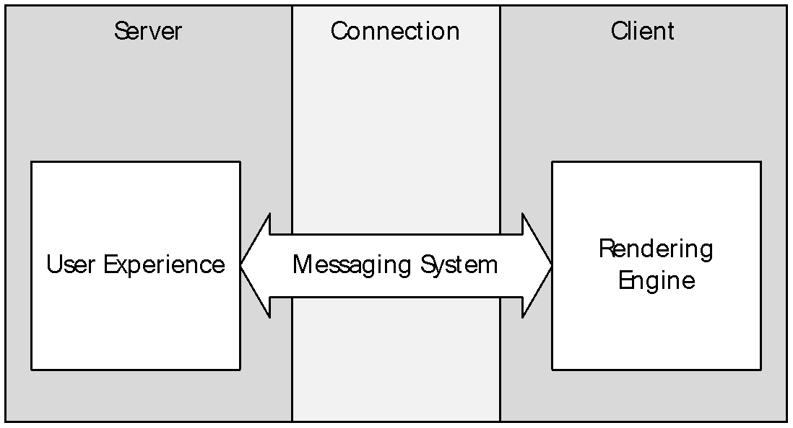

Figure 1: Point-to-point connection

<a id="Section_1.3.1"></a>
### 1.3.1 User Experience

The Remote Rendering Protocol Version 2 component model defines a basic programming model and several reusable services for various user interface (UI) tasks, hereafter referred to as the "user experience". The primary logic runs in process with the client application, which isolates the developer from the more complex implementation details of rendering and asynchronous communication.

<a id="Section_1.3.1.1"></a>
#### 1.3.1.1 Internal Componentization

The messages shared through the messaging system are contained within the following components/classes. The server provides the appropriate information to the client before the messages can be executed.

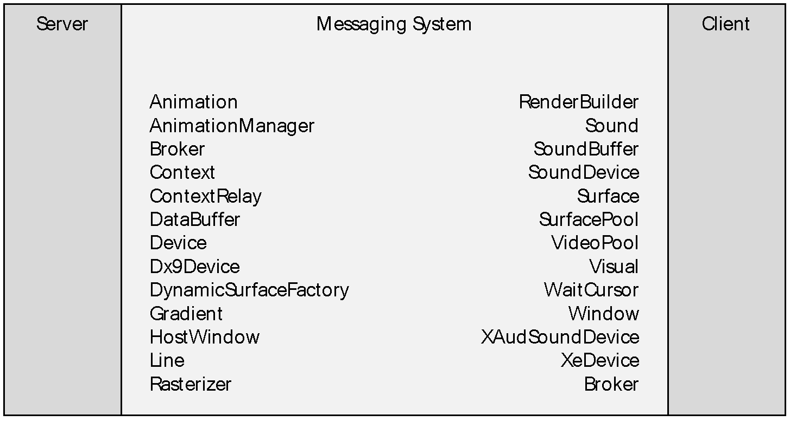

Figure 2: Components

The following components make up the remaining implementation of the Remote Rendering Protocol Version 2 component model.

<a id="Section_1.3.2"></a>
### 1.3.2 Rendering Engine

Remote Rendering Protocol Version 2 is designed to work with a mid-level application compositing rendering engine that can operate independently of the application and is driven by a stream of asynchronous rendering commands that describe the scenes to be displayed. The [**renderer**](#gt_renderer) has to be capable of running autonomously for significant periods of time in the absence of new commands from the application.

<a id="Section_1.3.2.1"></a>
#### 1.3.2.1 Addressing Mechanism

An internal addressing mechanism for delivering messages to objects is layered over the transport.

This mechanism is encompassed by:

- [**Contexts**](#gt_context), which are logical container spaces where objects exist "together" in memory and can efficiently communicate with each other.
- A [**handle**](#gt_handle), which specifies the recipients of the message because all messages are addressed to some endpoint with a specific handle.
Both class and instance handles are valid. A message to a class handle is called a "static message". A message to an instance handle is called an "instance message".

<a id="Section_1.3.3"></a>
### 1.3.3 Message Sequence

The following messages are sent during the lifetime of a given remote service. The legend below describes the sequence these messages use during the service.

The messages that could take place during the session are those that depend on the implementation (what the user interface communicates to the [**renderer**](#gt_renderer)); therefore, these messages are not necessarily present during a specific session. The messages that are present during the session are those that encompass Remote Rendering Protocol Version 2.

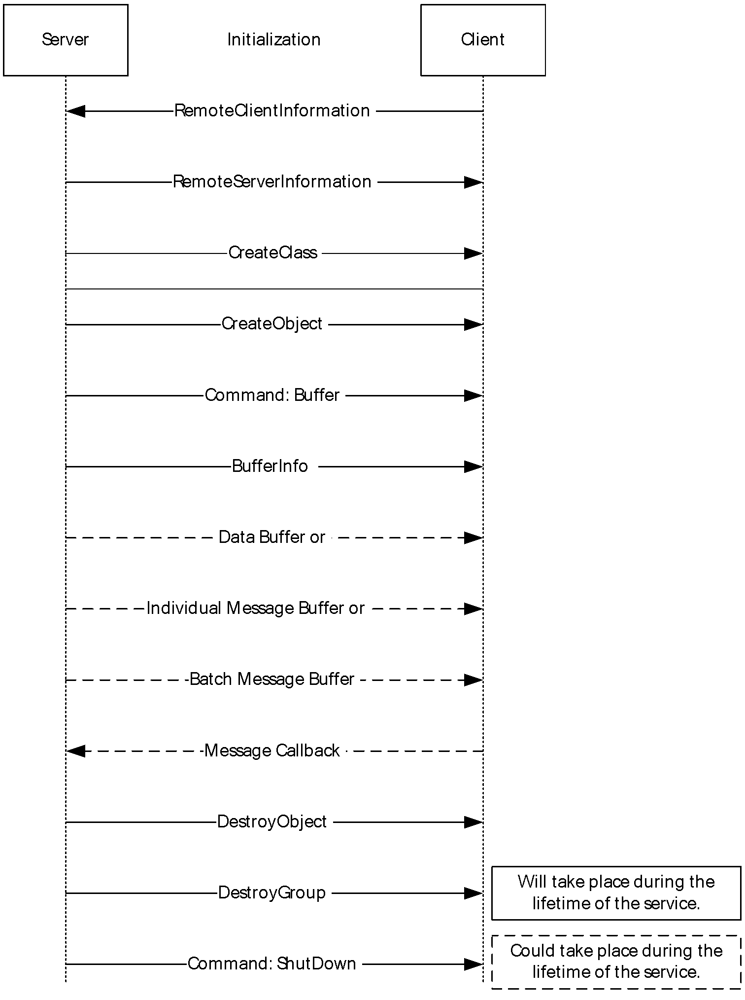

Figure 3: Message sequence

<a id="Section_1.4"></a>
## 1.4 Relationship to Other Protocols

The Remote Rendering Protocol Version 2 is not a standalone protocol. It depends on an established connection between the server and the client, which is covered in [MS-DTAG](../MS-DTAG/MS-DTAG.md) Device Trust Agreement and [MS-RXAD](../MS-RXAD/MS-RXAD.md) Remoted Experience Advertisement.

<a id="Section_1.5"></a>
## 1.5 Prerequisites/Preconditions

Other than the relationship called out in the previous section:

- Communication to the device has to have been established.
- The server capabilities (graphics, memory, and so on) have to be identified and the information has to be provided to Remote Rendering Protocol Version 2 by the Device Session Property Access Protocol.
<a id="Section_1.6"></a>
## 1.6 Applicability Statement

Remote Rendering Protocol Version 2 is applicable to environments that require the ability to send rendering instructions over a reliable and pre-established connection to a remote [**renderer**](#gt_renderer).

<a id="Section_1.7"></a>
## 1.7 Versioning and Capability Negotiation

Remote Rendering Protocol Version 2 does not [**handle**](#gt_handle) versioning and capabilities directly; instead, they are taken care of by the Device Session Property Access Protocol because Remote Rendering Protocol Version 2 is carried over this protocol. For further information please refer to section 1.6 of [MS-DSPA](../MS-DSPA/MS-DSPA.md).

<a id="Section_1.8"></a>
## 1.8 Vendor-Extensible Fields

None

<a id="Section_1.9"></a>
## 1.9 Standards Assignments

None

<a id="Section_2"></a>
# 2 Messages

<a id="Section_2.1"></a>
## 2.1 Transport

Remote Rendering Protocol Version 2 is transport agnostic and can be carried over any reliable transport.

<a id="Section_2.2"></a>
## 2.2 Message Syntax

<a id="Section_2.2.1"></a>
### 2.2.1 Initialization Messages (Handshake)

Upon establishing a transport connection, the client sends a RemoteClientInformation message, as specified in section [2.2.1.1](#Section_2.2.1.1). Next, the server sends a RemoteServerInformation message, as specified in section [2.2.1.2](#Section_2.2.1.2).

Initialization messages are sent in [**network byte order**](#gt_network-byte-order).

<a id="Section_2.2.1.1"></a>
#### 2.2.1.1 RemoteClientInformation message

The RemoteClientInformation message is used to send the client's information that is required for initialization to the server.

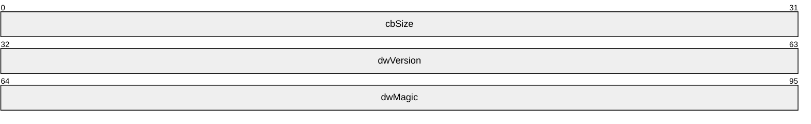

**cbSize (4 bytes):** An unsigned 32-bit integer. The size of the message.

**dwVersion (4 bytes):** An unsigned 32-bit integer. The client MUST be set this field to 0x00010006. The version of the client's network pipe.

**dwMagic (4 bytes):** An unsigned 32-bit integer. The client MUST set this field to 0x19740721. A number used to identify the protocol family of the client.

<a id="Section_2.2.1.2"></a>
#### 2.2.1.2 RemoteServerInformation message

The RemoteServerInformation message sends information about the server to the client.


**cbSize (4 bytes):** An unsigned 32-bit integer. The size of the message.

**dwVersion (4 bytes):** An unsigned 32-bit integer. The client MUST be set this field to 0x00010006. The version of the server's network pipe.

**dwMagic (4 bytes):** An unsigned 32-bit integer. The client MUST be set this field to 0x19740721. A number used to identify the protocol family of the server.

**idContextApplication (4 bytes):** An unsigned 32-bit integer. Contains the context ID of the server.

**idContextRender (4 bytes):** An unsigned 32-bit integer. Contains the context ID to which the receiving client is being assigned.

**dwReserved1 (4 bytes):** An unsigned 32-bit integer. Unused and MUST be set to zero.

**cItemsPerGroupBits (4 bytes):** A signed 32-bit integer. Specifies how many bits in the [**handle**](#gt_handle) are used for object indices within a group.

**cGroupBits (4 bytes):** A signed 32-bit integer. Specifies how many bits in the handle are used for "groups" of objects.

**idObjectBrokerClass (4 bytes):** An unsigned 32-bit integer. A predefined handle to the "broker" class.

<a id="Section_2.2.2"></a>
### 2.2.2 Command Messages

Once the handshake is completed, the connection is open for either client or server to send commands. There are two types of commands that can be sent: buffer commands and shutdown commands.

Command messages are sent in [**network byte order**](#gt_network-byte-order).

<a id="Section_2.2.2.1"></a>
#### 2.2.2.1 Command Message

A command message is used to signal that either a buffer and payload are following, or that the endpoint has to shut down.

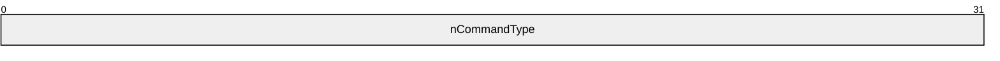

**nCommandType (4 bytes):** An unsigned 32-bit integer. The type of command to follow.

Defined types are described in the following table.

| Value | Description |
| --- | --- |
| 0x00000001 | Buffer: Followed by a buffer information header and associated buffer payload. |
| 0x00000002 | Shutdown: Last message sent. Endpoint will no longer communicate. |

<a id="Section_2.2.3"></a>
### 2.2.3 Framing Messages

If a command message is sent as a buffer command type, it is followed by a sequence of messages, starting with a BufferInfo message.

Framing messages are sent in [**network byte order**](#gt_network-byte-order).

<a id="Section_2.2.3.1"></a>
#### 2.2.3.1 BufferInfo Message

Sends information about the message to follow.

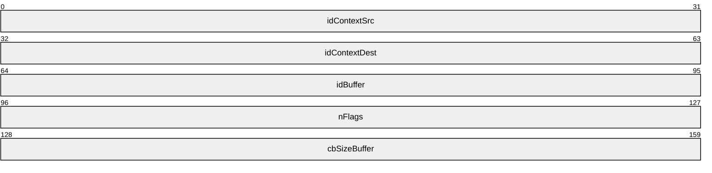

**idContextSrc (4 bytes):** An unsigned 32-bit integer. Contains the unique context ID of the sender.

**idContextDest (4 bytes):** An unsigned 32-bit integer. Contains the unique context ID of the recipient.

**idBuffer (4 bytes):** An unsigned 32-bit integer. Contains the unique ID for the buffer, which can be any of the following:

- Data Buffer: The buffer has a non-null ObjectID (idBuffer) and the memory can be associated with a new DataBuffer instance bearing this [**handle**](#gt_handle). No broker creation sequence will precede this transaction; the DataBuffer instance is created implicitly when the data is received.
- Individual Message Buffer: The buffer has a NULL ObjectID (idBuffer) and the IsBatch flag will be cleared. The payload can be interpreted as a single message and processed.
- Batch Message Buffer: The buffer has a NULL ObjectID (idBuffer) and the IsBatch flag will be SET. The payload can be interpreted as a batch with multiple messages and processed in order.
**nFlags (4 bytes):** An unsigned 32-bit integer. Describes the BufferFlags.

| Value | Description |
| --- | --- |
| 0x00000001 | IsBatch. The Buffer is a batch of messages. |

All other flags are reserved, MUST be ignored, and MUST never be specified.

**cbSizeBuffer (4 bytes):** An unsigned 32-bit integer. The size of the buffer's data.

<a id="Section_2.2.3.2"></a>
#### 2.2.3.2 MessageBatch Message

If the BufferInfo message's ObjectID is NULL and IsBatch flag is set, the next message is a MessageBatch.

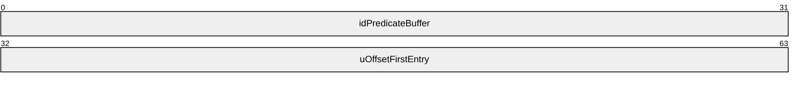

**idPredicateBuffer (4 bytes):** An unsigned 32-bit integer. This is the ID of the previously sent buffer that MUST be processed before this one.

If idPredicateBuffer is not 0x00000000, this refers to a previously transmitted data buffer that can be processed as a batch buffer prior to processing this message. That buffer can also refer to another predicate buffer (and so on).

If idPredicateBuffer is 0x00000000, the following message entries will be processed.

**uOffsetFirstEntry (4 bytes):** An unsigned 32-bit integer. The size of the buffer offset of the first message entry.

<a id="Section_2.2.3.3"></a>
#### 2.2.3.3 MessageBatchEntry Message

A message batch can contain one or more message entries, which are identified by the following header:

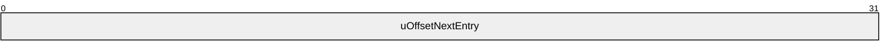

**uOffsetNextEntry (4 bytes):** An unsigned 32-bit integer. This is the size of the buffer offset of the next message entry. The final entry in a batch has a uOffsetNextEntry of 0x00000000.

<a id="Section_2.2.4"></a>
### 2.2.4 Payload Messages

Payload messages are used to issue rendering and sound commands. Payload messages are sent in client-byte order, as determined by the extender capabilities exchange.

Every payload message has the standard header listed in the following table.

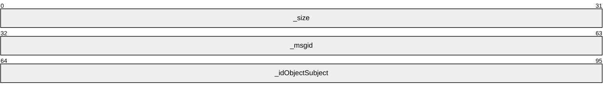

**_size (4 bytes):** An unsigned 32-bit integer. Describes the total message size, in bytes.

**_msgid (4 bytes):** A signed 32-bit integer. The message ID that is unique to the specific target. The value specified in _msgid is used to indicate which action to take on the target object.

**_idObjectSubject (4 bytes):** An unsigned 32-bit integer. The ID of the target object. The _idObjectSubject refers to an object that was previously created by sending a Broker_CreateObject payload.

<a id="Section_2.2.4.1"></a>
#### 2.2.4.1 DataBuffer

<a id="Section_2.2.4.1.1"></a>
##### 2.2.4.1.1 DataBuffer_RegisterOwner

The DataBuffer_RegisterOwner message registers the owner of the buffer. The owner is notified when the buffer usage is complete, which allows the owner to reclaim resources.

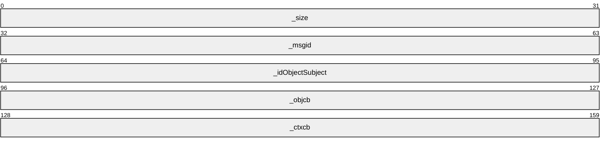

**_size (4 bytes):** An unsigned 32-bit integer. Describes the total message size, in bytes.

**_msgid (4 bytes):** A signed 32-bit integer. The message ID that is unique to the specific target. The _msgid value is 0x00000000 for this message.

**_idObjectSubject (4 bytes):** An unsigned 32-bit integer. The ID of the target object.

**_objcb (4 bytes):** An unsigned 32-bit integer. The ID of the owner's callback.

**_ctxcb (4 bytes):** An unsigned 32-bit integer. The ID of the owner's [**context**](#gt_context).

<a id="Section_2.2.4.2"></a>
#### 2.2.4.2 ContextRelay

<a id="Section_2.2.4.2.1"></a>
##### 2.2.4.2.1 ContextRelay_Create

The ContextRelay_Create message creates a transport bridge to relay messages from a remote application to an existing [**context**](#gt_context).


**_size (4 bytes):** An unsigned 32-bit integer. The total message size, in bytes.

**_msgid (4 bytes):** A signed 32-bit integer. The message ID that is unique to the specific target. The _msgid value is 0x00000002 for this message.

**_idObjectSubject (4 bytes):** An unsigned 32-bit integer. The ID of the target object.

**protocol (4 bytes):** A signed 32-bit integer. The transport protocol to use for communication.

The possible values are:

| Value | Description |
| --- | --- |
| 0x00000001 | RDP Virtual Channel |
| 0x00000002 | TCP |
| 0x00000003 | UDP |
| 0x00000004 | Named Pipes |

**stServer (4 bytes):** A BLOBREF (section [2.2.6.1](#Section_2.2.6.1)) that specifies the name of the remote server or address.

**stSession (4 bytes):** A BLOBREF (section 2.2.6.1) that specifies the name for the local session. This value is only used for Named Pipes; otherwise, this value is ignored.

<a id="Section_2.2.4.2.2"></a>
##### 2.2.4.2.2 ContextRelay_UnlinkContext

The ContextRelay_UnlinkContext message disassociates the specified [**context**](#gt_context) alias from an existing context.

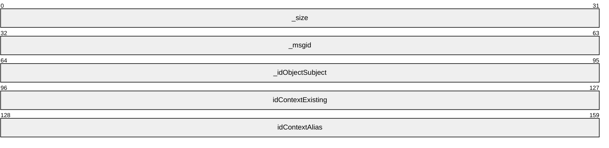

**_size (4 bytes):** An unsigned 32-bit integer. The total message size, in bytes.

**_msgid (4 bytes):** A signed 32-bit integer. The message ID that is unique to the specific target. The _msgid value is 0x00000000 for this message.

**_idObjectSubject (4 bytes):** An unsigned 32-bit integer. The ID of the target object.

**idContextExisting (4 bytes):** An unsigned 32-bit integer. The ID of the existing context.

**idContextAlias (4 bytes):** An unsigned 32-bit integer. The ID of the alias context to be unlinked from the existing context.

<a id="Section_2.2.4.2.3"></a>
##### 2.2.4.2.3 ContextRelay_LinkContext

The ContextRelay_LinkContext message links the specified [**context**](#gt_context) alias to an existing context.


**_size (4 bytes):** An unsigned 32-bit integer. The total message size, in bytes.

**_msgid (4 bytes):** A signed 32-bit integer. The message ID that is unique to the specific target. The _msgid value is 0x00000001 for this message.

**_idObjectSubject (4 bytes):** An unsigned 32-bit integer. The ID of the target object.

**idContextExisting (4 bytes):** An unsigned 32-bit integer. The ID of the existing context.

**idContextAlias (4 bytes):** An unsigned 32-bit integer. The ID of the alias context to be linked to the existing context.

<a id="Section_2.2.4.3"></a>
#### 2.2.4.3 Broker

<a id="Section_2.2.4.3.1"></a>
##### 2.2.4.3.1 Broker_DestroyObject

The Broker_DestroyObject message destroys a previously created object. The object is destroyed immediately.


**_size (4 bytes):** An unsigned 32-bit integer. The total message size, in bytes.

**_msgid (4 bytes):** A signed 32-bit integer. The message ID that is unique to the specific target. The _msgid value is 0x00000000 for this message.

**_idObjectSubject (4 bytes):** An unsigned 32-bit integer. The ID of the target object.

**idObject (4 bytes):** An unsigned 32-bit integer. The ID of the object to be destroyed.

<a id="Section_2.2.4.3.2"></a>
##### 2.2.4.3.2 Broker_CreateObject

The Broker_CreateObject message creates a new instance of the specified class.


**_size (4 bytes):** An unsigned 32-bit integer. The total message size, in bytes.

**_msgid (4 bytes):** A signed 32-bit integer. The message ID that is unique to the specific target. The _msgid value is 0x00000001 for this message.

**_idObjectSubject (4 bytes):** An unsigned 32-bit integer. The ID of the target object.

**idObjectClass (4 bytes):** An unsigned 32-bit integer. The ID of the object class to be created.

**idObjectNew (4 bytes):** An unsigned 32-bit integer. The ID that is assigned to the created object instance. The Object ID MUST be unique for the given [**context**](#gt_context).

**msgConstruction (4 bytes):** A BLOBREF (section [2.2.6.1](#Section_2.2.6.1)) that specifies a reference to a construction parameters message.

<a id="Section_2.2.4.3.3"></a>
##### 2.2.4.3.3 Broker_CreateClass

The Broker_CreateClass message creates a new object that can be used to identify a Class.

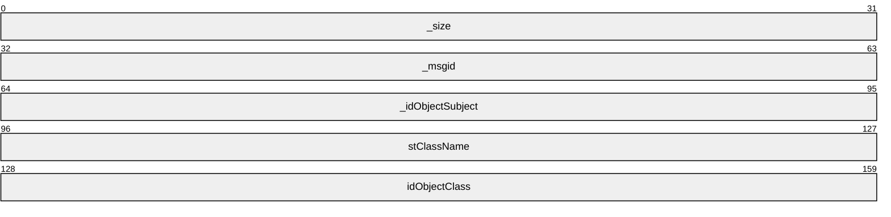

**_size (4 bytes):** An unsigned 32-bit integer. The total message size, in bytes.

**_msgid (4 bytes):** A signed 32-bit integer. The message ID that is unique to the specific target. The _msgid value is 0x00000002 for this message.

**_idObjectSubject (4 bytes):** An unsigned 32-bit integer. The ID of the target object.

**stClassName (4 bytes):** A BLOBREF (section [2.2.6.1](#Section_2.2.6.1)) that specifies the name of the remote server or address.

**idObjectClass (4 bytes):** An unsigned 32-bit integer. The ID that is assigned to the object class. The Object ID MUST be unique for the given [**context**](#gt_context).

<a id="Section_2.2.4.4"></a>
#### 2.2.4.4 Context

<a id="Section_2.2.4.4.1"></a>
##### 2.2.4.4.1 Context_ForwardMessage

The Context_ForwardMessage message forwards the given message to the given object. This message can be used by a component that is required to be called back after a set of prior messages have been processed.

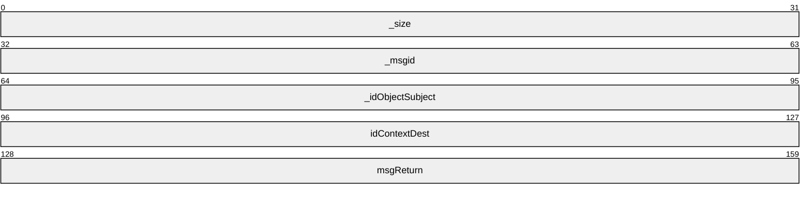

**_size (4 bytes):** An unsigned 32-bit integer. The total message size, in bytes.

**_msgid (4 bytes):** A signed 32-bit integer. The message ID that is unique to the specific target. The _msgid value is 0x00000002 for this message.

**_idObjectSubject (4 bytes):** An unsigned 32-bit integer. The ID of the target object.

**idContextDest (4 bytes):** An unsigned 32-bit integer. The destination [**context**](#gt_context) for the message.

**msgReturn (4 bytes):** A BLOBREF (section [2.2.6.1](#Section_2.2.6.1)) that specifies the message to send.

<a id="Section_2.2.4.4.2"></a>
##### 2.2.4.4.2 Context_DestroyGroup

The Context_Destroyroup message destroys a collection of objects, including the objects themselves, in the given [**context**](#gt_context).

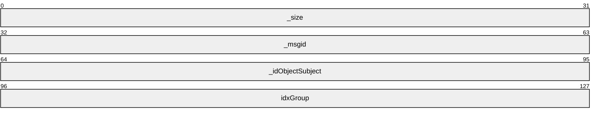

**_size (4 bytes):** An unsigned32-bit integer. It describes the total message size, in bytes.

**_msgid (4 bytes):** A signed 32-bit integer. The message ID that is unique to the specific target. The _msgid value is 0x00000003 for this message.

**_idObjectSubject (4 bytes):** An unsigned 32-bit integer. The ID of the target object.

**idxGroup (4 bytes):** A signed 32-bit integer. The unique ID of the group.

<a id="Section_2.2.4.4.3"></a>
##### 2.2.4.4.3 Context_CreateGroup

The Context_CreateGroup message creates a collection of objects within the given [**context**](#gt_context).

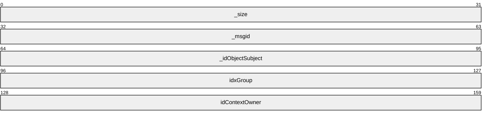

**_size (4 bytes):** An unsigned 32-bit integer. The total message size, in bytes.

**_msgid (4 bytes):** A signed 32-bit integer. The message ID that is unique to the specific target. The _msgid value is 0x00000004 for this message.

**_idObjectSubject (4 bytes):** An unsigned 32-bit integer. The ID of the target object.

**idxGroup (4 bytes):** A signed 32-bit integer. The unique ID of the group.

**idContextOwner (4 bytes):** An unsigned 32-bit integer. The context that owns the group.

<a id="Section_2.2.4.5"></a>
#### 2.2.4.5 RenderBuilder

<a id="Section_2.2.4.5.1"></a>
##### 2.2.4.5.1 RenderBuilder_Create

The RenderBuilder_Create message completes construction of a new RenderBuilder.

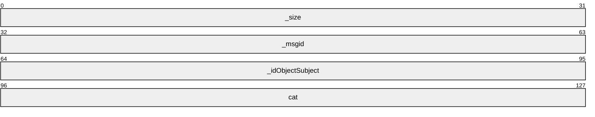

**_size (4 bytes):** An unsigned32-bit integer. The total message size, in bytes.

**_msgid (4 bytes):** A signed 32-bit integer. The message ID that is unique to the specific target. The _msgid value is 0x00000001 for this message.

**_idObjectSubject (4 bytes):** An unsigned 32-bit integer. The ID of the target object.

**cat (4 bytes):** A signed-32 bit integer. Indicates whether the render operations can occur pre-scene or in-scene.

Possible values are listed in the following table.

| Value | Description |
| --- | --- |
| 0x00000000 | Pre-scene |
| 0x00000001 | In-scene |

<a id="Section_2.2.4.5.2"></a>
##### 2.2.4.5.2 RenderBuilder_Clear

The RenderBuilder_Clear message empties the contents of this RenderBuilder, allowing it to be used for painting another object.


**_size (4 bytes):** An unsigned 32-bit integer. The total message size, in bytes.

**_msgid (4 bytes):** A signed 32-bit integer. The message ID that is unique to the specific target. The _msgid value is 0x00000000 for this message.

**_idObjectSubject (4 bytes):** An unsigned 32-bit integer. The ID of the target object.

<a id="Section_2.2.4.6"></a>
#### 2.2.4.6 Visual

<a id="Section_2.2.4.6.1"></a>
##### 2.2.4.6.1 Visual_Create

The Visual_Create message completes construction of a new visual.


**_size (4 bytes):** An unsigned 32-bit integer. The total message size, in bytes.

**_msgid (4 bytes):** A signed 32-bit integer. The message ID that is unique to the specific target. The _msgid value is 0x0000001A for this message.

**_idObjectSubject (4 bytes):** An unsigned 32-bit integer. The ID of the target object.

<a id="Section_2.2.4.6.2"></a>
##### 2.2.4.6.2 Visual_ChangeDataBits

The Visual_ChangeDataBits message changes the user-defined bits set on the target visual.

```mermaid
packet-beta
  0-31: "_size"
  32-63: "_msgid"
  64-95: "_idObjectSubject"
  96-127: "nValue"
  128-159: "nMask"
```

**_size (4 bytes):** An unsigned 32-bit integer. The total message size, in bytes.

**_msgid (4 bytes):** A signed 32-bit integer. The message ID that is unique to the specific target. The _msgid value is 0x00000000 for this message.

**_idObjectSubject (4 bytes):** An unsigned 32-bit integer. The ID of the target object.

**nValue (4 bytes):** An unsigned 32-bit integer. The new value.

**nMask (4 bytes):** An unsigned 32-bit integer. A mask to use when changing the bits.

<a id="Section_2.2.4.6.3"></a>
##### 2.2.4.6.3 Visual_ChangeParent

Changes the parent and z-order inside the sub-tree.

```mermaid
packet-beta
  0-31: "_size"
  32-63: "_msgid"
  64-95: "_idObjectSubject"
  96-127: "visNewParent"
  128-159: "visSibling"
  160-191: "nOrder"
```

**_size (4 bytes):** An unsigned 32-bit integer. The total message size, in bytes.

**_msgid (4 bytes):** A signed 32-bit integer. The message ID that is unique to the specific target. The _msgid value is 0x00000001 for this message.

**_idObjectSubject (4 bytes):** An unsigned 32-bit integer. The ID of the target object.

**visNewParent (4 bytes):** An unsigned 32-bit integer. The ID of the new parent visual.

**visSibling (4 bytes):** An unsigned 32-bit integer. The ID of the sibling visual.

**nOrder (4 bytes):** A signed 32-bit integer. The place to add the visual, relative to the sibling. Possible values are listed in the following table.

| Value | Description |
| --- | --- |
| 0x00000000 | Any - Any position amongst its siblings. |
| 0x00000001 | Before - Before the specified sibling. |
| 0x00000002 | Behind - Behind the specified sibling. |
| 0x00000003 | Top - The top of the parent's children list. |
| 0x00000004 | Bottom - The bottom of the parent's children list. |

<a id="Section_2.2.4.6.4"></a>
##### 2.2.4.6.4 Visual_SetColor

The Visual_SetColor message sets the color value of the visual.

```mermaid
packet-beta
  0-31: "_size"
  32-63: "_msgid"
  64-95: "_idObjectSubject"
  96-127: "clr"
```

**_size (4 bytes):** An unsigned 32-bit integer. The total message size, in bytes.

**_msgid (4 bytes):** A signed 32-bit integer. The message ID that is unique to the specific target. The _msgid value is 0x00000004 for this message.

**_idObjectSubject (4 bytes):** An unsigned 32-bit integer. The ID of the target object.

**clr (4 bytes):** An unsigned 32-bit integer. The [**ARGB**](#gt_argb) value of the color.

<a id="Section_2.2.4.6.5"></a>
##### 2.2.4.6.5 Visual_SetAlpha

The Visual_SetAlpha message sets the alpha value of the visual.

```mermaid
packet-beta
  0-31: "_size"
  32-63: "_msgid"
  64-95: "_idObjectSubject"
  96-103: "bAlpha"
```

**_size (4 bytes):** An unsigned 32-bit integer. The total message size, in bytes.

**_msgid (4 bytes):** A signed 32-bit integer. The message ID that is unique to the specific target. The _msgid value is 0x00000006 for this message.

**_idObjectSubject (4 bytes):** An unsigned 32-bit integer. The ID of the target object.

**bAlpha (1 byte):** A byte that specifies the alpha value.

<a id="Section_2.2.4.6.6"></a>
##### 2.2.4.6.6 Visual_SetLayer

The Visual_SetLayer message sets the layer number of the visual.

```mermaid
packet-beta
  0-31: "_size"
  32-63: "_msgid"
  64-95: "_idObjectSubject"
  96-127: "layer"
```

**_size (4 bytes):** An unsigned 32-bit integer. The total message size, in bytes.

**_msgid (4 bytes):** A signed 32-bit integer. The message ID that is unique to the specific target. The _msgid value is 0x00000008 for this message.

**_idObjectSubject (4 bytes):** An unsigned 32-bit integer. The ID of the target object.

**layer (4 bytes):** An unsigned 32-bit integer. The layer number. The value MUST be between 0x00000000 (the back-most layer) and 4294967295 (the front-most layer).

<a id="Section_2.2.4.6.7"></a>
##### 2.2.4.6.7 Visual_SetRotation

The Visual_SetRotation message changes the current rotation that is assigned to the specific visual. Rotations of parents, siblings, and children are not changed.

```mermaid
packet-beta
  0-31: "_size"
  32-63: "_msgid"
  64-95: "_idObjectSubject"
  96-191: "rotRotation (16 bytes)"
```

**_size (4 bytes):** An unsigned 32-bit integer. The total message size, in bytes.

**_msgid (4 bytes):** A signed 32-bit integer. The message ID that is unique to the specific target. The _msgid value is 0x0000000A for this message.

**_idObjectSubject (4 bytes):** An unsigned 32-bit integer. The ID of the target object.

**rotRotation (16 bytes):** A Rotation (section [2.2.6.2](#Section_2.2.6.2)) that specifies the new rotation of the visual.

<a id="Section_2.2.4.6.8"></a>
##### 2.2.4.6.8 Visual_SetCenterPointScale

The Visual_SetCenterPointScale message changes the current center point scale that is assigned to the specific visual. Center point scales of parents, siblings, and children are not changed.

```mermaid
packet-beta
  0-31: "_size"
  32-63: "_msgid"
  64-95: "_idObjectSubject"
  96-191: "vCenterPointScale"
```

**_size (4 bytes):** An unsigned 32-bit integer. The total message size, in bytes.

**_msgid (4 bytes):** A signed 32-bit integer. The message ID that is unique to the specific target. The _msgid value is 0x0000000C for this message.

**_idObjectSubject (4 bytes):** An unsigned 32-bit integer. The ID of the target object.

**vCenterPointScale (12 bytes):** A Vector3 (section [2.2.6.3](#Section_2.2.6.3)) that specifies the center point scale of the visual.

<a id="Section_2.2.4.6.9"></a>
##### 2.2.4.6.9 Visual_SetCenterPointOffset

The Visual_SetCenterPointOffset changes the current center point that is assigned to the specific visual. Center points of parents, siblings, and children are not changed.

```mermaid
packet-beta
  0-31: "_size"
  32-63: "_msgid"
  64-95: "_idObjectSubject"
  96-191: "vCenterPointOffset"
```

**_size (4 bytes):** An unsigned 32-bit integer. The total message size, in bytes.

**_msgid (4 bytes):** A signed 32-bit integer. The message ID that is unique to the specific target. The _msgid value is 0x0000000E for this message.

**_idObjectSubject (4 bytes):** An unsigned 32-bit integer. The ID of the target object.

**vCenterPointOffset (12 bytes):** A Vector3 (section [2.2.6.3](#Section_2.2.6.3)) that specifies the center point of the visual.

<a id="Section_2.2.4.6.10"></a>
##### 2.2.4.6.10 Visual_SetScale

The Visual_SetScale message changes the current scaling factor assigned to the specific visual. Scaling factors of parents, siblings, and children are not changed.

```mermaid
packet-beta
  0-31: "_size"
  32-63: "_msgid"
  64-95: "_idObjectSubject"
  96-191: "vScale"
```

**_size (4 bytes):** An unsigned 32-bit integer. The total message size, in bytes.

**_msgid (4 bytes):** A signed 32-bit integer. The message ID that is unique to the specific target. The _msgid value is 0x00000010 for this message.

**_idObjectSubject (4 bytes):** An unsigned 32-bit integer. The ID of the target object.

**vScale (12 bytes):** A Vector3 (section [2.2.6.3](#Section_2.2.6.3)) that specifies the scale of the visual.

<a id="Section_2.2.4.6.11"></a>
##### 2.2.4.6.11 Visual_SetSize

The Visual_SetSize message changes the width, height, and depth of the visual, relative to itself.

```mermaid
packet-beta
  0-31: "_size"
  32-63: "_msgid"
  64-95: "_idObjectSubject"
  96-191: "vSizePxl"
```

**_size (4 bytes):** An unsigned 32-bit integer. The total message size, in bytes.

**_msgid (4 bytes):** A signed 32-bit integer. The message ID that is unique to the specific target. The _msgid value is 0x00000012 for this message.

**_idObjectSubject (4 bytes):** An unsigned 32-bit integer. The ID of the target object.

**vSizePxl (12 bytes):** A Vector3 (section [2.2.6.3](#Section_2.2.6.3)) that specifies the size of the visual.

<a id="Section_2.2.4.6.12"></a>
##### 2.2.4.6.12 Visual_SetPosition

The Visual_SetPosition message changes the X, Y, and Z of the visual, relative to its parent.

```mermaid
packet-beta
  0-31: "_size"
  32-63: "_msgid"
  64-95: "_idObjectSubject"
  96-191: "vPositionPxl"
```

**_size (4 bytes):** An unsigned 32-bit integer. The total message size, in bytes.

**_msgid (4 bytes):** A signed 32-bit integer. The message ID that is unique to the specific target. The _msgid value is 0x00000014 for this message.

**_idObjectSubject (4 bytes):** An unsigned 32-bit integer. The ID of the target object.

**vPositionPxl (12 bytes):** A Vector3 (section [2.2.6.3](#Section_2.2.6.3)) that specifies the position of the visual.

<a id="Section_2.2.4.6.13"></a>
##### 2.2.4.6.13 Visual_SetContent

The Visual_SetContent message transfers the RenderOperation contents from the given RenderBuilder into the visual.

```mermaid
packet-beta
  0-31: "_size"
  32-63: "_msgid"
  64-95: "_idObjectSubject"
  96-127: "rbContent"
```

**_size (4 bytes):** An unsigned 32-bit integer. The total message size, in bytes.

**_msgid (4 bytes):** A signed 32-bit integer. The message ID that is unique to the specific target. The _msgid value is 0x00000017 for this message.

**_idObjectSubject (4 bytes):** An unsigned 32-bit integer. The ID of the target object.

**rbContent (4 bytes):** An unsigned 32-bit integer. The ID of the RenderBuilder.

<a id="Section_2.2.4.6.14"></a>
##### 2.2.4.6.14 Visual_SetVisible

The Visual_SetVisible message determines whether the given visual participates in rendering and hit-testing.

```mermaid
packet-beta
  0-31: "_size"
  32-63: "_msgid"
  64-95: "_idObjectSubject"
  96-127: "fVisible"
```

**_size (4 bytes):** An unsigned 32-bit integer. The total message size, in bytes.

**_msgid (4 bytes):** A signed 32-bit integer. The message ID that is unique to the specific target. The _msgid value is 0x00000018 for this message.

**_idObjectSubject (4 bytes):** An unsigned 32-bit integer. The ID of the target object.

**fVisible (4 bytes):** An unsigned 32-bit integer. Visibility value.

<a id="Section_2.2.4.7"></a>
#### 2.2.4.7 AnimationManager

<a id="Section_2.2.4.7.1"></a>
##### 2.2.4.7.1 AnimationManager_Create

The AnimationManager_Create message builds a new AnimationManager for the given [**context**](#gt_context).

```mermaid
packet-beta
  0-31: "_size"
  32-63: "_msgid"
  64-95: "_idObjectSubject"
```

**_size (4 bytes):** An unsigned 32-bit integer. The total message size, in bytes.

**_msgid (4 bytes):** A signed 32-bit integer. The message ID that is unique to the specific target. The _msgid value is 0x0000000B for this message.

**_idObjectSubject (4 bytes):** An unsigned 32-bit integer. The ID of the target object.

<a id="Section_2.2.4.7.2"></a>
##### 2.2.4.7.2 AnimationManager_BuildGradientColorMaskAnimation

The AnimationManager_BuildGradientColorMaskAnimation message builds an animation to modify a gradient's ColorMask.

```mermaid
packet-beta
  0-31: "_size"
  32-63: "_msgid"
  64-95: "_idObjectSubject"
  96-127: "grSubject"
  128-159: "idAnimation"
```

**_size (4 bytes):** An unsigned 32-bit integer. The total message size, in bytes.

**_msgid (4 bytes):** A signed 32-bit integer. The message ID that is unique to the specific target. The _msgid value is 0x00000003 for this message.

**_idObjectSubject (4 bytes):** An unsigned 32-bit integer. The ID of the target object.

**grSubject (4 bytes):** An unsigned 32-bit integer. The ID of the target gradient object.

**idAnimation (4 bytes):** An unsigned 32-bit integer. The ID to assign to the created animation.

<a id="Section_2.2.4.7.3"></a>
##### 2.2.4.7.3 AnimationManager_BuildGradientOffsetAnimation

The AnimationManager_BuildGradientOffsetAnimation message builds an animation to modify a gradient.

```mermaid
packet-beta
  0-31: "_size"
  32-63: "_msgid"
  64-95: "_idObjectSubject"
  96-127: "grSubject"
  128-159: "idAnimation"
```

**_size (4 bytes):** An unsigned 32-bit integer. The total message size, in bytes.

**_msgid (4 bytes):** A signed 32-bit integer. The message ID that is unique to the specific target. The _msgid value is 0x00000004 for this message.

**_idObjectSubject (4 bytes):** An unsigned 32-bit integer. The ID of the target object.

**grSubject (4 bytes):** An unsigned 32-bit integer. The ID of the target gradient object.

**idAnimation (4 bytes):** An unsigned 32-bit integer. The ID to assign to the created animation.

<a id="Section_2.2.4.7.4"></a>
##### 2.2.4.7.4 AnimationManager_BuildRotationAnimation

The AnimationManager_BuildRotationAnimation message builds an animation to modify the visual's rotation property.

```mermaid
packet-beta
  0-31: "_size"
  32-63: "_msgid"
  64-95: "_idObjectSubject"
  96-127: "viSubject"
  128-159: "idAnimation"
```

**_size (4 bytes):** An unsigned 32-bit integer. The total message size, in bytes.

**_msgid (4 bytes):** A signed 32-bit integer. The message ID that is unique to the specific target. The _msgid value is 0x00000005 for this message.

**_idObjectSubject (4 bytes):** An unsigned 32-bit integer. The ID of the target object.

**viSubject (4 bytes):** An unsigned 32-bit integer. The ID of the target visual.

**idAnimation (4 bytes):** An unsigned 32-bit integer. The ID to assign to the created animation.

<a id="Section_2.2.4.7.5"></a>
##### 2.2.4.7.5 AnimationManager_BuildSizeAnimation

The AnimationManager_BuildSizeAnimation message builds an animation to modify the visual's size property.

```mermaid
packet-beta
  0-31: "_size"
  32-63: "_msgid"
  64-95: "_idObjectSubject"
  96-127: "viSubject"
  128-159: "idAnimation"
```

**_size (4 bytes):** An unsigned 32-bit integer. The total message size, in bytes.

**_msgid (4 bytes):** A signed 32-bit integer. The message ID that is unique to the specific target. The _msgid value is 0x00000006 for this message.

**_idObjectSubject (4 bytes):** An unsigned 32-bit integer. The ID of the target object.

**viSubject (4 bytes):** An unsigned 32-bit integer. The ID of the target visual.

**idAnimation (4 bytes):** An unsigned 32-bit integer. The ID to assign to the created animation.

<a id="Section_2.2.4.7.6"></a>
##### 2.2.4.7.6 AnimationManager_BuildScaleAnimation

The AnimationManager_BuildScaleAnimation message builds an animation to modify the visual's scale property.

```mermaid
packet-beta
  0-31: "_size"
  32-63: "_msgid"
  64-95: "_idObjectSubject"
  96-127: "viSubject"
  128-159: "idAnimation"
```

**_size (4 bytes):** An unsigned 32-bit integer. The total message size, in bytes.

**_msgid (4 bytes):** A signed 32-bit integer. The message ID that is unique to the specific target. The _msgid value is 0x00000007 for this message.

**_idObjectSubject (4 bytes):** An unsigned 32-bit integer. The ID of the target object.

**viSubject (4 bytes):** An unsigned 32-bit integer. The ID of the target visual.

**idAnimation (4 bytes):** An unsigned 32-bit integer. The ID to assign to the created animation.

<a id="Section_2.2.4.7.7"></a>
##### 2.2.4.7.7 AnimationManager_BuildPositionAnimation

The AnimationManager_BuildPositionAnimation message builds an animation to modify the visual's position property.

```mermaid
packet-beta
  0-31: "_size"
  32-63: "_msgid"
  64-95: "_idObjectSubject"
  96-127: "viSubject"
  128-159: "idAnimation"
```

**_size (4 bytes):** An unsigned 32-bit integer. The total message size, in bytes.

**_msgid (4 bytes):** A signed 32-bit integer. The message ID that is unique to the specific target. The _msgid value is 0x00000008 for this message.

**_idObjectSubject (4 bytes):** An unsigned 32-bit integer. The ID of the target object.

**viSubject (4 bytes):** An unsigned 32-bit integer. The ID of the target visual.

**idAnimation (4 bytes):** An unsigned 32-bit integer. The ID to assign to the created animation.

<a id="Section_2.2.4.7.8"></a>
##### 2.2.4.7.8 AnimationManager_BuildColorAnimation

The AnimationManager_BuildColorAnimation message builds an animation to modify the visual's color property.

```mermaid
packet-beta
  0-31: "_size"
  32-63: "_msgid"
  64-95: "_idObjectSubject"
  96-127: "viSubject"
  128-159: "idAnimation"
```

**_size (4 bytes):** An unsigned 32-bit integer. The total message size, in bytes.

**_msgid (4 bytes):** A signed 32-bit integer. The message ID that is unique to the specific target. The _msgid value is 0x00000009 for this message.

**_idObjectSubject (4 bytes):** An unsigned 32-bit integer. The ID of the target object.

**viSubject (4 bytes):** An unsigned 32-bit integer. The ID of the target visual.

**idAnimation (4 bytes):** An unsigned 32-bit integer. The ID to assign to the created animation.

<a id="Section_2.2.4.7.9"></a>
##### 2.2.4.7.9 AnimationManager_BuildAlphaAnimation

The AnimationManager_BuildAlphaAnimation message builds an animation to modify the visual's alpha property.

```mermaid
packet-beta
  0-31: "_size"
  32-63: "_msgid"
  64-95: "_idObjectSubject"
  96-127: "viSubject"
  128-159: "idAnimation"
```

**_size (4 bytes):** An unsigned 32-bit integer. The total message size, in bytes.

**_msgid (4 bytes):** A signed 32-bit integer. The message ID that is unique to the specific target. The _msgid value is 0x0000000A for this message.

**_idObjectSubject (4 bytes):** An unsigned 32-bit integer. The ID of the target object.

**viSubject (4 bytes):** An unsigned 32-bit integer. The ID of the target visual.

**idAnimation (4 bytes):** An unsigned 32-bit integer. The ID to assign to the created animation.

<a id="Section_2.2.4.8"></a>
#### 2.2.4.8 WaitCursor

<a id="Section_2.2.4.8.1"></a>
##### 2.2.4.8.1 WaitCursor_Create

The WaitCursor_Create message builds a new instance of the WaitCursor for the given [**context**](#gt_context).

```mermaid
packet-beta
  0-31: "_size"
  32-63: "_msgid"
  64-95: "_idObjectSubject"
```

**_size (4 bytes):** An unsigned 32-bit integer. The total message size, in bytes.

**_msgid (4 bytes):** A signed 32-bit integer. The message ID that is unique to the specific target. The _msgid value is 0x00000005 for this message.

**_idObjectSubject (4 bytes):** An unsigned 32-bit integer. The ID of the target object.

<a id="Section_2.2.4.8.2"></a>
##### 2.2.4.8.2 WaitCursor_Show

The WaitCursor_Show message starts the animations to show the wait cursor.

```mermaid
packet-beta
  0-31: "_size"
  32-63: "_msgid"
  64-95: "_idObjectSubject"
```

**_size (4 bytes):** An unsigned 32-bit integer. The total message size, in bytes.

**_msgid (4 bytes):** A signed 32-bit integer. The message ID that is unique to the specific target. The _msgid value is 0x00000000 for this message.

**_idObjectSubject (4 bytes):** An unsigned 32-bit integer. The ID of the target object.

<a id="Section_2.2.4.8.3"></a>
##### 2.2.4.8.3 WaitCursor_Hide

The WaitCursor_Hide message starts the animations to hide the wait cursor. Once the animations have completed, the owned visuals are hidden.

```mermaid
packet-beta
  0-31: "_size"
  32-63: "_msgid"
  64-95: "_idObjectSubject"
```

**_size (4 bytes):** An unsigned 32-bit integer. The total message size, in bytes.

**_msgid (4 bytes):** A signed 32-bit integer. The message ID that is unique to the specific target. The _msgid value is 0x00000001 for this message.

**_idObjectSubject (4 bytes):** An unsigned 32-bit integer. The ID of the target object.

<a id="Section_2.2.4.8.4"></a>
##### 2.2.4.8.4 WaitCursor_SetVisuals

The WaitCursor_SetVisuals message sets the visuals being used to construct the wait cursor.

```mermaid
packet-beta
  0-31: "_size"
  32-63: "_msgid"
  64-95: "_idObjectSubject"
  96-127: "arVisuals"
```

**_size (4 bytes):** An unsigned 32-bit integer. The total message size, in bytes.

**_msgid (4 bytes):** A signed 32-bit integer. The message ID that is unique to the specific target. The _msgid value is 0x00000002 for this message.

**_idObjectSubject (4 bytes):** An unsigned 32-bit integer. The ID of the target object.

**arVisuals (4 bytes):** A BLOBREF (section [2.2.6.1](#Section_2.2.6.1)) that specifies an array of visuals to use for the wait cursor.

<a id="Section_2.2.4.8.5"></a>
##### 2.2.4.8.5 WaitCursor_SetShowAnimations

The WaitCursor_SetShowAnimations message sets the animations to use to show the wait cursor.

```mermaid
packet-beta
  0-31: "_size"
  32-63: "_msgid"
  64-95: "_idObjectSubject"
  96-127: "arAnimations"
```

**_size (4 bytes):** An unsigned 32-bit integer. The total message size, in bytes.

**_msgid (4 bytes):** A signed 32-bit integer. The message ID that is unique to the specific target. The _msgid value is 0x00000003 for this message.

**_idObjectSubject (4 bytes):** An unsigned 32-bit integer. The ID of the target object.

**arAnimations (4 bytes):** A BLOBREF (section [2.2.6.1](#Section_2.2.6.1)) that specifies an array of animations to use for showing the wait cursor.

<a id="Section_2.2.4.8.6"></a>
##### 2.2.4.8.6 WaitCursor_SetHideAnimations

The WaitCursor_SetHideAnimations message sets the animations to use to hide the wait cursor.

```mermaid
packet-beta
  0-31: "_size"
  32-63: "_msgid"
  64-95: "_idObjectSubject"
  96-127: "arAnimations"
```

**_size (4 bytes):** An unsigned 32-bit integer. The total message size, in bytes.

**_msgid (4 bytes):** A signed 32-bit integer. The message ID that is unique to the specific target. The _msgid value is 0x00000004 for this message.

**_idObjectSubject (4 bytes):** An unsigned 32-bit integer. The ID of the target object.

**arAnimations (4 bytes):** A BLOBREF (section [2.2.6.1](#Section_2.2.6.1)) that specifies an array of animations to use for hiding the wait cursor.

<a id="Section_2.2.4.9"></a>
#### 2.2.4.9 Device

<a id="Section_2.2.4.9.1"></a>
##### 2.2.4.9.1 Device_Stop

The Device_Stop message stops rendering the current generation on this device. Any time rendering has to stop, this count is increased. For rendering to continue, the application MUST restart the new generation, when ready, to allow the application to setup any state before it displays to the user.

```mermaid
packet-beta
  0-31: "_size"
  32-63: "_msgid"
  64-95: "_idObjectSubject"
```

**_size (4 bytes):** An unsigned 32-bit integer. The total message size, in bytes.

**_msgid (4 bytes):** A signed 32-bit integer. The message ID that is unique to the specific target. The _msgid value is 0x00000000 for this message.

**_idObjectSubject (4 bytes):** An unsigned 32-bit integer. The ID of the target object.

<a id="Section_2.2.4.9.2"></a>
##### 2.2.4.9.2 Device_Restart

The Device_Restart message restarts a previously stopped rendering generation.

```mermaid
packet-beta
  0-31: "_size"
  32-63: "_msgid"
  64-95: "_idObjectSubject"
  96-127: "nRenderGeneration"
```

**_size (4 bytes):** An unsigned 32-bit integer. The total message size, in bytes.

**_msgid (4 bytes):** A signed 32-bit integer. The message ID that is unique to the specific target. The _msgid value is 0x00000001 for this message.

**_idObjectSubject (4 bytes):** An unsigned 32-bit integer. The ID of the target object.

**nRenderGeneration (4 bytes):** An unsigned 32-bit integer. The render generation to restart.

<a id="Section_2.2.4.9.3"></a>
##### 2.2.4.9.3 Device_DrawLine

The Device_DrawLine message draws a line of the given color.

```mermaid
packet-beta
  0-31: "_size"
  32-63: "_msgid"
  64-95: "_idObjectSubject"
  96-127: "rb"
  128-159: "clrLine"
  160-191: "flThickness"
  192-287: "vStart"
  288-383: "vEnd"
```

**_size (4 bytes):** An unsigned 32-bit integer. The total message size, in bytes.

**_msgid (4 bytes):** A signed 32-bit integer. The message ID that is unique to the specific target. The _msgid value is 0x00000002 for this message.

**_idObjectSubject (4 bytes):** An unsigned 32-bit integer. The ID of the target object.

**rb (4 bytes):** An unsigned 32-bit integer. The ID of the render builder to use.

**clrLine (4 bytes):** A Color (section [2.2.6.9](#Section_2.2.6.9)) that specifies the color of the line.

**flThickness (4 bytes):** A single-precision 32-bit number. The line thickness.

**vStart (12 bytes):** A Vector3 (section [2.2.6.3](#Section_2.2.6.3)) that specifies the starting position of the line.

**vEnd (12 bytes):** A Vector3 (section 2.2.6.3) that specifies the end position of the line.

<a id="Section_2.2.4.9.4"></a>
##### 2.2.4.9.4 Device_DrawOutline

The Device_DrawOutline message draws a 1-pixel outline.

```mermaid
packet-beta
  0-31: "_size"
  32-63: "_msgid"
  64-95: "_idObjectSubject"
  96-127: "rb"
  128-159: "clrOutline"
  160-191: "flThickness"
  192-287: "rcfOutline (16 bytes)"
```

**_size (4 bytes):** An unsigned 32-bit integer. The total message size, in bytes.

**_msgid (4 bytes):** A signed 32-bit integer. The message ID that is unique to the specific target. The _msgid value is 0x00000003 for this message.

**_idObjectSubject (4 bytes):** An unsigned 32-bit integer. The ID of the target object.

**rb (4 bytes):** An unsigned 32-bit integer. The ID of the render builder to use.

**clrOutline (4 bytes):** A Color (section [2.2.6.9](#Section_2.2.6.9)) that specifies the color of the outline.

**flThickness (4 bytes):** A single-precision 32-bit number. The outline line thickness.

**rcfOutline (16 bytes):** A RectangleF (section [2.2.6.5](#Section_2.2.6.5)) that specifies the area to draw the outline around, in pixels.

<a id="Section_2.2.4.9.5"></a>
##### 2.2.4.9.5 Device_DrawSolid

The Device_DrawSolid message draws a solid rectangle of a given color.

```mermaid
packet-beta
  0-31: "_size"
  32-63: "_msgid"
  64-95: "_idObjectSubject"
  96-127: "rb"
  128-159: "clrFill"
  160-255: "rcfFill (16 bytes)"
```

**_size (4 bytes):** An unsigned 32-bit integer. The total message size, in bytes.

**_msgid (4 bytes):** A signed 32-bit integer. The message ID that is unique to the specific target. The _msgid value is 0x00000004 for this message.

**_idObjectSubject (4 bytes):** An unsigned 32-bit integer. The ID of the target object.

**rb (4 bytes):** An unsigned 32-bit integer. The ID of the render builder to use.

**clrFill (4 bytes):** A Color (section [2.2.6.9](#Section_2.2.6.9)) that specifies the color of the outline.

**rcfFill (16 bytes):** A RectangleF (section [2.2.6.5](#Section_2.2.6.5)) that specifies the area to draw the outline around, in pixels.

<a id="Section_2.2.4.9.6"></a>
##### 2.2.4.9.6 Device_CreateSurfacePool

The Device_CreateSurfacePool message requests that the device creates a new surface pool.

```mermaid
packet-beta
  0-31: "_size"
  32-63: "_msgid"
  64-95: "_idObjectSubject"
  96-127: "idNewSurface"
  128-191: "sizeGutterPxl"
```

**_size (4 bytes):** An unsigned 32-bit integer. The total message size, in bytes.

**_msgid (4 bytes):** A signed 32-bit integer. The message ID that is unique to the specific target. The _msgid value is 0x00000005 for this message.

**_idObjectSubject (4 bytes):** An unsigned 32-bit integer. The ID of the target object.

**idNewSurface (4 bytes):** An unsigned 32-bit integer. The ID to assign to the new surface pool.

**sizeGutterPxl (8 bytes):** A Size (section [2.2.6.6](#Section_2.2.6.6)). The gutter around surfaces, in pixels.

<a id="Section_2.2.4.10"></a>
#### 2.2.4.10 Window

<a id="Section_2.2.4.10.1"></a>
##### 2.2.4.10.1 Window_SetBackgroundColor

The Window_SetBackgroundColor message changes the default background color for the window.

```mermaid
packet-beta
  0-31: "_size"
  32-63: "_msgid"
  64-95: "_idObjectSubject"
  96-127: "clrBack"
```

**_size (4 bytes):** An unsigned 32-bit integer. The total message size, in bytes.

**_msgid (4 bytes):** A signed 32-bit integer. The message ID that is unique to the specific target. The _msgid value is 0x00000000 for this message.

**_idObjectSubject (4 bytes):** An unsigned 32-bit integer. The ID of the target object.

**clrBack (4 bytes):** A Color (section [2.2.6.9](#Section_2.2.6.9)) that specifies the color of the window's background.

<a id="Section_2.2.4.10.2"></a>
##### 2.2.4.10.2 Window_SetPerspectiveSettings

The Window_SetPerspectiveSettings message sets the viewing perspective of the window.

```mermaid
packet-beta
  0-31: "_size"
  32-63: "_msgid"
  64-95: "_idObjectSubject"
  96-127: "flZn"
  128-159: "flEye"
```

**_size (4 bytes):** An unsigned 32-bit integer. The total message size, in bytes.

**_msgid (4 bytes):** A signed 32-bit integer. The message ID that is unique to the specific target. The _msgid value is 0x00000001 for this message.

**_idObjectSubject (4 bytes):** An unsigned 32-bit integer. The ID of the target object.

**flZn (4 bytes):** A single-precision 32-bit number. The distance of "eye" from "at" to the nearest plane.

**flEye (4 bytes):** A single-precision 32-bit number. The distance of "eye" from "at" to the furthest plane.

At: The center of the object you want to look "at".

Eye: The location of the eye (camera).

<a id="Section_2.2.4.10.3"></a>
##### 2.2.4.10.3 Window_ChangeDataBits

The Window_ChangeDataBits message changes the user-defined bits set on the window.

```mermaid
packet-beta
  0-31: "_size"
  32-63: "_msgid"
  64-95: "_idObjectSubject"
  96-127: "nValue"
  128-159: "nMask"
```

**_size (4 bytes):** An unsigned 32-bit integer. The total message size, in bytes.

**_msgid (4 bytes):** A signed 32-bit integer. The message ID that is unique to the specific target. The _msgid value is 0x00000005 for this message.

**_idObjectSubject (4 bytes):** An unsigned 32-bit integer. The ID of the target object.

**nValue (4 bytes):** An unsigned 32-bit integer. The new value.

**nMask (4 bytes):** An unsigned 32-bit integer. A mask to use when changing the bits.

<a id="Section_2.2.4.10.4"></a>
##### 2.2.4.10.4 Window_SetContent

The Window_SetContent message copies the RenderOperations from the given RenderBuilder into the window.

```mermaid
packet-beta
  0-31: "_size"
  32-63: "_msgid"
  64-95: "_idObjectSubject"
  96-127: "rbContent"
```

**_size (4 bytes):** An unsigned 32-bit integer. The total message size, in bytes.

**_msgid (4 bytes):** A signed 32-bit integer. The message ID that is unique to the specific target. The _msgid value is 0x00000007 for this message.

**_idObjectSubject (4 bytes):** An unsigned 32-bit integer. The ID of the target object.

**rbContent (4 bytes):** An unsigned 32-bit integer. The ID of the RenderBuilder.

<a id="Section_2.2.4.10.5"></a>
##### 2.2.4.10.5 Window_SetRoot

The Window_SetRoot message changes the root visual associated with the window.

```mermaid
packet-beta
  0-31: "_size"
  32-63: "_msgid"
  64-95: "_idObjectSubject"
  96-127: "visRoot"
```

**_size (4 bytes):** An unsigned 32-bit integer. The total message size, in bytes.

**_msgid (4 bytes):** A signed 32-bit integer. The message ID that is unique to the specific target. The _msgid value is 0x00000008 for this message.

**_idObjectSubject (4 bytes):** An unsigned 32-bit integer. The ID of the target object.

**visRoot (4 bytes):** An unsigned 32-bit integer. The ID of the new root visual.

<a id="Section_2.2.4.11"></a>
#### 2.2.4.11 Surface

<a id="Section_2.2.4.11.1"></a>
##### 2.2.4.11.1 Surface_DrawGrid

The Surface_DrawGrid message creates a RenderOperation to draw the surface in a grid.

```mermaid
packet-beta
  0-31: "_size"
  32-63: "_msgid"
  64-95: "_idObjectSubject"
  96-127: "rb"
  128-159: "flX1Pxl"
  160-191: "flX2Pxl"
  192-223: "flY1Pxl"
  224-255: "flY2Pxl"
  256-351: "rcfDestPxl (16 bytes)"
```

**_size (4 bytes):** An unsigned 32-bit integer. The total message size, in bytes.

**_msgid (4 bytes):** A signed 32-bit integer. The message ID that is unique to the specific target. The _msgid value is 0x00000000 for this message.

**_idObjectSubject (4 bytes):** An unsigned 32-bit integer. The ID of the target object.

**rb (4 bytes):** An unsigned 32-bit integer. The ID of the RenderBuilder to use.

**flX1Pxl (4 bytes):** A single-precision 32-bit number. The left division, in pixels.

**flX2Pxl (4 bytes):** A single-precision 32-bit number. The right division, in pixels.

**flY1Pxl (4 bytes):** A single-precision 32-bit number. The top division, in pixels.

**flY2Pxl (4 bytes):** A single-precision 32-bit number. The bottom division, in pixels.

**rcfDestPxl (16 bytes):** A RectangleF (section [2.2.6.5](#Section_2.2.6.5)). The user destination coordinates, in pixels.

<a id="Section_2.2.4.11.2"></a>
##### 2.2.4.11.2 Surface_Draw

The Surface_Draw message creates a RenderOperation to draw the surface.

```mermaid
packet-beta
  0-31: "_size"
  32-63: "_msgid"
  64-95: "_idObjectSubject"
  96-127: "rb"
  128-223: "rcfSrcPxl (16 bytes)"
  224-319: "rcfDestPxl (16 bytes)"
  320-351: "fNeverStretch"
```

**_size (4 bytes):** An unsigned 32-bit integer. The total message size, in bytes.

**_msgid (4 bytes):** A signed 32-bit integer. The message ID that is unique to the specific target. The _msgid value is 0x00000001 for this message.

**_idObjectSubject (4 bytes):** An unsigned 32-bit integer. The ID of the target object.

**rb (4 bytes):** An unsigned 32-bit integer. The ID of the RenderBuilder to use.

**rcfSrcPxl (16 bytes):** A RectangleF (section [2.2.6.5](#Section_2.2.6.5)). The user source coordinates, in pixels.

**rcfDestPxl (16 bytes):** A RectangleF (section 2.2.6.5). The user destination coordinates, in pixels.

**fNeverStretch (4 bytes):** An unsigned 32-bit integer. This value MUST always be false.

<a id="Section_2.2.4.11.3"></a>
##### 2.2.4.11.3 Surface_RemapContainer

The Surface_RemapContainer message changes the container of the surface. The underlying content is not transferred. The current configuration of the surface is not changed.

```mermaid
packet-beta
  0-31: "_size"
  32-63: "_msgid"
  64-95: "_idObjectSubject"
  96-127: "poolNewContainer"
```

**_size (4 bytes):** An unsigned 32-bit integer. The total message size, in bytes.

**_msgid (4 bytes):** A signed 32-bit integer. The message ID that is unique to the specific target. The _msgid value is 0x00000002 for this message.

**_idObjectSubject (4 bytes):** An unsigned 32-bit integer. The ID of the target object.

**poolNewContainer (4 bytes):** An unsigned 32-bit integer. The ID of the container SurfacePool.

<a id="Section_2.2.4.11.4"></a>
##### 2.2.4.11.4 Surface_RemapLocation

The Surface_RemapLocation message changes the requested location of the surface from the upper-left corner within the pool. The underlying content is not moved.

```mermaid
packet-beta
  0-31: "_size"
  32-63: "_msgid"
  64-95: "_idObjectSubject"
  96-191: "rcContentPxl (16 bytes)"
```

**_size (4 bytes):** An unsigned 32-bit integer. The total message size, in bytes.

**_msgid (4 bytes):** A signed 32-bit integer. The message ID that is unique to the specific target. The _msgid value is 0x00000003 for this message.

**_idObjectSubject (4 bytes):** An unsigned 32-bit integer. The ID of the target object.

**rcContentPxl (16 bytes):** A Rectangle (section [2.2.6.4](#Section_2.2.6.4)). The new location within the pool, in pixels.

<a id="Section_2.2.4.11.5"></a>
##### 2.2.4.11.5 Surface_MarkContentValid

The Surface_MarkcontentValid message marks this surface as having valid content. This message enables an application to use a surface for drawing after setting the SurfacePool's underlying surface. This function can be used very carefully as it marks the content as valid, regardless of whether valid content has actually been set.

```mermaid
packet-beta
  0-31: "_size"
  32-63: "_msgid"
  64-95: "_idObjectSubject"
```

**_size (4 bytes):** An unsigned 32-bit integer. The total message size, in bytes.

**_msgid (4 bytes):** A signed 32-bit integer. The message ID that is unique to the specific target. The _msgid value is 0x00000004 for this message.

**_idObjectSubject (4 bytes):** An unsigned 32-bit integer. The ID of the target object.

<a id="Section_2.2.4.11.6"></a>
##### 2.2.4.11.6 Surface_Clear

The Surface_Clear message empties the content of the surface, but does not change the surface's location within the SurfacePool.

```mermaid
packet-beta
  0-31: "_size"
  32-63: "_msgid"
  64-95: "_idObjectSubject"
  96-191: "rcContentPxl (16 bytes)"
  192-223: "clrFill"
```

**_size (4 bytes):** An unsigned 32-bit integer. The total message size, in bytes.

**_msgid (4 bytes):** A signed 32-bit integer. The message ID that is unique to the specific target. The _msgid value is 0x00000005 for this message.

**_idObjectSubject (4 bytes):** An unsigned 32-bit integer. The ID of the target object.

**rcContentPxl (16 bytes):** A Rectangle (section [2.2.6.4](#Section_2.2.6.4)). The area to clear. Use an empty area rectangle to clear the entire surface.

**clrFill (4 bytes):** A Color (section [2.2.6.9](#Section_2.2.6.9)). The color to which to clear the rectangle.

<a id="Section_2.2.4.11.7"></a>
##### 2.2.4.11.7 Surface_SetRotation

The Surface_SetRotation message changes when the contents of the surface are rotated 90 degrees to produce a more compact representation. After changing the rotation, any content MUST be reloaded into the surface.

```mermaid
packet-beta
  0-31: "_size"
  32-63: "_msgid"
  64-95: "_idObjectSubject"
  96-127: "fRotated"
```

**_size (4 bytes):** An unsigned 32-bit integer. The total message size, in bytes.

**_msgid (4 bytes):** A signed 32-bit integer. The message ID that is unique to the specific target. The _msgid value is 0x00000008 for this message.

**_idObjectSubject (4 bytes):** An unsigned 32-bit integer. The ID of the target object.

**fRotated (4 bytes):** An unsigned 32-bit integer. Indicates whether or not to rotate the surface.

<a id="Section_2.2.4.11.8"></a>
##### 2.2.4.11.8 Surface_SetStorageSize

The Surface_SetStorageSize message changes the requested physical size of the surface within the pool.

```mermaid
packet-beta
  0-31: "_size"
  32-63: "_msgid"
  64-95: "_idObjectSubject"
  96-159: "sizeStoragePxl"
```

**_size (4 bytes):** An unsigned 32-bit integer. The total message size, in bytes.

**_msgid (4 bytes):** A signed 32-bit integer. The message ID that is unique to the specific target. The _msgid value is 0x0000000B for this message.

**_idObjectSubject (4 bytes):** An unsigned 32-bit integer. The ID of the target object.

**sizeStoragePxl (8 bytes):** A Size (section [2.2.6.6](#Section_2.2.6.6)). The size of the requested area, in pixels.

<a id="Section_2.2.4.12"></a>
#### 2.2.4.12 SurfacePool

<a id="Section_2.2.4.12.1"></a>
##### 2.2.4.12.1 SurfacePool_Draw

The SurfacePool_Draw message creates a RenderOperation to draw the surface pool.

```mermaid
packet-beta
  0-31: "_size"
  32-63: "_msgid"
  64-95: "_idObjectSubject"
  96-127: "rb"
  128-223: "rcfSrcPxl (16 bytes)"
  224-319: "rcfDestPxl (16 bytes)"
```

**_size (4 bytes):** An unsigned 32-bit integer. The total message size, in bytes.

**_msgid (4 bytes):** A signed 32-bit integer. The message ID that is unique to the specific target. The _msgid value is 0x00000000 for this message.

**_idObjectSubject (4 bytes):** An unsigned 32-bit integer. The ID of the target object.

**rb (4 bytes):** An unsigned 32-bit integer. The ID of the RenderBuilder to use.

**rcfSrcPxl (16 bytes):** A RectangleF (section [2.2.6.5](#Section_2.2.6.5)). The user source coordinates, in pixels.

**rcfDestPxl (16 bytes):** A RectangleF (section 2.2.6.5). The user destination coordinates, in pixels.

<a id="Section_2.2.4.12.2"></a>
##### 2.2.4.12.2 SurfacePool_CreateSurface

The SurfacePool_CreateSurface message requests a new surface to be created in the pool.

```mermaid
packet-beta
  0-31: "_size"
  32-63: "_msgid"
  64-95: "_idObjectSubject"
  96-127: "idNewSurface"
```

**_size (4 bytes):** An unsigned 32-bit integer. The total message size, in bytes.

**_msgid (4 bytes):** A signed 32-bit integer. The message ID that is unique to the specific target. The _msgid value is 0x00000001 for this message.

**_idObjectSubject (4 bytes):** An unsigned 32-bit integer. The ID of the target object.

**idNewSurface (4 bytes):** An unsigned 32-bit integer. The ID of the new surface to be created.

<a id="Section_2.2.4.12.3"></a>
##### 2.2.4.12.3 SurfacePool_Free

The SurfacePool_Free message releases any previously allocated or attached surfaces.

```mermaid
packet-beta
  0-31: "_size"
  32-63: "_msgid"
  64-95: "_idObjectSubject"
```

**_size (4 bytes):** An unsigned 32-bit integer. The total message size, in bytes.

**_msgid (4 bytes):** A signed 32-bit integer. The message ID that is unique to the specific target. The _msgid value is 0x00000002 for this message.

**_idObjectSubject (4 bytes):** An unsigned 32-bit integer. The ID of the target object.

<a id="Section_2.2.4.12.4"></a>
##### 2.2.4.12.4 SurfacePool_Allocate

The SurfacePool_Allocate message allocates an underlying surface to store content.

```mermaid
packet-beta
  0-31: "_size"
  32-63: "_msgid"
  64-95: "_idObjectSubject"
  96-159: "sizePxl"
  160-191: "nOptions"
```

**_size (4 bytes):** An unsigned 32-bit integer. The total message size, in bytes.

**_msgid (4 bytes):** A signed 32-bit integer. The message ID that is unique to the specific target. The _msgid value is 0x00000003 for this message.

**_idObjectSubject (4 bytes):** An unsigned 32-bit integer. The ID of the target object.

**sizePxl (8 bytes):** A Size (section [2.2.6.6](#Section_2.2.6.6)). The size of the surface, in pixels.

**nOptions (4 bytes):** An unsigned 32-bit integer. The pixel format of the surface. Possible values are listed in the following table.

| Value | Description |
| --- | --- |
| 0 | None |
| 0x00200000 | Bpp32 |
| 0x00180000 | Bpp24 |
| 0x00100000 | Bpp16 |
| 0x00080000 | Bpp8 |
| 0x00208888 | ARGB32 |
| 0x00200888 | RGB32 |
| 0x00180888 | RGB24 |
| 0x00101555 | ARGB16-1555 |
| 0x00100555 | RGB16-555 |
| 0x00100565 | RGB16-565 |
| 0x21100000 | YUY2 |
| 0x00080008 | L8 |

<a id="Section_2.2.4.12.5"></a>
##### 2.2.4.12.5 SurfacePool_SetEmptyColor

The SurfacePool_SetEmptyColor message changes the color to use to draw the surface when no storage is allocated.

```mermaid
packet-beta
  0-31: "_size"
  32-63: "_msgid"
  64-95: "_idObjectSubject"
  96-127: "clrFill"
```

**_size (4 bytes):** An unsigned 32-bit integer. The total message size, in bytes.

**_msgid (4 bytes):** A signed 32-bit integer. The message ID that is unique to the specific target. The _msgid value is 0x00000004 for this message.

**_idObjectSubject (4 bytes):** An unsigned 32-bit integer. The ID of the target object.

**clrFill (4 bytes):** A Color (section [2.2.6.9](#Section_2.2.6.9)). The color to use for the surface.

<a id="Section_2.2.4.12.6"></a>
##### 2.2.4.12.6 SurfacePool_SetPriority

The SurfacePool_SetPriority message changes the current priority level for this object, relative to its peers. A lower number indicates a higher priority. The default priority level is 0.

```mermaid
packet-beta
  0-31: "_size"
  32-63: "_msgid"
  64-95: "_idObjectSubject"
  96-127: "nPriority"
```

**_size (4 bytes):** An unsigned 32-bit integer. The total message size, in bytes.

**_msgid (4 bytes):** A signed 32-bit integer. The message ID that is unique to the specific target. The _msgid value is 0x00000006 for this message.

**_idObjectSubject (4 bytes):** An unsigned 32-bit integer. The ID of the target object.

**nPriority (4 bytes):** A signed 32-bit integer. The new priority level.

<a id="Section_2.2.4.13"></a>
#### 2.2.4.13 VideoPool

<a id="Section_2.2.4.13.1"></a>
##### 2.2.4.13.1 VideoPool_Draw

The VideoPool_Draw message creates a RenderOperation to draw the VideoPool.

```mermaid
packet-beta
  0-31: "_size"
  32-63: "_msgid"
  64-95: "_idObjectSubject"
  96-127: "rb"
  128-223: "rcfSrcPxl (16 bytes)"
  224-319: "rcfDestPxl (16 bytes)"
```

**_size (4 bytes):** An unsigned 32-bit integer. The total message size, in bytes.

**_msgid (4 bytes):** A signed 32-bit integer. The message ID that is unique to the specific target. The _msgid value is 0x00000000 for this message.

**_idObjectSubject (4 bytes):** An unsigned 32-bit integer. The ID of the target object.

**rb (4 bytes):** An unsigned 32-bit integer. The ID of the RenderBuilder to use.

**rcfSrcPxl (16 bytes):** A RectangleF (section [2.2.6.5](#Section_2.2.6.5)). The user source coordinates, in pixels.

**rcfDestPxl (16 bytes):** A RectangleF (section 2.2.6.5). The user destination coordinates, in pixels.

<a id="Section_2.2.4.13.2"></a>
##### 2.2.4.13.2 VideoPool_CreateSurface

The VideoPool_CreateSurface message requests a new surface to be created in the pool.

```mermaid
packet-beta
  0-31: "_size"
  32-63: "_msgid"
  64-95: "_idObjectSubject"
  96-127: "idNewSurface"
```

**_size (4 bytes):** An unsigned 32-bit integer. The total message size, in bytes.

**_msgid (4 bytes):** A signed 32-bit integer. The message ID that is unique to the specific target. The _msgid value is 0x00000001 for this message.

**_idObjectSubject (4 bytes):** An unsigned 32-bit integer. The ID of the target object.

**idNewSurface (4 bytes):** An unsigned 32-bit integer. The ID of the new surface to be created.

<a id="Section_2.2.4.13.3"></a>
##### 2.2.4.13.3 VideoPool_Free

The VideoPool_Free message releases any previously allocated or attached surfaces.

```mermaid
packet-beta
  0-31: "_size"
  32-63: "_msgid"
  64-95: "_idObjectSubject"
```

**_size (4 bytes):** An unsigned 32-bit integer. The total message size, in bytes.

**_msgid (4 bytes):** A signed 32-bit integer. The message ID that is unique to the specific target. The _msgid value is 0x00000002 for this message.

**_idObjectSubject (4 bytes):** An unsigned 32-bit integer. The ID of the target object.

<a id="Section_2.2.4.13.4"></a>
##### 2.2.4.13.4 VideoPool_Allocate

The VideoPool_Allocate message allocates an underlying surface to store content.

```mermaid
packet-beta
  0-31: "_size"
  32-63: "_msgid"
  64-95: "_idObjectSubject"
  96-159: "sizePxl"
  160-191: "nOptions"
```

**_size (4 bytes):** An unsigned 32-bit integer. The total message size, in bytes.

**_msgid (4 bytes):** A signed 32-bit integer. The message ID that is unique to the specific target. The _msgid value is 0x00000003 for this message.

**_idObjectSubject (4 bytes):** An unsigned 32-bit integer. The ID of the target object.

**sizePxl (8 bytes):** A Size (section [2.2.6.6](#Section_2.2.6.6)). The size of the surface, in pixels.

**nOptions (4 bytes):** An unsigned 32-bit integer. The pixel format of the surface.

| Value | Description |
| --- | --- |
| 0 | Any - Any position amongst its siblings. |
| 1 | Before - Before the specified sibling. |
| 2 | Behind - Behind the specified sibling. |
| 3 | Top - The top of the parent's children list. |
| 4 | Bottom - The bottom of the parent's children list. |

<a id="Section_2.2.4.13.5"></a>
##### 2.2.4.13.5 VideoPool_SetEmptyColor

The VideoPool_SetEmptyColor message changes the color to use to draw the surface when no storage is allocated.

```mermaid
packet-beta
  0-31: "_size"
  32-63: "_msgid"
  64-95: "_idObjectSubject"
  96-127: "clrFill"
```

**_size (4 bytes):** An unsigned 32-bit integer. The total message size, in bytes.

**_msgid (4 bytes):** A signed 32-bit integer. The message ID that is unique to the specific target. The _msgid value is 0x00000004 for this message.

**_idObjectSubject (4 bytes):** An unsigned 32-bit integer. The ID of the target object.

**clrFill (4 bytes):** A Color (section [2.2.6.9](#Section_2.2.6.9)). The color to use for the surface.

<a id="Section_2.2.4.13.6"></a>
##### 2.2.4.13.6 VideoPool_SetPriority

The VideoPool_SetPriority message changes the current priority level for this object, relative to its peers. A lower number indicates a higher priority. The default priority level is 0.

```mermaid
packet-beta
  0-31: "_size"
  32-63: "_msgid"
  64-95: "_idObjectSubject"
  96-127: "nPriority"
```

**_size (4 bytes):** An unsigned 32-bit integer. The total message size, in bytes.

**_msgid (4 bytes):** A signed 32-bit integer. The message ID that is unique to the specific target. The _msgid value is 0x00000006 for this message.

**_idObjectSubject (4 bytes):** An unsigned 32-bit integer. The ID of the target object.

**nPriority (4 bytes):** A signed 32-bit integer. The new priority level.

<a id="Section_2.2.4.13.7"></a>
##### 2.2.4.13.7 VideoPool_SetContentOverscan

The VideoPool_SetContentOverscan message sets the content overscan area for this video pool.

```mermaid
packet-beta
  0-31: "_size"
  32-63: "_msgid"
  64-95: "_idObjectSubject"
  96-127: "flContentOverscan"
```

**_size (4 bytes):** An unsigned 32-bit integer. The total message size, in bytes.

**_msgid (4 bytes):** A signed 32-bit integer. The message ID that is unique to the specific target. The _msgid value is 0x00000009 for this message.

**_idObjectSubject (4 bytes):** An unsigned 32-bit integer. The ID of the target object.

**flContentOverscan (4 bytes):** A single-precision 32-bit number. The content overscan percentage.

<a id="Section_2.2.4.13.8"></a>
##### 2.2.4.13.8 VideoPool_NotifyVideoSizeChanged

The VideoPool_NotifyVideoSizeChanged message notifies the pool when the video size has changed.

```mermaid
packet-beta
  0-31: "_size"
  32-63: "_msgid"
  64-95: "_idObjectSubject"
  96-159: "sizeTargetPxl"
```

**_size (4 bytes):** An unsigned 32-bit integer. The total message size, in bytes.

**_msgid (4 bytes):** A signed 32-bit integer. The message ID that is unique to the specific target. The _msgid value is 0x00000000A for this message.

**_idObjectSubject (4 bytes):** An unsigned 32-bit integer. The ID of the target object.

**sizeTargetPxl (8 bytes):** A Size (section [2.2.6.6](#Section_2.2.6.6)). The new video dimensions, in pixels.

<a id="Section_2.2.4.14"></a>
#### 2.2.4.14 Rasterizer

<a id="Section_2.2.4.14.1"></a>
##### 2.2.4.14.1 Rasterizer_LoadRawImage

The Rasterizer_LoadRawImage message loads a 32-bit raw image from the specified buffer.

```mermaid
packet-beta
  0-31: "_size"
  32-63: "_msgid"
  64-95: "_idObjectSubject"
  96-127: "surContent"
  128-159: "buffer"
  160-255: "info (24 bytes)"
  256-319: "offset"
```

**_size (4 bytes):** An unsigned 32-bit integer. The total message size, in bytes.

**_msgid (4 bytes):** A signed 32-bit integer. The message ID that is unique to the specific target. The _msgid value is 0x00000000 for this message.

**_idObjectSubject (4 bytes):** An unsigned 32-bit integer. The ID of the target object.

**surContent (4 bytes):** An unsigned 32-bit integer. The ID of the surface in which to store the content.

**buffer (4 bytes):** An unsigned 32-bit integer. The ID of the buffer.

**info (24 bytes):** An ImageHeader (section [2.2.6.7](#Section_2.2.6.7)). The image information.

**offset (8 bytes):** A Point (section [2.2.6.8](#Section_2.2.6.8)). The offset within the surface.

<a id="Section_2.2.4.15"></a>
#### 2.2.4.15 Gradient

<a id="Section_2.2.4.15.1"></a>
##### 2.2.4.15.1 Gradient_Pop

The Gradient_Pop message pops the gradient out of effect.

```mermaid
packet-beta
  0-31: "_size"
  32-63: "_msgid"
  64-95: "_idObjectSubject"
  96-127: "rb"
```

**_size (4 bytes):** An unsigned 32-bit integer. The total message size, in bytes.

**_msgid (4 bytes):** A signed 32-bit integer. The message ID that is unique to the specific target. The _msgid value is 0x00000000 for this message.

**_idObjectSubject (4 bytes):** An unsigned 32-bit integer. The ID of the target object.

**rb (4 bytes):** An unsigned 32-bit integer. The ID of the render builder to use.

<a id="Section_2.2.4.15.2"></a>
##### 2.2.4.15.2 Gradient_Push

The Gradient_Push message pushes the gradient into effect.

```mermaid
packet-beta
  0-31: "_size"
  32-63: "_msgid"
  64-95: "_idObjectSubject"
  96-127: "rb"
```

**_size (4 bytes):** An unsigned 32-bit integer. The total message size, in bytes.

**_msgid (4 bytes):** A signed 32-bit integer. The message ID that is unique to the specific target. The _msgid value is 0x00000001 for this message.

**_idObjectSubject (4 bytes):** An unsigned 32-bit integer. The ID of the target object.

**rb (4 bytes):** An unsigned 32-bit integer. The ID of the render builder to use.

<a id="Section_2.2.4.15.3"></a>
##### 2.2.4.15.3 Gradient_Draw

The Gradient_Draw message signals that the gradient can be put into effect during the next render operation.

```mermaid
packet-beta
  0-31: "_size"
  32-63: "_msgid"
  64-95: "_idObjectSubject"
  96-127: "rb"
```

**_size (4 bytes):** An unsigned 32-bit integer. The total message size, in bytes.

**_msgid (4 bytes):** A signed 32-bit integer. The message ID that is unique to the specific target. The **_msgid** value is 0x00000002 for this message.

**_idObjectSubject (4 bytes):** An unsigned 32-bit integer. The ID of the target object.

**rb (4 bytes):** An unsigned 32-bit integer. The ID of the render builder to use.

<a id="Section_2.2.4.15.4"></a>
##### 2.2.4.15.4 Gradient_Clear

The Gradient_Clear message removes all values from this gradient's ramp.

```mermaid
packet-beta
  0-31: "_size"
  32-63: "_msgid"
  64-95: "_idObjectSubject"
```

**_size (4 bytes):** An unsigned 32-bit integer. The total message size, in bytes.

**_msgid (4 bytes):** A signed 32-bit integer. The message ID that is unique to the specific target. The **_msgid** value is 0x00000003 for this message.

**_idObjectSubject (4 bytes):** An unsigned 32-bit integer. The ID of the target object.

<a id="Section_2.2.4.15.5"></a>
##### 2.2.4.15.5 Gradient_AddValue

The Gradient_AddValue message adds a value to the ramp. The position is interpreted differently depending on the orientation of the gradient and offset based on the relative value of the value.

```mermaid
packet-beta
  0-31: "_size"
  32-63: "_msgid"
  64-95: "_idObjectSubject"
  96-127: "flValue"
  128-159: "flPosition"
  160-191: "relative"
```

**_size (4 bytes):** An unsigned 32-bit integer. The total message size, in bytes.

**_msgid (4 bytes):** A signed 32-bit integer. The message ID that is unique to the specific target. The _msgid value is 0x00000004 for this message.

**_idObjectSubject (4 bytes):** An unsigned 32-bit integer. The ID of the target object.

**flValue (4 bytes):** A single-precision 32-bit number. The value of the gradient stop.

**flPosition (4 bytes):** A single-precision 32-bit number. The position along the gradient ramp.

**relative (4 bytes):** A signed 32-bit integer. The relative space of the position value. Possible values are described in the following table.

| Value | Description |
| --- | --- |
| 0 | The visual's logical rectangle min. |
| 1 | The visual's logical rectangle max. |
| 2 | The mesh's min extent. |
| 3 | The mesh's max extent. |
| 4 | Global space. |

<a id="Section_2.2.4.15.6"></a>
##### 2.2.4.15.6 Gradient_SetOffset

The Gradient_SetOffset message sets the offset of the gradient.

```mermaid
packet-beta
  0-31: "_size"
  32-63: "_msgid"
  64-95: "_idObjectSubject"
  96-127: "flOffset"
```

**_size (4 bytes):** An unsigned 32-bit integer. The total message size, in bytes.

**_msgid (4 bytes):** A signed 32-bit integer. The message ID that is unique to the specific target. The _msgid value is 0x00000005 for this message.

**_idObjectSubject (4 bytes):** An unsigned 32-bit integer. The ID of the target object.

**flOffset (4 bytes):** A single-precision 32-bit number. Offset value.

<a id="Section_2.2.4.15.7"></a>
##### 2.2.4.15.7 Gradient_SetColorMask

The Gradient_SetColorMask message sets the color mask that the gradient uses when applying the specified values.

```mermaid
packet-beta
  0-31: "_size"
  32-63: "_msgid"
  64-95: "_idObjectSubject"
  96-127: "clrMask"
```

**_size (4 bytes):** An unsigned 32-bit integer. The total message size, in bytes.

**_msgid (4 bytes):** A signed 32-bit integer. The message ID that is unique to the specific target. The _msgid value is 0x00000007 for this message.

**_idObjectSubject (4 bytes):** An unsigned 32-bit integer. The ID of the target object.

**clrMask (4 bytes):** A Color (section [2.2.6.9](#Section_2.2.6.9)). The color mask.

<a id="Section_2.2.4.15.8"></a>
##### 2.2.4.15.8 Gradient_SetOrientation

The Gradient_SetOrientation message sets the orientation of the gradient coordinates.

```mermaid
packet-beta
  0-31: "_size"
  32-63: "_msgid"
  64-95: "_idObjectSubject"
  96-127: "dir"
```

**_size (4 bytes):** An unsigned 32-bit integer. The total message size, in bytes.

**_msgid (4 bytes):** A signed 32-bit integer. The message ID that is unique to the specific target. The _msgid value is 0x00000009 for this message.

**_idObjectSubject (4 bytes):** An unsigned 32-bit integer. The ID of the target object.

**dir (4 bytes):** A signed 32-bit integer. Specifies whether the gradient runs horizontally or vertically. Possible values are described in the following table.

| Value | Description |
| --- | --- |
| 0 | Horizontal |
| 1 | Vertical |

<a id="Section_2.2.4.16"></a>
#### 2.2.4.16 Line

<a id="Section_2.2.4.16.1"></a>
##### 2.2.4.16.1 Line_SetThickness

The Line_SetThickness message sets the thickness of the line.

```mermaid
packet-beta
  0-31: "_size"
  32-63: "_msgid"
  64-95: "_idObjectSubject"
  96-127: "flThickness"
```

**_size (4 bytes):** An unsigned 32-bit integer. The total message size, in bytes.

**_msgid (4 bytes):** A signed 32-bit integer. The message ID that is unique to the specific target. The _msgid value is 0x00000000 for this message.

**_idObjectSubject (4 bytes):** An unsigned 32-bit integer. The ID of the target object.

**flThickness (4 bytes):** A single-precision 32-bit number. The line thickness.

<a id="Section_2.2.4.16.2"></a>
##### 2.2.4.16.2 Line_SetColor

The Line_SetColor message sets the color of the line.

```mermaid
packet-beta
  0-31: "_size"
  32-63: "_msgid"
  64-95: "_idObjectSubject"
  96-127: "clr"
```

**_size (4 bytes):** An unsigned 32-bit integer. The total message size, in bytes.

**_msgid (4 bytes):** A signed 32-bit integer. The message ID that is unique to the specific target. The _msgid value is 0x00000001 for this message.

**_idObjectSubject (4 bytes):** An unsigned 32-bit integer. The ID of the target object.

**clr (4 bytes):** A Color (section [2.2.6.9](#Section_2.2.6.9)). The color to use.

<a id="Section_2.2.4.16.3"></a>
##### 2.2.4.16.3 Line_CommitLine

The Line_CommitLine message draws the line.

```mermaid
packet-beta
  0-31: "_size"
  32-63: "_msgid"
  64-95: "_idObjectSubject"
  96-127: "rb"
```

**_size (4 bytes):** An unsigned 32-bit integer. The total message size, in bytes.

**_msgid (4 bytes):** A signed 32-bit integer. The message ID that is unique to the specific target. The _msgid value is 0x00000002 for this message.

**_idObjectSubject (4 bytes):** An unsigned 32-bit integer. The ID of the target object.

**rb (4 bytes):** An unsigned 32-bit integer. The ID of the render builder to use.

<a id="Section_2.2.4.16.4"></a>
##### 2.2.4.16.4 Line_DrawPoint

The Line_DrawPoint message draws a point of the line.

```mermaid
packet-beta
  0-31: "_size"
  32-63: "_msgid"
  64-95: "_idObjectSubject"
  96-127: "rb"
```

**_size (4 bytes):** An unsigned 32-bit integer. The total message size, in bytes.

**_msgid (4 bytes):** A signed 32-bit integer. The message ID that is unique to the specific target. The _msgid value is 0x00000003 for this message.

**_idObjectSubject (4 bytes):** An unsigned 32-bit integer. The ID of the target object.

**rb (4 bytes):** An unsigned 32-bit integer. The ID of the render builder to use.

<a id="Section_2.2.4.17"></a>
#### 2.2.4.17 Animation

<a id="Section_2.2.4.17.1"></a>
##### 2.2.4.17.1 Animation_AddCompletionLink

The Animation_AddCompletionLink message arranges for an animation to be auto-played as the result of another animation completing normally. This message is useful for logically separate sequences that have to run into each other without the client application actively monitoring the playback. For example, the application can display a short "intro" animation that leads into a repeating animation.

```mermaid
packet-beta
  0-31: "_size"
  32-63: "_msgid"
  64-95: "_idObjectSubject"
  96-127: "aniToPlayNext"
```

**_size (4 bytes):** An unsigned 32-bit integer. The total message size, in bytes.

**_msgid (4 bytes):** A signed 32-bit integer. The message ID that is unique to the specific target. The _msgid value is 0x00000000 for this message.

**_idObjectSubject (4 bytes):** An unsigned 32-bit integer. The ID of the target object.

**aniToPlayNext (4 bytes):** An unsigned 32-bit integer. The ID of the animation to play next.

<a id="Section_2.2.4.17.2"></a>
##### 2.2.4.17.2 Animation_SetEaseOut

The Animation_SetEaseOut message changes the given keyframes across all sequences in the animation to an Ease Out interpolation.

```mermaid
packet-beta
  0-31: "_size"
  32-63: "_msgid"
  64-95: "_idObjectSubject"
  96-127: "idxKeyframe"
  128-159: "flWeight"
  160-191: "flHandle"
```

**_size (4 bytes):** An unsigned 32-bit integer. The total message size, in bytes.

**_msgid (4 bytes):** A signed 32-bit integer. The message ID that is unique to the specific target. The _msgid value is 0x00000001 for this message.

**_idObjectSubject (4 bytes):** An unsigned 32-bit integer. The ID of the target object.

**idxKeyframe (4 bytes):** A signed 32-bit integer. The index of the keyframe to modify.

**flWeight (4 bytes):** A single-precision 32-bit number. The weight of the interpolation as compared to a linear interpolation.

**flHandle (4 bytes):** A single-precision 32-bit number. The percentage of progress where the interpolation changes from exponential to linear. This value is between 0.0 and 1.0 (non-inclusive).

<a id="Section_2.2.4.17.3"></a>
##### 2.2.4.17.3 Animation_SetEaseIn

The Animation_SetEaseIn message changes the given keyframes across all sequences in the animation to use an Ease In interpolation.

```mermaid
packet-beta
  0-31: "_size"
  32-63: "_msgid"
  64-95: "_idObjectSubject"
  96-127: "idxKeyframe"
  128-159: "flWeight"
  160-191: "flHandle"
```

**_size (4 bytes):** An unsigned 32-bit integer. The total message size, in bytes.

**_msgid (4 bytes):** A signed 32-bit integer. The message ID that is unique to the specific target. The _msgid value is 0x00000002 for this message.

**_idObjectSubject (4 bytes):** An unsigned 32-bit integer. The ID of the target object.

**idxKeyframe (4 bytes):** A signed 32-bit integer. The index of the keyframe to modify.

**flWeight (4 bytes):** A single-precision 32-bit number. The weight of the interpolation as compared to a linear interpolation.

**flHandle (4 bytes):** A single-precision 32-bit number. The percentage of progress where the interpolation changes from linear to logarithmic. This value is between 0.0 and 1.0 (non-inclusive).

<a id="Section_2.2.4.17.4"></a>
##### 2.2.4.17.4 Animation_SetBezier

The Animation_SetBezier message changes the given keyframes across all sequences in the animation to use a Bezier interpolation.

```mermaid
packet-beta
  0-31: "_size"
  32-63: "_msgid"
  64-95: "_idObjectSubject"
  96-127: "idxKeyframe"
  128-159: "flHandle1"
  160-191: "flHandle2"
```

**_size (4 bytes):** An unsigned 32-bit integer. The total message size, in bytes.

**_msgid (4 bytes):** A signed 32-bit integer. The message ID that is unique to the specific target. The _msgid value is 0x00000003 for this message.

**_idObjectSubject (4 bytes):** An unsigned 32-bit integer. The ID of the target object.

**idxKeyframe (4 bytes):** A signed 32-bit integer. The index of the keyframe to modify.

**flHandle1 (4 bytes):** A single-precision 32-bit number. The first control [**handle**](#gt_handle) for the Bezier curve.

**flHandle2 (4 bytes):** A single-precision 32-bit number. The second control handle for the Bezier curve.

<a id="Section_2.2.4.17.5"></a>
##### 2.2.4.17.5 Animation_SetCosine

The Animation_SetCosine message changes the given keyframes across all sequences in the animation to use a cosine interpolation.

```mermaid
packet-beta
  0-31: "_size"
  32-63: "_msgid"
  64-95: "_idObjectSubject"
  96-127: "idxKeyframe"
```

**_size (4 bytes):** An unsigned 32-bit integer. The total message size, in bytes.

**_msgid (4 bytes):** A signed 32-bit integer. The message ID that is unique to the specific target. The _msgid value is 0x00000004 for this message.

**_idObjectSubject (4 bytes):** An unsigned 32-bit integer. The ID of the target object.

**idxKeyframe (4 bytes):** A signed 32-bit integer. The index of the keyframe to modify.

<a id="Section_2.2.4.17.6"></a>
##### 2.2.4.17.6 Animation_SetSine

The Animation_SetSine message changes the given keyframes across all sequences in the animation to use a sine interpolation.

```mermaid
packet-beta
  0-31: "_size"
  32-63: "_msgid"
  64-95: "_idObjectSubject"
  96-127: "idxKeyframe"
```

**_size (4 bytes):** An unsigned 32-bit integer. The total message size, in bytes.

**_msgid (4 bytes):** A signed 32-bit integer. The message ID that is unique to the specific target. The _msgid value is 0x00000005 for this message.

**_idObjectSubject (4 bytes):** An unsigned 32-bit integer. The ID of the target object.

**idxKeyframe (4 bytes):** A signed 32-bit integer. The index of the keyframe to modify.

<a id="Section_2.2.4.17.7"></a>
##### 2.2.4.17.7 Animation_SetSCurve

The Animation_SetSCurve message changes the given keyframes across all sequences in the animation to use an S-curve interpolation.

```mermaid
packet-beta
  0-31: "_size"
  32-63: "_msgid"
  64-95: "_idObjectSubject"
  96-127: "idxKeyframe"
  128-159: "flWeight"
```

**_size (4 bytes):** An unsigned 32-bit integer. The total message size, in bytes.

**_msgid (4 bytes):** A signed 32-bit integer. The message ID that is unique to the specific target. The _msgid value is 0x00000006 for this message.

**_idObjectSubject (4 bytes):** An unsigned 32-bit integer. The ID of the target object.

**idxKeyframe (4 bytes):** A signed 32-bit integer. The index of the keyframe to modify.

**flWeight (4 bytes):** A single-precision 32-bit number. The weight of the interpolation as compared to a linear interpolation.

<a id="Section_2.2.4.17.8"></a>
##### 2.2.4.17.8 Animation_SetLogarithmic

The Animation_SetLogarithmic message changes the given keyframes across all sequences in the animation to use a logarithmic interpolation.

```mermaid
packet-beta
  0-31: "_size"
  32-63: "_msgid"
  64-95: "_idObjectSubject"
  96-127: "idxKeyframe"
  128-159: "flWeight"
```

**_size (4 bytes):** An unsigned 32-bit integer. The total message size, in bytes.

**_msgid (4 bytes):** A signed 32-bit integer. The message ID that is unique to the specific target. The _msgid value is 0x00000007 for this message.

**_idObjectSubject (4 bytes):** An unsigned 32-bit integer. The ID of the target object.

**idxKeyframe (4 bytes):** A signed 32-bit integer. The index of the keyframe to modify.

**flWeight (4 bytes):** A single-precision 32-bit number. The weight of the interpolation as compared to a linear interpolation.

<a id="Section_2.2.4.17.9"></a>
##### 2.2.4.17.9 Animation_SetLinear

The Animation_SetLinear message changes the given keyframes across all sequences in the animation to use a linear interpolation.

```mermaid
packet-beta
  0-31: "_size"
  32-63: "_msgid"
  64-95: "_idObjectSubject"
  96-127: "idxKeyframe"
```

**_size (4 bytes):** An unsigned 32-bit integer. The total message size, in bytes.

**_msgid (4 bytes):** A signed 32-bit integer. The message ID that is unique to the specific target. The _msgid value is 0x00000008 for this message.

**_idObjectSubject (4 bytes):** An unsigned 32-bit integer. The ID of the target object.

**idxKeyframe (4 bytes):** A signed 32-bit integer. The index of the keyframe to modify.

<a id="Section_2.2.4.17.10"></a>
##### 2.2.4.17.10 Animation_SetExponential

The Animation_SetExponential message changes the given keyframes across all sequences in the animation to use an exponential interpolation.

```mermaid
packet-beta
  0-31: "_size"
  32-63: "_msgid"
  64-95: "_idObjectSubject"
  96-127: "idxKeyframe"
  128-159: "flWeight"
```

**_size (4 bytes):** An unsigned 32-bit integer. The total message size, in bytes.

**_msgid (4 bytes):** A signed 32-bit integer. The message ID that is unique to the specific target. The _msgid value is 0x00000009 for this message.

**_idObjectSubject (4 bytes):** An unsigned 32-bit integer. The ID of the target object.

**idxKeyframe (4 bytes):** A signed 32-bit integer. The index of the keyframe to modify.

**flWeight (4 bytes):** A single-precision 32-bit number. The weight of the interpolation as compared to a linear interpolation.

<a id="Section_2.2.4.17.11"></a>
##### 2.2.4.17.11 Animation_SetDynamicRotation

The Animation_SetDynamicRotation message creates a new DynamicAnimationState that is evaluated when the animation starts. It "fills-in" specific keyframe rotation values depending on current information.

```mermaid
packet-beta
  0-31: "_size"
  32-63: "_msgid"
  64-95: "_idObjectSubject"
  96-127: "idxKeyframe"
```

**_size (4 bytes):** An unsigned 32-bit integer. The total message size, in bytes.

**_msgid (4 bytes):** A signed 32-bit integer. The message ID that is unique to the specific target. The _msgid value is 0x0000000A for this message.

**_idObjectSubject (4 bytes):** An unsigned 32-bit integer. The ID of the target object.

**idxKeyframe (4 bytes):** A signed 32-bit integer. The index of the keyframe to modify.

<a id="Section_2.2.4.17.12"></a>
##### 2.2.4.17.12 Animation_SetRotation

The Animation_SetRotation message sets the sequence components of an animation to correspond to the given rotation component values.

```mermaid
packet-beta
  0-31: "_size"
  32-63: "_msgid"
  64-95: "_idObjectSubject"
  96-127: "idxKeyframe"
  128-223: "rot (16 bytes)"
```

**_size (4 bytes):** An unsigned 32-bit integer. The total message size, in bytes.

**_msgid (4 bytes):** A signed 32-bit integer. The message ID that is unique to the specific target. The _msgid value is 0x0000000B for this message.

**_idObjectSubject (4 bytes):** An unsigned 32-bit integer. The ID of the target object.

**idxKeyframe (4 bytes):** A signed 32-bit integer. The index of the keyframe to modify.

**rot (16 bytes):** A Rotation (section [2.2.6.2](#Section_2.2.6.2)). The rotation to apply at the keyframe.

<a id="Section_2.2.4.17.13"></a>
##### 2.2.4.17.13 Animation_SetColorF

The Animation_SetColorF message sets the color to apply to the keyframe.

```mermaid
packet-beta
  0-31: "_size"
  32-63: "_msgid"
  64-95: "_idObjectSubject"
  96-127: "idxKeyframe"
  128-223: "clrfValue (16 bytes)"
```

**_size (4 bytes):** An unsigned 32-bit integer. The total message size, in bytes.

**_msgid (4 bytes):** A signed 32-bit integer. The message ID that is unique to the specific target. The _msgid value is 0x00000000 for this message.

**_idObjectSubject (4 bytes):** An unsigned 32-bit integer. The ID of the target object.

**idxKeyframe (4 bytes):** A signed 32-bit integer. The index of the keyframe to modify.

**clrfValue (16 bytes):** A ColorF (section [2.2.6.10](#Section_2.2.6.10)). The color to apply at the keyframe.

<a id="Section_2.2.4.17.14"></a>
##### 2.2.4.17.14 Animation_SetDynamicARGBColor

The Animation_SetDynamicARGBColor message creates a new DynamicAnimationState that is evaluated when the animation starts. It "fills-in" specific keyframe [**ARGB**](#gt_argb) values depending on current information.

```mermaid
packet-beta
  0-31: "_size"
  32-63: "_msgid"
  64-95: "_idObjectSubject"
  96-127: "idxKeyframe"
```

**_size (4 bytes):** An unsigned 32-bit integer. The total message size, in bytes.

**_msgid (4 bytes):** A signed 32-bit integer. The message ID that is unique to the specific target. The _msgid value is 0x0000000D for this message.

**_idObjectSubject (4 bytes):** An unsigned 32-bit integer. The ID of the target object.

**idxKeyframe (4 bytes):** A signed 32-bit integer. The index of the keyframe to modify.

<a id="Section_2.2.4.17.15"></a>
##### 2.2.4.17.15 Animation_SetDynamicRGBColor

The Animation_SetDynamicRGBColor message creates a new DynamicAnimationState that is evaluated when the animation starts. It "fills-in" specific keyframe RGB values depending on current information.

```mermaid
packet-beta
  0-31: "_size"
  32-63: "_msgid"
  64-95: "_idObjectSubject"
  96-127: "idxKeyframe"
  128-159: "fMultiply"
```

**_size (4 bytes):** An unsigned 32-bit integer. The total message size, in bytes.

**_msgid (4 bytes):** A signed 32-bit integer. The message ID that is unique to the specific target. The _msgid value is 0x0000000E for this message.

**_idObjectSubject (4 bytes):** An unsigned 32-bit integer. The ID of the target object.

**idxKeyframe (4 bytes):** A signed 32-bit integer. The index of the keyframe to modify.

**fMultiply (4 bytes):** An unsigned 32-bit integer. Indicates whether the values can be multiplied or added.

<a id="Section_2.2.4.17.16"></a>
##### 2.2.4.17.16 Animation_SetARGBColor

The Animation_SetARGBColor message sets the [**ARGB**](#gt_argb) color of the keyframe.

```mermaid
packet-beta
  0-31: "_size"
  32-63: "_msgid"
  64-95: "_idObjectSubject"
  96-127: "idxKeyframe"
  128-159: "clrValue"
```

**_size (4 bytes):** An unsigned 32-bit integer. The total message size, in bytes.

**_msgid (4 bytes):** A signed 32-bit integer. The message ID that is unique to the specific target. The _msgid value is 0x0000000F for this message.

**_idObjectSubject (4 bytes):** An unsigned 32-bit integer. The ID of the target object.

**idxKeyframe (4 bytes):** A signed 32-bit integer. The index of the keyframe to modify.

**clrValue (4 bytes):** A Color (section [2.2.6.9](#Section_2.2.6.9)).The new ARBG color of the keyframe.

<a id="Section_2.2.4.17.17"></a>
##### 2.2.4.17.17 Animation_SetRGBColor

The Animation_SetRGBColor message sets the RGB color of the keyframe.

```mermaid
packet-beta
  0-31: "_size"
  32-63: "_msgid"
  64-95: "_idObjectSubject"
  96-127: "idxKeyframe"
  128-159: "clrValue"
```

**_size (4 bytes):** An unsigned 32-bit integer. The total message size, in bytes.

**_msgid (4 bytes):** A signed 32-bit integer. The message ID that is unique to the specific target. The _msgid value is 0x00000010 for this message.

**_idObjectSubject (4 bytes):** An unsigned 32-bit integer. The ID of the target object.

**idxKeyframe (4 bytes):** A signed 32-bit integer. The index of the keyframe to modify.

**clrValue (4 bytes):** A Color (section [2.2.6.9](#Section_2.2.6.9)). The new RBG color of the keyframe.

<a id="Section_2.2.4.17.18"></a>
##### 2.2.4.17.18 Animation_SetDynamicVector3

The Animation_SetDynamicVector3 message creates a new DynamicAnimationState that is evaluated when the animation starts. It "fills-in" specific keyframe Vector3 values depending on current information.

```mermaid
packet-beta
  0-31: "_size"
  32-63: "_msgid"
  64-95: "_idObjectSubject"
  96-127: "idxKeyframe"
  128-159: "fMultiply"
```

**_size (4 bytes):** An unsigned 32-bit integer. The total message size, in bytes.

**_msgid (4 bytes):** A signed 32-bit integer. The message ID that is unique to the specific target. The _msgid value is 0x00000011 for this message.

**_idObjectSubject (4 bytes):** An unsigned 32-bit integer. The ID of the target object.

**idxKeyframe (4 bytes):** A signed 32-bit integer. The index of the keyframe to modify.

**fMultiply (4 bytes):** An unsigned 32-bit integer. Indicates whether the values can be multiplied or added.

<a id="Section_2.2.4.17.19"></a>
##### 2.2.4.17.19 Animation_SetVector3

The Animation_SetVector3 message sets the sequence components of an animation to correspond to the given vector component values.

```mermaid
packet-beta
  0-31: "_size"
  32-63: "_msgid"
  64-95: "_idObjectSubject"
  96-127: "idxKeyframe"
  128-223: "vValue"
```

**_size (4 bytes):** An unsigned 32-bit integer. The total message size, in bytes.

**_msgid (4 bytes):** A signed 32-bit integer. The message ID that is unique to the specific target. The _msgid value is 0x00000012 for this message.

**_idObjectSubject (4 bytes):** An unsigned 32-bit integer. The ID of the target object.

**idxKeyframe (4 bytes):** A signed 32-bit integer. The index of the keyframe to modify.

**vValue (12 bytes):** A Vector3 (section [2.2.6.3](#Section_2.2.6.3)). The new Vector3 value of the keyframe.

<a id="Section_2.2.4.17.20"></a>
##### 2.2.4.17.20 Animation_SetDynamicFloat

The Animation_SetDynamicFloat message creates a new DynamicAnimationState that is evaluated when the animation starts. It "fills-in" specific keyframe float values depending on current information.

```mermaid
packet-beta
  0-31: "_size"
  32-63: "_msgid"
  64-95: "_idObjectSubject"
  96-127: "idxKeyframe"
  128-159: "fMultiply"
```

**_size (4 bytes):** An unsigned 32-bit integer. The total message size, in bytes.

**_msgid (4 bytes):** A signed 32-bit integer. The message ID that is unique to the specific target. The _msgid value is 0x00000013 for this message.

**_idObjectSubject (4 bytes):** An unsigned 32-bit integer. The ID of the target object.

**idxKeyframe (4 bytes):** A signed 32-bit integer. The index of the keyframe to modify.

**fMultiply (4 bytes):** An unsigned 32-bit integer. Indicates whether the values can be multiplied or added.

<a id="Section_2.2.4.17.21"></a>
##### 2.2.4.17.21 Animation_SetFloat

The Animation_SetFloat message sets the sequence component of an animation to correspond to the given float value.

```mermaid
packet-beta
  0-31: "_size"
  32-63: "_msgid"
  64-95: "_idObjectSubject"
  96-127: "idxKeyframe"
  128-159: "flValue"
```

**_size (4 bytes):** An unsigned 32-bit integer. The total message size, in bytes.

**_msgid (4 bytes):** A signed 32-bit integer. The message ID that is unique to the specific target. The _msgid value is 0x00000014 for this message.

**_idObjectSubject (4 bytes):** An unsigned 32-bit integer. The ID of the target object.

**idxKeyframe (4 bytes):** A signed 32-bit integer. The index of the keyframe to modify.

**flValue (4 bytes):** A single-precision 32-bit number. The new float value of the keyframe.

<a id="Section_2.2.4.17.22"></a>
##### 2.2.4.17.22 Animation_RemoveCallback

The Animation_RemoveCallback message unregisters the specified callback.

```mermaid
packet-beta
  0-31: "_size"
  32-63: "_msgid"
  64-95: "_idObjectSubject"
  96-127: "_objcb"
  128-159: "_ctxcb"
```

**_size (4 bytes):** An unsigned 32-bit integer. The total message size, in bytes.

**_msgid (4 bytes):** A signed 32-bit integer. The message ID that is unique to the specific target. The _msgid value is 0x00000015 for this message.

**_idObjectSubject (4 bytes):** An unsigned 32-bit integer. The ID of the target object.

**_objcb (4 bytes):** An unsigned 32-bit integer. The ID of the owner's callback.

**_ctxcb (4 bytes):** An unsigned 32-bit integer. The ID of the owner's [**context**](#gt_context).

<a id="Section_2.2.4.17.23"></a>
##### 2.2.4.17.23 Animation_AddCallback

The Animation_AddCallback message registers the given callback to be notified on different animation events. The callback is notified asynchronously even if it is implemented on the same thread as this animation object.

```mermaid
packet-beta
  0-31: "_size"
  32-63: "_msgid"
  64-95: "_idObjectSubject"
  96-127: "_objcb"
  128-159: "_ctxcb"
```

**_size (4 bytes):** An unsigned 32-bit integer. The total message size, in bytes.

**_msgid (4 bytes):** A signed 32-bit integer. The message ID that is unique to the specific target. The _msgid value is 0x00000016 for this message.

**_idObjectSubject (4 bytes):** An unsigned 32-bit integer. The ID of the target object.

**_objcb (4 bytes):** An unsigned 32-bit integer. The ID of the owner's callback.

**_ctxcb (4 bytes):** An unsigned 32-bit integer. The ID of the owner's [**context**](#gt_context).

<a id="Section_2.2.4.17.24"></a>
##### 2.2.4.17.24 Animation_AddKeyframe

The Animation_AddKeyframe message adds a new keyframe at the specified index. If a keyframe already exists at the specified index, the existing keyframe is moved down.

```mermaid
packet-beta
  0-31: "_size"
  32-63: "_msgid"
  64-95: "_idObjectSubject"
  96-127: "idxKeyframe"
  128-159: "flTimeSec"
```

**_size (4 bytes):** An unsigned 32-bit integer. The total message size, in bytes.

**_msgid (4 bytes):** A signed 32-bit integer. The message ID that is unique to the specific target. The _msgid value is 0x00000017 for this message.

**_idObjectSubject (4 bytes):** An unsigned 32-bit integer. The ID of the target object.

**idxKeyframe (4 bytes):** A signed 32-bit integer. The index of the keyframe to modify.

**flTimeSec (4 bytes):** A single-precision 32-bit number. The keyframe time, in seconds.

<a id="Section_2.2.4.17.25"></a>
##### 2.2.4.17.25 Animation_Stop

The Animation_Stop message stops the animation that is playing. When the animation is not playing, time is not passed to the individual sequences and therefore their progress does not change. The sequences can be safely modified during this time.

```mermaid
packet-beta
  0-31: "_size"
  32-63: "_msgid"
  64-95: "_idObjectSubject"
  96-127: "cmd"
```

**_size (4 bytes):** An unsigned 32-bit integer. The total message size, in bytes.

**_msgid (4 bytes):** A signed 32-bit integer. The message ID that is unique to the specific target. The _msgid value is 0x00000018 for this message.

**_idObjectSubject (4 bytes):** An unsigned 32-bit integer. The ID of the target object.

**cmd (4 bytes):** A signed 32-bit integer. A post-stop processing command.

Possible values are described in the following table.

| Value | Description |
| --- | --- |
| 0x00000000 | Do not move the position. |
| 0x00000001 | Reset the position to the beginning. |
| 0x00000002 | Advance the position to the end. |

<a id="Section_2.2.4.17.26"></a>
##### 2.2.4.17.26 Animation_Play

The Animation_Play message starts the animation that is playing. While the animation is playing, time is passed to the individual sequences by advancing their timers and changing progress. The sequences cannot be modified while playing.

```mermaid
packet-beta
  0-31: "_size"
  32-63: "_msgid"
  64-95: "_idObjectSubject"
```

**_size (4 bytes):** An unsigned 32-bit integer. The total message size, in bytes.

**_msgid (4 bytes):** A signed 32-bit integer. The message ID that is unique to the specific target. The _msgid value is 0x0000001A for this message.

**_idObjectSubject (4 bytes):** An unsigned 32-bit integer. The ID of the target object.

<a id="Section_2.2.4.17.27"></a>
##### 2.2.4.17.27 Animation_SetStopCommand

The Animation_SetStopCommand message changes the action to take when the animation is stopped. This message allows the subject being animated to be left in a determined state.

```mermaid
packet-beta
  0-31: "_size"
  32-63: "_msgid"
  64-95: "_idObjectSubject"
  96-127: "cmd"
```

**_size (4 bytes):** An unsigned 32-bit integer. The total message size, in bytes.

**_msgid (4 bytes):** A signed 32-bit integer. The message ID that is unique to the specific target. The _msgid value is 0x0000001B for this message.

**_idObjectSubject (4 bytes):** An unsigned 32-bit integer. The ID of the target object.

**cmd (4 bytes):** A signed 32-bit integer. A post-stop processing command.

Possible values are described in the following table.

| Value | Description |
| --- | --- |
| 0x00000000 | Do not move the position. |
| 0x00000001 | Reset the position to the beginning. |
| 0x00000002 | Advance the position to the end. |

<a id="Section_2.2.4.17.28"></a>
##### 2.2.4.17.28 Animation_SetAutoStop

The Animation_SetAutoStop message changes whether the animation automatically stops playback when each of the sequences is complete.

```mermaid
packet-beta
  0-31: "_size"
  32-63: "_msgid"
  64-95: "_idObjectSubject"
  96-127: "fAutoStop"
```

**_size (4 bytes):** An unsigned 32-bit integer. The total message size, in bytes.

**_msgid (4 bytes):** A signed 32-bit integer. The message ID that is unique to the specific target. The _msgid value is 0x0000001D for this message.

**_idObjectSubject (4 bytes):** An unsigned 32-bit integer. The ID of the target object.

**fAutoStop (4 bytes):** An unsigned 32-bit integer. The auto-stop value.

<a id="Section_2.2.4.17.29"></a>
##### 2.2.4.17.29 Animation_SetRepeatCount

The Animation_SetRepeatCount message changes the number of times the given animation repeats before completing.

```mermaid
packet-beta
  0-31: "_size"
  32-63: "_msgid"
  64-95: "_idObjectSubject"
  96-127: "cRepeats"
```

**_size (4 bytes):** An unsigned 32-bit integer. The total message size, in bytes.

**_msgid (4 bytes):** A signed 32-bit integer. The message ID that is unique to the specific target. The _msgid value is 0x0000001E for this message.

**_idObjectSubject (4 bytes):** An unsigned 32-bit integer. The ID of the target object.

**cRepeats (4 bytes):** A signed 32-bit integer. The number of times to repeat the animation.

<a id="Section_2.2.4.17.30"></a>
##### 2.2.4.17.30 Animation_SetKeyframeTime

The Animation_SetKeyframeTime message changes the given keyframe's time.

```mermaid
packet-beta
  0-31: "_size"
  32-63: "_msgid"
  64-95: "_idObjectSubject"
  96-127: "idxKeyframe"
  128-159: "flTimeSec"
```

**_size (4 bytes):** An unsigned 32-bit integer. The total message size, in bytes.

**_msgid (4 bytes):** A signed 32-bit integer. The message ID that is unique to the specific target. The _msgid value is 0x00000021 for this message.

**_idObjectSubject (4 bytes):** An unsigned 32-bit integer. The ID of the target object.

**idxKeyframe (4 bytes):** A signed 32-bit integer. The index of the keyframe to modify.

**flTimeSec (4 bytes):** A single-precision 32-bit number. The new time of the keyframe, in seconds.

<a id="Section_2.2.4.17.31"></a>
##### 2.2.4.17.31 Animation_SetKeyframeCount

The Animation_SetKeyframeCount message changes the number of common keyframes in the animation.

```mermaid
packet-beta
  0-31: "_size"
  32-63: "_msgid"
  64-95: "_idObjectSubject"
  96-127: "cKeyframes"
```

**_size (4 bytes):** An unsigned 32-bit integer. The total message size, in bytes.

**_msgid (4 bytes):** A signed 32-bit integer. The message ID that is unique to the specific target. The _msgid value is 0x00000023 for this message.

**_idObjectSubject (4 bytes):** An unsigned 32-bit integer. The ID of the target object.

**cKeyframes (4 bytes):** A signed 32-bit integer. The new number of keyframes.

<a id="Section_2.2.4.18"></a>
#### 2.2.4.18 DynamicSurfaceFactory

<a id="Section_2.2.4.18.1"></a>
##### 2.2.4.18.1 DynamicSurfaceFactory_CloseInstance

The DynamicSurfaceFactory_CloseInstance message closes a DynamicSurface instance.

```mermaid
packet-beta
  0-31: "_size"
  32-63: "_msgid"
  64-95: "_idObjectSubject"
  96-127: "nUniqueID"
```

**_size (4 bytes):** An unsigned 32-bit integer. The total message size, in bytes.

**_msgid (4 bytes):** A signed 32-bit integer. The message ID that is unique to the specific target. The _msgid value is 0x00000000 for this message.

**_idObjectSubject (4 bytes):** An unsigned 32-bit integer. The ID of the target object.

**nUniqueID (4 bytes):** A signed 32-bit integer. The ID of the DynamicSurface instance.

<a id="Section_2.2.4.18.2"></a>
##### 2.2.4.18.2 DynamicSurfaceFactory_CreateVideoInstance

The DynamicSurfaceFactory_CreateVideoInstance message constructs a new pull-style DynamicSurface instance.

```mermaid
packet-beta
  0-31: "_size"
  32-63: "_msgid"
  64-95: "_idObjectSubject"
  96-127: "nUniqueID"
  128-159: "idClassContext"
  160-191: "devOwner"
  192-223: "surScene"
  224-255: "poolScene"
```

**_size (4 bytes):** An unsigned 32-bit integer. The total message size, in bytes.

**_msgid (4 bytes):** A signed 32-bit integer. The message ID that is unique to the specific target. The _msgid value is 0x00000001 for this message.

**_idObjectSubject (4 bytes):** An unsigned 32-bit integer. The ID of the target object.

**nUniqueID (4 bytes):** A signed 32-bit integer. The ID of the DynamicSurface instance.

**idClassContext (4 bytes):** An unsigned 32-bit integer. ID of ClassObject for [**context**](#gt_context).

**devOwner (4 bytes):** An unsigned 32-bit integer. The ID of the device to use.

**surScene (4 bytes):** An unsigned 32-bit integer. The ID of the surface to display.

**poolScene (4 bytes):** An unsigned 32-bit integer. The ID of the VideoPool that contains content.

<a id="Section_2.2.4.18.3"></a>
##### 2.2.4.18.3 DynamicSurfaceFactory_CreateSurfaceInstance

The DynamicSurfaceFactory_CreateSurfaceInstance message creates a new surface instance.

```mermaid
packet-beta
  0-31: "_size"
  32-63: "_msgid"
  64-95: "_idObjectSubject"
  96-127: "nUniqueID"
  128-159: "idClassContext"
  160-191: "devOwner"
  192-223: "surScene"
  224-255: "poolScene"
```

**_size (4 bytes):** An unsigned 32-bit integer. The total message size, in bytes.

**_msgid (4 bytes):** A signed 32-bit integer. The message ID that is unique to the specific target. The _msgid value is 0x00000002 for this message.

**_idObjectSubject (4 bytes):** An unsigned 32-bit integer. The ID of the target object.

**nUniqueID (4 bytes):** A signed 32-bit integer. The ID of the DynamicSurface instance.

**idClassContext (4 bytes):** An unsigned 32-bit integer. ID of ClassObject for [**context**](#gt_context).

**devOwner (4 bytes):** An unsigned 32-bit integer. The ID of the device to use.

**surScene (4 bytes):** An unsigned 32-bit integer. The ID of the surface to display.

**poolScene (4 bytes):** An unsigned 32-bit integer. The ID of the VideoPool that contains content.

<a id="Section_2.2.4.19"></a>
#### 2.2.4.19 SoundBuffer

<a id="Section_2.2.4.19.1"></a>
##### 2.2.4.19.1 SoundBuffer_LoadSoundData

The SoundBuffer_LoadSoundData message loads the specified sound data into a sound buffer.

```mermaid
packet-beta
  0-31: "_size"
  32-63: "_msgid"
  64-95: "_idObjectSubject"
  96-127: "dataBuffer"
```

**_size (4 bytes):** An unsigned 32-bit integer. The total message size, in bytes.

**_msgid (4 bytes):** A signed 32-bit integer. The message ID that is unique to the specific target. The _msgid value is 0x00000000 for this message.

**_idObjectSubject (4 bytes):** An unsigned 32-bit integer. The ID of the target object.

**dataBuffer (4 bytes):** An unsigned 32-bit integer. The ID of the DataBuffer that contains the sound data.

<a id="Section_2.2.4.20"></a>
#### 2.2.4.20 Sound

<a id="Section_2.2.4.20.1"></a>
##### 2.2.4.20.1 Sound_Stop

The Sound_Stop message stops sound playback if necessary, and releases the lock previously acquired when Sound_Play was called.

```mermaid
packet-beta
  0-31: "_size"
  32-63: "_msgid"
  64-95: "_idObjectSubject"
```

**_size (4 bytes):** An unsigned 32-bit integer. The total message size, in bytes.

**_msgid (4 bytes):** A signed 32-bit integer. The message ID that is unique to the specific target. The _msgid value is 0x00000000 for this message.

**_idObjectSubject (4 bytes):** An unsigned 32-bit integer. The ID of the target object.

<a id="Section_2.2.4.20.2"></a>
##### 2.2.4.20.2 Sound_Play

The Sound_Play message starts sound playback. If the sound is already playing, playback is restarted. The object is locked while the sound is being played.

```mermaid
packet-beta
  0-31: "_size"
  32-63: "_msgid"
  64-95: "_idObjectSubject"
```

**_size (4 bytes):** An unsigned 32-bit integer. The total message size, in bytes.

**_msgid (4 bytes):** A signed 32-bit integer. The message ID that is unique to the specific target. The _msgid value is 0x00000001 for this message.

**_idObjectSubject (4 bytes):** An unsigned 32-bit integer. The ID of the target object.

<a id="Section_2.2.4.21"></a>
#### 2.2.4.21 SoundDevice

<a id="Section_2.2.4.21.1"></a>
##### 2.2.4.21.1 SoundDevice_CreateSound

The SoundDevice_CreateSound message creates a sound object and associates it with the specified SoundBuffer.

```mermaid
packet-beta
  0-31: "_size"
  32-63: "_msgid"
  64-95: "_idObjectSubject"
  96-127: "idNewSound"
  128-159: "soundBuffer"
```

**_size (4 bytes):** An unsigned 32-bit integer. The total message size, in bytes.

**_msgid (4 bytes):** A signed 32-bit integer. The message ID that is unique to the specific target. The _msgid value is 0x00000000 for this message.

**_idObjectSubject (4 bytes):** An unsigned 32-bit integer. The ID of the target object.

**idNewSound (4 bytes):** An unsigned 32-bit integer. The ID of the new sound object.

**soundBuffer (4 bytes):** An unsigned 32-bit integer. The ID of the SoundBuffer to associate with the sound.

<a id="Section_2.2.4.21.2"></a>
##### 2.2.4.21.2 SoundDevice_CreateSoundBuffer

The SoundDevice_CreateSoundBuffer message creates a SoundBuffer and associates it with the SoundDevice.

```mermaid
packet-beta
  0-31: "_size"
  32-63: "_msgid"
  64-95: "_idObjectSubject"
  96-127: "idNewBuffer"
  128-239: "info (22 bytes)"
  240-271: "objcb"
  272-303: "ctxcb"
```

**_size (4 bytes):** An unsigned 32-bit integer. The total message size, in bytes.

**_msgid (4 bytes):** A signed 32-bit integer. The message ID that is unique to the specific target. The _msgid value is 0x00000001 for this message.

**_idObjectSubject (4 bytes):** An unsigned 32-bit integer. The ID of the target object.

**idNewBuffer (4 bytes):** A signed 32-bit integer. The ID of the new SoundBuffer object.

**info (22 bytes):** A SoundHeader (section [2.2.6.11](#Section_2.2.6.11)). Information about the SoundBuffer to be created.

**objcb (4 bytes):** An unsigned 32-bit integer. The ID of the owner's callback.

**ctxcb (4 bytes):** An unsigned 32-bit integer. The ID of the owner's [**context**](#gt_context).

<a id="Section_2.2.4.21.3"></a>
##### 2.2.4.21.3 SoundDevice_EvictExternalResources

The SoundDevice_EvictExternalResources message releases all driver-specific resources used by the object.

```mermaid
packet-beta
  0-31: "_size"
  32-63: "_msgid"
  64-95: "_idObjectSubject"
```

**_size (4 bytes):** An unsigned 32-bit integer. The total message size, in bytes.

**_msgid (4 bytes):** A signed 32-bit integer. The message ID that is unique to the specific target. The _msgid value is 0x00000002 for this message.

**_idObjectSubject (4 bytes):** An unsigned 32-bit integer. The ID of the target object.

<a id="Section_2.2.4.21.4"></a>
##### 2.2.4.21.4 SoundDevice_CreateExternalResources

The SoundDevice_CreateExternalResources message creates the driver-specific resources that the object requires.

```mermaid
packet-beta
  0-31: "_size"
  32-63: "_msgid"
  64-95: "_idObjectSubject"
```

**_size (4 bytes):** An unsigned 32-bit integer. The total message size, in bytes.

**_msgid (4 bytes):** A signed 32-bit integer. The message ID that is unique to the specific target. The _msgid value is 0x00000003 for this message.

**_idObjectSubject (4 bytes):** An unsigned 32-bit integer. The ID of the target object.

<a id="Section_2.2.4.22"></a>
#### 2.2.4.22 XeDevice

<a id="Section_2.2.4.22.1"></a>
##### 2.2.4.22.1 XeDevice_Create

The XeDevice_Create message completes construction of a new device. Anything that could potentially return an error is handled in this second stage.

```mermaid
packet-beta
  0-31: "_size"
  32-63: "_msgid"
  64-95: "_idObjectSubject"
  96-127: "_priv_objcb"
  128-159: "_priv_ctxcb"
  160-223: "sizeScreenPxl"
```

**_size (4 bytes):** An unsigned 32-bit integer. The total message size, in bytes.

**_msgid (4 bytes):** A signed 32-bit integer. The message ID that is unique to the specific target. The _msgid value is 0x0000000E for this message.

**_idObjectSubject (4 bytes):** An unsigned 32-bit integer. The ID of the target object.

**_priv_objcb (4 bytes):** An unsigned 32-bit integer. The ID of the owner's callback.

**_priv_ctxcb (4 bytes):** An unsigned 32-bit integer. The ID of the owner's [**context**](#gt_context).

**sizeScreenPxl (8 bytes):** A Size (section [2.2.6.6](#Section_2.2.6.6)). The requested screen resolution, in pixels.

<a id="Section_2.2.4.22.2"></a>
##### 2.2.4.22.2 XeDevice_Stop

The XeDevice_Stop message stops rendering the current generation on this device. Any time rendering has to stop, this count is increased. For rendering to continue, the application MUST restart the new generation, when ready. This allows the application to setup any state before displaying to the user.

```mermaid
packet-beta
  0-31: "_size"
  32-63: "_msgid"
  64-95: "_idObjectSubject"
```

**_size (4 bytes):** An unsigned 32-bit integer. The total message size, in bytes.

**_msgid (4 bytes):** A signed 32-bit integer. The message ID that is unique to the specific target. The _msgid value is 0x00000000 for this message.

**_idObjectSubject (4 bytes):** An unsigned 32-bit integer. The ID of the target object.

<a id="Section_2.2.4.22.3"></a>
##### 2.2.4.22.3 XeDevice_Restart

The XeDevice_Restart message restarts a previously stopped rendering generation.

```mermaid
packet-beta
  0-31: "_size"
  32-63: "_msgid"
  64-95: "_idObjectSubject"
  96-127: "nRenderGeneration"
```

**_size (4 bytes):** An unsigned 32-bit integer. The total message size, in bytes.

**_msgid (4 bytes):** A signed 32-bit integer. The message ID that is unique to the specific target. The _msgid value is 0x00000001 for this message.

**_idObjectSubject (4 bytes):** An unsigned 32-bit integer. The ID of the target object.

**nRenderGeneration (4 bytes):** An unsigned 32-bit integer. The render generation to restart.

<a id="Section_2.2.4.22.4"></a>
##### 2.2.4.22.4 XeDevice_DrawLine

The XeDevice_DrawLine message draws a line of the given color.

```mermaid
packet-beta
  0-31: "_size"
  32-63: "_msgid"
  64-95: "_idObjectSubject"
  96-127: "rb"
  128-159: "clrLine"
  160-191: "flThickness"
  192-287: "vStart"
  288-383: "vEnd"
```

**_size (4 bytes):** An unsigned 32-bit integer. The total message size, in bytes.

**_msgid (4 bytes):** A signed 32-bit integer. The message ID that is unique to the specific target. The _msgid value is 0x00000002 for this message.

**_idObjectSubject (4 bytes):** An unsigned 32-bit integer. The ID of the target object.

**rb (4 bytes):** An unsigned 32-bit integer. The ID of the render builder to use.

**clrLine (4 bytes):** A Color (section [2.2.6.9](#Section_2.2.6.9)). The color of the line.

**flThickness (4 bytes):** A single-precision 32-bit number. The line thickness.

**vStart (12 bytes):** A Vector3 (section [2.2.6.3](#Section_2.2.6.3)) that specifies the starting position of the line.

**vEnd (12 bytes):** A Vector3 (section 2.2.6.3) that specifies the end position of the line.

<a id="Section_2.2.4.22.5"></a>
##### 2.2.4.22.5 XeDevice_DrawOutline

The XeDevice_DrawOutline message draws a 1-pixel outline.

```mermaid
packet-beta
  0-31: "_size"
  32-63: "_msgid"
  64-95: "_idObjectSubject"
  96-127: "rb"
  128-159: "clrOutline"
  160-191: "flThickness"
  192-287: "rcfOutline (16 bytes)"
```

**_size (4 bytes):** An unsigned 32-bit integer. The total message size, in bytes.

**_msgid (4 bytes):** A signed 32-bit integer. The message ID that is unique to the specific target. The _msgid value is 0x00000003 for this message.

**_idObjectSubject (4 bytes):** An unsigned 32-bit integer. The ID of the target object.

**rb (4 bytes):** An unsigned 32-bit integer. The ID of the render builder to use.

**clrOutline (4 bytes):** A Color (section [2.2.6.9](#Section_2.2.6.9)). The color of the outline.

**flThickness (4 bytes):** A single-precision 32-bit number. The outline thickness.

**rcfOutline (16 bytes):** A RectangleF (section [2.2.6.5](#Section_2.2.6.5)) that specifies the area around which to draw the outline, in pixels.

<a id="Section_2.2.4.22.6"></a>
##### 2.2.4.22.6 XeDevice_DrawSolid

The XeDevice_DrawSolid message draws a solid rectangle of the given color.

```mermaid
packet-beta
  0-31: "_size"
  32-63: "_msgid"
  64-95: "_idObjectSubject"
  96-127: "idNewBuffer"
  128-159: "rb"
  160-191: "clrFill"
  192-287: "rcfFill (16 bytes)"
```

**_size (4 bytes):** An unsigned 32-bit integer. The total message size, in bytes.

**_msgid (4 bytes):** A signed 32-bit integer. The message ID that is unique to the specific target. The _msgid value is 0x00000004 for this message.

**_idObjectSubject (4 bytes):** An unsigned 32-bit integer. The ID of the target object.

**idNewBuffer (4 bytes):** A signed 32-bit integer. The ID of the new SoundBuffer object.

**rb (4 bytes):** An unsigned 32-bit integer. The ID of the render builder to use.

**clrFill (4 bytes):** A Color (section [2.2.6.9](#Section_2.2.6.9)). The color of the outline.

**rcfFill (16 bytes):** A RectangleF (section [2.2.6.5](#Section_2.2.6.5)) that specifies the area around which to draw the outline, in pixels.

<a id="Section_2.2.4.22.7"></a>
##### 2.2.4.22.7 XeDevice_CreateSurfacePool

The XeDevice_CreateSurfacePool message has the device create a new surface pool.

```mermaid
packet-beta
  0-31: "_size"
  32-63: "_msgid"
  64-95: "_idObjectSubject"
  96-127: "idNewSurface"
  128-191: "sizeGutterPxl"
```

**_size (4 bytes):** An unsigned 32-bit integer. The total message size, in bytes.

**_msgid (4 bytes):** A signed 32-bit integer. The message ID that is unique to the specific target. The _msgid value is 0x00000005 for this message.

**_idObjectSubject (4 bytes):** An unsigned 32-bit integer. The ID of the target object.

**idNewSurface (4 bytes):** An unsigned 32-bit integer. The ID to assign to the new surface pool.

**sizeGutterPxl (8 bytes):** A Size (section [2.2.6.6](#Section_2.2.6.6)). The gutter around surfaces, in pixels.

<a id="Section_2.2.4.22.8"></a>
##### 2.2.4.22.8 XeDevice_CreateVideoPool

The XeDevice_CreateVideoPool message has the device create a new video pool.

```mermaid
packet-beta
  0-31: "_size"
  32-63: "_msgid"
  64-95: "_idObjectSubject"
  96-127: "_priv_objcbOwner"
  128-159: "_priv_ctxcbOwner"
  160-191: "idNewSurface"
```

**_size (4 bytes):** An unsigned 32-bit integer. The total message size, in bytes.

**_msgid (4 bytes):** A signed 32-bit integer. The message ID that is unique to the specific target. The _msgid value is 0x00000007 for this message.

**_idObjectSubject (4 bytes):** An unsigned 32-bit integer. The ID of the target object.

**_priv_objcbOwner (4 bytes):** An unsigned 32-bit integer. The ID of the owner's callback.

**_priv_ctxcbOwner (4 bytes):** An unsigned 32-bit integer. The ID of the owner's [**context**](#gt_context).

**idNewSurface (4 bytes):** An unsigned 32-bit integer. The ID of the new surface.

<a id="Section_2.2.4.22.9"></a>
##### 2.2.4.22.9 XeDevice_CreateLine

The XeDevice_CreateLine message has the device create a new line.

```mermaid
packet-beta
  0-31: "_size"
  32-63: "_msgid"
  64-95: "_idObjectSubject"
  96-127: "idLine"
```

**_size (4 bytes):** An unsigned 32-bit integer. The total message size, in bytes.

**_msgid (4 bytes):** A signed 32-bit integer. The message ID that is unique to the specific target. The _msgid value is 0x00000000 for this message.

**_idObjectSubject (4 bytes):** An unsigned 32-bit integer. The ID of the target object.

**idLine (4 bytes):** An unsigned 32-bit integer. The ID of the new line.

<a id="Section_2.2.4.22.10"></a>
##### 2.2.4.22.10 XeDevice_CreateGradient

The XeDevice_CreateGradient message has the device create a new gradient.

```mermaid
packet-beta
  0-31: "_size"
  32-63: "_msgid"
  64-95: "_idObjectSubject"
  96-127: "idNewGradient"
```

**_size (4 bytes):** An unsigned 32-bit integer. The total message size, in bytes.

**_msgid (4 bytes):** A signed 32-bit integer. The message ID that is unique to the specific target. The _msgid value is 0x00000009 for this message.

**_idObjectSubject (4 bytes):** An unsigned 32-bit integer. The ID of the target object.

**idNewGradient (4 bytes):** An unsigned 32-bit integer. The ID of the new gradient.

<a id="Section_2.2.4.22.11"></a>
##### 2.2.4.22.11 XeDevice_DrawNotify

The XeDevice_DrawNotify message sets up so the profiler is notified of when the content in this render builder reaches the screen.

```mermaid
packet-beta
  0-31: "_size"
  32-63: "_msgid"
  64-95: "_idObjectSubject"
  96-127: "rb"
  128-159: "uId"
```

**_size (4 bytes):** An unsigned 32-bit integer. The total message size, in bytes.

**_msgid (4 bytes):** A signed 32-bit integer. The message ID that is unique to the specific target. The _msgid value is 0x0000000A for this message.

**_idObjectSubject (4 bytes):** An unsigned 32-bit integer. The ID of the target object.

**rb (4 bytes):** An unsigned 32-bit integer. The ID of the RenderBuilder to use.

**uId (4 bytes):** An unsigned 32-bit integer. An ID to use for the notification.

<a id="Section_2.2.4.22.12"></a>
##### 2.2.4.22.12 XeDevice_EndVideoSurfaceAllocation

The XeDevice_EndVideoSurfaceAllocation message closes a session that is previously started by an XeDevice_BeginVideoSurfaceAllocation message whereby an external component has to allocate video memory. When the session is closed, all surfaces are restored and the device becomes available for rendering.

```mermaid
packet-beta
  0-31: "_size"
  32-63: "_msgid"
  64-95: "_idObjectSubject"
```

**_size (4 bytes):** An unsigned 32-bit integer. The total message size, in bytes.

**_msgid (4 bytes):** A signed 32-bit integer. The message ID that is unique to the specific target. The _msgid value is 0x0000000B for this message.

**_idObjectSubject (4 bytes):** An unsigned 32-bit integer. The ID of the target object.

<a id="Section_2.2.4.22.13"></a>
##### 2.2.4.22.13 XeDevice_BeginVideoSurfaceAllocation

The XeDevice_BeginVideoSurfaceAllocation message frees video memory for an external component to allocate local video memory. The caller is responsible for sending an XeDevice_EndVideoSurfaceAllocation message when finished. During this time, the device becomes unavailable for rendering.

```mermaid
packet-beta
  0-31: "_size"
  32-63: "_msgid"
  64-95: "_idObjectSubject"
```

**_size (4 bytes):** An unsigned 32-bit integer. The total message size, in bytes.

**_msgid (4 bytes):** A signed 32-bit integer. The message ID that is unique to the specific target. The _msgid value is 0x0000000C for this message.

**_idObjectSubject (4 bytes):** An unsigned 32-bit integer. The ID of the target object.

<a id="Section_2.2.4.22.14"></a>
##### 2.2.4.22.14 XeDevice_Enter3DMode

The XeDevice_Enter3DMode message creates a RenderOperation to draw the main 3d scene. This message allows the application to control what operations are executed before and after the main scene starts to render.

```mermaid
packet-beta
  0-31: "_size"
  32-63: "_msgid"
  64-95: "_idObjectSubject"
  96-127: "rb"
```

**_size (4 bytes):** An unsigned 32-bit integer. The total message size, in bytes.

**_msgid (4 bytes):** A signed 32-bit integer. The message ID that is unique to the specific target. The _msgid value is 0x0000000D for this message.

**_idObjectSubject (4 bytes):** An unsigned 32-bit integer. The ID of the target object.

**rb (4 bytes):** An unsigned 32-bit integer. The ID of the RenderBuilder to use.

<a id="Section_2.2.4.23"></a>
#### 2.2.4.23 HostWindow

<a id="Section_2.2.4.23.1"></a>
##### 2.2.4.23.1 HostWindow_Create

The HostWindow_Create message completes construction of a new HostWindow. Anything that could potentially return an error is handled in this second stage.

```mermaid
packet-beta
  0-31: "_size"
  32-63: "_msgid"
  64-95: "_idObjectSubject"
  96-127: "_priv_objcb"
  128-159: "_priv_ctxcb"
```

**_size (4 bytes):** An unsigned 32-bit integer. The total message size, in bytes.

**_msgid (4 bytes):** A signed 32-bit integer. The message ID that is unique to the specific target. The _msgid value is 0x0000000B for this message.

**_idObjectSubject (4 bytes):** An unsigned 32-bit integer. The ID of the target object.

**_priv_objcb (4 bytes):** An unsigned 32-bit integer. The ID of the owner's callback.

**_priv_ctxcb (4 bytes):** An unsigned 32-bit integer. The ID of the owner's [**context**](#gt_context).

<a id="Section_2.2.4.23.2"></a>
##### 2.2.4.23.2 HostWindow_SetBackgroundColor

The HostWindow_SetBackgroundColor message changes the default background color for the window.

```mermaid
packet-beta
  0-31: "_size"
  32-63: "_msgid"
  64-95: "_idObjectSubject"
  96-127: "clrBack"
```

**_size (4 bytes):** An unsigned 32-bit integer. The total message size, in bytes.

**_msgid (4 bytes):** A signed 32-bit integer. The message ID that is unique to the specific target. The _msgid value is 0x00000000 for this message.

**_idObjectSubject (4 bytes):** An unsigned 32-bit integer. The ID of the target object.

**clrBack (4 bytes):** A Color (section [2.2.6.9](#Section_2.2.6.9)). The color of the window's background.

<a id="Section_2.2.4.23.3"></a>
##### 2.2.4.23.3 HostWindow_SetPerspectiveSettings

The HostWindow_SetPerspectiveSettings message sets the viewing perspective of the window.

```mermaid
packet-beta
  0-31: "_size"
  32-63: "_msgid"
  64-95: "_idObjectSubject"
  96-127: "flZn"
  128-159: "flEye"
```

**_size (4 bytes):** An unsigned 32-bit integer. The total message size, in bytes.

**_msgid (4 bytes):** A signed 32-bit integer. The message ID that is unique to the specific target. The _msgid value is 0x00000001 for this message.

**_idObjectSubject (4 bytes):** An unsigned 32-bit integer. The ID of the target object.

**flZn (4 bytes):** A single-precision 32-bit number. The distance of "eye" from "at" to the nearest plane.

**flEye (4 bytes):** A single-precision 32-bit number. The distance of "eye" from "at" to the furthest plane.

At: The center of the object you want to look "at".

Eye: The location of the eye (camera).

<a id="Section_2.2.4.23.4"></a>
##### 2.2.4.23.4 HostWindow_ChangeDataBits

The HostWindow_ChangeDataBits message changes the user-defined bits set on the window.

```mermaid
packet-beta
  0-31: "_size"
  32-63: "_msgid"
  64-95: "_idObjectSubject"
  96-127: "nValue"
  128-159: "nMask"
```

**_size (4 bytes):** An unsigned 32-bit integer. The total message size, in bytes.

**_msgid (4 bytes):** A signed 32-bit integer. The message ID that is unique to the specific target. The _msgid value is 0x00000005 for this message.

**_idObjectSubject (4 bytes):** An unsigned 32-bit integer. The ID of the target object.

**nValue (4 bytes):** An unsigned 32-bit integer. The new value.

**nMask (4 bytes):** An unsigned 32-bit integer. A mask to use when changing the bits.

<a id="Section_2.2.4.23.5"></a>
##### 2.2.4.23.5 HostWindow_SetContent

The HostWindow_SetContent message copies the RenderOperations from the given RenderBuilder into the window.

```mermaid
packet-beta
  0-31: "_size"
  32-63: "_msgid"
  64-95: "_idObjectSubject"
  96-127: "rbContent"
```

**_size (4 bytes):** An unsigned 32-bit integer. The total message size, in bytes.

**_msgid (4 bytes):** A signed 32-bit integer. The message ID that is unique to the specific target. The _msgid value is 0x00000007 for this message.

**_idObjectSubject (4 bytes):** An unsigned 32-bit integer. The ID of the target object.

**rbContent (4 bytes):** An unsigned 32-bit integer. The ID of the RenderBuilder.

<a id="Section_2.2.4.23.6"></a>
##### 2.2.4.23.6 HostWindow_SetRoot

The HostWindow_SetRoot message changes the root visual associated with the window.

```mermaid
packet-beta
  0-31: "_size"
  32-63: "_msgid"
  64-95: "_idObjectSubject"
  96-127: "visRoot"
```

**_size (4 bytes):** An unsigned 32-bit integer. The total message size, in bytes.

**_msgid (4 bytes):** A signed 32-bit integer. The message ID that is unique to the specific target. The _msgid value is 0x00000008 for this message.

**_idObjectSubject (4 bytes):** An unsigned 32-bit integer. The ID of the target object.

**visRoot (4 bytes):** An unsigned 32-bit integer. The ID of the new root visual.

<a id="Section_2.2.4.23.7"></a>
##### 2.2.4.23.7 HostWindow_SetCloseReason

The HostWindow_SetCloseReason message sets the reason the window is being closed.

```mermaid
packet-beta
  0-31: "_size"
  32-63: "_msgid"
  64-95: "_idObjectSubject"
  96-127: "nCloseReason"
```

**_size (4 bytes):** An unsigned 32-bit integer. The total message size, in bytes.

**_msgid (4 bytes):** A signed 32-bit integer. The message ID that is unique to the specific target. The _msgid value is 0x0000000A for this message.

**_idObjectSubject (4 bytes):** An unsigned 32-bit integer. The ID of the target object.

**nCloseReason (4 bytes):** A signed 32-bit integer. The ID of close reason. Possible values are described in the following table.

| Value | Description |
| --- | --- |
| 0xFFFFFFFF | Unknown Reason. |
| 0x00000000 | Externally Forced. |
| 0x00000001 | User Requested. |
| 0x00000002 | Auto Restart. |
| 0x00000003 | Renderer Requested. |
| 0x00000004 | Generic Error. |

<a id="Section_2.2.4.24"></a>
#### 2.2.4.24 XAudSoundDevice

<a id="Section_2.2.4.24.1"></a>
##### 2.2.4.24.1 XAudSoundDevice_Create

The XAudSoundDevice_Create message completes construction of a new SoundDevice. Anything that could potentially return an error is handled in this second stage.

```mermaid
packet-beta
  0-31: "_size"
  32-63: "_msgid"
  64-95: "_idObjectSubject"
```

**_size (4 bytes):** An unsigned 32-bit integer. The total message size, in bytes.

**_msgid (4 bytes):** A signed 32-bit integer. The message ID that is unique to the specific target. The _msgid value is 0x00000006 for this message.

**_idObjectSubject (4 bytes):** An unsigned 32-bit integer. The ID of the target object.

<a id="Section_2.2.4.24.2"></a>
##### 2.2.4.24.2 XAudSoundDevice_CreateSound

The XAudSoundDevice_CreateSound message creates a sound object and associates it with the specified SoundBuffer.

```mermaid
packet-beta
  0-31: "_size"
  32-63: "_msgid"
  64-95: "_idObjectSubject"
  96-127: "idNewSound"
  128-159: "soundBuffer"
```

**_size (4 bytes):** An unsigned 32-bit integer. The total message size, in bytes.

**_msgid (4 bytes):** A signed 32-bit integer. The message ID that is unique to the specific target. The _msgid value is 0x00000000 for this message.

**_idObjectSubject (4 bytes):** An unsigned 32-bit integer. The ID of the target object.

**idNewSound (4 bytes):** An unsigned 32-bit integer. The ID of the new sound object.

**soundBuffer (4 bytes):** An unsigned 32-bit integer. The ID of the SoundBuffer to associate with the sound.

<a id="Section_2.2.4.24.3"></a>
##### 2.2.4.24.3 XAudSoundDevice_CreateSoundBuffer

The XAudSoundDevice_CreateSoundBuffer message creates a SoundBuffer and associates it with the SoundDevice.

```mermaid
packet-beta
  0-31: "_size"
  32-63: "_msgid"
  64-95: "_idObjectSubject"
  96-127: "idNewBuffer"
  128-239: "info (22 bytes)"
  240-271: "_priv_objcb"
  272-303: "_priv_ctxcb"
```

**_size (4 bytes):** An unsigned 32-bit integer. The total message size, in bytes.

**_msgid (4 bytes):** A signed 32-bit integer. The message ID that is unique to the specific target. The _msgid value is 0x00000001 for this message.

**_idObjectSubject (4 bytes):** An unsigned 32-bit integer. The ID of the target object.

**idNewBuffer (4 bytes):** A signed 32-bit integer. The ID of the new SoundBuffer object.

**info (22 bytes):** A SoundHeader (section [2.2.6.11](#Section_2.2.6.11)). Information about the SoundBuffer to be created.

**_priv_objcb (4 bytes):** An unsigned 32-bit integer. The ID of the owner's callback.

**_priv_ctxcb (4 bytes):** An unsigned 32-bit integer. The ID of the owner's [**context**](#gt_context).

<a id="Section_2.2.4.24.4"></a>
##### 2.2.4.24.4 XAudSoundDevice_EvictExternalResources

The XAudSoundDevice_EvictExternalResources message releases all driver-specific resources used by the object.

```mermaid
packet-beta
  0-31: "_size"
  32-63: "_msgid"
  64-95: "_idObjectSubject"
```

**_size (4 bytes):** An unsigned 32-bit integer. The total message size, in bytes.

**_msgid (4 bytes):** A signed 32-bit integer. The message ID that is unique to the specific target. The _msgid value is 0x00000002 for this message.

**_idObjectSubject (4 bytes):** An unsigned 32-bit integer. The ID of the target object.

<a id="Section_2.2.4.24.5"></a>
##### 2.2.4.24.5 XAudSoundDevice_CreateExternalResources

The XAudSoundDevice_CreateExternalResources message creates the driver-specific resources that the object requires.

```mermaid
packet-beta
  0-31: "_size"
  32-63: "_msgid"
  64-95: "_idObjectSubject"
```

**_size (4 bytes):** An unsigned 32-bit integer. The total message size, in bytes.

**_msgid (4 bytes):** A signed 32-bit integer. The message ID that is unique to the specific target. The _msgid value is 0x00000003 for this message.

**_idObjectSubject (4 bytes):** An unsigned 32-bit integer. The ID of the target object.

<a id="Section_2.2.4.24.6"></a>
##### 2.2.4.24.6 XAudSoundDevice_SetMute

The XAudSoundDevice_SetMute message mutes or unmutes the sound device.

```mermaid
packet-beta
  0-31: "_size"
  32-63: "_msgid"
  64-95: "_idObjectSubject"
  96-127: "fMuted"
```

**_size (4 bytes):** An unsigned 32-bit integer. The total message size, in bytes.

**_msgid (4 bytes):** A signed 32-bit integer. The message ID that is unique to the specific target. The _msgid value is 0x00000004 for this message.

**_idObjectSubject (4 bytes):** An unsigned 32-bit integer. The ID of the target object.

**fMuted (4 bytes):** An unsigned 32-bit integer. Indicates whether the sound device can be muted.

<a id="Section_2.2.4.24.7"></a>
##### 2.2.4.24.7 XAudSoundDevice_SetVolume

The XAudSoundDevice_SetVolume message sets the master volume level for all sounds played with the sound device.

```mermaid
packet-beta
  0-31: "_size"
  32-63: "_msgid"
  64-95: "_idObjectSubject"
  96-127: "flVolume"
```

**_size (4 bytes):** An unsigned 32-bit integer. The total message size, in bytes.

**_msgid (4 bytes):** A signed 32-bit integer. The message ID that is unique to the specific target. The nMsg value is 0x00000036 for this message.

**_idObjectSubject (4 bytes):** An unsigned 32-bit integer. The ID of the target object.

**flVolume (4 bytes):** A single-precision 32-bit number. The volume level. The value MUST be within the range of 0.0 and 1.0.

<a id="Section_2.2.4.25"></a>
#### 2.2.4.25 Dx9Device

<a id="Section_2.2.4.25.1"></a>
##### 2.2.4.25.1 Dx9Device_Stop

The Dx9Device_Stop message stops rendering the current generation on this device. Any time rendering has to stop, this count is increased. For rendering to continue, the application MUST restart the new generation, when ready. This message allows the application to set up any state before displaying it to the user.

```mermaid
packet-beta
  0-31: "_size"
  32-63: "_msgid"
  64-95: "_idObjectSubject"
```

**_size (4 bytes):** An unsigned 32-bit integer. The total message size, in bytes.

**_msgid (4 bytes):** A signed 32-bit integer. The message ID that is unique to the specific target. The _msgid value is 0x00000000 for this message.

**_idObjectSubject (4 bytes):** An unsigned 32-bit integer. The ID of the target object.

<a id="Section_2.2.4.25.2"></a>
##### 2.2.4.25.2 Dx9Device_Restart

The Dx9Device_Restart message restarts a previously stopped rendering generation.

```mermaid
packet-beta
  0-31: "_size"
  32-63: "_msgid"
  64-95: "_idObjectSubject"
  96-127: "nRenderGeneration"
```

**_size (4 bytes):** An unsigned 32-bit integer. The total message size, in bytes.

**_msgid (4 bytes):** A signed 32-bit integer. The message ID that is unique to the specific target. The _msgid value is 0x00000001 for this message.

**_idObjectSubject (4 bytes):** An unsigned 32-bit integer. The ID of the target object.

**nRenderGeneration (4 bytes):** An unsigned 32-bit integer. The render generation to restart.

<a id="Section_2.2.4.25.3"></a>
##### 2.2.4.25.3 Dx9Device_DrawLine

The Dx9Device_DrawLine message draws a line of the given color.

```mermaid
packet-beta
  0-31: "_size"
  32-63: "_msgid"
  64-95: "_idObjectSubject"
  96-127: "rb"
  128-159: "clrLine"
  160-191: "flThickness"
  192-287: "vStart"
  288-383: "vEnd"
```

**_size (4 bytes):** An unsigned 32-bit integer. The total message size, in bytes.

**_msgid (4 bytes):** A signed 32-bit integer. The message ID that is unique to the specific target. The _msgid value is 0x00000002 for this message.

**_idObjectSubject (4 bytes):** An unsigned 32-bit integer. The ID of the target object.

**rb (4 bytes):** An unsigned 32-bit integer. The ID of the render builder to use.

**clrLine (4 bytes):** A Color (section [2.2.6.9](#Section_2.2.6.9)). The color of the line.

**flThickness (4 bytes):** A single-precision 32-bit number. The line thickness.

**vStart (12 bytes):** A Vector3 (section [2.2.6.3](#Section_2.2.6.3)) that specifies the starting position of the line.

**vEnd (12 bytes):** A Vector3 (section 2.2.6.3) that specifies the end position of the line.

<a id="Section_2.2.4.25.4"></a>
##### 2.2.4.25.4 Dx9Device_DrawOutline

The Dx9Device_DrawOutline message draws a 1-pixel outline.

```mermaid
packet-beta
  0-31: "_size"
  32-63: "_msgid"
  64-95: "_idObjectSubject"
  96-127: "rb"
  128-159: "clrOutline"
  160-191: "flThickness"
  192-287: "rcfOutline (16 bytes)"
```

**_size (4 bytes):** An unsigned 32-bit integer. The total message size, in bytes.

**_msgid (4 bytes):** A signed 32-bit integer. The message ID that is unique to the specific target. The _msgid value is 0x00000003 for this message.

**_idObjectSubject (4 bytes):** An unsigned 32-bit integer. The ID of the target object.

**rb (4 bytes):** An unsigned 32-bit integer. The ID of the render builder to use.

**clrOutline (4 bytes):** A Color (section [2.2.6.9](#Section_2.2.6.9)). The color of the outline.

**flThickness (4 bytes):** A single-precision 32-bit number. The outline thickness.

**rcfOutline (16 bytes):** A RectangleF (section [2.2.6.5](#Section_2.2.6.5)) that specifies the area around which to draw the outline, in pixels.

<a id="Section_2.2.4.25.5"></a>
##### 2.2.4.25.5 Dx9Device_DrawSolid

The Dx9Device_DrawSolid message draws a solid rectangle of the given color.

```mermaid
packet-beta
  0-31: "_size"
  32-63: "_msgid"
  64-95: "_idObjectSubject"
  96-127: "idNewBuffer"
  128-159: "rb"
  160-191: "clrFill"
  192-287: "rcfFill (16 bytes)"
```

**_size (4 bytes):** An unsigned 32-bit integer. The total message size, in bytes.

**_msgid (4 bytes):** A signed 32-bit integer. The message ID that is unique to the specific target. The _msgid value is 0x00000004 for this message.

**_idObjectSubject (4 bytes):** An unsigned 32-bit integer. The ID of the target object.

**idNewBuffer (4 bytes):** A signed 32-bit integer. The ID of the new SoundBuffer object.

**rb (4 bytes):** An unsigned 32-bit integer. The ID of the render builder to use.

**clrFill (4 bytes):** A Color (section [2.2.6.9](#Section_2.2.6.9)). The color of the outline.

**rcfFill (16 bytes):** A RectangleF (section [2.2.6.5](#Section_2.2.6.5)) that specifies the area around which to draw the outline, in pixels.

<a id="Section_2.2.4.25.6"></a>
##### 2.2.4.25.6 Dx9Device_CreateSurfacePool

The Dx9Device_CreateSurfacePool message has the device create a new surface pool.

```mermaid
packet-beta
  0-31: "_size"
  32-63: "_msgid"
  64-95: "_idObjectSubject"
  96-127: "idNewSurface"
  128-191: "sizeGutterPxl"
```

**_size (4 bytes):** An unsigned 32-bit integer. The total message size, in bytes.

**_msgid (4 bytes):** A signed 32-bit integer. The message ID that is unique to the specific target. The _msgid value is 0x00000005 for this message.

**_idObjectSubject (4 bytes):** An unsigned 32-bit integer. The ID of the target object.

**idNewSurface (4 bytes):** An unsigned 32-bit integer. The ID to assign to the new surface pool.

**sizeGutterPxl (8 bytes):** A Size (section [2.2.6.6](#Section_2.2.6.6)). The gutter around surfaces, in pixels.

<a id="Section_2.2.4.25.7"></a>
##### 2.2.4.25.7 Dx9Device_CreateVideoPool

The Dx9Device_CreateVideoPool message has the device create a new video pool.

```mermaid
packet-beta
  0-31: "_size"
  32-63: "_msgid"
  64-95: "_idObjectSubject"
  96-127: "_priv_objcbOwner"
  128-159: "_priv_ctxcbOwner"
  160-191: "idNewSurface"
```

**_size (4 bytes):** An unsigned 32-bit integer. The total message size, in bytes.

**_msgid (4 bytes):** A signed 32-bit integer. The message ID that is unique to the specific target. The _msgid value is 0x00000007 for this message.

**_idObjectSubject (4 bytes):** An unsigned 32-bit integer. The ID of the target object.

**_priv_objcbOwner (4 bytes):** An unsigned 32-bit integer. The ID of the owner's callback.

**_priv_ctxcbOwner (4 bytes):** An unsigned 32-bit integer. The ID of the owner's [**context**](#gt_context).

**idNewSurface (4 bytes):** An unsigned 32-bit integer. The ID of the new surface.

<a id="Section_2.2.4.25.8"></a>
##### 2.2.4.25.8 Dx9Device_CreateLine

The Dx9Device_CreateLine message has the device create a new line.

```mermaid
packet-beta
  0-31: "_size"
  32-63: "_msgid"
  64-95: "_idObjectSubject"
  96-127: "idLine"
```

**_size (4 bytes):** An unsigned 32-bit integer. The total message size, in bytes.

**_msgid (4 bytes):** A signed 32-bit integer. The message ID that is unique to the specific target. The _msgid value is 0x00000000 for this message.

**_idObjectSubject (4 bytes):** An unsigned 32-bit integer. The ID of the target object.

**idLine (4 bytes):** An unsigned 32-bit integer. The ID of the new line.

<a id="Section_2.2.4.25.9"></a>
##### 2.2.4.25.9 Dx9Device_CreateGradient

The Dx9Device_CreateGradient message has the device create a new gradient.

```mermaid
packet-beta
  0-31: "_size"
  32-63: "_msgid"
  64-95: "_idObjectSubject"
  96-127: "idNewGradient"
```

**_size (4 bytes):** An unsigned 32-bit integer. The total message size, in bytes.

**_msgid (4 bytes):** A signed 32-bit integer. The message ID that is unique to the specific target. The _msgid value is 0x00000009 for this message.

**_idObjectSubject (4 bytes):** An unsigned 32-bit integer. The ID of the target object.

**idNewGradient (4 bytes):** An unsigned 32-bit integer. The ID of the new gradient.

<a id="Section_2.2.4.25.10"></a>
##### 2.2.4.25.10 Dx9Device_DrawNotify

The Dx9Device_DrawNotify message sets up so the profiler is notified when the content in the render builder reaches the screen.

```mermaid
packet-beta
  0-31: "_size"
  32-63: "_msgid"
  64-95: "_idObjectSubject"
  96-127: "rb"
  128-159: "uId"
```

**_size (4 bytes):** An unsigned 32-bit integer. The total message size, in bytes.

**_msgid (4 bytes):** A signed 32-bit integer. The message ID that is unique to the specific target. The _msgid value is 0x0000000A for this message.

**_idObjectSubject (4 bytes):** An unsigned 32-bit integer. The ID of the target object.

**rb (4 bytes):** An unsigned 32-bit integer. The ID of the RenderBuilder to use.

**uId (4 bytes):** An unsigned 32-bit integer. An ID to use for the notification.

<a id="Section_2.2.4.25.11"></a>
##### 2.2.4.25.11 Dx9Device_EndVideoSurfaceAllocation

The Dx9Device_EndVideoSurfaceAllocation message closes a session previously started by a Dx9Device_BeginVideoSurfaceAllocation message whereby an external component has to allocate video memory. When the session is closed, all surfaces are restored and the device becomes available for rendering.

```mermaid
packet-beta
  0-31: "_size"
  32-63: "_msgid"
  64-95: "_idObjectSubject"
```

**_size (4 bytes):** An unsigned 32-bit integer. The total message size, in bytes.

**_msgid (4 bytes):** A signed 32-bit integer. The message ID that is unique to the specific target. The _msgid value is 0x0000000B for this message.

**_idObjectSubject (4 bytes):** An unsigned 32-bit integer. The ID of the target object.

<a id="Section_2.2.4.25.12"></a>
##### 2.2.4.25.12 Dx9Device_BeginVideoSurfaceAllocation

The Dx9Device_BeginVideoSurfaceAllocation message frees video memory for an external component to allocate local video memory. The caller is responsible for sending a Dx9Device_EndVideoSurfaceAllocation message when finished. During this time, the device becomes unavailable for rendering.

```mermaid
packet-beta
  0-31: "_size"
  32-63: "_msgid"
  64-95: "_idObjectSubject"
```

**_size (4 bytes):** An unsigned 32-bit integer. The total message size, in bytes.

**_msgid (4 bytes):** A signed 32-bit integer. The message ID that is unique to the specific target. The _msgid value is 0x0000000C for this message.

**_idObjectSubject (4 bytes):** An unsigned 32-bit integer. The ID of the target object.

<a id="Section_2.2.4.25.13"></a>
##### 2.2.4.25.13 Dx9Device_Enter3DMode

The Dx9Device_Enter3DMode message creates a RenderOperation to draw the main 3d scene. This message allows the application to control what operations are executed before and after the main scene starts to render.

```mermaid
packet-beta
  0-31: "_size"
  32-63: "_msgid"
  64-95: "_idObjectSubject"
  96-127: "rb"
```

**_size (4 bytes):** An unsigned 32-bit integer. The total message size, in bytes.

**_msgid (4 bytes):** A signed 32-bit integer. The message ID that is unique to the specific target. The _msgid value is 0x0000000D for this message.

**_idObjectSubject (4 bytes):** An unsigned 32-bit integer. The ID of the target object.

**rb (4 bytes):** An unsigned 32-bit integer. The ID of the RenderBuilder to use.

<a id="Section_2.2.5"></a>
### 2.2.5 Callback Messages

Callbacks are the messages sent by the server to the client and function in the same manner as the regular messages. They are often sent a single message buffer. The header for these messages is explained in section [2.2.5.1](#Section_2.2.5.1)

<a id="Section_2.2.5.1"></a>
#### 2.2.5.1 LocalAnimationCallback_OnComplete

The LocalAnimationCallback_OnComplete message notifies the listener that the animation has stopped.

```mermaid
packet-beta
  0-31: "_size"
  32-63: "_msgid"
  64-95: "_idObjectSubject"
  96-127: "target"
  128-159: "flAnimationProgress"
```

**_size (4 bytes):** An unsigned 32-bit integer. The total message size, in bytes.

**_msgid (4 bytes):** A signed 32-bit integer. The message ID that is unique to the specific target. The _msgid value is 0x00000000 for this message.

**_idObjectSubject (4 bytes):** An unsigned 32-bit integer. The ID of the target object.

**target (4 bytes):** An unsigned 32-bit integer. The ID of the animation.

**flAnimationProgress (4 bytes):** A single-precision 32-bit number. The percentage of animation sequence that completed when the animation stopped.

<a id="Section_2.2.5.2"></a>
#### 2.2.5.2 LocalSoundBufferCallback_OnSoundBufferReady

The LocalSoundBufferCallback_OnSoundBufferReady message notifies the listener that the SoundBuffer is ready.

```mermaid
packet-beta
  0-31: "_size"
  32-63: "_msgid"
  64-95: "_idObjectSubject"
  96-127: "idTarget"
```

**_size (4 bytes):** An unsigned 32-bit integer. The total message size, in bytes.

**_msgid (4 bytes):** A signed 32-bit integer. The message ID that is unique to the specific target. The _msgid value is 0x00000000 for this message.

**_idObjectSubject (4 bytes):** An unsigned 32-bit integer. The ID of the target object.

**idTarget (4 bytes):** An unsigned 32-bit integer. The ID of the SoundBuffer.

<a id="Section_2.2.5.3"></a>
#### 2.2.5.3 LocalSoundBufferCallback_OnSoundBufferLost

The LocalSoundBufferCallback_OnSoundBufferLost message notifies the listener that the SoundBuffer is no longer usable.

```mermaid
packet-beta
  0-31: "_size"
  32-63: "_msgid"
  64-95: "_idObjectSubject"
  96-127: "idTarget"
```

**_size (4 bytes):** An unsigned 32-bit integer. The total message size, in bytes.

**_msgid (4 bytes):** A signed 32-bit integer. The message ID that is unique to the specific target. The _msgid value is 0x00000001 for this message.

**_idObjectSubject (4 bytes):** An unsigned 32-bit integer. The ID of the target object.

**idTarget (4 bytes):** An unsigned 32-bit integer. The ID of the SoundBuffer.

<a id="Section_2.2.5.4"></a>
#### 2.2.5.4 LocalHostWindowCallback_OnRawExtenderInput

The LocalHostWindowCallback_OnRawExtenderInput message notifies the listener that input has been received from an extender device. Virtual key codes are passed, as opposed to scan codes, which require knowledge of specific keyboard layouts to work properly in the various locales.

```mermaid
packet-beta
  0-31: "_size"
  32-63: "_msgid"
  64-95: "_idObjectSubject"
  96-127: "target"
  128-159: "vk"
  160-191: "isKeyUp"
```

**_size (4 bytes):** An unsigned 32-bit integer. The total message size, in bytes.

**_msgid (4 bytes):** A signed 32-bit integer. The message ID that is unique to the specific target. The _msgid value is 0x00000000 for this message.

**_idObjectSubject (4 bytes):** An unsigned 32-bit integer. The ID of the target object.

**target (4 bytes):** An unsigned 32-bit integer. The ID of the HostWindow.

**vk (4 bytes):** A signed 32-bit integer. The virtual key code.

**isKeyUp (4 bytes):** An unsigned 32-bit integer. Indicates whether the key is up.

<a id="Section_2.2.5.5"></a>
#### 2.2.5.5 LocalHostWindowCallback_OnEndKeyboardInput

The LocalHostWindowCallback_OnEndKeyboardInput message notifies the listener that keyboard input has ended, and instructs the listener to resume the conversion of all keyboard input to remote control input, which undoes the effect of a LocalHostWindowCallback_OnBeginKeyboardInput message.

```mermaid
packet-beta
  0-31: "_size"
  32-63: "_msgid"
  64-95: "_idObjectSubject"
  96-127: "target"
```

**_size (4 bytes):** An unsigned 32-bit integer. The total message size, in bytes.

**_msgid (4 bytes):** A signed 32-bit integer. The message ID that is unique to the specific target. The _msgid value is 0x00000001 for this message.

**_idObjectSubject (4 bytes):** An unsigned 32-bit integer. The ID of the target object.

**target (4 bytes):** An unsigned 32-bit integer. The ID of the HostWindow.

<a id="Section_2.2.5.6"></a>
#### 2.2.5.6 LocalHostWindowCallback_OnBeginKeyboardInput

The LocalHostWindowCallback_OnBeginKeyboardInput message notifies the listener that subsequent keyboard input can be converted to remote control input, until it is signaled by a LocalHostWindowCallback_OnEndKeyboardInput message.

```mermaid
packet-beta
  0-31: "_size"
  32-63: "_msgid"
  64-95: "_idObjectSubject"
  96-127: "target"
```

**_size (4 bytes):** An unsigned 32-bit integer. The total message size, in bytes.

**_msgid (4 bytes):** A signed 32-bit integer. The message ID that is unique to the specific target. The _msgid value is 0x00000002 for this message.

**_idObjectSubject (4 bytes):** An unsigned 32-bit integer. The ID of the target object.

**target (4 bytes):** An unsigned 32-bit integer. The ID of the HostWindow.

<a id="Section_2.2.5.7"></a>
#### 2.2.5.7 LocalRenderPortCallback_OnBatchProcessed

The LocalRenderPortCallback_OnBatchProcessed message notifies the listener that a message batch was processed.

```mermaid
packet-beta
  0-31: "_size"
  32-63: "_msgid"
  64-95: "_idObjectSubject"
  96-127: "target"
  128-159: "uBatchCompleted"
```

**_size (4 bytes):** An unsigned 32-bit integer. The total message size, in bytes.

**_msgid (4 bytes):** A signed 32-bit integer. The message ID that is unique to the specific target. The _msgid value is 0x00000000 for this message.

**_idObjectSubject (4 bytes):** An unsigned 32-bit integer. The ID of the target object.

**target (4 bytes):** An unsigned 32-bit integer. The ID of the target object that requested the notification.

**uBatchCompleted (4 bytes):** An unsigned 32-bit integer. The ID of the batch that was processed.

<a id="Section_2.2.5.8"></a>
#### 2.2.5.8 LocalRenderPortCallback_OnPingReply

The LocalRenderPortCallback_OnPingReply message notifies the listener that the ping was received.

```mermaid
packet-beta
  0-31: "_size"
  32-63: "_msgid"
  64-95: "_idObjectSubject"
  96-127: "target"
```

**_size (4 bytes):** An unsigned 32-bit integer. The total message size, in bytes.

**_msgid (4 bytes):** A signed 32-bit integer. The message ID that is unique to the specific target. The _msgid value is 0x00000000 for this message.

**_idObjectSubject (4 bytes):** An unsigned 32-bit integer. The ID of the target object.

**target (4 bytes):** An unsigned 32-bit integer. The ID of the target object that requested the ping reply.

<a id="Section_2.2.5.9"></a>
#### 2.2.5.9 LocalDataBufferCallback_OnComplete

The LocalDataBufferCallback_OnComplete message notifies the listener that the contained data is no longer required. The sender can then free the memory.

```mermaid
packet-beta
  0-31: "_size"
  32-63: "_msgid"
  64-95: "_idObjectSubject"
  96-127: "target"
```

**_size (4 bytes):** An unsigned 32-bit integer. The total message size, in bytes.

**_msgid (4 bytes):** A signed 32-bit integer. The message ID that is unique to the specific target. The _msgid value is 0x00000000 for this message.

**_idObjectSubject (4 bytes):** An unsigned 32-bit integer. The ID of the target object.

**target (4 bytes):** An unsigned 32-bit integer. The ID of the DataBuffer.

<a id="Section_2.2.5.10"></a>
#### 2.2.5.10 LocalDeviceCallback_OnSurfacePoolAllocation

The LocalDeviceCallback_OnSurfacePoolAllocation message notifies the listener that a SurfacePool attempted to allocate storage.

```mermaid
packet-beta
  0-31: "_size"
  32-63: "_msgid"
  64-95: "_idObjectSubject"
  96-127: "target"
  128-159: "idSurfacePool"
  160-191: "nResult"
```

**_size (4 bytes):** An unsigned 32-bit integer. The total message size, in bytes.

**_msgid (4 bytes):** A signed 32-bit integer. The message ID that is unique to the specific target. The _msgid value is 0x00000000 for this message.

**_idObjectSubject (4 bytes):** An unsigned 32-bit integer. The ID of the target object.

**target (4 bytes):** An unsigned 32-bit integer. The ID of the device.

**idSurfacePool (4 bytes):** An unsigned 32-bit integer. The ID of the SurfacePool.

**nResult (4 bytes):** A signed 32-bit integer. The result of the attempt to allocate SurfacePool storage. Possible values are described in the following table.

| Value | Description |
| --- | --- |
| 0x00000000 | The storage was not allocated. |
| 0x00000001 | The storage has been requested. |
| 0x00000002 | The storage content cannot be moved. |
| 0x00000003 | There is not enough memory available for allocation. |

<a id="Section_2.2.5.11"></a>
#### 2.2.5.11 LocalDeviceCallback_OnLostDevice

The LocalDeviceCallback_OnLostDevice message notifies the listener of when the device transitions between available and not available.

```mermaid
packet-beta
  0-31: "_size"
  32-63: "_msgid"
  64-95: "_idObjectSubject"
  96-127: "target"
  128-159: "cRenderGeneration"
  160-191: "fLost"
```

**_size (4 bytes):** An unsigned 32-bit integer. The total message size, in bytes.

**_msgid (4 bytes):** A signed 32-bit integer. The message ID that is unique to the specific target. The _msgid value is 0x00000002 for this message.

**_idObjectSubject (4 bytes):** An unsigned 32-bit integer. The ID of the target object.

**target (4 bytes):** An unsigned 32-bit integer. The ID of the device.

**cRenderGeneration (4 bytes):** An unsigned 32-bit integer. The render generation.

**fLost (4 bytes):** An unsigned 32-bit integer. Indicates whether the device is available for rendering.

<a id="Section_2.2.5.12"></a>
#### 2.2.5.12 LocalDeviceCallback_OnCreated

The LocalDeviceCallback_OnCreated message notifies the listener that a new device has been created.

```mermaid
packet-beta
  0-31: "_size"
  32-63: "_msgid"
  64-95: "_idObjectSubject"
  96-127: "target"
  128-159: "fAllowDynamicPool"
```

**_size (4 bytes):** An unsigned 32-bit integer. The total message size, in bytes.

**_msgid (4 bytes):** A signed 32-bit integer. The message ID that is unique to the specific target. The _msgid value is 0x00000003 for this message.

**_idObjectSubject (4 bytes):** An unsigned 32-bit integer. The ID of the target object.

**target (4 bytes):** An unsigned 32-bit integer. The ID of the device.

**fAllowDynamicPool (4 bytes):** An unsigned 32-bit integer. Indicates whether multiple surfaces are allowed within pools.

<a id="Section_2.2.6"></a>
### 2.2.6 Common Structures

<a id="Section_2.2.6.1"></a>
#### 2.2.6.1 BLOBREF

```mermaid
packet-beta
  0-15: "size"
  16-31: "offset"
```

**size (2 bytes):** An unsigned 16-bit integer. The size of the BLOB.

**offset (2 bytes):** An unsigned 16-bit integer. The offset of the BLOB within the message.

<a id="Section_2.2.6.2"></a>
#### 2.2.6.2 Rotation

```mermaid
packet-beta
  0-95: "vAxis"
  96-127: "flAngle"
```

**vAxis (12 bytes):** A Vector3 (section [2.2.6.3](#Section_2.2.6.3)). The axes to which the rotation applies.

**flAngle (4 bytes):** A single-precision 32-bit number. The degree of rotation.

<a id="Section_2.2.6.3"></a>
#### 2.2.6.3 Vector3

```mermaid
packet-beta
  0-31: "x"
  32-63: "y"
  64-95: "z"
```

**x (4 bytes):** A single-precision 32-bit number. The value on the x-axis.

**y (4 bytes):** A single-precision 32-bit number. The value on the y-axis.

**z (4 bytes):** A single-precision 32-bit number. The value on the z-axis.

<a id="Section_2.2.6.4"></a>
#### 2.2.6.4 Rectangle

```mermaid
packet-beta
  0-31: "x"
  32-63: "y"
  64-95: "width"
  96-127: "height"
```

**x (4 bytes):** A signed 32-bit integer. The x-coordinate of the upper-left corner.

**y (4 bytes):** A signed 32-bit integer. The y-coordinate of the upper-left corner.

**width (4 bytes):** A signed 32-bit integer. The width of the rectangle.

**height (4 bytes):** A signed 32-bit integer. The height of the rectangle.

<a id="Section_2.2.6.5"></a>
#### 2.2.6.5 RectangleF

```mermaid
packet-beta
  0-31: "x"
  32-63: "y"
  64-95: "width"
  96-127: "height"
```

**x (4 bytes):** A single-precision 32-bit number. The x-coordinate of the upper-left corner.

**y (4 bytes):** A single-precision 32-bit number. The y-coordinate of the upper-left corner.

**width (4 bytes):** A single-precision 32-bit number. The width of the rectangle.

**height (4 bytes):** A single-precision 32-bit number. The height of the rectangle.

<a id="Section_2.2.6.6"></a>
#### 2.2.6.6 Size

```mermaid
packet-beta
  0-31: "width"
  32-63: "height"
```

**width (4 bytes):** A single-precision 32-bit number. The horizontal component of the size.

**height (4 bytes):** A single-precision 32-bit number. The vertical component of the size.

<a id="Section_2.2.6.7"></a>
#### 2.2.6.7 ImageHeader

```mermaid
packet-beta
  0-63: "sizeActualPxl"
  64-127: "sizeOriginalPxl"
  128-159: "nStride"
  160-191: "nFormat"
```

**sizeActualPxl (8 bytes):** A Size (section [2.2.6.6](#Section_2.2.6.6)). The size, in pixels, including the border.

**sizeOriginalPxl (8 bytes):** A Size (section 2.2.6.6). The original size, in pixels.

**nStride (4 bytes):** A signed 32-bit integer. The stride between scan lines.

**nFormat (4 bytes):** A signed 32-bit integer. The pixel format.

Possible values are described in the following table.

| Value | Description |
| --- | --- |
| 0x00000000 | None |
| 0x00200000 | Bpp32 |
| 0x00180000 | Bpp24 |
| 0x00100000 | Bpp16 |
| 0x00080000 | Bpp8 |
| 0x00208888 | ARGB32 |
| 0x00200888 | RGB32 |
| 0x00180888 | RGB24 |
| 0x00101555 | ARGB16-1555 |
| 0x00100555 | RGB16-555 |
| 0x00100565 | RGB16-565 |
| 0x21100000 | YUY2 |
| 0x00080008 | L8 |

<a id="Section_2.2.6.8"></a>
#### 2.2.6.8 Point

```mermaid
packet-beta
  0-31: "X"
  32-63: "Y"
```

**X (4 bytes):** A signed 32-bit integer. The x-coordinate.

**Y (4 bytes):** A signed 32-bit integer. The y-coordinate.

<a id="Section_2.2.6.9"></a>
#### 2.2.6.9 Color

```mermaid
packet-beta
  0-31: "value"
```

**value (4 bytes):** An unsigned 32-bit integer. The color value.

<a id="Section_2.2.6.10"></a>
#### 2.2.6.10 ColorF

```mermaid
packet-beta
  0-31: "a"
  32-63: "r"
  64-95: "g"
  96-127: "b"
```

**a (4 bytes):** A single-precision 32-bit number. The alpha component value.

**r (4 bytes):** A single-precision 32-bit number. The red component value.

**g (4 bytes):** A single-precision 32-bit number. The green component value.

**b (4 bytes):** A single-precision 32-bit number. The blue component value.

<a id="Section_2.2.6.11"></a>
#### 2.2.6.11 SoundHeader

```mermaid
packet-beta
  0-15: "wFormatTag"
  16-31: "nChannels"
  32-63: "nSamplesPerSec"
  64-95: "nAvgBytesPerSec"
  96-111: "nBlockAlign"
  112-127: "wBitsPerSample"
  128-143: "cbExtraData"
  144-175: "cbDataSize"
```

**wFormatTag (2 bytes):** An unsigned 16-bit number. The waveform audio format type.

**nChannels (2 bytes):** An unsigned 16-bit number. The number of channels of audio data.

**nSamplesPerSec (4 bytes):** An unsigned 32-bit number. The sample frequency at which each channel can be played or recorded.

**nAvgBytesPerSec (4 bytes):** An unsigned 32-bit number. The required average data transfer rate in bytes per second.

**nBlockAlign (2 bytes):** An unsigned 16-bit number. The block alignment, in bytes.

**wBitsPerSample (2 bytes):** An unsigned 16-bit number. The number of bits per sample for the format type.

**cbExtraData (2 bytes):** An unsigned 16-bit number.

**cbDataSize (4 bytes):** An unsigned 32-bit number. The sound data size, in bytes.

<a id="Section_3"></a>
# 3 Protocol Details

<a id="Section_3.1"></a>
## 3.1 Server Details (User Interface)

Upon establishment of a transport connection, the following handshake sequence is used to start communication:

- Server writes and client waits for RemoteServerInformation.
- Both sides of the connection are ready to send commands.
- The server continuously sends rendering commands to the client.
- The server communicates with a ShutDown command that it will cease transmissions.


Figure 4: Server-Side Message Sequence

<a id="Section_3.1.1"></a>
### 3.1.1 Abstract Data Model

None.

<a id="Section_3.1.2"></a>
### 3.1.2 Timers

None.

<a id="Section_3.1.3"></a>
### 3.1.3 Initialization

None.

<a id="Section_3.1.4"></a>
### 3.1.4 Higher-Layer Triggered Events

None.

<a id="Section_3.1.5"></a>
### 3.1.5 Processing Events and Sequencing Rules

<a id="Section_3.1.5.1"></a>
#### 3.1.5.1 Common Processing Rules

<a id="Section_3.1.5.1.1"></a>
##### 3.1.5.1.1 Header Fields

The **size** field indicates the total message size, including the payload.

The **_msgid** field is a way to indicate which action to take on the target object. The server is expected to take a particular action based on the msgid and the _idObjectSubject.

The **_idObjectSubject** field refers to an object that was previously created by sending a Broker_CreateObject message. The server is expected to keep references to objects until it receives a message to destroy the object.

The common header fields are specified in section [2.2.4](#Section_2.2.4).

<a id="Section_3.1.5.1.2"></a>
##### 3.1.5.1.2 Error Handling

If an error occurs while processing a message, the connection is immediately terminated. No details of the error are sent between the client and server.

<a id="Section_3.1.5.2"></a>
#### 3.1.5.2 DataBuffer

The DataBuffer object manages bulk data that is sent to the server and allows the client to listen for when the data has been consumed (for example, by being loaded into surfaces or sound buffers).

The DataBuffer is the only non-global object type whose creation is not managed by a factory (such as the broker). Instead, the DataBuffer instance is created implicitly during transport of the bulk data (see section [2.2.3.1](#Section_2.2.3.1)).

<a id="Section_3.1.5.2.1"></a>
##### 3.1.5.2.1 Processing DataBuffer_RegisterOwner

The DataBuffer_RegisterOwner message registers the owner of the buffer.

The fields of the DataBuffer_RegisterOwner are specified in section [2.2.4.1.1](#Section_2.2.4.1.1).

The common processing rules are specified in section [3.1.5](#Section_3.1.5).

<a id="Section_3.1.5.3"></a>
#### 3.1.5.3 ContextRelay

The ContextRelay messges allow the client to manage a [**context**](#gt_context) "alias" on the server. This is required to properly route callbacks when multiple clients share a single connection to the server. The typical use scenario is one where one client application serves as a host for one or more isolated plugin applications, which are also clients. Each plugin application has its own client context ID, but only the host application has a connection to the server, so by default only the server manages the route back to the host.

The host uses the context relay to maintain a list of context IDs that get routed over its connection, which informs the server that when it has a message for context D, route it via context A's connection. The host application then distributes these messages to the appropriate plugin on its end of the connection. Note that the idContextDest in the BufferInfo structure is not affected. It still contains the true destination context for the buffer. A master client MUST examine this value to know when to forward buffers on to secondary clients.

<a id="Section_3.1.5.3.1"></a>
##### 3.1.5.3.1 ContextRelay_Create

The ContextRelay_Create message creates a transport bridge to relay messages from a remote application to an existing context. The **protocol** field MUST be one of the values listed in the following table.

| Value | Description |
| --- | --- |
| 0x00000001 | RDP Virtual Channel |
| 0x00000002 | TCP |
| 0x00000003 | UDP |
| 0x00000004 | Named Pipes |

The **stServer** field is a valid machine name.

The **stSession** field is provided if the protocol is Named Pipes.

The fields of the ContextRelay_Create are specified in section [2.2.4.2.1](#Section_2.2.4.2.1).

The common header fields are specified in section [2.2.4](#Section_2.2.4).

<a id="Section_3.1.5.3.2"></a>
##### 3.1.5.3.2 ContextRelay_UnlinkContext

The ContextRelay_UnlinkContext message disassociates the specified [**context**](#gt_context) alias from an existing context.

The fields of the ContextRelay_UnlinkContext are specified in section [2.2.4.2.2](#Section_2.2.4.2.2).

The common header fields are specified in section [2.2.4](#Section_2.2.4).

<a id="Section_3.1.5.3.3"></a>
##### 3.1.5.3.3 ContextRelay_LinkContext

The ContextRelay_LinkContext message links the specified [**context**](#gt_context) alias to an existing context.

The fields of the ContextRelay_LinkContext are specified in section [2.2.4.2.3](#Section_2.2.4.2.3).

The common header fields are specified in section [2.2.4](#Section_2.2.4).

<a id="Section_3.1.5.4"></a>
#### 3.1.5.4 Broker

The broker is a global service used by the client to access types and create and destroy object instances on the server. The broker's class [**handle**](#gt_handle) is prenegotiated on connect (see section [2.2.1.2](#Section_2.2.1.2)). As a client is initializing after a successful connection, it sends CreateClass requests to the broker for each additional class it intends to use on the server.

<a id="Section_3.1.5.4.1"></a>
##### 3.1.5.4.1 Broker_DestroyObject

The Broker_DestroyObject message destroys a previously created object. It is expected that the object is destroyed immediately.

The fields of the Broker_DestroyObject are specified in section [2.2.4.3.1](#Section_2.2.4.3.1).

The common header fields are specified in section [2.2.4](#Section_2.2.4).

<a id="Section_3.1.5.4.2"></a>
##### 3.1.5.4.2 Broker_CreateObject

The **idObjectClass** field value, of the Broker_CreateObject message, refers to a class that was previously created by sending a Broker_CreateClass message.

The **idObjectNew** field value is unique for the given [**context**](#gt_context).

The fields of the Broker_CreateObject are specified in section [2.2.4.3.2](#Section_2.2.4.3.2).

The common header fields are specified in section [2.2.4](#Section_2.2.4).

<a id="Section_3.1.5.4.3"></a>
##### 3.1.5.4.3 Broker_CreateClass

The Broker_CreateClass message creates a new object that is used to identify a Class.

The **stClassName** field is the name of the class to instantiate.

The **idObjectClass** field value is unique for the given [**context**](#gt_context) .

The fields of the Broker_CreateClass are specified in section [2.2.4.3.3](#Section_2.2.4.3.3).

The common header fields are specified in section [2.2.4](#Section_2.2.4).

<a id="Section_3.1.5.5"></a>
#### 3.1.5.5 Context

The [**context**](#gt_context) class is used to manage sets of related objects on behalf of the clients. Logically, a context represents a messaging endpoint in the protocol. All object instances live within contexts (for example, at the endpoints). When a client is initializing, a unique group in the object id space is allocated for it.

When a secondary client terminates due to an error, the master client instructs the server to clean up the resources of the secondary context by sending a Context_DestroyGroup message.

The context class can also manually forward individual messages. For example, clients use the Context_ForwardMessage message with LocalRenderPortCallback to implement synchronization.

<a id="Section_3.1.5.5.1"></a>
##### 3.1.5.5.1 Context_ForwardMessage

The Context_ForwardMessage message forwards the given message to the given object.

The fields of the Context_ForwardMessage are specified in section [2.2.4.4.1](#Section_2.2.4.4.1).

The common header fields are specified in section [2.2.4](#Section_2.2.4).

<a id="Section_3.1.5.5.2"></a>
##### 3.1.5.5.2 Context_DestroyGroup

The Context_DestroyGroup message destroys a collection of objects, including the objects themselves, in the given [**context**](#gt_context).

The fields of the Context_DestroyGroup are specified in section [2.2.4.4.2](#Section_2.2.4.4.2).

The common header fields are specified in section [2.2.4](#Section_2.2.4).

<a id="Section_3.1.5.5.3"></a>
##### 3.1.5.5.3 Context_CreateGroup

The Context_CreateGroup message creates a collection of objects within the given [**context**](#gt_context).

The fields of the Context_CreateGroup are specified in section [2.2.4.4.3](#Section_2.2.4.4.3).

The common header fields are specified in section [2.2.4](#Section_2.2.4).

<a id="Section_3.1.5.6"></a>
#### 3.1.5.6 RenderBuilder

The RenderBuilder object is a holding entity where a list of rendering operations is accumulated (such as a metafile). Several objects in the protocol accept a RenderBuilder as a parameter to their drawing commands. They are said to "draw into" the builder by storing whatever information is necessary to execute a particular rendering operation. The complete list of operations can then be atomically transferred to a visual.

When a client is refreshing the rendering commands for multiple visuals in a scene, the client can reuse a single RenderBuilder instance for several updates (using RenderBuilder_Clear in between to reset the builder if it is not empty).

<a id="Section_3.1.5.6.1"></a>
##### 3.1.5.6.1 RenderBuilder_Create

The RenderBuilder_Create message indicates whether the render operations can occur pre-scene or in-scene.

Possible values are listed in the following table.

| Value | Description |
| --- | --- |
| 0x00000000 | Pre-scene |
| 0x00000001 | In-scene |

The fields of the RenderBuilder_Create are specified in section [2.2.4.5.1](#Section_2.2.4.5.1).

The common header fields are specified in section [2.2.4](#Section_2.2.4).

<a id="Section_3.1.5.6.2"></a>
##### 3.1.5.6.2 RenderBuilder_Clear

The RenderBuilder_Clear message empties the contents of this RenderBuilder, which allows it to be used for painting another object.

The fields of the RenderBuilder_Clear are specified in section [2.2.4.5.2](#Section_2.2.4.5.2).

The common header fields are specified in section [2.2.4](#Section_2.2.4).

<a id="Section_3.1.5.7"></a>
#### 3.1.5.7 Visual

The Visual object represents a node in a rendering tree. Visuals have a coordinate space relative to their parent (for example, translation, rotation, and scale). Visuals have properties such as logical bounds, visibility status, and alpha transparency. Visuals can contain a list of rendering operations to perform as the scene is traversed. Visuals can also contain a list of child visuals. Clients construct trees of visuals, assign their properties, and attach rendering operations in order to present user interfaces.

<a id="Section_3.1.5.7.1"></a>
##### 3.1.5.7.1 Visual_Create

The Visual_Create message completes construction of a new visual.

The fields of the Visual_Create are specified in section [2.2.4.6.1](#Section_2.2.4.6.13).

The common header fields are specified in section [2.2.4](#Section_2.2.4).

<a id="Section_3.1.5.7.2"></a>
##### 3.1.5.7.2 Visual_ChangeDataBits

The Visual_ChangeDataBits message changes the user-defined bits set on the target visual.

The fields of the Visual_ChangeDataBits are specified in section [2.2.4.6.2](#Section_2.2.4.6.2).

The common header fields are specified in section [2.2.4](#Section_2.2.4).

<a id="Section_3.1.5.7.3"></a>
##### 3.1.5.7.3 Visual_ChangeParent

The Visual_ChangeParent message changes the parent and z-order inside the sub-tree.

The **nOrder** field indicates the place to add the visual, relative to the sibling.

Possible values are listed in the following table.

| Value | Description |
| --- | --- |
| 0x00000000 | Any - Any position amongst its siblings. |
| 0x00000001 | Before - Before the specified sibling. |
| 0x00000002 | Behind - Behind the specified sibling. |
| 0x00000003 | Top - The top of the parent's children list. |
| 0x00000004 | Bottom - The bottom of the parent's children list. |

The fields of the Visual_ChangeParent are specified in section [2.2.4.6.3](#Section_2.2.4.6.3).

The common header fields are specified in section [2.2.4](#Section_2.2.4).

<a id="Section_3.1.5.7.4"></a>
##### 3.1.5.7.4 Visual_SetColor

The Visual_SetColor message sets the color value of the visual.

The **clr** field is the [**ARGB**](#gt_argb) value of the color.

The fields of the Visual_SetColor are specified in section [2.2.4.6.4](#Section_2.2.4.6.4).

The common header fields are specified in section [2.2.4](#Section_2.2.4).

<a id="Section_3.1.5.7.5"></a>
##### 3.1.5.7.5 Visual_SetAlpha

The Visual_SetAlpha message sets the alpha value of the visual.

The **bAlpha** field specifies the alpha value of the visual. A value of 0 indicates fully transparent. A value of 255 indicates fully opaque.

The fields of the Visual_SetAlpha are specified in section [2.2.4.6.5](#Section_2.2.4.6.5).

The common header fields are specified in section [2.2.4](#Section_2.2.4).

<a id="Section_3.1.5.7.6"></a>
##### 3.1.5.7.6 Visual_SetLayer

The Visual_SetLayer message sets the layer number of the visual.

The layer value is between 0x00000000 (the back-most layer) and 4294967295 (the front-most layer) of the visual.

The fields of the Visual_SetLayer are specified in section [2.2.4.6.6](#Section_2.2.4.6.6).

The common header fields are specified in section [2.2.4](#Section_2.2.4).

<a id="Section_3.1.5.7.7"></a>
##### 3.1.5.7.7 Visual_SetRotation

The Visual_SetRotation message changes the current rotation that is assigned to the specific visual. Rotations of parents, siblings, and children are not changed.

The **rotRotation** field value represents the new rotation of the visual. It is not intended to be an additive value.

The fields of the Visual_SetRotation are specified in section [2.2.4.6.7](#Section_2.2.4.6.7).

The common header fields are specified in section [2.2.4](#Section_2.2.4).

<a id="Section_3.1.5.7.8"></a>
##### 3.1.5.7.8 Visual_SetCenterPointScale

The Visual_SetCenterPointScale message changes the current center point scale that is assigned to the specific visual. The center point scales of parents, siblings, and children are not changed.

The **vCenterPointScale** field represents the new center point scale of the visual. It is not intended to be an additive value.

The fields of the Visual_SetCenterPointScale are specified in section [2.2.4.6.8](#Section_2.2.4.6.8).

The common header fields are specified in section [2.2.4](#Section_2.2.4).

<a id="Section_3.1.5.7.9"></a>
##### 3.1.5.7.9 Visual_SetCenterPointOffset

The Visual_SetCenterPointOffset changes the current center point that is assigned to the specific visual. The center point offsets of parents, siblings, and children are not changed.

The **vCenterPointOffset** field represents the new center point scale of the visual. It is not intended to be an additive value.

The fields of the Visual_SetCenterPointOffset are specified in section [2.2.4.6.9](#Section_2.2.4.6.9).

The common header fields are specified in section [2.2.4](#Section_2.2.4).

<a id="Section_3.1.5.7.10"></a>
##### 3.1.5.7.10 Visual_SetScale

The Visual_SetScale message changes the current scaling factor assigned to the specific visual. The scaling factors of parents, siblings, and children are not changed.

The **vScale** field represents the new scale of the visual. It is not intended to be an additive value.

The fields of the Visual_SetScale are specified in section [2.2.4.6.10](#Section_2.2.4.6.10).

The common header fields are specified in section [2.2.4](#Section_2.2.4).

<a id="Section_3.1.5.7.11"></a>
##### 3.1.5.7.11 Visual_SetSize

The Visual_SetSize message changes the width, height, and depth of the visual, relative to itself.

The fields of the Visual_SetSize are specified in section [2.2.4.6.11](#Section_2.2.4.6.11).

The common header fields are specified in section [2.2.4](#Section_2.2.4).

<a id="Section_3.1.5.7.12"></a>
##### 3.1.5.7.12 Visual_SetPosition

The Visual_SetPosition message changes the X, Y, Z of the visual, relative to its parent.

The fields of the Visual_SetPosition are specified in section [2.2.4.6.12](#Section_2.2.4.6.12).

The common header fields are specified in section [2.2.4](#Section_2.2.4).

<a id="Section_3.1.5.7.13"></a>
##### 3.1.5.7.13 Visual_SetContent

The Visual_SetContent message transfers the RenderOperation contents from the given RenderBuilder into the visual.

The fields of the Visual_SetContent are specified in section [2.2.4.6.13](#Section_2.2.4.6.13).

The common header fields are specified in section [2.2.4](#Section_2.2.4).

<a id="Section_3.1.5.7.14"></a>
##### 3.1.5.7.14 Visual_SetVisible

The Visual_SetVisible message is used to determine if it can be rendered and be considered for hit testing.

The fields of the Visual_SetVisible are specified in section [2.2.4.6.14](#Section_2.2.4.6.14).

The common header fields are specified in section [2.2.4](#Section_2.2.4).

<a id="Section_3.1.5.8"></a>
#### 3.1.5.8 AnimationManager

The AnimationManager object maintains the list of animations that the client has requested the server to perform and provides helpers for constructing various kinds of animations. Animations are calculated updates to properties on the server that are applied before a frame of output is presented. This object allows the client to describe smooth motion to the server without being directly involved in frame-by-frame updates to the screen. Animations can be applied to two types of instances, visuals and gradients.

<a id="Section_3.1.5.8.1"></a>
##### 3.1.5.8.1 AnimationManager_Create

The AnimationManager_Create message builds a new AnimationManager for the given context.

The fields of the AnimationManager_Create are specified in section [2.2.4.7.1](#Section_2.2.4.7.1).

The common header fields are specified in section [2.2.4](#Section_2.2.4).

<a id="Section_3.1.5.8.2"></a>
##### 3.1.5.8.2 AnimationManager_BuildGradientColorMaskAnimation

The AnimationManager_BuildGradientColorMaskAnimation message builds an animation to modify a gradient's ColorMask.

The **idAnimation** field is the unique ID to assign to the created animation.

The fields of the AnimationManager_BuildGradientColorMaskAnimation are specified in section [2.2.4.7.2](#Section_2.2.4.7.2).

The common header fields are specified in section [2.2.4](#Section_2.2.4).

<a id="Section_3.1.5.8.3"></a>
##### 3.1.5.8.3 AnimationManager_BuildGradientOffsetAnimation

The AnimationManager_BuildGradientOffsetAnimation message builds an animation to modify a gradient.

The **idAnimation** field is the unique ID to assign to the created animation.

The fields of the AnimationManager_BuildGradientOffsetAnimation are specified in section [2.2.4.7.3](#Section_2.2.4.7.3).

The common header fields are specified in section [2.2.4](#Section_2.2.4).

<a id="Section_3.1.5.8.4"></a>
##### 3.1.5.8.4 AnimationManager_BuildRotationAnimation

The AnimationManager_BuildRotationAnimation message builds an animation to modify the visual's rotation property.

The **idAnimation** field is the unique ID to assign to the created animation.

The fields of the AnimationManager_BuildRotationAnimation are specified in section [2.2.4.7.4](#Section_2.2.4.7.4).

The common header fields are specified in section [2.2.4](#Section_2.2.4).

<a id="Section_3.1.5.8.5"></a>
##### 3.1.5.8.5 AnimationManager_BuildSizeAnimation

The AnimationManager_BuildSizeAnimation message builds an animation to modify the visual's size property.

The **idAnimation** field is the unique ID to assign to the created animation.

The fields of the AnimationManager_BuildSizeAnimation are specified in section [2.2.4.7.5](#Section_2.2.4.7.5).

The common header fields are specified in section [2.2.4](#Section_2.2.4).

<a id="Section_3.1.5.8.6"></a>
##### 3.1.5.8.6 AnimationManager_BuildScaleAnimation

The AnimationManager_BuildScaleAnimation message builds an animation to modify the visual's scale property.

The **idAnimation** field is the unique ID to assign to the created animation.

The fields of the AnimationManager_BuildScaleAnimation are specified in section [2.2.4.7.6](#Section_2.2.4.7.6).

The common header fields are specified in section [2.2.4](#Section_2.2.4).

<a id="Section_3.1.5.8.7"></a>
##### 3.1.5.8.7 AnimationManager_BuildPositionAnimation

The AnimationManager_BuildPositionAnimation message builds an animation to modify the visual's position property.

The **idAnimation** field is the unique ID to assign to the created animation.

The fields of the AnimationManager_BuildPositionAnimation are specified in section [2.2.4.7.7](#Section_2.2.4.7.7).

The common header fields are specified in section [2.2.4](#Section_2.2.4).

<a id="Section_3.1.5.8.8"></a>
##### 3.1.5.8.8 AnimationManager_BuildColorAnimation

The AnimationManager_BuildColorAnimation message builds an animation to modify the visual's color property.

The **idAnimation** field is the unique ID to assign to the created animation.

The fields of the AnimationManager_BuildColorAnimation are specified in section [2.2.4.7.8](#Section_2.2.4.7.8).

The common header fields are specified in section [2.2.4](#Section_2.2.4).

<a id="Section_3.1.5.8.9"></a>
##### 3.1.5.8.9 AnimationManager_BuildAlphaAnimation

The AnimationManager_BuildAlphaAnimation message builds an animation to modify the visual's alpha property.

The **idAnimation** field is the unique ID to assign to the created animation.

The fields of the AnimationManager_BuildAlphaAnimation are specified in section [2.2.4.7.9](#Section_2.2.4.7.9).

The common header fields are specified in section [2.2.4](#Section_2.2.4).

<a id="Section_3.1.5.9"></a>
#### 3.1.5.9 WaitCursor

The WaitCursor object allows a client to describe a predetermined subtree of UI that can be hidden and shown (with animations) asynchronously from the main protocol flow.

A typical multithreaded client might configure a WaitCursor subtree from its main thread (at startup) and then pass the [**handle**](#gt_handle) to a "watchdog" thread. The client would then take care to avoid accessing the subtree it gave to the WaitCursor so as to prevent state collisions. The watchdog could then monitor the responsiveness of the main thread and send WaitCursor_Show and WaitCursor_Hide messages (in individual message buffers), as appropriate.

<a id="Section_3.1.5.9.1"></a>
##### 3.1.5.9.1 WaitCursor_Create

The WaitCursor_Create message builds a new instance of the WaitCursor for the given context.

The fields of the WaitCursor_Create are specified in section [2.2.4.8.1](#Section_2.2.4.8.1).

The common header fields are specified in section [2.2.4](#Section_2.2.4).

<a id="Section_3.1.5.9.2"></a>
##### 3.1.5.9.2 WaitCursor_Show

The WaitCursor_Show message start the animations to show the wait cursor.

The fields of the WaitCursor_Show are specified in section [2.2.4.8.2](#Section_2.2.4.8.2).

The common header fields are specified in section [2.2.4](#Section_2.2.4).

<a id="Section_3.1.5.9.3"></a>
##### 3.1.5.9.3 WaitCursor_Hide

The WaitCursor_Hide message starts the animations to hide the wait cursor.

The fields of the WaitCursor_Hide are specified in section [2.2.4.8.3](#Section_2.2.4.8.3).

The common header fields are specified in section [2.2.4](#Section_2.2.4).

<a id="Section_3.1.5.9.4"></a>
##### 3.1.5.9.4 WaitCursor_SetVisuals

The WaitCursor_ SetVisuals message sets the visuals being used to construct the wait cursor.

The fields of the WaitCursor_SetVisuals are specified in section [2.2.4.8.4](#Section_2.2.4.8.4).

The common header fields are specified in section [2.2.4](#Section_2.2.4).

<a id="Section_3.1.5.9.5"></a>
##### 3.1.5.9.5 WaitCursor_SetShowAnimations

The WaitCursor_SetShowAnimations message sets the animations to use to show the wait cursor.

The fields of the WaitCursor_SetShowAnimations are specified in section [2.2.4.8.5](#Section_2.2.4.8.5).

The common header fields are specified in section [2.2.4](#Section_2.2.4).

<a id="Section_3.1.5.9.6"></a>
##### 3.1.5.9.6 WaitCursor_SetHideAnimations

The WaitCursor_SetHideAnimations message sets the animations to use to hide the wait cursor.

The fields of the WaitCursor_SetHideAnimations are specified in section [2.2.4.8.6](#Section_2.2.4.8.6).

The common header fields are specified in section [2.2.4](#Section_2.2.4).

<a id="Section_3.1.5.10"></a>
#### 3.1.5.10 Device

The Device class allows the client to control basic properties of a graphics device. Device is an abstract base class for Dx9Device, which is, in turn, an abstract base class for XeDevice.

<a id="Section_3.1.5.10.1"></a>
##### 3.1.5.10.1 Device_Stop

The Device_Stop message stops rendering the current generation on this device. Any time rendering has to stop, this count can be increased. For rendering to continue, the application MUST restart the new generation when ready. This process allows the application to set up any state before displaying it to the user.

The fields of the Device_Stop are specified in section [2.2.4.9.1](#Section_2.2.4.9.1).

The common header fields are specified in section [2.2.4](#Section_2.2.4).

<a id="Section_3.1.5.10.2"></a>
##### 3.1.5.10.2 Device_Restart

The Device_Restart message restarts a previously stopped rendering generation.

The fields of the Device_Restart are specified in section [2.2.4.9.2](#Section_2.2.4.9.2).

The common header fields are specified in section [2.2.4](#Section_2.2.4).

<a id="Section_3.1.5.10.3"></a>
##### 3.1.5.10.3 Device_DrawLine

The Device_DrawLine message draws a line of the given color.

The fields of the Device_DrawLine are specified in section [2.2.4.9.3](#Section_2.2.4.9.3).

The common header fields are specified in section [2.2.4](#Section_2.2.4).

<a id="Section_3.1.5.10.4"></a>
##### 3.1.5.10.4 Device_DrawOutline

The Device_DrawOutline message draws a 1-pixel outline.

The fields of the Device_DrawOutline are specified in section [2.2.4.9.4](#Section_2.2.4.9.4).

The common header fields are specified in section [2.2.4](#Section_2.2.4).

<a id="Section_3.1.5.10.5"></a>
##### 3.1.5.10.5 Device_DrawSolid

The Device_DrawSolid message draws a solid rectangle of the given color.

The fields of the Device_DrawSolid are specified in section [2.2.4.9.5](#Section_2.2.4.9.5).

The common header fields are specified in section [2.2.4](#Section_2.2.4).

<a id="Section_3.1.5.10.6"></a>
##### 3.1.5.10.6 Device_CreateSurfacePool

The Device_CreateSurfacePool message requests that the device create a new surface pool.

The fields of the Device_CreateSurfacePool are specified in section [2.2.4.9.6](#Section_2.2.4.9.6).

The common header fields are specified in section [2.2.4](#Section_2.2.4).

<a id="Section_3.1.5.11"></a>
#### 3.1.5.11 Window

The Window class allows a client to configure the basic properties of a window. A window is a top-level container for a visual tree and is responsible for sending input to the client. Window is an abstract base class for HostWindow.

<a id="Section_3.1.5.11.1"></a>
##### 3.1.5.11.1 Window_SetBackgroundColor

The Window_SetBackgroundColor message changes the default background color for the window.

The fields of the Window_SetBackgroundColor are specified in section [2.2.4.10.1](#Section_2.2.4.10.1).

The common header fields are specified in section [2.2.4](#Section_2.2.4).

<a id="Section_3.1.5.11.2"></a>
##### 3.1.5.11.2 Window_SetPerspectiveSettings

The Window_SetPerspectiveSettings message sets the viewing perspective of the window.

At: The center of the object you want to look "at".

Eye: The location of the eye (camera).

The fields of the Window_SetPerspectiveSettings are specified in section [2.2.4.10.2](#Section_2.2.4.10.2).

The common header fields are specified in section [2.2.4](#Section_2.2.4).

<a id="Section_3.1.5.11.3"></a>
##### 3.1.5.11.3 Window_ChangeDataBits

The Window_ChangeDataBits message changes the user-defined bits set on the window.

The fields of the Window_ChangeDataBits are specified in section [2.2.4.10.3](#Section_2.2.4.10.3).

The common header fields are specified in section [2.2.4](#Section_2.2.4).

<a id="Section_3.1.5.11.4"></a>
##### 3.1.5.11.4 Window_SetContent

The Window_SetContent message copies the RenderOperations from the given RenderBuilder into the window.

The fields of the Window_SetContent are specified in section [2.2.4.10.4](#Section_2.2.4.10.4).

The common header fields are specified in section [2.2.4](#Section_2.2.4).

<a id="Section_3.1.5.11.5"></a>
##### 3.1.5.11.5 Window_SetRoot

The Window_SetRoot message changes the root visual associated with the window.

The **visRoot** field refers to the ID of the new root visual.

The fields of the Window_SetRoot are specified in section [2.2.4.10.5](#Section_2.2.4.10.5).

The common header fields are specified in section [2.2.4](#Section_2.2.4)

<a id="Section_3.1.5.12"></a>
#### 3.1.5.12 Surface

The Surface class allows a client to configure the properties of a rendering surface, such as a bitmap, on 2D systems or a texture on 3D systems. Surfaces are created by factories such as the SurfacePool and DynamicSurfaceFactory,

<a id="Section_3.1.5.12.1"></a>
##### 3.1.5.12.1 Surface_DrawGrid

The Surface_DrawGrid message creates a RenderOperation to draw the surface in a grid.

The fields of the Surface_DrawGrid are specified in section [2.2.4.11.1](#Section_2.2.4.11.1).

The common header fields are specified in section [2.2.4](#Section_2.2.4).

<a id="Section_3.1.5.12.2"></a>
##### 3.1.5.12.2 Surface_Draw

The Surface_Draw message creates a RenderOperation to draw the surface.

The fields of the Surface_Draw are specified in section [2.2.4.11.2](#Section_2.2.4.11.2).

The common header fields are specified in section [2.2.4](#Section_2.2.4).

<a id="Section_3.1.5.12.3"></a>
##### 3.1.5.12.3 Surface_RemapContainer

The Surface_RemapContainer message changes the container of the surface. The underlying content is not transferred. The current configuration of the surface is not changed.

The fields of the Surface_RemapContainer are specified in section [2.2.4.11.3](#Section_2.2.4.11.3).

The common header fields are specified in section [2.2.4](#Section_2.2.4).

<a id="Section_3.1.5.12.4"></a>
##### 3.1.5.12.4 Surface_RemapLocation

The Surface_RemapLocation message changes the requested location of the surface from the upper-left corner within the pool. The underlying content is not moved.

The fields of the Surface_RemapLocation are specified in section [2.2.4.11.4](#Section_2.2.4.11.4).

The common header fields are specified in section [2.2.4](#Section_2.2.4).

<a id="Section_3.1.5.12.5"></a>
##### 3.1.5.12.5 Surface_MarkContentValid

The Surface_MarkContentValid message enables an application to use a surface for drawing after setting the SurfacePool's underlying surface. This function can be used very carefully because it marks the content as valid, regardless of whether valid content has actually been set.

The fields of the Surface_MarkContentValid are specified in section [2.2.4.11.5](#Section_2.2.4.11.5).

The common header fields are specified in section [2.2.4](#Section_2.2.4).

<a id="Section_3.1.5.12.6"></a>
##### 3.1.5.12.6 Surface_Clear

The Surface_Clear message empties the content of the surface, but does not change the location of the surface within the SurfacePool.

The fields of the Surface_Clear are specified in section [2.2.4.11.6](#Section_2.2.4.11.6).

The common header fields are specified in section [2.2.4](#Section_2.2.4).

<a id="Section_3.1.5.12.7"></a>
##### 3.1.5.12.7 Surface_SetRotation

The Surface_SetRotation message changes whether the contents of the surface are rotated 90 degrees to produce a more compact representation. It is assumed that after changing the rotation, any content MUST be reloaded into the surface.

The fields of the Surface_SetRotation are specified in section [2.2.4.11.7](#Section_2.2.4.11.7).

The common header fields are specified in section [2.2.4](#Section_2.2.4).

<a id="Section_3.1.5.12.8"></a>
##### 3.1.5.12.8 Surface_SetStorageSize

The Surface_SetStorageSize message changes the requested physical size of the surface within the pool.

The fields of the Surface_SetStorageSize are specified in section [2.2.4.11.8](#Section_2.2.4.11.8).

The common header fields are specified in section [2.2.4](#Section_2.2.4).

<a id="Section_3.1.5.13"></a>
#### 3.1.5.13 SurfacePool

The SurfacePool class allows a client to configure the properties of a logical "pool" of related surfaces. There are three major kinds of pooling:

- Allocation pooling is used to suballocate logical surfaces from a large physical surface. This type of pooling is necessary to prevent display glitching when physical surface allocation is costly enough that it could cause the server to miss a deadline for displaying a frame on the screen. In this case, the surface pool represents the large physical surface allocation and the surface objects represent coordinates within that pool.
- Video pooling allows a single logical surface to be backed by multiple physical surfaces, such as a "flip chain" for video playback. One physical surface can be displayed while others are in various stages of decode.
- Non-video dynamic surfaces allow a single logical surface to represent content that changes over time, driven by updates from an outside source. A typical example of this is the hosting of the output of another display protocol (such as Remote desktop protocol) as a surface.
<a id="Section_3.1.5.13.1"></a>
##### 3.1.5.13.1 SurfacePool_Draw

The SurfacePool_Draw message creates a RenderOperation to draw the surface pool.

The fields of the SurfacePool_Draw are specified in section [2.2.4.12.1](#Section_2.2.4.12.1).

The common header fields are specified in section [2.2.4](#Section_2.2.4).

<a id="Section_3.1.5.13.2"></a>
##### 3.1.5.13.2 SurfacePool_CreateSurface

The SurfacePool_CreateSurface message requests a new surface to be created in the pool.

The fields of the SurfacePool_CreateSurface are specified in section [2.2.4.12.2](#Section_2.2.4.12.2).

The common header fields are specified in section [2.2.4](#Section_2.2.4).

<a id="Section_3.1.5.13.3"></a>
##### 3.1.5.13.3 SurfacePool_Free

The SurfacePool_Free message releases any previously allocated or attached surfaces.

The fields of the SurfacePool_Free are specified in section [2.2.4.12.3](#Section_2.2.4.12.3).

The common header fields are specified in section [2.2.4](#Section_2.2.4).

<a id="Section_3.1.5.13.4"></a>
##### 3.1.5.13.4 SurfacePool_Allocate

The SurfacePool_Allocate message allocates an underlying surface to store content.

The surface's pixel format is specified in the **nOptions** field and can be any of the values listed in the following table.

| Value | Description |
| --- | --- |
| 0x00000000 | None |
| 0x00200000 | Bpp32 |
| 0x00180000 | Bpp24 |
| 0x00100000 | Bpp16 |
| 0x00080000 | Bpp8 |
| 0x00208888 | ARGB32 |
| 0x00200888 | RGB32 |
| 0x00180888 | RGB24 |
| 0x00101555 | ARGB16-1555 |
| 0x00100555 | RGB16-555 |
| 0x00100565 | RGB16-565 |
| 0x21100000 | YUY2 |
| 0x00080008 | L8 |

The fields of the SurfacePool_Allocate are specified in section [2.2.4.12.4](#Section_2.2.4.12.4).

The common header fields are specified in section [2.2.4](#Section_2.2.4).

<a id="Section_3.1.5.13.5"></a>
##### 3.1.5.13.5 SurfacePool_SetEmptyColor

The SurfacePool_SetEmptyColor message changes the color to use for drawing the surface when no storage is allocated.

The fields of the SurfacePool_SetEmptyColor are specified in section [2.2.4.12.5](#Section_2.2.4.12.5).

The common header fields are specified in section [2.2.4](#Section_2.2.4).

<a id="Section_3.1.5.13.6"></a>
##### 3.1.5.13.6 SurfacePool_SetPriority

The SurfacePool_SetPriority message changes the current priority level for this object relative to its peers. A lower number indicates a higher priority. The default priority level is expected to be 0.

The fields of the SurfacePool_SetPriority are specified in section [2.2.4.12.6](#Section_2.2.4.12.6).

The common header fields are specified in section [2.2.4](#Section_2.2.4).

<a id="Section_3.1.5.14"></a>
#### 3.1.5.14 VideoPool

The VideoPool class allows the client to configure video-specific properties of a video surface pool.

<a id="Section_3.1.5.14.1"></a>
##### 3.1.5.14.1 VideoPool_Draw

The VideoPool_Draw message creates a RenderOperation to draw the VideoPool.

The fields of the VideoPool_Draw are specified in section [2.2.4.13.1](#Section_2.2.4.13.1).

The common header fields are specified in section [2.2.4](#Section_2.2.4).

<a id="Section_3.1.5.14.2"></a>
##### 3.1.5.14.2 VideoPool_CreateSurface

The VideoPool_CreateSurface message requests a new surface to be created in the pool.

The **idNewSurface** field is a unique ID of the new surface to be created.

The fields of the VideoPool_CreateSurface are specified in section [2.2.4.13.2](#Section_2.2.4.13.2).

The common header fields are specified in section [2.2.4](#Section_2.2.4).

<a id="Section_3.1.5.14.3"></a>
##### 3.1.5.14.3 VideoPool_Free

The VideoPool_Free message releases any previously allocated or attached surfaces.

The fields of the VideoPool_Free are specified in section [2.2.4.13.3](#Section_2.2.4.13.3).

The common header fields are specified in section [2.2.4](#Section_2.2.4).

<a id="Section_3.1.5.14.4"></a>
##### 3.1.5.14.4 VideoPool_Allocate

The VideoPool_Allocate message allocates an underlying surface to store content.

The surface's pixel format is specified in the **nOptions** field and can be any of the values listed in the following table.

| Value | Description |
| --- | --- |
| 0x00000000 | None |
| 0x00200000 | Bpp32 |
| 0x00180000 | Bpp24 |
| 0x00100000 | Bpp16 |
| 0x00080000 | Bpp8 |
| 0x00208888 | ARGB32 |
| 0x00200888 | RGB32 |
| 0x00180888 | RGB24 |
| 0x00101555 | ARGB16-1555 |
| 0x00100555 | RGB16-555 |
| 0x00100565 | RGB16-565 |
| 0x21100000 | YUY2 |
| 0x00080008 | L8 |

The fields of the VideoPool_Allocate are specified in section [2.2.4.13.4](#Section_2.2.4.13.4).

The common header fields are specified in section [2.2.4](#Section_2.2.4).

<a id="Section_3.1.5.14.5"></a>
##### 3.1.5.14.5 VideoPool_SetEmptyColor

The VideoPool_SetEmptyColor message changes the color to use for drawing the surface when no storage is allocated.

The fields of the VideoPool_SetEmptyColor are specified in section [2.2.4.13.5](#Section_2.2.4.13.5).

The common header fields are specified in section [2.2.4](#Section_2.2.4).

<a id="Section_3.1.5.14.6"></a>
##### 3.1.5.14.6 VideoPool_SetPriority

The VideoPool_SetPriority message changes the current priority level for this object, relative to its peers. A lower number indicates a higher priority. The default priority level is expected to be 0. The priority is specified in the **nPriority** field.

The fields of the VideoPool_SetPriority are specified in section [2.2.4.13.6](#Section_2.2.4.13.6).

The common header fields are specified in section [2.2.4](#Section_2.2.4).

<a id="Section_3.1.5.14.7"></a>
##### 3.1.5.14.7 VideoPool_SetContentOverscan

The VideoPool_SetContentOverscan message sets the content overscan area for this video pool.

The fields of the VideoPool_NotifyVideoInputChanged are specified in section [2.2.4.13.7](#Section_2.2.4.13.7).

The common header fields are specified in section [2.2.4](#Section_2.2.4).

<a id="Section_3.1.5.14.8"></a>
##### 3.1.5.14.8 VideoPool_NotifyVideoSizeChanged

The VideoPool_NotifyVideoSizeChanged message notifies the pool when the video size has changed.

The fields of the VideoPool_NotifyVideoInputChanged are specified in section [2.2.4.13.8](#Section_2.2.4.13.8).

The common header fields are specified in section [2.2.4](#Section_2.2.4).

<a id="Section_3.1.5.15"></a>
#### 3.1.5.15 Rasterizer

The rasterizer class allows a client to request 2D raster operations. For 3D servers, the only supported rasterizer operation is image loading.

<a id="Section_3.1.5.15.1"></a>
##### 3.1.5.15.1 Rasterizer_LoadRawImage

The Rasterizer_LoadRawImage message loads a 32-bit raw image from the specified buffer.

The fields of the Rasterizer_LoadRawImage are specified in section [2.2.4.14.1](#Section_2.2.4.14.1).

The common header fields are specified in section [2.2.4](#Section_2.2.4).

<a id="Section_3.1.5.16"></a>
#### 3.1.5.16 Gradient

The gradient object allows a client to describe a region of coordinate space where color channels for all rendering operations are affected. The typical use of the gradient object is for "soft fade" clipping at the edges of scrolling containers, but some clients have used gradient to produce "color warp" effects.

It is important to note that gradients have unique scoping rules. When drawn with the "draw" primitive, they affect all subsequent rendering operations in a visual as well as all of that visual's children. However, a gradient can also be "pushed" into rendering context in one visual and then "popped" out of rendering context from another visual later in the tree (typically a sibling).

<a id="Section_3.1.5.16.1"></a>
##### 3.1.5.16.1 Gradient_Pop

The Gradient_Pop message pops the gradient out of effect.

The fields of the Gradient_Pop are specified in section [2.2.4.15.1](#Section_2.2.4.15.1).

The common header fields are specified in section [2.2.4](#Section_2.2.4).

<a id="Section_3.1.5.16.2"></a>
##### 3.1.5.16.2 Gradient_Push

The Gradient_Push message pushes the gradient into effect.

The fields of the Gradient_Push are specified in section [2.2.4.15.2](#Section_2.2.4.15.2).

The common header fields are specified in section [2.2.4](#Section_2.2.4).

<a id="Section_3.1.5.16.3"></a>
##### 3.1.5.16.3 Gradient_Draw

The Gradient_Draw message specifies that the gradient can be put into effect during the next render operation.

The fields of the Gradient_Draw are specified in section [2.2.4.15.3](#Section_2.2.4.15.3).

The common header fields are specified in section [2.2.4](#Section_2.2.4).

<a id="Section_3.1.5.16.4"></a>
##### 3.1.5.16.4 Gradient_Clear

The Gradient_Clear message removes all values from the ramp of the gradient.

The fields of the Gradient_Clear are specified in section [2.2.4.15.4](#Section_2.2.4.15.4).

The common header fields are specified in section [2.2.4](#Section_2.2.4).

<a id="Section_3.1.5.16.5"></a>
##### 3.1.5.16.5 Gradient_AddValue

The Gradient_AddValue message adds a value to the ramp. The position can be interpreted differently depending on the orientation of the gradient and offset based on the relative value of the value.

The relative space possible values are specified in the **relative** field and described in the following table.

| Value | Description |
| --- | --- |
| 0 | The visual's logical rectangle min. |
| 1 | The visual's logical rectangle max. |
| 2 | The mesh's min extent. |
| 3 | The mesh's max extent. |
| 4 | Global space. |

The fields of the Gradient_AddValue are specified in section [2.2.4.15.5](#Section_2.2.4.15.5).

The common header fields are specified in section [2.2.4](#Section_2.2.4).

<a id="Section_3.1.5.16.6"></a>
##### 3.1.5.16.6 Gradient_SetOffset

The Gradient_SetOffset message sets the offset of the gradient.

The fields of the Gradient_SetOffset are specified in section [2.2.4.15.6](#Section_2.2.4.15.6).

The common header fields are specified in section [2.2.4](#Section_2.2.4).

<a id="Section_3.1.5.16.7"></a>
##### 3.1.5.16.7 Gradient_SetColorMask

The Gradient_SetColorMask message sets the color mask that the gradient will use when applying the specified values.

The fields of the Gradient_SetColorMask are specified in section [2.2.4.15.7](#Section_2.2.4.15.7).

The common header fields are specified in section [2.2.4](#Section_2.2.4).

<a id="Section_3.1.5.16.8"></a>
##### 3.1.5.16.8 Gradient_SetOrientation

The Gradient_SetOrientation message sets the orientation of the gradient coordinates.

The **dir** field specifies whether the gradient runs horizontally or vertically.

Possible values are described in the following table.

| Value | Description |
| --- | --- |
| 0 | Horizontal |
| 1 | Vertical |

The fields of the Gradient_SetOrientation are specified in section [2.2.4.15.8](#Section_2.2.4.15.8).

The common header fields are specified in section [2.2.4](#Section_2.2.4).

<a id="Section_3.1.5.17"></a>
#### 3.1.5.17 Line

The Line object allows a client to draw basic line segments into a rendering tree.

<a id="Section_3.1.5.17.1"></a>
##### 3.1.5.17.1 Line_SetThickness

The Line_SetThickness message sets the thickness of the line from the value specified in the **flThickness** field.

The fields of the Line_SetThickness are specified in section [2.2.4.16.1](#Section_2.2.4.16.1).

The common header fields are specified in section [2.2.4](#Section_2.2.4).

<a id="Section_3.1.5.17.2"></a>
##### 3.1.5.17.2 Line_SetColor

The Line_SetColor message sets the color of the line from the value specified in the **clr** field.

The fields of the Line_SetColor are specified in section [2.2.4.16.2](#Section_2.2.4.16.2).

The common header fields are specified in section [2.2.4](#Section_2.2.4).

<a id="Section_3.1.5.17.3"></a>
##### 3.1.5.17.3 Line_CommitLine

The Line_CommitLine message draws the line.

The fields of the Line_CommitLine are specified in section [2.2.4.16.3](#Section_2.2.4.16.3).

The common header fields are specified in section [2.2.4](#Section_2.2.4).

<a id="Section_3.1.5.17.4"></a>
##### 3.1.5.17.4 Line_DrawPoint

The Line_DrawPoint message draws a point of the line.

The fields of the Line_DrawPoint are specified in section [2.2.4.16.4](#Section_2.2.4.16.4).

The common header fields are specified in section [2.2.4](#Section_2.2.4).

<a id="Section_3.1.5.18"></a>
#### 3.1.5.18 Animation

The animation object allows a client to describe an animation to the server and control its playback.

<a id="Section_3.1.5.18.1"></a>
##### 3.1.5.18.1 Animation_AddCompletionLink

The Animation_AddCompletionLink message arranges for an animation to be auto-played as the result of another animation completing normally. The fields of the Animation_AddCompletionLink are specified in section [2.2.4.17.1](#Section_2.2.4.17.13).

The common header fields are specified in section [2.2.4](#Section_2.2.4).

<a id="Section_3.1.5.18.2"></a>
##### 3.1.5.18.2 Animation_SetEaseOut

The Animation_SetEaseOut message changes the given keyframes across all sequences in the animation to use an Ease Out interpolation.

The fields of the Animation_SetEaseOut are specified in section [2.2.4.17.2](#Section_2.2.4.17.25).

The common header fields are specified in section [2.2.4](#Section_2.2.4).

<a id="Section_3.1.5.18.3"></a>
##### 3.1.5.18.3 Animation_SetEaseIn

The Animation_SetEaseIn message changes the given keyframes across all sequences in the animation to use an Ease In interpolation.

The fields of the Animation_SetEaseIn are specified in section [2.2.4.17.3](#Section_2.2.4.17.31).

The common header fields are specified in section [2.2.4](#Section_2.2.4).

<a id="Section_3.1.5.18.4"></a>
##### 3.1.5.18.4 Animation_SetBezier

The Animation_SetBezier message changes the given keyframes across all sequences in the animation to use a Bezier interpolation.

The fields of the Animation_SetBezier are specified in section [2.2.4.17.4](#Section_2.2.4.17.4).

The common header fields are specified in section [2.2.4](#Section_2.2.4).

<a id="Section_3.1.5.18.5"></a>
##### 3.1.5.18.5 Animation_SetCosine

The Animation_SetCosine message changes the given keyframes across all sequences in the animation to use a cosine interpolation.

The fields of the Animation_SetCosine are specified in section [2.2.4.17.5](#Section_2.2.4.17.5).

The common header fields are specified in section [2.2.4](#Section_2.2.4).

<a id="Section_3.1.5.18.6"></a>
##### 3.1.5.18.6 Animation_SetSine

The Animation_SetSine message changes the given keyframes across all sequences in the animation to use a sine interpolation.

The fields of the Animation_SetSine are specified in section [2.2.4.17.6](#Section_2.2.4.17.6).

The common header fields are specified in section [2.2.4](#Section_2.2.4).

<a id="Section_3.1.5.18.7"></a>
##### 3.1.5.18.7 Animation_SetSCurve

The Animation_SetSCurve message changes the given keyframes across all sequences in the animation to use an S-curve interpolation.

The fields of the Animation_SetSCurve are specified in section [2.2.4.17.7](#Section_2.2.4.17.7).

The common header fields are specified in section [2.2.4](#Section_2.2.4).

<a id="Section_3.1.5.18.8"></a>
##### 3.1.5.18.8 Animation_SetLogarithmic

The Animation_SetLogarithmic message changes the given keyframes across all sequences in the animation to use a logarithmic interpolation.

The fields of the Animation_SetLogarithmic are specified in section [2.2.4.17.8](#Section_2.2.4.17.8).

The common header fields are specified in section [2.2.4](#Section_2.2.4).

<a id="Section_3.1.5.18.9"></a>
##### 3.1.5.18.9 Animation_SetLinear

The Animation_SetLinear message changes the given keyframes across all sequences in the animation to use a linear interpolation.

The fields of the Animation_SetLinear are specified in section [2.2.4.17.9](#Section_2.2.4.17.9).

The common header fields are specified in section [2.2.4](#Section_2.2.4).

<a id="Section_3.1.5.18.10"></a>
##### 3.1.5.18.10 Animation_SetExponential

The Animation_SetExponential message changes the given keyframes across all sequences in the animation to use an exponential interpolation.

The fields of the Animation_SetExponential are specified in section [2.2.4.17.10](#Section_2.2.4.17.10).

The common header fields are specified in section [2.2.4](#Section_2.2.4).

<a id="Section_3.1.5.18.11"></a>
##### 3.1.5.18.11 Animation_SetDynamicRotation

The Animation_SetDynamicRotation message creates a new DynamicAnimationState that will be evaluated when the animation starts.

The fields of the Animation_SetDynamicRotation are specified in section [2.2.4.17.11](#Section_2.2.4.17.11).

The common header fields are specified in section [2.2.4](#Section_2.2.4).

<a id="Section_3.1.5.18.12"></a>
##### 3.1.5.18.12 Animation_SetRotation

The Animation_SetRotation message sets the sequence components of an animation to correspond to the given rotation component values.

The fields of the Animation_SetRotation are specified in section [2.2.4.17.12](#Section_2.2.4.17.12).

The common header fields are specified in section [2.2.4](#Section_2.2.4).

<a id="Section_3.1.5.18.13"></a>
##### 3.1.5.18.13 Animation_SetColorF

The Animation_SetColorF message sets a new color to a keyframe. The new color is specified in the **clrfValue** field and the keyframe is specified in the **idxKeyframe** field.

The fields of the Animation_SetColorF are specified in section [2.2.4.17.13](#Section_2.2.4.17.13).

The common header fields are specified in section [2.2.4](#Section_2.2.4).

<a id="Section_3.1.5.18.14"></a>
##### 3.1.5.18.14 Animation_SetDynamicARGBColor

The Animation_SetDynamicARGBColor message creates a new DynamicAnimationState that will be evaluated when the animation starts.

The fields of the Animation_SetDynamicARGBColor are specified in section [2.2.4.17.14](#Section_2.2.4.17.14).

The common header fields are specified in section [2.2.4](#Section_2.2.4).

<a id="Section_3.1.5.18.15"></a>
##### 3.1.5.18.15 Animation_SetDynamicRGBColor

The Animation_SetDynamicRGBColor message creates a new DynamicAnimationState that will be evaluated when the animation starts.

The fields of the Animation_SetDynamicRGBColor are specified in section [2.2.4.17.15](#Section_2.2.4.17.15).

The common header fields are specified in section [2.2.4](#Section_2.2.4).

<a id="Section_3.1.5.18.16"></a>
##### 3.1.5.18.16 Animation_SetARGBColor

The Animation_SetARGBColor message set a new ARBG color specified in the **clrValue** field.

The fields of the Animation_SetARGBColor are specified in section [2.2.4.17.16](#Section_2.2.4.17.16).

The common header fields are specified in section [2.2.4](#Section_2.2.4).

<a id="Section_3.1.5.18.17"></a>
##### 3.1.5.18.17 Animation_SetRGBColor

The Animation_SetRGBColor message set a new RBG color specified in the **clrValue** field.

The fields of the Animation_SetRGBColor are specified in section [2.2.4.17.17](#Section_2.2.4.17.17).

The common header fields are specified in section [2.2.4](#Section_2.2.4).

<a id="Section_3.1.5.18.18"></a>
##### 3.1.5.18.18 Animation_SetDynamicVector3

The Animation_SetDynamicVector3 message creates a new DynamicAnimationState that will be evaluated when the animation starts.

The fields of the Animation_SetDynamicVector3 are specified in section [2.2.4.17.18](#Section_2.2.4.17.18).

The common header fields are specified in section [2.2.4](#Section_2.2.4).

<a id="Section_3.1.5.18.19"></a>
##### 3.1.5.18.19 Animation_SetVector3

The Animation_SetVector3 message sets the sequence components of an animation to correspond to the given vector component values.

The fields of the Animation_SetVector3 are specified in section [2.2.4.17.19](#Section_2.2.4.17.19).

The common header fields are specified in section [2.2.4](#Section_2.2.4).

<a id="Section_3.1.5.18.20"></a>
##### 3.1.5.18.20 Animation_SetDynamicFloat

The Animation_SetDynamicFloat message creates a new DynamicAnimationState that will be evaluated when the animation starts.

The fields of the Animation_SetDynamicFloat are specified in section [2.2.4.17.20](#Section_2.2.4.17.20).

The common header fields are specified in section [2.2.4](#Section_2.2.4).

<a id="Section_3.1.5.18.21"></a>
##### 3.1.5.18.21 Animation_SetFloat

The Animation_SetFloat message sets the sequence component of an animation to correspond to the given float value.

The fields of the Animation_SetFloat are specified in section [2.2.4.17.21](#Section_2.2.4.17.21).

The common header fields are specified in section [2.2.4](#Section_2.2.4).

<a id="Section_3.1.5.18.22"></a>
##### 3.1.5.18.22 Animation_RemoveCallback

The Animation_RemoveCallback message unregisters the specified callback.

The fields of the Animation_RemoveCallback are specified in section [2.2.4.17.22](#Section_2.2.4.17.22).

The common header fields are specified in section [2.2.4](#Section_2.2.4).

<a id="Section_3.1.5.18.23"></a>
##### 3.1.5.18.23 Animation_AddCallback

The Animation_AddCallback message registers the given callback to be notified on different animation events.

The fields of the Animation_AddCallback are specified in section [2.2.4.17.23](#Section_2.2.4.17.23).

The common header fields are specified in section [2.2.4](#Section_2.2.4).

<a id="Section_3.1.5.18.24"></a>
##### 3.1.5.18.24 Animation_AddKeyframe

The Animation_AddKeyframe message adds a new keyframe at the specified index. If a keyframe already exists at the specified index, that existing keyframe can be moved down.

The fields of the Animation_AddKeyframe are specified in section [2.2.4.17.24](#Section_2.2.4.17.24).

The common header fields are specified in section [2.2.4](#Section_2.2.4).

<a id="Section_3.1.5.18.25"></a>
##### 3.1.5.18.25 Animation_Stop

The Animation_Stop message stops the animation that is playing. When the animation is not playing, time is not passed to the individual sequences, therefore their progress does not change. The sequences can be safely modified during this time.

The **cmd** field specifies a post-stop processing command.

Possible values are described in the following table.

| Value | Description |
| --- | --- |
| 0x00000000 | Do not move the position. |
| 0x00000001 | Reset the position to the beginning. |
| 0x00000002 | Advance the position to the end. |

The fields of the Animation_Stop are specified in section [2.2.4.17.25](#Section_2.2.4.17.25).

The common header fields are specified in section [2.2.4](#Section_2.2.4).

<a id="Section_3.1.5.18.26"></a>
##### 3.1.5.18.26 Animation_Play

The Animation_Play message starts the animation that is playing. While the animation is playing, time is passed to the individual sequences, which advances their timers and changing progress. The sequences MUST NOT be modified while playing.

The fields of the Animation_Play are specified in section [2.2.4.17.26](#Section_2.2.4.17.26).

The common header fields are specified in section [2.2.4](#Section_2.2.4).

<a id="Section_3.1.5.18.27"></a>
##### 3.1.5.18.27 Animation_SetStopCommand

The Animation_SetStopCommand message changes the action to take when the animation is stopped.

The **cmd** field specifies a post-stop processing command.

Possible values are described in the following table.

| Value | Description |
| --- | --- |
| 0x00000000 | Do not move the position. |
| 0x00000001 | Reset the position to the beginning. |
| 0x00000002 | Advance the position to the end. |

The fields of the Animation_SetStopCommand are specified in section [2.2.4.17.27](#Section_2.2.4.17.27).

The common header fields are specified in section [2.2.4](#Section_2.2.4).

<a id="Section_3.1.5.18.28"></a>
##### 3.1.5.18.28 Animation_SetAutoStop

The Animation_SetAutoStop message changes whether the animation will automatically stop playback when each of the sequences has completed.

The fields of the Animation_SetAutoStop are specified in section [2.2.4.17.28](#Section_2.2.4.17.28).

The common header fields are specified in section [2.2.4](#Section_2.2.4).

<a id="Section_3.1.5.18.29"></a>
##### 3.1.5.18.29 Animation_SetRepeatCount

The Animation_SetRepeatCount message changes the number of times the given animation will repeat before completing.

The fields of the Animation_SetRepeatCount are specified in section [2.2.4.17.29](#Section_2.2.4.17.29).

The common header fields are specified in section [2.2.4](#Section_2.2.4).

<a id="Section_3.1.5.18.30"></a>
##### 3.1.5.18.30 Animation_SetKeyframeTime

The Animation_SetKeyframeTime message changes the time of the given keyframe.

The fields of the Animation_SetKeyframeTime are specified in section [2.2.4.17.30](#Section_2.2.4.17.30).

The common header fields are specified in section [2.2.4](#Section_2.2.4).

<a id="Section_3.1.5.18.31"></a>
##### 3.1.5.18.31 Animation_SetKeyframeCount

The Animation_SetKeyframeCount message changes the number of common keyframes in the animation.

The fields of the Animation_SetKeyframeCount are specified in section [2.2.4.17.31](#Section_2.2.4.17.31).

The common header fields are specified in section [2.2.4](#Section_2.2.4).

<a id="Section_3.1.5.19"></a>
#### 3.1.5.19 DynamicSurfaceFactory

The DynamicSurfaceFactory serves as an integration point for external content sources such as video pipelines and hosted external display protocols. A client configures the sideband content source using another protocol (for example, RDP) and assigns it a unique ID. The client then requests that the server access the content via DynamicSurfaceFactory by passing the same unique ID.

Note that since the IDs are passed across multiple protocols, the server can receive the requests in an arbitrary order. The server MUST properly [**handle**](#gt_handle) the condition where it sees the DynamicSurfaceFactory request first and the content source is configured later, linking up the instances when both have arrived.

<a id="Section_3.1.5.19.1"></a>
##### 3.1.5.19.1 DynamicSurfaceFactory_CloseInstance

The DynamicSurfaceFactory_CloseInstance message closes the DynamicSurface instance specified in the **nUiqueID** field.

The fields of the DynamicSurfaceFactory_CloseInstance are specified in section [2.2.4.18.1](#Section_2.2.4.18.1).

The common header fields are specified in section [2.2.4](#Section_2.2.4).

<a id="Section_3.1.5.19.2"></a>
##### 3.1.5.19.2 DynamicSurfaceFactory_CreateVideoInstance

The DynamicSurfaceFactory_CreateVideoInstance message constructs a new pull-style DynamicSurface instance.

The fields of the DynamicSurfaceFactory_CreateVideoInstance are specified in section [2.2.4.18.2](#Section_2.2.4.18.2).

The common header fields are specified in section [2.2.4](#Section_2.2.4).

<a id="Section_3.1.5.19.3"></a>
##### 3.1.5.19.3 DynamicSurfaceFactory_CreateSurfaceInstance

The DynamicSurfaceFactory_CreateSurfaceInstance message creates a new surface instance.

The fields of the DynamicSurfaceFactory_CreateSurfaceInstance are specified in section [2.2.4.18.3](#Section_2.2.4.18.3).

The common header fields are specified in section [2.2.4](#Section_2.2.4).

<a id="Section_3.1.5.20"></a>
#### 3.1.5.20 SoundBuffer

The SoundBuffer object represents the ready-to-play storage of a piece of sound data.

<a id="Section_3.1.5.20.1"></a>
##### 3.1.5.20.1 SoundBuffer_LoadSoundData

The SoundBuffer_LoadSoundData message loads the specified sound data into a sound buffer.

The fields of the SoundBuffer_LoadSoundData are specified in section [2.2.4.19.1](#Section_2.2.4.19.1).

The common header fields are specified in section [2.2.4](#Section_2.2.4).

<a id="Section_3.1.5.21"></a>
#### 3.1.5.21 Sound

The sound object represents a playback instance for a SoundBuffer. Multiple sound instances can point to a single SoundBuffer and be played simultaneously.

<a id="Section_3.1.5.21.1"></a>
##### 3.1.5.21.1 Sound_Stop

The Sound_Stop message stops sound playback if necessary, and releases the lock previously acquired when Sound_Play was called.

The fields of the Sound_Stop are specified in section [2.2.4.20.1](#Section_2.2.4.20.1).

The common header fields are specified in section [2.2.4](#Section_2.2.4).

<a id="Section_3.1.5.21.2"></a>
##### 3.1.5.21.2 Sound_Play

The Sound_Play message starts sound playback. If the sound is already playing, playback is restarted. The object is locked while the sound is being played.

The fields of the Sound_Play are specified in section [2.2.4.20.2](#Section_2.2.4.20.2).

The common header fields are specified in section [2.2.4](#Section_2.2.4).

<a id="Section_3.1.5.22"></a>
#### 3.1.5.22 SoundDevice

The SoundDevice class allows a client to manage basic properties of a sound playback device. It is an abstract base class for XAudSoundDevice.

<a id="Section_3.1.5.22.1"></a>
##### 3.1.5.22.1 SoundDevice_CreateSound

The SoundDevice_CreateSound message creates a sound object and associates it with the specified SoundBuffer.

The fields of the SoundDevice_CreateSound are specified in section [2.2.4.21.1](#Section_2.2.4.21.1).

The common header fields are specified in section [2.2.4](#Section_2.2.4).

<a id="Section_3.1.5.22.2"></a>
##### 3.1.5.22.2 SoundDevice_CreateSoundBuffer

The SoundDevice_CreateSoundBuffer message creates a SoundBuffer and associates it with the SoundDevice.

The fields of the SoundDevice_CreateSoundBuffer are specified in section [2.2.4.21.2](#Section_2.2.4.21.2).

The common header fields are specified in section [2.2.4](#Section_2.2.4).

<a id="Section_3.1.5.22.3"></a>
##### 3.1.5.22.3 SoundDevice_EvictExternalResources

The SoundDevice_EvictExternalResources message releases all driver-specific resources used by the object.

The fields of the SoundDevice_EvictExternalResources are specified in section [2.2.4.21.3](#Section_2.2.4.21.3).

The common header fields are specified in section [2.2.4](#Section_2.2.4).

<a id="Section_3.1.5.22.4"></a>
##### 3.1.5.22.4 SoundDevice_CreateExternalResources

The SoundDevice_CreateExternalResources message creates the driver-specific resources that the object requires.

The fields of the SoundDevice_CreateExternalResources are specified in section [2.2.4.21.4](#Section_2.2.4.21.4).

The common header fields are specified in section [2.2.4](#Section_2.2.4).

<a id="Section_3.1.5.23"></a>
#### 3.1.5.23 XeDevice

The XeDevice class is the concrete implementation type for a server rendering device. A single global XeDevice instance is created by the client to manage device-wide properties. It is derived from Dx9Device, which derives from the device.

<a id="Section_3.1.5.23.1"></a>
##### 3.1.5.23.1 XeDevice_Create

The XeDevice_Create message completes construction of a new device. Anything that could potentially return an error can be handled in this second stage.

The fields of the XeDevice_Create are specified in section [2.2.4.22.1](#Section_2.2.4.22.10).

The common header fields are specified in section [2.2.4](#Section_2.2.4).

<a id="Section_3.1.5.23.2"></a>
##### 3.1.5.23.2 XeDevice_Stop

The XeDevice_Stop message stops rendering the current generation on this device.

The fields of the XeDevice_Stop are specified in section [2.2.4.22.2](#Section_2.2.4.22.2).

The common header fields are specified in section [2.2.4](#Section_2.2.4).

<a id="Section_3.1.5.23.3"></a>
##### 3.1.5.23.3 XeDevice_Restart

The XeDevice_Restart message restarts a previously stopped rendering generation.

Restarts a previously stopped rendering generation that is specified in the **nRenderGeneration** field.

The fields of the XeDevice_Restart are specified in section [2.2.4.22.3](#Section_2.2.4.22.3).

The common header fields are specified in section [2.2.4](#Section_2.2.4).

<a id="Section_3.1.5.23.4"></a>
##### 3.1.5.23.4 XeDevice_DrawLine

The XeDevice_DrawLine message draws a line of the given color.

The fields of the XeDevice_DrawLine are specified in section [2.2.4.22.4](#Section_2.2.4.22.4).

The common header fields are specified in section [2.2.4](#Section_2.2.4).

<a id="Section_3.1.5.23.5"></a>
##### 3.1.5.23.5 XeDevice_DrawOutline

The XeDevice_DrawOutline message draws a 1-pixel outline.

The fields of the XeDevice_DrawOutline are specified in section [2.2.4.22.5](#Section_2.2.4.22.5).

The common header fields are specified in section [2.2.4](#Section_2.2.4).

<a id="Section_3.1.5.23.6"></a>
##### 3.1.5.23.6 XeDevice_DrawSolid

The XeDevice_DrawSolid message draws a solid rectangle of the given color.

The fields of the XeDevice_DrawSolid are specified in section [2.2.4.22.6](#Section_2.2.4.22.6).

The common header fields are specified in section [2.2.4](#Section_2.2.4).

<a id="Section_3.1.5.23.7"></a>
##### 3.1.5.23.7 XeDevice_CreateSurfacePool

The XeDevice_CreateSurfacePool message has the device create a new surface pool.

The fields of the XeDevice_CreateSurfacePool are specified in section [2.2.4.22.7](#Section_2.2.4.22.7).

The common header fields are specified in section [2.2.4](#Section_2.2.4).

<a id="Section_3.1.5.23.8"></a>
##### 3.1.5.23.8 XeDevice_CreateVideoPool

The XeDevice_CreateVideoPool message has the device create a new video pool.

The fields of the XeDevice_CreateVideoPool are specified in section [2.2.4.22.8](#Section_2.2.4.22.8).

The common header fields are specified in section [2.2.4](#Section_2.2.4).

<a id="Section_3.1.5.23.9"></a>
##### 3.1.5.23.9 XeDevice_CreateLine

The XeDevice_CreateLine message has the device create a new line.

The fields of the XeDevice_CreateLine are specified in section [2.2.4.22.9](#Section_2.2.4.22.9).

The common header fields are specified in section [2.2.4](#Section_2.2.4).

<a id="Section_3.1.5.23.10"></a>
##### 3.1.5.23.10 XeDevice_CreateGradient

The XeDevice_CreateGradient message has the device create a new gradient.

The device creates a new gradient with the new gradient that is specified in the **idNewGradient** field.

The fields of the XeDevice_CreateGradient are specified in section [2.2.4.22.10](#Section_2.2.4.22.10).

The common header fields are specified in section [2.2.4](#Section_2.2.4).

<a id="Section_3.1.5.23.11"></a>
##### 3.1.5.23.11 XeDevice_DrawNotify

The XeDevice_DrawNotify message sets up so the profiler is notified of when the content in this render builder reaches the screen.

Sets up so the profiler will be notified when the content in this render builder reaches the screen.

The fields of the XeDevice_DrawNotify are specified in section [2.2.4.22.11](#Section_2.2.4.22.11).

The common header fields are specified in section [2.2.4](#Section_2.2.4).

<a id="Section_3.1.5.23.12"></a>
##### 3.1.5.23.12 XeDevice_EndVideoSurfaceAllocation

The XeDevice_EndVideoSurfaceAllocation message closes a session that is previously started by an XeDevice_BeginVideoSurfaceAllocation message whereby an external component has to allocate video memory. When the session is closed, all surfaces can be restored and the device can become available for rendering.

The fields of the XeDevice_EndVideoSurfaceAllocation are specified in section [2.2.4.22.12](#Section_2.2.4.22.12).

The common header fields are specified in section [2.2.4](#Section_2.2.4).

<a id="Section_3.1.5.23.13"></a>
##### 3.1.5.23.13 XeDevice_BeginVideoSurfaceAllocation

The XeDevice_BeginVideoSurfaceAllocation message frees video memory for an external component to allocate local video memory. The caller is responsible for sending an XeDevice_EndVideoSurfaceAllocation message when finished. During this time, the device becomes unavailable for rendering.

The fields of the XeDevice_BeginVideoSurfaceAllocation are specified in section [2.2.4.22.13](#Section_2.2.4.22.13).

The common header fields are specified in section [2.2.4](#Section_2.2.4).

<a id="Section_3.1.5.23.14"></a>
##### 3.1.5.23.14 XeDevice_Enter3DMode

The XeDevice_Enter3DMode message creates a RenderOperation to draw the main 3d scene. This message allows the application to control what operations are executed before and after the main scene starts to render.

The fields of the XeDevice_Enter3DMode are specified in section [2.2.4.22.14](#Section_2.2.4.22.14).

The common header fields are specified in section [2.2.4](#Section_2.2.4).

<a id="Section_3.1.5.24"></a>
#### 3.1.5.24 HostWindow

The HostWindow class is the concrete implementation type for a server display window. A single global HostWindow instance is created by the client to house the visual tree and receive input. It is derived from the window.

<a id="Section_3.1.5.24.1"></a>
##### 3.1.5.24.1 HostWindow_Create

The HostWindow_Create message completes construction of a new HostWindow. Anything that could potentially return an error is handled in this second stage.

Creates a new HostWindow.

The fields of the HostWindow_Create are specified in section [2.2.4.23.1](#Section_2.2.4.23.1).

The common header fields are specified in section [2.2.4](#Section_2.2.4).

<a id="Section_3.1.5.24.2"></a>
##### 3.1.5.24.2 HostWindow_SetBackgroundColor

The HostWindow_SetBackgroundColor message changes the default background color for the window.

Changes the background color of the window based on the value in the **crlBack** field.

The fields of the HostWindow_SetBackgroundColor are specified in section [2.2.4.23.2](#Section_2.2.4.23.2).

The common header fields are specified in section [2.2.4](#Section_2.2.4).

<a id="Section_3.1.5.24.3"></a>
##### 3.1.5.24.3 HostWindow_SetPerspectiveSettings

The HostWindow_SetPerspectiveSettings message sets the viewing perspective of the window.

At: The center of the object you want to look "at".

Eye: The location of the eye (camera).

The fields of the HostWindow_SetPerspectiveSettings are specified in section [2.2.4.23.3](#Section_2.2.4.23.3).

The common header fields are specified in section [2.2.4](#Section_2.2.4).

<a id="Section_3.1.5.24.4"></a>
##### 3.1.5.24.4 HostWindow_ChangeDataBits

The HostWindow_ChangeDataBits message changes the user-defined bits set on the window.

The fields of the HostWindow_ChangeDataBits are specified in section [2.2.4.23.4](#Section_2.2.4.23.4).

The common header fields are specified in section [2.2.4](#Section_2.2.4).

<a id="Section_3.1.5.24.5"></a>
##### 3.1.5.24.5 HostWindow_SetContent

The HostWindow_SetContent message copies the RenderOperations from the given RenderBuilder into the window.

Copies the RenderOperations from the given RenderBuilder into the window. The value of **rbContent** field specifies the renderBuilder.

The fields of the HostWindow_SetContent are specified in section [2.2.4.23.5](#Section_2.2.4.23.5).

The common header fields are specified in section [2.2.4](#Section_2.2.4).

<a id="Section_3.1.5.24.6"></a>
##### 3.1.5.24.6 HostWindow_SetRoot

The HostWindow_SetRoot message changes the root visual associated with the window.

Changes the root visual associated with the window based on the value of the **visRoot** field.

The fields of the HostWindow_SetRoot are specified in section [2.2.4.23.6](#Section_2.2.4.23.6).

The common header fields are specified in section [2.2.4](#Section_2.2.4).

<a id="Section_3.1.5.24.7"></a>
##### 3.1.5.24.7 HostWindow_SetCloseReason

The HostWindow_SetCloseReason message sets the reason the window is being closed.

The reason the window is being closed. The **nCloseReason** field specifies the ID of close reason.

Possible values are described in the following table.

| Value | Description |
| --- | --- |
| 0xFFFFFFFF | Unknown Reason. |
| 0x00000000 | Externally Forced. |
| 0x00000001 | User Requested. |
| 0x00000002 | Auto Restart. |
| 0x00000003 | Renderer Requested. |
| 0x00000004 | Generic Error. |

The fields of the HostWindow_SetCloseReason are specified in section [2.2.4.23.7](#Section_2.2.4.23.7).

The common header fields are specified in section [2.2.4](#Section_2.2.4).

<a id="Section_3.1.5.25"></a>
#### 3.1.5.25 XAudSoundDevice

The XAudSoundDevice class is the concrete implementation type for a server sound device. A single global XAudSoundDevice instance is created by the client to manage all UI-related sounds. It is derived from SoundDevice.

<a id="Section_3.1.5.25.1"></a>
##### 3.1.5.25.1 XAudSoundDevice_Create

The XAudSoundDevice_Create message completes construction of a new SoundDevice. Anything that could potentially return an error is handled in this second stage.

The fields of the XAudSoundDevice_Create are specified in section [2.2.4.24.1](#Section_2.2.4.24.1).

The common header fields are specified in section [2.2.4](#Section_2.2.4).

<a id="Section_3.1.5.25.2"></a>
##### 3.1.5.25.2 XAudSoundDevice_CreateSound

The XAudSoundDevice_CreateSound message creates a sound object and associates it with the specified SoundBuffer.

The fields of the XAudSoundDevice_CreateSound are specified in section [2.2.4.24.2](#Section_2.2.4.24.2).

The common header fields are specified in section [2.2.4](#Section_2.2.4).

<a id="Section_3.1.5.25.3"></a>
##### 3.1.5.25.3 XAudSoundDevice_CreateSoundBuffer

The XAudSoundDevice_CreateSoundBuffer message creates a SoundBuffer and associates it with the SoundDevice.

The fields of the XAudSoundDevice_CreateSoundBuffer are specified in section [2.2.4.24.3](#Section_2.2.4.24.3).

The common header fields are specified in section [2.2.4](#Section_2.2.4).

<a id="Section_3.1.5.25.4"></a>
##### 3.1.5.25.4 XAudSoundDevice_EvictExternalResources

The XAudSoundDevice_EvictExternalResources message releases all driver-specific resources used by the object.

The fields of the XAudSoundDevice_EvictExternalResources are specified in section [2.2.4.24.4](#Section_2.2.4.24.4).

The common header fields are specified in section [2.2.4](#Section_2.2.4).

<a id="Section_3.1.5.25.5"></a>
##### 3.1.5.25.5 XAudSoundDevice_CreateExternalResources

The XAudSoundDevice_CreateExternalResources message creates the driver-specific resources that the object requires.

The fields of the XAudSoundDevice_CreateExternalResources are specified in section [2.2.4.24.5](#Section_2.2.4.24.5).

The common header fields are specified in section [2.2.4](#Section_2.2.4).

<a id="Section_3.1.5.25.6"></a>
##### 3.1.5.25.6 XAudSoundDevice_SetMute

The XAudSoundDevice_SetMute message mutes or unmutes the sound device.

The fields of the XAudSoundDevice_SetMute are specified in section [2.2.4.24.6](#Section_2.2.4.24.6).

The common header fields are specified in section [2.2.4](#Section_2.2.4).

<a id="Section_3.1.5.25.7"></a>
##### 3.1.5.25.7 XAudSoundDevice_SetVolume

The XAudSoundDevice_SetVolume message sets the master volume level for all sounds played with the sound device.

The **flVolume** field specifies the volume level with a value within the range of 0.0 and 1.0.

The fields of the XAudSoundDevice_SetVolume are specified in section [2.2.4.24.7](#Section_2.2.4.24.7).

The common header fields are specified in section [2.2.4](#Section_2.2.4).

<a id="Section_3.1.5.26"></a>
#### 3.1.5.26 Dx9Device

The Dx9Device class is an abstract implementation type for a server rendering device. It serves as the base class for the XeDevice. It derives from the device.

<a id="Section_3.1.5.26.1"></a>
##### 3.1.5.26.1 Dx9Device_Stop

The Dx9Device_Stop message stops rendering the current generation on this device.

The fields of the Dx9Device_Stop are specified in section [2.2.4.25.1](#Section_2.2.4.25.10).

The common header fields are specified in section [2.2.4](#Section_2.2.4).

<a id="Section_3.1.5.26.2"></a>
##### 3.1.5.26.2 Dx9Device_Restart

The Dx9Device_Restart message restarts a previously stopped rendering generation that is specified in the **nRenderGeneration** field.

The fields of the Dx9Device_Restart are specified in section [2.2.4.25.2](#Section_2.2.4.25.2).

The common header fields are specified in section [2.2.4](#Section_2.2.4).

<a id="Section_3.1.5.26.3"></a>
##### 3.1.5.26.3 Dx9Device_DrawLine

The Dx9Device_DrawLine message draws a line of the given color.

The fields of the Dx9Device_DrawLine are specified in section [2.2.4.25.3](#Section_2.2.4.25.3).

The common header fields are specified in section [2.2.4](#Section_2.2.4).

<a id="Section_3.1.5.26.4"></a>
##### 3.1.5.26.4 Dx9Device_DrawOutline

The Dx9Device_DrawOutline message draws a 1-pixel outline.

The fields of the Dx9Device_DrawOutline are specified in section [2.2.4.25.4](#Section_2.2.4.25.4).

The common header fields are specified in section [2.2.4](#Section_2.2.4).

<a id="Section_3.1.5.26.5"></a>
##### 3.1.5.26.5 Dx9Device_DrawSolid

The Dx9Device_DrawSolid message draws a solid rectangle of the given color.

The fields of the Dx9Device_DrawSolid are specified in section [2.2.4.25.5](#Section_2.2.4.25.5).

The common header fields are specified in section [2.2.4](#Section_2.2.4).

<a id="Section_3.1.5.26.6"></a>
##### 3.1.5.26.6 Dx9Device_CreateSurfacePool

The Dx9Device_CreateSurfacePool message has the device create a new surface pool.

The fields of the Dx9Device_CreateSurfacePool are specified in section [2.2.4.25.6](#Section_2.2.4.25.6).

The common header fields are specified in section [2.2.4](#Section_2.2.4).

<a id="Section_3.1.5.26.7"></a>
##### 3.1.5.26.7 Dx9Device_CreateVideoPool

The Dx9Device_CreateVideoPool message has the device create a new video pool.

The fields of the Dx9Device_CreateVideoPool are specified in section [2.2.4.25.7](#Section_2.2.4.25.7).

The common header fields are specified in section [2.2.4](#Section_2.2.4).

<a id="Section_3.1.5.26.8"></a>
##### 3.1.5.26.8 Dx9Device_CreateLine

The Dx9Device_CreateLine message has the device create a new line.

The fields of the Dx9Device_CreateLine are specified in section [2.2.4.25.8](#Section_2.2.4.25.8).

The common header fields are specified in section [2.2.4](#Section_2.2.4).

<a id="Section_3.1.5.26.9"></a>
##### 3.1.5.26.9 Dx9Device_CreateGradient

The Dx9Device_CreateGradient message has the device create a new gradient. The ID of the new gradient is specified in the **idNewGradient** field.

The fields of the Dx9Device_CreateGradient are specified in section [2.2.4.25.9](#Section_2.2.4.25.9).

The common header fields are specified in section [2.2.4](#Section_2.2.4).

<a id="Section_3.1.5.26.10"></a>
##### 3.1.5.26.10 Dx9Device_DrawNotify

The Dx9Device_DrawNotify message sets up so the profiler is notified when the content in the render builder reaches the screen.

The fields of the Dx9Device_DrawNotify are specified in section [2.2.4.25.10](#Section_2.2.4.25.10).

The common header fields are specified in section [2.2.4](#Section_2.2.4).

<a id="Section_3.1.5.26.11"></a>
##### 3.1.5.26.11 Dx9Device_EndVideoSurfaceAllocation

When the session is closed, all surfaces can be restored and the device has to become available for rendering. Dx9Device_EndVideoSurfaceAllocation closes a session that was previously started by a Dx9Device_BeginVideoSurfaceAllocation message, whereby an external component has to allocate video memory.

The fields of the Dx9Device_EndVideoSurfaceAllocation are specified in section [2.2.4.25.11](#Section_2.2.4.25.11).

The common header fields are specified in section [2.2.4](#Section_2.2.4).

<a id="Section_3.1.5.26.12"></a>
##### 3.1.5.26.12 Dx9Device_BeginVideoSurfaceAllocation

The Dx9Device_BeginVideoSurfaceAllocation message frees video memory for an external component to allocate local video memory. The caller is responsible for sending a Dx9Device_EndVideoSurfaceAllocation message when finished. During this time, the device can be unavailable for rendering.

The fields of the Dx9Device_BeginVideoSurfaceAllocation are specified in section [2.2.4.25.12](#Section_2.2.4.25.12).

The common header fields are specified in section [2.2.4](#Section_2.2.4).

<a id="Section_3.1.5.26.13"></a>
##### 3.1.5.26.13 Dx9Device_Enter3DMode

The Dx9Device_Enter3DMode message creates a RenderOperation to draw the main 3d scene. This message allows the application to control what operations are executed before and after the main scene starts to render.

The fields of the Dx9Device_Enter3DMode are specified in section [2.2.4.25.13](#Section_2.2.4.25.13).

The common header fields are specified in section [2.2.4](#Section_2.2.4).

<a id="Section_3.1.5.27"></a>
#### 3.1.5.27 Callback Messages

Callbacks are the messages sent by the server to the client. These messages work in the same manner as the regular messages and are often sent a single message buffer. The header for these messages is the same as explained in section [2.2.5.1](#Section_2.2.5.1)

<a id="Section_3.1.5.27.1"></a>
##### 3.1.5.27.1 LocalAnimationCallback_OnComplete

The LocalAnimationCallback_OnComplete message notifies the listener that the animation has stopped.

The target MUST be the ID of a valid animation.

The **flAnimationProgress** field indicates the percentage of animation sequence that is completed when the animation stopped. The number MUST be between 0.0 and 1.0.

The fields of the LocalAnimationCallback_OnComplete are specified in section [2.2.5.1](#Section_2.2.5.1).

The common header fields are specified in section [2.2.4](#Section_2.2.4).

<a id="Section_3.1.5.27.2"></a>
##### 3.1.5.27.2 LocalSoundBufferCallback_OnSoundBufferReady

The LocalSoundBufferCallback_OnSoundBufferReady message notifies the listener that the SoundBuffer is ready. This callback message can only be sent once the SoundBuffer is ready to be used.

The **idTarget** field MUST be a valid ID of a SoundBuffer.

The fields of the LocalSoundBufferCallback_OnSoundBufferReady are specified in section [2.2.5.2](#Section_3.1.5.27.2).

The common header fields are specified in section [2.2.4](#Section_2.2.4).

<a id="Section_3.1.5.27.3"></a>
##### 3.1.5.27.3 LocalSoundBufferCallback_OnSoundBufferLost

The LocalSoundBufferCallback_OnSoundBufferLost message notifies the listener that the SoundBuffer is no longer usable. This callback message can be sent when the SoundBuffer is lost and has to be reloaded.

The **idTarget** field MUST be a valid ID of a SoundBuffer.

The fields of the LocalSoundBufferCallback_OnSoundBufferLost SetVolume are specified in section [2.2.5.3](#Section_2.2.5.3).

The common header fields are specified in section [2.2.4](#Section_2.2.4).

<a id="Section_3.1.5.27.4"></a>
##### 3.1.5.27.4 LocalHostWindowCallback_OnRawExtenderInput

The LocalHostWindowCallback_OnRawExtenderInput message notifies the listener that input has been received from an extender device.

The **target** field MUST be the ID of a valid HostWindow.

The **vk** field MUST be a value in the range of 1 to 254.

The fields of the LocalHostWindowCallback_OnRawExtenderInput are specified in section [2.2.5.4](#Section_3.1.5.27.4).

The common header fields are specified in section [2.2.4](#Section_2.2.4).

<a id="Section_3.1.5.27.5"></a>
##### 3.1.5.27.5 LocalHostWindowCallback_OnEndKeyboardInput

The LocalHostWindowCallback_OnEndKeyboardInput message notifies the listener that keyboard input has ended, and instructs the listener to resume the conversion of all keyboard input to remote control input, which undoes the effect of a LocalHostWindowCallback_OnBeginKeyboardInput message.

The **target** field MUST be the ID of a valid HostWindow.

The fields of the LocalHostWindowCallback_OnEndKeyboardInput are specified in section [2.2.5.5](#Section_3.1.5.24).

The common header fields are specified in section [2.2.4](#Section_2.2.4).

<a id="Section_3.1.5.27.6"></a>
##### 3.1.5.27.6 LocalHostWindowCallback_OnBeginKeyboardInput

The LocalHostWindowCallback_OnBeginKeyboardInput message notifies the listener that subsequent keyboard input can be converted to remote control input, until it is signaled by a LocalHostWindowCallback_OnEndKeyboardInput message.

The **target** field MUST be the ID of a valid HostWindow.

The fields of the LocalHostWindowCallback_OnBeginKeyboardInput are specified in section [2.2.5.6](#Section_3.1.5.27.6).

The common header fields are specified in section [2.2.4](#Section_2.2.4).

<a id="Section_3.1.5.27.7"></a>
##### 3.1.5.27.7 LocalRenderPortCallback_OnBatchProcessed

The LocalRenderPortCallback_OnBatchProcessed message notifies the listener that a message batch was processed.

The **uBatchCompleted** field MUST be the idBuffer that is specified in a previously sent BufferInfo message.

The fields of the LocalRenderPortCallback_OnBatchProcessed are specified in section [2.2.5.7](#Section_3.1.5.27.7).

The common header fields are specified in section [2.2.4](#Section_2.2.4).

<a id="Section_3.1.5.27.8"></a>
##### 3.1.5.27.8 LocalRenderPortCallback_OnPingReply

The LocalRenderPortCallback_OnPingReply message notifies the listener that the ping was received.

The fields of the LocalHostWindowCallback_OnEndKeyboardInput are specified in section [2.2.5.8](#Section_2.2.5.8).

The common header fields are specified in section [2.2.4](#Section_2.2.4).

<a id="Section_3.1.5.27.9"></a>
##### 3.1.5.27.9 LocalDataBufferCallback_OnComplete

The LocalAnimationCallback_OnComplete message notifies the listener that the animation has stopped.

The **target** field MUST be the ID of a valid DataBuffer.

The fields of the LocalDataBufferCallback_OnComplete are specified in section [2.2.5.9](#Section_3.1.5.27.9).

The common header fields are specified in section [2.2.4](#Section_2.2.4).

<a id="Section_3.1.5.27.10"></a>
##### 3.1.5.27.10 LocalDeviceCallback_OnSurfacePoolAllocation

The LocalDeviceCallback_OnSurfacePoolAllocation message notifies the listener that a SurfacePool attempted to allocate storage.

The **target** field MUST be the ID of the device that attempted to allocate the SurfacePool.

The **idSurfacePool** field MUST be the ID of the allocated SurfacePool, unless the allocation failed.

The fields of the LocalDeviceCallback_OnSurfacePoolAllocation are specified in section [2.2.5.10](#Section_2.2.5.10).

The common header fields are specified in section [2.2.4](#Section_2.2.4).

<a id="Section_3.1.5.27.11"></a>
##### 3.1.5.27.11 LocalDeviceCallback_OnLostDevice

The LocalDeviceCallback_OnLostDevice message notifies the listener of when the device transitions between available and not available.

The **target** field MUST be the ID of the device that was lost or gained.

The **cRenderGeneration** field MUST be the value of the most current render generation.

The fields of the LocalDeviceCallback_OnLostDevice are specified in section [2.2.5.11](#Section_2.2.5.11).

The common header fields are specified in section [2.2.4](#Section_2.2.4).

<a id="Section_3.1.5.27.12"></a>
##### 3.1.5.27.12 LocalDeviceCallback_OnCreated

The LocalAnimationCallback_OnCreated message notifies the listener that the animation has stopped.

The **target** field MUST be the ID of the device that was created.

The fields of the LocalDeviceCallback_OnCreated are specified in section [2.2.5.12](#Section_2.2.5.12).

The common header fields are specified in section [2.2.4](#Section_2.2.4).

<a id="Section_3.1.6"></a>
### 3.1.6 Timer Events

None.

<a id="Section_3.1.7"></a>
### 3.1.7 Other Local Events

None.

<a id="Section_3.2"></a>
## 3.2 Client Details

Upon establishing a transport connection, the following handshake sequence is used to start communication:

- The client writes and server waits for RemoteClientInformation.
- Both sides of the connection are ready to send commands.
- The client constantly processes the rendering commands.
- The client stops processing the rendering commands once a ShutDown command is received.
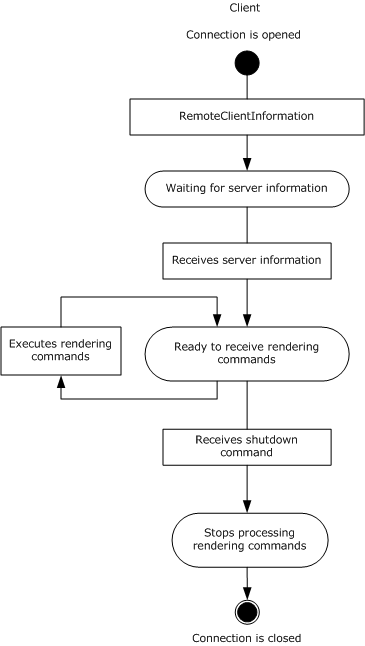

Figure 5: Client-Side Message Sequence

<a id="Section_3.2.1"></a>
### 3.2.1 Abstract Data Model

This section describes a conceptual model of possible data organization that an implementation maintains to participate in this protocol. The described organization is provided to facilitate the explanation of how the protocol behaves. This document does not mandate that implementations adhere to this model as long as their external behavior is consistent with that described in this document.

Conceptually, the application experience builds and manipulates a set of objects that describe how the rendering engine can present its scene. Messages in the protocol can be thought of as asynchronous method calls that modify the set of objects. The rendering engine can process all messages from a batch at the same time. If the [**renderer**](#gt_renderer) has to defer message processing because of a rendering deadline, it can defer the processing of an entire batch. It can never render output for states from a partially-processed batch. The application/experience can take advantage of this atomicity of processing by issuing complex, multi-faceted updates to the scene.

Wherever objects are created, the application/experience pre-allocates a [**handle**](#gt_handle) to identify the requested element. The rendering engine MUST maintain its handle table according to what handle creations/deletions it has heard about from the application.

Many of the rendering objects appear in pairs, with a device-agnostic and a device-specific version. This allows the protocol to address technology-specific or platform-specific features (for example, the differences between a 2D and 3D accelerator) while building off a core scene description model.

Much of the activity for rendering a scene is centered on the "visual tree" that is built up by the application experience. This tree describes a hierarchy of visual nodes that have position/bounds information, as well as an optional list of "rendering operations" to perform at the node. Logically, some rendering operations (for example, clipping with a gradient) assume a preorder traversal of the tree. Rendering engines can employ multiple traversals to accomplish a particular effect or optimization, but logically, side effects of protocol objects happen according to preorder enumeration. Continuing with the gradient example, the application can enclose a portion of the tree between the begin and end markers of a gradient, causing all rendering operations "in between" to be affected by the gradient.

<a id="Section_3.2.1.1"></a>
#### 3.2.1.1 ContextID

Logically, a [**context**](#gt_context) represents a messaging endpoint in the protocol. Each endpoint (context) is typically serviced by a thread running on the client or server and contains a number of instances that can receive messages. Context IDs are indices into a process-local routing table that enables the messaging implementation to quickly determine where to deliver messages (for example, place them in a memory queue for a thread or write them to a network protocol). Context IDs are managed by the client. In multi-client scenarios, where a "master" client hosts plugins, the master client manages the context IDs.

The server is made aware of context IDs through only a few messages. First, the context ID of the client and server are established upon connection (for more information, see section [2.2.1.2](#Section_2.2.1.2)). In multi-client scenarios, the master client establishes the connection. The context IDs for secondary clients are introduced when their [**handle**](#gt_handle) groups are created via the Context_CreateGroup message.

The main processing rule for context IDs on the server is that the server MUST always direct callback messages to the context that owns the handle for the callback's subject. For example, the subject of the HostWindowCallback messages is the HostWindow. When sending the HostWindowCallback_OnBeginKeyboardInput message, the server MUST look at the Object ID of the HostWindow and fetch the Context ID that is associated with the group in which the HostWindow lives. It MUST route the message to that context by populating the idContextDest of the BufferInfo accordingly.

<a id="Section_3.2.1.2"></a>
#### 3.2.1.2 ObjectID

Instances in a [**context**](#gt_context) have object IDs. The object ID is a 32-bit value that identifies an instance on the server. It is composed of three parts: the group number, the instance number, and the uniqueness value.

The group number identifies the group to which an instance belongs. All instances created for a client share a single group that is associated with that client. In multi-client scenarios, whereby a "master" client hosts plugins, groups are used to ensure that all server resources created for a secondary client are cleaned up when that client terminates.

The instance number identifies a slot in the [**handle**](#gt_handle) table of a group. Slots in the handle table can be occupied or free as instances are created and deleted. Clients can aggressively reuse low instance numbers to keep the overall table size down, which negates the requirement for specialized sparse storage.

The uniqueness number is a value that is incremented whenever a slot is used for a new instance. Consequently, a reused slot will yield a different handle than the last instance that occupied the slot, which guards against stale handle usage.

Object IDs are managed by the client. Instance creation requests to the server always include the object ID that is pre-allocated by the server. The server MUST populate its handle table based on the IDs it receives from the client in the creation requests. The handle table of the server is a cached copy of the handle table of the client. This configuration allows instance creation to be asynchronous and pipelined, which further enables quick creation and configuration of complex scenes with minimal round tripping. It is extremely common for a client to send messages that create, use, and destroy an object within a single batch buffer, even by reusing the same handle slot for multiple objects in that buffer.

The number of bits within the Object ID that are devoted to the group, instance, and uniqueness values is variable and specified by the client upon connection (see section [2.2.1.2](#Section_2.2.1.2)).

When servicing a creation request, the server MUST use the group and instance numbers to find the slot in the relevant handle table. It MUST validate that the slot is not in use before satisfying the request.

When decoding an Object ID reference, the server MUST use the group and instance numbers to find the slot in the relevant handle table. It MUST validate that the slot is in use and that the uniqueness value from the Object ID matches the current uniqueness value for the slot.

If any of the above validations fail, the server MUST treat the condition as fatal and close the connection.

<a id="Section_3.2.1.3"></a>
#### 3.2.1.3 TypeID

All messages are relative to a type. For example, the visual type has a SetContent message that can be sent to a visual instance. These can be thought of as "methods" in an object-oriented system. Types can have "static" messages, which are analogous to static methods in an object-oriented system. In fact, the Type ID is an Object ID in every manner, and static messages are messages whose subjects are not an instance, but rather the type ID itself.

Because Type IDs are Object IDs, the processing rules for Object IDs apply equally to Type IDs.

<a id="Section_3.2.2"></a>
### 3.2.2 Timers

None.

<a id="Section_3.2.3"></a>
### 3.2.3 Initialization

The initialization described in section [1.4](#Section_1.4) always takes place after the required protocols described in section [1.6](#Section_1.6) have taken place.

<a id="Section_3.2.4"></a>
### 3.2.4 Higher-Layer Triggered Events

None.

<a id="Section_3.2.5"></a>
### 3.2.5 Processing Events and Sequencing Rules

Although there are no specific rules, the obvious object-oriented sequencing MUST take place once the protocol is implemented. That is, the server creates objects before invoking them, and destroys them before closing connections.

<a id="Section_3.2.6"></a>
### 3.2.6 Timer Events

None.

<a id="Section_3.2.7"></a>
### 3.2.7 Other Local Events

None. It is up to the client to determine whether to successfully recover from unexpected failure. The Remote Rendering Protocol Version 2 does not recover because it does not maintain a record of messages that have been sent.

<a id="Section_4"></a>
# 4 Protocol Examples

None.

<a id="Section_5"></a>
# 5 Security

<a id="Section_5.1"></a>
## 5.1 Security Considerations for Implementers

The Remote Rendering Protocol Version 2 is security neutral. Security and privacy are implemented and enforced in the transport layer.

<a id="Section_6"></a>
# 6 Appendix A: Product Behavior

The information in this specification is applicable to the following Microsoft products or supplemental software. References to product versions include released service packs.

- Windows Vista operating system
- Windows 7 operating system
- Windows 8 operating system
- Windows 8.1 operating system
Exceptions, if any, are noted below. If a service pack or Quick Fix Engineering (QFE) number appears with the product version, behavior changed in that service pack or QFE. The new behavior also applies to subsequent service packs of the product unless otherwise specified. If a product edition appears with the product version, behavior is different in that product edition.

Unless otherwise specified, any statement of optional behavior in this specification that is prescribed using the terms "SHOULD" or "SHOULD NOT" implies product behavior in accordance with the SHOULD or SHOULD NOT prescription. Unless otherwise specified, the term "MAY" implies that the product does not follow the prescription.

<a id="Section_7"></a>
# 7 Change Tracking

No table of changes is available. The document is either new or has had no changes since its last release.

<a id="revision-history"></a>

## Revision History

| Date | Version | Revision Class | Comments |
| --- | --- | --- | --- |
| 8/27/2010 | 0.1 | New | Released new document. |
| 10/8/2010 | 0.1 | None | No changes to the meaning, language, or formatting of the technical content. |
| 11/19/2010 | 0.1 | None | No changes to the meaning, language, or formatting of the technical content. |
| 1/7/2011 | 0.1 | None | No changes to the meaning, language, or formatting of the technical content. |
| 2/11/2011 | 0.1 | None | No changes to the meaning, language, or formatting of the technical content. |
| 3/25/2011 | 0.1 | None | No changes to the meaning, language, or formatting of the technical content. |
| 5/6/2011 | 0.1 | None | No changes to the meaning, language, or formatting of the technical content. |
| 6/17/2011 | 0.2 | Minor | Clarified the meaning of the technical content. |
| 9/23/2011 | 0.2 | None | No changes to the meaning, language, or formatting of the technical content. |
| 12/16/2011 | 1.0 | Major | Updated and revised the technical content. |
| 3/30/2012 | 1.0 | None | No changes to the meaning, language, or formatting of the technical content. |
| 7/12/2012 | 1.0 | None | No changes to the meaning, language, or formatting of the technical content. |
| 10/25/2012 | 1.0 | None | No changes to the meaning, language, or formatting of the technical content. |
| 1/31/2013 | 2.0 | Major | Updated and revised the technical content. |
| 8/8/2013 | 3.0 | Major | Updated and revised the technical content. |
| 11/14/2013 | 4.0 | Major | Updated and revised the technical content. |
| 2/13/2014 | 4.0 | None | No changes to the meaning, language, or formatting of the technical content. |
| 5/15/2014 | 4.0 | None | No changes to the meaning, language, or formatting of the technical content. |
| 6/30/2015 | 5.0 | Major | Significantly changed the technical content. |
| 10/16/2015 | 5.0 | None | No changes to the meaning, language, or formatting of the technical content. |
| 7/14/2016 | 6.0 | Major | Significantly changed the technical content. |
| 6/1/2017 | 6.0 | None | No changes to the meaning, language, or formatting of the technical content. |
