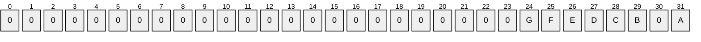

# [MS-RSP]: Remote Shutdown Protocol

Table of Contents

1 Introduction

- [1 Introduction](#Section_1)
  - [1.1 Glossary](#Section_1.1)
  - [1.2 References](#Section_1.2)
    - [1.2.1 Normative References](#Section_1.2.1)
    - [1.2.2 Informative References](#Section_1.2.2)
  - [1.3 Overview](#Section_1.3)
  - [1.4 Relationship to Other Protocols](#Section_1.4)
  - [1.5 Prerequisites/Preconditions](#Section_1.5)
  - [1.6 Applicability Statement](#Section_1.6)
  - [1.7 Versioning and Capability Negotiation](#Section_1.7)
  - [1.8 Vendor-Extensible Fields](#Section_1.8)
  - [1.9 Standards Assignments](#Section_1.9)

2 Messages

- [2 Messages](#Section_2)
  - [2.1 Transport](#Section_2.1)
  - [2.2 Common Data Types](#Section_2.2)
    - [2.2.1 RPC Binding Handles for Remote Shutdown Methods](#Section_2.2.1)
    - [2.2.2 REG_UNICODE_STRING](#Section_2.2.2)
  - [2.3 Shutdown Reasons](#Section_2.3)

3 Protocol Details

- [3 Protocol Details](#Section_3)
  - [3.1 WinReg Server Details](#Section_3.1)
    - [3.1.1 Abstract Data Model](#Section_3.1.1)
    - [3.1.2 Timers](#Section_3.1.2)
    - [3.1.3 Initialization](#Section_3.1.3)
    - [3.1.4 Message Processing Events and Sequencing Rules](#Section_3.1.4)
      - [3.1.4.1 BaseInitiateSystemShutdown (Opnum 24)](#Section_3.1.4.1)
      - [3.1.4.2 BaseAbortSystemShutdown (Opnum 25)](#Section_3.1.4.2)
      - [3.1.4.3 BaseInitiateSystemShutdownEx (Opnum 30)](#Section_3.1.4.3)
    - [3.1.5 Timer Events](#Section_3.1.5)
    - [3.1.6 Other Local Events](#Section_3.1.6)
  - [3.2 InitShutdown Server Details](#Section_3.2)
    - [3.2.1 Abstract Data Model](#Section_3.2.1)
    - [3.2.2 Timers](#Section_3.2.2)
    - [3.2.3 Initialization](#Section_3.2.3)
    - [3.2.4 Message Processing Events and Sequencing Rules](#Section_3.2.4)
      - [3.2.4.1 BaseInitiateShutdown (Opnum 0)](#Section_3.2.4.1)
      - [3.2.4.2 BaseAbortShutdown (Opnum 1)](#Section_3.2.4.2)
      - [3.2.4.3 BaseInitiateShutdownEx (Opnum 2)](#Section_3.2.4.3)
    - [3.2.5 Timer Events](#Section_3.2.5)
    - [3.2.6 Other Local Events](#Section_3.2.6)
  - [3.3 WindowsShutdown Server Details](#Section_3.3)
    - [3.3.1 Abstract Data Model](#Section_3.3.1)
    - [3.3.2 Timers](#Section_3.3.2)
    - [3.3.3 Initialization](#Section_3.3.3)
    - [3.3.4 Message Processing Events and Sequencing Rules](#Section_3.3.4)
      - [3.3.4.1 WsdrInitiateShutdown (Opnum 0)](#Section_3.3.4.1)
      - [3.3.4.2 WsdrAbortShutdown (Opnum 1)](#Section_3.3.4.2)
    - [3.3.5 Timer Events](#Section_3.3.5)
    - [3.3.6 Other Local Events](#Section_3.3.6)

4 Protocol Examples

- [4 Protocol Examples](#Section_4)

5 Security

- [5 Security](#Section_5)
  - [5.1 Security Considerations for Implementers](#Section_5.1)
  - [5.2 Index of Security Parameters](#Section_5.2)

6 Appendix A: Full IDL

- [6 Appendix A: Full IDL](#Section_6)
  - [6.1 Appendix A.1: initshutdown.idl](#Section_6.1)
  - [6.2 Appendix A.2: windowsshutdown.idl](#Section_6.2)
  - [6.3 Appendix A.3: winreg.idl](#Section_6.3)

7 Appendix B: Product Behavior

- [7 Appendix B: Product Behavior](#Section_7)

8 Change Tracking

- [8 Change Tracking](#Section_8)

For the legal notice and IP terms, see [LEGAL.md](../LEGAL.md).
Last updated: 4/23/2024.
See [Revision History](#revision-history) for full version history.

# 1 Introduction

This document specifies the Remote Shutdown Protocol. The Remote Shutdown Protocol is a remote procedure call (RPC)-based protocol used to shut down or terminate shutdown on a remote computer.

Sections 1.5, 1.8, 1.9, 2, and 3 of this specification are normative. All other sections and examples in this specification are informative.

## 1.1 Glossary

This document uses the following terms:

**client**: A computer on which the remote procedure call (RPC) client is executing.

**endpoint**: A network-specific address of a remote procedure call (RPC) server process for remote procedure calls. The actual name and type of the endpoint depends on the [**RPC**](#gt_remote-procedure-call-rpc) protocol sequence that is being used. For example, for RPC over TCP (RPC Protocol Sequence ncacn_ip_tcp), an endpoint might be TCP port 1025. For RPC over Server Message Block (RPC Protocol Sequence ncacn_np), an endpoint might be the name of a [**named pipe**](#gt_named-pipe). For more information, see [[C706]](https://go.microsoft.com/fwlink/?LinkId=89824).

**handle**: Any token that can be used to identify and access an object such as a device, file, or a window.

**Interface Definition Language (IDL)**: The International Standards Organization (ISO) standard language for specifying the interface for remote procedure calls. For more information, see [C706] section 4.

**named pipe**: A named, one-way, or duplex pipe for communication between a pipe server and one or more pipe clients.

**opnum**: An operation number or numeric identifier that is used to identify a specific [**remote procedure call (RPC)**](#gt_remote-procedure-call-rpc) method or a method in an interface. For more information, see [C706] section 12.5.2.12 or [MS-RPCE](../MS-RPCE/MS-RPCE.md).

**remote procedure call (RPC)**: A communication protocol used primarily between client and server. The term has three definitions that are often used interchangeably: a runtime environment providing for communication facilities between computers (the RPC runtime); a set of request-and-response message exchanges between computers (the RPC exchange); and the single message from an RPC exchange (the RPC message). For more information, see [C706].

**RPC protocol sequence**: A character string that represents a valid combination of a [**remote procedure call (RPC)**](#gt_remote-procedure-call-rpc) protocol, a network layer protocol, and a transport layer protocol, as described in [C706] and [MS-RPCE].

**server**: A computer on which the [**remote procedure call (RPC)**](#gt_remote-procedure-call-rpc) server is executing.

**Server Message Block (SMB)**: A protocol that is used to request file and print services from server systems over a network. The SMB protocol extends the CIFS protocol with additional security, file, and disk management support. For more information, see [[CIFS]](https://go.microsoft.com/fwlink/?linkid=2109334) and [MS-SMB](../MS-SMB/MS-SMB.md).

**universally unique identifier (UUID)**: A 128-bit value. UUIDs can be used for multiple purposes, from tagging objects with an extremely short lifetime, to reliably identifying very persistent objects in cross-process communication such as client and server interfaces, manager entry-point vectors, and [**RPC**](#gt_remote-procedure-call-rpc) objects. UUIDs are highly likely to be unique. UUIDs are also known as globally unique identifiers (GUIDs) and these terms are used interchangeably in the Microsoft protocol technical documents (TDs). Interchanging the usage of these terms does not imply or require a specific algorithm or mechanism to generate the UUID. Specifically, the use of this term does not imply or require that the algorithms described in [[RFC4122]](https://go.microsoft.com/fwlink/?LinkId=90460) or [C706] must be used for generating the UUID.

**well-known endpoint**: A preassigned, network-specific, stable address for a particular client/server instance. For more information, see [C706].

**MAY, SHOULD, MUST, SHOULD NOT, MUST NOT:** These terms (in all caps) are used as defined in [[RFC2119]](https://go.microsoft.com/fwlink/?LinkId=90317). All statements of optional behavior use either MAY, SHOULD, or SHOULD NOT.

## 1.2 References

Links to a document in the Microsoft Open Specifications library point to the correct section in the most recently published version of the referenced document. However, because individual documents in the library are not updated at the same time, the section numbers in the documents may not match. You can confirm the correct section numbering by checking the [Errata](https://go.microsoft.com/fwlink/?linkid=850906).

### 1.2.1 Normative References

We conduct frequent surveys of the normative references to assure their continued availability. If you have any issue with finding a normative reference, please contact [dochelp@microsoft.com](mailto:dochelp@microsoft.com). We will assist you in finding the relevant information.

[C706] The Open Group, "DCE 1.1: Remote Procedure Call", C706, August 1997, [https://publications.opengroup.org/c706](https://go.microsoft.com/fwlink/?LinkId=89824)

**Note** Registration is required to download the document.

[MS-ERREF] Microsoft Corporation, "[Windows Error Codes](../MS-ERREF/MS-ERREF.md)".

[MS-RPCE] Microsoft Corporation, "[Remote Procedure Call Protocol Extensions](../MS-RPCE/MS-RPCE.md)".

[MS-RRP] Microsoft Corporation, "[Windows Remote Registry Protocol](../MS-RRP/MS-RRP.md)".

[MS-SMB] Microsoft Corporation, "[Server Message Block (SMB) Protocol](../MS-SMB/MS-SMB.md)".

[RFC2119] Bradner, S., "Key words for use in RFCs to Indicate Requirement Levels", BCP 14, RFC 2119, March 1997, [https://www.rfc-editor.org/info/rfc2119](https://go.microsoft.com/fwlink/?LinkId=90317)

### 1.2.2 Informative References

[MSDN-SysShutdown] Microsoft Corporation, "System Shutdown", [https://msdn.microsoft.com/en-us/library/windows/desktop/aa376882(v=vs.85).aspx](https://go.microsoft.com/fwlink/?linkid=874654)

## 1.3 Overview

The Remote Shutdown Protocol is designed for shutting down a remote computer or for terminating the shutdown of a remote computer during the shutdown waiting period. Following are some of the examples of this protocol's applications:

- Shut down a remote computer and display a message in the shutdown dialog box for 30 seconds.
- Terminate a requested remote system shutdown during the shutdown waiting period.
- Force applications to be closed, log off users, and shut down a remote computer.
- Reboot a remote computer.
In this document, the use of the terms [**client**](#gt_client) and [**server**](#gt_server) are in the protocol client and server context. This means that the client will initiate an [**RPC**](#gt_remote-procedure-call-rpc) call and the server will respond.

This is an RPC-based protocol. The protocol operation is stateless.

This is a simple request-response protocol. For every method that the server receives, it executes the method and returns a completion. The client simply returns the completion status to the caller. This is a stateless protocol; each method call is independent of any previous method calls.

## 1.4 Relationship to Other Protocols

The Remote Shutdown Protocol is dependent upon [**RPC**](#gt_remote-procedure-call-rpc) and [**SMB**](#gt_server-message-block-smb) for its transport. For the InitShutdown interface (section [3.2](#Section_3.2)), this protocol uses RPC [MS-RPCE](../MS-RPCE/MS-RPCE.md) over [**named pipes**](#gt_named-pipe). Named pipes, in turn, use the SMB protocol [MS-SMB](../MS-SMB/MS-SMB.md).

No other protocol currently depends on the Remote Shutdown Protocol.

## 1.5 Prerequisites/Preconditions

The Remote Shutdown Protocol is an [**RPC**](#gt_remote-procedure-call-rpc) interface and, as a result, has the prerequisites specified in [MS-RPCE](../MS-RPCE/MS-RPCE.md) (section 1.5) as being common to RPC interfaces.

It is assumed that a Remote Shutdown Protocol client has obtained the name of a remote computer that supports the Remote Shutdown Protocol before this protocol is invoked.

All remote shutdown methods are RPC calls from the client to the server that perform the complete operation in a single call. No shared state between the client and server is assumed.

## 1.6 Applicability Statement

This protocol is only appropriate for shutting down a remote computer or terminating shutdown during the shutdown waiting period.

## 1.7 Versioning and Capability Negotiation

This document covers versioning issues in the following areas:

- **Supported Transports:** The Remote Shutdown Protocol uses [**RPC**](#gt_remote-procedure-call-rpc) over [**named pipes**](#gt_named-pipe) and RPC over TCP/IP as its only transports. The protocol sequences are specified in section [2.1](#Section_2.1).
- **Protocol Versions:** Information about RPC versioning and capability negotiation in this situation is specified in [[C706]](https://go.microsoft.com/fwlink/?LinkId=89824) and [MS-RPCE](../MS-RPCE/MS-RPCE.md) (section 1.7).
- **Security and Authentication Methods:** As specified in [MS-RPCE] section 3.2.1.4.1.

## 1.8 Vendor-Extensible Fields

This protocol cannot be extended by any party other than Microsoft.

This protocol uses Win32 error codes. These values are taken from the Windows error number space specified in [MS-ERREF](../MS-ERREF/MS-ERREF.md). Vendors SHOULD reuse those values with their indicated meaning. Choosing any other value runs the risk of a collision in the future.

## 1.9 Standards Assignments

This protocol has no standards assignments.

# 2 Messages

## 2.1 Transport

This protocol uses the following [**RPC protocol sequences**](#gt_rpc-protocol-sequence) as specified in [MS-RPCE](../MS-RPCE/MS-RPCE.md) (sections 2.1.1.1 for TCP/IP - NCACN_IP_TCP, 2.1.1.2 for SMB - NCACN_NP):

- [**RPC**](#gt_remote-procedure-call-rpc) over TCP/IP (for the WindowsShutdown RPC interface)
- RPC over [**named pipes**](#gt_named-pipe) (for the WinReg and InitShutdown RPC interfaces)
This protocol uses the following RPC [**endpoints**](#gt_endpoint):

- dynamic endpoints as specified in [[C706]](https://go.microsoft.com/fwlink/?LinkId=89824) part 4 (for the WindowsShutdown RPC interface)
- [**well-known endpoint**](#gt_well-known-endpoint) \PIPE\InitShutdown over named pipes (for the InitShutdown RPC interface)
- well-known endpoint \PIPE\winreg over named pipes (for the WinReg RPC interface)
This protocol MUST use the following [**UUIDs**](#gt_universally-unique-identifier-uuid):

- WinReg Interface: 338CD001-2244-31F1-AAAA-900038001003
- InitShutdown Interface: 894DE0C0-0D55-11D3-A322-00C04FA321A1
- WindowsShutdown Interface: D95AFE70-A6D5-4259-822E-2C84DA1DDB0D

## 2.2 Common Data Types

This protocol MUST indicate to the [**RPC**](#gt_remote-procedure-call-rpc) runtime that it is to support both the NDR and NDR64 transfer syntaxes and provide a negotiation mechanism for determining which transfer syntax will be used ([MS-RPCE](../MS-RPCE/MS-RPCE.md) section 3.1.1.5.1.1).

In addition to RPC base types and definitions specified in [[C706]](https://go.microsoft.com/fwlink/?LinkId=89824) and [MS-RPCE], additional data types are defined in this section.

The following list summarizes the datatypes that are defined in this specification:

- [PREGISTRY_SERVER_NAME (section 2.2.1)](#Section_2.2.1)
- [REG_UNICODE_STRING (section 2.2.2)](#Section_2.2.2)

### 2.2.1 RPC Binding Handles for Remote Shutdown Methods

[**RPC**](#gt_remote-procedure-call-rpc) binding is the process of creating a logical connection between a [**client**](#gt_client) and a [**server**](#gt_server). The information that composes the binding between client and server is represented by a structure called a binding handle. RPC binding handles are specified in [MS-RPCE](../MS-RPCE/MS-RPCE.md) section 3.1.1.5.1.1.2.

All remote shutdown RPC methods accept an RPC binding [**handle**](#gt_handle) as the first parameter. The shutdown methods (sections [3.3.4.1](#Section_3.3.4.1) and [3.3.4.2](#Section_3.3.4.2)) use an RPC primitive binding handle. The WinReg and InitShutdown RPC methods use a custom binding handle.

This type is declared as follows:

typedef [handle] wchar_t* PREGISTRY_SERVER_NAME;

This custom binding handle is actually a wrapper around a primitive RPC binding handle (type handle_t); the PREGISTRY_SERVER_NAME type is maintained only for backward. This custom binding handle is mapped to a primitive binding handle using bind and unbind routines, as specified in [MS-RPCE].

### 2.2.2 REG_UNICODE_STRING

This **REG_UNICODE_STRING** structure represents a counted string of Unicode (UTF-16) characters.

typedef struct _REG_UNICODE_STRING {

unsigned short Length;

unsigned short MaximumLength;

[size_is(MaximumLength/2), length_is(Length/2)]

unsigned short* Buffer;

} REG_UNICODE_STRING,

*PREG_UNICODE_STRING;

**Length:** The number of bytes actually used by the string. Because all UTF-16 characters occupy 2 bytes, this MUST be an even number in the range [0...65534]. The behavior for odd values is unspecified.

**MaximumLength:** The number of bytes allocated for the string. This MUST be an even number in the range [**Length**...65534].

**Buffer:** The Unicode UTF-16 characters comprising the string described by the structure. Note that counted strings might be terminated by a 0x0000 character, by convention; if such a terminator is present, it SHOULD NOT count toward the **Length** (but MUST, of course, be included in the **MaximumLength**).

## 2.3 Shutdown Reasons

This dwReason type is declared as follows:

typedef ULONG dwReason;

Some [**opnums**](#gt_opnum) allow the transmission of a shutdown reason. This reason is composed of a major reason code, an optional minor reason code, and optional flags, which MUST be a bitwise OR of the flags.

Major reason codes are described in the following table.

| Constant/value | Description |
| --- | --- |
| SHTDN_REASON_MAJOR_APPLICATION 0x00040000 | Application issue |
| SHTDN_REASON_MAJOR_HARDWARE 0x00010000 | Hardware issue |
| SHTDN_REASON_MAJOR_LEGACY_API 0x00070000 | The InitiateSystemShutdown function was used instead of InitiateSystemShutdownEx |
| SHTDN_REASON_MAJOR_OPERATINGSYSTEM 0x00020000 | Operating system issue |
| SHTDN_REASON_MAJOR_OTHER 0x00000000 | Other issue |
| SHTDN_REASON_MAJOR_POWER 0x00060000 | Power failure |
| SHTDN_REASON_MAJOR_SOFTWARE 0x00030000 | Software issue |
| SHTDN_REASON_MAJOR_SYSTEM 0x00050000 | System failure |

Any minor reason code MAY be used with any major reason code. Minor reason codes are described in the following table.

| Constant/value | Description |
| --- | --- |
| SHTDN_REASON_MINOR_BLUESCREEN 0x0000000F | Blue screen crash event |
| SHTDN_REASON_MINOR_CORDUNPLUGGED 0x0000000b | Unplugged |
| SHTDN_REASON_MINOR_DISK 0x00000007 | Disk |
| SHTDN_REASON_MINOR_ENVIRONMENT 0x0000000c | Environment |
| SHTDN_REASON_MINOR_HARDWARE_DRIVER 0x0000000d | Driver |
| SHTDN_REASON_MINOR_HOTFIX 0x00000011 | Hot fix |
| SHTDN_REASON_MINOR_HOTFIX_UNINSTALL 0x00000017 | Hot fix uninstallation |
| SHTDN_REASON_MINOR_HUNG 0x00000005 | Unresponsive |
| SHTDN_REASON_MINOR_INSTALLATION 0x00000002 | Installation |
| SHTDN_REASON_MINOR_MAINTENANCE 0x00000001 | Maintenance |
| SHTDN_REASON_MINOR_MMC 0x00000019 | Management tool<1> |
| SHTDN_REASON_MINOR_NETWORK_CONNECTIVITY 0x00000014 | Network connectivity |
| SHTDN_REASON_MINOR_NETWORKCARD 0x00000009 | Network card |
| SHTDN_REASON_MINOR_OTHER 0x00000000 | Other issue |
| SHTDN_REASON_MINOR_OTHERDRIVER 0x0000000e | Other driver event |
| SHTDN_REASON_MINOR_POWER_SUPPLY 0x0000000a | Power supply |
| SHTDN_REASON_MINOR_PROCESSOR 0x00000008 | Processor |
| SHTDN_REASON_MINOR_RECONFIG 0x00000004 | Reconfigure |
| SHTDN_REASON_MINOR_SECURITY 0x00000013 | Security issue |
| SHTDN_REASON_MINOR_SECURITYFIX 0x00000012 | Security patch |
| SHTDN_REASON_MINOR_SECURITYFIX_UNINSTALL 0x00000018 | Security patch uninstallation |
| SHTDN_REASON_MINOR_SERVICEPACK 0x00000010 | Service pack |
| SHTDN_REASON_MINOR_SERVICEPACK_UNINSTALL 0x00000016 | Service pack uninstallation |
| SHTDN_REASON_MINOR_TERMSRV 0x00000020 | Terminal services |
| SHTDN_REASON_MINOR_UNSTABLE 0x00000006 | Unstable |
| SHTDN_REASON_MINOR_UPGRADE 0x00000003 | Installation of software on the system required reboot |
| SHTDN_REASON_MINOR_WMI 0x00000015 | WMI issue |

The following optional flags provide additional information about the event.

| Constant/Value | Description |
| --- | --- |
| SHTDN_REASON_FLAG_USER_DEFINED 0x40000000 | The reason code is defined by the user.<2> If this flag is not present, the reason code is defined by the system. |
| SHTDN_REASON_FLAG_PLANNED 0x80000000 | The shutdown was planned. If this flag is not present, the shutdown was unplanned. |

# 3 Protocol Details

The remote shutdown [**RPC**](#gt_remote-procedure-call-rpc) interfaces are used to shut down or, during the shutdown waiting period, abort shutdown on a remote computer.

This section presents the details of the Remote Shutdown Protocol:

- Section [3.1](#Section_3.1) specifies the WinReg RPC interface.
- Section [3.2](#Section_3.2) specifies the InitShutdown RPC interface.
- Section [3.3](#Section_3.3) specifies the WindowsShutdown RPC interface.
All remote shutdown methods return 0x00000000 on success; otherwise, they return a 32-bit, nonzero Win32 error code. For more information on Win32 error values, see [MS-ERREF](../MS-ERREF/MS-ERREF.md).

The default pointer type for the shutdown RPC interface is pointer_default(unique). Method calls are received at a dynamically assigned [**endpoint**](#gt_endpoint) ([MS-RPCE](../MS-RPCE/MS-RPCE.md) section 2.1.1.1). The endpoints for the Netlogon service are negotiated by the RPC endpoint mapper ([MS-RPCE] section 2.1.1.1).

The client side of this protocol is simply a pass-through. That is, there are no additional timers or other states required on the client side of this protocol. Calls made by the higher-layer protocol or application are passed directly to the transport, and the results returned by the transport are passed directly back to the higher-layer protocol or application.

## 3.1 WinReg Server Details

The following section specifies data and state maintained by the WinReg [**RPC**](#gt_remote-procedure-call-rpc) [**server**](#gt_server). It includes details about receiving WinReg RPC methods on the server side of the client-server communication. The provided data is to facilitate the explanation of how the protocol behaves. This section does not mandate that implementations adhere to this model as long as their external behavior is consistent with that described in this document.

### 3.1.1 Abstract Data Model

This is an RPC-based protocol. The [**server**](#gt_server) does not maintain [**client**](#gt_client) state information. The protocol operation is stateless.

This is a simple request-response protocol. For every method that the server receives, it executes the method and returns a completion. The client simply returns the completion status to the caller. This is a stateless protocol; each method call is independent of any previous method calls.

### 3.1.2 Timers

No protocol timers are required beyond those used internally by [**RPC**](#gt_remote-procedure-call-rpc) to implement resiliency to network outages.

### 3.1.3 Initialization

The WinReg [**server**](#gt_server) side registers an [**endpoint**](#gt_endpoint) with [**RPC**](#gt_remote-procedure-call-rpc) over named pipes transport ([MS-RPCE](../MS-RPCE/MS-RPCE.md) section 2.1.1.2), using the "\PIPE\Shutdown" [**named pipe**](#gt_named-pipe).

### 3.1.4 Message Processing Events and Sequencing Rules

This protocol MUST indicate to the [**RPC**](#gt_remote-procedure-call-rpc) runtime that it is to perform a strict NDR data consistency check at target level 5.0 ([MS-RPCE](../MS-RPCE/MS-RPCE.md) section 3.1.1.5.3).

Remote shutdown communication between a client and a server occurs through RPC calls.

The WinReg interface includes the following methods.<3>

Methods in RPC Opnum Order

| Method | Description |
| --- | --- |
| Opnum0NotImplemented | Not implemented. Opnum: 0 |
| Opnum1NotImplemented | Not implemented. Opnum: 1 |
| Opnum2NotImplemented | Not implemented. Opnum: 2 |
| Opnum3NotImplemented | Not implemented. Opnum: 3 |
| Opnum4NotImplemented | Not implemented. Opnum: 4 |
| Opnum5NotImplemented | Not implemented. Opnum: 5 |
| Opnum6NotImplemented | Not implemented. Opnum: 6 |
| Opnum7NotImplemented | Not implemented. Opnum: 7 |
| Opnum8NotImplemented | Not implemented. Opnum: 8 |
| Opnum9NotImplemented | Not implemented. Opnum: 9 |
| Opnum10NotImplemented | Not implemented. Opnum: 10 |
| Opnum11NotImplemented | Not implemented. Opnum: 11 |
| Opnum12NotImplemented | Not implemented. Opnum: 12 |
| Opnum13NotImplemented | Not implemented. Opnum: 13 |
| Opnum14NotImplemented | Not implemented. Opnum: 14 |
| Opnum15NotImplemented | Not implemented. Opnum: 15 |
| Opnum16NotImplemented | Not implemented. Opnum: 16 |
| Opnum17NotImplemented | Not implemented. Opnum: 17 |
| Opnum18NotImplemented | Not implemented. Opnum: 18 |
| Opnum19NotImplemented | Not implemented. Opnum: 19 |
| Opnum20NotImplemented | Not implemented. Opnum: 20 |
| Opnum21NotImplemented | Not implemented. Opnum: 21 |
| Opnum22NotImplemented | Not implemented. Opnum: 22 |
| Opnum23NotImplemented | Not implemented. Opnum: 23 |
| [BaseInitiateSystemShutdown](#Section_3.1.4.1) | The BaseInitiateSystemShutdown method is used to initiate the shutdown of the remote computer. Opnum: 24 |
| [BaseAbortSystemShutdown](#Section_3.1.4.2) | The BaseAbortSystemShutdown method is used to abort the shutdown of the remote computer within the waiting period. Opnum: 25 |
| Opnum26NotImplemented | Not implemented. Opnum: 26 |
| Opnum27NotImplemented | Not implemented. Opnum: 27 |
| Opnum28NotImplemented | Not implemented. Opnum: 28 |
| Opnum29NotImplemented | Not implemented. Opnum: 29 |
| [BaseInitiateSystemShutdownEx](#Section_3.1.4.3) | The BaseInitiateShutdownEx method is used to initiate the shutdown of the remote computer with the reason for initiating the shutdown given as a parameter to the call. Opnum: 30 |

**Note** Gaps in the [**opnum**](#gt_opnum) numbering sequence represent opnums of methods specified in [MS-RRP](../MS-RRP/MS-RRP.md). Exceptions MUST NOT be thrown beyond those thrown by the underlying RPC protocol [MS-RPCE], unless specified otherwise.

#### 3.1.4.1 BaseInitiateSystemShutdown (Opnum 24)

The **BaseInitiateSystemShutdown** method is used to initiate the shutdown of the remote computer.<4>

unsigned long BaseInitiateSystemShutdown(

[in, unique] PREGISTRY_SERVER_NAME ServerName,

[in, unique] PREG_UNICODE_STRING lpMessage,

[in] unsigned long dwTimeout,

[in] unsigned char bForceAppsClosed,

[in] unsigned char bRebootAfterShutdown

);

**ServerName:** The custom [**RPC**](#gt_remote-procedure-call-rpc) binding [**handle**](#gt_handle) ([PREGISTRY_SERVER_NAME (section 2.2.1)](#Section_2.2.1)).

**lpMessage:** Null-terminated Unicode string that contains the message to display during the shutdown waiting period. If this parameter is NULL, no message MUST be displayed.

**dwTimeout:** Number of seconds to wait before shutting down.

**bForceAppsClosed:** If TRUE, all applications SHOULD be terminated unconditionally.

**bRebootAfterShutdown:** If TRUE, the system SHOULD shut down and reboot. If FALSE, the system SHOULD only shut down.

**Return Values:** The method returns ERROR_SUCCESS (0x00000000) on success; otherwise, it returns a nonzero error code.

On receiving this call, the server MUST perform the following validation step:

- Verify that the caller has sufficient privileges to shut down the computer; otherwise, the server MUST return ERROR_ACCESS_DENIED.

#### 3.1.4.2 BaseAbortSystemShutdown (Opnum 25)

The **BaseAbortSystemShutdown** method is used to terminate the shutdown of the remote computer within the waiting period.<5>

unsigned long BaseAbortSystemShutdown(

[in, unique] PREGISTRY_SERVER_NAME ServerName

);

**ServerName:** The custom [**RPC**](#gt_remote-procedure-call-rpc) binding [**handle**](#gt_handle) ([PREGISTRY_SERVER_NAME (section 2.2.1)](#Section_2.2.1)).

**Return Values:** The method returns ERROR_SUCCESS (0x00000000) on success; otherwise, it returns a nonzero error code.

On receiving this call, the server MUST perform the following validation step:

- Verify that the caller has sufficient privileges to shut down the computer; otherwise, the server MUST return ERROR_ACCESS_DENIED.

#### 3.1.4.3 BaseInitiateSystemShutdownEx (Opnum 30)

The **BaseInitiateSystemShutdownEx** method is used to initiate the shutdown of the remote computer with the reason for initiating the shutdown given as a parameter to the call.<6>

unsigned long BaseInitiateSystemShutdownEx(

[in, unique] PREGISTRY_SERVER_NAME ServerName,

[in, unique] PREG_UNICODE_STRING lpMessage,

[in] unsigned long dwTimeout,

[in] unsigned char bForceAppsClosed,

[in] unsigned char bRebootAfterShutdown,

[in] unsigned long dwReason

);

**ServerName:** The custom [**RPC**](#gt_remote-procedure-call-rpc) binding [**handle**](#gt_handle) ([PREGISTRY_SERVER_NAME (section 2.2.1)](#Section_2.2.1)).

**lpMessage:** Null-terminated Unicode string that contains the message to display during the shutdown waiting period. If this parameter is NULL, no message MUST be displayed.

**dwTimeout:** Number of seconds to wait before shutting down.

**bForceAppsClosed:** If TRUE, all applications SHOULD be terminated unconditionally.

**bRebootAfterShutdown:** If TRUE, the system SHOULD shutdown and reboot. If FALSE, the system SHOULD only shut down.

**dwReason:** Reason for initiating the shutdown (section [2.3](#Section_2.3)). The **dwReason** SHOULD be used for log entries for the shutdown event.

**Return Values:** The method returns ERROR_SUCCESS (0x00000000) on success; otherwise, it returns a nonzero error code.

On receiving this call, the server MUST perform the following validation step:

- Verify that the caller has sufficient privileges to shut down the computer; otherwise, the server MUST return ERROR_ACCESS_DENIED.

### 3.1.5 Timer Events

None.

### 3.1.6 Other Local Events

None.

## 3.2 InitShutdown Server Details

The following section specifies data and state maintained by the InitShutdown [**RPC**](#gt_remote-procedure-call-rpc) server. It includes details about receiving InitShutdown RPC methods on the server side of the client-server communication. The provided data is to facilitate the explanation of how the protocol behaves. This section does not mandate that implementations adhere to this model, as long as their external behavior is consistent with that described in this document.

### 3.2.1 Abstract Data Model

This is an RPC-based protocol. The [**server**](#gt_server) does not maintain [**client**](#gt_client) state information. The protocol operation is stateless.

This is a simple request-response protocol. For every method that the server receives, it executes the method and returns a completion. The client simply returns the completion status to the caller. This is a stateless protocol; each method call is independent of any previous method calls.

### 3.2.2 Timers

No protocol timers are required beyond those used internally by [**RPC**](#gt_remote-procedure-call-rpc) to implement resiliency to network outages.

### 3.2.3 Initialization

The InitShutdown interface [**server**](#gt_server) side registers an [**endpoint**](#gt_endpoint) with [**RPC**](#gt_remote-procedure-call-rpc) over [**named pipe**](#gt_named-pipe)s transport ([MS-RPCE](../MS-RPCE/MS-RPCE.md) section 2.1.1.2), using the "\PIPE\InitShutdown" named pipe.

### 3.2.4 Message Processing Events and Sequencing Rules

This protocol MUST indicate to the [**RPC**](#gt_remote-procedure-call-rpc) runtime that it is to perform a strict NDR data consistency check at target level 5.0 ([MS-RPCE](../MS-RPCE/MS-RPCE.md) section 3.1.1.5.3).

The **InitShutdown** interface includes the following methods.<7>

Methods in RPC Opnum Order

| Method | Description |
| --- | --- |
| [BaseInitiateShutdown](#Section_3.2.4.1) | The BaseInitiateShutdown method is used to initiate the shutdown of the remote computer. Opnum: 0 |
| [BaseAbortShutdown](#Section_3.2.4.2) | The BaseAbortShutdown method is used to terminate the shutdown of the remote computer within the waiting period. Opnum: 1 |
| [BaseInitiateShutdownEx](#Section_3.2.4.3) | The BaseInitiateShutdownEx method extends BaseInitiateShutdown to include a reason for shut down. Opnum: 2 |

**Note** Exceptions MUST NOT be thrown beyond those thrown by the underlying RPC protocol [MS-RPCE], unless specified otherwise.

#### 3.2.4.1 BaseInitiateShutdown (Opnum 0)

The **BaseInitiateShutdown** method is used to initiate the shutdown of the remote computer.<8>

unsigned long BaseInitiateShutdown(

[in, unique] PREGISTRY_SERVER_NAME ServerName,

[in, unique] PREG_UNICODE_STRING lpMessage,

[in] unsigned long dwTimeout,

[in] unsigned char bForceAppsClosed,

[in] unsigned char bRebootAfterShutdown

);

**ServerName:** The custom [**RPC**](#gt_remote-procedure-call-rpc) binding [**handle**](#gt_handle) ([PREGISTRY_SERVER_NAME (section 2.2.1)](#Section_2.2.1)).

**lpMessage:** Null-terminated Unicode string that contains the message to display during the shutdown waiting period. If this parameter is NULL, no message MUST be displayed.

**dwTimeout:** Number of seconds to wait before shutting down.

**bForceAppsClosed:** If TRUE, all applications SHOULD be terminated unconditionally.

**bRebootAfterShutdown:** If TRUE, the system SHOULD shut down and reboot. If FALSE, the system SHOULD only shut down.

**Return Values:** The method returns ERROR_SUCCESS (0x00000000) on success; otherwise, it returns a nonzero error code.<9>

On receiving this call, the server MUST perform the following validation step:

- Verify that the caller has sufficient privileges to shut down the computer; otherwise, the server MUST return ERROR_ACCESS_DENIED.

#### 3.2.4.2 BaseAbortShutdown (Opnum 1)

The **BaseAbortShutdown** method is used to terminate the shutdown of the remote computer within the waiting period.<10>

unsigned long BaseAbortShutdown(

[in, unique] PREGISTRY_SERVER_NAME ServerName

);

**ServerName:** The custom [**RPC**](#gt_remote-procedure-call-rpc) binding [**handle**](#gt_handle) ([PREGISTRY_SERVER_NAME (section 2.2.1)](#Section_2.2.1)).

**Return Values:** The method returns ERROR_SUCCESS (0x00000000) on success; otherwise, it returns a nonzero error code.

On receiving this call, the server MUST perform the following validation step:

- Verify that the caller has sufficient privileges to shut down the computer; otherwise, the server MUST return ERROR_ACCESS_DENIED.

#### 3.2.4.3 BaseInitiateShutdownEx (Opnum 2)

The **BaseInitiateShutdownEx** method is used to initiate the shutdown of the remote computer.<11>

unsigned long BaseInitiateShutdownEx(

[in, unique] PREGISTRY_SERVER_NAME ServerName,

[in, unique] PREG_UNICODE_STRING lpMessage,

[in] unsigned long dwTimeout,

[in] unsigned char bForceAppsClosed,

[in] unsigned char bRebootAfterShutdown,

[in] unsigned long dwReason

);

**ServerName:** The custom [**RPC**](#gt_remote-procedure-call-rpc) binding [**handle**](#gt_handle) ([PREGISTRY_SERVER_NAME (section 2.2.1)](#Section_2.2.1)).

**lpMessage:** Null-terminated Unicode string that contains the message to display during the shutdown waiting period. If this parameter is NULL, no message MUST be displayed.

**dwTimeout:** Number of seconds to wait before shutting down.

**bForceAppsClosed:** If TRUE, all applications SHOULD be terminated unconditionally.

**bRebootAfterShutdown:** If TRUE, the system SHOULD shut down and reboot. If FALSE, the system SHOULD only shut down.

**dwReason:** Reason for initiating the shutdown (section [2.3](#Section_2.3)).

**Return Values:** The method returns ERROR_SUCCESS (0x00000000) on success; otherwise, it returns a nonzero error code.

On receiving this call, the server MUST perform the following validation step:

- Verify that the caller has sufficient privileges to shut down the computer; otherwise, the server MUST return ERROR_ACCESS_DENIED. <12>

### 3.2.5 Timer Events

None.

### 3.2.6 Other Local Events

None.

## 3.3 WindowsShutdown Server Details

The following section specifies data and state maintained by the WindowsShutdown [**RPC**](#gt_remote-procedure-call-rpc) server. It includes details about receiving WindowsShutdown RPC methods on the server side of the client-server communication. The provided data is to facilitate the explanation of how the protocol behaves. This section does not mandate that implementations adhere to this model as long as their external behavior is consistent with that described in this document.

### 3.3.1 Abstract Data Model

This is an RPC-based protocol. The [**server**](#gt_server) does not maintain [**client**](#gt_client) state information. The protocol operation is stateless.

This is a simple request-response protocol. For every method that the server receives, it executes the method and returns a completion. The client simply returns the completion status to the caller. This is a stateless protocol; each method call is independent of any previous method calls.

### 3.3.2 Timers

No protocol timers are required beyond those used internally by [**RPC**](#gt_remote-procedure-call-rpc) to implement resiliency to network outages.

### 3.3.3 Initialization

The WindowsShutdown interface [**server**](#gt_server) side registers a dynamic [**endpoint**](#gt_endpoint) with [**RPC**](#gt_remote-procedure-call-rpc) over the TCP/IP (ncacn_ip_tcp) transport ([MS-RPCE](../MS-RPCE/MS-RPCE.md) section 2.1.1.1).

### 3.3.4 Message Processing Events and Sequencing Rules

This protocol MUST indicate to the [**RPC**](#gt_remote-procedure-call-rpc) runtime that it is to perform a strict NDR data consistency check at target level 5.0 ([MS-RPCE](../MS-RPCE/MS-RPCE.md) section 3.1.1.5.3).

Remote shutdown communication between a [**client**](#gt_client) and a server occurs through RPC calls.

The WindowsShutdown interface includes the following methods.<13>

Methods in RPC Opnum Order

| Method | Description |
| --- | --- |
| [WsdrInitiateShutdown](#Section_3.3.4.1) | The WsdrInitiateShutdown method is used to initiate the shutdown of the remote computer. Opnum: 0 |
| [WsdrAbortShutdown](#Section_3.3.4.2) | The WsdrAbortShutdown method is used to abort the shutdown of the remote computer within the waiting period. Opnum: 1 |

**Note** Exceptions MUST NOT be thrown, except those thrown by the underlying RPC protocol [MS-RPCE], unless specified otherwise.

#### 3.3.4.1 WsdrInitiateShutdown (Opnum 0)

The **WsdrInitiateShutdown** method is used to initiate the shutdown of the remote computer.<14>

unsigned long WsdrInitiateShutdown(

[ in ] handle_t Binding,

[ in, unique ] PREG_UNICODE_STRING lpMessage,

[ in ] unsigned long dwGracePeriod,

[ in ] unsigned long dwShudownFlags,

[ in ] unsigned long dwReason,

[ in, unique ] PREG_UNICODE_STRING lpClientHint);

**Binding:** Primitive [**RPC**](#gt_remote-procedure-call-rpc) [**handle**](#gt_handle) that identifies a particular client/server binding.

**lpMessage:** Null-terminated Unicode string that contains the message to display during the shutdown waiting period. If this parameter is NULL, no message MUST be displayed.

**dwGracePeriod:** Number of seconds to wait before shutting down.

**dwShudownFlags:** A set of bit flags in little-endian format used as a mask to indicate shutdown options. The value is constructed from zero or more bit flags from the following table, with the exception that flag "B" cannot be combined with "C" or "D".

The bits are defined as follows.

| Value | Meaning |
| --- | --- |
| A 0x00000001 | All applications SHOULD be terminated unconditionally. An alternate for this field is SHUTDOWN_FORCE_OTHERS. |
| B 0x00000004 | Restart computer. Cannot be used with "C" or "D". An alternate name for this field is SHUTDOWN_RESTART. |
| C 0x00000008 | The shutdown SHOULD turn off the computer. Cannot be used with "B" or "D". An alternate name for this field is SHUTDOWN_POWEROFF. |
| D 0x00000010 | The shutdown SHOULD leave the computer powered but SHOULD NOT cause a reboot. Cannot be used with "B" or "C". An alternate name for this field is SHUTDOWN_NOREBOOT. |
| E 0x00000020 | If a shutdown is currently in progress, setting this bit on a subsequent shutdown request SHOULD cause the ongoing request's waiting period to be ignored and SHOULD cause an immediate shutdown. An alternate name for this field is SHUTDOWN_GRACE_OVERRIDE. |
| F 0x00000040 | The shutdown SHOULD install pending software updates before proceeding. An alternate name for this field is SHUTDOWN_INSTALL_UPDATES. |
| G 0x00000080 | The shutdown SHOULD restart the computer and then restart any applications that have registered for restart. An alternate name for this field is SHUTDOWN_RESTARTAPPS. |

All other bits MUST be zero and ignored upon receipt.

**dwReason:** Reason for initiating the shutdown (section [2.3](#Section_2.3)). The **dwReason** SHOULD be used for log entries for the shutdown event.

**lpClientHint:** Used only for diagnostic purposes (logging the image file name of the process initiating a shutdown).

**Return Values:** The method returns ERROR_SUCCESS (0x00000000) on success; otherwise, it returns a nonzero error code.

On receiving this call, the server MUST perform the following validation step:

- Verify that the caller has sufficient privileges to shut down the computer; otherwise, the server MUST return ERROR_BAD_NETPATH.
If there are other sessions logged on and "A" is not set, the server MUST return ERROR_SHUTDOWN_USERS_LOGGED_ON.

The shutdown SHOULD turn off the computer when "B," "C," and "D" are not set or when multiple bits are set.

#### 3.3.4.2 WsdrAbortShutdown (Opnum 1)

The **WsdrAbortShutdown** method is used to terminate the shutdown of the remote computer within the waiting period.<15>

unsigned long WsdrAbortShutdown(

[in] handle_t Binding,

[in, unique] PREG_UNICODE_STRING lpClientHint

);

**Binding:** Primitive [**RPC**](#gt_remote-procedure-call-rpc) [**handle**](#gt_handle) that identifies a particular client/server binding.

**lpClientHint:** Used only for diagnostic purposes (logging the image file name of the process canceling a shutdown).

**Return Values:** The method returns ERROR_SUCCESS (0x00000000) on success; otherwise, it returns a nonzero error code.

On receiving this call, the server MUST perform the following validation step:

- Verify that the caller has sufficient privileges to shut down the computer; otherwise, the server MUST return ERROR_BAD_NETPATH.

### 3.3.5 Timer Events

None.

### 3.3.6 Other Local Events

None.

# 4 Protocol Examples

The following example shows a sample call from a [**client**](#gt_client) to a [**server**](#gt_server), asking the server to reboot in 30 seconds and to display a message.

In this example, the client contacts the server with the following [WsdrInitiateShutdown](#Section_3.3.4.1) call.

ULONG = (return value, not yet set)

WsdrInitiateShutdown(

[ in ] handle_t Binding = (set by RpcBindingFromStringBinding()),

[ in, unique ] PREG_UNICODE_STRING lpMessage =

L"Restarting system. Please save your work.",

[ in ] DWORD dwGracePeriod = 30,

[ in ] DWORD dwShudownFlags = SHUTDOWN_RESTART,

[ in ] DWORD dwReason = SHUTDN_MAJOR_OTHER,

[ in, unique ] PREG_UNICODE_STRING lpClientHint = L""

);

The server receives this call, verifies that the caller has sufficient privileges to shut down the computer, displays the message to the interactively logged on users, and after waiting 30 seconds, reboots the server.

The server responds with the following WsdrInitiateShutdown return.

ULONG = ERROR_SUCCESS

WsdrInitiateShutdown(

[ in ] handle_t Binding = (unchanged),

[ in, unique ] PREG_UNICODE_STRING lpMessage = (unchanged),

[ in ] DWORD dwGracePeriod = (unchanged),

[ in ] DWORD dwShudownFlags = (unchanged),

[ in ] DWORD dwReason = (unchanged),

[ in, unique ] PREG_UNICODE_STRING lpClientHint = (unchanged)

);

# 5 Security

## 5.1 Security Considerations for Implementers

There are no special security considerations for this protocol.

## 5.2 Index of Security Parameters

There are no security parameters for this protocol.

# 6 Appendix A: Full IDL

The protocol uses three [**Interface Definition Language (IDL)**](#gt_interface-definition-language-idl) files: initshutdown.idl, windowsshutdown.idl, and winreg.idl.

## 6.1 Appendix A.1: initshutdown.idl

For ease of implementation, the full [**IDL**](#gt_interface-definition-language-idl) is provided in this section.

initshutdown.idl

typedef struct _REG_UNICODE_STRING {

unsigned short Length;

unsigned short MaximumLength;

[size_is(MaximumLength / 2), length_is((Length) / 2) ]

unsigned short* Buffer;

} REG_UNICODE_STRING,

*PREG_UNICODE_STRING;

[

uuid(894de0c0-0d55-11d3-a322-00c04fa321a1),

pointer_default( unique ),

version(1.0)

]

interface InitShutdown

//

// Interface body

//

{

//

// Server name, binding handles.

//

typedef [handle] wchar_t* PREGISTRY_SERVER_NAME;

//

// Shutdown APIs.

//

unsigned long

BaseInitiateShutdown(

[ in, unique ] PREGISTRY_SERVER_NAME ServerName,

[ in, unique ] PREG_UNICODE_STRING lpMessage,

[ in ] unsigned long dwTimeout,

[ in ] unsigned char bForceAppsClosed,

[ in ] unsigned char bRebootAfterShutdown

);

unsigned long

BaseAbortShutdown(

[ in, unique ] PREGISTRY_SERVER_NAME ServerName

);

unsigned long

BaseInitiateShutdownEx(

[ in, unique ] PREGISTRY_SERVER_NAME ServerName,

[ in, unique ] PREG_UNICODE_STRING lpMessage,

[ in ] unsigned long dwTimeout,

[ in ] unsigned char bForceAppsClosed,

[ in ] unsigned char bRebootAfterShutdown,

[ in ] unsigned long dwReason

);

}

## 6.2 Appendix A.2: windowsshutdown.idl

For ease of implementation, the full [**IDL**](#gt_interface-definition-language-idl) is provided in this section.

The windowsshutdown.idl file appears as follows.

typedef struct _REG_UNICODE_STRING {

unsigned short Length;

unsigned short MaximumLength;

[size_is(MaximumLength / 2), length_is((Length) / 2) ] unsigned short* Buffer;

}REG_UNICODE_STRING, *PREG_UNICODE_STRING;

[

uuid(d95afe70-a6d5-4259-822e-2c84da1ddb0d),

pointer_default( unique ),

version(1.0)

]

interface WindowsShutdown

{

unsigned long

WsdrInitiateShutdown(

[ in ] handle_t Binding,

[ in, unique ] PREG_UNICODE_STRING lpMessage,

[ in ] unsigned long dwGracePeriod,

[ in ] unsigned long dwShudownFlags,

[ in ] unsigned long dwReason,

[ in, unique ] PREG_UNICODE_STRING lpClientHint

);

unsigned long

WsdrAbortShutdown(

[ in ] handle_t Binding,

[ in, unique ] PREG_UNICODE_STRING lpClientHint

);

}

## 6.3 Appendix A.3: winreg.idl

For ease of implementation, the full [**IDL**](#gt_interface-definition-language-idl) is provided in this section.

winreg.idl

typedef struct _REG_UNICODE_STRING {

unsigned short Length;

unsigned short MaximumLength;

[size_is(MaximumLength / 2), length_is((Length) / 2) ]

unsigned short* Buffer;

} REG_UNICODE_STRING,

*PREG_UNICODE_STRING;

[

uuid( 338CD001-2244-31F1-AAAA-900038001003 ),

pointer_default( unique ),

version( 1.0 )

]

interface winreg

{

typedef [handle] wchar_t* PREGISTRY_SERVER_NAME;

//

// Windows Remote Registry Server APIs.

//

//opcode 0

void Opnum0NotImplemented();

//opcode 1

void Opnum1NotImplemented();

//opcode 2

void Opnum2NotImplemented();

//opcode 3

void Opnum3NotImplemented();

//opcode 4

void Opnum4NotImplemented();

//opcode 5

void Opnum5NotImplemented();

//opcode 6

void Opnum6NotImplemented();

//opcode 7

void Opnum7NotImplemented();

//opcode 8

void Opnum8NotImplemented();

//opcode 9

void Opnum9NotImplemented();

//opcode 10

void Opnum10NotImplemented();

//opcode 11

void Opnum11NotImplemented();

//opcode 12

void Opnum12NotImplemented();

//opcode 13

void Opnum13NotImplemented();

//opcode 14

void Opnum14NotImplemented();

//opcode 15

void Opnum15NotImplemented();

//opcode 16

void Opnum16NotImplemented();

//opcode 17

void Opnum17NotImplemented();

//opcode 18

void Opnum18NotImplemented();

//opcode 19

void Opnum19NotImplemented();

//opcode 20

void Opnum20NotImplemented();

//opcode 21

void Opnum21NotImplemented();

//opcode 22

void Opnum22NotImplemented();

//opcode 23

void Opnum23NotImplemented();

//opcode 24

unsigned long BaseInitiateSystemShutdown(

[in, unique] PREGISTRY_SERVER_NAME ServerName,

[in, unique] PREG_UNICODE_STRING lpMessage,

[in] unsigned long dwTimeout,

[in] unsigned char bForceAppsClosed,

[in] unsigned char bRebootAfterShutdown

);

//opcode 25

unsigned long BaseAbortSystemShutdown(

[in, unique] PREGISTRY_SERVER_NAME ServerName

);

//opcode 26

void Opnum26NotImplemented();

//opcode 27

void Opnum27NotImplemented();

//opcode 28

void Opnum28NotImplemented();

//opcode 29

void Opnum29NotImplemented();

//opcode 30

unsigned long BaseInitiateSystemShutdownEx(

[in, unique] PREGISTRY_SERVER_NAME ServerName,

[in, unique] PREG_UNICODE_STRING lpMessage,

[in] unsigned long dwTimeout,

[in] unsigned char bForceAppsClosed,

[in] unsigned char bRebootAfterShutdown,

[in] unsigned long dwReason

);

}

# 7 Appendix B: Product Behavior

The information in this specification is applicable to the following Microsoft products or supplemental software. References to product versions include updates to those products.

- Windows NT operating system
- Windows 2000 operating system
- Windows XP operating system
- Windows Server 2003 operating system
- Windows Vista operating system
- Windows Server 2008 operating system
- Windows 7 operating system
- Windows Server 2008 R2 operating system
- Windows 8 operating system
- Windows Server 2012 operating system
- Windows 8.1 operating system
- Windows Server 2012 R2 operating system
- Windows 10 operating system
- Windows Server 2016 operating system
- Windows Server operating system
- Windows Server 2019 operating system
- Windows Server 2022 operating system
- Windows 11 operating system
- Windows Server 2025 operating system
Exceptions, if any, are noted in this section. If an update version, service pack or Knowledge Base (KB) number appears with a product name, the behavior changed in that update. The new behavior also applies to subsequent updates unless otherwise specified. If a product edition appears with the product version, behavior is different in that product edition.

Unless otherwise specified, any statement of optional behavior in this specification that is prescribed using the terms "SHOULD" or "SHOULD NOT" implies product behavior in accordance with the SHOULD or SHOULD NOT prescription. Unless otherwise specified, the term "MAY" implies that the product does not follow the prescription.

<1> Section 2.3: Shutdown request is from the Microsoft Management Console (MMC)

<2> Section 2.3: For more information, see [[MSDN-SysShutdown]](https://go.microsoft.com/fwlink/?linkid=874654).

<3> Section 3.1.4: Supported in Windows NT, Windows 2000, Windows XP, and Windows Server 2003.

<4> Section 3.1.4.1: Supported in Windows NT, Windows 2000, Windows XP, and Windows Server 2003.

<5> Section 3.1.4.2: Supported in Windows NT, Windows 2000, Windows XP, and Windows Server 2003.

<6> Section 3.1.4.3: Supported in Windows NT, Windows 2000, Windows XP, and Windows Server 2003.

<7> Section 3.2.4: Not supported on Windows NT.

<8> Section 3.2.4.1: Not supported on Windows NT.

<9> Section 3.2.4.1: Windows returns error ERROR_SHUTDOWN_IN_PROGRESS if a shutdown is already in progress on the specified computer. Windows returns the error ERROR_NOT_READY if fast-user switching is enabled but no user is logged on.

<10> Section 3.2.4.2: Not supported on Windows NT.

<11> Section 3.2.4.3: Not supported on Windows NT.

<12> Section 3.2.4.3: Windows returns error ERROR_SHUTDOWN_IN_PROGRESS, if a shutdown is already in progress on the specified computer. Windows returns the error ERROR_NOT_READY if fast-user switching is enabled but no user is logged on.

<13> Section 3.3.4: Not supported on Windows NT, Windows 2000, Windows XP, or Windows Server 2003.

<14> Section 3.3.4.1: Not supported on Windows NT, Windows 2000, Windows XP, or Windows Server 2003.

<15> Section 3.3.4.2: Not supported on Windows NT, Windows 2000, Windows XP, or Windows Server 2003.

# 8 Change Tracking

This section identifies changes that were made to this document since the last release. Changes are classified as Major, Minor, or None.

The revision class **Major** means that the technical content in the document was significantly revised. Major changes affect protocol interoperability or implementation. Examples of major changes are:

- A document revision that incorporates changes to interoperability requirements.
- A document revision that captures changes to protocol functionality.
The revision class **Minor** means that the meaning of the technical content was clarified. Minor changes do not affect protocol interoperability or implementation. Examples of minor changes are updates to clarify ambiguity at the sentence, paragraph, or table level.

The revision class **None** means that no new technical changes were introduced. Minor editorial and formatting changes may have been made, but the relevant technical content is identical to the last released version.

The changes made to this document are listed in the following table. For more information, please contact [dochelp@microsoft.com](mailto:dochelp@microsoft.com).

| Section | Description | Revision class |
| --- | --- | --- |
| [7](#Section_7) Appendix B: Product Behavior | Added Windows Server 2025 to the list of applicable products. | Major |

## Revision History

| Date | Version | Revision Class | Comments |
| --- | --- | --- | --- |
| 4/3/2007 | 0.1 | New | Version 0.1 release |
| 6/1/2007 | 0.1.1 | Editorial | Changed language and formatting in the technical content. |
| 7/3/2007 | 1.0 | Major | MLonghorn+90 |
| 7/20/2007 | 1.0.1 | Editorial | Changed language and formatting in the technical content. |
| 8/10/2007 | 1.0.2 | Editorial | Changed language and formatting in the technical content. |
| 9/28/2007 | 1.0.3 | Editorial | Changed language and formatting in the technical content. |
| 10/23/2007 | 1.0.4 | Editorial | Changed language and formatting in the technical content. |
| 11/30/2007 | 1.0.5 | Editorial | Changed language and formatting in the technical content. |
| 1/25/2008 | 1.0.6 | Editorial | Changed language and formatting in the technical content. |
| 3/14/2008 | 1.0.7 | Editorial | Changed language and formatting in the technical content. |
| 5/16/2008 | 1.0.8 | Editorial | Changed language and formatting in the technical content. |
| 6/20/2008 | 1.0.9 | Editorial | Changed language and formatting in the technical content. |
| 7/25/2008 | 1.0.10 | Editorial | Changed language and formatting in the technical content. |
| 8/29/2008 | 1.0.11 | Editorial | Changed language and formatting in the technical content. |
| 10/24/2008 | 1.0.12 | Editorial | Changed language and formatting in the technical content. |
| 12/5/2008 | 2.0 | Major | Updated and revised the technical content. |
| 1/16/2009 | 2.0.1 | Editorial | Changed language and formatting in the technical content. |
| 2/27/2009 | 2.0.2 | Editorial | Changed language and formatting in the technical content. |
| 4/10/2009 | 2.0.3 | Editorial | Changed language and formatting in the technical content. |
| 5/22/2009 | 2.1 | Minor | Clarified the meaning of the technical content. |
| 7/2/2009 | 2.1.1 | Editorial | Changed language and formatting in the technical content. |
| 8/14/2009 | 2.1.2 | Editorial | Changed language and formatting in the technical content. |
| 9/25/2009 | 2.2 | Minor | Clarified the meaning of the technical content. |
| 11/6/2009 | 2.2.1 | Editorial | Changed language and formatting in the technical content. |
| 12/18/2009 | 2.2.2 | Editorial | Changed language and formatting in the technical content. |
| 1/29/2010 | 2.3 | Minor | Clarified the meaning of the technical content. |
| 3/12/2010 | 2.3.1 | Editorial | Changed language and formatting in the technical content. |
| 4/23/2010 | 3.0 | Major | Updated and revised the technical content. |
| 6/4/2010 | 3.0.1 | Editorial | Changed language and formatting in the technical content. |
| 7/16/2010 | 4.0 | Major | Updated and revised the technical content. |
| 8/27/2010 | 4.0 | None | No changes to the meaning, language, or formatting of the technical content. |
| 10/8/2010 | 4.0 | None | No changes to the meaning, language, or formatting of the technical content. |
| 11/19/2010 | 4.0 | None | No changes to the meaning, language, or formatting of the technical content. |
| 1/7/2011 | 4.0 | None | No changes to the meaning, language, or formatting of the technical content. |
| 2/11/2011 | 4.0 | None | No changes to the meaning, language, or formatting of the technical content. |
| 3/25/2011 | 4.0 | None | No changes to the meaning, language, or formatting of the technical content. |
| 5/6/2011 | 4.0 | None | No changes to the meaning, language, or formatting of the technical content. |
| 6/17/2011 | 4.1 | Minor | Clarified the meaning of the technical content. |
| 9/23/2011 | 4.1 | None | No changes to the meaning, language, or formatting of the technical content. |
| 12/16/2011 | 5.0 | Major | Updated and revised the technical content. |
| 3/30/2012 | 5.0 | None | No changes to the meaning, language, or formatting of the technical content. |
| 7/12/2012 | 5.0 | None | No changes to the meaning, language, or formatting of the technical content. |
| 10/25/2012 | 5.0 | None | No changes to the meaning, language, or formatting of the technical content. |
| 1/31/2013 | 5.0 | None | No changes to the meaning, language, or formatting of the technical content. |
| 8/8/2013 | 6.0 | Major | Updated and revised the technical content. |
| 11/14/2013 | 6.0 | None | No changes to the meaning, language, or formatting of the technical content. |
| 2/13/2014 | 6.0 | None | No changes to the meaning, language, or formatting of the technical content. |
| 5/15/2014 | 6.0 | None | No changes to the meaning, language, or formatting of the technical content. |
| 6/30/2015 | 7.0 | Major | Significantly changed the technical content. |
| 10/16/2015 | 7.0 | None | No changes to the meaning, language, or formatting of the technical content. |
| 7/14/2016 | 7.0 | None | No changes to the meaning, language, or formatting of the technical content. |
| 6/1/2017 | 7.0 | None | No changes to the meaning, language, or formatting of the technical content. |
| 9/15/2017 | 8.0 | Major | Significantly changed the technical content. |
| 9/12/2018 | 9.0 | Major | Significantly changed the technical content. |
| 4/7/2021 | 10.0 | Major | Significantly changed the technical content. |
| 6/25/2021 | 11.0 | Major | Significantly changed the technical content. |
| 4/23/2024 | 12.0 | Major | Significantly changed the technical content. |
