# [MS-RSVD]: Remote Shared Virtual Disk Protocol

Table of Contents

1 Introduction

- [1 Introduction](#Section_1)
  - [1.1 Glossary](#Section_1.1)
  - [1.2 References](#Section_1.2)
    - [1.2.1 Normative References](#Section_1.2.1)
    - [1.2.2 Informative References](#Section_1.2.2)
  - [1.3 Overview](#Section_1.3)
  - [1.4 Relationship to Other Protocols](#Section_1.4)
  - [1.5 Prerequisites/Preconditions](#Section_1.5)
  - [1.6 Applicability Statement](#Section_1.6)
  - [1.7 Versioning and Capability Negotiation](#Section_1.7)
  - [1.8 Vendor-Extensible Fields](#Section_1.8)
  - [1.9 Standards Assignments](#Section_1.9)

2 Messages

- [2 Messages](#Section_2)
  - [2.1 Transport](#Section_2.1)
  - [2.2 Message Syntax](#Section_2.2)
    - [2.2.1 Constants](#Section_2.2.1)
    - [2.2.2 Operation Codes](#Section_2.2.2)
    - [2.2.3 Error Code](#Section_2.2.3)
    - [2.2.4 Structures](#Section_2.2.4)
      - [2.2.4.1 SVHDX_TUNNEL_CHECK_CONNECTION_REQUEST Structure](#Section_2.2.4.1)
      - [2.2.4.2 SVHDX_TUNNEL_CHECK_CONNECTION_RESPONSE Structure](#Section_2.2.4.2)
      - [2.2.4.3 SVHDX_TUNNEL_SRB_STATUS_REQUEST Structure](#Section_2.2.4.3)
      - [2.2.4.4 SVHDX_TUNNEL_SRB_STATUS_RESPONSE Structure](#Section_2.2.4.4)
      - [2.2.4.5 SVHDX_TUNNEL_DISK_INFO_REQUEST Structure](#Section_2.2.4.5)
      - [2.2.4.6 SVHDX_TUNNEL_DISK_INFO_RESPONSE Structure](#Section_2.2.4.6)
      - [2.2.4.7 SVHDX_TUNNEL_SCSI_REQUEST Structure](#Section_2.2.4.7)
      - [2.2.4.8 SVHDX_TUNNEL_SCSI_RESPONSE Structure](#Section_2.2.4.8)
      - [2.2.4.9 SVHDX_TUNNEL_VALIDATE_DISK_REQUEST Structure](#Section_2.2.4.9)
      - [2.2.4.10 SVHDX_TUNNEL_VALIDATE_DISK_RESPONSE Structure](#Section_2.2.4.10)
      - [2.2.4.11 SVHDX_TUNNEL_OPERATION_HEADER Structure](#Section_2.2.4.11)
      - [2.2.4.12 SVHDX_OPEN_DEVICE_CONTEXT Structure](#Section_2.2.4.12)
      - [2.2.4.13 SVHDX_TUNNEL_INITIAL_INFO_REQUEST Structure](#Section_2.2.4.13)
      - [2.2.4.14 SVHDX_TUNNEL_INITIAL_INFO_RESPONSE Structure](#Section_2.2.4.14)
      - [2.2.4.15 SVHDX_SHARED_VIRTUAL_DISK_SUPPORT_REQUEST Structure](#Section_2.2.4.15)
      - [2.2.4.16 SVHDX_SHARED_VIRTUAL_DISK_SUPPORT_RESPONSE Structure](#Section_2.2.4.16)
      - [2.2.4.17 SVHDX_META_OPERATION_START_REQUEST Structure](#Section_2.2.4.17)
        - [2.2.4.17.1 SVHDX_META_OPERATION_CREATE_SNAPSHOT Structure](#Section_2.2.4.17.1)
          - [2.2.4.17.1.1 SVHDX_META_OPERATION_CREATE_CDP_PARAMETER Structure](#Section_2.2.4.17.1.1)
        - [2.2.4.17.2 SVHDX_META_OPERATION_EXTRACT Structure](#Section_2.2.4.17.2)
        - [2.2.4.17.3 SVHDX_META_OPERATION_CONVERT_TO_VHDSET Structure](#Section_2.2.4.17.3)
        - [2.2.4.17.4 SVHDX_META_OPERATION_RESIZE_VIRTUAL_DISK Structure](#Section_2.2.4.17.4)
      - [2.2.4.18 SVHDX_META_OPERATION_REPLY Structure](#Section_2.2.4.18)
      - [2.2.4.19 SVHDX_TUNNEL_VHDSET_QUERY_INFORMATION_REQUEST Structure](#Section_2.2.4.19)
      - [2.2.4.20 SVHDX_TUNNEL_VHDSET_QUERY_INFORMATION_SNAPSHOT_LIST_RESPONSE Structure](#Section_2.2.4.20)
      - [2.2.4.21 SVHDX_TUNNEL_VHDSET_QUERY_INFORMATION_SNAPSHOT_ENTRY_RESPONSE Structure](#Section_2.2.4.21)
      - [2.2.4.22 SVHDX_TUNNEL_VHDSET_QUERY_INFORMATION_OPTIMIZE_RESPONSE Structure](#Section_2.2.4.22)
      - [2.2.4.23 SVHDX_META_OPERATION_QUERY_PROGRESS_REQUEST Structure](#Section_2.2.4.23)
      - [2.2.4.24 SVHDX_META_OPERATION_QUERY_PROGRESS_RESPONSE Structure](#Section_2.2.4.24)
      - [2.2.4.25 SVHDX_CHANGE_TRACKING_GET_PARAMETERS_RESPONSE Structure](#Section_2.2.4.25)
      - [2.2.4.26 SVHDX_TUNNEL_DELETE_SNAPSHOT_REQUEST Structure](#Section_2.2.4.26)
      - [2.2.4.27 SVHDX_CHANGE_TRACKING_START_REQUEST Structure](#Section_2.2.4.27)
      - [2.2.4.28 SVHDX_CHANGE_TRACKING_START_RESPONSE Structure](#Section_2.2.4.28)
      - [2.2.4.29 SVHDX_CHANGE_TRACKING_STOP_REQUEST Structure](#Section_2.2.4.29)
      - [2.2.4.30 SVHDX_CHANGE_TRACKING_STOP_RESPONSE Structure](#Section_2.2.4.30)
      - [2.2.4.31 SVHDX_OPEN_DEVICE_CONTEXT_RESPONSE Structure](#Section_2.2.4.31)
      - [2.2.4.32 SVHDX_OPEN_DEVICE_CONTEXT_V2 Structure](#Section_2.2.4.32)
      - [2.2.4.33 SVHDX_OPEN_DEVICE_CONTEXT_V2_RESPONSE Structure](#Section_2.2.4.33)
      - [2.2.4.34 RSVD_BLOCK_DEVICE_TARGET_SPECIFIER Structure](#Section_2.2.4.34)
      - [2.2.4.35 RSVD_BLOCK_DEVICE_TARGET_SPECIFIER_SNAPSHOT Structure](#Section_2.2.4.35)
      - [2.2.4.36 SVHDX_APPLY_SNAPSHOT_PARAMS Structure](#Section_2.2.4.36)
      - [2.2.4.37 SVHDX_TUNNEL_QUERY_VIRTUAL_DISK_CHANGES_REQUEST Structure](#Section_2.2.4.37)
      - [2.2.4.38 SVHDX_TUNNEL_QUERY_VIRTUAL_DISK_CHANGES_REPLY Structure](#Section_2.2.4.38)
      - [2.2.4.39 SVHDX_VIRTUAL_DISK_CHANGED_RANGE Structure](#Section_2.2.4.39)
      - [2.2.4.40 SVHDX_TUNNEL_QUERY_SAFE_SIZE_RESPONSE STRUCTURE](#Section_2.2.4.40)
    - [2.2.5 SRB Status Code](#Section_2.2.5)
    - [2.2.6 Snapshot Types](#Section_2.2.6)

3 Protocol Details

- [3 Protocol Details](#Section_3)
  - [3.1 Client Details](#Section_3.1)
    - [3.1.1 Abstract Data Model](#Section_3.1.1)
      - [3.1.1.1 Global](#Section_3.1.1.1)
    - [3.1.2 Timers](#Section_3.1.2)
    - [3.1.3 Initialization](#Section_3.1.3)
    - [3.1.4 Higher-Layer Triggered Events](#Section_3.1.4)
      - [3.1.4.1 Sending Any Outgoing Message](#Section_3.1.4.1)
      - [3.1.4.2 Application Requests Opening a Shared Virtual Disk](#Section_3.1.4.2)
      - [3.1.4.3 Application Requests Closing a Shared Virtual Disk](#Section_3.1.4.3)
      - [3.1.4.4 Application Requests Reading From a Shared Virtual Disk](#Section_3.1.4.4)
      - [3.1.4.5 Application Requests Writing To a Shared Virtual Disk](#Section_3.1.4.5)
      - [3.1.4.6 Application Requests Virtual Disk File information](#Section_3.1.4.6)
      - [3.1.4.7 Application Requests Connection Status](#Section_3.1.4.7)
      - [3.1.4.8 Application Requests Shared Virtual Disk Information](#Section_3.1.4.8)
      - [3.1.4.9 Application Requests Execution of SCSI Command](#Section_3.1.4.9)
      - [3.1.4.10 Application Requests to Validate a Shared Virtual Disk](#Section_3.1.4.10)
      - [3.1.4.11 Application Requests Querying Shared Virtual Disk Support](#Section_3.1.4.11)
      - [3.1.4.12 Application Requests Creating a Virtual Machine Snapshot](#Section_3.1.4.12)
      - [3.1.4.13 Application Requests Creating a CDP Snapshot](#Section_3.1.4.13)
      - [3.1.4.14 Application Requests Optimizing the Target VHD set](#Section_3.1.4.14)
      - [3.1.4.15 Application Requests Extracting a Differencing VHD](#Section_3.1.4.15)
      - [3.1.4.16 Application Requests Converting a Virtual Disk to VHD Set](#Section_3.1.4.16)
      - [3.1.4.17 Application Requests Resizing a Shared Virtual Disk](#Section_3.1.4.17)
      - [3.1.4.18 Application Requests Querying Meta Operation Progress](#Section_3.1.4.18)
      - [3.1.4.19 Application Requests Querying VHD Set Information](#Section_3.1.4.19)
      - [3.1.4.20 Application Requests Deleting a Snapshot](#Section_3.1.4.20)
      - [3.1.4.21 Application Requests Querying Change Tracking Parameters](#Section_3.1.4.21)
      - [3.1.4.22 Application Requests Starting a Change Tracking](#Section_3.1.4.22)
      - [3.1.4.23 Application Requests Stopping Change Tracking](#Section_3.1.4.23)
      - [3.1.4.24 Application Requests Opening a Shared VHD Set using a Target Specifier](#Section_3.1.4.24)
      - [3.1.4.25 Application Requests to Apply Snapshot](#Section_3.1.4.25)
      - [3.1.4.26 Application Requests Querying List of Changed Ranges](#Section_3.1.4.26)
      - [3.1.4.27 Application Requests Querying Safe Size](#Section_3.1.4.27)
    - [3.1.5 Message Processing Events and Sequencing Rules](#Section_3.1.5)
      - [3.1.5.1 Receiving an Open Response](#Section_3.1.5.1)
      - [3.1.5.2 Receiving a Close Response](#Section_3.1.5.2)
      - [3.1.5.3 Receiving a Read Response](#Section_3.1.5.3)
      - [3.1.5.4 Receiving a Write Response](#Section_3.1.5.4)
      - [3.1.5.5 Receiving a Virtual Disk File Information Response](#Section_3.1.5.5)
      - [3.1.5.6 Receiving a Connection Status Response](#Section_3.1.5.6)
      - [3.1.5.7 Receiving a Shared Virtual Disk Information Response](#Section_3.1.5.7)
      - [3.1.5.8 Receiving a SCSI Command Response](#Section_3.1.5.8)
      - [3.1.5.9 Receiving a Validate Disk Response](#Section_3.1.5.9)
      - [3.1.5.10 Receiving a Shared Virtual Disk Support Response](#Section_3.1.5.10)
      - [3.1.5.11 Receiving a Meta-Operation Start Response](#Section_3.1.5.11)
      - [3.1.5.12 Receiving a Meta-Operation Progress Response](#Section_3.1.5.12)
      - [3.1.5.13 Receiving a Query VHD Set Information Response](#Section_3.1.5.13)
      - [3.1.5.14 Receiving a Delete Snapshot Response](#Section_3.1.5.14)
      - [3.1.5.15 Receiving a Change Tracking Parameter Response](#Section_3.1.5.15)
      - [3.1.5.16 Receiving a Start Change Tracking Response](#Section_3.1.5.16)
      - [3.1.5.17 Receiving a Stop Change Tracking Response](#Section_3.1.5.17)
      - [3.1.5.18 Receiving a Safe Size Response](#Section_3.1.5.18)
    - [3.1.6 Timer Events](#Section_3.1.6)
    - [3.1.7 Other Local Events](#Section_3.1.7)
  - [3.2 Server Details](#Section_3.2)
    - [3.2.1 Abstract Data Model](#Section_3.2.1)
      - [3.2.1.1 Global](#Section_3.2.1.1)
      - [3.2.1.2 Per Open](#Section_3.2.1.2)
      - [3.2.1.3 Per SenseError in SenseErrorDataList](#Section_3.2.1.3)
      - [3.2.1.4 Per Snapshot](#Section_3.2.1.4)
    - [3.2.2 Timers](#Section_3.2.2)
    - [3.2.3 Initialization](#Section_3.2.3)
    - [3.2.4 Higher-Layer Triggered Events](#Section_3.2.4)
    - [3.2.5 Message Processing Events and Sequencing Rules](#Section_3.2.5)
      - [3.2.5.1 Receiving an Open Request](#Section_3.2.5.1)
      - [3.2.5.2 Receiving a Close Request](#Section_3.2.5.2)
      - [3.2.5.3 Receiving a Read Request](#Section_3.2.5.3)
      - [3.2.5.4 Receiving a Write Request](#Section_3.2.5.4)
      - [3.2.5.5 Receiving a Tunnel Operation Request](#Section_3.2.5.5)
        - [3.2.5.5.1 Receiving a Virtual Disk File Information Request](#Section_3.2.5.5.1)
        - [3.2.5.5.2 Receiving a Connection Status Request](#Section_3.2.5.5.2)
        - [3.2.5.5.3 Receiving a Status Request for a Prior Operation](#Section_3.2.5.5.3)
        - [3.2.5.5.4 Receiving a Shared Virtual Disk Information Request](#Section_3.2.5.5.4)
        - [3.2.5.5.5 Receiving a SCSI Command Request](#Section_3.2.5.5.5)
        - [3.2.5.5.6 Receiving a Validate Disk Request](#Section_3.2.5.5.6)
        - [3.2.5.5.7 Receiving a Start Meta-Operation Request](#Section_3.2.5.5.7)
          - [3.2.5.5.7.1 Receiving a Create Snapshot Request](#Section_3.2.5.5.7.1)
          - [3.2.5.5.7.2 Receiving an Optimize Request](#Section_3.2.5.5.7.2)
          - [3.2.5.5.7.3 Receiving an ExtractVHD Request](#Section_3.2.5.5.7.3)
          - [3.2.5.5.7.4 Receiving a Convert to VHD Set Request](#Section_3.2.5.5.7.4)
          - [3.2.5.5.7.5 Receiving a Resize Request](#Section_3.2.5.5.7.5)
          - [3.2.5.5.7.6 Receiving an Apply Snapshot Request](#Section_3.2.5.5.7.6)
        - [3.2.5.5.8 Receiving a Query Meta-Operation Progress Request](#Section_3.2.5.5.8)
        - [3.2.5.5.9 Receiving a Query VHD Set Information Request](#Section_3.2.5.5.9)
        - [3.2.5.5.10 Receiving a Delete Snapshot Request](#Section_3.2.5.5.10)
        - [3.2.5.5.11 Receiving a Change Tracking Get Parameter Request](#Section_3.2.5.5.11)
        - [3.2.5.5.12 Receiving a Change Tracking Start Request](#Section_3.2.5.5.12)
        - [3.2.5.5.13 Receiving a Change Tracking Stop Request](#Section_3.2.5.5.13)
        - [3.2.5.5.14 Receiving a Query Virtual Disk changes request](#Section_3.2.5.5.14)
        - [3.2.5.5.15 Receiving a Safe Size Request](#Section_3.2.5.5.15)
      - [3.2.5.6 Receiving a Query Shared Virtual Disk Support Request](#Section_3.2.5.6)
      - [3.2.5.7 Receiving an Open Request with a Target Specifier](#Section_3.2.5.7)
      - [3.2.5.8 Receiving a Query Info Request](#Section_3.2.5.8)
      - [3.2.5.9 Receiving a Set Info Request](#Section_3.2.5.9)
    - [3.2.6 Timer Events](#Section_3.2.6)
    - [3.2.7 Other Local Events](#Section_3.2.7)

4 Protocol Examples

- [4 Protocol Examples](#Section_4)
  - [4.1 Retrieving Virtual Disk File Information](#Section_4.1)
  - [4.2 Executing a SCSI Command](#Section_4.2)
  - [4.3 Creating a Virtual Machine Snapshot](#Section_4.3)
  - [4.4 Retrieving a VHD Set Snapshot List](#Section_4.4)

5 Security

- [5 Security](#Section_5)
  - [5.1 Security Considerations for Implementers](#Section_5.1)
  - [5.2 Index of Security Parameters](#Section_5.2)

6 Appendix A: Product Behavior

- [6 Appendix A: Product Behavior](#Section_6)

7 Change Tracking

- [7 Change Tracking](#Section_7)

For the legal notice and IP terms, see [LEGAL.md](../LEGAL.md).
Last updated: 9/16/2024.
See [Revision History](#revision-history) for full version history.

# 1 Introduction

The Remote Shared Virtual Disk (RSVD) Protocol is a block-based protocol that is used to access virtual disks in a shared fashion across a network over Server Message Block (SMB) Protocol version 3 (SMB3).

Sections 1.5, 1.8, 1.9, 2, and 3 of this specification are normative. All other sections and examples in this specification are informative.

## 1.1 Glossary

This document uses the following terms:

**continuous data protection snapshot (CDP snapshot)**: A snapshot that tracks virtual disk changes and occasionally stores them in the underlying object store.

**differencing virtual hard disk (VHD)**: A virtual hard disk that stores changes made to an associated virtual hard disk.

**globally unique identifier (GUID)**: A term used interchangeably with universally unique identifier (UUID) in Microsoft protocol technical documents (TDs). Interchanging the usage of these terms does not imply or require a specific algorithm or mechanism to generate the value. Specifically, the use of this term does not imply or require that the algorithms described in [[RFC4122]](https://go.microsoft.com/fwlink/?LinkId=90460) or [[C706]](https://go.microsoft.com/fwlink/?LinkId=89824) have to be used for generating the GUID. See also universally unique identifier (UUID).

**linked disk**: A virtual disk that is related to another virtual disk as per an implementation-specific server policy.

**persistent reservation**: A SCSI feature supporting control operations for shared devices ([SPC-3] section 5.6).

**SCSI command descriptor block (CDB)**: A block of information that describes a SCSI command.

**SCSI request block (SRB)**: A block of information that describes a SCSI request.

**sense data**: Data describing command-completed information that a device server delivers to an application client in the same structure as the status or as parameter data in response to an SCSI command.

**small computer system interface (SCSI)**: A set of standards for physically connecting and transferring data between computers and peripheral devices.

**Unicode**: A character encoding standard developed by the Unicode Consortium that represents almost all of the written languages of the world. The [**Unicode**](#gt_unicode) standard [[UNICODE5.0.0/2007]](https://go.microsoft.com/fwlink/?LinkId=154659) provides three forms (UTF-8, UTF-16, and UTF-32) and seven schemes (UTF-8, UTF-16, UTF-16 BE, UTF-16 LE, UTF-32, UTF-32 LE, and UTF-32 BE).

**virtual hard disk set (VHD set)**: A type of virtual disk that stores snapshot details.

**MAY, SHOULD, MUST, SHOULD NOT, MUST NOT:** These terms (in all caps) are used as defined in [[RFC2119]](https://go.microsoft.com/fwlink/?LinkId=90317). All statements of optional behavior use either MAY, SHOULD, or SHOULD NOT.

## 1.2 References

Links to a document in the Microsoft Open Specifications library point to the correct section in the most recently published version of the referenced document. However, because individual documents in the library are not updated at the same time, the section numbers in the documents may not match. You can confirm the correct section numbering by checking the [Errata](https://go.microsoft.com/fwlink/?linkid=850906).

### 1.2.1 Normative References

We conduct frequent surveys of the normative references to assure their continued availability. If you have any issue with finding a normative reference, please contact [dochelp@microsoft.com](mailto:dochelp@microsoft.com). We will assist you in finding the relevant information.

[MS-ERREF] Microsoft Corporation, "[Windows Error Codes](#Section_2.2.3)".

[MS-FSCC] Microsoft Corporation, "[File System Control Codes](../MS-FSCC/MS-FSCC.md)".

[MS-SMB2] Microsoft Corporation, "[Server Message Block (SMB) Protocol Versions 2 and 3](../MS-SMB2/MS-SMB2.md)".

[MS-SRVS] Microsoft Corporation, "[Server Service Remote Protocol](../MS-SRVS/MS-SRVS.md)".

[RFC2119] Bradner, S., "Key words for use in RFCs to Indicate Requirement Levels", BCP 14, RFC 2119, March 1997, [https://www.rfc-editor.org/info/rfc2119](https://go.microsoft.com/fwlink/?LinkId=90317)

[UNICODE] The Unicode Consortium, "The Unicode Consortium Home Page", [http://www.unicode.org/](https://go.microsoft.com/fwlink/?LinkId=90550)

### 1.2.2 Informative References

[MSFT-CVE-2022-24490] Microsoft Corporation, "Windows Hyper-V Shared Virtual Hard Disks Information Disclosure Vulnerability", CVE-2022-24490, April 12, 2021, [https://msrc.microsoft.com/update-guide/vulnerability/CVE-2022-24490](https://go.microsoft.com/fwlink/?linkid=2191811)

[MSFT-CVE-2022-26783] Microsoft Corporation, "Windows Hyper-V Shared Virtual Hard Disks Information Disclosure Vulnerability", CVE-2022-26783, April 12, 2021, [https://msrc.microsoft.com/update-guide/vulnerability/CVE-2022-26783](https://go.microsoft.com/fwlink/?linkid=2191810)

[MSKB-3025091] Microsoft Corporation, "A shared Hyper-V virtual disk is inaccessible when it is located in Storage Spaces on a server that is running Windows Server 2012 R2", April 2015, [https://support.microsoft.com/en-us/kb/3025091](https://support.microsoft.com/en-us/kb/3025091)

[SPC-3] International Committee on Information Technology Standards, "SCSI Primary Commands - 3 (SPC-3)", Project T10/1416-D, May 2005, [http://www.t10.org/cgi-bin/ac.pl?t=f&f=/spc3r23.pdf](https://go.microsoft.com/fwlink/?LinkId=90528)

**Note** Fill out guest access form, sign in, or purchase the standard to access the file.

## 1.3 Overview

The Remote Shared Virtual Disk Protocol enables a client application to access virtual disk files in a shared fashion on a remote server.

The RSVD Protocol supports the following features:

- Allowing a client to open a shared virtual disk on a remote share.
- Reading, writing, or closing shared virtual disk files on the target server.
- Forwarding of raw SCSI commands and receipt of their results.
The Remote Shared Virtual Disk Protocol version 2 additionally enables a client application to create and manage snapshots of shared virtual disk files.

## 1.4 Relationship to Other Protocols

This protocol depends on Server Message Block (SMB) Protocol version 3 (SMB3) for its transport, as specified in [MS-SMB2](../MS-SMB2/MS-SMB2.md).

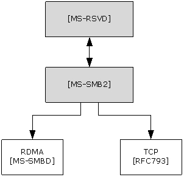

Figure 1: Relationship to other protocols

## 1.5 Prerequisites/Preconditions

The RSVD Protocol has the following preconditions:

- An SMB client has established a connection to an SMB server. This has to be done before a client can issue Remote Shared Virtual Disk Protocol commands.
- The SMB client and server support accessing shared virtual disk files on a remote server.

## 1.6 Applicability Statement

The Remote Shared Virtual Disk Protocol is applicable for all scenarios that access a shared virtual disk file between client and server.

## 1.7 Versioning and Capability Negotiation

The Remote Shared Virtual Disk Protocol defines the following two versions.<1>

| Version | Value |
| --- | --- |
| RSVD Protocol version 1 | 0x00000001 |
| RSVD Protocol version 2 | 0x00000002 |

## 1.8 Vendor-Extensible Fields

None.

## 1.9 Standards Assignments

This protocol shares the standards assignments of Server Message Block Protocol versions 2 and 3, as specified in [MS-SMB2](../MS-SMB2/MS-SMB2.md) section 1.9.

# 2 Messages

## 2.1 Transport

The following sections specify how RSVD Protocol messages are encapsulated on the wire and common protocol data types.

All RSVD Protocol messages begin with a fixed-length RSVD header that is described in section [2.2.4.11](#Section_2.2.4.11). The RSVD tunnel header contains an OperationCode field indicating the operation code that is requested by the RSVD client or responded to by the RSVD server.

Unless otherwise specified, multiple-byte fields (16-bit, 32-bit, and 64-bit fields) in the RSVD Protocol message MUST be transmitted in little-endian order (least-significant byte first).

Unless otherwise indicated, numeric fields are integers of the specified byte length.

Unless otherwise specified, all textual strings MUST be in [**Unicode**](#gt_unicode) version 5.0 format, as specified in [[UNICODE]](https://go.microsoft.com/fwlink/?LinkId=90550), using the 16-bit Unicode Transformation Format (UTF-16) form of the encoding. Textual strings with separate fields identifying the length of the string MUST NOT be null-terminated unless otherwise specified.

Unless otherwise noted, fields marked as "Reserved" MUST be set to 0 when being sent and MUST be ignored when received. These fields are reserved for future protocol expansion and MUST NOT be used for implementation-specific functionality.

The RSVD Protocol uses the SMB 3.0.2 or SMB 3.1.1 dialect in SMB Protocol version 3 as its transport. For more information, see [MS-SMB2](../MS-SMB2/MS-SMB2.md) section 2.1.

## 2.2 Message Syntax

### 2.2.1 Constants

| Constant name | Meaning |
| --- | --- |
| RSVD_CDB_GENERIC_LENGTH 0x10 | Generic length of command descriptor block |
| RSVD_SCSI_SENSE_BUFFER_SIZE 0x14 | SENSE buffer size |
| RSVD_MAXIMUM_NAME_LENGTH 0x7E | Maximum length of the InitiatorHostName field in section [2.2.4.12](#Section_2.2.4.12) |
| FSCTL_SVHDX_SYNC_TUNNEL_REQUEST 0x00090304 | Control code for SYNC TUNNEL REQUEST |
| FSCTL_QUERY_SHARED_VIRTUAL_DISK_SUPPORT 0x00090300 | Control code for querying shared virtual disk support |
| FSCTL_SVHDX_ASYNC_TUNNEL_REQUEST 0x00090364 | Control code for ASYNC TUNNEL REQUEST |
| RSVD_ECP_CONTEXT_VERSION_1 0x00000001 | Value of **Version** field in create context specified in section 2.2.4.12 |
| RSVD_ECP_CONTEXT_VERSION_2 0x00000002 | Value of **Version** field in create context specified in section [2.2.4.32](#Section_2.2.4.32) |

### 2.2.2 Operation Codes

The following is a list of all control codes used in shared virtual disk operations:

| Name | Meaning |
| --- | --- |
| RSVD_TUNNEL_GET_INITIAL_INFO_OPERATION 0x02001001 | Query shared virtual disk file and server information |
| RSVD_TUNNEL_SCSI_OPERATION 0x02001002 | Perform SCSI operation |
| RSVD_TUNNEL_CHECK_CONNECTION_STATUS_OPERATION 0x02001003 | Query shared virtual disk connection status |
| RSVD_TUNNEL_SRB_STATUS_OPERATION 0x02001004 | Query sense error code of previously failed request |
| RSVD_TUNNEL_GET_DISK_INFO_OPERATION 0x02001005 | Query disk information |
| RSVD_TUNNEL_VALIDATE_DISK_OPERATION 0x02001006 | Perform shared virtual disk validation |
| RSVD_TUNNEL_META_OPERATION_START 0x02002101 | Start a meta-operation |
| RSVD_TUNNEL_META_OPERATION_QUERY_PROGRESS 0x02002002 | Query the progress of an ongoing meta-operation |
| RSVD_TUNNEL_VHDSET_QUERY_INFORMATION 0x02002005 | Query the information about a [**virtual hard disk set (VHD set)**](#gt_virtual-hard-disk-set-vhd-set) |
| RSVD_TUNNEL_DELETE_SNAPSHOT 0x02002006 | Delete a previously created snapshot |
| RSVD_TUNNEL_CHANGE_TRACKING_GET_PARAMETERS 0x02002008 | Get change-tracking parameters |
| RSVD_TUNNEL_CHANGE_TRACKING_START 0x02002009 | Start change tracking |
| RSVD_TUNNEL_CHANGE_TRACKING_STOP 0x0200200A | Stop change tracking |
| RSVD_TUNNEL_QUERY_VIRTUAL_DISK_CHANGES 0x0200200C | Get a list of ranges that have changed in the virtual disk since the indicated snapshot ID. Minimum protocol version: 2 |
| RSVD_TUNNEL_QUERY_SAFE_SIZE 0x0200200D | Get the smallest safe size that the virtual disk can be resized to without losing user data Minimum protocol version: 2 |

### 2.2.3 Error Code

The following is a list of possible RSVD error codes that can be returned by the server.

| Name | Meaning |
| --- | --- |
| STATUS_SVHDX_ERROR_STORED 0xC05C0000 | Sense error data was stored on server |
| STATUS_SVHDX_ERROR_NOT_AVAILABLE 0xC05CFF00 | Sense error data is not available |
| STATUS_SVHDX_UNIT_ATTENTION_AVAILABLE 0xC05CFF01 | Unit Attention data is available for the initiator to query |
| STATUS_SVHDX_UNIT_ATTENTION_CAPACITY_DATA_CHANGED 0xC05CFF02 | The data capacity of the device has changed, resulting in a Unit Attention condition |
| STATUS_SVHDX_UNIT_ATTENTION_RESERVATIONS_PREEMPTED 0xC05CFF03 | A previous operation resulted in this initiator's reservations being preempted, resulting in a Unit Attention condition |
| STATUS_SVHDX_UNIT_ATTENTION_RESERVATIONS_RELEASED 0xC05CFF04 | A previous operation resulted in this initiator's reservations being released, resulting in a Unit Attention condition |
| STATUS_SVHDX_UNIT_ATTENTION_REGISTRATIONS_PREEMPTED 0xC05CFF05 | A previous operation resulted in this initiator's registrations being preempted, resulting in a Unit Attention condition |
| STATUS_SVHDX_UNIT_ATTENTION_OPERATING_DEFINITION_CHANGED 0xC05CFF06 | Represents the data storage format of the device has changed, resulting in a Unit Attention condition |
| STATUS_SVHDX_RESERVATION_CONFLICT 0xC05CFF07 | The current initiator is not allowed to perform the SCSI command because of a reservation conflict |
| STATUS_SVHDX_WRONG_FILE_TYPE 0xC05CFF08 | File on which open is performed is of wrong type |
| STATUS_SVHDX_VERSION_MISMATCH 0xC05CFF09 | Protocol version in request is not equal to 0x00000001 or 0x00000002 |
| STATUS_VHD_SHARED 0xC05CFF0A | The virtual disk cannot be opened because it is currently used in shared mode |

### 2.2.4 Structures

#### 2.2.4.1 SVHDX_TUNNEL_CHECK_CONNECTION_REQUEST Structure

The SVHDX_TUNNEL_CHECK_CONNECTION_REQUEST packet is sent by the client to check the connection status to the shared virtual disk. The request MUST contain only SVHDX_TUNNEL_OPERATION_HEADER, and MUST NOT contain any payload.

#### 2.2.4.2 SVHDX_TUNNEL_CHECK_CONNECTION_RESPONSE Structure

The SVHDX_TUNNEL_CHECK_CONNECTION_RESPONSE packet is sent by the server in response to the operation RSVD_TUNNEL_CHECK_CONNECTION_STATUS_OPERATION. The response MUST contain only SVHDX_TUNNEL_OPERATION_HEADER, and MUST NOT contain any payload.

#### 2.2.4.3 SVHDX_TUNNEL_SRB_STATUS_REQUEST Structure

The SVHDX_TUNNEL_SRB_STATUS_REQUEST packet is sent by the client to get the sense error code of a previously failed request.

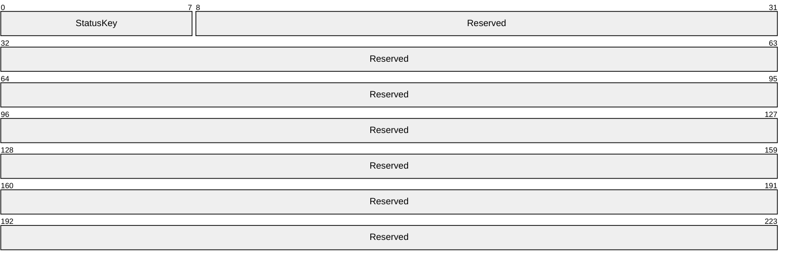
```mermaid
packet-beta
  0-7: "StatusKey"
  8-223: "Reserved"
```

**StatusKey (1 byte):** The client MUST set this field to the least significant byte of the error code of a previously failed request.

**Reserved (27 bytes):** This field MUST be set to zero, and MUST be ignored on receipt.

#### 2.2.4.4 SVHDX_TUNNEL_SRB_STATUS_RESPONSE Structure

The SVHDX_TUNNEL_SRB_STATUS_RESPONSE packet is sent by the server in a response to the RSVD_TUNNEL_SRB_STATUS_OPERATION.

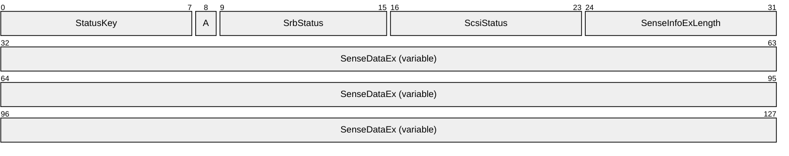
```mermaid
packet-beta
  0-7: "StatusKey"
  8-8: "A"
  9-15: "SrbStatus"
  16-23: "ScsiStatus"
  24-31: "SenseInfoExLength"
  32-127: "SenseDataEx (variable)"
```

**StatusKey (1 byte):** The server MUST set this field to the status key value received in the request.

**A - SenseInfoAutoGenerated (1 bit)**: A 1-bit field, when set to TRUE, indicates that [**sense data**](#gt_sense-data) was returned by the virtual [**SCSI**](#gt_small-computer-system-interface-scsi) disk.

**SrbStatus (7 bits):** A 7-bit field indicating the status. This field MUST contain one of the values in section [2.2.5](#Section_2.2.5).

**ScsiStatus (1 byte):** An 8-bit field used to communicate the SCSI status that was returned by the shared virtual disk.

**SenseInfoExLength (1 byte):** The length, in bytes, of the **SenseDataEx** field. This value MUST be less than or equal to RSVD_SCSI_SENSE_BUFFER_SIZE.

**SenseDataEx (variable):** A buffer that contains the sense data.

#### 2.2.4.5 SVHDX_TUNNEL_DISK_INFO_REQUEST Structure

The SVHDX_TUNNEL_DISK_INFO_REQUEST packet is sent by the client to get shared virtual disk information.

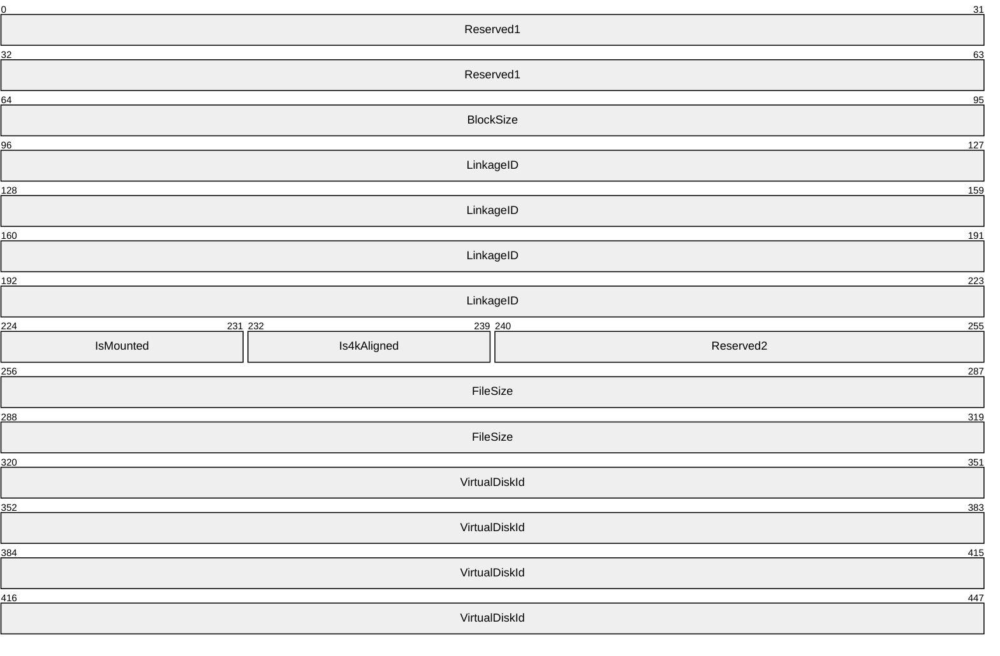
```mermaid
packet-beta
  0-63: "Reserved1"
  64-95: "BlockSize"
  96-223: "LinkageID"
  224-231: "IsMounted"
  232-239: "Is4kAligned"
  240-255: "Reserved2"
  256-319: "FileSize"
  320-447: "VirtualDiskId"
```

**Reserved1 (8 byte):** The client MUST set this field to zero, and the server MUST ignore it on receipt.

**BlockSize (4 bytes):** The client MUST set this field to zero, and the server MUST ignore it on receipt.

**LinkageID (16 bytes):** The client MUST set this field to zero, and the server MUST ignore it on receipt.

**IsMounted (1 byte):** The client MUST set this field to zero, and the server MUST ignore it on receipt.

**Is4kAligned (1 byte):** The client MUST set this field to zero, and the server MUST ignore it on receipt.

**Reserved2 (2 bytes):** The client MUST set this field to zero, and the server MUST ignore it on receipt.

**FileSize (8 bytes):** The client MUST set this field to zero, and the server MUST ignore it on receipt.

**VirtualDiskId (16 bytes):** This field MUST NOT be used and MUST be reserved. The client MUST set this field to zero, and the server MUST ignore it on receipt.

#### 2.2.4.6 SVHDX_TUNNEL_DISK_INFO_RESPONSE Structure

The SVHDX_TUNNEL_DISK_INFO_RESPONSE packet is sent by the server in response to an SVHDX_TUNNEL_DISK_INFO_REQUEST.

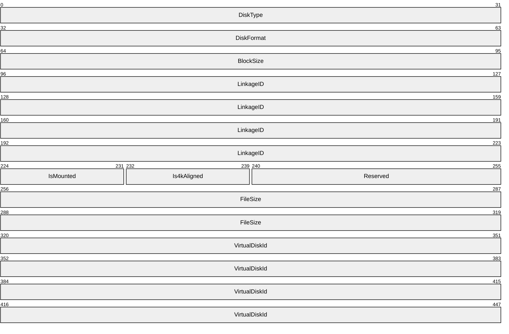
```mermaid
packet-beta
  0-31: "DiskType"
  32-63: "DiskFormat"
  64-95: "BlockSize"
  96-223: "LinkageID"
  224-231: "IsMounted"
  232-239: "Is4kAligned"
  240-255: "Reserved"
  256-319: "FileSize"
  320-447: "VirtualDiskId"
```

**DiskType (4 bytes):** Indicates the type of disk. This field MUST contain exactly one of the following values.

| Value | Meaning |
| --- | --- |
| VHD_TYPE_FIXED 0x00000002 | Indicates that the type of the disk is fixed. |
| VHD_TYPE_DYNAMIC 0x00000003 | Indicates that the type of the disk is dynamic. |

**DiskFormat (4 bytes):** Indicates the format of the disk. This field MUST contain exactly one of the following values.

| Value | Meaning |
| --- | --- |
| VIRTUAL_STORAGE_TYPE_DEVICE_VHDX 0x00000003 | Indicates that the type of the disk is shared virtual disk. |
| VIRTUAL_STORAGE_TYPE_DEVICE_VHDSET 0x00000004 | Indicates that the type of the disk is VHD set. |

**BlockSize (4 bytes):** Specifics the disk block size in bytes.

**LinkageID (16 bytes):** A [**GUID**](#gt_globally-unique-identifier-guid) that specifies the linkage identification of the disk.

**IsMounted (1 byte):** A Boolean value. Zero represents FALSE (0x00), indicating that the disk is not ready for read or write operations. One represents TRUE (0x01), indicating that the disk is mounted and ready for read or write operations.

**Is4kAligned (1 byte):** A Boolean value. Zero represents FALSE, indicating disk sectors are not aligned to 4 kilobytes. One represents TRUE, indicating disk sectors are aligned to 4 kilobytes.

**Reserved (2 bytes):** This field MUST NOT be used and MUST be reserved. The client SHOULD set this field to zero, and the server MUST ignore it on receipt.

**FileSize (8 bytes):** The size, in bytes, of the file opened as the shared virtual disk.

**VirtualDiskId (16 bytes):** A GUID that specifies the identification of the disk.

#### 2.2.4.7 SVHDX_TUNNEL_SCSI_REQUEST Structure

The SVHDX_TUNNEL_SCSI_REQUEST packet is sent by the client to process the SCSI request.

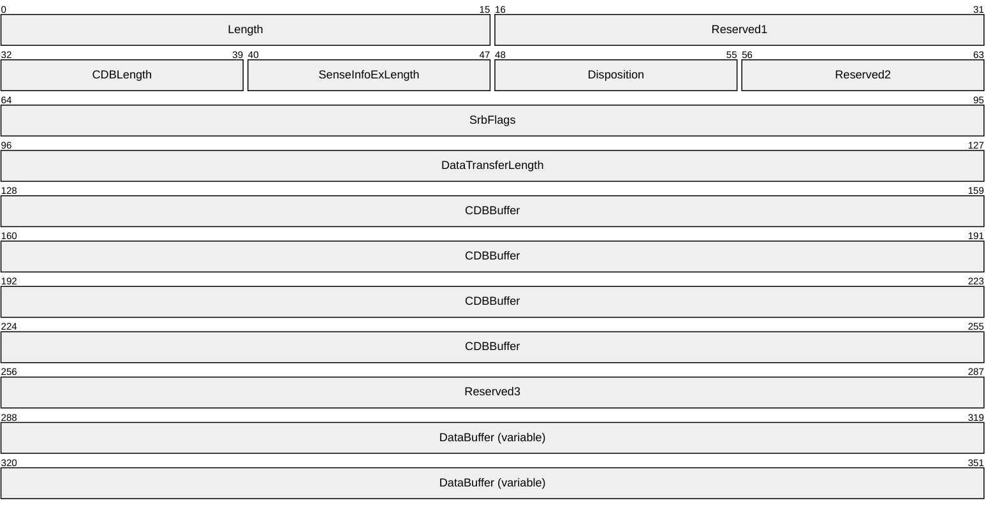
```mermaid
packet-beta
  0-15: "Length"
  16-31: "Reserved1"
  32-39: "CDBLength"
  40-47: "SenseInfoExLength"
  48-55: "Disposition"
  56-63: "Reserved2"
  64-95: "SrbFlags"
  96-127: "DataTransferLength"
  128-255: "CDBBuffer"
  256-287: "Reserved3"
  288-351: "DataBuffer (variable)"
```

**Length (2 bytes):** Specifies the size, in bytes, of the SVHDX_TUNNEL_SCSI_REQUEST structure excluding the **DataBuffer** field. This field MUST be set to 36.

**Reserved1 (2 byte):** The client MUST set this field to zero.

**CDBLength (1 byte):** The length, in bytes, of the [**SCSI command descriptor block (CDB)**](#gt_scsi-command-descriptor-block-cdb). This value MUST be less than or equal to RSVD_CDB_GENERIC_LENGTH.

**SenseInfoExLength (1 byte):** This field SHOULD be set to 20 and the server MUST ignore it on receipt.

**Disposition (1 byte):** This field indicates the SCSI CDB transfer type and MUST be set to one of the following values:

| Value | Meaning |
| --- | --- |
| 0x00 | Indicates that data is being requested from the virtual SCSI disk |
| 0x01 | Indicates that data is being sent to the virtual SCSI disk |
| 0x02 | Indicates that data is neither being requested nor sent |

**Reserved2 (1 byte):** This field MUST be set to 0x00.

**SrbFlags (4 bytes):** An optional, application-provided flag to indicate the options of the SCSI request. This field MUST contain zero or more of the following values:

| Name | Meaning |
| --- | --- |
| SRB_FLAGS_DATA_IN 0x00000040 | The application is sending data to the server |
| SRB_FLAGS_DATA_OUT 0x00000080 | The application is requesting data from the server |

**DataTransferLength (4 bytes):** The length, in bytes, of the additional data placed in the **DataBuffer** field.

**CDBBuffer (16 bytes):** A buffer that contains the SCSI CDB.

**Reserved3 (4 bytes):** This field MUST be set to 0x00000000.

**DataBuffer (variable):** A variable-length buffer that contains the additional buffer, as described by the **DataTransferLength** field.

#### 2.2.4.8 SVHDX_TUNNEL_SCSI_RESPONSE Structure

The SVHDX_TUNNEL_SCSI_RESPONSE packet is sent by the server in response to the operation RSVD_TUNNEL_SCSI_OPERATION.

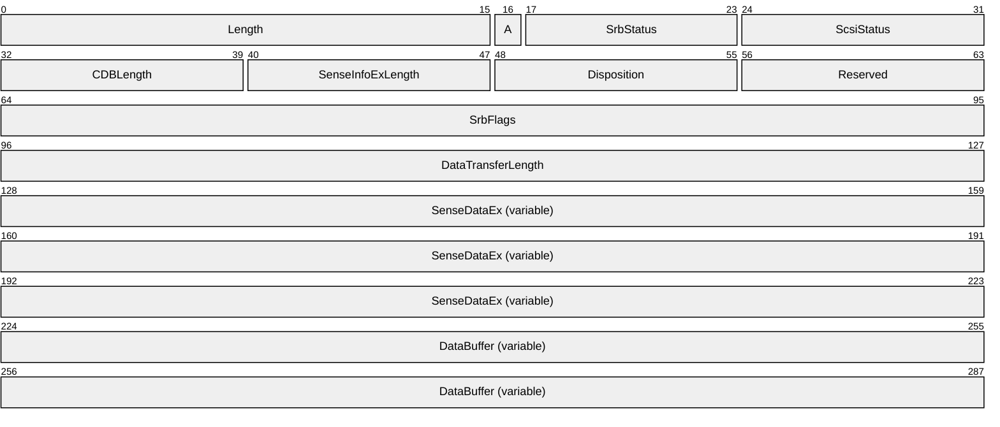
```mermaid
packet-beta
  0-15: "Length"
  16-16: "A"
  17-23: "SrbStatus"
  24-31: "ScsiStatus"
  32-39: "CDBLength"
  40-47: "SenseInfoExLength"
  48-55: "Disposition"
  56-63: "Reserved"
  64-95: "SrbFlags"
  96-127: "DataTransferLength"
  128-223: "SenseDataEx (variable)"
  224-287: "DataBuffer (variable)"
```

**Length (2 bytes):** Specifies the size, in bytes, of the SVHDX_TUNNEL_SCSI_RESPONSE structure excluding the **DataBuffer** field.

**A - SenseInfoAutoGenerated (1 bit)**: A 1-bit field; when set to TRUE, indicates that [**sense data**](#gt_sense-data) was returned by the virtual [**SCSI**](#gt_small-computer-system-interface-scsi) disk.

**SrbStatus (7 bits):** A 7-bit field indicating the status. This field MUST contain one of the values in section [2.2.5](#Section_2.2.5).

**ScsiStatus (1 byte):** An 8-bit field used to communicate the SCSI status that was returned by the target device.

**CDBLength (1 byte)**: This field MUST be set to the **CDBLength** value received in the request and ignored on receipt.

**SenseInfoExLength (1 byte):** The length, in bytes, of the **SenseDataEx** field. This value MUST be less than or equal to RSVD_SCSI_SENSE_BUFFER_SIZE.

**Disposition (1 byte):** This field indicates the [**SCSI CDB**](#gt_scsi-command-descriptor-block-cdb) transfer type and MUST be set to one of the following values:

| Value | Meaning |
| --- | --- |
| 0x00 | Indicates that data is being requested from the virtual SCSI disk |
| 0x01 | Indicates that data is being sent to the virtual SCSI disk |
| 0x02 | Indicates that data is neither being requested nor sent |

**Reserved (1 byte):** This field MUST be set to zero, and MUST be ignored on receipt.

**SrbFlags (4 bytes):** Special flags to indicate options of the SCSI response. This field MUST contain zero or more of the following values:

| Name | Meaning |
| --- | --- |
| SRB_FLAGS_DATA_IN 0x00000040 | The client sent data to the server. |
| SRB_FLAGS_DATA_OUT 0x00000080 | The server is sending data to the client. |

**DataTransferLength (4 bytes):** The length, in bytes, of the additional data placed in the **DataBuffer** field.

**SenseDataEx (variable):** A buffer that contains the sense data.

**DataBuffer (variable):** A variable-length buffer that contains the additional buffer, as described by the **DataTransferLength** field.

#### 2.2.4.9 SVHDX_TUNNEL_VALIDATE_DISK_REQUEST Structure

The **SVHDX_TUNNEL_VALIDATE_DISK_REQUEST** packet is sent by the client to validate the shared virtual disk. This request contains 56 bytes.

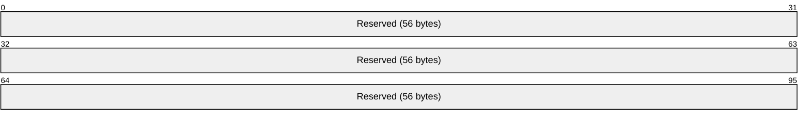
```mermaid
packet-beta
  0-95: "Reserved (56 bytes)"
```

**Reserved (56 bytes):** The client MUST set all 56 bytes to zero and the server MUST ignore them on receipt.

#### 2.2.4.10 SVHDX_TUNNEL_VALIDATE_DISK_RESPONSE Structure

The **SVHDX_TUNNEL_VALIDATE_DISK_RESPONSE** packet is sent by the server in a response to the operation RSVD_TUNNEL_VALIDATE_DISK_OPERATION.

```mermaid
packet-beta
  0-7: "IsValidDisk"
```

**IsValidDisk (1 byte):** A Boolean value that, if set, indicates that the disk is valid.

#### 2.2.4.11 SVHDX_TUNNEL_OPERATION_HEADER Structure

The RSVD tunnel header is the header of RSVD Protocol operations specified in section [2.2.2](#Section_2.2.2).

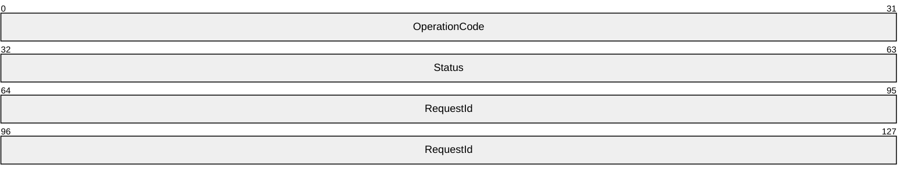
```mermaid
packet-beta
  0-31: "OperationCode"
  32-63: "Status"
  64-127: "RequestId"
```

**OperationCode (4 bytes)**: The command code of this packet. This field MUST contain one of values specified in section 2.2.2.

**Status (4 bytes)**: For a request, the client SHOULD set this field to zero, and the server MUST ignore it on receipt.

For a response, this field indicates the status of the tunnel operation, and the server MUST set this field to one of the error codes specified in section [2.2.3](#Section_2.2.3).

**RequestId (8 bytes)**: A value that uniquely identifies an operation request and response for all requests sent by this client.

#### 2.2.4.12 SVHDX_OPEN_DEVICE_CONTEXT Structure

The SVHDX_OPEN_DEVICE_CONTEXT packet is sent by the client to open the shared virtual disk.

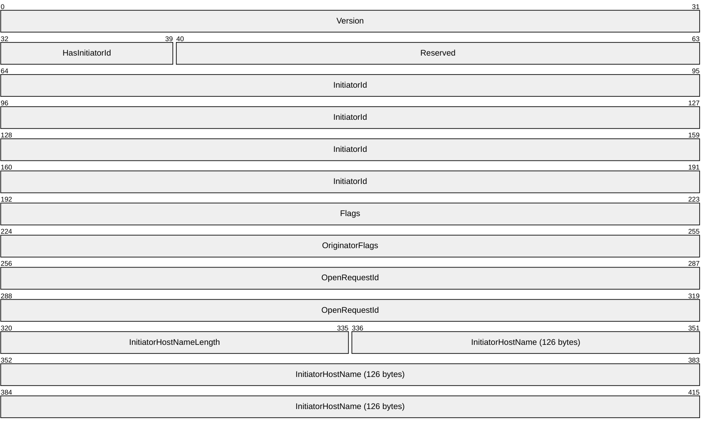
```mermaid
packet-beta
  0-31: "Version"
  32-39: "HasInitiatorId"
  40-63: "Reserved"
  64-191: "InitiatorId"
  192-223: "Flags"
  224-255: "OriginatorFlags"
  256-319: "OpenRequestId"
  320-335: "InitiatorHostNameLength"
  336-415: "InitiatorHostName (126 bytes)"
```

**Version (4 bytes):** The version of the create context. It MUST be set to RSVD_ECP_CONTEXT_VERSION_1.

**HasInitiatorId (1 byte):** A Boolean value that, if set to TRUE (0x01), indicates that the message has a valid **InitiatorId**.

**Reserved (3 bytes):** This field MUST be set to zero when sent and MUST be ignored on receipt.

**InitiatorId (16 bytes):** A [**GUID**](#gt_globally-unique-identifier-guid) that optionally identifies the initiator of the open request.

**Flags (4 bytes):** An application-provided value for the open.

**OriginatorFlags (4 bytes):** This field is used to indicate which component has originated or issued the operation. This field MUST be set to one of the following values:

| Name | Meaning |
| --- | --- |
| SVHDX_ORIGINATOR_PVHDPARSER 0x00000001 | Shared virtual disk file to be opened as a virtual SCSI disk device |
| SVHDX_ORIGINATOR_VHDMP 0x00000004 | Shared virtual disk file to be opened in underlying object store |

**OpenRequestId (8 bytes):** A 64-bit value assigned by the client for an outgoing request.

**InitiatorHostNameLength (2 bytes):** The length, in bytes, of the **InitiatorHostName**. This value MUST be less than or equal to RSVD_MAXIMUM_NAME_LENGTH.

**InitiatorHostName (126 bytes):** A 126-byte buffer containing a Unicode UTF-16 string that specifies the computer name on which the initiator resides.

#### 2.2.4.13 SVHDX_TUNNEL_INITIAL_INFO_REQUEST Structure

The SVHDX_TUNNEL_INITIAL_INFO_REQUEST packet is sent by the client to get the shared virtual disk file information. The request MUST contain only SVHDX_TUNNEL_OPERATION_HEADER, and MUST NOT contain any payload.

#### 2.2.4.14 SVHDX_TUNNEL_INITIAL_INFO_RESPONSE Structure

The SVHDX_TUNNEL_INITIAL_INFO_RESPONSE packet is sent by the server in response to an RSVD_TUNNEL_GET_INITIAL_INFO_OPERATION packet.

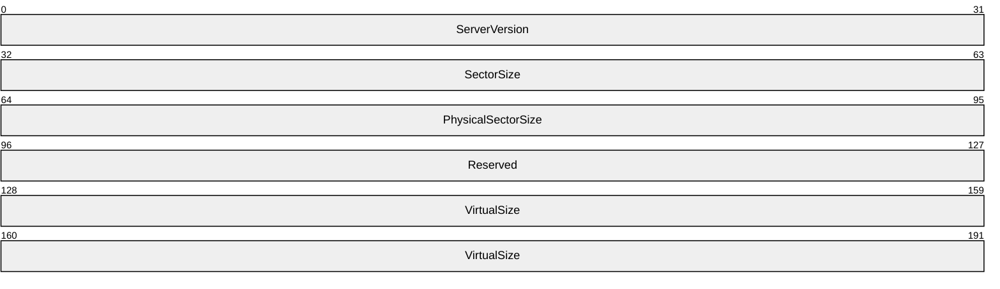
```mermaid
packet-beta
  0-31: "ServerVersion"
  32-63: "SectorSize"
  64-95: "PhysicalSectorSize"
  96-127: "Reserved"
  128-191: "VirtualSize"
```

**ServerVersion (4 bytes):** The current version of the protocol running on the server.

**SectorSize (4 bytes):** A 32-bit unsigned integer that indicates the sector size, in bytes, of the shared virtual disk.

**PhysicalSectorSize (4 bytes):** A 32-bit unsigned integer that indicates the physical sector size, in bytes, of the shared virtual disk.

**Reserved (4 bytes):** This field MUST be set to zero, and the client MUST ignore it on receipt.

**VirtualSize (8 bytes):** A 64-bit unsigned integer that indicates the virtual size, in bytes, of the shared virtual disk.

#### 2.2.4.15 SVHDX_SHARED_VIRTUAL_DISK_SUPPORT_REQUEST Structure

The **SVHDX_SHARED_VIRTUAL_DISK_SUPPORT_REQUEST** packet is sent by the client to verify the status of shared virtual disk support on the Open. The request MUST NOT contain any payload.

#### 2.2.4.16 SVHDX_SHARED_VIRTUAL_DISK_SUPPORT_RESPONSE Structure

The SVHDX_SHARED_VIRTUAL_DISK_SUPPORT_RESPONSE packet is sent by the server in a response to an SVHDX_SHARED_VIRTUAL_DISK_SUPPORT_REQUEST request.

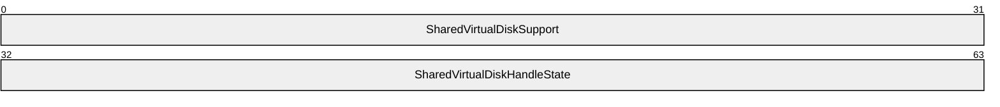
```mermaid
packet-beta
  0-31: "SharedVirtualDiskSupport"
  32-63: "SharedVirtualDiskHandleState"
```

**SharedVirtualDiskSupport (4 bytes)**: This field is used to indicate the capabilities supported by the server. This field MUST contain one of the following values.

| Value | Meaning |
| --- | --- |
| SharedVirtualDisksSupported 0x00000001 | The server supports shared virtual disks. |
| SharedVirtualDiskSnapshotsSupported 0x00000007 | The server supports shared virtual disks and all snapshot types defined in section [2.2.6](#Section_2.2.6). |

**SharedVirtualDiskHandleState (4 bytes)**: This field is used to indicate the state of the shared virtual disk Open. This field MUST contain one of the following values.

| Value | Meaning |
| --- | --- |
| HandleStateNone 0x00000000 | The Open is not opened as a shared virtual disk. |
| HandleStateFileShared 0x00000001 | The shared virtual disk file is opened as a shared virtual disk by another Open. |
| HandleStateShared 0x00000003 | The shared virtual disk file is opened as a shared virtual disk by this Open. |

#### 2.2.4.17 SVHDX_META_OPERATION_START_REQUEST Structure

The **SVHDX_META_OPERATION_START_REQUEST** packet is sent by the client to start a meta-operation on the shared virtual disk file.

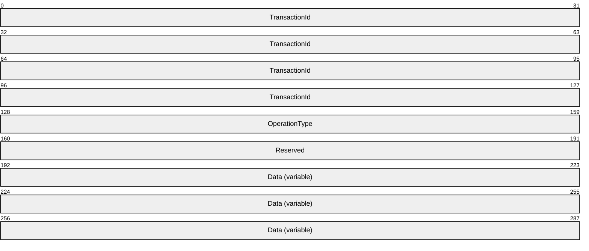
```mermaid
packet-beta
  0-127: "TransactionId"
  128-159: "OperationType"
  160-191: "Reserved"
  192-287: "Data (variable)"
```

**TransactionId (16 bytes)**: Indicates the transaction ID for the operation. The field MUST be set to a globally unique ID for each meta-operation.

**OperationType (4 bytes)**: Indicates the type of the operation. This field MUST contain one of the following values.

| Value | Meaning |
| --- | --- |
| SvhdxMetaOperationTypeResize 0x00000000 | The meta-operation requests that the target file be resized. |
| SvhdxMetaOperationTypeCreateSnapshot 0x00000001 | The meta-operation is part of a snapshot creation process. |
| SvhdxMetaOperationTypeOptimize 0x00000002 | The meta-operation requests that the server optimize the target file. |
| SvhdxMetaOperationTypeExtractSnapshots 0x00000003 | The meta-operation requests that the server extract a [**differencing virtual hard disk (VHD)**](#gt_differencing-virtual-hard-disk-vhd) from the target file. |
| SvhdxMetaOperationTypeConvertToVHDSet 0x00000004 | The meta-operation requests that the given virtual disk file be converted to a VHD set. |
| SvhdxMetaOperationTypeApplySnapshot 0x00000005 | The meta-operation requests that a specific snapshot be applied to a shared VHD Set. |

**Reserved (4 bytes):** This value MUST be set to 0 by the client and MUST be ignored by the server.

**Data (variable):** A variable-length field that contains the additional input specified by the **OperationType** field.

If the **OperationType** is **SvhdxMetaOperationTypeCreateSnapshot**, this field is provided in the format SVHDX_META_OPERATION_CREATE_SNAPSHOT as specified in section [2.2.4.17.1](#Section_2.2.4.17.1.1).

If the **OperationType** is **SvhdxMetaOperationTypeExtractSnapshots**, this field is provided in the format SVHDX_META_OPERATION_EXTRACT as specified in section [2.2.4.17.2](#Section_2.2.4.17.2).

If the **OperationType** is **SvhdxMetaOperationTypeOptimize**, this field MUST be empty.

If the **OperationType** is **SvhdxMetaOperationTypeConvertToVHDSe**t, this field is provided in the format SVHDX_META_OPERATION_CONVERT_TO_VHDSET, as specified in section [2.2.4.17.3](#Section_2.2.4.17.3).

If the **OperationType** is **SvhdxMetaOperationTypeResize**, this field is provided in the format SVHDX_META_OPERATION _RESIZE_VIRTUAL_DISK as specified in section [2.2.4.17.4](#Section_2.2.4.17.4).

##### 2.2.4.17.1 SVHDX_META_OPERATION_CREATE_SNAPSHOT Structure

The SVHDX_META_OPERATION_CREATE_SNAPSHOT structure is used to send the additional parameters for snapshot creation.

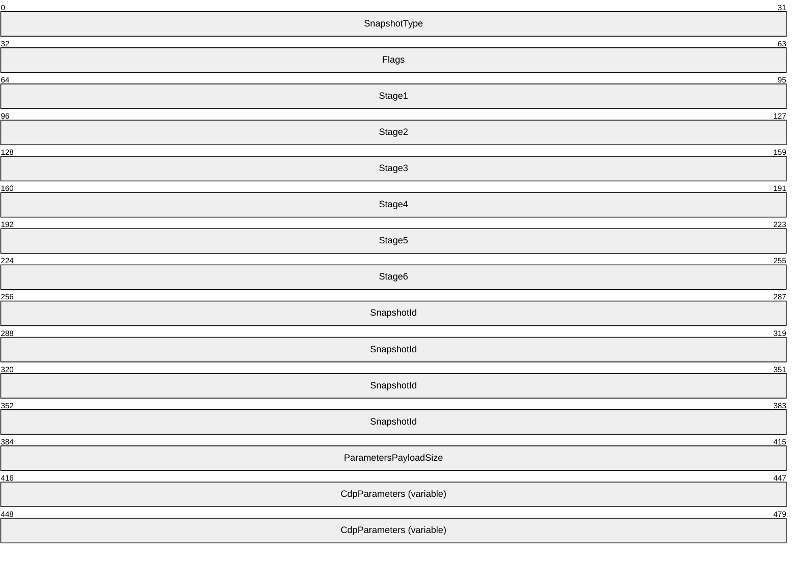
```mermaid
packet-beta
  0-31: "SnapshotType"
  32-63: "Flags"
  64-95: "Stage1"
  96-127: "Stage2"
  128-159: "Stage3"
  160-191: "Stage4"
  192-223: "Stage5"
  224-255: "Stage6"
  256-383: "SnapshotId"
  384-415: "ParametersPayloadSize"
  416-479: "CdpParameters (variable)"
```

**SnapshotType (4 bytes)**: The type of snapshot. This field MUST contain one of the values defined in section [2.2.6](#Section_2.2.6).

**Flags (4 bytes):** This field MUST be set to zero or a combination of the following values:

| Name | Meaning |
| --- | --- |
| SVHDX_SNAPSHOT_DISK_FLAG_ENABLE_CHANGE_TRACKING 0x00000001 | A request is made for change tracking to be enabled when snapshot is taken. |

**Stage1 (4 bytes)**: The first stage. This field MUST contain one of the following values.

| Name | Meaning |
| --- | --- |
| SvhdxSnapshotStageInitialize 0x00000001 | Perform any required initialization so that the appropriate type of snapshot can be taken. |
| SvhdxSnapshotStageBlockIO 0x00000002 | Temporarily pause all IO against the target virtual device. |
| SvhdxSnapshotStageSwitchObjectStore 0x00000003 | Switch aspects of the underlying object store so that the appropriate snapshot is taken. |
| SvhdxSnapshotStageUnblockIO 0x00000004 | Allow further IO against the target virtual device. |
| SvhdxSnapshotStageFinalize 0x00000005 | Tear down any state associated with a snapshot of the target virtual device. |

**Stage2 (4 bytes)**: The second stage. This field MUST be any of the values identified in **Stage1** or in **SvhdxSnapshotStageInvalid**, defined as follows.

| Name | Meaning |
| --- | --- |
| SvhdxSnapshotStageInvalid 0x00000000 | No stage present in this field. |

**Stage3 (4 bytes)**: The third stage. This field MUST be any of the values identified in **Stage1** or **SvhdxSnapshotStageInvalid.**

**Stage4 (4 bytes)** The fourth stage. This field MUST be any of the values identified in **Stage1** or **SvhdxSnapshotStageInvalid.**

**Stage5 (4 bytes)**: The fifth stage. This field MUST be any of the values identified in **Stage1** or **SvhdxSnapshotStageInvalid.**

**Stage6 (4 bytes)**: The sixth stage. This field MUST be any of the values identified in **Stage1** or **SvhdxSnapshotStageInvalid.**

**SnapshotId (16 bytes)**: The ID to assign to the snapshot.

**ParametersPayloadSize (4 bytes)**: The size of any parameters included with the create snapshot request. This field MUST be set to 0.

**CdpParameters (variable)**: Parameters supplied with the [**continuous data protection snapshot (CDP snapshot)**](#gt_continuous-data-protection-snapshot-cdp-snapshot) operation. This field is provided in the format SVHDX_META_OPERATION_CREATE_CDP_PARAMETER as specified in section [2.2.4.17.1.1](#Section_2.2.4.17.1.1).

###### 2.2.4.17.1.1 SVHDX_META_OPERATION_CREATE_CDP_PARAMETER Structure

SVHDX_META_OPERATION_CREATE_CDP_PARAMETER is used to send additional CDP parameters.

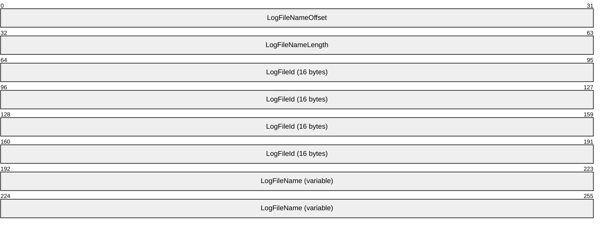
```mermaid
packet-beta
  0-31: "LogFileNameOffset"
  32-63: "LogFileNameLength"
  64-191: "LogFileId (16 bytes)"
  192-255: "LogFileName (variable)"
```

**LogFileNameOffset (4 bytes)**: The offset, in bytes, of the **LogFileName** field.

**LogFileNameLength (4 bytes)**: The length of **LogFileName** in bytes. This field MUST be set to 0.

**LogFileId (16 Bytes)**: A GUID associated with the log file.

**LogFileName (Variable)**: A log file name containing a null-terminated Unicode UTF-16 string. This field MUST be an empty array.

##### 2.2.4.17.2 SVHDX_META_OPERATION_EXTRACT Structure

The **SVHDX_META_OPERATION_EXTRACT** packet is issued by a server as part of a **SVHDX_META_OPERATION_START_REQUEST** operation, when the meta-operation type indicates an **SvhdxMetaOperationTypeExtractSnapshots**. The server issues such a request to export a virtual hard disk (VHD) or a [**differencing VHD**](#gt_3fd7d4ea-692e-492b-a180-c8b6eb7538e4).

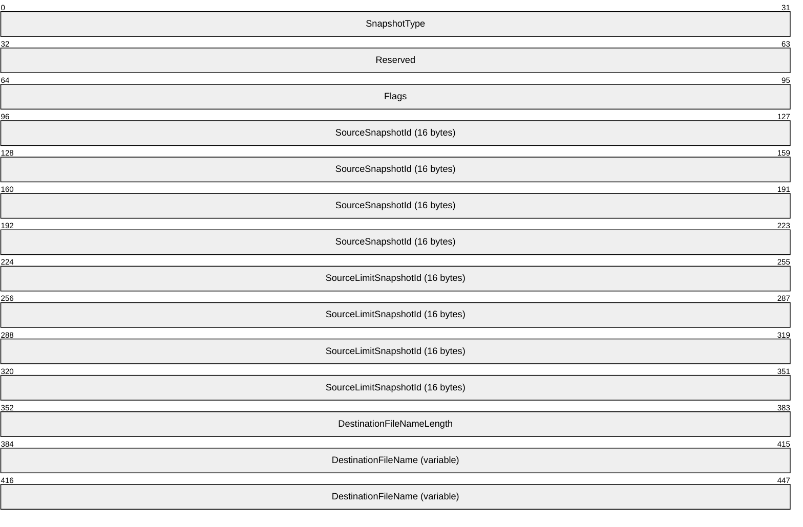
```mermaid
packet-beta
  0-31: "SnapshotType"
  32-63: "Reserved"
  64-95: "Flags"
  96-223: "SourceSnapshotId (16 bytes)"
  224-351: "SourceLimitSnapshotId (16 bytes)"
  352-383: "DestinationFileNameLength"
  384-447: "DestinationFileName (variable)"
```

**SnapshotType (4 bytes):** The type of snapshot. This field MUST contain one of the values defined in section [2.2.6](#Section_2.2.6).

**Reserved (4 bytes):** This value MUST be set to 0 by the client and MUST be ignored by the server.

**Flags (4 bytes):** This field MUST be set to zero or more of the following values:

| Name | Meaning |
| --- | --- |
| SVHDX_EXTRACT_SNAPSHOTS_FLAG_DELETE_ON_CLOSE 0x00000001 | Request for the VHD set to be deleted on close after exporting the differences between specified snapshots. |

**SourceSnapshotId (16 Bytes):** A GUID that indicates the ID of the snapshot to be used as the source for the extracted VHD.

**SourceLimitSnapshotId (16 Bytes):** A GUID that optionally indicates the ID of the snapshot that will act as the base for the extracted differencing VHD. Zero indicates that there MUST be no base snapshot and that the extracted disk will not be a differencing VHD.

**DestinationFileNameLength (4 Bytes):** The length, in bytes, including the NULL terminating character, of the VHD file name to extract the data differences to.

**DestinationFileName (Variable):** A buffer containing a null-terminated Unicode UTF-16 string that indicates the VHD file name to extract the data differences to.

##### 2.2.4.17.3 SVHDX_META_OPERATION_CONVERT_TO_VHDSET Structure

The SVHDX_META_OPERATION_CONVERT_TO_VHDSET packet is issued by a server as part of a SVHDX_META_OPERATION_START_REQUEST operation, when the meta-operation type indicates a **SvhdxMetaOperationTypeConvertToVHDSet**. The server issues such a request to convert a VHD file to a snapshot-capable VHD set.

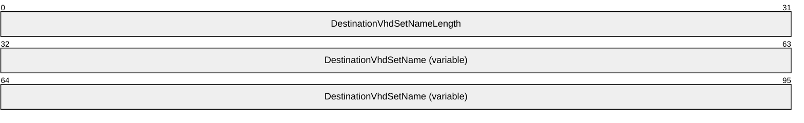
```mermaid
packet-beta
  0-31: "DestinationVhdSetNameLength"
  32-95: "DestinationVhdSetName (variable)"
```

**DestinationVhdSetNameLength (4 Bytes)**: The length, in bytes, including the NULL terminating character, of the **DestinationVhdSetName**.

**DestinationVhdSetName (Variable)**: A buffer containing a null-terminated Unicode UTF-16 string that indicates the name for the new VHD set that is to be created.

##### 2.2.4.17.4 SVHDX_META_OPERATION_RESIZE_VIRTUAL_DISK Structure

The SVHDX_META_OPERATION_RESIZE_VIRTUAL_DISK packet is issued by a server as part of a SVHDX_META_OPERATION_START_REQUEST operation, when the meta-operation type indicates a **SvhdxMetaOperationTypeResize**. The server issues such a request to resize the shared virtual disk.

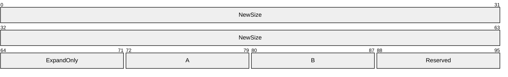
```mermaid
packet-beta
  0-63: "NewSize"
  64-71: "ExpandOnly"
  72-79: "A"
  80-87: "B"
  88-95: "Reserved"
```

**NewSize (8 bytes)**: This specifies the new size of the shared virtual disk.

**ExpandOnly (1 byte)**: A Boolean value, where zero represents FALSE and nonzero represents TRUE. A nonzero value indicates that the shared virtual disk size can only expand.

**A - AllowUnsafeVirtualSize (1 byte)**: A Boolean value, where zero represents FALSE and nonzero represents TRUE. A nonzero value indicates that the shared virtual disk size can be less than the data it currently contains.

**B - ShrinkToMinimumSafeSize (1 byte)**: A Boolean value, where zero represents FALSE and nonzero represents TRUE. A nonzero value indicates that the shared virtual disk size can be shrunk to the data it currently contains.

**Reserved (1 byte)**: This value MUST be set to 0 by the client and MUST be ignored by the server.

#### 2.2.4.18 SVHDX_META_OPERATION_REPLY Structure

The **SVHDX_META_OPERATION_REPLY** packet is issued by a server in reply to an **SVHDX_META_OPERATION_START_REQUEST** operation. When the meta-operation type indicates an **SvhdxMetaOperationTypeCreateSnapshot** with snapshot type **SvhdxSnapshotTypeCDP**, this structure is returned. Otherwise, this structure is not present.

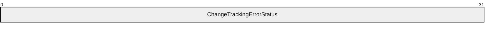
```mermaid
packet-beta
  0-31: "ChangeTrackingErrorStatus"
```

**ChangeTrackingErrorStatus (4 bytes)**: Indicates an error condition when attempting to perform change-tracking operations. This MUST be one of the following values.

| Name | Meaning |
| --- | --- |
| SVHDX_TUNNEL_CHANGE_TRACKING_STATUS_SUCCESS 0x00000000 | Change-tracking is active on the virtual disk without any error. |
| SVHDX_TUNNEL_CHANGE_TRACKING_NOT_INITIALIZED 0xC03A0020 | Change-tracking is not initialized on the virtual disk. |
| SVHDX_TUNNEL_CHANGE_TRACKING_LOGSIZE_EXCEEDED_MAXSIZE 0xC03A0021 | The log file size has exceeded the client specified maximum size. |
| SVHDX_TUNNEL_CHANGE_TRACKING_VHD_CHANGED_OFFLINE 0xC03A0022 | A virtual disk write was detected to be missing from the current log file. |
| SVHDX_TUNNEL_CHANGE_TRACKING_INVALID_TRACKING_STATE 0xC03A0023 | A change-tracking operation cannot be performed on the virtual disk in its current state. |
| SVHDX_TUNNEL_CHANGE_TRACKING_INCONSISTENT_TRACKING_FILE 0xC03A0024 | An inconsistent log file detected. |

#### 2.2.4.19 SVHDX_TUNNEL_VHDSET_QUERY_INFORMATION_REQUEST Structure

The **SVHDX_TUNNEL_VHDSET_QUERY_INFORMATION_REQUEST** packet is sent by a client as part of an **RSVD_TUNNEL_VHDSET_QUERY_INFORMATION** request.

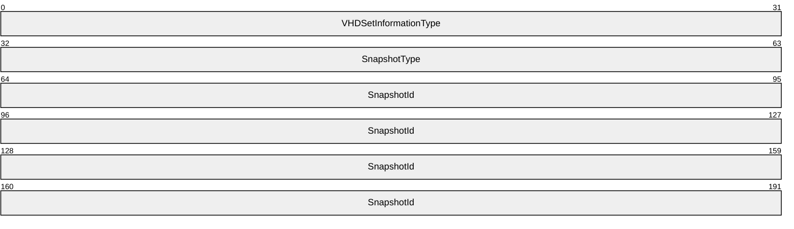
```mermaid
packet-beta
  0-31: "VHDSetInformationType"
  32-63: "SnapshotType"
  64-191: "SnapshotId"
```

**VHDSetInformationType (4 bytes)**: The information type requested. This MUST be one of the following values.

| Name | Meaning |
| --- | --- |
| SvhdxVHDSetInformationTypeSnapshotList 0x00000002 | Returns a list of snapshots. |
| SvhdxVHDSetInformationTypeSnapshotEntry 0x00000005 | Returns the details about a specific snapshot entry. |
| SvhdxVHDSetInformationTypeOptimizeNeeded 0x00000008 | Queries whether the target VHD set needs optimization. |
| SvhdxVHDSetInformationTypeCdpSnapshotRoot 0x00000009 | Returns the oldest [**CDP snapshot**](#gt_continuous-data-protection-snapshot-cdp-snapshot) present in the target VHD set. |
| SvhdxVHDSetInformationTypeCdpSnapshotActiveList 0x0000000A | Returns the list of CDP snapshot IDs that are active in the VHD set. |
| SvhdxVHDSetInformationTypeCdpSnapshotInactiveList 0x0000000C | Returns the list of CDP snapshot IDs that are inactive in the VHD set. |

**SnapshotType (4 bytes)**: The snapshot type queried by this operation. This MUST be one of the **SvhdxSnapshotType** values specified in section [2.2.6](#Section_2.2.6).

**SnapshotId (16 bytes):** The snapshot ID relevant to the particular request.

#### 2.2.4.20 SVHDX_TUNNEL_VHDSET_QUERY_INFORMATION_SNAPSHOT_LIST_RESPONSE Structure

The **SVHDX_TUNNEL_VHDSET_QUERY_INFORMATION_SNAPSHOT_LIST_RESPONSE** packet is sent by a server in response to an **RSVD_TUNNEL_VHDSET_QUERY_INFORMATION** request where the VHDSetInformationType is **SvhdxVHDSetInformationTypeSnapshotList**.

```mermaid
packet-beta
  0-31: "VHDSetInformationType"
  32-63: "Reserved1"
  64-71: "ResponseComplete"
  72-95: "Reserved2"
  96-127: "NumberOfSnapshots"
  128-191: "SnapshotIds (variable)"
```

**VHDSetInformationType (4 bytes)**: The information type. The server MUST set this to SvhdxVHDSetInformationTypeSnapshotList.

**Reserved1 (4 bytes)**: This field is set to any value by the server and MUST be ignored by the client.

**ResponseComplete (1 byte):** Indicates if the reply contains all snapshot IDs in the **SnapshotIds** field. Zero (0x00) indicates that the **SnapshotIds** field is not present. One (0x01) indicates that all snapshot IDs are present in the **SnapshotIds** field.

**Reserved2 (3 bytes):** This field MUST be set to 0 by the server and MUST be ignored by the client.

**NumberOfSnapshots (4 bytes):** The number of snapshots contained in the **SnapshotIds** field.

**SnapshotIds (Variable):** A list of IDs of all snapshots of a particular type. This field contains a list of GUIDs that define each snapshot ID. The number of snapshot IDs in the field is specified by the **NumberOfSnapshots** fields.

#### 2.2.4.21 SVHDX_TUNNEL_VHDSET_QUERY_INFORMATION_SNAPSHOT_ENTRY_RESPONSE Structure

The **SVHDX_TUNNEL_VHDSET_QUERY_INFORMATION_SNAPSHOT_ENTRY_RESPONSE** packet is sent by a server in response to an **RSVD_TUNNEL_VHDSET_QUERY_INFORMATION** request where the **VHDSetInformationType** is **SvhdxVHDSetInformationTypeSnapshotEntry**.

```mermaid
packet-beta
  0-31: "VHDSetInformationType"
  32-63: "Reserved"
  64-127: "SnapshotCreationTime"
  128-159: "SnapshotType"
  160-191: "IsValidSnapshot"
  192-319: "SnapshotId"
  320-447: "ParentSnapshotId"
  448-575: "LogFileId"
```

**VHDSetInformationType (4 bytes):** The information type. The server MUST set this to SvhdxVHDSetInformationTypeSnapshotEntry.

**Reserved (4 bytes)**: This field is set to any value by the server and MUST be ignored by the client.

**SnapshotCreationTime (8 bytes):** The time, in milliseconds since Jan 1, 1970, when the snapshot was created.

**SnapshotType (4 bytes):** The type of snapshot. This MUST be one of the **SvhdxSnapshotType** values defined in section [2.2.6](#Section_2.2.6).

**IsValidSnapshot (4 bytes):** Set to 1 when the snapshot is valid; set to 0 when the snapshot is invalid.

**SnapshotId (16 bytes):** The globally unique ID of the snapshot.

**ParentSnapshotId (16 bytes):** The parent snapshot ID. This field will be set for CDP snapshots.

**LogFileId (16 bytes):** The ID of the log file associated with this snapshot. This field will be set for CDP snapshots.

#### 2.2.4.22 SVHDX_TUNNEL_VHDSET_QUERY_INFORMATION_OPTIMIZE_RESPONSE Structure

The **SVHDX_TUNNEL_VHDSET_QUERY_INFORMATION_OPTIMIZE_RESPONSE** packet is sent by a server in response to an **RSVD_TUNNEL _VHDSET_QUERY_INFORMATION** request where the **VHDSetInformationType** is **SvhdxVHDSetInformationTypeOptimizeNeeded**.

```mermaid
packet-beta
  0-31: "VHDSetInformationType"
  32-63: "Reserved"
  64-95: "OptimizeNeeded"
```

**VHDSetInformationType (4 bytes):** The information type. The server MUST set this to **SvhdxVHDSetInformationTypeOptimizeNeeded**.

**Reserved (4 bytes)**: This field is set to any value by the server and MUST be ignored by the client.

**OptimizeNeeded (4 bytes):** Indicates whether optimization is needed for the target VHD set.

#### 2.2.4.23 SVHDX_META_OPERATION_QUERY_PROGRESS_REQUEST Structure

The **SVHDX_META_OPERATION_QUERY_PROGRESS_REQUEST** packet is sent by the client to query the progress of an ongoing meta-operation.

```mermaid
packet-beta
  0-127: "TransactionId"
```

**TransactionId (16 bytes)**: Indicates the transaction ID for the operation. This is the transaction ID used in the RSVD_TUNNEL_META_OPERATION_START request.

#### 2.2.4.24 SVHDX_META_OPERATION_QUERY_PROGRESS_RESPONSE Structure

The **SVHDX_META_OPERATION_QUERY_PROGRESS_RESPONSE** packet is sent by the server in response to a RSVD_TUNNEL_META_OPERATION_QUERY_PROGRESS request.

```mermaid
packet-beta
  0-63: "CurrentProgressValue"
  64-127: "CompleteValue"
```

**CurrentProgressValue (8 bytes)**: A server-defined progress value that indicates how far along the meta-operation has proceeded.

**CompleteValue (8 bytes)**: The maximum progress value for the completed operation. That is, when **CurrentProgressValue** is equal to **CompleteValue**, the operation is complete.

#### 2.2.4.25 SVHDX_CHANGE_TRACKING_GET_PARAMETERS_RESPONSE Structure

The **SVHDX_CHANGE_TRACKING_GET_PARAMETERS_RESPONSE** packet is sent by the server in response to a RSVD_TUNNEL_CHANGE_TRACKING_GET_PARAMETERS operation.

```mermaid
packet-beta
  0-31: "ChangeTrackingStatus"
  32-63: "Reserved"
  64-127: "LogFileSize"
```

**ChangeTrackingStatus (4 bytes)**: The current status of change tracking on the server. This MUST be one of the error codes specified in section [2.2.4.18](#Section_2.2.4.18).

**Reserved (4 bytes)**: This field is set to any value by the server and MUST be ignored by the client.

**LogFileSize (8 bytes)**: The number of bytes consumed by the current log file used to conduct change tracking.

#### 2.2.4.26 SVHDX_TUNNEL_DELETE_SNAPSHOT_REQUEST Structure

The **SVHDX_TUNNEL_DELETE_SNAPSHOT_REQUEST** packet is sent by a client to delete a snapshot from a shared virtual disk file.

```mermaid
packet-beta
  0-127: "SnapshotId (16 bytes)"
  128-159: "PersistReference"
  160-191: "SnapshotType"
```

**SnapshotId (16 bytes)**: The snapshot ID relevant to the particular request.

**PersistReference (4 bytes):** A flag to indicate if the snapshot needs to be persisted. One represents TRUE (0x00000001), indicating that the snapshot will be stored as a reference without any data. Zero represents FALSE (0x00000000), indicating that the snapshot will be deleted. This field MUST be set to FALSE if **SnapshotType** is **SvhdxSnapshotTypeVM**.

**SnapshotType (4 bytes)**: The type of snapshot. This MUST be one of the **SvhdxSnapshotType** values defined in section [2.2.6](#Section_2.2.6).

#### 2.2.4.27 SVHDX_CHANGE_TRACKING_START_REQUEST Structure

The **SVHDX_CHANGE_TRACKING_START_REQUEST** packet is sent by the client to start change tracking on the server. The packet contains the following fields.

```mermaid
packet-beta
  0-127: "TransactionId"
  128-159: "LogFileNameOffset"
  160-191: "LogFileNameLength"
  192-319: "LogFileId"
  320-383: "MaxLogFileSize"
  384-415: "AppendData"
  416-447: "Reserved"
  448-511: "LogFileName (variable)"
```

**TransactionId (16 bytes)**: The client MUST set this to a globally unique transaction ID for each operation.

**LogFileNameOffset (4 bytes)**: The offset, in bytes, of the **LogFileName** field.

**LogFileNameLength (4 bytes)**: The length, in bytes, of the **LogFileName** string. This length MUST include a NULL terminating character. This field MUST be set to 0.

**LogFileId (16 bytes)**: A globally unique Id used to refer to this log file.

**MaxLogFileSize (8 bytes):** The maximum allowed size, in bytes, of the underlying object store for this particular change-tracking log file. This field MUST be set to 0 if the log file size is unbounded.

**AppendData (4 bytes)**: When set to TRUE, change tracking will be resumed, and further tracked data will be appended to the existing log file. The client sets this to FALSE for the first change-tracking request issued against the target device.

**Reserved (4 bytes)**: This field MUST be set to 0 by the client and MUST be ignored by the server.

**LogFileName (Variable):** The name of the log file containing a null-terminated Unicode UTF-16 string. This field MUST be an empty array.

#### 2.2.4.28 SVHDX_CHANGE_TRACKING_START_RESPONSE Structure

The **SVHDX_CHANGE_TRACKING_START_RESPONSE** packet is sent by the server in response to an RSVD_TUNNEL_CHANGE_TRACKING_START operation. This response MUST NOT contain any payload.

#### 2.2.4.29 SVHDX_CHANGE_TRACKING_STOP_REQUEST Structure

The **SVHDX_CHANGE_TRACKING_STOP_REQUEST** packet is sent by the client to stop change tracking on the server. This request MUST NOT contain any payload.

#### 2.2.4.30 SVHDX_CHANGE_TRACKING_STOP_RESPONSE Structure

The **SVHDX_CHANGE_TRACKING_STOP_RESPONSE** packet is sent by the server in response to an RSVD_TUNNEL_CHANGE_TRACKING_STOP operation.

```mermaid
packet-beta
  0-31: "ChangeTrackingStatus"
```

**ChangeTrackingStatus (4 bytes):** The current status of change tracking on the server. This MUST be one of the ChangeTrackingErrorStatus values specified in section [2.2.4.18](#Section_2.2.4.18).

#### 2.2.4.31 SVHDX_OPEN_DEVICE_CONTEXT_RESPONSE Structure

The SVHDX_OPEN_DEVICE_CONTEXT_RESPONSE packet is sent by the server in response to open the shared virtual disk request.

```mermaid
packet-beta
  0-31: "Version"
  32-39: "HasInitiatorId"
  40-63: "Reserved"
  64-191: "InitiatorId"
  192-223: "Flags"
  224-255: "OriginatorFlags"
  256-319: "OpenRequestId"
  320-335: "InitiatorHostNameLength"
  336-415: "InitiatorHostName (126 bytes)"
```

**Version (4 bytes):** The version of the create context. It MUST be set to RSVD_ECP_CONTEXT_VERSION_1.

**HasInitiatorId (1 byte):** A Boolean value that, if set to TRUE (0x01), indicates that the message has a valid **InitiatorId**.

**Reserved (3 bytes):** This field MUST be set to zero when sent and MUST be ignored on receipt.

**InitiatorId (16 bytes):** A [**GUID**](#gt_globally-unique-identifier-guid) that optionally identifies the initiator of the open request.

**Flags (4 bytes):** A value for the open sent by the client.

**OriginatorFlags (4 bytes):** This field is used to indicate which component has originated or issued the operation. This field MUST be set to one of the following values.

| Name | Meaning |
| --- | --- |
| SVHDX_ORIGINATOR_PVHDPARSER 0x00000001 | Shared virtual disk file to be opened as a virtual SCSI disk device |
| SVHDX_ORIGINATOR_VHDMP 0x00000004 | Shared virtual disk file to be opened in underlying object store |

**OpenRequestId (8 bytes):** A 64-bit value assigned by the client for an outgoing request.

**InitiatorHostNameLength (2 bytes):** The length, in bytes, of the **InitiatorHostName**. This value MUST be less than or equal to RSVD_MAXIMUM_NAME_LENGTH.

**InitiatorHostName (126 bytes):** A 126-byte buffer containing a Unicode UTF-16 string that specifies the computer name which initiated the request.

#### 2.2.4.32 SVHDX_OPEN_DEVICE_CONTEXT_V2 Structure

The SVHDX_OPEN_DEVICE_CONTEXT_V2 packet is sent by the client to open the shared virtual disk.

This is valid only for the RSVD Protocol version 2.

```mermaid
packet-beta
  0-31: "Version"
  32-39: "HasInitiatorId"
  40-63: "Reserved"
  64-191: "InitiatorId"
  192-223: "Flags"
  224-255: "OriginatorFlags"
  256-319: "OpenRequestId"
  320-335: "InitiatorHostNameLength"
  336-415: "InitiatorHostName (126 bytes)"
  416-447: "VirtualDiskPropertiesInitialized"
  448-479: "ServerServiceVersion"
  480-511: "VirtualSectorSize"
  512-543: "PhysicalSectorSize"
  544-607: "VirtualSize"
```

**Version (4 bytes):** The version of the create context. It MUST be set to RSVD_ECP_CONTEXT_VERSION_2.

**HasInitiatorId (1 byte):** A Boolean value that, if set to TRUE (0x01), indicates that the message has a valid **InitiatorId**.

**Reserved (3 bytes):** This field MUST be set to zero when sent and MUST be ignored on receipt.

**InitiatorId (16 bytes):** A [**GUID**](#gt_globally-unique-identifier-guid) that optionally identifies the initiator of the open request.

**Flags (4 bytes):** An application-provided value for the open.

**OriginatorFlags (4 bytes):** This field is used to indicate which component has originated or issued the operation. This field MUST be set to one of the following values:

| Name | Meaning |
| --- | --- |
| SVHDX_ORIGINATOR_PVHDPARSER 0x00000001 | Shared virtual disk file to be opened as a virtual SCSI disk device |
| SVHDX_ORIGINATOR_VHDMP 0x00000004 | Shared virtual disk file to be opened in underlying object store |

**OpenRequestId (8 bytes):** A 64-bit value assigned by the client for an outgoing request.

**InitiatorHostNameLength (2 bytes):** The length, in bytes, of the **InitiatorHostName**. This value MUST be less than or equal to RSVD_MAXIMUM_NAME_LENGTH.

**InitiatorHostName (126 bytes):** A 126-byte buffer containing a Unicode UTF-16 string that specifies the computer name on which the initiator resides.

**VirtualDiskPropertiesInitialized (4 bytes):** This field MUST be set to zero.

**ServerServiceVersion (4 bytes):** This field MUST be set to zero.

**VirtualSectorSize (4 bytes):** This field MUST be set to zero.

**PhysicalSectorSize (4 bytes):** This field MUST be set to zero.

**VirtualSize (8 bytes):** This field MUST be set to zero.

#### 2.2.4.33 SVHDX_OPEN_DEVICE_CONTEXT_V2_RESPONSE Structure

The SVHDX_OPEN_DEVICE_CONTEXT_RESPONSE_V2 packet is sent by the server in response to open the shared virtual disk request.

This is valid only for the RSVD Protocol version 2.

```mermaid
packet-beta
  0-31: "Version"
  32-39: "HasInitiatorId"
  40-63: "Reserved"
  64-191: "InitiatorId"
  192-223: "Flags"
  224-255: "OriginatorFlags"
  256-319: "OpenRequestId"
  320-335: "InitiatorHostNameLength"
  336-415: "InitiatorHostName (126 bytes)"
  416-447: "VirtualDiskPropertiesInitialized"
  448-479: "ServerServiceVersion"
  480-511: "VirtualSectorSize"
  512-543: "PhysicalSectorSize"
  544-607: "VirtualSize"
```

**Version (4 bytes):** The version of the create context. It MUST be set to RSVD_ECP_CONTEXT_VERSION_2.

**HasInitiatorId (1 byte):** A Boolean value that, if set to TRUE (0x01), indicates that the message has a valid **InitiatorId**.

**Reserved (3 bytes):** This field MUST be set to zero when sent and MUST be ignored on receipt.

**InitiatorId (16 bytes):** A GUID that optionally identifies the initiator of the open request.

**Flags (4 bytes):** A value for the open sent by the client.

**OriginatorFlags (4 bytes):** This field is used to indicate which component has originated or issued the operation. This field MUST be set to one of the following values:

| Name | Meaning |
| --- | --- |
| SVHDX_ORIGINATOR_PVHDPARSER 0x00000001 | Shared virtual disk file to be opened as a virtual SCSI disk device |
| SVHDX_ORIGINATOR_VHDMP 0x00000004 | Shared virtual disk file to be opened in underlying object store |

**OpenRequestId (8 bytes):** A 64-bit value assigned by the client for an outgoing request.

**InitiatorHostNameLength (2 bytes):** The length, in bytes, of the **InitiatorHostName**. This value MUST be less than or equal to RSVD_MAXIMUM_NAME_LENGTH.

**InitiatorHostName (126 bytes):** A 126-byte buffer containing a Unicode UTF-16 string that specifies the computer name which initiated the request.

**VirtualDiskPropertiesInitialized (4 bytes):** A field that indicates whether **VirtualSectorSize**, **PhysicalSectorSize**, and **VirtualSize** fields are updated. A nonzero value indicates TRUE.

**ServerServiceVersion (4 bytes):** The current version of the protocol running on the server.

**VirtualSectorSize (4 bytes):** The virtual sector size of the virtual disk.

**PhysicalSectorSize (4 bytes):** The physical sector size of the virtual disk.

**VirtualSize (8 bytes):** The current length of the virtual disk, in bytes.

#### 2.2.4.34 RSVD_BLOCK_DEVICE_TARGET_SPECIFIER Structure

RSVD_BLOCK_DEVICE_TARGET_SPECIFIER structure is used to read from a particular snapshot.

```mermaid
packet-beta
  0-31: "RsvdBlockDeviceTargetNamespace"
  32-191: "TargetInformationSnapshot"
```

**RsvdBlockDeviceTargetNamespace (4 bytes)**: This field is used to indicate the target namespace. This field MUST be set to one of the following values.

| **Name** | **Meaning** |
| --- | --- |
| SnapshotId 0x00000000 | The target identifier is a snapshot ID. |

**TargetInformationSnapshot (20 bytes)**: An RSVD_BLOCK_DEVICE_TARGET_SPECIFIER_SNAPSHOT structure defined in section [2.2.4.35](#Section_2.2.4.35).

#### 2.2.4.35 RSVD_BLOCK_DEVICE_TARGET_SPECIFIER_SNAPSHOT Structure

The RSVD_BLOCK_DEVICE_TARGET_SPECIFIER_SNAPSHOT structure is used to specify the snapshot to open when opening the virtual disk as a block device.

```mermaid
packet-beta
  0-31: "SnapshotType"
  32-159: "SnapshotID"
```

**SnapshotType (4 bytes)**: The type of snapshot. This field MUST contain one of the values defined in section [2.2.6](#Section_2.2.6).

**SnapshotID (16 bytes)**: A GUID that identifies the snapshot to open.

#### 2.2.4.36 SVHDX_APPLY_SNAPSHOT_PARAMS Structure

The SVHDX_APPLY_SNAPSHOT_PARAMS structure is used to specify the snapshot to apply.

```mermaid
packet-beta
  0-31: "SnapshotType"
  32-159: "SnapshotID"
```

**SnapshotType (4 bytes)**: The type of snapshot. This field MUST contain one of the values defined in section [2.2.6](#Section_2.2.6).

**SnapshotID (16 bytes)**: A GUID that identifies the snapshot to open.

#### 2.2.4.37 SVHDX_TUNNEL_QUERY_VIRTUAL_DISK_CHANGES_REQUEST Structure

The SVHDX_TUNNEL_QUERY_VIRTUAL_DISK_CHANGES_REQUEST structure requests a list of changed ranges since the designated snapshot.

```mermaid
packet-beta
  0-127: "TargetSnapshotId"
  128-255: "LimitSnapshotId"
  256-287: "SnapshotType"
  288-319: "Reserved"
  320-383: "ByteOffset"
  384-447: "ByteLength"
```

**TargetSnapshotId (16 bytes)**: A GUID that identifies the snapshot to query for the changed ranges.

**LimitSnapshotId (16 bytes)**: A GUID that identifies the snapshot to use as a baseline for getting the list of changed ranges.

**SnapshotType (4 bytes)**: The type of snapshot. This field MUST contain one of the values defined in section [2.2.6](#Section_2.2.6).

**Reserved (4 bytes)**: This field ensures the 8-byte alignment of the **ByteOffset** field. This value MUST be set to 0 by the client and MUST be ignored by the server.

**ByteOffset (8 bytes)**: The byte offset of the region in the virtual disk to query changes for.

**ByteLength (8 bytes)**: The length, in bytes, of the region in the virtual disk to query changes for.

#### 2.2.4.38 SVHDX_TUNNEL_QUERY_VIRTUAL_DISK_CHANGES_REPLY Structure

The SVHDX_TUNNEL_QUERY_VIRTUAL_DISK_CHANGES_REPLY structure is sent as a response to the virtual disk changes query.

```mermaid
packet-beta
  0-63: "ProcessedByteLength"
  64-95: "RangeCount"
  96-127: "Reserved"
  128-191: "Ranges (Variable)"
```

**ProcessedByteLength (8 bytes)**: The total byte length that was processed. This can be **ByteLength** from the SVHDX_TUNNEL_QUERY_VIRTUAL_DISK_CHANGES_REQUEST or a smaller value, if the provided buffer was not large enough to contain all the information that was available about the requested virtual disk region.

**RangeCount (4 bytes)**: The number of changed ranges in the specified virtual disk region.

**Reserved (4 bytes)**: Reserved. The server MUST set this field to zero and the client MUST ignore it on receipt.

**Ranges (Variable)**: The list of SVHDX_VIRTUAL_DISK_CHANGED_RANGE structures, as defined in section [2.2.4.39](#Section_2.2.4.39), representing the changed ranges in the specified virtual disk region.

#### 2.2.4.39 SVHDX_VIRTUAL_DISK_CHANGED_RANGE Structure

The SVHDX_VIRTUAL_DISK_CHANGED_RANGE structure contains the details of the changed range.

```mermaid
packet-beta
  0-63: "ByteOffset"
  64-127: "ByteLength"
  128-191: "Reserved"
```

**ByteOffset (8 bytes)**: The byte offset of the changed range in the virtual disk.

**ByteLength (8 bytes)**: The length, in bytes, of the changed range in the virtual disk.

**Reserved (8 bytes)**: Reserved. The server MUST set this field to zero and the client MUST ignore it on receipt.

#### 2.2.4.40 SVHDX_TUNNEL_QUERY_SAFE_SIZE_RESPONSE STRUCTURE

The SVHDX_TUNNEL_QUERY_SAFE_SIZE_RESPONSE structure contains the details of the safe virtual size.

```mermaid
packet-beta
  0-63: "SafeVirtualSize"
```

**SafeVirtualSize (8 bytes):** The smallest size, in bytes, that the virtual disk can be resized to without losing user data.

### 2.2.5 SRB Status Code

The [**SCSI request block (SRB)**](#gt_scsi-request-block-srb) status codes used to communicate from server to client are as follows.

| Value | Meaning |
| --- | --- |
| 0x00 | The request status is pending. |
| 0x01 | The request was completed successfully. |
| 0x02 | The request was aborted. |
| 0x06 | The Shared Virtual Disk does not support the given request. |
| 0x08 | The Shared Virtual Disk device is no longer available. |
| 0x0A | The SCSI device selection timed out. |
| 0x12 | A data overrun or underrun error occurred. |
| 0x04 | The request completed with any other error. |

### 2.2.6 Snapshot Types

Following are the possible snapshot types.

| Name | Meaning |
| --- | --- |
| SvhdxSnapshotTypeVM 0x01 | A snapshot created as part of routine Virtual Machine operations. |
| SvhdxSnapshotTypeCDP 0x03 | A snapshot created as part of a continuous data protection (CDP) process. |
| SvhdxSnapshotTypeWriteable 0x04 | A snapshot created as a writable snapshot. |

# 3 Protocol Details

## 3.1 Client Details

### 3.1.1 Abstract Data Model

#### 3.1.1.1 Global

The client MUST implement the following:

**ClientServiceVersion**: The highest protocol version supported by the client.

**RequestIdentifier**: An unsigned 64-bit value assigned by the client for an outgoing request.

### 3.1.2 Timers

None.

### 3.1.3 Initialization

The client MUST initialize **ClientServiceVersion** to an implementation-specific<2> administratively configured protocol version.

**RequestIdentifier**: SHOULD<3> be initialized to an implementation-specific value.

### 3.1.4 Higher-Layer Triggered Events

#### 3.1.4.1 Sending Any Outgoing Message

The Client MUST increment **RequestIdentifier** by 1, for every outgoing tunnel operation specified in section [2.2.2](#Section_2.2.2).

#### 3.1.4.2 Application Requests Opening a Shared Virtual Disk

The application provides the following:

- The name of the server to connect to.
- The name of the share to connect to.
- InitiatorId to uniquely identify the initiator (optional).
- User credentials, an opaque implementation-specific entity that identifies the credentials to be used when authenticating to the remote server.
- The shared virtual disk file name to open.
- The flags for open command (optional).
- The Initiator host name.
- A Boolean that, if set, requires the shared virtual disk file to be opened as virtual SCSI disk.
Upon successful completion, the client MUST return a handle to the application.

If **ClientServiceVersion** is RSVD Protocol version 1, the client MUST construct an SVHDX_OPEN_DEVICE_CONTEXT as specified in section [2.2.4.12](#Section_2.2.4.12), or if **ClientServiceVersion** is RSVD Protocol version 2, the client MUST construct an SVHDX_OPEN_DEVICE_CONTEXT_V2 as specified in section [2.2.4.32](#Section_2.2.4.32) and MUST be initialized as follows:

- The **InitiatorId** field is set to the application-provided InitiatorId, if any. Otherwise, **InitiatorId** is set to zero.
- The **HasInitiatorId** field is set to TRUE if the application provides initiator Id; otherwise set to FALSE.
- The **Flags** field is set to application-provided flags.
- If the application requires the shared virtual disk file to be opened as a virtual SCSI disk device, the client MUST set **OriginatorFlags** to SVHDX_ORIGINATOR_PVHDPARSER. Otherwise, it MUST be set to SVHDX_ORIGINATOR_VHDMP.
- The **OpenRequestId** is set to **RequestIdentifier**.
- The **InitiatorHostNameLength** is set to **InitiatorHostName** length, in bytes.
- The **InitiatorHostName** is set to the application-provided initiator host name. If **InitiatorHostNameLength** is less than 126 bytes, the remaining bytes in the buffer MUST be set to zero.
The client MUST append ":SharedVirtualDisk" at the end of the file name.

The client MUST establish a connection to the server by calling the interface specified in [MS-SMB2](../MS-SMB2/MS-SMB2.md) section 3.2.4.2 and providing the following input parameters:

- The application-provided server name.
- The application-provided share name.
- The application-provided user credentials.
If the connection is successfully established, the client MUST open the shared virtual disk file by calling the interface specified in [MS-SMB2] section 3.2.4.3 and provide the following input parameters:

- File name
- The SVHDX_OPEN_DEVICE_CONTEXT Create context if **ClientServiceVersion** is RSVD Protocol version 1 or SVHDX_OPEN_DEVICE_CONTEXT_V2 Create context if **ClientServiceVersion** is RSVD Protocol version 2
- **CreateOptions** as specified in [MS-SMB2] section 2.2.13 with the FILE_NO_INTERMEDIATE_BUFFERING bit set
If there are any errors from the preceding call, return the error to the caller.

#### 3.1.4.3 Application Requests Closing a Shared Virtual Disk

The application provides:

- A handle to the **Open** identifying the shared virtual disk file.
The client MUST call the interface specified in [MS-SMB2](../MS-SMB2/MS-SMB2.md) section 3.2.4.5 to close the open on the shared virtual disk file, supplying the application-provided handle.

#### 3.1.4.4 Application Requests Reading From a Shared Virtual Disk

The application provides:

- A handle to the **Open** identifying the shared virtual disk file.
- The offset, in bytes, from the beginning of the virtual disk from which to read data.
- The number of bytes to read.
- The minimum number of bytes to be read (optional).
- The buffer to receive the data.
The client MUST call the interface specified in [MS-SMB2](../MS-SMB2/MS-SMB2.md) section 3.2.4.6, supplying the application-provided parameters

#### 3.1.4.5 Application Requests Writing To a Shared Virtual Disk

The application provides:

- A handle to the **Open** identifying a shared virtual disk file.
- The offset, in bytes, from the beginning of the virtual disk where data is written.
- The number of bytes to write.
- A buffer containing the bytes to be written.
The client MUST call the interface specified in [MS-SMB2](../MS-SMB2/MS-SMB2.md) section 3.2.4.7, supplying the application-provided parameters.

#### 3.1.4.6 Application Requests Virtual Disk File information

The application provides:

- A handle to the **Open** identifying a shared virtual disk file.
- The maximum output buffer size that it will accept.
The client MUST construct an SVHDX_TUNNEL_INITIAL_INFO_REQUEST structure, as specified in section [2.2.4.13](#Section_2.2.4.13) as follows:

The SVHDX_TUNNEL_OPERATION_HEADER MUST be initialized as follows:

- The **OperationCode** MUST be set to RSVD_TUNNEL_GET_INITIAL_INFO_OPERATION.
- The **Status** field MUST be set to zero.
- The **RequestId** field MUST be set to **RequestIdentifier**.
The client MUST call the interface specified in [MS-SMB2](../MS-SMB2/MS-SMB2.md) section 3.2.4.20.11, supplying the following input parameters:

- Application-provided handle to identify the **Open**.
- Control code: FSCTL_SVHDX_SYNC_TUNNEL_REQUEST.
- SVHDX_TUNNEL_OPERATION_HEADER structure as payload.
- The maximum output buffer size that it will accept.

#### 3.1.4.7 Application Requests Connection Status

The application provides:

- A handle to the **Open** identifying a shared virtual disk file.
The client MUST construct an SVHDX_TUNNEL_CHECK_CONNECTION_REQUEST structure, as specified in section [2.2.4.1](#Section_2.2.4.1) as follows:

The SVHDX_TUNNEL_OPERATION_HEADER MUST be initialized as follows:

- The **OperationCode** MUST be set to RSVD_TUNNEL_CHECK_CONNECTION_STATUS_OPERATION.
- The **Status** field MUST be set to zero.
- The **RequestId** field MUST be set to **RequestIdentifier**.
The client MUST call the interface specified in [MS-SMB2](../MS-SMB2/MS-SMB2.md) section 3.2.4.20.11, supplying the following input parameters:

- Application-provided handle to identify the **Open**.
- Control code: FSCTL_SVHDX_SYNC_TUNNEL_REQUEST.
- SVHDX_TUNNEL_OPERATION_HEADER as payload.

#### 3.1.4.8 Application Requests Shared Virtual Disk Information

The application provides:

- A handle to the **Open** identifying a shared virtual disk file.
The client MUST construct an SVHDX_TUNNEL_DISK_INFO_REQUEST structure, as specified in section [2.2.4.5](#Section_2.2.4.5), as follows:

The SVHDX_TUNNEL_OPERATION_HEADER MUST be initialized as follows:

- The **OperationCode** MUST be set to RSVD_TUNNEL_GET_DISK_INFO_OPERATION.
- The **Status** field MUST be set to zero.
- The **RequestId** field MUST be set to **RequestIdentifier**.
The client MUST call the interface specified in [MS-SMB2](../MS-SMB2/MS-SMB2.md) section 3.2.4.20.11, supplying the following input parameters:

- Application-provided handle to identify the **Open**.
- Control code: FSCTL_SVHDX_SYNC_TUNNEL_REQUEST.
- SVHDX_TUNNEL_DISK_INFO_REQUEST packet, as payload.

#### 3.1.4.9 Application Requests Execution of SCSI Command

The application provides:

- A handle to the **Open** identifying a shared virtual disk file.
- The ID of the initiator.
- The length of the [**SCSI CDB**](#gt_scsi-command-descriptor-block-cdb) buffer, in bytes.
- SrbFlags that indicate options about the SCSI request, as specified in section [2.2.4.7](#Section_2.2.4.7)<4>.
- The SCSI CDB buffer.
- The length of any additional data (optional).
- Any additional data buffer (optional).
The client MUST construct an SVHDX_TUNNEL_SCSI_REQUEST structure, as specified in section 2.2.4.7 as follows:

The SVHDX_TUNNEL_OPERATION_HEADER MUST be initialized as follows:

- The **OperationCode** field is set to RSVD_TUNNEL_SCSI_OPERATION.
- The **Status** is set to zero.
- The **RequestId** field MUST be set to RequestIdentifier.
The SVHDX_TUNNEL_SCSI_REQUEST is initialized as follows:

- The **Length** field MUST be set to 36.
- The **Reserved1**, **Reserved2**, and **Reserved3** fields MUST be set to zero.
- The **CDBLength** field MUST be set to the application-provided SCSI CDB length value.
- The **SenseInfoExLength** field SHOULD be set to 20.
- The **SrbFlags** field MUST be set to the application-provided **SrbFlags**.
- If **SrbFlags** includes SRB_FLAGS_DATA_OUT, the **Disposition** field MUST be set to 0x00. If **SrbFlags** includes SRB_FLAGS_DATA_IN, the **Disposition** field SHOULD<5> be set to 0x01. If **SrbFlags** includes neither SRB_FLAGS_DATA_OUT nor SRB_FLAGS_DATA_IN, the **Disposition** field MUST be set to 0x02.
- The **DataTransferLength** field MUST be set to the application-provided value for the **Length** of the additional value. If the application doesn't provide a data buffer length, the client MUST set this field to zero.
- The **CDBBuffer** field MUST be set to the application-provided SCSI CDB buffer.
- The **DataBuffer** field MUST be set to the application-provided additional data buffer. If the application doesn't provide the buffer, the client MUST set this field to empty.
The client MUST call the interface specified in [MS-SMB2](../MS-SMB2/MS-SMB2.md) section 3.2.4.20.11, supplying the following input parameters:

- Application-provided handle to identify the **Open**.
- Control code: FSCTL_SVHDX_SYNC_TUNNEL_REQUEST.
- SVHDX_TUNNEL_SCSI_REQUEST structure as payload.

#### 3.1.4.10 Application Requests to Validate a Shared Virtual Disk

The application provides:

- A handle to the **Open** identifying a shared virtual disk file.
The client MUST construct an SVHDX_TUNNEL_VALIDATE_DISK_REQUEST structure, as specified in section [2.2.4.9](#Section_2.2.4.9), as follows:

The SVHDX_TUNNEL_OPERATION_HEADER MUST be initialized as follows:

- The **OperationCode** field MUST be set to RSVD_TUNNEL_VALIDATE_DISK_OPERATION.
- The **Status** field MUST be set to zero.
- The **RequestId** field MUST be set to **RequestIdentifier**.
The client MUST call the interface specified in [MS-SMB2](../MS-SMB2/MS-SMB2.md) section 3.2.4.20.11, supplying the following input parameters:

- Application-provided handle to identify the **Open**.
- Control code: FSCTL_SVHDX_SYNC_TUNNEL_REQUEST.
- SVHDX_TUNNEL_OPERATION_HEADER structure as payload.

#### 3.1.4.11 Application Requests Querying Shared Virtual Disk Support

The application provides:

- A handle to the **Open** identifying a shared virtual disk file.
The client MUST send an SVHDX_SHARED_VIRTUAL_DISK_SUPPORT_REQUEST, specified in section [2.2.4.15](#Section_2.2.4.15), by calling the interface specified in [MS-SMB2](../MS-SMB2/MS-SMB2.md) section 3.2.4.20.11, supplying the following input parameters:

- Application-provided handle to identify the **Open**.
- Control code: FSCTL_QUERY_SHARED_VIRTUAL_DISK_SUPPORT

#### 3.1.4.12 Application Requests Creating a Virtual Machine Snapshot

The application provides:

- A handle to the **Open** identifying a VHD set.
- **TransactionId**: A GUID used to uniquely identify the start operation.
- Stage 1 value
- Stage 2 value
- Stage 3 value
- Stage 4 value
- Stage 5 value
- Stage 6 value
- **SnapshotId**: A GUID to uniquely identify the snapshot.
The client MUST construct an SVHDX_META_OPERATION_START_REQUEST structure, as specified in section [2.2.4.17](#Section_2.2.4.17.1.1) as follows:

The SVHDX_TUNNEL_OPERATION_HEADER MUST be initialized as follows:

- The **OperationCode** MUST be set to RSVD_TUNNEL_META_OPERATION_START.
- The **Status** field MUST be set to zero.
- The **RequestId** field MUST be set to **RequestIdentifier**.
The SVHDX_META_OPERATION_START_REQUEST MUST be initialized as follows:

- The **TransactionId** field is set to the application-provided **TransactionId**.
- The **OperationType** field is set to **SvhdxMetaOperationTypeCreateSnapshot**.
- The **Data** field is set to an SVHDX_META_OPERATION_CREATE_SNAPSHOT structure initialized as follows:
- The **SnapshotType** field is set to the snapshot type provided by the application
- The **Stage1** field is set to the stage 1 value provided by the application.
- The **Stage2** field is set to the stage 2 value provided by the application.
- The **Stage3** field is set to the stage 3 value provided by the application.
- The **Stage4** field is set to the stage 4 value provided by the application.
- The **Stage5** field is set to the stage 5 value provided by the application.
- The **Stage6** field is set to the stage 6 value provided by the application.
- The **SnapshotId** field is set to the SnapshotId provided by the application.
- The **ParametersPayloadSize** is set to 0**.**
The client MUST call the interface specified in [MS-SMB2](../MS-SMB2/MS-SMB2.md) section 3.2.4.20.11, supplying the following input parameters:

- Application-provided handle to identify the **Open**.
- Control code: FSCTL_SVHDX_ASYNC_TUNNEL_REQUEST.
- SVHDX_META_OPERATION_START_REQUEST structure as payload.

#### 3.1.4.13 Application Requests Creating a CDP Snapshot

The application provides:

- A handle to the **Open** identifying a VHD set.
- **TransactionId**: A GUID used to uniquely identify the start operation.
- Stage 1 value
- Stage 2 value
- Stage 3 value
- Stage 4 value
- Stage 5 value
- Stage 6 value
- **SnapshotId**: A GUID to uniquely identify the snapshot.
- **LogFileID**: A GUID to identify the log file.
The client MUST construct an SVHDX_META_OPERATION_START_REQUEST structure, as specified in section [2.2.4.17](#Section_2.2.4.17.1.1), as follows:

The SVHDX_TUNNEL_OPERATION_HEADER MUST be initialized as follows:

- The **OperationCode** MUST be set to RSVD_TUNNEL_META_OPERATION_START.
- The **Status** field MUST be set to zero.
- The **RequestId** field MUST be set to **RequestIdentifier.**
The SVHDX_META_OPERATION_START_REQUEST MUST be initialized as follows:

- The **TransactionId** field is set to the application-provided **TransactionId**.
- The **OperationType** field is set to **SvhdxMetaOperationTypeCreateSnapshot**.
- The **Data** field is set to an SVHDX_META_OPERATION_CREATE_SNAPSHOT structure initialized as follows:
- The **SnapshotType** field is set to **SvhdxSnapshotTypeCDP**.
- The **Stage1** field is set to the stage 1 value provided by the application.
- The **Stage2** field is set to the stage 2 value provided by the application.
- The **Stage3** field is set to the stage 3 value provided by the application.
- The **Stage4** field is set to the stage 4 value provided by the application.
- The **Stage5** field is set to the stage 5 value provided by the application.
- The **Stage6** field is set to the stage 6 value provided by the application.
- The **SnapshotId** field is set to the **SnapshotId** provided by application.
- The **ParametersPayloadSize** field MUST be set to 0.
- The **CdpParameters** field is set to an SVHDX_META_OPERATION_CREATE_CDP_PARAMETER structure initialized as follows:
- The **LogFileNameOffset** field is set to the byte offset of the **LogFileName** field.
- The **LogFileId** field is set to the **LogFileID** provided by the application.
- The **LogFileName** field MUST be set to an empty array.
The client MUST call the interface specified in [MS-SMB2](../MS-SMB2/MS-SMB2.md) section 3.2.4.20.11, supplying the following input parameters:

- Application-provided handle to identify the **Open**.
- Control code: FSCTL_SVHDX_ASYNC_TUNNEL_REQUEST.
- SVHDX_META_OPERATION_START_REQUEST structure as payload.

#### 3.1.4.14 Application Requests Optimizing the Target VHD set

The application provides:

- A handle to the **Open** identifying a VHD set.
- **TransactionId**: A GUID used to uniquely identify the start operation.
The client MUST construct an SVHDX_META_OPERATION_START_REQUEST structure, as specified in section [2.2.4.17](#Section_2.2.4.17.1.1), as follows:

The SVHDX_TUNNEL_OPERATION_HEADER MUST be initialized as follows:

- The **OperationCode** MUST be set to RSVD_TUNNEL_META_OPERATION_START.
- The **Status** field MUST be set to zero.
- The **RequestId** field MUST be set to **RequestIdentifier**.
The SVHDX_META_OPERATION_START_REQUEST MUST be initialized as follows:

- The **TransactionId** field is set to the application-provided **TransactionId**.
- The **OperationType** field is set to **SvhdxMetaOperationTypeOptimize**.
The client MUST call the interface specified in [MS-SMB2](../MS-SMB2/MS-SMB2.md) section 3.2.4.20.11, supplying the following input parameters:

- Application-provided handle to identify the **Open**.
- Control code: FSCTL_SVHDX_ASYNC_TUNNEL_REQUEST.
- SVHDX_META_OPERATION_START_REQUEST structure as payload.

#### 3.1.4.15 Application Requests Extracting a Differencing VHD

The application provides:

- A handle to the **Open** identifying a VHD set.
- **TransactionId**: A GUID used to uniquely identify the start operation.
- **SnapshotType**: The type of the snapshot.
- **Flags**: The flags to be passed to the server.
- **SnapshotId**: A GUID to identify the first snapshot data to include in the extract.
- **SnapshotLimitId**: A GUID to identify the last snapshot data to include in the extract.
- **DestinationFileName**: A VHD file name into which the difference data will be written.
The client MUST construct an SVHDX_META_OPERATION_START_REQUEST structure, as specified in section [2.2.4.17](#Section_2.2.4.17.1.1), as follows:

The SVHDX_TUNNEL_OPERATION_HEADER MUST be initialized as follows:

- The **OperationCode** MUST be set to RSVD_TUNNEL_META_OPERATION_START.
- The **Status** field MUST be set to zero.
- The **RequestId** field MUST be set to **RequestIdentifier.**
The SVHDX_META_OPERATION_START_REQUEST MUST be initialized as follows:

- The **TransactionId** field is set to the application-provided **TransactionId**.
- The **OperationType** field is set to **SvhdxMetaOperationTypeExtractSnapshots**.
- The **Data** field to a **SVHDX_META_OPERATION_EXTRACT** structure initialized as follows:
- The **SnapshotType** field is set to the **SnapshotType** provided by the application.
- The **Flags** field is set to the **Flags** provided by the application.
- The **SourceSnapshotId** field is set to the **SnapshotId** provided by the application.
- The **SourceLimitSnapshotId** field is set to the **SnapshotLimitId** provided by the application.
- The **DestinationFileNameLength** field is set to the size, in bytes, of **DestinationFileName**.
- The **DestinationFileName** field is set to the **DestinationFileName** provided by the application.
The client MUST call the interface specified in [MS-SMB2](../MS-SMB2/MS-SMB2.md) section 3.2.4.20.11, supplying the following input parameters:

- Application-provided handle to identify the **Open**.
- Control code: FSCTL_SVHDX_ASYNC_TUNNEL_REQUEST.
- SVHDX_META_OPERATION_START_REQUEST structure as payload.

#### 3.1.4.16 Application Requests Converting a Virtual Disk to VHD Set

The application provides:

- A handle to the **Open** identifying a shared virtual disk.
- **TransactionId**: A GUID used to uniquely identify the start operation.
- **DestinationVhdSetName**: A name for the VHD set.
The client MUST construct an SVHDX_META_OPERATION_START_REQUEST structure, as specified in section [2.2.4.17](#Section_2.2.4.17.1.1), as follows:

The SVHDX_TUNNEL_OPERATION_HEADER MUST be initialized as follows:

- The **OperationCode** MUST be set to RSVD_TUNNEL_META_OPERATION_START.
- The **Status** field MUST be set to zero.
- The **RequestId** field MUST be set to **RequestIdentifier**.
The SVHDX_META_OPERATION_START_REQUEST MUST be initialized as follows:

- The **TransactionId** field is set to the application-provided **TransactionId**.
- The **OperationType** field is set to **SvhdxMetaOperationTypeConvertToVHDSet**.
- The **Data** field to a SVHDX_META_OPERATION_CONVERT_TO_VHDSET structure is initialized as follows:
- The **DestinationVhdSetNameLength** field is set to the size, in bytes, of **DestinationVhdSetName**.
- The **DestinationVhdSetName** field is set to the **DestinationVhdSetName** provided by the application.
The client MUST call the interface specified in [MS-SMB2](../MS-SMB2/MS-SMB2.md) section 3.2.4.20.11, supplying the following input parameters:

- Application-provided handle to identify the **Open**.
- Control code: FSCTL_SVHDX_ASYNC_TUNNEL_REQUEST.
- SVHDX_META_OPERATION_START_REQUEST structure as payload.

#### 3.1.4.17 Application Requests Resizing a Shared Virtual Disk

The application provides:

- A handle to the **Open** identifying a shared virtual disk.
- **TransactionId**: A GUID used to uniquely identify the start operation.
- **NewVirtualSize**: The new size of the virtual disk.
- **ExpandOnly**: Indicates that a size can only be expanded.
- **AllowUnsafeVirtualSize**: Indicates that the new size can be less than the data on the disk.
- **ShrinkToMinimumSafeSize**: Indicates that the server automatically shrinks the virtual disk to the minimum safe virtual size.
The client MUST construct an SVHDX_META_OPERATION_START_REQUEST structure, as specified in section [2.2.4.17](#Section_2.2.4.17.1.1), as follows:

The SVHDX_TUNNEL_OPERATION_HEADER MUST be initialized as follows:

- The **OperationCode** MUST be set to RSVD_TUNNEL_META_OPERATION_START.
- The **Status** field MUST be set to zero.
- The **RequestId** field MUST be set to **RequestIdentifier**.
The SVHDX_META_OPERATION_START_REQUEST MUST be initialized as follows:

- The **TransactionId** field is set to the application-provided **TransactionId**.
- The **OperationType** field is set to **SvhdxMetaOperationTypeResize**.
- The **Data** field to a SVHDX_META_OPERATION _RESIZE_VIRTUAL_DISK structure is initialized as follows:
- The **NewSize** field is set to the **NewVirtualSize** provided by the application.
- The **ExpandOnly** field is set to the **ExpandOnly** provided by the application.
- The **AllowUnsafeVirtualSize** field is set to **AllowUnsafeVirtualSize** provided by the application.
- The **ShrinkToMinimumSafeSize** field is set to **ShrinkToMinimumSafeSize** provided by the application.
The client MUST call the interface specified in [MS-SMB2](../MS-SMB2/MS-SMB2.md) section 3.2.4.20.11, supplying the following input parameters:

- Application-provided handle to identify the **Open**.
- Control code: FSCTL_SVHDX_ASYNC_TUNNEL_REQUEST.
- SVHDX_META_OPERATION_START_REQUEST structure as payload.

#### 3.1.4.18 Application Requests Querying Meta Operation Progress

The application provides:

- A handle to the **Open** identifying a VHD set.
- **TransactionId**: A GUID used to uniquely identify the query operation.
The client MUST construct an SVHDX_META_OPERATION_QUERY_PROGRESS_REQUEST structure, as specified in section [2.2.4.23](#Section_2.2.4.23), as follows:

The SVHDX_TUNNEL_OPERATION_HEADER MUST be initialized as follows:

- The **OperationCode** MUST be set to RSVD_TUNNEL_META_OPERATION_QUERY_PROGRESS.
- The **Status** field MUST be set to zero.
- The **RequestId** field MUST be set to **RequestIdentifier**.
The SVHDX_META_OPERATION_QUERY_PROGRESS_REQUEST MUST be initialized as follows:

- The **TransactionId** is set to the **TransactionId** provided by the application.
The client MUST call the interface specified in [MS-SMB2](../MS-SMB2/MS-SMB2.md) section 3.2.4.20.11, supplying the following input parameters:

- Application-provided handle to identify the **Open**.
- Control code: FSCTL_SVHDX_SYNC_TUNNEL_REQUEST.
- SVHDX_META_OPERATION_QUERY_PROGRESS_REQUEST structure as payload.

#### 3.1.4.19 Application Requests Querying VHD Set Information

The application provides:

- A handle to the **Open** identifying a VHD set.
- **InformationType**: The type of information requested by the client.
- **SnapshotType**: The type of the snapshot.
- **SnapshotId**: A snapshot identifier relevant to the handle.
The client MUST construct an SVHDX_TUNNEL_VHDSET_QUERY_INFORMATION_REQUEST structure, as specified in section [2.2.4.22](#Section_2.2.4.22), as follows:

The SVHDX_TUNNEL_OPERATION_HEADER MUST be initialized as follows:

- The **OperationCode** MUST be set to RSVD_TUNNEL_VHDSET_QUERY_INFORMATION.
- The **Status** field MUST be set to zero.
- The **RequestId** field MUST be set to **RequestIdentifier**.
The SVHDX_TUNNEL_VHDSET _QUERY_INFORMATION_REQUEST MUST be initialized as follows:

- The **VHDSetInformationType** is set to the **InformationType** provided by the application.
- The **SnapshotType** field is set to the **SnapshotType** provided by the client.
- The **SnapshotId** field is set to the **SnapshotId** provided by the application.
The client MUST call the interface specified in [MS-SMB2](../MS-SMB2/MS-SMB2.md) section 3.2.4.20.11, supplying the following input parameters:

- Application-provided handle to identify the **Open**.
- Control code: FSCTL_SVHDX_SYNC_TUNNEL_REQUEST.
- SVHDX_TUNNEL_VHDSET _QUERY_INFORMATION_REQUEST structure as payload.

#### 3.1.4.20 Application Requests Deleting a Snapshot

The application provides:

- A handle to the **Open** identifying a VHD set.
- **SnapshotID**: An identifier of the snapshot to be deleted.
- **PersistReference**: A flag; if TRUE, indicates that the snapshot reference is persisted.
- **SnapshotType**: Type of the snapshot.
The client MUST construct an SVHDX_TUNNEL_DELETE_SNAPSHOT_REQUEST structure, as specified in section [2.2.4.26](#Section_2.2.4.26), as follows:

The SVHDX_TUNNEL_OPERATION_HEADER MUST be initialized as follows:

- The **OperationCode** MUST be set to RSVD_TUNNEL_DELETE_SNAPSHOT
- The **Status** field MUST be set to zero.
- The **RequestId** field MUST be set to **RequestIdentifier.**
The SVHDX_TUNNEL_DELETE_SNAPSHOT_REQUEST MUST be initialized as follows:

- The **SnapshotId** is set to the **SnapshotID** provided by the application.
- The **PersistReference** is set to the **PersistReference** provided by the application.
- The **SnapshotType** is set to the **SnapshotType** provided by the application.
The client MUST call the interface specified in [MS-SMB2](../MS-SMB2/MS-SMB2.md) section 3.2.4.20.11, supplying the following input parameters:

- Application-provided handle to identify the **Open**.
- Control code: FSCTL_SVHDX_SYNC_TUNNEL_REQUEST.
- SVHDX_TUNNEL_DELETE_SNAPSHOT_REQUEST structure as payload.

#### 3.1.4.21 Application Requests Querying Change Tracking Parameters

The application provides:

- A handle to the **Open** identifying a VHD set.
The SVHDX_TUNNEL_OPERATION_HEADER MUST be initialized as follows:

- The **OperationCode** MUST be set to RSVD_TUNNEL_CHANGE_TRACKING_GET_PARAMETERS.
- The **Status** field MUST be set to zero.
- The **RequestId** field MUST be set to **RequestIdentifier**.
The client MUST call the interface specified in [MS-SMB2](../MS-SMB2/MS-SMB2.md) section 3.2.4.20.11, supplying the following input parameters:

- Application-provided handle to identify the **Open**.
- Control code: FSCTL_SVHDX_SYNC_TUNNEL_REQUEST.
- SVHDX_TUNNEL_OPERATION_HEADER structure as payload.

#### 3.1.4.22 Application Requests Starting a Change Tracking

The application provides:

- A handle to the **Open** identifying a VHD set.
- **TransactionId**: A GUID used to uniquely identify the start operation.
- **LogFileId**: A GUID that identifies the log file.
- **MaxLogFileSize**: Maximum size of an active change-tracking log file.
- **AppendData**: A flag; if TRUE, indicates that the tracked data will be appended to the existing log file.
The client MUST construct an **SVHDX_CHANGE_TRACKING_START_REQUEST** structure, as specified in section [2.2.4.27](#Section_2.2.4.27), as follows:

The SVHDX_TUNNEL_OPERATION_HEADER MUST be initialized as follows:

- The **OperationCode** MUST be set to RSVD_TUNNEL_CHANGE_TRACKING_START.
- The **Status** field MUST be set to zero.
- The **RequestId** field MUST be set to **RequestIdentifier.**
The **SVHDX_CHANGE_TRACKING_START_REQUEST** MUST be initialized as follows:

- The **TransactionId** is set to the **TransactionId** provided by the application.
- The **LogFileNameOffset** field is set to the byte offset of the **LogFileName** field.
- The **LogFileNameLength** MUST be set to 0.
- The **MaxLogFileSize** is set to the **MaxLogFileSize** provided by the application.
- The **AppendData** is set to the **AppendData** provided by the application.
- The **LogFileName** MUST be set to an empty array.
The client MUST call the interface specified in [MS-SMB2](../MS-SMB2/MS-SMB2.md) section 3.2.4.20.11, supplying the following input parameters:

- Application-provided handle to identify the **Open**.
- Control code: FSCTL_SVHDX_SYNC_TUNNEL_REQUEST.
- SVHDX_CHANGE_TRACKING_START_REQUEST structure as payload.

#### 3.1.4.23 Application Requests Stopping Change Tracking

The application provides:

- A handle to the **Open** identifying a VHD set.
The SVHDX_TUNNEL_OPERATION_HEADER MUST be initialized as follows:

- The **OperationCode** MUST be set to RSVD_TUNNEL_CHANGE_TRACKING_STOP
- The **Status** field MUST be set to zero.
- The **RequestId** field MUST be set to **RequestIdentifier**.
The client MUST call the interface specified in [MS-SMB2](../MS-SMB2/MS-SMB2.md) section 3.2.4.20.11, supplying the following input parameters:

- Application-provided handle to identify the **Open**.
- Control code: FSCTL_SVHDX_SYNC_TUNNEL_REQUEST.
- SVHDX_TUNNEL_OPERATION_HEADER structure as payload.

#### 3.1.4.24 Application Requests Opening a Shared VHD Set using a Target Specifier

This section is applicable only if **ClientServiceVersion** is RSVD Protocol version 2.

The application provides:

- A path to the VHD set file, which needs to opened and mounted.
- **SnapshotID**, which is used to perform the Open operation.
The client MUST append ":SharedVirtualDisk" at the end of the file path.

The client MUST construct the FILE_FULL_EA_INFORMATION structure, as specified in [MS-FSCC](../MS-FSCC/MS-FSCC.md) section 2.4.15, and MUST be initialized as follows:

- **NextEntryOffset** MUST be set to 0.
- **Flags** MUST be set to **FILE_NEED_EA**.
- **EaValueLength** MUST be set to 24.
- **EaNameLength** MUST be set to 24.
- **EaName** MUST be set to "RSVD_TARGET_SPECIFIER_EA".
- **EaValue** MUST be set to the RSVD_BLOCK_DEVICE_TARGET_SPECIFIER structure, as specified in section [2.2.4.34](#Section_2.2.4.34), with the following values set:
- **RsvdBlockDeviceTargetNamespace** MUST be set to **SnapshotId**.
- **TargetInformationSnapshot.SnapshotType** MUST be set to **SvhdxSnapshotTypeVM**.
- **TargetInformationSnapshot.SnapshotID** MUST be set to the application-provided Snapshot ID.
The client MUST establish a connection to the server by calling the interface specified in [MS-SMB2](../MS-SMB2/MS-SMB2.md) section 3.2.4.2 and providing the following input parameters:

- The application-provided server name.
- The application-provided share name.
- The application-provided user credentials.
If the connection is successfully established, the client MUST open the shared virtual disk file by calling the interface specified in [MS-SMB2] section 3.2.4.3 and provide the following input parameters:

- File path
- FILE_FULL_EA_INFORMATION constructed above
- **CreateOptions**, as specified in [MS-SMB2] section 2.2.13, with the FILE_NO_INTERMEDIATE_BUFFERING bit set
If there is an error from the preceding call, the client MUST return the error to the caller.

#### 3.1.4.25 Application Requests to Apply Snapshot

The application provides:

- A handle to the **Open** identifying a VHD set.
- **SnapshotId**: A GUID to uniquely identify the snapshot.
The client MUST construct an SVHDX_META_OPERATION_START_REQUEST structure, as specified in section [2.2.4.17](#Section_2.2.4.17.1.1), as follows:

The SVHDX_TUNNEL_OPERATION_HEADER MUST be initialized as follows:

- The **OperationCode** MUST be set to RSVD_TUNNEL_META_OPERATION_START.
- The **Status** field MUST be set to zero.
- The **RequestId** field MUST be set to **RequestIdentifier**.
The SVHDX_META_OPERATION_START_REQUEST MUST be initialized as follows:

- The **TransactionId** field is set to the application-provided **TransactionId**.
- The **OperationType** field is set to **SvhdxMetaOperationTypeApplySnapshot**.
- The **Data** field is set to an SVHDX_APPLY_SNAPSHOT_PARAMS structure, initialized as follows:
- The **SnapshotType** field is set to the snapshot type provided by the application.
- The **SnapshotId** field is set to the SnapshotId provided by the application.
The client MUST call the interface specified in [MS-SMB2](../MS-SMB2/MS-SMB2.md) section 3.2.4.20.11, supplying the following input parameters:

- Application-provided handle to identify the **Open**.
- Control code: FSCTL_SVHDX_ASYNC_TUNNEL_REQUEST.
- SVHDX_META_OPERATION_START_REQUEST structure as payload.

#### 3.1.4.26 Application Requests Querying List of Changed Ranges

The application provides:

- A handle to the **Open** identifying a VHD set.
- **TargetSnapshotID**: GUID representing the snapshot to query the changed ranges.
- **LimitSnapshotID**: GUID representing the snapshot to use as a baseline for getting the list of changed ranges.
- **ByteOffset**: The byte offset of the region in the virtual disk to query changes for.
- **ByteLength**: The length, in bytes, of the region in the virtual disk to query changes for.
The client MUST construct an SVHDX_TUNNEL_QUERY_VIRTUAL_DISK_CHANGES_REQUEST structure, as specified in section [2.2.4.37](#Section_2.2.4.37), as follows:

- **TargetSnapshotID** to application-provided **TargetSnapshotID.**
- **LimitSnapshotID** to application-provided **LimitSnapshotID.**
- **SnapshotType** to **SvhdxSnapshotTypeVM.**
- **ByteOffset** to application-provided **ByteOffset.**
- **ByteLength** to application-provided **ByteLength**.
The SVHDX_TUNNEL_OPERATION_HEADER MUST be initialized as follows:

- The **OperationCode** MUST be set to RSVD_TUNNEL_QUERY_VIRTUAL_DISK_CHANGES.
- The **Status** field MUST be set to zero.
- The **RequestId** field MUST be set to **RequestIdentifier**.
The client MUST call the interface specified in [MS-SMB2](../MS-SMB2/MS-SMB2.md) section 3.2.4.20.11, supplying the following input parameters:

- Application-provided handle to identify the **Open**.
- Control code: FSCTL_SVHDX_SYNC_TUNNEL_REQUEST.
- SVHDX_TUNNEL_OPERATION_HEADER structure as payload.
- The maximum output buffer size that it will accept.

#### 3.1.4.27 Application Requests Querying Safe Size

The application provides:

- A handle to the **Open** identifying a shared virtual disk file.
The SVHDX_TUNNEL_OPERATION_HEADER MUST be initialized as follows:

- The **OperationCode** field MUST be set to RSVD_TUNNEL_QUERY_SAFE_SIZE
- The **Status** field MUST be set to zero.
- The **RequestId** field MUST be set to **RequestIdentifier**.
The client MUST call the interface specified in [MS-SMB2](../MS-SMB2/MS-SMB2.md) section 3.2.4.20.11, supplying the following input parameters:

- Application-provided handle to identify the **Open**.
- Control code: FSCTL_SVHDX_SYNC_TUNNEL_REQUEST.
- SVHDX_TUNNEL_OPERATION_HEADER structure as payload.

### 3.1.5 Message Processing Events and Sequencing Rules

#### 3.1.5.1 Receiving an Open Response

If the response returned by the SMB server indicates an error, the client MUST return the received error code to the calling application.

Otherwise, the client MUST return success and the **Open.ContextHandle** to the calling application.

#### 3.1.5.2 Receiving a Close Response

The client MUST return the received response to the calling application.

#### 3.1.5.3 Receiving a Read Response

If the response returned by the SMB server indicates success, the client MUST return success and the data buffer that contains the data read for the response.

If the response indicates an error, and the received error code is specified in the section [2.2.3](#Section_2.2.3), the server MUST return the error code.

If the received error code is not specified in the section 2.2.3, the client MUST construct an SVHDX_TUNNEL_SRB_STATUS_REQUEST structure as follows:

The SVHDX_TUNNEL_OPERATION_HEADER MUST be initialized as follows:

- The **OperationCode** MUST be set to RSVD_TUNNEL_SRB_STATUS_OPERATION.
- The **Status** field MUST be set to zero.
- The **RequestId** field MUST be set to **RequestIdentifier**.
The SVHDX_TUNNEL_SRB_STATUS_REQUEST structure MUST be initialized as follows:

- The **StatusKey** field MUST be set to the least significant byte of the received error code.
- The **Reserved** field MUST be set to zero.
The client MUST call the interface specified in [MS-SMB2](../MS-SMB2/MS-SMB2.md) section 3.2.4.20.11, supplying the following input parameters:

- Application-provided handle used for Read request.
- Control code: FSCTL_SVHDX_SYNC_TUNNEL_REQUEST.
- SVHDX_TUNNEL_SRB_STATUS_REQUEST structure as payload.
The client MUST return the received sense error response to the calling application.

#### 3.1.5.4 Receiving a Write Response

If the response returned by the SMB server indicates success, the client MUST return success to the calling application.

If the response indicates an error, and the received error code is specified in the section [2.2.3](#Section_2.2.3), the server MUST return the error code.

If the received error code is not specified in the section 2.2.3, the client MUST construct an SVHDX_TUNNEL_SRB_STATUS_REQUEST structure as follows:

The SVHDX_TUNNEL_OPERATION_HEADER MUST be initialized as follows:

- The **OperationCode** MUST be set to RSVD_TUNNEL_SRB_STATUS_OPERATION.
- The **Status** field MUST be set to zero.
- The **RequestId** field MUST be set to **RequestIdentifier**.
The SVHDX_TUNNEL_SRB_STATUS_REQUEST structure MUST be initialized as follows:

- The **StatusKey** field MUST be set to the least significant byte of the received error code.
- The **Reserved** field MUST be set to zero.
The client MUST call the interface specified in [MS-SMB2](../MS-SMB2/MS-SMB2.md) section 3.2.4.20.11, supplying the following input parameters:

- Application-provided handle used for Write request.
- Control code: FSCTL_SVHDX_SYNC_TUNNEL_REQUEST.
- SVHDX_TUNNEL_SRB_STATUS_REQUEST structure as payload.
The client MUST return the received sense error response to the calling application.

#### 3.1.5.5 Receiving a Virtual Disk File Information Response

If the response returned by the SMB server indicates an error, the client MUST return the received error code to the calling application.

If the response indicates success, the client MUST return success and the disk file information to the calling application.

#### 3.1.5.6 Receiving a Connection Status Response

The client MUST return the received status code to the calling application.

#### 3.1.5.7 Receiving a Shared Virtual Disk Information Response

If the response returned by the SMB server indicates an error, the client MUST return the received status code to the calling application.

If the response indicates success, the client MUST return success and the virtual disk information to the calling application.

#### 3.1.5.8 Receiving a SCSI Command Response

If the response returned by the SMB server indicates an error, the client MUST return the received error code to the calling application.

If the response indicates success, the client MUST return success and response data to the calling application.

#### 3.1.5.9 Receiving a Validate Disk Response

The client MUST return the received status to the calling application.

#### 3.1.5.10 Receiving a Shared Virtual Disk Support Response

The client MUST return the received status and response data to the calling application.

#### 3.1.5.11 Receiving a Meta-Operation Start Response

The client MUST return the received status and response data to the calling application.

#### 3.1.5.12 Receiving a Meta-Operation Progress Response

If the response returned by the SMB server indicates an error, the client MUST return the received error code to the calling application.

If the response indicates success, the client MUST return success and response data to the calling application.

#### 3.1.5.13 Receiving a Query VHD Set Information Response

If the response returned by the SMB server indicates an error, the client MUST return the received error code to the calling application.

If the response indicates success, the client MUST return success and response data to the calling application.

#### 3.1.5.14 Receiving a Delete Snapshot Response

The client MUST return the received status to the calling application.

#### 3.1.5.15 Receiving a Change Tracking Parameter Response

If the response returned by the SMB server indicates an error, the client MUST return the received error code to the calling application.

If the response indicates success, the client MUST return success and response data to the calling application.

#### 3.1.5.16 Receiving a Start Change Tracking Response

The client MUST return the received status to the calling application.

#### 3.1.5.17 Receiving a Stop Change Tracking Response

The client MUST return the received status and response data to the calling application.

#### 3.1.5.18 Receiving a Safe Size Response

The client MUST return the received status and response data to the calling application.

### 3.1.6 Timer Events

None.

### 3.1.7 Other Local Events

None.

## 3.2 Server Details

### 3.2.1 Abstract Data Model

#### 3.2.1.1 Global

The server MUST implement the following:

**IsSVHDXSupported**: A Boolean value that, if set, indicates support for operations on shared virtual disks.

**OpenTable**: A table of **Opens** of shared virtual disk files, as specified in section [3.2.1.2](#Section_3.2.1.2).

**ServerServiceVersion**: The highest protocol version supported by the server.

#### 3.2.1.2 Per Open

The server MUST implement the following:

**Open.InitiatorId**: A GUID that identifies the initiator of the open request.

**Open.LocalOpen**: An **Open** of a shared virtual disk file in the local resource that is used to perform the local operations, such as reading or writing, on the underlying object.

**Open.FileName:** A variable-length string that contains the Unicode file name supplied by the client for opening the shared virtual disk.

**Open.SenseErrorSequence**: An unsigned 8-bit identifier indicating the sense error sequence that counts from 0 through 255.

**Open.SenseErrorDataList**: A list of sense errors indexed by the **Open.SenseErrorSequence**, as defined in section [3.2.1.3](#Section_3.2.1.3).

**Open.IsVirtualSCSIDisk**: A Boolean that, if set, indicates that the file is a virtual SCSI disk.

**Open.CreateOptions**: The create options, in the format specified in [MS-SMB2](../MS-SMB2/MS-SMB2.md) section 2.2.13.

If the server implements RSVD Protocol version 2, it MUST implement the following:

**Open.IsVHDSet:** A Boolean that, if set, indicates that the virtual disk is a VHD set.

**Open.PendingDelete**: A Boolean that, if set, indicates that the VHD set is marked to be deleted on close.

**Open.VHDSSnapshotId**: A GUID that identifies a snapshot in VHD set.

**Open.SnapshotList**: A list of snapshots, as specified in section [3.2.1.4](#Section_3.2.1.4), for the file identified by the Open object.

#### 3.2.1.3 Per SenseError in SenseErrorDataList

The server MUST implement the following:

**SenseError.StatusKey**: A 32-bit value assigned by the server for this sense error.

**SenseError.SrbStatus**: A 7-bit field indicating the status. This field MUST contain one of the values specified in section [2.2.5](#Section_2.2.5).

**SenseError.ScsiStatus**: An 8-bit value indicating the [**SCSI**](#gt_small-computer-system-interface-scsi) status that was returned by the shared virtual disk.

**SenseError.SenseData**: A pointer to the [**sense data**](#gt_sense-data).

#### 3.2.1.4 Per Snapshot

**SnapshotId**: A GUID that identifies the snapshot.

**ChangeTracking**: A Boolean value that, if set, indicates change tracking is enabled for this snapshot.

### 3.2.2 Timers

During creation of a snapshot of type **SvhdxSnapshotTypeCDP**, after completion of the **SvhdxSnapshotStageBlockIO** stage, if the amount of time the client takes to issue **SvhdxSnapshotStageUnblockIO** is greater than a server-defined time-out<6>, the server MUST fail the snapshot creation operation.

### 3.2.3 Initialization

The server MUST enumerate the shares by calling **NetrShareEnum** as specified in [MS-SRVS](../MS-SRVS/MS-SRVS.md) section 3.1.4.8. In the enumerated list, if any of the shares have shi*_type set to STYPE_CLUSTER_SOFS, as specified in [MS-SRVS] section 2.2.2.4, the server MUST set **IsSVHDXSupported** to TRUE.

When the server is started:

- If **IsSVHDXSupported** is TRUE, the server MUST notify the SMB server that it is ready to process client requests, as specified in [MS-SMB2](../MS-SMB2/MS-SMB2.md) section 3.3.4.25.
- The server MUST initialize **ServerServiceVersion** to an implementation-specific<7> administratively configured protocol version.

### 3.2.4 Higher-Layer Triggered Events

The server MUST process a command as specified in the following table.

| Command | Control Code | Processing |
| --- | --- | --- |
| Close | - | The server MUST process as specified in section [3.2.5.2](#Section_3.2.5.2). |
| READ | - | The server MUST process as specified in section [3.2.5.3](#Section_3.2.5.3). |
| WRITE | - | The server MUST process as specified in section [3.2.5.4](#Section_3.2.5.4). |
| LOCK | - | The server MUST fail the request with STATUS_LOCK_NOT_GRANTED. |
| QUERY_INFO | - | The server MUST process as specified in section [3.2.5.8](#Section_3.2.5.8). |
| SET_INFO | - | The server MUST process as specified in section [3.2.5.9](#Section_3.2.5.9). |
| IOCTL | FSCTL_SVHDX_SYNC_TUNNEL_REQUEST, FSCTL_SVHDX_ASYNC_TUNNEL_REQUEST | The server MUST process as specified in section [3.2.5.5](#Section_3.2.5.5). |
| IOCTL | FSCTL_QUERY_SHARED_VIRTUAL_DISK_SUPPORT | The server MUST process as specified in section [3.2.5.6](#Section_3.2.5.6). |
| IOCTL | FSCTL_OFFLOAD_READ | The server MUST fail the request with STATUS_OFFLOAD_READ_FILE_NOT_SUPPORTED. |
| IOCTL | FSCTL_OFFLOAD_WRITE | The server MUST fail the request with STATUS_OFFLOAD_WRITE_FILE_NOT_SUPPORTED. |
| IOCTL | Any other IOCTL command | The server MUST pass the request to the underlying object store and return the response. |

### 3.2.5 Message Processing Events and Sequencing Rules

For this section, if **IsSVHDXSupported** is FALSE, the server MUST fail the request with STATUS_INVALID_DEVICE_REQUEST, as specified in [MS-ERREF](#Section_2.2.3).

#### 3.2.5.1 Receiving an Open Request

If **Open.LocalOpen** is not NULL, the server MUST look up an **Open** in **OpenTable** where **Open.LocalOpen** matches the **Open** provided by the SMB2 server, as specified in [MS-SMB2](../MS-SMB2/MS-SMB2.md) section 3.3.5.9.12. If an **Open** is found, the server MUST stop processing the request. If no **Open** is found, the server MUST fail the request with STATUS_INVALID_HANDLE.

If **Open.LocalOpen** is NULL, this indicates that the server received a request to open a shared virtual disk file.

If any of the following conditions is TRUE, the server MUST fail the request with STATUS_BUFFER_TOO_SMALL:

- If the size of the received context is less than the size of the SVHDX_OPEN_DEVICE_CONTEXT structure.
- If **ServerServiceVersion** is RSVD Protocol version 2, and the first 4 bytes, interpreted as little-endian, of the received context are equal to 0x00000002, and the size of the received context is less than size of the SVHDX_OPEN_DEVICE_CONTEXT_V2 structure.
If **ServerServiceVersion** is RSVD Protocol version 1 and if the first 4 bytes, interpreted as little-endian, of the received context is not 0x00000001, the server SHOULD<8> fail the request with STATUS_INVALID_PARAMETER.

If **ServerServiceVersion** is RSVD Protocol version 2 and if the first 4 bytes, interpreted as little-endian, of the received context are neither 0x00000001 nor 0x00000002, the server MUST fail the request with STATUS_INVALID_PARAMETER.

If **HasInitiatorId** is neither FALSE (0x00) nor TRUE (0x01), the server MUST fail the request with STATUS_INVALID_PARAMETER.

If the **OriginatorFlags** field in the request is set to SVHDX_ORIGINATOR_VHDMP, the server MUST search the **OpenTable** where **Open.FileName** matches the file name. If an **Open** is found, the server MUST fail the request with STATUS_VHD_SHARED. Otherwise, the server MUST pass the request to the underlying object store to open the file with read and write access permissions.

If the **OriginatorFlags** field in the request is not set to SVHDX_ORIGINATOR_VHDMP, the server SHOULD<9> pass the request to the virtual SCSI disk.

If the underlying object store or virtual SCSI disk returns a failure indicating that the attempted open operation failed, the server MUST return the received error code.

If the underlying object store or virtual SCSI disk returns success, the server MUST initialize the **Open** as follows:

- **Open.LocalOpen** is set to the **Open** of the object in the local resource received as part of the local create operation.
- If **HasInitiatorId** is 0x00, **Open.InitiatorId** is set to zero. Otherwise, it is set to **InitiatorId**.
- **Open.FileName** MUST be set to the application-provided file name.
- **Open.SenseErrorDataList** MUST be set to empty.
- **Open.SenseErrorSequence** MUST be set to 0x00.
- **Open.IsVirtualSCSIDisk** SHOULD<10> be set to TRUE if **OriginatorFlags** is not set to SVHDX_ORIGINATOR_VHDMP. Otherwise, it MUST be set to FALSE.
- **Open.CreateOptions** MUST be set to the **CreateOptions** received as part of the local create operation.
- **Open.IsVHDSet** MUST be set to TRUE if the application-provided file name has the .vhds extension. FALSE otherwise.
- **Open.PendingDelete** MUST be set to FALSE.
If **ServerServiceVersion** is RSVD Protocol version 1 and the first 4 bytes, interpreted as little-endian, of the received context is 0x00000001, the server MUST construct a SVHDX_OPEN_DEVICE_CONTEXT_RESPONSE structure by setting all the fields to their respective values received in the request, and the server SHOULD<11> return the constructed SVHDX_OPEN_DEVICE_CONTEXT_RESPONSE and STATUS_SUCCESS to the client.

If **ServerServiceVersion** is RSVD Protocol version 2 and the first 4 bytes, interpreted as little-endian, of the received context are equal to 0x00000001, the server MUST construct an SVHDX_OPEN_DEVICE_CONTEXT_RESPONSE structure by setting all the fields to their respective values received in the request and MUST return the constructed SVHDX_OPEN_DEVICE_CONTEXT_RESPONSE and STATUS_SUCCESS to the client.

If **ServerServiceVersion** is RSVD Protocol version 2 and the first 4 bytes, interpreted as little-endian, of the received context are equal to 0x00000002, the server MUST return the SVHDX_OPEN_DEVICE_CONTEXT_RESPONSE_V2 structure constructed as below and STATUS_SUCCESS to the client:

- If the virtual SCSI disk returns the **VirtualSectorSize**, **PhysicalSectorSize**, and **VirtualSize** fields, the server MUST construct an SVHDX_OPEN_DEVICE_CONTEXT_RESPONSE_V2 structure as follows:
- The **Version**, **HasInitiatorId**, **Reserved**, **InitiatorId**, **Flags**, **OriginatorFlags**, **OpenRequestId**, **InitiatorHostNameLength** and **InitiatorHostName** fields are set to the value received in the request context.
- **VirtualDiskPropertiesInitialized** is set to TRUE.
- **ServerServiceVersion** is set to RSVD Protocol version 2.
- **VirtualSectorSize** is set to the value received from the virtual SCSI disk.
- **PhysicalSectorSize** is set to the value received from the virtual SCSI disk.
- **VirtualSize** is set to the value received from the virtual SCSI disk.
- Otherwise, the server MUST construct an SVHDX_OPEN_DEVICE_CONTEXT_RESPONSE_V2 structure as follows:
- The **Version**, **HasInitiatorId**, **Reserved**, **InitiatorId**, **Flags**, **OriginatorFlags**, **OpenRequestId**, **InitiatorHostNameLength**, and **InitiatorHostName** fields are set to the value received in the request context.
- **VirtualDiskPropertiesInitialized** is set to FALSE.
- **ServerServiceVersion** is set to RSVD Protocol version 2.
- **VirtualSectorSize**, **PhysicalSectorSize**, and **VirtualSize** are set to zero.
- If change tracking was previously started on the server, the server MUST issue a start tracking request to the virtual SCSI disk in an implementation-specific manner, after a successful open but before any write requests are processed.

#### 3.2.5.2 Receiving a Close Request

When the server receives a request to close a shared virtual disk file, the server MUST verify the following:

If the handle to the **Open** that is being closed is used by the client to send the create snapshot request and if the creation of a snapshot of type **SvhdxSnapshotTypeCDP** is incomplete, the server MUST abort the create snapshot operation. If the operation is aborted after the **SvhdxSnapshotStageUnblockIO** stage is completed, the server MUST set **Snapshot.ChangeTracking** to FALSE and MUST fail the change tracking with error STATUS_FILE_FORCED_CLOSED.

The server MUST locate the **Open** in the **OpenTable** where **Open.LocalOpen** matches the **Open** provided by the SMB server, as specified in [MS-SMB2](../MS-SMB2/MS-SMB2.md) section 3.3.4.17.

The server MUST close the underlying object store open.

If **Open.PendingDelete** is TRUE, the server MUST pass the request to the underlying object store to delete the file.

If the underlying object store returns success, the server MUST remove the **Open** from the **OpenTable**, free the **Open** object, and MUST return STATUS_SUCCESS to the client.

Otherwise, the server MUST return the received error code to the client.

#### 3.2.5.3 Receiving a Read Request

When the server receives a read request, the server MUST locate the Open in the OpenTable, where Open.LocalOpen matches the Open provided by the SMB2 server, as specified in [MS-SMB2](../MS-SMB2/MS-SMB2.md) section 3.2.5.12.

If no **Open** is found, the server MUST fail the request with the STATUS_INVALID_PARAMETER code.

If the **Open** is found, **Open.IsVirtualSCSIDisk** is true, and **Open.InitiatorId** is zero, the server MUST process as follows:

- If **Open.SenseErrorSequence** is 0xFF, the server MUST reset **Open.SenseErrorSequence** to 0x00. Otherwise, the server MUST increment the **Open.SenseErrorSequence** by 0x01.
- The server MUST update **SenseError** in **Open.SenseErrorDataList** at index **Open.SenseErrorSequence** as follows:
- **SenseError.StatusKey** MUST be set to **Open.SenseErrorSequence**.
- Update other fields of **SenseError** with an implementation-specific<12> value.
- The server MUST return the error (STATUS_SVHDX_ERROR_STORED | **SenseError.StatusKey**) to the client.
If the **Open** is found and the FILE_NO_INTERMEDIATE_BUFFERING bit is not set in **Open.CreateOptions**, the server MUST fail the request with the STATUS_NOT_SUPPORTED code.

If the **Open** is found and **Open.IsVirtualSCSIDisk** is FALSE, the server MUST issue a read to the underlying object store; otherwise the server MUST pass the request to the virtual SCSI disk in an implementation-specific manner.

If the underlying object store or virtual SCSI disk indicates the read is successful, the server MUST return the read data buffer and success to the client.

If the underlying object store or virtual SCSI disk indicates that the read failed, and the received error code is specified in the section [2.2.3](#Section_2.2.3), the server MUST return the error code.

If the underlying object store is the virtual SCSI disk and the error code is not specified in section 2.2.3, the server MUST store the received sense data and return an error as follows:

- If **Open.SenseErrorSequence** is 0xFF, the server MUST reset **Open.SenseErrorSequence** to 0x00. Otherwise, the server MUST increment the **Open.SenseErrorSequence** by 0x01.
- The server MUST update **SenseError** in **Open.SenseErrorDataList** at index **Open.SenseErrorSequence** as follows:
- **SenseError.StatusKey** MUST be set to **Open.SenseErrorSequence**.
- **SenseError.SrbStatus** MUST be set to one of the values provided by the virtual SCSI disk, as specified in section [2.2.5](#Section_2.2.5).
- **SenseError.ScsiStatus** MUST be set to the value provided by the virtual SCSI disk.
- **SenseError.SenseData** MUST be set to the data provided by the virtual SCSI disk.<13>
- The server MUST return the error (STATUS_SVHDX_ERROR_STORED | **SenseError.StatusKey**) to the client.

#### 3.2.5.4 Receiving a Write Request

When the server receives a write request, the server MUST locate the **Open** in the **OpenTable** where **Open.LocalOpen** matches the **Open** provided by the SMB2 server, as specified in [MS-SMB2](../MS-SMB2/MS-SMB2.md) section 3.3.5.13.

If no **Open** is found, the server MUST fail the request with the STATUS_INVALID_PARAMETER error code.

If the **Open** is found, **Open.IsVirtualSCSIDisk** is true, and **Open.InitiatorId** is zero, the server MUST process as follows:

- If **Open.SenseErrorSequence** is 0xFF, the server MUST reset **Open.SenseErrorSequence** to 0x00. Otherwise, the server MUST increment the **Open.SenseErrorSequence** by 0x01.
- The server MUST update **SenseError** in **Open.SenseErrorDataList** at index **Open.SenseErrorSequence** as follows:
- **SenseError.StatusKey** MUST be set to **Open.SenseErrorSequence**.
- Update other fields of **SenseError** with an implementation-specific<14> value.
- The server MUST return the error (STATUS_SVHDX_ERROR_STORED | **SenseError.StatusKey**) to the client.
If the **Open** is found and the FILE_NO_INTERMEDIATE_BUFFERING bit is not set in **Open.CreateOptions**, the server MUST fail the request with the STATUS_NOT_SUPPORTED code.

If the **Open** is found and **Open.IsVirtualSCSIDisk** is FALSE, the server MUST issue a write to the underlying object store; otherwise the server MUST pass the request to the virtual SCSI disk in an implementation-specific manner.

If the underlying object store or virtual SCSI disk indicates that the write was successful, the server MUST return success to the client.

If the underlying object store or virtual SCSI disk indicates the write was denied due to a [**persistent reservation**](#gt_persistent-reservation) conflict, as described in [[SPC-3]](https://go.microsoft.com/fwlink/?LinkId=90528) section 5.6, the server MUST fail the request with error STATUS_SVHDX_RESERVATION_CONFLICT.

Otherwise, if the received error code is specified in the section [2.2.3](#Section_2.2.3), the server MUST return the error code.

If the underlying object store is the virtual SCSI disk and the error code is not specified in section 2.2.3, the server MUST store the received sense data and return an error as follows:

- If **Open.SenseErrorSequence** is 0xFF, the server MUST reset **Open.SenseErrorSequence** to 0x00. Otherwise, the server MUST increment the **Open.SenseErrorSequence** by 0x01.
- The server MUST update **SenseError** in **Open.SenseErrorDataList** at index **Open.SenseErrorSequence** as follows:
- **SenseError.StatusKey** MUST be set to **Open.SenseErrorSequence**.
- **SenseError.SrbStatus** MUST be set to one of the values provided by the virtual SCSI disk, as specified in section [2.2.5](#Section_2.2.5).
- **SenseError.ScsiStatus** MUST be set to the value provided by the virtual SCSI disk.
- **SenseError.SenseData** MUST be set to the data provided by the virtual SCSI disk.<15>
- The server MUST return the error (STATUS_SVHDX_ERROR_STORED | **SenseError.StatusKey**) to the client.

#### 3.2.5.5 Receiving a Tunnel Operation Request

When the server receives a tunnel operation request, the server MUST locate the **Open** in the **OpenTable** where **Open.LocalOpen** matches the **Open** provided by the SMB2 server, as specified in [MS-SMB2](../MS-SMB2/MS-SMB2.md) section 3.3.5.13.

If no **Open** is found, the server MUST fail the request and return STATUS_INVALID_PARAMETER.

If the size of the tunnel operation request including the header is less than 16, the server MUST fail the request with STATUS_BUFFER_TOO_SMALL.

If an **Open** is found and if the bitwise AND of the **OperationCode** value and 0xFF000000 is not equal to 0x02000000, the server MUST fail the request with STATUS_INVALID_DEVICE_REQUEST.

If any of the following conditions is TRUE, the server MUST construct the SVHDX_TUNNEL_OPERATION_HEADER with the **OperationCode** and **RequestId** fields set to the value received in the request, and with the Status field set as follows.

- If **ServerServiceVersion** is equal to RSVD Protocol version 1(0x00000001) and the bitwise AND of the **OperationCode** value and 0x00FFF000 is not equal to 0x00001000, the **Status** field MUST be set to STATUS_SVHDX_VERSION_MISMATCH.
- If **ServerServiceVersion** is equal to RSVD Protocol version 2(0x00000002) and the bitwise AND of the **OperationCode** value and 0x00FFF000 is not equal to 0x00001000 or 0x00002000, the **Status** field MUST be set to STATUS_SVHDX_VERSION_MISMATCH.
- If the **OperationCode** value does not exist in the tunnel operation list as specified in section [2.2.2](#Section_2.2.2), the **Status** field MUST be set to STATUS_INVALID_PARAMETER.
The server MUST return SVHDX_TUNNEL_OPERATION_HEADER to the client.

Processing for a specific **OperationCode** is as specified in subsequent sections.

##### 3.2.5.5.1 Receiving a Virtual Disk File Information Request

When the server receives a request **OperationCode** equal to RSVD_TUNNEL_GET_INITIAL_INFO_OPERATION, the request handling proceeds as follows:

If **MaxOutputResponse** is less than 40 (size of SVHDX_TUNNEL_OPERATION_HEADER + size of SVHDX_TUNNEL_INITIAL_INFO_RESPONSE), the server MUST fail the request with STATUS_BUFFER_TOO_SMALL.

The server MUST issue a file information request to the virtual SCSI disk in an implementations-specific manner, and update the received response to the client.

If the virtual SCSI disk indicates an error, the server MUST return the SVHDX_TUNNEL_OPERATION_HEADER to the client initialized as below:

- The **OperationCode** field MUST be set to the **OperationCode** value of the request.
- The **Status** field MUST be set to the error returned by the Virtual SCSI disk.
- The **RequestId** field MUST be set to the value received in the request.
Otherwise, the server MUST construct an SVHDX_TUNNEL_INITIAL_INFO_RESPONSE structure as specified in section [2.2.4.14](#Section_2.2.4.14) with the following values:

The SVHDX_TUNNEL_OPERATION_HEADER MUST be initialized as follows:

- **OperationCode** MUST be set to the **OperationCode** value of the request.
- **Status** MUST be set to STATUS_SUCCESS
- The **RequestId** field MUST be set to the value received in the request.
The SVHDX_TUNNEL_INITIAL_INFO_RESPONSE structure MUST be initialized as follows:

- **ServerVersion** MUST be set to the **ServerServiceVersion**.
- **SectorSize** MUST set to the sector size of the shared virtual disk received from the virtual SCSI disk.
- **PhysicalSectorSize** MUST set to the physical sector size of the shared virtual disk received from the virtual SCSI disk.
- **VirtualSize** MUST set to the virtual size of the shared virtual disk received from the virtual SCSI disk.
The response MUST be sent to the client.

##### 3.2.5.5.2 Receiving a Connection Status Request

When the server receives a request with an **OperationCode** equal to RSVD_TUNNEL_CHECK_CONNECTION_STATUS_OPERATION, the request handling proceeds as follows:

If **MaxOutputResponse** is less than 16 (size of SVHDX_TUNNEL_OPERATION_HEADER), the server MUST fail the request with STATUS_BUFFER_OVERFLOW.

The server MUST construct an SVHDX_TUNNEL_CHECK_CONNECTION_RESPONSE structure as specified in section [2.2.4.2](#Section_2.2.4.2) with the following values:

The SVHDX_TUNNEL_OPERATION_HEADER MUST be initialized as follows:

- **OperationCode** MUST be set to the **OperationCode** value of the request.
- **Status** MUST be set to STATUS_SUCCESS.
- The **RequestId** field MUST be set to the value received in the request.
The response MUST be sent to the client.

##### 3.2.5.5.3 Receiving a Status Request for a Prior Operation

When the server receives a request with **OperationCode** equal to RSVD_TUNNEL_SRB_STATUS_OPERATION, the request handling proceeds as follows:

If **MaxOutputResponse** is less than 40 (size of SVHDX_TUNNEL_OPERATION_HEADER + size of SVHDX_TUNNEL_SRB_STATUS_RESPONSE), the server MUST fail the request with STATUS_INVALID_PARAMETER.

If **SenseInfoExLength** field of the request is not equal to the size of the **SenseDataEx**, the server MUST fail the request with STATUS_INVALID_PARAMETER.

The server MUST locate the **SenseError** in **Open.SenseErrorDataList** where **SenseError.StatusKey** matches the **StatusKey** of the request.

If **SenseError** is not found, the server MUST return STATUS_SVHDX_ERROR_NOT_AVAILABLE.

If **SenseError** is found, the server MUST construct the SVHDX_TUNNEL_SRB_STATUS_RESPONSE structure as specified in section [2.2.4.4](#Section_2.2.4.4) with the following values:

The SVHDX_TUNNEL_OPERATION_HEADER MUST be initialized as follows:

- The **OperationCode** field MUST be set to the **OperationCode** value of the request.
- The **Status** field MUST be set to STATUS_SUCCESS.
- The **RequestId** field MUST be set to the value received in the request.
The SVHDX_TUNNEL_SRB_STATUS_RESPONSE packet is initialized as follows:

- The **StatusKey** field MUST be set to the value received in the request.
- The **SenseInfoAutoGenerated** field MUST be set to the value received from the virtual [**SCSI**](#gt_small-computer-system-interface-scsi) disk.
- The **SrbStatus** field MUST be set to **SenseError.SrbStatus**.
- The **ScsiStatus** field MUST be set to **SenseError.ScsiStatus**.
- The **SenseInfoExLength** field SHOULD<16> be set to the length of the **SenseError.SenseData**, in bytes.
- The **SenseDataEx** field MUST be set to **SenseError.SenseData**.
The response MUST be sent to the client.

##### 3.2.5.5.4 Receiving a Shared Virtual Disk Information Request

When the server receives a request with an **OperationCode** equal to RSVD_TUNNEL_GET_DISK_INFO_OPERATION, the request handling proceeds as follows:

If **MaxOutputResponse** is less than 72 (size of SVHDX_TUNNEL_OPERATION_HEADER + size of SVHDX_TUNNEL_DISK_INFO_RESPONSE), the server MUST fail the request with STATUS_BUFFER_TOO_SMALL.

The server MUST issue a query disk information request to the virtual SCSI disk in an implementation-specific manner and update the received response to the client.

If the virtual SCSI disk indicates an error, the server MUST return the SVHDX_TUNNEL_OPERATION_HEADER to the client, initialized as follows:

- The **OperationCode** field MUST be set to the **OperationCode** value of the request.
- The **Status** field MUST be set to the error returned by the virtual SCSI disk.
- The **RequestId** field MUST be set to the value received in the request.
Otherwise, the server MUST construct an SVHDX_TUNNEL_DISK_INFO_RESPONSE structure as specified in section [2.2.4.4](#Section_2.2.4.4) with the following values:

The SVHDX_TUNNEL_OPERATION_HEADER MUST be initialized as follows:

- **OperationCode** MUST be set to the **OperationCode** value of the request.
- **Status** MUST be set to STATUS_SUCCESS.
- The **RequestId** field MUST be set to the value received in the request.
The SVHDX_TUNNEL_DISK_INFO_RESPONSE structure MUST be initialized as follows:

- **DiskType** MUST be set to the value received from the virtual SCSI disk, as specified in section [2.2.4.6](#Section_2.2.4.6).
- If the server implements RSVD Protocol version 2 and **Open.IsVHDSet** is TRUE, **DiskFormat** MUST be set to VIRTUAL_STORAGE_TYPE_DEVICE_VHDSET. Otherwise, **DiskFormat** MUST be set to VIRTUAL_STORAGE_TYPE_DEVICE_VHDX.
- **BlockSize** MUST be set to an implementation-specific<17> number of bytes received from the virtual SCSI disk.
- If the virtual SCSI disk has a [**linked disk**](#gt_linked-disk), **LinkageID** MUST be set to the unique identifier of the linked disk. Otherwise, **LinkageID** SHOULD be set to an implementation-specific<18> value.
- **IsMounted** MUST be set to TRUE if the virtual SCSI disk indicates that the disk is ready for read or write operations. Otherwise, the server MUST set this field to FALSE.
- **Is4kAligned** MUST be set to TRUE if the virtual SCSI disk indicates that the disk sectors are aligned to 4 kilobytes. Otherwise, the server MUST set this field to FALSE.
- **Reserved** MUST be set to zero.
- **FileSize** MUST be set to the physical size of the virtual SCSI disk on the underlying storage.
- **VirtualDiskId** MUST be set to the virtual disk GUID received from the virtual SCSI disk.
The response MUST be sent to the client.

##### 3.2.5.5.5 Receiving a SCSI Command Request

When the server receives a request with an **OperationCode** equal to RSVD_TUNNEL_SCSI_OPERATION, the request handling proceeds as follows:

If **MaxOutputResponse** is less than 52 (size of SVHDX_TUNNEL_OPERATION_HEADER + size of SVHDX_TUNNEL_SCSI_RESPONSE), the server MUST fail the request with STATUS_INVALID_PARAMETER.

If any of the following conditions is TRUE, the server MUST generate an error response as specified below:

- Size of the request is less than 36
- **Length** field of the request is not equal to 36 bytes
- **SenseInfoExLength** is greater than (size of CDBBuffer + 4)
- **CDBLength** is greater than the size of **CDBBuffer**
- **Disposition** is 0x01 and **DataTransferLength** is less than the size of the **DataBuffer** field
- **Open.InitiatorId** is zero
The SVHDX_TUNNEL_OPERATION_HEADER MUST be initialized. **OperationCode** and **RequestId** fields MUST be set to the values received in the request. If **Open.InitiatorId** is zero, the **Status** field MUST be set to STATUS_INVALID_HANDLE. Otherwise, the **Status** field MUST be set to STATUS_INVALID_PARAMETER. The SVHDX_TUNNEL_SCSI_RESPONSE MUST be set to the data received in SVHDX_TUNNEL_SCSI_REQUEST structure of the request. The server MUST send SVHDX_TUNNEL_OPERATION_HEADER and SVHDX_TUNNEL_SCSI_RESPONSE to the client and SHOULD NOT<19> add additional data to the response.

Otherwise, the server MUST issue a [**SCSI CDB**](#gt_scsi-command-descriptor-block-cdb) command to the virtual SCSI disk in an implementation-specific manner.

If **Disposition** is 0 and the data returned by the virtual SCSI disk is greater than **DataTransferLength** in the request, the server MUST fail the request with STATUS_INVALID_PARAMETER.

If the virtual SCSI disk indicates a failure in processing the SCSI command, the server MUST return the SVHDX_TUNNEL_OPERATION_HEADER to the client initialized as below:

- The **OperationCode** field MUST be set to the **OperationCode** value of the request.
- The **Status** field MUST be set to one of the error codes specified in section [2.2.3](#Section_2.2.3).
- The **RequestId** field MUST be set to the value received in the request.
Otherwise, the server MUST construct a SVHDX_TUNNEL_SCSI_RESPONSE structure as specified in section [2.2.4.8](#Section_2.2.4.8) with the following values:

The SVHDX_TUNNEL_OPERATION_HEADER MUST be initialized as follows:

- The **OperationCode** field MUST be set to the **OperationCode** value of the request.
- The **Status** field MUST be set to zero.
- The **RequestId** field MUST be set to the value received in the request.
The SVHDX_TUNNEL_SCSI_RESPONSE is initialized as follows:

- The **SenseInfoAutoGenerated** field MUST be set to the value received from the virtual [**SCSI**](#gt_small-computer-system-interface-scsi) disk.
- The **SrbStatus** field MUST be set to one of the values specified in section [2.2.5](#Section_2.2.5).
- The **SCSIStatus** field MUST be set to value received from the virtual SCSI disk.
- The **Disposition** field MUST be set to the value received in the request.
- The **SrbFlags** field MUST be set to the value received in the request.
- The **CDBLength** field MUST be set to the value received in the request.
- The **Length** field SHOULD<20> be set to the size, in bytes, of the SVHDX_TUNNEL_SCSI_RESPONSE structure that is constructed following the syntax specified in section 2.2.4.8.
- The **SenseInfoExLength** field is set to the size of the sense information received from the virtual SCSI disk.
- The **SenseDataEx** field SHOULD<21> be set to the sense information received from the virtual SCSI disk.
- The **DataTransferLength** field MUST be set to the length of the additional data returned by the virtual SCSI disk, if any.
- The **DataBuffer** MUST be set to the additional data returned by the virtual SCSI disk, if any.
The response MUST be sent to the client.

##### 3.2.5.5.6 Receiving a Validate Disk Request

When the server receives a request with an **OperationCode** equal to RSVD_TUNNEL_VALIDATE_DISK_OPERATION, the request handling proceeds as follows:

If **MaxOutputResponse** is less than 17 (size of SVHDX_TUNNEL_OPERATION_HEADER + size of SVHDX_TUNNEL_VALIDATE_DISK_RESPONSE), the server MUST fail the request with STATUS_BUFFER_TOO_SMALL.

The server MUST issue a validate request to the virtual SCSI disk in an implementation-specific manner.

The server MUST construct an SVHDX_TUNNEL_VALIDATE_DISK_RESPONSE structure, as specified in section [2.2.4.10](#Section_2.2.4.10), with the following values:

The SVHDX_TUNNEL_OPERATION_HEADER MUST be initialized as follows:

- **OperationCode** MUST be set to the **OperationCode** value of the request.
If the virtual SCSI disk indicates command success, the **Status** MUST be set to STATUS_SUCCESS; otherwise, it MUST be set to the error code provided by the virtual SCSI disk.

The **RequestId** field MUST be set to the value received in the request.

The **IsValidDisk** field MUST be set to TRUE if the virtual SCSI disk indicates that the disk is valid. Otherwise, the server MUST set this field to FALSE.

The response MUST be sent to the client.

##### 3.2.5.5.7 Receiving a Start Meta-Operation Request

When the server receives a request with an **OperationCode** equal to RSVD_TUNNEL_META_OPERATION_START, the request handling proceeds as follows:

If the **OperationType** is not one of **SvhdxMetaOperationTypeCreateSnapshot**, **SvhdxMetaOperationTypeOptimize**, **SvhdxMetaOperationTypeExtractSnapshots**, **SvhdxMetaOperationTypeConvertToVHDSet**, **SvhdxMetaOperationTypeResize**, or **SvhdxMetaOperationTypeApplySnapshot**, the operation is failed with the STATUS_INVALID_PARAMETER.

Processing for a specific **OperationType** is specified in the following subsections.

###### 3.2.5.5.7.1 Receiving a Create Snapshot Request

When the server receives a request with **OperationType** set to **SvhdxMetaOperationTypeCreateSnapshot**, the request processing proceeds as follows:

If the input buffer is less than 92 (size of SVHDX_TUNNEL_OPERATION_HEADER + size of the fixed part of SVHDX_META_OPERATION_START_REQUEST + size of the fixed part of SVHDX_META_OPERATION_CREATE_SNAPSHOT) + **ParametersPayloadSize** bytes, the server MUST fail the request with STATUS_BUFFER_TOO_SMALL.

If the **SnapshotType** is not **SvhdxSnapshotTypeVM** or **SvhdxSnapshotTypeCDP** or **SvhdxSnapshotTypeWriteable**, the operation is failed with STATUS_INVALID_PARAMETER_1.

If **Stage1** is **SvhdxSnapshotStageInvalid**, the operation is failed with STATUS_INVALID_PARAMETER_2.

If any of the following conditions is TRUE, the server MUST fail the operation with STATUS_INVALID_PARAMETER_5:

- If the **Flags** field is nonzero and **SnapshotType** is not **SvhdxSnapshotTypeVM**
- If the **Flags** field is set to SVHDX_SNAPSHOT_DISK_FLAG_ENABLE_CHANGE_TRACKING and **Stage1** is not **SvhdxSnapshotStageInitialize**.
- If **SnapshotType** is **SvhdxSnapshotTypeVM** and the **Flags** field is a value other than 0 or SVHDX_SNAPSHOT_DISK_FLAG_ENABLE_CHANGE_TRACKING.
Each **Stage2** through **Stage6** is processed as follows:

- If the current stage value is not **SvhdxSnapshotStageInvalid** and is less than or equal to the previous stage value, the server MUST fail the request with STATUS_INVALID_PARAMETER_4.
- If the current state value is not **SvhdxSnapshotStageInvalid** and if the previous stage value is equal to **SvhdxSnapshotStageInvalid**, the server MUST fail the request with STATUS_INVALID_PARAMETER_3.
If the **LogFileNameLength** field is nonzero, the server MUST fail the request with STATUS_INVALID_PARAMETER_6.

If **Open.IsVHDSet** is FALSE, the server MUST fail the request with STATUS_INVALID_DEVICE_REQUEST.

The server MUST issue a Create Snapshot request to the virtual SCSI disk in an implementation-specific manner.

If the snapshot creation operation of type **SvhdxSnapshotTypeCDP** is aborted after completion of stage **SvhdxSnapshotStageBlockIO**, due to a server-defined time-out as specified in section [3.2.2](#Section_3.1.2), the server MUST fail any optional, subsequent stages of the snapshot creation with STATUS_IO_TIMEOUT.

If the snapshot creation of type **SvhdxSnapshotTypeCDP** fails after completion of stage **SvhdxSnapshotStageUnblockIO**, the server MUST set **Snapshot.ChangeTracking** to FALSE and MUST fail the change tracking with error STATUS_FILE_FORCED_CLOSED.

If the virtual SCSI disk returned STATUS_SUCCESS, the server MUST initialize a Snapshot object and MUST set **Snapshot.SnapshotId** to the **SnapshotId** field in the request and **Snapshot.ChangeTracking** to TRUE if the SVHDX_SNAPSHOT_DISK_FLAG_ENABLE_CHANGE_TRACKING bit is set in the **Flags** field in the request. The server MUST insert the Snapshot object into **Open.SnapshotList**.

The server MUST construct an SVHDX_TUNNEL_OPERATION_HEADER structure as specified in section [2.2.4.11](#Section_2.2.4.11), with the following values:

- The **OperationCode** field MUST be set to the **OperationCode** value of the request.
- The **RequestId** field MUST be set to the value received in the request.
- The **Status** field MUST be set to the status returned by the virtual SCSI disk.
If the **SnapshotType** is **SvhdxSnapshotTypeCDP**, the server MUST append an **SVHDX_META_OPERATION_REPLY** structure to the SVHDX_TUNNEL_OPERATION_HEADER in response, as specified in section [2.2.4.18](#Section_2.2.4.18), with the following values:

- The **ChangeTrackingErrorStatus** field MUST be set to one of the change-tracking status values specified in section 2.2.4.18; this value is received from the virtual SCSI disk, indicating any error in the change tracking.
The server MUST send the response to the client.

###### 3.2.5.5.7.2 Receiving an Optimize Request

When the server receives a request in which the **OperationType** is **SvhdxMetaOperationTypeOptimize**, the request processing proceeds as follows:

The server MUST issue a VHD set optimize request to the virtual SCSI disk in an implementation-specific manner.

The server MUST set the **Status** field of the SVHDX_TUNNEL_OPERATION_HEADER as STATUS_SUCCESS, and return the header to the client.

###### 3.2.5.5.7.3 Receiving an ExtractVHD Request

When the server receives a request in which the **OperationType** is **SvhdxMetaOperationTypeExtractSnapshots**, the request processing proceeds as follows:

If the input buffer is less than 88 (size of SVHDX_TUNNEL_OPERATION_HEADER + size of the fixed part of SVHDX_META_OPERATION_START_REQUEST + size of the fixed part of SVHDX_META_OPERATION_EXTRACT) + **DestinationFileNameLength** bytes, the server MUST fail the request with STATUS_BUFFER_TOO_SMALL.

If any of the following conditions is TRUE, the server MUST fail the request with STATUS_INVALID_PARAMETER:

- **DestinationFileNameLength** is 0.
- The UNICODE string in the **DestinationFileName** contains any character that is not allowed for a file name, as specified in [MS-FSCC](../MS-FSCC/MS-FSCC.md) section 2.1.5.
- **DestinationFileNameLength** is not the BYTE-size of the Unicode UTF-16 string or the **DestinationFileName** does not contain the NULL terminating char.<22>
- The **SourceSnapshotId** is not a valid snapshot ID.
- The **SourceLimitSnapshotId** is nonzero and is not a valid snapshot ID.
If any of the following conditions is TRUE, the server MUST fail the operation with STATUS_INVALID_PARAMETER_2:

- If the **Flags** field is nonzero and **SnapshotType** is not **SvhdxSnapshotTypeVM**.
- If **SnapshotType** is **SvhdxSnapshotTypeVM** and the **Flags** field is a value other than 0 or SVHDX_EXTRACT_SNAPSHOTS_FLAG_DELETE_ON_CLOSE.
The server MUST issue an extract VHD request to the virtual SCSI disk in an implementation-specific manner.

If SVHDX_EXTRACT_SNAPSHOTS_FLAG_DELETE_ON_CLOSE is set in the **Flags** field, the server MUST set **Open.PendingDelete** to TRUE.

The server MUST set the **Status** field of the SVHDX_TUNNEL_OPERATION_HEADER as the error returned by the virtual SCSI disk, and return the header to the client.

###### 3.2.5.5.7.4 Receiving a Convert to VHD Set Request

When the server receives a request in which the **OperationType** is **SvhdxMetaOperationTypeConvertToVHDSet**, the request processing proceeds as follows:

If the input buffer is less than 44 (size of SVHDX_TUNNEL_OPERATION_HEADER + size of the fixed part of SVHDX_META_OPERATION_START_REQUEST + size of the fixed part of SVHDX_META_OPERATION_CONVERT_TO_VHDSET) + **DestinationVhdSetNameLength** bytes, the server MUST fail the request with STATUS_BUFFER_TOO_SMALL.

If the **DestinationFileNameLength** is not the BYTE-size of the Unicode UTF-16 string or the **DestinationFileName** does not contain the NULL terminating character the server MUST fail the request with STATUS_INVALID_PARAMETER.<23>

If the **DestinationVhdSetName** field doesn't contain the .vhds extension, the server MUST fail the request with STATUS_INVALID_PARAMETER.

The server MUST issue a convert to VHD set request to the virtual SCSI disk in an implementation-specific manner.

The server MUST set the **Status** field of the SVHDX_TUNNEL_OPERATION_HEADER to the error returned by the virtual SCSI disk, and return the header to the client.

###### 3.2.5.5.7.5 Receiving a Resize Request

When the server receives a request in which the **OperationType** is **SvhdxMetaOperationTypeResize**, the request processing proceeds as follows:

If the input buffer is less than 52 (size of SVHDX_TUNNEL_OPERATION_HEADER + size of the fixed part of SVHDX_META_OPERATION_START_REQUEST + size of SVHDX_META_OPERATION_RESIZE_VIRTUAL_DISK) bytes, the server MUST fail the request with STATUS_BUFFER_TOO_SMALL.

If **ShrinkToMinimumSafeSize** is TRUE and any of the following conditions is satisfied, the server MUST fail the request with STATUS_INVALID_PARAMETER_1:

- NewSize is not zero.
- ExpandOnly is TRUE.
- AllowUnsafeVirtualSize is TRUE.
If **ExpandOnly** is TRUE and **NewSize** is less than current virtual disk size, the server MUST fail the request with STATUS_INVALID_PARAMETER.

The server MUST issue a resize VHD set request to the virtual SCSI disk in an implementation-specific manner.

The server MUST set the **Status** field of the SVHDX_TUNNEL_OPERATION_HEADER to the error returned by the virtual SCSI disk, and return the header to the client.

###### 3.2.5.5.7.6 Receiving an Apply Snapshot Request

When the server receives a request in which the **OperationType** is **SvhdxMetaOperationTypeApplySnapshot**, the request processing proceeds as follows:

If the input buffer is less than 60 bytes (size of SVHDX_TUNNEL_OPERATION_HEADER + size of the fixed part of SVHDX_META_OPERATION_START_REQUEST + size of SVHDX_APPLY_SNAPSHOT_PARAMS), the server MUST fail the request with STATUS_BUFFER_TOO_SMALL.

If **SnapshotType** is neither **SvhdxSnapshotTypeVM** nor **SvhdxSnapshotTypeWriteable**, then the server MUST fail the request with STATUS_INVALID_PARAMETER_1.

Otherwise, the server MUST issue the VHD set apply snapshot request to the virtual SCSI disk in an implementation-specific manner.

The server MUST set the SVHDX_TUNNEL_OPERATION_HEADER structure as specified in section [2.2.4.11](#Section_2.2.4.11), with the following values:

- The **OperationCode** field MUST be set to the **OperationCode** value of the request
- The **Status** field MUST be set to status returned by virtual SCSI disk.
- The **RequestId** field MUST be set to the value received in the request.
The server MUST send the response to the client.

##### 3.2.5.5.8 Receiving a Query Meta-Operation Progress Request

When the server receives a request in which **OperationCode** is equal to RSVD_TUNNEL_META_OPERATION_QUERY_PROGRESS, the request handling proceeds as follows:

The server MUST issue a Query Meta-operation request to the virtual SCSI disk in an implementation-specific manner.

If the virtual SCSI disk indicates an error, the server MUST return the SVHDX_TUNNEL_OPERATION_HEADER to the client initialized as below:

- The **OperationCode** field MUST be set to the **OperationCode** value of the request.
- The **Status** field MUST be set to the error returned by the Virtual SCSI disk.
- The **RequestId** field MUST be set to the value received in the request.
Otherwise, the server MUST construct a VHDX_META_OPERATION_QUERY_PROGRESS_RESPONSE structure as specified in section [2.2.4.4](#Section_2.2.4.4), with the following values:

The SVHDX_TUNNEL_OPERATION_HEADER MUST be initialized as follows:

- The **OperationCode** field MUST be set to the **OperationCode** value of the request.
- The **Status** field MUST be set to STATUS_SUCCESS.
- The **RequestId** field MUST be set to the value received in the request.
The SVHDX_META_OPERATION_QUERY_PROGRESS_RESPONSE structure MUST be initialized as follows:

- **CurrentProgressValue** MUST be set to the value received from the virtual SCSI disk.
- **CompleteValue** MUST be set to the value received from the virtual SCSI disk.
The response MUST be sent to the client.

##### 3.2.5.5.9 Receiving a Query VHD Set Information Request

When the server receives a request in which **OperationCode** is equal to RSVD_TUNNEL_VHDSET_QUERY_INFORMATION, the request handling proceeds as follows:

If the provided input buffer is not equal to the size of the SVHDX_TUNNEL_VHDSET_QUERY_INFORMATION_REQUEST structure, then the server MUST fail the request with STATUS_BUFFER_TOO_SMALL.

If the **Open.IsVHDSet** is FALSE, the server MUST fail the request with STATUS_INVALID_DEVICE_REQUEST.

If **VHDSetInformationType** is not one of the valid information types specified in section [2.2.4.19](#Section_2.2.4.19), the server MUST fail the request with STATUS_INVALID_PARAMETER_1.

If **VHDSetInformationType** is **SvhdxVHDSetInformationTypeSnapshotEntry** and the supplied **SnapshotType** is not **SvhdxSnapshotTypeVM** or **SvhdxSnapshotTypeCDP** or **SvhdxSnapshotTypeWriteable**, the server MUST fail the request with STATUS_INVALID_PARAMETER_1.

If **VHDSetInformationType** is **SvhdxVHDSetInformationTypeSnapshotList** and the supplied **SnapshotType** is not **SvhdxSnapshotTypeVM**, the server MUST fail the request with STATUS_INVALID_PARAMETER_1.

If **VHDSetInformationType** is neither **SvhdxVHDSetInformationTypeSnapshotEntry** nor **SvhdxVHDSetInformationTypeSnapshotList** and **SnapshotType** is nonzero, the server MUST fail the request with STATUS_INVALID_PARAMETER.

The server MUST issue a query VHD set information request to the virtual SCSI disk in an implementation-specific manner.

If the virtual SCSI disk indicates an error, the server MUST return the SVHDX_TUNNEL_OPERATION_HEADER to the client initialized as below:

- The **OperationCode** field MUST be set to the **OperationCode** value of the request.
- The **Status** field MUST be set to the error returned by the Virtual SCSI disk.
- The **RequestId** field MUST be set to the value received in the request.
Otherwise, the server MUST process as follows:

- If **VHDSetInformationType** is **SvhdxVHDSetInformationTypeSnapshotEntry**, the server MUST construct a **SVHDX_TUNNEL_VHDSET_QUERY_INFORMATION_SNAPSHOT_ENTRY_RESPONSE** structure as specified in section [2.2.4.21](#Section_2.2.4.21), with the following values:
- The SVHDX_TUNNEL_OPERATION_HEADER MUST be initialized as follows:
- **OperationCode** MUST be set to the **OperationCode** value of the request.
- **Status** MUST be set to STATUS_SUCCESS.
- The **RequestId** field MUST be set to the value received in the request.
- The **SVHDX_TUNNEL_VHDSET_QUERY_INFORMATION_SNAPSHOT_ENTRY_RESPONSE** structure MUST be initialized as follows:
- **VHDSetInformationType** MUST be set to **SvhdxVHDSetInformationTypeSnapshotEntry**.
- **SnapshotType** MUST be set to the value received from the virtual SCSI disk.
- **IsValidSnapshot** MUST be set to the value received from the virtual SCSI disk.
- **SnapshotId** MUST be set to the **SnapshotId** provided in the request.
- **ParentSnapshotId** MUST be set to zero.
- **LogFileId** MUST be set to zero.
- The response MUST be sent to the client.
- If **VHDSetInformationType** is **SvhdxVHDSetInformationTypeSnapshotList**, **SvhdxVHDSetInformationTypeCdpSnapshotActiveList**, or **SvhdxVHDSetInformationTypeCdpSnapshotInactiveList**, the server MUST construct a **SVHDX_TUNNEL_VHDSET_QUERY_INFORMATION_SNAPSHOT_LIST_RESPONSE** structure as specified in section [2.2.4.20](#Section_2.2.4.20), with the following values:
- The SVHDX_TUNNEL_OPERATION_HEADER MUST be initialized as follows:
- **OperationCode** MUST be set to the **OperationCode** value of the request.
- **Status** MUST be set to STATUS_SUCCESS.
- The **RequestId** field MUST be set to the value received in the request.
- The **SVHDX_TUNNEL_VHDSET_QUERY_INFORMATION_SNAPSHOT_LIST** structure MUST be initialized as follows:
- **VHDSetInformationType** MUST be set to **SvhdxVHDSetInformationTypeSnapshotList**.
- **ResponseComplete** MUST be set to 0x01 if the sum of the size of the snapshot IDs received from the virtual SCSI disk, the size of SVHDX_TUNNEL_OPERATION_HEADER, and the size of the fixed part of SVHDX_TUNNEL_VHDSET_QUERY_INFORMATION_SNAPSHOT_LIST_RESPONSE is less than or equal to **MaxOutputResponse**.
- **NumberOfSnapshots** MUST be set to the number of snapshot IDs received from the virtual SCSI disk.
- If **ResponseComplete** is set to 0x01, **SnapshotIds** MUST be set to the value received from the virtual SCSI disk. Otherwise, the **SnapshotIds** field is not present.
- The response MUST be sent to the client.
- If **VHDSetInformationType** is **SvhdxVHDSetInformationTypeCdpSnapshotRoot**, the server MUST construct a **SVHDX_TUNNEL_VHDSET_QUERY_INFORMATION_SNAPSHOT_ENTRY_RESPONSE** structure as specified in section 2.2.4.21, with the following values:
- The SVHDX_TUNNEL_OPERATION_HEADER MUST be initialized as follows:
- **OperationCode** MUST be set to the **OperationCode** value of the request.
- **Status** MUST be set to STATUS_SUCCESS.
- The **RequestId** field MUST be set to the value received in the request.
- The **SVHDX_TUNNEL_VHDSET_QUERY_INFORMATION_SNAPSHOT_ENTRY_RESPONSE** structure MUST be initialized as follows:
- **VHDSetInformationType** MUST be set to **SvhdxVHDSetInformationTypeCdpSnapshotRoot**.
- **SnapshotType** MUST be set to the value received from the virtual SCSI disk.
- **IsValidSnapshot** MUST be set to the value received from the virtual SCSI disk.
- **SnapshotId** MUST be set to the **SnapshotId** provided in the request.
- **ParentSnapshotId** MUST be set to the value received from the virtual SCSI disk.
- **LogFileId** MUST be set to the value received from the virtual SCSI disk.
- The response MUST be sent to the client.
- If **VHDSetInformationType** is **SvhdxVHDSetInformationTypeOptimizeNeeded**, the server MUST construct an **SVHDX_TUNNEL_VHDSET_QUERY_INFORMATION_OPTIMIZE_RESPONSE** structure as specified in section [2.2.4.22](#Section_2.2.4.22), with the following values:
- The SVHDX_TUNNEL_OPERATION_HEADER MUST be initialized as follows:
- **OperationCode** MUST be set to the **OperationCode** value of the request.
- **Status** MUST be set to STATUS_SUCCESS.
The response MUST be sent to the client.

##### 3.2.5.5.10 Receiving a Delete Snapshot Request

When the server receives a request in which **OperationCode** is equal to RSVD_TUNNEL_DELETE_SNAPSHOT, the request handling proceeds as follows:

**If PersistReference** is not equal to zero and **SnapshotType** is not equal to **SvhdxSnapshotTypeVM**, the server MUST return an implementation-specific error.

If **SnapshotType** is equal to **SvhdxSnapshotTypeCDP**, and if the snapshot is an inactive snapshot or is the first active snapshot, the server MUST allow deletion of the snapshot; otherwise, the server MUST fail the request with STATUS_SHARING_VIOLATION.

The server MUST issue a delete snapshot request to the virtual SCSI disk in an implementation-specific manner.

The server MUST initialize the SVHDX_TUNNEL_OPERATION_HEADER as follows:

- **OperationCode** MUST be set to the **OperationCode** value of the request.
If the virtual SCSI disk indicates command success, the **Status** MUST be set to STATUS_SUCCESS; otherwise, it MUST be set to the error code provided by the virtual SCSI disk.

The **RequestId** field MUST be set to the value received in the request.

The response MUST be sent to the client.

##### 3.2.5.5.11 Receiving a Change Tracking Get Parameter Request

When the server receives a request with an **OperationCode** equal to RSVD_TUNNEL_CHANGE_TRACKING_GET_PARAMETERS, the request handling proceeds as follows:

The server MUST issue a get tracking **Parameter** request to the virtual SCSI disk in an implementation-specific manner.

If the virtual SCSI disk indicates an error, the server MUST return the SVHDX_TUNNEL_OPERATION_HEADER to the client initialized as below:

- The **OperationCode** field MUST be set to the **OperationCode** value of the request.
- The **Status** field MUST be set to the error returned by the Virtual SCSI disk.
- The **RequestId** field MUST be set to the value received in the request.
Otherwise, the server MUST construct an SVHDX_TUNNEL_DISK_INFO_RESPONSE structure as specified in section [2.2.4.4](#Section_2.2.4.4), with the following values:

The SVHDX_TUNNEL_OPERATION_HEADER MUST be initialized as follows:

- **OperationCode** MUST be set to the **OperationCode** value of the request.
- **Status** MUST be set to STATUS_SUCCESS.
- The **RequestId** field MUST be set to the value received in the request.
The SVHDX_CHANGE_TRACKING_GET_PARAMETERS_RESPONSE structure MUST be initialized as follows:

- Set **ChangeTrackingStatus** as the status returned by the virtual SCSI disk.
- Set **LogFileSize** returned by the virtual SCSI disk.
The response MUST be sent to the client.

##### 3.2.5.5.12 Receiving a Change Tracking Start Request

When the server receives a request with **OperationCode** equal to RSVD_TUNNEL_CHANGE_TRACKING_START, the request handling proceeds as follows:

If **LogFileNameLength** is not 0, the server MUST fail the request with STATUS_INVALID_PARAMETER.

The server MUST issue a start tracking request to the virtual SCSI disk in an implementation-specific manner.

The snapshots created after the successful start of change tracking, where **AppendData** is set to FALSE, form the active list of snapshots. The server MUST initialize the SVHDX_TUNNEL_OPERATION_HEADER as follows:

- The **OperationCode** field MUST be set to the **OperationCode** value of the request.
- The **Status** field MUST be set to the value received from the virtual SCSI disk.
- The **RequestId** field MUST be set to the value received in the request.
The response MUST be sent to the client.

##### 3.2.5.5.13 Receiving a Change Tracking Stop Request

When the server receives a request in which **OperationCode** is equal to RSVD_TUNNEL_CHANGE_TRACKING_STOP, the request handling proceeds as follows:

The server MUST issue a stop tracking request to the virtual SCSI disk in an implementation-specific manner.

After a change-tracking request has been successfully stopped, the snapshots in the active list are moved into the inactive list of snapshots.

The server MUST initialize the SVHDX_TUNNEL_OPERATION_HEADER as follows:

- The **OperationCode** field MUST be set to the **OperationCode** value of the request.
- The **Status** field MUST be set to the value received from the virtual SCSI disk.
- The **RequestId** field MUST be set to the value received in the request.
The SVHDX_CHANGE_TRACKING_STOP_RESPONSE structure MUST be initialized as follows:

- Regardless of the **Status** field's value, the **ChangeTrackingStatus** field MUST be set to one of the change-tracking status values specified in section [2.2.4.30](#Section_2.2.4.30); this value is received from the virtual SCSI disk, indicating any error in the change tracking.
The response MUST be sent to the client.

##### 3.2.5.5.14 Receiving a Query Virtual Disk changes request

When the server receives a request with an **OperationCode** equal to RSVD_TUNNEL_QUERY_VIRTUAL_DISK_CHANGES, the request handling proceeds as follows:

If the input buffer is less than (size of SVHDX_TUNNEL_OPERATION_HEADER + size of SVHDX_TUNNEL_QUERY_VIRTUAL_DISK_CHANGES_REQUEST), the server MUST fail the request with STATUS_BUFFER_TOO_SMALL.

If **SnapshotType** is not **SvhdxSnapshotTypeVM**, the server MUST fail the request with STATUS_INVALID_PARAMETER.

The server MUST search for a snapshot in **Open**.**SnapshotList** where **Snapshot.SnapshotId** is equal to **TargetSnapshotId.** If no matching entry is found, the server MUST fail the request and return an error in an implementation-specific manner.

The server MUST search for a snapshot in **Open.SnapshotList** where **Snapshot.SnapshotId** is equal to **LimitSnapshotId.** If no matching entry is found, the server MUST fail the request and return an error in an implementation-specific manner.

If **Snapshot.ChangeTracking**, identified using **TargetSnapshotId**, or **Snapshot.ChangeTracking**, identified using **LimitSnapshotId**, is FALSE, the server MUST fail the request and return an error in an implementation-specific manner.

The server MUST issue a get virtual disk changes request to the virtual SCSI disk in an implementation-specific manner.

The server MUST construct an **SVHDX_TUNNEL_OPERATION_HEADER** structure as specified in section [2.2.4.11](#Section_2.2.4.11), with the following values:

- The **OperationCode** field MUST be set to the **OperationCode** value of the request.
- The **Status** field MUST be set to status returned by virtual SCSI disk.
- The **RequestId** field MUST be set to the value received in the request.
If the **Status** is not zero, the server MUST return **SVHDX_TUNNEL_OPERATION_HEADER** to the client, and no further processing is done.

Otherwise the server MUST append an **SVHDX_TUNNEL_QUERY_VIRTUAL_DISK_CHANGES_REPLY** structure to the **SVHDX_TUNNEL_OPERATION_HEADER** in response, as specified in section [2.2.4.38](#Section_2.2.4.38), with the following values:

- The **ProcessedByteLength** field MUST be set to the total byte length of the virtual disk region that was processed. This MUST be **ByteLength** from the SVHDX_TUNNEL_QUERY_VIRTUAL_DISK_CHANGES_REQUEST or a smaller value, if the provided buffer was not large enough to contain all the information that was available about the requested virtual disk region.
- The **RangeCount** field MUST be set to the number of changed regions in the virtual disk region that was processed. This is also equal to the number of entries in the **Ranges** field.
- The **Reserved** field MUST be set to zero.
- The **Ranges** field is filled with an array of SVHDX_VIRTUAL_DISK_CHANGED_RANGE structures returned from the virtual SCSI disk in an implementation-specific manner, each initialized as follows:
- The **ByteOffset** field MUST be set to the byte offset indicating the beginning of the changed range.
- The **ByteLength** field MUST be set to the byte length of the changed range.
- The **Reserved** field MUST be set to zero.
The server MUST send the response to the client.

##### 3.2.5.5.15 Receiving a Safe Size Request

When the server receives a request with an **OperationCode** equal to RSVD_TUNNEL_QUERY_SAFE_SIZE, the request handling proceeds as follows:

If **MaxOutputResponse** is less than 24 (size of SVHDX_TUNNEL_OPERATION_HEADER + size of SVHDX_TUNNEL_QUERY_SAFE_SIZE_RESPONSE), the server MUST fail the request with STATUS_BUFFER_TOO_SMALL.

The server MUST query the smallest size from the virtual SCSI disk in an implementation-specific manner.

The server MUST construct an SVHDX_TUNNEL_SMALLEST_SAFE_VIRTUAL_SIZE_RESPONSE structure, as specified in section [2.2.4.40](#Section_2.2.4.40), with the following values:

- The **SafeVirtualSize** field MUST be set to the value returned by virtual SCSI disk.
The SVHDX_TUNNEL_OPERATION_HEADER MUST be initialized as follows:

- The **OperationCode** field MUST be set to the **OperationCode** value of the request.
- If the virtual SCSI disk indicates error, the **Status** field MUST be set to the error code returned by the virtual SCSI disk. Otherwise, set to STATUS_SUCCESS.
- The **RequestId** field MUST be set to the value received in the request.
The response MUST be sent to the client.

#### 3.2.5.6 Receiving a Query Shared Virtual Disk Support Request

If **MaxOutputResponse** is less than 8 (size of SVHDX_SHARED_VIRTUAL_DISK_SUPPORT_RESPONSE), the server MUST fail the request with STATUS_BUFFER_TOO_SMALL.

The server MUST construct an SVHDX_SHARED_VIRTUAL_DISK_SUPPORT_RESPONSE, as specified in section [2.2.4.16](#Section_2.2.4.16), with the following values:

- If **ServerServiceVersion** is equal to RSVD Protocol version 1(0x00000001), the server MUST set the **SharedVirtualDiskSupport** field of the response to **SharedVirtualDisksSupported**. If **ServerServiceVersion** is equal to RSVD Protocol version 2(0x00000002), the server MUST set the **SharedVirtualDiskSupport** field of the response to **SharedVirtualDiskSnapshotsSupported**.
- The server MUST search the **OpenTable** where **Open.FileName** matches the file name. If no **Open** is found, the server MUST set the **SharedVirtualDiskHandleState** field of the response to **HandleStateNone**. If any **Open** is found for which **Open.LocalOpen** matches the application-provided handle, the server MUST set the **SharedVirtualDiskHandleState** field of the response to **HandleStateShared**. Otherwise, the server MUST set the **SharedVirtualDiskHandleState** field of the response to **HandleStateFileShared**.
The response MUST be sent to the client.

#### 3.2.5.7 Receiving an Open Request with a Target Specifier

The received buffer MUST be interpreted as the FILE_FULL_EA_INFORMATION structure specified in [MS-FSCC](../MS-FSCC/MS-FSCC.md) section 2.4.15.

If **EaValueLength** is greater than or equal to 24, and **EaName** is equal to "RSVD_TARGET_SPECIFIER_EA", the server MUST process as follows:

- The **EaValue** MUST be interpreted as the RSVD_BLOCK_DEVICE_TARGET_SPECIFIER structure specified in section [2.2.4.34](#Section_2.2.4.34).
- If **EaValue.RsvdBlockDeviceTargetNamespace** is not **SnapshotId**, the server MUST return STATUS_INVALID_PARAMETER.
- If **EaValue**.**TargetInformationSnapshot.SnapshotType** is not **SvhdxSnapshotTypeVM** or **SvhdxSnapshotTypeWriteable**, then the server MUST return STATUS_INVALID_PARAMETER.
- Otherwise, the server MUST look up an Open in **OpenTable** where **Open.VHDSSnapshotId** is equal to **EaValue.TargetInformationSnapshot.SnapshotID**. If an entry is found, the server MUST return STATUS_SUCCESS, and no further processing is specified. If an entry is not found, the server MUST issue an Open on the VHD set file to the virtual SCSI disk in an implementation-specific manner. If the virtual SCSI disk indicates success, the server MUST initialize an **Open** object with the following:
- **Open.LocalOpen** is set to the **Open** of the object in the local resource received as part of the local create operation.
- **Open.FileName** MUST be set to the application-provided file name.
- **Open.SenseErrorDataList** MUST be set to empty.
- **Open.SenseErrorSequence** MUST be set to 0x00.
- **Open.CreateOptions** MUST be set to the **CreateOptions** received as part of the local create operation.
- **Open.IsVHDSet** MUST be set to TRUE.
- **Open.PendingDelete** MUST be set to FALSE.
- **Open.VHDSSnapshotId** MUST be set to **EaValue.TargetInformationSnapshot.SnapshotID**.
- The server MUST return the status returned by the virtual SCSI disk.

#### 3.2.5.8 Receiving a Query Info Request

If **FileInfoClass** is FileStandardInformation and **OutputBufferLength** is less than the size of FILE_STANDARD_INFORMATION, the server MUST fail the request with STATUS_BUFFER_TOO_SMALL.

If **FileInfoClass** is FileNetworkOpenInformation and **OutputBufferLength** is less than the size of FILE_NETWORK_OPEN_INFORMATION, the server MUST fail the request with STATUS_BUFFER_TOO_SMALL.

If **FileInfoClass** is FileEndOfFileInformation and **OutputBufferLength** is less than the size of FILE_END_OF_FILE_INFORMATION, the server MUST fail the request with STATUS_BUFFER_TOO_SMALL.

If **Open.IsVirtualSCSIDisk** is FALSE, the server MUST query the information requested from the underlying object store; otherwise, the server MUST query the information requested from the virtual SCSI disk in an implementation-specific manner. The server MUST return the file information result to the client.

#### 3.2.5.9 Receiving a Set Info Request

If **FileInfoClass** is FileRenameInformation, the server MUST fail the request with STATUS_NOT_SUPPORTED.

If **FileInfoClass** is FileLinkInformation, the server MUST fail the request with STATUS_INVALID_PARAMETER.

The server MUST apply the information requested to the virtual SCSI disk in an implementation-specific manner.

The server MUST return the status returned from the virtual SCSI disk.

### 3.2.6 Timer Events

None.

### 3.2.7 Other Local Events

None.

# 4 Protocol Examples

The following section describes common scenarios that indicate normal traffic flow in order to illustrate the function of the Remote Shared Virtual Disk (RSVD) Protocol.

## 4.1 Retrieving Virtual Disk File Information

The following diagram demonstrates the steps taken to open a shared virtual disk file, retrieve virtual disk file information, and close it.

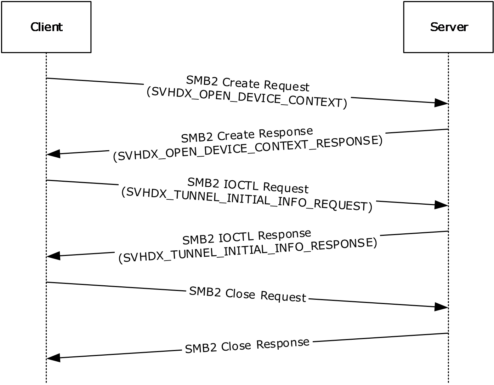

Figure 2: Retrieving virtual disk file information

- The client sends an SMB2 CREATE Request with the SVHDX_OPEN_DEVICE_CONTEXT create context to open a shared virtual disk file.
Version: 1 (0x00000001)

HasInitiatorId: 1 (0x01)

Reserved: 0 (0x000000)

InitiatorId: (0x07770D201F2740834579D46F5AC43B73)

Flags: 0 (0x00000000)

OriginatorFlags: SVHDX_ORIGINATOR_PVHDPARSER (0x00000001)

OpenRequestId: (0x000000001EC7871E)

InitiatorHostNameLength: 16 (0x0010)

InitiatorHostName: client01 (0x0063006C00690065006E007400300031)

- The server responds with an SMB2 CREATE Response giving the handle to the open identifying the shared virtual disk file and SVHDX_OPEN_DEVICE_CONTEXT_RESPONSE context.
Version: 1 (0x00000001)

HasInitiatorId: 1(0x01)

Reserved: 0 (0x000000)

InitiatorId: (0x07770D201F2740834579D46F5AC43B73)

Flags: 0 (0x00000000)

OriginatorFlags: SVHDX_ORIGINATOR_PVHDPARSER(0x00000001)

OpenRequestId: (0x000000001EC7871E)

InitiatorHostNameLength: 16 (0x0010)

InitiatorHostName: client01 (0x0063006C00690065006E007400300031)

- The client sends an SMB2 IOCTL Request with SVHDX_TUNNEL_INITIAL_INFO_REQUEST to retrieve the virtual disk information.
OperationCode: RSVD_TUNNEL_GET_INITIAL_INFO_OPERATION (0x02001001)

Status: 0 (0x00000000)

RequestId: (0x000000001Ec7871E)

- The server sends an SMB2 IOCTL Response with SVHDX_TUNNEL_INITIAL_INFO_RESPONSE containing the virtual disk information.
OperationCode: RSVD_TUNNEL_GET_INITIAL_INFO_OPERATION (0x02001001)

Status: 0 (0x00000000)

RequestId: (0x000000001Ec7871E)

ServerVersion: 1 (0x00000001)

SectorSize: 512 (0x00000200)

PhysicalSectorSize: 256 (0x00000100)

Reserved: 0 (0x00000000)

VirtualSize: (0x4000000000000000)

- The client sends an SMB2 CLOSE Request to close the shared virtual disk file.
- The server sends an SMB2 CLOSE Response indicating the close was successful.

## 4.2 Executing a SCSI Command

The following diagram demonstrates the steps taken to open a shared virtual disk file, execute a SCSI command, and close it.

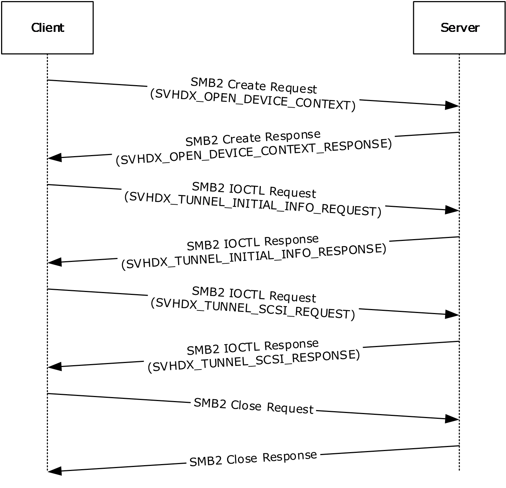

Figure 3: Executing a SCSI command

- The client sends an SMB2 CREATE Request with the SVHDX_OPEN_DEVICE_CONTEXT create context to open a shared virtual disk file.
Version: 1(0x00000001)

HasInitiatorId: 1 (0x01)

Reserved: 0 (0x000000)

InitiatorId: (0x07770D201F2740834579D46F5AC43B73)

Flags: 0 (0x00000000)

OriginatorFlags: SVHDX_ORIGINATOR_PVHDPARSER (0x00000001)

OpenRequestId: (0x000000001EC7871E)

InitiatorHostNameLength: 16 (0x0010)

InitiatorHostName: client01 (0x0063006C00690065006E007400300031)

- The server responds with an SMB2 CREATE Response giving the handle to the open identifying the shared virtual disk file and SVHDX_OPEN_DEVICE_CONTEXT_RESPONSE context.
Version: 1(0x00000001)

HasInitiatorId: 1 (0x01)

Reserved: 0 (0x000000)

InitiatorId: (0x07770D201F2740834579D46F5AC43B73)

Flags: 0 (0x00000000)

OriginatorFlags: SVHDX_ORIGINATOR_PVHDPARSER (0x00000001)

OpenRequestId: (0x000000001EC7871E)

InitiatorHostNameLength: 16 (0x0010)

InitiatorHostName: client01 (0x0063006C00690065006E007400300031)

- The client sends an SMB2 IOCTL Request with SVHDX_TUNNEL_INITIAL_INFO_REQUEST to retrieve the virtual disk information.
OperationCode: RSVD_TUNNEL_GET_INITIAL_INFO_OPERATION (0x02001001)

Status: 0 (0x00000000)

RequestId: (0x000000001Ec7871E)

- The server sends an SMB2 IOCTL Response with SVHDX_TUNNEL_INITIAL_INFO_RESPONSE containing the virtual disk information.
OperationCode: RSVD_TUNNEL_GET_INITIAL_INFO_OPERATION (0x02001001)

Status: 0 (0x00000000)

RequestId: (0x000000001Ec7871E)

ServerVersion: 1 (0x00000001)

SectorSize: 512 (0x00000200)

PhysicalSectorSize: 256 (0x00000100)

Reserved: 0 (0x00000000)

VirtualSize: (0x4000000000000000)

- The client sends an SMB2 IOCTL Request with SVHDX_TUNNEL_SCSI_REQUEST to execute a SCSI command.
OperationCode: RSVD_TUNNEL_SCSI_OPERATION (0x02001002)

Status: 0 (0x00000000)

RequestId: (0x000000001Ec7871E)

Length: 36 (0x0024)

Reserved1: 0 (0x0000)

CDBLength: 16 (0x10)

SenseInfoExLength: 20 (0x14)

Disposition: 1 (0x01)

Reserved2: 0 (0x00)

SrbFlags: (0x0020014A)

DataTransferLength: 8 (0x00000008)

CDBBuffer: 37 (0x00000000000000000000000000000025)

Reserved3: 0 (0x00000000)

DataBuffer: 0 (0x0000000000000000)

- The server sends an SMB2 IOCTL Response with SVHDX_TUNNEL_SCSI_RESPONSE containing the response.
OperationCode: RSVD_TUNNEL_SCSI_OPERATION (0x02001002)

Status: 0 (0x00000000)

RequestId: (0x000000001Ec7871E)

Length: 36 (0x0024)

SrbStatus: 0 (0x00)

ScsiStatus: 0 (0x00)

CDBLength: 16 (0x10)

SenseInfoExLength: 20 (0x14)

Disposition: 1 (0x01)

Reserved: 0 (0x00)

SrbFlags: (0x0020014A)

DataTransferLength: 8 (0x00000008)

SenseDataEx: 37 (0x0000000000000000000000000000000000000025)

DataBuffer: 0 (0x0000000000000000)

- The client sends an SMB2 CLOSE Request to close the shared virtual disk file.
- The server sends an SMB2 CLOSE Response indicating the close was successful.

## 4.3 Creating a Virtual Machine Snapshot

The following diagram demonstrates the steps taken to open a VHD Set, create a virtual machine snapshot, and close it.

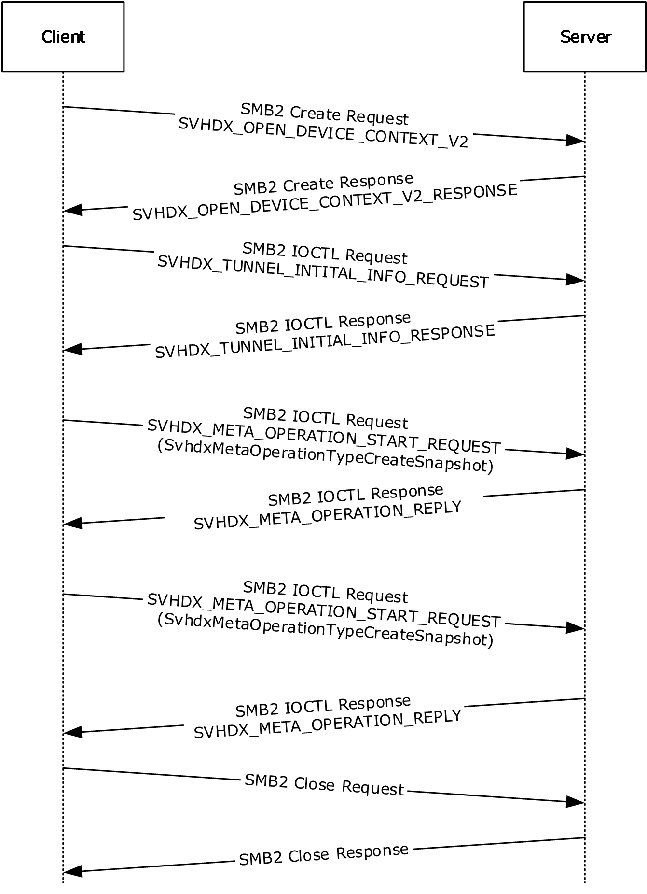

Figure 4: Creating a Virtual Machine Snapshot

- The client sends a SMB2 CREATE Request with the SVHDX_OPEN_DEVICE_CONTEXT_V2 create context to open a shared virtual disk file.
Version: 2 (0x00000002)

HasInitiatorId: 1

Reserved: 0 (0x000000)

InitiatorId: (68bad672-2a73-4cd8-9f58-6a4b67232e0d)

Flags: 0 (0x00000000)

OriginatorFlags: SVHDX_ORIGINATOR_PVHDPARSER(0x00000001)

OpenRequestId: (0x3028E5B600000000)

InitiatorHostNameLength: 20 (0x0014)

InitiatorHostName: SMBD-SUT01(0x0053004D00420044002D00530055005400300031)

VirtualDiskPropertiesInitialized: 0 (0x00000000)

ServerServiceVersion: 0 (0x00000000)

VirtualSectorSize: 0 (0x00000000)

PhysicalSectorSize:0 (0x00000000)

VirtualSize: 0 (0x0000000000000000)

- The server responds with an SMB2 CREATE Response giving the handle to the open identifying the shared virtual disk file and SVHDX_OPEN_DEVICE_CONTEXT_V2_RESPONSE context.
Version: 2 (0x00000002)

HasInitiatorId: 1(0x01)

Reserved: 0 (0x000000)

InitiatorId: 68bad672-2a73-4cd8-9f58-6a4b67232e0d

Flags: 0 (0x00000000)

OriginatorFlags: SVHDX_ORIGINATOR_PVHDPARSER(0x00000001)

OpenRequestId: (0x3028E5B600000000)

InitiatorHostNameLength: 20 (0x0014)

InitiatorHostName: SMBD-SUT01(0x0053004D00420044002D00530055005400300031)

VirtualDiskPropertiesInitialized: 1 (0x00000001)

ServerServiceVersion: 2 (0x00000002)

VirtualSectorSize: 512 (0x00000200)

PhysicalSectorSize: 4096 (0x00001000)

VirtualSize: (0x4000000000000000)

- The client sends an SMB2 IOCTL Request with SVHDX_TUNNEL_INITIAL_INFO_REQUEST to retrieve the virtual disk information.
OperationCode: RSVD_TUNNEL_GET_INITIAL_INFO_OPERATION (0x02001001)

Status: 0 (0x00000000)

RequestId: (0x3028E5B600000001)

- The server sends an SMB2 IOCTL Response with SVHDX_TUNNEL_INITIAL_INFO_RESPONSE containing the virtual disk information.
OperationCode: RSVD_TUNNEL_GET_INITIAL_INFO_OPERATION (0x02001001)

Status: 0 (0x00000000)

RequestId: (0x3028E5B600000001)

ServerVersion: 2 (0x00000002)

SectorSize: 512 (0x00000200)

PhysicalSectorSize: 256 (0x00000100)

Reserved: 0 (0x00000000)

VirtualSize: (0x4000000000000000)

- The client sends an SMB2 IOCTL Request with SVHDX_META_OPERATION_START_REQUEST to begin creation of a Virtual Machine snapshot.
SVHDX_TUNNEL_OPERATION_HEADER:

OperationCode: RSVD_TUNNEL_META_OPERATION_START (0x02002101)

Status: 0 (0x00000000)

RequestId: (0x3028E5B600000002)

SVHDX_META_OPERATION_START_REQUEST:

TransactionId: 6abc134e-c798-11e4-aecf-0202c94fd1d1

OperationType: SvhdxMetaOperationTypeCreateSnapshot(0x00000001)

SVHDX_META_OPERATION_CREATE_SNAPSHOT:

Padding: 0 (0x00000000)

SnapshotType: SvhdxSnapshotTypeVM(0x00000001)

Flags: SVHDX_SNAPSHOT_DISK_FLAG_ENABLE_CHANGE_TRACKING (0x00000001)

Stage1: SvhdxSnapshotStageInitialize(0x00000001)

Stage2: SvhdxSnapshotStageInvalid (0x00000000)

Stage3: SvhdxSnapshotStageInvalid (0x00000000)

Stage4: SvhdxSnapshotStageInvalid (0x00000000)

Stage5: SvhdxSnapshotStageInvalid (0x00000000)

Stage6: SvhdxSnapshotStageInvalid (0x00000000)

SnapshotId: 5ac07013-edb8-4e2c-9784-6edd2843f269

ParametersPayloadSize: 0(0x00000000)

- The server sends an SMB2 IOCTL Response with SVHDX_META_OPERATION_REPLY containing status.
SVHDX_TUNNEL_OPERATION_HEADER:

OperationCode: RSVD_TUNNEL_META_OPERATION_START (0x02002101)

Status: 0 (0x00000000)

RequestId: (0x3028E5B600000002)

SVHDX_META_OPERATION_REPLY:

ChangeTrackingErrorStatus: 0 (0x00000000)

- The client sends an SMB2 IOCTL Request with SVHDX_META_OPERATION_START_REQUEST to finalize creation of Virtual Machine snapshot.
SVHDX_TUNNEL_OPERATION_HEADER:

OperationCode: RSVD_TUNNEL_META_OPERATION_START (0x02002101)

Status: 0 (0x00000000)

RequestId: (0x3028E5B600000003)

SVHDX_META_OPERATION_START_REQUEST:

TransactionId: 6abc134e-c798-11e4-aecf-0202c94fd1d1

OperationType: SvhdxMetaOperationTypeCreateSnapshot(0x00000001)

SVHDX_META_OPERATION_CREATE_SNAPSHOT:

Padding: 0 (0x00000000)

SnapshotType: SvhdxSnapshotTypeVM(0x00000001)

Flags: 0 (0x00000000)

Stage1: SvhdxSnapshotStageBlockIO (0x00000002)

Stage2: SvhdxSnapshotStageSwitchObjectStore (0x00000003)

Stage3: SvhdxSnapshotStageUnblockIO (0x00000004)

Stage4: SvhdxSnapshotStageFinalize (0x00000005)

Stage5: SvhdxSnapshotStageInvalid (0x00000000)

Stage6: SvhdxSnapshotStageInvalid (0x00000000)

SnapshotId: 5ac07013-edb8-4e2c-9784-6edd2843f269

ParametersPayloadSize: 0(0x00000000)

- The server sends an SMB2 IOCTL Response with SVHDX_META_OPERATION_REPLY containing status.
SVHDX_TUNNEL_OPERATION_HEADER:

OperationCode: RSVD_TUNNEL_META_OPERATION_START (0x02002101)

Status: 0 (0x00000000)

RequestId: (0x3028E5B600000003)

SVHDX_META_OPERATION_REPLY:

ChangeTrackingErrorStatus: 0 (0x00000000)

- The client sends an SMB2 CLOSE Request to close the shared virtual disk file.
- The server sends an SMB2 CLOSE Response indicating the close was successful.

## 4.4 Retrieving a VHD Set Snapshot List

The following diagram demonstrates the steps taken to open a VHD Set, retrieve snapshot IDs of the VHD Set, and close it.

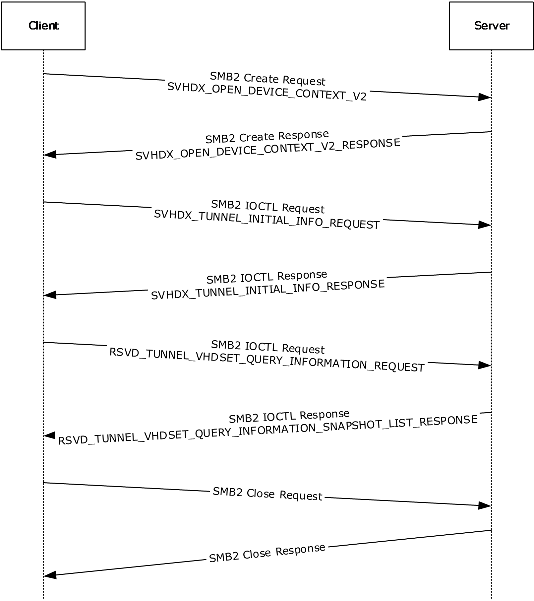

Figure 5: Retrieving VHD Set Information

- The client sends a SMB2 CREATE Request with the SVHDX_OPEN_DEVICE_CONTEXT_V2 create context to open a shared virtual disk file.
Version: 2 (0x00000002)

HasInitiatorId: 1

Reserved: 0 (0x000000)

InitiatorId: 68bad672-2a73-4cd8-9f58-6a4b67232e0d

Flags: 0 (0x00000000)

OriginatorFlags: SVHDX_ORIGINATOR_PVHDPARSER(0x00000001)

OpenRequestId: (0x550916A700000000)

InitiatorHostNameLength: 20 (0x0014)

InitiatorHostName: SMBD-SUT01(0x0053004D00420044002D00530055005400300031)

VirtualDiskPropertiesInitialized: 0 (0x00000000)

ServerServiceVersion: 0 (0x00000000)

VirtualSectorSize: 0 (0x00000000)

PhysicalSectorSize:0 (0x00000000)

VirtualSize: 0 (0x0000000000000000)

- The server responds with an SMB2 CREATE Response giving the handle to the open identifying the shared virtual disk file and SVHDX_OPEN_DEVICE_CONTEXT_V2_Response context
Version: 2 (0x00000002)

HasInitiatorId: 1

Reserved: 0 (0x000000)

InitiatorId: 68bad672-2a73-4cd8-9f58-6a4b67232e0d

Flags: 0 (0x00000000)

OriginatorFlags: SVHDX_ORIGINATOR_PVHDPARSER(0x00000001)

OpenRequestId: (0x550916A700000000)

InitiatorHostNameLength: 20 (0x0014)

InitiatorHostName: SMBD-SUT01(0x0053004D00420044002D00530055005400300031)

VirtualDiskPropertiesInitialized: 1 (0x00000001)

ServerServiceVersion: 2 (0x00000002)

VirtualSectorSize: 512 (0x00000200)

PhysicalSectorSize: 4096 (0x00001000)

VirtualSize: (0x4000000000000000)

- The client sends an SMB2 IOCTL Request with SVHDX_TUNNEL_INITIAL_INFO_REQUEST to retrieve the virtual disk information.
OperationCode: RSVD_TUNNEL_GET_INITIAL_INFO_OPERATION (0x02001001)

Status: 0 (0x00000000)

RequestId: (0x550916A700000001)

- The server sends an SMB2 IOCTL Response with SVHDX_TUNNEL_INITIAL_INFO_RESPONSE containing the virtual disk information.
OperationCode: RSVD_TUNNEL_GET_INITIAL_INFO_OPERATION (0x02001001)

Status: 0 (0x00000000)

RequestId: (0x550916A700000001)

ServerVersion: 2 (0x00000002)

SectorSize: 512 (0x00000200)

PhysicalSectorSize: 256 (0x00000100)

Reserved: 0 (0x00000000)

VirtualSize: (0x4000000000000000)

- The client sends an SMB2 IOCTL Request with SVHDX_TUNNEL_VHDSET_QUERY_INFORMATION_REQUEST to retrieve the list of snapshot IDs of the VHD Set.
SVHDX_TUNNEL_OPERATION_HEADER:

OperationCode: RSVD_TUNNEL_VHDSET_QUERY_INFORMATION (0x02002005)

Status: 0 (0x00000000)

RequestId: (0x550916A700000002)

SVHDX_TUNNEL_VHDSET_QUERY_INFORMATION_REQUEST:

VHDSetInformationType: SvhdxVHDSetInformationTypeSnapshotList(0x00000002)

SnapshotType: SvhdxSnapshotTypeVM(0x00000001)

SnapshotId: 00000000-0000-0000-0000-000000000000

- The server sends an SMB2 IOCTL Response with SVHDX_TUNNEL_VHDSET_QUERY_INFORMATION_SNAPSHOT_LIST_RESPONSE containing the list of snapshot IDs.
SVHDX_TUNNEL_OPERATION_HEADER:

OperationCode: RSVD_TUNNEL_VHDSET_QUERY_INFORMATION (0x02002005

Status: 0 (0x00000000)

RequestId: (0x550916A700000002)

SVHDX_TUNNEL_VHDSET_QUERY_INFORMATION_SNAPSHOT_LIST_RESPONSE:

VHDSetInformationType: SvhdxVHDSetInformationTypeSnapshotList(0x00000002)

Padding: 1(0x00000001)

ResponseComplete: 0x01

Reserved: 0 (0x000000)

NumberOfSnapshots: 2(0x00000002)

SnapshotIds: 4d051d8d-d120-4ec5-ba14-a2bc02219678, 71836f8b-210e-4896-aac6- 1c4e3a8e81ef

- The client sends an SMB2 CLOSE Request to close the shared virtual disk file.
- The server sends an SMB2 CLOSE Response indicating the close was successful.

# 5 Security

## 5.1 Security Considerations for Implementers

None.

## 5.2 Index of Security Parameters

None.

# 6 Appendix A: Product Behavior

The information in this specification is applicable to the following Microsoft products or supplemental software. References to product versions include updates to those products.

The terms "earlier" and "later", when used with a product version, refer to either all preceding versions or all subsequent versions, respectively. The term "through" refers to the inclusive range of versions. Applicable Microsoft products are listed chronologically in this section.

- Windows 8.1 operating system
- Windows Server 2012 R2 operating system
- Windows 10 operating system
- Windows Server 2016 operating system
- Windows Server 2019 operating system
- Windows Server 2022 operating system
- Windows 11 operating system
- Windows Server 2025 operating system
Exceptions, if any, are noted in this section. If an update version, service pack or Knowledge Base (KB) number appears with a product name, the behavior changed in that update. The new behavior also applies to subsequent updates unless otherwise specified. If a product edition appears with the product version, behavior is different in that product edition.

Unless otherwise specified, any statement of optional behavior in this specification that is prescribed using the terms "SHOULD" or "SHOULD NOT" implies product behavior in accordance with the SHOULD or SHOULD NOT prescription. Unless otherwise specified, the term "MAY" implies that the product does not follow the prescription.

<1> Section 1.7: The following table illustrates Windows operating system versions that support RSVD clients and RSVD servers.

| RSVD client | RSVD server |
| --- | --- |
| Windows 8.1 Windows Server 2012 R2 Windows 10 Windows Server 2016 Windows Server 2019 Windows Server 2022 Windows 11 Windows Server 2025 | Windows Server 2012 R2 Windows Server 2016 Windows Server 2019 Windows Server 2022 Windows Server 2025 |

<2> Section 3.1.3: Windows 8.1 and Windows Server 2012 R2 set **ClientServiceVersion** to RSVD Protocol version 1(0x00000001). Windows 10 and later, Windows Server 2016 operating system and later set **ClientServiceVersion** to RSVD Protocol version 2(0x00000002).

<3> Section 3.1.3: Windows-based RSVD clients initialize to zero.

<4> Section 3.1.4.9: Microsoft Windows applications set unspecified bits in **SrbFlags** in addition to the specified bits in section [2.2.4.7](#Section_2.2.4.7). All bits set in **SrbFlags** are ignored for processing by Windows servers as specified in section [3.2.5.5.5](#Section_3.2.5.5.5).

<5> Section 3.1.4.9: Windows-based RSVD clients set **Disposition** to 0x01 when **SrbFlags** includes both SRB_FLAGS_DATA_IN and SRB_FLAGS_DATA_OUT.

<6> Section 3.2.2: The time-out on Windows–based servers is 700 milliseconds.

<7> Section 3.2.3: Windows Server 2012 R2 sets **ServerServiceVersion** to RSVD Protocol version 1 (0x00000001). Windows Server 2016 operating system and later set **ServerServiceVersion** to RSVD Protocol version 2(0x00000002).

<8> Section 3.2.5.1: Windows Server 2012 R2 without [[MSKB-3025091]](https://support.microsoft.com/en-us/kb/3025091) fails the operation with status code zero (0x00000000).

<9> Section 3.2.5.1: When the shared virtual disk file does not previously exist, Windows Server 2012 R2 operating system and later attempt to open with a create disposition which allows an empty file to be created. This in turn will cause the RSVD request to return STATUS_FILE_CORRUPT_ERROR.

<10> Section 3.2.5.1: If the **OriginatorFlags** in the request is 0x00000008, Windows-based RSVD servers will incorrectly set **Open.IsVirtualSCSIDisk** to FALSE.

<11> Section 3.2.5.1: Windows Server 2012 R2 without [MSKB-3025091] doesn't return SVHDX_OPEN_DEVICE_CONTEXT_RESPONSE.

<12> Section 3.2.5.3: Windows-based RSVD servers set **SenseError.SrbStatus** to 0x02, **SenseError.ScsiStatus** to 0x02, and **SenseError.SenseData** to 0xF00000000000000A000000000000000000000000.

<13> Section 3.2.5.3: Windows Server 2012 R2 without [MSKB-3025091] sets the returned sense data to an arbitrary value.

<14> Section 3.2.5.4: Windows-based RSVD servers set **SenseError.SrbStatus** to 0x02, **SenseError.ScsiStatus** to 0x02, and **SenseError.SenseData** to 0xF00000000000000A000000000000000000000000.

<15> Section 3.2.5.4: Windows Server 2012 R2 without [MSKB-3025091] sets the returned sense data to an arbitrary value.

<16> Section 3.2.5.5.3: Windows Server 2012 R2 sets the **SenseInfoExLength** field to 20 bytes.

<17> Section 3.2.5.5.4: Windows sets **BlockSize** to zero for **DiskType** VHD_TYPE_FIXED.

<18> Section 3.2.5.5.4: Windows sets **LinkageID** to zero.

<19> Section 3.2.5.5.5: Windows Server 2012 R2 operating system and later append [**MaxOutputResponse** – (size of SVHDX_TUNNEL_OPERATION_HEADER + size of SVHDX_TUNNEL_SCSI_RESPONSE)] number of bytes, all set to zeroes, at the end of the response.

<20> Section 3.2.5.5.5: Windows-based servers set the value of the **Length** field to 36.

<21> Section 3.2.5.5.5: Windows Server 2012 R2 returns 18 bytes of valid sense data, but sends a 20-byte buffer with the final 2 bytes set to any value.

<22> Section 3.2.5.5.7.3: Checks performed only after updating according to [[MSFT-CVE-2022-26783]](https://go.microsoft.com/fwlink/?linkid=2191810) and [[MSFT-CVE-2022-24490]](https://go.microsoft.com/fwlink/?linkid=2191811).

<23> Section 3.2.5.5.7.4: Checks performed only after updating according to [MSFT-CVE-2022-26783] and [MSFT-CVE-2022-24490].

# 7 Change Tracking

No table of changes is available. The document is either new or has had no changes since its last release.

## Revision History

| Date | Version | Revision Class | Comments |
| --- | --- | --- | --- |
| 8/8/2013 | 1.0 | New | Released new document. |
| 11/14/2013 | 2.0 | Major | Significantly changed the technical content. |
| 2/13/2014 | 3.0 | Major | Significantly changed the technical content. |
| 5/15/2014 | 4.0 | Major | Significantly changed the technical content. |
| 6/30/2015 | 5.0 | Major | Significantly changed the technical content. |
| 10/16/2015 | 6.0 | Major | Significantly changed the technical content. |
| 7/14/2016 | 7.0 | Major | Significantly changed the technical content. |
| 9/26/2016 | 8.0 | Major | Significantly changed the technical content. |
| 3/16/2017 | 9.0 | Major | Significantly changed the technical content. |
| 6/1/2017 | 10.0 | Major | Significantly changed the technical content. |
| 9/15/2017 | 11.0 | Major | Significantly changed the technical content. |
| 12/1/2017 | 12.0 | Major | Significantly changed the technical content. |
| 9/12/2018 | 13.0 | Major | Significantly changed the technical content. |
| 4/7/2021 | 14.0 | Major | Significantly changed the technical content. |
| 6/25/2021 | 15.0 | Major | Significantly changed the technical content. |
| 4/29/2022 | 16.0 | Major | Significantly changed the technical content. |
| 4/23/2024 | 17.0 | Major | Significantly changed the technical content. |
| 9/16/2024 | 17.0 | None | No changes to the meaning, language, or formatting of the technical content. |
