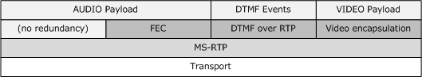
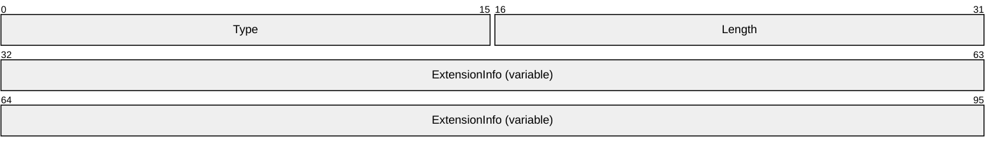
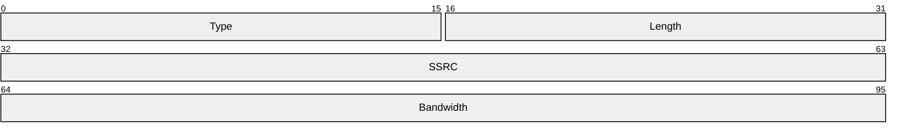
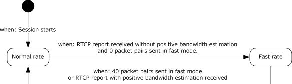
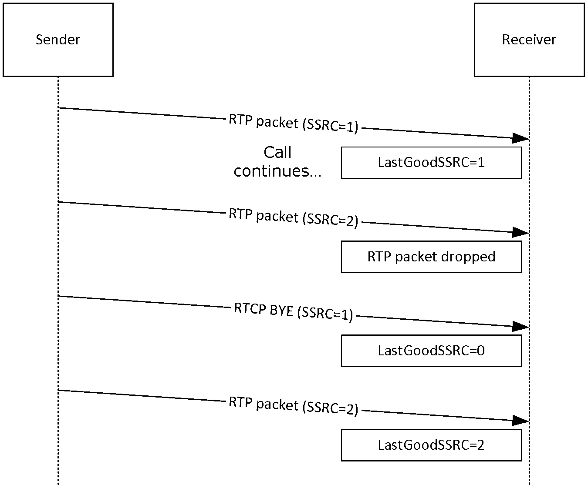
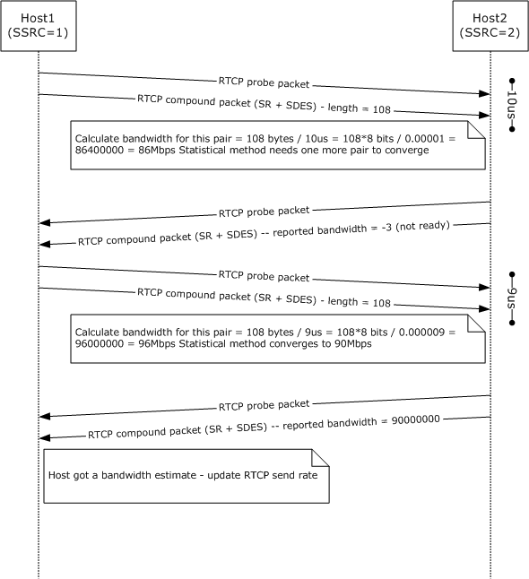

# [MS-RTPME]: Real-Time Transport Protocol (RTP/RTCP): Microsoft Extensions

Table of Contents

1 Introduction

- [1 Introduction](#Section_1)
  - [1.1 Glossary](#Section_1.1)
  - [1.2 References](#Section_1.2)
    - [1.2.1 Normative References](#Section_1.2.1)
    - [1.2.2 Informative References](#Section_1.2.2)
  - [1.3 Overview](#Section_1.3)
  - [1.4 Relationship to Other Protocols](#Section_1.4)
  - [1.5 Prerequisites/Preconditions](#Section_1.5)
  - [1.6 Applicability Statement](#Section_1.6)
  - [1.7 Versioning and Capability Negotiation](#Section_1.7)
  - [1.8 Vendor-Extensible Fields](#Section_1.8)
  - [1.9 Standards Assignments](#Section_1.9)

2 Messages

- [2 Messages](#Section_2)
  - [2.1 Transport](#Section_2.1)
    - [2.1.1 Confidentiality](#Section_2.1.1)
  - [2.2 Message Syntax](#Section_2.2)
    - [2.2.1 RTP Packets](#Section_2.2.1)
    - [2.2.2 RTCP Compound Packets](#Section_2.2.2)
    - [2.2.3 RTCP Probe Packet](#Section_2.2.3)
    - [2.2.4 RTCP Packet Pair](#Section_2.2.4)
    - [2.2.5 RTCP Sender Report (SR)](#Section_2.2.5)
    - [2.2.6 RTCP SDES](#Section_2.2.6)
    - [2.2.7 RTCP Profile-Specific Extension](#Section_2.2.7)
      - [2.2.7.1 RTCP Profile-Specific Extension for Estimated Bandwidth](#Section_2.2.7.1)

3 Protocol Details

- [3 Protocol Details](#Section_3)
  - [3.1 RTP Details](#Section_3.1)
    - [3.1.1 Abstract Data Model](#Section_3.1.1)
    - [3.1.2 Timers](#Section_3.1.2)
    - [3.1.3 Initialization](#Section_3.1.3)
    - [3.1.4 Higher-Layer Triggered Events](#Section_3.1.4)
    - [3.1.5 Message Processing Events and Sequencing Rules](#Section_3.1.5)
    - [3.1.6 Timer Events](#Section_3.1.6)
    - [3.1.7 Other Local Events](#Section_3.1.7)
  - [3.2 RTCP Details](#Section_3.2)
    - [3.2.1 Abstract Data Model](#Section_3.2.1)
    - [3.2.2 Timers](#Section_3.2.2)
    - [3.2.3 Initialization](#Section_3.2.3)
    - [3.2.4 Higher-Layer Triggered Events](#Section_3.2.4)
    - [3.2.5 Message Processing Events and Sequencing Rules](#Section_3.2.5)
    - [3.2.6 Timer Events](#Section_3.2.6)
    - [3.2.7 Other Local Events](#Section_3.2.7)

4 Protocol Examples

- [4 Protocol Examples](#Section_4)
  - [4.1 SSRC Change Throttling](#Section_4.1)
  - [4.2 Bandwidth Estimation](#Section_4.2)
  - [4.3 Key Derivation](#Section_4.3)

5 Security

- [5 Security](#Section_5)
  - [5.1 Security Considerations for Implementers](#Section_5.1)
  - [5.2 Index of Security Parameters](#Section_5.2)

6 Appendix A: Product Behavior

- [6 Appendix A: Product Behavior](#Section_6)

7 Change Tracking

- [7 Change Tracking](#Section_7)

For the legal notice and IP terms, see [LEGAL.md](../LEGAL.md).
Last updated: 6/1/2017.
See [Revision History](#revision-history) for full version history.

# 1 Introduction

This document specifies the Real-Time Transport Protocol (RTP/RTCP) Microsoft Extensions (RTPME), a set of extensions to the base Real-Time Transport Protocol (RTP) specified in [[RFC3550]](https://go.microsoft.com/fwlink/?LinkId=90433). RTP is a set of network transport functions suitable for applications transmitting real-time data, such as audio and video, across multimedia endpoints.

Sections 1.5, 1.8, 1.9, 2, and 3 of this specification are normative. All other sections and examples in this specification are informative.

## 1.1 Glossary

This document uses the following terms:

**base64 encoding**: A binary-to-text encoding scheme whereby an arbitrary sequence of bytes is converted to a sequence of printable ASCII characters, as described in [[RFC4648]](https://go.microsoft.com/fwlink/?LinkId=90487).

**cipher block chaining (CBC)**: A method of encrypting multiple blocks of plaintext with a block cipher such that each ciphertext block is dependent on all previously processed plaintext blocks. In the [**CBC**](#gt_cipher-block-chaining-cbc) mode of operation, the first block of plaintext is XOR'd with an Initialization Vector (IV). Each subsequent block of plaintext is XOR'd with the previously generated ciphertext block before encryption with the underlying block cipher. To prevent certain attacks, the IV must be unpredictable, and no IV should be used more than once with the same key. [**CBC**](#gt_cipher-block-chaining-cbc) is specified in [[SP800-38A]](https://go.microsoft.com/fwlink/?LinkId=128809) section 6.2.

**codec**: An algorithm that is used to convert media between digital formats, especially between raw media data and a format that is more suitable for a specific purpose. Encoding converts the raw data to a digital format. Decoding reverses the process.

**conference**: A [**Real-Time Transport Protocol (RTP)**](#gt_real-time-transport-protocol-rtp) session that includes more than one [**participant**](#gt_participant).

**connectionless protocol**: A transport protocol that enables endpoints to communicate without a previous connection arrangement and that treats each packet independently as a [**datagram**](#gt_datagram). Examples of connectionless protocols are Internet Protocol (IP) and User Datagram Protocol (UDP).

**connection-oriented transport protocol**: A transport protocol that enables endpoints to communicate after first establishing a connection and that treats each packet according to the connection state. An example of a connection-oriented transport protocol is Transmission Control Protocol (TCP).

**contributing source (CSRC)**: A source of a [**stream**](#gt_stream) of [**RTP packets**](#gt_rtp-packet) that has contributed to the combined [**stream**](#gt_stream) produced by an RTP mixer. The mixer inserts a list of the synchronization source (SSRC) identifiers of the sources that contributed to the generation of a particular packet into the RTP header of that packet. This list is called the CSRC list. An example application is audio conferencing where a mixer indicates all the talkers whose speech was combined to produce the outgoing packet, allowing the receiver to indicate the current talker, even though all the audio packets contain the same SSRC identifier (that of the mixer). See [[RFC3550]](https://go.microsoft.com/fwlink/?LinkId=90433) section 3.

**Data Encryption Standard (DES)**: A specification for [**encryption**](#gt_encryption) of computer data that uses a 56-bit key developed by IBM and adopted by the U.S. government as a standard in 1976. For more information see [[FIPS46-3]](https://go.microsoft.com/fwlink/?LinkId=89872).

**datagram**: A style of communication offered by a network transport protocol where each message is contained within a single network packet. In this style, there is no requirement for establishing a session prior to communication, as opposed to a connection-oriented style.

**Dual Tone Multiple Frequency (DTMF)**: The signaling system used in telephony systems, in which each digit is associated with two specific frequencies. Most commonly associated with telephone touch-tone keypads.

**dual-tone multi-frequency (DTMF)**: In telephony systems, a signaling system in which each digit is associated with two specific frequencies. This system typically is associated with touch-tone keypads for telephones.

**encryption**: In cryptography, the process of obscuring information to make it unreadable without special knowledge.

**forward error correction (FEC)**: A process in which a sender uses redundancy to enable a receiver to recover from packet loss.

**jitter**: A variation in a network delay that is perceived by the receiver of each packet.

**MD5**: A one-way, 128-bit hashing scheme that was developed by RSA Data Security, Inc., as described in [[RFC1321]](https://go.microsoft.com/fwlink/?LinkId=90275).

**message digest algorithm 5 (MD5)**: A cryptographic hash function that generates 128 bits of hash value as specified in [RFC1321].

**multimedia session**: A set of concurrent [**RTP sessions**](#gt_rtp-session) among a common group of [**participants**](#gt_participant). For example, a video [**conference**](#gt_conference) (which is a multimedia session) can contain an audio [**RTP session**](#gt_rtp-session) and a video [**RTP session**](#gt_rtp-session). See [RFC3550] section 3.

**non-RTP means**: Protocols and mechanisms that might be needed in addition to [**RTP**](#gt_real-time-transport-protocol-rtp) to provide a usable service. In particular, for multimedia [**conferences**](#gt_conference), a control protocol can distribute multicast addresses and keys for [**encryption**](#gt_encryption), negotiate the [**encryption**](#gt_encryption) algorithm to be used, and define dynamic mappings between [**RTP payload**](#gt_rtp-payload) type values and the payload formats they represent for formats that do not have a predefined payload type value. Examples of such protocols include the [**Session Initiation Protocol (SIP)**](#gt_session-initiation-protocol-sip) ([[RFC3261]](https://go.microsoft.com/fwlink/?LinkId=90410)), ITU Recommendation H.323, and applications using [**SDP**](#gt_session-description-protocol-sdp) ([[RFC2327]](https://go.microsoft.com/fwlink/?LinkId=90336)), such as RTSP ([[RFC2326]](https://go.microsoft.com/fwlink/?LinkId=90335)). For simple applications, electronic mail or a [**conference**](#gt_conference) database can also be used. See [RFC3550] section 3.

**packetization time (P-time)**: The amount, in milliseconds, of audio data that is sent in a single Real-Time Transport Protocol (RTP) packet.

**participant**: A user who is participating in a [**conference**](#gt_conference) or peer-to-peer call, or the object that is used to represent that user.

**port**: The abstraction that transport protocols use to distinguish among multiple destinations within a given host computer. TCP/IP protocols identify ports by using small positive integers. The transport selectors (TSEL) used by the OSI transport layer are equivalent to ports. [**RTP**](#gt_real-time-transport-protocol-rtp) depends upon the lower-layer protocol to provide some mechanism such as ports to multiplex the [**RTP**](#gt_real-time-transport-protocol-rtp) and [**RTCP packets**](#gt_rtcp-packet) of a session. For more information, see [RFC3550] section 3.

**Real-Time Transport Protocol (RTP)**: A network transport protocol that provides end-to-end transport functions that are suitable for applications that transmit real-time data, such as audio and video, as described in [RFC3550].

**RTCP packet**: A control packet consisting of a fixed header part similar to that of [**RTP packets**](#gt_rtp-packet), followed by structured elements that vary depending upon the RTCP packet type. Typically, multiple RTCP packets are sent together as a compound RTCP packet in a single packet of the underlying protocol; this is enabled by the length field in the fixed header of each RTCP packet. See [RFC3550] section 3.

**RTP packet**: A data packet consisting of the fixed RTP header, a possibly empty list of contributing sources, and the payload data. Some underlying protocols may require an encapsulation of the RTP packet to be defined. Typically one packet of the underlying protocol contains a single RTP packet, but several RTP packets can be contained if permitted by the encapsulation method. See [RFC3550] section 3.

**RTP payload**: The data transported by [**RTP**](#gt_real-time-transport-protocol-rtp) in a packet, for example audio samples or compressed video data. For more information, see [RFC3550] section 3.

**RTP session**: An association among a set of [**participants**](#gt_participant) who are communicating by using the [**Real-Time Transport Protocol (RTP)**](#gt_real-time-transport-protocol-rtp), as described in [RFC3550]. Each RTP session maintains a full, separate space of [**Synchronization Source (SSRC)**](#gt_synchronization-source-ssrc) identifiers.

**Session Description Protocol (SDP)**: A protocol that is used for session announcement, session invitation, and other forms of [**multimedia session**](#gt_multimedia-session) initiation. For more information see [MS-SDP](../MS-SDP/MS-SDP.md) and [RFC3264].

**Session Initiation Protocol (SIP)**: An application-layer control (signaling) protocol for creating, modifying, and terminating sessions with one or more participants. [**SIP**](#gt_session-initiation-protocol-sip) is defined in [RFC3261].

**silence suppression**: A mechanism for conserving bandwidth by detecting silence in the audio input and not sending packets that contain only silence.

**stream**: A flow of data from one host to another host. May also be used to reference the flowing data.

**streaming**: The act of transferring content from a sender to a receiver.

**synchronization source (SSRC)**: The source of a stream of [**RTP packets**](#gt_rtp-packet), identified by a 32-bit numeric SSRC identifier carried in the RTP header so as not to be dependent upon the network address. All packets from a synchronization source form part of the same timing and sequence number space, so a receiver groups packets by synchronization source for playback. Examples of synchronization sources include the sender of a [**stream**](#gt_stream) of packets derived from a signal source such as a microphone or a camera, or an RTP mixer. A synchronization source may change its data format (for example, audio encoding) over time. The SSRC identifier is a randomly chosen value meant to be globally unique within a particular [**RTP session**](#gt_rtp-session). A [**participant**](#gt_participant) need not use the same SSRC identifier for all the [**RTP sessions**](#gt_rtp-session) in a [**multimedia session**](#gt_multimedia-session); the binding of the SSRC identifiers is provided through RTCP. If a [**participant**](#gt_participant) generates multiple [**streams**](#gt_stream) in one [**RTP session**](#gt_rtp-session), for example from separate video cameras, each MUST be identified as a different SSRC. See [RFC3550] section 3.

**Synchronization Source (SSRC)**: A 32-bit identifier that uniquely identifies a media stream in a [**Real-Time Transport Protocol (RTP)**](#gt_real-time-transport-protocol-rtp) session. An SSRC value is part of an [**RTP packet**](#gt_rtp-packet) header, as described in [RFC3550].

**throttling**: The enforcement of a limit in the frequency where an action can occur.

**Unicode string**: A Unicode 8-bit string is an ordered sequence of 8-bit units, a Unicode 16-bit string is an ordered sequence of 16-bit code units, and a Unicode 32-bit string is an ordered sequence of 32-bit code units. In some cases, it could be acceptable not to terminate with a terminating null character. Unless otherwise specified, all [**Unicode strings**](#gt_unicode-string) follow the UTF-16LE encoding scheme with no Byte Order Mark (BOM).

**User Datagram Protocol (UDP)**: The connectionless protocol within TCP/IP that corresponds to the transport layer in the ISO/OSI reference model.

**UTF-8**: A byte-oriented standard for encoding Unicode characters, defined in the Unicode standard. Unless specified otherwise, this term refers to the UTF-8 encoding form specified in [[UNICODE5.0.0/2007]](https://go.microsoft.com/fwlink/?LinkId=154659) section 3.9.

**video encapsulation**: A mechanism for transporting video payload and metadata in [**Real-Time Transport Protocol (RTP)**](#gt_real-time-transport-protocol-rtp) packets.

**video frame**: A single still image that is shown as part of a quick succession of images in a video.

**MAY, SHOULD, MUST, SHOULD NOT, MUST NOT:** These terms (in all caps) are used as defined in [[RFC2119]](https://go.microsoft.com/fwlink/?LinkId=90317). All statements of optional behavior use either MAY, SHOULD, or SHOULD NOT.

## 1.2 References

Links to a document in the Microsoft Open Specifications library point to the correct section in the most recently published version of the referenced document. However, because individual documents in the library are not updated at the same time, the section numbers in the documents may not match. You can confirm the correct section numbering by checking the [Errata](http://msdn.microsoft.com/en-us/library/dn781092.aspx).

### 1.2.1 Normative References

We conduct frequent surveys of the normative references to assure their continued availability. If you have any issue with finding a normative reference, please contact [dochelp@microsoft.com](mailto:dochelp@microsoft.com). We will assist you in finding the relevant information.

[FIPS46-3] FIPS PUBS, "Data Encryption Standard (DES)", FIPS PUB 46-3, October 1999, [http://csrc.nist.gov/publications/fips/fips46-3/fips46-3.pdf](https://go.microsoft.com/fwlink/?LinkId=89872)

[RFC2119] Bradner, S., "Key words for use in RFCs to Indicate Requirement Levels", BCP 14, RFC 2119, March 1997, [http://www.rfc-editor.org/rfc/rfc2119.txt](https://go.microsoft.com/fwlink/?LinkId=90317)

[RFC3550] Schulzrinne, H., Casner, S., Frederick, R., and Jacobson, V., "RTP: A Transport Protocol for Real-Time Applications", STD 64, RFC 3550, July 2003, [http://www.ietf.org/rfc/rfc3550.txt](https://go.microsoft.com/fwlink/?LinkId=90433)

[RFC3551] Schulzrinne, H., and Casner, S., "RTP Profile for Audio and Video Conferences with Minimal Control", STD 65, RFC 3551, July 2003, [http://www.ietf.org/rfc/rfc3551.txt](https://go.microsoft.com/fwlink/?LinkId=116464)

[RFC4733] Schulzrinne, H., and Taylor, T., "RTP Payload for DTMF Digits, Telephony Tones and Telephony Signals", RFC 4733, December 2006, [http://www.ietf.org/rfc/rfc4733.txt](https://go.microsoft.com/fwlink/?LinkId=116566)

### 1.2.2 Informative References

[H323] ITU-T, "Packet-based multimedia communications systems", Recommendation H.323, June 2006, [http://www.itu.int/rec/T-REC-H.323-200606-S/en](https://go.microsoft.com/fwlink/?LinkId=93033)

[MS-H245] Microsoft Corporation, "[H.245 Protocol: Microsoft Extensions](../MS-H245/MS-H245.md)".

[MS-H26XPF] Microsoft Corporation, "[Real-Time Transport Protocol (RTP/RTCP): H.261 and H.263 Video Streams Extensions](#Section_2.1)".

[MS-RTPDT] Microsoft Corporation, "[Real-Time Transport Protocol (RTP/RTCP): DTMF Digits, Telephony Tones and Telephony Signals Data Extensions](#Section_2.1)".

[MS-RTPRAD] Microsoft Corporation, "[Real-Time Transport Protocol (RTP/RTCP): Redundant Audio Data Extensions](#Section_2.1)".

[MS-SDP] Microsoft Corporation, "[Session Description Protocol (SDP) Extensions](../MS-SDP/MS-SDP.md)".

[MS-SIP] Microsoft Corporation, "[Session Initiation Protocol Extensions](../MS-SIP/MS-SIP.md)".

## 1.3 Overview

The Real-Time Transport Protocol (RTP) [[RFC3550]](https://go.microsoft.com/fwlink/?LinkId=90433) provides end-to-end delivery services for data with real-time characteristics. The Audio/Video (AV) profile, specified in the companion document [[RFC3551]](https://go.microsoft.com/fwlink/?LinkId=116464), defines the AV-specific interpretations of profile-dependent fields.

RTPME specifies extensions to RTP as specified in [RFC3550] and [RFC3551]. RTP extensions define packet formats to convey additional information and behavioral changes to enhance host security. These extensions include the following:

- [**Synchronization Source (SSRC)**](#gt_synchronization-source-ssrc): RTPME limits the reception of [**RTP**](#gt_real-time-transport-protocol-rtp) and [**RTCP packets**](#gt_rtcp-packet) from one **SSRC** of a [**participant**](#gt_participant) at any given time in a unicast communication session. This limit prevents mixing of audio from multiple participants. In a multicast communication session, this protocol is capable of receiving RTP and RTCP packets from multiple participants at any given time in a multicast communication session.
- Bandwidth estimation: Microsoft has defined a new mechanism to estimate and communicate the bandwidth on a channel. One host sends a "RTCP Packet Pair". The other host can use the time interval between the "RTCP probe packet" and the "RTCP compound packet" of the same "RTCP Packet Pair" to estimate the bandwidth. When the receiver reaches a statistical average, this estimation is then communicated back through a Real-Time Transport Control Protocol (RTCP) profile extension.

## 1.4 Relationship to Other Protocols

RTPME sessions are usually initiated through an application layer control protocol such as Session Initiation Protocol (SIP) [MS-SIP](../MS-SIP/MS-SIP.md) or H.323 [[H323]](https://go.microsoft.com/fwlink/?LinkId=93033). RTP transport parameters (protocol, IP, [**port**](#gt_port)) for sessions established through [**SIP**](#gt_session-initiation-protocol-sip) are usually communicated through a [**multimedia session**](#gt_multimedia-session) description protocol such as Session Description Protocol (SDP) Extensions [MS-SDP](../MS-SDP/MS-SDP.md) or H.245 protocol [MS-H245](../MS-H245/MS-H245.md). Hosts communicate using [**UDP**](#gt_user-datagram-protocol-udp). [**RTP**](#gt_real-time-transport-protocol-rtp) and [**RTCP packets**](#gt_rtcp-packet) can be encrypted and/or authenticated through the default algorithm [**Data Encryption Standard (DES)**](#gt_data-encryption-standard-des) in [**cipher block chaining (CBC)**](#gt_cipher-block-chaining-cbc) mode as specified in [[RFC3550]](https://go.microsoft.com/fwlink/?LinkId=90433). For audio communications, RTP supports a redundancy mechanism for [**forward error correction (FEC)**](#gt_forward-error-correction-fec) [MS-RTPRAD](#Section_2.1), as well as a mechanism for communicating [**Dual Tone Multiple Frequency (DTMF)**](#gt_dual-tone-multiple-frequency-dtmf) [MS-RTPDT](#Section_2.1) events. Negotiation for these and other payload properties (including supported [**codecs**](#gt_codec), sampling rates, and dynamic payload type mappings) can also be done through [**SDP**](#gt_session-description-protocol-sdp). For video communications, because data for a single frame can sometimes span more than one [**RTP packet**](#gt_rtp-packet), various [**video encapsulation**](#gt_video-encapsulation) methods can be used, such as H.261 and H.263 [MS-H26XPF](#Section_2.1).

The following figure illustrates this hierarchy between protocols. SIP, H.323, and SDP are not represented in this figure because they are parallel to RTP.

Figure 1: Hierarchy of the RTP protocol

## 1.5 Prerequisites/Preconditions

In order to establish an RTPME protocol session, the whole negotiation for transport (protocol, address, and [**port**](#gt_port)), payload ([**codec**](#gt_codec), payload type mapping, sampling rate, bit rate, and video resolution), and [**encryption**](#gt_encryption) (protocol, algorithm, and key) parameters takes place by [**non-RTP means**](#gt_non-rtp-means) (such as [**SIP**](#gt_session-initiation-protocol-sip), H.323, or [**SDP**](#gt_session-description-protocol-sdp)).

## 1.6 Applicability Statement

This protocol is intended only to be a [**streaming**](#gt_streaming) protocol, carrying just the payload and the minimum of metadata needed for real-time rendering. Even RTCP is (intentionally) limited in negotiation and session control capabilities. Except for these few exceptions, all capability negotiation, session establishment, and session control is supposed to be done by [**non-RTP means**](#gt_non-rtp-means), that is, through some other protocol (usually [**SIP**](#gt_session-initiation-protocol-sip), H.323, or [**SDP**](#gt_session-description-protocol-sdp)).

This protocol is a best effort protocol and, when run over unreliable transport, does not provide reliable transmission of every packet. Redundancy mechanisms, such as the one specified in [MS-RTPRAD](#Section_2.1), can reduce the impact of packet loss but not eliminate it.

This protocol is extremely time-sensitive, especially for voice communications. This means that the quality of the experience is very dependent upon the quality of the underlying network. Issues such as long delays, [**jitter**](#gt_jitter), and high packet loss will all negatively affect the end-user experience. This means that the choice of protocol ([**connectionless**](#gt_8adff40b-d0a7-43c1-a170-f1cb2bb5edb0) or connection-oriented) and connection path (direct or through an intermediate host) affects the users' experience.

## 1.7 Versioning and Capability Negotiation

This protocol has the following versioning and capability negotiation constraints:

- Supported Transports: [**RTP**](#gt_real-time-transport-protocol-rtp) is transport-agnostic and can be implemented over any [**connectionless**](#gt_8adff40b-d0a7-43c1-a170-f1cb2bb5edb0) or [**connection-oriented transport protocol**](#gt_connection-oriented-transport-protocol). [**UDP**](#gt_user-datagram-protocol-udp) is the most common transport protocol and is the only transport protocol specified in this document.
- Protocol Versions: The version of the RTP protocol is explicitly indicated on the **V** field of every [**RTP packet**](#gt_rtp-packet). Only version 2 of the RTP protocol is specified in this document.
- Capability Negotiation: Capability negotiation is done by [**non-RTP means**](#gt_non-rtp-means), usually through a higher-level application layer protocol such as [**SIP**](#gt_session-initiation-protocol-sip), H.323, and [**SDP**](#gt_session-description-protocol-sdp).

## 1.8 Vendor-Extensible Fields

The standard method for selecting [**codecs**](#gt_codec) in the RTPME protocol is through payload types. [[RFC3551]](https://go.microsoft.com/fwlink/?LinkId=116464) provides a default mapping for audio and video codecs that includes a range from hexadecimal 0x60 to 0x7F to be used for dynamic codec mapping. For each RTPME protocol session using a dynamically mapped codec, a mapping between a number inside this range and a specific codec MUST be negotiated through [**non-RTP means**](#gt_non-rtp-means) (for example, through [**SDP**](#gt_session-description-protocol-sdp)). Although there are no reserved or assigned numbers within this dynamic payload type range, some codecs are typically mapped to specific payload types. Some examples of dynamic payload type conventions can be found in section [2.2.1](#Section_2.2.1) of this document.

## 1.9 Standards Assignments

None.

# 2 Messages

## 2.1 Transport

RTPME MUST be supported over [**UDP**](#gt_user-datagram-protocol-udp) using IPv4 only. When running over [**connectionless protocols**](#gt_connectionless-protocol) such as UDP, each [**RTP packet**](#gt_rtp-packet) MUST be transported in exactly one [**datagram**](#gt_datagram). The total size of a single RTP packet (including all transport, network, and link-layer headers) MUST NOT exceed 1,500 bytes.

### 2.1.1 Confidentiality

RTPME uses the default [**Data Encryption Standard (DES)**](#gt_data-encryption-standard-des) algorithm in [**CBC**](#gt_cipher-block-chaining-cbc) mode as specified in [[RFC3550]](https://go.microsoft.com/fwlink/?LinkId=90433) section 9.1. Other [**encryption**](#gt_encryption) algorithms specified in [RFC3550] are not supported by RTPME. Encryption MAY be negotiated for an [**RTP session**](#gt_rtp-session) through [**Session Description Protocol (SDP)**](#gt_session-description-protocol-sdp) Extensions [MS-SDP](../MS-SDP/MS-SDP.md). When encrypted, both header and payload MUST be encrypted with the same encryption key for all [**RTP**](#gt_real-time-transport-protocol-rtp) and [**RTCP packets**](#gt_rtcp-packet).

RTPME MUST pad RTP/RTCP header and payload to a multiple of 8 bytes for DES CBC mode input. Padding for DES CBC mode MUST NOT change the value of the **P** bit in RTP header.

RTPME MUST NOT support partial RTCP encryption which segregates compound RTCP packets.

## 2.2 Message Syntax

The section specifies syntax of the messages before [**encryption**](#gt_encryption) is applied to them.

### 2.2.1 RTP Packets

The syntax of the RTP header is as specified in [[RFC3550]](https://go.microsoft.com/fwlink/?LinkId=90433). The fields of the fixed RTP header have their usual meaning (specified in [RFC3550] and [[RFC3551]](https://go.microsoft.com/fwlink/?LinkId=116464)) with the following additional notes.

**Marker bit (M):** In audio [**streams**](#gt_stream), if [**silence suppression**](#gt_silence-suppression) is enabled, the **Marker bit (M)** SHOULD be one for the first packet of a talk spurt and zero for all other packets; failure to do so can result in reduced audio quality at the receiving end. If silence suppression is disabled, the **Marker bit** MAY be one for the first packet in the stream but SHOULD be zero for all other packets. In video streams, the **Marker bit** MUST be one for the last packet of each [**video frame**](#gt_video-frame) and zero for all other packets.

**Payload type (PT):** The **Payload type** field identifies the format of the [**RTP payload**](#gt_rtp-payload) and determines its interpretation by the application. [**Codecs**](#gt_codec) that are not assigned to static payload types MUST be assigned to a payload type within the dynamic range (that is, between 0x60 and 0x7F). Additionally, [**DTMF**](#gt_dual-tone-multi-frequency-dtmf) payloads MUST use the same payload type for the send and receive directions. Codecs with payload type numbers on the static range MUST be used as specified in the following table; codecs with payload types on the dynamic range MAY use a different payload type number but MUST be used with the clock rate, [**packetization time (P-time)**](#gt_packetization-time-p-time), and number of channels as specified in the following table.

Audio:

| Payload type | Codec | Clock rate | P-times | Channels |
| --- | --- | --- | --- | --- |
| 0x00 | G.711 µ-Law | 8000 | 20 | 1 |
| 0x03 | GSM 6.10 | 8000 | 40 | 1 |
| 0x04 | G.723.1 | 8000 | 30, 60, 90 | 1 |
| 0x05 | DVI4 | 8000 | 20 | 1 |
| 0x06 | DVI4 | 16000 | 20 | 1 |
| 0x08 | G.711 A-Law | 8000 | 20 | 1 |
| 0x 6F | Siren | 16000 | 20, 40 | 1 |
| 0x 70 | G.722.1 | 16000 | 20 | 1 |

Video:

| Payload type | Codec | Clock rate |
| --- | --- | --- |
| 0x1F | H.261 | 90000 |
| 0x22 | H.263 | 90000 |

**Synchronization Source (SSRC):** The **SSRC** field identifies the [**synchronization source**](#gt_synchronization-source-ssrc). This identifier SHOULD be chosen randomly but MUST not be zero. The loop detection and collision resolution algorithms from [RFC3550] section 8.2 MAY be used. Regardless of loops or collisions, the **SSRC** SHOULD not be changed within 2 seconds of the start of the stream or a previous [**SSRC**](#gt_synchronization-source-ssrc) change, in order to prevent packets from being ignored by the [**throttling**](#gt_throttling) algorithm described in section [3.1](#Section_1.3).

**CSRC list:** The **CSRC list** identifies the [**contributing sources (CSRC)**](#gt_contributing-source-csrc) for the payload contained in this packet, as defined by [RFC3550] section 5.1.

### 2.2.2 RTCP Compound Packets

Real-time Transport Control Protocol (RTCP) compound packets are a concatenation of simple [**RTCP packets**](#gt_rtcp-packet), as specified in [[RFC3550]](https://go.microsoft.com/fwlink/?LinkId=90433). However, [RTCP Source Description (SDES)](#Section_2.2.6), RTCP Goodbye (BYE) ([RFC3550] section 6.6), [RTCP Sender Report (SR)](#Section_2.2.5), and RTCP Receiver Report (RR) ([RFC3550] section 6.4.2) MAY also be sent as simple packets (that is, only one RTCP packet, instead of a concatenation of two or more). Accordingly, this extension modifies the RTCP validation algorithm in [RFC3550] section A.2; it MUST accept simple RTCP SDES, RTCP BYE, RTCP SR, and RTCP RR packets. RTCP compound packets MAY carry one or more of the [RTCP profile-specific extensions (section 2.2.7)](#Section_2.2.7).

### 2.2.3 RTCP Probe Packet

The RTCP probe packet MUST be a simple (noncompound) [SR packet](#Section_2.2.5) with zero report blocks. This packet is used as the first packet of an [RTCP packet pair](#Section_2.2.4) for bandwidth estimation purposes.

### 2.2.4 RTCP Packet Pair

The RTCP packet pair is formed by an [RTCP probe packet](#Section_2.2.3) and an [RTCP compound packet](#Section_2.2.2), which are sent back to back for bandwidth estimation purposes.

### 2.2.5 RTCP Sender Report (SR)

The syntax of the RTCP Sender Report is as specified in [[RFC3550]](https://go.microsoft.com/fwlink/?LinkId=90433) section 6.4.1, with the following additional note.

**Sender's packet count**: The packet and octet counts SHOULD NOT include packet duplicates intentionally sent (for example, the retransmission of [DTMF](#Section_1.1) end packets specified in [[RFC4733]](https://go.microsoft.com/fwlink/?LinkId=116566) section 2.5.1.4).

### 2.2.6 RTCP SDES

The RTCP SDES packets are as specified in [[RFC3550]](https://go.microsoft.com/fwlink/?LinkId=90433) section 6.5, with the following exceptions:

- All text is null-terminated.
- The SDES PRIV is encoded the same way as SDES NAME; that is, the structure defined in [RFC3550] section 6.5.8 MUST NOT be used.

### 2.2.7 RTCP Profile-Specific Extension

The profile-specific extension is appended to the [SR](#Section_2.2.5) or RR reports and is used to carry additional information not contained in the SR or RR reports. It is a block of data that immediately follows the SR or RR report packets. As with the rest of the RTP and RTCP fields, all integer fields on profile-specific extensions are in network order (most significant byte first). If a profile-specific extension is not used, it still MUST be parsed correctly by the receiver, even if it is ignored.

The common header for such extensions is defined as follows.

**Type (2 bytes):** The extension type.

**Length (2 bytes):** The extension length in bytes, including this header.

**ExtensionInfo (variable):** This field depends on the extension type.

#### 2.2.7.1 RTCP Profile-Specific Extension for Estimated Bandwidth

The format of this extension is as follows:

**Type (2 bytes):** The extension type. This field MUST be set to 0x0001.

**Length (2 bytes):** The extension length in bytes, including this header. This field MUST be set to 0x000C.

**SSRC (4 bytes):** The [**SSRC**](#gt_synchronization-source-ssrc) for which the bandwidth estimated is being reported.

**Bandwidth (4 bytes):** A 32-bit signed integer. This is the estimated bandwidth in bits per second. A value of 0xFFFFFFFD (-3) means that this host does not yet have enough measurements to generate a bandwidth estimate.

# 3 Protocol Details

## 3.1 RTP Details

The [**Synchronization Source (SSRC)**](#gt_synchronization-source-ssrc) [**throttling**](#gt_throttling) mechanism is used in unicast communication modes. SSRC throttling works by means of two states – "Active mode" and "Inactive mode". An [**RTP session**](#gt_rtp-session) starts in the Inactive mode. In the Inactive mode, the first [**RTP**](#gt_real-time-transport-protocol-rtp) or [**RTCP packet**](#gt_rtcp-packet) received from a [**participant**](#gt_participant) causes the RTP session to exit the Inactive mode and enter the Active mode. When the RTP session is in Active mode, only packets from the participant's SSRC are accepted. Packets with different SSRCs are dropped. The RTP session exits the Active mode and enters the Inactive mode when either an RTCP BYE is received from the participant or the participant times out.

This implies that the RTP session will accept RTP and RTCP packet from one SSRC only at any time. As long as the active SSRC continues to [**stream**](#gt_stream) and does not time out and does not send an RTCP BYE, it will prevent any other SSRC from being accepted by the RTP session.

The timeout algorithm in [[RFC3550]](https://go.microsoft.com/fwlink/?LinkId=90433) section 6.3.5 MUST be used to determine when a participant times out.

### 3.1.1 Abstract Data Model

This section describes a conceptual model of possible data organization that an implementation maintains to participate in this protocol. The described organization is provided to facilitate the explanation of how the protocol behaves. This protocol does not mandate that implementations adhere to this model as long as their external behavior is consistent with that described in this document.

[**SSRC**](#gt_synchronization-source-ssrc) [**throttling**](#gt_throttling) extension variable (per session):

**LastGoodSSRC:** Stores the **SSRC** to be accepted as valid (that is, the current SSRC for the [**stream**](#gt_stream)).

### 3.1.2 Timers

The RTPME protocol has the following RTP-related timer, in addition to those specified in [[RFC3550]](https://go.microsoft.com/fwlink/?LinkId=90433) and [[RFC3551]](https://go.microsoft.com/fwlink/?LinkId=116464).

**Participant timeout timer:** This timer (or the timeout algorithm in [RFC3550] section 6.3.5) MUST be used to time out inactive [**participants**](#gt_participant). This timer MUST be set to 50 seconds. There MUST be one participant timeout timer per participant.

### 3.1.3 Initialization

**LastGoodSSRC** must be initialized to zero when the [**RTP session**](#gt_rtp-session) is created.

For RTPME, the [**encryption**](#gt_encryption) key MUST be derived as follows:

- During negotiation, the encryption key phrase MUST be in [**base64**](#gt_179b9392-9019-45a3-880b-26f6890522b7)-encoded format in the [**SDP**](#gt_session-description-protocol-sdp) as specified in [MS-SDP](../MS-SDP/MS-SDP.md).
- The key phrase MUST be base64 decoded into a [**Unicode string**](#gt_unicode-string).
- This Unicode string MUST be converted into a [**UTF-8**](#gt_utf-8) code point string.
- This UTF-8 code point string MUST be hashed using the [**message digest algorithm 5 (MD5)**](#gt_message-digest-algorithm-5-md5) algorithm.
- The [**DES**](#gt_data-encryption-standard-des) [**CBC**](#gt_cipher-block-chaining-cbc) key is the first 56 bits from output of the hash.

### 3.1.4 Higher-Layer Triggered Events

RTPME has no additional RTP-related higher-layer triggered events beyond those specified in [[RFC3550]](https://go.microsoft.com/fwlink/?LinkId=90433) and [[RFC3551]](https://go.microsoft.com/fwlink/?LinkId=116464).

### 3.1.5 Message Processing Events and Sequencing Rules

RTPME processes RTP-related packets as specified in [[RFC3550]](https://go.microsoft.com/fwlink/?LinkId=90433) and [[RFC3551]](https://go.microsoft.com/fwlink/?LinkId=116464), with the following additional notes:

- For every received [**RTP packet**](#gt_rtp-packet), the [**participant**](#gt_participant) timeout timer of the participant respective to its [**SSRC**](#gt_synchronization-source-ssrc) MUST be restarted.
- The following actions SHOULD be executed on receipt of every RTP packet.
IF LastGoodSSRC != 0 THEN

IF SSRC != LastGoodSSRC THEN

Drop Packet

ENDIF

ELSE

LastGoodSSRC = SSRC

ENDIF

### 3.1.6 Timer Events

RTPME has the following RTP-related timer event processing rules, in addition to those specified in [[RFC3550]](https://go.microsoft.com/fwlink/?LinkId=90433) and [[RFC3551]](https://go.microsoft.com/fwlink/?LinkId=116464):

**Participant timeout timer expires:** The receiver MUST delete the respective [**participant**](#gt_participant) object and reset the **LastGoodSSRC** to zero.

### 3.1.7 Other Local Events

RTPME has no additional local RTP-related events, beyond those specified in [[RFC3550]](https://go.microsoft.com/fwlink/?LinkId=90433) and [[RFC3551]](https://go.microsoft.com/fwlink/?LinkId=116464).

## 3.2 RTCP Details

[**RTCP packets**](#gt_rtcp-packet) SHOULD be sent on every [**RTP session**](#gt_rtp-session). Failure to do so can result in loss of functionality on the remote end because channel statistics such as loss rate and [**jitter**](#gt_jitter) will not be communicated. Failure to transmit RTCP packets can also cause the termination of the session by time out assuming [**silence suppression**](#gt_silence-suppression) is enabled and there is a long period of silence. See section [3.1](#Section_1.3) or [[RFC3550]](https://go.microsoft.com/fwlink/?LinkId=90433) section 6.3.5.

The bandwidth estimation works as follows: One host sends a pair of packets to another host, back to back. The receiver calculates the bandwidth on the link, based on the reception times and packet sizes. The receiver then combines multiple measurements to arrive at a bandwidth estimate that is communicated back to the sender through an extension to the RTCP report.

In order to accelerate bandwidth estimation, the session starts in a "normal" RTCP sending rate. Once enough [RTCP packet pairs](#Section_2.2.4) have been sent, or the receiver has successfully estimated the bandwidth, the session changes to the "fast" RTCP sending rate. A high-level overview of this behavior is illustrated in the following diagram. Detailed specifications of the states, transitions and actions are given in sections [3.2.1](#Section_3.1.1) to [3.2.7](#Section_3.1.7).

Figure 2: Bandwidth estimation

RTCP packet pairs SHOULD be sent as specified in this document. If packet pairs are not sent, the receiver MAY never send a bandwidth estimate back. Bandwidth estimates SHOULD be sent through the profile extension; failure to do so can result in reduced functionality on the remote end for features that need a bandwidth estimate. RTCP packet pairs MUST be correctly received and parsed but MAY not be used by the bandwidth calculation algorithm.

### 3.2.1 Abstract Data Model

This section describes a conceptual model of possible data organization that an implementation maintains to participate in this protocol. The described organization is provided to facilitate the explanation of how the protocol behaves. This protocol does not mandate that implementations adhere to this model as long as their external behavior is consistent with that described in this document.

**RTCPSendingRate:** Defines the rate at which RTCP reports are sent. Reports are sent either at a fast rate or at the normal rate. The fast rate uses a fixed time interval (defined by the Fast RTCP sending timer). The normal rate uses a random time interval based on a value that scales with the number of **SSRCs** in the [**conference**](#gt_conference), as defined in [[RFC3550]](https://go.microsoft.com/fwlink/?LinkId=90433) section 6.2.

**FastRTCPPacketPairCount:** Keeps track of how many packet pairs have been sent at the fast RTCP send rate.

**ReceivingRTCPPacketPairs:** Indicates whether or not [RTCP packet pairs](#Section_2.2.4) have been received.

### 3.2.2 Timers

RTPME has the following RTCP-related timers, in addition to those specified in [[RFC3550]](https://go.microsoft.com/fwlink/?LinkId=90433) and [[RFC3551]](https://go.microsoft.com/fwlink/?LinkId=116464):

**RTCP Send timer:** When the RTCP send rate is "normal", its next value is computed as specified in [RFC3550] section 6.2. When RTCP send rate is fast, its next value MUST be set to 250 milliseconds. This timer is started each time an [RTCP compound packet](#Section_2.2.2) is sent and is used to schedule the sending of the next [RTCP packet pairs](#Section_2.2.4).

**RTCP Bye timer:** This timer MUST be set to 2 seconds; it is started when an RTCP BYE is received. There MUST be one timer per [**participant**](#gt_participant).

### 3.2.3 Initialization

RTPME has the following RTCP-related initialization requirements, in addition to those specified in [[RFC3550]](https://go.microsoft.com/fwlink/?LinkId=90433) and [[RFC3551]](https://go.microsoft.com/fwlink/?LinkId=116464).

**RTCPSendingRate:** Initialized to "normal" when the protocol starts.

**FastRTCPPacketPairCount:** Initialized to zero when the protocol starts.

**ReceivingRTCPPacketPairs:** Initialized to "false" when the protocol starts.

[**Encryption**](#gt_encryption) initialization is the same as specified in section [3.1.3](#Section_3.1.3).

### 3.2.4 Higher-Layer Triggered Events

RTPME has the following RTCP-related higher-layer triggered events, in addition to those specified in [[RFC3550]](https://go.microsoft.com/fwlink/?LinkId=90433) and [[RFC3551]](https://go.microsoft.com/fwlink/?LinkId=116464).

**Application wishes to leave the RTP session:** RTCP BYE packet MAY be sent immediately. When the BYE packet is sent immediately, the algorithm described in [RFC3550] section 6.3.7 is not used.

### 3.2.5 Message Processing Events and Sequencing Rules

RTPME processes RTCP-related packets as specified in [[RFC3550]](https://go.microsoft.com/fwlink/?LinkId=90433) and [[RFC3551]](https://go.microsoft.com/fwlink/?LinkId=116464), with the following additional notes.

The following rules apply to every [**RTCP packet**](#gt_rtcp-packet):

- The [**participant**](#gt_participant) timeout timer (section [3.1.2](#Section_3.1.2)) corresponding to the packet's [**SSRC**](#gt_synchronization-source-ssrc) MUST be restarted.
The following rules apply to specific types of RTCP packets:

[RTCP Probe Packet:](#Section_2.2.3) Its arrival time is recorded and the packet is discarded.

[RTCP Compound Packet:](#Section_2.2.2) The following rules apply:

- If there is a record of a previous RTCP probe packet, **ReceivingRTCPPacketPairs** is set to "true" and an arrival time gap is computed as the difference between the arrival time of this packet and the probe packet, the packet length of the RTCP compound packet includes all headers up to the network layer. For example, if the transport mechanism is [**UDP**](#gt_user-datagram-protocol-udp) the RTCP Compound Packet will include [**RTP**](#gt_real-time-transport-protocol-rtp), UDP, and IP headers. These two values are used to compute the bandwidth perceived by these two packets while traversing the path from their source up to their destination, as the RTCP compound packet length divided by the arrival time gap. The process of estimating bandwidth from individual calculations is implementation-specific.
- If **FastRTCPPacketPairCount** is zero and **RTCPSendingRate** is "normal", RTCPSendingRate is set to "fast", and the RTCP send timer MUST be set to 250 milliseconds. If the received packet has a profile specific extension with a positive bandwidth report, and RTCPSendingRate is "fast", that variable is set to "normal".
RTCP APP Packet: This packet is ignored.

RTCP BYE: The SSRC from which this packet was sent is designated as having sent an RTCP BYE and its RTCP bye timer is started.

### 3.2.6 Timer Events

RTPME has the following RTCP-related timer event processing rules, in addition to those specified in [[RFC3550]](https://go.microsoft.com/fwlink/?LinkId=90433) and [[RFC3551]](https://go.microsoft.com/fwlink/?LinkId=116464).

**RTCP Send timer expires:** A new RTCP probe and a new [RTCP Compound packet](#Section_2.2.2) are prepared and sent to the network destination. Both packets MUST be sent back to back, that is, the second one immediately after the first one. Restart the timer. If the **RTCPSendingRate** is "normal", compute a new value for this timer according to [RFC3550] Section 6.2. If the RTCPSendingRate is "fast", set the timer to 250 milliseconds, increment **FastRTCPPacketPairCount** by 1, and if that counter reaches 40, set **RTCPSendingRate** to "normal". If a report is being sent in the compound packet and a bandwidth measurement (by [**RTCP packet**](#gt_rtcp-packet) pairs or any other method) was done in the last 30 seconds, a bandwidth estimation profile extension SHOULD be attached to each report. If the bandwidth estimate has not converged, the profile extension SHOULD send 0xfffffffd as bandwidth (see section [2.2.7.1](#Section_2.2.7.1)). The sender MAY stop sending [RTCP probe packets](#Section_2.2.3) (that is, begin sending only RTCP Compound packets) if it determines that the receiver does not support processing of these packets.

**RTCP Bye timer expires:** The information associated with the [**SSRC**](#gt_synchronization-source-ssrc) that started this timer is deleted. If any packet from the same SSRC arrives after the timer has expired, this SSRC will be treated as a new [**participant**](#gt_participant).

### 3.2.7 Other Local Events

None.

# 4 Protocol Examples

In the following examples, only the fields relevant to the extension exemplified are shown. **Synchronization Source (SSRC)** are shown as 1, 2, 3, and 1000, and sequence numbers are shown starting from 1 for illustrative purposes. Real SSRCs are random, and sequence numbers start at a random value, as specified in section [2.1.1](#Section_2.1.1).

## 4.1 SSRC Change Throttling

The next diagram represents a flow of messages from the sender to the receiver.

Figure 3: Flow of messages from sender to receiver

At the first **SSRC** change (from SSRC=1 to SSRC=2), [**RTP packets**](#gt_rtp-packet) with SSRC=2 are dropped. When an RTPC BYE is received for SSRC=1, SSRC=2 becomes the new **LastGoodSSRC**. Packets with SSRC=2 are rendered.

## 4.2 Bandwidth Estimation

The next diagram represents an exchange of messages between two hosts.

Figure 4: Exchange of messages between two hosts

On receipt of the first [RTCP packet pair](#Section_2.2.4), Host2 would normally be able to calculate the bandwidth from the initial packet pair; however, its particular statistical method needs a second pair to converge. Host2 sends 0xFFFFFFFD to Host1 in the bandwidth report to indicate that the estimation is not ready. After Host2 receives a second RTCP packet pair, Host2 calculates the bandwidth again. Because Host2's statistical method produces a result, Host2 sends that result back to Host1 on the next bandwidth report.

## 4.3 Key Derivation

Input from [**SDP**](#gt_session-description-protocol-sdp) [MS-SDP](../MS-SDP/MS-SDP.md):

k=base64:vzSywNPIJig9m/MkxCoVv1mSNAlPdKgf3cASr9lXvhrXXbnCfW5R45/YntIT

The [**Unicode string**](#gt_unicode-string) after [**base64**](#gt_179b9392-9019-45a3-880b-26f6890522b7) decoding:

\xbf4\xb2\xc0\xd3\xc8&(=\u203a\xf3$\xc4*\x15\xbfY\u20194\tOt\xa8\x1f\xdd\x

c0\x12\xaf\xd9W\xbe\x1a\xd7]\xb9\xc2}nQ\xe3\u0178\xd8\u017e\xd2\x13

The [**UTF-8**](#gt_utf-8) string after being converted to UTF-8 code point:

\xc2\xbf4\xc2\xb2\xc3\x80\xc3\x93\xc3\x88&(=\xe2\x80\xba\xc3\xb3$\xc3\x84

*\x15\xc2\xbfY\xe2\x80\x994\tOt\xc2\xa8\x1f\xc3\x9d\xc3\x80\x12\xc2\xaf\xc

3\x99W\xc2\xbe\x1a\xc3\x97]\xc2\xb9\xc3\x82}nQ\xc3\xa3\xc5\xb8\xc3\x98\xc5

\xbe\xc3\x92\x13

Output:

[**DES**](#gt_data-encryption-standard-des) [**CBC**](#gt_cipher-block-chaining-cbc) key is the first 56 bits of the 128-bit [**MD5**](#gt_message-digest-algorithm-5-md5) hash result. Note that according to [[FIPS46-3]](https://go.microsoft.com/fwlink/?LinkId=89872), the parity bit is added for each 7 bits at the most significant position to form an 8-byte key. The following is the key with the parity bit.

01CE0B5B75DF401F

# 5 Security

## 5.1 Security Considerations for Implementers

There are no additional security considerations for RTPME beyond those specified in [[RFC3550]](https://go.microsoft.com/fwlink/?LinkId=90433) and [[RFC3551]](https://go.microsoft.com/fwlink/?LinkId=116464).

## 5.2 Index of Security Parameters

There are no additional security considerations for RTPME beyond those specified in [[RFC3550]](https://go.microsoft.com/fwlink/?LinkId=90433) and [[RFC3551]](https://go.microsoft.com/fwlink/?LinkId=116464).

# 6 Appendix A: Product Behavior

The information in this specification is applicable to the following Microsoft products or supplemental software. References to product versions include released service packs.

- Windows 2000 operating system
- Windows XP operating system
- Windows Server 2003 operating system
Exceptions, if any, are noted below. If a service pack or Quick Fix Engineering (QFE) number appears with the product version, behavior changed in that service pack or QFE. The new behavior also applies to subsequent service packs of the product unless otherwise specified. If a product edition appears with the product version, behavior is different in that product edition.

Unless otherwise specified, any statement of optional behavior in this specification that is prescribed using the terms "SHOULD" or "SHOULD NOT" implies product behavior in accordance with the SHOULD or SHOULD NOT prescription. Unless otherwise specified, the term "MAY" implies that the product does not follow the prescription.

# 7 Change Tracking

No table of changes is available. The document is either new or has had no changes since its last release.

## Revision History

| Date | Version | Revision Class | Comments |
| --- | --- | --- | --- |
| 4/8/2008 | 0.1 | New | Version 0.1 release |
| 6/20/2008 | 1.0 | Major | Updated and revised the technical content. |
| 7/25/2008 | 1.0.1 | Editorial | Changed language and formatting in the technical content. |
| 8/29/2008 | 1.0.2 | Editorial | Changed language and formatting in the technical content. |
| 10/24/2008 | 1.0.3 | Editorial | Changed language and formatting in the technical content. |
| 12/5/2008 | 1.1 | Minor | Clarified the meaning of the technical content. |
| 1/16/2009 | 1.2 | Minor | Clarified the meaning of the technical content. |
| 2/27/2009 | 1.3 | Minor | Clarified the meaning of the technical content. |
| 4/10/2009 | 1.3.1 | Editorial | Changed language and formatting in the technical content. |
| 5/22/2009 | 1.3.2 | Editorial | Changed language and formatting in the technical content. |
| 7/2/2009 | 1.3.3 | Editorial | Changed language and formatting in the technical content. |
| 8/14/2009 | 1.3.4 | Editorial | Changed language and formatting in the technical content. |
| 9/25/2009 | 1.4 | Minor | Clarified the meaning of the technical content. |
| 11/6/2009 | 1.4.1 | Editorial | Changed language and formatting in the technical content. |
| 12/18/2009 | 1.4.2 | Editorial | Changed language and formatting in the technical content. |
| 1/29/2010 | 1.4.3 | Editorial | Changed language and formatting in the technical content. |
| 3/12/2010 | 1.4.4 | Editorial | Changed language and formatting in the technical content. |
| 4/23/2010 | 1.4.5 | Editorial | Changed language and formatting in the technical content. |
| 6/4/2010 | 1.4.6 | Editorial | Changed language and formatting in the technical content. |
| 7/16/2010 | 1.4.6 | None | No changes to the meaning, language, or formatting of the technical content. |
| 8/27/2010 | 1.4.6 | None | No changes to the meaning, language, or formatting of the technical content. |
| 10/8/2010 | 1.4.6 | None | No changes to the meaning, language, or formatting of the technical content. |
| 11/19/2010 | 1.5 | Minor | Clarified the meaning of the technical content. |
| 1/7/2011 | 1.5 | None | No changes to the meaning, language, or formatting of the technical content. |
| 2/11/2011 | 1.5 | None | No changes to the meaning, language, or formatting of the technical content. |
| 3/25/2011 | 1.5 | None | No changes to the meaning, language, or formatting of the technical content. |
| 5/6/2011 | 1.5 | None | No changes to the meaning, language, or formatting of the technical content. |
| 6/17/2011 | 1.6 | Minor | Clarified the meaning of the technical content. |
| 9/23/2011 | 1.6 | None | No changes to the meaning, language, or formatting of the technical content. |
| 12/16/2011 | 1.6 | None | No changes to the meaning, language, or formatting of the technical content. |
| 3/30/2012 | 1.6 | None | No changes to the meaning, language, or formatting of the technical content. |
| 7/12/2012 | 1.6 | None | No changes to the meaning, language, or formatting of the technical content. |
| 10/25/2012 | 1.6 | None | No changes to the meaning, language, or formatting of the technical content. |
| 1/31/2013 | 1.6 | None | No changes to the meaning, language, or formatting of the technical content. |
| 8/8/2013 | 1.6 | None | No changes to the meaning, language, or formatting of the technical content. |
| 11/14/2013 | 1.6 | None | No changes to the meaning, language, or formatting of the technical content. |
| 2/13/2014 | 1.6 | None | No changes to the meaning, language, or formatting of the technical content. |
| 5/15/2014 | 1.6 | None | No changes to the meaning, language, or formatting of the technical content. |
| 6/30/2015 | 1.6 | None | No changes to the meaning, language, or formatting of the technical content. |
| 10/16/2015 | 1.6 | None | No changes to the meaning, language, or formatting of the technical content. |
| 7/14/2016 | 1.6 | None | No changes to the meaning, language, or formatting of the technical content. |
| 6/1/2017 | 1.6 | None | No changes to the meaning, language, or formatting of the technical content. |
