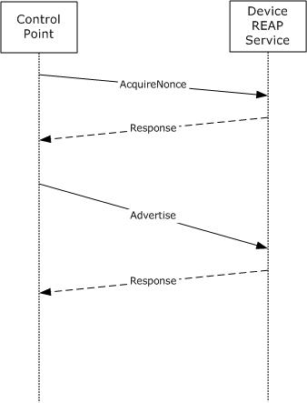
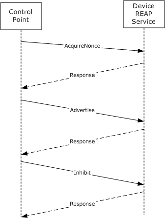
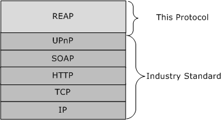
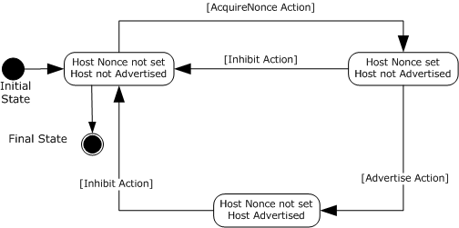

# [MS-RXAD]: Remote Experience Advertisement Protocol

Table of Contents

1 Introduction

- [1 Introduction](#Section_1)
  - [1.1 Glossary](#Section_1.1)
  - [1.2 References](#Section_1.2)
    - [1.2.1 Normative References](#Section_1.2.1)
    - [1.2.2 Informative References](#Section_1.2.2)
  - [1.3 Overview](#Section_1.3)
  - [1.4 Relationship to Other Protocols](#Section_1.4)
  - [1.5 Prerequisites/Preconditions](#Section_1.5)
  - [1.6 Applicability Statement](#Section_1.6)
  - [1.7 Versioning and Capability Negotiation](#Section_1.7)
  - [1.8 Vendor-Extensible Fields](#Section_1.8)
  - [1.9 Standards Assignments](#Section_1.9)

2 Messages

- [2 Messages](#Section_2)
  - [2.1 Transport](#Section_2.1)
  - [2.2 Common Message Syntax](#Section_2.2)
    - [2.2.1 Namespaces](#Section_2.2.1)
    - [2.2.2 Messages](#Section_2.2.2)
    - [2.2.3 Elements](#Section_2.2.3)
    - [2.2.4 Complex Types](#Section_2.2.4)
    - [2.2.5 Simple Types](#Section_2.2.5)
    - [2.2.6 Attributes](#Section_2.2.6)
    - [2.2.7 Groups](#Section_2.2.7)
    - [2.2.8 Attribute Groups](#Section_2.2.8)

3 Protocol Details

- [3 Protocol Details](#Section_3)
  - [3.1 Server Details](#Section_3.1)
    - [3.1.1 Abstract Data Model](#Section_3.1.1)
    - [3.1.2 Timers](#Section_3.1.2)
    - [3.1.3 Initialization](#Section_3.1.3)
    - [3.1.4 Message Processing Events and Sequencing Rules](#Section_3.1.4)
      - [3.1.4.1 AcquireNonce Action](#Section_3.1.4.1)
        - [3.1.4.1.1 Messages](#Section_3.1.4.1.1)
          - [3.1.4.1.1.1 AcquireNonce Message](#Section_3.1.4.1.1.1)
          - [3.1.4.1.1.2 AcquireNonce Response Message](#Section_3.1.4.1.1.2)
        - [3.1.4.1.2 Elements](#Section_3.1.4.1.2)
          - [3.1.4.1.2.1 AttachCertificate](#Section_3.1.4.1.2.1)
          - [3.1.4.1.2.2 HostID](#Section_3.1.4.1.2.2)
          - [3.1.4.1.2.3 Nonce](#Section_3.1.4.1.2.3)
          - [3.1.4.1.2.4 SupportedSignatureAlgorithms](#Section_3.1.4.1.2.4)
        - [3.1.4.1.3 Complex Types](#Section_3.1.4.1.3)
        - [3.1.4.1.4 Simple Types](#Section_3.1.4.1.4)
        - [3.1.4.1.5 Attributes](#Section_3.1.4.1.5)
        - [3.1.4.1.6 Groups](#Section_3.1.4.1.6)
        - [3.1.4.1.7 Attribute Groups](#Section_3.1.4.1.7)
        - [3.1.4.1.8 Timer Events](#Section_3.1.4.1.8)
        - [3.1.4.1.9 Other Local Events](#Section_3.1.4.1.9)
      - [3.1.4.2 Advertise Action](#Section_3.1.4.2)
        - [3.1.4.2.1 Messages](#Section_3.1.4.2.1)
          - [3.1.4.2.1.1 Advertise Message](#Section_3.1.4.2.1.1)
          - [3.1.4.2.1.2 Advertise Response Message](#Section_3.1.4.2.1.2)
        - [3.1.4.2.2 Elements](#Section_3.1.4.2.2)
          - [3.1.4.2.2.1 ApplicationData](#Section_3.1.4.2.2.1)
          - [3.1.4.2.2.2 ApplicationID](#Section_3.1.4.2.2.2)
          - [3.1.4.2.2.3 ApplicationVersion](#Section_3.1.4.2.2.3)
          - [3.1.4.2.2.4 ExperienceEndpointData](#Section_3.1.4.2.2.4)
          - [3.1.4.2.2.5 ExperienceEndpointUri](#Section_3.1.4.2.2.5)
          - [3.1.4.2.2.6 ExperienceFriendlyName](#Section_3.1.4.2.2.6)
          - [3.1.4.2.2.7 ExperienceIconUri](#Section_3.1.4.2.2.7)
          - [3.1.4.2.2.8 HostCertificate](#Section_3.1.4.2.2.8)
          - [3.1.4.2.2.9 HostID](#Section_3.1.4.2.2.9)
          - [3.1.4.2.2.10 Nonce](#Section_3.1.4.2.2.10)
          - [3.1.4.2.2.11 Signature](#Section_3.1.4.2.2.11)
          - [3.1.4.2.2.12 SignatureAlgorithm](#Section_3.1.4.2.2.12)
        - [3.1.4.2.3 Complex Types](#Section_3.1.4.2.3)
        - [3.1.4.2.4 Simple Types](#Section_3.1.4.2.4)
        - [3.1.4.2.5 Attributes](#Section_3.1.4.2.5)
        - [3.1.4.2.6 Groups](#Section_3.1.4.2.6)
        - [3.1.4.2.7 Attribute Groups](#Section_3.1.4.2.7)
        - [3.1.4.2.8 Timer Events](#Section_3.1.4.2.8)
        - [3.1.4.2.9 Other Local Events](#Section_3.1.4.2.9)
      - [3.1.4.3 Inhibit Action](#Section_3.1.4.3)
        - [3.1.4.3.1 Messages](#Section_3.1.4.3.1)
          - [3.1.4.3.1.1 Inhibit Message](#Section_3.1.4.3.1.1)
          - [3.1.4.3.1.2 Inhibit Response Message](#Section_3.1.4.3.1.2)
        - [3.1.4.3.2 Elements](#Section_3.1.4.3.2)
          - [3.1.4.3.2.1 ApplicationData](#Section_3.1.4.3.2.1)
          - [3.1.4.3.2.2 ApplicationID](#Section_3.1.4.3.2.2)
          - [3.1.4.3.2.3 ApplicationVersion](#Section_3.1.4.3.2.3)
          - [3.1.4.3.2.4 HostCertificate](#Section_3.1.4.3.2.4)
          - [3.1.4.3.2.5 HostID](#Section_3.1.4.3.2.5)
          - [3.1.4.3.2.6 Nonce](#Section_3.1.4.3.2.6)
          - [3.1.4.3.2.7 ReasonCode](#Section_3.1.4.3.2.7)
          - [3.1.4.3.2.8 ReasonMessage](#Section_3.1.4.3.2.8)
          - [3.1.4.3.2.9 Signature](#Section_3.1.4.3.2.9)
          - [3.1.4.3.2.10 SignatureAlgorithm](#Section_3.1.4.3.2.10)
        - [3.1.4.3.3 Complex Types](#Section_3.1.4.3.3)
        - [3.1.4.3.4 Simple Types](#Section_3.1.4.3.4)
        - [3.1.4.3.5 Attributes](#Section_3.1.4.3.5)
        - [3.1.4.3.6 Groups](#Section_3.1.4.3.6)
        - [3.1.4.3.7 Attribute Groups](#Section_3.1.4.3.7)
        - [3.1.4.3.8 Timer Events](#Section_3.1.4.3.8)
        - [3.1.4.3.9 Other Local Events](#Section_3.1.4.3.9)
  - [3.2 Client Details](#Section_3.2)

4 Protocol Examples

- [4 Protocol Examples](#Section_4)
  - [4.1 AcquireNonce Message](#Section_4.1)
  - [4.2 AcquireNonce Response Message](#Section_4.2)
  - [4.3 Advertise Message](#Section_4.3)
  - [4.4 Advertise Response Message](#Section_4.4)
  - [4.5 Inhibit Message](#Section_4.5)
  - [4.6 Inhibit Response Message](#Section_4.6)

5 Security

- [5 Security](#Section_5)
  - [5.1 Security Considerations for Implementers](#Section_5.1)
  - [5.2 Index of Security Parameters](#Section_5.2)

6 Appendix A: Full WSDL

- [6 Appendix A: Full WSDL](#Section_6)

7 Appendix B: UPnP Device Description

- [7 Appendix B: UPnP Device Description](#Section_7)

8 Appendix C: A Full UPnP Service Description

- [8 Appendix C: A Full UPnP Service Description](#Section_8)

9 Appendix D: Product Behavior

- [9 Appendix D: Product Behavior](#Section_9)

10 Change Tracking

- [10 Change Tracking](#Section_10)

For the legal notice and IP terms, see [LEGAL.md](../LEGAL.md).
Last updated: 6/1/2017.
See [Revision History](#revision-history) for full version history.

# 1 Introduction

This document specifies the Remote Experience Advertisement Protocol.

The Remote Experience Advertisement Protocol enables a Universal Plug and Play (UPnP) service implemented by a device to be used by the client to advertise available remote experience information to that device. This information specifies the type of experience, how to initiate the connection, and provides a host ID and host [**certificate**](#gt_certificate) along with other information.

This protocol is compliant with UPnP architecture and is implemented as an [**UPnP service**](#gt_736620cf-350a-4de4-a2b8-e42bb731b237) [[UPNPARCH1]](https://go.microsoft.com/fwlink/?LinkId=90554).

Sections 1.5, 1.8, 1.9, 2, and 3 of this specification are normative. All other sections and examples in this specification are informative.

## 1.1 Glossary

This document uses the following terms:

**certificate**: A certificate is a collection of attributes and extensions that can be stored persistently. The set of attributes in a certificate can vary depending on the intended usage of the certificate. A certificate securely binds a public key to the entity that holds the corresponding private key. A certificate is commonly used for authentication and secure exchange of information on open networks, such as the Internet, extranets, and intranets. Certificates are digitally signed by the issuing certification authority (CA) and can be issued for a user, a computer, or a service. The most widely accepted format for certificates is defined by the ITU-T X.509 version 3 international standards. For more information about attributes and extensions, see [[RFC3280]](https://go.microsoft.com/fwlink/?LinkId=90414) and [[X509]](https://go.microsoft.com/fwlink/?LinkId=90590) sections 7 and 8.

**control point**: A control point retrieves device and service descriptions, sends actions to services, polls for service state variables, and receives events from services.

**service description**: The UPnP description for a service defines actions and their arguments, and state variables and their data type, range, and event characteristics.

**service ID**: The service ID suffix defined by an UPnP Forum working committee or specified by an UPnP vendor must be less than 64 characters. This should be a Single URI.

**service or UPnP service**: A set of rules that is required to be published by the device and advertised when the device is turned on all the available control points.

**service type**: Service type refers to the name of a particular service that is implemented on the device.

**SOAP action**: The HTTP request header field used to indicate the intent of the SOAP request, using a URI value. See [[SOAP1.1]](https://go.microsoft.com/fwlink/?LinkId=90520) section 6.1.1 for more information.

**SOAP body**: A container for the payload data being delivered by a [**SOAP message**](#gt_soap-message) to its recipient. See [[SOAP1.2-1/2007]](https://go.microsoft.com/fwlink/?LinkId=94664) section 5.3 for more information.

**SOAP message**: An [**XML**](#gt_xml) document consisting of a mandatory SOAP envelope, an optional SOAP header, and a mandatory [**SOAP body**](#gt_soap-body). See [SOAP1.2-1/2007] section 5 for more information.

**XML**: The Extensible Markup Language, as described in [[XML1.0]](https://go.microsoft.com/fwlink/?LinkId=90599).

**XML namespace**: A collection of names that is used to identify elements, types, and attributes in XML documents identified in a URI reference [[RFC3986]](https://go.microsoft.com/fwlink/?LinkId=90453). A combination of XML namespace and local name allows XML documents to use elements, types, and attributes that have the same names but come from different sources. For more information, see [[XMLNS-2ED]](https://go.microsoft.com/fwlink/?LinkId=90602).

**XML schema**: A description of a type of XML document that is typically expressed in terms of constraints on the structure and content of documents of that type, in addition to the basic syntax constraints that are imposed by [**XML**](#gt_xml) itself. An XML schema provides a view of a document type at a relatively high level of abstraction.

**MAY, SHOULD, MUST, SHOULD NOT, MUST NOT:** These terms (in all caps) are used as defined in [[RFC2119]](https://go.microsoft.com/fwlink/?LinkId=90317). All statements of optional behavior use either MAY, SHOULD, or SHOULD NOT.

## 1.2 References

Links to a document in the Microsoft Open Specifications library point to the correct section in the most recently published version of the referenced document. However, because individual documents in the library are not updated at the same time, the section numbers in the documents may not match. You can confirm the correct section numbering by checking the [Errata](http://msdn.microsoft.com/en-us/library/dn781092.aspx).

### 1.2.1 Normative References

We conduct frequent surveys of the normative references to assure their continued availability. If you have any issue with finding a normative reference, please contact [dochelp@microsoft.com](mailto:dochelp@microsoft.com). We will assist you in finding the relevant information.

[RFC2119] Bradner, S., "Key words for use in RFCs to Indicate Requirement Levels", BCP 14, RFC 2119, March 1997, [http://www.rfc-editor.org/rfc/rfc2119.txt](https://go.microsoft.com/fwlink/?LinkId=90317)

[SOAP1.1] Box, D., Ehnebuske, D., Kakivaya, G., et al., "Simple Object Access Protocol (SOAP) 1.1", W3C Note, May 2000, [http://www.w3.org/TR/2000/NOTE-SOAP-20000508/](https://go.microsoft.com/fwlink/?LinkId=90520)

[UPNPARCH1] UPnP Forum, "UPnP Device Architecture 1.0", October 2008, [http://www.upnp.org/specs/arch/UPnP-arch-DeviceArchitecture-v1.0.pdf](https://go.microsoft.com/fwlink/?LinkId=90554)

[XMLNS] Bray, T., Hollander, D., Layman, A., et al., Eds., "Namespaces in XML 1.0 (Third Edition)", W3C Recommendation, December 2009, [http://www.w3.org/TR/2009/REC-xml-names-20091208/](https://go.microsoft.com/fwlink/?LinkId=191840)

[XMLSCHEMA1] Thompson, H., Beech, D., Maloney, M., and Mendelsohn, N., Eds., "XML Schema Part 1: Structures", W3C Recommendation, May 2001, [http://www.w3.org/TR/2001/REC-xmlschema-1-20010502/](https://go.microsoft.com/fwlink/?LinkId=90608)

[XMLSCHEMA2] Biron, P.V., Ed. and Malhotra, A., Ed., "XML Schema Part 2: Datatypes", W3C Recommendation, May 2001, [http://www.w3.org/TR/2001/REC-xmlschema-2-20010502/](https://go.microsoft.com/fwlink/?LinkId=90610)

### 1.2.2 Informative References

None.

## 1.3 Overview

The Remote Experience Advertisement Protocol is used for advertising experiences available at a host PC to a specific UPnP device. It is used for providing data required by the UPnP device to connect to the advertised experience. In addition to advertising, it can also revoke a previously advertised experience by announcing that an experience is currently unavailable. This protocol is a SOAP-based protocol that uses HTTP 1.1 as its transport.

The Remote Experience Advertisement Protocol provides for three actions: AcquireNonce, Advertise, and Inhibit. The AcquireNonce action provides the Nonce and signing information; this information is later used by the Advertise and Inhibit actions.

As specified in [[UPNPARCH1]](https://go.microsoft.com/fwlink/?LinkId=90554) section 3.1.1, each action of the protocol results in a pair of SOAP request and response messages in the network.

The following diagram illustrates a flow of Remote Experience Advertisement Protocol messages exchanged between the device and the [**control point**](#gt_control-point), when the Advertise action is achieved successfully.

Figure 1: Protocol message sequence diagram (Advertise action)

The following diagram illustrates a flow of Remote Experience Advertisement Protocol messages exchanged between the device and the control point, when the previously advertised action is canceled successfully.

Figure 2: Protocol message sequence diagram (Inhibit action)

## 1.4 Relationship to Other Protocols

The Remote Experience Advertisement Protocol uses SOAP over HTTP as shown in the following layering diagram:

Figure 3: Protocol layering diagram

## 1.5 Prerequisites/Preconditions

The Remote Experience Advertisement Protocol requires the support of an UPnP stack [[UPNPARCH1]](https://go.microsoft.com/fwlink/?LinkId=90554) on the device and the control point. Therefore, before the protocol is put into action, the device performs all of the prior UPnP steps, including the discovery of the device, device description, and the publication of the [**service description**](#gt_service-description) as specified in [UPNPARCH1]. [Appendix B](#Section_7) shows the UPnP service information of the protocol to be included in the device description. The [**service type**](#gt_service-type) of the protocol is "msremotedexperience", the version number is as specified in section [1.7](#Section_1.7) of this document, and the [**service ID**](#gt_service-id) is "MSRX". [Appendix C](#Section_8) shows the full UPnP service description of this protocol. The protocol server endpoint is formed by appending "/_vti_bin/pptws.asmx".

## 1.6 Applicability Statement

The Remote Experience Advertisement Protocol is used to describe the available experience to the device from the PC which can also include information such as how to initiate a connection and provide a host ID and host [**certificate**](#gt_certificate) along with other useful information.

## 1.7 Versioning and Capability Negotiation

This document specifies Remote Experience Advertisement Protocol version 1. The version number is included where Remote Experience Advertisement Protocol service information is presented in the device description as specified in [[UPNPARCH1]](https://go.microsoft.com/fwlink/?LinkId=90554) section 2.3. See section [1.5](#Section_1.5) for more details.

## 1.8 Vendor-Extensible Fields

There are no vendor-extensible fields other than what is specified in [[UPNPARCH1]](https://go.microsoft.com/fwlink/?LinkId=90554).

## 1.9 Standards Assignments

There are no standards assignments other than what is specified in [[UPNPARCH1]](https://go.microsoft.com/fwlink/?LinkId=90554).

# 2 Messages

## 2.1 Transport

The Remote Experience Advertisement Protocol does not specify a transport protocol beyond what is specified by [[UPNPARCH1]](https://go.microsoft.com/fwlink/?LinkId=90554).

## 2.2 Common Message Syntax

This section contains common definitions used by this protocol. The syntax of the definitions uses [**XML schema**](#gt_xml-schema) as defined in [[XMLSCHEMA1]](https://go.microsoft.com/fwlink/?LinkId=90608) and [[XMLSCHEMA2]](https://go.microsoft.com/fwlink/?LinkId=90610).

### 2.2.1 Namespaces

This specification defines and references various [**XML namespace**](#gt_xml-namespace)s using the mechanisms specified in [[XMLNS]](https://go.microsoft.com/fwlink/?LinkId=191840). Although this specification associates a specific XML namespace prefix for each XML namespace that is used, the choice of any particular XML namespace prefix is implementation-specific and not significant for interoperability.

| Prefix | Namespace URI | Reference |
| --- | --- | --- |
| msrx | urn:schemas-microsoft-com:service:msremotedexperience:1 | [MS-RXAD] |
| dt | urn:schemas-microsoft-com:datatypes | [MS-RXAD] |
| soapenv | http://schemas.xmlsoap.org/soap/envelope/ | [[SOAP1.1]](https://go.microsoft.com/fwlink/?LinkId=90520) |
| encodingStyle | http://schemas.xmlsoap.org/soap/encoding/ | [SOAP1.1] |
| xsd | http://www.w3.org/2001/XMLSchema | [[XMLSCHEMA1]](https://go.microsoft.com/fwlink/?LinkId=90608) |

### 2.2.2 Messages

The Remote Experience Advertisement Protocol provides three actions: the AcquireNonce, Advertise, and Inhibit actions. The request and response messages for each Remote Experience Advertisement Protocol action MUST be expressed in [**XML**](#gt_xml) using the SOAP 1.1 UPnP profile as specified in [[UPNPARCH1]](https://go.microsoft.com/fwlink/?LinkId=90554) section 3.1.1.

The details of each action can be found in section [3.1.4](#Section_3.1.4) of this document.

### 2.2.3 Elements

| Element | Description |
| --- | --- |
| HostID | A GUID used to identify a control point that provides remote experiences on the network. |
| Nonce | A Nonce is generated by the UPnP device, and returned to the control point. |

### 2.2.4 Complex Types

None.

### 2.2.5 Simple Types

None.

### 2.2.6 Attributes

None.

### 2.2.7 Groups

None.

### 2.2.8 Attribute Groups

None.

# 3 Protocol Details

## 3.1 Server Details

### 3.1.1 Abstract Data Model

Upon each action, the control point sends the request message to the device, and the device returns a response or error message to the control point [[UPNPARCH1]](https://go.microsoft.com/fwlink/?LinkId=90554).

There are five states in the Remote Experience Advertisement Protocol:

- Initial state
- Host Nonce not set and Host not Advertised
- Host Nonce set and Host not Advertised
- Host Nonce not set and Host Advertised
- Final state
In its Initial state, the control point is in the Host Nonce not set and Host not Advertised state.

The AcquireNonce action transitions the control point into the Host Nonce set and Host not Advertised state. At this point the host PC is ready to send an Advertise action if the remoted experience is available. In case the remote experience is not available, the host PC can send an Inhibit action, by informing the device when such an experience will be available.

Upon an Advertise action, the device enters the Host Nonce not set and Host Advertised state. If the control point is required to cancel the advertisement, then it can send an Inhibit action changing the state to Host Nonce set and Host not Advertised. The same Inhibit action can change the state to the Final state.

The following diagram provides an overview of the state machine.

Figure 4: Host State Machine

### 3.1.2 Timers

The Remote Experience Advertisement Protocol does not specify anything beyond what is specified by [[UPNPARCH1]](https://go.microsoft.com/fwlink/?LinkId=90554).

### 3.1.3 Initialization

The Remote Experience Advertisement Protocol does not specify anything beyond what is specified by [[UPNPARCH1]](https://go.microsoft.com/fwlink/?LinkId=90554).

### 3.1.4 Message Processing Events and Sequencing Rules

#### 3.1.4.1 AcquireNonce Action

A control point MUST attach an <AcquireNonce> body to a Remote Experience Advertisement Protocol [**SOAP message**](#gt_soap-message) that contains <HostId> element in order to instruct the device to send the Nonce and signing information in response.

##### 3.1.4.1.1 Messages

###### 3.1.4.1.1.1 AcquireNonce Message

The HTTP header MUST specify SOAPACTION as follows for an AcquireNonce message:

SOAPACTION: "urn:schemas-microsoft-com:service:msremotedexperience:1#AcquireNonce"

"urn:schemas-microsoft-com:service:msremotedexperience:1" is the service type as specified in device description in [Appendix B](#Section_7).

"AcquireNonce" is the [**SOAP action**](#gt_soap-action).

The following [**XML**](#gt_xml) session shows an <AcquireNonce> and <HostId> in a SOAP message.

<soapenv:Envelope

xmlns:SOAP-ENV="http://schemas.xmlsoap.org/soap/envelope/"

soapenv:encodingStyle="http://schemas.xmlsoap.org/soap/encoding/">

<soapenv:Body>

<msrx:AcquireNonce xmlns:msrx ="urn:schemas-microsoft-com:service:msremotedexperience:1">

<HostId xmlns:dt="urn:schemas-microsoft-com:datatypes" dt:dt="string">

A GUID used to identify a control point that provides remote experiences on the network

</HostId>

</m:AcquireNonce>

</soapenv:Body>

</ soapenv:Envelope>

###### 3.1.4.1.1.2 AcquireNonce Response Message

The server MUST reply with a SOAP response message named <AcquireNonceResponse> that contains <Nonce>, <SupportedSignatureAlgorithms> and <AttachCertificate>.

The following [**XML**](#gt_xml) session shows a <AcquireNonceResponse>, <Nonce>, <SupportedSignatureAlgorithms> and <AttachCertificate> in a SOAP message.

[SOAP]

<soapenv:Envelope

xmlns:soapenv="http://schemas.xmlsoap.org/soap/envelope/"

soapenv:encodingStyle="http://schemas.xmlsoap.org/soap/encoding/">

<soapenv:Body>

<msrx:AcquireNonceResponse xmlns:msrx="urn:schemas-microsoft- com:service:msremotedexperience:1">

<Nonce>Nonce payload</Nonce>

<SupportedSignatureAlgorithms> SignatureAlgorithms payload</SupportedSignatureAlgorithms>

<AttachCertificate>Boolean value indicating if certificate is attached in Advertised/Inhibit action</AttachCertificate>

</msrx:AcquireNonceResponse>

</soapenv:Body>

</soapenv:Envelope>

##### 3.1.4.1.2 Elements

###### 3.1.4.1.2.1 AttachCertificate

The <AttachCertificate> is the element of type Boolean under an <AcquireNonceResponse> SOAP body that is used to determine if the control point MUST send its full [**certificate**](#gt_certificate) in <Advertise> and <Inhibit> [**SOAP body**](#gt_soap-body). If the UPnP device cannot store the control point's certificate, it can instead store a hash of the certificate and request that the control point send the full certificate with each <Advertise> and <Inhibit> SOAP body by setting this value to TRUE. If the certificate is not required in those actions, then this value is set to FALSE.

<xs:element name="AttachCertificate" type="xs:boolean"/>

###### 3.1.4.1.2.2 HostID

The <HostID> is an element of type string under an <AcquireNonceResponse>, <Advertise>, and <Inhibit> [**SOAP body**](#gt_soap-body). It is a GUID used to identify a control point that provides remote experiences on the network. The <HostID> can be used by the UPnP device to group <ApplicationID> element in local user interface.

<xs:element name="HostID" type="xs:string" />

###### 3.1.4.1.2.3 Nonce

The <Nonce> is an element that contains a 4-byte unsigned integer under <AcquireNonceResponse>, <Advertise>, and <Inhibit> messages generated by the UPnP Device. The <AcquireNonce> MUST be called prior to invoking an <Advertise> and <Inhibit> action.

<xs:element name="Nonce" type="xs:unsignedInt"/>

###### 3.1.4.1.2.4 SupportedSignatureAlgorithms

The <SupportedSignatureAlgorithms> is a string element under <AcquireNonceResponse> messages generated by the UPnP Device. The element contains a list of algorithm descriptors that the control point can use to create a <Signature> element in Advertise and Inhibit messages. Individual algorithm descriptors in the list are separated by space characters.

<xs:element name="SupportedSignatureAlgorithms" type="xs:string"/>

##### 3.1.4.1.3 Complex Types

None.

##### 3.1.4.1.4 Simple Types

None.

##### 3.1.4.1.5 Attributes

None.

##### 3.1.4.1.6 Groups

None.

##### 3.1.4.1.7 Attribute Groups

None.

##### 3.1.4.1.8 Timer Events

The Remote Experience Advertisement Protocol does not specify anything beyond what is specified by [[UPNPARCH1]](https://go.microsoft.com/fwlink/?LinkId=90554).

##### 3.1.4.1.9 Other Local Events

The Remote Experience Advertisement Protocol does not specify anything beyond what is specified by [[UPNPARCH1]](https://go.microsoft.com/fwlink/?LinkId=90554).

#### 3.1.4.2 Advertise Action

A client MUST attach an <Advertise> body to the Remote Experience Advertisement Protocol SOAP message that contains <Nonce>, <HostId>, <ApplicationId>, <ApplicationVersion>, <ApplicationData>, <HostFriendlyName>, <ExperienceFriendlyName>, <ExperienceIconUri>, < ExperienceEndpointData>, <SignatureAlgorithm>, <Signature> and <HostCertificate> in order to advertise an available remote experience to a UPnP device.

##### 3.1.4.2.1 Messages

###### 3.1.4.2.1.1 Advertise Message

The HTTP header MUST specify the SOAPACTION header, as specified in [[UPNPARCH1]](https://go.microsoft.com/fwlink/?LinkId=90554), as follows for the Advertise message:

SOAPACTION: "urn:schemas-microsoft-com:service:msremotedexperience:1#Advertise"

"urn:schemas-microsoft-com:service:msremotedexperience:1" is service type which comes from the device description as specified in [Appendix B](#Section_7).

"Advertise" is the soap action.

The following [**XML**](#gt_xml) shows an <Advertise> action sent by the client in a SOAP message.

[SOAP]

<soapenv:Envelope

xmlns:soapenv="http://schemas.xmlsoap.org/soap/envelope/"

soapenv:encodingStyle="http://schemas.xmlsoap.org/soap/encoding/">

<soapenv:Body>

<msrx:Advertise xmlns:msrx="urn:schemas-microsoft-com:service:msremotedexperience:1">

<Nonce xmlns:dt="urn:schemas-microsoft-com:datatypes" dt:dt="ui4">

Nonce ID

</Nonce>

<HostId xmlns:dt="urn:schemas-microsoft-com:datatypes" dt:dt="string">

HostId

</HostId>

<ApplicationId xmlns:dt="urn:schemas-microsoft-com:datatypes" dt:dt="string">

ApplicationId

</ApplicationId>

<ApplicationVersion xmlns:dt="urn:schemas-microsoft-com:datatypes" dt:dt="string">

ApplicationVersion number

</ApplicationVersion>

<ApplicationData xmlns:dt="urn:schemas-microsoft-com:datatypes" dt:dt="string">

ApplicationData payload

</ApplicationData>

<HostFriendlyName xmlns:dt="urn:schemas-microsoft-com:datatypes" dt:dt="string">

HostFriendlyName payload

</HostFriendlyName>

<ExperienceFriendlyName xmlns:dt="urn:schemas-microsoft-com:datatypes" dt:dt="string">

ExperienceFriendlyName payload

</ExperienceFriendlyName>

<ExperienceIconUri xmlns:dt="urn:schemas-microsoft-com:datatypes" dt:dt="string">

ExperienceIconUri payload

</ExperienceIconUri>

<ExperienceEndpointUri xmlns:dt="urn:schemas-microsoft-com:datatypes" dt:dt="string">

ExperienceEndpointUri

</ExperienceEndpointUri>

<ExperienceEndpointData xmlns:dt="urn:schemas-microsoft-com:datatypes" dt:dt="string">

ExperienceEndPointData payload

</ExperienceEndpointData>

<SignatureAlgorithm xmlns:dt="urn:schemas-microsoft-com:datatypes" dt:dt="string">

SignatureAlgorithm payload

</SignatureAlgorithm>

<Signature xmlns:dt="urn:schemas-microsoft-com:datatypes" dt:dt="string">

Signature payload

</Signature>

<HostCertificate xmlns:dt="urn:schemas-microsoft-com:datatypes" dt:dt="string">

HostCertificate payload

</HostCertificate>

</msrx:Advertise>

</soapenv:Body>

</soapenv:Envelope>

###### 3.1.4.2.1.2 Advertise Response Message

The server MUST reply with a SOAP response message named <AdvertiseResponse>.

The "urn:schemas-microsoft-com:service:msremotedexperience:1" [**XML namespace**](#gt_xml-namespace) SHOULD be specified in the <AdvertiseResponse> message.

The following XML session shows an <AdvertiseResponse> in a SOAP message.

[SOAP]

<soapenv:Envelope

xmlns:soapenv="http://schemas.xmlsoap.org/soap/envelope/"

soapenv:encodingStyle="http://schemas.xmlsoap.org/soap/encoding/">

<soapenv:Body>

<msrx:AdvertiseResponse xmlns:msrx="urn:schemas-microsoft- com:service:msremotedexperience:1">

</msrx:AdvertiseResponse>

</soapenv:Body>

</soapenv:Envelope>

##### 3.1.4.2.2 Elements

###### 3.1.4.2.2.1 ApplicationData

ApplicationData is the element of type string under an <Advertise> and <Inhibit> SOAP body that contains additional data specific to a remote application. This data SHOULD contain further information about why the application is offline as well when it is expected to be online again.

<xs:element name="ApplicationData" type="xs:string"/>

###### 3.1.4.2.2.2 ApplicationID

ApplicationID is a GUID element of type string under an <Advertise> and <Inhibit> SOAP body that is used to identify an application that will present remote experience endpoints. This ApplicationID can be used to group <ExperienceEndpointFriendlyName> element in the local user interface.

<xs:element name="ApplicationId" type="xs:string"/>

###### 3.1.4.2.2.3 ApplicationVersion

ApplicationVersion is an element of type string under an <Advertise> and <Inhibit> SOAP body that contains version information specific to a remote application.

<xs:element name="ApplicationVersion" type="xs:string"/>

###### 3.1.4.2.2.4 ExperienceEndpointData

ExperienceEndpointData is an element of type string under an <Advertise> SOAP body that contains any information specific to connecting to the remote experience. For example, this MAY contain credentials used by the UPnP device when connecting to the remote experience.

<xs:element name="ExperienceEndpointData" type="xs:string"/>

###### 3.1.4.2.2.5 ExperienceEndpointUri

ExperienceEndpointUri is an element of type string under an <Advertise> SOAP body that contains a given path to where the UPnP device SHOULD connect to the remote experience.

<xs:element name=" ExperienceEndpointUri" type="xs:string"/>

###### 3.1.4.2.2.6 ExperienceFriendlyName

ExperienceFriendlyName is an element of type string under an <Advertise> SOAP body that represents a specific remote experience inside of the application.

<xs:element name=" ExperienceFriendlyName" type="xs:string"/>

###### 3.1.4.2.2.7 ExperienceIconUri

ExperienceIconUri is an element of type string under an <Advertise> SOAP body that gives a path to an image to be used in local user interface to represent the remote experience available on the control point.

<xs:element name="ExperienceIconUri" type="xs:string"/>

###### 3.1.4.2.2.8 HostCertificate

HostCertificate is an element of type string under an <Advertise> and <Inhibit> SOAP body. It is provided by the control point when the UPnP device returns TRUE for the <AttachCertificate> parameter in <AcquireNonce>.

<xs:element name="HostCertificate" type="xs:string"/>

###### 3.1.4.2.2.9 HostID

HostID is an element of type string under an <AcquireNonce>, <Advertise> and <Inhibit> SOAP body. It is a GUID used to identify a control point that provides remote experiences on the network. The HostID can be used by the UPnP device to group the <ApplicationID> element in the local user interface.

<xs:element name="HostId" type="xs:string"/>

###### 3.1.4.2.2.10 Nonce

Nonce is an element that contains a 4-byte unsigned integer under an <AcquireNonceResponse>, <Advertise> and <Inhibit> messages generated by the UPnP Device. The Nonce is single use, therefore <AcquireNonce> MUST be called prior to invoking an <Advertise> and <Inhibit> action.

<xs:element name="Nonce" type="xs:unsignedInt"/>

###### 3.1.4.2.2.11 Signature

Signature allows the UPnP device to authenticate an <Advertise> action. To create the signature, the control point concatenates the action with all parameters in a UTF-8 encoded string, with the exception of the Signature and the HostCertificate parameters. The algorithm used MUST be the same algorithm supplied in the SignatureAlgorithm parameter.

<xs:element name="Signature" type="xs:string"/>

###### 3.1.4.2.2.12 SignatureAlgorithm

SignatureAlgorithm is an element of type string under an <Advertise> and <Inhibit> SOAP body that contains the algorithm descriptor that the control point used to create a <Signature> selected from the list of SupportedSignatureAlgorithms retrieved in <AcquireNonce>.

<xs:element name="SupportedSignatureAlgorithm" type="xs:string"/>

##### 3.1.4.2.3 Complex Types

None.

##### 3.1.4.2.4 Simple Types

None.

##### 3.1.4.2.5 Attributes

None.

##### 3.1.4.2.6 Groups

None.

##### 3.1.4.2.7 Attribute Groups

None.

##### 3.1.4.2.8 Timer Events

The Remote Experience Advertisement Protocol does not specify anything beyond what is specified by [[UPNPARCH1]](https://go.microsoft.com/fwlink/?LinkId=90554).

##### 3.1.4.2.9 Other Local Events

The Remote Experience Advertisement Protocol does not specify anything beyond what is specified by [[UPNPARCH1]](https://go.microsoft.com/fwlink/?LinkId=90554).

#### 3.1.4.3 Inhibit Action

A control point attaches an <Inhibit> body to the Remote Experience Advertisement Protocol SOAP message that contains <Nonce>, <HostId>, <ApplicationId>, <ApplicationVersion>, <ApplicationData>, <ReasonCode>, <ReasonMessage>, <SignatureAlgorithm>, <Signature> and <HostCertificate> in order to inform a UPnP device that a remote experience is unavailable.

##### 3.1.4.3.1 Messages

###### 3.1.4.3.1.1 Inhibit Message

The HTTP header MUST specify SOAPACTION as follows for an Inhibit message:

SOAPACTION: "urn:schemas-microsoft-com:service:msremotedexperience:1#Inhibit"

"urn:schemas-microsoft-com:service:msremotedexperience:1" is the service type as specified in device description in <Appendix 7>.

"Inhibit" is the SOAP action.

The following [**XML**](#gt_xml) shows the <Inhibit> action sent by the client in a SOAP message.

<soapenv:Envelope

xmlns:soapenv="http://schemas.xmlsoap.org/soap/envelope/"

soapenv:encodingStyle="http://schemas.xmlsoap.org/soap/encoding/">

<soapenv:Body>

<msrx:Inhibit xmlns:msrx="urn:schemas-microsoft-com:service:msremotedexperience:1">

<Nonce xmlns:dt="urn:schemas-microsoft-com:datatypes" dt:dt="ui4">

Nonce ID </Nonce>

<HostId xmlns:dt="urn:schemas-microsoft-com:datatypes" dt:dt="string">

HostId payload

</HostId>

<ApplicationId xmlns:dt="urn:schemas-microsoft-com:datatypes" dt:dt="string">

ApplicationId payload </ApplicationId>

<ApplicationVersion xmlns:dt="urn:schemas-microsoft-com:datatypes" dt:dt="string">

ApplicationVersion number

</ApplicationVersion>

<ApplicationData xmlns:dt="urn:schemas-microsoft-com:datatypes" dt:dt="string">

ApplicationData payload

</ApplicationData>

<ReasonCode xmlns:dt="urn:schemas-microsoft-com:datatypes" dt:dt="ui4">

ReasonCode for Inhibit

</ReasonCode>

<ReasonMessage xmlns:dt="urn:schemas-microsoft-com:datatypes" dt:dt="string">

ReasonMessage for Inhibit

</ReasonMessage>

<SignatureAlgorithm xmlns:dt="urn:schemas-microsoft-com:datatypes" dt:dt="string">

SignatureAlgorithm payload

</SignatureAlgorithm>

<Signature xmlns:dt="urn:schemas-microsoft-com:datatypes" dt:dt="string">

Signature payload

</Signature>

<HostCertificate xmlns:dt="urn:schemas-microsoft-com:datatypes" dt:dt="string">

HostCertificate payload

</HostCertificate>

</msrx:Inhibit>

</soapenv:Body>

</soapenv:Envelope>

###### 3.1.4.3.1.2 Inhibit Response Message

The server MUST reply with a SOAP response message named <InhibitResponse>.

The "urn:schemas-microsoft-com:service:msremotedexperience:1" XML namespace SHOULD be specified in the <InhibitResponse>.

The following [**XML**](#gt_xml) session shows an <InhibitResponse> in a SOAP message.

[SOAP]

<soapenv:Envelope

xmlns:soapenv="http://schemas.xmlsoap.org/soap/envelope/"

soapenv:encodingStyle="http://schemas.xmlsoap.org/soap/encoding/">

<soapenv:Body>

<msrx:InhibitResponse xmlns:msrx="urn:schemas-microsoft- com:service:msremotedexperience:1">

</msrx:InhibitResponse>

</soapenv:Body>

</soapenv:Envelope>

##### 3.1.4.3.2 Elements

###### 3.1.4.3.2.1 ApplicationData

ApplicationData is the element of type string under an <Advertise> and <Inhibit> SOAP body that contains any additional data specific to a remote application. This data could contain further information about why the application is offline as well when it is expected to be online again.

<xs:element name="ApplicationData" type="xs:string"/>

###### 3.1.4.3.2.2 ApplicationID

ApplicationID is a GUID element of type string under an <Advertise> and <Inhibit> SOAP body that is used to identify an application that will present remoted experience endpoints. This ApplicationID can be used to group <ExperienceEndpointFriendlyName> element in the local UI.

<xs:element name="ApplicationId" type="xs:string"/>

###### 3.1.4.3.2.3 ApplicationVersion

ApplicationVersion is an element of type string under an <Advertise> and <Inhibit> SOAP body that contains version information specific to a remote application.

<xs:element name="ApplicationVersion" type="xs:string"/>

###### 3.1.4.3.2.4 HostCertificate

HostCertificate is an element of type string under an <Advertise> and <Inhibit> SOAP body. It is provided by the control point when the UPnP device returns TRUE for the <AttachCertificate> parameter in <AcquireNonce>.

<xs:element name="HostCertificate" type="xs:string"/>

###### 3.1.4.3.2.5 HostID

HostID is an element of type string under an <AcquireNonce>, <Advertise> and <Inhibit> SOAP body. It is a GUID used to identify a control point that provides remoted experiences on the network. The HostID can be used by the UPnP device to group <ApplicationID> element in the local UI.

<xs:element name="HostId" type="xs:string"/>

###### 3.1.4.3.2.6 Nonce

The Nonce element contains a 4-byte unsigned integer under <AcquireNonceResponse>, <Advertise> and <Inhibit> messages generated by the UPnP device. Nonce is single use, and therefore <AcquireNonce> MUST be called prior to invoking an <Advertise> and <Inhibit> action.

<xs:element name="Nonce" type="xs:unsignedInt"/>

###### 3.1.4.3.2.7 ReasonCode

ReasonCode is an element of type 4-byte unsigned integer under an <Inhibit> SOAP body. This code can be used by the UPnP device to take a resultant action, (for example, reconnect or show an error screen). ReasonCode is <ApplicationId> element specific.

<xs:element name="ReasonCode" type="xs:unsignedInt"/>

###### 3.1.4.3.2.8 ReasonMessage

ReasonMessage is an element of type string under an <Inhibit> SOAP body that contains human readable data as to why the Inhibit action was called. ReasonMessage is <ApplicationId> specific.

<xs:element name="ReasonMessage" type="xs:string"/>

###### 3.1.4.3.2.9 Signature

The Signature element allows the UPnP device to authenticate an <Advertise> action. To create the signature, the control point concatenates the action with all parameters in a UTF-8 encoded string, with the exception of the Signature and the HostCertificate. The algorithm used is the same algorithm supplied in the SignatureAlgorithm parameter.

<xs:element name="Signature" type="xs:string"/>

###### 3.1.4.3.2.10 SignatureAlgorithm

SignatureAlgorithm is an element of type string under an <Advertise> and <Inhibit> SOAP body that contains the algorithm descriptor that the control point used to create a <Signature> selected from the list of SupportedSignatureAlgorithms retrieved in <AcquireNonce>.

<xs:element name="SignatureAlgorithm" type="xs:string"/>

##### 3.1.4.3.3 Complex Types

None.

##### 3.1.4.3.4 Simple Types

None.

##### 3.1.4.3.5 Attributes

None.

##### 3.1.4.3.6 Groups

None.

##### 3.1.4.3.7 Attribute Groups

##### 3.1.4.3.8 Timer Events

The Remote Experience Advertisement Protocol does not specify anything beyond what is specified by [[UPNPARCH1]](https://go.microsoft.com/fwlink/?LinkId=90554).

##### 3.1.4.3.9 Other Local Events

The Remote Experience Advertisement Protocol does not specify anything beyond what is specified by [[UPNPARCH1]](https://go.microsoft.com/fwlink/?LinkId=90554).

## 3.2 Client Details

The device returns a response or error message to the control point. The Remote Experience Advertisement Protocol does not specify anything beyond what is specified by [[UPNPARCH1]](https://go.microsoft.com/fwlink/?LinkId=90554).

# 4 Protocol Examples

In this section a complete message exchange is shown between the server and client consisting of following messages.

## 4.1 AcquireNonce Message

The control point sends a POST method in the following format to the device to invoke <AcquireNonce> action on control point service.

<soapenv:Envelope

xmlns:SOAP-ENV="http://schemas.xmlsoap.org/soap/envelope/"

soapenv:encodingStyle="http://schemas.xmlsoap.org/soap/encoding/">

< soapenv:Body>

<msrx:AcquireNonce xmlns:msrx ="urn:schemas-microsoft com:service:msremotedexperience:1">

<HostId xmlns:dt="urn:schemas-microsoft-com:datatypes" dt:dt="string">

uuid:0b8f6d8f-a1a0-4be2-b5b0-d7b49de0cf6c

</HostId>

</m:AcquireNonce>

</ soapenv:Body>

</ soapenv:Envelope>

## 4.2 AcquireNonce Response Message

The service invokes the action and responds within 30 seconds in the form of a <AcquireNonceResponse>.

<soapenv:Envelope

xmlns:soapenv="http://schemas.xmlsoap.org/soap/envelope/"

soapenv:encodingStyle="http://schemas.xmlsoap.org/soap/encoding/">

<soapenv:Body>

<msrx:AcquireNonceResponse xmlns:msrx="urn:schemas-microsoft-com:service:msremotedexperience:1">

<Nonce>1288959994</Nonce>

<SupportedSignatureAlgorithms>rSASSA-PSS-Default- Identifier</SupportedSignatureAlgorithms>

<AttachCertificate>0</AttachCertificate>

</msrx:AcquireNonceResponse>

</soapenv:Body>

</soapenv:Envelope>

## 4.3 Advertise Message

The control point gets information from the <AcquireNonceResponse> SOAP envelope and invokes the <Advertise> action informing the UPnP device that a remote experience is available for use along with all the necessary information required for connecting to a remote experience.

<soapenv:Envelope

xmlns:soapenv="http://schemas.xmlsoap.org/soap/envelope/"

soapenv:encodingStyle="http://schemas.xmlsoap.org/soap/encoding/">

<soapenv:Body>

<msrx:Advertise xmlns:msrx="urn:schemas-microsoft-com:service:msremotedexperience:1">

<Nonce xmlns:dt="urn:schemas-microsoft-com:datatypes" dt:dt="ui4">

1391218849

</Nonce>

<HostId xmlns:dt="urn:schemas-microsoft-com:datatypes" dt:dt="string">

uuid:0b8f6d8f-a1a0-4be2-b5b0-d7b49de0cf6c

</HostId>

<ApplicationId xmlns:dt="urn:schemas-microsoft-com:datatypes" dt:dt="string">

uuid:f1c65f7a-c321-413d-9801-4194ebf29308

</ApplicationId>

<ApplicationVersion xmlns:dt="urn:schemas-microsoft-com:datatypes" dt:dt="string">

pc3.0.0

</ApplicationVersion>

<ApplicationData xmlns:dt="urn:schemas-microsoft-com:datatypes" dt:dt="string">

version=dv1.5.0,dv2.0.0;wolmac=001FC65F88DD;

</ApplicationData>

<HostFriendlyName xmlns:dt="urn:schemas-microsoft-com:datatypes" dt:dt="string">

</HostFriendlyName>

<ExperienceFriendlyName xmlns:dt="urn:schemas-microsoft-com:datatypes" dt:dt="string">

Windows® 7

</ExperienceFriendlyName>

<ExperienceIconUri xmlns:dt="urn:schemas-microsoft-com:datatypes" dt:dt="string">

</ExperienceIconUri>

<ExperienceEndpointUri xmlns:dt="urn:schemas-microsoft-com:datatypes" dt:dt="string">

xsp://192.168.0.140:3390/

</ExperienceEndpointUri>

<ExperienceEndpointData xmlns:dt="urn:schemas-microsoft-com:datatypes" dt:dt="string">

user=Mcx2-PPATHAN-TEST;passwordlength=20;encryptedpassword=Y0F7Mczi…

</ExperienceEndpointData>

<SignatureAlgorithm xmlns:dt="urn:schemas-microsoft-com:datatypes" dt:dt="string">

rSASSA-PSS-Default-Identifier

</SignatureAlgorithm>

<Signature xmlns:dt="urn:schemas-microsoft-com:datatypes" dt:dt="string">

KegL+aHl+SyVUZgCrTPJZ28FfhB/iS8XVi6ji2rVkr6WGv2U5hyxgmkB+rdVLEe1pNWD…

</Signature>

<HostCertificate xmlns:dt="urn:schemas-microsoft-com:datatypes" dt:dt="string">

AAABAANiMIIDXjCCAkagAwIBAgIQE5KP0u8h/J9KFqxEKBZLNjANBgkqhkiG9w0BAQU…

</HostCertificate>

</msrx:Advertise>

</soapenv:Body>

</soapenv:Envelope>

## 4.4 Advertise Response Message

The device returns an HTTP:response for the <Advertise> action in the form of an <AdvertiseResponse>.

<soapenv:Envelope

xmlns:soapenv="http://schemas.xmlsoap.org/soap/envelope/"

soapenv:encodingStyle="http://schemas.xmlsoap.org/soap/encoding/">

<soapenv:Body>

<msrx:AdvertiseResponse xmlns:msrx="urn:schemas-microsoft- com:service:msremotedexperience:1">

</msrx:AdvertiseResponse>

</soapenv:Body>

</soapenv:Envelope>

## 4.5 Inhibit Message

The following Inhibit message informs the UPnP device that a remote experience is unavailable.

<soapenv:Envelope

xmlns:soapenv="http://schemas.xmlsoap.org/soap/envelope/"

soapenv:encodingStyle="http://schemas.xmlsoap.org/soap/encoding/">

<soapenv:Body>

<msrx:Inhibit xmlns:msrx="urn:schemas-microsoft-com:service:msremotedexperience:1">

<Nonce xmlns:dt="urn:schemas-microsoft-com:datatypes" dt:dt="ui4">

1391218849

</Nonce>

<HostId xmlns:dt="urn:schemas-microsoft-com:datatypes" dt:dt="string">

uuid:0b8f6d8f-a1a0-4be2-b5b0-d7b49de0cf6c

</HostId>

<ApplicationId xmlns:dt="urn:schemas-microsoft-com:datatypes" dt:dt="string">

uuid:f1c65f7a-c321-413d-9801-4194ebf29308

</ApplicationId>

<ApplicationVersion xmlns:dt="urn:schemas-microsoft-com:datatypes" dt:dt="string">

pc3.0.0

</ApplicationVersion>

<ApplicationData xmlns:dt="urn:schemas-microsoft-com:datatypes" dt:dt="string">

version=dv1.5.0,dv2.0.0;wolmac=001FC65F88DD;

</ApplicationData>

<ReasonCode xmlns:dt="urn:schemas-microsoft-com:datatypes" dt:dt="ui4">

</ReasonCode>

<ReasonMessage xmlns:dt="urn:schemas-microsoft-com:datatypes" dt:dt="string">

</ReasonMessage>

<SignatureAlgorithm xmlns:dt="urn:schemas-microsoft-com:datatypes" dt:dt="string">

rSASSA-PSS-Default-Identifier

</SignatureAlgorithm>

<Signature xmlns:dt="urn:schemas-microsoft-com:datatypes" dt:dt="string">

KegL+aHl+SyVUZgCrTPJZ28FfhB/iS8XVi6ji2rVkr6WGv2U5hyxgmkB+rdVLEe1pNWD…

</Signature>

<HostCertificate xmlns:dt="urn:schemas-microsoft-com:datatypes" dt:dt="string">

AAABAANiMIIDXjCCAkagAwIBAgIQE5KP0u8h/J9KFqxEKBZLNjANBgkqhkiG9w0BAQU…

</HostCertificate>

</msrx:Inhibit>

</soapenv:Body>

</soapenv:Envelope>

## 4.6 Inhibit Response Message

The response to inhibit message is as follows.

<soapenv:Envelope

xmlns:soapenv="http://schemas.xmlsoap.org/soap/envelope/"

soapenv:encodingStyle="http://schemas.xmlsoap.org/soap/encoding/">

<soapenv:Body>

<msrx:InhibitResponse xmlns:msrx="urn:schemas-microsoft- com:service:msremotedexperience:1">

</msrx:InhibitResponse>

</soapenv:Body>

</soapenv:Envelope>

# 5 Security

## 5.1 Security Considerations for Implementers

The Remote Experience Advertisement Protocol does not specify anything beyond what is specified by [[UPNPARCH1]](https://go.microsoft.com/fwlink/?LinkId=90554).

## 5.2 Index of Security Parameters

None.

# 6 Appendix A: Full WSDL

There is no WSDL for this protocol. For UPnP the equivalent to WSDL is the UPnP device and service descriptions as detailed in [Appendix B](#Section_7) and [C](#Section_8) respectively.

# 7 Appendix B: UPnP Device Description

The following is a sample service information of the Remote Experience Advertisement Protocol that a device description should include as a part of the device's service list.

The default namespace "urn:schemas-upnp-org:device-1-0" is as specified in [[UPNPARCH1]](https://go.microsoft.com/fwlink/?LinkId=90554) sections 2.1 and 2.6.

<?xml version='1.0'?>

<root xmlns="urn:schemas-upnp-org:device-1-0"

xmlns:pnpx="http://schemas.microsoft.com/windows/pnpx/2005/11">

<specVersion>

<major>1</major>

<minor>0</minor>

</specVersion>

<device>

<pnpx:X_deviceCategory>MediaDevices</pnpx:X_deviceCategory>

<deviceType>urn:schemas-microsoft-com:device:MediaCenterExtenderMFD:1</deviceType>

<friendlyName>Xbox 360 Media Center Extender</friendlyName>

<manufacturer>Microsoft Corporation</manufacturer>

<manufacturerURL>http://www.xbox.com/</manufacturerURL>

<modelDescription>Xbox 360 Media Center Extender</modelDescription>

<modelName>Xbox 360</modelName>

<modelNumber></modelNumber>

<modelURL>http://go.microsoft.com/fwlink/?LinkID=53081</modelURL>

<serialNumber></serialNumber>

<UDN>uuid:10000000-0000-0000-0200-00125A702E78</UDN>

<UPC></UPC>

<iconList>

<icon>

<mimetype>image/jpeg</mimetype>

<width>48</width>

<height>48</height>

<depth>24</depth>

<url>/IconSM.jpg</url>

</icon>

<icon>

<mimetype>image/jpeg</mimetype>

<width>120</width>

<height>120</height>

<depth>24</depth>

<url>/IconLRG.jpg</url>

</icon>

<icon>

<mimetype>image/png</mimetype>

<width>48</width>

<height>48</height>

<depth>24</depth>

<url>/IconSM.png</url>

</icon>

<icon>

<mimetype>image/png</mimetype>

<width>120</width>

<height>120</height>

<depth>24</depth>

<url>/IconLRG.png</url>

</icon>

<icon>

<mimetype>image/png</mimetype>

<width>152</width>

<height>152</height>

<depth>24</depth>

<url>/IconMCE.png</url>

</icon>

</iconList>

<serviceList>

<service>

<serviceType>urn:schemas-microsoft-com:service:NULL:1</serviceType>

<serviceId>urn:microsoft-com:serviceId:NULL</serviceId>

<SCPDURL>/XD/NULL.xml</SCPDURL>

<controlURL>/UD/?0</controlURL>

<eventSubURL/>

</service>

</serviceList>

<deviceList>

<device xmlns:mcx="http://schemas.microsoft.com/windows/mcx/2007/06" xmlns:nss="urn:schemas-microsoft-com:WMPNSS-1-0">

<pnpx:X_compatibleId>MICROSOFT_MCX_0001</pnpx:X_compatibleId>

<pnpx:X_deviceCategory>MediaDevices</pnpx:X_deviceCategory>

<mcx:pakVersion>dv2.0.0</mcx:pakVersion>

<mcx:supportedHostVersions>pc2.0.0</mcx:supportedHostVersions>

<nss:X_magicPacketSendSupported>1</nss:X_magicPacketSendSupported>

<deviceType>urn:schemas-microsoft-com:device:MediaCenterExtender:1</deviceType>

<friendlyName>Xbox 360 Media Center Extender</friendlyName>

<manufacturer>Microsoft Corporation</manufacturer>

<manufacturerURL>http://www.microsoft.com/</manufacturerURL>

<modelDescription>Xbox 360 Media Center Extender</modelDescription>

<modelName>Xbox 360</modelName>

<modelNumber></modelNumber>

<modelURL>http://go.microsoft.com/fwlink/?LinkID=53081</modelURL>

<serialNumber></serialNumber>

<UDN>uuid:20000000-0000-0000-0200-00125A702E78</UDN>

<UPC></UPC>

<iconList>

<icon>

<mimetype>image/jpeg</mimetype>

<width>48</width>

<height>48</height>

<depth>24</depth>

<url>/IconSM.jpg</url>

</icon>

<icon>

<mimetype>image/jpeg</mimetype>

<width>120</width>

<height>120</height>

<depth>24</depth>

<url>/IconLRG.jpg</url>

</icon>

<icon>

<mimetype>image/png</mimetype>

<width>48</width>

<height>48</height>

<depth>24</depth>

<url>/IconSM.png</url>

</icon>

<icon>

<mimetype>image/png</mimetype>

<width>120</width>

<height>120</height>

<depth>24</depth>

<url>/IconLRG.png</url>

</icon>

<icon>

<mimetype>image/png</mimetype>

<width>152</width>

<height>152</height>

<depth>24</depth>

<url>/IconMCE.png</url>

</icon>

</iconList>

<serviceList>

<service>

<serviceType>urn:schemas-microsoft-com:service:msremotedexperience:1</serviceType>

<serviceId>urn:schemas-microsoft-com:serviceId:MSRX</serviceId>

<SCPDURL>/XD/msremotedexperience.xml</SCPDURL>

<controlURL>/UD/?2</controlURL>

<eventSubURL/>

</service>

</serviceList>

</device>

</deviceList>

</device>

</root>

# 8 Appendix C: A Full UPnP Service Description

The following is a sample service description of the Remote Experience Advertisement Protocol that the device is required to publish before the protocol takes action as a part of the prerequisite, as specified in section [1.5](#Section_1.5).

The default namespace "urn:schemas-upnp-org:service-1-0" is as specified in [[UPNPARCH1]](https://go.microsoft.com/fwlink/?LinkId=90554) sections 2.3 and 2.7.

<?xml version='1.0'?>

<scpd xmlns="urn:schemas-upnp-org:service-1-0">

<specVersion>

<major>1</major>

<minor>0</minor>

</specVersion>

<actionList>

<action>

<name>AcquireNonce</name>

<argumentList>

<argument>

<name>HostId</name>

<direction>in</direction>

<relatedStateVariable>A_ARG_TYPE_EndpointID</relatedStateVariable>

</argument>

<argument>

<name>Nonce</name>

<direction>out</direction>

<relatedStateVariable>A_ARG_TYPE_Nonce</relatedStateVariable>

</argument>

<argument>

<name>SupportedSignatureAlgorithms</name>

<direction>out</direction>

<relatedStateVariable>A_ARG_TYPE_SignAlgorithmList</relatedStateVariable>

</argument>

<argument>

<name>AttachCertificate</name>

<direction>out</direction>

<relatedStateVariable>A_ARG_TYPE_Bool</relatedStateVariable>

</argument>

</argumentList>

</action>

<action>

<name>Advertise</name>

<argumentList>

<argument>

<name>Nonce</name>

<direction>in</direction>

<relatedStateVariable>A_ARG_TYPE_Nonce</relatedStateVariable>

</argument>

<argument>

<name>HostId</name>

<direction>in</direction>

<relatedStateVariable>A_ARG_TYPE_EndpointID</relatedStateVariable>

</argument>

<argument>

<name>ApplicationId</name>

<direction>in</direction>

<relatedStateVariable>A_ARG_TYPE_EndpointID</relatedStateVariable>

</argument>

<argument>

<name>ApplicationVersion</name>

<direction>in</direction>

<relatedStateVariable>A_ARG_TYPE_Version</relatedStateVariable>

</argument>

<argument>

<name>ApplicationData</name>

<direction>in</direction>

<relatedStateVariable>A_ARG_TYPE_AnyString</relatedStateVariable>

</argument>

<argument>

<name>HostFriendlyName</name>

<direction>in</direction>

<relatedStateVariable>A_ARG_TYPE_Name</relatedStateVariable>

</argument>

<argument>

<name>ExperienceFriendlyName</name>

<direction>in</direction>

<relatedStateVariable>A_ARG_TYPE_Name</relatedStateVariable>

</argument>

<argument>

<name>ExperienceIconUri</name>

<direction>in</direction>

<relatedStateVariable>A_ARG_TYPE_Uri</relatedStateVariable>

</argument>

<argument>

<name>ExperienceEndpointUri</name>

<direction>in</direction>

<relatedStateVariable>A_ARG_TYPE_Uri</relatedStateVariable>

</argument>

<argument>

<name>ExperienceEndpointData</name>

<direction>in</direction>

<relatedStateVariable>A_ARG_TYPE_AnyString</relatedStateVariable>

</argument>

<argument>

<name>SignatureAlgorithm</name>

<direction>in</direction>

<relatedStateVariable>A_ARG_TYPE_SignAlgorithm</relatedStateVariable>

</argument>

<argument>

<name>Signature</name>

<direction>in</direction>

<relatedStateVariable>A_ARG_TYPE_Signature</relatedStateVariable>

</argument>

<argument>

<name>HostCertificate</name>

<direction>in</direction>

<relatedStateVariable>A_ARG_TYPE_Certificate</relatedStateVariable>

</argument>

</argumentList>

</action>

<action>

<name>Inhibit</name>

<argumentList>

<argument>

<name>Nonce</name>

<direction>in</direction>

<relatedStateVariable>A_ARG_TYPE_Nonce</relatedStateVariable>

</argument>

<argument>

<name>HostId</name>

<direction>in</direction>

<relatedStateVariable>A_ARG_TYPE_EndpointID</relatedStateVariable>

</argument>

<argument>

<name>ApplicationId</name>

<direction>in</direction>

<relatedStateVariable>A_ARG_TYPE_EndpointID</relatedStateVariable>

</argument>

<argument>

<name>ApplicationVersion</name>

<direction>in</direction>

<relatedStateVariable>A_ARG_TYPE_Version</relatedStateVariable>

</argument>

<argument>

<name>ApplicationData</name>

<direction>in</direction>

<relatedStateVariable>A_ARG_TYPE_AnyString</relatedStateVariable>

</argument>

<argument>

<name>ReasonCode</name>

<direction>in</direction>

<relatedStateVariable>A_ARG_TYPE_ReasonCode</relatedStateVariable>

</argument>

<argument>

<name>ReasonMessage</name>

<direction>in</direction>

<relatedStateVariable>A_ARG_TYPE_AnyString</relatedStateVariable>

</argument>

<argument>

<name>SignatureAlgorithm</name>

<direction>in</direction>

<relatedStateVariable>A_ARG_TYPE_SignAlgorithm</relatedStateVariable>

</argument>

<argument>

<name>Signature</name>

<direction>in</direction>

<relatedStateVariable>A_ARG_TYPE_Signature</relatedStateVariable>

</argument>

<argument>

<name>HostCertificate</name>

<direction>in</direction>

<relatedStateVariable>A_ARG_TYPE_Certificate</relatedStateVariable>

</argument>

</argumentList>

</action>

</actionList>

<serviceStateTable>

<stateVariable sendEvents='no'>

<name>A_ARG_TYPE_EndpointID</name>

<dataType>string</dataType>

</stateVariable>

<stateVariable sendEvents='no'>

<name>A_ARG_TYPE_Nonce</name>

<dataType>ui4</dataType>

</stateVariable>

<stateVariable sendEvents='no'>

<name>A_ARG_TYPE_SignAlgorithmList</name>

<dataType>string</dataType>

</stateVariable>

<stateVariable sendEvents='no'>

<name>A_ARG_TYPE_Bool</name>

<dataType>boolean</dataType>

</stateVariable>

<stateVariable sendEvents='no'>

<name>A_ARG_TYPE_Version</name>

<dataType>string</dataType>

</stateVariable>

<stateVariable sendEvents='no'>

<name>A_ARG_TYPE_AnyString</name>

<dataType>string</dataType>

</stateVariable>

<stateVariable sendEvents='no'>

<name>A_ARG_TYPE_Name</name>

<dataType>string</dataType>

</stateVariable>

<stateVariable sendEvents='no'>

<name>A_ARG_TYPE_Uri</name>

<dataType>string</dataType>

</stateVariable>

<stateVariable sendEvents='no'>

<name>A_ARG_TYPE_SignAlgorithm</name>

<dataType>string</dataType>

</stateVariable>

<stateVariable sendEvents='no'>

<name>A_ARG_TYPE_Signature</name>

<dataType>string</dataType>

</stateVariable>

<stateVariable sendEvents='no'>

<name>A_ARG_TYPE_Certificate</name>

<dataType>string</dataType>

</stateVariable>

<stateVariable sendEvents='no'>

<name>A_ARG_TYPE_ReasonCode</name>

<dataType>ui4</dataType>

</stateVariable>

</serviceStateTable>

</scpd>

# 9 Appendix D: Product Behavior

The information in this specification is applicable to the following Microsoft products or supplemental software. References to product versions include released service packs.

- Windows Vista operating system
- Windows 7 operating system
- Windows 8 operating system
- Windows 8.1 operating system
Exceptions, if any, are noted below. If a service pack or Quick Fix Engineering (QFE) number appears with the product version, behavior changed in that service pack or QFE. The new behavior also applies to subsequent service packs of the product unless otherwise specified. If a product edition appears with the product version, behavior is different in that product edition.

Unless otherwise specified, any statement of optional behavior in this specification that is prescribed using the terms "SHOULD" or "SHOULD NOT" implies product behavior in accordance with the SHOULD or SHOULD NOT prescription. Unless otherwise specified, the term "MAY" implies that the product does not follow the prescription.

# 10 Change Tracking

No table of changes is available. The document is either new or has had no changes since its last release.

## Revision History

| Date | Version | Revision Class | Comments |
| --- | --- | --- | --- |
| 11/6/2009 | 0.1 | Major | First Release. |
| 12/18/2009 | 0.1.1 | Editorial | Changed language and formatting in the technical content. |
| 1/29/2010 | 0.2 | Minor | Clarified the meaning of the technical content. |
| 3/12/2010 | 0.2.1 | Editorial | Changed language and formatting in the technical content. |
| 4/23/2010 | 0.2.2 | Editorial | Changed language and formatting in the technical content. |
| 6/4/2010 | 0.2.3 | Editorial | Changed language and formatting in the technical content. |
| 7/16/2010 | 0.2.3 | None | No changes to the meaning, language, or formatting of the technical content. |
| 8/27/2010 | 0.2.3 | None | No changes to the meaning, language, or formatting of the technical content. |
| 10/8/2010 | 0.2.3 | None | No changes to the meaning, language, or formatting of the technical content. |
| 11/19/2010 | 0.2.3 | None | No changes to the meaning, language, or formatting of the technical content. |
| 1/7/2011 | 0.2.3 | None | No changes to the meaning, language, or formatting of the technical content. |
| 2/11/2011 | 0.2.3 | None | No changes to the meaning, language, or formatting of the technical content. |
| 3/25/2011 | 0.2.3 | None | No changes to the meaning, language, or formatting of the technical content. |
| 5/6/2011 | 0.2.3 | None | No changes to the meaning, language, or formatting of the technical content. |
| 6/17/2011 | 0.3 | Minor | Clarified the meaning of the technical content. |
| 9/23/2011 | 0.3 | None | No changes to the meaning, language, or formatting of the technical content. |
| 12/16/2011 | 1.0 | Major | Updated and revised the technical content. |
| 3/30/2012 | 1.0 | None | No changes to the meaning, language, or formatting of the technical content. |
| 7/12/2012 | 1.0 | None | No changes to the meaning, language, or formatting of the technical content. |
| 10/25/2012 | 1.0 | None | No changes to the meaning, language, or formatting of the technical content. |
| 1/31/2013 | 1.0 | None | No changes to the meaning, language, or formatting of the technical content. |
| 8/8/2013 | 2.0 | Major | Updated and revised the technical content. |
| 11/14/2013 | 3.0 | Major | Updated and revised the technical content. |
| 2/13/2014 | 3.0 | None | No changes to the meaning, language, or formatting of the technical content. |
| 5/15/2014 | 3.0 | None | No changes to the meaning, language, or formatting of the technical content. |
| 6/30/2015 | 3.0 | None | No changes to the meaning, language, or formatting of the technical content. |
| 10/16/2015 | 3.0 | None | No changes to the meaning, language, or formatting of the technical content. |
| 7/14/2016 | 3.0 | None | No changes to the meaning, language, or formatting of the technical content. |
| 6/1/2017 | 3.0 | None | No changes to the meaning, language, or formatting of the technical content. |
