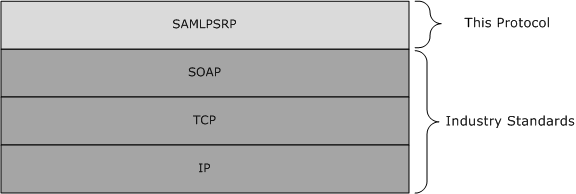
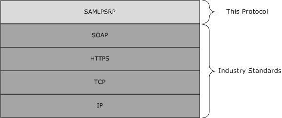

# [MS-SAMLPR]: Security Assertion Markup Language (SAML) Proxy Request Signing Protocol

Table of Contents

1 Introduction

- [1 Introduction](#Section_1)
  - [1.1 Glossary](#Section_1.1)
  - [1.2 References](#Section_1.2)
    - [1.2.1 Normative References](#Section_1.2.1)
    - [1.2.2 Informative References](#Section_1.2.2)
  - [1.3 Overview](#Section_1.3)
  - [1.4 Relationship to Other Protocols](#Section_1.4)
  - [1.5 Prerequisites/Preconditions](#Section_1.5)
  - [1.6 Applicability Statement](#Section_1.6)
  - [1.7 Versioning and Capability Negotiation](#Section_1.7)
  - [1.8 Vendor-Extensible Fields](#Section_1.8)
  - [1.9 Standards Assignments](#Section_1.9)

2 Messages

- [2 Messages](#Section_2)
  - [2.1 Transport](#Section_2.1)
  - [2.2 Common Message Syntax](#Section_2.2)
    - [2.2.1 Namespaces](#Section_2.2.1)
    - [2.2.2 Messages](#Section_2.2.2)
      - [2.2.2.1 SignMessageRequest](#Section_2.2.2.1)
      - [2.2.2.2 SignMessageResponse](#Section_2.2.2.2)
      - [2.2.2.3 VerifyMessageRequest](#Section_2.2.2.3)
      - [2.2.2.4 VerifyMessageResponse](#Section_2.2.2.4)
      - [2.2.2.5 IssueRequest](#Section_2.2.2.5)
      - [2.2.2.6 IssueResponse](#Section_2.2.2.6)
      - [2.2.2.7 LogoutRequest](#Section_2.2.2.7)
      - [2.2.2.8 LogoutResponse](#Section_2.2.2.8)
      - [2.2.2.9 CreateErrorMessageRequest](#Section_2.2.2.9)
      - [2.2.2.10 CreateErrorMessageResponse](#Section_2.2.2.10)
    - [2.2.3 Elements](#Section_2.2.3)
    - [2.2.4 Complex Types](#Section_2.2.4)
      - [2.2.4.1 RequestType](#Section_2.2.4.1)
      - [2.2.4.2 ResponseType](#Section_2.2.4.2)
      - [2.2.4.3 PrincipalType](#Section_2.2.4.3)
      - [2.2.4.4 SamlMessageType](#Section_2.2.4.4)
      - [2.2.4.5 PostBindingType](#Section_2.2.4.5)
      - [2.2.4.6 RedirectBindingType](#Section_2.2.4.6)
    - [2.2.5 Simple Types](#Section_2.2.5)
      - [2.2.5.1 LogoutStatusType](#Section_2.2.5.1)
      - [2.2.5.2 PrincipalTypes](#Section_2.2.5.2)
    - [2.2.6 Attributes](#Section_2.2.6)
    - [2.2.7 Groups](#Section_2.2.7)
    - [2.2.8 Attribute Groups](#Section_2.2.8)

3 Protocol Details

- [3 Protocol Details](#Section_3)
  - [3.1 Common Details](#Section_3.1)
    - [3.1.1 Abstract Data Model](#Section_3.1.1)
    - [3.1.2 Timers](#Section_3.1.2)
    - [3.1.3 Initialization](#Section_3.1.3)
    - [3.1.4 Message Processing Events and Sequencing Rules](#Section_3.1.4)
      - [3.1.4.1 SignMessage](#Section_3.1.4.1)
        - [3.1.4.1.1 Messages](#Section_3.1.4.1.1)
          - [3.1.4.1.1.1 SignMessageRequest](#Section_3.1.4.1.1.1)
          - [3.1.4.1.1.2 SignMessageResponse](#Section_3.1.4.1.1.2)
      - [3.1.4.2 VerifyMessage](#Section_3.1.4.2)
        - [3.1.4.2.1 Messages](#Section_3.1.4.2.1)
          - [3.1.4.2.1.1 VerifyMessageRequest](#Section_3.1.4.2.1.1)
          - [3.1.4.2.1.2 VerifyMessageResponse](#Section_3.1.4.2.1.2)
      - [3.1.4.3 Issue](#Section_3.1.4.3)
        - [3.1.4.3.1 Messages](#Section_3.1.4.3.1)
          - [3.1.4.3.1.1 IssueRequest](#Section_3.1.4.3.1.1)
          - [3.1.4.3.1.2 IssueResponse](#Section_3.1.4.3.1.2)
      - [3.1.4.4 Logout](#Section_3.1.4.4)
        - [3.1.4.4.1 Messages](#Section_3.1.4.4.1)
          - [3.1.4.4.1.1 LogoutRequest](#Section_3.1.4.4.1.1)
          - [3.1.4.4.1.2 LogoutResponse](#Section_3.1.4.4.1.2)
      - [3.1.4.5 CreateErrorMessage](#Section_3.1.4.5)
        - [3.1.4.5.1 Messages](#Section_3.1.4.5.1)
          - [3.1.4.5.1.1 CreateErrorMessageRequest](#Section_3.1.4.5.1.1)
          - [3.1.4.5.1.2 CreateErrorMessageResponse](#Section_3.1.4.5.1.2)
      - [3.1.4.6 Types Common to Multiple Operations](#Section_3.1.4.6)
        - [3.1.4.6.1 Complex Types](#Section_3.1.4.6.1)
          - [3.1.4.6.1.1 PrincipalType](#Section_3.1.4.6.1.1)
          - [3.1.4.6.1.2 SamlMessageType](#Section_3.1.4.6.1.2)
          - [3.1.4.6.1.3 PostBindingType](#Section_3.1.4.6.1.3)
          - [3.1.4.6.1.4 RedirectBindingType](#Section_3.1.4.6.1.4)
        - [3.1.4.6.2 Simple Types](#Section_3.1.4.6.2)
          - [3.1.4.6.2.1 LogoutStatusType](#Section_3.1.4.6.2.1)
          - [3.1.4.6.2.2 PrincipalTypes](#Section_3.1.4.6.2.2)
      - [3.1.4.7 Status Codes for Operations](#Section_3.1.4.7)
        - [3.1.4.7.1 Element <Status>](#Section_3.1.4.7.1)
        - [3.1.4.7.2 Element <StatusCode>](#Section_3.1.4.7.2)
        - [3.1.4.7.3 Element <StatusMessage>](#Section_3.1.4.7.3)
        - [3.1.4.7.4 Element <StatusDetail>](#Section_3.1.4.7.4)
    - [3.1.5 Timer Events](#Section_3.1.5)
    - [3.1.6 Other Local Events](#Section_3.1.6)
  - [3.2 Server Details](#Section_3.2)
    - [3.2.1 Abstract Data Model](#Section_3.2.1)
    - [3.2.2 Timers](#Section_3.2.2)
    - [3.2.3 Initialization](#Section_3.2.3)
    - [3.2.4 Message Processing Events and Sequencing Rules](#Section_3.2.4)
    - [3.2.5 Timer Events](#Section_3.2.5)
    - [3.2.6 Other Local Events](#Section_3.2.6)
  - [3.3 Client Details](#Section_3.3)
    - [3.3.1 Abstract Data Model](#Section_3.3.1)
    - [3.3.2 Timers](#Section_3.3.2)
    - [3.3.3 Initialization](#Section_3.3.3)
    - [3.3.4 Message Processing Events and Sequencing Rules](#Section_3.3.4)
    - [3.3.5 Timer Events](#Section_3.3.5)
    - [3.3.6 Other Local Events](#Section_3.3.6)

4 Protocol Examples

- [4 Protocol Examples](#Section_4)
  - [4.1 Issue Operation Examples](#Section_4.1)
    - [4.1.1 IssueRequest Example](#Section_4.1.1)
    - [4.1.2 IssueResponse Example](#Section_4.1.2)
    - [4.1.3 IssueResponse Example Using Artifact Binding](#Section_4.1.3)
  - [4.2 CreateErrorMessage Operation Examples](#Section_4.2)
    - [4.2.1 CreateErrorMessageRequest Example](#Section_4.2.1)
    - [4.2.2 CreateErrorMessageResponse Example](#Section_4.2.2)
  - [4.3 SignMessage Operation Examples](#Section_4.3)
    - [4.3.1 SignMessageRequest Example](#Section_4.3.1)
    - [4.3.2 SignMessageResponse Example](#Section_4.3.2)
  - [4.4 VerifyMessage Operation Examples](#Section_4.4)
    - [4.4.1 VerifyMessageRequest Example](#Section_4.4.1)
    - [4.4.2 VerifyMessageResponse Example](#Section_4.4.2)
    - [4.4.3 VerifyMessageResponse Example Using Redirect Binding](#Section_4.4.3)
  - [4.5 Logout Operations Examples](#Section_4.5)
    - [4.5.1 LogoutRequest Example](#Section_4.5.1)
    - [4.5.2 LogoutResponse Example](#Section_4.5.2)
    - [4.5.3 LogoutRequest Example - Locally Initiated](#Section_4.5.3)
    - [4.5.4 LogoutResponse Example:Final Response to Locally Initiated Request](#Section_4.5.4)
    - [4.5.5 LogoutRequest Example with SAMLResponse and RelayState](#Section_4.5.5)
    - [4.5.6 LogoutResponse Example with SAMLRequest and RelayState](#Section_4.5.6)

5 Security

- [5 Security](#Section_5)
  - [5.1 Security Considerations for Implementers](#Section_5.1)
  - [5.2 Index of Security Parameters](#Section_5.2)

6 Appendix A: Full WSDL

- [6 Appendix A: Full WSDL](#Section_6)

7 Appendix B: Product Behavior

- [7 Appendix B: Product Behavior](#Section_7)

8 Change Tracking

- [8 Change Tracking](#Section_8)

For the legal notice and IP terms, see [LEGAL.md](../LEGAL.md).
Last updated: 6/1/2017.
See [Revision History](#revision-history) for full version history.

# 1 Introduction

This document specifies the Security Assertion Markup Language (SAML) Proxy Request Signing Protocol, which allows proxy servers to perform operations that require knowledge of configured keys and other state information about federated sites known by the [**Security Token Service (STS)**](#gt_security-token-service-sts) server.

Sections 1.5, 1.8, 1.9, 2, and 3 of this specification are normative. All other sections and examples in this specification are informative.

## 1.1 Glossary

This document uses the following terms:

**Active Directory Federation Services (AD FS) Proxy Server**: An AD FS 2.0 service that processes SAML Federation Protocol messages. [**AD FS proxy servers**](#gt_950941f2-f7d8-4317-b347-810ee1c540be) are clients for the Security Assertion Markup Language (SAML) Proxy Request Signing Protocol (SAMLPR).

**Active Directory Federation Services (AD FS) Security Token Service (STS)**: An AD FS 2.0 service that holds configuration information about federated sites. [**AD FS STS**](#gt_a4dc09d4-b9df-4453-bd58-3be7d6c71b98) servers are servers for the Security Assertion Markup Language (SAML) Proxy Request Signing Protocol (SAMLPR).

**certificate**: A certificate is a collection of attributes and extensions that can be stored persistently. The set of attributes in a certificate can vary depending on the intended usage of the certificate. A certificate securely binds a public key to the entity that holds the corresponding private key. A certificate is commonly used for authentication and secure exchange of information on open networks, such as the Internet, extranets, and intranets. Certificates are digitally signed by the issuing certification authority (CA) and can be issued for a user, a computer, or a service. The most widely accepted format for certificates is defined by the ITU-T X.509 version 3 international standards. For more information about attributes and extensions, see [[RFC3280]](https://go.microsoft.com/fwlink/?LinkId=90414) and [[X509]](https://go.microsoft.com/fwlink/?LinkId=90590) sections 7 and 8.

**SAML Artifact Binding**: A method of transmitting [**SAML messages**](#gt_saml-message) via references in HTTP messages, as specified in [[SamlBinding]](https://go.microsoft.com/fwlink/?LinkId=182222) section 3.6.

**SAML Identity Provider (IdP)**: A provider of [**SAML**](#gt_security-assertion-markup-language-saml) assertions, as specified in [[SAMLCore2]](https://go.microsoft.com/fwlink/?LinkId=216915) section 2.

**SAML Message**: A [**SAML**](#gt_security-assertion-markup-language-saml) protocol message, as specified in [SAMLCore2] and [SamlBinding].

**SAML Post Binding**: A method of transmitting [**SAML messages**](#gt_saml-message) via HTTP POST actions, as specified in [SamlBinding] section 3.5.

**SAML Redirect Binding**: A method of transmitting [**SAML messages**](#gt_saml-message) via HTTP redirects, as specified in [SamlBinding] section 3.4.

**SAML Service Provider (SP)**: A consumer of [**SAML**](#gt_security-assertion-markup-language-saml) assertions, as specified in [SAMLCore2] section 2.

**Security Assertion Markup Language (SAML)**: The set of specifications that describe security assertions encoded in XML, profiles for attaching assertions to protocols and frameworks, request/response protocols used to obtain assertions, and the protocol bindings to transfer protocols, such as [**SOAP**](#gt_soap) and HTTP.

**security token service (STS)**: A web service that issues security tokens. That is, it makes assertions based on evidence that it trusts; these assertions are for consumption by whoever trusts it.

**SHA-1 hash**: A hashing algorithm as specified in [[FIPS180-2]](https://go.microsoft.com/fwlink/?LinkId=89868) that was developed by the National Institute of Standards and Technology (NIST) and the National Security Agency (NSA).

**SOAP**: A lightweight protocol for exchanging structured information in a decentralized, distributed environment. [**SOAP**](#gt_soap) uses XML technologies to define an extensible messaging framework, which provides a message construct that can be exchanged over a variety of underlying protocols. The framework has been designed to be independent of any particular programming model and other implementation-specific semantics. SOAP 1.2 supersedes SOAP 1.1. See [[SOAP1.2-1/2003]](https://go.microsoft.com/fwlink/?LinkId=90521).

**SOAP body**: A container for the payload data being delivered by a [**SOAP message**](#gt_soap-message) to its recipient. See [[SOAP1.2-1/2007]](https://go.microsoft.com/fwlink/?LinkId=94664) section 5.3 for more information.

**SOAP message**: An XML document consisting of a mandatory SOAP envelope, an optional SOAP header, and a mandatory [**SOAP body**](#gt_soap-body). See [SOAP1.2-1/2007] section 5 for more information.

**Uniform Resource Locator (URL)**: A string of characters in a standardized format that identifies a document or resource on the World Wide Web. The format is as specified in [[RFC1738]](https://go.microsoft.com/fwlink/?LinkId=90287).

**Web Services Description Language (WSDL)**: An XML format for describing network services as a set of endpoints that operate on messages that contain either document-oriented or procedure-oriented information. The operations and messages are described abstractly and are bound to a concrete network protocol and message format in order to define an endpoint. Related concrete endpoints are combined into abstract endpoints, which describe a network service. WSDL is extensible, which allows the description of endpoints and their messages regardless of the message formats or network protocols that are used.

**XML namespace**: A collection of names that is used to identify elements, types, and attributes in XML documents identified in a URI reference [[RFC3986]](https://go.microsoft.com/fwlink/?LinkId=90453). A combination of XML namespace and local name allows XML documents to use elements, types, and attributes that have the same names but come from different sources. For more information, see [[XMLNS-2ED]](https://go.microsoft.com/fwlink/?LinkId=90602).

**XML Schema (XSD)**: A language that defines the elements, attributes, namespaces, and data types for XML documents as defined by [[XMLSCHEMA1/2]](https://go.microsoft.com/fwlink/?LinkId=90607) and [[W3C-XSD]](https://go.microsoft.com/fwlink/?LinkId=90563) standards. An XML schema uses XML syntax for its language.

**MAY, SHOULD, MUST, SHOULD NOT, MUST NOT:** These terms (in all caps) are used as defined in [[RFC2119]](https://go.microsoft.com/fwlink/?LinkId=90317). All statements of optional behavior use either MAY, SHOULD, or SHOULD NOT.

## 1.2 References

Links to a document in the Microsoft Open Specifications library point to the correct section in the most recently published version of the referenced document. However, because individual documents in the library are not updated at the same time, the section numbers in the documents may not match. You can confirm the correct section numbering by checking the [Errata](http://msdn.microsoft.com/en-us/library/dn781092.aspx).

### 1.2.1 Normative References

We conduct frequent surveys of the normative references to assure their continued availability. If you have any issue with finding a normative reference, please contact [dochelp@microsoft.com](mailto:dochelp@microsoft.com). We will assist you in finding the relevant information.

[RFC2119] Bradner, S., "Key words for use in RFCs to Indicate Requirement Levels", BCP 14, RFC 2119, March 1997, [http://www.rfc-editor.org/rfc/rfc2119.txt](https://go.microsoft.com/fwlink/?LinkId=90317)

[SamlBinding] Cantor, S., Hirsch, F., Kemp, J., et al., "Bindings for the OASIS Security Assertion Markup Language (SAML) V2.0", March 2005, [http://docs.oasis-open.org/security/saml/v2.0/saml-bindings-2.0-os.pdf](https://go.microsoft.com/fwlink/?LinkId=182222)

[SAMLCore2] Cantor, S., Kemp, J., Philpott, R., and Maler, E., Eds., "Assertions and Protocol for the OASIS Security Assertion Markup Language (SAML) V2.0", March 2005, [http://docs.oasis-open.org/security/saml/v2.0/saml-core-2.0-os.pdf](https://go.microsoft.com/fwlink/?LinkId=216915)

[SOAP1.2-1/2003] Gudgin, M., Hadley, M., Mendelsohn, N., et al., "SOAP Version 1.2 Part 1: Messaging Framework", W3C Recommendation, June 2003, [http://www.w3.org/TR/2003/REC-soap12-part1-20030624](https://go.microsoft.com/fwlink/?LinkId=90521)

[WSAddressing] Box, D., et al., "Web Services Addressing (WS-Addressing)", August 2004, [http://www.w3.org/Submission/ws-addressing/](https://go.microsoft.com/fwlink/?LinkId=90575)

[WSDL] Christensen, E., Curbera, F., Meredith, G., and Weerawarana, S., "Web Services Description Language (WSDL) 1.1", W3C Note, March 2001, [http://www.w3.org/TR/2001/NOTE-wsdl-20010315](https://go.microsoft.com/fwlink/?LinkId=90577)

[WSSC1.3] Lawrence, K., Kaler, C., Nadalin, A., et al., "WS-SecureConversation 1.3", March 2007, [http://docs.oasis-open.org/ws-sx/ws-secureconversation/200512/ws-secureconversation-1.3-os.html](https://go.microsoft.com/fwlink/?LinkId=131545)

[WSSU1.0] OASIS Standard, "WS Security Utility 1.0", 2004, [http://docs.oasis-open.org/wss/2004/01/oasis-200401-wss-wssecurity-utility-1.0.xsd](https://go.microsoft.com/fwlink/?LinkId=161007)

[WSTrust] IBM, Microsoft, Nortel, VeriSign, "WS-Trust V1.0", February 2005, [http://specs.xmlsoap.org/ws/2005/02/trust/WS-Trust.pdf](https://go.microsoft.com/fwlink/?LinkId=90584)

[XMLNS] Bray, T., Hollander, D., Layman, A., et al., Eds., "Namespaces in XML 1.0 (Third Edition)", W3C Recommendation, December 2009, [http://www.w3.org/TR/2009/REC-xml-names-20091208/](https://go.microsoft.com/fwlink/?LinkId=191840)

[XMLSCHEMA1] Thompson, H., Beech, D., Maloney, M., and Mendelsohn, N., Eds., "XML Schema Part 1: Structures", W3C Recommendation, May 2001, [http://www.w3.org/TR/2001/REC-xmlschema-1-20010502/](https://go.microsoft.com/fwlink/?LinkId=90608)

[XMLSCHEMA2] Biron, P.V., Ed. and Malhotra, A., Ed., "XML Schema Part 2: Datatypes", W3C Recommendation, May 2001, [http://www.w3.org/TR/2001/REC-xmlschema-2-20010502/](https://go.microsoft.com/fwlink/?LinkId=90610)

### 1.2.2 Informative References

[WS-Trust1.3] Nadalin, A., Goodner, M., Gudgin, M., Barbir, A., Granqvist, H., "WS-Trust 1.3", OASIS Standard 19 March 2007, [http://docs.oasis-open.org/ws-sx/ws-trust/200512/ws-trust-1.3-os.html](https://go.microsoft.com/fwlink/?LinkID=183838&clcid=0x409)

## 1.3 Overview

The Security Assertion Markup Language (SAML) Proxy Request Signing Protocol (SAMLPR) provides the capability for [**AD FS proxy servers**](#gt_950941f2-f7d8-4317-b347-810ee1c540be) to have the [**AD FS STS**](#gt_a4dc09d4-b9df-4453-bd58-3be7d6c71b98) server for an installation perform operations that require knowledge of the configured keys and other state information about federated sites known by the [**Security Token Service (STS)**](#gt_security-token-service-sts) server. For more information, see [[WS-Trust1.3]](https://go.microsoft.com/fwlink/?LinkID=183838&clcid=0x409). In particular, proxy servers use the SAMLPR Protocol to have the STS server in an installation perform [**SAML**](#gt_security-assertion-markup-language-saml) (see [[SAMLCore2]](https://go.microsoft.com/fwlink/?LinkId=216915) and [[SamlBinding]](https://go.microsoft.com/fwlink/?LinkId=182222)) signature operations upon messages to be sent. Multiple proxy servers can use a single STS server.

The protocol is stateless, with the parameters of each message being fully self-contained.

## 1.4 Relationship to Other Protocols

The Security Assertion Markup Language (SAML) Proxy Request Signing Protocol (SAMLPR) uses [**SOAP**](#gt_soap) over TCP for local connections, as shown in the following layering diagram:

Figure 1: SAMLPR SOAP over TCP layer diagram

The Security Assertion Markup Language (SAML) Proxy Request Signing Protocol (SAMLPR) uses SOAP over HTTPS for remote connections, as shown in the following layering diagram:

Figure 2: SAMLPR SOAP over HTTPS layer diagram

## 1.5 Prerequisites/Preconditions

The client is configured with the [**Uniform Resource Locator (URL)**](#gt_uniform-resource-locator-url) of the server's [**SOAP**](#gt_soap) service in order to call the service.

## 1.6 Applicability Statement

The SAMLPR Protocol is used by services that perform [**SAML**](#gt_security-assertion-markup-language-saml) signature operations for proxy servers by [**STS**](#gt_security-token-service-sts) servers in a manner that is compatible with AD FS 2.0.

## 1.7 Versioning and Capability Negotiation

This protocol uses the versioning mechanisms defined in the following specification:

- [**SOAP**](#gt_soap) 1.2, as specified in [[SOAP1.2-1/2003]](https://go.microsoft.com/fwlink/?LinkId=90521).
This protocol does not perform any capability negotiation.

## 1.8 Vendor-Extensible Fields

The schema for this protocol provides for extensibility points for additional elements to be added to each [**SOAP message**](#gt_soap-message) body. Elements within these extensibility points that are not understood are ignored.

## 1.9 Standards Assignments

There are no standards assignments for this protocol beyond those defined in the following specification:

- [**SOAP**](#gt_soap) 1.2, as specified in [[SOAP1.2-1/2003]](https://go.microsoft.com/fwlink/?LinkId=90521).

# 2 Messages

## 2.1 Transport

The Security Assertion Markup Language (SAML) Proxy Request Signing Protocol uses [**SOAP**](#gt_soap), as specified in [[SOAP1.2-1/2003]](https://go.microsoft.com/fwlink/?LinkId=90521), over TCP locally or HTTPS remotely, for communication.

## 2.2 Common Message Syntax

This section contains no common definitions used by this protocol.

### 2.2.1 Namespaces

This specification defines and references various [**XML namespaces**](#gt_xml-namespace) using the mechanisms specified in [[XMLNS]](https://go.microsoft.com/fwlink/?LinkId=191840). Although this specification associates a specific XML namespace prefix for each XML namespace that is used, the choice of any particular XML namespace prefix is implementation-specific and not significant for interoperability.

| Prefix | Namespace URI | Reference |
| --- | --- | --- |
| s | http://www.w3.org/2003/05/soap-envelope | [[SOAP1.2-1/2003]](https://go.microsoft.com/fwlink/?LinkId=90521) |
| xs | http://www.w3.org/2001/XMLSchema | [[XMLSCHEMA1]](https://go.microsoft.com/fwlink/?LinkId=90608) and [[XMLSCHEMA2]](https://go.microsoft.com/fwlink/?LinkId=90610) |
| a | http://schemas.xmlsoap.org/ws/2004/08/addressing | [[WSAddressing]](https://go.microsoft.com/fwlink/?LinkId=90575) section 1.2 |
| msis | http://schemas.microsoft.com/ws/2009/12/identityserver/samlprotocol | This document ([MS-SAMLPR]) |
| samlp | urn:oasis:names:tc:SAML:2.0:protocol | [[SAMLCore2]](https://go.microsoft.com/fwlink/?LinkId=216915) |
| saml | urn:oasis:names:tc:SAML:2.0:assertion | [SAMLCore2] |
| wst | http://docs.oasis-open.org/ws-sx/ws-trust/200512 | [[WSTrust]](https://go.microsoft.com/fwlink/?LinkId=90584) |
| wssc | http://docs.oasis-open.org/ws-sx/ws-secureconversation/200512 | [[WSSC1.3]](https://go.microsoft.com/fwlink/?LinkId=131545) |
| wssu | http://docs.oasis-open.org/wss/2004/01/oasis-200401-wss-wssecurity-utility-1.0.xsd | [[WSSU1.0]](https://go.microsoft.com/fwlink/?LinkId=161007) |

### 2.2.2 Messages

| Message | Description |
| --- | --- |
| SignMessageRequest | A message that requests that a [**SAML Message**](#gt_saml-message) signature be applied to a SAML Message, if the configuration for the requested principal specifies that messages are to be signed. |
| SignMessageResponse | A reply message to SignMessageRequest, containing the resulting SAML Message, which is signed, if the configuration for the requested principal specifies that messages are to be signed. |
| VerifyMessageRequest | A message that requests verification that a SAML Message is from a known party and signed according to the metadata directives for that party. |
| VerifyMessageResponse | A reply message to the VerifyMessageRequest message, containing a Boolean result. |
| IssueRequest | A message requesting issuance of a [**SAML**](#gt_security-assertion-markup-language-saml) token. |
| IssueResponse | A reply message to the IssueRequest message containing a SAML response message. |
| LogoutRequest | A message requesting that a SAML logout be performed. |
| LogoutResponse | A reply message to the LogoutRequest message containing updated SessionState and LogoutState values. |
| CreateErrorMessageRequest | A message that requests creation of a SAML error message, which will be signed, if the configuration for the requested principal specifies that messages are to be signed. |
| CreateErrorMessageResponse | A reply message to the CreateErrorMessageRequest message containing the created SAML error message. |

#### 2.2.2.1 SignMessageRequest

The SignMessageRequest message requests that a [**SAML Message**](#gt_saml-message) signature be applied to a SAML Message, if the configuration for the requested principal specifies that messages are to be signed. It is used by the following message:

| Message type | Action URI |
| --- | --- |
| Request | http://schemas.microsoft.com/ws/2009/12/identityserver/samlprotocol/ProcessRequest |

**body**: The [**SOAP body**](#gt_soap-body) MUST contain a single msis:SignMessageRequest element with the following type:

<complexType name="SignMessageRequestType">

<complexContent>

<extension base="msis:RequestType">

<sequence>

<element name="ActivityId" type="string"/>

<element name="Message" type="msis:SamlMessageType"/>

<element name="Principal" type="msis:PrincipalType"/>

<any namespace="##other" processContents="lax" minOccurs="0" maxOccurs="unbounded" />

</sequence>

</extension>

</complexContent>

</complexType>

**ActivityId**: An opaque string supplied by the caller to track the activity to which this message pertains.

**Message**: A complex type representing a [**SAML**](#gt_security-assertion-markup-language-saml) Protocol message.

**Principal**: A complex type representing a SAML EntityId for a [**SAML Identity Provider (IdP)**](#gt_saml-identity-provider-idp), a [**SAML Service Provider (SP)**](#gt_saml-service-provider-sp), or this [**STS**](#gt_security-token-service-sts) server.

#### 2.2.2.2 SignMessageResponse

A SignMessageResponse message is a reply message to SignMessageRequest, containing the resulting [**SAML Message**](#gt_saml-message), which is signed, if the configuration for the requested principal specifies that messages are to be signed. It is used by the following message:

| Message type | Action URI |
| --- | --- |
| Response | http://schemas.microsoft.com/ws/2009/12/identityserver/samlprotocol/ProcessRequestResponse |

**body**: The [**SOAP body**](#gt_soap-body) MUST contain a single msis:SignMessageResponse element with the following type:

<complexType name="SignMessageResponseType">

<complexContent>

<extension base="msis:ResponseType">

<sequence>

<element name="Message" type="msis:SamlMessageType"/>

<any namespace="##other" processContents="lax" minOccurs="0" maxOccurs="unbounded" />

</sequence>

</extension>

</complexContent>

</complexType>

**Message**: A complex type representing a [**SAML**](#gt_security-assertion-markup-language-saml) Protocol message.

#### 2.2.2.3 VerifyMessageRequest

The VerifyMessageRequest message requests verification that a [**SAML Message**](#gt_saml-message) is from a known party and signed according to the metadata directives for that party. It is used by the following message:

| Message type | Action URI |
| --- | --- |
| Request | http://schemas.microsoft.com/ws/2009/12/identityserver/samlprotocol/ProcessRequest |

**body**: The [**SOAP body**](#gt_soap-body) MUST contain a single msis:VerifyMessageRequest element with the following type:

<complexType name="VerifyMessageRequestType" >

<complexContent>

<extension base="msis:RequestType">

<sequence>

<element name="ActivityId" type="string"/>

<element name="Message" type="msis:SamlMessageType"/>

<any namespace="##other" processContents="lax" minOccurs="0" maxOccurs="unbounded" />

</sequence>

</extension>

</complexContent>

</complexType>

**ActivityId**: An opaque string supplied by the caller to track the activity to which this message pertains.

**Message**: A complex type representing a [**SAML**](#gt_security-assertion-markup-language-saml) Protocol message.

#### 2.2.2.4 VerifyMessageResponse

The VerifyMessageResponse message is a reply to VerifyMessageRequest, containing a Boolean result. It is used by the following message:

| Message type | Action URI |
| --- | --- |
| Response | http://schemas.microsoft.com/ws/2009/12/identityserver/samlprotocol/ProcessRequestResponse |

**body**: The [**SOAP body**](#gt_soap-body) MUST contain a single msis:VerifyMessageResponse element with the following type:

<complexType name="VerifyMessageResponseType" >

<complexContent>

<extension base="msis:ResponseType">

<sequence>

<element name="IsVerified" type="boolean"/>

<any namespace="##other" processContents="lax" minOccurs="0" maxOccurs="unbounded" />

</sequence>

</extension>

</complexContent>

</complexType>

**IsVerified**: A Boolean result indicating whether a [**SAML Message**](#gt_saml-message) is from a known party and signed according to the metadata directives for that party.

#### 2.2.2.5 IssueRequest

The IssueRequest message requests the issuance of a [**SAML**](#gt_security-assertion-markup-language-saml) token. It is used by the following message:

| Message type | Action URI |
| --- | --- |
| Request | http://schemas.microsoft.com/ws/2009/12/identityserver/samlprotocol/ProcessRequest |

**body**: The [**SOAP body**](#gt_soap-body) MUST contain a single msis:IssueRequest element with the following type:

<complexType name="IssueRequestType" >

<complexContent>

<extension base="msis:RequestType">

<sequence>

<element name="ActivityId" type="string"/>

<element name="Message" type="msis:SamlMessageType"/>

<element name="OnBehalfOf" type="wst:OnBehalfOfType"/>

<element name="SessionState" type="string"/>

<any namespace="##other" processContents="lax" minOccurs="0" maxOccurs="unbounded" />

</sequence>

</extension>

</complexContent>

</complexType>

**ActivityId**: An opaque string supplied by the caller to track the activity to which this message pertains.

**Message**: A complex type representing a SAML Protocol message.

**OnBehalfOf**: A complex type representing the party to issue the token for.

**SessionState**: A structured string representing the information required to log out from this session.

#### 2.2.2.6 IssueResponse

The IssueResponse message is a reply to IssueRequest, containing a [**SAML**](#gt_security-assertion-markup-language-saml) response message. It is used by the following message:

| Message type | Action URI |
| --- | --- |
| Response | http://schemas.microsoft.com/ws/2009/12/identityserver/samlprotocol/ProcessRequestResponse |

**body**: The [**SOAP body**](#gt_soap-body) MUST contain a single msis:IssueResponse element with the following type:

<complexType name="IssueResponseType">

<complexContent>

<extension base="msis:ResponseType">

<sequence>

<element name="Message" minOccurs="0" type="msis:SamlMessageType"/>

<element name="SessionState" type="string"/>

<element name="AuthenticatingProvider" type="string"/>

<any namespace="##other" processContents="lax" minOccurs="0" maxOccurs="unbounded" />

</sequence>

</extension>

</complexContent>

</complexType>

**Message**: A complex type representing a SAML Protocol message.

**SessionState**: A structured string representing the information required to log out from this session.

**AuthenticatingProvider**: The URI of a claims provider or a local [**STS**](#gt_security-token-service-sts) identifier, depending upon where the user authenticated.

#### 2.2.2.7 LogoutRequest

The LogoutRequest message requests that a [**SAML**](#gt_security-assertion-markup-language-saml) logout be performed. It is used by the following message:

| Message type | Action URI |
| --- | --- |
| Request | http://schemas.microsoft.com/ws/2009/12/identityserver/samlprotocol/ProcessRequest |

**body**: The [**SOAP body**](#gt_soap-body) MUST contain a single msis:LogoutRequest element with the following type:

<complexType name="LogoutRequestType" >

<complexContent>

<extension base="msis:RequestType">

<sequence>

<element name="ActivityId" type="string"/>

<element name="Message" minOccurs="0" type="msis:SamlMessageType"/>

<element name="SessionState" type="string"/>

<element name="LogoutState" type="string"/>

<any namespace="##other" processContents="lax" minOccurs="0" maxOccurs="unbounded" />

</sequence>

</extension>

</complexContent>

</complexType>

**ActivityId**: An opaque string supplied by the caller to track the activity that this message pertains to.

**Message**: A complex type representing a SAML protocol message.

**SessionState**: A structured string representing the information required to log out from this session.

**LogoutState**: A structured string representing additional information required to log out from this session.

#### 2.2.2.8 LogoutResponse

The LogoutResponse message is a reply to LogoutRequest, containing updated SessionState and LogoutState values. It is used by the following message:

| Message type | Action URI |
| --- | --- |
| Response | http://schemas.microsoft.com/ws/2009/12/identityserver/samlprotocol/ProcessRequestResponse |

**body**: The [**SOAP body**](#gt_soap-body) MUST contain a single msis:LogoutResponse element with the following type:

<complexType name="LogoutResponseType">

<complexContent>

<extension base="msis:ResponseType">

<sequence>

<element name="LogoutStatus" type="msis:LogoutStatusType"/>

<element name="Message" type="msis:SamlMessageType" minOccurs="0"/>

<element name="SessionState" type="string"/>

<element name="LogoutState" type="string"/>

<any namespace="##other" processContents="lax" minOccurs="0" maxOccurs="unbounded" />

</sequence>

</extension>

</complexContent>

</complexType>

**LogoutStatus**: A complex type representing the status of the logout process.

**Message**: A complex type representing a [**SAML**](#gt_security-assertion-markup-language-saml) Protocol message.

**SessionState**: A structured string representing the information required to log out from this session.

**LogoutState**: A structured string representing additional information required to log out from this session.

#### 2.2.2.9 CreateErrorMessageRequest

The CreateErrorMessageRequest message requests the creation of a [**SAML**](#gt_security-assertion-markup-language-saml) error message, which will be signed, if the configuration for the requested principal specifies that messages are to be signed. It is used by the following message:

| Message type | Action URI |
| --- | --- |
| Request | http://schemas.microsoft.com/ws/2009/12/identityserver/samlprotocol/ProcessRequest |

**body**: The [**SOAP body**](#gt_soap-body) MUST contain a single msis:CreateErrorMessageRequest element with the following type:

<complexType name="CreateErrorMessageRequestType">

<complexContent>

<extension base="msis:RequestType">

<sequence>

<element name="ActivityId" type="string"/>

<element name="Message" type="msis:SamlMessageType"/>

<element name="Principal" type="msis:PrincipalType"/>

<any namespace="##other" processContents="lax" minOccurs="0" maxOccurs="unbounded" />

</sequence>

</extension>

</complexContent>

</complexType>

**ActivityId**: An opaque string supplied by the caller to track the activity to which this message pertains.

**Message**: A complex type representing a SAML Protocol message.

**Principal**: A complex type representing a SAML EntityId for a [**SAML IdP**](#gt_saml-identity-provider-idp), a [**SAML SP**](#gt_saml-service-provider-sp), or this [**STS**](#gt_security-token-service-sts) server.

#### 2.2.2.10 CreateErrorMessageResponse

The CreateErrorMessageResponse message is a reply to CreateErrorMessageRequest, containing the created [**SAML**](#gt_security-assertion-markup-language-saml) error message. It is used by the following messages:

| Message type | Action URI |
| --- | --- |
| Response | http://schemas.microsoft.com/ws/2009/12/identityserver/samlprotocol/ProcessRequestResponse |

**body**: The [**SOAP body**](#gt_soap-body) MUST contain a single msis:CreateErrorMessageResponse element with the following type:

<complexType name="CreateErrorMessageResponseType">

<complexContent>

<extension base="msis:ResponseType">

<sequence>

<element name="Message" type="msis:SamlMessageType"/>

<any namespace="##other" processContents="lax" minOccurs="0" maxOccurs="unbounded" />

</sequence>

</extension>

</complexContent>

</complexType>

**Message**: A complex type representing a SAML Protocol message.

### 2.2.3 Elements

This specification does not define any common [**XML Schema**](#gt_xml-schema-xsd) element definitions.

### 2.2.4 Complex Types

The following table summarizes the set of common XML schema complex type definitions defined by this specification. XML schema complex type definitions that are specific to a particular operation are described with the operation.

| Complex type | Description |
| --- | --- |
| RequestType | An abstract type containing protocol request message parameters. |
| ResponseType | An abstract type containing protocol response messages parameters. |
| PrincipalType | A structure containing a PrincipalTypes value and an identifier for the principal. |
| SamlMessageType | A structure containing a representation of a [**SAML**](#gt_security-assertion-markup-language-saml) Protocol message. |
| PostBindingType | A structure containing SAML binding information for a [**SAML post binding**](#gt_saml-post-binding). |
| RedirectBindingType | A structure containing SAML binding information for a [**SAML redirect binding**](#gt_saml-redirect-binding). |

#### 2.2.4.1 RequestType

This abstract type contains request message parameters for messages using this protocol. The schema for this type MUST be as follows:

<complexType name="RequestType" abstract="true"/>

#### 2.2.4.2 ResponseType

This abstract type contains response message parameters for messages using this protocol. The schema for this type MUST be as follows:

<complexType name="ResponseType" abstract="true"/>

#### 2.2.4.3 PrincipalType

This structure contains a PrincipalTypes value and an identifier for the principal. The schema for this type MUST be as follows:

<complexType name="PrincipalType">

<sequence>

<element name="Type" type="msis:PrincipalTypes"/>

<element name="Identifier" type="string"/>

</sequence>

</complexType>

**Type**: A PrincipalTypes enumeration value identifying the type of the [**SAML**](#gt_security-assertion-markup-language-saml) principal.

**Identifier**: An identifier for the SAML principal. This is a SAML EntityId.

#### 2.2.4.4 SamlMessageType

This structure contains a representation of a [**SAML**](#gt_security-assertion-markup-language-saml) Protocol message. The schema for this type MUST be as follows:

<complexType name="SamlMessageType">

<sequence>

<element name="BaseUri" type="anyURI"/>

<choice>

<element name="SAMLart" type="string"/>

<element name="SAMLRequest" type="string"/>

<element name="SAMLResponse" type="string"/>

</choice>

<choice>

<element name="PostBindingInformation" type="msis:PostBindingType"/>

<element name="RedirectBindingInformation" type="msis:RedirectBindingType"/>

</choice>

</sequence>

</complexType>

**BaseUri**: The [**URL**](#gt_uniform-resource-locator-url) to post message to.

**SAMLart**: A SAML artifact identifier, base64-encoded as per [[SamlBinding]](https://go.microsoft.com/fwlink/?LinkId=182222) section 3.6.

**SAMLRequest**: A SAML request message, base64-encoded as per [SamlBinding] sections 3.4 and 3.5.

**SAMLResponse**: A SAML response message, base64-encoded as per [SamlBinding] sections 3.4 and 3.5.

**PostBindingInformation**: Information about the [**SAML Message**](#gt_saml-message) using the [**SAML post binding**](#gt_saml-post-binding), as per [SamlBinding] section 3.5.

**RedirectBindingInformation**: Information about the SAML Message using the [**SAML redirect binding**](#gt_saml-redirect-binding), as per [SamlBinding] section 3.4.

#### 2.2.4.5 PostBindingType

This structure contains [**SAML**](#gt_security-assertion-markup-language-saml) binding information for a [**SAML post binding**](#gt_saml-post-binding). The schema for this type MUST be as follows:

<complexType name="PostBindingType">

<sequence>

<element name="RelayState" minOccurs="0" type="string"/>

</sequence>

</complexType>

**RelayState**: An opaque BLOB that, if present in the request, MUST be returned in the response, as per [[SamlBinding]](https://go.microsoft.com/fwlink/?LinkId=182222) section 3.5.3.

#### 2.2.4.6 RedirectBindingType

This structure contains [**SAML**](#gt_security-assertion-markup-language-saml) binding information for a [**SAML redirect binding**](#gt_saml-redirect-binding). The schema for this type MUST be as follows:

<complexType name="RedirectBindingType">

<sequence>

<element name="RelayState" minOccurs="0" type="string"/>

<sequence minOccurs="0">

<element name="Signature" type="string"/>

<element name="SigAlg" type="string"/>

<element name="QueryStringHash" minOccurs="0" type="string"/>

</sequence>

</sequence>

</complexType>

**RelayState**: An opaque BLOB that, if present in the request, MUST be returned in the response, as per [[SamlBinding]](https://go.microsoft.com/fwlink/?LinkId=182222) section 3.4.3.

**Signature**: The message signature (if present), encoded as per [SamlBinding] section 3.4.4.1.

**SigAlg**: The message signature algorithm (if present), as per [SamlBinding] section 3.4.4.1.

**QueryStringHash**: A base64-encoded [**SHA-1 hash**](#gt_sha-1-hash) of the redirect query string (if present), for integrity purposes, as per [SamlBinding] section 3.6.4.

### 2.2.5 Simple Types

The following table summarizes the set of common XML schema simple type definitions defined by this specification. XML schema simple type definitions that are specific to a particular operation are described with the operation.

| Simple type | Description |
| --- | --- |
| LogoutStatusType | An enumeration of status values for logout operations. |
| PrincipalTypes | An enumeration of the types of [**SAML**](#gt_security-assertion-markup-language-saml) principals. |

#### 2.2.5.1 LogoutStatusType

This type enumerates the set of status values for logout operations. The schema for this type MUST be as follows:

<simpleType name="LogoutStatusType">

<restriction base="string">

<enumeration value="InProgress" />

<enumeration value="LogoutPartial" />

<enumeration value="LogoutSuccess" />

</restriction>

</simpleType>

**InProgress**: Indicates that more logout work is required to be performed.

**LogoutPartial:** Indicates that the logout process is complete, but all session participants might not have been logged out.

**LogoutSuccess:** Indicates the logout process is complete, with all session participants logged out.

#### 2.2.5.2 PrincipalTypes

This type enumerates the set of types of [**SAML**](#gt_security-assertion-markup-language-saml) principals. The schema for this type MUST be as follows:

<simpleType name="PrincipalTypes">

<restriction base="string">

<enumeration value="Self" />

<enumeration value="Scope" />

<enumeration value="Authority" />

</restriction>

</simpleType>

**Self**: Indicates that the principal is this [**STS**](#gt_security-token-service-sts) server.

**Scope**: Indicates that the principal is a [**SAML Service Provider**](#gt_saml-service-provider-sp), identified by an Entity Identifier, as per [[SAMLCore2]](https://go.microsoft.com/fwlink/?LinkId=216915) section 8.3.6.

**Authority**: Indicates that the principal is a [**SAML Identity Provider**](#gt_saml-identity-provider-idp), identified by an Entity Identifier, as per [SAMLCore2] section 8.3.6.

### 2.2.6 Attributes

This specification does not define any common XML schema attribute definitions.

### 2.2.7 Groups

This specification does not define any common XML schema group definitions.

### 2.2.8 Attribute Groups

This specification does not define any common XML schema attribute group definitions.

# 3 Protocol Details

## 3.1 Common Details

This section describes protocol details that are common among multiple port types.

### 3.1.1 Abstract Data Model

This section describes a conceptual model of possible data organization that an implementation maintains to participate in this protocol. The described organization is provided to facilitate the explanation of how the protocol behaves. This document does not mandate that implementations adhere to this model as long as their external behavior is consistent with that described in this document.

The SAMLPR Protocol enables proxy servers to have [**STS**](#gt_security-token-service-sts) servers perform operations requiring state held at the STS server. Other than standard [**SOAP**](#gt_soap) request/response protocol state that is not specific to this protocol, no state about the protocol is maintained at either the protocol client or server.

### 3.1.2 Timers

There are no protocol-specific timer events that MUST be serviced by an implementation. This protocol does not require timers beyond those that are used by the underlying transport to transmit and receive [**SOAP messages**](#gt_soap-message). The protocol does not include provisions for time-based retry for sending protocol messages.

### 3.1.3 Initialization

No protocol-specific initialization is required to use this protocol. Standard [**SOAP**](#gt_soap) bindings MUST be established between the client and server before initiating communication.

For clients running on the local machine, the standard [**STS**](#gt_security-token-service-sts) server SOAP endpoint address is net.tcp://localhost/samlprotocol. For clients running on remote machines connecting to a server, the standard STS server SOAP endpoint address is https://contoso.com/adfs/services/trust/samlprotocol/proxycertificatetransport, where contoso.com represents the server domain name. Other port addresses MAY be used by implementations. <1>

### 3.1.4 Message Processing Events and Sequencing Rules

The following table summarizes the list of operations as defined by this specification:

| Operation | Description |
| --- | --- |
| SignMessage | This operation causes a [**SAML Message**](#gt_saml-message) signature be applied to the supplied SAML Message when the configuration requires signing, with the resulting message being returned as a result. |
| VerifyMessage | This operation verifies whether a SAML Message is from a known party and signed according to metadata directives for that party, returning the result as a Boolean. |
| Issue | This operation causes issuance of a [**SAML**](#gt_security-assertion-markup-language-saml) token. |
| Logout | This operation causes a SAML session to be logged out. |
| CreateErrorMessage | This operation creates a SAML error message, applying a signature, if the configuration for the requested principal specifies that messages are to be signed. |

For each operation there is a request and reply message. In all cases, the sequence of operation is that the client sends the request message to the server, which responds with the corresponding reply message. The server MUST accept the request messages and the client MUST accept the corresponding reply messages, when sent in response to a request message. The behavior of any other uses of these messages is undefined.

#### 3.1.4.1 SignMessage

This operation causes a [**SAML Message**](#gt_saml-message) signature be applied to the supplied SAML Message when the configuration requires signing, with the resulting message being returned as a result. This operation consists of the client sending a SignMessageRequest message to the server, which replies with a SignMessageResponse message.

##### 3.1.4.1.1 Messages

The following table summarizes the set of message definitions that are specific to this operation.

| Message | Description |
| --- | --- |
| SignMessageRequest | Conveys request parameters for SignMessage operation. |
| SignMessageResponse | Conveys response parameters for SignMessage operation. |

###### 3.1.4.1.1.1 SignMessageRequest

This message conveys request parameters for the SignMessage operation.

###### 3.1.4.1.1.2 SignMessageResponse

This message conveys response parameters for the SignMessage operation.

#### 3.1.4.2 VerifyMessage

This operation verifies whether a [**SAML Message**](#gt_saml-message) is from a known party and signed according to metadata directives for that party, returning the result as a Boolean. This operation consists of the client sending a VerifyMessageRequest message to the server, which replies with a VerifyMessageResponse message.

##### 3.1.4.2.1 Messages

The following table summarizes the set of message definitions that are specific to this operation.

| Message | Description |
| --- | --- |
| VerifyMessageRequest | Conveys request parameters for the VerifyMessage operation. |
| VerifyMessageResponse | Conveys response parameters for the VerifyMessage operation. |

###### 3.1.4.2.1.1 VerifyMessageRequest

This message conveys request parameters for the VerifyMessage operation.

###### 3.1.4.2.1.2 VerifyMessageResponse

This message conveys response parameters for the VerifyMessage operation.

#### 3.1.4.3 Issue

This operation causes the issuance of a [**SAML**](#gt_security-assertion-markup-language-saml) token. This operation consists of the client sending an IssueRequest message to the server, which replies with an IssueResponse message.

##### 3.1.4.3.1 Messages

The following table summarizes the set of message definitions that are specific to this operation.

| Message | Description |
| --- | --- |
| IssueRequest | Conveys request parameters for the Issue operation. |
| IssueResponse | Conveys response parameters for the Issue operation. |

###### 3.1.4.3.1.1 IssueRequest

This message conveys request parameters for the Issue operation.

###### 3.1.4.3.1.2 IssueResponse

This message conveys response parameters for the Issue operation.

#### 3.1.4.4 Logout

This operation causes a [**SAML**](#gt_security-assertion-markup-language-saml) session to be logged out. This operation consists of the client sending a LogoutRequest message to the server, which replies with a LogoutResponse message.

##### 3.1.4.4.1 Messages

The following table summarizes the set of message definitions that are specific to this operation.

| Message | Description |
| --- | --- |
| LogoutRequest | Conveys request parameters for the Logout operation. |
| LogoutResponse | Conveys response parameters for the Logout operation. |

###### 3.1.4.4.1.1 LogoutRequest

This message conveys request parameters for the Logout operation.

###### 3.1.4.4.1.2 LogoutResponse

This message conveys response parameters for Logout operation.

#### 3.1.4.5 CreateErrorMessage

This operation creates a [**SAML**](#gt_security-assertion-markup-language-saml) error message, applying a signature, if the configuration for the requested principal specifies that messages are to be signed. This operation consists of the client sending a CreateErrorMessageRequest message to the server, which replies with a CreateErrorMessageResponse message.

##### 3.1.4.5.1 Messages

The following table summarizes the set of message definitions that are specific to this operation.

| Message | Description |
| --- | --- |
| CreateErrorMessageRequest | Conveys request parameters for the CreateErrorMessage operation. |
| CreateErrorMessageResponse | Conveys response parameters for the CreateErrorMessage operation. |

###### 3.1.4.5.1.1 CreateErrorMessageRequest

This message conveys request parameters for the CreateErrorMessage operation.

###### 3.1.4.5.1.2 CreateErrorMessageResponse

This message conveys response parameters for the CreateErrorMessage operation.

#### 3.1.4.6 Types Common to Multiple Operations

This section describes types that are common to multiple operations.

##### 3.1.4.6.1 Complex Types

The following table summarizes the XML schema complex type definitions that are common to multiple operations, the schemas for which are defined in section [2.2.4](#Section_2.2.4).

| Complex type | Description |
| --- | --- |
| PrincipalType | Identifies participant in a [**SAML**](#gt_security-assertion-markup-language-saml) federation, including its role. |
| SamlMessageType | Representation of a SAML Protocol message and the binding used to send it. |
| PostBindingType | Information about a [**SAML post binding**](#gt_saml-post-binding), which consists of its RelayState, if present. |
| RedirectBindingType | Information about a [**SAML redirect binding**](#gt_saml-redirect-binding), which consists of its RelayState, if present, and signature information, if present. |

###### 3.1.4.6.1.1 PrincipalType

This complex type identifies participant in a [**SAML**](#gt_security-assertion-markup-language-saml) federation, including its role.

###### 3.1.4.6.1.2 SamlMessageType

This complex type specifies the representation of a [**SAML**](#gt_security-assertion-markup-language-saml) Protocol message and the binding used to send it.

###### 3.1.4.6.1.3 PostBindingType

This complex type specifies information about a [**SAML post binding**](#gt_saml-post-binding), which consists of its RelayState, if present.

###### 3.1.4.6.1.4 RedirectBindingType

This complex type specifies information about a [**SAML redirect binding**](#gt_saml-redirect-binding), which consists of its RelayState, if present, and signature information, if present.

##### 3.1.4.6.2 Simple Types

The following table summarizes the XML schema simple definitions that are common to multiple operations, the schemas for which are defined in section [2.2.5](#Section_2.2.5).

| Simple type | Description |
| --- | --- |
| LogoutStatusType | Indicates whether logout operation has completed or not, and if completed, whether all session participants were logged out. |
| PrincipalTypes | Identifies role of participant in [**SAML**](#gt_security-assertion-markup-language-saml) federation. |

###### 3.1.4.6.2.1 LogoutStatusType

This simple type indicates whether logout operation has completed or not, and if completed, whether all session participants were logged out.

###### 3.1.4.6.2.2 PrincipalTypes

This simple type identifies the role of the participant in a [**SAML**](#gt_security-assertion-markup-language-saml) federation.

#### 3.1.4.7 Status Codes for Operations

This section describes both the <Status> element and the different status codes as specified in [[SAMLCore2]](https://go.microsoft.com/fwlink/?LinkId=216915), section 3.2.2.

##### 3.1.4.7.1 Element <Status>

The <Status> element contains the following three elements:

| Element | Required/Optional | Description |
| --- | --- | --- |
| <StatusCode> | Required | This element MUST contain a code that represents the status of a request that has been received by the server. |
| <StatusMessage> | Optional | This element MAY contain a message that is to be returned to the operator. |
| <StatusDetail> | Optional | This element MAY contain additional information concerning an error condition. |

The following schema fragment defines both the <Status> element and its corresponding **StatusType** complex type:

<element name="Status" type="samlp:StatusType"/>

<complexType name="StatusType">

<sequence>

<element ref="samlp:StatusCode"/>

<element ref="samlp:StatusMessage" minOccurs="0"/>

<element ref="samlp:StatusDetail" minOccurs="0"/>

</sequence>

</complexType>

##### 3.1.4.7.2 Element <StatusCode>

The <StatusCode> element contains a code or a set of nested codes that represent the status of the request. Every <StatusCode> element has the following attribute:

| Attribute | Required/Optional | Description |
| --- | --- | --- |
| Value | Required | The status code value. This value MUST contain a URI reference. The Value attribute of the top-level <StatusCode> element MUST be one of the top-level status codes given in this section. Subordinate <StatusCode> elements MAY use second-level status code values given in this section. |

The <StatusCode> element MAY contain subordinate second-level <StatusCode> elements that provide additional information on the error condition.

The permissible top-level status codes are:

| Status code | Description |
| --- | --- |
| urn:oasis:names:tc:SAML:2.0:status:Success | The request succeeded. |
| urn:oasis:names:tc:SAML:2.0:status:Requester | The request could not be performed due to an error on the part of the requester. |
| urn:oasis:names:tc:SAML:2.0:status:Responder | The request could not be performed due to an error on the part of the [**SAML**](#gt_security-assertion-markup-language-saml) responder or SAML authority. |
| urn:oasis:names:tc:SAML:2.0:status:VersionMismatch | The SAML responder could not process the request because the version of the request message was incorrect. |

The second-level status codes are:

| Status code | Description |
| --- | --- |
| urn:oasis:names:tc:SAML:2.0:status:AuthnFailed | The responding provider was unable to successfully authenticate the principal. |
| urn:oasis:names:tc:SAML:2.0:status:InvalidAttrNameOrValue | Unexpected or invalid content was encountered within a <saml:Attribute> or <saml:AttributeValue> element. |
| urn:oasis:names:tc:SAML:2.0:status:InvalidNameIDPolicy | The responding provider cannot or will not support the requested name identifier policy. |
| urn:oasis:names:tc:SAML:2.0:status:NoAuthnContext | The specified authentication context requirements cannot be met by the responder. |
| urn:oasis:names:tc:SAML:2.0:status:NoAvailableIDP | Used by an intermediary to indicate that none of the supported identity provider <Loc> elements in an <IDPList> can be resolved or that none of the supported identity providers are available. |
| urn:oasis:names:tc:SAML:2.0:status:NoPassive | Indicates that the responding provider cannot authenticate the principal passively, as has been requested. |
| urn:oasis:names:tc:SAML:2.0:status:NoSupportedIDP | Used by an intermediary to indicate that none of the identity providers in an <IDPList> are supported by the intermediary. |
| urn:oasis:names:tc:SAML:2.0:status:PartialLogout | Used by a session authority to indicate to a session participant that it was not able to propagate the logout request to all other session participants. |
| urn:oasis:names:tc:SAML:2.0:status:ProxyCountExceeded | Indicates that a responding provider cannot authenticate the principal directly and is not permitted to proxy the request further. |
| urn:oasis:names:tc:SAML:2.0:status:RequestDenied | The SAML responder or SAML authority is able to process the request but has chosen not to respond. This status code MAY be used when there is concern about the security context of the request message or the sequence of request messages received from a particular requester. |
| urn:oasis:names:tc:SAML:2.0:status:RequestUnsupported | The SAML responder or SAML authority does not support the request. |
| urn:oasis:names:tc:SAML:2.0:status:RequestVersionDeprecated | The SAML responder cannot process any requests with the protocol version specified in the request. |
| urn:oasis:names:tc:SAML:2.0:status:RequestVersionTooHigh | The SAML responder cannot process the request because the protocol version specified in the request message is a major upgrade from the highest protocol version supported by the responder. |
| urn:oasis:names:tc:SAML:2.0:status:RequestVersionTooLow | The SAML responder cannot process the request because the protocol version specified in the request message is too low. |
| urn:oasis:names:tc:SAML:2.0:status:ResourceNotRecognized | The resource value provided in the request message is invalid or unrecognized. |
| urn:oasis:names:tc:SAML:2.0:status:TooManyResponses | The response message would contain more elements than the SAML responder is able to return. |
| urn:oasis:names:tc:SAML:2.0:status:UnknownAttrProfile | An entity that has no knowledge of a particular attribute profile has been presented with an attribute drawn from that profile. |
| urn:oasis:names:tc:SAML:2.0:status:UnknownPrincipal | The responding provider does not recognize the principal specified or implied by the request. |
| urn:oasis:names:tc:SAML:2.0:status:UnsupportedBinding | The SAML responder cannot properly fulfill the request using the protocol binding specified in the request. |

The following schema fragment defines the <StatusCode> element and its corresponding **StatusCodeType** complex type:

<element name="StatusCode" type="samlp:StatusCodeType"/>

<complexType name="StatusCodeType">

<sequence>

<element ref="samlp:StatusCode" minOccurs="0"/>

</sequence>

<attribute name="Value" type="anyURI" use="required"/>

</complexType>

##### 3.1.4.7.3 Element <StatusMessage>

The <StatusMessage> element specifies a message that MAY be returned to an operator. The following schema fragment defines the <StatusMessage> element:

<element name="StatusMessage" type="string"/>

##### 3.1.4.7.4 Element <StatusDetail>

The <StatusDetail> element MAY be used to specify additional information concerning the status of the request. The additional information consists of zero or more elements from any namespace, with no requirement for a schema to be present or for schema validation of the <StatusDetail> contents.

The following schema fragment defines the <StatusDetail> element and its corresponding **StatusDetailType** complex type:

<element name="StatusDetail" type="samlp:StatusDetailType"/>

<complexType name="StatusDetailType">

<sequence>

<any namespace="##any" processContents="lax" minOccurs="0" maxOccurs="unbounded"/>

</sequence>

</complexType>

### 3.1.5 Timer Events

This protocol does not require timers beyond those that are used by the underlying transport to transmit and receive [**SOAP messages**](#gt_soap-message). The protocol does not include provisions for time-based retry for sending protocol messages.

### 3.1.6 Other Local Events

This protocol does not have dependencies on any transport protocols other than HTTP 1.1 and TCP. This protocol relies on these transport mechanisms for the correct and timely delivery of protocol messages. The protocol does not take action in response to any changes or failure in machine state or network communications.

## 3.2 Server Details

### 3.2.1 Abstract Data Model

This port type utilizes the common abstract data model described in section [3.1.1](#Section_3.1.1).

### 3.2.2 Timers

This port type utilizes the common timers design described in section [3.1.2](#Section_3.1.2).

### 3.2.3 Initialization

This port type utilizes the common initialization design described in section [3.1.3](#Section_3.1.3). In addition, an implementation SHOULD publish a [**SOAP**](#gt_soap) endpoint at the port net.tcp://localhost/samlprotocol to be connected to by local clients. Also, an implementation SHOULD publish a SOAP endpoint at the port https://contoso.com/adfs/services/trust/samlprotocol/proxycertificatetransport, where contoso.com represents the server domain name, to be connected to by remote clients. Other port addresses MAY be used by implementations.<2>

### 3.2.4 Message Processing Events and Sequencing Rules

This port type utilizes the common message processing events and sequencing rules described in section [3.1.4](#Section_3.1.4).

### 3.2.5 Timer Events

This port type utilizes the common timer events design described in section [3.1.5](#Section_3.1.5).

### 3.2.6 Other Local Events

This port type utilizes the common other local events design described in section [3.1.6](#Section_3.1.6).

## 3.3 Client Details

The client side of this protocol is simply a pass-through. That is, no additional timers or other state is required on the client side of this protocol. Calls made by the higher-layer protocol or implementation are passed directly to the transport, and the results returned by the transport are passed directly back to the higher-layer protocol or application.

### 3.3.1 Abstract Data Model

This port type utilizes the common abstract data model described in section [3.1.1](#Section_3.1.1).

### 3.3.2 Timers

This port type utilizes the common timers design described in section [3.1.2](#Section_3.1.2).

### 3.3.3 Initialization

This port type utilizes the common initialization design described in section [3.1.3](#Section_3.1.3). In addition, an implementation SHOULD connect to a [**SOAP**](#gt_soap) endpoint at the port net.tcp://localhost/samlprotocol for a local connection to the [**STS**](#gt_security-token-service-sts) or it SHOULD connect to a SOAP endpoint at the port https://contoso.com/adfs/services/trust/samlprotocol/proxycertificatetransport, where contoso.com represents the STS domain name for a remote connection. Other port addresses MAY be used by implementations.<3>

### 3.3.4 Message Processing Events and Sequencing Rules

This port type utilizes the common message processing events and sequencing rules described in section [3.1.4](#Section_3.1.4).

### 3.3.5 Timer Events

This port type utilizes the common timer events design described in section [3.1.5](#Section_3.1.5).

### 3.3.6 Other Local Events

This port type utilizes the common other local events design described in section [3.1.6](#Section_3.1.6).

# 4 Protocol Examples

## 4.1 Issue Operation Examples

### 4.1.1 IssueRequest Example

This is an example of a message requesting issuance of a [**SAML**](#gt_security-assertion-markup-language-saml) token.

<s:Envelope xmlns:s="http://www.w3.org/2003/05/soap-envelope" xmlns:a="http://www.w3.org/2005/08/addressing">

<s:Header>

<a:Action s:mustUnderstand="1">http://schemas.microsoft.com/ws/2009/12/identityserver/samlprotocol/ProcessRequest</a:Action>

<a:MessageID>urn:uuid:cc11441e-1d06-45b5-b0b5-ef73eee87659</a:MessageID>

<a:ReplyTo>

<a:Address>http://www.w3.org/2005/08/addressing/anonymous</a:Address>

</a:ReplyTo>

<a:To s:mustUnderstand="1">net.tcp://localhost/samlprotocol</a:To>

</s:Header>

<s:Body>

<msis:IssueRequest xmlns:msis="http://schemas.microsoft.com/ws/2009/12/identityserver/samlprotocol/">

<msis:ActivityId>00000000-0000-0000-0000-000000000000</msis:ActivityId>

<msis:Message>

<msis:BaseUri>http://localhost</msis:BaseUri>

<msis:SAMLRequest>PD94bWwgdmVyc2lvbj0iMS4wIiBlbmNvZGluZz0idXRmLTE2Ij8+PHNhbWxwOkF1dGhuUmVxdWVzdCBJRD0iX2QzYWNjZWI3LWVlZjctNDI5Ny1iMTgyLWE0NmYxYzQ3NWJjMSIgVmVyc2lvbj0iMi4wIiBJc3N1ZUluc3RhbnQ9IjIwMDktMTItMThUMDE6MzE6MDYuNDM0WiIgQ29uc2VudD0idXJuOm9hc2lzOm5hbWVzOnRjOlNBTUw6Mi4wOmNvbnNlbnQ6dW5zcGVjaWZpZWQiIHhtbG5zOnNhbWxwPSJ1cm46b2FzaXM6bmFtZXM6dGM6U0FNTDoyLjA6cHJvdG9jb2wiPjxJc3N1ZXIgeG1sbnM9InVybjpvYXNpczpuYW1lczp0YzpTQU1MOjIuMDphc3NlcnRpb24iPmh0dHA6Ly9leHRlcm5hbHJwL3Njb3BlPC9Jc3N1ZXI+PC9zYW1scDpBdXRoblJlcXVlc3Q+</msis:SAMLRequest>

<msis:PostBindingInformation></msis:PostBindingInformation>

</msis:Message>

<msis:OnBehalfOf>

<wssc:SecurityContextToken wssu:Id="_7b5d980c-9309-474e-ace8-23a99bbe261d-6C82EA4288DB37210E653FCF8E064B57" xmlns:wssc="http://docs.oasis-open.org/ws-sx/ws-secureconversation/200512" xmlns:wssu="http://docs.oasis-open.org/wss/2004/01/oasis-200401-wss-wssecurity-utility-1.0.xsd">

<wssc:Identifier>urn:uuid:24e876b6-1b0e-43e4-95da-7de16ec31f76</wssc:Identifier>

<wssc:Instance>urn:uuid:a27fafd2-7e20-47c5-a004-3d83bed8e8f4</wssc:Instance>

<mss:Cookie xmlns:mss="http://schemas.microsoft.com/ws/2006/05/security">WFUABeuNCOwL9thXJ601uZ9/RNRXopMTMYRhy/PRX3SAAAAABK91yIGlJLwXwgu5vEDh3wsm4zf7cBxsK5Waam5TqQjGDlJ7qhgnjpNBwz9J7r/8fqJLdscGZvU7EifqfkkoXX0IkDf+fUXxXr0oBE/dY4BKGrK1SQ7VqOULAR4Xr39+X8Jp/eeMncIaJuZ01DSB4MwlulVpZKhC3grjfPfAOg1wBwAAmoPlIv2HElhlqpYbFBmaYmYzpQCOa/Ptr08YCN8YweH1FzEm929H5oEG87TMEjYnuAelBAmGo8BhqBtVS+o16jdXCSeLF3J/vabemgbxIfJnqh4x5xuY1dIRo9FJH78syGjOtGFAVi3KRnpIvnRPg3YKRW0sknIH2lDDzjaFGPZW/w1B0YenbWFH+sRkfd+jOqhTVk+3++oeYCzWWSiAZhWDMZKA/kqv3RhO5Drr0v6JbzS3H+PJxzXL1NeEVd8Nhxh+0tINy+I3PWIHXC7WFgYeS8TlTpaXBq+zrH5DDEQlv4haozU+4llT7pBcY9Nd1jLedSK/Eo5/Fyvsm8g2HKL0jgKbr6jB3XYRfFDjAlTIWZjq7IZQqqAnaa9xZpcVKxZ4sHySUo1GK6uFYWpdZYUe5sTmW4bdYVJw6bNS0KEzhekLrocIe8c9Ldv61idHQJuvG0qT6xUpCkD6KeUrV6ZQxRoKs5fyemG8sRw7R+p9tLpbPjqnpj4SbAjXwOQJA0ksz0KCDn+VBQiQ/YIc+fWd0Jv6/S+rZLDi1UXgMYPmdGcfIMFZEMIcjkNZ8IdcVGIxAuKC9AfFJpfgA+vQOwgqxop6Abi//pKNrDa+ChNOQIkSFQoz5btiOpd63j5dKu/Y5CqR+tHD7eYsrTf1zdhwi0xYFAn0beoETCRSgsmCgo2iBvWWTxze1rKwPfn5wBOdnznh5ruPAOSQ9alto8k2dqbyavuPRi3MqehLnsBXr9Lh5j45gs19+InjbJv/Se1Xsbh5BkbTZp9pghkG4ALivz1aRBcQdUDXe85Tb1hcJyDlAVs1PudCMHD1N8pDDPAkgAzcIhTiBnElfljHL7uCeC+UKfEu6Hv8Nl34yw5vRPErgq8VaRBoUBXVSq9/p4Adv/HGtJbLU2hLl/rr9DqOru3hHlp0Rl8aLIddHt/nO04awqaIconXGILFqlwMRJXP3J8JL9CNcPbp/eszX83o1GILPR+dnSRnAjHQbcGWkSM/5VMtHRVieg1mXQVcJ90gltdmPICtX8luaxruGJezeIzkSwjtXHSg5HPEWGw91mtx9Snro4BD9XVeIMHkInBYczKVlglR+AxopfNCgqsKyA+EyGVOcscmDnqLmnRl2gsvnYlJZBz2uBfgqCq6BLgI0QYnSKdyyEPTfcIn6aupftsh5zmnd/lvXY6b0TCXQ+iNuLMbxlEzh2znbAL3UNqt4hDIQGEfwqR6TPKlp0dpfd4T5yGtEcq0pfL2nwbcICsRLIlSnp4pBRuULw7cnlx4IzJcU+vplmGsGpdtsUPJyxu+8XSAAhl3wBxv8g+X3sZKNxKDAUncwHiq7QHzPaRRat2S9i87+GJg6CFrfIbh32exctEY4c5eR/yXi8y2sRTLqmf4X2s3+108sDMwcPunHh/ygRWk9NWq8BvuACpMkN5norSia+9//wyeeei9e3Ez3i/iMAWAyVoVYT1uom5jkwhEDRFlZ0t5lRtejC1kPqFBAgDruJ+T402E3qUHeGaRili7XRsYO7EQocvO7UGVOJ++YGtXb//SRdIFStO+MiOHv5AOIzDlab+qKSRRhpSWmXK18x4Rja+5qBDE2+gPfjOlp42YC9ZSvxrhHu/yHW/ZdNaafl06WAiaehYjIirfMiTx6yIXL0f6reF9FxPyJzOfWEYKLbqFa2wZumAj67Mo453IwWaJPqZ+JcExHeghuj9CMgsUxYqVbb2HEjVU3VfGOZVShAQX+HT/W8z9365vHlgXn9X4Yg+Af3lvGgiAwznYENKTm5iWJTgINMdMxSt3dkEWZ3mMo7L21FRJLBc2vemz5hkdujTZFFymC2Rp53S700/g6l+b2t5NvizlADXwrjZfpdG3c+BUgaq1id162qI6oqKepeo9rwCJwYxnXDZ8060zmSm0N48HbzS6uBETZ7JMKAW/ajaembKaKT4mQAeV5DBtwhcjXn4sQ9XHQQSxjKn5MzvDdXB6YZoGq3aGY9IuWYAFAaegDgEyR2aPmlVwJPVCPFhJ9SYAq6UglSu6F5QyEHM5vz6kC6CMVIrqyjcPsrhRW7ferQLDcZQDfWcBZUnLoxrbiCn8yF7qv6nL26800R2Mjmybf0WKaguG/AlBq36uxnaS1ds1zcIdeyriqQenStNPT4YACHUQifl5Wv8Vnf37LiJYDo1qhc5zWTq5ahHImDezmLeNoM4H9eHY1X3+6jDQAQ3YQk6uLZwOr6LdyCNns7m0IEoR3dWPqLJMiuNtow5LeN77vVVLraw14ajdQOxlohl9kmkumtjYwXI1GuPbCRfLluEu6VVVoYHDxkSFvx1ndWHHVi1338ALnKu7500DtH5bglIZE1UuLSPDR/B6zhS7QRS4o5j3kwRq845ro+MlLJJzmrKQKaf5sZHivqjIIJmQj5Meq8CGFf0HdH27zKA02mYzmPPJ3FjQ6HG+ZM+3DtSdyjIj2oPFmK1yhzet45wlpZorNNs+EVVquh+MlEE5PqgtUS3WNrUREQM4tvGC5Ni5kApHDj1+LeQHAE1z0mM=</mss:Cookie>

</wssc:SecurityContextToken>

</msis:OnBehalfOf>

<msis:SessionState></msis:SessionState>

</msis:IssueRequest>

</s:Body>

</s:Envelope>

### 4.1.2 IssueResponse Example

This is an example of a reply to a request to issue a [**SAML**](#gt_security-assertion-markup-language-saml) token, which contains the resulting SAML response message.

<s:Envelope xmlns:s="http://www.w3.org/2003/05/soap-envelope" xmlns:a="http://www.w3.org/2005/08/addressing">

<s:Header>

<a:Action s:mustUnderstand="1">http://schemas.microsoft.com/ws/2009/12/identityserver/samlprotocol/ProcessRequestResponse</a:Action>

<a:RelatesTo>urn:uuid:86127da1-0660-4001-9c1f-d79bf1aae52a</a:RelatesTo>

<a:To s:mustUnderstand="1">http://www.w3.org/2005/08/addressing/anonymous</a:To>

</s:Header>

<s:Body>

<msis:IssueResponse xmlns:msis="http://schemas.microsoft.com/ws/2009/12/identityserver/samlprotocol/">

<msis:Message>

<msis:BaseUri>https://externalrp/rp1</msis:BaseUri>

<msis:SAMLResponse>PHNhbWxwOlJlc3BvbnNlIElEPSJfMGQ2MjE0MWMtYTAzZC00MGE1LWJmZmQtYjJmZDY2NjI5MDkxIiBWZXJzaW9uPSIyLjAiIElzc3VlSW5zdGFudD0iMjAwOS0xMi0xOFQwMTozMToxNy41MTJaIiBEZXN0aW5hdGlvbj0iaHR0cHM6Ly9leHRlcm5hbHJwL3JwMSIgQ29uc2VudD0idXJuOm9hc2lzOm5hbWVzOnRjOlNBTUw6Mi4wOmNvbnNlbnQ6dW5zcGVjaWZpZWQiIEluUmVzcG9uc2VUbz0iX2QwZDE1NDE1LTY5OGMtNDk2OS1iM2E5LWRjZmNjMjEzYzE5ZSIgeG1sbnM6c2FtbHA9InVybjpvYXNpczpuYW1lczp0YzpTQU1MOjIuMDpwcm90b2NvbCI+PElzc3VlciB4bWxucz0idXJuOm9hc2lzOm5hbWVzOnRjOlNBTUw6Mi4wOmFzc2VydGlvbiI+aHR0cDovL2xvY2FsaG9zdC88L0lzc3Vlcj48c2FtbHA6U3RhdHVzPjxzYW1scDpTdGF0dXNDb2RlIFZhbHVlPSJ1cm46b2FzaXM6bmFtZXM6dGM6U0FNTDoyLjA6c3RhdHVzOlN1Y2Nlc3MiIC8+PC9zYW1scDpTdGF0dXM+PEVuY3J5cHRlZEFzc2VydGlvbiB4bWxucz0idXJuOm9hc2lzOm5hbWVzOnRjOlNBTUw6Mi4wOmFzc2VydGlvbiI+PHhlbmM6RW5jcnlwdGVkRGF0YSBUeXBlPSJodHRwOi8vd3d3LnczLm9yZy8yMDAxLzA0L3htbGVuYyNFbGVtZW50IiB4bWxuczp4ZW5jPSJodHRwOi8vd3d3LnczLm9yZy8yMDAxLzA0L3htbGVuYyMiPjx4ZW5jOkVuY3J5cHRpb25NZXRob2QgQWxnb3JpdGhtPSJodHRwOi8vd3d3LnczLm9yZy8yMDAxLzA0L3htbGVuYyNhZXMyNTYtY2JjIiAvPjxLZXlJbmZvIHhtbG5zPSJodHRwOi8vd3d3LnczLm9yZy8yMDAwLzA5L3htbGRzaWcjIj48ZTpFbmNyeXB0ZWRLZXkgeG1sbnM6ZT0iaHR0cDovL3d3dy53My5vcmcvMjAwMS8wNC94bWxlbmMjIj48ZTpFbmNyeXB0aW9uTWV0aG9kIEFsZ29yaXRobT0iaHR0cDovL3d3dy53My5vcmcvMjAwMS8wNC94bWxlbmMjcnNhLW9hZXAtbWdmMXAiPjxEaWdlc3RNZXRob2QgQWxnb3JpdGhtPSJodHRwOi8vd3d3LnczLm9yZy8yMDAwLzA5L3htbGRzaWcjc2hhMSIgLz48L2U6RW5jcnlwdGlvbk1ldGhvZD48S2V5SW5mbz48ZHM6WDUwOURhdGEgeG1sbnM6ZHM9Imh0dHA6Ly93d3cudzMub3JnLzIwMDAvMDkveG1sZHNpZyMiPjxkczpYNTA5SXNzdWVyU2VyaWFsPjxkczpYNTA5SXNzdWVyTmFtZT5DTj1sb2NhbGhvc3Q8L2RzOlg1MDlJc3N1ZXJOYW1lPjxkczpYNTA5U2VyaWFsTnVtYmVyPjkxMTQ4MjA1MzcxODg1MzQ1NDQzOTM1NTQ5MTM3MjE2MzIzNzkyPC9kczpYNTA5U2VyaWFsTnVtYmVyPjwvZHM6WDUwOUlzc3VlclNlcmlhbD48L2RzOlg1MDlEYXRhPjwvS2V5SW5mbz48ZTpDaXBoZXJEYXRhPjxlOkNpcGhlclZhbHVlPnBVUTQwMmR3cGdUUy9XYWVrK2NvdTAvOGlDYVQ0cDA4NDBTejNCK3Rxcm1JWlFCZUFIODFzRC83NHpSQXRSQ2NVMkova2JBUHBtRkZCckdJYWE0eGdGc3NHUUFwWk44RkN6N3pZb2VBNXN1QitGa3pXM0U4Skk3Zis2UGxXZGs0OGcrL1p3d1lKdlpoTDhzWTJQT3ZYVlNzRzJMUGoyRHpkdFpOeHJVTU9kRT08L2U6Q2lwaGVyVmFsdWU+PC9lOkNpcGhlckRhdGE+PC9lOkVuY3J5cHRlZEtleT48L0tleUluZm8+PHhlbmM6Q2lwaGVyRGF0YT48eGVuYzpDaXBoZXJWYWx1ZT5CMGQzN3FBUWJWeURIeTJac3Joa3ZIWk0zcmE1dk0vbjVuUUFhREFNcVdrWFhCdm9DTExrdjNWeEYrVDRoWGJ3U1kvOUpVZEpJNDJwMXVFTGpxd3NXRmxNK1QwU2NJeDQ3ZG8wZ20yUCtFaG40amlXZTZwcGx4dUcwVFFpeWNKZE1OZEkzTTd4UnNLVEhHVWc2dnNiN294bnBoWFF4TXd2SVB1WGYzQW10ZEx3YXN2RUEyMGg2N3JwSlRPRm11QU9WVksvTEFvNXd2eTZMZHpIczRLMEVpVW5NT09sdGREN1pKUTlSc1pyMHZEOGM2K2EybDBNYUNSL0pIWGJpTmlraGtmclFCWThqc1FFRHQ2VEozZENXUEJtNGg2c1FxQ05lV2NDWlJzclBZYk5Gek1GTHhVSnJVRUVHMkJBOWp5a0x3UkhtSVUxRFZ0cmY0a3Vrbk01TkhNbUMxU2JFQ2tqTDY3emRHOHgzSkcydld2bnhKUWQxTHlYcmZRd2VCRU90c1dJT3BCcWVmeStnMXVQLy9QSk02ZHZBSGU5azlvS2JQemJ5UWQ1SVRiY1lZSXlpVFBKZ0UrNEkralIyT211eWVHemlzY0hZc2s3MG5wRWxGb1RKb2NXZXZYb3BTd28yRnZjNVF0V3dicHN4UnBXS3E4OCtjcXpuV0xoS0lzMG92Y2ZjNzV1aWFnM2xpK2NRajVESm5GSlpSenpJMzFoSUpaRFJ3OXpMTmR6eU8zN1J3RmVwRjhESTF6VDdwdFIxSDJKV3ZNQW1nb29rSWh6ZDFXaEFDSHNNNEs4Q09nWnZENmh1d1BQYm9vSWNLTXJYWmpwQkhXVlAxZGlpb3JVZ0hZa3czY0xkUzF4bTc5Rk9MZ2lJbWRMcmhSRFFZa0VxeWlRc1g5M2FBVHBTanZvREgzMnRsNGlZc2tnYlMvOFJKaGRHMnUxUXJ4dXlsSXQ1MmdrbDQvRWpXa1pZRHFXc0NQY1JxYWFXVTNybGJrUUlOT29sL2JvbU1oenRFZi81dWl6UTFvY1AwV2J0UFVneXNPTnhtY29HQ3VIS0xZcDBuRWkxdXhMdFN5R0RyQTJKeGhORnpHb0hraFl6QlQyWWhEMlZmQ2x5YXRoN1R4OXRvT29qZUJ3bjYyWmxqMWhIdmNFUmFJRVV3VFhMZnoxbmliVldIYURoV1ZlV2Nack14OXdIQTNZMGt2L3RJTE1qdldrL1dUTEM2dlRRcEl6NXkzT1cyazNPdUZJTytmRWRCYTlXTTNNb05HSEN0WEs1bEsxTDBmTGdYRGNrYWxiTXNtNzRhaHE3L2xwZmJyUlF1cGdZY3ZCUnJsTmVBeFhGaml5Z0F3MVlRUHNBTm9FWkNJT2VEcTJ0a1RqS01OeXhkdEZTNitKbTBJZ2JPb3FueGc3ejJKc1dwYVFocmtDcHg1LzFXbnl1ZVRaMWJmV3cyaXZ4N3hnUjMxZXJlNUFTTGIwdUtHU21LenVFSFA4NHFxR3N1OHA4Y0ExQmhoNzVXMVFBMG9Sc0o1Tzd5OVc3VXQ2dWY5R1hjcnhxcjlLNzRlWnhJUDBvTEVsZlgzMXo5eW9pbW14WHNBZGtwR0p4bDljc0ROeTdOcE1iOXBoZmpKTGFTSEFhYjhQcjI4U0hlNUU0L2ZrcVNXSk9kT2tJcXJjUFZ4TVlLb0pvaE9YTU84YmlINnhvdGZHODZZREllcWo4ZSs5TkVYNjV6UHg4cTBxVHY1blJvQUFFVlYyUUVsc3daU2duTk1OSkRvVWxZMGd4RkNxaWduN05Kc0Q3WVYyWVZHdnhtOVJmV2hGbHdON0czMWd1Vk05RlNrd0pEa3BLZVpsUU5tVHdmWTZjVFJ5eXlzT1ovQ3hHZ2IwYmdkL3hNZm42MG14YlV1dEtYVUhkbjRvaG9nUXViUUpHM21TTlFqSlJORG1EOEt0Rmx3MGFWd3pCYXYwT0tkU3NCQjAzUGN0YjVGWVZuNm5iNXVpTTNaTW1YbFpwOWsvaVdRbnVQT1Vya2hZaVpLNFR3SDBVdU4rc3V5YmNKNyt2dmlwenh1MkxLZjF3YiszajNWcXJTZnlBYjVzUW43OFpUSFlOUFpFYXU4RHlYa0E0cEY3MHI2SnVRL2tGS3l4WTVUYTA4NnNtbHRQekhaN2ZkU2dGVFRLTE5IT09BeTI3SnJIVWFEK2RBdmYramY5TVA3M3lBajZnVmRzRXBETzNudjJ4dXRiNHpCNktxSVdKbVNzK3ZkNEJqWDFLbE8xV0tXOUFRN0FaSkFzSTJQMzZhOW9PYVJwTkpITS9yaGJGK1VZcFMvY3pvWUt5NWVyWC9wb2pxellpR0s1VHg1OExPdjMzM2R3ZWp5aGkzNm95NEg3K1NwWDJRYW1PNGVYTWRlR21SQ01vd0V6RTFLQVlCOE9hY1NRSER4U2JVLyttUGlaNE9QZk5hMVV2RFJCbU43cVd3Tk1LSHlRc0FDaWMwNE9YWU1CeW0zRE1weWx2SWUva2ZRckFKbHBrNnIza0V3RU0xUitlMk12RlZ4NEFTdldlWHRsRlNUdW1UWk1udzRmajhXUFlRdFk1SFZhVXd2dW1DTmRRL2laWmVldUx4ajFBcFVMZUswK0lYcTNhUmlTYTJSYzBYQ2IxY3pLeVpXVE5FVmpORytLL2dxWEpSbHlWM1Zpd0JMK0Z5T09Lc3hwT2JkamhHTHNYaTZqR2RWTytMbTRKS0R2eTQreVRwa3FOK3JwTGd5MlVSSFJ3SERUWVNQc2NraG04TVAvbmswT1ZLK2JiN2pRZDd4bXBoNFVrMXV2aStvcGZSS0lFTVo3WjVubFgvSkpwOC9DRXk1dTVwMi96ZjVXZjR6eHpMSWExb1p0WkxKVUZoMnFoZXJ1LzNEZjMyU1A3OVlUblpDdTZlWkU5RVVRMFRjUGlPdTBDVHo4cVM0VUpCL0tqQWV6Q3ZJQ0I2dnlOVndSOWh6Ti9vazdVK2NLUHRsK1M3WFNRZDdpN0didFI5Slc2b1ZPQW1yVG05RGM5dTBibzFuNXpPTXpKYUtUMldnOEVGOVJoSTE0cnAyQ3NpVDgyQnhFTnRyMXA3L1BtNndCQ1FBbWs5RUs0aTdDcFNzdHRuOWpzajJGWmNkd0o1REZIRGQzRWZveGRLMkw0Wk5kdE9pSUpaeEQ5bHVlQytSNHczT2V3b3pQWEVNdlNJenBiRXQyUHNpdnR6VzFFVEYwZU5xcEtlR2FsSEhoUkRML0x6UGpKYzd1S1BmUXZ5bHp0TkszTEt1bm9rMkFTUUZYcVhCUGpWWDNDandOemdOWFdadi9xUC9uellUakpuUUdJVFdBMitqNGlRVWpCSFAxVFZzK3EvVDUwcCtsQ2l5Qys4RmllT3Y2R0JNTG1Xd1d3QVFMNHFrV1VuRHU2bnUxSEx1MXZqdXZJcDJwTEtYSzhmNTlLem1CdjFHU1VsYnBaY1BkVHJWSHcrcHNYRjNBWlRVU1dOTmpFMHpRY2pMUUVuc1hTRHN6S0dzVmh2d1BOQjhxL2VvNnE0dTIzNnBGbE5tN0hzRjB3UHFwL0xtQVNZRlRNUDBkQitYMG1FTytLcWgxQzhqbkxkWWFVMjJrdCtGcStCbFhhSGlMTSs0QlgvNnBhU2VSaU1PWkhjRkFsVEYxUU5iaklSaXdhbnJDQ1JpcHg4b1ZuVEdObWF2RzFVRnQzcnBucGFCRlpnMnNWTWpha2kzZkpxUXkxbkVxejBLdHBUWFRaWURjK3I3U1M2TE02K1dXZitpTTR2Qkx1Ly9tejN0SDlhaFpob0s1c0NEdC9uZGJHSUk4emtYbngvai9aUXdtek9vMndwSFJmbXNYS25UMmNRNHp4dU5lTzVUVVZTTmN1cko5dmhidTR3OTc2b2R4K0JJK21QZWtzL0hxTmxibXhYYmx2czllcTVXWXVmUmhIVjFpd3NITWNKYThnZGdjY1lWN0NsaGRxUitPeVZsVWFtbEpSemFEYTdSWXlTbU1wbzZaT3BUeTdhQWVNaWhnNit4VFhMRVBDZHZCQjczeDUrUmJIRUpQbmJocEpXUFFkc21uWk1jYkZjREF5aFhuVmdQVXJGYnI0VVRLbDFYYVdPcDNGUS94clBHWGFVSmZRN0ZRYlZJNkdoUEFBamVPK1Y1YW5Wa3NpekpTY0dsNXp5OElGQ1E1eEFsQ1pCSFJSLytNMWtvNzNNUnExSU8yZzhrR0k1N3gyQWczZlhQSzJvRHVVTkdwVEc5c2JZRmV5VGxCTVBuRmtaTGdLTlBhczZLZGEyUmNWZW02Q0tGeCt3bGU1TlQ5TTQ1d1ZGbzBLVEV3UFl6QmdTa24zS2NqN0t5NmRUVGxIaUtjU0QxaCtPd2FyM2dDZ3lwcGcrMDBDSGl0Z2NOU282cmoxV1V6cmg5STJvQkRQMGJBUC9BS2Mva0MyckRiVmRHTGpTbS9FSDducTNwOUlzekhhL1YrOVdFMnRVZklqQlJNRy8venV2WT08L3hlbmM6Q2lwaGVyVmFsdWU+PC94ZW5jOkNpcGhlckRhdGE+PC94ZW5jOkVuY3J5cHRlZERhdGE+PC9FbmNyeXB0ZWRBc3NlcnRpb24+PC9zYW1scDpSZXNwb25zZT4=</msis:SAMLResponse>

<msis:PostBindingInformation></msis:PostBindingInformation>

</msis:Message>

<msis:SessionState></msis:SessionState>

<msis:AuthenticatingProvider>http://localhost/</msis:AuthenticatingProvider>

</msis:IssueResponse>

</s:Body>

</s:Envelope>

### 4.1.3 IssueResponse Example Using Artifact Binding

This is an example of a reply to a request to issue a [**SAML**](#gt_security-assertion-markup-language-saml) token, which contains the resulting SAML response message. In this example, the [**SAML Artifact Binding**](#gt_saml-artifact-binding) was employed.

<s:Envelope xmlns:s="http://www.w3.org/2003/05/soap-envelope" xmlns:a="http://www.w3.org/2005/08/addressing">

<s:Header>

<a:Action s:mustUnderstand="1">http://schemas.microsoft.com/ws/2009/12/identityserver/samlprotocol/ProcessRequestResponse</a:Action>

<a:RelatesTo>urn:uuid:0ac7deb2-4d52-4a77-8071-d4bb099e6db9</a:RelatesTo>

<a:To s:mustUnderstand="1">http://www.w3.org/2005/08/addressing/anonymous</a:To>

</s:Header>

<s:Body>

<msis:IssueResponse xmlns:msis="http://schemas.microsoft.com/ws/2009/12/identityserver/samlprotocol/">

<msis:Message>

<msis:BaseUri>https://externalrp/</msis:BaseUri>

<msis:SAMLart>AAQAAPbJen9kBjz+58LcIVeEcgTU2/CTgbpO7ZhNzAgEANlB90ECfpNEVLg=</msis:SAMLart>

<msis:RedirectBindingInformation></msis:RedirectBindingInformation>

</msis:Message>

<msis:SessionState></msis:SessionState>

<msis:AuthenticatingProvider></msis:AuthenticatingProvider>

</msis:IssueResponse>

</s:Body>

</s:Envelope>

## 4.2 CreateErrorMessage Operation Examples

### 4.2.1 CreateErrorMessageRequest Example

This is an example of a message that requests creation of a [**SAML**](#gt_security-assertion-markup-language-saml) error message.

<s:Envelope xmlns:s="http://www.w3.org/2003/05/soap-envelope" xmlns:a="http://www.w3.org/2005/08/addressing">

<s:Header>

<a:Action s:mustUnderstand="1">http://schemas.microsoft.com/ws/2009/12/identityserver/samlprotocol/ProcessRequest</a:Action>

<a:MessageID>urn:uuid:678452fe-e24d-439e-8543-e2e72f936930</a:MessageID>

<a:ReplyTo>

<a:Address>http://www.w3.org/2005/08/addressing/anonymous</a:Address>

</a:ReplyTo>

<a:To s:mustUnderstand="1">net.tcp://localhost/samlprotocol</a:To>

</s:Header>

<s:Body>

<msis:CreateErrorMessageRequest xmlns:msis="http://schemas.microsoft.com/ws/2009/12/identityserver/samlprotocol/">

<msis:ActivityId>00000000-0000-0000-0000-000000000000</msis:ActivityId>

<msis:Message>

<msis:BaseUri>http://localhost</msis:BaseUri>

<msis:SAMLRequest>PD94bWwgdmVyc2lvbj0iMS4wIiBlbmNvZGluZz0idXRmLTE2Ij8+PHNhbWxwOkF1dGhuUmVxdWVzdCBJRD0iXzIwN2U2YTdhLTA1YTgtNGMzOS1iMTE0LTgyYzc5ZTk1Y2NmOCIgVmVyc2lvbj0iMi4wIiBJc3N1ZUluc3RhbnQ9IjIwMDktMTItMThUMDE6MzE6MTEuODYzWiIgQ29uc2VudD0idXJuOm9hc2lzOm5hbWVzOnRjOlNBTUw6Mi4wOmNvbnNlbnQ6dW5zcGVjaWZpZWQiIFByb3RvY29sQmluZGluZz0idXJuOm9hc2lzOm5hbWVzOnRjOlNBTUw6Mi4wOmJpbmRpbmdzOkhUVFAtUmVkaXJlY3QiIHhtbG5zOnNhbWxwPSJ1cm46b2FzaXM6bmFtZXM6dGM6U0FNTDoyLjA6cHJvdG9jb2wiPjxJc3N1ZXIgeG1sbnM9InVybjpvYXNpczpuYW1lczp0YzpTQU1MOjIuMDphc3NlcnRpb24iPmh0dHA6Ly9leHRlcm5hbHJwL3Njb3BlPC9Jc3N1ZXI+PC9zYW1scDpBdXRoblJlcXVlc3Q+</msis:SAMLRequest>

<msis:PostBindingInformation></msis:PostBindingInformation>

</msis:Message>

<samlp:Status xmlns:samlp="urn:oasis:names:tc:SAML:2.0:protocol">

<samlp:StatusCode Value="urn:oasis:names:tc:SAML:2.0:status:Responder">

<samlp:StatusCode Value="urn:oasis:names:tc:SAML:2.0:status:NoAuthnContext"></samlp:StatusCode>

</samlp:StatusCode>

</samlp:Status>

</msis:CreateErrorMessageRequest>

</s:Body>

</s:Envelope>

### 4.2.2 CreateErrorMessageResponse Example

This is an example of a reply to a message requesting creation of a [**SAML**](#gt_security-assertion-markup-language-saml) error message, which contains the created SAML error message.

<s:Envelope xmlns:s="http://www.w3.org/2003/05/soap-envelope" xmlns:a="http://www.w3.org/2005/08/addressing">

<s:Header>

<a:Action s:mustUnderstand="1">http://schemas.microsoft.com/ws/2009/12/identityserver/samlprotocol/ProcessRequestResponse</a:Action>

<a:RelatesTo>urn:uuid:678452fe-e24d-439e-8543-e2e72f936930</a:RelatesTo>

<a:To s:mustUnderstand="1">http://www.w3.org/2005/08/addressing/anonymous</a:To>

</s:Header>

<s:Body>

<msis:CreateErrorMessageResponse xmlns:msis="http://schemas.microsoft.com/ws/2009/12/identityserver/samlprotocol/">

<msis:Message>

<msis:BaseUri>https://externalrp/</msis:BaseUri>

<msis:SAMLResponse>7b0HYBxJliUmL23Ke39K9UrX4HShCIBgEyTYkEAQ7MGIzeaS7B1pRyMpqyqBymVWZV1mFkDM7Z28995777333nvvvfe6O51OJ/ff/z9cZmQBbPbOStrJniGAqsgfP358Hz8iHjfZolw9epU3q2rZ5OnZ088++v2zLL+/vzO5tz3Zy/e29/PJ/e1sZ7q7ne8/yPbuP9g9mB3MPkp/Mq+bolp+9tHeeOej9Kxp1vnZsmmzZUsf7ew83N7d2949eLOz++je7qPd3fHDvb2f+ih9mjdtscxafnPetqvm0d27+bs2r5dZWa/ufpSeABEAWdfLR1XWFM2jZbbIm0ft9NHr4y+eP6L+Hk2l0aP1slnl0+K8yAmjs6UZx5uKhrG38yD/NHuQbe/czw6296f3Hm5Pdnf3tw/2pg8e5g/vT6fnBx+l7xblsnnEZNjc5aqu2mpalR8dPebB1vLq5peypslrDPajIwyWxlpW06ycV0179/FdgXOkk/C6zdp1E/51Us3y9Cezcp1v7qfh1jqPs7z+6IPAvKiO1+18STPR0tR8lN49eny3C67zkf3TTMHR/wM=</msis:SAMLResponse>

<msis:RedirectBindingInformation>

<msis:Signature>R1FtupsaiITbNa5wL4+mOnuFpRBYs5kq/ni5ycqNprqpol0c5+RUOA5/8RKmRY787oB8l7FfFJOYw3FkI1hWaYPqc1b1HFp7AcuJFPmWVT2bGXbdRV6sCFV0g5XOlPsYG+a/9EZdiYUaMCRUvOds0s5SdtmL95FCQpLxkG5PEkw=</msis:Signature>

<msis:SigAlg>http://www.w3.org/2001/04/xmldsig-more#rsa-sha256</msis:SigAlg>

</msis:RedirectBindingInformation>

</msis:Message>

</msis:CreateErrorMessageResponse>

</s:Body>

</s:Envelope>

## 4.3 SignMessage Operation Examples

### 4.3.1 SignMessageRequest Example

This is an example of a message that requests that a [**SAML Message**](#gt_saml-message) signature be applied to a SAML Message.

<s:Envelope xmlns:s="http://www.w3.org/2003/05/soap-envelope" xmlns:a="http://www.w3.org/2005/08/addressing">

<s:Header>

<a:Action s:mustUnderstand="1">http://schemas.microsoft.com/ws/2009/12/identityserver/samlprotocol/ProcessRequest</a:Action>

<a:MessageID>urn:uuid:5654c3f9-691f-4f9e-aa51-d5d37060dc88</a:MessageID>

<a:ReplyTo>

<a:Address>http://www.w3.org/2005/08/addressing/anonymous</a:Address>

</a:ReplyTo>

<a:To s:mustUnderstand="1">net.tcp://localhost/samlprotocol</a:To>

</s:Header>

<s:Body>

<msis:SignMessageRequest xmlns:msis="http://schemas.microsoft.com/ws/2009/12/identityserver/samlprotocol/">

<msis:ActivityId>00000000-0000-0000-0000-000000000000</msis:ActivityId>

<msis:Message>

<msis:BaseUri>http://contoso.com/</msis:BaseUri>

<msis:SAMLRequest>PHNhbWxwOkF1dGhuUmVxdWVzdCBJRD0iXzA4MTZjZjJiLTg2YzUtNDU2Ny04MGVlLTFkZjVmYjVjZmYzYiIgVmVyc2lvbj0iMi4wIiBJc3N1ZUluc3RhbnQ9IjIwMDktMTItMThUMDE6MzE6MTMuNTEzWiIgRGVzdGluYXRpb249Imh0dHBzOi8vbG9jYWxob3N0OjQzNDMvbnVuaXQvRmVkZXJhdGlvblBhc3NpdmUvIiBDb25zZW50PSJ1cm46b2FzaXM6bmFtZXM6dGM6U0FNTDoyLjA6Y29uc2VudDp1bnNwZWNpZmllZCIgeG1sbnM6c2FtbHA9InVybjpvYXNpczpuYW1lczp0YzpTQU1MOjIuMDpwcm90b2NvbCIgLz4=</msis:SAMLRequest>

<msis:PostBindingInformation></msis:PostBindingInformation>

</msis:Message>

<msis:Principal>

<msis:Type>Scope</msis:Type>

<msis:Identifier>http://externalrp/rp1</msis:Identifier>

</msis:Principal>

</msis:SignMessageRequest>

</s:Body>

</s:Envelope>

### 4.3.2 SignMessageResponse Example

This is an example of a reply to a request to create a signed [**SAML Message**](#gt_saml-message), which contains the resulting SAML Message.

<s:Envelope xmlns:s="http://www.w3.org/2003/05/soap-envelope" xmlns:a="http://www.w3.org/2005/08/addressing">

<s:Header>

<a:Action s:mustUnderstand="1">http://schemas.microsoft.com/ws/2009/12/identityserver/samlprotocol/ProcessRequestResponse</a:Action>

<a:RelatesTo>urn:uuid:5654c3f9-691f-4f9e-aa51-d5d37060dc88</a:RelatesTo>

<a:To s:mustUnderstand="1">http://www.w3.org/2005/08/addressing/anonymous</a:To>

</s:Header>

<s:Body>

<msis:SignMessageResponse xmlns:msis="http://schemas.microsoft.com/ws/2009/12/identityserver/samlprotocol/">

<msis:Message>

<msis:BaseUri>http://contoso.com/</msis:BaseUri>

<msis:SAMLRequest>PHNhbWxwOkF1dGhuUmVxdWVzdCBJRD0iXzA4MTZjZjJiLTg2YzUtNDU2Ny04MGVlLTFkZjVmYjVjZmYzYiIgVmVyc2lvbj0iMi4wIiBJc3N1ZUluc3RhbnQ9IjIwMDktMTItMThUMDE6MzE6MTMuNTcyWiIgRGVzdGluYXRpb249Imh0dHBzOi8vbG9jYWxob3N0OjQzNDMvbnVuaXQvRmVkZXJhdGlvblBhc3NpdmUvIiBDb25zZW50PSJ1cm46b2FzaXM6bmFtZXM6dGM6U0FNTDoyLjA6Y29uc2VudDp1bnNwZWNpZmllZCIgeG1sbnM6c2FtbHA9InVybjpvYXNpczpuYW1lczp0YzpTQU1MOjIuMDpwcm90b2NvbCI+PElzc3VlciB4bWxucz0idXJuOm9hc2lzOm5hbWVzOnRjOlNBTUw6Mi4wOmFzc2VydGlvbiI+aHR0cDovL2xvY2FsaG9zdC88L0lzc3Vlcj48ZHM6U2lnbmF0dXJlIHhtbG5zOmRzPSJodHRwOi8vd3d3LnczLm9yZy8yMDAwLzA5L3htbGRzaWcjIj48ZHM6U2lnbmVkSW5mbz48ZHM6Q2Fub25pY2FsaXphdGlvbk1ldGhvZCBBbGdvcml0aG09Imh0dHA6Ly93d3cudzMub3JnLzIwMDEvMTAveG1sLWV4Yy1jMTRuIyIgLz48ZHM6U2lnbmF0dXJlTWV0aG9kIEFsZ29yaXRobT0iaHR0cDovL3d3dy53My5vcmcvMjAwMS8wNC94bWxkc2lnLW1vcmUjcnNhLXNoYTI1NiIgLz48ZHM6UmVmZXJlbmNlIFVSST0iI18wODE2Y2YyYi04NmM1LTQ1NjctODBlZS0xZGY1ZmI1Y2ZmM2IiPjxkczpUcmFuc2Zvcm1zPjxkczpUcmFuc2Zvcm0gQWxnb3JpdGhtPSJodHRwOi8vd3d3LnczLm9yZy8yMDAwLzA5L3htbGRzaWcjZW52ZWxvcGVkLXNpZ25hdHVyZSIgLz48ZHM6VHJhbnNmb3JtIEFsZ29yaXRobT0iaHR0cDovL3d3dy53My5vcmcvMjAwMS8xMC94bWwtZXhjLWMxNG4jIiAvPjwvZHM6VHJhbnNmb3Jtcz48ZHM6RGlnZXN0TWV0aG9kIEFsZ29yaXRobT0iaHR0cDovL3d3dy53My5vcmcvMjAwMS8wNC94bWxlbmMjc2hhMjU2IiAvPjxkczpEaWdlc3RWYWx1ZT5FMUtyd25Ia0NYV2dKYlZmTDEwM2JaUk5jWDlGZWZodFVCYmJJVTM3QTBjPTwvZHM6RGlnZXN0VmFsdWU+PC9kczpSZWZlcmVuY2U+PC9kczpTaWduZWRJbmZvPjxkczpTaWduYXR1cmVWYWx1ZT5Kb2wvUDh4blZjZTZNdm1QbDVzTEg0TmZuZU5nNENwZHZWMlRMdGpTQXVqUW9PRzFPVU5KYnEvK3FIbWFpSUp4Q1VLSGEvK0xqWXRVUFlJRnYyc3RRQnVlVnlMbjF1Q1FQSW54S2JYZHlscndLZ0tFZDF2VnNLT3pHa1JNYW5oVHpaaGFENjJGVVRvUzFZSVNlM3ZwSEZmWUpLamZuYzZyUmp5Ti9tZklNRmc9PC9kczpTaWduYXR1cmVWYWx1ZT48S2V5SW5mbyB4bWxucz0iaHR0cDovL3d3dy53My5vcmcvMjAwMC8wOS94bWxkc2lnIyI+PGRzOlg1MDlEYXRhPjxkczpYNTA5Q2VydGlmaWNhdGU+TUlJQjlqQ0NBVitnQXdJQkFnSVFSSktCZk1oeFNhaENCQkJXaGwvQTBEQU5CZ2txaGtpRzl3MEJBUVFGQURBVU1SSXdFQVlEVlFRREV3bHNiMk5oYkdodmMzUXdIaGNOTURZd01UQTFNakkwTkRFMFdoY05Nemt4TWpNeE1qTTFPVFU1V2pBVU1SSXdFQVlEVlFRREV3bHNiMk5oYkdodmMzUXdnWjh3RFFZSktvWklodmNOQVFFQkJRQURnWTBBTUlHSkFvR0JBTGpJUnpQV0hSVWlvSTVqZ3F2QlBuWnRDeW5ERFA1OWxtY2k5bzdDeCsraVRZcTBPOE1CVzRmNWNLdFIvZ2hXYmVab1VVRG5yVlJZeFpRTWdyZmJzbmw2c3Zqd0pCQjBRUzVjU0VvSzdPVWo3eGlGcnZEU1ZEellyeEJ3ZVR6NlJHU01mWEIzcFNna0JIcUp0K1BuMGF3UHBENU11RXNMUlJuclpVWHIyUml6QWdNQkFBR2pTVEJITUVVR0ExVWRBUVErTUR5QUVLa2l6aHQ4TEY2TG1ta3dld3lXd1RxaEZqQVVNUkl3RUFZRFZRUURFd2xzYjJOaGJHaHZjM1NDRUVTU2dYekljVW1vUWdRUVZvWmZ3TkF3RFFZSktvWklodmNOQVFFRUJRQURnWUVBUFQ1eEE0dzhQdE5IbC9ma2gvWDNWT3dGVk1ZQVBiSk1WZ0NsNXlMZlExTE42Z2t6Ti94VU9weFVlRjV5cXRPOU91dFZFdUV3ZnNqV3hweXFlVUJPT1l4VUZ0MFFKWW9Wc3J4MDgyV0ROS2luSGJVeVh2RUovOURvYit0K2lTUGp1N2VtUkphVEtubnZtaEdQeXRadTVzazlyVDdPMTBISlNCQkZISTJGZmRBPTwvZHM6WDUwOUNlcnRpZmljYXRlPjwvZHM6WDUwOURhdGE+PC9LZXlJbmZvPjwvZHM6U2lnbmF0dXJlPjwvc2FtbHA6QXV0aG5SZXF1ZXN0Pg==</msis:SAMLRequest>

<msis:PostBindingInformation></msis:PostBindingInformation>

</msis:Message>

</msis:SignMessageResponse>

</s:Body>

</s:Envelope>

## 4.4 VerifyMessage Operation Examples

### 4.4.1 VerifyMessageRequest Example

This is an example of a message that requests verification that a [**SAML Message**](#gt_saml-message) is from a known party and signed according to the configuration for that party.

<s:Envelope xmlns:s="http://www.w3.org/2003/05/soap-envelope" xmlns:a="http://www.w3.org/2005/08/addressing">

<s:Header>

<a:Action s:mustUnderstand="1">http://schemas.microsoft.com/ws/2009/12/identityserver/samlprotocol/ProcessRequest</a:Action>

<a:MessageID>urn:uuid:05fbb0db-e105-448b-b127-1bf689738d75</a:MessageID>

<a:ReplyTo>

<a:Address>http://www.w3.org/2005/08/addressing/anonymous</a:Address>

</a:ReplyTo>

<a:To s:mustUnderstand="1">net.tcp://localhost/samlprotocol</a:To>

</s:Header>

<s:Body>

<msis:VerifyMessageRequest xmlns:msis="http://schemas.microsoft.com/ws/2009/12/identityserver/samlprotocol/">

<msis:ActivityId>00000000-0000-0000-0000-000000000000</msis:ActivityId>

<msis:Message>

<msis:BaseUri>http://contoso.com/</msis:BaseUri>

<msis:SAMLRequest>PHNhbWxwOkF1dGhuUmVxdWVzdCBJRD0iXzA4MTZjZjJiLTg2YzUtNDU2Ny04MGVlLTFkZjVmYjVjZmYzYiIgVmVyc2lvbj0iMi4wIiBJc3N1ZUluc3RhbnQ9IjIwMDktMTItMThUMDE6MzE6MTMuNTcyWiIgRGVzdGluYXRpb249Imh0dHBzOi8vbG9jYWxob3N0OjQzNDMvbnVuaXQvRmVkZXJhdGlvblBhc3NpdmUvIiBDb25zZW50PSJ1cm46b2FzaXM6bmFtZXM6dGM6U0FNTDoyLjA6Y29uc2VudDp1bnNwZWNpZmllZCIgeG1sbnM6c2FtbHA9InVybjpvYXNpczpuYW1lczp0YzpTQU1MOjIuMDpwcm90b2NvbCI+PElzc3VlciB4bWxucz0idXJuOm9hc2lzOm5hbWVzOnRjOlNBTUw6Mi4wOmFzc2VydGlvbiI+aHR0cDovL2xvY2FsaG9zdC88L0lzc3Vlcj48ZHM6U2lnbmF0dXJlIHhtbG5zOmRzPSJodHRwOi8vd3d3LnczLm9yZy8yMDAwLzA5L3htbGRzaWcjIj48ZHM6U2lnbmVkSW5mbz48ZHM6Q2Fub25pY2FsaXphdGlvbk1ldGhvZCBBbGdvcml0aG09Imh0dHA6Ly93d3cudzMub3JnLzIwMDEvMTAveG1sLWV4Yy1jMTRuIyIgLz48ZHM6U2lnbmF0dXJlTWV0aG9kIEFsZ29yaXRobT0iaHR0cDovL3d3dy53My5vcmcvMjAwMS8wNC94bWxkc2lnLW1vcmUjcnNhLXNoYTI1NiIgLz48ZHM6UmVmZXJlbmNlIFVSST0iI18wODE2Y2YyYi04NmM1LTQ1NjctODBlZS0xZGY1ZmI1Y2ZmM2IiPjxkczpUcmFuc2Zvcm1zPjxkczpUcmFuc2Zvcm0gQWxnb3JpdGhtPSJodHRwOi8vd3d3LnczLm9yZy8yMDAwLzA5L3htbGRzaWcjZW52ZWxvcGVkLXNpZ25hdHVyZSIgLz48ZHM6VHJhbnNmb3JtIEFsZ29yaXRobT0iaHR0cDovL3d3dy53My5vcmcvMjAwMS8xMC94bWwtZXhjLWMxNG4jIiAvPjwvZHM6VHJhbnNmb3Jtcz48ZHM6RGlnZXN0TWV0aG9kIEFsZ29yaXRobT0iaHR0cDovL3d3dy53My5vcmcvMjAwMS8wNC94bWxlbmMjc2hhMjU2IiAvPjxkczpEaWdlc3RWYWx1ZT5FMUtyd25Ia0NYV2dKYlZmTDEwM2JaUk5jWDlGZWZodFVCYmJJVTM3QTBjPTwvZHM6RGlnZXN0VmFsdWU+PC9kczpSZWZlcmVuY2U+PC9kczpTaWduZWRJbmZvPjxkczpTaWduYXR1cmVWYWx1ZT5Kb2wvUDh4blZjZTZNdm1QbDVzTEg0TmZuZU5nNENwZHZWMlRMdGpTQXVqUW9PRzFPVU5KYnEvK3FIbWFpSUp4Q1VLSGEvK0xqWXRVUFlJRnYyc3RRQnVlVnlMbjF1Q1FQSW54S2JYZHlscndLZ0tFZDF2VnNLT3pHa1JNYW5oVHpaaGFENjJGVVRvUzFZSVNlM3ZwSEZmWUpLamZuYzZyUmp5Ti9tZklNRmc9PC9kczpTaWduYXR1cmVWYWx1ZT48S2V5SW5mbyB4bWxucz0iaHR0cDovL3d3dy53My5vcmcvMjAwMC8wOS94bWxkc2lnIyI+PGRzOlg1MDlEYXRhPjxkczpYNTA5Q2VydGlmaWNhdGU+TUlJQjlqQ0NBVitnQXdJQkFnSVFSSktCZk1oeFNhaENCQkJXaGwvQTBEQU5CZ2txaGtpRzl3MEJBUVFGQURBVU1SSXdFQVlEVlFRREV3bHNiMk5oYkdodmMzUXdIaGNOTURZd01UQTFNakkwTkRFMFdoY05Nemt4TWpNeE1qTTFPVFU1V2pBVU1SSXdFQVlEVlFRREV3bHNiMk5oYkdodmMzUXdnWjh3RFFZSktvWklodmNOQVFFQkJRQURnWTBBTUlHSkFvR0JBTGpJUnpQV0hSVWlvSTVqZ3F2QlBuWnRDeW5ERFA1OWxtY2k5bzdDeCsraVRZcTBPOE1CVzRmNWNLdFIvZ2hXYmVab1VVRG5yVlJZeFpRTWdyZmJzbmw2c3Zqd0pCQjBRUzVjU0VvSzdPVWo3eGlGcnZEU1ZEellyeEJ3ZVR6NlJHU01mWEIzcFNna0JIcUp0K1BuMGF3UHBENU11RXNMUlJuclpVWHIyUml6QWdNQkFBR2pTVEJITUVVR0ExVWRBUVErTUR5QUVLa2l6aHQ4TEY2TG1ta3dld3lXd1RxaEZqQVVNUkl3RUFZRFZRUURFd2xzYjJOaGJHaHZjM1NDRUVTU2dYekljVW1vUWdRUVZvWmZ3TkF3RFFZSktvWklodmNOQVFFRUJRQURnWUVBUFQ1eEE0dzhQdE5IbC9ma2gvWDNWT3dGVk1ZQVBiSk1WZ0NsNXlMZlExTE42Z2t6Ti94VU9weFVlRjV5cXRPOU91dFZFdUV3ZnNqV3hweXFlVUJPT1l4VUZ0MFFKWW9Wc3J4MDgyV0ROS2luSGJVeVh2RUovOURvYit0K2lTUGp1N2VtUkphVEtubnZtaEdQeXRadTVzazlyVDdPMTBISlNCQkZISTJGZmRBPTwvZHM6WDUwOUNlcnRpZmljYXRlPjwvZHM6WDUwOURhdGE+PC9LZXlJbmZvPjwvZHM6U2lnbmF0dXJlPjwvc2FtbHA6QXV0aG5SZXF1ZXN0Pg==</msis:SAMLRequest>

<msis:PostBindingInformation></msis:PostBindingInformation>

</msis:Message>

</msis:VerifyMessageRequest>

</s:Body>

</s:Envelope>

### 4.4.2 VerifyMessageResponse Example

This is an example of a reply to a request to verify that a [**SAML Message**](#gt_saml-message) is from a known party and signed according to the configuration for that party, containing the verification response.

<s:Envelope xmlns:s="http://www.w3.org/2003/05/soap-envelope" xmlns:a="http://www.w3.org/2005/08/addressing">

<s:Header>

<a:Action s:mustUnderstand="1">http://schemas.microsoft.com/ws/2009/12/identityserver/samlprotocol/ProcessRequestResponse</a:Action>

<a:RelatesTo>urn:uuid:05fbb0db-e105-448b-b127-1bf689738d75</a:RelatesTo>

<a:To s:mustUnderstand="1">http://www.w3.org/2005/08/addressing/anonymous</a:To>

</s:Header>

<s:Body>

<msis:VerifyMessageResponse xmlns:msis="http://schemas.microsoft.com/ws/2009/12/identityserver/samlprotocol/">

<msis:IsVerified>true</msis:IsVerified>

</msis:VerifyMessageResponse>

</s:Body>

</s:Envelope>

### 4.4.3 VerifyMessageResponse Example Using Redirect Binding

This is an example of a reply to a request to verify that a [**SAML Message**](#gt_saml-message) is from a known party and signed according to the configuration for that party, containing the verification response. In this example, the [**SAML redirect binding**](#gt_saml-redirect-binding) was employed.

<s:Envelope xmlns:s="http://www.w3.org/2003/05/soap-envelope" xmlns:a="http://www.w3.org/2005/08/addressing">

<s:Header>

<a:Action s:mustUnderstand="1">http://schemas.microsoft.com/ws/2009/12/identityserver/samlprotocol/ProcessRequest</a:Action>

<a:MessageID>urn:uuid:9525a87c-7b8b-474b-9840-eb3f202ab467</a:MessageID>

<a:ReplyTo>

<a:Address>http://www.w3.org/2005/08/addressing/anonymous</a:Address>

</a:ReplyTo>

<a:To s:mustUnderstand="1">net.tcp://localhost/samlprotocol</a:To>

</s:Header>

<s:Body>

<msis:VerifyMessageRequest xmlns:msis="http://schemas.microsoft.com/ws/2009/12/identityserver/samlprotocol/">

<msis:ActivityId>00000000-0000-0000-0000-000000000000</msis:ActivityId>

<msis:Message>

<msis:BaseUri>http://contoso.com/</msis:BaseUri>

<msis:SAMLRequest>7b0HYBxJliUmL23Ke39K9UrX4HShCIBgEyTYkEAQ7MGIzeaS7B1pRyMpqyqBymVWZV1mFkDM7Z28995777333nvvvfe6O51OJ/ff/z9cZmQBbPbOStrJniGAqsgfP358Hz8iHjfZolw9Ol638+Wr/Bet86ZNz55+9tHvv3Ow++n0fG+yffDp9P72/v1PH2wf7OT59u7s/P755P70/Pze5KP0J/O6KarlZx/tjXc+Ss+aZp2fLZs2W7b00c7Ow+3dve3dgzc7u4/u7T7avTd+sLv7Ux+lT6mXYpm1/Oa8bVfNo7t3y2qalfOqaR/t39u/d3e5Xhbt3Wf5LK+54cusaYrL/O5H6Um1bHJ0sK6Xj6qsKZpHy2yRN4/a6aPXx188f0S4PJpKo0frZbPKp8V5kc8+St8tymXziEe8+e1VXbXVtCo/OnrMY6rl1c0vEYJ5DVQ/OsKY/CHdfXxX4Bw9vtsn+NH/Aw==</msis:SAMLRequest>

<msis:RedirectBindingInformation>

<msis:Signature>Gd1KRh71Ko9hiCiS2UoDJ4fSCp1eCB0Zu5GGDYlie1lmaMc3zX/EwaIHd+fOZ+NchzJn5rhrEjznI5KmV3jdtBDgocf2z3C/U/3HeKVde5eqC7NPchGOHhmotd1Ik2KzxmMgOW9st8m4fpLqqrx39oVInL9rIfMs3x9IFg3CoCk=</msis:Signature>

<msis:SigAlg>http://www.w3.org/2001/04/xmldsig-more#rsa-sha256</msis:SigAlg>

<msis:QueryStringHash>ci5RuRIGSZR2Tz4smxkIL1TU1zqAzYP4Pz798X2ZOcc=</msis:QueryStringHash>

</msis:RedirectBindingInformation>

</msis:Message>

</msis:VerifyMessageRequest>

</s:Body>

</s:Envelope>

## 4.5 Logout Operations Examples

### 4.5.1 LogoutRequest Example

This is an example of a message requesting that a [**SAML**](#gt_security-assertion-markup-language-saml) logout be performed.

<s:Envelope xmlns:s="http://www.w3.org/2003/05/soap-envelope" xmlns:a="http://www.w3.org/2005/08/addressing">

<s:Header>

<a:Action s:mustUnderstand="1">http://schemas.microsoft.com/ws/2009/12/identityserver/samlprotocol/ProcessRequest</a:Action>

<a:MessageID>urn:uuid:17817720-c31e-48e8-8904-067aac199c8d</a:MessageID>

<a:ReplyTo>

<a:Address>http://www.w3.org/2005/08/addressing/anonymous</a:Address>

</a:ReplyTo>

<a:To s:mustUnderstand="1">net.tcp://localhost/samlprotocol</a:To>

</s:Header>

<s:Body>

<msis:LogoutRequest xmlns:msis="http://schemas.microsoft.com/ws/2009/12/identityserver/samlprotocol/">

<msis:ActivityId>00000000-0000-0000-0000-000000000000</msis:ActivityId>

<msis:Message>

<msis:BaseUri>https://localhost:4343/nunit/FederationPassive</msis:BaseUri>

<msis:SAMLRequest>PHNhbWxwOkxvZ291dFJlcXVlc3QgSUQ9Il84N2YyMmUyNi1mMTcwLTQ4ZDQtODEwMS1lN2RhODYxNWJlOWUiIFZlcnNpb249IjIuMCIgSXNzdWVJbnN0YW50PSIyMDA5LTEyLTE4VDAxOjMxOjIyLjc0NVoiIERlc3RpbmF0aW9uPSJodHRwczovL2xvY2FsaG9zdDo0MzQzL251bml0L0ZlZGVyYXRpb25QYXNzaXZlIiBDb25zZW50PSJ1cm46b2FzaXM6bmFtZXM6dGM6U0FNTDoyLjA6Y29uc2VudDp1bnNwZWNpZmllZCIgTm90T25PckFmdGVyPSIyMDA5LTEyLTE4VDAxOjM2OjIyLjc0NVoiIHhtbG5zOnNhbWxwPSJ1cm46b2FzaXM6bmFtZXM6dGM6U0FNTDoyLjA6cHJvdG9jb2wiPjxJc3N1ZXIgeG1sbnM9InVybjpvYXNpczpuYW1lczp0YzpTQU1MOjIuMDphc3NlcnRpb24iPmh0dHA6Ly9sb2NhbGhvc3QvPC9Jc3N1ZXI+PGRzOlNpZ25hdHVyZSB4bWxuczpkcz0iaHR0cDovL3d3dy53My5vcmcvMjAwMC8wOS94bWxkc2lnIyI+PGRzOlNpZ25lZEluZm8+PGRzOkNhbm9uaWNhbGl6YXRpb25NZXRob2QgQWxnb3JpdGhtPSJodHRwOi8vd3d3LnczLm9yZy8yMDAxLzEwL3htbC1leGMtYzE0biMiIC8+PGRzOlNpZ25hdHVyZU1ldGhvZCBBbGdvcml0aG09Imh0dHA6Ly93d3cudzMub3JnLzIwMDEvMDQveG1sZHNpZy1tb3JlI3JzYS1zaGEyNTYiIC8+PGRzOlJlZmVyZW5jZSBVUkk9IiNfODdmMjJlMjYtZjE3MC00OGQ0LTgxMDEtZTdkYTg2MTViZTllIj48ZHM6VHJhbnNmb3Jtcz48ZHM6VHJhbnNmb3JtIEFsZ29yaXRobT0iaHR0cDovL3d3dy53My5vcmcvMjAwMC8wOS94bWxkc2lnI2VudmVsb3BlZC1zaWduYXR1cmUiIC8+PGRzOlRyYW5zZm9ybSBBbGdvcml0aG09Imh0dHA6Ly93d3cudzMub3JnLzIwMDEvMTAveG1sLWV4Yy1jMTRuIyIgLz48L2RzOlRyYW5zZm9ybXM+PGRzOkRpZ2VzdE1ldGhvZCBBbGdvcml0aG09Imh0dHA6Ly93d3cudzMub3JnLzIwMDEvMDQveG1sZW5jI3NoYTI1NiIgLz48ZHM6RGlnZXN0VmFsdWU+R1pzcGVKUkVnV2c2Q09PdG4rZnR4SlRPejgzTy9HUTB0VC9jYkJ2cmNWND08L2RzOkRpZ2VzdFZhbHVlPjwvZHM6UmVmZXJlbmNlPjwvZHM6U2lnbmVkSW5mbz48ZHM6U2lnbmF0dXJlVmFsdWU+bEt5ME9QKzc0KzE1bG1RdEVBOSsxUzRSMjJ3dG9HYW5wN1g4bGhDQUlxeStUbTZoREIrdC9pQUlmdi9hM3c2dUR3eXVYV1liemV0TW5qUmJFQVdZemFGZXRwZ3NwSFBYaktFWVUxbDJia01WekZiVEVVQjEwRmFNTkdTVjdqRGtsZWtLb2lReGR5Q3FuSFMxcG8rcjEyelRDV3hMT0NJK3pZbk1pMUp6WXk0PTwvZHM6U2lnbmF0dXJlVmFsdWU+PEtleUluZm8geG1sbnM9Imh0dHA6Ly93d3cudzMub3JnLzIwMDAvMDkveG1sZHNpZyMiPjxkczpYNTA5RGF0YT48ZHM6WDUwOUNlcnRpZmljYXRlPk1JSUI5akNDQVYrZ0F3SUJBZ0lRUkpLQmZNaHhTYWhDQkJCV2hsL0EwREFOQmdrcWhraUc5dzBCQVFRRkFEQVVNUkl3RUFZRFZRUURFd2xzYjJOaGJHaHZjM1F3SGhjTk1EWXdNVEExTWpJME5ERTBXaGNOTXpreE1qTXhNak0xT1RVNVdqQVVNUkl3RUFZRFZRUURFd2xzYjJOaGJHaHZjM1F3Z1o4d0RRWUpLb1pJaHZjTkFRRUJCUUFEZ1kwQU1JR0pBb0dCQUxqSVJ6UFdIUlVpb0k1amdxdkJQblp0Q3luRERQNTlsbWNpOW83Q3grK2lUWXEwTzhNQlc0ZjVjS3RSL2doV2JlWm9VVURuclZSWXhaUU1ncmZic25sNnN2andKQkIwUVM1Y1NFb0s3T1VqN3hpRnJ2RFNWRHpZcnhCd2VUejZSR1NNZlhCM3BTZ2tCSHFKdCtQbjBhd1BwRDVNdUVzTFJSbnJaVVhyMlJpekFnTUJBQUdqU1RCSE1FVUdBMVVkQVFRK01EeUFFS2tpemh0OExGNkxtbWt3ZXd5V3dUcWhGakFVTVJJd0VBWURWUVFERXdsc2IyTmhiR2h2YzNTQ0VFU1NnWHpJY1Vtb1FnUVFWb1pmd05Bd0RRWUpLb1pJaHZjTkFRRUVCUUFEZ1lFQVBUNXhBNHc4UHROSGwvZmtoL1gzVk93RlZNWUFQYkpNVmdDbDV5TGZRMUxONmdrek4veFVPcHhVZUY1eXF0TzlPdXRWRXVFd2Zzald4cHlxZVVCT09ZeFVGdDBRSllvVnNyeDA4MldETktpbkhiVXlYdkVKLzlEb2IrdCtpU1BqdTdlbVJKYVRLbm52bWhHUHl0WnU1c2s5clQ3TzEwSEpTQkJGSEkyRmZkQT08L2RzOlg1MDlDZXJ0aWZpY2F0ZT48L2RzOlg1MDlEYXRhPjwvS2V5SW5mbz48L2RzOlNpZ25hdHVyZT48TmFtZUlEIHhtbG5zPSJ1cm46b2FzaXM6bmFtZXM6dGM6U0FNTDoyLjA6YXNzZXJ0aW9uIj5iYXI8L05hbWVJRD48c2FtbHA6U2Vzc2lvbkluZGV4PjAwMDwvc2FtbHA6U2Vzc2lvbkluZGV4Pjwvc2FtbHA6TG9nb3V0UmVxdWVzdD4=</msis:SAMLRequest>

<msis:PostBindingInformation></msis:PostBindingInformation>

</msis:Message>

<msis:SessionState>http%3a%2f%2flocalhost%2f&True&aaa&&&&&111</msis:SessionState>

<msis:LogoutState>http%3a%2f%2fexternalrp%2fscope?_ID??http%3a%2f%2fexternalrp%2fscope&False&foo&&&&?ID?</msis:LogoutState>

</msis:LogoutRequest>

</s:Body>

</s:Envelope>

### 4.5.2 LogoutResponse Example

This is an example of a reply to a request that a [**SAML**](#gt_security-assertion-markup-language-saml) logout be performed, which contains the updated SessionState and LogoutState values.

<s:Envelope xmlns:s="http://www.w3.org/2003/05/soap-envelope" xmlns:a="http://www.w3.org/2005/08/addressing">

<s:Header>

<a:Action s:mustUnderstand="1">http://schemas.microsoft.com/ws/2009/12/identityserver/samlprotocol/ProcessRequestResponse</a:Action>

<a:RelatesTo>urn:uuid:17817720-c31e-48e8-8904-067aac199c8d</a:RelatesTo>

<a:To s:mustUnderstand="1">http://www.w3.org/2005/08/addressing/anonymous</a:To>

</s:Header>

<s:Body>

<msis:LogoutResponse xmlns:msis="http://schemas.microsoft.com/ws/2009/12/identityserver/samlprotocol/">

<msis:LogoutStatus>InProgress</msis:LogoutStatus>

<msis:Message>

<msis:BaseUri>https://localhost:4343/SLO/RedirectResponse</msis:BaseUri>

<msis:SAMLResponse>7b0HYBxJliUmL23Ke39K9UrX4HShCIBgEyTYkEAQ7MGIzeaS7B1pRyMpqyqBymVWZV1mFkDM7Z28995777333nvvvfe6O51OJ/ff/z9cZmQBbPbOStrJniGAqsgfP358Hz8iHjfZolw9el5dVOv2Vd6sqmWTp2dPP/vo9589zD69n+/vbM8e7j3Y3t+/v7N9cJDvbO/s3N+f3D+/n+2cTz5KfzKvm6JafvbR3njno/Ssadb52bJps2VLH+3sPNze3dvePXizs/vo3u6jvb3xg4cPfuqj9GnetMUya/nNeduumkd375bVNCvnVdM+2r+3f+/u6+df3n2Vz4o6n1rMPkpP8APA1/XyUZU1RfNomS3y5lE7ffT6+IvnjwiPR1Np9Gi9bFb5tDgv8hnhtjRQ3lQ0vIMH53t7+d6n2+e7D3a29w9m+9sHuzu72/mDWXbw6e79Sf6Qunu3KJfNIybS5i5XddVW06r86OgxE6GWVze/lDVNXoMIHx2BCD4N7j6+K3COdIpet1m7bsK/TqpZnv5kVq7zzf003PrRq/wXrYnwef1Revfo8d0Qrv4ZcsLR/wM=</msis:SAMLResponse>

<msis:RedirectBindingInformation>

<msis:Signature>AIN+zc9QDY7YZ65zRXz0ob4RMuE1AGEPuok37NCdWvubEJ4E3awvi8Ieu+v+LsDhBd+zXZmjb7NDUXUcoTzqloFNoWhlbq34OrMitR4FbGDQMpwBy1Vlmy2MXN7nZvAD+2en+Pd+bkk4P0KMH7PPCQsboj63CyzRfGnV+R81MfY=</msis:Signature>

<msis:SigAlg>http://www.w3.org/2001/04/xmldsig-more#rsa-sha256</msis:SigAlg>

</msis:RedirectBindingInformation>

</msis:Message>

<msis:SessionState>http%3a%2f%2flocalhost%2f&True&aaa&&&&&111</msis:SessionState>

<msis:LogoutState>http%3a%2f%2fexternalrp%2fscope?_ID??http%3a%2f%2fexternalrp%2fscope&False&foo&&&&?ID?</msis:LogoutState>

</msis:LogoutResponse>

</s:Body>

</s:Envelope>

### 4.5.3 LogoutRequest Example - Locally Initiated

This is an example of a message requesting that a [**SAML**](#gt_security-assertion-markup-language-saml) logout be performed. In this example, the request is being sent to the endpoint on the local host.

<s:Envelope xmlns:s="http://www.w3.org/2003/05/soap-envelope" xmlns:a="http://www.w3.org/2005/08/addressing">

<s:Header>

<a:Action s:mustUnderstand="1">http://schemas.microsoft.com/ws/2009/12/identityserver/samlprotocol/ProcessRequest</a:Action>

<a:MessageID>urn:uuid:1fec3465-1008-490d-aeb2-da9b4df4a3d2</a:MessageID>

<a:ReplyTo>

<a:Address>http://www.w3.org/2005/08/addressing/anonymous</a:Address>

</a:ReplyTo>

<a:To s:mustUnderstand="1">net.tcp://localhost/samlprotocol</a:To>

</s:Header>

<s:Body>

<msis:LogoutRequest xmlns:msis="http://schemas.microsoft.com/ws/2009/12/identityserver/samlprotocol/">

<msis:ActivityId>00000000-0000-0000-0000-000000000000</msis:ActivityId>

<msis:SessionState></msis:SessionState>

<msis:LogoutState></msis:LogoutState>

</msis:LogoutRequest>

</s:Body>

</s:Envelope>

### 4.5.4 LogoutResponse Example:Final Response to Locally Initiated Request

This is an example of a reply to a request that a [**SAML**](#gt_security-assertion-markup-language-saml) logout be performed, which contains the updated SessionState and LogoutState values. In this example, the final response to a locally initiated logout request is shown.

<s:Envelope xmlns:s="http://www.w3.org/2003/05/soap-envelope" xmlns:a="http://www.w3.org/2005/08/addressing">

<s:Header>

<a:Action s:mustUnderstand="1">http://schemas.microsoft.com/ws/2009/12/identityserver/samlprotocol/ProcessRequestResponse</a:Action>

<a:RelatesTo>urn:uuid:1fec3465-1008-490d-aeb2-da9b4df4a3d2</a:RelatesTo>

<a:To s:mustUnderstand="1">http://www.w3.org/2005/08/addressing/anonymous</a:To>

</s:Header>

<s:Body>

<msis:LogoutResponse xmlns:msis="http://schemas.microsoft.com/ws/2009/12/identityserver/samlprotocol/">

<msis:LogoutStatus>LogoutSuccess</msis:LogoutStatus>

<msis:SessionState></msis:SessionState>

<msis:LogoutState></msis:LogoutState>

</msis:LogoutResponse>

</s:Body>

</s:Envelope>

### 4.5.5 LogoutRequest Example with SAMLResponse and RelayState

This is an example of a message requesting that a [**SAML**](#gt_security-assertion-markup-language-saml) logout be performed. In this example, the request contains both a SAMLResponse and RelayState.

<s:Envelope xmlns:s="http://www.w3.org/2003/05/soap-envelope" xmlns:a="http://www.w3.org/2005/08/addressing">

<s:Header>

<a:Action s:mustUnderstand="1">http://schemas.microsoft.com/ws/2009/12/identityserver/samlprotocol/ProcessRequest</a:Action>

<a:MessageID>urn:uuid:9aaa9e19-93b7-46e5-afb8-24804341d435</a:MessageID>

<a:ReplyTo>

<a:Address>http://www.w3.org/2005/08/addressing/anonymous</a:Address>

</a:ReplyTo>

<a:To s:mustUnderstand="1">net.tcp://localhost/samlprotocol</a:To>

</s:Header>

<s:Body>

<msis:LogoutRequest xmlns:msis="http://schemas.microsoft.com/ws/2009/12/identityserver/samlprotocol/">

<msis:ActivityId>00000000-0000-0000-0000-000000000000</msis:ActivityId>

<msis:Message>

<msis:BaseUri>https://localhost:4343/nunit/FederationPassive</msis:BaseUri>

<msis:SAMLResponse>PHNhbWxwOkxvZ291dFJlc3BvbnNlIElEPSJfNTNiMzFkNzEtODUxNS00NjZmLThlZTAtMTY1NTllYjBjMjllIiBWZXJzaW9uPSIyLjAiIElzc3VlSW5zdGFudD0iMjAwOS0xMi0xOFQwMTozMToyMy4yNzZaIiBEZXN0aW5hdGlvbj0iaHR0cHM6Ly9sb2NhbGhvc3Q6NDM0My9udW5pdC9GZWRlcmF0aW9uUGFzc2l2ZSIgQ29uc2VudD0idXJuOm9hc2lzOm5hbWVzOnRjOlNBTUw6Mi4wOmNvbnNlbnQ6dW5zcGVjaWZpZWQiIEluUmVzcG9uc2VUbz0iQ3VycmVudElEIiB4bWxuczpzYW1scD0idXJuOm9hc2lzOm5hbWVzOnRjOlNBTUw6Mi4wOnByb3RvY29sIj48SXNzdWVyIHhtbG5zPSJ1cm46b2FzaXM6bmFtZXM6dGM6U0FNTDoyLjA6YXNzZXJ0aW9uIj5odHRwOi8vbG9jYWxob3N0LzwvSXNzdWVyPjxkczpTaWduYXR1cmUgeG1sbnM6ZHM9Imh0dHA6Ly93d3cudzMub3JnLzIwMDAvMDkveG1sZHNpZyMiPjxkczpTaWduZWRJbmZvPjxkczpDYW5vbmljYWxpemF0aW9uTWV0aG9kIEFsZ29yaXRobT0iaHR0cDovL3d3dy53My5vcmcvMjAwMS8xMC94bWwtZXhjLWMxNG4jIiAvPjxkczpTaWduYXR1cmVNZXRob2QgQWxnb3JpdGhtPSJodHRwOi8vd3d3LnczLm9yZy8yMDAxLzA0L3htbGRzaWctbW9yZSNyc2Etc2hhMjU2IiAvPjxkczpSZWZlcmVuY2UgVVJJPSIjXzUzYjMxZDcxLTg1MTUtNDY2Zi04ZWUwLTE2NTU5ZWIwYzI5ZSI+PGRzOlRyYW5zZm9ybXM+PGRzOlRyYW5zZm9ybSBBbGdvcml0aG09Imh0dHA6Ly93d3cudzMub3JnLzIwMDAvMDkveG1sZHNpZyNlbnZlbG9wZWQtc2lnbmF0dXJlIiAvPjxkczpUcmFuc2Zvcm0gQWxnb3JpdGhtPSJodHRwOi8vd3d3LnczLm9yZy8yMDAxLzEwL3htbC1leGMtYzE0biMiIC8+PC9kczpUcmFuc2Zvcm1zPjxkczpEaWdlc3RNZXRob2QgQWxnb3JpdGhtPSJodHRwOi8vd3d3LnczLm9yZy8yMDAxLzA0L3htbGVuYyNzaGEyNTYiIC8+PGRzOkRpZ2VzdFZhbHVlPkNWQ0doaktMajdYaUoxdzBzYThHT1ZDemlEVWo0MFBYb2R3ajVRRnYrOUU9PC9kczpEaWdlc3RWYWx1ZT48L2RzOlJlZmVyZW5jZT48L2RzOlNpZ25lZEluZm8+PGRzOlNpZ25hdHVyZVZhbHVlPktFQmZDdWh5YWxDQ3cyVVdCRzFmdUdIWlErYlp4TllHSTRiaFYwb3lWMXlCY3FZVUdrek5Ja0lpV3JjanJ6bDVZNHhyVndYSkRsY01Ka2hHTENzcllCTDR0U2o1ZHBBMU9hd2VRMSs5QnMxSm9lbHAyc2dhL1ozRzFYRzlBN0V5d2JGSSswRnZzWUNqUGxIWWFRdUNIeitRUjB0RWppSGJwYldFY2dvbkpSND08L2RzOlNpZ25hdHVyZVZhbHVlPjxLZXlJbmZvIHhtbG5zPSJodHRwOi8vd3d3LnczLm9yZy8yMDAwLzA5L3htbGRzaWcjIj48ZHM6WDUwOURhdGE+PGRzOlg1MDlDZXJ0aWZpY2F0ZT5NSUlCOWpDQ0FWK2dBd0lCQWdJUVJKS0JmTWh4U2FoQ0JCQldobC9BMERBTkJna3Foa2lHOXcwQkFRUUZBREFVTVJJd0VBWURWUVFERXdsc2IyTmhiR2h2YzNRd0hoY05NRFl3TVRBMU1qSTBOREUwV2hjTk16a3hNak14TWpNMU9UVTVXakFVTVJJd0VBWURWUVFERXdsc2IyTmhiR2h2YzNRd2daOHdEUVlKS29aSWh2Y05BUUVCQlFBRGdZMEFNSUdKQW9HQkFMaklSelBXSFJVaW9JNWpncXZCUG5adEN5bkREUDU5bG1jaTlvN0N4KytpVFlxME84TUJXNGY1Y0t0Ui9naFdiZVpvVVVEbnJWUll4WlFNZ3JmYnNubDZzdmp3SkJCMFFTNWNTRW9LN09Vajd4aUZydkRTVkR6WXJ4QndlVHo2UkdTTWZYQjNwU2drQkhxSnQrUG4wYXdQcEQ1TXVFc0xSUm5yWlVYcjJSaXpBZ01CQUFHalNUQkhNRVVHQTFVZEFRUStNRHlBRUtraXpodDhMRjZMbW1rd2V3eVd3VHFoRmpBVU1SSXdFQVlEVlFRREV3bHNiMk5oYkdodmMzU0NFRVNTZ1h6SWNVbW9RZ1FRVm9aZndOQXdEUVlKS29aSWh2Y05BUUVFQlFBRGdZRUFQVDV4QTR3OFB0TkhsL2ZraC9YM1ZPd0ZWTVlBUGJKTVZnQ2w1eUxmUTFMTjZna3pOL3hVT3B4VWVGNXlxdE85T3V0VkV1RXdmc2pXeHB5cWVVQk9PWXhVRnQwUUpZb1ZzcngwODJXRE5LaW5IYlV5WHZFSi85RG9iK3QraVNQanU3ZW1SSmFUS25udm1oR1B5dFp1NXNrOXJUN08xMEhKU0JCRkhJMkZmZEE9PC9kczpYNTA5Q2VydGlmaWNhdGU+PC9kczpYNTA5RGF0YT48L0tleUluZm8+PC9kczpTaWduYXR1cmU+PHNhbWxwOlN0YXR1cz48c2FtbHA6U3RhdHVzQ29kZSBWYWx1ZT0idXJuOm9hc2lzOm5hbWVzOnRjOlNBTUw6Mi4wOnN0YXR1czpTdWNjZXNzIiAvPjwvc2FtbHA6U3RhdHVzPjwvc2FtbHA6TG9nb3V0UmVzcG9uc2U+</msis:SAMLResponse>

<msis:PostBindingInformation>

<msis:RelayState>RelayState</msis:RelayState>

</msis:PostBindingInformation>

</msis:Message>

<msis:SessionState>http%3a%2f%2fexternalrp%2fscope&False&foo&&&&&000</msis:SessionState>

<msis:LogoutState>http%3a%2f%2fexternalrp%2fscope?ID??http%3a%2f%2flocalhost%2f&True&foo&&&&?CurrentID?urn%3aoasis%3anames%3atc%3aSAML%3a2.0%3astatus%3aSuccess</msis:LogoutState>

</msis:LogoutRequest>

</s:Body>

</s:Envelope>

### 4.5.6 LogoutResponse Example with SAMLRequest and RelayState

This is an example of a reply to a request that a [**SAML**](#gt_security-assertion-markup-language-saml) logout be performed, which contains the updated SessionState and LogoutState values. In this example, the response is to a request where the request contains both a SAMLResponse and RelayState.

<s:Envelope xmlns:s="http://www.w3.org/2003/05/soap-envelope" xmlns:a="http://www.w3.org/2005/08/addressing">

<s:Header>

<a:Action s:mustUnderstand="1">http://schemas.microsoft.com/ws/2009/12/identityserver/samlprotocol/ProcessRequestResponse</a:Action>

<a:RelatesTo>urn:uuid:9aaa9e19-93b7-46e5-afb8-24804341d435</a:RelatesTo>

<a:To s:mustUnderstand="1">http://www.w3.org/2005/08/addressing/anonymous</a:To>

</s:Header>

<s:Body>

<msis:LogoutResponse xmlns:msis="http://schemas.microsoft.com/ws/2009/12/identityserver/samlprotocol/">

<msis:LogoutStatus>InProgress</msis:LogoutStatus>

<msis:Message>

<msis:BaseUri>https://externalrp:4343/SLO/RedirectRequest</msis:BaseUri>

<msis:SAMLRequest>7b0HYBxJliUmL23Ke39K9UrX4HShCIBgEyTYkEAQ7MGIzeaS7B1pRyMpqyqBymVWZV1mFkDM7Z28995777333nvvvfe6O51OJ/ff/z9cZmQBbPbOStrJniGAqsgfP358Hz8iHjfZolw9el5dVOv2Vf6L1nnTpmdPP/vo988f5vd39/J8e+fBwWx7//7+dPvhvXyyPdmdZg/vH0weTrL7H6U/mddNUS0/+2hvvPNRetY06/xs2bTZsqWPdnYebu/ube8evNnZfXRv99HevfG9vYOf+ih9Sr0Uy6zlN+dtu2oe3b2bv2vzepmV9erR/r39e3dfP//y7qt8VtT51GD2UXpSLZscwNf18lGVNUXzaJkt8uZRO330+viL548Ij0dTafRovWxW+bQ4L/LZR+mLqv1y+WV9fE699HD71OH2blEum0dMls29rOqqraZV+dHRYx53La9ufilrmrzGuD86wrhp2GU1zcp51bR3H98VOEePX9B7Z0/fE955VT2+K28e6bS+zhvMztlylr872tnZeXw38rn5MOCBo/8H</msis:SAMLRequest>

<msis:RedirectBindingInformation>

<msis:RelayState>RelayState</msis:RelayState>

<msis:Signature>TgTFsKkfCEEtm6iu18kZzRzxOOqCxAqelkobQaaS6vV8iXeqmIAdYBvZeTykQaif3KYp5herI6evSMXA1P7KwX/GG/8o5e6QbNiBZTn48Cti+YJF7yqCZ5HPX/gRg9e9CL8LvMvy8hBa8rDnDOH3eRZFwQNSzJzdVSqs+TNAx+4=</msis:Signature>

<msis:SigAlg>http://www.w3.org/2001/04/xmldsig-more#rsa-sha256</msis:SigAlg>

</msis:RedirectBindingInformation>

</msis:Message>

<msis:SessionState></msis:SessionState>

<msis:LogoutState>http%3a%2f%2fexternalrp%2fscope?ID??http%3a%2f%2fexternalrp%2fscope&False&foo&&&&&000?_e9e512ee-078d-454c-93eb-b1ca958b9ba5?urn%3aoasis%3anames%3atc%3aSAML%3a2.0%3astatus%3aSuccess</msis:LogoutState>

</msis:LogoutResponse>

</s:Body>

</s:Envelope>

# 5 Security

## 5.1 Security Considerations for Implementers

Implementers have to ensure that SSL is used to authenticate between clients and servers on different machines, and that the server is the intended server referred to by the server endpoint. Implementers also have to ensure that the remote client role authenticates to the server role such that the server can trust the client to perform SSL client [**certificate**](#gt_certificate) authentication where appropriate. Otherwise there are no specific security considerations beyond those specified in normative references.

## 5.2 Index of Security Parameters

None.

# 6 Appendix A: Full WSDL

For ease of implementation, the following example provides the full [**Web Services Description Language (WSDL)**](#gt_web-services-description-language-wsdl) ([[WSDL]](https://go.microsoft.com/fwlink/?LinkId=90577)).

<?xml version="1.0" encoding="utf-8"?>

<wsdl:definitions xmlns:wsa10="http://www.w3.org/2005/08/addressing" xmlns:wsx="http://schemas.xmlsoap.org/ws/2004/09/mex" xmlns:soap12="http://schemas.xmlsoap.org/wsdl/soap12/" xmlns:wsu="http://docs.oasis-open.org/wss/2004/01/oasis-200401-wss-wssecurity-utility-1.0.xsd" xmlns:wsp="http://schemas.xmlsoap.org/ws/2004/09/policy" xmlns:wsap="http://schemas.xmlsoap.org/ws/2004/08/addressing/policy" xmlns:msc="http://schemas.microsoft.com/ws/2005/12/wsdl/contract" xmlns:wsa="http://schemas.xmlsoap.org/ws/2004/08/addressing" xmlns:wsam="http://www.w3.org/2007/05/addressing/metadata" xmlns:wsaw="http://www.w3.org/2006/05/addressing/wsdl" xmlns:tns="http://tempuri.org/" xmlns:soap="http://schemas.xmlsoap.org/wsdl/soap/" xmlns:xsd="http://www.w3.org/2001/XMLSchema" xmlns:soapenc="http://schemas.xmlsoap.org/soap/encoding/" targetNamespace="http://tempuri.org/" xmlns:wsdl="http://schemas.xmlsoap.org/wsdl/">

<wsdl:types />

<wsdl:portType name="ISamlProtocolContract" />

<wsdl:portType name="IAnyActionContract" />

<wsdl:binding name="DefaultBinding_ISamlProtocolContract" type="tns:ISamlProtocolContract">

<soap:binding transport="http://schemas.xmlsoap.org/soap/http" />

</wsdl:binding>

<wsdl:binding name="DefaultBinding_IAnyActionContract" type="tns:IAnyActionContract">

<soap:binding transport="http://schemas.xmlsoap.org/soap/http" />

</wsdl:binding>

</wsdl:definitions>

# 7 Appendix B: Product Behavior

The information in this specification is applicable to the following Microsoft products or supplemental software. References to product versions include released service packs.

- Windows Server 2003 R2 operating system
- Windows Server 2008 operating system
- Windows Server 2008 R2 operating system
- Active Directory Federation Services (AD FS) 2.0
- Windows Server 2012 operating system
Exceptions, if any, are noted below. If a service pack or Quick Fix Engineering (QFE) number appears with the product version, behavior changed in that service pack or QFE. The new behavior also applies to subsequent service packs of the product unless otherwise specified. If a product edition appears with the product version, behavior is different in that product edition.

Unless otherwise specified, any statement of optional behavior in this specification that is prescribed using the terms "SHOULD" or "SHOULD NOT" implies product behavior in accordance with the SHOULD or SHOULD NOT prescription. Unless otherwise specified, the term "MAY" implies that the product does not follow the prescription.

<1> Section 3.1.3: AD FS 2.0 does use the [**SOAP**](#gt_soap) endpoint address net.tcp://localhost/samlprotocol to establish local connections and the SOAP endpoint address

https://contoso.com/adfs/services/trust/samlprotocol/proxycertificatetransport, where contoso.com represents the [**STS**](#gt_security-token-service-sts) server domain name, to establish remote connections.

<2> Section 3.2.3: AD FS 2.0 does use the SOAP endpoint address net.tcp://localhost/samlprotocol to establish local connections and the SOAP endpoint address

https://contoso.com/adfs/services/trust/samlprotocol/proxycertificatetransport, where contoso.com represents the STS server domain name, to establish remote connections.

<3> Section 3.3.3: AD FS 2.0 does use the SOAP endpoint address net.tcp://localhost/samlprotocol to establish local connections and the SOAP endpoint address

https://contoso.com/adfs/services/trust/samlprotocol/proxycertificatetransport, where contoso.com represents the STS server domain name, to establish remote connections.

# 8 Change Tracking

No table of changes is available. The document is either new or has had no changes since its last release.

## Revision History

| Date | Version | Revision Class | Comments |
| --- | --- | --- | --- |
| 3/12/2010 | 1.0 | Major | First Release. |
| 4/23/2010 | 1.0.1 | Editorial | Changed language and formatting in the technical content. |
| 6/4/2010 | 1.0.2 | Editorial | Changed language and formatting in the technical content. |
| 7/16/2010 | 1.0.2 | None | No changes to the meaning, language, or formatting of the technical content. |
| 8/27/2010 | 1.0.2 | None | No changes to the meaning, language, or formatting of the technical content. |
| 10/8/2010 | 1.0.2 | None | No changes to the meaning, language, or formatting of the technical content. |
| 11/19/2010 | 1.0.2 | None | No changes to the meaning, language, or formatting of the technical content. |
| 1/7/2011 | 1.0.2 | None | No changes to the meaning, language, or formatting of the technical content. |
| 2/11/2011 | 1.0.2 | None | No changes to the meaning, language, or formatting of the technical content. |
| 3/25/2011 | 1.0.2 | None | No changes to the meaning, language, or formatting of the technical content. |
| 5/6/2011 | 2.0 | Major | Updated and revised the technical content. |
| 6/17/2011 | 3.0 | Major | Updated and revised the technical content. |
| 9/23/2011 | 3.0 | None | No changes to the meaning, language, or formatting of the technical content. |
| 12/16/2011 | 3.0 | None | No changes to the meaning, language, or formatting of the technical content. |
| 3/30/2012 | 3.0 | None | No changes to the meaning, language, or formatting of the technical content. |
| 7/12/2012 | 3.1 | Minor | Clarified the meaning of the technical content. |
| 10/25/2012 | 3.1 | None | No changes to the meaning, language, or formatting of the technical content. |
| 1/31/2013 | 3.1 | None | No changes to the meaning, language, or formatting of the technical content. |
| 8/8/2013 | 3.1 | None | No changes to the meaning, language, or formatting of the technical content. |
| 11/14/2013 | 3.1 | None | No changes to the meaning, language, or formatting of the technical content. |
| 2/13/2014 | 3.1 | None | No changes to the meaning, language, or formatting of the technical content. |
| 5/15/2014 | 3.1 | None | No changes to the meaning, language, or formatting of the technical content. |
| 6/30/2015 | 3.1 | None | No changes to the meaning, language, or formatting of the technical content. |
| 7/14/2016 | 3.1 | None | No changes to the meaning, language, or formatting of the technical content. |
| 6/1/2017 | 3.1 | None | No changes to the meaning, language, or formatting of the technical content. |
