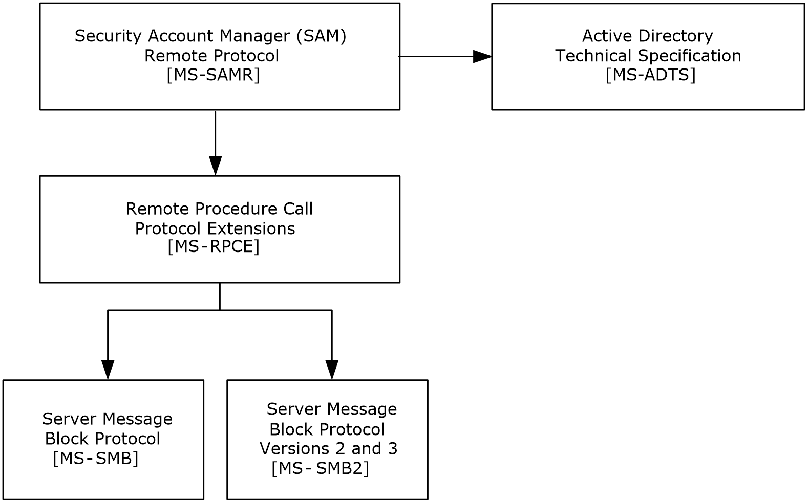
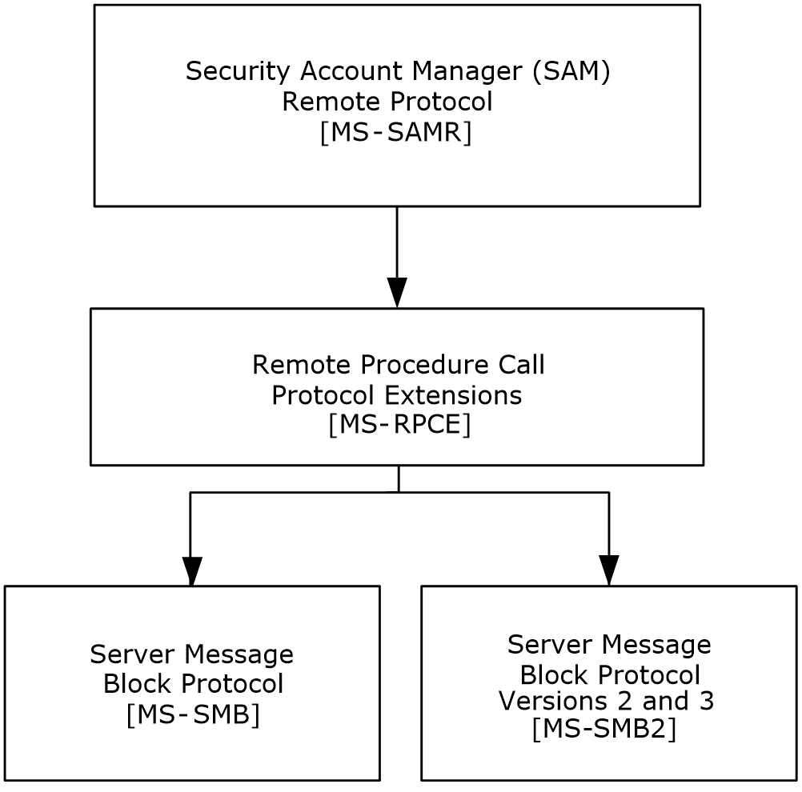
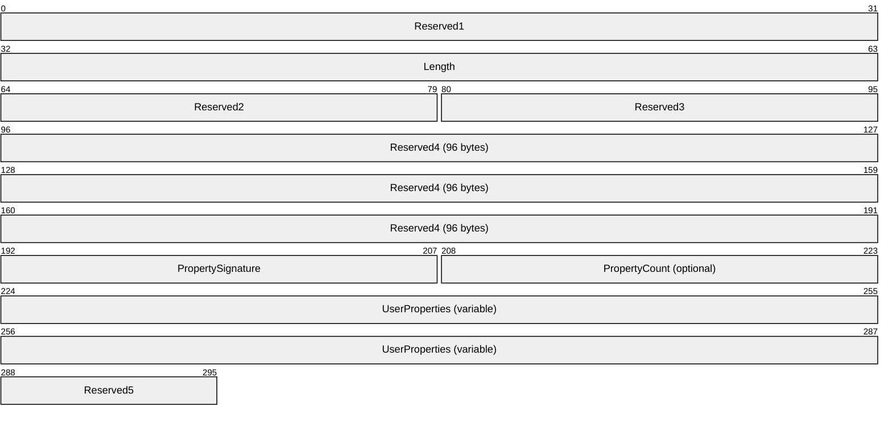
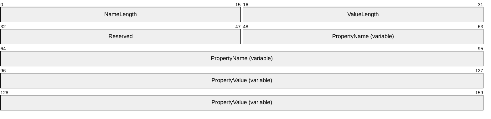
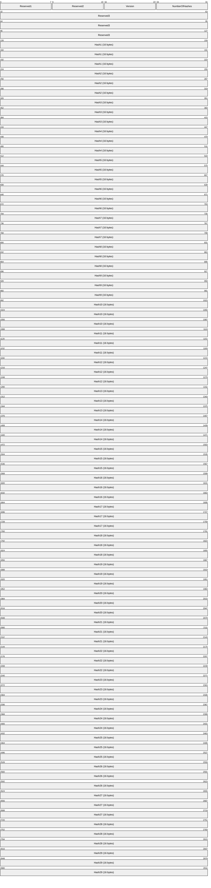
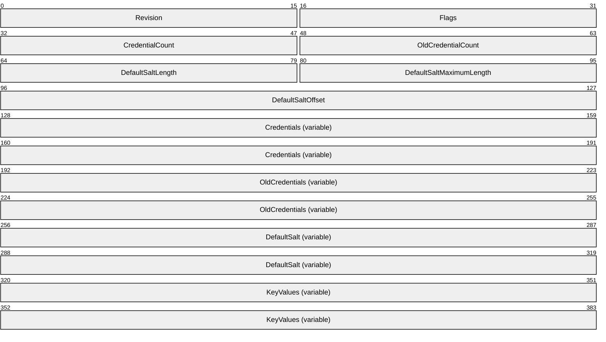
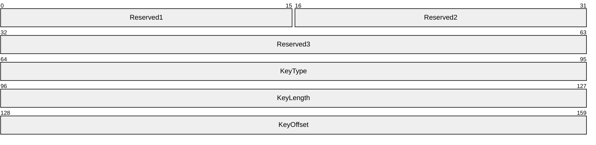
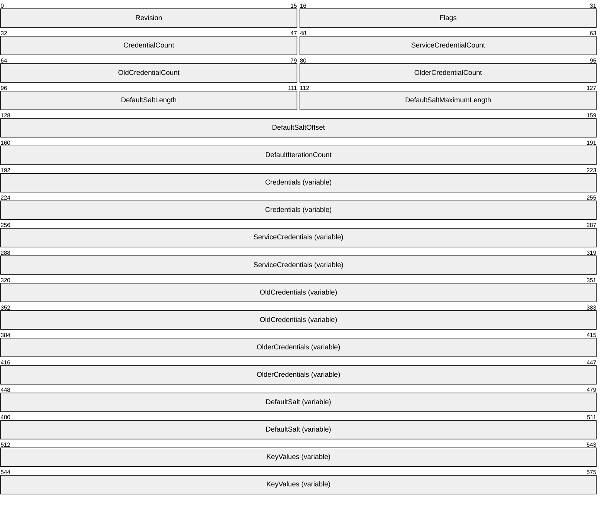
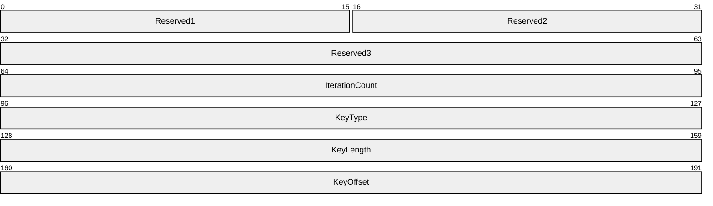
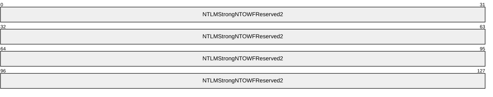

# [MS-SAMR]: Security Account Manager (SAM) Remote Protocol (Client-to-Server)

Table of Contents

1 Introduction

- [1 Introduction](#Section_1)
  - [1.1 Glossary](#Section_1.1)
  - [1.2 References](#Section_1.2)
    - [1.2.1 Normative References](#Section_1.2.1)
    - [1.2.2 Informative References](#Section_1.2.2)
  - [1.3 Overview](#Section_1.3)
    - [1.3.1 Object-Based Perspective](#Section_1.3.1)
    - [1.3.2 Method-Based Perspective](#Section_1.3.2)
  - [1.4 Relationship to Other Protocols](#Section_1.4)
  - [1.5 Prerequisites/Preconditions](#Section_1.5)
  - [1.6 Applicability Statement](#Section_1.6)
  - [1.7 Versioning and Capability Negotiation](#Section_1.7)
    - [1.7.1 Method Introduction](#Section_1.7.1)
    - [1.7.2 Method Versioning](#Section_1.7.2)
    - [1.7.3 Introduction to Information Levels](#Section_1.7.3)
  - [1.8 Vendor-Extensible Fields](#Section_1.8)
  - [1.9 Standards Assignments](#Section_1.9)

2 Messages

- [2 Messages](#Section_2)
  - [2.1 Transport](#Section_2.1)
  - [2.2 Common Data Types](#Section_2.2)
    - [2.2.1 Constant Value Definitions](#Section_2.2.1)
      - [2.2.1.1 Common ACCESS_MASK Values](#Section_2.2.1.1)
      - [2.2.1.2 Generic ACCESS_MASK Values](#Section_2.2.1.2)
      - [2.2.1.3 Server ACCESS_MASK Values](#Section_2.2.1.3)
      - [2.2.1.4 Domain ACCESS_MASK Values](#Section_2.2.1.4)
      - [2.2.1.5 Group ACCESS_MASK Values](#Section_2.2.1.5)
      - [2.2.1.6 Alias ACCESS_MASK Values](#Section_2.2.1.6)
      - [2.2.1.7 User ACCESS_MASK Values](#Section_2.2.1.7)
      - [2.2.1.8 USER_ALL Values](#Section_2.2.1.8)
      - [2.2.1.9 ACCOUNT_TYPE Values](#Section_2.2.1.9)
      - [2.2.1.10 SE_GROUP Attributes](#Section_2.2.1.10)
      - [2.2.1.11 GROUP_TYPE Codes](#Section_2.2.1.11)
      - [2.2.1.12 USER_ACCOUNT Codes](#Section_2.2.1.12)
      - [2.2.1.13 UF_FLAG Codes](#Section_2.2.1.13)
      - [2.2.1.14 Predefined RIDs](#Section_2.2.1.14)
      - [2.2.1.15 STATUS_ Codes](#Section_2.2.1.15)
      - [2.2.1.16 Transport Error Code](#Section_2.2.1.16)
      - [2.2.1.17 AD ACCESS_MASK](#Section_2.2.1.17)
      - [2.2.1.18 AEAD-AES-256-CBC-HMAC-SHA512 Constants](#Section_2.2.1.18)
    - [2.2.2 Basic Data Types](#Section_2.2.2)
      - [2.2.2.1 RPC_STRING, PRPC_STRING](#Section_2.2.2.1)
      - [2.2.2.2 OLD_LARGE_INTEGER](#Section_2.2.2.2)
      - [2.2.2.3 SID_NAME_USE](#Section_2.2.2.3)
      - [2.2.2.4 RPC_SHORT_BLOB](#Section_2.2.2.4)
    - [2.2.3 Domain Query/Set Data Types](#Section_2.2.3)
      - [2.2.3.1 Domain Fields](#Section_2.2.3.1)
      - [2.2.3.2 DOMAIN_SERVER_ENABLE_STATE](#Section_2.2.3.2)
      - [2.2.3.3 DOMAIN_STATE_INFORMATION](#Section_2.2.3.3)
      - [2.2.3.4 DOMAIN_SERVER_ROLE](#Section_2.2.3.4)
      - [2.2.3.5 DOMAIN_PASSWORD_INFORMATION](#Section_2.2.3.5)
      - [2.2.3.6 DOMAIN_LOGOFF_INFORMATION](#Section_2.2.3.6)
      - [2.2.3.7 DOMAIN_SERVER_ROLE_INFORMATION](#Section_2.2.3.7)
      - [2.2.3.8 DOMAIN_MODIFIED_INFORMATION](#Section_2.2.3.8)
      - [2.2.3.9 DOMAIN_MODIFIED_INFORMATION2](#Section_2.2.3.9)
      - [2.2.3.10 SAMPR_DOMAIN_GENERAL_INFORMATION](#Section_2.2.3.10)
      - [2.2.3.11 SAMPR_DOMAIN_GENERAL_INFORMATION2](#Section_2.2.3.11)
      - [2.2.3.12 SAMPR_DOMAIN_OEM_INFORMATION](#Section_2.2.3.12)
      - [2.2.3.13 SAMPR_DOMAIN_NAME_INFORMATION](#Section_2.2.3.13)
      - [2.2.3.14 SAMPR_DOMAIN_REPLICATION_INFORMATION](#Section_2.2.3.14)
      - [2.2.3.15 SAMPR_DOMAIN_LOCKOUT_INFORMATION](#Section_2.2.3.15)
      - [2.2.3.16 DOMAIN_INFORMATION_CLASS](#Section_2.2.3.16)
      - [2.2.3.17 SAMPR_DOMAIN_INFO_BUFFER](#Section_2.2.3.17)
    - [2.2.4 Group Query/Set Data Types](#Section_2.2.4)
      - [2.2.4.1 Common Group Fields](#Section_2.2.4.1)
      - [2.2.4.2 GROUP_ATTRIBUTE_INFORMATION](#Section_2.2.4.2)
      - [2.2.4.3 SAMPR_GROUP_GENERAL_INFORMATION](#Section_2.2.4.3)
      - [2.2.4.4 SAMPR_GROUP_NAME_INFORMATION](#Section_2.2.4.4)
      - [2.2.4.5 SAMPR_GROUP_ADM_COMMENT_INFORMATION](#Section_2.2.4.5)
      - [2.2.4.6 GROUP_INFORMATION_CLASS](#Section_2.2.4.6)
      - [2.2.4.7 SAMPR_GROUP_INFO_BUFFER](#Section_2.2.4.7)
    - [2.2.5 Alias Query/Set Data Types](#Section_2.2.5)
      - [2.2.5.1 Common Alias Fields](#Section_2.2.5.1)
      - [2.2.5.2 SAMPR_ALIAS_GENERAL_INFORMATION](#Section_2.2.5.2)
      - [2.2.5.3 SAMPR_ALIAS_NAME_INFORMATION](#Section_2.2.5.3)
      - [2.2.5.4 SAMPR_ALIAS_ADM_COMMENT_INFORMATION](#Section_2.2.5.4)
      - [2.2.5.5 ALIAS_INFORMATION_CLASS](#Section_2.2.5.5)
      - [2.2.5.6 SAMPR_ALIAS_INFO_BUFFER](#Section_2.2.5.6)
    - [2.2.6 User Query/Set Data Types](#Section_2.2.6)
      - [2.2.6.1 Common User Fields](#Section_2.2.6.1)
      - [2.2.6.2 USER_PRIMARY_GROUP_INFORMATION](#Section_2.2.6.2)
      - [2.2.6.3 USER_CONTROL_INFORMATION](#Section_2.2.6.3)
      - [2.2.6.4 USER_EXPIRES_INFORMATION](#Section_2.2.6.4)
      - [2.2.6.5 SAMPR_LOGON_HOURS](#Section_2.2.6.5)
      - [2.2.6.6 SAMPR_USER_ALL_INFORMATION](#Section_2.2.6.6)
      - [2.2.6.7 SAMPR_USER_GENERAL_INFORMATION](#Section_2.2.6.7)
      - [2.2.6.8 SAMPR_USER_PREFERENCES_INFORMATION](#Section_2.2.6.8)
      - [2.2.6.9 SAMPR_USER_PARAMETERS_INFORMATION](#Section_2.2.6.9)
      - [2.2.6.10 SAMPR_USER_LOGON_INFORMATION](#Section_2.2.6.10)
      - [2.2.6.11 SAMPR_USER_ACCOUNT_INFORMATION](#Section_2.2.6.11)
      - [2.2.6.12 SAMPR_USER_A_NAME_INFORMATION](#Section_2.2.6.12)
      - [2.2.6.13 SAMPR_USER_F_NAME_INFORMATION](#Section_2.2.6.13)
      - [2.2.6.14 SAMPR_USER_NAME_INFORMATION](#Section_2.2.6.14)
      - [2.2.6.15 SAMPR_USER_HOME_INFORMATION](#Section_2.2.6.15)
      - [2.2.6.16 SAMPR_USER_SCRIPT_INFORMATION](#Section_2.2.6.16)
      - [2.2.6.17 SAMPR_USER_PROFILE_INFORMATION](#Section_2.2.6.17)
      - [2.2.6.18 SAMPR_USER_ADMIN_COMMENT_INFORMATION](#Section_2.2.6.18)
      - [2.2.6.19 SAMPR_USER_WORKSTATIONS_INFORMATION](#Section_2.2.6.19)
      - [2.2.6.20 SAMPR_USER_LOGON_HOURS_INFORMATION](#Section_2.2.6.20)
      - [2.2.6.21 SAMPR_ENCRYPTED_USER_PASSWORD](#Section_2.2.6.21)
      - [2.2.6.22 SAMPR_ENCRYPTED_USER_PASSWORD_NEW](#Section_2.2.6.22)
      - [2.2.6.23 SAMPR_USER_INTERNAL1_INFORMATION](#Section_2.2.6.23)
      - [2.2.6.24 SAMPR_USER_INTERNAL4_INFORMATION](#Section_2.2.6.24)
      - [2.2.6.25 SAMPR_USER_INTERNAL4_INFORMATION_NEW](#Section_2.2.6.25)
      - [2.2.6.26 SAMPR_USER_INTERNAL5_INFORMATION](#Section_2.2.6.26)
      - [2.2.6.27 SAMPR_USER_INTERNAL5_INFORMATION_NEW](#Section_2.2.6.27)
      - [2.2.6.28 USER_INFORMATION_CLASS](#Section_2.2.6.28)
      - [2.2.6.29 SAMPR_USER_INFO_BUFFER](#Section_2.2.6.29)
      - [2.2.6.30 SAMPR_USER_INTERNAL7_INFORMATION](#Section_2.2.6.30)
      - [2.2.6.31 SAMPR_USER_INTERNAL8_INFORMATION](#Section_2.2.6.31)
      - [2.2.6.32 SAMPR_ENCRYPTED_PASSWORD_AES](#Section_2.2.6.32)
    - [2.2.7 Miscellaneous Protocol-Specific Types](#Section_2.2.7)
      - [2.2.7.1 PSAMPR_SERVER_NAME](#Section_2.2.7.1)
      - [2.2.7.2 SAMPR_HANDLE](#Section_2.2.7.2)
      - [2.2.7.3 ENCRYPTED_LM_OWF_PASSWORD, ENCRYPTED_NT_OWF_PASSWORD](#Section_2.2.7.3)
      - [2.2.7.4 SAMPR_ULONG_ARRAY](#Section_2.2.7.4)
      - [2.2.7.5 SAMPR_PSID_ARRAY](#Section_2.2.7.5)
      - [2.2.7.6 SAMPR_SID_INFORMATION](#Section_2.2.7.6)
      - [2.2.7.7 SAMPR_PSID_ARRAY_OUT](#Section_2.2.7.7)
      - [2.2.7.8 SAMPR_RETURNED_USTRING_ARRAY](#Section_2.2.7.8)
      - [2.2.7.9 SAMPR_RID_ENUMERATION](#Section_2.2.7.9)
      - [2.2.7.10 SAMPR_ENUMERATION_BUFFER](#Section_2.2.7.10)
      - [2.2.7.11 SAMPR_SR_SECURITY_DESCRIPTOR](#Section_2.2.7.11)
      - [2.2.7.12 GROUP_MEMBERSHIP](#Section_2.2.7.12)
      - [2.2.7.13 SAMPR_GET_GROUPS_BUFFER](#Section_2.2.7.13)
      - [2.2.7.14 SAMPR_GET_MEMBERS_BUFFER](#Section_2.2.7.14)
      - [2.2.7.15 SAMPR_REVISION_INFO_V1](#Section_2.2.7.15)
      - [2.2.7.16 SAMPR_REVISION_INFO](#Section_2.2.7.16)
      - [2.2.7.17 USER_DOMAIN_PASSWORD_INFORMATION](#Section_2.2.7.17)
    - [2.2.8 Selective Enumerate Associated Structures](#Section_2.2.8)
      - [2.2.8.1 Common Selective Enumerate Fields](#Section_2.2.8.1)
      - [2.2.8.2 SAMPR_DOMAIN_DISPLAY_USER](#Section_2.2.8.2)
      - [2.2.8.3 SAMPR_DOMAIN_DISPLAY_MACHINE](#Section_2.2.8.3)
      - [2.2.8.4 SAMPR_DOMAIN_DISPLAY_GROUP](#Section_2.2.8.4)
      - [2.2.8.5 SAMPR_DOMAIN_DISPLAY_OEM_USER](#Section_2.2.8.5)
      - [2.2.8.6 SAMPR_DOMAIN_DISPLAY_OEM_GROUP](#Section_2.2.8.6)
      - [2.2.8.7 SAMPR_DOMAIN_DISPLAY_USER_BUFFER](#Section_2.2.8.7)
      - [2.2.8.8 SAMPR_DOMAIN_DISPLAY_MACHINE_BUFFER](#Section_2.2.8.8)
      - [2.2.8.9 SAMPR_DOMAIN_DISPLAY_GROUP_BUFFER](#Section_2.2.8.9)
      - [2.2.8.10 SAMPR_DOMAIN_DISPLAY_OEM_USER_BUFFER](#Section_2.2.8.10)
      - [2.2.8.11 SAMPR_DOMAIN_DISPLAY_OEM_GROUP_BUFFER](#Section_2.2.8.11)
      - [2.2.8.12 DOMAIN_DISPLAY_INFORMATION](#Section_2.2.8.12)
      - [2.2.8.13 SAMPR_DISPLAY_INFO_BUFFER](#Section_2.2.8.13)
    - [2.2.9 SamrValidatePassword Data Types](#Section_2.2.9)
      - [2.2.9.1 SAM_VALIDATE_PASSWORD_HASH](#Section_2.2.9.1)
      - [2.2.9.2 SAM_VALIDATE_PERSISTED_FIELDS](#Section_2.2.9.2)
      - [2.2.9.3 SAM_VALIDATE_VALIDATION_STATUS](#Section_2.2.9.3)
      - [2.2.9.4 SAM_VALIDATE_STANDARD_OUTPUT_ARG](#Section_2.2.9.4)
      - [2.2.9.5 SAM_VALIDATE_AUTHENTICATION_INPUT_ARG](#Section_2.2.9.5)
      - [2.2.9.6 SAM_VALIDATE_PASSWORD_CHANGE_INPUT_ARG](#Section_2.2.9.6)
      - [2.2.9.7 SAM_VALIDATE_PASSWORD_RESET_INPUT_ARG](#Section_2.2.9.7)
      - [2.2.9.8 PASSWORD_POLICY_VALIDATION_TYPE](#Section_2.2.9.8)
      - [2.2.9.9 SAM_VALIDATE_INPUT_ARG](#Section_2.2.9.9)
      - [2.2.9.10 SAM_VALIDATE_OUTPUT_ARG](#Section_2.2.9.10)
    - [2.2.10 Supplemental Credentials Structures](#Section_2.2.10)
      - [2.2.10.1 USER_PROPERTIES](#Section_2.2.10.1)
      - [2.2.10.2 USER_PROPERTY](#Section_2.2.10.2)
      - [2.2.10.3 Primary:WDigest - WDIGEST_CREDENTIALS](#Section_2.2.10.3)
      - [2.2.10.4 Primary:Kerberos - KERB_STORED_CREDENTIAL](#Section_2.2.10.4)
      - [2.2.10.5 KERB_KEY_DATA](#Section_2.2.10.5)
      - [2.2.10.6 Primary:Kerberos-Newer-Keys - KERB_STORED_CREDENTIAL_NEW](#Section_2.2.10.6)
      - [2.2.10.7 KERB_KEY_DATA_NEW](#Section_2.2.10.7)
      - [2.2.10.8 Kerberos Encryption Algorithm Identifiers](#Section_2.2.10.8)
      - [2.2.10.9 NTLM-Strong-NTOWF](#Section_2.2.10.9)
    - [2.2.11 Common Algorithms](#Section_2.2.11)
      - [2.2.11.1 DES-ECB-LM](#Section_2.2.11.1)
        - [2.2.11.1.1 Encrypting an NT or LM Hash Value with a Specified Key](#Section_2.2.11.1.1)
        - [2.2.11.1.2 Encrypting a 64-Bit Block with a 7-Byte Key](#Section_2.2.11.1.2)
        - [2.2.11.1.3 Deriving Key1 and Key2 from a Little-Endian, Unsigned Integer Key](#Section_2.2.11.1.3)
        - [2.2.11.1.4 Deriving Key1 and Key2 from a 16-Byte Key](#Section_2.2.11.1.4)
  - [2.3 Directory Service Schema Elements](#Section_2.3)

3 Protocol Details

- [3 Protocol Details](#Section_3)
  - [3.1 Server Details](#Section_3.1)
    - [3.1.1 Abstract Data Model](#Section_3.1.1)
      - [3.1.1.1 String Handling](#Section_3.1.1.1)
      - [3.1.1.2 String Matching](#Section_3.1.1.2)
      - [3.1.1.3 Attribute Listing](#Section_3.1.1.3)
      - [3.1.1.4 Object Class List](#Section_3.1.1.4)
      - [3.1.1.5 Password Settings Attributes for Originating Update Constraints](#Section_3.1.1.5)
      - [3.1.1.6 Attribute Constraints for Originating Updates](#Section_3.1.1.6)
      - [3.1.1.7 Additional Update Constraints](#Section_3.1.1.7)
        - [3.1.1.7.1 General Password Policy](#Section_3.1.1.7.1)
        - [3.1.1.7.2 Cleartext Password Policy](#Section_3.1.1.7.2)
      - [3.1.1.8 Attribute Triggers for Originating Updates](#Section_3.1.1.8)
        - [3.1.1.8.1 objectClass](#Section_3.1.1.8.1)
        - [3.1.1.8.2 primaryGroupID](#Section_3.1.1.8.2)
        - [3.1.1.8.3 lockoutTime](#Section_3.1.1.8.3)
        - [3.1.1.8.4 sAMAccountName](#Section_3.1.1.8.4)
        - [3.1.1.8.5 clearTextPassword](#Section_3.1.1.8.5)
        - [3.1.1.8.6 dBCSPwd](#Section_3.1.1.8.6)
        - [3.1.1.8.7 unicodePwd](#Section_3.1.1.8.7)
        - [3.1.1.8.8 pwdLastSet](#Section_3.1.1.8.8)
        - [3.1.1.8.9 member](#Section_3.1.1.8.9)
        - [3.1.1.8.10 userAccountControl](#Section_3.1.1.8.10)
        - [3.1.1.8.11 supplementalCredentials](#Section_3.1.1.8.11)
          - [3.1.1.8.11.1 Processing](#Section_3.1.1.8.11.1)
            - [3.1.1.8.11.1.1 USER_PROPERTIES Processing](#Section_3.1.1.8.11.1.1)
            - [3.1.1.8.11.1.2 USER_PROPERTY Processing](#Section_3.1.1.8.11.1.2)
          - [3.1.1.8.11.2 Packages Property](#Section_3.1.1.8.11.2)
          - [3.1.1.8.11.3 Primary:WDigest Property](#Section_3.1.1.8.11.3)
            - [3.1.1.8.11.3.1 WDIGEST_CREDENTIALS Construction](#Section_3.1.1.8.11.3.1)
          - [3.1.1.8.11.4 Primary:Kerberos Property](#Section_3.1.1.8.11.4)
          - [3.1.1.8.11.5 Primary:CLEARTEXT Property](#Section_3.1.1.8.11.5)
          - [3.1.1.8.11.6 Primary:Kerberos-Newer-Keys Property](#Section_3.1.1.8.11.6)
          - [3.1.1.8.11.7 Primary:NTLM-Strong-NTOWF Property](#Section_3.1.1.8.11.7)
      - [3.1.1.9 Additional Update Triggers](#Section_3.1.1.9)
        - [3.1.1.9.1 Password History Update](#Section_3.1.1.9.1)
        - [3.1.1.9.2 objectSid Value Generation](#Section_3.1.1.9.2)
          - [3.1.1.9.2.1 DC Configuration](#Section_3.1.1.9.2.1)
          - [3.1.1.9.2.2 Non-DC Configuration](#Section_3.1.1.9.2.2)
      - [3.1.1.10 SamContextHandle Data Model](#Section_3.1.1.10)
      - [3.1.1.11 Server Access Control List](#Section_3.1.1.11)
      - [3.1.1.12 ComputerAccountReuseAllowList](#Section_3.1.1.12)
    - [3.1.2 Security Model](#Section_3.1.2)
      - [3.1.2.1 Server-wide Access Check](#Section_3.1.2.1)
      - [3.1.2.2 Standard Handle-Based Access Checks](#Section_3.1.2.2)
      - [3.1.2.3 AD Access Checks in DC Configuration](#Section_3.1.2.3)
      - [3.1.2.4 Acquiring an SMB Session Key](#Section_3.1.2.4)
    - [3.1.3 Timers](#Section_3.1.3)
    - [3.1.4 Initialization](#Section_3.1.4)
      - [3.1.4.1 Default Access](#Section_3.1.4.1)
      - [3.1.4.2 Default Accounts](#Section_3.1.4.2)
    - [3.1.5 Message Processing Events and Sequencing Rules](#Section_3.1.5)
      - [3.1.5.1 Open Pattern](#Section_3.1.5.1)
        - [3.1.5.1.1 SamrConnect5 (Opnum 64)](#Section_3.1.5.1.1)
        - [3.1.5.1.2 SamrConnect4 (Opnum 62)](#Section_3.1.5.1.2)
        - [3.1.5.1.3 SamrConnect2 (Opnum 57)](#Section_3.1.5.1.3)
        - [3.1.5.1.4 SamrConnect (Opnum 0)](#Section_3.1.5.1.4)
        - [3.1.5.1.5 SamrOpenDomain (Opnum 7)](#Section_3.1.5.1.5)
        - [3.1.5.1.6 Common Processing for Group, Alias, and User](#Section_3.1.5.1.6)
        - [3.1.5.1.7 SamrOpenGroup (Opnum 19)](#Section_3.1.5.1.7)
        - [3.1.5.1.8 SamrOpenAlias (Opnum 27)](#Section_3.1.5.1.8)
        - [3.1.5.1.9 SamrOpenUser (Opnum 34)](#Section_3.1.5.1.9)
      - [3.1.5.2 Enumerate Pattern](#Section_3.1.5.2)
        - [3.1.5.2.1 SamrEnumerateDomainsInSamServer (Opnum 6)](#Section_3.1.5.2.1)
        - [3.1.5.2.2 Common Processing for Enumeration of Users, Groups, and Aliases](#Section_3.1.5.2.2)
        - [3.1.5.2.3 SamrEnumerateGroupsInDomain (Opnum 11)](#Section_3.1.5.2.3)
        - [3.1.5.2.4 SamrEnumerateAliasesInDomain (Opnum 15)](#Section_3.1.5.2.4)
        - [3.1.5.2.5 SamrEnumerateUsersInDomain (Opnum 13)](#Section_3.1.5.2.5)
      - [3.1.5.3 Selective Enumerate Pattern](#Section_3.1.5.3)
        - [3.1.5.3.1 SamrQueryDisplayInformation3 (Opnum 51)](#Section_3.1.5.3.1)
        - [3.1.5.3.2 SamrQueryDisplayInformation2 (Opnum 48)](#Section_3.1.5.3.2)
        - [3.1.5.3.3 SamrQueryDisplayInformation (Opnum 40)](#Section_3.1.5.3.3)
        - [3.1.5.3.4 SamrGetDisplayEnumerationIndex2 (Opnum 49)](#Section_3.1.5.3.4)
        - [3.1.5.3.5 SamrGetDisplayEnumerationIndex (Opnum 41)](#Section_3.1.5.3.5)
      - [3.1.5.4 Create Pattern](#Section_3.1.5.4)
        - [3.1.5.4.1 Common Processing for Group and Alias Creation](#Section_3.1.5.4.1)
        - [3.1.5.4.2 SamrCreateGroupInDomain (Opnum 10)](#Section_3.1.5.4.2)
        - [3.1.5.4.3 SamrCreateAliasInDomain (Opnum 14)](#Section_3.1.5.4.3)
        - [3.1.5.4.4 SamrCreateUser2InDomain (Opnum 50)](#Section_3.1.5.4.4)
        - [3.1.5.4.5 SamrCreateUserInDomain (Opnum 12)](#Section_3.1.5.4.5)
      - [3.1.5.5 Query Pattern](#Section_3.1.5.5)
        - [3.1.5.5.1 SamrQueryInformationDomain2 (Opnum 46)](#Section_3.1.5.5.1)
          - [3.1.5.5.1.1 DomainGeneralInformation](#Section_3.1.5.5.1.1)
          - [3.1.5.5.1.2 DomainServerRoleInformation](#Section_3.1.5.5.1.2)
          - [3.1.5.5.1.3 DomainStateInformation](#Section_3.1.5.5.1.3)
          - [3.1.5.5.1.4 DomainGeneralInformation2](#Section_3.1.5.5.1.4)
        - [3.1.5.5.2 SamrQueryInformationDomain (Opnum 8)](#Section_3.1.5.5.2)
        - [3.1.5.5.3 SamrQueryInformationGroup (Opnum 20)](#Section_3.1.5.5.3)
          - [3.1.5.5.3.1 GroupReplicationInformation](#Section_3.1.5.5.3.1)
        - [3.1.5.5.4 SamrQueryInformationAlias (Opnum 28)](#Section_3.1.5.5.4)
        - [3.1.5.5.5 SamrQueryInformationUser2 (Opnum 47)](#Section_3.1.5.5.5)
          - [3.1.5.5.5.1 Common Processing](#Section_3.1.5.5.5.1)
          - [3.1.5.5.5.2 UserAllInformation](#Section_3.1.5.5.5.2)
        - [3.1.5.5.6 SamrQueryInformationUser (Opnum 36)](#Section_3.1.5.5.6)
      - [3.1.5.6 Set Pattern](#Section_3.1.5.6)
        - [3.1.5.6.1 SamrSetInformationDomain (Opnum 9)](#Section_3.1.5.6.1)
          - [3.1.5.6.1.1 DomainServerRoleInformation](#Section_3.1.5.6.1.1)
          - [3.1.5.6.1.2 DomainStateInformation](#Section_3.1.5.6.1.2)
          - [3.1.5.6.1.3 DomainPasswordInformation](#Section_3.1.5.6.1.3)
        - [3.1.5.6.2 SamrSetInformationGroup (Opnum 21)](#Section_3.1.5.6.2)
        - [3.1.5.6.3 SamrSetInformationAlias (Opnum 29)](#Section_3.1.5.6.3)
        - [3.1.5.6.4 SamrSetInformationUser2 (Opnum 58)](#Section_3.1.5.6.4)
          - [3.1.5.6.4.1 Common Processing](#Section_3.1.5.6.4.1)
          - [3.1.5.6.4.2 UserAllInformation (Common)](#Section_3.1.5.6.4.2)
          - [3.1.5.6.4.3 UserAllInformation](#Section_3.1.5.6.4.3)
          - [3.1.5.6.4.4 UserInternal4Information](#Section_3.1.5.6.4.4)
          - [3.1.5.6.4.5 UserInternal4InformationNew](#Section_3.1.5.6.4.5)
          - [3.1.5.6.4.6 UserInternal8Information](#Section_3.1.5.6.4.6)
        - [3.1.5.6.5 SamrSetInformationUser (Opnum 37)](#Section_3.1.5.6.5)
      - [3.1.5.7 Delete Pattern](#Section_3.1.5.7)
        - [3.1.5.7.1 SamrDeleteGroup (Opnum 23)](#Section_3.1.5.7.1)
        - [3.1.5.7.2 SamrDeleteAlias (Opnum 30)](#Section_3.1.5.7.2)
        - [3.1.5.7.3 SamrDeleteUser (Opnum 35)](#Section_3.1.5.7.3)
      - [3.1.5.8 Membership Pattern](#Section_3.1.5.8)
        - [3.1.5.8.1 SamrAddMemberToGroup (Opnum 22)](#Section_3.1.5.8.1)
        - [3.1.5.8.2 SamrRemoveMemberFromGroup (Opnum 24)](#Section_3.1.5.8.2)
        - [3.1.5.8.3 SamrGetMembersInGroup (Opnum 25)](#Section_3.1.5.8.3)
        - [3.1.5.8.4 SamrAddMemberToAlias (Opnum 31)](#Section_3.1.5.8.4)
        - [3.1.5.8.5 SamrRemoveMemberFromAlias (Opnum 32)](#Section_3.1.5.8.5)
        - [3.1.5.8.6 SamrGetMembersInAlias (Opnum 33)](#Section_3.1.5.8.6)
        - [3.1.5.8.7 SamrRemoveMemberFromForeignDomain (Opnum 45)](#Section_3.1.5.8.7)
        - [3.1.5.8.8 SamrAddMultipleMembersToAlias (Opnum 52)](#Section_3.1.5.8.8)
        - [3.1.5.8.9 SamrRemoveMultipleMembersFromAlias (Opnum 53)](#Section_3.1.5.8.9)
      - [3.1.5.9 Membership-Of Pattern](#Section_3.1.5.9)
        - [3.1.5.9.1 SamrGetGroupsForUser (Opnum 39)](#Section_3.1.5.9.1)
        - [3.1.5.9.2 SamrGetAliasMembership (Opnum 16)](#Section_3.1.5.9.2)
      - [3.1.5.10 Change Password Pattern](#Section_3.1.5.10)
        - [3.1.5.10.1 SamrChangePasswordUser (Opnum 38)](#Section_3.1.5.10.1)
        - [3.1.5.10.2 SamrOemChangePasswordUser2 (Opnum 54)](#Section_3.1.5.10.2)
        - [3.1.5.10.3 SamrUnicodeChangePasswordUser2 (Opnum 55)](#Section_3.1.5.10.3)
        - [3.1.5.10.4 SamrUnicodeChangePasswordUser4 (Opnum 73)](#Section_3.1.5.10.4)
      - [3.1.5.11 Lookup Pattern](#Section_3.1.5.11)
        - [3.1.5.11.1 SamrLookupDomainInSamServer (Opnum 5)](#Section_3.1.5.11.1)
        - [3.1.5.11.2 SamrLookupNamesInDomain (Opnum 17)](#Section_3.1.5.11.2)
        - [3.1.5.11.3 SamrLookupIdsInDomain (Opnum 18)](#Section_3.1.5.11.3)
      - [3.1.5.12 Security Pattern](#Section_3.1.5.12)
        - [3.1.5.12.1 SamrSetSecurityObject (Opnum 2)](#Section_3.1.5.12.1)
          - [3.1.5.12.1.1 SamrSetSecurityObject (DC Configuration)](#Section_3.1.5.12.1.1)
          - [3.1.5.12.1.2 SamrSetSecurityObject (Non-DC Configuration)](#Section_3.1.5.12.1.2)
        - [3.1.5.12.2 SamrQuerySecurityObject (Opnum 3)](#Section_3.1.5.12.2)
          - [3.1.5.12.2.1 SamrQuerySecurityObject (DC Configuration)](#Section_3.1.5.12.2.1)
          - [3.1.5.12.2.2 SamrQuerySecurityObject (Non-DC Configuration)](#Section_3.1.5.12.2.2)
      - [3.1.5.13 Miscellaneous](#Section_3.1.5.13)
        - [3.1.5.13.1 SamrCloseHandle (Opnum 1)](#Section_3.1.5.13.1)
        - [3.1.5.13.2 SamrSetMemberAttributesOfGroup (Opnum 26)](#Section_3.1.5.13.2)
        - [3.1.5.13.3 SamrGetUserDomainPasswordInformation (Opnum 44)](#Section_3.1.5.13.3)
        - [3.1.5.13.4 SamrGetDomainPasswordInformation (Opnum 56)](#Section_3.1.5.13.4)
        - [3.1.5.13.5 SamrRidToSid (Opnum 65)](#Section_3.1.5.13.5)
        - [3.1.5.13.6 SamrSetDSRMPassword (Opnum 66)](#Section_3.1.5.13.6)
        - [3.1.5.13.7 SamrValidatePassword (Opnum 67)](#Section_3.1.5.13.7)
          - [3.1.5.13.7.1 SamValidateAuthentication](#Section_3.1.5.13.7.1)
          - [3.1.5.13.7.2 SamValidatePasswordChange](#Section_3.1.5.13.7.2)
          - [3.1.5.13.7.3 SamValidatePasswordReset](#Section_3.1.5.13.7.3)
        - [3.1.5.13.8 SamrValidateComputerAccountReuseAttempt (Opnum 74)](#Section_3.1.5.13.8)
        - [3.1.5.13.9 SamrAccountIsDelegatedManagedServiceAccount (Opnum 77)](#Section_3.1.5.13.9)
      - [3.1.5.14 Supplemental Message Processing](#Section_3.1.5.14)
        - [3.1.5.14.1 distinguishedName Generation](#Section_3.1.5.14.1)
        - [3.1.5.14.2 userAccountControl Mapping Table](#Section_3.1.5.14.2)
        - [3.1.5.14.3 PasswordCanChange Generation](#Section_3.1.5.14.3)
        - [3.1.5.14.4 PasswordMustChange Generation](#Section_3.1.5.14.4)
        - [3.1.5.14.5 Account Lockout Enforcement and Reset](#Section_3.1.5.14.5)
        - [3.1.5.14.6 Account Lockout State Maintenance](#Section_3.1.5.14.6)
        - [3.1.5.14.7 Attributes Field Handling](#Section_3.1.5.14.7)
        - [3.1.5.14.8 Domain Field to Attribute Name Mapping](#Section_3.1.5.14.8)
        - [3.1.5.14.9 Group Field to Attribute Name Mapping](#Section_3.1.5.14.9)
        - [3.1.5.14.10 Alias Field to Attribute Name Mapping](#Section_3.1.5.14.10)
        - [3.1.5.14.11 User Field to Attribute Name Mapping](#Section_3.1.5.14.11)
    - [3.1.6 Timer Events](#Section_3.1.6)
    - [3.1.7 Other Local Events](#Section_3.1.7)
      - [3.1.7.1 Domain Join Processing](#Section_3.1.7.1)
      - [3.1.7.2 Domain Unjoin Processing](#Section_3.1.7.2)
  - [3.2 Client Details](#Section_3.2)
    - [3.2.1 Abstract Data Model](#Section_3.2.1)
    - [3.2.2 Security Model](#Section_3.2.2)
      - [3.2.2.1 RC4 Cipher Usage](#Section_3.2.2.1)
      - [3.2.2.2 MD5 Usage](#Section_3.2.2.2)
      - [3.2.2.3 Acquiring an SMB Session Key](#Section_3.2.2.3)
      - [3.2.2.4 AES Cipher Usage](#Section_3.2.2.4)
      - [3.2.2.5 Deriving an Encryption Key from a Plaintext Password](#Section_3.2.2.5)
    - [3.2.3 Timers](#Section_3.2.3)
    - [3.2.4 Initialization](#Section_3.2.4)
    - [3.2.5 Message Processing Events and Sequencing Rules](#Section_3.2.5)
    - [3.2.6 Timer Events](#Section_3.2.6)
    - [3.2.7 Other Local Events](#Section_3.2.7)

4 Protocol Examples

- [4 Protocol Examples](#Section_4)
  - [4.1 Creating a User Account](#Section_4.1)
  - [4.2 Enabling a User Account](#Section_4.2)
  - [4.3 Encrypting an NT or LM Hash](#Section_4.3)

5 Security

- [5 Security](#Section_5)
  - [5.1 Security Considerations for Implementers](#Section_5.1)
  - [5.2 Index of Security Parameters](#Section_5.2)

6 Appendix A: Full IDL

- [6 Appendix A: Full IDL](#Section_6)

7 Appendix B: Product Behavior

- [7 Appendix B: Product Behavior](#Section_7)

8 Change Tracking

- [8 Change Tracking](#Section_8)

For the legal notice and IP terms, see [LEGAL.md](../LEGAL.md).
Last updated: 11/21/2025.
See [Revision History](#revision-history) for full version history.

# 1 Introduction

The Security Account Manager (SAM) Remote Protocol (Client-to-Server) provides management functionality for an account store or directory containing users and groups. The goal of this protocol is to enable IT administrators and end users to manage users, groups, and computers.

SAM Remote Protocol specifies the behavior for both local and remote domains by using the Active Directory data model as a common data model for both scenarios. SAM Remote Protocol also specifies the differences in behavior between these two scenarios.

Sections 1.5, 1.8, 1.9, 2, and 3 of this specification are normative. All other sections and examples in this specification are informative.

## 1.1 Glossary

This document uses the following terms:

**64-bit Network Data Representation (NDR64)**: A specific instance of a [**remote procedure call (RPC) transfer syntax**](#gt_rpc-transfer-syntax). For more information about [**RPC transfer syntax**](#gt_rpc-transfer-syntax), see [[C706]](https://go.microsoft.com/fwlink/?LinkId=89824) section 14.

**access check**: A verification to determine whether a specific access type is allowed by checking a security context against a [**security descriptor**](#gt_security-descriptor).

**access control entry (ACE)**: An entry in an access control list (ACL) that contains a set of user rights and a [**security identifier (SID)**](#gt_security-identifier-sid) that identifies a principal for whom the rights are allowed, denied, or audited.

**access mask**: A 32-bit value present in an [**access control entry (ACE)**](#gt_access-control-entry-ace) that specifies the allowed or denied rights to manipulate an object.

**account**: A user (including machine account), group, or alias object. Also a synonym for security principal or principal.

**account domain object (account domain)**: A [**domain object**](#gt_domain-object) that represents an issuing authority in which [**user objects**](#gt_user-object) can be created. For more information about the concept of an issuing authority, see [MS-AUTHSOD](#Section_1.3) section 1.1.1.5.

**account domain security identifier**: The [**security identifier (SID)**](#gt_security-identifier-sid) of the [**account domain object**](#gt_account-domain-object-account-domain).

**account group**: A [**group object**](#gt_group-object) whose members always include the [**security identifier (SID)**](#gt_security-identifier-sid) of the group in the [**authorization context**](#gt_authorization-context).

**AccountOperatorsSid**: A [**SID**](#gt_security-identifier-sid) with the specific value of S-1-5-32-548.

**ACID**: A term that refers to the four properties that any database system has to achieve in order to be considered transactional: Atomicity, Consistency, Isolation, and Durability.

**Active Directory**: The Windows implementation of a general-purpose directory service, which uses [**LDAP**](#gt_lightweight-directory-access-protocol-ldap) as its primary access protocol. Active Directory stores information about a variety of objects in the network such as user accounts, computer accounts, groups, and all related credential information used by Kerberos [MS-KILE](../MS-KILE/MS-KILE.md). Active Directory is either deployed as Active Directory Domain Services (AD DS) or Active Directory Lightweight Directory Services (AD LDS), which are both described in [MS-ADOD](#Section_1.3): Active Directory Protocols Overview.

**administrator**: A user who has complete and unrestricted access to the computer or [**domain**](#gt_domain).

**AdministratorSid**: A [**SID**](#gt_security-identifier-sid) with the specific value of S-1-5-32-544.

**alias object**: See [**resource group**](#gt_resource-group).

**authorization context**: The set of identities for groups and the identity of the user made available to a server for the purpose of determining authorization to a resource.

**built-in domain**: The [**security identifier (SID)**](#gt_security-identifier-sid) namespace defined by the fixed [**SID**](#gt_security-identifier-sid) S-1-5-32. Contains groups that define roles on a local machine such as Backup Operators.

**control access right**: A variable access type with a specialized access [**GUID**](#gt_globally-unique-identifier-guid) identifying the specific access type.

**database object**: A representation of a named set of attribute value pairs that a protocol exposes.

**delta time**: A negative FILETIME. It represents a period of time, expressed in a negative number of 100-nanosecond time slices. For example, a period of 20 minutes is represented as -12000000000.

**discretionary access control list (DACL)**: An access control list (ACL) that is controlled by the owner of an object and that specifies the access particular users or groups can have to the object.

**domain**: A set of users and computers sharing a common namespace and management infrastructure. At least one computer member of the set has to act as a [**domain controller (DC)**](#gt_domain-controller-dc) and host a member list that identifies all members of the domain, as well as optionally hosting the [**Active Directory**](#gt_active-directory) service. The domain controller provides authentication of members, creating a unit of trust for its members. Each domain has an identifier that is shared among its members. For more information, see [MS-AUTHSOD] section 1.1.1.5 and [MS-ADTS](../MS-ADTS/MS-ADTS.md).

**domain admins**: A group with a [**security identifier (SID)**](#gt_security-identifier-sid) with the relative ID value of 512 in the account domain.

**domain controller (DC)**: (1) The service, running on a server, that implements [**Active Directory**](#gt_active-directory), or the server hosting this service. The service hosts the data store for objects and interoperates with other [**DCs**](#gt_domain-controller-dc) to ensure that a local change to an object replicates correctly across all [**DCs**](#gt_domain-controller-dc). When [**Active Directory**](#gt_active-directory) is operating as Active Directory Domain Services (AD DS), the [**DC**](#gt_domain-controller-dc) contains full NC replicas of the configuration naming context (config NC), schema naming context (schema NC), and one of the domain NCs in its [**forest**](#gt_forest). If the AD DS [**DC**](#gt_domain-controller-dc) is a global catalog server (GC server), it contains partial NC replicas of the remaining domain NCs in its [**forest**](#gt_forest). For more information, see [MS-AUTHSOD] section 1.1.1.5.2 and [MS-ADTS]. When [**Active Directory**](#gt_active-directory) is operating as Active Directory Lightweight Directory Services (AD LDS), several AD LDS [**DCs**](#gt_domain-controller-dc) can run on one server. When [**Active Directory**](#gt_active-directory) is operating as AD DS, only one AD DS [**DC**](#gt_domain-controller-dc) can run on one server. However, several AD LDS [**DCs**](#gt_domain-controller-dc) can coexist with one AD DS [**DC**](#gt_domain-controller-dc) on one server. The AD LDS [**DC**](#gt_domain-controller-dc) contains full NC replicas of the config NC and the schema NC in its [**forest**](#gt_forest). The domain controller is the server side of Authentication Protocol Domain Support [MS-APDS](../MS-APDS/MS-APDS.md).

(2) A server that controls all access in a security domain.

**domain functional level**: A specification of functionality available in a [**domain**](#gt_domain). Has to be less than or equal to the DC functional level of every [**domain controller (DC)**](#gt_domain-controller-dc) that hosts a replica of the domain's naming context (NC). For information on defined levels, corresponding features, information on how the domain functional level is determined, and supported domain controllers, see [MS-ADTS] sections 6.1.4.2 and 6.1.4.3. When [**Active Directory**](#gt_active-directory) is operating as Active Directory Lightweight Directory Services (AD LDS), domain functional level does not exist.

**domain name**: A domain name or a [**NetBIOS name**](#gt_netbios-name) that identifies a [**domain**](#gt_domain).

**domain object**: A unit of data storage in a [**domain**](#gt_domain) that is maintained and made available to [**domain**](#gt_domain) members by a [**domain controller (DC)**](#gt_domain-controller-dc).

**domain prefix**: A [**security identifier (SID)**](#gt_security-identifier-sid) of a [**domain**](#gt_domain) without the [**relative identifier (RID)**](#gt_relative-identifier-rid) portion. The domain prefix refers to the issuing authority [**SID**](#gt_security-identifier-sid). For example, the domain prefix of S-1-5-21-397955417-626881126-188441444-1010 is S-1-5-21-397955417-626881126-188441444.

**dsname**: A tuple that contains between one and three identifiers for an object. The term [**dsname**](#gt_dsname) does not stand for anything. The possible identifiers are the object's [**GUID**](#gt_globally-unique-identifier-guid) (attribute objectGuid), [**security identifier (SID)**](#gt_security-identifier-sid) (attribute objectSid), and distinguished name (DN) (attribute distinguishedName). A [**dsname**](#gt_dsname) can appear in a protocol message and as an attribute value (for example, a value of an attribute with syntax Object(DS-DN)). Given a [**DSName**](#gt_dsname), an object can be identified within a set of NC replicas according to the matching rules defined in [MS-DRSR] section 5.49.

**forest**: In the [**Active Directory**](#gt_active-directory) directory service, a [**forest**](#gt_forest) is a set of naming contexts (NCs) consisting of one schema NC, one config NC, and one or more domain NCs. Because a set of NCs can be arranged into a tree structure, a [**forest**](#gt_forest) is also a set of one or several trees of NCs.

**fully qualified domain name (FQDN)**: In [**Active Directory**](#gt_active-directory), a fully qualified domain name (FQDN) that identifies a [**domain**](#gt_domain).

**globally unique identifier (GUID)**: A term used interchangeably with [**universally unique identifier (UUID)**](#gt_universally-unique-identifier-uuid) in Microsoft protocol technical documents (TDs). Interchanging the usage of these terms does not imply or require a specific algorithm or mechanism to generate the value. Specifically, the use of this term does not imply or require that the algorithms described in [[RFC4122]](https://go.microsoft.com/fwlink/?LinkId=90460) or [C706] have to be used for generating the GUID. See also universally unique identifier (UUID).

**group object**: In [**Active Directory**](#gt_active-directory), a [**group object**](#gt_group-object) has an object class group. A group has a forward link attribute member; the values of this attribute either represent elements of the group (for example, objects of class user or computer) or subsets of the group (objects of class group). The representation of group subsets is called "nested group membership". The back link attribute memberOf enables navigation from group members to the groups containing them. Some groups represent groups of [**security principals**](#gt_security-principal) and some do not and are, for instance, used to represent email distribution lists.

**Lightweight Directory Access Protocol (LDAP)**: The primary access protocol for [**Active Directory**](#gt_active-directory). Lightweight Directory Access Protocol (LDAP) is an industry-standard protocol, established by the Internet Engineering Task Force (IETF), which allows users to query and update information in a directory service (DS), as described in [MS-ADTS]. The Lightweight Directory Access Protocol can be either version 2 [[RFC1777]](https://go.microsoft.com/fwlink/?LinkId=90290) or version 3 [[RFC3377]](https://go.microsoft.com/fwlink/?LinkID=91337).

**LM hash**: A DES-based cryptographic hash of a cleartext password. See LMOWFv1, as specified in [MS-NLMP](../MS-NLMP/MS-NLMP.md) section 3.3.1 (NTLM v1 Authentication), for a normative definition.

**machine account**: An [**account**](#gt_account) that is associated with individual client or server machines in an [**Active Directory**](#gt_active-directory) domain.

**mixed mode**: A state of an [**Active Directory**](#gt_active-directory) [**domain**](#gt_domain) that supports [**domain controllers (DCs)**](#gt_domain-controller-dc) running Windows NT Server 4.0 operating system. Mixed mode does not allow organizations to take advantage of new [**Active Directory**](#gt_active-directory) features such as universal groups, nested group membership, and interdomain group membership. See also [**native mode**](#gt_native-mode).

**native mode**: A state of an [**Active Directory**](#gt_active-directory) domain in which all current and future [**domain controllers (DCs)**](#gt_domain-controller-dc) use AD style domains. [**Native mode**](#gt_native-mode) allows organizations to take advantage of the new [**Active Directory**](#gt_active-directory) features such as universal groups, nested group membership, and interdomain group membership.

**NetBIOS name**: A 16-byte address that is used to identify a NetBIOS resource on the network. For more information, see [[RFC1001]](https://go.microsoft.com/fwlink/?LinkId=90260) and [[RFC1002]](https://go.microsoft.com/fwlink/?LinkId=90261).

**Network Data Representation (NDR)**: A specification that defines a mapping from Interface Definition Language (IDL) data types onto octet streams. [**NDR**](#gt_network-data-representation-ndr) also refers to the runtime environment that implements the mapping facilities (for example, data provided to [**NDR**](#gt_network-data-representation-ndr)). For more information, see [MS-RPCE](../MS-RPCE/MS-RPCE.md) and [C706] section 14.

**NT hash**: An MD4- or MD5-based cryptographic hash of a clear text password. For more information, see [MS-NLMP] section 3.3.1 (NTOWFv1, NTLM v1 Authentication), for a normative definition.

**original equipment manufacturer (OEM) code page**: A code page used to translate between non-Unicode encoded strings and UTF-16 encoded strings.

**password change**: An operation where a client specifies a new password for an account while demonstrating knowledge of the current password.

**password set**: An operation where a client specifies a new password for an account without demonstrating knowledge of the current password. The client must be previously granted permission to perform the operation in order for the request to succeed.

**primary domain controller (PDC)**: A [**domain controller (DC)**](#gt_domain-controller-dc) designated to track changes made to the accounts of all computers on a [**domain**](#gt_domain). It is the only computer to receive these changes directly, and is specialized so as to ensure consistency and to eliminate the potential for conflicting entries in the [**Active Directory**](#gt_active-directory) database. A [**domain**](#gt_domain) has only one [**PDC**](#gt_primary-domain-controller-pdc).

**RC4**: Means Rivest Cipher 4 invented by Ron Rivest in 1987 for RSA Security. It is a variable key-length symmetric encryption algorithm stream cipher that operates on a stream of data byte by byte. It's simple to apply, does not consume more memory, and works quickly on very large pieces of data such as WEP/WPA for wireless network encryption and SSL/ TLS for internet security. RC4 stream ciphers cannot be implemented on small streams of data. RC4 weaknesses make it vulnerable to various cryptographic attacks. For more information, see [SCHNEIER] section 17.1.

**read-only domain controller (RODC)**: A [**domain controller (DC)**](#gt_domain-controller-dc) that does not accept originating updates. Additionally, an [**RODC**](#gt_read-only-domain-controller-rodc) does not perform outbound replication. An RODC cannot be the primary domain controller (PDC) for its domain.

**relative distinguished name (RDN)**: The name of an object relative to its parent. This is the leftmost attribute-value pair in the distinguished name (DN) of an object. For example, in the DN "cn=Peter Houston, ou=NTDEV, dc=microsoft, dc=com", the [**RDN**](#gt_relative-distinguished-name-rdn) is "cn=Peter Houston". For more information, see [[RFC2251]](https://go.microsoft.com/fwlink/?LinkId=90325).

**relative identifier (RID)**: The last item in the series of SubAuthority values in a [**security identifier (SID)**](#gt_security-identifier-sid) [[SIDD]](https://go.microsoft.com/fwlink/?LinkId=90516). It distinguishes one account or group from all other accounts and groups in the domain. No two accounts or groups in any domain share the same RID.

**resource group**: A group object whose membership is added to the authorization context only if the server receiving the context is a member of the same domain as the resource group.

**RPC context handle**: A representation of state maintained between a remote procedure call (RPC) client and server. The state is maintained on the server on behalf of the client. An RPC context handle is created by the server and given to the client. The client passes the RPC context handle back to the server in method calls to assist in identifying the state. For more information, see [C706].

**RPC transfer syntax**: A method for encoding messages defined in an Interface Definition Language (IDL) file. Remote procedure call (RPC) can support different encoding methods or transfer syntaxes. For more information, see [C706].

**salt**: A value consisting of random bits used to increase the complexity of dictionary attacks against secret data that is protected through cryptographic means. For details, see [MENEZES] section 10.2.1.

**security descriptor**: A data structure containing the security information associated with a securable object. A [**security descriptor**](#gt_security-descriptor) identifies an object's owner by its [**security identifier (SID)**](#gt_security-identifier-sid). If access control is configured for the object, its [**security descriptor**](#gt_security-descriptor) contains a [**discretionary access control list (DACL)**](#gt_discretionary-access-control-list-dacl) with [**SIDs**](#gt_security-identifier-sid) for the [**security principals**](#gt_security-principal) who are allowed or denied access. Applications use this structure to set and query an object's security status. The [**security descriptor**](#gt_security-descriptor) is used to guard access to an object as well as to control which type of auditing takes place when the object is accessed. The [**security descriptor**](#gt_security-descriptor) format is specified in [MS-DTYP](../MS-DTYP/MS-DTYP.md) section 2.4.6; a string representation of [**security descriptors**](#gt_security-descriptor), called SDDL, is specified in [MS-DTYP] section 2.5.1.

**security identifier (SID)**: An identifier for [**security principals**](#gt_security-principal) that is used to identify an account or a group. Conceptually, the [**SID**](#gt_security-identifier-sid) is composed of an account authority portion (typically a [**domain**](#gt_domain)) and a smaller integer representing an identity relative to the account authority, termed the [**relative identifier (RID)**](#gt_relative-identifier-rid). The [**SID**](#gt_security-identifier-sid) format is specified in [MS-DTYP] section 2.4.2; a string representation of [**SIDs**](#gt_security-identifier-sid) is specified in [MS-DTYP] section 2.4.2 and [MS-AZOD](#Section_1.3) section 1.1.1.2.

**security principal**: A unique entity, also referred to as a principal, that can be authenticated by [**Active Directory**](#gt_active-directory). It frequently corresponds to a human user, but also can be a service that offers a resource to other security principals. Other security principals might be a group, which is a set of principals. Groups are supported by [**Active Directory**](#gt_active-directory).

**server object**: The database object in the account domain with an object class of samServer.

**system access control list (SACL)**: An access control list (ACL) that controls the generation of audit messages for attempts to access a securable object. The ability to get or set an object's [**SACL**](#gt_system-access-control-list-sacl) is controlled by a privilege typically held only by system administrators.

**token**: A set of rights and privileges for a given user.

**UAS Compatibility**: A configuration mode that affects protocol behavior constraints specified in this document. "UAS" is an acronym for "User Account Security (Database)" and refers to products that are no longer supported, such as Microsoft NT LAN Manager. The default setting in Windows is "on".

**universal group**: An [**Active Directory**](#gt_active-directory) group that allows [**user objects**](#gt_user-object), global groups, and [**universal groups**](#gt_universal-group) from anywhere in the [**forest**](#gt_forest) as members. A [**group object**](#gt_group-object) g is a [**universal group**](#gt_universal-group) if and only if GROUP_TYPE_UNIVERSAL_GROUP is present in g! groupType. A security-enabled universal group is valid for inclusion within ACLs anywhere in the [**forest**](#gt_forest). If a [**domain**](#gt_domain) is in [**mixed mode**](#gt_mixed-mode), then a [**universal group**](#gt_universal-group) cannot be created in that [**domain**](#gt_domain). See also domain local group, security-enabled group.

**universally unique identifier (UUID)**: A 128-bit value. UUIDs can be used for multiple purposes, from tagging objects with an extremely short lifetime, to reliably identifying very persistent objects in cross-process communication such as client and server interfaces, manager entry-point vectors, and RPC objects. UUIDs are highly likely to be unique. UUIDs are also known as [**globally unique identifiers (GUIDs)**](#gt_globally-unique-identifier-guid) and these terms are used interchangeably in the Microsoft protocol technical documents (TDs). Interchanging the usage of these terms does not imply or require a specific algorithm or mechanism to generate the UUID. Specifically, the use of this term does not imply or require that the algorithms described in [RFC4122] or [C706] has to be used for generating the UUID.

**user object**: An object of class user. A user object is a security principal object; the principal is a person or service entity running on the computer. The shared secret allows the person or service entity to authenticate itself, as described in ([MS-AUTHSOD] section 1.1.1.1).

**user profile**: A collection of attributes on a user object used to customize an end-user experience.

**WorldSid**: A [**SID**](#gt_security-identifier-sid) with the specific value of S-1-1-0.

**MAY, SHOULD, MUST, SHOULD NOT, MUST NOT:** These terms (in all caps) are used as defined in [[RFC2119]](https://go.microsoft.com/fwlink/?LinkId=90317). All statements of optional behavior use either MAY, SHOULD, or SHOULD NOT.

## 1.2 References

Links to a document in the Microsoft Open Specifications library point to the correct section in the most recently published version of the referenced document. However, because individual documents in the library are not updated at the same time, the section numbers in the documents may not match. You can confirm the correct section numbering by checking the [Errata](https://go.microsoft.com/fwlink/?linkid=850906).

### 1.2.1 Normative References

We conduct frequent surveys of the normative references to assure their continued availability. If you have any issue with finding a normative reference, please contact [dochelp@microsoft.com](mailto:dochelp@microsoft.com). We will assist you in finding the relevant information.

[AES-CBC] McGrew, D. and Foley, J., "Authenticated Encryption with AES-CBC and HMAC-SHA", [https://tools.ietf.org/id/draft-mcgrew-aead-aes-cbc-hmac-sha2-03.html](https://go.microsoft.com/fwlink/?linkid=2162731)

[C706] The Open Group, "DCE 1.1: Remote Procedure Call", C706, August 1997, [https://publications.opengroup.org/c706](https://go.microsoft.com/fwlink/?LinkId=89824)

**Note** Registration is required to download the document.

[E164] ITU-T, "The International Public Telecommunication Numbering Plan", Recommendation E.164, February 2005, [http://www.itu.int/rec/T-REC-E.164/e](https://go.microsoft.com/fwlink/?LinkId=89855)

**Note** There is a charge to download the specification.

[FIPS46-2] FIPS PUBS, "Data Encryption Standard (DES)", FIPS PUB 46-2, December 1993, [https://csrc.nist.gov/publications/detail/fips/46/2/archive/1993-12-30](https://go.microsoft.com/fwlink/?LinkId=89871)

[FIPS81] FIPS PUBS, "DES Modes of Operation", December 1980, [https://csrc.nist.gov/csrc/media/publications/fips/81/archive/1980-12-02/documents/fips81.pdf](https://go.microsoft.com/fwlink/?LinkId=89874)

[GRAY] Gray, J., and Reuter, A., "Transaction Processing: Concepts and Techniques", The Morgan Kaufmann Series in Data Management Systems, San Francisco: Morgan Kaufmann Publishers, 1992, Hardcover ISBN: 9781558601901.

[MS-ADA1] Microsoft Corporation, "[Active Directory Schema Attributes A-L](../MS-ADA1/MS-ADA1.md)".

[MS-ADA2] Microsoft Corporation, "[Active Directory Schema Attributes M](../MS-ADA2/MS-ADA2.md)".

[MS-ADA3] Microsoft Corporation, "[Active Directory Schema Attributes N-Z](../MS-ADA3/MS-ADA3.md)".

[MS-ADSC] Microsoft Corporation, "[Active Directory Schema Classes](../MS-ADSC/MS-ADSC.md)".

[MS-ADTS] Microsoft Corporation, "[Active Directory Technical Specification](../MS-ADTS/MS-ADTS.md)".

[MS-CIFS] Microsoft Corporation, "[Common Internet File System (CIFS) Protocol](../MS-CIFS/MS-CIFS.md)".

[MS-DRSR] Microsoft Corporation, "[Directory Replication Service (DRS) Remote Protocol](../MS-DRSR/MS-DRSR.md)".

[MS-DTYP] Microsoft Corporation, "[Windows Data Types](../MS-DTYP/MS-DTYP.md)".

[MS-ERREF] Microsoft Corporation, "[Windows Error Codes](../MS-ERREF/MS-ERREF.md)".

[MS-KILE] Microsoft Corporation, "[Kerberos Protocol Extensions](../MS-KILE/MS-KILE.md)".

[MS-LSAD] Microsoft Corporation, "[Local Security Authority (Domain Policy) Remote Protocol](#Section_5)".

[MS-LSAT] Microsoft Corporation, "[Local Security Authority (Translation Methods) Remote Protocol](#Section_5)".

[MS-NLMP] Microsoft Corporation, "[NT LAN Manager (NTLM) Authentication Protocol](../MS-NLMP/MS-NLMP.md)".

[MS-NRPC] Microsoft Corporation, "[Netlogon Remote Protocol](../MS-NRPC/MS-NRPC.md)".

[MS-PAC] Microsoft Corporation, "[Privilege Attribute Certificate Data Structure](../MS-PAC/MS-PAC.md)".

[MS-RPCE] Microsoft Corporation, "[Remote Procedure Call Protocol Extensions](../MS-RPCE/MS-RPCE.md)".

[MS-SMB2] Microsoft Corporation, "[Server Message Block (SMB) Protocol Versions 2 and 3](../MS-SMB2/MS-SMB2.md)".

[MS-SMB] Microsoft Corporation, "[Server Message Block (SMB) Protocol](../MS-SMB/MS-SMB.md)".

[MSKB-3072595] Microsoft Corporation, "Vulnerability in Active Directory service could allow denial of service, September 2015", [https://support.microsoft.com/en-us/kb/3072595](https://go.microsoft.com/fwlink/?LinkId=626613)

[MSKB-3149090] Microsoft Corporation, "MS16-047: Description of the security update for SAM and LSAD remote protocols", April 2016, [https://support.microsoft.com/en-us/kb/3149090](https://go.microsoft.com/fwlink/?LinkId=786963)

[MSKB-4012218] Microsoft Corporation, "March 2017 Preview of Monthly Quality Rollup for Windows 8.1 and Windows Server 2012 R2", March 2017, [https://support.microsoft.com/en-us/topic/march-2017-preview-of-monthly-quality-rollup-for-windows-8-1-and-windows-server-2012-r2-3f3d4166-4b8c-6f88-17c9-64cb0378acd4](https://go.microsoft.com/fwlink/?linkid=2163444)

[MSKB-4012220] Microsoft Corporation, "March 2017 Preview of Monthly Quality Rollup for Windows Server 2012", March 2017, [https://support.microsoft.com/kb/4012220](https://go.microsoft.com/fwlink/?linkid=2163626)

[MSKB-4012606] Microsoft Corporation, "March 14, 2017—KB4012606 (OS Build 10240.17319)", March 2017, [https://support.microsoft.com/kb/4012606](https://go.microsoft.com/fwlink/?linkid=2163542)

[MSKB-4013198] Microsoft Corporation, "March 14, 2017—KB4013198 (OS Build 10586.839)", March 2017, [https://support.microsoft.com/kb/4013198](https://go.microsoft.com/fwlink/?linkid=2163543)

[MSKB-4102219] Microsoft Corporation, "March 2017 Preview of Monthly Quality Rollup for Windows 8.1 and Windows Server 2012 R2", March 2017, [https://support.microsoft.com/topic/march-2017-preview-of-monthly-quality-rollup-for-windows-8-1-and-windows-server-2012-r2-3f3d4166-4b8c-6f88-17c9-64cb0378acd4](https://go.microsoft.com/fwlink/?linkid=2163445)

[RFC1123] Braden, R., "Requirements for Internet Hosts - Application and Support", RFC 1123, October 1989, [https://www.rfc-editor.org/info/rfc1123](https://go.microsoft.com/fwlink/?LinkId=90268)

[RFC1321] Rivest, R., "The MD5 Message-Digest Algorithm", RFC 1321, April 1992, [https://www.rfc-editor.org/info/rfc1321](https://go.microsoft.com/fwlink/?LinkId=90275)

[RFC2119] Bradner, S., "Key words for use in RFCs to Indicate Requirement Levels", BCP 14, RFC 2119, March 1997, [https://www.rfc-editor.org/info/rfc2119](https://go.microsoft.com/fwlink/?LinkId=90317)

[RFC2617] Franks, J., Hallam-Baker, P., Hostetler, J., et al., "HTTP Authentication: Basic and Digest Access Authentication", RFC 2617, June 1999, [https://www.rfc-editor.org/info/rfc2617](https://go.microsoft.com/fwlink/?LinkId=90373)

[RFC3961] Raeburn, K., "Encryption and Checksum Specifications for Kerberos 5", RFC 3961, February 2005, [https://www.rfc-editor.org/info/rfc3961](https://go.microsoft.com/fwlink/?LinkId=90450)

[RFC3962] Raeburn, K., "Advanced Encryption Standard (AES) Encryption for Kerberos 5", RFC 3962, February 2005, [https://www.rfc-editor.org/info/rfc3962](https://go.microsoft.com/fwlink/?LinkId=90451)

[RFC4120] Neuman, C., Yu, T., Hartman, S., and Raeburn, K., "The Kerberos Network Authentication Service (V5)", RFC 4120, July 2005, [https://www.rfc-editor.org/rfc/rfc4120](https://go.microsoft.com/fwlink/?LinkId=90458)

[RFC4122] Leach, P., Mealling, M., and Salz, R., "A Universally Unique Identifier (UUID) URN Namespace", RFC 4122, July 2005, [https://www.rfc-editor.org/info/rfc4122](https://go.microsoft.com/fwlink/?LinkId=90460)

[UNICODE3.1] The Unicode Consortium, "Unicode Data 3.1.0", February 2001, [http://www.unicode.org/Public/3.1-Update/UnicodeData-3.1.0.txt](https://go.microsoft.com/fwlink/?LinkId=90551)

[X501] ITU-T, "Information Technology - Open Systems Interconnection - The Directory: The Models", Recommendation X.501, August 2005, [http://www.itu.int/rec/T-REC-X.501-200508-S/en](https://go.microsoft.com/fwlink/?LinkId=98847)

### 1.2.2 Informative References

[LAMPORT] Lamport, L., "Time, Clocks, and the Ordering of Events in a Distributed System", July 1978, [http://portal.acm.org/citation.cfm?id=359563](https://go.microsoft.com/fwlink/?LinkId=89928)

[MS-ADOD] Microsoft Corporation, "[Active Directory Protocols Overview](#Section_1.3)".

[MS-AUTHSOD] Microsoft Corporation, "[Authentication Services Protocols Overview](#Section_1.3)".

[MS-AZOD] Microsoft Corporation, "[Authorization Protocols Overview](#Section_1.3)".

[MS-SYS-ARCHIVE] Microsoft Corporation, "Windows System Overview", [https://learn.microsoft.com/en-us/openspecs/windows_protocols/MS-WINPROTLP/df36f95e-6a6b-48d6-a3ae-35a17674f546](https://go.microsoft.com/fwlink/?LinkId=311687)

[MS-UCODEREF] Microsoft Corporation, "[Windows Protocols Unicode Reference](../MS-UCODEREF/MS-UCODEREF.md)".

[MS-WPO] Microsoft Corporation, "[Windows Protocols Overview](#Section_1.3)".

[MSDN-CP] Microsoft Corporation, "Code Page Identifiers", [https://learn.microsoft.com/en-us/windows/desktop/Intl/code-page-identifiers](https://go.microsoft.com/fwlink/?LinkId=89981)

[MSDN-NMF] Microsoft Corporation, "Network Management Functions", [http://msdn.microsoft.com/en-us/library/aa370675.aspx](https://go.microsoft.com/fwlink/?LinkId=90052)

[MSDOCS-RESTRICTRMTSAM] Microsoft Corporation, "Network access: Restrict clients allowed to make remote calls to SAM", [https://learn.microsoft.com/en-us/windows/security/threat-protection/security-policy-settings/network-access-restrict-clients-allowed-to-make-remote-sam-calls](https://go.microsoft.com/fwlink/?linkid=2163448)

[MSFT-CVE-2021-33757] Microsoft Corporation, "Windows Security Account Manager Remote Protocol Security Feature Bypass Vulnerability", CVE-2021-33757, July 13, 2021, [https://msrc.microsoft.com/update-guide/vulnerability/CVE-2021-33757](https://go.microsoft.com/fwlink/?linkid=2168037)

[MSFT-CVE-2021-42278] Microsoft Corporation, "Active Directory Domain Services Elevation of Privilege Vulnerability", CVE-2021-42278, November 9, 2021, [https://msrc.microsoft.com/update-guide/vulnerability/CVE-2021-42278](https://go.microsoft.com/fwlink/?linkid=2179768)

[MSKB-5020276] Microsoft Corporation, "KB5020276—Netjoin: Domain join hardening changes", February 2023, [https://support.microsoft.com/en-us/topic/kb5020276-netjoin-domain-join-hardening-changes-2b65a0f3-1f4c-42ef-ac0f-1caaf421baf8](https://go.microsoft.com/fwlink/?linkid=2226042)

[MSKB-5023697] Microsoft Corporation, "March 14, 2023—KB5023697 (OS Build 14393.5786)", March 2023, [https://support.microsoft.com/en-us/topic/march-14-2023-kb5023697-os-build-14393-5786-d8c0d93c-c58b-4398-9fee-59183e52b20c](https://go.microsoft.com/fwlink/?linkid=2244242)

[MSKB-5023702] Microsoft Corporation, "March 14, 2023—KB5023702 (OS Build 17763.4131)", March 2023, [https://support.microsoft.com/en-us/topic/march-14-2023-kb5023702-os-build-17763-4131-f3e27d13-7dcc-4d32-826b-8d57e1600ccf](https://go.microsoft.com/fwlink/?linkid=2227220)

[MSKB-5023705] Microsoft Corporation, "March 14, 2023—KB5023705 (OS Build 20348.1607)", March 2023, [https://support.microsoft.com/en-us/topic/march-14-2023-kb5023705-os-build-20348-1607-31770c64-430e-4b0e-8eb4-175980e29f3b](https://go.microsoft.com/fwlink/?linkid=2227069)

[MSKB-5023765] Microsoft Corporation, "March 14, 2023—KB5023765 (Monthly Rollup)", March 2023, [https://support.microsoft.com/en-us/topic/march-14-2023-kb5023765-monthly-rollup-d6ebf3d1-c12d-4a4c-9933-ca3bb2324e01](https://go.microsoft.com/fwlink/?linkid=2244349)

[MSKB-5030213] Microsoft Corporation, "September 2023 - KB5030213", September 2023, [https://support.microsoft.com/en-us/topic/september-12-2023-kb5030213-os-build-14393-6252-c9d9f24c-3728-4eeb-a017-dd0cd2b106cb](https://go.microsoft.com/fwlink/?linkid=2244350)

[MSKB-5030214] Microsoft Corporation, "September 2023 - KB5030214", September 2023, [https://support.microsoft.com/en-us/topic/september-12-2023-kb5030214-os-build-17763-4851-e6ae7551-49f4-428e-b2d4-caa73078fb06](https://go.microsoft.com/fwlink/?linkid=2244243)

[MSKB-5030216] Microsoft Corporation, "September 2023 - KB5030216", September 2023, [https://support.microsoft.com/en-us/topic/september-12-2023-kb5030216-os-build-20348-1970-34d4aff3-fd05-4270-b288-4ab6379c7f81](https://go.microsoft.com/fwlink/?linkid=2244245)

[MSKB-5030269] Microsoft Corporation, "September 2023 - KB5030269", September 2023, [https://support.microsoft.com/en-us/topic/september-12-2023-kb5030269-monthly-rollup-3ab29a3c-ebe3-42f0-8f31-037407d4232d](https://go.microsoft.com/fwlink/?linkid=2244429)

[MSKB-5034203] Microsoft Corporation, "February 2024 – 5034203", February 2024, [https://support.microsoft.com/en-us/topic/january-23-2024-kb5034203-os-build-19045-3996-preview-d9540687-af96-46ba-9192-88fe44833561](https://go.microsoft.com/fwlink/?linkid=2258041)

[MSKB-5034204] Microsoft Corporation, "February 2024 – 5034204", February 2024, [https://support.microsoft.com/en-us/topic/january-23-2024-kb5034204-os-builds-22621-3085-and-22631-3085-preview-7652acf2-56dc-430e-b8ef-ec8f56ec1028](https://go.microsoft.com/fwlink/?linkid=2257584)

[MSKB-5034763] Microsoft Corporation, "February 2024 – 5034763", February 2024, [https://support.microsoft.com/en-us/topic/february-13-2024-kb5034763-os-builds-19044-4046-and-19045-4046-f1c993e4-32b3-4cc8-947a-69e70ae124d5](https://go.microsoft.com/fwlink/?linkid=2257585)

[MSKB-5034765] Microsoft Corporation, "February 2024 – 5034765", February 2024, [https://support.microsoft.com/en-us/topic/february-13-2024-kb5034765-os-builds-22621-3155-and-22631-3155-023d9141-a5b0-470a-b0f5-2ee3b48f48ce](https://go.microsoft.com/fwlink/?linkid=2257586)

[MSKB-5034766] Microsoft Corporation, "February 2024 – 5034766", February 2024, [https://support.microsoft.com/en-us/topic/february-13-2024-kb5034766-os-build-22000-2777-462885bd-8d9a-4521-b940-b7f05740e09f](https://go.microsoft.com/fwlink/?linkid=2257769)

[MSKB-5034767] Microsoft Corporation, "February 2024 – 5034767", February 2024, [https://support.microsoft.com/en-us/topic/february-13-2024-kb5034767-os-build-14393-6709-e64b104e-984a-49fc-95ef-c3d84c159ba9](https://go.microsoft.com/fwlink/?linkid=2257587)

[MSKB-5034768] Microsoft Corporation, "February 2024 – 5034768", February 2024, [https://support.microsoft.com/en-us/topic/february-13-2024-kb5034768-os-build-17763-5458-f06ecec0-23b0-4860-880b-74a2fd1b56c0](https://go.microsoft.com/fwlink/?linkid=2257684)

[MSKB-5034770] Microsoft Corporation, "February 2024 – 5034770", February 2024, [https://support.microsoft.com/en-us/topic/february-13-2024-security-update-kb5034770-80671395-9f9c-4efa-8a8a-ccc0bd06e41e](https://go.microsoft.com/fwlink/?linkid=2257771)

[MSKB-5034774] Microsoft Corporation, "February 2024 – 5034774", February 2024, [https://support.microsoft.com/en-us/topic/february-13-2024-kb5034774-os-build-10240-20469-4747f1f2-9d1c-480f-b844-289df7d0c3fa](https://go.microsoft.com/fwlink/?linkid=2257685)

[MSKB-5034795] Microsoft Corporation, "February 2024 – 5034795", February 2024, [https://support.microsoft.com/en-us/topic/february-13-2024-kb5034795-monthly-rollup-b0b81685-36b9-442e-ae1e-9d6dd922a4b9](https://go.microsoft.com/fwlink/?linkid=2257772)

[MSKB-5034809] Microsoft Corporation, "February 2024 – 5034809", February 2024, [https://support.microsoft.com/en-us/topic/february-13-2024-kb5034809-security-only-update-1401341a-70ca-4dab-897b-6cfa17449aa2](https://go.microsoft.com/fwlink/?linkid=2257588)

[MSKB-5034819] Microsoft Corporation, "February 2024 – 5034819", February 2024, [https://support.microsoft.com/en-us/topic/february-13-2024-kb5034819-monthly-rollup-67ea3009-44fe-4781-8235-ef8ca210f5b5](https://go.microsoft.com/fwlink/?linkid=2257773)

[MSKB-5034830] Microsoft Corporation, "February 2024 – 5034830", February 2024, [https://support.microsoft.com/en-us/topic/february-13-2024-kb5034830-monthly-rollup-9d5aa955-9ba4-4605-8923-0f70ba675282](https://go.microsoft.com/fwlink/?linkid=2257774)

[MSKB-5034831] Microsoft Corporation, "February 2024 – 5034831", February 2024, [https://support.microsoft.com/en-us/topic/february-13-2024-kb5034831-monthly-rollup-3c9d132f-a2fb-44ec-bc3f-321ea7f50104](https://go.microsoft.com/fwlink/?linkid=2257589)

[MSKB-5034833] Microsoft Corporation, "February 2024 – 5034833", February 2024, [https://support.microsoft.com/en-us/topic/february-13-2024-kb5034833-security-only-update-3d78ccac-f05a-4561-9124-7b56cbba4673](https://go.microsoft.com/fwlink/?linkid=2257686)

[SCHNEIER] Schneier, B., "Applied Cryptography, Second Edition", John Wiley and Sons, 1996, ISBN: 0471117099.

## 1.3 Overview

The Security Account Manager (SAM) Remote Protocol (Client-to-Server) provides management functionality for an account store or directory containing users and groups. SAM Remote Protocol specifies the behavior for both local and remote domains by using the [**Active Directory**](#gt_active-directory) data model as a common data model for both scenarios, see [MS-AUTHSOD](#Section_1.3) section 1.1.1.5.1. Implementers should familiarize themselves with the following documents: Windows System Overview [MS-SYS-ARCHIVE](../MS-SYS-ARCHIVE/MS-SYS-ARCHIVE.md), Windows Protocols Overview [MS-WPO](#Section_1.3), and Active Directory Technical Specification [MS-ADTS](../MS-ADTS/MS-ADTS.md).

The goal of this protocol is to enable IT administrators and end users to manage users, groups, and computers. IT administrators and their delegates generally have full access control to these entities, and consequently can manage the entities' life cycles. End users are allowed to make changes to their own data (in most cases, limited to just their passwords).

SAM Remote Protocol achieves its goal by enabling the creation, reading, updating, and deleting of [**security principal**](#gt_security-principal) information. These security principals could be in any account store; typically they are in an Active Directory service ([MS-ADTS]) and in a computer-local security account database. Normative differences in the protocol between the two cases local and remote domains are indicated by referring to the configuration of the server as a DC or non-DC configuration, where DC stands for [**domain controller (DC)**](#gt_domain-controller-dc).

It is helpful to consider the following two perspectives when understanding and implementing this protocol:

- Object-based perspective (section [1.3.1](#Section_1.3.1))
- Method-based perspective (section [1.3.2](#Section_1.3.2))

### 1.3.1 Object-Based Perspective

The object-based perspective shows that the protocol uses five main object abstractions: a [**server object**](#gt_server-object), a [**domain object**](#gt_domain-object), a [**group object**](#gt_group-object), an [**alias object**](#gt_alias-object) (alias is a group type), and a [**user object**](#gt_user-object). A client obtains a handle (an [**RPC context handle**](#gt_rpc-context-handle)) to one of these objects and then performs one or more actions on the object.

The following is a brief listing of methods that operate on each object type.

**Server Object:**

- [SamrSetSecurityObject](#Section_3.1.5.12.1.2)
- [SamrQuerySecurityObject](#Section_3.1.5.12.2)
- [SamrEnumerateDomainsInSamServer](#Section_3.1.5.2.1)
- [SamrOpenDomain](#Section_3.1.5.1.5)
- [SamrLookupDomainInSamServer](#Section_3.1.5.11.1)
- [SamrCloseHandle](#Section_3.1.5.13.1)
**Domain Object:**

- SamrSetSecurityObject
- SamrQuerySecurityObject
- [SamrLookupNamesInDomain](#Section_3.1.5.11.2)
- [SamrLookupIdsInDomain](#Section_3.1.5.11.3)
- [SamrEnumerateGroupsInDomain](#Section_3.1.5.2.3)
- [SamrEnumerateUsersInDomain](#Section_3.1.5.2.5)
- [SamrEnumerateAliasesInDomain](#Section_3.1.5.2.4)
- [SamrOpenGroup](#Section_3.1.5.1.7)
- [SamrOpenAlias](#Section_3.1.5.1.8)
- [SamrOpenUser](#Section_3.1.5.1.9)
- [SamrQueryInformationDomain](#Section_3.1.5.5.1)
- [SamrQueryInformationDomain2](#Section_3.1.5.5.1)
- [SamrCreateGroupInDomain](#Section_3.1.5.4.2)
- [SamrCreateAliasInDomain](#Section_3.1.5.4.3)
- [SamrCreateUserInDomain](#Section_3.1.5.4.5)
- [SamrCreateUser2InDomain](#Section_3.1.5.4.4)
- [SamrSetInformationDomain](#Section_3.1.5.6.1)
- [SamrGetAliasMembership](#Section_3.1.5.9.2)
- [SamrGetDisplayEnumerationIndex](#Section_3.1.5.3.5)
- [SamrGetDisplayEnumerationIndex2](#Section_3.1.5.3.4)
- [SamrQueryDisplayInformation](#Section_3.1.5.3.3)
- [SamrQueryDisplayInformation2](#Section_3.1.5.3.2)
- [SamrQueryDisplayInformation3](#Section_3.1.5.3.1)
- SamrCloseHandle
- [SamrRemoveMemberFromForeignDomain](#Section_3.1.5.8.7)
- [SamrRidToSid](#Section_3.1.5.13.5)
**Group Object:**

- SamrSetSecurityObject
- SamrQuerySecurityObject
- [SamrQueryInformationGroup](#Section_3.1.5.5.3)
- [SamrSetInformationGroup](#Section_3.1.5.6.2)
- [SamrDeleteGroup](#Section_3.1.5.7.1)
- [SamrAddMemberToGroup](#Section_3.1.5.8.1)
- [SamrRemoveMemberFromGroup](#Section_3.1.5.8.2)
- [SamrGetMembersInGroup](#Section_3.1.5.8.3)
- SamrCloseHandle
- [SamrSetMemberAttributesOfGroup](#Section_3.1.5.13.2)
- SamrRidToSid
**Alias Object:**

- SamrSetSecurityObject
- SamrQuerySecurityObject
- [SamrQueryInformationAlias](#Section_3.1.5.5.4)
- [SamrSetInformationAlias](#Section_3.1.5.6.3)
- [SamrDeleteAlias](#Section_3.1.5.7.2)
- [SamrAddMemberToAlias](#Section_3.1.5.8.4)
- [SamrRemoveMemberFromAlias](#Section_3.1.5.8.5)
- [SamrGetMembersInAlias](#Section_3.1.5.8.6)
- [SamrAddMultipleMembersToAlias](#Section_3.1.5.8.8)
- [SamrRemoveMultipleMembersFromAlias](#Section_3.1.5.8.9)
- SamrRidToSid
**User Object:**

- SamrSetSecurityObject
- SamrQuerySecurityObject
- [SamrQueryInformationUser](#Section_3.1.5.5.5)
- [SamrQueryInformationUser2](#Section_3.1.5.5.5)
- [SamrSetInformationUser](#Section_3.1.5.6.4)
- [SamrSetInformationUser2](#Section_3.1.5.6.4)
- [SamrDeleteUser](#Section_3.1.5.7.3)
- [SamrGetGroupsForUser](#Section_3.1.5.9.1)
- [SamrChangePasswordUser](#Section_3.1.5.10.1)
- [SamrGetUserDomainPasswordInformation](#Section_3.1.5.13.3)
- SamrCloseHandle
- SamrRidToSid
For example, to set a policy that limits the minimum length of passwords to eight characters for all users, a client opens a handle to a domain object and updates the minimum length password policy setting via a parameter field called *MinPasswordLength*. The call sequence from the client appears as follows (parameter information is removed for brevity):

(a) Send a [SamrConnect5](#Section_3.1.5.1.1) request; receive the SamrConnect5 reply.

(b) Send a SamrOpenDomain request; receive the SamrOpenDomain reply.

(c) Send a SamrSetInformationDomain request; receive the SamrSetInformationDomain reply.

(d) Send a SamrCloseHandle request; receive the SamrCloseHandle reply.

(e) Send a SamrCloseHandle request; receive the SamrCloseHandle reply.

This sequence is expanded in the following brief explanation:

Step (a): Using the network address of a server that implements this protocol, a client makes a SamrConnect5 request to obtain a handle to a server object. This server handle is necessary to obtain a subsequent handle to a domain object.

Step (b): Using the handle returned from SamrConnect5, the client makes a SamrOpenDomain request to obtain a handle to a domain object.

Step (c): Using the handle returned from SamrOpenDomain, the client makes a SamrSetInformationDomain request, setting the *MinPasswordLength* parameter field to eight.

Steps (d) and (e): The client closes the handles returned from SamrOpenDomain and SamrConnect5 by using SamrCloseHandle. These steps release server resources associated with the handle; the order in which the handles are released is not important.

Section [4.1](#Section_4.1) provides an additional example.

### 1.3.2 Method-Based Perspective

The method-based perspective is used to show a common set of operations for each object type. The operations fall into patterns. A list of the patterns and associated methods, along with a description of each pattern, is shown below.

- Open Pattern
This pattern returns an RPC context handle that references a specific object type. A client uses this pattern by specifying a specific access for the handle in the request, and using the returned handle to call other methods that require the returned handle along with the associated access. For example, calling the method [SamrSetInformationDomain](#Section_3.1.5.6.1) requires a [**domain**](#gt_domain) handle that has been opened with DOMAIN_WRITE_PASSWORD_PARAMS. For more information on the range of accesses for a [**domain object**](#gt_domain-object), see section [2.2.1.4](#Section_2.2.1.4).

SamrConnect2, SamrConnect4, and SamrConnect5 are distinguished from the other methods in this pattern in that they are the first methods that a client calls prior to a calling any other handle-based methods.

The methods that follow the open pattern are as follows:

- [SamrConnect5](#Section_3.1.5.1.1)
- [SamrConnect4](#Section_3.1.5.1.2)
- [SamrConnect2](#Section_3.1.5.1.3)
- [SamrOpenDomain](#Section_3.1.5.1.5)
- [SamrOpenGroup](#Section_3.1.5.1.7)
- [SamrOpenAlias](#Section_3.1.5.1.8)
- [SamrOpenUser](#Section_3.1.5.1.9)
- Enumerate Pattern
This pattern allows a client to obtain a complete list of all objects of a certain type (domain, group, alias, or user).

The methods that follow the enumerate pattern are as follows:

- [SamrEnumerateDomainsInSamServer](#Section_3.1.5.2.1)
- [SamrEnumerateGroupsInDomain](#Section_3.1.5.2.3)
- [SamrEnumerateAliasesInDomain](#Section_3.1.5.2.4)
- [SamrEnumerateUsersInDomain](#Section_3.1.5.2.5)
- Selective Enumerate Pattern
This pattern allows a client to obtain a partial list of objects based on the name of the objects. These methods, for example, allow a client to obtain a bounded number of objects from a virtual list of objects sorted alphabetically by name starting with a client-specified prefix, such as "Chr". User interface programs use these methods to allow the end user to quickly find an object, given partial knowledge of the object's name.

The methods that follow the selective enumerate pattern are as follows:

- [SamrQueryDisplayInformation3](#Section_3.1.5.3.1)
- [SamrQueryDisplayInformation2](#Section_3.1.5.3.2)
- [SamrQueryDisplayInformation](#Section_3.1.5.3.3)
- [SamrGetDisplayEnumerationIndex2](#Section_3.1.5.3.4)
- [SamrGetDisplayEnumerationIndex](#Section_3.1.5.3.5)
- Create Pattern
This pattern allows specified objects to be created. A handle to the newly created object is returned.

The methods that follow the create pattern are as follows:

- [SamrCreateGroupInDomain](#Section_3.1.5.4.2)
- [SamrCreateAliasInDomain](#Section_3.1.5.4.3)
- [SamrCreateUser2InDomain](#Section_3.1.5.4.4)
- [SamrCreateUserInDomain](#Section_3.1.5.4.5)
- Query Pattern
This pattern allows specified attributes of an object to be returned. The client specifies which attributes to return by using an "information level". The information level is an enumeration that the server understands and translates into a specific structure to return; the structure contains the attributes indicated by the information level.

To retrieve the name of a user, for example, a client specifies the UserAccountNameInformation information level in the SamrQueryInformationUser method.

The methods that follow the query pattern are as follows:

- [SamrQueryInformationDomain2](#Section_3.1.5.5.1)
- [SamrQueryInformationDomain](#Section_3.1.5.5.1)
- [SamrQueryInformationGroup](#Section_3.1.5.5.3)
- [SamrQueryInformationAlias](#Section_3.1.5.5.4)
- [SamrQueryInformationUser2](#Section_3.1.5.5.5)
- [SamrQueryInformationUser](#Section_3.1.5.5.5)
- Set Pattern
This pattern allows specified object attributes to be set. The client indicates the attributes that are to be updated by specifying an "information level". Similar to the query pattern of methods, the information level specifies the attributes that are being sent in the request.

The methods that follow the set pattern are as follows:

- SamrSetInformationDomain
- [SamrSetInformationGroup](#Section_3.1.5.6.2)
- [SamrSetInformationAlias](#Section_3.1.5.6.3)
- [SamrSetInformationUser2](#Section_3.1.5.6.4)
- [SamrSetInformationUser](#Section_3.1.5.6.4)
- Delete Pattern
This pattern allows a client to delete a specified object.

The methods that follow the delete pattern are as follows:

- [SamrDeleteGroup](#Section_3.1.5.7.1)
- [SamrDeleteAlias](#Section_3.1.5.7.2)
- [SamrDeleteUser](#Section_3.1.5.7.3)
- Membership Pattern
This pattern allows a client to add to, remove from, or query the membership list for either a group or an [**alias object**](#gt_alias-object).

The methods that follow the membership pattern are as follows:

- [SamrAddMemberToGroup](#Section_3.1.5.8.1)
- [SamrRemoveMemberFromGroup](#Section_3.1.5.8.2)
- [SamrAddMemberToAlias](#Section_3.1.5.8.4)
- [SamrRemoveMemberFromAlias](#Section_3.1.5.8.5)
- [SamrRemoveMemberFromForeignDomain](#Section_3.1.5.8.7)
- [SamrGetMembersInGroup](#Section_3.1.5.8.3)
- [SamrGetMembersInAlias](#Section_3.1.5.8.6)
- [SamrAddMultipleMembersToAlias](#Section_3.1.5.8.8)
- [SamrRemoveMultipleMembersFromAlias](#Section_3.1.5.8.9)
- Membership-Of Pattern
This pattern allows a client to obtain the groups or aliases that a user or collection of [**security identifiers (SIDs)**](#gt_security-identifier-sid) is a member of.

The methods that follow the membership-of pattern are as follows:

- [SamrGetGroupsForUser](#Section_3.1.5.9.1)
- [SamrGetAliasMembership](#Section_3.1.5.9.2)
- Change Password Pattern
This pattern allows a client to change a password on a [**user object**](#gt_user-object). The client provides the current password and new password, and the server verifies that the client-presented current password matches the server-persisted current password for the user. If there is a match, the new password is persisted.

The methods that follow the change password pattern are as follows:

- [SamrChangePasswordUser](#Section_3.1.5.10.1)
- [SamrOemChangePasswordUser2](#Section_3.1.5.10.2)
- [SamrUnicodeChangePasswordUser2](#Section_3.1.5.10.3)
- Lookup Pattern
This pattern allows a client to translate between a [**relative identifier (RID)**](#gt_relative-identifier-rid) or SID, and a user-friendly display name (the name of the object).

The methods that follow the lookup pattern are as follows:

- [SamrLookupDomainInSamServer](#Section_3.1.5.11.1)
- [SamrLookupNamesInDomain](#Section_3.1.5.11.2)
- [SamrLookupIdsInDomain](#Section_3.1.5.11.3)
- Security Pattern
This pattern allows a client to specify or query access control with a granularity of individual objects.

The methods that follow the security pattern are as follows:

- [SamrSetSecurityObject](#Section_3.1.5.12.1.2)
- [SamrQuerySecurityObject](#Section_3.1.5.12.2)
- Miscellaneous
The following methods do not fall into a general pattern; see the message processing sections for details about each one. A brief description of each method follows:

- [SamrGetUserDomainPasswordInformation](#Section_3.1.5.13.3): This method obtains information about the password policy on the account domain, given a user handle. Applications that allow end users to change their passwords can use this method to display policy information to an end user.
- [SamrGetDomainPasswordInformation](#Section_3.1.5.6.1.3): This method is similar to the SamrGetUserDomainPasswordInformation method, except that the server does not enforce any security, and a user handle is not needed.
- [SamrRidToSid](#Section_3.1.5.13.5): This method returns a SID given a RID returned by any of the methods in this interface.<1>
- [SamrSetDSRMPassword](#Section_3.1.5.13.6): This method allows a client to set the password on a local account (an account not stored in [**Active Directory**](#gt_active-directory)) on a [**DC**](#gt_domain-controller-dc). This is useful for recovery scenarios where Active Directory does not start.
- [SamrValidatePassword](#Section_3.1.5.13.7): This method allows applications that store passwords to validate the strength of the passwords against the account domain policy.
- [SamrSetMemberAttributesOfGroup](#Section_3.1.5.13.2): This method allows a server to configure extra authorization information associated with a group membership. This method is ignored in DC scenarios.
- [SamrCloseHandle](#Section_3.1.5.13.1): This method releases server resources associated with the RPC context handle that is passed as a parameter.
- [SamrValidateComputerAccountReuseAttempt](#Section_3.1.5.13.8): This method validates whether client attempts to re-use a given computer account are permitted.

## 1.4 Relationship to Other Protocols

This protocol depends on the RPC protocol because it uses RPC as a transport.

The server-side protocol relationships for [**domain controller**](#gt_domain-controller-dc) and non-domain controller configurations are illustrated in the following diagrams:

Figure 1: Server-side protocol relationships for a domain controller configuration

Figure 2: Server-side protocol relationships for a non-domain controller configuration

In the DC configuration, the data manipulated by the server of this protocol is stored in [**Active Directory**](#gt_active-directory) and is therefore replicated by the replication protocol (described in [MS-DRSR](../MS-DRSR/MS-DRSR.md)), made available through the [**LDAP**](#gt_lightweight-directory-access-protocol-ldap) interface (see [MS-ADTS](../MS-ADTS/MS-ADTS.md) section 3.1.1.3), and replicated by the NETLOGON replication interface (as specified in [MS-NRPC](../MS-NRPC/MS-NRPC.md)). The data manipulated by the server is used as a [**security principal**](#gt_security-principal) database for authentication protocols such as NTLM [MS-NLMP](../MS-NLMP/MS-NLMP.md) and Kerberos [MS-KILE](../MS-KILE/MS-KILE.md).

## 1.5 Prerequisites/Preconditions

An [**original equipment manufacturer (OEM) code page**](#gt_original-equipment-manufacturer-oem-code-page) has to be configured in the server implementation. This requirement enables the server to accept data that is encoded in an OEM code page, as well as to return select results that are encoded in an OEM code page.

The client implementation must know the network address of the server. The network address must satisfy the requirements of a network address for the underlying transport of RPC. When using RPC over SMB, for example, the network address must be a network address that is compatible with the Server Message Block (SMB) Protocol ([MS-SMB](../MS-SMB/MS-SMB.md) or [MS-SMB2](../MS-SMB2/MS-SMB2.md)), such as a [**NetBIOS name**](#gt_netbios-name).

## 1.6 Applicability Statement

This protocol is useful for manipulating an account database consisting of users, groups, and other [**security principals**](#gt_security-principal). This protocol can be used equally well for a database that is backed by a distributed, replicated system, as well as a small, single-instance scenario, such as a single machine.<2><3>

## 1.7 Versioning and Capability Negotiation

### 1.7.1 Method Introduction

See the following product-behavior citation for a timeline of when each method was introduced.<4>

### 1.7.2 Method Versioning

Clients determine whether a method is supported by attempting to invoke the method. If the RPC transport returns the error RPC_S_PROCNUM_OUT_OF_RANGE (section [2.2.1.16](#Section_2.2.1.16)), the client tries the deprecated equivalent of the invoked method if there is one. The following table describes the deprecated method to invoke if the current method is not supported.<5>

| Current method | Old method (in order of preference) |
| --- | --- |
| [SamrQueryInformationDomain2](#Section_3.1.5.5.1) | [SamrQueryInformationDomain](#Section_3.1.5.5.1) |
| [SamrCreateUser2InDomain](#Section_3.1.5.4.4) | [SamrCreateUserInDomain](#Section_3.1.5.4.5) |
| [SamrQueryDisplayInformation3](#Section_3.1.5.3.1) | [SamrQueryDisplayInformation2](#Section_3.1.5.3.2) [SamrQueryDisplayInformation](#Section_3.1.5.3.3) |
| [SamrGetDisplayEnumerationIndex2](#Section_3.1.5.3.4) | [SamrGetDisplayEnumerationIndex](#Section_3.1.5.3.5) |
| [SamrSetInformationUser2](#Section_3.1.5.6.4) | [SamrSetInformationUser](#Section_3.1.5.6.4) |
| [SamrConnect5](#Section_3.1.5.1.1) | [SamrConnect4](#Section_3.1.5.1.2) [SamrConnect2](#Section_3.1.5.1.3) |

### 1.7.3 Introduction to Information Levels

The set, query, and selective enumerate patterns of methods that use information levels to communicate the set of object attributes that are to be set or queried in the method request. Information levels are enumerations.

Future versions of the protocol will introduce new information levels that allow a client to specify an information level that is not supported by the server. This situation can occur when a later client communicates with an earlier server.<6>

## 1.8 Vendor-Extensible Fields

None.

## 1.9 Standards Assignments

None.

# 2 Messages

## 2.1 Transport

This protocol configures the RPC runtime to perform a strict [**Network Data Representation (NDR)**](#gt_network-data-representation-ndr) data consistency check at target level 5.0, as specified in [MS-RPCE](../MS-RPCE/MS-RPCE.md) section 3.

This protocol uses [**UUID**](#gt_universally-unique-identifier-uuid) 12345778-1234-ABCD-EF00-0123456789AC to identify the RPC interface.

This protocol enables the ms_union extension that is specified in [MS-RPCE] section 2.2.4.

This protocol asks the RPC runtime, via the **strict_context_handle** attribute, to reject the use of context handles that are created by a method of a different RPC interface than this one, as specified in [MS-RPCE] section 3.

This protocol uses the following RPC protocol sequences:<7>

- RPC over SMB, as specified in [MS-RPCE] section 2.1.1.2.<8>
This protocol uses the pipe name "\PIPE\samr" for the endpoint name.<9>

- RPC over TCP.<10>
This protocol uses RPC dynamic endpoints, as specified in [[C706]](https://go.microsoft.com/fwlink/?LinkId=89824) section 6.

This protocol MUST indicate to the RPC runtime that it is to support both the Network Data Representation (NDR) and [**64-bit Network Data Representation (NDR64)**](#gt_64-bit-network-data-representation-ndr64) [**transfer syntaxes**](#gt_rpc-transfer-syntax) and provide a negotiation mechanism for determining which RPC transfer syntax will be used, as specified in [MS-RPCE] section 3.

This protocol MUST use the UUID as specified previously. The RPC version number is 1.0.

The protocol uses the underlying RPC protocol to retrieve the identity of the client that made the method call, as specified in [MS-RPCE] section 3.3.3.4.3. The server SHOULD use this identity to perform method-specific [**access checks**](#gt_access-check), as specified in the message processing section of each method.<11>

RPC clients for this protocol MUST use the authentication level RPC_C_AUTHN_LEVEL_NONE when invoking RPC over SMB methods.

The server SHOULD<12> reject calls that do not use an authentication level of either RPC_C_AUTHN_LEVEL_NONE or RPC_C_AUTHN_LEVEL_PKT_PRIVACY (see [MS-RPCE] section 2.2.1.1.8).

RPC clients for this protocol MUST use RPC over TCP/IP for the [SamrValidatePassword](#Section_3.1.5.13.7) method and MUST use RPC over SMB for the [SamrSetDSRMPassword](#Section_3.1.5.13.6) method.

RPC clients MUST use only RPC over SMB for the [SamrSetInformationUser](#Section_3.1.5.6.4) and [SamrSetInformationUser2](#Section_3.1.5.6.4) methods when UserInformationClass is UserAllInformation, UserInternal1Information, UserInternal4Information, UserInternal4InformationNew, UserInternal5Information, UserInternal5InformationNew, UserInternal7Information, or UserInternal8Information.

For the SamrValidatePassword method, the client SHOULD use transport security to encrypt the message because the message contents contain cleartext password data. That is, the client SHOULD use an SPNEGO security provider, as specified in [MS-RPCE] section 2.2.1.1.7, and SHOULD use the packet authentication level, as specified in [MS-RPCE] section 3.3.1.5.2.<13>

## 2.2 Common Data Types

In addition to RPC base types and definitions specified in [[C706]](https://go.microsoft.com/fwlink/?LinkId=89824) and [MS-DTYP](../MS-DTYP/MS-DTYP.md), additional data types are defined in the following subsections.

This protocol MUST indicate to the RPC runtime that it is to support both the [**NDR**](#gt_network-data-representation-ndr) and [**NDR64**](#gt_64-bit-network-data-representation-ndr64) transfer syntaxes, and provide a negotiation mechanism for determining which transfer syntax will be used, as specified in [MS-RPCE](../MS-RPCE/MS-RPCE.md) section 3.

### 2.2.1 Constant Value Definitions

This section is used as a reference from one or more message syntax and message processing sections.

#### 2.2.1.1 Common ACCESS_MASK Values

These values specify an access control that is applicable to all object types used by this protocol. These values can appear in the **Mask** field of an [**access control entry (ACE)**](#gt_access-control-entry-ace) or in methods to obtain a handle, for example, [SamrConnect5](#Section_3.1.5.1.1). For more information, see [MS-DTYP](../MS-DTYP/MS-DTYP.md) section 2.4.3. Values that are not listed have no meaning in this protocol.

| Constant/value | Description |
| --- | --- |
| DELETE 0x00010000 | Specifies access to the ability to delete the object. |
| READ_CONTROL 0x00020000 | Specifies access to the ability to read the [**security descriptor**](#gt_security-descriptor). |
| WRITE_DAC 0x00040000 | Specifies access to the ability to update the [**discretionary access control list (DACL)**](#gt_discretionary-access-control-list-dacl) of the security descriptor. |
| WRITE_OWNER 0x00080000 | Specifies access to the ability to update the **Owner** field of the security descriptor. |
| ACCESS_SYSTEM_SECURITY 0x01000000 | Specifies access to the system security portion of the security descriptor. |
| MAXIMUM_ALLOWED 0x02000000 | Indicates that the caller is requesting the maximum access permissions possible to the object. |

#### 2.2.1.2 Generic ACCESS_MASK Values

These values appear in methods that are used to obtain a handle (for example, [SamrConnect5](#Section_3.1.5.1.1)). They are translated by the server into specific ACCESS_MASK values. For more information on object-specific semantics, see sections [2.2.1.3](#Section_2.2.1.3), [2.2.1.4](#Section_2.2.1.4), [2.2.1.5](#Section_2.2.1.5), [2.2.1.6](#Section_2.2.1.6), and [2.2.1.7](#Section_1.2).

| Constant/value | Description |
| --- | --- |
| GENERIC_READ 0x80000000 | Specifies access control suitable for reading the object. |
| GENERIC_WRITE 0x40000000 | Specifies access control suitable for updating attributes on the object. |
| GENERIC_EXECUTE 0x20000000 | Specifies access control suitable for executing an action on the object. |
| GENERIC_ALL 0x10000000 | Specifies all defined access control on the object. |

#### 2.2.1.3 Server ACCESS_MASK Values

These are the specific values available to describe the access control on a [**server object**](#gt_server-object). A bitwise OR operation can be performed on these values, along with values from section [2.2.1.1](#Section_5). For more information on the message processing of these values, see section [3.1.5.1.1](#Section_3.1.5.1.1).

| Constant/value | Description |
| --- | --- |
| SAM_SERVER_CONNECT 0x00000001 | Specifies access control to obtain a server handle. |
| SAM_SERVER_SHUTDOWN 0x00000002 | Does not specify any access control. |
| SAM_SERVER_INITIALIZE 0x00000004 | Does not specify any access control. |
| SAM_SERVER_CREATE_DOMAIN 0x00000008 | Does not specify any access control. |
| SAM_SERVER_ENUMERATE_DOMAINS 0x00000010 | Specifies access control to view domain objects. |
| SAM_SERVER_LOOKUP_DOMAIN 0x00000020 | Specifies access control to perform [**SID**](#gt_security-identifier-sid)-to-name translation. |
| SAM_SERVER_ALL_ACCESS 0x000F003F | The specified accesses for a GENERIC_ALL request. |
| SAM_SERVER_READ 0x00020010 | The specified accesses for a GENERIC_READ request. |
| SAM_SERVER_WRITE 0x0002000E | The specified accesses for a GENERIC_WRITE request. |
| SAM_SERVER_EXECUTE 0x00020021 | The specified accesses for a GENERIC_EXECUTE request. |

#### 2.2.1.4 Domain ACCESS_MASK Values

These are the specific values available to describe the access control on a [**domain object**](#gt_domain-object). A bitwise OR operation can be performed on these values, along with values from section [2.2.1.1](#Section_5). For more information on the message processing of these values, see section [3.1.5.1.2](#Section_3.1.5.1.2).

| Constant/value | Description |
| --- | --- |
| DOMAIN_READ_PASSWORD_PARAMETERS 0x00000001 | Specifies access control to read password policy. |
| DOMAIN_WRITE_PASSWORD_PARAMS 0x00000002 | Specifies access control to write password policy. |
| DOMAIN_READ_OTHER_PARAMETERS 0x00000004 | Specifies access control to read attributes not related to password policy. |
| DOMAIN_WRITE_OTHER_PARAMETERS 0x00000008 | Specifies access control to write attributes not related to password policy. |
| DOMAIN_CREATE_USER 0x00000010 | Specifies access control to create a [**user object**](#gt_user-object). |
| DOMAIN_CREATE_GROUP 0x00000020 | Specifies access control to create a [**group object**](#gt_group-object). |
| DOMAIN_CREATE_ALIAS 0x00000040 | Specifies access control to create an [**alias object**](#gt_alias-object). |
| DOMAIN_GET_ALIAS_MEMBERSHIP 0x00000080 | Specifies access control to read the alias membership of a set of [**SIDs**](#gt_security-identifier-sid). |
| DOMAIN_LIST_ACCOUNTS 0x00000100 | Specifies access control to enumerate objects. |
| DOMAIN_LOOKUP 0x00000200 | Specifies access control to look up objects by name and SID. |
| DOMAIN_ADMINISTER_SERVER 0x00000400 | Specifies access control to various administrative operations on the server. |
| DOMAIN_ALL_ACCESS 0x000F07FF | The specified accesses for a GENERIC_ALL request. |
| DOMAIN_READ 0x00020084 | The specified accesses for a GENERIC_READ request. |
| DOMAIN_WRITE 0x0002047A | The specified accesses for a GENERIC_WRITE request. |
| DOMAIN_EXECUTE 0x00020301 | The specified accesses for a GENERIC_EXECUTE request. |

#### 2.2.1.5 Group ACCESS_MASK Values

These are the specific values available to describe the access control on a [**group object**](#gt_group-object). A bitwise OR operation can be performed on these values, along with values from section [2.2.1.1](#Section_5). For more information on the message processing of these values, see section [3.1.5.1.6](#Section_3.1.5.1.6).

| Constant/value | Description |
| --- | --- |
| GROUP_READ_INFORMATION 0x00000001 | Specifies the ability to read various attributes. |
| GROUP_WRITE_ACCOUNT 0x00000002 | Specifies the ability to write various attributes, not including the **member** attribute. |
| GROUP_ADD_MEMBER 0x00000004 | Specifies the ability to add a value to the **member** attribute. |
| GROUP_REMOVE_MEMBER 0x00000008 | Specifies the ability to remove a value from the **member** attribute. |
| GROUP_LIST_MEMBERS 0x00000010 | Specifies the ability to read the values of the **member** attribute. |
| GROUP_ALL_ACCESS 0x000F001F | The specified accesses for a GENERIC_ALL request. |
| GROUP_READ 0x00020010 | The specified accesses for a GENERIC_READ request. |
| GROUP_WRITE 0x0002000E | The specified accesses for a GENERIC_WRITE request. |
| GROUP_EXECUTE 0x00020001 | The specified accesses for a GENERIC_EXECUTE request. |

#### 2.2.1.6 Alias ACCESS_MASK Values

These are the specific values available to describe the access control on an [**alias object**](#gt_alias-object). A bitwise OR operation can be performed on these values, along with values from section [2.2.1.1](#Section_5). For more information on the message processing of these values, see section [3.1.5.1.8](#Section_3.1.5.1.8).

| Constant/value | Description |
| --- | --- |
| ALIAS_ADD_MEMBER 0x00000001 | Specifies the ability to add a value to the **member** attribute. |
| ALIAS_REMOVE_MEMBER 0x00000002 | Specifies the ability to remove a value from the **member** attribute. |
| ALIAS_LIST_MEMBERS 0x00000004 | Specifies the ability to read the **member** attribute. |
| ALIAS_READ_INFORMATION 0x00000008 | Specifies the ability to read various attributes, not including the **member** attribute. |
| ALIAS_WRITE_ACCOUNT 0x00000010 | Specifies the ability to write various attributes, not including the **member** attribute. |
| ALIAS_ALL_ACCESS 0x000F001F | The specified accesses for a GENERIC_ALL request. |
| ALIAS_READ 0x00020004 | The specified accesses for a GENERIC_READ request. |
| ALIAS_WRITE 0x00020013 | The specified accesses for a GENERIC_WRITE request. |
| ALIAS_EXECUTE 0x00020008 | The specified accesses for a GENERIC_EXECUTE request. |

#### 2.2.1.7 User ACCESS_MASK Values

These are the specific values available to describe the access control on a [**user object**](#gt_user-object). A bitwise OR operation can be performed on these values, along with values from section [2.2.1.1](#Section_5). For more information on the message processing of these values, see section [3.1.5.1.9](#Section_3.1.5.1.9).

| Constant/value | Description |
| --- | --- |
| USER_READ_GENERAL 0x00000001 | Specifies the ability to read sundry attributes. |
| USER_READ_PREFERENCES 0x00000002 | Specifies the ability to read general information attributes. |
| USER_WRITE_PREFERENCES 0x00000004 | Specifies the ability to write general information attributes. |
| USER_READ_LOGON 0x00000008 | Specifies the ability to read attributes related to logon statistics. |
| USER_READ_ACCOUNT 0x00000010 | Specifies the ability to read attributes related to the administration of the user object. |
| USER_WRITE_ACCOUNT 0x00000020 | Specifies the ability to write attributes related to the administration of the user object. |
| USER_CHANGE_PASSWORD 0x00000040 | Specifies the ability to change the user's password. |
| USER_FORCE_PASSWORD_CHANGE 0x00000080 | Specifies the ability to set the user's password. |
| USER_LIST_GROUPS 0x00000100 | Specifies the ability to query the membership of the user object. |
| USER_READ_GROUP_INFORMATION 0x00000200 | Does not specify any access control. |
| USER_WRITE_GROUP_INFORMATION 0x00000400 | Does not specify any access control. |
| USER_ALL_ACCESS 0x000F07FF | The specified accesses for a GENERIC_ALL request. |
| USER_READ 0x0002031A | The specified accesses for a GENERIC_READ request. |
| USER_WRITE 0x00020044 | The specified accesses for a GENERIC_WRITE request. |
| USER_EXECUTE 0x00020041 | The specified accesses for a GENERIC_EXECUTE request. |

#### 2.2.1.8 USER_ALL Values

USER_ALL values are used in the WhichFields bit field in the [SAMPR_USER_ALL_INFORMATION](#Section_2.2.6.6) structure. All bits can be combined with a logical OR in any combination that is in accordance with the processing instructions specified in sections [3.1.5.6.5](#Section_3.1.5.6.4), [3.1.5.6.4](#Section_3.1.5.6.4), [3.1.5.5.6](#Section_3.1.5.5.5) and [3.1.5.5.5](#Section_3.1.5.5.5). If a bit is set, the associated field of SAMPR_USER_ALL_INFORMATION MUST be processed by the server. If a bit is not set, the server MUST ignore the associated field. The last column of the following table indicates the bit-to-field association.

| Constant/value | Description |
| --- | --- |
| USER_ALL_USERNAME 0x00000001 | UserName |
| USER_ALL_FULLNAME 0x00000002 | FullName |
| USER_ALL_USERID 0x00000004 | UserId |
| USER_ALL_PRIMARYGROUPID 0x00000008 | PrimaryGroupId |
| USER_ALL_ADMINCOMMENT 0x00000010 | AdminComment |
| USER_ALL_USERCOMMENT 0x00000020 | UserComment |
| USER_ALL_HOMEDIRECTORY 0x00000040 | HomeDirectory |
| USER_ALL_HOMEDIRECTORYDRIVE 0x00000080 | HomeDirectoryDrive |
| USER_ALL_SCRIPTPATH 0x00000100 | ScriptPath |
| USER_ALL_PROFILEPATH 0x00000200 | ProfilePath |
| USER_ALL_WORKSTATIONS 0x00000400 | WorkStations |
| USER_ALL_LASTLOGON 0x00000800 | LastLogon |
| USER_ALL_LASTLOGOFF 0x00001000 | LastLogoff |
| USER_ALL_LOGONHOURS 0x00002000 | LogonHours |
| USER_ALL_BADPASSWORDCOUNT 0x00004000 | BadPasswordCount |
| USER_ALL_LOGONCOUNT 0x00008000 | LogonCount |
| USER_ALL_PASSWORDCANCHANGE 0x00010000 | PasswordCanChange |
| USER_ALL_PASSWORDMUSTCHANGE 0x00020000 | PasswordMustChange |
| USER_ALL_PASSWORDLASTSET 0x00040000 | PasswordLastSet |
| USER_ALL_ACCOUNTEXPIRES 0x00080000 | AccountExpires |
| USER_ALL_USERACCOUNTCONTROL 0x00100000 | UserAccountControl |
| USER_ALL_PARAMETERS 0x00200000 | Parameters |
| USER_ALL_COUNTRYCODE 0x00400000 | CountryCode |
| USER_ALL_CODEPAGE 0x00800000 | CodePage |
| USER_ALL_NTPASSWORDPRESENT 0x01000000 | NtPasswordPresent |
| USER_ALL_LMPASSWORDPRESENT 0x02000000 | LmPasswordPresent |
| USER_ALL_PRIVATEDATA 0x04000000 | PrivateData |
| USER_ALL_PASSWORDEXPIRED 0x08000000 | PasswordExpired |
| USER_ALL_SECURITYDESCRIPTOR 0x10000000 | SecurityDescriptor |
| USER_ALL_UNDEFINED_MASK 0xC0000000 | Undefined mask. |

#### 2.2.1.9 ACCOUNT_TYPE Values

Account type values are associated with [**accounts**](#gt_account) and indicate the type of account. These values are not to be combined through logical operations.

| Constant/value | Description |
| --- | --- |
| SAM_DOMAIN_OBJECT 0x00000000 | Represents a [**domain object**](#gt_domain-object). |
| SAM_GROUP_OBJECT 0x10000000 | Represents a [**group object**](#gt_group-object). |
| SAM_NON_SECURITY_GROUP_OBJECT 0x10000001 | Represents a group object that is not used for [**authorization context**](#gt_authorization-context) generation. |
| SAM_ALIAS_OBJECT 0x20000000 | Represents an [**alias object**](#gt_alias-object). |
| SAM_NON_SECURITY_ALIAS_OBJECT 0x20000001 | Represents an alias object that is not used for authorization context generation. |
| SAM_USER_OBJECT 0x30000000 | Represents a [**user object**](#gt_user-object). |
| SAM_MACHINE_ACCOUNT 0x30000001 | Represents a computer object. |
| SAM_TRUST_ACCOUNT 0x30000002 | Represents a user object that is used for [**domain**](#gt_domain) trusts. |
| SAM_APP_BASIC_GROUP 0x40000000 | Represents an application-defined group. |
| SAM_APP_QUERY_GROUP 0x40000001 | Represents an application-defined group whose members are determined by the results of a query. |

#### 2.2.1.10 SE_GROUP Attributes

These values are attributes of a security group membership and can be combined by using the bitwise OR operation. They are used by an [**access check**](#gt_access-check) mechanism to specify whether the membership is to be used in an access check decision. The values can be set by using the [SamrSetMemberAttributesOfGroup](#Section_3.1.5.13.2) method.

| Constant/value | Description |
| --- | --- |
| SE_GROUP_MANDATORY 0x00000001 | The [**SID**](#gt_security-identifier-sid) cannot have the **SE_GROUP_ENABLED** attribute removed. |
| SE_GROUP_ENABLED_BY_DEFAULT 0x00000002 | The SID is enabled by default (rather than being added by an application). |
| SE_GROUP_ENABLED 0x00000004 | The SID is enabled for access checks. |

#### 2.2.1.11 GROUP_TYPE Codes

These values specify the type of a [**group object**](#gt_group-object). They are used in the **groupType** attribute. The values are mutually exclusive, except for the GROUP_TYPE_SECURITY_ENABLED bit, which can be combined using a logical OR with any other value.

| Constant/value | Description |
| --- | --- |
| GROUP_TYPE_ACCOUNT_GROUP 0x00000002 | Specifies that the group is an [**account group**](#gt_account-group). |
| GROUP_TYPE_RESOURCE_GROUP 0x00000004 | Specifies that the group is a [**resource group**](#gt_resource-group). |
| GROUP_TYPE_UNIVERSAL_GROUP 0x00000008 | Specifies that the group is a [**universal group**](#gt_universal-group). |
| GROUP_TYPE_SECURITY_ENABLED 0x80000000 | Specifies that the group's membership is to be included in an [**authorization context**](#gt_authorization-context). |
| GROUP_TYPE_SECURITY_ACCOUNT 0x80000002 | A combination of two of the bits shown above for the purposes of this specification. |
| GROUP_TYPE_SECURITY_RESOURCE 0x80000004 | A combination of two of the bits shown above for the purposes of this specification. |
| GROUP_TYPE_SECURITY_UNIVERSAL 0x80000008 | A combination of two of the bits shown above for the purposes of this specification. |

#### 2.2.1.12 USER_ACCOUNT Codes

These values are attributes of a user account and can be combined by using a bitwise OR operation. They are used in the UserAccountControl field for [**user objects**](#gt_user-object). For more information, see section [2.2.6.1](#Section_2.2.6.1).

| Constant/value | Description |
| --- | --- |
| USER_ACCOUNT_DISABLED 0x00000001 | Specifies that the account is not enabled for authentication. |
| USER_HOME_DIRECTORY_REQUIRED 0x00000002 | Specifies that the **homeDirectory** attribute is required. |
| USER_PASSWORD_NOT_REQUIRED 0x00000004 | Specifies that the password-length policy does not apply to this user. |
| USER_TEMP_DUPLICATE_ACCOUNT 0x00000008 | This bit is ignored by clients and servers. |
| USER_NORMAL_ACCOUNT 0x00000010 | Specifies that the user is not a computer object. |
| USER_MNS_LOGON_ACCOUNT 0x00000020 | This bit is ignored by clients and servers. |
| USER_INTERDOMAIN_TRUST_ACCOUNT 0x00000040 | Specifies that the object represents a trust object. For more information about trust objects, see [MS-LSAD](#Section_5). |
| USER_WORKSTATION_TRUST_ACCOUNT 0x00000080 | Specifies that the object is a member workstation or server. |
| USER_SERVER_TRUST_ACCOUNT 0x00000100 | Specifies that the object is a [**DC**](#gt_domain-controller-dc). |
| USER_DONT_EXPIRE_PASSWORD 0x00000200 | Specifies that the maximum-password-age policy does not apply to this user. |
| USER_ACCOUNT_AUTO_LOCKED 0x00000400 | Specifies that the account has been locked out. |
| USER_ENCRYPTED_TEXT_PASSWORD_ALLOWED 0x00000800 | Specifies that the cleartext password is to be persisted. |
| USER_SMARTCARD_REQUIRED 0x00001000 | Specifies that the user can authenticate only with a smart card. |
| USER_TRUSTED_FOR_DELEGATION 0x00002000 | This bit is used by the Kerberos protocol. It indicates that the "OK as Delegate" ticket flag (described in [[RFC4120]](https://go.microsoft.com/fwlink/?LinkId=90458) section 2.8) is to be set. |
| USER_NOT_DELEGATED 0x00004000 | This bit is used by the Kerberos protocol. It indicates that the ticket-granting tickets (TGTs) of this account and the service tickets obtained by this account are not marked as forwardable or proxiable when the forwardable or proxiable ticket flags are requested. For more information, see [RFC4120]. |
| USER_USE_DES_KEY_ONLY 0x00008000 | This bit is used by the Kerberos protocol. It indicates that only des-cbc-md5 or des-cbc-crc keys (as defined in [[RFC3961]](https://go.microsoft.com/fwlink/?LinkId=90450)) are used in the Kerberos protocol for this account. |
| USER_DONT_REQUIRE_PREAUTH 0x00010000 | This bit is used by the Kerberos protocol. It indicates that the account is not required to present valid pre-authentication data, as described in [RFC4120] section 7.5.2. |
| USER_PASSWORD_EXPIRED 0x00020000 | Specifies that the password age on the user has exceeded the maximum password age policy. |
| USER_TRUSTED_TO_AUTHENTICATE_FOR_DELEGATION 0x00040000 | This bit is used by the Kerberos protocol, as specified in [MS-KILE](../MS-KILE/MS-KILE.md) section 3.3.1.1. |
| USER_NO_AUTH_DATA_REQUIRED 0x00080000 | This bit is used by the Kerberos protocol. It indicates that when the key distribution center (KDC) is issuing a service ticket for this account, the privilege attribute certificate (PAC) is not to be included. For more information, see [RFC4120]. |
| USER_PARTIAL_SECRETS_ACCOUNT 0x00100000 | Specifies that the object is a [**read-only domain controller (RODC)**](#gt_read-only-domain-controller-rodc). |
| USER_USE_AES_KEYS 0x00200000 | This bit is ignored by clients and servers. |

#### 2.2.1.13 UF_FLAG Codes

These values are attributes of a user account, as expressed at the data model level (see section [3.1.1](#Section_3.1.1) for the data model). Unless otherwise specified in the table, see section [3.1.5.14.2](#Section_3.1.5.14.2) to map these values to USER_ACCOUNT values, and then see section [2.2.1.12](#Section_2.2.1.12) for a description.

| Constant/value | Description |
| --- | --- |
| UF_SCRIPT 0x00000001 | This bit is ignored by clients and servers. |
| UF_ACCOUNTDISABLE 0x00000002 | See description in introductory paragraph. |
| UF_HOMEDIR_REQUIRED 0x00000008 | See description in introductory paragraph. |
| UF_LOCKOUT 0x00000010 | See description in introductory paragraph. |
| UF_PASSWD_NOTREQD 0x00000020 | See description in introductory paragraph. |
| UF_PASSWD_CANT_CHANGE 0x00000040 | This bit is ignored by clients and servers. |
| UF_ENCRYPTED_TEXT_PASSWORD_ALLOWED 0x00000080 | See description in introductory paragraph. |
| UF_TEMP_DUPLICATE_ACCOUNT 0x00000100 | See description in introductory paragraph. |
| UF_NORMAL_ACCOUNT 0x00000200 | See description in introductory paragraph. |
| UF_INTERDOMAIN_TRUST_ACCOUNT 0x00000800 | See description in introductory paragraph. |
| UF_WORKSTATION_TRUST_ACCOUNT 0x00001000 | See description in introductory paragraph. |
| UF_SERVER_TRUST_ACCOUNT 0x00002000 | See description in introductory paragraph. |
| UF_DONT_EXPIRE_PASSWD 0x00010000 | See description in introductory paragraph. |
| UF_MNS_LOGON_ACCOUNT 0x00020000 | See description in introductory paragraph. |
| UF_SMARTCARD_REQUIRED 0x00040000 | See description in introductory paragraph. |
| UF_TRUSTED_FOR_DELEGATION 0x00080000 | See description in introductory paragraph. |
| UF_NOT_DELEGATED 0x00100000 | See description in introductory paragraph. |
| UF_USE_DES_KEY_ONLY 0x00200000 | See description in introductory paragraph. |
| UF_DONT_REQUIRE_PREAUTH 0x00400000 | See description in introductory paragraph. |
| UF_PASSWORD_EXPIRED 0x00800000 | See description in introductory paragraph. |
| UF_TRUSTED_TO_AUTHENTICATE_FOR_DELEGATION 0x01000000 | See description in introductory paragraph. |
| UF_NO_AUTH_DATA_REQUIRED 0x02000000 | See description in introductory paragraph. |
| UF_PARTIAL_SECRETS_ACCOUNT 0x04000000 | See description in introductory paragraph. |
| UF_USE_AES_KEYS 0x08000000 | See description in introductory paragraph. |

#### 2.2.1.14 Predefined RIDs

These are predefined [**RIDs**](#gt_relative-identifier-rid) of users and groups. The description column briefly describes what the user or group is used for.

| Constant/value | Description |
| --- | --- |
| DOMAIN_USER_RID_ADMIN 0x000001F4 | Name: Administrator User for administering the computer or [**domain**](#gt_domain). |
| DOMAIN_USER_RID_GUEST 0x000001F5 | Name: Guest User for guest access to the computer or domain. |
| DOMAIN_USER_RID_KRBTGT 0x000001F6 | Name: krbtgt User for Key Distribution Center Service. |
| DOMAIN_GROUP_RID_USERS 0x00000201 | Name: Domain Users A group that represents all domain users. |
| DOMAIN_GROUP_RID_COMPUTERS 0x00000203 | Name: Domain Computers A group that represents all workstations and servers joined to the domain. |
| DOMAIN_GROUP_RID_CONTROLLERS 0x00000204 | Name: Domain Controllers A group that represents all [**DCs**](#gt_domain-controller-dc) in the domain. |
| DOMAIN_ALIAS_RID_ADMINS 0x00000220 | Name: Administrators A group that has complete and unrestricted access to the computer or domain. |
| DOMAIN_GROUP_RID_READONLY_CONTROLLERS 0x00000209 | Name: Read-only Domain Controllers A group that represents all [**RODCs**](#gt_read-only-domain-controller-rodc) in the domain. |

#### 2.2.1.15 STATUS_ Codes

These values are return status codes from the server. This section is provided as a reference for the message processing sections in section [3.1.5](#Section_3.1.5.14).

| Constant/value | Description |
| --- | --- |
| STATUS_ACCESS_DENIED 0xC0000022 | Returned when a client has requested access to an object but has not been granted those access rights. |
| STATUS_MORE_ENTRIES 0x00000105 | Returned by enumeration methods to indicate that more information is available. |
| STATUS_NO_MORE_ENTRIES 0x8000001A | Returned by enumeration methods to indicate that no more information is available. |
| STATUS_SOME_NOT_MAPPED 0x00000107 | Returned when some of the information to be translated has not been translated. |
| STATUS_NONE_MAPPED 0xC0000073 | Returned when none of the information to be translated has been translated. |
| STATUS_WRONG_PASSWORD 0xC000006A | Returned when trying to update a password and the value provided as the current password is not correct. |
| STATUS_ACCOUNT_LOCKED_OUT 0xC0000234 | Returned when the user account has been automatically locked because too many invalid logon attempts or password change attempts have been requested. |
| STATUS_GROUP_EXISTS 0xC0000065 | Returned when the specified group already exists. |
| STATUS_USER_EXISTS 0xC0000063 | Returned when the specified account already exists. |
| STATUS_LM_CROSS_ENCRYPTION_REQUIRED 0xC000017F | Returned when the client is to retry the request using the current password [**LM hash**](#gt_lm-hash) as an encryption key. See section [3.1.5.10.1](#Section_3.1.5.10.1) for details. |
| STATUS_NT_CROSS_ENCRYPTION_REQUIRED 0xC000015D | Returned when the client is to retry the request using the current password [**NT hash**](#gt_nt-hash) as an encryption key. See section 3.1.5.10.1 for details. |

#### 2.2.1.16 Transport Error Code

| Constant/value | Description |
| --- | --- |
| RPC_S_PROCNUM_OUT_OF_RANGE 0x6D1 | The server does not implement the requested method. |

#### 2.2.1.17 AD ACCESS_MASK

These [**access mask**](#gt_access-mask) values are specific to [**ACEs**](#gt_access-control-entry-ace) that apply to [**Active Directory**](#gt_active-directory) objects. More information about these values is specified in [MS-ADTS](../MS-ADTS/MS-ADTS.md) section 5.1.3.

| Constant/value | Description |
| --- | --- |
| ACTRL_DS_LIST 0x00000004 | Indicates the ability to read the children of an object in Active Directory. |
| ACTRL_DS_READ_PROP 0x00000010 | Indicates the access control to read a property in Active Directory. |
| ACTRL_DS_WRITE_PROP 0x00000020 | Indicates the access control to write a property in Active Directory. |
| ACTRL_DS_DELETE_TREE 0x00000040 | Indicates the ability to delete a tree of objects. |
| ACTRL_DS_CONTROL_ACCESS 0x00000100 | Indicates the ability to perform an operation on an object as indicated by the **ObjectGuid** field in the ACE. See value **CR** in [MS-ADTS] section 5.1.3.2. |

#### 2.2.1.18 AEAD-AES-256-CBC-HMAC-SHA512 Constants

The following constants are used for wire encryption of sensitive data with the AEAD-AES-256-CBC-HMAC-SHA512 cipher, as specified in [[AES-CBC]](https://go.microsoft.com/fwlink/?linkid=2162731) and in section [3.2.2.4](#Section_3.2.2.4).

| Constant/value | Description |
| --- | --- |
| Versionbyte 0x01 | Version identifier. |
| versionbyte_length 1 | Version identifier length. |
| SAM_AES_256_ALG “AEAD-AES-256-CBC-HMAC-SHA512” | A NULL terminated ANSI string. |
| SAM_AES256_ENC_KEY_STRING "Microsoft SAM encryption key AEAD-AES-256-CBC-HMAC-SHA512 16" | A NULL terminated ANSI string. |
| SAM_AES256_MAC_KEY_STRING "Microsoft SAM MAC key AEAD-AES-256-CBC-HMAC-SHA512 16" | A NULL terminated ANSI string. |
| SAM_AES256_ENC_KEY_STRING_LENGTH sizeof(SAM_AES256_ENC_KEY_STRING) (61) | The length of SAM_AES256_ENC_KEY_STRING, including the null terminator. |
| SAM_AES256_MAC_KEY_STRING_LENGTH sizeof(SAM_AES256_MAC_KEY_STRING) (54) | The length of SAM_AES256_MAC_KEY_STRING, including the null terminator |

### 2.2.2 Basic Data Types

The following basic types are elementary to the SAM Remote Protocol (Client-to-Server) and are used in many methods. These types also appear in other protocols.

#### 2.2.2.1 RPC_STRING, PRPC_STRING

The RPC_STRING structure holds a counted string encoded in the [**OEM code page**](#gt_original-equipment-manufacturer-oem-code-page).

typedef struct _RPC_STRING {

unsigned short Length;

unsigned short MaximumLength;

[size_is(MaximumLength), length_is(Length)]

char* Buffer;

} RPC_STRING,

*PRPC_STRING;

**Length:** The size, in bytes, not including a terminating null character, of the string contained in **Buffer**.

**MaximumLength:** The size, in bytes, of the **Buffer** member.

**Buffer:** A buffer containing a string encoded in the OEM code page. The string is counted (by the **Length** member), and therefore is not null-terminated.

#### 2.2.2.2 OLD_LARGE_INTEGER

The OLD_LARGE_INTEGER structure defines a 64-bit value that is accessible in two 4-byte chunks.

typedef struct _OLD_LARGE_INTEGER {

unsigned long LowPart;

long HighPart;

} OLD_LARGE_INTEGER,

*POLD_LARGE_INTEGER;

**LowPart:** The least-significant portion of a 64-bit value.

**HighPart:** The most-significant portion of a 64-bit value.

#### 2.2.2.3 SID_NAME_USE

The SID_NAME_USE enumeration specifies the type of [**account**](#gt_account) that a [**SID**](#gt_security-identifier-sid) references.

typedef enum _SID_NAME_USE

{

SidTypeUser = 1,

SidTypeGroup,

SidTypeDomain,

SidTypeAlias,

SidTypeWellKnownGroup,

SidTypeDeletedAccount,

SidTypeInvalid,

SidTypeUnknown,

SidTypeComputer,

SidTypeLabel

} SID_NAME_USE,

*PSID_NAME_USE;

**SidTypeUser:** Indicates a [**user object**](#gt_user-object).

**SidTypeGroup:** Indicates a [**group object**](#gt_group-object).

**SidTypeDomain:** Indicates a [**domain object**](#gt_domain-object).

**SidTypeAlias:** Indicates an [**alias object**](#gt_alias-object).

**SidTypeWellKnownGroup:** Indicates an object whose SID is invariant.

**SidTypeDeletedAccount:** Indicates an object that has been deleted.

**SidTypeInvalid:** This member is not used.

**SidTypeUnknown:** Indicates that the type of object could not be determined. For example, no object with that SID exists.

**SidTypeComputer:** This member is not used.

**SidTypeLabel:** This member is not used.

#### 2.2.2.4 RPC_SHORT_BLOB

The RPC_SHORT_BLOB structure holds a counted array of unsigned short values.

typedef struct _RPC_SHORT_BLOB {

unsigned short Length;

unsigned short MaximumLength;

[size_is(MaximumLength/2), length_is(Length/2)]

unsigned short* Buffer;

} RPC_SHORT_BLOB,

*PRPC_SHORT_BLOB;

**Length:** The number of bytes of data contained in the **Buffer** member.

**MaximumLength:** The length, in bytes, of the **Buffer** member.

**Buffer:** A buffer containing **Length**/2 unsigned short values.

### 2.2.3 Domain Query/Set Data Types

The structures in this section relate to the following methods:

- [SamrQueryInformationDomain](#Section_3.1.5.5.1)
- [SamrQueryInformationDomain2](#Section_3.1.5.5.1)
- [SamrSetInformationDomain](#Section_3.1.5.6.1)
The model of the methods is for the client to specify an enumeration that indicates the attributes to be either set or queried. There is duplication among the structures that contain the attributes. For a description of each attribute that is common among structures, see section [2.2.3.1](#Section_2.2.3.1).

#### 2.2.3.1 Domain Fields

There are a number of domain-related structures that use the same fields, as denoted by their field names. This section specifies all such fields. The structures group the available set of [**domain**](#gt_domain) attributes in different ways to allow the client to control which attributes are queried or set. Although each structure can have a different subset of these attributes, they all draw from this same set of attributes, detailed as follows.

**AliasCount**: A 32-bit unsigned integer indicating the number of [**alias objects**](#gt_alias-object) in the domain. This field is read-only.

**CreationTime**: A 64-bit time stamp, equivalent to a FILETIME, indicating the time of creation for the domain in 100-nanosecond intervals from 12:00 A.M., January 1, 1601 (UTC). This field is read-only.

**DomainModifiedCount**: A 64-bit update sequence number representing the number of database updates relevant to the Windows NT 4.0 operating system replication protocol. This field is read-only. On the server, the value to return for this field corresponds to the SamNT4ReplicationUSN and BuiltinNT4ReplicationUSN values specified in [MS-ADTS](../MS-ADTS/MS-ADTS.md) section 3.1.1.7.1.1.

**DomainName**: A counted Unicode string of type RPC_UNICODE_STRING, containing the NetBIOS name of the domain. This field is read-only.

**DomainServerRole**: An enumerated value (see [DOMAIN_SERVER_ROLE](#Section_2.2.3.4)) indicating the role of the server in the domain. Possible values are Primary Domain Controller (DomainServerRolePrimary) or Backup Domain Controller (DomainServerRoleBackup).

**DomainServerState**: An enumerated value (see [DOMAIN_SERVER_ENABLE_STATE](#Section_2.2.3.2)) indicating whether the server is enabled. Possible values are enabled (DomainServerEnabled) or disabled (DomainServerDisabled). This field SHOULD be set to DomainServerEnabled and implementations SHOULD ignore any input to this field.

**ForceLogoff**: A 64-bit value, with [**delta time**](#gt_delta-time) syntax, indicating the policy setting for the amount of time that an interactive logon session is allowed to continue.

**GroupCount**: A 32-bit unsigned integer indicating the number of group accounts. This field is read-only.

**LockoutDuration**: A 64-bit value, with delta time syntax, indicating the duration for which an [**account**](#gt_account) is locked out before being automatically reset to an unlocked state.

**LockoutObservationWindow**: A 64-bit value, with delta time syntax, indicating the time period in which failed password attempts are counted without resetting the count to zero.

**LockoutThreshold**: A 16-bit unsigned integer indicating the number of bad password attempts within a LockoutObservationWindow that will cause an account to be locked out.

**MaxPasswordAge**: A 64-bit value, with delta time syntax, indicating the policy setting for the maximum time allowed before a password reset or change is required.

**MinPasswordAge**: A 64-bit value, with delta time syntax, indicating the policy setting for the minimum time allowed before a password change operation is allowed.

**MinPasswordLength**: A 16-bit unsigned integer indicating the minimum password length policy setting.

**ModifiedCountAtLastPromotion**: A 64-bit update sequence number representing the number of database updates relevant to the Windows NT 4.0 replication protocol that had occurred at the time when the current server obtained the [**PDC**](#gt_primary-domain-controller-pdc) role (see [MS-ADTS] section 6.1.5.4 for more information on the PDC role). This field is read-only.

**OemInformation**: A counted Unicode string of type RPC_UNICODE_STRING that clients can set to any value. There are no known scenarios that use this field.

**PasswordHistoryLength**: A 16-bit unsigned integer indicating the policy setting for the password history length.

**PasswordProperties**: A 32-bit bit field indicating the password properties policy setting. The defined bits are shown in the following table. All bits can be combined using a logical OR in any combination. Undefined bits SHOULD be persisted by the server (that is, stored in its database) and returned to future queries. Clients SHOULD ignore undefined bits.

| Name/value | Description |
| --- | --- |
| DOMAIN_PASSWORD_COMPLEX 0x00000001 | The server enforces password complexity policy. See section [3.1.1.7.2](#Section_3.1.1.7.2) for details of the password policy. |
| DOMAIN_PASSWORD_NO_ANON_CHANGE 0x00000002 | Reserved. No effect on password policy. |
| DOMAIN_PASSWORD_NO_CLEAR_CHANGE 0x00000004 | Change-password methods that provide the cleartext password are disabled by the server. |
| DOMAIN_LOCKOUT_ADMINS 0x00000008 | Reserved. No effect on password policy. |
| DOMAIN_PASSWORD_STORE_CLEARTEXT 0x00000010 | The server MUST store the cleartext password, not just the computed hashes. |
| DOMAIN_REFUSE_PASSWORD_CHANGE 0x00000020 | Reserved. No effect on password policy. |

**ReplicaSourceNodeName**: A counted Unicode string of type RPC_UNICODE_STRING that contains the NetBIOS name of the primary domain controller (PDC) at the time of upgrade from Windows NT 4.0. The default value is the empty string.

**UasCompatibilityRequired**: A 1-byte value that, if nonzero, indicates that [**UAS Compatibility**](#gt_uas-compatibility) mode is effective; if zero, UAS Compatibility mode is not effective. This field is read-only and the default value is nonzero.

**UserCount**: A 32-bit unsigned integer indicating the number of user accounts. This field is read-only.

#### 2.2.3.2 DOMAIN_SERVER_ENABLE_STATE

The DOMAIN_SERVER_ENABLE_STATE enumeration describes the enabled or disabled state of a server.

typedef enum _DOMAIN_SERVER_ENABLE_STATE

{

DomainServerEnabled = 1,

DomainServerDisabled

} DOMAIN_SERVER_ENABLE_STATE,

*PDOMAIN_SERVER_ENABLE_STATE;

**DomainServerEnabled:** The server is considered "enabled" to the client.

**DomainServerDisabled:** This field is not used.

#### 2.2.3.3 DOMAIN_STATE_INFORMATION

The DOMAIN_STATE_INFORMATION structure holds the enabled/disabled state of the server.

typedef struct _DOMAIN_STATE_INFORMATION {

DOMAIN_SERVER_ENABLE_STATE DomainServerState;

} DOMAIN_STATE_INFORMATION,

*PDOMAIN_STATE_INFORMATION;

For information on each field, see section [2.2.3.1](#Section_2.2.3.1).

#### 2.2.3.4 DOMAIN_SERVER_ROLE

The DOMAIN_SERVER_ROLE enumeration indicates whether a server is a [**PDC**](#gt_primary-domain-controller-pdc).

typedef enum _DOMAIN_SERVER_ROLE

{

DomainServerRoleBackup = 2,

DomainServerRolePrimary = 3

} DOMAIN_SERVER_ROLE,

*PDOMAIN_SERVER_ROLE;

**DomainServerRoleBackup:** The [**DC**](#gt_domain-controller-dc) is not the PDC.

**DomainServerRolePrimary:** The DC is the PDC.

#### 2.2.3.5 DOMAIN_PASSWORD_INFORMATION

The DOMAIN_PASSWORD_INFORMATION structure contains [**domain**](#gt_domain) fields.

typedef struct _DOMAIN_PASSWORD_INFORMATION {

unsigned short MinPasswordLength;

unsigned short PasswordHistoryLength;

unsigned long PasswordProperties;

OLD_LARGE_INTEGER MaxPasswordAge;

OLD_LARGE_INTEGER MinPasswordAge;

} DOMAIN_PASSWORD_INFORMATION,

*PDOMAIN_PASSWORD_INFORMATION;

For information on each field, see section [2.2.3.1](#Section_2.2.3.1).

#### 2.2.3.6 DOMAIN_LOGOFF_INFORMATION

The DOMAIN_LOGOFF_INFORMATION structure contains [**domain**](#gt_domain) fields.

typedef struct _DOMAIN_LOGOFF_INFORMATION {

OLD_LARGE_INTEGER ForceLogoff;

} DOMAIN_LOGOFF_INFORMATION,

*PDOMAIN_LOGOFF_INFORMATION;

For information on each field, see section [2.2.3.1](#Section_2.2.3.1).

#### 2.2.3.7 DOMAIN_SERVER_ROLE_INFORMATION

The DOMAIN_SERVER_ROLE_INFORMATION structure contains [**domain**](#gt_domain) fields.

typedef struct _DOMAIN_SERVER_ROLE_INFORMATION {

DOMAIN_SERVER_ROLE DomainServerRole;

} DOMAIN_SERVER_ROLE_INFORMATION,

*PDOMAIN_SERVER_ROLE_INFORMATION;

For information on each field, see section [2.2.3.1](#Section_2.2.3.1).

#### 2.2.3.8 DOMAIN_MODIFIED_INFORMATION

The DOMAIN_MODIFIED_INFORMATION structure contains [**domain**](#gt_domain) fields.

typedef struct _DOMAIN_MODIFIED_INFORMATION {

OLD_LARGE_INTEGER DomainModifiedCount;

OLD_LARGE_INTEGER CreationTime;

} DOMAIN_MODIFIED_INFORMATION,

*PDOMAIN_MODIFIED_INFORMATION;

For information on each field, see section [2.2.3.1](#Section_2.2.3.1).

#### 2.2.3.9 DOMAIN_MODIFIED_INFORMATION2

The DOMAIN_MODIFIED_INFORMATION2 structure contains [**domain**](#gt_domain) fields.

typedef struct _DOMAIN_MODIFIED_INFORMATION2 {

OLD_LARGE_INTEGER DomainModifiedCount;

OLD_LARGE_INTEGER CreationTime;

OLD_LARGE_INTEGER ModifiedCountAtLastPromotion;

} DOMAIN_MODIFIED_INFORMATION2,

*PDOMAIN_MODIFIED_INFORMATION2;

For information on each field, see section [2.2.3.1](#Section_2.2.3.1).

#### 2.2.3.10 SAMPR_DOMAIN_GENERAL_INFORMATION

The SAMPR_DOMAIN_GENERAL_INFORMATION structure contains [**domain**](#gt_domain) fields.

typedef struct _SAMPR_DOMAIN_GENERAL_INFORMATION {

OLD_LARGE_INTEGER ForceLogoff;

RPC_UNICODE_STRING OemInformation;

RPC_UNICODE_STRING DomainName;

RPC_UNICODE_STRING ReplicaSourceNodeName;

OLD_LARGE_INTEGER DomainModifiedCount;

unsigned long DomainServerState;

unsigned long DomainServerRole;

unsigned char UasCompatibilityRequired;

unsigned long UserCount;

unsigned long GroupCount;

unsigned long AliasCount;

} SAMPR_DOMAIN_GENERAL_INFORMATION,

*PSAMPR_DOMAIN_GENERAL_INFORMATION;

For information on each field, see section [2.2.3.1](#Section_2.2.3.1).

**Note** In section 2.2.3.1, the types for the **DomainServerState** and **DomainServerRole** members are the [DOMAIN_SERVER_ENABLE_STATE](#Section_2.2.3.2) and [DOMAIN_SERVER_ROLE](#Section_2.2.3.4) enumerations, respectively. These fields have the same purpose as the enumeration values, but the data types are different. The following tables show the corresponding mappings.

For **DomainServerState**:

| Enumeration DOMAIN_SERVER_ENABLE_STATE value | unsigned long value |
| --- | --- |
| DomainServerEnabled | 1 |
| DomainServerDisabled | 2 |

For **DomainServerRole**:

| Enumeration DOMAIN_SERVER_ROLE value | unsigned long value |
| --- | --- |
| DomainServerRoleBackup | 2 |
| DomainServerRolePrimary | 3 |

#### 2.2.3.11 SAMPR_DOMAIN_GENERAL_INFORMATION2

The SAMPR_DOMAIN_GENERAL_INFORMATION2 structure contains [**domain**](#gt_domain) fields.

typedef struct _SAMPR_DOMAIN_GENERAL_INFORMATION2 {

SAMPR_DOMAIN_GENERAL_INFORMATION I1;

LARGE_INTEGER LockoutDuration;

LARGE_INTEGER LockoutObservationWindow;

unsigned short LockoutThreshold;

} SAMPR_DOMAIN_GENERAL_INFORMATION2,

*PSAMPR_DOMAIN_GENERAL_INFORMATION2;

For information on each field, see section [2.2.3.1](#Section_2.2.3.1), except for **I1**, which is specified in section [2.2.3.10](#Section_2.2.3.10).

#### 2.2.3.12 SAMPR_DOMAIN_OEM_INFORMATION

The SAMPR_DOMAIN_OEM_INFORMATION structure contains [**domain**](#gt_domain) fields.

typedef struct _SAMPR_DOMAIN_OEM_INFORMATION {

RPC_UNICODE_STRING OemInformation;

} SAMPR_DOMAIN_OEM_INFORMATION,

*PSAMPR_DOMAIN_OEM_INFORMATION;

For information on each field, see section [2.2.3.1](#Section_2.2.3.1).

#### 2.2.3.13 SAMPR_DOMAIN_NAME_INFORMATION

The SAMPR_DOMAIN_NAME_INFORMATION structure contains [**domain**](#gt_domain) fields.

typedef struct _SAMPR_DOMAIN_NAME_INFORMATION {

RPC_UNICODE_STRING DomainName;

} SAMPR_DOMAIN_NAME_INFORMATION,

*PSAMPR_DOMAIN_NAME_INFORMATION;

For information on each field, see section [2.2.3.1](#Section_2.2.3.1).

#### 2.2.3.14 SAMPR_DOMAIN_REPLICATION_INFORMATION

The SAMPR_DOMAIN_REPLICATION_INFORMATION structure contains [**domain**](#gt_domain) fields.

typedef struct SAMPR_DOMAIN_REPLICATION_INFORMATION {

RPC_UNICODE_STRING ReplicaSourceNodeName;

} SAMPR_DOMAIN_REPLICATION_INFORMATION,

*PSAMPR_DOMAIN_REPLICATION_INFORMATION;

For information on each field, see section [2.2.3.1](#Section_2.2.3.1).

#### 2.2.3.15 SAMPR_DOMAIN_LOCKOUT_INFORMATION

The SAMPR_DOMAIN_LOCKOUT_INFORMATION structure contains [**domain**](#gt_domain) fields.

typedef struct _SAMPR_DOMAIN_LOCKOUT_INFORMATION {

LARGE_INTEGER LockoutDuration;

LARGE_INTEGER LockoutObservationWindow;

unsigned short LockoutThreshold;

} SAMPR_DOMAIN_LOCKOUT_INFORMATION,

*PSAMPR_DOMAIN_LOCKOUT_INFORMATION;

For information on each field, see section [2.2.3.1](#Section_2.2.3.1).

#### 2.2.3.16 DOMAIN_INFORMATION_CLASS

The DOMAIN_INFORMATION_CLASS enumeration indicates how to interpret the Buffer parameter for [SamrSetInformationDomain](#Section_3.1.5.6.1) and [SamrQueryInformationDomain](#Section_3.1.5.5.1). For a list of associated structures, see section [2.2.3.17](#Section_2.2.3.17).

typedef enum _DOMAIN_INFORMATION_CLASS

{

DomainPasswordInformation = 1,

DomainGeneralInformation = 2,

DomainLogoffInformation = 3,

DomainOemInformation = 4,

DomainNameInformation = 5,

DomainReplicationInformation = 6,

DomainServerRoleInformation = 7,

DomainModifiedInformation = 8,

DomainStateInformation = 9,

DomainGeneralInformation2 = 11,

DomainLockoutInformation = 12,

DomainModifiedInformation2 = 13

} DOMAIN_INFORMATION_CLASS;

**DomainPasswordInformation:** Indicates the *Buffer* parameter is to be interpreted as a **DOMAIN_PASSWORD_INFORMATION** structure (see section [2.2.3.5](#Section_2.2.3.5)).

**DomainGeneralInformation:** Indicates the *Buffer* parameter is to be interpreted as a **SAMPR_DOMAIN_GENERAL_INFORMATION** structure (see section [2.2.3.10](#Section_2.2.3.10)).

**DomainLogoffInformation:** Indicates the *Buffer* parameter is to be interpreted as a **DOMAIN_LOGOFF_INFORMATION** structure (see section [2.2.3.6](#Section_2.2.3.6)).

**DomainOemInformation:** Indicates the *Buffer* parameter is to be interpreted as a **SAMPR_DOMAIN_OEM_INFORMATION** structure (see section [2.2.3.12](#Section_2.2.3.12)).

**DomainNameInformation:** Indicates the *Buffer* parameter is to be interpreted as a **SAMPR_DOMAIN_NAME_INFORMATION** structure (see section [2.2.3.13](#Section_2.2.3.13)).

**DomainReplicationInformation:** Indicates the *Buffer* parameter is to be interpreted as a **SAMPR_DOMAIN_REPLICATION_INFORMATION** structure (see section [2.2.3.14](#Section_2.2.3.14)).

**DomainServerRoleInformation:** Indicates the *Buffer* parameter is to be interpreted as a **DOMAIN_SERVER_ROLE_INFORMATION** structure (see section [2.2.3.7](#Section_2.2.3.4)).

**DomainModifiedInformation:** Indicates the *Buffer* parameter is to be interpreted as a **DOMAIN_MODIFIED_INFORMATION** structure (see section [2.2.3.8](#Section_2.2.3.8)).

**DomainStateInformation:** Indicates the *Buffer* parameter is to be interpreted as a **DOMAIN_STATE_INFORMATION** structure (see section [2.2.3.3](#Section_2.2.3.3)).

**DomainGeneralInformation2:** Indicates the *Buffer* parameter is to be interpreted as a **SAMPR_DOMAIN_GENERAL_INFORMATION2** structure (see section [2.2.3.11](#Section_2.2.3.11)).

**DomainLockoutInformation:** Indicates the *Buffer* parameter is to be interpreted as a **SAMPR_DOMAIN_LOCKOUT_INFORMATION** structure (see section [2.2.3.15](#Section_2.2.3.15)).

**DomainModifiedInformation2:** Indicates the *Buffer* parameter is to be interpreted as a **DOMAIN_MODIFIED_INFORMATION2** structure (see section [2.2.3.9](#Section_2.2.3.9)).

#### 2.2.3.17 SAMPR_DOMAIN_INFO_BUFFER

The SAMPR_DOMAIN_INFO_BUFFER union combines all possible structures used in the [SamrSetInformationDomain](#Section_3.1.5.6.1) and [SamrQueryInformationDomain](#Section_3.1.5.5.1) methods. For details on each field, see the associated section for each field structure.

typedef

[switch_type(DOMAIN_INFORMATION_CLASS)]

union _SAMPR_DOMAIN_INFO_BUFFER {

[case(DomainPasswordInformation)]

DOMAIN_PASSWORD_INFORMATION Password;

[case(DomainGeneralInformation)]

SAMPR_DOMAIN_GENERAL_INFORMATION General;

[case(DomainLogoffInformation)]

DOMAIN_LOGOFF_INFORMATION Logoff;

[case(DomainOemInformation)]

SAMPR_DOMAIN_OEM_INFORMATION Oem;

[case(DomainNameInformation)]

SAMPR_DOMAIN_NAME_INFORMATION Name;

[case(DomainServerRoleInformation)]

DOMAIN_SERVER_ROLE_INFORMATION Role;

[case(DomainReplicationInformation)]

SAMPR_DOMAIN_REPLICATION_INFORMATION Replication;

[case(DomainModifiedInformation)]

DOMAIN_MODIFIED_INFORMATION Modified;

[case(DomainStateInformation)]

DOMAIN_STATE_INFORMATION State;

[case(DomainGeneralInformation2)]

SAMPR_DOMAIN_GENERAL_INFORMATION2 General2;

[case(DomainLockoutInformation)]

SAMPR_DOMAIN_LOCKOUT_INFORMATION Lockout;

[case(DomainModifiedInformation2)]

DOMAIN_MODIFIED_INFORMATION2 Modified2;

} SAMPR_DOMAIN_INFO_BUFFER,

*PSAMPR_DOMAIN_INFO_BUFFER;

### 2.2.4 Group Query/Set Data Types

The structures and fields in this section relate to the following methods:

- [SamrQueryInformationGroup](#Section_3.1.5.5.3)
- [SamrSetInformationGroup](#Section_3.1.5.6.2)
The model of the methods is for the client to specify an enumeration that indicates the attributes to be either set or queried. There is duplication among the structures that contain the attributes. For a description of each attribute that is common among structures, see section [2.2.4.1](#Section_2.2.4.1).

#### 2.2.4.1 Common Group Fields

There are a number of group-related structures that use the same fields, as denoted by their field names. This section specifies all such fields.

The structures group the available set of group attributes in different ways to allow the client to control which attributes are queried or set. While each structure might have a different subset of these attributes, they all draw from this same set of attributes, detailed as follows.

**AdminComment**: A counted Unicode string of type RPC_UNICODE_STRING, indicating the description of the [**group object**](#gt_group-object).

**Attributes**: A 32-bit bit field containing characteristics about a group; for possible values, see section [2.2.1.10](#Section_2.2.1.10).

**MemberCount**: A 32-bit unsigned integer indicating the number of members in the group object. This field is read-only.

**Name**: A counted Unicode string of type RPC_UNICODE_STRING, indicating the name of the group object.

#### 2.2.4.2 GROUP_ATTRIBUTE_INFORMATION

The GROUP_ATTRIBUTE_INFORMATION structure contains group fields.

typedef struct _GROUP_ATTRIBUTE_INFORMATION {

unsigned long Attributes;

} GROUP_ATTRIBUTE_INFORMATION,

*PGROUP_ATTRIBUTE_INFORMATION;

For information on each field, see section [2.2.4.1](#Section_2.2.4.1).

#### 2.2.4.3 SAMPR_GROUP_GENERAL_INFORMATION

The SAMPR_GROUP_GENERAL_INFORMATION structure contains group fields.

typedef struct _SAMPR_GROUP_GENERAL_INFORMATION {

RPC_UNICODE_STRING Name;

unsigned long Attributes;

unsigned long MemberCount;

RPC_UNICODE_STRING AdminComment;

} SAMPR_GROUP_GENERAL_INFORMATION,

*PSAMPR_GROUP_GENERAL_INFORMATION;

For information on each field, see section [2.2.4.1](#Section_2.2.4.1).

#### 2.2.4.4 SAMPR_GROUP_NAME_INFORMATION

The SAMPR_GROUP_NAME_INFORMATION structure contains group fields.

typedef struct _SAMPR_GROUP_NAME_INFORMATION {

RPC_UNICODE_STRING Name;

} SAMPR_GROUP_NAME_INFORMATION,

*PSAMPR_GROUP_NAME_INFORMATION;

For information on each field, see section [2.2.4.1](#Section_2.2.4.1).

#### 2.2.4.5 SAMPR_GROUP_ADM_COMMENT_INFORMATION

The SAMPR_GROUP_ADM_COMMENT_INFORMATION structure contains group fields.

typedef struct _SAMPR_GROUP_ADM_COMMENT_INFORMATION {

RPC_UNICODE_STRING AdminComment;

} SAMPR_GROUP_ADM_COMMENT_INFORMATION,

*PSAMPR_GROUP_ADM_COMMENT_INFORMATION;

For information on each field, see section [2.2.4.1](#Section_2.2.4.1).

#### 2.2.4.6 GROUP_INFORMATION_CLASS

The GROUP_INFORMATION_CLASS enumeration indicates how to interpret the *Buffer* parameter for [SamrSetInformationGroup](#Section_3.1.5.6.2) and [SamrQueryInformationGroup](#Section_3.1.5.5.3). For a list of associated structures, see section [2.2.4.7](#Section_2.2.4.7).

typedef enum _GROUP_INFORMATION_CLASS

{

GroupGeneralInformation = 1,

GroupNameInformation,

GroupAttributeInformation,

GroupAdminCommentInformation,

GroupReplicationInformation

} GROUP_INFORMATION_CLASS;

**GroupGeneralInformation:** Indicates the *Buffer* parameter is to be interpreted as a **SAMPR_GROUP_GENERAL_INFORMATION** structure (see section [2.2.4.3](#Section_2.2.4.3)).

**GroupNameInformation:** Indicates the *Buffer* parameter is to be interpreted as a **SAMPR_GROUP_NAME_INFORMATION** structure (see section [2.2.4.4](#Section_2.2.4.4)).

**GroupAttributeInformation:** Indicates the *Buffer* parameter is to be interpreted as a **SAMPR_GROUP_ATTRIBUTE_INFORMATION** structure (see section [2.2.4.2](#Section_2.2.4.2)).

**GroupAdminCommentInformation:** Indicates the *Buffer* parameter is to be interpreted as a **SAMPR_GROUP_ADM_COMMENT_INFORMATION** structure (see section [2.2.4.5](#Section_2.2.4.5)).

**GroupReplicationInformation:** Indicates the *Buffer* parameter is to be interpreted as a **SAMPR_GROUP_GENERAL_INFORMATION** structure (see section 2.2.4.3).

#### 2.2.4.7 SAMPR_GROUP_INFO_BUFFER

The SAMPR_GROUP_INFO_BUFFER union combines all possible structures used in the [SamrSetInformationGroup](#Section_3.1.5.6.2) and [SamrQueryInformationGroup](#Section_3.1.5.5.3) methods. For information on each field, with the exception of the **DoNotUse** field, see the associated section for the field structure.

typedef

[switch_type(GROUP_INFORMATION_CLASS)]

union _SAMPR_GROUP_INFO_BUFFER {

[case(GroupGeneralInformation)]

SAMPR_GROUP_GENERAL_INFORMATION General;

[case(GroupNameInformation)]

SAMPR_GROUP_NAME_INFORMATION Name;

[case(GroupAttributeInformation)]

GROUP_ATTRIBUTE_INFORMATION Attribute;

[case(GroupAdminCommentInformation)]

SAMPR_GROUP_ADM_COMMENT_INFORMATION AdminComment;

[case(GroupReplicationInformation)]

SAMPR_GROUP_GENERAL_INFORMATION DoNotUse;

} SAMPR_GROUP_INFO_BUFFER,

*PSAMPR_GROUP_INFO_BUFFER;

**DoNotUse:** This field exists to allow the [GroupReplicationInformation](#Section_3.1.5.5.3.1) enumeration to be specified by the client.

As specified in section 3.1.5.5.3.1, the **General** field (instead of **DoNotUse**) MUST be used by the server when GroupReplicationInformation is received. GroupReplicationInformation is not valid for a set operation.

### 2.2.5 Alias Query/Set Data Types

The structures and fields in this section relate to the following methods:

- [SamrQueryInformationAlias](#Section_3.1.5.5.4)
- [SamrSetInformationAlias](#Section_3.1.5.6.3)
The model of the methods is for the client to specify an enumeration that indicates the attributes to be either set or queried. There is duplication among the structures that contain the attributes. For a description of each attribute that is common among structures, see section [2.2.5.1](#Section_2.2.5.1).

#### 2.2.5.1 Common Alias Fields

There are a number of alias-related structures that use the same fields, as denoted by their field names. This section specifies all such fields.

The structures group the available set of alias attributes in different ways to allow the client to control which attributes are queried or set. While each structure might have a different subset of these attributes, they all draw from this same set of attributes, detailed as follows.

**AdminComment**: A counted Unicode string of type RPC_UNICODE_STRING, indicating the description of the [**alias object**](#gt_alias-object).

**MemberCount**: A 32-bit unsigned integer indicating the number of members in the alias object. This field is read-only.

**Name**: A counted Unicode string of type RPC_UNICODE_STRING, indicating the name of the alias object.

#### 2.2.5.2 SAMPR_ALIAS_GENERAL_INFORMATION

The SAMPR_ALIAS_GENERAL_INFORMATION structure contains alias fields.

typedef struct _SAMPR_ALIAS_GENERAL_INFORMATION {

RPC_UNICODE_STRING Name;

unsigned long MemberCount;

RPC_UNICODE_STRING AdminComment;

} SAMPR_ALIAS_GENERAL_INFORMATION,

*PSAMPR_ALIAS_GENERAL_INFORMATION;

For information on each field, see section [2.2.5.1](#Section_2.2.5.1).

#### 2.2.5.3 SAMPR_ALIAS_NAME_INFORMATION

The SAMPR_ALIAS_NAME_INFORMATION structure contains alias fields.

typedef struct _SAMPR_ALIAS_NAME_INFORMATION {

RPC_UNICODE_STRING Name;

} SAMPR_ALIAS_NAME_INFORMATION,

*PSAMPR_ALIAS_NAME_INFORMATION;

For information on each field, see section [2.2.5.1](#Section_2.2.5.1).

#### 2.2.5.4 SAMPR_ALIAS_ADM_COMMENT_INFORMATION

The SAMPR_ALIAS_ADM_COMMENT_INFORMATION structure contains alias fields.

typedef struct _SAMPR_ALIAS_ADM_COMMENT_INFORMATION {

RPC_UNICODE_STRING AdminComment;

} SAMPR_ALIAS_ADM_COMMENT_INFORMATION,

*PSAMPR_ALIAS_ADM_COMMENT_INFORMATION;

For information on each field, see section [2.2.5.1](#Section_2.2.5.1).

#### 2.2.5.5 ALIAS_INFORMATION_CLASS

The ALIAS_INFORMATION_CLASS enumeration indicates how to interpret the *Buffer* parameter for [SamrQueryInformationAlias](#Section_3.1.5.5.4) and [SamrSetInformationAlias](#Section_3.1.5.6.3). For a list of the structures associated with each enumeration, see section [2.2.5.6](#Section_2.2.5.6).

typedef enum _ALIAS_INFORMATION_CLASS

{

AliasGeneralInformation = 1,

AliasNameInformation,

AliasAdminCommentInformation

} ALIAS_INFORMATION_CLASS;

**AliasGeneralInformation:** Indicates the *Buffer* parameter is to be interpreted as a **SAMPR_ALIAS_GENERAL_INFORMATION** structure (see section [2.2.5.2](#Section_2.2.5.2)).

**AliasNameInformation:** Indicates the *Buffer* parameter is to be interpreted as a **SAMPR_ALIAS_NAME_INFORMATION** structure (see section [2.2.5.3](#Section_2.2.5.3)).

**AliasAdminCommentInformation:** Indicates the *Buffer* parameter is to be interpreted as a **SAMPR_ALIAS_ADM_COMMENT_INFORMATION** structure (see section [2.2.5.4](#Section_2.2.5.4)).

#### 2.2.5.6 SAMPR_ALIAS_INFO_BUFFER

The SAMPR_ALIAS_INFO_BUFFER union combines all possible structures used in the [SamrSetInformationAlias](#Section_3.1.5.6.3) and [SamrQueryInformationAlias](#Section_3.1.5.5.4) methods. For information on each field, see the associated section for the field structure.

typedef

[switch_type(ALIAS_INFORMATION_CLASS)]

union _SAMPR_ALIAS_INFO_BUFFER {

[case(AliasGeneralInformation)]

SAMPR_ALIAS_GENERAL_INFORMATION General;

[case(AliasNameInformation)]

SAMPR_ALIAS_NAME_INFORMATION Name;

[case(AliasAdminCommentInformation)]

SAMPR_ALIAS_ADM_COMMENT_INFORMATION AdminComment;

} SAMPR_ALIAS_INFO_BUFFER,

*PSAMPR_ALIAS_INFO_BUFFER;

### 2.2.6 User Query/Set Data Types

The structures and fields in this section relate to the following methods:

- [SamrQueryInformationUser](#Section_3.1.5.5.5)
- [SamrQueryInformationUser2](#Section_3.1.5.5.5)
- [SamrSetInformationUser](#Section_3.1.5.6.4)
- [SamrSetInformationUser2](#Section_3.1.5.6.4)
The model of the methods is for the client to specify an enumeration that indicates the attributes to be either set or queried. There is duplication among the structures that contain the attributes. For a description of each attribute that is common among structures, see section [2.2.6.1](#Section_2.2.6.1).

#### 2.2.6.1 Common User Fields

There are a number of user-related structures that use the same fields, as denoted by their field names. This section specifies all such fields.

These structures group the available set of user attributes in different ways to allow the client greater control over which attributes are queried or set. While each structure might have a different subset of these attributes, they all draw from this same set of attributes, detailed as follows.

There are a number of fields that are of type "user profile information" (as indicated in their descriptions). The server does not enforce any format restrictions on these values during an update. These values are used by authentication protocols—Kerberos, for example, as specified in [MS-PAC](../MS-PAC/MS-PAC.md) section 2.5—to communicate end-user environment values to an interactive-logon application running on a member workstation or server. For clarity, Windows behavior is cited in this section to describe the expectations of such Windows interactive-logon applications with respect to these values. If no Windows behavior is cited, there is no expectation of a specific format.

The mapping between the fields described below and the actual attributes in the database is defined in section [3.1.5.14.11](#Section_3.1.5.14.11).

**AccountExpires**: A 64-bit value, equivalent to a FILETIME, indicating the time at which an [**account**](#gt_account) is no longer permitted to log on.

**AdminComment**: A counted Unicode string of type RPC_UNICODE_STRING, indicating the description of the [**user object**](#gt_user-object).

**BadPasswordCount**: A 16-bit unsigned integer indicating the number of bad password attempts. This field is read-only.

**CodePage**: A 16-bit unsigned integer indicating a code page preference specific to this user object. The space of values is the Microsoft code page designation. For more information, see [[MSDN-CP]](https://go.microsoft.com/fwlink/?LinkId=89981).

**CountryCode**: A 16-bit unsigned integer indicating a country preference specific to this user. The space of values is the international country calling code, as specified in [[E164]](https://go.microsoft.com/fwlink/?LinkId=89855). For example, the country code of the United Kingdom, in decimal notation, is 44.

**FullName**: A counted Unicode string of type RPC_UNICODE_STRING, indicating a free format string for any name type (for example, "Akers, Kim").

**HomeDirectory**: A counted Unicode string of type RPC_UNICODE_STRING, indicating a directory for use by an end-user interactive-logon application. This is [**user profile**](#gt_user-profile) information.<14>

**HomeDirectoryDrive**: A counted Unicode string of type RPC_UNICODE_STRING, indicating the disk drive to which HomeDirectory is relative. This is user profile information.<15>

**LastLogoff**: A 64-bit value, equivalent to a FILETIME, indicating the time at which the account last logged off. This field is read-only.<16>

**LastLogon**: A 64-bit value, equivalent to a FILETIME, indicating the time at which the account last logged on. This field is read-only.<17>

**LogonCount**: A 16-bit unsigned integer indicating the number of times that the user account has been authenticated. This field is read-only.<18>

**LogonHours**: A binary value with the structure [SAMPR_LOGON_HOURS](#Section_2.2.6.5), indicating a logon policy describing the time periods during which the user can authenticate. This policy is specified in detail in section 2.2.6.5.

**Parameters**: A binary value stored in the **Buffer** field of a RPC_UNICODE_STRING for per-user application state. Per-user application state is any binary data that an application associates with a user. However, because there is no requirement for the server of this protocol to enforce any format, application developers are discouraged from using this mechanism in order to avoid the chance of one application overwriting another application's data.

**PasswordCanChange**: A 64-bit value, equivalent to a FILETIME, indicating the time at which a password change request will be accepted by the server. This field is read-only.

**PasswordExpired**: A 1-byte value. On receipt at the server, a nonzero value for this field indicates that the password MUST be expired immediately (see [SamrSetInformationUser2 (section 3.1.5.6.4)](#Section_3.1.5.6.4) for details). On receipt at the client, a nonzero value for this field indicates that the password has expired; a value of zero indicates that the password has not expired.

**PasswordLastSet**: A 64-bit value, equivalent to a FILETIME, indicating the time at which a password was last updated. This field is read-only.

**PasswordMustChange**: A 64-bit value, equivalent to a FILETIME, indicating the time at which authentications will fail unless a password reset or change occurs. This field is read-only.

**PrimaryGroupId**: A 32-bit unsigned integer indicating the primary group ID of the user.

**ProfilePath**: A counted Unicode string of type RPC_UNICODE_STRING, containing a UNC path to a network-based user profile. This is user profile information.

**ScriptPath**: A counted Unicode string of type RPC_UNICODE_STRING, containing a UNC path to a network-based script or executable file that is executed during an interactive logon. This is user profile information.

**UserAccountControl**: A 32-bit bit field specifying characteristics of the account. See section [2.2.1.12](#Section_2.2.1.12) for possible values.

**UserComment**: A counted Unicode string of type RPC_UNICODE_STRING containing an end-user–writable comment about the user. This is distinguished from **AdminComment** by the fact that, by default, end users can update this value on their own accounts.

**UserId**: A 32-bit unsigned integer representing the [**RID**](#gt_relative-identifier-rid) of the account. This field is read-only.

**UserName**: A counted Unicode string of type RPC_UNICODE_STRING containing the name of the account.

**WorkStations**: A binary value stored in an RPC_UNICODE_STRING structure containing the list of workstations from which the account can interactively log on. For information on the required format of the binary value, see section [3.1.1.6](#Section_3.1.1.6).

#### 2.2.6.2 USER_PRIMARY_GROUP_INFORMATION

The USER_PRIMARY_GROUP_INFORMATION structure contains user fields.

typedef struct _USER_PRIMARY_GROUP_INFORMATION {

unsigned long PrimaryGroupId;

} USER_PRIMARY_GROUP_INFORMATION,

*PUSER_PRIMARY_GROUP_INFORMATION;

For information on each field, see section [2.2.6.1](#Section_2.2.6.1).

#### 2.2.6.3 USER_CONTROL_INFORMATION

The USER_CONTROL_INFORMATION structure contains user fields.

typedef struct _USER_CONTROL_INFORMATION {

unsigned long UserAccountControl;

} USER_CONTROL_INFORMATION,

*PUSER_CONTROL_INFORMATION;

For information on each field, see section [2.2.6.1](#Section_2.2.6.1).

#### 2.2.6.4 USER_EXPIRES_INFORMATION

The USER_EXPIRES_INFORMATION structure contains user fields.

typedef struct _USER_EXPIRES_INFORMATION {

OLD_LARGE_INTEGER AccountExpires;

} USER_EXPIRES_INFORMATION,

*PUSER_EXPIRES_INFORMATION;

For information on each field, see section [2.2.6.1](#Section_2.2.6.1).

#### 2.2.6.5 SAMPR_LOGON_HOURS

The SAMPR_LOGON_HOURS structure contains logon policy information that describes when a user account is permitted to authenticate.

typedef struct _SAMPR_LOGON_HOURS {

unsigned short UnitsPerWeek;

[size_is(1260), length_is((UnitsPerWeek+7)/8)]

unsigned char* LogonHours;

} SAMPR_LOGON_HOURS,

*PSAMPR_LOGON_HOURS;

**UnitsPerWeek:** A division of the week (7 days). For example, the value 7 means that each unit is a day; a value of (7*24) means that the units are hours. The minimum granularity of time is one minute, where the UnitsPerWeek would be 10080; therefore, the maximum size of LogonHours is 10080/8, or 1,260 bytes.

**LogonHours:** A pointer to a bit field containing at least **UnitsPerWeek** number of bits. The leftmost bit represents the first unit, starting at Sunday, 12 A.M. If a bit is set, authentication is allowed to occur; otherwise, authentication is not allowed to occur.

For example, if the **UnitsPerWeek** value is 168 (that is, the units per week is hours, resulting in a 21-byte bit field), and if the leftmost bit is set and the rightmost bit is set, the user is able to log on for two consecutive hours between Saturday, 11 P.M. and Sunday, 1 A.M.

#### 2.2.6.6 SAMPR_USER_ALL_INFORMATION

The SAMPR_USER_ALL_INFORMATION structure contains user attribute information. Most fields are described in section [2.2.6.1](#Section_2.2.6.1). The exceptions are described below.

typedef struct _SAMPR_USER_ALL_INFORMATION {

OLD_LARGE_INTEGER LastLogon;

OLD_LARGE_INTEGER LastLogoff;

OLD_LARGE_INTEGER PasswordLastSet;

OLD_LARGE_INTEGER AccountExpires;

OLD_LARGE_INTEGER PasswordCanChange;

OLD_LARGE_INTEGER PasswordMustChange;

RPC_UNICODE_STRING UserName;

RPC_UNICODE_STRING FullName;

RPC_UNICODE_STRING HomeDirectory;

RPC_UNICODE_STRING HomeDirectoryDrive;

RPC_UNICODE_STRING ScriptPath;

RPC_UNICODE_STRING ProfilePath;

RPC_UNICODE_STRING AdminComment;

RPC_UNICODE_STRING WorkStations;

RPC_UNICODE_STRING UserComment;

RPC_UNICODE_STRING Parameters;

RPC_SHORT_BLOB LmOwfPassword;

RPC_SHORT_BLOB NtOwfPassword;

RPC_UNICODE_STRING PrivateData;

SAMPR_SR_SECURITY_DESCRIPTOR SecurityDescriptor;

unsigned long UserId;

unsigned long PrimaryGroupId;

unsigned long UserAccountControl;

unsigned long WhichFields;

SAMPR_LOGON_HOURS LogonHours;

unsigned short BadPasswordCount;

unsigned short LogonCount;

unsigned short CountryCode;

unsigned short CodePage;

unsigned char LmPasswordPresent;

unsigned char NtPasswordPresent;

unsigned char PasswordExpired;

unsigned char PrivateDataSensitive;

} SAMPR_USER_ALL_INFORMATION,

*PSAMPR_USER_ALL_INFORMATION;

**LmOwfPassword:** An [RPC_SHORT_BLOB](#Section_2.2.2.4) structure where **Length** and **MaximumLength** MUST be 16, and the **Buffer** MUST be formatted with an [ENCRYPTED_LM_OWF_PASSWORD](#Section_2.2.7.3) structure with the cleartext value being an [**LM hash**](#gt_lm-hash), and the encryption key being the 16-byte SMB session key obtained as specified in either section [3.1.2.4](#Section_3.1.2.4) or section [3.2.2.3](#Section_3.2.2.3).

**NtOwfPassword:** An RPC_SHORT_BLOB structure where **Length** and **MaximumLength** MUST be 16, and the **Buffer** MUST be formatted with an ENCRYPTED_NT_OWF_PASSWORD structure with the cleartext value being an [**NT hash**](#gt_nt-hash), and the encryption key being the 16-byte SMB session key obtained as specified in either section 3.1.2.4 or section 3.2.2.3.

**PrivateData:** Not used. Ignored on receipt at the server and client. Clients MUST set to zero when sent, and servers MUST set to zero on return.

**SecurityDescriptor:** Not used. Ignored on receipt at the server and client. Clients MUST set to zero when sent, and servers MUST set to zero on return.

**WhichFields:** A 32-bit bit field indicating which fields within the SAMPR_USER_ALL_INFORMATION structure will be processed by the server. Section [2.2.1.8](#Section_3.1.1.8.2) specifies the valid bits and also specifies the structure field to which each bit corresponds.

**Note** If a given bit is set, the associated field MUST be processed; if a given bit is not set, then the associated field MUST be ignored.

**LmPasswordPresent:** If zero, LmOwfPassword MUST be ignored; otherwise, LmOwfPassword MUST be processed.

**NtPasswordPresent:** If zero, NtOwfPassword MUST be ignored; otherwise, NtOwfPassword MUST be processed.

**PrivateDataSensitive:** Not used. Ignored on receipt at the server and client.

#### 2.2.6.7 SAMPR_USER_GENERAL_INFORMATION

The SAMPR_USER_GENERAL_INFORMATION structure contains user fields.

typedef struct _SAMPR_USER_GENERAL_INFORMATION {

RPC_UNICODE_STRING UserName;

RPC_UNICODE_STRING FullName;

unsigned long PrimaryGroupId;

RPC_UNICODE_STRING AdminComment;

RPC_UNICODE_STRING UserComment;

} SAMPR_USER_GENERAL_INFORMATION,

*PSAMPR_USER_GENERAL_INFORMATION;

For information on each field, see section [2.2.6.1](#Section_2.2.6.1).

#### 2.2.6.8 SAMPR_USER_PREFERENCES_INFORMATION

The SAMPR_USER_PREFERENCES_INFORMATION structure contains user fields.

typedef struct _SAMPR_USER_PREFERENCES_INFORMATION {

RPC_UNICODE_STRING UserComment;

RPC_UNICODE_STRING Reserved1;

unsigned short CountryCode;

unsigned short CodePage;

} SAMPR_USER_PREFERENCES_INFORMATION,

*PSAMPR_USER_PREFERENCES_INFORMATION;

**Reserved1:** Ignored by the client and server and MUST be a zero-length string when sent and returned.

For information on all other fields, see section [2.2.6.1](#Section_2.2.6.1).

#### 2.2.6.9 SAMPR_USER_PARAMETERS_INFORMATION

The SAMPR_USER_PARAMETERS_INFORMATION structure contains user fields.

typedef struct _SAMPR_USER_PARAMETERS_INFORMATION {

RPC_UNICODE_STRING Parameters;

} SAMPR_USER_PARAMETERS_INFORMATION,

*PSAMPR_USER_PARAMETERS_INFORMATION;

For information on each field, see section [2.2.6.1](#Section_2.2.6.1).

#### 2.2.6.10 SAMPR_USER_LOGON_INFORMATION

The SAMPR_USER_LOGON_INFORMATION structure contains user fields.

typedef struct _SAMPR_USER_LOGON_INFORMATION {

RPC_UNICODE_STRING UserName;

RPC_UNICODE_STRING FullName;

unsigned long UserId;

unsigned long PrimaryGroupId;

RPC_UNICODE_STRING HomeDirectory;

RPC_UNICODE_STRING HomeDirectoryDrive;

RPC_UNICODE_STRING ScriptPath;

RPC_UNICODE_STRING ProfilePath;

RPC_UNICODE_STRING WorkStations;

OLD_LARGE_INTEGER LastLogon;

OLD_LARGE_INTEGER LastLogoff;

OLD_LARGE_INTEGER PasswordLastSet;

OLD_LARGE_INTEGER PasswordCanChange;

OLD_LARGE_INTEGER PasswordMustChange;

SAMPR_LOGON_HOURS LogonHours;

unsigned short BadPasswordCount;

unsigned short LogonCount;

unsigned long UserAccountControl;

} SAMPR_USER_LOGON_INFORMATION,

*PSAMPR_USER_LOGON_INFORMATION;

For information on each field, see section [2.2.6.1](#Section_2.2.6.1).

#### 2.2.6.11 SAMPR_USER_ACCOUNT_INFORMATION

The SAMPR_USER_ACCOUNT_INFORMATION structure contains user fields.

typedef struct _SAMPR_USER_ACCOUNT_INFORMATION {

RPC_UNICODE_STRING UserName;

RPC_UNICODE_STRING FullName;

unsigned long UserId;

unsigned long PrimaryGroupId;

RPC_UNICODE_STRING HomeDirectory;

RPC_UNICODE_STRING HomeDirectoryDrive;

RPC_UNICODE_STRING ScriptPath;

RPC_UNICODE_STRING ProfilePath;

RPC_UNICODE_STRING AdminComment;

RPC_UNICODE_STRING WorkStations;

OLD_LARGE_INTEGER LastLogon;

OLD_LARGE_INTEGER LastLogoff;

SAMPR_LOGON_HOURS LogonHours;

unsigned short BadPasswordCount;

unsigned short LogonCount;

OLD_LARGE_INTEGER PasswordLastSet;

OLD_LARGE_INTEGER AccountExpires;

unsigned long UserAccountControl;

} SAMPR_USER_ACCOUNT_INFORMATION,

*PSAMPR_USER_ACCOUNT_INFORMATION;

For information on each field, see section [2.2.6.1](#Section_2.2.6.1).

#### 2.2.6.12 SAMPR_USER_A_NAME_INFORMATION

The SAMPR_USER_A_NAME_INFORMATION structure contains user fields.

typedef struct _SAMPR_USER_A_NAME_INFORMATION {

RPC_UNICODE_STRING UserName;

} SAMPR_USER_A_NAME_INFORMATION,

*PSAMPR_USER_A_NAME_INFORMATION;

For information on each field, see section [2.2.6.1](#Section_2.2.6.1).

#### 2.2.6.13 SAMPR_USER_F_NAME_INFORMATION

The SAMPR_USER_F_NAME_INFORMATION structure contains user fields.

typedef struct _SAMPR_USER_F_NAME_INFORMATION {

RPC_UNICODE_STRING FullName;

} SAMPR_USER_F_NAME_INFORMATION,

*PSAMPR_USER_F_NAME_INFORMATION;

For information on each field, see section [2.2.6.1](#Section_2.2.6.1).

#### 2.2.6.14 SAMPR_USER_NAME_INFORMATION

The SAMPR_USER_NAME_INFORMATION structure contains user fields.

typedef struct _SAMPR_USER_NAME_INFORMATION {

RPC_UNICODE_STRING UserName;

RPC_UNICODE_STRING FullName;

} SAMPR_USER_NAME_INFORMATION,

*PSAMPR_USER_NAME_INFORMATION;

For information on each field, see section [2.2.6.1](#Section_2.2.6.1).

#### 2.2.6.15 SAMPR_USER_HOME_INFORMATION

The SAMPR_USER_HOME_INFORMATION structure contains user fields.

typedef struct _SAMPR_USER_HOME_INFORMATION {

RPC_UNICODE_STRING HomeDirectory;

RPC_UNICODE_STRING HomeDirectoryDrive;

} SAMPR_USER_HOME_INFORMATION,

*PSAMPR_USER_HOME_INFORMATION;

For information on each field, see section [2.2.6.1](#Section_2.2.6.1).

#### 2.2.6.16 SAMPR_USER_SCRIPT_INFORMATION

The SAMPR_USER_SCRIPT_INFORMATION structure contains user fields.

typedef struct _SAMPR_USER_SCRIPT_INFORMATION {

RPC_UNICODE_STRING ScriptPath;

} SAMPR_USER_SCRIPT_INFORMATION,

*PSAMPR_USER_SCRIPT_INFORMATION;

For information on each field, see section [2.2.6.1](#Section_2.2.6.1).

#### 2.2.6.17 SAMPR_USER_PROFILE_INFORMATION

The SAMPR_USER_PROFILE_INFORMATION structure contains user fields.

typedef struct _SAMPR_USER_PROFILE_INFORMATION {

RPC_UNICODE_STRING ProfilePath;

} SAMPR_USER_PROFILE_INFORMATION,

*PSAMPR_USER_PROFILE_INFORMATION;

For information on each field, see section [2.2.6.1](#Section_2.2.6.1).

#### 2.2.6.18 SAMPR_USER_ADMIN_COMMENT_INFORMATION

The SAMPR_USER_ADMIN_COMMENT_INFORMATION structure contains user fields.

typedef struct _SAMPR_USER_ADMIN_COMMENT_INFORMATION {

RPC_UNICODE_STRING AdminComment;

} SAMPR_USER_ADMIN_COMMENT_INFORMATION,

*PSAMPR_USER_ADMIN_COMMENT_INFORMATION;

For information on each field, see section [2.2.6.1](#Section_2.2.6.1).

#### 2.2.6.19 SAMPR_USER_WORKSTATIONS_INFORMATION

The SAMPR_USER_WORKSTATIONS_INFORMATION structure contains user fields.

typedef struct _SAMPR_USER_WORKSTATIONS_INFORMATION {

RPC_UNICODE_STRING WorkStations;

} SAMPR_USER_WORKSTATIONS_INFORMATION,

*PSAMPR_USER_WORKSTATIONS_INFORMATION;

For information on each field, see section [2.2.6.1](#Section_2.2.6.1).

#### 2.2.6.20 SAMPR_USER_LOGON_HOURS_INFORMATION

The SAMPR_USER_LOGON_HOURS_INFORMATION structure contains user fields.

typedef struct _SAMPR_USER_LOGON_HOURS_INFORMATION {

SAMPR_LOGON_HOURS LogonHours;

} SAMPR_USER_LOGON_HOURS_INFORMATION,

*PSAMPR_USER_LOGON_HOURS_INFORMATION;

For information on each field, see section [2.2.6.1](#Section_2.2.6.1).

#### 2.2.6.21 SAMPR_ENCRYPTED_USER_PASSWORD

The SAMPR_ENCRYPTED_USER_PASSWORD structure carries an encrypted string.

typedef struct _SAMPR_ENCRYPTED_USER_PASSWORD {

unsigned char Buffer[(256 * 2) + 4];

} SAMPR_ENCRYPTED_USER_PASSWORD,

*PSAMPR_ENCRYPTED_USER_PASSWORD;

**Buffer:** An array to carry encrypted cleartext password data. The encryption key is method-specific, while the algorithm specified in section [3.2.2.1](#Section_3.2.2.1) is common for all methods that use this structure. See the message syntax for [SamrOemChangePasswordUser2 (section 3.1.5.10.2)](#Section_3.1.5.10.2) and [SamrUnicodeChangePasswordUser2 (section 3.1.5.10.3)](#Section_3.1.5.10.3), and the message processing for [SamrSetInformationUser2 (section 3.1.5.6.4)](#Section_3.1.5.6.4), for details on the encryption key selection. The size of (256 * 2) + 4 for **Buffer** is determined by the size of the structure that is encrypted, SAMPR_USER_PASSWORD; see below for more details.

For all protocol uses, the decrypted format of **Buffer** is the following structure.

typedef struct _SAMPR_USER_PASSWORD {

wchar_t Buffer[256];

unsigned long Length;

} SAMPR_USER_PASSWORD, *PSAMPR_USER_PASSWORD;

**Buffer**: This array contains the cleartext value at the end of the buffer. The start of the string is **Length** number of bytes from the end of the buffer. The cleartext value can be no more than 512 bytes. The unused portions of SAMPR_USER_PASSWORD.Buffer SHOULD be filled with random bytes by the client. The value 512 is chosen because that is the longest password allowed by this protocol (and enforced by the server).

**Length**: An unsigned integer, in little-endian byte order, that indicates the number of bytes of the cleartext value located in SAMPR_USER_PASSWORD.Buffer.

Implementations of this protocol MUST protect the SAMPR_ENCRYPTED_USER_PASSWORD structure by encrypting the 516 bytes of data referenced in its **Buffer** field on request (and reply), and decrypting on receipt. See section 3.2.2.1 for the specification of the algorithm performing encryption and decryption.

#### 2.2.6.22 SAMPR_ENCRYPTED_USER_PASSWORD_NEW

The SAMPR_ENCRYPTED_USER_PASSWORD_NEW structure carries an encrypted string.

typedef struct _SAMPR_ENCRYPTED_USER_PASSWORD_NEW {

unsigned char Buffer[(256 * 2) + 4 + 16];

} SAMPR_ENCRYPTED_USER_PASSWORD_NEW,

*PSAMPR_ENCRYPTED_USER_PASSWORD_NEW;

**Buffer:** An array to carry encrypted cleartext password data.

For all protocol uses, the decrypted format of **Buffer** is the following structure.

typedef struct _SAMPR_USER_PASSWORD_NEW {

WCHAR Buffer[256];

ULONG Length;

UCHAR ClearSalt[16];

} SAMPR_USER_PASSWORD_NEW, *PSAMPR_USER_PASSWORD_NEW;

**Buffer**: This array contains the cleartext value at the end of the buffer. The cleartext value can be no more than 512 bytes. The start of the string is **Length** number of bytes from the end of the buffer. The unused portions of SAMPR_USER_PASSWORD_NEW.Buffer SHOULD be filled with random bytes by the client.

**Length**: An unsigned integer, in little-endian byte order, that indicates the number of bytes of the cleartext value (located in SAMPR_USER_PASSWORD_NEW.Buffer).

**ClearSalt**: This value (a [**salt**](#gt_salt)) MUST be filled with random bytes by the client and MUST NOT be encrypted. The length of 16 was chosen in particular because 128 bits of randomness was deemed sufficiently secure when this protocol was introduced (circa 1998).

Implementations of this protocol MUST protect the SAMPR_ENCRYPTED_USER_PASSWORD_NEW structure by encrypting the first 516 bytes of data referenced in its **Buffer** field on request (and reply) and by decrypting on receipt. See section [3.2.2.1](#Section_3.2.2.1) for the specification of the algorithm performing encryption and decryption.

The first 516 bytes are defined as the first 516 bytes of the SAMPR_USER_PASSWORD_NEW structure defined previously. The last 16 bytes of the SAMPR_ENCRYPTED_USER_PASSWORD_NEW structure are defined as the last 16 bytes of the SAMPR_USER_PASSWORD_NEW structure and MUST NOT be encrypted or decrypted.

#### 2.2.6.23 SAMPR_USER_INTERNAL1_INFORMATION

The SAMPR_USER_INTERNAL1_INFORMATION structure holds the hashed form of a cleartext password.

typedef struct _SAMPR_USER_INTERNAL1_INFORMATION {

ENCRYPTED_NT_OWF_PASSWORD EncryptedNtOwfPassword;

ENCRYPTED_LM_OWF_PASSWORD EncryptedLmOwfPassword;

unsigned char NtPasswordPresent;

unsigned char LmPasswordPresent;

unsigned char PasswordExpired;

} SAMPR_USER_INTERNAL1_INFORMATION,

*PSAMPR_USER_INTERNAL1_INFORMATION;

**EncryptedNtOwfPassword:** An [**NT hash**](#gt_nt-hash) encrypted with the 16-byte SMB session key obtained as specified in either section [3.1.2.4](#Section_3.1.2.4) or section [3.2.2.3](#Section_3.2.2.3).

**EncryptedLmOwfPassword:** An [**LM hash**](#gt_lm-hash) encrypted with the 16-byte SMB session key obtained as specified in either section 3.1.2.4 or section 3.2.2.3.

**NtPasswordPresent:** If nonzero, indicates that the **EncryptedNtOwfPassword** value is valid; otherwise, **EncryptedNtOwfPassword** MUST be ignored.

**LmPasswordPresent:** If nonzero, indicates that the **EncryptedLmOwfPassword** value is valid; otherwise, **EncryptedLmOwfPassword** MUST be ignored.

**PasswordExpired:** See section [2.2.6.1](#Section_2.2.6.1).

#### 2.2.6.24 SAMPR_USER_INTERNAL4_INFORMATION

The SAMPR_USER_INTERNAL4_INFORMATION structure holds all attributes of a user, along with an encrypted password.

typedef struct _SAMPR_USER_INTERNAL4_INFORMATION {

SAMPR_USER_ALL_INFORMATION I1;

SAMPR_ENCRYPTED_USER_PASSWORD UserPassword;

} SAMPR_USER_INTERNAL4_INFORMATION,

*PSAMPR_USER_INTERNAL4_INFORMATION;

**I1:** See section [2.2.6.6](#Section_2.2.6.6).

**UserPassword:** See section [2.2.6.21](#Section_2.2.6.21).

#### 2.2.6.25 SAMPR_USER_INTERNAL4_INFORMATION_NEW

The SAMPR_USER_INTERNAL4_INFORMATION_NEW structure holds all attributes of a user, along with an encrypted password. The encrypted password uses a [**salt**](#gt_salt) to improve the encryption algorithm. See the specification for [SAMPR_ENCRYPTED_USER_PASSWORD_NEW (section 2.2.6.22)](#Section_2.2.6.22) for details on salt value selection.

typedef struct _SAMPR_USER_INTERNAL4_INFORMATION_NEW {

SAMPR_USER_ALL_INFORMATION I1;

SAMPR_ENCRYPTED_USER_PASSWORD_NEW UserPassword;

} SAMPR_USER_INTERNAL4_INFORMATION_NEW,

*PSAMPR_USER_INTERNAL4_INFORMATION_NEW;

**I1:** See section [2.2.6.6](#Section_2.2.6.6).

**UserPassword:** See section 2.2.6.22.

#### 2.2.6.26 SAMPR_USER_INTERNAL5_INFORMATION

The SAMPR_USER_INTERNAL5_INFORMATION structure holds an encrypted password.

This structure is used to carry a new password for a particular [**account**](#gt_account) from the client to the server, encrypted in a way that protects it from disclosure or tampering while in transit.

typedef struct _SAMPR_USER_INTERNAL5_INFORMATION {

SAMPR_ENCRYPTED_USER_PASSWORD UserPassword;

unsigned char PasswordExpired;

} SAMPR_USER_INTERNAL5_INFORMATION,

*PSAMPR_USER_INTERNAL5_INFORMATION;

**UserPassword:** A cleartext password, encrypted according to the specification for [SAMPR_ENCRYPTED_USER_PASSWORD](#Section_2.2.6.21), with the encryption key being the 16-byte SMB session key obtained as specified in either section [3.1.2.4](#Section_3.1.2.4) or section [3.2.2.3](#Section_3.2.2.3).

**PasswordExpired:** See section [2.2.6.1](#Section_2.2.6.1).

#### 2.2.6.27 SAMPR_USER_INTERNAL5_INFORMATION_NEW

The SAMPR_USER_INTERNAL5_INFORMATION_NEW structure communicates an encrypted password. The encrypted password uses a [**salt**](#gt_salt) to improve the encryption algorithm. See the specification for [SAMPR_ENCRYPTED_USER_PASSWORD_NEW (section 2.2.6.22)](#Section_2.2.6.22) for details on salt value selection.

This structure is used to carry a new password for a particular [**account**](#gt_account) from the client to the server, encrypted in a way that protects it from disclosure or tampering while in transit. A random value, a salt, is used by the client to seed the encryption routine; see section 2.2.6.22 for details.

typedef struct _SAMPR_USER_INTERNAL5_INFORMATION_NEW {

SAMPR_ENCRYPTED_USER_PASSWORD_NEW UserPassword;

unsigned char PasswordExpired;

} SAMPR_USER_INTERNAL5_INFORMATION_NEW,

*PSAMPR_USER_INTERNAL5_INFORMATION_NEW;

**UserPassword:** A password, encrypted according to the specification for SAMPR_ENCRYPTED_USER_PASSWORD_NEW, with the encryption key being the 16-byte SMB session key obtained as specified in either section [3.1.2.4](#Section_3.1.2.4) or section [3.2.2.3](#Section_3.2.2.3).

**PasswordExpired:** See section [2.2.6.1](#Section_2.2.6.1).

#### 2.2.6.28 USER_INFORMATION_CLASS

The USER_INFORMATION_CLASS enumeration indicates how to interpret the *Buffer* parameter for [SamrSetInformationUser](#Section_3.1.5.6.4), [SamrQueryInformationUser](#Section_3.1.5.5.5), [SamrSetInformationUser2](#Section_3.1.5.6.4), and [SamrQueryInformationUser2](#Section_3.1.5.5.5). For a list of associated structures, see section [2.2.6.29](#Section_2.2.6.29).

typedef enum _USER_INFORMATION_CLASS

{

UserGeneralInformation = 1,

UserPreferencesInformation = 2,

UserLogonInformation = 3,

UserLogonHoursInformation = 4,

UserAccountInformation = 5,

UserNameInformation = 6,

UserAccountNameInformation = 7,

UserFullNameInformation = 8,

UserPrimaryGroupInformation = 9,

UserHomeInformation = 10,

UserScriptInformation = 11,

UserProfileInformation = 12,

UserAdminCommentInformation = 13,

UserWorkStationsInformation = 14,

UserControlInformation = 16,

UserExpiresInformation = 17,

UserInternal1Information = 18,

UserParametersInformation = 20,

UserAllInformation = 21,

UserInternal4Information = 23,

UserInternal5Information = 24,

UserInternal4InformationNew = 25,

UserInternal5InformationNew = 26

UserInternal7Information = 31,

UserInternal8Information = 32

} USER_INFORMATION_CLASS,

*PUSER_INFORMATION_CLASS;

**UserGeneralInformation:** Indicates the *Buffer* parameter is to be interpreted as a **SAMPR_USER_GENERAL_INFORMATION** structure (see section [2.2.6.7](#Section_2.2.6.7)).

**UserPreferencesInformation:** Indicates the *Buffer* parameter is to be interpreted as a **SAMPR_USER_PREFERENCES_INFORMATION** structure (see section [2.2.6.8](#Section_2.2.6.8)).

**UserLogonInformation:** Indicates the *Buffer* parameter is to be interpreted as a **SAMPR_USER_LOGON_INFORMATION** structure (see section [2.2.6.10](#Section_2.2.6.10)).

**UserLogonHoursInformation:** Indicates the *Buffer* parameter is to be interpreted as a **SAMPR_USER_LOGON_HOURS_INFORMATION** structure (see section [2.2.6.20](#Section_2.2.6.20)).

**UserAccountInformation:** Indicates the *Buffer* parameter is to be interpreted as a **SAMPR_USER_ACCOUNT_INFORMATION** structure (see section [2.2.6.11](#Section_2.2.6.11)).

**UserNameInformation:** Indicates the *Buffer* parameter is to be interpreted as a **SAMPR_USER_NAME_INFORMATION** structure (see section [2.2.6.14](#Section_2.2.6.14)).

**UserAccountNameInformation:** Indicates the *Buffer* parameter is to be interpreted as a **SAMPR_USER_A_NAME_INFORMATION** structure (see section [2.2.6.12](#Section_2.2.6.12)).

**UserFullNameInformation:** Indicates the *Buffer* parameter is to be interpreted as a **SAMPR_USER_F_NAME_INFORMATION** structure (see section [2.2.6.13](#Section_2.2.6.13)).

**UserPrimaryGroupInformation:** Indicates the *Buffer* parameter is to be interpreted as a **USER_PRIMARY_GROUP_INFORMATION** structure (see section [2.2.6.2](#Section_2.2.6.2)).

**UserHomeInformation:** Indicates the *Buffer* parameter is to be interpreted as a **SAMPR_USER_HOME_INFORMATION** structure (see section [2.2.6.15](#Section_2.2.6.15)).

**UserScriptInformation:** Indicates the *Buffer* parameter is to be interpreted as a **SAMPR_USER_SCRIPT_INFORMATION** structure (see section [2.2.6.16](#Section_2.2.6.16)).

**UserProfileInformation:** Indicates the *Buffer* parameter is to be interpreted as a **SAMPR_USER_PROFILE_INFORMATION** structure (see section [2.2.6.17](#Section_2.2.6.17)).

**UserAdminCommentInformation:** Indicates the *Buffer* parameter is to be interpreted as a **SAMPR_USER_ADMIN_COMMENT_INFORMATION** structure (see section [2.2.6.18](#Section_2.2.6.18)).

**UserWorkStationsInformation:** Indicates the *Buffer* parameter is to be interpreted as a **SAMPR_USER_WORKSTATIONS_INFORMATION** structure (see section [2.2.6.19](#Section_2.2.6.19)).

**UserControlInformation:** Indicates the *Buffer* parameter is to be interpreted as a **USER_CONTROL_INFORMATION** structure (see section [2.2.6.3](#Section_2.2.6.3)).

**UserExpiresInformation:** Indicates the *Buffer* parameter is to be interpreted as a **USER_EXPIRES_INFORMATION** structure (see section [2.2.6.4](#Section_2.2.6.4)).

**UserInternal1Information:** Indicates the *Buffer* parameter is to be interpreted as a **SAMPR_USER_INTERNAL1_INFORMATION** structure (see section [2.2.6.23](#Section_2.2.6.23)).

**UserParametersInformation:** Indicates the *Buffer* parameter is to be interpreted as a **SAMPR_USER_PARAMETERS_INFORMATION** structure (see section [2.2.6.9](#Section_2.2.6.9)).

**UserAllInformation:** Indicates the *Buffer* parameter is to be interpreted as a **SAMPR_USER_ALL_INFORMATION** structure (see section [2.2.6.6](#Section_2.2.6.6)).

**UserInternal4Information:** Indicates the *Buffer* parameter is to be interpreted as a **SAMPR_USER_INTERNAL4_INFORMATION** structure (see section [2.2.6.24](#Section_2.2.6.24)).

**UserInternal5Information:** Indicates the *Buffer* parameter is to be interpreted as a **SAMPR_USER_INTERNAL5_INFORMATION** structure (see section [2.2.6.26](#Section_2.2.6.26)).

**UserInternal4InformationNew:** Indicates the *Buffer* parameter is to be interpreted as a **SAMPR_USER_INTERNAL4_INFORMATION_NEW** structure (see section [2.2.6.25](#Section_2.2.6.25)).

**UserInternal5InformationNew:** Indicates the *Buffer* parameter is to be interpreted as a **SAMPR_USER_INTERNAL5_INFORMATION_NEW** structure (see section [2.2.6.27](#Section_2.2.6.27)).

**UserInternal7Information:** Indicates the *Buffer* parameter is to be interpreted as a SAMPR_USER_INTERNAL7_INFORMATION structure (see section section [2.2.6.30](#Section_2.2.6.30)).

**UserInternal8Information:** Indicates the *Buffer* parameter is to be interpreted as a SAMPR_USER_INTERNAL8_INFORMATION structure (see section section [2.2.6.31](#Section_2.2.6.31)).

#### 2.2.6.29 SAMPR_USER_INFO_BUFFER

The SAMPR_USER_INFO_BUFFER union combines all possible structures used in the SamrSetInformationUser, SamrSetInformationUser2, SamrQueryInformationUser, and SamrQueryInformationUser2 methods (see sections [3.1.5.6.5](#Section_3.1.5.6.4), [3.1.5.6.4](#Section_3.1.5.6.4), [3.1.5.5.6](#Section_3.1.5.5.5), and [3.1.5.5.5](#Section_3.1.5.5.5)). For details on each field, see the associated section for the field structure.

typedef

[switch_type(USER_INFORMATION_CLASS)]

union _SAMPR_USER_INFO_BUFFER {

[case(UserGeneralInformation)]

SAMPR_USER_GENERAL_INFORMATION General;

[case(UserPreferencesInformation)]

SAMPR_USER_PREFERENCES_INFORMATION Preferences;

[case(UserLogonInformation)]

SAMPR_USER_LOGON_INFORMATION Logon;

[case(UserLogonHoursInformation)]

SAMPR_USER_LOGON_HOURS_INFORMATION LogonHours;

[case(UserAccountInformation)]

SAMPR_USER_ACCOUNT_INFORMATION Account;

[case(UserNameInformation)]

SAMPR_USER_NAME_INFORMATION Name;

[case(UserAccountNameInformation)]

SAMPR_USER_A_NAME_INFORMATION AccountName;

[case(UserFullNameInformation)]

SAMPR_USER_F_NAME_INFORMATION FullName;

[case(UserPrimaryGroupInformation)]

USER_PRIMARY_GROUP_INFORMATION PrimaryGroup;

[case(UserHomeInformation)]

SAMPR_USER_HOME_INFORMATION Home;

[case(UserScriptInformation)]

SAMPR_USER_SCRIPT_INFORMATION Script;

[case(UserProfileInformation)]

SAMPR_USER_PROFILE_INFORMATION Profile;

[case(UserAdminCommentInformation)]

SAMPR_USER_ADMIN_COMMENT_INFORMATION AdminComment;

[case(UserWorkStationsInformation)]

SAMPR_USER_WORKSTATIONS_INFORMATION WorkStations;

[case(UserControlInformation)]

USER_CONTROL_INFORMATION Control;

[case(UserExpiresInformation)]

USER_EXPIRES_INFORMATION Expires;

[case(UserInternal1Information)]

SAMPR_USER_INTERNAL1_INFORMATION Internal1;

[case(UserParametersInformation)]

SAMPR_USER_PARAMETERS_INFORMATION Parameters;

[case(UserAllInformation)]

SAMPR_USER_ALL_INFORMATION All;

[case(UserInternal4Information)]

SAMPR_USER_INTERNAL4_INFORMATION Internal4;

[case(UserInternal5Information)]

SAMPR_USER_INTERNAL5_INFORMATION Internal5;

[case(UserInternal4InformationNew)]

SAMPR_USER_INTERNAL4_INFORMATION_NEW Internal4New;

[case(UserInternal5InformationNew)]

SAMPR_USER_INTERNAL5_INFORMATION_NEW Internal5New;

[case(UserInternal7Information)]

SAMPR_USER_INTERNAL7_INFORMATION Internal7;

[case(UserInternal8Information)]

SAMPR_USER_INTERNAL8_INFORMATION Internal8;

} SAMPR_USER_INFO_BUFFER,

*PSAMPR_USER_INFO_BUFFER;

#### 2.2.6.30 SAMPR_USER_INTERNAL7_INFORMATION

The SAMPR_USER_INTERNAL7_INFORMATION structure holds an encrypted password.

This structure is used to carry a new password for a particular account from the client to the server, encrypted in a way that protects such a password from disclosure or tampering while in transit.

typedef struct _SAMPR_USER_INTERNAL7_INFORMATION {

SAMPR_ENCRYPTED_PASSWORD_AES UserPassword;

BOOLEAN PasswordExpired;

} SAMPR_USER_INTERNAL7_INFORMATION,

*PSAMPR_USER_INTERNAL7_INFORMATION;

**UserPassword**: A cleartext password, encrypted as specified in SAMPR_ENCRYPTED_PASSWORD_AES (section [2.2.6.32](#Section_2.2.6.32)) and AES Cipher Usage (section [3.2.2.4](#Section_3.2.2.4)), where the encryption key is the 16-byte SMB session key obtained as specified in either section [3.1.2.4](#Section_3.1.2.4) or section [3.2.2.3](#Section_3.2.2.3).

**PasswordExpired**: Handle expired passwords as specified in section [2.2.6.1](#Section_2.2.6.1).

#### 2.2.6.31 SAMPR_USER_INTERNAL8_INFORMATION

The SAMPR_USER_INTERNAL8_INFORMATION structure holds all attributes of a user, along with an encrypted password.

typedef struct _SAMPR_USER_INTERNAL8_INFORMATION {

SAMPR_USER_ALL_INFORMATION I1;

SAMPR_ENCRYPTED_PASSWORD_AES UserPassword;

} SAMPR_USER_INTERNAL8_INFORMATION,

*PSAMPR_USER_INTERNAL8_INFORMATION;

**I1**: As specified in section [2.2.6.6](#Section_2.2.6.6).

**UserPassword**: As specified in SAMPR_ENCRYPTED_PASSWORD_AES (section [2.2.6.32](#Section_2.2.6.32)).

#### 2.2.6.32 SAMPR_ENCRYPTED_PASSWORD_AES

The SAMPR_ENCRYPTED_PASSWORD_AES structure carries an encrypted string.

typedef struct _SAMPR_ENCRYPTED_PASSWORD_AES {

UCHAR AuthData[64];

UCHAR Salt[16];

ULONG cbCipher;

[size_is(cbCipher)] PUCHAR Cipher;

ULONGLONG PBKDF2Iterations;

} SAMPR_ENCRYPTED_PASSWORD_AES, *PSAMPR_ENCRYPTED_PASSWORD_AES;

**AuthData**: An authentication signature HMAC-SHA-512 hash of the value of Cipher+versionbyte+versionbyte_length as specified in AES Cipher Usage (section [3.2.2.4](#Section_3.2.2.4)).

**Salt**: A random number used by the client to encrypt the data stored in Cipher with AES and to derive encryption keys with PBKDF2.

**cbCipher**: The size of Cipher in bytes.

**Cipher**: A pointer to a buffer of UCHAR to carry encrypted cleartext password. The encryption key is method-specific, while the algorithm is specified in AES Cipher Usage (section 3.2.2.4) and is common for all methods that use this structure. Refer to the SamrUnicodeChangePasswordUser4 method syntax (section [3.1.5.10.4](#Section_3.1.5.10.4)) and the processing instructions in SamrSetInformationUser2 (section [3.1.5.6.4.6](#Section_3.1.5.6.4.6)) for encryption key selection specifications.

**Note**: The SamrUnicodeChangePasswordUser4 method does not require a context handle and can be called directly, nor does it return a context handle.

**PBKDF2Iterations**: The number of PBKDF2 Iterations used by the client to derive an encryption key with PBKDF2.

For all protocol uses, the decrypted format of **Cipher** is the following structure.

typedef struct _SAMPR_USER_PASSWORD_AES {

USHORT PasswordLength;

WCHAR Buffer [SAM_MAX_PASSWORD_LENGTH];

} SAMPR_USER_PASSWORD_AES, *PSAMPR_USER_PASSWORD_AES;

**PasswordLength**: An unsigned short integer value that indicates the length of the cleartext password in bytes.

**Buffer**: A buffer of 512 characters that holds the cleartext value of the password that is **PasswordLength** number of bytes from the beginning of the buffer. The remaining unused portions of the buffer MUST be filled by the client with random bytes.

A decrypted cipher of less than (SAM_MAX_PASSWORD_LENGTH * sizeof(WCHAR)) + sizeof(USHORT)) bytes will be rejected by the server and a failure status of STATUS_WRONG_PASSWORD returned to the client.

### 2.2.7 Miscellaneous Protocol-Specific Types

These types are specific to the SAM Remote Protocol (Client-to-Server). Many types are used by multiple methods, while others are used by only one method. This section is useful when used as a reference while reading the method syntax in section [3.1.5](#Section_3.1.5.14).

#### 2.2.7.1 PSAMPR_SERVER_NAME

An RPC handle that is represented by a zero-terminated, UTF-16 encoded string. [[UNICODE3.1]](https://go.microsoft.com/fwlink/?LinkId=90551) describes the Unicode encoding.

The string represents the network address of the server.

This type is declared as follows:

typedef [handle] wchar_t* PSAMPR_SERVER_NAME;

#### 2.2.7.2 SAMPR_HANDLE

An RPC context handle, as specified in [[C706]](https://go.microsoft.com/fwlink/?LinkId=89824) section 6, that is used to share a session between method calls.

This type is declared as follows:

typedef [context_handle] void* SAMPR_HANDLE;

For more information on this protocol's usage of RPC context handles, see section [3.1.1.10](#Section_3.1.1.10).

#### 2.2.7.3 ENCRYPTED_LM_OWF_PASSWORD, ENCRYPTED_NT_OWF_PASSWORD

The ENCRYPTED_LM_OWF_PASSWORD structure defines a block of encrypted data used in various methods to communicate sensitive information.

typedef struct _ENCRYPTED_LM_OWF_PASSWORD {

char data[16];

} ENCRYPTED_LM_OWF_PASSWORD,

*PENCRYPTED_LM_OWF_PASSWORD,

ENCRYPTED_NT_OWF_PASSWORD,

*PENCRYPTED_NT_OWF_PASSWORD;

**data:** 16 bytes of unstructured data used to hold an encrypted 16-byte hash (either an [**LM hash**](#gt_lm-hash) or an [**NT hash**](#gt_nt-hash)). The encryption algorithm is specified in section [2.2.11.1](#Section_2.2.11.1.3). The methods specified in sections [3.1.5.10](#Section_3.1.5.10) and [3.1.5.13.6](#Section_3.1.5.13.6) use this structure and specify the type of hash and the encryption key.

#### 2.2.7.4 SAMPR_ULONG_ARRAY

The SAMPR_ULONG_ARRAY structure holds a counted array of unsigned long values.

typedef struct _SAMPR_ULONG_ARRAY {

unsigned long Count;

[size_is(Count)] unsigned long* Element;

} SAMPR_ULONG_ARRAY,

*PSAMPR_ULONG_ARRAY;

**Count:** The number of elements in **Element**. If zero, **Element** MUST be ignored. If nonzero, **Element** MUST point to at least Count * sizeof(unsigned long) bytes of memory.

**Element:** A pointer to an array of unsigned integers with **Count** elements. The semantic meaning is dependent on the method in which the structure is being used.

#### 2.2.7.5 SAMPR_PSID_ARRAY

The SAMPR_PSID_ARRAY structure holds an array of [**SID**](#gt_security-identifier-sid) values.

typedef struct _SAMPR_PSID_ARRAY {

[range(0,1024)] unsigned long Count;

[size_is(Count)] PSAMPR_SID_INFORMATION Sids;

} SAMPR_PSID_ARRAY,

*PSAMPR_PSID_ARRAY;

**Count:** The number of elements in the **Sids** field. If zero, **Sids** MUST be ignored. If nonzero, **Sids** MUST point to at least Count * sizeof(SAMPR_SID_INFORMATION) bytes of memory.

**Sids:** An array of pointers to SID values. For more information, see section [2.2.7.6](#Section_2.2.7.5).

#### 2.2.7.6 SAMPR_SID_INFORMATION

The SAMPR_SID_INFORMATION structure holds a [**SID**](#gt_security-identifier-sid) pointer.

typedef struct _SAMPR_SID_INFORMATION {

PRPC_SID SidPointer;

} SAMPR_SID_INFORMATION,

*PSAMPR_SID_INFORMATION;

**SidPointer**: A pointer to a **SID** value, as described in [MS-DTYP](../MS-DTYP/MS-DTYP.md) section 2.4.2.3.

#### 2.2.7.7 SAMPR_PSID_ARRAY_OUT

The SAMPR_PSID_ARRAY_OUT structure holds an array of [**SID**](#gt_security-identifier-sid) values.

typedef struct _SAMPR_PSID_ARRAY_OUT {

unsigned long Count;

[size_is(Count)] PSAMPR_SID_INFORMATION Sids;

} SAMPR_PSID_ARRAY_OUT,

*PSAMPR_PSID_ARRAY_OUT;

**Count:** The number of elements in **Sids**. If zero, **Sids** MUST be ignored. If nonzero, **Sids** MUST point to at least **Count** * sizeof([SAMPR_SID_INFORMATION](#Section_2.2.7.6)) bytes of memory.

**Sids:** An array of pointers to SID values. For more information, see section 2.2.7.5.

#### 2.2.7.8 SAMPR_RETURNED_USTRING_ARRAY

The SAMPR_RETURNED_USTRING_ARRAY structure holds an array of counted UTF-16 encoded strings.

typedef struct _SAMPR_RETURNED_USTRING_ARRAY {

unsigned long Count;

[size_is(Count)] PRPC_UNICODE_STRING Element;

} SAMPR_RETURNED_USTRING_ARRAY,

*PSAMPR_RETURNED_USTRING_ARRAY;

**Count:** The number of elements in **Element**. If zero, **Element** MUST be ignored. If nonzero, **Element** MUST point to at least Count * sizeof(RPC_UNICODE_STRING) bytes of memory.

**Element:** Array of counted strings (see RPC_UNICODE_STRING in [MS-DTYP](../MS-DTYP/MS-DTYP.md) section 2.3.10). The semantic meaning is method-dependent.

#### 2.2.7.9 SAMPR_RID_ENUMERATION

The SAMPR_RID_ENUMERATION structure holds the name and [**RID**](#gt_relative-identifier-rid) information about an [**account**](#gt_account).

typedef struct _SAMPR_RID_ENUMERATION {

unsigned long RelativeId;

RPC_UNICODE_STRING Name;

} SAMPR_RID_ENUMERATION,

*PSAMPR_RID_ENUMERATION;

**RelativeId:** A RID.

**Name:** The UTF-16 encoded name of the account that is associated with **RelativeId**.

#### 2.2.7.10 SAMPR_ENUMERATION_BUFFER

The SAMPR_ENUMERATION_BUFFER structure holds an array of [SAMPR_RID_ENUMERATION](#Section_2.2.7.9) elements.

typedef struct _SAMPR_ENUMERATION_BUFFER {

unsigned long EntriesRead;

[size_is(EntriesRead)] PSAMPR_RID_ENUMERATION Buffer;

} SAMPR_ENUMERATION_BUFFER,

*PSAMPR_ENUMERATION_BUFFER;

**EntriesRead:** The number of elements in **Buffer**. If zero, **Buffer** MUST be ignored. If nonzero, **Buffer** MUST point to at least EntriesRead * sizeof(SAMPR_RID_ENUMERATION) bytes of memory.

**Buffer:** An array of SAMPR_RID_ENUMERATION elements.

#### 2.2.7.11 SAMPR_SR_SECURITY_DESCRIPTOR

The SAMPR_SR_SECURITY_DESCRIPTOR structure holds a formatted [**security descriptor**](#gt_security-descriptor).

typedef struct _SAMPR_SR_SECURITY_DESCRIPTOR {

[range(0, 256 * 1024)] unsigned long Length;

[size_is(Length)] unsigned char* SecurityDescriptor;

} SAMPR_SR_SECURITY_DESCRIPTOR,

*PSAMPR_SR_SECURITY_DESCRIPTOR;

**Length:** The size, in bytes, of SecurityDescriptor. If zero, SecurityDescriptor MUST be ignored. The maximum size of 256 * 1024 is an arbitrary value chosen to limit the amount of memory a client can force the server to allocate.

**SecurityDescriptor:** A binary format per the **SECURITY_DESCRIPTOR** format in [MS-DTYP](../MS-DTYP/MS-DTYP.md) section 2.4.6.

#### 2.2.7.12 GROUP_MEMBERSHIP

The GROUP_MEMBERSHIP structure holds information on a group membership.

typedef struct _GROUP_MEMBERSHIP {

unsigned long RelativeId;

unsigned long Attributes;

} GROUP_MEMBERSHIP,

*PGROUP_MEMBERSHIP;

**RelativeId:** A [**RID**](#gt_relative-identifier-rid) that represents one membership value.

**Attributes:** Characteristics about the membership represented as a bitmask. Values are defined in section [2.2.1.10](#Section_2.2.1.10).

#### 2.2.7.13 SAMPR_GET_GROUPS_BUFFER

The SAMPR_GET_GROUPS_BUFFER structure represents the members of a group.

typedef struct _SAMPR_GET_GROUPS_BUFFER {

unsigned long MembershipCount;

[size_is(MembershipCount)] PGROUP_MEMBERSHIP Groups;

} SAMPR_GET_GROUPS_BUFFER,

*PSAMPR_GET_GROUPS_BUFFER;

**MembershipCount:** The number of elements in **Groups**. If zero, **Groups** MUST be ignored. If nonzero, **Groups** MUST point to at least MembershipCount * sizeof(GROUP_MEMBERSHIP) bytes of memory.

**Groups:** An array to hold information about the members of the group.

#### 2.2.7.14 SAMPR_GET_MEMBERS_BUFFER

The SAMPR_GET_MEMBERS_BUFFER structure represents the membership of a group.

typedef struct _SAMPR_GET_MEMBERS_BUFFER {

unsigned long MemberCount;

[size_is(MemberCount)] unsigned long* Members;

[size_is(MemberCount)] unsigned long* Attributes;

} SAMPR_GET_MEMBERS_BUFFER,

*PSAMPR_GET_MEMBERS_BUFFER;

**MemberCount:** The number of elements in **Members** and **Attributes**. If zero, **Members** and **Attributes** MUST be ignored. If nonzero, **Members** and **Attributes** MUST point to at least MemberCount * sizeof(unsigned long) bytes of memory.

**Members:** An array of [**RIDs**](#gt_relative-identifier-rid).

**Attributes:** Characteristics about the membership, represented as a bitmask. Values are defined in section [2.2.1.10](#Section_2.2.1.10).

#### 2.2.7.15 SAMPR_REVISION_INFO_V1

The SAMPR_REVISION_INFO_V1 structure is used to communicate the revision and capabilities of client and server. For more information, see [SamrConnect5](#Section_3.1.5.1.1).

typedef struct _SAMPR_REVISION_INFO_V1 {

unsigned long Revision;

unsigned long SupportedFeatures;

} SAMPR_REVISION_INFO_V1,

*PSAMPR_REVISION_INFO_V1;

**Revision:** The revision of the client or server side of this protocol (depending on which side sends the structure). The value MUST be set to 3 and MUST be ignored.

**SupportedFeatures:** A bit field. When sent from the client, this field MUST be zero and ignored on receipt by the server. When returned from the server, the following fields are handled by the client; all other bits are ignored by the client and MUST be zero when returned from the server.

| Value | Meaning |
| --- | --- |
| 0x00000001 | On receipt by the client, this value, when set, indicates that [**RID**](#gt_relative-identifier-rid) values returned from the server MUST NOT be concatenated with the [**domain**](#gt_domain) [**SID**](#gt_security-identifier-sid) to create the SID for the account referenced by the RID. Instead, the client MUST call [SamrRidToSid](#Section_3.1.5.13.5) to obtain the SID. This field can be combined with other bits using a logical OR. See the product behavior citation at the end of this section for more information (about Windows implementations). |
| 0x00000002 | Reserved. See the product behavior citation at the end of this section for additional details. |
| 0x00000004 | Reserved. See the product behavior citation at the end of this section for additional details. |
| 0x00000010 | On receipt by the client, this value, when set, indicates that the client should use AES Encryption with the SAMPR_ENCRYPTED_PASSWORD_AES structure to encrypt password buffers when sent over the wire. See AES Cipher Usage (section [3.2.2.4](#Section_3.2.2.4)) and [SAMPR_ENCRYPTED_PASSWORD_AES](#Section_2.2.6.32) (section 2.2.6.32). |
| 0x00000020 | On receipt of this value by the client, when set, indicates that the server supports the validation of computer account re-use through client calls to the SamrValidateComputerAccountReuseAttempt method.<19> |
| 0x00000040 | On receipt of this value by the client, when set, indicates that the server supports the validation of computer account re-use through client calls to the SamrValidateComputerAccountReuseAttempt method.<20> |

The following citation in section [7](#Section_7) is relevant to the **SupportedFeatures** field.<21>

#### 2.2.7.16 SAMPR_REVISION_INFO

The SAMPR_REVISION_INFO union holds revision information structures that are used in the [SamrConnect5](#Section_3.1.5.1.1) method.

typedef

[switch_type(unsigned long)]

union {

[case(1)]

SAMPR_REVISION_INFO_V1 V1;

} SAMPR_REVISION_INFO,

*PSAMPR_REVISION_INFO;

**V1:** Version 1 revision information, as described in [SAMPR_REVISION_INFO_V1 (section 2.2.7.15)](#Section_2.2.7.15).

#### 2.2.7.17 USER_DOMAIN_PASSWORD_INFORMATION

The USER_DOMAIN_PASSWORD_INFORMATION structure contains [**domain**](#gt_domain) fields.

typedef struct _USER_DOMAIN_PASSWORD_INFORMATION {

unsigned short MinPasswordLength;

unsigned long PasswordProperties;

} USER_DOMAIN_PASSWORD_INFORMATION,

*PUSER_DOMAIN_PASSWORD_INFORMATION;

For information on each field, see section [2.2.3.1](#Section_2.2.3.1).

### 2.2.8 Selective Enumerate Associated Structures

The structures and fields in this section relate to the following methods:

- [SamrQueryDisplayInformation3](#Section_3.1.5.3.1)
- [SamrQueryDisplayInformation2](#Section_3.1.5.3.2)
- [SamrQueryDisplayInformation](#Section_3.1.5.3.3)
- [SamrGetDisplayEnumerationIndex2](#Section_3.1.5.3.4)
- [SamrGetDisplayEnumerationIndex](#Section_3.1.5.3.5)
The model of the methods is for the client to specify an enumeration that indicates the attributes that are to be queried. There is duplication among the structures that contain the attributes. For a description of each attribute that is common among structures, see section [2.2.8.1](#Section_3.1.5.3).

#### 2.2.8.1 Common Selective Enumerate Fields

There are a number of selective enumerate–related structures that use the same fields, as denoted by their field names. This section describes all such fields, and subsequent sections specify the fields in protocol structures. While each structure might have a different subset of these attributes, they all draw from this same set of attributes, detailed as follows.

When specified in a given structure, these fields all contain information about the same user or [**machine account**](#gt_machine-account), or group. The selective enumerate methods return an array of structures, thereby returning information about a set of users, machines, or groups.

**AccountControl**: A 32-bit bit field representing the **UserAccountControl** field as described in section [2.2.6.1](#Section_2.2.6.1).

**AccountName**: A counted Unicode string of type RPC_UNICODE_STRING. When this field is used with a [**group object**](#gt_group-object), it represents the **Name** field as described in section [2.2.4.1](#Section_2.2.4.1) (common group fields). Otherwise, this field represents the **UserName** field as described in section 2.2.6.1 (common user fields).

**AdminComment**: A counted Unicode string of type RPC_UNICODE_STRING. When this field is used with a group object, it represents the **AdminComment** field as described in section 2.2.4.1 (common group fields). Otherwise, this field represents the **AdminComment** field as described in section 2.2.6.1 (common user fields).

**Attributes**: A 32-bit bit field representing the **Attributes** field, as described in section 2.2.4.1 (common group fields).

**Index**: A 32-bit unsigned integer; see the message processing of [SamrQueryDisplayInformation3 (section 3.1.5.3.1)](#Section_3.1.5.3.1) for details on the semantics of this field.

**Rid**: A 32-bit unsigned integer representing the [**RID**](#gt_relative-identifier-rid) of an [**account**](#gt_account).

#### 2.2.8.2 SAMPR_DOMAIN_DISPLAY_USER

The SAMPR_DOMAIN_DISPLAY_USER structure contains a subset of user account information sufficient to show a summary of the [**account**](#gt_account) for an account management application.

typedef struct _SAMPR_DOMAIN_DISPLAY_USER {

unsigned long Index;

unsigned long Rid;

unsigned long AccountControl;

RPC_UNICODE_STRING AccountName;

RPC_UNICODE_STRING AdminComment;

RPC_UNICODE_STRING FullName;

} SAMPR_DOMAIN_DISPLAY_USER,

*PSAMPR_DOMAIN_DISPLAY_USER;

For information on each field, see section [2.2.8.1](#Section_3.1.5.3).

#### 2.2.8.3 SAMPR_DOMAIN_DISPLAY_MACHINE

The SAMPR_DOMAIN_DISPLAY_MACHINE structure contains a subset of [**machine account**](#gt_machine-account) information sufficient to show a summary of the [**account**](#gt_account) for an account management application.

typedef struct _SAMPR_DOMAIN_DISPLAY_MACHINE {

unsigned long Index;

unsigned long Rid;

unsigned long AccountControl;

RPC_UNICODE_STRING AccountName;

RPC_UNICODE_STRING AdminComment;

} SAMPR_DOMAIN_DISPLAY_MACHINE,

*PSAMPR_DOMAIN_DISPLAY_MACHINE;

For information on each field, see section [2.2.8.1](#Section_3.1.5.3).

#### 2.2.8.4 SAMPR_DOMAIN_DISPLAY_GROUP

The SAMPR_DOMAIN_DISPLAY_GROUP structure contains a subset of group information sufficient to show a summary of the [**account**](#gt_account) for an account management application.

typedef struct _SAMPR_DOMAIN_DISPLAY_GROUP {

unsigned long Index;

unsigned long Rid;

unsigned long Attributes;

RPC_UNICODE_STRING AccountName;

RPC_UNICODE_STRING AdminComment;

} SAMPR_DOMAIN_DISPLAY_GROUP,

*PSAMPR_DOMAIN_DISPLAY_GROUP;

For information on each field, see section [2.2.8.1](#Section_3.1.5.3).

#### 2.2.8.5 SAMPR_DOMAIN_DISPLAY_OEM_USER

The SAMPR_DOMAIN_DISPLAY_OEM_USER structure contains a subset of user account information sufficient to show a summary of the [**account**](#gt_account) for an account management application. This structure exists to support non–Unicode-based systems.

typedef struct _SAMPR_DOMAIN_DISPLAY_OEM_USER {

unsigned long Index;

RPC_STRING OemAccountName;

} SAMPR_DOMAIN_DISPLAY_OEM_USER,

*PSAMPR_DOMAIN_DISPLAY_OEM_USER;

For information on each field, see section [2.2.8.1](#Section_3.1.5.3).

#### 2.2.8.6 SAMPR_DOMAIN_DISPLAY_OEM_GROUP

The SAMPR_DOMAIN_DISPLAY_OEM_GROUP structure contains a subset of group information sufficient to show a summary of the [**account**](#gt_account) for an account management application. This structure exists to support non–Unicode-based systems.

typedef struct _SAMPR_DOMAIN_DISPLAY_OEM_GROUP {

unsigned long Index;

RPC_STRING OemAccountName;

} SAMPR_DOMAIN_DISPLAY_OEM_GROUP,

*PSAMPR_DOMAIN_DISPLAY_OEM_GROUP;

For information on each field, see section [2.2.8.1](#Section_3.1.5.3).

#### 2.2.8.7 SAMPR_DOMAIN_DISPLAY_USER_BUFFER

The SAMPR_DOMAIN_DISPLAY_USER_BUFFER structure holds an array of [SAMPR_DOMAIN_DISPLAY_USER](#Section_2.2.8.2) elements used to return a list of users through the SamrQueryDisplayInformation family of methods (see section [3.1.5.3](#Section_3.1.5.3)).

typedef struct _SAMPR_DOMAIN_DISPLAY_USER_BUFFER {

unsigned long EntriesRead;

[size_is(EntriesRead)] PSAMPR_DOMAIN_DISPLAY_USER Buffer;

} SAMPR_DOMAIN_DISPLAY_USER_BUFFER,

*PSAMPR_DOMAIN_DISPLAY_USER_BUFFER;

**EntriesRead:** The number of elements in **Buffer**. If zero, **Buffer** MUST be ignored. If nonzero, **Buffer** MUST point to at least **EntriesRead** number of elements.

**Buffer:** An array of SAMPR_DOMAIN_DISPLAY_USER elements.

#### 2.2.8.8 SAMPR_DOMAIN_DISPLAY_MACHINE_BUFFER

The SAMPR_DOMAIN_DISPLAY_MACHINE_BUFFER structure holds an array of [SAMPR_DOMAIN_DISPLAY_MACHINE](#Section_2.2.8.3) elements used to return a list of machine accounts through the SamrQueryDisplayInformation family of methods (see section [3.1.5.3](#Section_3.1.5.3)).

typedef struct _SAMPR_DOMAIN_DISPLAY_MACHINE_BUFFER {

unsigned long EntriesRead;

[size_is(EntriesRead)] PSAMPR_DOMAIN_DISPLAY_MACHINE Buffer;

} SAMPR_DOMAIN_DISPLAY_MACHINE_BUFFER,

*PSAMPR_DOMAIN_DISPLAY_MACHINE_BUFFER;

**EntriesRead:** The number of elements in **Buffer**. If zero, **Buffer** MUST be ignored. If nonzero, **Buffer** MUST point to at least **EntriesRead** number of elements.

**Buffer:** An array of SAMPR_DOMAIN_DISPLAY_MACHINE elements.

#### 2.2.8.9 SAMPR_DOMAIN_DISPLAY_GROUP_BUFFER

The SAMPR_DOMAIN_DISPLAY_GROUP_BUFFER structure holds an array of [SAMPR_DOMAIN_DISPLAY_GROUP](#Section_2.2.8.4) elements used to return a list of groups through the SamrQueryDisplayInformation family of methods (see section [3.1.5.3](#Section_3.1.5.3)).

typedef struct _SAMPR_DOMAIN_DISPLAY_GROUP_BUFFER {

unsigned long EntriesRead;

[size_is(EntriesRead)] PSAMPR_DOMAIN_DISPLAY_GROUP Buffer;

} SAMPR_DOMAIN_DISPLAY_GROUP_BUFFER,

*PSAMPR_DOMAIN_DISPLAY_GROUP_BUFFER;

**EntriesRead:** The number of elements in **Buffer**. If zero, **Buffer** MUST be ignored. If nonzero, **Buffer** MUST point to at least **EntriesRead** number of elements.

**Buffer:** An array of SAMPR_DOMAIN_DISPLAY_GROUP elements.

#### 2.2.8.10 SAMPR_DOMAIN_DISPLAY_OEM_USER_BUFFER

The SAMPR_DOMAIN_DISPLAY_OEM_USER_BUFFER structure holds an array of [SAMPR_DOMAIN_DISPLAY_OEM_USER](#Section_2.2.8.5) elements used to return a list of users through the SamrQueryDisplayInformation family of methods (see section [3.1.5.3](#Section_3.1.5.3)).

typedef struct _SAMPR_DOMAIN_DISPLAY_OEM_USER_BUFFER {

unsigned long EntriesRead;

[size_is(EntriesRead)] PSAMPR_DOMAIN_DISPLAY_OEM_USER Buffer;

} SAMPR_DOMAIN_DISPLAY_OEM_USER_BUFFER,

*PSAMPR_DOMAIN_DISPLAY_OEM_USER_BUFFER;

**EntriesRead:** The number of elements in **Buffer**. If zero, **Buffer** MUST be ignored. If nonzero, **Buffer** MUST point to at least **EntriesRead** number of elements.

**Buffer:** An array of SAMPR_DOMAIN_DISPLAY_OEM_USER elements.

#### 2.2.8.11 SAMPR_DOMAIN_DISPLAY_OEM_GROUP_BUFFER

The SAMPR_DOMAIN_DISPLAY_OEM_GROUP_BUFFER structure holds an array of [SAMPR_DOMAIN_DISPLAY_OEM_GROUP](#Section_2.2.8.6) elements used to return a list of user accounts through the SamrQueryDisplayInformation family of methods (see section [3.1.5.3](#Section_3.1.5.3)).

typedef struct _SAMPR_DOMAIN_DISPLAY_OEM_GROUP_BUFFER {

unsigned long EntriesRead;

[size_is(EntriesRead)] PSAMPR_DOMAIN_DISPLAY_OEM_GROUP Buffer;

} SAMPR_DOMAIN_DISPLAY_OEM_GROUP_BUFFER,

*PSAMPR_DOMAIN_DISPLAY_OEM_GROUP_BUFFER;

**EntriesRead:** The number of elements in **Buffer**. If zero, **Buffer** MUST be ignored. If nonzero, **Buffer** MUST point to at least **EntriesRead** number of elements.

**Buffer:** An array of SAMPR_DOMAIN_DISPLAY_OEM_GROUP elements.

#### 2.2.8.12 DOMAIN_DISPLAY_INFORMATION

The DOMAIN_DISPLAY_INFORMATION enumeration indicates how to interpret the Buffer parameter for [SamrQueryDisplayInformation](#Section_3.1.5.3.3), [SamrQueryDisplayInformation2](#Section_3.1.5.3.2), [SamrQueryDisplayInformation3](#Section_3.1.5.3.1), [SamrGetDisplayEnumerationIndex](#Section_3.1.5.3.5), and [SamrGetDisplayEnumerationIndex2](#Section_3.1.5.3.4). See section [2.2.8.13](#Section_2.2.8.13) for the list of the structures that are associated with each enumeration.

typedef enum _DOMAIN_DISPLAY_INFORMATION

{

DomainDisplayUser = 1,

DomainDisplayMachine,

DomainDisplayGroup,

DomainDisplayOemUser,

DomainDisplayOemGroup

} DOMAIN_DISPLAY_INFORMATION,

*PDOMAIN_DISPLAY_INFORMATION;

**DomainDisplayUser:** Indicates the *Buffer* parameter is to be interpreted as a **SAMPR_DOMAIN_DISPLAY_USER_BUFFER** structure (see section [2.2.8.7](#Section_2.2.8.7)).

**DomainDisplayMachine:** Indicates the *Buffer* parameter is to be interpreted as a **SAMPR_DOMAIN_DISPLAY_MACHINE_BUFFER** structure (see section [2.2.8.8](#Section_2.2.8.8)).

**DomainDisplayGroup:** Indicates the *Buffer* parameter is to be interpreted as a **SAMPR_DOMAIN_DISPLAY_GROUP_BUFFER** structure (see section [2.2.8.9](#Section_2.2.8.4)).

**DomainDisplayOemUser:** Indicates the *Buffer* parameter is to be interpreted as a **SAMPR_DOMAIN_DISPLAY_OEM_USER_BUFFER** structure (see section [2.2.8.10](#Section_2.2.8.10)).

**DomainDisplayOemGroup:** Indicates the *Buffer* parameter is to be interpreted as a **SAMPR_DOMAIN_DISPLAY_OEM_GROUP_BUFFER** structure (see section [2.2.8.11](#Section_2.2.8.11)).

#### 2.2.8.13 SAMPR_DISPLAY_INFO_BUFFER

The SAMPR_DISPLAY_INFO_BUFFER union is a union of display structures returned by the SamrQueryDisplayInformation family of methods (see section [3.1.5.3](#Section_3.1.5.3)). For details on each field, see the associated section for the field structure.

typedef

[switch_type(DOMAIN_DISPLAY_INFORMATION)]

union _SAMPR_DISPLAY_INFO_BUFFER {

[case(DomainDisplayUser)]

SAMPR_DOMAIN_DISPLAY_USER_BUFFER UserInformation;

[case(DomainDisplayMachine)]

SAMPR_DOMAIN_DISPLAY_MACHINE_BUFFER MachineInformation;

[case(DomainDisplayGroup)]

SAMPR_DOMAIN_DISPLAY_GROUP_BUFFER GroupInformation;

[case(DomainDisplayOemUser)]

SAMPR_DOMAIN_DISPLAY_OEM_USER_BUFFER OemUserInformation;

[case(DomainDisplayOemGroup)]

SAMPR_DOMAIN_DISPLAY_OEM_GROUP_BUFFER OemGroupInformation;

} SAMPR_DISPLAY_INFO_BUFFER,

*PSAMPR_DISPLAY_INFO_BUFFER;

### 2.2.9 SamrValidatePassword Data Types

The following structures are used exclusively for the [SamrValidatePassword](#Section_3.1.5.13.7) method.

As stated in section [2.1](#Section_2.1), all structures SHOULD be encrypted by the client using transport layer security to hide any cleartext data embedded in the structures.

The authentication, password change, and password reset structures (sections [2.2.9.5](#Section_2.2.9.5), [2.2.9.6](#Section_2.2.9.6), and [2.2.9.7](#Section_2.2.9.7)) refer to a password-related operation that occurs in an application external to this protocol. A canonical scenario is an application, such as Microsoft SQL Server, that might maintain its own account database (independent of an operating system's account data) and might require that the passwords of those accounts be subject to the same policy as the policy enforced by the server of this protocol (such as [**Active Directory**](#gt_active-directory)). Such an application uses the SamrValidatePassword method and these structures to accomplish this goal. Said application is also responsible for storing, in whatever manner it chooses, the [SAM_VALIDATE_PERSISTED_FIELDS (section 2.2.9.2)](#Section_2.2.9.2) structure returned by SamrValidatePassword.

#### 2.2.9.1 SAM_VALIDATE_PASSWORD_HASH

The SAM_VALIDATE_PASSWORD_HASH structure holds a binary value that represents a cryptographic hash.

typedef struct _SAM_VALIDATE_PASSWORD_HASH {

unsigned long Length;

[unique, size_is(Length)] unsigned char* Hash;

} SAM_VALIDATE_PASSWORD_HASH,

*PSAM_VALIDATE_PASSWORD_HASH;

**Length:** The size, in bytes, of **Hash**. If zero, **Hash** MUST be ignored.

**Hash:** A binary value.

#### 2.2.9.2 SAM_VALIDATE_PERSISTED_FIELDS

The SAM_VALIDATE_PERSISTED_FIELDS structure holds various characteristics about password state.

typedef struct _SAM_VALIDATE_PERSISTED_FIELDS {

unsigned long PresentFields;

LARGE_INTEGER PasswordLastSet;

LARGE_INTEGER BadPasswordTime;

LARGE_INTEGER LockoutTime;

unsigned long BadPasswordCount;

unsigned long PasswordHistoryLength;

[unique, size_is(PasswordHistoryLength)]

PSAM_VALIDATE_PASSWORD_HASH PasswordHistory;

} SAM_VALIDATE_PERSISTED_FIELDS,

*PSAM_VALIDATE_PERSISTED_FIELDS;

**PresentFields:** A bitmask to indicate which of the fields are valid. The following table shows the defined values. If a bit is set, the corresponding field is valid; if a bit is not set, the field is not valid.

| Value | Meaning |
| --- | --- |
| SAM_VALIDATE_PASSWORD_LAST_SET 0x00000001 | PasswordLastSet |
| SAM_VALIDATE_BAD_PASSWORD_TIME 0x00000002 | BadPasswordTime |
| SAM_VALIDATE_LOCKOUT_TIME 0x00000004 | LockoutTime |
| SAM_VALIDATE_BAD_PASSWORD_COUNT 0x00000008 | BadPasswordCount |
| SAM_VALIDATE_PASSWORD_HISTORY_LENGTH 0x00000010 | PasswordHistoryLength |
| SAM_VALIDATE_PASSWORD_HISTORY 0x00000020 | PasswordHistory |

**PasswordLastSet:** This field represents the time at which the password was last reset or changed. It uses FILETIME syntax.

**BadPasswordTime:** This field represents the time at which an invalid password was presented to either a password change request or an authentication request. It uses FILETIME syntax.

**LockoutTime:** This field represents the time at which the owner of the password data was locked out. It uses FILETIME syntax.

**BadPasswordCount:** Indicates how many invalid passwords have accumulated (see message processing for details).

**PasswordHistoryLength:** Indicates how many previous passwords are in the **PasswordHistory** field.

**PasswordHistory:** An array of hash values representing the previous **PasswordHistoryLength** passwords.

#### 2.2.9.3 SAM_VALIDATE_VALIDATION_STATUS

The SAM_VALIDATE_VALIDATION_STATUS enumeration defines policy evaluation outcomes.

typedef enum _SAM_VALIDATE_VALIDATION_STATUS

{

SamValidateSuccess = 0,

SamValidatePasswordMustChange,

SamValidateAccountLockedOut,

SamValidatePasswordExpired,

SamValidatePasswordIncorrect,

SamValidatePasswordIsInHistory,

SamValidatePasswordTooShort,

SamValidatePasswordTooLong,

SamValidatePasswordNotComplexEnough,

SamValidatePasswordTooRecent,

SamValidatePasswordFilterError

} SAM_VALIDATE_VALIDATION_STATUS,

*PSAM_VALIDATE_VALIDATION_STATUS;

**SamValidateSuccess:** Password validation succeeded.

**SamValidatePasswordMustChange:** The password must be changed.

**SamValidateAccountLockedOut:** The account is locked out.

**SamValidatePasswordExpired:** The password has expired.

**SamValidatePasswordIncorrect:** The password is incorrect.

**SamValidatePasswordIsInHistory:** The password is in the password history.

**SamValidatePasswordTooShort:** The password is too short.

**SamValidatePasswordTooLong:** The password is too long.

**SamValidatePasswordNotComplexEnough:** The password is not complex enough.

**SamValidatePasswordTooRecent:** The password was changed recently.

**SamValidatePasswordFilterError:** The password filter failed to validate the password.

See the message processing of [SamrValidatePassword (section 3.1.5.13.7)](#Section_3.1.5.13.7) for the semantic meanings of the enumeration values.

#### 2.2.9.4 SAM_VALIDATE_STANDARD_OUTPUT_ARG

The SAM_VALIDATE_STANDARD_OUTPUT_ARG structure holds the output of [SamrValidatePassword](#Section_3.1.5.13.7).

typedef struct _SAM_VALIDATE_STANDARD_OUTPUT_ARG {

SAM_VALIDATE_PERSISTED_FIELDS ChangedPersistedFields;

SAM_VALIDATE_VALIDATION_STATUS ValidationStatus;

} SAM_VALIDATE_STANDARD_OUTPUT_ARG,

*PSAM_VALIDATE_STANDARD_OUTPUT_ARG;

**ChangedPersistedFields:** The password state that has changed. See section [2.2.9.2](#Section_2.2.9.2).

**ValidationStatus:** The result of the policy evaluation. See section [2.2.9.3](#Section_2.2.9.3).

#### 2.2.9.5 SAM_VALIDATE_AUTHENTICATION_INPUT_ARG

The SAM_VALIDATE_AUTHENTICATION_INPUT_ARG structure holds information about an authentication request.

typedef struct _SAM_VALIDATE_AUTHENTICATION_INPUT_ARG {

SAM_VALIDATE_PERSISTED_FIELDS InputPersistedFields;

unsigned char PasswordMatched;

} SAM_VALIDATE_AUTHENTICATION_INPUT_ARG,

*PSAM_VALIDATE_AUTHENTICATION_INPUT_ARG;

**InputPersistedFields:** Password state.

**PasswordMatched:** A nonzero value indicates that a valid password was presented to the change-password request.

#### 2.2.9.6 SAM_VALIDATE_PASSWORD_CHANGE_INPUT_ARG

The SAM_VALIDATE_PASSWORD_CHANGE_INPUT_ARG structure holds information about a password change request.

typedef struct _SAM_VALIDATE_PASSWORD_CHANGE_INPUT_ARG {

SAM_VALIDATE_PERSISTED_FIELDS InputPersistedFields;

RPC_UNICODE_STRING ClearPassword;

RPC_UNICODE_STRING UserAccountName;

SAM_VALIDATE_PASSWORD_HASH HashedPassword;

unsigned char PasswordMatch;

} SAM_VALIDATE_PASSWORD_CHANGE_INPUT_ARG,

*PSAM_VALIDATE_PASSWORD_CHANGE_INPUT_ARG;

**InputPersistedFields:** Password state. See section [2.2.9.2](#Section_2.2.9.2).

**ClearPassword:** The cleartext password of the change-password operation.

**UserAccountName:** The application-specific logon name of an [**account**](#gt_account) performing the change-password operation.

**HashedPassword:** A binary value containing a hashed form of the value contained in the **ClearPassword** field. The structure of this binary value is specified in section [2.2.9.1](#Section_2.2.9.1). The hash function used to generate this value is chosen by the client. An example hash function might be MD5 (as specified in [[RFC1321]](https://go.microsoft.com/fwlink/?LinkId=90275)). The server implementation is independent of that choice; that is, through this protocol, the server is exposed to a sequence of bytes formatted per section 2.2.9.1 and is, therefore, not exposed to the hash function chosen by the client. Furthermore, there is no processing by the server that requires knowledge of the specific hash function chosen. Section [2.2.9](#Section_3.1.5.13.7) contains more information about a scenario in which this field is used.

**PasswordMatch:** A nonzero value indicates that a valid password was presented to the change-password request.

#### 2.2.9.7 SAM_VALIDATE_PASSWORD_RESET_INPUT_ARG

The SAM_VALIDATE_PASSWORD_RESET_INPUT_ARG structure holds various information about a password reset request.

typedef struct _SAM_VALIDATE_PASSWORD_RESET_INPUT_ARG {

SAM_VALIDATE_PERSISTED_FIELDS InputPersistedFields;

RPC_UNICODE_STRING ClearPassword;

RPC_UNICODE_STRING UserAccountName;

SAM_VALIDATE_PASSWORD_HASH HashedPassword;

unsigned char PasswordMustChangeAtNextLogon;

unsigned char ClearLockout;

} SAM_VALIDATE_PASSWORD_RESET_INPUT_ARG,

*PSAM_VALIDATE_PASSWORD_RESET_INPUT_ARG;

**InputPersistedFields:** Password state. See section [2.2.9.2](#Section_2.2.9.2).

**ClearPassword:** The cleartext password of the reset-password operation.

**UserAccountName:** The application-specific logon name of the [**account**](#gt_account) performing the reset-password operation.

**HashedPassword:** See the specification for [SAM_VALIDATE_PASSWORD_CHANGE_INPUT_ARG (section 2.2.9.6)](#Section_2.2.9.6) for the field with the same name.

**PasswordMustChangeAtNextLogon:** Nonzero indicates that a password change MUST occur before an authentication request can succeed.

**ClearLockout:** Nonzero indicates that the lockout state is to be reset.

#### 2.2.9.8 PASSWORD_POLICY_VALIDATION_TYPE

The PASSWORD_POLICY_VALIDATION_TYPE enumeration indicates the type of policy validation that is being requested.

typedef enum _PASSWORD_POLICY_VALIDATION_TYPE

{

SamValidateAuthentication = 1,

SamValidatePasswordChange,

SamValidatePasswordReset

} PASSWORD_POLICY_VALIDATION_TYPE;

**SamValidateAuthentication:** Indicates a request to execute the password policy validation performed at logon.

**SamValidatePasswordChange:** Indicates a request to execute the password policy validation performed during a password change request.

**SamValidatePasswordReset:** Indicates a request to execute the password policy validation performed during a password reset.

#### 2.2.9.9 SAM_VALIDATE_INPUT_ARG

The SAM_VALIDATE_INPUT_ARG union holds the various input types to [SamrValidatePassword (section 3.1.5.13.7)](#Section_3.1.5.13.7).

typedef

[switch_type(PASSWORD_POLICY_VALIDATION_TYPE)]

union _SAM_VALIDATE_INPUT_ARG {

[case(SamValidateAuthentication)]

SAM_VALIDATE_AUTHENTICATION_INPUT_ARG ValidateAuthenticationInput;

[case(SamValidatePasswordChange)]

SAM_VALIDATE_PASSWORD_CHANGE_INPUT_ARG ValidatePasswordChangeInput;

[case(SamValidatePasswordReset)]

SAM_VALIDATE_PASSWORD_RESET_INPUT_ARG ValidatePasswordResetInput;

} SAM_VALIDATE_INPUT_ARG,

*PSAM_VALIDATE_INPUT_ARG;

For more information, see the message processing of SamrValidatePassword.

#### 2.2.9.10 SAM_VALIDATE_OUTPUT_ARG

The SAM_VALIDATE_OUTPUT_ARG union holds the output of [SamrValidatePassword (section 3.1.5.13.7)](#Section_3.1.5.13.7).

typedef

[switch_type(PASSWORD_POLICY_VALIDATION_TYPE)]

union _SAM_VALIDATE_OUTPUT_ARG {

[case(SamValidateAuthentication)]

SAM_VALIDATE_STANDARD_OUTPUT_ARG ValidateAuthenticationOutput;

[case(SamValidatePasswordChange)]

SAM_VALIDATE_STANDARD_OUTPUT_ARG ValidatePasswordChangeOutput;

[case(SamValidatePasswordReset)]

SAM_VALIDATE_STANDARD_OUTPUT_ARG ValidatePasswordResetOutput;

} SAM_VALIDATE_OUTPUT_ARG,

*PSAM_VALIDATE_OUTPUT_ARG;

For more information, see the message processing of SamrValidatePassword.

### 2.2.10 Supplemental Credentials Structures

These structures define the format of the **supplementalCredentials** attribute in [**Active Directory**](#gt_active-directory) that the server of this protocol updates in the [**DC**](#gt_domain-controller-dc) configuration. The structures are not part of the SAM Remote Protocol (Client-to-Server) but are listed here in normative detail because the persisted value (in the **supplementalCredentials** attribute) is replicated in Active Directory. See section [3.1.1.8.11](#Section_3.1.1.8.11.2) for details on how this attribute is updated.

#### 2.2.10.1 USER_PROPERTIES

The USER_PROPERTIES structure defines the format of the **supplementalCredentials** attribute.

**Reserved1 (4 bytes):** This value MUST be set to zero and MUST be ignored by the recipient.

**Length (4 bytes):** This value MUST be set to the length, in bytes, of the entire structure, starting from the **Reserved4** field.

**Reserved2 (2 bytes):** This value MUST be set to zero and MUST be ignored by the recipient.

**Reserved3 (2 bytes):** This value MUST be set to zero and MUST be ignored by the recipient.

**Reserved4 (96 bytes):** This value MUST be ignored by the recipient and MAY<22> contain arbitrary values.

**PropertySignature (2 bytes):** This field MUST be the value 0x50, in little-endian byte order. This is an arbitrary value used to indicate whether the structure is corrupt. That is, if this value is not 0x50 on read, the structure is considered corrupt, processing MUST be aborted, and an error code MUST be returned.

**PropertyCount (2 bytes):** The number of [USER_PROPERTY](#Section_2.2.10.2) elements in the **UserProperties** field. When there are zero USER_PROPERTY elements in the **UserProperties** field, this field MUST be omitted; the resultant USER_PROPERTIES structure has a constant size of 0x6F bytes.

**UserProperties (variable):** An array of **PropertyCount** USER_PROPERTY elements.

**Reserved5 (1 byte):** This value SHOULD<23> be set to zero and MUST be ignored by the recipient.

#### 2.2.10.2 USER_PROPERTY

The USER_PROPERTY structure defines an array element that contains a single property name and value for the **supplementalCredentials** attribute.

**NameLength (2 bytes):** The number of bytes, in little-endian byte order, of **PropertyName**. The property name is located at an offset of zero bytes just following the **Reserved** field. For more information, see the message processing section for [supplementalCredentials (section 3.1.1.8.11)](#Section_3.1.1.8.11.2).

**ValueLength (2 bytes):** The number of bytes contained in **PropertyValue**.

**Reserved (2 bytes):** This value MUST be ignored by the recipient and MAY<24> be set to arbitrary values on update.

**PropertyName (variable):** The name of this property as a UTF-16 encoded string.

**PropertyValue (variable):** The value of this property. The value MUST be hexadecimal-encoded using an 8-bit character size, and the values '0' through '9' inclusive and 'a' through 'f' inclusive (the specification of 'a' through 'f' is case-sensitive).

#### 2.2.10.3 Primary:WDigest - WDIGEST_CREDENTIALS

The WDIGEST_CREDENTIALS structure defines the format of the Primary:WDigest property within the **supplementalCredentials** attribute. This structure is stored as a property value in a [USER_PROPERTY](#Section_2.2.10.2) structure.

**Reserved1 (1 byte):** This value MUST be ignored by the recipient and MAY<25> be set to arbitrary values upon an update to the **supplementalCredentials** attribute.

**Reserved2 (1 byte):** This value MUST be ignored by the recipient and MUST be set to zero.

**Version (1 byte):** This value MUST be set to 1.

**NumberOfHashes (1 byte):** This value MUST be set to 29 because there are 29 hashes in the array.

**Reserved3 (12 bytes):** This value MUST be ignored by the recipient and MUST be set to zero.

For information on the **Hash** fields, see section [3.1.1.8.11](#Section_3.1.1.8.11.2).

#### 2.2.10.4 Primary:Kerberos - KERB_STORED_CREDENTIAL

The KERB_STORED_CREDENTIAL structure is a variable-length structure that defines the format of the Primary:Kerberos property within the **supplementalCredentials** attribute. For information on how this structure is created, see section [3.1.1.8.11.4](#Section_3.1.1.8.11.4).

This structure is stored as a property value in a [USER_PROPERTY](#Section_2.2.10.2) structure.

**Revision (2 bytes):** This value MUST be set to 3.

**Flags (2 bytes):** This value MUST be zero and ignored on read.

**CredentialCount (2 bytes):** This is the count of elements in the **Credentials** array. This value MUST be set to 2.

**OldCredentialCount (2 bytes):** This is the count of elements in the **OldCredentials** array that contain the keys for the previous password. This value MUST be set to 0 or 2.

**DefaultSaltLength (2 bytes):** The length, in bytes, of a [**salt**](#gt_salt) value.

This value is in little-endian byte order. This value SHOULD be ignored on read.

**DefaultSaltMaximumLength (2 bytes):** The length, in bytes, of the buffer containing the salt value.

This value is in little-endian byte order. This value SHOULD be ignored on read.

**DefaultSaltOffset (4 bytes):** An offset, in little-endian byte order, from the beginning of the attribute value (that is, from the beginning of the **Revision** field of KERB_STORED_CREDENTIAL) to where the salt value starts. This value SHOULD be ignored on read.

**Credentials (variable):** An array of **CredentialCount** [KERB_KEY_DATA (section 2.2.10.5)](#Section_2.2.10.5) elements.

**OldCredentials (variable):** An array of **OldCredentialCount** KERB_KEY_DATA elements.

**DefaultSalt (variable):** The default salt value.

**KeyValues (variable):** An array of **CredentialCount** + **OldCredentialCount** key values. Each key value MUST be located at the offset specified by the corresponding **KeyOffset** values specified in **Credentials** and **OldCredentials**.

#### 2.2.10.5 KERB_KEY_DATA

The KERB_KEY_DATA structure holds a cryptographic key. This structure is used in conjunction with [KERB_STORED_CREDENTIAL](#Section_2.2.10.6). For more information, see section [3.1.1.8.11.4](#Section_3.1.1.8.11.4).

**Reserved1 (2 bytes):** This value MUST be ignored by the recipient and MUST be set to zero.

**Reserved2 (2 bytes):** This value MUST be ignored by the recipient and MUST be set to zero.

**Reserved3 (4 bytes):** This value MUST be ignored by the recipient and MUST be set to zero.

**KeyType (4 bytes):** Indicates the type of key, stored as a 32-bit unsigned integer in little-endian byte order. This MUST be set to one of the following values, which are defined in section [2.2.10.8](#Section_2.2.10.8).

| Value | Meaning |
| --- | --- |
| 1 | dec-cbc-crc |
| 3 | des-cbc-md5 |

**KeyLength (4 bytes):** The length, in bytes, of the value beginning at **KeyOffset**. The value of this field is stored in little-endian byte order.

**KeyOffset (4 bytes):** An offset, in little-endian byte order, from the beginning of the property value (that is, from the beginning of the **Revision** field of KERB_STORED_CREDENTIAL) to where the key value starts. The key value is the hash value specified according to the **KeyType**.

#### 2.2.10.6 Primary:Kerberos-Newer-Keys - KERB_STORED_CREDENTIAL_NEW

The KERB_STORED_CREDENTIAL_NEW structure is a variable-length structure that defines the format of the Primary:Kerberos-Newer-Keys property within the **supplementalCredentials** attribute. For information on how this structure is created, see section [3.1.1.8.11.6](#Section_3.1.1.8.11.6).

This structure is stored as a property value in a [USER_PROPERTY](#Section_2.2.10.2) structure.

**Revision (2 bytes):** This value MUST be set to 4.

**Flags (2 bytes):** This value MUST be zero and ignored on read.

**CredentialCount (2 bytes):** This is the count of elements in the **Credentials** field.

**ServiceCredentialCount (2 bytes):** This is the count of elements in the **ServiceCredentials** field.

**OldCredentialCount (2 bytes):** This is the count of elements in the **OldCredentials** field that contain the keys for the previous password.

**OlderCredentialCount (2 bytes):** This is the count of elements in the **OlderCredentials** field that contain the keys for the previous password.

**DefaultSaltLength (2 bytes):** The length, in bytes, of a [**salt**](#gt_salt) value.

This value is in little-endian byte order. This value SHOULD be ignored on read.

**DefaultSaltMaximumLength (2 bytes):** The length, in bytes, of the buffer containing the salt value.

This value is in little-endian byte order. This value SHOULD be ignored on read.

**DefaultSaltOffset (4 bytes):** An offset, in little-endian byte order, from the beginning of the attribute value (that is, from the beginning of the **Revision** field of [KERB_STORED_CREDENTIAL](#Section_2.2.10.6)) to where **DefaultSalt** starts. This value SHOULD be ignored on read.

**DefaultIterationCount (4 bytes):** The default iteration count used to calculate the password hashes.

**Credentials (variable):** An array of **CredentialCount** [KERB_KEY_DATA_NEW (section 2.2.10.7)](#Section_2.2.10.5) elements.

**ServiceCredentials (variable):** (This field is optional.) An array of **ServiceCredentialCount** KERB_KEY_DATA_NEW elements.

**OldCredentials (variable):** (This field is optional.) An array of **OldCredentialCount** KERB_KEY_DATA_NEW elements.

**OlderCredentials (variable):** (This field is optional.) An array of **OlderCredentialCount** KERB_KEY_DATA_NEW elements.

**DefaultSalt (variable):** The default salt value.

**KeyValues (variable):** An array of **CredentialCount** + **ServiceCredentialCount** + **OldCredentialCount** + **OlderCredentialCount** key values. Each key value MUST be located at the offset specified by the corresponding **KeyOffset** values specified in **Credentials**, **ServiceCredentials**, **OldCredentials**, and **OlderCredentials**.

#### 2.2.10.7 KERB_KEY_DATA_NEW

The KERB_KEY_DATA_NEW structure holds a cryptographic key. This structure is used in conjunction with [KERB_STORED_CREDENTIAL_NEW](#Section_2.2.10.6). For more information, see section [3.1.1.8.11.6](#Section_3.1.1.8.11.6).

**Reserved1 (2 bytes):** This value MUST be ignored by the recipient and MUST be set to zero.

**Reserved2 (2 bytes):** This value MUST be ignored by the recipient and MUST be set to zero.

**Reserved3 (4 bytes):** This value MUST be ignored by the recipient and MUST be set to zero.

**IterationCount (4 bytes):** Indicates the iteration count used to calculate the password hashes.

**KeyType (4 bytes):** Indicates the type of key, stored as a 32-bit unsigned integer in little-endian byte order. This MUST be one of the values listed in section [2.2.10.8](#Section_2.2.10.8).

**KeyLength (4 bytes):** The length, in bytes, of the value beginning at **KeyOffset**. The value of this field is stored in little-endian byte order.

**KeyOffset (4 bytes):** An offset, in little-endian byte order, from the beginning of the property value (that is, from the beginning of the **Revision** field of KERB_STORED_CREDENTIAL_NEW) to where the key value starts.

#### 2.2.10.8 Kerberos Encryption Algorithm Identifiers

The following table identifies the various algorithms that can be used in the [KERB_KEY_DATA](#Section_2.2.10.5) and [KERB_KEY_DATA_NEW](#Section_2.2.10.5) structures.<26>

| Value | Meaning |
| --- | --- |
| 1 | dec-cbc-crc ([[RFC3961]](https://go.microsoft.com/fwlink/?LinkId=90450) section 6.2.3) |
| 3 | des-cbc-md5 ([RFC3961] section 6.2.1) |
| 17 | aes128-cts-hmac-sha1-96 ([[RFC3962]](https://go.microsoft.com/fwlink/?LinkId=90451) section 6) |
| 18 | aes256-cts-hmac-sha1-96 ([RFC3962] section 6) |

#### 2.2.10.9 NTLM-Strong-NTOWF

The NTLM-Strong-NTOWF structure holds a cryptographic key. For more information, see section [3.1.1.8.11.7](#Section_3.1.1.8.11.7).

**NTLMStrongNTOWF (16 bytes):** Specifies the cryptographic key.

### 2.2.11 Common Algorithms

#### 2.2.11.1 DES-ECB-LM

This section specifies an algorithm to encrypt and decrypt [**NT**](#gt_nt-hash) and [**LM hashes**](#gt_lm-hash) that is used throughout the processing of this protocol. The structure that holds an encrypted hash value is found in section [2.2.7.3](#Section_2.2.7.3), which contains references to the methods that use that structure, and therefore specify the encryption key to use for processing.

The base algorithm is the DES [[FIPS46-2]](https://go.microsoft.com/fwlink/?LinkId=89871) in ECB mode [[FIPS81]](https://go.microsoft.com/fwlink/?LinkId=89874). This section specifies how to generate the 64-bit data blocks and 7-byte keys necessary for [FIPS81] from the hash value and the key specified in the referring sections.

For simplicity, this section specifies just the encryption processing. The processing is the same for encryption and decryption; the only exception is when the DES algorithm is invoked in ECB mode. In this case, the implementer MUST specify whether the operation is encryption or decryption. (For more information, see [FIPS81].)

This protocol provides two types of encryption and decryption keys: an unsigned integer and an array of 16 bytes. The exact key is specified in the message processing or syntax sections that reference this section indirectly through section 2.2.7.3.

First, the way to encrypt the hash value is specified, followed by the way to generate the 7-byte keys.

##### 2.2.11.1.1 Encrypting an NT or LM Hash Value with a Specified Key

This section specifies how to encrypt an [**NT**](#gt_nt-hash) or [**LM hash**](#gt_lm-hash) (both 16-byte values).

Split the hash value into two blocks, Block1 and Block2. Block1 is the first 8 bytes of the hash (starting from the left); Block2 is the remaining 8 bytes.

Each block is encrypted with a different 7-byte key; call them Key1 and Key2.

If the specified key is an unsigned integer, see section [2.2.11.1.3](#Section_2.2.11.1.3) for the way to derive Key1 and Key2.

If the specified key is a 16-byte value, see section [2.2.11.1.4](#Section_2.2.11.1.4) for the way to derive Key1 and Key2.

Let EncryptedBlock1 be the result of applying the algorithm in section [2.2.11.1.2](#Section_2.2.11.1.2) over Block1 with Key1.

Let EncryptedBlock2 be the result of applying the algorithm in section 2.2.11.1.2 over Block2 with Key2.

The encrypted hash value is the concatenation of EncryptedBlock1 and EncryptedBlock2.

See section [4.3](#Section_4.3) for an example.

##### 2.2.11.1.2 Encrypting a 64-Bit Block with a 7-Byte Key

Transform the 7-byte key into an 8-byte key as follows:

- Let InputKey be the 7-byte key, represented as a zero-base-index array.
- Let OutputKey be an 8-byte key, represented as a zero-base-index array.
- Let OutputKey be assigned as follows.
OutputKey[0] = InputKey[0] >> 0x01;

OutputKey[1] = ((InputKey[0]&0x01)<<6) | (InputKey[1]>>2);

OutputKey[2] = ((InputKey[1]&0x03)<<5) | (InputKey[2]>>3);

OutputKey[3] = ((InputKey[2]&0x07)<<4) | (InputKey[3]>>4);

OutputKey[4] = ((InputKey[3]&0x0F)<<3) | (InputKey[4]>>5);

OutputKey[5] = ((InputKey[4]&0x1F)<<2) | (InputKey[5]>>6);

OutputKey[6] = ((InputKey[5]&0x3F)<<1) | (InputKey[6]>>7);

OutputKey[7] = InputKey[6] & 0x7F;

The 7-byte InputKey is expanded to 8 bytes by inserting a 0-bit after every seventh bit.

for( int i=0; i<8; i++ )

{

OutputKey[i] = (OutputKey[i] << 1) & 0xfe;

}

- Let the least-significant bit of each byte of OutputKey be a parity bit. That is, if the sum of the preceding seven bits is odd, the eighth bit is 0; otherwise, the eighth bit is 1. The processing starts at the leftmost bit of OutputKey.
Use [[FIPS81]](https://go.microsoft.com/fwlink/?LinkId=89874) to encrypt the 64-bit block using OutputKey. If the higher-level operation is decryption instead of encryption, this is the point at which an implementer MUST specify the decryption intent to [FIPS81].

##### 2.2.11.1.3 Deriving Key1 and Key2 from a Little-Endian, Unsigned Integer Key

Let I be the little-endian, unsigned integer.

Let I[X] be the Xth byte of I, where I is interpreted as a zero-base-index array of bytes. Note that because I is in little-endian byte order, I[0] is the least significant byte.

Key1 is a concatenation of the following values: I[0], I[1], I[2], I[3], I[0], I[1], I[2].

Key2 is a concatenation of the following values: I[3], I[0], I[1], I[2], I[3], I[0], I[1].

##### 2.2.11.1.4 Deriving Key1 and Key2 from a 16-Byte Key

Let Key1 be the first 7 bytes of the 16-byte key.

Let Key2 be the next 7 bytes of the 16-byte value. For example, consider a zero-base-index array of 16 bytes called KeyArray that contains the 16-byte key. Key2 is composed of the bytes KeyArray[7] through KeyArray[13], inclusive.

**Note** A consequence of this derivation is that the fifteenth and sixteenth bytes are ignored.

## 2.3 Directory Service Schema Elements

This protocol is part of the [**Active Directory**](#gt_active-directory) core family of protocols. In order to be fully compliant with Active Directory, an implementation of this protocol MUST be used in conjunction with the full Active Directory schema, containing all the schema attributes and classes specified in [MS-ADA1](../MS-ADA1/MS-ADA1.md), [MS-ADA2](../MS-ADA2/MS-ADA2.md), [MS-ADA3](../MS-ADA3/MS-ADA3.md), and [MS-ADSC](../MS-ADSC/MS-ADSC.md).

# 3 Protocol Details

## 3.1 Server Details

This protocol enables create, read, update, and delete semantics over an account domain, as described in [MS-AUTHSOD](#Section_1.3) section 1.1.1.5. Five abstract objects are exposed through this protocol: server, [**domain**](#gt_domain), group, alias, and user. User, group, and [**alias objects**](#gt_alias-object) can be created and deleted; all objects can be updated and read.

This specification uses the [**Active Directory**](#gt_active-directory) data model, as specified in the entire document of [MS-ADTS](../MS-ADTS/MS-ADTS.md), for the server of this protocol. The attribute names specified in this section are normative for the [**DC**](#gt_domain-controller-dc) configuration. Section [3.1.1](#Section_3.1.1) contains a brief overview of that data model that is relevant to this protocol.

Because the behavior of this protocol is very similar between the DC and non-DC configurations, the Active Directory data model is also used for the non-DC configuration. However, when implementing this protocol for the non-DC scenario, the names of attributes in the data model are not normative. For example, it is conceivable that the backing store in a non-DC configuration could be a text file written and read solely by the server of this protocol.

### 3.1.1 Abstract Data Model

In the [**DC**](#gt_domain-controller-dc) configuration, this protocol operates over a directory database that is composed of a set of named objects. The name format is an X.501 name [[X501]](https://go.microsoft.com/fwlink/?LinkId=98847); therefore, the objects are arranged in a hierarchy by name. Each object's name MUST be unique within the directory. In a non-DC configuration, the name format of X.501 is not normative; this specification assumes that the format is X.501 for consistency between the two configurations. This protocol is based largely on the use of RPC context handles to maintain session state between the client and server. The basic context-handle programming model is described in [[C706]](https://go.microsoft.com/fwlink/?LinkId=89824) section 6.1.6. In the Security Account Manager (SAM) Remote Protocol (Client-to-Server), for the context handles that have been returned to clients, the server MUST maintain information that maps those handles to the internal objects they represent.

Each object possesses a collection of attributes. Attributes can be multivalued. Each attribute is identified by a value called ldapDisplayName. For example, the X.501 name of the object is a single-valued attribute with the ldapDisplayName: distinguishedName. This specification describes the constraints on the attributes for behaviors relevant to this protocol. For the DC configuration, [MS-ADTS](../MS-ADTS/MS-ADTS.md) section 3.1.1.5 contains additional constraints.

Objects are retrieved from the directory database by specifying attribute-value constraints that the object's attributes (and their values) MUST satisfy. Attribute values are updated by identifying the target object by **distinguishedName** and specifying the new set of attribute-value pairs. Section [3.1.1.3](#Section_3.1.1.3) and section [3.1.1.4](#Section_3.1.1.4) contain a list of the [**Active Directory**](#gt_active-directory) attributes and classes relevant to this protocol.

Implementations MUST support creating, reading, updating, and deleting multiple objects, attributes, and attribute values with [**ACID**](#gt_acid) (atomic, consistent, isolated, and durable) properties [GRAY]. Such an update is referred to as a transaction in this specification.

A [**user object**](#gt_user-object) refers to a [**database object**](#gt_database-object) whose **objectClass** attribute is user or derived from user.

A computer object refers to a database object whose **objectClass** attribute is computer or derived from computer.

A [**group object**](#gt_group-object) refers to a database object whose **objectClass** attribute is group or derived from group, and whose **groupType** contains GROUP_TYPE_ACCOUNT_GROUP or GROUP_TYPE_UNIVERSAL_GROUP.

An [**alias object**](#gt_alias-object) refers to a database object whose **objectClass** attribute is group or derived from group, and whose **groupType** contains GROUP_TYPE_RESOURCE_GROUP.

Two [**domains**](#gt_domain) are exposed from a given server: an account domain and a [**built-in domain**](#gt_built-in-domain); this fact is true for both DC and non-DC configurations. The account domain refers to the object with **objectClass** domainDNS. The built-in domain refers to the object with the **objectClass** builtinDomain. The built-in domain has the characteristic that its **objectSid** value is invariant (S-1-5-32) through all deployments and only contains aliases. There is exactly one built-in domain for every account domain. When opening a [**domain object**](#gt_domain-object) (through [SamrOpenDomain (section 3.1.5.1.5)](#Section_3.1.5.1.5)) a client selects the domain to open based on the DomainId parameter. A domain can be in either [**mixed mode**](#gt_mixed-mode) or [**native mode**](#gt_native-mode), as specified in [MS-ADTS] section 6.1.4.1.

Domain object refers to either the account domain or the built-in domain.

Server object refers to the single object in the account domain with the samServer objectClass.

The following sections normatively describe the database constraints and triggers required for the message processing of this protocol.

- Constraints are relationships between attributes that MUST be satisfied for a database update to be successful. The constraints are specified in section [3.1.1.6](#Section_3.1.1.6).
- Triggers are actions that MUST be executed for a database update to be successful. An attribute-scoped trigger is a trigger that is executed when a particular attribute is updated. The attribute-scoped triggers are specified in section [3.1.1.8](#Section_3.1.1.8).
The methods that make up this RPC interface MUST all return STATUS_SUCCESS (0x00000000) on success. Error statuses (also called error codes) generated by a failure to comply with a constraint are in the NTSTATUS space (a long data type), as specified in [MS-ERREF](../MS-ERREF/MS-ERREF.md) section 2.3. Unless specifically called out, error codes are returned to the client of the protocol and are not handled by any special processing at the client; therefore, the exact error code is implementation-specific. Cases in which the client might handle a specific error code are called out. The set of such error codes is found in section [2.2.1.15](#Section_2.2.1.15).

#### 3.1.1.1 String Handling

The data model for storing an attribute of syntax "string" is a UTF-16 encoded string not including the terminating null character. In this protocol, a string is represented within an RPC_UNICODE_STRING structure, which is a counted string.

When a string to be stored in the database arrives through this protocol, it MUST be processed such that the database attribute is updated with RPC_UNICODE_STRING.Length bytes of RPC_UNICODE_STRING.Buffer.

When a database attribute is to be returned as an RPC_UNICODE_STRING via this protocol, RPC_UNICODE_STRING.Length MUST be the count of bytes stored in the database for that attribute, and RPC_UNICODE_STRING.Buffer MUST contain the database value for that attribute.

In addition, when receiving an RPC_UNICODE_STRING or [RPC_STRING](#Section_2.2.2.1), if the **Length** field is nonzero and the **Buffer** field is NULL, an error MUST be returned.

#### 3.1.1.2 String Matching

When string matching is required by the message processing (for example, when processing a [SamrCreateGroupInDomain](#Section_3.1.5.4.2) method and the data model checks for uniqueness of the name property), the following string matching rules apply:

- On a [**DC**](#gt_domain-controller-dc) configuration, refer to [MS-ADTS](../MS-ADTS/MS-ADTS.md) section 6.5 for how strings are compared.
- When comparing two strings on a non-DC configuration, they MUST be compared in a case-insensitive manner by transforming them to uppercase, per [[UNICODE3.1]](https://go.microsoft.com/fwlink/?LinkId=90551), and then performing a byte-comparison on their values.

#### 3.1.1.3 Attribute Listing

The following attributes are referenced by this protocol (listed by ldapDisplayName). For a normative description of the syntax, see [MS-ADA1](../MS-ADA1/MS-ADA1.md), [MS-ADA2](../MS-ADA2/MS-ADA2.md), and [MS-ADA3](../MS-ADA3/MS-ADA3.md).

- accountExpires
- badPasswordTime
- badPwdCount
- codePage
- countryCode
- dBCSPwd
- description
- displayName
- domainReplica
- forceLogoff
- groupType
- homeDirectory
- homeDrive
- memberOf
- lastLogoff
- lastLogon
- lmPwdHistory
- lockOutObservationWindow
- lockoutDuration
- lockoutThreshold
- lockoutTime
- logonCount
- logonHours
- maxPwdAge
- member
- minPwdAge
- minPwdLength
- mS-DS-CreatorSID
- mS-DS-MachineAccountQuota
- msDS-LockoutObservationWindow
- msDS-LockoutDuration
- msDS-LockoutThreshold
- msDS-MaximumPasswordAge
- msDS-MinimumPasswordAge
- msDS-MinimumPasswordLength
- msDS-PasswordComplexityEnabled
- msDS-PasswordHistoryLength
- msDS-PasswordReversibleEncryptionEnabled
- ntPwdHistory
- nTSecurityDescriptor
- objectClass
- objectSid
- oEMInformation
- primaryGroupID
- profilePath
- pwdHistoryLength
- pwdLastSet
- pwdProperties
- rIDAllocationPool
- rIDPreviousAllocationPool
- rIDSetReferences
- sAMAccountName
- sAMAccountType
- scriptPath
- serverState
- supplementalCredentials
- uASCompat
- unicodePwd
- userAccountControl
- comment
- userParameters
- userWorkstations
- objectClass
- clearTextPassword*
*This attribute is not directly persisted. It has triggers that are applied when an update occurs that, in turn, can update other attributes. As such, it is not found in the [**Active Directory**](#gt_active-directory) schema.

#### 3.1.1.4 Object Class List

The following classes are referenced by this protocol (listed by ldapDisplayName). For a normative description of these classes, see [MS-ADSC](../MS-ADSC/MS-ADSC.md).

- user
- computer
- domainDNS
- samServer
- builtinDomain
- group

#### 3.1.1.5 Password Settings Attributes for Originating Update Constraints

The following computed attributes are defined for each [**user object**](#gt_user-object). These attributes are read-only.

Effective-LockoutObservationWindow: A 64-bit value with [**delta time**](#gt_delta-time) syntax, indicating the time period in which bad password attempts are counted without resetting the count to zero.

Effective-LockoutDuration: A 64-bit value with delta time syntax, indicating the duration for which an [**account**](#gt_account) is locked out before being automatically reset to an unlocked state.

Effective-LockoutThreshold: A 16-bit unsigned integer indicating the number of bad password attempts within an Effective-LockoutObservationWindow that will cause an account to be locked out.

Effective-MaximumPasswordAge: A 64-bit value with delta time syntax, indicating the policy setting for the maximum time allowed before a password reset or change is required.

Effective-MinimumPasswordAge: A 64-bit value with delta time syntax, indicating the policy setting for the minimum time allowed before a password change operation is allowed.

Effective-MinimumPasswordLength: A 16-bit unsigned integer indicating the policy setting for the minimum number of characters allowed in a password.

Effective-PasswordComplexityEnabled: A Boolean value indicating that password complexity rules (as defined in section [3.1.1.7.1](#Section_3.1.1.7.1)) are enabled for the user.

Effective-PasswordHistoryLength: A 16-bit unsigned integer indicating the policy setting for the password history length.

Effective-PasswordReversibleEncryptionEnabled: A Boolean value indicating that the user's cleartext password is to be stored in the **supplementalCredentials** attribute, as defined in section [3.1.1.8.11](#Section_3.1.1.8.11.2).

The values for these attributes on user objects are computed according to the following algorithm:

- If the server is in a [**DC**](#gt_domain-controller-dc) configuration and the msDS-ResultantPSO computed attribute (as specified in [MS-ADTS](../MS-ADTS/MS-ADTS.md) section 3.1.1.4.5.36) on the user object has value O, values are calculated as follows using attribute values on object O:<27>
- Effective-LockoutObservationWindow = msDS-LockoutObservationWindow
- Effective-LockoutDuration = msDS-LockoutDuration
- Effective-LockoutThreshold = msDS-LockoutThreshold
- Effective-MaximumPasswordAge = msDS-MaximumPasswordAge
- Effective-MinimumPasswordAge = msDS-MinimumPasswordAge
- Effective-MinimumPasswordLength = msDS-MinimumPasswordLength
- Effective-PasswordComplexityEnabled = msDS-PasswordComplexityEnabled
- Effective-PasswordHistoryLength = msDS-PasswordHistoryLength
- Effective-PasswordReversibleEncryptionEnabled = true if either of the following is true:
- The value of msDS-PasswordReversibleEncryptionEnabled is true.
- pwdProperties on the [**domain object**](#gt_domain-object) contains DOMAIN_PASSWORD_STORE_CLEARTEXT.
Otherwise, false.

- Otherwise, values are calculated as follows using attribute values on the domain object:
- Effective-LockoutObservationWindow = lockOutObservationWindow on the domain object.
- Effective-LockoutDuration = lockoutDuration on the domain object.
- Effective-LockoutThreshold = lockoutThreshold on the domain object.
- Effective-MaximumPasswordAge = maxPwdAge on the domain object.
- Effective-MinimumPasswordAge = minPwdAge on the domain object.
- Effective-MinimumPasswordLength = minPwdLength on the domain object.
- Effective-PasswordComplexityEnabled = true if pwdProperties on the domain object contains DOMAIN_PASSWORD_COMPLEX; otherwise, false.
- Effective-PasswordHistoryLength = pwdHistoryLength on the domain object.
- Effective-PasswordReversibleEncryptionEnabled = true if pwdProperties on the domain object contains DOMAIN_PASSWORD_STORE_CLEARTEXT; otherwise, false.

#### 3.1.1.6 Attribute Constraints for Originating Updates

The following attribute constraints MUST be enforced during originating updates to the database.

The term "previous" refers to the value at the beginning of the transaction before any updates occurred. Unless otherwise specified, other attributes referenced for a particular constraint refer to the attribute on the same object as the attribute whose constraint is currently being satisfied. An exception to this rule is for [Password Settings Attributes (section 3.1.1.5)](#Section_3.1.1.5).

Unless specifically called out, all failure codes are implementation-specific.

A client implementation MUST treat all failure codes as complete failures of the requested operation unless explicitly noted in this section. The possible status codes used for these explicit return codes are found in section [2.2.1.15](#Section_2.2.1.15).

- lockOutObservationWindow MUST be greater than or equal to lockoutDuration; on error, return a failure code. "Greater than", in this context, means a smaller absolute value because both are negative (see the next two constraints).
- lockOutObservationWindow MUST be less than or equal to 0; on error, return a failure code.
- lockoutDuration MUST be less than or equal to 0; on error, return a failure code.
- maxPwdAge MUST be less than or equal to 0; on error, return a failure code.
- minPwdAge MUST be less than or equal to 0; on error, return a failure code.
- minPwdLength MUST be less than or equal to 256 unless uASCompat is nonzero, in which case minPwdLength MUST be less than or equal to 14; on error, return a failure code.
- pwdHistoryLength MUST be less than or equal to 1024; on error, return a failure code.
- sAMAccountName MUST contain at least one non-blank character; on error, return a failure code.
- sAMAccountName MUST NOT end with a '.' (period) character; on error, return a failure code.
- sAMAccountName MUST NOT contain any of the following characters (shown here as the binary values of UTF-16 encoded characters):
Characters 0x0000 through 0x001F, inclusive, and the characters in the following table.

| Hexadecimal value | Character encoded |
| --- | --- |
| 0x0022 | " |
| 0x002F | / |
| 0x005C | \ |
| 0x005B | [ |
| 0x005D | ] |
| 0x003A | : |
| 0x007C | \| |
| 0x003C | < |
| 0x003E | > |
| 0x002B | + |
| 0x003D | = |
| 0x003B | ; |
| 0x003F | ? |
| 0x002C | , |
| 0x002A | * |

On error, return a failure code.

- sAMAccountName MUST end with a single ‘$’ (dollar sign) character if the object’s **UserAccountControl** attribute contains the userAccountControl bit UF_WORKSTATION_TRUST_ACCOUNT. On error, return a failure code. This modification MUST be allowed if the client is a member of the **Domain Administrators** group.<28>
- sAMAccountName MUST contain less than or equal to 20 characters if the object's objectClass is user; on error, return a failure code.
- sAMAccountName MUST contain less than or equal to 256 characters if the object's objectClass is group; on error, return a failure code.
- sAMAccountName MUST be the value "krbtgt" (UTF-16 encoded) if the [**RID**](#gt_relative-identifier-rid) of the objectSid attribute is DOMAIN_USER_RID_KRBTGT; on error, return a failure code.
- accountExpires MUST be equal to 0 if the RID of the objectSid attribute value is DOMAIN_USER_RID_ADMIN; on error, return a failure code.
- logonHours MUST conform to the binary structure of [SAMPR_LOGON_HOURS (section 2.2.6.5)](#Section_2.2.6.5), and SAMPR_LOGON_HOURS.UnitsPerWeek MUST be less than or equal to 10080.
- userWorkstations MUST conform to the following constraints, with the value interpreted as a UTF-16 encoded string:
- The string MUST be composed of substrings separated by a ',' (comma) character; therefore, a substring cannot contain a comma character. Specifically:
- If no comma is present, there is one substring, and it is equal to the string itself.
- A comma MUST NOT be the first or final character in the value.
- If a comma is present, the first substring MUST be the characters starting from the start of the value to the character just preceding the first comma; the final substring MUST be the characters starting just after the final comma to the final character in the string.
- Each substring MUST be less than or equal to 256 characters.
- Each substring MUST satisfy at least one of the following conditions:
- Satisfy the DNS naming syntax for a full DNS host name, as specified in [[RFC1123]](https://go.microsoft.com/fwlink/?LinkId=90268) section 2.1.
- Have a length greater than 1 character and less than or equal to 20 characters, not have a leading or trailing blank character (0x0020), and not contain any of the following characters:
Characters of the value 0x0000 through 0x001F, inclusive, and the characters in the following table.

| Hexadecimal value | Character encoded |
| --- | --- |
| 0x0022 | " |
| 0x002F | / |
| 0x005C | \ |
| 0x005B | [ |
| 0x005D | ] |
| 0x003A | : |
| 0x007C | \| |
| 0x003C | < |
| 0x003E | > |
| 0x002B | + |
| 0x003D | = |
| 0x003B | ; |
| 0x003F | ? |
| 0x002C | , |
| 0x002A | * |

- Any processing error or constraint violation MUST return a failure code.
- primaryGroupId MUST be equal to DOMAIN_GROUP_RID_CONTROLLERS if userAccountControl contains the bit UF_SERVER_TRUST_ACCOUNT; on error, return a failure code.
- userAccountControl MUST contain only the following bits, as defined in section [2.2.1.13](#Section_2.2.1.13). Note that constraints in this section further limit the possible variations that are legal.
| Bits |
| --- |
| UF_ACCOUNTDISABLE |
| UF_HOMEDIR_REQUIRED |
| UF_PASSWD_NOTREQD |
| UF_ENCRYPTED_TEXT_PASSWORD_ALLOWED |
| UF_NORMAL_ACCOUNT |
| UF_INTERDOMAIN_TRUST_ACCOUNT |
| UF_WORKSTATION_TRUST_ACCOUNT |
| UF_SERVER_TRUST_ACCOUNT |
| UF_DONT_EXPIRE_PASSWD |
| UF_MNS_LOGON_ACCOUNT |
| UF_SMARTCARD_REQUIRED |
| UF_TRUSTED_FOR_DELEGATION |
| UF_NOT_DELEGATED |
| UF_USE_DES_KEY_ONLY |
| UF_DONT_REQUIRE_PREAUTH |
| UF_TRUSTED_TO_AUTHENTICATE_FOR_DELEGATION |
| UF_NO_AUTH_DATA_REQUIRED |
| UF_PARTIAL_SECRETS_ACCOUNT |
| UF_USE_AES_KEYS |

- userAccountControl MUST contain one and only one of the following bits, as defined in section 2.2.1.13; on error, return a failure code.
| Bits |
| --- |
| UF_NORMAL_ACCOUNT |
| UF_INTERDOMAIN_TRUST_ACCOUNT |
| UF_WORKSTATION_TRUST_ACCOUNT |
| UF_SERVER_TRUST_ACCOUNT |

- An existing userAccountControl attribute SHOULD NOT be modified such that the UF_WORKSTATION_TRUST_ACCOUNT bit is removed and the UF_NORMAL_ACCOUNT bit is added, or vice-versa; on error, return a failure code. This modification, however, MUST be allowed if the client is a member of the Domain Administrators group.<29>
- userAccountControl MUST NOT contain the UF_ACCOUNTDISABLE bit if the RID of objectSid has the value DOMAIN_USER_RID_ADMIN or DOMAIN_USER_RID_KRBTGT; on error, return a failure code.
- objectClass MUST be of type computer or derived from computer if userAccountControl contains the following bit: UF_SERVER_TRUST_ACCOUNT.
- objectClass MUST be of type computer or derived from type computer if the **userAccountControl** attribute contains the following bit: UF_WORKSTATION_TRUST_ACCOUNT. On error, return a failure code. This modification MUST be allowed if the client is a member of the **Domain Administrators** group.<30>
- unicodePwd MUST be exactly 16 bytes in length or not present.
- dBCSPwd MUST be exactly 16 bytes in length or not present.
- lmPwdHistory MUST have the following binary format:
- The length MUST be a multiple of 16 bytes.
- If a value is present, the first 16 bytes MUST be equal to the current value of dBCSPwd.
- ntPwdHistory MUST have the following binary format:
- The length MUST be a multiple of 16 bytes.
- If a value is present, the first 16 bytes MUST be equal to the current value of unicodePwd.
- groupType MUST contain only bits specified in section [2.2.1.11](#Section_2.2.1.11).
- groupType MUST NOT contain GROUP_TYPE_UNIVERSAL if the account domain is in [**mixed mode**](#gt_mixed-mode).
- groupType MUST NOT be changed after it has been added if the account domain is in mixed mode.

#### 3.1.1.7 Additional Update Constraints

The following constraints are referenced from other constraints or triggers.

##### 3.1.1.7.1 General Password Policy

This policy is referenced from the dBCSPwd and unicodePwd triggers.

The following constraints MUST be satisfied; on error, the server MUST return a processing error. For more information on error codes, see section [3.1.5](#Section_3.1.5.14).

- Minimum Password Length Constraint: If all of the following conditions are true, the following constraint MUST be satisfied:
- Conditions:
- The **userAccountControl** attribute value contains UF_NORMAL_ACCOUNT.
- The **objectSid** attribute value does not have the DOMAIN_USER_RID_KRBTGT value as the [**RID**](#gt_relative-identifier-rid).
- The **userAccountControl** attribute value does NOT contain UF_PASSWD_NOTREQD.
- The Effective-MinimumPasswordLength attribute value (see section [3.1.1.5](#Section_3.1.1.5)) is greater than 0.
- The requesting protocol message is a [**password change**](#gt_password-change) (as compared to a [**password set**](#gt_password-set)), or the message is a LDAP-originated password set with the LDAP_SERVER_POLICY_HINTS_OID ([MS-ADTS](../MS-ADTS/MS-ADTS.md) section 3.1.1.3.4.1.27) control set with the value 0x1.
- Constraint:
- At least one of dBCSPwd or unicodePwd MUST be nonzero-length and equal to a value other than the hash of a zero-length string.
- Minimum Password Age Constraint: If all of the following conditions are true, the following constraint MUST be satisfied:
- Conditions:
- The **userAccountControl** attribute contains UF_NORMAL_ACCOUNT.
- At least one of the **dBCSPwd** or **unicodePwd** attribute values is present and not equal to a hash value of a zero-length string.
- Constraint:
- The **pwdLastSet** attribute MUST be less than the current time plus the value of the Effective-MinimumPasswordAge attribute (see section 3.1.1.5).
- Password History Length Constraint: If all of the following conditions are true, the following constraints MUST be satisfied:
- Conditions:
- The **userAccountControl** attribute contains UF_NORMAL_ACCOUNT.
- objectSid does not have the DOMAIN_USER_RID_KRBTGT value as the RID.
- userAccountControl does NOT contain UF_PASSWD_NOTREQD.
- pwdHistoryLength on the [**account domain object**](#gt_account-domain-object-account-domain) is greater than 0.
- The requesting protocol message is a password change (as compared to a password set).
- Constraints:
- If the **unicodePwd** attribute is being updated, the value of the unicodePwd MUST NOT be present in the first N hashes stored in the ntPwdHistory attribute value, where N is the value of the Effective-PasswordHistoryLength attribute (see section 3.1.1.5). For details on how ntPwdHistory is maintained, see section [3.1.1.9.1](#Section_3.1.1.9.1).
- If the **dBCSPwd** attribute is being updated, the value of the **dBCSPwd** MUST NOT be present in the first N hashes stored in the lmPwdHistory attribute value, where N is the value of the Effective-PasswordHistoryLength attribute (see section 3.1.1.5). For details on how lmPwdHistory is maintained, see section 3.1.1.9.1.

##### 3.1.1.7.2 Cleartext Password Policy

This constraint is referenced when a cleartext password is updated.

The following constraints MUST be satisfied; on error, the server MUST return a processing error. For more information on error codes, see section [3.1.5](#Section_3.1.5.14).

- The value MUST be interpreted as a UTF-16 encoded string. If the length of the value is an odd-byte count, ignore the final byte, interpret the remaining characters as a UTF-16 encoded string, and ignore the last constraint (starting with the text "If the Effective-PasswordComplexityEnabled value...").
- The value MUST be less than or equal to 256 characters (this constraint is called the "maximum password length constraint").
- The value MUST satisfy all of the following constraints if all of the following conditions are met:
- Conditions:
- The userAccountControl attribute value contains UF_NORMAL_ACCOUNT.
- objectSid does not have the DOMAIN_USER_RID_KRBTGT value as the [**RID**](#gt_relative-identifier-rid).
- userAccountControl does not contain UF_PASSWD_NOTREQD.
- Constraints:
- The number of characters in the value MUST not be smaller than the value of the Effective-MinimumPasswordLength attribute (see section [3.1.1.5](#Section_3.1.1.5)). This constraint is called the "minimum password length constraint".
- The value MUST NOT contain the sAMAccountName attribute value as a case-insensitive substring if that value contains more than two characters.
- The value MUST NOT contain any case-insensitive portion of the displayName attribute value that is greater than two characters and delimited by one or more of the following characters.
| Hexadecimal value | Character encoded |
| --- | --- |
| 0x0020 | [SP] |
| 0x002c | , |
| 0x002e | . |
| 0x0009 | [HT] |
| 0x002d | - |
| 0x005f | _ (underscore) |
| 0x0023 | # |

- If the Effective-PasswordComplexityEnabled value (see section 3.1.1.5) is set, the password MUST contain characters from at least three of the following five classes:
- English uppercase letters: characters 0x41 to 0x5A, inclusive.
- English lowercase letters: characters 0x61 to 0x7a, inclusive.
- Westernized Arabic numerals: characters 0x30 to 0x39, inclusive.
- Any character from [[UNICODE3.1]](https://go.microsoft.com/fwlink/?LinkId=90551) that is categorized as Lu, LI, Lt, Lm, Lo.
- The following characters.
| Hexadecimal value | Character encoded |
| --- | --- |
| 0x0028 | ( |
| 0x0060 | ` |
| 0x007e | ~ |
| 0x0021 | ! |
| 0x0040 | @ |
| 0x0023 | # |
| 0x0024 | $ |
| 0x0025 | % |
| 0x005e | ^ |
| 0x0026 | & |
| 0x002a | * |
| 0x005f | _ (underscore) |
| 0x002d | - |
| 0x002b | + |
| 0x003d | = |
| 0x007c | \| |
| 0x005c | \ |
| 0x007b | { |
| 0x007d | } |
| 0x005b | [ |
| 0x005d | ] |
| 0x003a | : |
| 0x003b | ; |
| 0x0022 | " |
| 0x0027 | ' |
| 0x003c | < |
| 0x003e | > |
| 0x002c | , |
| 0x002e | . |
| 0x003f | ? |
| 0x0029 | ) |
| 0x002f | / |

#### 3.1.1.8 Attribute Triggers for Originating Updates

The following attribute-scoped triggers MUST be executed during originating updates to the database.

The term "previous" refers to the value at the beginning of the transaction, before any updates occurred. Unless otherwise specified, other attributes referenced for a particular trigger refer to the attribute on the same object as the attribute whose trigger is currently being executed.

##### 3.1.1.8.1 objectClass

- If the **objectClass** attribute value is user or computer, or derived from either of these classes, all of the following constraints MUST be satisfied:
- The **objectSid** attribute MUST be updated according to the supplemental trigger specified in section [3.1.1.9.2](#Section_3.1.1.9.2.2).
- The following attributes MUST be updated with the associated values if no value is present in the database.
| Attribute | Value |
| --- | --- |
| badPwdCount | 0 |
| codePage | 0 |
| countryCode | 0 |
| badPasswordTime | 0 |
| lastLogoff | 0 |
| lastLogon | 0 |
| pwdLastSet | 0 |
| accountExpires | 0x7FFFFFFF FFFFFFFF (default value) |
| logonCount | 0 |

- If the value of the **userAccountControl** attribute in the database contains a bit that is specified in the following table, the **sAMAccountType** attribute MUST be updated with the corresponding value.
| userAccountControl | sAMAccountType |
| --- | --- |
| UF_NORMAL_ACCOUNT | SAM_USER_OBJECT |
| UF_INTERDOMAIN_TRUST_ACCOUNT | SAM_TRUST_ACCOUNT |
| UF_WORKSTATION_TRUST_ACCOUNT | SAM_MACHINE_ACCOUNT |
| UF_SERVER_TRUST_ACCOUNT | SAM_MACHINE_ACCOUNT |

- If the value of the **userAccountControl** attribute in the database contains a bit or bit combination that is specified in the following table, the **primaryGroupId** attribute MUST be updated with the corresponding value.
| userAccountControl | primaryGroupId |
| --- | --- |
| UF_NORMAL_ACCOUNT | DOMAIN_GROUP_RID_USERS |
| UF_INTERDOMAIN_TRUST_ACCOUNT | DOMAIN_GROUP_RID_USERS |
| UF_WORKSTATION_TRUST_ACCOUNT | DOMAIN_GROUP_RID_COMPUTERS |
| UF_SERVER_TRUST_ACCOUNT | DOMAIN_GROUP_RID_CONTROLLERS |
| UF_WORKSTATION_TRUST_ACCOUNT & UF_PARTIAL_SECRETS_ACCOUNT | DOMAIN_GROUP_RID_READONLY_CONTROLLERS |

- If the value of the **userAccountControl** attribute in the database contains a bit that is specified in the following table, the **userAccountControl** attribute MUST be updated with the corresponding bit(s) using a bitwise OR.
| Bit Range | Field | Description |
| --- | --- | --- |
| Variable | UF_NORMAL_ACCOUNT | UF_ACCOUNTDISABLE UF_PASSWD_NOTREQD |

- If the **objectClass** attribute value is group or is derived from this class, all of the following constraints MUST be satisfied:
- The **objectSid** attribute MUST be updated according to the supplemental trigger specified in section 3.1.1.9.2.
- The **groupType** attribute MUST be updated, if no value is present in the database, with the value GROUP_TYPE_SECURITY_ACCOUNT.
- The **sAMAccountType** attribute MUST be updated with the value dictated by an exact match with the value in the groupType attribute.
| groupType | sAMAccountType |
| --- | --- |
| GROUP_TYPE_SECURITY_ACCOUNT | SAM_GROUP_OBJECT |
| GROUP_TYPE_ACCOUNT_GROUP | SAM_NON_SECURITY_GROUP_OBJECT |
| GROUP_TYPE_SECURITY_RESOURCE | SAM_ALIAS_OBJECT |
| GROUP_TYPE_RESOURCE_GROUP | SAM_NON_SECURITY_ALIAS_OBJECT |
| GROUP_TYPE_SECURITY_UNIVERSAL | SAM_GROUP_OBJECT |
| GROUP_TYPE_UNIVERSAL_GROUP | SAM_NON_SECURITY_GROUP_OBJECT |

##### 3.1.1.8.2 primaryGroupID

Let O be the object whose **primaryGroupID** attribute is being updated.

Let G be the [**group object**](#gt_group-object) such that the value of the **primaryGroupId** attribute of O contains the [**RID**](#gt_relative-identifier-rid) of the **objectSid** attribute of G prior to the update.

Let G' be the group object such that the value of the **primaryGroupId** attribute of O contains the RID of the **objectSid** attribute of G' after the update.

The following MUST be true prior to the update:

- The **groupType** of G MUST be one of the following two values: GROUP_TYPE_SECURITY_ACCOUNT or GROUP_TYPE_SECURITY_RESOURCE.
- The **groupType** of G' MUST be one of the following two values: GROUP_TYPE_SECURITY_ACCOUNT or GROUP_TYPE_SECURITY_RESOURCE.
- O MUST NOT be in the **member** attribute of G.
- O MUST be in the **member** attribute of G'.
If the update to the **primaryGroupID** attribute of O is NOT a result of an internal trigger, all of the following constraints MUST be satisfied after the update:

- O MUST be in the **member** attribute of G.
- O MUST NOT be in the **member** attribute of G'.

##### 3.1.1.8.3 lockoutTime

If the lockoutTime attribute value is 0, badPwdCount MUST be updated to the value of 0.<31>

##### 3.1.1.8.4 sAMAccountName

- If the **objectSid** attribute has a [**RID**](#gt_relative-identifier-rid) of DOMAIN_USER_RID_KRBTGT and there is already a value present in the **sAMAccountName** attribute, the server MUST return an error status.
- If the **sAMAccountName** attribute value is NOT unique with respect to the union of all **sAMAccountName** and **msDS-AdditionalSamAccountName** attribute values for all other objects within the scope of the account and [**built-in domain**](#gt_built-in-domain), the server MUST return an error status, according to the following conditions.
| Condition | Error status |
| --- | --- |
| The object whose **sAMAccountName** matches the **sAMAccountName** attribute of the current object is a [**group object**](#gt_group-object) as defined in section [3.1.1](#Section_3.1.1). | STATUS_GROUP_EXISTS |
| The object whose **sAMAccountName** matches the **sAMAccountName** attribute of the current object is an [**alias object**](#gt_alias-object) as defined in section 3.1.1. | STATUS_ALIAS_EXISTS |
| Otherwise: | STATUS_USER_EXISTS |

##### 3.1.1.8.5 clearTextPassword

- If the **pwdProperties** attribute value on the [**account domain object**](#gt_account-domain-object-account-domain) contains the DOMAIN_PASSWORD_NO_CLEAR_CHANGE bit, the server MUST abort the request and return an error status.
- If either the [**RID**](#gt_relative-identifier-rid) of the **objectSid** attribute is DOMAIN_USER_RID_KRBTGT or the **msDS-KrbTgtLinkBl** attribute is present and refers to a [**read-only domain controller (RODC)**](#gt_read-only-domain-controller-rodc) object, and the requesting protocol is a change-password protocol, the server MUST abort the request and return error status.
- If either the RID of the **objectSid** attribute is DOMAIN_USER_RID_KRBTGT or the **msDS-KrbTgtLinkBl** attribute is present and refers to an RODC object, and the requesting protocol is a set-password protocol, the value of clearTextPassword MUST be replaced with a randomly generated value that satisfies all the criteria in section [3.1.1.7.2](#Section_3.1.1.7.2).
- The constraints in section 3.1.1.7.2 MUST be satisfied.
- The **unicodePwd** attribute MUST be updated with the [**NT hash**](#gt_nt-hash) of new value.
- The **dBCSPwd** attribute MUST be updated with the [**LM hash**](#gt_lm-hash) of new value.
- On a [**DC**](#gt_domain-controller-dc) configuration, the **supplementalCredentials** attribute MUST be updated with the cleartext value (see section [3.1.1.8.11](#Section_3.1.1.8.11.2) for processing details on how **supplementalCredentials** is updated).

##### 3.1.1.8.6 dBCSPwd

- The constraints in section [3.1.1.7.1](#Section_3.1.1.7.1) MUST be satisfied.
- The new value MUST be encrypted before being persisted. Encryption is accomplished using the algorithm specified in section [2.2.11.1](#Section_2.2.11.1.3), with the [**RID**](#gt_relative-identifier-rid) (an unsigned integer) as the encryption key.
- If the client has access to the Unexpire-Password [**control access right**](#gt_control-access-right) ([MS-ADTS](../MS-ADTS/MS-ADTS.md) section 5.1.3.2.1) on the [**domain object**](#gt_domain-object), **pwdLastSet** MUST be updated to the current time; otherwise, **pwdLastSet** MUST be updated to the value zero, which causes the new password to expire immediately.
- If the update to this attribute is not from an internal trigger, the **supplementalCredential** attribute MUST be removed.
- The **lmPwdHistory** attribute MUST be updated with the new **dBCSPwd** attribute value (encrypted with the RID, according to constraint 2) according to the constraints in section [3.1.1.9.1](#Section_3.1.1.9.1).

##### 3.1.1.8.7 unicodePwd

- The constraints in section [3.1.1.7.1](#Section_3.1.1.7.1) MUST be satisfied.
- The new value MUST be encrypted before being persisted. Encryption is accomplished using the algorithm specified in section [2.2.11.1](#Section_2.2.11.1.3), with the [**RID**](#gt_relative-identifier-rid) (an unsigned integer) as the encryption key.
- If the client has access to the Unexpire-Password [**control access right**](#gt_control-access-right) ([MS-ADTS](../MS-ADTS/MS-ADTS.md) section 5.1.3.2.1) on the [**domain object**](#gt_domain-object), **pwdLastSet** MUST be updated to the current time; otherwise, **pwdLastSet** MUST be updated to the value zero, which causes the new password to expire immediately.
- If the update to this attribute is not from an internal trigger, the **supplementalCredential** attribute MUST be removed.
- The **ntPwdHistory** attribute MUST be updated with the new **unicodePwd** attribute value (encrypted with the RID, according to constraint 2) according to the constraints in section [3.1.1.9.1](#Section_3.1.1.9.1).

##### 3.1.1.8.8 pwdLastSet

See the following citation in Appendix B: Product Behavior.<32>

##### 3.1.1.8.9 member

- If all of the following conditions are true, the subsequent constraint MUST be satisfied:
- Conditions:
- The value contains a [**SID**](#gt_security-identifier-sid)-only [**dsname**](#gt_dsname) value.
- The dsname value does not resolve to an existing object in the [**domain**](#gt_domain) NC.
- The server is in a [**DC**](#gt_domain-controller-dc) configuration, and the [**domain prefix**](#gt_domain-prefix) of the SID value is not equal to any domain SID in the [**forest**](#gt_forest); or the server is in a non-DC configuration, and the value is different than the [**account domain security identifier**](#gt_account-domain-security-identifier).
- Constraint:
- A new object with the following characteristics MUST be created with the following attributes and values. The dsname value added to the member attribute MUST reference this object.
| Attribute | Value |
| --- | --- |
| objectClass | foreignSecurityPrincipal |
| objectSid | The SID value of the new dsname value. |
| distinguishedName | The parent MUST be the well-known object container for foreign principal objects. (More information about this container is specified in [MS-ADTS](../MS-ADTS/MS-ADTS.md) section 6.1.1.4.) There is no constraint on the [**relative distinguished name (RDN)**](#gt_relative-distinguished-name-rdn) value. |
| ntSecurityDescriptor | The default [**security descriptor**](#gt_security-descriptor) for foreignSecurityPrincipal objects; the **Owner** and **Group** fields of the security descriptor value MUST be the [**Domain Admins**](#gt_domain-admins) SID from the domain in which the object is created. |

- If the **groupType** is GROUP_TYPE_SECURITY_ACCOUNT, all of the following constraints MUST be satisfied:
- If the domain is in [**mixed mode**](#gt_mixed-mode), the member values MUST refer to [**user objects**](#gt_user-object) (or objects derived from user).
- If the domain is in [**native mode**](#gt_native-mode), the member values MUST satisfy at least one of the following criteria:
- The member value refers to a user account.
- The member value refers to a group account whose **groupType** is GROUP_TYPE_SECURITY_ACCOUNT.
- If the **groupType** is GROUP_TYPE_SECURITY_RESOURCE, all of the following constraints MUST be satisfied:
- If the domain is in mixed mode, the member values MUST either refer to user objects (or objects derived from user) or refer to [**group objects**](#gt_group-object) whose **groupType** is GROUP_TYPE_SECURITY_ACCOUNT.
- If the domain is in native mode, the constraint shown above is relaxed to include member values that refer to group objects whose **groupType** is GROUP_TYPE_SECURITY_RESOURCE.
- If the **groupType** contains the GROUP_TYPE_UNIVERSAL_GROUP, each member value MUST satisfy at least one of the following conditions:
- The value refers to a user object (or an object derived from user).
- The value refers to a group object (or an object derived from group) with a **groupType** attribute that contains GROUP_TYPE_ACCOUNT_GROUP or GROUP_TYPE_UNIVERSAL_GROUP.

##### 3.1.1.8.10 userAccountControl

- If the UF_LOCKOUT bit (section [2.2.1.13](#Section_2.2.1.13)) is set and the **lockoutTime** attribute is nonzero, the **lockoutTime** attribute MUST be updated to a value of zero.
- The following bits, if set, MUST be unset before committing the transaction: UF_LOCKOUT and UF_PASSWORD_EXPIRED.
- If the UF_SERVER_TRUST_ACCOUNT bit is set, all of the following constraints MUST be satisfied:
- The **primaryGroupId** attribute MUST be updated to the value DOMAIN_GROUP_RID_CONTROLLERS.
- If the previous **primaryGroupId** value is NOT DOMAIN_GROUP_RID_COMPUTERS, let G be the group whose **objectSid** value has the [**RID**](#gt_relative-identifier-rid) of the previous **primaryGroupId** on the current object. G's member attribute MUST be updated to add a reference to the current object if it is not already present; processing errors for this constraint MUST be ignored.
- If either UF_TRUSTED_TO_AUTHENTICATE_FOR_DELEGATION or UF_TRUSTED_FOR_DELEGATION is set, the client's [**token**](#gt_token) MUST be retrieved using the method described in [MS-RPCE](../MS-RPCE/MS-RPCE.md) section 3.3.3.4.3. The **RpcImpersonationAccessToken.Privileges[]** field MUST have the SE_ENABLE_DELEGATION_NAME privilege (defined in [MS-LSAD](#Section_5) section 3.1.1.2.1). Otherwise, the server MUST abort processing and return STATUS_ACCESS_DENIED.
- If any of the following bits are set, the client MUST have the associated [**control access right**](#gt_control-access-right) (defined in [MS-ADTS](../MS-ADTS/MS-ADTS.md) section 5.1.3.2.1) on the **ntSecurityDescriptor** for the [**account domain object**](#gt_account-domain-object-account-domain), per an [**access check**](#gt_access-check). (Information about the access check mechanism is specified in [MS-ADTS] section 5.1.3.3.) If this constraint fails, the server MUST abort processing and return STATUS_ACCESS_DENIED.
| Bit Range | Field | Description |
| --- | --- | --- |
| Update-Password-Not-Required-Bit | UF_PASSWD_NOTREQD | - |
| Variable | UF_DONT_EXPIRE_PASSWD | Unexpire-Password |
| Variable | UF_ENCRYPTED_TEXT_PASSWORD_ALLOWED | Enable-Per-User-Reversibly-Encrypted-Password |
| Variable | UF_SERVER_TRUST_ACCOUNT | DS-Install-Replica |
| Variable | UF_PARTIAL_SECRETS_ACCOUNT | DS-Install-Replica |

- If the UF_SMARTCARD_REQUIRED bit is set and is NOT present in the previous value, the **dBCSPwd** and **unicodePwd** attributes MUST be updated with 16 bytes of random bytes, and all [USER_PROPERTY](#Section_2.2.10.2) elements MUST be removed from the **supplementalCredentials** attribute.
- If the UF_PASSWD_NOTREQD bit is removed from the **userAccountControl** value, the server MUST abort processing and return an error status if all of the following conditions are true:
- **userAccountControl** contains UF_NORMAL_ACCOUNT.
- **userAccountControl** does not contain the UF_ACCOUNTDISABLE.
- The Effective-MinimumPasswordLength attribute (see section [3.1.1.5](#Section_3.1.1.5)) is nonzero.
- If the UF_INTERDOMAIN_TRUST_ACCOUNT bit is set, and the write request did not originate over the MS-LSAD protocol (see [MS-ADTS] section 6.1.6.9.7), the server MUST abort processing and return an error status.
- If both UF_USER_PARTIAL_SECRETS_ACCOUNT and UF_TRUSTED_FOR_DELEGATION are set, the server MUST abort processing and return an error status.
- If UF_USER_PARTIAL_SECRETS_ACCOUNT is set and UF_WORKSTATION_TRUST_ACCOUNT is not set, the server MUST abort processing and return an error status.
- If more than one of the following bits are set, the server MUST abort processing and return an error status.
| userAccountControlBit |
| --- |
| UF_NORMAL_ACCOUNT |
| UF_INTERDOMAIN_TRUST_ACCOUNT |
| UF_WORKSTATION_TRUST_ACCOUNT |
| UF_SERVER_TRUST_ACCOUNT |

- If the UF_TEMP_DUPLICATE_ACCOUNT is set, the server MUST abort processing and return an error status.
- If none of the following bits are set, the server MUST set the UF_NORMAL_ACCOUNT bit.
| userAccountControlBit |
| --- |
| UF_NORMAL_ACCOUNT |
| UF_INTERDOMAIN_TRUST_ACCOUNT |
| UF_WORKSTATION_TRUST_ACCOUNT |
| UF_SERVER_TRUST_ACCOUNT |

For more information about the UF_SERVER_TRUST_ACCOUNT and UF_WORKSTATION_TRUST_ACCOUNT bits, see the following citation in [Appendix B: Product Behavior](#Section_7).<33>

##### 3.1.1.8.11 supplementalCredentials

The **supplementalCredentials** attribute is a structured binary value that contains additional cryptographic forms of the cleartext password (and optionally the cleartext password itself) that are stored as property-value pairs.

The format of **supplementalCredentials** is a [USER_PROPERTIES (section 2.2.10.1)](#Section_2.2.10.1) structure.

When **supplementalCredentials** is updated with a value (which is interpreted as a UTF-16 encoded cleartext password) as a result of a trigger, this value is not stored directly; instead, it is processed and the result is stored in **supplementalCredentials** as specified in this section.

Each property name is a UTF-16 encoded string; each value has its own unique binary format. The properties that are in **supplementalCredentials** are listed in the following table.

| Property name (normative) | Property value semantic | Property value format specification section |
| --- | --- | --- |
| Packages | A list of the credential types that are stored as properties in **supplementalCredentials**. | [3.1.1.8.11.2](#Section_3.1.1.8.11.2) |
| Primary:WDigest | Cryptographic hashes of the cleartext password for the Digest authentication protocol. | [3.1.1.8.11.3](#Section_3.1.1.8.11.3) |
| Primary:Kerberos | Cryptographic hashes of the cleartext password for the Kerberos authentication protocol. | [3.1.1.8.11.4](#Section_3.1.1.8.11.4) |
| Primary:CLEARTEXT | The cleartext password. | [3.1.1.8.11.5](#Section_3.1.1.8.11.5) |
| Primary:Kerberos-Newer-Keys | Cryptographic hashes of the cleartext password for the Kerberos authentication protocol. | [3.1.1.8.11.6](#Section_3.1.1.8.11.6) |
| Primary:NTLM-Strong-NTOWF | Cryptographic key used for the NTLM authentication protocol. This key has no relationship to the cleartext password. | [3.1.1.8.11.7](#Section_3.1.1.8.11.7) |

###### 3.1.1.8.11.1 Processing

Section [3.1.1.8.11.1.1](#Section_3.1.1.8.11.1.1) describes how to update the [USER_PROPERTIES](#Section_2.2.10.1) structure when properties are added or removed.

Section [3.1.1.8.11.1.2](#Section_3.1.1.8.11.1.2) describes how to update a [USER_PROPERTY](#Section_2.2.10.2) structure given a property-value pair.

USER_PROPERTIES Processing

When a new property-value pair is added (as a result of an update, for example), the **PropertyCount** field of the [USER_PROPERTIES](#Section_2.2.10.1) structure MUST be incremented by one, and the property structure (a [USER_PROPERTY](#Section_2.2.10.2) structure) MUST be added to the variable-length array of USER_PROPERTY structures that follow USER_PROPERTIES. The order of the USER_PROPERTY entries is not important.

When a property-value pair is removed and the property-value is present in the USER_PROPERTIES structure, the **PropertyCount** field of the USER_PROPERTIES structure MUST be decremented by one, and the property structure (a USER_PROPERTY structure) MUST be removed from the variable-length array of USER_PROPERTY structures that follow USER_PROPERTIES.

When the last property-value pair is removed, the **PropertyCount** field is no longer included in the USER_PROPERTIES structure. In this state, the absence of any user properties MUST be inferred from the structure’s total length (0x6F bytes).

If the property-value is not present on removal, then no change to USER_PROPERTIES is required.

USER_PROPERTY Processing

This section describes how to structure a given property-value pair in a [USER_PROPERTY](#Section_2.2.10.2) structure.

- The **NameLength** field MUST be set to the size, in bytes, of the property name. The property name "WDigest", for example, has a **NameLength** of 14.
- The **ValueLength** field MUST be set to the size, in bytes, of the value of the property after hexadecimal-encoding the value per the specification in section 2.2.10.2.
- The property name MUST follow the **Reserved** field of the USER_PROPERTY structure.
- The hex-encoded value MUST follow the property name.

###### 3.1.1.8.11.2 Packages Property

The property value is a UTF-16 encoded string. The string itself is composed of a set of substrings separated by a NULL Unicode character value, as defined in [[UNICODE3.1]](https://go.microsoft.com/fwlink/?LinkId=90551). The final character does not need to be a NULL Unicode character. Each substring is the name of a credential type stored as a property in the **supplementalCredentials** value.

When an update occurs, if a credential-type property (that is, a property that represents a credential type) is successfully computed, this value MUST be updated with the associated credential name. The following table shows the legal values of names to be used as strings in the property value of the "Packages" property along with their associated credential type.

| Credential type property | Name |
| --- | --- |
| Primary:WDigest | WDigest |
| Primary:Kerberos | Kerberos |
| Primary:CLEARTEXT | CLEARTEXT |
| Primary:Kerberos-Newer-Keys | Kerberos-Newer-Keys |
| Primary:NTLM-Strong-NTOWF | NTLM-Strong-NTOWF |

###### 3.1.1.8.11.3 Primary:WDigest Property

The WDigest property contains pre-calculated hash forms that are used in the digest authentication protocols ([[RFC2617]](https://go.microsoft.com/fwlink/?LinkId=90373)). A normative description of the hashes used by the protocol is specified in [RFC2617] section 3.2.2.2.

When an update to **supplementalCredentials** occurs, the server MUST create a WDIGEST_CREDENTIALS-structured value (section [2.2.10.3](#Section_2.2.10.3)) using the hash-computation mechanisms in section [3.1.1.8.11.3.1](#Section_3.1.1.8.11.3.1). This value MUST then be placed in a [USER_PROPERTY](#Section_2.2.10.2) structure along with the property name "Primary:WDigest". Finally, the resulting USER_PROPERTY-structured value MUST be added to the list of properties within **supplementalCredentials** per section [3.1.1.8.11.1.1](#Section_3.1.1.8.11.1.1).

WDIGEST_CREDENTIALS Construction

The following notation is used to describe how the hash values are constructed. All strings are converted from UTF-16 encoding to ISO 8859-1 Latin I code page ([MS-UCODEREF](../MS-UCODEREF/MS-UCODEREF.md) section 2.2.1, Codepage ID 28591, and [MS-UCODEREF] section 2.2.2) prior to the hashing.

| Notation | Description |
| --- | --- |
| MD5(x, y, z) | An MD5 hash of the values x, y, z, in that order. |
| MD5(x, y) | An MD5 hash of the values x, y, in that order. |
| UPPER(x) | The uppercase version of the string as defined in the Unicode standard ([[UNICODE3.1]](https://go.microsoft.com/fwlink/?LinkId=90551)). |
| LOWER(x) | The lowercase version of the string as defined in the Unicode standard ([UNICODE3.1]). |
| sAMAccountName | The **sAMAccountName** attribute value. |
| NETBIOSDomainName | The name attribute of the [**account domain object**](#gt_account-domain-object-account-domain). |
| DNSDomainName | The [**fully qualified domain name (FQDN)**](#gt_fully-qualified-domain-name-fqdn) of the [**domain**](#gt_domain). |

Hash1: MD5(sAMAccountName, NETBIOSDomainName, password)

Hash2: MD5(LOWER(sAMAccountName), LOWER(NETBIOSDomainName), password)

Hash3: MD5(UPPER(sAMAccountName), UPPER(NETBIOSDomainName), password)

Hash4: MD5(sAMAccountName, UPPER(NETBIOSDomainName), password)

Hash5: MD5(sAMAccountName, LOWER(NETBIOSDomainName), password)

Hash6: MD5(UPPER(sAMAccountName), LOWER(NETBIOSDomainName), password)

Hash7: MD5(LOWER(sAMAccountName), UPPER(NETBIOSDomainName), password)

Hash8: MD5(sAMAccountName, DNSDomainName, password)

Hash9: MD5(LOWER(sAMAccountName), LOWER(DNSDomainName), password)

Hash10: MD5(UPPER(sAMAccountName), UPPER(DNSDomainName), password)

Hash11: MD5(sAMAccountName, UPPER(DNSDomainName), password)

Hash12: MD5(sAMAccountName, LOWER(DNSDomainName), password)

Hash13: MD5(UPPER(sAMAccountName), LOWER(DNSDomainName), password)

Hash14: MD5(LOWER(sAMAccountName), UPPER(DNSDomainName), password)

Hash15: MD5(userPrincipalName, password)

Hash16: MD5(LOWER(userPrincipalName), password)

Hash17: MD5(UPPER(userPrincipalName), password)

Hash18: MD5(NETBIOSDomainName\sAMAccountName, password)

Hash19: MD5(LOWER(NETBIOSDomainName\sAMAccountName), password)

Hash20: MD5(UPPER(NETBIOSDomainName\sAMAccountName), password)

Hash21: MD5(sAMAccountName, "Digest", password)

Hash22: MD5(LOWER(sAMAccountName), "Digest", password)

Hash23: MD5(UPPER(sAMAccountName), "Digest", password)

Hash24: MD5(userPrincipalName, "Digest", password)

Hash25: MD5(LOWER(userPrincipalName), "Digest", password)

Hash26: MD5(UPPER(userPrincipalName), "Digest", password)

Hash27: MD5(NETBIOSDomainName\sAMAccountName, "Digest", password)

Hash28: MD5(LOWER(NETBIOSDomainName\sAMAccountName), "Digest", password)

Hash29: MD5(UPPER(NETBIOSDomainName\sAMAccountName), "Digest", password)

###### 3.1.1.8.11.4 Primary:Kerberos Property

When an update to **supplementalCredentials** occurs, the server MUST create a KERB_STORED_CREDENTIAL-structured value as specified below. This value MUST then be placed in a [USER_PROPERTY](#Section_2.2.10.2) structure along with the property name "Primary:Kerberos". Finally, the resulting USER_PROPERTY-structured value MUST be added to the list of properties within **supplementalCredentials** according to section [3.1.1.8.11.1.1](#Section_3.1.1.8.11.1.1).

[KERB_STORED_CREDENTIAL](#Section_2.2.10.6) is a variable-length structure starting with a KERB_STORED_CREDENTIAL structure, followed by two or four [KERB_KEY_DATA](#Section_2.2.10.5) structures, followed by a [**salt**](#gt_salt) value and two or four key values. The salt and key values are referenced from the KERB_STORED_CREDENTIAL and KERB_KEY_DATA structures.

**Revision**, **Flags**, **DefaultSaltLength**, **DefaultSaltMaximumLength**, and **DefaultSaltOffset** MUST be set as specified in section 2.2.10.4. **DefaultSaltOffset**, for example, is the offset of the "DefaultSalt value" section from the start of the **Revision** field.<34>

The server MUST calculate two hash forms of the cleartext password, as specified in [[RFC3961]](https://go.microsoft.com/fwlink/?LinkId=90450) sections 6.2.1 and 6.2.3. Call these values Key1 and Key2.

The first two KERB_KEY_DATA MUST be set to hold Key1 and Key2. Key1 and Key2 MUST be added to the end of the structure.

If there are existing KERB_KEY_DATA elements in the property prior to the current update, these elements MUST be copied into the third and fourth KERB_KEY_DATA elements. Call the associated key values of these KERB_KEY_DATA structures Key3 and Key4. Key3 and Key4 MUST be added to the end of the structure.<35>

If there are no existing KERB_KEY_DATA elements in the property prior to the current update, the resulting KERB_STORED_CREDENTIAL in the third and fourth optional KERB_KEY_DATA elements are excluded from the resulting value (and Key3 and Key4, from the preceding paragraph, are also excluded).

###### 3.1.1.8.11.5 Primary:CLEARTEXT Property

This credential type is the cleartext password. The value format is the UTF-16 encoded cleartext password.

Storage of the cleartext password for an object is configured when the Effective-PasswordReversibleEncryptionEnabled value (section [3.1.1.5](#Section_3.1.1.5)) is set or when the current object's **userAccountControl** contains the USER_ENCRYPTED_TEXT_PASSWORD_ALLOWED bit.

If during a **clearTextPassword** attribute update, there is a Primary:CLEARTEXT property present in **supplementalCredentials** and storage of the cleartext password is not configured, the Primary:CLEARTEXT property MUST be removed, and the Packages property within **supplementalCredentials** MUST be updated to not contain the "CLEARTEXT" string.

If during a password set or change operation, there is a Primary:CLEARTEXT property present in **supplementalCredentials** and storage of the cleartext password is configured, the Primary:CLEARTEXT property MUST be updated (or added if not present), and the Packages property with **supplementalCredentials** MUST be updated to contain the "CLEARTEXT" string, if it is not already present.

###### 3.1.1.8.11.6 Primary:Kerberos-Newer-Keys Property

When an update to **supplementalCredentials** occurs, and the current [**domain functional level**](#gt_domain-functional-level) is DS_BEHAVIOR_WIN2008 or greater, the server MUST create a KERB_STORED_CREDENTIAL_NEW-structured value as specified in section [2.2.10.6](#Section_2.2.10.6). This value MUST then be placed in a [USER_PROPERTY](#Section_2.2.10.2) structure along with the property name "Primary:Kerberos-Newer-Keys". Finally, the resulting USER_PROPERTY-structured value MUST be added to the list of properties within **supplementalCredentials** according to section [3.1.1.8.11.1.1](#Section_3.1.1.8.11.1.1).

**Revision**, **Flags**, **DefaultSaltLength**, **DefaultSaltMaximumLength**, and **DefaultSaltOffset** MUST be set as specified in section 2.2.10.6. **DefaultSaltOffset**, for example, is the offset of the "DefaultSalt value" section from the start of the **Revision** field.

The server MUST calculate four hash forms of the cleartext password, as specified in [[RFC3961]](https://go.microsoft.com/fwlink/?LinkId=90450) sections 6.2.1 and 6.2.3, and as specified in [[RFC3962]](https://go.microsoft.com/fwlink/?LinkId=90451) section 6. Call these values Key1, Key2, Key3, and Key4.

The **Credentials** field MUST be set to hold Key1, Key2, Key3, and Key4. If there are existing keys in the **Credentials** field, they MUST be moved to the **OldCredentials** field. If there are existing keys in the **OldCredentials** field, they MUST be moved to the **OlderCredentials** field. Any existing keys in the **OlderCredentials** field MUST be discarded.<36>

###### 3.1.1.8.11.7 Primary:NTLM-Strong-NTOWF Property

When an update to **supplementalCredentials** occurs, the server MUST create an NTLM-Strong-NTOWF-structured value as specified in section [2.2.10.9](#Section_2.2.10.9).<37> The **NTLMStrongNTOWF** field MUST be set to a random value with no relationship to the cleartext password used to generate the other values in the **supplementalCredentials** attribute. The NTLM-Strong-NTOWF value MUST then be placed in a USER_PROPERTY structure (section [2.2.10.2](#Section_2.2.10.2)) along with the property name "Primary:NTLM-Strong-NTOWF". Any previously existing property with that name is discarded. Finally, the resulting USER_PROPERTY-structured value MUST be added to the list of properties within **supplementalCredentials** according to section [3.1.1.8.11.1.1](#Section_3.1.1.8.11.1.1).

#### 3.1.1.9 Additional Update Triggers

The following triggers are referenced from other constraints or triggers.

##### 3.1.1.9.1 Password History Update

The following constraints MUST be satisfied for ntPwdHistory and lmPwdHistory. The term "history attribute" refers to one or the other in the following constraints, and the term "associated password" refers to dBCSPwd when the history attribute is lmPwdHistory, and unicodePwd when the history attribute is ntPwdHistory.

Let Password-History-Length be the value of the Effective-PasswordHistoryLength attribute (see section [3.1.1.5](#Section_3.1.1.5)). If the target object being updated is the krbtgt account (that is, the objectSid value has the [**RID**](#gt_relative-identifier-rid) value of DOMAIN_USER_RID_KRBTGT), and Password-History-Length is less than 3, the value of 3 MUST be used for Password-History-Length.

- If the Password-History-Length is greater than 0 and the history attribute is zero length, the history attribute MUST be updated with the previous associated password if the old associated password's length is nonzero.
- If the Password-History-Length is zero, the history attribute MUST be updated with a zero-length value.
- If the Password-History-Length is nonzero, the associated password value MUST be placed at the beginning of the history attribute, and existing values MUST be shifted by 16 bytes to the right. If the size of the attribute exceeds Password-History-Length * 16, the attribute value MUST be truncated to not exceed Password-History-Length * 16 bytes.

##### 3.1.1.9.2 objectSid Value Generation

This section is referenced by object creation triggers to update the **objectSid** attribute with a [**SID**](#gt_security-identifier-sid) value. The SID value is generated by first generating a 32-bit unsigned integer value (the [**RID**](#gt_relative-identifier-rid)) and then concatenating that value with the [**account domain security identifier**](#gt_account-domain-security-identifier).

The key part of this section is how the RID is generated, because it MUST be unique for all time and space for a given [**domain**](#gt_domain). For all algorithms, once the RID is generated, the SID value is generated as specified in the previous sentence, and the **objectSid** attribute is updated with that value.

The simplest RID-generation algorithm is to maintain a counter and increment the counter for each RID that is issued. This algorithm is entirely sufficient for the non–[**domain controller**](#gt_domain-controller-dc) case for this protocol. In a distributed environment, where any domain controller might be creating a [**security principal**](#gt_security-principal) and therefore needs to assign a RID to that principal, the algorithm becomes more complicated. Many schemes are possible, up to and including a distributed counter, as described in [[LAMPORT]](https://go.microsoft.com/fwlink/?LinkId=89928).

The RID-generation algorithm is different between a DC and non-DC configuration.

The following specifications present the constraints that MUST be satisfied when generating a RID. Generating RIDs in a monotonically increasing manner when possible (in addition to satisfying the constraints) is one implementation choice, but is not required.

###### 3.1.1.9.2.1 DC Configuration

The following steps are used to generate a unique [**RID**](#gt_relative-identifier-rid) on a [**DC**](#gt_domain-controller-dc) configuration.

Let Rid-Set be the directory object referenced in the **rIDSetReferences** attribute, as stored on the configured computer object for the host server.

Let Rid-Range be the range specified by the **rIDPreviousAllocationPool** attribute of the Rid-Set object. The lower bound of the Rid-Range is the first 32-bit integer (in little-endian byte order) of the **rIDPreviousAllocationPool** attribute value. The upper bound of the Rid-Range is the second 32-bit integer (in little-endian byte order).

- The server MUST generate a 32-bit integer value subject to all of the following constraints:
- The value MUST be within the Rid-Range.
- Any value chosen from the Rid-Range that is used for an **objectSid** value that is successfully committed in a transaction MUST NOT ever be used again for **objectSid** generation within the current [**domain**](#gt_domain).
- If the constraints in step 1 cannot be satisfied because the **rIDPreviousAllocationPool** attribute does not exist or because all possible RIDs within the Rid-Range have been consumed:
- If the **rIDAllocationPool** attribute of the Rid-Set object exists and has a value different from that of **rIDPreviousAllocationPool**, the server copies the value of **rIDAllocationPool** to **rIDPreviousAllocationPool**, and attempts to generate a 32-bit value according to the constraints in step 1.
- If the **rIDAllocationPool** attribute of the Rid-Set object does not exist or has a value identical to that of **rIDPreviousAllocationPool**, the server MUST call the IDL_DRSGetNCChanges method (as specified in [MS-DRSR](../MS-DRSR/MS-DRSR.md) section 4.1.10) to obtain a (new) value for **rIDAllocationPool**, copy this value to **rIDPreviousAllocationPool**, and attempt to generate a 32-bit value according to the constraints in step 1. The server MAY also return an error code if the constraints in step 1 cannot be satisfied.<38>

###### 3.1.1.9.2.2 Non-DC Configuration

The following steps are used to generate a unique [**RID**](#gt_relative-identifier-rid) on a non-[**DC**](#gt_domain-controller-dc) configuration.

- The server MUST generate a 32-bit integer value subject to all of the following constraints:
- The value MUST be greater than or equal to 1000.
- Any value chosen by this algorithm that is successfully committed in a transaction MUST NOT ever be used again for **objectSid** generation within the current [**domain**](#gt_domain).
- If the constraints in step 1 cannot be satisfied, the server MUST abort processing and return an error status.

#### 3.1.1.10 SamContextHandle Data Model

This protocol is based largely on the use of RPC context handles to maintain session state between the client and the server. The basic context-handle programming model is described in [[C706]](https://go.microsoft.com/fwlink/?LinkId=89824) section 6.1.6.

The server MUST maintain the following data elements for each context handle that is returned to a client.

| Name | Type |
| --- | --- |
| GrantedAccess | ACCESS_MASK |
| HandleType | HandleType MUST be one of the following: Server Domain Group Alias User |
| Object | A reference to an object in the database of the type specified in HandleType. |

#### 3.1.1.11 Server Access Control List

The server MUST maintain an access control list for authorizing clients to make calls to the server. Authorization is based on whether or not a client is granted STANDARD_RIGHTS_READ. The default configuration of this access control list depends on whether or not the server is a domain controller, per the following table:

| Role | Default Server access control list |
| --- | --- |
| Non-DC | STANDARD_RIGHTS_READ is granted to BuiltIn\Administrators. |
| DC | STANDARD_RIGHTS_READ is granted to all clients. |

#### 3.1.1.12 ComputerAccountReuseAllowList

A setting expressed in Security Descriptor Definition Language (SDDL) ([MS-DTYP](../MS-DTYP/MS-DTYP.md) section 2.5.1), that is used to contain trusted computer account owners (section [3.1.5.13.8](#Section_3.1.5.13.8)).

### 3.1.2 Security Model

The security model has two layers. The first layer is a server-wide security check that applies to all calls. Calls that fail this check are rejected and do not proceed. The second layer is applied on a per-context handle and/or per-method basis, depending on the scenario.

For methods that accept a context handle, the security model is a handle-based security model. A client obtains a handle with a client-specified access for that handle. The handle can then be used for operations that require the granted access. The access is encoded in a 32-bit value (an [**access mask**](#gt_access-mask)). Note that some methods MUST enforce additional security requirements based on the input.

The security model assumes that whenever a context handle is presented to a method, the identity of the client is the same as the identity of the client that originally opened the handle.<39>

#### 3.1.2.1 Server-wide Access Check

The server MUST perform an authorization check<40> at the beginning of each call, before method-specific processing begins. Method-specific processing proceeds if the client is granted STANDARD_RIGHTS_READ via the Server Access Control List (section [3.1.1.11](#Section_3.1.1.11)). If the client is not granted this right, the call is rejected with an access denied error.

#### 3.1.2.2 Standard Handle-Based Access Checks

The following tables specify the required access for the RPC methods that enforce required access on a handle parameter.

- [SamrCloseHandle](#Section_3.1.5.13.1)
| Information level | Required access |
| --- | --- |
| N/A | None checked |

- [SamrLookupDomainInSamServer](#Section_3.1.5.11.1)
| Information level | Required access |
| --- | --- |
| N/A | SAM_SERVER_LOOKUP_DOMAIN |

- [SamrEnumerateDomainsInSamServer](#Section_3.1.5.2.1)
| Information level | Required access |
| --- | --- |
| N/A | SAM_SERVER_ENUMERATE_DOMAINS |

- [SamrOpenDomain](#Section_3.1.5.1.5)
| Information level | Required access |
| --- | --- |
| N/A | SAM_SERVER_LOOKUP_DOMAIN |

- [SamrQueryInformationDomain](#Section_3.1.5.5.1)
[SamrQueryInformationDomain2](#Section_3.1.5.5.1)

| Information level | Required access |
| --- | --- |
| DomainPasswordInformation | DOMAIN_READ_PASSWORD_PARAMETERS |
| DomainLockoutInformation: | DOMAIN_READ_PASSWORD_PARAMETERS |
| DomainGeneralInformation | DOMAIN_READ_OTHER_PARAMETERS |
| DomainLogoffInformation | DOMAIN_READ_OTHER_PARAMETERS |
| DomainOemInformation | DOMAIN_READ_OTHER_PARAMETERS |
| DomainNameInformation | DOMAIN_READ_OTHER_PARAMETERS |
| DomainServerRoleInformation | DOMAIN_READ_OTHER_PARAMETERS |
| DomainReplicationInformation | DOMAIN_READ_OTHER_PARAMETERS |
| DomainModifiedInformation | DOMAIN_READ_OTHER_PARAMETERS |
| DomainStateInformation | DOMAIN_READ_OTHER_PARAMETERS |
| DomainModifiedInformation2 | DOMAIN_READ_OTHER_PARAMETERS |
| DomainGeneralInformation2 | DOMAIN_READ_PASSWORD_PARAMETERS \| DOMAIN_READ_OTHER_PARAMETERS |

- [SamrSetInformationDomain](#Section_3.1.5.6.1)
| Information level | Required access |
| --- | --- |
| DomainPasswordInformation | DOMAIN_WRITE_PASSWORD_PARAMS |
| DomainLockoutInformation | DOMAIN_WRITE_PASSWORD_PARAMS |
| DomainLogoffInformation | DOMAIN_WRITE_OTHER_PARAMETERS |
| DomainOemInformation | DOMAIN_WRITE_OTHER_PARAMETERS |
| DomainReplicationInformation | DOMAIN_ADMINISTER_SERVER |
| DomainStateInformation | DOMAIN_ADMINISTER_SERVER |
| DomainServerRoleInformation | DOMAIN_ADMINISTER_SERVER |

- [SamrCreateGroupInDomain](#Section_3.1.5.4.2)
| Information level | Required access |
| --- | --- |
| N/A | DOMAIN_CREATE_GROUP |

- [SamrEnumerateGroupsInDomain](#Section_3.1.5.2.3)
| Information level | Required access |
| --- | --- |
| N/A | DOMAIN_LIST_ACCOUNTS |

- [SamrCreateUserInDomain](#Section_3.1.5.4.5)
[SamrCreateUser2InDomain](#Section_3.1.5.4.4)

| Information level | Required access |
| --- | --- |
| N/A | DOMAIN_CREATE_USER |

- [SamrEnumerateUsersInDomain](#Section_3.1.5.2.5)
| Information level | Required access |
| --- | --- |
| N/A | DOMAIN_LIST_ACCOUNTS |

- [SamrCreateAliasInDomain](#Section_3.1.5.4.3)
| Information level | Required access |
| --- | --- |
| N/A | DOMAIN_CREATE_ALIAS |

- [SamrEnumerateAliasesInDomain](#Section_3.1.5.2.4)
| Information level | Required access |
| --- | --- |
| N/A | DOMAIN_LIST_ACCOUNTS |

- [SamrGetAliasMembership](#Section_3.1.5.9.2)
| Information level | Required access |
| --- | --- |
| N/A | DOMAIN_GET_ALIAS_MEMBERSHIP |

- [SamrLookupNamesInDomain](#Section_3.1.5.11.2)
| Information level | Required access |
| --- | --- |
| N/A | DOMAIN_LOOKUP |

- [SamrLookupIdsInDomain](#Section_3.1.5.11.3)
| Information level | Required access |
| --- | --- |
| N/A | DOMAIN_LOOKUP |

- [SamrOpenGroup](#Section_3.1.5.1.7)
| Information level | Required access |
| --- | --- |
| N/A | DOMAIN_LOOKUP |

- [SamrQueryInformationGroup](#Section_3.1.5.5.3)
| Information level | Required access |
| --- | --- |
| GroupGeneralInformation | GROUP_READ_INFORMATION |
| GroupNameInformation | GROUP_READ_INFORMATION |
| GroupAttributeInformation | GROUP_READ_INFORMATION |
| GroupAdminCommentInformation | GROUP_READ_INFORMATION |
| GroupReplicationInformation | GROUP_READ_INFORMATION |

- [SamrSetInformationGroup](#Section_3.1.5.6.2)
| Information level | Required access |
| --- | --- |
| GroupNameInformation | GROUP_WRITE_ACCOUNT |
| GroupAttributeInformation | GROUP_WRITE_ACCOUNT |
| GroupAdminCommentInformation | GROUP_WRITE_ACCOUNT |

- [SamrAddMemberToGroup](#Section_3.1.5.8.1)
| Information level | Required access |
| --- | --- |
| N/A | GROUP_ADD_MEMBER |

- [SamrDeleteGroup](#Section_3.1.5.7.1)
| Information level | Required access |
| --- | --- |
| N/A | DELETE |

- [SamrRemoveMemberFromGroup](#Section_3.1.5.8.2)
| Information level | Required access |
| --- | --- |
| N/A | GROUP_REMOVE_MEMBER |

- [SamrGetMembersInGroup](#Section_3.1.5.8.3)
| Information level | Required access |
| --- | --- |
| N/A | GROUP_LIST_MEMBERS |

- [SamrSetMemberAttributesOfGroup](#Section_3.1.5.13.2)
| Information level | Required access |
| --- | --- |
| N/A | GROUP_ADD_MEMBER |

- [SamrOpenAlias](#Section_3.1.5.1.8)
| Information level | Required access |
| --- | --- |
| N/A | DOMAIN_LOOKUP |

- [SamrQueryInformationAlias](#Section_3.1.5.5.4)
| Information level | Required access |
| --- | --- |
| AliasGeneralInformation | ALIAS_READ_INFORMATION |
| AliasNameInformation | ALIAS_READ_INFORMATION |
| AliasAdminCommentInformation | ALIAS_READ_INFORMATION |
| AliasReplicationInformation | ALIAS_READ_INFORMATION |

- [SamrSetInformationAlias](#Section_3.1.5.6.3)
| Information level | Required access |
| --- | --- |
| AliasNameInformation | ALIAS_WRITE_ACCOUNT |
| AliasAdminCommentInformation | ALIAS_WRITE_ACCOUNT |

- [SamrDeleteAlias](#Section_3.1.5.7.2)
| Information level | Required access |
| --- | --- |
| N/A | DELETE |

- [SamrAddMemberToAlias](#Section_3.1.5.8.4)
| Information level | Required access |
| --- | --- |
| N/A | ALIAS_ADD_MEMBER |

- [SamrRemoveMemberFromAlias](#Section_3.1.5.8.5)
| Information level | Required access |
| --- | --- |
| N/A | ALIAS_REMOVE_MEMBER |

- [SamrGetMembersInAlias](#Section_3.1.5.8.6)
| Information level | Required access |
| --- | --- |
| N/A | ALIAS_LIST_MEMBERS |

- [SamrOpenUser](#Section_3.1.5.1.9)
| Information level | Required access |
| --- | --- |
| N/A | DOMAIN_LOOKUP |

- [SamrDeleteUser](#Section_3.1.5.7.3)
| Information level | Required access |
| --- | --- |
| N/A | DELETE |

- [SamrChangePasswordUser](#Section_3.1.5.10.1)
| Information level | Required access |
| --- | --- |
| N/A | None checked |

- [SamrGetGroupsForUser](#Section_3.1.5.9.1)
| Information level | Required access |
| --- | --- |
| N/A | USER_LIST_GROUPS |

- [SamrQueryDisplayInformation](#Section_3.1.5.3.3)
[SamrQueryDisplayInformation2](#Section_3.1.5.3.2)

[SamrQueryDisplayInformation3](#Section_3.1.5.3.1)

| Information level | Required access |
| --- | --- |
| N/A | DOMAIN_LIST_ACCOUNTS |

- [SamrGetDisplayEnumerationIndex](#Section_3.1.5.3.5)
[SamrGetDisplayEnumerationIndex2](#Section_3.1.5.3.4)

| Information level | Required access |
| --- | --- |
| N/A | DOMAIN_LIST_ACCOUNTS |

- [SamrRemoveMemberFromForeignDomain](#Section_3.1.5.8.7)
| Information level | Required access |
| --- | --- |
| N/A | DOMAIN_LOOKUP |

- [SamrAddMultipleMembersToAlias](#Section_3.1.5.8.8)
| Information level | Required access |
| --- | --- |
| N/A | ALIAS_ADD_MEMBER |

- [SamrRemoveMultipleMembersFromAlias](#Section_3.1.5.8.9)
| Information level | Required access |
| --- | --- |
| N/A | ALIAS_REMOVE_MEMBER |

- [SamrRidToSid](#Section_3.1.5.13.5)
| Information level | Required access |
| --- | --- |
| N/A | None checked |

#### 3.1.2.3 AD Access Checks in DC Configuration

Unless otherwise specified, the create, update, delete, and read [**access checks**](#gt_access-check) enforced by the MS-ADTS data model (specified in [MS-ADTS](../MS-ADTS/MS-ADTS.md) section 5.1.3) are not enforced during the message processing of this protocol.

#### 3.1.2.4 Acquiring an SMB Session Key

The server MUST retrieve the SMB session key as specified in [MS-CIFS](../MS-CIFS/MS-CIFS.md) section 3.5.4.4.

### 3.1.3 Timers

This protocol does not introduce any timers. Information about any transport-level timers is specified in [MS-RPCE](../MS-RPCE/MS-RPCE.md).

### 3.1.4 Initialization

This section covers the default users and groups that the server MUST have and the default access control on the data manipulated by this protocol.

#### 3.1.4.1 Default Access

Information about the default access control (expressed in the default [**security descriptor**](#gt_security-descriptor)) on user, group, alias, [**domain**](#gt_domain), and [**server objects**](#gt_server-object) is specified in [MS-ADTS](../MS-ADTS/MS-ADTS.md) section 3.1.1.2. This is significant because this server MUST use the security descriptor from the [MS-ADTS] data model to determine whether the client has access to perform the requested operation. If, for example, a client opens a [**domain object**](#gt_domain-object) with [SamrOpenDomain (section 3.1.5.1.5)](#Section_3.1.5.1.5) requesting DOMAIN_READ_PASSWORD_PROPERTIES, SamrOpenDomain uses the [MS-ADTS] data model security descriptor to determine whether the client has access to read password-related properties. For more information related to this example, see the message processing section of SamrOpenDomain.

#### 3.1.4.2 Default Accounts

The following accounts MUST be present in a server's database.<41>

Non-[**DC**](#gt_domain-controller-dc) configuration, user accounts.

| Name | Domain | Rid | userAccountControl |
| --- | --- | --- | --- |
| Administrator | Account | 500 | UF_NORMAL_ACCOUNT \| UF_DONT_EXPIRE_PASSWORD |
| Guest | Account | 501 | UF_NORMAL_ACCOUNT \| UF_ACCOUNTDISABLE \| UF_DONT_EXPIRE_PASSWORD |

Non-DC configuration, alias accounts.

| Name | Domain | Rid | Member |
| --- | --- | --- | --- |
| Administrators | Built-in | 544 | Administrator |
| Users | Built-in | 545 | - |
| Guests | Built-in | 546 | Guest |
| Power Users | Built-in | 547 | - |
| Print Operators | Built-in | 550 | - |
| Backup Operators | Built-in | 551 | - |
| Replicator | Built-in | 552 | - |
| Remote Desktop Users | Built-in | 555 | - |
| Network Configuration Operators | Built-in | 556 | - |
| Performance Monitor Users | Built-in | 558 | - |
| Performance Log Users | Built-in | 559 | - |
| Distributed COM Users | Built-in | 562 | - |
| IIS_IUSRS | Built-in | 568 | IUSR |
| Cryptographic Operators | Built-in | 569 | - |
| Event Log Readers | Built-in | 573 | - |

DC configuration, user accounts.

| Name | Domain | Rid | userAccountControl |
| --- | --- | --- | --- |
| Administrator | Account | 500 | UF_NORMAL_ACCOUNT \| UF_DONT_EXPIRE_PASSWORD |
| Guest | Account | 501 | UF_NORMAL_ACCOUNT \| UF_ACCOUNTDISABLE \| UF_DONT_EXPIRE_PASSWORD |
| krbtgt | Account | 502 | UF_NORMAL_ACCOUNT \| UF_ACCOUNTDISABLE |

DC configuration, [**universal group**](#gt_universal-group) accounts (only on root [**domain**](#gt_domain)).

| Name | Domain | Rid | Member |
| --- | --- | --- | --- |
| Schema Admins | Account | 518 | Administrator |
| Enterprise Admins | Account | 519 | Administrator |
| Enterprise Read-only Domain Controllers | Account | 498 | - |

DC configuration, group accounts.

| Name | Domain | Rid | Member |
| --- | --- | --- | --- |
| Domain Admins | Account | 512 | Administrator |
| Domain Users | Account | 513 | - |
| Domain Guests | Account | 514 | Guest |
| Domain Computers | Account | 515 | - |
| Domain Controllers | Account | 516 | - |
| Group Policy Creator Owners | Account | 520 | Administrator |
| Read-only Domain Controllers | Account | 521 | - |

DC configuration, alias accounts.

| Name | Domain | Rid | Member |
| --- | --- | --- | --- |
| Administrators | Built-in | 544 | [**Domain Admins**](#gt_domain-admins), Administrator, Enterprise Admins |
| Users | Built-in | 545 | Domain Users |
| Guests | Built-in | 546 | Domain Guests, Guest |
| Account Operators | Built-in | 548 | - |
| System Operators | Built-in | 549 | - |
| Print Operators | Built-in | 550 | - |
| Backup Operators | Built-in | 551 | - |
| Replicator | Built-in | 552 | - |
| Cert Publishers | Account | 517 | - |
| RAS and IAS Servers | Account | 553 | - |
| * Pre-Windows 2000 operating system Compatible Access | Built-in | 554 | Everyone, Anonymous Logon, Authenticated Users |
| Remote Desktop Users | Built-in | 555 | - |
| Network Configuration Operators | Built-in | 556 | - |
| Incoming Forest Trust Builders | Built-in | 557 | - |
| Performance Monitor Users | Built-in | 558 | - |
| Performance Log Users | Built-in | 559 | - |
| Windows Authorization Access Group | Built-in | 560 | Enterprise Domain Controllers |
| Terminal Server License Servers | Built-in | 561 | - |
| Distributed COM Users | Built-in | 562 | - |
| IIS_IUSRS | Built-in | 568 | IUSR |
| Cryptographic Operators | Built-in | 569 | - |
| Allowed RODC Password Replication Group | Account | 571 | - |
| Denied RODC Password Replication Group | Account | 572 | Group Policy Creator Owners, Domain Admins, Cert Publishers, Domain Controllers, Krbtgt, Enterprise Admins, Schema Admins, Read-only Domain Controllers |
| Event Log Readers | Built-in | 573 | - |
| Certificate Service DCOM Access | Built-in | 574 | - |

* The information about Pre-Windows 2000 Compatible Access is qualified by the following product behavior note.<42>

### 3.1.5 Message Processing Events and Sequencing Rules

This section specifies the methods of the protocol along with their processing.

The return value space of all methods is the **NTSTATUS** type, specified in [MS-ERREF](../MS-ERREF/MS-ERREF.md) section 2.3. Unless specifically called out, error codes are returned to the client of the protocol and are not handled by any special processing at the client; therefore, the exact error code is implementation-specific. Cases in which the client might handle a specific error code are called out. The set of such error codes are found in section [2.2.1.15](#Section_2.2.1.15).

Methods in RPC Opnum Order

| Method | Description |
| --- | --- |
| [SamrConnect](#Section_3.1.5.1.3) | Returns a handle to a [**server object**](#gt_server-object). Opnum: 0 |
| [SamrCloseHandle](#Section_3.1.5.13.1) | Closes any context handle obtained from this RPC interface. Opnum: 1 |
| [SamrSetSecurityObject](#Section_3.1.5.12.1.2) | Sets the access control on a server, [**domain**](#gt_domain), user, group, or [**alias object**](#gt_alias-object). Opnum: 2 |
| [SamrQuerySecurityObject](#Section_3.1.5.12.2) | Queries the access control on a server, domain, user, group, or alias object. Opnum: 3 |
| Opnum4NotUsedOnWire | Reserved for local use. Opnum: 4 |
| [SamrLookupDomainInSamServer](#Section_3.1.5.11.1) | Obtains the [**SID**](#gt_security-identifier-sid) of a [**domain object**](#gt_domain-object). Opnum: 5 |
| [SamrEnumerateDomainsInSamServer](#Section_3.1.5.2.1) | Obtains a listing of all domains hosted by the server side. Opnum: 6 |
| [SamrOpenDomain](#Section_3.1.5.1.5) | Obtains a handle to a domain object. Opnum: 7 |
| [SamrQueryInformationDomain](#Section_3.1.5.5.1) | Obtains attributes from a domain object. Opnum: 8 |
| [SamrSetInformationDomain](#Section_3.1.5.6.1) | Updates attributes on a domain object. Opnum: 9 |
| [SamrCreateGroupInDomain](#Section_3.1.5.4.2) | Creates a [**group object**](#gt_group-object) within a domain. Opnum: 10 |
| [SamrEnumerateGroupsInDomain](#Section_3.1.5.2.3) | Enumerates all groups. Opnum: 11 |
| [SamrCreateUserInDomain](#Section_3.1.5.4.5) | Creates a user. Opnum: 12 |
| [SamrEnumerateUsersInDomain](#Section_3.1.5.2.5) | Enumerates all users. Opnum: 13 |
| [SamrCreateAliasInDomain](#Section_3.1.5.4.3) | Creates an alias. Opnum: 14 |
| [SamrEnumerateAliasesInDomain](#Section_3.1.5.2.4) | Enumerates all aliases. Opnum: 15 |
| [SamrGetAliasMembership](#Section_3.1.5.9.2) | Obtains the union of all aliases of which a given set of SIDs is a member. Opnum: 16 |
| [SamrLookupNamesInDomain](#Section_3.1.5.11.2) | Translates a set of account names into a set of [**RIDs**](#gt_relative-identifier-rid). Opnum: 17 |
| [SamrLookupIdsInDomain](#Section_3.1.5.11.3) | Translates a set of RIDs into account names. Opnum: 18 |
| [SamrOpenGroup](#Section_3.1.5.1.7) | Obtains a handle to a group. Opnum: 19 |
| [SamrQueryInformationGroup](#Section_3.1.5.5.3) | Obtains attributes from a group object. Opnum: 20 |
| [SamrSetInformationGroup](#Section_3.1.5.6.2) | Updates attributes on a group object. Opnum: 21 |
| [SamrAddMemberToGroup](#Section_3.1.5.8.1) | Adds a member to a group. Opnum: 22 |
| [SamrDeleteGroup](#Section_3.1.5.7.1) | Removes a group object. Opnum: 23 |
| [SamrRemoveMemberFromGroup](#Section_3.1.5.8.2) | Removes a member from a group. Opnum: 24 |
| [SamrGetMembersInGroup](#Section_3.1.5.8.3) | Reads the members of a group. Opnum: 25 |
| [SamrSetMemberAttributesOfGroup](#Section_3.1.5.13.2) | Sets the attributes of a member relationship. Opnum: 26 |
| [SamrOpenAlias](#Section_3.1.5.1.8) | Obtains a handle to an alias. Opnum: 27 |
| [SamrQueryInformationAlias](#Section_3.1.5.5.4) | Obtains attributes from an alias object. Opnum: 28 |
| [SamrSetInformationAlias](#Section_3.1.5.6.3) | Updates attributes on an alias object. Opnum: 29 |
| [SamrDeleteAlias](#Section_3.1.5.7.2) | Removes an alias object. Opnum: 30 |
| [SamrAddMemberToAlias](#Section_3.1.5.8.4) | Adds a member to an alias. Opnum: 31 |
| [SamrRemoveMemberFromAlias](#Section_3.1.5.8.5) | Removes a member from an alias. Opnum: 32 |
| [SamrGetMembersInAlias](#Section_3.1.5.8.6) | Obtains the membership list of an alias. Opnum: 33 |
| [SamrOpenUser](#Section_3.1.5.1.9) | Obtains a handle to a user. Opnum: 34 |
| [SamrDeleteUser](#Section_3.1.5.7.3) | Removes a [**user object**](#gt_user-object). Opnum: 35 |
| [SamrQueryInformationUser](#Section_3.1.5.5.5) | Obtains attributes from a user object. Opnum: 36 |
| [SamrSetInformationUser](#Section_3.1.5.6.4) | Updates attributes on a user object. Opnum: 37 |
| [SamrChangePasswordUser](#Section_3.1.5.10.1) | Changes the password of a user object. Opnum: 38 |
| [SamrGetGroupsForUser](#Section_3.1.5.9.1) | Obtains a list of groups of which a user is a member. Opnum: 39 |
| [SamrQueryDisplayInformation](#Section_3.1.5.3.3) | Obtains a list of [**accounts**](#gt_account) in name-sorted order. Opnum: 40 |
| [SamrGetDisplayEnumerationIndex](#Section_3.1.5.3.5) | Obtains an index into an account-name–sorted list of accounts. Opnum: 41 |
| Opnum42NotUsedOnWire | Reserved for local use. Opnum: 42 |
| Opnum43NotUsedOnWire | Reserved for local use. Opnum: 43 |
| [SamrGetUserDomainPasswordInformation](#Section_3.1.5.13.3) | Obtains select password policy information. Opnum: 44 |
| [SamrRemoveMemberFromForeignDomain](#Section_3.1.5.8.7) | Removes a member from all aliases. Opnum: 45 |
| [SamrQueryInformationDomain2](#Section_3.1.5.5.1) | Obtains attributes from a domain object. Opnum: 46 |
| [SamrQueryInformationUser2](#Section_3.1.5.5.5) | Obtains attributes from a user object. Opnum: 47 |
| [SamrQueryDisplayInformation2](#Section_3.1.5.3.2) | Obtains a list of accounts in name-sorted order. Opnum: 48 |
| [SamrGetDisplayEnumerationIndex2](#Section_3.1.5.3.4) | Obtains an index into an account-name–sorted list of accounts. Opnum: 49 |
| [SamrCreateUser2InDomain](#Section_3.1.5.4.4) | Creates a user. Opnum: 50 |
| [SamrQueryDisplayInformation3](#Section_3.1.5.3.1) | Obtains a list of accounts in name-sorted order. Opnum: 51 |
| [SamrAddMultipleMembersToAlias](#Section_3.1.5.8.8) | Adds multiple members to an alias. Opnum: 52 |
| [SamrRemoveMultipleMembersFromAlias](#Section_3.1.5.8.9) | Removes multiple members from an alias. Opnum: 53 |
| [SamrOemChangePasswordUser2](#Section_3.1.5.10.2) | Changes a user's password. Opnum: 54 |
| [SamrUnicodeChangePasswordUser2](#Section_3.1.5.10.3) | Changes a user account's password. Opnum: 55 |
| [SamrGetDomainPasswordInformation](#Section_3.1.5.6.1.3) | Obtains select password policy information. Opnum: 56 |
| [SamrConnect2](#Section_3.1.5.1.3) | Obtains a handle to a server object (3). Opnum: 57 |
| [SamrSetInformationUser2](#Section_3.1.5.6.4) | Updates attributes on a user object. Opnum: 58 |
| Opnum59NotUsedOnWire | Reserved for local use. Opnum: 59 |
| Opnum60NotUsedOnWire | Reserved for local use. Opnum: 60 |
| Opnum61NotUsedOnWire | Reserved for local use. Opnum: 61 |
| [SamrConnect4](#Section_3.1.5.1.2) | Obtains a handle to a server object. Opnum: 62 |
| Opnum63NotUsedOnWire | Reserved for local use. Opnum: 63 |
| [SamrConnect5](#Section_3.1.5.1.1) | Obtains a handle to a server object. Opnum: 64 |
| [SamrRidToSid](#Section_3.1.5.13.5) | Obtains the SID of an account. Opnum: 65 |
| [SamrSetDSRMPassword](#Section_3.1.5.13.6) | Sets a local recovery password. Opnum: 66 |
| [SamrValidatePassword](#Section_3.1.5.13.7) | Validates an application password against the locally stored policy. Opnum: 67 |
| Opnum68NotUsedOnWire | Reserved for local use. Opnum: 68 |
| Opnum69NotUsedOnWire | Reserved for local use. Opnum: 69 |
| Opnum70NotUsedOnWire | Reserved for local use. Opnum 70 |
| Opnum71NotUsedOnWire | Reserved for local use. Opnum 71 |
| Opnum72NotUsedOnWire | Reserved for local use. Opnum 72 |
| SamrUnicodeChangePasswordUser4 | Changes a user account password. Opnum 73 |
| SamrValidateComputerAccountReuseAttempt | Validates whether clients can re-use a computer account. Opnum 74 |
| Opnum75NotUsedOnWire | Reserved for local use. Opnum 75 |
| Opnum76NotUsedOnWire | Reserved for local use. Opnum 76 |
| SamrAccountIsDelegatedManagedServiceAccount | Verifies whether a specified account is a Delegated Managed Service Account and whether the calling context is authorized to retrieve the managed password of the account. Opnum 77 |

In the preceding table, the phrase "Reserved for local use" means that the client MUST NOT send the opnum, and the server behavior is undefined<43> because it does not affect interoperability.

All methods MUST NOT throw exceptions.

The SAM Remote Protocol (Client-to-Server) recognizes five types of handles: Server, Domain, Group, Alias, and User. A handle of each type can be obtained only by calling one of a well-defined set of methods. These handles are listed in the following table.

| Handle type | Methods that return this type of handle |
| --- | --- |
| Server | SamrConnect SamrConnect2 SamrConnect4 SamrConnect5 |
| Domain | SamrOpenDomain |
| Group | SamrOpenGroup |
| Alias | SamrOpenAlias |
| User | SamrOpenUser |

For example, to obtain any context handle to the server, one of the following methods MUST be called: SamrConnect, SamrConnect2, SamrConnect4, or SamrConnect5. With the ServerHandle parameter returned from these methods, it is possible to obtain other context handles and call any associated methods on the handle. See section [4.1](#Section_4.1) for an example.

The server MUST keep track of all handles of each type that every caller opens, from the moment of creation until the handle has been closed (by calling SamrCloseHandle, SamrDeleteGroup, SamrDeleteAlias, or SamrDeleteUser) or until the client disconnects. The object referenced by a handle can be edited, queried, deleted, or closed for as long as the handle is open, but not before or after this state.

The RPC protocol provides a mechanism to clean up any resources related to a context handle if a client that is holding the context handle exits, dies, disconnects, or reboots. An implementation of this protocol SHOULD use this functionality, as specified in [[C706]](https://go.microsoft.com/fwlink/?LinkId=89824) section 5.1.6, Context Handle Rundown.

**Note** Except for the methods listed in the preceding table, all other methods listed in this section can be called in any sequence to perform operations on the referenced object as long as its handle is open.

**Note** The following methods do not require a context handle and can be called directly; they also do not return any context handle:

- SamrGetDomainPasswordInformation
- SamrSetDSRMPassword
- SamrValidatePassword
- SamrOemChangePasswordUser2
- SamrUnicodeChangePasswordUser2
- [SamrUnicodeChangePasswordUser4](#Section_3.1.5.10.4)
**Note** A user account MUST be enabled by clearing the UF_ACCOUNTDISABLE bit from the **userAccountControl** attribute before that account will be able to authenticate, as specified in [MS-KILE](../MS-KILE/MS-KILE.md) section 3.3.5.7.1.

#### 3.1.5.1 Open Pattern

These methods enable a client to obtain an RPC context handle to an existing object.

See section [1.7.2](#Section_1.7) for details on how to choose between SamrConnect variations.

On success, each of these methods returns a handle that references a [**database object**](#gt_database-object) in the server's implementation.

For a description of the "open" pattern of methods, see section [1.3](#Section_1.3).

##### 3.1.5.1.1 SamrConnect5 (Opnum 64)

The SamrConnect5 method obtains a handle to a [**server object**](#gt_server-object).

long SamrConnect5(

[in, unique, string] PSAMPR_SERVER_NAME ServerName,

[in] unsigned long DesiredAccess,

[in] unsigned long InVersion,

[in] [switch_is(InVersion)] SAMPR_REVISION_INFO* InRevisionInfo,

[out] unsigned long* OutVersion,

[out, switch_is(*OutVersion)] SAMPR_REVISION_INFO* OutRevisionInfo,

[out] SAMPR_HANDLE* ServerHandle

);

**ServerName:** The null-terminated NETBIOS name of the server; this parameter MAY<44> be ignored on receipt.

**DesiredAccess:** An ACCESS_MASK that indicates the access requested for *ServerHandle* on output. For a listing of possible values, see section [2.2.1.3](#Section_2.2.1.3).

**InVersion:** Indicates which field of the *InRevisionInfo* union is used.

**InRevisionInfo:** Revision information. For details, see the definition of the [SAMPR_REVISION_INFO_V1](#Section_2.2.7.15) structure, which is contained in the [SAMPR_REVISION_INFO](#Section_2.2.7.16) union.

**OutVersion:** Indicates which field of the *OutRevisionInfo* union is used.

**OutRevisionInfo:** Revision information. For details, see the definition of the SAMPR_REVISION_INFO_V1 structure, which is contained in the SAMPR_REVISION_INFO union.

**ServerHandle:** An RPC context handle, as specified in section [2.2.7.2](#Section_2.2.7.2).

Upon receiving this message, the server MUST process the data from the message subject to the following constraints:

- The server MUST translate the following bits in *DesiredAccess* according to the following table. Translate means to remove the "Incoming Bit" and replace with the "Translated Bits".
| Bit Range | Field | Description |
| --- | --- | --- |
| Variable | GENERIC_READ | SAM_SERVER_READ |
| Variable | GENERIC_WRITE | SAM_SERVER_WRITE |
| Variable | GENERIC_EXECUTE | SAM_SERVER_EXECUTE |
| Variable | GENERIC_ALL | SAM_SERVER_ALL_ACCESS |

- Let S be the server object in the account domain.
- Let GrantedAccess be the union of all bits in the *DesiredAccess* column in the following table, where the client has the specified access (shown in the Access Mask column) on the **ntSecurityDescriptor** on S. [MS-ADTS](../MS-ADTS/MS-ADTS.md) section 5.1.3.3.3 specifies how to determine the client's access.
| DesiredAccess | Access mask |
| --- | --- |
| SAM_SERVER_CONNECT | ACTRL_DS_READ_PROP |
| SAM_SERVER_SHUTDOWN | ACTRL_DS_WRITE_PROP |
| SAM_SERVER_INITIALIZE | ACTRL_DS_WRITE_PROP |
| SAM_SERVER_CREATE_DOMAIN | ACTRL_DS_WRITE_PROP |
| SAM_SERVER_ENUMERATE_DOMAINS | ACTRL_DS_READ_PROP |
| SAM_SERVER_LOOKUP_DOMAIN | ACTRL_DS_READ_PROP |
| ACCESS_SYSTEM_SECURITY | ACCESS_SYSTEM_SECURITY |
| WRITE_OWNER | WRITE_OWNER |
| WRITE_DAC | WRITE_DAC |
| DELETE | DELETE |

- If GrantedAccess is 0, the server MUST return STATUS_ACCESS_DENIED.
- If *DesiredAccess* contains the MAXIMUM_ALLOWED bit, the server MUST create and return a SamContextHandle (section [3.1.1.10](#Section_3.1.1.10)) via ServerHandle, with its fields initialized as follows:
- SamContextHandle.HandleType = "Server"
- SamContextHandle.Object = S
- SamContextHandle.GrantedAccess = GrantedAccess
- If *DesiredAccess* does not contain the MAXIMUM_ALLOWED bit, the following constraint MUST be satisfied:
- If *DesiredAccess* contains bits not in GrantedAccess, the server MUST return STATUS_ACCESS_DENIED. Otherwise, the server MUST create and return a SamContextHandle (section 3.1.1.10) via ServerHandle, with its fields initialized as follows:
- SamContextHandle.HandleType = "Server"
- SamContextHandle.Object = S
- SamContextHandle.GrantedAccess = *DesiredAccess*
- If *InVersion* is not equal to 1, the server MUST return STATUS_NOT_SUPPORTED.
- The server MUST set *OutVersion* to 1 and OutRevisionInfo.Revision to 3. The remaining fields of *OutRevisionInfo* MUST be set to zero.
- If any processing error occurred, the server MUST return that error. Otherwise, the server MUST return STATUS_SUCCESS.

##### 3.1.5.1.2 SamrConnect4 (Opnum 62)

The SamrConnect4 method obtains a handle to a [**server object**](#gt_server-object).

long SamrConnect4(

[in, unique, string] PSAMPR_SERVER_NAME ServerName,

[out] SAMPR_HANDLE* ServerHandle,

[in] unsigned long ClientRevision,

[in] unsigned long DesiredAccess

);

**ServerName:** The null-terminated NETBIOS name of the server; this parameter MAY<45> be ignored on receipt.

**ServerHandle:** An RPC context handle, as specified in section [2.2.7.2](#Section_2.2.7.2).

**ClientRevision:** Indicates the revision (for this protocol) of the client. The value MUST be set to 2 and MUST be ignored.

**DesiredAccess:** An ACCESS_MASK that indicates the access requested for *ServerHandle* on output. See section [2.2.1.3](#Section_2.2.1.3) for a listing of possible values.

The server MUST behave as with a call to [SamrConnect5](#Section_3.1.5.1.1), with the following parameter values.

| Parameter name | Parameter value |
| --- | --- |
| ServerName | SamrConnect4.ServerName |
| DesiredAccess | SamrConnect4.DesiredAccess |
| InVersion | 1 |
| InRevisionInfo | SAMPR_REVISION_INFO_V1.Revision = {2} SAMPR_REVISION_INFO_V1.SupportedFeatures = {0} |
| OutVersion | Output ignored |
| OutRevisionInfo | Output ignored |
| ServerHandle | SamrConnect4.ServerHandle |

##### 3.1.5.1.3 SamrConnect2 (Opnum 57)

The SamrConnect2 method returns a handle to a [**server object**](#gt_server-object).

long SamrConnect2(

[in, unique, string] PSAMPR_SERVER_NAME ServerName,

[out] SAMPR_HANDLE* ServerHandle,

[in] unsigned long DesiredAccess

);

**ServerName:** The null-terminated NETBIOS name of the server; this parameter MAY<46> be ignored on receipt.

**ServerHandle:** An RPC context handle, as specified in section [2.2.7.2](#Section_2.2.7.2).

**DesiredAccess:** An ACCESS_MASK that indicates the access requested for *ServerHandle* on output. See section [2.2.1.3](#Section_2.2.1.3) for a listing of possible values.

The server MUST behave as with a call to [SamrConnect5](#Section_3.1.5.1.1), with the following parameter values.

| Parameter name | Parameter value |
| --- | --- |
| ServerName | SamrConnect2.ServerName |
| DesiredAccess | SamrConnect2.DesiredAccess |
| InVersion | 1 |
| InRevisionInfo | SAMPR_REVISION_INFO_V1.Revision = {1} SAMPR_REVISION_INFO_V1.SupportedFeatures = {0} |
| OutVersion | Output ignored |
| OutRevisionInfo | Output ignored |
| ServerHandle | SamrConnect2.ServerHandle |

##### 3.1.5.1.4 SamrConnect (Opnum 0)

The SamrConnect method returns a handle to a [**server object**](#gt_server-object).

long SamrConnect(

[in, unique] PSAMPR_SERVER_NAME ServerName,

[out] SAMPR_HANDLE* ServerHandle,

[in] unsigned long DesiredAccess

);

**ServerName:** The first character of the NETBIOS name of the server; this parameter MAY<47> be ignored on receipt.

**ServerHandle:** An RPC context handle, as specified in section [2.2.7.2](#Section_2.2.7.2).

**DesiredAccess:** An ACCESS_MASK that indicates the access requested for *ServerHandle* upon output. See section [2.2.1.3](#Section_2.2.1.3) for a listing of possible values.

The server MUST behave as with a call to [SamrConnect5](#Section_3.1.5.1.1), with the following parameter values.

| Parameter name | Parameter value |
| --- | --- |
| ServerName | SamrConnect.ServerName |
| DesiredAccess | SamrConnect.DesiredAccess |
| InVersion | 1 |
| InRevisionInfo | SAMPR_REVISION_INFO_V1.Revision = {0} SAMPR_REVISION_INFO_V1.SupportedFeatures = {10} |
| OutVersion | Output ignored |
| OutRevisionInfo | Output ignored |
| ServerHandle | SamrConnect.ServerHandle |

##### 3.1.5.1.5 SamrOpenDomain (Opnum 7)

The SamrOpenDomain method obtains a handle to a [**domain object**](#gt_domain-object), given a [**SID**](#gt_security-identifier-sid).

long SamrOpenDomain(

[in] SAMPR_HANDLE ServerHandle,

[in] unsigned long DesiredAccess,

[in] PRPC_SID DomainId,

[out] SAMPR_HANDLE* DomainHandle

);

**ServerHandle:** An RPC context handle, as specified in section [2.2.7.2](#Section_2.2.7.2), representing a [**server object**](#gt_server-object).

**DesiredAccess:** An ACCESS_MASK. See section [2.2.1.4](#Section_2.2.1.4) for a list of [**domain**](#gt_domain) access values.

**DomainId:** A SID value of a domain hosted by the server side of this protocol.

**DomainHandle:** An RPC context handle, as specified in section 2.2.7.2.

This protocol asks the RPC runtime, via the **strict_context_handle** attribute, to reject the use of context handles created by a method of a different RPC interface than this one, as specified in [MS-RPCE](../MS-RPCE/MS-RPCE.md) section 3.

Upon receiving this message, the server MUST process the data from the message subject to the following constraints in no particular order:

- The server MUST return an error if *ServerHandle.HandleType* is not equal to "Server".
- *ServerHandle.GrantedAccess* MUST have the required access specified in section [3.1.2.2](#Section_3.1.2.2). Otherwise, the server MUST return STATUS_ACCESS_DENIED.
- The server MUST translate the following bits in *DesiredAccess* according to the following table. Translate means to remove the "Incoming bit" and replace with the "Translated bits", as follows.
| Bit Range | Field | Description |
| --- | --- | --- |
| Variable | GENERIC_READ | DOMAIN_READ |
| Variable | GENERIC_WRITE | DOMAIN_WRITE |
| Variable | GENERIC_EXECUTE | DOMAIN_EXECUTE |
| Variable | GENERIC_ALL | DOMAIN_ALL_ACCESS |

- Let D be the domain object whose objectSid is *DomainId*. If no such object exists, the server MUST return an error code.
- Let GrantedAccess be the union of all bits in the "DesiredAccess" column in the following table where the client has the specified access (shown in the "Access mask" column) on the **ntSecurityDescriptor** on D. A missing value in the "Object ACE type" column means that the [**access mask**](#gt_access-mask) applies to the entire object. [MS-ADTS](../MS-ADTS/MS-ADTS.md) section 5.1.3.3.3 specifies how to determine the client's access.
| DesiredAccess | Access mask | Object ACE type |
| --- | --- | --- |
| DOMAIN_READ_PASSWORD_PARAMETERS | ACTRL_DS_READ_PROP | c7407360-20bf-11d0-a768-00aa006e0529 |
| DOMAIN_WRITE_PASSWORD_PARAMS | ACTRL_DS_WRITE_PROP | c7407360-20bf-11d0-a768-00aa006e0529 |
| DOMAIN_READ_OTHER_PARAMETERS | ACTRL_DS_READ_PROP | b8119fd0-04f6-4762-ab7a-4986c76b3f9a |
| DOMAIN_WRITE_OTHER_PARAMETERS | ACTRL_DS_WRITE_PROP | b8119fd0-04f6-4762-ab7a-4986c76b3f9a |
| DOMAIN_CREATE_USER | Always grant, if DOMAIN_CREATE_USER is requested or if MAXIMUM_ALLOWED is present. | - |
| DOMAIN_CREATE_GROUP | Always grant, if DOMAIN_CREATE_GROUP is requested or if MAXIMUM_ALLOWED is present. The default [**security descriptor**](#gt_security-descriptor) for a non-[**DC**](#gt_domain-controller-dc) configuration's domain object does not grant DOMAIN_CREATE_GROUP to any security context. | - |
| DOMAIN_CREATE_ALIAS | Always grant, if DOMAIN_CREATE_ALIAS is requested or if MAXIMUM_ALLOWED is present. | - |
| DOMAIN_LIST_ACCOUNTS | ACTRL_DS_LIST | - |
| DOMAIN_LOOKUP | ACTRL_DS_LIST | - |
| DOMAIN_ADMINISTER_SERVER | ACTRL_DS_CONTROL_ACCESS | ab721a52-1e2f-11d0-9819-00aa0040529b |
| ACCESS_SYSTEM_SECURITY | ACCESS_SYSTEM_SECURITY | - |
| WRITE_OWNER | WRITE_OWNER | - |
| WRITE_DAC | WRITE_DAC | - |
| DELETE | DELETE | - |

- If *GrantedAccess* is 0, the server MUST return STATUS_ACCESS_DENIED.
- If *DesiredAccess* contains the MAXIMUM_ALLOWED bit, the server MUST create and return a *SamContextHandle* (section [3.1.1.10](#Section_3.1.1.10)) via *DomainHandle* with its fields initialized as follows:
- *SamContextHandle.HandleType* = "Domain"
- *SamContextHandle.Object* = D
- *SamContextHandle.GrantedAccess* = GrantedAccess
- If *DesiredAccess* does not contain the MAXIMUM_ALLOWED bit, the following constraint MUST be satisfied:
- If *DesiredAccess* contains bits not in *GrantedAccess*, the server MUST return STATUS_ACCESS_DENIED. Otherwise, the server MUST create and return a *SamContextHandle* (section 3.1.1.10) via *DomainHandle* with its fields initialized as follows:
- *SamContextHandle.HandleType* = "Domain"
- *SamContextHandle.Object* = D
- *SamContextHandle.GrantedAccess* = *DesiredAccess*
- If any processing error occurred, the server MUST return that error. Otherwise, the server MUST return STATUS_SUCCESS to the client.

##### 3.1.5.1.6 Common Processing for Group, Alias, and User

This section specifies the message processing for [SamrOpenGroup (section 3.1.5.1.7)](#Section_3.1.5.1.7), [SamrOpenAlias (section 3.1.5.1.8)](#Section_3.1.5.1.8), and [SamrOpenUser (section 3.1.5.1.9)](#Section_3.1.5.1.9). Each one of these methods specifies the following "input" parameters for this common processing:

- Target-Rid: A [**RID**](#gt_relative-identifier-rid) input parameter from the message.
- Target-Object-Type: The intended object type to be opened.
- Generic-Access-Mask-Mapping-Table: A mapping from a generic access (for example, GENERIC_READ) to a specific mapping (for example, DOMAIN_READ for domain objects).
- Desired-Access-Mapping-Table: A table that maps access masks specific to this protocol to object [**ACE**](#gt_access-control-entry-ace) values. An example [**access mask**](#gt_access-mask) specific to this protocol is USER_READ (section [2.2.1.7](#Section_1.2)).
- Output-Handle: An RPC context handle returned to the client that represents the object that is requested to be opened.
Upon receiving this message, the server MUST process the data from the message subject to the following constraints:

- The server MUST return an error if *DomainHandle.HandleType* (*DomainHandle* is an input parameter from the method) is not equal to "Domain".
- *DomainHandle.GrantedAccess* MUST have the required access specified in section [3.1.2.2](#Section_3.1.2.2). Otherwise, the server MUST return STATUS_ACCESS_DENIED.
- The server MUST translate the bits in *DesiredAccess* according to the Generic-Access-Mask-Mapping-Table.
- Let A be the [**database object**](#gt_database-object), in the [**domain**](#gt_domain) referenced by *DomainHandle.Object*, whose **objectSid's** RID is Target-Rid, and whose database object type is Target-Object-Type. If no such object exists, the server MUST return an error code.
- Let *GrantedAccess* be the union of all bits in the "DesiredAccess" column in the Desired-Access-Mapping-Table, where the client has the specified access (shown in the "Access mask" column) on the **ntSecurityDescriptor** on Target-Object. A missing value in the "Object ACE type" column means that the access mask applies to the entire object. [MS-ADTS](../MS-ADTS/MS-ADTS.md) section 5.1.3.3.3 specifies how to determine the client's access.
- If *DesiredAccess* contains the MAXIMUM_ALLOWED bit, the server MUST create and return a *SamContextHandle* (section [3.1.1.10](#Section_3.1.1.10)) via Output-Handle with its fields initialized as follows:
- *SamContextHandle.HandleType* = "User" or "Group" or "Alias", depending on the type of A
- *SamContextHandle.Object* = A
- *SamContextHandle.GrantedAccess* = GrantedAccess
- If *DesiredAccess* does not contain the MAXIMUM_ALLOWED bit, the following constraint MUST be satisfied:
- If *DesiredAccess* contains bits not in *GrantedAccess*, the server MUST return STATUS_ACCESS_DENIED. Otherwise, the server MUST create and return a *SamContextHandle* (section 3.1.1.10) via Output-Handle with its fields initialized as follows:
- *SamContextHandle.HandleType* = "User" or "Group" or "Alias", depending on the type of A
- *SamContextHandle.Object* = A
- *SamContextHandle.GrantedAccess* = DesiredAccess
- If any processing error occurred, the server MUST return that error. Otherwise, the server MUST return STATUS_SUCCESS to the client.

##### 3.1.5.1.7 SamrOpenGroup (Opnum 19)

The SamrOpenGroup method obtains a handle to a group, given a [**RID**](#gt_relative-identifier-rid).

long SamrOpenGroup(

[in] SAMPR_HANDLE DomainHandle,

[in] unsigned long DesiredAccess,

[in] unsigned long GroupId,

[out] SAMPR_HANDLE* GroupHandle

);

**DomainHandle:** An RPC context handle, as specified in section [2.2.7.2](#Section_2.2.7.2), representing a [**domain object**](#gt_domain-object).

**DesiredAccess:** An ACCESS_MASK that indicates the requested access for the returned handle. See section [2.2.1.5](#Section_2.2.1.5) for a list of group access values.

**GroupId:** A RID of a group.

**GroupHandle:** An RPC context handle, as specified in section 2.2.7.2.

This protocol asks the RPC runtime, via the **strict_context_handle** attribute, to reject the use of context handles created by a method of a different RPC interface than this one, as specified in [MS-RPCE](../MS-RPCE/MS-RPCE.md) section 3.

Upon receiving this message, the server MUST process the data from the message according to the constraints in section [3.1.5.1.6](#Section_3.1.5.1.6), with the following values:

- Target-Rid: *GroupId*
- Target-Object-Type: a [**group object**](#gt_group-object) (that is, a database with the objectClass group or derived from group) and groupType containing GROUP_TYPE_ACCOUNT_GROUP or GROUP_TYPE_UNIVERSAL_GROUP.
- Generic-Access-Mask-Mapping-Table:
| Bit Range | Field | Description |
| --- | --- | --- |
| Variable | GENERIC_READ | GROUP_READ |
| Variable | GENERIC_WRITE | GROUP_WRITE |
| Variable | GENERIC_EXECUTE | GROUP_EXECUTE |
| Variable | GENERIC_ALL | GROUP_ALL_ACCESS |

- Desired-Access-Mapping-Table:
| DesiredAccess | Access mask | Object ACE type |
| --- | --- | --- |
| GROUP_READ_INFORMATION | ACTRL_DS_READ_PROP | 59ba2f42-79a2-11d0-9020-00c04fc2d3cf |
| GROUP_WRITE_ACCOUNT | ACTRL_DS_WRITE_PROP | 59ba2f42-79a2-11d0-9020-00c04fc2d3cf |
| GROUP_ADD_MEMBER | ACTRL_DS_WRITE_PROP | bf9679c0-0de6-11d0-a285-00aa003049e2 |
| GROUP_REMOVE_MEMBER | ACTRL_DS_WRITE_PROP | bf9679c0-0de6-11d0-a285-00aa003049e2 |
| GROUP_LIST_MEMBERS | ACTRL_DS_READ_PROP | bf9679c0-0de6-11d0-a285-00aa003049e2 |
| ACCESS_SYSTEM_SECURITY | ACCESS_SYSTEM_SECURITY | - |
| WRITE_OWNER | WRITE_OWNER | - |
| WRITE_DAC | WRITE_DAC | - |
| DELETE | DELETE | - |

- Output-Handle: *GroupHandle*

##### 3.1.5.1.8 SamrOpenAlias (Opnum 27)

The SamrOpenAlias method obtains a handle to an alias, given a [**RID**](#gt_relative-identifier-rid).

long SamrOpenAlias(

[in] SAMPR_HANDLE DomainHandle,

[in] unsigned long DesiredAccess,

[in] unsigned long AliasId,

[out] SAMPR_HANDLE* AliasHandle

);

**DomainHandle:** An RPC context handle, as specified in section [2.2.7.2](#Section_2.2.7.2), representing a [**domain object**](#gt_domain-object).

**DesiredAccess:** An ACCESS_MASK that indicates the requested access for the returned handle. See section [2.2.1.6](#Section_2.2.1.6) for a list of alias access values.

**AliasId:** A RID of an alias.

**AliasHandle:** An RPC context handle, as specified in section 2.2.7.2.

This protocol asks the RPC runtime, via the **strict_context_handle** attribute, to reject the use of context handles created by a method of a different RPC interface than this one, as specified in [MS-RPCE](../MS-RPCE/MS-RPCE.md) section 3.

Upon receiving this message, the server MUST process the data from the message according to the constraints in section [3.1.5.1.6](#Section_3.1.5.1.6), with the following values:

- Target-Rid: *AliasId*
- Target-Object-Type: A [**group object**](#gt_group-object) (that is, a database with the objectClass group or derived from group) and groupType containing GROUP_TYPE_RESOURCE_GROUP.
- Generic-Access-Mask-Mapping-Table:
| Bit Range | Field | Description |
| --- | --- | --- |
| Variable | GENERIC_READ | ALIAS_READ |
| Variable | GENERIC_WRITE | ALIAS_WRITE |
| Variable | GENERIC_EXECUTE | ALIAS_EXECUTE |
| Variable | GENERIC_ALL | ALIAS_ALL_ACCESS |

- Desired-Access-Mapping-Table:
| DesiredAccess | Access mask | Object ACE type |
| --- | --- | --- |
| ALIAS_READ_INFORMATION | ACTRL_DS_READ_PROP | 59ba2f42-79a2-11d0-9020-00c04fc2d3cf |
| ALIAS_WRITE_ACCOUNT | ACTRL_DS_WRITE_PROP | 59ba2f42-79a2-11d0-9020-00c04fc2d3cf |
| ALIAS_ADD_MEMBER | ACTRL_DS_WRITE_PROP | bf9679c0-0de6-11d0-a285-00aa003049e2 |
| ALIAS_REMOVE_MEMBER | ACTRL_DS_WRITE_PROP | bf9679c0-0de6-11d0-a285-00aa003049e2 |
| ALIAS_LIST_MEMBERS | ACTRL_DS_READ_PROP | bf9679c0-0de6-11d0-a285-00aa003049e2 |
| ACCESS_SYSTEM_SECURITY | ACCESS_SYSTEM_SECURITY | - |
| WRITE_OWNER | WRITE_OWNER | - |
| WRITE_DAC | WRITE_DAC | - |
| DELETE | DELETE | - |

- Output-Handle: *AliasHandle*

##### 3.1.5.1.9 SamrOpenUser (Opnum 34)

The SamrOpenUser method obtains a handle to a user, given a [**RID**](#gt_relative-identifier-rid).

long SamrOpenUser(

[in] SAMPR_HANDLE DomainHandle,

[in] unsigned long DesiredAccess,

[in] unsigned long UserId,

[out] SAMPR_HANDLE* UserHandle

);

**DomainHandle:** An RPC context handle, as specified in section [2.2.7.2](#Section_2.2.7.2), representing a [**domain object**](#gt_domain-object).

**DesiredAccess:** An ACCESS_MASK that indicates the requested access for the returned handle. See section [2.2.1.7](#Section_1.2) for a list of user access values.

**UserId:** A RID of a user account.

**UserHandle:** An RPC context handle, as specified in section 2.2.7.2.

This protocol asks the RPC runtime, via the **strict_context_handle** attribute, to reject the use of context handles created by a method of a different RPC interface than this one, as specified in [MS-RPCE](../MS-RPCE/MS-RPCE.md) section 3.

Upon receiving this message, the server MUST process the data from the message according to the constraints in section [3.1.5.1.6](#Section_3.1.5.1.6), with the following values:

- Target-Rid: *UserId*
- Target-Object-Type: A [**user object**](#gt_user-object) (that is, a database with the objectClass user or derived from user).
- Generic-Access-Mask-Mapping-Table:
| Bit Range | Field | Description |
| --- | --- | --- |
| Variable | GENERIC_READ | USER_READ |
| Variable | GENERIC_WRITE | USER_WRITE |
| Variable | GENERIC_EXECUTE | USER_EXECUTE |
| Variable | GENERIC_ALL | USER_ALL_ACCESS |

- Desired-Access-Mapping-Table:
| DesiredAccess | Access mask | Object ACE type |
| --- | --- | --- |
| USER_READ_GENERAL | ACTRL_DS_READ_PROP | 59ba2f42-79a2-11d0-9020-00c04fc2d3cf |
| USER_READ_PREFERENCES | ACTRL_DS_READ_PROP | 59ba2f42-79a2-11d0-9020-00c04fc2d3cf |
| USER_READ_LOGON | ACTRL_DS_READ_PROP | 5f202010-79a5-11d0-9020-00c04fc2d4cf |
| USER_READ_ACCOUNT | ACTRL_DS_READ_PROP | 4c164200-20c0-11d0-a768-00aa006e0529 |
| USER_WRITE_PREFERENCES | ACTRL_DS_WRITE_PROP | 59ba2f42-79a2-11d0-9020-00c04fc2d3cf |
| USER_WRITE_ACCOUNT | ACTRL_DS_WRITE_PROP | 59ba2f42-79a2-11d0-9020-00c04fc2d3cf |
| USER_WRITE_ACCOUNT | ACTRL_DS_WRITE_PROP | 5f202010-79a5-11d0-9020-00c04fc2d4cf |
| USER_WRITE_ACCOUNT | ACTRL_DS_WRITE_PROP | 4c164200-20c0-11d0-a768-00aa006e0529 |
| USER_CHANGE_PASSWORD | ACTRL_DS_CONTROL_ACCESS | ab721a53-1e2f-11d0-9819-00aa0040529b |
| USER_FORCE_PASSWORD_CHANGE | ACTRL_DS_CONTROL_ACCESS | 00299570-246d-11d0-a768-00aa006e0529 |
| USER_LIST_GROUPS | ACTRL_DS_READ_PROP | bf967991-0de6-11d0-a285-00aa003049e2 |
| USER_READ_GROUP_INFORMATION | ACTRL_DS_READ_PROP | - |
| USER_WRITE_GROUP_INFORMATION | ACTRL_DS_WRITE_PROP | - |
| ACCESS_SYSTEM_SECURITY | ACCESS_SYSTEM_SECURITY | - |
| WRITE_OWNER | WRITE_OWNER | - |
| WRITE_DAC | WRITE_DAC | - |
| DELETE | DELETE | - |

- Output-Handle: *UserHandle*

#### 3.1.5.2 Enumerate Pattern

These methods enable a client to obtain a listing of all objects of a certain type. With the exception of [SamrEnumerateDomainsInSamServer](#Section_3.1.5.2.1), which requires a server handle, these methods require a [**domain**](#gt_domain) handle from the "open" pattern of methods (section [3.1.5.1](#Section_3.1.5.1)).

For a description of the "enumerate" pattern of methods, see section [1.3](#Section_1.3).

##### 3.1.5.2.1 SamrEnumerateDomainsInSamServer (Opnum 6)

The SamrEnumerateDomainsInSamServer method obtains a listing of all [**domains**](#gt_domain) hosted by the server side of this protocol.

long SamrEnumerateDomainsInSamServer(

[in] SAMPR_HANDLE ServerHandle,

[in, out] unsigned long* EnumerationContext,

[out] PSAMPR_ENUMERATION_BUFFER* Buffer,

[in] unsigned long PreferedMaximumLength,

[out] unsigned long* CountReturned

);

**ServerHandle:** An RPC context handle, as specified in section [2.2.7.2](#Section_2.2.7.2), representing a [**server object**](#gt_server-object).

**EnumerationContext:** This value is a cookie that the server can use to continue an enumeration on a subsequent call. It is an opaque value to the client. To initiate a new enumeration, the client sets *EnumerationContext* to zero. Otherwise the client sets *EnumerationContext* to a value returned by a previous call to the method.

**Buffer:** A listing of domain information, as described in section [2.2.7.10](#Section_2.2.7.10).

**PreferedMaximumLength:** The requested maximum number of bytes to return in *Buffer*.

**CountReturned:** The count of domain elements returned in *Buffer*.

This method asks the RPC runtime, via the **strict_context_handle** attribute, to reject the use of context handles created by a method of a different RPC interface than this one, as specified in [MS-RPCE](../MS-RPCE/MS-RPCE.md) section 3.

On receiving this message, the server MUST process the data from the message subject to the following constraints:

- The server MUST return an error if *ServerHandle.HandleType* is not equal to "Server".
- *ServerHandle.GrantedAccess* MUST have the required access specified in section [3.1.2.2](#Section_3.1.2.2). Otherwise, the server MUST return STATUS_ACCESS_DENIED.
- The server MUST enable a client to obtain a listing, without duplicates, of the following two values: the name attribute of the [**account domain object**](#gt_account-domain-object-account-domain) and the name attribute of the [**built-in domain**](#gt_built-in-domain) object.
- *EnumerationContext* MUST be used to allow the client implementation to pass back to the server, on a subsequent call, information on the last [**database object**](#gt_database-object) that was returned using *EnumerationContext*.
- Servers SHOULD<48> validate that *EnumerationContext* is an expected value for the server's implementation.
- The server SHOULD<49> fill Buffer.Buffer with as many entries as possible, such that not more than *PreferedMaximumLength* bytes are returned in Buffer.Buffer. If the server returns more than *PreferedMaximumLength* bytes, the difference between *PreferedMaximumLength* and the actual number of bytes returned MUST be less than the maximum size, in bytes, of one entry in the array Buffer.Buffer.
- Each element of Buffer.Buffer MUST represent one database object that matches the criteria from item 2 above, and MUST be filled as follows:
- Buffer.Buffer.Name is the name attribute value of the database object.
- Buffer.Buffer.RelativeId is 0.
- On output, *CountReturned* MUST equal Buffer.EntriesRead.
- STATUS_MORE_ENTRIES MUST be returned if the server returns less than all of the database objects in Buffer.Buffer because of the *PreferedMaximumLength* restriction described above. Note that this return value is not an error status.
- If there are no entries or Buffer.Buffer contains all matching database objects that remain, the server MUST return STATUS_SUCCESS.

##### 3.1.5.2.2 Common Processing for Enumeration of Users, Groups, and Aliases

This section specifies message processing that is common for [SamrEnumerateGroupsInDomain](#Section_3.1.5.2.3), [SamrEnumerateAliasesInDomain](#Section_3.1.5.2.4), and [SamrEnumerateUsersInDomain](#Section_3.1.5.2.5). The explanation of each method specifies a filter that is used to identify which objects to return to the client; this filter is referred to in this section by the term Enumerate-Filter.

Let the term "session" refer to a set of sequential enumerate method calls made by a client, starting with an *EnumerationContext* parameter of value 0 and ending with an enumerate method that returns STATUS_SUCCESS. The methods MUST be the same type; for example, a session is a sequence of SamrEnumerateGroupsInDomain method calls, not a SamrEnumerateGroupsInDomain method call followed by a SamrEnumerateUsersInDomain method call.

Finally, a non-normative description of *EnumerationContext* is helpful to understand the processing of this parameter. This parameter is used as a "cookie" by the server in order to communicate to itself, between method calls within a session, which [**accounts**](#gt_account) have already been returned to the client.

As an example, recall that *EnumerationContext* is a 32-bit value. Because of this fact, a possible choice of cookie could be the [**RID**](#gt_relative-identifier-rid) of the last account that was returned. Upon receiving a nonzero cookie, the server can determine the next account that needs to be returned. Note that this example depends on the server returning the accounts in RID sort order; however, this method has no constraint about sort order.

[MS-DRSR](../MS-DRSR/MS-DRSR.md) section 4.1.11.3 has information on another IDL method, IDL_DRSGetNT4ChangeLog, that uses a "cookie" mechanism.

Upon receipt of one of the messages, the server MUST process the data from the message, subject to the following constraints:

- *DomainHandle.GrantedAccess* MUST have the required access specified in section [3.1.2.2](#Section_3.1.2.2). Otherwise, the server MUST return STATUS_ACCESS_DENIED.
- The server MUST return an error if *DomainHandle.HandleType* is not equal to "Domain".
- The server MUST enable a client to obtain a listing, without duplicates, of all [**database objects**](#gt_database-object) that satisfy the criteria of Enumerate-Filter.
- The server MUST use *EnumerationContext* to allow the client implementation to pass back to the server, on a subsequent call, information on the last database object that was returned using *EnumerationContext*.
If an object that satisfies Enumerate-Filter is added between successive Enumerate method calls in a session, and said object has a RID that is greater than the RIDs of all objects returned in previous calls, the server MUST return said object before the enumeration is complete.

If an object that satisfies Enumerate-Filter is deleted between successive Enumerate method calls in a session, and said object has not already been returned by a previous method call in the session, the server MUST NOT return said object before the enumeration is complete.

- The server SHOULD<50> validate that *EnumerationContext* is an expected value for the server's implementation.
- The server SHOULD<51> fill Buffer.Buffer with as many entries as possible, such that not more than *PreferedMaximumLength* bytes are returned in Buffer.Buffer. If the server returns more than *PreferedMaximumLength* bytes, the difference between *PreferedMaximumLength* and the actual number of bytes returned MUST be less than the maximum size, in bytes, of one entry in the array Buffer.Buffer.
- Each element of Buffer.Buffer MUST represent one database object that matches the Enumerate-Filter and MUST be set as follows:
- Buffer.Buffer.Name is the **sAMAccountName** attribute value of the database object.
- Buffer.Buffer.RelativeId is the RID of the **objectSid** attribute of the database object.
- On output, *CountReturned* MUST equal Buffer.EntriesRead.
- STATUS_MORE_ENTRIES MUST be returned if the server returns less than all of the database objects in Buffer.Buffer because of the *PreferedMaximumLength* restriction described above. Note that this return value is not an error status.
- If there are no entries or if Buffer.Buffer contains all matching database objects that remain, the server MUST return STATUS_SUCCESS.

##### 3.1.5.2.3 SamrEnumerateGroupsInDomain (Opnum 11)

The SamrEnumerateGroupsInDomain method enumerates all groups.

long SamrEnumerateGroupsInDomain(

[in] SAMPR_HANDLE DomainHandle,

[in, out] unsigned long* EnumerationContext,

[out] PSAMPR_ENUMERATION_BUFFER* Buffer,

[in] unsigned long PreferedMaximumLength,

[out] unsigned long* CountReturned

);

**DomainHandle:** An RPC context handle, as specified in section [2.2.7.2](#Section_2.2.7.2), representing a [**domain object**](#gt_domain-object).

**EnumerationContext:** This value is a cookie that the server can use to continue an enumeration on a subsequent call. It is an opaque value to the client. To initiate a new enumeration, the client sets *EnumerationContext* to zero. Otherwise, the client sets *EnumerationContext* to a value returned by a previous call to the method.

**Buffer:** A list of group information, as specified in section [2.2.7.10](#Section_2.2.7.10).

**PreferedMaximumLength:** The requested maximum number of bytes to return in *Buffer*.

**CountReturned:** The count of [**domain**](#gt_domain) elements returned in *Buffer*.

This method asks the RPC runtime, via the **strict_context_handle** attribute, to reject the use of context handles created by a method of a different RPC interface than this one, as specified in [MS-RPCE](../MS-RPCE/MS-RPCE.md) section 3.

This method MUST be processed per the specifications in section [3.1.5.2.2](#Section_3.1.5.2.2) using the following object selection filter:

- The **objectClass** attribute value MUST be group or derived from group.
- The **groupType** attribute value MUST be one of GROUP_TYPE_SECURITY_UNIVERSAL or GROUP_TYPE_SECURITY_ACCOUNT.
- The **objectSid** attribute value MUST have the [**domain prefix**](#gt_domain-prefix) of the domain referenced by *DomainHandle*.

##### 3.1.5.2.4 SamrEnumerateAliasesInDomain (Opnum 15)

The SamrEnumerateAliasesInDomain method enumerates all aliases.

long SamrEnumerateAliasesInDomain(

[in] SAMPR_HANDLE DomainHandle,

[in, out] unsigned long* EnumerationContext,

[out] PSAMPR_ENUMERATION_BUFFER* Buffer,

[in] unsigned long PreferedMaximumLength,

[out] unsigned long* CountReturned

);

**DomainHandle:** An RPC context handle, as specified in section [2.2.7.2](#Section_2.2.7.2), representing a [**domain object**](#gt_domain-object).

**EnumerationContext:** This value is a cookie that the server can use to continue an enumeration on a subsequent call. It is an opaque value to the client. To initiate a new enumeration the client sets *EnumerationContext* to zero. Otherwise the client sets *EnumerationContext* to a value returned by a previous call to the method.

**Buffer:** A list of alias information, as specified in section [2.2.7.10](#Section_2.2.7.10).

**PreferedMaximumLength:** The requested maximum number of bytes to return in *Buffer*.

**CountReturned:** The count of [**domain**](#gt_domain) elements returned in *Buffer*.

This method asks the RPC runtime, via the **strict_context_handle** attribute, to reject the use of context handles created by a method of a different RPC interface than this one, as specified in [MS-RPCE](../MS-RPCE/MS-RPCE.md) section 3.

This method MUST be processed per the specifications in section [3.1.5.2.2](#Section_3.1.5.2.2) using the following object selection filter:

- The **objectClass** attribute value MUST be group or derived from group.
- The **groupType** attribute value MUST be GROUP_TYPE_SECURITY_RESOURCE.
- The **objectSid** attribute value MUST have the [**domain prefix**](#gt_domain-prefix) of the domain referenced by *DomainHandle*.

##### 3.1.5.2.5 SamrEnumerateUsersInDomain (Opnum 13)

The SamrEnumerateUsersInDomain method enumerates all users.

long SamrEnumerateUsersInDomain(

[in] SAMPR_HANDLE DomainHandle,

[in, out] unsigned long* EnumerationContext,

[in] unsigned long UserAccountControl,

[out] PSAMPR_ENUMERATION_BUFFER* Buffer,

[in] unsigned long PreferedMaximumLength,

[out] unsigned long* CountReturned

);

**DomainHandle:** An RPC context handle, as specified in section [2.2.7.2](#Section_2.2.7.2), representing a [**domain object**](#gt_domain-object).

**EnumerationContext:** This value is a cookie that the server can use to continue an enumeration on a subsequent call. It is an opaque value to the client. To initiate a new enumeration the client sets *EnumerationContext* to zero. Otherwise the client sets *EnumerationContext* to a value returned by a previous call to the method.

**UserAccountControl:** A filter value to be used on the **userAccountControl** attribute.

**Buffer:** A list of user information, as specified in section [2.2.7.10](#Section_2.2.7.10).

**PreferedMaximumLength:** The requested maximum number of bytes to return in *Buffer*.

**CountReturned:** The count of [**domain**](#gt_domain) elements returned in *Buffer*.

This protocol asks the RPC runtime, via the **strict_context_handle** attribute, to reject the use of context handles created by a method of a different RPC interface than this one, as specified in [MS-RPCE](../MS-RPCE/MS-RPCE.md) section 3.

This method MUST be processed per the specifications in section [3.1.5.2.2](#Section_3.1.5.2.2), using the following object selection filter:

- The **objectClass** attribute value MUST be user or derived from user.
- The **userAccountControl** attribute value MUST contain all the bits in the method parameter *UserAccountControl*.
- The **objectSid** attribute value MUST have the [**domain prefix**](#gt_domain-prefix) of the domain referenced by *DomainHandle*.
In addition, all of the following constraints MUST be satisfied before the constraints of section 3.1.5.2.2 are satisfied:

- If *DomainHandle.Object* is a reference to the account domain and the configuration is [**DC**](#gt_domain-controller-dc), the client MUST have the SAM-Enumerate-Entire-Domain [**control access right**](#gt_control-access-right) ([MS-ADTS](../MS-ADTS/MS-ADTS.md) section 5.1.3.2.1) on the domain's **ntSecurityDescriptor** attribute value.
- The server MUST ignore the UF_LOCKOUT and UF_PASSWORD_EXPIRED bits in the *UserAccountControl* parameter.

#### 3.1.5.3 Selective Enumerate Pattern

The client use pattern for these methods is a call to [SamrGetDisplayEnumerationIndex2](#Section_3.1.5.3.4), followed by a call to [SamrQueryDisplayInformation3](#Section_3.1.5.3.1), passing in the state returned by SamrGetDisplayEnumerationIndex2. This state is used as an index to indicate the [**account**](#gt_account) at which SamrQueryDisplayInformation3 will start its enumeration. The client can also choose to skip the call to SamrGetDisplayEnumerationIndex2 and begin the enumeration by calling SamrQueryDisplayInformation3, specifying an index of zero. With either use pattern, the client can continue the enumeration process by calling SamrQueryDisplayInformation3 repeatedly, specifying on each call the Index value of the last account returned in the previous call.

These methods require a [**domain**](#gt_domain) handle from the "open" pattern of methods (section [3.1.5.1](#Section_3.1.5.1)).

The server MAY<52> cache implementation-specific details about the ongoing state of the enumeration on the domain handle; clients therefore MUST follow one of the use patterns described previously in order to produce deterministic results.

See section [1.7.2](#Section_1.7) for details on how to choose between [SamrQueryDisplayInformation](#Section_3.1.5.3.3) and [SamrGetDisplayEnumerationIndex](#Section_3.1.5.3.5) variations.

See section [1.3](#Section_1.3) for a description of the "selective enumerate" pattern of methods.

##### 3.1.5.3.1 SamrQueryDisplayInformation3 (Opnum 51)

The SamrQueryDisplayInformation3 method obtains a listing of accounts in ascending name-sorted order, starting at a specified index.

long SamrQueryDisplayInformation3(

[in] SAMPR_HANDLE DomainHandle,

[in] DOMAIN_DISPLAY_INFORMATION DisplayInformationClass,

[in] unsigned long Index,

[in] unsigned long EntryCount,

[in] unsigned long PreferredMaximumLength,

[out] unsigned long* TotalAvailable,

[out] unsigned long* TotalReturned,

[out, switch_is(DisplayInformationClass)]

PSAMPR_DISPLAY_INFO_BUFFER Buffer

);

**DomainHandle:** An RPC context handle, as specified in section [2.2.7.2](#Section_2.2.7.2), representing a [**domain object**](#gt_domain-object).

**DisplayInformationClass:** An enumeration (see section [2.2.8.12](#Section_2.2.8.12)) that indicates the type of accounts, as well as the type of attributes on the accounts, to return via the *Buffer* parameter.

**Index:** A cursor into an account-name–sorted list of accounts.

**EntryCount:** The number of accounts that the client is requesting on output.

**PreferredMaximumLength:** The requested maximum number of bytes to return in *Buffer*; this value overrides *EntryCount* if this value is reached before *EntryCount* is reached.

**TotalAvailable:** The number of bytes required to see a complete listing of accounts specified by the *DisplayInformationClass* parameter.

**TotalReturned:** The number of bytes returned.<53>

**Buffer:** The accounts that are returned.

This protocol asks the RPC runtime, via the **strict_context_handle** attribute, to reject the use of context handles created by a method of a different RPC interface than this one, as specified in [MS-RPCE](../MS-RPCE/MS-RPCE.md) section 3.

Upon receiving this message, the server MUST process the data from the message subject to the following constraints:

- The server MUST return an error if *DomainHandle.HandleType* is not equal to "Domain".
- *DomainHandle.GrantedAccess* MUST have the required access specified in section [3.1.2.2](#Section_3.1.2.2). Otherwise, the server MUST return STATUS_ACCESS_DENIED.
- This method MUST return a set of [**database objects**](#gt_database-object), sorted by their **sAMAccountName** attribute value, that match the following criteria for the given *DisplayInformationClass*.
| DisplayInformationClass | Database object criteria |
| --- | --- |
| DomainDisplayUser | All [**user objects**](#gt_user-object) (or those derived from user) in the [**domain**](#gt_domain) referenced by *DomainHandle.Object* with **userAccountControl** containing the UF_NORMAL_ACCOUNT bit. |
| DomainDisplayMachine | All user objects (or those derived from user) in the domain referenced by *DomainHandle.Object* with **userAccountControl** containing the UF_WORKSTATION_TRUST_ACCOUNT or UF_SERVER_TRUST_ACCOUNT bit. |
| DomainDisplayGroup | All [**group objects**](#gt_group-object) (or those derived from group) in the domain referenced by *DomainHandle.Object* with **groupType** equal to GROUP_TYPE_SECURITY_UNIVERSAL or GROUP_TYPE_SECURITY_ACCOUNT. |
| DomainDisplayOemUser | All user objects (or those derived from user) in both the account domain and the [**built-in domain**](#gt_built-in-domain) with **userAccountControl** containing the UF_NORMAL_ACCOUNT bit. |
| DomainDisplayOemGroup | All group objects (or those derived from group) in both the account domain and the built-in domain with **groupType** equal to GROUP_TYPE_SECURITY_UNIVERSAL or GROUP_TYPE_SECURITY_ACCOUNT. |

- Let L be a list of accounts, sorted by **sAMAccountName**, that match the above criteria. If the *Index* parameter is nonzero, the server MUST return objects starting from the position in L implied by the implementation-specific cookie (carried in the *Index* parameter). If the *Index* parameter is zero, the server MUST start at the beginning of L. If the implementation-specific cookie refers to an object that has been deleted since the time at which the cookie was created, the server MUST return objects, if any, starting from the next position in L.
- For each candidate object to return, the server MUST fill an element in the *Buffer* output parameter according to the following table.
| Bit Range | Field | Description |
| --- | --- | --- |
| Variable | Index | Any unsigned integer such that there are no duplicates in the set of values returned in *Buffer*; that is, each element has a unique *Index*. There is no requirement on the ordering of Index values.<54> |
| [**RID**](#gt_relative-identifier-rid) of the **objectSid** attribute. | Rid | - |
| Variable | AccountControl | **userAccountControl** attribute value. |
| Variable | AccountName | **sAMAccountName** attribute value. |
| Variable | AdminComment | **description** attribute value. |
| Variable | FullName | **displayName** attribute value. |
| Variable | Attributes | See section [3.1.5.14.7](#Section_3.1.5.14.7) for a message processing specification. |

A call with *DisplayInformationClass* set to DomainDisplayOemUser or DomainDisplayOemGroup MUST behave identically to a call with *DisplayInformationClass* set to DomainDisplayUser or DomainDisplayGroup, respectively, with the following exceptions:

- The RPC_UNICODE_STRING structures in the Oem cases of *DisplayInformationClass* MUST be translated to [RPC_STRING](#Section_2.2.2.1) structures using the [**OEM code page**](#gt_original-equipment-manufacturer-oem-code-page).
- The value returned in TotalAvailable MUST be set to zero.
- If a processing error occurs, the server MUST return that error. Otherwise, the server MUST return STATUS_SUCCESS.

##### 3.1.5.3.2 SamrQueryDisplayInformation2 (Opnum 48)

The SamrQueryDisplayInformation2 method obtains a list of accounts in ascending name-sorted order, starting at a specified index.

long SamrQueryDisplayInformation2(

[in] SAMPR_HANDLE DomainHandle,

[in] DOMAIN_DISPLAY_INFORMATION DisplayInformationClass,

[in] unsigned long Index,

[in] unsigned long EntryCount,

[in] unsigned long PreferredMaximumLength,

[out] unsigned long* TotalAvailable,

[out] unsigned long* TotalReturned,

[out, switch_is(DisplayInformationClass)]

PSAMPR_DISPLAY_INFO_BUFFER Buffer

);

See the description of [SamrQueryDisplayInformation3 (section 3.1.5.3.1)](#Section_3.1.5.3.1) for details, because the method-interface arguments and message processing are identical.

This protocol asks the RPC runtime, via the **strict_context_handle** attribute, to reject the use of context handles created by a method of a different RPC interface than this one, as specified in [MS-RPCE](../MS-RPCE/MS-RPCE.md) section 3.

The server MUST behave as with a call to SamrQueryDisplayInformation3, with the following parameter values.

| Parameter name | Parameter value |
| --- | --- |
| *DomainHandle* | SamrQueryDisplayInformation2.DomainHandle |
| *DisplayInformationClass* | SamrQueryDisplayInformation2.DisplayInformationClass |
| *Index* | SamrQueryDisplayInformation2.Index |
| *EntryCount* | SamrQueryDisplayInformation2.EntryCount |
| *PreferredMaximumLength* | SamrQueryDisplayInformation2.PreferredMaximumLength |
| *TotalAvailable* | SamrQueryDisplayInformation2.TotalAvailable |
| *TotalReturned* | SamrQueryDisplayInformation2.TotalReturned |
| *Buffer* | SamrQueryDisplayInformation2.Buffer |

##### 3.1.5.3.3 SamrQueryDisplayInformation (Opnum 40)

The SamrQueryDisplayInformation method obtains a list of accounts in ascending name-sorted order, starting at a specified index.

long SamrQueryDisplayInformation(

[in] SAMPR_HANDLE DomainHandle,

[in] DOMAIN_DISPLAY_INFORMATION DisplayInformationClass,

[in] unsigned long Index,

[in] unsigned long EntryCount,

[in] unsigned long PreferredMaximumLength,

[out] unsigned long* TotalAvailable,

[out] unsigned long* TotalReturned,

[out, switch_is(DisplayInformationClass)]

PSAMPR_DISPLAY_INFO_BUFFER Buffer

);

See the description of [SamrQueryDisplayInformation3 (section 3.1.5.3.1)](#Section_3.1.5.3.1) for details, because the method interface arguments and message processing are identical.

This protocol asks the RPC runtime, via the **strict_context_handle** attribute, to reject the use of context handles created by a method of a different RPC interface than this one, as specified in [MS-RPCE](../MS-RPCE/MS-RPCE.md) section 3.

The server MUST behave as with a call to SamrQueryDisplayInformation3, with the following parameter values.

| Parameter name | Parameter value |
| --- | --- |
| *DomainHandle* | SamrQueryDisplayInformation.DomainHandle |
| *DisplayInformationClass* | SamrQueryDisplayInformation.DisplayInformationClass |
| *Index* | SamrQueryDisplayInformation.Index |
| *EntryCount* | SamrQueryDisplayInformation.EntryCount |
| *PreferredMaximumLength* | SamrQueryDisplayInformation.PreferredMaximumLength |
| *TotalAvailable* | SamrQueryDisplayInformation.TotalAvailable |
| *TotalReturned* | SamrQueryDisplayInformation.TotalReturned |
| *Buffer* | SamrQueryDisplayInformation.Buffer |

##### 3.1.5.3.4 SamrGetDisplayEnumerationIndex2 (Opnum 49)

The SamrGetDisplayEnumerationIndex2 method obtains an index into an ascending account-name–sorted list of [**accounts**](#gt_account), such that the index is the position in the list of the accounts whose account name best matches a client-provided string.

long SamrGetDisplayEnumerationIndex2(

[in] SAMPR_HANDLE DomainHandle,

[in] DOMAIN_DISPLAY_INFORMATION DisplayInformationClass,

[in] PRPC_UNICODE_STRING Prefix,

[out] unsigned long* Index

);

**DomainHandle:** An RPC context handle, as specified in section [2.2.7.2](#Section_2.2.7.2), representing a [**domain object**](#gt_domain-object).

**DisplayInformationClass:** An enumeration indicating which set of objects to return an index into (for a subsequent [SamrQueryDisplayInformation3](#Section_3.1.5.3.1) method call).

**Prefix:** A string matched against the account name to find a starting point for an enumeration. The *Prefix* parameter enables the client to obtain a listing of an account from SamrQueryDisplayInformation3 such that the accounts are returned in alphabetical order with respect to their account name, starting with the account name that most closely matches *Prefix*. See details later in this section.

**Index:** A value to use as input to SamrQueryDisplayInformation3 in order to control the accounts that are returned from that method.

This protocol asks the RPC runtime, via the **strict_context_handle** attribute, to reject the use of context handles created by a method of a different RPC interface than this one, as specified in [MS-RPCE](../MS-RPCE/MS-RPCE.md) section 3.

Upon receiving this message, the server MUST process the data from the message subject to the following constraints:

- The server MUST return an error if *DomainHandle.HandleType* is not equal to "Domain".
- *DomainHandle.GrantedAccess* MUST have the required access specified in section [3.1.2.2](#Section_3.1.2.2). Otherwise, the server MUST return STATUS_ACCESS_DENIED.
- If *DisplayInformationClass* is not one of the following values, the server MUST return an error code: DomainDisplayUser, DomainDisplayMachine, DomainDisplayGroup.
- If no accounts exist of the type specified in DisplayInformationClass, the server MUST return STATUS_NO_MORE_ENTRIES.
- The output parameter called *Index* MUST be returned as an index into a one-based-indexed list of [**database objects**](#gt_database-object) sorted by their **sAMAccountName** attribute value. The index is the position of the element that just precedes the element whose **sAMAccountName** generates the longest substring match starting at the beginning of the string with the *Prefix* input parameter. If no such element exists, the server MUST return STATUS_NO_MORE_ENTRIES.
- The list of directory objects MUST correspond to *DisplayInformationClass* as follows.
| DisplayInformationClass | Database object criteria |
| --- | --- |
| DomainDisplayUser | All [**user objects**](#gt_user-object) (or those derived from user) with **userAccountControl** containing the UF_NORMAL_ACCOUNT bit. |
| DomainDisplayMachine | All user objects (or those derived from user) with **userAccountControl** containing the UF_WORKSTATION_TRUST_ACCOUNT or UF_SERVER_TRUST_ACCOUNT bit. |
| DomainDisplayGroup | All [**group objects**](#gt_group-object). |

##### 3.1.5.3.5 SamrGetDisplayEnumerationIndex (Opnum 41)

The SamrGetDisplayEnumerationIndex method obtains an index into an ascending account-name–sorted list of accounts.

long SamrGetDisplayEnumerationIndex(

[in] SAMPR_HANDLE DomainHandle,

[in] DOMAIN_DISPLAY_INFORMATION DisplayInformationClass,

[in] PRPC_UNICODE_STRING Prefix,

[out] unsigned long* Index

);

See the description of [SamrGetDisplayEnumerationIndex2 (section 3.1.5.3.4)](#Section_3.1.5.3.4) for details, because the method-interface arguments and processing are identical.

This protocol asks the RPC runtime, via the **strict_context_handle** attribute, to reject the use of context handles created by a method of a different RPC interface than this one, as specified in [MS-RPCE](../MS-RPCE/MS-RPCE.md) section 3.

The server MUST behave as with a call to SamrGetDisplayEnumerationIndex2, with the following parameter values.

| Parameter name | Parameter value |
| --- | --- |
| *DomainHandle* | SamrGetDisplayEnumerationIndex.DomainHandle |
| *DisplayInformationClass* | SamrGetDisplayEnumerationIndex.DisplayInformationClass |
| *Prefix* | SamrGetDisplayEnumerationIndex.Prefix |
| *Index* | SamrGetDisplayEnumerationIndex.Index |

#### 3.1.5.4 Create Pattern

These methods enable a client to create a group, alias, or [**user object**](#gt_user-object). These methods require a [**domain**](#gt_domain) handle from the "open" pattern of methods (section [3.1.5.1](#Section_3.1.5.1)).

See section [1.7.2](#Section_1.7) for details on how to choose between the [SamrCreateUserInDomain](#Section_3.1.5.4.5) and [SamrCreateUser2InDomain](#Section_3.1.5.4.4) variations.

See section [1.3](#Section_1.3) for a description of the "create" pattern of methods.

##### 3.1.5.4.1 Common Processing for Group and Alias Creation

This section specifies message processing that is common for [SamrCreateAliasInDomain](#Section_3.1.5.4.3) and [SamrCreateGroupInDomain](#Section_3.1.5.4.2). The explanation of each method specifies a **groupType** attribute to use during group and alias creation, and a section containing valid [**access mask**](#gt_access-mask) values; these values are referred to in this section by the terms Provided-Group-Type and Provided-Access-Mask-Section.

Upon receiving this message, the server MUST process the data from the message, subject to the following constraints:

- The server MUST return an error if *DomainHandle.HandleType* is not equal to "Domain".
- *DomainHandle.GrantedAccess* MUST have the required access specified in section [3.1.2.2](#Section_3.1.2.2). Otherwise, the server MUST return STATUS_ACCESS_DENIED.
- If *DomainHandle.Object* refers to the [**built-in domain**](#gt_built-in-domain), the server MUST abort the request and return a failure code.
- All updates caused by this request MUST be performed in the same transaction.
- On successful completion of this method, a new [**database object**](#gt_database-object) MUST be created (subsequent constraints specify attributes for this new object).
- The following database attribute MUST be updated from the values provided in the message per the following table.
| Database attribute | Message input |
| --- | --- |
| sAMAccountName | Name |

- The **distinguishedName** database attribute MUST be updated with a value that conforms to the constraints as specified in section [3.1.5.14.1](#Section_3.1.5.14.10).
- The **objectClass** database attribute MUST be updated with the value group.
- The **groupType** database attribute MUST be updated with the value Provided-Group-Type.
- The security model for object creation specified in [MS-ADTS](../MS-ADTS/MS-ADTS.md) section 5.1.3 MUST be adhered to.
- Granted access MUST be set to *DesiredAccess* if *DesiredAccess* contains only valid access masks, according to Provided-Access-Mask-Section and section [2.2.1.1](#Section_5) (common Access Masks); otherwise, the request MUST be aborted and STATUS_ACCESS_DENIED MUST be returned.
- If *DesiredAccess* contains the ACCESS_SYSTEM_SECURITY bit, the client's [**token**](#gt_token) MUST be retrieved using the method described in [MS-RPCE](../MS-RPCE/MS-RPCE.md) section 3.3.3.4.3. The **RpcImpersonationAccessToken.Privileges[]** field MUST have the SE_SECURITY_NAME privilege (defined in [MS-LSAD](#Section_5) section 3.1.1.2.1). Otherwise, the server MUST abort processing and return STATUS_ACCESS_DENIED.

##### 3.1.5.4.2 SamrCreateGroupInDomain (Opnum 10)

The SamrCreateGroupInDomain method creates a [**group object**](#gt_group-object) within a [**domain**](#gt_domain).

long SamrCreateGroupInDomain(

[in] SAMPR_HANDLE DomainHandle,

[in] PRPC_UNICODE_STRING Name,

[in] unsigned long DesiredAccess,

[out] SAMPR_HANDLE* GroupHandle,

[out] unsigned long* RelativeId

);

**DomainHandle:** An RPC context handle, as specified in section [2.2.7.2](#Section_2.2.7.2), representing a [**domain object**](#gt_domain-object).

**Name:** The value to use as the name of the group. Details on how this value maps to the data model are provided later in this section.

**DesiredAccess:** The access requested on the *GroupHandle* on output. See section [2.2.1.5](#Section_2.2.1.5) for a listing of possible values.

**GroupHandle:** An RPC context handle, as specified in section 2.2.7.2.

**RelativeId:** The [**RID**](#gt_relative-identifier-rid) of the newly created group.

This protocol asks the RPC runtime, via the **strict_context_handle** attribute, to reject the use of context handles created by a method of a different RPC interface than this one, as specified in [MS-RPCE](../MS-RPCE/MS-RPCE.md) section 3.

This method MUST be processed per the specifications in section [3.1.5.4.1](#Section_3.1.5.4.1), using a group type of GROUP_TYPE_SECURITY_ACCOUNT and using [**access mask**](#gt_access-mask) values from section 2.2.1.5.

##### 3.1.5.4.3 SamrCreateAliasInDomain (Opnum 14)

The SamrCreateAliasInDomain method creates an alias.

long SamrCreateAliasInDomain(

[in] SAMPR_HANDLE DomainHandle,

[in] PRPC_UNICODE_STRING AccountName,

[in] unsigned long DesiredAccess,

[out] SAMPR_HANDLE* AliasHandle,

[out] unsigned long* RelativeId

);

**DomainHandle:** An RPC context handle, as specified in section [2.2.7.2](#Section_2.2.7.2), representing a [**domain object**](#gt_domain-object).

**AccountName:** The value to use as the name of the alias. Details on how this value maps to the data model are provided later in this section.

**DesiredAccess:** The access requested on the *AliasHandle* on output. See section [2.2.1.6](#Section_2.2.1.6) for a listing of possible values.

**AliasHandle:** An RPC context handle, as specified in section 2.2.7.2.

**RelativeId:** The [**RID**](#gt_relative-identifier-rid) of the newly created alias.

This protocol asks the RPC runtime, via the **strict_context_handle** attribute, to reject the use of context handles created by a method of a different RPC interface than this one, as specified in [MS-RPCE](../MS-RPCE/MS-RPCE.md) section 3.

This method MUST be processed per the specifications in section [3.1.5.4.1](#Section_3.1.5.4.1), using a group type of GROUP_TYPE_SECURITY_RESOURCE and using [**access mask**](#gt_access-mask) values from section 2.2.1.6.

##### 3.1.5.4.4 SamrCreateUser2InDomain (Opnum 50)

The SamrCreateUser2InDomain method creates a user.

long SamrCreateUser2InDomain(

[in] SAMPR_HANDLE DomainHandle,

[in] PRPC_UNICODE_STRING Name,

[in] unsigned long AccountType,

[in] unsigned long DesiredAccess,

[out] SAMPR_HANDLE* UserHandle,

[out] unsigned long* GrantedAccess,

[out] unsigned long* RelativeId

);

**DomainHandle:** An RPC context handle, as specified in section [2.2.7.2](#Section_2.2.7.2), representing a [**domain object**](#gt_domain-object).

**Name:** The value to use as the name of the user. See the message processing shown later in this section for details on how this value maps to the data model.

**AccountType:** A 32-bit value indicating the type of [**account**](#gt_account) to create. See the message processing shown later in this section for possible values.

**DesiredAccess:** The access requested on the *UserHandle* on output. See section [2.2.1.7](#Section_1.2) for a listing of possible values.

**UserHandle:** An RPC context handle, as specified in section 2.2.7.2.

**GrantedAccess:** The access granted on *UserHandle*.

**RelativeId:** The [**RID**](#gt_relative-identifier-rid) of the newly created user.

This protocol asks the RPC runtime, via the **strict_context_handle** attribute, to reject the use of context handles created by a method of a different RPC interface than this one, as specified in [MS-RPCE](../MS-RPCE/MS-RPCE.md) section 3.

Upon receiving this message, the server MUST process the data from the message subject to the following constraints:

- The server MUST return an error if *DomainHandle.HandleType* is not equal to "Domain".
- *DomainHandle.GrantedAccess* MUST have the required access specified in section [3.1.2.2](#Section_3.1.2.2). Otherwise, the server MUST return STATUS_ACCESS_DENIED.
- If *DomainHandle.Object* refers to the [**built-in domain**](#gt_built-in-domain), the server MUST abort the request and return a failure code.
- The *AccountType* parameter from the message MUST be equal to exactly one value from the following list. If there is no match, an error status MUST be returned.
- USER_NORMAL_ACCOUNT
- USER_WORKSTATION_TRUST_ACCOUNT
- USER_SERVER_TRUST_ACCOUNT
- All updates caused by this request MUST be performed in the same transaction.
- On successful completion of this method, a new [**database object**](#gt_database-object) MUST be created (subsequent constraints specify attributes for this new object).
- The following database attribute MUST be updated from the values provided in the message according to the following table.
| Database attribute | Message input |
| --- | --- |
| sAMAccountName | Name |

- The **distinguishedName** attribute MUST be updated with a value that conforms to the constraints as specified in section [3.1.5.14.1](#Section_3.1.5.14.10). Let the term Container-Object be the object with the **distinguishedName** of the suffix chosen in section 3.1.5.14.1 for the new object. For a computer object, for example, Container-Object is, by default, the object with the **distinguishedName** CN=Computers,<DN of account domain object>.
- The **objectClass** database attribute MUST be updated with a value determined as follows:
- If the *AccountType* parameter is USER_WORKSTATION_TRUST_ACCOUNT or USER_SERVER_TRUST_ACCOUNT, use computer.
- Otherwise, use user.
- The client's [**token**](#gt_token) MUST be retrieved using the method described in [MS-RPCE] section 3.3.3.4.3.
- The **userAccountControl** attribute MUST be updated with a value from the following table. *AccountType* is the *AccountType* parameter from the message.
| AccountType | userAccountControl |
| --- | --- |
| USER_NORMAL_ACCOUNT | UF_NORMAL_ACCOUNT \| UF_ACCOUNTDISABLE |
| USER_WORKSTATION_TRUST_ACCOUNT | UF_WORKSTATION_TRUST_ACCOUNT \| UF_ACCOUNTDISABLE* |
| USER_SERVER_TRUST_ACCOUNT | UF_SERVER_TRUST_ACCOUNT \| UF_ACCOUNTDISABLE |

*If all the following conditions hold true, then the **userAccountControl** attribute MUST be updated only with the UF_WORKSTATION_TRUST_ACCOUNT value.

- The *AccountType* parameter is USER_WORKSTATION_TRUST_ACCOUNT.
- The client does not have the ACTRL_DS_CREATE_CHILD access on the Container-Object object.
- The **RpcImpersonationAccessToken.Privileges[]** field has the SE_ MACHINE_ACCOUNT NAME privilege (defined in [MS-LSAD](#Section_5) section 3.1.1.2.1).
- The security model for object creation specified in [MS-ADTS](../MS-ADTS/MS-ADTS.md) section 5.1.3 MUST NOT be adhered to.
- If the client does not have the ACTRL_DS_CREATE_CHILD access right on the Container-Object object, the client is not otherwise denied access due to an explicit DENY [**ACE**](#gt_access-control-entry-ace)<55>, and the *AccountType* parameter is USER_WORKSTATION_TRUST_ACCOUNT, then:
- On a [**DC**](#gt_domain-controller-dc) configuration:
- If the **RpcImpersonationAccessToken.Privileges[]** field does not have the SE_MACHINE_ACCOUNT_NAME privilege (defined in [MS-LSAD] section 3.1.1.2.1), return a processing error.
- Else:
- Let CallerSid be RpcImpersonationAccessToken.Sids[RpcImpersonationAccessToken.UserIndex].
- Let CallerPrimaryGroup be RpcImpersonationAccessToken.PrimaryGroup.
- If CallerPrimaryGroup is not equal to DOMAIN_GROUP_RID_COMPUTERS, then:
- The number of computer objects in the [**domain**](#gt_domain) with msDS-creatorSID equal to CallerSid MUST be less than the value of ms-DS-MachineAccountQuota on the [**account domain object**](#gt_account-domain-object-account-domain). On error, abort and return a failure code.
- If CallerPrimaryGroup is equal to DOMAIN_GROUP_RID_COMPUTERS, then<56>:
- If the domain [**SID**](#gt_security-identifier-sid) portion of CallerSid is different from the current domain SID, return a failure code.
- The server MUST compute the sum of all computer objects in the domain created by CallerSid and transitively created by other computer objects created by CallerSid. This sum MUST be less than the value of ms-DS-MachineAccountQuota on the account domain object. On error, abort and return a failure code.
- If the previous constraints are met, then:
- msDS-creatorSID MUST be set to CallerSid.
- The owner and group of the default [**security descriptor**](#gt_security-descriptor) MUST be the [**Domain Admins**](#gt_domain-admins) SID for the domain in which the account is created.
- On a non-DC configuration:
- The server MUST abort processing and return STATUS_ACCESS_DENIED.
- The return parameter of *GrantedAccess* MUST be set to *DesiredAccess* if *DesiredAccess* contains only valid access masks for the [**user object**](#gt_user-object) (see section 2.2.1.7); otherwise, the request MUST be aborted and STATUS_ACCESS_DENIED MUST be returned. Additionally, on a DC configuration, if the creation occurred because of a privilege (see step 13.1), the returned *GrantedAccess* MUST be restricted by the intersection of *DesiredAccess* and the following bits:
- DELETE
- USER_WRITE
- USER_FORCE_PASSWORD_CHANGE
- If *DesiredAccess* contains the ACCESS_SYSTEM_SECURITY bit, the **RpcImpersonationAccessToken.Privileges[]** field MUST have the SE_SECURITY_NAME privilege (defined in [MS-LSAD] section 3.1.1.2.1). Otherwise, the server MUST abort processing and return STATUS_ACCESS_DENIED.

##### 3.1.5.4.5 SamrCreateUserInDomain (Opnum 12)

The SamrCreateUserInDomain method creates a user.

long SamrCreateUserInDomain(

[in] SAMPR_HANDLE DomainHandle,

[in] PRPC_UNICODE_STRING Name,

[in] unsigned long DesiredAccess,

[out] SAMPR_HANDLE* UserHandle,

[out] unsigned long* RelativeId

);

**DomainHandle:** An RPC context handle, as specified in section [2.2.7.2](#Section_2.2.7.2), representing a [**domain object**](#gt_domain-object).

**Name:** The value to use as the name of the user. See the message processing shown later in this section for details on how this value maps to the data model.

**DesiredAccess:** The access requested on the *UserHandle* on output. See section [2.2.1.7](#Section_1.2) for a listing of possible values.

**UserHandle:** An RPC context handle, as specified in section 2.2.7.2.

**RelativeId:** The [**RID**](#gt_relative-identifier-rid) of the newly created user.

This protocol asks the RPC runtime, via the **strict_context_handle** attribute, to reject the use of context handles created by a method of a different RPC interface than this one, as specified in [MS-RPCE](../MS-RPCE/MS-RPCE.md) section 3.

The server MUST behave as with a call to [SamrCreateUser2InDomain](#Section_3.1.5.4.4) with the following parameter values.

| Parameter name | Parameter value |
| --- | --- |
| *DomainHandle* | SamrCreateUserInDomain.DomainHandle |
| *Name* | SamrCreateUserInDomain.Name |
| *AccountType* | USER_NORMAL_ACCOUNT |
| *DesiredAccess* | SamrCreateUserInDomain.DesiredAccess |
| *UserHandle* | SamrCreateUserInDomain.UserHandle |
| *RelativeId* | SamrCreateUserInDomain.RelativeId |

#### 3.1.5.5 Query Pattern

These methods enable a client to read attributes about a [**domain**](#gt_domain), group, alias, or [**user object**](#gt_user-object).

A client MUST first obtain a handle to the object through an "open" or a "create" method. See sections [3.1.5.1](#Section_3.1.5.1) and [3.1.5.4](#Section_3.1.5.4).

See section [1.7.2](#Section_1.7) for details on how to choose between [SamrQueryInformationDomain](#Section_3.1.5.5.1) and [SamrQueryInformationDomain2](#Section_3.1.5.5.1) variations.

See section [1.3](#Section_1.3) for a description of the "query" pattern of methods.

##### 3.1.5.5.1 SamrQueryInformationDomain2 (Opnum 46)

The SamrQueryInformationDomain2 method obtains attributes from a [**domain object**](#gt_domain-object).

long SamrQueryInformationDomain2(

[in] SAMPR_HANDLE DomainHandle,

[in] DOMAIN_INFORMATION_CLASS DomainInformationClass,

[out, switch_is(DomainInformationClass)]

PSAMPR_DOMAIN_INFO_BUFFER* Buffer

);

**DomainHandle:** An RPC context handle, as specified in section [2.2.7.2](#Section_2.2.7.2), representing a domain object.

**DomainInformationClass:** An enumeration indicating which attributes to return. See section [2.2.3.16](#Section_2.2.3.16) for a listing of possible values.

**Buffer:** The requested attributes on output. See section [2.2.3.17](#Section_2.2.3.17) for structure details.

This protocol asks the RPC runtime, via the **strict_context_handle** attribute, to reject the use of context handles created by a method of a different RPC interface than this one, as specified in [MS-RPCE](../MS-RPCE/MS-RPCE.md) section 3.

Upon receiving this message, the server MUST process the data from the message subject to the following constraints:

- The server MUST return an error if *DomainHandle.HandleType* is not equal to "Domain".
- *DomainHandle.GrantedAccess* MUST have the required access specified in section [3.1.2.2](#Section_3.1.2.2). Otherwise, the server MUST return STATUS_ACCESS_DENIED.
- The following information levels MUST be processed by setting the appropriate output field name to the associated database attribute, as specified in section [3.1.5.14.8](#Section_3.1.5.14.8). Processing is completed by returning 0 on success.
| DomainInformationClass |
| --- |
| DomainPasswordInformation |
| DomainLockoutInformation |
| DomainLogoffInformation |
| DomainOemInformation |
| DomainNameInformation |
| DomainModifiedInformation |
| DomainModifiedInformation2 |
| DomainReplicationInformation |

- If *DomainInformationClass* does not meet the criteria of constraint 3, the constraints associated with the *DomainInformationClass* input value in the following subsections MUST be satisfied; if there is no subsection for the *DomainInformationClass* value, an error MUST be returned to the client.

###### 3.1.5.5.1.1 DomainGeneralInformation

- The **Buffer.General.DomainServerState** field MUST be set to DomainStateEnabled.
- If the server is not a [**domain controller (DC)**](#gt_domain-controller-dc), the **Buffer.General.DomainServerRole** field MUST be set to DomainServerRolePrimary.
If the server is a DC and the **fsmoRoleOwner** attribute value of the [**account domain object**](#gt_account-domain-object-account-domain) is equal to the **distinguishedName** attribute value of the server's computer object, the **Buffer.General.DomainServerRole** field MUST be set to DomainServerRolePrimary.

Otherwise, the **Buffer.General.DomainServerRole** field MUST be set to DomainServerRoleBackup.

- **Buffer.General.UasCompatibilityRequired** MUST be set to 1 if the **uASCompat** database attribute value on the [**domain object**](#gt_domain-object) is nonzero.
- The **Buffer.General.UserCount** field SHOULD<57> be the count of objects with the objectClass user (or derived from user).
- The **Buffer.General.GroupCount** field SHOULD<58> be the count of objects with the objectClass group (or derived from group) and a **groupType** attribute value of GROUP_TYPE_SECURITY_ACCOUNT.
- The **Buffer.General.AliasCount** field SHOULD<59> be the count of objects with the objectClass group (or derived from group) and a groupType attribute value of GROUP_TYPE_SECURITY_RESOURCE.
- The server MUST use the database attribute value on the directory object referred to by *DomainHandle.Object* to set the *Buffer* fields not already set in the steps above, according to the table in section [3.1.5.14.8](#Section_3.1.5.14.8).

###### 3.1.5.5.1.2 DomainServerRoleInformation

If the server is not a [**domain controller (DC)**](#gt_domain-controller-dc), the **Buffer.Role.DomainServerRole** field MUST be set to DomainServerRolePrimary.

If the server is a DC and the **fsmoRoleOwner** attribute value of the [**account domain object**](#gt_account-domain-object-account-domain) is equal to the **distinguishedName** attribute value of the server's computer object, the **Buffer.Role.DomainServerRole** field MUST be set to DomainServerRolePrimary.

Otherwise, the **Buffer.Role.DomainServerRole** field MUST be set to DomainServerRoleBackup.

###### 3.1.5.5.1.3 DomainStateInformation

The server MUST set **Buffer.State.DomainServerState** to DomainServerEnabled.

###### 3.1.5.5.1.4 DomainGeneralInformation2

The server MUST process this call as two calls to [SamrQueryInformationDomain](#Section_3.1.5.5.1) with the information levels of DomainGeneralInformation and DomainLockoutTime, but all in the same transaction. The output fields MUST be set as follows.

| Bit Range | Field | Description |
| --- | --- | --- |
| Variable | Buffer.General2.I1 | [SAMPR_DOMAIN_GENERAL_INFORMATION](#Section_2.2.3.10) |
| Variable | Buffer.General2.LockoutDuration | [SAMPR_DOMAIN_LOCKOUT_INFORMATION](#Section_2.2.3.15).LockoutDuration |
| Variable | Buffer.General2.LockoutObservationWindow | SAMPR_DOMAIN_LOCKOUT_INFORMATION.LockoutObservationWindow |
| Variable | Buffer.General2.LockoutThreshold | SAMPR_DOMAIN_LOCKOUT_INFORMATION.LockoutThreshold |

##### 3.1.5.5.2 SamrQueryInformationDomain (Opnum 8)

The SamrQueryInformationDomain method obtains attributes from a [**domain object**](#gt_domain-object).

long SamrQueryInformationDomain(

[in] SAMPR_HANDLE DomainHandle,

[in] DOMAIN_INFORMATION_CLASS DomainInformationClass,

[out, switch_is(DomainInformationClass)]

PSAMPR_DOMAIN_INFO_BUFFER* Buffer

);

See the description of [SamrQueryInformationDomain2 (section 3.1.5.5.1)](#Section_3.1.5.5.1) for details, because the method interface arguments and message processing are identical.

This protocol asks the RPC runtime, via the **strict_context_handle** attribute, to reject the use of context handles created by a method of a different RPC interface than this one, as specified in [MS-RPCE](../MS-RPCE/MS-RPCE.md) section 3.

The server MUST behave as with a call to SamrQueryInformationDomain2, with the following parameter values.

| Parameter name | Parameter value |
| --- | --- |
| *DomainHandle* | SamrQueryInformationDomain.DomainHandle |
| *DomainInformationClass* | SamrQueryInformationDomain.DomainInformationClass |
| *Buffer* | SamrQueryInformationDomain.Buffer |

##### 3.1.5.5.3 SamrQueryInformationGroup (Opnum 20)

The SamrQueryInformationGroup method obtains attributes from a [**group object**](#gt_group-object).

long SamrQueryInformationGroup(

[in] SAMPR_HANDLE GroupHandle,

[in] GROUP_INFORMATION_CLASS GroupInformationClass,

[out, switch_is(GroupInformationClass)]

PSAMPR_GROUP_INFO_BUFFER* Buffer

);

**GroupHandle:** An RPC context handle, as specified in section [2.2.7.2](#Section_2.2.7.2), representing a group object.

**GroupInformationClass:** An enumeration indicating which attributes to return. See section [2.2.4.6](#Section_2.2.4.6) for a listing of possible values.

**Buffer:** The requested attributes on output. See section [2.2.4.7](#Section_2.2.4.7) for structure details.

This protocol asks the RPC runtime, via the **strict_context_handle** attribute, to reject the use of context handles created by a method of a different RPC interface than this one, as specified in [MS-RPCE](../MS-RPCE/MS-RPCE.md) section 3.

Upon receiving this message, the server MUST process the data from the message subject to the following constraints:

- The server MUST return an error if *GroupHandle.HandleType* is not equal to "Group".
- *GroupHandle.GrantedAccess* MUST have the required access specified in section [3.1.2.2](#Section_3.1.2.2). Otherwise, the server MUST return STATUS_ACCESS_DENIED.
- The following information levels MUST be processed by setting the appropriate output field name to either the associated database attribute or the value resulting from the associated processing rules, as specified in section [3.1.5.14.9](#Section_3.1.5.14.9). Processing is completed by returning 0 on success.
| GroupInformationClass |
| --- |
| GroupGeneralInformation |
| GroupNameInformation |
| GroupAttributeInformation |
| GroupAdminCommentInformation |

- If *GroupInformationClass* does not meet the criteria of constraint 3, the constraints associated with the *GroupInformationClass* input value in the following subsections MUST be satisfied; if there is no subsection for the *GroupInformationClass* value, an error MUST be returned to the client.

###### 3.1.5.5.3.1 GroupReplicationInformation

This information level is an anomaly in that it sets the *Buffer* fields for General, whereas in the union structure of [SAMPR_GROUP_INFO_BUFFER (section 2.2.4.7)](#Section_2.2.4.7) the information level is associated with a different field (named **DoNotUse**).

The server MUST use the database attribute value on the directory object referred to by *GroupHandle.Object* to set the outgoing method parameters as shown in the following table.

| Message output | Database attribute |
| --- | --- |
| Buffer.General.Name | sAMAccountName |
| Buffer.General.Attributes | See section [3.1.5.14.7](#Section_3.1.5.14.7) for a message processing specification. |
| Buffer.General.AdminComment | description |
| Buffer.General.MemberCount | 0 |

##### 3.1.5.5.4 SamrQueryInformationAlias (Opnum 28)

The SamrQueryInformationAlias method obtains attributes from an [**alias object**](#gt_alias-object).

long SamrQueryInformationAlias(

[in] SAMPR_HANDLE AliasHandle,

[in] ALIAS_INFORMATION_CLASS AliasInformationClass,

[out, switch_is(AliasInformationClass)]

PSAMPR_ALIAS_INFO_BUFFER* Buffer

);

**AliasHandle:** An RPC context handle, as specified in section [2.2.7.2](#Section_2.2.7.2), representing an alias object.

**AliasInformationClass:** An enumeration indicating which attributes to return. See section [2.2.5.5](#Section_2.2.5.5) for a listing of possible values.

**Buffer:** The requested attributes on output. See section [2.2.5.6](#Section_2.2.5.6) for structure details.

This protocol asks the RPC runtime, via the **strict_context_handle** attribute, to reject the use of context handles created by a method of a different RPC interface than this one, as specified in [MS-RPCE](../MS-RPCE/MS-RPCE.md) section 3.

Upon receiving this message, the server MUST process the data from the message subject to the following constraints:

- The server MUST return an error if *AliasHandle.HandleType* is not equal to "Alias".
- *AliasHandle.GrantedAccess* MUST have the required access specified in section [3.1.2.2](#Section_3.1.2.2). Otherwise, the server MUST return STATUS_ACCESS_DENIED.
- The following information levels MUST be processed by setting the appropriate output field name to the associated database attribute, as specified in section [3.1.5.14.10](#Section_3.1.5.14.10). Processing is completed by returning 0 on success. If the presented information level is not in the following table, the server MUST return an error.
| AliasInformationClass |
| --- |
| AliasGeneralInformation |
| AliasNameInformation |
| AliasAdminCommentInformation |

##### 3.1.5.5.5 SamrQueryInformationUser2 (Opnum 47)

The SamrQueryInformationUser2 method obtains attributes from a [**user object**](#gt_user-object).

long SamrQueryInformationUser2(

[in] SAMPR_HANDLE UserHandle,

[in] USER_INFORMATION_CLASS UserInformationClass,

[out, switch_is(UserInformationClass)]

PSAMPR_USER_INFO_BUFFER* Buffer

);

**UserHandle:** An RPC context handle, as specified in section [2.2.7.2](#Section_2.2.7.2), representing a user object.

**UserInformationClass:** An enumeration indicating which attributes to return. See section [2.2.6.28](#Section_2.2.6.28) for a list of possible values.

**Buffer:** The requested attributes on output. See section [2.2.6.29](#Section_2.2.6.29) for structure details.

This protocol asks the RPC runtime, via the **strict_context_handle** attribute, to reject the use of context handles created by a method of a different RPC interface than this one, as specified in [MS-RPCE](../MS-RPCE/MS-RPCE.md) section 3.

Upon receiving this message, the server MUST process the data from the message subject to the following constraints:

- The server MUST return an error if *UserHandle.HandleType* is not equal to "User".
- *UserHandle.GrantedAccess* MUST have the required access specified in [Common Processing (section 3.1.5.5.5.1)](#Section_3.1.5.6.4.1).
- If *UserInformationClass* is set to UserAllInformation, the constraints in section [3.1.5.5.5.2](#Section_3.1.5.5.5.2) ("UserAllInformation") MUST be satisfied. Otherwise, the constraints in section 3.1.5.5.5.1 ("Common Processing") MUST be satisfied.
- The following bits in **Buffer.All.WhichFields**, and their corresponding field values, MUST never be returned by the server.
| WhichFields bits |
| --- |
| USER_ALL_NTPASSWORDPRESENT 0x01000000 |
| USER_ALL_LMPASSWORDPRESENT 0x02000000 |
| USER_ALL_PRIVATEDATA 0x04000000 |
| USER_ALL_PASSWORDEXPIRED 0x08000000 |
| USER_ALL_SECURITYDESCRIPTOR 0x10000000 |

###### 3.1.5.5.5.1 Common Processing

- *UserHandle.GrantedAccess* MUST have the required access shown in the following table; on error, the server MUST return STATUS_ACCESS_DENIED. If there is no match on Information Level, the server MUST return an error.
| Information level | Required access |
| --- | --- |
| UserAccountInformation | USER_READ_GENERAL \| USER_READ_PREFERENCES \| USER_READ_LOGON \| USER_READ_ACCOUNT |
| UserGeneralInformation | USER_READ_GENERAL |
| UserPrimaryGroupInformation | USER_READ_GENERAL |
| UserNameInformation | USER_READ_GENERAL |
| UserAccountNameInformation | USER_READ_GENERAL |
| UserFullNameInformation | USER_READ_GENERAL |
| UserAdminCommentInformation | USER_READ_GENERAL |
| UserPreferencesInformation | USER_READ_PREFERENCES \| USER_READ_GENERAL |
| UserLogonInformation | USER_READ_GENERAL \| USER_READ_PREFERENCES \| USER_READ_LOGON \| USER_READ_ACCOUNT |
| UserLogonHoursInformation | USER_READ_LOGON |
| UserHomeInformation | USER_READ_LOGON |
| UserScriptInformation | USER_READ_LOGON |
| UserProfileInformation | USER_READ_LOGON |
| UserWorkStationsInformation | USER_READ_LOGON |
| UserControlInformation | USER_READ_ACCOUNT |
| UserExpiresInformation | USER_READ_ACCOUNT |
| UserParametersInformation | USER_READ_ACCOUNT (*) |

(*) In the [**DC**](#gt_domain-controller-dc) configuration, this handle-based check MUST be relaxed if the client has ACTRL_DS_READ_PROP access on the **userParameters** attribute ([**globally unique identifier (GUID)**](#gt_globally-unique-identifier-guid) bf967a6d-0de6-11d0-a285-00aa003049e2).

- The message processing MUST be similar to a SamrQueryInformationUser2 call with the *UserInformationClass* parameter set to UserAllInformation (section [3.1.5.5.5.2](#Section_3.1.5.5.5.2)); that is, similar in the manner in which the fields are set from database attributes, but different in that the only processing errors that are propagated to the client are those errors related to the fields specifically requested. On return, the requested fields MUST be set to the value of the field with the same name in the [SAMPR_USER_ALL_INFORMATION](#Section_2.2.6.6) structure.
The following table shows an example for an information level of UserGeneralInformation.

| Information level: UserGeneralInformation | Column 2 |
| --- | --- |
| **Field of the Buffer parameter** | **Field value (from SAMPR_USER_ALL)** |
| General.UserName | UserName |
| General.FullName | FullName |
| General.PrimaryGroupId | PrimaryGroupId |
| General.AdminComment | AdminComment |
| General.UserComment | UserComment |

###### 3.1.5.5.5.2 UserAllInformation

- The server MUST set the fields of **Buffer.All** based on the access granted in *UserHandle.GrantedAccess*. The following table normatively specifies the value that the server MUST set in the **Buffer.All.WhichFields** field. If *UserHandle.GrantedAccess* does not have any of the Access Granted bits from this table, the server MUST return STATUS_ACCESS_DENIED.
| Bit Range | Field | Description |
| --- | --- | --- |
| Variable | USER_READ_GENERAL | USER_ALL_USERNAME USER_ALL_FULLNAME USER_ALL_USERID USER_ALL_PRIMARYGROUPID USER_ALL_ADMINCOMMENT USER_ALL_USERCOMMENT |
| Variable | USER_READ_LOGON | USER_ALL_HOMEDIRECTORY USER_ALL_HOMEDIRECTORYDRIVE USER_ALL_SCRIPTPATH USER_ALL_PROFILEPATH USER_ALL_WORKSTATIONS USER_ALL_LASTLOGON USER_ALL_LASTLOGOFF USER_ALL_LOGONHOURS USER_ALL_BADPASSWORDCOUNT USER_ALL_LOGONCOUNT USER_ALL_PASSWORDCANCHANGE USER_ALL_PASSWORDMUSTCHANGE |
| Variable | USER_READ_ACCOUNT | USER_ALL_PASSWORDLASTSET USER_ALL_ACCOUNTEXPIRES USER_ALL_USERACCOUNTCONTROL USER_ALL_PARAMETERS |
| Variable | USER_READ_PREFERENCES | USER_ALL_COUNTRYCODE USER_ALL_CODEPAGE |

- Using the tables in sections [2.2.1.8](#Section_3.1.1.8.2) and [3.1.5.14.11](#Section_3.1.5.14.11), the server MUST set the appropriate fields in the *Buffer* parameter. The first table (section 2.2.1.8) lists the WhichFields-to-field-name mapping, and the second table (section 3.1.5.14.11) specifies the field-name-to-database-attribute mapping.

##### 3.1.5.5.6 SamrQueryInformationUser (Opnum 36)

The SamrQueryInformationUser method obtains attributes from a [**user object**](#gt_user-object).

long SamrQueryInformationUser(

[in] SAMPR_HANDLE UserHandle,

[in] USER_INFORMATION_CLASS UserInformationClass,

[out, switch_is(UserInformationClass)]

PSAMPR_USER_INFO_BUFFER* Buffer

);

See the description of [SamrQueryInformationUser2 (section 3.1.5.5.5)](#Section_3.1.5.5.5) for details, because the method interface arguments and message processing are identical.

This protocol asks the RPC runtime, via the **strict_context_handle** attribute, to reject the use of context handles created by a method of a different RPC interface than this one, as specified in [MS-RPCE](../MS-RPCE/MS-RPCE.md) section 3.

The server MUST behave as with a call to SamrQueryInformationUser2, with the following parameter values.

| Parameter name | Parameter value |
| --- | --- |
| *UserHandle* | SamrQueryInformationUser.UserHandle |
| *UserInformationClass* | SamrQueryInformationUser.UserInformationClass |
| *Buffer* | SamrQueryInformationUser.Buffer |

#### 3.1.5.6 Set Pattern

These methods enable a client to set attributes on a [**domain**](#gt_domain), group, alias, or [**user object**](#gt_user-object).

A client MUST first obtain a handle to the object through an "open" or a "create" method. See sections [3.1.5.1](#Section_3.1.5.1) and [3.1.5.4](#Section_3.1.5.4).

See section [1.7.2](#Section_1.7) for details on how to choose between [SamrSetInformationUser](#Section_3.1.5.6.4) and [SamrSetInformationUser2](#Section_3.1.5.6.4).

See section [1.3](#Section_1.3) for a description of the "set" pattern of methods.

##### 3.1.5.6.1 SamrSetInformationDomain (Opnum 9)

The SamrSetInformationDomain method updates attributes on a [**domain object**](#gt_domain-object).

long SamrSetInformationDomain(

[in] SAMPR_HANDLE DomainHandle,

[in] DOMAIN_INFORMATION_CLASS DomainInformationClass,

[in, switch_is(DomainInformationClass)]

PSAMPR_DOMAIN_INFO_BUFFER DomainInformation

);

**DomainHandle:** An RPC context handle, as specified in section [2.2.7.2](#Section_2.2.7.2), representing a domain object.

**DomainInformationClass:** An enumeration indicating which attributes to update. See section [2.2.3.16](#Section_2.2.3.16) for a list of possible values.

**DomainInformation:** The requested attributes and values to update. See section [2.2.3.17](#Section_2.2.3.17) for structure details.

This protocol asks the RPC runtime, via the **strict_context_handle** attribute, to reject the use of context handles created by a method of a different RPC interface than this one, as specified in [MS-RPCE](../MS-RPCE/MS-RPCE.md) section 3.

Upon receiving this message, the server MUST process the data from the message subject to the following constraints.

- The server MUST return an error if *DomainHandle.HandleType* is not equal to "Domain".
- *DomainHandle.GrantedAccess* MUST have the required access specified in section [3.1.2.2](#Section_3.1.2.2). Otherwise, the server MUST return STATUS_ACCESS_DENIED.
- The following information levels MUST be processed by setting the database attribute on the domain object associated with *DomainHandle.Object* to the associated input field-name value using the mapping in section [3.1.5.14.8](#Section_3.1.5.14.8). All updates MUST be performed in the same transaction.
| DomainInformationClass |
| --- |
| DomainLockoutInformation |
| DomainLogoffInformation |
| DomainOemInformation |
| DomainReplicationInformation |

- If *DomainInformationClass* does not meet the criteria of constraint 3, the constraints associated with the *DomainInformationClass* input value in the following subsections MUST be satisfied. If there is no subsection for the *DomainInformationClass* value, an error MUST be returned to the client.

###### 3.1.5.6.1.1 DomainServerRoleInformation

- If the server is not a [**DC**](#gt_domain-controller-dc), an error status MUST be returned.
- If *DomainHandle.Object* refers to the [**built-in domain**](#gt_built-in-domain), the server MUST abort and return STATUS_SUCCESS.
- If **DomainInformation.Role.DomainServerRole** is not equal to DomainServerRolePrimary, STATUS_SUCCESS MUST be returned.
- The **fsmoRoleOwner** attribute of the [**account domain object**](#gt_account-domain-object-account-domain) is set to the value of the **distinguishedName** attribute of the server's computer object, and any resulting processing errors MUST be returned. Otherwise, return STATUS_SUCCESS.

###### 3.1.5.6.1.2 DomainStateInformation

The server MUST return STATUS_SUCCESS.

###### 3.1.5.6.1.3 DomainPasswordInformation

- If **DomainInformation.Password.MaxPasswordAge** or **DomainInformation.Password.MinPasswordAge** is not a valid [**delta time**](#gt_delta-time), then an error MUST be returned.
- If **DomainInformation.Password.MaxPasswordAge** is less than or equal to **DomainInformation.Password.MinPasswordAge**, then an error MUST be returned.
- If **DomainInformation.Password.MinPasswordLength** is greater than 1024, then an error MUST be returned.
- The operation to update the password attributes on the [**domain object**](#gt_domain-object) MUST be processed by setting the database attribute on the domain object associated with *DomainHandle.Object* to the associated input field-name value using the mapping in section [3.1.5.14.8](#Section_3.1.5.14.8). All updates MUST be performed in the same transaction. Any resulting processing errors MUST be returned. Otherwise, return STATUS_SUCCESS.

##### 3.1.5.6.2 SamrSetInformationGroup (Opnum 21)

The SamrSetInformationGroup method updates attributes on a [**group object**](#gt_group-object).

long SamrSetInformationGroup(

[in] SAMPR_HANDLE GroupHandle,

[in] GROUP_INFORMATION_CLASS GroupInformationClass,

[in, switch_is(GroupInformationClass)]

PSAMPR_GROUP_INFO_BUFFER Buffer

);

**GroupHandle:** An RPC context handle, as specified in section [2.2.7.2](#Section_2.2.7.2), representing a group object.

**GroupInformationClass:** An enumeration indicating which attributes to update. See section [2.2.4.6](#Section_2.2.4.6) for a listing of possible values.

**Buffer:** The requested attributes and values to update. See section [2.2.4.7](#Section_2.2.4.7) for structure details.

This protocol asks the RPC runtime, via the **strict_context_handle** attribute, to reject the use of context handles created by a method of a different RPC interface than this one, as specified in [MS-RPCE](../MS-RPCE/MS-RPCE.md) section 3.

Upon receiving this message, the server MUST process the data from the message subject to the following constraints:

- The server MUST return an error if *GroupHandle.HandleType* is not equal to "Group".
- *GroupHandle.GrantedAccess* MUST have the required access specified in section [3.1.2.2](#Section_3.1.2.2). Otherwise, the server MUST return STATUS_ACCESS_DENIED.
- The following information levels MUST be processed by setting the database attribute on the group object associated with *GroupHandle.Object* to the associated input field-name value using the mapping in section [3.1.5.14.9](#Section_3.1.5.14.9). All updates MUST be performed in the same transaction.
| GroupInformationClass |
| --- |
| GroupNameInformation |
| GroupAttributeInformation |
| GroupAdminCommentInformation |

- If *GroupInformationClass* does not meet the criteria of constraint 2, the server MUST return an error code.

##### 3.1.5.6.3 SamrSetInformationAlias (Opnum 29)

The SamrSetInformationAlias method updates attributes on an [**alias object**](#gt_alias-object).

long SamrSetInformationAlias(

[in] SAMPR_HANDLE AliasHandle,

[in] ALIAS_INFORMATION_CLASS AliasInformationClass,

[in, switch_is(AliasInformationClass)]

PSAMPR_ALIAS_INFO_BUFFER Buffer

);

**AliasHandle:** An RPC context handle, as specified in section [2.2.7.2](#Section_2.2.7.2), representing an alias object.

**AliasInformationClass:** An enumeration indicating which attributes to update. See section [2.2.5.5](#Section_2.2.5.5) for a listing of possible values.

**Buffer:** The requested attributes and values to update. See section [2.2.5.6](#Section_2.2.5.6) for structure details.

This protocol asks the RPC runtime, via the **strict_context_handle** attribute, to reject the use of context handles created by a method of a different RPC interface than this one, as specified in [MS-RPCE](../MS-RPCE/MS-RPCE.md) section 3.

Upon receiving this message, the server MUST process the data from the message subject to the following constraints:

- The server MUST return an error if *AliasHandle.HandleType* is not equal to "Alias".
- *AliasHandle.GrantedAccess* MUST have the required access specified in section [3.1.2.2](#Section_3.1.2.2). Otherwise, the server MUST return STATUS_ACCESS_DENIED.
- The following information levels MUST be processed by setting the database attribute on the alias object associated with *AliasHandle.Object* to the associated input field-name value using the mapping in section [3.1.5.14.10](#Section_3.1.5.14.10). All updates MUST be performed in the same transaction.
| AliasInformationClass |
| --- |
| AliasNameInformation |
| AliasAdminInformation |

- If *AliasInformationClass* does not meet the criteria of constraint 2, the server MUST return an error code.

##### 3.1.5.6.4 SamrSetInformationUser2 (Opnum 58)

The SamrSetInformationUser2 method updates attributes on a [**user object**](#gt_user-object).

long SamrSetInformationUser2(

[in] SAMPR_HANDLE UserHandle,

[in] USER_INFORMATION_CLASS UserInformationClass,

[in, switch_is(UserInformationClass)]

PSAMPR_USER_INFO_BUFFER Buffer

);

**UserHandle:** An RPC context handle, as specified in section [2.2.7.2](#Section_2.2.7.2), representing a user object.

**UserInformationClass:** An enumeration indicating which attributes to update. See section [2.2.6.28](#Section_2.2.6.28) for a listing of possible values.

**Buffer:** The requested attributes and values to update. See section [2.2.6.29](#Section_2.2.6.29) for structure details.

This protocol asks the RPC runtime, via the **strict_context_handle** attribute, to reject the use of context handles created by a method of a different RPC interface than this one, as specified in [MS-RPCE](../MS-RPCE/MS-RPCE.md) section 3.

Upon receiving this message, the server MUST process the data from the message subject to the following constraints:

- The server MUST return an error if *UserHandle.HandleType* is not equal to "User".
- *UserHandle.GrantedAccess* MUST have the required access specified in [UserAllInformation (Common) (section 3.1.5.6.4.2)](#Section_3.1.5.6.4.2).
- The constraints in the following sections MUST be satisfied based on the *UserInformationClass* parameter. If there is no match in the table, the constraints of section [3.1.5.6.4.1](#Section_3.1.5.6.4.1) MUST be used.
| UserInformationClass | Constraint section |
| --- | --- |
| UserAllInformation | [3.1.5.6.4.3](#Section_3.1.5.6.4.3) |
| UserInternal4Information | [3.1.5.6.4.4](#Section_3.1.5.6.4.4) |
| UserInternal4InformationNew | [3.1.5.6.4.5](#Section_3.1.5.6.4.5) |
| UserInternal8Information | [3.1.5.6.4.6](#Section_3.1.5.6.4.6) |

###### 3.1.5.6.4.1 Common Processing

- If the value of *UserInformationClass* is present in the following table, the message MUST be processed exactly as a call to [SamrSetInformationUser2](#Section_3.1.5.6.4) with *UserInformationClass* set to UserAllInformation and Buffer of type [SAMPR_USER_ALL_INFORMATION](#Section_2.2.6.6).
| UserInformationClass value |
| --- |
| UserPreferencesInformation |
| UserLogonHoursInformation |
| UserParametersInformation |
| UserNameInformation |
| UserAccountNameInformation |
| UserFullNameInformation |
| UserPrimaryGroupInformation |
| UserHomeInformation |
| UserScriptInformation |
| UserProfileInformation |
| UserAdminCommentInformation |
| UserWorkStationsInformation |
| UserControlInformation |
| UserExpiresInformation |
| UserInternal1Information |

All SAMPR_USER_ALL_INFORMATION fields with the same name as the fields in the incoming structure MUST be set with the same value. Furthermore, the **WhichFields** field MUST be updated according to the table in section [2.2.1.8](#Section_3.1.1.8.2). All SAMPR_USER_ALL_INFORMATION fields not covered MUST be zero.

As an example, the following table shows how a request for UserPreferencesInformation MUST be handled.

| Source UserInformationClass value: UserPreferencesInformation | Column 2 |
| --- | --- |
| **Target: SAMPR_USER_ALL_INFORMATION** | - |
| **Field name** | **Value** |
| WhichFields | USER_ALL_USERCOMMENT \| USER_ALL_COUNTRYCODE \| USER_ALL_CODEPAGE |
| UserComment | Preferences.UserComment |
| CountryCode | Preferences.CountryCode |
| CodePage | Preferences.CodePage |

A request for Internal1Information is a slight exception and thus is shown explicitly in the following table.

| Source UserInformationClass value: UserInternal1Information | Column 2 |
| --- | --- |
| **Target: SAMPR_USER_ALL_INFORMATION** | - |
| **Field name** | **Value** |
| WhichFields | USER_ALL_NTPASSWORDPRESENT \| USER_ALL_LMPASSWORDPRESENT \| USER_ALL_PASSWORDEXPIRED |
| NtPasswordPresent | Internal1.NtPasswordPresent |
| LmPasswordPresent | Internal1.LmPasswordPresent |
| PasswordExpired | Internal1.PasswordExpired |
| LmOwfPassword.Length | 0x10 |
| LmOwfPassword.MaximumLength | 0x10 |
| LmOwfPassword.Buffer | Internal1.LmOwfPassword |
| NtOwfPassword.Length | 0x10 |
| NtOwfPassword.MaximumLength | 0x10 |
| NtOwfPassword.Buffer | Internal1.NtOwfPassword |

- If the value of *UserInformationClass* is UserInternal5InformationNew, the message MUST be processed exactly as a call to SamrSetInformationUser2, with *UserInformationClass* set to UserInternal4InformationNew and Buffer of type [SAMPR_USER_INTERNAL4_INFORMATION_NEW](#Section_2.2.6.25) with the fields set as shown in the following table. All SAMPR_USER_INTERNAL4_INFORMATION_NEW fields not covered by the table MUST be zero.
| Source UserInformationClass value: UserInternal5InformationNew | Column 2 |
| --- | --- |
| **Target: SAMPR_USER_INTERNAL4_INFORMATION_NEW** | - |
| **Field name** | **Value** |
| I1.WhichFields | USER_ALL_NTPASSWORDPRESENT \| USER_ALL_LMPASSWORDPRESENT \| USER_ALL_PASSWORDEXPIRED |
| I1.PasswordExpired | Internal5.PasswordExpired |
| UserPassword | Internal5.UserPassword |

- If the value of *UserInformationClass* is UserInternal5Information, the message MUST be processed exactly as a call to SamrSetInformationUser2, with *UserInformationClass* set to UserInternal4Information and Buffer of type [SAMPR_USER_INTERNAL4_INFORMATION](#Section_2.2.6.24) with the fields set as shown in the following table. All SAMPR_USER_INTERNAL4_INFORMATION fields not covered by the table MUST be zero.
| Source UserInformationClass value: UserInternal5Information | Column 2 |
| --- | --- |
| **Target: SAMPR_USER_INTERNAL4_INFORMATION** | - |
| **Field name** | **Value** |
| I1.WhichFields | USER_ALL_NTPASSWORDPRESENT \| USER_ALL_LMPASSWORDPRESENT \| USER_ALL_PASSWORDEXPIRED |
| I1.PasswordExpired | Internal5.PasswordExpired |
| UserPassword | Internal5.UserPassword |

- If the value of **UserInformationClass** (section [2.2.6.28](#Section_2.2.6.28)) is **UserInternal7Information**, the message MUST be processed exactly as a call to **SamrSetInformationUser2** (section 3.1.5.6.4), with **UserInformationClass** set to **UserInternal8Information** and Buffer of type SAMPR_USER_INTERNAL8_INFORMATION (section [2.2.6.31](#Section_2.2.6.31)), and with field settings set as indicated in the following table. All SAMPR_USER_INTERNAL8_INFORMATION fields not specified in the table MUST be set to zero.
| **Source UserInformationClass value: UserInternal7Information** | Column 2 |
| --- | --- |
| **Target: SAMPR_USER_INTERNAL8_INFORMATION** | - |
| **Field name** | **Value** |
| I1.WhichFields | USER_ALL_NTPASSWORDPRESENT \| USER_ALL_PASSWORDEXPIRED |
| I1.PasswordExpired | Internal7.PasswordExpired |
| UserPassword | Internal7.UserPassword |

- If the value of *UserInformationClass* was not found in the previous four constraints, the server MUST return an error.

###### 3.1.5.6.4.2 UserAllInformation (Common)

The server MUST process the message subject to the following constraints on the [SAMPR_USER_ALL_INFORMATION](#Section_2.2.6.6) message parameter:

- If the **WhichFields** field is 0 or contains any of the following bits, the server MUST abort and return an error.
| Bit |
| --- |
| USER_ALL_USERID |
| USER_ALL_PASSWORDCANCHANGE |
| USER_ALL_PASSWORDMUSTCHANGE |
| USER_ALL_UNDEFINED_MASK |
| USER_ALL_LASTLOGON |
| USER_ALL_LASTLOGOFF |
| USER_ALL_BADPASSWORDCOUNT |
| USER_ALL_LOGONCOUNT |
| USER_ALL_PASSWORDLASTSET |
| USER_ALL_SECURITYDESCRIPTOR |
| USER_ALL_PRIVATEDATA |

- The *UserHandle* MUST be granted the following access based on the value of the **WhichFields** field.
| Bit Range | Field | Description |
| --- | --- | --- |
| Variable | USER_ALL_USERNAME | USER_WRITE_ACCOUNT |
| Variable | USER_ALL_FULLNAME | USER_WRITE_ACCOUNT |
| Variable | USER_ALL_PRIMARYGROUPID | USER_WRITE_ACCOUNT |
| Variable | USER_ALL_HOMEDIRECTORY | USER_WRITE_ACCOUNT |
| Variable | USER_ALL_HOMEDIRECTORYDRIVE | USER_WRITE_ACCOUNT |
| Variable | USER_ALL_SCRIPTPATH | USER_WRITE_ACCOUNT |
| Variable | USER_ALL_PROFILEPATH | USER_WRITE_ACCOUNT |
| Variable | USER_ALL_ADMINCOMMENT | USER_WRITE_ACCOUNT |
| Variable | USER_ALL_WORKSTATIONS | USER_WRITE_ACCOUNT |
| Variable | USER_ALL_LOGONHOURS | USER_WRITE_ACCOUNT |
| Variable | USER_ALL_ACCOUNTEXPIRES | USER_WRITE_ACCOUNT |
| Variable | USER_ALL_USERACCOUNTCONTROL | USER_WRITE_ACCOUNT |
| Variable | USER_ALL_PARAMETERS | USER_WRITE_ACCOUNT |
| Variable | USER_ALL_USERCOMMENT | USER_WRITE_PREFERENCES |
| Variable | USER_ALL_COUNTRYCODE | USER_WRITE_PREFERENCES |
| Variable | USER_ALL_CODEPAGE | USER_WRITE_PREFERENCES |
| Variable | USER_ALL_NTPASSWORDPRESENT | USER_FORCE_PASSWORD_CHANGE |
| Variable | USER_ALL_LMPASSWORDPRESENT | USER_FORCE_PASSWORD_CHANGE |
| Variable | USER_ALL_PASSWORDEXPIRED | USER_FORCE_PASSWORD_CHANGE |

- The server MUST update the corresponding database attributes for each bit that is present in the **WhichFields** field. In addition, the server MUST enforce that the client has ACTRL_DS_READ_PROP access to the database attribute being updated, according to the *UserHandle* passed into the method. Section [2.2.1.8](#Section_3.1.1.8.2) specifies a WhichFields-to-field mapping, and section [3.1.5.14.11](#Section_3.1.5.14.11) specifies a field-to-database-attribute mapping.
- If the USER_ALL_USERACCOUNTCONTROL bit is present in the **WhichFields** field, the server MUST:
- Enforce that the client has ACTRL_DS_READ_PROP access to the database attribute of **userAccountControl**, according to the *UserHandle.GrantedAccess* passed into the method.
- Translate the bits according to the table in section [3.1.5.14.2](#Section_3.1.5.14.2). If a bit does not translate, abort with a processing error.
- Update the **userAccountControl** attribute in the database.
- If the USER_ALL_PASSWORDEXPIRED flag is present in the **WhichFields** field, the server MUST:
- If **Buffer.All.PasswordExpired** is nonzero, then:
- Update the **pwdLastSet** with a value of 0.
- If **Buffer.All.PasswordExpired** is 0 and the value of the current time minus the **pwdLastSet** attribute is greater than the Effective-MaximumPasswordAge (see section [3.1.1.5](#Section_3.1.1.5)), then:
- Update the **pwdLastSet** attribute with a value of the current time.
- Enforce that this update to **pwdLastSet** MUST take precedence over any other writes to this attribute during the message processing and associated triggers.

###### 3.1.5.6.4.3 UserAllInformation

The server MUST process the message subject to the following constraints:

- All updates MUST be done in the same transaction.
- The server MUST satisfy the constraints listed in [UserAllInformation (Common) (section 3.1.5.6.4.2)](#Section_3.1.5.6.4.2).
- If the USER_ALL_NTPASSWORDPRESENT flag is present in the **WhichFields** field, the server MUST:
- If **Buffer.All.NtPasswordPresent** is true:
- Update the **unicodePwd** attribute with the (decrypted) value of **Buffer.All.NtOwfPassword.Buffer**.
- If **Buffer.All.NtPasswordPresent** is false:
- Update the **unicodePwd** attribute with the [**NT hash**](#gt_nt-hash) of a zero-length string.
- If the USER_ALL_LMPASSWORDPRESENT flag is present in the **WhichFields** field, the server MUST:
- If **Buffer.All.LmPasswordPresent** is true, update the **dBCSPwd** attribute with the (decrypted) value of **Buffer.All.LmOwfPassword.Buffer**.
- If **Buffer.All.LmPasswordPresent** is false, update **dBCSPwd** attribute with the [**LM hash**](#gt_lm-hash) of a zero-length string.

###### 3.1.5.6.4.4 UserInternal4Information

The server MUST process the message subject to the following constraints:

- All updates MUST be done in the same transaction.
- The server MUST satisfy the constraints listed in section [3.1.5.6.4.2](#Section_3.1.5.6.4.2).
- If the USER_ALL_NTPASSWORDPRESENT or USER_ALL_LMPASSWORDPRESENT flag is present in the **WhichFields** field, the server MUST update the **clearTextPassword** attribute with the (decrypted) value of **SAMPR_USER_INTERNAL4_INFORMATION.UserPassword**, using, as the decryption key, the 16-byte SMB session key obtained as specified in section [3.1.2.4](#Section_3.1.2.4).

###### 3.1.5.6.4.5 UserInternal4InformationNew

The server MUST process the message subject to the following constraints:

- All updates MUST be done in the same transaction.
- The server MUST satisfy the constraints listed in section [3.1.5.6.4.2](#Section_3.1.5.6.4.2).
- If the USER_ALL_NTPASSWORDPRESENT or USER_ALL_LMPASSWORDPRESENT flag is present in the **WhichFields** field, the server MUST update the **clearTextPassword** attribute with the (decrypted) value of **SAMPR_USER_INTERNAL4_INFORMATION_NEW.UserPassword**.

###### 3.1.5.6.4.6 UserInternal8Information

The server MUST process the message subject to the following constraints:

- All updates MUST be done in the same transaction.
- The server MUST satisfy the constraints listed in section [3.1.5.6.4.2](#Section_3.1.5.6.4.2).
- If the section [2.2.1.8](#Section_3.1.1.8.2) **USER_ALL_NTPASSWORDPRESENT** or **USER_ALL_LMPASSWORDPRESENT** flag is present in the **WhichFields** field, the server MUST update the **clearTextPassword** attribute with the (decrypted) value of **SAMPR_USER_INTERNAL8_INFORMATION.UserPassword** presented by the client in the format of SAMPR_ENCRYPTED_PASSWORD_AES (section [2.2.6.32](#Section_2.2.6.32)), while using as the decryption key the 16-byte SMB session key obtained as specified in section [3.1.2.4](#Section_3.1.2.4) and the AES Cipher as specified in section [3.2.2.4](#Section_3.2.2.4).
- The value of **UserPassword.PBKDFIterations**, as specified in SAMPR_ENCRYPTED_PASSWORD_AES (section 2.2.6.32), is ignored by the server.

##### 3.1.5.6.5 SamrSetInformationUser (Opnum 37)

The SamrSetInformationUser method updates attributes on a [**user object**](#gt_user-object).

long SamrSetInformationUser(

[in] SAMPR_HANDLE UserHandle,

[in] USER_INFORMATION_CLASS UserInformationClass,

[in, switch_is(UserInformationClass)]

PSAMPR_USER_INFO_BUFFER Buffer

);

See the description of [SamrSetInformationUser2 (section 3.1.5.6.4)](#Section_3.1.5.6.4) for details, because the method interface arguments and message processing are identical.

This protocol asks the RPC runtime, via the **strict_context_handle** attribute, to reject the use of context handles created by a method of a different RPC interface than this one, as specified in [MS-RPCE](../MS-RPCE/MS-RPCE.md) section 3.

The server MUST behave as with a call to SamrSetInformationUser2, with the following parameter values.

| Parameter name | Parameter value |
| --- | --- |
| UserHandle | SamrSetInformationUser.UserHandle |
| UserInformationClass | SamrSetInformationUser.UserInformationClass |
| Buffer | SamrSetInformationUser.Buffer |

#### 3.1.5.7 Delete Pattern

These methods enable a client to delete a group, alias, or [**user object**](#gt_user-object).

A client MUST first obtain a handle to the object through an "open" or a "create" method. See sections [3.1.5.1](#Section_3.1.5.1) and [3.1.5.4](#Section_3.1.5.4).

See section [1.3](#Section_1.3) for a description of the "delete" pattern of methods.

##### 3.1.5.7.1 SamrDeleteGroup (Opnum 23)

The SamrDeleteGroup method removes a [**group object**](#gt_group-object).

long SamrDeleteGroup(

[in, out] SAMPR_HANDLE* GroupHandle

);

**GroupHandle:** An RPC context handle, as specified in section [2.2.7.2](#Section_2.2.7.2), representing a group object.

This protocol asks the RPC runtime, via the **strict_context_handle** attribute, to reject the use of context handles created by a method of a different RPC interface than this one, as specified in [MS-RPCE](../MS-RPCE/MS-RPCE.md) section 3.

Upon receiving this message, the server MUST process the data from the message subject to the following constraints:

- The server MUST return an error if *GroupHandle.HandleType* is not equal to "Group".
- *GroupHandle.GrantedAccess* MUST have the required access specified in section [3.1.2.2](#Section_3.1.2.2). Otherwise, the server MUST return STATUS_ACCESS_DENIED.
- All database operations MUST occur in a single transaction.
- Let G be the group referenced by the *GroupHandle.Object*.
- If the [**RID**](#gt_relative-identifier-rid) of G's **objectSid** attribute is less than 1000, an error MUST be returned.
- In the non-[**DC**](#gt_domain-controller-dc) configuration, if G has any values in the member attribute, an error MUST be returned.
- If any user in the same [**domain**](#gt_domain) as G has, as its **primaryGroupId** attribute, the RID of G's **objectSid** attribute, an error MUST be returned.
- In the DC configuration, if G is a parent to another object, an error MUST be returned.<60>
- G MUST be removed from the database.
- The server MUST delete the **SamContextHandle** ADM element (section [3.1.1.10](#Section_3.1.1.10)) represented by *GroupHandle*, and then MUST return 0 for the value of *GroupHandle* and a return code of STATUS_SUCCESS.

##### 3.1.5.7.2 SamrDeleteAlias (Opnum 30)

The SamrDeleteAlias method removes an [**alias object**](#gt_alias-object).

long SamrDeleteAlias(

[in, out] SAMPR_HANDLE* AliasHandle

);

**AliasHandle:** An RPC context handle, as specified in section [2.2.7.2](#Section_2.2.7.2), representing an alias object.

This protocol asks the RPC runtime, via the **strict_context_handle** attribute, to reject the use of context handles created by a method of a different RPC interface than this one, as specified in [MS-RPCE](../MS-RPCE/MS-RPCE.md) section 3.

Upon receiving this message, the server MUST process the data from the message subject to the following constraints:

- The server MUST return an error if *AliasHandle.HandleType* is not equal to "Alias".
- *AliasHandle.GrantedAccess* MUST have the required access specified in section [3.1.2.2](#Section_3.1.2.2). Otherwise, the server MUST return STATUS_ACCESS_DENIED.
- All database operations MUST occur in a single transaction.
- Let A be the alias object referenced by *AliasHandle.Object*.
- If the [**RID**](#gt_relative-identifier-rid) of A's **objectSid** attribute value is less than 1000, an error MUST be returned.
- In the [**DC**](#gt_domain-controller-dc) configuration, if A is a parent to another object, an error MUST be returned.<61>
- A MUST be removed from the database.
- The server MUST delete the **SamContextHandle** ADM element (section [3.1.1.10](#Section_3.1.1.10)) represented by *AliasHandle*, and then MUST return 0 for the value of *AliasHandle* and a return code of STATUS_SUCCESS.

##### 3.1.5.7.3 SamrDeleteUser (Opnum 35)

The SamrDeleteUser method removes a [**user object**](#gt_user-object).

long SamrDeleteUser(

[in, out] SAMPR_HANDLE* UserHandle

);

**UserHandle:** An RPC context handle, as specified in section [2.2.7.2](#Section_2.2.7.2), representing a user object.

This protocol asks the RPC runtime, via the **strict_context_handle** attribute, to reject the use of context handles created by a method of a different RPC interface than this one, as specified in [MS-RPCE](../MS-RPCE/MS-RPCE.md) section 3.

Upon receiving this message, the server MUST process the data from the message subject to the following constraints:

- The server MUST return an error if *UserHandle.HandleType* is not equal to "User".
- *UserHandle.GrantedAccess* MUST have the required access specified in section [3.1.2.2](#Section_3.1.2.2). Otherwise, the server MUST return STATUS_ACCESS_DENIED.
- Let U be the object referenced by *UserHandle.Object*.
- All database operations MUST occur in a single transaction.
- If the [**RID**](#gt_relative-identifier-rid) of U's **objectSid** attribute value is less than 1000, an error MUST be returned.
- In the [**DC**](#gt_domain-controller-dc) configuration, if U is a parent to another object, an error MUST be returned.<62>
- If the **UserAccountControl** attribute of U contains USER_INTERDOMAIN_TRUST_ACCOUNT and the connection does not have **SchemaUpgradeInPogress** set to 1 (see [MS-ADTS](../MS-ADTS/MS-ADTS.md) section 3.1.1.3.3.14) the server must end processing and return STATUS_ACCESS_DENIED. U MUST be removed from the database.<63>
- The server MUST delete the **SamContextHandle** ADM element (section [3.1.1.10](#Section_3.1.1.10)) represented by *UserHandle*, and then MUST return 0 for the value of *UserHandle* and a return code of STATUS_SUCCESS.

#### 3.1.5.8 Membership Pattern

These methods enable a client to set and query the membership of a group or alias.

A client MUST first obtain a handle to the group or [**alias object**](#gt_alias-object) through an "open" or a "create" method. See sections [3.1.5.1](#Section_3.1.5.1) and [3.1.5.4](#Section_3.1.5.4).

See section [1.3](#Section_1.3) for a description of the "membership" pattern of methods.

##### 3.1.5.8.1 SamrAddMemberToGroup (Opnum 22)

The SamrAddMemberToGroup method adds a member to a group.

long SamrAddMemberToGroup(

[in] SAMPR_HANDLE GroupHandle,

[in] unsigned long MemberId,

[in] unsigned long Attributes

);

**GroupHandle:** An RPC context handle, as specified in section [2.2.7.2](#Section_2.2.7.2), representing a [**group object**](#gt_group-object).

**MemberId:** A [**RID**](#gt_relative-identifier-rid) representing an [**account**](#gt_account) to add to the group's membership list.

**Attributes:** The characteristics of the membership relationship. See section [2.2.1.10](#Section_2.2.1.10) for legal values and semantics.

This protocol asks the RPC runtime, via the **strict_context_handle** attribute, to reject the use of context handles created by a method of a different RPC interface than this one, as specified in [MS-RPCE](../MS-RPCE/MS-RPCE.md) section 3.

Upon receiving this message, the server MUST process the data from the message subject to the following constraints:

- The server MUST return an error if *GroupHandle.HandleType* is not equal to "Group".
- *GroupHandle.GrantedAccess* MUST have the required access specified in section [3.1.2.2](#Section_3.1.2.2). Otherwise, the server MUST return STATUS_ACCESS_DENIED.
- All database operations MUST occur in a single transaction.
- Let G be the group referenced by *GroupHandle.Object*.
- Let TargetSid be the [**SID**](#gt_security-identifier-sid) composed by making the MemberId a suffix to the [**domain prefix**](#gt_domain-prefix) of G's objectSid.
- If there is no object whose **objectSid** attribute is TargetSid, the server MUST return STATUS_NO_SUCH_USER.
- If G's member attribute already has as a [**dsname**](#gt_dsname) value that references the object whose **objectSid** is TargetSid, the server MUST return an error.
- G's member attribute MUST be updated to add a dsname value that references the object with the **objectSid** value TargetSid.
- The message processing specified in section [3.1.5.14.7](#Section_3.1.5.14.7) for the *Attributes* parameter MUST be adhered to.

##### 3.1.5.8.2 SamrRemoveMemberFromGroup (Opnum 24)

The SamrRemoveMemberFromGroup method removes a member from a group.

long SamrRemoveMemberFromGroup(

[in] SAMPR_HANDLE GroupHandle,

[in] unsigned long MemberId

);

**GroupHandle:** An RPC context handle, as specified in section [2.2.7.2](#Section_2.2.7.2), representing a [**group object**](#gt_group-object).

**MemberId:** A [**RID**](#gt_relative-identifier-rid) representing an [**account**](#gt_account) to remove from the group's membership list.

This protocol asks the RPC runtime, via the **strict_context_handle** attribute, to reject the use of context handles created by a method of a different RPC interface than this one, as specified in [MS-RPCE](../MS-RPCE/MS-RPCE.md) section 3.

Upon receiving this message, the server MUST process the data from the message subject to the following constraints:

- The server MUST return an error if *GroupHandle.HandleType* is not equal to "Group".
- *GroupHandle.GrantedAccess* MUST have the required access specified in section [3.1.2.2](#Section_3.1.2.2). Otherwise, the server MUST return STATUS_ACCESS_DENIED.
- All database operations MUST occur in a single transaction.
- Let G be the group referenced by the *GroupHandle.Object*.
- Let TargetSid be the [**SID**](#gt_security-identifier-sid) composed by making the MemberId a suffix to the [**domain prefix**](#gt_domain-prefix) of G's objectSid.
- If G's member attribute does not have a [**dsname**](#gt_dsname) value that references the object whose **objectSid** is TargetSid, the server MUST return an error.
- G's member attribute MUST be updated to remove a dsname value that references the object with the **objectSid** value TargetSid.

##### 3.1.5.8.3 SamrGetMembersInGroup (Opnum 25)

The SamrGetMembersInGroup method reads the members of a group.

long SamrGetMembersInGroup(

[in] SAMPR_HANDLE GroupHandle,

[out] PSAMPR_GET_MEMBERS_BUFFER* Members

);

**GroupHandle:** An RPC context handle, as specified in section [2.2.7.2](#Section_2.2.7.2), representing a [**group object**](#gt_group-object).

**Members:** A structure containing an array of [**RIDs**](#gt_relative-identifier-rid), as well as an array of attribute values.

This protocol asks the RPC runtime, via the **strict_context_handle** attribute, to reject the use of context handles created by a method of a different RPC interface than this one, as specified in [MS-RPCE](../MS-RPCE/MS-RPCE.md) section 3.

Upon receiving this message, the server MUST process the data from the message subject to the following constraints:

- The server MUST return an error if *GroupHandle.HandleType* is not equal to "Group".
- *GroupHandle.GrantedAccess* MUST have the required access specified in section [3.1.2.2](#Section_3.1.2.2). Otherwise, the server MUST return STATUS_ACCESS_DENIED.
- Let G be the group object referenced by *GroupHandle.Object*.
- Let M be the set of values of G's member attribute such that the groupType of the object referenced by each value is GROUP_TYPE_SECURITY_ACCOUNT or GROUP_TYPE_SECURITY_UNIVERSAL. Objects with groupType GROUP_TYPE_SECURITY_RESOURCE are ignored.
- If the [**domain prefix**](#gt_domain-prefix) of the **objectSid** attribute of any object in set M is different from the domain prefix of G's **objectSid**, the server SHOULD<64> return STATUS_DS_GLOBAL_CANT_HAVE_CROSSDOMAIN_MEMBER.
- On output:
- **Members.MemberCount** MUST be equal to the number of values in M.
- The **Members.Members** array MUST contain the RelativeIds of the **objectSid** attribute values for all objects in set M.
- For each element in the **Members.Members** array, see section [3.1.5.14.7](#Section_3.1.5.14.7) for a message processing specification of each element in the **Members.Attributes** array.

##### 3.1.5.8.4 SamrAddMemberToAlias (Opnum 31)

The SamrAddMemberToAlias method adds a member to an alias.

long SamrAddMemberToAlias(

[in] SAMPR_HANDLE AliasHandle,

[in] PRPC_SID MemberId

);

**AliasHandle:** An RPC context handle, as specified in section [2.2.7.2](#Section_2.2.7.2), representing an [**alias object**](#gt_alias-object).

**MemberId:** The [**SID**](#gt_security-identifier-sid) of an [**account**](#gt_account) to add to the alias.

This protocol asks the RPC runtime, via the **strict_context_handle** attribute, to reject the use of context handles created by a method of a different RPC interface than this one, as specified in [MS-RPCE](../MS-RPCE/MS-RPCE.md) section 3.

Upon receiving this message, the server MUST process the data from the message subject to the following constraints:

- The server MUST return an error if *AliasHandle.HandleType* is not equal to "Alias".
- *AliasHandle.GrantedAccess* MUST have the required access specified in section [3.1.2.2](#Section_3.1.2.2) Otherwise, the server MUST return STATUS_ACCESS_DENIED.
- All database operations MUST occur in a single transaction.
- Let A be the alias referenced by *AliasHandle.Object*.
- If the [**domain prefix**](#gt_domain-prefix) of MemberId is the same domain prefix as the account domain and there is no object whose **objectSid** attribute is MemberId, the server MUST return an error.
- If A's member attribute already has a [**dsname**](#gt_dsname) value that references the object whose **objectSid** is MemberId, the server MUST return an error.
- A's member attribute MUST be updated to add a dsname value that references the object with the **objectSid** value MemberId.

##### 3.1.5.8.5 SamrRemoveMemberFromAlias (Opnum 32)

The SamrRemoveMemberFromAlias method removes a member from an alias.

long SamrRemoveMemberFromAlias(

[in] SAMPR_HANDLE AliasHandle,

[in] PRPC_SID MemberId

);

**AliasHandle:** An RPC context handle, as specified in section [2.2.7.2](#Section_2.2.7.2), representing an [**alias object**](#gt_alias-object).

**MemberId:** The [**SID**](#gt_security-identifier-sid) of an [**account**](#gt_account) to remove from the alias.

This protocol asks the RPC runtime, via the **strict_context_handle** attribute, to reject the use of context handles created by a method of a different RPC interface than this one, as specified in [MS-RPCE](../MS-RPCE/MS-RPCE.md) section 3.

Upon receiving this message, the server MUST process the data from the message subject to the following constraints:

- The server MUST return an error if *AliasHandle.HandleType* is not equal to "Alias".
- *AliasHandle.GrantedAccess* MUST have the required access specified in section [3.1.2.2](#Section_3.1.2.2). Otherwise, the server MUST return STATUS_ACCESS_DENIED.
- All database operations MUST occur in a single transaction.
- Let A be the alias object referenced by the *AliasHandle.Object*.
- If A's member attribute does not have a [**dsname**](#gt_dsname) value that references the object whose **objectSid** is MemberId, the server MUST return an error.
- A's member attribute MUST be updated to remove a dsname value that references the object with the **objectSid** value MemberId.

##### 3.1.5.8.6 SamrGetMembersInAlias (Opnum 33)

The SamrGetMembersInAlias method obtains the membership list of an alias.

long SamrGetMembersInAlias(

[in] SAMPR_HANDLE AliasHandle,

[out] PSAMPR_PSID_ARRAY_OUT Members

);

**AliasHandle:** An RPC context handle, as specified in section [2.2.7.2](#Section_2.2.7.2), representing an [**alias object**](#gt_alias-object).

**Members:** A structure containing an array of [**SIDs**](#gt_security-identifier-sid) that represent the membership list of the alias referenced by *AliasHandle*.

This protocol asks the RPC runtime, via the **strict_context_handle** attribute, to reject the use of context handles created by a method of a different RPC interface than this one, as specified in [MS-RPCE](../MS-RPCE/MS-RPCE.md) section 3.

Upon receiving this message, the server MUST process the data from the message subject to the following constraints:

- The server MUST return an error if *AliasHandle.HandleType* is not equal to "Alias".
- *AliasHandle.GrantedAccess* MUST have the required access specified in section [3.1.2.2](#Section_3.1.2.2). Otherwise, the server MUST return STATUS_ACCESS_DENIED.
- On output, **Members.Count** MUST be equal to the number of values in the member attribute, and **Members.Sids** MUST have **Member.Count** number of elements. Each element MUST contain the **objectSid** value of the object referenced in the member attribute.

##### 3.1.5.8.7 SamrRemoveMemberFromForeignDomain (Opnum 45)

The SamrRemoveMemberFromForeignDomain method removes a member from all aliases.

long SamrRemoveMemberFromForeignDomain(

[in] SAMPR_HANDLE DomainHandle,

[in] PRPC_SID MemberSid

);

**DomainHandle:** An RPC context handle, as specified in section [2.2.7.2](#Section_2.2.7.2), representing a [**domain object**](#gt_domain-object).

**MemberSid:** The [**SID**](#gt_security-identifier-sid) to remove from the membership.

This protocol asks the RPC runtime, via the **strict_context_handle** attribute, to reject the use of context handles created by a method of a different RPC interface than this one, as specified in [MS-RPCE](../MS-RPCE/MS-RPCE.md) section 3.

Upon receiving this message, the server MUST process the data from the message subject to the following constraints:

- The server MUST return an error if *DomainHandle.HandleType* is not equal to "Domain".
- *DomainHandle.GrantedAccess* MUST have the required access specified in section [3.1.2.2](#Section_3.1.2.2). Otherwise, the server MUST return STATUS_ACCESS_DENIED.
- All database operations MUST occur in a single transaction.
- If the server is not a [**domain controller**](#gt_domain-controller-dc), for all [**alias objects**](#gt_alias-object) in the [**domain**](#gt_domain) referenced by *DomainHandle.Object*, the server MUST remove any member value that references the object with the **objectSid** attribute value of MemberSid.
- If the server is a domain controller, the server MUST return STATUS_SUCCESS without making any modifications to any alias objects.

##### 3.1.5.8.8 SamrAddMultipleMembersToAlias (Opnum 52)

The SamrAddMultipleMembersToAlias method adds multiple members to an alias.

long SamrAddMultipleMembersToAlias(

[in] SAMPR_HANDLE AliasHandle,

[in] PSAMPR_PSID_ARRAY MembersBuffer

);

**AliasHandle:** An RPC context handle, as specified in section [2.2.7.2](#Section_2.2.7.2), representing an [**alias object**](#gt_alias-object).

**MembersBuffer:** A structure containing a list of [**SIDs**](#gt_security-identifier-sid) to add as members to the alias.

This protocol asks the RPC runtime, via the **strict_context_handle** attribute, to reject the use of context handles created by a method of a different RPC interface than this one, as specified in [MS-RPCE](../MS-RPCE/MS-RPCE.md) section 3.

The server MUST behave as with N successive message calls to [SamrAddMemberToAlias](#Section_3.1.5.8.4), once for each SID value in *MembersBuffer*, where *MembersBuffer* contains N elements. The server MUST ignore the processing error of a member value already being present in the member attribute and abort the request on any other processing error.

##### 3.1.5.8.9 SamrRemoveMultipleMembersFromAlias (Opnum 53)

The SamrRemoveMultipleMembersFromAlias method removes multiple members from an alias.

long SamrRemoveMultipleMembersFromAlias(

[in] SAMPR_HANDLE AliasHandle,

[in] PSAMPR_PSID_ARRAY MembersBuffer

);

**AliasHandle:** An RPC context handle, as specified in section [2.2.7.2](#Section_2.2.7.2), representing an [**alias object**](#gt_alias-object).

**MembersBuffer:** A structure containing a list of [**SIDs**](#gt_security-identifier-sid) to remove from the alias's membership list.

This protocol asks the RPC runtime, via the **strict_context_handle** attribute, to reject the use of context handles created by a method of a different RPC interface than this one, as specified in [MS-RPCE](../MS-RPCE/MS-RPCE.md) section 3.

The server MUST behave as with N successive message calls to [SamrRemoveMemberFromAlias](#Section_3.1.5.8.5), once for each SID value in *MembersBuffer*, where *MembersBuffer* contains N elements. The server MUST ignore the processing error triggered by a value not existing in the member attribute's values and abort the request on any other processing error.

#### 3.1.5.9 Membership-Of Pattern

These methods enable a client to obtain the group membership of a user or the alias membership of a set of [**SIDs**](#gt_security-identifier-sid). In [**mixed mode**](#gt_mixed-mode) [**domains**](#gt_domain), these methods are useful in approximating the authorization data associated with an authentication request for a given user. However, in [**native mode**](#gt_native-mode) domains, these methods are not accurate because the authorization building process is more complex than what these methods enable. This means that in native mode domains, these methods MUST NOT be used to approximate the authorization data for a given user accessing a resource.

A client MUST first obtain a handle to the user or domain, depending on the method.

See section [1.3](#Section_1.3) for a description of the "membership-of" pattern of methods.

##### 3.1.5.9.1 SamrGetGroupsForUser (Opnum 39)

The SamrGetGroupsForUser method obtains a listing of groups that a user is a member of.

long SamrGetGroupsForUser(

[in] SAMPR_HANDLE UserHandle,

[out] PSAMPR_GET_GROUPS_BUFFER* Groups

);

**UserHandle:** An RPC context handle, as specified in section [2.2.7.2](#Section_2.2.7.2), representing a [**user object**](#gt_user-object).

**Groups:** An array of [**RIDs**](#gt_relative-identifier-rid) of the groups that the user referenced by *UserHandle* is a member of.

This protocol asks the RPC runtime, via the **strict_context_handle** attribute, to reject the use of context handles created by a method of a different RPC interface than this one, as specified in [MS-RPCE](../MS-RPCE/MS-RPCE.md) section 3.

Upon receiving this message, the server MUST process the data from the message subject to the following constraints:

- The server MUST return an error if *UserHandle.HandleType* is not equal to "User".
- *UserHandle.GrantedAccess* MUST have the required access specified in section [3.1.2.2](#Section_3.1.2.2). Otherwise, the server MUST return STATUS_ACCESS_DENIED.
- The server MUST determine the union of all [**database objects**](#gt_database-object) that meet the following criteria:
- They are of class group.
- Their groupType is GROUP_TYPE_SECURITY_ACCOUNT or GROUP_TYPE_SECURITY_UNIVERSAL.
- Their member value contains the [**SID**](#gt_security-identifier-sid) of the user referenced by *UserHandle.Object*.
- They are in the same [**domain**](#gt_domain) as the user referenced by *UserHandle.Object*.
The union MUST also contain the group identified by the **primaryGroupId** attribute of the user that is referenced by *UserHandle.Object*.

- The returned **Groups.MembershipCount** MUST be set to the cardinality that the union determined from step 3.
- For each group in the union determined from step 3, the server MUST set a corresponding element in **Groups.Groups** as follows:
- **RelativeId** MUST contain the RID of the SID of the [**dsname**](#gt_dsname) member value.
- Set the **Attributes** field according to the message processing rules in section [3.1.5.14.7](#Section_3.1.5.14.7).

##### 3.1.5.9.2 SamrGetAliasMembership (Opnum 16)

The SamrGetAliasMembership method obtains the union of all aliases that a given set of [**SIDs**](#gt_security-identifier-sid) is a member of.

long SamrGetAliasMembership(

[in] SAMPR_HANDLE DomainHandle,

[in] PSAMPR_PSID_ARRAY SidArray,

[out] PSAMPR_ULONG_ARRAY Membership

);

**DomainHandle:** An RPC context handle, as specified in section [2.2.7.2](#Section_2.2.7.2), representing a [**domain object**](#gt_domain-object).

**SidArray:** A list of SIDs.

**Membership:** The union of all aliases (represented by [**RIDs**](#gt_relative-identifier-rid)) that all SIDs in SidArray are a member of.

This protocol asks the RPC runtime, via the **strict_context_handle** attribute, to reject the use of context handles created by a method of a different RPC interface than this one, as specified in [MS-RPCE](../MS-RPCE/MS-RPCE.md) section 3.

Upon receiving this message, the server MUST process the data from the message subject to the following constraints:

- The server MUST return an error if *DomainHandle.HandleType* is not equal to "Domain".
- *DomainHandle.GrantedAccess* MUST have the required access specified in section [3.1.2.2](#Section_3.1.2.2). Otherwise, the server MUST return STATUS_ACCESS_DENIED.
- For each SID value in SidArray, the server MUST determine the union of all [**database objects**](#gt_database-object) in the [**domain**](#gt_domain) referenced by *DomainHandle.Object* with class group and groupType GROUP_TYPE_SECURITY_RESOURCE whose member value contains the SID.
- The returned Membership parameter MUST contain the RIDs of the **objectSid** attribute of the union of all groups found by constraint 2.

#### 3.1.5.10 Change Password Pattern

The "change password" methods enable a client to change the password of a [**user object**](#gt_user-object). All these methods require that the client has knowledge of the current password in order for the message to be processed successfully.

It is important to note that [SamrChangePasswordUser](#Section_3.1.5.10.1) requires a handle to a user object (obtained through an "open" or a "create" method, sections [3.1.5.1](#Section_3.1.5.1) and [3.1.5.4](#Section_3.1.5.4)) and therefore requires an authentication connect. [SamrUnicodeChangePasswordUser2](#Section_3.1.5.10.3) and [SamrOemChangePasswordUser2](#Section_3.1.5.10.2) do not require any handle and can be sent directly to the targeted server using no security or by authenticating as anonymous. This characteristic allows end users, whose passwords have expired and therefore cannot logon, to change their passwords without an authenticated connection. See section [1.3](#Section_1.3) for a description of the "change password" pattern of methods.

In the following descriptions, when a value is said to be "presented by the client", that value is provided by the client side of the protocol. In a canonical password-change scenario, an end user enters his or her old and new passwords into a password-change application. That application acts as a client for this method.

To encrypt password data, these methods use the fact that the client (an end user in the canonical scenario) and the server (a [**DC**](#gt_domain-controller-dc) in the canonical scenario) share a common secret: the user's existing password. The [**LM**](#gt_lm-hash) and/or [**NT hash**](#gt_nt-hash) (specified in the following sections) of the existing password's cleartext value is used as an encryption key. Because the DC stores the existing password as well, the DC is able to decrypt the data sent by the client. Of course, if the end user did not enter the correct existing password, the decryption does not result in meaningful data, and an error is returned.

SamrUnicodeChangePasswordUser2 is preferred if the Unicode-encoded cleartext password is available to the client.

##### 3.1.5.10.1 SamrChangePasswordUser (Opnum 38)

The SamrChangePasswordUser method changes the password of a [**user object**](#gt_user-object).

long SamrChangePasswordUser(

[in] SAMPR_HANDLE UserHandle,

[in] unsigned char LmPresent,

[in, unique] PENCRYPTED_LM_OWF_PASSWORD OldLmEncryptedWithNewLm,

[in, unique] PENCRYPTED_LM_OWF_PASSWORD NewLmEncryptedWithOldLm,

[in] unsigned char NtPresent,

[in, unique] PENCRYPTED_NT_OWF_PASSWORD OldNtEncryptedWithNewNt,

[in, unique] PENCRYPTED_NT_OWF_PASSWORD NewNtEncryptedWithOldNt,

[in] unsigned char NtCrossEncryptionPresent,

[in, unique] PENCRYPTED_NT_OWF_PASSWORD NewNtEncryptedWithNewLm,

[in] unsigned char LmCrossEncryptionPresent,

[in, unique] PENCRYPTED_LM_OWF_PASSWORD NewLmEncryptedWithNewNt

);

**UserHandle:** An RPC context handle, as specified in section [2.2.7.2](#Section_2.2.7.2), representing a user object.

**LmPresent:** If this parameter is zero, the *OldLmEncryptedWithNewLm* and *NewLmEncryptedWithOldLm* fields MUST be ignored by the server; otherwise these fields MUST be processed.

**OldLmEncryptedWithNewLm:** The [**LM hash**](#gt_lm-hash) of the target user's existing password (as presented by the client) encrypted according to the specification of [ENCRYPTED_LM_OWF_PASSWORD (section 2.2.7.3)](#Section_2.2.7.3), where the key is the LM hash of the new password for the target user (as presented by the client in the *NewLmEncryptedWithOldLm* parameter).

**NewLmEncryptedWithOldLm:** The LM hash of the target user's new password (as presented by the client) encrypted according to the specification of ENCRYPTED_LM_OWF_PASSWORD, where the key is the LM hash of the existing password for the target user (as presented by the client in the *OldLmEncryptedWithNewLm* parameter).

**NtPresent:** If this parameter is zero, *OldNtEncryptedWithNewNt* and *NewNtEncryptedWithOldNt* MUST be ignored by the server; otherwise these fields MUST be processed.

**OldNtEncryptedWithNewNt:** The [**NT hash**](#gt_nt-hash) of the target user's existing password (as presented by the client) encrypted according to the specification of ENCRYPTED_NT_OWF_PASSWORD (section 2.2.7.3), where the key is the NT hash of the new password for the target user (as presented by the client).

**NewNtEncryptedWithOldNt:** The NT hash of the target user's new password (as presented by the client) encrypted according to the specification of ENCRYPTED_NT_OWF_PASSWORD, where the key is the NT hash of the existing password for the target user (as presented by the client).

**NtCrossEncryptionPresent:** If this parameter is zero, *NewNtEncryptedWithNewLm* MUST be ignored; otherwise, this field MUST be processed.

**NewNtEncryptedWithNewLm:** The NT hash of the target user's new password (as presented by the client) encrypted according to the specification of ENCRYPTED_NT_OWF_PASSWORD, where the key is the LM hash of the new password for the target user (as presented by the client).

**LmCrossEncryptionPresent:** If this parameter is zero, *NewLmEncryptedWithNewNt* MUST be ignored; otherwise, this field MUST be processed.

**NewLmEncryptedWithNewNt:** The LM hash of the target user's new password (as presented by the client) encrypted according to the specification of ENCRYPTED_LM_OWF_PASSWORD, where the key is the NT hash of the new password for the target user (as presented by the client).

The processing for this method is quite complex. To aid comprehension, a brief, non-normative description of the method's intent follows.

The method requires that the client presents both the NT and the LM hash of the new password (and will fail otherwise). However, because the old password might not be stored in either the NT or LM hash format on the receiver, and thus the new hash values cannot be decrypted using the old hash values, the method allows for the new NT and LM hashes to be "cross-encrypted" using the new LM or NT hash value (instead of the old values). As such, there are three combinations that can lead to successful processing, which are listed below.

- *NtPresent* is nonzero, *LmPresent* is nonzero, and both the LM and NT hashes are present in the database. No "cross-encryption" is required. The cross-encryption–related parameters are ignored.
- *LmPresent* is nonzero, *NtCrossEncryptionPresent* is nonzero, and the LM hash is present in the database. This combination is used when the NT hash is not stored at the server; the client can send the NT hash encrypted with the new LM hash instead. The NT-hash–related parameters are ignored.
- *NtPresent* is nonzero, *LmCrossEncryptionPresent* is nonzero, and the NT hash is present in the database. This combination is used when the LM hash is not stored at the server; the client can send the LM hash encrypted with the new NT hash instead. The LM-hash–related parameters are ignored.
This protocol asks the RPC runtime, via the **strict_context_handle** attribute, to reject the use of context handles created by a method of a different RPC interface than this one, as specified in [MS-RPCE](../MS-RPCE/MS-RPCE.md) section 3.

Upon receiving this message, the server MUST process the data from the message subject to the following constraints applied in the presented order:

- All database operations MUST occur in a single transaction.
- The constraints in section [3.1.5.14.5](#Section_3.1.5.14.5) MUST be satisfied.
- If *LmPresent* is nonzero and *NewLmEncryptedWithOldLm* or *OldLmEncryptedWithNewLm* is "NULL", the server MUST return an error.
- If *NtPresent* is nonzero and *NewNtEncryptedWithOldNt* or *OldNtEncryptedWithNewNt* is "NULL", the server MUST return an error.
- If *NtCrossEncryptionPresent* is nonzero and *NewNtEncryptedWithNewLm* is "NULL", the server MUST return an error.
- If *LmCrossEncryptionPresent* is nonzero and *NewLmEncryptedWithNewNt* is "NULL", the server MUST return an error.
- If *LmPresent* and *NtPresent* are zero, the server MUST return an error.
- Let U be the user account referenced by *UserHandle.Object*.
- Let Stored-LM-Hash be the value of the **dBCSPwd** attribute from the database decrypted using the algorithm specified in section [2.2.11.1](#Section_2.2.11.1.3), using U's RelativeId (an unsigned integer) as the key. If the **dBCSPwd** attribute does not exist, let Stored-LM-Hash be "NULL".
- Let Stored-NT-Hash be the value of the **unicodePwd** attribute from the database decrypted using the algorithm specified in section 2.2.11.1, using U's RelativeId (an unsigned integer) as the key. If the **unicodePwd** attribute does not exist, let Stored-NT-Hash be "NULL".
- If *LmPresent* is nonzero and Stored-LM-Hash is not NULL, let Presented-New-LM-Hash be *NewLmEncryptedWithOldLm*, decrypted as specified in section 2.2.11.1, using Stored-LM-Hash as the key; and let Presented-Old-LM-Hash be *OldLmEncryptedWithNewLm*, decrypted as specified in section 2.2.11.1, using Presented-New-LM-Hash as the key. The values are not referenced below if *LmPresent* is zero.
- If *NtPresent* is nonzero and Stored-NT-Hash is not NULL, let Presented-New-NT-Hash be *NewNtEncryptedWithOldNt*, decrypted as specified in section 2.2.11.1, using Stored-NT-Hash as the key; and let Presented-Old-NT-Hash be *OldNtEncryptedWithNewNt*, decrypted as specified in section 2.2.11.1, using Presented-New-NT-Hash as the key. The values are not referenced below if *NtPresent* is zero.
- If all of the following conditions are true, the server MUST abort processing and return the error status STATUS_LM_CROSS_ENCRYPTION_REQUIRED:
- *NtPresent* is nonzero.
- *LmPresent* is zero.
- *LmCrossEncryptionPresent* is zero.
- Stored-NT-Hash is non-NULL and equals Presented-Old-NT-Hash.
- If all of the following conditions are true, the server MUST abort processing and return the error status STATUS_NT_CROSS_ENCRYPTION_REQUIRED.
- *NtPresent* is nonzero.
- *LmPresent* is nonzero.
- *NtCrossEncryptionPresent* is zero.
- Stored-NT-Hash is NULL.
- Stored-LM-Hash is non-NULL and equals Presented-Old-LM-Hash.
- Exactly one of the three following conditions MUST be true; otherwise, the server MUST satisfy the constraints in section [3.1.5.14.6](#Section_3.1.5.14.6) and then return STATUS_WRONG_PASSWORD.
- *LmPresent* is nonzero, Stored-LM-Hash is non-NULL and equals Presented-Old-LM-Hash, *NtPresent* is nonzero, Stored-NT-Hash is non-NULL, and Stored-NT-Hash equals Presented-Old-NT-Hash.
- *LmPresent* is nonzero, Stored-LM-Hash is non-NULL and equals Presented-Old-LM-Hash, *NtPresent* is zero, and Stored-NT-Hash is NULL.
- *NtPresent* is nonzero, Stored-NT-Hash is non-NULL and equals Presented-Old-NT-Hash, *LmPresent* is zero, and Stored-LM-Hash is NULL.
- If *LmPresent* is nonzero, the **dBCSPwd** attribute MUST be updated with Presented-New-LM-Hash.
- If *LmPresent* is zero and *LmCrossEncryptionPresent* is nonzero, the **dBCSPwd** attribute MUST be updated with the value of *NewLmEncryptedWithNewNt*, decrypted using the algorithm specified in section 2.2.11.1, using Presented-New-NT-Hash as the decryption key.
- If *NtPresent* is nonzero, the **unicodePwd** attribute MUST be updated with Presented-New-NT-Hash.
- If *NtPresent* is zero and *NtCrossEncryptionPresent* is nonzero, the **unicodePwd** attribute MUST be updated with the value of *NewNtEncryptedWithNewLm*, decrypted using the algorithm specified in section 2.2.11.1, using Presented-New-LM-Hash as the decryption key.
- On database error, the server MUST return the data error; on general processing error, the server MUST return STATUS_WRONG_PASSWORD; otherwise, return STATUS_SUCCESS.

##### 3.1.5.10.2 SamrOemChangePasswordUser2 (Opnum 54)

The SamrOemChangePasswordUser2 method changes a user's password.

long SamrOemChangePasswordUser2(

[in] handle_t BindingHandle,

[in, unique] PRPC_STRING ServerName,

[in] PRPC_STRING UserName,

[in, unique] PSAMPR_ENCRYPTED_USER_PASSWORD NewPasswordEncryptedWithOldLm,

[in, unique] PENCRYPTED_LM_OWF_PASSWORD OldLmOwfPasswordEncryptedWithNewLm

);

**BindingHandle:** An RPC binding handle parameter as specified in [[C706]](https://go.microsoft.com/fwlink/?LinkId=89824) section 1.

**ServerName:** A counted string, encoded in the OEM character set, containing the NETBIOS name of the server; this parameter MAY<65> be ignored by the server.

**UserName:** A counted string, encoded in the OEM character set, containing the name of the user whose password is to be changed; see message processing later in this section for details on how this value is used as a database key to locate the [**account**](#gt_account) that is the target of this password change operation.

**NewPasswordEncryptedWithOldLm:** A cleartext password encrypted according to the specification of [SAMPR_ENCRYPTED_USER_PASSWORD (section 2.2.6.21)](#Section_2.2.6.21), where the key is the [**LM hash**](#gt_lm-hash) of the existing password for the target user (as presented by the client). The cleartext password MUST be encoded in an [**OEM code page**](#gt_original-equipment-manufacturer-oem-code-page) character set (as opposed to UTF-16).

**OldLmOwfPasswordEncryptedWithNewLm:** The LM hash of the target user's existing password (as presented by the client) encrypted according to the specification of [ENCRYPTED_LM_OWF_PASSWORD (section 2.2.7.3)](#Section_2.2.7.3), where the key is the LM hash of the cleartext password obtained from decrypting *NewPasswordEncryptedWithOldLm* (see the preceding description for decryption details).

Upon receiving this message, the server MUST process the data from the message subject to the following constraints:

- On a [**DC**](#gt_domain-controller-dc) configuration if [**Active Directory**](#gt_active-directory) is not running, the server MUST abort the request and return an error status.
- All database operations MUST occur in a single transaction.
- The server MUST encode the *UserName* parameter into UTF-16 using the OEM code page.
- Let U be the user account with the **sAMAccountName** attribute value of *UserName*. The server MUST return STATUS_WRONG_PASSWORD if no such account exists.
- Let Stored-LM-Hash be the value of the **dBCSPwd** attribute from the database decrypted using the algorithm specified in section [2.2.11.1](#Section_2.2.11.1.3), using U's RelativeId as the key. If this attribute does not exist, STATUS_WRONG_PASSWORD MUST be returned.
- Let Presented-Clear-Text be the cleartext value sent by the client. This value is obtained by decrypting *NewPasswordEncryptedWithOldLm* according to the specification of SAMPR_ENCRYPTED_USER_PASSWORD using Stored-LM-Hash as the key, and then translating the result into a UTF-16 encoded string (using the OEM code page).
- Let Presented-Old-LM-Hash be the value of *OldLmOwfPasswordEncryptedWithNewLm* that has been decrypted per the specification of ENCRYPTED_LM_OWF_PASSWORD, using the LM hash of Presented-Clear-Text as the key.
- If Presented-Old-LM-Hash is not equal to Stored-LM-Hash, the server MUST satisfy the constraints in section [3.1.5.14.6](#Section_3.1.5.14.6), abort processing, and return STATUS_WRONG_PASSWORD.
- The server MUST update the **clearTextPassword** attribute with Presented-Clear-Text.

##### 3.1.5.10.3 SamrUnicodeChangePasswordUser2 (Opnum 55)

The SamrUnicodeChangePasswordUser2 method changes a user account's password.

long SamrUnicodeChangePasswordUser2(

[in] handle_t BindingHandle,

[in, unique] PRPC_UNICODE_STRING ServerName,

[in] PRPC_UNICODE_STRING UserName,

[in, unique] PSAMPR_ENCRYPTED_USER_PASSWORD NewPasswordEncryptedWithOldNt,

[in, unique] PENCRYPTED_NT_OWF_PASSWORD OldNtOwfPasswordEncryptedWithNewNt,

[in] unsigned char LmPresent,

[in, unique] PSAMPR_ENCRYPTED_USER_PASSWORD NewPasswordEncryptedWithOldLm,

[in, unique] PENCRYPTED_LM_OWF_PASSWORD OldLmOwfPasswordEncryptedWithNewNt

);

**BindingHandle:** An RPC binding handle parameter as specified in [[C706]](https://go.microsoft.com/fwlink/?LinkId=89824) section 1.

**ServerName:** A null-terminated string containing the NETBIOS name of the server; this parameter MAY<66> be ignored by the server.

**UserName:** The name of the user. See the message processing later in this section for details on how this value is used as a database key to locate the [**account**](#gt_account) that is the target of this password change operation.

**NewPasswordEncryptedWithOldNt:** A cleartext password encrypted according to the specification of [SAMPR_ENCRYPTED_USER_PASSWORD (section 2.2.6.21)](#Section_2.2.6.21), where the key is the [**NT hash**](#gt_nt-hash) of the existing password for the target user (as presented by the client in the *OldNtOwfPasswordEncryptedWithNewNt* parameter).

**OldNtOwfPasswordEncryptedWithNewNt:** The NT hash of the target user's existing password (as presented by the client) encrypted according to the specification of [ENCRYPTED_LM_OWF_PASSWORD (section 2.2.7.3)](#Section_2.2.7.3), where the key is the NT hash of the cleartext password obtained from decrypting *NewPasswordEncryptedWithOldNt*.

**LmPresent:** If this parameter is zero, *NewPasswordEncryptedWithOldLm* and *OldLmOwfPasswordEncryptedWithNewNt* MUST be ignored; otherwise these fields MUST be processed.

**NewPasswordEncryptedWithOldLm:** A cleartext password encrypted according to the specification of SAMPR_ENCRYPTED_USER_PASSWORD, where the key is the [**LM hash**](#gt_lm-hash) of the existing password for the target user (as presented by the client).

**OldLmOwfPasswordEncryptedWithNewNt:** The LM hash the target user's existing password (as presented by the client) encrypted according to the specification of ENCRYPTED_LM_OWF_PASSWORD, where the key is the NT hash of the cleartext password obtained from decrypting *NewPasswordEncryptedWithOldNt*.

Upon receiving this message, the server MUST process the data from the message subject to the following constraints:

- On a [**DC**](#gt_domain-controller-dc) configuration if [**Active Directory**](#gt_active-directory) is not running, the server MUST abort the request and return an error status.
- All database operations MUST occur in a single transaction.
- Let U be the user account with the **sAMAccountName** attribute value of UserName. The server MUST return STATUS_WRONG_PASSWORD if no such account exists.
- Let Stored-NT-Hash be the value of the **unicodePwd** attribute from the database decrypted using the algorithm specified in section [2.2.11.1](#Section_2.2.11.1.3), using U's *RelativeId* as the key. If the attribute does not exist, let Stored-NT-Hash be "NULL".
- Let Stored-LM-Hash be the value of the **dBCSPwd** attribute from the database decrypted using the algorithm specified in section 2.2.11.1, using U's *RelativeId* as the key. If the attribute does not exist, let Stored-LM-Hash be "NULL".
- If Stored-NT-Hash is NULL and LmPresent is zero or Stored-LM-Hash is NULL, the server MUST abort processing and return STATUS_WRONG_PASSWORD.
- If Stored-NT-Hash is not NULL, then:
- Let Presented-Clear-Text be the cleartext value sent by the client, obtained by decrypting *NewPasswordEncryptedWithOldNt* according to the specification of SAMPR_ENCRYPTED_USER_PASSWORD, using Stored-NT-Hash as the key, AND
- Let Presented-Old-NT-Hash be the value of *OldNtOwfPasswordEncryptedWithNewNt* decrypted according to the specification of ENCRYPTED_LM_OWF_PASSWORD, using the NT hash of Presented-Clear-Text as the key.
- If Stored-NT-Hash is NULL, then:
- Let Presented-Clear-Text be the cleartext value sent by the client, obtained by decrypting *NewPasswordEncryptedWithOldLm* according to the specification of SAMPR_ENCRYPTED_USER_PASSWORD, using Stored-LM-Hash as the key, AND
- Let Presented-Old-LM-Hash be the value of *OldLmOwfPasswordEncryptedWithNewNt* decrypted according to the specification of ENCRYPTED_LM_OWF_PASSWORD, using the NT hash of Presented-Clear-Text as the key.
- Exactly one of the two following conditions MUST be true; otherwise, the server MUST satisfy the constraints in section [3.1.5.14.6](#Section_3.1.5.14.6) and return STATUS_WRONG_PASSWORD.
- Stored-NT-Hash is non-NULL and equals Presented-Old-NT-Hash.
- Stored-NT-Hash is NULL, and Stored-LM-Hash is non-NULL and equals Presented-Old-LM-Hash.
- The server MUST update the **clearTextPassword** attribute with Presented-Clear-Text.

##### 3.1.5.10.4 SamrUnicodeChangePasswordUser4 (Opnum 73)

Use the SamrUnicodeChangePasswordUser4 method to change a user account password.

NTSTATUS

SamrUnicodeChangePasswordUser4(

[in] handle_t BindingHandle,

[in,unique] PRPC_UNICODE_STRING ServerName,

[in] PRPC_UNICODE_STRING UserName,

[in] PSAMPR_ENCRYPTED_PASSWORD_AES EncryptedPassword

);

**BindingHandle**: An RPC binding handle parameter as specified in [[C706]](https://go.microsoft.com/fwlink/?LinkId=89824) section 1.

**ServerName**: A null-terminated string containing the NETBIOS name of the server<67>.

**UserName**: The name of the user. The processing instructions that follow describe how this value is used as a database key to locate the [**account**](#gt_account) that is the target of this password change operation.

**EncryptedPassword**: A cleartext password encrypted to the specification of SAMPR_ENCRYPTED_PASSWORD_AES (section [3.2.2.4](#Section_3.2.2.4)), where the key is derived using the PBKDF2 algorithm and the NT-hash of the users existing password, the EncryptedPassword.Salt, and EncryptedPassword.PBKDF2 Iteration count.

EncryptedPassword.PBKDFIterations MUST be present and MUST be between 5000 and 1,000,000 inclusive.

Upon receiving this message, the server MUST process the data from the message subject to the following constraints:

- On a [**DC (1)**](#gt_domain-controller-dc) configuration, if [**Active Directory**](#gt_active-directory) is not running, the server MUST abort the request and return an error status.
- All database operations MUST occur in a single transaction.
- Let ‘U’ be the user account with the **sAMAccountName** attribute value of UserName. The server MUST return STATUS_WRONG_PASSWORD (section [2.2.1.15](#Section_2.2.1.15)) if no such account exists.
- Let Stored-NT-Hash be the value of the unicodePwd attribute from the database decrypted using the algorithm specified in section [2.2.11.1](#Section_2.2.11.1.3), using U's RelativeId (section [3.1.5.11.2](#Section_3.1.5.11.2)) as the key. If the attribute does not exist, let Stored-NT-Hash be "NULL".
- If Stored-NT-Hash is NULL, the server MUST abort processing and return STATUS_WRONG_PASSWORD.
- If EncryptedPassword.PBKDF2Iterations is not present or not valid, the server will return STATUS_WRONG_PASSWORD and abort processing.
- If Stored-NT-Hash is not NULL and EncryptedPassword.PBKDF2Iterations is valid, the server will decrypt EncryptedPassword as follows:
- Let CEK be a 16-byte encryption key derived with PBKDF2 from the Stored-NT-Hash, EncryptedPassword.PBKDF2Iterations, and EncryptedPassword.Salt.
- Compute a MAC as specified in AES Cipher Usage (section 3.2.2.4) and verify whether EncryptedPassword.AuthData matches this MAC.
- Decrypt the EncryptedPassword per the AES Cipher Usage specifications using the CEK.
- Let Presented-Clear-Text be the cleartext value sent by the client, obtained by decrypting EncryptedPassword according to the specifications of SAMPR_ENCRYPTED_PASSWORD_AES and AES Cipher Usage, using a 16-byte CEK derived from the Stored-NT-Hash using PBKDF2, EncryptedPassword.PBKDF2Iterations, and EncryptedPassword.Salt.
- The following conditions MUST be true; otherwise, the server MUST satisfy the constraints in section [3.1.5.14.6](#Section_3.1.5.14.6) and return STATUS_WRONG_PASSWORD:
- Stored-NT-Hash is non-NULL.
- EncryptedPassword.PBKDFIterations MUST be between 5000 and 1,000,000 inclusive.
- MAC computed by the Server according to the AES Cipher Usage specifications (section 3.2.2.4), with CEK matching the AuthData presented by the client.
- Decrypting the EncryptedPasswork.Ciphertext succeeds.
- The server MUST update the clearTextPassword attribute with Presented-Clear-Text.

#### 3.1.5.11 Lookup Pattern

These methods enable a client to translate from a security ID (either a [**SID**](#gt_security-identifier-sid) or a [**RID**](#gt_relative-identifier-rid)) to a user-friendly name, and vice versa. This action is useful when an end user is setting access control via a [**security descriptor**](#gt_security-descriptor). However, the translation methods specified in [MS-LSAT](#Section_5) sections 3.1.4.5 and 3.1.4.9 are superior because they translate a wider range of SIDs.

A client MUST first obtain a handle to the object of interest through an "open" method. See section [3.1.5.1](#Section_3.1.5.1).

See section [1.3](#Section_1.3) for a description of the "lookup" pattern of methods.

##### 3.1.5.11.1 SamrLookupDomainInSamServer (Opnum 5)

The SamrLookupDomainInSamServer method obtains the [**SID**](#gt_security-identifier-sid) of a [**domain object**](#gt_domain-object), given the object's name.

long SamrLookupDomainInSamServer(

[in] SAMPR_HANDLE ServerHandle,

[in] PRPC_UNICODE_STRING Name,

[out] PRPC_SID* DomainId

);

**ServerHandle:** An RPC context handle, as specified in section [2.2.7.2](#Section_2.2.7.2), representing a [**server object**](#gt_server-object).

**Name:** A UTF-16 encoded string.

**DomainId:** A SID value of a [**domain**](#gt_domain) that corresponds to the *Name* passed in. The match MUST be exact (no wildcard characters are permitted). See message processing later in this section for more details.

This protocol asks the RPC runtime, via the **strict_context_handle** attribute, to reject the use of context handles created by a method of a different RPC interface than this one, as specified in [MS-RPCE](../MS-RPCE/MS-RPCE.md) section 3.

Upon receiving this message, the server MUST process the data from the message subject to the following constraints:

- The server MUST return an error if *ServerHandle.HandleType* is not equal to "Server".
- *ServerHandle.GrantedAccess* MUST have the required access specified in section [3.1.2.2](#Section_3.1.2.2). Otherwise, the server MUST return STATUS_ACCESS_DENIED.
- If the *Name* input parameter matches an attribute value as shown in the following table, the associated value in the "Return attribute" column MUST be returned via the *DomainId* parameter.
| Matching object | Matching attribute | Return object | Return attribute |
| --- | --- | --- | --- |
| domain object | name | domain object | objectSid |
| built-in object | name | built-in object | objectSid |

- If there is no match, an error MUST be returned.

##### 3.1.5.11.2 SamrLookupNamesInDomain (Opnum 17)

The SamrLookupNamesInDomain method translates a set of account names into a set of [**RIDs**](#gt_relative-identifier-rid).

long SamrLookupNamesInDomain(

[in] SAMPR_HANDLE DomainHandle,

[in, range(0,1000)] unsigned long Count,

[in, size_is(1000), length_is(Count)]

RPC_UNICODE_STRING Names[*],

[out] PSAMPR_ULONG_ARRAY RelativeIds,

[out] PSAMPR_ULONG_ARRAY Use

);

**DomainHandle:** An RPC context handle, as specified in section [2.2.7.2](#Section_2.2.7.2), representing a [**domain object**](#gt_domain-object).

**Count:** The number of elements in *Names*. The maximum value of 1,000 is chosen to limit the amount of memory that the client can force the server to allocate.

**Names:** An array of strings that are to be mapped to RIDs.

**RelativeIds:** An array of RIDs of [**accounts**](#gt_account) that correspond to the elements in *Names*.

**Use:** An array of SID_NAME_USE enumeration values that describe the type of account for each entry in *RelativeIds*.

This protocol asks the RPC runtime, via the **strict_context_handle** attribute, to reject the use of context handles created by a method of a different RPC interface than this one, as specified in [MS-RPCE](../MS-RPCE/MS-RPCE.md) section 3.

On receiving this message, the server MUST process the data from the message subject to the following constraints:

- The server MUST return an error if *DomainHandle.HandleType* is not equal to "Domain".
- *DomainHandle.GrantedAccess* MUST have the required access specified in section [3.1.2.2](#Section_3.1.2.2). Otherwise, the server MUST return STATUS_ACCESS_DENIED.
- Let U be the set of all [**database objects**](#gt_database-object) whose **objectSid**'s [**domain prefix**](#gt_domain-prefix) matches the domain prefix of the [**domain**](#gt_domain) referenced by *DomainHandle.Object*.
- For each element in *Names* that matches a database object's **sAMAccountName** attribute value in the set U, the server MUST fill in *RelativeIds* and *Use* as follows:
- Let 'i' be the current element of *Names*.
- **RelativeIds.Element[i]** is the RID of the matched object's **objectSid** attribute value.
- **Use.Element[i]** is set as follows.
| objectClass | GroupType | Use |
| --- | --- | --- |
| User | n/a | SidTypeUser |
| Group | GROUP_TYPE_ACCOUNT_GROUP | SidTypeGroup |
| Group | GROUP_TYPE_UNIVERSAL_GROUP | SidTypeGroup |
| Group | Any value not matching the above criteria for Group | SidTypeAlias |

- For each element in *Names* that does not match a database object's **sAMAccountName** attribute value in the set U, the server MUST fill in *RelativeIds* and *Use* as follows:
- Let 'i' be the current element of *Names*.
- RelativeIds.Element[i] is 0.
- **Use.Element[i]** is SidTypeUnknown.
- Otherwise:
- **RelativeIds.Count** MUST be set to the input parameter *Count* on successful completion of the method.
- **Use.Count** MUST be set to the input parameter *Count* on successful completion of the method.
- If the number of matched accounts is equal to the input parameter *Count*, STATUS_SUCCESS MUST be returned.
- If the number of matched accounts is less than the input parameter *Count* but greater than 0, STATUS_SOME_NOT_MAPPED MUST be returned. Note that this is not an error condition.
- If the number of matched accounts is 0, STATUS_NONE_MAPPED MUST be returned.

##### 3.1.5.11.3 SamrLookupIdsInDomain (Opnum 18)

The SamrLookupIdsInDomain method translates a set of [**RIDs**](#gt_relative-identifier-rid) into account names.

long SamrLookupIdsInDomain(

[in] SAMPR_HANDLE DomainHandle,

[in, range(0,1000)] unsigned long Count,

[in, size_is(1000), length_is(Count)]

unsigned long* RelativeIds,

[out] PSAMPR_RETURNED_USTRING_ARRAY Names,

[out] PSAMPR_ULONG_ARRAY Use

);

**DomainHandle:** An RPC context handle, as specified in section [2.2.7.2](#Section_2.2.7.2), representing a [**domain object**](#gt_domain-object).

**Count:** The number of elements in *RelativeIds*. The maximum value of 1,000 is chosen to limit the amount of memory that the client can force the server to allocate.

**RelativeIds:** An array of RIDs that are to be mapped to account names.

**Names:** A structure containing an array of account names that correspond to the elements in *RelativeIds*.

**Use:** A structure containing an array of SID_NAME_USE enumeration values that describe the type of [**account**](#gt_account) for each entry in *RelativeIds*.

This protocol asks the RPC runtime, via the **strict_context_handle** attribute, to reject the use of context handles created by a method of a different RPC interface than this one, as specified in [MS-RPCE](../MS-RPCE/MS-RPCE.md) section 3.

On receiving this message, the server MUST process the data from the message subject to the following constraints:

- The server MUST return an error if *DomainHandle.HandleType* is not equal to "Domain".
- *DomainHandle.GrantedAccess* MUST have the required access specified in section [3.1.2.2](#Section_3.1.2.2). Otherwise, the server MUST return STATUS_ACCESS_DENIED.
- Let U be the set of all [**database objects**](#gt_database-object) whose objectSid's [**domain prefix**](#gt_domain-prefix) matches the domain prefix of the [**domain**](#gt_domain) referenced by *DomainHandle.Object*.
- For each element in *RelativeIds* that matches the RID of a database object's **objectSid** attribute value in the set U, the server MUST fill in *Names* and *Use* as follows:
- Let 'i' be the current element of *RelativeIds*.
- **Names.Element[i]** is the **sAMAccoutName** attribute value of the matched object.
- **Use.Element[i]** is set as follows.
| objectClass | GroupType | Use |
| --- | --- | --- |
| User | n/a | SidTypeUser |
| Group | GROUP_TYPE_ACCOUNT_GROUP | SidTypeGroup |
| Group | GROUP_TYPE_UNIVERSAL_GROUP | SidTypeGroup |
| Group | Any value not matching the above criteria for Group | SidTypeAlias |

- For each element in *RelativeIds* that does not match the RID of a database object's **objectSid** attribute value, the server MUST fill in *Names* and *Use* as follows:
- Let 'i' be the current element of *RelativeIds*.
- All fields of **Names.Element[i]** MUST be set to 0.
- **Use.Element[i]** is SidTypeUnknown.
- Otherwise:
- **Names.Count** MUST be set to the input parameter *Count* on successful completion of the method.
- **Use.Count** MUST be set to the input parameter *Count* on successful completion of the method.
- If the number of matched accounts is equal to the input parameter *Count*, 0 MUST be returned.
- If the number of matched accounts is less than the input parameter *Count* but greater than 0, STATUS_SOME_NOT_MAPPED MUST be returned. Note that this is not an error condition.
- If the number of matched accounts is 0, STATUS_NONE_MAPPED MUST be returned.

#### 3.1.5.12 Security Pattern

These methods enable a client to set the access control on a server, [**domain**](#gt_domain), group, alias, or [**user object**](#gt_user-object).

These methods require a handle obtained from an "open" or a "create" method. See sections [3.1.5.1](#Section_3.1.5.1) and [3.1.5.4](#Section_3.1.5.4).

A non-normative description of these methods is helpful to understand the intent of the message processing. The remainder of this section contains such a description.

Two points are significant:

- The message processing requirements between [**DC**](#gt_domain-controller-dc) and non-DC configurations are very different.
- All known clients use a very small subset of the functionality exposed in these methods.
The DC message processing requirements differ from the non-DC case because the [**database objects**](#gt_database-object) on which the server operates are also exposed through the LDAP model for read and update, and have a different [**ACE**](#gt_access-control-entry-ace) format than what this protocol exposes. Specifically, in the DC case, the database objects have [**security descriptors**](#gt_security-descriptor) with an object ACE format (specified in [MS-ADTS](../MS-ADTS/MS-ADTS.md) section 5.1.3), whereas these methods expect and return security descriptors with a simple ACE format (specified in [MS-ADTS] section 5.1.3). Therefore, the message processing for these methods converts between these two models. In general, this would be an intractable problem because new access masks and object ACE types can be added that are not expressible through this protocol.

Fortunately, all known clients use a small subset of the functionality exposed through these methods. Specifically, all known clients use [SamrQuerySecurityObject](#Section_3.1.5.12.2) and [SamrSetSecurityObject](#Section_3.1.5.12.1.2) only to control whether a password can be changed for a user account (the relevant [**access mask**](#gt_access-mask) is USER_CHANGE_PASSWORD, specified in section [2.2.1.7](#Section_1.2)). Accordingly, the server of these methods is required to support only this narrow request; other requests can be safely ignored.

In the DC case, general security-descriptor manipulation is best achieved through LDAP. [MS-ADTS] section 5 specifies the [**Active Directory**](#gt_active-directory) security model in detail.

For the non-DC case, because the security descriptor on the database objects is not exposed through any other protocol, a server implementation has much greater breadth in implementing the access control specified in the security descriptor presented in a method call to SamrSetSecurityObject. Furthermore, because no other protocol can modify the security descriptor on the database objects in a non-DC configuration, it is possible to translate an object ACE format security descriptor to a simple ACE format. Non-DC servers have the requirement to return, via SamrQuerySecurityObject, the same access control specification that was specified to a previous call to SamrSetSecurityObject, and to enforce all access control permissions specified through SamrSetSecurityObject.

See section [1.3](#Section_1.3) for a description of the "security" pattern of methods.

##### 3.1.5.12.1 SamrSetSecurityObject (Opnum 2)

The SamrSetSecurityObject method sets the access control on a server, [**domain**](#gt_domain), user, group, or [**alias object**](#gt_alias-object).

long SamrSetSecurityObject(

[in] SAMPR_HANDLE ObjectHandle,

[in] SECURITY_INFORMATION SecurityInformation,

[in] PSAMPR_SR_SECURITY_DESCRIPTOR SecurityDescriptor

);

**ObjectHandle:** An RPC context handle, as specified in section [2.2.7.2](#Section_2.2.7.2), representing a server, domain, user, group, or alias object.

**SecurityInformation:** A bit field that indicates the fields of *SecurityDescriptor* that are requested to be set.

The SECURITY_INFORMATION type is defined in [MS-DTYP](../MS-DTYP/MS-DTYP.md) section 2.4.7. The following bits are valid; all other bits MUST be zero when sent and ignored on receipt. If none of the bits below are present, the server MUST return STATUS_INVALID_PARAMETER.

| Value | Meaning |
| --- | --- |
| OWNER_SECURITY_INFORMATION 0x00000001 | Refers to the Owner member of the [**security descriptor**](#gt_security-descriptor). |
| GROUP_SECURITY_INFORMATION 0x00000002 | Refers to the Group member of the security descriptor. |
| DACL_SECURITY_INFORMATION 0x00000004 | Refers to the [**DACL**](#gt_discretionary-access-control-list-dacl) of the security descriptor. |
| SACL_SECURITY_INFORMATION 0x00000008 | Refers to the [**system access control list (SACL)**](#gt_system-access-control-list-sacl) of the security descriptor. |

**SecurityDescriptor:** A security descriptor expressing access that is specific to the *ObjectHandle*.

This protocol asks the RPC runtime, via the **strict_context_handle** attribute, to reject the use of context handles created by a method of a different RPC interface than this one, as specified in [MS-RPCE](../MS-RPCE/MS-RPCE.md) section 3.

Message processing for this method is specified in the following two sections.

###### 3.1.5.12.1.1 SamrSetSecurityObject (DC Configuration)

Upon receiving this message, the server MUST process the data from the message subject to all of the following constraints:

- The access control specified in *SecurityDescriptor* MUST be a valid [**security descriptor**](#gt_security-descriptor) containing simple [**ACEs**](#gt_access-control-entry-ace); otherwise the server MUST return an error status. [MS-DTYP](../MS-DTYP/MS-DTYP.md) section 2.4.6 contains the specification for a valid security descriptor. On error, the server MUST abort processing and return an error.
- *ObjectHandle.GrantedAccess* MUST have the required access specified in the following table, based on the set bits in the *SecurityInformation* parameter. The server MUST ignore set bits in *SecurityInformation* that are not specified in the table. On error, the server MUST abort processing and return STATUS_ACCESS_DENIED.
| Bit Range | Field | Description |
| --- | --- | --- |
| Variable | SACL_SECURITY_INFORMATION | ACCESS_SYSTEM_SECURITY |
| Variable | OWNER_SECURITY_INFORMATION | WRITE_OWNER |
| Variable | GROUP_SECURITY_INFORMATION | WRITE_OWNER |
| Variable | DACL_SECURITY_INFORMATION | WRITE_DAC |

- If the DACL_SECURITY_INFORMATION bit is set in *SecurityInformation*, the server MUST determine whether the [**DACL**](#gt_discretionary-access-control-list-dacl) of *SecurityDescriptor* of the input message matches one of the following DACLs. The ordering of the ACEs is not relevant. Let Self denote the [**SID**](#gt_security-identifier-sid) of the [**user object**](#gt_user-object) referenced by *ObjectHandle.Object*.
- DACL a.
| SID | Access mask |
| --- | --- |
| [**WorldSid**](#gt_worldsid) | USER_EXECUTE \| USER_READ |
| [**AdministratorSid**](#gt_administratorsid) | USER_ALL_ACCESS |
| [**AccountOperatorsSid**](#gt_accountoperatorssid) | USER_ALL_ACCESS |
| Self | USER_WRITE |

- DACL b.
| SID | Access mask |
| --- | --- |
| WorldSid | (USER_EXECUTE \| USER_READ) & ~ USER_CHANGE_PASSWORD |
| AdministratorSid | USER_ALL_ACCESS |
| AccountOperatorsSid | USER_ALL_ACCESS |
| Self | USER_WRITE & ~ USER_CHANGE_PASSWORD |

- DACL c.
| SID | Access mask |
| --- | --- |
| WorldSid | (USER_EXECUTE \| USER_READ) & ~ USER_CHANGE_PASSWORD |
| AdministratorSid | USER_ALL_ACCESS |
| AccountOperatorsSid | USER_ALL_ACCESS |

- DACL d.
| SID | Access mask |
| --- | --- |
| WorldSid | USER_EXECUTE \| USER_READ |
| AdministratorSid | USER_ALL_ACCESS |
| Self | USER_WRITE |

- If there is no match from the preceding constraint, the server MUST silently ignore the request by aborting processing and returning 0.
- If the matching DACL grants USER_CHANGE_PASSWORD to World, the server MUST update the **ntSecurityDescriptor** attribute for the target user such that the target user has the ability to change his or her password; otherwise, the server MUST update the **ntSecurityDescriptor** attribute for the target user such that the target does not have the ability to change his or her password. For an example of how to do this, see the following citation in Appendix B: Product Behavior.<68>

###### 3.1.5.12.1.2 SamrSetSecurityObject (Non-DC Configuration)

Upon receiving this message, the server MUST process the data from the message subject to all the following constraints:

- The access control specified in *SecurityDescriptor* MUST be a valid [**security descriptor**](#gt_security-descriptor) containing simple [**ACEs**](#gt_access-control-entry-ace); otherwise the server MUST return an error status. [MS-DTYP](../MS-DTYP/MS-DTYP.md) section 2.4.6 contains the specification for a valid security descriptor.
- *ObjectHandle.GrantedAccess* MUST have the required access specified in the following table, based on the set bits in the *SecurityInformation* parameter. The server MUST ignore set bits in *SecurityInformation* that are not specified in the table. On error, the server MUST abort processing and return STATUS_ACCESS_DENIED.
| Bit Range | Field | Description |
| --- | --- | --- |
| Variable | SACL_SECURITY_INFORMATION | ACCESS_SYSTEM_SECURITY |
| Variable | OWNER_SECURITY_INFORMATION | WRITE_OWNER |
| Variable | GROUP_SECURITY_INFORMATION | WRITE_OWNER |
| Variable | DACL_SECURITY_INFORMATION | WRITE_DAC |

- The server MUST update the **ntSecurityDescriptor** attribute value on the object referenced by *ObjectHandle.Object* such that all of the following constraints are satisfied:
- All accesses granted and denied in the input security descriptor (*SecurityDescriptor*) are granted and denied during subsequent method calls across this interface (for all time).
- If the target object is a [**domain object**](#gt_domain-object), all ACEs containing DOMAIN_CREATE_USER, DOMAIN_CREATE_ALIAS, or DOMAIN_CREATE_GROUP MUST grant or deny (depending on the type of ACE) the trustee of the ACE the ability to create a user, alias, or group as specified in [SamrCreateUser2InDomain (section 3.1.5.4.4)](#Section_3.1.5.4.4), [SamrCreateAliasInDomain (section 3.1.5.4.3)](#Section_3.1.5.4.3), or [SamrCreateGroupInDomain (section 3.1.5.4.2)](#Section_3.1.5.4.2).
- If the target object is a [**user object**](#gt_user-object), all ACEs containing the specified [**access mask**](#gt_access-mask) in the following table MUST grant or deny (depending on the type of ACE) the trustee to update associated attributes.
| Access mask | Attribute |
| --- | --- |
| USER_WRITE_ACCOUNT | sAMAccountName displayName primaryGroupId homeDirectory homeDrive scriptPath profilePath Description userWorkstations logonHours accountExpires userAccountControl userParameters |
| USER_WRITE_PREFERENCE | comment countryCode codePage |
| USER_FORCE_PASSWORD_CHANGE | clearTextPassword pwdLastSet dBCSPwd unicodePwd |

##### 3.1.5.12.2 SamrQuerySecurityObject (Opnum 3)

The SamrQuerySecurityObject method queries the access control on a server, [**domain**](#gt_domain), user, group, or [**alias object**](#gt_alias-object).

long SamrQuerySecurityObject(

[in] SAMPR_HANDLE ObjectHandle,

[in] SECURITY_INFORMATION SecurityInformation,

[out] PSAMPR_SR_SECURITY_DESCRIPTOR* SecurityDescriptor

);

**ObjectHandle:** An RPC context handle, as specified in section [2.2.7.2](#Section_2.2.7.2), representing a server, domain, user, group, or alias object.

**SecurityInformation:** A bit field that specifies which fields of *SecurityDescriptor* the client is requesting to be returned.

The SECURITY_INFORMATION type is defined in [MS-DTYP](../MS-DTYP/MS-DTYP.md) section 2.4.7. The following bits are valid; all other bits MUST be zero when sent and ignored on receipt.

| Value | Meaning |
| --- | --- |
| OWNER_SECURITY_INFORMATION 0x00000001 | If this bit is set, the client requests that the **Owner** member be returned. If this bit is not set, the client requests that the **Owner** member not be returned. |
| GROUP_SECURITY_INFORMATION 0x00000002 | If this bit is set, the client requests that the **Group** member be returned. If this bit is not set, the client requests that the **Group** member not be returned. |
| DACL_SECURITY_INFORMATION 0x00000004 | If this bit is set, the client requests that the [**DACL**](#gt_discretionary-access-control-list-dacl) be returned. If this bit is not set, the client requests that the DACL not be returned. |
| SACL_SECURITY_INFORMATION 0x00000008 | If this bit is set, the client requests that the [**SACL**](#gt_system-access-control-list-sacl) be returned. If this bit is not set, the client requests that the SACL not be returned. |

**SecurityDescriptor:** A [**security descriptor**](#gt_security-descriptor) expressing accesses that are specific to the *ObjectHandle* and the owner and group of the object. [MS-DTYP] section 2.4.6 contains the specification for a valid security descriptor.

This protocol asks the RPC runtime, via the **strict_context_handle** attribute, to reject the use of context handles created by a method of a different RPC interface than this one, as specified in [MS-RPCE](../MS-RPCE/MS-RPCE.md) section 3.

Message processing for this method is specified in the following two sections.

###### 3.1.5.12.2.1 SamrQuerySecurityObject (DC Configuration)

Let Self denote the **objectSid** attribute value, if any, of the object referenced by *ObjectHandle.Object*.

Upon receiving this message, the server MUST process the data from the message subject to all of the following constraints:

- *ObjectHandle.GrantedAccess* MUST have the required access specified in the following table, based on the bits contained in the *SecurityInformation* parameter. On error, the server MUST abort processing and return STATUS_ACCESS_DENIED.
| Bit Range | Field | Description |
| --- | --- | --- |
| Variable | SACL_SECURITY_INFORMATION | ACCESS_SYSTEM_SECURITY |
| Variable | OWNER_SECURITY_INFORMATION | READ_CONTROL |
| Variable | GROUP_SECURITY_INFORMATION | READ_CONTROL |
| Variable | DACL_SECURITY_INFORMATION | READ_CONTROL |

- The server MUST return, via the *SecurityDescriptor* parameter, a [**security descriptor**](#gt_security-descriptor) that only contains fields based on the bits contained in the *SecurityInformation* parameter (the fields of the security descriptor that are not returned are set to zero) and that satisfies all of the following constraints:
- The **Owner** and **Group** fields of the security descriptor MUST be the administrator's [**SID**](#gt_security-identifier-sid) (S-1-5-32-544).
- The [**DACL**](#gt_discretionary-access-control-list-dacl) MUST contain the following specified [**ACEs**](#gt_access-control-entry-ace):
If *ObjectHandle.Object* refers to the [**server object**](#gt_server-object), the DACL MUST contain the following ACEs.

| SID | Access mask |
| --- | --- |
| [**WorldSid**](#gt_worldsid) | SAM_SERVER_EXECUTE \| SAM_SERVER_READ |
| [**AdministratorSid**](#gt_administratorsid) | SAM_SERVER_ALL_ACCESS |

Else, if *ObjectHandle.Object* refers to a [**domain object**](#gt_domain-object), the DACL MUST contain the following ACEs.

| SID | Access mask |
| --- | --- |
| WorldSid | DOMAIN_EXECUTE \| DOMAIN_READ |
| AdministratorSid | DOMAIN_ALL_ACCESS |
| [**AccountOperatorsSid**](#gt_accountoperatorssid) | DOMAIN_EXECUTE \| DOMAIN_READ \| DOMAIN_CREATE_USER \| DOMAIN_CREATE_GROUP \| DOMAIN_CREATE_ALIAS |

Else, if *ObjectHandle.Object* refers to a group or [**alias object**](#gt_alias-object) that is the Domain Admins group (Domain Admins) or Administrators alias, or a member of [**Domain Admins**](#gt_domain-admins) or [**Administrators**](#gt_administrator), the DACL MUST contain the following ACEs.

| SID | Access mask |
| --- | --- |
| WorldSid | GROUP_EXECUTE \| GROUP_READ |
| AdministratorSid | GROUP_ALL_ACCESS |

Else, if *ObjectHandle.Object* refers to any [**group object**](#gt_group-object) that does not satisfy the previous condition, the DACL MUST contain the following ACEs.

| SID | Access mask |
| --- | --- |
| WorldSid | GROUP_EXECUTE \| GROUP_READ |
| AdministratorSid | GROUP_ALL_ACCESS |
| AccountOperatorsSid | GROUP_ALL_ACCESS |

Else, if *ObjectHandle.Object* refers to any alias object that does not satisfy the previous condition, the DACL MUST contain the following ACEs.

| SID | Access mask |
| --- | --- |
| WorldSid | ALIAS_EXECUTE \| ALIAS_READ |
| AdministratorSid | ALIAS_ALL_ACCESS |
| AccountOperatorsSid | ALIAS_ALL_ACCESS |

Else, if *ObjectHandle.Object* refers to a [**user object**](#gt_user-object) that is a member of Domain Admins or Administrators, the DACL MUST contain the following ACEs.

| SID | Access mask |
| --- | --- |
| WorldSid | USER_EXECUTE \| USER_READ |
| AdministratorSid | USER_ALL_ACCESS |
| The SID of the user referenced by *ObjectHandle.Object* | USER_WRITE |

Else, if *ObjectHandle.Object* refers to a user object whose **ntSecurityDescriptor** does not grant Self or World the User-Change-Password [**control access right**](#gt_control-access-right) ([MS-ADTS](../MS-ADTS/MS-ADTS.md) section 5.1.3.2.1), the DACL MUST contain the following ACEs.

| SID | Access mask |
| --- | --- |
| WorldSid | USER_EXECUTE \| USER_READ \| ~USER_CHANGE_PASSWORD |
| AdministratorSid | USER_ALL_ACCESS |
| AccountOperatorsSid | USER_ALL_ACCESS |
| The SID of the user referenced by *ObjectHandle.Object* | USER_WRITE \| ~USER_CHANGE_PASSWORD |

Otherwise, the DACL MUST contain the following ACEs.

| SID | Access mask |
| --- | --- |
| WorldSid | USER_EXECUTE \| USER_READ |
| AdministratorSid | USER_ALL_ACCESS |
| AccountOperatorsSid | USER_ALL_ACCESS |
| The SID of the user referenced by *ObjectHandle.Object* | USER_WRITE |

###### 3.1.5.12.2.2 SamrQuerySecurityObject (Non-DC Configuration)

Upon receiving this message, the server MUST process the data from the message subject to the following constraints:

- *ObjectHandle.GrantedAccess* MUST have the required access specified in the following table, based on the bits contained in the *SecurityInformation* parameter. On error, the server MUST abort processing and return STATUS_ACCESS_DENIED.
| Bit Range | Field | Description |
| --- | --- | --- |
| Variable | SACL_SECURITY_INFORMATION | ACCESS_SYSTEM_SECURITY |
| Variable | OWNER_SECURITY_INFORMATION | READ_CONTROL |
| Variable | GROUP_SECURITY_INFORMATION | READ_CONTROL |
| Variable | DACL_SECURITY_INFORMATION | READ_CONTROL |

- The server MUST return, via the *SecurityDescriptor* parameter, a [**security descriptor**](#gt_security-descriptor) that only contains fields based on the bits contained in the *SecurityInformation* parameter; the fields of the security descriptor that are not returned are set to zero. The security descriptor expresses the owner and group of the referenced object and an access control ([**SACL**](#gt_system-access-control-list-sacl) and [**DACL**](#gt_discretionary-access-control-list-dacl)) that has been specified either by default settings or by previous calls to [SamrSetSecurityObject](#Section_3.1.5.12.1.2). The security descriptor MUST be in terms of simple [**ACEs**](#gt_access-control-entry-ace) and ACCESS_MASK values as specified in the following table, based on the object type that *ObjectHandle.HandleType* references.
| Object type | ACCESS_MASK section |
| --- | --- |
| Server | [2.2.1.1](#Section_5) |
| Domain | [2.2.1.4](#Section_2.2.1.4) |
| Group | [2.2.1.5](#Section_2.2.1.5) |
| Alias | [2.2.1.6](#Section_2.2.1.6) |
| User | [2.2.1.7](#Section_1.2) |

#### 3.1.5.13 Miscellaneous

See section [1.3](#Section_1.3) for a description of these methods.

##### 3.1.5.13.1 SamrCloseHandle (Opnum 1)

The SamrCloseHandle method closes (that is, releases server-side resources used by) any context handle obtained from this RPC interface.

long SamrCloseHandle(

[in, out] SAMPR_HANDLE* SamHandle

);

**SamHandle:** An RPC context handle, as specified in section [2.2.7.2](#Section_2.2.7.2), representing any context handle returned from this interface.

This protocol asks the RPC runtime, via the **strict_context_handle** attribute, to reject the use of context handles created by a method of a different RPC interface than this one, as specified in [MS-RPCE](../MS-RPCE/MS-RPCE.md) section 3.

Upon receiving this message, the server MUST process the data from the message subject to the following constraints:

- If *SamHandle* is 0, the server MUST return an error.
- Otherwise, the server MUST delete the SamContextHandle (section [3.1.1.10](#Section_3.1.1.10)) represented by SamHandle, and then MUST return 0 for the value of SamHandle and a return code of STATUS_SUCCESS.

##### 3.1.5.13.2 SamrSetMemberAttributesOfGroup (Opnum 26)

The SamrSetMemberAttributesOfGroup method sets the attributes of a member relationship.

long SamrSetMemberAttributesOfGroup(

[in] SAMPR_HANDLE GroupHandle,

[in] unsigned long MemberId,

[in] unsigned long Attributes

);

**GroupHandle:** An RPC context handle, as specified in section [2.2.7.2](#Section_2.2.7.2), representing a [**group object**](#gt_group-object).

**MemberId:** A [**RID**](#gt_relative-identifier-rid) that represents a member of a group (which is a user or [**machine account**](#gt_machine-account)).

**Attributes:** The characteristics of the membership relationship. For legal values, see section [2.2.1.10](#Section_2.2.1.10).

This protocol asks the RPC runtime, via the **strict_context_handle** attribute, to reject the use of context handles created by a method of a different RPC interface than this one, as specified in [MS-RPCE](../MS-RPCE/MS-RPCE.md) section 3.

On receiving this message, the server MUST process the data from the message subject to the following constraints:

- The server MUST return an error if *GroupHandle.HandleType* is not equal to "Group".
- *GroupHandle.GrantedAccess* MUST have the required access specified in section [3.1.2.2](#Section_3.1.2.2). Otherwise, the server MUST return STATUS_ACCESS_DENIED.
- In a non-[**DC**](#gt_domain-controller-dc) configuration, the *MemberId* parameter MUST be a member of the group referenced by *GroupHandle.Object*; otherwise, processing MUST be aborted and an error returned.
- For a message processing specification of the *Attributes* parameter, see section [3.1.5.14.7](#Section_3.1.5.14.7).

##### 3.1.5.13.3 SamrGetUserDomainPasswordInformation (Opnum 44)

The SamrGetUserDomainPasswordInformation method obtains select password policy information (without requiring a [**domain**](#gt_domain) handle).

long SamrGetUserDomainPasswordInformation(

[in] SAMPR_HANDLE UserHandle,

[out] PUSER_DOMAIN_PASSWORD_INFORMATION PasswordInformation

);

**UserHandle:** An RPC context handle, as specified in section [2.2.7.2](#Section_2.2.7.2), representing a [**user object**](#gt_user-object).

**PasswordInformation:** Password policy information from the user's domain.

This protocol asks the RPC runtime, via the **strict_context_handle** attribute, to reject the use of context handles created by a method of a different RPC interface than this one, as specified in [MS-RPCE](../MS-RPCE/MS-RPCE.md) section 3.

On receiving this message, the server MUST process the data from the message subject to the following constraints:

- The server MUST return an error if *UserHandle.HandleType* is not equal to "User".
- The security identity of the client MUST have DOMAIN_READ_PASSWORD_PARAMETERS access to the [**account domain object**](#gt_account-domain-object-account-domain); if not, the server MUST abort processing and return STATUS_ACCESS_DENIED.
- If the RelativeId of the **objectSid** attribute of the user object referenced by *UserHandle.Object* is DOMAIN_USER_RID_KRBTGT, or if the **userAccountControl** attribute contains UF_INTERDOMAIN_TRUST_ACCOUNT, UF_WORKSTATION_TRUST_ACCOUNT, or UF_SERVER_TRUST_ACCOUNT, then *PasswordInformation* MUST be set to all zeros, and the server MUST end processing and return STATUS_SUCCESS.
- The output parameter **PasswordInformation.MinPasswordLength** MUST be set to the Effective-MinimumPasswordLength attribute value (see section [3.1.1.5](#Section_3.1.1.5)).
- The output parameter **PasswordInformation.PasswordProperties** MUST be set to the **pwdProperties** attribute value on the account domain object. In addition:
- If the Effective-PasswordComplexityEnabled value (see section 3.1.1.5) is set, **PasswordInformation.PasswordProperties** MUST contain DOMAIN_PASSWORD_COMPLEX.
- If the Effective-PasswordReversibleEncryptionEnabled value (see section 3.1.1.5) is set, **PasswordInformation.PasswordProperties** MUST contain DOMAIN_PASSWORD_STORE_CLEARTEXT.

##### 3.1.5.13.4 SamrGetDomainPasswordInformation (Opnum 56)

The SamrGetDomainPasswordInformation method obtains select password policy information (without authenticating to the server).

long SamrGetDomainPasswordInformation(

[in] handle_t BindingHandle,

[in, unique] PRPC_UNICODE_STRING Unused,

[out] PUSER_DOMAIN_PASSWORD_INFORMATION PasswordInformation

);

**BindingHandle:** An RPC binding handle parameter, as specified in [[C706]](https://go.microsoft.com/fwlink/?LinkId=89824) section 1.

**Unused:** A string value that is unused by the protocol. It is ignored by the server. The client MAY<69> set any value.

**PasswordInformation:** Password policy information from the account domain.

There is no security enforced for this method beyond the server-wide access check specified in section [3.1.2.1](#Section_3.1.2.1).

Upon receiving this message, the server MUST process the data from the message subject to the following constraints:

- The output parameter **PasswordInformation.MinPasswordLength** MUST be set to the **minPwdLength** attribute value on the [**account domain object**](#gt_account-domain-object-account-domain).
- The output parameter **PasswordInformation.PasswordProperties** MUST be set to the **pwdProperties** attribute value on the account domain object.
- The method MUST return STATUS_SUCCESS.

##### 3.1.5.13.5 SamrRidToSid (Opnum 65)

The SamrRidToSid method obtains the [**SID**](#gt_security-identifier-sid) of an [**account**](#gt_account), given a [**RID**](#gt_relative-identifier-rid).

long SamrRidToSid(

[in] SAMPR_HANDLE ObjectHandle,

[in] unsigned long Rid,

[out] PRPC_SID* Sid

);

**ObjectHandle:** An RPC context handle, as specified in section [2.2.7.2](#Section_2.2.7.2). The message processing shown later in this section contains details on which types of *ObjectHandle* are accepted by the server.

**Rid:** A RID of an account.

**Sid:** The SID of the account referenced by *Rid*.

This protocol asks the RPC runtime, via the **strict_context_handle** attribute, to reject the use of context handles created by a method of a different RPC interface than this one, as specified in [MS-RPCE](../MS-RPCE/MS-RPCE.md) section 3.

Upon receiving this message, the server MUST process the data from the message subject to the following constraints:

- The *ObjectHandle.HandleType* MUST be "Domain", "User", "Group", or "Alias".
- The output parameter *Sid* MUST be set to a SID whose [**domain**](#gt_domain) SID prefix is equal to the domain SID prefix of the **objectSid** attribute of the object identified by *ObjectHandle*, and whose RID suffix is equal to the *Rid* parameter.

##### 3.1.5.13.6 SamrSetDSRMPassword (Opnum 66)

The SamrSetDSRMPassword method sets a local recovery password.

long SamrSetDSRMPassword(

[in] handle_t BindingHandle,

[in, unique] PRPC_UNICODE_STRING Unused,

[in] unsigned long UserId,

[in, unique] PENCRYPTED_NT_OWF_PASSWORD EncryptedNtOwfPassword

);

**BindingHandle:** An RPC binding handle parameter, as specified in [[C706]](https://go.microsoft.com/fwlink/?LinkId=89824) section 1.

**Unused:** A string value. This value is not used in the protocol and is ignored by the server.

**UserId:** A [**RID**](#gt_relative-identifier-rid) of a user account. See the message processing later in this section for details on restrictions on this value.

**EncryptedNtOwfPassword:** The [**NT hash**](#gt_nt-hash) of the new password (as presented by the client) encrypted according to the specification of [ENCRYPTED_NT_OWF_PASSWORD](#Section_2.2.7.3), where the key is the *UserId*.

Upon receiving this message, the server MUST process the data from the message subject to the following constraints:

- The client MUST be a member of the Administrators alias, which is an [**alias object**](#gt_alias-object) with the [**security identifier (SID)**](#gt_security-identifier-sid) S-1-5-32-544.
- On a non-[**DC**](#gt_domain-controller-dc) configuration, the server MUST return an error code.
- The server MAY<70> enforce parameter checks on the *UserId* parameter.
- The server MAY<71> decrypt *EncryptedNtOwfPassword* using *UserId* as a key and use the result to store the password of a local recovery account.

##### 3.1.5.13.7 SamrValidatePassword (Opnum 67)

The SamrValidatePassword method validates an application password against the locally stored policy.

long SamrValidatePassword(

[in] handle_t Handle,

[in] PASSWORD_POLICY_VALIDATION_TYPE ValidationType,

[in, switch_is(ValidationType)]

PSAM_VALIDATE_INPUT_ARG InputArg,

[out, switch_is(ValidationType)]

PSAM_VALIDATE_OUTPUT_ARG* OutputArg

);

**Handle:** An RPC binding handle parameter, as specified in [[C706]](https://go.microsoft.com/fwlink/?LinkId=89824) section 1.

**ValidationType:** The password policy validation requested.

**InputArg:** The password-related material to validate.

**OutputArg:** The result of the validation.

On receiving this message, the server MUST process the data from the message subject to the following constraints:

- The client MUST have SAM_SERVER_LOOKUP_DOMAIN access on the [**server object**](#gt_server-object) and DOMAIN_READ_PASSWORD_PARAMETERS on the [**account domain object**](#gt_account-domain-object-account-domain). To implement the SAM_SERVER_LOOKUP_DOMAIN [**access check**](#gt_access-check), the server MUST internally invoke [SamrConnect5 (section 3.1.5.1.1)](#Section_3.1.5.1.1) with *DesiredAccess* set to SAM_SERVER_LOOKUP_DOMAIN. To implement the DOMAIN_READ_PASSWORD_PARAMETERS access check, the server MUST internally invoke [SamrOpenDomain (section 3.1.5.1.5)](#Section_3.1.5.1.5) with *ServerHandle* set to the handle returned by SamrConnect5, and with *DesiredAccess* set to DOMAIN_READ_PASSWORD_PARAMETERS. If both calls succeed, the client is granted access.
- Let the following symbolic names correspond to the values specified in the table.
| Symbolic name | Attribute value on the account domain object |
| --- | --- |
| DomainPasswordHistoryLength | pwdHistoryLength |
| DomainLockoutDuration | lockoutDuration |
| DomainLockoutObservationWindow | lockOutObservationWindow |
| DomainLockoutThreshold | lockoutThreshold |
| DomainMinimumPasswordLength | minPwdLength |
| DomainMaximumPasswordAge | maxPwdAge |
| DomainMinimumPasswordAge | minPwdAge |

- Any field of OutputArg that is modified MUST cause the associated bit in PresentFields (in the [SAM_VALIDATE_PERSISTED_FIELDS](#Section_2.2.9.2) structure) to be set according to the following table.
| Bit Range | Field | Description |
| --- | --- | --- |
| Variable | SAM_VALIDATE_PASSWORD_LAST_SET | PasswordLastSet |
| Variable | SAM_VALIDATE_BAD_PASSWORD_TIME | BadPasswordTime |
| Variable | SAM_VALIDATE_LOCKOUT_TIME | LockoutTime |
| Variable | SAM_VALIDATE_BAD_PASSWORD_COUNT | BadPasswordCount |
| Variable | SAM_VALIDATE_PASSWORD_HISTORY | PasswordHistoryLength |

- Additional constraints in the following sections MUST be satisfied based on the *ValidationType* input parameter according to the following table. If the *ValidationType* input parameter does not match a row in the table, an error MUST be returned.
| ValidationType | Section |
| --- | --- |
| SamValidateAuthentication | [3.1.5.13.7.1](#Section_3.1.5.13.7.1) |
| SamValidatePasswordChange | [3.1.5.13.7.2](#Section_3.1.5.13.7.2) |
| SamValidatePasswordReset | [3.1.5.13.7.3](#Section_3.1.5.13.7.3) |

###### 3.1.5.13.7.1 SamValidateAuthentication

The following table lists the constraints that MUST be satisfied (in the order presented) in order to return the associated output parameters to the client. All fields of ValidateAuthenticationOutput MUST be set to 0 before any constraints are met.

| Bit Range | Field | Description |
| --- | --- | --- |
| Variable | 1 | If the current time is less than or equal to LockoutTime plus DomainLockoutDuration. ValidationStatus MUST be set to SamValidateAccountLockedOut. |
| Variable | 2 | If the current time is greater than LockoutTime plus DomainLockoutDuration. LockoutTime MUST be set to 0 (and continue processing). |
| Variable | 3 | PasswordMatch is zero, and BadPasswordTime plus DomainLockoutObservationWindow is greater than or equal to the current time. ValidationStatus MUST be set to SamValidatePasswordIncorrect. BadPasswordCount MUST be set to ValidateAuthenticationInput.BadPasswordCount plus 1. BadPasswordTime MUST be set to the current time. If DomainLockoutThreshold is greater than 0 and BadPasswordCount is greater than or equal to DomainLockoutThreshold, LockoutTime MUST be set to the current time. |
| Variable | 4 | PasswordMatch is zero, and BadPasswordTime plus DomainLockoutObservationWindow is less than the current time. ValidationStatus MUST be set to SamValidatePasswordIncorrect. BadPasswordCount MUST be set to 1. BadPasswordTime MUST be set to the current time. |
| Variable | 5 | PasswordLastSet is zero.1 ValidationStatus MUST be set to SamValidatePasswordMustChange. |
| Variable | 6 | PasswordLastSet plus DomainMaximumPasswordAge is less than the current time. 1 ValidationStatus MUST be set to SamValidatePasswordExpired. |
| Variable | 7 | PasswordMatched is nonzero. ValidationStatus MUST be set to SamValidateSuccess. If BadPasswordCount is nonzero, BadPasswordCount MUST be set to 0. |

1 The order in which these conditions are tested SHOULD<72> follow the order shown in the preceding table.

###### 3.1.5.13.7.2 SamValidatePasswordChange

The following table lists the constraints that MUST be satisfied (in the order presented) in order to return the associated output parameters to the client. All fields of ValidatePasswordChangeOutput MUST be set to 0 before any constraints are met.

| Bit Range | Field | Description |
| --- | --- | --- |
| Variable | 1 | LockoutTime plus DomainLockoutDuration is greater than the current time. ValidationStatus MUST be set to SamValidateAccountLockedOut. |
| Variable | 2 | LockoutTime plus DomainLockoutDuration is less than or equal to the current time. LockoutTime MUST be set to 0. |
| Variable | 3 | PasswordLastSet plus DomainMinimumPasswordAge is greater than the current time. ValidationStatus MUST be set to SamValidatePasswordTooRecent. |
| Variable | 4 | PasswordMatch is zero, and BadPasswordTime plus DomainLockoutObservationWindow is greater than or equal to the current time. ValidationStatus MUST be set to SamValidatePasswordIncorrect. BadPasswordCount MUST be set to ValidatePasswordChangeInput.BadPasswordCount plus 1. BadPasswordTime MUST be set to the current time. |
| Variable | 5 | PasswordMatch is zero, and BadPasswordTime plus DomainLockoutObservationWindow is less than the current time. ValidationStatus MUST be set to SamValidatePasswordIncorrect. BadPasswordCount MUST be set to 1. BadPasswordTime MUST be set to the current time. If DomainLockoutThreshold is greater than 0 and BadPasswordCount is greater than or equal to DomainLockoutThreshold, LockoutTime MUST be set to the current time. |
| Variable | 6 | PasswordMatch is nonzero, and HashedPassword is equal to at least one of the first DomainPasswordHistoryLength elements of PasswordHistory (without exceeding the number of elements in PasswordHistory) where the Length field of HashedPassword is equal to the Length field of the PasswordHistory element. ValidateStatus MUST be set to SamValidatePasswordIsInHistory. |
| Variable | 7 | PasswordMatch is nonzero. The constraints in section [3.1.1.8.5](#Section_3.1.1.8.5) MUST be satisfied, where sAMAccountName is ValidatePasswordChangeInput.UserAccountName and userAccountControl is UF_NORMAL_ACCOUNT; on error, ValidationStatus MUST be set as follows: If the minimum password length constraint fails, ValidationStatus MUST be SamValidatePasswordTooShort. If the maximum password length constraint fails, ValidationStatus MUST be SamValidatePasswordTooLong. If any other constraint in section [3.1.1.7.2](#Section_3.1.1.7.2) or section 3.1.1.8.5 fails, ValidationStatus MUST be SamValidatePasswordNotComplexEnough.<73> If any constraint from item 1 failed, the server MUST return STATUS_SUCCESS. Otherwise (if no constraint from item 1 failed), PasswordHistory MUST be updated such that ValidatePasswordChangeInput.HashedPassword is the first element in PasswordHistory, and ValidatePasswordChangeInput.InputPersistedFields.PasswordHistory elements are used, starting from the left, to fill the remaining elements of PasswordHistory such that PasswordHistory contains as many elements as possible up to DomainPasswordHistoryLength elements. PasswordHistoryLength MUST be updated to be DomainPasswordHistoryLength. PasswordLastSet MUST be set to the current time. BadPasswordCount is set to 0. ValidationStatus MUST be set to SamValidateSuccess. The server MUST return any processing errors; otherwise, it MUST return STATUS_SUCCESS. |

###### 3.1.5.13.7.3 SamValidatePasswordReset

The following table lists the constraints that MUST be satisfied (in the order presented) in order to return the associated output parameters to the client. All fields of ValidatePasswordResetOutput MUST be set to 0 before any constraints are met.

| Bit Range | Field | Description |
| --- | --- | --- |
| Variable | 1 | Always The constraints in section [3.1.1.8.5](#Section_3.1.1.8.5) MUST be satisfied, where sAMAccountName is ValidatePasswordChangeInput.UserAccountName and userAccountControl is UF_NORMAL_ACCOUNT; on error, ValidationStatus MUST be set as follows: If the minimum password length constraint fails, ValidationStatus MUST be SamValidatePasswordTooShort. If the maximum password length constraint fails, ValidationStatus MUST be SamValidatePasswordTooLong. If any other constraint in section [3.1.1.7.2](#Section_3.1.1.7.2) or section 3.1.1.8.5 fails, ValidationStatus MUST be SamValidatePasswordNotComplexEnough.<74> If any constraint from item 1 failed, the server MUST return STATUS_SUCCESS. |
| Variable | 2 | PasswordMustChangeAtNextLogon is nonzero. PasswordLastSet MUST be set to zero. |
| Variable | 3 | PasswordMustChangeAtNextLogon is zero. PasswordLastSet MUST be set to the current time. |
| Variable | 4 | ClearLockout is nonzero. LockoutTime MUST be set to 0. If ValidatePasswordResetInput.InputPersistedFields.BadPasswordCount is nonzero, BadPasswordCount MUST be set to 0. |
| Variable | 5 | Always PasswordHistory MUST be updated such that ValidatePasswordResetInput.HashedPassword is the first element in PasswordHistory and ValidatePasswordResetInput.InputPersistedFields.PasswordHistory elements are used, starting from the left, to fill the remaining elements of PasswordHistory such that PasswordHistory contains as many elements as possible up to DomainPasswordHistoryLength elements. PasswordHistoryLength MUST be updated to be DomainPasswordHistoryLength. BadPasswordCount MUST be set to 0. ValidationStatus MUST be set to SamValidateSuccess. The server MUST return any processing errors; otherwise, it MUST return STATUS_SUCCESS. |

##### 3.1.5.13.8 SamrValidateComputerAccountReuseAttempt (Opnum 74)

The SamrValidateComputerAccountReuseAttempt method validates whether a client attempt to re-use a given computer account is permitted.<75>

NTSTATUS

SamrValidateComputerAccountReuseAttempt(

[in] SAMPR_HANDLE ServerHandle,

[in] PRPC_SID ComputerSid,

[out] BOOL* Result

);

**ServerHandle**: An RPC context handle, as specified in section [2.2.7.2](#Section_2.2.7.2), representing a server object.

**ComputerSid**: A security identifier (SID) value representing a computer object.

**Result**: The result of the validation.

Upon receiving this message, the server MUST process the message data, subject to the following constraints:

The output parameter **Result** MUST be set to FALSE when any of the following conditions are met:

- The server MUST return STATUS_NOT_SUPPORTED if it is not a domain controller (DC) or if the directory service is not running.
- The server MUST return an error if the object with the given **ComputerSid** does not exist in the database.
- The server MUST return STATUS_INVALID_PARAMETER if the object with the given **ComputerSid** exists in the database but is not a computer object.
- The server MUST return STATUS_ACCESS_DENIED if the object with the given **ComputerSid** has its **ntSecurityDescriptor** owner field set to a SID that does not exist in the database, or the owner field is empty.
The output parameter **Result** MUST be set to TRUE when one of the following conditions are met in the order specified below:

- When the computer object with the given **ComputerSid** has its ms-ds-CreatorSid attribute set to the same SID as the SID of the calling client identity.<76>
- When the computer object with the given **ComputerSid** has its ntSecurityDescriptor owner field set to the same SID as the SID of the calling identity.<77>
- When the computer object with the given **ComputerSid** has its ntSecurityDescriptor owner field set to DOMAIN_GROUP_RID_ADMINS, DOMAIN_ALIAS_RID_ADMINS, or DOMAIN_GROUP_RID_ENTERPRISE_ADMINS (see [MS-ADTS](../MS-ADTS/MS-ADTS.md) section 2.2.15), the server MUST end processing and return STATUS SUCCESS.
- When the computer object with the given **ComputerSid** has its ntSecurityDescriptor owner field set to a SID that is a member of any of the groups in section [3.1](#Section_1.3), the server MUST end processing and return STATUS SUCCESS.
- When the computer object with the given **ComputerSid** has its ntSecurityDescriptor owner field set to a group SID and the calling client identity is a member of this group, the server MUST end processing and return STATUS_SUCCESS.
- When the computer object with the given **ComputerSid** has its ntSecurityDescriptor owner field set to a SID that is directly specified or is a member of a group specified in the ComputerAccountReuseAllowList (section [3.1.1.12](#Section_3.1.1.12)), the server MUST end processing and return STATUS_SUCCESS.
- When none of these conditions are met, the output parameter **Result** is set to FALSE and the server MUST return STATUS_SUCCESS.

##### 3.1.5.13.9 SamrAccountIsDelegatedManagedServiceAccount (Opnum 77)

The SamrAccountIsDelegatedManagedServiceAccount method will verify whether a specified account is a Delegated Managed Service Account and whether the calling context is authorized to use the account.<78>

NTSTATUS

SamrAccountIsDelegatedManagedServiceAccount(

[in] SAMPR_HANDLE ServerHandle,

[in] PRPC_UNICODE_STRING AccountName,

[out] BOOLEAN* Result,

[out] BOOLEAN* Authorized

);

**ServerHandle**: An RPC context handle, as specified in section [2.2.7.2](#Section_2.2.7.2), representing a server object.

**AccountName**: A UTF-16 encoded string that represents the name of the account.

**Result**: The result of whether the account is a delegated managed service account.

**Authorized**: The result of whether the calling context has membership in the delegated managed service account.

Upon receiving this message, the server MUST process the message data subject to the following constraints:

The output parameter *Result* MUST be set to FALSE when any of the following conditions are met:

- The server MUST return STATUS_NOT_SUPPORTED if it is not a [**domain controller (DC) (2)**](#gt_domain-controller-dc) or if the directory service is not running.
- The server MUST return an error if the object with the given *AccountName* does not exist in the database.
- The objectClass attribute of the specified account does not contain msds-delegatedManagedServiceAccount. The server must return STATUS_SUCCESS.
The output parameter *Result* MUST be set to TRUE when the objectClass attribute of the specified account contains the msds-delegatedManagedServiceAccount. class and the server MUST return STATUS_SUCCESS.

The output parameter Authorized MUST be set to FALSE when any of the following conditions are met:

- The *Result* output parameter is FALSE.
- The msds-groupMSAMembership attribute does not exist. The server must return STATUS_SUCCESS.
- The msds-groupMSAMembership attribute contains an invalid security descriptor. The server must return STATUS_INVALID_SECURITY_DESCR.
- The server is unable to impersonate the RPC client. The server must return an error.
- The access check fails for any reason. The server must return an error.
- The calling RPC client does not have ACTRL_DS_READ_PROP access granted in the security descriptor stored in msds-groupMSAMembership attribute. The server must return STATUS_SUCCESS.
The output parameter *Authorized* MUST be set to TRUE when none of the above conditions are met and the client has been granted access of ACTRL_DS_READ_PROP in the security descriptor stored in msds-groupMSAMembership attribute of the delegated managed service account.

#### 3.1.5.14 Supplemental Message Processing

##### 3.1.5.14.1 distinguishedName Generation

This section contains constraints pertaining to the generation of a distinguishedName attribute value for objects created through this protocol. This section is referenced by the "create" pattern of methods, section [3.1.5.4](#Section_3.1.5.4). The constraints refer to an AccountType parameter from the referring section; if the object being created has the objectClass of a group, there is no AccountType parameter in the message. In this case, use an Account Type value of USER_NORMAL_ACCOUNT.

- If the wellKnownObjects attribute on the [**account domain object**](#gt_account-domain-object-account-domain) exists and contains a value that matches the [**GUID**](#gt_globally-unique-identifier-guid) associated with Account Type, where Account Type is the AccountType parameter from the message referencing this section, the distinguishedName MUST be suffixed with the associated value from the wellKnownObject attribute. Information about the syntax of the wellKnownObject attribute is specified in [MS-ADTS](../MS-ADTS/MS-ADTS.md) section 6.1.1.4. Unless otherwise specified, GUIDs in this document are represented using the string form of a [**universally unique identifier (UUID)**](#gt_universally-unique-identifier-uuid), as specified in [[RFC4122]](https://go.microsoft.com/fwlink/?LinkId=90460) section 3.
| AccountType | wellKnownObject GUID |
| --- | --- |
| USER_NORMAL_ACCOUNT | a9d1ca15-7688-11d1-aded-00c04fd8d5cd |
| USER_WORKSTATION_TRUST_ACCOUNT | aa312825-7688-11d1-aded-00c04fd8d5cd |
| USER_SERVER_TRUST_ACCOUNT | a361b2ff-ffd2-11d1-aa4b-00c04fd7d83a |

- If the wellKnownObjects attribute does not exist or if there is no match according to constraint 1, the distinguishedName MUST be suffixed with the associated value according to the following table.
| AccountType | distinguishedName suffix |
| --- | --- |
| USER_NORMAL_ACCOUNT | CN=Users,<DN of account domain object> |
| USER_WORKSTATION_TRUST_ACCOUNT | CN=Computers,<DN of account domain object> |
| USER_SERVER_TRUST_ACCOUNT | CN=Domain Controllers,<DN of account domain object> |

- The server MUST prefix the [**RDN**](#gt_relative-distinguished-name-rdn) directly in front of the suffix determined from steps 1 and 2. Implementations SHOULD<79> use the sAMAccountName as the value for the RDN, with the component type of "CN", if this choice matches the constraints of the distinguishedName attribute.

##### 3.1.5.14.2 userAccountControl Mapping Table

| Protocol UserAccountControl | Database userAccountControl |
| --- | --- |
| USER_ACCOUNT_DISABLED | UF_ACCOUNTDISABLE |
| USER_HOME_DIRECTORY_REQUIRED | UF_HOMEDIR_REQUIRED |
| USER_PASSWORD_NOT_REQUIRED | UF_PASSWD_NOTREQD |
| USER_TEMP_DUPLICATE_ACCOUNT | UF_TEMP_DUPLICATE_ACCOUNT |
| USER_ENCRYPTED_TEXT_PASSWORD_ALLOWED | UF_ENCRYPTED_TEXT_PASSWORD_ALLOWED |
| USER_NORMAL_ACCOUNT | UF_NORMAL_ACCOUNT |
| USER_INTERDOMAIN_TRUST_ACCOUNT | UF_INTERDOMAIN_TRUST_ACCOUNT |
| USER_WORKSTATION_TRUST_ACCOUNT | UF_WORKSTATION_TRUST_ACCOUNT |
| USER_SERVER_TRUST_ACCOUNT | UF_SERVER_TRUST_ACCOUNT |
| USER_DONT_EXPIRE_PASSWORD | UF_DONT_EXPIRE_PASSWD |
| USER_MNS_LOGON_ACCOUNT | UF_MNS_LOGON_ACCOUNT |
| USER_SMARTCARD_REQUIRED | UF_SMARTCARD_REQUIRED |
| USER_TRUSTED_FOR_DELEGATION | UF_TRUSTED_FOR_DELEGATION |
| USER_NOT_DELEGATED | UF_NOT_DELEGATED |
| USER_USE_DES_KEY_ONLY | UF_USE_DES_KEY_ONLY |
| USER_DONT_REQUIRE_PREAUTH | UF_DONT_REQUIRE_PREAUTH |
| USER_TRUSTED_TO_AUTHENTICATE_FOR_DELEGATION | UF_TRUSTED_TO_AUTHENTICATE_FOR_DELEGATION |
| USER_NO_AUTH_DATA_REQUIRED | UF_NO_AUTH_DATA_REQUIRED |
| USER_ACCOUNT_AUTO_LOCKED | UF_LOCKOUT |
| USER_PASSWORD_EXPIRED | UF_PASSWORD_EXPIRED |
| USER_PARTIAL_SECRETS_ACCOUNT | UF_PARTIAL_SECRETS_ACCOUNT |
| USER_USE_AES_KEYS | UF_USE_AES_KEYS |

##### 3.1.5.14.3 PasswordCanChange Generation

The PasswordCanChange value is computed as follows:

- If either the dBCSPwd attribute or the unicodePwd attribute does not have a value, or if either of these is equal to the respective hash of a zero-length string, PasswordCanChange MUST be 0.
- Otherwise, the PasswordCanChange value MUST be the pwdLastSet attribute value on the [**user object**](#gt_user-object) plus the Effective-MinimumPasswordAge attribute value (see section [3.1.1.5](#Section_3.1.1.5)).

##### 3.1.5.14.4 PasswordMustChange Generation

The PasswordMustChange value is computed as follows:

- If the userAccountControl attribute value on the target [**user object**](#gt_user-object) contains any of the following bits: UF_DONT_EXPIRE_PASSWD, UF_SMARTCARD_REQUIRED, UF_INTERDOMAIN_TRUST_ACCOUNT, UF_WORKSTATION_TRUST_ACCOUNT, or UF_SERVER_TRUST_ACCOUNT, the PasswordMustChange value MUST be 0x7FFFFFFF FFFFFFFF.
- Else, if the pwdLastSet attribute value on the user object is 0, the PasswordMustChange value MUST be 0.
- Else, if the Effective-MaximumPasswordAge attribute value (see section [3.1.1.5](#Section_3.1.1.5)) is 0, the PasswordMustChange value MUST be 0x7FFFFFFF FFFFFFFF.
- Otherwise, the PasswordMustChange value MUST be the pwdLastSet attribute value on the user object plus the Effective-MaximumPasswordAge attribute value (see section 3.1.1.5).

##### 3.1.5.14.5 Account Lockout Enforcement and Reset

- Let U be the user account that is the subject of a change password request.
- If U's lockoutTime attribute value plus the attribute value of Effective-LockoutDuration (see section [3.1.1.5](#Section_3.1.1.5)) is less than the current time, the server MUST abort the request and return STATUS_ACCOUNT_LOCKED_OUT.
- Otherwise, U's lockoutTime MUST be updated to the value 0.

##### 3.1.5.14.6 Account Lockout State Maintenance

- Let U be the user account that is the subject of a change password request.
- If the Effective-LockoutThreshold attribute value (see section [3.1.1.5](#Section_3.1.1.5)) is greater than zero and U's lockoutTime attribute value is zero or nonexistent, all of the following constraints apply:
- If the time period between U's badPwdTime attribute value and the current time is greater than the attribute value of the Effective-LockoutObservationWindow (see section 3.1.1.5), the server MUST set U's badPwdCount attribute value to one. Otherwise, the server MUST increment U's badPwdCount attribute value by one.
- The server MUST update U's badPwdTime attribute value to the current time (with FILETIME syntax).
- If the Effective-LockoutThreshold attribute value (see section 3.1.1.5) is greater than zero, and BadPasswordCount is greater than or equal to lockoutThreshold, the server MUST update U's lockoutTime attribute to the current time (with FILETIME syntax).

##### 3.1.5.14.7 Attributes Field Handling

This protocol associates a field called "Attributes" with a [**group object**](#gt_group-object) and a user membership for a group. This field is a bit field that uses values from the space specified in section [2.2.1.10](#Section_2.2.1.10).

For a group object, this field can be set via [SamrSetInformationGroup](#Section_3.1.5.6.2) and queried via [SamrQueryInformationGroup](#Section_3.1.5.5.3) and the [SamrQueryDisplayInformation](#Section_3.1.5.3.3) family of methods.

For a user membership, this field can be set via [SamrAddMemberToGroup](#Section_3.1.5.8.1) and [SamrSetMemberAttributesOfGroup](#Section_3.1.5.13.2) and queried via [SamrGetGroupsForUser](#Section_3.1.5.9.1) and [SamrGetMembersInGroup](#Section_3.1.5.8.3).

This section specifies the message processing for this field for the aforementioned methods.

On a [**DC**](#gt_domain-controller-dc) configuration:

- On query, the returned value MUST be a logical union of the following bits: SE_GROUP_MANDATORY, SE_GROUP_ENABLED_BY_DEFAULT, and SE_GROUP_ENABLED.
- On set, this field is ignored. The client SHOULD<80> set the value to the logical union of the following bits: SE_GROUP_MANDATORY, SE_GROUP_ENABLED_BY_DEFAULT, and SE_GROUP_ENABLED.
On a non-DC configuration:

- Any value set via SamrSetInformationGroup MUST be returned via a subsequent call to SamrQueryInformationGroup or the SamrQueryDisplayInformation family of methods at any time in the future (not just within the current session). If no such SamrSetInformationGroup call has been made, a default value of zero MUST be returned.
- Any value set via SamrAddMemberToGroup or SamrSetMemberAttributesOfGroup MUST be returned via a subsequent call to SamrGetGroupsForUser or SamrGetMembersInGroup at any time in the future (not just within the current session). If no such call to SamrAddMemberToGroup or SamrSetMemberAttributesOfGroup has been made, a default value of zero MUST be returned.

##### 3.1.5.14.8 Domain Field to Attribute Name Mapping

This table specifies the field-to-database-attribute mapping, where the field is a field in a domain-related structure such as [SAMPR_DOMAIN_GENERAL_INFORMATION (section 2.2.3.10)](#Section_2.2.3.10) and the database attribute is an attribute defined on a [**domain object**](#gt_domain-object). These attributes are from the data model specified in section [3.1.1](#Section_3.1.1).

| Bit Range | Field | Description |
| --- | --- | --- |
| Variable | CreationTime | creationTime |
| Variable | DomainModifiedCount | modifiedCount |
| Variable | DomainName | Name |
| Variable | ForceLogoff | forceLogoff |
| Variable | LockoutDuration | lockoutDuration |
| Variable | LockoutObservationWindow | lockOutObservationWindow |
| Variable | LockoutThreshold | lockoutThreshold |
| Variable | ModifiedCountAtLastPromotion | modifiedCountAtLastProm |
| Variable | MaxPasswordAge | maxPwdAge |
| Variable | MinPasswordAge | minPwdAge |
| Variable | MinPasswordLength | minPwdLength |
| Variable | PasswordHistoryLength | pwdHistoryLength |
| Variable | PasswordProperties | pwdProperties |
| Variable | OemInformation | oEMInformation |
| Variable | ReplicaSourceNodeName | domainReplica |
| Variable | UasCompatibilityRequired | uASCompat |

##### 3.1.5.14.9 Group Field to Attribute Name Mapping

This table specifies the field-to-database-attribute mapping, where the field is a field in a group-related structure such as [SAMPR_GROUP_GENERAL_INFORMATION (section 2.2.4.3)](#Section_2.2.4.3) and the database attribute is an attribute defined on a [**group object**](#gt_group-object). These attributes are from the data model specified in section [3.1.1](#Section_3.1.1).

| Bit Range | Field | Description |
| --- | --- | --- |
| Variable | AdminComment | Description |
| Variable | Attributes | See section [3.1.5.14.7](#Section_3.1.5.14.7) for a message processing specification. |
| Variable | MemberCount | The number of values in the member attribute. |
| Variable | Name | sAMAccountName |

##### 3.1.5.14.10 Alias Field to Attribute Name Mapping

This table specifies the field-to-database-attribute mapping, where the field is a field in a group-related structure such as [SAMPR_ALIAS_GENERAL_INFORMATION (section 2.2.5.2)](#Section_2.2.5.2) and the database attribute is an attribute defined on an [**alias object**](#gt_alias-object). These attributes are from the data model specified in section [3.1.1](#Section_3.1.1).

| Bit Range | Field | Description |
| --- | --- | --- |
| Variable | AdminComment | Description |
| Variable | MemberCount | The number of values in the member attribute. |
| Variable | Name | sAMAccountName |

##### 3.1.5.14.11 User Field to Attribute Name Mapping

This table specifies the field-to-database-attribute mapping, where the field is a field in a user-related structure such as [SAMPR_USER_ALL_INFORMATION (section 2.2.6.6)](#Section_2.2.6.6) and the database attribute is an attribute defined on a [**user object**](#gt_user-object). These attributes are from the data model specified in section [3.1.1](#Section_3.1.1).

| Bit Range | Field | Description |
| --- | --- | --- |
| Variable | LastLogon | lastLogon |
| Variable | LastLogoff | lastLogoff |
| Variable | PasswordLastSet | pwdLastSet |
| Variable | AccountExpires | accountExpires |
| Variable | PasswordCanChange | See section [3.1.5.14.3](#Section_3.1.5.14.3) for message processing. |
| Variable | PasswordMustChange | See section [3.1.5.14.4](#Section_3.1.5.14.4) for message processing. |
| Variable | UserName | sAMAccountName |
| Variable | FullName | displayName |
| Variable | HomeDirectory | homeDirectory |
| Variable | HomeDirectoryDrive | homeDrive |
| Variable | ScriptPath | scriptPath |
| Variable | ProfilePath | profilePath |
| Variable | AdminComment | description |
| Variable | WorkStations | userWorkstations |
| Variable | UserComment | comment |
| Variable | Parameters | userParameters |
| [**RID**](#gt_relative-identifier-rid) of objectSid | UserId | - |
| Variable | PrimaryGroupId | primaryGroupId |
| Variable | UserAccountControl* | userAccountControl |
| Variable | LogonHours | logonHours |
| Variable | BadPasswordCount | badPwdCount |
| Variable | LogonCount | logonCount |
| Variable | CountryCode | countryCode |
| Variable | CodePage | codePage |
| Variable | NtOwfPassword** | unicodePwd |
| Variable | LmOwfPassword** | dBCSPwd |
| Variable | NtPasswordPresent** | Not persisted as a database attribute |
| Variable | LmPasswordPresent** | Not persisted as a database attribute |
| Variable | PrivateData** | Not persisted as a database attribute |
| Variable | PasswordExpired** | Not persisted as a database attribute |
| Variable | SecurityDescriptor** | ntSecurityDescriptor |

*On read of UserAccountControl, the database attribute value MUST be:

- Augmented with the UF_LOCKOUT bit if the lockoutTime attribute value on the target object is nonzero and if its value plus the Effective-LockoutDuration attribute value (section [3.1.1.5](#Section_3.1.1.5)) is less than the current time.
- Augmented with UF_PASSWORD_EXPIRED if PasswordMustChange is less than the current time.
- Translated according to the table in section [3.1.5.14.2](#Section_3.1.5.14.2).
**NtOwfPassword, NtPasswordPresent, LmOwfPassword, LmPasswordPresent, PrivateData, PasswordExpired, and SecurityDescriptor cannot be returned by the SAM Remote Protocol, as indicated by the processing instructions specified in sections [3.1.5.5.6](#Section_3.1.5.5.6) and [3.1.5.5.5](#Section_3.1.5.5.5)

### 3.1.6 Timer Events

None.

### 3.1.7 Other Local Events

#### 3.1.7.1 Domain Join Processing

This event accepts the following parameter:

DomainSID: A [**SID**](#gt_security-identifier-sid) ([MS-DTYP](../MS-DTYP/MS-DTYP.md) section 2.4.2) that identifies the [**domain**](#gt_domain) being joined.

Upon invocation of this event, the server MUST perform the following processing:

- Let A be the [**database object**](#gt_database-object) whose **objectSid** is S-1-5-32-544, whose database object type is group (that is, an object with **objectClass** group or derived from group), and with **groupType** containing GROUP_TYPE_RESOURCE_GROUP. A's member attribute MUST be updated to add a [**dsname**](#gt_dsname) value that references the object whose **objectSid** specifies the SID for the Domain Administrators group. The SID for the Domain Administrators group is constructed by joining the DomainSID parameter with the well-known [**RID**](#gt_relative-identifier-rid) for Domain Administrators ([MS-ADTS](../MS-ADTS/MS-ADTS.md) section 6.1.1.6.5).
- Let B be the database object whose **objectSid** is S-1-5-32-545, whose database object type is group (that is, an object with **objectClass** group or derived from group), and with **groupType** containing GROUP_TYPE_RESOURCE_GROUP. B's **member** attribute MUST be updated to add a dsname value that references the object whose **objectSid** specifies the SID for the Domain Users group. The SID for the Domain Users group is constructed by joining the DomainSID parameter with the well-known RID for Domain Users ([MS-ADTS] section 6.1.1.6.9).

#### 3.1.7.2 Domain Unjoin Processing

This event accepts the following parameter:

DomainSID: A [**SID**](#gt_security-identifier-sid) ([MS-DTYP](../MS-DTYP/MS-DTYP.md) section 2.4.2) identifying the [**domain**](#gt_domain) being joined.

Upon invocation of this event, the server MUST perform the following processing:

- Let A be the [**database object**](#gt_database-object) whose **objectSid** is S-1-5-32-544, whose database object type is group (that is, an object with **objectClass** group or derived from group), and with **groupType** containing GROUP_TYPE_RESOURCE_GROUP. If A's member attribute contains a [**dsname**](#gt_dsname) value that references the object whose **objectSid** specifies the SID for the Domain Administrators group, the server MUST remove that value. The SID for the Domain Administrators group is constructed by joining the DomainSID parameter with the well-known [**RID**](#gt_relative-identifier-rid) for Domain Administrators ([MS-ADTS](../MS-ADTS/MS-ADTS.md) section 6.1.1.6.5).
- Let B be the database object whose **objectSid** is S-1-5-32-545, whose database object type is group (that is, an object with **objectClass** group or derived from group), and with **groupType** containing GROUP_TYPE_RESOURCE_GROUP. If B's **member** attribute contains a dsname value that references the object whose **objectSid** specifies the SID for the Domain Users group, the server MUST remove that value. The SID for the Domain Users group is constructed by joining the DomainSID parameter with the well-known RID for Domain Users ([MS-ADTS] section 6.1.1.6.9).

## 3.2 Client Details

### 3.2.1 Abstract Data Model

As discussed in section [1.5](#Section_1.5), an [**original equipment manufacturer (OEM) code page**](#gt_original-equipment-manufacturer-oem-code-page) MUST be configured in the server implementation for the server to accept data that is encoded in an OEM code page and to return select results that are encoded in an OEM code page. In particular, the client MUST use an OEM code page to encode or decode an [RPC_STRING](#Section_2.2.2.1) structure when participating in the SAM Remote Protocol (Client-to-Server).

### 3.2.2 Security Model

The client MUST create a secure RPC session such that the server can identify and determine the authorization for the client. (For more information on secure RPC, see [MS-RPCE](../MS-RPCE/MS-RPCE.md).) This requirement exists so that the server can implement its security model (section [3.1.2](#Section_3.2.2)).

#### 3.2.2.1 RC4 Cipher Usage

The data MUST be encrypted and decrypted using the [**RC4**](#gt_rc4) algorithm (for more information about RC4, see [SCHNEIER] section 17.1). The key, required during runtime by the RC4 algorithm, MUST be the 16-byte key specified by the method using this structure (for examples, see sections [3.1.5.10.2](#Section_3.1.5.10.2) and [3.1.5.10.3](#Section_3.1.5.10.3)). The encrypted portion of the SAMPR_ENCRYPTED_USER_PASSWORD_NEW.Buffer structure MUST be protected in the same way, but the 16-byte key is specified in section [3.2.2.2](#Section_3.2.2.2).

#### 3.2.2.2 MD5 Usage

The key required during runtime by the [**RC4**](#gt_rc4) encryption algorithm that encrypts and decrypts the protected portion of the SAMPR_ENCRYPTED_USER_PASSWORD_NEW.Buffer is specified by the following pseudocode.

CALL MD5Init(md5context)

CALL MD5Update(md5context, SAMPR_USER_PASSWORD_NEW.ClearSalt, 16)

CALL MD5Update(md5context, user-session-key, 16)

CALL MD5Final(md5context)

Where:

- MD5Init, MD5Update, and MD5Final are predicates/functions defined in [[RFC1321]](https://go.microsoft.com/fwlink/?LinkId=90275).
- md5Context is a variable of type MD5_CTX, as specified in [RFC1321].
- user-session-key is the 16-byte SMB session key obtained as specified in section [3.2.2.3](#Section_3.2.2.3).

#### 3.2.2.3 Acquiring an SMB Session Key

The client MUST retrieve the SMB session key as specified in [MS-CIFS](../MS-CIFS/MS-CIFS.md) section 3.4.4.6.

#### 3.2.2.4 AES Cipher Usage

Advanced Encryption Standard (AES) encryption is achieved in this protocol by using the AEAD-AES-256-CBC-HMAC-SHA512 cipher<81>, as specified in [[AES-CBC]](https://go.microsoft.com/fwlink/?linkid=2162731). In order to use an encryption key, AES encryption requires a shared secret between the server and the client. Create this encryption key as a content encryption key (CEK), as specified in following methods, as appropriate:

- For the SamrSetInformationUser2 method (section [3.1.5.6.4](#Section_3.1.5.6.4)) with the UserInternal7Information (section [3.1.5.6.4.1](#Section_3.1.5.6.4.1)) or UserInternal8Information (section [3.1.5.6.4.6](#Section_3.1.5.6.4.6)) value, obtain the shared secret and CEK as the 16-byte user SMB session key, as specified in section [3.2.2.3](#Section_3.2.2.3).
- For the SamrUnicodeChangePasswordUser4 method (section [3.1.5.10.4](#Section_3.1.5.10.4)), the shared secret is the plaintext old password and the CEK is generated as specified in section [3.2.2.5](#Section_3.2.2.5).
- For SamrUnicodeChangePasswordUser4 and SamrSetInformationUser2, the secret plaintext MUST be in the format specified in section [2.2.6.32](#Section_2.2.6.32).
The data MUST be encrypted and decrypted using AEAD-AES-256-CBC-HMAC-SHA512 as follows:

- Let IV be a random 16-byte number.
- Then the encryption is done as follows:
Let enc_key ::= HMAC-SHA-512(CEK, SAM_AES256_ENC_KEY_STRING)

Let mac_key ::= HMAC-SHA-512(CEK, SAM_AES256_MAC_KEY_STRING)

Let Cipher ::= AES-CBC(enc_key, IV, secret_plaintext)

Let AuthData ::= HMAC-SHA-512(mac_key, versionbyte + IV + Cipher + versionbyte_length)

Note that enc_key is truncated to 32-bytes and the entire 64-byte mac_key is used.

#### 3.2.2.5 Deriving an Encryption Key from a Plaintext Password

The client MUST derive the CEK in the following manner:

A 16-byte encryption key is derived using the PBKDF2 algorithm with HMAC SHA-512, the NT-hash of the users existing password, a random 16-byte Salt, and an Iteration count.

The Iteration Count MUST be between 5000 and 1,000,000 inclusive.

CEK :: = (PBKDF2(NT HASH of “OldPassword”, Salt, Iteration Count, 16))

### 3.2.3 Timers

None.

### 3.2.4 Initialization

None.

### 3.2.5 Message Processing Events and Sequencing Rules

To obtain any context handle to the server, one of the following methods MUST be called initially: [SamrConnect2](#Section_3.1.5.1.3), [SamrConnect4](#Section_3.1.5.1.2), or [SamrConnect5](#Section_3.1.5.1.1). With the *ServerHandle* parameter returned from these methods, it is possible to obtain other context handles and call any associated methods on the handle. See section [4.1](#Section_4.1) for an example.

**Note** The following methods do not require a context handle and can be called directly; they also do not return any context handle:

- [SamrGetDomainPasswordInformation](#Section_3.1.5.6.1.3)
- [SamrSetDSRMPassword](#Section_3.1.5.13.6)
- [SamrValidatePassword](#Section_3.1.5.13.7)
- [SamrOemChangePasswordUser2](#Section_3.1.5.10.2)
- [SamrUnicodeChangePasswordUser2](#Section_3.1.5.10.3)
**Note** A user account MUST be enabled by clearing the UF_ACCOUNTDISABLE bit from the **userAccountControl** attribute before that account will be able to authenticate, as specified in [MS-KILE](../MS-KILE/MS-KILE.md) section 3.3.5.7.1.

### 3.2.6 Timer Events

The protocol does not include its own timer events. Information about any transport-level timers is specified in [MS-RPCE](../MS-RPCE/MS-RPCE.md).

### 3.2.7 Other Local Events

None.

# 4 Protocol Examples

## 4.1 Creating a User Account

The following sequence of methods and parameters creates a user account given a network address of "msdc-1", a [**domain name**](#gt_domain-name) of "ms", and a user name of "testuser".

- Send [SamrConnect](#Section_3.1.5.1.3).
| Bit Range | Field | Description |
| --- | --- | --- |
| Variable | ServerName | msdc-1 |
| Variable | DesiredAccess | 0x31 |

- Receive SamrConnect.
| Bit Range | Field | Description |
| --- | --- | --- |
| Variable | Status | 0 |
| Variable | ServerHandle | [implementation-specific value] serverHandle |

- Send [SamrLookupDomainInSamServer](#Section_3.1.5.11.1).
| Bit Range | Field | Description |
| --- | --- | --- |
| Variable | ServerHandle | serverHandle |
| Variable | Name.Length | 4 |
| Variable | Name.MaximumLength | 4 |
| Variable | Name.Buffer | ms |

- Receive SamrLookupDomainInSamServer.
| Bit Range | Field | Description |
| --- | --- | --- |
| Variable | Status | 0 |
| [implementation-specific [**SID**](#gt_security-identifier-sid)]. For example: S-1-5-21-3448151421-356457007-600757626 | DomainId | - |

- Send [SamrOpenDomain](#Section_3.1.5.1.5).
| Bit Range | Field | Description |
| --- | --- | --- |
| Variable | ServerHandle | serverHandle |
| Variable | DesiredAccess | 0x00000010 |
| S-1-5-21-3448151421-356457007-600757626 | DomainId | - |

- Receive SamrOpenDomain.
| Bit Range | Field | Description |
| --- | --- | --- |
| Variable | Status | 0 |
| Variable | DomainHandle | [implementation-specific value] domainHandle |

- Send [SamrCreateUser2InDomain](#Section_3.1.5.4.4).
| Bit Range | Field | Description |
| --- | --- | --- |
| Variable | DomainHandle | domainHandle |
| Variable | Name.Length | 16 |
| Variable | Name.MaximumLength | 16 |
| Variable | Name.Buffer | testuser |
| Variable | AccountType | 0x00000080 |
| Variable | DesiredAccess | 0x02000000 |

- Receive SamrCreateUser2InDomain.
| Bit Range | Field | Description |
| --- | --- | --- |
| Variable | Status | 0 |
| Variable | UserHandle | [implementation-specific value] userHandle |
| Variable | GrantedAccess | 0xf07ff |
| Variable | RelativeId | 2810 |

- Send [SamrCloseHandle](#Section_3.1.5.13.1).
| Bit Range | Field | Description |
| --- | --- | --- |
| Variable | Handle | userHandle |

- Receive SamrCloseHandle.
| Bit Range | Field | Description |
| --- | --- | --- |
| Variable | Status | 0 |
| Variable | Handle | 0 |

- Send SamrCloseHandle.
| Bit Range | Field | Description |
| --- | --- | --- |
| Variable | Handle | domainHandle |

- Receive SamrCloseHandle.
| Bit Range | Field | Description |
| --- | --- | --- |
| Variable | Status | 0 |
| Variable | Handle | 0 |

- Send SamrCloseHandle.
| Bit Range | Field | Description |
| --- | --- | --- |
| Variable | Handle | serverHandle |

- Receive SamrCloseHandle.
| Bit Range | Field | Description |
| --- | --- | --- |
| Variable | Status | 0 |
| Variable | Handle | 0 |

## 4.2 Enabling a User Account

The following sequence of methods and parameters enables the user account created in the previous example. This is performed on the machine with the network address of "msdc-1", a [**domain name**](#gt_domain-name) of "ms", and a user name of "testuser" with Relative ID = 2810.

- Send [SamrConnect](#Section_3.1.5.1.3).
| Bit Range | Field | Description |
| --- | --- | --- |
| Variable | ServerName | msdc-1 |
| Variable | DesiredAccess | 0x31 |

- Receive SamrConnect.
| Bit Range | Field | Description |
| --- | --- | --- |
| Variable | Status | 0 |
| Variable | ServerHandle | [implementation-specific value] serverHandle |

- Send [SamrLookupDomainInSamServer](#Section_3.1.5.11.1).
| Bit Range | Field | Description |
| --- | --- | --- |
| Variable | ServerHandle | serverHandle |
| Variable | Name.Length | 4 |
| Variable | Name.MaximumLength | 4 |
| Variable | Name.Buffer | ms |

- Receive SamrLookupDomainInSamServer.
| Bit Range | Field | Description |
| --- | --- | --- |
| Variable | Status | 0 |
| [implementation-specific [**SID**](#gt_security-identifier-sid)]. For example: S-1-5-21-3448151421-356457007-600757626 | DomainId | - |

- Send [SamrOpenDomain](#Section_3.1.5.1.5).
| Bit Range | Field | Description |
| --- | --- | --- |
| Variable | ServerHandle | serverHandle |
| Variable | DesiredAccess | 0x00000200 |
| S-1-5-21-3448151421-356457007-600757626 | DomainId | - |

- Receive SamrOpenDomain.
| Bit Range | Field | Description |
| --- | --- | --- |
| Variable | Status | 0 |
| Variable | DomainHandle | [implementation-specific value] domainHandle |

- Send [SamrOpenUser](#Section_3.1.5.1.9).
| Bit Range | Field | Description |
| --- | --- | --- |
| Variable | DomainHandle | domainHandle |
| Variable | DesiredAccess | 0x02000000 |
| Variable | UserId | 2810 |

- Receive SamrOpenUser.
| Bit Range | Field | Description |
| --- | --- | --- |
| Variable | Status | 0 |
| Variable | UserHandle | [implementation-specific value] userHandle |

- Send [SamrSetInformationUser2](#Section_3.1.5.6.4).
| Bit Range | Field | Description |
| --- | --- | --- |
| Variable | UserHandle | userHandle |
| Variable | UserInformationClass | 16 |
| Variable | Buffer | Control = { 0x00000010 } |

- Receive SamrSetInformationUser2.
| Bit Range | Field | Description |
| --- | --- | --- |
| Variable | Status | 0 |

- Send [SamrCloseHandle](#Section_3.1.5.13.1).
| Bit Range | Field | Description |
| --- | --- | --- |
| Variable | Handle | userHandle |

- Receive SamrCloseHandle.
| Bit Range | Field | Description |
| --- | --- | --- |
| Variable | Status | 0 |
| Variable | Handle | 0 |

- Send SamrCloseHandle.
| Bit Range | Field | Description |
| --- | --- | --- |
| Variable | Handle | domainHandle |

- Receive SamrCloseHandle.
| Bit Range | Field | Description |
| --- | --- | --- |
| Variable | Status | 0 |
| Variable | Handle | 0 |

- Send SamrCloseHandle.
| Bit Range | Field | Description |
| --- | --- | --- |
| Variable | Handle | serverHandle |

- Receive SamrCloseHandle.
| Bit Range | Field | Description |
| --- | --- | --- |
| Variable | Status | 0 |
| Variable | Handle | 0 |

## 4.3 Encrypting an NT or LM Hash

The following example shows actual values for the cleartext passwords and password hashes as well as the key derivations necessary to apply [[FIPS81]](https://go.microsoft.com/fwlink/?LinkId=89874).

- Old password is "OLDPASSWORD".
[**LM hash**](#gt_lm-hash) of "OLDPASSWORD":

c9 b8 1d 93 9d 6f d8 0c d4 08 e6 b1 05 74 18 64

[**NT hash**](#gt_nt-hash) of "OLDPASSWORD":

66 77 b2 c3 94 31 13 55 b5 4f 25 ee c5 bf ac f5

- New password is "NEWPASSWORD".
LM hash of "NEWPASSWORD":

09 ee ab 5a a4 15 d6 e4 d4 08 e6 b1 05 74 18 64

NT hash of "NEWPASSWORD":

25 67 81 a6 20 31 28 9d 3c 2c 98 c1 4f 1e fc 8c

To demonstrate sample data values for the 7-byte InputKey and 8-byte OutputKey used in section [2.2.11.1.2](#Section_2.2.11.1.2), the following values are used for the encryption of the old NT hash with the new NT hash shown above.

- Split the NT hash of the old password into two blocks ([2.2.11.1.1](#Section_2.2.11.1.1)).
Block 1: 66 77 b2 c3 94 31 13 55

Block 2: b5 4f 25 ee c5 bf ac f5

- Split the NT hash of the new password into two blocks (2.2.11.1.1).
Block 1: 25 67 81 a6 20 31 28 9d

Block 2: 3c 2c 98 c1 4f 1e fc 8c

- The 7-byte keys are derived as stated in section [2.2.11.1.4](#Section_2.2.11.1.4) using the 16-byte hash value. Apply the algorithm in section 2.2.11.1.2 to transform the 7-byte key into an 8-byte key.
7 byte InputKey for block 1: 25 67 81 a6 20 31 28

8 byte OutputKey for block 1: 25 b3 e0 34 62 01 c4 51

7 byte InputKey for block 2: 9d 3c 2c 98 c1 4f 1e

8 byte OutputKey for block 2: 9d 9e 0b 92 8c 0b 3d 3d

- Apply [FIPS81] to encrypt both blocks using these keys.
OldNtOwfEncryptedWithNewNt:

da 39 84 64 27 f5 e6 c9 48 2c 8f e9 b3 3a 16 07

Likewise, the following values are used for encryption of the old LM hash with the new NT hash.

- Split the LM hash of the old password into two blocks (2.2.11.1.1).
Block 1: c9 b8 1d 93 9d 6f d8 0c

Block 2: d4 08 e6 b1 05 74 18 64

- As before, split the NT hash of the new password into two blocks (2.2.11.1.1).
Block 1: 25 67 81 a6 20 31 28 9d

Block 2: 3c 2c 98 c1 4f 1e fc 8c

7 byte InputKey for block 1: 25 67 81 a6 20 31 28

8 byte OutputKey for block 1: 25 b3 e0 34 62 01 c4 51

7 byte InputKey for block 2: 9d 3c 2c 98 c1 4f 1e

8 byte OutputKey for block 2: 9d 9e 0b 92 8c 0b 3d 3d

- Apply [FIPS81] to encrypt both blocks using these keys.
OldLmOwfEncryptedWithNewNt:

80 45 7a 72 72 5a 37 9c ed 8b 07 d2 fd 6f 46 ff

# 5 Security

## 5.1 Security Considerations for Implementers

Sensitive information, such as the cleartext password for accounts, is communicated through this protocol; therefore, implementers have to pay special attention to the secrecy of this data. Although this protocol does not use transport-level encryption (with the exception of [SamrValidatePassword](#Section_3.1.5.13.7)), it does rely on the key strength of the SMB transport for encrypting cleartext data.

Using [SamrSetInformationUser2](#Section_3.1.5.6.4) with UserInternal8Information and UserInternal7Information is the best choice that a client can make for setting a cleartext password through this protocol, because the cryptography used is the strongest in this protocol.

Creating a [**user object**](#gt_user-object) is a multi-step process in this protocol. These steps are outlined in the example in section [4.1](#Section_4.1). After completing these steps correctly, the server creates a user object in its abstract database. However, the user object is not usable for authentication in this state. The user object needs to be enabled for authentication. The steps for enabling a user object are outlined in the example in section [4.2](#Section_4.2). Optionally, a password can be set on the user object. As specified in the previous paragraph, SamrSetInformationUser2 with UserInternal8Information and UserInternal7Information is the best choice for setting a cleartext password in this protocol.

## 5.2 Index of Security Parameters

| Security Parameter | Section |
| --- | --- |
| Service principal name for server | [2.1](#Section_2.1) |
| Encryption algorithm for hashes | [2.2.11.1](#Section_2.2.11.1.3) |
| End-user password (to set) | [3.1.5.6.4](#Section_3.1.5.6.4) |
| End-user password (to change) | [3.1.5.10.1](#Section_3.1.5.10.1) |
| End-user password (to change) | [3.1.5.10.2](#Section_3.1.5.10.2) |
| End-user password (to change) | [3.1.5.10.3](#Section_3.1.5.10.3) |
| Recovery password (to set) | [3.1.5.13.6](#Section_3.1.5.13.6) |
| End-user application password (set, change, and authenticate) | [3.1.5.13.7](#Section_3.1.5.13.7) |
| Encryption key for storing an encrypted [**LM hash**](#gt_lm-hash) | [3.1.1.8.6](#Section_3.1.1.8.6) |
| Encryption key for storing an encrypted [**NT hash**](#gt_nt-hash) | [3.1.1.8.7](#Section_3.1.1.8.7) |

# 6 Appendix A: Full IDL

For ease of implementation, the full IDL is provided below, where "ms-dtyp.idl" is the IDL specified in [MS-DTYP](../MS-DTYP/MS-DTYP.md) Appendix A.

import "ms-dtyp.idl";

[

uuid(12345778-1234-ABCD-EF00-0123456789AC),

version(1.0),

ms_union,

pointer_default(unique)

]

interface samr{

typedef struct _RPC_STRING {

unsigned short Length;

unsigned short MaximumLength;

[size_is(MaximumLength), length_is(Length)] char * Buffer;

} RPC_STRING, *PRPC_STRING;

typedef struct _OLD_LARGE_INTEGER {

unsigned long LowPart;

long HighPart;

} OLD_LARGE_INTEGER, *POLD_LARGE_INTEGER;

typedef [handle] wchar_t * PSAMPR_SERVER_NAME;

typedef [context_handle] void * SAMPR_HANDLE;

typedef struct _ENCRYPTED_LM_OWF_PASSWORD {

char data[16];

} ENCRYPTED_LM_OWF_PASSWORD,

*PENCRYPTED_LM_OWF_PASSWORD,

ENCRYPTED_NT_OWF_PASSWORD,

*PENCRYPTED_NT_OWF_PASSWORD;

typedef struct _SAMPR_ULONG_ARRAY {

unsigned long Count;

[size_is(Count)] unsigned long * Element;

} SAMPR_ULONG_ARRAY, *PSAMPR_ULONG_ARRAY;

typedef struct _SAMPR_SID_INFORMATION {

PRPC_SID SidPointer;

} SAMPR_SID_INFORMATION, *PSAMPR_SID_INFORMATION;

typedef struct _SAMPR_PSID_ARRAY {

[range(0, 1024)] unsigned long Count;

[size_is(Count)] PSAMPR_SID_INFORMATION Sids;

} SAMPR_PSID_ARRAY, *PSAMPR_PSID_ARRAY;

typedef struct _SAMPR_PSID_ARRAY_OUT {

unsigned long Count;

[size_is(Count)] PSAMPR_SID_INFORMATION Sids;

} SAMPR_PSID_ARRAY_OUT, *PSAMPR_PSID_ARRAY_OUT;

typedef struct _SAMPR_RETURNED_USTRING_ARRAY {

unsigned long Count;

[size_is(Count)] PRPC_UNICODE_STRING Element;

} SAMPR_RETURNED_USTRING_ARRAY, *PSAMPR_RETURNED_USTRING_ARRAY;

typedef enum _SID_NAME_USE {

SidTypeUser = 1,

SidTypeGroup,

SidTypeDomain,

SidTypeAlias,

SidTypeWellKnownGroup,

SidTypeDeletedAccount,

SidTypeInvalid,

SidTypeUnknown,

SidTypeComputer, // Not used.

SidTypeLabel // Not used.

} SID_NAME_USE, *PSID_NAME_USE;

typedef struct _RPC_SHORT_BLOB {

unsigned short Length;

unsigned short MaximumLength;

[size_is(MaximumLength/2), length_is(Length/2)]

unsigned short* Buffer;

} RPC_SHORT_BLOB, *PRPC_SHORT_BLOB;

typedef struct _SAMPR_RID_ENUMERATION {

unsigned long RelativeId;

RPC_UNICODE_STRING Name;

} SAMPR_RID_ENUMERATION, *PSAMPR_RID_ENUMERATION;

typedef struct _SAMPR_ENUMERATION_BUFFER {

unsigned long EntriesRead;

[size_is(EntriesRead)] PSAMPR_RID_ENUMERATION Buffer;

} SAMPR_ENUMERATION_BUFFER, *PSAMPR_ENUMERATION_BUFFER;

typedef struct _SAMPR_SR_SECURITY_DESCRIPTOR {

[range(0, 256 * 1024)] unsigned long Length;

[size_is(Length)] unsigned char* SecurityDescriptor;

} SAMPR_SR_SECURITY_DESCRIPTOR, *PSAMPR_SR_SECURITY_DESCRIPTOR;

typedef struct _GROUP_MEMBERSHIP {

unsigned long RelativeId;

unsigned long Attributes;

} GROUP_MEMBERSHIP, *PGROUP_MEMBERSHIP;

typedef struct _SAMPR_GET_GROUPS_BUFFER {

unsigned long MembershipCount;

[size_is(MembershipCount)] PGROUP_MEMBERSHIP Groups;

} SAMPR_GET_GROUPS_BUFFER, *PSAMPR_GET_GROUPS_BUFFER;

typedef struct _SAMPR_GET_MEMBERS_BUFFER {

unsigned long MemberCount;

[size_is(MemberCount)] unsigned long* Members;

[size_is(MemberCount)] unsigned long* Attributes;

} SAMPR_GET_MEMBERS_BUFFER, *PSAMPR_GET_MEMBERS_BUFFER;

typedef struct _SAMPR_REVISION_INFO_V1 {

unsigned long Revision;

unsigned long SupportedFeatures;

} SAMPR_REVISION_INFO_V1, *PSAMPR_REVISION_INFO_V1;

typedef [switch_type(unsigned long)] union {

[case(1)] SAMPR_REVISION_INFO_V1 V1;

}SAMPR_REVISION_INFO, *PSAMPR_REVISION_INFO;

typedef struct _USER_DOMAIN_PASSWORD_INFORMATION {

unsigned short MinPasswordLength;

unsigned long PasswordProperties;

} USER_DOMAIN_PASSWORD_INFORMATION,

*PUSER_DOMAIN_PASSWORD_INFORMATION;

typedef enum _DOMAIN_SERVER_ENABLE_STATE {

DomainServerEnabled = 1,

DomainServerDisabled

} DOMAIN_SERVER_ENABLE_STATE, *PDOMAIN_SERVER_ENABLE_STATE;

typedef struct _DOMAIN_STATE_INFORMATION {

DOMAIN_SERVER_ENABLE_STATE DomainServerState;

} DOMAIN_STATE_INFORMATION, *PDOMAIN_STATE_INFORMATION;

typedef enum _DOMAIN_SERVER_ROLE {

DomainServerRoleBackup = 2,

DomainServerRolePrimary = 3

} DOMAIN_SERVER_ROLE, *PDOMAIN_SERVER_ROLE;

typedef struct _DOMAIN_PASSWORD_INFORMATION {

unsigned short MinPasswordLength;

unsigned short PasswordHistoryLength;

unsigned long PasswordProperties;

OLD_LARGE_INTEGER MaxPasswordAge;

OLD_LARGE_INTEGER MinPasswordAge;

} DOMAIN_PASSWORD_INFORMATION, *PDOMAIN_PASSWORD_INFORMATION;

typedef struct _DOMAIN_LOGOFF_INFORMATION {

OLD_LARGE_INTEGER ForceLogoff;

} DOMAIN_LOGOFF_INFORMATION, *PDOMAIN_LOGOFF_INFORMATION;

typedef struct _DOMAIN_SERVER_ROLE_INFORMATION {

DOMAIN_SERVER_ROLE DomainServerRole;

} DOMAIN_SERVER_ROLE_INFORMATION, *PDOMAIN_SERVER_ROLE_INFORMATION;

typedef struct _DOMAIN_MODIFIED_INFORMATION {

OLD_LARGE_INTEGER DomainModifiedCount;

OLD_LARGE_INTEGER CreationTime;

} DOMAIN_MODIFIED_INFORMATION, *PDOMAIN_MODIFIED_INFORMATION;

typedef struct _DOMAIN_MODIFIED_INFORMATION2 {

OLD_LARGE_INTEGER DomainModifiedCount;

OLD_LARGE_INTEGER CreationTime;

OLD_LARGE_INTEGER ModifiedCountAtLastPromotion;

} DOMAIN_MODIFIED_INFORMATION2, *PDOMAIN_MODIFIED_INFORMATION2;

#pragma pack(4)

typedef struct _SAMPR_DOMAIN_GENERAL_INFORMATION {

OLD_LARGE_INTEGER ForceLogoff;

RPC_UNICODE_STRING OemInformation;

RPC_UNICODE_STRING DomainName;

RPC_UNICODE_STRING ReplicaSourceNodeName;

OLD_LARGE_INTEGER DomainModifiedCount;

unsigned long DomainServerState;

unsigned long DomainServerRole;

unsigned char UasCompatibilityRequired;

unsigned long UserCount;

unsigned long GroupCount;

unsigned long AliasCount;

} SAMPR_DOMAIN_GENERAL_INFORMATION,

*PSAMPR_DOMAIN_GENERAL_INFORMATION;

#pragma pack()

#pragma pack(4)

typedef struct _SAMPR_DOMAIN_GENERAL_INFORMATION2 {

SAMPR_DOMAIN_GENERAL_INFORMATION I1;

LARGE_INTEGER LockoutDuration;

LARGE_INTEGER LockoutObservationWindow;

unsigned short LockoutThreshold;

} SAMPR_DOMAIN_GENERAL_INFORMATION2,

*PSAMPR_DOMAIN_GENERAL_INFORMATION2;

#pragma pack()

typedef struct _SAMPR_DOMAIN_OEM_INFORMATION {

RPC_UNICODE_STRING OemInformation;

} SAMPR_DOMAIN_OEM_INFORMATION, *PSAMPR_DOMAIN_OEM_INFORMATION;

typedef struct _SAMPR_DOMAIN_NAME_INFORMATION {

RPC_UNICODE_STRING DomainName;

} SAMPR_DOMAIN_NAME_INFORMATION, *PSAMPR_DOMAIN_NAME_INFORMATION;

typedef struct SAMPR_DOMAIN_REPLICATION_INFORMATION {

RPC_UNICODE_STRING ReplicaSourceNodeName;

} SAMPR_DOMAIN_REPLICATION_INFORMATION,

*PSAMPR_DOMAIN_REPLICATION_INFORMATION;

typedef struct _SAMPR_DOMAIN_LOCKOUT_INFORMATION {

LARGE_INTEGER LockoutDuration;

LARGE_INTEGER LockoutObservationWindow;

unsigned short LockoutThreshold;

} SAMPR_DOMAIN_LOCKOUT_INFORMATION,

*PSAMPR_DOMAIN_LOCKOUT_INFORMATION;

typedef enum _DOMAIN_INFORMATION_CLASS {

DomainPasswordInformation = 1,

DomainGeneralInformation = 2,

DomainLogoffInformation = 3,

DomainOemInformation = 4,

DomainNameInformation = 5,

DomainReplicationInformation = 6,

DomainServerRoleInformation = 7,

DomainModifiedInformation = 8,

DomainStateInformation = 9,

DomainGeneralInformation2 = 11,

DomainLockoutInformation = 12,

DomainModifiedInformation2 = 13

} DOMAIN_INFORMATION_CLASS;

typedef [switch_type(DOMAIN_INFORMATION_CLASS)] union

_SAMPR_DOMAIN_INFO_BUFFER {

[case(DomainPasswordInformation)]

DOMAIN_PASSWORD_INFORMATION Password;

[case(DomainGeneralInformation)]

SAMPR_DOMAIN_GENERAL_INFORMATION General;

[case(DomainLogoffInformation)]

DOMAIN_LOGOFF_INFORMATION Logoff;

[case(DomainOemInformation)]

SAMPR_DOMAIN_OEM_INFORMATION Oem;

[case(DomainNameInformation)]

SAMPR_DOMAIN_NAME_INFORMATION Name;

[case(DomainServerRoleInformation)]

DOMAIN_SERVER_ROLE_INFORMATION Role;

[case(DomainReplicationInformation)]

SAMPR_DOMAIN_REPLICATION_INFORMATION Replication;

[case(DomainModifiedInformation)]

DOMAIN_MODIFIED_INFORMATION Modified;

[case(DomainStateInformation)]

DOMAIN_STATE_INFORMATION State;

[case(DomainGeneralInformation2)]

SAMPR_DOMAIN_GENERAL_INFORMATION2 General2;

[case(DomainLockoutInformation)]

SAMPR_DOMAIN_LOCKOUT_INFORMATION Lockout;

[case(DomainModifiedInformation2)]

DOMAIN_MODIFIED_INFORMATION2 Modified2;

} SAMPR_DOMAIN_INFO_BUFFER, *PSAMPR_DOMAIN_INFO_BUFFER;

typedef enum _DOMAIN_DISPLAY_INFORMATION {

DomainDisplayUser = 1,

DomainDisplayMachine,

DomainDisplayGroup,

DomainDisplayOemUser,

DomainDisplayOemGroup

} DOMAIN_DISPLAY_INFORMATION, *PDOMAIN_DISPLAY_INFORMATION;

typedef struct _SAMPR_DOMAIN_DISPLAY_USER {

unsigned long Index;

unsigned long Rid;

unsigned long AccountControl;

RPC_UNICODE_STRING AccountName;

RPC_UNICODE_STRING AdminComment;

RPC_UNICODE_STRING FullName;

} SAMPR_DOMAIN_DISPLAY_USER, *PSAMPR_DOMAIN_DISPLAY_USER;

typedef struct _SAMPR_DOMAIN_DISPLAY_MACHINE {

unsigned long Index;

unsigned long Rid;

unsigned long AccountControl;

RPC_UNICODE_STRING AccountName;

RPC_UNICODE_STRING AdminComment;

} SAMPR_DOMAIN_DISPLAY_MACHINE, *PSAMPR_DOMAIN_DISPLAY_MACHINE;

typedef struct _SAMPR_DOMAIN_DISPLAY_GROUP {

unsigned long Index;

unsigned long Rid;

unsigned long Attributes;

RPC_UNICODE_STRING AccountName;

RPC_UNICODE_STRING AdminComment;

} SAMPR_DOMAIN_DISPLAY_GROUP, *PSAMPR_DOMAIN_DISPLAY_GROUP;

typedef struct _SAMPR_DOMAIN_DISPLAY_OEM_USER {

unsigned long Index;

RPC_STRING OemAccountName;

} SAMPR_DOMAIN_DISPLAY_OEM_USER, *PSAMPR_DOMAIN_DISPLAY_OEM_USER;

typedef struct _SAMPR_DOMAIN_DISPLAY_OEM_GROUP {

unsigned long Index;

RPC_STRING OemAccountName;

} SAMPR_DOMAIN_DISPLAY_OEM_GROUP, *PSAMPR_DOMAIN_DISPLAY_OEM_GROUP;

typedef struct _SAMPR_DOMAIN_DISPLAY_USER_BUFFER {

unsigned long EntriesRead;

[size_is(EntriesRead)] PSAMPR_DOMAIN_DISPLAY_USER Buffer;

} SAMPR_DOMAIN_DISPLAY_USER_BUFFER,

*PSAMPR_DOMAIN_DISPLAY_USER_BUFFER;

typedef struct _SAMPR_DOMAIN_DISPLAY_MACHINE_BUFFER {

unsigned long EntriesRead;

[size_is(EntriesRead)] PSAMPR_DOMAIN_DISPLAY_MACHINE Buffer;

} SAMPR_DOMAIN_DISPLAY_MACHINE_BUFFER,

*PSAMPR_DOMAIN_DISPLAY_MACHINE_BUFFER;

typedef struct _SAMPR_DOMAIN_DISPLAY_GROUP_BUFFER {

unsigned long EntriesRead;

[size_is(EntriesRead)] PSAMPR_DOMAIN_DISPLAY_GROUP Buffer;

} SAMPR_DOMAIN_DISPLAY_GROUP_BUFFER,

*PSAMPR_DOMAIN_DISPLAY_GROUP_BUFFER;

typedef struct _SAMPR_DOMAIN_DISPLAY_OEM_USER_BUFFER {

unsigned long EntriesRead;

[size_is(EntriesRead)] PSAMPR_DOMAIN_DISPLAY_OEM_USER Buffer;

} SAMPR_DOMAIN_DISPLAY_OEM_USER_BUFFER,

*PSAMPR_DOMAIN_DISPLAY_OEM_USER_BUFFER;

typedef struct _SAMPR_DOMAIN_DISPLAY_OEM_GROUP_BUFFER {

unsigned long EntriesRead;

[size_is(EntriesRead)] PSAMPR_DOMAIN_DISPLAY_OEM_GROUP Buffer;

} SAMPR_DOMAIN_DISPLAY_OEM_GROUP_BUFFER,

*PSAMPR_DOMAIN_DISPLAY_OEM_GROUP_BUFFER;

typedef [switch_type(DOMAIN_DISPLAY_INFORMATION)] union

_SAMPR_DISPLAY_INFO_BUFFER {

[case(DomainDisplayUser)]

SAMPR_DOMAIN_DISPLAY_USER_BUFFER UserInformation;

[case(DomainDisplayMachine)]

SAMPR_DOMAIN_DISPLAY_MACHINE_BUFFER MachineInformation;

[case(DomainDisplayGroup)]

SAMPR_DOMAIN_DISPLAY_GROUP_BUFFER GroupInformation;

[case(DomainDisplayOemUser)]

SAMPR_DOMAIN_DISPLAY_OEM_USER_BUFFER OemUserInformation;

[case(DomainDisplayOemGroup)]

SAMPR_DOMAIN_DISPLAY_OEM_GROUP_BUFFER OemGroupInformation;

} SAMPR_DISPLAY_INFO_BUFFER, *PSAMPR_DISPLAY_INFO_BUFFER;

typedef struct _GROUP_ATTRIBUTE_INFORMATION {

unsigned long Attributes;

} GROUP_ATTRIBUTE_INFORMATION, *PGROUP_ATTRIBUTE_INFORMATION;

typedef struct _SAMPR_GROUP_GENERAL_INFORMATION {

RPC_UNICODE_STRING Name;

unsigned long Attributes;

unsigned long MemberCount;

RPC_UNICODE_STRING AdminComment;

} SAMPR_GROUP_GENERAL_INFORMATION,

*PSAMPR_GROUP_GENERAL_INFORMATION;

typedef struct _SAMPR_GROUP_NAME_INFORMATION {

RPC_UNICODE_STRING Name;

} SAMPR_GROUP_NAME_INFORMATION, *PSAMPR_GROUP_NAME_INFORMATION;

typedef struct _SAMPR_GROUP_ADM_COMMENT_INFORMATION {

RPC_UNICODE_STRING AdminComment;

} SAMPR_GROUP_ADM_COMMENT_INFORMATION,

*PSAMPR_GROUP_ADM_COMMENT_INFORMATION;

typedef enum _GROUP_INFORMATION_CLASS {

GroupGeneralInformation = 1,

GroupNameInformation,

GroupAttributeInformation,

GroupAdminCommentInformation,

GroupReplicationInformation

} GROUP_INFORMATION_CLASS;

typedef [switch_type(GROUP_INFORMATION_CLASS)] union

_SAMPR_GROUP_INFO_BUFFER {

[case(GroupGeneralInformation)]

SAMPR_GROUP_GENERAL_INFORMATION General;

[case(GroupNameInformation)]

SAMPR_GROUP_NAME_INFORMATION Name;

[case(GroupAttributeInformation)]

GROUP_ATTRIBUTE_INFORMATION Attribute;

[case(GroupAdminCommentInformation)]

SAMPR_GROUP_ADM_COMMENT_INFORMATION AdminComment;

[case(GroupReplicationInformation)]

SAMPR_GROUP_GENERAL_INFORMATION DoNotUse;

} SAMPR_GROUP_INFO_BUFFER, *PSAMPR_GROUP_INFO_BUFFER;

typedef struct _SAMPR_ALIAS_GENERAL_INFORMATION {

RPC_UNICODE_STRING Name;

unsigned long MemberCount;

RPC_UNICODE_STRING AdminComment;

} SAMPR_ALIAS_GENERAL_INFORMATION,

*PSAMPR_ALIAS_GENERAL_INFORMATION;

typedef struct _SAMPR_ALIAS_NAME_INFORMATION {

RPC_UNICODE_STRING Name;

} SAMPR_ALIAS_NAME_INFORMATION, *PSAMPR_ALIAS_NAME_INFORMATION;

typedef struct _SAMPR_ALIAS_ADM_COMMENT_INFORMATION {

RPC_UNICODE_STRING AdminComment;

} SAMPR_ALIAS_ADM_COMMENT_INFORMATION,

*PSAMPR_ALIAS_ADM_COMMENT_INFORMATION;

typedef enum _ALIAS_INFORMATION_CLASS {

AliasGeneralInformation = 1,

AliasNameInformation,

AliasAdminCommentInformation

} ALIAS_INFORMATION_CLASS;

typedef [switch_type(ALIAS_INFORMATION_CLASS)] union

_SAMPR_ALIAS_INFO_BUFFER {

[case(AliasGeneralInformation)]

SAMPR_ALIAS_GENERAL_INFORMATION General;

[case(AliasNameInformation)]

SAMPR_ALIAS_NAME_INFORMATION Name;

[case(AliasAdminCommentInformation)]

SAMPR_ALIAS_ADM_COMMENT_INFORMATION AdminComment;

} SAMPR_ALIAS_INFO_BUFFER, *PSAMPR_ALIAS_INFO_BUFFER;

typedef struct _SAMPR_ENCRYPTED_USER_PASSWORD {

unsigned char Buffer[(256 * 2) + 4];

} SAMPR_ENCRYPTED_USER_PASSWORD,

*PSAMPR_ENCRYPTED_USER_PASSWORD;

typedef struct _SAMPR_USER_PASSWORD {

wchar_t Buffer[256];

unsigned long Length;

} SAMPR_USER_PASSWORD,

*PSAMPR_USER_PASSWORD;

typedef struct _SAMPR_ENCRYPTED_USER_PASSWORD_NEW {

unsigned char Buffer[(256 * 2) + 4 + 16];

} SAMPR_ENCRYPTED_USER_PASSWORD_NEW,

- *PSAMPR_ENCRYPTED_USER_PASSWORD_NEW;

- typedef struct _SAMPR_USER_PASSWORD_NEW {
WCHAR Buffer[256];

ULONG Length;

UCHAR ClearSalt[16];

} SAMPR_USER_PASSWORD_NEW,

*PSAMPR_USER_PASSWORD_NEW;

typedef struct _USER_PRIMARY_GROUP_INFORMATION {

unsigned long PrimaryGroupId;

} USER_PRIMARY_GROUP_INFORMATION, *PUSER_PRIMARY_GROUP_INFORMATION;

typedef struct _USER_CONTROL_INFORMATION {

unsigned long UserAccountControl;

} USER_CONTROL_INFORMATION, *PUSER_CONTROL_INFORMATION;

typedef struct _USER_EXPIRES_INFORMATION {

OLD_LARGE_INTEGER AccountExpires;

} USER_EXPIRES_INFORMATION, *PUSER_EXPIRES_INFORMATION;

typedef struct _SAMPR_LOGON_HOURS {

unsigned short UnitsPerWeek;

[size_is(1260), length_is((UnitsPerWeek+7)/8)]

unsigned char* LogonHours;

} SAMPR_LOGON_HOURS, *PSAMPR_LOGON_HOURS;

typedef struct _SAMPR_USER_ALL_INFORMATION {

OLD_LARGE_INTEGER LastLogon;

OLD_LARGE_INTEGER LastLogoff;

OLD_LARGE_INTEGER PasswordLastSet;

OLD_LARGE_INTEGER AccountExpires;

OLD_LARGE_INTEGER PasswordCanChange;

OLD_LARGE_INTEGER PasswordMustChange;

RPC_UNICODE_STRING UserName;

RPC_UNICODE_STRING FullName;

RPC_UNICODE_STRING HomeDirectory;

RPC_UNICODE_STRING HomeDirectoryDrive;

RPC_UNICODE_STRING ScriptPath;

RPC_UNICODE_STRING ProfilePath;

RPC_UNICODE_STRING AdminComment;

RPC_UNICODE_STRING WorkStations;

RPC_UNICODE_STRING UserComment;

RPC_UNICODE_STRING Parameters;

RPC_SHORT_BLOB LmOwfPassword;

RPC_SHORT_BLOB NtOwfPassword;

RPC_UNICODE_STRING PrivateData;

SAMPR_SR_SECURITY_DESCRIPTOR SecurityDescriptor;

unsigned long UserId;

unsigned long PrimaryGroupId;

unsigned long UserAccountControl;

unsigned long WhichFields;

SAMPR_LOGON_HOURS LogonHours;

unsigned short BadPasswordCount;

unsigned short LogonCount;

unsigned short CountryCode;

unsigned short CodePage;

unsigned char LmPasswordPresent;

unsigned char NtPasswordPresent;

unsigned char PasswordExpired;

unsigned char PrivateDataSensitive;

} SAMPR_USER_ALL_INFORMATION, *PSAMPR_USER_ALL_INFORMATION;

typedef struct _SAMPR_USER_GENERAL_INFORMATION {

RPC_UNICODE_STRING UserName;

RPC_UNICODE_STRING FullName;

unsigned long PrimaryGroupId;

RPC_UNICODE_STRING AdminComment;

RPC_UNICODE_STRING UserComment;

} SAMPR_USER_GENERAL_INFORMATION, *PSAMPR_USER_GENERAL_INFORMATION;

typedef struct _SAMPR_USER_PREFERENCES_INFORMATION {

RPC_UNICODE_STRING UserComment;

RPC_UNICODE_STRING Reserved1;

unsigned short CountryCode;

unsigned short CodePage;

} SAMPR_USER_PREFERENCES_INFORMATION,

*PSAMPR_USER_PREFERENCES_INFORMATION;

typedef struct _SAMPR_USER_PARAMETERS_INFORMATION {

RPC_UNICODE_STRING Parameters;

} SAMPR_USER_PARAMETERS_INFORMATION,

*PSAMPR_USER_PARAMETERS_INFORMATION;

typedef struct _SAMPR_USER_LOGON_INFORMATION {

RPC_UNICODE_STRING UserName;

RPC_UNICODE_STRING FullName;

unsigned long UserId;

unsigned long PrimaryGroupId;

RPC_UNICODE_STRING HomeDirectory;

RPC_UNICODE_STRING HomeDirectoryDrive;

RPC_UNICODE_STRING ScriptPath;

RPC_UNICODE_STRING ProfilePath;

RPC_UNICODE_STRING WorkStations;

OLD_LARGE_INTEGER LastLogon;

OLD_LARGE_INTEGER LastLogoff;

OLD_LARGE_INTEGER PasswordLastSet;

OLD_LARGE_INTEGER PasswordCanChange;

OLD_LARGE_INTEGER PasswordMustChange;

SAMPR_LOGON_HOURS LogonHours;

unsigned short BadPasswordCount;

unsigned short LogonCount;

unsigned long UserAccountControl;

} SAMPR_USER_LOGON_INFORMATION, *PSAMPR_USER_LOGON_INFORMATION;

typedef struct _SAMPR_USER_ACCOUNT_INFORMATION {

RPC_UNICODE_STRING UserName;

RPC_UNICODE_STRING FullName;

unsigned long UserId;

unsigned long PrimaryGroupId;

RPC_UNICODE_STRING HomeDirectory;

RPC_UNICODE_STRING HomeDirectoryDrive;

RPC_UNICODE_STRING ScriptPath;

RPC_UNICODE_STRING ProfilePath;

RPC_UNICODE_STRING AdminComment;

RPC_UNICODE_STRING WorkStations;

OLD_LARGE_INTEGER LastLogon;

OLD_LARGE_INTEGER LastLogoff;

SAMPR_LOGON_HOURS LogonHours;

unsigned short BadPasswordCount;

unsigned short LogonCount;

OLD_LARGE_INTEGER PasswordLastSet;

OLD_LARGE_INTEGER AccountExpires;

unsigned long UserAccountControl;

} SAMPR_USER_ACCOUNT_INFORMATION, *PSAMPR_USER_ACCOUNT_INFORMATION;

typedef struct _SAMPR_USER_A_NAME_INFORMATION {

RPC_UNICODE_STRING UserName;

} SAMPR_USER_A_NAME_INFORMATION, *PSAMPR_USER_A_NAME_INFORMATION;

typedef struct _SAMPR_USER_F_NAME_INFORMATION {

RPC_UNICODE_STRING FullName;

} SAMPR_USER_F_NAME_INFORMATION, *PSAMPR_USER_F_NAME_INFORMATION;

typedef struct _SAMPR_USER_NAME_INFORMATION {

RPC_UNICODE_STRING UserName;

RPC_UNICODE_STRING FullName;

} SAMPR_USER_NAME_INFORMATION, *PSAMPR_USER_NAME_INFORMATION;

typedef struct _SAMPR_USER_HOME_INFORMATION {

RPC_UNICODE_STRING HomeDirectory;

RPC_UNICODE_STRING HomeDirectoryDrive;

} SAMPR_USER_HOME_INFORMATION, *PSAMPR_USER_HOME_INFORMATION;

typedef struct _SAMPR_USER_SCRIPT_INFORMATION {

RPC_UNICODE_STRING ScriptPath;

} SAMPR_USER_SCRIPT_INFORMATION, *PSAMPR_USER_SCRIPT_INFORMATION;

typedef struct _SAMPR_USER_PROFILE_INFORMATION {

RPC_UNICODE_STRING ProfilePath;

} SAMPR_USER_PROFILE_INFORMATION, *PSAMPR_USER_PROFILE_INFORMATION;

typedef struct _SAMPR_USER_ADMIN_COMMENT_INFORMATION {

RPC_UNICODE_STRING AdminComment;

} SAMPR_USER_ADMIN_COMMENT_INFORMATION,

*PSAMPR_USER_ADMIN_COMMENT_INFORMATION;

typedef struct _SAMPR_USER_WORKSTATIONS_INFORMATION {

RPC_UNICODE_STRING WorkStations;

} SAMPR_USER_WORKSTATIONS_INFORMATION,

*PSAMPR_USER_WORKSTATIONS_INFORMATION;

typedef struct _SAMPR_USER_LOGON_HOURS_INFORMATION {

SAMPR_LOGON_HOURS LogonHours;

} SAMPR_USER_LOGON_HOURS_INFORMATION,

*PSAMPR_USER_LOGON_HOURS_INFORMATION;

typedef struct _SAMPR_USER_INTERNAL1_INFORMATION {

ENCRYPTED_NT_OWF_PASSWORD EncryptedNtOwfPassword;

ENCRYPTED_LM_OWF_PASSWORD EncryptedLmOwfPassword;

unsigned char NtPasswordPresent;

unsigned char LmPasswordPresent;

unsigned char PasswordExpired;

} SAMPR_USER_INTERNAL1_INFORMATION,

*PSAMPR_USER_INTERNAL1_INFORMATION;

typedef struct _SAMPR_USER_INTERNAL4_INFORMATION {

SAMPR_USER_ALL_INFORMATION I1;

SAMPR_ENCRYPTED_USER_PASSWORD UserPassword;

} SAMPR_USER_INTERNAL4_INFORMATION,

*PSAMPR_USER_INTERNAL4_INFORMATION;

typedef struct _SAMPR_USER_INTERNAL4_INFORMATION_NEW {

SAMPR_USER_ALL_INFORMATION I1;

SAMPR_ENCRYPTED_USER_PASSWORD_NEW UserPassword;

} SAMPR_USER_INTERNAL4_INFORMATION_NEW,

*PSAMPR_USER_INTERNAL4_INFORMATION_NEW;

typedef struct _SAMPR_USER_INTERNAL5_INFORMATION {

SAMPR_ENCRYPTED_USER_PASSWORD UserPassword;

unsigned char PasswordExpired;

} SAMPR_USER_INTERNAL5_INFORMATION,

*PSAMPR_USER_INTERNAL5_INFORMATION;

typedef struct _SAMPR_USER_INTERNAL5_INFORMATION_NEW {

SAMPR_ENCRYPTED_USER_PASSWORD_NEW UserPassword;

unsigned char PasswordExpired;

} SAMPR_USER_INTERNAL5_INFORMATION_NEW,

*PSAMPR_USER_INTERNAL5_INFORMATION_NEW;

typedef struct _SAMPR_ENCRYPTED_PASSWORD_AES {

UCHAR AuthData[64];

UCHAR Salt[16];

ULONG cbCipher;

[size_is(cbCipher)] PUCHAR Cipher;

ULONGLONG PBKDF2Iterations;

} SAMPR_ENCRYPTED_PASSWORD_AES, *PSAMPR_ENCRYPTED_PASSWORD_AES;

typedef struct _SAMPR_USER_INTERNAL7_INFORMATION {

SAMPR_ENCRYPTED_PASSWORD_AES UserPassword;

BOOLEAN PasswordExpired;

} SAMPR_USER_INTERNAL7_INFORMATION, *PSAMPR_USER_INTERNAL7_INFORMATION;

typedef struct _SAMPR_USER_INTERNAL8_INFORMATION {

SAMPR_USER_ALL_INFORMATION I1;

SAMPR_ENCRYPTED_PASSWORD_AES UserPassword;

} SAMPR_USER_INTERNAL8_INFORMATION, *PSAMPR_USER_INTERNAL8_INFORMATION;

typedef enum _USER_INFORMATION_CLASS {

UserGeneralInformation = 1,

UserPreferencesInformation = 2,

UserLogonInformation = 3,

UserLogonHoursInformation = 4,

UserAccountInformation = 5,

UserNameInformation = 6,

UserAccountNameInformation = 7,

UserFullNameInformation = 8,

UserPrimaryGroupInformation = 9,

UserHomeInformation = 10,

UserScriptInformation = 11,

UserProfileInformation = 12,

UserAdminCommentInformation = 13,

UserWorkStationsInformation = 14,

UserControlInformation = 16,

UserExpiresInformation = 17,

UserInternal1Information = 18,

UserParametersInformation = 20,

UserAllInformation = 21,

UserInternal4Information = 23,

UserInternal5Information = 24,

UserInternal4InformationNew = 25,

UserInternal5InformationNew = 26,

UserInternal7Information = 31,

UserInternal8Information = 32

} USER_INFORMATION_CLASS, *PUSER_INFORMATION_CLASS;

typedef [switch_type(USER_INFORMATION_CLASS)] union

_SAMPR_USER_INFO_BUFFER {

[case(UserGeneralInformation)]

SAMPR_USER_GENERAL_INFORMATION General;

[case(UserPreferencesInformation)]

SAMPR_USER_PREFERENCES_INFORMATION Preferences;

[case(UserLogonInformation)]

SAMPR_USER_LOGON_INFORMATION Logon;

[case(UserLogonHoursInformation)]

SAMPR_USER_LOGON_HOURS_INFORMATION LogonHours;

[case(UserAccountInformation)]

SAMPR_USER_ACCOUNT_INFORMATION Account;

[case(UserNameInformation)]

SAMPR_USER_NAME_INFORMATION Name;

[case(UserAccountNameInformation)]

SAMPR_USER_A_NAME_INFORMATION AccountName;

[case(UserFullNameInformation)]

SAMPR_USER_F_NAME_INFORMATION FullName;

[case(UserPrimaryGroupInformation)]

USER_PRIMARY_GROUP_INFORMATION PrimaryGroup;

[case(UserHomeInformation)]

SAMPR_USER_HOME_INFORMATION Home;

[case(UserScriptInformation)]

SAMPR_USER_SCRIPT_INFORMATION Script;

[case(UserProfileInformation)]

SAMPR_USER_PROFILE_INFORMATION Profile;

[case(UserAdminCommentInformation)]

SAMPR_USER_ADMIN_COMMENT_INFORMATION AdminComment;

[case(UserWorkStationsInformation)]

SAMPR_USER_WORKSTATIONS_INFORMATION WorkStations;

[case(UserControlInformation)]

USER_CONTROL_INFORMATION Control;

[case(UserExpiresInformation)]

USER_EXPIRES_INFORMATION Expires;

[case(UserInternal1Information)]

SAMPR_USER_INTERNAL1_INFORMATION Internal1;

[case(UserParametersInformation)]

SAMPR_USER_PARAMETERS_INFORMATION Parameters;

[case(UserAllInformation)]

SAMPR_USER_ALL_INFORMATION All;

[case(UserInternal4Information)]

SAMPR_USER_INTERNAL4_INFORMATION Internal4;

[case(UserInternal5Information)]

SAMPR_USER_INTERNAL5_INFORMATION Internal5;

[case(UserInternal4InformationNew)]

SAMPR_USER_INTERNAL4_INFORMATION_NEW Internal4New;

[case(UserInternal5InformationNew)]

SAMPR_USER_INTERNAL5_INFORMATION_NEW Internal5New;

[case(UserInternal7Information)]

SAMPR_USER_INTERNAL7_INFORMATION Internal7;

[case(UserInternal8Information)]

SAMPR_USER_INTERNAL8_INFORMATION Internal8;

} SAMPR_USER_INFO_BUFFER, *PSAMPR_USER_INFO_BUFFER;

typedef enum _PASSWORD_POLICY_VALIDATION_TYPE{

SamValidateAuthentication = 1,

SamValidatePasswordChange,

SamValidatePasswordReset

} PASSWORD_POLICY_VALIDATION_TYPE;

typedef struct _SAM_VALIDATE_PASSWORD_HASH{

unsigned long Length;

[unique,size_is(Length)]

unsigned char* Hash;

} SAM_VALIDATE_PASSWORD_HASH, *PSAM_VALIDATE_PASSWORD_HASH;

typedef struct _SAM_VALIDATE_PERSISTED_FIELDS{

unsigned long PresentFields;

LARGE_INTEGER PasswordLastSet;

LARGE_INTEGER BadPasswordTime;

LARGE_INTEGER LockoutTime;

unsigned long BadPasswordCount;

unsigned long PasswordHistoryLength;

[unique,size_is(PasswordHistoryLength)]

PSAM_VALIDATE_PASSWORD_HASH PasswordHistory;

} SAM_VALIDATE_PERSISTED_FIELDS, *PSAM_VALIDATE_PERSISTED_FIELDS;

typedef enum _SAM_VALIDATE_VALIDATION_STATUS{

SamValidateSuccess = 0,

SamValidatePasswordMustChange,

SamValidateAccountLockedOut,

SamValidatePasswordExpired,

SamValidatePasswordIncorrect,

SamValidatePasswordIsInHistory,

SamValidatePasswordTooShort,

SamValidatePasswordTooLong,

SamValidatePasswordNotComplexEnough,

SamValidatePasswordTooRecent,

SamValidatePasswordFilterError

} SAM_VALIDATE_VALIDATION_STATUS, *PSAM_VALIDATE_VALIDATION_STATUS;

typedef struct _SAM_VALIDATE_STANDARD_OUTPUT_ARG{

SAM_VALIDATE_PERSISTED_FIELDS ChangedPersistedFields;

SAM_VALIDATE_VALIDATION_STATUS ValidationStatus;

} SAM_VALIDATE_STANDARD_OUTPUT_ARG,

*PSAM_VALIDATE_STANDARD_OUTPUT_ARG;

typedef struct _SAM_VALIDATE_AUTHENTICATION_INPUT_ARG{

SAM_VALIDATE_PERSISTED_FIELDS InputPersistedFields;

unsigned char PasswordMatched;

} SAM_VALIDATE_AUTHENTICATION_INPUT_ARG,

*PSAM_VALIDATE_AUTHENTICATION_INPUT_ARG;

typedef struct _SAM_VALIDATE_PASSWORD_CHANGE_INPUT_ARG{

SAM_VALIDATE_PERSISTED_FIELDS InputPersistedFields;

RPC_UNICODE_STRING ClearPassword;

RPC_UNICODE_STRING UserAccountName;

SAM_VALIDATE_PASSWORD_HASH HashedPassword;

unsigned char PasswordMatch;

} SAM_VALIDATE_PASSWORD_CHANGE_INPUT_ARG,

*PSAM_VALIDATE_PASSWORD_CHANGE_INPUT_ARG;

typedef struct _SAM_VALIDATE_PASSWORD_RESET_INPUT_ARG{

SAM_VALIDATE_PERSISTED_FIELDS InputPersistedFields;

RPC_UNICODE_STRING ClearPassword;

RPC_UNICODE_STRING UserAccountName;

SAM_VALIDATE_PASSWORD_HASH HashedPassword;

unsigned char PasswordMustChangeAtNextLogon;

unsigned char ClearLockout;

} SAM_VALIDATE_PASSWORD_RESET_INPUT_ARG,

*PSAM_VALIDATE_PASSWORD_RESET_INPUT_ARG;

typedef

[switch_type(PASSWORD_POLICY_VALIDATION_TYPE)]

union _SAM_VALIDATE_INPUT_ARG{

[case(SamValidateAuthentication)]

SAM_VALIDATE_AUTHENTICATION_INPUT_ARG

ValidateAuthenticationInput;

[case(SamValidatePasswordChange)]

SAM_VALIDATE_PASSWORD_CHANGE_INPUT_ARG

ValidatePasswordChangeInput;

[case(SamValidatePasswordReset)]

SAM_VALIDATE_PASSWORD_RESET_INPUT_ARG

ValidatePasswordResetInput;

} SAM_VALIDATE_INPUT_ARG, *PSAM_VALIDATE_INPUT_ARG;

typedef

[switch_type(PASSWORD_POLICY_VALIDATION_TYPE)]

union _SAM_VALIDATE_OUTPUT_ARG{

[case(SamValidateAuthentication)]

SAM_VALIDATE_STANDARD_OUTPUT_ARG

ValidateAuthenticationOutput;

[case(SamValidatePasswordChange)]

SAM_VALIDATE_STANDARD_OUTPUT_ARG

ValidatePasswordChangeOutput;

[case(SamValidatePasswordReset)]

SAM_VALIDATE_STANDARD_OUTPUT_ARG

ValidatePasswordResetOutput;

} SAM_VALIDATE_OUTPUT_ARG, *PSAM_VALIDATE_OUTPUT_ARG;

// opnum 0

long SamrConnect(

[in, unique] PSAMPR_SERVER_NAME ServerName,

[out] SAMPR_HANDLE * ServerHandle,

[in] unsigned long DesiredAccess

);

// opnum 1

long

SamrCloseHandle(

[in,out] SAMPR_HANDLE * SamHandle

);

// opnum 2

long

SamrSetSecurityObject(

[in] SAMPR_HANDLE ObjectHandle,

[in] SECURITY_INFORMATION SecurityInformation,

[in] PSAMPR_SR_SECURITY_DESCRIPTOR SecurityDescriptor

);

// opnum 3

long

SamrQuerySecurityObject(

[in] SAMPR_HANDLE ObjectHandle,

[in] SECURITY_INFORMATION SecurityInformation,

[out] PSAMPR_SR_SECURITY_DESCRIPTOR * SecurityDescriptor

);

// opnum 4

void Opnum4NotUsedOnWire(void);

// opnum 5

long

SamrLookupDomainInSamServer(

[in] SAMPR_HANDLE ServerHandle,

[in] PRPC_UNICODE_STRING Name,

[out] PRPC_SID * DomainId

);

// opnum 6

long

SamrEnumerateDomainsInSamServer(

[in] SAMPR_HANDLE ServerHandle,

[in,out] unsigned long * EnumerationContext,

[out] PSAMPR_ENUMERATION_BUFFER * Buffer,

[in] unsigned long PreferedMaximumLength,

[out] unsigned long * CountReturned

);

// opnum 7

long

SamrOpenDomain(

[in] SAMPR_HANDLE ServerHandle,

[in] unsigned long DesiredAccess,

[in] PRPC_SID DomainId,

[out] SAMPR_HANDLE * DomainHandle

);

// opnum 8

long

SamrQueryInformationDomain(

[in] SAMPR_HANDLE DomainHandle,

[in] DOMAIN_INFORMATION_CLASS DomainInformationClass,

[out, switch_is(DomainInformationClass)]

PSAMPR_DOMAIN_INFO_BUFFER * Buffer

);

// opnum 9

long

SamrSetInformationDomain(

[in] SAMPR_HANDLE DomainHandle,

[in] DOMAIN_INFORMATION_CLASS DomainInformationClass,

[in, switch_is(DomainInformationClass)]

PSAMPR_DOMAIN_INFO_BUFFER DomainInformation

);

// opnum 10

long

SamrCreateGroupInDomain(

[in] SAMPR_HANDLE DomainHandle,

[in] PRPC_UNICODE_STRING Name,

[in] unsigned long DesiredAccess,

[out] SAMPR_HANDLE * GroupHandle,

[out] unsigned long * RelativeId

);

// opnum 11

long

SamrEnumerateGroupsInDomain(

[in] SAMPR_HANDLE DomainHandle,

[in,out] unsigned long * EnumerationContext,

[out] PSAMPR_ENUMERATION_BUFFER * Buffer,

[in] unsigned long PreferedMaximumLength,

[out] unsigned long * CountReturned

);

// opnum 12

long

SamrCreateUserInDomain(

[in] SAMPR_HANDLE DomainHandle,

[in] PRPC_UNICODE_STRING Name,

[in] unsigned long DesiredAccess,

[out] SAMPR_HANDLE * UserHandle,

[out] unsigned long * RelativeId

);

// opnum 13

long

SamrEnumerateUsersInDomain(

[in] SAMPR_HANDLE DomainHandle,

[in,out] unsigned long * EnumerationContext,

[in] unsigned long UserAccountControl,

[out] PSAMPR_ENUMERATION_BUFFER * Buffer,

[in] unsigned long PreferedMaximumLength,

[out] unsigned long * CountReturned

);

// opnum 14

long

SamrCreateAliasInDomain(

[in] SAMPR_HANDLE DomainHandle,

[in] PRPC_UNICODE_STRING AccountName,

[in] unsigned long DesiredAccess,

[out] SAMPR_HANDLE * AliasHandle,

[out] unsigned long * RelativeId

);

// opnum 15

long

SamrEnumerateAliasesInDomain(

[in] SAMPR_HANDLE DomainHandle,

[in,out] unsigned long * EnumerationContext,

[out] PSAMPR_ENUMERATION_BUFFER * Buffer,

[in] unsigned long PreferedMaximumLength,

[out] unsigned long * CountReturned

);

// opnum 16

long

SamrGetAliasMembership(

[in] SAMPR_HANDLE DomainHandle,

[in] PSAMPR_PSID_ARRAY SidArray,

[out] PSAMPR_ULONG_ARRAY Membership

);

// opnum 17

long

SamrLookupNamesInDomain(

[in] SAMPR_HANDLE DomainHandle,

[in, range(0, 1000)] unsigned long Count,

[in, size_is(1000), length_is(Count)] RPC_UNICODE_STRING Names[*],

[out] PSAMPR_ULONG_ARRAY RelativeIds,

[out] PSAMPR_ULONG_ARRAY Use

);

// opnum 18

long

SamrLookupIdsInDomain(

[in] SAMPR_HANDLE DomainHandle,

[in, range(0, 1000)] unsigned long Count,

[in, size_is(1000), length_is(Count)] unsigned long *RelativeIds,

[out] PSAMPR_RETURNED_USTRING_ARRAY Names,

[out] PSAMPR_ULONG_ARRAY Use

);

// opnum 19

long

SamrOpenGroup(

[in] SAMPR_HANDLE DomainHandle,

[in] unsigned long DesiredAccess,

[in] unsigned long GroupId,

[out] SAMPR_HANDLE * GroupHandle

);

// opnum 20

long

SamrQueryInformationGroup(

[in] SAMPR_HANDLE GroupHandle,

[in] GROUP_INFORMATION_CLASS GroupInformationClass,

[out, switch_is(GroupInformationClass)]

PSAMPR_GROUP_INFO_BUFFER * Buffer

);

// opnum 21

long

SamrSetInformationGroup(

[in] SAMPR_HANDLE GroupHandle,

[in] GROUP_INFORMATION_CLASS GroupInformationClass,

[in, switch_is(GroupInformationClass)]

PSAMPR_GROUP_INFO_BUFFER Buffer

);

// opnum 22

long

SamrAddMemberToGroup(

[in] SAMPR_HANDLE GroupHandle,

[in] unsigned long MemberId,

[in] unsigned long Attributes

);

// opnum 23

long

SamrDeleteGroup(

[in,out] SAMPR_HANDLE * GroupHandle

);

// opnum 24

long

SamrRemoveMemberFromGroup(

[in] SAMPR_HANDLE GroupHandle,

[in] unsigned long MemberId

);

// opnum 25

long

SamrGetMembersInGroup(

[in] SAMPR_HANDLE GroupHandle,

[out] PSAMPR_GET_MEMBERS_BUFFER * Members

);

// opnum 26

long

SamrSetMemberAttributesOfGroup(

[in] SAMPR_HANDLE GroupHandle,

[in] unsigned long MemberId,

[in] unsigned long Attributes

);

// opnum 27

long

SamrOpenAlias(

[in] SAMPR_HANDLE DomainHandle,

[in] unsigned long DesiredAccess,

[in] unsigned long AliasId,

[out] SAMPR_HANDLE * AliasHandle

);

// opnum 28

long

SamrQueryInformationAlias(

[in] SAMPR_HANDLE AliasHandle,

[in] ALIAS_INFORMATION_CLASS AliasInformationClass,

[out, switch_is(AliasInformationClass)]

PSAMPR_ALIAS_INFO_BUFFER * Buffer

);

// opnum 29

long

SamrSetInformationAlias(

[in] SAMPR_HANDLE AliasHandle,

[in] ALIAS_INFORMATION_CLASS AliasInformationClass,

[in, switch_is(AliasInformationClass)]

PSAMPR_ALIAS_INFO_BUFFER Buffer

);

// opnum 30

long

SamrDeleteAlias(

[in, out] SAMPR_HANDLE * AliasHandle

);

// opnum 31

long

SamrAddMemberToAlias(

[in] SAMPR_HANDLE AliasHandle,

[in] PRPC_SID MemberId

);

// opnum 32

long

SamrRemoveMemberFromAlias(

[in] SAMPR_HANDLE AliasHandle,

[in] PRPC_SID MemberId

);

// opnum 33

long

SamrGetMembersInAlias(

[in] SAMPR_HANDLE AliasHandle,

[out] PSAMPR_PSID_ARRAY_OUT Members

);

// opnum 34

long

SamrOpenUser(

[in] SAMPR_HANDLE DomainHandle,

[in] unsigned long DesiredAccess,

[in] unsigned long UserId,

[out] SAMPR_HANDLE * UserHandle

);

// opnum 35

long

SamrDeleteUser(

[in,out] SAMPR_HANDLE * UserHandle

);

// opnum 36

long

SamrQueryInformationUser(

[in] SAMPR_HANDLE UserHandle,

[in] USER_INFORMATION_CLASS UserInformationClass,

[out, switch_is(UserInformationClass)]

PSAMPR_USER_INFO_BUFFER * Buffer

);

// opnum 37

long

SamrSetInformationUser(

[in] SAMPR_HANDLE UserHandle,

[in] USER_INFORMATION_CLASS UserInformationClass,

[in, switch_is(UserInformationClass)]

PSAMPR_USER_INFO_BUFFER Buffer

);

// opnum 38

long

SamrChangePasswordUser(

[in] SAMPR_HANDLE UserHandle,

[in] unsigned char LmPresent,

[in, unique] PENCRYPTED_LM_OWF_PASSWORD OldLmEncryptedWithNewLm,

[in, unique] PENCRYPTED_LM_OWF_PASSWORD NewLmEncryptedWithOldLm,

[in] unsigned char NtPresent,

[in, unique] PENCRYPTED_NT_OWF_PASSWORD OldNtEncryptedWithNewNt,

[in, unique] PENCRYPTED_NT_OWF_PASSWORD NewNtEncryptedWithOldNt,

[in] unsigned char NtCrossEncryptionPresent,

[in, unique] PENCRYPTED_NT_OWF_PASSWORD NewNtEncryptedWithNewLm,

[in] unsigned char LmCrossEncryptionPresent,

[in, unique] PENCRYPTED_LM_OWF_PASSWORD NewLmEncryptedWithNewNt

);

// opnum 39

long

SamrGetGroupsForUser(

[in] SAMPR_HANDLE UserHandle,

[out] PSAMPR_GET_GROUPS_BUFFER * Groups

);

// opnum 40

long

SamrQueryDisplayInformation (

[in] SAMPR_HANDLE DomainHandle,

[in] DOMAIN_DISPLAY_INFORMATION DisplayInformationClass,

[in] unsigned long Index,

[in] unsigned long EntryCount,

[in] unsigned long PreferredMaximumLength,

[out] unsigned long * TotalAvailable,

[out] unsigned long * TotalReturned,

[out, switch_is(DisplayInformationClass)]

PSAMPR_DISPLAY_INFO_BUFFER Buffer

);

// opnum 41

long

SamrGetDisplayEnumerationIndex (

[in] SAMPR_HANDLE DomainHandle,

[in] DOMAIN_DISPLAY_INFORMATION DisplayInformationClass,

[in] PRPC_UNICODE_STRING Prefix,

[out] unsigned long * Index

);

// opnum 42

void Opnum42NotUsedOnWire(void);

// opnum 43

void Opnum43NotUsedOnWire(void);

// opnum 44

long

SamrGetUserDomainPasswordInformation (

[in] SAMPR_HANDLE UserHandle,

[out] PUSER_DOMAIN_PASSWORD_INFORMATION PasswordInformation

);

// opnum 45

long

SamrRemoveMemberFromForeignDomain (

[in] SAMPR_HANDLE DomainHandle,

[in] PRPC_SID MemberSid

);

// opnum 46

long

SamrQueryInformationDomain2(

[in] SAMPR_HANDLE DomainHandle,

[in] DOMAIN_INFORMATION_CLASS DomainInformationClass,

[out, switch_is(DomainInformationClass)]

PSAMPR_DOMAIN_INFO_BUFFER * Buffer

);

// opnum 47

long

SamrQueryInformationUser2(

[in] SAMPR_HANDLE UserHandle,

[in] USER_INFORMATION_CLASS UserInformationClass,

[out, switch_is(UserInformationClass)]

PSAMPR_USER_INFO_BUFFER * Buffer

);

// opnum 48

long

SamrQueryDisplayInformation2 (

[in] SAMPR_HANDLE DomainHandle,

[in] DOMAIN_DISPLAY_INFORMATION DisplayInformationClass,

[in] unsigned long Index,

[in] unsigned long EntryCount,

[in] unsigned long PreferredMaximumLength,

[out] unsigned long *TotalAvailable,

[out] unsigned long *TotalReturned,

[out, switch_is(DisplayInformationClass)]

PSAMPR_DISPLAY_INFO_BUFFER Buffer

);

// opnum 49

long

SamrGetDisplayEnumerationIndex2 (

[in] SAMPR_HANDLE DomainHandle,

[in] DOMAIN_DISPLAY_INFORMATION DisplayInformationClass,

[in] PRPC_UNICODE_STRING Prefix,

[out] unsigned long * Index

);

// opnum 50

long

SamrCreateUser2InDomain(

[in] SAMPR_HANDLE DomainHandle,

[in] PRPC_UNICODE_STRING Name,

[in] unsigned long AccountType,

[in] unsigned long DesiredAccess,

[out] SAMPR_HANDLE * UserHandle,

[out] unsigned long * GrantedAccess,

[out] unsigned long * RelativeId

);

// opnum 51

long

SamrQueryDisplayInformation3 (

[in] SAMPR_HANDLE DomainHandle,

[in] DOMAIN_DISPLAY_INFORMATION DisplayInformationClass,

[in] unsigned long Index,

[in] unsigned long EntryCount,

[in] unsigned long PreferredMaximumLength,

[out] unsigned long * TotalAvailable,

[out] unsigned long * TotalReturned,

[out, switch_is(DisplayInformationClass)]

PSAMPR_DISPLAY_INFO_BUFFER Buffer

);

// opnum 52

long

SamrAddMultipleMembersToAlias(

[in] SAMPR_HANDLE AliasHandle,

[in] PSAMPR_PSID_ARRAY MembersBuffer

);

// opnum 53

long

SamrRemoveMultipleMembersFromAlias(

[in] SAMPR_HANDLE AliasHandle,

[in] PSAMPR_PSID_ARRAY MembersBuffer

);

// opnum 54

long

SamrOemChangePasswordUser2(

[in] handle_t BindingHandle,

[in,unique] PRPC_STRING ServerName,

[in] PRPC_STRING UserName,

[in,unique]

PSAMPR_ENCRYPTED_USER_PASSWORD NewPasswordEncryptedWithOldLm,

[in,unique]

PENCRYPTED_LM_OWF_PASSWORD OldLmOwfPasswordEncryptedWithNewLm

);

// opnum 55

long

SamrUnicodeChangePasswordUser2(

[in] handle_t BindingHandle,

[in,unique] PRPC_UNICODE_STRING ServerName,

[in] PRPC_UNICODE_STRING UserName,

[in,unique]

PSAMPR_ENCRYPTED_USER_PASSWORD NewPasswordEncryptedWithOldNt,

[in,unique]

PENCRYPTED_NT_OWF_PASSWORD OldNtOwfPasswordEncryptedWithNewNt,

[in] unsigned char LmPresent,

[in,unique]

PSAMPR_ENCRYPTED_USER_PASSWORD NewPasswordEncryptedWithOldLm,

[in,unique]

PENCRYPTED_LM_OWF_PASSWORD OldLmOwfPasswordEncryptedWithNewNt

);

// opnum 56

long

SamrGetDomainPasswordInformation (

[in] handle_t BindingHandle,

[in,unique] PRPC_UNICODE_STRING Unused,

[out] PUSER_DOMAIN_PASSWORD_INFORMATION PasswordInformation

);

// opnum 57

long

SamrConnect2(

[in,unique,string] PSAMPR_SERVER_NAME ServerName,

[out] SAMPR_HANDLE *ServerHandle,

[in] unsigned long DesiredAccess

);

// opnum 58

long

SamrSetInformationUser2(

[in] SAMPR_HANDLE UserHandle,

[in] USER_INFORMATION_CLASS UserInformationClass,

[in, switch_is(UserInformationClass)]

PSAMPR_USER_INFO_BUFFER Buffer

);

// opnum 59

void Opnum59NotUsedOnWire(void);

// opnum 60

void Opnum60NotUsedOnWire(void);

// opnum 61

void Opnum61NotUsedOnWire(void);

// opnum 62

long

SamrConnect4(

[in,unique,string] PSAMPR_SERVER_NAME ServerName,

[out] SAMPR_HANDLE *ServerHandle,

[in] unsigned long ClientRevision,

[in] unsigned long DesiredAccess

);

// opnum 63

void Opnum63NotUsedOnWire(void);

// opnum 64

long

SamrConnect5(

[in,unique,string] PSAMPR_SERVER_NAME ServerName,

[in] unsigned long DesiredAccess,

[in] unsigned long InVersion,

[in] [switch_is(InVersion)] SAMPR_REVISION_INFO *InRevisionInfo,

[out] unsigned long *OutVersion,

[out] [switch_is(*OutVersion)]

SAMPR_REVISION_INFO *OutRevisionInfo,

[out] SAMPR_HANDLE *ServerHandle

);

// opnum 65

long

SamrRidToSid(

[in] SAMPR_HANDLE ObjectHandle,

[in] unsigned long Rid,

[out] PRPC_SID * Sid

);

// opnum 66

long

SamrSetDSRMPassword(

[in] handle_t BindingHandle,

[in,unique] PRPC_UNICODE_STRING Unused,

[in] unsigned long UserId,

[in,unique] PENCRYPTED_NT_OWF_PASSWORD EncryptedNtOwfPassword

);

// opnum 67

long

SamrValidatePassword(

[in] handle_t Handle,

[in] PASSWORD_POLICY_VALIDATION_TYPE ValidationType,

[in, switch_is(ValidationType)] PSAM_VALIDATE_INPUT_ARG InputArg,

[out, switch_is(ValidationType)]

PSAM_VALIDATE_OUTPUT_ARG * OutputArg

);

// Opnum 68

void Opnum68NotUsedOnWire(void);

// Opnum 69

void Opnum69NotUsedOnWire(void);

// Opnum 70

void Opnum70NotUsedOnWire(void);

// Opnum 71

void Opnum71NotUsedOnWire(void);

// Opnum 72

void Opnum72NotUsedOnWire(void);

// Opnum 73

NTSTATUS

SamrUnicodeChangePasswordUser4(

[in] handle_t BindingHandle,

[in,unique] PRPC_UNICODE_STRING ServerName,

[in] PRPC_UNICODE_STRING UserName,

[in] PSAMPR_ENCRYPTED_PASSWORD_AES EncryptedPassword

- );

- // opnum 74
- NTSTATUS
SamrValidateComputerAccountReuseAttempt(

[in] SAMPR_HANDLE ServerHandle,

[in] PRPC_SID ComputerSid,

[out] BOOL* Result

- );

- // opnum 75
- void Opnum75NotUsedOnWire(void);

- // opnum 76
- void Opnum76NotUsedOnWire(void);

- // opnum 77
- NTSTATUS
- SamrAccountIsDelegatedManagedServiceAccount(
- [in] SAMPR_HANDLE ServerHandle,
- [in] PRPC_UNICODE_STRING AccountName,
- [out] BOOLEAN* Result,
- [out] BOOLEAN* Authorized
- );

- }

# 7 Appendix B: Product Behavior

The information in this specification is applicable to the following Microsoft products or supplemental software. References to product versions include updates to those products.

The terms "earlier" and "later", when used with a product version, refer to either all preceding versions or all subsequent versions, respectively. The term "through" refers to the inclusive range of versions. Applicable Microsoft products are listed chronologically in this section.

The following tables show the relationships between Microsoft product versions or supplemental software and the roles they perform.

| Windows Client releases | Client role | Server role |
| --- | --- | --- |
| Windows NT 3.1 operating system | Yes | Yes |
| Windows NT 3.5 operating system | Yes | Yes |
| Windows NT 3.51 operating system | Yes | Yes |
| Windows NT 4.0 operating system | Yes | Yes |
| Windows 2000 Professional operating system | Yes | Yes |
| Windows XP operating system | Yes | Yes |
| Windows Vista operating system | Yes | Yes |
| Windows 7 operating system | Yes | Yes |
| Windows 8 operating system | Yes | Yes |
| Windows 8.1 operating system | Yes | Yes |
| Windows 10 operating system | Yes | Yes |
| Windows 11 operating system | Yes | Yes |

| Windows Server releases | Client role | Server role |
| --- | --- | --- |
| Windows NT 3.1 | Yes | Yes |
| Windows NT 3.5 | Yes | Yes |
| Windows NT 3.51 | Yes | Yes |
| Windows NT 4.0 | Yes | Yes |
| Windows 2000 Server operating system | Yes | Yes |
| Windows Server 2003 operating system | Yes | Yes |
| Windows Server 2008 operating system | Yes | Yes |
| Windows Server 2008 R2 operating system | Yes | Yes |
| Windows Server 2012 operating system | Yes | Yes |
| Windows Server 2012 R2 operating system | Yes | Yes |
| Windows Server 2016 operating system | Yes | Yes |
| Windows Server operating system | Yes | Yes |
| Windows Server 2019 operating system | Yes | Yes |
| Windows Server 2022 operating system | Yes | Yes |
| Windows Server 2025 operating system | Yes | Yes |

Exceptions, if any, are noted in this section. If an update version, service pack or Knowledge Base (KB) number appears with a product name, the behavior changed in that update. The new behavior also applies to subsequent updates unless otherwise specified. If a product edition appears with the product version, behavior is different in that product edition.

Unless otherwise specified, any statement of optional behavior in this specification that is prescribed using the terms "SHOULD" or "SHOULD NOT" implies product behavior in accordance with the SHOULD or SHOULD NOT prescription. Unless otherwise specified, the term "MAY" implies that the product does not follow the prescription.

<1> Section 1.3.2: There is no supported configuration in which this method is called from Windows clients. See section [2.2.7.15](#Section_2.2.7.15) for details on the conditions under which this method is called from a client.

<2> Section 1.6: The DC implementation of this protocol is largely for backward compatibility with Windows NT 4.0–style applications. The LDAP protocol can be used to access a superset of the information exposed in this protocol (see [MS-ADTS](../MS-ADTS/MS-ADTS.md) section 3.1.1.3). The notable exceptions to this rule are that Windows clients use this protocol to join a domain ([MS-ADOD](#Section_1.3) sections 2.7.7 and 3.1) and that they use the [SamrUnicodeChangePasswordUser2](#Section_3.1.5.10.3) method to change passwords.

<3> Section 1.6: Windows clients depend on this protocol to perform an end-user password change and join computers to a domain, as specified in [MS-ADTS] section 6.4.

<4> Section 1.7.1: The following table depicts a timeline of when each method was introduced. The Product column indicates the Windows version in which each method was introduced. Unless otherwise noted, all methods listed in the table continue to be supported in later versions of Windows according to the applicability lists at the beginning of this section.

| Opnum | Friendly name | Product |
| --- | --- | --- |
| 0 | [SamrConnect](#Section_3.1.5.1.3) | Windows NT 3.1 |
| 1 | [SamrCloseHandle](#Section_3.1.5.13.1) | Windows NT 3.1 |
| 2 | [SamrSetSecurityObject](#Section_3.1.5.12.1.2) | Windows NT 3.1 |
| 3 | [SamrQuerySecurityObject](#Section_3.1.5.12.2) | Windows NT 3.1 |
| 4 | Reserved (not intended for network traffic) | - |
| 5 | [SamrLookupDomainInSamServer](#Section_3.1.5.11.1) | Windows NT 3.1 |
| 6 | [SamrEnumerateDomainsInSamServer](#Section_3.1.5.2.1) | Windows NT 3.1 |
| 7 | [SamrOpenDomain](#Section_3.1.5.1.5) | Windows NT 3.1 |
| 8 | [SamrQueryInformationDomain](#Section_3.1.5.5.1) | Windows NT 3.1 |
| 9 | [SamrSetInformationDomain](#Section_3.1.5.6.1) | Windows NT 3.1 |
| 10 | [SamrCreateGroupInDomain](#Section_3.1.5.4.2) | Windows NT 3.1 |
| 11 | [SamrEnumerateGroupsInDomain](#Section_3.1.5.2.3) | Windows NT 3.1 |
| 12 | [SamrCreateUserInDomain](#Section_3.1.5.4.5) | Windows NT 3.1 |
| 13 | [SamrEnumerateUsersInDomain](#Section_3.1.5.2.5) | Windows NT 3.1 |
| 14 | [SamrCreateAliasInDomain](#Section_3.1.5.4.3) | Windows NT 3.1 |
| 15 | [SamrEnumerateAliasesInDomain](#Section_3.1.5.2.4) | Windows NT 3.1 |
| 16 | [SamrGetAliasMembership](#Section_3.1.5.9.2) | Windows NT 3.1 |
| 17 | [SamrLookupNamesInDomain](#Section_3.1.5.11.2) | Windows NT 3.1 |
| 18 | [SamrLookupIdsInDomain](#Section_3.1.5.11.3) | Windows NT 3.1 |
| 19 | [SamrOpenGroup](#Section_3.1.5.1.7) | Windows NT 3.1 |
| 20 | [SamrQueryInformationGroup](#Section_3.1.5.5.3) | Windows NT 3.1 |
| 21 | [SamrSetInformationGroup](#Section_3.1.5.6.2) | Windows NT 3.1 |
| 22 | [SamrAddMemberToGroup](#Section_3.1.5.8.1) | Windows NT 3.1 |
| 23 | [SamrDeleteGroup](#Section_3.1.5.7.1) | Windows NT 3.1 |
| 24 | [SamrRemoveMemberFromGroup](#Section_3.1.5.8.2) | Windows NT 3.1 |
| 25 | [SamrGetMembersInGroup](#Section_3.1.5.8.3) | Windows NT 3.1 |
| 26 | [SamrSetMemberAttributesOfGroup](#Section_3.1.5.13.2) | Windows NT 3.1 |
| 27 | [SamrOpenAlias](#Section_3.1.5.1.8) | Windows NT 3.1 |
| 28 | [SamrQueryInformationAlias](#Section_3.1.5.5.4) | Windows NT 3.1 |
| 29 | [SamrSetInformationAlias](#Section_3.1.5.6.3) | Windows NT 3.1 |
| 30 | [SamrDeleteAlias](#Section_3.1.5.7.2) | Windows NT 3.1 |
| 31 | [SamrAddMemberToAlias](#Section_3.1.5.8.4) | Windows NT 3.1 |
| 32 | [SamrRemoveMemberFromAlias](#Section_3.1.5.8.5) | Windows NT 3.1 |
| 33 | [SamrGetMembersInAlias](#Section_3.1.5.8.6) | Windows NT 3.1 |
| 34 | [SamrOpenUser](#Section_3.1.5.1.9) | Windows NT 3.1 |
| 35 | [SamrDeleteUser](#Section_3.1.5.7.3) | Windows NT 3.1 |
| 36 | [SamrQueryInformationUser](#Section_3.1.5.5.5) | Windows NT 3.1 |
| 37 | [SamrSetInformationUser](#Section_3.1.5.6.4) | Windows NT 3.1 |
| 38 | [SamrChangePasswordUser](#Section_3.1.5.10.1) | Windows NT 3.1 |
| 39 | [SamrGetGroupsForUser](#Section_3.1.5.9.1) | Windows NT 3.1 |
| 40 | [SamrQueryDisplayInformation](#Section_3.1.5.3.3) | Windows NT 3.1 |
| 41 | [SamrGetDisplayEnumerationIndex](#Section_3.1.5.3.5) | Windows NT 3.1 |
| 42 | Reserved (not intended for network traffic) | - |
| 43 | Reserved (not intended for network traffic) | - |
| 44 | [SamrGetUserDomainPasswordInformation](#Section_3.1.5.13.3) | Windows NT 3.1 |
| 45 | [SamrRemoveMemberFromForeignDomain](#Section_3.1.5.8.7) | Windows NT 3.1 |
| 46 | [SamrQueryInformationDomain2](#Section_3.1.5.5.1) | Windows NT 3.5 |
| 47 | [SamrQueryInformationUser2](#Section_3.1.5.5.5) | Windows NT 3.5 |
| 48 | [SamrQueryDisplayInformation2](#Section_3.1.5.3.2) | Windows NT 3.5 |
| 49 | [SamrGetDisplayEnumerationIndex2](#Section_3.1.5.3.4) | Windows NT 3.5 |
| 50 | [SamrCreateUser2InDomain](#Section_3.1.5.4.4) | Windows NT 3.5 |
| 51 | [SamrQueryDisplayInformation3](#Section_3.1.5.3.1) | Windows NT 3.5 |
| 52 | [SamrAddMultipleMembersToAlias](#Section_3.1.5.8.8) | Windows NT 3.51 |
| 53 | [SamrRemoveMultipleMembersFromAlias](#Section_3.1.5.8.9) | Windows NT 3.51 |
| 54 | [SamrOemChangePasswordUser2](#Section_3.1.5.10.2) | Windows NT 3.51 |
| 55 | SamrUnicodeChangePasswordUser2 | Windows NT 3.51 |
| 56 | [SamrGetDomainPasswordInformation](#Section_3.1.5.6.1.3) | Windows NT 3.51 |
| 57 | [SamrConnect2](#Section_3.1.5.1.3) | Windows NT 3.51 |
| 58 | [SamrSetInformationUser2](#Section_3.1.5.6.4) | Windows NT 3.51 |
| 59 | Reserved (not intended for network traffic) | - |
| 60 | Reserved (not intended for network traffic) | - |
| 61 | Reserved (not intended for network traffic) | - |
| 62 | [SamrConnect4](#Section_3.1.5.1.2) | Windows 2000 operating system |
| 63 | Reserved (not intended for network traffic) | - |
| 64 | [SamrConnect5](#Section_3.1.5.1.1) | Windows XP and Windows Server 2003 |
| 65 | [SamrRidToSid](#Section_3.1.5.13.5) | Windows XP and Windows Server 2003 |
| 66 | [SamrSetDSRMPassword](#Section_3.1.5.13.6) | Windows 2000 Server SP2 and Windows XP |
| 67 | [SamrValidatePassword](#Section_3.1.5.13.7) | Windows Server 2003 and Windows Vista |
| 68 | Reserved (not intended for network traffic) | - |
| 69 | Reserved (not intended for network traffic) | - |

<5> Section 1.7.2: Windows clients call deprecated methods under the following conditions. There is no benefit in doing so.

| Deprecated method | Condition |
| --- | --- |
| SamrQueryInformationDomain | Windows clients call this method for information levels less than or equal to DomainStateInformation (see section [2.2.3.16](#Section_2.2.3.16) for Domain information levels). |
| SamrQueryDisplayInformation | Windows clients call this method for information levels less than or equal to DomainDisplayMachine (see section [2.2.8.12](#Section_2.2.8.12) for OEM information levels). |
| SamrQueryDisplayInformation2 | Windows clients call this method for information levels less than or equal to DomainDisplayGroup (see section 2.2.8.12 for information levels). |
| SamrGetDisplayEnumerationIndex | Windows clients call this method for information levels less than or equal to DomainDisplayMachine (see section 2.2.8.12 for information levels). |
| SamrQueryInformationUser | Windows clients call this method under all conditions; even though SamrQueryInformationUser2 is available to be called, it is not called from any Windows clients. |
| SamrSetInformationUser | Windows clients call this method for information levels other than [UserInternal4InformationNew](#Section_3.1.5.6.4.5) and UserInternal5InformationNew (see section [2.2.6.28](#Section_2.2.6.28) for user information levels). |

<6> Section 1.7.3: All information levels are supported in Windows NT 4.0, Windows 2000 Server, and later with the exception of GroupReplicationInformation for SamrQueryInformationGroup. This information level is supported in Windows Server 2003, and later.

<7> Section 2.1: Windows NT operating system, Windows 2000, Windows Server 2003, and Windows Server 2003 R2 operating system implementations of the server for this protocol can be configured to use the SPX (NCACN_SPX) protocol, as specified in [MS-RPCE](../MS-RPCE/MS-RPCE.md) section 2.1.1.3; the AppleTalk (NCACN_AT_DSP) protocol, as specified in [MS-RPCE] section 2.1.1.7; and the Banyan VINES protocol. This configuration can be enabled by adding the following registry values of type REG_DWORD and by modifying the value to be nonzero:

HKEY_LOCAL_MACHINE\SYSTEM\CurrentControlSet\Control\LSA

- For SPX: NetWareClientSupport
- For Appletalk: AppletalkClientSupport
- For Banyan VINES: VinesClientSupport
In addition, none of the Windows implementations of the client for this protocol can be configured to use protocols that are not listed in section [2.1](#Section_2.1).

<8> Section 2.1: Windows 2000, Windows XP, Windows Server 2003, and Windows Server 2003 R2 process calls for all opnums over the RPC-over-named-pipes (NCACN_NP) protocol. Windows Vista operating system with Service Pack 2 (SP2), Windows 7, and later, and Windows Server 2008 operating system with Service Pack 2 (SP2), Windows Server 2008 R2, and later behave in the same way, except that calls made to SamrValidatePassword using NCACN_NP are rejected with RPC_S_ACCESS_DENIED.

<9> Section 2.1: By default, the endpoint "\PIPE\samr" allows anonymous access on Windows NT 3.1, Windows NT 3.5, Windows NT 3.51, Windows 2000, Windows XP, Windows Server 2003, Windows Server 2003 R2, and Windows Vista. Anonymous access to this pipe on non–[**domain controller**](#gt_domain-controller-dc) machines is removed by default on Windows Vista operating system with Service Pack 1 (SP1), Windows 7, and later, and on Windows Server 2008 and later. The pipe [**access check**](#gt_access-check) happens before any other access check, and therefore overrides any other access.

<10> Section 2.1: Windows 2000, Windows XP, Windows Server 2003, and Windows Server 2003 R2 process calls for all opnums over TCP (NCACN_IP_TCP). Windows Vista SP2, Windows 7, and later, and Windows Server 2008 with SP2, Windows Server 2008 R2, and later behave in the same way, except that calls made to SamrSetDSRMPassword using NCACN_IP_TCP are rejected with RPC_S_ACCESS_DENIED.

<11> Section 2.1: A service-specific service principal name is not registered for this protocol. Windows-based clients use the host-based service principal name to identify the server for mutual authentication for the SMB and TCP RPC transports.

<12> Section 2.1: Servers running Windows 2000, Windows XP, and Windows Server 2003 accept calls at any authentication level. Without [[MSKB-3149090]](https://go.microsoft.com/fwlink/?LinkId=786963) installed, servers running Windows Vista, Windows Server 2008, Windows 7, Windows Server 2008 R2, Windows 8, Windows Server 2012, Windows 8.1, Windows Server 2012 R2, Windows 10 v1507 operating system, or Windows 10 v1511 operating system also accept calls at any authentication level.

<13> Section 2.1: Windows clients use transport security to encrypt the message for SamrValidatePassword.

<14> Section 2.2.6.1: Windows interactive-logon applications expect this value to be a UNC path (for example, \\machine-name\share-name\directory-name), or a fully qualified local path, including the drive letter (for example, "c:\directory\folder").

<15> Section 2.2.6.1: Windows interactive-logon applications expect this value to be either a zero-length string or a string with two characters: an alphabetic character, 'a' through 'z', in lower- or uppercase, followed by a colon (':').

<16> Section 2.2.6.1: This value is not accurate in multiple-DC configurations, as this value is not replicated among DCs. Therefore, this field is not to be used by clients. Windows clients do not use this field.

<17> Section 2.2.6.1: This value is not accurate in multiple-DC configurations, because this value is not replicated among DCs. Windows clients do not use this field.

<18> Section 2.2.6.1: This value is not accurate in multiple-DC configurations, because this value is not replicated among DCs. Therefore, this field is not to be used by clients. Windows clients do not use this field.

<19> Section 2.2.7.15: The following Windows servers return this flag with March 14th, 2023, updates installed: Windows Server 2022 with [[MSKB-5023705]](https://go.microsoft.com/fwlink/?linkid=2227069) and later, Windows Server 2019 with [[MSKB-5023702]](https://go.microsoft.com/fwlink/?linkid=2227220), Windows Server 2016 with [[MSKB-5023697]](https://go.microsoft.com/fwlink/?linkid=2244242),and Windows Server 2012 R2 with [[MSKB-5023765]](https://go.microsoft.com/fwlink/?linkid=2244349). For more information, see [[MSKB-5020276]](https://go.microsoft.com/fwlink/?linkid=2226042).

<20> Section 2.2.7.15: The following Windows servers return this flag and perform these validations with the September 12th, 2023, updates installed: Windows Server 2022 with [[MSKB-5030216]](https://go.microsoft.com/fwlink/?linkid=2244245) and later, Windows Server 2019 with [[MSKB-5030214]](https://go.microsoft.com/fwlink/?linkid=2244243), Windows Server 2016 with [[MSKB-5030213]](https://go.microsoft.com/fwlink/?linkid=2244350), and Windows Server 2012 R2 with [[MSKB-5030269]](https://go.microsoft.com/fwlink/?linkid=2244429). For more information, see [MSKB-5020276].

<21> Section 2.2.7.15: There is no supported configuration in which Windows implementations of the server of this protocol (for example, a DC) return nonzero values for the **SupportedFeatures** field. However, Windows protocol clients running Windows XP and later are implemented to behave as specified in the description for the **SupportedFeatures** field. For example, after calling SamrCreateUser2InDomain (section 3.1.5.4.4), Windows NT 4.0–style client applications assume that the RID returned by SamrCreateUser2InDomain can be concatenated with the [**domain**](#gt_domain) [**SID**](#gt_security-identifier-sid) in which the user was created to obtain the SID of the newly created user. This assumption limits the server's ability to create SIDs that differ in format from this assumption, and thus limits the number of accounts ever created to 2^32 (the maximum size of an unsigned integer, which is the datatype of a RID). For more information about the extensible structure of SIDs, see [MS-AZOD](#Section_1.3) section 1.1.1.2.

To allow servers (in future implementations) to generate SIDs such that the [**RID**](#gt_relative-identifier-rid) is not an unsigned integer (for example, a 64-bit value), the SupportedFeatures value of 1 specifies to the client that the SamrRidToSid method is to be called to obtain the SID of a RID value returned from this protocol. In this scenario, the RID returned from the protocol is modeled as a "handle" to the [**account**](#gt_account) that SamrRidToSid uses to return the SID value.

The two reserved values (0x00000002 and 0x00000004) have no effect on the protocol; however, when these values are set, the Windows NET API ([[MSDN-NMF]](https://go.microsoft.com/fwlink/?LinkId=90052)) on the client behaves as shown in the following table. These values are mutually exclusive with each other, though they can be combined using a logical OR with other bits.

| Value | Description |
| --- | --- |
| 0x00000002 | All fields that return a RID value return the value 0 instead of the RID value returned from the SAM Remote Protocol (Client-to-Server). |
| 0x00000004 | All method calls that accept information levels that return a RID fail with a Windows error code of ERROR_NOT_SUPPORTED (defined in [MS-ERREF](../MS-ERREF/MS-ERREF.md) section 2.2). |

<22> Section 2.2.10.1: Windows sets this buffer to the repeating pattern 0x20 0x00 on update.

<23> Section 2.2.10.1: Windows implementations of the protocol server set the **Reserved5** field to arbitrary values.

<24> Section 2.2.10.2: Windows sets this value to 1 or 2, but does not use the value.

<25> Section 2.2.10.3: Windows sets this value to 0x31 and ignores it on read.

<26> Section 2.2.10.8: When the current domain functional level is DS_BEHAVIOR_WIN2003 or less, a Windows Server 2008 and later DC includes a **KeyType** of -140 in each of KERB_STORED_CREDENTIAL and KERB_STORED_CREDENTIAL_NEW, which is not needed and can be ignored; it is a dummy type in the supplemental credentials that is not present when the [**domain functional level**](#gt_domain-functional-level) is raised to DS_BEHAVIOR_WIN2008 or greater. The key data is the [**NT hash**](#gt_nt-hash) of the password.

<27> Section 3.1.1.5: Windows 2000 Server, Windows Server 2003, and Windows Server 2003 R2 do not support the msDS-ResultantPSO attribute.

<28> Section 3.1.1.6: The sAMAccountName for computer accounts with the USER_WORKSTATION_TRUST_ACCOUNT flag that MUST end in a single dollar sign ($) and the objectClass of a new account that MUST match the sAMAccount type is supported by the operating systems specified in [[MSFT-CVE-2021-42278]](https://go.microsoft.com/fwlink/?linkid=2179768), each with its related MSKB article download installed.

<29> Section 3.1.1.6: This modification is always allowed in Windows 2000 and in the following products that do NOT have [[MSKB-3072595]](https://go.microsoft.com/fwlink/?LinkId=626613) installed: Windows Server 2003, Windows Server 2003 R2, Windows Server 2008, Windows Server 2008 R2, Windows Server 2012, and Windows Server 2012 R2.

<30> Section 3.1.1.6: objectClass that MUST be of type computer or derived from the same if the **userAccountControl** attribute contains the UF_WORKSTATION_TRUST_ACCOUNT bit, is supported by the operating systems specified in [MSFT-CVE-2021-42278], each with its related MSKB article download installed.

<31> Section 3.1.1.8.3: On a DC configuration, Windows initiates urgent replication (described in [MS-ADTS] section 3.1.1.1.14, under event-driven replication) when this attribute value changes.

<32> Section 3.1.1.8.8: On a DC configuration, Windows initiates urgent replication (described in [MS-ADTS] section 3.1.1.1.14, under event-driven replication) when this attribute value is set to 0 or when this attribute value changes due to a password change request (as opposed to set) and **userAccountControl** contains the UF_NORMAL_ACCOUNT flag.

<33> Section 3.1.1.8.10: On a DC configuration, if the UF_SERVER_TRUST_ACCOUNT bit or the UF_WORKSTATION_TRUST_ACCOUNT bit changes on commit, an urgent replication is initiated. (Information about urgent replication is specified in [MS-ADTS] section 3.1.1.1.14.)

<34> Section 3.1.1.8.11.4: Windows uses the account's userPrincipalName as the **DefaultSalt** value. However, it does not use this value in any calculation.

<35> Section 3.1.1.8.11.4: Windows implementations of the protocol server include irrelevant bytes in the [KERB_STORED_CREDENTIAL](#Section_2.2.10.6) structure for a single [KERB_KEY_DATA](#Section_2.2.10.5) structure (20 bytes). The bytes appear directly prior to the start of **DefaultSalt**. They are not referenced by any offset value or necessary for interoperability. All bits in these bytes are 0.

<36> Section 3.1.1.8.11.6: Windows implementations of the protocol server include irrelevant bytes in the [KERB_STORED_CREDENTIAL_NEW](#Section_2.2.10.6) structure for a single [KERB_KEY_DATA_NEW](#Section_2.2.10.5) structure (24 bytes). The bytes appear directly prior to the start of **DefaultSalt**. They are not referenced by any offset value or necessary for interoperability. All bits in these bytes are 0.

<37> Section 3.1.1.8.11.7: Windows Server 2012 R2 and earlier do not set the NTLM-Strong-NTOWF property.

<38> Section 3.1.1.9.2.1: If the constraints in step 1 cannot be satisfied, the server returns an error code to the client and initiates an asynchronous call to IDL_DRSGetNCChanges to obtain a new **rIDAllocationPool**, if such an asynchronous call is not already active.

<39> Section 3.1.2: In Windows 2000 operating system Service Pack 4 (SP4), Windows Server 2003 operating system with Service Pack 1 (SP1), Windows Server 2003 R2, and Windows XP operating system Service Pack 2 (SP2), the Windows implementation of RPC does not satisfy this requirement. Consequently, a security check is enforced by the server of this protocol to ensure this constraint. Specifically, the server ensures that the SID of the client matches the SID of the client that opened the handle. If this condition is not met, a processing error is returned to the client.

<40> Section 3.1.2.1: Windows enforces this check on Windows 10 version 1607 and later, Windows Server 2016 and later, Windows 10 version 1511 with [[MSKB-4013198]](https://go.microsoft.com/fwlink/?linkid=2163543) installed, Windows 10 version 1507 with [[MSKB-4012606]](https://go.microsoft.com/fwlink/?linkid=2163542) installed, Windows 8.1 with [[MSKB-4102219]](https://go.microsoft.com/fwlink/?linkid=2163445) installed, Windows 7 with [[MSKB-4012218]](https://go.microsoft.com/fwlink/?linkid=2163444) installed, Windows Server 2012 R2 with [MSKB-4102219] installed, Windows Server 2012 with [[MSKB-4012220]](https://go.microsoft.com/fwlink/?linkid=2163626) installed, and Windows Server 2008 R2 with [MSKB-4012218] installed. For more information, see [[MSDOCS-RESTRICTRMTSAM]](https://go.microsoft.com/fwlink/?linkid=2163448).

<41> Section 3.1.4.2: The following tables list the Windows versions in which various accounts were introduced. All accounts continue to exist in subsequent versions of Windows according to the applicability lists at the beginning of this section.

Non-DC configuration, user accounts.

| Name | Revision introduced |
| --- | --- |
| Administrator | Windows NT 3.1 |
| Guest | Windows NT 3.1 |

Non-DC configuration, alias accounts.

| Name | Revision introduced |
| --- | --- |
| Administrators | Windows NT 3.1 |
| Users | Windows NT 3.1 |
| Guests | Windows NT 3.1 |
| Power Users | Windows NT 3.1 |
| Print Operators | Windows NT 3.1 |
| Backup Operators | Windows NT 3.1 |
| Replicator | Windows NT 3.1 |
| Remote Desktop Users | Windows XP Windows Server 2003 |
| Network Configuration Operators | Windows XP Windows Server 2003 |
| Performance Monitor Users | Windows Server 2003 Windows Vista |
| Performance Log Users | Windows Server 2003 Windows Vista |
| Distributed COM Users | Windows Server 2003 with SP1 Windows Vista |
| IIS_IUSRS | Windows Vista Windows Server 2008 |
| Cryptographic Operators | Windows Vista Windows Server 2008 |
| Event Log Readers | Windows Vista Windows Server 2008 |

DC configuration, user accounts.

| Name | Revision introduced |
| --- | --- |
| Administrator | Windows NT 3.1 |
| Guest | Windows NT 3.1 |
| krbtgt | Windows 2000 |

DC configuration, [**universal group**](#gt_universal-group) accounts (only on root domain).

| Name | Revision introduced |
| --- | --- |
| Schema Admins | Windows 2000 |
| Enterprise Admins | Windows 2000 |
| Enterprise Read-only Domain Controllers | Windows Server 2008 |

DC configuration, group accounts.

| Name | Revision introduced |
| --- | --- |
| Domain Admins | Windows NT 3.1 |
| Domain Users | Windows NT 3.1 |
| Domain Guests | Windows NT 3.1 |
| Domain Computers | Windows NT 3.1 |
| Domain Controllers | Windows NT 3.1 |
| Group Policy Creator Owners | Windows 2000 Server Windows XP |
| Read-only Domain Controllers | Windows Server 2008 |

DC configuration, alias accounts.

| Name | Revision introduced |
| --- | --- |
| Administrators | Windows NT 3.1 |
| Users | Windows NT 3.1 |
| Guests | Windows NT 3.1 |
| Account Operators | Windows NT 3.1 |
| System Operators | Windows NT 3.1 |
| Print Operators | Windows NT 3.1 |
| Backup Operators | Windows NT 3.1 |
| Replicator | Windows NT 3.1 |
| Cert Publishers | Windows 2000 |
| RAS and IAS Servers | Windows 2000 |
| Pre-Windows 2000 Compatible Access | Windows 2000 |
| Remote Desktop Users | Windows Server 2003 |
| Network Configuration Operators | Windows Server 2003 |
| Incoming Forest Trust Builders | Windows Server 2003 |
| Performance Monitor Users | Windows Server 2003 |
| Performance Log Users | Windows Server 2003 |
| Windows Authorization Access Group | Windows Server 2003 |
| Terminal Server License Servers | Windows Server 2003 |
| Distributed COM Users | Windows Server 2003 with SP1 |
| IIS_IUSRS | Windows Vista Windows Server 2008 |
| Cryptographic Operators | Windows Vista Windows Server 2008 |
| Allowed RODC Password Replication Group | Windows Vista Windows Server 2008 |
| Denied RODC Password Replication Group | Windows Vista Windows Server 2008 |
| Event Log Readers | Windows Vista Windows Server 2008 |
| Certificate Service DCOM Access | Windows Vista SP1 Windows Server 2008 |

<42> Section 3.1.4.2: In Windows 2000 Server, Windows Server 2003, and Windows Server 2003 R2, the initial membership of this group depends on the version of Windows running on the first DC of the domain and on the administrator's choice between "Pre-Windows 2000–compatible permissions mode" and "Windows 2000–only permissions mode".

Membership of the "Pre-Windows 2000 Compatible Access" group in Windows 2000 Server, Windows Server 2003, and Windows Server 2003 R2 is shown in the following table.

| Operating system version | "Pre-Windows 2000-compatible permissions mode" | "Windows 2000-only permissions mode" |
| --- | --- | --- |
| Windows 2000 Server | "Everyone" (S-1-1-0) | No members |
| Windows Server 2003 | "Everyone" (S-1-1-0) "Anonymous" (S-1-5-7) | "Authenticated Users" (S-1-5-11) |
| Windows Server 2003 R2 | "Everyone" (S-1-1-0) "Anonymous" (S-1-5-7) | "Authenticated Users" (S-1-5-11) |

Membership of the "Pre-Windows 2000 Compatible Access" group in Windows Server 2008 and later is "Authenticated Users" (S-1-5-11).

<43> Section 3.1.5: Opnums reserved for local use apply to Windows as follows.

| Opnum | Description |
| --- | --- |
| 4 | Not used by Windows. |
| 42 | Just returns STATUS_NOT_IMPLEMENTED. It is never used. |
| 43 | Just returns STATUS_NOT_IMPLEMENTED. It is never used. |
| 59 | Used only locally by Windows, never remotely. |
| 60 | Used only locally by Windows, never remotely. |
| 61 | Not used by Windows. |
| 63 | Not used by Windows. |
| 68 | Used only locally by Windows, never remotely. |
| 69 | Used only locally by Windows, never remotely. |

<44> Section 3.1.5.1.1: *ServerName* is ignored on receipt.

<45> Section 3.1.5.1.2: *ServerName* is ignored on receipt.

<46> Section 3.1.5.1.3: *ServerName* is ignored on receipt.

<47> Section 3.1.5.1.4: *ServerName* is ignored on receipt.

<48> Section 3.1.5.2.1: Windows does NOT validate the input, though the result of malformed information merely results in inconsistent output to the client.

<49> Section 3.1.5.2.1: Windows estimates the number of entries to return by dividing *PreferedMaximumLength* by the number of bytes of a maximum-sized entry.

<50> Section 3.1.5.2.2: Windows does not validate the input, though the result of malformed information merely results in inconsistent output to the client.

<51> Section 3.1.5.2.2: Windows estimates the number of entries to return by dividing *PreferedMaximumLength* by the number of bytes of a maximum-sized entry.

<52> Section 3.1.5.3: Non-DC configurations do not cache implementation-specific enumeration state on the domain handle; DC configurations do.

<53> Section 3.1.5.3.1: This value is estimated and is not accurate. Windows clients do not rely on the accuracy of this value.

<54> Section 3.1.5.3.1: On a non-DC configuration, *Index* is a per-element monotonically increasing number. If *Index* (the message parameter) is 0, the start value is 0; otherwise, the start value is one greater than *Index* (the message parameter).

On a DC, this value is an implementation-specific value that satisfies the requirement shown earlier.

<55> Section 3.1.5.4.4: The test for an explicit DENY [**ACE**](#gt_access-control-entry-ace) is NOT performed in Windows 2000. This test is also NOT performed in the following products that do not have [MSKB-3072595] installed: Windows Server 2003, Windows Server 2003 R2, Windows Server 2008, Windows Server 2008 R2, Windows Server 2012, and Windows Server 2012 R2.

<56> Section 3.1.5.4.4: This behavior is NOT performed in Windows 2000, and is also NOT performed in the following products that do not have [MSKB-3072595] installed: Windows Server 2003, Windows Server 2003 R2, Windows Server 2008, Windows Server 2008 R2, Windows Server 2012, and Windows Server 2012 R2. In these cases, the server behaves as if CallerPrimaryGroup is NOT equal to DOMAIN_GROUP_RID_COMPUTERS.

<57> Section 3.1.5.5.1.1: On non-DC configurations, the exact value is returned. On DC configurations, Windows estimates this count with no guarantees as to accuracy.

<58> Section 3.1.5.5.1.1: On non-DC configurations, the exact value is returned. On DC configurations, Windows estimates this count with no guarantees as to accuracy.

<59> Section 3.1.5.5.1.1: On non-DC configurations, the exact value is returned. On DC configurations, Windows estimates this count with no guarantees as to accuracy.

<60> Section 3.1.5.7.1: Applicable Windows Server releases return error STATUS_DS_BUSY (0xc00002a5).

<61> Section 3.1.5.7.2: Applicable Windows Server releases return error STATUS_DS_BUSY (0xc00002a5).

<62> Section 3.1.5.7.3: Applicable Windows Server releases return error STATUS_DS_BUSY (0xc00002a5).

<63> Section 3.1.5.7.3: Applies only to versions updated with [[MSKB-5034203]](https://go.microsoft.com/fwlink/?linkid=2258041), [[MSKB-5034204]](https://go.microsoft.com/fwlink/?linkid=2257584), [[MSKB-5034763]](https://go.microsoft.com/fwlink/?linkid=2257585), [[MSKB-5034765]](https://go.microsoft.com/fwlink/?linkid=2257586), [[MSKB-5034766]](https://go.microsoft.com/fwlink/?linkid=2257769), [[MSKB-5034767]](https://go.microsoft.com/fwlink/?linkid=2257587), [[MSKB-5034768]](https://go.microsoft.com/fwlink/?linkid=2257684), [[MSKB-5034770]](https://go.microsoft.com/fwlink/?linkid=2257771), [[MSKB-5034774]](https://go.microsoft.com/fwlink/?linkid=2257685), [[MSKB-5034795]](https://go.microsoft.com/fwlink/?linkid=2257772), [[MSKB-5034809]](https://go.microsoft.com/fwlink/?linkid=2257588), [[MSKB-5034819]](https://go.microsoft.com/fwlink/?linkid=2257773), [[MSKB-5034830]](https://go.microsoft.com/fwlink/?linkid=2257774), [[MSKB-5034831]](https://go.microsoft.com/fwlink/?linkid=2257589), or [[MSKB-5034833]](https://go.microsoft.com/fwlink/?linkid=2257686), and to later versions.

<64> Section 3.1.5.8.3: Servers running Windows 2000 Server, Windows Server 2003, Windows Server 2003 R2, and Windows Server 2008 do not check whether the [**domain prefixes**](#gt_domain-prefix) of **objectSid** attributes from objects in M and G match.

<65> Section 3.1.5.10.2: Windows implementations of the protocol server ignore the *ServerName* parameter.

<66> Section 3.1.5.10.3: Windows implementations of the protocol server ignore the *ServerName* parameter.

<67> Section 3.1.5.10.4: This parameter MAY be ignored by the server.

<68> Section 3.1.5.12.1.1: If USER_CHANGE_PASSWORD is not granted to World on receipt, Windows adds the following (deny) ACEs to the **ntSecurityDescriptor** value.

| Bit Range | Field | Description |
| --- | --- | --- |
| Variable | Ace Type | ACCESS_DENIED_OBJECT_ACE_TYPE |
| Variable | SID | PRINCIPAL_SELF_SID |
| Variable | Access Mask | ACTRL_DS_CONTROL_ACCESS |
| ab721a53-1e2f-11d0-9819-00aa0040529b | ObjectGuid | - |

| Bit Range | Field | Description |
| --- | --- | --- |
| Variable | Ace Type | ACCESS_DENIED_OBJECT_ACE_TYPE |
| Variable | SID | World |
| Variable | Access Mask | ACTRL_DS_CONTROL_ACCESS |
| ab721a53-1e2f-11d0-9819-00aa0040529b | ObjectGuid | - |

If USER_CHANGE_PASSWORD is granted to Self or World on receipt, Windows removes the above two ACEs (if present) and adds the following two ACEs, if not already present.

| Bit Range | Field | Description |
| --- | --- | --- |
| Variable | Ace Type | ACCESS_ALLOWED_OBJECT_ACE_TYPE |
| Variable | SID | Self |
| Variable | Access Mask | ACTRL_DS_CONTROL_ACCESS |
| ab721a53-1e2f-11d0-9819-00aa0040529b | ObjectGuid | - |

| Bit Range | Field | Description |
| --- | --- | --- |
| Variable | Ace Type | ACCESS_ALLOWED_OBJECT_ACE_TYPE |
| Variable | SID | World |
| Variable | Access Mask | ACTRL_DS_CONTROL_ACCESS |
| ab721a53-1e2f-11d0-9819-00aa0040529b | ObjectGuid | - |

<69> Section 3.1.5.13.4: Windows clients set this value to be the null-terminated NETBIOS name of the server.

<70> Section 3.1.5.13.6: Windows 2000 Server and later enforce that the *UserId* parameter is 0x1F4.

<71> Section 3.1.5.13.6: Windows does not decrypt the value but stores the encrypted value directly in an implementation-specific store.

<72> Section 3.1.5.13.7.1: Windows Server 2003, Windows Server 2003 R2, and Windows Server 2008 test the PasswordLastSet conditions (constraints 5 and 6) immediately after testing the LockoutTime conditions (constraints 1 and 2).

<73> Section 3.1.5.13.7.2: In Windows 2000 Server and later, if there is a custom password filter installed, and that password filter fails to validate the password, Windows implementations of the protocol server set ValidationStatus to SamValidatePasswordFilterError.

<74> Section 3.1.5.13.7.3: In Windows 2000 Server and later, if there is a custom password filter installed, and that password filter fails to validate the password, Windows implementations of the protocol server set ValidationStatus to SamValidatePasswordFilterError.

<75> Section 3.1.5.13.8: ComputerAccountReuseAllowList and supporting method SamrValidateComputerAccountReuseAttempt are supported in Windows Server 2012 R2 and later as specified in [MSKB-5020276], each with its related KB article download installed.

<76> Section 3.1.5.13.8: The following Windows servers return this flag and perform these validations with the September 12th, 2023, updates installed: Windows Server 2022 with [MSKB-5030216] and later, Windows Server 2019 with [MSKB-5030214], Windows Server 2016 with [MSKB-5030213], and Windows Server 2012 R2 with [MSKB-5030269]. For more information, see [MSKB-5020276].

<77> Section 3.1.5.13.8: The following Windows servers return this flag and perform these validations with the September 12th, 2023, updates installed: Windows Server 2022 with [MSKB-5030216] and later, Windows Server 2019 with [MSKB-5030214], Windows Server 2016 with [MSKB-5030213], and Windows Server 2012 R2 with [MSKB-5030269]. For more information, see [MSKB-5020276].

<78> Section 3.1.5.13.9: SamrAccountIsDelegatedManagedServiceAccount is available in Windows 11, version 24H2 operating system and later, and in Windows Server 2025 and later.

<79> Section 3.1.5.14.1: Windows uses the sAMAccountName attribute unless the sAMAccountName attribute contains characters that are not allowed for an [**RDN**](#gt_relative-distinguished-name-rdn) (RDN syntax is specified in [MS-ADTS] section 3.1.1.1.4), in which case the objectSid is used (in string form). If the sAMAccountName is not a unique RDN for the given container, the server returns STATUS_USER_EXISTS to the client.

<80> Section 3.1.5.14.7: Windows clients do not set this field.

<81> Section 3.2.2.4: The AES cipher AEAD-AES-256-CBC-HMAC-SHA512 and supporting methods, structures, and processing details that enable AES wire encryption protections of sensitive data with this protocol are supported on the operating systems specified in [[MSFT-CVE-2021-33757]](https://go.microsoft.com/fwlink/?linkid=2168037), each with its related KB article download installed.

# 8 Change Tracking

This section identifies changes that were made to this document since the last release. Changes are classified as Major, Minor, or None.

The revision class **Major** means that the technical content in the document was significantly revised. Major changes affect protocol interoperability or implementation. Examples of major changes are:

- A document revision that incorporates changes to interoperability requirements.
- A document revision that captures changes to protocol functionality.
The revision class **Minor** means that the meaning of the technical content was clarified. Minor changes do not affect protocol interoperability or implementation. Examples of minor changes are updates to clarify ambiguity at the sentence, paragraph, or table level.

The revision class **None** means that no new technical changes were introduced. Minor editorial and formatting changes may have been made, but the relevant technical content is identical to the last released version.

The changes made to this document are listed in the following table. For more information, please contact [dochelp@microsoft.com](mailto:dochelp@microsoft.com).

| Section | Description | Revision class |
| --- | --- | --- |
| [3.1.1.7.1](#Section_3.1.1.7.1) General Password Policy | 30571 : Changed minPwdHistory to pwdHistoryLength in one set of conditions. | Major |
| 3.1.1.7.1 General Password Policy | 30570 : Added an additional clause to the conditions for an LDAP-originated password set. | Major |
| [3.1.1.7.2](#Section_3.1.1.7.2) Cleartext Password Policy | 30548 : Adjusted the numbers representing the value ranges of uppercase and lowercase English letters. | Major |

## Revision History

| Date | Version | Revision Class | Comments |
| --- | --- | --- | --- |
| 2/22/2007 | 0.01 | New | Version 0.01 release |
| 6/1/2007 | 1.0 | Major | Updated and revised the technical content. |
| 7/3/2007 | 2.0 | Major | Added example. |
| 7/20/2007 | 3.0 | Major | Rewrite of keying algorithms; clarification of user account enabling. |
| 8/10/2007 | 3.0.1 | Editorial | Changed language and formatting in the technical content. |
| 9/28/2007 | 3.0.2 | Editorial | Changed language and formatting in the technical content. |
| 10/23/2007 | 3.1 | Minor | Clarified the meaning of the technical content. |
| 11/30/2007 | 3.2 | Minor | Clarified the meaning of the technical content. |
| 1/25/2008 | 4.0 | Major | Updated and revised the technical content. |
| 3/14/2008 | 4.1 | Minor | Clarified the meaning of the technical content. |
| 5/16/2008 | 4.1.1 | Editorial | Changed language and formatting in the technical content. |
| 6/20/2008 | 5.0 | Major | Updated and revised the technical content. |
| 7/25/2008 | 6.0 | Major | Updated and revised the technical content. |
| 8/29/2008 | 7.0 | Major | Updated and revised the technical content. |
| 10/24/2008 | 8.0 | Major | Updated and revised the technical content. |
| 12/5/2008 | 9.0 | Major | Updated and revised the technical content. |
| 1/16/2009 | 10.0 | Major | Updated and revised the technical content. |
| 2/27/2009 | 11.0 | Major | Updated and revised the technical content. |
| 4/10/2009 | 12.0 | Major | Updated and revised the technical content. |
| 5/22/2009 | 13.0 | Major | Updated and revised the technical content. |
| 7/2/2009 | 14.0 | Major | Updated and revised the technical content. |
| 8/14/2009 | 15.0 | Major | Updated and revised the technical content. |
| 9/25/2009 | 16.0 | Major | Updated and revised the technical content. |
| 11/6/2009 | 17.0 | Major | Updated and revised the technical content. |
| 12/18/2009 | 18.0 | Major | Updated and revised the technical content. |
| 1/29/2010 | 19.0 | Major | Updated and revised the technical content. |
| 3/12/2010 | 20.0 | Major | Updated and revised the technical content. |
| 4/23/2010 | 21.0 | Major | Updated and revised the technical content. |
| 6/4/2010 | 22.0 | Major | Updated and revised the technical content. |
| 7/16/2010 | 23.0 | Major | Updated and revised the technical content. |
| 8/27/2010 | 23.1 | Minor | Clarified the meaning of the technical content. |
| 10/8/2010 | 24.0 | Major | Updated and revised the technical content. |
| 11/19/2010 | 25.0 | Major | Updated and revised the technical content. |
| 1/7/2011 | 26.0 | Major | Updated and revised the technical content. |
| 2/11/2011 | 27.0 | Major | Updated and revised the technical content. |
| 3/25/2011 | 28.0 | Major | Updated and revised the technical content. |
| 5/6/2011 | 29.0 | Major | Updated and revised the technical content. |
| 6/17/2011 | 29.1 | Minor | Clarified the meaning of the technical content. |
| 9/23/2011 | 30.0 | Major | Updated and revised the technical content. |
| 12/16/2011 | 31.0 | Major | Updated and revised the technical content. |
| 3/30/2012 | 31.0 | None | No changes to the meaning, language, or formatting of the technical content. |
| 7/12/2012 | 31.1 | Minor | Clarified the meaning of the technical content. |
| 10/25/2012 | 32.0 | Major | Updated and revised the technical content. |
| 1/31/2013 | 33.0 | Major | Updated and revised the technical content. |
| 8/8/2013 | 34.0 | Major | Updated and revised the technical content. |
| 11/14/2013 | 34.0 | None | No changes to the meaning, language, or formatting of the technical content. |
| 2/13/2014 | 34.0 | None | No changes to the meaning, language, or formatting of the technical content. |
| 5/15/2014 | 34.0 | None | No changes to the meaning, language, or formatting of the technical content. |
| 6/30/2015 | 35.0 | Major | Significantly changed the technical content. |
| 10/16/2015 | 36.0 | Major | Significantly changed the technical content. |
| 7/14/2016 | 37.0 | Major | Significantly changed the technical content. |
| 6/1/2017 | 38.0 | Major | Significantly changed the technical content. |
| 9/15/2017 | 39.0 | Major | Significantly changed the technical content. |
| 12/1/2017 | 39.0 | None | No changes to the meaning, language, or formatting of the technical content. |
| 9/12/2018 | 40.0 | Major | Significantly changed the technical content. |
| 4/7/2021 | 41.0 | Major | Significantly changed the technical content. |
| 6/2/2021 | 42.0 | Major | Significantly changed the technical content. |
| 6/25/2021 | 43.0 | Major | Significantly changed the technical content. |
| 10/6/2021 | 44.0 | Major | Significantly changed the technical content. |
| 4/29/2022 | 45.0 | Major | Significantly changed the technical content. |
| 8/28/2023 | 46.0 | Major | Significantly changed the technical content. |
| 9/20/2023 | 46.0 | None | No changes to the meaning, language, or formatting of the technical content. |
| 1/29/2024 | 47.0 | Major | Significantly changed the technical content. |
| 4/23/2024 | 48.0 | Major | Significantly changed the technical content. |
| 2/10/2025 | 49.0 | Major | Significantly changed the technical content. |
| 11/21/2025 | 50.0 | Major | Significantly changed the technical content. |
