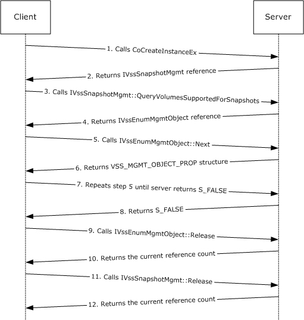
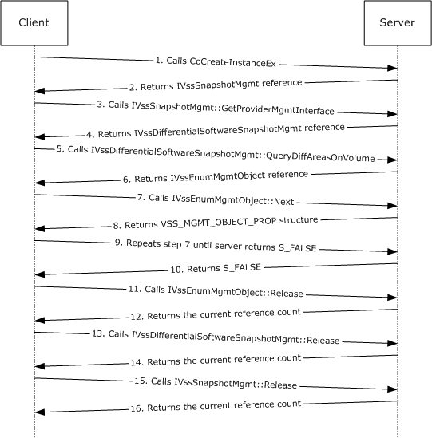

# [MS-SCMP]: Shadow Copy Management Protocol

Table of Contents

1 Introduction

- [1 Introduction](#Section_1)
  - [1.1 Glossary](#Section_1.1)
  - [1.2 References](#Section_1.2)
    - [1.2.1 Normative References](#Section_1.2.1)
    - [1.2.2 Informative References](#Section_1.2.2)
  - [1.3 Overview](#Section_1.3)
  - [1.4 Relationship to Other Protocols](#Section_1.4)
  - [1.5 Prerequisites/Preconditions](#Section_1.5)
  - [1.6 Applicability Statement](#Section_1.6)
  - [1.7 Versioning and Capability Negotiation](#Section_1.7)
  - [1.8 Vendor-Extensible Fields](#Section_1.8)
  - [1.9 Standards Assignments](#Section_1.9)

2 Messages

- [2 Messages](#Section_2)
  - [2.1 Transport](#Section_2.1)
  - [2.2 Common Data Types](#Section_2.2)
    - [2.2.1 Data Types](#Section_2.2.1)
      - [2.2.1.1 VSS_ID](#Section_2.2.1.1)
      - [2.2.1.2 VSS_PWSZ](#Section_2.2.1.2)
      - [2.2.1.3 VSS_TIMESTAMP](#Section_2.2.1.3)
    - [2.2.2 Enumerations](#Section_2.2.2)
      - [2.2.2.1 VSS_OBJECT_TYPE Enumeration](#Section_2.2.2.1)
      - [2.2.2.2 VSS_MGMT_OBJECT_TYPE Enumeration](#Section_2.2.2.2)
      - [2.2.2.3 VSS_VOLUME_SNAPSHOT_ATTRIBUTES Enumeration](#Section_2.2.2.3)
      - [2.2.2.4 VSS_SNAPSHOT_STATE Enumeration](#Section_2.2.2.4)
      - [2.2.2.5 VSS_PROVIDER_TYPE Enumeration](#Section_2.2.2.5)
    - [2.2.3 Structures](#Section_2.2.3)
      - [2.2.3.1 VSS_OBJECT_UNION Union](#Section_2.2.3.1)
      - [2.2.3.2 VSS_OBJECT_PROP Structure](#Section_2.2.3.2)
      - [2.2.3.3 VSS_SNAPSHOT_PROP Structure](#Section_2.2.3.3)
      - [2.2.3.4 VSS_PROVIDER_PROP Structure](#Section_2.2.3.4)
      - [2.2.3.5 VSS_MGMT_OBJECT_UNION Union](#Section_2.2.3.5)
      - [2.2.3.6 VSS_MGMT_OBJECT_PROP Structure](#Section_2.2.3.6)
      - [2.2.3.7 VSS_VOLUME_PROP Structure](#Section_2.2.3.7)
      - [2.2.3.8 VSS_DIFF_VOLUME_PROP Structure](#Section_2.2.3.8)
      - [2.2.3.9 VSS_DIFF_AREA_PROP Structure](#Section_2.2.3.9)

3 Protocol Details

- [3 Protocol Details](#Section_3)
  - [3.1 Server Details](#Section_3.1)
    - [3.1.1 IVssSnapshotMgmt Details](#Section_3.1.1)
      - [3.1.1.1 Abstract Data Model](#Section_3.1.1.1)
      - [3.1.1.2 Timers](#Section_3.1.1.2)
      - [3.1.1.3 Initialization](#Section_3.1.1.3)
      - [3.1.1.4 Message Processing Events and Sequencing Rules](#Section_3.1.1.4)
        - [3.1.1.4.1 GetProviderMgmtInterface (Opnum 3)](#Section_3.1.1.4.1)
        - [3.1.1.4.2 QueryVolumesSupportedForSnapshots (Opnum 4)](#Section_3.1.1.4.2)
          - [3.1.1.4.2.1 Volume Object Enumeration](#Section_3.1.1.4.2.1)
        - [3.1.1.4.3 QuerySnapshotsByVolume (Opnum 5)](#Section_3.1.1.4.3)
          - [3.1.1.4.3.1 Shadow Copy Enumeration Return Value](#Section_3.1.1.4.3.1)
      - [3.1.1.5 Timer Events](#Section_3.1.1.5)
      - [3.1.1.6 Other Local Events](#Section_3.1.1.6)
    - [3.1.2 IVssEnumObject Details](#Section_3.1.2)
      - [3.1.2.1 Next (Opnum 3)](#Section_3.1.2.1)
      - [3.1.2.2 Skip (Opnum 4)](#Section_3.1.2.2)
      - [3.1.2.3 Reset (Opnum 5)](#Section_3.1.2.3)
      - [3.1.2.4 Clone (Opnum 6)](#Section_3.1.2.4)
    - [3.1.3 IVssEnumMgmtObject Details](#Section_3.1.3)
      - [3.1.3.1 Next (Opnum 3)](#Section_3.1.3.1)
      - [3.1.3.2 Skip (Opnum 4)](#Section_3.1.3.2)
      - [3.1.3.3 Reset (Opnum 5)](#Section_3.1.3.3)
      - [3.1.3.4 Clone (Opnum 6)](#Section_3.1.3.4)
    - [3.1.4 IVssDifferentialSoftwareSnapshotMgmt Details](#Section_3.1.4)
      - [3.1.4.1 Abstract Data Model](#Section_3.1.4.1)
      - [3.1.4.2 Timers](#Section_3.1.4.2)
      - [3.1.4.3 Initialization](#Section_3.1.4.3)
      - [3.1.4.4 Message Processing Events and Sequencing Rules](#Section_3.1.4.4)
        - [3.1.4.4.1 Shadow Copy Storage Association Object Enumeration](#Section_3.1.4.4.1)
        - [3.1.4.4.2 AddDiffArea (Opnum 3)](#Section_3.1.4.4.2)
        - [3.1.4.4.3 ChangeDiffAreaMaximumSize (Opnum 4)](#Section_3.1.4.4.3)
        - [3.1.4.4.4 QueryVolumesSupportedForDiffAreas (Opnum 5)](#Section_3.1.4.4.4)
        - [3.1.4.4.5 QueryDiffAreasForVolume (Opnum 6)](#Section_3.1.4.4.5)
        - [3.1.4.4.6 QueryDiffAreasOnVolume (Opnum 7)](#Section_3.1.4.4.6)
      - [3.1.4.5 Timer Events](#Section_3.1.4.5)
      - [3.1.4.6 Other Local Events](#Section_3.1.4.6)
  - [3.2 Client Details](#Section_3.2)
    - [3.2.1 Abstract Data Model](#Section_3.2.1)
    - [3.2.2 Timers](#Section_3.2.2)
    - [3.2.3 Initialization](#Section_3.2.3)
    - [3.2.4 Message Processing Events and Sequencing Rules](#Section_3.2.4)
      - [3.2.4.1 Processing Server Replies to Method Calls](#Section_3.2.4.1)
        - [3.2.4.1.1 Shadow Copy Management Protocol Object Relationships](#Section_3.2.4.1.1)
    - [3.2.5 Timer Events](#Section_3.2.5)
    - [3.2.6 Other Local Events](#Section_3.2.6)

4 Protocol Examples

- [4 Protocol Examples](#Section_4)
  - [4.1 Enumerate Volumes Supporting Shadow Copies](#Section_4.1)
  - [4.2 Calculate Shadow Copy Storage Space on a Volume](#Section_4.2)
  - [4.3 Store Shadow Copies on a Different Volume](#Section_4.3)

5 Security

- [5 Security](#Section_5)
  - [5.1 Security Considerations for Implementers](#Section_5.1)

6 Appendix A: Full IDL

- [6 Appendix A: Full IDL](#Section_6)

7 Appendix B: Product Behavior

- [7 Appendix B: Product Behavior](#Section_7)

8 Change Tracking

- [8 Change Tracking](#Section_8)

For the legal notice and IP terms, see [LEGAL.md](../LEGAL.md).
Last updated: 4/23/2024.
See [Revision History](#revision-history) for full version history.

# 1 Introduction

The Shadow Copy Management Protocol is used to programmatically enumerate [**shadow copies**](#gt_shadow-copy) and configure [**shadow copy storage**](#gt_shadow-copy-storage) on remote machines. The protocol uses a set of [**Distributed Component Object Model (DCOM)**](#gt_distributed-component-object-model-dcom) [**interfaces**](#gt_interface) to query shadow copies and manage shadow copy storage on a remote machine.

This specification describes storage concepts, including [**volume**](#gt_volume) storage concepts, in the Windows operating system. Although this specification outlines some basic storage concepts, it assumes that the reader has familiarity with these technologies. For background information about storage, disk, and volume concepts, see [[MSDN-STC]](https://go.microsoft.com/fwlink/?LinkId=90139) and [[MSDN-VOLMAN]](https://go.microsoft.com/fwlink/?LinkId=90154).

This protocol documentation is intended for use together with publicly available standard specifications, networking programming art, and Microsoft distributed systems concepts. It assumes that the reader is either familiar with this material or has immediate access to it.

A protocol specification does not require the use of Microsoft programming tools or programming environments for a Licensee to develop an implementation. Licensees who have access to Microsoft programming tools and environments are free to take advantage of them.

Sections 1.5, 1.8, 1.9, 2, and 3 of this specification are normative. All other sections and examples in this specification are informative.

## 1.1 Glossary

This document uses the following terms:

**Component Object Model (COM)**: An object-oriented programming model that defines how objects interact within a single process or between processes. In [**COM**](#gt_component-object-model-com), clients have access to an object through interfaces implemented on the object. For more information, see [MS-DCOM](../MS-DCOM/MS-DCOM.md).

**differential data**: The data that can be applied to the contents of an [**original volume**](#gt_original-volume) in order to generate the contents of a [**shadow copy**](#gt_shadow-copy).

**Distributed Component Object Model (DCOM)**: The Microsoft Component Object Model (COM) specification that defines how components communicate over networks, as specified in [MS-DCOM].

**drive letter**: One of the 26 alphabetical characters A-Z, in uppercase or lowercase, that is assigned to a volume. Drive letters serve as a namespace through which data on the volume can be accessed. A volume with a drive letter can be referred to with the drive letter followed by a colon (for example, C:).

**endpoint**: A network-specific address of a remote procedure call (RPC) server process for remote procedure calls. The actual name and type of the endpoint depends on the [**RPC**](#gt_remote-procedure-call-rpc) protocol sequence that is being used. For example, for RPC over TCP (RPC Protocol Sequence ncacn_ip_tcp), an endpoint might be TCP port 1025. For RPC over Server Message Block (RPC Protocol Sequence ncacn_np), an endpoint might be the name of a named pipe. For more information, see [[C706]](https://go.microsoft.com/fwlink/?LinkId=89824).

**free space**: Space on a disk not in use by any [**volumes**](#gt_volume), primary partitions, or logical drives.

**fully qualified domain name (FQDN)**: An unambiguous domain name that gives an absolute location in the Domain Name System's (DNS) hierarchy tree, as defined in [[RFC1035]](https://go.microsoft.com/fwlink/?LinkId=90264) section 3.1 and [[RFC2181]](https://go.microsoft.com/fwlink/?LinkId=127732) section 11.

**globally unique identifier (GUID)**: A term used interchangeably with [**universally unique identifier (UUID)**](#gt_universally-unique-identifier-uuid) in Microsoft protocol technical documents (TDs). Interchanging the usage of these terms does not imply or require a specific algorithm or mechanism to generate the value. Specifically, the use of this term does not imply or require that the algorithms described in [[RFC4122]](https://go.microsoft.com/fwlink/?LinkId=90460) or [C706] must be used for generating the [**GUID**](#gt_globally-unique-identifier-guid). See also [**universally unique identifier (UUID)**](#gt_universally-unique-identifier-uuid).

**HRESULT**: An integer value that indicates the result or status of an operation. A particular HRESULT can have different meanings depending on the protocol using it. See [MS-ERREF](../MS-ERREF/MS-ERREF.md) section 2.1 and specific protocol documents for further details.

**interface**: A group of related function prototypes in a specific order, analogous to a C++ virtual interface. Multiple objects, of different object classes, can implement the same interface. A derived interface can be created by adding methods after the end of an existing interface. In the Distributed Component Object Model (DCOM), all interfaces initially derive from IUnknown.

**Interface Definition Language (IDL)**: The International Standards Organization (ISO) standard language for specifying the [**interface**](#gt_interface) for remote procedure calls. For more information, see [C706] section 4.

**mount point**: See mounted folder.

**Network Data Representation (NDR)**: A specification that defines a mapping from [**Interface Definition Language (IDL)**](#gt_interface-definition-language-idl) data types onto octet streams. [**NDR**](#gt_network-data-representation-ndr) also refers to the runtime environment that implements the mapping facilities (for example, data provided to [**NDR**](#gt_network-data-representation-ndr)). For more information, see [MS-RPCE](../MS-RPCE/MS-RPCE.md) and [C706] section 14.

**opnum**: An operation number or numeric identifier that is used to identify a specific [**remote procedure call (RPC)**](#gt_remote-procedure-call-rpc) method or a method in an interface. For more information, see [C706] section 12.5.2.12 or [MS-RPCE].

**original volume**: The [**volume**](#gt_volume) from which the [**shadow copy**](#gt_shadow-copy) is derived.

**path**: When referring to a file path on a file system, a hierarchical sequence of folders. When referring to a connection to a storage device, a connection through which a machine can communicate with the storage device.

**remote procedure call (RPC)**: A communication protocol used primarily between client and server. The term has three definitions that are often used interchangeably: a runtime environment providing for communication facilities between computers (the RPC runtime); a set of request-and-response message exchanges between computers (the RPC exchange); and the single message from an RPC exchange (the RPC message). For more information, see [C706].

**RPC protocol sequence**: A character string that represents a valid combination of a [**remote procedure call (RPC)**](#gt_remote-procedure-call-rpc) protocol, a network layer protocol, and a transport layer protocol, as described in [C706] and [MS-RPCE].

**RPC transport**: The underlying network services used by the remote procedure call (RPC) runtime for communications between network nodes. For more information, see [C706] section 2.

**shadow copy**: A duplicate of data held on a [**volume**](#gt_volume) at a well-defined instant in time.

**shadow copy provider**: A software component on the server that provides local services to create, enumerate, delete, and manage [**shadow copies**](#gt_shadow-copy).

**shadow copy set**: A collection of [**shadow copies**](#gt_shadow-copy) that are created at the same time and identified by a common ID.

**shadow copy storage**: The storage location where the [**differential data**](#gt_differential-data) from an [**original volume**](#gt_original-volume) is stored in order to maintain all [**shadow copies**](#gt_shadow-copy) for a specified [**original volume**](#gt_original-volume). The location can be a file or a set of files on the same [**volume**](#gt_volume) or on a separate [**volume**](#gt_volume).

**shadow copy storage association**: The relationship between the [**original volume**](#gt_original-volume) and the [**volume**](#gt_volume) where the [**shadow copy storage**](#gt_shadow-copy-storage) is located.

**shadow copy storage volume**: The [**volume**](#gt_volume) on which [**shadow copy storage**](#gt_shadow-copy-storage) is located.

**snapshot**: The point in time at which a [**shadow copy**](#gt_shadow-copy) of a [**volume**](#gt_volume) is made.

**universally unique identifier (UUID)**: A 128-bit value. UUIDs can be used for multiple purposes, from tagging objects with an extremely short lifetime, to reliably identifying very persistent objects in cross-process communication such as client and server interfaces, manager entry-point vectors, and [**RPC**](#gt_remote-procedure-call-rpc) objects. UUIDs are highly likely to be unique. UUIDs are also known as [**globally unique identifiers (GUIDs)**](#gt_globally-unique-identifier-guid) and these terms are used interchangeably in the Microsoft protocol technical documents (TDs). Interchanging the usage of these terms does not imply or require a specific algorithm or mechanism to generate the UUID. Specifically, the use of this term does not imply or require that the algorithms described in [RFC4122] or [C706] must be used for generating the UUID.

**volume**: A group of one or more partitions that forms a logical region of storage and the basis for a file system. A [**volume**](#gt_volume) is an area on a storage device that is managed by the file system as a discrete logical storage unit. A partition contains at least one [**volume**](#gt_volume), and a volume can exist on one or more partitions.

**volume mount name**: A path for a volume. The path consists of a [**GUID**](#gt_globally-unique-identifier-guid) formatted as a string. Applications can use this path to open the volume.

**MAY, SHOULD, MUST, SHOULD NOT, MUST NOT:** These terms (in all caps) are used as defined in [[RFC2119]](https://go.microsoft.com/fwlink/?LinkId=90317). All statements of optional behavior use either MAY, SHOULD, or SHOULD NOT.

## 1.2 References

Links to a document in the Microsoft Open Specifications library point to the correct section in the most recently published version of the referenced document. However, because individual documents in the library are not updated at the same time, the section numbers in the documents may not match. You can confirm the correct section numbering by checking the [Errata](https://go.microsoft.com/fwlink/?linkid=850906).

### 1.2.1 Normative References

We conduct frequent surveys of the normative references to assure their continued availability. If you have any issue with finding a normative reference, please contact [dochelp@microsoft.com](mailto:dochelp@microsoft.com). We will assist you in finding the relevant information.

[C706] The Open Group, "DCE 1.1: Remote Procedure Call", C706, August 1997, [https://publications.opengroup.org/c706](https://go.microsoft.com/fwlink/?LinkId=89824)

**Note** Registration is required to download the document.

[MS-DCOM] Microsoft Corporation, "[Distributed Component Object Model (DCOM) Remote Protocol](../MS-DCOM/MS-DCOM.md)".

[MS-DTYP] Microsoft Corporation, "[Windows Data Types](../MS-DTYP/MS-DTYP.md)".

[MS-OAUT] Microsoft Corporation, "[OLE Automation Protocol](../MS-OAUT/MS-OAUT.md)".

[MS-RPCE] Microsoft Corporation, "[Remote Procedure Call Protocol Extensions](../MS-RPCE/MS-RPCE.md)".

[RFC2119] Bradner, S., "Key words for use in RFCs to Indicate Requirement Levels", BCP 14, RFC 2119, March 1997, [https://www.rfc-editor.org/info/rfc2119](https://go.microsoft.com/fwlink/?LinkId=90317)

### 1.2.2 Informative References

[MS-SMB] Microsoft Corporation, "[Server Message Block (SMB) Protocol](../MS-SMB/MS-SMB.md)".

[MSDN-SHADOW] Microsoft Corporation, "Volume Shadow Copy Service", [http://msdn.microsoft.com/en-us/library/bb968832(VS.85).aspx](https://go.microsoft.com/fwlink/?LinkId=125176)

[MSDN-STC] Microsoft Corporation, "Storage Technologies Collection", March 2003, [http://technet2.microsoft.com/WindowsServer/en/Library/616e5e77-958b-42f0-a87f-ba229ccd81721033.mspx](https://go.microsoft.com/fwlink/?LinkId=90139)

[MSDN-VOLMAN] Microsoft Corporation, "Volume Management", [http://msdn.microsoft.com/en-us/library/aa365728.aspx](https://go.microsoft.com/fwlink/?LinkId=90154)

## 1.3 Overview

The Shadow Copy Management Protocol provides a mechanism for remote configuration of [**shadow copies**](#gt_shadow-copy). Through the Shadow Copy Management Protocol, a client performs operations to enumerate shadow copies and configure the storage size and location that are used to maintain the shadow copies on the server.

The Shadow Copy Management Protocol is expressed as a set of [**DCOM**](#gt_distributed-component-object-model-dcom) [**interfaces**](#gt_interface). The server end of the protocol implements support for the DCOM interfaces to manage shadow copy configuration objects. The client end of the protocol invokes method calls on the interfaces to perform shadow copy configuration tasks on the server.<1> Specifically, the protocol is used for the following purposes:

- Enumerating the [**volumes**](#gt_volume) on the server that can be shadow copied.
- Enumerating the shadow copies that are currently available on the server and that are point-in-time copies of a specified [**original volume**](#gt_original-volume).
- Enumerating the volumes on the server that can be used as [**shadow copy storage**](#gt_shadow-copy-storage).
- Creating, modifying, enumerating, and deleting the [**shadow copy storage association**](#gt_shadow-copy-storage-association) objects that define the location and size of shadow copy storage for specific original volumes.
- Querying all the shadow copy storage association objects on the server that provide shadow copy storage for a specified original volume.
- Querying all the shadow copy storage association objects on the server that are located on a specified [**shadow copy storage volume**](#gt_shadow-copy-storage-volume).

## 1.4 Relationship to Other Protocols

The Shadow Copy Management Protocol relies on the Distributed Component Object Model (DCOM) Remote Protocol, as specified in [MS-DCOM](../MS-DCOM/MS-DCOM.md), which uses [**remote procedure call (RPC)**](#gt_remote-procedure-call-rpc) as its transport.

The Shadow Copy Management Protocol provides remote management of the storage configuration for [**shadow copies**](#gt_shadow-copy) for shared folders, which are remotely accessible through the Server Message Block (SMB) Protocol, as specified in [MS-SMB](../MS-SMB/MS-SMB.md).

## 1.5 Prerequisites/Preconditions

The Shadow Copy Management Protocol is implemented over DCOM and [**RPC**](#gt_remote-procedure-call-rpc), and as a result, has the prerequisites that are specified in [MS-DCOM](../MS-DCOM/MS-DCOM.md), [MS-OAUT](../MS-OAUT/MS-OAUT.md), and [MS-RPCE](../MS-RPCE/MS-RPCE.md) as being common to DCOM, DCOM "automation", and RPC [**interfaces**](#gt_interface).

This protocol assumes that a client has obtained the name of a server that supports this protocol suite before the protocol is invoked. This name can be obtained by using any implementation-specific method. The protocol also assumes that the client has sufficient security privileges to configure [**snapshots**](#gt_snapshot) and [**volumes**](#gt_volume) on the server.

An operating system on which an implementation of the Shadow Copy Management Protocol is to run must support the ability to dynamically enumerate the list of volumes and [**shadow copies**](#gt_shadow-copy) that are configured on the server during run time.

For more information about these requirements, see [IVssSnapshotMgmt::QueryVolumesSupportedForSnapshots (section 3.1.1.4.2)](#Section_3.1.1.4.2), [IVssSnapshotMgmt::QuerySnapshotsByVolume (section 3.1.1.4.3)](#Section_3.1.1.4.3), [IVssDifferentialSoftwareSnapshotMgmt::QueryVolumesSupportedForDiffAreas (section 3.1.4.4.4)](#Section_3.1.4.4.4), [IVssDifferentialSoftwareSnapshotMgmt::QueryDiffAreasForVolume (section 3.1.4.4.5)](#Section_3.1.4.4.5), and [IVssDifferentialSoftwareSnapshotMgmt::QueryDiffAreasOnVolume (section 3.1.4.4.6)](#Section_3.1.4.4.6).

## 1.6 Applicability Statement

An application uses this protocol to remotely configure [**shadow copies**](#gt_shadow-copy) and [**shadow copy storage**](#gt_shadow-copy-storage) on the server.

## 1.7 Versioning and Capability Negotiation

**Supported Transports:** This protocol uses the Distributed Component Object Model (DCOM) Remote Protocol, as specified in [MS-DCOM](../MS-DCOM/MS-DCOM.md), which in turn uses [**RPC**](#gt_remote-procedure-call-rpc) over TCP, as its only transport. For details, see [Transport (section 2.1)](#Section_2.1).

**Protocol Version:** This protocol consists of four DCOM [**interfaces**](#gt_interface), all of which are version 1.0.<2>

**Functionality Negotiation:** The client negotiates for a specific set of server functionalities by specifying the [**UUID**](#gt_universally-unique-identifier-uuid) that corresponds to the requested RPC interface via COM IUnknown::QueryInterface when binding to the server. Certain interfaces are implemented by only particular objects on the server (for details, see section 2.1).

**Security and Authentication Methods:** This protocol relies on the security and authentication that is provided by the DCOM Remote Protocol, as specified in [MS-DCOM], and the Remote Procedure Call Protocol Extensions, as specified in [MS-RPCE](../MS-RPCE/MS-RPCE.md). This protocol configures security and authentication as specified in Transport (section 2.1).

## 1.8 Vendor-Extensible Fields

None.

## 1.9 Standards Assignments

The following [**UUID**](#gt_universally-unique-identifier-uuid) assignments are Microsoft private assignments.

| Parameter | Value | Reference |
| --- | --- | --- |
| [**RPC**](#gt_remote-procedure-call-rpc) [**interface**](#gt_interface) UUID for [IVssSnapshotMgmt](#Section_3.1.1) | FA7DF749-66E7-4986-A27F-E2F04AE53772 | None |
| RPC interface UUID for [IVssEnumObject](#Section_3.1.2) | AE1C7110-2F60-11d3-8A39-00C04F72D8E3 | None |
| RPC interface UUID for [IVssDifferentialSoftwareSnapshotMgmt](#Section_3.1.4) | 214A0F28-B737-4026-B847-4F9E37D79529 | None |
| RPC interface UUID for [IVssEnumMgmtObject](#Section_3.1.3) | 01954E6B-9254-4e6e-808C-C9E05D007696 | None |
| [**Shadow copy provider**](#gt_shadow-copy-provider) UUID | B5946137-7B9F-4925-AF80-51ABD60B20D5 | None |

# 2 Messages

## 2.1 Transport

For its transport, this protocol uses the Distributed Component Object Model (DCOM) Remote Protocol, as specified in [MS-DCOM](../MS-DCOM/MS-DCOM.md). The DCOM Remote Protocol uses the following [**RPC protocol sequence**](#gt_rpc-protocol-sequence): [**RPC**](#gt_remote-procedure-call-rpc) over TCP, as specified in [MS-RPCE](../MS-RPCE/MS-RPCE.md).

To access an [**interface**](#gt_interface), the client requests a DCOM connection to its object [**UUID**](#gt_universally-unique-identifier-uuid) [**endpoint**](#gt_endpoint) on the server, as described in [Standards Assignments (section 1.9)](#Section_1.9).

The RPC version number for all interfaces is 0.0.

An implementation of the Shadow Copy Management Protocol MAY configure its DCOM implementation or underlying RPC transport with authentication parameters to restrict client connections. The details of this behavior are implementation-specific.<3>

The Shadow Copy Management Protocol interfaces make use of the underlying DCOM security framework, as specified in [MS-DCOM], and rely on it for access control. DCOM differentiates between launch and access.<4>

## 2.2 Common Data Types

In addition to the [**RPC**](#gt_remote-procedure-call-rpc) base types and definitions specified in [[C706]](https://go.microsoft.com/fwlink/?LinkId=89824) and [MS-RPCE](../MS-RPCE/MS-RPCE.md), additional data types are defined in the following sections, which summarize the types that are defined in this specification.

### 2.2.1 Data Types

#### 2.2.1.1 VSS_ID

The VSS_ID data type defines the identifier (ID) as a [**GUID**](#gt_globally-unique-identifier-guid) for [**shadow copy**](#gt_shadow-copy) objects. GUID is defined in [MS-DTYP](../MS-DTYP/MS-DTYP.md) section 2.3.4.

This type is declared as follows:

typedef GUID VSS_ID;

#### 2.2.1.2 VSS_PWSZ

The VSS_PWSZ data type defines a null-terminated character string.

This type is declared as follows:

typedef [unique, string] WCHAR* VSS_PWSZ;

#### 2.2.1.3 VSS_TIMESTAMP

The VSS_TIMESTAMP data type defines a time stamp value. This data type is identical in format to the FILETIME data type.

This type is declared as follows:

typedef LONGLONG VSS_TIMESTAMP;

### 2.2.2 Enumerations

#### 2.2.2.1 VSS_OBJECT_TYPE Enumeration

The VSS_OBJECT_TYPE enumeration defines the types of objects that can be queried by the [IVssEnumObject](#Section_3.1.2) [**interface**](#gt_interface).

typedef [v1_enum] enum _VSS_OBJECT_TYPE

{

VSS_OBJECT_UNKNOWN = 0x00000000,

VSS_OBJECT_NONE = 0x00000001,

VSS_OBJECT_SNAPSHOT_SET = 0x00000002,

VSS_OBJECT_SNAPSHOT = 0x00000003,

VSS_OBJECT_PROVIDER = 0x00000004,

VSS_OBJECT_TYPE_COUNT = 0x00000005

} VSS_OBJECT_TYPE;

**VSS_OBJECT_UNKNOWN:** The object is of an unknown type of [**shadow copy**](#gt_shadow-copy).

**VSS_OBJECT_NONE:** This value MUST NOT be used and MUST be ignored upon receipt.

**VSS_OBJECT_SNAPSHOT_SET:** The object is a [**shadow copy set**](#gt_shadow-copy-set).

**VSS_OBJECT_SNAPSHOT:** The object is a shadow copy.

**VSS_OBJECT_PROVIDER:** This value is not used by the Shadow Copy Management Protocol and MUST NOT be referenced. It MUST be ignored on receipt.

**VSS_OBJECT_TYPE_COUNT:** This value is the number of VSS_OBJECT_TYPE values in the enumeration.

#### 2.2.2.2 VSS_MGMT_OBJECT_TYPE Enumeration

The VSS_MGMT_OBJECT_TYPE enumeration defines the types of objects that can be queried by the [IVssEnumMgmtType](#Section_3.1.3) [**interface**](#gt_interface).

typedef [v1_enum] enum _VSS_MGMT_OBJECT_TYPE

{

VSS_MGMT_OBJECT_UNKNOWN = 0x00000000,

VSS_MGMT_OBJECT_VOLUME = 0x00000001,

VSS_MGMT_OBJECT_DIFF_VOLUME = 0x00000002,

VSS_MGMT_OBJECT_DIFF_AREA = 0x00000003,

} VSS_MGMT_OBJECT_TYPE;

**VSS_MGMT_OBJECT_UNKNOWN:** The object is of an unknown type.

**VSS_MGMT_OBJECT_VOLUME:** The object is an [**original volume**](#gt_original-volume).

**VSS_MGMT_OBJECT_DIFF_VOLUME:** The object is a [**shadow copy storage volume**](#gt_shadow-copy-storage-volume).

**VSS_MGMT_OBJECT_DIFF_AREA:** The object is [**shadow copy storage**](#gt_shadow-copy-storage).

#### 2.2.2.3 VSS_VOLUME_SNAPSHOT_ATTRIBUTES Enumeration

The VSS_VOLUME_SNAPSHOT_ATTRIBUTES enumeration defines the set of valid attribute flags for a [**shadow copy**](#gt_shadow-copy).

typedef [v1_enum] enum _VSS_VOLUME_SNAPSHOT_ATTRIBUTES

{

VSS_VOLSNAP_ATTR_PERSISTENT = 0x00000001,

VSS_VOLSNAP_ATTR_NO_AUTORECOVERY = 0x00000002,

VSS_VOLSNAP_ATTR_CLIENT_ACCESSIBLE = 0x00000004,

VSS_VOLSNAP_ATTR_NO_AUTO_RELEASE = 0x00000008,

VSS_VOLSNAP_ATTR_NO_WRITERS = 0x00000010,

} VSS_VOLUME_SNAPSHOT_ATTRIBUTES;

**VSS_VOLSNAP_ATTR_PERSISTENT:** The shadow copy persists on the system despite rebooting the machine.

**VSS_VOLSNAP_ATTR_NO_AUTORECOVERY:** The shadow copy is created as read-only. Applications are not provided an opportunity to modify its contents.

**VSS_VOLSNAP_ATTR_CLIENT_ACCESSIBLE:** The shadow copy is of a specific type that can be exposed remotely through the SMB Protocol [MS-SMB](../MS-SMB/MS-SMB.md).

**VSS_VOLSNAP_ATTR_NO_AUTO_RELEASE:** The shadow copy is not deleted after the client releases all references to the local interface that is used to create the shadow copy.

**VSS_VOLSNAP_ATTR_NO_WRITERS:** The shadow copy is created without any application-specific participation.

#### 2.2.2.4 VSS_SNAPSHOT_STATE Enumeration

The VSS_SNAPSHOT_STATE enumeration defines the set of valid states of a [**shadow copy**](#gt_shadow-copy).

typedef [v1_enum] enum _VSS_SNAPSHOT_STATE

{

VSS_SS_UNKNOWN = 0x00000000,

VSS_SS_CREATED = 0x0000000c,

} VSS_SNAPSHOT_STATE;

**VSS_SS_UNKNOWN:** The shadow copy state is unknown. This is a restricted shadow copy state. Shadow copies that are managed with this protocol MUST NOT appear in this state.

**VSS_SS_CREATED:** The shadow copy is created.

#### 2.2.2.5 VSS_PROVIDER_TYPE Enumeration

The VSS_PROVIDER_TYPE enumeration defines the set of valid [**shadow copy provider**](#gt_shadow-copy-provider) types. This enumeration is not used by the Shadow Copy Management Protocol; it MUST NOT be referenced and MUST be ignored on receipt.

typedef [v1_enum] enum _VSS_PROVIDER_TYPE

{

VSS_PROV_UNKNOWN = 0x00000000,

} VSS_PROVIDER_TYPE;

**VSS_PROV_UNKNOWN:** The shadow copy provider type is unknown.

### 2.2.3 Structures

#### 2.2.3.1 VSS_OBJECT_UNION Union

The VSS_OBJECT_UNION defines the union of object types that can be defined by the [VSS_OBJECT_PROP structure (section 2.2.3.2)](#Section_2.2.3.2).

[switch_type(VSS_OBJECT_TYPE)]

typedef union { [case(VSS_OBJECT_SNAPSHOT)]

VSS_SNAPSHOT_PROP Snap;

[case(VSS_OBJECT_PROVIDER)]

VSS_PROVIDER_PROP Prov;

[default]; } VSS_OBJECT_UNION;

**Snap:** The structure specifies a [**shadow copy**](#gt_shadow-copy) object as a [VSS_SNAPSHOT_PROP structure (section 2.2.3.3)](#Section_2.2.3.3).

**Prov:** The structure specifies a VSS provider object. The Shadow Copy Management Protocol is not used to manage VSS provider objects; therefore, this member MUST NOT be referenced and MUST be ignored on receipt.

#### 2.2.3.2 VSS_OBJECT_PROP Structure

The VSS_OBJECT_PROP structure specifies the union of object types that can be enumerated by the [IVssEnumObject](#Section_3.1.2) [**interface**](#gt_interface).

typedef struct _VSS_OBJECT_PROP {

VSS_OBJECT_TYPE Type;

[switch_is(Type)] VSS_OBJECT_UNION Obj;

} VSS_OBJECT_PROP;

**Type:** A value defined in the [VSS_OBJECT_TYPE enumeration (section 2.2.2.1)](#Section_2.2.2.1) that specifies the type of object that is contained in the **Obj** union structure.

**Obj:** A [VSS_OBJECT_UNION structure (section 2.2.3.1)](#Section_2.2.3.1).

#### 2.2.3.3 VSS_SNAPSHOT_PROP Structure

The VSS_SNAPSHOT_PROP structure provides information about a [**shadow copy**](#gt_shadow-copy) object.

typedef struct _VSS_SNAPSHOT_PROP {

VSS_ID m_SnapshotId;

VSS_ID m_SnapshotSetId;

LONG m_lSnapshotsCount;

VSS_PWSZ m_pwszSnapshotDeviceObject;

VSS_PWSZ m_pwszOriginalVolumeName;

VSS_PWSZ m_pwszOriginatingMachine;

VSS_PWSZ m_pwszServiceMachine;

VSS_PWSZ m_pwszExposedName;

VSS_PWSZ m_pwszExposedPath;

VSS_ID m_ProviderId;

LONG m_lSnapshotAttributes;

VSS_TIMESTAMP m_tsCreationTimestamp;

VSS_SNAPSHOT_STATE m_eStatus;

} VSS_SNAPSHOT_PROP;

**m_SnapshotId:** The [VSS_ID (section 2.2.1.1)](#Section_2.2.1.1) that identifies this shadow copy object.

**m_SnapshotSetId:** The VSS_ID that identifies the [**shadow copy set**](#gt_shadow-copy-set) of which this shadow copy object is a member. All shadow copy objects in the same [**snapshot**](#gt_snapshot) set MUST have the same value for **m_SnapshotSetId**.

**m_lSnapshotsCount:** The number of shadow copies in the shadow copy set when it was originally created. It is possible that individual shadow copies that make up the shadow copy set are deleted so that, at any time, it is possible that the number of shadow copies currently in the snapshot set is less than **m_lSnapshotCount**.

**m_pwszSnapshotDeviceObject:** The null-terminated character string that contains the name of the [**volume**](#gt_volume) device for the shadow copy volume object on the server.<5>

**m_pwszOriginalVolumeName:** The null-terminated character string that contains the [**volume mount name**](#gt_volume-mount-name) of the volume from which a shadow copy was obtained in order to generate this shadow copy object.

**m_pwszOriginatingMachine:** The null-terminated character string that contains the name of the machine that hosts the [**original volume**](#gt_original-volume). The server MUST populate this string with the [**fully qualified domain name (FQDN)**](#gt_fully-qualified-domain-name-fqdn) of the server machine. For this protocol, the value of **m_pwszOriginatingMachine** and **m_pwszServiceMachine** MUST be the same.

**m_pwszServiceMachine:** The null-terminated character string that contains the name of the machine on which the shadow copy was created. The server MUST populate this string with the FQDN of the server machine. For this protocol, the value of **m_pwszOriginatingMachine** and **m_pwszServiceMachine** MUST be the same.

**m_pwszExposedName:** The null-terminated character string that contains the [**drive letter**](#gt_drive-letter), [**mount point**](#gt_mount-point), or SMB share name if the shadow copy is exposed on the server. For this protocol, the server MUST set this value to NULL.

**m_pwszExposedPath:** The null-terminated character string that contains the full, root-relative [**path**](#gt_path) to a folder on the shadow copy that is to be exposed as an SMB share. For this protocol, the server MUST set this value to NULL.

**m_ProviderId:** The VSS_ID of the [VSS provider](#Section_2.2.3.4) that was used to create the shadow copy.

**m_lSnapshotAttributes:** The attributes of the shadow copy. The value of this LONG value is a combination of the values that are defined in VSS_VOLUME_SNAPSHOT_ATTRIBUTES.

**m_tsCreationTimestamp:** The time stamp that defines when the shadow copy was created.

**m_eStatus:** A value from the [VSS_SNAPSHOT_STATE enumeration (section 2.2.2.4)](#Section_2.2.2.4) that defines the state of the snapshot. For this protocol, the value of **m_eStatus** MUST be VSS_SS_CREATED.

#### 2.2.3.4 VSS_PROVIDER_PROP Structure

The VSS_PROVIDER_PROP structure provides information about a [**shadow copy provider**](#gt_shadow-copy-provider). This structure is not used by this protocol. It MUST NOT be referenced and MUST be ignored on receipt.

typedef struct _VSS_PROVIDER_PROP {

VSS_ID m_ProviderId;

VSS_PWSZ m_pwszProviderName;

VSS_PROVIDER_TYPE m_eProviderType;

VSS_PWSZ m_pwszProviderVersion;

VSS_ID m_ProviderVersionId;

CLSID m_ClassId;

} VSS_PROVIDER_PROP;

#### 2.2.3.5 VSS_MGMT_OBJECT_UNION Union

The VSS_MGMT_OBJECT_UNION specifies the union of object types that can be defined by the [VSS_MGMT_OBJECT_PROP structure (section 2.2.3.6)](#Section_2.2.3.6).

[switch_type(VSS_MGMT_OBJECT_TYPE)]

typedef union {

[case(VSS_MGMT_OBJECT_VOLUME)]

VSS_VOLUME_PROP Vol;

[case(VSS_MGMT_OBJECT_DIFF_VOLUME)]

VSS_DIFF_VOLUME_PROP DiffVol;

[case(VSS_MGMT_OBJECT_DIFF_AREA)]

VSS_DIFF_AREA_PROP DiffArea;

[default];

} VSS_MGMT_OBJECT_UNION;

**Vol:** The structure specifies an [**original volume**](#gt_original-volume) object as a [VSS_VOLUME_PROP structure (section 2.2.3.7)](#Section_2.2.3.7).

**DiffVol:** The structure specifies a [**shadow copy storage volume**](#gt_shadow-copy-storage-volume) as a [VSS_DIFF_VOLUME_PROP](#Section_2.2.3.8) structure.

**DiffArea:** The structure specifies a [**shadow copy storage**](#gt_shadow-copy-storage) object as a [VSS_DIFF_AREA_PROP](#Section_2.2.3.9).

#### 2.2.3.6 VSS_MGMT_OBJECT_PROP Structure

The VSS_MGMT_OBJECT_PROP structure defines the union of object types that can be enumerated by the [IVssEnumMgmtObject](#Section_3.1.3) [**interface**](#gt_interface).

typedef struct _VSS_MGMT_OBJECT_PROP {

VSS_MGMT_OBJECT_TYPE Type;

[switch_is(Type)] VSS_MGMT_OBJECT_UNION Obj;

} VSS_MGMT_OBJECT_PROP;

**Type:** A value that is defined in the [VSS_MGMT_OBJECT_TYPE](#Section_2.2.2.2) enumeration that specifies the type of object that is contained in the **Obj** union structure.

**Obj:** A [VSS_MGMT_OBJECT_UNION](#Section_2.2.3.5) structure.

#### 2.2.3.7 VSS_VOLUME_PROP Structure

The VSS_VOLUME_PROP structure defines properties of a [**volume**](#gt_volume).

typedef struct _VSS_VOLUME_PROP {

VSS_PWSZ m_pwszVolumeName;

VSS_PWSZ m_pwszVolumeDisplayName;

} VSS_VOLUME_PROP;

**m_pwszVolumeName:** A null-terminated character string that contains the [**volume mount name**](#gt_volume-mount-name) of the volume.

**m_pwszVolumeDisplayName:** A null-terminated character string that contains a [**mount point**](#gt_mount-point) [**path**](#gt_path) for the volume. If the volume has no mount points, the string MUST be equal to **m_pwszVolumeName**.

#### 2.2.3.8 VSS_DIFF_VOLUME_PROP Structure

The VSS_DIFF_VOLUME_PROP structure defines the properties of a [**shadow copy storage volume**](#gt_shadow-copy-storage-volume).

typedef struct _VSS_DIFF_VOLUME_PROP {

VSS_PWSZ m_pwszVolumeName;

VSS_PWSZ m_pwszVolumeDisplayName;

LONGLONG m_llVolumeFreeSpace;

LONGLONG m_llVolumeTotalSpace;

} VSS_DIFF_VOLUME_PROP;

**m_pwszVolumeName:** A null-terminated character string that contains the [**volume mount name**](#gt_volume-mount-name) of the [**volume**](#gt_volume).

**m_pwszVolumeDisplayName:** A null-terminated character string that contains one of the [**mount point**](#gt_mount-point) [**paths**](#gt_path) for the volume. If the volume has no mount points, the string MUST be equal to **m_pwszVolumeName**.

**m_llVolumeFreeSpace:** The amount of [**free space**](#gt_free-space), in BYTEs, on the volume.

**m_llVolumeTotalSpace:** The total size, in BYTEs, of the volume.

#### 2.2.3.9 VSS_DIFF_AREA_PROP Structure

The VSS_DIFF_AREA_PROP structure defines a [**shadow copy storage association**](#gt_shadow-copy-storage-association) and the current sizes of the [**shadow copy storage**](#gt_shadow-copy-storage).

typedef struct _VSS_DIFF_AREA_PROP {

VSS_PWSZ m_pwszVolumeName;

VSS_PWSZ m_pwszDiffAreaVolumeName;

LONGLONG m_llMaximumDiffSpace;

LONGLONG m_llAllocatedDiffSpace;

LONGLONG m_llUsedDiffSpace;

} VSS_DIFF_AREA_PROP;

**m_pwszVolumeName:** A null-terminated character string that contains the [**volume mount name**](#gt_volume-mount-name) of the [**original volume**](#gt_original-volume) that is or will be shadow copied.

**m_pwszDiffAreaVolumeName:** A null-terminated character string that contains the volume mount name of the [**shadow copy storage volume**](#gt_shadow-copy-storage-volume) where [**shadow copy**](#gt_shadow-copy) [**differential data**](#gt_differential-data) will be located for the [**volume**](#gt_volume) specified in **m_pwszVolumeName**.

**m_llMaximumDiffSpace:** The maximum number of BYTEs that will be consumed on the shadow copy storage volume to maintain shadow copies.

**m_llAllocatedDiffSpace:** The number of BYTEs currently allocated for shadow copy storage space. This value MUST be less than or equal to **m_llMaximumDiffSpace**.

**m_llUsedDiffSpace:** The number of BYTEs currently in use on the shadow copy storage volume to maintain shadow copies. This value MUST be less than or equal to **m_llAllocatedDiffSpace**.

# 3 Protocol Details

The client side of this protocol is simply a pass-through: no additional timers or other state is required on the client side of this protocol. Calls made by the higher-layer protocol or application are passed directly to the transport, and the results returned by the transport are passed directly back to the higher-layer protocol or application.

## 3.1 Server Details

### 3.1.1 IVssSnapshotMgmt Details

#### 3.1.1.1 Abstract Data Model

This section describes a conceptual model of possible data organization that an implementation maintains to participate in this protocol. The described organization is provided to facilitate the explanation of how the protocol behaves. This document does not mandate that implementations adhere to this model as long as their external behavior is consistent with that described in this document.

A server that implements the Shadow Copy Management Protocol maintains the persistent configuration of [**shadow copies**](#gt_shadow-copy) and [**shadow copy storage associations**](#gt_shadow-copy-storage-association). The server also provides [**interfaces**](#gt_interface) to enumerate shadow copies and [**volumes**](#gt_volume) that can be shadow copied or used as [**shadow copy storage volumes**](#gt_shadow-copy-storage-volume).

**Volumes supporting shadow** copies: The server provides the mechanism to enumerate the volumes on the server that support shadow copies. Each volume on the server that can support shadow copies is represented in this protocol by a [VSS_VOLUME_PROP](#Section_2.2.3.7) structure.

**Shadow copies:** The server maintains a list of shadow copies for each volume that can support shadow copies. The protocol enforces no restriction on the number of shadow copies that can exist for a particular volume. The server provides the mechanism to enumerate existing shadow copies on a specific volume on the server and exposes that enumeration through the [IVssEnumObject](#Section_3.1.2) interface. Each shadow copy that is returned by the IVssEnumObject interface is represented as a [VSS_SNAPSHOT_PROP](#Section_2.2.3.3) structure.

#### 3.1.1.2 Timers

None.

#### 3.1.1.3 Initialization

The server MUST register the Shadow Copy Management Protocol DCOM [**interfaces**](#gt_interface) and begin listening on the DCOM ports as specified in [MS-DCOM](../MS-DCOM/MS-DCOM.md).

#### 3.1.1.4 Message Processing Events and Sequencing Rules

For all the following methods, the server SHOULD obtain the identity and authorization information before processing the method about the client from the underlying DCOM or [**RPC**](#gt_remote-procedure-call-rpc) runtime to verify that the client has sufficient permissions to create, modify, or delete the object as appropriate. These methods SHOULD impose an authorization policy decision before performing the function. The suggested minimum requirement is that the caller have permission to create, modify, query, or delete the object (or a combination of these permissions) as appropriate.

All Shadow Copy Management Protocol [**interfaces**](#gt_interface) that are listed inherit the IUnknown interface. Method [**opnum**](#gt_opnum) field values for all Shadow Copy Management Protocol interfaces start with 3; opnum values 0 through 2 represent IUnknown::QueryInterface, IUnknown::AddRef, and IUnknown::Release, respectively. Details are specified in [MS-DCOM](../MS-DCOM/MS-DCOM.md).

To retrieve an interface of a particular object, call the QueryInterface method on the DCOM IUnknown interface of the object. Details are as specified in [MS-DCOM] and [MS-OAUT](../MS-OAUT/MS-OAUT.md).

Unless otherwise specified in the following sections, all methods MUST return zero when successful or an implementation-specific nonzero error code on failure. Unless otherwise specified, client implementations of the protocol MUST NOT take any action on an error code but instead, return the error to the invoking application.

If parameter validation fails, the server MUST fail the operation immediately and return E_INVALIDARG.

Methods in RPC Opnum Order

| Method | Description |
| --- | --- |
| [GetProviderMgmtInterface](#Section_3.1.1.4.1) | Retrieves the [IVssDifferentialSoftwareSnapshotMgmt](#Section_3.1.4) interface. Opnum: 3 |
| [QueryVolumesSupportedForSnapshots](#Section_3.1.1.4.2) | Retrieves from the server the collection of [**volumes**](#gt_volume) that support [**shadow copies**](#gt_shadow-copy). Opnum: 4 |
| [QuerySnapshotsByVolume](#Section_3.1.1.4.3) | Retrieves from the server the collection of shadow copies for the specified client that are accessible to the client. Opnum: 5 |

All methods MUST NOT throw exceptions.

**Message Processing Details**

This protocol indicates to the RPC runtime to do the following:

- Perform a strict [**NDR**](#gt_network-data-representation-ndr) data consistency check at target level 5.0, as specified in [MS-RPCE](../MS-RPCE/MS-RPCE.md) section 3.1.1.5.3.2.
- Perform a strict NDR data consistency check at target level 6.0, as specified in [MS-RPCE] section 3.1.1.5.3.3.
- Reject a NULL unique or full pointer with a nonzero conformant value, as specified in [MS-RPCE] section 3.1.1.5.

##### 3.1.1.4.1 GetProviderMgmtInterface (Opnum 3)

The GetProviderMgmtInterface method retrieves the [IVssDifferentialSoftwareSnapshotMgmt](#Section_3.1.4) [**interface**](#gt_interface).

HRESULT GetProviderMgmtInterface(

[in] VSS_ID ProviderId,

[in] REFIID InterfaceId,

[out, iid_is(InterfaceId)] IUnknown** ppItf

);

**ProviderId:** MUST be set to the [**shadow copy provider**](#gt_shadow-copy-provider) [**UUID**](#gt_universally-unique-identifier-uuid) in [Standards Assignments (section 1.9)](#Section_1.9).

**InterfaceId:** MUST be set to the UUID for the IVssDifferentialSoftwareSnapshotMgmt interface in Standards Assignments (section 1.9).

**ppItf:** A pointer to an IUnknown pointer that upon completion contains a pointer to an instance of the interface object that is specified by *InterfaceId*. A caller MUST release the *ppItf* that is received when the caller is done with it.

**Return Values:** The method MUST return the following error code for the specific conditions.

| Return value/code | Description |
| --- | --- |
| 0x80042304 VSS_E_PROVIDER_NOT_REGISTERED | Returned when the provider with ID ProviderId does not exist on the server. |
| 0x80070057 E_INVALIDARG | Returned when *ppItf* is NULL or REFIID is not equal to __uuidof(IVssDifferentialSoftwareSnapshotMgmt). |
| 0x80070005 E_ACCESSDENIED | Returned when the user making the request does not have sufficient privileges to perform the operation. |

For any other conditions, the method MUST return zero when it has succeeded or an implementation-specific nonzero error code on failure.

No exceptions are thrown except those that are thrown by the underlying [**RPC**](#gt_remote-procedure-call-rpc) protocol [MS-RPCE](../MS-RPCE/MS-RPCE.md).

When the server receives this message, it MUST verify that *ppItf* is not NULL.

The server MUST set *ppItf* to the IUnknown interface of an object that also implements IVssDifferentialSoftwareSnapshotMgmt or return an implementation-specific nonzero error code.

##### 3.1.1.4.2 QueryVolumesSupportedForSnapshots (Opnum 4)

The QueryVolumesSupportedForSnapshots method retrieves from the server a collection of [**volumes**](#gt_volume) that support [**shadow copies**](#gt_shadow-copy).

HRESULT QueryVolumesSupportedForSnapshots(

[in] VSS_ID ProviderId,

[in] LONG lContext,

[out] IVssEnumMgmtObject** ppEnum

);

**ProviderId:** MUST be set to the [**shadow copy provider**](#gt_shadow-copy-provider) [**UUID**](#gt_universally-unique-identifier-uuid) as described in [Standards Assignments (section 1.9)](#Section_1.9).

**lContext:** MUST be set to the bitwise OR combination of the following [VSS_VOLUME_SNAPSHOT_ATTRIBUTES](#Section_2.2.2.3) flags.

| Snapshot attribute mask for context value |
| --- |
| VSS_VOLSNAP_ATTR_PERSISTENT |
| VSS_VOLSNAP_ATTR_CLIENT_ACCESSIBLE |
| VSS_VOLSNAP_ATTR_NO_AUTO_RELEASE |
| VSS_VOLSNAP_ATTR_NO_WRITERS |

**ppEnum:** A pointer to an [IVssEnumMgmtObject](#Section_3.1.3) pointer that upon completion, contains a collection of volumes that support shadow copies. Each element in the collection MUST be a [VSS_VOLUME_PROP](#Section_2.2.3.7) structure. A caller MUST release the received *ppEnum* when the caller is done with it.

**Return Values:** The method MUST return zero when it has succeeded or an implementation-specific nonzero error code on failure.

| Return value/code | Description |
| --- | --- |
| 0x80070057 E_INVALIDARG | Returned when ProviderId is GUID_NULL or when *ppEnum* is NULL. |
| 0x80042304 VSS_E_PROVIDER_NOT_REGISTERED | Returned when the provider with ID ProviderId does not exist on the server. |
| 0x80070005 E_ACCESSDENIED | Returned when the user making the request does not have sufficient privileges to perform the operation. |

No exceptions are thrown except those that are thrown by the underlying [**RPC**](#gt_remote-procedure-call-rpc) protocol [MS-RPCE](../MS-RPCE/MS-RPCE.md).

After receiving this message, the server MUST verify that *ppEnum* is not NULL.

The server MUST set the *ppEnum* pointer to an instance of the IVssEnumMgmtObject that contains a VSS_VOLUME_PROP structure for each volume on the server that is capable of supporting shadow copies. If the server has no volumes that support shadow copies, it MUST return an empty IVssEnumMgmtObject.

###### 3.1.1.4.2.1 Volume Object Enumeration

[QueryVolumesSupportedForSnapshots](#Section_3.1.1.4.2) returns an instance of the IVssEnumMgmtObject [**interface**](#gt_interface). This interface is used to enumerate through a list of [VSS_MGMT_OBJECT_PROP](#Section_2.2.3.6) structures, which in turn, contain a [VSS_MGMT_OBJECT_UNION](#Section_2.2.3.5) structure, each of which contains a [VSS_VOLUME_PROP](#Section_2.2.3.7).

##### 3.1.1.4.3 QuerySnapshotsByVolume (Opnum 5)

The QuerySnapshotsByVolume method retrieves a collection of [**shadow copy**](#gt_shadow-copy) objects that are present on a specified [**volume**](#gt_volume) of the server.

HRESULT QuerySnapshotsByVolume(

[in] VSS_PWSZ pwszVolumeName,

[in] VSS_ID ProviderId,

[out] IVssEnumObject** ppEnum

);

**pwszVolumeName:** A null-terminated UNICODE string that contains the [**drive letter**](#gt_drive-letter), [**mount point**](#gt_mount-point), or [**volume mount name**](#gt_volume-mount-name) for which the existing shadow copy collection is requested.

**ProviderId:** MUST be set to the [**shadow copy provider**](#gt_shadow-copy-provider) [**UUID**](#gt_universally-unique-identifier-uuid) as described in [Standards Assignments (section 1.9)](#Section_1.9).

**ppEnum:** A pointer to an [IVssEnumObject](#Section_3.1.2) pointer that upon completion, contains a collection of shadow copies that exist on the server for the specified volume. Each element in the collection MUST be a [VSS_SNAPSHOT_PROP](#Section_2.2.3.3) structure. A caller MUST release the received *ppEnum* when the caller is done with it.

**Return Values:** The method MUST return zero when it has succeeded or an implementation-specific nonzero error code on failure.

| Return value/code | Description |
| --- | --- |
| 0x80070057 E_INVALIDARG | Returned when *pwszVolumeName* or *ppEnum* is NULL or when ProviderId is GUID_NULL. |
| 0x80042304 VSS_E_PROVIDER_NOT_REGISTERED | Returned when the provider with ID ProviderId does not exist on the server. |
| 0x80070005 E_ACCESSDENIED | Returned when the user making the request does not have sufficient privileges to perform the operation. |

No exceptions are thrown except those that are thrown by the underlying [**RPC**](#gt_remote-procedure-call-rpc) protocol [MS-RPCE](../MS-RPCE/MS-RPCE.md).

After the server receives this message, it MUST verify that *ppEnum* is not NULL.

The server MUST set the *ppEnum* pointer to an instance of IVssEnumObject that contains a VSS_SNAPSHOT_PROP structure for each shadow copy for the specified volume on the server. If the server has no shadow copies on the specified volume, it MUST return an empty IVssEnumObject object.

###### 3.1.1.4.3.1 Shadow Copy Enumeration Return Value

The [QuerySnapshotsByVolume](#Section_3.1.1.4.3) method returns an instance of the [IVssEnumObject](#Section_3.1.2) [**interface**](#gt_interface). This interface is used to enumerate through a list of [VSS_OBJECT_PROP](#Section_2.2.3.2) structures, which in turn, contain a [VSS_OBJECT_UNION](#Section_2.2.3.1) structure, each of which contains a [VSS_SNAPSHOT_PROP](#Section_2.2.3.3).

#### 3.1.1.5 Timer Events

None.

#### 3.1.1.6 Other Local Events

None.

### 3.1.2 IVssEnumObject Details

The IVssEnumObject [**interface**](#gt_interface) is used to enumerate forward through a collection of objects.

Methods in RPC Opnum Order

| Method | Description |
| --- | --- |
| [Next](#Section_3.1.2.1) | Retrieves the next specified number of objects in the collection. Opnum: 3 |
| [Skip](#Section_3.1.2.2) | Skips beyond the specified number of objects in the collection. Opnum: 4 |
| [Reset](#Section_3.1.2.3) | Resets the enumeration sequence to the beginning of the collection. Opnum: 5 |
| [Clone](#Section_3.1.2.4) | Creates a copy of the collection object. The copy contains an identical copy of the data and state of the original collection. Opnum: 6 |

All methods MUST NOT throw exceptions.

#### 3.1.2.1 Next (Opnum 3)

The Next method retrieves the next specified number of objects in the collection.

HRESULT Next(

[in] ULONG celt,

[out, size_is(celt), length_is(*pceltFetched)]

VSS_OBJECT_PROP* rgelt,

[out] ULONG* pceltFetched

);

**celt:** The number of elements to retrieve from the collection.

**rgelt:** A pointer to an array of [VSS_OBJECT_PROP](#Section_2.2.3.2) structures that upon completion, contain the next *celt* objects from the collection.

**pceltFetched:** A pointer to a ULONG variable that upon completion, contains the number of objects in *rgelt* that are populated in this call. The value of *pceltFetched* MUST be less than or equal to *celt*.

**Return Values:** The method MUST return the following error code for the specific conditions.

| Return value/code | Description |
| --- | --- |
| 0x00000001 S_FALSE | The number of objects returned is less than the number requested. |
| 0x80070057 E_INVALIDARG | Returned when parameter *celt* is 0, or when *rgelt* or *pceltFetched* is NULL. |

For any other conditions, the method MUST return zero when it has succeeded or an implementation-specific nonzero error code on failure.

No exceptions are thrown except those that are thrown by the underlying [**RPC**](#gt_remote-procedure-call-rpc) protocol [MS-RPCE](../MS-RPCE/MS-RPCE.md).

When the server receives this message, it MUST validate the following parameters:

- The *celt* parameter is greater than zero.
- The *rgelt* parameter is not NULL.
- The *pceltFetched* parameter is not NULL.
The server MUST copy the next *celt* objects from the collection to the *rgelt* object array and set *pceltFetched* to the number of objects actually returned. If the collection contains fewer than *celt* objects, the remaining objects in the collection MUST be copied to *rgelt*, *pceltFetched* MUST be set to the number of objects copied, and the server MUST return 0x00000001 as the method return value.

After the objects are copied to the *rgelt* array, the server MUST update an internal cursor variable to point to the first object after the last object retrieved, so that a subsequent call to Next begins to retrieve objects that start immediately after those returned on the former call.

#### 3.1.2.2 Skip (Opnum 4)

The Skip method is used to skip beyond the specified number of objects in the collection.

HRESULT Skip(

[in] ULONG celt

);

**celt:** The number of objects to skip beyond in the collection.

**Return Values:** The method MUST return the following error code for the specific condition.

| Return value/code | Description |
| --- | --- |
| 0x00000001 S_FALSE | Returned when the number of objects skipped is greater than the number of objects remaining in the list. |

For any other conditions, the method MUST return zero when it has succeeded or an implementation-specific nonzero error code on failure.

No exceptions are thrown except those that are thrown by the underlying [**RPC**](#gt_remote-procedure-call-rpc) protocol [MS-RPCE](../MS-RPCE/MS-RPCE.md).

When the server receives this message, it MUST verify that *celt* is greater than zero.

The server MUST update an internal cursor variable so that a subsequent call to [Next](#Section_3.1.2.1) begins to retrieve objects that start immediately after the *celt* skipped objects.

#### 3.1.2.3 Reset (Opnum 5)

The Reset method is used to reset the enumeration sequence to the beginning of the collection.

HRESULT Reset();

This method has no parameters.

**Return Values:** The method MUST return zero when it has succeeded or an implementation-specific nonzero error code on failure.

No exceptions are thrown except those that are thrown by the underlying [**RPC**](#gt_remote-procedure-call-rpc) protocol [MS-RPCE](../MS-RPCE/MS-RPCE.md).

The server MUST update an internal cursor variable so that a subsequent call to [Next](#Section_3.1.2.1) begins to retrieve objects that start at the beginning of the collection.

#### 3.1.2.4 Clone (Opnum 6)

The Clone method is used to create a copy of the collection object that contains an identical copy of the data and state as the original collection.

HRESULT Clone(

[in, out] IVssEnumObject** ppenum

);

**ppenum:** A pointer to an [IVssEnumObject](#Section_3.1.2) pointer that upon completion contains a pointer to an instance of IVssEnumObject, which contains a copy of the data and state of the original collection. A caller MUST release the *ppenum* received when the caller is done with it.

**Return Values:** The method MUST return zero when it has succeeded or an implementation-specific, nonzero error code on failure.

No exceptions are thrown beyond those thrown by the underlying [**RPC**](#gt_remote-procedure-call-rpc) protocol [MS-RPCE](../MS-RPCE/MS-RPCE.md).

Upon receiving this message, the server MUST verify that *ppenum* is not NULL.

The server MUST create a new IVssEnumObject instance that contains a copy of the object collection. The internal cursor of the collection copy MUST point to the same object as the cursor in the original collection.

### 3.1.3 IVssEnumMgmtObject Details

The IVssEnumMgmtObject [**interface**](#gt_interface) is used to enumerate forward through a collection of objects.

Methods in RPC Opnum Order

| Method | Description |
| --- | --- |
| [Next](#Section_3.1.3.1) | Retrieves the next specified number of objects in the collection. Opnum: 3 |
| [Skip](#Section_3.1.3.2) | Skips the specified number of objects in the collection. Opnum: 4 |
| [Reset](#Section_3.1.3.3) | Resets the enumeration sequence to the beginning of the collection. Opnum: 5 |
| [Clone](#Section_3.1.3.4) | Creates a copy of the enumerator object that references the same internal collection of objects and state as the original enumerator. Opnum: 6 |

All methods MUST NOT throw exceptions.

#### 3.1.3.1 Next (Opnum 3)

The Next method is used to retrieve the next specified number of objects in the collection.

HRESULT Next(

[in] ULONG celt,

[out, size_is(celt), length_is(*pceltFetched)]

VSS_MGMT_OBJECT_PROP* rgelt,

[out] ULONG* pceltFetched

);

**celt:** The number of elements to retrieve from the collection.

**rgelt:** A pointer to an array of [VSS_MGMT_OBJECT_PROP](#Section_2.2.3.6) structures that upon completion contain the next *celt* objects from the collection.

**pceltFetched:** A pointer to a ULONG variable that upon completion, contains the number of objects in *rgelt* that are populated in this call. The value of *pceltFetched* MUST be less than or equal to *celt*.

**Return Values:** The method MUST return the following error code for the specific conditions.

| Return value/code | Description |
| --- | --- |
| 0x00000001 S_FALSE | The number of objects returned is less than the number requested. |
| 0x80070057 E_INVALIDARG | Returned when parameter *celt* is 0, or when *rgelt* or *pceltFetched* is NULL |

For any other conditions, the method MUST return zero when it has succeeded or an implementation-specific nonzero error code on failure.

No exceptions are thrown except those that are thrown by the underlying [**RPC**](#gt_remote-procedure-call-rpc) protocol [MS-RPCE](../MS-RPCE/MS-RPCE.md).

When the server receives this message, it MUST validate these parameters:

- The *celt* parameter is greater than zero.
- The *rgelt* parameter is not NULL.
- The *pceltFetched* parameter is not NULL.
The server MUST copy the next *celt* objects from the collection to the *rgelt* object array and set *pceltFetched* to the number of objects actually returned. If the collection contains fewer than *celt* objects, the remaining objects in the collection MUST be copied to *rgelt* and *pceltFetched* MUST be set to the number of objects copied. After the objects are copied to the *rgelt* array, the server MUST update an internal cursor variable to point to the first object after the last object retrieved, so that a subsequent call to Next begins to retrieve objects that start immediately after those that are returned on the former call.

#### 3.1.3.2 Skip (Opnum 4)

The Skip method is used to skip beyond the specified number of objects in the collection.

HRESULT Skip(

[in] ULONG celt

);

**celt:** The number of elements to skip.

**Return Values:** The method MUST return the following error code for the specific condition.

| Return value/code | Description |
| --- | --- |
| 0x00000001 S_FALSE | Returned when the number of objects skipped is greater than the number of objects remaining in the list. |

For any other conditions, the method MUST return zero when it has succeeded or an implementation-specific nonzero error code on failure.

No exceptions are thrown except those that are thrown by the underlying [**RPC**](#gt_remote-procedure-call-rpc) protocol [MS-RPCE](../MS-RPCE/MS-RPCE.md).

When the server receives this message, it MUST verify that *celt* is greater than zero.

The server MUST update an internal cursor variable so that a subsequent call to [Next](#Section_3.1.3.1) begins to retrieve objects that start immediately after the *celt* skipped objects.

#### 3.1.3.3 Reset (Opnum 5)

The Reset method is used to reset the enumeration sequence to the beginning of the collection.

HRESULT Reset();

This method has no parameters.

**Return Values:** The method MUST return zero when it has succeeded or an implementation-specific nonzero error code on failure.

No exceptions are thrown except those that are thrown by the underlying [**RPC**](#gt_remote-procedure-call-rpc) protocol [MS-RPCE](../MS-RPCE/MS-RPCE.md).

The server MUST update an internal cursor variable so that a subsequent call to [Next](#Section_3.1.3.1) begins to retrieve objects that start at the beginning of the collection.

#### 3.1.3.4 Clone (Opnum 6)

The Clone method creates a copy of the collection object that contains an identical copy of the data and state as the original collection.

HRESULT Clone(

[in, out] IVssEnumMgmtObject** ppenum

);

**ppenum:** A pointer to an [IVssEnumMgmtObject](#Section_3.1.3) pointer that upon completion contains a pointer to an instance of IVssEnumMgmtObject, which contains a copy of the data and state of the original collection. A caller MUST release the *ppenum* received when the caller is done with it.

**Return Values:** The method MUST return zero when it has succeeded or an implementation-specific, nonzero error code on failure.

No exceptions are thrown except those that are thrown by the underlying [**RPC**](#gt_remote-procedure-call-rpc) protocol [MS-RPCE](../MS-RPCE/MS-RPCE.md).

When the server receives this message, it MUST verify that *ppenum* is not NULL.

The server MUST create a new IVssEnumMgmtObject instance that contains a copy of the object collection. The internal cursor of the collection copy MUST point to the same object as the cursor in the original collection.

### 3.1.4 IVssDifferentialSoftwareSnapshotMgmt Details

#### 3.1.4.1 Abstract Data Model

This section describes a conceptual model of possible data organization that an implementation maintains to participate in this protocol. The described organization is provided to facilitate the explanation of how the protocol behaves. This document does not mandate that implementations adhere to this model as long as their external behavior is consistent with that described in this document.

A server that implements the Shadow Copy Management Protocol maintains the persistent configuration of [**shadow copies**](#gt_shadow-copy) and [**shadow copy storage associations**](#gt_shadow-copy-storage-association). The server also provides [**interfaces**](#gt_interface) to enumerate shadow copies and [**volumes**](#gt_volume) that can be shadow copied or used as [**shadow copy storage volumes**](#gt_shadow-copy-storage-volume).

**Volumes supporting shadow copy storage:** The server provides the mechanism to enumerate the volumes on the server that support shadow copy storage. Each volume on the server that can support shadow copy storage is represented in this protocol by a [VSS_DIFF_VOLUME_PROP](#Section_2.2.3.8) structure. The server exposes the results of the enumeration through the [IVssEnumMgmtObject](#Section_3.1.3) interface.

**Shadow copy storage association:** The server maintains a persistent list of shadow copy associations. The server permits the creation, enumeration, resizing, and deletion of shadow copy storage associations.

**Shadow copy storage association creation:** The protocol can enforce restrictions on the number of shadow copy associations that are permitted to exist between two volumes and can impose restrictions on which volumes can contain shadow copy storage.

**Shadow copy storage association enumeration:** The server provides the mechanisms to enumerate existing shadow copy storage associations. The server supports the following logical queries:

- All shadow copy storage associations that are located on a specified volume.
- All shadow copy storage associations for a specified volume.
- All shadow copy storage associations that contain [**differential data**](#gt_differential-data) for a specified shadow copy.
The server exposes the results of these queries through the IVssEnumMgmtObject interface. Each shadow copy storage association that is returned by the IVssEnumMgmtObject interface is represented as a [VSS_DIFF_AREA_PROP](#Section_2.2.3.9) structure.

**Shadow copy storage association resizing:** The server supports the increase and decrease of the maximum size of the shadow copy storage through this protocol.

**Shadow copy storage association deletion:** The server supports the deletion of shadow copy storage association objects by resizing the object to zero BYTEs by using the [ChangeDiffAreaMaximumSize](#Section_3.1.4.4.3) method.

#### 3.1.4.2 Timers

None.

#### 3.1.4.3 Initialization

The server MUST register the Shadow Copy Management Protocol DCOM [**interfaces**](#gt_interface) and begin listening on the DCOM ports as specified in [MS-DCOM](../MS-DCOM/MS-DCOM.md).

#### 3.1.4.4 Message Processing Events and Sequencing Rules

This protocol indicates to the [**RPC**](#gt_remote-procedure-call-rpc) runtime that it is to perform a strict [**NDR**](#gt_network-data-representation-ndr) data consistency check at target level 5.0, as specified in [MS-RPCE](../MS-RPCE/MS-RPCE.md) section 3.1.1.5.3.2.

This protocol disables strict checking to enforce NDR data consistency. The RPC runtime will not perform a strict data consistency check as defined in [MS-RPCE] section 3.

This protocol indicates to the RPC runtime that it is to perform a strict NDR data consistency check at target level 6.0, as specified in [MS-RPCE] section 3.1.1.5.3.3.

This protocol ndicates to the RPC runtime that it is to reject a NULL unique or full pointer with a nonzero conformant value, as specified in [MS-RPCE] section 3.

Methods in RPC Opnum Order

| Method | Description |
| --- | --- |
| [AddDiffArea](#Section_3.1.4.4.2) | Creates a [**shadow copy storage association**](#gt_shadow-copy-storage-association) on the server. Opnum: 3 |
| [ChangeDiffAreaMaximumSize](#Section_3.1.4.4.3) | Changes the maximum size of a shadow copy storage association on the server. Opnum: 4 |
| [QueryVolumesSupportedForDiffAreas](#Section_3.1.4.4.4) | Retrieves the collection of [**volumes**](#gt_volume) on the server that can be used as a [**shadow copy storage volume**](#gt_shadow-copy-storage-volume). Opnum: 5 |
| [QueryDiffAreasForVolume](#Section_3.1.4.4.5) | Retrieves the collection of shadow copy storage associations that are being used for [**shadow copy storage**](#gt_shadow-copy-storage) on a specified volume of the server. Opnum: 6 |
| [QueryDiffAreasOnVolume](#Section_3.1.4.4.6) | Retrieves the collection of shadow copy storage associations that are located on a specified volume of the server. Opnum: 7 |
| Opmun08NotUsedOnWire | Reserved for local use. Opnum: 8 |

All methods MUST NOT throw exceptions.

##### 3.1.4.4.1 Shadow Copy Storage Association Object Enumeration

The [IVssDifferentialSoftwareSnapshotMgmt](#Section_3.1.4) [**interface**](#gt_interface) is used to enumerate [**shadow copy storage volumes**](#gt_shadow-copy-storage-volume) and [**shadow copy storage associations**](#gt_shadow-copy-storage-association).

[QueryVolumesSupportedForDiffAreas](#Section_3.1.4.4.4), [QueryDiffAreasForVolume](#Section_3.1.4.4.5), and [QueryDiffAreasOnVolume](#Section_3.1.4.4.6) return an instance of the [IVssEnumMgmtObject](#Section_3.1.3) interface. This interface is used to enumerate through a list of [VSS_MGMT_OBJECT_PROP](#Section_2.2.3.6) structures, which in turn, contain a [VSS_MGMT_OBJECT_UNION](#Section_2.2.3.5) structure, each of which contains either a [VSS_DIFF_VOLUME_PROP](#Section_2.2.3.8) structure (in the case of QueryVolumesSupportedForDiffAreas), or a [VSS_DIFF_AREA_PROP](#Section_2.2.3.9) structure (in the case of QueryDiffAreasForVolume and QueryDiffAreasOnVolume).

##### 3.1.4.4.2 AddDiffArea (Opnum 3)

The AddDiffArea method creates a [**shadow copy storage association**](#gt_shadow-copy-storage-association) for a [**shadow copy**](#gt_shadow-copy).

HRESULT AddDiffArea(

[in] VSS_PWSZ pwszVolumeName,

[in] VSS_PWSZ pwszDiffAreaVolumeName,

[in] LONGLONG llMaximumDiffSpace

);

**pwszVolumeName:** A null-terminated UNICODE string that contains the [**drive letter**](#gt_drive-letter), [**mount point**](#gt_mount-point), or [**volume mount name**](#gt_volume-mount-name) of the [**volume**](#gt_volume) for which the shadow copy is made. This is the [**original volume**](#gt_original-volume).

**pwszDiffAreaVolumeName:** A null-terminated UNICODE string that contains the drive letter, mount point, or volume mount name of the volume on which the [**shadow copy storage**](#gt_shadow-copy-storage) is located for the volume that is specified in *pwszVolumeName*. This is the [**shadow copy storage volume**](#gt_shadow-copy-storage-volume).

**llMaximumDiffSpace:** The maximum number of BYTEs that the shadow copy storage will occupy. The server MAY automatically delete shadow copies based on an implementation-specific algorithm that reclaims space for newer shadow copies.

**Return Values:** The method MUST return the following error code for the specific conditions.

| Return value/code | Description |
| --- | --- |
| 0x8004230d VSS_E_OBJECT_ALREADY_EXISTS | The object already exists on the server. |
| 0x80070057 E_INVALIDARG | R returned when *pwszVolumeName* or *pwszDiffAreaVolumeName* is NULL, or if *llMaximumDiffSpace* is 0. |
| 0x8004230c VSS_E_VOLUME_NOT_SUPPORTED | Returned when the *pwszVolumeName* does not support shadow copies, or *pwszDiffAreaVolumeName* does not support shadow copy storage. |
| 0x8004231e VSS_E_MAXIMUM_DIFF-AREA_ASSOCIATIONS_REACHED | Returned when the maximum number of diff area associations for *pwszVolumeName* has been reached. |
| 0x80042306 VSS_E_PROVIDER_VETO | Returned when the snapshot provider receives an expected error and tries to veto the impending operation. |
| 0x80070005 E_ACCESSDENIED | Returned when the user making the request does not have sufficient privileges to perform the operation. |

For any other conditions, the method MUST return zero when it has succeeded or an implementation-specific nonzero error code on failure.

No exceptions are thrown except those that are thrown by the underlying [**RPC**](#gt_remote-procedure-call-rpc) protocol specified in [MS-RPCE](../MS-RPCE/MS-RPCE.md).

When the server receives this message, it MUST validate the following parameters:

- The *pwszVolumeName* parameter is not NULL.
- The volume that is contained in the *pwszVolumeName* parameter supports shadow copies.
- The *pwszDiffAreaVolumeName* parameter is not NULL.
- The volume that is contained in the *pwszDiffAreaVolumeName* parameter supports shadow copy storage.
- The *llMaximumDiffSpace* parameter is greater than zero.
The server MUST create a new shadow copy storage association that has the specified maximum size property in the server abstract model or return an implementation-specific nonzero error code or an error code from the preceding table.

##### 3.1.4.4.3 ChangeDiffAreaMaximumSize (Opnum 4)

The ChangeDiffAreaMaximumSize method changes the maximum size of a [**shadow copy storage association**](#gt_shadow-copy-storage-association) on the server.

HRESULT ChangeDiffAreaMaximumSize(

[in] VSS_PWSZ pwszVolumeName,

[in] VSS_PWSZ pwszDiffAreaVolumeName,

[in] LONGLONG llMaximumDiffSpace

);

**pwszVolumeName:** A null-terminated UNICODE string that contains the [**drive letter**](#gt_drive-letter), [**mount point**](#gt_mount-point), or [**volume mount name**](#gt_volume-mount-name) of the [**volume**](#gt_volume) for which the [**shadow copy**](#gt_shadow-copy) is made. This is the [**original volume**](#gt_original-volume).

**pwszDiffAreaVolumeName:** A null-terminated UNICODE string that contains the drive letter, mount point, or volume mount name of the volume on which the [**shadow copy storage**](#gt_shadow-copy-storage) is located for the volume specified in *pwszVolumeName*. This is the [**shadow copy storage volume**](#gt_shadow-copy-storage-volume).

**llMaximumDiffSpace:** The maximum number of BYTEs that the shadow copy storage will occupy. The server MAY automatically delete shadow copies based on an implementation-specific algorithm that reclaims space for newer shadow copies.

**Return Values:** The method MUST return the following error code for the specific conditions.

| Return value/code | Description |
| --- | --- |
| 0x80042308 VSS_E_OBJECT_NOT_FOUND | The object does not exist on the server. |
| 0x80070057 E_INVALIDARG | Returned when *pwszVolumeName* or *pwszDiffAreaVolume* is NULL. |
| 0x8004231d VSS_E_VOLUME_IN_USE | Returned when *llMaximumDiffSpace* is zero, and the diff area cannot be deleted because shadow copies are still being stored. |
| 0x8004231f VSS_E_INSUFFICIENT_STORAGE | Returned if a nonzero size is specified in *llMaximumDiffSpace* that is smaller than the size required for storing a single shadow copy. |
| 0x80070005 E_ACCESSDENIED | Returned when the user making the request does not have sufficient privileges to perform the operation. |

For any other conditions the method MUST return zero when it has succeeded or an implementation-specific nonzero error code on failure.

No exceptions are thrown except those that are thrown by the underlying [**RPC**](#gt_remote-procedure-call-rpc) protocol [MS-RPCE](../MS-RPCE/MS-RPCE.md).

When the server receives this message, it MUST validate the following parameters:

- The *pwszVolumeName* parameter is not NULL.
- The *pwszDiffAreaVolumeNAme* parameter is not NULL.
The server MUST locate the shadow copy storage association that is specified by the *pwszVolumeName* and *pwszDiffAreaVolumeName* parameters, modify the maximum size property to match the specified value, and persist this change on the server. If the server receives the value of zero for the *llMaximumDiffSpace* parameter, the server MUST interpret this as a request to delete the shadow copy storage association. If the shadow copy storage association is actively in use to store shadow copies, the server MUST fail the deletion request by using an implementation-specific nonzero error code or an error code from the previous table. If the shadow copy storage association cannot be found, the server MUST fail with an implementation-specific nonzero error code or an error code from the previous table.

##### 3.1.4.4.4 QueryVolumesSupportedForDiffAreas (Opnum 5)

The QueryVolumesSupportedForDiffAreas method retrieves from the server the collection of [**volumes**](#gt_volume) that can be used as a [**shadow copy storage volume**](#gt_shadow-copy-storage-volume) for a specified [**original volume**](#gt_original-volume).

HRESULT QueryVolumesSupportedForDiffAreas(

[in] VSS_PWSZ pwszOriginalVolumeName,

[out] IVssEnumMgmtObject** ppEnum

);

**pwszOriginalVolumeName:** A null-terminated UNICODE string that contains the [**drive letter**](#gt_drive-letter), [**mount point**](#gt_mount-point), or [**volume mount name**](#gt_volume-mount-name) of the original volume.

**ppEnum:** A pointer to an [IVssEnumMgmtObject](#Section_3.1.3) pointer that upon completion, contains a collection of volumes that can be used to create [**shadow copy storage associations**](#gt_shadow-copy-storage-association) with the specified original volume. Each element in the collection MUST be a [VSS_DIFF_VOLUME_PROP](#Section_2.2.3.8) structure. A caller MUST release the *ppEnum* received when the caller is done with it.

**Return Values:** The method MUST return zero when it has succeeded or an implementation-specific nonzero error code on failure.

| Return value/code | Description |
| --- | --- |
| 0x80070057 E_INVALIDARG | Returned when *pwszOriginalVolumeName* or *ppEnum* is NULL. |
| 0x80070005 E_ACCESSDENIED | Returned when the user making the request does not have sufficient privileges to perform the operation. |

No exceptions are thrown except those that are thrown by the underlying [**RPC**](#gt_remote-procedure-call-rpc) protocol [MS-RPCE](../MS-RPCE/MS-RPCE.md).

When the server receives this message, it MUST validate the following parameters:

- The *pwszOriginalVolumeName* parameter is not NULL.
- The *ppEnum* parameter is not NULL.
The server MUST set the *ppEnum* pointer to an instance of IVssEnumMgmtObject that contains a VSS_DIFF_VOLUME_PROP structure for each volume that can provide [**shadow copy storage**](#gt_shadow-copy-storage) for the specified original volume. If the server contains no volumes that can provide shadow copy storage for the specified volume, the server MUST return an empty IVssEnumMgmtObject object.

##### 3.1.4.4.5 QueryDiffAreasForVolume (Opnum 6)

The QueryDiffAreasForVolume method retrieves from the server the collection of [**shadow copy storage associations**](#gt_shadow-copy-storage-association) that are being used for [**shadow copy storage**](#gt_shadow-copy-storage) for a specified [**original volume**](#gt_original-volume).

HRESULT QueryDiffAreasForVolume(

[in] VSS_PWSZ pwszVolumeName,

[out] IVssEnumMgmtObject** ppEnum

);

**pwszVolumeName:** A null-terminated UNICODE string that contains the [**drive letter**](#gt_drive-letter), [**mount point**](#gt_mount-point), or [**volume mount name**](#gt_volume-mount-name) of the original volume for which the existing [**shadow copy**](#gt_shadow-copy) association collection is requested.

**ppEnum:** A pointer to an [IVssEnumMgmtObject](#Section_3.1.3) pointer that upon completion, contains a collection of shadow copy storage associations that are providing shadow copy storage for the specified original volume. Each element in the collection MUST be a [VSS_DIFF_AREA_PROP](#Section_2.2.3.9) structure. A caller MUST release the *ppEnum* received when the caller is done with it.

**Return Values:** The method MUST return zero when it has succeeded or an implementation-specific nonzero error code on failure.

| Return value/code | Description |
| --- | --- |
| 0x80070057 E_INVALIDARG | Returned when *pwszVolumeName* or *ppEnum* is NULL. |
| 0x80070005 E_ACCESSDENIED | Returned when the user making the request does not have sufficient privileges to perform the operation. |

No exceptions are thrown except those that are thrown by the underlying [**RPC**](#gt_remote-procedure-call-rpc) protocol [MS-RPCE](../MS-RPCE/MS-RPCE.md).

When the server receives this message, it MUST validate the following parameters:

- The *pwszVolumeName* parameter is not NULL.
- The *ppEnum* parameter is not NULL.
The server MUST set the *ppEnum* pointer to an instance of IVssEnumMgmtObject that contains a VSS_DIFF_AREA_PROP structure for each shadow copy storage association for the specified original volume on the server. If there are no shadow copy storage associations that match the criteria, the server MUST return an empty IVssEnumMgmtObject object.

All the shadow copy storage association objects that are returned in the collection MUST contain VSS_DIFF_AREA_PROP structures where the *m_pwszVolumeName* member matches *pwszVolumeName*.

##### 3.1.4.4.6 QueryDiffAreasOnVolume (Opnum 7)

The QueryDiffAreasOnVolume method retrieves from the server the collection of [**shadow copy storage associations**](#gt_shadow-copy-storage-association) that are located on a specified [**volume**](#gt_volume).

HRESULT QueryDiffAreasOnVolume(

[in] VSS_PWSZ pwszVolumeName,

[out] IVssEnumMgmtObject** ppEnum);

**pwszVolumeName:** A null-terminated UNICODE string that contains the [**drive letter**](#gt_drive-letter), [**mount point**](#gt_mount-point), or [**volume mount name**](#gt_volume-mount-name) of the [**shadow copy storage volume**](#gt_shadow-copy-storage-volume) on which the existing [**shadow copy**](#gt_shadow-copy) association collection is requested.

**ppEnum:** A pointer to an [IVssEnumMgmtObject](#Section_3.1.3) pointer that upon completion, contains a collection of shadow copy storage associations that are located on the specified volume. Each element in the collection MUST be a [VSS_DIFF_AREA_PROP](#Section_2.2.3.9) structure. A caller MUST release the *ppEnum* received when the caller is done with it.

**Return Values:** The method MUST return zero when it has succeeded or an implementation-specific nonzero error code on failure.

| Return value/code | Description |
| --- | --- |
| 0x80070057 E_INVALIDARG | Returned when *pwszVolumeName* or *ppEnum* is NULL. |
| 0x80070005 E_ACCESSDENIED | Returned when the user making the request does not have sufficient privileges to perform the operation. |

No exceptions are thrown except those that are thrown by the underlying [**RPC**](#gt_remote-procedure-call-rpc) protocol [MS-RPCE](../MS-RPCE/MS-RPCE.md).

When the server receives this message, it MUST validate the following parameters:

- The *pwszVolumeName* parameter is not NULL.
- The *ppEnum* parameter is not NULL.
The server MUST set the *ppEnum* pointer to an instance of IVssEnumMgmtObject that contains a VSS_DIFF_AREA_PROP structure for each shadow copy storage association that is located on the specified volume. If no shadow copy storage associations match the criteria, the server MUST return an empty IVssEnumMgmtObject object.

All the shadow copy storage association objects that are returned in the collection MUST contain VSS_DIFF_AREA_PROP structures where the *m_pwszDiffAreaVolumeName* member matches *pwszVolumeName*.

#### 3.1.4.5 Timer Events

No timer events are used.

#### 3.1.4.6 Other Local Events

None.

## 3.2 Client Details

### 3.2.1 Abstract Data Model

The client is not required to maintain any information for this protocol.

### 3.2.2 Timers

No timers are required.

### 3.2.3 Initialization

A client initializes by creating an [**RPC**](#gt_remote-procedure-call-rpc) binding handle to the [**interfaces**](#gt_interface) that relate to the features with which it is to work. In the case of the Shadow Copy Management Protocol, only one interface is required. This interface is the primary Shadow Copy Management Protocol interface; all other Shadow Copy Management Protocol interfaces can be discovered through its use. A description of how to get a client-side RPC binding handle for the following interface is as specified in [MS-DCOM](../MS-DCOM/MS-DCOM.md) section 3.2.4.

- [IVssSnapshotMgmt](#Section_3.1.1): Create an RPC binding handle to IVssSnapshotMgmt to query for [**shadow copies**](#gt_shadow-copy) and shadow copy–capable [**volumes**](#gt_volume); and to retrieve a client-side RPC binding handle to [IVssDifferentialSoftwareSnapshotMgmt](#Section_3.1.4).

### 3.2.4 Message Processing Events and Sequencing Rules

This protocol indicates to the [**RPC**](#gt_remote-procedure-call-rpc) runtime that it is to do the following:

- Perform a strict [**NDR**](#gt_network-data-representation-ndr) data consistency check at target level 5.0, as specified in [MS-RPCE](../MS-RPCE/MS-RPCE.md) section 3.1.1.5.3.2.
- Disable strict checking to enforce NDR data consistency, as specified in [MS-RPCE] section 3.1.1.5.3.
- Perform a strict NDR data consistency check at target level 6.0, as specified in [MS-RPCE] section 3.1.1.5.3.3.
- Reject a NULL unique or full pointer with a nonzero conformant value, as specified in [MS-RPCE] section 3.1.1.5.3.2.1.1.

#### 3.2.4.1 Processing Server Replies to Method Calls

When the client receives a reply from the server in response to a method call, it MUST validate the return code. Return codes from all method calls are [**HRESULTs**](#gt_hresult). If the HRESULT indicates success, the client can assume that any output parameters are present and valid.

The client MUST release any DCOM [**interfaces**](#gt_interface) that are returned by the server when the client no longer has any use for them.

Some method calls for the Shadow Copy Management Protocol require no prerequisite calls against the server and simply query for information or pass in parameters that are constructed by the client. However, the calls that are listed in the next section are made in sequence. In general, the prerequisite call is to an object enumeration method that retrieves information about a specific set of Shadow Copy Management Protocol objects, such as [**shadow copies**](#gt_shadow-copy), [**shadow copy storage associations**](#gt_shadow-copy-storage-association), and [**volumes**](#gt_volume). Interfaces that are returned by the query method are then used to iterate through a collection of object-specific structures.

##### 3.2.4.1.1 Shadow Copy Management Protocol Object Relationships

This section describes the hierarchy of [**interfaces**](#gt_interface) and objects that are used by the Shadow Copy Management Protocol and the relationships between those objects.

**Shadow copies and volumes supporting shadow copies:** The first interface that is obtained by the client is the [IVssSnapshotMgmt](#Section_3.1.1) interface. The client invokes the IVssSnapshotMgmt::QueryVolumesSupportedForSnasphots method to obtain a collection of [**volumes**](#gt_volume) that can be shadow copied. The server MUST respond with an [IVssEnumMgmtObject](#Section_3.1.3) interface on which the client can call methods to iterate through the collection. The client invokes IVssSnapshotMgmt::QuerySnapshotsByVolume to obtain a collection of [**shadow copies**](#gt_shadow-copy) that already exist on a specified volume. The server MUST respond with an IVssEnumObject interface on which the client can call methods to iterate through the collection. The client invokes the IVssSnapshotMgmt::GetProviderMgmtInterface method to obtain an [IVssDifferentialSoftwareSnapshotMgmt](#Section_3.1.4) interface. The server MUST respond with an IVssDifferentialSoftwareSnapshotMgmt interface on which the client can call methods to manage [**shadow copy storage associations**](#gt_shadow-copy-storage-association).

**Shadow copy storage associations:** The interface that is used to manage shadow copy storage associations is obtained through the IVssSnapshotMgmt::GetProviderMgmtInterface. The client invokes the IVssDifferentialSoftwareSnapshotMgmt::QueryVolumesSupportedForDiffArea method to obtain a collection of volumes that can be used to store shadow copy [**differential data**](#gt_differential-data). The server MUST respond with an IVssEnumMgmtObject interface on which the client can call methods to iterate through the collection. The client invokes IVssDifferentialSoftwareSnapshotMgmt::QueryDiffAreasForVolume to obtain a collection of shadow copy storage associations that already exist to store shadow copy differential data for a specific [**original volume**](#gt_original-volume). The server MUST respond with an IVssEnumMgmtObject interface on which the client can call methods to iterate through the collection. The client invokes IVssDifferentialSoftwareSnapshotMgmt::QueryDiffAreasOnVolume to obtain a collection of shadow copy storage associations that are in use to store differential data on a specific volume. The server MUST respond with an IVssEnumMgmtObject interface on which the client can call methods to iterate through the collection.

### 3.2.5 Timer Events

No timer events are used.

### 3.2.6 Other Local Events

No other local events require special processing on the client.

# 4 Protocol Examples

The following sections provide examples of how a Shadow Copy Management Protocol client and server communicate in common scenarios.

## 4.1 Enumerate Volumes Supporting Shadow Copies

The following message sequence illustrates how a client requests from a server the list of [**volumes**](#gt_volume) for which a [**shadow copy**](#gt_shadow-copy) can be made.

- The client requests an [**RPC**](#gt_remote-procedure-call-rpc) binding handle to the [**interface**](#gt_interface) by calling CoCreateInstanceEx with the class [**GUID**](#gt_globally-unique-identifier-guid) that defines the [**COM**](#gt_component-object-model-com) class on the server that implements [IVssSnapshotMgmt](#Section_3.1.1).
- The server returns a reference to the IVssSnapshotMgmt interface.
- The client calls [IVssSnapshotMgmt::QueryVolumesSupportedForSnapshots](#Section_3.1.1.4.2), passing in the required parameters as described section 3.1.1.4.2.
- The server returns a reference to an [IVssEnumMgmtObject](#Section_3.1.3) interface that contains a collection of volumes that support shadow copies. The server initializes an internal cursor in the collection to point to the first object.
- The client calls IVssEnumMgmtObject::Next, passing in 1 for the number of elements to retrieve.
- The server returns the cursor volume in the collection as a [VSS_MGMT_OBJECT_PROP](#Section_2.2.3.6) structure, wrapping a [VSS_VOLUME_PROP](#Section_2.2.3.7) structure, and increments the internal cursor in the collection to the next object.
- The client inspects the VSS_MGMT_OBJECT_PROP.Obj.Vol member of the returned structure, which is a VSS_VOLUME_PROP structure, and passes the inspection results to a higher-level component for a decision whether the volume is interesting. The client can repeat steps 5 through 7 until the IVssEnumMgmtObject::Next call returns S_FALSE to signal the end of the enumeration.
- The server returns the value S_FALSE as the return value for the client's final call to IVssEnumMgmtObject::Next.
- The client calls IUnknown::Release, which is a COM method inherited by IVssEnumMgmtObject.
- The server decrements the reference count for the IVssEnumMgmtObject interface and returns the new reference count to the client.
- The client calls IUnknown::Release, which is a COM method inherited by IVssSnapshotMgmt.
- The server decrements the reference count for the IVssSnapshotMgmt interface and returns the new reference count to the client.

Figure 1: Enumerate Volumes Supporting Shadow Copies

## 4.2 Calculate Shadow Copy Storage Space on a Volume

The following message sequence illustrates how a client can query the list of [**shadow copy storage associations**](#gt_shadow-copy-storage-association) where the storage is located on a specified [**volume**](#gt_volume) and then calculate the total amount of storage space in use on that volume.

- The client requests an [**RPC**](#gt_remote-procedure-call-rpc) binding handle to the [IVssSnapshotMgmt](#Section_3.1.1) [**interface**](#gt_interface) by calling CoCreateInstanceEx with the class [**GUID**](#gt_globally-unique-identifier-guid) that defines the [**COM**](#gt_component-object-model-com) class on the server that implements IVssSnapshotMgmt.
- The server returns a reference to the IVssSnapshotMgmt interface.
- The client calls [IVssSnapshotMgmt::GetProviderMgmtInterface](#Section_77f69b5836394985934d87777d583c5d), passing in the required parameters as described in section 3.1.1.4.1.
- The server returns a reference to an [IVssDifferentialSoftwareSnapshotMgmt](#Section_3.1.4) interface.
- The client initializes a LONGLONG storage area byte-count variable to zero and calls IVssDifferentialSoftwareSnapshotMgmt::QueryDiffAreasOnVolume, passing in the [**drive letter**](#gt_drive-letter), [**mount point**](#gt_mount-point), or [**volume mount name**](#gt_volume-mount-name) (with trailing backslash [\'] character) of a volume of interest.
- The server returns a reference to an [IVssEnumMgmtObject](#Section_3.1.3) interface that contains a collection of shadow copy storage associations on the server upon which the specified volume is in use for the [**shadow copy storage**](#gt_shadow-copy-storage) location. The server initializes an internal cursor in the collection to point to the first object.
- The client calls IVssEnumMgmtObject::Next, passing in 1 for the number of elements to retrieve.
- The server returns the cursor shadow copy storage association object in the collection as a [VSS_MGMT_OBJECT_PROP](#Section_2.2.3.6) structure, wrapping a [VSS_DIFF_AREA_PROP](#Section_2.2.3.9) structure, and increments the internal cursor in the collection to the next object.
- The client adds the value of the VSS_MGMT_OBJECT_PROP.Obj.DiffArea.m_llUsedDiffSpace member of the returned structure to the byte-count variable. The client then repeats steps 7 through 9 until the IVssEnumMgmtObject::Next call returns S_FALSE to signal the end of the enumeration.
- The server returns the value S_FALSE as the return value for the client's final call to IVssEnumMgmtObject::Next.
- The client calls IVssEnumMgmtObject::Release.
- The server decrements the reference count for the IVssEnumMgmtObject interface and returns the new reference count to the client.
- The client calls IVssDifferentialSoftwareSnapshotMgmt::Release.
- The server decrements the reference count for the IVssDifferentialSoftwareSnapshotMgmt interface and returns the new reference count to the client.
- The client calls IVssSnapshotMgmt::Release.
- The server decrements the reference count for the IVssSnapshotMgmt interface and returns the new reference count to the client.

Figure 2: Calculate Shadow Copy Storage Space on a Volume

## 4.3 Store Shadow Copies on a Different Volume

The following message sequence illustrates how a client can set up a [**shadow copy storage association**](#gt_shadow-copy-storage-association) on a server so that [**shadow copies**](#gt_shadow-copy) for one [**volume**](#gt_volume) are stored on another volume.

- The client requests to acquire an [**RPC**](#gt_remote-procedure-call-rpc) binding handle to an [IVssSnapshotMgmt](#Section_3.1.1) [**interface**](#gt_interface) by calling CoCreateInstanceEx with the class [**GUID**](#gt_globally-unique-identifier-guid) that defines the [**COM**](#gt_component-object-model-com) class on the server that implements IVssSnapshotMgmt.
- The server returns a reference to the IVssSnapshotMgmt interface.
- The client calls [IVssSnapshotMgmt::GetProviderMgmtInterface](#Section_77f69b5836394985934d87777d583c5d), passing in the required parameters as described in section 3.1.1.4.1.
- The server returns a reference to an [IVssDifferentialSoftwareSnapshotMgmt](#Section_3.1.4) interface.
- The client calls [IVssDifferentialSoftwareSnapshotMgmt::QueryVolumesSupportedForDiffAreas](#Section_3.1.4.4.4), passing in the name of the [**original volume**](#gt_original-volume) to be shadow copied, either selected as described in section [4.1](#Section_4.1) or determined through some other means external to this protocol.
- The server returns a reference to an [IVssEnumMgmtObject](#Section_3.1.3) interface that contains a collection of volumes on the server that can be used as [**shadow copy storage**](#gt_shadow-copy-storage) for the specified original volume. The server initializes an internal cursor in the collection to point to the first object.
- The client then iterates through the returned enumeration by calling IVssEnumMgmtObject::Next as in steps 5 through 8 of section 4.1 to make a decision on which volume, if any, to select to host the shadow copy storage.
- In each iteration, the server returns the appropriate volume in the collection as a [VSS_MGMT_OBJECT_PROP](#Section_2.2.3.6) structure, wrapping a [VSS_DIFF_VOLUME_PROP](#Section_2.2.3.8) structure, and increments the internal cursor in the collection to the next object until the client discontinues the iteration.
- The client calls IVssDifferentialSoftwareSnapshotMgmt::AddDiffArea, passing in the following parameters:
- The name of the original volume passed to IVssDifferentialSoftwareSnapshotMgmt::QueryVolumesSupportedForDiffAreas.
- The name of the [**shadow copy storage volume**](#gt_shadow-copy-storage-volume) (the VSS_MGMT_OBJECT_PROP.Obj.DiffVol.m_pwszVolumeName member from the shadow copy storage volume selected in step 7).
- The desired maximum size of the shadow copy storage in BYTEs.
- The server creates a new shadow copy storage association object between the two specified volumes of the specified size and returns S_OK to confirm that the new object was created.
- The client calls IVssEnumMgmtObject::Release.
- The server decrements the reference count for the IVssEnumMgmtObject interface and returns the new reference count to the client.
- The client calls IVssDifferentialSoftwareSnapshotMgmt::Release.
- The server decrements the reference count for the IVssDifferentialSoftwareSnapshotMgmt interface and returns the new reference count to the client.
- The client calls IVssSnapshotMgmt::Release.
- The server decrements the reference count for the IVssSnapshotMgmt interface and returns the new reference count to the client.

Figure 3: Store Shadow Copies on a Different Volume

# 5 Security

## 5.1 Security Considerations for Implementers

This protocol introduces no security considerations except those that apply to DCOM [**interfaces**](#gt_interface). For more information, see [MS-DCOM](../MS-DCOM/MS-DCOM.md) section 5.

# 6 Appendix A: Full IDL

For ease of implementation the full [**IDL**](#gt_interface-definition-language-idl) is provided here, where "ms-dtyp.idl" refers to the IDL found in [MS-DTYP](../MS-DTYP/MS-DTYP.md) Appendix A. The syntax uses the IDL syntax extensions that are defined in [MS-RPCE](../MS-RPCE/MS-RPCE.md) sections 2.2.4 and 3.1.1.5.1. For example, as noted in [MS-RPCE] section 2.2.4.9, a pointer_default declaration is not required and pointer_default(unique) is assumed.

import "ms-dtyp.idl";

import "ms-dcom.idl";

import "ms-oaut.idl";

typedef [v1_enum] enum _VSS_OBJECT_TYPE {

VSS_OBJECT_UNKNOWN = 0x00000000,

VSS_OBJECT_NONE = 0x00000001,

VSS_OBJECT_SNAPSHOT_SET = 0x00000002,

VSS_OBJECT_SNAPSHOT = 0x00000003,

VSS_OBJECT_PROVIDER = 0x00000004,

VSS_OBJECT_TYPE_COUNT = 0x00000005

} VSS_OBJECT_TYPE;

typedef [v1_enum] enum _VSS_SNAPSHOT_STATE {

VSS_SS_UNKNOWN = 0x00000000,

VSS_SS_CREATED = 0x0000000c,

} VSS_SNAPSHOT_STATE;

typedef [v1_enum] enum _VSS_VOLUME_SNAPSHOT_ATTRIBUTES {

VSS_VOLSNAP_ATTR_PERSISTENT = 0x00000001,

VSS_VOLSNAP_ATTR_NO_AUTORECOVERY = 0x00000002,

VSS_VOLSNAP_ATTR_CLIENT_ACCESSIBLE = 0x00000004,

VSS_VOLSNAP_ATTR_NO_AUTO_RELEASE = 0x00000008,

VSS_VOLSNAP_ATTR_NO_WRITERS = 0x00000010,

} VSS_VOLUME_SNAPSHOT_ATTRIBUTES;

typedef [v1_enum] enum _VSS_MGMT_OBJECT_TYPE {

VSS_MGMT_OBJECT_UNKNOWN = 0x00000000,

VSS_MGMT_OBJECT_VOLUME = 0x00000001,

VSS_MGMT_OBJECT_DIFF_VOLUME = 0x00000002,

VSS_MGMT_OBJECT_DIFF_AREA = 0x00000003,

} VSS_MGMT_OBJECT_TYPE;

typedef [v1_enum] enum _VSS_PROVIDER_TYPE

{

VSS_PROV_UNKNOWN = 0x00000000,

} VSS_PROVIDER_TYPE;

typedef GUID VSS_ID;

typedef [unique, string] WCHAR* VSS_PWSZ;

typedef LONGLONG VSS_TIMESTAMP;

typedef struct _VSS_SNAPSHOT_PROP {

VSS_ID m_SnapshotId;

VSS_ID m_SnapshotSetId;

LONG m_lSnapshotsCount;

VSS_PWSZ m_pwszSnapshotDeviceObject;

VSS_PWSZ m_pwszOriginalVolumeName;

VSS_PWSZ m_pwszOriginatingMachine;

VSS_PWSZ m_pwszServiceMachine;

VSS_PWSZ m_pwszExposedName;

VSS_PWSZ m_pwszExposedPath;

VSS_ID m_ProviderId;

LONG m_lSnapshotAttributes;

VSS_TIMESTAMP m_tsCreationTimestamp;

VSS_SNAPSHOT_STATE m_eStatus;

} VSS_SNAPSHOT_PROP;

typedef struct _VSS_PROVIDER_PROP {

VSS_ID m_ProviderId;

VSS_PWSZ m_pwszProviderName;

VSS_PROVIDER_TYPE m_eProviderType;

VSS_PWSZ m_pwszProviderVersion;

VSS_ID m_ProviderVersionId;

CLSID m_ClassId;

} VSS_PROVIDER_PROP;

[ switch_type(VSS_OBJECT_TYPE) ]

typedef union {

[case(VSS_OBJECT_SNAPSHOT)] VSS_SNAPSHOT_PROP Snap;

[case(VSS_OBJECT_PROVIDER)] VSS_PROVIDER_PROP Prov;

[default];

} VSS_OBJECT_UNION;

typedef struct _VSS_OBJECT_PROP {

VSS_OBJECT_TYPE Type;

[ switch_is(Type) ] VSS_OBJECT_UNION Obj;

} VSS_OBJECT_PROP;

typedef struct _VSS_VOLUME_PROP {

VSS_PWSZ m_pwszVolumeName;

VSS_PWSZ m_pwszVolumeDisplayName;

} VSS_VOLUME_PROP;

typedef struct _VSS_DIFF_VOLUME_PROP {

VSS_PWSZ m_pwszVolumeName;

VSS_PWSZ m_pwszVolumeDisplayName;

LONGLONG m_llVolumeFreeSpace;

LONGLONG m_llVolumeTotalSpace;

} VSS_DIFF_VOLUME_PROP;

typedef struct _VSS_DIFF_AREA_PROP {

VSS_PWSZ m_pwszVolumeName;

VSS_PWSZ m_pwszDiffAreaVolumeName;

LONGLONG m_llMaximumDiffSpace;

LONGLONG m_llAllocatedDiffSpace;

LONGLONG m_llUsedDiffSpace;

} VSS_DIFF_AREA_PROP;

[ switch_type(VSS_MGMT_OBJECT_TYPE) ]

typedef union {

[case(VSS_MGMT_OBJECT_VOLUME)] VSS_VOLUME_PROP Vol;

[case(VSS_MGMT_OBJECT_DIFF_VOLUME)] VSS_DIFF_VOLUME_PROP DiffVol;

[case(VSS_MGMT_OBJECT_DIFF_AREA)] VSS_DIFF_AREA_PROP DiffArea;

[default];

} VSS_MGMT_OBJECT_UNION;

typedef struct _VSS_MGMT_OBJECT_PROP {

VSS_MGMT_OBJECT_TYPE Type;

[ switch_is(Type) ] VSS_MGMT_OBJECT_UNION Obj;

} VSS_MGMT_OBJECT_PROP;

interface IVssSnapshotMgmt;

interface IVssDifferentialSoftwareSnapshotMgmt;

interface IVssEnumObject;

interface IVssEnumMgmtObject;

[

object,

uuid(FA7DF749-66E7-4986-A27F-E2F04AE53772),

pointer_default(unique)

]

interface IVssSnapshotMgmt: IUnknown

{

HRESULT GetProviderMgmtInterface(

[in] VSS_ID ProviderId,

[in] REFIID InterfaceId,

[out, iid_is(InterfaceId)] IUnknown** ppItf

);

HRESULT QueryVolumesSupportedForSnapshots(

[in] VSS_ID ProviderId,

[in] LONG lContext,

[out] IVssEnumMgmtObject **ppEnum

);

HRESULT QuerySnapshotsByVolume(

[in] VSS_PWSZ pwszVolumeName,

[in] VSS_ID ProviderId,

[out] IVssEnumObject **ppEnum

);

};

[

object,

uuid(214A0F28-B737-4026-B847-4F9E37D79529),

pointer_default(unique)

]

interface IVssDifferentialSoftwareSnapshotMgmt: IUnknown

{

HRESULT AddDiffArea(

[in] VSS_PWSZ pwszVolumeName,

[in] VSS_PWSZ pwszDiffAreaVolumeName,

[in] LONGLONG llMaximumDiffSpace

);

HRESULT ChangeDiffAreaMaximumSize(

[in] VSS_PWSZ pwszVolumeName,

[in] VSS_PWSZ pwszDiffAreaVolumeName,

[in] LONGLONG llMaximumDiffSpace

);

HRESULT QueryVolumesSupportedForDiffAreas(

[in] VSS_PWSZ pwszOriginalVolumeName,

[out] IVssEnumMgmtObject **ppEnum

);

HRESULT QueryDiffAreasForVolume(

[in] VSS_PWSZ pwszVolumeName,

[out] IVssEnumMgmtObject **ppEnum

);

HRESULT QueryDiffAreasOnVolume(

[in] VSS_PWSZ pwszVolumeName,

[out] IVssEnumMgmtObject **ppEnum

);

HRESULT Opnum08NotUsedOnWire(void);

};

[

object,

uuid(AE1C7110-2F60-11d3-8A39-00C04F72D8E3),

pointer_default(unique)

]

interface IVssEnumObject : IUnknown

{

HRESULT Next(

[in] ULONG celt,

[out, size_is(celt), length_is(*pceltFetched)] VSS_OBJECT_PROP *rgelt,

[out] ULONG *pceltFetched

);

HRESULT Skip(

[in] ULONG celt

);

HRESULT Reset();

HRESULT Clone(

[in, out] IVssEnumObject **ppenum

);

};

[

object,

uuid(01954E6B-9254-4e6e-808C-C9E05D007696),

pointer_default(unique)

]

interface IVssEnumMgmtObject : IUnknown

{

HRESULT Next(

[in] ULONG celt,

[out, size_is(celt), length_is(*pceltFetched)] VSS_MGMT_OBJECT_PROP *rgelt,

[out] ULONG *pceltFetched

);

HRESULT Skip(

[in] ULONG celt

);

HRESULT Reset();

HRESULT Clone(

[in, out] IVssEnumMgmtObject **ppenum

);

};

# 7 Appendix B: Product Behavior

The information in this specification is applicable to the following Microsoft products or supplemental software. References to product versions include updates to those products.

- Windows Server 2003 operating system
- Windows Server 2003 R2 operating system
- Windows Server 2008 operating system
- Windows Server 2008 R2 operating system
- Windows Server 2012 operating system
- Windows Server 2012 R2 operating system
- Windows Server 2016 operating system
- Windows Server operating system
- Windows Server 2019 operating system
- Windows Server 2022 operating system
- Windows Server 2025 operating system
Exceptions, if any, are noted in this section. If an update version, service pack or Knowledge Base (KB) number appears with a product name, the behavior changed in that update. The new behavior also applies to subsequent updates unless otherwise specified. If a product edition appears with the product version, behavior is different in that product edition.

Unless otherwise specified, any statement of optional behavior in this specification that is prescribed using the terms "SHOULD" or "SHOULD NOT" implies product behavior in accordance with the SHOULD or SHOULD NOT prescription. Unless otherwise specified, the term "MAY" implies that the product does not follow the prescription.

<1> Section 1.3: The server end of the Shadow Copy Management Protocol is implemented by the Windows Volume Shadow Copy Service, as described in [[MSDN-SHADOW]](https://go.microsoft.com/fwlink/?LinkId=125176). The client end of the Shadow Copy Management Protocol is implemented by the Shadow Copy property tab. This tab is available as a shell extension property tab on the Windows Explorer local disk property page and on the volume property page of the Disk Management user interface.

<2> Section 1.7: The following table lists, by operating system version, the [**interfaces**](#gt_interface) that are common to all storage management.

| Interface | Windows Server 2003 | Windows Server 2003 R2 | Windows Server 2008 | Windows Server 2008 R2 | Windows Server 2012 | Windows Server 2012 R2 | Windows Server 2016 / Windows Server operating system / Windows Server 2019 / Windows Server 2022 / Windows Server 2025 |
| --- | --- | --- | --- | --- | --- | --- | --- |
| [IVssSnapshotMgmt](#Section_3.1.1) | x | x | x | x | x | x | x |
| [IVssDifferentialSoftwareSnapshotMgmt](#Section_3.1.4) | x | x | x | x | x | x | x |
| [**IVssEnumObject**](#Section_3.1.2) | x | x | x | x | x | x | x |
| [**IVssEnumMgmtObject**](#Section_3.1.3) | x | x | x | x | x | x | x |

<3> Section 2.1: Windows configures the underlying [**RPC transport**](#gt_rpc-transport) with the following flags. Details on the meaning of the following flags are as specified in [[C706]](https://go.microsoft.com/fwlink/?LinkId=89824) and [MS-RPCE](../MS-RPCE/MS-RPCE.md):

- **RPC_C_AUTHN_LEVEL_PKT_PRIVACY**
- **RPC_C_IMP_LEVEL_IDENTIFY**
- **EOAC_SECURE_REFS** | **EOAC_NO_CUSTOM_MARSHAL**
<4> Section 2.1: The authorization constraints in Windows do not vary by operating system release. All interfaces described in this document require a level of access that corresponds to any of the following Windows security groups:

- Administrators
- Backup Operators
- Restore Operators
- SYSTEM
<5> Section 2.2.3.3: Windows sets the **m_pwszSnapshotDeviceObject** of the [**VSS_SNAPSHOT_PROP structure (section 2.2.3.3)**](#Section_2.2.3.3) to a format that can be passed to the Windows CreateFile API in order to successfully open the [**volume**](#gt_volume) locally on the server machine. An example of the volume name that Windows uses is: \\?\GLOBALROOT\Device\HarddiskVolumeShadowCopy9.

# 8 Change Tracking

This section identifies changes that were made to this document since the last release. Changes are classified as Major, Minor, or None.

The revision class **Major** means that the technical content in the document was significantly revised. Major changes affect protocol interoperability or implementation. Examples of major changes are:

- A document revision that incorporates changes to interoperability requirements.
- A document revision that captures changes to protocol functionality.
The revision class **Minor** means that the meaning of the technical content was clarified. Minor changes do not affect protocol interoperability or implementation. Examples of minor changes are updates to clarify ambiguity at the sentence, paragraph, or table level.

The revision class **None** means that no new technical changes were introduced. Minor editorial and formatting changes may have been made, but the relevant technical content is identical to the last released version.

The changes made to this document are listed in the following table. For more information, please contact [dochelp@microsoft.com](mailto:dochelp@microsoft.com).

| Section | Description | Revision class |
| --- | --- | --- |
| [7](#Section_7) Appendix B: Product Behavior | Added Windows Server 2025 to the list of applicable products. | Major |

## Revision History

| Date | Version | Revision Class | Comments |
| --- | --- | --- | --- |
| 10/24/2008 | 0.01 | New | Version 0.01 release |
| 12/5/2008 | 0.01.1 | Editorial | Changed language and formatting in the technical content. |
| 1/16/2009 | 0.01.2 | Editorial | Changed language and formatting in the technical content. |
| 2/27/2009 | 0.2 | Minor | Clarified the meaning of the technical content. |
| 4/10/2009 | 0.3 | Minor | Clarified the meaning of the technical content. |
| 5/22/2009 | 0.3.1 | Editorial | Changed language and formatting in the technical content. |
| 7/2/2009 | 0.4 | Minor | Clarified the meaning of the technical content. |
| 8/14/2009 | 0.4.1 | Editorial | Changed language and formatting in the technical content. |
| 9/25/2009 | 0.5 | Minor | Clarified the meaning of the technical content. |
| 11/6/2009 | 0.5.1 | Editorial | Changed language and formatting in the technical content. |
| 12/18/2009 | 0.5.2 | Editorial | Changed language and formatting in the technical content. |
| 1/29/2010 | 1.0 | Major | Updated and revised the technical content. |
| 3/12/2010 | 1.0.1 | Editorial | Changed language and formatting in the technical content. |
| 4/23/2010 | 1.0.2 | Editorial | Changed language and formatting in the technical content. |
| 6/4/2010 | 2.0 | Major | Updated and revised the technical content. |
| 7/16/2010 | 2.0 | None | No changes to the meaning, language, or formatting of the technical content. |
| 8/27/2010 | 3.0 | Major | Updated and revised the technical content. |
| 10/8/2010 | 4.0 | Major | Updated and revised the technical content. |
| 11/19/2010 | 4.0 | None | No changes to the meaning, language, or formatting of the technical content. |
| 1/7/2011 | 4.0 | None | No changes to the meaning, language, or formatting of the technical content. |
| 2/11/2011 | 4.0 | None | No changes to the meaning, language, or formatting of the technical content. |
| 3/25/2011 | 4.0 | None | No changes to the meaning, language, or formatting of the technical content. |
| 5/6/2011 | 4.0 | None | No changes to the meaning, language, or formatting of the technical content. |
| 6/17/2011 | 4.1 | Minor | Clarified the meaning of the technical content. |
| 9/23/2011 | 4.1 | None | No changes to the meaning, language, or formatting of the technical content. |
| 12/16/2011 | 4.1 | None | No changes to the meaning, language, or formatting of the technical content. |
| 3/30/2012 | 4.1 | None | No changes to the meaning, language, or formatting of the technical content. |
| 7/12/2012 | 4.1 | None | No changes to the meaning, language, or formatting of the technical content. |
| 10/25/2012 | 4.1 | None | No changes to the meaning, language, or formatting of the technical content. |
| 1/31/2013 | 4.1 | None | No changes to the meaning, language, or formatting of the technical content. |
| 8/8/2013 | 5.0 | Major | Updated and revised the technical content. |
| 11/14/2013 | 5.0 | None | No changes to the meaning, language, or formatting of the technical content. |
| 2/13/2014 | 5.0 | None | No changes to the meaning, language, or formatting of the technical content. |
| 5/15/2014 | 5.0 | None | No changes to the meaning, language, or formatting of the technical content. |
| 6/30/2015 | 6.0 | Major | Significantly changed the technical content. |
| 7/14/2016 | 6.0 | None | No changes to the meaning, language, or formatting of the technical content. |
| 6/1/2017 | 6.0 | None | No changes to the meaning, language, or formatting of the technical content. |
| 9/15/2017 | 7.0 | Major | Significantly changed the technical content. |
| 9/12/2018 | 8.0 | Major | Significantly changed the technical content. |
| 4/7/2021 | 9.0 | Major | Significantly changed the technical content. |
| 4/23/2024 | 10.0 | Major | Significantly changed the technical content. |
