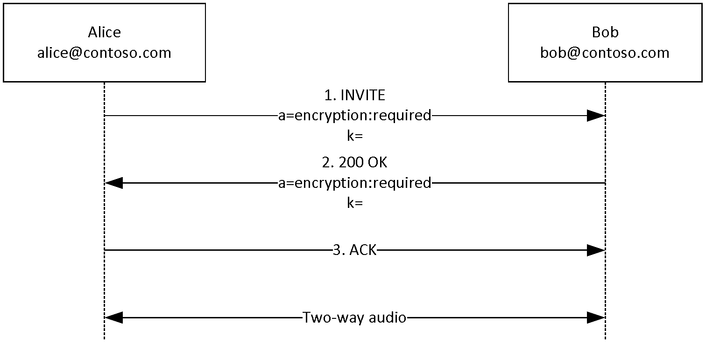
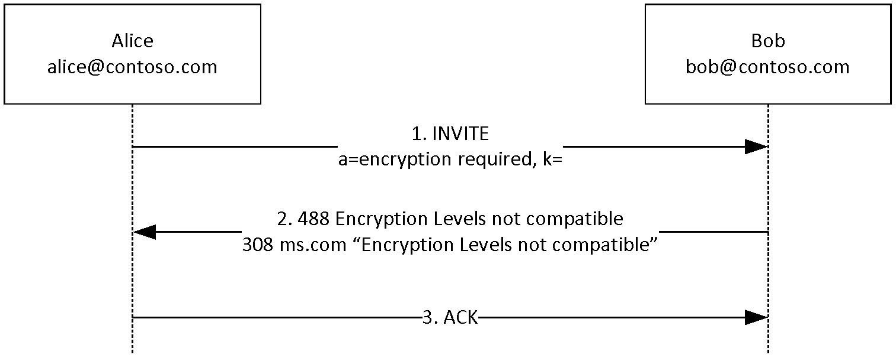

# [MS-SDP]: Session Description Protocol (SDP) Extensions

Table of Contents

1 Introduction

- [1 Introduction](#Section_1)
  - [1.1 Glossary](#Section_1.1)
  - [1.2 References](#Section_1.2)
    - [1.2.1 Normative References](#Section_1.2.1)
    - [1.2.2 Informative References](#Section_1.2.2)
  - [1.3 Overview](#Section_1.3)
  - [1.4 Relationship to Other Protocols](#Section_1.4)
  - [1.5 Prerequisites/Preconditions](#Section_1.5)
  - [1.6 Applicability Statement](#Section_1.6)
  - [1.7 Versioning and Capability Negotiation](#Section_1.7)
  - [1.8 Vendor-Extensible Fields](#Section_1.8)
  - [1.9 Standards Assignments](#Section_1.9)

2 Messages

- [2 Messages](#Section_2)
  - [2.1 Transport](#Section_2.1)
  - [2.2 Message Syntax](#Section_2.2)

3 Protocol Details

- [3 Protocol Details](#Section_3)
  - [3.1 User Agent Details](#Section_3.1)
    - [3.1.1 Abstract Data Model](#Section_3.1.1)
    - [3.1.2 Timers](#Section_3.1.2)
    - [3.1.3 Initialization](#Section_3.1.3)
    - [3.1.4 Higher-Layer Triggered Events](#Section_3.1.4)
    - [3.1.5 Message Processing Events and Sequencing Rules](#Section_3.1.5)
      - [3.1.5.1 Audio and Video](#Section_3.1.5.1)
      - [3.1.5.2 Data Collaboration](#Section_3.1.5.2)
        - [3.1.5.2.1 Application Sharing and Whiteboarding](#Section_3.1.5.2.1)
      - [3.1.5.3 Instant Messaging](#Section_3.1.5.3)
      - [3.1.5.4 Data Collaboration Encryption](#Section_3.1.5.4)
        - [3.1.5.4.1 Application Behavior](#Section_3.1.5.4.1)
        - [3.1.5.4.2 Negotiation Failure and Error Messages](#Section_3.1.5.4.2)
        - [3.1.5.4.3 Renegotiation of Data Collaboration Encryption](#Section_3.1.5.4.3)
      - [3.1.5.5 Audio/Video Encryption](#Section_3.1.5.5)
        - [3.1.5.5.1 Encryption Algorithms](#Section_3.1.5.5.1)
        - [3.1.5.5.2 Application Behavior](#Section_3.1.5.5.2)
        - [3.1.5.5.3 Negotiation Failure and Error Messages](#Section_3.1.5.5.3)
        - [3.1.5.5.4 Interaction Between Audio and Video Encryption Negotiation](#Section_3.1.5.5.4)
        - [3.1.5.5.5 Renegotiation of Audio/Video Encryption](#Section_3.1.5.5.5)
        - [3.1.5.5.6 Interaction Between Audio/Video and Data Encryption Negotiation](#Section_3.1.5.5.6)
    - [3.1.6 Timer Events](#Section_3.1.6)
    - [3.1.7 Other Local Events](#Section_3.1.7)

4 Protocol Examples

- [4 Protocol Examples](#Section_4)
  - [4.1 Peer Clients Require Encryption](#Section_4.1)
  - [4.2 Client Requires Encryption but Peer Does Not Allow It](#Section_4.2)

5 Security

- [5 Security](#Section_5)
  - [5.1 Security Considerations for Implementers](#Section_5.1)
  - [5.2 Index of Security Parameters](#Section_5.2)

6 Appendix A: Product Behavior

- [6 Appendix A: Product Behavior](#Section_6)

7 Change Tracking

- [7 Change Tracking](#Section_7)

For the legal notice and IP terms, see [LEGAL.md](../LEGAL.md).
Last updated: 6/1/2017.
See [Revision History](#revision-history) for full version history.

# 1 Introduction

This document describes a Microsoft extension protocol, Session Description Protocol (SDP) Extensions. The base protocol, which is the Session Description Protocol (SDP), is specified in [[RFC4566]](https://go.microsoft.com/fwlink/?LinkId=90484). This document describes the [**session description**](#gt_session-description) that is used to negotiate [**instant messaging**](#gt_instant-messaging), [**audio/video**](#gt_c1941087-e30b-46c9-a25d-5bed293312b3), and [**data collaboration sessions**](#gt_8c8f506a-51c3-4051-99de-2ba385af98d8), and notes the extensions used. This document also describes how encryption for audio/video and data collaboration sessions is negotiated.

Of paramount importance is the protection of data against security threats related to the privacy of RTC media communications between [**clients**](#gt_client). Microsoft has extended the Session Description Protocol to meet this challenge by providing encryption of data collaboration (DC) and audio/visual (A/V).<1>

This encryption functionality is only for the [**Session Initiation Protocol (SIP)**](#gt_session-initiation-protocol-sip) service provider, as specified in [[RFC3261]](https://go.microsoft.com/fwlink/?LinkId=90410), and does not extend to other kinds of traffic. Microsoft strongly recommends that these extensions be used with Transport Layer Security (TLS) to protect the encryption key when it is passed in SIP/SDP signaling.

Sections 1.5, 1.8, 1.9, 2, and 3 of this specification are normative. All other sections and examples in this specification are informative.

## 1.1 Glossary

This document uses the following terms:

**200 OK**: A response to indicate that the request has succeeded.

**audio/video (AV) session**: A session involving exchange of audio and video data between participants in real time.

**client**: A computer on which the remote procedure call (RPC) client is executing.

**data collaboration (DC) session**: A [**session**](#gt_session) involving sharing of applications and/or whiteboard between participants in real time.

**Data Encryption Standard (DES)**: A specification for encryption of computer data that uses a 56-bit key developed by IBM and adopted by the U.S. government as a standard in 1976. For more information see [[FIPS46-3]](https://go.microsoft.com/fwlink/?LinkId=89872).

**domain controller (DC)**: The service, running on a server, that implements Active Directory, or the server hosting this service. The service hosts the data store for objects and interoperates with other [**DCs**](#gt_domain-controller-dc) to ensure that a local change to an object replicates correctly across all [**DCs**](#gt_domain-controller-dc). When Active Directory is operating as Active Directory Domain Services (AD DS), the [**DC**](#gt_domain-controller-dc) contains full NC replicas of the configuration naming context (config NC), schema naming context (schema NC), and one of the domain NCs in its forest. If the AD DS [**DC**](#gt_domain-controller-dc) is a global catalog server (GC server), it contains partial NC replicas of the remaining domain NCs in its forest. For more information, see [MS-AUTHSOD](../MS-AUTHSOD/MS-AUTHSOD.md) section 1.1.1.5.2 and [MS-ADTS](../MS-ADTS/MS-ADTS.md). When Active Directory is operating as Active Directory Lightweight Directory Services (AD LDS), several AD LDS [**DCs**](#gt_domain-controller-dc) can run on one server. When Active Directory is operating as AD DS, only one AD DS [**DC**](#gt_domain-controller-dc) can run on one server. However, several AD LDS [**DCs**](#gt_domain-controller-dc) can coexist with one AD DS [**DC**](#gt_domain-controller-dc) on one server. The AD LDS [**DC**](#gt_domain-controller-dc) contains full NC replicas of the config NC and the schema NC in its forest. The domain controller is the server side of Authentication Protocol Domain Support [MS-APDS](../MS-APDS/MS-APDS.md).

**instant messaging**: A method of real-time communication over the Internet in which a sender types a message to one or more recipients and the recipient immediately receives the message in a pop-up window.

**instant messaging (IM) session**: A [**session**](#gt_session) involving exchange of text-based instant messages between participants in real time.

**INVITE**: A [**Session Initiation Protocol (SIP)**](#gt_session-initiation-protocol-sip) method that is used to invite a user or a service to participate in a session.

**MD5**: A one-way, 128-bit hashing scheme that was developed by RSA Data Security, Inc., as described in [[RFC1321]](https://go.microsoft.com/fwlink/?LinkId=90275).

**Real-Time Transport Control Protocol (RTCP)**: A network transport protocol that enables monitoring of Real-Time Transport Protocol (RTP) data delivery and provides minimal control and identification functionality, as described in [[RFC3550]](https://go.microsoft.com/fwlink/?LinkId=90433).

**Real-Time Transport Protocol (RTP)**: A network transport protocol that provides end-to-end transport functions that are suitable for applications that transmit real-time data, such as audio and video, as described in [RFC3550].

**server**: A computer on which the remote procedure call (RPC) server is executing.

**session**: A collection of multimedia senders and receivers and the data streams that flow between them. A multimedia conference is an example of a multimedia session.

**session description**: A well-defined format for conveying sufficient information to discover and participate in a multimedia [**session**](#gt_session).

**Session Initiation Protocol (SIP)**: An application-layer control (signaling) protocol for creating, modifying, and terminating sessions with one or more participants. [**SIP**](#gt_session-initiation-protocol-sip) is defined in [[RFC3261]](https://go.microsoft.com/fwlink/?LinkId=90410).

**T.120**: An ITU standard for real-time data conferencing, including application sharing and whiteboarding.

**MAY, SHOULD, MUST, SHOULD NOT, MUST NOT:** These terms (in all caps) are used as defined in [[RFC2119]](https://go.microsoft.com/fwlink/?LinkId=90317). All statements of optional behavior use either MAY, SHOULD, or SHOULD NOT.

## 1.2 References

Links to a document in the Microsoft Open Specifications library point to the correct section in the most recently published version of the referenced document. However, because individual documents in the library are not updated at the same time, the section numbers in the documents may not match. You can confirm the correct section numbering by checking the [Errata](http://msdn.microsoft.com/en-us/library/dn781092.aspx).

### 1.2.1 Normative References

We conduct frequent surveys of the normative references to assure their continued availability. If you have any issue with finding a normative reference, please contact [dochelp@microsoft.com](mailto:dochelp@microsoft.com). We will assist you in finding the relevant information.

[MS-SIP] Microsoft Corporation, "[Session Initiation Protocol Extensions](../MS-SIP/MS-SIP.md)".

[RFC2119] Bradner, S., "Key words for use in RFCs to Indicate Requirement Levels", BCP 14, RFC 2119, March 1997, [http://www.rfc-editor.org/rfc/rfc2119.txt](https://go.microsoft.com/fwlink/?LinkId=90317)

[RFC3261] Rosenberg, J., Schulzrinne, H., Camarillo, G., Johnston, A., Peterson, J., Sparks, R., Handley, M., and Schooler, E., "SIP: Session Initiation Protocol", RFC 3261, June 2002, [http://www.ietf.org/rfc/rfc3261.txt](https://go.microsoft.com/fwlink/?LinkId=90410)

[RFC3550] Schulzrinne, H., Casner, S., Frederick, R., and Jacobson, V., "RTP: A Transport Protocol for Real-Time Applications", STD 64, RFC 3550, July 2003, [http://www.ietf.org/rfc/rfc3550.txt](https://go.microsoft.com/fwlink/?LinkId=90433)

[RFC3605] Huitema, C., "Real Time Control Protocol (RTCP) Attribute in Session Description Protocol (SDP)", RFC 3605, October 2003, [http://www.ietf.org/rfc/rfc3605.txt](https://go.microsoft.com/fwlink/?LinkId=90437)

[RFC3611] Friedman, T., Ed., Caceres, R., Ed., and Clark, A., Ed., "RTP Control Protocol Extended Reports (RTCP XR)", RFC 3611, November 2003, [http://www.ietf.org/rfc/rfc3611.txt](https://go.microsoft.com/fwlink/?LinkId=90438)

[RFC4566] Handley, M., Jacobson, V., and Perkins, C., "SDP: Session Description Protocol", RFC 4566, July 2006, [http://www.ietf.org/rfc/rfc4566.txt](https://go.microsoft.com/fwlink/?LinkId=90484)

### 1.2.2 Informative References

None.

## 1.3 Overview

The Session Description Protocol (SDP), as specified in [[RFC4566]](https://go.microsoft.com/fwlink/?LinkId=90484), describes multimedia [**sessions**](#gt_session) for a variety of purposes associated with sessions.

Only the Microsoft extensions to this protocol are documented in this document. SDP Extensions define additional SDP primitives to negotiate various types of sessions and also to negotiate encryption. These extensions include the following:

- Extensions to negotiate an [**instant messaging session**](#gt_d76a59b9-d3b9-4b9e-9507-e68efa5d6d81): SDP Extensions defines a new media name x-ms-message used to indicate instant messaging media.
- Extensions to negotiate audio/video encryption: SDP Extensions defines a new SDP attribute a=encryption that can be used to negotiate whether encryption is required, optional, or rejected for an audio or video media stream. This attribute is used in conjunction with k= SDP field, which can be used to carry the encryption key if one is needed.
- Extensions to negotiate data collaboration encryption: SDP Extensions that support encryption for data collaboration are similar to the extensions for negotiating audio/video encryption. The a=encryption attribute is used to indicate whether encryption is required, optional, or rejected. However, no k= field is used by SDP Extensions for data collaboration encryption because the key is exchanged by a separate mechanism that uses the [**T.120**](#gt_t120) stream for data collaboration.
These extensions are described in detail in section [3](#Section_3).

## 1.4 Relationship to Other Protocols

The Session Description Protocol (SDP) Extensions depend on SDP, as specified in [[RFC4566]](https://go.microsoft.com/fwlink/?LinkId=90484), and upon the [**Session Initiation Protocol (SIP)**](#gt_session-initiation-protocol-sip), as specified in [[RFC3261]](https://go.microsoft.com/fwlink/?LinkId=90410). SDP Extensions defines additional SDP primitives needed to negotiate encryption parameters for [**data collaboration**](#gt_8c8f506a-51c3-4051-99de-2ba385af98d8) and [**audio/video sessions**](#gt_c1941087-e30b-46c9-a25d-5bed293312b3).

## 1.5 Prerequisites/Preconditions

This protocol assumes that both [**clients**](#gt_client) support SDP [[RFC4566]](https://go.microsoft.com/fwlink/?LinkId=90484) and [**Session Initiation Protocol (SIP)**](#gt_session-initiation-protocol-sip) [[RFC3261]](https://go.microsoft.com/fwlink/?LinkId=90410).

## 1.6 Applicability Statement

The Session Description Protocol (SDP) Extensions allow negotiation of whether the media is encrypted and if so, what encryption key is used.

The encryption negotiation enhancements to SDP can be used when the application wants to encrypt audio/video and data collaboration media on the wire. These enhancements are used in conjunction with Transport Layer Security (TLS) to protect the encryption key if the key is passed in the SIP/SDP signaling.

## 1.7 Versioning and Capability Negotiation

The Session Description Protocol (SDP) Extensions do not have protocol versioning.

## 1.8 Vendor-Extensible Fields

There are no vendor-extensible fields specific to the Session Description Protocol (SDP) Extensions. [**Session Initiation Protocol (SIP)**](#gt_session-initiation-protocol-sip) [[RFC3261]](https://go.microsoft.com/fwlink/?LinkId=90410) and SDP [[RFC4566]](https://go.microsoft.com/fwlink/?LinkId=90484) can be used by vendors as needed.

## 1.9 Standards Assignments

The attributes and fields defined by SDP Extensions have not been registered with IANA. SDP by itself is specified in [[RFC4566]](https://go.microsoft.com/fwlink/?LinkId=90484).

# 2 Messages

## 2.1 Transport

Microsoft extensions to SDP do not introduce a new transport to exchange messages. SDP messages are carried inside [**SIP**](#gt_session-initiation-protocol-sip) messages. The content type MUST be specified as application/sdp for SIP messages carrying SDP, and the [**session description**](#gt_session-description) are included in the body of the SIP message.

SIP messages can be transported over UDP, TCP, or TLS. Microsoft strongly recommends that these enhancements SHOULD be used in conjunction with Transport Layer Security (TLS) to protect the encryption key if the key is passed in the SIP/SDP signaling.

## 2.2 Message Syntax

The Session Description Protocol (SDP) Extensions do not introduce a new message format and rely on [**SIP**](#gt_session-initiation-protocol-sip) and SDP message formats. The SIP message format is specified in [[RFC3261]](https://go.microsoft.com/fwlink/?LinkId=90410) section 7. The SDP format is specified in [[RFC4566]](https://go.microsoft.com/fwlink/?LinkId=90484). The extensions are defined as custom SDP fields and attributes.

The following example shows a standard SDP packet and the extensions.

v=0

o=username 0 0 IN IP4 157.59.134.89

s=session

c=IN IP4 157.59.134.89

b=CT:1000

t=0 0

m=audio 56472 RTP/AVP 97 111 112 6 0 8 4 5 3 101

k=base64:bhdsfsd78f7dssdfssfsd7sdfssa

a=rtpmap:97 red/8000

a=rtpmap:111 SIREN/16000

a=fmtp:111 bitrate=16000

a=rtpmap:112 G7221/16000

a=fmtp:112 bitrate=24000

a=rtpmap:6 DVI4/16000

a=rtpmap:0 PCMU/8000

a=rtpmap:8 PCMA/8000

a=rtpmap:4 G723/8000

a=rtpmap:5 DVI4/8000

a=rtpmap:3 GSM/8000

a=rtpmap:101 telephone-event/8000

a=fmtp:101 0-16

a=encryption:required

m=video 33792 RTP/AVP 34 31

k=base64:bhdsfsd78f7dssdfssfsd7sdfssa

a=rtcp:33801

a=rtpmap:34 H263/90000

a=rtpmap:31 H261/90000

a=encryption:required

m=application 1503 tcp msdata

a=sendonly

a=encryption:required

For all media description blocks, notice the a=encryption:required attribute, which is an SDP Extensions extension to indicate that encryption is required for these media. Other possible values for the a=encryption attribute are a=encryption:optional and a=encryption:rejected. The a=encryption extension is described in detail in section [3](#Section_3).

The following example shows SDP for an [**instant messaging session**](#gt_d76a59b9-d3b9-4b9e-9507-e68efa5d6d81).

v=0

o=- 0 0 IN IP4 172.27.174.212

s=session

c=IN IP4 172.27.174.212

t=0 0

m=x-ms-message 5060 sip null

Notice the m=x-ms-message line, which shows the SDP Extensions extension for a new media name x-ms-message that is used to negotiate instant messaging.

Except for the noted extensions in the two examples, the rest of the [**session description**](#gt_session-description) is standard SDP.

# 3 Protocol Details

## 3.1 User Agent Details

SDP is used to negotiate [**session description**](#gt_session-description) between user agents. There is no [**server**](#gt_server) role that is relevant for the Session Description Protocol (SDP) Extensions.

### 3.1.1 Abstract Data Model

Not applicable.

### 3.1.2 Timers

No timers are required by Session Description Protocol (SDP) Extensions beyond those that are required by Session Initiation Protocol Extensions, as specified in [MS-SIP](../MS-SIP/MS-SIP.md).

### 3.1.3 Initialization

Not applicable.

### 3.1.4 Higher-Layer Triggered Events

The following is a recommendation on how the higher layer exposes protocol-based events.

There are no new higher-layer events beyond those that would be triggered for [**SIP**](#gt_session-initiation-protocol-sip) sessions. It is recommended that the higher layer receive an event for an incoming [**session**](#gt_session). For SDP Extensions, this event includes the encryption setting requested by the caller. When a session is established successfully, it is recommended that the higher layer receive an event indicating this success. If session negotiation fails, the higher layer can alternatively receive an event indicating the failure. If the session negotiation failed due to incompatible encryption settings, the event can indicate the incompatibility.

### 3.1.5 Message Processing Events and Sequencing Rules

There are no new message processing events or sequencing rules defined by SDP Extensions beyond those defined by SIP/SDP.

#### 3.1.5.1 Audio and Video

The Session Description Protocol (SDP) for an [**audio/video session**](#gt_c1941087-e30b-46c9-a25d-5bed293312b3) is standard (according to RFC) with one exception: negotiation of encryption of the audio/video session uses additional extensions, which are specified in section [3.1.5.5](#Section_4.1).

#### 3.1.5.2 Data Collaboration

##### 3.1.5.2.1 Application Sharing and Whiteboarding

An application-sharing or whiteboarding [**session**](#gt_session) is identified by the following media information in SDP.

m=application 1503 tcp msdata

a=encryption:required

The **media** field extension conveys capability for application sharing or use of a whiteboard. The "tcp" value is valid for the **proto** subfield.

Port 1503 is the standard port used for [**T.120**](#gt_t120) and is implemented by the underlying Microsoft NetMeeting [**client**](#gt_client). See section [3.1.5.4](#Section_3.1.5.4) for additional details about encryption of application sharing and whiteboarding.

#### 3.1.5.3 Instant Messaging

The SDP signaling for an [**instant messaging session**](#gt_d76a59b9-d3b9-4b9e-9507-e68efa5d6d81) using the previous RTC 1.2 APIs is shown in the following.

v=0

o=- 0 0 IN IP4 172.27.174.212

s=session

c=IN IP4 172.27.174.212

t=0 0

m=x-ms-message 5060 sip null

**Note** The target of the instant messaging session in this case is carried in the To header of the [**INVITE**](#gt_invite) request.

The SDP signaling for an instant messaging session using the RTC 1.3 APIs is shown in the following.

v=0

o=- 0 0 IN IP4 157.56.66.71

s=session

c=IN IP4 157.56.66.71

t=0 0

m=message 5060 sip sip:peer@tradewind.com

The [**SIP**](#gt_session-initiation-protocol-sip) URI present in the SDP signaling is the SIP URI of the peer user with whom a user wants to establish an IM session. This matches the SIP URI in the To header of the INVITE request. The port indicates the listening port of the [**client**](#gt_client) for direct connections if that is supported. The port SHOULD be ignored if the clients are connected through a [**server**](#gt_server). The 1.3 client can also accept the older 1.2 format (which has null for the SIP URI and uses x-ms-message as the media type).

#### 3.1.5.4 Data Collaboration Encryption

For [**data collaboration sessions**](#gt_8c8f506a-51c3-4051-99de-2ba385af98d8), the initiating and receiving parties MUST negotiate support for encryption by using a new SDP attribute.<2>

The new SDP encryption attribute can be implemented in any of the following ways:

- If encryption is required, the SDP signaling MUST carry a media-level attribute as shown in the following.
m=application 1503 tcp msdata

a=encryption:required

- If encryption is supported but not required, the SDP signaling MUST carry a media-level attribute as shown in the following.<3>
m=application 1503 tcp msdata

a=encryption:optional

- If encryption is not allowed, the SDP signaling MUST carry a media-level attribute as shown in the following:
m=application 1503 tcp msdata

a=encryption:rejected

##### 3.1.5.4.1 Application Behavior

If data collaboration (DC) encryption is required at the initiating side, the application calls the application API (such as NetMeeting) to create a secured [**T.120**](#gt_t120) [**session**](#gt_session). If encryption is not required, the initiating application can simply call the application API to create an unsecured T.120 session.<4>

In the absence of an application-supplied policy, the default policy is "allowed," meaning encryption is allowed but not required.

The logic for negotiation of support for encryption of T.120 [**DC sessions**](#gt_8c8f506a-51c3-4051-99de-2ba385af98d8) can be described in terms of application-level policy. Behavior is determined by the setting (required, optional, or not allowed) on both the initiator and receiver sides.

| Initiator setting | Receiver setting | Result |
| --- | --- | --- |
| Required | Required | DC encrypted |
| Required | Allowed | DC encrypted |
| Required | Not allowed | Failure |
| Allowed | Required | DC encrypted |
| Allowed | Allowed | DC not encrypted |
| Allowed | Not allowed | DC not encrypted |
| Not allowed | Required | Failure |
| Not allowed | Allowed | DC not encrypted |
| Not allowed | Not allowed | DC not encrypted |

In the preceding table, two circumstances yield a result of Failure:

- In the first case, the session initiator sends encryption:required.
If the receiver understands the encryption attribute, it responds with a 488 response (described below), and the session setup fails. It is the responsibility of the initiator to display an error message to the user stating that encryption could not be negotiated.

If the receiver does not understand the encryption attribute, the receiver responds with a [**200 OK**](#gt_200-ok) (with no encryption attribute). The initiator acknowledges (ACK) the response. The T.120 session setup, however, fails, and it is the responsibility of the initiator to display an error message to the user and immediately send a BYE to tear down the [**SIP**](#gt_session-initiation-protocol-sip) signaling session.

- In the second case, the session initiator sends encryption:rejected.
The receiver responds with a 488 error response, and the session setup fails. It is the responsibility of the initiator to display an error message to the user stating that encryption could not be negotiated.

##### 3.1.5.4.2 Negotiation Failure and Error Messages

If the initiator requires encryption and then receives a 488 error response to [**INVITE**](#gt_invite), it is recommended that the application display a new error message in the user interface (UI) that explains to the user that the encryption cannot be negotiated.

The 488 error response SHOULD contain a Warning header to indicate that encryption levels are incompatible. The following is an example of a 488 error response.

SIP/2.0 488 Encryption Levels Incompatible

Warning: 308 ms.com "Encryption Levels Incompatible"

##### 3.1.5.4.3 Renegotiation of Data Collaboration Encryption

It is theoretically possible to renegotiate the encryption level in a [**session**](#gt_session) by sending a reINVITE message that has a different encryption level from what was negotiated when the session was created. However, renegotiation of the encryption level is not supported by the Session Initiation Protocol Extensions, and any such reINVITE SHOULD be rejected.

#### 3.1.5.5 Audio/Video Encryption

For [**audio/video sessions**](#gt_c1941087-e30b-46c9-a25d-5bed293312b3), the initiating and receiving parties MUST negotiate support for encryption by using a new SDP attribute.

To implement the new SDP encryption attribute,<5> two pieces of information are required for audio/video encryption. The first is to determine whether encryption is required, and the second is to determine what the encryption key will be. This can be implemented in any of the following ways:

- If encryption is required, SDP signaling MUST carry a media-level attribute as shown in the following.
m=audio 49170 RTP/AVP 0

a=encryption:required

- If encryption is supported but not required, SDP signaling MUST carry a media-level attribute as shown in the following:
m=audio 49170 RTP/AVP 0

a=encryption:optional

- If encryption is not allowed, SDP signaling MUST carry a media-level attribute as shown in the following.
m=audio 49170 RTP/AVP 0

a=encryption:rejected

The encryption key to use MUST be carried in a media-level key parameter, as shown in the following example.

m=audio 49170 RTP/AVP 0

a=encryption:required

k=base64:bhdsfsd78f7dssdfssfsd7sdfssa

The encryption key is not encrypted. The only transformation of the key is the base64 encoding for transport in the textual [**session description**](#gt_session-description) (SDP). [**Clients**](#gt_client) MUST send the key in base64 encoded form and MUST decode the key that is received from the other endpoint before using it to decrypt audio/video. Protection of the encryption key is provided by the TLS transport over which [**SIP**](#gt_session-initiation-protocol-sip) signaling is carried. The encryption key is used to encrypt traffic that is sent by the supplier of the key and also to decrypt traffic at the recipient. The keys used in each direction are independent and are typically different.

If SDP indicates that encryption is required or optional, an encryption key MUST also be supplied. In the case of optional encryption, the encryption key can go unused. It is highly recommended that a new encryption key be generated and used for every new [**INVITE**](#gt_invite) request. However, when an INVITE is reused, it typically uses the same encryption key.

For information about SIP, see [[RFC3261]](https://go.microsoft.com/fwlink/?LinkId=90410).

##### 3.1.5.5.1 Encryption Algorithms

The RTC API uses [**MD5**](#gt_md5) as the default key generation method.

There are also several possible encryption algorithms:

- [**DES**](#gt_data-encryption-standard-des)
- 3DES
- RC2
- RC4
- AES
The RTC API uses DES as the default encryption algorithm, but it is recommended that a more secure algorithm, such as AES, be used as recommended in [[RFC3550]](https://go.microsoft.com/fwlink/?LinkId=90433).

The RTC API uses MD5 as the default key generation method, but any suitable technique can be used for this purpose.

Encryption of an [**RTP**](#gt_real-time-transport-protocol-rtp) stream can involve encryption of just the RTP packets or encryption of both the RTP and [**Real-Time Transport Control Protocol (RTCP)**](#gt_real-time-transport-control-protocol-rtcp) packets. The RTC API only supports encryption of both RTP and RTCP (as specified in [[RFC3605]](https://go.microsoft.com/fwlink/?LinkId=90437) and [[RFC3611]](https://go.microsoft.com/fwlink/?LinkId=90438)) packets.

##### 3.1.5.5.2 Application Behavior

The following table summarizes the application behavior based on the audio/video encryption policy at both the initiator and the receiver. This behavior applies to both an initial [**INVITE**](#gt_invite) (as specified in [[RFC3261]](https://go.microsoft.com/fwlink/?LinkId=90410)) and a reINVITE. Failure of a reINVITE does not result in the existing [**session**](#gt_session) being torn down.

The default policy in the absence of an application-supplied policy is "allowed," meaning encryption is allowed but not required.

| Initiator setting | Receiver setting | Result |
| --- | --- | --- |
| Required | Required | A/V encrypted |
| Required | Allowed | A/V encrypted |
| Required | Not allowed | Failure |
| Allowed | Required | A/V encrypted |
| Allowed | Allowed | A/V not encrypted |
| Allowed | Not allowed | A/V not encrypted |
| Not allowed | Required | Failure |
| Not allowed | Allowed | A/V not encrypted |
| Not allowed | Not allowed | A/V not encrypted |

In the preceding table, two circumstances yield a result of Failure:

- In the first case, the session initiator requires encryption, but the receiver setting is to not allow encryption. As a result, the call setup fails.
The receiver responds with a 488 error response, and the session setup fails. The initiator displays an error message to the user stating that encryption could not be negotiated. Note that the user at the receiving [**client**](#gt_client) might not get an indication of the call because the call is automatically rejected.

- In the second case, the initiator does not allow encryption, but the receiver requires encryption due to policy. Again, the call fails because of incompatible encryption policies at the two endpoints.
The receiver responds with a 488 error response, and the session setup fails. The initiator displays an error message to the user stating that encryption could not be negotiated. Note that the user at the receiving client might not get an indication of the call because the call is automatically rejected.

##### 3.1.5.5.3 Negotiation Failure and Error Messages

If the caller requires encryption but receives a 488 error response from the callee, the application displays a new error message in the user interface (UI) explaining to the user that the encryption could not be negotiated.

The 488 error response contains a Warning header to indicate that encryption is required. The following is an example of a 488 error response.

SIP/2.0 488 Encryption Levels Incompatible

Warning: 308 ms.com "Encryption Levels Incompatible"

##### 3.1.5.5.4 Interaction Between Audio and Video Encryption Negotiation

Because the audio and video components of an audio/video call are represented as separate streams in SDP, it is technically possible for the audio and video components to request different encryption settings; however, specifying different encryption settings for an audio/video call is not supported.

The audio and video streams MUST specify the same encryption attribute. Although setting encryption as is shown in the following code sample is technically possible, it is not supported. The following example is provided for reference purposes only to show how different encryption settings could be requested for audio and video components.

m=audio 49170 RTP/AVP 0

a=encryption:required

k=base64:bhdsfsd78f7dssdfssfsd7sdfssa

m=video 49171 RTP/AVP 25

a=encryption:optional

k=base64:bhdsfsd78f7dssdfssfsd7sdfssa

If different encryption settings are used and a conflict occurs, a 488 error response with an appropriate Warning header SHOULD be returned, as shown in the following example.

SIP/2.0 488 Encryption Levels not compatible

Warning: 308 ms.com "Encryption Levels not compatible"

##### 3.1.5.5.5 Renegotiation of Audio/Video Encryption

It is theoretically possible to renegotiate the encryption level in a [**session**](#gt_session) by sending a reINVITE message that has a different encryption level from what was negotiated when the session was created. However, renegotiation is not supported by the Session Initiation Protocol Extensions, and any such reINVITE SHOULD be rejected.

##### 3.1.5.5.6 Interaction Between Audio/Video and Data Encryption Negotiation

Although data collaboration and audio/video encryption are negotiated separately and controlled through separate registry settings at the [**client**](#gt_client), in a [**session**](#gt_session) that involves both [**DC**](#gt_domain-controller-dc) and [**audio/video**](#gt_c1941087-e30b-46c9-a25d-5bed293312b3), both parties can negotiate encryption for one type but not for the other.

The following example shows how different encryption settings could be requested for audio/video and data collaboration; however, in this example, the session fails.

m=audio 49170 RTP/AVP 0

a=encryption:required

k=base64:bhdsfsd78f7dssdfssfsd7sdfssa

m=video 49171 RTP/AVP 25

a=encryption:required

k=base64:bhdsfsd78f7dssdfssfsd7sdfssa

m=application 1503 tcp msdata

a=encryption:rejected

For the session to succeed, encryption must be successfully negotiated for all media types in that session.

For reINVITEs, failure to negotiate encryption does not result in failure of the existing session. As with any 4xx or 5xx response to a reINVITE, the client reverts to the previous [**session description**](#gt_session-description), including any encryption parameters that were negotiated at that time.

### 3.1.6 Timer Events

No new timer events are defined by the Session Description Protocol (SDP) Extensions beyond those defined by SIP/SDP.

### 3.1.7 Other Local Events

No new local events are defined by the Session Description Protocol (SDP) Extensions beyond those defined by SIP/SDP.

# 4 Protocol Examples

## 4.1 Peer Clients Require Encryption

Alice sends Bob an [**INVITE**](#gt_invite) request for an audio call requesting encryption by including the a=encryption:required attribute and the SDP field k= with a suitable key.

Bob accepts the call with a [**200 OK**](#gt_200-ok) with the a=encryption:required attribute and the k= field.

Alice sends an ACK.

Alice and Bob start sending media encrypted with the keys negotiated using the k= field.

Figure 1: Audio call requesting encryption

The following is an example of SDP signaling in an [**SIP**](#gt_session-initiation-protocol-sip) INVITE request that is sent across the wire.

v=0

o=- 0 0 IN IP4 11.22.33.44

s=session

c=IN IP4 11.22.33.44

b=CT:1000

t=0 0

m=audio 5050 RTP/AVP 97 111 112 6 0 8 4 5 3 101

k=base64: Y6UN8SAFnqNTI61uN+1II3dqRk0spxbtqfuv5EYSYSM

a=rtpmap:97 red/8000

a=rtpmap:111 SIREN/16000

a=fmtp:111 bitrate=16000

a=rtpmap:112 G7221/16000

a=fmtp:112 bitrate=24000

a=rtpmap:6 DVI4/16000

a=rtpmap:0 PCMU/8000

a=rtpmap:8 PCMA/8000

a=rtpmap:4 G723/8000

a=rtpmap:5 DVI4/8000

a=rtpmap:3 GSM/8000

a=rtpmap:101 telephone-event/8000

a=fmtp:101 0-16

a=encryption:required

m=video 5036 RTP/AVP 34 31

k=base64: Y6UN8SAFnqNTI61uN+1II3dqRk0spxbtqfuv5EYSYSM

a=rtpmap:34 H263/90000

a=rtpmap:31 H261/90000

a=encryption:required

The following is an example of SDP signaling in the 200 OK response that is received across the wire in response to the INVITE.

v=0

o=- 0 0 IN IP4 11.22.33.55

s=session

c=IN IP4 11.22.33.55

b=CT:1000

t=0 0

m=audio 5050 RTP/AVP 97 111 112 6 0 8 4 5 3 101

k=base64: h6KmqIeIFj3rz4iiMAsYQju5EEitwAiveVu7RuHhev8

a=rtpmap:97 red/8000

a=rtpmap:111 SIREN/16000

a=fmtp:111 bitrate=16000

a=rtpmap:112 G7221/16000

a=fmtp:112 bitrate=24000

a=rtpmap:6 DVI4/16000

a=rtpmap:0 PCMU/8000

a=rtpmap:8 PCMA/8000

a=rtpmap:4 G723/8000

a=rtpmap:5 DVI4/8000

a=rtpmap:3 GSM/8000

a=rtpmap:101 telephone-event/8000

a=fmtp:101 0-16

a=encryption:required

m=video 5036 RTP/AVP 34 31

k=base64: h6KmqIeIFj3rz4iiMAsYQju5EEitwAiveVu7RuHhev8

a=rtpmap:34 H263/90000

a=rtpmap:31 H261/90000

a=encryption:required

## 4.2 Client Requires Encryption but Peer Does Not Allow It

Alice sends Bob an [**INVITE**](#gt_invite) for an audio/video call requesting encryption by including an a=encryption:required attribute and the SDP k= field with a suitable key.

- Because Bob does not allow encryption, he rejects the INVITE with a "488 Encryption Levels not compatible" response.
- Alice sends an ACK. The call is not established.

Figure 2: Alice requires encryption

An example of SDP signaling in the INVITE that is sent across the wire is as follows.

v=0

o=- 0 0 IN IP4 11.22.33.44

s=session

c=IN IP4 11.22.33.44

b=CT:1000

t=0 0

m=audio 5050 RTP/AVP 97 111 112 6 0 8 4 5 3 101

k=base64: Y6UN8SAFnqNTI61uN+1II3dqRk0spxbtqfuv5EYSYSM

a=rtpmap:97 red/8000

a=rtpmap:111 SIREN/16000

a=fmtp:111 bitrate=16000

a=rtpmap:112 G7221/16000

a=fmtp:112 bitrate=24000

a=rtpmap:6 DVI4/16000

a=rtpmap:0 PCMU/8000

a=rtpmap:8 PCMA/8000

a=rtpmap:4 G723/8000

a=rtpmap:5 DVI4/8000

a=rtpmap:3 GSM/8000

a=rtpmap:101 telephone-event/8000

a=fmtp:101 0-16

a=encryption:required

m=video 5036 RTP/AVP 34 31

k=base64: Y6UN8SAFnqNTI61uN+1II3dqRk0spxbtqfuv5EYSYSM

a=rtpmap:34 H263/90000

a=rtpmap:31 H261/90000

a=encryption:required

An example of the [**SIP**](#gt_session-initiation-protocol-sip) error response is as follows.

SIP/2.0 488 Encryption Levels not compatible

Via: SIP/2.0/TCP 11.22.33.44:4934

From: "Alice" <sip:alice@contoso.com>;tag=b8c543e1-ffb3-4b5a-880c-4d78f37643bb

To: <sip:bob@contoso.com>;tag=27221d0e-26d4-410f-9363-6ad3337cf152

Call-ID: 01a465dd-dafd-461d-a6ef-99c2c7df0e27@11.22.33.44

CSeq: 2 INVITE

Warning: 308 ms.com "Encryption Levels not compatible"

Content-Length: 0

# 5 Security

## 5.1 Security Considerations for Implementers

RTC APIs use the following security algorithms:

- [**MD5**](#gt_md5) is used for key generation.
- [**DES**](#gt_data-encryption-standard-des) is used to encrypt the audio/video traffic.
The Session Description Protocol (SDP) Extensions do not require the preceding algorithms to be used; other key generation and encryption algorithms can be used. However, if interoperability with RTC API [**clients**](#gt_client) is required, DES has to be used for encryption.

## 5.2 Index of Security Parameters

| Security parameter | Section |
| --- | --- |
| Encryption algorithms | [3.1.5.5.1](#Section_3.1.5.5.1) |

# 6 Appendix A: Product Behavior

The information in this specification is applicable to the following Microsoft products or supplemental software. References to product versions include released service packs.

- Windows 2000 operating system Service Pack 4 (SP4)
- Windows XP operating system
- Windows Server 2003 operating system
Exceptions, if any, are noted below. If a service pack or Quick Fix Engineering (QFE) number appears with the product version, behavior changed in that service pack or QFE. The new behavior also applies to subsequent service packs of the product unless otherwise specified. If a product edition appears with the product version, behavior is different in that product edition.

Unless otherwise specified, any statement of optional behavior in this specification that is prescribed using the terms "SHOULD" or "SHOULD NOT" implies product behavior in accordance with the SHOULD or SHOULD NOT prescription. Unless otherwise specified, the term "MAY" implies that the product does not follow the prescription.

<1> Section 1: Encryption is not supported in Windows 2000 operating system and the associated protocol extensions are not used.

<2> Section 3.1.5.4: In Windows, the encryption key to use is actually generated by the underlying Microsoft NetMeeting application and, as a result, does not need to be exchanged between the RTC [**clients**](#gt_client) through the SIP/SDP signaling. This is handled within the [**T.120**](#gt_t120) stream itself, so no k= (key) line for the T.120 media will be present.

<3> Section 3.1.5.4: If the encryption attribute is not present in the SDP signaling, as will be the case for older Windows XP clients, encryption is considered to be supported but is not required.

<4> Section 3.1.5.4.1: When interoperating with a Windows XP client, the policy of the client can be considered as allowed. The Windows XP client does not send any encryption attribute in the SDP signaling of its [**INVITE**](#gt_invite) or INVITE response, as described in [[RFC3261]](https://go.microsoft.com/fwlink/?LinkId=90410).

<5> Section 3.1.5.5: If the encryption attribute is not present in SDP signaling, as is the case for older Windows XP clients, encryption is not supported. This is different from the DC case because audio/video encryption requires a key exchange through SDP signaling.

# 7 Change Tracking

No table of changes is available. The document is either new or has had no changes since its last release.

## Revision History

| Date | Version | Revision Class | Comments |
| --- | --- | --- | --- |
| 5/11/2007 | 0.1 | New | Version 0.1 release |
| 8/10/2007 | 0.2 | Minor | Clarified the meaning of the technical content. |
| 9/28/2007 | 0.3 | Minor | Clarified the meaning of the technical content. |
| 10/23/2007 | 0.4 | Minor | Clarified the meaning of the technical content. |
| 11/30/2007 | 0.5 | Minor | Clarified the meaning of the technical content. |
| 1/25/2008 | 0.5.1 | Editorial | Changed language and formatting in the technical content. |
| 3/14/2008 | 0.5.2 | Editorial | Changed language and formatting in the technical content. |
| 5/16/2008 | 0.5.3 | Editorial | Changed language and formatting in the technical content. |
| 6/20/2008 | 0.5.4 | Editorial | Changed language and formatting in the technical content. |
| 7/25/2008 | 0.5.5 | Editorial | Changed language and formatting in the technical content. |
| 8/29/2008 | 0.6 | Minor | Clarified the meaning of the technical content. |
| 10/24/2008 | 0.6.1 | Editorial | Changed language and formatting in the technical content. |
| 12/5/2008 | 0.6.2 | Editorial | Changed language and formatting in the technical content. |
| 1/16/2009 | 0.6.3 | Editorial | Changed language and formatting in the technical content. |
| 2/27/2009 | 0.6.4 | Editorial | Changed language and formatting in the technical content. |
| 4/10/2009 | 0.6.5 | Editorial | Changed language and formatting in the technical content. |
| 5/22/2009 | 0.6.6 | Editorial | Changed language and formatting in the technical content. |
| 7/2/2009 | 0.6.7 | Editorial | Changed language and formatting in the technical content. |
| 8/14/2009 | 0.6.8 | Editorial | Changed language and formatting in the technical content. |
| 9/25/2009 | 0.7 | Minor | Clarified the meaning of the technical content. |
| 11/6/2009 | 0.7.1 | Editorial | Changed language and formatting in the technical content. |
| 12/18/2009 | 0.7.2 | Editorial | Changed language and formatting in the technical content. |
| 1/29/2010 | 0.8 | Minor | Clarified the meaning of the technical content. |
| 3/12/2010 | 0.8.1 | Editorial | Changed language and formatting in the technical content. |
| 4/23/2010 | 0.8.2 | Editorial | Changed language and formatting in the technical content. |
| 6/4/2010 | 0.8.3 | Editorial | Changed language and formatting in the technical content. |
| 7/16/2010 | 0.8.3 | None | No changes to the meaning, language, or formatting of the technical content. |
| 8/27/2010 | 0.8.3 | None | No changes to the meaning, language, or formatting of the technical content. |
| 10/8/2010 | 0.8.3 | None | No changes to the meaning, language, or formatting of the technical content. |
| 11/19/2010 | 0.8.3 | None | No changes to the meaning, language, or formatting of the technical content. |
| 1/7/2011 | 0.8.3 | None | No changes to the meaning, language, or formatting of the technical content. |
| 2/11/2011 | 0.8.3 | None | No changes to the meaning, language, or formatting of the technical content. |
| 3/25/2011 | 0.8.3 | None | No changes to the meaning, language, or formatting of the technical content. |
| 5/6/2011 | 0.8.3 | None | No changes to the meaning, language, or formatting of the technical content. |
| 6/17/2011 | 0.9 | Minor | Clarified the meaning of the technical content. |
| 9/23/2011 | 0.9 | None | No changes to the meaning, language, or formatting of the technical content. |
| 12/16/2011 | 0.9 | None | No changes to the meaning, language, or formatting of the technical content. |
| 3/30/2012 | 0.9 | None | No changes to the meaning, language, or formatting of the technical content. |
| 7/12/2012 | 0.9 | None | No changes to the meaning, language, or formatting of the technical content. |
| 10/25/2012 | 0.9 | None | No changes to the meaning, language, or formatting of the technical content. |
| 1/31/2013 | 0.9 | None | No changes to the meaning, language, or formatting of the technical content. |
| 8/8/2013 | 0.9 | None | No changes to the meaning, language, or formatting of the technical content. |
| 11/14/2013 | 0.9 | None | No changes to the meaning, language, or formatting of the technical content. |
| 2/13/2014 | 0.9 | None | No changes to the meaning, language, or formatting of the technical content. |
| 5/15/2014 | 0.9 | None | No changes to the meaning, language, or formatting of the technical content. |
| 6/30/2015 | 1.0 | Major | Significantly changed the technical content. |
| 10/16/2015 | 1.0 | None | No changes to the meaning, language, or formatting of the technical content. |
| 7/14/2016 | 1.0 | None | No changes to the meaning, language, or formatting of the technical content. |
| 6/1/2017 | 1.0 | None | No changes to the meaning, language, or formatting of the technical content. |
