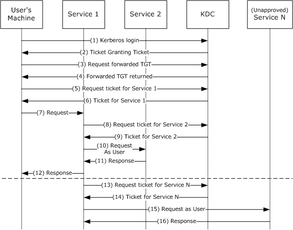
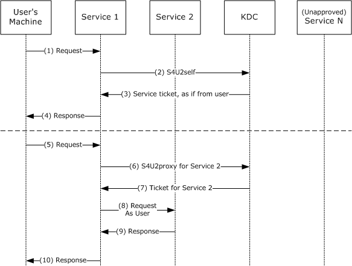
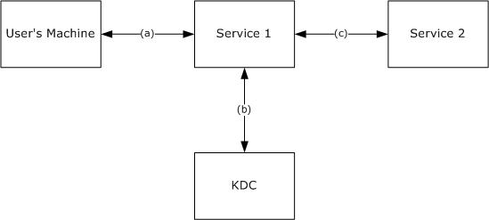
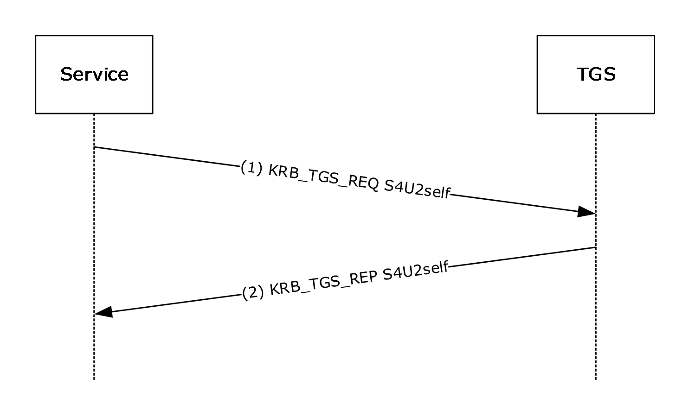
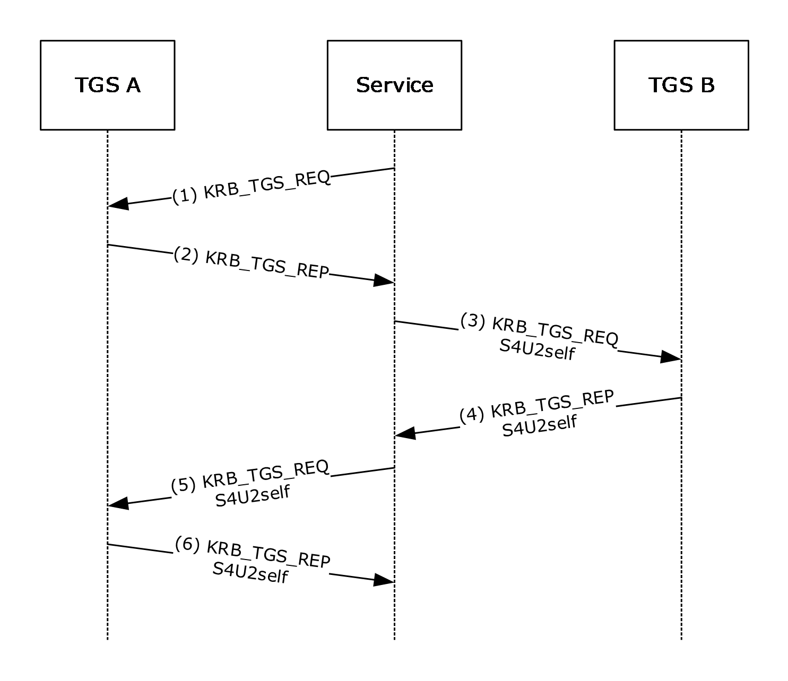
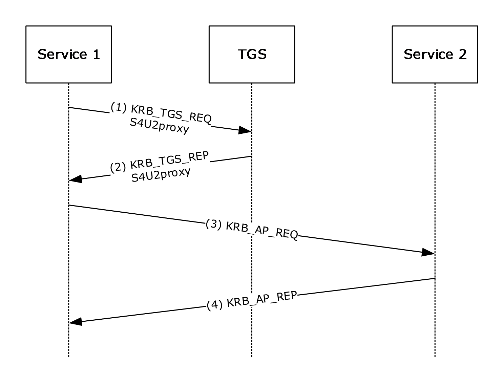

# [MS-SFU]: Kerberos Protocol Extensions: Service for User and Constrained Delegation Protocol

Table of Contents

1 Introduction

- [1 Introduction](#Section_1)
  - [1.1 Glossary](#Section_1.1)
  - [1.2 References](#Section_1.2)
    - [1.2.1 Normative References](#Section_1.2.1)
    - [1.2.2 Informative References](#Section_1.2.2)
  - [1.3 Overview](#Section_1.3)
    - [1.3.1 S4U2self](#Section_1.3.1)
    - [1.3.2 S4U2proxy](#Section_1.3.2)
    - [1.3.3 Protocol Overview](#Section_1.3.3)
  - [1.4 Relationship to Other Protocols](#Section_1.4)
  - [1.5 Prerequisites/Preconditions](#Section_1.5)
  - [1.6 Applicability Statement](#Section_1.6)
  - [1.7 Versioning and Capability Negotiation](#Section_1.7)
  - [1.8 Vendor-Extensible Fields](#Section_1.8)
  - [1.9 Standards Assignments](#Section_1.9)

2 Messages

- [2 Messages](#Section_2)
  - [2.1 Transport](#Section_2.1)
  - [2.2 Message Syntax](#Section_2.2)
    - [2.2.1 PA-FOR-USER](#Section_2.2.1)
    - [2.2.2 PA_S4U_X509_USER](#Section_2.2.2)
    - [2.2.3 CNAME-IN-ADDL-TKT](#Section_2.2.3)
    - [2.2.4 S4U_DELEGATION_INFO](#Section_2.2.4)
    - [2.2.5 PA-PAC-OPTIONS](#Section_2.2.5)

3 Protocol Details

- [3 Protocol Details](#Section_3)
  - [3.1 Service Details](#Section_3.1)
    - [3.1.1 Abstract Data Model](#Section_3.1.1)
    - [3.1.2 Timers](#Section_3.1.2)
    - [3.1.3 Initialization](#Section_3.1.3)
    - [3.1.4 Higher-Layer Triggered Events](#Section_3.1.4)
      - [3.1.4.1 S4U2self Triggered Events](#Section_3.1.4.1)
      - [3.1.4.2 S4U2proxy Triggered Events](#Section_3.1.4.2)
    - [3.1.5 Message Processing Events and Sequencing Rules](#Section_3.1.5)
      - [3.1.5.1 Service for User to Self](#Section_3.1.5.1)
        - [3.1.5.1.1 Service Sends S4U2self KRB_TGS_REQ](#Section_3.1.5.1.1)
          - [3.1.5.1.1.1 When to Use Each padata Type](#Section_3.1.5.1.1.1)
          - [3.1.5.1.1.2 Sending the S4USelf KRB_TGT_REQ](#Section_3.1.5.1.1.2)
        - [3.1.5.1.2 Service Receives S4U2self KRB_TGS_REP](#Section_3.1.5.1.2)
      - [3.1.5.2 Service for User to Proxy](#Section_3.1.5.2)
        - [3.1.5.2.1 Sends S4U2proxy KRB_TGS_REQ](#Section_3.1.5.2.1)
        - [3.1.5.2.2 Receives Referral](#Section_3.1.5.2.2)
        - [3.1.5.2.3 Receives KRB-ERR-BADOPTION](#Section_3.1.5.2.3)
        - [3.1.5.2.4 Receives S4U2proxy KRB_TGS_REP](#Section_3.1.5.2.4)
    - [3.1.6 Timer Events](#Section_3.1.6)
    - [3.1.7 Other Local Events](#Section_3.1.7)
  - [3.2 KDC Details](#Section_3.2)
    - [3.2.1 Abstract Data Model](#Section_3.2.1)
    - [3.2.2 Timers](#Section_3.2.2)
    - [3.2.3 Initialization](#Section_3.2.3)
    - [3.2.4 Higher-Layer Triggered Events](#Section_3.2.4)
    - [3.2.5 Message Processing Events and Sequencing Rules](#Section_3.2.5)
      - [3.2.5.1 KDC Receives S4U2self KRB_TGS_REQ](#Section_3.2.5.1)
        - [3.2.5.1.1 KDC Replies with Referral TGT](#Section_3.2.5.1.1)
        - [3.2.5.1.2 KDC Replies with Service Ticket](#Section_3.2.5.1.2)
      - [3.2.5.2 KDC Receives S4U2proxy KRB_TGS_REQ](#Section_3.2.5.2)
        - [3.2.5.2.1 Using ServicesAllowedToSendForwardedTicketsTo](#Section_3.2.5.2.1)
        - [3.2.5.2.2 Verification of the PAC](#Section_3.2.5.2.2)
        - [3.2.5.2.3 Using ServicesAllowedToReceiveForwardedTicketsFrom](#Section_3.2.5.2.3)
        - [3.2.5.2.4 KDC Replies with Service Ticket](#Section_3.2.5.2.4)
    - [3.2.6 Timer Events](#Section_3.2.6)
    - [3.2.7 Other Local Events](#Section_3.2.7)

4 Protocol Examples

- [4 Protocol Examples](#Section_4)
  - [4.1 S4U2self Single Realm Example](#Section_4.1)
  - [4.2 S4U2self Multiple Realm Example](#Section_4.2)
  - [4.3 S4U2proxy Example](#Section_4.3)

5 Security

- [5 Security](#Section_5)
  - [5.1 Security Considerations for Implementers](#Section_5.1)
  - [5.2 Index of Security Parameters](#Section_5.2)

6 Appendix A: Product Behavior

- [6 Appendix A: Product Behavior](#Section_6)

7 Change Tracking

- [7 Change Tracking](#Section_7)

For the legal notice and IP terms, see [LEGAL.md](../LEGAL.md).
Last updated: 1/13/2026.
See [Revision History](#revision-history) for full version history.

# 1 Introduction

The Kerberos Network Authentication Service (V5) Service for User (S4U) Extension provides two extensions to the Kerberos Protocol. Collectively, these two extensions enable an application [**service**](#gt_service) to obtain a Kerberos [**service ticket**](#gt_service-ticket) on behalf of a user. The resulting service ticket can be used for:

- The requesting service's own information.
- Access control local to the service's machine, impersonating the user.
- Requests to some other service, impersonating the user.
There are two different [**Service for User (S4U)**](#gt_service-for-user-s4u) extensions. The first is the [**Service for User to Self (S4U2self)**](#gt_service-for-user-to-self-s4u2self) extension, which allows a service to obtain a Kerberos service ticket to itself on behalf of a user. This enables the service to obtain the user's [**authorization data**](#gt_authorization-data) that is then used in [**authorization**](#gt_authorization) decisions in the local service.

The second S4U extension is the [**Service for User to Proxy (S4U2proxy)**](#gt_service-for-user-to-proxy-s4u2proxy) extension. This Kerberos extension enables a service to obtain a service ticket on behalf of the user to a second, back end service. This allows back-end services to use Kerberos user credentials as if the user had obtained the service ticket and sent it to the back end service directly. Local policy at the [**ticket-granting service (TGS)**](#gt_ticket-granting-service-tgs) can be used to limit the scope of the S4U2proxy extension.

Sections 1.5, 1.8, 1.9, 2, and 3 of this specification are normative. All other sections and examples in this specification are informative.

## 1.1 Glossary

This document uses the following terms:

**Active Directory**: The Windows implementation of a general-purpose directory service, which uses LDAP as its primary access protocol. Active Directory stores information about a variety of objects in the network such as user accounts, computer accounts, groups, and all related credential information used by Kerberos [MS-KILE](../MS-KILE/MS-KILE.md). Active Directory is either deployed as Active Directory Domain Services (AD DS) or Active Directory Lightweight Directory Services (AD LDS), which are both described in [MS-ADOD](../MS-ADOD/MS-ADOD.md): Active Directory Protocols Overview.

**Authentication Protocol (AP) exchange**: The Kerberos subprotocol called the "authentication protocol", sometimes referred to as the "Client/Server Authentication Exchange", in which the client presents a [**service ticket**](#gt_service-ticket) and an authenticator to a service to establish an authenticated communication session with the service (see [[RFC4120]](https://go.microsoft.com/fwlink/?LinkId=90458) section 3.2).

**Authentication Service (AS) exchange**: The Kerberos subprotocol in which the Authentication Service (AS) component of the [**key distribution center (KDC)**](#gt_key-distribution-center-kdc) accepts an initial logon or authentication request from a client and provides the client with a [**ticket-granting ticket (TGT)**](#gt_ticket-granting-ticket-tgt) and necessary cryptographic keys to make use of the [**ticket**](#gt_ticket). This is specified in [RFC4120] section 3.1. The [**AS exchange**](#gt_authentication-service-as-exchange) is always initiated by the client, usually in response to the initial logon of a [**principal**](#gt_principal) such as a user.

**authorization**: The secure computation of roles and accesses granted to an identity.

**authorization data**: An extensible field within a Kerberos [**ticket**](#gt_ticket), used to pass authorization data about the [**principal**](#gt_principal) on whose behalf the [**ticket**](#gt_ticket) was issued to the application service.

**constrained delegation**: A Windows feature used in conjunction with [**S4U2proxy**](#gt_service-for-user-to-proxy-s4u2proxy). This feature limits the proxy services for which the application service is allowed to get tickets on behalf of a user.

**domain**: A set of users and computers sharing a common namespace and management infrastructure. At least one computer member of the set has to act as a [**domain controller (DC)**](#gt_domain-controller-dc) and host a member list that identifies all members of the domain, as well as optionally hosting the [**Active Directory**](#gt_active-directory) service. The domain controller provides authentication of members, creating a unit of trust for its members. Each domain has an identifier that is shared among its members. For more information, see [MS-AUTHSOD](../MS-AUTHSOD/MS-AUTHSOD.md) section 1.1.1.5 and [MS-ADTS](../MS-ADTS/MS-ADTS.md).

**domain controller (DC)**: The service, running on a server, that implements [**Active Directory**](#gt_active-directory), or the server hosting this service. The service hosts the data store for objects and interoperates with other [**DCs**](#gt_domain-controller-dc) to ensure that a local change to an object replicates correctly across all [**DCs**](#gt_domain-controller-dc). When [**Active Directory**](#gt_active-directory) is operating as Active Directory Domain Services (AD DS), the [**DC**](#gt_domain-controller-dc) contains full NC replicas of the configuration naming context (config NC), schema naming context (schema NC), and one of the domain NCs in its forest. If the AD DS [**DC**](#gt_domain-controller-dc) is a global catalog server (GC server), it contains partial NC replicas of the remaining domain NCs in its forest. For more information, see [MS-AUTHSOD] section 1.1.1.5.2 and [MS-ADTS]. When [**Active Directory**](#gt_active-directory) is operating as Active Directory Lightweight Directory Services (AD LDS), several AD LDS [**DCs**](#gt_domain-controller-dc) can run on one server. When [**Active Directory**](#gt_active-directory) is operating as AD DS, only one AD DS [**DC**](#gt_domain-controller-dc) can run on one server. However, several AD LDS [**DCs**](#gt_domain-controller-dc) can coexist with one AD DS [**DC**](#gt_domain-controller-dc) on one server. The AD LDS [**DC**](#gt_domain-controller-dc) contains full NC replicas of the config NC and the schema NC in its forest. The domain controller is the server side of Authentication Protocol Domain Support [MS-APDS](../MS-APDS/MS-APDS.md).

**forwardable**: A flag, as specified in [RFC4120] section 2.6, used in an [**S4U2self**](#gt_service-for-user-to-self-s4u2self) KRB_TGS_REQ message to request that the resulting [**service ticket**](#gt_service-ticket) be marked as forwardable, allowing it to be used in a subsequent [**S4U2proxy**](#gt_service-for-user-to-proxy-s4u2proxy) KRB_TGS_REQ message.

**Kerberos principal**: A unique individual account known to the [**Key Distribution Center (KDC)**](#gt_key-distribution-center-kdc). Often a user, but it can be a service offering a resource on the network.

**key**: In cryptography, a generic term used to refer to cryptographic data that is used to initialize a cryptographic algorithm. [**Keys**](#gt_key) are also sometimes referred to as keying material.

**Key Distribution Center (KDC)**: The Kerberos service that implements the authentication and [**ticket**](#gt_ticket) granting services specified in the Kerberos protocol. The service runs on computers selected by the administrator of the [**realm**](#gt_realm) or domain; it is not present on every machine on the network. It has to have access to an account database for the realm that it serves. KDCs are integrated into the [**domain controller**](#gt_domain-controller-dc) role. It is a network service that supplies tickets to clients for use in authenticating to services.

**pre-authentication**: In Kerberos, a state in which a [**key distribution center (KDC)**](#gt_key-distribution-center-kdc) demands that the requestor in the [**Authentication Service (AS) exchange**](#gt_authentication-service-as-exchange) demonstrate knowledge of the key associated with the account. If the requestor cannot demonstrate this knowledge, the [**KDC**](#gt_key-distribution-center-kdc) will not issue a [**ticket-granting ticket (TGT)**](#gt_ticket-granting-ticket-tgt) ([RFC4120] sections 5.2.7 and 7.5.2).

**principal**: An authenticated entity that initiates a message or channel in a distributed system.

**privilege attribute certificate (PAC)**: A Microsoft-specific authorization data present in the authorization data field of a ticket. The [**PAC**](#gt_privilege-attribute-certificate-pac) contains several logical components, including group membership data for authorization, alternate credentials for non-Kerberos authentication protocols, and policy control information for supporting interactive logon.

**realm**: A collection of key distribution centers (KDCs) with a common set of principals, as described in [RFC4120] section 1.2.

**security principal name (SPN)**: The name that identifies a security principal (for example, machinename$@domainname for a machine joined to a domain or username@domainname for a user). Domainname is resolved using the Domain Name System (DNS).

**service**: A process or agent that is available on the network, offering resources or services for clients. Examples of services include file servers, web servers, and so on.

**Service for User (S4U)**: Extensions to the Kerberos protocol that allow a service to obtain a Kerberos [**service ticket**](#gt_service-ticket) for a user that has not authenticated to the [**Key Distribution Center (KDC)**](#gt_key-distribution-center-kdc). [**S4U**](#gt_service-for-user-s4u) includes S4U2proxy and S4U2self.

**Service for User to Proxy (S4U2proxy)**: An extension that allows a service to obtain a [**service ticket**](#gt_service-ticket) on behalf of a user to a different service.

**Service for User to Self (S4U2self)**: An extension that allows a service to obtain a Kerberos [**service ticket**](#gt_service-ticket) to itself. The [**service ticket**](#gt_service-ticket) contains the user's groups and can therefore be used in authorization decisions.

**service ticket**: A [**ticket**](#gt_ticket) for any service other than the [**ticket-granting service (TGS)**](#gt_ticket-granting-service-tgs). A [**service ticket**](#gt_service-ticket) serves only to classify a [**ticket**](#gt_ticket) as not a [**ticket-granting ticket (TGT)**](#gt_ticket-granting-ticket-tgt) or cross-realm TGT, as specified in [RFC4120].

**session key**: A relatively short-lived symmetric key (a cryptographic key negotiated by the client and the server based on a shared secret). A [**session key's**](#gt_session-key) lifespan is bounded by the session to which it is associated. A [**session key**](#gt_session-key) has to be strong enough to withstand cryptanalysis for the lifespan of the session.

**ticket**: A record generated by the [**key distribution center (KDC)**](#gt_key-distribution-center-kdc) that helps a client authenticate to a service. It contains the client's identity, a unique cryptographic key for use with this ticket (the [**session key**](#gt_session-key)), a time stamp, and other information, all sealed using the service's secret key. It only serves to authenticate a client when presented along with a valid authenticator.

**ticket-granting service (TGS)**: A service that issues [**tickets**](#gt_ticket) for admission to other services in its own domain or for admission to the ticket-granting service in another domain.

**ticket-granting service (TGS) exchange**: The Kerberos subprotocol in which the [**key distribution center (KDC)**](#gt_key-distribution-center-kdc) distributes a session key and a ticket for the service requested by the client, as specified in [RFC4120] section 3.3. This exchange is initiated when the client sends the [**KDC**](#gt_key-distribution-center-kdc) a KRB_TGS_REQ message.

**ticket-granting ticket (TGT)**: A special type of [**ticket**](#gt_ticket) that can be used to obtain other [**tickets**](#gt_ticket). The TGT is obtained after the initial authentication in the [**Authentication Service (AS) exchange**](#gt_authentication-service-as-exchange); thereafter, users do not need to present their credentials, but can use the TGT to obtain subsequent tickets.

**MAY, SHOULD, MUST, SHOULD NOT, MUST NOT:** These terms (in all caps) are used as defined in [[RFC2119]](https://go.microsoft.com/fwlink/?LinkId=90317). All statements of optional behavior use either MAY, SHOULD, or SHOULD NOT.

## 1.2 References

Links to a document in the Microsoft Open Specifications library point to the correct section in the most recently published version of the referenced document. However, because individual documents in the library are not updated at the same time, the section numbers in the documents may not match. You can confirm the correct section numbering by checking the [Errata](https://go.microsoft.com/fwlink/?linkid=850906).

### 1.2.1 Normative References

We conduct frequent surveys of the normative references to assure their continued availability. If you have any issue with finding a normative reference, please contact [dochelp@microsoft.com](mailto:dochelp@microsoft.com). We will assist you in finding the relevant information.

[MS-ADA2] Microsoft Corporation, "[Active Directory Schema Attributes M](../MS-ADA2/MS-ADA2.md)".

[MS-ADTS] Microsoft Corporation, "[Active Directory Technical Specification](../MS-ADTS/MS-ADTS.md)".

[MS-DTYP] Microsoft Corporation, "[Windows Data Types](../MS-DTYP/MS-DTYP.md)".

[MS-ERREF] Microsoft Corporation, "[Windows Error Codes](../MS-ERREF/MS-ERREF.md)".

[MS-KILE] Microsoft Corporation, "[Kerberos Protocol Extensions](../MS-KILE/MS-KILE.md)".

[MS-PAC] Microsoft Corporation, "[Privilege Attribute Certificate Data Structure](../MS-PAC/MS-PAC.md)".

[RFC1964] Linn, J., "The Kerberos Version 5 GSS-API Mechanism", RFC 1964, June 1996, [https://www.rfc-editor.org/info/rfc1964](https://go.microsoft.com/fwlink/?LinkId=90304)

[RFC2119] Bradner, S., "Key words for use in RFCs to Indicate Requirement Levels", BCP 14, RFC 2119, March 1997, [https://www.rfc-editor.org/info/rfc2119](https://go.microsoft.com/fwlink/?LinkId=90317)

[RFC3280] Housley, R., Polk, W., Ford, W., and Solo, D., "Internet X.509 Public Key Infrastructure Certificate and Certificate Revocation List (CRL) Profile", RFC 3280, April 2002, [http://www.rfc-editor.org/info/rfc3280](https://go.microsoft.com/fwlink/?LinkId=90414)

[RFC3961] Raeburn, K., "Encryption and Checksum Specifications for Kerberos 5", RFC 3961, February 2005, [https://www.rfc-editor.org/info/rfc3961](https://go.microsoft.com/fwlink/?LinkId=90450)

[RFC4120] Neuman, C., Yu, T., Hartman, S., and Raeburn, K., "The Kerberos Network Authentication Service (V5)", RFC 4120, July 2005, [https://www.rfc-editor.org/rfc/rfc4120](https://go.microsoft.com/fwlink/?LinkId=90458)

[RFC4121] Zhu, L., Jaganathan, K., and Hartman, S., "The Kerberos Version 5 Generic Security Service Application Program Interface (GSS-API) Mechanism: Version 2", RFC 4121, July 2005, [https://www.rfc-editor.org/info/rfc4121](https://go.microsoft.com/fwlink/?LinkId=90459)

[RFC4757] Jaganathan, K., Zhu, L., and Brezak, J., "The RC4-HMAC Kerberos Encryption Types Used by Microsoft Windows", RFC 4757, December 2006, [https://www.rfc-editor.org/info/rfc4757](https://go.microsoft.com/fwlink/?LinkId=90488)

[RFC6806] Hartman, S. Ed., Raeburn, K., and Zhu, L., "Kerberos Principal Name Canonicalization and Cross-Realm Referrals", RFC 6806, November 2012, [https://www.rfc-editor.org/info/rfc6806](https://go.microsoft.com/fwlink/?linkid=2095478)

### 1.2.2 Informative References

[MSFT-CVE-2020-16996] Microsoft Corporation, "Kerberos Security Feature Bypass Vulnerability", CVE-2020-16996 Dec 8, 2020, [https://msrc.microsoft.com/update-guide/vulnerability/CVE-2020-16996](https://go.microsoft.com/fwlink/?linkid=2171156)

[MSFT-CVE-2020-17049] Microsoft Corporation, "Kerberos Security Feature Bypass Vulnerability", CVE-2020-17049, November 10, 2020, [https://msrc.microsoft.com/update-guide/vulnerability/CVE-2020-17049](https://go.microsoft.com/fwlink/?linkid=2148744)

[MSFT-CVE-2026-20849] Microsoft Corporation, "Windows Kerberos Elevation of Privilege Vulnerability", CVE-2026-20849, January 13, 2026, [https://msrc.microsoft.com/update-guide/vulnerability/CVE-2026-20849](https://go.microsoft.com/fwlink/?linkid=2346413)

[MSFT-RBCD-ProtectedUserChanges] Microsoft Corporation, "Managing deployment of RBCD/Protected User changes for CVE-2020-16996", [https://support.microsoft.com/en-us/topic/managing-deployment-of-rbcd-protected-user-changes-for-cve-2020-16996-9a59a49f-20b9-a292-f205-da9da0ff24d3](https://go.microsoft.com/fwlink/?linkid=2171071)

## 1.3 Overview

This protocol extends Kerberos by specifying [**Service for User (S4U)**](#gt_service-for-user-s4u) extensions in relation to [[RFC4120]](https://go.microsoft.com/fwlink/?LinkId=90458) and [[RFC6806]](https://go.microsoft.com/fwlink/?linkid=2095478).

S4U supports two subprotocols: [**Service for User to Self (S4U2self)**](#gt_service-for-user-to-self-s4u2self) and [**Service for User to Proxy (S4U2proxy)**](#gt_service-for-user-to-proxy-s4u2proxy). Both of these extensions allow a [**service**](#gt_service) to request a [**ticket**](#gt_ticket) from the [**Key Distribution Center (KDC)**](#gt_key-distribution-center-kdc) on behalf of a user. A ticket can be retrieved by the service to itself by using S4U2self or to another service via S4U2proxy. The client name, [**realm**](#gt_realm), and [**authorization data**](#gt_authorization-data) in the [**service ticket**](#gt_service-ticket) that uses these extensions are of the user, not of the service making the S4U request. This contrasts with the Kerberos Protocol specified in [RFC4120] where any service tickets requested by a service will have the client name, realm, and authorization data of that requesting service.

### 1.3.1 S4U2self

The [**S4U2self**](#gt_service-for-user-to-self-s4u2self) extension allows a [**service**](#gt_service) to obtain a [**service ticket**](#gt_service-ticket) to itself on behalf of a user. The user is identified to the [**KDC**](#gt_key-distribution-center-kdc) using the user's name and [**realm**](#gt_realm). Alternatively, the user might be identified based on the user's certificate. The Kerberos [**ticket-granting service (TGS) exchange**](#gt_ticket-granting-service-tgs-exchange) request and response messages, KRB_TGS_REQ and KRB_TGS_REP, are used along with one of two new data structures. The new [PA-FOR-USER](#Section_2.2.1) data structure is used when the user is identified to the KDC by the user name and realm name. The other structure, [PA-S4U-X509-USER](#Section_2.2.2), is used when the user certificate is presented to the KDC to obtain the [**authorization**](#gt_authorization) information. By obtaining a service ticket to itself on behalf of the user, the service receives the user's [**authorization data**](#gt_authorization-data) in the [**ticket**](#gt_ticket).

### 1.3.2 S4U2proxy

The [**Service for User to Proxy (S4U2proxy)**](#gt_service-for-user-to-proxy-s4u2proxy) extension provides a [**service**](#gt_service) that obtains a [**service ticket**](#gt_service-ticket) to another service on behalf of a user. This feature is known as [**constrained delegation**](#gt_constrained-delegation). The Kerberos [**ticket-granting service (TGS) exchange**](#gt_ticket-granting-service-tgs-exchange) request and response messages, KRB_TGS_REQ and KRB_TGS_REP, are used along with the new [CNAME-IN-ADDL-TKT](#Section_2.2.3) and [S4U_DELEGATION_INFO](#Section_2.2.4) data structures. The second service is typically a proxy performing some work on behalf of the first service, and the proxy is doing that work under the [**authorization**](#gt_authorization) context of the user.

The S4U2proxy extension requires that the service ticket to the first service has the [**forwardable**](#gt_forwardable) flag set (see Service 1 in the figure specifying Kerberos delegation with forwarded [**TGT**](#gt_ticket-granting-ticket-tgt), section [1.3.3](#Section_1.3.3)). This [**ticket**](#gt_ticket) can be obtained through an [**S4U2self**](#gt_service-for-user-to-self-s4u2self) protocol exchange.

This feature differs from the Kerberos forwarded-TGT delegation mechanism and the proxy-service-ticket delegation mechanism ([[RFC4120]](https://go.microsoft.com/fwlink/?LinkId=90458) section 2.5) in the following ways:

- The service does not require the user to forward either the user's ticket-granting ticket (TGT) or the proxy ticket and the associated [**session key**](#gt_session-key).
- The user does not need to authenticate through Kerberos (the S4U2self extension can be used instead, but this is not a requirement). In other words, the user does not need to have a TGT or a proxy service ticket.
- Local policy can be used to limit the services that can be delegated. This is contradictory to the forwarding-TGT delegation mechanism, as specified in [RFC4120] section 2.6, where a service can delegate to any other service. This is similar to the proxy ticket delegation, as specified in [RFC4120] section 2.5, except the client is not involved in making the delegation decision.
- The client has no control over whether a service can delegate on behalf of the user. The client does not request delegation, nor does it pass a forwardable TGT to the service. The client cannot detect that delegation will be, or has been, performed. If local policy allows the service to perform S4U2proxy delegation, this delegation is performed solely at the discretion of the service.
When using the S4U2proxy delegation and forwarded-TGT delegation mechanisms, the delegation is invoked when the server impersonates the client and performs operations on a remote server (such as ldap_bind() or RPC_bind()). The Kerberos Security Support Provider (SSP) will first detect whether the forwarded-TGT delegation mechanism is available (by checking whether there is a forwarded TGT in the local ticket cache); if no forwarded TGT is available, the Kerberos SSP will then try to perform the S4U2proxy delegation.

### 1.3.3 Protocol Overview

The following figure shows the message sequence for Kerberos delegation with a forwarded [**ticket-granting ticket (TGT)**](#gt_ticket-granting-ticket-tgt). This is background information designed to show the workings of Kerberos delegation, as specified in [[RFC4120]](https://go.microsoft.com/fwlink/?LinkId=90458) section 2.8. This mechanism is then compared to the [**Service for User (S4U)**](#gt_service-for-user-s4u) extensions.

Figure 1: Kerberos Delegation with Forwarded TGT

The preceding figure depicts the following protocol steps:

- The user authenticates to the [**Key Distribution Center (KDC)**](#gt_key-distribution-center-kdc) by sending a **KRB_AS_REQ** message, the request message in an [**Authentication Service (AS) exchange**](#gt_authentication-service-as-exchange), and requests a [**forwardable**](#gt_forwardable) TGT.
- The KDC returns a forwardable TGT in the **KRB_AS_REP** message, the response message in an AS exchange.
- The user requests a forwarded TGT based on the forwardable TGT from step 2. This is done by the **KRB_TGS_REQ** message.
- The KDC returns a forwarded TGT for the user in the **KRB_TGS_REP** message.
- The user makes a request for a [**service ticket**](#gt_service-ticket) to Service 1 using the TGT returned in step 2. This is done by the **KRB_TGS_REQ** message.
- The [**ticket-granting service (TGS)**](#gt_ticket-granting-service-tgs) returns the service ticket in a KRB_TGS_REP.
- The user makes a request to Service 1 by sending a **KRB_AP_REQ** message, presenting the service ticket, the forwarded TGT, and the [**session key**](#gt_session-key) for the forwarded TGT.
Note: The **KRB_AP_REQ** message is the request message in the [**Authentication Protocol (AP) exchange**](#gt_authentication-protocol-ap-exchange).

- To fulfill the user's request, Service 1 needs Service 2 to perform some action on behalf of the user. Service 1 uses the forwarded TGT of the user and sends that in a KRB_TGS_REQ to the KDC, asking for a [**ticket**](#gt_ticket) for Service 2 in the name of the user.
- The KDC returns a ticket for Service 2 to Service 1 in a **KRB_TGS_REP** message, along with a session key that Service 1 can use. The ticket identifies the client as the user, not as Service 1.
- Service 1 makes a request to Service 2 by a KRB_AP_REQ, acting as the user.
- Service 2 responds.
- With that response, Service 1 can now respond to the user's request in step 7.
- The TGT forwarding delegation mechanism as described here does not constrain Service 1's use of the forwarded TGT. Service 1 can ask the KDC for a ticket for any other [**service**](#gt_service) in the name of the user.
- The KDC will return the requested ticket.
- Service 1 can then continue to impersonate the user with Service N. This can pose a risk if, for example, Service 1 is compromised. Service 1 can continue to masquerade as a legitimate user to other services.
- Service N will respond to Service 1 as if it was the user's process.
The [**Server-for-User-to-Self (S4U2self)**](#gt_service-for-user-to-self-s4u2self) extension is intended to be used when the user authenticates to the service in some way other than by using Kerberos. For example, a user could authenticate to a web server by some means private to the web server. The web server could then use S4U2self to get a ticket, with [**authorization data**](#gt_authorization-data), just as if the user had used Kerberos originally. This simplifies the server's [**authorization**](#gt_authorization) decision by making all decision paths behave as though Kerberos was used. S4U2self primarily uses the KDC to get information about the user for the caller's own benefit. The [**Service for User to Proxy (S4U2proxy)**](#gt_service-for-user-to-proxy-s4u2proxy) extension allows the caller to contact some other service, acting on behalf of the user. The detailed overview is given in the following figure.

Figure 2: S4U2self and S4U2proxy

S4U2self is described in the top half of the preceding figure. Using this extension, the service receives a service ticket to the service itself (a ticket that cannot be used elsewhere).

The preceding figure depicts the following protocol steps:

- The user's machine makes a request to Service 1. The user is authenticated, but Service 1 does not have the user's authorization data. Typically this is due to the authentication being performed by some means other than Kerberos.
- Service 1, which has already authenticated with the KDC and has obtained its TGT, asks for a service ticket to itself on behalf of the named user by the S4U2self extension. The user is identified by the user name and the user's [**realm**](#gt_realm) name in the S4U2self data (as specified in section [2.2.1](#Section_2.2.1)). Alternatively, if Service 1 is in possession of the user's certificate, it can use the certificate to identify the user to the KDC using the [PA-S4U-X509-USER](#Section_2.2.2) structure.
- The KDC returns a service ticket addressed to Service 1 as if it had been requested from the user with the user's own TGT. The service ticket might contain the authorization data of the user.
- Service 1 can use the authorization data from the service ticket to fulfill the user's request. The service then responds to the user.
Although S4U2self provides information about the user to Service 1, this extension does not allow Service 1 to make requests of other services on the user's behalf. That is the role of S4U2proxy. S4U2proxy is described in the bottom half of the preceding figure.

- The user's machine makes a request to Service 1. Service 1 needs to access resources on Service 2 as the user. However, Service 1 does not have a forwarded TGT from the user to perform delegation by a forwarded TGT, as described in the figure specifying Kerberos delegation with forwarded TGT. Two preconditions apply to this step. First, Service 1 has already authenticated with the KDC and has a valid TGT. Second, Service 1 has a forwardable service ticket from the user to Service 1. This forwardable service ticket might have been obtained by a **KRB_AP_REQ** message, as specified in [RFC4120] section 3.2 or by an S4U2self request.
- Service 1 requests a service ticket to Service 2 on behalf of the named user. The user is identified by the client name and the client realm in the service ticket for Service 1. The authorization data in the ticket to be returned is also copied from the service ticket.<1>
- If a [**privilege attribute certificate (PAC)**](#gt_privilege-attribute-certificate-pac) is in the request, the KDC validates the PAC by checking the signature data of the PAC structure, as specified in [MS-PAC](../MS-PAC/MS-PAC.md) section 2.8. If the PAC is valid, or not present, the KDC returns a service ticket for Service 2, but the client identity stored in the **cname** and **crealm** fields of the service ticket are that of the user, not Service 1.
- Service 1 uses the service ticket to make a request to Service 2. Service 2 treats this request as coming from the user and assumes that the user was authenticated by the KDC.
- Service 2 responds to the request.
- Service 1 responds to the user's request of message 5.

## 1.4 Relationship to Other Protocols

The [**S4U**](#gt_service-for-user-s4u) extensions are based on the Kerberos Protocol, as specified in [[RFC4120]](https://go.microsoft.com/fwlink/?LinkId=90458). [RFC4120] also details the dependence on lower-layer protocols such as TCP and UDP. Applications using other protocols can use S4U to create a common [**authorization**](#gt_authorization) path within the application.

The [**S4U2self**](#gt_service-for-user-to-self-s4u2self) extension can be used to obtain a [**privilege attribute certificate (PAC)**](#gt_privilege-attribute-certificate-pac), as specified in [MS-PAC](../MS-PAC/MS-PAC.md), to determine the authorization capabilities of the user. In addition, the PAC is used in the [**S4U2proxy**](#gt_service-for-user-to-proxy-s4u2proxy) extension to validate that S4U2proxy [**service tickets**](#gt_service-ticket) have not been misused.

The referral mechanism, as specified in [[RFC6806]](https://go.microsoft.com/fwlink/?linkid=2095478), is used in the S4U2self protocol extension if the user's [**realm**](#gt_realm) is different from that of the [**service**](#gt_service) trying to obtain an S4U2self service ticket.

Microsoft Kerberos Protocol Extensions, as specified in [MS-KILE](../MS-KILE/MS-KILE.md), includes extensions that provide platform-specific data to support the encoding of [**authorization data**](#gt_authorization-data) ([MS-PAC], section 2) in the authorization data field ([RFC4120], sections 5.2.6 and 5.2.7) of the [**ticket**](#gt_ticket).

## 1.5 Prerequisites/Preconditions

All [**Key Distribution Centers (KDCs)**](#gt_key-distribution-center-kdc) and Kerberos servers that send or receive the [**Service for User (S4U)**](#gt_service-for-user-s4u) extensions in the **KRB_TGS_REQ** and **KRB_TGS_REP** messages have to recognize the protocol extensions. [**Services**](#gt_service) can detect whether the KDC supports these extensions by checking the client name of the returned [**ticket**](#gt_ticket). KDCs that do not understand these extensions will return the client name as the service that is making the request. KDCs that understand these extensions either return an error or return a [**service ticket**](#gt_service-ticket) that contains the client name as the user, not the service that is making the request.<2>

To support the lookup of users based on a supplied certificate, an accounts database is available to the KDC that supports looking up user accounts using one or more fields present in the certificate.

## 1.6 Applicability Statement

The [**Service for User to Proxy (S4U2proxy)**](#gt_service-for-user-to-proxy-s4u2proxy) extension supports delegation that is transparent to the client. Activities are performed under the user's identity in one or more services. Local policy can be used to limit this functionality and control which services can use this feature.

## 1.7 Versioning and Capability Negotiation

There is no version information in the [**Service for User (S4U)**](#gt_service-for-user-s4u) extensions. A service that uses these extensions will send the new options or data structures in the **KRB_TGS_REQ** and **KRB_TGS_REP** messages. Detecting whether a given [**Key Distribution Center (KDC)**](#gt_key-distribution-center-kdc) can support the extensions is specified in section [1.5](#Section_1.5).

## 1.8 Vendor-Extensible Fields

None.

## 1.9 Standards Assignments

None.

# 2 Messages

## 2.1 Transport

For details on the Kerberos Protocol as well as dependencies on lower-level protocols, see [[RFC4120]](https://go.microsoft.com/fwlink/?LinkId=90458), section 7.2.

## 2.2 Message Syntax

The [**Service for User (S4U)**](#gt_service-for-user-s4u) extensions<3> use new structures conforming to the extensibility mechanisms provided in [[RFC4120]](https://go.microsoft.com/fwlink/?LinkId=90458) section 1.5, and new values for options specified by Kerberos in [RFC4120] section 1.1. The following sections describe these new structures and values.

### 2.2.1 PA-FOR-USER

In a **KRB_TGS_REQ** and **KRB_TGS_REP** subprotocol message sequence, as specified in [[RFC4120]](https://go.microsoft.com/fwlink/?LinkId=90458) section 3.3, a [**Kerberos principal**](#gt_kerberos-principal) uses its [**ticket-granting ticket (TGT)**](#gt_ticket-granting-ticket-tgt) to request a [**service ticket**](#gt_service-ticket) to a [**service**](#gt_service). The [**TGS**](#gt_ticket-granting-service-tgs) uses the requesting [**principal's**](#gt_principal) identity from the **TGT** passed in the **KRB_TGS_REQ** message to create the service ticket.

In the [**S4U2self**](#gt_service-for-user-to-self-s4u2self) [**TGS exchange**](#gt_ticket-granting-service-tgs-exchange) subprotocol extension, a service requests a service ticket to itself on behalf of a user. The user is identified to the [**KDC**](#gt_key-distribution-center-kdc) by the user name and user [**realm**](#gt_realm). Alternatively, the user might be identified using the user's certificate. The service uses its own **TGT** and adds a new type of padata. The padata type is specified in [RFC4120] section 5.2.7.

If the user, on whose behalf the service requests the service ticket, is identified using the user name and user realm, then the padata type **PA-FOR-USER** (129) is used. This padata type contains a unique identifier that indicates the user's identity. This unique identifier consists of the user's name and user's realm. The **PA-FOR-USER** padata value is protected with the help of a keyed checksum, as defined below.

The following code defines the ASN.1 structure of the **PA-FOR-USER** padata type.

PA-FOR-USER ::= SEQUENCE {

-- PA TYPE 129

userName [0] PrincipalName,

userRealm [1] Realm,

cksum [2] Checksum,

auth-package [3] KerberosString

}

**userName:** The PrincipalName type discussed in detail in [RFC4120] section 5.2.2. It consists of a name type and name string. The default value for name type is NT-UNKNOWN as specified in [RFC4120] section 6.2. The name string is a sequence of strings encoded as KerberosString, as specified in [RFC4120] section 5.2.1, that (together with the userRealm) represents a user principal.

**userRealm:** A KerberosString that represents the realm in which the user account is located. This value is not case-sensitive.

**cksum:** A checksum of **userName**, **userRealm**, and **auth-package**. This is calculated using the **KERB_CHECKSUM_HMAC_MD5** function ([[RFC4757]](https://go.microsoft.com/fwlink/?LinkId=90488)). The value of the **userName.name-type** is first encoded as a 4-byte integer in little endian byte order, then these 4 bytes are concatenated with all string values in the sequence of strings contained in the **userName.name-string** field, then the string value of the **userRealm** field, and then the string value of **auth-package** field, in that order, to form a byte array which can be called S4UByteArray. Note that, in the computation of S4UByteArray, the null terminator is not included when concatenating the strings. Finally **cksum** is computed by calling the **KERB_CHECKSUM_HMAC_MD5** hash with the following three parameters: the [**session key**](#gt_session-key) of the TGT of the service performing the S4U2self request, the message type value of 17, and the byte array S4UByteArray.

**Note** The term "message type" is used here as in [RFC4757]. This usage corresponds to the term, "Key Usage Number" used in [RFC4120].

**auth-package:** A string name of the authentication mechanism used to authenticate the user. This MUST be set to the string, "Kerberos". This value is not case-sensitive.

### 2.2.2 PA_S4U_X509_USER

If the [**service**](#gt_service) possesses the user certificate, it can obtain a [**service ticket**](#gt_service-ticket) to itself on that user's behalf using the [**S4U2self**](#gt_service-for-user-to-self-s4u2self) [**TGS exchange**](#gt_ticket-granting-service-tgs-exchange) subprotocol extension, with a new padata type **PA-S4U-X509-USER** (130).<4> This padata type contains a unique identifier that indicates the user's identity. This unique identifier consists of the user's certificate and, optionally, the user's name and [**realm**](#gt_realm).

The following code defines the structure of the **PA-S4U-X509-USER** padata type.

Message Type padata-type Contents of padata-value

AS-REQ 130 X509 certificate encoded per [RFC3280]

TGS-REQ/TGS-REP 130 PA-S4U-X509-USER ASN.1 structure

The corresponding data contains the DER encoded PA-S4U-X509-USER structure.

PA-S4U-X509-USER::= SEQUENCE {

user-id [0] S4UUserID,

checksum [1] Checksum

}

S4UUserID ::= SEQUENCE {

nonce [0] UInt32, -- the nonce in KDC-REQ-BODY

cname [1] PrincipalName OPTIONAL, -- Certificate mapping hints

crealm [2] Realm,

subject-certificate [3] OCTET STRING OPTIONAL,

options [4] BIT STRING OPTIONAL,

...

}

**user-id**: Contains the user identifiers. This can be either the user name and realm or the user's certificate.

**checksum**: This is the Kerberos checksum (as defined in [[RFC3961]](https://go.microsoft.com/fwlink/?LinkId=90450)) computed over the DER encoding of the ASN.1 type S4UUserID contained in the user-id field that immediately precedes this field. The [**key**](#gt_key) used is the [**session key**](#gt_session-key) of the [**TGT**](#gt_ticket-granting-ticket-tgt) used in the [**TGS**](#gt_ticket-granting-service-tgs) request (note that the same key is used in the TGS request and reply when this padata is used in both the request and the reply); the checksum operation is the required checksum for the encryption type of that TGT session key per [RFC3961]; and the key usage is 26. Because there is no required checksum type defined for the encryption type RC4_HMAC_NT (23), if the key's encryption type is RC4_HMAC_NT (23) the checksum type is rsa-md4 (2) as defined in section 6.2.6 of [RFC3961]. If the encryption type is "not-newer" (note that the term "not-newer" is described in section 1 of [[RFC4121]](https://go.microsoft.com/fwlink/?LinkId=90459)), a padata element of type 130 is included in the encrypted-pa-data field of the reply (note that the encrypted-pa-data field is described in appendix A of [[RFC6806]](https://go.microsoft.com/fwlink/?linkid=2095478)). The padata of type 130 in the encrypted-pa-data field contains the checksum value in the [**S4U**](#gt_service-for-user-s4u) request concatenated with the checksum value in the S4U reply. The checksum value of a Kerberos Checksum type here refers to the OCTET STRING of the Checksum field. The client when receiving this padata type in the encrypted-pa-data field MUST verify the checksum values match with the corresponding checksum values in the request and the reply.

**nonce**: This contains the identically named field in the [**KDC**](#gt_key-distribution-center-kdc) body of the containing request.

**cname**: The PrincipalName type discussed in detail in [[RFC4120]](https://go.microsoft.com/fwlink/?LinkId=90458) section 5.2.2. It consists of a name type and name string. The default value for the name type is NT-UNKNOWN as specified in [RFC4120] section 6.2. The name string is a sequence of strings encoded as KerberosString, as specified in [RFC4120] section 5.2.1, that (together with the **crealm**) represents a user [**principal**](#gt_principal). The name string is case sensitive and MUST not be canonicalized by the KDC.

**crealm**: A KerberosString that represents the realm in which the user account is located. This value is not case-sensitive; however, it will not be canonicalized by the KDC.

**subject-certificate**: This optional field contains the user's certificate that is encoded as specified in [[RFC3280]](https://go.microsoft.com/fwlink/?LinkId=90414).

**options**: Specifies additional options in the S4U request.

| Value | Meaning |
| --- | --- |
| 0x80000000 | KERB_S4U_OPTIONS_reserved. Reserved. |
| 0x40000000 | KERB_S4U_OPTIONS_check_logonhours This option causes the KDC to check logon hour restrictions for the user. Note that logon hour restrictions are calculated based on the time zone of the DC, not of the client. |
| 0x20000000 | KERB_S4U_OPTIONS_use_reply_key_usage<5> In a request, asks the KDC to sign the reply with key usage number 27. In a reply, indicates that it was signed with key usage number 27. If this option is set in the request, and if the KDC understands this option, it will sign the reply with key usage number 27 and set the same option in the reply. Otherwise, it will sign the reply with key usage number 26 and not set the option in the reply. |
| 0x10000000 | KERB_S4U_OPTIONS_nt_auth_policy_not_required This option causes the KDC to omit NTAuth store certificate chain checks and is designed for scenarios where the client performs its own chain checks.<6> If this setting is used incorrectly, it can pose a security risk due to potentially unchecked certificate chains. This bit can be processed by DCs who understand and ignored by those who don't. A DC processing the bit would reply the same if succeed. The value STATUS_NO_SUCH_USER is returned if a DC ignoring the bit has processed the request. |
| 0x08000000 | KERB_S4U_OPTIONS_unconditional_delegation.<7> Unconditional delegation. The resulting ticket-granting ticket (TGT) will match the TGT the target account would retrieve by authenticating with a password. |

The SFU client needs to be able to locate the KDC of the user's realm. If the S4U call is based on the certificate and no user name is supplied, the client uses a PA_S4U_X509_USER padata type and the corresponding data contains the user's X509 certificate encoded as specified in [RFC3280].

### 2.2.3 CNAME-IN-ADDL-TKT

This is a new [**Key Distribution Center (KDC)**](#gt_key-distribution-center-kdc) option that MUST be set in a **KRB_TGS_REQ** message to request [**Service for User to Proxy (S4U2proxy)**](#gt_service-for-user-to-proxy-s4u2proxy) functionality. The kdc-options flags are specified in [[RFC4120]](https://go.microsoft.com/fwlink/?LinkId=90458) section 5.4.1, and the new cname-in-addl-tkt option is defined as the KDC option with bit position 14.

KDCOptions ::= KerberosFlags

-- cname-in-addl-tkt (14)

### 2.2.4 S4U_DELEGATION_INFO

The S4U_DELEGATION_INFO structure ([MS-PAC](../MS-PAC/MS-PAC.md) section 2.9) lists the [**services**](#gt_service) that have been delegated by this client and subsequent services or servers. The list is meaningful as the [**Service for User to Proxy (S4U2proxy)**](#gt_service-for-user-to-proxy-s4u2proxy) feature could be used multiple times in succession from service to service. This is useful for auditing purposes.

### 2.2.5 PA-PAC-OPTIONS

The **PA-PAC-OPTIONS** structure ([MS-KILE](../MS-KILE/MS-KILE.md) section 2.2.10) specifies explicitly requested options in the [**PAC**](#gt_privilege-attribute-certificate-pac). Using resource-based [**constrained delegation**](#gt_constrained-delegation), [**S4U2proxy**](#gt_service-for-user-to-proxy-s4u2proxy) SHOULD<8> extend the PA-PAC-OPTIONS structure as follows:

PA-PAC-OPTIONS ::= KerberosFlags

-- resource-based constrained delegation (3)

# 3 Protocol Details

## 3.1 Service Details

This section defines the message processing for an application [**service**](#gt_service) (see Service 1 in the figure specifying entities involved in [**S4U**](#gt_service-for-user-s4u) protocols, section [3.1.5](#Section_3.1.5)) using the Service for User (S4U) extensions<9>.

### 3.1.1 Abstract Data Model

**PhaseOutOldStyleS4U**: A Boolean value that requires **S4USelf** to use **PA-S4U-X509-USER** instead of **PA-FOR-USER**. This value SHOULD be set to TRUE.<10>

### 3.1.2 Timers

None.

### 3.1.3 Initialization

Before sending a **KRB_TGS_REQ** message with a [**Service for User (S4U)**](#gt_service-for-user-s4u) extension, the [**service**](#gt_service) MUST have already authenticated to the [**Key Distribution Center (KDC)**](#gt_key-distribution-center-kdc) and received a [**ticket-granting ticket (TGT)**](#gt_ticket-granting-ticket-tgt).

### 3.1.4 Higher-Layer Triggered Events

This section contains the following information:

- [S4U2self Triggered Events](#Section_3.1.4.1)
- [S4U2proxy Triggered Events](#Section_3.1.4.2)

#### 3.1.4.1 S4U2self Triggered Events

A [**service**](#gt_service) (see Service 1 in the figure specifying entities involved in [**S4U**](#gt_service-for-user-s4u) protocols, section [3.1.5](#Section_3.1.5)) uses a **KRB_TGS_REQ** message with the [**S4U2self**](#gt_service-for-user-to-self-s4u2self) extension when the service is required to make a local access check for a user. This typically occurs when the user has sent some kind of request to the service through a non-Kerberos protocol. The service uses the S4U2self [**TGS exchange**](#gt_ticket-granting-service-tgs-exchange) subprotocol extension to obtain [**authorization data**](#gt_authorization-data) about the user from the [**Key Distribution Center (KDC)**](#gt_key-distribution-center-kdc).

#### 3.1.4.2 S4U2proxy Triggered Events

A [**service**](#gt_service) uses a **KRB_TGS_REQ** message with the [**Service for User to Proxy (S4U2proxy)**](#gt_service-for-user-to-proxy-s4u2proxy) extension when the service determines that it needs to contact another service on behalf of a user for which it has a [**service ticket**](#gt_service-ticket). S4U2proxy is used when the request to the second service must use the user's credentials, not the credentials of the first service. The service sends a **KRB_TGS_REQ** with the S4U2proxy information to obtain a service ticket to another service.

### 3.1.5 Message Processing Events and Sequencing Rules

Figure 3: Entities Involved in Service for User (S4U) Protocols

The previous figure shows the entities involved in [**S4U**](#gt_service-for-user-s4u) protocols and the [**principal**](#gt_principal) communications between them. In the following discussions of processing the **S4U** messages, it is assumed that Service 1 has started up and has already authenticated itself to its own [**KDC**](#gt_key-distribution-center-kdc) via the standard **KRB_AS_REQ** and **KRB_AS_REP** message exchange (b) (also known as an [**Authentication Service (AS) exchange**](#gt_authentication-service-as-exchange)). In addition, the user has contacted the service and authenticated through some mechanism (a) other than using the **KDC**. Service 1 authenticates to Service 2 via the application protocol using the standard **KRB_AP_REQ** and **KRB_AP_REP** message exchange (c) (also known as an [**Authentication Protocol (AP) exchange**](#gt_authentication-protocol-ap-exchange)).

#### 3.1.5.1 Service for User to Self

The [**Service for User to Self (S4U2self)**](#gt_service-for-user-to-self-s4u2self) extension allows Service 1 to use the [**service's**](#gt_service) [**ticket-granting ticket (TGT)**](#gt_ticket-granting-ticket-tgt) in a Kerberos **KRB_TGS_REQ** message to retrieve a [**service ticket**](#gt_service-ticket) to the service itself, as if the [**ticket**](#gt_ticket) was originally requested by the user.

##### 3.1.5.1.1 Service Sends S4U2self KRB_TGS_REQ

In the [**S4U2self**](#gt_service-for-user-to-self-s4u2self) request, the user is identified by the user realm and the user name or alternatively, by using the user's certificate if the service has it, as specified in sections [3.1.5.1.1.2](#Section_3.1.5.1.1.2) and 3.1.5.1.1.2. The PA-FOR-USER padata type can be used only in the former case, while a PA-S4U-X509-USER padata type can carry the user identity in both cases.

The SFU client SHOULD:<11>

- When sending the **KRB_TGS_REQ** message, add a PA-PAC-OPTIONS [167] ([MS-KILE](../MS-KILE/MS-KILE.md) section 2.2.10) padata type with the **claims** bit set to request claims [**authorization data**](#gt_authorization-data) and with the resource-based [**constrained delegation**](#gt_constrained-delegation) bit SHOULD<12> be set to inform the KDC that it supports resource-based constrained delegation.
- When receiving the **KRB_TGS_REP** message, if the **claims** bit is set in PA-SUPPORTED-ENCTYPES [165] ([MS-KILE] section 2.2.8) and not set in PA-PAC-OPTIONS [167], the Kerberos client SHOULD locate a DS_BEHAVIOR_WIN2012 [**DC**](#gt_domain-controller-dc) ([MS-KILE] section 3.2.5.3) and go back to step 1.

###### 3.1.5.1.1.1 When to Use Each padata Type

If **PhaseOutOldStyleS4U** is TRUE, then Service 1 MUST populate and send only **PA-S4U-X509-USER**.

If **PhaseOutOldStyleS4U** is FALSE, then what padata type Service 1 sends is determined by two factors. First, determine whether the **TGT** session key is of a newer type, defined here as ciphers that are not DES or RC4 based. Second, determine whether the client **username** was provided explicitly or was extracted from a certificate.

Service 1 SHOULD populate and send a **PA-FOR-USER** structure when one of the following is true:

- No certificate was presented for the user.
- No user name was explicitly provided, and instead a certificate was provided that contained the user name in the Subject Alternate Name (**SAN**) field.
Service 1 SHOULD populate and send a **PA-S4U-X509-USER** structure when one of the following is true:

- No PA-FOR-USER is being sent.
- The session key of the **TGT** being used is not a DES or RC4 key type.

###### 3.1.5.1.1.2 Sending the S4USelf KRB_TGT_REQ

Service 1 uses the name and [**realm**](#gt_realm) of the user to locate the appropriate [**domain controller (DC)**](#gt_domain-controller-dc) to provide the [**authorization**](#gt_authorization) information for the user. The user's realm can be found by local policy, or, if the user name is a user principal name, by using **KRB_AS_REQ** and **KRB-ERROR** messages as follows. Service 1 sends a **KRB_AS_REQ** message without any [**pre-authentication**](#gt_pre-authentication) to Service 1's [**KDC**](#gt_key-distribution-center-kdc). If this **KDC** holds the user's account, then it MUST return KDC_ERR_PREAUTH_REQUIRED, and the user's realm is handled by the **KDC**. Otherwise, the **KDC** can refer Service 1 to another realm that might contain the user account or that might have better information about the realm of the user account, as specified in [[RFC6806]](https://go.microsoft.com/fwlink/?linkid=2095478) section 4. The **KDC** does this by returning a KDC_ERR_WRONG_REALM error (as specified in [[RFC4120]](https://go.microsoft.com/fwlink/?LinkId=90458) section 7.5.9) in the **KRB_ERROR** message and setting the **crealm** field to the next realm to try. Service 1 then sends a **KRB_AS_REQ** message to the next realm, repeating the process until it reaches a **KDC** in the user's realm or receives some other error.

After the realm with the user's account is identified, Service 1 begins the protocol to retrieve the [**service ticket**](#gt_service-ticket) on behalf of the user. The first step is for the [**service**](#gt_service) to retrieve a [**TGT**](#gt_ticket-granting-ticket-tgt) to the [**ticket-granting service (TGS)**](#gt_ticket-granting-service-tgs) in the user's realm.

If the user's realm is the same as Service 1's realm, the service already has the **TGT** that it needs. If the user's account is in a different realm, the service constructs a **KRB_TGS_REQ** message with the name of the **TGS** of the user's realm as the **sname** field in the request. The **cname** and **crealm** fields are set to the name and realm of Service 1. See [RFC4120] section 5.3 for the use of sname and **cname**. If there is not a direct trust relationship with an inter-realm [**key**](#gt_key) between Service 1's realm and the user's realm, the service's **TGS** MUST return a **TGT** to a realm closer to the user's realm. This process is repeated until Service 1 obtains a **TGT** to a **TGS** in the user's realm.

Using the **TGT** to the **TGS** in the user's realm, Service 1 requests a service ticket to itself.

If Service 1 sends a **PA-FOR-USER** (129) structure (section [2.2.1](#Section_2.2.1)), it consists of four fields: **userName**, **userRealm**, **cksum**, and **auth-package**. Service 1 sets these fields as follows: The **userName** is a structure consisting of a name type and a sequence of a name string (as specified in [RFC4120] section 6.2). The name type and name string fields are set to indicate the name of the user. The default name-type is NT-UNKNOWN. The **userRealm** is the realm of the user account. If the user realm name is unknown, Service 1 SHOULD use its own realm name. The auth-package field MUST be set to the string, "Kerberos". The auth-package field is not case-sensitive. String canonicalization will not occur for either **userName** or **userRealm** fields.

If sending a **PA-S4U-X509-USER** (130) structure, the **cname** and **crealm** should contain the same values as used for **userName** and **userRealm** in a **PA-FOR-USER** structure. If a client certificate was provided, the **subject-certificate** field MUST contain the client's X509 certificate encoded in ASN.1, as specified in [[RFC3280]](https://go.microsoft.com/fwlink/?LinkId=90414).

Multiple intermediate realms might need to be transited. Service 1 MUST send a KRB_TGS_REQ with the [**S4U2self**](#gt_service-for-user-to-self-s4u2self) data in the **PA-FOR-USER** structure to each **TGS** in turn along the referral path specified in [RFC6806].

The service MUST request a [**forwardable**](#gt_forwardable) [**ticket**](#gt_ticket) if it wants to use the returned service ticket as the input for a later [**S4U2proxy**](#gt_service-for-user-to-proxy-s4u2proxy) request.

##### 3.1.5.1.2 Service Receives S4U2self KRB_TGS_REP

[**Services**](#gt_service) can detect if the [**KDC**](#gt_key-distribution-center-kdc) supports **PA-S4U-X509-USER** by checking the reply padata for a **PA-S4U-X509-USER** preauth data. Furthermore, the KDC uses this reply padata to return a normalized form of the user name. Service 1 MUST take the **cname** from the reply **PA-S4U-X509-USER** and use it to replace both the **cname** from **PA-S4U-X509-USER** and the **userName** from **PA-FOR-USER** in any subsequent **KRB_TGS_REQ** requests used to chase referrals back to Service 1’s realm. Additionally, the certificate is removed from the **PA-S4U-X509-USER** padata.

If the service sent only **PA-S4U-X509-USER** and not **PA-FOR-USER**, then the KDC MUST support **PA-S4U-X509-USER**. If the reply padata did not contain **PA-S4U-X509-USER**, then the service MUST fail the logon.

Services that sent **PA-FOR-USER** can detect whether the KDC supports [**S4U**](#gt_service-for-user-s4u) by checking the **cname** of the returned [**ticket**](#gt_ticket). **KDCs** that do not support S4U ignore the [**S4U2self**](#gt_service-for-user-to-self-s4u2self) and [**S4U2proxy**](#gt_service-for-user-to-proxy-s4u2proxy) data and return a [**service ticket**](#gt_service-ticket) with the **cname** that contains the name of the service that made the request ([[RFC4120]](https://go.microsoft.com/fwlink/?LinkId=90458) section 3.3.3). In service tickets from **KDCs** that support S4U, the **cname** contains the name of the user as requested in the **PA-FOR-USER**.

#### 3.1.5.2 Service for User to Proxy

##### 3.1.5.2.1 Sends S4U2proxy KRB_TGS_REQ

If Service 1 did not obtain a user's [**service ticket**](#gt_service-ticket) to Service 1 when the client connected to Service 1, then it can use [**S4U2self**](#gt_service-for-user-to-self-s4u2self) to obtain a user's service ticket to Service 1. If the user's service ticket is neither:

- [**Forwardable**](#gt_forwardable); that is, the forwardable bit is set on the [**ticket**](#gt_ticket)
nor

- A nonforwardable S4U2self-generated user's service ticket for a nonsensitive user where:
- Nonforwardable means the forwardable bit is not set on the ticket.
- Nonsensitive user means the USER_NOT_DELEGATED bit is not set in the **UserAccountControl** field in the **KERB_VALIDATION_INFO** structure ([MS-PAC](../MS-PAC/MS-PAC.md) section 2.5) of the ticket.
then the SFU client SHOULD fail the request.

Service 1 requests a service ticket to Service 2 by sending a **KRB_TGS_REQ** message with the [**S4U2proxy**](#gt_service-for-user-to-proxy-s4u2proxy) extensions:

- PA-PAC-OPTIONS [167] ([MS-KILE](../MS-KILE/MS-KILE.md) section 2.2.10) padata type with the resource-based [**constrained delegation**](#gt_constrained-delegation) bit set.<13>
- **kdc-options** field: MUST include the new cname-in-addl-tkt options flag.
- **additional-tickets** field: The user's service ticket to Service 1.
- **sname** and **realm** fields: the name and [**realm**](#gt_realm) of Service 2.
If a nonforwardable S4U2self-generated user's service ticket for a nonsensitive user is used, then the SFU client SHOULD<14> locate a DS_BEHAVIOR_WIN2012 [**DC**](#gt_domain-controller-dc) ([MS-KILE] section 3.2.5.3) to send the request.

##### 3.1.5.2.2 Receives Referral

If Service 1 receives a referral ([[RFC6806]](https://go.microsoft.com/fwlink/?linkid=2095478) section 8) and does not have its own [**service ticket**](#gt_service-ticket) for Service 2, then Service 1 SHOULD<15> obtain a service ticket for Service 2.

The SFU client SHOULD send a **KRB_TGS_REQ** message for the user to each referral [**KDC**](#gt_key-distribution-center-kdc) until it receives a referral [**TGT**](#gt_ticket-granting-ticket-tgt) for Service 2’s [**realm**](#gt_realm). Because the SFU client already has a service ticket for Service 2 (that is, the service ticket obtained by Service 1 for itself), it has the name of Service 2’s realm. The SFU client SHOULD send a KRB_TGS_REQ with the [**S4U2proxy**](#gt_service-for-user-to-proxy-s4u2proxy) extensions using the Service 1’s referral **TGT**:

- **kdc-options** field: MUST include the new cname-in-addl-tkt options flag.
- **additional-tickets** field: The user's referral **TGT**.
- **sname** and **realm** fields: The name and realm of Service 2.

##### 3.1.5.2.3 Receives KRB-ERR-BADOPTION

If Service 1 receives a KRB-ERR-BADOPTION with STATUS_NOT_SUPPORTED or STATUS_NO_MATCH and a DS_BEHAVIOR_WIN2012 [**DC**](#gt_domain-controller-dc) was not used, then the SFU client SHOULD<16> locate a DS_BEHAVIOR_WIN2012 DC ([MS-KILE](../MS-KILE/MS-KILE.md) section 3.2.5.3) and retry sending the [**S4U2proxy**](#gt_service-for-user-to-proxy-s4u2proxy) **KRB_TGS_REQ** message. If a DS_BEHAVIOR_WIN2012 DC cannot be found, then the SFU client fails.

##### 3.1.5.2.4 Receives S4U2proxy KRB_TGS_REP

[**Services**](#gt_service) can detect whether the [**KDC**](#gt_key-distribution-center-kdc) supports [**S4U**](#gt_service-for-user-s4u) by checking the **cname** of the returned [**ticket**](#gt_ticket). **KDCs** that do not support S4U ignore the [**S4U2self**](#gt_service-for-user-to-self-s4u2self) and [**S4U2proxy**](#gt_service-for-user-to-proxy-s4u2proxy) data and return a [**service ticket**](#gt_service-ticket) with the **cname** containing the name of the service that made the request ([[RFC4120]](https://go.microsoft.com/fwlink/?LinkId=90458) section 3.3.3). In service tickets from KDCs that support S4U, the **cname** contains the name of the user.

Service 1 now has a service ticket to Service 2 with the **cname** and **crealm** of the user and [**authorization data**](#gt_authorization-data) of the user, just as if the user had requested the service ticket. Note, however, that the [**session key**](#gt_session-key) for authenticating to that ticket is owned by Service 1.

### 3.1.6 Timer Events

None.

### 3.1.7 Other Local Events

None.

## 3.2 KDC Details

This section defines the message processing for [**KDCs**](#gt_key-distribution-center-kdc) responding to [**S4U**](#gt_service-for-user-s4u) requests<17>.

### 3.2.1 Abstract Data Model

This section describes a conceptual model of possible data organization that an implementation maintains to participate in this protocol. The described organization is provided to facilitate the explanation of how the protocol behaves. This document does not mandate that implementations adhere to this model as long as their external behavior is consistent with that described in this document.

To support all functionality of SFU, the account database MUST be extended to support the following additional information for each [**principal**](#gt_principal):

**DelegationNotAllowed**: A Boolean setting to prevent PROXIABLE or FORWARDABLE [**ticket**](#gt_ticket) flags ([[RFC4120]](https://go.microsoft.com/fwlink/?LinkId=90458) sections 2.5 and 2.6) in tickets for the principal. KILE implementations that use an [**Active Directory**](#gt_active-directory) for the account database SHOULD use the **userAccountControl** attribute ([MS-ADTS](../MS-ADTS/MS-ADTS.md) section 2.2.16) ND flag. The default is FALSE.

**ServicesAllowedToReceiveForwardedTicketsFrom**: A SECURITY_DESCRIPTOR ([MS-DTYP](../MS-DTYP/MS-DTYP.md) section 2.4.6) which specifies from which [**services**](#gt_service) a service will accept forwarded [**service tickets**](#gt_service-ticket). SFU implementations that use an Active Directory for the configuration database SHOULD<18> use the **msDS-AllowedToActOnBehalfOfOtherIdentity** attribute ([MS-ADA2](../MS-ADA2/MS-ADA2.md) section 2.218).

**ServicesAllowedToSendForwardedTicketsTo**: A list of services to which a service will be allowed to forward tickets to support [**constrained delegation**](#gt_constrained-delegation). SFU implementations that use an Active Directory for the configuration database SHOULD use the **msDS-AllowedToDelegateTo** attribute ([MS-ADA2] section 2.219).

**TrustedToAuthenticationForDelegation**: A Boolean setting to control whether the [**KDC**](#gt_key-distribution-center-kdc) sets the FORWARDABLE ticket flag ([RFC4120] section 2.6) in [**S4U2self**](#gt_service-for-user-to-self-s4u2self) service tickets for principals for the service. SFU implementations that use an Active Directory for the account database SHOULD use the **userAccountControl** attribute ([MS-ADTS] section 2.2.16) TA flag. The default is FALSE.

### 3.2.2 Timers

None.

### 3.2.3 Initialization

None.

### 3.2.4 Higher-Layer Triggered Events

None.

### 3.2.5 Message Processing Events and Sequencing Rules

If an implementation supports the SFU extensions, then the TGS-REQ processing rules in the following sections extend the rules in the related sections of [[RFC4120]](https://go.microsoft.com/fwlink/?LinkId=90458) and [[RFC6806]](https://go.microsoft.com/fwlink/?linkid=2095478).

If the [**KDC**](#gt_key-distribution-center-kdc) supports the Privilege Attribute Certificate Data Structure [MS-PAC](../MS-PAC/MS-PAC.md), the SFU **KDC** MUST copy the populated fields from the [**PAC**](#gt_privilege-attribute-certificate-pac) in the [**TGT**](#gt_ticket-granting-ticket-tgt) to the newly created **PAC** and, after processing all fields it supports, the SFU **KDC** MUST generate a new Server Signature ([MS-KILE](../MS-KILE/MS-KILE.md), section 3.3.5.6.4.3) and **KDC** Signature ([MS-KILE], section 3.3.5.6.4.4) which replace the existing signature fields in the PAC, as discussed in the sections that follow.

If the KDC does not support the **Privilege Attribute Certificate** Data Structure [MS-PAC], then the SFU KDC processes the IF-RELEVANT data as specified in related sections of [RFC4120].

#### 3.2.5.1 KDC Receives S4U2self KRB_TGS_REQ

When a [**KDC**](#gt_key-distribution-center-kdc) processes a **TGS-REQ** message ([[RFC4120]](https://go.microsoft.com/fwlink/?LinkId=90458), section 3.3.2) and it is a [**S4U2self**](#gt_service-for-user-to-self-s4u2self) **KRB_TGS_REQ** message, the **KDC** MUST verify the client name as follows:

- If the **KDC** supports the **Privilege Attribute Certificate** Data Structure [MS-PAC](../MS-PAC/MS-PAC.md), a referral [**TGT**](#gt_ticket-granting-ticket-tgt) is received and a [**PAC**](#gt_privilege-attribute-certificate-pac) is provided, the **Name** field in the **PAC_CLIENT_INFO** structure MUST have the form of "client name@client realm" with matching case for both fields.
- If [PA-S4U-X509-USER](#Section_2.2.2) was sent in **KRB_TGS_REQ** message, the client name and client realm MUST match **cname** and **crealm** in the **user-id** field in PA-S4U-X509-USER.
- Otherwise, the client name and client realm MUST match **userName** and **userRealm** in [PA-FOR-USER](#Section_2.2.1) sent in **KRB_TGS_REQ** message.
If any of these verifications fails, the KDC MUST return KDC_ERR_POLICY.

##### 3.2.5.1.1 KDC Replies with Referral TGT

When a [**KDC**](#gt_key-distribution-center-kdc) determines that a referral [**TGT**](#gt_ticket-granting-ticket-tgt) is required ([[RFC6806]](https://go.microsoft.com/fwlink/?linkid=2095478) section 8), if Service 1 is not in the KDC's [**realm**](#gt_realm), the KDC replies with referral TGT where:

- **KRB_TGS_REP cname** contains the name of Service 1.
- **KRB_TGS_REP crealm** contains the realm of Service 1.
- If the KDC supports the **Privilege Attribute Certificate** Data Structure [MS-PAC](../MS-PAC/MS-PAC.md), and a [**PAC**](#gt_privilege-attribute-certificate-pac) is provided, the referral TGT **Name** field in the **PAC_CLIENT_INFO** structure of the **PAC** contains username@userRealm. This format is the syntax of the single-string representation ([[RFC1964]](https://go.microsoft.com/fwlink/?LinkId=90304) section 2.1.1) using the **username** and **userRealm** fields from the [PA-FOR-USER](#Section_2.2.1) [**pre-authentication**](#gt_pre-authentication) data.

##### 3.2.5.1.2 KDC Replies with Service Ticket

When a [**KDC**](#gt_key-distribution-center-kdc) processes a TGS-REQ ([[RFC4120]](https://go.microsoft.com/fwlink/?LinkId=90458) section 3.3.2) and if the Service 1 account is in the KDC's [**realm**](#gt_realm), the KDC MUST reply with the [**service ticket**](#gt_service-ticket), where:

**sname** contains the name of Service 1.

**realm** contains the realm of Service 1.

**cname** contains the **userName** field of the [PA-FOR-USER](#Section_2.2.1) data.

**crealm** contains the **userRealm** fields of the PA-FOR-USER data.

If the *TrustedToAuthenticationForDelegation* parameter on the Service 1 [**principal**](#gt_principal) is set to:

**TRUE**: the KDC MUST set the FORWARDABLE [**ticket**](#gt_ticket) flag ([RFC4120] section 2.6) in the [**S4U2self**](#gt_service-for-user-to-self-s4u2self) service ticket.

**FALSE** and *ServicesAllowedToSendForwardedTicketsTo* is nonempty: the KDC MUST NOT set the FORWARDABLE ticket flag ([RFC4120] section 2.6) in the S4U2self service ticket.<19>

If the *DelegationNotAllowed* parameter on the principal is set, then the KDC SHOULD NOT set the FORWARDABLE ticket flag ([RFC4120], section 2.6) in the S4U2self service ticket.<20>

If the **KRB_TGS_REQ** message contains a [PA-S4U-X509-USER](#Section_2.2.2) padata type, the KDC MUST include the PA-S4U-X509-USER padata type in the **KRB_TGS_REP** message.

If the KDC supports the Privilege Attribute Certificate Data Structure [MS-PAC](../MS-PAC/MS-PAC.md), the KDC, when populating the KERB_VALIDATION_INFO Structure ([MS-KILE](../MS-KILE/MS-KILE.md) section 3.3.5.6.4.1), MUST NOT include the AUTHENTICATION_AUTHORITY_ASSERTED_IDENTITY SID in the **ExtraSids** field and SHOULD<21> add the SERVICE_ASSERTED_IDENTITY SID ([MS-DTYP](../MS-DTYP/MS-DTYP.md) section 2.4.2.4) instead.

#### 3.2.5.2 KDC Receives S4U2proxy KRB_TGS_REQ

When a [**KDC**](#gt_key-distribution-center-kdc) processes a **TGS-REQ** ([[RFC4120]](https://go.microsoft.com/fwlink/?LinkId=90458) section 3.3.2) and it is a [**S4U2proxy**](#gt_service-for-user-to-proxy-s4u2proxy) **KRB_TGS_REQ** message, the **KDC** will perform the steps in the following sections.

##### 3.2.5.2.1 Using ServicesAllowedToSendForwardedTicketsTo

If the [**KDC**](#gt_key-distribution-center-kdc) is for the realm of both Service 1 and Service 2, then the **KDC** checks if the [**security principal name (SPN)**](#gt_security-principal-name-spn) for Service 2, identified in the **sname** and **srealm** fields of the **KRB_TGS_REQ** message, is in the Service 1 account's *ServicesAllowedToSendForwardedTicketsTo* parameter. If it is, then the delegation policy is satisfied. If not, and the PA-PAC-OPTIONS [167] ([MS-KILE](../MS-KILE/MS-KILE.md) section 2.2.10) padata type does not have the resource-based [**constrained delegation**](#gt_constrained-delegation) bit, then the **KDC** MUST return KRB-ERR-BADOPTION. If Service 1’s *ServicesAllowedToSendForwardedTicketsTo* parameter was empty, this is returned with STATUS_NOT_SUPPORTED, else STATUS_NO_MATCH.

If the [**service ticket**](#gt_service-ticket) in the **additional-tickets** field is not set to [**forwardable**](#gt_forwardable)<22> and the PA-PAC-OPTIONS [167] ([MS-KILE] section 2.2.10) padata type does not have the resource-based constrained delegation bit set, then the **KDC** MUST return KRB-ERR-BADOPTION with STATUS_NO_MATCH.

##### 3.2.5.2.2 Verification of the PAC

Service 1's **KDC** verifies both server ([MS-PAC](../MS-PAC/MS-PAC.md) section 2.8.4) and **KDC** ([MS-PAC] section 2.8.5) signatures of the **PAC**. Because Service 1’s KDC is ingesting a service ticket rather than a TGT, it SHOULD also ensure the integrity of the service ticket by verifying the ticket signature ([MS-PAC] section 2.8.3).<23> If Service 2 is in another [**domain**](#gt_domain), then its **KDC** verifies only the **KDC** signature of the **PAC**. If verification fails, the **KDC** MUST return KRB-AP-ERR-MODIFIED.

##### 3.2.5.2.3 Using ServicesAllowedToReceiveForwardedTicketsFrom

If the delegation policy was not satisfied via *ServicesAllowedToSendForwardedTicketsTo,* this is the [**KDC**](#gt_key-distribution-center-kdc) for Service 2, and the Service 2 account's *ServicesAllowedToReceiveForwardedTicketsFrom* is nonempty and **cname** in the encrypted part of both [**TGTs**](#gt_ticket-granting-ticket-tgt) match, the **KDC** creates a **Token/Authorization Context** ([MS-DTYP](../MS-DTYP/MS-DTYP.md) section 2.5.2) for Service 1 from the [**PAC**](#gt_privilege-attribute-certificate-pac) data in Service 1's **TGT**. Then the **KDC** performs an access check using the *ServicesAllowedToReceiveForwardedTicketsFrom* parameter.<24> If the access check succeeds, then the **KDC** replies with a [**service ticket**](#gt_service-ticket) for Service 2. If the access check fails, the **KDC** MUST return KRB-ERR-BADOPTION with STATUS_NOT_FOUND.

If the service ticket in the **additional-tickets** field is not set to [**forwardable**](#gt_forwardable),<25> then the **KDC** MUST return KRB-ERR-BADOPTION with STATUS_ACCOUNT_RESTRICTION ([MS-ERREF](../MS-ERREF/MS-ERREF.md) section 2.3.1).<26>

When a **KDC** determines that a referral **TGT** is required ([[RFC6806]](https://go.microsoft.com/fwlink/?linkid=2095478) section 8), then if Service 2 is not in the **KDC's** realm, the **KDC** SHOULD<27> reply with referral **TGT** (section [3.2.5.1.1](#Section_3.2.5.1.1)).

##### 3.2.5.2.4 KDC Replies with Service Ticket

The [**KDC**](#gt_key-distribution-center-kdc) MUST reply with the service ticket where:

- The **sname** field contains the name of Service 2.
- The **realm** field contains the realm of Service 2.
- The **cname** field contains the **cname** from the **service ticket** in the **additional-tickets** field.
- The **crealm** field contains the **crealm** from the **service ticket** in the **additional-tickets** field.
- The **S4U_DELEGATION_INFO** structure is in the new [**PAC**](#gt_privilege-attribute-certificate-pac).
The [**TGS**](#gt_ticket-granting-service-tgs) returns the new **service ticket** in the **KRB_TGS_REP** message to Service 1.

If the **PAC** of the **service ticket** in the **additional-tickets** field does not have an **S4U_DELEGATION_INFO** structure ([MS-PAC](../MS-PAC/MS-PAC.md) section 2.9), the **KDC** MUST add an **S4U_DELEGATION_INFO** structure to the new **PAC** where:

- **S4U2proxyTarget** contains the name of Service 2.
- **TransitedListSize** is set to 1.
Otherwise, if a **PAC** was provided, the **KDC** MUST copy the existing **S4U_DELEGATION_INFO** structure into the new **PAC** and increment the **TransitedListSize** field by 1.

The **KDC** MUST also add the name of Service 1 to the **S4UTransitedServices** list in the structure.

Windows **KDC** constructs the impersonated client's principal name from the **PAC**. The **cname** and **crealm** in the **KDC** reply are set to the impersonated client's principal name, realm.

### 3.2.6 Timer Events

None.

### 3.2.7 Other Local Events

None.

# 4 Protocol Examples

## 4.1 S4U2self Single Realm Example

The following figure depicts the [**S4U2self**](#gt_service-for-user-to-self-s4u2self) **KRB_TGS_REQ** message being processed from the **service** to the Kerberos [**TGS**](#gt_ticket-granting-service-tgs). In this case, the user's account belongs to the same **realm** as the **service**.

Figure 4: S4U2self KRB_TGS_REQ

The precondition to the previous figure is that the service has already authenticated to the **KDC** and has a [**TGT**](#gt_ticket-granting-ticket-tgt).

In step 1, the service uses the **S4U2self** extension to retrieve a service ticket to itself on behalf of the user. The service fills out the [PA_FOR_USER](#Section_2.2.1) data structure and sends the **KRB_TGS_REQ** message to the **TGS**.

Assuming that the **TGS** supports the PA_FOR_USER extension, the **TGS** returns the **service ticket** for the user in the KRB_TGS_REP message in step 2. The [**privilege attribute certificate (PAC)**](#gt_privilege-attribute-certificate-pac) returned in the **service ticket** contains the authorization data, as specified in [MS-PAC](../MS-PAC/MS-PAC.md) section 3. If the service requested the forwardable option and the local policy of the **TGS** allows it, the **TGS** shall set the **ticket-flag** field to forwardable.

## 4.2 S4U2self Multiple Realm Example

The multiple-realm scenario requires extra **KRB_TGS_REQ** and **KRB_TGS_REP** message exchanges. The service retrieves a [**S4U2self**](#gt_service-for-user-to-self-s4u2self) service ticket for the user from the service's **KDC**. To do so, the service retrieves a TGT for the user to the service's TGS. This is accomplished by first obtaining a **TGT** to the user's **TGS** and then following referrals from the user's **TGS** to the service's **TGS**.

There are two preconditions to the following figure. The first is that the service has already authenticated to its **KDC** and has a **TGT** to its **TGS**. The second precondition is that the service has identified the realm for the user account. One approach for finding the user's realm is through the use of **KRB_AS_REQ** messages and using the information returned from the **KDC**, as specified in [[RFC6806]](https://go.microsoft.com/fwlink/?linkid=2095478).

In the following figure, **TGS A** represents the **TGS** in the service's realm. **TGS B** represents the **TGS** in the user's realm.

Figure 5: S4U2self Multiple Realm Example

- The service sends a request to its **TGS**, **TGS A**, for a **TGT** to **TGS B**. No **S4U2self** information is included in this request.
- **TGS A** responds with the cross-realm **TGT** to **TGS B**. If **TGS B** was not the user's realm but was instead just a realm closer, then the service would send a **KRB_TGS_REQ** message to **TGS B** to get a **TGT** to the next realm.
- The service now uses the **TGT** to **TGS B** to make the **S4U2self** request in the **KRB_TGS_REQ** message. The service uses the [PA-FOR-USER](#Section_2.2.1) padata type in the request to indicate the user information in the **S4U2self** request.
- TGS B creates a [**PAC**](#gt_privilege-attribute-certificate-pac) with the user's authorization information (as specified in [MS-PAC](../MS-PAC/MS-PAC.md) section 3) and returns it in a **TGT** referral in the **KRB_TGS_REP** message. **TGS B** cannot create the service ticket. **TGS B** does not possess the service's account information, because the service is part of the realm served by **TGS A**.
If there are more **TGSs** involved in the referral chain, steps 3 and 4 will be repeated to follow the chain.

- The server uses the **TGT** from the referral from step 4 and uses the PA-FOR-USER padata type to request the service ticket to itself on behalf of the user.
- **TGS A** creates the service ticket for the user to the service and returns it. The **PAC** returned in this step will contain the appropriate combination of authorization data placed in the **PAC** by **TGS B** in step 4 and the data from **TGS A** in step 6, as specified in [MS-PAC] section 4.1.2.1.

## 4.3 S4U2proxy Example

The following figure depicts a service obtaining a service ticket on behalf of a client to another service, a proxy service. The [**ticket-granting service (TGS)**](#gt_ticket-granting-service-tgs) is the **TGS** for both the service and the proxy service. It is also assumed that service has already authenticated to the [**Key Distribution Center (KDC)**](#gt_key-distribution-center-kdc) and has obtained a [**ticket-granting ticket (TGT)**](#gt_ticket-granting-ticket-tgt) to the **TGS**.

Figure 6: S4U2proxy Example

In step 1, Service 1 is attempting to obtain a service ticket to Service 2 on behalf of the user. Service 1 sends the **KRB_TGS_REQ** message with the user's service ticket for Service 1 as an additional ticket in the request. Service 1 also sets the [CNAME-IN-ADDL-TKT](#Section_2.2.3) flag in the kdc-options in the request.

The **TGS** makes sure the forwardable flag is set in the **additional-ticket** and uses its local policy to determine if Service 1 is allowed to obtain a service ticket on behalf of a user to Service 2. If these conditions are met, the **TGS** crafts the **KRB_TGS_REP** message to return a service ticket. This response will contain the **cname** field of the user that is taken from the **additional-ticket**, instead of using the **cname** of Service 1. The forwardable flag will be set in the service ticket. The authorization data in the service ticket will be copied from the service ticket passed to the **TGS** in the **additional-tickets** field.

In step 3, Service 1 uses the service ticket from step 2 to contact Service 2. The service ticket will contain the user's name as the **cname** field. Step 4 shows the **KRB_AP_REP** message from Service 2 to Service 1 in response to the **KRB_AP_REQ** message, as described in step 3.<28>

# 5 Security

## 5.1 Security Considerations for Implementers

The [**S4U2self**](#gt_service-for-user-to-self-s4u2self) extension allows a service to obtain a service ticket to itself on behalf of a user. This extension is used to obtain authorization data for the user to allow the service to make access control decisions on the local system. As such, the service has to adequately authenticate the user before obtaining the service ticket.

The [**S4U2proxy**](#gt_service-for-user-to-proxy-s4u2proxy) extension allows a service to obtain a service ticket to a second service on behalf of a user. When combined with S4U2self, this allows the first service to impersonate any user principal while accessing the second service. This gives any service allowed access to the S4U2proxy extension a degree of power similar to that of the KDC itself. This implies that each of the services allowed to invoke this extension have to be protected nearly as strongly as the **KDC** and the services are limited to those that the implementer knows to have correct behavior.

A service can confirm that the service ticket did not originate from the client by the **S4UTransitedServices** field in the S4U_DELEGATION_INFO structure (see [MS-PAC](../MS-PAC/MS-PAC.md) section 2.9).

## 5.2 Index of Security Parameters

None.

# 6 Appendix A: Product Behavior

The information in this specification is applicable to the following Microsoft products or supplemental software. References to product versions include updates to those products.

The terms "earlier" and "later", when used with a product version, refer to either all preceding versions or all subsequent versions, respectively. The term "through" refers to the inclusive range of versions. Applicable Microsoft products are listed chronologically in this section.

**Windows Client**

- Windows 2000 operating system
- Windows XP operating system
- Windows Vista operating system
- Windows 7 operating system
- Windows 8 operating system
- Windows 8.1 operating system
- Windows 10 operating system
- Windows 11 operating system
**Windows Server**

- Windows 2000 Server operating system
- Windows Server 2003 operating system
- Windows Server 2008 operating system
- Windows Server 2008 R2 operating system
- Windows Server 2012 operating system
- Windows Server 2012 R2 operating system
- Windows Server 2016 operating system
- Windows Server operating system
- Windows Server 2019 operating system
- Windows Server 2022 operating system
- Windows Server 2025 operating system
Exceptions, if any, are noted in this section. If an update version, service pack or Knowledge Base (KB) number appears with a product name, the behavior changed in that update. The new behavior also applies to subsequent updates unless otherwise specified. If a product edition appears with the product version, behavior is different in that product edition.

Unless otherwise specified, any statement of optional behavior in this specification that is prescribed using the terms "SHOULD" or "SHOULD NOT" implies product behavior in accordance with the SHOULD or SHOULD NOT prescription. Unless otherwise specified, the term "MAY" implies that the product does not follow the prescription.

<1> Section 1.3.3: In Windows Server 2003, Windows Vista, Windows Server 2008, Windows 7, and Windows Server 2008 R2, Service 1 and Service 2 have to be in the same realm. The user, however, can be in a different realm.

<2> Section 1.5: Windows 2000 Server and Windows XP will ignore the S4U_DELEGATION_INFO PAC buffer if it is present. Windows 2000 Server and Windows XP can process the **PAC_CLIENT_INFO** buffer. For more information, see section [3.1.5.1.1](#Section_3.1.5.1.1).

<3> Section 2.2: The [**S4U**](#gt_service-for-user-s4u) protocol extensions are not supported on Windows 2000 or Windows XP.

<4> Section 2.2.2: Windows Vista, Windows Server 2008, Windows 7, and Windows Server 2008 R2 send the [PA-S4U-X509-USER](#Section_2.2.2) padata type alone if the user's certificate is available. If the user's certificate is not available, it sends both the PA-S4U-X509-USER padata type and the [PA-FOR-USER](#Section_2.2.1) padata type. When the PA-S4U-X509-USER padata type is used without the user's certificate, the certificate field is not present.

Except in Windows Server 2003, Windows [**domain controllers**](#gt_domain-controller-dc) first look for the information in the PA-S4U-X509-USER padata type if present; if it is not present Windows domain controllers look at the PA-FOR-USER padata type.

In Windows 2000 Server, Windows Server 2003, and Windows Server 2008 operating system with Service Pack 2 (SP2), KDCs do not add the PA-S4U-X509-USER padata type in the encrypted-pa-data field in TGS-REP.

<5> Section 2.2.2: Except in Windows 2000, Windows XP, Windows Server 2003, Windows Vista, and Windows Server 2008, Windows S4U clients always set this option. If the [**KDC**](#gt_key-distribution-center-kdc) is running Windows Server 2008 R2 operating system, it replies with the same option bit in the reply.

<6> Section 2.2.2: Available in Windows Vista operating system with Service Pack 2 (SP2) and Windows Server 2008 operating system with Service Pack 2 (SP2) after updates. Available by default in Windows 7 operating system and Windows Server 2008 R2 operating system and later.

<7> Section 2.2.2: Available in Windows Server 2025 and later.

<8> Section 2.2.5: Resource-based [**constrained delegation**](#gt_constrained-delegation) is not supported in Windows 2000, Windows XP, Windows Server 2003, Windows Vista, Windows Server 2008, Windows 7, or Windows Server 2008 R2.

<9> Section 3.1: Windows 2000 and Windows XP do not support S4U.

<10> Section 3.1.1: Windows 10 and later and Windows Server 2008 and later without [[MSFT-CVE-2026-20849]](https://go.microsoft.com/fwlink/?linkid=2346413) set **PhaseOutOldStyleS4U** to FALSE.

<11> Section 3.1.5.1.1: Claims is not supported in Windows 2000, Windows XP, Windows Server 2003, Windows Vista, Windows Server 2008, Windows 7, or Windows Server 2008 R2.

<12> Section 3.1.5.1.1: Resource-based constrained delegation is not supported in Windows 2000, Windows XP, Windows Server 2003, Windows Vista, Windows Server 2008, Windows 7, or Windows Server 2008 R2.

<13> Section 3.1.5.2.1: Resource-based constrained delegation is not supported in Windows 2000, Windows XP, Windows Server 2003, Windows Vista, Windows Server 2008, Windows 7, or Windows Server 2008 R2.

<14> Section 3.1.5.2.1: Resource-based constrained delegation is not supported in Windows 2000, Windows XP, Windows Server 2003, Windows Vista, Windows Server 2008, Windows 7, or Windows Server 2008 R2.

<15> Section 3.1.5.2.2: In Windows Server 2003, Windows Vista, Windows Server 2008, Windows 7, and Windows Server 2008 R2, the SFU client does not support referrals for [**S4U2proxy**](#gt_service-for-user-to-proxy-s4u2proxy).

<16> Section 3.1.5.2.3: In Windows Server 2003, Windows Vista, Windows Server 2008, Windows 7, and Windows Server 2008 R2, the SFU client does not support KRB-ERR-BADOPTION retries.

<17> Section 3.2: Windows 2000 **KDCs** do not support **S4U**.

<18> Section 3.2.1: Windows Server 2003, Windows Server 2008, and Windows Server 2008 R2 **KDCs** do not support ServicesAllowedToReceiveForwardedTicketsFrom.

<19> Section 3.2.5.1.2: Windows Server 2003, Windows Server 2008, and Windows Server 2008 R2 KDCs do not set the FORWARDABLE ticket flag based on the *ServicesAllowedToSendForwardedTicketsTo* parameter.

<20> Section 3.2.5.1.2: Windows Server 2003, Windows Server 2008, and Windows Server 2008 R2 KDCs do not set the FORWARDABLE ticket flag based on the *ServicesAllowedToSendForwardedTicketsTo* parameter.

<21> Section 3.2.5.1.2: In Windows 2000, Windows XP, Windows Server 2003, Windows Vista, Windows Server 2008, Windows 7, or Windows Server 2008 R2, the **SidCount** field is set to zero and the **ExtraSids** field is NULL.

<22> Section 3.2.5.2.1: Windows 2000, Windows Server 2003, Windows Server 2008, or Windows Server 2008 R2 **KDC** will always return KRB-ERR-BADOPTION when not forwardable.

<23> Section 3.2.5.2.2: For more information about the ticket signature, see Kerberos Security Feature Bypass Vulnerability update [[MSFT-CVE-2020-17049]](https://go.microsoft.com/fwlink/?linkid=2148744). This update applies to Windows 8 and later and to Windows Server 2012 and later.

<24> Section 3.2.5.2.3: Windows Server 2003, Windows Server 2008, and Windows Server 2008 R2 **KDCs** do not support *ServicesAllowedToReceiveForwardedTicketsFrom*.

<25> Section 3.2.5.2.3: Windows 2000, Windows Server 2003, Windows Server 2008, or Windows Server 2008 R2 **KDC** will always return KRB-ERR-BADOPTION when not forwardable.

<26> Section 3.2.5.2.3: The Kerberos Security Feature Bypass Vulnerability December 8,2020 [[MSFT-CVE-2020-16996]](https://go.microsoft.com/fwlink/?linkid=2171156) update adds support for the NonForwardableDelegation registry value to (0) enable Enforcement of protection on Active Directory domain controller servers. Active Directory domain controllers will be in **Enforcement** mode unless the enforcement mode registry key is set to (1) disabled. This update applies to Windows Server 2012 operating system and later. For additional information that includes Windows Server 2008 operating system with Service Pack 2 (SP2) and Windows Server 2008 R2 operating system with Service Pack 1 (SP1) see [[MSFT-RBCD-ProtectedUserChanges]](https://go.microsoft.com/fwlink/?linkid=2171071).

<27> Section 3.2.5.2.3: Windows Server 2003, Windows Server 2008, and Windows Server 2008 R2 **KDCs** return KRB-ERR-BADOPTION whenever Service 1 and Service 2 do not belong to the same realm.

<28> Section 4.3: The **TGS** checks the service's account in Active Directory for the Allowed-to-Authenticate-for-Delegation setting. The UserAccountControl flag for this feature is 0x1000000.

The following behavior is applicable to Windows 7 and Windows Server 2008 R2 only: The padata type **PA-S4U-X509-USER** (130) is used in the encrypted-pa-data and the KERB_S4U_OPTIONS_use_reply_key_usage option bit is set (KERB_S4U_OPTIONS_use_reply_key_usage is described in section 2.2.2).

# 7 Change Tracking

This section identifies changes that were made to this document since the last release. Changes are classified as Major, Minor, or None.

The revision class **Major** means that the technical content in the document was significantly revised. Major changes affect protocol interoperability or implementation. Examples of major changes are:

- A document revision that incorporates changes to interoperability requirements.
- A document revision that captures changes to protocol functionality.
The revision class **Minor** means that the meaning of the technical content was clarified. Minor changes do not affect protocol interoperability or implementation. Examples of minor changes are updates to clarify ambiguity at the sentence, paragraph, or table level.

The revision class **None** means that no new technical changes were introduced. Minor editorial and formatting changes may have been made, but the relevant technical content is identical to the last released version.

The changes made to this document are listed in the following table. For more information, please contact [dochelp@microsoft.com](mailto:dochelp@microsoft.com).

| Section | Description | Revision class |
| --- | --- | --- |
| [3.1.1](#Section_3.1.1) Abstract Data Model | 32089 : Updated TGS-REQ processing to send new S4U padata (PA-S4U-X509-USER) by default. | Minor |
| [3.1.5.1.1.1](#Section_3.1.5.1.1.1) When to Use Each padata Type | 32089 : Updated TGS-REQ processing to send new S4U padata (PA-S4U-X509-USER) by default. | Minor |
| [3.1.5.1.2](#Section_3.1.5.1.2) Service Receives S4U2self KRB_TGS_REP | 32089 : Updated TGS-REQ processing to send new S4U padata (PA-S4U-X509-USER) by default. | Minor |

## Revision History

| Date | Version | Revision Class | Comments |
| --- | --- | --- | --- |
| 3/2/2007 | 1.0 | New | Version 1.0 release |
| 4/3/2007 | 1.1 | Minor | Version 1.1 release |
| 5/11/2007 | 1.2 | Minor | Version 1.2 release |
| 6/1/2007 | 1.2.1 | Editorial | Changed language and formatting in the technical content. |
| 7/3/2007 | 1.2.2 | Editorial | Changed language and formatting in the technical content. |
| 8/10/2007 | 1.2.3 | Editorial | Changed language and formatting in the technical content. |
| 9/28/2007 | 1.2.4 | Editorial | Changed language and formatting in the technical content. |
| 10/23/2007 | 2.0 | Major | Converted document to unified format. |
| 1/25/2008 | 2.1 | Minor | Clarified the meaning of the technical content. |
| 3/14/2008 | 2.1.1 | Editorial | Changed language and formatting in the technical content. |
| 6/20/2008 | 2.2 | Minor | Clarified the meaning of the technical content. |
| 7/25/2008 | 2.2.1 | Editorial | Changed language and formatting in the technical content. |
| 8/29/2008 | 2.2.2 | Editorial | Changed language and formatting in the technical content. |
| 10/24/2008 | 2.2.3 | Editorial | Changed language and formatting in the technical content. |
| 12/5/2008 | 2.3 | Minor | Clarified the meaning of the technical content. |
| 1/16/2009 | 2.4 | Minor | Clarified the meaning of the technical content. |
| 2/27/2009 | 2.5 | Minor | Clarified the meaning of the technical content. |
| 4/10/2009 | 2.5.1 | Editorial | Changed language and formatting in the technical content. |
| 5/22/2009 | 2.5.2 | Editorial | Changed language and formatting in the technical content. |
| 7/2/2009 | 3.0 | Major | Updated and revised the technical content. |
| 8/14/2009 | 3.0.1 | Editorial | Changed language and formatting in the technical content. |
| 9/25/2009 | 3.1 | Minor | Clarified the meaning of the technical content. |
| 11/6/2009 | 4.0 | Major | Updated and revised the technical content. |
| 12/18/2009 | 5.0 | Major | Updated and revised the technical content. |
| 1/29/2010 | 5.1 | Minor | Clarified the meaning of the technical content. |
| 3/12/2010 | 5.1.1 | Editorial | Changed language and formatting in the technical content. |
| 4/23/2010 | 6.0 | Major | Updated and revised the technical content. |
| 6/4/2010 | 6.1 | Minor | Clarified the meaning of the technical content. |
| 7/16/2010 | 6.2 | Minor | Clarified the meaning of the technical content. |
| 8/27/2010 | 6.2 | None | No changes to the meaning, language, or formatting of the technical content. |
| 10/8/2010 | 6.3 | Minor | Clarified the meaning of the technical content. |
| 11/19/2010 | 6.3 | None | No changes to the meaning, language, or formatting of the technical content. |
| 1/7/2011 | 6.4 | Minor | Clarified the meaning of the technical content. |
| 2/11/2011 | 7.0 | Major | Updated and revised the technical content. |
| 3/25/2011 | 7.0 | None | No changes to the meaning, language, or formatting of the technical content. |
| 5/6/2011 | 7.1 | Minor | Clarified the meaning of the technical content. |
| 6/17/2011 | 8.0 | Major | Updated and revised the technical content. |
| 9/23/2011 | 8.0 | None | No changes to the meaning, language, or formatting of the technical content. |
| 12/16/2011 | 9.0 | Major | Updated and revised the technical content. |
| 3/30/2012 | 10.0 | Major | Updated and revised the technical content. |
| 7/12/2012 | 11.0 | Major | Updated and revised the technical content. |
| 10/25/2012 | 12.0 | Major | Updated and revised the technical content. |
| 1/31/2013 | 13.0 | Major | Updated and revised the technical content. |
| 8/8/2013 | 14.0 | Major | Updated and revised the technical content. |
| 11/14/2013 | 14.0 | None | No changes to the meaning, language, or formatting of the technical content. |
| 2/13/2014 | 14.0 | None | No changes to the meaning, language, or formatting of the technical content. |
| 5/15/2014 | 14.0 | None | No changes to the meaning, language, or formatting of the technical content. |
| 6/30/2015 | 15.0 | Major | Significantly changed the technical content. |
| 10/16/2015 | 15.0 | None | No changes to the meaning, language, or formatting of the technical content. |
| 7/14/2016 | 15.0 | None | No changes to the meaning, language, or formatting of the technical content. |
| 6/1/2017 | 15.0 | None | No changes to the meaning, language, or formatting of the technical content. |
| 9/15/2017 | 16.0 | Major | Significantly changed the technical content. |
| 9/12/2018 | 17.0 | Major | Significantly changed the technical content. |
| 3/4/2020 | 18.0 | Major | Significantly changed the technical content. |
| 11/23/2020 | 19.0 | Major | Significantly changed the technical content. |
| 4/7/2021 | 20.0 | Major | Significantly changed the technical content. |
| 6/25/2021 | 21.0 | Major | Significantly changed the technical content. |
| 4/23/2024 | 22.0 | Major | Significantly changed the technical content. |
| 5/24/2024 | 23.0 | Major | Significantly changed the technical content. |
| 7/8/2024 | 23.0 | None | No changes to the meaning, language, or formatting of the technical content. |
| 8/11/2025 | 24.0 | Major | Significantly changed the technical content. |
| 1/13/2026 | 24.1 | Minor | Clarified the meaning of the technical content. |
