# [MS-SHLLINK]: Shell Link (.LNK) Binary File Format

Table of Contents

<details>
<summary>1 Introduction</summary>

- [1 Introduction](#Section_1)
  - [1.1 Glossary](#Section_1.1)
  - [1.2 References](#Section_1.2)
    - [1.2.1 Normative References](#Section_1.2.1)
    - [1.2.2 Informative References](#Section_1.2.2)
  - [1.3 Overview](#Section_1.3)
  - [1.4 Relationship to Protocols and Other Structures](#Section_1.4)
  - [1.5 Applicability Statement](#Section_1.5)
  - [1.6 Versioning and Localization](#Section_1.6)
  - [1.7 Vendor-Extensible Fields](#Section_1.7)
</details>

<details>
<summary>2 Structures</summary>

- [2 Structures](#Section_2)
  - [2.1 ShellLinkHeader](#Section_2.1)
    - [2.1.1 LinkFlags](#Section_2.1.1)
    - [2.1.2 FileAttributesFlags](#Section_2.1.2)
    - [2.1.3 HotKeyFlags](#Section_2.1.3)
  - [2.2 LinkTargetIDList](#Section_2.2)
    - [2.2.1 IDList](#Section_2.2.1)
    - [2.2.2 ItemID](#Section_2.2.2)
  - [2.3 LinkInfo](#Section_2.3)
    - [2.3.1 VolumeID](#Section_2.3.1)
    - [2.3.2 CommonNetworkRelativeLink](#Section_2.3.2)
  - [2.4 StringData](#Section_2.4)
  - [2.5 ExtraData](#Section_2.5)
    - [2.5.1 ConsoleDataBlock](#Section_2.5.1)
    - [2.5.2 ConsoleFEDataBlock](#Section_2.5.2)
    - [2.5.3 DarwinDataBlock](#Section_2.5.3)
    - [2.5.4 EnvironmentVariableDataBlock](#Section_2.5.4)
    - [2.5.5 IconEnvironmentDataBlock](#Section_2.5.5)
    - [2.5.6 KnownFolderDataBlock](#Section_2.5.6)
    - [2.5.7 PropertyStoreDataBlock](#Section_2.5.7)
    - [2.5.8 ShimDataBlock](#Section_2.5.8)
    - [2.5.9 SpecialFolderDataBlock](#Section_2.5.9)
    - [2.5.10 TrackerDataBlock](#Section_2.5.10)
    - [2.5.11 VistaAndAboveIDListDataBlock](#Section_2.5.11)
</details>

<details>
<summary>3 Structure Examples</summary>

- [3 Structure Examples](#Section_3)
  - [3.1 Shortcut to a File](#Section_3.1)
</details>

<details>
<summary>4 Security</summary>

- [4 Security](#Section_4)
</details>

<details>
<summary>5 Appendix A: Product Behavior</summary>

- [5 Appendix A: Product Behavior](#Section_5)
</details>

<details>
<summary>6 Change Tracking</summary>

- [6 Change Tracking](#Section_6)
</details>

For the legal notice and IP terms, see [LEGAL.md](../LEGAL.md).
Last updated: 11/21/2025.
See [Revision History](#revision-history) for full version history.

<a id="Section_1"></a>
# 1 Introduction

This is a specification of the Shell Link Binary File Format. In this format a structure is called a [**shell link**](#gt_shell-link), or [**shortcut**](#gt_shortcut), and is a data [**object**](#gt_object) that contains information that can be used to access another data object. The Shell Link Binary File Format is the format of Windows files with the extension "LNK".

Shell links are commonly used to support application launching and linking scenarios, such as [**Object Linking and Embedding (OLE)**](#gt_object-linking-and-embedding-ole), but they also can be used by applications that need the ability to store a reference to a target file.

Sections 1.7 and 2 of this specification are normative. All other sections and examples in this specification are informative.

<a id="Section_1.1"></a>
## 1.1 Glossary

This document uses the following terms:

<a id="gt_american-national-standards-institute-ansi-character-set"></a>
**American National Standards Institute (ANSI) character set**: A character set defined by a [**code page**](#gt_code-page) approved by the American National Standards Institute (ANSI). The term "ANSI" as used to signify Windows code pages is a historical reference and a misnomer that persists in the Windows community. The source of this misnomer stems from the fact that the Windows code page 1252 was originally based on an ANSI draft, which became International Organization for Standardization (ISO) Standard 8859-1 [[ISO/IEC-8859-1]](https://go.microsoft.com/fwlink/?LinkId=90689). In Windows, the ANSI character set can be any of the following code pages: 1252, 1250, 1251, 1253, 1254, 1255, 1256, 1257, 1258, 874, 932, 936, 949, or 950. For example, "ANSI application" is usually a reference to a non-[**Unicode**](#gt_unicode) or code-page-based application. Therefore, "ANSI character set" is often misused to refer to one of the character sets defined by a Windows code page that can be used as an active system code page; for example, character sets defined by code page 1252 or character sets defined by code page 950. Windows is now based on Unicode, so the use of ANSI character sets is strongly discouraged unless they are used to interoperate with legacy applications or legacy data.

<a id="gt_augmented-backus-naur-form-abnf"></a>
**Augmented Backus-Naur Form (ABNF)**: A modified version of Backus-Naur Form (BNF), commonly used by Internet specifications. ABNF notation balances compactness and simplicity with reasonable representational power. ABNF differs from standard BNF in its definitions and uses of naming rules, repetition, alternatives, order-independence, and value ranges. For more information, see [[RFC5234]](https://go.microsoft.com/fwlink/?LinkId=123096).

<a id="gt_class-identifier-clsid"></a>
**class identifier (CLSID)**: A [**GUID**](#gt_globally-unique-identifier-guid) that identifies a software component; for instance, a DCOM object class or a COM class.

<a id="gt_code-page"></a>
**code page**: An ordered set of characters of a specific script in which a numerical index (code-point value) is associated with each character. Code pages are a means of providing support for character sets and keyboard layouts used in different countries/regions. Devices such as the display and keyboard can be configured to use a specific code page and to switch from one code page (such as the United States) to another (such as Portugal) at the user's request.

<a id="gt_extra-data-section"></a>
**extra data section**: A data structure appended to the basic Shell Link Binary File Format data that contains additional information about the [**link target**](#gt_link-target).

<a id="gt_folder-guid-id"></a>
**folder GUID ID**: A [**GUID**](#gt_globally-unique-identifier-guid) value that identifies a known folder. Some folder GUID ID values correspond to [**folder integer ID**](#gt_folder-integer-id) values.

<a id="gt_folder-integer-id"></a>
**folder integer ID**: An integer value that identifies a known folder.

<a id="gt_globally-unique-identifier-guid"></a>
**globally unique identifier (GUID)**: A term used interchangeably with universally unique identifier (UUID) in Microsoft protocol technical documents (TDs). Interchanging the usage of these terms does not imply or require a specific algorithm or mechanism to generate the value. Specifically, the use of this term does not imply or require that the algorithms described in [[RFC4122]](https://go.microsoft.com/fwlink/?LinkId=90460) or [[C706]](https://go.microsoft.com/fwlink/?LinkId=89824) have to be used for generating the GUID. See also universally unique identifier (UUID).

<a id="gt_item-id-itemid"></a>
**item ID (ItemID)**: A structure that represents an item in the context of a [**shell data source**](#gt_shell-data-source).

<a id="gt_item-id-list-idlist"></a>
**item ID list (IDList)**: A data structure that refers to a location. An item ID list is a multi-segment data structure where each segment's content is defined by a data source that is responsible for the location in the [**namespace**](#gt_namespace) referred to by the preceding segments.

<a id="gt_link"></a>
**link**: An [**object**](#gt_object) that refers to another item.

<a id="gt_link-target"></a>
**link target**: The item that a [**link**](#gt_link) references. In the case of a [**shell link**](#gt_shell-link), the referenced item is identified by its location in the [**link target namespace**](#gt_link-target-namespace) using an [**item ID list (IDList)**](#gt_item-id-list-idlist).

<a id="gt_link-target-namespace"></a>
**link target namespace**: A hierarchical [**namespace**](#gt_namespace). In Windows, the link target namespace is the Windows Explorer [**namespace**](#gt_namespace), as described in [[MSDN-ShellNamespace]](https://go.microsoft.com/fwlink/?LinkId=313431).

<a id="gt_little-endian"></a>
**little-endian**: Multiple-byte values that are byte-ordered with the least significant byte stored in the memory location with the lowest address.

<a id="gt_namespace"></a>
**namespace**: An abstract container that provides context for the items (names, technical terms, or words) that it holds and allows disambiguation of items that have the same name (residing in different [**namespaces**](#gt_namespace)).

<a id="gt_netbios-name"></a>
**NetBIOS name**: A 16-byte address that is used to identify a NetBIOS resource on the network. For more information, see [[RFC1001]](https://go.microsoft.com/fwlink/?LinkId=90260) and [[RFC1002]](https://go.microsoft.com/fwlink/?LinkId=90261).

<a id="gt_object"></a>
**object**: In COM, a software entity that implements the IUnknown interface and zero or more additional interfaces that can be obtained from each other using the IUnknown interface. A COM [**object**](#gt_object) can be exposed to remote clients via the DCOM protocol, in which case it is also a DCOM object.

<a id="gt_object-linking-and-embedding-ole"></a>
**Object Linking and Embedding (OLE)**: A technology for transferring and sharing information between applications by inserting a file or part of a file into a compound document. The inserted file can be either embedded or linked. See also embedded object and linked object.

<a id="gt_red-green-blue-rgb"></a>
**red-green-blue (RGB)**: A color model that describes color information in terms of the red (R), green (G), and blue (B) intensities in a color.

<a id="gt_relative-path"></a>
**relative path**: A path that is implied by the active working directory or is calculated based on a specified directory. If users enter a command that refers to a file and the full path is not entered, the active working directory is the relative path of the referenced file.

<a id="gt_reparse-point"></a>
**reparse point**: An attribute that can be added to a file to store a collection of user-defined data that is opaque to NTFS or ReFS. If a file that has a reparse point is opened, the open will normally fail with STATUS_REPARSE, so that the relevant file system filter driver can detect the open of a file associated with (owned by) this reparse point. At that point, each installed filter driver can check to see if it is the owner of the reparse point, and, if so, perform any special processing required for a file with that reparse point. The format of this data is understood by the application that stores the data and the file system filter that interprets the data and processes the file. For example, an encryption filter that is marked as the owner of a file's reparse point could look up the encryption key for that file. A file can have (at most) 1 reparse point associated with it. For more information, see [MS-FSCC](../MS-FSCC/MS-FSCC.md).

<a id="gt_resolve-a-link"></a>
**resolve a link**: The act of finding a specific [**link target**](#gt_link-target), confirming that it exists, and finding whether it has moved.

<a id="gt_shell-data-source"></a>
**shell data source**: An [**object**](#gt_object) that is responsible for a specific location in the [**namespace**](#gt_namespace) and for enumerating and binding [**IDLists**](#gt_item-id-list-idlist) to handlers.

<a id="gt_shell-link"></a>
**shell link**: A structure in Shell Link Binary File Format.

<a id="gt_shim"></a>
**shim**: A mechanism used to provide custom behavior to applications that do not work on newer versions of the operating system.

<a id="gt_shortcut"></a>
**shortcut**: A term that is used synonymously with [**shell link**](#gt_shell-link).

<a id="gt_sparse-file"></a>
**sparse file**: A file containing large sections of data composed only of zeros. This file is marked as a sparse file in the file system, which saves disk space by only allocating as many ranges on disk as are required to completely reconstruct the non-zero data. When an attempt is made to read in the nonallocated portions of the file (also known as holes), the file system automatically returns zeros to the caller.

<a id="gt_unicode"></a>
**Unicode**: A character encoding standard developed by the Unicode Consortium that represents almost all of the written languages of the world. The [**Unicode**](#gt_unicode) standard [[UNICODE5.0.0/2007]](https://go.microsoft.com/fwlink/?LinkId=154659) provides three forms (UTF-8, UTF-16, and UTF-32) and seven schemes (UTF-8, UTF-16, UTF-16 BE, UTF-16 LE, UTF-32, UTF-32 LE, and UTF-32 BE).

<a id="gt_universal-naming-convention-unc"></a>
**Universal Naming Convention (UNC)**: A string format that specifies the location of a resource. For more information, see [MS-DTYP](../MS-DTYP/MS-DTYP.md) section 2.2.57.

<a id="gt_utc-coordinated-universal-time"></a>
**UTC (Coordinated Universal Time)**: A high-precision atomic time standard that approximately tracks Universal Time (UT). It is the basis for legal, civil time all over the Earth. Time zones around the world are expressed as positive and negative offsets from UTC. In this role, it is also referred to as Zulu time (Z) and Greenwich Mean Time (GMT). In these specifications, all references to UTC refer to the time at UTC–0 (or GMT).

**MAY, SHOULD, MUST, SHOULD NOT, MUST NOT:** These terms (in all caps) are used as defined in [[RFC2119]](https://go.microsoft.com/fwlink/?LinkId=90317). All statements of optional behavior use either MAY, SHOULD, or SHOULD NOT.

<a id="Section_1.2"></a>
## 1.2 References

Links to a document in the Microsoft Open Specifications library point to the correct section in the most recently published version of the referenced document. However, because individual documents in the library are not updated at the same time, the section numbers in the documents may not match. You can confirm the correct section numbering by checking the [Errata](https://go.microsoft.com/fwlink/?linkid=850906).

<a id="Section_1.2.1"></a>
### 1.2.1 Normative References

We conduct frequent surveys of the normative references to assure their continued availability. If you have any issue with finding a normative reference, please contact [dochelp@microsoft.com](mailto:dochelp@microsoft.com). We will assist you in finding the relevant information.

[MS-DFSNM] Microsoft Corporation, "[Distributed File System (DFS): Namespace Management Protocol](../MS-DFSNM/MS-DFSNM.md)".

[MS-DTYP] Microsoft Corporation, "[Windows Data Types](../MS-DTYP/MS-DTYP.md)".

[MS-LCID] Microsoft Corporation, "[Windows Language Code Identifier (LCID) Reference](../MS-LCID/MS-LCID.md)".

[MS-PROPSTORE] Microsoft Corporation, "[Property Store Binary File Format](../MS-PROPSTORE/MS-PROPSTORE.md)".

[RFC2119] Bradner, S., "Key words for use in RFCs to Indicate Requirement Levels", BCP 14, RFC 2119, March 1997, [https://www.rfc-editor.org/info/rfc2119](https://go.microsoft.com/fwlink/?LinkId=90317)

[RFC5234] Crocker, D., Ed., and Overell, P., "Augmented BNF for Syntax Specifications: ABNF", STD 68, RFC 5234, January 2008, [https://www.rfc-editor.org/info/rfc5234](https://go.microsoft.com/fwlink/?LinkId=123096)

<a id="Section_1.2.2"></a>
### 1.2.2 Informative References

[MS-CFB] Microsoft Corporation, "[Compound File Binary File Format](../MS-CFB/MS-CFB.md)".

[MS-DLTW] Microsoft Corporation, "[Distributed Link Tracking: Workstation Protocol](../MS-DLTW/MS-DLTW.md)".

[MSCHARSET] Microsoft Corporation, "Win32/ Character Sets", [https://learn.microsoft.com/en-us/windows/win32/intl/character-sets](https://go.microsoft.com/fwlink/?LinkId=89944)

[MSDN-CS] Microsoft Corporation, "Character Sets", [https://learn.microsoft.com/en-us/windows/desktop/Intl/character-sets](https://go.microsoft.com/fwlink/?LinkId=90692)

[MSDN-ISHELLLINK] Microsoft Corporation, "IShellLink Interface", [http://msdn.microsoft.com/en-us/library/bb774950.aspx](https://go.microsoft.com/fwlink/?LinkId=145763)

[MSDN-SHELLLINKS] Microsoft Corporation, "Shell Links", [https://learn.microsoft.com/en-us/windows/win32/shell/links](https://go.microsoft.com/fwlink/?LinkId=104564)

[MSDOCS-CodePage] Microsoft Corporation, "Code Pages", [https://learn.microsoft.com/en-us/globalization/encoding/code-pages](https://go.microsoft.com/fwlink/?linkid=875153)

[MSLEARN-MaxPathLength] Microsoft Corporation, "Maximum Path Length Limitation", [https://learn.microsoft.com/en-us/windows/win32/fileio/maximum-file-path-limitation?tabs=registry](https://go.microsoft.com/fwlink/?linkid=2335378)

<a id="Section_1.3"></a>
## 1.3 Overview

The Shell Link Binary File Format specifies a structure called a [**shell link**](#gt_shell-link). That structure is used to store a reference to a location in a [**link target namespace**](#gt_link-target-namespace), which is referred to as a [**link target**](#gt_link-target). The most important component of a link target namespace is a link target in the form of an [**item ID list (IDList)**](#gt_item-id-list-idlist).

The shell link structure stores various information that is useful to end users, including:

- A keyboard shortcut that can be used to launch an application.
- A descriptive comment.
- Settings that control application behavior.
- Optional data stored in [**extra data sections**](#gt_extra-data-section).
Optional data can include a property store that contains an extensible set of properties in the format that is described in [MS-PROPSTORE](../MS-PROPSTORE/MS-PROPSTORE.md).

The Shell Link Binary File Format can be managed using a COM [**object**](#gt_object), programmed using the **IShellLink** interface, and saved into its persistence format using the **IPersistStream** or **IPersistFile** interface. It is most common for shell links to be stored in a file with the .LNK file extension. By using the **IPersistStream** interface, a shell link can be saved into another storage system, for example a database or the registry, or embedded in another file format. For more information, see [[MSDN-ISHELLLINK]](https://go.microsoft.com/fwlink/?LinkId=145763).

Multi-byte data values in the Shell Link Binary File Format are stored in [**little-endian**](#gt_little-endian) format.

<a id="Section_1.4"></a>
## 1.4 Relationship to Protocols and Other Structures

The Shell Link Binary File Format is used by the Compound File Binary File Format [MS-CFB](../MS-CFB/MS-CFB.md).

The Shell Link Binary File Format uses the Property Store Binary File Format [MS-PROPSTORE](../MS-PROPSTORE/MS-PROPSTORE.md).

<a id="Section_1.5"></a>
## 1.5 Applicability Statement

This document specifies a persistence format for links to files in a file system or to applications that are available for installation. This persistence format is applicable for use as a stand-alone file and for containment within other structures.

<a id="Section_1.6"></a>
## 1.6 Versioning and Localization

This specification covers versioning issues in the following areas:

**Localization**: The Shell Link Binary File Format defines the [ConsoleFEDataBlock](#Section_2.5.2) structure (section 2.5.2), which specifies a [**code page**](#gt_code-page) for displaying text. That value can be used to specify a set of characters for a particular language or locale.

<a id="Section_1.7"></a>
## 1.7 Vendor-Extensible Fields

A [**shell data source**](#gt_shell-data-source) can extend the persistence format by storing custom data inside [**ItemID**](#gt_item-id-itemid) structure.

The ItemIDs embedded in an [**IDList**](#gt_item-id-list-idlist) are in a format specified by the shell data sources that manage the ItemIDs. The ItemIDs are free to store whatever data is needed in this structure to uniquely identify the items in their [**namespace**](#gt_namespace).

The property store embedded in a [**link**](#gt_link) can be used to store property values in the [**shell link**](#gt_shell-link).

<a id="Section_2"></a>
# 2 Structures

The Shell Link Binary File Format consists of a sequence of structures that conform to the following [**ABNF**](#gt_augmented-backus-naur-form-abnf) rules [[RFC5234]](https://go.microsoft.com/fwlink/?LinkId=123096).

SHELL_LINK = SHELL_LINK_HEADER [LINKTARGET_IDLIST] [LINKINFO]

[STRING_DATA] *EXTRA_DATA

**SHELL_LINK_HEADER**: A [ShellLinkHeader](#Section_2.1) structure (section 2.1), which contains identification information, timestamps, and flags that specify the presence of optional structures.

**LINKTARGET_IDLIST**: An optional [LinkTargetIDList](#Section_2.2) structure (section 2.2), which specifies the target of the [**link**](#gt_link). The presence of this structure is specified by the **HasLinkTargetIDList** bit ([LinkFlags](#Section_2.1.1) section 2.1.1) in the ShellLinkHeader.

**LINKINFO**: An optional [LinkInfo](#Section_2.3) structure (section 2.3), which specifies information necessary to resolve the [**link target**](#gt_link-target). The presence of this structure is specified by the **HasLinkInfo** bit (LinkFlags section 2.1.1) in the ShellLinkHeader.

**STRING_DATA**: Zero or more optional [StringData](#Section_2.4) structures (section 2.4), which are used to convey user interface and path identification information. The presence of these structures is specified by bits (LinkFlags section 2.1.1) in the ShellLinkHeader.

**EXTRA_DATA**: Zero or more [ExtraData](#Section_2.5) structures (section 2.5).

**Notes:**

- Structures of the Shell Link Binary File Format can define strings in fixed-length fields. In fixed-length fields, strings MUST be null-terminated. If a string is smaller than the size of the field that contains it, the bytes in the field following the terminating null character are undefined and can have any value. The undefined bytes MUST NOT be used.
- Some Shell Link Binary File Format structures contain size fields; for example, **HeaderSize** in the ShellLinkHeader structure (section 2.1) and **LinkInfoSize** in the LinkInfo structure (section 2.3). Unless otherwise specified, the value contained by these size fields includes the size of size field itself.
<a id="Section_2.1"></a>
## 2.1 ShellLinkHeader

The ShellLinkHeader structure contains identification information, timestamps, and flags that specify the presence of optional structures, including [LinkTargetIDList (section 2.2)](#Section_2.2), [LinkInfo (section 2.3)](#Section_2.3), and [StringData (section 2.4)](#Section_2.4).

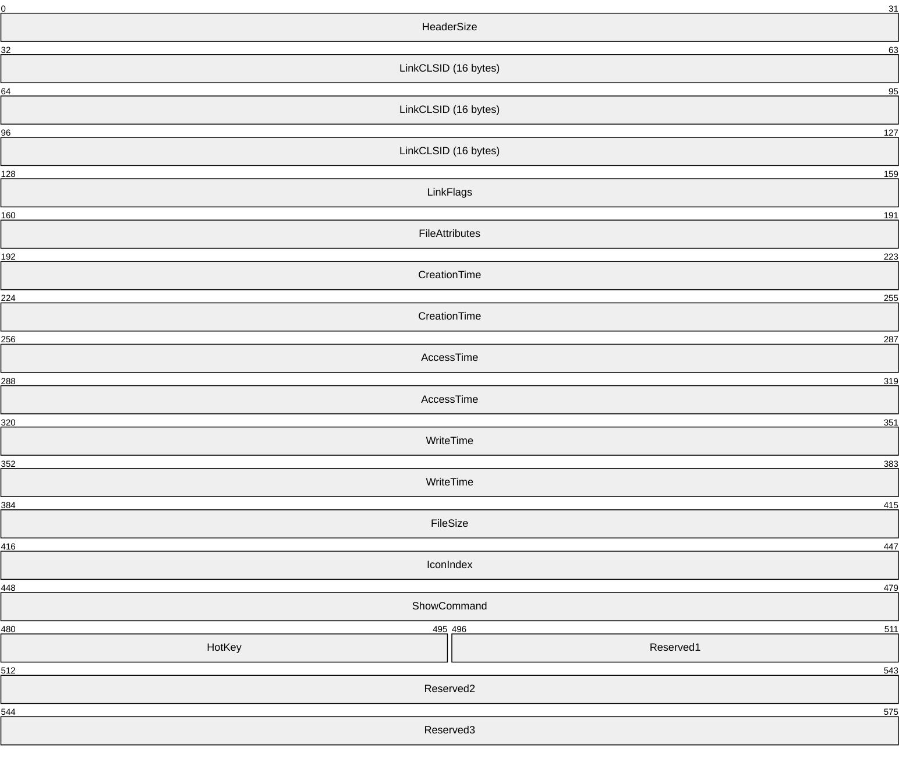

**HeaderSize (4 bytes):** The size, in bytes, of this structure. This value MUST be 0x0000004C.

**LinkCLSID (16 bytes):** A [**class identifier (CLSID)**](#gt_class-identifier-clsid). This value MUST be 00021401-0000-0000-C000-000000000046.

**LinkFlags (4 bytes):** A [LinkFlags](#Section_2.1.1) structure (section 2.1.1) that specifies information about the [**shell link**](#gt_shell-link) and the presence of optional portions of the structure.

**FileAttributes (4 bytes):** A [FileAttributesFlags](#Section_2.1.2) structure (section 2.1.2) that specifies information about the [**link target**](#gt_link-target).

**CreationTime (8 bytes):** A FILETIME structure ([MS-DTYP](../MS-DTYP/MS-DTYP.md) section 2.3.3) that specifies the creation time of the link target in [**UTC (Coordinated Universal Time)**](#gt_utc-coordinated-universal-time). If the value is zero, there is no creation time set on the link target.

**AccessTime (8 bytes):** A FILETIME structure ([MS-DTYP] section 2.3.3) that specifies the access time of the link target in UTC (Coordinated Universal Time). If the value is zero, there is no access time set on the link target.

**WriteTime (8 bytes):** A FILETIME structure ([MS-DTYP] section 2.3.3) that specifies the write time of the link target in UTC (Coordinated Universal Time). If the value is zero, there is no write time set on the link target.

**FileSize (4 bytes):** A 32-bit unsigned integer that specifies the size, in bytes, of the link target. If the link target file is larger than 0xFFFFFFFF, this value specifies the least significant 32 bits of the link target file size.

**IconIndex (4 bytes):** A 32-bit signed integer that specifies the index of an icon within a given icon location.

**ShowCommand (4 bytes):** A 32-bit unsigned integer that specifies the expected window state of an application launched by the link. This value SHOULD be one of the following.

| Value | Meaning |
| --- | --- |
| SW_SHOWNORMAL 0x00000001 | The application is open and its window is open in a normal fashion. |
| SW_SHOWMAXIMIZED 0x00000003 | The application is open, and keyboard focus is given to the application, but its window is not shown. |
| SW_SHOWMINNOACTIVE 0x00000007 | The application is open, but its window is not shown. It is not given the keyboard focus. |

All other values MUST be treated as **SW_SHOWNORMAL**.

**HotKey (2 bytes):** A [HotKeyFlags](#Section_2.1.3) structure (section 2.1.3) that specifies the keystrokes used to launch the application referenced by the shortcut key. This value is assigned to the application after it is launched, so that pressing the key activates that application.

**Reserved1 (2 bytes):** A value that MUST be zero.

**Reserved2 (4 bytes):** A value that MUST be zero.

**Reserved3 (4 bytes):** A value that MUST be zero.

<a id="Section_2.1.1"></a>
### 2.1.1 LinkFlags

The LinkFlags structure defines bits that specify which [**shell link**](#gt_shell-link) structures are present in the file format after the [ShellLinkHeader](#Section_2.1) structure (section 2.1).

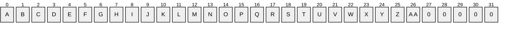

Where the bits are defined as:

| Value | Description |
| --- | --- |
| A HasLinkTargetIDList | The shell link is saved with an [**item ID list (IDList)**](#gt_item-id-list-idlist). If this bit is set, a [LinkTargetIDList](#Section_2.2) structure (section 2.2) MUST follow the ShellLinkHeader. If this bit is not set, this structure MUST NOT be present. |
| B HasLinkInfo | The shell link is saved with link information. If this bit is set, a [LinkInfo](#Section_2.3) structure (section 2.3) MUST be present. If this bit is not set, this structure MUST NOT be present. |
| C HasName | The shell link is saved with a name string. If this bit is set, a **NAME_STRING** [StringData](#Section_2.4) structure (section 2.4) MUST be present. If this bit is not set, this structure MUST NOT be present. |
| D HasRelativePath | The shell link is saved with a [**relative path**](#gt_relative-path) string. If this bit is set, a **RELATIVE_PATH** StringData structure (section 2.4) MUST be present. If this bit is not set, this structure MUST NOT be present. |
| E HasWorkingDir | The shell link is saved with a working directory string. If this bit is set, a **WORKING_DIR** StringData structure (section 2.4) MUST be present. If this bit is not set, this structure MUST NOT be present. |
| F HasArguments | The shell link is saved with command line arguments. If this bit is set, a **COMMAND_LINE_ARGUMENTS** StringData structure (section 2.4) MUST be present. If this bit is not set, this structure MUST NOT be present. |
| G HasIconLocation | The shell link is saved with an icon location string. If this bit is set, an **ICON_LOCATION** StringData structure (section 2.4) MUST be present. If this bit is not set, this structure MUST NOT be present. |
| H IsUnicode | The shell link contains Unicode encoded strings. This bit SHOULD be set. If this bit is set, the StringData section contains Unicode-encoded strings; otherwise, it contains strings that are encoded using the system default code page. |
| I ForceNoLinkInfo | The LinkInfo structure (section 2.3) is ignored. |
| J HasExpString | The shell link is saved with an [EnvironmentVariableDataBlock (section 2.5.4)](#Section_2.5.4). |
| K RunInSeparateProcess | The target is run in a separate virtual machine when launching a [**link target**](#gt_link-target) that is a 16-bit application. |
| L Unused1 | A bit that is undefined and MUST be ignored. |
| M HasDarwinID | The shell link is saved with a [DarwinDataBlock (section 2.5.3)](#Section_2.5.3). |
| N RunAsUser | The application is run as a different user when the target of the shell link is activated. |
| O HasExpIcon | The shell link is saved with an [IconEnvironmentDataBlock (section 2.5.5)](#Section_2.5.5). |
| P NoPidlAlias | The file system location is represented in the shell [**namespace**](#gt_namespace) when the path to an item is parsed into an IDList. |
| Q Unused2 | A bit that is undefined and MUST be ignored. |
| R RunWithShimLayer | The shell link is saved with a [ShimDataBlock (section 2.5.8)](#Section_2.5.8). |
| S ForceNoLinkTrack | The [TrackerDataBlock (section 2.5.10)](#Section_2.5.10) is ignored. |
| T EnableTargetMetadata | The shell link attempts to collect target properties and store them in the [PropertyStoreDataBlock (section 2.5.7)](#Section_2.5.7) when the link target is set. |
| U DisableLinkPathTracking | The EnvironmentVariableDataBlock is ignored. |
| V DisableKnownFolderTracking | The [SpecialFolderDataBlock (section 2.5.9)](#Section_2.5.9) and the [KnownFolderDataBlock (section 2.5.6)](#Section_2.5.6) are ignored when loading the shell link. If this bit is set, these extra data blocks SHOULD NOT be saved when saving the shell link. |
| W DisableKnownFolderAlias | If the [**link**](#gt_link) has a KnownFolderDataBlock (section 2.5.6), the unaliased form of the known folder IDList SHOULD be used when translating the target IDList at the time that the link is loaded. |
| X AllowLinkToLink | Creating a link that references another link is enabled. Otherwise, specifying a link as the target IDList SHOULD NOT be allowed. |
| Y UnaliasOnSave | When saving a link for which the target IDList is under a known folder, either the unaliased form of that known folder or the target IDList SHOULD be used. |
| Z PreferEnvironmentPath | The target IDList SHOULD NOT be stored; instead, the path specified in the EnvironmentVariableDataBlock (section 2.5.4) SHOULD be used to refer to the target. |
| AA KeepLocalIDListForUNCTarget | When the target is a [**UNC**](#gt_universal-naming-convention-unc) name that refers to a location on a local machine, the local path IDList in the PropertyStoreDataBlock (section 2.5.7) SHOULD be stored, so it can be used when the link is loaded on the local machine. |

<a id="Section_2.1.2"></a>
### 2.1.2 FileAttributesFlags

The FileAttributesFlags structure defines bits that specify the file attributes of the [**link target**](#gt_link-target), if the target is a file system item. File attributes can be used if the link target is not available, or if accessing the target would be inefficient. It is possible for the target items attributes to be out of sync with this value.

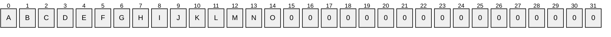

Where the bits are defined as:

| Value | Description |
| --- | --- |
| A FILE_ATTRIBUTE_READONLY | The file or directory is read-only. For a file, if this bit is set, applications can read the file but cannot write to it or delete it. For a directory, if this bit is set, applications cannot delete the directory. |
| B FILE_ATTRIBUTE_HIDDEN | The file or directory is hidden. If this bit is set, the file or folder is not included in an ordinary directory listing. |
| C FILE_ATTRIBUTE_SYSTEM | The file or directory is part of the operating system or is used exclusively by the operating system. |
| D Reserved1 | A bit that MUST be zero. |
| E FILE_ATTRIBUTE_DIRECTORY | The link target is a directory instead of a file. |
| F FILE_ATTRIBUTE_ARCHIVE | The file or directory is an archive file. Applications use this flag to mark files for backup or removal. |
| G Reserved2 | A bit that MUST be zero. |
| H FILE_ATTRIBUTE_NORMAL | The file or directory has no other flags set. If this bit is 1, all other bits in this structure MUST be clear. |
| I FILE_ATTRIBUTE_TEMPORARY | The file is being used for temporary storage. |
| J FILE_ATTRIBUTE_SPARSE_FILE | The file is a [**sparse file**](#gt_sparse-file). |
| K FILE_ATTRIBUTE_REPARSE_POINT | The file or directory has an associated [**reparse point**](#gt_reparse-point). |
| L FILE_ATTRIBUTE_COMPRESSED | The file or directory is compressed. For a file, this means that all data in the file is compressed. For a directory, this means that compression is the default for newly created files and subdirectories. |
| M FILE_ATTRIBUTE_OFFLINE | The data of the file is not immediately available. |
| N FILE_ATTRIBUTE_NOT_CONTENT_INDEXED | The contents of the file need to be indexed. |
| O FILE_ATTRIBUTE_ENCRYPTED | The file or directory is encrypted. For a file, this means that all data in the file is encrypted. For a directory, this means that encryption is the default for newly created files and subdirectories. |

<a id="Section_2.1.3"></a>
### 2.1.3 HotKeyFlags

The HotKeyFlags structure specifies input generated by a combination of keyboard keys being pressed.

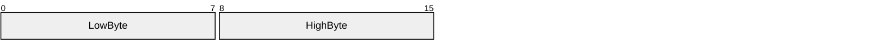

**LowByte (1 byte):** An 8-bit unsigned integer that specifies a virtual key code that corresponds to a key on the keyboard. This value MUST be one of the following:

| Value | Meaning |
| --- | --- |
| 0x00 | No key assigned. |
| 0x30 | "0" key |
| 0x31 | "1" key |
| 0x32 | "2" key |
| 0x33 | "3" key |
| 0x34 | "4" key |
| 0x35 | "5" key |
| 0x36 | "6" key |
| 0x37 | "7" key |
| 0x38 | "8" key |
| 0x39 | "9" key |
| 0x41 | "A" key |
| 0x42 | "B" key |
| 0x43 | "C" key |
| 0x44 | "D" key |
| 0x45 | "E" key |
| 0x46 | "F" key |
| 0x47 | "G" key |
| 0x48 | "H" key |
| 0x49 | "I" key |
| 0x4A | "J" key |
| 0x4B | "K" key |
| 0x4C | "L" key |
| 0x4D | "M" key |
| 0x4E | "N" key |
| 0x4F | "O" key |
| 0x50 | "P" key |
| 0x51 | "Q" key |
| 0x52 | "R" key |
| 0x53 | "S" key |
| 0x54 | "T" key |
| 0x55 | "U" key |
| 0x56 | "V" key |
| 0x57 | "W" key |
| 0x58 | "X" key |
| 0x59 | "Y" key |
| 0x5A | "Z" key |
| VK_F1 0x70 | "F1" key |
| VK_F2 0x71 | "F2" key |
| VK_F3 0x72 | "F3" key |
| VK_F4 0x73 | "F4" key |
| VK_F5 0x74 | "F5" key |
| VK_F6 0x75 | "F6" key |
| VK_F7 0x76 | "F7" key |
| VK_F8 0x77 | "F8" key |
| VK_F9 0x78 | "F9" key |
| VK_F10 0x79 | "F10" key |
| VK_F11 0x7A | "F11" key |
| VK_F12 0x7B | "F12" key |
| VK_F13 0x7C | "F13" key |
| VK_F14 0x7D | "F14" key |
| VK_F15 0x7E | "F15" key |
| VK_F16 0x7F | "F16" key |
| VK_F17 0x80 | "F17" key |
| VK_F18 0x81 | "F18" key |
| VK_F19 0x82 | "F19" key |
| VK_F20 0x83 | "F20" key |
| VK_F21 0x84 | "F21" key |
| VK_F22 0x85 | "F22" key |
| VK_F23 0x86 | "F23" key |
| VK_F24 0x87 | "F24" key |
| VK_NUMLOCK 0x90 | "NUM LOCK" key |
| VK_SCROLL 0x91 | "SCROLL LOCK" key |

**HighByte (1 byte):** An 8-bit unsigned integer that specifies bits that correspond to modifier keys on the keyboard. This value MUST be one or a combination of the following:

| Value | Meaning |
| --- | --- |
| 0x00 | No modifier key is being used. |
| HOTKEYF_SHIFT 0x01 | The "SHIFT" key on the keyboard. |
| HOTKEYF_CONTROL 0x02 | The "CTRL" key on the keyboard. |
| HOTKEYF_ALT 0x04 | The "ALT" key on the keyboard. |

<a id="Section_2.2"></a>
## 2.2 LinkTargetIDList

The LinkTargetIDList structure specifies the target of the link. The presence of this optional structure is specified by the **HasLinkTargetIDList** bit ([LinkFlags](#Section_2.1.1) section 2.1.1) in the [ShellLinkHeader (section 2.1)](#Section_2.1).

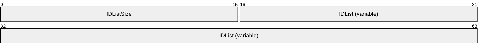

**IDListSize (2 bytes):** The size, in bytes, of the **IDList** field.

**IDList (variable):** A stored [IDList](#Section_2.2.1) structure (section 2.2.1), which contains the item ID list. An IDList structure conforms to the following [**ABNF**](#gt_augmented-backus-naur-form-abnf) [[RFC5234]](https://go.microsoft.com/fwlink/?LinkId=123096):

IDLIST = *ITEMID TERMINALID

<a id="Section_2.2.1"></a>
### 2.2.1 IDList

The stored IDList structure specifies the format of a persisted item ID list.

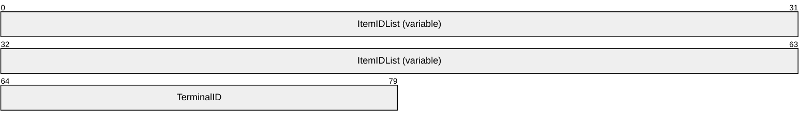

**ItemIDList (variable):** An array of zero or more [ItemID](#Section_2.2.2) structures (section 2.2.2).

**TerminalID (2 bytes):** A 16-bit, unsigned integer that indicates the end of the item IDs. This value MUST be zero.

<a id="Section_2.2.2"></a>
### 2.2.2 ItemID

An ItemID is an element in an [IDList](#Section_2.2.1) structure (section 2.2.1). The data stored in a given ItemID is defined by the source that corresponds to the location in the target namespace of the preceding ItemIDs. This data uniquely identifies the items in that part of the namespace.

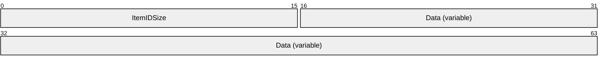

**ItemIDSize (2 bytes):** A 16-bit, unsigned integer that specifies the size, in bytes, of the ItemID structure, including the **ItemIDSize** field.

**Data (variable):** The shell data source-defined data that specifies an item.

<a id="Section_2.3"></a>
## 2.3 LinkInfo

The LinkInfo structure specifies information necessary to [**resolve a link**](#gt_resolve-a-link) target if it is not found in its original location. This includes information about the volume that the target was stored on, the mapped drive letter, and a [**Universal Naming Convention (UNC)**](#gt_universal-naming-convention-unc) form of the path if one existed when the [**link**](#gt_link) was created. For more details about UNC paths, see [MS-DFSNM](../MS-DFSNM/MS-DFSNM.md) section 2.2.1.4.

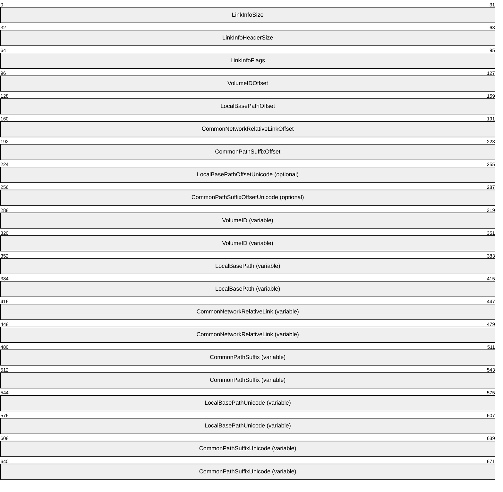

**LinkInfoSize (4 bytes):** A 32-bit, unsigned integer that specifies the size, in bytes, of the LinkInfo structure. All offsets specified in this structure MUST be less than this value, and all strings contained in this structure MUST fit within the extent defined by this size.

**LinkInfoHeaderSize (4 bytes):** A 32-bit, unsigned integer that specifies the size, in bytes, of the **LinkInfo** header section, which is composed of the **LinkInfoSize**, **LinkInfoHeaderSize**, **LinkInfoFlags**, **VolumeIDOffset**, **LocalBasePathOffset**, **CommonNetworkRelativeLinkOffset**, **CommonPathSuffixOffset** fields, and, if included, the **LocalBasePathOffsetUnicode** and **CommonPathSuffixOffsetUnicode** fields.<1>

| Value | Meaning |
| --- | --- |
| 0x0000001C | Offsets to the optional fields are not specified. |
| 0x00000024 ≤ *value* | Offsets to the optional fields are specified. |

**LinkInfoFlags (4 bytes):** Flags that specify whether the **VolumeID**, **LocalBasePath**, **LocalBasePathUnicode**, and **CommonNetworkRelativeLink** fields are present in this structure.

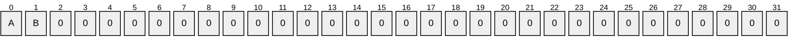

Where the bits are defined as:

| Value | Description |
| --- | --- |
| A VolumeIDAndLocalBasePath | If set, the **VolumeID** and **LocalBasePath** fields are present, and their locations are specified by the values of the **VolumeIDOffset** and **LocalBasePathOffset** fields, respectively. If the value of the **LinkInfoHeaderSize** field is greater than or equal to 0x00000024, the **LocalBasePathUnicode** field is present, and its location is specified by the value of the **LocalBasePathOffsetUnicode** field. If not set, the **VolumeID**, **LocalBasePath**, and **LocalBasePathUnicode** fields are not present, and the values of the **VolumeIDOffset** and **LocalBasePathOffset** fields are zero. If the value of the **LinkInfoHeaderSize** field is greater than or equal to 0x00000024, the value of the **LocalBasePathOffsetUnicode** field is zero. |
| B CommonNetworkRelativeLinkAndPathSuffix | If set, the **CommonNetworkRelativeLink** field is present, and its location is specified by the value of the **CommonNetworkRelativeLinkOffset** field. If not set, the **CommonNetworkRelativeLink** field is not present, and the value of the **CommonNetworkRelativeLinkOffset** field is zero. |

**VolumeIDOffset (4 bytes):** A 32-bit, unsigned integer that specifies the location of the **VolumeID** field. If the **VolumeIDAndLocalBasePath** flag is set, this value is an offset, in bytes, from the start of the LinkInfo structure; otherwise, this value MUST be zero.

**LocalBasePathOffset (4 bytes):** A 32-bit, unsigned integer that specifies the location of the **LocalBasePath** field. If the **VolumeIDAndLocalBasePath** flag is set, this value is an offset, in bytes, from the start of the LinkInfo structure; otherwise, this value MUST be zero.

**CommonNetworkRelativeLinkOffset (4 bytes):** A 32-bit, unsigned integer that specifies the location of the **CommonNetworkRelativeLink** field. If the **CommonNetworkRelativeLinkAndPathSuffix** flag is set, this value is an offset, in bytes, from the start of the LinkInfo structure; otherwise, this value MUST be zero.

**CommonPathSuffixOffset (4 bytes):** A 32-bit, unsigned integer that specifies the location of the **CommonPathSuffix** field. This value is an offset, in bytes, from the start of the LinkInfo structure.

**LocalBasePathOffsetUnicode (4 bytes):** An optional, 32-bit, unsigned integer that specifies the location of the **LocalBasePathUnicode** field. If the **VolumeIDAndLocalBasePath** flag is set, this value is an offset, in bytes, from the start of the LinkInfo structure; otherwise, this value MUST be zero. This field can be present only if the value of the **LinkInfoHeaderSize** field is greater than or equal to 0x00000024.

**CommonPathSuffixOffsetUnicode (4 bytes):** An optional, 32-bit, unsigned integer that specifies the location of the **CommonPathSuffixUnicode** field. This value is an offset, in bytes, from the start of the LinkInfo structure. This field can be present only if the value of the **LinkInfoHeaderSize** field is greater than or equal to 0x00000024.

**VolumeID (variable):** An optional [VolumeID](#Section_2.3.1) structure (section 2.3.1) that specifies information about the volume that the [**link target**](#gt_link-target) was on when the link was created. This field is present if the **VolumeIDAndLocalBasePath** flag is set.

**LocalBasePath (variable):** An optional, NULL–terminated string, defined by the system default code page, which is used to construct the full path to the link item or link target by appending the string in the **CommonPathSuffix** field. This field is present if the **VolumeIDAndLocalBasePath** flag is set.

**CommonNetworkRelativeLink (variable):** An optional [CommonNetworkRelativeLink](#Section_2.3.2) structure (section 2.3.2) that specifies information about the network location where the link target is stored.

**CommonPathSuffix (variable):** A NULL–terminated string, defined by the system default code page, which is used to construct the full path to the link item or link target by being appended to the string in the **LocalBasePath** field.

**LocalBasePathUnicode (variable):** An optional, NULL–terminated, [**Unicode**](#gt_unicode) string that is used to construct the full path to the link item or link target by appending the string in the **CommonPathSuffixUnicode** field. This field can be present only if the **VolumeIDAndLocalBasePath** flag is set and the value of the **LinkInfoHeaderSize** field is greater than or equal to 0x00000024.

**CommonPathSuffixUnicode (variable):** An optional, NULL–terminated, Unicode string that is used to construct the full path to the link item or link target by being appended to the string in the **LocalBasePathUnicode** field. This field can be present only if the value of the **LinkInfoHeaderSize** field is greater than or equal to 0x00000024.

<a id="Section_2.3.1"></a>
### 2.3.1 VolumeID

The VolumeID structure specifies information about the volume that a [**link target**](#gt_link-target) was on when the [**link**](#gt_link) was created. This information is useful for resolving the link if the file is not found in its original location.

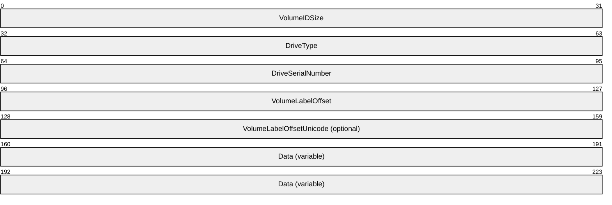

**VolumeIDSize (4 bytes):** A 32-bit, unsigned integer that specifies the size, in bytes, of this structure. This value MUST be greater than 0x00000010. All offsets specified in this structure MUST be less than this value, and all strings contained in this structure MUST fit within the extent defined by this size.

**DriveType (4 bytes):** A 32-bit, unsigned integer that specifies the type of drive the link target is stored on. This value MUST be one of the following:

| Value | Meaning |
| --- | --- |
| DRIVE_UNKNOWN 0x00000000 | The drive type cannot be determined. |
| DRIVE_NO_ROOT_DIR 0x00000001 | The root path is invalid; for example, there is no volume mounted at the path. |
| DRIVE_REMOVABLE 0x00000002 | The drive has removable media, such as a floppy drive, thumb drive, or flash card reader. |
| DRIVE_FIXED 0x00000003 | The drive has fixed media, such as a hard drive or flash drive. |
| DRIVE_REMOTE 0x00000004 | The drive is a remote (network) drive. |
| DRIVE_CDROM 0x00000005 | The drive is a CD-ROM drive. |
| DRIVE_RAMDISK 0x00000006 | The drive is a RAM disk. |

**DriveSerialNumber (4 bytes):** A 32-bit, unsigned integer that specifies the drive serial number of the volume the link target is stored on.

**VolumeLabelOffset (4 bytes):** A 32-bit, unsigned integer that specifies the location of a string that contains the volume label of the drive that the link target is stored on. This value is an offset, in bytes, from the start of the VolumeID structure to a NULL-terminated string of characters, defined by the system default code page. The volume label string is located in the **Data** field of this structure.

If the value of this field is 0x00000014, it MUST be ignored, and the value of the **VolumeLabelOffsetUnicode** field MUST be used to locate the volume label string.

**VolumeLabelOffsetUnicode (4 bytes):** An optional, 32-bit, unsigned integer that specifies the location of a string that contains the volume label of the drive that the link target is stored on. This value is an offset, in bytes, from the start of the VolumeID structure to a NULL-terminated string of [**Unicode**](#gt_unicode) characters. The volume label string is located in the **Data** field of this structure.

If the value of the **VolumeLabelOffset** field is not 0x00000014, this field MUST NOT be present; instead, the value of the **VolumeLabelOffset** field MUST be used to locate the volume label string.

**Data (variable):** A buffer of data that contains the volume label of the drive as a string defined by the system default code page or Unicode characters, as specified by preceding fields.

<a id="Section_2.3.2"></a>
### 2.3.2 CommonNetworkRelativeLink

The CommonNetworkRelativeLink structure specifies information about the network location where a [**link target**](#gt_link-target) is stored, including the mapped drive letter and the [**UNC**](#gt_universal-naming-convention-unc) path prefix. For details on UNC paths, see [MS-DFSNM](../MS-DFSNM/MS-DFSNM.md) section 2.2.1.4.

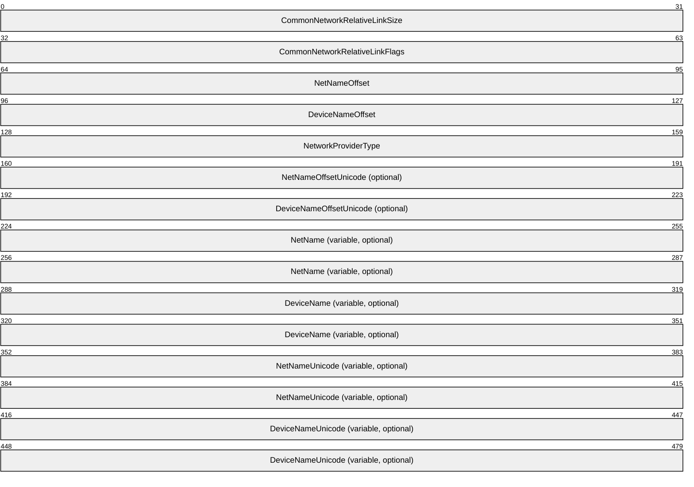

**CommonNetworkRelativeLinkSize (4 bytes):** A 32-bit, unsigned integer that specifies the size, in bytes, of the CommonNetworkRelativeLink structure. This value MUST be greater than or equal to 0x00000014. All offsets specified in this structure MUST be less than this value, and all strings contained in this structure MUST fit within the extent defined by this size.

**CommonNetworkRelativeLinkFlags (4 bytes):** Flags that specify the contents of the **DeviceNameOffset** and **NetProviderType** fields.


Where the bits are defined as:

| Value | Description |
| --- | --- |
| A ValidDevice | If set, the **DeviceNameOffset** field contains an offset to the device name. If not set, the **DeviceNameOffset** field does not contain an offset to the device name, and its value MUST be zero. |
| B ValidNetType | If set, the **NetProviderType** field contains the network provider type. If not set, the **NetProviderType** field does not contain the network provider type, and its value MUST be zero. |

**NetNameOffset (4 bytes):** A 32-bit, unsigned integer that specifies the location of the **NetName** field. This value is an offset, in bytes, from the start of the CommonNetworkRelativeLink structure.

**DeviceNameOffset (4 bytes):** A 32-bit, unsigned integer that specifies the location of the **DeviceName** field. If the **ValidDevice** flag is set, this value is an offset, in bytes, from the start of the CommonNetworkRelativeLink structure; otherwise, this value MUST be zero.

**NetworkProviderType (4 bytes):** A 32-bit, unsigned integer that specifies the type of network provider. If the **ValidNetType** flag is set, this value MUST be one of the following; otherwise, this value MUST be ignored.

| Vendor name | Value |
| --- | --- |
| WNNC_NET_AVID | 0x001A0000 |
| WNNC_NET_DOCUSPACE | 0x001B0000 |
| WNNC_NET_MANGOSOFT | 0x001C0000 |
| WNNC_NET_SERNET | 0x001D0000 |
| WNNC_NET_RIVERFRONT1 | 0X001E0000 |
| WNNC_NET_RIVERFRONT2 | 0x001F0000 |
| WNNC_NET_DECORB | 0x00200000 |
| WNNC_NET_PROTSTOR | 0x00210000 |
| WNNC_NET_FJ_REDIR | 0x00220000 |
| WNNC_NET_DISTINCT | 0x00230000 |
| WNNC_NET_TWINS | 0x00240000 |
| WNNC_NET_RDR2SAMPLE | 0x00250000 |
| WNNC_NET_CSC | 0x00260000 |
| WNNC_NET_3IN1 | 0x00270000 |
| WNNC_NET_EXTENDNET | 0x00290000 |
| WNNC_NET_STAC | 0x002A0000 |
| WNNC_NET_FOXBAT | 0x002B0000 |
| WNNC_NET_YAHOO | 0x002C0000 |
| WNNC_NET_EXIFS | 0x002D0000 |
| WNNC_NET_DAV | 0x002E0000 |
| WNNC_NET_KNOWARE | 0x002F0000 |
| WNNC_NET_OBJECT_DIRE | 0x00300000 |
| WNNC_NET_MASFAX | 0x00310000 |
| WNNC_NET_HOB_NFS | 0x00320000 |
| WNNC_NET_SHIVA | 0x00330000 |
| WNNC_NET_IBMAL | 0x00340000 |
| WNNC_NET_LOCK | 0x00350000 |
| WNNC_NET_TERMSRV | 0x00360000 |
| WNNC_NET_SRT | 0x00370000 |
| WNNC_NET_QUINCY | 0x00380000 |
| WNNC_NET_OPENAFS | 0x00390000 |
| WNNC_NET_AVID1 | 0X003A0000 |
| WNNC_NET_DFS | 0x003B0000 |
| WNNC_NET_KWNP | 0x003C0000 |
| WNNC_NET_ZENWORKS | 0x003D0000 |
| WNNC_NET_DRIVEONWEB | 0x003E0000 |
| WNNC_NET_VMWARE | 0x003F0000 |
| WNNC_NET_RSFX | 0x00400000 |
| WNNC_NET_MFILES | 0x00410000 |
| WNNC_NET_MS_NFS | 0x00420000 |
| WNNC_NET_GOOGLE | 0x00430000 |

**NetNameOffsetUnicode (4 bytes):** An optional, 32-bit, unsigned integer that specifies the location of the **NetNameUnicode** field. This value is an offset, in bytes, from the start of the CommonNetworkRelativeLink structure. This field MUST be present if the value of the **NetNameOffset** field is greater than 0x00000014; otherwise, this field MUST NOT be present.

**DeviceNameOffsetUnicode (4 bytes):** An optional, 32-bit, unsigned integer that specifies the location of the **DeviceNameUnicode** field. This value is an offset, in bytes, from the start of the CommonNetworkRelativeLink structure. This field MUST be present if the value of the **DeviceNameOffset** field is greater than 0x00000014; otherwise, this field MUST NOT be present.

**NetName (variable, optional):** An optional, NULL–terminated string, as defined by the system default code page, which specifies a server share path; for example, "\\server\share".

**DeviceName (variable, optional):** An optional, NULL–terminated string, as defined by the system default code page, which specifies a device; for example, the drive letter "D:". This field MUST be present if the **ValidDevice** flag is set; otherwise, this field MUST NOT be present.

**NetNameUnicode (variable, optional):** An optional, NULL–terminated, [**Unicode**](#gt_unicode) string that is the Unicode version of the **NetName** string. This field MUST be present if the value of the **NetNameOffset** field is greater than 0x00000014; otherwise, this field MUST NOT be present.

**DeviceNameUnicode (variable, optional):** An optional, NULL–terminated, Unicode string that is the Unicode version of the **DeviceName** string. This field MUST be present if the **ValidDevice** flag is set and the value of **NetNameOffset** field is greater than 0x00000014; otherwise, this field MUST NOT be present.

<a id="Section_2.4"></a>
## 2.4 StringData

StringData refers to a set of structures that convey user interface and path identification information. The presence of these optional structures is controlled by [LinkFlags (section 2.1.1)](#Section_2.1.1) in the [ShellLinkHeader (section 2.1)](#Section_2.1). Unless otherwise specified, the length of each structure MUST NOT be greater than 260, as specified in [[MSLEARN-MaxPathLength]](https://go.microsoft.com/fwlink/?linkid=2335378).

The StringData structures conform to the following [**ABNF**](#gt_augmented-backus-naur-form-abnf) rules [[RFC5234]](https://go.microsoft.com/fwlink/?LinkId=123096).

STRING_DATA = [NAME_STRING] [RELATIVE_PATH] [WORKING_DIR]

[COMMAND_LINE_ARGUMENTS] [ICON_LOCATION]

**NAME_STRING**: An optional structure that specifies a description of the [**shortcut**](#gt_shortcut) that is displayed to end users to identify the purpose of the [**shell link**](#gt_shell-link). This structure MUST be present if the **HasName** flag is set.

**RELATIVE_PATH**: An optional structure that specifies the location of the [**link target**](#gt_link-target) relative to the file that contains the shell link. When specified, this string SHOULD be used when resolving the [**link**](#gt_link). This structure MUST be present if the **HasRelativePath** flag is set.

**WORKING_DIR**: An optional structure that specifies the file system path of the working directory to be used when activating the link target. This structure MUST be present if the **HasWorkingDir** flag is set.

**COMMAND_LINE_ARGUMENTS**: An optional structure that stores the command-line arguments that are specified when activating the link target. This structure MUST be present if the **HasArguments** flag is set. The length of this structure is not bounded as specified in [MSLEARN-MaxPathLength].

**ICON_LOCATION**: An optional structure that specifies the location of the icon to be used when displaying a shell link item in an icon view. This structure MUST be present if the **HasIconLocation** flag is set.

All StringData structures have the following structure.

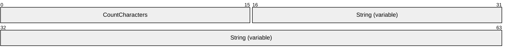

**CountCharacters (2 bytes):** A 16-bit, unsigned integer that specifies either the number of characters, defined by the system default code page, or the number of [**Unicode**](#gt_unicode) characters found in the **String** field. A value of zero specifies an empty string.

**String (variable):** An optional set of characters, defined by the system default code page, or a Unicode string with a length specified by the **CountCharacters** field. This string MUST NOT be NULL-terminated.

<a id="Section_2.5"></a>
## 2.5 ExtraData

ExtraData refers to a set of structures that convey additional information about a [**link target**](#gt_link-target). These optional structures can be present in an [**extra data section**](#gt_extra-data-section) that is appended to the basic Shell Link Binary File Format.

The ExtraData structures conform to the following [**ABNF**](#gt_augmented-backus-naur-form-abnf) rules [[RFC5234]](https://go.microsoft.com/fwlink/?LinkId=123096):

EXTRA_DATA = *EXTRA_DATA_BLOCK TERMINAL_BLOCK

EXTRA_DATA_BLOCK = CONSOLE_PROPS / CONSOLE_FE_PROPS / DARWIN_PROPS /

ENVIRONMENT_PROPS / ICON_ENVIRONMENT_PROPS /

KNOWN_FOLDER_PROPS / PROPERTY_STORE_PROPS /

SHIM_PROPS / SPECIAL_FOLDER_PROPS /

TRACKER_PROPS / VISTA_AND_ABOVE_IDLIST_PROPS

**EXTRA_DATA**: A structure consisting of zero or more property data blocks followed by a terminal block.

**EXTRA_DATA_BLOCK**: A structure consisting of any one of the following property data blocks.

- **CONSOLE_PROPS**: A [ConsoleDataBlock](#Section_2.5.1) structure (section 2.5.1).
- **CONSOLE_FE_PROPS**: A [ConsoleFEDataBlock](#Section_2.5.2) structure (section 2.5.2).
- **DARWIN_PROPS**: A [DarwinDataBlock](#Section_2.5.3) structure (section 2.5.3).
- **ENVIRONMENT_PROPS**: An [EnvironmentVariableDataBlock](#Section_2.5.4) structure (section 2.5.4).
- **ICON_ENVIRONMENT_PROPS**: An [IconEnvironmentDataBlock](#Section_2.5.5) structure (section 2.5.5).
- **KNOWN_FOLDER_PROPS**: A [KnownFolderDataBlock](#Section_2.5.6) structure (section 2.5.6).
- **PROPERTY_STORE_PROPS**: A [PropertyStoreDataBlock](#Section_2.5.7) structure (section 2.5.7).
- **SHIM_PROPS**: A [ShimDataBlock](#Section_2.5.8) structure (section 2.5.8).
- **SPECIAL_FOLDER_PROPS**: A [SpecialFolderDataBlock](#Section_2.5.9) structure (section 2.5.9).
- **TRACKER_PROPS**: A [TrackerDataBlock](#Section_2.5.10) structure (section 2.5.10).
- **VISTA_AND_ABOVE_IDLIST_PROPS**: A [VistaAndAboveIDListDataBlock](#Section_2.5.11) structure (section 2.5.11).
**TERMINAL_BLOCK** A structure that indicates the end of the extra data section.

The general structure of an extra data section is shown in the following diagram.

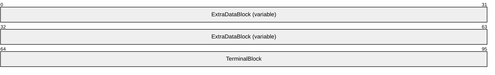

**ExtraDataBlock (variable):** An optional array of bytes that contains zero or more property data blocks listed in the **EXTRA_DATA_BLOCK** syntax rule.

**TerminalBlock (4 bytes):** A 32-bit, unsigned integer that indicates the end of the extra data section. This value MUST be less than 0x00000004.

<a id="Section_2.5.1"></a>
### 2.5.1 ConsoleDataBlock

The ConsoleDataBlock structure specifies the display settings to use when a [**link target**](#gt_link-target) specifies an application that is run in a console window.<2>

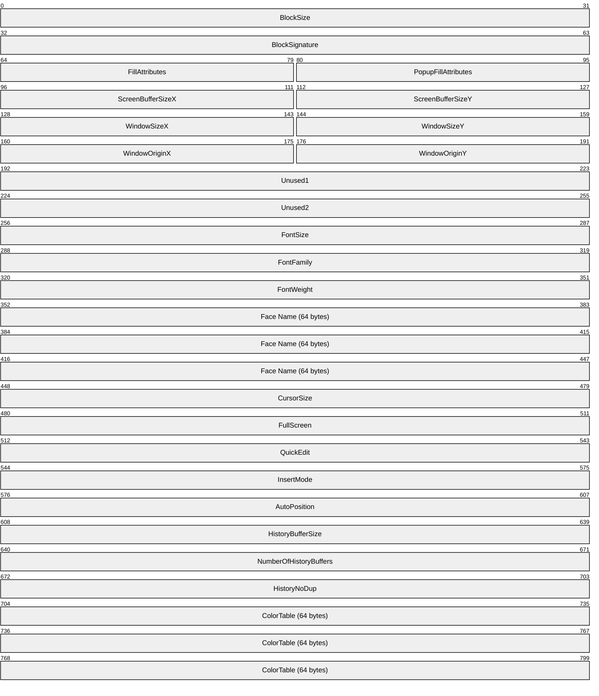

**BlockSize (4 bytes):** A 32-bit, unsigned integer that specifies the size of the ConsoleDataBlock structure. This value MUST be 0x000000CC.

**BlockSignature (4 bytes):** A 32-bit, unsigned integer that specifies the signature of the ConsoleDataBlock [**extra data section**](#gt_extra-data-section). This value MUST be 0xA0000002.

**FillAttributes (2 bytes):** A 16-bit, unsigned integer that specifies the fill attributes that control the foreground and background text colors in the console window. The following bit definitions can be combined to specify 16 different values each for the foreground and background colors:

| Value | Meaning |
| --- | --- |
| FOREGROUND_BLUE 0x0001 | The foreground text color contains blue. |
| FOREGROUND_GREEN 0x0002 | The foreground text color contains green. |
| FOREGROUND_RED 0x0004 | The foreground text color contains red. |
| FOREGROUND_INTENSITY 0x0008 | The foreground text color is intensified. |
| BACKGROUND_BLUE 0x0010 | The background text color contains blue. |
| BACKGROUND_GREEN 0x0020 | The background text color contains green. |
| BACKGROUND_RED 0x0040 | The background text color contains red. |
| BACKGROUND_INTENSITY 0x0080 | The background text color is intensified. |

**PopupFillAttributes (2 bytes):** A 16-bit, unsigned integer that specifies the fill attributes that control the foreground and background text color in the console window popup. The values are the same as for the **FillAttributes** field.

**ScreenBufferSizeX (2 bytes):** A 16-bit, signed integer that specifies the horizontal size (X axis), in characters, of the console window buffer.

**ScreenBufferSizeY (2 bytes):** A 16-bit, signed integer that specifies the vertical size (Y axis), in characters, of the console window buffer.

**WindowSizeX (2 bytes):** A 16-bit, signed integer that specifies the horizontal size (X axis), in characters, of the console window.

**WindowSizeY (2 bytes):** A 16-bit, signed integer that specifies the vertical size (Y axis), in characters, of the console window.

**WindowOriginX (2 bytes):** A 16-bit, signed integer that specifies the horizontal coordinate (X axis), in pixels, of the console window origin.

**WindowOriginY (2 bytes):** A 16-bit, signed integer that specifies the vertical coordinate (Y axis), in pixels, of the console window origin.

**Unused1 (4 bytes):** A value that is undefined and MUST be ignored.

**Unused2 (4 bytes):** A value that is undefined and MUST be ignored.

**FontSize (4 bytes):** A 32-bit, unsigned integer that specifies the size, in pixels, of the font used in the console window. The two most significant bytes contain the font height and the two least significant bytes contain the font width. For vector fonts, the width is set to zero.

**FontFamily (4 bytes):** A 32-bit, unsigned integer that specifies the family of the font used in the console window. This value MUST be comprised of a font family and a font pitch. The values for the font family are shown in the following table:

| Value | Meaning |
| --- | --- |
| FF_DONTCARE 0x0000 | The font family is unknown. |
| FF_ROMAN 0x0010 | The font is variable-width with serifs; for example, "Times New Roman". |
| FF_SWISS 0x0020 | The font is variable-width without serifs; for example, "Arial". |
| FF_MODERN 0x0030 | The font is fixed-width, with or without serifs; for example, "Courier New". |
| FF_SCRIPT 0x0040 | The font is designed to look like handwriting; for example, "Cursive". |
| FF_DECORATIVE 0x0050 | The font is a novelty font; for example, "Old English". |

A bitwise OR of one or more of the following font-pitch bits is added to the font family from the previous table:

| Value | Meaning |
| --- | --- |
| TMPF_NONE 0x0000 | A font pitch does not apply. |
| TMPF_FIXED_PITCH 0x0001 | The font is a fixed-pitch font. |
| TMPF_VECTOR 0x0002 | The font is a vector font. |
| TMPF_TRUETYPE 0x0004 | The font is a true-type font. |
| TMPF_DEVICE 0x0008 | The font is specific to the device. |

**FontWeight (4 bytes):** A 32-bit, unsigned integer that specifies the stroke weight of the font used in the console window.

| Value | Meaning |
| --- | --- |
| 700 ≤ *value* | A bold font. |
| *value* < 700 | A regular-weight font. |

**Face Name (64 bytes):** A 32-character [**Unicode**](#gt_unicode) string that specifies the face name of the font used in the console window.

**CursorSize (4 bytes):** A 32-bit, unsigned integer that specifies the size of the cursor, in pixels, used in the console window.

| Value | Meaning |
| --- | --- |
| *value* ≤ 25 | A small cursor. |
| 26 — 50 | A medium cursor. |
| 51 — 100 | A large cursor. |

**FullScreen (4 bytes):** A 32-bit, unsigned integer that specifies whether to open the console window in full-screen mode.

| Value | Meaning |
| --- | --- |
| 0x00000000 | Full-screen mode is off. |
| 0x00000000 < *value* | Full-screen mode is on. |

**QuickEdit (4 bytes):** A 32-bit, unsigned integer that specifies whether to open the console window in QuikEdit mode. In QuickEdit mode, the mouse can be used to cut, copy, and paste text in the console window.

| Value | Meaning |
| --- | --- |
| 0x00000000 | QuikEdit mode is off. |
| 0x00000000 < *value* | QuikEdit mode is on. |

**InsertMode (4 bytes):** A 32-bit, unsigned integer that specifies insert mode in the console window.

| Value | Meaning |
| --- | --- |
| 0x00000000 | Insert mode is disabled. |
| 0x00000000 < *value* | Insert mode is enabled. |

**AutoPosition (4 bytes):** A 32-bit, unsigned integer that specifies auto-position mode of the console window.

| Value | Meaning |
| --- | --- |
| 0x00000000 | The values of the **WindowOriginX** and **WindowOriginY** fields are used to position the console window. |
| 0x00000000 < *value* | The console window is positioned automatically. |

**HistoryBufferSize (4 bytes):** A 32-bit, unsigned integer that specifies the size, in characters, of the buffer that is used to store a history of user input into the console window.

**NumberOfHistoryBuffers (4 bytes):** A 32-bit, unsigned integer that specifies the number of history buffers to use.

**HistoryNoDup (4 bytes):** A 32-bit, unsigned integer that specifies whether to remove duplicates in the history buffer.

| Value | Meaning |
| --- | --- |
| 0x00000000 | Duplicates are not allowed. |
| 0x00000000 < *value* | Duplicates are allowed. |

**ColorTable (64 bytes):** A table of 16 32-bit, unsigned integers specifying the [**RGB**](#gt_red-green-blue-rgb) colors that are used for text in the console window. The values of the fill attribute fields **FillAttributes** and **PopupFillAttributes** are used as indexes into this table to specify the final foreground and background color for a character.

<a id="Section_2.5.2"></a>
### 2.5.2 ConsoleFEDataBlock

The ConsoleFEDataBlock structure specifies the [**code page**](#gt_code-page) to use for displaying text when a [**link target**](#gt_link-target) specifies an application that is run in a console window.<3>

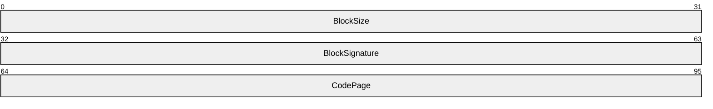

**BlockSize (4 bytes):** A 32-bit, unsigned integer that specifies the size of the ConsoleFEDataBlock structure. This value MUST be 0x0000000C.

**BlockSignature (4 bytes):** A 32-bit, unsigned integer that specifies the signature of the ConsoleFEDataBlock [**extra data section**](#gt_extra-data-section). This value MUST be 0xA0000004.

**CodePage (4 bytes):** A 32-bit, unsigned integer that specifies a code page language code identifier. For details concerning the structure and meaning of language code identifiers, see [MS-LCID](../MS-LCID/MS-LCID.md). For additional background information, see [[MSCHARSET]](https://go.microsoft.com/fwlink/?LinkId=89944), [[MSDN-CS]](https://go.microsoft.com/fwlink/?LinkId=90692), and [[MSDOCS-CodePage]](https://go.microsoft.com/fwlink/?linkid=875153).

<a id="Section_2.5.3"></a>
### 2.5.3 DarwinDataBlock

The DarwinDataBlock structure specifies an application identifier that can be used instead of a [**link target**](#gt_link-target) [**IDList**](#gt_item-id-list-idlist) to install an application when a [**shell link**](#gt_shell-link) is activated.

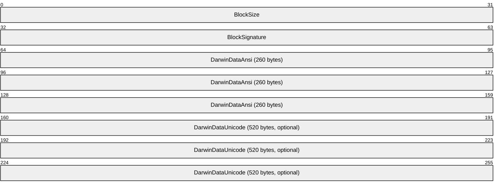

**BlockSize (4 bytes):** A 32-bit, unsigned integer that specifies the size of the DarwinDataBlock structure. This value MUST be 0x00000314.

**BlockSignature (4 bytes):** A 32-bit, unsigned integer that specifies the signature of the DarwinDataBlock [**extra data section**](#gt_extra-data-section). This value MUST be 0xA0000006.

**DarwinDataAnsi (260 bytes):** A NULL–terminated string, defined by the system default code page, which specifies an application identifier. This field SHOULD be ignored.

**DarwinDataUnicode (520 bytes):** An optional, NULL–terminated, [**Unicode**](#gt_unicode) string that specifies an application identifier.<4>

<a id="Section_2.5.4"></a>
### 2.5.4 EnvironmentVariableDataBlock

The EnvironmentVariableDataBlock structure specifies a path to environment variable information when the [**link target**](#gt_link-target) refers to a location that has a corresponding environment variable.

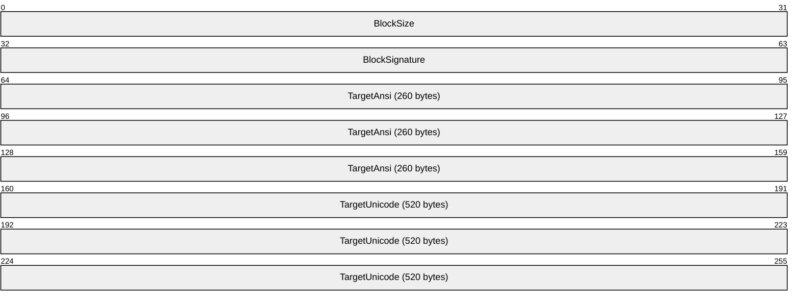

**BlockSize (4 bytes):** A 32-bit, unsigned integer that specifies the size of the EnvironmentVariableDataBlock structure. This value MUST be 0x00000314.

**BlockSignature (4 bytes):** A 32-bit, unsigned integer that specifies the signature of the EnvironmentVariableDataBlock [**extra data section**](#gt_extra-data-section). This value MUST be 0xA0000001.

**TargetAnsi (260 bytes):** A NULL-terminated string, defined by the system default code page, which specifies a path to environment variable information.

**TargetUnicode (520 bytes):** An optional, NULL-terminated, [**Unicode**](#gt_unicode) string that specifies a path to environment variable information.

<a id="Section_2.5.5"></a>
### 2.5.5 IconEnvironmentDataBlock

The IconEnvironmentDataBlock structure specifies the path to an icon. The path is encoded using environment variables, which makes it possible to find the icon across machines where the locations vary but are expressed using environment variables.


**BlockSize (4 bytes):** A 32-bit, unsigned integer that specifies the size of the IconEnvironmentDataBlock structure. This value MUST be 0x00000314.

**BlockSignature (4 bytes):** A 32-bit, unsigned integer that specifies the signature of the IconEnvironmentDataBlock [**extra data section**](#gt_extra-data-section). This value MUST be 0xA0000007.

**TargetAnsi (260 bytes):** A NULL-terminated string, defined by the system default code page, which specifies a path that is constructed with environment variables.

**TargetUnicode (520 bytes):** An optional, NULL-terminated, [**Unicode**](#gt_unicode) string that specifies a path that is constructed with environment variables.

<a id="Section_2.5.6"></a>
### 2.5.6 KnownFolderDataBlock

The KnownFolderDataBlock structure specifies the location of a known folder. This data can be used when a [**link target**](#gt_link-target) is a known folder to keep track of the folder so that the link target [**IDList**](#gt_item-id-list-idlist) can be translated when the [**link**](#gt_link) is loaded.

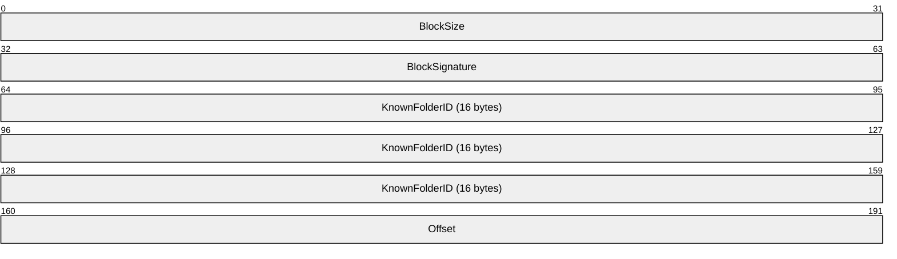

**BlockSize (4 bytes):** A 32-bit, unsigned integer that specifies the size of the KnownFolderDataBlock structure. This value MUST be 0x0000001C.

**BlockSignature (4 bytes):** A 32-bit, unsigned integer that specifies the signature of the KnownFolderDataBlock [**extra data section**](#gt_extra-data-section). This value MUST be 0xA000000B.

**KnownFolderID (16 bytes):** A value in [**GUID**](#gt_globally-unique-identifier-guid) packet representation ([MS-DTYP](../MS-DTYP/MS-DTYP.md) section 2.3.4.2) that specifies the [**folder GUID ID**](#gt_folder-guid-id).

**Offset (4 bytes):** A 32-bit, unsigned integer that specifies the location of the [**ItemID**](#gt_item-id-itemid) of the first child segment of the IDList specified by **KnownFolderID**. This value is the offset, in bytes, into the link target IDList.

<a id="Section_2.5.7"></a>
### 2.5.7 PropertyStoreDataBlock

A PropertyStoreDataBlock structure specifies a set of properties that can be used by applications to store extra data in the [**shell link**](#gt_shell-link).

```mermaid
packet-beta
  0-31: "BlockSize"
  32-63: "BlockSignature"
  64-127: "PropertyStore (variable)"
```

**BlockSize (4 bytes):** A 32-bit, unsigned integer that specifies the size of the PropertyStoreDataBlock structure. This value MUST be greater than or equal to 0x0000000C.

**BlockSignature (4 bytes):** A 32-bit, unsigned integer that specifies the signature of the PropertyStoreDataBlock [**extra data section**](#gt_extra-data-section). This value MUST be 0xA0000009.

**PropertyStore (variable):** A serialized property storage structure ([MS-PROPSTORE](../MS-PROPSTORE/MS-PROPSTORE.md) section 2.2).

<a id="Section_2.5.8"></a>
### 2.5.8 ShimDataBlock

The ShimDataBlock structure specifies the name of a [**shim**](#gt_shim) that can be applied when activating a [**link target**](#gt_link-target).

```mermaid
packet-beta
  0-31: "BlockSize"
  32-63: "BlockSignature"
  64-127: "LayerName (variable)"
```

**BlockSize (4 bytes):** A 32-bit, unsigned integer that specifies the size of the ShimDataBlock structure. This value MUST be greater than or equal to 0x00000088.

**BlockSignature (4 bytes):** A 32-bit, unsigned integer that specifies the signature of the ShimDataBlock [**extra data section**](#gt_extra-data-section). This value MUST be 0xA0000008.

**LayerName (variable):** A [**Unicode**](#gt_unicode) string that specifies the name of a shim layer to apply to a link target when it is being activated.

<a id="Section_2.5.9"></a>
### 2.5.9 SpecialFolderDataBlock

The SpecialFolderDataBlock structure specifies the location of a special folder. This data can be used when a [**link target**](#gt_link-target) is a special folder to keep track of the folder, so that the link target [**IDList**](#gt_item-id-list-idlist) can be translated when the [**link**](#gt_link) is loaded.

```mermaid
packet-beta
  0-31: "BlockSize"
  32-63: "BlockSignature"
  64-95: "SpecialFolderID"
  96-127: "Offset"
```

**BlockSize (4 bytes):** A 32-bit, unsigned integer that specifies the size of the SpecialFolderDataBlock structure. This value MUST be 0x00000010.

**BlockSignature (4 bytes):** A 32-bit, unsigned integer that specifies the signature of the SpecialFolderDataBlock [**extra data section**](#gt_extra-data-section). This value MUST be 0xA0000005.

**SpecialFolderID (4 bytes):** A 32-bit, unsigned integer that specifies the [**folder integer ID**](#gt_folder-integer-id).

**Offset (4 bytes):** A 32-bit, unsigned integer that specifies the location of the [**ItemID**](#gt_item-id-itemid) of the first child segment of the IDList specified by **SpecialFolderID**. This value is the offset, in bytes, into the link target IDList.

<a id="Section_2.5.10"></a>
### 2.5.10 TrackerDataBlock

The TrackerDataBlock structure specifies data that can be used to [**resolve a link**](#gt_resolve-a-link) target if it is not found in its original location when the [**link**](#gt_link) is resolved. This data is passed to the Link Tracking service [MS-DLTW](../MS-DLTW/MS-DLTW.md) to find the [**link target**](#gt_link-target).

```mermaid
packet-beta
  0-31: "BlockSize"
  32-63: "BlockSignature"
  64-95: "Length"
  96-127: "Version"
  128-223: "MachineID (16 bytes)"
  224-319: "Droid (32 bytes)"
  320-415: "DroidBirth (32 bytes)"
```

**BlockSize (4 bytes):** A 32-bit, unsigned integer that specifies the size of the TrackerDataBlock structure. This value MUST be 0x00000060.

**BlockSignature (4 bytes):** A 32-bit, unsigned integer that specifies the signature of the TrackerDataBlock [**extra data section**](#gt_extra-data-section). This value MUST be 0xA0000003.

**Length (4 bytes):** A 32-bit, unsigned integer that specifies the size of the rest of the TrackerDataBlock structure, including this **Length** field. This value MUST be 0x00000058.

**Version (4 bytes):** A 32-bit, unsigned integer. This value MUST be 0x00000000.

**MachineID (16 bytes):** A NULL–terminated character string, as defined by the system default code page, which specifies the [**NetBIOS name**](#gt_netbios-name) of the machine where the link target was last known to reside.

**Droid (32 bytes):** Two values in [**GUID**](#gt_globally-unique-identifier-guid) packet representation ([MS-DTYP](../MS-DTYP/MS-DTYP.md) section 2.3.4.2) that are used to find the link target with the Link Tracking service, as described in [MS-DLTW].

**DroidBirth (32 bytes):** Two values in GUID packet representation that are used to find the link target with the Link Tracking service

<a id="Section_2.5.11"></a>
### 2.5.11 VistaAndAboveIDListDataBlock

The VistaAndAboveIDListDataBlock structure specifies an alternate [**IDList**](#gt_item-id-list-idlist) that can be used instead of the [LinkTargetIDList](#Section_2.2) structure (section 2.2) on platforms that support it.<5>

```mermaid
packet-beta
  0-31: "BlockSize"
  32-63: "BlockSignature"
  64-127: "IDList (variable)"
```

**BlockSize (4 bytes):** A 32-bit, unsigned integer that specifies the size of the VistaAndAboveIDListDataBlock structure. This value MUST be greater than or equal to 0x0000000A.

**BlockSignature (4 bytes):** A 32-bit, unsigned integer that specifies the signature of the VistaAndAboveIDListDataBlock [**extra data section**](#gt_extra-data-section). This value MUST be 0xA000000C.

**IDList (variable):** An [IDList](#Section_2.2.1) structure (section 2.2.1).

<a id="Section_3"></a>
# 3 Structure Examples

<a id="Section_3.1"></a>
## 3.1 Shortcut to a File

This section presents a sample of the Shell Link Binary File Format, consisting of a [**shortcut**](#gt_shortcut) to a file with the path "C:\test\a.txt".

The following is the hexadecimal representation of the contents of the [**shell link**](#gt_shell-link).

|  | x0 | x1 | x2 | x3 | x4 | x5 | x6 | x7 | x8 | x9 | xA | xB | xC | xD | xE | xF |
| --- | --- | --- | --- | --- | --- | --- | --- | --- | --- | --- | --- | --- | --- | --- | --- | --- |
| **0000** | 4C | 00 | 00 | 00 | 01 | 14 | 02 | 00 | 00 | 00 | 00 | 00 | C0 | 00 | 00 | 00 |
| **0010** | 00 | 00 | 00 | 46 | 9B | 00 | 08 | 00 | 20 | 00 | 00 | 00 | D0 | E9 | EE | F2 |
| **0020** | 15 | 15 | C9 | 01 | D0 | E9 | EE | F2 | 15 | 15 | C9 | 01 | D0 | E9 | EE | F2 |
| **0030** | 15 | 15 | C9 | 01 | 00 | 00 | 00 | 00 | 00 | 00 | 00 | 00 | 01 | 00 | 00 | 00 |
| **0040** | 00 | 00 | 00 | 00 | 00 | 00 | 00 | 00 | 00 | 00 | 00 | 00 | BD | 00 | 14 | 00 |
| **0050** | 1F | 50 | E0 | 4F | D0 | 20 | EA | 3A | 69 | 10 | A2 | D8 | 08 | 00 | 2B | 30 |
| **0060** | 30 | 9D | 19 | 00 | 2F | 43 | 3A | 5C | 00 | 00 | 00 | 00 | 00 | 00 | 00 | 00 |
| **0070** | 00 | 00 | 00 | 00 | 00 | 00 | 00 | 00 | 00 | 00 | 00 | 46 | 00 | 31 | 00 | 00 |
| **0080** | 00 | 00 | 00 | 2C | 39 | 69 | A3 | 10 | 00 | 74 | 65 | 73 | 74 | 00 | 00 | 32 |
| **0090** | 00 | 07 | 00 | 04 | 00 | EF | BE | 2C | 39 | 65 | A3 | 2C | 39 | 69 | A3 | 26 |
| **00A0** | 00 | 00 | 00 | 03 | 1E | 00 | 00 | 00 | 00 | F5 | 1E | 00 | 00 | 00 | 00 | 00 |
| **00B0** | 00 | 00 | 00 | 00 | 00 | 74 | 00 | 65 | 00 | 73 | 00 | 74 | 00 | 00 | 00 | 14 |
| **00C0** | 00 | 48 | 00 | 32 | 00 | 00 | 00 | 00 | 00 | 2C | 39 | 69 | A3 | 20 | 00 | 61 |
| **00D0** | 2E | 74 | 78 | 74 | 00 | 34 | 00 | 07 | 00 | 04 | 00 | EF | BE | 2C | 39 | 69 |
| **00E0** | A3 | 2C | 39 | 69 | A3 | 26 | 00 | 00 | 00 | 2D | 6E | 00 | 00 | 00 | 00 | 96 |
| **00F0** | 01 | 00 | 00 | 00 | 00 | 00 | 00 | 00 | 00 | 00 | 00 | 61 | 00 | 2E | 00 | 74 |
| **0100** | 00 | 78 | 00 | 74 | 00 | 00 | 00 | 14 | 00 | 00 | 00 | 3C | 00 | 00 | 00 | 1C |
| **0110** | 00 | 00 | 00 | 01 | 00 | 00 | 00 | 1C | 00 | 00 | 00 | 2D | 00 | 00 | 00 | 00 |
| **0120** | 00 | 00 | 00 | 3B | 00 | 00 | 00 | 11 | 00 | 00 | 00 | 03 | 00 | 00 | 00 | 81 |
| **0130** | 8A | 7A | 30 | 10 | 00 | 00 | 00 | 00 | 43 | 3A | 5C | 74 | 65 | 73 | 74 | 5C |
| **0140** | 61 | 2E | 74 | 78 | 74 | 00 | 00 | 07 | 00 | 2E | 00 | 5C | 00 | 61 | 00 | 2E |
| **0150** | 00 | 74 | 00 | 78 | 00 | 74 | 00 | 07 | 00 | 43 | 00 | 3A | 00 | 5C | 00 | 74 |
| **0160** | 00 | 65 | 00 | 73 | 00 | 74 | 00 | 60 | 00 | 00 | 00 | 03 | 00 | 00 | A0 | 58 |
| **0170** | 00 | 00 | 00 | 00 | 00 | 00 | 00 | 63 | 68 | 72 | 69 | 73 | 2D | 78 | 70 | 73 |
| **0180** | 00 | 00 | 00 | 00 | 00 | 00 | 00 | 40 | 78 | C7 | 94 | 47 | FA | C7 | 46 | B3 |
| **0190** | 56 | 5C | 2D | C6 | B6 | D1 | 15 | EC | 46 | CD | 7B | 22 | 7F | DD | 11 | 94 |
| **01A0** | 99 | 00 | 13 | 72 | 16 | 87 | 4A | 40 | 78 | C7 | 94 | 47 | FA | C7 | 46 | B3 |
| **01B0** | 56 | 5C | 2D | C6 | B6 | D1 | 15 | EC | 46 | CD | 7B | 22 | 7F | DD | 11 | 94 |
| **01C0** | 99 | 00 | 13 | 72 | 16 | 87 | 4A | 00 | 00 | 00 | 00 | - | - | - | - | - |

**HeaderSize**: (4 bytes, offset 0x0000), 0x0000004C as required.

**LinkCLSID**: (16 bytes, offset 0x0004), 00021401-0000-0000-C000-000000000046.

**LinkFlags**: (4 bytes, offset 0x0014), 0x0008009B means the following [LinkFlags (section 2.1.1)](#Section_2.1.1) are set:

- HasLinkTargetIDList
- HasLinkInfo
- HasRelativePath
- HasWorkingDir
- IsUnicode
- EnableTargetMetadata
**FileAttributes**: (4 bytes, offset 0x0018), 0x00000020, means the following [FileAttributesFlags (section 2.1.2)](#Section_2.1.2) are set:

- FILE_ATTRIBUTE_ARCHIVE
**CreationTime**: (8 bytes, offset 0x001C) FILETIME 9/12/08, 8:27:17PM.

**AccessTime**: (8 bytes, offset 0x0024) FILETIME 9/12/08, 8:27:17PM.

**WriteTime**: (8 bytes, offset 0x002C) FILETIME 9/12/08, 8:27:17PM.

**FileSize**: (4 bytes, offset 0x0034), 0x00000000.

**IconIndex**: (4 bytes, offset 0x0038), 0x00000000.

**ShowCommand**: (4 bytes, offset 0x003C), SW_SHOWNORMAL(1).

**Hotkey**: (2 bytes, offset 0x0040), 0x0000.

**Reserved**: (2 bytes, offset 0x0042), 0x0000.

**Reserved2**: (4 bytes, offset 0x0044), 0 x00000000.

**Reserved3**: (4 bytes, offset 0x0048), 0 x00000000.

Because **HasLinkTargetIDList** is set, a [LinkTargetIDList](#Section_2.2) structure (section 2.2) follows:

- **IDListSize**: (2 bytes, offset 0x004C), 0x00BD, the size of **IDList**.
- **IDList**: (189 bytes, offset 0x004E) an [IDList](#Section_2.2.1) structure (section 2.2.1) follows:
- **ItemIDList**: (187 bytes, offset 0x004E), [ItemID](#Section_2.2.2) structures (section 2.2.2) follow:
- **ItemIDSize**: (2 bytes, offset 0x004E), 0x0014
- **Data**: (12 bytes, offset 0x0050), <18 bytes of data> [computer]
- **ItemIDSize**: (2 bytes, offset 0x0062), 0x0019
- **Data**: (23 bytes, offset 0x0064), <23 bytes of data> [c:]
- **ItemIDSize**: (2 bytes, offset 0x007B), 0x0046
- **Data**: (68 bytes, offset 0x007D), <68 bytes of data> [test]
- **ItemIDSize**: (2 bytes, offset 0x00C1), 0x0048
- **Data**: (68 bytes, offset 0x00C3), <70 bytes of data> [a.txt]
- **TerminalID**: (2 bytes, offset 0x0109), 0x0000 indicates the end of the **IDList**.
Because **HasLinkInfo** is set, a [LinkInfo](#Section_2.3) structure (section 2.3) follows:

- **LinkInfoSize**: (4 bytes, offset 0x010B), 0x0000003C
- **LinkInfoHeaderSize**: (4 bytes, offset 0x010F), 0x0000001C as specified in the LinkInfo structure definition.
- **LinkInfoFlags**: (4 bytes, offset 0x0113), 0x00000001 **VolumeIDAndLocalBasePath** is set.
- **VolumeIDOffset**: (4 bytes, offset 0x0117), 0x0000001C, references offset 0x0127.
- **LocalBasePathOffset**: (4 bytes, offset 0x011B), 0x0000002D, references the character string "C:\test\a.txt".
- **CommonNetworkRelativeLinkOffset**: (4 bytes, offset 0x011F), 0x00000000 indicates **CommonNetworkRelativeLink** is not present.
- **CommonPathSuffixOffset**: (4 bytes, offset 0x0123), 0x0000003B, references offset 0x00000146, the character string "" (empty string).
- **VolumeID**: (17 bytes, offset 0x0127), because **VolumeIDAndLocalBasePath** is set, a [VolumeID](#Section_2.3.1) structure (section 2.3.1) follows:
- **VolumeIDSize**: (4 bytes, offset 0x0127), 0x00000011 indicates the size of the **VolumeID** structure.
- **DriveType**: (4 bytes, offset 0x012B), DRIVE_FIXED(3).
- **DriveSerialNumber**: (4 bytes, offset 0x012F), 0x307A8A81.
- **VolumeLabelOffset**: (4 bytes, offset 0x0133), 0x00000010, indicates that Volume Label Offset Unicode is not specified and references offset 0x0137 where the Volume Label is stored.
- **Data**: (1 byte, offset 0x0137), "" an empty character string.
- **LocalBasePath**: (14 bytes, offset 0x0138), because **VolumeIDAndLocalBasePath** is set, the character string "c:\test\a.txt" is present.
- **CommonPathSuffix**: (1 byte, offset 0x0146), "" an empty character string.
Because **HasRelativePath** is set, the **RELATIVE_PATH** [StringData](#Section_2.4) structure (section 2.4) follows:

- **CountCharacters**: (2 bytes, offset 0x0147), 0x0007 [**Unicode**](#gt_unicode) characters.
- **String** (14 bytes, offset 0x0149), the Unicode string: ".\a.txt".
Because **HasWorkingDir** is set, the **WORKING_DIR** StringData structure (section 2.4) follows:

- **CountCharacters**: (2 bytes, offset 0x0157), 0x0007 Unicode characters.
- **String** (14 bytes, offset 0x0159), the Unicode string: "c:\test".
[**Extra data section**](#gt_extra-data-section): (100 bytes, offset 0x0167), an [ExtraData](#Section_2.5) structure (section 2.5) follows:

- **ExtraDataBlock** (96 bytes, offset 0x0167), the [TrackerDataBlock](#Section_2.5.10) structure (section 2.5.10) follows:
- **BlockSize**: (4 bytes, offset 0x0167), 0x00000060
- **BlockSignature**: (4 bytes, offset 0x016B), 0xA000003, which identifies the TrackerDataBlock structure (section 2.5.10).
- **Length**: (4 bytes, offset 0x016F), 0x00000058, the required minimum size of this extra data block.
- **Version**: (4 bytes, offset 0x0173), 0x00000000, the required version.
- **MachineID**: (16 bytes, offset 0x0177), the character string "chris-xps", with zero fill.
- **Droid**: (32 bytes, offset 0x0187), 2 [**GUID**](#gt_globally-unique-identifier-guid) values.
- **DroidBirth**: (32 bytes, offset 0x01A7), 2 GUID values.
- **TerminalBlock**: (4 bytes, offset 0x01C7), 0x00000000 indicates the end of the extra data section.
<a id="Section_4"></a>
# 4 Security

None.

<a id="Section_5"></a>
# 5 Appendix A: Product Behavior

The information in this specification is applicable to the following Microsoft products or supplemental software. References to product versions include updates to those products.

- Windows NT 3.1 operating system
- Windows NT 3.5 operating system
- Windows NT 3.51 operating system
- Windows NT 4.0 operating system
- Windows 2000 operating system
- Windows XP operating system
- Windows Server 2003 operating system
- Windows Vista operating system
- Windows Server 2008 operating system
- Windows 7 operating system
- Windows Server 2008 R2 operating system
- Windows 8 operating system
- Windows Server 2012 operating system
- Windows 8.1 operating system
- Windows Server 2012 R2 operating system
- Windows 10 operating system
- Windows Server 2016 operating system
- Windows Server operating system
- Windows Server 2019 operating system
- Windows Server 2022 operating system
- Windows 11 operating system
- Windows Server 2025 operating system
Exceptions, if any, are noted in this section. If an update version, service pack or Knowledge Base (KB) number appears with a product name, the behavior changed in that update. The new behavior also applies to subsequent updates unless otherwise specified. If a product edition appears with the product version, behavior is different in that product edition.

Unless otherwise specified, any statement of optional behavior in this specification that is prescribed using the terms "SHOULD" or "SHOULD NOT" implies product behavior in accordance with the SHOULD or SHOULD NOT prescription. Unless otherwise specified, the term "MAY" implies that the product does not follow the prescription.

<1> Section 2.3: In Windows, [**Unicode**](#gt_unicode) characters are stored in this structure if the data cannot be represented as [**ANSI**](#gt_100cd8a6-5cb1-4895-9de6-e4a3c224a583) characters due to truncation of the values. In this case, the value of the **LinkInfoHeaderSize** field is greater than or equal to 36.

<2> Section 2.5.1: In Windows environments, this is commonly known as a "command prompt" window.

<3> Section 2.5.2: In Windows environments, this is commonly known as a "command prompt" window.

<4> Section 2.5.3: In Windows, this is a Windows Installer (MSI) application descriptor. For more information, see [[MSDN-SHELLLINKS]](https://go.microsoft.com/fwlink/?LinkId=104564).

<5> Section 2.5.11: The VistaAndAboveIDListDataBlock structure is not supported on Windows NT operating system, Windows 2000, Windows XP, or Windows Server 2003.

<a id="Section_6"></a>
# 6 Change Tracking

This section identifies changes that were made to this document since the last release. Changes are classified as Major, Minor, or None.

The revision class **Major** means that the technical content in the document was significantly revised. Major changes affect protocol interoperability or implementation. Examples of major changes are:

- A document revision that incorporates changes to interoperability requirements.
- A document revision that captures changes to protocol functionality.
The revision class **Minor** means that the meaning of the technical content was clarified. Minor changes do not affect protocol interoperability or implementation. Examples of minor changes are updates to clarify ambiguity at the sentence, paragraph, or table level.

The revision class **None** means that no new technical changes were introduced. Minor editorial and formatting changes may have been made, but the relevant technical content is identical to the last released version.

The changes made to this document are listed in the following table. For more information, please contact [dochelp@microsoft.com](mailto:dochelp@microsoft.com).

| Section | Description | Revision class |
| --- | --- | --- |
| [2.4](#Section_2.4) StringData | 30490 : Added length limitation to StringData fields. | Major |

<a id="revision-history"></a>

## Revision History

| Date | Version | Revision Class | Comments |
| --- | --- | --- | --- |
| 7/16/2010 | 1.0 | New | First Release. |
| 8/27/2010 | 1.1 | Minor | Clarified the meaning of the technical content. |
| 10/8/2010 | 1.1 | None | No changes to the meaning, language, or formatting of the technical content. |
| 11/19/2010 | 1.1 | None | No changes to the meaning, language, or formatting of the technical content. |
| 1/7/2011 | 1.1 | None | No changes to the meaning, language, or formatting of the technical content. |
| 2/11/2011 | 1.1 | None | No changes to the meaning, language, or formatting of the technical content. |
| 3/25/2011 | 1.1 | None | No changes to the meaning, language, or formatting of the technical content. |
| 5/6/2011 | 1.1 | None | No changes to the meaning, language, or formatting of the technical content. |
| 6/17/2011 | 1.2 | Minor | Clarified the meaning of the technical content. |
| 9/23/2011 | 1.2 | None | No changes to the meaning, language, or formatting of the technical content. |
| 12/16/2011 | 1.2 | None | No changes to the meaning, language, or formatting of the technical content. |
| 3/30/2012 | 1.2 | None | No changes to the meaning, language, or formatting of the technical content. |
| 7/12/2012 | 1.2 | None | No changes to the meaning, language, or formatting of the technical content. |
| 10/25/2012 | 1.2 | None | No changes to the meaning, language, or formatting of the technical content. |
| 1/31/2013 | 1.2 | None | No changes to the meaning, language, or formatting of the technical content. |
| 8/8/2013 | 2.0 | Major | Updated and revised the technical content. |
| 11/14/2013 | 2.0 | None | No changes to the meaning, language, or formatting of the technical content. |
| 2/13/2014 | 2.0 | None | No changes to the meaning, language, or formatting of the technical content. |
| 5/15/2014 | 2.0 | None | No changes to the meaning, language, or formatting of the technical content. |
| 6/30/2015 | 3.0 | Major | Significantly changed the technical content. |
| 10/16/2015 | 3.0 | None | No changes to the meaning, language, or formatting of the technical content. |
| 7/14/2016 | 3.0 | None | No changes to the meaning, language, or formatting of the technical content. |
| 6/1/2017 | 3.0 | None | No changes to the meaning, language, or formatting of the technical content. |
| 9/15/2017 | 4.0 | Major | Significantly changed the technical content. |
| 9/12/2018 | 5.0 | Major | Significantly changed the technical content. |
| 4/7/2021 | 6.0 | Major | Significantly changed the technical content. |
| 6/25/2021 | 7.0 | Major | Significantly changed the technical content. |
| 4/23/2024 | 8.0 | Major | Significantly changed the technical content. |
| 6/10/2025 | 9.0 | Major | Significantly changed the technical content. |
| 11/21/2025 | 10.0 | Major | Significantly changed the technical content. |
