# [MS-SMB]: Server Message Block (SMB) Protocol

Table of Contents

<details>
<summary>1 Introduction</summary>

- [1 Introduction](#Section_1)
  - [1.1 Glossary](#Section_1.1)
  - [1.2 References](#Section_1.2)
    - [1.2.1 Normative References](#Section_1.2.1)
    - [1.2.2 Informative References](#Section_1.2.2)
  - [1.3 Overview](#Section_1.3)
  - [1.4 Relationship to Other Protocols](#Section_1.4)
  - [1.5 Prerequisites/Preconditions](#Section_1.5)
  - [1.6 Applicability Statement](#Section_1.6)
  - [1.7 Versioning and Capability Negotiation](#Section_1.7)
  - [1.8 Vendor-Extensible Fields](#Section_1.8)
  - [1.9 Standards Assignments](#Section_1.9)
</details>

<details>
<summary>2 Messages</summary>

- [2 Messages](#Section_2)
  - [2.1 Transport](#Section_2.1)
  - [2.2 Message Syntax](#Section_2.2)
    - [2.2.1 Common Data Type Extensions](#Section_2.2.1)
      - [2.2.1.1 Character Sequences](#Section_2.2.1.1)
        - [2.2.1.1.1 Pathname Extensions](#Section_2.2.1.1.1)
      - [2.2.1.2 File Attributes](#Section_2.2.1.2)
        - [2.2.1.2.1 Extended File Attribute (SMB_EXT_FILE_ATTR) Extensions](#Section_2.2.1.2.1)
        - [2.2.1.2.2 File System Attribute Extensions](#Section_2.2.1.2.2)
      - [2.2.1.3 Unique Identifiers](#Section_2.2.1.3)
        - [2.2.1.3.1 FileId Generation](#Section_2.2.1.3.1)
        - [2.2.1.3.2 VolumeGUID Generation](#Section_2.2.1.3.2)
        - [2.2.1.3.3 Copychunk Resume Key Generation](#Section_2.2.1.3.3)
      - [2.2.1.4 Access Masks](#Section_2.2.1.4)
        - [2.2.1.4.1 File_Pipe_Printer_Access_Mask](#Section_2.2.1.4.1)
        - [2.2.1.4.2 Directory_Access_Mask](#Section_2.2.1.4.2)
    - [2.2.2 Defined Constant Extensions](#Section_2.2.2)
      - [2.2.2.1 SMB_COM Command Codes](#Section_2.2.2.1)
      - [2.2.2.2 Transaction Subcommand Codes](#Section_2.2.2.2)
      - [2.2.2.3 Information Level Codes](#Section_2.2.2.3)
        - [2.2.2.3.1 FIND Information Level Codes](#Section_2.2.2.3.1)
        - [2.2.2.3.2 QUERY_FS Information Level Codes](#Section_2.2.2.3.2)
        - [2.2.2.3.3 QUERY Information Level Codes](#Section_2.2.2.3.3)
        - [2.2.2.3.4 SET Information Level Codes](#Section_2.2.2.3.4)
        - [2.2.2.3.5 Pass-through Information Level Codes](#Section_2.2.2.3.5)
        - [2.2.2.3.6 Other Information Level Codes](#Section_2.2.2.3.6)
      - [2.2.2.4 SMB Error Classes and Codes](#Section_2.2.2.4)
      - [2.2.2.5 Session Key Protection Hash](#Section_2.2.2.5)
    - [2.2.3 SMB Message Structure Extensions](#Section_2.2.3)
      - [2.2.3.1 SMB Header Extensions](#Section_2.2.3.1)
    - [2.2.4 SMB Command Extensions](#Section_2.2.4)
      - [2.2.4.1 SMB_COM_OPEN_ANDX (0x2D)](#Section_2.2.4.1)
        - [2.2.4.1.1 Client Request Extensions](#Section_2.2.4.1.1)
        - [2.2.4.1.2 Server Response Extensions](#Section_2.2.4.1.2)
      - [2.2.4.2 SMB_COM_READ_ANDX (0x2E)](#Section_2.2.4.2)
        - [2.2.4.2.1 Client Request Extensions](#Section_2.2.4.2.1)
        - [2.2.4.2.2 Server Response Extensions](#Section_2.2.4.2.2)
      - [2.2.4.3 SMB_COM_WRITE_ANDX (0x2F)](#Section_2.2.4.3)
        - [2.2.4.3.1 Client Request Extensions](#Section_2.2.4.3.1)
        - [2.2.4.3.2 Server Response Extensions](#Section_2.2.4.3.2)
      - [2.2.4.4 SMB_COM_TRANSACTION2 (0x32) Extensions](#Section_2.2.4.4)
      - [2.2.4.5 SMB_COM_NEGOTIATE (0x72)](#Section_2.2.4.5)
        - [2.2.4.5.1 Client Request Extensions](#Section_2.2.4.5.1)
        - [2.2.4.5.2 Server Response Extensions](#Section_2.2.4.5.2)
          - [2.2.4.5.2.1 Extended Security Response](#Section_2.2.4.5.2.1)
          - [2.2.4.5.2.2 Non-Extended Security Response](#Section_2.2.4.5.2.2)
      - [2.2.4.6 SMB_COM_SESSION_SETUP_ANDX (0x73)](#Section_2.2.4.6)
        - [2.2.4.6.1 Client Request Extensions](#Section_2.2.4.6.1)
        - [2.2.4.6.2 Server Response Extensions](#Section_2.2.4.6.2)
      - [2.2.4.7 SMB_COM_TREE_CONNECT_ANDX (0x75)](#Section_2.2.4.7)
        - [2.2.4.7.1 Client Request Extensions](#Section_2.2.4.7.1)
        - [2.2.4.7.2 Server Response Extensions](#Section_2.2.4.7.2)
      - [2.2.4.8 SMB_COM_NT_TRANSACT (0xA0) Extensions](#Section_2.2.4.8)
      - [2.2.4.9 SMB_COM_NT_CREATE_ANDX (0xA2)](#Section_2.2.4.9)
        - [2.2.4.9.1 Client Request Extensions](#Section_2.2.4.9.1)
        - [2.2.4.9.2 Server Response Extensions](#Section_2.2.4.9.2)
      - [2.2.4.10 SMB_COM_SEARCH (0x81) Extensions](#Section_2.2.4.10)
    - [2.2.5 Transaction Subcommand Extensions](#Section_2.2.5)
      - [2.2.5.1 TRANS_RAW_READ_NMPIPE (0x0011)](#Section_2.2.5.1)
      - [2.2.5.2 TRANS_CALL_NMPIPE (0x0054)](#Section_2.2.5.2)
    - [2.2.6 Transaction 2 Subcommand Extensions](#Section_2.2.6)
      - [2.2.6.1 TRANS2_FIND_FIRST2 (0x0001)](#Section_2.2.6.1)
        - [2.2.6.1.1 Client Request Extensions](#Section_2.2.6.1.1)
        - [2.2.6.1.2 Server Response Extensions](#Section_2.2.6.1.2)
      - [2.2.6.2 TRANS2_FIND_NEXT2 (0x0002)](#Section_2.2.6.2)
        - [2.2.6.2.1 Client Request Extensions](#Section_2.2.6.2.1)
        - [2.2.6.2.2 Server Response Extensions](#Section_2.2.6.2.2)
      - [2.2.6.3 TRANS2_QUERY_FS_INFORMATION (0x0003)](#Section_2.2.6.3)
        - [2.2.6.3.1 Client Request Extensions](#Section_2.2.6.3.1)
        - [2.2.6.3.2 Server Response Extensions](#Section_2.2.6.3.2)
      - [2.2.6.4 TRANS2_SET_FS_INFORMATION (0x0004)](#Section_2.2.6.4)
        - [2.2.6.4.1 Client Request](#Section_2.2.6.4.1)
        - [2.2.6.4.2 Server Response](#Section_2.2.6.4.2)
      - [2.2.6.5 TRANS2_QUERY_PATH_INFORMATION (0x0005)](#Section_2.2.6.5)
        - [2.2.6.5.1 Client Request Extensions](#Section_2.2.6.5.1)
        - [2.2.6.5.2 Server Response Extensions](#Section_2.2.6.5.2)
      - [2.2.6.6 TRANS2_SET_PATH_INFORMATION (0x0006)](#Section_2.2.6.6)
        - [2.2.6.6.1 Client Request Extensions](#Section_2.2.6.6.1)
        - [2.2.6.6.2 Server Response Extensions](#Section_2.2.6.6.2)
      - [2.2.6.7 TRANS2_QUERY_FILE_INFORMATION (0x0007)](#Section_2.2.6.7)
        - [2.2.6.7.1 Client Request Extensions](#Section_2.2.6.7.1)
        - [2.2.6.7.2 Server Response Extensions](#Section_2.2.6.7.2)
      - [2.2.6.8 TRANS2_SET_FILE_INFORMATION (0x0008)](#Section_2.2.6.8)
        - [2.2.6.8.1 Client Request Extensions](#Section_2.2.6.8.1)
        - [2.2.6.8.2 Server Response Extensions](#Section_2.2.6.8.2)
    - [2.2.7 NT Transact Subcommand Extensions](#Section_2.2.7)
      - [2.2.7.1 NT_TRANSACT_CREATE (0x0001) Extensions](#Section_2.2.7.1)
        - [2.2.7.1.1 Client Request Extensions](#Section_2.2.7.1.1)
        - [2.2.7.1.2 Server Response Extensions](#Section_2.2.7.1.2)
      - [2.2.7.2 NT_TRANSACT_IOCTL (0x0002)](#Section_2.2.7.2)
        - [2.2.7.2.1 Client Request Extensions](#Section_2.2.7.2.1)
          - [2.2.7.2.1.1 SRV_COPYCHUNK](#Section_2.2.7.2.1.1)
        - [2.2.7.2.2 Server Response Extensions](#Section_2.2.7.2.2)
          - [2.2.7.2.2.1 FSCTL_SRV_ENUMERATE_SNAPSHOTS Response](#Section_2.2.7.2.2.1)
          - [2.2.7.2.2.2 FSCTL_SRV_REQUEST_RESUME_KEY Response](#Section_2.2.7.2.2.2)
          - [2.2.7.2.2.3 FSCTL_SRV_COPYCHUNK Response](#Section_2.2.7.2.2.3)
      - [2.2.7.3 NT_TRANSACT_SET_SECURITY_DESC (0x0003) Extensions](#Section_2.2.7.3)
      - [2.2.7.4 NT_TRANSACT_QUERY_SECURITY_DESC (0x0006) Extensions](#Section_2.2.7.4)
      - [2.2.7.5 NT_TRANSACT_QUERY_QUOTA (0x0007)](#Section_2.2.7.5)
        - [2.2.7.5.1 Client Request](#Section_2.2.7.5.1)
        - [2.2.7.5.2 Server Response](#Section_2.2.7.5.2)
      - [2.2.7.6 NT_TRANSACT_SET_QUOTA (0x0008)](#Section_2.2.7.6)
        - [2.2.7.6.1 Client Request](#Section_2.2.7.6.1)
        - [2.2.7.6.2 Server Response](#Section_2.2.7.6.2)
    - [2.2.8 Information Levels](#Section_2.2.8)
      - [2.2.8.1 FIND Information Level Extensions](#Section_2.2.8.1)
        - [2.2.8.1.1 SMB_FIND_FILE_BOTH_DIRECTORY_INFO Extensions](#Section_2.2.8.1.1)
        - [2.2.8.1.2 SMB_FIND_FILE_ID_FULL_DIRECTORY_INFO](#Section_2.2.8.1.2)
        - [2.2.8.1.3 SMB_FIND_FILE_ID_BOTH_DIRECTORY_INFO](#Section_2.2.8.1.3)
      - [2.2.8.2 QUERY_FS Information Level Extensions](#Section_2.2.8.2)
        - [2.2.8.2.1 SMB_QUERY_FS_ATTRIBUTE_INFO](#Section_2.2.8.2.1)
      - [2.2.8.3 QUERY Information Level Extensions](#Section_2.2.8.3)
      - [2.2.8.4 SET Information level Extensions](#Section_2.2.8.4)
</details>

<details>
<summary>3 Protocol Details</summary>

- [3 Protocol Details](#Section_3)
  - [3.1 Common Details](#Section_3.1)
    - [3.1.1 Abstract Data Model](#Section_3.1.1)
      - [3.1.1.1 Global](#Section_3.1.1.1)
    - [3.1.2 Timers](#Section_3.1.2)
    - [3.1.3 Initialization](#Section_3.1.3)
    - [3.1.4 Higher-Layer Triggered Events](#Section_3.1.4)
      - [3.1.4.1 Sending Any Message](#Section_3.1.4.1)
    - [3.1.5 Message Processing Events and Sequencing Rules](#Section_3.1.5)
      - [3.1.5.1 Receiving Any Message](#Section_3.1.5.1)
    - [3.1.6 Timer Events](#Section_3.1.6)
    - [3.1.7 Other Local Events](#Section_3.1.7)
  - [3.2 Client Details](#Section_3.2)
    - [3.2.1 Abstract Data Model](#Section_3.2.1)
      - [3.2.1.1 Global](#Section_3.2.1.1)
      - [3.2.1.2 Per SMB Connection](#Section_3.2.1.2)
      - [3.2.1.3 Per SMB Session](#Section_3.2.1.3)
      - [3.2.1.4 Per Tree Connect](#Section_3.2.1.4)
      - [3.2.1.5 Per Unique Open](#Section_3.2.1.5)
    - [3.2.2 Timers](#Section_3.2.2)
    - [3.2.3 Initialization](#Section_3.2.3)
    - [3.2.4 Higher-Layer Triggered Events](#Section_3.2.4)
      - [3.2.4.1 Sending Any Message](#Section_3.2.4.1)
        - [3.2.4.1.1 Scanning a Path for a Previous Version Token](#Section_3.2.4.1.1)
      - [3.2.4.2 Application Requests Connecting to a Share](#Section_3.2.4.2)
        - [3.2.4.2.1 Connection Establishment](#Section_3.2.4.2.1)
        - [3.2.4.2.2 Dialect Negotiation](#Section_3.2.4.2.2)
        - [3.2.4.2.3 Capabilities Negotiation](#Section_3.2.4.2.3)
        - [3.2.4.2.4 User Authentication](#Section_3.2.4.2.4)
          - [3.2.4.2.4.1 Sequence Diagram](#Section_3.2.4.2.4.1)
        - [3.2.4.2.5 Connecting to the Share (Tree Connect)](#Section_3.2.4.2.5)
      - [3.2.4.3 Application Requests Opening a File](#Section_3.2.4.3)
        - [3.2.4.3.1 SMB_COM_NT_CREATE_ANDX Request](#Section_3.2.4.3.1)
        - [3.2.4.3.2 SMB_COM_OPEN_ANDX Request (deprecated)](#Section_3.2.4.3.2)
      - [3.2.4.4 Application Requests Reading from a File, Named Pipe, or Device](#Section_3.2.4.4)
        - [3.2.4.4.1 Large Read Support](#Section_3.2.4.4.1)
      - [3.2.4.5 Application Requests Writing to a File, Named Pipe, or Device](#Section_3.2.4.5)
      - [3.2.4.6 Application Requests a Directory Enumeration](#Section_3.2.4.6)
      - [3.2.4.7 Application Requests Querying File Attributes](#Section_3.2.4.7)
      - [3.2.4.8 Application Requests Setting File Attributes](#Section_3.2.4.8)
      - [3.2.4.9 Application Requests Querying File System Attributes](#Section_3.2.4.9)
      - [3.2.4.10 Application Requests Setting File System Attributes](#Section_3.2.4.10)
      - [3.2.4.11 Application Requests Sending an I/O Control to a File or Device](#Section_3.2.4.11)
        - [3.2.4.11.1 Application Requests Enumerating Available Previous Versions](#Section_3.2.4.11.1)
        - [3.2.4.11.2 Performing a Server-Side Data Copy](#Section_3.2.4.11.2)
          - [3.2.4.11.2.1 Application queries the Copychunk Resume Key of the Source File](#Section_3.2.4.11.2.1)
          - [3.2.4.11.2.2 Application requests a Server-side Data Copy](#Section_3.2.4.11.2.2)
      - [3.2.4.12 Application Requests Querying of DFS Referral](#Section_3.2.4.12)
      - [3.2.4.13 Application Requests Querying User Quota Information](#Section_3.2.4.13)
      - [3.2.4.14 Application Requests Setting User Quota Information](#Section_3.2.4.14)
      - [3.2.4.15 Application Requests the Session Key for a Connection](#Section_3.2.4.15)
    - [3.2.5 Message Processing Events and Sequencing Rules](#Section_3.2.5)
      - [3.2.5.1 Receiving Any Message](#Section_3.2.5.1)
      - [3.2.5.2 Receiving an SMB_COM_NEGOTIATE Response](#Section_3.2.5.2)
      - [3.2.5.3 Receiving an SMB_COM_SESSION_SETUP_ANDX Response](#Section_3.2.5.3)
      - [3.2.5.4 Receiving an SMB_COM_TREE_CONNECT_ANDX Response](#Section_3.2.5.4)
      - [3.2.5.5 Receiving an SMB_COM_NT_CREATE_ANDX Response](#Section_3.2.5.5)
      - [3.2.5.6 Receiving an SMB_COM_OPEN_ANDX Response](#Section_3.2.5.6)
      - [3.2.5.7 Receiving an SMB_COM_READ_ANDX Response](#Section_3.2.5.7)
      - [3.2.5.8 Receiving an SMB_COM_WRITE_ANDX Response](#Section_3.2.5.8)
      - [3.2.5.9 Receiving any SMB_COM_NT_TRANSACT Response](#Section_3.2.5.9)
        - [3.2.5.9.1 Receiving an NT_TRANSACT_IOCTL Response](#Section_3.2.5.9.1)
          - [3.2.5.9.1.1 Receiving an FSCTL_SRV_REQUEST_RESUME_KEY Function Code](#Section_3.2.5.9.1.1)
          - [3.2.5.9.1.2 Receiving an FSCTL_SRV_COPYCHUNK Function Code](#Section_3.2.5.9.1.2)
        - [3.2.5.9.2 Receiving an NT_TRANSACT_QUERY_QUOTA Response](#Section_3.2.5.9.2)
        - [3.2.5.9.3 Receiving an NT_TRANSACT_SET_QUOTA Response](#Section_3.2.5.9.3)
      - [3.2.5.10 Receiving an SMB_COM_SEARCH Response](#Section_3.2.5.10)
      - [3.2.5.11 Receiving any SMB_COM_TRANSACTION2 subcommand Response](#Section_3.2.5.11)
        - [3.2.5.11.1 Receiving any TRANS2_SET_FS_INFORMATION Response](#Section_3.2.5.11.1)
    - [3.2.6 Timer Events](#Section_3.2.6)
    - [3.2.7 Other Local Events](#Section_3.2.7)
  - [3.3 Server Details](#Section_3.3)
    - [3.3.1 Abstract Data Model](#Section_3.3.1)
      - [3.3.1.1 Global](#Section_3.3.1.1)
      - [3.3.1.2 Per Share](#Section_3.3.1.2)
      - [3.3.1.3 Per SMB Connection](#Section_3.3.1.3)
      - [3.3.1.4 Per Pending SMB Command](#Section_3.3.1.4)
      - [3.3.1.5 Per SMB Session](#Section_3.3.1.5)
      - [3.3.1.6 Per Tree Connect](#Section_3.3.1.6)
      - [3.3.1.7 Per Unique Open](#Section_3.3.1.7)
    - [3.3.2 Timers](#Section_3.3.2)
      - [3.3.2.1 Authentication Expiration Timer](#Section_3.3.2.1)
    - [3.3.3 Initialization](#Section_3.3.3)
    - [3.3.4 Higher-Layer Triggered Events](#Section_3.3.4)
      - [3.3.4.1 Sending Any Message](#Section_3.3.4.1)
        - [3.3.4.1.1 Sending Any Error Response Message](#Section_3.3.4.1.1)
      - [3.3.4.2 Server Application Queries a User Session Key](#Section_3.3.4.2)
      - [3.3.4.3 DFS Server Notifies SMB Server That DFS Is Active](#Section_3.3.4.3)
      - [3.3.4.4 DFS Server Notifies SMB Server That a Share Is a DFS Share](#Section_3.3.4.4)
      - [3.3.4.5 DFS Server Notifies SMB Server That a Share Is Not a DFS Share](#Section_3.3.4.5)
      - [3.3.4.6 Server Application Updates a Share](#Section_3.3.4.6)
      - [3.3.4.7 Server Application Requests Querying a Share](#Section_3.3.4.7)
    - [3.3.5 Message Processing Events and Sequencing Rules](#Section_3.3.5)
      - [3.3.5.1 Receiving Any Message](#Section_3.3.5.1)
        - [3.3.5.1.1 Scanning a Path for a Previous Version Token](#Section_3.3.5.1.1)
        - [3.3.5.1.2 Granting Oplocks](#Section_3.3.5.1.2)
      - [3.3.5.2 Receiving an SMB_COM_NEGOTIATE Request](#Section_3.3.5.2)
      - [3.3.5.3 Receiving an SMB_COM_SESSION_SETUP_ANDX Request](#Section_3.3.5.3)
      - [3.3.5.4 Receiving an SMB_COM_TREE_CONNECT_ANDX Request](#Section_3.3.5.4)
      - [3.3.5.5 Receiving an SMB_COM_NT_CREATE_ANDX Request](#Section_3.3.5.5)
      - [3.3.5.6 Receiving an SMB_COM_OPEN_ANDX Request](#Section_3.3.5.6)
      - [3.3.5.7 Receiving an SMB_COM_READ_ANDX Request](#Section_3.3.5.7)
      - [3.3.5.8 Receiving an SMB_COM_WRITE_ANDX Request](#Section_3.3.5.8)
      - [3.3.5.9 Receiving an SMB_COM_SEARCH Request](#Section_3.3.5.9)
      - [3.3.5.10 Receiving any SMB_COM_TRANSACTION2 subcommand](#Section_3.3.5.10)
        - [3.3.5.10.1 Receiving any Information Level](#Section_3.3.5.10.1)
        - [3.3.5.10.2 Receiving a TRANS2_FIND_FIRST2 Request](#Section_3.3.5.10.2)
        - [3.3.5.10.3 Receiving a TRANS2_FIND_NEXT2 Request](#Section_3.3.5.10.3)
        - [3.3.5.10.4 Receiving a TRANS2_QUERY_FILE_INFORMATION Request](#Section_3.3.5.10.4)
        - [3.3.5.10.5 Receiving a TRANS2_QUERY_PATH_INFORMATION Request](#Section_3.3.5.10.5)
        - [3.3.5.10.6 Receiving a TRANS2_SET_FILE_INFORMATION Request](#Section_3.3.5.10.6)
        - [3.3.5.10.7 Receiving a TRANS2_SET_PATH_INFORMATION Request](#Section_3.3.5.10.7)
        - [3.3.5.10.8 Receiving a TRANS2_QUERY_FS_INFORMATION Request](#Section_3.3.5.10.8)
        - [3.3.5.10.9 Receiving a TRANS2_SET_FS_INFORMATION Request](#Section_3.3.5.10.9)
      - [3.3.5.11 Receiving any SMB_COM_NT_TRANSACT Subcommand](#Section_3.3.5.11)
        - [3.3.5.11.1 Receiving an NT_TRANSACT_IOCTL Request](#Section_3.3.5.11.1)
          - [3.3.5.11.1.1 Receiving an FSCTL_SRV_ENUMERATE_SNAPSHOTS Function Code](#Section_3.3.5.11.1.1)
          - [3.3.5.11.1.2 Receiving an FSCTL_SRV_REQUEST_RESUME_KEY Function Code](#Section_3.3.5.11.1.2)
          - [3.3.5.11.1.3 Receiving an FSCTL_SRV_COPYCHUNK Request](#Section_3.3.5.11.1.3)
        - [3.3.5.11.2 Receiving an NT_TRANS_QUERY_QUOTA Request](#Section_3.3.5.11.2)
        - [3.3.5.11.3 Receiving an NT_TRANS_SET_QUOTA Request](#Section_3.3.5.11.3)
        - [3.3.5.11.4 Receiving an NT_TRANSACT_CREATE Request](#Section_3.3.5.11.4)
    - [3.3.6 Timer Events](#Section_3.3.6)
      - [3.3.6.1 Authentication Expiration Timer Event](#Section_3.3.6.1)
    - [3.3.7 Other Local Events](#Section_3.3.7)
</details>

<details>
<summary>4 Protocol Examples</summary>

- [4 Protocol Examples](#Section_4)
  - [4.1 Extended Security Authentication](#Section_4.1)
  - [4.2 Previous File Version Enumeration](#Section_4.2)
  - [4.3 Message Signing Example](#Section_4.3)
  - [4.4 Copy File (Remote to Local)](#Section_4.4)
  - [4.5 Copy File (Local to Remote)](#Section_4.5)
  - [4.6 FSCTL SRV COPYCHUNK](#Section_4.6)
  - [4.7 TRANS TRANSACT NMPIPE](#Section_4.7)
</details>

<details>
<summary>5 Security</summary>

- [5 Security](#Section_5)
  - [5.1 Security Considerations for Implementers](#Section_5.1)
  - [5.2 Index of Security Parameters](#Section_5.2)
</details>

<details>
<summary>6 Appendix A: Product Behavior</summary>

- [6 Appendix A: Product Behavior](#Section_6)
</details>

<details>
<summary>7 Change Tracking</summary>

- [7 Change Tracking](#Section_7)
</details>

For the legal notice and IP terms, see [LEGAL.md](../LEGAL.md).
Last updated: 1/14/2026.
See [Revision History](#revision-history) for full version history.

<a id="Section_1"></a>
# 1 Introduction

The Server Message Block (SMB) Version 1.0 Protocol defines extensions to the Common Internet File System (CIFS) Protocol, which is specified in [MS-CIFS](../MS-CIFS/MS-CIFS.md). Unless specifically extended or overridden in this document, all specifications and behaviors that are described for Windows NT operating system clients and servers in [MS-CIFS] apply to the Windows client and server implementations covered in this document. The list of Windows client and server implementations covered in this document is provided in section [6](#Section_6).

Unless otherwise noted, this document only provides the extensions made to the CIFS Protocol relative to the specification in [MS-CIFS]. The extended CIFS Protocol is known as the Server Message Block (SMB) Version 1.0 Protocol. Both this document and [MS-CIFS] are required in order to create a complete implementation of the Server Message Block (SMB) Version 1.0 Protocol.

This document also defines Windows behavior with respect to optional behavior that is described in the specifications of the SMB extensions.

Sections 1.5, 1.8, 1.9, 2, and 3 of this specification are normative. All other sections and examples in this specification are informative.

<a id="Section_1.1"></a>
## 1.1 Glossary

This document uses the following terms:

<a id="gt_gmt-token"></a>
**@GMT token**: A special token that can be present as part of a file path to indicate a request to see a previous version of the file or directory. The format is "@GMT-YYYY.MM.DD-HH.MM.SS". This 16-bit [**Unicode string**](#gt_unicode-string) represents a time and date in [**Coordinated Universal Time (UTC)**](#gt_coordinated-universal-time-utc), with YYYY representing the year, MM the month, DD the day, HH the hour, MM the minute, and SS the seconds.

<a id="gt_83-name"></a>
**8.3 name**: A file name string restricted in length to 12 characters that includes a base name of up to eight characters, one character for a period, and up to three characters for a file name extension. For more information on 8.3 file names, see [MS-CIFS](../MS-CIFS/MS-CIFS.md) section 2.2.1.1.1.

<a id="gt_byte-mode"></a>
**byte mode**: One of two kinds of [**named pipe**](#gt_named-pipe), the other of which is [**message mode**](#gt_message-mode). In byte mode, the data sent or received on the named pipe does not have message boundaries but is treated as a continuous stream. [XOPEN-SMB] uses the term stream mode instead of byte mode, and [[SMB-LM1X]](https://go.microsoft.com/fwlink/?LinkId=164302) refers to byte mode as byte stream mode.

<a id="gt_common-internet-file-system-cifs"></a>
**Common Internet File System (CIFS)**: The "NT LM 0.12" / NT LAN Manager dialect of the [**Server Message Block (SMB)**](#gt_server-message-block-smb) Protocol, as implemented in Windows NT. The CIFS name originated in the 1990's as part of an attempt to create an Internet standard for [**SMB**](#gt_server-message-block-smb), based upon the then-current Windows NT implementation.

<a id="gt_coordinated-universal-time-utc"></a>
**Coordinated Universal Time (UTC)**: A high-precision atomic time standard that approximately tracks Universal Time (UT). It is the basis for legal, civil time all over the Earth. Time zones around the world are expressed as positive and negative offsets from UTC. In this role, it is also referred to as Zulu time (Z) and Greenwich Mean Time (GMT). In these specifications, all references to UTC refer to the time at UTC-0 (or GMT).

<a id="gt_copychunk-resume-key"></a>
**Copychunk Resume Key**: A 24-byte value generated by a [**Server Message Block (SMB)**](#gt_server-message-block-smb) server in response to a request by an [**SMB**](#gt_server-message-block-smb) client that uniquely identifies an open file on the [**SMB**](#gt_server-message-block-smb) server. A [**Copychunk Resume Key**](#gt_copychunk-resume-key) is used by [**SMB**](#gt_server-message-block-smb) server-side data movement operations between files without requiring the data to be read by the client and then written back to the server. Note that this is different from the resume key specified in [MS-CIFS] section 2.2.6.2 that is returned by the server in response to a TRANS2_FIND_FIRST2 subcommand of an SMB_COM_TRANSACTION2 client request.

<a id="gt_deprecated"></a>
**deprecated**: A deprecated feature is one that has been superseded in the protocol by a newer feature. Use of deprecated features is discouraged. Server implementations might need to implement deprecated features to support clients that negotiate earlier [**SMB dialects**](#gt_smb-dialect).

<a id="gt_discretionary-access-control-list-dacl"></a>
**discretionary access control list (DACL)**: An access control list (ACL) that is controlled by the owner of an object and that specifies the access particular users or groups can have to the object.

<a id="gt_distributed-file-system-dfs"></a>
**Distributed File System (DFS)**: A file system that logically groups physical shared folders located on different servers by transparently connecting them to one or more hierarchical namespaces. [**DFS**](#gt_distributed-file-system-dfs) also provides fault-tolerance and load-sharing capabilities.

<a id="gt_domain"></a>
**domain**: A set of users and computers sharing a common namespace and management infrastructure. At least one computer member of the set has to act as a domain controller (DC) and host a member list that identifies all members of the domain, as well as optionally hosting the Active Directory service. The domain controller provides authentication of members, creating a unit of trust for its members. Each domain has an identifier that is shared among its members. For more information, see [MS-AUTHSOD](#Section_1.3) section 1.1.1.5 and [MS-ADTS](../MS-ADTS/MS-ADTS.md).

<a id="gt_fid"></a>
**Fid**: A 16-bit value that the [**Server Message Block (SMB)**](#gt_server-message-block-smb) server uses to represent an opened file, [**named pipe**](#gt_named-pipe), printer, or device. A [**Fid**](#gt_fid) is returned by an [**SMB**](#gt_server-message-block-smb) server in response to a client request to open or create a file, [**named pipe**](#gt_named-pipe), printer, or device. The [**SMB**](#gt_server-message-block-smb) server guarantees that the [**Fid**](#gt_fid) value returned is unique for a given [**SMB**](#gt_server-message-block-smb) connection until the [**SMB**](#gt_server-message-block-smb) connection is closed, at which time the [**Fid**](#gt_fid) value can be reused. The [**Fid**](#gt_fid) is used by the [**SMB**](#gt_server-message-block-smb) client in subsequent [**SMB**](#gt_server-message-block-smb) commands to identify the opened file, [**named pipe**](#gt_named-pipe), printer, or device.

<a id="gt_file-allocation-table-fat"></a>
**file allocation table (FAT)**: A data structure that the operating system creates when a volume is formatted by using [**FAT**](#gt_file-allocation-table-fat) or FAT32 file systems. The operating system stores information about each file in the [**FAT**](#gt_file-allocation-table-fat) so that it can retrieve the file later.

<a id="gt_file-system-control-fsctl"></a>
**file system control (FSCTL)**: A command issued to a file system to alter or query the behavior of the file system and/or set or query metadata that is associated with a particular file or with the file system itself.

<a id="gt_fileid"></a>
**FileId**: A 64-bit value that is used to represent a file. The value of a FileId is unique on a single volume of a local file system or a remote file server. A FileId is not guaranteed to be unique across volumes, but the file system on the server has to guarantee that it is unique within a given volume if FileIds are supported. FileIds are not supported by all local file systems. On Windows, [**NTFS**](#gt_nt-file-system-ntfs) supports FileIds, but the [**file allocation table (FAT)**](#gt_file-allocation-table-fat) file system does not support them.

<a id="gt_guest-account"></a>
**guest account**: A security account available to users who do not have an account on the computer.

<a id="gt_io-control-ioctl"></a>
**I/O control (IOCTL)**: A command that is issued to a target file system or target device in order to query or alter the behavior of the target; or to query or alter the data and attributes that are associated with the target or the objects that are exposed by the target.

<a id="gt_information-level"></a>
**information level**: A number used to identify the volume, file, or device information being requested by a client. Corresponding to each [**information level**](#gt_information-level), the server returns a specific structure to the client that contains different information in the response.

<a id="gt_key-distribution-center-kdc"></a>
**Key Distribution Center (KDC)**: The Kerberos service that implements the authentication and ticket granting services specified in the Kerberos protocol. The service runs on computers selected by the administrator of the realm or domain; it is not present on every machine on the network. It has to have access to an account database for the realm that it serves. KDCs are integrated into the domain controller role. It is a network service that supplies tickets to clients for use in authenticating to services.

<a id="gt_little-endian"></a>
**little-endian**: Multiple-byte values that are byte-ordered with the least significant byte stored in the memory location with the lowest address.

<a id="gt_message-mode"></a>
**message mode**: A named pipe can be of two types: byte mode or [**message mode**](#gt_message-mode). In byte mode, the data sent or received on the named pipe does not have message boundaries but is treated as a continuous Stream. In message mode, message boundaries are enforced.

<a id="gt_named-pipe"></a>
**named pipe**: A named, one-way, or duplex pipe for communication between a pipe server and one or more pipe clients.

<a id="gt_network-byte-order"></a>
**network byte order**: The order in which the bytes of a multiple-byte number are transmitted on a network, most significant byte first (in big-endian storage). This does not always match the order in which numbers are normally stored in memory for a particular processor.

<a id="gt_nt-file-system-ntfs"></a>
**NT file system (NTFS)**: A proprietary Microsoft file system. For more information, see [[MSFT-NTFS]](https://go.microsoft.com/fwlink/?LinkId=90200).

<a id="gt_object-store"></a>
**object store**: A system that provides the ability to create, query, modify, or apply policy to a local resource on behalf of a remote client. The object store is backed by a file system, a named pipe, or a print job that is accessed as a file.

<a id="gt_obsolescent"></a>
**Obsolescent**: A feature that has no replacement but is becoming obsolete. Although the use of obsolescent features is discouraged, server implementations might need to implement them to support clients that negotiate earlier [**SMB dialects**](#gt_smb-dialect).

<a id="gt_open"></a>
**open**: A runtime object that corresponds to a currently established access to a specific file or a named pipe from a specific client to a specific server, using a specific user security context. Both clients and servers maintain opens that represent active accesses.

<a id="gt_oplock-break"></a>
**oplock break**: An unsolicited request sent by a [**Server Message Block (SMB)**](#gt_server-message-block-smb) server to an [**SMB**](#gt_server-message-block-smb) client to inform the client to change the [**oplock**](#gt_opportunistic-lock-oplock) level for a file.

<a id="gt_opportunistic-lock-oplock"></a>
**opportunistic lock (oplock)**: A mechanism designed to allow clients to dynamically alter their buffering strategy in a consistent manner to increase performance and reduce network use. The network performance for remote file operations can be increased if a client can locally buffer file data, which reduces or eliminates the need to send and receive network packets. For example, a client might not have to write information into a file on a remote server if the client knows that no other process is accessing the data. Likewise, the client could buffer read-ahead data from the remote file if the client knows that no other process is writing data to the remote file. There are three types of oplocks: 1) Exclusive oplock allows a client to open a file for exclusive access and allows the client to perform arbitrary buffering. 2) Batch oplock allows a client to keep a file open on the server even though the local accessor on the client machine has closed the file. 3) Level II oplock indicates that there are multiple readers of a file and no writers. Level II Oplocks are supported if the negotiated SMB Dialect is NT LM 0.12 or later. When a client opens a file, it requests the server to grant it a particular type of oplock on the file. The response from the server indicates the type of oplock granted to the client. The client uses the granted oplock type to adjust its buffering policy.

<a id="gt_original-equipment-manufacturer-oem-character"></a>
**original equipment manufacturer (OEM) character**: An 8-bit encoding used in MS-DOS and Windows operating systems to associate a sequence of bits with specific characters. The ASCII character set maps the letters, numerals, and specified punctuation and control characters to the numbers from 0 to 127. The term "code page" is used to refer to extensions of the ASCII character set that map specified characters and symbols to the numbers from 128 to 255. These code pages are referred to as OEM character sets. For more information, see [[MSCHARSET]](https://go.microsoft.com/fwlink/?LinkId=89944).

<a id="gt_process-identifier-pid"></a>
**process identifier (PID)**: A nonzero integer used by some operating systems (for example, Windows and UNIX) to uniquely identify a process. For more information, see [[PROCESS]](https://go.microsoft.com/fwlink/?LinkId=90251).

<a id="gt_raw-read-on-a-named-pipe"></a>
**raw read (on a named pipe)**: The act of reading data from a [**named pipe**](#gt_named-pipe) that ignores message boundaries even if the pipe was set up as a [**message mode**](#gt_message-mode) pipe.

<a id="gt_reparse-point"></a>
**reparse point**: An attribute that can be added to a file to store a collection of user-defined data that is opaque to [**NTFS**](#gt_nt-file-system-ntfs) or ReFS. If a file that has a reparse point is opened, the open will normally fail with STATUS_REPARSE, so that the relevant file system filter driver can detect the open of a file associated with (owned by) this reparse point. At that point, each installed filter driver can check to see if it is the owner of the reparse point, and, if so, perform any special processing required for a file with that reparse point. The format of this data is understood by the application that stores the data and the file system filter that interprets the data and processes the file. For example, an encryption filter that is marked as the owner of a file's reparse point could look up the encryption key for that file. A file can have (at most) 1 reparse point associated with it. For more information, see [MS-FSCC](../MS-FSCC/MS-FSCC.md).

<a id="gt_security-context"></a>
**security context**: An abstract data structure that contains authorization information for a particular security principal in the form of a Token/Authorization Context (see [MS-DTYP](../MS-DTYP/MS-DTYP.md) section 2.5.2). A server uses the authorization information in a [**security context**](#gt_security-context) to check access to requested resources. A [**security context**](#gt_security-context) also contains a key identifier that associates mutually established cryptographic keys, along with other information needed to perform secure communication with another security principal.

<a id="gt_security-descriptor"></a>
**security descriptor**: A data structure containing the security information associated with a securable object. A [**security descriptor**](#gt_security-descriptor) identifies an object's owner by its [**security identifier (SID)**](#gt_security-identifier-sid). If access control is configured for the object, its [**security descriptor**](#gt_security-descriptor) contains a [**discretionary access control list (DACL)**](#gt_discretionary-access-control-list-dacl) with [**SIDs**](#gt_security-identifier-sid) for the security principals who are allowed or denied access. Applications use this structure to set and query an object's security status. The [**security descriptor**](#gt_security-descriptor) is used to guard access to an object as well as to control which type of auditing takes place when the object is accessed. The [**security descriptor**](#gt_security-descriptor) format is specified in [MS-DTYP] section 2.4.6; a string representation of [**security descriptors**](#gt_security-descriptor), called SDDL, is specified in [MS-DTYP] section 2.5.1.

<a id="gt_security-identifier-sid"></a>
**security identifier (SID)**: An identifier for security principals that is used to identify an account or a group. Conceptually, the [**SID**](#gt_security-identifier-sid) is composed of an account authority portion (typically a [**domain**](#gt_domain)) and a smaller integer representing an identity relative to the account authority, termed the relative identifier (RID). The [**SID**](#gt_security-identifier-sid) format is specified in [MS-DTYP] section 2.4.2; a string representation of [**SIDs**](#gt_security-identifier-sid) is specified in [MS-DTYP] section 2.4.2 and [MS-AZOD](../MS-AZOD/MS-AZOD.md) section 1.1.1.2.

<a id="gt_security-principal-name-spn"></a>
**security principal name (SPN)**: The name that identifies a security principal (for example, machinename$@domainname for a machine joined to a domain or username@domainname for a user). Domainname is resolved using the Domain Name System (DNS).

<a id="gt_server-message-block-smb"></a>
**Server Message Block (SMB)**: A protocol that is used to request file and print services from server systems over a network. The SMB protocol extends the CIFS protocol with additional security, file, and disk management support. For more information, see [[CIFS]](https://go.microsoft.com/fwlink/?linkid=2109334) and [MS-SMB](#Section_f210069c70864dc2885e861d837df688).

<a id="gt_session"></a>
**session**: In [**Server Message Block (SMB)**](#gt_server-message-block-smb), a persistent-state association between an SMB client and SMB server. A session is tied to the lifetime of the underlying NetBIOS or TCP connection.

<a id="gt_shadow-copy"></a>
**shadow copy**: A duplicate of data held on a volume at a well-defined instant in time.

<a id="gt_share"></a>
**share**: A resource offered by a Common Internet File System (CIFS) server for access by CIFS clients over the network. A share typically represents a directory tree and its included files (referred to commonly as a "disk share" or "file share") or a printer (a "print share"). If the information about the share is saved in persistent store (for example, Windows registry) and reloaded when a file server is restarted, then the share is referred to as a "sticky share". Some share names are reserved for specific functions and are referred to as special shares: IPC$, reserved for interprocess communication, ADMIN$, reserved for remote administration, and A$, B$, C$ (and other local disk names followed by a dollar sign), assigned to local disk devices.

<a id="gt_share-connect"></a>
**share connect**: The act of establishing authentication and shared state between a Common Internet File System (CIFS) server and client that allows a CIFS client to access a [**share**](#gt_share) offered by the CIFS server.

<a id="gt_smb-command"></a>
**SMB command**: A set of SMB messages that are exchanged in order to perform an operation. An [**SMB**](#gt_server-message-block-smb) command is typically identified by a unique command code in the message headers, although some [**SMB commands**](#gt_smb-command) require the use of secondary commands. Within [MS-CIFS], the term command means an [**SMB command**](#gt_smb-command) unless otherwise stated.

<a id="gt_smb-connection"></a>
**SMB connection**: A transport connection between a [**Server Message Block (SMB)**](#gt_server-message-block-smb) client and an [**SMB**](#gt_server-message-block-smb) server. The [**SMB connection**](#gt_smb-connection) is assumed to provide reliable in-order message delivery semantics. An [**SMB connection**](#gt_smb-connection) can be established over any available [**SMB**](#gt_server-message-block-smb) transport that is supported by both the [**SMB**](#gt_server-message-block-smb) client and the [**SMB**](#gt_server-message-block-smb) server, as specified in [MS-CIFS].

<a id="gt_smb-dialect"></a>
**SMB dialect**: There are several different versions and subversions of the [**Server Message Block (SMB)**](#gt_server-message-block-smb) protocol. A particular version of the [**SMB**](#gt_server-message-block-smb) protocol is referred to as an [**SMB dialect**](#gt_smb-dialect). Different [**SMB dialects**](#gt_smb-dialect) can include both new [**SMB**](#gt_server-message-block-smb) messages as well as changes to the fields and semantics of existing [**SMB**](#gt_server-message-block-smb) messages used in other [**SMB dialects**](#gt_smb-dialect). When an [**SMB**](#gt_server-message-block-smb) client connects to an [**SMB**](#gt_server-message-block-smb) server, the client and server negotiate the [**SMB dialect**](#gt_smb-dialect) to be used.

<a id="gt_smb-message"></a>
**SMB message**: A protocol data unit. [**SMB messages**](#gt_common-internet-file-system-cifs) are comprised of a header, a parameter section, and a data section. The latter two can be zero length. An [**SMB message**](#gt_smb-message) is sometimes referred to simply as an SMB. Within [MS-CIFS], the term command means an [**SMB command**](#gt_smb-command) unless otherwise stated.

<a id="gt_smb-session"></a>
**SMB session**: An authenticated user connection established between an [**SMB**](#gt_server-message-block-smb) client and an [**SMB**](#gt_server-message-block-smb) server over an [**SMB connection**](#gt_smb-connection). There can be multiple active [**SMB sessions**](#gt_smb-session) over a single [**SMB connection**](#gt_smb-connection). The Uid field in the [**SMB**](#gt_server-message-block-smb) packet header distinguishes the various sessions.

<a id="gt_snapshot"></a>
**snapshot**: The point in time at which a [**shadow copy**](#gt_shadow-copy) of a volume is made.

<a id="gt_stream"></a>
**stream**: A sequence of bytes written to a file on the target file system. Every file stored on a volume that uses the file system contains at least one stream, which is normally used to store the primary contents of the file. Additional streams within the file can be used to store file attributes, application parameters, or other information specific to that file. Every file has a default data stream, which is unnamed by default. That data stream, and any other data stream associated with a file, can optionally be named.

<a id="gt_system-access-control-list-sacl"></a>
**system access control list (SACL)**: An access control list (ACL) that controls the generation of audit messages for attempts to access a securable object. The ability to get or set an object's [**SACL**](#gt_system-access-control-list-sacl) is controlled by a privilege typically held only by system administrators.

<a id="gt_transmission-control-protocol-tcp"></a>
**Transmission Control Protocol (TCP)**: A protocol used with the Internet Protocol (IP) to send data in the form of message units between computers over the Internet. TCP handles keeping track of the individual units of data (called packets) that a message is divided into for efficient routing through the Internet.

<a id="gt_tree-connect"></a>
**tree connect**: A connection between a CIFS client and a share on a remote CIFS server.

<a id="gt_unicode"></a>
**Unicode**: A character encoding standard developed by the Unicode Consortium that represents almost all of the written languages of the world. The [**Unicode**](#gt_unicode) standard [[UNICODE5.0.0/2007]](https://go.microsoft.com/fwlink/?LinkId=154659) provides three forms (UTF-8, UTF-16, and UTF-32) and seven schemes (UTF-8, UTF-16, UTF-16 BE, UTF-16 LE, UTF-32, UTF-32 LE, and UTF-32 BE).

<a id="gt_unicode-string"></a>
**Unicode string**: A [**Unicode**](#gt_unicode) 8-bit string is an ordered sequence of 8-bit units, a [**Unicode**](#gt_unicode) 16-bit string is an ordered sequence of 16-bit code units, and a [**Unicode**](#gt_unicode) 32-bit string is an ordered sequence of 32-bit code units. In some cases, it could be acceptable not to terminate with a terminating null character. Unless otherwise specified, all [**Unicode strings**](#gt_unicode-string) follow the UTF-16LE encoding scheme with no Byte Order Mark (BOM).

<a id="gt_volume-identifier-volumeid"></a>
**volume identifier (VolumeId)**: A 128-bit value used to represent a volume. The value of a [**VolumeId**](#gt_volume-identifier-volumeid) is unique on a single computer (the local file system or a remote file server).

**MAY, SHOULD, MUST, SHOULD NOT, MUST NOT:** These terms (in all caps) are used as defined in [[RFC2119]](https://go.microsoft.com/fwlink/?LinkId=90317). All statements of optional behavior use either MAY, SHOULD, or SHOULD NOT.

<a id="Section_1.2"></a>
## 1.2 References

Links to a document in the Microsoft Open Specifications library point to the correct section in the most recently published version of the referenced document. However, because individual documents in the library are not updated at the same time, the section numbers in the documents may not match. You can confirm the correct section numbering by checking the [Errata](https://go.microsoft.com/fwlink/?linkid=850906).

<a id="Section_1.2.1"></a>
### 1.2.1 Normative References

We conduct frequent surveys of the normative references to assure their continued availability. If you have any issue with finding a normative reference, please contact [dochelp@microsoft.com](mailto:dochelp@microsoft.com). We will assist you in finding the relevant information.

[IANAPORT] IANA, "Service Name and Transport Protocol Port Number Registry", [https://www.iana.org/assignments/service-names-port-numbers/service-names-port-numbers.xhtml](https://go.microsoft.com/fwlink/?LinkId=89888)

[MS-CIFS] Microsoft Corporation, "[Common Internet File System (CIFS) Protocol](../MS-CIFS/MS-CIFS.md)".

[MS-DFSC] Microsoft Corporation, "[Distributed File System (DFS): Referral Protocol](../MS-DFSC/MS-DFSC.md)".

[MS-DTYP] Microsoft Corporation, "[Windows Data Types](../MS-DTYP/MS-DTYP.md)".

[MS-EFSR] Microsoft Corporation, "[Encrypting File System Remote (EFSRPC) Protocol](../MS-EFSR/MS-EFSR.md)".

[MS-FSA] Microsoft Corporation, "[File System Algorithms](../MS-FSA/MS-FSA.md)".

[MS-FSCC] Microsoft Corporation, "[File System Control Codes](../MS-FSCC/MS-FSCC.md)".

[MS-KILE] Microsoft Corporation, "[Kerberos Protocol Extensions](../MS-KILE/MS-KILE.md)".

[MS-NLMP] Microsoft Corporation, "[NT LAN Manager (NTLM) Authentication Protocol](../MS-NLMP/MS-NLMP.md)".

[MS-RAP] Microsoft Corporation, "[Remote Administration Protocol](../MS-RAP/MS-RAP.md)".

[MS-SRVS] Microsoft Corporation, "[Server Service Remote Protocol](../MS-SRVS/MS-SRVS.md)".

[RFC1321] Rivest, R., "The MD5 Message-Digest Algorithm", RFC 1321, April 1992, [https://www.rfc-editor.org/info/rfc1321](https://go.microsoft.com/fwlink/?LinkId=90275)

[RFC2104] Krawczyk, H., Bellare, M., and Canetti, R., "HMAC: Keyed-Hashing for Message Authentication", RFC 2104, February 1997, [https://www.rfc-editor.org/info/rfc2104](https://go.microsoft.com/fwlink/?LinkId=90314)

[RFC2119] Bradner, S., "Key words for use in RFCs to Indicate Requirement Levels", BCP 14, RFC 2119, March 1997, [https://www.rfc-editor.org/info/rfc2119](https://go.microsoft.com/fwlink/?LinkId=90317)

[RFC2743] Linn, J., "Generic Security Service Application Program Interface Version 2, Update 1", RFC 2743, January 2000, [https://www.rfc-editor.org/info/rfc2743](https://go.microsoft.com/fwlink/?LinkId=90378)

[RFC4178] Zhu, L., Leach, P., Jaganathan, K., and Ingersoll, W., "The Simple and Protected Generic Security Service Application Program Interface (GSS-API) Negotiation Mechanism", RFC 4178, October 2005, [https://www.rfc-editor.org/info/rfc4178](https://go.microsoft.com/fwlink/?LinkId=90461)

<a id="Section_1.2.2"></a>
### 1.2.2 Informative References

[MD5Collision] Klima, V., "Tunnels in Hash Functions: MD5 Collisions Within a Minute", March 2006, [http://eprint.iacr.org/2006/105.pdf](https://go.microsoft.com/fwlink/?LinkId=89937)

[MS-AUTHSOD] Microsoft Corporation, "[Authentication Services Protocols Overview](#Section_1.3)".

[MS-BRWSA] Microsoft Corporation, "[Common Internet File System (CIFS) Browser Auxiliary Protocol](../MS-BRWSA/MS-BRWSA.md)".

[MS-BRWS] Microsoft Corporation, "[Common Internet File System (CIFS) Browser Protocol](../MS-BRWS/MS-BRWS.md)".

[MS-DFSNM] Microsoft Corporation, "[Distributed File System (DFS): Namespace Management Protocol](../MS-DFSNM/MS-DFSNM.md)".

[MS-ERREF] Microsoft Corporation, "[Windows Error Codes](../MS-ERREF/MS-ERREF.md)".

[MS-MAIL] Microsoft Corporation, "[Remote Mailslot Protocol](../MS-MAIL/MS-MAIL.md)".

[MS-RPCE] Microsoft Corporation, "[Remote Procedure Call Protocol Extensions](../MS-RPCE/MS-RPCE.md)".

[MS-SMB2] Microsoft Corporation, "[Server Message Block (SMB) Protocol Versions 2 and 3](../MS-SMB2/MS-SMB2.md)".

[MS-WKST] Microsoft Corporation, "[Workstation Service Remote Protocol](../MS-WKST/MS-WKST.md)".

[MS-WPO] Microsoft Corporation, "[Windows Protocols Overview](#Section_1.3)".

[MS11-048] Microsoft Corporation, "MS11-048: Vulnerability in SMB Server could allow denial of service: June 14, 2011", [https://support.microsoft.com/en-us/help/2536275/ms11-048-vulnerability-in-smb-server-could-allow-denial-of-service-jun](https://go.microsoft.com/fwlink/?linkid=862488)

[MSDFS] Microsoft Corporation, "How DFS Works", March 2003, [http://technet.microsoft.com/en-us/library/cc782417%28WS.10%29.aspx](https://go.microsoft.com/fwlink/?LinkId=89945)

[MSDN-IMPERS] Microsoft Corporation, "Impersonation", [http://msdn.microsoft.com/en-us/library/ms691341.aspx](https://go.microsoft.com/fwlink/?LinkId=106009)

[MSKB-121007] Microsoft Corporation, "Long Name: How to Disable the 8.3 Name Creation on NTFS Partitions", December 2007, [http://support.microsoft.com/kb/121007](https://go.microsoft.com/fwlink/?LinkId=228457)

[NETBEUI] IBM Corporation, "LAN Technical Reference: 802.2 and NetBIOS APIs", 1986, [https://www.ardent-tool.com/docs/boo/bk8p7001.boo](https://go.microsoft.com/fwlink/?LinkId=90224)

**Note** Requires IBM Softcopy Reader for Windows V4.0 to read the file.

[RFC1001] Network Working Group, "Protocol Standard for a NetBIOS Service on a TCP/UDP Transport: Concepts and Methods", RFC 1001, March 1987, [https://www.rfc-editor.org/info/rfc1001](https://go.microsoft.com/fwlink/?LinkId=90260)

[RFC1002] Network Working Group, "Protocol Standard for a NetBIOS Service on a TCP/UDP Transport: Detailed Specifications", STD 19, RFC 1002, March 1987, [https://www.rfc-editor.org/info/rfc1002](https://go.microsoft.com/fwlink/?LinkId=90261)

[RFC793] Postel, J., Ed., "Transmission Control Protocol: DARPA Internet Program Protocol Specification", RFC 793, September 1981, [https://www.rfc-editor.org/info/rfc793](https://go.microsoft.com/fwlink/?LinkId=150872)

[SNIA] Storage Networking Industry Association, "Common Internet File System (CIFS) Technical Reference, Revision 1.0", March 2002, [https://www.cs.miami.edu/home/burt/learning/Csc521.071/docs/CIFS-TR-1p00_FINAL.pdf](https://go.microsoft.com/fwlink/?LinkId=90519)

<a id="Section_1.3"></a>
## 1.3 Overview

Client systems use the Common Internet File System (CIFS) Protocol to request file and print services from server systems over a network. CIFS is a stateful protocol, in which clients establish a [**session**](#gt_session) with a server and use that session to make a variety of requests to access files, printers, and inter-process communication (IPC) mechanisms, such as [**named pipes**](#gt_named-pipe). CIFS imposes state to maintain an authentication context, cryptographic operations, file semantics, such as locking, and similar features. A detailed overview of how the CIFS Protocol functions is provided in [MS-CIFS](../MS-CIFS/MS-CIFS.md) section 2.

The Server Message Block (SMB) Version 1.0 Protocol extends the CIFS Protocol with additional security, file, and disk management support. These extensions do not alter the basic message sequencing of the CIFS Protocol but introduce new flags, extended requests and responses, and new [**Information Levels**](#gt_information-level). All of these extensions follow a request/response pattern in which the client initiates all of the requests. The base protocol allows for one exception to this pattern--[**oplock breaks**](#gt_oplock-break)--as specified in [MS-CIFS] section 3.2.5.42.

This document defines the SMB Version 1.0 Protocol extensions to CIFS, which provide support for the following features:

- New authentication methods, including Kerberos. The Negotiate and Session Setup commands have been enhanced to carry opaque security tokens to support mechanisms that are compatible with the Generic Security Services (GSS).
- Enumeration and access to previous versions of files. A new subcommand that uses a file system control ([**FSCTL**](#gt_file-system-control-fsctl)) allows the client to query the server for the presence of older versions of files. If the server implements a file system with versioning, then this can be exposed to clients.
- Client requests for server-side data movement operations between files without requiring the data to be read by the client and then written back to the server. As specified in [MS-CIFS], to copy a file on the server requires the client to read all of the data from the server and then write the data back to the server. The SMB Version 1.0 Protocol introduces a method by which such an operation can be done entirely on the server without consuming network resources.
- [**SMB connections**](#gt_smb-connection) that use Direct TCP for the SMB transport. The CIFS Protocol supports the use of NBT for connections, as specified in [MS-CIFS] section 2.1.1.2. The SMB Version 1.0 Protocol includes a method to connect directly over [**TCP**](#gt_transmission-control-protocol-tcp) (see [[RFC793]](https://go.microsoft.com/fwlink/?LinkId=150872)) without involving NetBIOS (see [[RFC1001]](https://go.microsoft.com/fwlink/?LinkId=90260) and [[RFC1002]](https://go.microsoft.com/fwlink/?LinkId=90261)). Information about NetBIOS is specified in [[NETBEUI]](https://go.microsoft.com/fwlink/?LinkId=90224).
- Support for retrieving extended information in response to [**share connect**](#gt_share-connect) and file open operations. Certain server functionality and indicators (such as the need for the client to cache the contents of a [**share**](#gt_share)) are new in the SMB Version 1.0 Protocol and are returned to the client through these extensions to existing commands.
- Additional [**SMB commands**](#gt_smb-command) for the setting and querying of quotas by user. Provided the server supports quotas, the client can constrain the file system capacity consumed by the files of users.
Many of these capabilities are exposed in enhancements to the [SMB_COM_NEGOTIATE](#Section_2.2.4.5) (section 2.2.4.5) and [SMB_COM_SESSION_SETUP_ANDX](#Section_3.3.5.3) (section 2.2.4.6) command requests and responses.

<a id="Section_1.4"></a>
## 1.4 Relationship to Other Protocols

The extensions to the CIFS protocol rely on the Simple and Protected Generic Security Service Application Program Interface Negotiation Mechanism (SPNEGO), as described in [MS-AUTHSOD](#Section_1.3) section 2.1.2.3.1 and specified in [[RFC4178]](https://go.microsoft.com/fwlink/?LinkId=90461), for authentication, which in turn relies on Kerberos, as specified in [MS-KILE](../MS-KILE/MS-KILE.md), and/or the NT LAN Manager (NTLM), as specified in [MS-NLMP](../MS-NLMP/MS-NLMP.md), challenge/response authentication protocol.

The Server Message Block (SMB) Version 2 Protocol is a new version of [**SMB**](#gt_server-message-block-smb). For more information about the SMB Version 2 Protocol, see [MS-SMB2](../MS-SMB2/MS-SMB2.md). This specification does not require implementation of the SMB Version 2 Protocol.

The following protocols extend this specification to provide additional functionality:

- The Distributed File System (DFS): Namespace Referral Protocol, as specified in [MS-DFSC](../MS-DFSC/MS-DFSC.md). For more information, see [[MSDFS]](https://go.microsoft.com/fwlink/?LinkId=89945). For management of [**DFS**](#gt_distributed-file-system-dfs), see [MS-DFSNM](../MS-DFSNM/MS-DFSNM.md).
The following protocols can use the SMB Version 1.0 Protocol as a transport:

- The Remote Procedure Call (RPC) Protocol Extensions. Note that when [**named pipes**](#gt_named-pipe) are used, this protocol requires the SMB Protocol. For more information, see [MS-RPCE](../MS-RPCE/MS-RPCE.md).
- The Remote Mailslot Protocol. This protocol can use the SMB Version 1.0 Protocol as a transport but supports other transports as well. For more information, see [MS-MAIL](../MS-MAIL/MS-MAIL.md).
- The CIFS Browser Protocol. This protocol uses the Remote Mailslot Protocol and the RAP as transport protocols, which in turn can use this specification. It does not use this specification directly, but is included here for completeness. For more information, see [MS-BRWS](../MS-BRWS/MS-BRWS.md).
The SMB protocol server, upon request from an underlying object store, optionally invokes the Encrypting File System Remote (EFSRPC) protocol when a user attempts to open or create a new encrypted file. For more information, see [MS-FSA](../MS-FSA/MS-FSA.md) and [MS-EFSR](../MS-EFSR/MS-EFSR.md).

For more information, see [MS-BRWSA](../MS-BRWSA/MS-BRWSA.md) and [MS-WKST](../MS-WKST/MS-WKST.md).

The following diagram illustrates the relationship amongst the protocols.

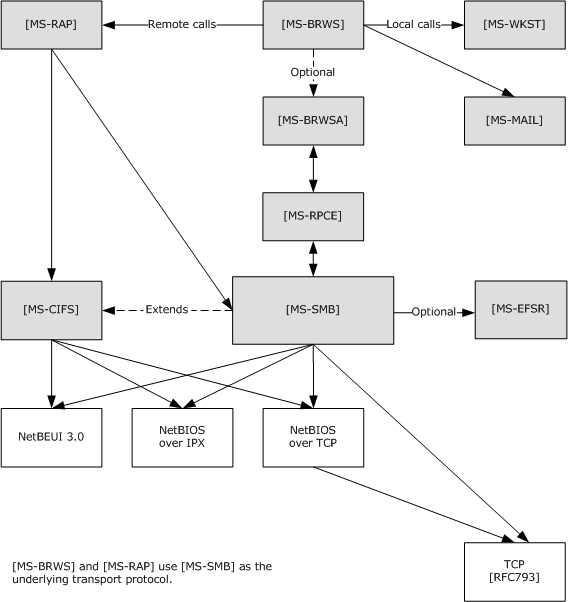

Figure 1: Relationships to other protocols

<a id="Section_1.5"></a>
## 1.5 Prerequisites/Preconditions

The SMB Version 1.0 Protocol assumes the availability of the following resources:

- An underlying transport protocol that supports reliable, in-order message delivery.
- An underlying object store on the server, such as a file system, exposing file, named pipe, or printer objects.
<a id="Section_1.6"></a>
## 1.6 Applicability Statement

The extensions specified in this document are applicable to environments in which the security characteristics of the base protocol, as specified in [MS-CIFS](../MS-CIFS/MS-CIFS.md), are insufficient. In particular, these extensions provide for enhanced message integrity and stronger authentication mechanisms.

The extensions are applicable to an environment that requires tighter data retention policies. In particular, through the use of previous version capabilities, the extensions allow access to versions of a file that have been changed or deleted when the server supports this capability. This feature is applicable to environments that require more stringent data retention policies that include maintaining access to previous versions of files.

<a id="Section_1.7"></a>
## 1.7 Versioning and Capability Negotiation

This document covers versioning issues in the following areas:

- Supported Transports: The extensions in this document add additional transports, as defined in section [2.1](#Section_2.1).
- Security and Authentication Methods: The extensions in this document add additional authentication methods, as specified in section [3.2.4.2](#Section_3.2.4.2).
- Capability Negotiation: The extensions in this document use capability negotiation, as specified in [MS-CIFS](../MS-CIFS/MS-CIFS.md) sections 1.7, 2.2.4.52, 2.2.4.53, and 3.3.1.2.
[**SMB dialect**](#gt_smb-dialect) negotiation is handled as specified in [MS-CIFS] sections 1.7 and 3.2.4.2. The extensions specified in this document introduce no new dialects and apply only to connections that have negotiated the **NT LAN Manager** dialect, as identified by the "NT LM 0.12" dialect identification string. The extensions specified in this document are detected via the following methods:

- They can be returned in the **Capabilities** field, as specified in [MS-CIFS] section 2.2.4.52. Specific new capability options are defined in this document.
- They can be supplied or returned in the **Flags** and **Flags2** fields of the [**SMB**](#gt_server-message-block-smb) header, as specified in [MS-CIFS] sections 2.2.3.1.
- A server can return an error code (STATUS_NOT_SUPPORTED) when a client request is sent to a server for a new feature that is not supported.
A client written to support these extensions cannot require that the target server implement these extensions to successfully connect. Thus, a server that does not implement an extension is still accessible by a client that implements that extension, although the relevant new features might not be available. The one exception is that a client offers the capability to be configured to require the new security features to create a more secure environment so that the client could be restricted from connecting successfully to servers that do not implement these features.

Negotiation of the use of the Generic Security Service Application Program Interface (GSS API) for authentication is specified in section [3.2.4.2.4](#Section_3.2.4.2.4.1). The GSS API is specified in [[RFC2743]](https://go.microsoft.com/fwlink/?LinkId=90378).

<a id="Section_1.8"></a>
## 1.8 Vendor-Extensible Fields

The CAP_UNIX capability bit is specified in order to allow third-party implementers to collaborate on the definition of a specific set of extensions. SMB_COM_TRANSACTION2 Information Levels in the range 0x200 to 0x3E0 (inclusive) are reserved for these extensions.<1>

<a id="Section_1.9"></a>
## 1.9 Standards Assignments

In addition to any standards assignments specified in [MS-CIFS](../MS-CIFS/MS-CIFS.md), the Direct TCP Transport, as specified in section [2.2](../MS-CIFS/MS-CIFS.md), makes use of the following assignment:

| Parameter | TCP port value | Reference |
| --- | --- | --- |
| Microsoft-DS | 445 (0x01BD) | [[IANAPORT]](https://go.microsoft.com/fwlink/?LinkId=89888) |

**SMB** transports can have assigned port numbers or other assigned values. See the documentation for the specific transport for more information.

<a id="Section_2"></a>
# 2 Messages

An SMB Version 1.0 Protocol implementation MUST implement CIFS, as specified by section 2 of the [MS-CIFS](../MS-CIFS/MS-CIFS.md) specification.

<a id="Section_2.1"></a>
## 2.1 Transport

In addition to the transport protocols listed in section 2.1 of [MS-CIFS](../MS-CIFS/MS-CIFS.md), the extended version of the protocol supports the use of [**TCP**](#gt_transmission-control-protocol-tcp) as a transport layer. Hereafter, the special TCP-related characteristics that are employed in the application of [**SMB**](#gt_server-message-block-smb) over TCP are known as the Direct TCP transport.<2>

The extended version of the SMB Version 1.0 Protocol can use Direct TCP over either IPv4 or IPv6 as a reliable stream-oriented transport for [**SMB messages**](#gt_common-internet-file-system-cifs). No NetBIOS layer is provided or used. TCP provides a full, duplex, sequenced, and reliable transport for the connection. When using TCP as the reliable connection-oriented transport, the extended version of the SMB Version 1.0 Protocol makes no higher-level attempts to ensure sequenced delivery of messages between a client and server. The TCP transport has mechanisms to detect failures of either the client node or the server node, and to deliver such an indication to the client or server software so that it can clean up the state.

When using Direct TCP as the SMB transport, the implementer MUST establish a TCP connection from an SMB client to a TCP port on the server. The TCP source port used by the SMB client can be of any TCP port value. The SMB server SHOULD listen for connections on port 445. This port number has been registered with the Internet Assigned Numbers Authority (IANA) and has been officially assigned for Microsoft-DS.<3>

When using Direct TCP as the SMB transport, the implementer MUST prepend a 4-byte Direct TCP transport packet header to each [**SMB message**](#gt_smb-message). This transport header MUST be formatted as a byte of zero (8 zero bits) followed by 3 bytes that indicate the length of the SMB message that is encapsulated. The body of the SMB packet follows as a variable-length payload. A Direct TCP transport packet has the following structure (in [**network byte order**](#gt_network-byte-order)).

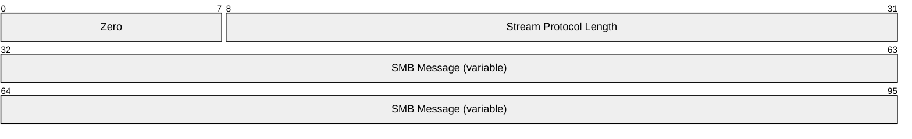

**Zero (1 byte):** The first byte of the Direct TCP transport packet header MUST be zero (0x00).

**Stream Protocol Length (3 bytes):** The length, in bytes, of the SMB message. This length is formatted as a 3-byte integer in network byte order. The length field does not include the 4-byte Direct TCP transport header; rather, it is only the length of the enclosed SMB message. For SMB messages, if this value exceeds 0x1FFFF, the server SHOULD<4> disconnect the connection.

**SMB Message (variable):** The body of the SMB packet. The length of an SMB message varies based on the [**SMB command**](#gt_smb-command) represented by the message.

<a id="Section_2.2"></a>
## 2.2 Message Syntax

A client exchanges messages with a server to access resources on the server. These messages are called [**SMB message**](#gt_smb-message)s or [**SMBs**](#gt_server-message-block-smb). Every SMB message has a common format, as defined in [MS-CIFS](../MS-CIFS/MS-CIFS.md) section 2.2.

All SMB messages MUST begin with a fixed-length SMB header (as specified in [MS-CIFS], section 2.2.1). The header contains a command field that indicates the operation code that the client requests or to which the server responds. An SMB message is of variable length. The actual length depends on the [**SMB command**](#gt_smb-command) field (and consequent appended data structures) and whether the SMB message is a client request or a server response.

Unless otherwise indicated, numeric fields are integers of the specified byte length.

Unless otherwise specified, multibyte fields (that is, 16-bit, 32-bit, and 64-bit fields) in an SMB message MUST be transmitted in [**little-endian**](#gt_little-endian) byte order (least significant byte first).

Unless otherwise noted, fields marked as Reserved SHOULD be set to zero when being sent and MUST be ignored upon receipt. Unless otherwise noted, unused or reserved bits in bit fields SHOULD be set to zero when being sent and MUST be ignored upon receipt.

When an error occurs, unless otherwise noted in this specification, an SMB server SHOULD return an Error Response message. An Error Response message is comprised of a complete SMB header, along with an empty parameter and data portion.<5>

<a id="Section_2.2.1"></a>
### 2.2.1 Common Data Type Extensions

<a id="Section_2.2.1.1"></a>
#### 2.2.1.1 Character Sequences

<a id="Section_2.2.1.1.1"></a>
##### 2.2.1.1.1 Pathname Extensions

In addition to the specification in [MS-CIFS](../MS-CIFS/MS-CIFS.md) section 2.2.1.1.2, pathnames include the following extension:

- Previous Version Tokens -- Support for this feature is optional.<6>
Pathnames are allowed to contain a previous version token (or [**@GMT token**](#gt_gmt-token)), as a directory element in a path. A previous version token indicates that the pathname is a request to access the previous version (or [**shadow copy**](#gt_shadow-copy)) of the file or directory at a particular point in time. This feature is available on any path-based operation (for example, SMB_COM_NT_CREATE_ANDX). A pathname MUST NOT contain more than one previous version token.

For example, requesting a previous version of the file \\server\mydocs\reviews\feb01.doc at 2:44:00 P.M. on March30, 2001 [**UTC**](#gt_coordinated-universal-time-utc) is specified in the following format:

\\server\mydocs\reviews\@GMT-2001.03.30-14.44.00\feb01.doc

The same technique can be used to build a path that represents a previous version of a directory as opposed to a file.

For example, requesting a previous version of the directory \\server\mydocs\reviews at 2:44:00 PM on 3/30/01 UTC can be specified in either of the following formats:

A token appearing as an intermediate path component:

\\server\mydocs\@GMT-2001.03.30-14.44.00\reviews

A token appearing as a final path component:

\\server\mydocs\reviews\@GMT-2001.03.30-14.44.00

In addition, it is possible to request an enumeration of available previous version timestamps (or [**snapshots**](#gt_snapshot)) of a file or directory. While the NT_TRANSACT_IOCTL subcommand can be used with the FSCTL_SRV_ENUMERATE_SNAPSHOTS [**FSCTL**](#gt_file-system-control-fsctl) code to enumerate available previous version timestamps using a valid [**Fid**](#gt_fid) (section [2.2.7.2.1](#Section_2.2.7.2.1)), these extensions also present a path-based method to access this functionality. The TRANS2_FIND_FIRST2 subcommand's SMB_FIND_FILE_BOTH_DIRECTORY_INFO [**Information Level**](#gt_information-level) (section [2.2.6.1](#Section_2.2.6.1)) has been extended to allow a special previous version wildcard token, @GMT-*.

For example, requesting an enumeration of available previous version timestamps of the examples, discussed earlier in this section, can be specified in the following ways:

\\server\mydocs\reviews\@GMT-*\feb01.doc

\\server\mydocs\@GMT-*\reviews

\\server\mydocs\reviews\@GMT-*

<a id="Section_2.2.1.2"></a>
#### 2.2.1.2 File Attributes

<a id="Section_2.2.1.2.1"></a>
##### 2.2.1.2.1 Extended File Attribute (SMB_EXT_FILE_ATTR) Extensions

The list of extended file attributes valid in 32-bit attribute values, as specified in [MS-CIFS](../MS-CIFS/MS-CIFS.md) section 2.2.1.2.3, has been extended to include the following attributes:

- ATTR_SPARSE
- ATTR_REPARSE_POINT
- ATTR_OFFLINE
- ATTR_NOT_CONTENT_INDEXED
- ATTR_ENCRYPTED
The following table lists all possible values. Unless otherwise noted, any combination of these values is acceptable.

| Bit Range | Field | Description |
| --- | --- | --- |
| Variable | ATTR_READONLY 0x00000001 | No File is read-only. Applications cannot write or delete the file. |
| Variable | ATTR_HIDDEN 0x00000002 | No File is hidden. It is not to be included in an ordinary directory enumeration. |
| Variable | ATTR_SYSTEM 0x00000004 | No File is part of or is used exclusively by the operating system. |
| Variable | ATTR_DIRECTORY 0x00000010 | No File is a directory. |
| Variable | ATTR_ARCHIVE 0x00000020 | No File has not been archived since it was last modified. |
| Variable | ATTR_NORMAL 0x00000080 | No File has no other attributes set. This value is valid only when used alone. |
| Variable | ATTR_TEMPORARY 0x00000100 | No File is temporary. |
| Variable | ATTR_SPARSE 0x00000200 | Yes File is a sparse file. |
| File or directory has an associated [**reparse point**](#gt_reparse-point). | ATTR_REPARSE_POINT 0x00000400 | Yes |
| Variable | ATTR_COMPRESSED 0x00000800 | No File is compressed on the disk. This does not affect how it is transferred over the network. |
| Variable | ATTR_OFFLINE 0x00001000 | Yes File data is not available. The attribute indicates that the file has been moved to offline storage. |
| Variable | ATTR_NOT_CONTENT_INDEXED 0x00002000 | Yes File or directory SHOULD NOT be indexed by a content indexing service. |
| Variable | ATTR_ENCRYPTED 0x00004000 | Yes File or directory is encrypted. For a file, this means that all data in the file is encrypted. For a directory, this means that encryption is the default for newly created files and subdirectories. |
| Variable | Reserved 0xFFFF8048 | N/A SHOULD be set to zero when sending and MUST be ignored upon receipt of the message. |

<a id="Section_2.2.1.2.2"></a>
##### 2.2.1.2.2 File System Attribute Extensions

The list of file system attributes, as specified in [MS-CIFS](../MS-CIFS/MS-CIFS.md) section 2.2.8.2.6, has been extended. For completeness, the following table lists all of the available attribute flags and their symbolic constants. Unless otherwise noted, any combination of the following bits is valid. Any bit that is not listed in this section is considered reserved; the sender SHOULD set it to zero, and the receiver MUST ignore it. For more information, see [MS-FSCC](../MS-FSCC/MS-FSCC.md) section 2.5.1.

| Bit Range | Field | Description |
| --- | --- | --- |
| Variable | FILE_CASE_SENSITIVE_SEARCH 0x00000001 | No File system supports case-sensitive file names. |
| Variable | FILE_CASE_PRESERVED_NAMES 0x00000002 | No File system preserves the case of file names when it stores the name on disk. |
| File system supports [**Unicode**](#gt_unicode) in file names. | FILE_UNICODE_ON_DISK 0x00000004 | No |
| Variable | FILE_PERSISTENT_ACLS 0x00000008 | No File system preserves and enforces access control lists. |
| Variable | FILE_FILE_COMPRESSION 0x00000010 | No File system supports file-based compression. This flag is incompatible with FILE_VOLUME_IS_COMPRESSED. This flag does not affect how data is transferred over the network. |
| Variable | FILE_VOLUME_QUOTAS 0x00000020 | Yes File system supports per-user quotas. |
| Variable | FILE_SUPPORTS_SPARSE_FILES 0x00000040 | Yes File system supports sparse files. |
| File system supports [**reparse points**](#gt_reparse-point). | FILE_SUPPORTS_REPARSE_POINTS 0x00000080 | Yes |
| Variable | FILE_SUPPORTS_REMOTE_STORAGE 0x00000100 | Yes File system supports remote storage. |
| Variable | FILE_VOLUME_IS_COMPRESSED 0x00008000 | No Volume is a compressed volume. This flag is incompatible with FILE_FILE_COMPRESSION. This does not affect how data is transferred over the network. |
| Variable | FILE_SUPPORTS_OBJECT_IDS 0x00010000 | Yes File system supports object identifiers. |
| Variable | FILE_SUPPORTS_ENCRYPTION 0x00020000 | Yes File system supports encryption. |
| File system supports multiple named data [**streams**](#gt_stream) for a file. | FILE_NAMED_STREAMS 0x00040000 | Yes |
| Variable | FILE_READ_ONLY_VOLUME 0x00080000 | Yes<7> Specified volume is read-only. |
| Variable | FILE_SEQUENTIAL_WRITE_ONCE 0x00100000 | Yes<8> Specified volume can be written to one time only. The write MUST be performed in sequential order. |
| Variable | FILE_SUPPORTS_TRANSACTIONS 0x00200000 | Yes<9> File system supports transaction processing. |
| Variable | FILE_SUPPORTS_HARD_LINKS 0x00400000 | Yes<10> File system supports direct links to other devices and partitions. |
| Variable | FILE_SUPPORTS_EXTENDED_ATTRIBUTES 0x00800000 | Yes<11> File system supports extended attributes (EAs). |
| Variable | FILE_SUPPORTS_OPEN_BY_FILE_ID 0x01000000 | Yes<12> File system supports open by FileID. |
| Variable | FILE_SUPPORTS_USN_JOURNAL 0x02000000 | Yes<13> File system supports update sequence number (USN) journals. |
| Variable | Reserved 0xFE007E00 | N/A These bits fields SHOULD be set to zero when sending and MUST be ignored when the message is received. |

<a id="Section_2.2.1.3"></a>
#### 2.2.1.3 Unique Identifiers

The SMB Version 1.0 Protocol makes use of the following data types from [MS-DTYP](../MS-DTYP/MS-DTYP.md):

- GUID as specified in section 2.3.4.2
The list of unique identifiers, specified in [MS-CIFS](../MS-CIFS/MS-CIFS.md) section 2.2.1.6, has been extended to include the following new unique identifiers:

- 64-bit file identifier (FileId)
- Volume GUID (VolumeGUID)
- [**Copychunk Resume Key**](#gt_copychunk-resume-key)
<a id="Section_2.2.1.3.1"></a>
##### 2.2.1.3.1 FileId Generation

64-bit file identifiers ([**FileIds**](#gt_fileid)) are generated on [**SMB**](#gt_server-message-block-smb) servers. The generation of FileIds MUST satisfy the following constraints:

- The FileId MUST be a 64-bit opaque value.
- The FileId MUST be unique for a file on a given object store.<14>
- The FileId for a file MUST persist for the lifetime of a file on a given object store. A FileId MUST NOT be changed when a file is renamed. When the file is deleted, the FileId MAY be reused.
- All possible values for FileId are valid.
<a id="Section_2.2.1.3.2"></a>
##### 2.2.1.3.2 VolumeGUID Generation

VolumeGUIDs (Volume Globally Unique Identifiers, or [**volume identifiers**](#gt_volume-identifier-volumeid), see also [MS-DTYP](../MS-DTYP/MS-DTYP.md) section 2.3.4) are generated on [**SMB**](#gt_server-message-block-smb) servers. The generation of VolumeGUIDs MUST satisfy the following constraints:

- The VolumeGUID MUST be a 128-bit opaque value.
- The VolumeGUID MUST be unique for a logical file system volume on a given server.
- The VolumeGUID for the volume can change while the system is running. The VolumeGUID can change when the system is restarted.
- All possible values for the VolumeGUID are valid.
<a id="Section_2.2.1.3.3"></a>
##### 2.2.1.3.3 Copychunk Resume Key Generation

[**Copychunk Resume Keys**](#gt_copychunk-resume-key) are generated on [**SMB**](#gt_server-message-block-smb) servers. The generation of Copychunk Resume Keys MUST satisfy the following constraints:

- The Copychunk Resume Key MUST be a 24-byte opaque value generated by an SMB server in response to a request by the client (an SMB_COM_NT_TRANSACTION request with an NT_TRANSACT_IOCTL subcommand for the FSCTL_SRV_REQUEST_RESUME_KEY). For more information, see section [2.2.7.2](#Section_2.2.7.2.1.1).
- The Copychunk Resume Key MUST be unique on the SMB server for a given open file on a server.
- The Copychunk Resume Key MUST remain valid for the lifetime of the open file on the server.
- All possible values for the Copychunk Resume Key are valid.
COPYCHUNK_RESUME_KEY (see sections [2.2.7.2.1](#Section_2.2.7.2.1) and [2.2.7.2.2.2](#Section_2.2.7.2.2.2)) represents an opaque data type that contains the server-returned Copychunk Resume Key.

<a id="Section_2.2.1.4"></a>
#### 2.2.1.4 Access Masks

The SMB protocol introduces the use of Access Mask structures, which are based on the ACCESS_MASK data type specified in [MS-DTYP](../MS-DTYP/MS-DTYP.md) section 2.4.3. [**SMB**](#gt_server-message-block-smb) defines two types of access masks for two basic groups: either for a file, pipe, or printer (specified in section [2.2.1.4.1](#Section_2.2.1.4.1)) or for a directory (specified in section [2.2.1.4.2](#Section_2.2.1.4.2)). Each access mask MUST be a combination of zero or more of the bit positions.

<a id="Section_2.2.1.4.1"></a>
##### 2.2.1.4.1 File_Pipe_Printer_Access_Mask

The following [**SMB**](#gt_server-message-block-smb) Access Mask structure is defined for use on a file, [**named pipe**](#gt_named-pipe), or printer.

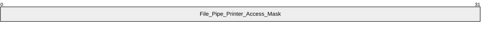

**File_Pipe_Printer_Access_Mask (4 bytes):** For a file, named pipe, or printer, the value MUST be constructed using the following values. For a printer, the value MUST have at least one of the following: FILE_WRITE_DATA, FILE_APPEND_DATA, or GENERIC_WRITE.

| Value | Meaning |
| --- | --- |
| FILE_READ_DATA 0x00000001 | This value indicates the right to read data from the file or named pipe. |
| FILE_WRITE_DATA 0x00000002 | This value indicates the right to write data into the file, named pipe, or printer beyond the end of the file. |
| FILE_APPEND_DATA 0x00000004 | This value indicates the right to append data into the file, named pipe, or printer. |
| FILE_READ_EA 0x00000008 | This value indicates the right to read the extended attributes of the file or named pipe. |
| FILE_WRITE_EA 0x00000010 | This value indicates the right to write or change the extended attributes to the file or named pipe. |
| FILE_EXECUTE 0x00000020 | This value indicates the right to execute the file. |
| FILE_DELETE_CHILD 0x00000040 | This value indicates the right to delete entries within a directory. |
| FILE_READ_ATTRIBUTES 0x00000080 | This value indicates the right to read the attributes of the file. |
| FILE_WRITE_ATTRIBUTES 0x00000100 | This value indicates the right to change the attributes of the file. |
| DELETE 0x00010000 | This value indicates the right to delete the file. |
| READ_CONTROL 0x00020000 | This value indicates the right to read the security descriptor for the file or named pipe. |
| WRITE_DAC 0x00040000 | This value indicates the right to change the [**discretionary access control list (DACL)**](#gt_discretionary-access-control-list-dacl) in the [**security descriptor**](#gt_security-descriptor) for the file or named pipe. For the DACL data structure, see ACL in [MS-DTYP](../MS-DTYP/MS-DTYP.md) section 2.4.5. |
| WRITE_OWNER 0x00080000 | This value indicates the right to change the owner in the security descriptor for the file or named pipe. |
| SYNCHRONIZE 0x00100000 | This flag SHOULD NOT be used by the client and MUST be ignored by the server unless on a named pipe as discussed in section [3.2.4.3.1](#Section_3.2.4.3.1) and section [3.3.5.5](#Section_3.3.5.5). |
| ACCESS_SYSTEM_SECURITY 0x01000000 | This value indicates the right to read or change the [**system access control list (SACL)**](#gt_system-access-control-list-sacl) in the security descriptor for the file or named pipe. For the SACL data structure, see ACL in [MS-DTYP] section 2.4.5. |
| MAXIMUM_ALLOWED 0x02000000 | This value indicates that the client is requesting an [**open**](#gt_open) to the file with the highest level of access the client has on this file. If no access is granted for the client on this file, the server MUST fail the open with STATUS_ACCESS_DENIED. |
| GENERIC_ALL 0x10000000 | This value indicates a request for all the access flags that are previously listed, except MAXIMUM_ALLOWED and ACCESS_SYSTEM_SECURITY. |
| GENERIC_EXECUTE 0x20000000 | This value indicates a request for the following combination of access flags listed above: FILE_READ_ATTRIBUTES, FILE_EXECUTE, SYNCHRONIZE, and READ_CONTROL. |
| GENERIC_WRITE 0x40000000 | This value indicates a request for the following combination of access flags listed above: FILE_WRITE_DATA, FILE_APPEND_DATA, FILE_WRITE_ATTRIBUTES, FILE_WRITE_EA, SYNCHRONIZE, and READ_CONTROL. |
| GENERIC_READ 0x80000000 | This value indicates a request for the following combination of access flags listed above: FILE_READ_DATA, FILE_READ_ATTRIBUTES, FILE_READ_EA, SYNCHRONIZE, and READ_CONTROL. |

<a id="Section_2.2.1.4.2"></a>
##### 2.2.1.4.2 Directory_Access_Mask

The following [**SMB**](#gt_server-message-block-smb) Access Mask is defined for use on a directory.

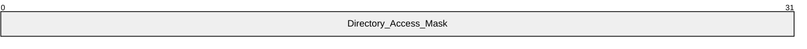

**Directory_Access_Mask (4 bytes):** For a directory, the value MUST be constructed using the following values:

| Value | Meaning |
| --- | --- |
| FILE_LIST_DIRECTORY 0x00000001 | This value indicates the right to enumerate the contents of the directory. |
| FILE_ADD_FILE 0x00000002 | This value indicates the right to create a file under the directory. |
| FILE_ADD_SUBDIRECTORY 0x00000004 | This value indicates the right to add a sub-directory under the directory. |
| FILE_READ_EA 0x00000008 | This value indicates the right to read the extended attributes of the directory. |
| FILE_WRITE_EA 0x00000010 | This value indicates the right to write or change the extended attributes of the directory. |
| FILE_TRAVERSE 0x00000020 | This value indicates the right to traverse this directory if the underlying object store enforces traversal checking. |
| FILE_DELETE_CHILD 0x00000040 | This value indicates the right to delete the files and directories within this directory. |
| FILE_READ_ATTRIBUTES 0x00000080 | This value indicates the right to read the attributes of the directory. |
| FILE_WRITE_ATTRIBUTES 0x00000100 | This value indicates the right to change the attributes of the directory. |
| DELETE 0x00010000 | This value indicates the right to delete the directory. |
| READ_CONTROL 0x00020000 | This value indicates the right to read the [**security descriptor**](#gt_security-descriptor) for the directory. |
| WRITE_DAC 0x00040000 | This value indicates the right to change the [**DACL**](#gt_discretionary-access-control-list-dacl) in the security descriptor for the directory. For the DACL data structure, see ACL in [MS-DTYP](../MS-DTYP/MS-DTYP.md) section 2.4.5. |
| WRITE_OWNER 0x00080000 | This value indicates the right to change the owner in the security descriptor for the directory. |
| SYNCHRONIZE 0x00100000 | This flag MUST be ignored by both clients and servers. |
| ACCESS_SYSTEM_SECURITY 0x01000000 | This value indicates the right to read or change the [**SACL**](#gt_system-access-control-list-sacl) in the security descriptor for the directory. For the SACL data structure, see ACL in [MS-DTYP] section 2.4.5. |
| MAXIMUM_ALLOWED 0x02000000 | This value indicates that the client is requesting an open to the directory with the highest level of access that the client has on this directory. If no access is granted for the client on this directory, then the server MUST fail the open with STATUS_ACCESS_DENIED. |
| GENERIC_ALL 0x10000000 | This value indicates a request for all of the access flags that are listed above, except MAXIMUM_ALLOWED and ACCESS_SYSTEM_SECURITY. |
| GENERIC_EXECUTE 0x20000000 | This value indicates a request for the following access flags listed above: FILE_READ_ATTRIBUTES, FILE_TRAVERSE, SYNCHRONIZE, and READ_CONTROL. |
| GENERIC_WRITE 0x40000000 | This value indicates a request for the following access flags listed above: FILE_ADD_FILE, FILE_ADD_SUBDIRECTORY, FILE_WRITE_ATTRIBUTES, FILE_WRITE_EA, SYNCHRONIZE, and READ_CONTROL. |
| GENERIC_READ 0x80000000 | This value indicates a request for the following access flags listed above: FILE_LIST_DIRECTORY, FILE_READ_ATTRIBUTES, FILE_READ_EA, SYNCHRONIZE, and READ_CONTROL. |

<a id="Section_2.2.2"></a>
### 2.2.2 Defined Constant Extensions

<a id="Section_2.2.2.1"></a>
#### 2.2.2.1 SMB_COM Command Codes

No new SMB_COM command codes are introduced other than those specified in [MS-CIFS](../MS-CIFS/MS-CIFS.md) section 2.2.2.1.<15>

<a id="Section_2.2.2.2"></a>
#### 2.2.2.2 Transaction Subcommand Codes

In addition to the transaction subcommand codes specified in [MS-CIFS](../MS-CIFS/MS-CIFS.md) section 2.2.2.2, the following modifications and extensions apply. In the following tables, the Description column is also used to specify changes in a particular subcommand's current usage status.

**Transaction Codes used with SMB_COM_TRANSACTION**

| Constant/value | Description |
| --- | --- |
| TRANS_RAW_READ_NMPIPE 0x0011 | This command code has changed from [**deprecated**](#gt_deprecated) to [**obsolescent**](#gt_obsolescent). |
| TRANS_CALL_NMPIPE 0x0054 | This command code has changed from current to obsolescent. |

**Transaction Codes used with SMB_COM_TRANSACTION2**

| Constant/value | Description |
| --- | --- |
| TRANS2_SET_FS_INFORMATION 0x0004 | Set information on a file system on the server. This command code has changed from reserved but not implemented to current. |

**Transaction Codes used with SMB_COM_NT_TRANSACT**

| Constant/value | Description |
| --- | --- |
| NT_TRANSACT_QUERY_QUOTA 0x0007 | Query a server for a user's disk quota information. This command code is new to these extensions. |
| NT_TRANSACT_SET_QUOTA 0x0008 | Set a user's disk quota information on a server. This command code is new to these extensions. |
| NT_TRANSACT_CREATE2 0x0009 | This command code is new to these extensions. The client requests and processes the NT_TRANSACT_CREATE2 command the same way it would for an NT_TRANSACT_CREATE command, as specified in [MS-CIFS] section 3.2.5.40.1. The server also processes and responds the same way it would for an NT_TRANSACT_CREATE command, as specified in [MS-CIFS] section 3.3.5.59.1.<16> |

<a id="Section_2.2.2.3"></a>
#### 2.2.2.3 Information Level Codes

The following new [**Information Level**](#gt_information-level) codes are specified in addition to those defined in [MS-CIFS](../MS-CIFS/MS-CIFS.md) section 2.2.2.3.

<a id="Section_2.2.2.3.1"></a>
##### 2.2.2.3.1 FIND Information Level Codes

The following new [**Information Level**](#gt_information-level) codes are specified in addition to those specified in [MS-CIFS](../MS-CIFS/MS-CIFS.md) section 2.2.2.3.1.<17>

| Name | Code | Meaning | Dialect |
| --- | --- | --- | --- |
| SMB_FIND_FILE_ID_FULL_DIRECTORY_INFO | 0x0105 | Returns the SMB_FIND_ FULL_DIRECTORY_INFO data with a [**FileId**](#gt_fileid). | NT LANMAN |
| SMB_FIND_FILE_ID_BOTH_DIRECTORY_INFO | 0x0106 | Returns the SMB_FIND_FILE_ID_BOTH_DIRECTORY_INFO data with a FileId. | NT LANMAN |

<a id="Section_2.2.2.3.2"></a>
##### 2.2.2.3.2 QUERY_FS Information Level Codes

No new SMB-specific [**Information Level**](#gt_information-level) codes are specified for these extensions.

<a id="Section_2.2.2.3.3"></a>
##### 2.2.2.3.3 QUERY Information Level Codes

No new SMB-specific [**Information Level**](#gt_information-level) codes are specified for these extensions.

<a id="Section_2.2.2.3.4"></a>
##### 2.2.2.3.4 SET Information Level Codes

No new SMB-specific [**Information Level**](#gt_information-level) codes are specified for these extensions.

<a id="Section_2.2.2.3.5"></a>
##### 2.2.2.3.5 Pass-through Information Level Codes

This document provides an extension of a new [**Information Level**](#gt_information-level) code value range called **pass-through Information Levels**, which can be used to set or query information on the server. These Information Levels allow [**SMB**](#gt_server-message-block-smb) clients to directly query Information Levels native to the underlying object store.<18>

Servers indicate support for these new pass-through Information Levels by setting the new CAP_INFOLEVEL_PASSTHRU capability flag in an SMB_COM_NEGOTIATE server response (section [2.2.4.5.2](#Section_2.2.4.5.2.1)).

To access these new Information Levels, a client adds the constant SMB_INFO_PASSTHROUGH (0x03e8) to the desired native information class level value. This value is then sent in the **InformationLevel** field of the particular SMB_COM_TRANSACTION2 subcommand being used to access the Information Levels.

<a id="Section_2.2.2.3.6"></a>
##### 2.2.2.3.6 Other Information Level Codes

In addition, SMB_COM_TRANSACTION2 Information Levels in the range 0x200 to 0x3E0 (inclusive) are reserved for third-party extensions, as described in section [1.8](#Section_1.8).<19>

<a id="Section_2.2.2.4"></a>
#### 2.2.2.4 SMB Error Classes and Codes

The following is a list of 32-bit status codes that are required to implement these extensions, their associated values, and a description of what they represent.<20>

| NT status value | Description |
| --- | --- |
| 0x00000000 STATUS_SUCCESS | The client request is successful. |
| 0x00010002 STATUS_INVALID_SMB | An invalid [**SMB**](#gt_server-message-block-smb) client request is received by the server. |
| 0x00050002 STATUS_SMB_BAD_TID | The client request received by the server contains an invalid TID value. |
| 0x00160002 STATUS_SMB_BAD_COMMAND | The client request received by the server contains an unknown [**SMB command**](#gt_smb-command) code. |
| 0x005B0002 STATUS_SMB_BAD_UID | The client request to the server contains an invalid UID value. |
| 0x00FB0002 STATUS_SMB_USE_STANDARD | The client request received by the server is for a non-standard SMB operation (for example, an SMB_COM_READ_MPX request on a non-disk [**share**](#gt_share)). The client SHOULD send another request with a different SMB command to perform this operation. |
| 0x80000005 STATUS_BUFFER_OVERFLOW | The data was too large to fit into the specified buffer. |
| 0x80000006 STATUS_NO_MORE_FILES | No more files were found that match the file specification. |
| 0x8000002D STATUS_STOPPED_ON_SYMLINK | The create operation stopped after reaching a symbolic link. |
| 0xC0000002 STATUS_NOT_IMPLEMENTED | The requested operation is not implemented. |
| 0xC000000D STATUS_INVALID_PARAMETER | The parameter specified in the request is not valid. |
| 0xC000000E STATUS_NO_SUCH_DEVICE | A device that does not exist was specified. |
| 0xC0000010 STATUS_INVALID_DEVICE_REQUEST | The specified request is not a valid operation for the target device. |
| 0xC0000016 STATUS_MORE_PROCESSING_REQUIRED | If extended security has been negotiated, then this error code can be returned in the SMB_COM_SESSION_SETUP_ANDX response from the server to indicate that additional authentication information is to be exchanged. See section [2.2.4.6](#Section_3.3.5.3) for details. |
| 0xC0000022 STATUS_ACCESS_DENIED | The client did not have the required permission needed for the operation. |
| 0xC0000023 STATUS_BUFFER_TOO_SMALL | The buffer is too small to contain the entry. No information has been written to the buffer. |
| 0xC0000034 STATUS_OBJECT_NAME_NOT_FOUND | The object name is not found. |
| 0xC0000035 STATUS_OBJECT_NAME_COLLISION | The object name already exists. |
| 0xC000003A STATUS_OBJECT_PATH_NOT_FOUND | The path to the directory specified was not found. This error is also returned on a create request if the operation requires the creation of more than one new directory level for the path specified. |
| 0xC00000A5 STATUS_BAD_IMPERSONATION_LEVEL | A specified impersonation level is invalid. This error is also used to indicate that a required impersonation level was not provided. |
| 0xC00000B5 STATUS_IO_TIMEOUT | The specified I/O operation was not completed before the time-out period expired. |
| 0xC00000BA STATUS_FILE_IS_A_DIRECTORY | The file that was specified as a target is a directory and the caller specified that it could be anything but a directory. |
| 0xC00000BB STATUS_NOT_SUPPORTED | The client request is not supported. |
| 0xC00000C9 STATUS_NETWORK_NAME_DELETED | The network name specified by the client has been deleted on the server. This error is returned if the client specifies an incorrect TID or the share on the server represented by the TID was deleted. |
| 0xC0000203 STATUS_USER_SESSION_DELETED | The user [**session**](#gt_session) specified by the client has been deleted on the server. This error is returned by the server if the client sends an incorrect UID. |
| 0xC000035C STATUS_NETWORK_SESSION_EXPIRED | The client's session has expired; therefore, the client MUST re-authenticate to continue accessing remote resources. |
| 0xC000205A STATUS_SMB_TOO_MANY_UIDS | The client has requested too many UID values from the server or the client already has an [**SMB session**](#gt_smb-session) setup with this UID value. |

<a id="Section_2.2.2.5"></a>
#### 2.2.2.5 Session Key Protection Hash

The SSKeyHash is a well-known constant array.

BYTE SSKeyHash[256] = {

0x53, 0x65, 0x63, 0x75, 0x72, 0x69, 0x74, 0x79,

0x20, 0x53, 0x69, 0x67, 0x6e, 0x61, 0x74, 0x75,

0x72, 0x65, 0x20, 0x4b, 0x65, 0x79, 0x20, 0x55,

0x70, 0x67, 0x72, 0x61, 0x64, 0x65, 0x79, 0x07,

0x6e, 0x28, 0x2e, 0x69, 0x88, 0x10, 0xb3, 0xdb,

0x01, 0x55, 0x72, 0xfb, 0x74, 0x14, 0xfb, 0xc4,

0xc5, 0xaf, 0x3b, 0x41, 0x65, 0x32, 0x17, 0xba,

0xa3, 0x29, 0x08, 0xc1, 0xde, 0x16, 0x61, 0x7e,

0x66, 0x98, 0xa4, 0x0b, 0xfe, 0x06, 0x83, 0x53,

0x4d, 0x05, 0xdf, 0x6d, 0xa7, 0x51, 0x10, 0x73,

0xc5, 0x50, 0xdc, 0x5e, 0xf8, 0x21, 0x46, 0xaa,

0x96, 0x14, 0x33, 0xd7, 0x52, 0xeb, 0xaf, 0x1f,

0xbf, 0x36, 0x6c, 0xfc, 0xb7, 0x1d, 0x21, 0x19,

0x81, 0xd0, 0x6b, 0xfa, 0x77, 0xad, 0xbe, 0x18,

0x78, 0xcf, 0x10, 0xbd, 0xd8, 0x78, 0xf7, 0xd3,

0xc6, 0xdf, 0x43, 0x32, 0x19, 0xd3, 0x9b, 0xa8,

0x4d, 0x9e, 0xaa, 0x41, 0xaf, 0xcb, 0xc6, 0xb9,

0x34, 0xe7, 0x48, 0x25, 0xd4, 0x88, 0xc4, 0x51,

0x60, 0x38, 0xd9, 0x62, 0xe8, 0x8d, 0x5b, 0x83,

0x92, 0x7f, 0xb5, 0x0e, 0x1c, 0x2d, 0x06, 0x91,

0xc3, 0x75, 0xb3, 0xcc, 0xf8, 0xf7, 0x92, 0x91,

0x0b, 0x3d, 0xa1, 0x10, 0x5b, 0xd5, 0x0f, 0xa8,

0x3f, 0x5d, 0x13, 0x83, 0x0a, 0x6b, 0x72, 0x93,

0x14, 0x59, 0xd5, 0xab, 0xde, 0x26, 0x15, 0x6d,

0x60, 0x67, 0x71, 0x06, 0x6e, 0x3d, 0x0d, 0xa7,

0xcb, 0x70, 0xe9, 0x08, 0x5c, 0x99, 0xfa, 0x0a,

0x5f, 0x3d, 0x44, 0xa3, 0x8b, 0xc0, 0x8d, 0xda,

0xe2, 0x68, 0xd0, 0x0d, 0xcd, 0x7f, 0x3d, 0xf8,

0x73, 0x7e, 0x35, 0x7f, 0x07, 0x02, 0x0a, 0xb5,

0xe9, 0xb7, 0x87, 0xfb, 0xa1, 0xbf, 0xcb, 0x32,

0x31, 0x66, 0x09, 0x48, 0x88, 0xcc, 0x18, 0xa3,

0xb2, 0x1f, 0x1f, 0x1b, 0x90, 0x4e, 0xd7, 0xe1

};

<a id="Section_2.2.3"></a>
### 2.2.3 SMB Message Structure Extensions

<a id="Section_2.2.3.1"></a>
#### 2.2.3.1 SMB Header Extensions

All client requests MUST begin with a fixed-size [**SMB**](#gt_server-message-block-smb) header, as specified in [MS-CIFS](../MS-CIFS/MS-CIFS.md) section 2.2.3.1. All server responses, with the exception of the SMB_COM_READ_RAW response message, as specified in [MS-CIFS] section 2.2.4.22.2, MUST begin with the same fixed-size SMB header.

SMB_Header

{

UCHAR Protocol[4];

UCHAR Command;

SMB_ERROR Status;

UCHAR Flags;

USHORT Flags2;

USHORT PIDHigh;

UCHAR SecurityFeatures[8];

USHORT Reserved;

USHORT TID;

USHORT PIDLow;

USHORT UID;

USHORT MID;

}

The following SMB header fields contain extensions:

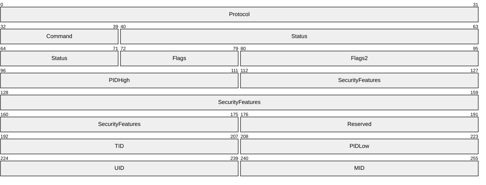

**Flags2 (2 bytes):** The **Flags2** field contains individual bit flags that, depending on the negotiated [**SMB dialect**](#gt_smb-dialect), indicate various client and server capabilities. This field is defined as specified in [MS-CIFS] section 2.2.3.1. There are several new Flags2 values in the SMB header that are not in [MS-CIFS], but are part of these extensions. Unused bit fields SHOULD be set to zero by the sender when sending an [**SMB message**](#gt_smb-message) and SHOULD<21> be ignored when received by the receiver. This field is constructed using the values listed in section 2.2.3.1 of [MS-CIFS], as well as the following additional values:

| Bit Range | Field | Description |
| --- | --- | --- |
| If set by the client, the client is requesting compressed data for an SMB_COM_READ_ANDX request. If cleared by the server, the server is notifying the client that the data was written uncompressed. This bit field SHOULD only be set to one when NT LAN Manager or later is negotiated for the SMB dialect. | SMB_FLAGS2_COMPRESSED 0x0008 | - |
| This flag SHOULD<22> be set by the client on the first [SMB_COM_SESSION_SETUP_ANDX request (section 2.2.4.6.1)](#Section_3.3.5.3) sent to a server that supports extended security if the client requires all further communication with this server to be signed. If the server does not support signing, it MUST disconnect the client by closing the underlying transport connection. Clients and servers MUST ignore this value for other requests and responses. If the client receives a non-signed response from the server, it MUST disconnect the underlying transport connection. This bit field SHOULD only be set to one when NT LAN Manager or later is negotiated for the SMB dialect, the client supports extended security, and the client is configured to require security signatures. | SMB_FLAGS2_SMB_SECURITY_SIGNATURE_REQUIRED 0x0010 | - |
| If set, the path contained in the message contains long names; otherwise, the paths are restricted to [**8.3 names**](#gt_83-name). This bit field SHOULD only be set to one when NT LAN Manager or later is negotiated for the SMB dialect. If client sets this bit in the request, the server SHOULD<23> also set this bit in the response. | SMB_FLAGS2_IS_LONG_NAME 0x0040 | - |
| If set, the path in the request MUST contain an [**@GMT token**](#gt_gmt-token) (that is, a Previous Version token), as specified in section [2.2.1.1.1](#Section_2.2.1.1.1). | SMB_FLAGS2_REPARSE_PATH 0x0400 | - |
| Indicates that the client or server supports SPNEGO authentication, as specified in section [3.2.5.2](#Section_3.2.5.2) for client behavior and section [3.3.5.2](#Section_3.3.5.2) for server behavior. This bit field SHOULD be set to one only when NT LAN Manager or later is negotiated for the SMB dialect and the client or server supports extended security. | SMB_FLAGS2_EXTENDED_SECURITY 0x0800 | - |

**PIDHigh (2 bytes):** This field MUST give the 2 high bytes of the [**process identifier (PID)**](#gt_process-identifier-pid) if the *Client.Supports32BitPIDs*, as specified in section [3.2.1.1](#Section_3.2.1.1), is TRUE. Otherwise, it MUST be set to zero.

<a id="Section_2.2.4"></a>
### 2.2.4 SMB Command Extensions

<a id="Section_2.2.4.1"></a>
#### 2.2.4.1 SMB_COM_OPEN_ANDX (0x2D)

<a id="Section_2.2.4.1.1"></a>
##### 2.2.4.1.1 Client Request Extensions

An SMB_COM_OPEN_ANDX request is sent by a client to open a file or [**named pipe**](#gt_named-pipe) on a server. The new flag value in the **Flags** field of the SMB_COM_OPEN_ANDX request, SMB_OPEN_EXTENDED_RESPONSE, is used to trigger new behavior that is specified in this document. All other fields are as specified in [MS-CIFS](../MS-CIFS/MS-CIFS.md) section 2.2.4.41.1.

This command has been [**deprecated**](#gt_deprecated). Client implementations SHOULD use SMB_COM_NT_CREATE_ANDX.

SMB_Parameters

{

UCHAR WordCount;

Words

{

UCHAR AndXCommand;

UCHAR AndXReserved;

USHORT AndXOffset;

USHORT Flags;

USHORT AccessMode;

SMB_FILE_ATTRIBUTES SearchAttrs;

SMB_FILE_ATTRIBUTES FileAttrs;

UTIME CreationTime;

USHORT OpenMode;

ULONG AllocationSize;

ULONG Timeout;

USHORT Reserved[2];

}

}

SMB_Data

{

USHORT ByteCount;

Bytes

{

SMB_STRING FileName;

}

}

**SMB_Parameters**

**Words (34 bytes):**

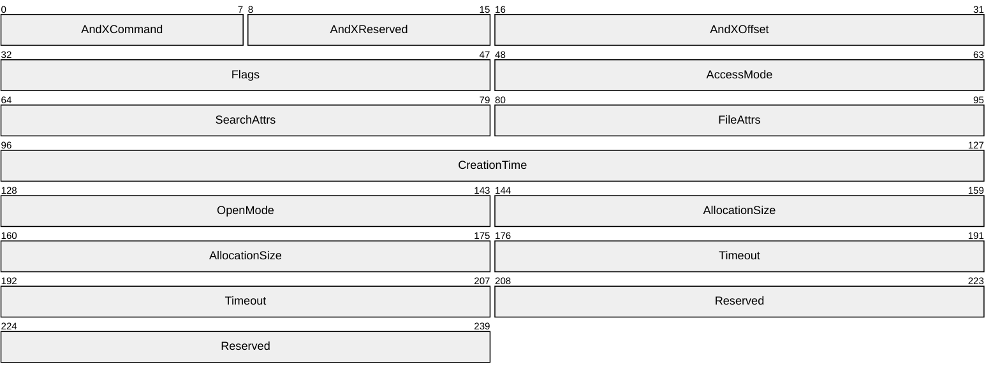

**Flags (2 bytes):** A 16-bit field of bit flags. For completeness, all flags are listed in the following table. Bit values listed as reserved SHOULD be set to zero by the client and MUST be ignored by the server.

| Bit Range | Field | Description |
| --- | --- | --- |
| Variable | SMB_OPEN_QUERY_INFORMATION 0x0001 | If set, the client is requesting additional info in the response. The server MUST set **FileDataSize**, **FileAttrs**, **AccessRights**, **ResourceType**, and **NMPipeStatus** in the response. If not set, the server MUST set these fields to zero. |
| If set, the client is requesting an [**oplock**](#gt_opportunistic-lock-oplock). | SMB_OPEN_OPLOCK 0x0002 | - |
| Variable | SMB_OPEN_OPBATCH 0x0004 | If set, the client is requesting a batch oplock. |
| Variable | SMB_OPEN_EXTENDED_RESPONSE 0x0010 | If set, the client is requesting the extended format of the response, as described later in this section. |
| Variable | Reserved 0xFFE8 | Reserved; SHOULD be set to zero by the client, and MUST be ignored by the server. |

<a id="Section_2.2.4.1.2"></a>
##### 2.2.4.1.2 Server Response Extensions

If the client requested extended information by setting SMB_OPEN_EXTENDED_RESPONSE, then a successful response takes the following format. Aside from **WordCount**, **ResourceType**, **ServerFID**, **Reserved**, **MaximalAccessRights**, and **GuestMaximalAccessRights** fields, all other fields are as specified in [MS-CIFS](../MS-CIFS/MS-CIFS.md) section 2.2.4.41.2.

SMB_Parameters

{

UCHAR WordCount;

Words

{

UCHAR AndXCommand;

UCHAR AndXReserved;

USHORT AndXOffset;

USHORT FID;

SMB_FILE_ATTRIBUTES FileAttrs;

UTIME LastWriteTime;

ULONG FileDataSize;

USHORT AccessRights;

USHORT ResourceType;

USHORT NMPipeStatus;

USHORT OpenResults;

ULONG ServerFID;

USHORT Reserved;

ACCESS_MASK MaximalAccessRights;

ACCESS_MASK GuestMaximalAccessRights;

}

}

SMB_Data

{

USHORT ByteCount;

}

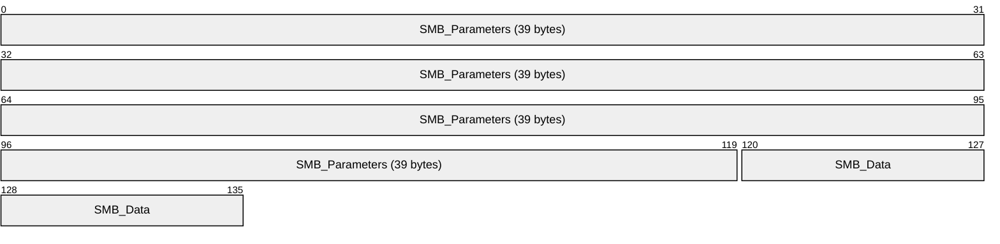

**SMB_Parameters (39 bytes):**


**WordCount (1 byte):** The value of this field MUST be 0x13.

**Words (38 bytes):**

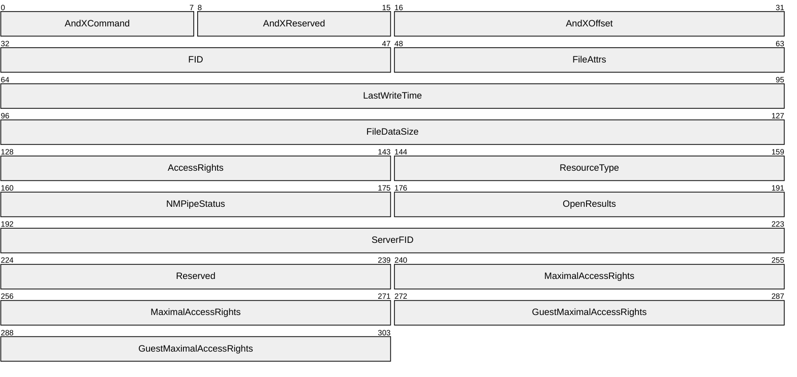

**ResourceType (2 bytes):** The file type. This field MUST be interpreted as follows:

| Name & value | Meaning |
| --- | --- |
| FileTypeDisk 0x0000 | File or Directory |
| FileTypeByteModePipe 0x0001 | [**Byte mode**](#gt_byte-mode) [**named pipe**](#gt_named-pipe) |
| FileTypeMessageModePipe 0x0002 | [**Message mode**](#gt_message-mode) named pipe |
| FileTypePrinter 0x0003 | Printer Device |
| FileTypeUnknown 0xFFFF | Unknown file type |

**ServerFID (4 bytes):** Reserved but not implemented. Intended as a 32-bit server file identifier that uniquely identifies the file on the server. This field MUST be set to zero by the server and ignored by the client.

**Reserved (2 bytes):** An unused value that SHOULD be set to zero when sending this message. The client MUST ignore this field when receiving this message.

**MaximalAccessRights (4 bytes):** The maximum access rights that this user has on this object. This field MUST be encoded in an ACCESS_MASK format, as specified in section [2.2.1.4](#Section_2.2.1.4).

**GuestMaximalAccessRights (4 bytes):** The maximum access rights that the [**guest account**](#gt_guest-account) has on this file. This field MUST be encoded in an ACCESS_MASK format, as specified in section 2.2.1.4. Support and exact specifications of the notion of a guest account is implementation specific. Implementations that do not support the notion of a guest account MUST set this field to zero.<24>

**SMB_Data (2 bytes):**

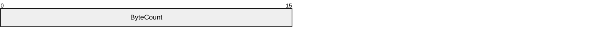

**ByteCount (2 bytes):** The value of this field SHOULD<25> be set to zero. The server MUST NOT send any data in this message.

<a id="Section_2.2.4.2"></a>
#### 2.2.4.2 SMB_COM_READ_ANDX (0x2E)

<a id="Section_2.2.4.2.1"></a>
##### 2.2.4.2.1 Client Request Extensions

An SMB_COM_READ_ANDX request is sent by a client to read from a file or [**named pipe**](#gt_named-pipe) on a server. These extensions overload the **Timeout** field with the new **Timeout_or_MaxCountHigh** field, which allows the use of read lengths above 0xFFFF when CAP_LARGE_READX has been negotiated. All other fields are defined as specified in [MS-CIFS](../MS-CIFS/MS-CIFS.md) section 2.2.4.42.1.

SMB_Parameters

{

UCHAR WordCount;

Words

{

UCHAR AndXCommand;

UCHAR AndXReserved;

USHORT AndXOffset;

USHORT FID;

ULONG Offset;

USHORT MaxCountOfBytesToReturn;

USHORT MinCountOfBytesToReturn;

ULONG Timeout_or_MaxCountHigh;

USHORT Remaining;

ULONG OffsetHigh (optional);

}

}

SMB_Data

{

USHORT ByteCount;

}

**SMB_Parameters**

**Words (24 bytes):**

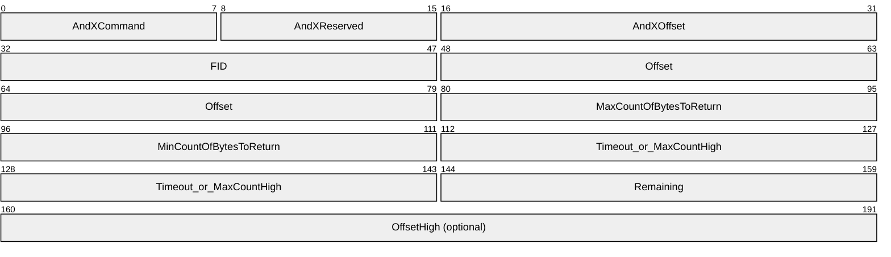

**Timeout_or_MaxCountHigh (4 bytes):** This field is extended to be treated as a union of a 32-bit **Timeout** field and a 16-bit **MaxCountHigh** field. When reading from a regular file, the field MUST be interpreted as **MaxCountHigh** and the two unused bytes MUST be zero. When reading from a name pipe or I/O device, the field MUST be interpreted as **Timeout**.

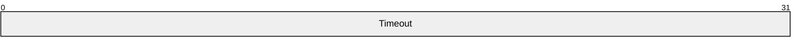

**Timeout (4 bytes):** The client can set the **Timeout** field to a requested time-out value in milliseconds. The client SHOULD<26> set this field to any integer value. The values 0, 0xFFFFFFFF, and 0xFFFFFFFE have special meaning, as specified in [MS-CIFS] section 3.3.5.36.

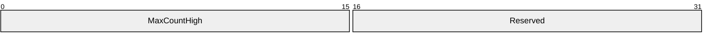

**MaxCountHigh (2 bytes):** This field is a 16-bit integer. If the read being requested is larger than 0xFFFF bytes in size, then the client MUST use the **MaxCountHigh** field to hold the two most significant bytes of the requested size, which allows for 32-bit read lengths to be requested when combined with **MaxCountOfBytesToReturn**. If the read is not larger than 0xFFFF bytes, then the client MUST set the **MaxCountHigh** to zero.<27>

**Reserved (2 bytes):** Unlike most other reserved fields, this field can sometimes take specific values. The **Reserved** field SHOULD be set to zero by the client if **MaxCountHigh** is zero, and SHOULD be set to 0xFFFF by the client if **MaxCountHigh** is 0xFFFF. For all other values, this field SHOULD be set to zero by the client. For all values, this field MUST be ignored by the server.

<a id="Section_2.2.4.2.2"></a>
##### 2.2.4.2.2 Server Response Extensions

A successful response takes the following format. Aside from the first two bytes of the **SMB_Parameters.Words.Reserved2[]** field being extended for use as the new **DataLengthHigh** field, all other fields are defined as specified in [MS-CIFS](../MS-CIFS/MS-CIFS.md) section 2.2.4.42.2.

SMB_Parameters

{

UCHAR WordCount;

Words

{

UCHAR AndXCommand;

UCHAR AndXReserved;

USHORT AndXOffset;

USHORT Available;

USHORT DataCompactionMode;

USHORT Reserved1;

USHORT DataLength;

USHORT DataOffset;

USHORT DataLengthHigh;

USHORT Reserved2[4];

}

}

SMB_Data

{

USHORT ByteCount;

Bytes

{

UCHAR Pad[] (optional);

UCHAR Data[variable];

}

}

**SMB_Parameters**

**Words (24 bytes):**

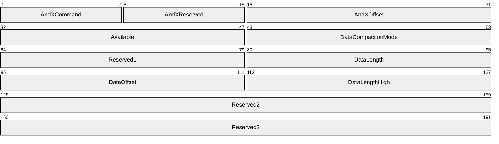

**DataLengthHigh (2 bytes):** If the data read is greater than or equal to 0x00010000 bytes (64KB) in length, then the server MUST set the two least-significant bytes of the length in the **DataLength** field of the response and the two most-significant bytes of the length in the **DataLengthHigh** field. Otherwise, this field MUST be set to zero.

**Reserved2 (8 bytes):** This field MUST be set to zero by the server and MUST be ignored by the client.

<a id="Section_2.2.4.3"></a>
#### 2.2.4.3 SMB_COM_WRITE_ANDX (0x2F)

<a id="Section_2.2.4.3.1"></a>
##### 2.2.4.3.1 Client Request Extensions

An SMB_COM_WRITE_ANDX request is sent by a client to write data to a file or [**named pipe**](#gt_named-pipe) on a server. These extensions allocate the **SMB_Parameters.Words.Reserved** field for use as the **DataLengthHigh** field. This field is used when the CAP_LARGE_WRITEX capability has been negotiated to allow for file writes larger than 0xFFFF bytes in length. All other fields are defined as specified in [MS-CIFS](../MS-CIFS/MS-CIFS.md) section 2.2.4.43.1.

SMB_Parameters

{

UCHAR WordCount;

Words

{

UCHAR AndXCommand;

UCHAR AndXReserved;

USHORT AndXOffset;

USHORT FID;

ULONG Offset;

ULONG Timeout;

USHORT WriteMode;

USHORT Remaining;

USHORT DataLengthHigh;

USHORT DataLength;

USHORT DataOffset;

ULONG OffsetHigh (optional);

}

}

SMB_Data

{

USHORT ByteCount;

Bytes

{

UCHAR Pad;

UCHAR Data[variable];

}

}

**SMB_Parameters**

**Words (variable):**

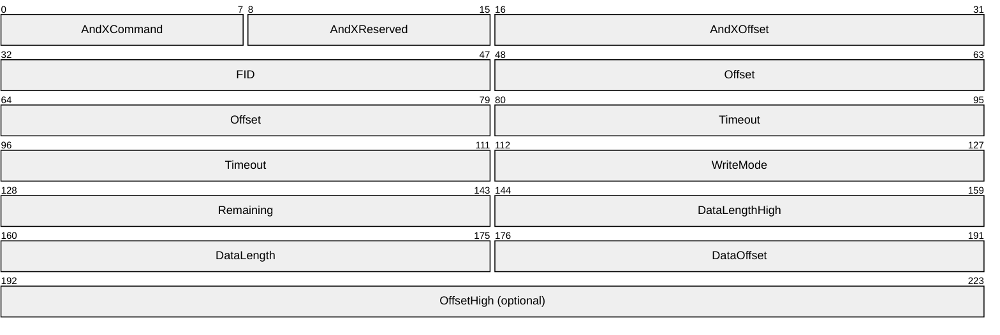

**DataLengthHigh (2 bytes):** This field contains the two most significant bytes of the length of the data to write to the file. If the number of bytes to be written is greater than or equal to 0x00010000( 64 kilobytes), then the client MUST set the two least significant bytes of the length in the **DataLength** field of the request and the two most significant bytes of the length in the **DataLengthHigh** field.

<a id="Section_2.2.4.3.2"></a>
##### 2.2.4.3.2 Server Response Extensions

A successful response takes the following format. These extensions allocate the first two bytes of the **SMB_Parameters.Words.Reserved** field for use as the **CountHigh** field. This field is used when the CAP_LARGE_WRITEX capability has been negotiated to allow for file writes larger than 0xFFFF bytes in length. All other fields are defined as specified in [MS-CIFS](../MS-CIFS/MS-CIFS.md) section 2.2.4.43.2.

SMB_Parameters

{

UCHAR WordCount;

Words

{

UCHAR AndXCommand;

UCHAR AndXReserved;

USHORT AndXOffset;

USHORT Count;

USHORT Available;

USHORT CountHigh;

USHORT Reserved;

}

}

SMB_Data

{

USHORT ByteCount;

}

**SMB_Parameters**

**Words (12 bytes):**

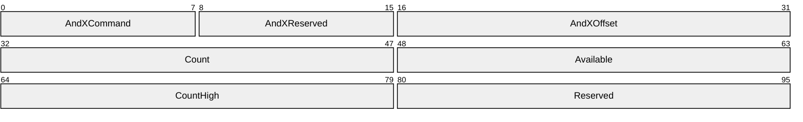

**CountHigh (2 bytes):** This field contains the two most significant bytes of the count of bytes written. If the number of bytes written is greater than or equal to 0x00010000( 64 kilobytes), then the server MUST set the two least significant bytes of the length in the **Count** field of the request and the two most significant bytes of the length in the **CountHigh** field.

**Reserved (2 bytes):** This field is reserved. Servers MUST set this field to zero and clients MUST ignore this field upon receipt.

<a id="Section_2.2.4.4"></a>
#### 2.2.4.4 SMB_COM_TRANSACTION2 (0x32) Extensions

The SMB_COM_TRANSACTION2 request is sent by a client to execute a specific operation of various types on the server. These operations include file enumeration, query and set file attribute operations, and [**DFS**](#gt_distributed-file-system-dfs) referral retrieval. The general format of the SMB_COM_TRANSACTION2 command requests and responses is given in [MS-CIFS](../MS-CIFS/MS-CIFS.md) sections 2.2.4.46 and 2.2.4.47. Execution of SMB_COM_TRANSACTION2 is defined as specified in [MS-CIFS] sections 3.2.4.1.5, 3.2.5.1.4, and 3.3.5.2.5.

Valid SMB_COM_TRANSACTION2 subcommand codes, also known as "Trans2 subcommands", are specified in section [2.2.2.2](#Section_2.2.7.5). The format and syntax of these subcommands are specified in section [2.2.6](../MS-CIFS/MS-CIFS.md) and in [MS-CIFS] section 2.2.6.

<a id="Section_2.2.4.5"></a>
#### 2.2.4.5 SMB_COM_NEGOTIATE (0x72)

<a id="Section_2.2.4.5.1"></a>
##### 2.2.4.5.1 Client Request Extensions

All fields are defined as specified in [MS-CIFS](../MS-CIFS/MS-CIFS.md) section 2.2.4.52.1. In order to support the extension in this document, the client MUST include the NT LAN Manager dialect (identified by the "NT LM 0.12" dialect string) in the **SMB_Data.Bytes.Dialects[]** array of the request.

When set, the **SMB_Header.Flags2** SMB_FLAGS2_EXTENDED_SECURITY flag indicates support for specification [[RFC2743]](https://go.microsoft.com/fwlink/?LinkId=90378) and GSS authentication (see section [3.1.5.1](#Section_3.1.5.1)), and indicates to the server that it sends an Extended Security response (see section [2.2.4.5.2](#Section_2.2.4.5.2.1)).

<a id="Section_2.2.4.5.2"></a>
##### 2.2.4.5.2 Server Response Extensions

<a id="Section_2.2.4.5.2.1"></a>
###### 2.2.4.5.2.1 Extended Security Response

If the selected dialect is NT LAN Manager and the client has indicated extended security is being used, a successful response MUST take the following form. Aside from the additional notes to the **SMB_Parameters.Words.MaxBufferSize** and **SMB_Parameters.Words.ChallengeLength** fields, the new **SMB_Parameters.Words.Capabilities** bits, and the **SMB_Data.Bytes.ServerGuid** and **SMB_Data.Bytes.SecurityBlob** fields, all other fields are defined as specified in [MS-CIFS](../MS-CIFS/MS-CIFS.md) section 2.2.4.52.2.

SMB_Parameters

{

UCHAR WordCount;

Words

{

USHORT DialectIndex;

UCHAR SecurityMode;

USHORT MaxMpxCount;

USHORT MaxNumberVcs;

ULONG MaxBufferSize;

ULONG MaxRawSize;

ULONG SessionKey;

ULONG Capabilities;

FILETIME SystemTime;

SHORT ServerTimeZone;

UCHAR ChallengeLength;

}

}

SMB_Data

{

USHORT ByteCount;

Bytes

{

GUID ServerGUID;

UCHAR SecurityBlob[];

}

}

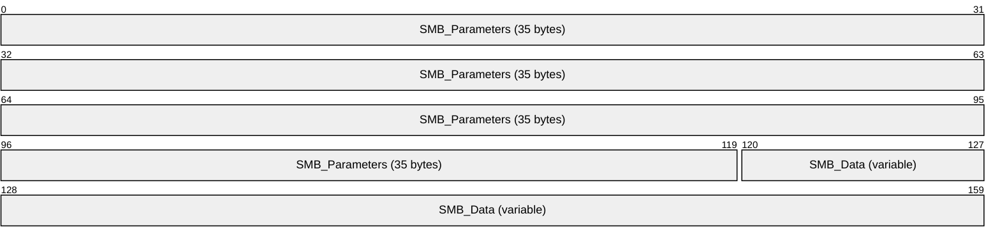

**SMB_Parameters (35 bytes):**

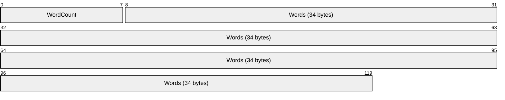

**Words (34 bytes):**

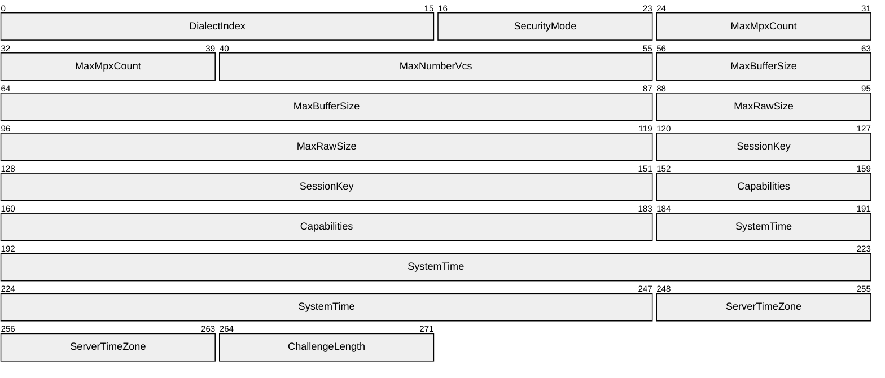

**MaxBufferSize (4 bytes):** Maximum size, in bytes, of the server buffer for receiving [**SMB message**](#gt_smb-message)s. This value accounts for the size of the largest SMB message that the client can send to the server, measured from the start of the [**SMB**](#gt_server-message-block-smb) header to the end of the packet. This value does not account for any underlying transport-layer packet headers, and thus does not account for the size of the complete network packet.<28>

The only cases in which this maximum buffer size MUST be exceeded are:

- When the SMB_COM_WRITE_ANDX command is used and the client and server both support the CAP_LARGE_WRITEX capability (see the **Capabilities** field for more information).
- When the SMB_COM_WRITE_RAW command is used and both the client and server support the CAP_RAW_MODE capability.
**Capabilities (4 bytes):** A 32-bit field providing a set of server capability indicators. This bit field is used to indicate to the client which features are supported by the server. Any value not listed in the following table is unused. The server MUST set the unused bits to zero. The client MUST ignore these bits.

These extensions provide the following new capability bits:

- CAP_COMPRESSED_DATA
- CAP_DYNAMIC_REAUTH
- CAP_EXTENDED_SECURITY
- CAP_INFOLEVEL_PASSTHRU
- CAP_LARGE_WRITEX
- CAP_LWIO
- CAP_UNIX
The rest of the values in the capabilities table are included for completeness.

| Bit Range | Field | Description |
| --- | --- | --- |
| Variable | CAP_RAW_MODE 0x00000001 | The server supports SMB_COM_READ_RAW and SMB_COM_WRITE_RAW requests.<29> Raw mode is not supported over connectionless transports. |
| Variable | CAP_MPX_MODE 0x00000002 | The server supports SMB_COM_READ_MPX and SMB_COM_WRITE_MPX requests.<30> MPX mode is supported only over connectionless transports. |
| The server supports UTF-16LE [**Unicode strings**](#gt_unicode-string). | CAP_UNICODE 0x00000004 | - |
| The server supports large files with 64-bit offsets. | CAP_LARGE_FILES 0x00000008 | - |
| The server supports [**SMB command**](#gt_smb-command)s particular to the NT LAN Manager dialect. | CAP_NT_SMBS 0x00000010 | - |
| Variable | CAP_RPC_REMOTE_APIS 0x00000020 | The server supports the use of remote procedure call [MS-RPCE](../MS-RPCE/MS-RPCE.md) for remote API calls. Similar functionality would otherwise require use of the legacy Remote Administration Protocol, as specified in [MS-RAP](../MS-RAP/MS-RAP.md). |
| The server is capable of responding with 32-bit status codes in the **Status** field of the SMB header (for more information, see [MS-CIFS] 2.2.3.1). CAP_STATUS32 can also be referred to as CAP_NT_STATUS. | CAP_STATUS32 0x00000040 | - |
| The server supports level II [**opportunistic locks (oplocks)**](#gt_opportunistic-lock-oplock). | CAP_LEVEL_II_OPLOCKS 0x00000080 | - |
| Variable | CAP_LOCK_AND_READ 0x00000100 | The server supports the SMB_COM_LOCK_AND_READ command requests. |
| The server supports the TRANS2_FIND_FIRST2, TRANS2_FIND_NEXT2, and FIND_CLOSE2 command requests. This bit SHOULD<31> be set if CAP_NT_SMBS is set. | CAP_NT_FIND 0x00000200 | - |
| The server is aware of the DFS Referral Protocol, as specified in [MS-DFSC](../MS-DFSC/MS-DFSC.md), and can respond to [**DFS**](#gt_distributed-file-system-dfs) referral requests. For more information, see [MS-CIFS] sections 2.2.6.16.1 and 2.2.6.16.2. | CAP_DFS 0x00001000 | - |
| The server supports pass-through [**Information Levels**](#gt_information-level), as specified in section [2.2.2.3](#Section_2.2.2.3). This allows the client to pass Information Level structures in QUERY and SET operations.<32> | CAP_INFOLEVEL_PASSTHRU 0x00002000 | - |
| Variable | CAP_LARGE_READX 0x00004000 | The server supports large read operations. This capability affects the maximum size, in bytes, of the server buffer for sending an SMB_COM_READ_ANDX response to the client. When this capability is set by the server (and set by the client in the SMB_COM_SESSION_SETUP_ANDX request), then the maximum server buffer size for sending data can exceed the **MaxBufferSize** field. Therefore, the server can send a single SMB_COM_READ_ANDX response to the client up to an implementation-specific default size.<33> When signing is active on a connection, then clients MUST limit read lengths to the **MaxBufferSize** value negotiated by the server irrespective of the value of the CAP_LARGE_READX flag. |
| Variable | CAP_LARGE_WRITEX 0x00008000 | The server supports large write operations. This capability affects the maximum size, in bytes, of the server buffer for receiving an SMB_COM_WRITE_ANDX client request. When this capability is set by the server (and set by the client in the SMB_COM_SESSION_SETUP_ANDX request), then the maximum server buffer size of bytes it writes can exceed the **MaxBufferSize** field. Therefore, a client can send a single SMB_COM_WRITE_ANDX request up to this size.<34> When signing is active on a connection, then clients MUST limit write lengths to the **MaxBufferSize** value negotiated by the server, irrespective of the value of the CAP_LARGE_WRITEX flag. |
| The server supports new light-weight I/O control ([**IOCTL**](#gt_io-control-ioctl)) and file system control ([**FSCTL**](#gt_file-system-control-fsctl)) operations. These operations are accessed using the NT_TRANSACT_IOCTL subcommand (section [2.2.7.2](#Section_2.2.7.2.1.1)).<35> | CAP_LWIO 0x00010000 | - |
| Variable | CAP_UNIX 0x00800000 | The server supports UNIX extensions.<36> For more information, see [[SNIA]](https://go.microsoft.com/fwlink/?LinkId=90519). |
| Variable | CAP_COMPRESSED_DATA 0x02000000 | Reserved but not implemented.<37> The server supports compressed SMB packets. |
| Variable | CAP_DYNAMIC_REAUTH 0x20000000 | The server supports re-authentication.<38> |
| Variable | CAP_PERSISTENT_HANDLES 0x40000000 | Reserved but not implemented.<39> The server supports persistent handles. |
| The server supports extended security for authentication, as specified in section [3.2.4.2.4](#Section_3.2.4.2.4.1). This bit is used in conjunction with the SMB_FLAGS2_EXTENDED_SECURITY **SMB_Header.Flags2** flag, as specified in section [2.2.3.1](#Section_2.2.3.1). | CAP_EXTENDED_SECURITY 0x80000000 | - |

**ChallengeLength (1 byte):** When the CAP_EXTENDED_SECURITY bit is set, the server MUST set this value to zero and clients MUST ignore this value.

**SMB_Data (variable):**

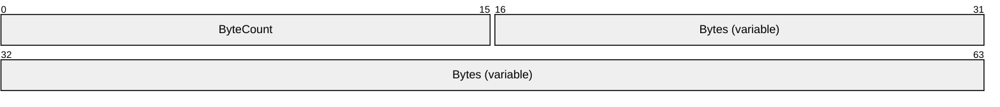

**ByteCount (2 bytes):** The number of bytes in the **SMB_Data.Bytes** array, which follows. This field MUST be greater than or equal to 0x0010.

**Bytes (variable):**

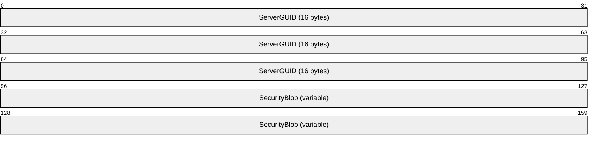

**ServerGUID (16 bytes):** This field MUST be a GUID generated by the server to uniquely identify this server. This field SHOULD NOT be used by a client as a secure method of identifying a server because it can be forged. A client SHOULD use this information to detect whether connections to different textual names resolve to the same target server when direct TCP is used. This knowledge can then be used to set the **SMB_Parameters.Words.VcNumber** field in the SMB_COM_SESSION_SETUP_ANDX request (see [MS-CIFS] section 2.2.4.53.1).<40>

**SecurityBlob (variable):** A security binary large object (BLOB) that SHOULD contain an authentication token as produced by the GSS protocol (as specified in section 3.2.4.2.4 and [[RFC2743]](https://go.microsoft.com/fwlink/?LinkId=90378)).

<a id="Section_2.2.4.5.2.2"></a>
###### 2.2.4.5.2.2 Non-Extended Security Response

If extended security is not being used and the NT LAN Manager dialect has been selected, then a successful response MUST take the following form. Aside from the new **SMB_Parameters.Words.Capabilities** bits, the additional notes to the **SMB_Parameters.Words.MaxBufferSize** field, and the **SMB_Data.Bytes.ServerName** field, all other fields are defined as specified in [MS-CIFS](../MS-CIFS/MS-CIFS.md) section 2.2.4.52.2. The **SMB_Parameters.Words.ChallengeLength** field and the entire **SMB_Data** block are included from [MS-CIFS] to highlight the differences between the Extended and Non-Extended Security responses.

In order to determine whether the **SMB_Data.Bytes.ServerName** field is present, the client MUST check the **SMB_Data.ByteCount** field to determine whether additional data is present beyond the NULL terminator of the **SMB_Data.Bytes.DomainName** string.

SMB_Parameters

{

UCHAR WordCount;

Words

{

USHORT DialectIndex;

UCHAR SecurityMode;

USHORT MaxMpxCount;

USHORT MaxNumberVcs;

ULONG MaxBufferSize;

ULONG MaxRawSize;

ULONG SessionKey;

ULONG Capabilities;

FILETIME SystemTime;

SHORT ServerTimeZone;

UCHAR ChallengeLength;

}

}

SMB_Data

{

USHORT ByteCount;

Bytes

{

UCHAR Challenge[];

SMB_STRING DomainName[];

SMB_STRING ServerName[];

}

}

```mermaid
packet-beta
  0-119: "SMB_Parameters (35 bytes)"
  120-159: "SMB_Data (variable)"
```

**SMB_Parameters (35 bytes):**

```mermaid
packet-beta
  0-111: "Words (34 bytes)"
```

**Words (34 bytes):**

```mermaid
packet-beta
  0-15: "DialectIndex"
  16-23: "SecurityMode"
  24-39: "MaxMpxCount"
  40-55: "MaxNumberVcs"
  56-87: "MaxBufferSize"
  88-119: "MaxRawSize"
  120-151: "SessionKey"
  152-183: "Capabilities"
  184-247: "SystemTime"
  248-263: "ServerTimeZone"
  264-271: "ChallengeLength"
```

**MaxBufferSize (4 bytes):** Maximum size, in bytes, of the server buffer for receiving [**SMB message**](#gt_smb-message)s. This value indicates the size of the largest SMB message that the server is capable of receiving from the client, measured from the start of the [**SMB**](#gt_server-message-block-smb) header to the end of the packet. This value does not account for any underlying transport-layer packet headers and thus does not account for the size of the complete network packet.<41>

The only exceptions in which this maximum buffer size can be exceeded are:

- When the SMB_COM_WRITE_ANDX command is used and both the client and server support the CAP_LARGE_WRITEX capability (see the **Capabilities** field for more information).
- When the SMB_COM_READ_ANDX command is used and both the client and server support the CAP_LARGE_READX capability (see the Capabilities field for more information).
- When the SMB_COM_WRITE_RAW command is used and both the client and server support the CAP_RAW_MODE capability.
**Capabilities (4 bytes):** A 32-bit field providing a set of server capability indicators. This bit field is used to indicate to the client which features are supported by the server. Any value not listed in the following table is unused. The server MUST set the unused bits to zero in a response and the client MUST ignore these bits.

There are several new capability bits:

- CAP_COMPRESSED_DATA
- CAP_DYNAMIC_REAUTH
- CAP_EXTENDED_SECURITY
- CAP_INFOLEVEL_PASSTHRU
- CAP_LARGE_WRITEX
- CAP_LWIO
- CAP_UNIX
Any value not listed in the following table SHOULD be unused. A server SHOULD set the unused bits to zero in a response and a client MUST ignore these bits. The table of server capabilities is provided in the previous section.

**ChallengeLength (1 byte):** The value of this field MUST be 0x08 and is the length of the random challenge used in challenge/response authentication. This field is often referred to as EncryptionKeyLength.

**SMB_Data (variable):**

```mermaid
packet-beta
  0-15: "ByteCount"
  16-63: "Bytes (variable)"
```

**ByteCount (2 bytes):** This field MUST be greater than or equal to 0x0003.

**Bytes (variable):**

```mermaid
packet-beta
  0-63: "Challenge (variable)"
  64-127: "DomainName (variable)"
  128-191: "ServerName (variable)"
```

**Challenge (variable):** An array of unsigned bytes that MUST be the length of the number of bytes specified in the **ChallengeLength** field and MUST represent the server challenge. This array MUST NOT be NULL-terminated.<42>

**DomainName (variable):** The name of the [**domain**](#gt_domain) or workgroup to which the server belongs.

**ServerName (variable):** A variable-length, NULL-terminated [**Unicode string**](#gt_unicode-string) that contains the name of the Server.

<a id="Section_2.2.4.6"></a>
#### 2.2.4.6 SMB_COM_SESSION_SETUP_ANDX (0x73)

<a id="Section_2.2.4.6.1"></a>
##### 2.2.4.6.1 Client Request Extensions

An SMB_COM_SESSION_SETUP_ANDX request MUST be sent by a client to begin user authentication on an [**SMB connection**](#gt_smb-connection) and establish an [**SMB session**](#gt_smb-session).

When extended security is being used (see section [3.2.4.2.4](#Section_3.2.4.2.4.1)), the request MUST take the following form. Aside from the **SecurityBlobLength** field, the additional capabilities used in the **Capabilities** field, and the **ByteCount** and **SecurityBlob** fields, all other fields are as specified in [MS-CIFS](../MS-CIFS/MS-CIFS.md) section 2.2.4.53.1.

SMB_Parameters

{

UCHAR WordCount;

Words

{

UCHAR AndXCommand;

UCHAR AndXReserved;

USHORT AndXOffset;

USHORT MaxBufferSize;

USHORT MaxMpxCount;

USHORT VcNumber;

ULONG SessionKey;

USHORT SecurityBlobLength;

ULONG Reserved;

ULONG Capabilities;

}

}

SMB_Data

{

USHORT ByteCount;

Bytes

{

UCHAR SecurityBlob[SecurityBlobLength];

SMB_STRING NativeOS[];

SMB_STRING NativeLanMan[];

}

}

```mermaid
packet-beta
  0-103: "SMB_Parameters (25 bytes)"
  104-159: "SMB_Data (variable)"
```

**SMB_Parameters (25 bytes):**

```mermaid
packet-beta
  0-7: "WordCount"
  8-103: "Words (24 bytes)"
```

**WordCount (1 byte):** The value of this field MUST be 0x0C.

**Words (24 bytes):**

```mermaid
packet-beta
  0-7: "AndXCommand"
  8-15: "AndXReserved"
  16-31: "AndXOffset"
  32-47: "MaxBufferSize"
  48-63: "MaxMpxCount"
  64-79: "VcNumber"
  80-111: "SessionKey"
  112-127: "SecurityBlobLength"
  128-159: "Reserved"
  160-191: "Capabilities"
```

**SecurityBlobLength (2 bytes):** This value MUST specify the length in bytes of the variable-length **SecurityBlob** field that is contained within the request.

**Capabilities (4 bytes):** A set of client capabilities. This field has the same structure as the **SMB_Parameters.Capabilities** field of the SMB_COM_NEGOTIATE Server Response specified in section [2.2.4.5.2](#Section_2.2.4.5.2.1).<43>

**SMB_Data (variable):**

```mermaid
packet-beta
  0-15: "ByteCount"
  16-63: "Bytes (variable)"
```

**ByteCount (2 bytes):** If SMB_FLAGS2_UNICODE is set in the **SMB_Header.Flags2** field, then this field MUST be greater than or equal to 0x0004. If SMB_FLAGS2_UNICODE is not set, then this field MUST be greater than or equal to 0x0002.

**Bytes (variable):**

```mermaid
packet-beta
  0-63: "SecurityBlob (variable)"
  64-127: "NativeOS (variable)"
  128-191: "NativeLanMan (variable)"
```

**SecurityBlob (variable):** This field MUST be the authentication token sent to the server, as specified in section 3.2.4.2.4 and in [[RFC2743]](https://go.microsoft.com/fwlink/?LinkId=90378).

**NativeOS (variable):** A string that represents the native operating system of the [**SMB**](#gt_server-message-block-smb) client. If SMB_FLAGS2_UNICODE is set in the **Flags2** field of the SMB header of the request, then the name string MUST be a NULL-terminated array of 16-bit [**Unicode**](#gt_unicode) characters. Otherwise, the name string MUST be a NULL-terminated array of [**OEM characters**](#gt_681188c8-235a-47f5-af29-7fbd0676a6b8). If the name string consists of Unicode characters, then this field MUST be aligned to start on a 2-byte boundary from the start of the SMB header.<44>

**NativeLanMan (variable):** A string that represents the native LAN manager type of the client. If SMB_FLAGS2_UNICODE is set in the **Flags2** field of the SMB header of the request, then the name string MUST be a NULL-terminated array of 16-bit Unicode characters. Otherwise, the name string MUST be a NULL-terminated array of OEM characters. If the name string consists of Unicode characters, then this field MUST be aligned to start on a 2-byte boundary from the start of the SMB header.<45>

<a id="Section_2.2.4.6.2"></a>
##### 2.2.4.6.2 Server Response Extensions

When extended security is being used (see section [3.2.4.2.4](#Section_3.2.4.2.4.1)), a successful response MUST take the following form. Aside from the SecurityBlobLength field, the additional capabilities used in the Capabilities field, the ByteCount and SecurityBlob fields, and the omission of the PrimaryDomain field, all of the other fields are as specified in [MS-CIFS](../MS-CIFS/MS-CIFS.md) section 2.2.4.53.2.

SMB_Parameters

{

UCHAR WordCount;

Words

{

UCHAR AndXCommand;

UCHAR AndXReserved;

USHORT AndXOffset;

USHORT Action;

USHORT SecurityBlobLength;

}

}

SMB_Data

{

USHORT ByteCount;

Bytes

{

UCHAR SecurityBlob[SecurityBlobLength];

UCHAR Pad[];

SMB_STRING NativeOS[];

SMB_STRING NativeLanMan[];

}

}

```mermaid
packet-beta
  0-71: "SMB_Parameters"
  72-127: "SMB_Data (variable)"
```

**SMB_Parameters (9 bytes):**

```mermaid
packet-beta
  0-7: "WordCount"
  8-71: "Words"
```

**WordCount (1 byte):** The value of this field MUST be 0x04.

**Words (8 bytes):**

```mermaid
packet-beta
  0-7: "AndXCommand"
  8-15: "AndXReserved"
  16-31: "AndXOffset"
  32-47: "Action"
  48-63: "SecurityBlobLength"
```

**Action (2 bytes):** A 16-bit field. The two lowest-order bits have been defined.

| Bit Range | Field | Description |
| --- | --- | --- |
| Variable | SMB_SETUP_GUEST 0x0001 | If clear (0), then the user successfully authenticated and is logged in. If set (1), then authentication failed but the server has granted guest access; the user is logged in as a Guest. |
| This bit is not used with extended security and MUST be clear. | SMB_SETUP_USE_LANMAN_KEY 0x0002 | - |

The server's response does not specify whether the access granted is of type Anonymous. However, the security system can provide that information once authorization completes.

**SecurityBlobLength (2 bytes):** This value MUST specify the length, in bytes, of the variable-length **SecurityBlob** that is contained within the response.

**SMB_Data (variable):**

```mermaid
packet-beta
  0-15: "ByteCount"
  16-63: "Bytes (variable)"
```

**ByteCount (2 bytes):** If SMB_FLAGS2_UNICODE is set in the **SMB_Header.Flags2** field, then this field MUST be greater than or equal to 0x0006. If SMB_FLAGS2_UNICODE is not set, then this field MUST be greater than or equal to 0x0003.

**Bytes (variable):**

```mermaid
packet-beta
  0-63: "SecurityBlob (variable)"
  64-127: "Pad (variable)"
  128-191: "NativeOS (variable)"
  192-255: "NativeLanMan (variable)"
```

**SecurityBlob (variable):** This value MUST contain the authentication token being returned to the client, as specified in section [3.3.5.3](#Section_3.3.5.3) and [[RFC2743]](https://go.microsoft.com/fwlink/?LinkId=90378).

**NativeOS (variable):** A string that represents the native operating system of the server. If SMB_FLAGS2_UNICODE is set in the **Flags2** field of the [**SMB**](#gt_server-message-block-smb) header of the response, then the string MUST be a NULL-terminated array of 16-bit [**Unicode**](#gt_unicode) characters. Otherwise, the string MUST be a NULL-terminated array of [**OEM character**](#gt_681188c8-235a-47f5-af29-7fbd0676a6b8)s. If the name string consists of Unicode characters, then this field MUST be aligned to start on a 2-byte boundary from the start of the SMB header.

**NativeLanMan (variable):** A string that represents the native LAN Manager type of the server. If SMB_FLAGS2_UNICODE is set in the **Flags2** field of the SMB header of the response, then the string MUST be a NULL-terminated array of 16-bit Unicode characters. Otherwise, the string MUST be a NULL-terminated array of OEM characters. If the name string consists of Unicode characters, then this field MUST be aligned to start on a 2-byte boundary from the start of the SMB header.<46>

<a id="Section_2.2.4.7"></a>
#### 2.2.4.7 SMB_COM_TREE_CONNECT_ANDX (0x75)

<a id="Section_2.2.4.7.1"></a>
##### 2.2.4.7.1 Client Request Extensions

An SMB_COM_TREE_CONNECT_ANDX request MUST be sent by a client to establish a [**tree connect**](#gt_tree-connect) to a [**share**](#gt_share). These extensions define new flags (TREE_CONNECT_ANDX_EXTENDED_SIGNATURES and TREE_CONNECT_ANDX_EXTENDED_RESPONSE) in the **SMB_Parameters.Words.Flags** field that are used to trigger the new behavior defined in this specification. The full field description from [MS-CIFS](../MS-CIFS/MS-CIFS.md) is included for completeness. All other fields are as specified in [MS-CIFS] section 2.2.4.55.1.

SMB_Parameters

{

UCHAR WordCount;

Words

{

UCHAR AndXCommand;

UCHAR AndXReserved;

USHORT AndXOffset;

USHORT Flags;

USHORT PasswordLength;

}

}

SMB_Data

{

USHORT ByteCount;

Bytes

{

UCHAR Password[PasswordLength];

UCHAR Pad[];

SMB_STRING Path;

OEM_STRING Service;

}

}

**SMB_Parameters**

**Words (8 bytes):**

```mermaid
packet-beta
  0-7: "AndXCommand"
  8-15: "AndXReserved"
  16-31: "AndXOffset"
  32-47: "Flags"
  48-63: "PasswordLength"
```

**Flags (2 bytes):** A set of options that modify the SMB_COM_TREE_CONNECT_ANDX request. The entire flag set is given here with its symbolic constants. Any combination of the following flags is valid. Any values not given as follows are considered reserved.

| Bit Range | Field | Description |
| --- | --- | --- |
| If set and **SMB_Header.TID** is valid, the tree connect specified by the TID in the [**SMB**](#gt_server-message-block-smb) header of the request SHOULD be disconnected when the server sends the response. If this tree disconnect fails, then the error SHOULD be ignored. If set and TID is invalid, the server MUST ignore this bit. | TREE_CONNECT_ANDX_DISCONNECT_TID 0x0001 | - |
| Variable | TREE_CONNECT_ANDX_EXTENDED_SIGNATURES 0x0004 | If set, then the client is requesting signing key protection, as specified in sections [3.2.4.2.5](#Section_3.2.4.2.5) and [3.2.5.4](#Section_3.2.5.4). |
| Variable | TREE_CONNECT_ANDX_EXTENDED_RESPONSE 0x0008 | If set, then the client is requesting extended information in the SMB_COM_TREE_CONNECT_ANDX response. |

<a id="Section_2.2.4.7.2"></a>
##### 2.2.4.7.2 Server Response Extensions

When a server returns extended information, the response takes the following format. Aside from the **WordCount**, **MaximalShareAccessRights**, and **GuestMaximalShareAccessRights** fields, and the new **OptionalSupport** flags, all other fields are defined as specified in [MS-CIFS](../MS-CIFS/MS-CIFS.md) section 2.2.4.55.2.

SMB_Parameters

{

UCHAR WordCount;

Words

{

UCHAR AndXCommand;

UCHAR AndXReserved;

USHORT AndXOffset;

USHORT OptionalSupport;

ACCESS_MASK MaximalShareAccessRights;

ACCESS_MASK GuestMaximalShareAccessRights;

}

}

SMB_Data

{

USHORT ByteCount;

Bytes

{

OEM_STRING Service;

UCHAR Pad[];

SMB_STRING NativeFileSystem;

}

}

**SMB_Parameters**

```mermaid
packet-beta
  0-7: "WordCount"
  8-119: "Words (14 bytes)"
```

**WordCount (1 byte):** The value of this field MUST be 0x07.

**Words (14 bytes):**

```mermaid
packet-beta
  0-7: "AndXCommand"
  8-15: "AndXReserved"
  16-31: "AndXOffset"
  32-47: "OptionalSupport"
  48-79: "MaximalShareAccessRights"
  80-111: "GuestMaximalShareAccessRights"
```

**OptionalSupport (2 bytes):** The following **OptionalSupport** bit fields are new extensions: SMB_CSC_MASK, SMB_UNIQUE_FILE_NAME, and SMB_EXTENDED_SIGNATURES. Values from [MS-CIFS] are included for completeness. The values of SMB_CSC_MASK each have their own name and are included for reference purposes only. Any combination of the following flags MUST be supported. All undefined values are considered reserved. The server SHOULD set them to zero and the client MUST ignore them.

| Bit Range | Field | Description |
| --- | --- | --- |
| Variable | SMB_SUPPORT_SEARCH_BITS 0x0001 | 0 If set, then the server supports the use of SMB_FILE_ATTRIBUTES Search Attributes in client directory search requests, as specified in [MS-CIFS]. |
| Variable | - | 1 - |
| SMB_SHARE_IS_IN_[**DFS**](#gt_distributed-file-system-dfs) 0x0002 | 0 | If set, this share is managed by Distributed File System (DFS), as specified in [MS-DFSC](../MS-DFSC/MS-DFSC.md). |
| Variable | - | 1 - |
| Variable | SMB_CSC_MASK 0x000C | 0 SMB_CSC_CACHE_MANUAL_REINT Clients are allowed to cache files that the user requests for offline use, but there is no automatic file-by-file reintegration. |
| Variable | - | 1 SMB_CSC_CACHE_AUTO_REINT Clients are allowed to automatically cache the files that a user or application modifies for offline use. Automatic file-by-file reintegration MUST be permitted. |
| Variable | - | 2 SMB_CSC_CACHE_VDO Clients are allowed to automatically cache the files that a user or application modifies for offline use. Clients are permitted to work from their local cache even while online. |
| Variable | - | 3 SMB_CSC_NO_CACHING No offline caching is allowed for this share. |
| Variable | SMB_UNIQUE_FILE_NAME 0x0010 | 0 If set, then the server is using long file names only and does not support short file names. If set, then the server allows the client to assume that there is no name aliasing for this share (in other words, a single file cannot have two different names). If set, then the server permits the client to cache directory enumerations and file metadata based on the pathname. The client MAY<47> choose to satisfy file attribute queries from its cache and thus could present a slightly stale view of files on the share. The client MUST NOT cache remote file system information for more than 60 seconds. |
| Variable | - | 1 - |
| Variable | SMB_EXTENDED_SIGNATURES 0x0020 | 0 If set, then the server is using signing key protection (see section [3.3.5.4](#Section_3.3.5.4)), as requested by the client. |
| Variable | - | 1 - |

**MaximalShareAccessRights (4 bytes):** This field MUST specify the maximum rights that the user has to this [**share**](#gt_share) based on the security enforced by the share. This field MUST be encoded in an ACCESS_MASK format, as specified in section [2.2.1.4](#Section_2.2.1.4).

**GuestMaximalShareAccessRights (4 bytes):** This field MUST specify the maximum rights that the [**guest account**](#gt_guest-account) has on this share based on the security enforced by the share. Note that the notion of a guest account is implementation specific.<48>

Implementations that do not support the notion of a guest account MUST set this field to zero, which implies no access. This field MUST be encoded in an ACCESS_MASK format, as specified in section 2.2.1.4.

<a id="Section_2.2.4.8"></a>
#### 2.2.4.8 SMB_COM_NT_TRANSACT (0xA0) Extensions

The SMB_COM_NT_TRANSACT request is sent by a client to specify operations on the server. The operations include file open, file create, device I/O control, notify directory change, and set and query [**security descriptor**](#gt_security-descriptor)s. The general format of the SMB_COM_NT_TRANSACT command requests and responses is given in [MS-CIFS](../MS-CIFS/MS-CIFS.md) sections 2.2.4.62 and 2.2.4.63. Execution of SMB_COM_NT_TRANSACT is as specified in [MS-CIFS] sections 3.2.4.1.5, 3.2.5.1.4, and 3.3.5.2.5.

Valid SMB_COM_NT_TRANSACT subcommand codes, also known as "NT Trans subcommand" codes, are specified in section [2.2.2.2](#Section_2.2.7.5). The format and syntax of these subcommands are specified in section [2.2.7](../MS-CIFS/MS-CIFS.md) and in [MS-CIFS] section 2.2.7.

<a id="Section_2.2.4.9"></a>
#### 2.2.4.9 SMB_COM_NT_CREATE_ANDX (0xA2)

<a id="Section_2.2.4.9.1"></a>
##### 2.2.4.9.1 Client Request Extensions

An SMB_COM_NT_CREATE_ANDX request is sent by a client to open a file or device on the server. This extension adds the following:

- An additional flag bit is added to the **Flags** field of the SMB_COM_NT_CREATE_ANDX request. The additional flag, NT_CREATE_REQUEST_EXTENDED_RESPONSE, is used to request an extended response from the server.
- An additional parameter value is added to the **ImpersonationLevel** field. SECURITY_DELEGATION is added to allow the server to call other servers while impersonating the original client.
- An additional flag bit is added to the **CreateOptions** field. The additional flag, FILE_OPEN_REPARSE_POINT, is used to open a [**reparse point**](#gt_reparse-point) file itself.
All other fields are as specified in [MS-CIFS](../MS-CIFS/MS-CIFS.md) section 2.2.4.64.1.<49>

SMB_Parameters

{

UCHAR WordCount;

Words

{

UCHAR AndXCommand;

UCHAR AndXReserved;

USHORT AndXOffset;

UCHAR Reserved;

USHORT NameLength;

ULONG Flags;

ULONG RootDirectoryFID;

ULONG DesiredAccess;

LARGE_INTEGER AllocationSize;

SMB_EXT_FILE_ATTR ExtFileAttributes;

ULONG ShareAccess;

ULONG CreateDisposition;

ULONG CreateOptions;

ULONG ImpersonationLevel;

UCHAR SecurityFlags;

}

}

SMB_Data

{

USHORT ByteCount;

Bytes

{

SMB_STRING FileName;

}

}

**SMB_Parameters**

**Words (48 bytes):**

```mermaid
packet-beta
  0-7: "AndXCommand"
  8-15: "AndXReserved"
  16-31: "AndXOffset"
  32-39: "Reserved"
  40-55: "NameLength"
  56-87: "Flags"
  88-119: "RootDirectoryFID"
  120-151: "DesiredAccess"
  152-215: "AllocationSize"
  216-247: "ExtFileAttributes"
  248-279: "ShareAccess"
  280-311: "CreateDisposition"
  312-343: "CreateOptions"
  344-375: "ImpersonationLevel"
  376-383: "SecurityFlags"
```

**Flags (4 bytes):** A set of flags that modify the client request, as defined in the table below. NT_CREATE_REQUEST_EXTENDED_RESPONSE is new to MS-SMB. All other flags are included in the table for completeness. Unused bits SHOULD be set to zero by the client when sending a request and MUST be ignored when received by the server.

| Bit Range | Field | Description |
| --- | --- | --- |
| If set, then the client is requesting an [**oplock**](#gt_opportunistic-lock-oplock). | NT_CREATE_REQUEST_OPLOCK 0x00000002 | - |
| Variable | NT_CREATE_REQUEST_OPBATCH 0x00000004 | If set, then the client is requesting a batch oplock. |
| Variable | NT_CREATE_OPEN_TARGET_DIR 0x00000008 | If set, then the client indicates that the parent directory of the target is to be opened. |
| Variable | NT_CREATE_REQUEST_EXTENDED_RESPONSE 0x00000010 | If set, then the client is requesting extended information in the response. |

**ImpersonationLevel (4 bytes):** This field specifies the impersonation level requested by the application that is issuing the create request, and MUST contain one of the following values. Impersonation is described in [MS-WPO](#Section_1.3) section 9.7; for more information about impersonation, see [[MSDN-IMPERS]](https://go.microsoft.com/fwlink/?LinkId=106009).

| Value | Meaning |
| --- | --- |
| SECURITY_ANONYMOUS 0x00000000 | The application-requested impersonation level is Anonymous. |
| SECURITY_IDENTIFICATION 0x00000001 | The application-requested impersonation level is Identification. |
| SECURITY_IMPERSONATION 0x00000002 | The application-requested impersonation level is Impersonation. |
| SECURITY_DELEGATION 0x00000003 | The application-requested impersonation level is Delegation. |

**CreateOptions (4 bytes)**: A 32-bit field containing flag options for creating a file or directory. In addition to the flags specified in [MS-CIFS] section 2.2.4.64, the following modifications and extensions apply to the **CreateOptions** field. FILE_OPEN_REPARSE_POINT is a new flag to SMB. The **CreateOptions** field MUST be set to 0x00000000 or to a combination of the flags specified in the [MS-CIFS] section 2.2.4.64 **CreateOptions** table and the following table. Unused bit fields SHOULD be set to 0 when sent and MUST be ignored on receipt. Server implementations SHOULD reserve all bits not specified in the [MS-CIFS] section 2.2.4.64 **CreateOptions** table and the following table.

| Bit Range | Field | Description |
| --- | --- | --- |
| Variable | FILE_OPEN_REPARSE_POINT 0x00200000 | If the file or directory being opened is a reparse point, open the reparse point itself rather than the target that the reparse point references. |

<a id="Section_2.2.4.9.2"></a>
##### 2.2.4.9.2 Server Response Extensions

A successful response takes the following format. If the server receives more than one SMB_COM_NT_CREATE_ANDX request from a client before it sends back any response, then the server can respond to these requests in any order.

When a client requests extended information, then the response takes the form described below. Aside from the **WordCount**, **ResourceType**, **NMPipeStatus_or_FileStatusFlags**, **FileId**, **VolumeGUID**, **FileId**, **MaximalAccessRights**, and **GuestMaximalAccessRights** fields, all other fields are as specified in [MS-CIFS](../MS-CIFS/MS-CIFS.md) section 2.2.4.64.2.

SMB_Parameters

{

UCHAR WordCount;

Words

{

UCHAR AndXCommand;

UCHAR AndXReserved;

USHORT AndXOffset;

UCHAR OplockLevel;

USHORT FID;

ULONG CreateDisposition;

FILETIME CreateTime;

FILETIME LastAccessTime;

FILETIME LastWriteTime;

FILETIME LastChangeTime;

SMB_EXT_FILE_ATTR ExtFileAttributes;

LARGE_INTERGER AllocationSize;

LARGE_INTERGER EndOfFile;

USHORT ResourceType;

USHORT NMPipeStatus_or_FileStatusFlags;

UCHAR Directory;

GUID VolumeGUID;

ULONGLONG FileId;

ACCESS_MASK MaximalAccessRights;

ACCESS_MASK GuestMaximalAccessRights;

}

}

SMB_Data

{

USHORT ByteCount;

}

**SMB_Parameters:**

**WordCount (1 bytes):** This field SHOULD<50> be 0x2A.

```mermaid
packet-beta
  0-7: "AndXCommand"
  8-15: "AndXReserved"
  16-31: "AndXOffset"
  32-39: "OplockLevel"
  40-55: "FID"
  56-87: "CreateDisposition"
  88-151: "CreateTime"
  152-215: "LastAccessTime"
  216-279: "LastWriteTime"
  280-343: "LastChangeTime"
  344-375: "ExtFileAttributes"
  376-439: "AllocationSize"
  440-503: "EndOfFile"
  504-519: "ResourceType"
  520-535: "NMPipeStatus_or_FileStatusFlags"
  536-543: "Directory"
  544-639: "VolumeGUID (16 bytes)"
  640-703: "FileId"
  704-735: "MaximalAccessRights"
  736-767: "GuestMaximalAccessRights"
```

**ResourceType (2 bytes):** The file type. This field MUST be interpreted as follows:

| Name & value | Meaning |
| --- | --- |
| FileTypeDisk 0x0000 | File or Directory |
| FileTypeByteModePipe 0x0001 | [**Byte mode**](#gt_byte-mode) [**named pipe**](#gt_named-pipe) |
| FileTypeMessageModePipe 0x0002 | [**Message mode**](#gt_message-mode) named pipe |
| FileTypePrinter 0x0003 | Printer Device |

**NMPipeStatus_or_FileStatusFlags (2 bytes):** A union between the **NMPipeStatus** field and the new **FileStatusFlags** field. If the **ResourceType** field is a named pipe (**FileTypeByteModePipe** or **FileTypeMessageModePipe**), then this field MUST be the **NMPipeStatus** field:

```mermaid
packet-beta
  0-15: "NMPipeStatus"
  16-31: "FileStatusFlags"
```

**NMPipeStatus (2 bytes):** A 16-bit field that shows the status of the opened named pipe. This field is formatted as an SMB_NMPIPE_STATUS ([MS-CIFS] section 2.2.1.3).

If the **ResourceType** field is FileTypeDisk, then this field MUST be the **FileStatusFlags** field:

**FileStatusFlags (2 bytes):** A 16-bit field that shows extra information about the opened file or directory. Any combination of the following flags is valid. Unused bit fields SHOULD be set to zero by the server and MUST be ignored by the client.

| Bit Range | Field | Description |
| --- | --- | --- |
| Variable | NO_EAS 0x0001 | The file or directory has no extended attributes. |
| The file or directory has no data [**streams**](#gt_stream) other than the main data stream. | NO_SUBSTREAMS 0x0002 | - |
| The file or directory is not a [**reparse point**](#gt_reparse-point). | NO_REPARSETAG 0x0004 | - |

For all other values of **ResourceType**, this field SHOULD be set to zero by the server when sending a response and MUST be ignored when received by the client.

**VolumeGUID (16 bytes):** This field MUST be a GUID value that uniquely identifies the volume on which the file resides. This field MUST zero if the underlying file system does not support volume GUIDs.<51>

**FileId (8 bytes):** This field MUST be a 64-bit opaque value that uniquely identifies this file on a volume. This field MUST be set to zero if the underlying file system does not support unique [**FileId**](#gt_fileid) numbers on a volume. If the underlying file system does support unique FileId numbers, then this value SHOULD<52> be set to the unique FileId for this file.

**MaximalAccessRights (4 bytes):** The maximum access rights that the user opening the file has been granted for this file open. This field MUST be encoded in an ACCESS_MASK format, as specified in section [2.2.1.4](#Section_2.2.1.4).

**GuestMaximalAccessRights (4 bytes):** The maximum access rights that the [**guest account**](#gt_guest-account) has when opening this file. This field MUST be encoded in an ACCESS_MASK format, as specified in section 2.2.1.4. Note that the notion of a guest account is implementation-specific<53>. Implementations that do not support the notion of a guest account MUST set this field to zero.

**SMB_Data:**

**ByteCount (2 bytes):** This field SHOULD<54> be zero.

<a id="Section_2.2.4.10"></a>
#### 2.2.4.10 SMB_COM_SEARCH (0x81) Extensions

The SMB_COM_SEARCH request is sent by a client to search a directory for files or other objects on the server that have names matching a given wildcard template. The general format of the SMB_COM_SEARCH command requests and responses are given in [MS-CIFS](../MS-CIFS/MS-CIFS.md) section 2.2.4.58.

<a id="Section_2.2.5"></a>
### 2.2.5 Transaction Subcommand Extensions

<a id="Section_2.2.5.1"></a>
#### 2.2.5.1 TRANS_RAW_READ_NMPIPE (0x0011)

The TRANS_RAW_READ_NMPIPE subcommand allows for a [**raw read**](#gt_raw-read-on-a-named-pipe) of data from a [**named pipe**](#gt_named-pipe). This method of reading data from a named pipe ignores message boundaries even if the pipe was set up as a [**message mode**](#gt_message-mode) pipe.

The status of this subcommand is **obsolescent**.<55> Aside from its new status as obsolescent, this subcommand is exactly as described in [MS-CIFS](../MS-CIFS/MS-CIFS.md) section 2.2.5.2.

<a id="Section_2.2.5.2"></a>
#### 2.2.5.2 TRANS_CALL_NMPIPE (0x0054)

The TRANS_CALL_NMPIPE subcommand allows a client to connect to a [**named pipe**](#gt_named-pipe), write to the named pipe, read from the named pipe, and close the named pipe in a single command.

The status of this subcommand is [**obsolescent**](#gt_obsolescent).<56> Aside from its new status as obsolescent, this subcommand is exactly as described in [MS-CIFS](../MS-CIFS/MS-CIFS.md) section 2.2.5.11.

<a id="Section_2.2.6"></a>
### 2.2.6 Transaction 2 Subcommand Extensions

<a id="Section_2.2.6.1"></a>
#### 2.2.6.1 TRANS2_FIND_FIRST2 (0x0001)

<a id="Section_2.2.6.1.1"></a>
##### 2.2.6.1.1 Client Request Extensions

A TRANS2_FIND_FIRST2 subcommand of [SMB_COM_TRANSACTION2](#Section_3.2.5.11) is sent by the client to retrieve an enumeration of files, as specified in [MS-CIFS](../MS-CIFS/MS-CIFS.md) section 2.2.6.2.1.

The list of valid [**Information Level**](#gt_information-level) values has been extended, as specified in section [2.2.2.3.1](#Section_2.2.2.3.1), to include SMB_FIND_FILE_ID_FULL_DIRECTORY_INFO and SMB_FIND_FILE_ID_BOTH_DIRECTORY_INFO. Extensions are also presented to the SMB_FIND_FILE_BOTH_DIRECTORY_INFO Information Level, as specified in section [2.2.8.1.1](#Section_2.2.8.1.1). This Information Level now provides support for accessing enumerations of available previous version timestamps of files or directories.

Aside from the Information Level extensions and the **FileName** field, all of the other fields are as specified in [MS-CIFS] [2.2.6.2.1](#Section_2.2.6.2.1).

**Trans2_Parameters**

**FileName (variable)**: This field is extended to support use of the [**@GMT token**](#gt_gmt-token) wildcard (section [2.2.1.1.1](#Section_2.2.1.1.1)).<57> If this character sequence contains the @GMT-* wildcard, **Trans2_Data.InformationLevel** SHOULD be set to SMB_FIND_FILE_BOTH_DIRECTORY_INFO.<58>

**Trans2_Data**

**InformationLevel (2 bytes)**: This field contains an Information Level code, which determines the information contained in the response. The list of valid Information Level codes is specified in section 2.2.2.3.1. A client that has not negotiated long names support MUST request only SMB_INFO_STANDARD. If a client that has not negotiated long names support requests an **InformationLevel** other than SMB_INFO_STANDARD, then the server MUST return a status of STATUS_INVALID_PARAMETER (ERRDOS/ERRinvalidparam).

<a id="Section_2.2.6.1.2"></a>
##### 2.2.6.1.2 Server Response Extensions

A server MUST send a TRANS2_FIND_FIRST2 response in reply to a client TRANS2_FIND_FIRST2 subcommand request when the request is successful, as specified in [MS-CIFS](../MS-CIFS/MS-CIFS.md) section 2.2.6.2.2.

Thus subcommand also supports two new [**Information Levels**](#gt_information-level), as well as extensions to the SMB_FIND_FILE_BOTH_DIRECTORY_INFO Information Level, as defined in section [2.2.2.3.1](#Section_2.2.2.3.1). The format of the file information returned for these two Information Levels (and the format of information for a TRANS2_FIND_FIRST2 response for the special FileName pattern [**@GMT token**](#gt_gmt-token)) is listed in section [2.2.8.1](#Section_2.2.8.1).If a client does not support long names (that is, SMB_FLAGS2_KNOWS_LONG_NAMES is not set in the **Flags2** field of the [**SMB**](#gt_server-message-block-smb) Header), then any TRANS2_FIND_FIRST2 request with an Information Level other than SMB_INFO_STANDARD, or any TRANS2_FIND_NEXT2 request with an Information Level other than SMB_INFO_STANDARD or SMB_FIND_FILE_ID_BOTH_DIRECTORY_INFO, MUST be failed with STATUS_INVALID_PARAMETER.

<a id="Section_2.2.6.2"></a>
#### 2.2.6.2 TRANS2_FIND_NEXT2 (0x0002)

<a id="Section_2.2.6.2.1"></a>
##### 2.2.6.2.1 Client Request Extensions

The TRANS2_FIND_NEXT2 subcommand of the [SMB_COM_TRANSACTION2](#Section_3.2.5.11) request is sent by a client to continue a file enumeration, as specified in [MS-CIFS](../MS-CIFS/MS-CIFS.md) section 2.2.6.3.1. The request format is identical to the request format that is specified in [MS-CIFS] section 2.2.6.3.1, except that two new [**Information Levels**](#gt_information-level) have been added and one has been extended. See section 2.2.6.1.1 for details.

<a id="Section_2.2.6.2.2"></a>
##### 2.2.6.2.2 Server Response Extensions

The server MUST send a TRANS2_FIND_NEXT2 response in reply to a client [TRANS2_FIND_NEXT2](#Section_2.2.6.2.1) subcommand request when the request is successful. The format of this packet is identical to what is specified in [MS-CIFS](../MS-CIFS/MS-CIFS.md) section 2.2.6.3.2, except that two new [**Information Levels**](#gt_information-level) have been added and one has been extended. See section [2.2.6.1.2](#Section_2.2.6.1.2) for details.

<a id="Section_2.2.6.3"></a>
#### 2.2.6.3 TRANS2_QUERY_FS_INFORMATION (0x0003)

This subcommand supports new pass-through [**Information Level**](#gt_information-level) capabilities, as specified in section [2.2.2.3.5](#Section_2.2.2.3.5).

<a id="Section_2.2.6.3.1"></a>
##### 2.2.6.3.1 Client Request Extensions

A TRANS2_QUERY_FS_INFORMATION subcommand of the [SMB_COM_TRANSACTION2](#Section_3.2.5.11) is sent by the client to request attribute information about the file system, as specified in [MS-CIFS](../MS-CIFS/MS-CIFS.md) section [2.2.6.4.1](#Section_2.2.6.4.1).

<a id="Section_2.2.6.3.2"></a>
##### 2.2.6.3.2 Server Response Extensions

A server MUST send a TRANS2_QUERY_FS_INFORMATION response in reply to an SMB_COM_TRANSACTION2 client request with a [TRANS2_QUERY_FS_INFORMATION](#Section_2.2.6.3) subcommand when the request is successful, as specified in [MS-CIFS](../MS-CIFS/MS-CIFS.md) section [2.2.6.4.2](#Section_2.2.6.4.2).

<a id="Section_2.2.6.4"></a>
#### 2.2.6.4 TRANS2_SET_FS_INFORMATION (0x0004)

The TRANS2_SET_FS_INFORMATION subcommand of the SMB_COM_TRANSACTION2 command (section [2.2.4.4](#Section_3.2.5.11)) is sent by the client to set file system attribute information on the server. This subcommand was introduced in the LAN Manager 2.0 dialect.<59>

The TRANS2_SET_FS_INFORMATION request and response formats are special cases of SMB_COM_TRANSACTION2 command. Only the TRANS2_SET_FS_INFORMATION specifics are described here.

<a id="Section_2.2.6.4.1"></a>
##### 2.2.6.4.1 Client Request

**SMB_Parameters:**

**WordCount (1 byte):** This field MUST be 0x0F.

**Words (30 bytes):**

**TotalParameterCount (2 bytes):** This field MUST be 0x0004.

**TotalDataCount (2 bytes):** This field MUST be greater than or equal to 0x0000.

**SetupCount (1 byte):** This field MUST be 0x01.

**Setup (2 bytes):** This field MUST be TRANS2_SET_FS_INFORMATION (0x0004).

**Trans2_Parameters**

Trans2_Parameters

{

USHORT FID;

USHORT InformationLevel;

}

```mermaid
packet-beta
  0-15: "FID"
  16-31: "InformationLevel"
```

**FID (2 bytes):** A valid [**Fid**](#gt_fid) that represents the open file on the server that is to have its file attributes changed.

**InformationLevel (2 bytes):** The Information Level of the request. This field MUST be a pass-through [**Information Level**](#gt_information-level), as described in section [2.2.2.3.5](#Section_2.2.2.3.5).

**Trans2_Data**

The Trans2_Data block carries the structure of the Information Level specified by the request's **Trans2_Parameters.InformationLevel** field. Because this subcommand only accepts pass-through Information Levels, the structure of this section is implementation specific.

<a id="Section_2.2.6.4.2"></a>
##### 2.2.6.4.2 Server Response

A server MUST send a TRANS2_SET_FS_INFORMATION response in reply to a client TRANS2_SET_FS_INFORMATION subcommand request when the request is successful. The server MUST set an error code in the **Status** field of the [**SMB**](#gt_server-message-block-smb) header of the response to indicate whether the request was successful or failed. The server MUST respond with STATUS_NOT_SUPPORTED if the information level of the request is not a pass-through information level.

**Trans2_Parameters**

No Trans2_Parameters are sent by this message.

**Trans2_Data**

No Trans2_Data is sent by this message.

**Error Codes**

| SMB error class | SMB error code | NT status code | POSIX equivalent | Description |
| --- | --- | --- | --- | --- |
| ERRDOS(0x01) | ERRnoaccess (0x0005) | STATUS_ACCESS_DENIED (0xC0000022) | EPERM | Access denied. |
| - | ERRbadfid (0x0006) | STATUS_INVALID_HANDLE (0xC0000008) | ENOENT | The [**Fid**](#gt_fid) supplied is invalid. |
| - | ERRnomem (0x0008) | STATUS_INSUFF_SERVER_RESOURCES (0xC0000205) | ENOMEM | The server is out of resources. |
| - | ERRunsup (0x0032) | STATUS_NOT_SUPPORTED (0xC00000BB) | - | The supplied [**Information Level**](#gt_information-level), as indicated by the Trans2_Parameters.InformationLevel value, is not a valid pass-through Information Level. |
| - | ERRinvalidparam (0x0057) | STATUS_INVALID_PARAMETER (0xC000000D) | - | The supplied pass-through Information Level values in the Trans2_Data block contain at least one invalid parameter. OR Server does not support pass-through Information Levels. |
| ERRSRV (0x02) | ERRerror (0x0001) | STATUS_INVALID_SMB (0x00010002) | - | Invalid SMB. Not enough parameter bytes were sent. |
| - | ERRinvtid (0x0005) | STATUS_INVALID_HANDLE (0xC0000008) STATUS_SMB_BAD_TID (0x00050002) | - | The TID is no longer valid. |
| - | ERRbaduid (0x005B) | STATUS_INVALID_HANDLE (0xC0000008) STATUS_SMB_BAD_UID (0x005B0002) | - | The UID supplied is not known to the session. |
| ERRHRD (0x03) | ERRnowrite (0x0013) | STATUS_MEDIA_WRITE_PROTECTED (0xC00000A2) | - | The Fid supplied is on write-protected media. |
| - | ERRdata (0x0017) | STATUS_DATA_ERROR (0xC000003E) | EIO | Disk I/O error. |

<a id="Section_2.2.6.5"></a>
#### 2.2.6.5 TRANS2_QUERY_PATH_INFORMATION (0x0005)

This subcommand supports new pass-through Information Level capabilities, as specified in section [2.2.2.3.5](#Section_2.2.2.3.5).

<a id="Section_2.2.6.5.1"></a>
##### 2.2.6.5.1 Client Request Extensions

A TRANS2_QUERY_PATH_INFORMATION subcommand of SMB_COM_TRANSACTION2 is sent by the client to request attribute information for a file or directory by specifying the path, as specified in [MS-CIFS](../MS-CIFS/MS-CIFS.md), section 2.2.6.6.1.

<a id="Section_2.2.6.5.2"></a>
##### 2.2.6.5.2 Server Response Extensions

A server MUST send a TRANS2_QUERY_PATH_INFORMATION response in reply to an SMB_COM_TRANSACTION2 client request with a TRANS2_QUERY_PATH_INFORMATION subcommand when the request is successful, as specified in [MS-CIFS](../MS-CIFS/MS-CIFS.md) section 2.2.6.6.2.

<a id="Section_2.2.6.6"></a>
#### 2.2.6.6 TRANS2_SET_PATH_INFORMATION (0x0006)

This subcommand supports new pass-through [**Information Level**](#gt_information-level) capabilities, as specified in section [2.2.2.3.5](#Section_2.2.2.3.5).

<a id="Section_2.2.6.6.1"></a>
##### 2.2.6.6.1 Client Request Extensions

A TRANS2_SET_PATH_INFORMATION subcommand of SMB_COM_TRANSACTION2 is sent by the client to request a change of attribute information for a file or directory by path, as specified in [MS-CIFS](../MS-CIFS/MS-CIFS.md) section 2.2.6.7.1.

<a id="Section_2.2.6.6.2"></a>
##### 2.2.6.6.2 Server Response Extensions

A server MUST send a TRANS2_SET_PATH_INFORMATION response in reply to an [SMB_COM_TRANSACTION2 (section 2.2.4.4)](#Section_3.2.5.11) client request with a TRANS2_SET_PATH_INFORMATION subcommand when the request is successful,as specified in [MS-CIFS](../MS-CIFS/MS-CIFS.md) section 2.2.6.7.2.

<a id="Section_2.2.6.7"></a>
#### 2.2.6.7 TRANS2_QUERY_FILE_INFORMATION (0x0007)

This subcommand supports new pass-through Information Level capabilities, as specified in section [2.2.2.3.5](#Section_2.2.2.3.5).

<a id="Section_2.2.6.7.1"></a>
##### 2.2.6.7.1 Client Request Extensions

A TRANS2_QUERY_FILE_INFORMATION subcommand of [SMB_COM_TRANSACTION2](#Section_3.2.5.11) is sent by a client to request attribute information for a file or directory that has been opened, as specified in [MS-CIFS](../MS-CIFS/MS-CIFS.md) section 2.2.6.8.1.

<a id="Section_2.2.6.7.2"></a>
##### 2.2.6.7.2 Server Response Extensions

A server MUST send a TRANS2_QUERY_PATH_INFORMATION response in reply to an SMB_COM_TRANSACTION2 client request with a TRANS2_QUERY_PATH_INFORMATION subcommand when the request is successful. The Trans2_Data block of the transaction response contains the information requested by the [**Information Level**](#gt_information-level) in the request, as specified in [MS-CIFS](../MS-CIFS/MS-CIFS.md) section 2.2.6.8.2.

<a id="Section_2.2.6.8"></a>
#### 2.2.6.8 TRANS2_SET_FILE_INFORMATION (0x0008)

This subcommand supports new pass-through Information Level capabilities, as specified in section [2.2.2.3.5](#Section_2.2.2.3.5).

<a id="Section_2.2.6.8.1"></a>
##### 2.2.6.8.1 Client Request Extensions

A TRANS2_SET_FILE_INFORMATION subcommand of [SMB_COM_TRANSACTION2](#Section_3.2.5.11) is sent by the client to request a change of attribute information for a file or directory that has been opened, as specified in [MS-CIFS](../MS-CIFS/MS-CIFS.md) section 2.2.6.9.1.

<a id="Section_2.2.6.8.2"></a>
##### 2.2.6.8.2 Server Response Extensions

A server MUST send a TRANS2_SET_FILE_INFORMATION response in reply to an SMB_COM_TRANSACTION2 client request with a TRANS2_SET_FILE_INFORMATION subcommand when the request is successful, as specified in [MS-CIFS](../MS-CIFS/MS-CIFS.md) section 2.2.6.9.2.

<a id="Section_2.2.7"></a>
### 2.2.7 NT Transact Subcommand Extensions

<a id="Section_2.2.7.1"></a>
#### 2.2.7.1 NT_TRANSACT_CREATE (0x0001) Extensions

<a id="Section_2.2.7.1.1"></a>
##### 2.2.7.1.1 Client Request Extensions

An [SMB_COM_NT_TRANSACT (section 2.2.4.8)](../MS-CIFS/MS-CIFS.md) command with an NT_TRANSACT_CREATE subcommand is sent by a client to open a file or device on the server. The NT_TRANSACT_CREATE subcommand is specified in [MS-CIFS](../MS-CIFS/MS-CIFS.md) section 2.2.7.1. This extension adds the following:

- An additional flag bit is added to the **Flags** field. The additional flag, NT_CREATE_REQUEST_EXTENDED_RESPONSE, is used to request an extended response from the server.
- An additional parameter value, SECURITY_DELEGATION, is added to the **ImpersonationLevel** field.
- An additional flag bit is added to the **CreateOptions** field. The additional flag, FILE_OPEN_REPARSE_POINT, is used to open a reparse point file itself.
All other fields are as specified in [MS-CIFS] section 2.2.7.1.

NT_Trans_Parameters

{

ULONG Flags;

ULONG RootDirectoryFID;

ULONG DesiredAccess;

LARGE_INTEGER AllocationSize;

SMB_EXT_FILE_ATTR ExtFileAttributes;

ULONG ShareAccess;

ULONG CreateDisposition;

ULONG CreateOptions;

ULONG SecurityDescriptorLength;

ULONG EALength;

ULONG NameLength;

ULONG ImpersonationLevel;

UCHAR SecurityFlags;

UCHAR Name[NameLength];

}

NT_Trans_Data

{

SECURITY_DESCRIPTOR SecurityDescriptor;

FILE_FULL_EA_INFORMATION ExtendedAttributes[];

}

**NT_Trans_Parameters (variable):**

```mermaid
packet-beta
  0-31: "Flags"
  32-63: "RootDirectoryFID"
  64-95: "DesiredAccess"
  96-159: "AllocationSize (variable)"
  160-191: "ExtFileAttributes"
  192-223: "ShareAccess"
  224-255: "CreateDisposition"
  256-287: "CreateOptions"
  288-319: "SecurityDescriptorLength"
  320-351: "EALength"
  352-383: "NameLength"
  384-415: "ImpersonationLevel"
  416-431: "SecurityFlags"
  432-479: "Name (variable)"
```

**Flags (4 bytes):** A 32-bit field containing a set of flags that modify the client request. Unused bits SHOULD be set to 0 by the client when sending a message and MUST be ignored when received by the server.

| Bit Range | Field | Description |
| --- | --- | --- |
| Variable | NT_CREATE_REQUEST_OPLOCK 0x00000002 | Level I (exclusive) OpLock requested. |
| Variable | NT_CREATE_REQUEST_OPBATCH 0x00000004 | Batch OpLock requested. |
| Variable | NT_CREATE_OPEN_TARGET_DIR 0x00000008 | Parent directory of the target is to be opened. |
| Variable | NT_CREATE_REQUEST_EXTENDED_RESPONSE 0x00000010 | Extended information is requested in the response. |

**ImpersonationLevel (4 bytes):** This field specifies the impersonation level requested by the application that is issuing the create request, and MUST contain one of the following values.

Impersonation is described in [MS-WPO](#Section_1.3) section 9.7; for more information about impersonation, see [[MSDN-IMPERS]](https://go.microsoft.com/fwlink/?LinkId=106009).

| Value | Meaning |
| --- | --- |
| SECURITY_ANONYMOUS 0x00000000 | The application-requested impersonation level is Anonymous. |
| SECURITY_IDENTIFICATION 0x00000001 | The application-requested impersonation level is Identification. |
| SECURITY_IMPERSONATION 0x00000002 | The application-requested impersonation level is Impersonation. |
| SECURITY_DELEGATION 0x00000003 | The application-requested impersonation level is Delegation. |

**CreateOptions (4 bytes)**: A 32-bit field containing flag options for creating a file or directory. In addition to the flags specified in [MS-CIFS] section 2.2.4.64, the following modifications and extensions apply to the **CreateOptions** field. FILE_OPEN_REPARSE_POINT is a new flag to SMB. The **CreateOptions** field MUST be set to 0x00000000 or to a combination of the flags specified in the [MS-CIFS] section 2.2.4.64 **CreateOptions** table and the following table. Unused bit fields SHOULD be set to 0 when sent and MUST be ignored on receipt. Server implementations SHOULD reserve all bits not specified in the [MS-CIFS] section 2.2.4.64 **CreateOptions** table and the following table.

| Bit Range | Field | Description |
| --- | --- | --- |
| If the file or directory being opened is a [**reparse point**](#gt_reparse-point), open the reparse point itself rather than the target that the reparse point references. | FILE_OPEN_REPARSE_POINT 0x00200000 | - |

<a id="Section_2.2.7.1.2"></a>
##### 2.2.7.1.2 Server Response Extensions

When a client requests extended information by setting NT_CREATE_REQUEST_EXTENDED_RESPONSE, a successful response takes the following format.

Aside from **ResponseType**, **NMPipeStatus_or_FileStatusFlags**, **VolumeGUID**, **FileId**, **MaximalAccessRights**, and **GuestMaximalAccessRights** fields, all other fields are as specified in [MS-CIFS](../MS-CIFS/MS-CIFS.md) section 2.2.7.1.2.

NT_Trans_Parameters

{

UCHAR OpLockLevel;

UCHAR ResponseType;

USHORT FID;

ULONG CreateAction;

ULONG EAErrorOffset;

FILETIME CreationTime;

FILETIME LastAccessTime;

FILETIME LastWriteTime;

FILETIME LastChangeTime;

SMB_EXT_FILE_ATTR ExtFileAttributes;

LARGE_INTEGER AllocationSize;

LARGE_INTEGER EndOfFile;

USHORT ResourceType;

SMB_NMPIPE_STATUS NMPipeStatus_or_FileStatusFlags;

UCHAR Directory;

GUID VolumeGUID;

ULONGLONG FileId;

ACCESS_MASK MaximalAccessRights;

ACCESS_MASK GuestMaximalAccessRights;

}

**NT_Trans_Parameters (69 bytes):**

```mermaid
packet-beta
  0-7: "OpLockLevel"
  8-15: "ResponseType"
  16-31: "FID"
  32-63: "CreateAction"
  64-95: "EAErrorOffset"
  96-159: "CreationTime (variable)"
  160-223: "LastAccessTime (variable)"
  224-287: "LastWriteTime (variable)"
  288-351: "LastChangeTime (variable)"
  352-383: "ExtFileAttributes"
  384-447: "AllocationSize (variable)"
  448-511: "EndOfFile (variable)"
  512-527: "ResourceType"
  528-543: "NMPipeStatus_or_FileStatusFlags"
  544-551: "Directory"
  552-647: "VolumeGUID (16 bytes)"
  648-711: "FileId"
  712-743: "MaximalAccessRight"
  744-775: "GuestMaximalAccessRights"
```

**ResponseType (1 byte):** The response type received. This field MUST be set to any one of the following values, based on the response type.

| Bit Range | Field | Description |
| --- | --- | --- |
| Variable | NON_EXTENDED_RESPONSE 0x00 | Response received is not an extended response. |
| Variable | EXTENDED_RESPONSE 0x01 | Response received is an extended response. |

**NMPipeStatus_or_FileStatusFlags (2 bytes):** A union between the **NMPipeStatus** field and the new **FileStatusFlags** field. If the **ResourceType** field is a named pipe (**FileTypeByteModePipe** or **FileTypeMessageModePipe**), then this field MUST be the **NMPipeStatus** field:

```mermaid
packet-beta
  0-15: "NMPipeStatus"
  16-31: "FileStatusFlags"
```

**NMPipeStatus (2 bytes):** A 16-bit field that shows the status of the opened named pipe. This field is formatted as an SMB_NMPIPE_STATUS ([MS-CIFS] section 2.2.1.3).

If the **ResourceType** field is FileTypeDisk, then this field MUST be the **FileStatusFlags** field.

**FileStatusFlags (2 bytes):** A 16-bit field that shows extra information about the opened file or directory. Any combination of the following flags is valid. Unused bit fields SHOULD be set to zero by the server and MUST be ignored by the client.

| Bit Range | Field | Description |
| --- | --- | --- |
| Variable | NO_EAS 0x0001 | The file or directory has no extended attributes. |
| Variable | NO_SUBSTREAMS 0x0002 | The file or directory has no data streams other than the main data stream. |
| Variable | NO_REPARSETAG 0x0004 | The file or directory is not a reparse point. |

For all other values of **ResourceType**, this field SHOULD be set to zero by the server when sending a response and MUST be ignored when received by the client.

**VolumeGUID (16 bytes):** This field MUST be a GUID value that uniquely identifies the volume on which the file resides. This field MUST be zero if the underlying file system does not support volume GUIDs.<60>

**FileId (8 bytes):** This field MUST be a 64-bit opaque value that uniquely identifies this file on a volume. This field MUST be set to zero if the underlying file system does not support unique **FileId** numbers on a volume. If the underlying file system does support unique **FileId** numbers, then this value SHOULD<61> be set to the unique **FileId** for this file.

**MaximalAccessRight (4 bytes):** The maximum access rights that the user opening the file has been granted for this file open. This field MUST be encoded in an ACCESS_MASK format, as specified in section [2.2.1.4](#Section_2.2.1.4).

**GuestMaximalAccessRights (4 bytes):** The maximum access rights that the guest account has when opening this file. This field MUST be encoded in an ACCESS_MASK format, as specified in section 2.2.1.4. Note that the notion of a guest account is implementation-specific<62>. Implementations that do not support the notion of a guest account MUST set this field to zero.

If the FILE_OPEN_REPARSE_POINT flag bit is set in **CreateOptions**, and there is a symbolic link error, the server MUST return STATUS_STOPPED_ON_SYMLINK to the client.

<a id="Section_2.2.7.2"></a>
#### 2.2.7.2 NT_TRANSACT_IOCTL (0x0002)

An SMB_COM_NT_TRANSACT (section [2.2.4.8](../MS-CIFS/MS-CIFS.md)) command with an NT_TRANSACT_IOCTL subcommand is sent by a client to pass an [**IOCTL**](#gt_io-control-ioctl) or [**file system control (FSCTL)**](#gt_file-system-control-fsctl) command to a server. The NT_TRANSACT_IOCTL subcommand is specified in [MS-CIFS](../MS-CIFS/MS-CIFS.md) section 2.2.7.2.

<a id="Section_2.2.7.2.1"></a>
##### 2.2.7.2.1 Client Request Extensions

The NT_TRANSACT_IOCTL request is a special case of the SMB_COM_NT_TRANSACT command request. Only the NT_TRANSACT_IOCTL specifics are described here.

The [**FSCTL**](#gt_file-system-control-fsctl) operations listed in the table below are new to these extensions and only those are specific to the [**SMB**](#gt_server-message-block-smb) protocol.<63> Other FSCTL and [**IOCTL**](#gt_io-control-ioctl) control codes are not defined in this specification and are specific to the underlying object store of the server.<64> If an application requests an undefined FSCTL or IOCTL operation, then the client SHOULD still pass the request through to the server.

| Name | Value | Description |
| --- | --- | --- |
| FSCTL_SRV_ENUMERATE_SNAPSHOTS | 0x00144064 | Enumerate previous versions of a file. |
| FSCTL_SRV_REQUEST_RESUME_KEY | 0x00140078 | Retrieve an opaque file reference for server-side data movement.<65> |
| FSCTL_SRV_COPYCHUNK | 0x001440F2 | Perform server-side data movement.<66> |

FSCTL_SRV_ENUMERATE_SNAPSHOTS Request

This FSCTL is used to enumerate available previous version timestamps ([**snapshots**](#gt_snapshot)) of a file or directory.

The FSCTL_SRV_ENUMERATE_SNAPSHOTS request format is a special case of the NT_TRANSACT_IOCTL subcommand. Only the FSCTL_SRV_ENUMERATE_SNAPSHOTS request specifics are described here.

**SMB_Parameters**

**WordCount (1 byte):** The value of this field MUST be 0x17.

**Words (46 bytes):** As specified in [MS-CIFS](../MS-CIFS/MS-CIFS.md) section 2.2.4.62.1 and with the following exceptions:

**MaxDataCount (4 bytes):** This field MUST be greater than or equal to 0x000C.

**SetupCount (1 byte):** The number of setup words that are included in the transaction request. The value MUST be set to 0x04.

**Setup (8 bytes):** As specified in [MS-CIFS] section 2.2.7.2.1 and with the following exceptions:

**FunctionCode (4 bytes):** This field MUST be set to 0x00144064.

**FID (2 bytes):** This field MUST contain a valid [**Fid**](#gt_fid) representing a valid Open on a file. This is the file for which snapshots are being requested.

**IsFsctl (1 byte):** MUST be TRUE (any non-zero value).

**IsFlags (1 byte):** MUST be zero (0x00).

**NT_Trans_Parameters**

No NT Trans parameters are sent in this request.

**NT_Trans_Data**

No NT Trans data is sent in this request.

FSCTL_SRV_REQUEST_RESUME_KEY Request

This FSCTL is used to retrieve an opaque file reference for server-side data movement operations, as specified in section [3.2.4.11.2](#Section_3.2.4.11.2).

The FSCTL_SRV_REQUEST_RESUME_KEY request format is a special case of the NT_TRANSACT_IOCTL subcommand. Only the FSCTL_SRV_REQUEST_RESUME_KEY request specifics are described here.

**SMB_Parameters**

**WordCount (1 byte):** The value of this field MUST be 0x17.

**Words (46 bytes):**

**MaxDataCount (4 bytes):** This field MUST be greater than or equal to 0x001D.

**Setup (8 bytes):**

**FunctionCode (4 bytes):** This field MUST be 0x00140078.

**FID (2 bytes):** This field MUST contain a valid Fid that represents a valid Open on a file. This file is the source file for a server-side data copy operation.

**IsFsctl (1 byte):** MUST be TRUE (any non-zero value).

**IsFlags (1 byte):** MUST be zero (0x00).

**NT_Trans_Parameters**

No NT Trans parameters are sent in this request.

**NT_Trans_Data**

No NT Trans data is sent in this request.

FSCTL_SRV_COPYCHUNK Request

This FSCTL is used for server-side data movement, as specified in section 3.2.4.11.2.

The FSCTL_SRV_COPYCHUNK request format is a special case of NT_TRANSACT_IOCTL subcommand. Only the FSCTL_SRV_COPYCHUNK request specifics are described here.

**SMB_Parameters**

**WordCount (1 byte):** The value of this field MUST be 0x17.

**Words (46 bytes):**

**TotalDataCount (4 bytes):** This field MUST be greater than or equal to 0x0034.

**MaxDataCount (4 bytes):** This field MUST be greater than or equal to 0x001D.

**Setup (8 bytes):**

**FunctionCode (4 bytes):** This field MUST be 0x00144078.

**FID (2 bytes):** This field MUST contain a valid Fid that represents a valid Open on a file. This file is the destination file for a server-side data copy operation.

**IsFsctl (1 byte):** This field MUST be TRUE (any non-zero value).

**IsFlags (1 byte):** The value of this field MUST be zero (0x00).

**NT_Trans_Parameters**

No NT Trans parameters are sent in this request.

**NT_Trans_Data**

NT_Trans_Data

{

COPYCHUNK_RESUME_KEY CopychunkResumeKey;

ULONG ChunkCount;

ULONG Reserved;

SRV_COPYCHUNK CopychunkList[ChunkCount];

}

```mermaid
packet-beta
  0-95: "CopychunkResumeKey (24 bytes)"
  96-127: "ChunkCount"
  128-159: "Reserved"
  160-223: "CopychunkList (variable)"
```

**CopychunkResumeKey (24 bytes):** An opaque 24-byte server [**copychunk resume key**](#gt_copychunk-resume-key) for a source file in a server-side file copy operation. This field value is received from a previous FSCTL_SRV_REQUEST_RESUME_KEY server response.

**ChunkCount (4 bytes):** The number of entries, or "copychunks", in the **CopyChunkList**. This field also represents the number of server-side data movement operations being requested. This field MUST NOT be zero.

**Reserved (4 bytes):** A reserved field. This field SHOULD be set to zero when sending the request. This field MUST be ignored by the server when the message is received.

**CopychunkList (variable):** A concatenated list of copychunks. Each entry is formatted as a SRV_COPYCHUNK structure.

<a id="Section_2.2.7.2.1.1"></a>
###### 2.2.7.2.1.1 SRV_COPYCHUNK

SRV_COPYCHUNK

{

LARGE_INTEGER SourceOffset;

LARGE_INTEGER DestinationOffset;

ULONG CopyLength;

ULONG Reserved;

}

```mermaid
packet-beta
  0-63: "SourceOffset"
  64-127: "DestinationOffset"
  128-159: "CopyLength"
  160-191: "Reserved"
```

**SourceOffset (8 bytes):** The offset, in bytes, into the source file from which data is being copied.

**DestinationOffset (8 bytes):** The offset, in bytes, into the destination file to which data is being copied.

**CopyLength (4 bytes):** The number of bytes to copy from the source file to the destination file.

**Reserved (4 bytes):** This field SHOULD<67> be set to zero by the client and MUST be ignored upon receipt by the server.

<a id="Section_2.2.7.2.2"></a>
##### 2.2.7.2.2 Server Response Extensions

An [SMB_COM_NT_TRANSACT (section 2.2.4.8)](../MS-CIFS/MS-CIFS.md) response for an NT_TRANSACT_IOCTL ([MS-CIFS](../MS-CIFS/MS-CIFS.md) section 2.2.7.2) subcommand MUST be sent by a server in reply to a successful NT_TRANSACT_IOCTL request.

The NT_TRANSACT_IOCTL response is a special case of the SMB_COM_NT_TRANSACT command response. Only the NT_TRANSACT_IOCTL specifics are described here.

<a id="Section_2.2.7.2.2.1"></a>
###### 2.2.7.2.2.1 FSCTL_SRV_ENUMERATE_SNAPSHOTS Response

The FSCTL_SRV_ENUMERATE_SNAPSHOTS response format is a special case of the NT_TRANSACT_IOCTL subcommand. Only the FSCTL_SRV_ENUMERATE_SNAPSHOTS response specifics are described here.

**SMB_Parameters**

**WordCount (1 byte):** This field MUST be set to 0x16.

**SetupCount (1 byte):** The number of setup words that are included in the transaction response. The value MUST be set to 0x04.

**Setup (8 bytes):** This field contains the following:

**Function(2 bytes):** The transaction subcommand code, which is used to identify the operation performed by the server. The value MUST be set to 0x0002.

**FunctionCode (4 bytes):** This field MUST be set to 0x00144064.

**FID (2 bytes):** This field MUST contain a File ID representing the open of a file for which snapshots are requested.

**NT_Trans_Parameters**

No NT Trans parameters are sent in this response.

**NT_Trans_Data**

NT_Trans_Data

{

ULONG NumberOfSnapShots;

ULONG NumberOfSnapShotsReturned;

ULONG SnapShotArraySize;

WCHAR SnapShotMultiSZ[];

}

```mermaid
packet-beta
  0-31: "NumberOfSnapShots"
  32-63: "NumberOfSnapShotsReturned"
  64-95: "SnapShotArraySize"
  96-159: "SnapShotMultiSZ (variable)"
```

**NumberOfSnapShots (4 bytes):** The number of [**snapshots**](#gt_snapshot) that the underlying object store contains of this file.

**NumberOfSnapShotsReturned (4 bytes):** This value MUST be the number of snapshots that are returned in this response. If this value is less than **NumberofSnapshots**, then there are more snapshots than were able to fit in this response.

**SnapShotArraySize (4 bytes):** The length, in bytes, of the **SnapShotMultiSZ** field.

**SnapShotMultiSZ (variable):** A concatenated list of available snapshots. Each snapshot MUST be encoded as a NULL-terminated sequence of 16-bit [**Unicode**](#gt_unicode) characters, and MUST take on the following form: @GMT-YYYY.MM.DD-HH.MM.SS. The concatenated list MUST be terminated by one additional 16-bit Unicode NULL character. If the response contains no snapshots, then the server MUST set this field to two 16-bit Unicode NULL characters.

<a id="Section_2.2.7.2.2.2"></a>
###### 2.2.7.2.2.2 FSCTL_SRV_REQUEST_RESUME_KEY Response

The FSCTL_SRV_REQUEST_RESUME_KEY response format is a special case of the NT_TRANSACT_IOCTL subcommand. Only the FSCTL_SRV_REQUEST_RESUME_KEY response specifics are described here.

Although this [**FSCTL**](#gt_file-system-control-fsctl) includes support for returning extended context information for a [**copychunk resume key**](#gt_copychunk-resume-key), this feature is considered reserved but not implemented and is not used in this response.

**NT_Trans_Parameters**

No NT Trans parameters are sent in this response.

**NT_Trans_Data**

NT_Trans_Data

{

COPYCHUNK_RESUME_KEY CopychunkResumeKey;

ULONG ContextLength;

UCHAR Context[ContextLength] (optional);

}

```mermaid
packet-beta
  0-95: "CopychunkResumeKey (24 bytes)"
  96-127: "ContextLength"
  128-191: "Context (variable)"
```

**CopychunkResumeKey (24 bytes):** A 24-byte copychunk resume key generated by the server that can be subsequently used by the client to uniquely identify the open source file in a FSCTL_SRV_COPYCHUNK request. The client MUST NOT attach any interpretation to this key and MUST treat it as an opaque value. For more information, see section [3.3.5.11.1](#Section_3.3.5.11.1).

**ContextLength (4 bytes):** The length, in bytes, of the **Context** field. Since this feature is not used, this field SHOULD be set to zero by the server and MUST be ignored by the client.

**Context (variable):** The copychunk resume key's extended context information. Since this feature is not used, this field SHOULD<68> be zero bytes in length. The client MUST ignore it on receipt.

<a id="Section_2.2.7.2.2.3"></a>
###### 2.2.7.2.2.3 FSCTL_SRV_COPYCHUNK Response

The FSCTL_SRV_COPYCHUNK response format is a special case of NT_TRANSACT_IOCTL subcommand. Only the FSCTL_SRV_COPYCHUNK response specifics are described here.

**NT_Trans_Parameters**

No NT Trans parameters are sent in this response.

**NT_Trans_Data**

NT_Trans_Data

{

ULONG ChunksWritten;

ULONG ChunkBytesWritten;

ULONG TotalBytesWritten;

}

```mermaid
packet-beta
  0-31: "ChunksWritten"
  32-63: "ChunkBytesWritten"
  64-95: "TotalBytesWritten"
```

**ChunksWritten (4 bytes):** This field MUST represent the number of copychunk operations successfully processed by the server.

**ChunkBytesWritten (4 bytes):** This field is unused. This field MUST be set to zero by the server and MUST be ignored by the client.

**TotalBytesWritten (4 bytes):** This field MUST represent the total number of bytes written to the destination file across all copychunk operations.

<a id="Section_2.2.7.3"></a>
#### 2.2.7.3 NT_TRANSACT_SET_SECURITY_DESC (0x0003) Extensions

An SMB_COM_NT_TRANSACT command (section [2.2.4.8](../MS-CIFS/MS-CIFS.md)) with an NT_TRANSACT_SET_SECURITY_DESC allows a client to set the security descriptors for a file or device on the server. The NT_TRANSACT_SET_SECURITY_DESC subcommand is specified in [MS-CIFS](../MS-CIFS/MS-CIFS.md) section 2.2.7.3. This extension adds LABEL_SECURITY_INFORMATION, ATTRIBUTE_SECURITY_INFORMATION, SCOPE_SECURITY_INFORMATION, and BACKUP_SECURITY_INFORMATION parameter values to the **SecurityInformation** field.

**SecurityInformation (4 bytes)**: A ULONG. Fields of the [**security descriptor**](#gt_security-descriptor) to be set. These values can be logically OR-ed together to set several descriptors in one request. Bits and security descriptors not mentioned in the following table MUST be ignored and MUST NOT be processed.

| Bit Range | Field | Description |
| --- | --- | --- |
| Variable | OWNER_SECURITY_INFORMATION 0x00000001 | Owner of the object or resource. |
| Variable | GROUP_SECURITY_INFORMATION 0x00000002 | Group associated with the object or resource. |
| [**DACL**](#gt_discretionary-access-control-list-dacl) associated with the object or resource. | DACL_SECURITY_INFORMATION 0x00000004 | - |
| [**SACL**](#gt_system-access-control-list-sacl) associated with the object or resource. | SACL_SECURITY_INFORMATION 0x00000008 | - |
| Variable | LABEL_SECURITY_INFORMATION 0x00000010 | Integrity label in the security descriptor of the file or named pipe. |
| Variable | ATTRIBUTE_SECURITY_INFORMATION 0x00000020 | Resource attribute in the security descriptor of the file or named pipe. |
| Variable | SCOPE_SECURITY_INFORMATION 0x00000040 | Central access policy of resource in the security descriptor of the file or named pipe. |
| Variable | BACKUP_SECURITY_INFORMATION 0x00010000 | Security descriptor information used for backup operation. |

<a id="Section_2.2.7.4"></a>
#### 2.2.7.4 NT_TRANSACT_QUERY_SECURITY_DESC (0x0006) Extensions

An SMB_COM_NT_TRANSACT command (section [2.2.4.8](../MS-CIFS/MS-CIFS.md)) with an NT_TRANSACT_QUERY_SECURITY_DESC allows a client to retrieve the security descriptors for a file or device on the server. The NT_TRANSACT_QUERY_SECURITY_DESC subcommand is specified in [MS-CIFS](../MS-CIFS/MS-CIFS.md) section 2.2.7.6. This extension adds LABEL_SECURITY_INFORMATION, ATTRIBUTE_SECURITY_INFORMATION, SCOPE_SECURITY_INFORMATION, and BACKUP_SECURITY_INFORMATION parameter values to the **SecurityInfoFields** field.

**SecurityInfoFields (4 bytes)**: A ULONG. This field represents the requested fields of the [**security descriptor**](#gt_security-descriptor) to be retrieved. These values can be logically OR-ed together to request several descriptors in one request. The descriptor response format contains storage for all the descriptors. The values returned for security descriptors corresponding to bits not mentioned in the following table MUST be ignored.

| Bit Range | Field | Description |
| --- | --- | --- |
| Variable | OWNER_SECURITY_INFORMATION 0x00000001 | Owner of the object or resource. |
| Variable | GROUP_SECURITY_INFORMATION 0x00000002 | Group associated with the object or resource. |
| [**DACL**](#gt_discretionary-access-control-list-dacl) associated with the object or resource. | DACL_SECURITY_INFORMATION 0x00000004 | - |
| [**SACL**](#gt_system-access-control-list-sacl) associated with the object or resource. | SACL_SECURITY_INFORMATION 0x00000008 | - |
| Variable | LABEL_SECURITY_INFORMATION 0x00000010 | Integrity label in the security descriptor of the file or named pipe. |
| Variable | ATTRIBUTE_SECURITY_INFORMATION 0x00000020 | Resource attribute in the security descriptor of the file or named pipe. |
| Variable | SCOPE_SECURITY_INFORMATION 0x00000040 | Central access policy of resource in the security descriptor of the file or named pipe. |
| Variable | BACKUP_SECURITY_INFORMATION 0x00010000 | Security descriptor information used for backup operation. |

<a id="Section_2.2.7.5"></a>
#### 2.2.7.5 NT_TRANSACT_QUERY_QUOTA (0x0007)

An [SMB_COM_NT_TRANSACT (section 2.2.4.8)](#Section_2.2.4.8) command with an NT_TRANSACT_QUERY_QUOTA subcommand code is used by a client to query quota information for a user or multiple users. This subcommand is new to these extensions.

<a id="Section_2.2.7.5.1"></a>
##### 2.2.7.5.1 Client Request

The NT_TRANSACT_QUERY_QUOTA request is a special case of the SMB_COM_NT_TRANSACT command request. Only the NT_TRANSACT_QUERY_QUOTA specifics are described here.

At least one of **NT_Trans_Parameters.SidListLength** or **NT_Trans_Parameters.StartSidLength** MUST be zero. If both are zero, then the quota information for all [**SIDs**](#gt_security-identifier-sid), as specified in [MS-DTYP](../MS-DTYP/MS-DTYP.md) section 2.4.2, on the underlying object store of a [**share**](#gt_share) MUST be enumerated by the server.

**SMB_Parameters**

**WordCount (1 byte):** The value of this field MUST be 0x13.

**Words (38 bytes):** As specified in [MS-CIFS](../MS-CIFS/MS-CIFS.md) section 2.2.4.62.1 and with the following exceptions:

**SetupCount (1 bytes):** This field MUST be 0x00.

**NT_Trans_Parameters:**

NT_Trans_Parameters

{

USHORT FID;

BOOLEAN ReturnSingleEntry;

BOOLEAN RestartScan;

ULONG SidListLength;

ULONG StartSidLength;

ULONG StartSidOffset;

}

```mermaid
packet-beta
  0-15: "FID"
  16-23: "ReturnSingleEntry"
  24-31: "RestartScan"
  32-63: "SidListLength"
  64-95: "StartSidLength"
  96-127: "StartSidOffset"
```

**FID (2 bytes):** An [**Fid**](#gt_fid) to a file or directory. The quota information of the object store underlying the file or directory MUST be queried.

**ReturnSingleEntry (1 byte):** If TRUE (any non-zero value), then this field indicates that the server behavior is to be restricted to only return a single SID's quota information instead of filling the entire buffer.

**RestartScan (1 byte):** If TRUE (any non-zero value), then this field indicates that the scan of quota information is to be restarted.

**SidListLength (4 bytes):** If non-zero, then this field indicates that the client is requesting quota information of a particular set of SIDs and MUST represent the length of the **NT_Trans_Data.SidList** field.

**StartSidLength (4 bytes):** If non-zero, then this field indicates that the **SidList** field contains a start SID (that is, a single SID entry indicating to the server where to start user quota information enumeration) and MUST represent the length, in bytes, of that **SidList** entry.

**StartSidOffset (4 bytes):** If **StartSidLength** is non-zero, then this field MUST represent the offset from the start of the NT_Trans_Data to the specific **SidList** entry at which to begin user quota information enumeration. Otherwise, this field SHOULD be set to zero and MUST be ignored by the server.

**NT_Trans_Data:**

NT_Trans_Data

{

FILE_GET_QUOTA_INFORMATION SidList[] (optional);

}

```mermaid
packet-beta
  0-63: "SidList (variable)"
```

**SidList (variable):** A list of one or more SIDs that are formatted as a FILE_GET_QUOTA_INFORMATION structure, as specified in [MS-FSCC](../MS-FSCC/MS-FSCC.md) section 2.4.41.1. If **SidListLength** is non-zero, then this field MUST contain a list of one or more SIDs for which quota information is being requested. If **StartSidLength** is non-zero, then this field MUST contain a start SID. If both **SidListLength** and **StartSidLength** are zero, then this field MUST NOT be included in the request.

<a id="Section_2.2.7.5.2"></a>
##### 2.2.7.5.2 Server Response

An [SMB_COM_NT_TRANSACT (section 2.2.4.8)](#Section_2.2.4.8) response for an NT_TRANSACT_QUERY_QUOTA subcommand MUST be sent by a server in reply to a client [NT_TRANSACT_QUERY_QUOTA](#Section_2.2.7.5) subcommand request when the request is successful.

The NT_TRANSACT_QUERY_QUOTA response is a special case of the SMB_COM_NT_TRANSACT command response. Only the NT_TRANSACT_QUERY_QUOTA specifics are described here.

```mermaid
packet-beta
  0-31: "NT_Trans_Parameters"
  32-95: "NT_Trans_Data (variable)"
```

**NT_Trans_Parameters (4 bytes):**

NT_Trans_Parameters

{

ULONG DataLength;

}

```mermaid
packet-beta
  0-31: "DataLength"
```

**DataLength (4 bytes):** The length, in bytes, of the returned user quota information. This field MUST be equal to the **SMB_Parameters.Words.TotalDataCount** field.

**NT_Trans_Data (variable):**

NT_Trans_Data

{

FILE_QUOTA_INFORMATION QuotaInformation[] (variable);

}

```mermaid
packet-beta
  0-63: "QuotaInformation (variable)"
```

**QuotaInformation (variable):** A concatenated list of FILE_QUOTA_INFORMATION structures, as specified in [MS-FSCC](../MS-FSCC/MS-FSCC.md) section 2.4.41.

**Error Codes**

| SMB error class | SMB error code | NT status code | POSIX equivalent | Description |
| --- | --- | --- | --- | --- |
| ERRDOS (0x01) | ERRbadfunc (0x0001) | STATUS_INVALID_DEVICE_REQUEST (0xC0000008) | - | Quotas are not enabled on the volume. |
| ERRDOS (0x01) | ERRbadfid (0x0006) | STATUS_INVALID_HANDLE (0xC0000008) | EBADF | The Fid is invalid. |
| ERRDOS (0x01) | ERRnoaccess (0x0005) | STATUS_ACCESS_DENIED (0xC0000022) | EPERM | Access denied. |
| ERRDOS (0x01) | ERRinvalidparam (0x0057) | STATUS_INVALID_PARAMETER (0xC000000D) | - | A parameter is invalid. |
| ERRDOS (0x01) | ERRinvalidsid (0x0539) | STATUS_INVALID_SID (0xC0000078) | - | The **StartSid** parameter did not contain a valid SID. |
| ERRSRV (0x02) | ERRerror (0x0001) | STATUS_INVALID_SMB (0x00010002) | - | Invalid SMB. Byte count and sizes are inconsistent. |
| ERRSRV (0x02) | ERRinvtid (0x0005) | STATUS_BAD_TID (0x00050002) | - | The TID is no longer valid. |
| ERRSRV (0x02) | ERRnomem (0x0008) | STATUS_INSUFF_SERVER_RESOURCES (0xC0000205) | ENOMEM | The server is out of resources. |
| ERRSRV (0x02) | ERRbaduid (0x005B) | STATUS_BAD_UID (0x005B0002) | - | The UID supplied is not known to the session. |
| ERRSRV (0x02) | - | STATUS_QUOTA_LIST_INCONSISTENT (0xC0000266) | - | The **SidList** parameter did not contain a valid, properly formed list. |
| ERRSRV (0x02) | ERRmoredata (0x00EA) | STATUS_BUFFER_OVERFLOW (0x80000005) | - | The number of bytes of changed data exceeded the MaxParameterCount field in the client request. |
| ERRHRD (0x03) | ERRdata (0x0017) | STATUS_DATA_ERROR (0xC000003E) | EIO | Disk I/O error. |
| ERRHRD (0x03) | ERRnowrite (0x0013) | STATUS_MEDIA_WRITE_PROTECTED (0xC00000A2) | EROFS | Attempt to modify a read-only file system. |

<a id="Section_2.2.7.6"></a>
#### 2.2.7.6 NT_TRANSACT_SET_QUOTA (0x0008)

An [SMB_COM_NT_TRANSACT (section 2.2.4.8)](#Section_2.2.4.8) request with an NT_TRANSACT_SET_QUOTA subcommand code is sent by a client to set user quota information on the underlying object store of a server. This subcommand is new to these extensions.

<a id="Section_2.2.7.6.1"></a>
##### 2.2.7.6.1 Client Request

The NT_TRANSACT_SET_QUOTA request is a special case of the SMB_COM_NT_TRANSACT command request. Only the NT_TRANSACT_SET_QUOTA specifics are described here.

**SMB_Parameters:**

**WordCount (1 byte):** The value of this field MUST be 0x13.

**Words (38 bytes):** As specified in [MS-CIFS](../MS-CIFS/MS-CIFS.md) section 2.2.4.62.1 and with the following exceptions:

**SetupCount (1 bytes):** This field MUST be 0x00.

```mermaid
packet-beta
  0-15: "NT_Trans_Parameters"
  16-63: "NT_Trans_Data (variable)"
```

**NT_Trans_Parameters (2 bytes):**

NT_Trans_Parameters

{

USHORT FID;

}

```mermaid
packet-beta
  0-15: "FID"
```

**FID (2 bytes):** An [**Fid**](#gt_fid) to a file or directory. The quota information of the object store underlying the file or directory MUST be modified.

**NT_Trans_Data (variable):**

NT_Trans_Data

{

FILE_QUOTA_INFORMATION QuotaInformation[] (variable);

}

```mermaid
packet-beta
  0-63: "QuotaInformation (variable)"
```

**QuotaInformation (variable):** A concatenated list of FILE_QUOTA_INFORMATION structures, as specified in [MS-FSCC](../MS-FSCC/MS-FSCC.md) section 2.4.41.

<a id="Section_2.2.7.6.2"></a>
##### 2.2.7.6.2 Server Response

An [SMB_COM_NT_TRANSACT (section 2.2.4.8)](#Section_2.2.4.8) response for the NT_TRANSACT_SET_QUOTA subcommand MUST be sent by a server in reply to a client NT_TRANSACT_SET_QUOTA request when the request is successful.

The NT_TRANSACT_SET_QUOTA response is a special case of the SMB_COM_NT_TRANSACT command response. Only the NT_TRANSACT_SET_QUOTA specifics are described here.

**NT_Trans_Parameters**

No NT Trans parameters are returned in this response.

**NT_Trans_Data**

No NT Trans data is returned in this response.

**Error Codes**

| SMB error class | SMB error code | NT status code | POSIX equivalent | Description |
| --- | --- | --- | --- | --- |
| ERRDOS (0x01) | ERRbadfunc (0x0001) | STATUS_INVALID_DEVICE_REQUEST (0xC0000008) | - | Quotas are not enabled on the volume. |
| ERRDOS (0x01) | ERRbadfid (0x0006) | STATUS_INVALID_HANDLE (0xC0000008) | EBADF | The [**Fid**](#gt_fid) is invalid. |
| ERRDOS (0x01) | ERRnoaccess (0x0005) | STATUS_ACCESS_DENIED (0xC0000022) | EPERM | Access denied. |
| ERRDOS (0x01) | ERRinvalidparam (0x0057) | STATUS_INVALID_PARAMETER (0xC000000D) | - | A parameter is invalid. |
| ERRSRV (0x02) | ERRerror (0x0001) | STATUS_INVALID_SMB (0x00010002) | - | Invalid SMB. Byte count and sizes are inconsistent. |
| ERRSRV (0x02) | ERRinvtid (0x0005) | STATUS_BAD_TID (0x00050002) | - | The TID is no longer valid. |
| ERRSRV (0x02) | ERRnomem (0x0008) | STATUS_INSUFF_SERVER_RESOURCES (0xC0000205) | ENOMEM | The server is out of resources. |
| ERRSRV (0x02) | ERRbaduid (0x005B) | STATUS_BAD_UID (0x005B0002) | - | The UID supplied is not known to the session. |
| ERRSRV (0x02) | - | STATUS_QUOTA_LIST_INCONSISTENT (0xC0000266) | - | The *Sid* parameter in FILE_QUOTA_INFORMATION did not contain a valid SID. |
| ERRHRD (0x03) | ERRdata (0x0017) | STATUS_DATA_ERROR (0xC000003E) | EIO | Disk I/O error. |
| ERRHRD (0x03) | ERRnowrite (0x0013) | STATUS_MEDIA_WRITE_PROTECTED (0xC00000A2) | EROFS | Attempt to modify a read-only file system. |

<a id="Section_2.2.8"></a>
### 2.2.8 Information Levels

In addition to the specification in [MS-CIFS](../MS-CIFS/MS-CIFS.md) section 2.2.8, the client MUST map the application provided FSCC information levels to SMB information levels as specified below.

FIND Information Levels

| FSCC Level | SMB Level |
| --- | --- |
| FileIdFullDirectoryInformation | SMB_FIND_FILE_ID_FULL_DIRECTORY_INFO |
| FileIdBothDirectoryInformation | SMB_FIND_FILE_ID_BOTH_DIRECTORY_INFO |

<a id="Section_2.2.8.1"></a>
#### 2.2.8.1 FIND Information Level Extensions

<a id="Section_2.2.8.1.1"></a>
##### 2.2.8.1.1 SMB_FIND_FILE_BOTH_DIRECTORY_INFO Extensions

If the query being executed is a request for the enumeration of available previous versions (section [2.2.1.1.1](#Section_2.2.1.1.1)), then the returned structure is identical to the structure that is specified in [MS-CIFS](../MS-CIFS/MS-CIFS.md) section 2.2.8.1.7. However, the fields have a slightly different definition.

SMB_FIND_FILE_BOTH_DIRECTORY_INFO[SearchCount]

{

ULONG NextEntryOffset;

ULONG FileIndex;

FILETIME CreationTime;

FILETIME LastAccessTime;

FILETIME LastWriteTime;

FILETIME LastChangeTime;

LARGE_INTEGER EndOfFile;

LARGE_INTEGER AllocationSize;

SMB_EXT_FILE_ATTR ExtFileAttributes;

ULONG FileNameLength;

ULONG EaSize;

UCHAR ShortNameLength;

UCHAR Reserved;

WCHAR ShortName[12];

SMB_STRING FileName;

}

```mermaid
packet-beta
  0-31: "NextEntryOffset"
  32-63: "FileIndex"
  64-127: "CreationTime"
  128-191: "LastAccessTime"
  192-255: "LastWriteTime"
  256-319: "LastChangeTime"
  320-383: "EndOfFile"
  384-447: "AllocationSize"
  448-479: "ExtFileAttributes"
  480-511: "FileNameLength"
  512-543: "EaSize"
  544-551: "ShortNameLength"
  552-559: "Reserved"
  560-655: "ShortName (24 bytes)"
  656-703: "FileName (variable)"
```

**FileIndex (4 bytes):** This field SHOULD<69> be set to zero when sent in a response and SHOULD be ignored when received by the client.

**CreationTime (8 bytes):** A FILETIME time stamp of when the previous version represented by the [**@GMT token**](#gt_gmt-token) was created. The FILETIME format is defined in [MS-DTYP](../MS-DTYP/MS-DTYP.md), section 2.3.3.

**LastAccessTime (8 bytes):** A FILETIME time stamp of when the previous version represented by the @GMT token was last accessed.

**LastWriteTime (8 bytes):** A FILETIME time stamp of when the previous version represented by the @GMT token last had data written to it.

**LastChangeTime (8 bytes):** A FILETIME time stamp of when the previous version represented by the @GMT token was last changed.

**EndOfFile (8 bytes):** This field MUST be set to zero when sending a response and MUST be ignored when the client receives this message.

**AllocationSize (8 bytes):** This field MUST be set to zero when sending a response and MUST be ignored when the client receives this message.

**ExtFileAttributes (4 bytes):** Extended attributes for this file that MUST be marked as a DIRECTORY.

**FileNameLength (4 bytes):** Length, in bytes, of the **FileName** field.

**EaSize (4 bytes):** This field MUST be set to zero when sending a response and MUST be ignored when the client receives this message.

**Reserved (1 byte):** An 8-bit unsigned integer used to maintain byte alignment. This field MUST be 0x00.

**ShortName (24 bytes):** The [**8.3 name**](#gt_83-name) for the file formatted as @GMT~XXX where XXX is an array index value in decimal of an array of [**snapshots**](#gt_snapshot) returned, starting at an array index value of zero. The **ShortName** field MUST be formatted as an array of 16-bit [**Unicode**](#gt_unicode) characters and MUST NOT be NULL terminated.

**FileName (variable):** An @GMT token that represents an available previous version for the file or directory.

<a id="Section_2.2.8.1.2"></a>
##### 2.2.8.1.2 SMB_FIND_FILE_ID_FULL_DIRECTORY_INFO

The fields and encoding of the TRANS2_FIND_FIRST2 SMB_FIND_FILE_ID_FULL_DIRECTORY_INFO Information Level response message are identical to the fields and encoding of the TRANS2_FIND_FIRST2 SMB_FIND_FILE_FULL_DIRECTORY_INFO [**Information Level**](#gt_information-level) response, as specified in [MS-CIFS](../MS-CIFS/MS-CIFS.md) section 2.2.6.2.2, with the addition of the **FileId** field described in the list that follows the table in this section.<70>

SMB_FIND_FILE_ID_FULL_DIRECTORY_INFO[SearchCount]

{

ULONG NextEntryOffset;

ULONG FileIndex;

FILETIME CreationTime;

FILETIME LastAccessTime;

FILETIME LastWriteTime;

FILETIME LastAttrChangeTime;

LARGE_INTEGER EndOfFile;

LARGE_INTEGER AllocationSize;

SMB_EXT_FILE_ATTR ExtFileAttributes;

ULONG FileNameLength;

ULONG EaSize;

ULONG Reserved;

LARGE_INTEGER FileID;

SMB_STRING FileName;

}

```mermaid
packet-beta
  0-31: "NextEntryOffset"
  32-63: "FileIndex"
  64-127: "CreationTime"
  128-191: "LastAccessTime"
  192-255: "LastWriteTime"
  256-319: "LastAttrChangeTime"
  320-383: "EndOfFile"
  384-447: "AllocationSize"
  448-479: "ExtFileAttributes"
  480-511: "FileNameLength"
  512-543: "EaSize"
  544-575: "Reserved"
  576-639: "FileId"
  640-703: "FileName (variable)"
```

**FileIndex (4 bytes):** This field SHOULD<71> be set to zero when sent in a response and SHOULD be ignored when received by the client.

**EndOfFile (8 bytes):** This LARGE_INTEGER field MUST be set to zero when sending a response and MUST be ignored when the client receives this message.

**AllocationSize (8 bytes):** This LARGE_INTEGER field MUST be set to zero when sending a response and MUST be ignored when the client receives this message.

**ExtFileAttributes (4 bytes):** Extended attributes for this file that MUST be marked as a DIRECTORY.

**FileNameLength (4 bytes):** The length, in bytes, of the **FileName** field.

**EaSize (4 bytes):** This field SHOULD<72> be set to zero when sending a response and MUST be ignored when the client receives this message.

**Reserved (4 bytes):** This field SHOULD be set to 0x00000000 in the server response. The client MUST ignore this field.

**FileId (8 bytes):** A LARGE_INTEGER that serves as an internal file system identifier. This number MUST be unique for each file on a given volume. If a remote file system does not support unique [**FileId**](#gt_fileid) values, then the **FileId** field MUST be set to zero.

**FileName (variable):** This field contains the name of the file.

<a id="Section_2.2.8.1.3"></a>
##### 2.2.8.1.3 SMB_FIND_FILE_ID_BOTH_DIRECTORY_INFO

The fields and encoding of the TRANS2_FIND_FIRST2 SMB_FIND_FILE_ID_BOTH_DIRECTORY_INFO Information Level response message are identical to the fields and encoding of SMB_FIND_FILE_BOTH_DIRECTORY_INFO Information Level, as specified in [MS-CIFS](../MS-CIFS/MS-CIFS.md), section 2.2.6.2.2, with the addition of the **Reserved2** and **FileId** fields described in the list that follows the table.<73>

SMB_FIND_FILE_ID_BOTH_DIRECTORY_INFO[SearchCount]

{

ULONG NextEntryOffset;

ULONG FileIndex;

FILETIME CreationTime;

FILETIME LastAccessTime;

FILETIME LastWriteTime;

FILETIME LastChangeTime;

LARGE_INTEGER EndOfFile;

LARGE_INTEGER AllocationSize;

SMB_EXT_FILE_ATTR ExtFileAttributes;

ULONG FileNameLength;

ULONG EaSize;

UCHAR ShortNameLength;

UCHAR Reserved;

WCHAR ShortName[12];

USHORT Reserved2;

LARGE_INTEGER FileID;

SMB_STRING FileName;

}

```mermaid
packet-beta
  0-31: "NextEntryOffset"
  32-63: "FileIndex"
  64-127: "CreationTime"
  128-191: "LastAccessTime"
  192-255: "LastWriteTime"
  256-319: "LastChangeTime"
  320-383: "EndOfFile"
  384-447: "AllocationSize"
  448-479: "ExtFileAttributes"
  480-511: "FileNameLength"
  512-543: "EaSize"
  544-551: "ShortNameLength"
  552-559: "Reserved"
  560-655: "ShortName (24 bytes)"
  656-671: "Reserved2"
  672-735: "FileId"
  736-799: "FileName (variable)"
```

**FileIndex (4 bytes):** This field SHOULD<74> be set to zero when sent in a response and SHOULD be ignored when received by the client.

**AllocationSize (8 bytes):** This LARGE_INTEGER field MUST be set to zero when sending a response and MUST be ignored when the client receives this message.

**ExtFileAttributes (4 bytes):** This field represents the extended attributes for this file that MUST be marked as a DIRECTORY.

**EaSize (4 bytes):** This field MUST be set to zero when sending a response and MUST be ignored when the client receives this message.

**Reserved (1 byte):** An 8-bit unsigned integer that is used to maintain 64-bit alignment. This member MUST be 0x00.

**Reserved2 (2 bytes):** A 16-bit unsigned integer that is used to maintain 64-bit alignment. This member MUST be 0x0000.

**FileId (8 bytes):** A LARGE_INTEGER that serves as an internal file system identifier. This number MUST be unique for each file on a given volume. If a remote file system does not support unique [**FileId**](#gt_fileid) values, then the **FileId** field MUST be set to zero.

<a id="Section_2.2.8.2"></a>
#### 2.2.8.2 QUERY_FS Information Level Extensions

<a id="Section_2.2.8.2.1"></a>
##### 2.2.8.2.1 SMB_QUERY_FS_ATTRIBUTE_INFO

For this Information Level, the server SHOULD check the **FileSystemAttributes** field and remove the attribute flags that are not supported by the underlying object store before sending the response to the client.<75>

<a id="Section_2.2.8.3"></a>
#### 2.2.8.3 QUERY Information Level Extensions

No new SMB-specific Information Levels are specified for these extensions.

<a id="Section_2.2.8.4"></a>
#### 2.2.8.4 SET Information level Extensions

No new SMB-specific Information Levels are specified for these extensions.

<a id="Section_3"></a>
# 3 Protocol Details

An [**SMB**](#gt_server-message-block-smb) implementation MUST implement CIFS, as specified by section 3 of the [MS-CIFS](../MS-CIFS/MS-CIFS.md) specification.

<a id="Section_3.1"></a>
## 3.1 Common Details

<a id="Section_3.1.1"></a>
### 3.1.1 Abstract Data Model

This section specifies a conceptual model of possible data organization that an implementation maintains in order to participate in this protocol. The described organization is provided to explain how the protocol behaves. This document does not mandate that implementations adhere to this model as long as their external behavior is consistent with what is described in this document.

The following elements extend the global abstract data model that is specified in [MS-CIFS](../MS-CIFS/MS-CIFS.md) section 3.1.1.

<a id="Section_3.1.1.1"></a>
#### 3.1.1.1 Global

There are no global parameters defined as common to both client and server.

<a id="Section_3.1.2"></a>
### 3.1.2 Timers

There are no timers common to both client and server.

<a id="Section_3.1.3"></a>
### 3.1.3 Initialization

No new common variables are defined in this document.

<a id="Section_3.1.4"></a>
### 3.1.4 Higher-Layer Triggered Events

<a id="Section_3.1.4.1"></a>
#### 3.1.4.1 Sending Any Message

Processing of any message is handled as specified in [MS-CIFS](../MS-CIFS/MS-CIFS.md) section 3.1.4.1 with the following additions: The MD5 algorithm, as specified in [[RFC1321]](https://go.microsoft.com/fwlink/?LinkId=90275), MUST be used to generate a hash of the [**SMB message**](#gt_smb-message) (from the start of the SMB_Header), which is defined as follows.

IF ( Connection.SigningChallengeResponse != NULL ) THEN

CALL MD5Init( md5context )

CALL MD5Update( md5context, Connection.SigningSessionKey )

CALL MD5Update( md5context,

Connection.SigningChallengeResponse )

CALL MD5Update( md5context, SMB message )

CALL MD5Final( digest, md5context )

ELSE

CALL MD5Init( md5context )

CALL MD5Update( md5context, Connection.SigningSessionKey )

CALL MD5Update( md5context, SMB message )

CALL MD5Final( digest, md5context )

END IF

SET the signature TO the first 8 bytes of the digest

The resulting 8-byte signature MUST be copied into the **SecuritySignature** field of the [**SMB**](#gt_server-message-block-smb) header, after which the message can be transmitted.

<a id="Section_3.1.5"></a>
### 3.1.5 Message Processing Events and Sequencing Rules

<a id="Section_3.1.5.1"></a>
#### 3.1.5.1 Receiving Any Message

Processing of any message is handled as specified in [MS-CIFS](../MS-CIFS/MS-CIFS.md) section 3.1.5.1 with the following additions:

The MD5 algorithm, as specified in [[RFC1321]](https://go.microsoft.com/fwlink/?LinkId=90275), MUST be used to generate a hash of the [**SMB message**](#gt_smb-message) (from the start of the [**SMB**](#gt_server-message-block-smb) header), and SHOULD be used as follows.

IF ( Connection.SigningChallengeResponse != NULL ) THEN

CALL MD5Init( md5context )

CALL MD5Update( md5context, Connection.SigningSessionKey )

CALL MD5Update( md5context,

Connection.SigningChallengeResponse )

CALL MD5Update( md5context, SMB message )

CALL MD5Final( digest, md5context )

ELSE

CALL MD5Init( md5context )

CALL MD5Update( md5context, Connection.SigningSessionKey )

CALL MD5Update( md5context, SMB message )

CALL MD5Final( digest, md5context )

END IF

SET the signature TO the first 8 bytes of the digest

The resulting 8-byte signature is compared with the original value of the **SMB_Header.SecuritySignature** field. If the signature received with the message does not match the signature that is calculated, then the message MUST be discarded and no further processing on it is done. The receiver MAY also terminate the connection by disconnecting the underlying transport connection and cleaning up any state associated with the connection.

<a id="Section_3.1.6"></a>
### 3.1.6 Timer Events

There are no timers common to both client and server.

<a id="Section_3.1.7"></a>
### 3.1.7 Other Local Events

There are no local events common to both client and server.

<a id="Section_3.2"></a>
## 3.2 Client Details

<a id="Section_3.2.1"></a>
### 3.2.1 Abstract Data Model

This section specifies a conceptual model of possible data organization that an implementation maintains in order to participate in this protocol. The described organization is provided to explain how the protocol behaves. This document does not mandate that implementations adhere to this model as long as their external behavior is consistent with what is described in this document.

The following elements extend the client abstract data model specified in [MS-CIFS](../MS-CIFS/MS-CIFS.md) section 3.2.1.

<a id="Section_3.2.1.1"></a>
#### 3.2.1.1 Global

**Client.MessageSigningPolicy:** A state that determines whether or not this node signs messages. This parameter has four possible values:

- *Required* -- Message signing is required. Any connection to a server that does not use signing MUST be disconnected.
- *Enabled* -- Message signing is enabled. If the other node enables or requires signing, signing MUST be used.
- *Declined* -- Message signing is disabled unless the other party requires it. If the other party requires message signing, it MUST be used. Otherwise, message signing MUST NOT be used.
- *Disabled* -- Message signing is disabled. Message signing MUST NOT be used. The *Disabled* state is obsolete and SHOULD NOT<76> be used.
**Client.SupportsExtendedSecurity:** A flag that indicates whether the client supports Generic Security Services (GSS), as specified in [[RFC2743]](https://go.microsoft.com/fwlink/?LinkId=90378), for selecting the authentication protocol.

**Client.Supports32BidPIDs:** A flag that indicates whether the client supports 32-bit process IDs.

<a id="Section_3.2.1.2"></a>
#### 3.2.1.2 Per SMB Connection

**Client.Connection.GSSNegotiateToken:** A byte array that contains the token received during an extended security negotiation and that is remembered for authentication.

**Client.Connection.ServerGUID:** A GUID generated by the server to uniquely identify this server.

<a id="Section_3.2.1.3"></a>
#### 3.2.1.3 Per SMB Session

**Client.Session.AuthenticationState:** A [**session**](#gt_session) can be in one of three states:

- InProgress -- A session setup (an extended SMB_COM_SESSION_SETUP_ANDX exchange as described in section [3.2.4.2.4.1](#Section_3.2.4.2.4.1)) is in progress for this session.
- Valid -- A session setup exchange has successfully completed; the session is valid and a UID for the session has been assigned by the server.
- Expired -- The Kerberos ticket for this session has expired and the session needs to be re-established.
**Client.Session.SessionKeyState:** The session key state. This can be either Unavailable or Available.

**Client.Session.UserCredentials:** An opaque implementation-specific entity that identifies the credentials that were used to authenticate to the server.

<a id="Section_3.2.1.4"></a>
#### 3.2.1.4 Per Tree Connect

**Client.TreeConnect.GuestMaximalShareAccessRights:** The **GuestMaximalShareAccessRights** value as returned in the [SMB_COM_TREE_CONNECT_ANDX server response (section 2.2.4.7.2)](#Section_2.2.6.4.2).

**Client.TreeConnect.MaximalShareAccessRights:** The **MaximalShareAccessRights** value as returned in the SMB_COM_TREE_CONNECT_ANDX server response (section 2.2.4.7.2).

<a id="Section_3.2.1.5"></a>
#### 3.2.1.5 Per Unique Open

None.

<a id="Section_3.2.2"></a>
### 3.2.2 Timers

There are no new client timers other than those specified in [MS-CIFS](../MS-CIFS/MS-CIFS.md) section 3.2.2.

<a id="Section_3.2.3"></a>
### 3.2.3 Initialization

Initialization of the following additional parameters is required beyond that specified in [MS-CIFS](../MS-CIFS/MS-CIFS.md) section 3.2.3.

The following values MUST be initialized at system startup:

- **Client.MessageSigningPolicy** and **Client.SupportsExtendedSecurity** MUST be set based on system policy.<77> The value of this is not constrained by the values of any other policies.
- **Client.Supports32BitPIDs** MUST be set to TRUE if the client supports 32-bit process IDs.<78>
When an [**SMB connection**](#gt_smb-connection) is established, the following values MUST be initialized:

- **Client.Connection.GSSNegotiateToken** is set to an empty array.
- **Client.Connection.ServerGUID** is set to the GUID of the server.
When an [**SMB**](#gt_server-message-block-smb) [**session**](#gt_session) is established on an SMB connection, the following value MUST be initialized:

- **Client.Session.AuthenticationState** MUST be set to *InProgress*.
- **Client.Session.SessionKeyState** MUST be set to *Unavailable*.
- **Client.Session.UserCredentials** MUST be empty.
- **Client.SessionTimeoutValue** (see [MS-CIFS] (section 3.2.1.1)) SHOULD be set to 60 seconds.
All other values are initialized as specified in [MS-CIFS] section 3.2.3.

<a id="Section_3.2.4"></a>
### 3.2.4 Higher-Layer Triggered Events

<a id="Section_3.2.4.1"></a>
#### 3.2.4.1 Sending Any Message

The following global details are presented to a client that sends any message in addition to what is specified in [MS-CIFS](../MS-CIFS/MS-CIFS.md) section 3.2.4.1.

<a id="Section_3.2.4.1.1"></a>
##### 3.2.4.1.1 Scanning a Path for a Previous Version Token

The application requests a previous version of a file by placing a time indicator in the path as a directory element, as specified in section [2.2.1.1.1](#Section_2.2.1.1.1). For any path-based operation (for example,SMB_COM_NT_CREATE_ANDX) the client SHOULD scan the file path being provided by the application for a formatted [**@GMT token**](#gt_gmt-token).

If a previous version token is present in the pathname as a directory element or a final target, the client SHOULD<79> set the SMB_FLAGS2_REPARSE_PATH flag in the SMB header of the request.

<a id="Section_3.2.4.2"></a>
#### 3.2.4.2 Application Requests Connecting to a Share

Processing of this event is handled as specified in [MS-CIFS](../MS-CIFS/MS-CIFS.md) section 3.2.4.2.

<a id="Section_3.2.4.2.1"></a>
##### 3.2.4.2.1 Connection Establishment

Processing of this event is handled as specified in [MS-CIFS](../MS-CIFS/MS-CIFS.md) section 3.2.4.2.1.

<a id="Section_3.2.4.2.2"></a>
##### 3.2.4.2.2 Dialect Negotiation

Processing of this event is handled as specified in [MS-CIFS](../MS-CIFS/MS-CIFS.md) section 3.2.4.2.2.

<a id="Section_3.2.4.2.3"></a>
##### 3.2.4.2.3 Capabilities Negotiation

Processing of this event is handled as specified in [MS-CIFS](../MS-CIFS/MS-CIFS.md) section 3.2.4.2.3, with the addition that the new capabilities flags (specified in section [2.2.4.5.2](#Section_2.2.4.5.2.1)) are also to be considered in the list of possible capabilities.

<a id="Section_3.2.4.2.4"></a>
##### 3.2.4.2.4 User Authentication

Processing of this event is handled as specified in [MS-CIFS](../MS-CIFS/MS-CIFS.md) section 3.2.4.2.4, with the following additions:

If **Client.Connection.ShareLevelAccessControl** is FALSE:

For each existing **Connection** to the server in **Client.ConnectionTable[ServerName]**, the client MUST search the **Client.Connection.SessionTable** for a **Session** that corresponds to the user that establishes the connection to the [**share**](#gt_share). The client MUST search for a valid **Session** by either a [**security context**](#gt_security-context) or a **UID** representing the user.

- If a **Connection** with an existing **Session** for this user is found, then the client MUST reuse the **Session** and continue processing.
- If none of the existing **Connections** to the server has a valid **Session** for this user, the client SHOULD<80> reuse one of the existing **Connections** identified or established in section [3.2.4.2.1](#Section_3.2.4.2.1). The client MUST establish a new **Session** for the user. The user's credentials, typically a username or principal and an associated password or password hash, MUST be stored in **Client.Session.UserCredentials**.
Signing

The client-global **Client.MessageSigningPolicy** MUST be compared against the selected **Client.Connection.ServerSigningState**, as per the following table. If the result is *Blocked*, the underlying transport connection SHOULD be closed.<81>

| Client signing state | Server signing state | Column 3 | Column 4 | Column 5 |
| --- | --- | --- | --- | --- |
| - | Disabled | Declined | Enabled | Required |
| Disabled | Message Unsigned | Message Unsigned | Message Unsigned | Blocked |
| Declined | Message Unsigned | Message Unsigned | Message Unsigned | Message Signed |
| Enabled | Message Unsigned | Message Unsigned | Message Signed | Message Signed |
| Required | Blocked | Message Signed | Message Signed | Message Signed |

If the client's **Client.MessageSigningPolicy** is "Required", the client MUST set the SMB_FLAGS2_SMB_SECURITY_SIGNATURE_REQUIRED bit in the **Flags2** field of the [SMB_COM_SESSION_SETUP_ANDX request](#Section_3.3.5.3) SMB header to indicate that the client refuses to connect if signing is not used.

Extended Security

If **Client.Connection.ServerCapabilities** has the CAP_EXTENDED_SECURITY flag set (which indicates that the server supports extended security), then the client MUST construct an SMB_COM_SESSION_SETUP_ANDX request, as specified in section 2.2.4.6.1.

The client MUST do one of the following:

- Pass the **Client.Connection.GSSNegotiateToken** (if valid) to the configured GSS authentication mechanism to obtain a GSS output token for the authentication protocol exchange.<82>
- Choose to ignore the **Client.Connection.GSSNegotiateToken** received from the server, and give an empty input token to the configured GSS authentication protocol to obtain a GSS output token for the authentication protocol exchange.
In either case, the client MUST initiate the GSS authentication protocol via the GSS_Init_sec_context() interface, as specified in [[RFC2743]](https://go.microsoft.com/fwlink/?LinkId=90378), passing in the input **Client.Connection.GSSNegotiateToken** as previously described, along with the credentials from **Client.Session.UserCredentials**. The client MUST set the MutualAuth and Delegate options which are specified in [MS-KILE](../MS-KILE/MS-KILE.md) section 3.2.1.<83>

The client MUST then create an SMB_COM_SESSION_SETUP_ANDX request (section 2.2.4.6.1) message. The client MUST set CAP_EXTENDED_SECURITY in the **Capabilities** field, SMB_FLAGS2_EXTENDED_SECURITY in the **SMB_Header.Flags2** field, the **SMB_Data.Bytes.SecurityBlob** field to the GSS output token generated by the GSS_Init_sec_context() interface, and the **SMB_Parameters.Words.SecurityBlobLength** to the length of the GSS output token.

<a id="Section_3.2.4.2.4.1"></a>
###### 3.2.4.2.4.1 Sequence Diagram

For the user to be successfully authenticated and to establish a [**session**](#gt_session), the client MUST follow a security negotiation scheme that can involve one or more roundtrips of SMB_COM_SESSION_SETUP_ANDX request and response. In each roundtrip, the server and client exchange security tokens. The exchange of security tokens MUST continue until either the client or the server determines that authentication has failed or both sides decide that authentication is complete. If authentication fails, then the client drops the connection and indicates the error (see the following diagram for details). If authentication succeeds, then the application protocol can be assured of the identity of the participants as far as the supporting authentication protocol can accomplish.

In the sequence diagram that follows, requests with straight line arrows stand for the requests that the client MUST send. Requests with dotted line arrows stand for the requests the client could send. The server MUST respond to each client request that it receives.

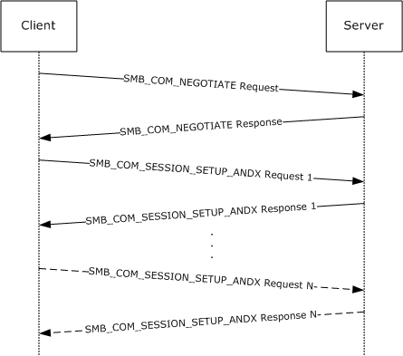

Figure 2: User authentication and session establishment sequence

The diagram illustrates the sequence of events during the protocol negotiation and session establishment process. After the initial SMB_COM_NEGOTIATE command exchange has been completed, the SMB_COM_NEGOTIATE exchange MUST NOT be repeated over the same [**SMB connection**](#gt_smb-connection); otherwise, the server disconnects the client by closing the underlying transport connection. The parameters returned in the SMB_COM_NEGOTIATE response MUST be used when creating new sessions over the same connection.

**Session Setup Roundtrip**

The SMB_COM_NEGOTIATE Server response is processed as described in [MS-CIFS](../MS-CIFS/MS-CIFS.md) section 3.2.5.2. The protocol extensions in this document apply only to the NT LM 0.12 dialect of SMB. For further information on [**SMB dialects**](#gt_smb-dialect), see [MS-CIFS] section 1.7.

If the NT LM 0.12 dialect is successfully negotiated, then the [**SMB**](#gt_server-message-block-smb) client examines the Capabilities field in the SMB_COM_NEGOTIATE server response (section [2.2.4.5.2](#Section_2.2.4.5.2.1)). If the CAP_EXTENDED_SECURITY bit is clear (0x00000000), then the SMB server does not support extended security. In order for authentication to proceed, the SMB client MUST build a non-extended SMB_COM_SESSION_SETUP_ANDX request, and MUST set the **WordCount** field to 0x0d. Authentication then proceeds as described in [MS-CIFS] section 3.2.4.2.4.

If the CAP_EXTENDED_SECURITY bit is set (0x80000000), then the SMB server does support extended security. The SMB client MUST build an SMB_COM_SESSION_SETUP_ANDX request in the extended form, as specified in section [2.2.4.6.1](#Section_3.3.5.3). The request is sent to the SMB server, and the server builds an extended SMB_COM_SESSION_SETUP_ANDX server response (section [2.2.4.6.2](#Section_2.2.4.6.2)). The security BLOB in the session setup response is built as specified in [[RFC2743]](https://go.microsoft.com/fwlink/?LinkId=90378).

Upon receiving the extended SMB_COM_SESSION_SETUP_ANDX server response (section 2.2.4.6.2), the SMB client invokes the local security package to determine whether the session setup request SHOULD be completed, aborted, or continued. A completed session indicates that the server has enough information to establish the session. An aborted session indicates that the server cannot proceed with the session setup because of an error in the information presented by the client, or otherwise. If the session setup has to be continued, the security package on the client and/or server requires an additional roundtrip before the session setup can be established. This is especially true of new security packages that support mutual authentication between the client and server.

In the case of extended security, the SMB protocol does not make the distinction between NTLM and Kerberos; therefore, the sequence defined previously in this section is the same in both cases. If authentication succeeds after a single roundtrip, then only one session setup exchange is required. Otherwise, additional roundtrips will be required.

Each additional roundtrip MUST consist of one SMB_COM_SESSION_SETUP_ANDX client request and one SMB_COM_SESSION_SETUP_ANDX server response. In the sequence diagram, this is represented in the horizontal dotted line that symbolizes additional roundtrips until the final roundtrip, which is represented as SMB_COM_SESSION_SETUP_ANDX Client Request N and SMB_COM_SESSION_SETUP_ANDX Server Response N, where N is a number larger than 1.

All additional [**SMB session**](#gt_smb-session) setup roundtrips follow the same sequence details as Session Setup Roundtrip, as described earlier in this topic.<84>

<a id="Section_3.2.4.2.5"></a>
##### 3.2.4.2.5 Connecting to the Share (Tree Connect)

Processing of this event is handled as specified in [MS-CIFS](../MS-CIFS/MS-CIFS.md) section 3.2.4.2.5, with the following additions:

If a [**tree connect**](#gt_tree-connect) is already established to the target [**share**](#gt_share) in **Client.Connection.TreeConnectTable**, then it SHOULD be reused. If not, then the client creates an SMB_COM_TREE_CONNECT_ANDX request, as specified in section [2.2.4.7.1](#Section_2.2.4.7.1), to connect to the target share.

**Session Key Protection**

The client SHOULD<85> request **Client.Session.SessionKey** protection by setting the TREE_CONNECT_ANDX_EXTENDED_SIGNATURES flag in the **Flags** field of the SMB_COM_TREE_CONNECT_ANDX request to TRUE.

**Extended Information Response**

The client MUST request extended information in the response by setting the TREE_CONNECT_ANDX_EXTENDED_RESPONSE flag in the **Flags** field of the SMB_COM_TREE_CONNECT_ANDX request to TRUE, as defined in section [2.2.4.3.2](#Section_2.2.4.3.2).

The client sends this message to the server.

<a id="Section_3.2.4.3"></a>
#### 3.2.4.3 Application Requests Opening a File

The processing of this event is handled as specified in [MS-CIFS](../MS-CIFS/MS-CIFS.md) sections 3.2.4.5 and 3.2.4.6, with the following additions:

The application can request that additional information be returned for the Open, in particular maximal access information. The client can issue either an SMB_COM_NT_CREATE_ANDX request or an SMB_COM_OPEN_ANDX request to make use of these extensions, as specified in section [3.2.4.3.1](#Section_3.2.4.3.1).<86>

<a id="Section_3.2.4.3.1"></a>
##### 3.2.4.3.1 SMB_COM_NT_CREATE_ANDX Request

To access these extensions, the application can also provide:

- **RequestExtendedResponse:** A BOOLEAN. If TRUE, then it indicates that the application is requesting a server to send an extended response.
If the application is requesting an extended server response, then the client MUST set the NT_CREATE_REQUEST_EXTENDED_RESPONSE flag in the **SMB_Parameters.Flags** field of the request.

For a [**named pipe**](#gt_named-pipe) request, the client MUST set the SYNCHRONIZE bit in the **DesiredAccess** field if the FILE_SYNCHRONOUS_IO_ALERT or FILE_SYNCHRONOUS_IO_NONALERT bit is set in the **CreateOptions** field.

<a id="Section_3.2.4.3.2"></a>
##### 3.2.4.3.2 SMB_COM_OPEN_ANDX Request (deprecated)

To access these extensions, the application can also provide:

- **RequestExtendedResponse:** A BOOLEAN. If TRUE, then it indicates that the application is requesting a server to send an extended response.
If the application is requesting an extended server response, then the client SHOULD<87> set the SMB_OPEN_EXTENDED_RESPONSE flag in the **SMB_Parameters.Flags** field of the request.

<a id="Section_3.2.4.4"></a>
#### 3.2.4.4 Application Requests Reading from a File, Named Pipe, or Device

Processing of this event is handled as specified in [MS-CIFS](../MS-CIFS/MS-CIFS.md) section 3.2.4.14, with the following additions:

The SMB_COM_READ_ANDX command request has been extended as specified below.

**Timeout_or_MaxCountHigh**

The **Timeout** field specified in [MS-CIFS] section 2.2.4.42.1 has been extended to be the **Timeout_or_MaxCountHigh** field. This field is treated as a union of a 32-bit **Timeout** field and a 16-bit unsigned integer named **MaxCountHigh**, as specified in section [2.2.4.2.1](#Section_2.2.4.2.1).

- For pipe reads, the client MUST use **Timeout_or_MaxCountHigh** as the **Timeout** field. The client MUST set the **Timeout** field either to a time-out value in milliseconds, or to 0xFFFFFFFF.<88> The latter value indicates to the server that the operation MUST NOT time out.
- For file reads, the client MUST use this as the **MaxCountHigh** field. If the count of bytes to read is larger than 0xFFFF bytes in length, then the client MUST use the **MaxCountHigh** field to hold the two most significant bytes of the count, thus allowing for a 32-bit read count when combined with **MaxCountOfBytesToReturn** field. If the read count is not larger than 0xFFFF, then the client MUST set **MaxCountHigh** to zero.
<a id="Section_3.2.4.4.1"></a>
##### 3.2.4.4.1 Large Read Support

If the CAP_LARGE_READX bit is set in **Client.Connection.ServerCapabilities**, then the client is allowed to issue a read of a size larger than **Client.Connection.MaxBufferSize** using an SMB_COM_READ_ANDX request. Otherwise, the client MUST split the read into multiple requests in order to retrieve the entire amount of data.<89>

- If a large read is being issued and the object being read is not a file, then the count of bytes to read MUST be placed into the **MaxCountOfBytesToReturn** field. This field is a 16-bit unsigned integer; therefore, the maximum count of bytes that can be read is 0xFFFF bytes (64K - 1 byte).
- If a large read is being issued and the object being read is a file, then the two least significant bytes of the count of bytes to read MUST be placed into the **MaxCountOfBytesToReturn** field and the two most significant bytes of the count MUST be placed into the **MaxCountHigh** field.
<a id="Section_3.2.4.5"></a>
#### 3.2.4.5 Application Requests Writing to a File, Named Pipe, or Device

Processing of this event is handled as specified in [MS-CIFS](../MS-CIFS/MS-CIFS.md) section 3.2.4.15 with the following additions:

The SMB_COM_WRITE_ANDX command request has been extended as specified in section [2.2.4.3.1](#Section_2.2.4.3.1).

Large Write Support

If the CAP_LARGE_WRITEX bit is set in **Client.Connection.ServerCapabilities**, then the client is allowed to issue a write of a size larger than **Client.Connection.MaxBufferSize** using an SMB_COM_WRITE_ANDX request. Otherwise, it MUST split the write into multiple requests to write the entire amount of data.

If the CAP_LARGE_WRITEX bit is set in **Client.Connection.ServerCapabilities**, and the client is issuing a write of a size larger than **Client.Connection.MaxBufferSize**, the client MUST ensure that the total length of the SMB packet does not exceed the maximum packet length allowed by the underlying transport, as specified in section [2.1](#Section_2.1).

If the count of bytes to be written is greater than or equal to 0x00010000 (64K), then the client MUST set the two least significant bytes of the count in the **DataLength** field of the request and the two most significant bytes of the count in the **DataLengthHigh** field.

<a id="Section_3.2.4.6"></a>
#### 3.2.4.6 Application Requests a Directory Enumeration

Processing of this event is handled as specified in [MS-CIFS](../MS-CIFS/MS-CIFS.md) section 3.2.4.27, with the following additions:

The TRANS2_FIND_FIRST2 subcommand request has been extended as specified below.

New Information Levels

To request the new [**Information Levels**](#gt_information-level) specified in section [2.2.6.1.1](#Section_2.2.6.1.1), the client MUST set the **InformationLevel** field of the TRANS2_FIND_FIRST2 request to the corresponding Information Level.

Enumerating Previous Versions

An application is allowed to request an enumeration of available previous versions of a file or directory using a TRANS2_FIND_FIRST2 request (see section [2.2.1.1.1](#Section_2.2.1.1.1)). To do this, the request MUST have the [**@GMT token**](#gt_gmt-token) wildcard, @GMT-*, as part of the search pattern in the **FileName** field and it MUST use the SMB_FIND_FILE_BOTH_DIRECTORY_INFO Information Level. This extension is not available for Information Levels other than SMB_FIND_FILE_BOTH_DIRECTORY_INFO. The client MAY<90> fail such requests or simply send the requests to the server. Because it is a path-based operation, this request follows the same previous version token parsing rules as specified in section [3.2.4.1.1](#Section_3.2.4.1.1).

The message is sent to the server.

<a id="Section_3.2.4.7"></a>
#### 3.2.4.7 Application Requests Querying File Attributes

Processing of this event is handled as specified in [MS-CIFS](../MS-CIFS/MS-CIFS.md) section 3.2.4.12, with the following additions:

**Pass-through Information Levels**

The extension adds support for pass-through [**Information Levels**](#gt_information-level), as defined in section [2.2.2.3.5](#Section_2.2.2.3.5). If the CAP_INFOLEVEL_PASSTHRU bit in **Client.Connection.ServerCapabilities** is set, the client MUST increment the Information Level value by SMB_INFO_PASSTHROUGH (0x03e8) and place the resulting value in the **InformationLevel** field of a TRANS2_QUERY_FILE_INFORMATION or TRANS2_QUERY_PATH_INFORMATION request.

**File Streams**

A client can send a TRANS2_QUERY_FILE_INFORMATION subcommand of the [SMB_COM_TRANSACTION2 request](#Section_3.2.5.11) to the server with the **InformationLevel** field set to SMB_QUERY_FILE_STREAM_INFO (see [MS-CIFS] section 2.2.6.8). If the [**FID**](#gt_fid) field in the client request is on an [**SMB**](#gt_server-message-block-smb) [**share**](#gt_share) that does not support [**streams**](#gt_stream), then the server MUST fail the request with STATUS_INVALID_PARAMETER.

A client can send a TRANS2_QUERY_PATH_INFORMATION subcommand of the SMB_COM_TRANSACTION2 request to the server with the **InformationLevel** field set to SMB_QUERY_FILE_STREAM_INFO (see [MS-CIFS] section 2.2.6.6.2). If the **FileName** field in the client request is on an SMB share that does not support streams, then the server MUST fail the request with STATUS_INVALID_PARAMETER.

Previous Version Tokens

Because the TRANS2_QUERY_PATH_INFORMATION subcommand request is a path-based operation, the path SHOULD be scanned for previous version tokens by the client, as specified in section [3.2.4.1.1](#Section_3.2.4.1.1).

<a id="Section_3.2.4.8"></a>
#### 3.2.4.8 Application Requests Setting File Attributes

Processing of this event is handled as specified in [MS-CIFS](../MS-CIFS/MS-CIFS.md) section 3.2.4.13, with the following additions:

**Pass-Through Information Levels**

The extension adds support for pass-through **Information Levels**, as defined in section [2.2.2.3.5](#Section_2.2.2.3.5). If the CAP_INFOLEVEL_PASSTHRU bit in **Client.Connection.ServerCapabilities** is set the client MUST increment the level value by SMB_INFO_PASSTHROUGH (0x03e8) and place the resulting value in the **InformationLevel** field of a TRANS2_SET_FILE_INFORMATION or TRANS2_SET_PATH_INFORMATION request. The serialized native structure is placed in the Trans2_Data block of the request and the **SMB_Parameters.TotalDataCount** is set to the length of this buffer.

**Previous Version Tokens**

Because the TRANS2_SET_PATH_INFORMATION subcommand request is a path-based operation, the path SHOULD be scanned for previous version tokens by the client, as specified in section [3.2.4.1.1](#Section_3.2.4.1.1).

<a id="Section_3.2.4.9"></a>
#### 3.2.4.9 Application Requests Querying File System Attributes

The processing of this event is handled as specified in [MS-CIFS](../MS-CIFS/MS-CIFS.md) section [2.2.2.3.5](#Section_2.2.2.3.5), with the following additions:

Support of pass-through [**Information Levels**](#gt_information-level) for the querying file system attributes through the use of the TRANS2_QUERY_FS_INFORMATION subcommand is defined in section 2.2.2.3.5. If the CAP_INFOLEVEL_PASSTHRU bit in **Client.Connection.ServerCapabilities** is set, the client MUST increment the Information Level value by SMB_INFO_PASSTHROUGH (0x03e8) and place the resulting value in the **InformationLevel** field of a TRANS2_QUERY_FS_INFORMATION request.

<a id="Section_3.2.4.10"></a>
#### 3.2.4.10 Application Requests Setting File System Attributes

The application MUST provide the following:

- An **Open** that identifies a file on the file system that will have its attributes set.
- The [**Information Level**](#gt_information-level) that defines the format of the data to set. Valid Information Levels are specified in [MS-FSCC](../MS-FSCC/MS-FSCC.md) section 2.5.
- A buffer that contains the attribute data to be set on the server. The buffer is formatted as specified in the subsection of [MS-FSCC] section 2.5 that corresponds to the Information Level supplied by application.
This operation supports the use of pass-through Information Levels only. If the CAP_INFOLEVEL_PASSTHRU flag in **Client.Connection.ServerCapabilities** is not set, then the client MUST fail the request and return the error code STATUS_NOT_SUPPORTED to the calling application.

The client MUST construct a TRANS2_SET_FS_INFORMATION subcommand request, as specified in section [2.2.6.4.1](#Section_2.2.6.4.1).

The client MUST use **Open.TreeConnect** and **Open.Session** to send the request to the server. The request MUST be sent to the server, as specified in section [3.2.4.1](#Section_3.2.4.1).

<a id="Section_3.2.4.11"></a>
#### 3.2.4.11 Application Requests Sending an I/O Control to a File or Device

Processing of this event is handled as specified in [MS-CIFS](../MS-CIFS/MS-CIFS.md) section 3.2.4.22, with the following additions:

A list of [**FSCTLs**](#gt_file-system-control-fsctl) is specified in [MS-FSCC](../MS-FSCC/MS-FSCC.md) section 2.3. Three I/O control codes specific to the extension are described in the following subsections.

<a id="Section_3.2.4.11.1"></a>
##### 3.2.4.11.1 Application Requests Enumerating Available Previous Versions

An application can request that a client retrieve an enumeration of available previous version time stamps for a [**share**](#gt_share) by issuing the FSCTL_SRV_ENUMERATE_SNAPSHOTS control code, as specified in section [2.2.7.2.1](#Section_2.2.7.2.1).<91> The request is sent to the server.

<a id="Section_3.2.4.11.2"></a>
##### 3.2.4.11.2 Performing a Server-Side Data Copy

An outline of the steps taken for a server-side data copy follows. The application first requests the FSCTL_SRV_REQUEST_ RESUME_KEY operation and the client issues the request to the server as specified in section [3.2.4.11.2.1](#Section_3.2.4.11.2.1). The client then returns the [**Copychunk Resume Key**](#gt_copychunk-resume-key) received from the server to the application. The application then requests the FSCTL_SRV_COPYCHUNK operation and the client issues the request to the server as specified in section [3.2.4.11.2.2](#Section_3.2.4.11.2.2). The client then returns the status received from the server to the application.

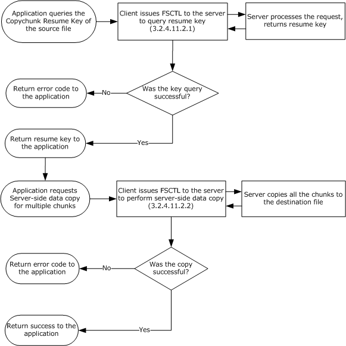

Figure 3: Server-side data copy of an entire file

<a id="Section_3.2.4.11.2.1"></a>
###### 3.2.4.11.2.1 Application queries the Copychunk Resume Key of the Source File

The application provides a handle to the **Open** representing the source file.

To request a [**Copychunk Resume Key**](#gt_copychunk-resume-key) for an open file, the client constructs an NT_TRANSACT_IOCTL FSCTL_SRV_REQUEST_ RESUME_KEY request, as specified in section [2.2.7.2.1](#Section_2.2.7.2.1). The [**Fid**](#gt_fid) of the source file (**Open.FID**) is placed in the **FID** field of the client request along with the FSCTL_SRV_REQUEST_RESUME_KEY function code. No **NT_Trans_Data** block is required. The request is sent to the server and the server's response is processed as specified in section [3.2.5.9.1.1](#Section_3.2.5.9.1.1).

<a id="Section_3.2.4.11.2.2"></a>
###### 3.2.4.11.2.2 Application requests a Server-side Data Copy

The application provides:

- A handle to the **Open** representing the destination file.
- [**Copychunk Resume Key**](#gt_copychunk-resume-key) of the source file.
- List of source and destination offsets and the lengths of data blocks to copy from the source file.
To request a server-side copy of a data range, the client constructs an NT_TRANSACT_IOCTL FSCTL_SRV_COPYCHUNK request, as specified in section [2.2.7.2.1](#Section_2.2.7.2.1). The [**Fid**](#gt_fid) of the destination file (**Open.FID**) is placed in the **FID** field of the request along with the FSCTL_SRV_COPYCHUNK function code.

The NT_Trans_Data buffer of the request is constructed as follows:

- **CopychunkResumeKey** is set to the application-provided resume key.
- **CopyChunkList** is set to a list of SRV_COPYCHUNK structures (section [2.2.7.2.1.1](#Section_2.2.7.2.1.1)), where each structure is filled with the application-supplied source and destination offsets and the length of each data block.
- **ChunkCount** is set to the total number of the data blocks supplied by the application.
The request is sent to the server and the server’s response is processed as specified in section [3.2.5.9.1.2](#Section_3.2.5.9.1.2).

<a id="Section_3.2.4.12"></a>
#### 3.2.4.12 Application Requests Querying of DFS Referral

Processing of this event is handled as specified in [MS-CIFS](../MS-CIFS/MS-CIFS.md) section 3.2.4.44.<92>

<a id="Section_3.2.4.13"></a>
#### 3.2.4.13 Application Requests Querying User Quota Information

The application MUST provide:

- A valid **Open** to a file or directory on a [**share**](#gt_share). The quota information on the object store that underlies the file or directory is the quota information to be queried.
- A buffer to receive the quota information and the maximum number of bytes to receive.
- **RestartScan:** A **BOOLEAN** that indicates whether or not a scan on the volume is to be restarted.
- **ReturnSingleEntry:** A **BOOLEAN**. If TRUE, then the server MUST return a single user quota information entry.
- A security identifier ([**SID**](#gt_security-identifier-sid)) list, a start SID, or no SID. If the application provides both an SID list and a start SID, then the client MUST fail the request with STATUS_INVALID_PARAMETER.
The client MUST construct an NT_TRANSACT_QUERY_QUOTA subcommand request, as specified in section [2.2.7.5.1](#Section_2.2.7.5), with the following additional requirements:

- **NT_Trans_Parameters.FID** MUST be set to the [**Fid**](#gt_fid) of the application-supplied Open.
- **NT_Trans_Parameters.ReturnSingleEntry** MUST be set to the value of the application-supplied **ReturnSingleEntry** BOOLEAN.
- **NT_Trans_Parameters.RestartScan** MUST be set to the value of the application-supplied RestartScan BOOLEAN.
- The **NT_Trans_Data.SidList** field is set to either the application-supplied SID list or start **SID**. If neither were supplied, then this field is not included.
- The NT_Trans_Parameters fields of **SidListLength**, **StartSidLength**, and **StartSidOffset** MUST be set according to the following rules:
- If the application provides a SID list (a list of SIDs that represents users whose quota information is to be queried), then the client MUST set the **SidList** field of the request to this list and set **SidListLength** to the length of the list. In this case, **StartSidLength** and **StartSidOffset** MUST be zero.
- If the application provides a start SID (a single SID that indicates to the server where to start user quota information enumeration), then the client MUST set **StartSidLength** to the length of the SID and **StartSidOffset** to the offset in bytes of the **NT_Trans_Data.SidList** field relative to the start of the [**SMB**](#gt_server-message-block-smb) header. In this case, **SidListLength** MUST be zero.
- If the application does not provide a SID list or a start SID, then **StartSidLength**, **StartSidOffset**, and **SidListLength** MUST be zero. If the application provides both a SID list and a start SID, then the client MUST fail the request and return the error code STATUS_INVALID_PARAMETER to the calling application.
The request is sent to the server.

<a id="Section_3.2.4.14"></a>
#### 3.2.4.14 Application Requests Setting User Quota Information

The application MUST provide:

- A valid Open to a file or directory on a [**share**](#gt_share). The quota information of the object store that underlies the file or directory is the quota information to be modified.
- A list of the security identifiers ([**SIDs**](#gt_security-identifier-sid), representing users) and their associated quota information to be set.
The client MUST construct an NT_TRANSACT_SET_QUOTA subcommand request, as specified in section [2.2.7.6.1](#Section_2.2.7.6.1), with the following additional parameters:

- **NT_Trans_Parameters.FID** MUST be set to the [**Fid**](#gt_fid) of the application-supplied Open.
- The application-supplied list of SIDs and associated user quota information MUST be set as the contents of the NT_Trans_Data block, as specified in section 2.2.7.6.1.
The client sends the request to the server.

<a id="Section_3.2.4.15"></a>
#### 3.2.4.15 Application Requests the Session Key for a Connection

An application provides one of the following:

- An **Open** to a file or pipe.
OR

- An [**SMB**](#gt_server-message-block-smb) [**session**](#gt_session) that identifies an authenticated connection to the server.
If an Open was supplied by the caller, then **Client.Open.Session** MUST be used.

If a **Session** is found, but **Client.Session.AuthenticationState** is not *Valid*, then an implementation-specific error MUST be returned to the caller that indicates that the session key is not available.

If a session is found and **Client.Session.AuthenticationState** is *Valid*, but **Client.Session.SessionKeyState** is *Unavailable*, then the request MUST be failed with STATUS_ACCESS_DENIED.

If a session is found, **Client.Session.AuthenticationState** is *Valid*, and **Client.Session.SessionKeyState** is *Available*, then the first 16-bytes of **Client.Session.SessionKey** MUST be returned to the calling application.

<a id="Section_3.2.5"></a>
### 3.2.5 Message Processing Events and Sequencing Rules

<a id="Section_3.2.5.1"></a>
#### 3.2.5.1 Receiving Any Message

In addition to the global processing rules for a client that receives any message, as specified in [MS-CIFS](../MS-CIFS/MS-CIFS.md) section 3.2.5.1, the following processing rules apply to the extensions presented in this document.

**Signing**

If a message is received and Client.Connection.IsSigningActive is TRUE for the connection, the client uses **Client.Connection.ClientResponseSequenceNumber[PID,MID]** as the sequence number in signature verification, as specified in section [3.1.5.1](../MS-CIFS/MS-CIFS.md). If signature verification fails, then the message MUST be discarded and not processed. The client SHOULD disconnect the underlying connection and tear down all states associated with this connection. If the message is an oplock break, the signature is never verified, as specified in [MS-CIFS] section 3.2.5.42.

**Session Expiration and Re-authentication**

If the request passed a valid authenticated [**session**](#gt_session) identifier in the **SMB_Header.UID** field and the status code in the [**SMB**](#gt_server-message-block-smb) header of the response is STATUS_NETWORK_SESSION_EXPIRED, then the client MUST look up the **Client.Connection.SessionTable [UID]**, set **Client.Session.AuthenticationState** to Expired, and attempt to re-authenticate this session. Re-authentication follows the steps as specified in section [3.2.4.2.4](#Section_3.2.4.2.4.1), except that the UID sent in the SMB header of the SMB_COM_SESSION_SETUP_ANDX request MUST be set to the UID that represents the expired Session. Also, as described in section [3.2.5.3](#Section_3.2.5.3), the existing Client.Session.SessionKey MUST NOT be modified during re-authentication after a session expiry.

If the authentication fails, then the resulting error code MUST be returned for whichever operation failed with STATUS_NETWORK_SESSION_EXPIRED and the session associated with this UID is removed from the **Client.Connection.SessionTable**. If authentication succeeds, then the client MUST set **Client.Session.AuthenticationState** to Valid and retry the operation that failed with STATUS_NETWORK_SESSION_EXPIRED.

<a id="Section_3.2.5.2"></a>
#### 3.2.5.2 Receiving an SMB_COM_NEGOTIATE Response

Processing of an [SMB_COM_NEGOTIATE response](#Section_3.2.5.2) is handled as specified in [MS-CIFS](../MS-CIFS/MS-CIFS.md) section 3.2.5.2 with the following additions:

Storing extended security token and ServerGUID

If the capabilities returned in the SMB_COM_NEGOTIATE response include CAP_EXTENDED_SECURITY, then the response MUST take the form defined in section [2.2.4.5.2](#Section_2.2.4.5.2.1), and the client MUST set the **Client.Connection.GSSNegotiateToken** to the value returned in the **SecurityBlob** field in the SMB_COM_NEGOTIATE server response.<93> If **SecurityBlobLength** is 0, then client-initiated authentication, with an authentication protocol of the client's choice, will be used instead of server-initiated SPNEGO authentication as described in [MS-AUTHSOD](#Section_1.3) section 2.1.2.2. The client MUST also set the **Client.Connection.ServerGUID** to the value returned in the **ServerGUID** field in the SMB_COM_NEGOTIATE server response.<94>

<a id="Section_3.2.5.3"></a>
#### 3.2.5.3 Receiving an SMB_COM_SESSION_SETUP_ANDX Response

The processing of an [SMB_COM_SESSION_SETUP_ANDX response](#Section_2.2.4.6.2) is handled as specified in [MS-CIFS](../MS-CIFS/MS-CIFS.md) section 3.2.5.3 with the following additions:

**Extended Security Authentication**

If **Client.Connection.ServerCapabilities** has the CAP_EXTENDED_SECURITY bit set, then the client MUST reject any SMB_COM_SESSION_SETUP_ANDX responses that do not take the form specified in section 2.2.4.6.2. If the **Status** field of the [**SMB**](#gt_server-message-block-smb) header is not STATUS_SUCCESS and is not STATUS_MORE_PROCESSING_REQUIRED, then the authentication has failed and the error code MUST be propagated back to the application that initiated the connection attempt. Otherwise, if there is no entry in **Client.Connection.SessionTable** for the UID in the response, then one MUST be created with the following additional requirements:

- **Client.Session.SessionUID** MUST be set to the UID in the response.
- **Client.Session.AuthenticationState** MUST be set to InProgress.
- **Client.Session.UserCredentials** MUST be set to the authentication credentials of the user that initiated the authentication attempt.
- **Client.Session.SessionKey** MUST be set to zero.
- **Client.Session.SessionKeyState** MUST be set to Unavailable.
The client MUST then process the GSS token (the **SecurityBlob** field of the response with its length given in the **SecurityBlobLength** field).<95> The client MUST use the configured GSS authentication protocol to obtain the next GSS token for the authentication exchange. Based on the status code received in the response and the result from the GSS authentication protocol, one of the following actions MUST be taken:

- If the GSS authentication protocol indicates an error, then the error MUST be returned to the calling application that initiated the connection.
- If the **Status** field of the response contains STATUS_SUCCESS and the GSS authentication protocol does not indicate an error, then authentication is complete. The **Client.Session.AuthenticationState** MUST be set to Valid and the **Client.Session.SessionKey** MUST be set using the value queried from the GSS protocol. For information about how this is calculated for Kerberos authentication via Generic Security Service Application Programming Interface (GSS-API), see [MS-KILE](../MS-KILE/MS-KILE.md). The client MUST set **Client.Session.SessionKeyState** to Available.
- If the **Status** field of the response contains STATUS_MORE_PROCESSING_REQUIRED and the GSS authentication protocol did not indicate an error, then the client MUST create an [SMB_COM_SESSION_SETUP_ANDX request (section 2.2.4.6.1)](#Section_3.3.5.3) with the following parameters:
- The client MUST set CAP_EXTENDED_SECURITY in the **Capabilities** field and set SMB_FLAGS2_EXTENDED_SECURITY in the SMB header **Flags2** field.
- The **SecurityBlob** and **SecurityBlobLength** fields MUST be set to the output token and its length returned by the GSS protocol.
- The **SMB_Header.UID** field MUST be set to the value of the **SMB_Header.UID** field received in the SMB_COM_SESSION_SETUP_ANDX response.
- This message MUST be sent to the server, and further processing listed in the remainder of this section is not necessary.
**NTLM Authentication**

If the CAP_EXTENDED_SECURITY bit in **Client.Connection.ServerCapabilities** is not set, then the client processes the response.<96> If the **Status** field of the response does not contain STATUS_SUCCESS, then the client MUST propagate the error to the application that initiated the authentication. The connection MUST remain open for the client to attempt another authentication.

If the **Status** field of the response contains STATUS_SUCCESS, then authentication was successful. The client associates the returned **SMB_Header.UID** of the response with this user for further requests, as specified in [MS-CIFS]. The **Client.Session.AuthenticationState** MUST be set to Valid. If the **Client.Session.SessionKey** is zero, then the client MUST query the authentication package for the 16-byte [**session**](#gt_session) key, as specified in [MS-NLMP](../MS-NLMP/MS-NLMP.md), and set **Client.Session.SessionKey** to the returned value. If **Client.Session.SessionKey** is non-zero, then the client MUST NOT overwrite the existing session key. The client MUST set **Client.Session.SessionKeyState** to Available.

**Activating Signing**

If authentication has completed successfully, **Client.Connection.IsSigningActive** is FALSE, and the targeted behavior for this connection is signed according to the description in section [3.2.4.2.3](#Section_3.2.4.2.3), then the client MUST determine whether signing is required to be activated.

To determine whether signing is required to be active, the user [**security context**](#gt_security-context) that completed authentication is verified. If the user that authenticated is a guest or is anonymous, then signing MUST NOT be activated. Guest authentication is indicated by bit zero in the **Action** field of the SMB_COM_SESSION_SETUP_ANDX response being set. Anonymous authentication is indicated by the fact that no credentials are provided.

If neither of these conditions are true, then the client MUST activate signing as follows:

- If CAP_EXTENDED_SECURITY is set in **Client.Connection.ServerCapabilities**, the client MUST use GSS-API to query the session key used in this authentication and store the ExportedSessionKey returned by GSS-API into **Client.Connection.SigningSessionKey**. The client MUST set **Client.Connection.SigningChallengeResponse** to NULL.
- If CAP_EXTENDED_SECURITY is not set in **Client.Connection.ServerCapabilities**, the client MUST use NTLM to query the session key used in this authentication.
- For NTLMv1 – the client MUST store SessionBaseKey, returned by the **NTOWFv1** function defined in [MS-NLMP] section 3.3.1, into **Client.Connection.SigningSessionKey**.
- For NTLMv2 – the client MUST store SessionBaseKey, returned by the **NTOWFv2** function defined in [MS-NLMP] section 3.3.2, into **Client.Connection.SigningSessionKey**.
The client MUST set **Client.Connection.SigningChallengeResponse** to the challenge response that is sent in the SMB_COM_SESSION_SETUP_ANDX request.

Once these steps are completed, the client MUST verify the signature of this response. The client follows the steps specified in section [3.1.5.1](#Section_3.1.5.1), by passing in a sequence number of one because this is the first signed packet.

<a id="Section_3.2.5.4"></a>
#### 3.2.5.4 Receiving an SMB_COM_TREE_CONNECT_ANDX Response

The processing of an [SMB_COM_TREE_CONNECT_ANDX Response](#Section_2.2.6.4.2) is handled as specified in [MS-CIFS](../MS-CIFS/MS-CIFS.md) section 3.2.5.4 with the following additions:

**Requesting Extended Information**

The client MUST determine whether or not the server returned an extended response, as specified in section [2.2.4.7](#Section_2.2.4.7). The client does this by determining whether or not the **WordCount** is equal to 0x07. If it is, then the client MUST make the new extended information available to the calling application by using the **SMB_Header.TID** value to set **Client.Connection.TreeConnectTable[TID].MaximalShareAccessRights** and **Client.Connection.TreeConnectTable[TID].GuestMaximalShareAccessRights** to the values that are in the response fields of **SMB_Parameters.Words.MaximalShareAccessRights** and **SMB_Parameters.Words.GuestMaximalShareAccessRights**, respectively.

**Session Key Protection**

If the response status is STATUS_SUCCESS and the SMB_EXTENDED_SIGNATURE bit is set in the **OptionalSupport** field of the SMB_COM_TREE_CONNECT_ANDX response, then the client MUST hash the session key of the calling user. This protects the key that is used for signing by making it unavailable to the calling applications.

The one-way hash MUST be performed on **Client.Session.SessionKey** that uses the HMAC-MD5 algorithm, as specified in [[RFC2104]](https://go.microsoft.com/fwlink/?LinkId=90314). The steps are as follows:

- Take the 16-byte user session key from **Client.Session.SessionKey**.
- If this is an LM authentication where the session key is only 8 bytes, then zero extend it to 16 bytes.
- If the session key is more than 16 bytes, then use only the first 16 bytes.
- Calculate the one-way hash as follows:
CALL hmac_md5( SSKeyHash, 256, session key, session key length, digest )

SET user session key = digest

The resulting 16-byte digest is treated as the user's new session key and is returned to the caller who requests it. SSKeyHash is the well-known constant array that is described in section [2.2.2.5](#Section_2.2.2.5).

After the session key has been hashed, the client MUST place the hash into **Client.Session.SessionKey** and set **Client.Session.SessionKeyState** to Available, which allows applications to query the session key.

If the TREE_CONNECT_ANDX_EXTENDED_SIGNATURE bit is not set, then the **Client.Session.SessionKey** is not changed and **Client.Session.SessionKeyState** MUST be set to Available.

<a id="Section_3.2.5.5"></a>
#### 3.2.5.5 Receiving an SMB_COM_NT_CREATE_ANDX Response

The processing of an SMB_COM_NT_CREATE_ANDX response is handled as specified in [MS-CIFS](../MS-CIFS/MS-CIFS.md) section 3.2.5.36 with the following additions:

The client MUST determine whether the server returned an extended response, as specified in section [2.2.4.9.2](#Section_2.2.4.9.2). It does this by checking for a proper **WordCount** value. If **WordCount** is not equal to 0x2A, then the client MUST process the response as specified in [MS-CIFS] section 3.2.5.36. Otherwise, the extended information that is specified in section 2.2.4.9.2 MUST also be propagated back to the calling application.

<a id="Section_3.2.5.6"></a>
#### 3.2.5.6 Receiving an SMB_COM_OPEN_ANDX Response

The processing of an SMB_COM_OPEN_ANDX response is handled as specified in [MS-CIFS](../MS-CIFS/MS-CIFS.md) section 3.2.5.25 with the following additions:

The client MUST determine whether or not the server returned an extended response, as specified in section [2.2.4.1.2](#Section_2.2.4.1.2). It does this by checking whether or not the **WordCount** is equal to 0x13. If the response is not an extended response, then the client MUST process the response as specified in [MS-CIFS] section 3.2.5.25. If the response is an extended response, then the new information specified in section 2.2.4.1.2 MUST be propagated back to the calling application.

<a id="Section_3.2.5.7"></a>
#### 3.2.5.7 Receiving an SMB_COM_READ_ANDX Response

The processing of an SMB_COM_READ_ANDX response is handled as specified in [MS-CIFS](../MS-CIFS/MS-CIFS.md) section 3.2.5.26 with the following additions:

The first two bytes of the **SMB_Parameters.Words.Reserved2[]** field, specified in [MS-CIFS] section 2.2.4.42.2, are interpreted as the 16-bit **DataLengthHigh** field (specified in section [2.2.4.2.2](#Section_2.2.4.2.2)). The remaining 8 bytes of **Reserved2[]** remain unused and MUST be ignored by the client. The **DataLengthHigh** field MUST contain the two most-significant bytes of a 32-bit length count of bytes read from the server.

<a id="Section_3.2.5.8"></a>
#### 3.2.5.8 Receiving an SMB_COM_WRITE_ANDX Response

The processing of an SMB_COM_WRITE_ANDX response is handled as specified in [MS-CIFS](../MS-CIFS/MS-CIFS.md) section 3.2.5.27 with the following additions:

The 16-bit **SMB_Parameters.Words.Reserved** field, specified in [MS-CIFS] section 2.2.4.43.2, is now interpreted as a 16-bit **CountHigh** field followed by an 8-bit **Reserved** field. The **CountHigh** field MUST contain the two most-significant bytes of a 32-bit count of bytes written by the server.

<a id="Section_3.2.5.9"></a>
#### 3.2.5.9 Receiving any SMB_COM_NT_TRANSACT Response

The processing of any SMB_COM_NT_TRANSACT response is handled as specified in [MS-CIFS](../MS-CIFS/MS-CIFS.md) section 3.2.5.40.

<a id="Section_3.2.5.9.1"></a>
##### 3.2.5.9.1 Receiving an NT_TRANSACT_IOCTL Response

The processing of an NT_TRANSACT_IOCTL response is handled as specified in [MS-CIFS](../MS-CIFS/MS-CIFS.md) section 3.2.5.40.2 with the following additions.

<a id="Section_3.2.5.9.1.1"></a>
###### 3.2.5.9.1.1 Receiving an FSCTL_SRV_REQUEST_RESUME_KEY Function Code

If the response indicates that an error occurred, then the client MUST propagate the error to the application that initiated the call.

If the response indicates that the operation is successful, then the client MUST return the [**copychunk resume key**](#gt_copychunk-resume-key) that is received in the Data block of the response to the application that initiated the call.

<a id="Section_3.2.5.9.1.2"></a>
###### 3.2.5.9.1.2 Receiving an FSCTL_SRV_COPYCHUNK Function Code

The success or failure code MUST be returned to the calling application. The FSCTL_SRV_COPYCHUNK response (section [2.2.7.2.2](#Section_2.2.7.2.2.2)) MUST also be returned to the calling application in both success and failure situations.

<a id="Section_3.2.5.9.2"></a>
##### 3.2.5.9.2 Receiving an NT_TRANSACT_QUERY_QUOTA Response

If the response indicates an error occurred, then the client MUST propagate the error to the application that initiated the call.

If the response indicates the operation is successful, then the client MUST return the information received in the Data block of the response to the application that initiated the call.

<a id="Section_3.2.5.9.3"></a>
##### 3.2.5.9.3 Receiving an NT_TRANSACT_SET_QUOTA Response

The client MUST propagate the success or failure code in the response to the application that initiated the call.

<a id="Section_3.2.5.10"></a>
#### 3.2.5.10 Receiving an SMB_COM_SEARCH Response

The processing of an SMB_COM_SEARCH response is handled as specified in [MS-CIFS](../MS-CIFS/MS-CIFS.md) section 3.2.5.33.

<a id="Section_3.2.5.11"></a>
#### 3.2.5.11 Receiving any SMB_COM_TRANSACTION2 subcommand Response

Aside from the following subcommand responses, all other SMB_COM_TRANSACTION2 subcommand responses are handled as specified in [MS-CIFS](../MS-CIFS/MS-CIFS.md) section 3.2.5.39.

<a id="Section_3.2.5.11.1"></a>
##### 3.2.5.11.1 Receiving any TRANS2_SET_FS_INFORMATION Response

The client MUST propagate the success or failure code in the response to the application that initiated the call.

<a id="Section_3.2.6"></a>
### 3.2.6 Timer Events

There are no new client timers other than those specified in [MS-CIFS](../MS-CIFS/MS-CIFS.md) section 3.2.6.

<a id="Section_3.2.7"></a>
### 3.2.7 Other Local Events

There are no new client local events other than those specified in [MS-CIFS](../MS-CIFS/MS-CIFS.md) section 3.2.7.

<a id="Section_3.3"></a>
## 3.3 Server Details

<a id="Section_3.3.1"></a>
### 3.3.1 Abstract Data Model

This section specifies a conceptual model of possible data organization that an implementation maintains in order to participate in this protocol. The described organization is provided to explain how the protocol behaves. This document does not mandate that implementations adhere to this model as long as their external behavior is consistent with what is described in this document.

The following elements extend the client abstract data model specified in [MS-CIFS](../MS-CIFS/MS-CIFS.md) section 3.3.1.

<a id="Section_3.3.1.1"></a>
#### 3.3.1.1 Global

**ServerStatistics**: Server statistical information. This contains all the members of the **STAT_SERVER_0** structure, as specified in [MS-SRVS](../MS-SRVS/MS-SRVS.md) section 2.2.4.39.

**Server.MessageSigningPolicy**: This ADM element is extended from the specification in [MS-CIFS](../MS-CIFS/MS-CIFS.md) section 3.3.1.1 to include a new possible value:

- Declined -- Message signing is disabled unless the other party requires it. If the other party requires message signing, then it MUST be used. Otherwise, message signing MUST NOT be used.
**Server.SupportsExtendedSecurity**: A flag that indicates whether or not this node supports Generic Security Services (GSS), as specified in [[RFC2743]](https://go.microsoft.com/fwlink/?LinkId=90378), for selecting the authentication protocol.

**Server.IsDfsCapable**: A Boolean that, if set, indicates that the server supports the Distributed File System.

**Server.MaxCopyChunks**: The maximum number of chunks the server will accept in a server-side data copy operation.

**Server.MaxCopyChunkSize**: The maximum number of bytes the server will accept in a single chunk for a server-side data copy operation.

**Server.MaxTotalCopyChunkSize**: The maximum total number of bytes the server will accept for a server-side data copy operation.

**Server.CopyChunkTimeOut**: The amount of time for which the server restricts the processing of a single server-side data copy operation.

<a id="Section_3.3.1.2"></a>
#### 3.3.1.2 Per Share

**Server.Share.ShareFlags:** A **DWORD** bitmask value that MUST contain zero or more of the values, as specified in [MS-SRVS](../MS-SRVS/MS-SRVS.md) section 2.2.2.5.

**Server.Share.IsDfs**: A Boolean that, if set, indicates that this share is configured for DFS. For more information, see [[MSDFS]](https://go.microsoft.com/fwlink/?LinkId=89945).

**Server.Share.SnapshotList**: The list of available [**snapshots**](#gt_snapshot).

<a id="Section_3.3.1.3"></a>
#### 3.3.1.3 Per SMB Connection

**Server.Connection.GSSNegotiateToken:** A byte array that contains the token received during an extended security negotiation and that is remembered for authentication.

<a id="Section_3.3.1.4"></a>
#### 3.3.1.4 Per Pending SMB Command

There is no new state introduced per pending [**SMB command**](#gt_smb-command).

<a id="Section_3.3.1.5"></a>
#### 3.3.1.5 Per SMB Session

**Server.Session.AuthenticationState:** A [**session**](#gt_session) can be in one of four states:

- **InProgress**: A session setup (an extended SMB_COM_SESSION_SETUP_ANDX exchange, as described in section [3.2.4.2.4.1](#Section_3.2.4.2.4.1)) is in progress for this session for the first time.
- **Valid**: The session is valid and a session key and UID are available for this session.
- **Expired**: The Kerberos ticket for this session has expired and the session needs to be re-established.
- **ReauthInProgress**: A session setup (an extended SMB_COM_SESSION_SETUP_ANDX exchange, as described in section 3.2.4.2.4.1) is in progress for re-authentication of an expired or valid session.
**Server.Session.SessionKeyState:** The session key state. This can be either Unavailable or Available.

**Server.Session.AuthenticationExpirationTime**: A value that specifies the time at which the session will be expired.

<a id="Section_3.3.1.6"></a>
#### 3.3.1.6 Per Tree Connect

**Server.TreeConnect.Share**: The share on which this tree connect was established.

**Server.TreeConnect.Share.LocalPath**: Local path of **Server.TreeConnect.Share** on the server.

**Server.TreeConnect.MaximalAccess**: Access rights for the user that established the [**tree connect**](#gt_tree-connect) on **Server.TreeConnect.Share**, in the format specified in section [2.2.1.4](#Section_2.2.1.4).

<a id="Section_3.3.1.7"></a>
#### 3.3.1.7 Per Unique Open

**Server.Open.GrantedAccess:** The access level granted on this Open.

<a id="Section_3.3.2"></a>
### 3.3.2 Timers

<a id="Section_3.3.2.1"></a>
#### 3.3.2.1 Authentication Expiration Timer

The Authentication Expiration Timer, a re-authentication timer, is used to mark an authentication as expired when its authentication-specific expiration time is reached. This timer controls the periodic scheduling of searching for [**sessions**](#gt_session) that have passed their Authentication expiration time. The server SHOULD<97> schedule this timer such that sessions are expired in a timely manner.

<a id="Section_3.3.3"></a>
### 3.3.3 Initialization

The Authentication Expiration Timer, as specified in section [3.3.2.1](#Section_3.3.2.1), MUST be started at system startup. The following values MUST be initialized at system startup:

- **Server.MessageSigningPolicy** and **Server.SupportsExtendedSecurity** MUST be set based on system policy.<98> The value of this is not constrained by the values of any other policies.
- **Server.MaxCopyChunks** MUST be set to an implementation-specific<99> default value.
- **Server.MaxCopyChunkSize** MUST be set to an implementation-specific<100> default value.
- **Server.MaxTotalCopyChunkSize** MUST be set to an implementation-specific<101> default value.
- **Server.CopyChunkTimeOut** MUST be set to an implementation-specific<102> default value.
- **Server.Share.SnapshotList** MUST be set to zero.
When an [**SMB connection**](#gt_smb-connection) is established, the following values MUST be initialized.

- **Server.Connection.GSSNegotiateToken** MUST be empty.
When an [**SMB**](#gt_server-message-block-smb) [**session**](#gt_session) is established on an SMB connection, the following value MUST be initialized:

- **Server.Session.AuthenticationState** MUST be set to InProgress.
- **Server.Session.SessionKeyState** MUST be set to Unavailable.
- **Server.IsDFSCapable** MUST be set to FALSE.
- **Server.Share.IsDfs** MUST be set to FALSE.
All other values are initialized as specified in [MS-CIFS](../MS-CIFS/MS-CIFS.md) section 3.3.3.

<a id="Section_3.3.4"></a>
### 3.3.4 Higher-Layer Triggered Events

<a id="Section_3.3.4.1"></a>
#### 3.3.4.1 Sending Any Message

This interface is used internally by the server to send a message to the client. It is not exposed to external callers.

No new global details are presented to a server that sends any message beyond what is specified in [MS-CIFS](../MS-CIFS/MS-CIFS.md) section 3.3.4.1.

<a id="Section_3.3.4.1.1"></a>
##### 3.3.4.1.1 Sending Any Error Response Message

In response to an error in the processing of any SMB request, the server SHOULD<103> follow the format as specified in [MS-CIFS](../MS-CIFS/MS-CIFS.md) section 3.3.4.1.2.

<a id="Section_3.3.4.2"></a>
#### 3.3.4.2 Server Application Queries a User Session Key

The application MUST provide:

- The [**security context**](#gt_security-context) of the user whose [**session**](#gt_session) is being sought.
- Either a valid ClientName or a valid **Open**.
The server MUST locate an [**SMB connection**](#gt_smb-connection) that uses either the application-supplied **ServerName** to look in the **Server.ConnectionTable[ClientName]** or the application-supplied **Open.Connection**. If a valid **Connection** is found, then the server MUST scan for an [**SMB**](#gt_server-message-block-smb) session in the **Server.Connection.SessionTable** that matches the security context of the user. If no entry is found, then the application request MUST be failed with STATUS_INVALID_PARAMETER. If a **Session** is found but **Server.Session.SessionKeyState** is Unavailable, the request MUST be failed with STATUS_ACCESS_DENIED and **ServerStatistics.sts0_permerrors** MUST be increased by 1. If **Server.Session.SessionKeyState** is Available, then the first 16-bytes of **Server.Session.SessionKey** MUST be returned to the calling application.

<a id="Section_3.3.4.3"></a>
#### 3.3.4.3 DFS Server Notifies SMB Server That DFS Is Active

In response to this event, the SMB server MUST set the global state variable **Server.IsDfsCapable** to TRUE. If the DFS server is running on this computer, it MUST notify the SMB server that the DFS capability is available via this event.

<a id="Section_3.3.4.4"></a>
#### 3.3.4.4 DFS Server Notifies SMB Server That a Share Is a DFS Share

In response to this event, the SMB server MUST set the **Server.Share.IsDfs** to TRUE. When a DFS server running on this computer claims a share as a DFS share, it MUST notify the SMB server via this event.

<a id="Section_3.3.4.5"></a>
#### 3.3.4.5 DFS Server Notifies SMB Server That a Share Is Not a DFS Share

In response to this event, the SMB server MUST clear the Server.ShareIsDfs attribute of the share specified in section [3.3.1.2](#Section_3.3.1.2).

<a id="Section_3.3.4.6"></a>
#### 3.3.4.6 Server Application Updates a Share

The calling application MUST provide a share in the SHARE_INFO_503_I and SHARE_INFO_1005 structures as input parameters to update an existing share. The server MUST look up the share in **Server.ShareTable** through the tuple <shi503_servername, shi503_netname>. If the matching share is found, the server MUST update the share as specified in [MS-CIFS](../MS-CIFS/MS-CIFS.md) section 3.3.4.10 with the following values set; otherwise, the server MUST return an implementation-dependent error.

- **Share.FileSecurity** MUST be set to shi503_security_descriptor.
- **Share.ShareFlags** MUST be set to shi1005_flags.
<a id="Section_3.3.4.7"></a>
#### 3.3.4.7 Server Application Requests Querying a Share

The calling application MUST provide the tuple <ServerName, ShareName> of the share that is being queried. The server MUST look up the share in the **Server.ShareTable**. If the matching share is found, the server MUST return a share in the SHARE_INFO_503_I and SHARE_INFO_1005 structures to the caller as specified in [MS-CIFS](../MS-CIFS/MS-CIFS.md) section 3.3.4.12 with the following values set; otherwise, the server MUST return an implementation-dependent error.

| Output Parameters | MS-SMB Share Properties |
| --- | --- |
| SHARE_INFO_503_I.shi503_security_descriptor | **Server.Share.FileSecurity** |
| SHARE_INFO_1005.shi1005_flags | **Server.Share.ShareFlags** |

<a id="Section_3.3.5"></a>
### 3.3.5 Message Processing Events and Sequencing Rules

<a id="Section_3.3.5.1"></a>
#### 3.3.5.1 Receiving Any Message

The following global details are presented to a server that receives any message in addition to what is specified in [MS-CIFS](../MS-CIFS/MS-CIFS.md) section 3.3.5.2.

**Signing**

If a message is received and **Server.Connection.IsSigningActive** is TRUE the server uses **Server.Connection.ServerNextReceiveSequenceNumber** and the signature MUST be verified, as specified in section [3.1.5.1](#Section_3.1.5.1).

The server MUST insert the sequence number for the response to this request into the **Server.Connection.ServerSendSequenceNumber** table with the **PID** and **MID** that identifies the request/response pair. (**PID** and **MID** are specified in [MS-CIFS] section 2.2.1.6.)

If the signature on the received packet is incorrect, then the server MUST return STATUS_ACCESS_DENIED (ERRDOS/ERRnoaccess) and **ServerStatistics.sts0_permerrors** MUST be increased by 1. If the signature on the current message is correct, then the server MUST take the following steps.

IF request command EQUALS SMB_COM_NT_CANCEL THEN

INCREMENT ServerNextReceiveSequenceNumber

ELSE IF request has no response THEN

INCREMENT ServerNextReceiveSequenceNumber BY 2

ELSE

SET ServerSendSequenceNumber[PID,MID] TO

ServerNextReceiveSequenceNumber + 1

INCREMENT ServerNextReceiveSequenceNumber BY 2

END IF

**Session Validation and Re-authentication**

If the **SMB_Header.UID** of the request is zero, then the server does not need to check for the expiry because a [**session**](#gt_session) is not being used for this request.

If the **SMB_Header.UID** of the request is not zero, then the server MUST check the state of the session.

- If **Connection.SessionTable[UID].AuthenticationState** is equal to Expired or ReauthInProgress, and the received message is an SMB_COM_SESSION_SETUP_ANDX request (indicating a session renewal), the behavior is as specified in section [3.3.5.3](#Section_3.3.5.3). For details on how the client handles a session expiration, see section [3.2.5.1](#Section_3.2.5.1).
- If **Connection.SessionTable[UID].AuthenticationState** is equal to Expired or ReauthInProgress, and the received message is one of the following requests, the server MUST continue processing the request.
- SMB_COM_CLOSE
- SMB_COM_LOGOFF_ANDX
- SMB_COM_FLUSH
- SMB_COM_LOCKING_ANDX
- SMB_COM_TREE_DISCONNECT
If the received message is not one of the preceding requests, the server SHOULD<104> fail all operations with STATUS_NETWORK_SESSION_EXPIRED until the session renewal is successful.

- If **Server.Connection.SessionTable** is not empty, **Server.Connection.SessionTable[UID].AuthenticationState** is InProgress, and the received message is not an SMB_COM_SESSION_SETUP_ANDX request, then the server SHOULD<105> fail all operations with STATUS_INVALID_HANDLE and MUST increase **ServerStatistics.sts0_permerrors** by 1.
- If **Server.Connection.SessionTable** is not empty, **SMB_Header.UID** is not found in **Server.Connection.SessionTable**, and the received message is not an SMB_COM_SESSION_SETUP_ANDX request, then the server MUST fail all operations with STATUS_SMB_BAD_UID and MUST increase **ServerStatistics.sts0_permerrors** by 1.
- If **Server.Connection.SessionTable** is empty, then the server SHOULD<106> disconnect the connection.
- If **Server.Connection.SessionTable[UID].AuthenticationState** is InProgress and the received message is an SMB_COM_SESSION_SETUP_ANDX request, the behavior is as specified in section 3.3.5.3.
- If **Server.Connection.SessionTable[UID].AuthenticationState** is Valid, then the server MUST allow all operations.
<a id="Section_3.3.5.1.1"></a>
##### 3.3.5.1.1 Scanning a Path for a Previous Version Token

If a request is a path-based operation (for example, SMB_COM_NT_CREATE_ANDX) and has SMB_FLAGS2_REPARSE_PATH set in the **Flag2** field of the [**SMB**](#gt_server-message-block-smb) header, then the server MUST perform a parse of the path by checking for previous version tokens (section [2.2.1.1.1](#Section_2.2.1.1.1)). If the flag is not set, then the server MAY<107> parse the path anyway.

If a previous version token is found in the pathname, but the file or directory does not exist for the given snapshot, then the server MUST fail the operation with STATUS_OBJECT_NAME_NOT_FOUND. If the file or directory does exist, then processing continues as normal, except that the execution is against the previous version selected.

If no previous version token is found in the pathname, the server MUST process the path-based operation normally.

<a id="Section_3.3.5.1.2"></a>
##### 3.3.5.1.2 Granting Oplocks

The server SHOULD grant oplocks according to the process specified in [MS-CIFS](../MS-CIFS/MS-CIFS.md) section 3.3.5.2.7, with the following additions:

- If **Server.Share.ShareFlags** contains the SHI1005_FLAGS_FORCE_LEVELII_OPLOCK bit as defined in [MS-SRVS](../MS-SRVS/MS-SRVS.md) section 2.2.4.29, and the request is for NT_CREATE_REQUEST_OPLOCK or NT_CREATE_REQUEST_OPBATCH oplock, the server SHOULD<108> downgrade the request and grant a level II oplock.
<a id="Section_3.3.5.2"></a>
#### 3.3.5.2 Receiving an SMB_COM_NEGOTIATE Request

The processing of an [SMB_COM_NEGOTIATE request](#Section_3.3.5.2) is handled as specified in [MS-CIFS](../MS-CIFS/MS-CIFS.md) section 3.3.5.42, with the following additions:

**New Capabilities**

The new capabilities flags specified in section 2.2.4.5.1 MUST also be considered when setting the **SMB_Parameters.Words.Capabilities** field of the response based on the **Server.Capabilities** attribute.

**Generating Extended Security Token**

If the client indicated support for extended security by setting SMB_FLAGS2_EXTENDED_SECURITY in the Flags2 field of the [**SMB**](#gt_server-message-block-smb) header of the SMB_COM_NEGOTIATE request, then the server SHOULD set CAP_EXTENDED_SECURITY in the SMB_COM_NEGOTIATE response if it supports extended security. The response MUST take the form specified in section [2.2.4.5.2](#Section_2.2.4.5.2.1).

The server SHOULD set the **SecurityBlob** of the SMB_COM_NEGOTIATE response to the first GSS token (or fragment thereof) produced by the GSS authentication protocol it is configured to use (GSS tokens are as specified in [[RFC2743]](https://go.microsoft.com/fwlink/?LinkId=90378)). Otherwise, it leaves it empty. This token is also stored in **Server.Connection.GSSNegotiateToken**.

The server MUST initialize its GSS mechanism with the Integrity, Confidentiality, and Delegate options and use the Server-Initiated variation, as specified in [[RFC4178]](https://go.microsoft.com/fwlink/?LinkId=90461). The SMB_COM_NEGOTIATE response packet is sent to the client.<109>

<a id="Section_3.3.5.3"></a>
#### 3.3.5.3 Receiving an SMB_COM_SESSION_SETUP_ANDX Request

The processing of an [SMB_COM_SESSION_SETUP_ANDX request](#Section_3.3.5.3) is handled as specified in [MS-CIFS](../MS-CIFS/MS-CIFS.md) section 3.3.5.43 with the following additions:<110>

**Storing Client Capabilities**

If **Server.Connection.ClientCapabilities** is equal to zero, then the server MUST set **Server.Connection.ClientCapabilities** to the **Capabilities** field that is received in the SMB_COM_SESSION_SETUP_ANDX request. If **Server.Connection.ClientCapabilities** has already been determined and is nonzero, then the server MUST ignore the capabilities value on subsequent requests.

**Determine Reauth or Continuation of Previous Auth**

If the **SMB_Header.UID** is not zero, the server MUST obtain the user name:

- If **Server.Connection.SessionTable[UID].UserSecurityContext** is NULL, the server MUST set it to a value representing the user that successfully authenticated this connection. The **UserSecurityContext** MUST be obtained from the GSS authentication subsystem. If it is not NULL, no changes are necessary.
- The server MUST invoke the GSS_Inquire_context call as specified in [[RFC2743]](https://go.microsoft.com/fwlink/?LinkId=90378) section 2.2.6, passing **Server.Connection.SessionTable[UID].UserSecurityContext** as the input parameter, and obtain the user name returned in "src _name".
If the received user name is not equal to **Server.Connection.SessionTable[UID].UserName**, the server MAY fail the session setup and tear down the underlying transport connection.

Otherwise, the server MUST look up the authentication state for this [**session**](#gt_session) and take the following actions based on this state.

- If **Server.Connection.SessionTable[UID].AuthenticationState** is InProgress or ReAuthInProgress, then this is a continuation of an authentication in progress. This state indicates that the authentication required multiple roundtrips, and that authentication continues.
- If **Server.Connection.SessionTable[UID].AuthenticationState** is Valid or Expired, then this is the re-authentication of a user. The server MUST set AuthenticationState to ReAuthInProgress and begin a new authentication for this session. The server MUST prevent any further operations from executing on this session until authentication is complete, and fail them with STATUS_NETWORK_SESSION_EXPIRED.
- If there is no session for the provided UID, then the request MUST be failed with STATUS_SMB_BAD_UID.
**Extended Security**

If CAP_EXTENDED_SECURITY is set in **Server.Connection.ClientCapabilities**, then the server MUST handle the authentication as defined in this section. Otherwise, it MUST continue to the following NTLM authentication section.

The server MUST extract the GSS token, which is the **SecurityBlob** contained in the request, with a length of **SecurityBlobLength**.<111> The server MUST use the configured GSS authentication protocol to obtain the next GSS output token for the authentication protocol exchange. Note that this token can be 0 bytes in length.

If the GSS mechanism indicates an error that is not STATUS_MORE_PROCESSING_REQUIRED, then the server MUST fail the client request, and return only an [**SMB**](#gt_server-message-block-smb) header and propagate the failure code. If a **UID** was present in this request, then its associated session MUST be removed from the **Server.Connection.SessionTable**. The authentication has failed and no further processing is done on this request. This error response is sent to the client.

If the GSS mechanism indicates success, then the server MUST create an [SMB_COM_SESSION_SETUP_ANDX response (section 2.2.4.6.2)](#Section_2.2.4.6.2). The **SecurityBlob** MUST be set to the output token from the GSS mechanism, and **SecurityBlobLength** is set to the length of the output token. SMB_FLAGS2_EXTENDED_SECURITY is set in the **Flags2** field of the SMB header of the response. If the request did not specify a **UID** in the SMB header of the request, then a **UID** MUST be generated to represent this user's authentication and its value MUST be placed in the **UID** field of the SMB header of the response.

If the GSS mechanism indicates that the current output token is the last output token of the authentication exchange based on the return code, as specified in [RFC2743], the **Status** field in the SMB header of the response MUST be set to STATUS_SUCCESS, and **Server.Connection.SessionTable[UID].AuthenticationState** MUST be set to Valid. If the client sets the CAP_DYNAMIC_REAUTH capability in the request or the Kerberos authentication protocol enforces session re-authentication, **Server.Session.AuthenticationExpirationTime** SHOULD<112> be set to the authentication (either NTLM or GSS processing) expiration time returned by the GSS authentication protocol, such as a Kerberos ticket time-out. If this is not the case, **Server.Session.AuthenticationExpirationTime** SHOULD be set to infinity.

Otherwise, the **Status** field in the SMB header of the response MUST be set to STATUS_MORE_PROCESSING_REQUIRED, and **Server.Connection.SessionTable[UID].AuthenticationState** MUST be set to InProgress.

**Activating Signing**

If **Server.Connection.IsSigningActive** is FALSE, and the response of the SMB_COM_SESSION_SETUP_ANDX operation contains STATUS_SUCCESS, then the server MUST determine whether or not signing can be activated.

If bit zero of the **Action** field of the SMB_COM_SESSION_SETUP_ANDX response is set, then signing MUST NOT be activated. If the value of this field is one, then the user attempted to log in as a user other than Guest, but could not be authenticated for that account. Using a fallback mechanism on the server, the user is now logged in as Guest.

Otherwise, **Server.Connection.IsSigningActive** MUST be set to TRUE if any of the following conditions are satisfied:

- **Server.MessageSigningPolicy** is Required.
- The SMB_FLAGS2_SMB_SECURITY_SIGNATURE_REQUIRED bit in the **Flags2** field of the SMB header of the request is set.
- **Server.MessageSigningPolicy** is Enabled and the SMB_FLAGS2_SMB_SECURITY_SIGNATURE bit in the **Flags2** field of the SMB header of the request is set.
The server MUST query the authentication protocol, either using NTLM or via GSS API, for the session key used in this authentication, and store it as **Server.Connection.SigningSessionKey**. If CAP_EXTENDED_SECURITY is set in **Server.Connection.ClientCapabilities**, then it MUST set **Server.Connection.SigningChallengeResponse** to NULL. If that capability is not set, then it MUST set **Server.Connection.SigningChallengeResponse** to the challenge response received in the SMB_COM_SESSION_SETUP_ANDX request.

Once these steps are performed, the server MUST sign the SMB_COM_SESSION_SETUP_ANDX response. The server follows the steps as specified in section [3.1.5](#Section_3.1.5) by passing in a sequence number of one.

**Acquire Session Key**

If authentication is successful, the server MUST query the session key from the authentication package (as specified in [MS-NLMP](../MS-NLMP/MS-NLMP.md) for implicit NTLM and in [[RFC4178]](https://go.microsoft.com/fwlink/?LinkId=90461) for extended security). If the session key is equal to or longer than 16 bytes, the session key MUST be stored in **Server.Session.SessionKey**. Otherwise, the session key MUST be stored in **Server.Session.SessionKey** and MUST be padded with zeros up to 16 bytes. The server MUST set **Server.Session.SessionKeyState** to Unavailable.

**Authentication Expiry**

If **Server.Session.AuthenticationExpirationTime** expires, the Authentication Expiration Timer marks the **Server.Connection.SessionTable[UID].AuthenticationState** as Expired when the time-out occurs, as specified in [3.3.2.1](#Section_3.3.2.1).

<a id="Section_3.3.5.4"></a>
#### 3.3.5.4 Receiving an SMB_COM_TREE_CONNECT_ANDX Request

The processing of an [SMB_COM_TREE_CONNECT_ANDX request](#Section_2.2.4.7.1) is handled as specified in [MS-CIFS](../MS-CIFS/MS-CIFS.md) section 3.3.5.45 with the following additions:<113>

**Requesting Extended Information**

If the TREE_CONNECT_ANDX_EXTENDED_RESPONSE is set in the **Flags** field of the SMB_COM_TREE_CONNECT_ANDX request, then the server MUST respond with the structure specified in section [2.2.4.7.2](#Section_2.2.6.4.2).

The server MUST populate the **SMB_Parameters.Words.OptionalSupport** field of the response with a value of **Server.Share.OptionalSupport**.

The server SHOULD<114> set SMB_UNIQUE_FILE_NAME bit in the **OptionalSupport** field if **Share.ShareFlags** contains the SHI1005_FLAGS_ALLOW_NAMESPACE_CACHING constant.

The server MUST calculate the maximal share access rights for the user that requests the [**tree connect**](#gt_tree-connect) using the following algorithm.

MaxRights = 0x00000000

IF Server.Share.FileSecurity == NULL

MaxRights = 0xFFFFFFFF

ELSE

FOR EACH AccessBit value defined in section 2.2.1.4

Compute access for the user, using Server.Share.FileSecurity and

Server.Session.SecurityContext, as described in [MS-DTYP] section 2.5.2.1.

IF access was granted

MaxRights = MaxRights | AccessBit;

END IF

END FOR

END IF

The computed MaxRights ACCESS_MASK MUST be placed in the **SMB_Parameters.Words.MaximalShareAccessRights** of the response. The server MUST set **Server.TreeConnect.MaximalAccess** to **MaximalShareAccessRights**. If no access is granted for the client on this share, the server MUST fail the request with STATUS_ACCESS_DENIED and MUST increase **ServerStatistics.sts0_permerrors** by 1.

Using the same algorithm, the **SMB_Parameters.Words.GuestMaximalAccessRights** field of the response SHOULD<115> be set to the calculated highest access rights the [**guest account**](#gt_guest-account) has on this share. Instead of using **Server.Session.SecurityContext**, the server MUST use the guest account's [**security context**](#gt_security-context). If the system does not support the guest account, then it MUST set **GuestMaximalAccessRights** to zero.

**Session Key Protection**

If the client has set the TREE_CONNECT_ANDX_EXTENDED_SIGNATURE bit in the **Flags** field of the SMB_COM_TREE_CONNECT_ANDX request, then the server MUST hash the session key of the calling user. This protects the key used for signing by making it unavailable to server-side applications.

The one-way hash MUST be performed on the user session key by using the HMAC-MD5 algorithm, as specified in [[RFC2104]](https://go.microsoft.com/fwlink/?LinkId=90314). The steps are as follows:

- Take the 16-byte user session key from **Server.Session.SessionKey**.
- If this is an LM authentication where the session key is only 8 bytes, then zero extend it to 16 bytes.
- If the session key is more than 16 bytes, then use only the first 16 bytes.
- Calculate the one-way hash as follows:
CALL hmac_md5( SSKeyHash, 256, session key, session key length, digest )

SET user session key = digest

The resulting 16-byte digest is treated as the user's new session key and returned to the caller who requests it. SSKeyHash is the well-known constant array that is described in section [2.2.2.5](#Section_2.2.2.5).

After the session key has been hashed, the server MUST place the hash into **Server.Session.SessionKey** and set **Server.Session.SessionKeyState** to Available, which allows applications to query the session key. If the TREE_CONNECT_ANDX_EXTENDED_SIGNATURE bit is not set, then the **Server.Session.SessionKey** is not changed and **Server.Session.SessionKeyState** MUST be set to Available.

<a id="Section_3.3.5.5"></a>
#### 3.3.5.5 Receiving an SMB_COM_NT_CREATE_ANDX Request

The processing of an SMB_COM_NT_CREATE_ANDX request is handled as specified in [MS-CIFS](../MS-CIFS/MS-CIFS.md) section 3.3.5.51 with the following additions:

When opening a [**named pipe**](#gt_named-pipe), if the **ImpersonationLevel** level is SECURITY_DELEGATION, the server MUST fail the request with STATUS_BAD_IMPERSONATION_LEVEL.

If during the open processing the underlying object store returns STATUS_ACCESS_DENIED as specified in [MS-FSA](../MS-FSA/MS-FSA.md) section 2.1.5.1, Server Requests an Open of a File, the server MUST fail the request with STATUS_ACCESS_DENIED and MUST increase **ServerStatistics.sts0_permerrors** by 1.

If the underlying object store determines that encryption processing is required as specified in [MS-FSA] section 2.1.5.1 Server Requests an Open of a File, the object store MUST return STATUS_CS_ENCRYPTION_EXISTING_ENCRYPTED_FILE if the encrypted file exists or STATUS_CS_ENCRYPTION_NEW_ENCRYPTED_FILE if the file to be created will be encrypted, indicating that a UserCertificate is necessary to successfully complete the operation. In these cases, the server SHOULD attempt to obtain a user certificate by invoking the **Application Requests for a User-Certificate Binding** as specified in [MS-EFSR](../MS-EFSR/MS-EFSR.md) section 3.1.4.1, passing the **Server.Session.SecurityContext** as the security context of the user. If the enrollment fails, the server MUST fail the request with the resulting error. Otherwise, the server SHOULD repeat the handling as specified in [MS-CIFS] section 3.3.5.51, extended<116> to additionally pass the returned certificate to the object store as the **UserCertificate** argument.

If FILE_DELETE_ON_CLOSE is set in the **CreateOptions** field and any of the following conditions is TRUE, the server SHOULD<117> fail the request with STATUS_ACCESS_DENIED.

- **DesiredAccess** does not include DELETE or GENERIC_ALL.
- **Server.Treeconnect.MaximalAccess** does not include DELETE or GENERIC_ALL.
The server MUST ignore all **CreateOptions** on a named pipe except FILE_WRITE_THROUGH, FILE_SYNCHRONOUS_IO_ALERT, and FILE_SYNCHRONOUS_IO_NONALERT.

For a named pipe request, if the client sets FILE_SYNCHRONOUS_IO_ALERT or FILE_SYNCHRONOUS_IO_NONALERT bits in the **CreateOptions** field and does not set the SYNCHRONIZE bit in the **DesiredAccess** field, the server MUST fail the **Open** request with STATUS_INVALID_PARAMETER.

On a successful create or open, if the NT_CREATE_REQUEST_EXTENDED_RESPONSE flag was set in the **Flags** field of the request, the server SHOULD<118> send an extended response (section [2.2.4.9.2](#Section_2.2.4.9.2)).

If the server sends the new response, it MUST construct a response as specified in section 2.2.4.9.2, with the addition of the following rules:

- The server MUST query the underlying object store for file attributes and SHOULD<119> set the **FileStatusFlags** in the response, in an implementation-specific manner.
- If the underlying object store of the share in which the file is opened or created does not support [**streams**](#gt_stream), then the server MUST set the NO_SUBSTREAMS bit in the **FileStatusFlags** field.<120>
- The server SHOULD<121> set the **VolumeGUID** and **FileId** fields to zero.
- The server MUST query the underlying object store for the granted access rights on the returned **Server.Open**. The server MUST use the granted access rights and SHOULD<122> set the **MaximalAccessRights** and **GuestMaximalAccessRights** fields in an implementation-specific manner. If the file has no security applied, **MaximalAccessRights** MUST be set to 0xFFFFFFFF. The server MUST use **Open.Session.UserSecurityContext** to impersonate the client.
If **Server.IsDfsCapable** is TRUE and **Server.Share.IsDfs** is True, then server MUST invoke the interface defined in [MS-DFSC](../MS-DFSC/MS-DFSC.md) section 3.2.4.1 to normalize the pathname by supplying **FileName** as the input parameter. If normalization fails, the server MUST fail the create request with the error code returned by the DFS normalization routine. If the normalization procedure succeeds, returning an altered target name, the **FileName** field MUST be set to the normalized path name, and used for further operations specified in section in [MS-CIFS] section 3.3.5.51.

If any intermediate component of the path specified in the create request is a symbolic link, the server MUST return an error as specified in section [2.2.7.1.2](#Section_2.2.7.1.2). Symbolic links MUST NOT be evaluated by the server.

If the final component of the path is a symbolic link, the server behavior depends on whether the flag FILE_OPEN_REPARSE_POINT is specified in the **CreateOptions** field of the request. If FILE_OPEN_REPARSE_POINT is specified, the server MUST open the underlying file or directory and return a handle to it. Otherwise, the server MUST return an error as specified in section 2.2.7.1.2.

<a id="Section_3.3.5.6"></a>
#### 3.3.5.6 Receiving an SMB_COM_OPEN_ANDX Request

The processing of an SMB_COM_OPEN_ANDX request is handled as specified in [MS-CIFS](../MS-CIFS/MS-CIFS.md) section 3.3.5.35 with the following additions:

If during the open processing the underlying object store returns STATUS_ACCESS_DENIED as specified in [MS-FSA](../MS-FSA/MS-FSA.md) section 2.1.5.1.2, Server Requests an Open of an Existing File, the server MUST fail the request with STATUS_ACCESS_DENIED and MUST increase **ServerStatistics.sts0_permerrors** by 1.

If the underlying object store determines that encryption processing is required as specified in [MS-FSA] section 2.1.5.1.2 Open of an Existing File, the object store MUST return STATUS_CS_ENCRYPTION_EXISTING_ENCRYPTED_FILE, indicating that a UserCertificate is necessary to successfully complete the operation. In this case, the server SHOULD attempt to obtain a user certificate by invoking the **Application Requests for a User-Certificate Binding** as specified in [MS-EFSR](../MS-EFSR/MS-EFSR.md) section 3.1.4.1, passing the **Server.Session.SecurityContext** as the security context of the user. If the enrollment fails, the server MUST fail the request with the resulting error. Otherwise, the server SHOULD repeat the handling as specified in [MS-CIFS] section 3.3.5.35, extended <123> to additionally pass the returned certificate to the object store as the **UserCertificate** argument.

On a successful open, if the SMB_OPEN_EXTENDED_RESPONSE flag was set in the **Flags** field of the request, then the server SHOULD send an extended response, as specified in section [2.2.4.1.2](#Section_2.2.4.1.2).

If the server chooses to send the new response, then it MUST construct a response as detailed in section 2.2.4.1.2. The server MUST query the underlying object store for the granted access rights on the returned **Server.Open**. The server MUST use the granted access rights and SHOULD<124> set the **MaximalAccessRights** and **GuestMaximalAccessRights** fields in an implementation-specific manner. If the file has no security applied, **MaximalAccessRights** MUST be set to 0xFFFFFFFF. If no access is granted for the client on this share, the server MUST fail the request with STATUS_ACCESS_DENIED and MUST increase **ServerStatistics.sts0_permerrors** by 1.

<a id="Section_3.3.5.7"></a>
#### 3.3.5.7 Receiving an SMB_COM_READ_ANDX Request

The processing of an SMB_COM_READ_ANDX request is handled as specified in [MS-CIFS](../MS-CIFS/MS-CIFS.md) section 3.3.5.36 with the following additions:<125>

If the read operation is on a [**named pipe**](#gt_named-pipe), then the **Timeout_or_MaxCountHigh** field MUST be interpreted as the 32-bit **Timeout** field, as specified in section [2.2.4.2.1](#Section_2.2.4.2.1).

If the read operation is on a file, then the **Timeout_or_MaxCountHigh** field MUST be interpreted as the 16-bit **MaxCountHigh** field followed by a 16-bit **Reserved** field, as specified in section 2.2.4.2.1. The value in **MaxCountHigh** MUST be treated as the two most significant bytes of the count of bytes to read and is combined with the value of **MaxCountOfBytesToReturn** to create a 32-bit count of bytes to read (as specified in section [3.2.4.4](#Section_3.2.4.4)). If **MaxCountHigh** is set to 0xFFFF, then the value MUST be ignored, and only the length received in **MaxCountOfBytesToReturn** is used.

It is acceptable to return fewer bytes than requested by the client, with the restriction that reads from named pipes or devices MUST return at least **MinCountOfBytesToReturn** bytes. If the read operation is on a file and the count of bytes to read is greater than or equal to 0x00010000 (64K), then the server MAY<126>Return the requested number of bytes in the response, set the two least significant bytes of the count in the **DataLength** field in the response, and the two most significant bytes of the count in the **DataLengthHigh** field (specified in section [2.2.4.2.2](#Section_2.2.4.2.2)).

<a id="Section_3.3.5.8"></a>
#### 3.3.5.8 Receiving an SMB_COM_WRITE_ANDX Request

The processing of an SMB_COM_WRITE_ANDX request is handled as specified in [MS-CIFS](../MS-CIFS/MS-CIFS.md) section 3.3.5.37 with the following additions:

If CAP_LARGE_WRITEX is set in **Server.Connection.ClientCapabilities**, then it is possible that the count of bytes to be written is larger than the server's **MaxBufferSize**. The count of bytes to be written is specified in the **DataLength** and **DataLengthHigh** fields sent in the request, as specified in section [2.2.4.3.1](#Section_2.2.4.3.1). If the size of **SMB_Data.Bytes.Data** is not equal to (**DataLength** | **DataLengthHigh** <<16), the server SHOULD<127> fail the request and return ERRSRV/ERRerror.

If the server successfully writes data to the underlying object store, then the count of bytes written MUST be set in the **Count** and **CountHigh** fields of the response, as specified in section [2.2.4.3.2](#Section_2.2.4.3.2).

<a id="Section_3.3.5.9"></a>
#### 3.3.5.9 Receiving an SMB_COM_SEARCH Request

The processing of an SMB_COM_SEARCH request is handled as specified in [MS-CIFS](../MS-CIFS/MS-CIFS.md) section 3.3.5.47, with the following additions:

If the **FileName** field in the request is an empty string, the server SHOULD<128> return the root directory information in the response.

<a id="Section_3.3.5.10"></a>
#### 3.3.5.10 Receiving any SMB_COM_TRANSACTION2 subcommand

The processing of any SMB_COM_TRANSACTION2 subcommand request is handled as specified in [MS-CIFS](../MS-CIFS/MS-CIFS.md) section 3.3.5.58 with the following additions:

<a id="Section_3.3.5.10.1"></a>
##### 3.3.5.10.1 Receiving any Information Level

If the server receives client request with a pass-through [**Information Level**](#gt_information-level) (section [2.2.2.3.5](#Section_2.2.2.3.5)) and the CAP_INFOLEVEL_PASSTHRU bit is set in **Server.Capabilities**, then the server MUST decrement the Information Level value by SMB_INFO_PASSTHROUGH by treating the value as [**little-endian**](#gt_little-endian), and pass that value to the underlying object store. If the Information Level includes any request data, then the data MUST also be passed to the underlying object store.<129>

If the server does not support pass-through Information Levels, then it MUST fail this request with STATUS_INVALID_PARAMETER.

The returned status and response data, if any, are sent to the client in a Trans2 subcommand response message that corresponds to the same subcommand that initiated the request.<130>

<a id="Section_3.3.5.10.2"></a>
##### 3.3.5.10.2 Receiving a TRANS2_FIND_FIRST2 Request

**New Information Levels**

The server SHOULD allow for the new [**Information Levels**](#gt_information-level), as specified in section [2.2.2.3.1](#Section_2.2.2.3.1). If the server does not support the new Information Levels, then it MUST fail the operation with STATUS_NOT_SUPPORTED.<131>

**Enumerating Previous Versions**

If a scan for previous version tokens (section [3.3.5.1.1](#Section_3.3.5.1.1)) reveals that the **FileName** of the TRANS_FIND_FIRST2 request contains the search pattern @GMT-* and the requested Information Level is SMB_FIND_FILE_BOTH_DIRECTORY_INFO, then the server MAY<132> choose to return an enumeration of previous versions that are valid for the [**share**](#gt_share). It does this by manufacturing a file entry for each previous version, as defined in section [2.2.8.1.1](#Section_2.2.8.1.1). If the server chooses not to do this, then the enumeration MUST be processed as a normal TRANS2_FIND_FIRST2 operation.

<a id="Section_3.3.5.10.3"></a>
##### 3.3.5.10.3 Receiving a TRANS2_FIND_NEXT2 Request

**New Information Levels**

If the query is started using one of the new [**Information Levels**](#gt_information-level), as specified in section [2.2.2.3.1](#Section_2.2.2.3.1), then the same Information Level structure MUST be used for the return of subsequent entries in the enumeration continuation.

**Enumerating Previous Versions**

Likewise, a query for previous version information that is started MUST be continued at the client's request with further entries generated, as defined in section [3.3.5.10.1](#Section_3.3.5.10.1).

<a id="Section_3.3.5.10.4"></a>
##### 3.3.5.10.4 Receiving a TRANS2_QUERY_FILE_INFORMATION Request

**Pass-through Information Levels**

If the client requests a pass-through [**Information Level**](#gt_information-level), then the processing follows as specified in section [3.3.5.10.1](#Section_3.3.5.10.1).

<a id="Section_3.3.5.10.5"></a>
##### 3.3.5.10.5 Receiving a TRANS2_QUERY_PATH_INFORMATION Request

If the **FileName** sent in the request is a reparse point, the server MUST perform the operation on the reparse point itself rather than the target that the reparse point references.

**Pass-through Information Levels**

If the client requests a pass-through [**Information Level**](#gt_information-level), then the processing follows as specified in section [3.3.5.10.1](#Section_3.3.5.10.1).

<a id="Section_3.3.5.10.6"></a>
##### 3.3.5.10.6 Receiving a TRANS2_SET_FILE_INFORMATION Request

**Pass-through Information Levels**

If the client requests a pass-through [**Information Level**](#gt_information-level), then the processing follows as specified in section [3.3.5.10.1](#Section_3.3.5.10.1).<133>

<a id="Section_3.3.5.10.7"></a>
##### 3.3.5.10.7 Receiving a TRANS2_SET_PATH_INFORMATION Request

If the **FileName** sent in the request is a reparse point, the server MUST perform the operation on the reparse point itself rather than the target that the reparse point references.

**Pass-through Information Levels**

If the client requests a pass-through [**Information Level**](#gt_information-level), then the processing follows as specified in section [3.3.5.10.1](#Section_3.3.5.10.1).<134>

<a id="Section_3.3.5.10.8"></a>
##### 3.3.5.10.8 Receiving a TRANS2_QUERY_FS_INFORMATION Request

**Pass-through Information Levels**

If the client requests a pass-through [**Information Level**](#gt_information-level), then the processing follows as specified in section [3.3.5.10.1](#Section_3.3.5.10.1).

If **InformationLevel** is SMB_QUERY_FS_ATTRIBUTE_INFO, the server SHOULD<135> clear the bits FILE_SUPPORTS_USN_JOURNAL, FILE_SUPPORTS_OPEN_BY_FILE_ID, FILE_SUPPORTS_TRANSACTIONS, FILE_RETURNS_CLEANUP_RESULT_INFO, FILE_SUPPORTS_POSIX_UNLINK_RENAME in **FileSystemAttributes** field of **FileFsAttributeInformation** structure, specified in [MS-FSCC](../MS-FSCC/MS-FSCC.md) section 2.5.1, before sending to the client.

<a id="Section_3.3.5.10.9"></a>
##### 3.3.5.10.9 Receiving a TRANS2_SET_FS_INFORMATION Request

The server MAY support setting file system information. If the server does not support setting file system information, then it MUST fail the request with STATUS_ACCESS_DENIED.

If the client requests a pass-through [**Information Level**](#gt_information-level), then processing follows as specified in section [3.3.5.10.1](#Section_3.3.5.10.1).

There is no way to know if a server file system supports a given Information Level. From a protocol perspective, if a client issues a request and it fails with STATUS_NOT_SUPPORTED, then it MUST be inferred that the server file system does not support the request.

<a id="Section_3.3.5.11"></a>
#### 3.3.5.11 Receiving any SMB_COM_NT_TRANSACT Subcommand

The processing of any SMB_COM_NT_TRANSACT subcommand request is handled as specified in [MS-CIFS](../MS-CIFS/MS-CIFS.md) section 3.3.5.59 with the following additions specified in section [3.3.5.11.1](#Section_3.3.5.11.1).

<a id="Section_3.3.5.11.1"></a>
##### 3.3.5.11.1 Receiving an NT_TRANSACT_IOCTL Request

The NT_TRANSACT_IOCTL extensions listed in section [2.2.7.2.1](#Section_2.2.7.2.1) are not directly passed to the underlying object store. Instead, processing is as specified in the following sections.

If the IsFsctl field is set to zero, the server SHOULD<136> fail the request with STATUS_NOT_SUPPORTED.

When the server receives a pass-through [**FSCTL**](#gt_file-system-control-fsctl) request, the server SHOULD<137> pass it through to the underlying object store.

When the server receives an undefined FSCTL or IOCTL operation request that does not meet the private FSCTL requirements of [MS-FSCC](../MS-FSCC/MS-FSCC.md) 2.3, the server MUST NOT pass the request to the underlying object store and MUST fail the request with STATUS_NOT_SUPPORTED.

<a id="Section_3.3.5.11.1.1"></a>
###### 3.3.5.11.1.1 Receiving an FSCTL_SRV_ENUMERATE_SNAPSHOTS Function Code

This is a request to enumerate the available previous versions for a [**share**](#gt_share).

If the **MaxDataCount** of the request is smaller than the size of an FSCTL_SRV_ENUMERATE_SNAPSHOTS response, then the server MUST fail the request with STATUS_INVALID_PARAMETER.

The server SHOULD<138> refresh the snapshot list by querying the timestamps of available previous versions of the share. The server MUST construct a **Server.Share.SnapshotList** that contains only the snapshots that are active.

The server MUST construct an FSCTL_SRV_ENUMERATE_SNAPSHOTS response, as specified in section [2.2.7.2.2.1](#Section_2.2.7.2.2.1), with the following values.

If there are no previous versions of the file available or if the size required in bytes is greater than the **MaxDataCount** received in the NT_TRANSACT_IOCTL request, the server MUST set the following values:

- **NumberOfSnapShots** MUST be set to the number of previous versions of the file available in the listed snapshots in **Server.Share.SnapshotList**.
- **NumberOfSnapShotsReturned** MUST be set to 0.
- **SnapShotArraySize** SHOULD<139> be set to the size, in bytes, required to receive all of the previous version timestamps of the file listed in **Server.Share.SnapshotList**.
Otherwise,

- **NumberOfSnapShots** MUST be set to the number of previous versions of the file available in the listed snapshots in **Server.Share.SnapshotList**.
- The **SnapShotMultiSZ** array MUST list the time stamps in textual GMT format for all the previous version timestamps listed in **Server.Share.SnapshotList**, as specified in section 2.2.7.2.2.1.
- **NumberOfSnapShotsReturned** MUST be set to the number of previous version timestamps being returned in the **SnapShotMultiSZ** array.
- **SnapShotArraySize** MUST be set to the size, in bytes, of the **SnapShotMultiSZ** array.
When sending the response to the client, the server SHOULD NOT <140>include any additional data after NT_Trans_Data in the FSCTL_SRV_ENUMERATE_SNAPSHOTS response (as specified in section 2.2.7.2.2.1) and the client MUST ignore any additional data on receipt.

<a id="Section_3.3.5.11.1.2"></a>
###### 3.3.5.11.1.2 Receiving an FSCTL_SRV_REQUEST_RESUME_KEY Function Code

This is a request for an opaque [**copychunk resume key**](#gt_copychunk-resume-key) for use in an FSCTL_SRV_COPYCHUNK operation. The server MUST generate a 24-byte value that is used to uniquely identify the open of the file against which this operation is executed.

If this operation is successful, then the server MUST construct an FSCTL_SRV_REQUEST_RESUME_KEY response as specified in section [2.2.7.2.2](#Section_2.2.7.2.2.2), with the following additional requirements:

The **CopychunkResumeKey** field MUST be the server-generated value.

If the generation of the Copychunk Resume Key fails, the server MUST fail the request with STATUS_INVALID_PARAMETER.

If the server does not support this operation, then it MUST fail the request with STATUS_NOT_SUPPORTED.

<a id="Section_3.3.5.11.1.3"></a>
###### 3.3.5.11.1.3 Receiving an FSCTL_SRV_COPYCHUNK Request

This is a request for a server-side data copy as specified in section [2.2.7.2.1](#Section_2.2.7.2.1). The server MUST identify the source file based on the [**copychunk resume key**](#gt_copychunk-resume-key) field of the FSCTL_SRV_COPYCHUNK request. This copychunk resume key is a value that was returned by the server from an FSCTL_SRV_REQUEST_RESUME_KEY operation. If the copychunk resume key is not valid or does not represent an open file, then the server MUST fail the operation with STATUS_OBJECT_NAME_NOT_FOUND. If the file represented by the resume key is not opened for read-data access, then the server MUST fail the operation with STATUS_ACCESS_DENIED. Likewise, the target file MUST be specified by the [**Fid**](#gt_fid) in the SMB_COM_NT_TRANSACTION request. If the target file is not opened for write-data access, then the server MUST fail the operation with STATUS_ACCESS_DENIED and **ServerStatistics.sts0_permerrors** MUST be increased by 1.

The server MUST validate that the amount of data to be written is within the server's configured bounds. If the server determines that the total chunk count is more than **Server.MaxCopyChunks**, or the size of any chunk is more than **Server.MaxCopyChunkSize**, or the total size of all chunks exceeds **Server.MaxTotalCopyChunkSize**, the server MUST fail the request with STATUS_INVALID_PARAMETER and return a response as specified in section [2.2.7.2.2](#Section_2.2.7.2.2.2).

The server MUST iterate through the data ranges specified in the request by reading data from the source offset of the source file and writing it to the target offset of the target file. If the underlying object store returns a failure, then the server MUST stop and set the response parameters, as specified in section 2.2.7.2.2, to indicate how much data was successfully written, and set the **Status** field of the header with the error code received.

If the processing of FSCTL_SRV_COPYCHUNK operation is completed before **Server.CopyChunkTimeOut**, the server MUST return the FSCTL_SRV_COPYCHUNK response as specified in section 2.2.7.2.2 with the following values and Status field of the header set to STATUS_SUCCESS:

- **ChunksWritten** is set to the number of copychunk operations requested by the client.
- **ChunkBytesWritten** is set to zero.
- **TotalBytesWritten** is set to the total number of bytes written to the destination file.
If the processing of FSCTL_SRV_COPYCHUNK operation is not completed before **Server.CopyChunkTimeOut**, the server MUST fail the call with **Status** field of the header set to STATUS_IO_TIMEOUT and return the FSCTL_SRV_COPYCHUNK response as specified in section [2.2.7.2.2.2](#Section_2.2.7.2.2.2) with the following values:

- **ChunksWritten** is set to the number of copychunk operations performed by the server within the time specified by **Server.CopyChunkTimeOut**.
- **ChunkBytesWritten** is set to zero.
- **TotalBytesWritten** is set to the total number of bytes written to the destination file within the time specified by **Server.CopyChunkTimeOut**.
If the server does not support this operation, then it MUST fail the request with STATUS_NOT_SUPPORTED.

<a id="Section_3.3.5.11.2"></a>
##### 3.3.5.11.2 Receiving an NT_TRANS_QUERY_QUOTA Request

The server MUST query the underlying object store, in an implementation-specific manner<141>, to enumerate the quota information for the list of SIDs specified in the **SidList** field, on which the file or directory indicated by the **Server.Open** identified by the **SMB_Parameters.Words.Setup.FID** field of the request resides. If the underlying object store does not support quotas, then the server MUST return STATUS_NOT_SUPPORTED.

The format of the request determines which entries need to be returned, as specified in section [2.2.7.5.1](#Section_2.2.7.5). The server MUST place the quota information in the response, as specified in section [2.2.7.5.2](#Section_2.2.7.5.2), and send the response back to the client.

<a id="Section_3.3.5.11.3"></a>
##### 3.3.5.11.3 Receiving an NT_TRANS_SET_QUOTA Request

The server MUST attempt to apply the provided quota information to the underlying object store on which the file or directory indicated by the [**Fid**](#gt_fid) resides, in an implementation-specific manner.<142> If the underlying object store does not support quotas, then the server MUST return STATUS_NOT_SUPPORTED.

The server MUST apply the quota information provided in the **NT_Trans_Data** block of the request (see section [2.2.7.6.1](#Section_2.2.7.6.1)).

The resulting success or error received from the underlying object store MUST be returned in the response, as specified in section [2.2.7.6.2](#Section_2.2.7.6.2).

<a id="Section_3.3.5.11.4"></a>
##### 3.3.5.11.4 Receiving an NT_TRANSACT_CREATE Request

The processing of this subcommand request is handled as specified in [MS-CIFS](../MS-CIFS/MS-CIFS.md) section 3.3.5.59.1 with the following exception.

If the **MaxParameterCount** field of the SMB_COM_NT_TRANSACT request contains a value that is less than the size of the NT_TRANSACT_CREATE Response as specified in section [2.2.7.1.2](#Section_2.2.7.1.2), the server SHOULD<143> fail the request with STATUS_INVALID_SMB (ERRSRV/ERRerror).

<a id="Section_3.3.6"></a>
### 3.3.6 Timer Events

<a id="Section_3.3.6.1"></a>
#### 3.3.6.1 Authentication Expiration Timer Event

When the Authentication Expiration Timer expires, the server MUST scan all sessions and it MUST set **Server.Connection.SessionTable[UID].AuthenticationState** to *Expired*, for which the **Server.Connection.SessionTable[UID].AuthenticationState** is valid and **Server.Session.AuthenticationExpirationTime** has passed, as specified in section [3.3.5.3](#Section_3.3.5.3).

<a id="Section_3.3.7"></a>
### 3.3.7 Other Local Events

There are no new server local events other than those specified in [MS-CIFS](../MS-CIFS/MS-CIFS.md) section 3.3.7.

<a id="Section_4"></a>
# 4 Protocol Examples

The following sections describe common scenarios that indicate normal traffic flow on the wire in order to illustrate the extensions to [**CIFS**](#gt_common-internet-file-system-cifs) that are specified in this document.

<a id="Section_4.1"></a>
## 4.1 Extended Security Authentication

The following diagram depicts the protocol message sequence for a multi-phase extended security exchange and previous versions enumeration and access on the [**share**](#gt_share) root folder.

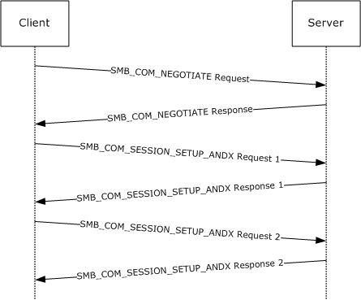

Figure 4: User authentication and session establishment sequence

Descriptions of the fields in this example are specified in [MS-CIFS](../MS-CIFS/MS-CIFS.md) and section 2.2.4.1. Fields that are shown and highlighted in bold text are relevant to this extension. It is assumed that the client has successfully established a network connection with the server.

The client initiates the first message with an [SMB_COM_NEGOTIATE request](#Section_3.3.5.2), as specified in [MS-CIFS]. The client specifies extended security negotiation in the header **Flags2** field. It also includes NT LM 0.12 in the dialect strings list. The server constructs an extended [SMB_COM_NEGOTIATE response](#Section_3.2.5.2) packet that is denoted by the *WordCount* field. The server returns dialect index, its capabilities, GUID value, and the initial security binary large object (BLOB) obtained, as specified in [[RFC2743]](https://go.microsoft.com/fwlink/?LinkId=90378) and defined in the preceding figure.

FRAME 1. Client negotiate request

Client -> Server: Command = SMB_COM_NEGOTIATE

Flags2 Summary = 51207 (0xC807)

1100 1000 0000 0111

.... 1... .... .... = Extended security negotiation is supported

Dialect Strings

PC NETWORK PROGRAM 1.0

LANMAN1.0

Windows for Workgroups 3.1a

LM1.2X002

LANMAN2.1

NT LM 0.12

FRAME 2. Server negotiate response

Server -> Client: Command = SMB_COM_NEGOTIATE

NT status code = 0x0, STATUS_SUCCESS

Word count = 17

Protocol Index = 5 (NT LM 0.12)

Capabilities = 2147607549 (0x8001F3FD)

1000 0000 0000 0001 1111 0011 1111 1101

.... .... .... .... ..1. .... .... .... = Supports Pass-Thru levels

1... .... .... .... .... .... .... .... = Supports extended security

Server GUID = 01 B3 1E 23 07 2A A4 4D A1 9F B6 69 F0 45 71 90

Security Blob in payload

The client uses the initial security BLOB that is returned by the server along with any user credential information in order to obtain its security BLOB, as specified in [RFC2743] and defined in section [3.2.4.2.4](#Section_3.2.4.2.4.1). The resulting security BLOB is sent to the server as part of the [SMB_COM_SESSION_SETUP_ANDX extended request](#Section_3.3.5.3). The client also sends its capabilities and zero **UID** to mark the start of a new [**session**](#gt_session) setup exchange. The server verifies that the client requests extended security by checking the **Flags2** and **Capabilities** fields in the request, accepts as input the client security BLOB, and processes it, as specified in [RFC2743]. In this case, the security package requires more processing and returns a second security BLOB to be returned to the client. Also, the server allocates a new UID and associates it with this session setup exchange.

**Note** Extended security can require multiple request and response exchanges between client and server to complete. The **UID** is defined by the server on first response to an extended session setup and is used for the lifetime of the session.

FRAME 3. Client request for extended session setup

Client -> Server: Command = SMB_COM_SESSION_SETUP_ANDX

Header: Tid = 0x0000 Mid = 0x0070 Uid = 0x0000

Flags2 Summary = 51207 (0xC807)

1100 1000 0000 0111

.... 1... .... .... = Supports extended security

Word count = 12

Capabilities = 0xA0000000

1010 0000 0000 0000 0000 0000 0000 0000

..1. .... .... .... .... .... .... .... = Supports dynamic reauth

1... .... .... .... .... .... .... .... = Requests extended security

Security Blob Length = 74 (0x4A)

Security Blob in payload

FRAME 4. Server response with session setup continuation

Server -> Client: Command = SMB_COM_SESSION_SETUP_ANDX

NT status code = 0xC0000016, STATUS_MORE_PROCESSING_REQUIRED

Header: Tid = 0x0000 Mid = 0x0070 Uid = 0x0802

Flags2 Summary = 51207 (0xC807)

1100 1000 0000 0111

.... 1... .... .... = Extended security negotiation is supported

Security Blob Length = 349 (0x15D)

Security Blob in payload

The client accepts as input the server security BLOB and processes it, as specified in [RFC2743], and its output is returned to the server along with the UID. The server uses the **UID** value to associate this request with the pending session establishment. The server processes this request, as specified in [[RFC4178]](https://go.microsoft.com/fwlink/?LinkId=90461), and receives a success result. At this point, the SMB_SESSION_SETUP_ANDX exchange is complete because the status code is not equal to STATUS_MORE_PROCESSING_REQUIRED. The final security BLOB is returned with the success indication.

FRAME 5. Client session setup request continuation

Client -> Server: Command = SMB_COM_SESSION_SETUP_ANDX

Header: Tid = 0x0000 Mid = 0x0080 Uid = 0x0802

Flags2 Summary = 51207 (0xC807)

1100 1000 0000 0111

.... 1... .... .... = Extended security negotiation is supported

Word count = 12

Security Blob Length = 226 (0xE2)

Security Blob in payload

FRAME 6. Server response with session setup completion

Server -> Client: Command = SMB_COM_SESSION_SETUP_ANDX

NT status code = 0x0, STATUS_SUCCESS

Header: Tid = 0x0000 Mid = 0x0080 Uid = 0x0802

Security Blob Length = 9 (0x9)

Security Blob in payload

At this point, the client has been successfully authenticated.

<a id="Section_4.2"></a>
## 4.2 Previous File Version Enumeration

The following example shows how the client accesses a previous version of the [**share**](#gt_share) root folder. It is assumed that the client has already authenticated, established a [**tree connect**](#gt_tree-connect) to the target share, and opened a handle to the root directory, as specified in [MS-CIFS](../MS-CIFS/MS-CIFS.md). Thus, Frame 1 is not truly the first frame for the connection, but it is referred to as the starting point for this operation.

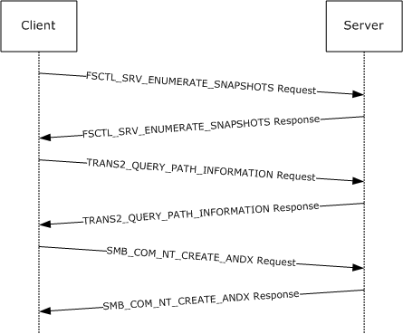

Figure 5: Previous file version enumeration sequence

The first step is to enumerate the list of available [**snapshots**](#gt_snapshot) on the server by using the FSCTL_SRV_ENUMERATE_SNAPSHOT command. The client requests the list of snapshots that are available on the server by using the root handle [**Fid**](#gt_fid). The server returns the list of snapshots in the format that is defined in the preceding figure. In this example, the server has one snapshot total for the root folder, the payload contains one snapshot string, the payload size is 0x34 bytes, and the snapshot name is @GMT-2006.04.26-04-08-27. The last 2 bytes of the payload are the snapshot strings 16-bit [**Unicode**](#gt_unicode) NULL delimiter.

FRAME 1. Client requests FSCTL_SRV_ENUMERATE_SNAPSHOTS

Client -> Server: Command = SMB_COM_NT_TRANSACT

NT IOCTL Function Code 0x00144064 FSCTL_SRV_ENUMERATE_SNAPSHOTS

File ID (Fid) = 16391 (0x4007)

FRAME 2. Server response with list of snapshots

Server -> Client: Command = SMB_COM_NT_TRANSACT

NT status code = 0x0, STATUS_SUCCESS

Payload contained in Data buffer as defined in section 3.1.5.4:

00090: 01 00 00 00 01 00 00 00 34 00 00 00 40 00 ..........4...@.

000A0: 47 00 4D 00 54 00 2D 00 32 00 30 00 30 00 36 00 G.M.T.-.2.0.0.6.

000B0: 2E 00 30 00 34 00 2E 00 32 00 36 00 2D 00 30 00 ..0.4...2.6.-.0.

000C0: 34 00 2E 00 30 00 38 00 2E 00 32 00 37 00 00 00 4...0.8...2.7...

000D0: 00 00

The client uses standard [**SMB command**](#gt_smb-command)s to access the snapshot. The client also indicates in the header **Flags2** that the name in the request is tokenized with the previous version information. This indicates to the server that the client is accessing a previous version of the path. The server processes the request and returns the path information for the snapshot directory rather than to the current directory.

FRAME 3. Client requests path information for snapshot 2006/04/26 04:08:27 AM

Client -> Server: Command = SMB_COM_TRANSACTION2

Flags2 Summary = 52231 (0xCC07)

1100 1100 0000 0111

.... .1.. .... .... = File name is tokenized with Previous

Version Information

Transact2 function = Query path info

File name =\@GMT-2006.04.26-04.08.27

00080: 5C 00 40 00

……............\.@.

00090: 47 00 4D 00 54 00 2D 00 32 00 30 00 30 00 36 00 G.M.T.-.2.0.0.6.

000A0: 2E 00 30 00 34 00 2E 00 32 00 36 00 2D 00 30 00 ..0.4...2.6.-.0.

000B0: 34 00 2E 00 30 00 38 00 2E 00 32 00 37 00 00 00 4...0.8...2.7...

FRAME 4. Server response with snapshot path information

Server -> Client: Command = SMB_COM_TRANSACTION2

NT status code = 0x0, STATUS_SUCCESS

Data bytes = 40 (0x28)

Payload contains path information for specified snapshot version

Similar to its behavior during the query path exchange, the client specifies the previous version of the root folder in an open request. The server processes the request and returns an Fid for the specified previous version of the path.

FRAME 5. Client open request for version 2006/04/26 04:08:27 AM on "\"

Client -> Server: Command = SMB_COM_NT_CREATE_ANDX

Flags2 Summary = 52231 (0xCC07)

1100 1100 0000 0111

.... .1.. .... .... = File name is tokenized with Previous

Version Information

Create Disposition = Open: If exist, Open, else fail

File name =\@GMT-2006.04.26-04.08.27

FRAME 6. Server open root folder and returns Fid

Server -> Client: Command = SMB_COM_NT_CREATE_ANDX

NT status code = 0x0, STATUS_SUCCESS

File ID (Fid) = 16392 (0x4008)

Create Action = File Opened

These similar steps can be used to open a file rather than a directory on a remote volume. In that case, the [**@GMT token**](#gt_gmt-token) is contained in the relative path, such as \directory\@GMT-2006.04.26-04.08.27\file.txt. This path can be used to query attributes or to open a file. The resulting Fid is used to read its contents.

Likewise, the @GMT token path in the example can be used as part of a TRANS2_FIND_FIRST2 and TRANS2_FIND_NEXT2 to enumerate the contents of the volume at the time of the snapshot.

<a id="Section_4.3"></a>
## 4.3 Message Signing Example

The following is the sequence of events that is related to [**SMB message**](#gt_smb-message) authentication. In the following scenario, as specified in [[RFC4178]](https://go.microsoft.com/fwlink/?LinkId=90461), authentication is used between the client and the server. The client and server are both configured not to require [**SMB**](#gt_server-message-block-smb) signing; however, both are capable of using SMB signing. This also applies to the figure in section [4.1](#Section_4.1); however, the parameters significant to signing a negotiation are called out.

- The client sends an [SMB_COM_NEGOTIATE request](#Section_3.3.5.2) to the server.
Client -> Server: SMB: C negotiate, Dialect = NTLM 0.12

SMB Flags2 contains 0xC843

1... .... .... .... = Unicode Strings: Strings are Unicode

.1.. .... .... .... = Error Code Type: Error codes are NT error codes

..0. .... .... .... = Execute-Only Reads: Do not permit reads if execute-only

...0 .... .... .... = Dfs: Do not resolve pathnames with Dfs

.... 1... .... .... = Extended security negotiation is supported

.... .... .1.. .... = Long Names Used

.... .... .... .0.. = Security signatures are not supported

.... .... .... ..1. = Extended Attributes: Extended attributes are supported

.... .... .... ...1 = Long Names Allowed

Security Signature is not set (the value is 00 00 00 00 00 00 00

00).

SECURITY_SIGNATURE: Bit2 (not set)

No **SecuritySignature** is generated at this stage.

- The client receives an [SMB_COM_NEGOTIATE response](#Section_3.2.5.2) SMB from the server.

Server -> Client: SMB: R negotiate, Dialect # = 5

SMB Flags2 contains 0xC853

Binary: 00000000 00000000 11001000 01010011

^ ^ ^

SECURITY_SIGNATURE: Bit2: (not set)

Security Signature is not set (the value is 00 00 00 00 00 00 00 00).

No **SecuritySignature** is generated at this stage.

- The client builds an [SMB_COM_SESSION_SETUP_ANDX request](#Section_3.3.5.3) SMB and sends it to the server.
In the SessionSetupAndX SMB, an authentication request, such as an NTLM or NTLMv2 Challenge/Response or a Kerberos ticket, is sent from the client to the server.

At this stage, the SessionKey is not yet available.

Client -> Server: SMB: C session setup & X

SMB Flags2 contains 0xC807

Binary: 00000000 00000000 11001000 00000111

^ ^ ^

SECURITY_SIGNATURE: Bit2 (set)

After the packet is sent by the client, the sequence number is incremented to 1, which is the expected sequence number for the response packet from the server.

- The server processes the request and sends an [SMB_COM_SESSION_SETUP_ANDX response](#Section_2.2.4.6.2) to the client.
It is possible that multiple roundtrips of SessionSetupAndX can be required to complete a given authentication. If STATUS_MORE_PROCESSING_REQUIRED is returned, then the implementer would return to the previous step and repeat. The following example demonstrates what happens when STATUS_SUCCESS is returned. Similarly, if this authentication was for Anonymous or Guest, then signing would not be activated at this time.

Server -> Client: SMB: R session setup & X

SMB Flags2 contains 0xC807

Binary: 00000000 00000000 11001000 00000111

^ ^

SECURITY_SIGNATURE: Bit2 (set)

The server sets the sequence number to 1 for the response packet and generates the **SecuritySignature** as follows.

The server places the sequence number (1) in the **SecuritySignature** field of the SMB header, and an MD5 hash is performed on the SessionKey + SMB packet. This results in a 16-byte value. The first 8 bytes of the computed hash (AB 44 C4 76 45 84 1A 6A) are placed in the **SecuritySignature** field and sent to the client.

00000: 00 11 43 02 26 E6 00 C0 4F 60 2E 45 08 00 45 00 ..C.&f.@O'.E..E.

00010: 01 78 85 60 40 00 80 32 F6 4B AC 1B 92 B9 AC 1B .x&'@.,2vK,.9,.

00020: 92 B7 88 F2 96 BD 00 00 00 14 01 BD 05 48 8B A1 "Fr=.....=.H9!

00030: 8F 6C C1 3F C0 39 50 18 FF F0 84 70 00 00 00 00 lA?@9P.pp....

00040: 01 2F FF 53 4D 42 73 00 00 00 00 98 07 C8 00 00 ./SMBs....\.H..

00050: >AB 44 C4 76 45 84 1A 6A<00 00 00 00 FF FE 00 08 +DDvE.j....~..

00060: 40 00 04 FF 00 2F 01 00 00 A2 00 04 01 A1 81 9F @.../..."...!x

00070: 30 81 9C A0 03 0A 01 00 A1 0B 06 09 2A 86 48 82 0S

....!...* H

After the server sends the packet, the sequence number is incremented to 2, which is the expected sequence number for the next SMB packet from the client.

- The client processes the response and obtains the SessionKey.
SMB Flags2 contains 0xC807

Binary: 00000000 00000000 11001000 00000111

^ ^

SECURITY_SIGNATURE: Bit2 (set)

The expected sequence number is 1 for the response packet from the server.

The client saves the **SecuritySignature** in the response packet. The expected sequence number (1) is placed in the **SecuritySignature** field of the SMB header, and an MD5 hash is performed on the SessionKey SMB packet. This results in a 16-byte value. The first 8 bytes of the computed hash are compared with the one sent by the server (AB 44 C4 76 45 84 1A 6A) to validate the SMB packet. For the SessionKey that is used for signing when Kerberos is used, see [MS-KILE](../MS-KILE/MS-KILE.md) section 3.1.1.2, Cryptographic Material.

- The client proceeds further and sends an [SMB_COM_TREE_CONNECT_ANDX request](#Section_2.2.4.7.1) SMB.
Client -> Server: SMB: C tree connect & X, Share

The client sequence number is now incremented. The new value is 2.

The sequence number (2) is placed in the **SecuritySignature** field of the SMB header, and an MD5 hash is performed on the 16-byte SessionKey + SMB packet. This results in a 16-byte value. The first 8 bytes (in this case, A5 B0 43 DC 07 51 0F 8B) are placed in the **SecuritySignature** field in the SMB header and then sent to the server.

00000: 00 C0 4F 60 2E 45 00 11 43 02 26 E6 08 00 45 00 .@O'.E..C.&f..E.

00010: 00 98 21 48 40 00 80 32 5B 44 AC 1B 92 B7 AC 1B .\!H@.,2[D,.",.

00020: 92 B9 C4 70 3D 34 00 00 00 1C 05 48 01 BD C1 3F 9Dp=4.....H.=A?

00030: C0 39 8B A1 90 9F 50 18 42 EF D0 D6 00 00 00 00 @99!xP.BoPV....

00040: 00 54 FF 53 4D 42 75 00 00 00 00 18 07 C8 00 00 .TSMBu......H..

00050: >A5 B0 43 DC 07 51 0F 8B<00 00 00 00 FF FE 00 08 %0C\.Q.9....~..

00060: 80 00 04 FF 00 54 00 0C 00 01 00 29 00 00 5C 00 ,...T.....)..\.

00070: 5C 00 4D 00 4F 00 48 00 41 00 4B 00 34 00 31 00 \.M.O.H.A.K.4.1.

The sequence continues until the [**session**](#gt_session) is terminated.

In the case where extended security is not used, the same process is followed. However, the MD5 hash is performed on the 16-byte session key + NTLM challenge response + SMB packet with the appropriate sequence number. The NTLM challenge response is the authentication that is received in the SMB_COM_SESSION_SETUP_ANDX request in the **UnicodePassword** field if NTLM was used for authentication, or in the **OEMPassword** field if LM authentication was used.

<a id="Section_4.4"></a>
## 4.4 Copy File (Remote to Local)

The following example illustrates the sequence of operations during the copying of a file from a remote location to the local machine. The example assumes that the connection establishment and [**session**](#gt_session) management have already taken place.

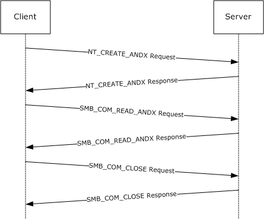

Figure 6: Copy file (remote to local) sequence

In the preceding diagram, the first frame is to open the remote file for read access. The subsequent frames read the data from the file, and then close the file. In between the read and the close, the data is written to the local file.

NT_CREATE_ANDX

Client -> Server: SMB: C NT Create Andx, Dialect = NTLM 0.12

SMB: Tree ID (Tid) = 2049 (0x801)

SMB: Process ID (Pid) = 3592 (0xE08)

SMB: User ID (Uid) = 2048 (0x800)

SMB: Multiplex ID (Mid) = 1712 (0x6B0)

SMB: Command = C NT create & X

SMB: Desired Access = 0x00000089

SMB: ...............................1 = Read Data Allowed

SMB: ..............................0. = Write Data Denied

SMB: .............................0.. = Append Data Denied

SMB: ............................1... = Read EA Allowed

SMB: ...........................0.... = Write EA Denied

SMB: ..........................0..... = File Execute Denied

SMB: .........................0...... = File Delete Denied

SMB: ........................1....... = File Read Attributes Allowed

SMB: .......................0........ = File Write Attributes Denied

SMB: NT File Attributes = 0x00000080

SMB: ...............................0 = Not Read Only

SMB: ..............................0. = Not Hidden

SMB: .............................0.. = Not System

SMB: ...........................0.... = Not Directory

SMB: ..........................0..... = Not Archive

SMB: .........................0...... = Not Device

SMB: ........................1....... = Normal

SMB: .......................0........ = Not Temporary

SMB: ......................0......... = Not Sparse File

SMB: .....................0.......... = Not Reparse Point

SMB: ....................0........... = Not Compressed

SMB: ...................0............ = Not Offline

SMB: ..................0............. =

CONTENT_INDEXED

SMB: .................0.............. = Not Encrypted

SMB: File Share Access = 0x00000003

SMB: ...............................1 = Read allowed

SMB: ..............................1. = Write allowed

SMB: .............................0.. = Delete not

allowed

SMB: Create Disposition = Open: If exist, Open, else fail

SMB: Create Options = 68 (0x44)

SMB: ...............................0 = non-directory

SMB: ..............................0. = non-write through

SMB: .............................1.. = Data is written to the file sequentially

SMB: ............................0... = intermediate buffering allowed

SMB: ...........................0.... = IO alerts bits not set

SMB: ..........................0..... = IO non-alerts bit not set

SMB: .........................1...... = Operation is on a non-directory file

SMB: ........................0....... = tree connect bit not set

SMB: .......................0........ = complete if oplocked bit is not set

SMB: ......................0......... = no EA knowledge bit is not set

SMB: .....................0.......... = 8.3 filenames bit is not set

SMB: ....................0........... = random access bit is not set

SMB: ...................0............ = delete on close bit is not set

SMB: ..................0............. = open by filename

SMB: .................0.............. = open for backup bit not set

SMB: File name =\filename.txt

NT_CREATE_ANDX Response

Server -> Client: SMB: C NT Create Andx, Dialect = NTLM 0.12

SMB: Tree ID (Tid) = 2049 (0x801)

SMB: Process ID (Pid) = 3592 (0xE08)

SMB: User ID (Uid) = 2048 (0x800)

SMB: Multiplex ID (Mid) = 1712 (0x6B0)

SMB: Command = R NT create & X

SMB: Oplock Level = Batch

SMB: File ID (Fid) = 16389 (0x4005)

SMB: NT File Attributes = 0x00000020

SMB: ...............................0 = Not Read Only

SMB: ..............................0. = Not Hidden

SMB: .............................0.. = Not System

SMB: ...........................0.... = Not Directory

SMB: ..........................1..... = Archive

SMB: .........................0...... = Not Device

SMB: ........................0....... = Not Normal

SMB: .......................0........ = Not Temporary

SMB: ......................0......... = Not Sparse File

SMB: .....................0.......... = Not Reparse Point

SMB: ....................0........... = Not Compressed

SMB: ...................0............ = Not Offline

SMB: ..................0............. = CONTENT_INDEXED

SMB: .................0.............. = Not Encrypted

SMB_COM_READ_ANDX Request

Client -> Server: SMB: C Read Andx, Dialect = NTLM 0.12

SMB: Tree ID (Tid) = 2049 (0x801)

SMB: Process ID (Pid) = 65279 (0xFEFF)

SMB: User ID (Uid) = 2048 (0x800)

SMB: Multiplex ID (Mid) = 1744 (0x6D0)

SMB: Command = C read & X

SMB: File ID (Fid) = 16389 (0x4005)

SMB: Max count = 1596 (0x63C)

SMB: Min count = 1596 (0x63C)

SMB: Bytes left = 1596

SMB_COM_READ_ANDX Response

Server -> Client: SMB: R Read Andx, Dialect = NTLM 0.12

SMB: Tree ID (Tid) = 2049 (0x801)

SMB: Process ID (Pid) = 65279 (0xFEFF)

SMB: User ID (Uid) = 2048 (0x800)

SMB: Multiplex ID (Mid) = 1744 (0x6D0)

SMB: Command = C read & X

SMB: Data length = 1596 (0x63C)

SMB: Data offset = 60 (0x3C)

SMB: Byte count = 1597

Data = 00 90 27 D0 C4 6F 00 90 27 66 6D BE 08 00 45 00 ……

SMB_COM_CLOSE Request

Client -> Server: SMB: C Close, Dialect = NTLM 0.12

SMB: Tree ID (Tid) = 2049 (0x801)

SMB: Process ID (Pid) = 65279 (0xFEFF)

SMB: User ID (Uid) = 2048 (0x800)

SMB: Multiplex ID (Mid) = 1984 (0x7C0)

SMB: Command = C Close

SMB: File ID (Fid) = 16389 (0x4005)

SMB_COM_CLOSE Response

Server -> Client: SMB: R Close, Dialect = NTLM 0.12

SMB: Tree ID (Tid) = 2049 (0x801)

SMB: Process ID (Pid) = 65279 (0xFEFF)

SMB: User ID (Uid) = 2048 (0x800)

SMB: Multiplex ID (Mid) = 1984 (0x7C0)

<a id="Section_4.5"></a>
## 4.5 Copy File (Local to Remote)

The following example illustrates the sequence of operations while copying a local file to a remote [**share**](#gt_share). The frames do not include the connection establishment or [**session**](#gt_session) management, for example.

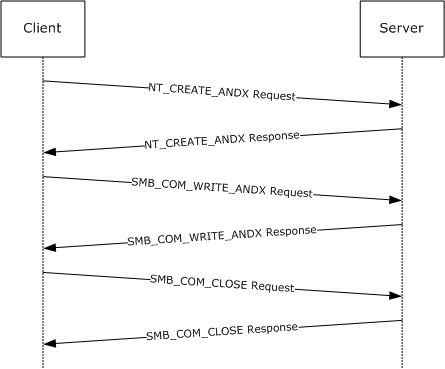

Figure 7: Copy file (local to remote) sequence

In the frames in the preceding figure, the remote file is first created with the [SMB_COM_NT_CREATE_ANDX request](#Section_3.2.4.3.1). The data from the local file is then written to the remote file and, subsequently, the file is closed.

NT_CREATE_ANDX

Client -> Server: SMB: C NT Create Andx, Dialect = NTLM 0.12

SMB: Tree ID (Tid) = 2049 (0x801)

SMB: Process ID (Pid) = 3592 (0xE08)

SMB: User ID (Uid) = 2048 (0x800)

SMB: Multiplex ID (Mid) = 2288 (0x8F0)

SMB: Command = C NT create & X

SMB: Desired Access = 0x00030197

SMB: ...............................1 = Read Data Allowed

SMB: ..............................1. = Write Data Allowed

SMB: .............................1.. = Append Data Allowed

SMB: ............................0... = Read EA Denied

SMB: ...........................1.... = Write EA Allowed

SMB: ..........................0..... = File Execute Denied

SMB: .........................0...... = File Delete Denied

SMB: ........................1....... = File Read Attributes Allowed

SMB: .......................1........ = File Write Attributes Allowed

SMB: NT File Attributes = 0x00000020

SMB: ...............................0 = Not Read Only

SMB: ..............................0. = Not Hidden

SMB: .............................0.. = Not System

SMB: ...........................0.... = Not Directory

SMB: ..........................1..... = Archive

SMB: .........................0...... = Not Device

SMB: ........................0....... = Not Normal

SMB: .......................0........ = Not Temporary

SMB: ......................0......... = Not Sparse File

SMB: .....................0.......... = Not Reparse Point

SMB: ....................0........... = Not Compressed

SMB: ...................0............ = Not Offline

SMB: ..................0............. =

CONTENT_INDEXED

SMB: .................0.............. = Not Encrypted

SMB: File Share Access = 0x00000000

SMB: ...............................0 = Read not allowed

SMB: ..............................0. = Write not allowed

SMB: .............................0.. = Delete not allowed

SMB: Create Disposition = Overwrite_If: If exist, open

and overwrite, else create it

SMB: Create Options = 68 (0x44)

SMB: ...............................0 = non-directory

SMB: ..............................0. = non-write through

SMB: .............................1.. = Data is written to the file sequentially

SMB: ............................0... = intermediate buffering allowed

SMB: ...........................0.... = IO alerts bits not set

SMB: ..........................0..... = IO non-alerts bit not set

SMB: .........................1...... = Operation is on a non-directory file

SMB: ........................0....... = tree connect bit not set

SMB: .......................0........ = complete if oplocked bit is not set

SMB: ......................0......... = no EA knowledge bit is not set

SMB: .....................0.......... = 8.3 filenames bit is not set

SMB: ....................0........... = random access bit is not set

SMB: ...................0............ = delete on close bit is not set

SMB: ..................0............. = open by filename

SMB: .................0.............. = open for backup bit not set

SMB: File name =\filename.txt

NT_CREATE_ANDX Response

Server -> Client: SMB: R NT Create Andx, Dialect = NTLM 0.12

SMB: Tree ID (Tid) = 2049 (0x801)

SMB: Process ID (Pid) = 3592 (0xE08)

SMB: User ID (Uid) = 2048 (0x800)

SMB: Multiplex ID (Mid) = 2288 (0x8F0)

SMB: Command = C NT create & X

SMB: Oplock Level = Batch

SMB: File ID (Fid) = 16392 (0x4008)

SMB: NT File Attributes = 0x00000020

SMB: ...............................0 = Not Read Only

SMB: ..............................0. = Not Hidden

SMB: .............................0.. = Not System

SMB: ...........................0.... = Not Directory

SMB: ..........................1..... = Archive

SMB: .........................0...... = Not Device

SMB: ........................0....... = Not Normal

SMB: .......................0........ = Not Temporary

SMB: ......................0......... = Not Sparse File

SMB: .....................0.......... = Not Reparse Point

SMB: ....................0........... = Not Compressed

SMB: ...................0............ = Not Offline

SMB: ..................0............. = CONTENT_INDEXED

SMB: .................0.............. = Not Encrypted

SMB_COM_WRITE_ANDX Request

Client -> Server: SMB: C Write Andx, Dialect = NTLM 0.12

SMB: Tree ID (Tid) = 2049 (0x801)

SMB: Process ID (Pid) = 65279 (0xFEFF)

SMB: User ID (Uid) = 2048 (0x800)

SMB: Multiplex ID (Mid) = 2384 (0x950)

SMB: Command = C read & X

SMB: File ID (Fid) = 16392 (0x4008)

SMB: File offset = 0 (0x0)

SMB: Data length = 1596 (0x63C)

Data = 00 90 27 66 6D BE 00 90 27 D0 C4 6F 08 00 45 00 …

SMB_COM_WRITE_ANDX Response

Server -> Client: SMB: R Write Andx, Dialect = NTLM 0.12

SMB: Tree ID (Tid) = 2049 (0x801)

SMB: Process ID (Pid) = 65279 (0xFEFF)

SMB: User ID (Uid) = 2048 (0x800)

SMB: Multiplex ID (Mid) = 2384 (0x950)

SMB: Command = C read & X

SMB_COM_CLOSE Request

Client -> Server: SMB: C Close, Dialect = NTLM 0.12

SMB: Tree ID (Tid) = 2049 (0x801)

SMB: Process ID (Pid) = 65279 (0xFEFF)

SMB: User ID (Uid) = 2048 (0x800)

SMB: Multiplex ID (Mid) = 2400 (0x960)

SMB: Command = C Close

SMB: File ID (Fid) = 16392 (0x4008)

SMB_COM_CLOSE Response

Server -> Client: SMB: R Close, Dialect = NTLM 0.12

SMB: Tree ID (Tid) = 2049 (0x801)

SMB: Process ID (Pid) = 65279 (0xFEFF)

SMB: User ID (Uid) = 2048 (0x800)

SMB: Multiplex ID (Mid) = 2400 (0x960)

<a id="Section_4.6"></a>
## 4.6 FSCTL SRV COPYCHUNK

The following example refers to the sequence of operations for a file copy in which the source and the destination are on the same server. The [FSCTL_SRV_COPYCHUNK (section 2.2.7.2)](#Section_2.2.7.2.1.1) is used. The following sequence assumes that the [**SMB connection**](#gt_smb-connection) to the server, [**SMB session**](#gt_smb-session) establishment, and other operations have been completed.

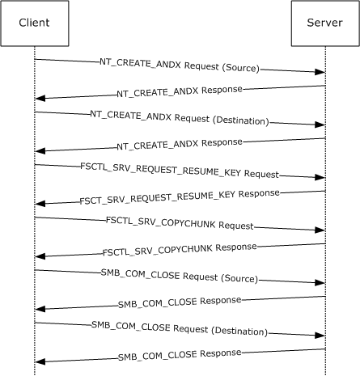

Figure 8: Copy file (from/to same remote server) sequence

The initial step in the preceding sequence is to open the source and the destination file using NT_CREATE_ANDX command. This step is followed by the FSCTL_SRV_REQUEST_RESUME_KEY request. This is sent as an NT_TRANSACT_IOCTL with the file ID of the source file. The server responds with the [FSCTL_SRV_REQUEST_RESUME_KEY response (section 2.2.7.2.2.2)](#Section_2.2.7.2.2.2). A 24-byte server [**copychunk resume key**](#gt_copychunk-resume-key) is returned.

NT_CREATE_ANDX Request (Source)

Client -> Server: SMB: C NT Create Andx, Dialect = NTLM 0.12

SMB: Tree ID (Tid) = 2049 (0x801)

SMB: Process ID (Pid) = 3592 (0xE08)

SMB: User ID (Uid) = 2048 (0x800)

SMB: Multiplex ID (Mid) = 384 (0x180)

SMB: Command = C NT create & X

SMB: Desired Access = 0x00020089

SMB: ...............................1 = Read Data Allowed

SMB: ..............................0. = Write Data Denied

SMB: .............................0.. = Append Data Denied

SMB: ............................1... = Read EA Allowed

SMB: ...........................0.... = Write EA Denied

SMB: ..........................0..... = File Execute Denied

SMB: .........................0...... = File Delete Denied

SMB: ........................1....... = File Read Attributes Allowed

SMB: .......................0........ = File Write Attributes Denied

SMB: NT File Attributes = 0x00000000

SMB: ...............................0 = Not Read Only

SMB: ..............................0. = Not Hidden

SMB: .............................0.. = Not System

SMB: ...........................0.... = Not Directory

SMB: ..........................0..... = Not Archive

SMB: .........................0...... = Not Device

SMB: ........................0....... = Not Normal

SMB: .......................0........ = Not Temporary

SMB: ......................0......... = Not Sparse File

SMB: .....................0.......... = Not Reparse Point

SMB: ....................0........... = Not Compressed

SMB: ...................0............ = Not Offline

SMB: ..................0............. =

CONTENT_INDEXED

SMB: .................0.............. = Not Encrypted

SMB: File Share Access = 0x00000005

SMB: ...............................1 = Read allowed

SMB: ..............................0. = Write not allowed

SMB: .............................1.. = Delete allowed

SMB: Create Disposition = Open: If exist, Open, else fail

SMB: Create Options = 2097220 (0x200044)

SMB: ...............................0 = non-directory

SMB: ..............................0. = non-write through

SMB: .............................1.. = Data is written to the

file sequentially

SMB: ............................0... = intermediate buffering allowed

SMB: ...........................0.... = IO alerts bits not set

SMB: ..........................0..... = IO non-alerts bit not set

SMB: .........................1...... = Operation is on a non-directory file

SMB: ........................0....... = tree connect bit not set

SMB: .......................0........ = complete if oplocked bit is not set

SMB: ......................0......... = no EA knowledge bit is not set

SMB: .....................0.......... = 8.3 filenames bit is not set

SMB: ....................0........... = random access bit is not set

SMB: ...................0............ = delete on close bit is not set

SMB: ..................0............. = open by filename

SMB: .................0.............. = open for backup bit not set

SMB: File name = sourcefile.txt

NT_CREATE_ANDX Response

Server -> Client: SMB: R NT Create Andx, Dialect = NTLM 0.12

SMB: Tree ID (Tid) = 2049 (0x801)

SMB: Process ID (Pid) = 3592 (0xE08)

SMB: User ID (Uid) = 2048 (0x800)

SMB: Multiplex ID (Mid) = 384 (0x180)

SMB: Command = R NT create & X

SMB: Oplock Level = II

SMB: File ID (Fid) = 16386 (0x4002)

SMB: NT File Attributes = 0x00000020

SMB: ...............................0 = Not Read Only

SMB: ..............................0. = Not Hidden

SMB: .............................0.. = Not System

SMB: ...........................0.... = Not Directory

SMB: ..........................1..... = Archive

SMB: .........................0...... = Not Device

SMB: ........................0....... = Not Normal

SMB: .......................0........ = Not Temporary

SMB: ......................0......... = Not Sparse File

SMB: .....................0.......... = Not Reparse Point

SMB: ....................0........... = Not Compressed

SMB: ...................0............ = Not Offline

SMB: ..................0............. =

CONTENT_INDEXED

SMB: .................0.............. = Not Encrypted

SMB: File type = Disk file or directory

NT_CREATE_ANDX Request (Destination)

Client -> Server: SMB: C NT Create Andx, Dialect = NTLM 0.12

SMB: Tree ID (Tid) = 2049 (0x801)

SMB: Process ID (Pid) = 3592 (0xE08)

SMB: User ID (Uid) = 2048 (0x800)

SMB: Multiplex ID (Mid) = 480 (0x1E0)

SMB: Command = C NT create & X

SMB: Desired Access = 0x00030197

SMB: ...............................1 = Read Data Allowed

SMB: ..............................1. = Write Data Allowed

SMB: .............................1.. = Append Data Allowed

SMB: ............................0... = Read EA Denied

SMB: ...........................1.... = Write EA Allowed

SMB: ..........................0..... = File Execute Denied

SMB: .........................0...... = File Delete Denied

SMB: ........................1....... = File Read Attributes Allowed

SMB: .......................1........ = File Write Attributes Allowed

SMB: NT File Attributes = 0x00000020

SMB: ...............................0 = Not Read Only

SMB: ..............................0. = Not Hidden

SMB: .............................0.. = Not System

SMB: ...........................0.... = Not Directory

SMB: ..........................1..... = Archive

SMB: .........................0...... = Not Device

SMB: ........................0....... = Not Normal

SMB: .......................0........ = Not Temporary

SMB: ......................0......... = Not Sparse File

SMB: .....................0.......... = Not Reparse Point

SMB: ....................0........... = Not Compressed

SMB: ...................0............ = Not Offline

SMB: ..................0............. = CONTENT_INDEXED

SMB: .................0.............. = Not Encrypted

SMB: File Share Access = 0x00000000

SMB: ...............................0 = Read not allowed

SMB: ..............................0. = Write not allowed

SMB: .............................0.. = Delete not allowed

SMB: Create Disposition = Overwrite_If: If exist, open and overwrite,

else create it

SMB: Create Options = 68 (0x44)

SMB: ...............................0 = non-directory

SMB: ..............................0. = non-write through

SMB: .............................1.. = Data is written to the file sequentially

SMB: ............................0... = intermediate buffering allowed

SMB: ...........................0.... = IO alerts bits not set

SMB: ..........................0..... = IO non-alerts bit not set

SMB: .........................1...... = Operation is on a non-directory file

SMB: ........................0....... = tree connect bit not set

SMB: .......................0........ = complete if oplocked bit is not set

SMB: ......................0......... = no EA knowledge bit is not set

SMB: .....................0.......... = 8.3 filenames bit is not set

SMB: ....................0........... = random access bit is not set

SMB: ...................0............ = delete on close bit is not set

SMB: ..................0............. = open by filename

SMB: .................0.............. = open for backup bit not set

SMB: File name = destinationfile.txt

NT_CREATE_ANDX Response

Server -> Client: SMB: R NT Create Andx, Dialect = NTLM 0.12

SMB: Tree ID (Tid) = 2049 (0x801)

SMB: Process ID (Pid) = 3592 (0xE08)

SMB: User ID (Uid) = 2048 (0x800)

SMB: Multiplex ID (Mid) = 480 (0x1E0)

SMB: Command = R NT create & X

SMB: Oplock Level = Batch

SMB: File ID (Fid) = 16387 (0x4003)

SMB: NT File Attributes = 0x00000020

SMB: ...............................0 = Not Read Only

SMB: ..............................0. = Not Hidden

SMB: .............................0.. = Not System

SMB: ...........................0.... = Not Directory

SMB: ..........................1..... = Archive

SMB: .........................0...... = Not Device

SMB: ........................0....... = Not Normal

SMB: .......................0........ = Not Temporary

SMB: ......................0......... = Not Sparse File

SMB: .....................0.......... = Not Reparse Point

SMB: ....................0........... = Not Compressed

SMB: ...................0............ = Not Offline

SMB: ..................0............. = CONTENT_INDEXED

SMB: .................0.............. = Not Encrypted

SMB: File type = Disk file or directory

FSCTL_SRV_REQUEST_RESUME_KEY Request

Client -> Server: SMB: C NT Transact, Dialect = NTLM 0.12

NT IOCTL Function Code 0x00140078 FSCTL_SRV_REQUEST_RESUME_KEY

File ID (Fid) = 16386 (0x4002)

FSCTL_SRV_REQUEST_RESUME_KEY Response

Server -> Client: SMB: R NT Transact, Dialect = NTLM 0.12

NT IOCTL Function Code 0x00140078 FSCTL_SRV_REQUEST_RESUME_KEY

File ID (Fid) = 16386 (0x4002)

Key = 2D 0B 00 00 01 00 00 00 59 84 0C 62 1B 84 C6 01 08 0E 00 00 00 00 00 00

ContextLength = 0

This is followed by an FSCTL_SRV_COPYCHUNK request. The request uses the resume key generated earlier.

FSCTL_SRV_COPYCHUNK Request

Client -> Server: SMB: C NT Transact, Dialect = NTLM 0.12

NT IOCTL Function Code 0x001440F2 FSCTL_SRV_COPYCHUNK

File ID (Fid) = 16387 (0x4003)

Key = 2D 0B 00 00 01 00 00 00 59 84 0C 62 1B 84 C6 01 08 0E 00 00 00 00 00 00

ChunkCount = 1 (01 00 00 00)

Reserved = 0 (00 00 00 00)

List:

SourceOffset = 0 _(00 00 00 00 00 00 00 00)

DestinationOffset = 0 (00 00 00 00 00 00 00 00)

Length = 1731 (3C 06 00 00)

FSCTL_SRV_COPYCHUNK Response

Server -> Client: SMB: R NT Transact, Dialect = NTLM 0.12

NT IOCTL Function Code 0x001440F2 FSCTL_SRV_COPYCHUNK

File ID (Fid) = 16387 (0x4003)

ChunksWritten = 1 (01 00 00 00)

ChunkBytesWritten = 0 (00 00 00 00)

TotalBytesWritten = 1731 (3C 06 00 00)

The final step is to close the source and the destination file with SMB_COM_CLOSE commands.

SMB_COM_CLOSE Request (Source)

Client -> Server: SMB: C Close, Dialect = NTLM 0.12

SMB: Tree ID (Tid) = 2049 (0x801)

SMB: Process ID (Pid) = 65279 (0xFEFF)

SMB: User ID (Uid) = 2048 (0x800)

SMB: Multiplex ID (Mid) = 640 (0x280)

SMB: Command = C Close

SMB: File ID (Fid) = 16386 (0x4002)

SMB_COM_CLOSE Response

Server -> Client: SMB: R Close, Dialect = NTLM 0.12

SMB: Tree ID (Tid) = 2049 (0x801)

SMB: Process ID (Pid) = 65279 (0xFEFF)

SMB: User ID (Uid) = 2048 (0x800)

SMB: Multiplex ID (Mid) = 640 (0x280)

SMB_COM_CLOSE Request (Destination)

Client -> Server: SMB: C Close, Dialect = NTLM 0.12

SMB: Tree ID (Tid) = 2049 (0x801)

SMB: Process ID (Pid) = 65279 (0xFEFF)

SMB: User ID (Uid) = 2048 (0x800)

SMB: Multiplex ID (Mid) = 656 (0x290)

SMB: Command = C Close

SMB: File ID (Fid) = 16387 (0x4003)

SMB_COM_CLOSE Response

Server -> Client: SMB: R Close, Dialect = NTLM 0.12

SMB: Tree ID (Tid) = 2049 (0x801)

SMB: Process ID (Pid) = 65279 (0xFEFF)

SMB: User ID (Uid) = 2048 (0x800)

SMB: Multiplex ID (Mid) = 656 (0x290)

<a id="Section_4.7"></a>
## 4.7 TRANS TRANSACT NMPIPE

The following example illustrates how the TRANS_TRANSACT_NMPIPE is used.

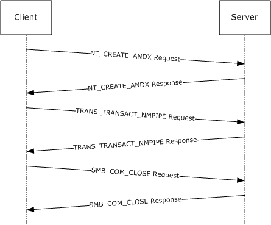

Figure 9: Named pipe request sequence

The first frame contains the NT_CREATE_ANDX request to the [**named pipe**](#gt_named-pipe). The TRANS_TRANSACT_NMPIPE is then issued against the file ID assigned in the NT_CREATE_ANDX response.

NT_CREATE_ANDX

Client -> Server: SMB: C NT Create Andx, Dialect = NTLM 0.12

SMB: Tree ID (Tid) = 2048 (0x800)

SMB: Process ID (Pid) = 2292 (0x8F4)

SMB: User ID (Uid) = 2048 (0x800)

SMB: Multiplex ID (Mid) = 4048 (0xFD0)

SMB: Command = C NT create & X

SMB: Desired Access = 0x0002019F

SMB: ...............................1 = Read Data Allowed

SMB: ..............................1. = Write Data Allowed

SMB: .............................1.. = Append Data Allowed

SMB: ............................1... = Read EA Allowed

SMB: ...........................1.... = Write EA Allowed

SMB: ..........................0..... = File Execute Denied

SMB: .........................0...... = File Delete Denied

SMB: ........................1....... = File Read Attributes Allowed

SMB: .......................1........ = File Write Attributes Allowed

SMB: NT File Attributes = 0x00000000

SMB: ...............................0 = Not Read Only

SMB: ..............................0. = Not Hidden

SMB: .............................0.. = Not System

SMB: ...........................0.... = Not Directory

SMB: ..........................0..... = Not Archive

SMB: .........................0...... = Not Device

SMB: ........................0....... = Not Normal

SMB: .......................0........ = Not Temporary

SMB: ......................0......... = Not Sparse File

SMB: .....................0.......... = Not Reparse Point

SMB: ....................0........... = Not Compressed

SMB: ...................0............ = Not Offline

SMB: ..................0............. =

CONTENT_INDEXED

SMB: .................0.............. = Not Encrypted

SMB: File Share Access = 0x00000003

SMB: ...............................1 = Read allowed

SMB: ..............................1. = Write allowed

SMB: .............................0.. = Delete not

allowed

SMB: Create Disposition = Open: If exist, Open, else fail

SMB: Create Options = 4194368 (0x400040)

SMB: ...............................0 = non-directory

SMB: ..............................0. = non-write through

SMB: .............................0.. = non-sequential writing allowed

SMB: ............................0... = intermediate buffering allowed

SMB: ...........................0.... = IO alerts bits not set

SMB: ..........................0..... = IO non-alerts bit not set

SMB: .........................1...... = Operation is on a non-directory file

SMB: ........................0....... = tree connect bit not set

SMB: .......................0........ = complete if oplocked bit is not set

SMB: ......................0......... = no EA knowledge bit is not set

SMB: .....................0.......... = 8.3 filenames bit is not set

SMB: ....................0........... = random access bit is not set

SMB: ...................0............ = delete on close bit is not set

SMB: ..................0............. = open by filename

SMB: .................0.............. = open for backup bit not set

SMB: File name =\srvsvc

NT_CREATE_ANDX Response

Server -> Client: SMB: R NT Create Andx, Dialect = NTLM 0.12

SMB: Tree ID (Tid) = 2048 (0x800)

SMB: Process ID (Pid) = 2292 (0x8F4)

SMB: User ID (Uid) = 2048 (0x800)

SMB: Multiplex ID (Mid) = 4048 (0xFD0)

SMB: Command = R NT create & X

SMB: Oplock Level = NONE

SMB: File ID (Fid) = 16385 (0x4001)

SMB: NT File Attributes = 0x00000080

SMB: ...............................0 = Not Read Only

SMB: ..............................0. = Not Hidden

SMB: .............................0.. = Not System

SMB: ...........................0.... = Not Directory

SMB: ..........................0..... = Not Archive

SMB: .........................0...... = Not Device

SMB: ........................1....... = Normal

SMB: .......................0........ = Not Temporary

SMB: ......................0......... = Not Sparse File

SMB: .....................0.......... = Not Reparse Point

SMB: ....................0........... = Not Compressed

SMB: ...................0............ = Not Offline

SMB: ..................0............. = CONTENT_INDEXED

SMB: .................0.............. = Not Encrypted

SMB: File type = Message mode named pipe

SMB_COM_TRANSACTION Request

Client -> Server: SMB: C transact TransactNmPipe, Dialect = NTLM

0.12

SMB: Tree ID (Tid) = 2048 (0x800)

SMB: Process ID (Pid) = 2292 (0x8F4)

SMB: User ID (Uid) = 2048 (0x800)

SMB: Multiplex ID (Mid) = 4096 (0x1000)

SMB: Command = C transact

SMB: Data bytes = 76 (0x4C)

SMB: Data offset = 84 (0x54)

SMB: Setup words

SMB: Pipe function = Transact named pipe (TransactNmPipe)

SMB: File ID (Fid) = 16385 (0x4001)

Data = 00 90 27 66 6D BE 00 90 27 D0 C4 6F 08 00 45 00 ……

SMB_COM_TRANSACTION Response

Server -> Client: SMB: R transact TransactNmPipe, Dialect = NTLM

0.12

SMB: Tree ID (Tid) = 2048 (0x800)

SMB: Process ID (Pid) = 2292 (0x8F4)

SMB: User ID (Uid) = 2048 (0x800)

SMB: Multiplex ID (Mid) = 4096 (0x1000)

SMB: Command = R transact

SMB: Data bytes = 120 (0x78)

SMB: Data offset = 56 (0x38)

DATA = 00 90 27 D0 C4 6F 00 90 27 66 6D BE 08 00 45 00 ….

SMB_COM_CLOSE Request

Client -> Server: SMB: C Close, Dialect = NTLM 0.12

SMB: Tree ID (Tid) = 2048 (0x800)

SMB: Process ID (Pid) = 65279 (0xFEFF)

SMB: User ID (Uid) = 2048 (0x800)

SMB: Multiplex ID (Mid) = 4112 (0x1010)

SMB: Command = C Close

SMB: File ID (Fid) = 16385 (0x4001)

SMB_COM_CLOSE Response

Server -> Client: SMB: R Close, Dialect = NTLM 0.12

SMB: Tree ID (Tid) = 2048 (0x800)

SMB: Process ID (Pid) = 65279 (0xFEFF)

SMB: User ID (Uid) = 2048 (0x800)

SMB: Multiplex ID (Mid) = 4112 (0x1010)

<a id="Section_5"></a>
# 5 Security

The following section specifies security considerations for implementers of the Server Message Block (SMB) Protocol.

<a id="Section_5.1"></a>
## 5.1 Security Considerations for Implementers

The CIFS Protocol contains support for NTLM but lacks support for new authentication protocols. The extensions defined in this document offer support for increased security in remote file and printer access via [**SMB**](#gt_server-message-block-smb).

In addition to the NTLM challenge/response authentication support, as specified in [MS-CIFS](../MS-CIFS/MS-CIFS.md) section 3.1.5.2, these extensions enable support for Kerberos or any other protocol that can be encapsulated inside the extensible authentication package, as specified in [[RFC2743]](https://go.microsoft.com/fwlink/?LinkId=90378) and [[RFC4178]](https://go.microsoft.com/fwlink/?LinkId=90461).

Extended message signing uses the HMAC_MD5 algorithm, as specified in [[RFC2104]](https://go.microsoft.com/fwlink/?LinkId=90314), to alter the user's session key.

The protocol does not sign [**oplock break**](#gt_oplock-break) requests from the server to the client if message signing is enabled. This can allow an attacker to affect performance but does not allow an attacker to deny access or alter data.

The algorithm used for message signing has been shown to be subject to collision attacks. See [[MD5Collision]](https://go.microsoft.com/fwlink/?LinkId=89937) for more information.

The new "previous versions" feature potentially allows access to versions of a file that have been deleted or modified. This can provide access to information that was not available without these extensions. However, this access is still subject to the same access checks to which it is normally subject.

<a id="Section_5.2"></a>
## 5.2 Index of Security Parameters

| Security parameter | Section |
| --- | --- |
| Signing Key Protection | [3.2.5.4](#Section_3.2.5.4) |
| Extended Security - GSS mechanism | [3.3.5.3](#Section_3.3.5.3) |
| Extended Security - Maximal User and Guest Rights per Share | [3.3.5.4](#Section_3.3.5.4) |
| Authentication Expiration Time | [3.3.2.1](#Section_3.3.2.1) |

<a id="Section_6"></a>
# 6 Appendix A: Product Behavior

The information in this specification is applicable to the following Microsoft products or supplemental software. References to product versions include updates to those products.

- Windows 2000 operating system
- Windows XP operating system
- Windows Server 2003 operating system
- Windows Server 2003 R2 operating system
- Windows Vista operating system
- Windows Server 2008 operating system
- Windows 7 operating system
- Windows Server 2008 R2 operating system
- Windows 8 operating system
- Windows Server 2012 operating system
- Windows 8.1 operating system
- Windows Server 2012 R2 operating system
- Windows 10 operating system
- Windows Server 2016 operating system
- Windows Server operating system
- Windows Server 2019 operating system
- Windows Server 2022 operating system
- Windows 11 operating system
- Windows Server 2025 operating system
Exceptions, if any, are noted in this section. If an update version, service pack or Knowledge Base (KB) number appears with a product name, the behavior changed in that update. The new behavior also applies to subsequent updates unless otherwise specified. If a product edition appears with the product version, behavior is different in that product edition.

Unless otherwise specified, any statement of optional behavior in this specification that is prescribed using the terms "SHOULD" or "SHOULD NOT" implies product behavior in accordance with the SHOULD or SHOULD NOT prescription. Unless otherwise specified, the term "MAY" implies that the product does not follow the prescription.

<1> Section 1.8: UNIX extensions are not supported by Windows-based [**SMB**](#gt_server-message-block-smb) clients and servers. The CAP_UNIX capability bit and the [**Information Level**](#gt_information-level) range are reserved to allow third party implementers to collaborate on the definition of these extensions. The development of a common set of extensions has been informally supported by the Storage Networking Industry Association (SNIA). See [[SNIA]](https://go.microsoft.com/fwlink/?LinkId=90519) for SNIA specification on vendor-extension fields.

<2> Section 2.1: The Direct TCP transport can be used by Windows-based SMB clients and servers.

<3> Section 2.1: Windows-based clients and servers use [**TCP**](#gt_transmission-control-protocol-tcp) port 445 as the destination TCP port on the SMB server, the well-known port number assigned by IANA to Microsoft-DS.

<4> Section 2.1: Windows 7 and Windows Server 2008 R2 servers without [[MS11-048]](https://go.microsoft.com/fwlink/?linkid=862488) do not disconnect the connection if the SMB message size exceeds 0x1FFFF bytes.

<5> Section 2.2: When an error occurs, Windows-based SMB servers return an Error Response message unless specifically required to return data, as specified for [**named pipe**](#gt_named-pipe) read operations and certain I/O control code requests and other exceptions specified in [MS-CIFS](../MS-CIFS/MS-CIFS.md). Windows-based SMB clients expect that an SMB server returns an Error Response, unless otherwise specified. Windows implementations return data along with these error codes:

- STATUS_MORE_PROCESSING_REQUIRED on a session setup request
- STATUS_BUFFER_OVERFLOW for a read request, [**IOCTL**](#gt_io-control-ioctl) request, and Query Info request
- STATUS_INVALID_PARAMETER or STATUS_INVALID_VIEW_SIZE for CopyChunk IOCTL request return data along with the header
- STATUS_STOPPED_ON_SYMLINK includes the symbolic link data
- STATUS_BUFFER_TOO_SMALL returns a ULONG containing the required size
<6> Section 2.2.1.1.1: This feature is unavailable in Windows 2000 and Windows XP. When enabled previous versions of files are accessible as read-only.

<7> Section 2.2.1.2.2: This value is not supported in Windows 2000.

<8> Section 2.2.1.2.2: This value is not supported in Windows 2000.

<9> Section 2.2.1.2.2: This value is not supported in Windows 2000.

<10> Section 2.2.1.2.2: This value is not supported in Windows 2000, Windows Server 2003, Windows Server 2003 R2, Windows XP, Windows Vista, or Windows Server 2008.

<11> Section 2.2.1.2.2: This value is not supported in Windows 2000, Windows Server 2003, Windows Server 2003 R2, Windows XP, Windows Vista, or Windows Server 2008.

<12> Section 2.2.1.2.2: This value is not supported in Windows 2000, Windows Server 2003, Windows Server 2003 R2, Windows XP, Windows Vista, or Windows Server 2008.

<13> Section 2.2.1.2.2: This value is not supported in Windows 2000, Windows Server 2003, Windows Server 2003 R2, Windows XP, Windows Vista, or Windows Server 2008.

<14> Section 2.2.1.3.1: Windows guarantees uniqueness of [**FileIds**](#gt_fileid) across a single volume.

<15> Section 2.2.2.1: If a client request contains an invalid command code, then Windows 2000 Server operating system and Windows XP server fail the requests by sending an error response with an NTSTATUS code of STATUS_SMB_BAD_COMMAND (ERRSRV/ERRbadcommand). Windows XP operating system Service Pack 1 (SP1) and later and Windows Server 2003 operating system and later servers do not respond to such a request, and do not process further requests on that connection.

<16> Section 2.2.2.2: Windows-based clients and servers do not support NT_TRANSACT_CREATE2.

<17> Section 2.2.2.3.1: Windows 2000 Server does not support the SMB_FIND_FILE_ID_FULL_DIRECTORY_INFO and SMB_FIND_FILE_ID_BOTH_DIRECTORY_INFO Information Levels.

<18> Section 2.2.2.3.5: On Windows-based servers, pass-through Information level “FileAllInformation” is mapped to SMB_QUERY_FILE_ALL_INFO, as specified in [MS-CIFS] section 2.2.8.3.10. All other pass-through Information Levels map directly to native Windows NT operating system Information Classes, as specified in [MS-FSCC](../MS-FSCC/MS-FSCC.md) sections 2.4 and 2.5. Windows-based servers do not support setting the following NT Information Levels via the pass-through Information Level mechanism.

| Information level | Error code |
| --- | --- |
| FileLinkInformation | STATUS_NOT_SUPPORTED |
| FileMoveClusterInformation | STATUS_NOT_SUPPORTED |
| FileTrackingInformation | STATUS_NOT_SUPPORTED |
| FileCompletionInformation | STATUS_NOT_SUPPORTED |
| FileMailslotSetInformation | STATUS_NOT_SUPPORTED |

All other Information Levels are passed through to the underlying object store or file system. Refer to [MS-FSCC] sections 2.4 and 2.5 for a further list of Information Levels that are not supported by Windows file systems and the error codes that can be returned.

<19> Section 2.2.2.3.6: These extensions, known as UNIX extensions, are not supported by Windows-based SMB clients and servers. The CAP_UNIX capability bit and the Information Level range specified are reserved to allow third party implementers to collaborate on the definition of these extensions. The development of a common set of extensions has been informally supported by the Storage Networking Industry Association (SNIA).

<20> Section 2.2.2.4: For a detailed listing of possible status codes available on Windows implementations, see [MS-ERREF](../MS-ERREF/MS-ERREF.md). For a list of error codes used by the SMB Version 1.0 Protocol and CIFS Protocol, see [MS-CIFS] section 2.2.2.4.

<21> Section 2.2.3.1: Windows-based servers set the bits in the **Flags2** field with the same value(s) that were sent by the client in the request. Windows-based clients ignore this field when they receive the response.

<22> Section 2.2.3.1: Windows clients set this flag in all SMB requests if the client's configuration requires signing. This flag is not applicable to Windows 2000.

<23> Section 2.2.3.1: Windows-based SMB servers always ignore the SMB_FLAGS2_IS_LONG_NAME flag.

<24> Section 2.2.4.1.2: Windows-based servers support the notion of a [**guest account**](#gt_guest-account) and set this field based on the defined guest account rights on the server.

<25> Section 2.2.4.1.2: Windows-based SMB servers set this field to an arbitrary value that is ignored on receipt. The servers do not send any data in this message.

<26> Section 2.2.4.2.1: Windows clients always set this field to 0xFFFFFFFF when reading from a Named Pipe or I/O device.

<27> Section 2.2.4.2.1: Windows-based servers support MaxCountHigh, but ignore it if set to 0xFFFF.

<28> Section 2.2.4.5.2.1: Windows defaults to a **MaxBufferSize** value of 16,644 bytes on server versions of Windows. Windows defaults to a **MaxBufferSize** value of 4,356 bytes on client versions of Windows.

<29> Section 2.2.4.5.2.1: Windows Server 2008 operating system and later do not support SMB_COM_READ_RAW or SMB_COM_WRITE_RAW and disconnect the client by closing the underlying transport connection if either command is received from the client.

<30> Section 2.2.4.5.2.1: Windows Server 2008 operating system and later do not support SMB_COM_READ_MPX or SMB_COM_WRITE_MPX and disconnect the client by closing the underlying transport connection if either command is received from the client.

<31> Section 2.2.4.5.2.1: Windows-based clients assume that CAP_NT_FIND is set if CAP_NT_SMBS is set.

<32> Section 2.2.4.5.2.1: Windows-based clients and servers take advantage of CAP_INFOLEVEL_PASSTHRU, when available, to prevent the need to map from native file and directory information structures to comparable SMB structures.

<33> Section 2.2.4.5.2.1: With CAP_LARGE_READX enabled, Windows-based servers provide a statically configured maximum read length, which defaults to 64 kilobytes. Windows-based clients and servers support CAP_LARGE_READX, which permits file transfers larger than the negotiated MaxBufferSize.

<34> Section 2.2.4.5.2.1: Windows-based clients and servers support CAP_LARGE_WRITEX, which permits file transfers larger than the negotiated MaxBufferSize.

<35> Section 2.2.4.5.2.1: Windows 2000 and Windows XP clients and servers support CAP_LWIO.

<36> Section 2.2.4.5.2.1: Windows-based clients and servers do not support CAP_UNIX; therefore, this capability is never set.

<37> Section 2.2.4.5.2.1: Windows-based clients and servers do not support CAP_COMPRESSED_DATA, and this capability is never set.

<38> Section 2.2.4.5.2.1: Windows-based servers do not set the CAP_DYNAMIC_REAUTH flag, even if dynamic re-authentication is supported. On Windows XP operating system and later and Windows Server 2003 operating system and later, all clients and servers support dynamic re-authentication.

<39> Section 2.2.4.5.2.1: Windows-based clients and servers do not support CAP_PERSISTENT_HANDLES.

<40> Section 2.2.4.5.2.1: Windows-based clients use the **ServerGUID** field.

<41> Section 2.2.4.5.2.2: Windows-based servers default to a **MaxBufferSize** value of 16,644 bytes. Windows-based clients default to a **MaxBufferSize** value of 4,356 bytes.

<42> Section 2.2.4.5.2.2: Windows-based clients expect 8-byte cryptographic challenges. Windows-based servers provide 8-bit cryptographic challenges.

<43> Section 2.2.4.6.1: Windows-based servers only check for and store a small number of client capabilities:

- CAP_UNICODE
- CAP_LARGE_FILES
- CAP_NT_SMBS
- CAP_NT_FIND
- CAP_NT_STATUS
- CAP_EXTENDED_SECURITY
- CAP_LEVEL_II_OPLOCKS
Windows Server 2003 operating system and later also check for CAP_DYNAMIC_REAUTH.

<44> Section 2.2.4.6.1: Windows-based SMB clients set this field based upon the version and service pack level of the Windows operating system. A list of possible values for this field includes the following.

| Windows OS version | Native OS string |
| --- | --- |
| Windows 2000 | Windows 5.0 |
| Windows XP operating system Service Pack 2 (SP2) | Windows 2002 Service Pack 2 |
| Windows Server 2003 operating system with Service Pack 2 (SP2) | Windows Server 2003 3790 Service Pack 2 |

Windows Vista operating system and later and Windows Server 2008 operating system and later set this field to an empty string.

<45> Section 2.2.4.6.1: Windows-based SMB clients set this field based upon the version of the Windows operating system. A list of possible values for this field includes the following:

| Windows OS version | NativeLanMan string |
| --- | --- |
| Windows 2000 | Windows 2000 LAN Manager |
| Windows XP SP2 | Windows 2002 5.1 |
| Windows Server 2003 | Windows Server 2003 5.2 |

Windows Vista operating system and later and Windows Server 2008 operating system and later set this field to an empty string.

<46> Section 2.2.4.6.2: Windows-based servers terminate the **NativeLanMan** string with a single null byte if the **Pad** field in the response is not empty.

<47> Section 2.2.4.7.2: SMB clients on Windows XP operating system and later cache directory information if this bit is set on a share. SMB clients on all server versions of Windows do not cache directory information by default even if this bit is set on a share. Caching directory information by SMB clients on Windows Server 2003 operating system and later can be enabled via a Windows registry setting. Windows 2000 operating system does not support directory caching.

<48> Section 2.2.4.7.2: Windows-based clients and servers support the notion of a guest account and set this field to the access allowed for the guest account.

<49> Section 2.2.4.9.1: Windows 7 operating system and later and Windows Server 2008 R2 operating system and later also support two new **CreateOptions** flags:

- FILE_OPEN_REQUIRING_OPLOCK (0x00010000). Windows Vista operating system and later and Windows Server 2008 operating system and later ignore this bit if set in the request. All other Windows-based SMB servers fail requests with the FILE_OPEN_REQUIRING_OPLOCK option set, and return STATUS_INVALID_PARAMETER in the **Status** field of the SMB header in the server response.
- FILE_DISALLOW_EXCLUSIVE (0x00020000). Windows Vista operating system and later and Windows Server 2008 operating system and later ignore this bit if it is set in the request. All other Windows–based SMB servers fail requests with this option set, and return STATUS_INVALID_PARAMETER in the **Status** field of the SMB header in the server response.
<50> Section 2.2.4.9.2: Windows-based SMB servers send 50 (0x32) words in the extended response although they set the **WordCount** field to 0x2A.

<51> Section 2.2.4.9.2: Windows–based servers set the **VolumeGUID** field to zero; otherwise, this field is uninitialized. The **VolumeGUID** field is ignored by Windows-based SMB clients.

<52> Section 2.2.4.9.2: Windows–based servers set the **FileId** field to zero. The **FileId** field is ignored by Windows-based SMB clients.

<53> Section 2.2.4.9.2: Windows-based servers and clients support the notion of a guest account.

<54> Section 2.2.4.9.2: Windows Server 2003 operating system and later set this field to zero; otherwise, this field can be sent uninitialized.

<55> Section 2.2.5.1: Windows-based clients never send this request. Windows-based servers fail this request with STATUS_INVALID_PARAMETER.

<56> Section 2.2.5.2: Windows-based clients never send this request.

<57> Section 2.2.6.1.1: Windows-based clients do not issue TRANS2_FIND_FIRST2 requests with the special @GMT-* pattern in the **FileName** field natively. Applications that run on Windows-based clients, however, are allowed to explicitly include the [**@GMT**](#gt_gmt-token)-* pattern in the pathname that they supply.

<58> Section 2.2.6.1.1: Windows-based clients allow the @GMT-* wildcard to be sent using Information Levels other than SMB_COM_FIND_FILE_BOTH_DIRECTORY_INFO.

<59> Section 2.2.6.4: Support for this subcommand was introduced in Windows 2000.

<60> Section 2.2.7.1.2: Windows–based servers set the **VolumeGUID** field to zero; otherwise, this field is uninitialized. The **VolumeGUID** field is ignored by Windows-based SMB clients.

<61> Section 2.2.7.1.2: Windows–based servers set the **FileId** field to zero. The **FileId** field is ignored by Windows-based SMB clients.

<62> Section 2.2.7.1.2: Windows-based servers and clients support guest accounts.

<63> Section 2.2.7.2.1: Only Windows Server 2003 operating system with Service Pack 1 (SP1), Windows Server 2003 R2 operating system and later support these new FSCTLs. All other Windows-based servers fail requests that contain these [**FSCTL**](#gt_file-system-control-fsctl) codes with STATUS_NOT_SUPPORTED.

<64> Section 2.2.7.2.1: A definitive list of Windows FSCTL and IOCTL control codes and their structures (if any) is specified in [MS-FSCC] section 2.3.

<65> Section 2.2.7.2.1: Only Windows Server 2003 with SP1, Windows Server 2003 R2 operating system and later support this FSCTL. All other Windows-based servers fail the request with STATUS_NOT_SUPPORTED.

<66> Section 2.2.7.2.1: Only Windows Server 2003 with SP1, Windows Server 2003 R2 operating system and later servers support this FSCTL. All other Windows-based servers fail the request with STATUS_NOT_SUPPORTED.

<67> Section 2.2.7.2.1.1: Windows-based clients do not initialize the **Reserved** field to zero.

<68> Section 2.2.7.2.2.2: Windows-based servers set this field to an arbitrary number of uninitialized bytes.

<69> Section 2.2.8.1.1: Windows-based SMB servers set the **FileIndex** field to a nonzero value if the underlying object store supports indicating the position of a file within the parent directory.

<70> Section 2.2.8.1.2: The SMB_FIND_FILE_ID_FULL_DIRECTORY_INFO Information Level is not present in Windows 2000 Server and Windows XP.

<71> Section 2.2.8.1.2: Windows-based SMB servers set the **FileIndex** field to a nonzero value if the underlying object store supports indicating the position of a file within the parent directory.

<72> Section 2.2.8.1.2: Windows-based servers set this field to an arbitrary value.

<73> Section 2.2.8.1.3: The SMB_FIND_FILE_ID_BOTH_DIRECTORY_INFO Information Level is not present in Windows 2000 Server and Windows XP.

<74> Section 2.2.8.1.3: Windows-based SMB servers set the **FileIndex** field to a nonzero value if the underlying object store supports indicating the position of a file within the parent directory.

<75> Section 2.2.8.2.1: The following attribute flags are removed by the Windows Server 2008 R2 operating system and later SMB server before sending the attribute data block to the client:

- FILE_SUPPORTS_TRANSACTIONS
- FILE_SUPPORTS_OPEN_BY_FILE_ID
<76> Section 3.2.1.1: Windows 2000 Server supports the *Disabled* state.

<77> Section 3.2.3: **Client.SupportsExtendedSecurity** is TRUE for Windows-based clients.

<78> Section 3.2.3: Windows-based SMB clients on Windows 2000, Windows XP, and Windows Vista support 32-bit process IDs and use this field when sending the following SMB messages: SMB_COM_NT_CREATE_ANDX and SMB_COM_OPEN_PRINT_FILE. Windows-based SMB clients on Windows 2000, Windows XP, and Windows Vista also support and use this field when sending SMB_COM_TRANSACTION, SMB_COM_TRANSACTION2, and SMB_COM_TRANSACT messages when the server supports the CAP_NT_SMBS bit. The CAP_NT_SMBS bit is set in the Capabilities field in the SMB_COM_NEGOTIATE response ([MS-CIFS] section 2.2.4.52.2). Windows 7 and later SMB clients do not support 32-bit process IDs and set this field to zero when sending SMB messages. Windows-based SMB servers support 32-bit process IDs when receiving SMB messages.

<79> Section 3.2.4.1.1: Windows XP operating system and later and Windows Server 2003 operating system and later clients scan pathnames for previous version tokens and set the SMB_FLAGS2_REPARSE_PATH flag if a token is found.

<80> Section 3.2.4.2.4: Windows-based SMB clients use the same connection to a server for all authentications other than terminal services. **Connections** configured for terminal services use one connection per user.

<81> Section 3.2.4.2.4: In an [SMB_COM_SESSION_SETUP_ANDX request (section 2.2.4.6.1)](#Section_3.3.5.3), Windows-based SMB clients initialize the **SMB_Header.SecurityFeatures** field to ‘BSRSPYL‘ (0x42 0x53 0x52 0x53 0x50 0x59 0x4C). Windows-based SMB servers ignore this value.

<82> Section 3.2.4.2.4: Windows-based clients implement this option.

<83> Section 3.2.4.2.4:

- Windows-based clients support extended security.
- Windows systems implement the first option that is previously described.
<84> Section 3.2.4.2.4.1: Windows-based SMB clients are configured by default to not send plain text passwords. Sending plain text passwords can be configured via a registry setting.

<85> Section 3.2.4.2.5: Windows 2000 client does not request **Client.Session.SessionKey** protection.

<86> Section 3.2.4.3: Windows-based clients issue an SMB_COM_NT_CREATE_ANDX request for the NT LM 0.12 dialect for which all of the extensions here are described.

<87> Section 3.2.4.3.2: Windows-based clients do not use this flag.

<88> Section 3.2.4.4: Windows-based clients set the **Timeout** field to 0xFFFFFFFF on pipe reads.

<89> Section 3.2.4.4.1: Windows-based clients issue large reads if the server supports them.

<90> Section 3.2.4.6: Windows-based clients send these requests to the server regardless of the Information Level provided in the request.

<91> Section 3.2.4.11.1: Windows XP and later clients use this FSCTL. Windows 2000-based clients can use this FSCTL if the previous versions down-level application is installed on them.

<92> Section 3.2.4.12: Windows XP operating system Service Pack 3 (SP3), Windows Server 2003 with SP1, Windows Server 2003 R2 operating system and later and Windows Vista operating system and later clients support [**DFS**](#gt_distributed-file-system-dfs).

<93> Section 3.2.5.2: Windows-based SMB servers support Extended Security. They all are configured to use SPNEGO, as specified in [[RFC4178]](https://go.microsoft.com/fwlink/?LinkId=90461), as their GSS authentication protocol. Windows operating systems that use extended security send a GSS token (or fragment) if their SPNEGO implementation supports it. See [RFC4178] for details on Windows behavior.

<94> Section 3.2.5.2: When the server completes negotiation and returns the CAP_EXTENDED_SECURITY flag as not set, Windows-based SMB clients query the [**Key Distribution Center (KDC)**](#gt_key-distribution-center-kdc) to verify whether a service ticket is registered for the given [**security principal name (SPN)**](#gt_security-principal-name-spn). If the query indicates that the SPN is registered with the KDC, then the SMB client terminates the connection and returns an implementation-specific security downgrade error to the caller.

<95> Section 3.2.5.3: The Windows GSS implementation supports raw Kerberos / NTLM messages in the **SecurityBlob** as described in [MS-AUTHSOD](#Section_1.3) section 2.1.2.2.

<96> Section 3.2.5.3: Windows Vista operating system with Service Pack 1 (SP1), Windows Server 2008 operating system and later and Windows 7 operating system and later servers fail a non-extended security session setup request with STATUS_INVALID_PARAMETER if the registry key is either missing or set to zero.

<97> Section 3.3.2.1: Windows-based servers implement this timer with a default value of 300 seconds.

<98> Section 3.3.3: **SupportsExtendedSecurity** is TRUE for Windows-based clients.

<99> Section 3.3.3: Windows Server 2003 with SP1, Windows Server 2003 R2 operating system and later set this value to 256.

<100> Section 3.3.3: Windows Server 2003 with SP1, Windows Server 2003 R2 operating system and later set this value to 1 megabyte.

<101> Section 3.3.3: Windows Server 2003 with SP1, Windows Server 2003 R2 operating system and later set this value to 16 megabytes.

<102> Section 3.3.3: Windows Server 2003 with SP1, Windows Server 2003 R2 operating system and later set this value to 25 seconds.

<103> Section 3.3.4.1.1: Windows-based servers do not respond with an OS/2 error on the wire even if SMB_FLAGS2_NT_STATUS is set in the client request (see [MS-CIFS] section 2.2.3.1). If the negotiated dialect is DOS LANMAN 2.0, DOS LANMAN 2.1, or prior to LANMAN 1.0, an ERROR_GEN_FAILURE error is returned. Otherwise, the following table lists the corresponding DOS error (see [MS-CIFS] section 2.2.2.4 SMB Error Classes and Codes) that is returned:

| OS/2 Error | DOS Error |
| --- | --- |
| STATUS_OS2_INVALID_LEVEL | ERRunknownlevel |
| STATUS_OS2_EA_LIST_INCONSISTENT | ERRbadealist |
| STATUS_OS2_NEGATIVE_SEEK | ERRinvalidseek |
| STATUS_OS2_NO_MORE_SIDS | ERROR_NO_MORE_SEARCH_HANDLES |
| STATUS_OS2_EAS_DIDNT_FIT | ERROR_EAS_DIDNT_FIT |
| STATUS_OS2_EA_ACCESS_DENIED | ERROR_EA_ACCESS_DENIED |
| STATUS_OS2_CANCEL_VIOLATION | ERROR_CANCEL_VIOLATION |
| STATUS_OS2_ATOMIC_LOCKS_NOT_SUPPORTED | ERROR_ATOMIC_LOCKS_NOT_SUPPORTED |
| STATUS_OS2_CANNOT_COPY | ERROR_CANNOT_COPY |

<104> Section 3.3.5.1: Windows XP, Windows 2000, Windows Server 2003, Windows Server 2003 R2, Windows Vista, Windows Server 2008, Windows 7, and Windows Server 2008 R2 fail a TREE_CONNECT_ANDX request to a share that does not allow anonymous access with STATUS_ACCESS_DENIED. All other requests, which require an access check (such as opening a file), are failed with STATUS_INVALID_HANDLE.

<105> Section 3.3.5.1: Windows XP, Windows 2000, Windows Server 2003, Windows Server 2003 R2, Windows Vista, Windows Server 2008, Windows 7, and Windows Server 2008 R2 will fail the request with STATUS_ACCESS_DENIED.

<106> Section 3.3.5.1: Windows XP, Windows 2000, Windows Server 2003, Windows Server 2003 R2, Windows Vista, Windows Server 2008, Windows 7, and Windows Server 2008 R2 will fail the request with STATUS_ACCESS_DENIED.

<107> Section 3.3.5.1.1: SMB servers on Windows Server 2003, Windows Server 2003 R2, Windows Server 2008, Windows Server 2008 R2, and Windows Server 2012 support the SMB_FLAGS2_REPARSE_PATH flag and previous version access. An SMB server on Windows Server 2003 operating system and later parses paths when the flag is not set but only when configured to do so. This flag is used to expose the previous version logic to applications that run on clients whose SMB client does not understand the SMB_FLAGS2_REPARSE_PATH flag and does not set it.

<108> Section 3.3.5.1.2: Windows-based servers grant level II oplocks, even if the client does not request an oplock.

<109> Section 3.3.5.2: Windows-based SMB servers support Extended Security, and are configured to use SPNEGO (as specified in [RFC4178]) as their GSS authentication protocol. Windows operating systems that use extended security send a GSS token (or fragment) if their SPNEGO implementation supports it. For details on Windows behavior, see [RFC4178].

<110> Section 3.3.5.3: Windows 8, Windows Server 2012, Windows 8.1, Windows Server 2012 R2 operating system and later fail the [SMB_COM_SESSION_SETUP_ANDX request](#Section_3.3.5.3) with STATUS_ACCESS_DENIED if both the EncryptData and RejectUnencryptedAccess registry keys are set to nonzero values.

<111> Section 3.3.5.3: The Windows GSS implementation supports raw Kerberos / NTLM messages in the **SecurityBlob** as described in [MS-AUTHSOD] section 2.1.2.2. If the client sends a zero length **SecurityBlob** in the request, the server-initiated SPNEGO exchange will be used.

<112> Section 3.3.5.3: NTLM authentication has no expiration time, so authentications done with NTLM do not expire. For the Windows implementation of Kerberos expiration time, see [MS-KILE](../MS-KILE/MS-KILE.md) section 3.3.1.

<113> Section 3.3.5.4: Windows 8 operating system and later and Windows Server 2012 operating system and later fail the [SMB_COM_TREE_CONNECT_ANDX request](#Section_3.3.5.4) with STATUS_ACCESS_DENIED, if **Share.ShareFlags** contains SHI1005_FLAGS_ENCRYPT_DATA and the **RejectUnencryptedAccess** registry key is set to a nonzero value.

<114> Section 3.3.5.4: Windows 2000 never sets the SMB_UNIQUE_FILE_NAME bit in the **OptionalSupport** field.

Windows XP sets the SMB_UNIQUE_FILE_NAME bit in the **OptionalSupport** field only if short file name generation is disabled by setting the NtfsDisable8dot3NameCreation registry key to 1; see [[MSKB-121007]](https://go.microsoft.com/fwlink/?LinkId=228457).

Windows Server 2003 operating system and later and Windows Vista operating system and later also set the SMB_UNIQUE_FILE_NAME bit in the **OptionalSupport** field if the NoAliasingOnFilesystem registry key is set to 1 (enabled).

<115> Section 3.3.5.4: Windows 2000, Windows Server 2003, and Windows Server 2003 R2 set **GuestMaximalAccessRights** to access rights granted for null session. Windows Vista operating system and later and Windows Server 2008 operating system and later set **GuestMaximalAccessRights** to zero.

<116> Section 3.3.5.5: Windows-based servers open or create files in the object store as described in [MS-FSA](../MS-FSA/MS-FSA.md) section 2.1.5.1 Server Requests an Open of a File, with the following mapping of input elements:

- **RootOpen** is provided in one of two ways:
- If the **SMB_Parameters.Words.RootDirectoryFID** field is zero, **RootOpen** is provided by using the **SMB_Header.TID** field to find the matching **Server.TreeConnect** in the **Server.Connection.TreeConnectTable**. The server then acquires an **Open** on the **Server.TreeConnect.Share.LocalPath**, which is passed as **RootOpen**.
- If the **SMB_Parameters.Words.RootDirectoryFID** field is non-zero, **RootOpen** is provided by looking up the **RootDirectoryFID** field in the **Server.Connection.FileOpenTable**.
- **PathName** is the **SMB_Data.Bytes.FileName** field of the request.
- **SecurityContext** is found by using the **SMB_Header.UID** field to look up the matching **Session** entry in the **Server.Connection.SessionTable**. The **Server.Session.UserSecurityContext** is passed as **SecurityContext**.
- **UserCertificate** is the certificate returned by the User-Certificate binding obtained during request processing.
- **DesiredAccess** is the **SMB_Parameters.Words.DesiredAccess** field of the request. The FILE_READ_ATTRIBUTES option is added (using a bitwise OR) to the set provided by the client. If the FILE_NO_INTERMEDIATE_BUFFERING flag is set, it is cleared, and FILE_WRITE_THROUGH is set.
- **ShareAccess** is the **SMB_Parameters.Words.ShareAccess** field of the request.
- **CreateOptions** is the **SMB_Parameters.Words.CreateOptions** field of the request. The FILE_COMPLETE_IF_OPLOCKED option is added (using a bitwise OR) to the set provided by the client. If the FILE_NO_INTERMEDIATE_BUFFERING flag is set, it is cleared, and FILE_WRITE_THROUGH is set.
- **CreateDisposition** is the **SMB_Parameters.Words.CreateDisposition** field of the request.
- **DesiredFileAttributes** is the **SMB_Parameters.Words.ExtFileAttributes** field of the request.
- **IsCaseSensitive** is set to FALSE if the SMB_FLAGS_CASE_INSENSITIVE bit is set in the **SMB_Header.Flags** field of the request. Otherwise, **IsCaseSensitive** is set depending upon system defaults.
- **OpLockKey** is empty.
The returned **Status** is copied into the **SMB_Header.Status** field of the response. If the operation fails, the **Status** is returned in an Error Response, and processing is complete.

If the operation is successful, processing continues as follows:

- If either the NT_CREATE_REQUEST_OPLOCK or the NT_CREATE_REQUEST_OPBATCH flag is set in the **SMB_Parameters.Words.Flags** field of the request, an OpLock is requested. Windows-based servers obtain OpLocks as described in [MS-FSA], section 2.1.5.18 Server Requests an Oplock, with the following mapping of input elements:
- **Open** is the **Open** passed through from the preceding operation.
- **Type** is LEVEL_BATCH if the NT_CREATE_REQUEST_OPBATCH flag is set, or LEVEL_ONE if the NT_CREATE_REQUEST_OPLOCK flag is set.
If an OpLock is granted, the **SMB_Parameters.Words.OpLockLevel** field of the response is set.

- Windows-based servers obtain the extended file attribute and timestamp response information by querying file information from the [**object store**](#gt_object-store) as described in [MS-FSA], section 2.1.5.12 Server Requests a Query of File Information, with the following mapping of input elements:
- **Open** is the **Open** passed through from the preceding operations.
- **FileInformationClass** is **FileBasicInformation** ([MS-FSCC] section 2.4.7).
If the query fails, the **Status** is returned in an Error Response, and processing is complete. Otherwise:

- **SMB_Parameters.Words.ExtFileAttributes** is set to **OutputBuffer.FileAttributes**.
- **SMB_Parameters.Words.CreateTime** is set to **OutputBuffer.CreateTime**.
- **SMB_Parameters.Words.LastAccessTime** is set to **OutputBuffer.LastAccessTime**.
- **SMB_Parameters.Words.LastWriteTime** is set to **OutputBuffer.LastWriteTime**.
- **SMB_Parameters.Words.LastChangeTime** is set to **OutputBuffer.ChangeTime**.
- Windows-based servers obtain the file size response field values by querying file information from the object store as described in [MS-FSA], section 2.1.5.12 Server Requests a Query of File Information, with the following mapping of input elements:
- **Open** is the **Open** passed through from the preceding operations.
- **FileInformationClass** is **FileStandardInformation** ([MS-FSCC] section 2.4.47).
If the query fails, the **Status** is returned in an Error Response, and processing is complete. Otherwise:

- **SMB_Parameters.Words.AllocationSize** is set to **OutputBuffer.AllocationSize**.
- **SMB_Parameters.Words.EndOfFile** is set to **OutputBuffer.EndOfFile**.
If the query fails, the **Status** is returned in an Error Response, and processing is complete.

- **Open.File.FileType** is used to set the **SMB_Parameters.Words.ResourceType** and **SMB_Parameters.Words.Directory** fields of the response.
- A new **FID** is generated for the **Open** returned. All of the other results of the **Open** operation are ignored. The **FID** is copied into the **SMB_Parameters.Words.FID** field of the response.
<117> Section 3.3.5.5: Windows 2000, Windows XP, Windows Server 2003, Windows Server 2003 R2, Windows Vista, Windows Server 2008, Windows 7, Windows Server 2008 R2, Windows 8, and Windows Server 2012 do not perform this verification.

<118> Section 3.3.5.5: When the client sends a batched request that begins with an SMB_COM_NT_CREATE_ANDX request with the NT_CREATE_REQUEST_EXTENDED_RESPONSE bit set in the **Flags** field, Windows-based servers return the DOS error code ERRSRV/ERRerror and return an extended response only for the SMB_COM_NT_CREATE_ANDX request.

<119> Section 3.3.5.5: Windows-based servers set the **FileStatusFlags** using the following mapping of output elements specified in [MS-FSA] section 2.1.5.1:

- NO_EAS is set if the returned **Open.File.ExtendedAttributesLength** is zero, otherwise it is not set.
- NO_SUBSTREAMS is set if the returned **Open.File.StreamList** is less than or equal to one, otherwise it is not set.
- NO_REPARSETAG is set if the returned Open.File.ReparseTag is empty, otherwise it is not set.
<120> Section 3.3.5.5: **NTFS** supports [**streams**](#gt_stream). [**FAT**](#gt_file-allocation-table-fat) and FAT32 file systems do not support streams.

<121> Section 3.3.5.5: SMB servers on Windows 2000 Server operating system and later return zero for the **VolumeGUID** and **FileId**. All other Windows-based servers set the **VolumeGUID** and **FileId** fields using the following mapping of output elements, specified in [MS-FSA] section 2.1.5.1:

- **VolumeGUID** is set to the returned **Open.File.Volume.VolumeId**.
- **FileId** is set to the returned **Open.File.FileId**.
<122> Section 3.3.5.5: Windows-based servers set the **MaximalAccessRights** and **GuestMaximalAccessRights** fields using the following mapping of output elements, specified in [MS-FSA] section 2.1.5.1:

- **MaximalAccessRights** is set to the returned **Open.GrantedAcess**.
- Windows 2000, Windows Server 2003, and Windows Server 2003 R2 set **GuestMaximalAccessRights** to access rights granted for null session.
- Windows Vista operating system and later and Windows Server 2008 operating system and later set **GuestMaximalAccessRights** to zero.
<123> Section 3.3.5.6: Windows-based servers open existing files in the object store as described in [MS-FSA] section 2.1.5.1 Server Requests an Open of a File, with the following mapping of input elements:

- **RootOpen** is provided by using the **SMB_Header.TID** to find the matching **Server.TreeConnect** in the **Server.Connection.TreeConnectTable**. The server then acquires an **Open** on **Server.TreeConnect.Share.LocalPath**, which is passed as **RootOpen**.
- **PathName** is the **SMB_Data.Bytes.FileName** field from the request.
- **SecurityContext** is found by using the **SMB_Header.UID** to look up the matching **Session** entry in the **Server.Connection.SessionTable**. The **Server.Session.UserSecurityContext** is passed as **SecurityContext**.
- **UserCertificate** is the certificate returned by the User-Certificate binding obtained during request processing.
- **DesiredAccess** is set as follows:
- The **AccessMode** subfield of the **AccessMode** field in the request is used to set the value of **DesiredAccess**. The **AccessMode** subfield represents the lowest-order four bits of the **AccessMode** field (0x0007), as shown in the table in [MS-CIFS] section 2.2.4.3.1. The mapping of values is as follows:
| AccessMode.AccessMode | DesiredAccess |
| --- | --- |
| 0 | GENERIC_READ 0x80000000 |
| 1 | GENERIC_WRITE \| FILE_READ_ATTRIBUTES 0x40000000 \| 0x00000080 |
| 2 | GENERIC_READ \| GENERIC_WRITE 0x80000000 \| 0x40000000 |
| 3 | GENERIC_READ \| GENERIC_EXECUTE 0x80000000 \| 0x20000000 |

For any other value of **AccessMode.AccessMode**, this algorithm returns STATUS_OS2_INVALID_ACCESS (ERRDOS/ERRbadaccess).

- **ShareAccess** is set as follows:
- The **SharingMode** subfield of the **AccessMode** field in the request is used to set the value of **ShareAccess**. The **SharingMode** subfield is a 4-bit subfield of the **AccessMode** field (0x0070), as shown in the table in [MS-CIFS] section 2.2.4.3.1. The mapping of values is as follows:
| AccessMode.SharingMode | ShareAccess |
| --- | --- |
| 0 | Compatibility mode (see below) |
| 1 | 0x0L (don't share, exclusive use) |
| 2 | FILE_SHARE_READ |
| 3 | FILE_SHARE_WRITE |
| 4 | FILE_SHARE_READ \| FILE_SHARE_WRITE |
| 0xFF | FCB mode (see below) |

- For Compatibility mode, special filename suffixes (after the '.' in the filename) are mapped to **SharingMode** 4. The special filename suffix set is: "EXE", "DLL", "SYM", and "COM". All other file names are mapped to **SharingMode** 3.
- For FCB mode, if the file is already open on the server, the current sharing mode of the existing Open is preserved, and a **FID** for the file is returned. If the file is not already open on the server, the server attempts to open the file using **SharingMode** 1.
- For any other value of **AccessMode.SharingMode**, this algorithm returns STATUS_OS2_INVALID_ACCESS (ERRDOS/ERRbadaccess).
- **CreateOptions** bits are set as follows:
| CreateOptions value | SMB_COM_OPEN_ANDX equivalent |
| --- | --- |
| FILE_WRITE_THROUGH | AccessMode.WritethroughMode == 1 |
| FILE_SEQUENTIAL_ONLY | AccessMode.ReferenceLocality == 1 |
| FILE_RANDOM_ACCESS | AccessMode.ReferenceLocality == 2 or AccessMode.ReferenceLocality == 3 |
| FILE_NO_INTERMEDIATE_BUFFERING | AccessMode.CacheMode == 1 |
| FILE_NON_DIRECTORY_FILE | Is set |
| FILE_COMPLETE_IF_OPLOCKED | Is set |
| FILE_NO_EA_KNOWLEDGE | SMB_Header.Flags2.SMB_FLAGS2_KNOWS_EAS == 0 |

- All other bits are unused.
- **CreateDisposition** is set as follows:
| CreateDisposition value | SMB_Parameters.Word.OpenMode equivalent |
| --- | --- |
| Invalid combination; return STATUS_OS2_INVALID_ACCESS (ERRDOS/ERRbadaccess) | FileExistsOpts = 0 & CreateFile = 0 |
| FILE_CREATE | FileExistsOpts = 0 & CreateFile = 1 |
| FILE_OPEN | FileExistsOpts = 1 & CreateFile = 0 |
| FILE_OPEN_IF | FileExistsOpts = 1 & CreateFile = 1 |
| FILE_OVERWRITE | FileExistsOpts = 2 & CreateFile = 0 |
| FILE_OVERWRITE_IF | FileExistsOpts = 2 & CreateFile = 1 |

<124> Section 3.3.5.6: Windows-based servers set the **MaximalAccessRights** and **GuestMaximalAccessRights** fields using the following mapping of output elements specified in [MS-FSA] section 2.1.5.1:

- **MaximalAccessRights** is set to the returned **Open.GrantedAcess**.
- Windows 2000, Windows Server 2003, and Windows Server 2003 R2 set **GuestMaximalAccessRights** to access rights granted for null session.
- Windows Vista operating system and later and Windows Server 2008 operating system and later set **GuestMaximalAccessRights** to zero.
<125> Section 3.3.5.7: Windows Vista operating system and later and Windows Server 2008 operating system and later SMB servers fail the SMB_COM_READ_ANDX request with STATUS_INVALID_SMB if it is compounded with an SMB_COM_CLOSE request.

<126> Section 3.3.5.7: If the read operation is on a file and the count of bytes to read is greater than or equal to 0x00010000 (64K), Windows SMB servers set **DataLength** and **DataLengthHigh** fields to 0 and do not return any data but return STATUS_SUCCESS.

<127> Section 3.3.5.8: Windows-based servers ignore the **ByteCount** field, and calculate the number of bytes to be written as **DataLength** | **DataLengthHigh** <<16.

<128> Section 3.3.5.9: Windows 2000 Server and Windows Server 2003 return STATUS_NO_MORE_FILES if the **FileName** field of the SMB_COM_SEARCH request is an empty string.

<129> Section 3.3.5.10.1: Windows behavior for each Information Class is specified in each Information Class' corresponding subsection of either [MS-FSA] section 2.1.5.12 or 2.1.5.13.

<130> Section 3.3.5.10.1: If CAP_INFOLEVEL_PASSTHRU capability is set in **Server.Capabilities**, and client requested “FileAllInformation” pass-through Information Level, Windows-based servers respond with the structure specified in [MS-CIFS] section 2.2.8.3.10.

<131> Section 3.3.5.10.2: Windows-based servers support these new Information Levels for directory queries.

<132> Section 3.3.5.10.2: Windows Server 2003 operating system and later support previous versions but do not support this method of enumerating them, by default. This feature can be configured to be active by the administrator. The purpose is to allow an application (on a client that does not support the IOCTL command) to have a method of enumerating the previous versions.

<133> Section 3.3.5.10.6: If the requested Information Class is FileRenameInformation, then the following validation is performed:

- If **RootDirectory** is not NULL, then the request fails with STATUS_INVALID_PARAMETER.
- If the file name pointed to by the *FileName* parameter of the FILE_RENAME_INFORMATION structure contains a separator character, then the request fails with STATUS_NOT_SUPPORTED.
If the server file system does not support this **Information Level**, then it fails the request with STATUS_OS2_INVALID_LEVEL. Otherwise, it attempts to apply the attributes to the target file and return the success or failure code in the response.

<134> Section 3.3.5.10.7: Windows 2000 Server, Windows Server 2003, Windows Server 2003 R2, and Windows Server 2008 do not break a batch [**oplock**](#gt_opportunistic-lock-oplock) when processing a TRANS2_SET_PATH_INFORMATION request. Windows Server 2008 R2 operating system and later break a batch oplock when processing the request.

<135> Section 3.3.5.10.8: Windows 7 through Windows 11 and Windows Server 2008 R2 operating system through Windows Server 2022 SMB servers do not clear the bits FILE_RETURNS_CLEANUP_RESULT_INFO, FILE_SUPPORTS_POSIX_UNLINK_RENAME before sending to the client.

<136> Section 3.3.5.11.1: Windows 2000, Windows XP operating system and later and Windows Server 2003 operating system and later SMB servers pass IOCTL requests through to the underlying object store.

<137> Section 3.3.5.11.1: The server blocks certain FSCTL requests by not passing them through to the underlying file system for processing. The following FSCTLs are explicitly blocked by the server and are failed with STATUS_NOT_SUPPORTED.

| Name | Value |
| --- | --- |
| FSCTL_REQUEST_OPLOCK_LEVEL_1 | 0x00090000 |
| FSCTL_REQUEST_OPLOCK_LEVEL_2 | 0x00090004 |
| FSCTL_REQUEST_BATCH_OPLOCK | 0x00090008 |
| FSCTL_OPLOCK_BREAK_ACKNOWLEDGE | 0x0009000C |
| FSCTL_OPBATCH_ACK_CLOSE_PENDING | 0x00090010 |
| FSCTL_OPLOCK_BREAK_NOTIFY | 0x00090014 |
| FSCTL_MOVE_FILE | 0x00090074 |
| FSCTL_MARK_HANDLE | 0x000900FC |
| FSCTL_QUERY_RETRIEVAL_POINTERS | 0x0009003B |
| FSCTL_PIPE_ASSIGN_EVENT | 0x00110000 |
| FSCTL_GET_VOLUME_BITMAP | 0x0009006F |
| FSCTL_GET_NTFS_FILE_RECORD | 0x00090068 |
| FSCTL_INVALIDATE_VOLUMES | 0x00090054 |

Windows does not support USN journal calls because they require a volume handle. The following USN journal calls are also failed with STATUS_NOT_SUPPORTED.

| Name | Value |
| --- | --- |
| FSCTL_READ_USN_JOURNAL | 0x000900BB |
| FSCTL_CREATE_USN_JOURNAL | 0x000900E7 |
| FSCTL_QUERY_USN_JOURNAL | 0x000900F4 |
| FSCTL_DELETE_USN_JOURNAL | 0x000900F8 |
| FSCTL_ENUM_USN_DATA | 0x000900B3 |

The following FSCTLs are explicitly blocked by Windows Server 2008 R2, Windows Server 2012, and Windows Server 2012 R2 and are not passed through to the object store. They are failed with STATUS_NOT_SUPPORTED.

| Name | Value |
| --- | --- |
| FSCTL_REQUEST_OPLOCK_LEVEL_1 | 0x00090000 |
| FSCTL_REQUEST_OPLOCK_LEVEL_2 | 0x00090004 |
| FSCTL_REQUEST_BATCH_OPLOCK | 0x00090008 |
| FSCTL_REQUEST_FILTER_OPLOCK | 0x0009005C |
| FSCTL_OPLOCK_BREAK_ACKNOWLEDGE | 0x0009000C |
| FSCTL_OPBATCH_ACK_CLOSE_PENDING | 0x00090010 |
| FSCTL_OPLOCK_BREAK_NOTIFY | 0x00090014 |
| FSCTL_MOVE_FILE | 0x00090074 |
| FSCTL_MARK_HANDLE | 0x000900FC |
| FSCTL_QUERY_RETRIEVAL_POINTERS | 0x0009003B |
| FSCTL_PIPE_ASSIGN_EVENT | 0x00110000 |
| FSCTL_GET_VOLUME_BITMAP | 0x0009006F |
| FSCTL_GET_NTFS_FILE_RECORD | 0x00090068 |
| FSCTL_INVALIDATE_VOLUMES | 0x00090054 |
| FSCTL_READ_USN_JOURNAL | 0x000900BB |
| FSCTL_CREATE_USN_JOURNAL | 0x000900E7 |
| FSCTL_QUERY_USN_JOURNAL | 0x000900F4 |
| FSCTL_DELETE_USN_JOURNAL | 0x000900F8 |
| FSCTL_ENUM_USN_DATA | 0x000900B3 |
| FSCTL_QUERY_DEPENDENT_VOLUME | 0x000901F0 |
| FSCTL_SD_GLOBAL_CHANGE | 0x000901F4 |
| FSCTL_GET_BOOT_AREA_INFO | 0x00090230 |
| FSCTL_GET_RETRIEVAL_POINTER_BASE | 0x00090234 |
| FSCTL_SET_PERSISTENT_VOLUME_STATE | 0x00090238 |
| FSCTL_QUERY_PERSISTENT_VOLUME_STATE | 0x0009023C |
| FSCTL_REQUEST_OPLOCK | 0x00090240 |
| FSCTL_TXFS_MODIFY_RM | 0x00098144 |
| FSCTL_TXFS_QUERY_RM_INFORMATION | 0x00094148 |
| FSCTL_TXFS_ROLLFORW ARD_REDO | 0x00098150 |
| FSCTL_TXFS_ROLLFORWARD_UNDO | 0x00098154 |
| FSCTL_TXFS_START_RM | 0x00098158 |
| FSCTL_TXFS_SHUTDOWN_RM | 0x0009815C |
| FSCTL_TXFS_READ_BACKUP_INFORMATION | 0x00094160 |
| FSCTL_TXFS_WRITE_BACKUP_INFORMATION | 0x00098164 |
| FSCTL_TXFS_CREATE_SECONDARY_RM | 0x00098168 |
| FSCTL_TXFS_GET_METADATA_INFO | 0x0009416C |
| FSCTL_TXFS_GET_TRANSACTED_VERSION | 0x00094170 |
| FSCTL_TXFS_SAVEPOINT_INFORMATION | 0x00098178 |
| FSCTL_TXFS_CREATE_MINIVERSION | 0x0009817C |
| FSCTL_TXFS_TRANSACTION_ACTIVE | 0x0009418C |
| FSCTL_TXFS_LIST_TRANSACTIONS | 0x000941E4 |
| FSCTL_TXFS_READ_BACKUP_INFORMATION2 | 0x000901F8 |
| FSCTL_TXFS_WRITE_BACKUP_INFORMATION2 | 0x00090200 |

The following FSCTL is explicitly blocked by Windows 8 and Windows Server 2012 and is failed with STATUS_NOT_SUPPORTED.

| Name | Value |
| --- | --- |
| FSCTL_GET_RETRIEVAL_POINTERS | 0x00090073 |

<138> Section 3.3.5.11.1.1: If **MaxDataCount** is not 0x10, Windows-based servers do not refresh the **Server.Share.SnapshotList**.

<139> Section 3.3.5.11.1.1: Windows-based SMB servers place two extra bytes set to zero in **SnapShotMultiSZ** array and set **SnapShotArraySize** to 2, if **NumberOfSnapShots** is zero.

<140> Section 3.3.5.11.1.1: When the **NumberOfSnapShotsReturned** field is zero, Windows-based SMB servers incorrectly append 2 zeroed bytes after NT_Trans_Data in the NT_TRANSACT_IOCTL response buffer of the FSCTL_SRV_ENUMERATE_SNAPSHOTS response.

<141> Section 3.3.5.11.2: Windows-based servers request quota information from the object store, as specified in [MS-FSA] section 2.1.5.12.24 if **Server.Open** is a file. If **Server.Open** is on a directory, then the processing follows with the following mapping of input elements:

- **Open** is an Open of **Server.Open.TreeConnect.Share.LocalPath** for the **Server.Open** indicated by the **SMB_Parameters.Words.FID** field of the request.
- **OutputBufferSize** is the **SMB_Parameters.Words.MaxDataCount** field of the request.
- **ReturnSingle** is the **NT_Trans_Parameters.ReturnSingleEntry** field of the request.
- **RestartScan** is the **NT_Trans_Parameters.RestartScan** field of the request.
- **SidList** is the **NT_Trans_Data.SidList** field of the request.
The returned **Status** is copied into the **SMB_Header.Status** field of the response. If the operation is successful, then the following additional mapping of output elements applies:

- **OutputBuffer** is copied into the **NT_Trans_Data** field of the response.
- **ByteCount** is copied into the **SMB_Parameters.TotalDataCount** field of the response.
If quotas are disabled then the object store returns the **ChangeTime**, **QuotaUsed**, **QuotaThreshold**, and **QuotaLimit** fields set to zero in the FILE_QUOTA_INFORMATION.

Windows-based servers enumerate and return quota information for all SIDs on the file instead of the SIDs specified in the **SidList** field, if any of the following conditions are TRUE:

- **SidListLength** is zero.
- **StartSidOffset** is less than **SidListLength**.
- **StartSidOffset** or **SidListLength** is greater than **SMB_Parameters.Words.DataCount**.
<142> Section 3.3.5.11.3: Windows-based servers set the quota information on the object store, as specified in [MS-FSA] section 2.1.5.15.11, if **Server.Open** is on a file. If **Server.Open** is on a directory, then processing follows, as specified in [MS-FSA] section 2.1.5.22, with the following mapping of input elements:

- **Open** is an Open of **Server.Open.TreeConnect.Share.LocalPath** for the **Server.Open** indicated by the **NT_Trans_Parameters.FID** field of the request.
- **InputBuffer** is the **NT_Trans_Data.QuotaInformation** field of the request.
- **InputBuffer** is set to the size, in bytes, of the **InputBuffer** field.
<143> Section 3.3.5.11.4: Windows 2000, Windows Server 2003, Windows Server 2003 R2, Windows XP, Windows Vista, and Windows Server 2008 servers fail the request but respond with arbitrary values in the NT_TRANSACT_CREATE Response. Windows 7 operating system and later and Windows Server 2008 R2 operating system and later send an error response message without the parameter block or the data block.

<a id="Section_7"></a>
# 7 Change Tracking

This section identifies changes that were made to this document since the last release. Changes are classified as Major, Minor, or None.

The revision class **Major** means that the technical content in the document was significantly revised. Major changes affect protocol interoperability or implementation. Examples of major changes are:

- A document revision that incorporates changes to interoperability requirements.
- A document revision that captures changes to protocol functionality.
The revision class **Minor** means that the meaning of the technical content was clarified. Minor changes do not affect protocol interoperability or implementation. Examples of minor changes are updates to clarify ambiguity at the sentence, paragraph, or table level.

The revision class **None** means that no new technical changes were introduced. Minor editorial and formatting changes may have been made, but the relevant technical content is identical to the last released version.

The changes made to this document are listed in the following table. For more information, please contact [dochelp@microsoft.com](mailto:dochelp@microsoft.com).

| Section | Description | Revision class |
| --- | --- | --- |
| [3.3.5.10](#Section_3.3.5.10) Receiving any SMB_COM_TRANSACTION2 subcommand | 30477 : Updated server processing of reparse point for TRANS2_QUERY_PATH_INFORMATION and TRANS2_SET_PATH_INFORMATION requests. | Major |

<a id="revision-history"></a>

## Revision History

| Date | Version | Revision Class | Comments |
| --- | --- | --- | --- |
| 4/3/2007 | 0.01 | New | Version 0.01 release |
| 7/3/2007 | 1.0 | Major | MLonghorn+90 |
| 7/20/2007 | 2.0 | Major | Updated and revised the technical content. |
| 8/10/2007 | 3.0 | Major | Updated and revised the technical content. |
| 9/28/2007 | 4.0 | Major | Updated and revised the technical content. |
| 10/23/2007 | 5.0 | Major | Updated and revised the technical content. |
| 11/30/2007 | 5.0.1 | Editorial | Changed language and formatting in the technical content. |
| 1/25/2008 | 5.0.2 | Editorial | Changed language and formatting in the technical content. |
| 3/14/2008 | 5.0.3 | Editorial | Changed language and formatting in the technical content. |
| 5/16/2008 | 6.0 | Major | Updated and revised the technical content. |
| 6/20/2008 | 7.0 | Major | Updated and revised the technical content. |
| 7/25/2008 | 8.0 | Major | Updated and revised the technical content. |
| 8/29/2008 | 9.0 | Major | Updated and revised the technical content. |
| 10/24/2008 | 10.0 | Major | Updated and revised the technical content. |
| 12/5/2008 | 11.0 | Major | Updated and revised the technical content. |
| 1/16/2009 | 12.0 | Major | Updated and revised the technical content. |
| 2/27/2009 | 13.0 | Major | Updated and revised the technical content. |
| 4/10/2009 | 14.0 | Major | Updated and revised the technical content. |
| 5/22/2009 | 15.0 | Major | Updated and revised the technical content. |
| 7/2/2009 | 16.0 | Major | Updated and revised the technical content. |
| 8/14/2009 | 17.0 | Major | Updated and revised the technical content. |
| 9/25/2009 | 18.0 | Major | Updated and revised the technical content. |
| 11/6/2009 | 19.0 | Major | Updated and revised the technical content. |
| 12/18/2009 | 20.0 | Major | Updated and revised the technical content. |
| 1/29/2010 | 21.0 | Major | Updated and revised the technical content. |
| 3/12/2010 | 22.0 | Major | Updated and revised the technical content. |
| 4/23/2010 | 23.0 | Major | Updated and revised the technical content. |
| 6/4/2010 | 24.0 | Major | Updated and revised the technical content. |
| 7/16/2010 | 25.0 | Major | Updated and revised the technical content. |
| 8/27/2010 | 26.0 | Major | Updated and revised the technical content. |
| 10/8/2010 | 27.0 | Major | Updated and revised the technical content. |
| 11/19/2010 | 28.0 | Major | Updated and revised the technical content. |
| 1/7/2011 | 29.0 | Major | Updated and revised the technical content. |
| 2/11/2011 | 30.0 | Major | Updated and revised the technical content. |
| 3/25/2011 | 31.0 | Major | Updated and revised the technical content. |
| 5/6/2011 | 32.0 | Major | Updated and revised the technical content. |
| 6/17/2011 | 33.0 | Major | Updated and revised the technical content. |
| 9/23/2011 | 34.0 | Major | Updated and revised the technical content. |
| 12/16/2011 | 35.0 | Major | Updated and revised the technical content. |
| 3/30/2012 | 36.0 | Major | Updated and revised the technical content. |
| 7/12/2012 | 37.0 | Major | Updated and revised the technical content. |
| 10/25/2012 | 38.0 | Major | Updated and revised the technical content. |
| 1/31/2013 | 39.0 | Major | Updated and revised the technical content. |
| 8/8/2013 | 40.0 | Major | Updated and revised the technical content. |
| 11/14/2013 | 41.0 | Major | Updated and revised the technical content. |
| 2/13/2014 | 42.0 | Major | Updated and revised the technical content. |
| 5/15/2014 | 43.0 | Major | Updated and revised the technical content. |
| 6/30/2015 | 44.0 | Major | Significantly changed the technical content. |
| 10/16/2015 | 44.0 | None | No changes to the meaning, language, or formatting of the technical content. |
| 7/14/2016 | 45.0 | Major | Significantly changed the technical content. |
| 6/1/2017 | 46.0 | Major | Significantly changed the technical content. |
| 9/12/2018 | 47.0 | Major | Significantly changed the technical content. |
| 4/7/2021 | 48.0 | Major | Significantly changed the technical content. |
| 6/25/2021 | 49.0 | Major | Significantly changed the technical content. |
| 2/26/2024 | 49.0 | None | No changes to the meaning, language, or formatting of the technical content. |
| 4/23/2024 | 50.0 | Major | Significantly changed the technical content. |
| 7/8/2024 | 51.0 | Major | Significantly changed the technical content. |
| 7/29/2024 | 52.0 | Major | Significantly changed the technical content. |
| 4/7/2025 | 53.0 | Major | Significantly changed the technical content. |
| 8/11/2025 | 54.0 | Major | Significantly changed the technical content. |
| 1/14/2026 | 55.0 | Major | Significantly changed the technical content. |
