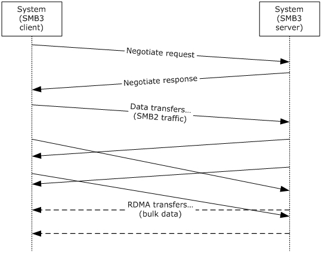
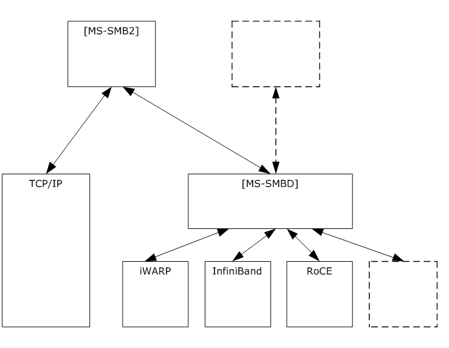
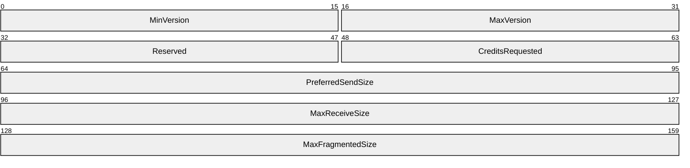
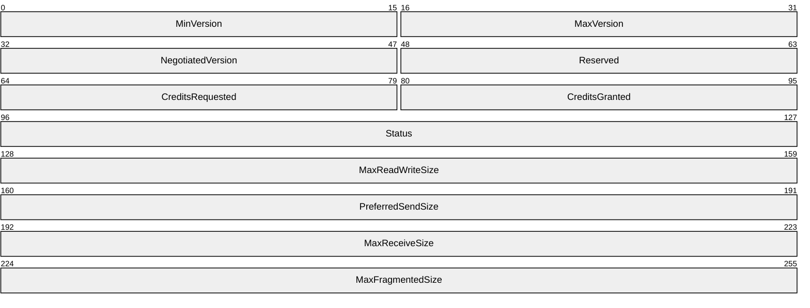
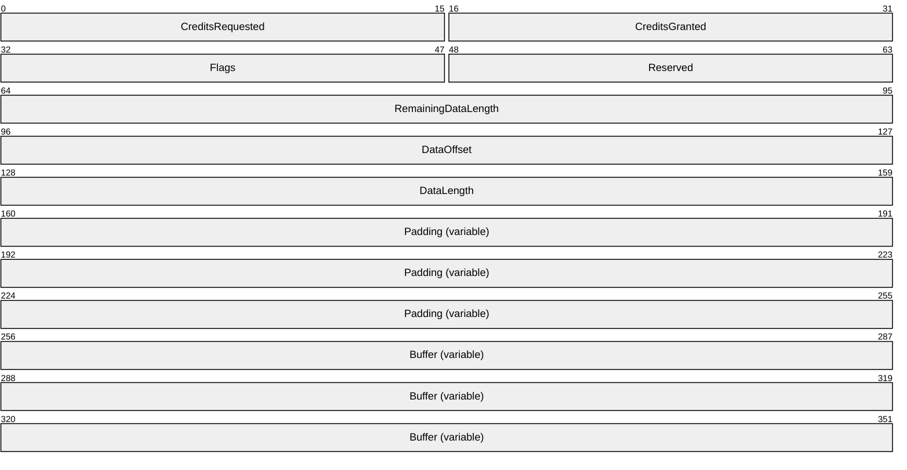
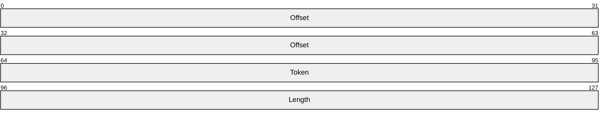
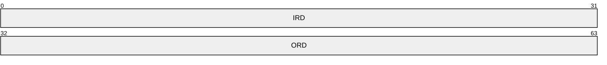

# [MS-SMBD]: SMB2 Remote Direct Memory Access (RDMA) Transport Protocol

Table of Contents

1 Introduction

- [1 Introduction](#Section_1)
  - [1.1 Glossary](#Section_1.1)
  - [1.2 References](#Section_1.2)
    - [1.2.1 Normative References](#Section_1.2.1)
    - [1.2.2 Informative References](#Section_1.2.2)
  - [1.3 Overview](#Section_1.3)
  - [1.4 Relationship to Other Protocols](#Section_1.4)
  - [1.5 Prerequisites/Preconditions](#Section_1.5)
  - [1.6 Applicability Statement](#Section_1.6)
  - [1.7 Versioning and Capability Negotiation](#Section_1.7)
  - [1.8 Vendor-Extensible Fields](#Section_1.8)
  - [1.9 Standards Assignments](#Section_1.9)

2 Messages

- [2 Messages](#Section_2)
  - [2.1 Transport](#Section_2.1)
  - [2.2 Message Syntax](#Section_2.2)
    - [2.2.1 Negotiate Request Message](#Section_2.2.1)
    - [2.2.2 Negotiate Response Message](#Section_2.2.2)
    - [2.2.3 Data Transfer Message](#Section_2.2.3)
      - [2.2.3.1 Buffer Descriptor V1 Structure](#Section_2.2.3.1)

3 Protocol Details

- [3 Protocol Details](#Section_3)
  - [3.1 Common Details](#Section_3.1)
    - [3.1.1 Abstract Data Model](#Section_3.1.1)
      - [3.1.1.1 Per RDMA Transport Connection](#Section_3.1.1.1)
    - [3.1.2 Timers](#Section_3.1.2)
      - [3.1.2.1 Negotiation Timer](#Section_3.1.2.1)
      - [3.1.2.2 Idle Connection Timer](#Section_3.1.2.2)
    - [3.1.3 Initialization](#Section_3.1.3)
    - [3.1.4 Higher-Layer Triggered Events](#Section_3.1.4)
      - [3.1.4.1 Connecting to the Peer](#Section_3.1.4.1)
      - [3.1.4.2 Send Message](#Section_3.1.4.2)
      - [3.1.4.3 Register Buffer](#Section_3.1.4.3)
      - [3.1.4.4 Deregister Buffer](#Section_3.1.4.4)
      - [3.1.4.5 RDMA Write to Peer Buffer](#Section_3.1.4.5)
      - [3.1.4.6 RDMA Read from Peer Buffer](#Section_3.1.4.6)
      - [3.1.4.7 Query Connection Parameters](#Section_3.1.4.7)
    - [3.1.5 Message Processing Events and Sequencing Rules](#Section_3.1.5)
      - [3.1.5.1 Sending Upper Layer Messages](#Section_3.1.5.1)
      - [3.1.5.2 Sending a Negotiate Request Message](#Section_3.1.5.2)
      - [3.1.5.3 Sending a Negotiate Response Message](#Section_3.1.5.3)
      - [3.1.5.4 Sending a Data Transfer Message](#Section_3.1.5.4)
      - [3.1.5.5 Receiving Any Message](#Section_3.1.5.5)
      - [3.1.5.6 Receiving a Negotiate Request Message](#Section_3.1.5.6)
      - [3.1.5.7 Receiving a Negotiate Response Message](#Section_3.1.5.7)
      - [3.1.5.8 Receiving a Data Transfer Message](#Section_3.1.5.8)
      - [3.1.5.9 Managing Credits Prior to Sending](#Section_3.1.5.9)
    - [3.1.6 Timer Events](#Section_3.1.6)
      - [3.1.6.1 Negotiation Timer](#Section_3.1.6.1)
      - [3.1.6.2 Idle Connection Timer](#Section_3.1.6.2)
    - [3.1.7 Other Local Events](#Section_3.1.7)
      - [3.1.7.1 Connection Loss](#Section_3.1.7.1)
      - [3.1.7.2 Connection Arrival](#Section_3.1.7.2)

4 Protocol Examples

- [4 Protocol Examples](#Section_4)
  - [4.1 Establishing a Connection](#Section_4.1)
  - [4.2 Peer Transmits 500 Bytes of Data](#Section_4.2)
  - [4.3 Peer Transmits 64 KiB of Data](#Section_4.3)
  - [4.4 Peer Transmits 1 MiB of Data Via Upper Layer](#Section_4.4)
  - [4.5 Peer Receives 1 MiB of Data Via Upper Layer](#Section_4.5)

5 Security

- [5 Security](#Section_5)
  - [5.1 Security Considerations for Implementers](#Section_5.1)
  - [5.2 Index of Security Parameters](#Section_5.2)

6 Appendix A: RDMA Provider IRD/ORD Negotiation

- [6 Appendix A: RDMA Provider IRD/ORD Negotiation](#Section_6)
  - [6.1 IRD/ORD Negotiate Header](#Section_6.1)
  - [6.2 IRD/ORD Negotiate Header Processing](#Section_6.2)

7 Appendix B: Product Behavior

- [7 Appendix B: Product Behavior](#Section_7)

8 Change Tracking

- [8 Change Tracking](#Section_8)

For the legal notice and IP terms, see [LEGAL.md](../LEGAL.md).
Last updated: 8/11/2025.
See [Revision History](#revision-history) for full version history.

# 1 Introduction

The SMB2 Remote Direct Memory Access (RDMA) Transport Protocol allows upper-layer packets to be delivered over RDMA-capable transports such as iWARP [[RFC5040]](https://go.microsoft.com/fwlink/?LinkId=230446) and [[RFC5041]](https://go.microsoft.com/fwlink/?LinkId=230447), Infiniband [[IBARCH]](https://go.microsoft.com/fwlink/?LinkId=230464) or RoCE [[ROCE]](https://go.microsoft.com/fwlink/?LinkId=230465), while utilizing the Direct Data Placement (DDP) capabilities, as defined in [RFC5040] section 2.1, of these transports. One upper layer that optionally uses the SMB2 Remote Direct Memory Access (RDMA) Transport Protocol is the Server Message Block (SMB) Protocol Versions 2 and 3 [MS-SMB2](../MS-SMB2/MS-SMB2.md).

Sections 1.5, 1.8, 1.9, 2, and 3 of this specification are normative. All other sections and examples in this specification are informative.

## 1.1 Glossary

This document uses the following terms:

**Direct Data Placement (DDP)**: For more information, see [RFC5040] section 2.1.

**iWARP**: For more information, see [RFC5040] section 2.1.

**little-endian**: Multiple-byte values that are byte-ordered with the least significant byte stored in the memory location with the lowest address.

**peer**: The entity being authenticated by the authenticator.

**RDMA Network Interface Controller (RNIC)**: For more information, see [RFC5040] section 2.1.

**RDMA Read**: For more information, see [RFC5040] section 2.1.

**RDMA Write**: For more information, see [RFC5040] section 2.1.

**Remote Direct Memory Access (RDMA)**: For more information, see [RFC5040] section 2.1.

**Send**: For more information see [RFC5040] section 2.4.

**Steering Tag (STag)**: For more information, see [RFC5040] section 2.1.

**Transmission Control Protocol (TCP)**: A protocol used with the Internet Protocol (IP) to send data in the form of message units between computers over the Internet. TCP handles keeping track of the individual units of data (called packets) that a message is divided into for efficient routing through the Internet.

**Verbs**: For more information, see [RFC5040] section 2.1.

**MAY, SHOULD, MUST, SHOULD NOT, MUST NOT:** These terms (in all caps) are used as defined in [[RFC2119]](https://go.microsoft.com/fwlink/?LinkId=90317). All statements of optional behavior use either MAY, SHOULD, or SHOULD NOT.

## 1.2 References

Links to a document in the Microsoft Open Specifications library point to the correct section in the most recently published version of the referenced document. However, because individual documents in the library are not updated at the same time, the section numbers in the documents may not match. You can confirm the correct section numbering by checking the [Errata](https://go.microsoft.com/fwlink/?linkid=850906).

### 1.2.1 Normative References

We conduct frequent surveys of the normative references to assure their continued availability. If you have any issue with finding a normative reference, please contact [dochelp@microsoft.com](mailto:dochelp@microsoft.com). We will assist you in finding the relevant information.

[IANAPORT] IANA, "Service Name and Transport Protocol Port Number Registry", [https://www.iana.org/assignments/service-names-port-numbers/service-names-port-numbers.xhtml](https://go.microsoft.com/fwlink/?LinkId=89888)

[RFC2119] Bradner, S., "Key words for use in RFCs to Indicate Requirement Levels", BCP 14, RFC 2119, March 1997, [https://www.rfc-editor.org/info/rfc2119](https://go.microsoft.com/fwlink/?LinkId=90317)

### 1.2.2 Informative References

[DRAFT-RDMA-VERBS] Hilland, J., Culley, P., Pinkerton, J., and Recio, R., "RDMA Protocol Verbs Specification (Version 1.0)", April 2003, [http://www.rdmaconsortium.org/home/draft-hilland-iwarp-verbs-v1.0-RDMAC.pdf](https://go.microsoft.com/fwlink/?LinkId=230467)

[IBARCH] Infiniband Trade Association, "Infiniband Architecture Specification, Volume 1", Release 1.2.1, January 2008, [https://www.infinibandta.org/](https://go.microsoft.com/fwlink/?LinkId=230464)

[MS-ERREF] Microsoft Corporation, "[Windows Error Codes](../MS-ERREF/MS-ERREF.md)".

[MS-SMB2] Microsoft Corporation, "[Server Message Block (SMB) Protocol Versions 2 and 3](../MS-SMB2/MS-SMB2.md)".

[MSKB-2934016] Microsoft Corporation, "Windows RT, Windows 8, and Windows Server 2012 update rollup: April 2014", [http://support.microsoft.com/kb/2934016](https://go.microsoft.com/fwlink/?LinkId=403955)

[RFC4296] Bailey, S., and Talpey, T., "The Architecture of Direct Data Placement (DDP) and Remote Direct Memory Access (RDMA) on Internet Protocols", RFC 4296, December 2005, [http://www.ietf.org/rfc/rfc4296.txt](https://go.microsoft.com/fwlink/?LinkId=231182)

[RFC5040] Recio. R., Metzler, B., Culley, P., Hilland, J., et. al., "A Remote Direct Memory Access Protocol Specification", RFC 5040, October 2007, [https://www.rfc-editor.org/info/rfc5040](https://go.microsoft.com/fwlink/?LinkId=230446)

[RFC5041] Shah, H., Pinkerton, J., Recio, R., and Culley, P., "Direct Data Placement over Reliable Transports", RFC 5041, October 2007, [http://www.ietf.org/rfc/rfc5041.txt](https://go.microsoft.com/fwlink/?LinkId=230447)

[RFC5042] Pinkerton, J., and Deleganes, E., "Direct Data Placement Protocol (DDP) / Remote Direct Memory Access Protocol (RDMAP) Security", RFC 5042, October 2007, [http://www.ietf.org/rfc/rfc5042.txt](https://go.microsoft.com/fwlink/?LinkId=230448)

[RFC6581] Kanevsky, A., Ed., Bestler, C., Ed., Sharp, R., and Wise, S., "Enhanced Remote Direct Memory Access (RDMA) Connection Establishment", RFC 6581, April 2012, [http://www.rfc-editor.org/rfc/rfc6581.txt](https://go.microsoft.com/fwlink/?LinkId=301388)

[ROCE] Infiniband Trade Association, "Annex A16: RDMA over Converged Ethernet (RoCE)", April 2010, [https://www.infinibandta.org/](https://go.microsoft.com/fwlink/?LinkId=230465)

[SDP-Portmap] Pinterton, J., Deleganes, E., and Krause, M., "RDMA Consortium, Sockets Direct Protocol (SDP) for iWARP over TCP", Section 7 Port Mapper Specification, October 2003, [http://www.rdmaconsortium.org/home/draft-pinkerton-iwarp-sdp-v1.0.pdf](https://go.microsoft.com/fwlink/?LinkId=253142)

## 1.3 Overview

The SMB2 RDMA Transport Protocol defines a framing for the exchange of arbitrary upper-layer data over RDMA-capable networks in a peer-to-peer fashion. The protocol allows for bidirectional traffic of variable size and does not require any particular upper-layer communication pattern, such as client-server. Accordingly, the protocol is well-suited to support SMB2 exchanges, which exhibit a mix of client and server requests and responses, asynchronous unsolicited messages from server to client, unacknowledged requests such as cancellation, and an extremely wide range of sizes.

RDMA networks provide high-bandwidth and low-latency data services, and adapters supporting RDMA typically provide a local control interface offering extremely low processing overhead for sending and receiving messages. Additionally, the RDMA functions of the network provide for further reduction of overhead by moving bulk data directly between memory buffers on each [**peer**](#gt_peer), under the control and protection of upper layers such as SMB2. The results can radically reduce network overhead on a cycles per byte transferred basis.

The SMB2 RDMA Transport Protocol also defines interfaces and peer-visible descriptors for registering buffers which enable RDMA access, advertised to the peer for read or write on a specific connection. These buffer descriptors allow the upper layer to steer direct placement traffic, without requiring the upper layer to interface with the RDMA lower layer directly.

The following figure depicts an initial exchange of traffic beneath a typical SMB2 Protocol stack.

Figure 1: Data transfer

## 1.4 Relationship to Other Protocols

**RDMA Transports**

The SMB2 RDMA Transport Protocol is transport-independent. It requires only an RDMA lower layer as described in section [2.1](#Section_2.1), for sending and receiving the messages that are specified in this document.

The RDMA transports most commonly used by the SMB2 RDMA Transport Protocol include:

- [**iWARP**](#gt_iwarp), as specified in [[RFC5040]](https://go.microsoft.com/fwlink/?LinkId=230446) and [[RFC5041]](https://go.microsoft.com/fwlink/?LinkId=230447).
- Infiniband Reliable Connected mode, as specified in [[IBARCH]](https://go.microsoft.com/fwlink/?LinkId=230464).
- RDMA over Converged Ethernet (RoCE), as specified in [[ROCE]](https://go.microsoft.com/fwlink/?LinkId=230465).
Each of the preceding transports can require the presence of additional member protocols to support fabric management and configuration, naming, and connection establishment. Any such protocols are described in the relevant specifications.

**Protocols Transported**

The following protocol uses the SMB2 RDMA Transport Protocol as a transport and provides access to enhanced data transfer functionality:

- The SMB2 Protocol [MS-SMB2](../MS-SMB2/MS-SMB2.md), when SMB2 version 3.0 or 3.02 is negotiated by both client and server and when an RDMA-capable transport is available for connection among the peers.
**Additional Related Protocols**

- The functionality provided by the SMB2 RDMA Transport Protocol, when accompanied by an RDMA transport, provides similar transport service to that of standard TCP/IP. Protocols such as SMB2 which define an existing layer over [**TCP**](#gt_transmission-control-protocol-tcp) can employ either or both to implement communications between peers.
The following block diagram represents the preceding relationships, with optional protocol relationships represented by dashed outlines, subject to appropriate standards to define a mapping.

Figure 2: Protocol relationships

## 1.5 Prerequisites/Preconditions

The protocol functions only in conjunction with the availability of RDMA provider resources on the local machine, including [**RDMA Network Interface Controller (RNIC)**](#gt_rdma-network-interface-controller-rnic) hardware, and a local facility, as described in [[RFC4296]](https://go.microsoft.com/fwlink/?LinkId=231182), to interface with it. These requirements are not discussed in the specification.

The RDMA lower layer provides reliable in-order delivery of sent and received messages, and offers consistency semantics for directly placed data in send/receive message completion, as required by the relevant standards.

## 1.6 Applicability Statement

The protocol is applicable for scenarios that require SMB2 for transferring files between client and server and for inter-process communication between client and server that are using named pipes, when an RDMA fabric is additionally present. Typically, such fabrics are deployed at a data center diameter, but can also be deployed in wide-area topologies. The SMB2 Protocol is applicable at a similar scale.

The protocol can have other applicability, subject to further specification by other upper- layer protocols.

## 1.7 Versioning and Capability Negotiation

This document describes a single protocol version, as defined in the following table.

| Value | Meaning |
| --- | --- |
| 0x0100 | SMBDirect Protocol 1.0 version number |

The protocol provides for version negotiation by range at connection establishment, and is designed to support potential future revision in an upwardly compatible fashion. Currently, no such versions are defined.

The protocol also supports initial negotiation of certain message size and message credit count values to be used on a per-connection basis. After a connection is established and the values negotiated, the protocol operates under these values for the duration of the underlying connection.

While oriented toward carrying SMB2 Protocol upper-layer traffic, other upper layers can use the protocol to achieve similar capabilities. Such issues are a matter for any such protocols.

## 1.8 Vendor-Extensible Fields

None.

## 1.9 Standards Assignments

The protocol does not define any standards assignments; however, when used as a transport for an upper layer, it uses the standards assignments of that layer, as defined by that layer. For example, when serving as a transport for SMB2, the following port assignment is used, as defined in [MS-SMB2](../MS-SMB2/MS-SMB2.md) section 1.9.

| Parameter | TCP Port Value | Reference |
| --- | --- | --- |
| Microsoft-DS | 445 (0x01BD) | [[IANAPORT]](https://go.microsoft.com/fwlink/?LinkId=89888) |

RDMA lower layers can optionally remap these ports to allow for reuse of port values when sharing a network with TCP protocol traffic, or provide a service mapping facility when the network does not natively support IANA-style ports. These transport-dependent facilities are documented in the specifications relevant to each lower-layer RDMA standard.

When transporting SMB traffic on [**iWARP**](#gt_iwarp), to permit coexistence of TCP and iWARP SMB listeners, a mapping is standardized for the SMB Direct protocol, as follows:

| Parameter | TCP Port Value | Reference |
| --- | --- | --- |
| smbdirect | 5445 | [IANAPORT] |

This mapping is provided dynamically to network peers by the SDP Port Mapper protocol [[SDP-Portmap]](https://go.microsoft.com/fwlink/?LinkId=253142), when an iWARP adapter is available on the local system, in response to a portmapper query for the mapped port corresponding to Microsoft-DS (445).

# 2 Messages

## 2.1 Transport

The following sections specify how messages are represented on the wire and specify the protocol data types.

The protocol operates over an RDMA transport which MUST support reliable in-order message delivery, and MUST support remote [**direct data placement**](#gt_direct-data-placement-ddp) via [**RDMA Write**](#gt_rdma-write) and [**RDMA Read**](#gt_rdma-read) requests. Examples of such transports are [**iWARP**](#gt_iwarp), Infiniband and RoCE, as described in section [1.4](#Section_1.4)<1>. A local interface supporting the [**Verbs**](#gt_verbs) semantic is typically provided by the local operating system, specified in [[DRAFT-RDMA-VERBS]](https://go.microsoft.com/fwlink/?LinkId=230467) and [[IBARCH]](https://go.microsoft.com/fwlink/?LinkId=230464).

## 2.2 Message Syntax

The protocol is composed of, and driven by, message exchanges between peers in the following categories:

- Connection negotiation: request, response
- Data transfer
The two connection negotiation messages are exchanged exactly once as the first two messages on a connection. Following that successful exchange, data transfer messages are exchanged in an arbitrary peer-to-peer fashion, under control of an upper layer. Contained in each data transfer message body is optional upper-layer data. A message is therefore of variable length, with the total length depending on the type of message and any upper-layer payload.

Unless otherwise specified, multiple-byte fields (16-bit, 32-bit, and 64-bit fields) in any message MUST be transmitted in [**little-endian**](#gt_little-endian) order (least-significant byte first).

Unless otherwise specified, numeric fields in any message are unsigned integers of the specified byte length.

Unless otherwise specified, fields marked as "Reserved" in any message SHOULD be set to 0 when being sent and MUST be ignored when received. These fields MUST NOT be used for implementation-specific functionality.

When it is necessary to insert padding bytes in after any message for data alignment purposes, such bytes SHOULD be set to 0 when being sent and MUST be ignored when received.

### 2.2.1 Negotiate Request Message

The Negotiate Request message is the first message sent by the initiator of a new connection, used to begin establishing a connection with the [**peer**](#gt_peer).

**MinVersion (2 bytes):** The minimum protocol version supported by the sender. The value MUST be set to one of the values listed in section [1.7](#Section_1.7).

**MaxVersion (2 bytes):** The maximum protocol version supported by the sender. The value MUST be greater than or equal to the **MinVersion** field and MUST be set to one of the values listed in section 1.7. The sender MUST support all protocol versions that fall in the range inclusively specified by the **MinVersion** and **MaxVersion** fields.

**Reserved (2 bytes):** The sender SHOULD set this field to 0 and the receiver MUST ignore it on receipt.

**CreditsRequested (2 bytes):** The number of Send Credits requested of the receiver.

**PreferredSendSize (4 bytes):** The maximum number of bytes that the sender requests to transmit in a single message.

**MaxReceiveSize (4 bytes):** The maximum number of bytes that the sender can receive in a single message.

**MaxFragmentedSize (4 bytes):** The maximum number of upper-layer bytes that the sender can receive as the result of a sequence of fragmented [**Send**](#gt_send) operations.

### 2.2.2 Negotiate Response Message

The Negotiate Response message is the second message sent on a new connection, in response to the Negotiate Request message, to complete the establishment of a connection.

**MinVersion (2 bytes):** The minimum protocol version supported by the sender. The value MUST be set to one of the values listed in section [1.7](#Section_1.7).

**MaxVersion (2 bytes):** The maximum protocol version supported by the sender. The value MUST be greater than or equal to the **MinVersion** field and MUST be set to one of the values listed in section 1.7. The sender MUST support all protocol versions that fall in the range inclusively specified by the **MinVersion** and **MaxVersion** fields.

**NegotiatedVersion (2 bytes):** The protocol version that has been selected for this connection. This value MUST be one of the values from the range specified by the Negotiate Request message.

**Reserved (2 bytes):** The sender SHOULD set this field to 0 and the receiver MUST ignore it on receipt.

**CreditsRequested (2 bytes):** The number of Send Credits requested of the receiver.

**CreditsGranted (2 bytes):** The number of Send Credits granted by the sender.

**Status (4 bytes):** Indicates whether the Negotiate Request message succeeded. The value MUST be set to STATUS_SUCCESS (0x00000000) if the Negotiate Request message succeeds.

**MaxReadWriteSize (4 bytes):** The maximum number of bytes that the sender will transfer via [**RDMA Write**](#gt_rdma-write) or [**RDMA Read**](#gt_rdma-read) request to satisfy a single upper-layer read or write request.

**PreferredSendSize (4 bytes):** The maximum number of bytes that the sender will transmit in a single message. This value MUST be less than or equal to the **MaxReceiveSize** value of the Negotiate Request message.

**MaxReceiveSize (4 bytes):** The maximum number of bytes that the sender can receive in a single message.

**MaxFragmentedSize (4 bytes):** The maximum number of upper-layer bytes that the sender can receive as the result of a sequence of fragmented [**Send**](#gt_send) operations.

### 2.2.3 Data Transfer Message

The Data Transfer message is sent to transfer upper-layer data, manage credits, or perform other functions. This request optionally contains upper-layer data to transfer as the message’s data payload. The sender can send a Data Transfer Request message with no data payload to grant credits, request credits, or perform other functions.

**CreditsRequested (2 bytes):** The total number of Send Credits requested of the receiver, including any Send Credits already granted.

**CreditsGranted (2 bytes):** The incremental number of Send Credits granted by the sender.

**Flags (2 bytes):** The flags indicating how the operation is to be processed. This field MUST be constructed by using any or none of the following values:

| Value | Meaning |
| --- | --- |
| SMB_DIRECT_RESPONSE_REQUESTED (0x0001) | The [**peer**](#gt_peer) is requested to promptly send a message in response. This value is used for keep alives. |

The **Flags** field MUST be set to zero if no flag values are specified.

**Reserved (2 bytes):** The sender SHOULD set this field to 0 and the receiver MUST ignore it on receipt.

**RemainingDataLength (4 bytes):** The amount of data, in bytes, remaining in a sequence of fragmented messages. If this value is 0x00000000, this message is the final message in the sequence.

**DataOffset (4 bytes):** The offset, in bytes, from the beginning of the header to the first byte of the message’s data payload. If no data payload is associated with this message, this value MUST be 0. This offset MUST be 8-byte aligned from the beginning of the message.

**DataLength (4 bytes):** The length, in bytes, of the message’s data payload. If no data payload is associated with this message, this value MUST be 0.

**Padding (4 bytes, optional):** Additional bytes optionally inserted into the message in order to align the data payload, if present, as defined by the **DataOffset** and **DataLength** fields. These bytes SHOULD be set to zero (0x00) by the sender and MUST be ignored by the receiver. Note that because the **DataLength** field ends on a non-8-byte aligned offset, four bytes of padding are typically present when a data payload is also present.

**Buffer (variable):** A buffer that contains the data payload as defined by the **DataOffset** and **DataLength** fields.

#### 2.2.3.1 Buffer Descriptor V1 Structure

The SMB_DIRECT_BUFFER_DESCRIPTOR_V1 structure represents a registered RDMA buffer and is used to Advertise the source and destination of [**RDMA Read**](#gt_rdma-read) and [**RDMA Write**](#gt_rdma-write) operations, respectively. The upper layer optionally embeds one or more of these structures in its payload when requesting RDMA direct placement of [**peer**](#gt_peer) data via the protocol.

**Offset (8 bytes):** The RDMA provider-specific offset, in bytes, identifying the first byte of data to be transferred to or from the registered buffer.

**Token (4 bytes):** An RDMA provider-assigned [**Steering Tag**](#gt_steering-tag-stag) for accessing the registered buffer.

**Length (4 bytes):** The size, in bytes, of the data to be transferred to or from the registered buffer.

# 3 Protocol Details

## 3.1 Common Details

### 3.1.1 Abstract Data Model

This section describes a conceptual model of possible data organization that an implementation maintains to participate in this protocol. The described organization is provided to facilitate the explanation of how the protocol behaves. This document does not mandate that implementations adhere to this model as long as their external behavior is consistent with what is described in this document.

#### 3.1.1.1 Per RDMA Transport Connection

**Connection.Endpoint**: The implementation-dependent representation used to access the RDMA connection.

**Connection.Protocol**: The protocol version negotiated with the remote [**peer**](#gt_peer) for this connection.

**Connection.Role**: A value indicating whether the peer connection was initiated or accepted, and what message type is therefore expected. The value MUST be one of "ACTIVE", "PASSIVE", or "ESTABLISHED".

**Connection.MaxSendSize**: The maximum single-message size which can be sent by the local peer for this connection.

**Connection.MaxReceiveSize**: The maximum single-message size which can be received from the remote peer for this connection.

**Connection.MaxFragmentedSendSize**: The maximum fragmented upper-layer payload receive size supported by the remote peer for this connection.

**Connection.MaxFragmentedRecvSize**: The maximum fragmented upper-layer payload receive size supported by the local peer for this connection.

**Connection.MaxReadWriteSize**: The maximum size of any RDMA transfer available for this connection.

**Connection.SendCreditTarget**: The local peer’s current Send Credit target to be requested of the remote peer.

**Connection.SendCredits**: The local peer’s current Send Credit limit, as granted by the remote peer.

**Connection.ReceiveCreditMax**: The local peer’s current maximum number of credits to grant to the remote peer.

**Connection.ReceiveCreditTarget**: The remote peer’s most recent credits requested of the local peer.

**Connection.ReceiveCredits**: The local peer’s current outstanding receive count.

**Connection.SendQueue**: A list of outstanding messages awaiting transmission, with one optional remote memory token to be invalidated with the send. The list MUST be maintained in strict First-In First-Out (FIFO) order.

**Connection.FragmentReassemblyBuffer**: A buffer used to reassemble the upper-layer data payload of received fragmented messages.

**Connection.FragmentReassemblyRemaining**: A count of bytes of data remaining to be reassembled into the **Connection.FragmentReassemblyBuffer**.

**Connection.InvalidatedToken**: A local memory token, if any, which was invalidated by the RDMA provider in the process of receiving one or more message segments.

**Connection.KeepaliveInterval**: The timeout to initiate send of a keepalive message on an idle RDMA connection.

**Connection.KeepaliveRequested**: A value indicating whether a send with the SMB_DIRECT_RESPONSE_REQUESTED flag is outstanding. The value MUST be one of "NONE", "PENDING", or "SENT".

**Connection.SendImmediate**: A Boolean value that, if set, indicates a data packet is to be sent immediately.

### 3.1.2 Timers

#### 3.1.2.1 Negotiation Timer

This per-connection timer regulates the amount of time to establish a connection and to deliver or obtain a negotiation response from the [**peer**](#gt_peer), before failing the request and disconnecting the connection.

#### 3.1.2.2 Idle Connection Timer

This per-connection timer regulates the amount of time to allow the connection to be idle without receiving a message from the remote [**peer**](#gt_peer). When the Idle Connection Timer<2> expires, a message is sent to the peer with the SMB_DIRECT_RESPONSE_REQUESTED flag set. If a message is not received from the peer in response, the local peer can disconnect the connection.

### 3.1.3 Initialization

None.

### 3.1.4 Higher-Layer Triggered Events

The protocol is initiated and subsequently driven by a series of higher-layer triggered events in the following categories:

- Initiating a connection to a remote [**peer**](#gt_peer)
- Sending an outgoing upper-layer message
- Registering a local buffer for peer RDMA access
- Deregistering a previously registered local buffer
- Performing an [**RDMA Write**](#gt_rdma-write) to a remote peer buffer
- Performing an [**RDMA Read**](#gt_rdma-read) from a remote peer buffer
- Querying the negotiated parameters of a connection
The following sections provide details on these events.

#### 3.1.4.1 Connecting to the Peer

When the upper layer requests that the protocol initiate a connection to a remote [**peer**](#gt_peer), it passes the address of the remote peer to connect to, and the initiator MUST:

- Create a new **Connection**.
- Set **Connection.Role** to "ACTIVE".
- Use implementation-specific means to create a new **Connection.Endpoint**.
- Determine an initial value for **Connection.ReceiveCreditMax**, **Connection.SendCreditTarget**, **Connection.MaxSendSize**, **Connection.MaxFragmentedRecvSize**, **Connection.MaxReceiveSize** and **Connection.KeepaliveInterval**.<3>
- Set **Connection.MaxReadWriteSize** to 0.
- Set **Connection.KeepaliveRequested** to "NONE".
- Set **Connection.Protocol**, **Connection.SendCredits**, **Connection.ReceiveCredits**, and **Connection.FragmentReassemblyRemaining** to 0.
- Set **Connection.SendQueue**, **Connection.FragmentReassemblyBuffer**, and **Connection.InvalidatedToken** to empty.
- Set **Connection.SendImmediate** to FALSE.
- Start a Negotiation Timer of 120 seconds.
- Post one receive buffer of at least 512 bytes.
- Request a connection to the specified remote peer.
If the connection request fails, the resulting error MUST be returned to the upper layer. If the connection request succeeds, the initiator MUST send a Negotiate Request message as specified in section [3.1.5.2](#Section_3.1.5.2).

If the negotiation is successful, an implementation-defined representation of the **Connection** is returned to the upper layer as specified in section [3.1.5.4](#Section_3.1.5.4). If unsuccessful, an implementation-specific local error is returned.

#### 3.1.4.2 Send Message

When the upper layer requests that the protocol sends a message, it passes:

- The implementation-defined representation of the **Connection**.
- A buffer containing the message.
- An optional remote memory token to be invalidated on the receiving peer.
The sender MUST determine if the buffer contains a message that is of a length less than or equal to **Connection.MaxFragmentedSendSize**. If not, the message cannot be sent and an implementation-specific local error MUST be returned.

The sender MUST prepare and [**Send**](#gt_send) each fragment as Data Transfer messages sequentially and in strict order on the connection, as described in section [3.1.5.4](#Section_3.1.5.4). If any of the Send messages result in failure, the RDMA layer will have initiated termination of the connection. The result of the operation from the RDMA provider MUST be provided to the upper layer.

#### 3.1.4.3 Register Buffer

When the upper layer prepares a local buffer as the source or destination of a [**peer**](#gt_peer) [**RDMA Read**](#gt_rdma-read) or [**RDMA Write**](#gt_rdma-write) operation, it passes:

- The implementation-defined representation of the **Connection**.
- The buffer to be registered
- A flag indicating whether the buffer is to be registered for RDMA Read and/or RDMA Write operations.
The registration MUST use implementation-specific means to register the memory locations indicated by the buffer with the underlying RDMA provider, enabling only the permissions appropriate for the RDMA Read or RDMA Write indication provided, on the specified **Connection**. If the local implementation requires multiple registrations--for example if the memory locations indicated by buffer are discontiguous or if the size exceeds provider-supported limits-- multiple such registrations can be performed. If the RDMA provider indicates an error for any registration, the error result MUST be provided to the upper layer and the memory locations indicated by the buffer SHOULD NOT remain enabled for remote access.

If all registration succeeds, an array of one or more Buffer Descriptor V1 structures MUST be built, where each element contains the RDMA provider-specific Offset, Token, and Length fields of each registered segment in sequential order, and where the entire array describes remote access to each memory location in the provided buffer.

#### 3.1.4.4 Deregister Buffer

When the upper layer has completed operations which require remote access to a previously registered local buffer as the source or destination of a [**peer**](#gt_peer) [**RDMA Read**](#gt_rdma-read) or [**RDMA Write**](#gt_rdma-write) operation, it passes:

- The implementation-defined representation of the **Connection**.
- One or more Buffer Descriptor V1 structures as returned from prior calls to Register Buffer.
The registration MUST use implementation-specific means to deregister each memory region indicated by each Buffer Descriptor V1 structure with the underlying RDMA provider. If the RDMA provider indicates an error for any deregistration, the error result MUST be provided to the upper layer. Otherwise, it MUST be ensured, in an implementation-specific manner via the RDMA lower layer provider, that all remote access to the specified buffers is complete and that no further remote access is possible.

#### 3.1.4.5 RDMA Write to Peer Buffer

When the upper layer modifies a remote [**peer**](#gt_peer) buffer, it passes:

- The implementation-defined representation of the **Connection**.
- The local buffer whose contents are to be written to the peer.
- An array of one or more Buffer Descriptor V1 structures describing the remote peer buffer as obtained from the peer in an upper-layer operation on the **Connection**.
- An Offset into the remote peer buffer indicating the first byte of the target subsegment to be written.
The operation MUST use the provided Offset to index into the provided array of Buffer Descriptor V1 structure elements by consuming the elements’ **Length** fields to identify the first Buffer Descriptor V1 structure to use. It MUST then use the length of the provided buffer to determine how many Buffer Descriptor V1 structure elements describe the targeted remote peer buffer locations. It MUST adjust the **Offset** and **Length** fields of the first element to indicate the trailing subsegment of the first peer buffer segment, and MUST adjust the **Length** field of the last element to indicate the leading subsegment of the last peer buffer segment.

The operation MUST use implementation-specific means to request that the RDMA provider perform one or more [**RDMA Write**](#gt_rdma-write) operations to transfer data from the memory locations indicated by the buffer, to the remote peer memory locations described by the Buffer Descriptor V1 structure elements calculated in the previous step, on the specified Connection. The result of the operation from the RDMA provider MUST be provided to the upper layer.

#### 3.1.4.6 RDMA Read from Peer Buffer

When the upper layer is required to retrieve the contents of a remote [**peer**](#gt_peer) buffer, it passes:

- The implementation-defined representation of the **Connection**.
- The local buffer whose contents are to receive the data from the peer.
- An array of one or more Buffer Descriptor V1 structures describing the remote peer buffer as obtained from the peer in an upper-layer operation on the **Connection**,
- An Offset into the remote peer buffer indicating the first byte of the target subsegment to be read.
The provided Offset MUST be used to index into the provided array of Buffer Descriptor V1 structure elements by consuming the elements’ **Length** fields to identify the first Buffer Descriptor V1 structure to use. It MUST then use the length of the provided buffer to determine how many Buffer Descriptor V1 structure elements describe the targeted remote peer buffer locations. It MUST adjust the **Offset** and **Length** fields of the first element to indicate the trailing subsegment of the first peer buffer segment, and MUST adjust the Length field of the last element to indicate the leading subsegment of the last peer buffer segment.

Implementation-specific means MUST be used to request that the RDMA provider perform one or more RDMA Read operations to transfer data from the remote peer memory locations described by the Buffer Descriptor V1 structure elements calculated in the previous step, to the memory locations described by the buffer, on the specified **Connection**. The result of the operation from the RDMA provider MUST be provided to the upper layer.

#### 3.1.4.7 Query Connection Parameters

When the upper layer is required to retrieve the properties of the connection, it passes:

- The implementation-defined representation of the **Connection**.
The **Connection.MaxSendSize**, **Connection.MaxFragmentedSendSize**, **Connection.MaxReceiveSize**, **Connection.MaxReadWriteSize**, and **Connection.KeepaliveInterval** for this connection MUST be returned.

### 3.1.5 Message Processing Events and Sequencing Rules

#### 3.1.5.1 Sending Upper Layer Messages

The processing specified in this section is to be used only when **Connection.Role** is "ESTABLISHED", to start or restart sending one or more new or previously deferred Data Transfer messages. The caller passes the **Connection** to use for the [**Send**](#gt_send) message, and zero or more new messages to be sent.

The new messages to be sent, if any, MUST be appended to the list of messages in the **Connection.SendQueue**. If there are no messages to be sent and **Connection.SendImmediate** is TRUE, a newly constructed Data Transfer Message MUST be added to **Connection.SendQueue**.

For each message in **Connection.SendQueue**:

- If **Connection.SendCredits** is 0, stop processing.
- If **CreditsGranted** field of the first message in **Connection.SendQueue** is zero, the credit processing specified in section [3.1.5.9](#Section_3.1.5.9) MUST be performed, and the **CreditsGranted** field of the message MUST be set to the number of new credits returned.
- If **Connection.SendCredits** is 1 and the **CreditsGranted** field of the message is 0, stop processing.
- The first message MUST be removed from **Connection.SendQueue**.
- The value of **Connection.SendCredits** MUST be decremented by one.
- The value of the **CreditsRequested** field of the message MUST be set to **Connection.SendCreditTarget**.
- If **Connection.KeepaliveRequested** is "PENDING", the **Flags** field of the message MUST be set to SMB_DIRECT_RESPONSE_REQUESTED, **Connection.KeepaliveRequested** MUST be set to "SENT", and the Idle Connection Timer SHOULD<4> be set to an implementation-specific value. Otherwise, the **Flags** field of the message MUST be set to 0x0000.
- If the message to be sent was provided with an optional remote memory token to be invalidated on the receiving peer, the token SHOULD be provided in an implementation-specific manner to the RDMA provider when sending. If sending of remote invalidation is not supported by the RDMA provider, the token MAY be ignored.
- The message MUST be sent on the connection in an implementation-specific manner.
- **Connection.SendImmediate** MUST be set to FALSE.

#### 3.1.5.2 Sending a Negotiate Request Message

After a successful connection as described in section [3.1.4.1](#Section_3.1.4.1), the first message sent on the connection is the Negotiation Request as defined in section [2.2.1](#Section_2.2.1). The caller passes the **Connection** to use for the [**Send**](#gt_send) message. The message fields are set as follows:

- **MinVersion** MUST be set to 0x0100.
- **MaxVersion** MUST be set to 0x0100.
- **Reserved** MUST be set to 0x0000.
- **CreditsRequested** SHOULD be set to **Connection.SendCreditTarget**.
- **PreferredSendSize** MUST be set to **Connection.MaxSendSize**.
- **MaxReceiveSize** MUST be set to **Connection.MaxReceiveSize**.
- **MaxFragmentedSize** MUST be set to **Connection.MaxFragmentedRecvSize**.
The message MUST be posted to the RDMA provider in an implementation-specific manner, and the returned result MUST be returned to the caller.

#### 3.1.5.3 Sending a Negotiate Response Message

In response to a Negotiate Request message as specified in section [3.1.5.6](#Section_3.1.5.6), the second message sent on the connection is the Negotiation Response message as specified in section [2.2.2](#Section_2.2.2). The caller passes the **Connection** to use for the [**Send**](#gt_send) message, and the **Status** field to return to the [**peer**](#gt_peer). The message fields are set as follows:

- **MinVersion** MUST be set to 0x0100.
- **MaxVersion** MUST be set to 0x0100.
- **Reserved** MUST be set to 0x0000.
- **Status** MUST be set to the passed-in Status parameter.
If the **Status** field is not equal to 0x00000000, all fields in the message not set above MUST be set to 0x0000. The message MUST be posted to the RDMA provider in an implementation-specific manner, and a graceful termination of the connection SHOULD be performed.

Otherwise, a successful Negotiate Response is built with fields set as follows:

- **NegotiatedVersion** MUST be set to **Connection.ProtocolVersion**.
- **CreditsRequested** SHOULD be set to **Connection.SendCreditTarget**.
- **CreditsGranted** MUST be set to **Connection.ReceiveCredits**.
- **MaxReadWriteSize** MUST be set to **Connection.MaxReadWriteSize**.
- **PreferredSendSize** MUST be set to **Connection.MaxSendSize**.
- **MaxReceiveSize** MUST be set to **Connection.MaxReceiveSize**.
- **MaxFragmentedSize** MUST be set to **Connection.MaxFragmentedRecvSize**.
The sender MUST post the message to the RDMA provider in an implementation-specific manner, and the returned result MUST be returned to the caller.

#### 3.1.5.4 Sending a Data Transfer Message

After a successful negotiation as described in section [3.1.5.7](#Section_3.1.5.7), all further messages sent on the connection MUST be Data Transfer messages as defined in section [2.2.3](#Section_2.2.3). The caller passes:

- The **Connection** to use for the [**Send**](#gt_send) message.
- A buffer containing the message.
- An optional remote memory token to be invalidated on the receiving peer.
It MUST be determined if the buffer contains a message that is of a length greater than **Connection.MaxFragmentedSendSize**. If so, the message cannot be sent and an implementation-specific local error MUST be returned.

If the buffer is empty, no upper-layer payload is present and the following message fields are set:

- **Reserved** MUST be set to 0x0000.
- **RemainingDataLength** MUST be set to 0x00000000.
- **DataOffset** MUST be set to 0x00000000.
- **DataLength** MUST be set to 0x00000000.
- **Padding** and **Buffer** are not present.
The empty message is sent as specified in section [3.1.5.1](#Section_3.1.5).

Otherwise, the buffer MUST be sent in one or more segments.

For each such segment, the **DataOffset** and **DataLength** fields MUST be determined to send the segment, as required.

- The **DataOffset** MUST be 8-byte aligned in the message.
- **DataLength** MUST have a maximum value such that **DataOffset** plus **DataLength** does not exceed **Connection.MaxSendSize**.
- The value of **DataOffset** SHOULD be 24, and **DataLength** SHOULD be the smaller of the size of the passed in buffer, or **Connection.MaxSendSize** - 24, and both MAY be set to any other valid values.
The following message fields are set in the segment:

- If no bytes of the buffer remain to be sent after the current segment, the **RemainingDataLength** field MUST be set to 0x00000000, otherwise the **RemainingDataLength** field MUST be set to the total size of the buffer not yet sent.
- The **DataOffset** and **DataLength** fields MUST be set to the values determined.
- **Padding** MUST be set to 0x00000000 for the length indicated by **DataOffset** - 20.
- **Buffer** MUST contain the **DataLength** bytes to transmit.
If the caller provided an optional memory token to be invalidated on the remote peer, the token MUST be requested to be included by the RDMA provider with exactly one segment. Additional segments, if any, are prepared until the **RemainingDataLength** field is zero.

The resulting sequence of one or more messages MUST be sent in strict sequential order on the **Connection** via the interface specified in section 3.1.5.1. If any Send messages result in failure, the RDMA layer will have initiated termination of the connection. The result of the operation from the RDMA provider MUST be returned to the caller.

#### 3.1.5.5 Receiving Any Message

If **Connection.Role** is "PASSIVE", the **Connection** and received buffer MUST be handled as specified in section [3.1.5.6](#Section_3.1.5.6) Receiving a Negotiate Request Message.

Else if **Connection.Role** is "ACTIVE", the **Connection** and received buffer MUST be handled as specified in section [3.1.5.7](#Section_3.1.5.7) Receiving a Negotiate Response Message.

Else the **Connection.Role** is "ESTABLISHED". The Idle Connection Timer MUST be retriggered to the value of **Connection.KeepaliveInterval** and **Connection.KeepaliveRequested** MUST be set to "NONE". The **Connection** and received buffer MUST be handled as specified in section [3.1.5.8](#Section_3.1.5.8) Receiving a Data Transfer Message.

#### 3.1.5.6 Receiving a Negotiate Request Message

The first message received by the listening side of the connection is a Negotiate Request Message.

The receiver of the message MUST verify:

- The length of the received message is at least 20 bytes.
If the preceding condition is not satisfied, the receiver MUST terminate the connection and stop processing the message.

The receiver of the message MUST further verify:

- The range of values between **MinVersion** and **MaxVersion** inclusive MUST include 0x0100.
If the preceding condition is not satisfied, the receiver MUST generate a Negotiate Response failure message by invoking the processing specified in section [3.1.5.3](#Section_3.1.5.3) and passing a Status argument set to STATUS_NOT_SUPPORTED.

Otherwise, both **MinVersion** and **MaxVersion** SHOULD<5> be ignored.

The receiver of the message MUST further verify:

- The **CreditsRequested** field is greater than 0.
- The **MaxReceiveSize** field is at least 128 bytes.
- The **MaxFragmentedSize** field is at least 131,072 bytes.
If any of the preceding conditions are not satisfied, the receiver MUST terminate the connection and stop processing the message.

The receiver SHOULD<6> set **Connection.MaxReceiveSize** to the smaller of **Connection.MaxReceiveSize** and the value of the received **PreferredSendSize** field. If the result is less than 128, then **Connection.MaxReceiveSize** MUST be set to 128.

The receiver MUST:

- Set the **Connection.Protocol** to 0x0100.
- Set the **Connection.ReceiveCreditTarget** to the value of the received **CreditsRequested** field.
- Set **Connection.MaxSendSize** to the smaller of **Connection.MaxSendSize** and the value of the received **MaxReceiveSize** field.
- Set **Connection.MaxFragmentedSendSize** to **MaxFragmentedSize.**
The receive operations and credits MUST be initialized as specified in section [3.1.5.9](../MS-ERREF/MS-ERREF.md). If the resulting **Connection.ReceiveCredits** is zero, the receiver MUST generate a Negotiate Response failure message by invoking the processing specified in section 3.1.5.3 and passing a Status argument set to any of those defined in [MS-ERREF](../MS-ERREF/MS-ERREF.md) section 2.3 with a Severity of STATUS_SEVERITY_ERROR.

Otherwise, a Negotiate Response MUST be sent as specified in section 3.1.5.3, passing a Status of 0x0000, and the new **Connection** MUST be indicated to the upper layer as specified in section [3.1.7.2](#Section_3.1.7.2), after which the Negotiation Timer MUST be canceled.

The idle Connection Timer MUST be set to a value of **Connection.KeepaliveInterval** seconds, and **Connection.Role** MUST be set to "ESTABLISHED".

#### 3.1.5.7 Receiving a Negotiate Response Message

The first message received by the initiating side of the connection is a Negotiate Response message.

The receiver of the message MUST verify:

- The length of the received message is at least 32 bytes.
- The **NegotiatedVersion** field is 0x0100.
- The **MaxReceiveSize** field is at least 128 bytes.
- The **MaxFragmentedSize** field is at least 131,072 bytes.
- The **CreditsGranted** field is greater than 0.
- The **CreditsRequested** field is greater than 0.
- The **PreferredSendSize** field is less than or equal to **Connection.MaxReceiveSize**.
- The **Status** field is 0.
If any of the preceding conditions are not satisfied, the receiver MUST terminate the connection and return a failure status to the caller of section [3.1.4.1](#Section_3.1.4.1).

Otherwise, the receiver MUST:

- Set the **Connection.Protocol** to 0x0100.
- Set the **Connection.ReceiveCreditTarget** to the value of the received the **CreditsRequested** field.
- Set **Connection.MaxReceiveSize** to the smaller of **Connection.MaxReceiveSize** and the value of the received the **PreferredSendSize** field. If the result is less than 128, then **Connection.MaxReceiveSize** MUST be set to 128.
- Set **Connection.MaxSendSize** to the smaller of **Connection.MaxSendSize** and the value of the received **MaxReceiveSize** field.
- Set **Connection.MaxReadWriteSize** to the smaller of an implementation-specific value<7> and the value of the received **MaxReadWriteSize** field.
- Set **Connection.SendCredits** to the value of the received the **CreditsGranted** field.
- Set **Connection.MaxFragmentedSendSize** to **MaxFragmentedSize**.
The receive operations and credits MUST be initialized as specified in section [3.1.5.9](#Section_3.1.5.9). If the resulting **Connection.ReceiveCredits** is zero, the receiver MUST terminate the connection and return a failure status to the caller of section 3.1.4.1.

The Negotiation Timer MUST be canceled, the idle Connection Timer MUST be set to a value of **Connection.KeepaliveInterval** seconds, and **Connection.Role** MUST be set to "ESTABLISHED".

A success status MUST be returned to the caller of section 3.1.4.1.

#### 3.1.5.8 Receiving a Data Transfer Message

All other messages received by either side of the connection are Data Transfer Messages.

The receiver of the message MUST verify:

- The length of the received message is at least 20 bytes.
- The received **CreditsRequested** field is at least 1.
- The received **DataOffset** field is 8-byte aligned.
- The sum of the received **DataOffset** and **DataLength** fields are less than or equal to the length of the received message.
- The sum of the received **DataLength** and **RemainingDataLength** of the message is less than or equal to **Connection.MaxFragmentSize**.
If any of the preceding conditions are not satisfied, the receiver MUST terminate the connection and cease further processing.

The value of **Connection.ReceiveCredits** MUST be decremented by one.

If **Connection.SendQueue** is empty, the credit processing specified in section [3.1.5.9](#Section_3.1.5.9) MUST be performed. If the number of new credits returned is greater than zero, the receiver MUST promptly send a newly constructed Data Transfer message with its **CreditsGranted** field set to the number of new credits on the **Connection**, as specified in section [3.1.5.1](#Section_3.1.5).

The value of **Connection.ReceiveCreditTarget** MUST be set to the value of the received **CreditsRequested** field.

If the SMB_DIRECT_RESPONSE_REQUESTED flag is set in the received **Flags** field, then **Connection.KeepaliveRequested** MUST be set to "PENDING". The receiver MUST set **Connection.SendImmediate** to TRUE and promptly send a Data Transfer message on the **Connection**, as specified in section 3.1.5.1.

If the received **CreditsGranted** field is greater than zero, the receiver:

- MUST increment **Connection.SendCredits** by the value of the received **CreditsGranted** field.
- If the **Connection.SendQueue** is not empty, attempt to restart the send of any such messages as specified in section 3.1.5.1.
The contents of the incoming buffer, at the offset defined by **DataOffset** and the length defined by **DataLength**, MUST be appended to **Connection.FragmentReassemblyBuffer**.

If **Connection.FragmentReassemblyRemaining** is zero, **Connection.FragmentReassemblyRemaining** MUST be set to **RemainingDataLength**. Otherwise, **Connection.FragmentReassemblyRemaining** MUST be reduced by the received **DataLength**.

If the RDMA provider indicates that a local memory token was invalidated in the process of receiving the current segment, the receiver MUST set **Connection.InvalidatedToken** to the value of the token indicated by the RDMA provider, overwriting any previous value, if present.

If the received **RemainingDataLength** field of the message is zero, then:

- If **Connection.FragmentReassemblyRemaining** is greater than zero, then the receiver MUST terminate the connection and cease further processing.
- If the **Connection.InvalidatedToken** is not empty, it MUST be passed to the upper layer, and its contents MUST be cleared.
- The **Connection.FragmentReassemblyBuffer** contents MUST be passed to the upper layer, and the **Connection.FragmentReassemblyBuffer** MUST be cleared.

#### 3.1.5.9 Managing Credits Prior to Sending

After a successful negotiation, and prior to sending a message to the [**peer**](#gt_peer), the following credit management is performed for both send and receive limits on the specified **Connection**.

If **Connection.ReceiveCredits** is nonzero and greater than or equal to **Connection.ReceiveCreditTarget**, then sufficient credits are already present and a value of zero SHOULD be returned. The value of **Connection.ReceiveCreditTarget** MAY be reduced.

If **Connection.ReceiveCredits** is zero, or if **Connection.SendCredits** is one and the **Connection.SendQueue** is not empty, the sender MUST allocate and post at least one receive of size **Connection.MaxReceiveSize** and MUST increment **Connection.ReceiveCredits** by the number allocated and posted. If no receives are posted, the processing MUST return a value of zero to indicate to the caller that no [**Send**](#gt_send) message can be currently performed.

If **Connection.ReceiveCreditTarget** is greater than **Connection.ReceiveCredits** and **Connection.ReceiveCredits** is less than **Connection.ReceiveCreditMax**, the sender SHOULD attempt to increase the credits available to the peer on the connection. In an implementation-specific manner, post a number of receive operations to the **Connection**, each of size **Connection.MaxReceiveSize**, and of count at least one and less than or equal to the smaller of **Connection.ReceiveCreditTarget** or **Connection.ReceiveCreditMax**. For each such receive successfully posted, the value of **Connection.ReceiveCredits** MUST be incremented by one.

The processing MUST return the number of receive credits successfully added to the connection.

### 3.1.6 Timer Events

#### 3.1.6.1 Negotiation Timer

When the Negotiation Timer expires, the local [**peer**](#gt_peer) SHOULD terminate the connection. Termination of the connection will result in the RDMA provider signaling the Connection Loss event as specified in section [3.1.7.1](#Section_3.1.7.1).

#### 3.1.6.2 Idle Connection Timer

When the Idle Connection Timer expires, the local [**peer**](#gt_peer) SHOULD check whether **Connection.KeepaliveRequested** is set to "NONE", and if not, the local peer SHOULD terminate the connection. Termination of the connection will result in the RDMA provider signaling the Connection Loss event as specified in section [3.1.7.1](#Section_3.1.7.1).

Otherwise, **Connection.KeepaliveRequested** SHOULD be set to "PENDING", and a [**Send**](#gt_send) of a Data Transfer message with the SMB_DIRECT_RESPONSE_REQUESTED flag set SHOULD be initiated. If no upper layer message is currently pending to be sent, then a Data Transfer message with an empty **Buffer** can be constructed.

### 3.1.7 Other Local Events

The protocol handles and signals the following events to its upper layer on a per-connection basis in the following categories:

#### 3.1.7.1 Connection Loss

When the underlying RDMA transport indicates loss of a connection, whether initiated locally or by the remote [**peer**](#gt_peer), the upper layer MUST be notified, passing an implementation-dependent representation of the **Connection** as the argument, and subsequently terminate the lower-layer endpoint represented by **Connection.Endpoint**, and the **Connection** itself.

#### 3.1.7.2 Connection Arrival

When the underlying RDMA transport indicates arrival of a new remote [**peer**](#gt_peer) connection to a listening endpoint, the listener MUST:

- Create a new **Connection**.
- Set **Connection.Role** to "PASSIVE".
- Start a Negotiation Timer interval of 5 seconds.
- Assign a new **Connection.Endpoint** and accept the connection in an implementation-defined manner.
- Post at least one receive buffer of at least 512 bytes, and terminate the connection if it fails, else:
- Determine an initial value for **Connection.ReceiveCreditMax**, **Connection.SendCreditTarget**, **Connection.MaxSendSize**, **Connection.MaxFragmentedRecvSize**, **Connection.MaxReceiveSize**, **Connection.MaxReadWriteSize** and **Connection.KeepaliveInterval**.<8>
- Set **Connection.KeepaliveRequested** to "NONE".
- Set **Connection.Protocol**, **Connection.SendCredits** and **Connection.ReceiveCredits** to 0.
- Set **Connection.SendQueue** and **Connection.FragmentReassemblyBuffer** to empty.
- Notify the upper layer of the new **Connection**.

# 4 Protocol Examples

The following sections describe common scenarios in order to illustrate the functionality of the SMB2 RDMA Transport Protocol.

## 4.1 Establishing a Connection

The following message exchanges show the steps taken by a system that is establishing a connection to a [**peer**](#gt_peer).

- The initiator (for example, an SMB2 client) sends a Negotiate message, indicating that it is capable of the 1.0 version of the protocol, can send and receive up to 1 KiB of data per [**Send**](#gt_send) operation, and can reassemble fragmented Sends up to 128 KiB.
- The Negotiate request message fields are set to the following:
- **MinVersion**: 0x0100
- **MaxVersion**: 0x0100
- **Reserved**: 0x0000
- **CreditsRequested**: 0x000A (10)
- **PreferredSendSize**: 0x00000400 (1 KiB)
- **MaxReceiveSize**: 0x00000400 (1 KiB)
- **MaxFragmentedSize**: 0x00020000 (128 KiB)
- The peer receives the Negotiate request and selects version 1.0 as the version for the connection. The negotiate response indicates that the peer can receive up to 1 KiB of data per Send operation, and requests that the requestor permit the same. The negotiate response also grants an initial batch of 10 Send Credits and requests 10 Send Credits to be used for future messages.
- The Negotiate response message fields are set to the following:
- **MinVersion**: 0x0100
- **MaxVersion**: 0x0100
- **NegotiatedVersion**: 0x0100
- **Reserved**: 0x0000
- **CreditsRequested**: 0x000A (10)
- **CreditsGranted**: 0x000A (10)
- **Status**: 0x00000000
- **MaxReadWriteSize**: 0x00100000 (1MiB)
- **PreferredSendSize**: 0x00000400 (1KiB)
- **MaxReceiveSize**: 0x00000400 (1KiB)
- **MaxFragmentedSize**: 0x00020000 (128KiB)
- The peer sends the first data transfer, typically an upper-layer SMB2 Negotiate Request. The message grants an initial credit limit of 10, and requests 10 credits to begin sending normal traffic.
- The Data Transfer message fields are set to the following:
- **CreditsRequested**: 0x000A (10)
- **CreditsGranted**: 0x000A (10)
- **Flags**: 0x0000
- **Reserved**: 0x0000
- **RemainingDataLength**: 0x000000 (nonfragmented message)
- **DataOffset**: 0x00000018 (24)
- **DataLength**: 0x00000xxx (length of Buffer)
- **Padding**: 0x00000000 (4 bytes of 0x00)
- **Buffer**: (Upper layer message)
An SMB2 RDMA Transport Version 1.0 Protocol connection has now been established, and the initial message is processed.

## 4.2 Peer Transmits 500 Bytes of Data

The following message sequence shows the steps taken to transmit a small amount of data (500 bytes).

- The [**peer**](#gt_peer) uses the [**Send**](#gt_send) operation to transmit the data because the upper layer request did not provide an RDMA Buffer Descriptor. A Data Transfer message is sent that contains the 500 bytes of data as the message’s payload. The message requests 10 Send Credits to maintain the current credit limit and grants 1 Send Credit to replace the credit request used by the final message in section [4.1](#Section_4.1).
- The Data Transfer message fields are set to the following:
- **CreditsRequested**: 0x000A (10)
- **CreditsGranted**: 0x0001
- **Flags**: 0x0000
- **Reserved**: 0x0000
- **RemainingDataLength**: 0x000000 (nonfragmented message)
- **DataOffset**: 0x00000018 (24)
- **DataLength**: 0x000001F4 (500 = size of the data payload)
- **Padding**: 0x00000000 (4 bytes of 0x00)
- **Buffer**: (Upper layer message)

## 4.3 Peer Transmits 64 KiB of Data

The following message sequence shows the steps taken to transmit a moderate amount of data (64 KiB bytes).

- The [**peer**](#gt_peer) uses fragmented [**Send**](#gt_send) operations to transmit the data because the message exceeds the remote peer’s negotiated **MaxReceiveSize**, but is within the **MaxFragmentedSize**. A sequence of fragmented Sends of Data Transfer messages is prepared. The messages each request 10 Send Credits and grant a Send Credit to maintain the credits offered to the peer for expected responses. Because the fragmented sequence requires more credits (65) than are currently available (10), several pauses can occur while waiting for credit replenishment.
- The Data Transfer message fields are set to the following:
- **CreditsRequested**: 0x000A (10)
- **CreditsGranted**: 0x0001
- **Flags**: 0x0000
- **Reserved**: 0x0000
- **RemainingDataLength**: 0x000000xxx (63KiB remaining)
- **DataOffset**: 0x00000018 (24)
- **DataLength**: 0x000003F8 (1000 = **MaxReceiveSize** – 24)
- **Padding**: 0x00000000 (4 bytes of 0x00)
- **Buffer**: (1000 bytes of the upper-layer message)
- The Data Transfer message fields are set to the following:
- **CreditsRequested**: 0x000A (10)
- **CreditsGranted**: 0x0001
- **Flags**: 0x0000
- **Reserved**: 0x0000
- **RemainingDataLength**: 0x000000xxx (62KiB remaining)
- **DataOffset**: 0x00000018 (24)
- **DataLength**: 0x000003F8 (1000 = **MaxReceiveSize** – 24)
- **Padding**: 0x00000000 (4 bytes of 0x00)
- **Buffer**: (1000 bytes of the upper-layer message)
- (Additional intermediate fragments, and pauses, elided…)
- The Data Transfer message fields are set to the following:
- **CreditsRequested**: 0x000A (10)
- **CreditsGranted**: 0x0001
- **Flags**: 0x0000
- **Reserved**: 0x0000
- **RemainingDataLength**: 0x000000000 (final message of fragmented sequence)
- **DataOffset**: 0x00000018 (24)
- **DataLength**: 0x00000218 (536 = last fragment)
- **Padding**: 0x00000000 (4 bytes of 0x00)
- **Buffer**: (536 final bytes of the upper-layer message)

## 4.4 Peer Transmits 1 MiB of Data Via Upper Layer

The following shows the steps taken to transmit a large amount of data (1 MiB).

- The upper layer performs the transfer via RDMA. The buffer containing the data to be written is registered, obtaining the following single-element Buffer Descriptor V1. The buffer descriptor will be embedded in the upper-layer Write request.
- The Buffer Descriptor V1 fields are set to the following:
- **Offset**: 0x00000000ABCDE012
- **Length**: 0x00100000 (1 MiB)
- **Token**: 0x1A00BC56
- The peer sends a Data Transfer message that contains an upper layer Write request, which includes the Buffer Descriptor V1 describing the 1 MiB buffer. The upper layer message totals 500 bytes.
- The Data Transfer message fields are set to the following:
- **CreditsRequested**: 0x000A (10)
- **CreditsGranted**: 0x0001 (1)
- **Flags**: 0x0000
- **Reserved**: 0x0000
- **RemainingDataLength**: 0x000000 (nonfragmented message)
- **DataOffset**: 0x00000018 (24)
- **DataLength**: 0x000001F4 (500 = size of the data payload)
- **Padding**: 0x00000000 (4 bytes of 0x00)
- **Buffer**: (Upper-layer message)
- The message is recognized by the upper layer as a Write request via [**RDMA**](#gt_remote-direct-memory-access-rdma), and the supplied buffer descriptor is used to [**RDMA Read**](#gt_rdma-read) the data from the [**peer**](#gt_peer) into a local buffer.
- The RDMA device performs an RDMA Read operation.
- The write processing is completed, and the upper layer later replies to the peer.
- The peer deregisters the buffer and completes the operation.

## 4.5 Peer Receives 1 MiB of Data Via Upper Layer

The following shows the steps taken to request a large amount of data (1 MiB).

- The upper layer performs the transfer via [**RDMA**](#gt_remote-direct-memory-access-rdma). The buffer containing the data to be read is registered, and the following single-element SMB Buffer Descriptor V1 is obtained. The buffer descriptor will be embedded in the upper-layer read request.
- The Buffer Descriptor V1 fields are set to the following:
- **Offset**: 0x00000000DCBA024
- **Length**: 0x00100000 (1 MiB)
- **Token**: 0x1A00BC57
- The [**peer**](#gt_peer) sends a Data Transfer message that contains an upper-layer Read request, which includes the Buffer Descriptor describing the 1 MiB buffer. The upper-layer message totals 500 bytes.
- The Data Transfer message fields are set to the following:
- **CreditsRequested**: 0x000A (10)
- **CreditsGranted**: 0x0001
- **Flags**: 0x0000
- **Reserved**: 0x0000
- **RemainingDataLength**: 0x000000 (nonfragmented message)
- **DataOffset**: 0x00000018 (24)
- **DataLength**: 0x000001F4 (500 = size of the data payload)
- **Padding**: 0x00000000 (4 bytes of 0x00)
- **Buffer**: (Upper-layer message)
- The message is recognized by the upper layer as a Read request via RDMA, and the 1MiB of data is prepared.
- The supplied Buffer Descriptor V1 is used by an [**RDMA Write**](#gt_rdma-write) request to write the data to the peer from a local buffer.
- (the RDMA device performs an RDMA Write operation)
- The read processing is completed, and the reply is sent.
- The peer deregisters the buffer and completes the operation.

# 5 Security

## 5.1 Security Considerations for Implementers

An implementation of the SMB2 RDMA Transport Protocol atop RDMA Verbs [[DRAFT-RDMA-VERBS]](https://go.microsoft.com/fwlink/?LinkId=230467) needs to conform to the security principles discussed in [[RFC5042]](https://go.microsoft.com/fwlink/?LinkId=230448).

Implementers using upper layers, need to be aware of potential security issues when using the Register Buffer interface defined in section [3.1.4.3](#Section_3.1.4.3). A thorough understanding of the potential issues and their mitigations as described in [RFC5042] is required.

## 5.2 Index of Security Parameters

None.

# 6 Appendix A: RDMA Provider IRD/ORD Negotiation

The SMB2 RDMA Transport Protocol requires that the underlying RDMA Providers support the mutual dynamic establishment of Incoming RDMA Read Depth / Outgoing RDMA Read Depth (IRD/ORD) values at connection time. This processing is described in the relevant standards for the applicable RDMA lower layers, [[RFC6581]](https://go.microsoft.com/fwlink/?LinkId=301388) and [[IBARCH]](https://go.microsoft.com/fwlink/?LinkId=230464).

For iWARP providers that do not support [RFC6581] negotiation, the following exchange is recommended.

## 6.1 IRD/ORD Negotiate Header

The iWARP provider sends the following as the first 8 bytes of the private data when establishing an RDMA connection on port 5445 with its peer on behalf of the SMB2 RDMA Transport.

**IRD (4 bytes)**: The Incoming RDMA Read Depth currently in use by the sending peer on the connection. This value has to be greater than zero.

**ORD (4 bytes)**: The Outgoing RDMA Read Depth currently in use by the sending peer on the connection. This value has to be greater than zero.

## 6.2 IRD/ORD Negotiate Header Processing

When a remote connection is established, the accepting peer has to obtain the IRD and ORD values from the **IRD/ORD Negotiate Header** at the beginning of any private data provided by the transport, and if present, the accepting peer has to include an **IRD/ORD Negotiate Header** in private data with its transport connection reply. The fields are set as follows:

- **IRD** is set to the smaller of the accepting peer's ORD value and the IRD value provided by the peer in the connection request.
- **ORD** is set to the smaller of the accepting peer's IRD value and the ORD value provided by the peer in the connection request.
If either the resulting IRD or ORD is zero, the connection is rejected.

The accepting peer's RDMA provider connection IRD and ORD is set to the values transmitted in the transport connection acceptance, prior to accepting the connection and indicating the connection arrival to the SMB2 RDMA Transport upper layer as specified in section [3.1.7.2](#Section_3.1.7.2).

The connecting peer's RDMA provider connection IRD and ORD is set to the same values as transmitted by the accepting peer, prior to completing the connection request as specified in section [3.1.4.1](#Section_3.1.4.1).

# 7 Appendix B: Product Behavior

The information in this specification is applicable to the following Microsoft products or supplemental software. References to product versions include updates to those products.

The terms "earlier" and "later", when used with a product version, refer to either all preceding versions or all subsequent versions, respectively. The term "through" refers to the inclusive range of versions. Applicable Microsoft products are listed chronologically in this section.

- Windows Server 2012 operating system
- Windows Server 2012 R2 operating system
- Windows 10 operating system (Education, Enterprise, Pro versions) (client role only)
- Windows Server 2016 operating system
- Windows Server 2019 operating system
- Windows Server 2022 operating system
- Windows 11 operating system (Education, Enterprise, Pro versions) (client role only)
- Windows Server 2025 operating system
Exceptions, if any, are noted in this section. If an update version, service pack or Knowledge Base (KB) number appears with a product name, the behavior changed in that update. The new behavior also applies to subsequent updates unless otherwise specified. If a product edition appears with the product version, behavior is different in that product edition.

Unless otherwise specified, any statement of optional behavior in this specification that is prescribed using the terms "SHOULD" or "SHOULD NOT" implies product behavior in accordance with the SHOULD or SHOULD NOT prescription. Unless otherwise specified, the term "MAY" implies that the product does not follow the prescription.

<1> Section 2.1: Windows SMBD clients and servers require an IP address assigned to all supported transports to establish an RDMA connection.

<2> Section 3.1.2.2: Windows Server 2012 operating system and later and Windows 10 and later set this timer to a default value of 120 seconds.

<3> Section 3.1.4.1: Windows Server 2012 operating system and later and Windows 10 and later initialize the following values:

- **Connection.ReceiveCreditMax** is set to 255.
- **Connection.SendCreditTarget** is set to 255.
- **Connection.MaxSendSize** is set to 1364.
- **Connection.MaxFragmentedRecvSize** is set to 1048576.
- **Connection.MaxReceiveSize** is set to 8192.
- **Connection.KeepaliveInterval** is set to 120 seconds.
<4> Section 3.1.5.1: Windows Server 2012 operating system and later and Windows 10 and later set the Idle Connection Timer to a default value of 5.

<5> Section 3.1.5.6: Windows Server 2012 and later fail the Negotiate Request Message with STATUS_NOT_SUPPORTED if **MinVersion** or **MaxVersion** is not 0x0100.

<6> Section 3.1.5.6: Windows Server 2012 R2 operating system and later fail the request with STATUS_INSUFFICIENT_RESOURCES if the **PreferredSendSize** field is greater than 8136.

<7> Section 3.1.5.7: Windows Server 2012 without [[MSKB-2934016]](https://go.microsoft.com/fwlink/?LinkId=403955) limits **MaxReadWriteSize** to 1048576. Otherwise, the limit is 8388608.

<8> Section 3.1.7.2: Windows Server 2012 operating system and later initialize the following values:

- **Connection.ReceiveCreditMax** is set to 255.
- **Connection.SendCreditTarget** is set to 255.
- **Connection.MaxSendSize** is set to 1364.
- **Connection.MaxFragmentedRecvSize** is set to 1048576.
- **Connection.MaxReceiveSize** is set to 8192.
- **Connection.MaxReadWriteSize** is set to 1048576 by Windows Server 2012 without [MSKB-2934016], and is set to 8388608 otherwise.
- **Connection.KeepaliveInterval** is set to 120 seconds.

# 8 Change Tracking

This section identifies changes that were made to this document since the last release. Changes are classified as Major, Minor, or None.

The revision class **Major** means that the technical content in the document was significantly revised. Major changes affect protocol interoperability or implementation. Examples of major changes are:

- A document revision that incorporates changes to interoperability requirements.
- A document revision that captures changes to protocol functionality.
The revision class **Minor** means that the meaning of the technical content was clarified. Minor changes do not affect protocol interoperability or implementation. Examples of minor changes are updates to clarify ambiguity at the sentence, paragraph, or table level.

The revision class **None** means that no new technical changes were introduced. Minor editorial and formatting changes may have been made, but the relevant technical content is identical to the last released version.

The changes made to this document are listed in the following table. For more information, please contact [dochelp@microsoft.com](mailto:dochelp@microsoft.com).

| Section | Description | Revision class |
| --- | --- | --- |
| [2.1](#Section_2.1) Transport | 30418 : Added Product Behavior Note for IP address requirement to all supported transports. | Major |

## Revision History

| Date | Version | Revision Class | Comments |
| --- | --- | --- | --- |
| 12/16/2011 | 1.0 | New | Released new document. |
| 3/30/2012 | 1.0 | None | No changes to the meaning, language, or formatting of the technical content. |
| 7/12/2012 | 2.0 | Major | Significantly changed the technical content. |
| 10/25/2012 | 2.0 | None | No changes to the meaning, language, or formatting of the technical content. |
| 1/31/2013 | 3.0 | Major | Significantly changed the technical content. |
| 8/8/2013 | 4.0 | Major | Significantly changed the technical content. |
| 11/14/2013 | 5.0 | Major | Significantly changed the technical content. |
| 2/13/2014 | 6.0 | Major | Significantly changed the technical content. |
| 5/15/2014 | 7.0 | Major | Significantly changed the technical content. |
| 6/30/2015 | 8.0 | Major | Significantly changed the technical content. |
| 10/16/2015 | 9.0 | Major | Significantly changed the technical content. |
| 7/14/2016 | 10.0 | Major | Significantly changed the technical content. |
| 6/1/2017 | 10.0 | None | No changes to the meaning, language, or formatting of the technical content. |
| 9/15/2017 | 11.0 | Major | Significantly changed the technical content. |
| 12/1/2017 | 11.0 | None | No changes to the meaning, language, or formatting of the technical content. |
| 9/12/2018 | 12.0 | Major | Significantly changed the technical content. |
| 4/7/2021 | 13.0 | Major | Significantly changed the technical content. |
| 6/25/2021 | 14.0 | Major | Significantly changed the technical content. |
| 4/23/2024 | 15.0 | Major | Significantly changed the technical content. |
| 9/16/2024 | 15.0 | None | No changes to the meaning, language, or formatting of the technical content. |
| 8/11/2025 | 16.0 | Major | Significantly changed the technical content. |
