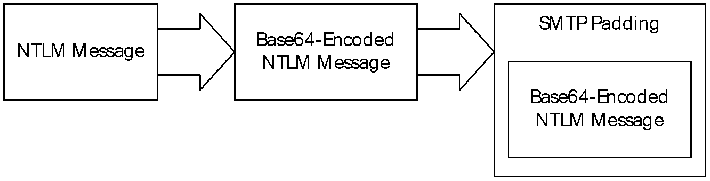
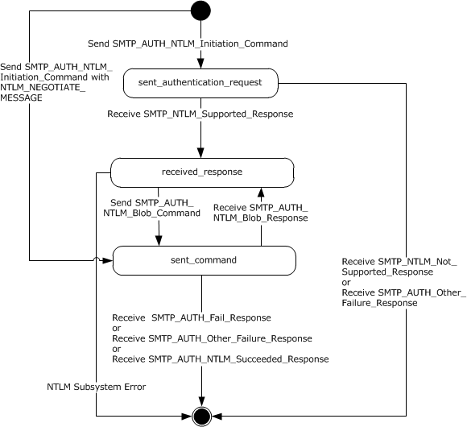
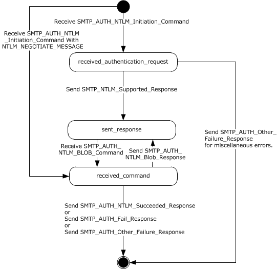
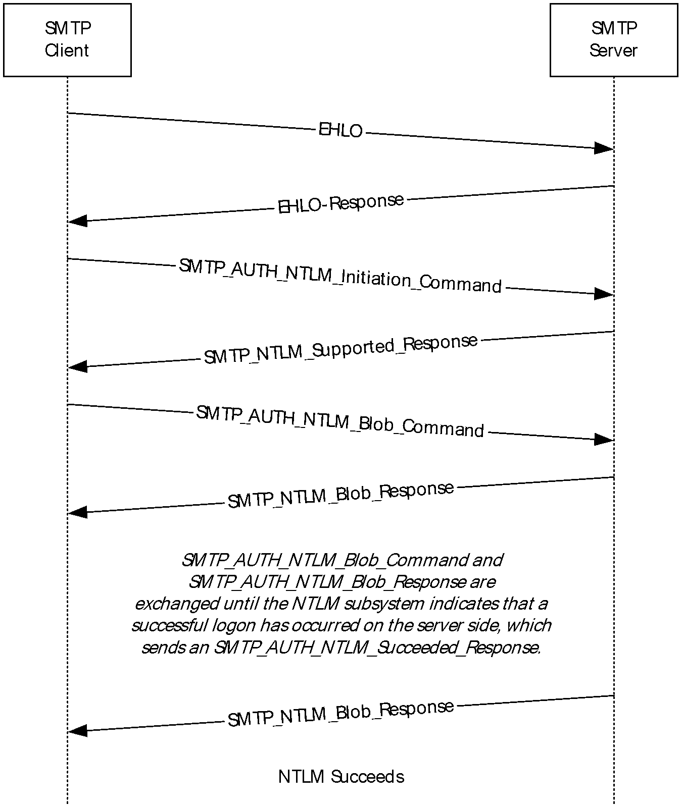
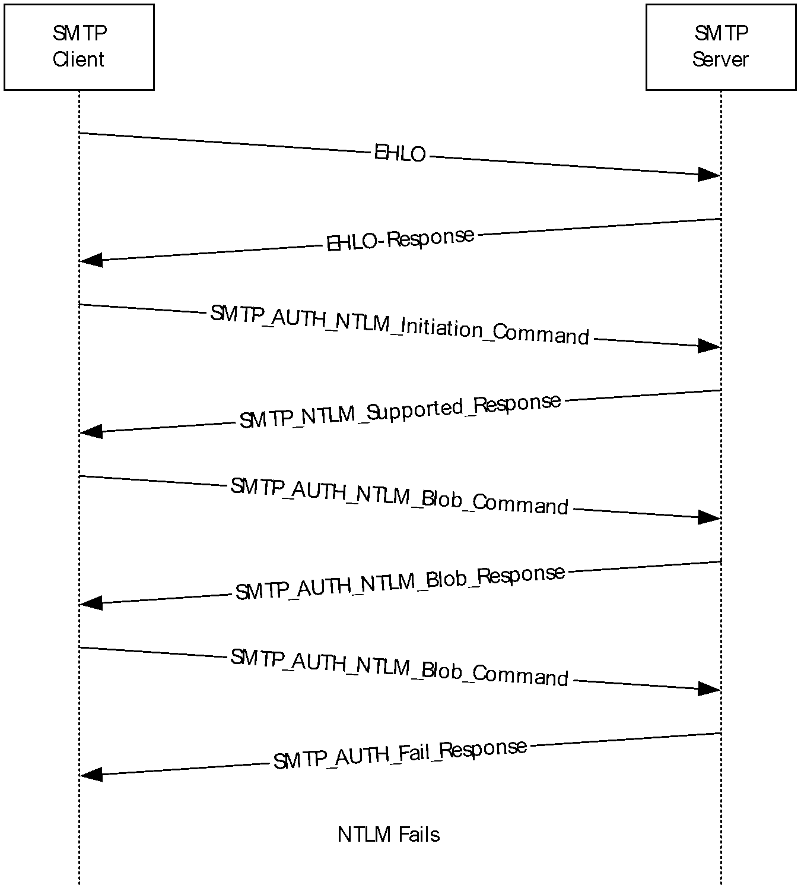

# [MS-SMTPNTLM]: NT LAN Manager (NTLM) Authentication: Simple Mail Transfer Protocol (SMTP) Extension

Table of Contents

1 Introduction

- [1 Introduction](#Section_1)
  - [1.1 Glossary](#Section_1.1)
  - [1.2 References](#Section_1.2)
    - [1.2.1 Normative References](#Section_1.2.1)
    - [1.2.2 Informative References](#Section_1.2.2)
  - [1.3 Overview](#Section_1.3)
  - [1.4 Relationship to Other Protocols](#Section_1.4)
  - [1.5 Prerequisites/Preconditions](#Section_1.5)
  - [1.6 Applicability Statement](#Section_1.6)
  - [1.7 Versioning and Capability Negotiation](#Section_1.7)
  - [1.8 Vendor-Extensible Fields](#Section_1.8)
  - [1.9 Standards Assignments](#Section_1.9)

2 Messages

- [2 Messages](#Section_2)
  - [2.1 Transport](#Section_2.1)
  - [2.2 Message Syntax](#Section_2.2)
    - [2.2.1 SMTP AUTH Extensions](#Section_2.2.1)
      - [2.2.1.1 SMTP_AUTH_NTLM_Initiation_Command Message](#Section_2.2.1.1)
      - [2.2.1.2 SMTP_NTLM_Supported_Response Message](#Section_2.2.1.2)
      - [2.2.1.3 SMTP_AUTH_NTLM_BLOB_Response Message](#Section_2.2.1.3)
      - [2.2.1.4 SMTP_AUTH_Fail_Response Message](#Section_2.2.1.4)
      - [2.2.1.5 SMTP_AUTH_Other_Failure_Response Message](#Section_2.2.1.5)
      - [2.2.1.6 SMTP_AUTH_NTLM_Succeeded_Response Message](#Section_2.2.1.6)
      - [2.2.1.7 SMTP_AUTH_NTLM_BLOB_Command Message](#Section_2.2.1.7)
      - [2.2.1.8 SMTP_NTLM_Not_Supported_Response Message](#Section_2.2.1.8)
      - [2.2.1.9 EHLO Discovery Message](#Section_2.2.1.9)
    - [2.2.2 SMTP Server Messages](#Section_2.2.2)
    - [2.2.3 SMTP Client Messages](#Section_2.2.3)

3 Protocol Details

- [3 Protocol Details](#Section_3)
  - [3.1 Client Details](#Section_3.1)
    - [3.1.1 Abstract Data Model](#Section_3.1.1)
      - [3.1.1.1 SMTP State Model](#Section_3.1.1.1)
    - [3.1.2 Timers](#Section_3.1.2)
    - [3.1.3 Initialization](#Section_3.1.3)
    - [3.1.4 Higher-Layer Triggered Events](#Section_3.1.4)
      - [3.1.4.1 Sending an SMTP_AUTH_NTLM_Initiation_Command Message](#Section_3.1.4.1)
      - [3.1.4.2 Sending an SMTP_AUTH_NTLM_BLOB_Command Message](#Section_3.1.4.2)
    - [3.1.5 Message Processing Events and Sequencing Rules](#Section_3.1.5)
      - [3.1.5.1 Receiving an SMTP_NTLM_Supported_Response Message](#Section_3.1.5.1)
      - [3.1.5.2 Receiving an SMTP_NTLM_Not_Supported_Response Message](#Section_3.1.5.2)
      - [3.1.5.3 Receiving an SMTP_AUTH_NTLM_BLOB_Response Message](#Section_3.1.5.3)
        - [3.1.5.3.1 Error from NTLM](#Section_3.1.5.3.1)
        - [3.1.5.3.2 NTLM Reports Success and Returns an NTLM Message](#Section_3.1.5.3.2)
      - [3.1.5.4 Receiving an SMTP_AUTH_NTLM_Succeeded_Response Message](#Section_3.1.5.4)
      - [3.1.5.5 Receiving an SMTP_AUTH_Fail_Response Message](#Section_3.1.5.5)
      - [3.1.5.6 Receiving an SMTP_AUTH_Other_Failure_Response Message](#Section_3.1.5.6)
    - [3.1.6 Timer Events](#Section_3.1.6)
    - [3.1.7 Other Local Events](#Section_3.1.7)
  - [3.2 Server Details](#Section_3.2)
    - [3.2.1 Abstract Data Model](#Section_3.2.1)
      - [3.2.1.1 SMTP State Model](#Section_3.2.1.1)
    - [3.2.2 Timers](#Section_3.2.2)
    - [3.2.3 Initialization](#Section_3.2.3)
    - [3.2.4 Higher-Layer Triggered Events](#Section_3.2.4)
    - [3.2.5 Message Processing Events and Sequencing Rules](#Section_3.2.5)
      - [3.2.5.1 Receiving an SMTP_AUTH_NTLM_Initiation_Command Message](#Section_3.2.5.1)
      - [3.2.5.2 Receiving an SMTP_AUTH_NTLM_BLOB_Command Message](#Section_3.2.5.2)
        - [3.2.5.2.1 NTLM Returns Success, Returning an NTLM Message](#Section_3.2.5.2.1)
        - [3.2.5.2.2 NTLM Returns Success, Indicating that the Authentication Completed Successfully](#Section_3.2.5.2.2)
        - [3.2.5.2.3 NTLM Returns Status, Indicating that the User Name or Password Is Incorrect](#Section_3.2.5.2.3)
        - [3.2.5.2.4 NTLM Returns a Failure Status, Indicating Any Other Error](#Section_3.2.5.2.4)
    - [3.2.6 Timer Events](#Section_3.2.6)
    - [3.2.7 Other Local Events](#Section_3.2.7)

4 Protocol Examples

- [4 Protocol Examples](#Section_4)
  - [4.1 SMTP Client Successfully Authenticating to an SMTP Server](#Section_4.1)
  - [4.2 SMTP Client Not Successfully Authenticating to an SMTP Server](#Section_4.2)

5 Security

- [5 Security](#Section_5)
  - [5.1 Security Considerations for Implementers](#Section_5.1)
  - [5.2 Index of Security Parameters](#Section_5.2)

6 Appendix A: Product Behavior

- [6 Appendix A: Product Behavior](#Section_6)

7 Change Tracking

- [7 Change Tracking](#Section_7)

For the legal notice and IP terms, see [LEGAL.md](../LEGAL.md).
Last updated: 1/13/2025.
See [Revision History](#revision-history) for full version history.

# 1 Introduction

The NT LAN Manager (NTLM) Authentication: Simple Mail Transfer Protocol (SMTP) Extension specifies the use of [**NTLM**](#gt_nt-lan-manager-ntlm-authentication-protocol) authentication (as specified in [MS-NLMP](../MS-NLMP/MS-NLMP.md)) by the [**Simple Mail Transfer Protocol (SMTP)**](#gt_simple-mail-transfer-protocol-smtp) to facilitate client authentication to a Windows SMTP server. SMTP specifies a protocol for reliable and efficient transmission of email. A detailed definition of SMTP is specified in [[RFC5321]](https://go.microsoft.com/fwlink/?LinkId=144740) and [[RFC5322]](https://go.microsoft.com/fwlink/?LinkId=183003).

The NT LAN Manager (NTLM) Authentication: Simple Mail Transfer Protocol (SMTP) Extension uses the SMTP-AUTH command (as specified in [[RFC2554]](https://go.microsoft.com/fwlink/?LinkId=94468) section 4) and SMTP response codes to negotiate NTLM authentication and send authentication data.

Sections 1.5, 1.8, 1.9, 2, and 3 of this specification are normative. All other sections and examples in this specification are informative.

## 1.1 Glossary

This document uses the following terms:

**AUTH command**: A [**Simple Mail Transfer Protocol (SMTP)**](#gt_simple-mail-transfer-protocol-smtp) command that is used to send authentication information, as specified in [[RFC2554]](https://go.microsoft.com/fwlink/?LinkId=94468). The structure of the [**AUTH command**](#gt_auth-command) (as used in the NT LAN Manager (NTLM) Authentication: Simple Mail Transfer Protocol (SMTP) Extension) is as follows: "AUTH NTLM<CR><LF>". Or, optionally, it is as follows: "AUTH NTLM [initial-response]<CR><LF>". Both command forms are accepted, as required by the RFC.

**base64 encoding**: A binary-to-text encoding scheme whereby an arbitrary sequence of bytes is converted to a sequence of printable ASCII characters, as described in [[RFC4648]](https://go.microsoft.com/fwlink/?LinkId=90487).

**challenge/response authentication**: A common authentication technique in which a principal is prompted (the challenge) to provide some private information (the response) to facilitate authentication.

**connection-oriented NTLM**: A particular variant of [**NTLM**](#gt_nt-lan-manager-ntlm-authentication-protocol) designed to be used with connection-oriented remote procedure call (RPC), as described in [MS-NLMP](../MS-NLMP/MS-NLMP.md).

**NT LAN Manager (NTLM) Authentication Protocol**: A protocol using a challenge-response mechanism for authentication in which clients are able to verify their identities without sending a password to the server. It consists of three messages, commonly referred to as Type 1 (negotiation), Type 2 (challenge) and Type 3 (authentication).

**NTLM AUTHENTICATE_MESSAGE**: The [**NTLM AUTHENTICATE_MESSAGE**](#gt_ntlm-authenticate_message) packet defines an [**NTLM**](#gt_nt-lan-manager-ntlm-authentication-protocol) authenticate message that is sent from the client to the server after the [**NTLM CHALLENGE_MESSAGE**](#gt_ntlm-challenge_message) is processed by the client. Message structure and other details of this packet are specified in [MS-NLMP].

**NTLM CHALLENGE_MESSAGE**: The [**NTLM CHALLENGE_MESSAGE**](#gt_ntlm-challenge_message) packet defines an NTLM challenge message that is sent from the server to the client. [**NTLM CHALLENGE_MESSAGE**](#gt_ntlm-challenge_message) is generated by the local [**NTLM software**](#gt_ntlm-software) and passed to the application that supports embedded [**NTLM**](#gt_nt-lan-manager-ntlm-authentication-protocol) authentication. This message is used by the server to challenge the client to prove its identity. Message structure and other details of this packet are specified in [MS-NLMP].

**NTLM message**: A message that carries authentication information. Its payload data is passed to the application that supports embedded NTLM authentication by the NTLM software installed on the local computer. NTLM messages are transmitted between the client and server embedded within the application protocol that is using NTLM authentication. There are three types of NTLM messages: NTLM NEGOTIATE_MESSAGE, NTLM CHALLENGE_MESSAGE, and NTLM AUTHENTICATE_MESSAGE.

**NTLM NEGOTIATE_MESSAGE**: The NEGOTIATE_MESSAGE packet defines an NTLM negotiate message that is sent from the client to the server. The [**NTLM NEGOTIATE_MESSAGE**](#gt_ntlm-negotiate_message) is generated by the local [**NTLM software**](#gt_ntlm-software) and passed to the application that supports embedded [**NTLM**](#gt_nt-lan-manager-ntlm-authentication-protocol) authentication. This message allows the client to specify its supported [**NTLM**](#gt_nt-lan-manager-ntlm-authentication-protocol) options to the server. Message structure and other details are specified in [MS-NLMP].

**NTLM software**: Software that implements the [**NT LAN Manager (NTLM) Authentication Protocol**](#gt_nt-lan-manager-ntlm-authentication-protocol).

**SASL**: The Simple Authentication and Security Layer, as described in [[RFC2222]](https://go.microsoft.com/fwlink/?LinkId=90322). This is an authentication mechanism used by the Lightweight Directory Access Protocol (LDAP).

**Simple Mail Transfer Protocol (SMTP)**: A member of the TCP/IP suite of protocols that is used to transport Internet messages, as described in [[RFC5321]](https://go.microsoft.com/fwlink/?LinkId=144740).

**MAY, SHOULD, MUST, SHOULD NOT, MUST NOT:** These terms (in all caps) are used as defined in [[RFC2119]](https://go.microsoft.com/fwlink/?LinkId=90317). All statements of optional behavior use either MAY, SHOULD, or SHOULD NOT.

## 1.2 References

Links to a document in the Microsoft Open Specifications library point to the correct section in the most recently published version of the referenced document. However, because individual documents in the library are not updated at the same time, the section numbers in the documents may not match. You can confirm the correct section numbering by checking the [Errata](https://go.microsoft.com/fwlink/?linkid=850906).

### 1.2.1 Normative References

We conduct frequent surveys of the normative references to assure their continued availability. If you have any issue with finding a normative reference, please contact [dochelp@microsoft.com](mailto:dochelp@microsoft.com). We will assist you in finding the relevant information.

[MS-NLMP] Microsoft Corporation, "[NT LAN Manager (NTLM) Authentication Protocol](../MS-NLMP/MS-NLMP.md)".

[RFC1521] Borenstein, N., and Freed, N., "MIME (Multipurpose Internet Mail Extensions) Part One: Mechanisms for Specifying and Describing the Format of Internet Message Bodies", RFC 1521, September 1993, [https://www.rfc-editor.org/info/rfc1521](https://go.microsoft.com/fwlink/?LinkId=94433)

[RFC2119] Bradner, S., "Key words for use in RFCs to Indicate Requirement Levels", BCP 14, RFC 2119, March 1997, [https://www.rfc-editor.org/info/rfc2119](https://go.microsoft.com/fwlink/?LinkId=90317)

[RFC2554] Myers, J., "SMTP Service Extension for Authentication", RFC 2554, March, 1999, [https://www.rfc-editor.org/info/rfc2554](https://go.microsoft.com/fwlink/?LinkId=94468)

[RFC2821] Klensin, J., "Simple Mail Transfer Protocol", RFC 2821, April 2001, [https://www.rfc-editor.org/info/rfc2821](https://go.microsoft.com/fwlink/?LinkId=90384)

[RFC4234] Crocker, D., Ed., and Overell, P., "Augmented BNF for Syntax Specifications: ABNF", RFC 4234, October 2005, [https://www.rfc-editor.org/info/rfc4234](https://go.microsoft.com/fwlink/?LinkId=90462)

[RFC5321] Klensin, J., "Simple Mail Transfer Protocol", RFC 5321, October 2008, [http://rfc-editor.org/rfc/rfc5321.txt](https://go.microsoft.com/fwlink/?LinkId=144740)

[RFC5322] Resnick, P., Ed., "Internet Message Format", RFC 5322, October 2008, [https://www.rfc-editor.org/info/rfc5322](https://go.microsoft.com/fwlink/?LinkId=183003)

### 1.2.2 Informative References

[MS-NETOD] Microsoft Corporation, "[Microsoft .NET Framework Protocols Overview](#Section_1.3)".

[MSKB-163846] Microsoft Corporation, "SID Values For Default Windows NT Installations", Version 2.1, November 2006, [http://support.microsoft.com/kb/163846](https://go.microsoft.com/fwlink/?LinkId=127918)

[SSPI] Microsoft Corporation, "SSPI", [https://learn.microsoft.com/en-us/windows/desktop/SecAuthN/sspi](https://go.microsoft.com/fwlink/?LinkId=90536)

## 1.3 Overview

Client applications that connect to the [**Simple Mail Transfer Protocol (SMTP)**](#gt_simple-mail-transfer-protocol-smtp) service on supported operating systems (see section [6](#Section_6)) can use [**NT LAN Manager Protocol (NTLM)**](#gt_nt-lan-manager-ntlm-authentication-protocol) authentication, as specified in [MS-NLMP](../MS-NLMP/MS-NLMP.md).

The NT LAN Manager (NTLM) Authentication: Simple Mail Transfer Protocol (SMTP) Extension specifies how an SMTP client and SMTP server can use the NTLM Authentication Protocol, as specified in [MS-NLMP], so that the SMTP server can authenticate the SMTP client. The NTLM Authentication Protocol, as specified in [MS-NLMP], is a [**challenge/response authentication**](#gt_challengeresponse-authentication) protocol that depends on the application layer protocols to transport NTLM packets from client to server and from server to client.

The NT LAN Manager (NTLM) Authentication: Simple Mail Transfer Protocol (SMTP) Extension defines how SMTP is extended to perform authentication using the NTLM Authentication Protocol, as specified in [MS-NLMP]. The SMTP standard defines an extensibility mechanism for arbitrary authentication protocols to be plugged in to the core protocol. This mechanism is the SMTP-AUTH mechanism.

The NT LAN Manager (NTLM) Authentication: Simple Mail Transfer Protocol (SMTP) Extension is an embedded protocol in which NTLM authentication data is first transformed into a [**base64**](#gt_179b9392-9019-45a3-880b-26f6890522b7) representation (as specified in [[RFC1521]](https://go.microsoft.com/fwlink/?LinkId=94433)) and then formatted by padding with SMTP status codes and SMTP keywords, as defined by the AUTH mechanism. The base64 encoding and the formatting are very rudimentary and solely intended to make the NTLM data look like other SMTP commands and responses. The following diagram illustrates the sequence of transformations performed on an [**NTLM message**](#gt_ntlm-message) to produce a message that can be sent over SMTP.

Figure 1: Relationship between NTLM message and SMTP (NTLM Authentication Protocol message)

The NT LAN Manager (NTLM) Authentication: Simple Mail Transfer Protocol (SMTP) Extension is a pass-through protocol that does not specify the structure of NTLM information. Instead, the protocol relies on the software that implements the NTLM Authentication Protocol (as specified in [MS-NLMP]) to process each NTLM message to be sent or received.

The NT LAN Manager (NTLM) Authentication: Simple Mail Transfer Protocol (SMTP) Extension defines both server and client roles.

When SMTP requests NTLM authentication, it interacts with the [**NTLM software**](#gt_ntlm-software) appropriately. An overview of this interaction follows:

If acting as an SMTP client:

- The NTLM software returns the first NTLM message to the client to be sent to the server.
- The client applies both the base64 encoding and SMTP padding transformations mentioned earlier (and described in detail later in this document) to produce an SMTP message, and then sends this message to the server.
- The client waits for a response from the server. When the response is received, the client determines whether the response indicates either the end of authentication (success or failure) or the continuation of authentication.
- If the authentication is continuing, the response message is stripped of the SMTP padding, is base64 decoded, and is passed into the NTLM software, on which the NTLM software can return another NTLM message that needs to be sent to the server. Steps 2 through 4 are repeated until authentication succeeds or fails.
If acting as an SMTP server:

- The server waits to receive the first SMTP authentication message from the client.
- When an SMTP message is received from the client, the SMTP padding is removed, the message is base64-decoded, and the resulting NTLM message is passed into the NTLM software.
- The NTLM software will return a status indicating whether authentication completed successfully, failed, or more NTLM messages need to be exchanged to complete the authentication.
- If the authentication is continuing, the NTLM software will return an NTLM message that needs to be sent to the client. This message is base64-encoded, and the SMTP padding is applied and sent to the client. Steps 2 through 4 are repeated until authentication succeeds or fails.
The sequence that follows shows the typical flow of packets between a client and server once NTLM authentication has been selected:

- The SMTP client sends an [**NTLM NEGOTIATE_MESSAGE**](#gt_ntlm-negotiate_message) embedded in an [SMTP_AUTH_NTLM_BLOB_Command](#Section_3.2.5.2) packet to the server.
- On receiving the SMTP packet with NTLM NEGOTIATE_MESSAGE, the server sends an [**NTLM CHALLENGE_MESSAGE**](#gt_ntlm-challenge_message) embedded in an SMTP packet to the client.
- In response, the SMTP client sends an [**NTLM AUTHENTICATE_MESSAGE**](#gt_ntlm-authenticate_message) embedded in an SMTP packet.
- The server then sends an SMTP response to the client to successfully complete the authentication process.
The NTLM NEGOTIATE_MESSAGE, NTLM CHALLENGE_MESSAGE, and NTLM AUTHENTICATE_MESSAGE packets contain NTLM authentication data that is processed by the NTLM software installed on the local computer. How to retrieve and process NTLM messages is specified in [MS-NLMP].

Implementers of the NT LAN Manager (NTLM) Authentication: Simple Mail Transfer Protocol (SMTP) Extension need to possess a working knowledge of the following:

- Simple Mail Transfer Protocol (SMTP), as specified in [[RFC5321]](https://go.microsoft.com/fwlink/?LinkId=144740) and [[RFC5322]](https://go.microsoft.com/fwlink/?LinkId=183003)
- Multipurpose Internet Mail Extensions (MIME) base64 encoding method, as specified in [RFC1521]
- NTLM Authentication Protocol, as specified in [MS-NLMP]

## 1.4 Relationship to Other Protocols

The NT LAN Manager (NTLM) Authentication: Simple Mail Transfer Protocol (SMTP) Extension uses the SMTP-AUTH extension mechanism, as specified in [[RFC2554]](https://go.microsoft.com/fwlink/?LinkId=94468), and is an embedded protocol. Unlike stand-alone application protocols, such as Telnet or Hypertext Transfer Protocol (HTTP), NTLM Authentication: SMTP Extension packets are embedded in [**Simple Mail Transfer Protocol (SMTP)**](#gt_simple-mail-transfer-protocol-smtp) commands and server responses.

SMTP specifies only the sequence in which an SMTP server and an SMTP client exchange [**NTLM messages**](#gt_ntlm-message) to successfully authenticate the client to the server. It does not specify how the client obtains NTLM messages from the local [**NTLM software**](#gt_ntlm-software) or how the SMTP server processes NTLM messages. The SMTP client and SMTP server implementations depend on the availability of an implementation of the NTLM Authentication Protocol (as specified in [MS-NLMP](../MS-NLMP/MS-NLMP.md)) to obtain and process NTLM messages and on the availability of the [**base64**](#gt_179b9392-9019-45a3-880b-26f6890522b7) encoding and decoding mechanisms (as specified in [[RFC1521]](https://go.microsoft.com/fwlink/?LinkId=94433)) to encode and decode the NTLM messages embedded in SMTP packets.

## 1.5 Prerequisites/Preconditions

Because the NT LAN Manager (NTLM) Authentication: Simple Mail Transfer Protocol (SMTP) Extension depends on [**NTLM**](#gt_nt-lan-manager-ntlm-authentication-protocol) to authenticate the client to the server, both server and client require access to an implementation of the NTLM Authentication Protocol (as specified in [MS-NLMP](../MS-NLMP/MS-NLMP.md)) that is capable of supporting [**connection-oriented NTLM**](#gt_connection-oriented-ntlm).<1>

## 1.6 Applicability Statement

The NT LAN Manager (NTLM) Authentication: Simple Mail Transfer Protocol (SMTP) Extension must be used by an [**SMTP**](#gt_simple-mail-transfer-protocol-smtp) client and an SMTP server when the SMTP client authenticates to the SMTP server by using [**NTLM**](#gt_nt-lan-manager-ntlm-authentication-protocol) authentication.

## 1.7 Versioning and Capability Negotiation

This document covers versioning issues in the following areas:

- Security and Authentication Methods: The NT LAN Manager (NTLM) Authentication: Simple Mail Transfer Protocol (SMTP) Extension supports the [**NTLM**](#gt_nt-lan-manager-ntlm-authentication-protocol) version 1 and NTLM version 2 authentication methods, as specified in [MS-NLMP](../MS-NLMP/MS-NLMP.md).
- Capability Negotiation: The NTLM Authentication: SMTP Extension does not support negotiation of the NTLM Authentication Protocol (as specified in [MS-NLMP]) version to use. Instead, the NTLM Authentication Protocol (as specified in [MS-NLMP]) version is configured on both the client and the server prior to authentication. NTLM Authentication Protocol (as specified in [MS-NLMP]) version mismatches are handled by the NTLM Authentication Protocol (as specified in [MS-NLMP]) implementation, and not by [**SMTP**](#gt_simple-mail-transfer-protocol-smtp).
The SMTP Service Extension for Authentication (as specified in [[RFC2554]](https://go.microsoft.com/fwlink/?LinkId=94468)) does document the framework within which SMTP clients might discover (and SMTP servers might advertise) the capability to perform any given authentication mechanism, including (in particular) NTLM.

The client discovers if the server supports NTLM AUTH through the SMTP-EHLO, at which time the server responds with a standard EHLO response, as specified in [[RFC2821]](https://go.microsoft.com/fwlink/?LinkId=90384). The EHLO keyword that is advertised if NTLM authentication is supported is "NTLM". NTLM is an [**SASL**](#gt_sasl) mechanism (as defined in [RFC2554] section 3 bullet 3). The messages involved are formally specified in other sections of this document.

## 1.8 Vendor-Extensible Fields

None.

## 1.9 Standards Assignments

None.

# 2 Messages

## 2.1 Transport

The NT LAN Manager (NTLM) Authentication: Simple Mail Transfer Protocol (SMTP) Extension does not establish transport connections. Instead, its messages are encapsulated in [**SMTP**](#gt_simple-mail-transfer-protocol-smtp) commands and responses. How NTLM Authentication: SMTP Extension messages must be encapsulated in SMTP commands is specified in section [2.2](#Section_2.2).

## 2.2 Message Syntax

NT LAN Manager (NTLM) Authentication: Simple Mail Transfer Protocol (SMTP) Extension messages are divided into two categories, depending on whether the message is sent by the server or the client.

The formal syntax of messages is provided in Augmented Backus-Naur Form (ABNF), as specified in [[RFC4234]](https://go.microsoft.com/fwlink/?LinkId=90462).

### 2.2.1 SMTP AUTH Extensions

The first category of [**SMTP**](#gt_simple-mail-transfer-protocol-smtp) messages is within the SMTP-AUTH extensibility framework. These messages are defined in [[RFC2554]](https://go.microsoft.com/fwlink/?LinkId=94468). The NT LAN Manager (NTLM) Authentication: Simple Mail Transfer Protocol (SMTP) Extension introduces the following messages, as specified in sections [2.2.1.1](#Section_3.1.4.1) through [2.2.1.9](#Section_2.2.1.9).

The client can receive any one of the following responses during authentication:

- [SMTP_AUTH_NTLM_BLOB_Response](#Section_3.1.5.3)
- [SMTP_AUTH_Fail_Response](#Section_2.2.1.4)
- [SMTP_AUTH_Other_Failure_Response](#Section_2.2.1.5)
- [SMTP_AUTH_NTLM_Succeeded_Response](#Section_2.2.1.6)
Note that the syntax and meaning of these messages are completely defined by [RFC2554] except for the SMTP_AUTH_NTLM_BLOB_Response message, for which [RFC2554] does not define the data encapsulated within the SMTP message and leaves the definition and processing of that data to the extension mechanism. This specification will focus on precisely defining that data.

#### 2.2.1.1 SMTP_AUTH_NTLM_Initiation_Command Message

The SMTP_AUTH_NTLM_Initiation_Command message initiates the NTLM authentication process for SMTP.

[[RFC2554]](https://go.microsoft.com/fwlink/?LinkId=94468) section 4 defines the syntax of the [**SMTP**](#gt_simple-mail-transfer-protocol-smtp) [**AUTH command**](#gt_auth-command) and related commands (for example, EHLO) to initiate authentication. The mechanism name for [**NTLM**](#gt_nt-lan-manager-ntlm-authentication-protocol) authentication is defined to be the string "NTLM" for the NTLM Authentication: SMTP Extension.

#### 2.2.1.2 SMTP_NTLM_Supported_Response Message

The SMTP_NTLM_Supported_Response message indicates that the server supports [**NTLM**](#gt_nt-lan-manager-ntlm-authentication-protocol) authentication for SMTP.

If the [initial-response] string is not supplied in the client [SMTP_AUTH_NTLM_Initiation_Command](#Section_3.1.4.1) message, and NTLM is supported, the [**SMTP**](#gt_simple-mail-transfer-protocol-smtp) server will respond with an SMTP message prefixed with a status code of 334 to indicate that NTLM is supported. The only data in this message that is useful is the status code 334. The remaining data is a human-readable ASCII string whose contents are constrained by the specifications in section 4.5.3 in [[RFC2821]](https://go.microsoft.com/fwlink/?LinkId=90384). This data has no bearing on the authentication. The syntax of this command is shown as follows.

334 <human-readable-string><CR><LF>

A human-readable-string is formally defined in ABNF as follows.

human-readable-string = *CHAR

**Note** CHAR is the US-ASCII character set, excluding NULL.

#### 2.2.1.3 SMTP_AUTH_NTLM_BLOB_Response Message

The SMTP_AUTH_NTLM_BLOB_Response message is defined as follows. This message is partially defined in [[RFC2554]](https://go.microsoft.com/fwlink/?LinkId=94468) section 4 as a "server challenge response". The 334 status code indicates ongoing authentication and indicates that the <base64-encoded-NTLM-message> is to be processed by the authentication subsystem.

334 <base64-encoded-NTLM-message><CR><LF>

Note that status code 334 is also returned by the [SMTP_NTLM_Supported_Response](#Section_2.2.1.2) message.

#### 2.2.1.4 SMTP_AUTH_Fail_Response Message

SMTP_AUTH_Fail_Response is defined as follows. This message, identified by the 535 status code, is defined in [[RFC2554]](https://go.microsoft.com/fwlink/?LinkId=94468) section 4, and indicates that the authentication has terminated unsuccessfully because the user name or password is incorrect.

535 5.7.3 <human-readable-string><CR><LF>

#### 2.2.1.5 SMTP_AUTH_Other_Failure_Response Message

The SMTP_AUTH_Other_Failure_Response message is defined as follows. This is actually a class of messages whose syntax and interpretation are defined in [[RFC2821]](https://go.microsoft.com/fwlink/?LinkId=90384) section 4.2 and [[RFC2554]](https://go.microsoft.com/fwlink/?LinkId=94468) sections 4 and 6. They indicate an abnormal termination of the [**NTLM**](#gt_nt-lan-manager-ntlm-authentication-protocol) authentication negotiation, which can occur for various reasons such as software errors, lack of system resources, and so on. For the purposes of this document, SMTP_AUTH_Other_Failure_Response is defined as any [**SMTP**](#gt_simple-mail-transfer-protocol-smtp) message other than [SMTP_AUTH_NTLM_Succeeded_Response](#Section_2.2.1.6), [SMTP_AUTH_Fail_Response](#Section_2.2.1.4), and [SMTP_AUTH_NTLM_BLOB_Response](#Section_3.1.5.3). The interpretation of SMTP_AUTH_Other_Failure_Response, and the suggested client action when receiving such a message, is defined in [RFC2821] section 4.3. This message represents an exit from AUTH and, as such, is not really a part of AUTH negotiation.

#### 2.2.1.6 SMTP_AUTH_NTLM_Succeeded_Response Message

The SMTP_AUTH_NTLM_Succeeded_Response message is defined as follows. This message is defined in [[RFC2554]](https://go.microsoft.com/fwlink/?LinkId=94468) section 4 and indicates that the authentication negotiation has completed with the client successfully authenticating to the server.

235 <human-readable-string><CR><LF>

#### 2.2.1.7 SMTP_AUTH_NTLM_BLOB_Command Message

[**NTLM messages**](#gt_ntlm-message) encapsulated by the client and sent to the server are referred to as SMTP_AUTH_NTLM_BLOB_Command messages in this document. They have the following syntax defined and conform to the prescription of [[RFC2554]](https://go.microsoft.com/fwlink/?LinkId=94468) section 4.

<base64-encoded-NTLM-message><CR><LF>

#### 2.2.1.8 SMTP_NTLM_Not_Supported_Response Message

The SMTP_NTLM_Not_Supported_Response_Message is defined as follows. This message is defined in [[RFC2554]](https://go.microsoft.com/fwlink/?LinkId=94468) section 4 and indicates that the authentication mechanism is not supported by the server. The server rejects the AUTH command with the following message.

504 <human-readable-string><CR><LF>

#### 2.2.1.9 EHLO Discovery Message

The NT LAN Manager (NTLM) Authentication: Simple Mail Transfer Protocol (SMTP) Extension also supports the discovery of supported authentication procedures.

When the EHLO command is sent to the [**SMTP**](#gt_simple-mail-transfer-protocol-smtp) server, the SMTP server will list available authentication mechanisms using the syntax defined in [[RFC2821]](https://go.microsoft.com/fwlink/?LinkId=90384) section 4.1.1.1. The NTLM mechanism is indicated by using the "NTLM" EHLO keyword value if [**NTLM**](#gt_nt-lan-manager-ntlm-authentication-protocol) authentication is enabled for the SMTP server. An example of such an advertisement of supported authentication procedures by the server can be found in [[RFC2554]](https://go.microsoft.com/fwlink/?LinkId=94468) section 4. The line "S: 250 AUTH CRAM-MD5 DIGEST-MD5" in the conversation indicates that the server advertises the supported authentication procedures as CRAM-MD5, DIGEST-MD5.

The server responds with an EHLO-Response (including the EHLO-keyword AUTH) when the client sends the EHLO command with or without an argument.

[RFC2821] section 4.1.1.1 states that clients SHOULD send EHLO with an argument. The definition of SHOULD in [[RFC2119]](https://go.microsoft.com/fwlink/?LinkId=90317) allows the client to exclude the EHLO argument in exceptional circumstances. The SMTP server MUST support such clients.

### 2.2.2 SMTP Server Messages

This section defines the creation of [SMTP_AUTH_NTLM_BLOB_Response](#Section_3.1.5.3) messages. These are [**NTLM messages**](#gt_ntlm-message) that are sent by the server, and MUST be encapsulated as follows to conform to syntax specified by the SMTP-AUTH mechanism:

- Encode the NTLM message data as [**base64**](#gt_179b9392-9019-45a3-880b-26f6890522b7) (as specified in [[RFC1521]](https://go.microsoft.com/fwlink/?LinkId=94433)). This is required because NTLM messages contain data outside the ASCII character range whereas [**SMTP**](#gt_simple-mail-transfer-protocol-smtp) only supports the sending of ASCII characters within the context of SMTP-AUTH.
- To the base64-encoded string, prefix the SMTP response code "334 " (that is, the numerals 334 followed by the ASCII space character 0x20).
- Suffix the <CR> and <LF> characters (ASCII values 0x0D and 0x0A), as required by SMTP.
The definition of a server message is as follows:

334 <base64-encoded-NTLM-message><CR><LF>

De-encapsulation of these messages by the client follows the reverse logic:

- Remove the <CR> and <LF> characters (ASCII values 0x0D and 0x0A).
- Remove the SMTP response code "334" (that is, the numerals 334 followed by the ASCII space character 0x20).
- base64 decode the SMTP data to produce the original NTLM message data.

### 2.2.3 SMTP Client Messages

This section defines the creation of [SMTP_AUTH_NTLM_BLOB_Command](#Section_3.2.5.2) messages. These [**NTLM messages**](#gt_ntlm-message) sent by the client are encapsulated as follows to conform to the SMTP-AUTH mechanism:

- [**base64**](#gt_179b9392-9019-45a3-880b-26f6890522b7)-encode (as specified in [[RFC1521]](https://go.microsoft.com/fwlink/?LinkId=94433)) the NTLM message data. This is required because NTLM messages contain data outside the ASCII character range whereas [**SMTP**](#gt_simple-mail-transfer-protocol-smtp) only supports ASCII characters to be sent within the context of SMTP-AUTH.
- Suffix the <CR> and <LF> characters (ASCII values 0x0D and 0x0A), as required by SMTP.
The definition of a client message is as follows:

<base64-encoded-NTLM-message><CR><LF>

De-encapsulation of these messages by the server follows the reverse logic:

- Remove the <CR> and <LF> characters (ASCII values 0x0D and 0x0A).
- base64 decode the SMTP data to produce the original NTLM message data.

# 3 Protocol Details

## 3.1 Client Details

This section specifies details of the SMTP client role. An implementation of the Simple Mail Transfer Protocol (SMTP) Extension SHOULD support the client role.

### 3.1.1 Abstract Data Model

This section describes a conceptual model of possible data organization that an implementation maintains to participate in this protocol. The described organization is provided to facilitate the explanation of how the protocol behaves. This document does not mandate that implementations adhere to this model as long as their external behavior is consistent with that described in this document.

This section specifies details of the [**SMTP**](#gt_simple-mail-transfer-protocol-smtp) client role. An implementation of the Simple Mail Transfer Protocol (SMTP) Extension supports the client role

#### 3.1.1.1 SMTP State Model

Figure 2: SMTP NTLM authentication client state model

The abstract data model for the NT LAN Manager (NTLM) Authentication: Simple Mail Transfer Protocol (SMTP) Extension has the following states:

- start
This is the state of the client before the [SMTP_AUTH_NTLM_Initiation_Command](#Section_3.1.4.1) message has been sent.

- sent_authentication_request
This is the state of the client after the SMTP_AUTH_NTLM_Initiation_Command message has been sent.

- received_response
This is the state entered by the client after it has received an [SMTP_NTLM_Supported_Response](#Section_2.2.1.2) message, or when the client receives an [SMTP_AUTH_NTLM_BLOB_Response](#Section_3.1.5.3) message.

When the client enters this state after receiving a SMTP_NTLM_Supported_Response message, the client invokes the NTLM software to get the NTLM_NEGOTIATE_MESSAGE and sends it to the server embedded inside the first [SMTP_AUTH_NTLM Blob_Command](#Section_3.2.5.2). The client transitions the state to sent_command after it sends the SMTP_AUTH_NTLM Blob_Command.

The client returns to this state from the sent_command state after it receives SMTP_AUTH_NTLM_BLOB_Response from the server.

The client transitions the state to completed_authentication if it encounters an [**NTLM software**](#gt_ntlm-software) error.

- sent_command
This is the state entered by the client after it has sent an SMTP_AUTH_NTLM_Initiation_Command message with NTLM_NEGOTIATE_MESSAGE. During this state the client waits for a response from the server. When SMTP_AUTH_NTLM_BLOB_Response is received, the client transitions the state to received_response.

The client returns to this state from the received_response state after it sends the SMTP_AUTH_NTLM Blob_Command to the server.

The client transitions to completed_authentication if it receives [SMTP_AUTH_FAIL_Response](#Section_2.2.1.4), [SMTP_AUTH_Other_Failure_Response](#Section_2.2.1.5), or [SMTP_AUTH_NTLM_Succeeded_Response](#Section_2.2.1.6).

- completed_authentication
This is the state of the client on completion of authentication (successful or otherwise).. Section [3.1.5](#Section_3.2.5) defines the rules for how this state is reached. The completed_authentication represents the end state of the authentication protocol.

This document does not address the behavior of [**SMTP**](#gt_simple-mail-transfer-protocol-smtp) in this state.

### 3.1.2 Timers

None.

### 3.1.3 Initialization

None.

### 3.1.4 Higher-Layer Triggered Events

#### 3.1.4.1 Sending an SMTP_AUTH_NTLM_Initiation_Command Message

This section defines the creation of SMTP_AUTH_NTLM_Initiation_Command messages. These [**NTLM messages**](#gt_ntlm-message) are sent by the client when the state equals start. They SHOULD<2> contain an NTLM NEGOTIATE_MESSAGE encapsulated in the [initial response]. The encapsulation of this message is as specified in section [2.2.3](#Section_2.2.3).

#### 3.1.4.2 Sending an SMTP_AUTH_NTLM_BLOB_Command Message

This section defines the creation of [SMTP_AUTH_NTLM_BLOB_Command](#Section_3.2.5.2) messages. These [**NTLM messages**](#gt_ntlm-message) are sent by the client when the state equals received_response and are encapsulated as specified in section [2.2.3](#Section_2.2.3) to conform to the SMTP-AUTH mechanism.

### 3.1.5 Message Processing Events and Sequencing Rules

The NT LAN Manager (NTLM) Authentication: Simple Mail Transfer Protocol (SMTP) Extension is driven by a series of message exchanges between an [**SMTP**](#gt_simple-mail-transfer-protocol-smtp) server and an SMTP client. The rules governing the sequencing of commands and the internal states of the client and server are defined by a combination of [[RFC2554]](https://go.microsoft.com/fwlink/?LinkId=94468) and [MS-NLMP](../MS-NLMP/MS-NLMP.md). Section [3.1.1](#Section_3.1.1) completely defines how the rules specified in [RFC2554] and [MS-NLMP] govern SMTP authentication.

#### 3.1.5.1 Receiving an SMTP_NTLM_Supported_Response Message

When the client state equals sent_authentication_request and on receiving this message, a client MUST generate the first [**NTLM message**](#gt_ntlm-message) by calling the [**NTLM software**](#gt_ntlm-software). The NTLM software then generates [**NTLM NEGOTIATE_MESSAGE**](#gt_ntlm-negotiate_message), as specified in [MS-NLMP](../MS-NLMP/MS-NLMP.md). The client MUST then encapsulate the NTLM message, as defined in section [2.2.3](#Section_2.2.3), and send it to the server.

**Note** The server will send the [SMTP_NTLM_Supported_Response](#Section_2.2.1.2) message only if the client did not embed an NTLM NEGOTIATE_MESSAGE in the [SMTP_AUTH_NTLM_Initiation_Command](#Section_3.1.4.1) [initial-response] optional parameter.

The state of the client MUST be changed to received_response.

The command sent by the client determines whether the server response is interpreted as an SMTP_NTLM_Supported_Response or an [SMTP_AUTH_NTLM_BLOB_Response](#Section_3.1.5.3). Based on ABNF syntax alone, SMTP_NTLM_Supported_Response and SMTP_AUTH_NTLM_BLOB_Response messages appear identical, making a successful distinction between the two impossible. Therefore, the parser MUST distinguish between these messages as follows:

- If the client previously sent an SMTP_AUTH_NTLM_Initiation_Command without an [initial-response], the server response MUST be parsed as an SMTP_NTLM_Supported_Response message with a human-readable-string. The human-readable-string SHOULD be ignored by the client, except to facilitate troubleshooting and debugging. This string has no consequence on the operation of the protocol.
- If the client previously sent an SMTP_AUTH_NTLM_Initiation_Command with an [initial-response], the server response MUST be parsed as an SMTP_AUTH_NTLM_BLOB_Response message with a base64-encoded string. The client MUST NOT ignore the base64-encoded string and it MUST be processed by the NTLM software, as described in this document.
**Note** Status code 334 is also returned by the SMTP_AUTH_NTLM_BLOB_Response message.

#### 3.1.5.2 Receiving an SMTP_NTLM_Not_Supported_Response Message

When the client state equals sent_authentication_request, the [**SMTP**](#gt_simple-mail-transfer-protocol-smtp) client MUST change its internal state to completed_authentication and consider that the authentication has failed. The client can then take any appropriate action. This document does not mandate any specific course of action.

**Note** This response MUST be interpreted using the rules specified in [[RFC2821]](https://go.microsoft.com/fwlink/?LinkId=90384). These rules include the use of the three-digit status code to infer whether the failure is permanent or temporary, whether or not to generate non-delivery notifications for messages queued on the client, and so on. As implemented, this will be an exception code: 504, which indicates a permanent error.

#### 3.1.5.3 Receiving an SMTP_AUTH_NTLM_BLOB_Response Message

When the client state equals sent_command and on receiving this message, a client MUST change its internal state to received_response, de-encapsulate it to obtain the embedded [**NTLM message**](#gt_ntlm-message), and then pass it to the [**NTLM software**](#gt_ntlm-software) for processing. The NTLM software then extracts the [**NTLM CHALLENGE_MESSAGE**](#gt_ntlm-challenge_message) and produces an [**NTLM AUTHENTICATE_MESSAGE**](#gt_ntlm-authenticate_message) response. The client MUST then encapsulate the NTLM message, as defined in section [3.1.4.2](#Section_3.1.4.2), send it to the server, and transition to the sent_command state.

##### 3.1.5.3.1 Error from NTLM

If the [**NTLM software**](#gt_ntlm-software) reports an error, the implementation of this extension MUST change its internal state to completed_authentication and fail the authentication. Handling of failures is specified in [[RFC2554]](https://go.microsoft.com/fwlink/?LinkId=94468), section 4.

##### 3.1.5.3.2 NTLM Reports Success and Returns an NTLM Message

The [**NTLM message**](#gt_ntlm-message) MUST be encapsulated and sent to the server. A change MUST NOT occur in the state of the client.

#### 3.1.5.4 Receiving an SMTP_AUTH_NTLM_Succeeded_Response Message

When this message is received and the client state equals sent_command, the [**SMTP**](#gt_simple-mail-transfer-protocol-smtp) client MUST change its internal state to completed_authentication and consider that the authentication has succeeded. The client then takes any action it considers appropriate. This document does not mandate any specific course of action.

#### 3.1.5.5 Receiving an SMTP_AUTH_Fail_Response Message

When this message is received and the client state equals sent_command, the [**SMTP**](#gt_simple-mail-transfer-protocol-smtp) client MUST change its internal state to completed_authentication and consider that the authentication has failed. The client then takes any action it considers appropriate. This document does not mandate any specific course of action.

#### 3.1.5.6 Receiving an SMTP_AUTH_Other_Failure_Response Message

When this message is received and the client state equals sent_command, the [**SMTP**](#gt_simple-mail-transfer-protocol-smtp) client MUST change its internal state to completed_authentication and consider that the authentication has failed. The client then takes any action it considers appropriate. This document does not mandate any specific course of action.

**Note** This response MUST be interpreted using the rules specified in [[RFC2821]](https://go.microsoft.com/fwlink/?LinkId=90384). These rules include using the three-digit status code to infer whether the failure is permanent or temporary, whether or not to generate non-delivery notifications for messages queued on the client, and so on.

### 3.1.6 Timer Events

None.

### 3.1.7 Other Local Events

None.

## 3.2 Server Details

This section specifies details of the SMTP server role. An implementation of the Simple Mail Transfer Protocol (SMTP) Extension MAY<3> support the server role.

### 3.2.1 Abstract Data Model

This section describes a conceptual model of possible data organization that an implementation maintains to participate in this protocol. The described organization is provided to facilitate the explanation of how the protocol behaves. This document does not mandate that implementations adhere to this model as long as their external behavior is consistent with that described in this document.

The [**SMTP**](#gt_simple-mail-transfer-protocol-smtp) state model is described in this section. A state machine is created and maintained for each client connection to the server.

#### 3.2.1.1 SMTP State Model

Figure 3: SMTP NTLM authentication server state model

The abstract data model for the NT LAN Manager (NTLM) Authentication: Simple Mail Transfer Protocol (SMTP) Extension has the following states:

- start
This is the state of the server before the [SMTP_AUTH_NTLM_Initiation_Command (section 2.2.1.1)](#Section_3.1.4.1) message has been received.

- received_authentication_request
This is the state of the server after the SMTP_AUTH_NTLM_Initiation_Command message has been received.

- sent_response
This is the state entered by the server after it has sent an [SMTP_NTLM_Supported_Response (section 2.2.1.2)](#Section_2.2.1.2) or [SMTP_AUTH_NTLM_BLOB_Response (section 2.2.1.3)](#Section_3.1.5.3) message.

During this state the server waits for [SMTP_AUTH_NTLM_BLOB_Command (section 2.2.1.7)](#Section_3.2.5.2) from the client and transition the state to received_response after receiving the SMTP_AUTH_NTLM_BLOB_Command.

The server comes back to this state after it has sent SMTP_AUTH_NTLM_BLOB_Response to the client.

- received_command
This is the state entered by the server after it has received the SMTP_AUTH_NTLM_Initiation_Command with NTLM_NEGOTIATE_MESSAGE or SMTP_AUTH_NTLM_BLOB_Command.

During this state the server passes the SMTP_AUTH_NTLM_Initiation_Command with NTLM_NEGOTIATE_MESSAGE or SMTP_AUTH_NTLM_BLOB_Command to the [**NTLM**](#gt_nt-lan-manager-ntlm-authentication-protocol) software. If the NTLM software returns SMTP_AUTH_NTLM_BLOB_Response message the server sends it back to the client.

The server transitions the state to sent_response after it sends the SMTP_AUTH_NTLM_BLOB_Response.

The server comes back to this state after receiving SMTP_AUTH_NTLM_BLOB_Command.

The server MUST transition the state to completed_authentication when it sends [SMTP_AUTH_NTLM_Succeeded_Response (section 2.2.1.6)](#Section_2.2.1.6) or [SMTP_AUTH_Fail_Response (section 2.2.1.4)](#Section_2.2.1.4) or [SMTP_AUTH_Other_Failure_Response (section 2.2.1.5)](#Section_2.2.1.5) to the client.

- completed_authentication
This is the state of the server upon successfully or unsuccessfully completing authentication. Section [3.1.5](#Section_3.2.5) defines the rules for how this state is reached. The completed_authentication represents the end state of the authentication protocol.

This document does not address the behavior of [**SMTP**](#gt_simple-mail-transfer-protocol-smtp) in this state.

### 3.2.2 Timers

None.

### 3.2.3 Initialization

None.

### 3.2.4 Higher-Layer Triggered Events

None.

### 3.2.5 Message Processing Events and Sequencing Rules

The NT LAN Manager (NTLM) Authentication: Simple Mail Transfer Protocol (SMTP) Extension is driven by a series of message exchanges between an [**SMTP**](#gt_simple-mail-transfer-protocol-smtp) server and an SMTP client. The rules governing the sequencing of commands and the internal states of the client and server are defined by a combination of [[RFC2554]](https://go.microsoft.com/fwlink/?LinkId=94468) and [MS-NLMP](../MS-NLMP/MS-NLMP.md). Section [3.2.1](#Section_3.1.1) completely defines how the rules specified in [RFC2554] and [MS-NLMP] govern SMTP authentication.

#### 3.2.5.1 Receiving an SMTP_AUTH_NTLM_Initiation_Command Message

When this message is received and the server state equals start, the server examines the received message to determine if the [initial-response] parameter is present in the message.

De-encapsulation of these messages by the server follows the logic:

- Remove the <CR> and <LF> characters (ASCII values 0x0D and 0x0A).
- [**base64**](#gt_179b9392-9019-45a3-880b-26f6890522b7) decode the [**SMTP**](#gt_simple-mail-transfer-protocol-smtp) data to produce the original [**NTLM message**](#gt_ntlm-message) data.
There are two actions possible, depending on whether or not the client has included the [initial-response] parameter in this message:

- If the client has included the [initial-response] parameter, the server MUST change its internal state to received_command and de-encapsulate the [**NTLM NEGOTIATE_MESSAGE**](#gt_ntlm-negotiate_message) embedded within the [initial-response] and pass it to the [**NTLM software**](#gt_ntlm-software) with the **GSS_Accept_sec_context** call, as specified in [MS-NLMP](../MS-NLMP/MS-NLMP.md) section 3.2.4. Further, the NTLM Authentication Protocol is used with the connection-oriented NTLM negotiation option.
The NTLM software does one of the following, as specified in [MS-NLMP]:

- Report success in processing the message. The server MUST send a [SMTP_AUTH_NTLM_BLOB_Response](#Section_3.1.5.3) message to the client and change its internal state to sent_response.
- Report that the authentication failed, which could be due to some other software error or message corruption. The server MUST change its state to completed_authentication and return an [SMTP_AUTH_Other_Failure_Response](#Section_2.2.1.5) message.
- If the client has not included the [initial-response] parameter, the server MUST change its state to received_authenticaton_request and reply with the [SMTP_NTLM_Supported_Response](#Section_2.2.1.2) message if it supports [**NTLM**](#gt_nt-lan-manager-ntlm-authentication-protocol) and change its state to the sent_response state.

#### 3.2.5.2 Receiving an SMTP_AUTH_NTLM_BLOB_Command Message

Expected state is sent_response.

When the server state equals sent_response and on receiving this message, a server MUST change its internal state to received_command, de-encapsulate the message, obtain the embedded [**NTLM message**](#gt_ntlm-message), and pass it to the [**NTLM software**](#gt_ntlm-software) with the **GSS_Accept_sec_context** call, as specified in [MS-NLMP](../MS-NLMP/MS-NLMP.md) section 3.2.4.

De-encapsulation of these messages by the server follows the logic:

- Remove the <CR> and <LF> characters (ASCII values 0x0D and 0x0A).
- [**base64**](#gt_179b9392-9019-45a3-880b-26f6890522b7) decode the [**SMTP**](#gt_simple-mail-transfer-protocol-smtp) data to produce the original NTLM message data.
Once the message has been obtained, the NTLM software does one of the following, as specified in [MS-NLMP]:

- Report success in processing the message and return an NTLM message to continue the authentication.
- Report that authentication completed successfully.
- Report that the authentication failed due to a bad user name or password, as specified in [MS-NLMP].
- Report that the authentication failed, which could be due to some other software error or message corruption.
For an overview of SMTP server authentication, see the SMTP server state model specified in section [3.2.1.1](#Section_3.2.1.1).

##### 3.2.5.2.1 NTLM Returns Success, Returning an NTLM Message

When this message is received and the server state equals received_command, the server MUST encapsulate the [**NTLM message**](#gt_ntlm-message), send it to the client, and change its internal state to sent_response.

##### 3.2.5.2.2 NTLM Returns Success, Indicating that the Authentication Completed Successfully

When this message is received and the server state equals received_command, the server MUST return the [SMTP_AUTH_NTLM_Succeeded_Response](#Section_2.2.1.6) message and change its internal state to completed_authentication.<4>

##### 3.2.5.2.3 NTLM Returns Status, Indicating that the User Name or Password Is Incorrect

When this message is received and the server state equals received_command, the server MUST return the [SMTP_AUTH_Fail_Response](#Section_2.2.1.4) message and change its internal state to completed_authentication.

##### 3.2.5.2.4 NTLM Returns a Failure Status, Indicating Any Other Error

When this message is received and the server state equals received_command, the server MUST return the [SMTP_AUTH_Other_Failure_Response](#Section_2.2.1.5) message and change its internal state to completed_authentication.

### 3.2.6 Timer Events

None.

### 3.2.7 Other Local Events

None.

# 4 Protocol Examples

## 4.1 SMTP Client Successfully Authenticating to an SMTP Server

This section illustrates the NT LAN Manager (NTLM) Authentication: Simple Mail Transfer Protocol (SMTP) Extension with an example scenario in which an [**SMTP**](#gt_simple-mail-transfer-protocol-smtp) client successfully authenticates to an SMTP server using [**NTLM**](#gt_nt-lan-manager-ntlm-authentication-protocol).

Figure 4: SMTP client successfully authenticating to SMTP server

- The client sends an EHLO to the server. This command is specified in [[RFC2821]](https://go.microsoft.com/fwlink/?LinkId=90384).
EHLO test.com

- The server responds with an EHLO-Response (including the EHLO-keyword AUTH) to indicate that the authentication is supported. Among the parameters to the AUTH EHLO-response keyword is the keyword "NTLM", indicating that NTLM authentication is available.
250-exch-cli-66 Hello [127.0.0.1]

250-AUTH GSSAPI NTLM

250-TURN

250-SIZE 2097152

250-ETRN

250-PIPELINING

250-DSN

250-ENHANCEDSTATUSCODES

250-8bitmime

250-BINARYMIME

250-CHUNKING

250-VRFY

250 OK

- The client then sends the SMTP [**AUTH command**](#gt_auth-command), [SMTP_AUTH_NTLM_Initiation_Command](#Section_3.1.4.1), initiating auth. In this example, the AUTH command being sent is without the optional [initial-response] data.
AUTH NTLM

- The server sends the [SMTP_NTLM_Supported_Response](#Section_2.2.1.2) message, indicating that it can perform NTLM authentication.
334 ntlm supported

- The client sends an [SMTP_AUTH_NTLM_BLOB_Command](#Section_3.2.5.2) message containing a [**base64**](#gt_179b9392-9019-45a3-880b-26f6890522b7)-encoded [**NTLM NEGOTIATE_MESSAGE**](#gt_ntlm-negotiate_message).
TlRMTVNTUAABAAAAt4II4gAAAAAAAAAAAAAAAAAAAAAFAs4OAAAADw==

- The server sends an [SMTP_AUTH_NTLM_BLOB_Response](#Section_3.1.5.3) message containing a base64-encoded [**NTLM CHALLENGE_MESSAGE**](#gt_ntlm-challenge_message).
334 TlRMTVNTUAACAAAAFgAWADgAAAA1goriZt7rI6Uq/ccAAAAAAAAAAGwAbABOAAA

ABQLODgAAAA9FAFgAQwBIAC0AQwBMAEkALQA2ADYAAgAWAEUAWABDAEgALQBDAEwASQ

AtADYANgABABYARQBYAEMASAAtAEMATABJAC0ANgA2AAQAFgBlAHgAYwBoAC0AYwBsA

GkALQA2ADYAAwAWAGUAeABjAGgALQBjAGwAaQAtADYANgAAAAAA

- The client sends an SMTP_AUTH_NTLM_BLOB_Command message containing a base64-encoded [**NTLM AUTHENTICATE_MESSAGE**](#gt_ntlm-authenticate_message).
TlRMTVNTUAADAAAAGAAYAHwAAAAYABgAlAAAABYAFgBIAAAACAAIAF4AAAAWABYAZgA

AABAAEACsAAAANYKI4gUCzg4AAAAPZQB4AGMAaAAtAGMAbABpAC0ANgA2AHQAZQBzAH

QARQBYAEMASAAtAEMATABJAC0ANgA2AAZKkK42dvN2AAAAAAAAAAAAAAAAAAAAABvqC

ZdJZ0NxuuMaNT5PPn5aZ6imuk9cPZkPUjEYNIRezkCGmTwS5G0=

- The server sends an [SMTP_AUTH_NTLM_Succeeded_Response](#Section_2.2.1.6) message.
235 2.7.0 Authentication successful

## 4.2 SMTP Client Not Successfully Authenticating to an SMTP Server

This section illustrates the NT LAN Manager (NTLM) Authentication: Simple Mail Transfer Protocol (SMTP) Extension with an example scenario in which an [**SMTP**](#gt_simple-mail-transfer-protocol-smtp) client attempts [**NTLM**](#gt_nt-lan-manager-ntlm-authentication-protocol) authentication to an SMTP server, and the authentication fails.

Figure 5: SMTP client unsuccessfully attempts authentication to SMTP server

- As described in the previous example for unsuccessful AUTH, the SMTP client determines if the server supports NTLM authentication by sending the EHLO command and parsing the EHLO response.
- The client sends an [SMTP_AUTH_NTLM_Initiation_Command](#Section_3.1.4.1) to the server.
AUTH NTLM

- The server sends the [SMTP_NTLM_Supported_Response](#Section_2.2.1.2) message, indicating that it can perform NTLM authentication.
334 ntlm supported

- The client sends an [SMTP_AUTH_NTLM_BLOB_Command](#Section_3.2.5.2) message.
TlRMTVNTUAABAAAAt4II4gAAAAAAAAAAAAAAAAAAAAAFAs4OAAAADw==

- The server responds with an [SMTP_AUTH_NTLM_BLOB_Response](#Section_3.1.5.3) message.
334 TlRMTVNTUAACAAAAFgAWADgAAAA1goriYo7ENUsXagIAAAAAAAAAAGwAbABOAAA

ABQLODgAAAA9FAFgAQwBIAC0AQwBMAEkALQA2ADYAAgAWAEUAWABDAEgALQBDAEwASQ

AtADYANgABABYARQBYAEMASAAtAEMATABJAC0ANgA2AAQAFgBlAHgAYwBoAC0AYwBsA

GkALQA2ADYAAwAWAGUAeABjAGgALQBjAGwAaQAtADYANgAAAAAA

- The client then sends an SMTP_AUTH_NTLM_BLOB_Command message.
TlRMTVNTUAADAAAAGAAYAHwAAAAYABgAlAAAABYAFgBIAAAACAAIAF4AAAAWABYAZgAAABAAEACsAAAANYKI4gUCzg4AAAAPZQB4AGMAaAAtAGMAbABpAC0ANgA2AHQAZQBzAHQARQBYAEMASAAtAEMATABJAC0ANgA2AIqeV65hhASwAAAAAAAAAAAAAAAAAAAAAHZHDVfwTU5ci0RY04eRmWy0/VWZfIfjsqdUu2WmxYUKy83PyyxzbA8=

- The server sends an [SMTP_AUTH_Fail_Response](#Section_2.2.1.4) message.
535 5.7.3 Authentication unsuccessful

# 5 Security

## 5.1 Security Considerations for Implementers

Implementers of the NT LAN Manager (NTLM) Authentication: Simple Mail Transfer Protocol (SMTP) Extension need to be aware of the security considerations of using [**NTLM**](#gt_nt-lan-manager-ntlm-authentication-protocol) authentication (see [MS-NLMP](../MS-NLMP/MS-NLMP.md) section 5.1).

## 5.2 Index of Security Parameters

| Security parameter | Section |
| --- | --- |
| [**NTLM**](#gt_nt-lan-manager-ntlm-authentication-protocol) | [2](#Section_2) and [3](#Section_3) |

# 6 Appendix A: Product Behavior

The information in this specification is applicable to the following Microsoft products or supplemental software. References to product versions include updates to those products.

This document specifies version-specific details in the Microsoft .NET Framework. For information about which versions of .NET Framework are available in each released Windows product or as supplemental software, see [MS-NETOD](#Section_1.3) section 4.

- Microsoft .NET Framework 2.0
- Microsoft .NET Framework 3.0
- Microsoft .NET Framework 3.5
- Microsoft .NET Framework 4.0
- Microsoft .NET Framework 4.5
- Microsoft .NET Framework 4.6
- Microsoft .NET Framework 4.7
- Microsoft .NET Framework 4.8
- Windows 2000 operating system
- Windows XP operating system
- Windows Server 2003 operating system
- Windows Vista operating system
- Windows Server 2008 operating system
- Windows 7 operating system
- Windows Server 2008 R2 operating system
- Windows 8 operating system
- Windows Server 2012 operating system
- Windows 8.1 operating system
- Windows Server 2012 R2 operating system
- Windows 10 operating system
- Windows Server 2016 operating system
- Windows Server operating system
- Windows Server 2019 operating system
- Windows Server 2022 operating system
- Windows 11 operating system
Exceptions, if any, are noted in this section. If an update version, service pack or Knowledge Base (KB) number appears with a product name, the behavior changed in that update. The new behavior also applies to subsequent updates unless otherwise specified. If a product edition appears with the product version, behavior is different in that product edition.

Unless otherwise specified, any statement of optional behavior in this specification that is prescribed using the terms "SHOULD" or "SHOULD NOT" implies product behavior in accordance with the SHOULD or SHOULD NOT prescription. Unless otherwise specified, the term "MAY" implies that the product does not follow the prescription.

<1> Section 1.5: A Windows [**SMTP**](#gt_simple-mail-transfer-protocol-smtp) server and SMTP client use Security Support Provider Interface (SSPI) to obtain and process [**NTLM messages**](#gt_ntlm-message). For more information on SSPI, see [[SSPI]](https://go.microsoft.com/fwlink/?LinkId=90536).

<2> Section 3.1.4.1: Windows-based email clients that use the ISMTPTransport interface, Microsoft Office Outlook 2003, Microsoft Office Outlook 2007, Microsoft Outlook 2010, and Microsoft Outlook 2013 do not send the NTLM_NEGOTIATE_MESSAGE with the SMTP_AUTH_NTLM_Initiation_Command message.

<3> Section 3.2: Windows 2000, Windows XP, and applicable Windows Server releases support the server role.

<4> Section 3.2.5.2.2: A Windows SMTP server does not permit a client to authenticate using credentials for the user identified as the "BUILTIN\Administrator" account, for security reasons. Internally, the [**NTLM**](#gt_nt-lan-manager-ntlm-authentication-protocol) software reports to the SMTP server that the authentication succeeded, but Windows SMTP then checks the user credentials and fails the authentication, sending the [SMTP_AUTH_Fail_Response](#Section_2.2.1.4) message even though NTLM actually succeeded the authentication.

For additional information on built-in accounts and groups, see "SID Values For Default Windows NT Installations", [[MSKB-163846]](https://go.microsoft.com/fwlink/?LinkId=127918) as follows.

**SID Values For Default Windows NT Installations (163846)**

Article information applies to

Microsoft Windows NT Workstation operating system 3.5

Microsoft Windows NT Workstation 3.51

Microsoft Windows NT Workstation 4.0 operating system

Microsoft Windows NT Server 3.5 operating system

Microsoft Windows NT Server 3.51 operating system

Microsoft Windows NT Server 4.0 operating system

This article was previously published under Q163846

SUMMARY

Many User Accounts, Local Groups, and Global Groups have a default Security Identifier (SID) or Relative Identifier (RID) value across all installations of Windows NT. These values can be displayed by using the utility Getsid.exe from the Windows NT Resource Kit.

MORE INFORMATION

The following information was taken from a Domain Controller named DomainName. The default groups differ on a Windows NT Workstation or Server installation, and if they are not a member of a domain, then the computer name would be considered the authority.

The values below that have a full SID value will differ on all installations, but the RID value at the end of the SID is the same across all installations.

NOTE: The values in parentheses is the hexadecimal values of the RID.

Built-In Users

`DOMAINNAME\ADMINISTRATOR`

`S-1-5-21-917267712-1342860078-1792151419-500 (=0x1F4)`

`DOMAINNAME\GUEST`

`S-1-5-21-917267712-1342860078-1792151419-501 (=0x1F5)`

Built-In Global Groups

`DOMAINNAME\DOMAIN ADMINS`

`S-1-5-21-917267712-1342860078-1792151419-512 (=0x200)`

`DOMAINNAME\DOMAIN USERS`

`S-1-5-21-917267712-1342860078-1792151419-513 (=0x201)`

`DOMAINNAME\DOMAIN GUESTS`

`S-1-5-21-917267712-1342860078-1792151419-514 (=0x202)`

Built-In Local Groups

`BUILTIN\ADMINISTRATORS S-1-5-32-544 (=0x220)`

`BUILTIN\USERS S-1-5-32-545 (=0x221)`

`BUILTIN\GUESTS S-1-5-32-546 (=0x222)`

`BUILTIN\ACCOUNT OPERATORS S-1-5-32-548 (=0x224)`

`BUILTIN\SERVER OPERATORS S-1-5-32-549 (=0x225)`

`BUILTIN\PRINT OPERATORS S-1-5-32-550 (=0x226)`

`BUILTIN\BACKUP OPERATORS S-1-5-32-551 (=0x227)`

`BUILTIN\REPLICATOR S-1-5-32-552 (=0x228)`

Special Groups

`\CREATOR OWNER S-1-3-0`

`\EVERYONE S-1-1-0`

`NT AUTHORITY\NETWORK S-1-5-2`

`NT AUTHORITY\INTERACTIVE S-1-5-4`

`NT AUTHORITY\SYSTEM S-1-5-18`

`NT AUTHORITY\authenticated users S-1-5-11 *`

`NT AUTHORITY\LOCAL SERVICE S-1-5-19`

`NT AUTHORITY\NETWORK SERVICE S-1-5-20`

* For Windows NT 4.0 Service Pack 3 and later only

Modification Type: Major Last Reviewed: 5/14/2003

# 7 Change Tracking

This section identifies changes that were made to this document since the last release. Changes are classified as Major, Minor, or None.

The revision class **Major** means that the technical content in the document was significantly revised. Major changes affect protocol interoperability or implementation. Examples of major changes are:

- A document revision that incorporates changes to interoperability requirements.
- A document revision that captures changes to protocol functionality.
The revision class **Minor** means that the meaning of the technical content was clarified. Minor changes do not affect protocol interoperability or implementation. Examples of minor changes are updates to clarify ambiguity at the sentence, paragraph, or table level.

The revision class **None** means that no new technical changes were introduced. Minor editorial and formatting changes may have been made, but the relevant technical content is identical to the last released version.

The changes made to this document are listed in the following table. For more information, please contact [dochelp@microsoft.com](mailto:dochelp@microsoft.com).

| Section | Description | Revision class |
| --- | --- | --- |
| [6](#Section_6) Appendix A: Product Behavior | 11896 : Removed Windows Server 2025 from the product list. The SMTP server does not ship as part of Windows Server 2025. | Major |

## Revision History

| Date | Version | Revision Class | Comments |
| --- | --- | --- | --- |
| 7/20/2007 | 0.1 | Major | MCPP Milestone 5 Initial Availability |
| 9/28/2007 | 0.1.1 | Editorial | Changed language and formatting in the technical content. |
| 10/23/2007 | 0.2 | Minor | Updated to use data types in MS-DTYP. |
| 11/30/2007 | 0.2.1 | Editorial | Changed language and formatting in the technical content. |
| 1/25/2008 | 0.2.2 | Editorial | Changed language and formatting in the technical content. |
| 3/14/2008 | 0.2.3 | Editorial | Changed language and formatting in the technical content. |
| 5/16/2008 | 1.0 | Major | Updated and revised the technical content. |
| 6/20/2008 | 2.0 | Major | Updated and revised the technical content. |
| 7/25/2008 | 2.1 | Minor | Clarified the meaning of the technical content. |
| 8/29/2008 | 3.0 | Major | Updated and revised the technical content. |
| 10/24/2008 | 4.0 | Major | Updated and revised the technical content. |
| 12/5/2008 | 5.0 | Major | Updated and revised the technical content. |
| 1/16/2009 | 5.1 | Minor | Clarified the meaning of the technical content. |
| 2/27/2009 | 5.1.1 | Editorial | Changed language and formatting in the technical content. |
| 4/10/2009 | 5.1.2 | Editorial | Changed language and formatting in the technical content. |
| 5/22/2009 | 5.2 | Minor | Clarified the meaning of the technical content. |
| 7/2/2009 | 5.3 | Minor | Clarified the meaning of the technical content. |
| 8/14/2009 | 5.3.1 | Editorial | Changed language and formatting in the technical content. |
| 9/25/2009 | 6.0 | Major | Updated and revised the technical content. |
| 11/6/2009 | 7.0 | Major | Updated and revised the technical content. |
| 12/18/2009 | 8.0 | Major | Updated and revised the technical content. |
| 1/29/2010 | 8.1 | Minor | Clarified the meaning of the technical content. |
| 3/12/2010 | 8.1.1 | Editorial | Changed language and formatting in the technical content. |
| 4/23/2010 | 8.1.2 | Editorial | Changed language and formatting in the technical content. |
| 6/4/2010 | 9.0 | Major | Updated and revised the technical content. |
| 7/16/2010 | 10.0 | Major | Updated and revised the technical content. |
| 8/27/2010 | 10.0 | None | No changes to the meaning, language, or formatting of the technical content. |
| 10/8/2010 | 11.0 | Major | Updated and revised the technical content. |
| 11/19/2010 | 11.0 | None | No changes to the meaning, language, or formatting of the technical content. |
| 1/7/2011 | 11.1 | Minor | Clarified the meaning of the technical content. |
| 2/11/2011 | 11.1 | None | No changes to the meaning, language, or formatting of the technical content. |
| 3/25/2011 | 11.2 | Minor | Clarified the meaning of the technical content. |
| 5/6/2011 | 11.2 | None | No changes to the meaning, language, or formatting of the technical content. |
| 6/17/2011 | 11.3 | Minor | Clarified the meaning of the technical content. |
| 9/23/2011 | 11.3 | None | No changes to the meaning, language, or formatting of the technical content. |
| 12/16/2011 | 12.0 | Major | Updated and revised the technical content. |
| 3/30/2012 | 13.0 | Major | Updated and revised the technical content. |
| 7/12/2012 | 14.0 | Major | Updated and revised the technical content. |
| 10/25/2012 | 15.0 | Major | Updated and revised the technical content. |
| 1/31/2013 | 15.0 | None | No changes to the meaning, language, or formatting of the technical content. |
| 8/8/2013 | 16.0 | Major | Updated and revised the technical content. |
| 11/14/2013 | 16.0 | None | No changes to the meaning, language, or formatting of the technical content. |
| 2/13/2014 | 16.0 | None | No changes to the meaning, language, or formatting of the technical content. |
| 5/15/2014 | 16.0 | None | No changes to the meaning, language, or formatting of the technical content. |
| 6/30/2015 | 17.0 | Major | Significantly changed the technical content. |
| 10/16/2015 | 17.0 | None | No changes to the meaning, language, or formatting of the technical content. |
| 7/14/2016 | 17.0 | None | No changes to the meaning, language, or formatting of the technical content. |
| 3/16/2017 | 18.0 | Major | Significantly changed the technical content. |
| 6/1/2017 | 18.0 | None | No changes to the meaning, language, or formatting of the technical content. |
| 9/15/2017 | 19.0 | Major | Significantly changed the technical content. |
| 9/12/2018 | 20.0 | Major | Significantly changed the technical content. |
| 3/13/2019 | 21.0 | Major | Significantly changed the technical content. |
| 4/7/2021 | 22.0 | Major | Significantly changed the technical content. |
| 6/25/2021 | 23.0 | Major | Significantly changed the technical content. |
| 4/23/2024 | 24.0 | Major | Significantly changed the technical content. |
| 1/13/2025 | 25.0 | Major | Significantly changed the technical content. |
