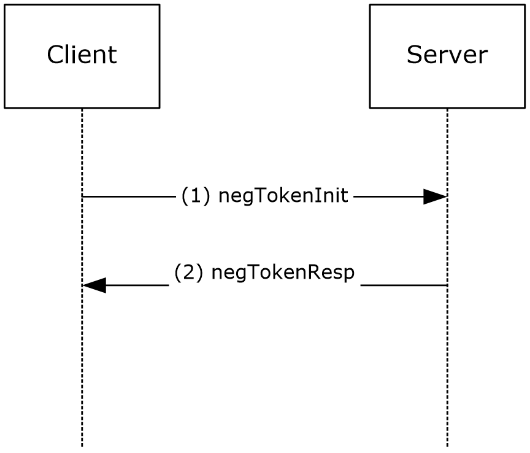
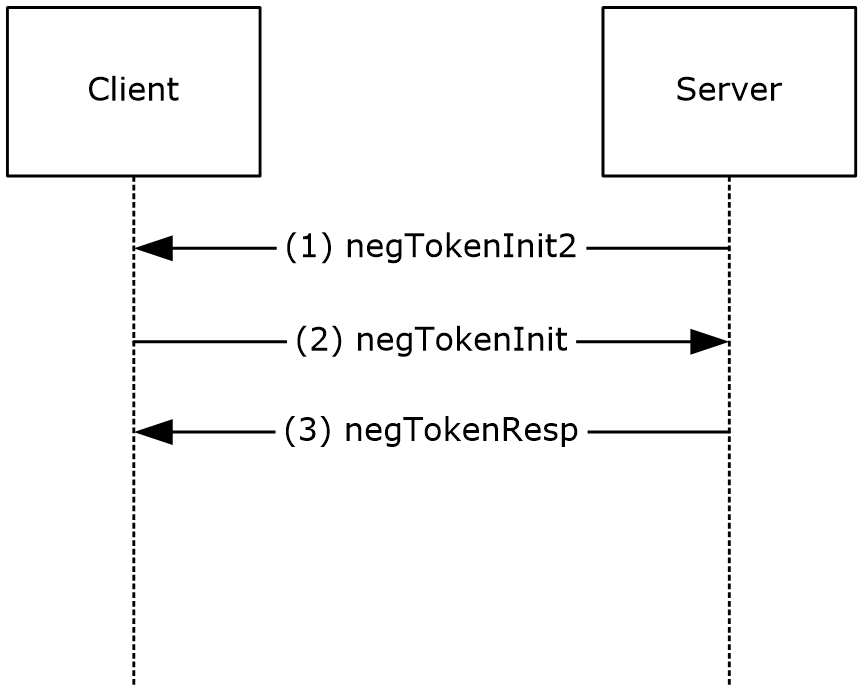

# [MS-SPNG]: Simple and Protected GSS-API Negotiation Mechanism (SPNEGO) Extension

Table of Contents

1 Introduction

- [1 Introduction](#Section_1)
  - [1.1 Glossary](#Section_1.1)
  - [1.2 References](#Section_1.2)
    - [1.2.1 Normative References](#Section_1.2.1)
    - [1.2.2 Informative References](#Section_1.2.2)
  - [1.3 Overview](#Section_1.3)
    - [1.3.1 Security Background](#Section_1.3.1)
    - [1.3.2 SPNEGO Synopsis](#Section_1.3.2)
    - [1.3.3 Client Initiated SPNG Message Flow](#Section_1.3.3)
    - [1.3.4 Server Initiated SPNG Message Flow](#Section_1.3.4)
  - [1.4 Relationship to Other Protocols](#Section_1.4)
  - [1.5 Prerequisites/Preconditions](#Section_1.5)
  - [1.6 Applicability Statement](#Section_1.6)
  - [1.7 Versioning and Capability Negotiation](#Section_1.7)
  - [1.8 Vendor-Extensible Fields](#Section_1.8)
  - [1.9 Standards Assignments](#Section_1.9)
    - [1.9.1 Use of Constants Assigned Elsewhere](#Section_1.9.1)

2 Messages

- [2 Messages](#Section_2)
  - [2.1 Transport](#Section_2.1)
  - [2.2 Message Syntax](#Section_2.2)
    - [2.2.1 NegTokenInit2](#Section_2.2.1)

3 Protocol Details

- [3 Protocol Details](#Section_3)
  - [3.1 Common Details](#Section_3.1)
    - [3.1.1 Abstract Data Model](#Section_3.1.1)
    - [3.1.2 Timers](#Section_3.1.2)
    - [3.1.3 Initialization](#Section_3.1.3)
    - [3.1.4 Higher-Layer Trigger Events](#Section_3.1.4)
    - [3.1.5 Message Processing Events and Sequencing Rules](#Section_3.1.5)
      - [3.1.5.1 mechListMIC Processing](#Section_3.1.5.1)
      - [3.1.5.2 mechTypes Identification of Kerberos](#Section_3.1.5.2)
      - [3.1.5.3 reqFlags Processing](#Section_3.1.5.3)
      - [3.1.5.4 InitFragmentToken()](#Section_3.1.5.4)
      - [3.1.5.5 FragmentToken()](#Section_3.1.5.5)
      - [3.1.5.6 Send Fragmented Messages](#Section_3.1.5.6)
      - [3.1.5.7 InitAssembleToken()](#Section_3.1.5.7)
      - [3.1.5.8 AssembleToken()](#Section_3.1.5.8)
      - [3.1.5.9 Receive Fragmented Messages](#Section_3.1.5.9)
    - [3.1.6 Timer Events](#Section_3.1.6)
    - [3.1.7 Other Local Events](#Section_3.1.7)
  - [3.2 Server (Acceptor) Role Details](#Section_3.2)
    - [3.2.1 Abstract Data Model](#Section_3.2.1)
    - [3.2.2 Timers](#Section_3.2.2)
    - [3.2.3 Initialization](#Section_3.2.3)
    - [3.2.4 Higher-Layer Triggered Events](#Section_3.2.4)
    - [3.2.5 Message Processing Events and Sequencing Rules](#Section_3.2.5)
      - [3.2.5.1 NTLM RC4 Key State for MechListMIC and First Signed Message](#Section_3.2.5.1)
      - [3.2.5.2 NegTokenInit2 Variation for Server-Initiation](#Section_3.2.5.2)
    - [3.2.6 Timer Events](#Section_3.2.6)
    - [3.2.7 Other Local Events](#Section_3.2.7)
  - [3.3 Client (Initiator) Role Details](#Section_3.3)
    - [3.3.1 Abstract Data Model](#Section_3.3.1)
    - [3.3.2 Timers](#Section_3.3.2)
    - [3.3.3 Initialization](#Section_3.3.3)
    - [3.3.4 Higher-Layer Triggered Events](#Section_3.3.4)
    - [3.3.5 Message Processing Events and Sequencing Rules](#Section_3.3.5)
      - [3.3.5.1 NTLM RC4 Key State for MechListMIC and First Signed Message](#Section_3.3.5.1)
      - [3.3.5.2 NegTokenInit2 Variation for Server-Initiation](#Section_3.3.5.2)
    - [3.3.6 Timer Events](#Section_3.3.6)
    - [3.3.7 Other Local Events](#Section_3.3.7)

4 Protocol Examples

- [4 Protocol Examples](#Section_4)

5 Security

- [5 Security](#Section_5)
  - [5.1 Security Considerations for Implementers](#Section_5.1)
  - [5.2 Index of Security Parameters](#Section_5.2)

6 Appendix A: Product Behavior

- [6 Appendix A: Product Behavior](#Section_6)

7 Change Tracking

- [7 Change Tracking](#Section_7)

For the legal notice and IP terms, see [LEGAL.md](../LEGAL.md).
Last updated: 7/29/2024.
See [Revision History](#revision-history) for full version history.

# 1 Introduction

The Simple and Protected Generic Security Service Application Program Interface (GSS-API) Negotiation Mechanism (SPNEGO) Extension is an extension to [[RFC4178]](https://go.microsoft.com/fwlink/?LinkId=90461) that provides a negotiation mechanism for the Generic Security Service Application Program Interface (GSS-API), as specified in [[RFC2743]](https://go.microsoft.com/fwlink/?LinkId=90378). SPNEGO provides a framework for two parties that are engaged in authentication to select from a set of possible authentication mechanisms, in a manner that preserves the opaque nature of the security protocols to the application protocol that uses SPNEGO. SPNEGO was first defined in [[RFC2478]](https://go.microsoft.com/fwlink/?LinkId=90360), which has been superseded by [RFC4178].

Sections 1.5, 1.8, 1.9, 2, and 3 of this specification are normative. All other sections and examples in this specification are informative.

## 1.1 Glossary

This document uses the following terms:

**application protocol**: A network protocol that operates in the application layer at the top of the OSI model. It visibly accomplishes the task that the user or other agent wants to perform. This is distinguished from all manner of support protocols: from Ethernet or IP at the bottom to security and routing protocols. While necessary, these are not always visible to the user. Application protocols include, for instance, HTTP and Server Message Block (SMB).

**ASN.1**: Abstract Syntax Notation One. ASN.1 is used to describe Kerberos datagrams as a sequence of components, sent in messages. ASN.1 is described in the following specifications: [[ITUX660]](https://go.microsoft.com/fwlink/?LinkId=89922) for general procedures; [[ITUX680]](https://go.microsoft.com/fwlink/?LinkId=89923) for syntax specification, and [[ITUX690]](https://go.microsoft.com/fwlink/?LinkId=89924) for the Basic Encoding Rules (BER), Canonical Encoding Rules (CER), and Distinguished Encoding Rules (DER) encoding rules.

**ASN.1 Header**: The top-level ASN.1 tag of the message.

**authentication**: The ability of one entity to determine the identity of another entity by proving an identity to a server while providing key material that binds the identity to subsequent communications.

**Generic Security Services (GSS)**: An Internet standard, as described in [[RFC2743]](https://go.microsoft.com/fwlink/?LinkId=90378), for providing security services to applications. It consists of an application programming interface (GSS-API) set, as well as standards that describe the structure of the security data.

**globally unique identifier (GUID)**: A term used interchangeably with universally unique identifier (UUID) in Microsoft protocol technical documents (TDs). Interchanging the usage of these terms does not imply or require a specific algorithm or mechanism to generate the value. Specifically, the use of this term does not imply or require that the algorithms described in [[RFC4122]](https://go.microsoft.com/fwlink/?LinkId=90460) or [[C706]](https://go.microsoft.com/fwlink/?LinkId=89824) have to be used for generating the GUID. See also universally unique identifier (UUID).

**Kerberos**: An [**authentication**](#gt_authentication) system that enables two parties to exchange private information across an otherwise open network by assigning a unique key (called a ticket) to each user that logs on to the network and then embedding these tickets into messages sent by the users. For more information, see [MS-KILE](../MS-KILE/MS-KILE.md).

**object identifier (OID)**: In the context of an object server, a 64-bit number that uniquely identifies an object.

**original equipment manufacturer (OEM) code page**: A code page used to translate between non-Unicode encoded strings and UTF-16 encoded strings.

**security protocol**: A protocol that performs [**authentication**](#gt_authentication) and possibly additional security services on a network.

**security token**: An opaque message or data packet produced by a [**Generic Security Services (GSS)**](#gt_generic-security-services-gss)-style [**authentication**](#gt_authentication) package and carried by the application protocol. The application has no visibility into the contents of the token.

**Simple and Protected GSS-API Negotiation Mechanism (SPNEGO)**: An [**authentication**](#gt_authentication) mechanism that allows [**Generic Security Services (GSS)**](#gt_generic-security-services-gss) peers to determine whether their credentials support a common set of GSS-API security mechanisms, to negotiate different options within a given security mechanism or different options from several security mechanisms, to select a service, and to establish a security context among themselves using that service. [**SPNEGO**](#gt_simple-and-protected-gss-api-negotiation-mechanism-spnego) is specified in [[RFC4178]](https://go.microsoft.com/fwlink/?LinkId=90461).

**MAY, SHOULD, MUST, SHOULD NOT, MUST NOT:** These terms (in all caps) are used as defined in [[RFC2119]](https://go.microsoft.com/fwlink/?LinkId=90317). All statements of optional behavior use either MAY, SHOULD, or SHOULD NOT.

## 1.2 References

Links to a document in the Microsoft Open Specifications library point to the correct section in the most recently published version of the referenced document. However, because individual documents in the library are not updated at the same time, the section numbers in the documents may not match. You can confirm the correct section numbering by checking the [Errata](https://go.microsoft.com/fwlink/?linkid=850906).

### 1.2.1 Normative References

We conduct frequent surveys of the normative references to assure their continued availability. If you have any issue with finding a normative reference, please contact [dochelp@microsoft.com](mailto:dochelp@microsoft.com). We will assist you in finding the relevant information.

[ISO/IEC-8859-1] International Organization for Standardization, "Information Technology -- 8-Bit Single-Byte Coded Graphic Character Sets -- Part 1: Latin Alphabet No. 1", ISO/IEC 8859-1, 1998, [http://www.iso.org/iso/home/store/catalogue_tc/catalogue_detail.htm?csnumber=28245](https://go.microsoft.com/fwlink/?LinkId=90689)

**Note** There is a charge to download the specification.

[MS-NLMP] Microsoft Corporation, "[NT LAN Manager (NTLM) Authentication Protocol](../MS-NLMP/MS-NLMP.md)".

[RFC2119] Bradner, S., "Key words for use in RFCs to Indicate Requirement Levels", BCP 14, RFC 2119, March 1997, [https://www.rfc-editor.org/info/rfc2119](https://go.microsoft.com/fwlink/?LinkId=90317)

[RFC2478] Baize, E. and Pinkas, D., "The Simple and Protected GSS-API Negotiation Mechanism", RFC 2478, December 1998, [https://www.rfc-editor.org/info/rfc2478](https://go.microsoft.com/fwlink/?LinkId=90360)

[RFC2743] Linn, J., "Generic Security Service Application Program Interface Version 2, Update 1", RFC 2743, January 2000, [https://www.rfc-editor.org/info/rfc2743](https://go.microsoft.com/fwlink/?LinkId=90378)

[RFC4178] Zhu, L., Leach, P., Jaganathan, K., and Ingersoll, W., "The Simple and Protected Generic Security Service Application Program Interface (GSS-API) Negotiation Mechanism", RFC 4178, October 2005, [https://www.rfc-editor.org/info/rfc4178](https://go.microsoft.com/fwlink/?LinkId=90461)

[X680] ITU-T, "Abstract Syntax Notation One (ASN.1): Specification of Basic Notation", Recommendation X.680, July 2002, [http://www.itu.int/rec/T-REC-X.680/en](https://go.microsoft.com/fwlink/?LinkId=90594)

[X690] ITU-T, "Information Technology - ASN.1 Encoding Rules: Specification of Basic Encoding Rules (BER), Canonical Encoding Rules (CER) and Distinguished Encoding Rules (DER)", Recommendation X.690, July 2002, [http://www.itu.int/rec/T-REC-X.690/en](https://go.microsoft.com/fwlink/?LinkId=90593)

### 1.2.2 Informative References

[HTTPAUTH] Jaganathan, K., Zhu, L., and Brezak, J., "Kerberos based HTTP Authentication in Windows", July 2005, [http://tools.ietf.org/html/draft-jaganathan-kerberos-http-01](https://go.microsoft.com/fwlink/?LinkId=89881)

[IETFDRAFT-NEGOEX-02] Short, M., Zhu, L., Damour, K., and McPherson, D., "The Extended GSS-API Negotiation Mechanism (NEGOEX)", draft-zhu-negoex-02, September 2010, [https://tools.ietf.org/html/draft-zhu-negoex-02](https://go.microsoft.com/fwlink/?LinkId=132205)

[KAUFMAN] Kaufman, C., Perlman, R., and M. Speciner, "Network Security: Private Communication in a Public World, Second Edition", Prentice Hall, 2002, ISBN: 0130460192.

[MS-KILE] Microsoft Corporation, "[Kerberos Protocol Extensions](../MS-KILE/MS-KILE.md)".

[MS-RPCE] Microsoft Corporation, "[Remote Procedure Call Protocol Extensions](../MS-RPCE/MS-RPCE.md)".

[MS-SMB] Microsoft Corporation, "[Server Message Block (SMB) Protocol](../MS-SMB/MS-SMB.md)".

[PKU2U-DRAFT] Zhu, L., Altman, J., and Williams, N., "Public Key Cryptography Based User-to-User Authentication (PKU2U)", November 2008, [http://tools.ietf.org/id/draft-zhu-pku2u-09.txt](https://go.microsoft.com/fwlink/?LinkId=208275)

[RFC1964] Linn, J., "The Kerberos Version 5 GSS-API Mechanism", RFC 1964, June 1996, [https://www.rfc-editor.org/info/rfc1964](https://go.microsoft.com/fwlink/?LinkId=90304)

[RFC2251] Wahl, M., Howes, T., and Kille, S., "Lightweight Directory Access Protocol (v3)", RFC 2251, December 1997, [https://www.rfc-editor.org/info/rfc2251](https://go.microsoft.com/fwlink/?LinkId=90325)

[RFC4120] Neuman, C., Yu, T., Hartman, S., and Raeburn, K., "The Kerberos Network Authentication Service (V5)", RFC 4120, July 2005, [https://www.rfc-editor.org/rfc/rfc4120](https://go.microsoft.com/fwlink/?LinkId=90458)

[UUKA-GSSAPI] Swift, M., Brezak, J., and Moore, P., "User to User Kerberos Authentication using GSS-API", October 2001, [https://tools.ietf.org/html/draft-swift-win2k-krb-user2user-03](https://go.microsoft.com/fwlink/?LinkId=107082)

## 1.3 Overview

Simple and Protected Generic Security Service Application Program Interface Negotiation Mechanism (SPNEGO): Extension processes certain SPNEGO message fields differently from the standard specification, including the **NegTokenInit** and universal receiver fields.

The following sections give an overview of SPNEGO extension, its processing, and message flows.

### 1.3.1 Security Background

The SPNEGO Extension is a [**security protocol**](#gt_security-protocol). As such, the normative references in this specification use common security-related terms. Every effort has been made to use these terms, such as principal, key, and service, in accordance with their use in [[RFC4178]](https://go.microsoft.com/fwlink/?LinkId=90461).

A prerequisite for understanding the variations between the SPNEGO Extension and [RFC4178] is a working knowledge of the [**Generic Security Service**](#gt_generic-security-services-gss) API. Several of the informative references, specifically [KAUFMAN], provide excellent top-level information about Generic Security Services (GSS) and the message flow. [KAUFMAN] also provides an excellent survey of other security protocols and concepts, and it helps to explain the terms of art that this specification uses.

Historically, the first GSS security mechanism defined was the [**Kerberos**](#gt_kerberos) protocol ([[RFC1964]](https://go.microsoft.com/fwlink/?LinkId=90304)). The Kerberos protocol has influenced many other mechanisms; in some cases, it might be helpful to have an example protocol to compare against. Finally, there are details that are not immediately apparent, as specified in [[RFC2743]](https://go.microsoft.com/fwlink/?LinkId=90378) and [RFC4178].

### 1.3.2 SPNEGO Synopsis

SPNEGO is a [**security protocol**](#gt_security-protocol) that uses a [**GSS**](#gt_generic-security-services-gss)-API authentication mechanism. GSS–API is a literal set of functions that include both an API and a methodology for approaching authentication. As specified in [[RFC2743]](https://go.microsoft.com/fwlink/?LinkId=90378), GSS-API and the individual security protocols that correspond to the GSS–API (also shortened to GSS) were developed because of the need to insulate application protocols from the specifics of security protocols as much as possible.

This approach led to a simplified form of interaction between an [**application protocol**](#gt_application-protocol) and an [**authentication**](#gt_authentication) protocol. In this model, an application protocol is responsible for ferrying discrete, opaque packets that the authentication protocol produces. These packets, which are referred to as [**security tokens**](#gt_security-token) by the GSS specifications, implement the authentication process. The application protocol has no visibility into the contents of the security tokens; its responsibility is merely to carry them.

The application protocol in this model (see SPN exchange figures in section [1.3.3](#Section_1.3.4)) first invokes the authentication protocol on the client. The client portion of the authentication protocol creates a security token and returns it to the calling application. The application protocol then transmits that security token to the server side of its connection, embedded within the application protocol. On the server side, the server's application protocol extracts the security token and supplies it to the authentication protocol on the server side. The server authentication protocol can process the security token and possibly generate a response, or it can decide that authentication is complete. If another security token is generated, the application protocol must carry it back to the client, where the process continues.

This exchange of security tokens continues until one side determines that authentication has failed or both sides decide that authentication is complete. If authentication fails, the application protocol drops the connection and indicates the error. If authentication succeeds, the application protocol can be assured of the identity of the participants as far as the supporting authentication protocol can accomplish. The onus of determining success or failure is on the abstracted security protocol, not the application protocol, which greatly simplifies the application protocol author's task.

After the authentication is complete, session-specific security services might be available. The application protocol can then invoke the authentication protocol to sign or encrypt the messages that are sent as part of the application protocol. The session-specific security services operations are done in much the same way, where the application protocol can indicate which portions of the message are to be encrypted, and the application protocol must include a per-message security token. By signing or encrypting the messages, the application can obtain message privacy and integrity, and detect message loss, out of order delivery and duplication.

Because more than one GSS–compatible authentication protocol exists, determining which protocol to use has become more important. The original GSS design had a static, compile-time binding between the application and the GSS implementation. More recent practice is to support more than one authentication mechanism—even for a single application protocol.

SPNEGO fills this need by presenting a GSS–compatible wrapper to other GSS mechanisms. It securely negotiates among several authentication mechanisms, selecting one for use to satisfy the authentication needs of the application protocol.

SPNG has errors in early implementations and an optimization for certain non–GSS scenarios. These variations form the basis of this specification.

### 1.3.3 Client Initiated SPNG Message Flow

SPNG message flow is composed of the following exchange:

Figure 1: SPNG exchange

- The client sends a **negTokenInit** message to the server. This message specifies the available authentication methods and an **optimistic mechanism** token ([[RFC4178]](https://go.microsoft.com/fwlink/?LinkId=90461) section 3.1).
- The server sends a **negTokenResp** message to the client. The message specifies the state of the negotiation.

### 1.3.4 Server Initiated SPNG Message Flow

Server-initiated SPNG is composed of a three-way exchange:

Figure 2: SPNG exchange

- The server sends a **negTokenInit2** message to the client. This message specifies the available authentication methods and an **optimistic mechanism** token.
- The client sends a **negTokenInit** message to the server. This message specifies the available authentication methods and an **optimistic mechanism** token.
- The server sends a **negTokenResp** message to the client. The message specifies the state of the negotiation.

## 1.4 Relationship to Other Protocols

SPNEGO requires at least one other [**GSS**](#gt_generic-security-services-gss)–compatible authentication protocol to be present for it to work. It does not depend on a specific protocol.<1>

Since NEGOEX negotiates security mechanisms, applications that use SPNEGO as their authentication protocol can use protocols supported by NEGOEX.<2>

Many application protocols make use of SPNEGO as their authentication protocol. Such protocols include the Common Internet File System (CIFS)/Server Message Block (SMB) [MS-SMB](../MS-SMB/MS-SMB.md); HTTP [[HTTPAUTH]](https://go.microsoft.com/fwlink/?LinkId=89881); RPCE [MS-RPCE](../MS-RPCE/MS-RPCE.md); and the Lightweight Directory Access Protocol (LDAP) [[RFC2251]](https://go.microsoft.com/fwlink/?LinkId=90325).

SPNEGO is a meta protocol that travels entirely in other application protocols; it is never used directly without an [**application protocol**](#gt_application-protocol).

After SPNEGO has completed the ferrying of the other [**security protocol's**](#gt_security-protocol) authentication tokens, SPNEGO is finished. All further access to security context state and per-message services, such as signatures or encryption, is done by directly using the "real" security protocol whose authentication tokens were communicated via SPNEGO.

## 1.5 Prerequisites/Preconditions

Because SPNEGO relies on other [**security protocols**](#gt_security-protocol) that perform authentication, those protocols have to be available to SPNEGO for it to operate. The set of protocols is implementation-dependent upon the installation.<3>

Applications typically establish a connection before they invoke SPNEGO, although establishing a connection before invoking SPNEGO is not required by the SPNEGO protocol.

## 1.6 Applicability Statement

As a [**GSS**](#gt_generic-security-services-gss) protocol, SPNEGO can be used almost anywhere that an [**application protocol**](#gt_application-protocol) uses GSS to perform authentication. The protocol has to be connection-oriented because it is not designed to tolerate packet loss; datagram-only protocols cannot support negotiation of this form.

## 1.7 Versioning and Capability Negotiation

SPNEGO does not contain any versioning capacity. The same is true for capabilities: any capability negotiation must be performed by the actual authentication protocols that SPNEGO is carrying.

## 1.8 Vendor-Extensible Fields

None.

## 1.9 Standards Assignments

None.

### 1.9.1 Use of Constants Assigned Elsewhere

SPNEGO has been assigned the following [**object identifier (OID)**](#gt_object-identifier-oid):

- iso.org.dod.internet.security.mechanism.snego (1.3.6.1.5.5.2)
See section [1.4](#Section_1.4) and section [3.1.5.2](#Section_3.1.5.2) for other OID usages.

# 2 Messages

## 2.1 Transport

SPNEGO is transported only when encapsulated in an [**application protocol**](#gt_application-protocol). As such, it can travel over whatever transports the application protocol uses. By itself, SPNEGO never causes network traffic.

## 2.2 Message Syntax

The messages that SPNEGO uses are specified in [[RFC4178]](https://go.microsoft.com/fwlink/?LinkId=90461), in terms of [**ASN.1**](#gt_asn1), as specified in [[X680]](https://go.microsoft.com/fwlink/?LinkId=90594). There are only two messages in SPNEGO, **negTokenInit** and **negTokenResp**.

The **negTokenInit** message is sent from the client to the server and is used to begin the negotiation. The client uses that message to specify the set of authentication mechanisms that are supported and an opportunistic authentication message from the mechanism that the client believes will be agreed upon with the server.

The **negTokenResp** message is used thereafter as the server selects the mechanism to use, and the two parties exchange authentication messages that are wrapped in the **negTokenResp** message until completion.

The SPNEGO Extension extends the **NegTokenInit** message with the **NegTokenInit2** message section [2.2.1](#Section_2.2.1).

### 2.2.1 NegTokenInit2

The **NegTokenInit2** message extends **NegTokenInit** with a negotiation hints (**negHints**) field. The **NegTokenInit2** message SHOULD<4> be structured as follows.

NegHints ::= SEQUENCE {

hintName[0] GeneralString OPTIONAL,

hintAddress[1] OCTET STRING OPTIONAL

}

NegTokenInit2 ::= SEQUENCE {

mechTypes[0] MechTypeList OPTIONAL,

reqFlags [1] ContextFlags OPTIONAL,

mechToken [2] OCTET STRING OPTIONAL,

negHints [3] NegHints OPTIONAL,

mechListMIC [4] OCTET STRING OPTIONAL,

...

}

**mechTypes**: The list of authentication mechanisms that are available, by [**OID**](#gt_object-identifier-oid), as specified in [[RFC4178]](https://go.microsoft.com/fwlink/?LinkId=90461) section 4.1.

**reqFlags**: As specified in [RFC4178] section 4.2.1 This field SHOULD be omitted by the sender.

**mechToken**: The **optimistic mechanism** token ([RFC4178] section 4.2.1).<5>

**negHints**: The server supplies the negotiation hints using a N**egHints** structure that is assembled as follows.

- **hintName**: SHOULD<6> contain the string "not_defined_in_RFC4178@please_ignore".
- **hintAddress**: Never present. MUST be omitted by the sender. Note that the encoding rules, as specified in [[X690]](https://go.microsoft.com/fwlink/?LinkId=90593), require that this structure not be present at all, not just be zero.
**mechListMIC**: The message integrity code (**MIC**) token ([RFC4178] section 4.2.1).

**Note** In the preceding [**ASN.1**](#gt_asn1) description, the **NegTokenInit2** message occupies the same context-specific ([X690] section 8.1.2.2) message ID as does **NegTokenInit** in SPNEGO.

# 3 Protocol Details

## 3.1 Common Details

The following are common variations, as specified in [[RFC4178]](https://go.microsoft.com/fwlink/?LinkId=90461), for both client and server processing in the SPNEGO Extension.

### 3.1.1 Abstract Data Model

This section describes a conceptual model of possible data organization that an implementation maintains to participate in this protocol. The described organization is provided to facilitate the explanation of how the protocol behaves. This document does not mandate that implementations adhere to this model as long as their external behavior is consistent with that described in this document.

The SPNEGO Extension makes no extensions to the abstract data model for SPNEGO.

This protocol includes the following ADM elements, which are directly accessed from NLMP as specified in [MS-NLMP](../MS-NLMP/MS-NLMP.md) section 3.4.1:

- **ClientHandle**
- **ServerHandle**
SPNEGO exports a set of abstract parameters that describe the security services that a caller wants to have available for use on the communication session after it has been established. SPNEGO cannot directly act on these parameters because it does not perform the actual authentication. They are passed through to the underlying [**security protocols**](#gt_security-protocol) as an indication of the caller's eventual plans. These parameters are:

- *Integrity*: A Boolean setting that indicates that the caller wants to sign messages so that they cannot be tampered with while in transit.
- *Replay Detect*: A Boolean setting that indicates that the caller wants to sign messages so that they cannot be replayed.
- *Sequence Detect*: A Boolean setting that indicates that the caller wants to sign messages so that they cannot be sent out of order.
- *Confidentiality*: A Boolean setting that indicates that the caller wants to encrypt messages so that they cannot be read while in transit.
- *Delegate*: A Boolean setting that indicates that the caller wants to make its own identity available to the server for further identification to other services.
- *Mutual Authentication*: A Boolean setting that indicates that the client and server MUST authenticate each other; unidirectional authentication is not permissible.
These flags correspond to the **reqFlags:ContextFlags** field in the **NegTokenInit** structure. As specified in [[RFC4178]](https://go.microsoft.com/fwlink/?LinkId=90461), the **reqFlags:ContextFlags** field is now only for legacy purposes and SHOULD NOT be filled in. For more information about the **reqFlags:ContextFlags** field, see section [3.1.5.3](#Section_3.1.5.3).

- *Extended Error*: A Boolean setting that indicates that the caller wants the underlying protocol to perform the extended error handling, potentially including retries within the [**GSS**](#gt_generic-security-services-gss) exchange.
- *FragmentToFit*: A Boolean setting that indicates that the caller directs the underlying protocol to fragment messages.<7>
- *MaxOutputTokenSize*: The maximum size, in bytes, of **output_token** that can be returned to the caller, as specified in [[RFC2478]](https://go.microsoft.com/fwlink/?LinkId=90360) Section 2.2. This value MUST be at least 5 bytes to contain the entire [**ASN.1 header**](#gt_asn1-header), so that the recipient can reconstruct the length of the completed message. Applications that request small buffers can significantly increase the number of round trips. An application can have limitations on the number of round trips allowed, which means that setting the buffers too small can cause failures. Also, authentication protocols can be sensitive to clock skews between the client and server, which can cause failures if the amount of time required to transmit all the messages is too long.
The following temporary variables are used by the fragmenting functions:

- **FragmentInputToken:** A Boolean setting that indicates that more fragments of **input_token** remain, as specified in [RFC2478] section 4.2.
- **ReceivedInputToken:** The fragments of **input_token** received.
- **TokenLength:** The length of **input_token**.
- **FragmentOutputToken:** A Boolean setting that indicates that more fragments of **output_token** remain.
- **RemainingOutputToken:** The remaining message to be sent.
The following temporary variable is used to reset the NLMP RC4 handle:

- **OriginalHandle**

### 3.1.2 Timers

None.

### 3.1.3 Initialization

None.

### 3.1.4 Higher-Layer Trigger Events

None.

### 3.1.5 Message Processing Events and Sequencing Rules

The following fields are processed differently than as specified in [[RFC4178]](https://go.microsoft.com/fwlink/?LinkId=90461).

#### 3.1.5.1 mechListMIC Processing

[[RFC2478]](https://go.microsoft.com/fwlink/?LinkId=90360) inadequately specifies the processing of the mechanism list message integrity code (**MIC**), or **mechListMIC** field. [[RFC4178]](https://go.microsoft.com/fwlink/?LinkId=90461) clarifies the processing of the **mechListMIC** field.<8>

#### 3.1.5.2 mechTypes Identification of Kerberos

An implementation SHOULD<9> use the standard [**Kerberos**](#gt_kerberos) [**OID**](#gt_object-identifier-oid) (1.2.840.113554.1.2.2), as described in [[RFC4120]](https://go.microsoft.com/fwlink/?LinkId=90458), for identification of the Kerberos **mechType** and the **OID** described in [[UUKA-GSSAPI]](https://go.microsoft.com/fwlink/?LinkId=107082) section 4 for identification of the Kerberos user-to-user mechType.

#### 3.1.5.3 reqFlags Processing

[[RFC2478]](https://go.microsoft.com/fwlink/?LinkId=90360), the predecessor to [[RFC4178]](https://go.microsoft.com/fwlink/?LinkId=90461), includes the **reqFlags** field in the protocol. This field is intended for the client to indicate the requested behavior according to the [**GSS**](#gt_generic-security-services-gss) abstract variables, such as confidentiality and integrity. However, the **reqFlags** field is not covered by the signature of the message; therefore, it can be tampered with while in transit.

As specified in [RFC4178], use of this field is explicitly discouraged due to the lack of integrity protection, and the acceptor (server) MUST ignore the **reqFlags**, if present.

#### 3.1.5.4 InitFragmentToken()

InitFragmentToken (Token, MaxOutputTokenSize, OutputToken)

-- Input:

-- MaxOutputTokenSize - Maximum size, in bytes, of OutputToken that can be

returned to the caller. MUST be greater than 5.

-- Token – The Token message to be fragmented.

-- Internal Temporary variables that do not pass over the wire are defined below:

-- RemainingOutputToken – The remaining message to be sent.

-- FragmentOutputToken - A Boolean setting that indicates that more fragments of the output_token remain.

-- Output:

-- OutputToken – The first fragment of the message passed to the caller.

Initialize RemainingOutputToken to Token.

Set FragmentOutputToken to TRUE

Set OutputToken to first MaxOutputTokenSize bytes of RemainingOutputToken

Delete first MaxOutputTokenSize bytes of RemainingOutputToken

#### 3.1.5.5 FragmentToken()

FragmentToken(OutputToken)

-- Internal Temporary variables that do not pass over the wire are defined below:

-- MaxOutputTokenSize - Maximum size, in bytes, of the OutputToken that can be

returned to the caller. MUST be greater than 5.

-- RemainingOutputToken – The remaining message to be sent.

-- FragmentOutputToken - A Boolean setting that indicates that more fragments of the OutputToken remain.

-- Output:

-- OutputToken – The OutputToken passed to the client.

If size of RemainingOutputToken > MaxOutputTokenSize

Set OutputToken to first MaxOutputTokenSize bytes of RemaininggOutputToken

Delete first MaxOutputTokenSize bytes of RemainingOutputToken

Else

Set OutputToken to RemainingOutputToken

Set RemainingOutputToken to empty

Set FragmentOutputToken to FALSE

EndIf

#### 3.1.5.6 Send Fragmented Messages

The first fragment includes the [**ASN.1 header**](#gt_asn1-header) for the message, so that the recipient can reconstruct the length of the completed message. This requires that **MaxOutputTokenSize** be at least 5 bytes.

The SPNEGO Extension calls **InitFragmentToken** (section [3.1.5.4](#Section_3.1.5.4)), where:

- **Token** contains the message.
- **MaxOutputTokenSize** contains the **MaxOutputTokenSize** provided by the application.
The SPNEGO Extension MUST return GSS_S_CONTINUE_NEEDED status ([[RFC2478]](https://go.microsoft.com/fwlink/?LinkId=90360)) and an initial packet containing **OutputToken**, as specified in section 3.1.5.4.

When **FragmentOutputToken** is set to TRUE, the SPNEGO Extension calls **FragmentToken** (section [3.1.5.5](#Section_3.1.5.5)) to get the next fragment, and MUST return GSS_S_CONTINUE_NEEDED status and **OutputToken**. If **FragmentOutputToken** is not set to TRUE, the SPNEGO Extension MUST return GSS_S_COMPLETE status, as specified in [RFC2478].

If the server does not support fragmentation, the application service receives an error from its **GSS_Accept_sec_context** call, and the negotiation fails. Whether the client application receives the error depends on the application service behavior.

#### 3.1.5.7 InitAssembleToken()

InitAssembleToken (Input_Token)

-- Input:

-- InputToken – The Input_Token received.

-- Temporary variables that do not pass over the wire are defined below:

-- ReceivedInputToken – The message fragments received so far.

-- TokenLength - Length of message from the ASN.1 header.

-- FragmentInputToken - A Boolean setting that indicates that more fragments of the message remain.

Initialize TokenLength to the length of the message from the ASN.1 header in InputToken.

Initialize ReceivedInputToken to InputToken.

Set FragmentInputToken to TRUE.

#### 3.1.5.8 AssembleToken()

AssembleToken(Input_Token, OutputToken)

-- Input:

-- InputToken – The Input_Token received.

-- Temporary variables that do not pass over the wire are defined below:

-- ReceivedInputToken – The message fragments received so far.

-- TokenLength - Length of message from the ASN.1 header.

-- FragmentInputToken - A Boolean setting that indicates that more fragments of the InputToken remain.

-- Output:

-- OutputToken – The OutputToken returned, or the complete InputToken.

Append InputToken to ReceivedInputToken

If TokenLength > length of ReceivedInputToken

Set OutputToken to empty

Else

Set OutputToken to ReceivedInputToken

Set ReceivedInputToken to empty

Set FragmentInputToken to FALSE.

EndIf

#### 3.1.5.9 Receive Fragmented Messages

The length of the first packet specified in the [**ASN.1 header**](#gt_asn1-header) is used to determine the number of bytes necessary to assemble the complete message. the SPNEGO Extension calls **InitAssembleToken** (section [3.1.5.7](#Section_3.1.5.7)), where **Input_Token** contains the **Input_Token** received from the caller. To receive the next fragment, SPNG MUST return GSS_S_CONTINUE_NEEDED status with an empty **OutputToken** (section [3.1.5.8](#Section_3.1.5.8)).

When **FragmentInputToken** is set to TRUE, the SPNEGO Extension calls **AssembleToken** (section 3.1.5.8), where **Input_Token** contains the **Input_Token** received. If the **OutputToken** is not empty, the message is complete and processing can continue as normal. Otherwise, to receive the next fragment, the SPNEGO Extension MUST return GSS_S_CONTINUE_NEEDED status with an empty **OutputToken**.

If the context is terminated before reassembly of the message is complete (for example, because the network connection to the other entity is interrupted), the entire message MUST be discarded.

### 3.1.6 Timer Events

None.

### 3.1.7 Other Local Events

None.

## 3.2 Server (Acceptor) Role Details

### 3.2.1 Abstract Data Model

The abstract data model for the server is specified in section [3.1.1](#Section_3.1.1).

### 3.2.2 Timers

None.

### 3.2.3 Initialization

None.

### 3.2.4 Higher-Layer Triggered Events

None.

### 3.2.5 Message Processing Events and Sequencing Rules

The server SHOULD ignore the **negHints** field in the **negTokenInit2** message.

The server MUST use the erroneous Kerberos value (1.2.840.48018.1.2.2) as the **supportedMech** field in the response negotiation token if the optimistic Kerberos token (1.2.840.48018.1.2.2) is accepted, as specified in [[RFC4178]](https://go.microsoft.com/fwlink/?LinkId=90461) section 4.2.2 and Appendix C.

The SPNG server SHOULD invoke **Send Fragmented Messages** (section [3.1.5.6](#Section_3.1.5.6)) when a **GSS_Accept_sec_context()** ([[RFC2743]](https://go.microsoft.com/fwlink/?LinkId=90378) section 2.2.2) with the *FragmentToFit* parameter set to TRUE (section [3.1.1](#Section_3.1.1)) is received, and either:

- The **Negotiate** Token ([RFC4178] section 4.2) to be sent exceeds **MaxOutputTokenSize**, or
- **FragmentOutputToken** is set to TRUE.
The server MUST invoke **Receive Fragmented Messages** (section [3.1.5.9](#Section_3.1.5.9)) when a packet is received and either:

- The packet contains a valid [**ASN.1 header**](#gt_asn1-header) but an incomplete body, or
- **FragmentOutputToken** is set to TRUE.

#### 3.2.5.1 NTLM RC4 Key State for MechListMIC and First Signed Message

When NTLM is negotiated, the SPNG server MUST set **OriginalHandle** to **ServerHandle** before generating the **mechListMIC**, then set **ServerHandle** to **OriginalHandle** after generating the **mechListMIC**. This results in the RC4 key state being the same for the **mechListMIC** and for the first message signed by the application.

Because the RC4 key state is the same for the **mechListMIC** and for the first message signed by the application, the SPNEGO Extension server MUST set **OriginalHandle** to **ClientHandle** before validating the **mechListMIC** and then set **ClientHandle** to **OriginalHandle** after validating the **mechListMIC**.

#### 3.2.5.2 NegTokenInit2 Variation for Server-Initiation

Standard [**GSS**](#gt_generic-security-services-gss) has a strict notion of client (initiator) and server (acceptor). If the client has not sent a **negTokenInit** ([[RFC4178]](https://go.microsoft.com/fwlink/?LinkId=90461) section 4.2.1) message, no context establishment token is expected from the server.

The SPNEGO extension allows the server to generate a context establishment token message ( **NegTokenInit2** section [2.2.1](#Section_2.2.1)) and send it to the client when **GSS_Accept_sec_context()** is called without an **input_token**.

The server generates a **NegTokenInit2** message that includes the [**OIDs**](#gt_object-identifier-oid) of the [**security protocols**](#gt_security-protocol) that are present and available on the server in the **mechTypes** field.

In the **negHints** field, the server places the string "not_defined_in_RFC4178@please_ignore", expressed as ANSI encoding, as specified in [[ISO/IEC-8859-1]](https://go.microsoft.com/fwlink/?LinkId=90689), in the **hintName** field. For more information about how the **hintName** field is populated, see section 2.2.1.

The **hintAddress** field MUST be omitted and not transmitted. The **NegTokenInit2** token is then passed to the client within the [**application protocol**](#gt_application-protocol). When encoding the name, the configured locale on the computer SHOULD be used for the resulting character set.

### 3.2.6 Timer Events

None.

### 3.2.7 Other Local Events

None.

## 3.3 Client (Initiator) Role Details

### 3.3.1 Abstract Data Model

The abstract data model for the client is specified in section [3.1.1](#Section_3.1.1).

### 3.3.2 Timers

None.

### 3.3.3 Initialization

The client MUST request **Mutual Authentication** services, as specified in section [3.1.1](#Section_3.1.1).

### 3.3.4 Higher-Layer Triggered Events

None.

### 3.3.5 Message Processing Events and Sequencing Rules

The SPNEGO Extension client SHOULD invoke **Send Fragmented Messages** (section [3.1.5.6](#Section_3.1.5.6)) when a **GSS_Accept_sec_context()** ([[RFC2743]](https://go.microsoft.com/fwlink/?LinkId=90378) section 2.2.2) with the *FragmentToFit* parameter set to TRUE (section [3.1.1](#Section_3.1.1)) is received, and either:

- The **Negotiate** Token ([[RFC4178]](https://go.microsoft.com/fwlink/?LinkId=90461) section 4.2) to be sent exceeds **MaxOutputTokenSize**, or
- **FragmentOutputToken** is set to TRUE.
The server MUST invoke **Receive Fragmented Messages** (section [3.1.5.9](#Section_3.1.5.9)) when a packet is received and either:

- The packet contains a valid [**ASN.1 header**](#gt_asn1-header) but an incomplete body, or
- **FragmentOutputToken** is set to TRUE.
To support non-compliant implementations of [RFC4178] that send a **supportedMech** field in a subsequent **NegTokenResp** message, the SPNEGO Extension client SHOULD<10> accept the message without returning an error, but MUST ignore the new **supportedMech** field.

#### 3.3.5.1 NTLM RC4 Key State for MechListMIC and First Signed Message

When NTLM is negotiated, the SPNEGO Extension client MUST set **OriginalHandle** to **ClientHandle** before generating the **mechListMIC** and then set **ClientHandle** to **OriginalHandle** after generating the **mechListMIC**. This results in the RC4 key state being the same for the **mechListMIC** and for the first message signed by the application.

Because the RC4 key state is the same for the **mechListMIC** and for the first message signed by the application, the SPNEGO Extension server MUST set **OriginalHandle** to **ServerHandle** before validating the **mechListMIC** and then set **ServerHandle** to **OriginalHandle** after validating the **mechListMIC**.

#### 3.3.5.2 NegTokenInit2 Variation for Server-Initiation

Standard [**GSS**](#gt_generic-security-services-gss) has a strict notion of client (initiator) and server (acceptor). If the client is not waiting for a response from the server from a sent **negTokenInit** ([[RFC4178]](https://go.microsoft.com/fwlink/?LinkId=90461) section 4.2.1) and the client receives a **NegTokenInit2** (section [2.2.1)](#Section_2.2.1) message from a server, the client SHOULD process messages for the received token.

### 3.3.6 Timer Events

None.

### 3.3.7 Other Local Events

None.

# 4 Protocol Examples

The following is an annotated hex dump of an [**ASN.1**](#gt_asn1) encoded **NegTokenInit2** (section [2.2.1](#Section_2.2.1)) message.

00000000 60 82 01 5d 06 06 2b 06 01 05 05 02 a0 82 01 51 `..]..+........Q

00000010 30 82 01 4d a0 1a 30 18 06 0a 2b 06 01 04 01 82 0..M..0...+.....

00000020 37 02 02 1e 06 0a 2b 06 01 04 01 82 37 02 02 0a 7.....+.....7...

00000030 a2 82 01 01 04 81 fe 4e 45 47 4f 45 58 54 53 01 .......NEGOEXTS.

00000040 00 00 00 00 00 00 00 60 00 00 00 70 00 00 00 cf .......`...p....

00000050 fa 11 76 5e 12 59 9a 34 7d 76 68 52 bf ce 70 97 ..v^.Y.4}vhR..p.

00000060 45 87 10 bb 82 42 b4 c7 df ba d2 da 89 7a a3 11 E....B.......z..

00000070 a7 d8 68 46 34 30 95 25 62 dc 13 c5 54 f2 01 00 ..hF40.%b...T...

00000080 00 00 00 00 00 00 00 60 00 00 00 01 00 00 00 00 .......`........

00000090 00 00 00 00 00 00 00 5c 33 53 0d ea f9 0d 4d b2 .......\3S....M.

000000a0 ec 4a e3 78 6e c3 08 4e 45 47 4f 45 58 54 53 03 .J.xn..NEGOEXTS.

000000b0 00 00 00 01 00 00 00 40 00 00 00 8e 00 00 00 cf .......@........

000000c0 fa 11 76 5e 12 59 9a 34 7d 76 68 52 bf ce 70 5c ..v^.Y.4}vhR..p\

000000d0 33 53 0d ea f9 0d 4d b2 ec 4a e3 78 6e c3 08 40 3S....M..J.xn..@

000000e0 00 00 00 4e 00 00 00 30 4c a0 4a 30 48 30 2a 80 ...N...0L.J0H0*.

000000f0 28 30 26 31 24 30 22 06 03 55 04 03 13 1b 58 4d (0&1$0"..U....XM

00000100 4c 50 72 6f 76 69 64 65 72 20 49 6e 74 65 72 6d LProvider Interm

00000110 65 64 69 61 74 65 20 43 41 30 1a 80 18 30 16 31 ediate CA0...0.1

00000120 14 30 12 06 03 55 04 03 13 0b 58 4d 4c 50 72 6f .0...U....XMLPro

00000130 76 69 64 65 72 a3 2a 30 28 a0 26 1b 24 6e 6f 74 vider.*0(.&.$not

00000140 5f 64 65 66 69 6e 65 64 5f 69 6e 5f 52 46 43 34 _defined_in_RFC4

00000150 31 37 38 40 70 6c 65 61 73 65 5f 69 67 6e 6f 72 178@please_ignor

00000160 65 e

The first part is the ASN.1 encoding of the **NegTokenInit2** message. This is the same as for the **netTokenInit** ([[RFC4178]](https://go.microsoft.com/fwlink/?LinkId=90461) section 4.2) message:

00000000 60 82 01 5d 06 06 2b 06 01 05 05 02 a0 82 01 51 `..]..+........Q

00000010 30 82 01 4d a0 1a 30 18 0..M..0.

The **mechTypes** field is the first field of the **NegTokenInit2** message. Since this is a local logon, two types are offered:

- SPNegoEx: iso(1).org(3).dod(6).internet(1).private(4).enterprise(1).Microsoft(311).security(2).mechanisms(2).snegoex(30)
- NLMP: iso(1).org(3).dod(6).internet(1).private(4).enterprise(1).Microsoft(311).security(2).mechanisms(2).ntlm(10)
00000010 06 0a 2b 06 01 04 01 82 ..+.....

00000020 37 02 02 1e 06 0a 2b 06 01 04 01 82 37 02 02 0a 7.....+.....7...

Next is the **mechToken** field.

00000030 a2 82 01 01 04 81 fe 4e 45 47 4f 45 58 54 53 01 .......NEGOEXTS.

00000040 00 00 00 00 00 00 00 60 00 00 00 70 00 00 00 cf .......`...p....

00000050 fa 11 76 5e 12 59 9a 34 7d 76 68 52 bf ce 70 97 ..v^.Y.4}vhR..p.

00000060 45 87 10 bb 82 42 b4 c7 df ba d2 da 89 7a a3 11 E....B.......z..

00000070 a7 d8 68 46 34 30 95 25 62 dc 13 c5 54 f2 01 00 ..hF40.%b...T...

00000080 00 00 00 00 00 00 00 60 00 00 00 01 00 00 00 00 .......`........

00000090 00 00 00 00 00 00 00 5c 33 53 0d ea f9 0d 4d b2 .......\3S....M.

000000a0 ec 4a e3 78 6e c3 08 4e 45 47 4f 45 58 54 53 03 .J.xn..NEGOEXTS.

000000b0 00 00 00 01 00 00 00 40 00 00 00 8e 00 00 00 cf .......@........

000000c0 fa 11 76 5e 12 59 9a 34 7d 76 68 52 bf ce 70 5c ..v^.Y.4}vhR..p\

000000d0 33 53 0d ea f9 0d 4d b2 ec 4a e3 78 6e c3 08 40 3S....M..J.xn..@

000000e0 00 00 00 4e 00 00 00 30 4c a0 4a 30 48 30 2a 80 ...N...0L.J0H0*.

000000f0 28 30 26 31 24 30 22 06 03 55 04 03 13 1b 58 4d (0&1$0"..U....XM

00000100 4c 50 72 6f 76 69 64 65 72 20 49 6e 74 65 72 6d LProvider Interm

00000110 65 64 69 61 74 65 20 43 41 30 1a 80 18 30 16 31 ediate CA0...0.1

00000120 14 30 12 06 03 55 04 03 13 0b 58 4d 4c 50 72 6f .0...U....XMLPro

00000130 76 69 64 65 72 a3 2a 30 28 a0 26 1b 24 vider.*0(.&.$

Finally, is the **negHints.hintName** field, the value of which is the string "not_defined_in_RFC4178@please_ignore".

00000130 6e 6f 74 not

00000140 5f 64 65 66 69 6e 65 64 5f 69 6e 5f 52 46 43 34 _defined_in_RFC4

00000150 31 37 38 40 70 6c 65 61 73 65 5f 69 67 6e 6f 72 178@please_ignor

00000160 65 e

# 5 Security

## 5.1 Security Considerations for Implementers

It is important for implementers of the SPNEGO Extension to be aware of the correct use of the hint data that the server sends, as specified in section [3.2.5.2](#Section_3.2.5.2).

## 5.2 Index of Security Parameters

| Security parameter | Section |
| --- | --- |
| GSS context parameters | [NegTokenInit Variation for Server-Initiation (section 3.3.5.2)](#Section_3.2.5.2) |

# 6 Appendix A: Product Behavior

The information in this specification is applicable to the following Microsoft products or supplemental software. References to product versions include updates to those products.

The terms "earlier" and "later", when used with a product version, refer to either all preceding versions or all subsequent versions, respectively. The term "through" refers to the inclusive range of versions. Applicable Microsoft products are listed chronologically in this section.

**Windows Client**

- Windows 2000 Professional operating system
- Windows XP operating system
- Windows Vista operating system
- Windows 7 operating system
- Windows 8 operating system
- Windows 8.1 operating system
- Windows 10 operating system
- Windows 11 operating system
**Windows Server**

- Windows 2000 Server operating system
- Windows Server 2003 operating system
- Windows Server 2008 operating system
- Windows Server 2008 R2 operating system
- Windows Server 2012 operating system
- Windows Server 2012 R2 operating system
- Windows Server 2016 operating system
- Windows Server operating system
- Windows Server 2019 operating system
- Windows Server 2022 operating system
- Windows Server 2025 operating system
Exceptions, if any, are noted in this section. If an update version, service pack or Knowledge Base (KB) number appears with a product name, the behavior changed in that update. The new behavior also applies to subsequent updates unless otherwise specified. If a product edition appears with the product version, behavior is different in that product edition.

Unless otherwise specified, any statement of optional behavior in this specification that is prescribed using the terms "SHOULD" or "SHOULD NOT" implies product behavior in accordance with the SHOULD or SHOULD NOT prescription. Unless otherwise specified, the term "MAY" implies that the product does not follow the prescription.

<1> Section 1.4: Windows negotiates the following authentication protocols by using the [**object identifier (OID)**](#gt_object-identifier-oid) assigned to them:

- Kerberos Network Authentication Service (V5) protocol [[RFC4120]](https://go.microsoft.com/fwlink/?LinkId=90458) [MS-KILE](../MS-KILE/MS-KILE.md).
- User-to-User Kerberos Authentication [[UUKA-GSSAPI]](https://go.microsoft.com/fwlink/?LinkId=107082).
- Extended [**GSS**](#gt_generic-security-services-gss)-API Negotiation Mechanism (NEGOEX) protocol [[IETFDRAFT-NEGOEX-02]](https://go.microsoft.com/fwlink/?LinkId=132205). The OID assigned for NEGOEX is iso.org.dod.internet.private.enterprise.Microsoft.security.mechanisms.NegoEx (1.3.6.1.4.1.311.2.2.30).
- NT LAN Manager (NTLM) Authentication Protocol [MS-NLMP](../MS-NLMP/MS-NLMP.md).
<2> Section 1.4: Windows 2000 operating system, Windows XP, Windows Server 2003, Windows Vista, and Windows Server 2008 do not support PKU2U [[PKU2U-DRAFT]](https://go.microsoft.com/fwlink/?LinkId=208275). Windows implementations of NEGOEX negotiate the following authentication protocols by the corresponding OIDs and AuthScheme [**GUIDs**](#gt_globally-unique-identifier-guid): so.org.dod.internet.security.kerberosv5.PKU2U. The OID and GUID assigned for PKU2U [PKU2U-DRAFT] is (1.3.6.1.5.2.7) 235F69AD-73FB-4dbc-8203-0629E739339B.

<3> Section 1.5: By default, the Kerberos protocol and NTLM are available in Windows. The interface for authentication protocols in Windows is open and extensible; other protocols might be installed by third parties.

<4> Section 2.2.1: Windows generates the **NegTokenInit2** message.

<5> Section 2.2.1: Windows implementations use Microsoft Kerberos as the preferred optimistic mechanism by default.

<6> Section 2.2.1: In Windows 2000, Windows XP, and Windows Server 2003, the **negHints.hintName** field contains the name of the server principal, which is the service principal on the server in the form user-name@domain-name. The name is expressed in ANSI encoding, which uses an [**original equipment manufacturer (OEM) code page**](#gt_original-equipment-manufacturer-oem-code-page) that the local system defines. For two parties to use this extension, they have to agree on the OEM code page prior to using this protocol.

<7> Section 3.1.1: Windows exposes the *FragmentToFit* logical parameter to applications through the SSPI interface on Windows.

<8> Section 3.1.5.1: Windows 2000, Windows Server 2003, and Windows XP do not process the **mechListMIC** field. No **mechListMIC** value is produced when either the client or server completes the exchange. The GSS mechanism notifies the [**SPNEGO**](#gt_simple-and-protected-gss-api-negotiation-mechanism-spnego) extension that the server is pre-Windows Vista. When a Windows Vista and later client sends the last GSS token to a Windows Server 2003 or earlier server, it omits **negState** from the **NegTokenResp** message per [[RFC4178]](https://go.microsoft.com/fwlink/?LinkId=90461) section 4.2.2. If a **mechListMIC** value is supplied to either the client or server, it is ignored. If the initiator in the GSS exchange has the last GSS token, the server returns a **NegTokenResp** token that has the **negState** field set to the accept_complete state and no **mechListMIC** field.

On all other product versions shown in the applicability list the following processing is used for the **mechListMIC** field:

- If AES Kerberos ciphers are negotiated by Kerberos, the signature in the SPNEGO **mechListMIC** field has to be processed by the recipient.
- If NTLM authentication is most preferred by the client and the server, and the client includes a MIC in AUTHENTICATE_MESSAGE ([MS-NLMP] section 2.2.1.3), then the **mechListMIC** field becomes mandatory in order for the authentication to succeed. Windows clients in this case send an NTLM token instead of an SPNEGO token.
<9> Section 3.1.5.2: Except in Windows 2000, Windows offers and accepts both standard and truncated OIDs as identifiers for the Kerberos authentication mechanism.

Windows 2000 incorrectly encoded the **OID** for the Kerberos protocol in the **supportedMech** field. Rather than the **OID** { iso(1) member-body(2) United States(840) mit(113554) infosys(1) gssapi(2) krb5(2) }, an implementation error truncated the values at 16 bits. Therefore, the **OID** became { iso(1) member-body(2) United States(840) ???(48018) infosys(1) gssapi(2) krb5 (2) }.

Windows clients will fail if the accepter accepts the preferred mechanism token (1.2.840.48018.1.2.2) and produces a response token with the **supportedMech** being the standard Kerberos **OID** (1.2.840.113554.1.2.2).

<10> Section 3.3.5: Windows 2000, Windows Server 2003, and Windows Vista do not support non-compliant implementations of [RFC4178] that send a **supportedMech** field in a subsequent **NegTokenResp** message.

# 7 Change Tracking

This section identifies changes that were made to this document since the last release. Changes are classified as Major, Minor, or None.

The revision class **Major** means that the technical content in the document was significantly revised. Major changes affect protocol interoperability or implementation. Examples of major changes are:

- A document revision that incorporates changes to interoperability requirements.
- A document revision that captures changes to protocol functionality.
The revision class **Minor** means that the meaning of the technical content was clarified. Minor changes do not affect protocol interoperability or implementation. Examples of minor changes are updates to clarify ambiguity at the sentence, paragraph, or table level.

The revision class **None** means that no new technical changes were introduced. Minor editorial and formatting changes may have been made, but the relevant technical content is identical to the last released version.

The changes made to this document are listed in the following table. For more information, please contact [dochelp@microsoft.com](mailto:dochelp@microsoft.com).

| Section | Description | Revision class |
| --- | --- | --- |
| [2.2.1](#Section_2.2.1) NegTokenInit2 | 11738 : Added behavior note to specify Kerberos as Windows default optimistic mechanism. | Major |

## Revision History

| Date | Version | Revision Class | Comments |
| --- | --- | --- | --- |
| 10/22/2006 | 0.01 | New | Version 0.01 release |
| 1/19/2007 | 1.0 | Major | Version 1.0 release |
| 3/2/2007 | 1.1 | Minor | Version 1.1 release |
| 4/3/2007 | 1.2 | Minor | Version 1.2 release |
| 5/11/2007 | 1.3 | Minor | Version 1.3 release |
| 6/1/2007 | 1.3.1 | Editorial | Changed language and formatting in the technical content. |
| 7/3/2007 | 1.3.2 | Editorial | Changed language and formatting in the technical content. |
| 7/20/2007 | 1.3.3 | Editorial | Changed language and formatting in the technical content. |
| 8/10/2007 | 2.0 | Major | Updated and revised the technical content. |
| 9/28/2007 | 3.0 | Major | Updated and revised the technical content. |
| 10/23/2007 | 4.0 | Major | Added technical clarifications. |
| 11/30/2007 | 5.0 | Major | Updated and revised the technical content. |
| 1/25/2008 | 5.0.1 | Editorial | Changed language and formatting in the technical content. |
| 3/14/2008 | 5.0.2 | Editorial | Changed language and formatting in the technical content. |
| 5/16/2008 | 5.0.3 | Editorial | Changed language and formatting in the technical content. |
| 6/20/2008 | 6.0 | Major | Updated and revised the technical content. |
| 7/25/2008 | 6.0.1 | Editorial | Changed language and formatting in the technical content. |
| 8/29/2008 | 6.0.2 | Editorial | Changed language and formatting in the technical content. |
| 10/24/2008 | 6.0.3 | Editorial | Changed language and formatting in the technical content. |
| 12/5/2008 | 7.0 | Major | Updated and revised the technical content. |
| 1/16/2009 | 7.0.1 | Editorial | Changed language and formatting in the technical content. |
| 2/27/2009 | 7.0.2 | Editorial | Changed language and formatting in the technical content. |
| 4/10/2009 | 7.1 | Minor | Clarified the meaning of the technical content. |
| 5/22/2009 | 7.2 | Minor | Clarified the meaning of the technical content. |
| 7/2/2009 | 7.3 | Minor | Clarified the meaning of the technical content. |
| 8/14/2009 | 7.4 | Minor | Clarified the meaning of the technical content. |
| 9/25/2009 | 7.5 | Minor | Clarified the meaning of the technical content. |
| 11/6/2009 | 7.5.1 | Editorial | Changed language and formatting in the technical content. |
| 12/18/2009 | 8.0 | Major | Updated and revised the technical content. |
| 1/29/2010 | 8.1 | Minor | Clarified the meaning of the technical content. |
| 3/12/2010 | 8.2 | Minor | Clarified the meaning of the technical content. |
| 4/23/2010 | 8.3 | Minor | Clarified the meaning of the technical content. |
| 6/4/2010 | 8.4 | Minor | Clarified the meaning of the technical content. |
| 7/16/2010 | 8.5 | Minor | Clarified the meaning of the technical content. |
| 8/27/2010 | 8.5 | None | No changes to the meaning, language, or formatting of the technical content. |
| 10/8/2010 | 9.0 | Major | Updated and revised the technical content. |
| 11/19/2010 | 10.0 | Major | Updated and revised the technical content. |
| 1/7/2011 | 10.0 | None | No changes to the meaning, language, or formatting of the technical content. |
| 2/11/2011 | 10.1 | Minor | Clarified the meaning of the technical content. |
| 3/25/2011 | 10.1 | None | No changes to the meaning, language, or formatting of the technical content. |
| 5/6/2011 | 10.1 | None | No changes to the meaning, language, or formatting of the technical content. |
| 6/17/2011 | 10.2 | Minor | Clarified the meaning of the technical content. |
| 9/23/2011 | 10.2 | None | No changes to the meaning, language, or formatting of the technical content. |
| 12/16/2011 | 11.0 | Major | Updated and revised the technical content. |
| 3/30/2012 | 11.0 | None | No changes to the meaning, language, or formatting of the technical content. |
| 7/12/2012 | 11.1 | Minor | Clarified the meaning of the technical content. |
| 10/25/2012 | 11.2 | Minor | Clarified the meaning of the technical content. |
| 1/31/2013 | 11.2 | None | No changes to the meaning, language, or formatting of the technical content. |
| 8/8/2013 | 12.0 | Major | Updated and revised the technical content. |
| 11/14/2013 | 12.1 | Minor | Clarified the meaning of the technical content. |
| 2/13/2014 | 12.1 | None | No changes to the meaning, language, or formatting of the technical content. |
| 5/15/2014 | 12.1 | None | No changes to the meaning, language, or formatting of the technical content. |
| 6/30/2015 | 13.0 | Major | Significantly changed the technical content. |
| 10/16/2015 | 13.0 | None | No changes to the meaning, language, or formatting of the technical content. |
| 7/14/2016 | 13.0 | None | No changes to the meaning, language, or formatting of the technical content. |
| 6/1/2017 | 13.0 | None | No changes to the meaning, language, or formatting of the technical content. |
| 9/15/2017 | 14.0 | Major | Significantly changed the technical content. |
| 12/1/2017 | 14.0 | None | No changes to the meaning, language, or formatting of the technical content. |
| 9/12/2018 | 15.0 | Major | Significantly changed the technical content. |
| 4/7/2021 | 16.0 | Major | Significantly changed the technical content. |
| 6/25/2021 | 17.0 | Major | Significantly changed the technical content. |
| 4/29/2022 | 18.0 | Major | Significantly changed the technical content. |
| 4/23/2024 | 19.0 | Major | Significantly changed the technical content. |
| 7/29/2024 | 20.0 | Major | Significantly changed the technical content. |
