# [MS-SQMCS]: Software Quality Metrics (SQM) Client-to-Service Version 1 Protocol

Table of Contents

1 Introduction

- [1 Introduction](#Section_1)
  - [1.1 Glossary](#Section_1.1)
  - [1.2 References](#Section_1.2)
    - [1.2.1 Normative References](#Section_1.2.1)
    - [1.2.2 Informative References](#Section_1.2.2)
  - [1.3 Overview](#Section_1.3)
  - [1.4 Relationship to Other Protocols](#Section_1.4)
  - [1.5 Prerequisites/Preconditions](#Section_1.5)
  - [1.6 Applicability Statement](#Section_1.6)
  - [1.7 Versioning and Capability Negotiation](#Section_1.7)
  - [1.8 Vendor-Extensible Fields](#Section_1.8)
  - [1.9 Standards Assignments](#Section_1.9)

2 Messages

- [2 Messages](#Section_2)
  - [2.1 Transport](#Section_2.1)
  - [2.2 Message Syntax](#Section_2.2)
    - [2.2.1 Namespaces](#Section_2.2.1)
    - [2.2.2 Message Upload Data Contents](#Section_2.2.2)
    - [2.2.3 SQM Session](#Section_2.2.3)
    - [2.2.4 Common Structures](#Section_2.2.4)
      - [2.2.4.1 SQM Header](#Section_2.2.4.1)
      - [2.2.4.2 SQM Sections](#Section_2.2.4.2)
      - [2.2.4.3 SQM Section Header](#Section_2.2.4.3)
      - [2.2.4.4 SQM Section Data](#Section_2.2.4.4)
        - [2.2.4.4.1 SQM Data Point Sections](#Section_2.2.4.4.1)
          - [2.2.4.4.1.1 SQM DWORD Data Point](#Section_2.2.4.4.1.1)
          - [2.2.4.4.1.2 SQM QWORD Data Point](#Section_2.2.4.4.1.2)
          - [2.2.4.4.1.3 SQM STRING Data Point](#Section_2.2.4.4.1.3)
        - [2.2.4.4.2 SQM Stream Section](#Section_2.2.4.4.2)
          - [2.2.4.4.2.1 SQM Stream Header](#Section_2.2.4.4.2.1)
          - [2.2.4.4.2.2 SQM Stream Record Header](#Section_2.2.4.4.2.2)
          - [2.2.4.4.2.3 SQM Stream Record](#Section_2.2.4.4.2.3)
            - [2.2.4.4.2.3.1 SQM Stream DWORD Record](#Section_2.2.4.4.2.3.1)
            - [2.2.4.4.2.3.2 SQM Stream QWORD Record](#Section_2.2.4.4.2.3.2)
            - [2.2.4.4.2.3.3 SQM Stream STRING Record](#Section_2.2.4.4.2.3.3)
    - [2.2.5 Message Response](#Section_2.2.5)
    - [2.2.6 Adaptive Software Quality Metrics (A-SQM) Manifest](#Section_2.2.6)
      - [2.2.6.1 A-SQM Manifest Download Header](#Section_2.2.6.1)
      - [2.2.6.2 A-SQM Manifest](#Section_2.2.6.2)
      - [2.2.6.3 A-SQM Header](#Section_2.2.6.3)
      - [2.2.6.4 A-SQM Section Header](#Section_2.2.6.4)
      - [2.2.6.5 A-SQM Escalation Rule Section](#Section_2.2.6.5)
        - [2.2.6.5.1 A-SQM Rule Header](#Section_2.2.6.5.1)
        - [2.2.6.5.2 A-SQM Rule Clause](#Section_2.2.6.5.2)
      - [2.2.6.6 A-SQM Property Set Section](#Section_2.2.6.6)
        - [2.2.6.6.1 A-SQM Property Set Header](#Section_2.2.6.6.1)
        - [2.2.6.6.2 A-SQM Property](#Section_2.2.6.6.2)
  - [2.3 Directory Service Schema Elements](#Section_2.3)

3 Protocol Details

- [3 Protocol Details](#Section_3)
  - [3.1 Client Details](#Section_3.1)
    - [3.1.1 Abstract Data Model](#Section_3.1.1)
    - [3.1.2 Timers](#Section_3.1.2)
    - [3.1.3 Initialization](#Section_3.1.3)
    - [3.1.4 Higher-Layer Triggered Events](#Section_3.1.4)
    - [3.1.5 Message Processing Events and Sequencing Rules](#Section_3.1.5)
      - [3.1.5.1 Message Construction](#Section_3.1.5.1)
        - [3.1.5.1.1 SQM Header Construction](#Section_3.1.5.1.1)
        - [3.1.5.1.2 Constructing SQM Sections](#Section_3.1.5.1.2)
          - [3.1.5.1.2.1 SQM Session Upload Construction - Option 1 - Compressed](#Section_3.1.5.1.2.1)
          - [3.1.5.1.2.2 SQM Sections Upload Construction - Option 2 - Uncompressed](#Section_3.1.5.1.2.2)
        - [3.1.5.1.3 Constructing the SQM Session](#Section_3.1.5.1.3)
      - [3.1.5.2 Message Data Upload Processing](#Section_3.1.5.2)
        - [3.1.5.2.1 HTTP 200 Status](#Section_3.1.5.2.1)
        - [3.1.5.2.2 HTTP 201 Status](#Section_3.1.5.2.2)
        - [3.1.5.2.3 HTTP 403 Status](#Section_3.1.5.2.3)
        - [3.1.5.2.4 HTTP Status - Other](#Section_3.1.5.2.4)
      - [3.1.5.3 Processing an A-SQM Resource Message](#Section_3.1.5.3)
        - [3.1.5.3.1 Downloading an A-SQM Resource](#Section_3.1.5.3.1)
    - [3.1.6 Timer Events](#Section_3.1.6)
    - [3.1.7 Other Local Events](#Section_3.1.7)
  - [3.2 Server Details](#Section_3.2)
    - [3.2.1 Abstract Data Model](#Section_3.2.1)
    - [3.2.2 Timers](#Section_3.2.2)
    - [3.2.3 Initialization](#Section_3.2.3)
    - [3.2.4 Higher-Layer Triggered Events](#Section_3.2.4)
    - [3.2.5 Message Processing Events and Sequencing Rules](#Section_3.2.5)
      - [3.2.5.1 Processing a Client Message SQM Header](#Section_3.2.5.1)
      - [3.2.5.2 Processing SQM Section Data - Option 1 - Compressed](#Section_3.2.5.2)
      - [3.2.5.3 Processing SQM Section Data - Option 2 - Uncompressed](#Section_3.2.5.3)
      - [3.2.5.4 Processing the A-SQM Manifest Version Request](#Section_3.2.5.4)
      - [3.2.5.5 Sending a Client Response](#Section_3.2.5.5)
      - [3.2.5.6 A-SQM Manifest](#Section_3.2.5.6)
    - [3.2.6 Timer Events](#Section_3.2.6)
    - [3.2.7 Other Local Events](#Section_3.2.7)
  - [3.3 Proxy Details](#Section_3.3)
    - [3.3.1 Abstract Data Model](#Section_3.3.1)
    - [3.3.2 Timers](#Section_3.3.2)
    - [3.3.3 Initialization](#Section_3.3.3)
    - [3.3.4 Higher-Layer Triggered Events](#Section_3.3.4)
    - [3.3.5 Message Processing Events and Sequencing Rules](#Section_3.3.5)
    - [3.3.6 Timer Events](#Section_3.3.6)
    - [3.3.7 Other Local Events](#Section_3.3.7)

4 Protocol Examples

- [4 Protocol Examples](#Section_4)
  - [4.1 SQM Upload Example](#Section_4.1)
  - [4.2 SQM Header Example](#Section_4.2)
  - [4.3 SQM Section Header](#Section_4.3)

5 Security

- [5 Security](#Section_5)
  - [5.1 Security Considerations for Implementers](#Section_5.1)
  - [5.2 Index of Security Parameters](#Section_5.2)

6 Appendix A: Product Behavior

- [6 Appendix A: Product Behavior](#Section_6)

7 Change Tracking

- [7 Change Tracking](#Section_7)

For the legal notice and IP terms, see [LEGAL.md](../LEGAL.md).
Last updated: 6/1/2017.
See [Revision History](#revision-history) for full version history.

# 1 Introduction

This document is a specification of the Software Quality Metrics (SQM) Client-to-Service Protocol Version 1 which is used to send software instrumentation metrics to the SQM service and by the client to download client-specific control data. The protocol allows applications and operating system components to collect and send instrumentation metrics to a hosted service over HTTP/HTTPS.

Data upload can also be transmitted through a customer-hosted SQM proxy to the SQM service. This proxy transmits protocol messages on behalf of a client in environments in which the client cannot access the [**SQM service**](#gt_sqm-service).

Sections 1.5, 1.8, 1.9, 2, and 3 of this specification are normative. All other sections and examples in this specification are informative.

## 1.1 Glossary

This document uses the following terms:

**adaptive software quality metrics (A-SQM)**: A component that permits the ability to trigger the collection of data or provide application-defined callbacks based on the state of a set of SQM instrumentation data.

**Augmented Backus-Naur Form (ABNF)**: A modified version of Backus-Naur Form (BNF), commonly used by Internet specifications. ABNF notation balances compactness and simplicity with reasonable representational power. ABNF differs from standard BNF in its definitions and uses of naming rules, repetition, alternatives, order-independence, and value ranges. For more information, see [[RFC5234]](https://go.microsoft.com/fwlink/?LinkId=123096).

**binary large object (BLOB)**: A collection of binary data stored as a single entity in a database.

**checksum**: A value that is the summation of a byte stream. By comparing the checksums computed from a data item at two different times, one can quickly assess whether the data items are identical.

**Coordinated Universal Time (UTC)**: A high-precision atomic time standard that approximately tracks Universal Time (UT). It is the basis for legal, civil time all over the Earth. Time zones around the world are expressed as positive and negative offsets from UTC. In this role, it is also referred to as Zulu time (Z) and Greenwich Mean Time (GMT). In these specifications, all references to UTC refer to the time at UTC-0 (or GMT).

**Hypertext Transfer Protocol (HTTP)**: An application-level protocol for distributed, collaborative, hypermedia information systems (text, graphic images, sound, video, and other multimedia files) on the World Wide Web.

**Hypertext Transfer Protocol Secure (HTTPS)**: An extension of HTTP that securely encrypts and decrypts web page requests. In some older protocols, "Hypertext Transfer Protocol over Secure Sockets Layer" is still used (Secure Sockets Layer has been deprecated). For more information, see [[SSL3]](https://go.microsoft.com/fwlink/?LinkId=90534) and [[RFC5246]](https://go.microsoft.com/fwlink/?LinkId=129803).

**instrumentation data**: Data values that measure the attributes of a system. The values can represent a dynamic measurement, such as a change over time; or they can represent static values, such as a program name or version number.

**man in the middle (MITM)**: An attack that deceives a server or client into accepting an unauthorized upstream host as the actual legitimate host. Instead, the upstream host is an attacker's host that is manipulating the network so that the attacker's host appears to be the desired destination. This enables the attacker to decrypt and access all network traffic that would go to the legitimate host. The attacker is able to read, insert, and modify at-will messages between two hosts without either party knowing that the link between them is compromised.

**SQM partner**: An abstract entity within the SQM service that logically groups instrumentation information.

**SQM service**: Accepts and stores SQM session data from SQM-enabled clients. The SQM service manages SQM partner information and SQM partner instrumentation definitions.

**SQM-enabled client**: A computer on which nonidentifiable instrumentation data is collected into a SQM session and sent to the SQM service.

**Unicode character**: Unless otherwise specified, a 16-bit UTF-16 code unit.

**Unicode string**: A Unicode 8-bit string is an ordered sequence of 8-bit units, a Unicode 16-bit string is an ordered sequence of 16-bit code units, and a Unicode 32-bit string is an ordered sequence of 32-bit code units. In some cases, it could be acceptable not to terminate with a terminating null character. Unless otherwise specified, all [**Unicode strings**](#gt_unicode-string) follow the UTF-16LE encoding scheme with no Byte Order Mark (BOM).

**MAY, SHOULD, MUST, SHOULD NOT, MUST NOT:** These terms (in all caps) are used as defined in [[RFC2119]](https://go.microsoft.com/fwlink/?LinkId=90317). All statements of optional behavior use either MAY, SHOULD, or SHOULD NOT.

## 1.2 References

Links to a document in the Microsoft Open Specifications library point to the correct section in the most recently published version of the referenced document. However, because individual documents in the library are not updated at the same time, the section numbers in the documents may not match. You can confirm the correct section numbering by checking the [Errata](http://msdn.microsoft.com/en-us/library/dn781092.aspx).

### 1.2.1 Normative References

We conduct frequent surveys of the normative references to assure their continued availability. If you have any issue with finding a normative reference, please contact [dochelp@microsoft.com](mailto:dochelp@microsoft.com). We will assist you in finding the relevant information.

[MS-DTYP] Microsoft Corporation, "[Windows Data Types](../MS-DTYP/MS-DTYP.md)".

[MS-RPCE] Microsoft Corporation, "[Remote Procedure Call Protocol Extensions](../MS-RPCE/MS-RPCE.md)".

[RFC2119] Bradner, S., "Key words for use in RFCs to Indicate Requirement Levels", BCP 14, RFC 2119, March 1997, [http://www.rfc-editor.org/rfc/rfc2119.txt](https://go.microsoft.com/fwlink/?LinkId=90317)

[RFC2616] Fielding, R., Gettys, J., Mogul, J., et al., "Hypertext Transfer Protocol -- HTTP/1.1", RFC 2616, June 1999, [http://www.rfc-editor.org/rfc/rfc2616.txt](https://go.microsoft.com/fwlink/?LinkId=90372)

### 1.2.2 Informative References

[MSDN-CAB] Microsoft Corporation, "Microsoft Cabinet Format", March 1997, [http://msdn.microsoft.com/en-us/library/bb417343.aspx](https://go.microsoft.com/fwlink/?LinkId=226293)

[MSDN-CAPI] Microsoft Corporation, "Cryptography", [http://msdn.microsoft.com/en-us/library/aa380255.aspx](https://go.microsoft.com/fwlink/?LinkId=89964)

[MSDN-WER] Microsoft Corporation, "Windows Error Reporting", [http://msdn.microsoft.com/en-us/library/bb513641(VS.85).aspx](https://go.microsoft.com/fwlink/?LinkId=113072)

## 1.3 Overview

The Software Quality Metrics (SQM) Client-to-Service Protocol defines how a [**SQM-enabled client**](#gt_sqm-enabled-client) sends [**instrumentation data**](#gt_instrumentation-data) to the [**SQM service**](#gt_sqm-service). The SQM Client-to-Service Protocol specifies the data transfer method, which includes an instrumentation namespace identifier and binary structured instrumentation data.

SQM-enabled clients produce and send SQM instrumentation data. This data allows application developers to understand product usage and failure information in order to improve their applications. Each SQM-enabled client belongs to a SQM namespace known as a [**SQM partner**](#gt_sqm-partner). All SQM data is associated with a SQM partner namespace in the SQM service.

The instrumentation data definition is defined by the SQM service. The meaning of the data is known to the creator of the data definition. For example, an instrumentation data definition COUNT_FILE_NOT_FOUND that is created and instrumented by an application developer has a specific meaning to that application developer. It could mean the number of times a data file is not found, the number of times a library file is not found, or something else entirely. The structure and method of transferring the data from the SQM-enabled client to the SQM service is defined by the SQM Client-to-Service Protocol. The method of creating the SQM instrumentation data definition is SQM service implementation-specific.

The SQM Client-to-Service Protocol also defines a method for a SQM-enabled client to download SQM partner-specific information. Typically this information is used by the SQM-enabled client to control what instrumentation data is uploaded. This functionality is known as [**adaptive software quality metrics (A-SQM)**](#gt_adaptive-software-quality-metrics-a-sqm). A-SQM data is created at the SQM service by the SQM-enabled client application owner if the SQM partner wants to download and use this functionality. The method of creating the A-SQM data is SQM service implementation-specific.

The SQM Client-to-Service Protocol uses the following communication methods:

- Uploading instrumentation data from the client to the SQM service by using HTTP/HTTPS POST.
- Uploading instrumentation data through a proxy (relay) to the SQM service.
- Downloading A-SQM data created at the SQM service by using HTTP/HTTPS GET.

## 1.4 Relationship to Other Protocols

This protocol depends on the [**Hypertext Transfer Protocol (HTTP)**](#gt_hypertext-transfer-protocol-http) and [**Hypertext Transfer Protocol over Secure Sockets Layer (HTTPS)**](#gt_9239bd88-9747-44a6-83a6-473f53f175a7) for transport, as specified in [[RFC2616]](https://go.microsoft.com/fwlink/?LinkId=90372).

## 1.5 Prerequisites/Preconditions

To use the SQM service, a client registers as a [**SQM partner**](#gt_sqm-partner) with the SQM service and adds SQM instrumentation to the client application.

## 1.6 Applicability Statement

This protocol is applicable only to SQM-enabled clients that are enabled to collect telemetry data using the SQM service.

## 1.7 Versioning and Capability Negotiation

The SQM Client-to-Service Protocol does not perform capacity or version negotiation. The client communicates with a SQM service that supports version 1 of the SQM Client-to-Service Protocol. The protocol uses HTTP/HTTPS as the transport.

## 1.8 Vendor-Extensible Fields

None.

## 1.9 Standards Assignments

None.

# 2 Messages

## 2.1 Transport

This protocol is implemented on top of HTTP/HTTPS. A proxy MAY impose additional requirements as part of the transfer. There is no authentication between the SQM client and SQM service, or between the SQM proxy and the SQM service.

## 2.2 Message Syntax

### 2.2.1 Namespaces

SQM data MUST be associated with a partner namespace. The SQM Client-to-Service Protocol uses HTTP 1.1 syntax to communicate the [**SQM partner**](#gt_sqm-partner) namespace within the URL string. For data upload, the URL MUST contain the SQM partner namespace following the SQM service host name.<1>

### 2.2.2 Message Upload Data Contents

Messages are uploaded by using HTTP/HTTPS POST. The binary data is contained in the POST body of the HTTP/HTTPS request. The binary data schema is laid out in a SQM session, as shown in Figure 1 and described in section [2.2.3](#Section_2.2.3). The SQM section data area MAY be compressed as shown in Figure 3. The SQM service decompresses the data upon receipt. The entire binary data package MUST be included in a single HTTP POST body. The common message structures and layout are described in section [2.2.4](#Section_2.2.4).

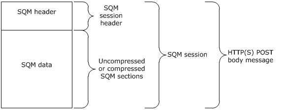

Figure 1: HTTP POST body containing a SQM session

### 2.2.3 SQM Session

A SQM session is comprised of a SQM header and zero or more SQM sections within the [**binary large object (BLOB)**](#gt_binary-large-object-blob) as shown in Figure 2. The SQM-enabled client MAY send the SQM header only (for example, to query the A-SQM Manifest version). The total length, in bytes, of the SQM session (the SQM header and SQM sections) MUST equal the HTTP POST body length. All integer fields are encoded using little-endian format.

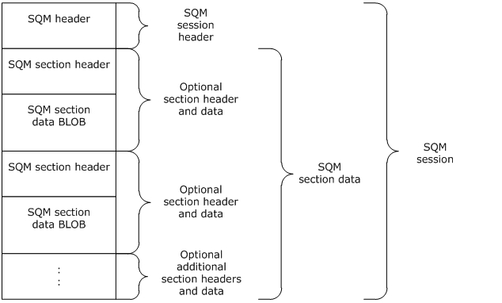

Figure 2: SQM session binary data stream layout (uncompressed)

The following figure illustrates the compressed SQM session binary data stream layout.

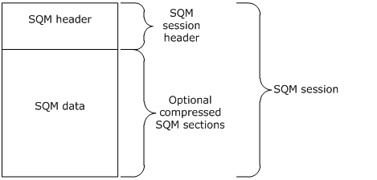

Figure 3: SQM session binary data stream layout (compressed)

### 2.2.4 Common Structures

#### 2.2.4.1 SQM Header

Every SQM session uploaded in the HTTP POST body MUST begin with a SQM session header.

The SQM section header describes the SQM section data [**BLOB**](#gt_binary-large-object-blob). The SQM section header is composed of two fields: a **SectionType** field and a **SectionLength** field.

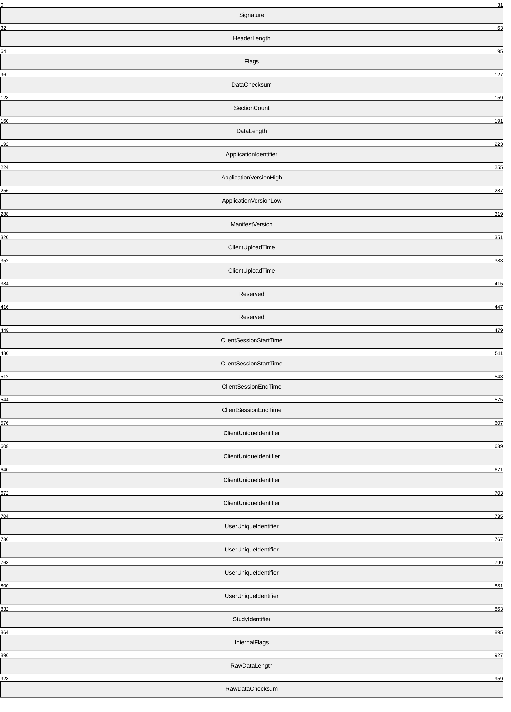

**Signature (4 bytes):** A 32-bit unsigned integer.<2>

**HeaderLength (4 bytes):** A 32-bit unsigned integer that specifies the length of the SQM header, in bytes.

**Flags (4 bytes):** A 32-bit unsigned integer. Bit positions 0 through 10 are reserved.<3>

**DataChecksum (4 bytes):** A 32-bit unsigned integer value specifying the checksum result of the SQM section data (compressed or uncompressed). In the following figure, the checksum is computed over area A followed by area B. The SQM client and SQM server SHOULD use the same algorithm.<4>

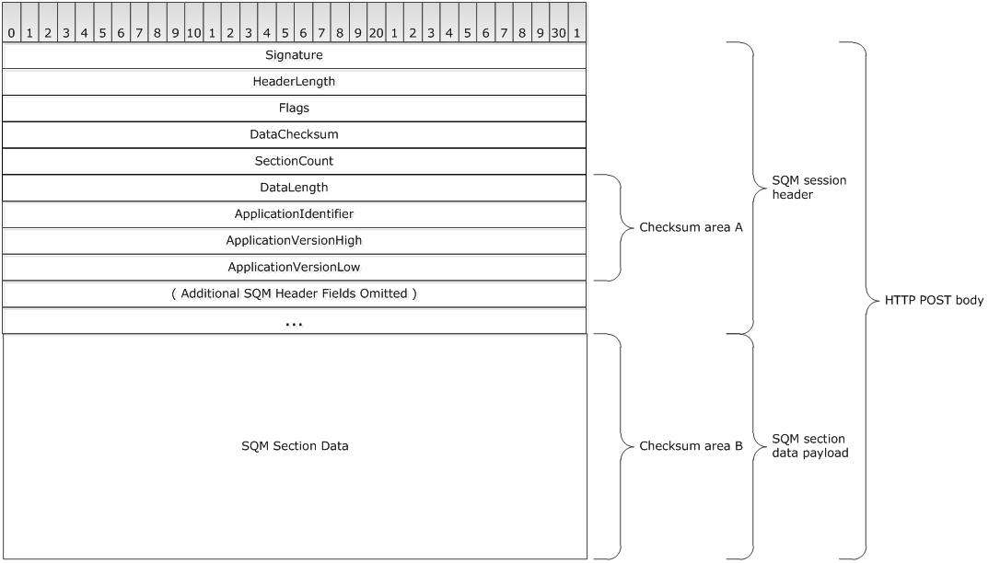

Figure 4: Checksum byte area in a SQM Upload

**SectionCount (4 bytes):** A 32-bit unsigned integer specifying the number of SQM sections in the uploaded data. This value MUST be specified. A value of 0x0 indicates there are no SQM sections.

**DataLength (4 bytes):** A 32-bit unsigned integer specifying the length of the SQM section data (compressed or uncompressed), in bytes. This value MUST be specified. A value of 0x0 indicates there is no SQM section data.

**ApplicationIdentifier (4 bytes:** ): A 32-bit unsigned integer specifying an application-defined identifier value. This value MUST be specified.

**ApplicationVersionHigh (4 bytes):** A 32-bit unsigned integer specifying an application-defined high order version value. This value MUST be specified.

**ApplicationVersionLow (4 bytes):** A 32-bit unsigned integer specifying an application-defined low order version value. This value MUST be specified.

**ManifestVersion (4 bytes:** ): A 32-bit unsigned integer specifying the client version of the A-SQM manifest. This value MUST be specified. A value of 0x0 means there is no client A-SQM manifest.

**ClientUploadTime (8 bytes):** A 64-bit FILETIME value specifying the time the client uploaded the data. This value MUST be specified. FILETIME is defined in [MS-RPCE](../MS-RPCE/MS-RPCE.md) section 6.

**Reserved (8 bytes):** A 64-bit value. A value of 0x0 MUST be specified.

**ClientSessionStartTime (8 bytes):** A 64-bit FILETIME value specifying the client SQM session start time. This value MUST be specified.

**ClientSessionEndTime (8 bytes):** A 64-bit FILETIME value specifying the client SQM session end time. This value MUST be specified.

**ClientUniqueIdentifier (16 bytes):** A 128-bit globally unique identifier (GUID) that uniquely identifies the sending computer. This value MUST be specified.

**UserUniqueIdentifier (16 bytes):** A 128-bit GUID that identifies the computer user. This value MUST be specified. The client MAY specify a value of {00000000-0000-0000-0000-000000000000} to represent that no user identifier is specified.

**StudyIdentifier (4 bytes):** A 32-bit unsigned integer specifying the [**SQM partner**](#gt_sqm-partner) namespace-specific study identifier. The value allows the client to classify data. This value MUST be specified. A value of 0x0 specifies no study identifier.

**InternalFlags (4 bytes):** A 32-bit unsigned integer bit mask that specifies attributes of the upload. The following bit values MUST be specified.

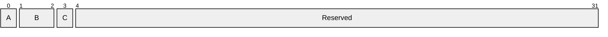

**A - IsSessionDataCompressed (1 bit):** A bit value that specifies if the binary data is compressed. A value of 0x0 specifies that the data is not compressed. A value of 0x1 specifies that the data is compressed.

**B - Reserved (2 bits):** Reserved. Bits MUST be specified as 0x0.

**C - RequestManifestVersion (1 bit):** A bit value specifying if the A-SQM manifest version is requested to be returned in the response. A value of 0x0 specifies that the A-SQM version for the SQM partner namespace is not returned in the response.

**Reserved (28 bits):** Bits MUST be specified as 0x0.

**RawDataLength (4 bytes):** A 32-bit unsigned integer specifying the length of the SQM section data before data compression, in bytes. This value MUST be specified if bit zero of the **InternalFlags** field has a value of 0x1.

**RawDataChecksum (4 bytes):** A 32-bit unsigned integer value specifying the [**checksum**](#gt_checksum) result of the SQM section data before data compression. This value MUST be specified if bit zero of the InternalFlags field has a value of 0x1. The SQM client and SQM server SHOULD use the same algorithm as specified in the **DataChecksum** description.

#### 2.2.4.2 SQM Sections

SQM sections follow the SQM header in the data upload contained in the HTTP/HTTPS POST body. Each section has a SQM section header, as specified in section [2.2.4.3](#Section_2.2.4.3), and a SQM section data [**BLOB**](#gt_binary-large-object-blob), as specified in section [2.2.4.4](#Section_2.2.4.4). There are two types of SQM sections: SQM data point sections, as specified in section [2.2.4.4.1](#Section_2.2.4.4.1.3), and SQM stream sections, as specified in section [2.2.4.4.2](#Section_2.2.4.4.2.3).

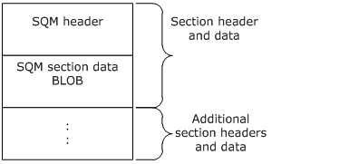

Figure 5: SQM section in a binary data stream

#### 2.2.4.3 SQM Section Header

The SQM section header describes the SQM section data BLOB. The SQM section header is composed of two fields: a **SectionType** field and a **SectionLength** field.

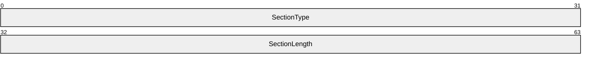

**SectionType (4 bytes):** A 32-bit unsigned integer specifying the type of data in the SQM section. This value MUST be specified from one of the following values:

| Value | Meaning |
| --- | --- |
| 0x00000000 | The data type in the SQM section is SQM DWORD data points. |
| 0x00000003 | The data type in the SQM section is SQM UNICODE STRING data points. |
| 0x00000005 | The data type in the SQM section is a SQM stream, an array consisting of SQM UNICODE STRING data, SQM DWORD data, and SQM QWORD data. |
| 0x00000006 | The data type in the SQM section is SQM QWORD data points. |

**SectionLength (4 bytes):** A 32-bit unsigned integer specifying the length of the SQM section data, in bytes. This value MUST be specified.

#### 2.2.4.4 SQM Section Data

SQM section data follows a SQM section header and can be either a SQM data point section or a SQM stream section. A **SectionType** value of 0x00000000, 0x00000003, or 0x00000006 in the SQM section header specifies a SQM data point section. A **SectionType** value of 0x00000005 in the SQM section header specifies a SQM stream section.

##### 2.2.4.4.1 SQM Data Point Sections

A SQM data point section is a type of SQM section data. Each SQM data point section is a set of zero or more SQM data points of DWORD, QWORD, or STRING data type (see [MS-DTYP](../MS-DTYP/MS-DTYP.md) sections 2.2.9, 2.2.40, and 2.2.44, respectively). Each SQM data point within a single SQM data point section is of identical type (DWORD, QWORD, or STRING) as specified in the **SectionType** value (0x00000000, 0x00000006, 0x00000003 respectively) in the SQM section header.

###### 2.2.4.4.1.1 SQM DWORD Data Point

The SQM DWORD data point is a 3-tuple that describes a user-defined DWORD value. The **SectionType** value in the SQM section header MUST be 0x00000000.

The count of SQM DWORD data points following the SQM section header is determined by the **SectionLength** value in the SQM section header. Each SQM DWORD data point is 0xC bytes in length. The **SectionLength** value divided by 0xC results in the count of SQM DWORD data points in the SQM section data BLOB.

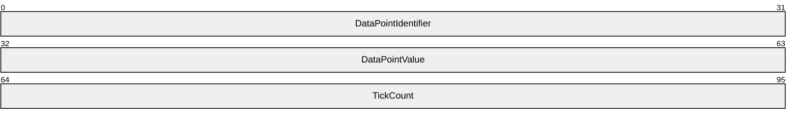

**DataPointIdentifier (4 bytes):** A 32-bit unsigned integer specifying the SQM data point identifier value. This value is defined by the SQM partner and MUST be defined within the SQM service.

**DataPointValue (4 bytes):** A DWORD specifying the value associated with the **DataPointIdentifier**. This value is defined by the SQM partner and MUST be specified.

**TickCount (4 bytes):** A 32-bit unsigned integer specifying the number of milliseconds that have elapsed since the **ClientSessionStartTime** (see section [2.2.4.1](#Section_2.2.4.1)).

###### 2.2.4.4.1.2 SQM QWORD Data Point

The SQM QWORD data point is a 3-tuple that describes a user-defined QWORD value. The **SectionType** in the SQM section header MUST be 0x00000006.

The count of SQM QWORD data points following the SQM section header is determined by the **SectionLength** value in the SQM section header. Each SQM QWORD data point is 0x10 bytes in length. The **SectionLength** divided by 0x10 results in the count of SQM QWORD data points in the SQM section data BLOB.

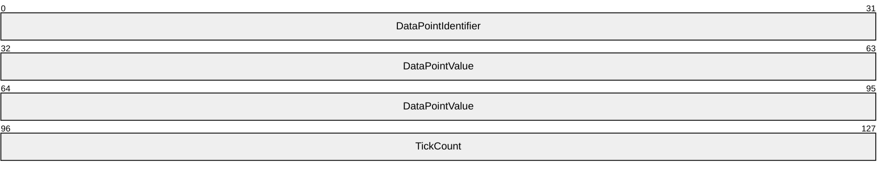

**DataPointIdentifier (4 bytes):** A 32-bit unsigned integer specifying the SQM data point identifier value. This value is defined by the [**SQM partner**](#gt_sqm-partner) and MUST be defined within the SQM service.

**DataPointValue (8 bytes):** A QWORD specifying the value associated with the **DataPointIdentifier**. This value is defined by the SQM partner and MUST be specified.

**TickCount (4 bytes):** A 32-bit unsigned integer specifying the number of milliseconds that have elapsed since the **ClientSessionStartTime** (see section [2.2.4.1](#Section_2.2.4.1)).

###### 2.2.4.4.1.3 SQM STRING Data Point

The SQM STRING data point is a 4-tuple that describes a user-defined [**Unicode character**](#gt_unicode-character) array value. This **SectionType** in the SQM section header MUST be 0x00000003.

The count of SQM STRING data points following the SQM section header is determined by the **SectionLength** value in the SQM section header and the variable length of each SQM STRING data point entry. Each SQM STRING data point entry has a fixed length of 0xC bytes and an additional length of the **StringLength** value. The total byte length of all SQM STRING data points MUST equal the **SectionLength** value in the SQM section header.

If *n* is the number of SQM STRING data points, then **SectionLength** is computed as follows:

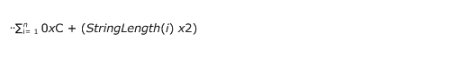

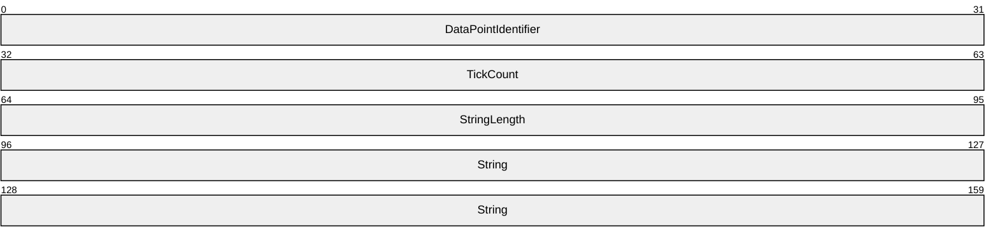

**DataPointIdentifier (4 bytes):** A 32-bit unsigned integer specifying the SQM data point identifier value. This value MUST be specified. This value is defined by the [**SQM partner**](#gt_sqm-partner) within the SQM service.

**TickCount (4 bytes):** A 32-bit unsigned integer specifying the number of milliseconds elapsed since the **ClientSessionStartTime** (see section [2.2.4.1](#Section_2.2.4.1)).

**StringLength (4 bytes):** A 32-bit unsigned integer specifying the length of **String**, in Unicode characters. This value MUST be specified.

**String (variable):** An array of bytes specifying an array of Unicode character values. This value MUST be specified. This meaning of this value is defined by the SQM partner.

##### 2.2.4.4.2 SQM Stream Section

A SQM stream section is a type of SQM section data. Each SQM stream section contains a stream header (see section [2.2.4.4.2.1](#Section_2.2.4.4.2.1)) followed by zero or more stream records (see section [2.2.4.4.2.3](#Section_2.2.4.4.2.3)). Each stream record MUST contain a stream record header specifying the record type, followed by a stream record.

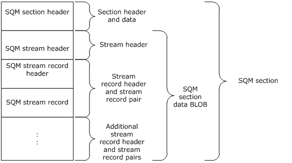

Figure 6: SQM stream section in a SQM section data BLOB

###### 2.2.4.4.2.1 SQM Stream Header

The SQM stream header describes the SQM stream. The header is a 3-tuple comprised of a data point identifier, a count of the number of entries per record, and a count of the number of records.

One way to describe the stream is to compare the stream to a table. The **StreamIdentifier** specifies the table name. The **CountPerRecord** specifies the number of columns in the table. The **CountRecords** specifies the count of rows in the table.

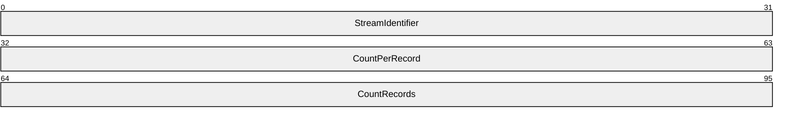

**StreamIdentifier (4 bytes):** A 32-bit unsigned integer specifying the SQM stream identifier value. This value is defined by the [**SQM partner**](#gt_sqm-partner) and MUST be defined within the SQM service.

**CountPerRecord (4 bytes):** A 32-bit unsigned integer specifying the number of data values associated with the **StreamIdentifier**. This value specifies the number of entries per record set. This value MUST be specified.

**CountRecords (4 bytes):** A 32-bit unsigned integer specifying the number of record sets in the stream. This value MUST be specified.

###### 2.2.4.4.2.2 SQM Stream Record Header

The SQM stream record header describes the SQM stream record that immediately follows the SQM stream record header in the SQM section data.

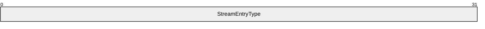

**StreamEntryType (4 bytes):** A 32-bit unsigned integer specifying the SQM stream record type. This value is specified from one of the following values.

| Value | Meaning |
| --- | --- |
| 0x00000000 | The data type in the stream entry is SQM DWORD. |
| 0x00000003 | The data type in the stream entry is SQM UNICODE STRING. |
| 0x00000006 | The data type in the stream entry is SQM QWORD. |

###### 2.2.4.4.2.3 SQM Stream Record

The SQM stream record is a single entry of type DWORD, QWORD, or STRING as specified in the **StreamEntryType** value (0x00000000, 0x00000006, and 0x00000003 respectively) in the SQM stream record header.

SQM Stream DWORD Record

The SQM stream DWORD record is a 2-tuple single entry of type DWORD. The **StreamEntryType** value in the Stream Record Header MUST be 0x00000000.

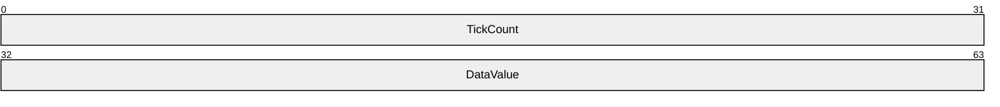

**TickCount (4 bytes):** A 32-bit unsigned integer specifying the number of milliseconds elapsed since the **ClientSessionStartTime** (see section [2.2.4.1](#Section_2.2.4.1)).

**DataValue (4 bytes): ):** A DWORD specifying the value associated with the **StreamIdentifier** value in the SQM Stream Header. This value is defined by the [**SQM partner**](#gt_sqm-partner).

SQM Stream QWORD Record

The SQM stream QWORD record is a 2-tuple single entry of type QWORD. The **StreamEntryType** value in the Stream Record Header MUST be 0x00000006.

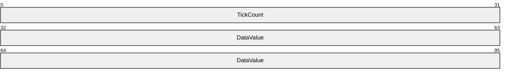

**TickCount (4 bytes):** A 32-bit unsigned integer specifying the number of milliseconds elapsed since the **ClientSessionStartTime** (see section [2.2.4.1](#Section_2.2.4.1)).

**DataValue (8 bytes):** A QWORD specifying the value associated with the **StreamIdentifier** value in the SQM Stream Header. This value is defined by the SQM partner.

SQM Stream STRING Record

The SQM stream STRING record is a 3-tuple single entry of type STRING that describes a user-defined [**Unicode character**](#gt_unicode-character) array value. The **StreamEntryType** value in the stream record header MUST be 0x00000003.

Each SQM stream STRING record entry has a fixed length of 0x8 bytes and an additional variable length of the **StringLength** value. The **String** byte length is **StringLength** x 2.

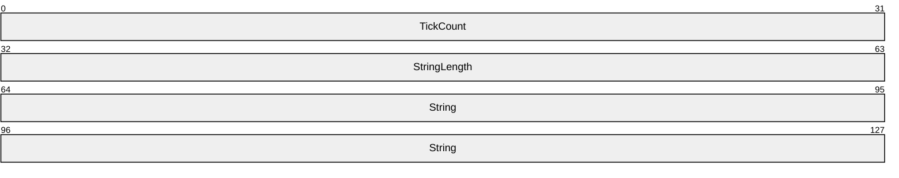

**TickCount (4 bytes):** A 32-bit unsigned integer specifying the number of milliseconds elapsed since the **ClientSessionStartTime** (see section [2.2.4.1](#Section_2.2.4.1)).

**StringLength (4 bytes):** A 32-bit unsigned integer specifying the length of the string, in Unicode characters.

**String (variable):** An array of bytes specifying an array of Unicode character values. This value is defined by the [**SQM partner**](#gt_sqm-partner).

### 2.2.5 Message Response

The service-to-client response is specified by one of the following HTTP status codes.

| Status | Meaning |
| --- | --- |
| 200 | Upload received and no action required from the sender. |
| 201 | Upload received and there is information in the HTTP response stream for the sender. |
| 403 | Upload received and the service requests that the client stop sending requests for 14 days (default) or as instructed in the HTTP response message. |

**HTTP 200 Status:** An HTTP 200 status response indicates a successful client request and that no further action is required by the client.

**HTTP 201 Status:** An HTTP 201 status response indicates a successful client request and that the HTTP response header has additional information for the client. The HTTP response header includes one or both of the following key-value pairs.

**ThrottleInterval:** The HTTP response stream MAY contain the **ThrottleInterval** key-value pair shown here in [**Augmented Backus-Naur Form (ABNF)**](#gt_augmented-backus-naur-form-abnf). The value in the key-value pair specifies the number of days the client waits before sending any additional upload requests. **ThrottleInterval** is used to control the volume of data being sent to the SQM service.

"ThrottleInterval:" <"> throttle <"> CRLF

throttle = 1*( DIGIT )

**ManifestVersion:** The HTTP response stream MAY contain the **ManifestVersion** key-value pair shown here in ABNF. The value in the key-value pair specifies the version number of the current A-SQM manifest that the client MAY download using HTTP/HTTPS GET.

"ManifestVersion:" <"> version <"> CRLF

version = `1*( DIGIT )`

**HTTP 403 Status:** An HTTP 403 status response indicates a successful client request. It is recommended that the client wait 14 days before sending any additional upload requests.

### 2.2.6 Adaptive Software Quality Metrics (A-SQM) Manifest

The A-SQM manifest contains the rules that control what instrumentation data is updated. A-SQM uses HTTP/HTTPS GET to download a manifest package. The package contains a header describing the contents and an A-SQM manifest.

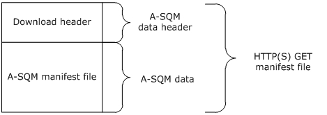

Figure 7: A-SQM download package using HTTP/HTTPS GET

#### 2.2.6.1 A-SQM Manifest Download Header

The A-SQM download header describes the A-SQM file contained within the download.

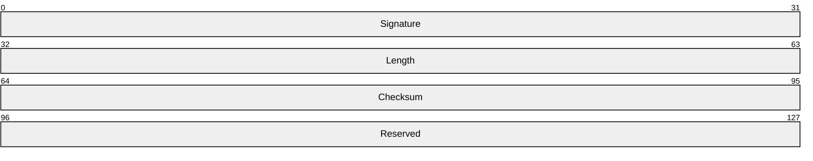

**Signature (4 bytes):** A 32-bit unsigned integer. A value MUST be specified.

**Length (4 bytes):** A 32-bit unsigned integer specifying the length of the download (all inclusive), in bytes. This value MUST be specified.

**Checksum (4 bytes):** A 32-bit unsigned integer value specifying the [**checksum**](#gt_checksum) result of the A-SQM file. The SQM client and SQM server SHOULD<5> use the same algorithm.

**Reserved (4 bytes):** A 32-bit unsigned integer. A value of 0x0 MUST be specified.

#### 2.2.6.2 A-SQM Manifest

The A-SQM manifest is stored in the downloaded A-SQM file. The A-SQM manifest contains a header describing the entire manifest BLOB followed by one or more A-SQM sections. Each section has a header describing the section contents. The data schema is laid out within the manifest as shown in the following figure. The common manifest structures are described in the following sections.

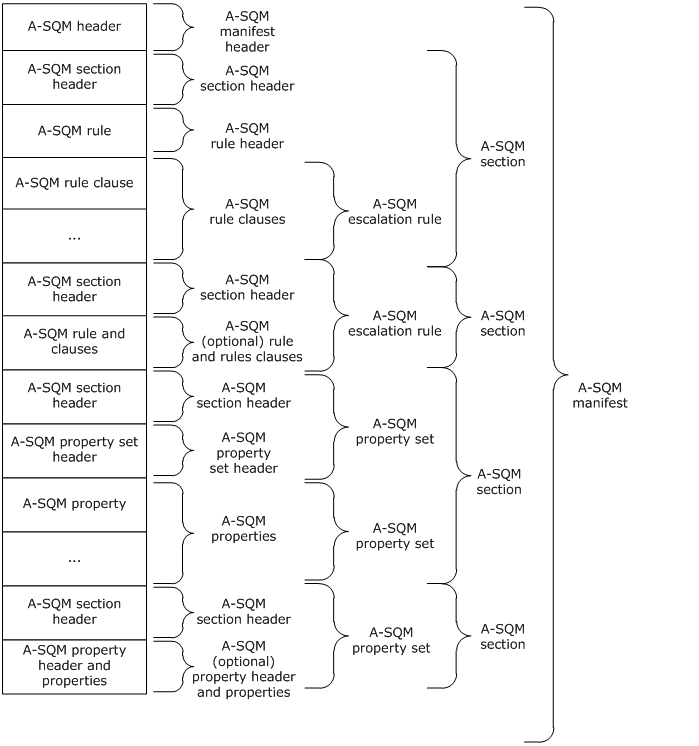

Figure 8: A-SQM Manifest with one or more sections

#### 2.2.6.3 A-SQM Header

The A-SQM header describes the contents of the manifest.

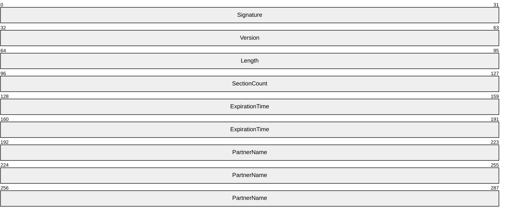

**Signature (4 bytes):** A 32-bit unsigned integer.<6>

**Version (4 bytes):** A 32-bit unsigned integer that specifies the A-SQM manifest version. The values 0x0 and 0x00FFFFFF are reserved and MUST NOT be used.

**Length (4 bytes):** A 32-bit unsigned integer specifying the length of the manifest (all inclusive), in bytes.

**SectionCount (4 bytes):** A 32-bit unsigned integer specifying the number of A-SQM sections in the manifest.

**ExpirationTime (8 bytes):** A 64-bit FILETIME value specifying the time the manifest expires. FILETIME is defined in [MS-RPCE](../MS-RPCE/MS-RPCE.md) section 6.

**PartnerName (128 bytes):** A null-terminated [**Unicode string**](#gt_unicode-string) (16-bit character units) that specifies the [**SQM partner**](#gt_sqm-partner) name.

#### 2.2.6.4 A-SQM Section Header

The A-SQM section header describes the contents of the A-SQM section. The A-SQM section header is composed of two fields: a **SectionLength** field and **SectionType** field. Sections can be in any order. At least one section is required. Following the A-SQM section header is an escalation rule or a property set.

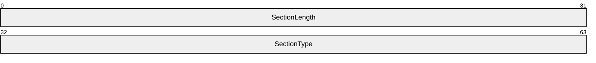

**SectionLength (4 bytes):** A 32-bit unsigned integer specifying the length of the section following the section header, in bytes.

**SectionType (4 bytes):** A 32-bit unsigned integer specifying the type of the section. This value MUST be specified from one of the following values:

| Value | Meaning |
| --- | --- |
| 0x00000001 | Escalation rule section type. |
| 0x00000002 | Property set section type. |

#### 2.2.6.5 A-SQM Escalation Rule Section

The A-SQM escalation rule section contains a rule that the SQM-enabled client uses to modify behavior. An A-SQM escalation section is specified by a value of 0x1 in the **SectionType** field of the A-SQM section header. The rule is a set of rule clauses (as specified in section [2.2.6.5.2](#Section_2.2.6.5.2)) with defined data point values (see section [2.2.4.4.1](#Section_2.2.4.4.1.3)) and/or defined data stream values (see section [2.2.4.4.2](#Section_2.2.4.4.2.3)). Clauses are joined together with a group operator. A rule is either of type callback or report, and is read as either TRUE or FALSE.

##### 2.2.6.5.1 A-SQM Rule Header

The A-SQM rule header describes the rule.

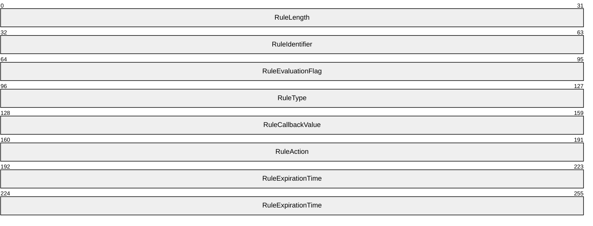

**RuleLength (4 bytes):** A 32-bit unsigned integer specifying the length of the rule (all inclusive), in bytes.

**RuleIdentifier (4 bytes):** A 32-bit unsigned integer specifying the rule identifier. Each **RuleIdentifier** value MUST be unique within the manifest.

**RuleEvaluationFlag (4 bytes):** A 32-bit unsigned integer specifying the rule evaluation flag. Each AND clause (see section [2.2.6.5.2](#Section_2.2.6.5.2)) MUST be represented by a single bit set to 0x1.

The bit value is not required to be monotonically increasing in position for each AND. Each bit MUST uniquely map to the AND Clause **EvaluationFlag**.

For example, a rule with 5 AND clauses could have the following **RuleEvaluationFlag** where **A-E** evaluate to 0x1.

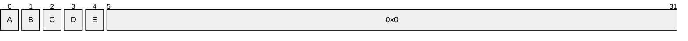

**RuleType (4 bytes):** A 32-bit unsigned integer specifying the rule type. This value MUST be specified from one of the following values:

| Value | Meaning |
| --- | --- |
| 0x00000001 | Callback rule type. |
| 0x00000002 | Report rule type. |

**RuleCallbackValue (4 bytes):** A 32-bit unsigned integer specifying the value to make available to the SQM-enabled application when the rule evaluates to TRUE.

**RuleAction (4 bytes):** A 32-bit unsigned integer specifying the action that rule evaluations resulting in TRUE will generate. This value MUST be specified from one of the following values:

| Value | Meaning |
| --- | --- |
| 0x00000001 | The rule gives a callback to an application-defined function when triggered. |
| 0x00000002 | The rule escalates to a Windows Error Reporting (WER) report with a dump type of WerDumpTypeMiniDump, as described in [[MSDN-WER]](https://go.microsoft.com/fwlink/?LinkId=113072). |
| 0x00000004 | The rule escalates to a Windows Error Reporting (WER) report with a dump type of WerDumpTypeMicroDump, as described in [MSDN-WER]. |
| 0x00000008 | The rule escalates to a Windows Error Reporting (WER) report with a dump type of WerDumpTypeHeapDump, as described in [MSDN-WER]. |

**RuleExpirationTime (8 bytes):** A 64-bit FILETIME value specifying the time the rule expires. FILETIME is defined in [MS-RPCE](../MS-RPCE/MS-RPCE.md) section 6.

##### 2.2.6.5.2 A-SQM Rule Clause

The A-SQM rule clause specifies the comparison value and method to be performed. The result of a clause comparison is either TRUE or FALSE.

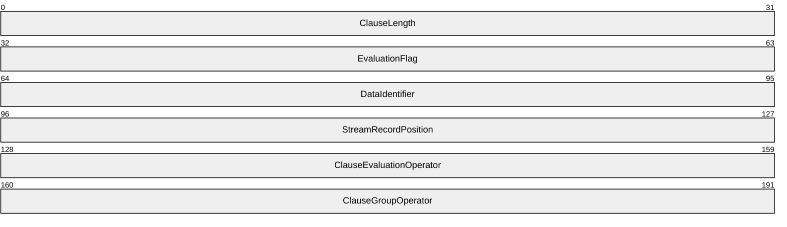

**ClauseLength (4 bytes):** A 32-bit unsigned integer specifying the length of the clause, in bytes.

**EvaluationFlag (4 bytes):** A 32-bit unsigned integer specifying the clause evaluation flag. This value MUST be specified. An AND clause specifies a single unique bit set to 0x1 within the rule. An OR clause specifies a value of 0x0.

**DataIdentifier (4 bytes):** A 32-bit unsigned integer specifying the SQM data point or SQM stream identifier value. This value is defined by the SQM partner and MUST be defined within the SQM service.

**StreamRecordPosition (4 bytes):** A 32-bit unsigned integer specifying the value position within the SQM Stream identified by the **DataIdentifier** value. A value of 0x0 specifies that the clause references a SQM data point value, not a SQM stream.

- A value of 0x0 specifies that the clause references a SQM data point value (see section [2.2.4.4.1](#Section_2.2.4.4.1.3)).
- A value of [0x1, N] specifies that the clause references a value within a SQM stream of N record value positions (see section [2.2.4.4.2](#Section_2.2.4.4.2.3)). 0x1 references the first record position value within the SQM stream, 0x2 the second record position value within the SQM stream, up to the Nth record position value within the SQM stream.
**ClauseEvaluationOperator (4 bytes):** A 32-bit unsigned integer specifying the clause operator and data type. This value MUST be specified from one of the following values:

| Value | Meaning |
| --- | --- |
| 0x00000001 | The clause comparison operator is a DWORD Equal To. |
| 0x00000002 | The clause comparison operator is a DWORD Less Than. |
| 0x00000003 | The clause comparison operator is a DWORD Greater Than. |
| 0x00000004 | The clause comparison operator is a DWORD In Range. |
| 0x00000005 | The clause comparison operator is String Contains. |
| 0x00000007 | The clause comparison operator is a QWORD Equal To. |

**ClauseGroupOperator (4 bytes):** A 32-bit unsigned integer specifying the clause group operator. This value MUST be specified from one of the following values:

| Value | Meaning |
| --- | --- |
| 0x00000000 | The clause group operator is AND. |
| 0x00000001 | The clause group operator is OR. |

There is a limit of 32 AND clauses per rule.

#### 2.2.6.6 A-SQM Property Set Section

An A-SQM property set section is specified by a value of 0x2 in the **SectionType** field of the A-SQM section header (see section [2.2.6.4](#Section_2.2.6.4)). Each A-SQM property set section contains one or more properties as specified in sections [2.2.6.6.1](#Section_2.2.6.6.1) and [2.2.6.6.2](#Section_2.2.6.6.2).

##### 2.2.6.6.1 A-SQM Property Set Header

The A-SQM property set header describes the properties contained within the section.

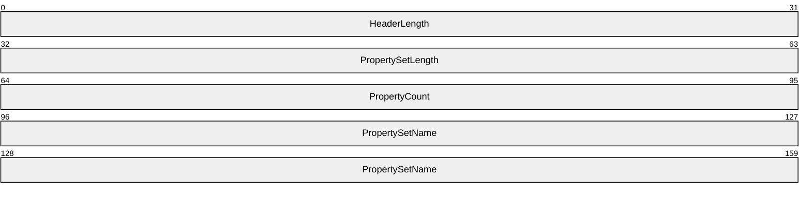

**HeaderLength (4 bytes):** A 32-bit unsigned integer specifying the length of the A-SQM Property Set Header, in bytes.

**PropertySetLength (4 bytes):** A 32-bit unsigned integer specifying the length of the A-SQM Property Set (including the Property Set Header), in bytes.

**PropertyCount (4 bytes):** A 32-bit unsigned integer specifying the number of Properties in the Property Set.

**PropertySetName (variable):** An array of bytes specifying a null-terminated [**Unicode string**](#gt_unicode-string) (16-bit character units). Each **PropertySetName** within a manifest MUST be unique.

The **PropertySetName** byte length is computed: **HeaderLength** – 0xC. The **PropertySetName** is aligned on an 8-byte boundary so it is possible for the byte length to be larger than the null-terminated Unicode string requires.

##### 2.2.6.6.2 A-SQM Property

An A-SQM property is a key-value pair. Each key within the property set MUST be unique. The key-value is an SQM-enabled application-defined value. All key-value pairs are treated as null-terminated Unicode strings (16-bit character units).

The size of the property, in bytes, is computed: 0x8 + PropertyKeyLength + PropertyValueLength.

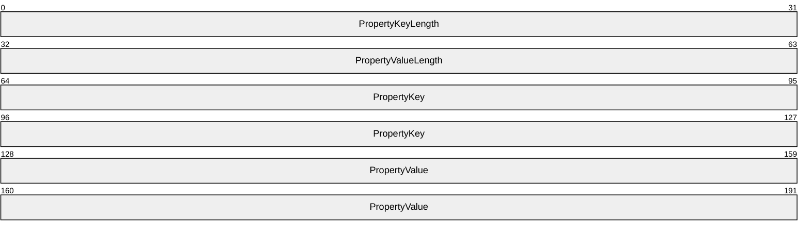

**PropertyKeyLength (4 bytes):** A 32-bit unsigned integer specifying the length of the **PropertyKey**, in bytes.

**PropertyValueLength (4 bytes):** A 32-bit unsigned integer specifying the length of the **PropertyValue**, in bytes.

**PropertyKey (variable):** An array of bytes specifying a null-terminated [**Unicode string**](#gt_unicode-string) (16-bit character units). Each **PropertyKey** within the **PropertySet** MUST be unique.

The **PropertyKey** is aligned on an 8-byte boundary so it is possible for the byte length to be larger than the null-terminated Unicode string requires.

**PropertyValue (variable):** An array of bytes specifying a null-terminated Unicode string (16-bit character units).

The **PropertyValue** is aligned on an 8-byte boundary so it is possible for the byte length to be larger than the null-terminated Unicode string requires.

## 2.3 Directory Service Schema Elements

None.

# 3 Protocol Details

## 3.1 Client Details

The client role in the SQM Client-to-Service Protocol is illustrated in the following figure.

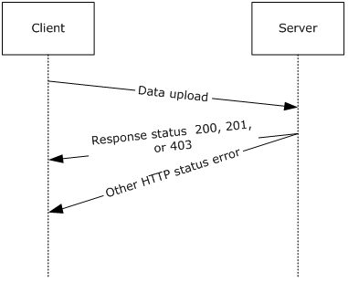

Figure 9: Client-to-Service data upload and response

### 3.1.1 Abstract Data Model

None.

### 3.1.2 Timers

None.

### 3.1.3 Initialization

None.

### 3.1.4 Higher-Layer Triggered Events

None.

### 3.1.5 Message Processing Events and Sequencing Rules

#### 3.1.5.1 Message Construction

The client constructs a data upload message as specified in section [2.2.2](#Section_2.2.2). Once the data is complete, the client prepares the data for upload.

##### 3.1.5.1.1 SQM Header Construction

The client creates a SQM header as specified in section [2.2.4.1](#Section_2.2.4.1). The client sets the **SQM Header** field values as specified in sections 2.2.4.1 and 3.1.5.1.1.

##### 3.1.5.1.2 Constructing SQM Sections

The client constructs a SQM section as follows:

- The client constructs the SQM sections as specified in section [2.2.4.2](#Section_2.2.4.2).
- The client computes the overall length (in bytes) of the SQM sections.
- The client computes a [**checksum**](#gt_checksum) of the SQM sections. The client and server SHOULD use the same checksum algorithm so that the server can validate the message stream.
- The client computes a count of the SQM sections.

###### 3.1.5.1.2.1 SQM Session Upload Construction - Option 1 - Compressed

The client compresses the SQM section data as illustrated in Figure 3. The client computes the length of the compressed SQM section data and computes the [**checksum**](#gt_checksum) of the compressed SQM section data.

The client sets the values of the following SQM header fields, which are all specified in section [2.2.4.1](#Section_2.2.4.1).

- The **RawDataLength** field is set to the uncompressed SQM section data length value.
- The **RawDataChecksum** field is set to the uncompressed SQM section checksum value.
- The **DataLength** field is set to the compressed SQM section data length value.
- The **DataChecksum** field is set to the compressed SQM section data checksum value.
- Bit 0 in the **InternalFlags** field is set to 1**.**
- The **SectionCount** field is set to the section count value.

###### 3.1.5.1.2.2 SQM Sections Upload Construction - Option 2 - Uncompressed

- The client sets the values of the following SQM header fields, which are all specified in section [2.2.4.1](#Section_2.2.4.1).
- The **DataLength** field is set to the uncompressed SQM section data length value.
- The **DataChecksum** field is set to the uncompressed SQM section [**checksum**](#gt_checksum) value.
- Bit 0 in the **InternalFlags** field is set to 0**.**
- The **SectionCount** field is set to the section count value.

##### 3.1.5.1.3 Constructing the SQM Session

The client creates the SQM Session by joining the SQM header and the SQM section data (compressed or uncompressed) as illustrated in Figure 2 and Figure 3.

#### 3.1.5.2 Message Data Upload Processing

The client creates a SQM data upload message consisting of one SQM session as described previously. The client MUST set the SQM header **ClientUploadTime** field to the client's current [**UTC**](#gt_coordinated-universal-time-utc) time as specified in section [2.2.4.2](#Section_2.2.4.2).

The message is sent to the SQM service by using HTTP/HTTPS POST specifying the SQM partner namespace, as specified in section [2.2.1](#Section_2.2.1). The entire message MUST be sent in one HTTP session.

The maximum POST body upload length is a well-known value contracted with the SQM service. This value MUST be known (see section 2.2.1).

- Upload length: The maximum POST body length (in bytes) as contracted with the SQM service for the SQM partner namespace (compressed or uncompressed). This value is enforced for any SQM upload.
- Precompressed length: The maximum pre-compression length for a compressed upload. This value is enforced for a compressed SQM upload.
A response message is returned in the HTTP status value and an additional response message MAY be returned in the HTTP header depending on the HTTP status value as specified in section [2.2.5](#Section_2.2.5) .

The client processes the response message based on the HTTP status code response described in sections [3.1.5.2.1](#Section_3.1.5.2.1) through [3.1.5.2.4](#Section_3.1.5.2.4).

##### 3.1.5.2.1 HTTP 200 Status

This message is sent when the upload is complete and no additional action is necessary.

##### 3.1.5.2.2 HTTP 201 Status

The HTTP header has additional information as defined in section [2.2.5](#Section_2.2.5). The response message MUST contain a **ThrottleInterval** and/or **ManifestVersion** key-value pair as specified in section 2.2.5. The client proceeds as specified in section [3.1.5.3](#Section_3.1.5.3).

**ThrottleInterval:** ThrottleInterval indicates that the client SHOULD NOT send any data to the SQM service for the period specified in the ThrottleInternal message (section 2.2.5).

**ManifestVersion:** If the ManifestVersion value is not equal to the current client SQM manifest version, the client downloads an SQM manifest resource as described in section 3.1.5.3.

##### 3.1.5.2.3 HTTP 403 Status

The client SHOULD NOT send any data to the [**SQM service**](#gt_sqm-service) for a period of 14 days (see section [2.2.5](#Section_2.2.5)).

##### 3.1.5.2.4 HTTP Status - Other

The client MAY retry the upload at a later time if an HTTP error status code (other than a 403 error status code described previously) is returned.

#### 3.1.5.3 Processing an A-SQM Resource Message

Upon receipt of a **ManifestVersion** value as specified in section [3.1.5.2.2](#Section_3.1.5.2.2), the client compares the client's current manifest version value with the **ManifestVersion** value. If the two values are equal, the client takes no further action. If the two values are not equal, the client SHOULD<7> download the manifest version as described in section [3.1.5.3.1](#Section_3.1.5.3.1).

##### 3.1.5.3.1 Downloading an A-SQM Resource

The client downloads an A-SQM resource by using HTTPS GET (see section [2.2.6](#Section_2.2.6)).<8> The client forms the GET request by using the SQM-enabled application's partner namespace. In the following example URL, this is represented as <SQM-PARTNER-NAMESPACE> and the **ManifestVersion** (<VERSION> in the example URL that follows) discovered in the HTTP 201 response, as specified in section [3.1.5.2.2](#Section_3.1.5.2.2).

The HTTP URL GET request form is as follows:

GET https://sqm.microsoft.com/sqm/<SQM-PARTNER-NAMESPACE>/manifests/Sqm<VERSION>.bin

The client downloads the A-SQM manifest resource and verifies the A-SQM manifest header **checksum** as specified in section [2.2.6.1](#Section_2.2.6.1). The client and server SHOULD<9> use the same checksum algorithm so that the server can validate the manifest.

The client makes this resource available to SQM-enabled applications based on the SQM partner namespace.

### 3.1.6 Timer Events

None.

### 3.1.7 Other Local Events

None.

## 3.2 Server Details

The server role in the SQM Client-to-Service Protocol is illustrated in the following figure.

Figure 10: Server role in the SQM Client-to-Service Protocol

### 3.2.1 Abstract Data Model

None.

### 3.2.2 Timers

None.

### 3.2.3 Initialization

None.

### 3.2.4 Higher-Layer Triggered Events

None.

### 3.2.5 Message Processing Events and Sequencing Rules

The SQM session data upload is processed during the HTTP connection. The server MUST capture the HTTP POST body. The POST body contains the SQM session. The server processes the POST body as described in the following sections.

#### 3.2.5.1 Processing a Client Message SQM Header

The SQM header fields SHOULD be validated as specified in section [2.2.4.1](#Section_2.2.4.1) and described in section [3.1.5.1.1](#Section_3.1.5.1.1).

#### 3.2.5.2 Processing SQM Section Data - Option 1 - Compressed

The server checks the SQM header **InternalFlags** field as specified in section [2.2.4.1](#Section_2.2.4.1). If bit 0 is set to 1, then the server processes the compressed data as follows:

- Verify the compressed SQM Section data length. The length MUST equal the length specified in the SQM header **DataLength** field.
- Verify the compressed SQM Section [**checksum**](#gt_checksum). The checksum MUST equal the value specified in the SQM header **DataChecksum** field.
- Decompress the SQM section data.
- Verify the uncompressed SQM Section data length. The length MUST equal the length specified in the SQM header **RawDataLength** field.
- Verify the uncompressed SQM Section data checksum. The checksum MUST equal the value specified in the SQM header **RawDataChecksum** field.

#### 3.2.5.3 Processing SQM Section Data - Option 2 - Uncompressed

The server checks the SQM header **InternalFlags** field as specified in section [2.2.4.1](#Section_2.2.4.1). If bit 0 is set to 0, then the server processes the data as follows:

- Verify the SQM section data length. The length MUST equal the length specified in the SQM header **DataLength** field.
- Verify the SQM section [**checksum**](#gt_checksum). The checksum MUST equal the value specified in the SQM header **DataChecksum** field**.**

#### 3.2.5.4 Processing the A-SQM Manifest Version Request

The server checks the SQM header **InternalFlags** field as specified in section [2.2.4.1](#Section_2.2.4.1). If bit 3 is set to 1 and the server manifest version is not equal to the SQM header **ClientVersion** field, then the server sends a manifest version response.

#### 3.2.5.5 Sending a Client Response

The server sends one of the following responses to the client:

**Completion Response:** The server sends an HTTP 200 status response to the client if the message is processed and no action is requested from the client.

**Throttle Response:** The server sends an HTTP 201 status response to the client if the message is successfully processed and the server requests that the client halt further client-server SQM communication for the period (in days) as indicated in the value of the throttle key-value pair as specified in section [2.2.5](#Section_2.2.5). This response MAY be combined with an A-SQM manifest response.

**A-SQM Manifest Response:** The server sends an HTTP 201 status response to the client if the message is successfully processed and the client requests an A-SQM version update response as specified in section 2.2.5. This response MAY be combined with a throttle response.

**Fixed-Throttle Response:** The server sends an HTTP 403 Status response to the client if the server requests that the client halt further client-server SQM communication for 14 days.

#### 3.2.5.6 A-SQM Manifest

The server allows the client to download the A-SQM manifest as specified in section [2.2.5](#Section_2.2.5) and described in section [3.1.5.3.1](#Section_3.1.5.3.1) using HTTP/HTTPS GET. The server resolves the HTTP/HTTPS GET URL to the physical A-SQM manifest.

### 3.2.6 Timer Events

None.

### 3.2.7 Other Local Events

None.

## 3.3 Proxy Details

This section specifies the proxy role in the SQM Client-to-Service Protocol.

When a configured [**SQM-enabled client**](#gt_sqm-enabled-client) sends a message to the proxy that contains SQM data, the proxy service opens the payload and adds a data point (see section [2.2.4.4.1](#Section_2.2.4.4.1.3)) identifying the proxy. The payload is then repackaged and sent to the SQM service. All messages that do not contain payload information are sent by the proxy from the SQM client to the SQM server with no modification.

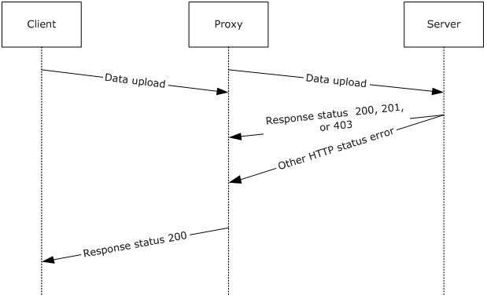

Figure 11: Client upload through a proxy server

### 3.3.1 Abstract Data Model

The SQM protocol relay transmits protocol messages on behalf of a client in environments where the client cannot access the SQM service directly (primarily where the client is protected by the firewall). To enable the relay, a client MUST be configured to send data to the relay service.

When a configured client sends a message to the relay that contains a SQM payload, the relay service opens the payload and adds a data point that identifies the relay<10>. This data is added to the SQM data point section of the payload as specified in section [2](#Section_2). The payload is then repackaged and set to the SQM service. If the proxy receives a message that does not fit the XML model for SQM, the message is forwarded directly to the SQM service, without modification. This enables support for A-SQM and SQM protocol message transmission.

### 3.3.2 Timers

None.

### 3.3.3 Initialization

The client MAY be configured manually to send SQM data to the relay.

### 3.3.4 Higher-Layer Triggered Events

None.

### 3.3.5 Message Processing Events and Sequencing Rules

The relay receives a SQM message from the client via an HTTP POST sent by using the proxy port configured on the SQM service. If the POST contains a payload that adheres to the SQM format, the message payload is augmented with an additional data point that identifies the relay. This is an additive change only. The payload is then repackaged and sent to the SQM service by using SSL over port 443.

All other protocol messages are directly sent directly through the proxy without modification in a similar manner, where the first transmission from the client to the relay is communicated over HTTP and the second transmission is communicated using over SSL by using port 443. If the proxy receives a message that is not of a recognized format, the message is sent to the SQM service with no changes.

### 3.3.6 Timer Events

None.

### 3.3.7 Other Local Events

None.

# 4 Protocol Examples

## 4.1 SQM Upload Example

The following is a network capture of a SQM upload.

0 1 2 3 4 5 6 7 8 9 A B C D E F

0000 4D 53 51 4D 78 00 00 00 20 00 00 00 58 F1 4F E4

0010 05 00 00 00 BE 03 00 00 00 00 00 00 00 00 00 00

0020 00 00 00 00 00 00 00 00 50 42 67 70 38 58 CC 01

0030 00 00 00 00 00 00 00 00 90 4E 55 9B 32 58 CC 01

0040 00 61 29 9F 32 58 CC 01 46 6A DB F0 0E CB 72 4E

0050 AD 40 3E ED F0 34 9B BE C9 87 5F 6D 25 F0 97 4C

0060 85 99 ED F1 0E 68 69 70 00 00 00 00 02 00 00 00

0070 00 00 00 00 00 00 00 00 00 00 00 00 EC 01 00 00

0080 03 00 00 00 EF 1F 00 00 00 00 00 00 04 00 00 00

0090 0E 00 00 00 00 00 00 00 05 00 00 00 69 91 5B 00

00A0 00 00 00 00 06 00 00 00 B1 1D 00 00 00 00 00 00

00B0 07 00 00 00 01 00 00 00 00 00 00 00 09 00 00 00

00C0 02 00 00 00 00 00 00 00 0A 00 00 00 E8 03 00 00

00D0 00 00 00 00 0B 00 00 00 1B 7E F6 05 00 00 00 00

00E0 85 02 00 00 09 00 00 00 00 00 00 00 0C 00 00 00

00F0 09 04 00 00 00 00 00 00 86 02 00 00 40 00 00 00

0100 00 00 00 00 0D 00 00 00 09 04 00 00 00 00 00 00

0110 0F 00 00 00 08 00 00 00 00 00 00 00 10 00 00 00

0120 06 00 00 00 00 00 00 00 8A 02 00 00 02 00 00 00

0130 14 0E 00 00 11 00 00 00 1A 00 00 00 00 00 00 00

0140 12 00 00 00 05 00 00 00 00 00 00 00 15 00 00 00

0150 00 00 00 00 1B 19 00 00 22 00 00 00 02 00 00 00

0160 00 00 00 00 9B 02 00 00 00 00 00 00 00 00 00 00

0170 23 00 00 00 01 00 00 00 00 00 00 00 25 00 00 00

0180 01 00 00 00 00 00 00 00 26 00 00 00 58 F3 99 CA

0190 00 00 00 00 29 00 00 00 00 28 23 00 00 00 00 00

01A0 2A 00 00 00 38 0C 00 00 00 00 00 00 2B 00 00 00

01B0 FF B7 01 00 00 00 00 00 2C 00 00 00 79 E4 00 00

01C0 00 00 00 00 A6 02 00 00 00 00 00 00 00 00 00 00

01D0 2D 00 00 00 20 00 00 00 00 00 00 00 2E 00 00 00

01E0 02 00 00 00 00 00 00 00 33 00 00 00 18 B7 20 00

01F0 00 00 00 00 AF 02 00 00 01 00 00 00 00 00 00 00

0200 B0 02 00 00 01 00 00 00 00 00 00 00 F0 02 00 00

0210 2F 4B 00 00 14 0E 00 00 34 02 00 00 01 00 00 00

0220 00 00 00 00 A2 00 00 00 00 00 00 00 00 00 00 00

0230 A3 00 00 00 01 00 00 00 00 00 00 00 A4 00 00 00

0240 1E 57 EA ED 00 00 00 00 A7 00 00 00 00 00 00 00

0250 8F 18 00 00 A8 00 00 00 00 00 00 00 8F 18 00 00

0260 A9 00 00 00 00 00 00 00 00 00 00 00 03 00 00 00

0270 42 00 00 00 A4 02 00 00 00 00 00 00 00 00 00 00

0280 00 00 00 00 A5 02 00 00 00 00 00 00 00 00 00 00

0290 00 00 00 00 0C 03 00 00 00 00 00 00 09 00 00 00

02A0 31 00 30 00 30 00 30 00 34 00 30 00 32 00 31 00

02B0 39 00 00 00 00 00 05 00 00 00 30 00 00 00 34 00

02C0 00 00 03 00 00 00 03 00 00 00 00 00 00 00 14 0E

02D0 00 00 FA B3 94 74 00 00 00 00 14 0E 00 00 00 00

02E0 00 00 00 00 00 00 14 0E 00 00 0A 16 F7 2C 01 00

02F0 00 00 08 01 00 00 35 00 00 00 0C 00 00 00 15 00

0300 00 00 00 00 00 00 A3 9F 49 6F 01 00 00 00 00 00

0310 00 00 55 9D 06 FB 01 00 00 00 00 00 00 00 06 78

0320 B6 4A 01 00 00 00 00 00 00 00 30 EC 8F C6 01 00

0330 00 00 00 00 00 00 F7 9A B8 77 01 00 00 00 00 00

0340 00 00 96 43 17 76 01 00 00 00 00 00 00 00 23 22

0350 3A F1 01 00 00 00 00 00 00 00 88 B4 07 24 01 00

0360 00 00 00 00 00 00 1F 4E BA 4B 01 00 00 00 00 00

0370 00 00 B3 23 8C 70 01 00 00 00 00 00 00 00 34 AA

0380 4D A0 01 00 00 00 00 00 00 00 0B 82 43 40 01 00

0390 00 00 00 00 00 00 0F 2B C1 E4 01 00 00 00 00 00

03A0 00 00 ED DD C5 A4 01 00 00 00 00 00 00 00 B8 97

03B0 D4 EA 01 00 00 00 00 00 00 00 B4 9B 08 4B 01 00

03C0 00 00 00 00 00 00 F1 EA BC BB 01 00 00 00 14 0E

03D0 00 00 89 15 1A C3 01 00 00 00 C1 15 00 00 CF F5

03E0 30 E6 01 00 00 00 E1 15 00 00 E7 DA B9 EA 01 00

03F0 00 00 D4 17 00 00 33 86 EC 89 01 00 00 00 05 00

0400 00 00 30 00 00 00 36 02 00 00 03 00 00 00 03 00

0410 00 00 00 00 00 00 00 00 00 00 C6 F5 08 CE 00 00

0420 00 00 00 00 00 00 01 00 00 00 00 00 00 00 00 00

0430 00 00 01 00 00 00

## 4.2 SQM Header Example

This section provides an example of a SQM header, as described in section [2.2.4.1](#Section_2.2.4.1).

0000 4D 53 51 4D 78 00 00 00 20 00 00 00 58 F1 4F E4

0010 05 00 00 00 BE 03 00 00 00 00 00 00 00 00 00 00

0020 00 00 00 00 00 00 00 00 50 42 67 70 38 58 CC 01

0030 00 00 00 00 00 00 00 00 90 4E 55 9B 32 58 CC 01

0040 00 61 29 9F 32 58 CC 01 46 6A DB F0 0E CB 72 4E

0050 AD 40 3E ED F0 34 9B BE C9 87 5F 6D 25 F0 97 4C

0060 85 99 ED F1 0E 68 69 70 00 00 00 00 02 00 00 00

0070 00 00 00 00 00 00 00 00

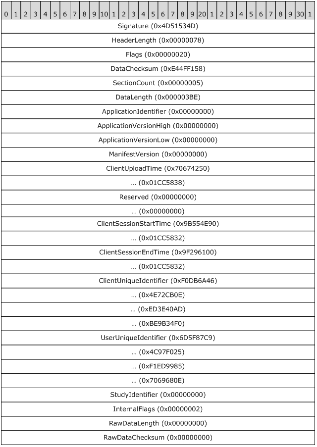

Figure 12: SQM header example

## 4.3 SQM Section Header

This section provides an example of a SQM section header, as described in section [2.2.4.3](#Section_2.2.4.3).

0 1 2 3 4 5 6 7 8 9 A B C D E F

0070 00 00 00 00 00 EC 01 00 00

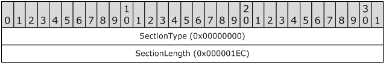

Figure 13: SQM section header example

# 5 Security

## 5.1 Security Considerations for Implementers

HTTPS is the recommended transport mechanism when downloading an A-SQM manifest. Using HTTPS provides protection from [**man in the middle (MITM)**](#gt_man-in-the-middle-mitm) attacks, in which a private connection is controlled by an outside attacker, when the web server is trusted.

## 5.2 Index of Security Parameters

None.

# 6 Appendix A: Product Behavior

The information in this specification is applicable to the following Microsoft products or supplemental software. References to product versions include released service packs.

- Windows Vista operating system
- Windows Server 2008 operating system
- Windows 7 operating system
- Windows Server 2008 R2 operating system
- Windows 8 operating system
- Windows Server 2012 operating system
- Windows 8.1 operating system
- Windows Server 2012 R2 operating system
Exceptions, if any, are noted below. If a service pack or Quick Fix Engineering (QFE) number appears with the product version, behavior changed in that service pack or QFE. The new behavior also applies to subsequent service packs of the product unless otherwise specified. If a product edition appears with the product version, behavior is different in that product edition.

Unless otherwise specified, any statement of optional behavior in this specification that is prescribed using the terms "SHOULD" or "SHOULD NOT" implies product behavior in accordance with the SHOULD or SHOULD NOT prescription. Unless otherwise specified, the term "MAY" implies that the product does not follow the prescription.

<1> Section 2.2.1: The Microsoft SQM client uses the following URL to communicate the SQM partner name to the SQM server.

http(s)://sqm.microsoft.com/sqm/%SQM-PARTNERNAME%/sqmserver.dll

where %SQM-PARTNERNAME% is replaced with the actual partner name. The SQM partner name is known to both the SQM client and the SQM server.

<2> Section 2.2.4.1: On Windows client implementations of SQM, the **Signature** value is set to 0x4D51534D.

<3> Section 2.2.4.1: Windows client implementations of SQM using the following **Flags** bit positions:

| Bit Range | Field | Description |
| --- | --- | --- |
| Variable | 0 | Debug SQM application |
| Variable | 1 | Reserved |
| Variable | 2 | SSL required for upload |
| Variable | 3 | Do not upload |
| Variable | 4 | Reserved |
| Variable | 5 | Reserved |
| Variable | 6 | Partial SQM session |
| Variable | 7 | SQM session from proxy |
| Variable | 8 | Reserved |
| Variable | 9 | SQM session end time indeterminate |
| Variable | 10 | SQM header only upload |

<4> Section 2.2.4.1: Windows client implementations of SQM use the following algorithm to set the **DataChecksum** value and the **RawDataChecksum** value.

DWORD Checksum = 0

FOR EACH BYTE b FROM SQM-Header.DataLength TO SQM-Header.ApplicationVersionLow

Checksum = (Checksum * 101) + b

END FOR

FOR EACH BYTE b IN SQM-Section-Data

Checksum = (Checksum * 101) + b

END FOR

RETURN Checksum

<5> Section 2.2.6.1: Microsoft SQM server implementations of A-SQM use the following algorithm to set the Checksum value:

DWORD Checksum = 0

FOR EACH BYTE b IN A-SQM Manifest Data

Checksum = (Checksum * 101) + b

END FOR

RETURN Checksum

<6> Section 2.2.6.3: Microsoft server implementations of A-SQM set the **Signature** value to 0x414D5153.

<7> Section 3.1.5.3: Windows client implementations of A-SQM are not available on Windows Vista and Windows Server 2008.

<8> Section 3.1.5.3.1: Windows client implementations of A-SQM download a package that the Microsoft SQM server creates. The package contains an A-SQM download header as specified in section [2.2.6.1](#Section_2.2.6.1) within a compressed DLL file.

The DLL file contains a single resource named "ADAPTIVESQMANIFEST" with a resource type of "ASQMMANIFEST". The A-SQM manifest as specified in section [2.2.6.2](#Section_2.2.6.2) is contained within this DLL resource.

The DLL file (uncompressed) is signed by Microsoft. The Windows client implementations verify the file signature. The signature is verified by the WinVerifyTrust function as described in [[MSDN-CAPI]](https://go.microsoft.com/fwlink/?LinkId=89964). The **ActionID** used is WINTRUST_ACTION_GENERIC_VERIFY_V2.

Windows implementations of A-SQM use cabinet compression as described in [[MSDN-CAB]](https://go.microsoft.com/fwlink/?LinkId=226293).

<9> Section 3.1.5.3.1: The Microsoft implementation of A-SQM uses the URL to differentiate the SQM Partner A-SQM manifests. The URL form is:

http://sqm.microsoft.com/%SQM-PARTNERNAME%/manifests/sqm%MANIFESTVERSION%.bin

where %SQM-PARTNERNAME% is replaced with the actual partner name and %MANIFESTVERSION% is replaced with the **ManifestVersion** value, in decimal form, as specified in section [2.2.4.1](#Section_2.2.4.1), and section [3.1.5.2.2](#Section_3.1.5.2.2). The SQM partner name is known to the SQM client and the SQM server.

<10> Section 3.3.1: On Windows 8 and Windows 8.1, the proxy can be enabled by installing the Windows Feedback Forwarder. Windows Feedback Forwarder contains two settings. One setting configures the port number on which to receive SQM messages and the second setting configures proxy information so that the Windows Feedback Forwarder service can connect to the SQM service through a firewall. The Windows Feedback Forwarder service will not relay any messages unless a client is configured to send SQM data to the relay.

# 7 Change Tracking

No table of changes is available. The document is either new or has had no changes since its last release.

## Revision History

| Date | Version | Revision Class | Comments |
| --- | --- | --- | --- |
| 12/16/2011 | 1.0 | New | Released new document. |
| 3/30/2012 | 1.0 | None | No changes to the meaning, language, or formatting of the technical content. |
| 7/12/2012 | 2.0 | Major | Significantly changed the technical content. |
| 10/25/2012 | 2.0 | None | No changes to the meaning, language, or formatting of the technical content. |
| 1/31/2013 | 2.0 | None | No changes to the meaning, language, or formatting of the technical content. |
| 8/8/2013 | 3.0 | Major | Significantly changed the technical content. |
| 11/14/2013 | 3.0 | None | No changes to the meaning, language, or formatting of the technical content. |
| 2/13/2014 | 3.0 | None | No changes to the meaning, language, or formatting of the technical content. |
| 5/15/2014 | 3.0 | None | No changes to the meaning, language, or formatting of the technical content. |
| 6/30/2015 | 3.0 | None | No changes to the meaning, language, or formatting of the technical content. |
| 10/16/2015 | 3.0 | None | No changes to the meaning, language, or formatting of the technical content. |
| 7/14/2016 | 3.0 | None | No changes to the meaning, language, or formatting of the technical content. |
| 6/1/2017 | 3.0 | None | No changes to the meaning, language, or formatting of the technical content. |
