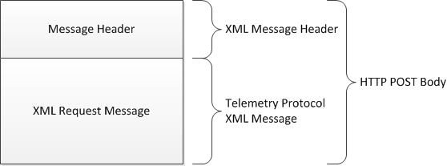
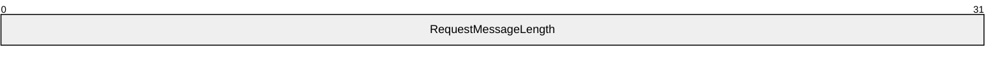
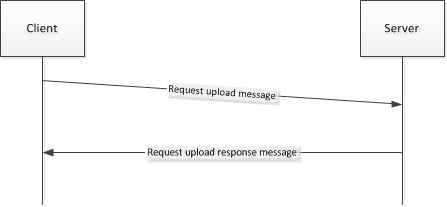
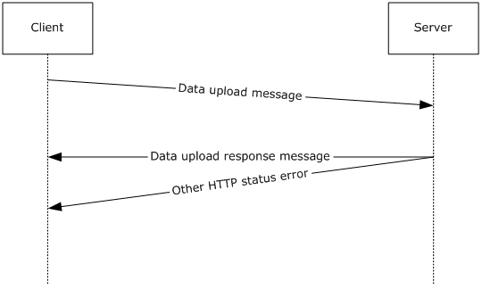
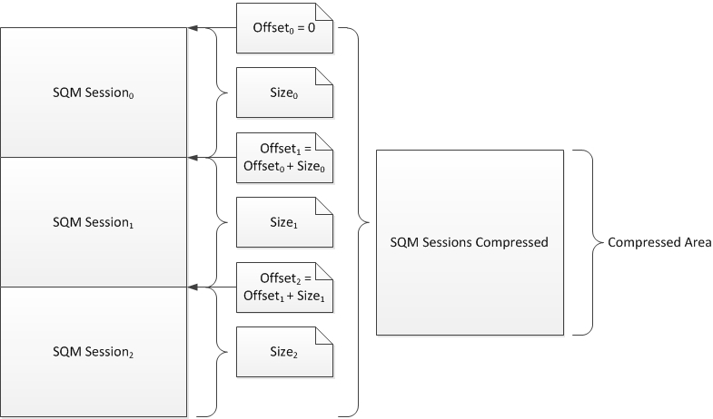
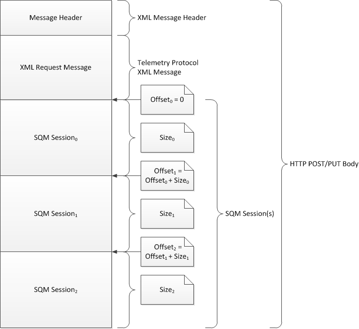
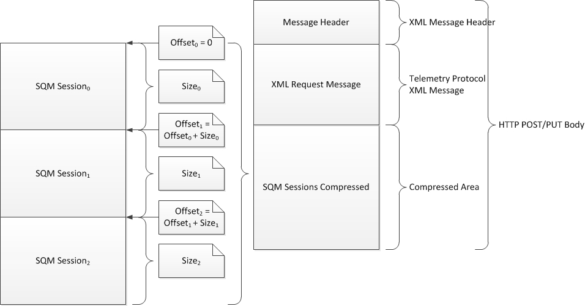
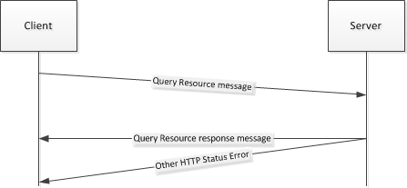
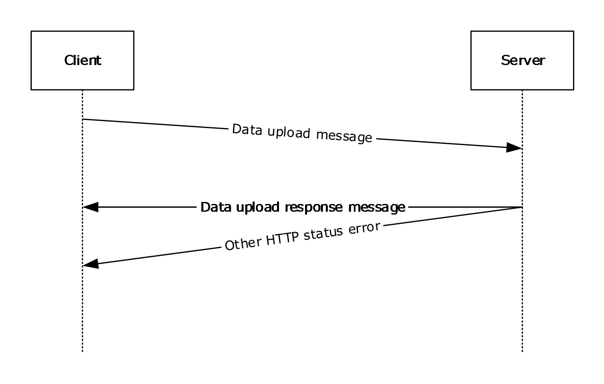
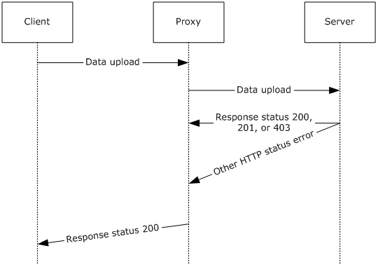

# [MS-SQMCS2]: Software Quality Metrics (SQM) Client-to-Service Version 2 Protocol

Table of Contents

1 Introduction

- [1 Introduction](#Section_1)
  - [1.1 Glossary](#Section_1.1)
  - [1.2 References](#Section_1.2)
    - [1.2.1 Normative References](#Section_1.2.1)
    - [1.2.2 Informative References](#Section_1.2.2)
  - [1.3 Overview](#Section_1.3)
  - [1.4 Relationship to Other Protocols](#Section_1.4)
  - [1.5 Prerequisites/Preconditions](#Section_1.5)
  - [1.6 Applicability Statement](#Section_1.6)
  - [1.7 Versioning and Capability Negotiation](#Section_1.7)
  - [1.8 Vendor-Extensible Fields](#Section_1.8)
  - [1.9 Standards Assignments](#Section_1.9)

2 Messages

- [2 Messages](#Section_2)
  - [2.1 Transport](#Section_2.1)
  - [2.2 Message Syntax](#Section_2.2)
    - [2.2.1 Namespaces](#Section_2.2.1)
    - [2.2.2 Request Messages](#Section_2.2.2)
      - [2.2.2.1 Request Message Header](#Section_2.2.2.1)
      - [2.2.2.2 req Element](#Section_2.2.2.2)
      - [2.2.2.3 tlm Element](#Section_2.2.2.3)
      - [2.2.2.4 src Element](#Section_2.2.2.4)
      - [2.2.2.5 desc Element](#Section_2.2.2.5)
      - [2.2.2.6 mach Element](#Section_2.2.2.6)
      - [2.2.2.7 os Element](#Section_2.2.2.7)
      - [2.2.2.8 hw Element](#Section_2.2.2.8)
      - [2.2.2.9 ctrl Element](#Section_2.2.2.9)
      - [2.2.2.10 reqs Element](#Section_2.2.2.10)
      - [2.2.2.11 payload Element](#Section_2.2.2.11)
      - [2.2.2.12 req inner Element](#Section_2.2.2.12)
      - [2.2.2.13 namespace Element](#Section_2.2.2.13)
        - [2.2.2.13.1 svc Attribute](#Section_2.2.2.13.1)
        - [2.2.2.13.2 ptr Attribute](#Section_2.2.2.13.2)
        - [2.2.2.13.3 gp Attribute](#Section_2.2.2.13.3)
        - [2.2.2.13.4 app Attribute](#Section_2.2.2.13.4)
      - [2.2.2.14 ctrl inner Element](#Section_2.2.2.14)
      - [2.2.2.15 contents Element](#Section_2.2.2.15)
      - [2.2.2.16 cmd Element](#Section_2.2.2.16)
        - [2.2.2.16.1 requpload Command](#Section_2.2.2.16.1)
        - [2.2.2.16.2 dataupload Command](#Section_2.2.2.16.2)
        - [2.2.2.16.3 qryrsrc Command](#Section_2.2.2.16.3)
    - [2.2.3 Response Messages](#Section_2.2.3)
      - [2.2.3.1 resp Element](#Section_2.2.3.1)
      - [2.2.3.2 tlm Element](#Section_2.2.3.2)
      - [2.2.3.3 resps Element](#Section_2.2.3.3)
      - [2.2.3.4 resp inner Element](#Section_2.2.3.4)
      - [2.2.3.5 namespace Element](#Section_2.2.3.5)
      - [2.2.3.6 cmd Element](#Section_2.2.3.6)
        - [2.2.3.6.1 receipt Command](#Section_2.2.3.6.1)
        - [2.2.3.6.2 approved Command](#Section_2.2.3.6.2)
        - [2.2.3.6.3 rsrc Command](#Section_2.2.3.6.3)
        - [2.2.3.6.4 error Command](#Section_2.2.3.6.4)
        - [2.2.3.6.5 throttle Command](#Section_2.2.3.6.5)
        - [2.2.3.6.6 none Command](#Section_2.2.3.6.6)
  - [2.3 Directory Service Schema Elements](#Section_2.3)

3 Protocol Details

- [3 Protocol Details](#Section_3)
  - [3.1 Client Details](#Section_3.1)
    - [3.1.1 Abstract Data Model](#Section_3.1.1)
    - [3.1.2 Timers](#Section_3.1.2)
    - [3.1.3 Initialization](#Section_3.1.3)
    - [3.1.4 Higher-Layer Triggered Events](#Section_3.1.4)
    - [3.1.5 Message Processing Events and Sequencing Rules](#Section_3.1.5)
      - [3.1.5.1 Message Construction](#Section_3.1.5.1)
      - [3.1.5.2 Request to Upload Data Message](#Section_3.1.5.2)
        - [3.1.5.2.1 Approved Response Command](#Section_3.1.5.2.1)
        - [3.1.5.2.2 Throttle Response Command](#Section_3.1.5.2.2)
        - [3.1.5.2.3 Error Response Command](#Section_3.1.5.2.3)
      - [3.1.5.3 Data Upload Message](#Section_3.1.5.3)
        - [3.1.5.3.1 Data Upload – SQM Session Data Construction](#Section_3.1.5.3.1)
        - [3.1.5.3.2 Data Upload – XML Message Construction](#Section_3.1.5.3.2)
        - [3.1.5.3.3 Data Upload – Send](#Section_3.1.5.3.3)
        - [3.1.5.3.4 Data Upload – Receipt Response](#Section_3.1.5.3.4)
        - [3.1.5.3.5 Data Upload – Error Response](#Section_3.1.5.3.5)
      - [3.1.5.4 Query Resource Message](#Section_3.1.5.4)
        - [3.1.5.4.1 Resource Response Command](#Section_3.1.5.4.1)
        - [3.1.5.4.2 None Response Command](#Section_3.1.5.4.2)
    - [3.1.6 Timer Events](#Section_3.1.6)
    - [3.1.7 Other Local Events](#Section_3.1.7)
  - [3.2 Server Details](#Section_3.2)
    - [3.2.1 Abstract Data Model](#Section_3.2.1)
    - [3.2.2 Timers](#Section_3.2.2)
    - [3.2.3 Initialization](#Section_3.2.3)
    - [3.2.4 Higher-Layer Triggered Events](#Section_3.2.4)
    - [3.2.5 Message Processing Events and Sequencing Rules](#Section_3.2.5)
      - [3.2.5.1 Processing Client Request Upload Request](#Section_3.2.5.1)
      - [3.2.5.2 Processing Client Data Upload Request](#Section_3.2.5.2)
      - [3.2.5.3 Processing Client Query Resource Request](#Section_3.2.5.3)
    - [3.2.6 Timer Events](#Section_3.2.6)
    - [3.2.7 Other Local Events](#Section_3.2.7)
  - [3.3 Proxy Details](#Section_3.3)
    - [3.3.1 Abstract Data Model](#Section_3.3.1)
    - [3.3.2 Timers](#Section_3.3.2)
    - [3.3.3 Initialization](#Section_3.3.3)
    - [3.3.4 Higher-Layer Triggered Events](#Section_3.3.4)
    - [3.3.5 Message Processing Events and Sequencing Rules](#Section_3.3.5)
    - [3.3.6 Timer Events](#Section_3.3.6)
    - [3.3.7 Other Local Events](#Section_3.3.7)

4 Protocol Examples

- [4 Protocol Examples](#Section_4)
  - [4.1 Example of a qryrsrc Request and rsrc Response](#Section_4.1)
  - [4.2 Example of a requpload Message and Approved Message Response](#Section_4.2)
  - [4.3 Example of an Upload Message and a Receipt Response](#Section_4.3)
    - [4.3.1 Example of an Error Response Message](#Section_4.3.1)
    - [4.3.2 Example of a Throttle Response Message](#Section_4.3.2)

5 Security

- [5 Security](#Section_5)
  - [5.1 Security Considerations for Implementers](#Section_5.1)
  - [5.2 Index of Security Parameters](#Section_5.2)

6 Appendix A: Full XML Schema

- [6 Appendix A: Full XML Schema](#Section_6)

7 Appendix B: Product Behavior

- [7 Appendix B: Product Behavior](#Section_7)

8 Change Tracking

- [8 Change Tracking](#Section_8)

For the legal notice and IP terms, see [LEGAL.md](../LEGAL.md).
Last updated: 6/1/2017.
See [Revision History](#revision-history) for full version history.

# 1 Introduction

This specification describes the Software Quality Metrics (SQM) Client-to-Service Version 2 Protocol, which is used to send software instrumentation metrics to the SQM service and for the client to download client-specific control data. The protocol extends the concepts of the Software Quality Metrics (SQM) Client-to-Service Protocol, as specified in [MS-SQMCS](../MS-SQMCS/MS-SQMCS.md). Implementers are recommended to be familiar with the SQM Client-to-Service Protocol and with the message structure used by the protocol as specified in [MS-TPXS](../MS-TPXS/MS-TPXS.md).

Sections 1.5, 1.8, 1.9, 2, and 3 of this specification are normative. All other sections and examples in this specification are informative.

## 1.1 Glossary

This document uses the following terms:

**binary large object (BLOB)**: A collection of binary data stored as a single entity in a database.

**Coordinated Universal Time (UTC)**: A high-precision atomic time standard that approximately tracks Universal Time (UT). It is the basis for legal, civil time all over the Earth. Time zones around the world are expressed as positive and negative offsets from UTC. In this role, it is also referred to as Zulu time (Z) and Greenwich Mean Time (GMT). In these specifications, all references to UTC refer to the time at UTC-0 (or GMT).

**globally unique identifier (GUID)**: A term used interchangeably with universally unique identifier (UUID) in Microsoft protocol technical documents (TDs). Interchanging the usage of these terms does not imply or require a specific algorithm or mechanism to generate the value. Specifically, the use of this term does not imply or require that the algorithms described in [[RFC4122]](https://go.microsoft.com/fwlink/?LinkId=90460) or [[C706]](https://go.microsoft.com/fwlink/?LinkId=89824) must be used for generating the [**GUID**](#gt_globally-unique-identifier-guid). See also universally unique identifier (UUID).

**Hypertext Transfer Protocol (HTTP)**: An application-level protocol for distributed, collaborative, hypermedia information systems (text, graphic images, sound, video, and other multimedia files) on the World Wide Web.

**Hypertext Transfer Protocol Secure (HTTPS)**: An extension of HTTP that securely encrypts and decrypts web page requests. In some older protocols, "Hypertext Transfer Protocol over Secure Sockets Layer" is still used (Secure Sockets Layer has been deprecated). For more information, see [[SSL3]](https://go.microsoft.com/fwlink/?LinkId=90534) and [[RFC5246]](https://go.microsoft.com/fwlink/?LinkId=129803).

**Secure Sockets Layer (SSL)**: A security protocol that supports confidentiality and integrity of messages in client and server applications that communicate over open networks. SSL uses two keys to encrypt data-a public key known to everyone and a private or secret key known only to the recipient of the message. SSL supports server and, optionally, client authentication using X.509 certificates. For more information, see [[X509]](https://go.microsoft.com/fwlink/?LinkId=90590). The SSL protocol is precursor to Transport Layer Security (TLS). The TLS version 1.0 specification is based on SSL version 3.0 [SSL3].

**MAY, SHOULD, MUST, SHOULD NOT, MUST NOT:** These terms (in all caps) are used as defined in [[RFC2119]](https://go.microsoft.com/fwlink/?LinkId=90317). All statements of optional behavior use either MAY, SHOULD, or SHOULD NOT.

## 1.2 References

Links to a document in the Microsoft Open Specifications library point to the correct section in the most recently published version of the referenced document. However, because individual documents in the library are not updated at the same time, the section numbers in the documents may not match. You can confirm the correct section numbering by checking the [Errata](http://msdn.microsoft.com/en-us/library/dn781092.aspx).

### 1.2.1 Normative References

We conduct frequent surveys of the normative references to assure their continued availability. If you have any issue with finding a normative reference, please contact [dochelp@microsoft.com](mailto:dochelp@microsoft.com). We will assist you in finding the relevant information.

[MS-LCID] Microsoft Corporation, "[Windows Language Code Identifier (LCID) Reference](../MS-LCID/MS-LCID.md)".

[MS-SQMCS] Microsoft Corporation, "[Software Quality Metrics (SQM) Client-to-Service Version 1 Protocol](../MS-SQMCS/MS-SQMCS.md)".

[MS-TPXS] Microsoft Corporation, "[Telemetry Protocol XML Schema](../MS-TPXS/MS-TPXS.md)".

[RFC2119] Bradner, S., "Key words for use in RFCs to Indicate Requirement Levels", BCP 14, RFC 2119, March 1997, [http://www.rfc-editor.org/rfc/rfc2119.txt](https://go.microsoft.com/fwlink/?LinkId=90317)

[RFC2616] Fielding, R., Gettys, J., Mogul, J., et al., "Hypertext Transfer Protocol -- HTTP/1.1", RFC 2616, June 1999, [http://www.rfc-editor.org/rfc/rfc2616.txt](https://go.microsoft.com/fwlink/?LinkId=90372)

### 1.2.2 Informative References

[MSDN-CAB] Microsoft Corporation, "Microsoft Cabinet Format", March 1997, [http://msdn.microsoft.com/en-us/library/bb417343.aspx](https://go.microsoft.com/fwlink/?LinkId=226293)

[MSDN-CryptgrpFunts] Microsoft Corporation, "Cryptography functions", [http://msdn.microsoft.com/en-us/library/aa380252(VS.85).aspx](https://go.microsoft.com/fwlink/?LinkId=209219)

[MSDN-GetActiveProcessorCount] Microsoft Corporation, "GetActiveProcessorCount function", [http://msdn.microsoft.com/en-us/library/windows/desktop/dd405485(v=vs.85).aspx](https://go.microsoft.com/fwlink/?LinkId=324888)

[MSDN-GetPhyInstSysMem] Microsoft Corporation, "GetPhysicallyInstalledSystemMemory function", [https://msdn.microsoft.com/en-us/library/windows/desktop/cc300158(v=vs.85).aspx](https://go.microsoft.com/fwlink/?LinkId=324892)

[MSDN-GetSystemDefaultLCID] Microsoft Corporation, "GetSystemDefaultLCID function", [http://msdn.microsoft.com/en-us/library/windows/desktop/dd318121(v=vs.85).aspx](https://go.microsoft.com/fwlink/?LinkId=324889)

[MSDN-GetUserGeoID] Microsoft Corporation, "GetUserGeoID function", [http://msdn.microsoft.com/en-us/library/dd318138(v=vs.85).aspx](https://go.microsoft.com/fwlink/?LinkId=324893)

[MSDN-GlobalMemoryStatusEx] Microsoft Corporation, "GlobalMemoryStatusEx function", [https://msdn.microsoft.com/en-us/library/windows/desktop/aa366589(v=vs.85).aspx](https://go.microsoft.com/fwlink/?LinkId=324890)

[MSDN-IsOS] Microsoft Corporation, "IsOS function", [http://msdn.microsoft.com/en-us/library/windows/desktop/bb773795(v=vs.85).aspx](https://go.microsoft.com/fwlink/?LinkId=324891)

[MSDN-PwrMgmtFunts] Microsoft Corporation, "Power Management Functions", [http://msdn.microsoft.com/en-us/library/aa373163(VS.85).aspx](https://go.microsoft.com/fwlink/?LinkId=227378)

[MSDN-RegQueryValueEx] Microsoft Corporation, "RegQueryValueEx function", [http://msdn.microsoft.com/en-us/library/ms724911(VS.85).aspx](https://go.microsoft.com/fwlink/?LinkId=227379)

[MSDN-RPCF] Microsoft Corporation, "RPC Functions", [http://msdn.microsoft.com/en-us/library/aa378623(VS.85).aspx](https://go.microsoft.com/fwlink/?LinkId=124365)

[MSDN-SysInfoFuncts] Microsoft Corporation, "System Information Functions", [http://msdn.microsoft.com/en-us/library/ms724953(VS.85).aspx](https://go.microsoft.com/fwlink/?LinkId=227381)

[MSDN-WinSysAssmntTool] Microsoft Corporation, "Windows System Assessment Tool", [http://msdn.microsoft.com/en-us/library/cc948912(VS.85).aspx](https://go.microsoft.com/fwlink/?LinkId=227382)

[MSFT-DWFF] Microsoft Corporation, "Deploy Windows Feedback Forwarder", [http://technet.microsoft.com/en-us/library/jj129704.aspx](https://go.microsoft.com/fwlink/?LinkId=325525)

## 1.3 Overview

The Software Quality Metrics (SQM) Client-to-Service Version 2 Protocol defines how a SQM-enabled client sends instrumentation data to the SQM service. The protocol specifies the data transfer method, which includes an instrumentation namespace identifier and binary structured instrumentation data.

The SQM instrumentation data provided by SQM-enabled clients allows application developers to understand product usage and failure information in order to improve their products. Each SQM-enabled client belongs to a SQM namespace known as a SQM partner. All SQM data is associated with a SQM partner namespace in the SQM service.

The structure and method of transferring the data from the SQM-enabled client to the SQM service is defined by the SQM Client-to-Service Version 2 Protocol. The method of creating the SQM instrumentation data definition is SQM service implementation-specific.

The SQM Client-to-Service Version 2 Protocol also defines a method for a SQM-enabled client to download SQM partner-specific information. Typically this information is used by the SQM-enabled client to control what instrumentation data is uploaded. This functionality is known as Adaptive Software Quality Metrics (A-SQM). A-SQM data is created at the SQM service by the SQM-enabled client application owner if the SQM partner wants to download and use this functionality. The method of creating the A-SQM data is SQM service implementation-specific.

The SQM Client-to-Service Version 2 Protocol provides the following communication:

- Uploading instrumentation data from the client to the SQM service.
- Uploading instrumentation data through a proxy (relay) to the SQM service.
- Downloading A-SQM data created at the SQM service.

## 1.4 Relationship to Other Protocols

This protocol depends on the [**Hypertext Transfer Protocol (HTTP)**](#gt_hypertext-transfer-protocol-http) and [**Hypertext Transfer Protocol over Secure Sockets Layer (HTTPS)**](#gt_9239bd88-9747-44a6-83a6-473f53f175a7) for transport, as specified in [[RFC2616]](https://go.microsoft.com/fwlink/?LinkId=90372). It extends Version 1 of the SQM Client-to-Service Protocol, as specified in [MS-SQMCS](../MS-SQMCS/MS-SQMCS.md) and uses the schema defined in the Telemetry Protocol XML Schema as specified in [MS-TPXS](../MS-TPXS/MS-TPXS.md).

## 1.5 Prerequisites/Preconditions

To use the SQM service, a client is required be SQM-enabled and registered as an SQM partner with the SQM service.

## 1.6 Applicability Statement

This protocol is applicable to SQM-enabled clients that are required to collect telemetry data by using the SQM service.

## 1.7 Versioning and Capability Negotiation

The SQM Client-to-Service Version 2 Protocol does not perform version or capability negotiation. The protocol uses HTTP/HTTPS as the transport. The client communicates with a SQM service that supports the SQM Client-to-Service Version 2 Protocol.

## 1.8 Vendor-Extensible Fields

None. Any vendor extensions (such as adding a key value argument to arg elements) are not interpreted unless they are used by the vendor or identified by specific contract between the client and the service. See [MS-TPXS](../MS-TPXS/MS-TPXS.md) section 1.7.

## 1.9 Standards Assignments

None.

# 2 Messages

## 2.1 Transport

This protocol is implemented on top of HTTP/HTTPS<1>. The proxy MAY impose additional requirements as part of the transfer. There is no authentication between the SQM client and SQM service, or between the SQM proxy and the SQM service.

## 2.2 Message Syntax

This protocol is an extension of the Software Quality Metrics Client-to-Service Protocol as specified in [MS-SQMCS](../MS-SQMCS/MS-SQMCS.md). The Software Quality Metrics Client-to-Service Version 2 Protocol adds a set of client-to-server request messages and server-to-client response messages.

The request message is initiated by the client and sent to the server or proxy. The form is a binary header followed by an XML message as specified in [MS-TPXS](../MS-TPXS/MS-TPXS.md) section 2.1.1 and illustrated in Figure 1. The XML message is constructed of XML elements that describe the client and the work the client is requesting of the server. The request message includes the SQM session data payload attached in the HTTP POST body, as illustrated in Figure 2, if the XML message contains a **dataupload** request as specified in section [2.2.2.16.2](#Section_2.2.2.16.2).

Figure 1: SQM request message in the HTTP POST body

Figure 2: SQM request upload data message with SQM session data payload in the HTTP POST body

### 2.2.1 Namespaces

### 2.2.2 Request Messages

A request message is an XML document as specified in [MS-TPXS](../MS-TPXS/MS-TPXS.md) section 2.1. The variable elements and attributes are specified in the following sections.

#### 2.2.2.1 Request Message Header

Every SQM request message MUST begin with a 4-byte message header.

**RequestMessageLength (4 bytes):** A 32-bit unsigned integer that specifies the length of the XML request message, in bytes. This field is encoded using little-endian format.

#### 2.2.2.2 req Element

The Telemetry request (**req**) element is required. The schema is specified in [MS-TPXS](../MS-TPXS/MS-TPXS.md) section 2.1.1.

#### 2.2.2.3 tlm Element

The telemetry (**tlm**) element is required. The schema is specified in [MS-TPXS](../MS-TPXS/MS-TPXS.md) section 2.1.1.1.

#### 2.2.2.4 src Element

The client source (**src**) element is required. The schema is specified in [MS-TPXS](../MS-TPXS/MS-TPXS.md) section 2.1.1.1.1.

#### 2.2.2.5 desc Element

The client description (**desc**) element is required. It is a child of the **src** element specified in [MS-TPXS](../MS-TPXS/MS-TPXS.md) section 2.1.1.1.1.

#### 2.2.2.6 mach Element

The client machine (**mach**) element is required. It is a child of the **src** element specified in [MS-TPXS](../MS-TPXS/MS-TPXS.md) section 2.1.1.1.1.

#### 2.2.2.7 os Element

The operating system (**os**) element schema is specified in [MS-TPXS](../MS-TPXS/MS-TPXS.md) section 2.1.1.1.1.1. The **os** element is the parent element of a set of child **arg** elements describing the operating system. The **os** element is required and MUST include the following **arg** elements.

**os arg** element:<2>

- **nm** attribute: **vermaj**
- **val** attribute: A 32-bit decimal number specifying the operating system major version number.
**os arg** element:

- **nm** attribute: **vermin**
- **val** attribute: A 32-bit decimal number specifying the operating system minor version number.
**os arg** element:

- **nm** attribute: **verbld**
- **val** attribute: A 32-bit decimal number specifying the operating system build number.
**os arg** element:

- **nm** attribute: **versp**
- **val** attribute: A 32-bit decimal number specifying the operating system service pack number.
**os arg** element:

- **nm** attribute: **csdbld**<3>
- **val** attribute: A 32-bit decimal number specifying the operating system revision number.
**os arg** element:

- **nm** attribute: **sku**<4>
- **val** attribute: A 32-bit decimal number specifying the operating system stock keeping unit (SKU) value.
**os arg** element:

- **nm** attribute: **arch**<5>
- **val** attribute: A value specifying the operating system processor architecture.
**os arg** element:

- **nm** attribute: **ntprodtype**<6>
- **val** attribute: A 32-bit decimal number value specifying the operating system product type.
**os arg** element:

- **nm** attribute: **platid**<7>
- **val** attribute: A 32-bit decimal number value specifying the operating system platform identifier.
- **val** attribute: A binary value (0 or 1) specifying if the operating system is portable.
**os arg** element:

- **nm** attribute: **prodsuite**<8>
- **val** attribute: A 32-bit decimal number value specifying the operating system product suite bitmap.
**os arg** element:

- **nm** attribute: **geoid**<9>
- **val** attribute: Identifies the geographic location of the operating system.
**os arg** element:

- **nm** attribute: **lcid**<10>
- **val** attribute: The operating system locale identifier. See [MS-LCID](../MS-LCID/MS-LCID.md) for a list of Windows language code identifiers (LCIDs).
**os arg** element:

- **nm** attribute: **osinsty**
- **val** attribute: The type of operating system installation (OEM, Retail, or Upgrade).
**os arg** element:

- **nm** attribute: **ram**<11>
- **val** attribute: OS RAM memory size in megabtyes (MB).
**os arg** element:

- **nm** attribute: **tmsi**
- **val** attribute: The time, in minutes, since the operating system was installed.
The following **os arg** name-value pairs are optional.

**os arg** element:

- **nm** attribute: **domain**<12>
- **val** attribute: A flag (0 or 1) indicating if the machine is joined to a domain.
**os arg** element:

- **nm** attribute: **iever**<13>
- **val** attribute: The version of Microsoft Internet Explorer installed.
**os arg** element:

- **nm** attribute: **portos**
- **val** attribute: Portable operating system flag (0 or 1). Zero means the operating system is not portable.
Additional **arg** elements MAY be specified and are dependent upon the client and server implementation. Unrecognized **arg** key-value pairs are ignored by the server.

#### 2.2.2.8 hw Element

The hardware (**hw**) element schema is specified in [MS-TPXS](../MS-TPXS/MS-TPXS.md) section 2.1.1.1.1.2. The **hw** element is the parent element of a set of child **arg** elements that describe the hardware platform. The **hw** element is required and MAY include the following **arg** elements. Child **arg** elements are not required.

**hw arg** element:

- **nm** attribute: **arch**<14>
- **val** attribute: A string value describing the processor architecture.
**hw arg** element:

- **nm** attribute: **sysmfg**
- **val** attribute: A string value specifying the system manufacturer name.
**hw arg** element:

- **nm** attribute: **syspro**<15>
- **val** attribute: A string value specifying the product model name.
**hw arg** element:

- **nm** attribute: **form**<16>
- **val** attribute: A 32-bit decimal number specifying the hardware form factor.
**hw arg** element:

- **nm** attribute: **aoac**<17>
- **val** attribute: A binary value (0 or 1) specifying if the client is always connected.
**hw arg** element:

- **nm** attribute: **proccnt**<18>
- **val** attribute: The number of processors in a processor group or in the system.
**hw arg** element:

- **nm** attribute: **proclsp**
- **val** attribute: The processor clock speed.<19>
**hw arg** element:

- **nm** attribute: **ram**<20>
- **val** attribute: Hardware RAM memory size in megabytes (**MB**).
The following **hw arg** name-value pairs are optional.

**hw arg** element:

- **nm** attribute: **bv**<21>
- **val** attribute: A 32-bit decimal number specifying the hardware BIOS version (**bv**) number.
**hw arg** element:

- **nm** attribute: **bssku**<22>
- **val** attribute: The BIOS System SKU.<23>
**hw arg** element:

- **nm** attribute: **chid**<24>
- **val** attribute: The computer hardware identifier.<25>
**hw arg** element:

- **nm** attribute: **mrk**<26>
- **val** attribute: The license-specific OEM Marker File Name.
The following name-value pairs are optional**:**

**hw arg** element:

- **nm** attribute: **wscpudn**
- **val** attribute: Windows System Assessment Tool (WinSAT)<27> CPU Description Name.
**hw arg** element:

- **nm** attribute: **wscpusc**
- **val** attribute: Windows System Assessment Tool (WinSAT) CPU Score.
**hw arg** element:

- **nm** attribute: **wsdgsc**
- **val** attribute: Windows System Assessment Tool (WinSAT) Desktop Graphics Score.
**hw arg** element:

- **nm** attribute: **wsdsksc**
- **val** attribute: Windows System Assessment Tool (WinSAT) Disk Score.
Additional **arg** elements MAY be specified and are dependent upon the client and server implementation. Unrecognized **arg** key-value pairs are ignored by the server.

#### 2.2.2.9 ctrl Element

The control (**ctrl**) element schema is specified in [MS-TPXS](../MS-TPXS/MS-TPXS.md) section 2.1.1.1.1.3. The **ctrl** element is the parent element of a set of child **arg** elements describing a set of client control values. The **ctrl** element is required and MUST include the following **arg** elements.

**ctrl arg** element:

- **nm** attribute: **mid**<28>
- **val** attribute: A one-time randomly generated globally unique identifier (GUID) value uniquely identifying the client machine.
**ctrl arg** element:

- **nm** attribute: **sample**<29>
- **val** attribute: A 64-bit decimal number specifying a client one-time randomly generated value in the range [1, 108].
**ctrl arg** element:

- **nm** attribute: **tm**
- **val** attribute: The client 64-bit decimal FILETIME value specifying the message creation time.
**ctrl arg** element:

- **nm** attribute: **scf**
- **val** attribute: SQM Corporate Redirection Flag (0 or 1). This flag indicates whether the data was sent through a SQM proxy server.<30>
**ctrl arg** element:

- **nm** attribute: **test**
- **val** attribute: A flag (0 or 1) indicating whether the computer is a test machine participating in a test group. Zero means that it is not a test machine.<31>
**ctrl arg** element:

- **nm** attribute: **msft**
- **val** attribute: A flag (0 or 1) indicating whether the computer is a Microsoft employee machine participating in a study group. Zero means that it is not a Microsoft employee machine.<32>
The following **ctrl arg** name-value pairs are optional<33>.

**ctrl arg** element:

- **nm** attribute: **oemchprtid**
- **val** attribute: The license-specific OEM Channel Partner ID.
**ctrl arg** element:

- **nm** attribute: **oemgeoman**
- **val** attribute: The license-specific OEM Geo Manufacturing Location ID.
**ctrl arg** element:

- **nm** attribute: **oemmodsku**
- **val** attribute: The license-specific OEM Model / SKU ID.
**ctrl arg** element:

- **nm** attribute: **oemproged**
- **val** attribute: The license-specific OEM Program Eligibility Values.
**ctrl arg** element:

- **nm** attribute: **caid**<34>
- **val** attribute: The lower 128-bits of a 256-bit SHA-2 hash of the user's Microsoft account.
Additional **arg** elements MAY be specified and are dependent upon the client and server implementation. Unrecognized **arg** key-value pairs are ignored by the server.

#### 2.2.2.10 reqs Element

The requests (**reqs**) element schema is specified in [MS-TPXS](../MS-TPXS/MS-TPXS.md) section 2.1.1.1.2. The **reqs** element is the parent element to the specific SQM client-to-server requests. The **reqs** element is required.

#### 2.2.2.11 payload Element

The **payload** element specifies any SQM session data payload in the POST body following the XML message (see Figure 2). A payload element without child **arg** elements MAY be included when there is no SQM binary data in the POST body.

The **payload** element schema is specified in [MS-TPXS](../MS-TPXS/MS-TPXS.md) section 2.1.1.1.2.1. The **payload** element is the parent element of a set of child **arg** elements describing the payload length and compression (if any). The **payload** element is required and MUST include the following **arg** elements if the client request includes the request command **dataupload** as specified in section [2.2.2.16.2](#Section_2.2.2.16.2).

**payload arg** element:

- **nm** attribute: **size**
- **val** attribute: A 64-bit decimal number specifying the length of the binary SQM payload in bytes.
The **payload** element is required and MUST include the following **arg** elements if the SQM session binary data is compressed. If the SQM session binary data is not compressed, then the client MUST NOT include the following arguments.

**payload arg** element:

- **nm** attribute: **comp**
- **val** attribute: A value specifying compression type.<35>
**payload arg** element:

- **nm** attribute: **precompsize**
- **val** attribute: A 64-bit decimal number specifying the length of the binary data before compression.
Additional **arg** elements MAY be specified and are dependent upon the client and server implementation. Unrecognized **arg** key-value pairs are ignored by the server.

#### 2.2.2.12 req inner Element

The request (**req**) element specifies the request from the client to the server. The **req** element schema is specified in [MS-TPXS](../MS-TPXS/MS-TPXS.md) section 2.1.1.1.2.2. The **req** element is required and MUST specify an attribute name-value pair. The attribute name MUST be specified as **key** with a messagewide unique value.

#### 2.2.2.13 namespace Element

The **namespace** element specifies the request namespace from the client to the server. The **namespace** element schema is specified in [MS-TPXS](../MS-TPXS/MS-TPXS.md) section 2.2.1.1.1.1.1. The **namespace** element and all attributes (**svc**, **ptr**, **gp**, **app**) are required.

**arg** child elements MAY be specified and are dependent upon the client and server implementation. Unrecognized **arg** key-value pairs are ignored by the server.

The following ctrl arg name-value pair is optional.

- **nm** attribute: **caid**
- **val** attribute: The lower 128 bits of a 256-bit SHA-2 hash of the user's Microsoft account.

##### 2.2.2.13.1 svc Attribute

Service (**svc**) is a required attribute of the **namespace** element as specified in [MS-TPXS](../MS-TPXS/MS-TPXS.md) section 2.1.1.1.2.2.1. The **svc** attribute MUST specify the string value **sqm**.

##### 2.2.2.13.2 ptr Attribute

Partner (**ptr**) is a required attribute of the **namespace** element as specified in [MS-TPXS](../MS-TPXS/MS-TPXS.md) section 2.1.1.1.2.2.1. The **ptr** attribute MUST specify a predefined SQM partner name. The SQM partner name MUST be defined at the SQM server service. The SQM partner name is an abstract entity within the SQM service that logically groups instrumentation information.

##### 2.2.2.13.3 gp Attribute

Group (**gp**) is a required attribute of the **namespace** element as specified in [MS-TPXS](../MS-TPXS/MS-TPXS.md) section 2.1.1.1.2.2.1. The **gp** attribute is SQM client-defined.

##### 2.2.2.13.4 app Attribute

Application (**app**) is a required attribute of the **namespace** element as specified in [MS-TPXS](../MS-TPXS/MS-TPXS.md) section 2.1.1.1.2.2.1. The **app** attribute is SQM client-defined.

#### 2.2.2.14 ctrl inner Element

The control (**ctrl**) element schema is specified in [MS-TPXS](../MS-TPXS/MS-TPXS.md) section 2.1.1.1.2.2.2. The **ctrl** element is the parent element of a set of child **arg** elements describing a set of client request control values. The **ctrl arg** elements are required as specified in the following sections.

**ctrl arg** element: This argument is optional for **requpload** and **dataupload** requests.

- **nm** attribute: **sid**
- **val** attribute: A SQM partner-defined 32-bit decimal Study Identifier (sid) value. The sid identifies a sample group of computers. This value MAY be used to enforce different sample rates for incoming client to server requests.
**ctrl arg** element: This argument is optional for **requpload** and **dataupload** requests.

- **nm** attribute: **uid**
- **val** attribute: A SQM partner-defined [**GUID**](#gt_globally-unique-identifier-guid) identifying a user.
**ctrl arg** element: This argument is reqired for a **dataupload** request.

- **nm** attribute: **startutc**
- **val** attribute: The SQM session start time in 64-bit decimal FILETIME format.
**ctrl arg** element: This argument is required for a **dataupload** request.

- **nm** attribute: **endutc**
- **val** attribute: The SQM session end time in 64-bit decimal FILETIME format.

#### 2.2.2.15 contents Element

The **contents** element schema is specified in [MS-TPXS](../MS-TPXS/MS-TPXS.md) section 2.1.1.1.2.2.3. The **contents** element is the parent element of a set of child **arg** elements describing the SQM session data. The **contents** element is optional and MAY include SQM partner-defined name-value pair **arg** elements describing the SQM session data.

**contents arg** element:

- **nm** attribute: A SQM partner-defined nm attribute
- **val** attribute: A SQM partner-defined **val** attribute
Unrecognized **arg** name-value pairs are ignored by the server.

#### 2.2.2.16 cmd Element

The command (**cmd**) element schema is specified in [MS-TPXS](../MS-TPXS/MS-TPXS.md) section 2.1.1.1.2.2.4. The **cmd** element is the parent of a set of child **arg** elements with key-value attribute pairs specifying the command arguments (if any). The **cmd** element has one attribute, **nm**, specifying the command verb value. The command verb specifies the action the SQM client is requesting from the SQM service.

There are three defined commands: request to upload SQM session data (**requpload**), SQM session data upload (**dataupload**), and query A-SQM resource (**qryrsrc**).

##### 2.2.2.16.1 requpload Command

The request to upload data (**requpload**) command specifies that the client is requesting permission to upload SQM session data as described in the **req** element section [2.2.2.12](#Section_2.2.2.12), section [2.2.2.13](#Section_2.2.2.13.4), and section [2.2.2.14](#Section_2.2.2.14). The SQM server is required to approve or deny the request. There are no child **arg** elements.

##### 2.2.2.16.2 dataupload Command

The data upload (**dataupload**) command specifies that the client is uploading SQM session data. The SQM session data is appended to the XML message in the HTTP POST or PUT body either compressed, (as shown in Figure 6), or uncompressed, (as shown in Figure 7). Each SQM session in the binary data payload MUST be referenced by a separate request element (see section [2.2.2.12](#Section_2.2.2.12)). The **dataupload** command references one SQM session only. The **dataupload** command MUST include the following **arg** elements.

**cmd arg** element:

- **nm** attribute: **tm**
- **val** attribute: The client 64-bit decimal FILETIME value specifying the upload time.
**cmd arg** element:

- **nm** attribute: **size**
- **val** attribute: A 64-bit decimal value specifying the length, in bytes, of the SQM session (uncompressed) in the data [**binary large object (BLOB)**](#gt_binary-large-object-blob) of the appended SQM session binary data stream.
**cmd arg** element:

- **nm** attribute: **offset**
- **val** attribute: A 64-bit decimal value specifying the offset, in bytes, of the SQM session (uncompressed) that this command references in the SQM session data payload (see Figure 2).
**cmd arg** element:

- **nm** attribute: **token**
- **va**l attribute: An opaque string value specifying the token provided to the SQM client by the SQM server in the **approved** response message from the client **requpload** command as specified in section [2.2.3.6.2](#Section_2.2.3.6.2).
Unrecognized **arg** name-value pairs are ignored by the server.

##### 2.2.2.16.3 qryrsrc Command

The query resource (**qryrsrc**) command specifies that the client is requesting A-SQM version and path information. The A-SQM manifest is specific to the namespace specified in section [2.2.2.13](#Section_2.2.2.13.4). The **qryrsrc** command MUST include the following **arg** element.

**cmd arg** element:

- **nm** attribute: **name**
- **val** attribute: The string value **manifest** MUST be specified.
Unrecognized **arg** name-value pairs are ignored by the server.

### 2.2.3 Response Messages

A SQM response message is an XML document as specified in [MS-TPXS](../MS-TPXS/MS-TPXS.md) section 2.2. The elements and attributes are specified in the following sections. A SQM response message is returned to the SQM client for each valid SQM request message. There is a one-to-one relationship of SQM request message to SQM response message. The SQM response message is returned to the SQM client in the HTTP server response stream.

#### 2.2.3.1 resp Element

The telemetry response (**resp**) element is required. The schema is specified in [MS-TPXS](../MS-TPXS/MS-TPXS.md) section 2.2.1.

#### 2.2.3.2 tlm Element

The telemetry (**tlm**) element is required. The schema is specified in [MS-TPXS](../MS-TPXS/MS-TPXS.md) section 2.2.1.1.

#### 2.2.3.3 resps Element

The responses (**resps**) element schema is specified in [MS-TPXS](../MS-TPXS/MS-TPXS.md) section 2.2.1.1.1. The **resps** element is the parent element to the specific SQM server to client response. The **resps** element is required.

#### 2.2.3.4 resp inner Element

The responses (**resp**) element specifies the request from the server to the client. The **resp** element schema is specified in [MS-TPXS](../MS-TPXS/MS-TPXS.md) section 2.2.1.1.1.1. The **resp** element is required. There is one **resp** element for each **req** element (section [2.2.2.12](#Section_2.2.2.12)). The **resp** element MUST specify an attribute name-value pair. The attribute name MUST be specified as **key**. The attribute value MUST match the key value in the corresponding **req** element (see section 2.2.2.12).

#### 2.2.3.5 namespace Element

The **namespace** element specifies the request namespace from the client to the server. The **namespace** element schema is specified in [MS-TPXS](../MS-TPXS/MS-TPXS.md) section 2.2.1.1.1.1.1. The **namespace** element and all attributes (**svc**, **ptr**, **gp**, **app**) are required.

The **namespace** element MUST be the identical namespace as defined in the corresponding **req** element child **namespace** element (see section [2.2.2.13](#Section_2.2.2.13.4)).

#### 2.2.3.6 cmd Element

The command (**cmd**) element schema is specified in [MS-TPXS](../MS-TPXS/MS-TPXS.md) section 2.2.1.1.1.1.2. The **cmd** element is the parent of a set of child **arg** elements with key-value attribute pairs specifying the command arguments (if any). The **cmd** element has one attribute, **nm**, specifying the command name value.

The response **cmd** element is the server response to the client request **cmd** (see section [2.2.2.16](#Section_2.2.2.16)). One or more **cmd** elements are required. The response commands are specified in the following sections.

##### 2.2.3.6.1 receipt Command

The **receipt** command specifies that the server is acknowledging a successful data upload command (see section [2.2.2.16.2](#Section_2.2.2.16.2)). This command is valid only for client data upload request commands as specified in section 2.2.2.16.2. The **receipt** command MUST include the following **arg** elements.

**cmd arg** element:

- **nm** attribute: **tm**
- **val** attribute: Server FILETIME value specifying the received time of the client data upload. The form MUST be a 64-bit decimal number.

##### 2.2.3.6.2 approved Command

The **approved** command specifies that the server approves the SQM client request for the upload command (see section [2.2.2.16.1](#Section_2.2.2.16.1)). This command is valid for client request for upload commands as specified in section 2.2.2.16.1. The **approved** command MUST include the following **arg** elements.

**cmd arg** element:

- **nm** attribute: **token**
- **val** attribute: An opaque token string that MUST be included as an command argument in the client data upload command as specified in [section](#Section_2.2.2.16.2) 2.2.2.16.2
**cmd arg** element:

- **nm** attribute: **tm**
- **val** attribute: A 64-bit decimal FILETIME value specifying the expiration time of the token.

##### 2.2.3.6.3 rsrc Command

The **rsrc** command specifies the A-SQM resource version and path for the SQM client query resource command (see section [2.2.2.16.3](#Section_2.2.2.16.3)). This command is valid only for client query resource commands as specified in section 2.2.2.16.3. The **rsrc** command MUST include the following **arg** elements.

**cmd arg** element:

- **nm** attribute: **ver**
- **val** attribute: A 32-bit decimal value specifying the SQM server version of the A-SQM requested resource.
**cmd arg** element:

- **nm** attribute: **path**
- **val** attribute: A path fragment specifying the A-SQM manifest path. The fragment MUST be appended to the SQM host path designated by the SQM client in order to form an HTTP(S) GET URL.

##### 2.2.3.6.4 error Command

The **error** command specifies that the server failed to process the SQM client request. This command is valid for all client request commands as specified in section [2.2.2.16](#Section_2.2.2.16). The **error** command MUST include the following **arg** element.

**cmd arg** element:

- **nm** attribute: **retry**
- **val** attribute: An integer specifying the value 0 or 1. If the value is 0 (false), the client does not retry the request. If the value is 1 (TRUE) the client MAY retry the request.
The **error** command MAY include the following **arg** elements.

**cmd arg** element:

- **nm** attribute: **code**
- **val** attribute: A string value specifying the failure code. The failure code is implementation- specific.
**cmd arg** element:

- **nm** attribute: **message**
- **val** attribute: A string value specifying the failure message. The failure message is implementation-specific.

##### 2.2.3.6.5 throttle Command

The **throttle** command specifies that the server rejects the request to upload data and requires the SQM client to halt requests for the period of days specified in the argument. This command is valid only for client request for upload commands as specified in section [2.2.2.16.1](#Section_2.2.2.16.1). The **throttle** command MUST include the following **arg** elements.

**cmd arg** element:

- **nm** attribute: **period**
- **val** attribute: A 32-bit decimal integer specifying the number of days the server requests the client to halt sending **requpload** messages.
**cmd arg** element:

- **nm** attribute: **namespace**
- **val** attribute: A string value describing the namespace hierarchy to enforce the throttle response. The value MUST be specified from the following table:
| Value | Meaning |
| --- | --- |
| root | Stop all SQM communication. |
| svc | Throttle requests for the period at the level of the svc namespace attribute defined in the **namespace** element. Filter these requests based on the path: root.svc. |
| ptr | Throttle requests for the period at the level of the ptr namespace attribute defined in the **namespace** element. Filter these requests based on the path: root.svc.ptr. |
| gp | Throttle requests for the period at the level of the gp namespace attribute defined in the **namespace** element. Filter these requests based on the path: root.svc.ptr.gp. |
| app | Throttle requests for the period at the level of the app namespace attribute defined in the **namespace** element. Filter these requests based on the path: root.svc.ptr.gp.app. |
| all | Throttle requests for the period at the level of the complete **namespace** element including any arguments. Filter these requests based on the path: root.svc.ptr.gp.app * all arguments. |

##### 2.2.3.6.6 none Command

The **none** command specifies that the server acknowledges the request message and that there is no information to send to the client or any action requested from the client. This command is valid only for client query resource request commands as specified in section [2.2.2.16.3](#Section_2.2.2.16.3). There are no command **arg** elements.

## 2.3 Directory Service Schema Elements

None.

# 3 Protocol Details

## 3.1 Client Details

The client role in the SQM Client-to-Service Version 2 Protocol is an extension of the client role described in [MS-SQMCS](../MS-SQMCS/MS-SQMCS.md) section 3.1. The SQM Client-to-Service Version 2 Protocol extends the base protocol by adding an XML message describing the service request and the client response.

### 3.1.1 Abstract Data Model

None.

### 3.1.2 Timers

None.

### 3.1.3 Initialization

None.

### 3.1.4 Higher-Layer Triggered Events

None.

### 3.1.5 Message Processing Events and Sequencing Rules

#### 3.1.5.1 Message Construction

The client constructs an XML message as specified in section [2.2.2](#Section_2.2.2).<36> The SQM response XML message is returned in the HTTP response stream.

An HTTP 200 status code specifies that the SQM server received and processed the XML request message. A malformed request message will have an empty response stream. Any other HTTP status code specifies an HTTP error, and the SQM client does not attempt to process a response XML message.

#### 3.1.5.2 Request to Upload Data Message

The SQM client creates a request to upload (**requpload**) message to request permission from the SQM server, as shown in Figure 3, for the SQM client to send SQM session binary data.

Figure 3: SQM Client to SQM server request upload message and response

Prior to constructing a SQM **requpload** request, the SQM client determines if any Throttle response directive is still in effect and, if so, does not execute a **requpload** request to the SQM server (see section [3.1.5.2.2](#Section_3.1.5.2.2)).

The SQM client creates a SQM XML message as specified in section [2.2.2](#Section_2.2.2) by using the command **requpload** as specified in section [2.2.2.16.2](#Section_2.2.2.16.2). The XML message MAY contain more than one **requpload** request.

The SQM client sends the request upload message to the SQM server or SQM proxy by using HTTP(S) POST. The SQM client processes the response message for each request as specified in section [2.2.3](#Section_2.2.3) and this process is detailed in the following sections.

##### 3.1.5.2.1 Approved Response Command

This command specifies that the SQM server has approved the SQM client to upload data as specified in the request upload message. The SQM client sends the data upload before the expiration time specified in the response message **approved** command **tm** argument as specified in section [2.2.3.6.2](#Section_2.2.3.6.2). The **approved** command **token** argument MUST be included in the data upload message as specified in section [2.2.2.16.1](#Section_2.2.2.16.1).

##### 3.1.5.2.2 Throttle Response Command

This command specifies that the SQM server rejects the SQM client request to upload data as specified in section [2.2.3.6.5](#Section_2.2.3.6.5). The SQM client does not send the data upload associated with the request upload message to the SQM server.

The client does not send a request upload message where the request upload namespace matches the **throttle namespace** argument for the time period specified in the **throttle period** argument as specified in section 2.2.3.6.5 and detailed in the following sections. The client maintains a catalog of throttle responses in order to query future requests to determine whether to send a future **requpload** message to the SQM server or to discard it.

**period:** argument: The SQM client is required to stop any request upload or data upload messages to the SQM server for all messages, for the period of days from the client current system time, where the request namespace (see section [2.2.2.13](#Section_2.2.2.13.4)) matches the response namespace (see section [2.2.3.5](#Section_2.2.3.5)) by using the throttle namespace comparison as detailed in the following sections.

**namespace:** argument: During the throttle period, the SQM client compares the request message namespace and discard all requests where the request namespace matches the response namespace by using the throttle comparison namespace argument as specified in section 2.2.3.6.5 and detailed in the following sections.

**root**: The SQM client stops all requests for the throttle **period**.

**svc**: The SQM client stops all requests where the **namespace svc** attribute equals **sqm** (see section 2.2.3.5).

**ptr**: The SQM client stops all requests where the **namespace svc** attribute equals **sqm** and the **ptr** attribute equals the throttle response message namespace **ptr** attribute value (see section 2.2.3.5).

**gp**: The SQM client stops all requests where the **namespace svc** attribute equals **sqm**, the **ptr** attribute equals the throttle response message namespace **ptr** attribute value, and the **gp** attribute equals the throttle response message namespace **gp** attribute value (see section 2.2.3.5).

**app**: The SQM client stops all requests where the **namespace svc** attribute equals **sqm**, the **ptr** attribute equals the throttle response message namespace **ptr** attribute value, the **gp** attribute equals the throttle response message namespace **gp** attribute value, and the **app** attribute equals the throttle response message namespace **app** attribute value (see section 2.2.3.5).

**all**: The SQM client stops all requests where the **namespace svc** attribute equals **sqm**, the **ptr** attribute equals the throttle response message namespace **ptr** attribute value, the **gp** attribute equals the throttle response message namespace **gp** attribute value, the **app** attribute equals the throttle response message namespace **app** attribute value, and all namespace arguments (if any) equal the throttle response message namespace arguments (see section 2.2.3.5).

##### 3.1.5.2.3 Error Response Command

The Error Response command specifies that the SQM server cannot process the message. The error command MAY contain an error code and error message that the SQM client MAY log for reference. The SQM client captures the retry value as specified in section [2.2.3.6.4](#Section_2.2.3.6.4) The SQM client retries the operation after a random time period between 8 and 24 hours if the **retry** value is TRUE. The SQM client does not retry the request if the **retry** value is FALSE.

#### 3.1.5.3 Data Upload Message

The SQM client creates a data upload (**dataupload**) message to request that the SQM server accept the uploaded SQM session data as shown in Figure 4.

Figure 4: SQM Client to SQM Server data upload message

The SQM client uploads SQM session data by creating a data upload message and appending the SQM session data to the XML message in the HTTP upload. The complete XML message MAY contain more than one data upload request. There is a one-to-one mapping of data upload command request (**req**) elements to each SQM session binary data package as specified in section [2.2.2.12](#Section_2.2.2.12).

The data upload message MUST be preceded by a request to upload a message in order to obtain a valid data upload token as specified in section [2.2.2.16.2](#Section_2.2.2.16.2). The client checks the token expiration time provided in the approved response (section [2.2.3.6.2](#Section_2.2.3.6.2)). The client does not send the data upload if the client system time has exceeded the token expiration time. The server rejects the upload if the token is malformed or expired.

The SQM client sends the data upload message to the SQM server or SQM proxy by using HTTP(S) PUT or POST.

##### 3.1.5.3.1 Data Upload – SQM Session Data Construction

The SQM client produces a SQM session binary data package as specified in [MS-SQMCS](../MS-SQMCS/MS-SQMCS.md) section 2.2.3. The SQM client MUST NOT compress the session binary data as specified in [MS-SQMCS] section 3.1.5.1.2.1. The SQM client creates one SQM session binary data package per approved **requpload** request.<37>

The SQM client MAY concatenate the SQM session binary data packages (if there are more than one) into a single contiguous binary data BLOB. The client is required to record the total length of the BLOB, the length of each SQM session, and the offset of each SQM session within the BLOB as illustrated in Figure 5.

Figure 5: Concatenated SQM sessions

The client MAY compress the entire BLOB recording the compressed data length and compression method as illustrated in Figure 6. The compression method MUST be supported by the SQM server.

Figure 6: Concatenated SQM sessions compressed

##### 3.1.5.3.2 Data Upload – XML Message Construction

The SQM client creates a SQM XML message as specified in section [2.2.2](#Section_2.2.2) by using the command **dataupload** as specified in section [2.2.2.16.2](#Section_2.2.2.16.2). The **dataupload** request MUST map to the SQM session binary data.

- The client constructs the global metadata elements; specifically, the **os** element (section [2.2.2.7](#Section_2.2.2.7)), the **hw** element (section [2.2.2.8](#Section_2.2.2.8)), and the **ctrl** element (section [2.2.2.9](#Section_2.2.2.9)).
- The client constructs the **reqs** element as specified in section [2.2.2.10](#Section_2.2.2.10).
- The client constructs a **payload** element as a child element of **reqs**. The payload arguments are set to the values computed in the SQM session creation as specified in section [2.2.2.11](#Section_2.2.2.11) and section [3.1.5.3.1](#Section_3.1.5.3.1).
- The client constructs a **req** element, as a child element of **reqs,** for each SQM session in the appended SQM session's data BLOB. A unique **key** attribute value is created for each **req** element as specified in section [2.2.2.12](#Section_2.2.2.12).
- The client constructs a **namespace** element as a child element of **req** as specified in section [2.2.2.13](#Section_2.2.2.13.4). Each of the namespace attributes MUST be set to a valid value.
- **svc**: The client sets this value to **sqm**.
- **ptr**: The client sets this value to a well-known partner name value. The partner name MUST be known by the SQM server as described in section [2.2.2.13.2](#Section_2.2.2.13.2).
- **gp**: The client sets this value to a SQM client-defined value as specified in section [2.2.2.13.3](#Section_2.2.2.13.3).
- **app**: The client sets this value to a SQM client-defined value as specified in section [2.2.2.13.4](#Section_2.2.2.13.4).
- The client constructs a **ctrl** element, as a child element of **req**, as specified in section [2.2.2.14](#Section_2.2.2.14).
- The client constructs a **cmd** element, as a child element of **req**, as specified in section [2.2.2.16](#Section_2.2.2.16) with the command **dataupload** as specified in section 2.2.2.16.2.
- The client creates a command argument **tm**, setting the value to the current system [**UTC**](#gt_coordinated-universal-time-utc) time as specified in 2.2.2.16.2.
- The client creates a command argument **token**, setting the value to the token string as specified in 2.2.2.16.2.
- The client creates a command argument **size**, setting the value to the SQM session length as specified in 2.2.2.16.2 and specified in section 3.1.5.3.1.
- The client creates a command argument **offset**, setting the value to the SQM session offset as specified in 2.2.2.16.2 and described in 3.1.5.3.1.
The SQM client completes the XML message and computes the length of the XML message, in bytes.

Figure 7: SQM session data upload (uncompressed)

Figure 8: SQM session data upload (compressed)

##### 3.1.5.3.3 Data Upload – Send

The SQM client creates a message header specifying the XML document length as specified in section [2.2.2.1](#Section_2.2.2.1). The message header, XML message, and SQM session binary data BLOB (compressed or uncompressed) are concatenated together into one stream as shown in Figure 7 and Figure 8.

The SQM client sends the entire message stream to the SQM server by using HTTP(S) POST or PUT. The SQM client processes the data upload response message as specified in section [2.2.3](#Section_2.2.3) and shown in the following section.

##### 3.1.5.3.4 Data Upload – Receipt Response

The SQM client receives a receipt response for each **dataupload** accepted by the SQM server as specified in section [2.2.3.6.1](#Section_2.2.3.6.1). The receipt specifies that the SQM server received and accepted the data upload without error. The SQM client MAY log the receipt information.

##### 3.1.5.3.5 Data Upload – Error Response

The SQM server failed to process the **dataupload** message. The error command MAY contain an error code and error message that the SQM client MAY log for reference. The SQM client captures the retry value as specified in [2.2.3.6.4](#Section_2.2.3.6.4). The SQM client MAY retry the operation if the **retry** value is TRUE. The SQM client does not retry the request if the **retry** value is FALSE.

#### 3.1.5.4 Query Resource Message

The SQM client creates a query resource (**qryrsrc**) message to request from the SQM server the current version and path of the specified named resource as shown in Figure 9.

Figure 9: SQM Client to SQM Server query resource message

The SQM client creates a SQM XML message as specified in section [2.2.2](#Section_2.2.2) by using the **qryrsrc** command as specified in section [2.2.2.16.3](#Section_2.2.2.16.3). The SQM client processes the response message for the request as specified in section [2.2.3](#Section_2.2.3) and detailed in the following sections.

##### 3.1.5.4.1 Resource Response Command

The client receives a resource response as specified in section [2.2.3.6.3](#Section_2.2.3.6.3). The SQM client compares the version (**ver**) number in the **rsrc** command against the current client version number. If the version numbers are not equal, the SQM client downloads the A-SQM manifest described in the response.

The SQM client forms an HTTP(S) GET path by concatenating the **path** argument (as specified in section 2.2.3.6.3) from the command response message. The form is shown in the following example, where **%PATH%** is replaced with the value specified in the **path** argument.

https://sqm.telemetry.microsoft.com/%PATH%

The client downloads the resource file by using HTTP(S) GET. The resource is described in [MS-SQMCS](../MS-SQMCS/MS-SQMCS.md) section 2.2.6.

##### 3.1.5.4.2 None Response Command

The SQM client receives a **none** response as specified in section [2.2.3.6.6](#Section_2.2.3.6.6). The response indicates that no resource is available. The SQM client takes no action.

### 3.1.6 Timer Events

None.

### 3.1.7 Other Local Events

None.

## 3.2 Server Details

This section describes the server role in the SQM Client-to-Service Version 2 Protocol.

Figure 10: Server role in the SQM Client-to-Service Version 2 Protocol

### 3.2.1 Abstract Data Model

None.

### 3.2.2 Timers

None.

### 3.2.3 Initialization

None.

### 3.2.4 Higher-Layer Triggered Events

None.

### 3.2.5 Message Processing Events and Sequencing Rules

The SQM client request message is processed during the client-initiated HTTP connection. The server MUST capture the HTTP POST body. The POST body contains the message and, if it is a data upload, the binary SQM session data.

The server reads and processes the client XML request message in the POST body as follows:

- The server reads the XML message length in the XML message header as specified in section [2.2.2.1](#Section_2.2.2.1).
- The server parses the XML message per the length specified in the XML message header and validates the XML schema as specified in [MS-TPXS](../MS-TPXS/MS-TPXS.md) section 5.1.
- The server validates the message content as specified in section [2.2.2](#Section_2.2.2),
- The server decompresses any compressed data as specified in section [2.2.2.11](#Section_2.2.2.11).
- The server processes each client request in the XML message as specified in section [2.2.2.12](#Section_2.2.2.12). The request (req) contains the specific client request metadata and command.
- The server creates a response message as specified in section [2.2.3](#Section_2.2.3).
- The server creates a response command for each request command as specified in section [2.2.3.4](#Section_2.2.3.4).

#### 3.2.5.1 Processing Client Request Upload Request

The server validates the **requpload** command as specified in section [2.2.2.16.1](#Section_2.2.2.16.1).<38> The server creates a valid response command and returns the command to the client.

The server creates an approved response, as specified in section [2.2.3.6.2](#Section_2.2.3.6.2), if the server accepts the request to send data (that is, the server is prepared to accept the data upload).

The server creates a throttle response, as specified in section [2.2.3.6.5](#Section_2.2.3.6.5), if the server rejects the client request to upload data. The reject decision is implementation-specific.

The server creates an error response, as specified in section [2.2.3.6.4](#Section_2.2.3.6.4), if the server is not prepared to accept the data but needs the client to resend the request or continue sending requests in the future. Typically this is the response if the server cannot accept requested data (for example, a partial service outage).

#### 3.2.5.2 Processing Client Data Upload Request

The server validates the **dataupload** command as specified in section [2.2.2.16.2](#Section_2.2.2.16.2). The server creates a valid response command as specified in section [2.2.3.6.1](#Section_2.2.3.6.1) and section [2.2.3.6.4](#Section_2.2.3.6.4).

The server processes the SQM session data by performing the following:

- Verifies the SQM session payload per the **size** and **offset** values as specified in section 2.2.2.16.2.
- Processes the SQM session payload as specified in [MS-SQMCS](../MS-SQMCS/MS-SQMCS.md) section 3.2.5.1, Processing a Client Message and [MS-SQMCS] section 3.2.5.3, Processing SQM Section Data – Option 2 – Uncompressed.

#### 3.2.5.3 Processing Client Query Resource Request

The server validates the **qryrsrc** command as specified in section [2.2.2.16.3](#Section_2.2.2.16.3). The server creates a response command as specified in section [2.2.3.6.3](#Section_2.2.3.6.3) and section [2.2.3.6.6](#Section_2.2.3.6.6).

### 3.2.6 Timer Events

None.

### 3.2.7 Other Local Events

None.

## 3.3 Proxy Details

This section specifies the proxy role in the SQM Client-to-Service Version 2 Protocol.

When a configured SQM client sends a message to the proxy that contains A SQM data, the proxy service opens the payload and adds a data point (see [MS-SQMCS](../MS-SQMCS/MS-SQMCS.md) section 2.2.4.4.1) identifying the proxy. The payload is then repackaged and sent to the SQM service. All messages not containing payload information are sent by the proxy from the SQM client to the SQM server without modification.

Figure 11: Client upload through a proxy

### 3.3.1 Abstract Data Model

The SQM protocol relay transmits protocol messages on behalf of a client in environments where the client cannot access the SQM service directly (primarily where the client is protected by the firewall). To enable the relay, a client MUST be configured to send data to the relay service by using the SQM CorporateURL registry keys (see section [3.3.3](#Section_3.2.3) for detailed description of registry keys).

When a configured client sends a message to the relay that contains a SQM payload, the relay service opens the payload and adds a data point identifying the relay. This data is added to the SQM data point section of the payload as described in section [2](#Section_2). The payload is then repackaged and sent to the SQM service. If the forwarder receives a message that does not fit the XML model for SQM, the message is forwarded directly, without modification. The ability to forward messages that do not match the XML model is necessary so that the relay can transmit valid SQM protocol messages such as A-SQM and SQM protocol headers

### 3.3.2 Timers

None.

### 3.3.3 Initialization

The proxy can be enabled by installing the Windows Feedback Forwarder<39>. The installer for Windows Feedback Forwarder installs the SQM service binaries and configures the settings on the SQM service. Windows Feedback Forwarder contains two settings. The first setting configures the port number on which to receive SQM messages and the second setting configures proxy information so that the Windows Feedback Forwarder service can connect to the SQM service through a firewall. For more information about Windows Feedback Forwarder, see [[MSFT-DWFF]](https://go.microsoft.com/fwlink/?LinkId=325525).

The Windows Feedback Forwarder service will not relay any messages unless a client is configured to send SQM data to the relay. To enable a client to send data to the relay, the client MUST be SQM- enabled and have the Corporate URL registry keys configured. These registry keys are as follows:

- The client is SQM-enabled by setting the following values:
- Registry Key: HKLM\Software\Policies\Microsoft\SQMClient\Windows\CEIPEnable
- Data type = RED_DWORD
- Value = 1 (enable)
- The client is configured to send SQM data to Microsoft by setting the following values:
- Registry Key: HKLM\Software\Policies\Microsoft\SQMClient\CorporateSQMURL
- Data type = REG_SZ
- Value: http://<WindowsFeedbackForwarderServer_FQDN>:<WindowsFeedbackForwarderPortNumber`>`
- Example: `http://MyServer.MyDomain.com:53533`

### 3.3.4 Higher-Layer Triggered Events

None.

### 3.3.5 Message Processing Events and Sequencing Rules

The relay receives a SQM messages by using a listening port configured as part of the setup for Windows Feedback Forwarder. The post is sent by using HTTP. If the POST contains a payload that adheres to the SQM format, the message payload is augmented with an additional data point that identifies the relay. This is an additive change only. The payload is then repackaged and sent to the SQM service using [**SSL**](#gt_secure-sockets-layer-ssl) over port 443. All other protocol messages are sent directly through the proxy without modification in a similar manner, where the first transmission from the client to the relay is communicated over HTTP and the second transmission is communicated over SSL using port 443.

To support A-SQM, if the proxy receives a message that does not adhere to a known XML format, the message is sent to the SQM service without augmenting the payload. In this scenario, the transport uses the same behavior, transmitting first using HTTP over the configured port and then using HTTPS over port 443.

### 3.3.6 Timer Events

None.

### 3.3.7 Other Local Events

None.

# 4 Protocol Examples

To view the full XML schema, see [MS-TPXS](../MS-TPXS/MS-TPXS.md) section 5.

## 4.1 Example of a qryrsrc Request and rsrc Response

The following is an example of a **qryrsrc** request as specified in [section](#Section_2.2.2.16.3) 2.2.2.16.3

<?xml version="1.0" encoding="UTF-8" standalone="yes"?>

<req ver="2">

<tlm>

<src>

<desc>

<mach>

<os>

<arg nm="vermaj" val="6" />

<arg nm="vermin" val="2" />

<arg nm="verbld" val="8061" />

<arg nm="versp" val="0" />

<arg nm="arch" val="0" />

<arg nm="lcid" val="1033" />

<arg nm="geoid" val="244" />

<arg nm="sku" val="74" />

<arg nm="csdbld" val="0" />

<arg nm="prodsuite" val="256" />

<arg nm="ntprodtype" val="1" />

<arg nm="platid" val="2" />

<arg nm="portos" val="0" />

</os>

<hw>

<arg nm="form" val="2" />

<arg nm="arch" val="9" />

<arg nm="sysmfg" val="LENOVO" />

<arg nm="syspro" val="6458A16" />

<arg nm="bv" val="7LETB4WW (2.14 )" />

<arg nm="ram" val="3070" />

<arg nm="proccnt" val="2" />

<arg nm="proclsp" val="2195" />

<arg nm="wscpusc" val="0" />

<arg nm="wsdsksc" val="0" />

<arg nm="wscpudn" val="Intel(R) Core(TM)2 Duo CPU T7500 @ 2.20GHz" />

<arg nm="wsdgsc" val="0" />

<arg nm="aoac" val="0" />

</hw>

<ctrl>

<arg nm="tm" val="129579264069372027" />

<arg nm="mid" val="{fe166778-8e09-4bd8-b840-df6b79d40232}" />

<arg nm="sample" val="46445977" />

</ctrl>

</mach>

</desc>

</src>

<reqs>

<req key="1">

<namespace svc="sqm" ptr="windows" gp="winsqm8" app="default"></namespace>

<cmd nm="qryrsrc">

<arg nm="name" val="manifest" />

</cmd>

</req>

</reqs>

</tlm>

</req>

The following is an example of an **rsrc** response as specified in section [2.2.3.6.3](#Section_2.2.3.6.3).

<?xml version="1.0" encoding="UTF-8"?>

<resp ver="2">

<tlm>

<resps>

<resp key="1">

<namespace svc="sqm" ptr="windows" gp="winsqm8" app="default" />

<cmd nm="rsrc">

<arg nm="ver" val="10145" />

<arg nm="path" val="telemetry.manifests/sqm/windows/winsqm8.default.manifest/sqm10145.bin" />

</cmd>

</resp>

</resps>

</tlm>

</resp>

## 4.2 Example of a requpload Message and Approved Message Response

The following is an example of a **requpload** message as specified in section [2.2.2.16.1](#Section_2.2.2.16.1).

<?xml version="1.0" encoding="UTF-8" standalone="yes"?>

<req ver="2">

<tlm>

<src>

<desc>

<mach>

<os>

<arg nm="vermaj" val="6" />

<arg nm="vermin" val="2" />

<arg nm="verbld" val="8061" />

<arg nm="versp" val="0" />

<arg nm="arch" val="0" />

<arg nm="lcid" val="1033" />

<arg nm="geoid" val="244" />

<arg nm="sku" val="74" />

<arg nm="domain" val="1" />

<arg nm="csdbld" val="0" />

<arg nm="prodsuite" val="256" />

<arg nm="ntprodtype" val="1" />

<arg nm="platid" val="2" />

<arg nm="tmsi" val="16290" />

<arg nm="osinsty" val="3" />

<arg nm="iever" val="9.0.8040.0-RTM" />

<arg nm="portos" val="0" />

</os>

<hw>

<arg nm="form" val="2" />

<arg nm="arch" val="9" />

<arg nm="sysmfg" val="LENOVO" />

<arg nm="syspro" val="6458A16" />

<arg nm="bv" val="7LETB4WW (2.14 )" />

<arg nm="mrk" val="045E_FABRIKAM_OEM_RPM" />

<arg nm="ram" val="3070" />

<arg nm="proccnt" val="2" />

<arg nm="proclsp" val="2195" />

<arg nm="wscpusc" val="0" />

<arg nm="wsdsksc" val="0" />

<arg nm="wsdgsc" val="0" />

<arg nm="aoac" val="0" />

</hw>

<ctrl>

<arg nm="tm" val="129579283005426872" />

<arg nm="mid" val="{FE166778-8E09-4BD8-B840-DF6B79D40232}" />

<arg nm="sample" val="46445977" />

<arg nm="caid" val="{14B9A865-3862-5E49-141F-472B0560DBAB},{69C9AF7A-BB96-E569-EF27-56BBB86AF9BC}" />

</ctrl>

</mach>

</desc>

</src>

<reqs>

<req key="1">

<namespace svc="sqm" ptr="windows" gp="winsqm8" app="6">

<arg nm="caid" val="{69C9AF7A-BB96-E569-EF27-56BBB86AF9BC}" />

</namespace>

<ctrl>

<arg nm="sid" val="4052" />

<arg nm="uid" val="{2B2F5135-0075-4AB7-B3AD-6D9AE80891E4}" />

</ctrl>

<cmd nm="requpload"></cmd>

</req>

<req key="2">

<namespace svc="sqm" ptr="windows" gp="winsqm8" app="6"></namespace>

<ctrl>

<arg nm="sid" val="4052" />

<arg nm="uid" val="{2B2F5135-0075-4AB7-B3AD-6D9AE80891E4}" />

</ctrl>

<cmd nm="requpload"></cmd>

</req>

</reqs>

</tlm>

</req>

The following is an example of an **approved** message as specified in section [2.2.3.6.2](#Section_2.2.3.6.2).

<?xml version="1.0" encoding="UTF-8"?>

<resp ver="2">

<tlm>

<resps>

<resp key="1">

<namespace svc="sqm" ptr="windows" gp="winsqm8" app="6" />

<cmd nm="approved">

<arg nm="token" val="3.737e6827d6765e60d6900768b36f8c84.01cc5ed08779ac68" />

<arg nm="tokenexp" val="129582739006008424" />

</cmd>

</resp>

<resp key="2">

<namespace svc="sqm" ptr="windows" gp="winsqm8" app="6" />

<cmd nm="approved">

<arg nm="token" val="3.737e6827d6765e60d6900768b36f8c84.01cc5ed08779ac68" />

<arg nm="tokenexp" val="129582739006008424" />

</cmd>

</resp>

</resps>

</tlm>

</resp>

## 4.3 Example of an Upload Message and a Receipt Response

The following is an example of an upload message as specified in section [2.2.2.16.2](#Section_2.2.2.16.2).

<?xml version="1.0" encoding="UTF-8"?>

<req ver="2">

<tlm>

<src>

<desc>

<mach>

<os>

<arg nm="vermaj" val="6" />

<arg nm="vermin" val="2" />

<arg nm="verbld" val="8061" />

<arg nm="versp" val="0" />

<arg nm="arch" val="0" />

<arg nm="lcid" val="1033" />

<arg nm="geoid" val="244" />

<arg nm="sku" val="74" />

<arg nm="domain" val="1" />

<arg nm="csdbld" val="0" />

<arg nm="prodsuite" val="256" />

<arg nm="ntprodtype" val="1" />

<arg nm="platid" val="2" />

<arg nm="tmsi" val="16290" />

<arg nm="osinsty" val="3" />

<arg nm="iever" val="9.0.8040.0-RTM" />

<arg nm="portos" val="0" />

</os>

<hw>

<arg nm="form" val="2" />

<arg nm="arch" val="9" />

<arg nm="sysmfg" val="LENOVO" />

<arg nm="syspro" val="6458A16" />

<arg nm="bv" val="7LETB4WW (2.14 )" />

<arg nm="mrk" val="045E_FABRIKAM_OEM_RPM" />

<arg nm="ram" val="3070" />

<arg nm="proccnt" val="2" />

<arg nm="proclsp" val="2195" />

<arg nm="wscpusc" val="0" />

<arg nm="wsdsksc" val="0" />

<arg nm="wscpudn" val="Intel(R) Core(TM)2 Duo CPU T7500 @ 2.20GHz" />

<arg nm="wsdgsc" val="0" />

<arg nm="aoac" val="0" />

</hw>

<ctrl>

<arg nm="tm" val="129579283005582927" />

<arg nm="mid" val="{FE166778-8E09-4BD8-B840-DF6B79D40232}" />

<arg nm="sample" val="46445977" />

<arg nm="caid" val="{14B9A865-3862-5E49-141F-472B0560DBAB},{69C9AF7A-BB96-E569-EF27-56BBB86AF9BC}" />

</ctrl>

</mach>

</desc>

</src>

<reqs>

<payload>

<arg nm="size" val="2652" />

</payload>

<req key="1">

<namespace svc="sqm" ptr="windows" gp="winsqm8" app="6"></namespace>

<ctrl>

<arg nm="sid" val="4052" />

<arg nm="uid" val="{2B2F5135-0075-4AB7-B3AD-6D9AE80891E4}" />

</ctrl>

<cmd nm="dataupload">

<arg nm="tm" val="129579283005582927" />

<arg nm="token" val="3.737e6827d6765e60d6900768b36f8c84.01cc5ed08779ac68" />

<arg nm="size" val="1320" />

<arg nm="offset" val="0" />

</cmd>

</req>

<req key="2">

<namespace svc="sqm" ptr="windows" gp="winsqm8" app="6">

<arg nm="caid" val="{69C9AF7A-BB96-E569-EF27-56BBB86AF9BC}" />

</namespace>

<ctrl>

<arg nm="sid" val="4052" />

<arg nm="uid" val="{2B2F5135-0075-4AB7-B3AD-6D9AE80891E4}" />

</ctrl>

<cmd nm="dataupload">

<arg nm="tm" val="129579283005582927" />

<arg nm="token" val="3.737e6827d6765e60d6900768b36f8c84.01cc5ed08779ac68" />

<arg nm="size" val="1332" />

<arg nm="offset" val="1320" />

</cmd>

</req>

</reqs>

</tlm>

</req>

For an example of a SQM session data upload as specified in section 2.2.2.16.2, see [MS-SQMCS](../MS-SQMCS/MS-SQMCS.md) section 2.2.2.

The following is an example of a receipt message as specified in section [2.2.3.6.1](#Section_2.2.3.6.1).

<?xml version="1.0" encoding="UTF-8"?>

<resp ver="2">

<tlm>

<resps>

<resp key="1">

<namespace svc="sqm" ptr="windows" gp="winsqm8" app="6" />

<cmd nm="receipt">

<arg nm="tm" val="129579283006476415" />

</cmd>

</resp>

<resp key="2">

<namespace svc="sqm" ptr="windows" gp="winsqm8" app="6" />

<cmd nm="receipt">

<arg nm="tm" val="129579283006476415" />

</cmd>

</resp>

</resps>

</tlm>

</resp>

### 4.3.1 Example of an Error Response Message

The following is an example of an error response message as specified in section [2.2.3.6.4](#Section_2.2.3.6.4).

<?xml version="1.0" encoding="UTF-8"?>

<resp ver="2">

<tlm>

<resps>

<resp key="1">

<namespace svc="sqm" ptr="windows" gp="winsqm8" app="6" />

<cmd nm="error">

<arg nm="retry" val="1" />

<arg nm="code" val="4" />

</cmd>

</resp>

</resps>

</tlm>

</resp>

### 4.3.2 Example of a Throttle Response Message

The following is an example of a throttle response message as specified in section [2.2.3.6.5](#Section_2.2.3.6.5).

<?xml version="1.0" encoding="UTF-8"?>

<resp ver="2">

<tlm>

<resps>

<resp key="1">

<namespace svc="sqm" ptr="windows" gp="winsqm8" app="6">

<arg nm="caid" val="{69C9AF7A-BB96-E569-EF27-56BBB86AF9BC}" />

</namespace>

<cmd nm="throttle">

<arg nm="period" val="30" />

<arg nm="namespace" val="all" />

</cmd>

</resp>

</resps>

</tlm>

</resp>

# 5 Security

## 5.1 Security Considerations for Implementers

It is recommended that implementers use Hypertext Transfer Protocol over Secure Sockets Layer (HTTPS) as the transport for all client/server or proxy/server communication over the Internet.

## 5.2 Index of Security Parameters

None.

# 6 Appendix A: Full XML Schema

The XML schema is specified in [MS-TPXS](../MS-TPXS/MS-TPXS.md) section 5.

# 7 Appendix B: Product Behavior

The information in this specification is applicable to the following Microsoft products or supplemental software. References to product versions include released service packs.

- Windows 8 operating system
- Windows Server 2012 operating system
- Windows 8.1 operating system
- Windows Server 2012 R2 operating system
Exceptions, if any, are noted below. If a service pack or Quick Fix Engineering (QFE) number appears with the product version, behavior changed in that service pack or QFE. The new behavior also applies to subsequent service packs of the product unless otherwise specified. If a product edition appears with the product version, behavior is different in that product edition.

Unless otherwise specified, any statement of optional behavior in this specification that is prescribed using the terms "SHOULD" or "SHOULD NOT" implies product behavior in accordance with the SHOULD or SHOULD NOT prescription. Unless otherwise specified, the term "MAY" implies that the product does not follow the prescription.

<1> Section 2.1: Microsoft SQM client and server implementations use HTTPS exclusively for client-server and proxy-server communication.

<2> Section 2.2.2.7: Windows SQM clients use the GetVersionEx function to query the operating system version values (**vermaj**, **vermin**, **verbld**, and **versp**). For information on system information functions, see [[MSDN-SysInfoFuncts]](https://go.microsoft.com/fwlink/?LinkId=227381).

<3> Section 2.2.2.7: Windows SQM clients query the Windows registry value HKLM\System\CurrentControlSet\Control\Windows\CSDBuildNumber to specify the operating system revision value **csdbld** as described in [[MSDN-RegQueryValueEx]](https://go.microsoft.com/fwlink/?LinkId=227379).

<4> Section 2.2.2.7: Windows SQM clients use the GetProductInfo function to query the operating system stock keeping unit (**sku**) value. See [MSDN-SysInfoFuncts].

<5> Section 2.2.2.7: Windows SQM clients use the GetSystemInfo function to query the operating system architecture (**arch**) value. See "[MSDN-SysInfoFuncts].

<6> Section 2.2.2.7: Windows SQM clients use the GetVersionEx function to query the operating system version type value (**ntprodtype**).

<7> Section 2.2.2.7: Windows SQM clients use the GetVersionEx function to query the operating system platform identifier value (**platid**).

<8> Section 2.2.2.7: Windows SQM clients use the GetVersionEx function to query the operating system product suite value (**prodsuite**).

<9> Section 2.2.2.7: Windows SQM clients get this value by using the GetUserGeoID function (see [[MSDN-GetUserGeoID]](https://go.microsoft.com/fwlink/?LinkId=324893).

<10> Section 2.2.2.7: Windows SQM clients get this value by using the GetSystemDefaultLCID function described in [[MSDN-GetSystemDefaultLCID]](https://go.microsoft.com/fwlink/?LinkId=324889).

<11> Section 2.2.2.7: Windows SQM clients use the GlobalMemoryStatusEx function described in [[MSDN-GlobalMemoryStatusEx]](https://go.microsoft.com/fwlink/?LinkId=324890) for this value.

<12> Section 2.2.2.7: Windows SQM clients use the IsOS function described in [[MSDN-IsOS]](https://go.microsoft.com/fwlink/?LinkId=324891) for this value.

<13> Section 2.2.2.7: Windows SQM clients get the version number from the registry key HKLM\SOFTWARE\Microsoft\Internet Explorer\Version.

<14> Section 2.2.2.8: Windows SQM clients use the GetNativeSystemInfo to specify the hardware processor architecture (**arch**), as described in [MSDN-SysInfoFuncts].

<15> Section 2.2.2.8: Windows SQM clients query the Windows registry value HKLM\System\CurrentControlSet\Control\SystemInformation\SystemProductName, by using the RegQueryValueEx function, as described in [MSDN-RegQueryValueEx], to specify the system manufacturer (**syspro**) value.

<16> Section 2.2.2.8: Windows SQM clients use the PowerDeterminePlatformRole function, as described in [[MSDN-PwrMgmtFunts]](https://go.microsoft.com/fwlink/?LinkId=227378), to specify the hardware form factor (**form**).

<17> Section 2.2.2.8: Windows SQM clients use the CallNtPowerInformation function, as described in [MSDN-PwrMgmtFunts], to specify the always connected value (**aoac**).

<18> Section 2.2.2.8: Windows SQM clients get this value by using the GetActiveProcessorCount function described in [[MSDN-GetActiveProcessorCount]](https://go.microsoft.com/fwlink/?LinkId=324888).

<19> Section 2.2.2.8: Windows SQM clients get the processor clock speed from the Windows registry key HKLM\Hardware\Description\System\CentralProcessor\0\~MHz.

<20> Section 2.2.2.8: Windows SQM clients get this value by using the GetPhysicallyInstalledSystemMemory function described in [[MSDN-GetPhyInstSysMem]](https://go.microsoft.com/fwlink/?LinkId=324892).

<21> Section 2.2.2.8: Windows SQM clients query the Windows registry value HKLM\System\CurrentControlSet\Control\SystemInformation\BIOSVersion, using the RegQueryValueEx function, as described in [MSDN-RegQueryValueEx], to specify the BIOS version (**bv**) value.

<22> Section 2.2.2.8: Windows SQM clients query the Windows registry value HKLM\Hardware\Description\System\BIOS\SystemSKU for the BIOS system SKU.

<23> Section 2.2.2.8: The BIOS system SKU is available from the registry key HKLM\Hardware\Description\System\BIOS\SystemSKU.

<24> Section 2.2.2.8: Windows SQM clients query the Windows registry key HKLM\Hardware\Description\System\BIOS\ComputerHardwareId for the hardware identifier.

<25> Section 2.2.2.8: Windows SQM clients query the Windows registry key HKLM\Hardware\Description\System\BIOS\ComputerHardwareId.

<26> Section 2.2.2.8: Windows SQM clients get this value from the *.mrk file in the Windows\System32\Drivers folder.

<27> Section 2.2.2.8: Windows SQM client queries the Windows registry value HKLM\Software\Microsoft\Windows NT\CurrentVersion\WinSAT, by using the RegQueryValueEx function as described in [[MSDN-WinSysAssmntTool]](https://go.microsoft.com/fwlink/?LinkId=227382) to specify the WinSAT values.

<28> Section 2.2.2.9: Windows SQM clients use the UuidCreate function as described [[MSDN-RPCF]](https://go.microsoft.com/fwlink/?LinkId=124365) to create a one-time client machine identifier (**mid**) value. This value is stored on the client registry at the location of: HKLM\Software\Microsoft\SQMClient\MachineId, and is specified as the **mid** value in every XML message.

<29> Section 2.2.2.9: Windows SQM client uses the CryptGenRandom function, as described in [[MSDN-CryptgrpFunts]](https://go.microsoft.com/fwlink/?LinkId=209219), to create a one-time random number (**sample**) value in the range [1, 108]. This value is stored on the client and specified as the **sample** value in every XML message.

<30> Section 2.2.2.9: In Windows, this value is stored in the following registry path: HKLM\Software\Policies\Microsoft\SQMClient\CorporateSQMURL.

<31> Section 2.2.2.9: In Windows, this value is stored in the following registry path: HKLM\Software\Microsoft\SQMClient\IsTest

<32> Section 2.2.2.9: In Windows, this value is stored in the following registry path: HKLM\Software\Policies\Microsoft\SQMClient\MSFTInternal or HKLM\Software\Microsoft\SqmClient\MSFTInternal

<33> Section 2.2.2.9: All optional name-value pairs are obtained from Windows licensees. License-specific values are sent from an OEM as part of windows activation and are stored in the following registry path: HKEY_LOCAL_MACHINE\Microsoft\Windows\TelemetryClient\OEMInfo.

<34> Section 2.2.2.9: The **caid** element is implemented in Windows 8.1 only. Examples of Microsoft accounts include Outlook, Hotmail, and Live.

<35> Section 2.2.2.11: Windows SQM clients use cabinet compression based on Microsoft Cabinet Format as described in [[MSDN-CAB]](https://go.microsoft.com/fwlink/?LinkId=226293).

<36> Section 3.1.5.1: Windows SQM servers accept an XML message with a maximum length of 1 MB (220).

<37> Section 3.1.5.3.1: Windows SQM clients limit the length of the SQM session data to a maximum length of 20 MB.

<38> Section 3.2.5.1: The Windows SQM service determines whether to accept or throttle a request upload message by evaluating the data in the message and applying a set of rules to determine the response.

<39> Section 3.3.3: Windows Feedback Forwarder is implemented in Windows Server 2012 and Windows Server 2012 R2.

# 8 Change Tracking

No table of changes is available. The document is either new or has had no changes since its last release.

## Revision History

| Date | Version | Revision Class | Comments |
| --- | --- | --- | --- |
| 12/16/2011 | 1.0 | New | Released new document. |
| 3/30/2012 | 1.0 | None | No changes to the meaning, language, or formatting of the technical content. |
| 7/12/2012 | 1.0 | None | No changes to the meaning, language, or formatting of the technical content. |
| 10/25/2012 | 1.0 | None | No changes to the meaning, language, or formatting of the technical content. |
| 1/31/2013 | 1.0 | None | No changes to the meaning, language, or formatting of the technical content. |
| 8/8/2013 | 2.0 | Major | Significantly changed the technical content. |
| 11/14/2013 | 3.0 | Major | Significantly changed the technical content. |
| 2/13/2014 | 3.0 | None | No changes to the meaning, language, or formatting of the technical content. |
| 5/15/2014 | 3.0 | None | No changes to the meaning, language, or formatting of the technical content. |
| 6/30/2015 | 3.0 | None | No changes to the meaning, language, or formatting of the technical content. |
| 10/16/2015 | 3.0 | None | No changes to the meaning, language, or formatting of the technical content. |
| 7/14/2016 | 3.0 | None | No changes to the meaning, language, or formatting of the technical content. |
| 6/1/2017 | 3.0 | None | No changes to the meaning, language, or formatting of the technical content. |
