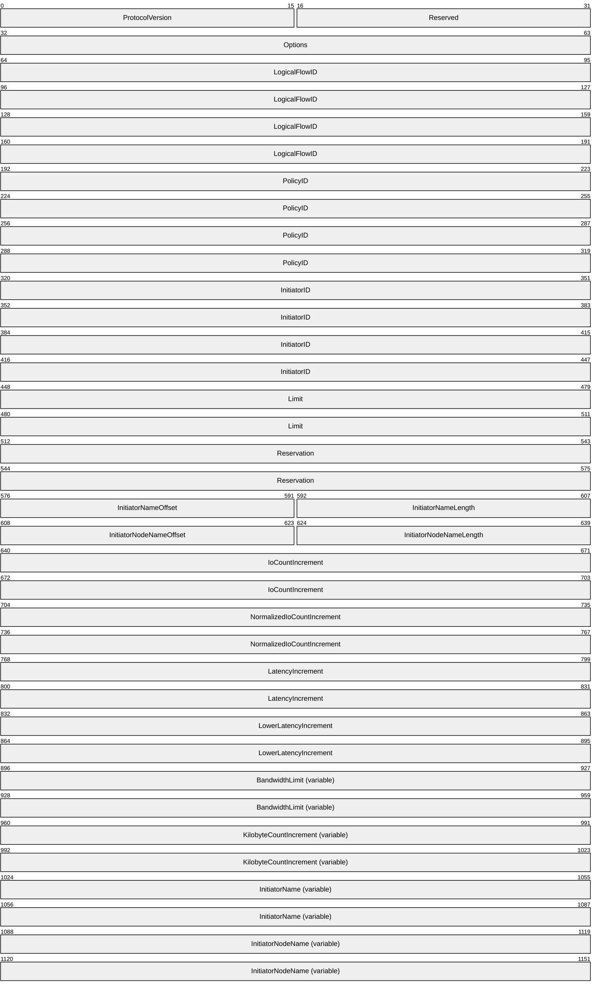
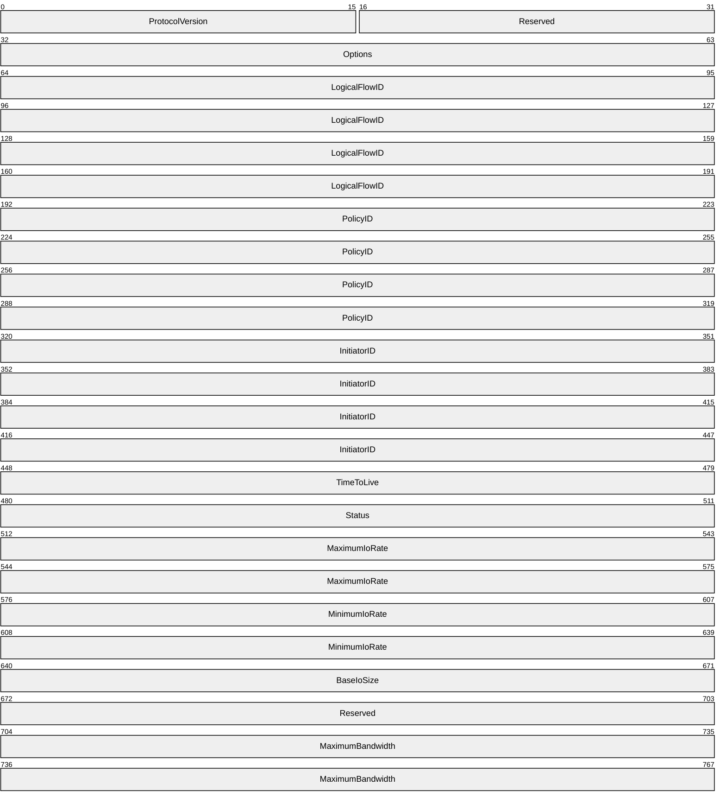

# [MS-SQOS]: Storage Quality of Service Protocol

Table of Contents

1 Introduction

- [1 Introduction](#Section_1)
  - [1.1 Glossary](#Section_1.1)
  - [1.2 References](#Section_1.2)
    - [1.2.1 Normative References](#Section_1.2.1)
    - [1.2.2 Informative References](#Section_1.2.2)
  - [1.3 Overview](#Section_1.3)
  - [1.4 Relationship to Other Protocols](#Section_1.4)
  - [1.5 Prerequisites/Preconditions](#Section_1.5)
  - [1.6 Applicability Statement](#Section_1.6)
  - [1.7 Versioning and Capability Negotiation](#Section_1.7)
  - [1.8 Vendor-Extensible Fields](#Section_1.8)
  - [1.9 Standards Assignments](#Section_1.9)

2 Messages

- [2 Messages](#Section_2)
  - [2.1 Transport](#Section_2.1)
  - [2.2 Message Syntax](#Section_2.2)
    - [2.2.1 Constants](#Section_2.2.1)
    - [2.2.2 Structures](#Section_2.2.2)
      - [2.2.2.1 Logical Flow Status Codes](#Section_2.2.2.1)
      - [2.2.2.2 STORAGE_QOS_CONTROL_REQUEST Structure](#Section_2.2.2.2)
      - [2.2.2.3 STORAGE_QOS_CONTROL_RESPONSE Structure](#Section_2.2.2.3)

3 Protocol Details

- [3 Protocol Details](#Section_3)
  - [3.1 Client Details](#Section_3.1)
    - [3.1.1 Abstract Data Model](#Section_3.1.1)
      - [3.1.1.1 Global](#Section_3.1.1.1)
      - [3.1.1.2 Per Logical Flow](#Section_3.1.1.2)
    - [3.1.2 Timers](#Section_3.1.2)
      - [3.1.2.1 Per Logical Flow](#Section_3.1.2.1)
    - [3.1.3 Initialization](#Section_3.1.3)
    - [3.1.4 Higher-Layer Triggered Events](#Section_3.1.4)
      - [3.1.4.1 Application Issues a Storage Quality of Service Control Request for a Logical Flow](#Section_3.1.4.1)
    - [3.1.5 Message Processing Events and Sequencing Rules](#Section_3.1.5)
      - [3.1.5.1 Receiving a Storage Quality of Service Control Response](#Section_3.1.5.1)
    - [3.1.6 Timer Events](#Section_3.1.6)
    - [3.1.7 Other Local Events](#Section_3.1.7)
      - [3.1.7.1 Initiating Read or Write Requests for a Logical Flow](#Section_3.1.7.1)
  - [3.2 Server Details](#Section_3.2)
    - [3.2.1 Abstract Data Model](#Section_3.2.1)
      - [3.2.1.1 Global](#Section_3.2.1.1)
      - [3.2.1.2 Per Open](#Section_3.2.1.2)
      - [3.2.1.3 Per Logical Flow](#Section_3.2.1.3)
    - [3.2.2 Timers](#Section_3.2.2)
    - [3.2.3 Initialization](#Section_3.2.3)
    - [3.2.4 Higher-Layer Triggered Events](#Section_3.2.4)
      - [3.2.4.1 Handling a Storage Quality of Service Control Request](#Section_3.2.4.1)
    - [3.2.5 Message Processing Events and Sequencing Rules](#Section_3.2.5)
      - [3.2.5.1 Receiving a Storage Quality of Service Control Request](#Section_3.2.5.1)
        - [3.2.5.1.1 Handling a Request to Associate an Open to a Logical Flow](#Section_3.2.5.1.1)
        - [3.2.5.1.2 Handling a Request to Set or Probe Policy for a Logical Flow](#Section_3.2.5.1.2)
        - [3.2.5.1.3 Handling a Request to Update Counters for a Logical Flow](#Section_3.2.5.1.3)
        - [3.2.5.1.4 Handling a Request to Query Status Information for a Logical Flow](#Section_3.2.5.1.4)
    - [3.2.6 Timer Events](#Section_3.2.6)
    - [3.2.7 Other Local Events](#Section_3.2.7)

4 Protocol Examples

- [4 Protocol Examples](#Section_4)
  - [4.1 Computing Normalized I/O Size](#Section_4.1)
  - [4.2 Associating a Handle to a Logical Flow and Configuring Policy](#Section_4.2)
  - [4.3 Probing Policy and Querying Logical Flow Status](#Section_4.3)

5 Security

- [5 Security](#Section_5)
  - [5.1 Security Considerations for Implementers](#Section_5.1)
  - [5.2 Index of Security Parameters](#Section_5.2)

6 Appendix A: Product Behavior

- [6 Appendix A: Product Behavior](#Section_6)

7 Change Tracking

- [7 Change Tracking](#Section_7)

For the legal notice and IP terms, see [LEGAL.md](../LEGAL.md).
Last updated: 4/23/2024.
See [Revision History](#revision-history) for full version history.

# 1 Introduction

The Storage Quality of Service (QoS) Protocol is a block-based protocol that is used to manage the Quality of Service configuration of I/O flows targeting remote files accessed over SMB3.

Sections 1.5, 1.8, 1.9, 2, and 3 of this specification are normative. All other sections and examples in this specification are informative.

## 1.1 Glossary

This document uses the following terms:

**base I/O size**: A configurable parameter on logical flows indicating the value to be used to compute [**normalized IOPS**](#gt_normalized-inputoutput-operations-per-second-normalized-iops) units.

**globally unique identifier (GUID)**: A term used interchangeably with universally unique identifier (UUID) in Microsoft protocol technical documents (TDs). Interchanging the usage of these terms does not imply or require a specific algorithm or mechanism to generate the value. Specifically, the use of this term does not imply or require that the algorithms described in [[RFC4122]](https://go.microsoft.com/fwlink/?LinkId=90460) or [[C706]](https://go.microsoft.com/fwlink/?LinkId=89824) must be used for generating the [**GUID**](#gt_globally-unique-identifier-guid). See also universally unique identifier (UUID).

**little-endian**: Multiple-byte values that are byte-ordered with the least significant byte stored in the memory location with the lowest address.

**logical flow**: A stream of I/O operations to be treated as a single indivisible flow for the purpose of measuring and controlling its performance characteristics (e.g. throughput or latency).

**normalized input/output operations per second (normalized IOPS)**: A unit of measurement for storage I/O throughput. "1 IOPS" is defined as the transfer rate of one block of data that is equal to or less than the base I/O size per second.

**NULL GUID**: A [**GUID**](#gt_globally-unique-identifier-guid) of all zeros.

**QoS Policy**: The set of parameters that completely define the Quality of Service requirements for a logical flow or for a set of logical flows.

**Unicode**: A character encoding standard developed by the Unicode Consortium that represents almost all of the written languages of the world. The [**Unicode**](#gt_unicode) standard [[UNICODE5.0.0/2007]](https://go.microsoft.com/fwlink/?LinkId=154659) provides three forms (UTF-8, UTF-16, and UTF-32) and seven schemes (UTF-8, UTF-16, UTF-16 BE, UTF-16 LE, UTF-32, UTF-32 LE, and UTF-32 BE).

**MAY, SHOULD, MUST, SHOULD NOT, MUST NOT:** These terms (in all caps) are used as defined in [[RFC2119]](https://go.microsoft.com/fwlink/?LinkId=90317). All statements of optional behavior use either MAY, SHOULD, or SHOULD NOT.

## 1.2 References

Links to a document in the Microsoft Open Specifications library point to the correct section in the most recently published version of the referenced document. However, because individual documents in the library are not updated at the same time, the section numbers in the documents may not match. You can confirm the correct section numbering by checking the [Errata](https://go.microsoft.com/fwlink/?linkid=850906).

### 1.2.1 Normative References

We conduct frequent surveys of the normative references to assure their continued availability. If you have any issue with finding a normative reference, please contact [dochelp@microsoft.com](mailto:dochelp@microsoft.com). We will assist you in finding the relevant information.

[MS-SMB2] Microsoft Corporation, "[Server Message Block (SMB) Protocol Versions 2 and 3](../MS-SMB2/MS-SMB2.md)".

[RFC2119] Bradner, S., "Key words for use in RFCs to Indicate Requirement Levels", BCP 14, RFC 2119, March 1997, [https://www.rfc-editor.org/info/rfc2119](https://go.microsoft.com/fwlink/?LinkId=90317)

[UNICODE] The Unicode Consortium, "The Unicode Consortium Home Page", [http://www.unicode.org/](https://go.microsoft.com/fwlink/?LinkId=90550)

### 1.2.2 Informative References

None.

## 1.3 Overview

The Storage Quality of Service (QoS) Protocol allows a client application to perform the following high-level operations:

- Define a [**logical flow**](#gt_logical-flow) and specify a [**QoS Policy**](#gt_qos-policy) for the logical flow.
- Provide data used to compute I/O performance metrics for a logical flow.
- Retrieve status information for a logical flow.
The Storage QoS protocol is used to exchange configuration, metric and status data between the client and the server. The protocol allows a storage flow to be identified and a policy to be assigned to the operations belonging to the flow. For the purpose of illustrating the protocol behaviors, this specification assumes that on the server side there exists a Storage QoS implementation that is responsible for implementing policies by performing tasks such as collecting metrics, computing I/O rates for logical flows, determining status of logical flows, and manipulating I/O request queues to satisfy throughput requirements.

## 1.4 Relationship to Other Protocols

This protocol depends on Server Message Block (SMB) Protocol Version 3 for its transport, as specified in [MS-SMB2](../MS-SMB2/MS-SMB2.md).

## 1.5 Prerequisites/Preconditions

The Storage QoS Protocol has the following preconditions:

- An SMB client has established a connection to an SMB server and has opened a remote file. This has to be done before a client can issue any Storage QoS Protocol commands.

## 1.6 Applicability Statement

The Storage QoS Protocol is applicable for all scenarios that access a remote file between a Storage QoS-aware client and a server operating in a Storage QoS-managed environment.

## 1.7 Versioning and Capability Negotiation

The Storage Quality of Service Protocol has two versions.<1>

| Version | Dialect Revision | Value |
| --- | --- | --- |
| Storage QoS Protocol Version 1.0 | SQoS dialect 1.0 | 0x0100 |
| Storage QoS Protocol Version 1.1 | SQoS dialect 1.1 | 0x0101 |

## 1.8 Vendor-Extensible Fields

None.

## 1.9 Standards Assignments

This protocol shares the standards assignments of Server Message Block Protocol Versions 2 and 3, as specified in [MS-SMB2](../MS-SMB2/MS-SMB2.md) section 1.9.

# 2 Messages

## 2.1 Transport

The following sections specify how Storage QoS Protocol messages are encapsulated on the wire and common protocol data types used.

Unless otherwise specified, multiple-byte fields (16-bit, 32-bit, and 64-bit fields) in the Storage QoS Protocol message MUST be transmitted in [**little-endian**](#gt_little-endian) order (least-significant byte first).

Unless otherwise indicated, numeric fields are integers of the specified byte length.

Unless otherwise specified, all textual strings MUST be in [**Unicode**](#gt_unicode) version 5.0 format, as specified in [[UNICODE]](https://go.microsoft.com/fwlink/?LinkId=90550), using the 16-bit Unicode Transformation Format (UTF-16) form of the encoding. Textual strings with separate fields identifying the length of the string MUST NOT be null-terminated unless otherwise specified.

Unless otherwise noted, fields marked as "Reserved" MUST be set to 0 when being sent and MUST be ignored when received. These fields are reserved for future protocol expansion and MUST NOT be used for implementation-specific functionality.

## 2.2 Message Syntax

### 2.2.1 Constants

| Constant name | Meaning |
| --- | --- |
| FSCTL_STORAGE_QOS_CONTROL 0x00090350 | Control code for STORAGE_QOS_CONTROL_REQUEST |
| STORAGE_QOS_INITIATOR_NAME_SIZE 0x200 | Maximum length, in bytes, for the **InitiatorName** and **InitiatorNodeName** fields in section [2.2.2.2](#Section_2.2.2.2). |

### 2.2.2 Structures

#### 2.2.2.1 Logical Flow Status Codes

| Name | Meaning |
| --- | --- |
| StorageQoSStatusOk 0x00000000 | The logical flow performance is within the constraints specified by the policy currently applied to the flow. |
| StorageQoSStatusInsufficientThroughput 0x00000001 | The storage subsystem has been unable to satisfy the minimum throughput demand for the flow. |
| StorageQoSUnknownPolicyId 0x00000002 | The policy ID to which the flow has been associated is not known to the Storage QoS implementation. |
| StorageQoSStatusConfigurationMismatch 0x00000004 | The Storage QoS implementation doesn't support one or more of the requested parameters for the policy applied to the logical flow. |
| StorageQoSStatusNotAvailable 0x00000005 | Status information is not available for the logical flow. |

#### 2.2.2.2 STORAGE_QOS_CONTROL_REQUEST Structure

The STORAGE_QOS_CONTROL_REQUEST packet is sent by the client to request one or more operations on a logical flow.

**ProtocolVersion (2 bytes):** The protocol version. This MUST be set to one of the following values:

| Value | Version |
| --- | --- |
| 0x0100 | Storage QoS Protocol Version 1.0 |
| 0x0101 | Storage QoS Protocol Version 1.1 |

**Reserved (2 bytes):** The client MUST set this field to 0, and the server MUST ignore it on receipt.

**Options (4 bytes):** A 4-byte bitmap specifying the operations requested by the client. The client MUST set this field to an OR-ed combination of the following values:

| Value | Meaning |
| --- | --- |
| STORAGE_QOS_CONTROL_FLAG_SET_LOGICAL_FLOW_ID 0x00000001 | Request to associate the handle to the remote file to the logical flow identified by the LogicalFlowID field. |
| STORAGE_QOS_CONTROL_FLAG_SET_POLICY 0x00000002 | Request to update the current policy parameters for the logical flow with the policy parameters supplied by this request. |
| STORAGE_QOS_CONTROL_FLAG_PROBE_POLICY 0x00000004 | Request to update the LogicalFlowID and policy parameters for the handle to the values specified in the request only if the handle is currently not associated to any logical flow. |
| STORAGE_QOS_CONTROL_FLAG_GET_STATUS 0x00000008 | Request for a response containing current status information for the logical flow. |
| STORAGE_QOS_CONTROL_FLAG_UPDATE_COUNTERS 0x00000010 | Specifies that the counter values supplied by the **IoCountIncrement**, **NormalizedIoCountIncrement** and **LatencyIncrement** fields are valid and MUST be used to update corresponding counters maintained by the server. |

**LogicalFlowID (16 bytes):** Specifies the [**GUID**](#gt_globally-unique-identifier-guid) of the logical flow to which the current operation applies.

**PolicyID (16 bytes):** Specifies the GUID of the Quality of Service policy to be applied to the logical flow. An empty GUID value (all zeroes) indicates that no policy should be applied.

**InitiatorID (16 bytes):** Specifies the GUID of the initiator of the logical flow.

**Limit (8 bytes):** Specifies the desired maximum throughput for the logical flow, in [**normalized IOPS**](#gt_normalized-inputoutput-operations-per-second-normalized-iops). A zero value indicates that the limit is not defined.

**Reservation (8 bytes):** Specifies the desired minimum throughput for the logical flow, in normalized 8KB IOPS.

**InitiatorNameOffset (2 bytes):** The byte offset, from the beginning of the structure, of the InitiatorName string.

**InitiatorNameLength (2 bytes):** The length of the **InitiatorName** string in bytes.

**InitiatorNodeNameOffset (2 bytes):** The byte offset, from the beginning of the structure, of the **InitiatorNodeName** string.

**InitiatorNodeNameLength (2 bytes):** The length of the **InitiatorNodeName** string in bytes.

**IoCountIncrement (8 bytes):** The total number of I/O requests issued by the initiator on the logical flow.

**NormalizedIoCountIncrement (8 bytes):** The total number of normalized 8-KB I/O requests issued by the initiator on the logical flow.

**LatencyIncrement (8 bytes):** The total latency (accumulated across all I/O requests for the logical flow) measured by the initiator, including any delay accumulated by I/O requests in the initiator’s queues while waiting to be issued to lower layers. This value is expressed in 100-nanosecond units.

**LowerLatencyIncrement (8 bytes):** The total latency (accumulated across all I/O requests for the logical flow) measured by the initiator, excluding any delay accumulated by I/O requests in the initiator’s queues while waiting to be issued to lower layers. This value is expressed in 100-nanosecond units.

**BandwidthLimit (8 bytes)**: Specifies the desired maximum bandwidth for the logical flow, in kilobyte per second units. A zero value indicates that the limit is not defined. This field is not present in the SQoS dialect 1.0.

**KilobyteCountIncrement (8 bytes)**: The total data transfer length of all I/O requests, in kilobyte units, issued by the initiator on the logical flow. This field is not present in the SQoS dialect 1.0.

**InitiatorName (variable):** A UNICODE string supplying the name of the logical flow initiator. The string MUST NOT be null-terminated and its length in bytes MUST be less than or equal to STORAGE_QOS_INITIATOR_NAME_SIZE.

**InitiatorNodeName (variable):** A UNICODE string supplying the name of the node hosting the logical flow initiator. The string MUST NOT be null-terminated and its length in bytes MUST be less than or equal to STORAGE_QOS_INITIATOR_NAME_SIZE.

#### 2.2.2.3 STORAGE_QOS_CONTROL_RESPONSE Structure

The STORAGE_QOS_CONTROL_RESPONSE packet is sent by the server in response to a STORAGE_QOS_CONTROL_REQUEST packet.

**ProtocolVersion (2 bytes):** The protocol version. This MUST be set to one of the following values.

| Value | Version |
| --- | --- |
| 0x0100 | Storage QoS Protocol Version 1.0 |
| 0x0101 | Storage QoS Protocol Version 1.1 |

**Reserved (2 bytes):** The server MUST set this field to 0, and the client MUST ignore it on receipt.

**Options (4 bytes):** The server MUST set this field to 0.

**LogicalFlowID (16 bytes):** The [**GUID**](#gt_globally-unique-identifier-guid) of the logical flow to which the handle is currently associated.

**PolicyID (16 bytes):** The GUID of the Storage QoS Policy currently being applied to the logical flow.

**InitiatorID (16 bytes):** The GUID of the initiator to which the logical flow is currently associated.

**TimeToLive (4 bytes):** The expected period of validity of the **Status**, **MaximumIoRate** and **MinimumIoRate** fields, expressed in milliseconds.

**Status (4 bytes):** The current status of the logical flow. The server MUST set this field to one of the values specified in section [2.2.2.1](#Section_2.2.2.1).

**MaximumIoRate (8 bytes):** The maximum I/O initiation rate currently assigned to the logical flow, expressed in [**normalized input/output operations per second (normalized IOPS)**](#gt_normalized-inputoutput-operations-per-second-normalized-iops).

**MinimumIoRate (8 bytes):** The minimum I/O completion rate currently assigned to the logical flow, expressed in normalized IOPS.

**BaseIoSize (4 bytes)**: The [**base I/O size**](#gt_base-io-size) used to compute the normalized size of an I/O request for the logical flow.

**Reserved (4 bytes)**: Unused field. The server MUST set this field to zero.

**MaximumBandwidth (8 bytes)**: The maximum bandwidth currently assigned to the logical flow, expressed in kilobytes per second. This field is not present in the SQoS dialect 1.0.

# 3 Protocol Details

## 3.1 Client Details

### 3.1.1 Abstract Data Model

This section describes a conceptual model of possible data organization that an implementation maintains to participate in this protocol. The described organization is provided to facilitate the explanation of how the protocol behaves. This document does not mandate that implementations adhere to this model as long as their external behavior is consistent with that described in this document.

#### 3.1.1.1 Global

The client MUST implement the following:

**Dialect**: The dialect version used to negotiate with the server. This value MUST be 1.0 or 1.1.

#### 3.1.1.2 Per Logical Flow

The client MUST maintain the following state information for each logical flow that it owns:

- **LogicalFlowID**: The GUID of the logical flow.
- **IoCountIncrement**: Total number of I/O requests issued on any of the handles associated to the logical flow.
- **NormalizedIoCountIncrement**: Total number of normalized I/O requests issued on any of the handles associated to the logical flow.
- **LatencyIncrement**: Total cumulative latency of all I/O requests issued on any of the handles associated to the logical flow, including any delay accumulated by I/O requests in the initiator’s queues while waiting to be issued to lower layers.
- **LowerLatencyIncrement**: Total cumulative latency of all I/O requests issued on any of the handles associated to the logical flow, excluding any delay accumulated by I/O requests in the initiator’s queues while waiting to be issued to lower layers.
- **MaximumIoRate**: Current maximum IO rate assigned to the logical flow, expressed in normalized 8KB IOPS.
- **BaseIoSize**: The base I/O size used to compute the normalized size of an I/O request for the logical flow.
If the client supports the SQoS 1.1 dialect, it MUST also implement the following state information for each logical flow that it owns:

**MaximumBandwidth**: Current maximum bandwidth assigned to the logical flow, expressed in kilobytes per second.

**KilobyteCountIncrement**: Total data transfer length of all I/O requests, in kilobyte units, issued on any of the handles associated to the logical flow.

### 3.1.2 Timers

#### 3.1.2.1 Per Logical Flow

**StatusRequestTimer**: When this timer expires, the client SHOULD issue a status request for the logical flow, as specified in section [3.1.6](#Section_3.1.6).

### 3.1.3 Initialization

The following values MUST be initialized to zero:

- **LogicalFlow.IoCountIncrement**
- **LogicalFlow.MaximumIoRate**
- **LogicalFlow.NormalizedIoCountIncrement**
- **LogicalFlow.LatencyIncrement**
- **LogicalFlow.LowerLatencyIncrement**
**LogicalFlow.BaseIoSize** MUST be initialized to 8192.

The **LogicalFlow.StatusRequestTimer** MUST be set to never expire.

**Dialect** MUST be set to the highest dialect that the client implements.<2>

If the client supports the SQoS 1.1 dialect, the following MUST be initialized to zero:

- **LogicalFlow.KilobyteCountIncrement**
- **LogicalFlow.MaximumBandwidth**

### 3.1.4 Higher-Layer Triggered Events

#### 3.1.4.1 Application Issues a Storage Quality of Service Control Request for a Logical Flow

Before issuing a Storage Quality of Service Control request, the client MUST have already established a connection to the server by calling the interface specified in [MS-SMB2](../MS-SMB2/MS-SMB2.md) section 3.2.4.2 and providing the following input parameters:

- The application-provided server name.
- The application-provided share name.
- The application-provided user credentials.
If the connection is successfully established, the client MUST open the remote file by calling the interface specified in [MS-SMB2] section 3.2.4.3 and provide the following input parameters:

- File name
After opening the remote file, in order to issue a Storage Quality of Service Request for the remote file, the client MUST construct a STORAGE_QOS_CONTROL_REQUEST structure, as specified in section [2.2.2.2](#Section_2.2.2.2), as follows:

- All fields of the STORAGE_QOS_CONTROL_REQUEST structure SHOULD initially be set to zero.
- The **ProtocolVersion** field MUST be set to an implementation-specific value<3>.
- The **Options** field MUST contain at least one of the flags defined in section 2.2.2.2, as specified in the rest of this section and in section [3.1.6](#Section_3.1.6).
- If the **Options** field includes the STORAGE_QOS_CONTROL_GET_STATUS flag, the maximum output buffer size MUST be at least 80 (size of STORAGE_QOS_CONTROL_RESPONSE).
- If the handle to the **Open** has not yet been associated to a logical flow, the **Options** field MUST include the STORAGE_QOS_CONTROL_FLAG_SET_LOGICAL_FLOW_ID flag and **LogicalFlowID** must be set to a non-empty GUID.
- If the **Options** field includes the STORAGE_QOS_CONTROL_FLAG_PROBE_POLICY flag, the **LogicalFlowID** MUST NOT be set to an empty GUID.
- If the **Options** field includes the STORAGE_QOS_CONTROL_FLAG_UPDATE_COUNTERS flag the client MUST set the following request fields:
- **IoCountIncrement** is set to **LogicalFlow.IoCountIncrement**
- **NormalizedIoCountIncrement** is set to **LogicalFlow.NormalizedIoCountIncrement**
- **LatencyIncrement** is set to **LogicalFlow.LatencyIncrement**
- **LowerLatencyIncrement** is set to **LogicalFlow.LowerLatencyIncrement**
- If **Dialect** is 1.1, then **KilobyteCountIncrement** is set to **LogicalFlow.KilobyteCountIncrement**
The client MUST ensure the following after sending the request:

- **LogicalFlow.IoCountIncrement** is set to zero.
- **LogicalFlow.NormalizedIoCountIncrement** is set to zero.
- **LogicalFlow.LatencyIncrement** is set to zero.
- **LogicalFlow.LowerLatencyIncrement** is set to zero.
- If **Dialect** is 1.1, then **LogicalFlow.KilobyteCountIncrement** is set to zero.
The client MUST call the interface specified in [MS-SMB2] section 3.2.4.20.11, supplying the following input parameters:

- Application-provided handle to identify the **Open**.
- Control code: FSCTL_STORAGE_QOS_CONTROL.
- STORAGE_QOS_CONTROL_REQUEST structure as payload.
- The maximum output buffer size that it will accept.

### 3.1.5 Message Processing Events and Sequencing Rules

#### 3.1.5.1 Receiving a Storage Quality of Service Control Response

If the response returned by the server indicates failure the client SHOULD set the **LogicalFlow.StatusRequestTimer** to expire within implementation-specific<4> default interval.

If the response returned by the server indicates STATUS_SUCCESS:

- The client MUST set **LogicalFlow.MaximumIoRate** to the **MaximumIoRate** value received in the STORAGE_QOS_CONTROL_RESPONSE buffer.
- If **Dialect** is 1.1, then the client MUST set **LogicalFlow.MaximumBandwidth** to the **MaximumBandwidth** value received in the STORAGE_QOS_CONTROL_RESPONSE buffer.
- If the **TimeToLive** value received in the STORAGE_QOS_CONTROL_RESPONSE is greater than 1000, the client MUST set **LogicalFlow.StatusRequestTimer** to expire within **TimeToLive** milliseconds. Otherwise, the client MUST set **LogicalFlow.StatusRequestTimer** to expire within an implementation-specific<5> default interval.
- The client MUST set **LogicalFlow.BaseIoSize** to the **BaseIoSize** value received in the STORAGE_QOS_CONTROL_RESPONSE buffer.

### 3.1.6 Timer Events

When the client issues a Storage QoS Request with the STORAGE_QOS_CONTROL_FLAG_SET_POLICY set in the **Options** field, the client SHOULD either include the STORAGE_QOS_CONTROL_FLAG_GET_STATUS flag in the same request, or ensure that **LogicalFlow.StatusRequestTimer** will expire within 1 second.

When **LogicalFlow.StatusRequestTimer** expires, the client SHOULD issue a STORAGE_QOS_CONTROL_REQUEST with **Options** including at least the STORAGE_QOS_CONTROL_FLAG_GET_STATUS and STORAGE_QOS_CONTROL_FLAG_UPDATE_COUNTERS flags. If the logical flow is idle at the time the timer expires (that is, there are no I/O requests in progress), the client MAY delay the status request until new I/O requests are available.

### 3.1.7 Other Local Events

#### 3.1.7.1 Initiating Read or Write Requests for a Logical Flow

If **LogicalFlow.MaximumIoRate** is greater than zero or if the client implements the SQoS 1.1 dialect and **LogicalFlow.MaximumBandwidth** is greater than zero, the client MUST limit the average I/O initiation rate for the logical flow to the value indicated by **LogicalFlow.MaximumIoRate**, or if the client implements the SQoS 1.1 dialect, the minimum of **LogicalFlow.MaximumIoRate** and **LogicalFlow.MaximumBandwidth**.

## 3.2 Server Details

### 3.2.1 Abstract Data Model

This section describes a conceptual model of possible data organization that an implementation maintains to participate in this protocol. The described organization is provided to facilitate the explanation of how the protocol behaves. This document does not mandate that implementations adhere to this model as long as their external behavior is consistent with that described in this document.

#### 3.2.1.1 Global

The server MUST implement the following:

**LogicalFlowTable**: A table of currently existing logical flows, indexed by **LogicalFlowID**.

**Dialect**: The dialect version used to negotiate with the client. This value MUST be 1.0 or 1.1.

#### 3.2.1.2 Per Open

**LogicalFlowID**: The GUID of the logical flow to which the Open is currently associated. If this value is an empty GUID, the Open is not associated to any logical flow.

#### 3.2.1.3 Per Logical Flow

**LogicalFlowID**: The GUID of the logical flow.

**PolicyID**: The GUID of the Storage QoS policy currently associated to the logical flow.

**InitiatorID**: The GUID of the initiator currently associated to the logical flow.

**Limit**: The client-defined limit currently requested for the logical flow, in normalized IOPS.

**Reservation**: The client-defined reservation currently requested for the logical flow, in normalized IOPS.

**InitiatorName**: The name of the initiator currently associated to the logical flow.

**InitiatorNodeName**: The name of the initiator node currently associated to the logical flow.

**BaseIoSize**: The base I/O size used to compute the normalized size of an I/O request for the logical flow.

If the server implements the SQoS 1.1 dialect:

**BandwidthLimit**: The client-defined bandwidth limit currently requested for the logical flow, in kilobyte per second units.

### 3.2.2 Timers

None.

### 3.2.3 Initialization

**Dialect** MUST be set to the highest dialect that the server implements.<6>

### 3.2.4 Higher-Layer Triggered Events

#### 3.2.4.1 Handling a Storage Quality of Service Control Request

The calling application provides:

- A handle identifying the **Open**.
- Storage QoS Control Request structure, indicated by **Request**. The total size of the request, including variable length fields, is indicated by **RequestSize**.
- The maximum size of the response that will be accepted by the client, indicated by **MaxResponseSize**.
The server MUST process this request as specified in section [3.2.5.1](#Section_3.2.5.1).

### 3.2.5 Message Processing Events and Sequencing Rules

#### 3.2.5.1 Receiving a Storage Quality of Service Control Request

If the server does not support the Storage Quality of Service function, it SHOULD fail the request with STATUS_INVALID_DEVICE_REQUEST.

Otherwise, the server MUST process a Storage Quality of Service Request as follows:

If **Request.ProtocolVersion** does not match one of the values defined in section [1.7](#Section_1.7), the server MUST fail the request with error STATUS_REVISION_MISMATCH.<7>

If **Request.Options** does not include at least one of the flags defined in section [2.2.2.2](#Section_2.2.2.2), the server MUST fail the request with error STATUS_INVALID_PARAMETER.

If **Request.Options** includes the STORAGE_QOS_CONTROL_FLAG_PROBE_POLICY flag and the **Open** is currently associated to a logical flow, the server MUST ignore the STORAGE_QOS_CONTROL_FLAG_PROBE_POLICY flag for the rest of the processing.

The server MUST follow the processing rules described in sections [3.2.5.1.1](#Section_3.2.5.1.1), [3.2.5.1.2](#Section_3.2.5.1.2), [3.2.5.1.3](#Section_3.2.5.1.3), and [3.2.5.1.4](#Section_3.2.5.1.4).

##### 3.2.5.1.1 Handling a Request to Associate an Open to a Logical Flow

If **Request.Options** includes the STORAGE_QOS_CONTROL_FLAG_SET_LOGICAL_FLOW_ID or STORAGE_QOS_CONTROL_FLAG_PROBE_POLICY flags and **Request.LogicalFlowID** is set to a non-empty GUID, the server MUST look up the specified GUID in **LogicalFlowTable**. If an entry is not found, the server MUST create a new logical with GUID equal to **Request.LogicalFlowID** and add it to the **LogicalFlowTable**. The server MUST associate the Open with the logical flow identified by **Request.LogicalFlowID**.

If **Request.Options** includes the STORAGE_QOS_CONTROL_FLAG_PROBE_POLICY flag and **Request.LogicalFlowID** is set to an empty GUID, the server MUST fail the request with error STATUS_INVALID_PARAMETER.

If **Request.Options** includes the STORAGE_QOS_CONTROL_FLAG_SET_LOGICAL_FLOW_ID flag and **Request.LogicalFlowID** is set to an empty GUID, the server MUST remove the association between the Open and the logical flow currently associated to the **Open**. The **Open** MUST NOT be associated with any other logical flow.

##### 3.2.5.1.2 Handling a Request to Set or Probe Policy for a Logical Flow

If **Request.Options** includes the STORAGE_QOS_CONTROL_FLAG_SET_POLICY and the **Open** is not associated to a logical flow, the server MUST fail the request with error STATUS_NOT_FOUND.

The rest of the processing rules in this section apply only if **Request.Options** includes the STORAGE_QOS_CONTROL_FLAG_SET_POLICY or STORAGE_QOS_CONTROL_FLAG_PROBE_POLICY flag.

The server MUST fail the request with error STATUS_INVALID_PARAMETER if any of the following conditions is true:

- **Request.InitiatorNameLength** is greater than STORAGE_QOS_INITIATOR_NAME_SIZE.
- **Request.InitiatorNameLength** is greater than 0 and **Request.InitiatorNameOffset** is less than 104.
- (**Request.InitiatorNameLength** + **Request.InitiatorNameOffset**) is greater than **RequestSize.**
- **Request.InitiatorNodeNameLength** is greater than STORAGE_QOS_INITIATOR_NAME_SIZE.
- **Request.InitiatorNodeNameLength** is greater than 0 and **Request.InitiatorNodeNameOffset** is less than 104.
- (**Request.InitiatorNodeNameLength** + **Request.InitiatorNodeNameOffset**) is greater than **RequestSize**.
The server MUST fail the request with error STATUS_INVALID_PARAMETER if it determines that any of the following fields has an invalid value<8>:

- **Request.PolicyID**
- **Request.InitiatorID**
- **Request.Limit**
- **Request.Reservation**
- If **Dialect** is 1.1, **Request.BandwidthLimit**
If **Request.InitiatorNameLength** is greater than zero, the server MUST update **LogicalFlow.InitiatorName** to **Request.InitiatorName**.

If **Request.InitiatorNodeNameLength** is greater than zero, the server MUST update **LogicalFlow.InitiatorNodeName** to **Request.InitiatorNodeName**.

The server MUST update the policy parameters associated to the logical flow associated with the **Open** as follows:

- **LogicalFlow.PolicyID** is set to **Request.PolicyID**.
- **LogicalFlow.InitiatorID** is set to **Request.InitiatorID**.
- **LogicalFlow.Limit** is set to **Request.Limit**.
- **LogicalFlow.Reservation** is set to **Request.Reservation**.
- If the server implements Storage QoS Protocol Version 1.1, **LogicalFlow.BandwidthLimit** is set to **Request.BandwidthLimit**.

##### 3.2.5.1.3 Handling a Request to Update Counters for a Logical Flow

If **Request.Options** includes the STORAGE_QOS_CONTROL_FLAG_UPDATE_COUNTERS flag and the **Open** is not associated to a logical flow, the server MUST fail the request with error STATUS_NOT_FOUND.

If **Request.Options** does not include the STORAGE_QOS_CONTROL_FLAG_UPDATE_COUNTERS flag, the server MUST ignore the values of the following fields:

- **Request.IoCountIncrement**
- **Request.NormalizedIoCountIncrement**
- **Request.LatencyIncrement**
- **Request.LowerLatencyIncrement**
- If **Dialect** is 1.1, **Request.KilobyteCountIncrement**

##### 3.2.5.1.4 Handling a Request to Query Status Information for a Logical Flow

The following processing rules apply only when **Request.Options** includes the STORAGE_QOS_CONTROL_GET_STATUS flag.

If **MaxResponseSize** is less than 80 (size of STORAGE_QOS_CONTROL_RESPONSE) the server MUST fail the request with error STATUS_INVALID_PARAMETER.

If the **Open** is not associated to a logical flow the server MUST fail the request with error STATUS_NOT_FOUND.

The server MUST construct a STORAGE_QOS_CONTROL_RESPONSE structure as specified in section [2.2.2.3](#Section_2.2.2.3) with the following values:

- **ProtocolVersion** MUST be set to one of the values listed in section [1.7](#Section_1.7).
- **Options** MUST be set 0.
- **LogicalFlowID** MUST be set to **Open.LogicalFlowID**.
- **PolicyID** MUST be set to **LogicalFlow.PolicyID**.
- **InitiatorID** MUST be set to **LogicalFlow.InitiatorID**.
- **TimeToLive** MUST be set to a positive value indicating the expected period of validity, in milliseconds, of the returned status information for the logical flow. The server SHOULD use implementation-dependent means to obtain the current expected period of validity.
- **Status** MUST be set to one of the values defined in section [2.2.2.1](#Section_2.2.2.1), representing the current status of the logical flow.
- **MaximumIoRate** MUST be set to the maximum I/O rate assigned to the logical flow.
- **MinimumIoRate** MUST be set to the minimum I/O rate assigned to the logical flow.
- If **Dialect** is 1.1, **MaximumBandwidth** MUST be set to the maximum bandwidth assigned to the logical flow.
- **BaseIoSize** MUST be set to **LogicalFlow.BaseIoSize**.<9>
The response MUST be sent to the client.

If the server has not failed the request for any of the reasons described earlier, the server MUST return STATUS_SUCCESS to the client.

### 3.2.6 Timer Events

None.

### 3.2.7 Other Local Events

None.

# 4 Protocol Examples

The following section describes common scenarios that indicate normal traffic flow in order to illustrate the function of the Storage Quality of Service Protocol.

## 4.1 Computing Normalized I/O Size

The following formula can be used to convert the size of an I/O request in bytes (**IoSizeInBytes**) to an I/O size expressed in normalized units (**NormalizedIoSize**):

**NormalizedIoSize** = (**IoSizeInBytes** + **BaseIoSize** - 1) / **BaseIoSize** where **NormalizedIoSize**, **IoSizeInBytes**, and **BaseIoSize** are unsigned integers.

The following table shows some sample conversions when **BaseIoSize** is 8192.

| Bit Range | Field | Description |
| --- | --- | --- |
| Variable | 512 | 1 |
| Variable | 4096 (4 KB) | 1 |
| Variable | 8192 (8 KB) | 1 |
| Variable | 12288 (12 KB) | 2 |
| Variable | 16384 (16 KB) | 2 |
| Variable | 65536 (64 KB) | 8 |
| Variable | 1048576 (1 MB) | 128 |

## 4.2 Associating a Handle to a Logical Flow and Configuring Policy

The following diagram demonstrated the steps taken to open a remote file, associate the corresponding handle to a logical flow and configure a QoS policy for the logical flow.

Figure 1: Associating a handle to a logical flow and configuring policy

- The client sends an SMB2 CREATE Request to open a remote file.
- The server responds with an SMB2 CREATE Response giving the handle to the open identifying the remote file.
- The client sends an SMB2 IOCTL Request with a STORAGE_QOS_CONTROL_REQUEST buffer to create a logical flow and associate the handle to the logical flow:
01 01

00 00

01 00 00 00

E4 32 3A B1 AD E2 B2 5D A4 F8 5C D3 BE 9D 69 6E

00 00 00 00 00 00 00 00 00 00 00 00 00 00 00 00

00 00 00 00 00 00 00 00 00 00 00 00 00 00 00 00

00 00 00 00 00 00 00 00

00 00 00 00 00 00 00 00

00 00 00 00

00 00 00 00

00 00 00 00 00 00 00 00

00 00 00 00 00 00 00 00

00 00 00 00 00 00 00 00 00 00 00 00 00 00 00 00

00 00 00 00 00 00 00 00

00 00 00 00 00 00 00 00

ProtocolVersion: 0x0101

Reserved: 0x0000

Options: 0x00000001 (STORAGE_QOS_CONTROL_FLAG_SET_LOGICAL_FLOW_ID)

LogicalFlowID: b13a32e4-e2ad-5db2-a4f8-5cd3be9d696e

[all other fields zero]

- The server sends an SMB2 IOCTL Response with STATUS_SUCCESS and no output buffer.
- The client sends an SMB2 IOCTL Request with a STORAGE_QOS_CONTROL_REQUEST buffer to set the policy for the logical flow:

01 01

00 00

02 00 00 00

E4 32 3A B1 AD E2 B2 5D A4 F8 5C D3 BE 9D 69 6E

4E F2 B4 04 E9 B3 94 45 AD AA E3 27 52 8D E5 4B

C6 4D 9E 1B C0 F8 9F 41 87 85 80 65 BC FF 72 84

00 00 00 00 00 00 00 00

00 00 00 00 00 00 00 00

68 00 0E 00

76 00 48 00

00 00 00 00 00 00 00 00

00 00 00 00 00 00 00 00

00 00 00 00 00 00 00 00 00 00 00 00 00 00 00 00

00 00 00 00 00 00 00 00

00 00 00 00 00 00 00 00

54 00 45 00 53 00 54 00 2D 00 56 00 4D 00

48 00 59 00 50 00 45 00 52 00 56 00 2D 00 54 00 45 00 53 00 54 00 2E 00 6E 00 74 00 64 00 65 00 76 00 2E 00 63 00 6F 00 72 00 70 00 2E 00 6D 00 69 00 63 00 72 00 6F 00 73 00 6F 00 66 00 74 00 2E 00 63 00 6F 00 6D 00

ProtocolVersion: 0x0101

Reserved: 0x0000

Options: 0x00000002 (STORAGE_QOS_CONTROL_FLAG_SET_POLICY)

LogicalFlowID: b13a32e4-e2ad-5db2-a4f8-5cd3be9d696e

PolicyID: 04b4f24e-b3e9-4594-adaa-e327528de54b

InitiatorID: 1b9e4dc6-f8c0-419f-8785-8065bcff7284

Limit: 0x0000000000000000

Reservation: 0x0000000000000000

InitiatorNameOffset: 104 (0x0068)

InitiatorNameLength: 14 (0x000E)

InitiatorNodeNameOffset: 118 (0x0076)

InitiatorNodeNameLength: 46 (0x002E)

IoCountIncrement: 0x0000000000000000

NormalizedIoCountIncrement: 0x0000000000000000

LatencyIncrement: 0x0000000000000000 LowerLatencyIncrement: 0x0000000000000000

BandwidthLimit: 0x0000000000000000

KilobyteCountIncrement: 0x0000000000000000

InitiatorName: "TEST-VM"

InitiatorNodeName: "HYPERV-TEST.contoso.com"

- The server sends an SMB2 IOCTL Response with STATUS_SUCCESS and no output buffer.

## 4.3 Probing Policy and Querying Logical Flow Status

The following diagram demonstrated the steps taken to probe current policy configuration for an open and to query logical flow status.

Figure 2: Probing policy and querying logical flow status

- The client sends an SMB2 IOCTL Request with a STORAGE_QOS_CONTROL_REQUEST buffer to query the status of an existing logical flow and probe its policy configuration:
01 01

00 00

1C 00 00 00

E4 32 3A B1 AD E2 B2 5D A4 F8 5C D3 BE 9D 69 6E

4E F2 B4 04 E9 B3 94 45 AD AA E3 27 52 8D E5 4B

C6 4D 9E 1B C0 F8 9F 41 87 85 80 65 BC FF 72 84

00 00 00 00 00 00 00 00

00 00 00 00 00 00 00 00

00 00 00 00

00 00 00 00

8F 01 00 00 00 00 00 00

8F 01 00 00 00 00 00 00

E0 3E 47 02 00 00 00 00 E0 3E 47 02 00 00 00 00

00 00 00 00 00 00 00 00

00 00 00 00 00 00 00 00

ProtocolVersion: 0x0101

Reserved: 0x0000

Options: 0x0000001C (STORAGE_QOS_CONTROL_FLAG_PROBE_POLICY |

STORAGE_QOS_CONTROL_FLAG_GET_STATUS |

STORAGE_QOS_CONTROL_FLAG_UPATE_COUNTERS)

LogicalFlowID: b13a32e4-e2ad-5db2-a4f8-5cd3be9d696e

PolicyID: 04b4f24e-b3e9-4594-adaa-e327528de54b

InitiatorID: 1b9e4dc6-f8c0-419f-8785-8065bcff7284

Limit: 0x0000000000000000

Reservation: 0x0000000000000000

InitiatorNameOffset: 0 (0x0000)

InitiatorNameLength: 0 (0x0000)

InitiatorNodeNameOffset: 0 (0x0000)

InitiatorNodeNameLength: 0 (0x0000)

IoCountIncrement: 399 (0x000000000000018F)

NormalizedIoCountIncrement: 399 (0x000000000000018F)

LatencyIncrement: 38223584 (0x0000000002473EE0) LowerLatencyIncrement: 38223584 (0x0000000002473EE0)

BandwidthLimit: 0x0000000000000000

KilobyteCountIncrement: 0x0000000000000000

- The server sends an SMB2 IOCTL Response with STATUS_SUCCESS and a STORAGE_QOS_CONTROL_RESPONSE output buffer:
01 01

00 00

00 00 00 00

E4 32 3A B1 AD E2 B2 5D A4 F8 5C D3 BE 9D 69 6E

4E F2 B4 04 E9 B3 94 45 AD AA E3 27 52 8D E5 4B

C6 4D 9E 1B C0 F8 9F 41 87 85 80 65 BC FF 72 84

8D 0F 00 00

00 00 00 00

64 00 00 00 00 00 00 00

00 00 00 00 00 00 00 00

C8 00 00 00 00 00 00 00 00 20 00 00 00 00 00 00

ProtocolVersion: 0x0101

Reserved: 0x0000

Options: 0x00000000

LogicalFlowID: b13a32e4-e2ad-5db2-a4f8-5cd3be9d696e

PolicyID: 04b4f24e-b3e9-4594-adaa-e327528de54b

InitiatorID: 1b9e4dc6-f8c0-419f-8785-8065bcff7284

TimeToLive: 3981 (0x00000F8D)

Status: 0x00000000 (StorageQoSStatusOk)

MaximumIoRate: 100 (0x0000000000000064)

MinimumIoRate: 0 (0x0000000000000000)

MaximumBandwidth: 200 (0x00000000000000C8) BaseIoSize: 8192 (0x00002000) Reserved: 0 (0x00000000)

# 5 Security

## 5.1 Security Considerations for Implementers

None.

## 5.2 Index of Security Parameters

None.

# 6 Appendix A: Product Behavior

The information in this specification is applicable to the following Microsoft products or supplemental software. References to product versions include updates to those products.

- Windows 10 operating system
- Windows Server 2016 operating system
- Windows Server operating system
- Windows Server 2019 operating system
- Windows Server 2022 operating system
- Windows 11 operating system
- Windows Server 2025 operating system
Exceptions, if any, are noted in this section. If an update version, service pack or Knowledge Base (KB) number appears with a product name, the behavior changed in that update. The new behavior also applies to subsequent updates unless otherwise specified. If a product edition appears with the product version, behavior is different in that product edition.

Unless otherwise specified, any statement of optional behavior in this specification that is prescribed using the terms "SHOULD" or "SHOULD NOT" implies product behavior in accordance with the SHOULD or SHOULD NOT prescription. Unless otherwise specified, the term "MAY" implies that the product does not follow the prescription.

<1> Section 1.7: The following table illustrates the Windows versions that support Storage QoS clients and Storage QoS servers.

| Storage QoS client | Storage QoS server |
| --- | --- |
| Windows 10 Windows Server 2016 Windows Server operating system Windows Server 2019 Windows Server 2022 Windows 11 | Windows Server 2016 Windows Server operating system Windows Server 2019 Windows Server 2022 |

<2> Section 3.1.3:

| Operating System | Supported Versions |
| --- | --- |
| Windows 10 v1507 operating system | 1.0 |
| Windows 10 v1511 operating system, Windows Server 2016, Windows Server operating system, Windows Server 2019, Windows Server 2022, Windows 11 | 1.1 |

<3> Section 3.1.4.1: Windows 10 v1507 sets this field to 0x0100. Windows 10 v1511, Windows Server 2016, Windows Server operating system, Windows Server 2019, and Windows Server 2022 set this field to 0x0101.

<4> Section 3.1.5.1: Windows 10, Windows Server 2016, Windows Server operating system, Windows Server 2019, Windows Server 2022, and Windows 11 set the expiration interval to 10 seconds.

<5> Section 3.1.5.1: Windows 10, Windows Server 2016, Windows Server operating system, Windows Server 2019, and Windows Server 2022, and Windows 11 set the expiration interval to 1 second.

<6> Section 3.2.3:

| Operating System | Supported Versions |
| --- | --- |
| Windows Server 2016, Windows Server operating system, Windows Server 2019, Windows Server 2022 | 1.1 |

<7> Section 3.2.5.1: Windows Server 2016, Windows Server operating system, Windows Server 2019, and Windows Server 2022 will fail the request with error STATUS_REVISION_MISMATCH if **Request.ProtocolVersion** is not equal to 0x0100 or 0x0101.

<8> Section 3.2.5.1.2: Windows Server 2016, Windows Server operating system, Windows Server 2019, and Windows Server 2022 fail the request with STATUS_INVALID_PARAMETER if any of the following conditions is true:

**Request.Limit** is greater than 1000000000.

**Request.Reservation** is greater than 1000000000.

**Request.BandwidthLimit** is greater than 1000000000.

**Request.Limit** is greater than 0 and **Request.Reservation** is greater than **Request.Limit**.

**Request.Limit** is greater than 0 and **Request.PolicyID** is not equal to a [**NULL GUID**](#gt_null-guid).

**Request.BandwidthLimit** is greater than 0 and **Request.PolicyID** is not equal to a NULL GUID.

**Request.Reservation** is greater than 0 and **Request.PolicyID** is not equal to a NULL GUID.

<9> Section 3.2.5.1.4: Windows Server 2016, Windows Server operating system, Windows Server 2019, and Windows Server 2022 set this value to 8192 for all logical flows.

# 7 Change Tracking

This section identifies changes that were made to this document since the last release. Changes are classified as Major, Minor, or None.

The revision class **Major** means that the technical content in the document was significantly revised. Major changes affect protocol interoperability or implementation. Examples of major changes are:

- A document revision that incorporates changes to interoperability requirements.
- A document revision that captures changes to protocol functionality.
The revision class **Minor** means that the meaning of the technical content was clarified. Minor changes do not affect protocol interoperability or implementation. Examples of minor changes are updates to clarify ambiguity at the sentence, paragraph, or table level.

The revision class **None** means that no new technical changes were introduced. Minor editorial and formatting changes may have been made, but the relevant technical content is identical to the last released version.

The changes made to this document are listed in the following table. For more information, please contact [dochelp@microsoft.com](mailto:dochelp@microsoft.com).

| Section | Description | Revision class |
| --- | --- | --- |
| [6](#Section_6) Appendix A: Product Behavior | Added Windows Server 2025 to the list of applicable products. | Major |

## Revision History

| Date | Version | Revision Class | Comments |
| --- | --- | --- | --- |
| 6/30/2015 | 1.0 | New | Released new document. |
| 10/16/2015 | 2.0 | Major | Significantly changed the technical content. |
| 7/14/2016 | 3.0 | Major | Significantly changed the technical content. |
| 6/1/2017 | 3.0 | None | No changes to the meaning, language, or formatting of the technical content. |
| 9/15/2017 | 4.0 | Major | Significantly changed the technical content. |
| 12/1/2017 | 4.0 | None | No changes to the meaning, language, or formatting of the technical content. |
| 9/12/2018 | 5.0 | Major | Significantly changed the technical content. |
| 4/7/2021 | 6.0 | Major | Significantly changed the technical content. |
| 6/25/2021 | 7.0 | Major | Significantly changed the technical content. |
| 4/23/2024 | 8.0 | Major | Significantly changed the technical content. |
