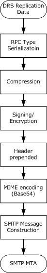
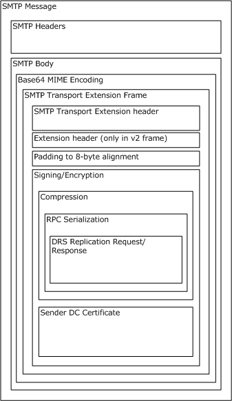
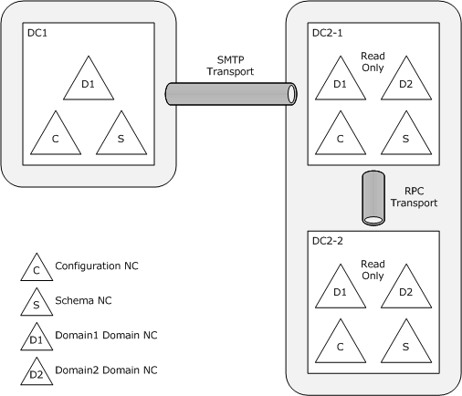
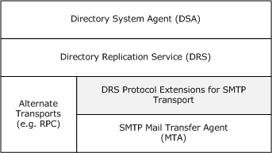
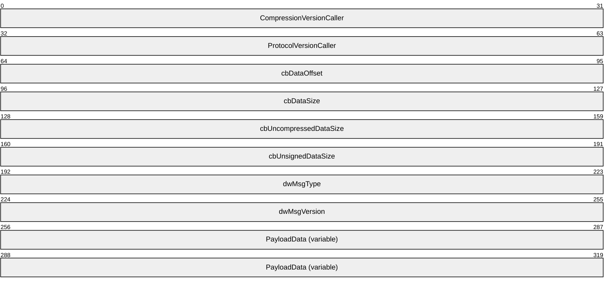
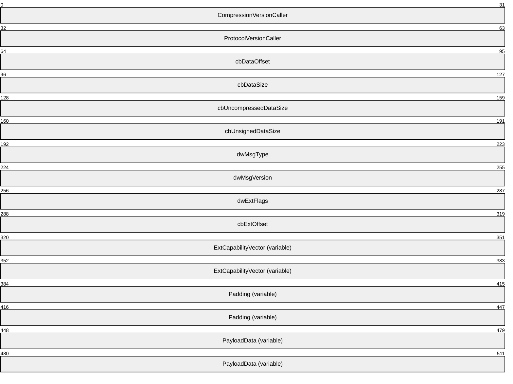

# [MS-SRPL]: Directory Replication Service (DRS) Protocol Extensions for SMTP

Table of Contents

1 Introduction

- [1 Introduction](#Section_1)
  - [1.1 Glossary](#Section_1.1)
  - [1.2 References](#Section_1.2)
    - [1.2.1 Normative References](#Section_1.2.1)
    - [1.2.2 Informative References](#Section_1.2.2)
  - [1.3 Overview](#Section_1.3)
  - [1.4 Relationship to Other Protocols](#Section_1.4)
  - [1.5 Prerequisites/Preconditions](#Section_1.5)
  - [1.6 Applicability Statement](#Section_1.6)
  - [1.7 Versioning and Capability Negotiation](#Section_1.7)
  - [1.8 Vendor-Extensible Fields](#Section_1.8)
  - [1.9 Standards Assignments](#Section_1.9)

2 Messages

- [2 Messages](#Section_2)
  - [2.1 Transport](#Section_2.1)
  - [2.2 Message Syntax](#Section_2.2)
    - [2.2.1 DRS_MSG](#Section_2.2.1)
    - [2.2.2 CURRENT_PROTOCOL_VERSION](#Section_2.2.2)
    - [2.2.3 MAIL_REP_MSG_V1](#Section_2.2.3)
    - [2.2.4 MAIL_REP_MSG_V2](#Section_2.2.4)
  - [2.3 Certificate Formats](#Section_2.3)
    - [2.3.1 Domain Controller Replication Certificate](#Section_2.3.1)
    - [2.3.2 Directory Email Replication Certificate](#Section_2.3.2)
  - [2.4 Active Directory Objects](#Section_2.4)
    - [2.4.1 Computer Object](#Section_2.4.1)
    - [2.4.2 Server Object](#Section_2.4.2)
      - [2.4.2.1 mailAddress Attribute](#Section_2.4.2.1)
    - [2.4.3 nTDSDSA Object](#Section_2.4.3)
      - [2.4.3.1 msDs-Behavior-Version Attribute](#Section_2.4.3.1)

3 Protocol Details

- [3 Protocol Details](#Section_3)
  - [3.1 Common Details](#Section_3.1)
    - [3.1.1 Abstract Data Model](#Section_3.1.1)
    - [3.1.2 Timers](#Section_3.1.2)
    - [3.1.3 Initialization](#Section_3.1.3)
    - [3.1.4 Higher-Layer Triggered Events](#Section_3.1.4)
    - [3.1.5 Message Processing Events and Sequencing Rules](#Section_3.1.5)
    - [3.1.6 Timer Events](#Section_3.1.6)
    - [3.1.7 Other Local Events](#Section_3.1.7)
  - [3.2 Sending Role Details](#Section_3.2)
    - [3.2.1 Abstract Data Model](#Section_3.2.1)
    - [3.2.2 Timers](#Section_3.2.2)
    - [3.2.3 Initialization](#Section_3.2.3)
    - [3.2.4 Higher-Layer Triggered Events](#Section_3.2.4)
      - [3.2.4.1 Serialization Processing](#Section_3.2.4.1)
      - [3.2.4.2 Compression Processing](#Section_3.2.4.2)
      - [3.2.4.3 Cryptographic Processing](#Section_3.2.4.3)
      - [3.2.4.4 Frame Message Processing](#Section_3.2.4.4)
      - [3.2.4.5 Lower-Layer SMTP MTA Interaction](#Section_3.2.4.5)
    - [3.2.5 Message Processing Events and Sequencing Rules](#Section_3.2.5)
    - [3.2.6 Timer Events](#Section_3.2.6)
    - [3.2.7 Other Local Events](#Section_3.2.7)
  - [3.3 Receiving Role Details](#Section_3.3)
    - [3.3.1 Abstract Data Model](#Section_3.3.1)
    - [3.3.2 Timers](#Section_3.3.2)
    - [3.3.3 Initialization](#Section_3.3.3)
    - [3.3.4 Higher-Layer Triggered Events](#Section_3.3.4)
    - [3.3.5 Message Processing Events and Sequencing Rules](#Section_3.3.5)
      - [3.3.5.1 SMTP Header Processing](#Section_3.3.5.1)
      - [3.3.5.2 Frame Message Processing](#Section_3.3.5.2)
      - [3.3.5.3 Cryptographic Processing](#Section_3.3.5.3)
      - [3.3.5.4 Decompression and Deserialization Processing](#Section_3.3.5.4)
      - [3.3.5.5 Higher-Layer DRS Protocol Interaction](#Section_3.3.5.5)
      - [3.3.5.6 Extension Frame Decoding and Validation](#Section_3.3.5.6)
      - [3.3.5.7 Certificate Post-Processing](#Section_3.3.5.7)
    - [3.3.6 Timer Events](#Section_3.3.6)
    - [3.3.7 Other Local Events](#Section_3.3.7)

4 Protocol Examples

- [4 Protocol Examples](#Section_4)
  - [4.1 Data Transfer Via SMTP Replication](#Section_4.1)
  - [4.2 Sample SMTP Message](#Section_4.2)
  - [4.3 DRS Protocol Extensions for SMTP Transport Frame](#Section_4.3)
  - [4.4 Configuring SMTP Replication](#Section_4.4)

5 Security

- [5 Security](#Section_5)
  - [5.1 Security Considerations for Implementers](#Section_5.1)
  - [5.2 Index of Security Parameters](#Section_5.2)

6 Appendix A: Product Behavior

- [6 Appendix A: Product Behavior](#Section_6)

7 Change Tracking

- [7 Change Tracking](#Section_7)

For the legal notice and IP terms, see [LEGAL.md](../LEGAL.md).
Last updated: 11/21/2025.
See [Revision History](#revision-history) for full version history.

# 1 Introduction

As specified in [MS-ADTS](../MS-ADTS/MS-ADTS.md), [**domain controllers (DCs)**](#gt_domain-controller-dc) use the Directory Replication Service (DRS) Remote Protocol (as specified in [MS-DRSR](../MS-DRSR/MS-DRSR.md)) to replicate their configurations, schema, and [**domain naming context (domain NC)**](#gt_domain-naming-context-domain-nc) to other DCs. DCs are usually configured to use [**Directory Replication Service (DRS)**](#gt_directory-replication-service-drs) over a [**remote procedure call (RPC)**](#gt_remote-procedure-call-rpc) transport mechanism; however, in some environments, RPC transport is unsuitable (for example, if firewalls in the network between the DCs are configured to block the ports used by RPC).

This document defines the extensions to the DRS Protocol for transport over [**Simple Mail Transfer Protocol (SMTP)**](#gt_simple-mail-transfer-protocol-smtp). These DRS Protocol Extensions for SMTP provide an alternate transport for the DRS Protocol that allows DCs to perform [**replication**](#gt_replication) in environments where the RPC transport mechanism is unsuitable. As specified in this document, the DRS Protocol Extensions for SMTP encapsulate the DRS messages into MIME attachments (as specified in [[RFC2045]](https://go.microsoft.com/fwlink/?LinkId=90307)) that are then sent through email between DCs by using SMTP (as specified in [[RFC2821]](https://go.microsoft.com/fwlink/?LinkId=90384)). This document does not define extensions or changes to the SMTP protocol itself.

Sections 1.5, 1.8, 1.9, 2, and 3 of this specification are normative. All other sections and examples in this specification are informative.

## 1.1 Glossary

This document uses the following terms:

**Abstract Syntax Notation One (ASN.1)**: A notation to define complex data types to carry a message, without concern for their binary representation, across a network. ASN.1 defines an encoding to specify the data types with a notation that does not necessarily determine the representation of each value. ASN.1 encoding rules are sets of rules used to transform data that is specified in the ASN.1 language into a standard format that can be decoded on any system that has a decoder based on the same set of rules. ASN.1 and its encoding rules were once part of the same standard. They have since been separated, but it is still common for the terms ASN.1 and Basic Encoding Rules (BER) to be used to mean the same thing, though this is not the case. Different encoding rules can be applied to a given ASN.1 definition. The choice of encoding rules used is an option of the protocol designer. ASN.1 is described in the following specifications: [[ITUX660]](https://go.microsoft.com/fwlink/?LinkId=89922) for general procedures; [[ITUX680]](https://go.microsoft.com/fwlink/?LinkId=89923) for syntax specification; [[ITUX690]](https://go.microsoft.com/fwlink/?LinkId=89924) for the Basic Encoding Rules (BER), Canonical Encoding Rules (CER), and Distinguished Encoding Rules (DER) encoding rules; and [[ITUX691]](https://go.microsoft.com/fwlink/?LinkId=192078) for the Packed Encoding Rules (PER). Further background information on ASN.1 is also available in [DUBUISSON].

**Active Directory**: The Windows implementation of a general-purpose directory service, which uses LDAP as its primary access protocol. Active Directory stores information about a variety of objects in the network such as user accounts, computer accounts, groups, and all related credential information used by Kerberos [MS-KILE](../MS-KILE/MS-KILE.md). Active Directory is either deployed as Active Directory Domain Services (AD DS) or Active Directory Lightweight Directory Services (AD LDS), which are both described in [MS-ADOD](../MS-ADOD/MS-ADOD.md): Active Directory Protocols Overview.

**address**: In the context of mail communication over SMTP, the address is the content of the To or the From field. The sender and receiver of a mail message are identified by their addresses, each of which consists of a [**fully qualified domain name (FQDN)**](#gt_fully-qualified-domain-name-fqdn) portion and a user-name portion that uniquely identify the recipient within the FQDN. The FQDN portion can indicate a computer or a domain on which that user name exists.

**base64 encoding**: A binary-to-text encoding scheme whereby an arbitrary sequence of bytes is converted to a sequence of printable ASCII characters, as described in [[RFC4648]](https://go.microsoft.com/fwlink/?LinkId=90487).

**binary large object (BLOB)**: A collection of binary data stored as a single entity in a database.

**certificate**: When referring to X.509v3 certificates, that information consists of a public key, a distinguished name (DN) of some entity assumed to have control over the private key corresponding to the [**public key**](#gt_public-key) in the certificate, and some number of other attributes and extensions assumed to relate to the entity thus referenced. Other forms of certificates can bind other pieces of information.

**certificate enrollment**: The process of acquiring a digital certificate from a [**certificate authority (CA)**](#gt_certification-authority-ca), which typically requires an end entity to first makes itself known to the CA (either directly, or through a registration authority). This certificate and its associated [**private key**](#gt_private-key) establish a trusted identity for an entity that is using the [**public key**](#gt_public-key)–based services and applications. Also referred to as simply "enrollment".

**certificate template**: A list of attributes that define a blueprint for creating an X.509 [**certificate**](#gt_certificate). It is often referred to in non-Microsoft documentation as a "certificate profile". A [**certificate template**](#gt_certificate-template) is used to define the content and purpose of a digital certificate, including issuance requirements (certificate policies), implemented X.509 extensions such as application policies, key usage, or extended key usage as specified in [[X509]](https://go.microsoft.com/fwlink/?LinkId=90590), and enrollment permissions. Enrollment permissions define the rules by which a [**certification authority (CA)**](#gt_certification-authority-ca) will issue or deny certificate requests. In Windows environments, [**certificate templates**](#gt_certificate-template) are stored as objects in the [**Active Directory**](#gt_active-directory) and used by Microsoft enterprise [**CAs**](#gt_certification-authority-ca).

**certification authority (CA)**: A third party that issues [**public key**](#gt_public-key) certificates. Certificates serve to bind public keys to a user identity. Each user and certification authority (CA) can decide whether to trust another user or CA for a specific purpose, and whether this trust is to be transitive. For more information, see [[RFC3280]](https://go.microsoft.com/fwlink/?LinkId=90414).

**configuration naming context (config NC)**: A specific type of [**naming context (NC)**](#gt_naming-context-nc), or an instance of that type, that contains configuration information. In [**Active Directory**](#gt_active-directory), a single [**config NC**](#gt_configuration-naming-context-config-nc) is shared among all [**domain controllers (DCs)**](#gt_domain-controller-dc) in the forest. A [**config NC**](#gt_configuration-naming-context-config-nc) cannot contain security principal objects.

**delivery status notification (DSN)**: A DSN is an SMTP message that describes the progress of delivery of another SMTP message. The SMTP MTA sends a DSN message to the sender when delivery is delayed or obstructed.

**digital signature**: A value that is generated by using a digital signature algorithm, taking as input a private key and an arbitrary-length string, such that a specific verification algorithm is satisfied by the value, the input string, and the public key corresponding to the input private key.

**Directory Replication Service (DRS)**: The module of [**Active Directory**](#gt_active-directory) that carries out replication of naming contexts between domain controllers. It uses the DRS Remote Protocol, as specified in [MS-DRSR](../MS-DRSR/MS-DRSR.md).

**Directory System Agent (DSA)**: The module of [**Active Directory**](#gt_active-directory) that answers LDAP requests and manages the storage and replication of naming contexts that are stored on the domain controller.

**domain controller (DC)**: The service, running on a server, that implements [**Active Directory**](#gt_active-directory), or the server hosting this service. The service hosts the data store for objects and interoperates with other [**DCs**](#gt_domain-controller-dc) to ensure that a local change to an object replicates correctly across all [**DCs**](#gt_domain-controller-dc). When [**Active Directory**](#gt_active-directory) is operating as Active Directory Domain Services (AD DS), the [**DC**](#gt_domain-controller-dc) contains full NC replicas of the [**configuration naming context (config NC)**](#gt_configuration-naming-context-config-nc), [**schema naming context (schema NC)**](#gt_schema-naming-context-schema-nc), and one of the [**domain NCs**](#gt_domain-naming-context-domain-nc) in its [**forest**](#gt_forest). If the AD DS [**DC**](#gt_domain-controller-dc) is a global catalog server (GC server), it contains partial NC replicas of the remaining [**domain NCs**](#gt_domain-naming-context-domain-nc) in its [**forest**](#gt_forest). For more information, see [MS-AUTHSOD](../MS-AUTHSOD/MS-AUTHSOD.md) section 1.1.1.5.2 and [MS-ADTS](../MS-ADTS/MS-ADTS.md). When [**Active Directory**](#gt_active-directory) is operating as Active Directory Lightweight Directory Services (AD LDS), several AD LDS [**DCs**](#gt_domain-controller-dc) can run on one server. When [**Active Directory**](#gt_active-directory) is operating as AD DS, only one AD DS [**DC**](#gt_domain-controller-dc) can run on one server. However, several AD LDS [**DCs**](#gt_domain-controller-dc) can coexist with one AD DS [**DC**](#gt_domain-controller-dc) on one server. The AD LDS [**DC**](#gt_domain-controller-dc) contains full NC replicas of the [**config NC**](#gt_configuration-naming-context-config-nc) and the [**schema NC**](#gt_schema-naming-context-schema-nc) in its [**forest**](#gt_forest). The domain controller is the server side of Authentication Protocol Domain Support [MS-APDS](../MS-APDS/MS-APDS.md).

**Domain Name System (DNS)**: A hierarchical, distributed database that contains mappings of domain names to various types of data, such as IP addresses. DNS enables the location of computers and services by user-friendly names, and it also enables the discovery of other information stored in the database.

**domain naming context (domain NC)**: A partition of the directory that contains information about the domain and is replicated with other [**domain controllers (DCs)**](#gt_domain-controller-dc) in the same domain.

**forest**: In the [**Active Directory**](#gt_active-directory) directory service, a [**forest**](#gt_forest) is a set of [**naming contexts (NCs)**](#gt_naming-context-nc) consisting of one [**schema NC**](#gt_schema-naming-context-schema-nc), one [**config NC**](#gt_configuration-naming-context-config-nc), and one or more [**domain NCs**](#gt_domain-naming-context-domain-nc). Because a set of [**NCs**](#gt_naming-context-nc) can be arranged into a tree structure, a [**forest**](#gt_forest) is also a set of one or several trees of [**NCs**](#gt_naming-context-nc).

**full master**: A domain controller with a readable and writable copy of the naming context for a domain.

**fully qualified domain name (FQDN)**: An unambiguous domain name that gives an absolute location in the [**Domain Name System's (DNS)**](#gt_domain-name-system-dns) hierarchy tree, as defined in [[RFC1035]](https://go.microsoft.com/fwlink/?LinkId=90264) section 3.1 and [[RFC2181]](https://go.microsoft.com/fwlink/?LinkId=127732) section 11.

**global catalog (GC)**: A unified partial view of multiple [**naming contexts (NCs)**](#gt_naming-context-nc) in a distributed partitioned directory. The [**Active Directory**](#gt_active-directory) directory service [**GC**](#gt_global-catalog-gc) is implemented by GC servers. The definition of [**global catalog**](#gt_global-catalog-gc) is specified in [MS-ADTS] section 3.1.1.1.8.

**globally unique identifier (GUID)**: A term used interchangeably with universally unique identifier (UUID) in Microsoft protocol technical documents (TDs). Interchanging the usage of these terms does not imply or require a specific algorithm or mechanism to generate the value. Specifically, the use of this term does not imply or require that the algorithms described in [[RFC4122]](https://go.microsoft.com/fwlink/?LinkId=90460) or [[C706]](https://go.microsoft.com/fwlink/?LinkId=89824) have to be used for generating the GUID. See also universally unique identifier (UUID).

**GUID-based DNS name**: The domain naming service name of a [**domain controller (DC)**](#gt_domain-controller-dc), constructed by concatenating the dashed string representation of the objectGuid of the [**DC's**](#gt_domain-controller-dc) nTDSDSA object, the string "._msdcs.", and the syntactic transformation of the root domain's distinguished name (DN) to a domain naming service name. If a [**DC's**](#gt_domain-controller-dc) DSA GUID is "52f6c43b-99ec-4040-a2b0-e9ebf2ec02b8", and the forest root domain NC's DNS name is "fabrikam.com", then the [**GUID-based DNS name**](#gt_guid-based-dns-name) of the [**DC**](#gt_domain-controller-dc) is "52f6c43b-99ec-4040-a2b0-e9ebf2ec02b8._msdcs.fabrikam.com".

**hash function**: A function that takes an arbitrary amount of data and produces a fixed-length result (a "hash") that depends only on the input data. A [**hash function**](#gt_hash-function) is sometimes called a message digest or a digital fingerprint.

**Interface Definition Language (IDL)**: The International Standards Organization (ISO) standard language for specifying the interface for remote procedure calls. For more information, see [C706] section 4.

**Internet host name**: The name of a host as defined in [[RFC1123]](https://go.microsoft.com/fwlink/?LinkId=90268) section 2.1, with the extensions described in [MS-HNDS](../MS-HNDS/MS-HNDS.md).

**key length**: A value specified by a cryptographic module that indicates the length of the public-private key pair and symmetric keys that are used within the module. The [**key length**](#gt_key-length) values are expressed in bits. For more information about cryptographic [**key lengths**](#gt_key-length), see [[SP800-56A]](https://go.microsoft.com/fwlink/?LinkId=90525) section 3.1.

**Knowledge Consistency Checker (KCC)**: A component of the [**Active Directory**](#gt_active-directory) replication that is used to create spanning trees for [**domain controller**](#gt_domain-controller-dc) to [**domain controller**](#gt_domain-controller-dc) replication and to translate those trees into settings of variables that implement the [**replication**](#gt_replication) topology.

**little-endian**: Multiple-byte values that are byte-ordered with the least significant byte stored in the memory location with the lowest address.

**Mail Transfer Agent (MTA)**: A client or server computer that provides a mail transport service, such as SMTP.

**marshal**: To encode one or more data structures into an octet stream using a specific [**remote procedure call (RPC)**](#gt_remote-procedure-call-rpc) transfer syntax (for example, marshaling a 32-bit integer).

**naming context (NC)**: An [**NC**](#gt_naming-context-nc) is a set of objects organized as a tree. It is referenced by a DSName. The DN of the DSName is the distinguishedName attribute of the tree root. The [**GUID**](#gt_globally-unique-identifier-guid) of the DSName is the objectGUID attribute of the tree root. The security identifier (SID) of the DSName, if present, is the objectSid attribute of the tree root; for Active Directory Domain Services (AD DS), the SID is present if and only if the [**NC**](#gt_naming-context-nc) is a [**domain naming context (domain NC)**](#gt_domain-naming-context-domain-nc). [**Active Directory**](#gt_active-directory) supports organizing several [**NCs**](#gt_naming-context-nc) into a tree structure.

**Network Data Representation (NDR)**: A specification that defines a mapping from [**Interface Definition Language (IDL)**](#gt_interface-definition-language-idl) data types onto octet streams. [**NDR**](#gt_network-data-representation-ndr) also refers to the runtime environment that implements the mapping facilities (for example, data provided to [**NDR**](#gt_network-data-representation-ndr)). For more information, see [MS-RPCE](../MS-RPCE/MS-RPCE.md) and [C706] section 14.

**object identifier (OID)**: In the context of a directory service, a number identifying an object class or attribute. Object identifiers are issued by the ITU and form a hierarchy. An OID is represented as a dotted decimal string (for example, "1.2.3.4"). For more information on OIDs, see [[X660]](https://go.microsoft.com/fwlink/?LinkId=90592) and [RFC3280] Appendix A. OIDs are used to uniquely identify certificate templates available to the [**certification authority (CA)**](#gt_certification-authority-ca). Within a certificate, OIDs are used to identify standard extensions, as described in [RFC3280] section 4.2.1.x, as well as non-standard extensions.

**private key**: One of a pair of keys used in public-key cryptography. The private key is kept secret and is used to decrypt data that has been encrypted with the corresponding public key. For an introduction to this concept, see [[CRYPTO]](https://go.microsoft.com/fwlink/?LinkId=89841) section 1.8 and [[IEEE1363]](https://go.microsoft.com/fwlink/?LinkId=89899) section 3.1.

**public key**: One of a pair of keys used in public-key cryptography. The public key is distributed freely and published as part of a digital certificate. For an introduction to this concept, see [CRYPTO] section 1.8 and [IEEE1363] section 3.1.

**RC4**: Means Rivest Cipher 4 invented by Ron Rivest in 1987 for RSA Security. It is a variable key-length symmetric encryption algorithm stream cipher that operates on a stream of data byte by byte. It's simple to apply, does not consume more memory, and works quickly on very large pieces of data such as WEP/WPA for wireless network encryption and SSL/ TLS for internet security. RC4 stream ciphers cannot be implemented on small streams of data. RC4 weaknesses make it vulnerable to various cryptographic attacks. For more information, see [SCHNEIER] section 17.1.

**relative distinguished name (RDN)**: As specified in [[X500]](https://go.microsoft.com/fwlink/?LinkId=90589), the portion of a distinguished name that is unique to an organization unit but might not be unique inside a domain.

**remote procedure call (RPC)**: A communication protocol used primarily between client and server. The term has three definitions that are often used interchangeably: a runtime environment providing for communication facilities between computers (the RPC runtime); a set of request-and-response message exchanges between computers (the RPC exchange); and the single message from an RPC exchange (the RPC message). For more information, see [C706].

**replication**: The process of propagating the effects of all originating writes to any replica of a [**naming context (NC)**](#gt_naming-context-nc), to all replicas of the [**NC**](#gt_naming-context-nc). If originating writes cease and replication continues, all replicas converge to a common application-visible state.

**root CA**: A type of [**certificate authority (CA)**](#gt_certification-authority-ca) that is directly trusted by an end entity, including a relying party; that is, securely acquiring the value of a root CA public key requires some out-of-band steps. This term is not meant to imply that a root CA is necessarily at the top of any hierarchy, simply that the CA in question is trusted directly (as specified in [[RFC2510]](https://go.microsoft.com/fwlink/?LinkId=90362)). A root CA is implemented in software and in Windows, is the topmost CA in a CA hierarchy, and is the trust point for all certificates that are issued by the CAs in the CA hierarchy. If a user, computer, or service trusts a root CA, it implicitly trusts all certificates that are issued by all other CAs in the CA hierarchy. For more information, see [RFC3280].

**schema naming context (schema NC)**: A specific type of [**naming context (NC)**](#gt_naming-context-nc) or an instance of that type. A [**forest**](#gt_forest) has a single [**schema NC**](#gt_schema-naming-context-schema-nc), which is replicated to each [**domain controller (DC)**](#gt_domain-controller-dc) in the [**forest**](#gt_forest). No other NC replicas can contain these objects. Each attribute and class in the [**forest's**](#gt_forest) schema is represented as a corresponding object in the [**forest's**](#gt_forest) [**schema NC**](#gt_schema-naming-context-schema-nc). A schema NC cannot contain security principal objects.

**serialize**: The process of taking an in-memory data structure, flat or otherwise, and turning it into a flat stream of bytes. See also [**marshal**](#gt_marshal).

**server object**: A class of object in the [**configuration naming context (config NC)**](#gt_configuration-naming-context-config-nc). A [**server object**](#gt_server-object) can have an nTDSDSA object as a child.

**Simple Mail Transfer Protocol (SMTP)**: A member of the TCP/IP suite of protocols that is used to transport Internet messages, as described in [[RFC5321]](https://go.microsoft.com/fwlink/?LinkId=144740).

**tampering**: Modification of data by anyone other than the intended recipient.

**Unicode**: A character encoding standard developed by the Unicode Consortium that represents almost all of the written languages of the world. The [**Unicode**](#gt_unicode) standard [[UNICODE5.0.0/2007]](https://go.microsoft.com/fwlink/?LinkId=154659) provides three forms (UTF-8, UTF-16, and UTF-32) and seven schemes (UTF-8, UTF-16, UTF-16 BE, UTF-16 LE, UTF-32, UTF-32 LE, and UTF-32 BE).

**MAY, SHOULD, MUST, SHOULD NOT, MUST NOT:** These terms (in all caps) are used as defined in [[RFC2119]](https://go.microsoft.com/fwlink/?LinkId=90317). All statements of optional behavior use either MAY, SHOULD, or SHOULD NOT.

## 1.2 References

Links to a document in the Microsoft Open Specifications library point to the correct section in the most recently published version of the referenced document. However, because individual documents in the library are not updated at the same time, the section numbers in the documents may not match. You can confirm the correct section numbering by checking the [Errata](https://go.microsoft.com/fwlink/?linkid=850906).

### 1.2.1 Normative References

We conduct frequent surveys of the normative references to assure their continued availability. If you have any issue with finding a normative reference, please contact [dochelp@microsoft.com](mailto:dochelp@microsoft.com). We will assist you in finding the relevant information.

[FIPS197] FIPS PUBS, "Advanced Encryption Standard (AES)", FIPS PUB 197, November 2001, [https://nvlpubs.nist.gov/nistpubs/FIPS/NIST.FIPS.197.pdf](https://go.microsoft.com/fwlink/?LinkId=89870)

[MS-ADSC] Microsoft Corporation, "[Active Directory Schema Classes](../MS-ADSC/MS-ADSC.md)".

[MS-ADTS] Microsoft Corporation, "[Active Directory Technical Specification](../MS-ADTS/MS-ADTS.md)".

[MS-DRSR] Microsoft Corporation, "[Directory Replication Service (DRS) Remote Protocol](../MS-DRSR/MS-DRSR.md)".

[MS-DTYP] Microsoft Corporation, "[Windows Data Types](../MS-DTYP/MS-DTYP.md)".

[MS-RPCE] Microsoft Corporation, "[Remote Procedure Call Protocol Extensions](../MS-RPCE/MS-RPCE.md)".

[MS-WCCE] Microsoft Corporation, "[Windows Client Certificate Enrollment Protocol](../MS-WCCE/MS-WCCE.md)".

[RC4] RSA Data Security, Inc., "The RC4 Encryption Algorithm", 2004.

**Note** An archived copy is available upon request.

[RFC1321] Rivest, R., "The MD5 Message-Digest Algorithm", RFC 1321, April 1992, [https://www.rfc-editor.org/info/rfc1321](https://go.microsoft.com/fwlink/?LinkId=90275)

[RFC2045] Freed, N., and Borenstein, N., "Multipurpose Internet Mail Extensions (MIME) Part One: Format of Internet Message Bodies", RFC 2045, November 1996, [https://www.rfc-editor.org/info/rfc2045](https://go.microsoft.com/fwlink/?LinkId=90307)

[RFC2046] Freed, N., and Borenstein, N., "Multipurpose Internet Mail Extensions (MIME) Part Two: Media Types", RFC 2046, November 1996, [https://www.rfc-editor.org/info/rfc2046](https://go.microsoft.com/fwlink/?LinkId=90308)

[RFC2047] Moore, K., "MIME (Multipurpose Internet Mail Extensions) Part Three: Message Header Extensions for Non-ASCII Text", RFC 2047, November 1996, [https://www.rfc-editor.org/info/rfc2047](https://go.microsoft.com/fwlink/?LinkId=90309)

[RFC2119] Bradner, S., "Key words for use in RFCs to Indicate Requirement Levels", BCP 14, RFC 2119, March 1997, [https://www.rfc-editor.org/info/rfc2119](https://go.microsoft.com/fwlink/?LinkId=90317)

[RFC2315] Kaliski, B., "PKCS #7: Cryptographic Message Syntax Version 1.5", RFC 2315, March 1998, [https://www.rfc-editor.org/info/rfc2315](https://go.microsoft.com/fwlink/?LinkId=90334)

[RFC2821] Klensin, J., "Simple Mail Transfer Protocol", RFC 2821, April 2001, [https://www.rfc-editor.org/info/rfc2821](https://go.microsoft.com/fwlink/?LinkId=90384)

[RFC2822] Resnick, P., Ed., "Internet Message Format", RFC 2822, April 2001, [https://www.rfc-editor.org/info/rfc2822](https://go.microsoft.com/fwlink/?LinkId=90385)

[RFC3280] Housley, R., Polk, W., Ford, W., and Solo, D., "Internet X.509 Public Key Infrastructure Certificate and Certificate Revocation List (CRL) Profile", RFC 3280, April 2002, [http://www.rfc-editor.org/info/rfc3280](https://go.microsoft.com/fwlink/?LinkId=90414)

[RFC8017] Moriarty, K., Ed., Kaliski, B., Jonsson, J., and Rusch, A., "PKCS #1: RSA Cryptography Specifications Version 2.2", November 2016, [https://www.rfc-editor.org/info/rfc8017](https://go.microsoft.com/fwlink/?linkid=2164409)

[RFC821] Postel, J., "SIMPLE MAIL TRANSFER PROTOCOL", STD 10, RFC 821, August 1982, [https://www.rfc-editor.org/info/rfc821](https://go.microsoft.com/fwlink/?LinkId=90496)

[SCHNEIER] Schneier, B., "Applied Cryptography, Second Edition", John Wiley and Sons, 1996, ISBN: 0471117099.

[SHA256] National Institute of Standards and Technology, "FIPS 180-2, Secure Hash Standard (SHS)", August 2002, [http://csrc.nist.gov/publications/fips/fips180-2/fips180-2withchangenotice.pdf](https://go.microsoft.com/fwlink/?LinkId=90514)

[UNICODE4.0] The Unicode Consortium, "Unicode 4.0.0", [http://www.unicode.org/versions/Unicode4.0.0/](https://go.microsoft.com/fwlink/?LinkId=90552)

[X509] ITU-T, "Information Technology - Open Systems Interconnection - The Directory: Public-Key and Attribute Certificate Frameworks", Recommendation X.509, August 2005, [http://www.itu.int/rec/T-REC-X.509/en](https://go.microsoft.com/fwlink/?LinkId=90590)

### 1.2.2 Informative References

[DUBUISSON] Dubuisson, O., "ASN.1 Communication between Heterogeneous Systems", Morgan Kaufmann, October 2000, ISBN: 0126333610.

[MSADRTTR] Microsoft Corporation, "Active Directory Replication Topology Technical Reference", April 2005, [http://technet2.microsoft.com/WindowsServer/en/Library/1f3bb1c1-ba8a-4b4e-9f23-f240566e3d661033.mspx](https://go.microsoft.com/fwlink/?LinkId=89941)

[MSFT-TEMPLATES] Microsoft Corporation, "Implementing and Administering Certificate Templates in Windows Server 2003", July 2004, [http://technet.microsoft.com/en-us/library/c25f57b0-5459-4c17-bb3f-2f657bd23f78](https://go.microsoft.com/fwlink/?LinkId=90209)

[MSSS] Microsoft Corporation, "Serialization Services", [http://msdn.microsoft.com/en-us/library/aa378670.aspx](https://go.microsoft.com/fwlink/?LinkId=90219)

## 1.3 Overview

As specified in [MS-ADTS](../MS-ADTS/MS-ADTS.md), [**domain controllers (DCs)**](#gt_domain-controller-dc) use the Directory Replication Service (DRS) Remote Protocol (as specified in [MS-DRSR](../MS-DRSR/MS-DRSR.md)) to replicate their configurations, schema, and [**domain naming context (domain NC)**](#gt_domain-naming-context-domain-nc) to other DCs. DCs are usually configured to use DRS over an [**RPC**](#gt_remote-procedure-call-rpc) transport mechanism; however, in some environments, RPC transport is unsuitable (for example, if firewalls in the network between the DCs are configured to block the ports used by RPC).

This document defines the extensions to the DRS Protocol for transport over the [**Simple Mail Transfer Protocol (SMTP)**](#gt_simple-mail-transfer-protocol-smtp). These DRS Protocol Extensions for SMTP provide an alternate transport for the DRS Protocol that allows DCs to perform [**replication**](#gt_replication) in environments where the RPC transport mechanism is unsuitable. As specified in this document, the DRS Protocol Extensions for SMTP encapsulate the DRS messages into MIME attachments (as specified in [[RFC2045]](https://go.microsoft.com/fwlink/?LinkId=90307)) that are then sent in email between DCs by using SMTP (as specified in [[RFC2821]](https://go.microsoft.com/fwlink/?LinkId=90384)).

The DRS Protocol Extensions for SMTP specified in this document are not a general transport mechanism. They can be used only for the transport of a subset of DRS messages during replication between DCs. As specified in sections [1.5](#Section_1.5) and [3.1.3](#Section_3.1.3), there are additional conditions that the configurations of the DCs have to meet before the DRS Protocol Extensions for SMTP can be used to replicate state between the DCs.

When two DCs replicate, the DC that is initiating the replication is referred to as the client, and the other DC is referred to as the server. The basic steps of a replication are as follows:

- The client DC sends a "get replicated change" request to the server DC.
- The server DC accepts the "get replicated change" request from the client DC and identifies new updates for this client.
- The server DC sends a "get replicated change" response to the client DC that is carrying those updates.
- The client DC accepts the "get replicated change" response from the server DC and incorporates non-redundant updates from the server.
When using the DRS Protocol Extensions for SMTP, clients and servers asynchronously process batches of "get replicated change" messages. For example, a client can make multiple requests to the server before receiving a response, and a client is free to process replies at a later time than when the request was sent.

The following figure outlines the processing steps performed by the DRS Protocol Extensions for SMTP as a "get replicated change" message (either a request or a response) is prepared for transport to the other DC involved in the replication. The details of these steps are specified in section [3](#Section_1.3). When a DC receives an SMTP message, the steps are performed in the reverse order, starting with the SMTP [**Mail Transfer Agent (MTA)**](#gt_mail-transfer-agent-mta), and proceeding to obtaining the DRS Replication Data, which is then given to the DRS Protocol.

Figure 1: Transporting a "get replicated change" message to the other DC involved in a replication

The result is an SMTP message structured as shown in the following figure. The message is given to the SMTP Mail Transfer Agent (MTA) for delivery to the remote DC.

Figure 2: SMTP message given to the SMTP MTA for delivery to the remote DC

The specification of the DRS Protocol Extensions for SMTP depends on the terminology and concepts that are specified in [MS-ADTS] and [MS-DRSR]. For illustrative examples, see [[MSADRTTR]](https://go.microsoft.com/fwlink/?LinkId=89941). Summarizing information as specified in [MS-ADTS], all DCs are configured to be part of a [**forest**](#gt_forest). Each DC stores two or more [**naming contexts (NCs)**](#gt_naming-context-nc), where an NC is a conceptual directory that maps names to attributes. DCs use the Directory Replication Service Protocol (as specified in [MS-DRSR]) to maintain consistency between NCs that are stored on multiple DCs.

The properties and configuration of a forest are defined by the values in a [**configuration NC**](#gt_configuration-naming-context-config-nc) and a [**schema naming context (schema NC)**](#gt_schema-naming-context-schema-nc). Each DC maintains a copy of its forest's configuration NC and schema NC. Changes made to any copy of these NCs, at any DC, are replicated to the copies at all other DCs in the forest. DCs also store a domain NC for one or more domains. A DC might be configured to have a read/write copy of the domain NC, in which case the DC is a [**full master**](#gt_full-master) for the domain, or it might have a read-only copy of the NC, in which case it is a [**global catalog**](#gt_global-catalog-gc). As part of the configuration NC for a forest, each DC in the forest is assigned to a site (conceptually, a site is a geographic region).

The following figure illustrates an example of a forest that contains two sites (Site1 and Site2). The DCs in Site2 (DC2-1 and DC2-2) are full master for the Domain2 Domain NC (D2) and global catalogs for the Domain1 Domain NC (D1). The DC DC1 in Site1 is a full master for the Domain1 NC. Each DC also has a Configuration NC (C). A scenario in which this situation might exist is the operation of a DC on a submarine that makes contact with its base only infrequently. The submarine would be configured as Site1 and the base as Site2.

Figure 3: Forest that contains two sites (Site1 and Site2)

The configuration state in the forest's configuration NC dictates what transports are used by DRS during replication. In the example in Figure 3, the two DCs in Site2 are configured to use RPC transport for their replication using DRS, as specified in [MS-DRSR], and DC1 and DC2-1 are configured to use SMTP transport for their replication using DRS, as specified in this document.

The choices regarding which DCs replicate, and on what schedule, are made by the [**Knowledge Consistency Checker (KCC)**](#gt_knowledge-consistency-checker-kcc), as specified in [MS-ADTS]. For a set of informative examples of replication topology, see [MSADRTTR].

## 1.4 Relationship to Other Protocols

The DRS Protocol Extensions for SMTP are a means of encapsulating [**serialized**](#gt_704e83c1-4e24-4ca2-a2e0-81ec77914bc3) DRS [**RPC**](#gt_remote-procedure-call-rpc) messages and transporting them inside an [**SMTP**](#gt_simple-mail-transfer-protocol-smtp) mail message.

The following figure illustrates the relationship between the DRS Protocol Extensions for SMTP and other protocols.

Figure 4: Relationship between DRS Protocol Extensions for SMTP and other protocols

The [**Directory System Agent (DSA)**](#gt_directory-system-agent-dsa) implements the functionality of a [**DC**](#gt_domain-controller-dc) and is specified in [MS-ADTS](../MS-ADTS/MS-ADTS.md). The Directory Replication Service (DRS) Remote Protocol (as specified in [MS-DRSR](../MS-DRSR/MS-DRSR.md)) controls how an [**NC**](#gt_naming-context-nc) is replicated between DCs. DRS transports its messages between DCs by using the DRS Protocol Extensions for SMTP specified in this document or by using another transport, such as RPC (as specified in [MS-RPCE](../MS-RPCE/MS-RPCE.md)).

In carrying out the processing steps specified in section [3](#Section_1.3), the DRS Protocol Extensions for SMTP use the following additional protocols. Messages sent by DRS are serialized and deserialized by using the RPC serialization encode and decode process using type serialization, as specified [MS-RPCE] section 2.2.6. The DRS compression algorithm (as specified in [MS-DRSR] section 4.1.10.5.20) is used to compress the payload. The compressed result is optionally encrypted using [**RC4**](#gt_rc4) (as specified in [RC4]); it is always encapsulated in a cryptographically signed request structure, as specified in [MS-WCCE](../MS-WCCE/MS-WCCE.md) and [[RFC8017]](https://go.microsoft.com/fwlink/?linkid=2164409). The hash algorithm that is used for the signature is specified in [[RFC1321]](https://go.microsoft.com/fwlink/?LinkId=90275). MIME encoding (as specified in [[RFC2045]](https://go.microsoft.com/fwlink/?LinkId=90307), [[RFC2046]](https://go.microsoft.com/fwlink/?LinkId=90308), and [[RFC2047]](https://go.microsoft.com/fwlink/?LinkId=90309)) is used to represent binary information in a format suitable for inclusion in an SMTP message. The MIME encoded message is sent as the body of an SMTP message, as specified in [[RFC2822]](https://go.microsoft.com/fwlink/?LinkId=90385). An SMTP [**Mail Transfer Agent (MTA)**](#gt_mail-transfer-agent-mta) (as specified in [[RFC2821]](https://go.microsoft.com/fwlink/?LinkId=90384)) is used to transport SMTP messages to the remote DC.

## 1.5 Prerequisites/Preconditions

The [**DC**](#gt_domain-controller-dc) requires the ability to send and receive [**SMTP**](#gt_simple-mail-transfer-protocol-smtp) messages. Any SMTP [**Mail Transfer Agent (MTA)**](#gt_mail-transfer-agent-mta) (as specified in [[RFC2821]](https://go.microsoft.com/fwlink/?LinkId=90384)) can be used.<1>

The final choice of [**replication**](#gt_replication) transport is made by the [**KCC**](#gt_knowledge-consistency-checker-kcc), on a per-[**NC**](#gt_naming-context-nc) replica basis, as specified in [MS-ADTS](../MS-ADTS/MS-ADTS.md).

## 1.6 Applicability Statement

The DRS Protocol Extensions for SMTP are used by [**DCs**](#gt_domain-controller-dc), in a [**forest**](#gt_forest), when they are replicating [**Active Directory**](#gt_active-directory) contents by using the Directory Replication Service (DRS) Remote Protocol, as specified in [MS-DRSR](../MS-DRSR/MS-DRSR.md).

The DRS Protocol Extensions for SMTP are appropriate for linking isolated, regional domains to their forest. The DRS Protocol Extensions for SMTP are appropriate for participation in global forest replicas, such as the [**configuration NC**](#gt_configuration-naming-context-config-nc), [**schema NC**](#gt_schema-naming-context-schema-nc), and the [**global catalog**](#gt_global-catalog-gc).

The DRS Protocol Extensions for SMTP cannot be used for [**replication**](#gt_replication) between DCs that are part of the same site. The extensions cannot be used to replicate a domain between two DCs that are full masters of that domain. They can be used only to replicate a domain between a [**full master**](#gt_full-master) for the domain and a global catalog for that domain or between two global catalogs for that domain.

The DRS Protocol Extensions for SMTP specified in this document are not a general transport mechanism. They are defined only for transport of the IDL_DRSGetNcChanges [**RPC**](#gt_remote-procedure-call-rpc) request and response messages that are part of the DRS Remote Protocol, as specified in [MS-DRSR].

## 1.7 Versioning and Capability Negotiation

This document covers versioning issues in the following areas.

- Message versions: Two message versions, [MAIL_REP_MSG_V1](#Section_2.2.3) and [MAIL_REP_MSG_V2](#Section_2.2.4), are used by the DRS Protocol Extensions for SMTP.
- Capability negotiation: There is no capability negotiation when the MAIL_REP_MSG_V1 message is used. The MAIL_REP_MSG_V2 message includes an explicit vector of capabilities. See section [2.2](#Section_2.2) for details.
- Encryption and hashing algorithms: Two encryption and hashing algorithms are allowed, but there is no negotiation in the protocol to configure which to use in sending messages or to identify which are used when receiving messages. Therefore, two machines implementing this protocol which are configured to use different encryption and/or hashing algorithms can fail decryption and verification. See section [3.3.5.3](#Section_3.3.5.3) for details.

## 1.8 Vendor-Extensible Fields

None.

## 1.9 Standards Assignments

| Parameter | Value | Reference |
| --- | --- | --- |
| Well-known TCP/IP port for Simple Mail Transfer Service (SMTP) | 25 | [[RFC821]](https://go.microsoft.com/fwlink/?LinkId=90496) |

# 2 Messages

This protocol references commonly used data types as defined in [MS-DTYP](../MS-DTYP/MS-DTYP.md).

## 2.1 Transport

The DRS Protocol Extensions for SMTP use [**SMTP**](#gt_simple-mail-transfer-protocol-smtp) (as specified in [[RFC2821]](https://go.microsoft.com/fwlink/?LinkId=90384)) as a transport.

The endpoint for the DRS Protocol Extensions for SMTP is the mailbox that receives DRS SMTP messages on the target [**DC**](#gt_domain-controller-dc). This mailbox is identified by an addr-spec [**address**](#gt_address) (as specified in [[RFC2822]](https://go.microsoft.com/fwlink/?LinkId=90385) section 3.4.1) that includes both a local-part and domain. Each DC publishes its preferred [mailAddresses (section 2.4.2.1)](#Section_2.4.2.1) in the directory. The DRS layer provides to the DRS Protocol Extensions for SMTP the mailAddresses to be used as the SMTP sender and recipient. The particular local-part and domain used in the mailAddress are implementation-specific.<2>

A DC MAY interpret SMTP [**delivery status notifications (DSNs)**](#gt_delivery-status-notification-dsn) for error reporting purposes.<3>

## 2.2 Message Syntax

Conceptually, the message frame used by the DRS Protocol Extensions for SMTP is a backward-compatible structure that has evolved over two successive product versions. The two versions of the message structure are [MAIL_REP_MSG_V1](#Section_2.2.3) and [MAIL_REP_MSG_V2](#Section_2.2.4).

The DRS Protocol Extensions for SMTP message frame MUST be in the form of a MAIL_REP_MSG_V1 message or a MAIL_REP_MSG_V2 message, as specified in the following sections.

Version Negotiation: The two message versions differ in the length of their preamble and whether a capability extension is carried. A receiver determines which version of the message was sent by examining the value of the **dwMsgVersion** field, as specified in sections 2.2.3 and 2.2.4. A sender MUST send the highest version of the message that is supported by both the sender and the intended receiver. The highest version of the message supported by a [**DC**](#gt_domain-controller-dc) is determined by the DC's Functional Level. The DC's Functional Level is determined by accessing the nTDSDSA object representing the DC and reading the msDS-Behavior-Version attribute on the object, as specified in [MS-ADTS](../MS-ADTS/MS-ADTS.md) section 6.1.4.2.

The following table describes the supported message versions and the corresponding minimum DC Functional Level required for the receiver.

| Message | Section | DC Functional Level |
| --- | --- | --- |
| MAIL_REP_MSG_V1 support | 2.2.3 | DS_BEHAVIOR_WIN2000 |
| MAIL_REP_MSG_V2 support | 2.2.4 | DS_BEHAVIOR_WIN2003 |

Capability Negotiation: There is no capability negotiation for MAIL_REP_MSG_V1 messages. MAIL_REP_MSG_V2 messages carry the DRS_EXTENSIONS_INT protocol element, as described in [MS-DRSR](../MS-DRSR/MS-DRSR.md) section 5.39. These capabilities perform identical functions as in the DSR Remote Protocol, they are not interpreted by the DRS Protocol Extensions for SMTP. In the case of the DRS Protocol Extensions for SMTP, these capabilities are present in every message, in contrast to the core DRS Remote Protocol, where they are exchanged only on the first IDL_DRSBind message.

### 2.2.1 DRS_MSG

The data carried by the MAIL_REP_MSG_V1 or MAIL_REP_MSG_V2 message MUST be a [**Network Data Representation (NDR)**](#gt_network-data-representation-ndr)–encoded [**binary large object (BLOB)**](#gt_binary-large-object-blob) that contains one of the following DRS Remote Protocol structures, as specified in [MS-DRSR](../MS-DRSR/MS-DRSR.md):

- DRS_MSG_GETCHGREQ_V4
- DRS_MSG_GETCHGREQ_V7
- DRS_MSG_GETCHGREPLY_V1
- DRS_MSG_GETCHGREPLY_V6
The **dwMsgVersion** field of the MAIL_REP_MSG_V1 or MAIL_REP_MSG_V2 message identifies whether the payload is a DRS request message or a DRS response message and indicates the version of the DRS request or response.

Other DRS message structures MUST NOT be carried as payload of the DRS Protocol Extensions for SMTP.

### 2.2.2 CURRENT_PROTOCOL_VERSION

The following constant is used by the DRS Protocol Extensions for SMTP.

| Constant/value | Description |
| --- | --- |
| CURRENT_PROTOCOL_VERSION 0x0000000B | This constant specifies the current version of the DRS Protocol Extensions for SMTP. |

### 2.2.3 MAIL_REP_MSG_V1

This structure defines the V1 format for a DRS Protocol Extensions for SMTP frame. This structure is not part of the [**RPC**](#gt_remote-procedure-call-rpc) data stream. The RPC data stream from the higher-layer DRS Protocol is encapsulated by this structure and is carried within the payload data field. This frame is "hand-marshaled" as specified in sections [3.2](#Section_1.3) and [3.3](#Section_1.3). It appears at the beginning of the attachment data sent using [**SMTP**](#gt_simple-mail-transfer-protocol-smtp). All numeric header fields MUST be in the [**little-endian**](#gt_little-endian) format.

**CompressionVersionCaller (4 bytes):** A 32-bit, unsigned integer that indicates the compression algorithm that is used for the data in this message. This field MUST be set to a valid value for the enumerated type DRS_COMP_ALG_TYPE, as specified in [MS-DRSR](../MS-DRSR/MS-DRSR.md). If the CP bit in the **dwMsgType** header field of a received message is 0, the value of this field MUST be ignored and the field treated as if the value was set to DRS_COMP_ALG_NONE.<4>

**ProtocolVersionCaller (4 bytes):** A 32-bit, unsigned integer that indicates the protocol version for this message. This field MUST be set to the value of the [CURRENT_PROTOCOL_VERSION](#Section_2.2.2).

**cbDataOffset (4 bytes):** A 32-bit, unsigned integer that MUST be set to 0 or the size of the V1 header.<5>

**cbDataSize (4 bytes):** A 32-bit, unsigned integer that indicates the size of the payload data (not including this header), starting with the first byte of payload data, in bytes.

**cbUncompressedDataSize (4 bytes):** A 32-bit, unsigned integer that indicates the size of Send-Message-Serialized-Data byte sequence (as specified in section [3.2.1](#Section_3.2.1)), not including this header, before compression, in bytes. If the CP bit of the dwMsgType header field is 0, this field MUST be sent as 0 and ignored on receipt.

**cbUnsignedDataSize (4 bytes):** A 32-bit, unsigned integer that indicates the size of Send-Message-Compressed-Data byte stream (as specified in section 3.2.1), not including this header, before encryption, in bytes.

**dwMsgType (4 bytes):** An unsigned 32-bit field that specifies message type options. This value is a combination of one or more of the following bit fields. Bits not specified below MUST be set to 0 by the sender, and MUST be ignored by the receiver.

| Value | Meaning |
| --- | --- |
| RQ 0x01000000 | If set, indicates that this is a Request Message. This field is one of 32 single-bit flags that are included in the **dwMsgType** field. |
| RP 0x02000000 | If set, indicates that this is a Response Message. This field is one of 32 single-bit flags that are included in the **dwMsgType** field. |
| SN 0x00000020 | If set, indicates that this message is signed. This field is one of 32 single-bit flags that are included in the **dwMsgType** field. |
| SL 0x00000040 | If set, indicates that this message is sealed. This field is one of 32 single-bit flags that are included in the **dwMsgType** field. |
| CP 0x00000080 | If set, indicates that this message is compressed. This field is one of 32 single-bit flags that are included in the **dwMsgType** field. |

**dwMsgVersion (4 bytes):** A 32-bit, unsigned integer that indicates whether this DRS Message is a V1 request or a V1 response. If the value of the **cbDataOffset** field is not 0, then the value of this field MUST be one of the following values.<6>

| Value | Meaning |
| --- | --- |
| 0x00000001 | This message contains a V1 response. **PayloadData** contains a DRS_MSG_GETCHGREPLY_V1 message. |
| 0x00000004 | This message contains a V1 request. **PayloadData** contains a DRS_MSG_GETCHGREQ_V4 message. |

If the value of the **cbDataOffset** field is 0, then the value of this field MUST be ignored on receipt. If the RP bit is set in the **dwMsgType**, then the payload is a DRS_MSG_GETCHGREPLY_V1 message; if the RQ bit is set, then the payload is a DRS_MSG_GETCHGREQ_V4 message.

**PayloadData (variable):** Variable-length region that contains the Send-Message-Payload byte stream, as specified in section 3.2.1.

### 2.2.4 MAIL_REP_MSG_V2

This structure defines the V2 format for a DRS Protocol Extensions for SMTP frame. It appears at the beginning of the attachment data sent using [**SMTP**](#gt_simple-mail-transfer-protocol-smtp). All numeric header fields MUST be in the [**little-endian**](#gt_little-endian) format.

**CompressionVersionCaller (4 bytes):** A 32-bit, unsigned integer that indicates the compression algorithm that is used for the data in this message. This field MUST be set to a valid value for the enumerated type DRS_COMP_ALG_TYPE, as specified in [MS-DRSR](../MS-DRSR/MS-DRSR.md). If the CP bit of the dwMsgType header field is 0, this field MUST be sent as 0 and ignored on receipt.

**ProtocolVersionCaller (4 bytes):** A 32-bit, unsigned integer that indicates the protocol version for this message. This field MUST be set to the value of the [CURRENT_PROTOCOL_VERSION](#Section_2.2.2).

**cbDataOffset (4 bytes):** A 32-bit, unsigned integer that indicates the offset in bytes to the payload data in this message, calculated from the beginning of this frame (from the first byte of the **CompressionVersionCaller** field). This field MUST be a multiple of 8 bytes for alignment.

**cbDataSize (4 bytes):** A 32-bit, unsigned integer that indicates the size of the payload data (not including this header, starting with the first byte at **cbDataOffset**), in bytes.

**cbUncompressedDataSize (4 bytes):** A 32-bit, unsigned integer that indicates the size of Send-Message-Serialized-Data byte stream (as specified in section [3.2.1](#Section_3.2.1)), not including this header, before compression, in bytes.

**cbUnsignedDataSize (4 bytes):** A 32-bit, unsigned integer that indicates the size of Send-Message-Compressed-Data byte stream (as specified in section 3.2.1), not including this header, before encryption, in bytes.

**dwMsgType (4 bytes):** An unsigned 32-bit field that specifies message type options. This value is a combination of one or more of the following bit fields. Bits not specified below MUST be set to zero by the sender and MUST be ignored by the receiver.

| Value | Meaning |
| --- | --- |
| RQ 0x01000000 | If set, indicates that this is a Request Message. This field is one of 32 single-bit flags that are included in the **dwMsgType** field. |
| RP 0x02000000 | If set, indicates that this is a Response Message. This field is one of 32 single-bit flags that are included in the **dwMsgType** field. |
| SN 0x00000020 | If set, indicates that this message is signed. This field is one of 32 single-bit flags that are included in the **dwMsgType** field. |
| SL 0x00000040 | If set, indicates that this message is sealed. This field is one of 32 single-bit flags that are included in the **dwMsgType** field. |
| CP 0x00000080 | If set, indicates that this message is compressed. This field is one of 32 single-bit flags that are included in the **dwMsgType** field. |

**dwMsgVersion (4 bytes):** A 32-bit, unsigned integer that indicates whether this DRS Message is a V2 request or a V2 response. The value of this field MUST be one of the following.

| Value | Meaning |
| --- | --- |
| 0x00000006 | This message contains a V2 response. **PayloadData** contains a DRS_MSG_GETCHGREPLY_V6 message. |
| 0x00000007 | This message contains a V2 request. **PayloadData** contains a DRS_MSG_GETCHGREQ_V7 message. |

**dwExtFlags (4 bytes):** A 32-bit, unsigned integer that contains the **dwFlags** field of the DRS_EXTENSIONS_INT structure, as specified in [MS-DRSR] section 5.39. The **dwFlags** field appears as bytes 5–8 of the structure, whose bytes are numbered starting from 1.

**cbExtOffset (4 bytes):** A 32-bit, unsigned integer that indicates the offset, from the start of the frame (from the first byte of the **CompressionVersionCaller** field), in bytes, to the **ExtCapabilityVector** field. This field MUST be a multiple of 8-bytes for alignment. This field MUST be 0x00000028.

**ExtCapabilityVector (variable):** The variable length region that contains the entire DRS_EXTENSIONS_INT structure, as specified in [MS-DRSR] section 5.39. The contents of bytes 5–8 of this structure also appear in **dwExtFlags**.

**Padding (variable):** Between 0 and 7 bytes, as required, to make sure that **PayloadData** begins on an 8-byte aligned boundary. If the length of this field is greater than 0 bytes, this field MUST be sent as 0 and ignored on receipt.

**PayloadData (variable):** Variable-length region that contains the Send-Message-Payload byte stream (as specified in section 3.2.1). This field MUST begin at offset **cbDataOffset**.

## 2.3 Certificate Formats

An X.509 [**certificate**](#gt_certificate) (as specified in [[X509]](https://go.microsoft.com/fwlink/?LinkId=90590)) that encapsulates a [**public key**](#gt_public-key) for the purpose of secure communication is a prerequisite for using the DRS Protocol Extensions for SMTP. Each [**DC**](#gt_domain-controller-dc) participating in directory email [**replication**](#gt_replication) MUST have a certificate and [**private key**](#gt_private-key) that is available locally, that is unique to that computer, and that has been issued by a common [**root CA**](#gt_root-ca).

This certificate MUST be either a Domain Controller Replication certificate, as specified in section [2.3.1](#Section_2.3.1), or a Directory Email Replication certificate, as specified in section [2.3.2](#Section_2.3.2).<7>

The following [**object identifiers (OIDs)**](#gt_object-identifier-oid) specify algorithms that are used for signing and sealing, as specified in PKCS #1 ([[RFC8017]](https://go.microsoft.com/fwlink/?linkid=2164409)) and [SCHNEIER].

OID RSA MD5 (hash function) "1.2.840.113549.2.5"

OID SHA256 (hash function) "1.2.840.113549.1.1.11"

OID RSA RC4 (encryption algorithm) "1.2.840.113549.3.4"

OID AES128 (encryption algorithm) "2.16.840.1.101.3.4.1.2"

The algorithms corresponding to these OIDs are specified in the following documents:

- RSA MD5 in [[RFC1321]](https://go.microsoft.com/fwlink/?LinkId=90275).
- SHA256 in [[SHA256]](https://go.microsoft.com/fwlink/?LinkId=90514).
- RSA [**RC4**](#gt_rc4) in [RC4].
- AES128 in [[FIPS197]](https://go.microsoft.com/fwlink/?LinkId=89870).
Both Domain Controller Replication certificates and Directory Email Replication certificates are X.509 certificates that contain the following X.509v1 fields.

- Version
- Serial Number
- Signature Algorithm
- Valid From
- Valid To
- Subject (distinguished name of the DC)
- Issuer
- Public Key

### 2.3.1 Domain Controller Replication Certificate

The Domain Controller Replication [**certificate**](#gt_certificate) is defined as an X.509 (as specified in [[X509]](https://go.microsoft.com/fwlink/?LinkId=90590)) certificate with specific extensions and values, as described below.

A Domain Controller Replication certificate contains X.509v1 fields, as specified in section [2.3](#Section_2.3).

A Domain Controller Replication certificate also contains the following X.509v3 extensions identified in [[RFC3280]](https://go.microsoft.com/fwlink/?LinkId=90414) section 4.2.1.

- Authority Key Identifier
- Subject Key Identifier
- Authority Information Access
- Key Usage ([**Digital Signature**](#gt_digital-signature), Key Encipherment [a0])
- Subject Alternative Name
The Certificate Subject Alternative Name section MUST contain the [**globally unique identifier (GUID)**](#gt_globally-unique-identifier-guid), as defined in [MS-DTYP](../MS-DTYP/MS-DTYP.md) section 2.3.4, of the [**DC**](#gt_domain-controller-dc) object in the directory and the [**Domain Name System (DNS)**](#gt_domain-name-system-dns) name. For example:

- Other Name: 1.3.6.1.4.1.311.25.1 (ac 4b 29 06 aa d6 5d 4f a9 9c 4c bc b0 6a 65 d9)
- <[**Internet host name**](#gt_internet-host-name) of the domain controller>
- CDP (CRL Distribution Point)
- Enhanced Key Usage
- Client Authentication (1.3.6.1.5.5.7.3.2)
- Server Authentication (1.3.6.1.5.5.7.3.1)
A Domain Controller Replication certificate also contains the following X.509v3 extensions specific to Microsoft.

- Microsoft-defined X.509v3 extension for [**certificate template**](#gt_certificate-template) name.<8>

### 2.3.2 Directory Email Replication Certificate

The Directory Email Replication [**certificate**](#gt_certificate) is defined as an X.509 (as specified in [[X509]](https://go.microsoft.com/fwlink/?LinkId=90590)) certificate with specific extensions and values, as described below.

A Directory Email Replication certificate contains X.509v1 fields, as specified in section [2.3](#Section_2.3).

A Directory Email Replication certificate also contains the following X.509v3 extensions, as specified in [[RFC3280]](https://go.microsoft.com/fwlink/?LinkId=90414) section 4.2.1.

- Authority Key Identifier
- Subject Key Identifier
- Authority Information Access
- Key Usage
- [**Digital Signature**](#gt_digital-signature), Key Encipherment = (a0)
- Subject Alternative Name
The Certificate Subject Alternative Name section MUST contain the [**GUID**](#gt_globally-unique-identifier-guid) of the [**DC**](#gt_domain-controller-dc) object in the directory and the [**DNS**](#gt_domain-name-system-dns) name. For example:

- Other Name: 1.3.6.1.4.1.311.25.1 = ac 4b 29 06 aa d6 5d 4f a9 9c 4c bc b0 6a 65 d9
- < Internet host name of the DC>
- CDP (CRL Distribution Point)
- Enhanced Key Usage
- Client Authentication (1.3.6.1.5.5.7.3.2)
- Server Authentication (1.3.6.1.5.5.7.3.1)
- Extended Key Usage
- Directory Email Replication [**OID**](#gt_object-identifier-oid) = 1.3.6.1.4.1.311.21.19
A Directory Email Replication certificate also contains the following X.509v3 extensions specific to Microsoft.

- Microsoft-defined X.509v3 extension for Application Policies
- Microsoft-defined X.509v3 extension for certificate template information.<9>

## 2.4 Active Directory Objects

### 2.4.1 Computer Object

The Computer object represents a computer in the [**Active Directory**](#gt_active-directory) [**forest**](#gt_forest), and it is found by default at the following [**relative distinguished name (RDN)**](#gt_relative-distinguished-name-rdn) within the [**domain NC**](#gt_domain-naming-context-domain-nc):

"CN=computername,CN=Computers"

For this RDN, "computername" is the host part of the computer's [**FQDN**](#gt_fully-qualified-domain-name-fqdn). As specified in section [2.3](#Section_2.3), the issued [**certificate**](#gt_certificate) MUST contain the [**GUID**](#gt_globally-unique-identifier-guid) of the Computer object of that [**DC**](#gt_domain-controller-dc) to be a valid DC certificate. When DCs exchange certificates during operations (as specified in section [3](#Section_1.3)), the DCs further verify that the certificate contains the GUID of a Computer object that has not been deleted.

The schema definition for the Computer object is specified in [MS-ADSC](../MS-ADSC/MS-ADSC.md).

### 2.4.2 Server Object

This is the [**Active Directory**](#gt_active-directory) Server object from the Active Directory Schema, as specified in [MS-ADTS](../MS-ADTS/MS-ADTS.md) section 6.1.1.2.2.

The Server object represents a computer in the Active Directory [**forest**](#gt_forest) that is a directory server. The Server object contains an [nTDSDSA object (section 2.4.3)](#Section_2.4.3) with configuration information for that server. The Server object is found at the following [**RDN**](#gt_relative-distinguished-name-rdn) within the [**configuration NC**](#gt_configuration-naming-context-config-nc):

"CN=servername,CN=Servers,CN=sitename, CN=Sites"

For this RDN, "servername" is the host part of the computer's [**FQDN**](#gt_fully-qualified-domain-name-fqdn), and "sitename" is the administrator-specified name of the site to which the server belongs.

#### 2.4.2.1 mailAddress Attribute

The mailAddress attribute of the [Server object (section 2.4.2)](#Section_2.4.2) that corresponds to a [**DC**](#gt_domain-controller-dc) indicates the [**SMTP**](#gt_simple-mail-transfer-protocol-smtp) recipient [**address**](#gt_address) used by that server for the DRS Protocol Extensions for SMTP transport.

The mailAddress is a [**Unicode**](#gt_unicode) string that MUST meet the requirements of an addr-spec, as specified in [[RFC2822]](https://go.microsoft.com/fwlink/?LinkId=90385) section 3.4.1. This includes being in the form local-part@domain.

A directory server that is sending an update request via the DRS Protocol Extensions for SMTP determines the appropriate email To address field by querying the value of this attribute for the destination computer's Server object. The directory server sets the From address field by querying the value of this attribute for its own Server object.

### 2.4.3 nTDSDSA Object

The nTDSDSA object is the [**Active Directory**](#gt_active-directory) [Server object (section 2.4.2)](#Section_2.4.2) from the Active Directory Schema, as specified in [MS-ADTS](../MS-ADTS/MS-ADTS.md) section 6.1.1.2.2.

On a [**DC**](#gt_domain-controller-dc), the nTDSDSA object represents the [**replication**](#gt_replication) agent, which is responsible for processing the DRS Protocol.

The nTDSDSA object has the [**RDN**](#gt_relative-distinguished-name-rdn) of "CN=NTDS Settings" and is a child of the Server object of the DC.

The [**GUID**](#gt_globally-unique-identifier-guid) of this nTDSDSA object is invariant for the lifetime of the DC. The implementation MAY use this GUID value as an alternative identifier for the DC.<10>

#### 2.4.3.1 msDs-Behavior-Version Attribute

The [nTDSDSA object (section 2.4.3)](#Section_2.4.3) class contains the msDs-Behavior-Version attribute. This attribute specifies the [**DC**](#gt_domain-controller-dc) version. The contents of this attribute are as specified in [MS-ADTS](../MS-ADTS/MS-ADTS.md) section 6.1.4.2.

# 3 Protocol Details

The higher layer is the Directory Replication Service (DRS) Remote Protocol (as specified in [MS-DRSR](../MS-DRSR/MS-DRSR.md)). The lower layer is the [**SMTP**](#gt_simple-mail-transfer-protocol-smtp) [**Mail Transfer Agent (MTA)**](#gt_mail-transfer-agent-mta) delivery function.

The DRS Protocol Extensions for SMTP [**serializes**](#gt_serialize) a DRS message and encloses that message in its own message envelope, which is called the DRS Protocol Extensions for SMTP frame. The DRS Protocol Extensions for SMTP first inserts the extension frame into a MIME attachment, then inserts the MIME attachment into an SMTP message, and finally gives the SMTP message to the lower-layer SMTP Mail Transfer Agent (MTA) for delivery to the recipient.

## 3.1 Common Details

### 3.1.1 Abstract Data Model

Each [**DC**](#gt_domain-controller-dc) that uses the DRS Protocol Extensions for SMTP maintains the following state.

- SMTP-ADDR-DC-CERT-MAP ([**address**](#gt_address)): A dictionary that maps from the [**SMTP**](#gt_simple-mail-transfer-protocol-smtp) mail address of a DC to the Domain Controller [**certificate**](#gt_certificate) of that DC. The [receiving role (section 3.3)](#Section_1.3) populates the dictionary over time through requests that it receives.
- Local-DC-Mail-Address: This value is the SMTP address at which the DRS Protocol Extensions for SMTP on this DC can receive SMTP messages.
- Local-DC-Certificate: This value is the DC certificate for the local DC.

### 3.1.2 Timers

None.

### 3.1.3 Initialization

The configurations of any two [**DCs**](#gt_domain-controller-dc) are required to meet certain conditions before the DRS Protocol Extensions for SMTP can be used to replicate state between them.

Until these conditions are met all message requests received SHOULD be ignored and any message requests to send SHOULD not be generated. The conditions are as follows.

- The [**configuration NC**](#gt_configuration-naming-context-config-nc) on each DC MUST specify the existence of a Windows [**Active Directory**](#gt_active-directory) [**forest**](#gt_forest), and both DCs MUST be members of this forest.
- Each DC MUST have a Domain Controller [**certificate**](#gt_certificate), and all Domain Controller certificates MUST be signed by the same [**certification authority (CA)**](#gt_certification-authority-ca). Domain Controller certificates are as specified in section [2.3](#Section_2.3). [**Certificate enrollment**](#gt_certificate-enrollment) and storage are specified in [MS-WCCE](../MS-WCCE/MS-WCCE.md).
- The DCs MUST be configured to be in different sites.
- The configuration NC for the forest MUST specify that the DRS Protocol Extensions for SMTP can be used for [**replication**](#gt_replication) between the DCs. The replication transport is governed by the configuration of connection, site link, and intersite transport objects, as specified in [MS-ADTS](../MS-ADTS/MS-ADTS.md).
- One of the following statements MUST apply to the [**NC**](#gt_naming-context-nc) being replicated. The intuition behind these requirements is that replication between two full-master replicas of the same [**domain NC**](#gt_domain-naming-context-domain-nc) is not permitted via the DRS Protocol Extensions for SMTP to enforce an administrative best practice.
- The NC is the configuration NC.
- The NC is the [**schema NC**](#gt_schema-naming-context-schema-nc).
- Both DCs hold NC replicas of the same application NC.
- Both DCs hold a partial read-only replica of the same NC (for example, both DCs are [**global catalogs**](#gt_global-catalog-gc)).
- One DC holds a writable full replica of its domain NC, and the other DC holds a partial read-only copy of that domain NC (for example, the other DC is a global catalog).
- The configuration NC MUST contain a [**server object**](#gt_server-object) for each DC. Both server objects MUST contain a mailAddress attribute, and the mailAddress MUST be a syntactically valid [**SMTP**](#gt_simple-mail-transfer-protocol-smtp) recipient (as specified in [[RFC2822]](https://go.microsoft.com/fwlink/?LinkId=90385)).
The state variable Local-DC-Mail-Address MUST be initialized with the SMTP [**address**](#gt_address) of the local DC, as taken from the configuration NC. The configuration NC MUST include the SMTP address of the local DC.

The state variable Local-DC-Certificate MUST be initialized with a certificate from the Public Key Infrastructure. This certificate MUST meet the criteria set forth in section 2.3.

The state variable SMTP-ADDR-DC-CERT-MAP MUST be initialized with an entry for the local DC, as follows: <Local-DC-Mail-Address, Local-DC-Certificate>.

The implementation MAY populate the map with additional entries at initialization time, although this is not required for correct operation. As an alternative, the implementation MAY populate the map with knowledge of additional partner DCs as they are discovered during operation.<11>

The SMTP [**Mail Transfer Agent (MTA)**](#gt_mail-transfer-agent-mta) MUST be initialized so that it delivers messages sent with a From address of Local-DC-Mail-Address. All required initialization MUST be performed so that the local DC will be able to receive SMTP messages that are sent to Local-DC-Mail-Address. For example, the domain of Local-DC-Mail-Address might need to be registered in the [**DNS**](#gt_domain-name-system-dns) in a fashion that allows the local DC to receive SMTP messages that are sent to the domain.

### 3.1.4 Higher-Layer Triggered Events

None.

### 3.1.5 Message Processing Events and Sequencing Rules

None.

### 3.1.6 Timer Events

None.

### 3.1.7 Other Local Events

None.

## 3.2 Sending Role Details

This section defines the steps taken when the DRS Protocol Extensions for SMTP receive a message from the higher-layer Directory Replication Service (DRS) Remote Protocol [MS-DRSR](../MS-DRSR/MS-DRSR.md) to send to another [**DC**](#gt_domain-controller-dc). Because this document specifies a transport protocol, the processing steps are nearly identical for a DC acting as a server and a DC acting as a client. This document describes both roles in this section with the few differences between the roles specified in the text.

### 3.2.1 Abstract Data Model

When the Directory Replication Service (DRS) Remote Protocol invokes the DRS Protocol Extensions for SMTP, it provides the transport with the following information.

- Send-Recipient-Mail-Address: An opaque [**Unicode**](#gt_unicode) string that contains the [**SMTP**](#gt_simple-mail-transfer-protocol-smtp) mail [**address**](#gt_address) of the recipient. The encoding for Unicode MIME is as specified in [[RFC2047]](https://go.microsoft.com/fwlink/?LinkId=90309).
- Send-Message-Data: A sequence of bytes comprising a DRS Remote Protocol message, as specified in section [2.2.1](#Section_2.2.1). The extension does not alter or interpret the content of the message during subsequent send processing.
- Send-Message-Type: The value dictates the type of the message to send, either Request type or Response type.
- Send-Frame-Type: The value dictates the type of frame that is constructed, either [MAIL_REP_MSG_V1](#Section_2.2.3) type or [MAIL_REP_MSG_V2](#Section_2.2.4) type. The size of the MAIL_REP_MSG_V1 and MAIL_REP_MSG_V2 structures are defined by the following constants.
- MINIMUM_SIZE_OF_MAIL_REP_MSG_V1: The MAIL_REP_MSG_V1 structure is at least 32 bytes in length.
- MINIMUM_SIZE_OF_MAIL_REP_MSG_V2: The MAIL_REP_MSG_V2 structure is at least 40 bytes in length.
- Send-Compression-Algorithm: The value dictates the compression method that is used when compressing the message. The value is type DRS_COMP_ALG_TYPE, as specified in [MS-DRSR](../MS-DRSR/MS-DRSR.md) section 4.1.10.2.18.
- Send-Message-Version: A 32-bit integer quantity provided by the DRS Remote Protocol layer that identifies the DRS structure version associated with Send-Message-Data. The value MUST be the structure version number specified in section [2.2.2](#Section_2.2.2). The extension inserts this value into the extension frame without interpretation.
- Send-Commentary: This value is a sequence of Unicode characters provided by the DRS Remote Protocol layer. This value represents a human-readable descriptive summary of the intent of the message. This particular value is implementation-specific.
This document uses the following working variables to represent intermediate representations of Send-Message-Data between processing steps.

- Send-Message-Serialized-Data
- Send-Message-Compressed-Data
- Send-Message-Data-Authenticated
- Send-Message-Payload
- Send-Message-Frame
Each variable represents a separate, contiguously allocated buffer.

### 3.2.2 Timers

None.

### 3.2.3 Initialization

None.

### 3.2.4 Higher-Layer Triggered Events

The Directory Replication Service (DRS) Remote Protocol layer invokes the DRS Protocol Extensions for SMTP after the construction of the DRS Protocol message, as follows:

- The [**DC**](#gt_domain-controller-dc), in the client role, is sending a request message. The DRS layer invokes the send processing steps at the point indicated in the text of "Client Send Behavior," as specified in [MS-DRSR](../MS-DRSR/MS-DRSR.md) section 4.1.10.4.
- The DC, in the server role, has received a request message, completed processing of the request, and is sending a response message. The DRS Protocol layer invokes the send-processing steps at the point indicated in the text of "Server Behavior," as specified in [MS-DRSR] section 4.1.10.5.

#### 3.2.4.1 Serialization Processing

The DRS Protocol Extensions for SMTP MUST perform the following procedure to [**marshal**](#gt_marshal) the data on the DRS Protocol message in the Send-Message-Data byte stream. The extension MUST encode the Send-Message-Data byte stream as an [**RPC**](#gt_remote-procedure-call-rpc) [**IDL**](#gt_interface-definition-language-idl) structured type by using the RPC Extension "Type Serialization Version 1," as specified in [MS-RPCE](../MS-RPCE/MS-RPCE.md) section 2.2.6. (For additional examples, see [[MSSS]](https://go.microsoft.com/fwlink/?LinkId=90219).) The result is Send-Message-Serialized-Data.

#### 3.2.4.2 Compression Processing

The DRS Protocol Extensions for SMTP SHOULD perform the following data compression procedure on the Send-Message-Serialized-Data byte stream. When compressing, the extension MUST compress the sequence of bytes comprising the Send-Message-Serialized-Data byte stream according to the DRS compression algorithm indicated by the value of the Send-Compression-Algorithm working variable. <12>

DecompressMessage (as specified in [MS-DRSR](../MS-DRSR/MS-DRSR.md) section 4.1.10.6.19) specifies the relationship between compressed and uncompressed data for the DRS compression algorithms by detailing the processing steps for decompression. After the data is compressed, the result is the Send-Message-Compressed-Data byte stream.

#### 3.2.4.3 Cryptographic Processing

The DRS Protocol Extensions for SMTP MUST perform a [**certificate**](#gt_certificate) service (as specified in [MS-WCCE](../MS-WCCE/MS-WCCE.md)) cryptographic operation on the Send-Message-Compressed-Data byte stream. All cryptographic operations MUST employ the [**Abstract Syntax Notation One (ASN.1)**](#gt_abstract-syntax-notation-one-asn1) encoding, as specified in [MS-WCCE].

The certificate-based cryptographic operation consists of a conditional encryption step followed by an unconditional message-signature step. The extension MUST perform encryption on response messages and MUST NOT perform encryption on request messages.

If the value of the Send-Message-Type working variable indicates the message is of type Response, the implementation MUST encrypt the compressed data prior to signing, as follows:

- The abstract working variable Send-Recipient-Certificate MUST be set to the value of SMTP-ADDR-DC-CERT-MAP (Send-Recipient-Mail-Address). Implementations make the certificate available in the map by either populating the certificate at initialization time or populating the certificate during previous receive-processing (see section [3.3.5.3](#Section_3.3.5.3)).
- The extension MUST invoke certificate-based cryptographic encryption on the Send-Message-Compressed-Data byte stream by using either the RSA [**RC4**](#gt_rc4) encryption algorithm or the AES128 encryption algorithm and the Send-Recipient-Certificate, as specified in [SCHNEIER]. <13>
- The extension MUST use the encrypted result as the input to the subsequent signature operation.
For a Response message, the result of the encryption step defined above MUST be cryptographically signed. For Request messages, the Send-Message-Compressed-Data byte stream MUST be cryptographically signed. The result of the cryptographic signature operation MUST be in "PKCS #7 Format" as specified in [[RFC2315]](https://go.microsoft.com/fwlink/?LinkId=90334). The [**hash function**](#gt_hash-function) used in the signature operation MUST be either RSA MD5 or SHA256. <14> The result MUST include Local-DC-Certificate in the list of associated certificates. The result of the signing operation is the Send-Message-Data-Authenticated byte stream.

#### 3.2.4.4 Frame Message Processing

The following specifies the layout of the two defined frames in sections [2.2.3](#Section_2.2.3) and [2.2.4](#Section_2.2.4).

The variable Send-Frame-Type identifies the kind of frame that is required. The frame MUST be constructed according to the rules specified for that frame using the information that is provided in the abstract interface variables. The Send-Compression-Algorithm is used as the **CompressionVersionCaller** field. The Send-Message-Data-Authenticated byte stream is used as the Send-Message-Payload. If the Send-Frame-Type indicates type MAIL_REP_MSG_V2, the current value of DRS_EXTENSION (as specified in [MS-DRSR](../MS-DRSR/MS-DRSR.md)) MUST be inserted into the frame, as specified in section 2.2.4. The result is the Send-Message-Frame byte stream.

#### 3.2.4.5 Lower-Layer SMTP MTA Interaction

An [**SMTP**](#gt_simple-mail-transfer-protocol-smtp) message (as specified in [[RFC2822]](https://go.microsoft.com/fwlink/?LinkId=90385)) is prepared as follows.

- The **To** field MUST be equal to the Send-Recipient-Mail-Address string variable.
- The **Subject** field MUST be computed by prepending the [**Unicode**](#gt_unicode) string "Intersite message for NTDS Replication:" to the Send-Commentary string variable. Unicode MIME support for SMTP header fields is as specified in [[RFC2047]](https://go.microsoft.com/fwlink/?LinkId=90309).
- The following MIME options (as specified in [[RFC2045]](https://go.microsoft.com/fwlink/?LinkId=90307)) MUST be set in the headers of the SMTP message.
- MIME-Version: 1.0 or higher
- Content-Transfer-Encoding: [**base64**](#gt_179b9392-9019-45a3-880b-26f6890522b7)
- Content-Type: image/gif
- The Send-Message-Frame byte stream MUST be encoded with MIME base64-encoding [RFC2045].
- The base64-encoded Send-Message-Frame byte stream MUST be used as the body of the SMTP message.
The SMTP message is given to the SMTP [**Mail Transfer Agent (MTA)**](#gt_mail-transfer-agent-mta) and directs it to perform a send operation to the [**address**](#gt_address) specified by the Send-Recipient-Mail-Address string variable.<15>

### 3.2.5 Message Processing Events and Sequencing Rules

The lower-layer [**SMTP**](#gt_simple-mail-transfer-protocol-smtp) delivery agent MAY return [**DSNs**](#gt_delivery-status-notification-dsn) for previously sent messages.<16>

### 3.2.6 Timer Events

None.

### 3.2.7 Other Local Events

The lower-layer [**SMTP**](#gt_simple-mail-transfer-protocol-smtp) [**Mail Transfer Agent (MTA)**](#gt_mail-transfer-agent-mta) delivers SMTP messages on its own schedule using whatever network transport that it selects.

## 3.3 Receiving Role Details

This section specifies the behavior of the DRS Protocol Extensions for SMTP when the [**SMTP**](#gt_simple-mail-transfer-protocol-smtp) [**Mail Transfer Agent (MTA)**](#gt_mail-transfer-agent-mta) receives an SMTP message. This section also defines the behavior for both servers and clients.

### 3.3.1 Abstract Data Model

This section defines the working variables that are used when performing in the receiving role. The following working variables are populated during frame decoding, as described in subsequent sections.

- Sender-Mail-Address: This variable holds an opaque [**Unicode**](#gt_unicode) string that contains the [**SMTP**](#gt_simple-mail-transfer-protocol-smtp) mail [**address**](#gt_address) of the sender. The extension populates this field during the steps provided in [3.3.5.1](#Section_3.3.5.1).
- Received-Message-Type: This variable indicates the type of message, which is either Request type or Response type.
- Received-Compression-Method: This variable indicates the type of compression used by the sender. The value is type DRS_COMP_ALG_TYPE, as specified in [MS-DRSR](../MS-DRSR/MS-DRSR.md) section 4.1.10.2.18. The extension populates this field during the steps provided in section [3.3.5.2](../MS-DRSR/MS-DRSR.md).
- Sender-DC-Certificate: This variable holds the [**certificate**](#gt_certificate) of the sending [**DC**](#gt_domain-controller-dc), as obtained during the cryptographic operation described in section [3.3.5.3](#Section_3.3.5.3).
The extension uses the following working variables to communicate intermediate data buffers between processing steps.

- Receive-Frame
- Receive-Data
- Receive-Message-Verified-Data
- Receive-Message-Deserialized-Data
Each variable represents a separate, contiguously allocated buffer. Each processing step defines the method of construction and specifies internal field alignment requirements, if any.

### 3.3.2 Timers

None.

### 3.3.3 Initialization

None.

### 3.3.4 Higher-Layer Triggered Events

There are no higher-layer triggered events for this role. The lower-layer [**SMTP**](#gt_simple-mail-transfer-protocol-smtp) [**Mail Transfer Agent (MTA)**](#gt_mail-transfer-agent-mta) delivers messages to the DRS Protocol Extensions for SMTP, as described in the next section.

### 3.3.5 Message Processing Events and Sequencing Rules

Message processing in the DRS Protocol Extensions for SMTP begins when the [**SMTP**](#gt_simple-mail-transfer-protocol-smtp) [**Mail Transfer Agent (MTA)**](#gt_mail-transfer-agent-mta) delivers an SMTP message to the server process for the DRS Protocol Extensions for SMTP. This operation MUST validate the frame that is received from the SMTP Mail Transfer Agent (MTA), decode the frame into its constituent fields, and pass the resulting DRS data to the DRS Remote Protocol layer.

#### 3.3.5.1 SMTP Header Processing

The [**SMTP**](#gt_simple-mail-transfer-protocol-smtp) message MUST meet the following criteria. If any of the criteria are not met, the SMTP message MUST be dropped, and it MAY be logged. The SMTP header fields are specified in [[RFC2822]](https://go.microsoft.com/fwlink/?LinkId=90385).

- The **To** field of the SMTP message MUST contain a single recipient, the Local-DC-Mail-Address.
- The SMTP message MUST contain a body section.
- The body of the message MUST use the following MIME options (as specified in [[RFC2045]](https://go.microsoft.com/fwlink/?LinkId=90307)): Content-Transfer-Encoding = base64, Content-Type = image/gif.
- The **Subject** field MUST begin with the [**Unicode**](#gt_unicode) characters "Intersite message for NTDS Replication:"<17>
If all criteria are met, the contents of the SMTP message **From** field MUST be placed in the Sender-Mail-Address working variable. The body from the SMTP message MUST be extracted and the [**base64**](#gt_179b9392-9019-45a3-880b-26f6890522b7)-encoding MUST be decoded. The decoded result is Receive-Frame.

#### 3.3.5.2 Frame Message Processing

The implementation MUST ensure the validity of the Receive-Frame byte stream contents prior to their use. If any of the frame validation constraints described in section [3.3.5.6](#Section_3.3.5.6) are not met, the Receive-Frame MUST be dropped.

The contents of the Receive-Frame byte stream MUST be used from the byte that begins at **cbDataOffset** for **cbDataSize** bytes as the Receive-Data payload.

The extension SHOULD set the working variable Received-Message-Type as follows.<18>

- If **dwMsgType** flag RQ is set, Received-Message-Type equals Request.
- If **dwMsgType** flag RP is set, Received-Message-Type equals Response.
The extension SHOULD set the working variable Received-Compression-Method to the value of frame field **CompressionVersionCaller**.

#### 3.3.5.3 Cryptographic Processing

The extension MUST perform a [**certificate**](#gt_certificate) service [MS-WCCE](../MS-WCCE/MS-WCCE.md) cryptographic operation on the Receive-Data. All cryptographic operations MUST employ the [**Abstract Syntax Notation One (ASN.1)**](#gt_abstract-syntax-notation-one-asn1) encoding, as specified in [MS-WCCE].

The Receive-Data value MUST be a structure of type "PKCS #7 Format" as specified in [[RFC2315]](https://go.microsoft.com/fwlink/?LinkId=90334) section 2.2.2.6.2.

The PKCS7 structure MUST contain a set of associated certificates that have been provided by the sender for the benefit of the receiver. The list of associated certificates MUST contain one Domain Controller certificate, as specified in section [2.3](#Section_2.3). This certificate is the Sender-DC-Certificate.

The validity of the Sender-DC-Certificate, MUST be verified as specified in section [3.3.5.7](#Section_3.3.5.7). If the Sender-DC-Certificate is not valid, the Receive-Frame MUST be dropped.

Certificate-based cryptographic operation consists of an unconditional signature verification step, followed by a conditional decryption step. An implementation MUST perform decryption on response type messages and MUST NOT perform decryption on request type messages.

The implementation MUST perform the signature verification operation on Receive-Data. The [**hash function**](#gt_hash-function) that is used in the signature operation MUST be either RSA MD5 or SHA256, the choice of which is defined by "PKCS #7". If the verification fails, the implementation MUST discard the message. <19>

If Received-Message-Type indicates a Response, the cryptographically verified data MUST next be decrypted. The decryption algorithm MUST be either RSA [**RC4**](#gt_rc4) or AES128, the choice of which is defined by "PKCS #7" and uses the Local-DC-Certificate. <20> The resulting plaintext is the Receive-Message-Verified-Data.

If Received-Message-Type indicates a Request, the verified data is the Receive-Message-Verified-Data.

The implementation MUST add an entry to SMTP-ADDR-DC-CERT-MAP if Received-Message-Type is Request. The entry takes the form <Sender-Mail-Address, Sender-DC-Certificate>.

If Received-Message-Type is Response, the sender's certificate MAY be included in SMTP-ADDR-DC-CERT-MAP.<21>

When the implementation updates the map, the following semantics are used: The abstract state SMTP-ADDR-DC-CERT-MAP(Sender-Mail-Address) MUST be set equal to the Sender-Certificate, and any value previously stored MUST be overwritten.

#### 3.3.5.4 Decompression and Deserialization Processing

The order of operations is a decompression step, followed by a data-unmarshaling step.

The decompression method indicated by the Received-Compression-Method working variable MUST be applied. Reference "DecompressMessage," ([MS-DRSR](../MS-DRSR/MS-DRSR.md) section 4.1.10.6.19) specifies the relationship between compressed and uncompressed data for the DRS compression algorithms by detailing the processing steps for decompression.

The expanded result MUST be deserialized as an [**RPC**](#gt_remote-procedure-call-rpc) [**IDL**](#gt_interface-definition-language-idl) structured type by using Microsoft RPC Extension "Type Serialization Version 1," as specified in [MS-RPCE](../MS-RPCE/MS-RPCE.md) section 2.2.6. The result is the Receive-Message-Deserialized-Data byte stream.

#### 3.3.5.5 Higher-Layer DRS Protocol Interaction

The Receive-Message-Deserialized-Data byte stream is provided to the DRS Protocol layer for further interpretation.

The DRS Protocol Extensions for SMTP passes operation to the DRS Protocol layer at the following processing points.

- If the value of the Received-Message-Type working variable indicates that this is a Request, the DRS Protocol layer server-role processing MUST commence as specified in "Server Behavior," [MS-DRSR](../MS-DRSR/MS-DRSR.md) section 4.1.10.5.
- If the value of the Received-Message-Type working variable indicates that this is a Response, DRS client-role processing MUST commence as specified in "Client Receive Behavior," [MS-DRSR] section 4.1.10.6.

#### 3.3.5.6 Extension Frame Decoding and Validation

This section defines specific frame validation constraints. The implementation MUST discard frames that are not valid.

The Receive-Frame is a [MAIL_REP_MSG_V1](#Section_2.2.3) type if the **cbDataOffset** field is 0, or if the **cbDataOffset** field is 32 and the **dwMsgVersion** field is either 0x00000001 or 0x00000004. To be a valid MAIL_REP_MSG_V1, it MUST meet the following constraints.<22>

- **ProtocolVersionCaller** is equal to [CURRENT_PROTOCOL_VERSION](#Section_2.2.2).
- One and only one of the **dwMsgType** RP or RQ header flags is set.
- **CompressionVersionCaller** is a member of DRS_COMP_ALG_TYPE.
- **cbDataOffset** is equal to 0 or 32.
- Receive-Frame length is greater than or equal to MINIMUM_SIZE_OF_MAIL_REP_MSG_V1 + **cbDataSize**
The Receive-Frame is a [MAIL_REP_MSG_V2](#Section_2.2.4) type if **dwMsgVersion** is either 0x00000006 or 0x00000007. To be a valid MAIL_REP_MSG_V2 frame, it MUST meet the following constraints.

- **ProtocolVersionCaller** is equal to CURRENT_PROTOCOL_VERSION.
- One and only one of the **dwMsgType** RP or RQ header flags is set.
- **CompressionVersionCaller** is a member of DRS_COMP_ALG_TYPE.
- **cbDataOffset** is not equal to 0.
- **cbDataOffset** is 8-byte-aligned.
- **cbExtOffset** is 8-byte-aligned.
- Receive-Frame length is equal to **cbDataOffset** + **cbDataSize**
- **cbExtOffset** is less than **cbDataOffset**.
- **cbExtOffset** is greater than or equal to MINIMUM_SIZE_OF_MAIL_REP_MSG_V2
- **cbDataOffset** - **cbExtOffset** is greater than or equal to size of DRS_EXTENSIONS_INT.
Note that MINIMUM_SIZE_OF_MAIL_REP_MSG_V1 and MINIMUM_SIZE_OF_MAIL_REP_MSG_V2 are specified in section [3.2.1](#Section_3.2.1).

If the Receive-Frame is neither a MAIL_REP_MSG_V1 nor a MAIL_REP_MSG_V2, it MUST be considered not valid.

#### 3.3.5.7 Certificate Post-Processing

The Sender-Domain Controller-Certificate value, as a Domain Controller Certificate (section [2.3](#Section_2.3)), MUST contain the [**GUID**](#gt_globally-unique-identifier-guid) of an [**Active Directory**](#gt_active-directory) object.

The receiving [**DC**](#gt_domain-controller-dc) MUST verify the following:

- That the GUID identifies an Active Directory object of type [Computer object (section 2.4.1)](#Section_2.4.1). The Computer object MUST NOT be in the deleted object state.
- That the Computer object is acting in the DC state, as determined by the userAccountControl Bits, as specified in [MS-DRSR](../MS-DRSR/MS-DRSR.md) section 5.206.
- That there is an Active Directory object of type [Server object (section 2.4.2)](#Section_2.4.2) associated with the Computer object. The Server object MUST NOT be in the deleted state.
- That the Server object has a child object, which is the DRS [**replication**](#gt_replication) agent [NTDSDSA object (section 2.4.3)](#Section_2.4.3) for the DC.
When the receiving DC makes this determination, it MUST use information in its local [**NC**](#gt_naming-context-nc) replicas. The receiving DC MAY establish this correspondence and conduct a liveness check by using implementation-specific references between the Computer object in a [**domain NC**](#gt_domain-naming-context-domain-nc), which might or might not be present locally as an NC replica, and the Server object in the [**configuration NC**](#gt_configuration-naming-context-config-nc), which is held locally.<23>

### 3.3.6 Timer Events

None.

### 3.3.7 Other Local Events

The lower-layer [**SMTP**](#gt_simple-mail-transfer-protocol-smtp) [**Mail Transfer Agent (MTA)**](#gt_mail-transfer-agent-mta) receives SMTP messages on its own schedule. This document does not specify the configuration or operation of the SMTP Mail Transfer Agent (MTA).

# 4 Protocol Examples

This section illustrates the operation of the DRS Protocol Extensions for SMTP specified in this document by tracing the steps of a single DRS Remote Protocol, as specified in [MS-DRSR](../MS-DRSR/MS-DRSR.md) exchange that is transported over the DRS Protocol Extensions for SMTP. The section describes the [**SMTP**](#gt_simple-mail-transfer-protocol-smtp) message that carries the DRS request and includes a decoding of the DRS Protocol Extensions for SMTP frame inside that SMTP message. Section [4.4](../MS-DRSR/MS-DRSR.md) provides guidance about how to set up a test case in which [**DCs**](#gt_domain-controller-dc) use the DRS Protocol Extensions for SMTP.

## 4.1 Data Transfer Via SMTP Replication

A single [**SMTP**](#gt_simple-mail-transfer-protocol-smtp) [**replication**](#gt_replication) operation consists of four sub-operations as follows. Note that for the purposes of this section, the "client" is the [**DC**](#gt_domain-controller-dc) that is requesting replicated data from a "server."

- The client sends a request. The DRS engine hands the extension a [**BLOB**](#gt_binary-large-object-blob) that contains a "get changes" request. The extension performs the higher-layer triggered operation (section [3.2.4](#Section_3.2.4)), encoding the request BLOB as a frame. The frame is then handed to the SMTP service. The frame, as an attachment to an SMTP mail message, is sent to the server.
- The server receives the request. The SMTP service receives the mail message from the client and gives the frame to the extension. The extension performs the message processing operation (section [3.3.5](#Section_3.3.5)), and then passes the BLOB to the DRS engine, which processes the request.
- The server sends the response. After it processes the request, the DRS engine generates another DRS BLOB, which contains the response. The extension performs the higher-layer triggered operation and then passes the response to the SMTP service. The SMTP service sends the message to the client as an attachment to an SMTP mail message.
- The client receives the response. The SMTP service receives the mail message from the client and gives the frame to the extension. The extension performs the message processing operation and then passes the BLOB to the DRS engine, which processes the response.
For the purpose of this example, DC1 (the "server") and DC3 (the "client") exist as described previously, configured for SMTP replication.

## 4.2 Sample SMTP Message

The following is a sample [**SMTP**](#gt_simple-mail-transfer-protocol-smtp) message that contains a DRS request message from DC3 to DC1. The [**FQDN**](#gt_fully-qualified-domain-name-fqdn) of the machines as registered in [**DNS**](#gt_domain-name-system-dns) are d2975006-04cb-4f9d-b797-0c1df78f16d6._msdcs.ddsys7x28.nttest.microsoft.com and daae90dd-b957-4671-a9ae-9fc3c0f2f446._msdcs.ddsys7x28.nttest.microsoft.com, respectively.

The headers for the SMTP message are as follows.

From: <_IsmService@d2975006-04cb-4f9d-b797-0c1df78f16d6._msdcs.ddsys7x28.nttest.microsoft.com>

To: <_IsmService@daae90dd-b957-4671-a9ae-9fc3c0f2f446._msdcs.ddsys7x28.nttest.microsoft.com>

Subject: Intersite message for NTDS Replication: Get changes request for NC CN=Configuration,DC=ddsys7x28,DC=nttest,DC=microsoft,DC=com from USNs <22749/OU, 22749/PU> with flags 0x300008d0

MIME-Version: 1.0

Content-Type: image/gif

Content-Transfer-Encoding: base64

AAAAAAsAAABIAAAAIA8AAAAAAAAgAgAAAQAAIAcAAAB/+/8fKAAAABwAAAB/+/8fFqqQfy2BLUKd

8GfV2VzRhrgCAAAAAAAAMIIPHAYJKoZIhvcNAQcCoIIPDTCCDwkCAQExDjAMBggqhkiG9w0CBQUA

MIICMwYJKoZIhvcNAQcBoIICJASCAiABEAg [rest of message elided]

## 4.3 DRS Protocol Extensions for SMTP Transport Frame

The following is the actual mail attachment from the sample [**SMTP**](#gt_simple-mail-transfer-protocol-smtp) message described in section [4.2](#Section_4.2) after [**base64**](#gt_179b9392-9019-45a3-880b-26f6890522b7) decoding.

# offset: value comments

# MAIL_REP_MSG_V2 header

00000000: 0000 0000 CompressionVersionCaller (0)

00000004: 0b00 0000 ProtocolVersionCaller (11)

00000008: 4800 0000 cbDataOffset (72)

0000000c: 540d 0000 cbDataSize (3412)

00000010: 0000 0000 cbUncompressedDataSize (0)

00000014: d801 0000 cbUnsignedDataSize (472)

00000018: 0100 0020 dwMsgType (10000000000000000000000000000010) b0..31

0000001c: 0700 0000 dwMsgVersion (7)

00000020: 7ffb ff1f dwExtFlags

00000024: 2800 0000 cbExtOffset (40)

# begin DRS_EXTENSIONS extension vector

00000028: 1c00 0000

0000002c: 7ffb ff1f

00000030: e865 14d9

00000034: 5cbd 5c44

00000038: b776 dbcd

0000003c: e1db 2aec

00000040: b001 0000

# padding inserted according to section CNDJ6nn5us4RjIIAqgBLqQsCAAAACAAAAA4AAABfAFIAZQBmADEANAAwADUANAA3ADMAMgAzAAAA

2.2.4

00000044: 0000 0000

# begin payload data

# offset: value value as ASCII char

00000048: 3082 0d50 0609 2a86 0..P..*.

00000050: 4886 f70d 0107 02a0 820d 4130 820d 3d02 H.........A0..=.

00000060: 0101 310e 300c 0608 2a86 4886 f70d 0205 ..1.0...*.H.....

# the payload data is the SMTP-Message-Data-Authenticated

# as defined in section CNDJ6nn5us4RjIIAqgBLqQsCAAAACAAAAA4AAABfAFIAZQBmADEANAAwADgANQA4ADEANQAxAAAA

3.2.1 above. It is elided here.

00000d80: 1319 130e a38f be9c b97f b272 14f5 4f85 ...........r..O.

00000d90: 7a89 f8f2 b482 ac4c 4306 3dc5 z......LC.=.

# end payload data

## 4.4 Configuring SMTP Replication

As an aid for implementers who are attempting to set up and test the DRS Protocol Extensions for SMTP, this section provides an example of how to configure [**SMTP**](#gt_simple-mail-transfer-protocol-smtp) [**replication**](#gt_replication) between two [**DCs**](#gt_domain-controller-dc). In the example, replication occurs between two DCs that are in the same [**forest**](#gt_forest), but in two different sites and domains. Only the configuration and schema partitions (which are common to all domains in the forest) are replicated via SMTP replication.

The relevant information with respect to the two DCs is as follows:

- DC1
- Domain controller name: DC1
- Domain: dc=corp,dc=contoso,dc=com
- Site: firstsite
- DC3
- Domain controller name: DC3
- Domain: dc=remote,dc=corp,dc=contoso,dc=com
- Site: remotesite
With the DCs configured as described here, create a new site link with SMTP as the transport. Place both DCs in that site link. Be sure that any other site links that also contain the two DCs have a cost greater than that of the SMTP site link.

# 5 Security

## 5.1 Security Considerations for Implementers

As specified in sections [2.2.3](#Section_2.2.3), [2.2.4](#Section_2.2.4), and [3](#Section_1.3), information such as whether the message is a request or a response, and which message version, is present in both the DRS Protocol Extensions for SMTP headers and inside the [**serialized**](#gt_704e83c1-4e24-4ca2-a2e0-81ec77914bc3) DRS message. The fields in the DRS Protocol Extensions for SMTP headers are sent without encryption or authentication, and they are subject to potential snooping and [**tampering**](#gt_tampering). The implementation must consider that all header fields are potentially not valid until verified; in particular, the values of **cbDataOffset** and **cbExtOffset** have to be validated to fall within the extent of the PayloadData. The implementation must ensure that buffer under-run, buffer over-run, or integer arithmetic overflow do not occur during decoding and subsequent processing of the frame.<24>

When data is encrypted, the [**key length**](#gt_key-length) that is used is determined by the length of the [**public key**](#gt_public-key) in the recipient's [**certificate**](#gt_certificate). The Domain Controller Replication certificate has a public key length of 56-bits and the Domain Controller Email certificate has a public key length of 128 bits.<25>

## 5.2 Index of Security Parameters

| Security parameter | Section |
| --- | --- |
| Encryption [**key length**](#gt_key-length) 56 Rc4AuxInfo.dwBitLen = 56 | [3.2.4.3](#Section_3.2.4.3) |
| Encryption key length 128 Rc4AuxInfo.dwBitLen = 128 | [2.3.2](#Section_2.3.2) and 3.2.4.3 |
| [**Certificate**](#gt_certificate) message signing | 3.2.4.3 |
| Certificate message sealing | 3.2.4.3 |
| Hash function szOID_RSA_MD5 | 3.2.4.3 |
| (PKCS_7_ASN_ENCODING \| CRYPT_ASN_ENCODING) | 3.2.4.3 |
| Encryption algorithm szOID_RSA_RC4 | 3.2.4.3 |

# 6 Appendix A: Product Behavior

The information in this specification is applicable to the following Microsoft products or supplemental software. References to product versions include updates to those products.

The terms "earlier" and "later", when used with a product version, refer to either all preceding versions or all subsequent versions, respectively. The term "through" refers to the inclusive range of versions. Applicable Microsoft products are listed chronologically in this section.

- Windows 2000 Server operating system
- Windows Server 2003 operating system
- Windows Server 2008 operating system
- Windows Server 2008 R2 operating system
- Windows Server 2012 operating system
- Windows Server 2012 R2 operating system
- Windows Server 2016 operating system
- Windows Server operating system
- Windows Server 2019 operating system
- Windows Server 2022 operating system
- Windows Server 2025 operating system
Exceptions, if any, are noted in this section. If an update version, service pack or Knowledge Base (KB) number appears with a product name, the behavior changed in that update. The new behavior also applies to subsequent updates unless otherwise specified. If a product edition appears with the product version, behavior is different in that product edition.

Unless otherwise specified, any statement of optional behavior in this specification that is prescribed using the terms "SHOULD" or "SHOULD NOT" implies product behavior in accordance with the SHOULD or SHOULD NOT prescription. Unless otherwise specified, the term "MAY" implies that the product does not follow the prescription.

<1> Section 1.5: The Windows implementation uses the Microsoft SMTP service (SMTPSVC) as the delivery agent. SMTPSVC is an optional component in applicable Windows Server releases. The SMTP service is independent of Microsoft Exchange; it is a stand-alone service with functionality similar to Sendmail. SMTPSVC is not available in Windows Server 2025 and later versions.

<2> Section 2.1: DCs that are running Windows automatically initialize the **mailAddress** field. DCs that are running Windows set the local-part of the mail [**address**](#gt_address) to the mail recipient named "_IsmService". DCs that are running Windows register a secondary domain for themselves in [**DNS**](#gt_domain-name-system-dns) by using the [**GUID**](#gt_globally-unique-identifier-guid) of their NTDSA object (as specified in [MS-ADTS](../MS-ADTS/MS-ADTS.md)) as the most specific label. The format of the [**GUID-based DNS name**](#gt_guid-based-dns-name) for a DC is as specified in [MS-ADTS]. DCs that are running Windows use this GUID-format DNS alias in the domain portion in their [mailAddress](#Section_2.4.2.1).

<3> Section 2.1: A DC that is running Windows logs SMTP [**delivery status notifications (DSNs)**](#gt_delivery-status-notification-dsn) for DRS Protocol Extensions for SMTP messages in the Windows Event Log.

<4> Section 2.2.3: As a sender, Windows 2000 Server can set the **CompressionVersionCaller** field to DRS_COMP_ALG_MSZIP in a V1 frame with a non-compressed payload. As a receiver, if the CP bit of the **dwMsgType** header field is 0 in a V1 frame, then Windows treats the **CompressionVersionCaller** field of such frame as if it were set to DRS_COMP_ALG_NONE.

<5> Section 2.2.3: Windows 2000 Server systems set the **cbDataOffset** field to 0 in a V1 frame. Windows Server 2003 and later systems set the **cbDataOffset** field to 32 in a V1 frame. However, Windows Server 2003 and later systems accept V1 frames with **cbDataOffset** equal to 0 or with **cbDataOffset** equal to 32.

<6> Section 2.2.3: As a sender, Windows 2000 Server can set the **dwMsgVersion** field of a V1 frame to 0x00000000. Upon reception of a V1 frame with the **cbDataOffset** field set to 0, Windows uses the RP and RQ bits of the **dwMsgType** field to determine the message version using the following logic.

- If the RP bit in the **dwMsgType** field is 1, then the payload is a DRS_MSG_GETCHGREPLY_V1 message.
- If the RQ bit in the **dwMsgType** field is 1, then the payload is a DRS_MSG_GETCHGREQ_V4 message.
<7> Section 2.3: A DC running Windows 2000 Server can process messages sent to it that use either type of [**certificate**](#gt_certificate) (Domain Controller Replication or Directory Email Replication); however, it will send only requests that use a Domain Controller Replication certificate. A DC that is running Windows Server 2003 and later can process messages sent to it that use either type of certificate. When sending requests, a DC running Windows Server 2003 and later prefers the Directory Email Replication certificates over the DC Replication certificates, if both are available. The type of certificate that is used when sending a request does not depend on the operating system of the receiving DC. The certificate that is used to sign the request is sent by the client as part of the request, and is used by the server to encrypt the response.

<8> Section 2.3.1: A computer running applicable Windows Server releases will use Domain Controller Replication certificates that contain the following X.509v3 extensions specific to Windows.

- [**Certificate template**](#gt_certificate-template) name
- [**OID**](#gt_object-identifier-oid) = 1.3.6.1.4.1.311.21.6.
- The certificate has the template name extension with the value "DomainController" encoded in BMPSTRING format, as specified in [MS-WCCE](../MS-WCCE/MS-WCCE.md) and [[UNICODE4.0]](https://go.microsoft.com/fwlink/?LinkId=90552).
For more information about certificate template names and certificate templates, see [[MSFT-TEMPLATES]](https://go.microsoft.com/fwlink/?LinkId=90209).

<9> Section 2.3.2: A computer running applicable Windows Server releases will use Directory Email Replication certificates that contain the following X.509v3 extensions specific to Windows.

- Application Policies (Policy Identifier = Directory Email Replication Agent)
- Certificate template information
- Template = Directory email Replication(1.3.6.1.4.1.311.21.8.3692315854.1256661383.1690418588.4201632533.1.29)
- Major version number
- Minor version number
<10> Section 2.4.3: The Windows implementation registers in the DNS a secondary host name for the DC that is based on the GUID of its [nTDSDSA object](#Section_2.4.3). This alias is the GUID-based DNS name. The Windows implementation uses the GUID-based DNS name in the domain field of its mailAddress.

<11> Section 3.1.3: The Windows implementation adds dictionary entries for partner DCs dynamically during operation.

<12> Section 3.2.4.2: In the Windows implementation, if the size of the Send-Message-Serialized-Data byte stream is less than 1024 bytes, the message is not compressed.

<13> Section 3.2.4.3: For encryption, by default, Windows Server 2008 uses the AES128 encryption algorithm, but it can be configured to use the RSA [**RC4**](#gt_rc4) encryption algorithm. The configuration mechanism is outside the scope of the protocol.

For decryption, Windows Server 2008 uses the algorithm from the messages as specified in "PKCS #7 format" [[RFC2315]](https://go.microsoft.com/fwlink/?LinkId=90334) and is able to decrypt messages sent by Windows 2000 Server or Windows Server 2003. Windows 2000 Server and Windows Server 2003 use the RSA RC4 encryption algorithm and are only able to decrypt messages encrypted using the RSA RC4 encryption algorithm, so if the format in "PKCS #7" is set to AES128 encryption, the messages cannot be decrypted.

<14> Section 3.2.4.3: For signing, by default, Windows Server 2008 uses the SHA256 hashing algorithm, but it can be configured to use the MD5 hashing algorithm. The configuration mechanism is outside the scope of the protocol.

For signature verification, Windows Server 2008 uses the algorithm from the messages as specified in "PKCS #7 format" [RFC2315] and is able to verify the signature sent by Windows 2000 Server or Windows Server 2003. Windows 2000 Server and Windows Server 2003 use the MD5 hashing algorithm for signing and are only able to verify the signatures in messages that use the MD5 hashing algorithm for signing, so if the format in "PKCS #7" is set to SHA256, they will fail verification.

<15> Section 3.2.4.5: Domain controllers running Windows use the following strings as the format for the Send-Commentary field: The DRS layer fills the field "%ws" with the [**Unicode**](#gt_unicode) name of the [**NC**](#gt_naming-context-nc) replica, and fills the "%I64d" fields with the unsigned 64-bit quantities taken from USN_VECTOR, as specified in [MS-DRSR](../MS-DRSR/MS-DRSR.md) 5.210.

"Get changes request for NC %ws from USNs <%I64d/OU, %I64d/PU> with flags 0x%x".

"Get changes reply for NC %ws from USNs <%I64d/OU, %I64d/PU> to USNs <%I64d/OU, %I64d/PU>".

<16> Section 3.2.5: The Windows SMTPSVC component returns DSNs. DSNs that indicate a failure are logged.

<17> Section 3.3.5.1: A DC running Windows logs SMTP DSNs for DRS Protocol Extensions for SMTP Transport messages in the Windows Event Log.

<18> Section 3.3.5.2: As a sender, Windows 2000 Server can set the **CompressionVersionCaller** field to DRS_COMP_ALG_MSZIP in a V1 frame with a non-compressed payload. As a receiver, if the CP bit of the **dwMsgType** header field is 0 in a V1 frame, then Windows treats the **CompressionVersionCaller** field of such frame as if it were set to DRS_COMP_ALG_NONE.

<19> Section 3.3.5.3: For signing, by default, Windows Server 2008 uses the SHA256 hashing algorithm, but it can be configured to use the MD5 hashing algorithm. The configuration mechanism is outside the scope of the protocol.

For signature verification, Windows Server 2008 uses the algorithm from the messages as specified in "PKCS #7 format" [RFC2315] and is able to verify the signature sent by Windows 2000 Server or Windows Server 2003. Windows 2000 Server and Windows Server 2003 use the MD5 hashing algorithm for signing and are only able to verify the signatures in messages that use the MD5 hashing algorithm for signing, so if the format in "PKCS #7" is set to SHA256, they will fail verification.

<20> Section 3.3.5.3: For encryption, by default, Windows Server 2008 uses the AES128 encryption algorithm, but it can be configured to use the RSA RC4 encryption algorithm. The configuration mechanism is outside the scope of the protocol.

For decryption, Windows Server 2008 uses the algorithm from the messages as specified in "PKCS #7 format" [RFC2315] and is able to decrypt messages sent by a Windows 2000 Server or Windows Server 2003. Windows 2000 Server and Windows Server 2003 use the RSA RC4 encryption algorithm and are only able to decrypt messages encrypted using the RSA RC4 encryption algorithm, so if the format in "PKCS #7" is set to AES128 encryption, the messages cannot be decrypted.

<21> Section 3.3.5.3: In the case of a Response, the Windows implementation does not add the sender's certificate to the map.

<22> Section 3.3.5.6: As a sender, Windows 2000 Server can set the **dwMsgVersion** field of a V1 frame to 0x00000000. Upon reception of a V1 frame with the **cbDataOffset** field set to 0, Windows uses the RP and RQ bits of the **dwMsgType** field to determine the message version using the following logic:

- If the RP bit in the **dwMsgType** field is 1, then the payload is a DRS_MSG_GETCHGREPLY_V1 message.
- If the RQ bit in the **dwMsgType** field is 1, then the payload is a DRS_MSG_GETCHGREQ_V4 message.
<23> Section 3.3.5.7: The Windows implementation uses the value of the **serverReferenceBl** attribute of the [Server object](#Section_2.4.2) in the [**configuration NC**](#gt_configuration-naming-context-config-nc) to establish this correspondence.

<24> Section 5.1: The Microsoft implementation validates the fields in the DRS Protocol Extensions for SMTP headers, but these fields are used only until the DRS message is authenticated, decrypted, and unmarshaled. After that, the data in the headers of the DRS Protocol Extensions for SMTP is no longer needed and is ignored.

<25> Section 5.1: All request messages sent by DCs that are running Windows 2000 Server include a Domain Controller Replication certificate; therefore, the response will be encrypted with a 56-bit key. Response data to a DC that is running Windows Server 2003 and later will be encrypted with either a 56-bit or a 128-bit key, depending on whether the DC has been configured with a Domain Controller Email certificate or Domain Controller Replication certificate.

# 7 Change Tracking

This section identifies changes that were made to this document since the last release. Changes are classified as Major, Minor, or None.

The revision class **Major** means that the technical content in the document was significantly revised. Major changes affect protocol interoperability or implementation. Examples of major changes are:

- A document revision that incorporates changes to interoperability requirements.
- A document revision that captures changes to protocol functionality.
The revision class **Minor** means that the meaning of the technical content was clarified. Minor changes do not affect protocol interoperability or implementation. Examples of minor changes are updates to clarify ambiguity at the sentence, paragraph, or table level.

The revision class **None** means that no new technical changes were introduced. Minor editorial and formatting changes may have been made, but the relevant technical content is identical to the last released version.

The changes made to this document are listed in the following table. For more information, please contact [dochelp@microsoft.com](mailto:dochelp@microsoft.com).

| Section | Description | Revision class |
| --- | --- | --- |
| [1.5](#Section_1.5) Prerequisites/Preconditions | 30489 : Added to behavior note that SMTPSVC does not ship in Windows Server 2025. | Major |

## Revision History

| Date | Version | Revision Class | Comments |
| --- | --- | --- | --- |
| 3/2/2007 | 1.0 | New | Version 1.0 release |
| 4/3/2007 | 1.1 | Minor | Version 1.1 release |
| 5/11/2007 | 1.2 | Minor | Version 1.2 release |
| 6/1/2007 | 1.2.1 | Editorial | Changed language and formatting in the technical content. |
| 7/3/2007 | 1.2.2 | Editorial | Changed language and formatting in the technical content. |
| 8/10/2007 | 1.2.3 | Editorial | Changed language and formatting in the technical content. |
| 9/28/2007 | 1.2.4 | Editorial | Changed language and formatting in the technical content. |
| 10/23/2007 | 1.2.5 | Editorial | Changed language and formatting in the technical content. |
| 1/25/2008 | 1.2.6 | Editorial | Changed language and formatting in the technical content. |
| 3/14/2008 | 1.2.7 | Editorial | Changed language and formatting in the technical content. |
| 6/20/2008 | 1.3 | Minor | Clarified the meaning of the technical content. |
| 7/25/2008 | 1.3.1 | Editorial | Changed language and formatting in the technical content. |
| 8/29/2008 | 1.3.2 | Editorial | Changed language and formatting in the technical content. |
| 10/24/2008 | 1.3.3 | Editorial | Changed language and formatting in the technical content. |
| 12/5/2008 | 2.0 | Major | Updated and revised the technical content. |
| 1/16/2009 | 3.0 | Major | Updated and revised the technical content. |
| 2/27/2009 | 4.0 | Major | Updated and revised the technical content. |
| 4/10/2009 | 5.0 | Major | Updated and revised the technical content. |
| 5/22/2009 | 6.0 | Major | Updated and revised the technical content. |
| 7/2/2009 | 6.0.1 | Editorial | Changed language and formatting in the technical content. |
| 8/14/2009 | 6.0.2 | Editorial | Changed language and formatting in the technical content. |
| 9/25/2009 | 6.1 | Minor | Clarified the meaning of the technical content. |
| 11/6/2009 | 6.1.1 | Editorial | Changed language and formatting in the technical content. |
| 12/18/2009 | 6.1.2 | Editorial | Changed language and formatting in the technical content. |
| 1/29/2010 | 7.0 | Major | Updated and revised the technical content. |
| 3/12/2010 | 7.0.1 | Editorial | Changed language and formatting in the technical content. |
| 4/23/2010 | 7.0.2 | Editorial | Changed language and formatting in the technical content. |
| 6/4/2010 | 7.0.3 | Editorial | Changed language and formatting in the technical content. |
| 7/16/2010 | 7.0.3 | None | No changes to the meaning, language, or formatting of the technical content. |
| 8/27/2010 | 7.0.3 | None | No changes to the meaning, language, or formatting of the technical content. |
| 10/8/2010 | 7.0.3 | None | No changes to the meaning, language, or formatting of the technical content. |
| 11/19/2010 | 7.1 | Minor | Clarified the meaning of the technical content. |
| 1/7/2011 | 7.2 | Minor | Clarified the meaning of the technical content. |
| 2/11/2011 | 7.2 | None | No changes to the meaning, language, or formatting of the technical content. |
| 3/25/2011 | 7.2 | None | No changes to the meaning, language, or formatting of the technical content. |
| 5/6/2011 | 7.2.1 | Editorial | Changed language and formatting in the technical content. |
| 6/17/2011 | 7.3 | Minor | Clarified the meaning of the technical content. |
| 9/23/2011 | 7.3 | None | No changes to the meaning, language, or formatting of the technical content. |
| 12/16/2011 | 7.3 | None | No changes to the meaning, language, or formatting of the technical content. |
| 3/30/2012 | 7.4 | Minor | Clarified the meaning of the technical content. |
| 7/12/2012 | 7.4 | None | No changes to the meaning, language, or formatting of the technical content. |
| 10/25/2012 | 7.4 | None | No changes to the meaning, language, or formatting of the technical content. |
| 1/31/2013 | 7.4 | None | No changes to the meaning, language, or formatting of the technical content. |
| 8/8/2013 | 8.0 | Major | Updated and revised the technical content. |
| 11/14/2013 | 8.0 | None | No changes to the meaning, language, or formatting of the technical content. |
| 2/13/2014 | 8.0 | None | No changes to the meaning, language, or formatting of the technical content. |
| 5/15/2014 | 8.0 | None | No changes to the meaning, language, or formatting of the technical content. |
| 6/30/2015 | 9.0 | Major | Significantly changed the technical content. |
| 10/16/2015 | 9.0 | None | No changes to the meaning, language, or formatting of the technical content. |
| 7/14/2016 | 9.0 | None | No changes to the meaning, language, or formatting of the technical content. |
| 6/1/2017 | 9.0 | None | No changes to the meaning, language, or formatting of the technical content. |
| 9/15/2017 | 10.0 | Major | Significantly changed the technical content. |
| 9/12/2018 | 11.0 | Major | Significantly changed the technical content. |
| 4/7/2021 | 12.0 | Major | Significantly changed the technical content. |
| 4/23/2024 | 13.0 | Major | Significantly changed the technical content. |
| 11/21/2025 | 14.0 | Major | Significantly changed the technical content. |
