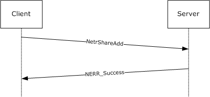
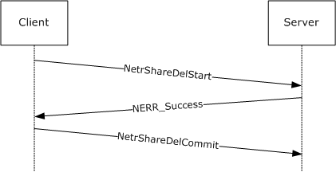
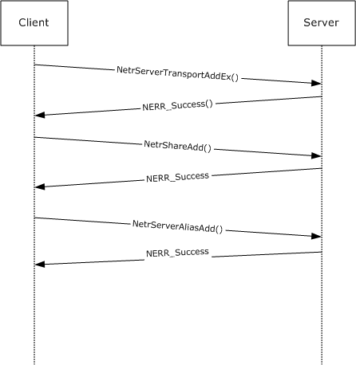

# [MS-SRVS]: Server Service Remote Protocol

Table of Contents

1 Introduction

- [1 Introduction](#Section_1)
  - [1.1 Glossary](#Section_1.1)
  - [1.2 References](#Section_1.2)
    - [1.2.1 Normative References](#Section_1.2.1)
    - [1.2.2 Informative References](#Section_1.2.2)
  - [1.3 Overview](#Section_1.3)
  - [1.4 Relationship to Other Protocols](#Section_1.4)
  - [1.5 Prerequisites/Preconditions](#Section_1.5)
  - [1.6 Applicability Statement](#Section_1.6)
  - [1.7 Versioning and Capability Negotiation](#Section_1.7)
  - [1.8 Vendor-Extensible Fields](#Section_1.8)
  - [1.9 Standards Assignments](#Section_1.9)

2 Messages

- [2 Messages](#Section_2)
  - [2.1 Transport](#Section_2.1)
  - [2.2 Common Data Types](#Section_2.2)
    - [2.2.1 Simple Data Types](#Section_2.2.1)
      - [2.2.1.1 SRVSVC_HANDLE](#Section_2.2.1.1)
      - [2.2.1.2 SHARE_DEL_HANDLE](#Section_2.2.1.2)
      - [2.2.1.3 PSHARE_DEL_HANDLE](#Section_2.2.1.3)
    - [2.2.2 Constants](#Section_2.2.2)
      - [2.2.2.1 Sessionclient Types](#Section_2.2.2.1)
      - [2.2.2.2 MAX_PREFERRED_LENGTH](#Section_2.2.2.2)
      - [2.2.2.3 Session User Flags](#Section_2.2.2.3)
      - [2.2.2.4 Share Types](#Section_2.2.2.4)
      - [2.2.2.5 Client-Side Caching (CSC) States](#Section_2.2.2.5)
      - [2.2.2.6 Platform IDs](#Section_2.2.2.6)
      - [2.2.2.7 Software Type Flags](#Section_2.2.2.7)
      - [2.2.2.8 Name Types](#Section_2.2.2.8)
      - [2.2.2.9 Path Types](#Section_2.2.2.9)
      - [2.2.2.10 Common Error Codes](#Section_2.2.2.10)
      - [2.2.2.11 SHARE_INFO Parameter Error Codes](#Section_2.2.2.11)
      - [2.2.2.12 SERVER_INFO Parameter Error Codes](#Section_2.2.2.12)
      - [2.2.2.13 DFS Entry Flags](#Section_2.2.2.13)
    - [2.2.3 Unions](#Section_2.2.3)
      - [2.2.3.1 CONNECT_ENUM_UNION](#Section_2.2.3.1)
      - [2.2.3.2 FILE_ENUM_UNION](#Section_2.2.3.2)
      - [2.2.3.3 FILE_INFO](#Section_2.2.3.3)
      - [2.2.3.4 SESSION_ENUM_UNION](#Section_2.2.3.4)
      - [2.2.3.5 SHARE_ENUM_UNION](#Section_2.2.3.5)
      - [2.2.3.6 SHARE_INFO](#Section_2.2.3.6)
      - [2.2.3.7 SERVER_INFO](#Section_2.2.3.7)
      - [2.2.3.8 SERVER_XPORT_ENUM_UNION](#Section_2.2.3.8)
      - [2.2.3.9 TRANSPORT_INFO](#Section_2.2.3.9)
      - [2.2.3.10 SERVER_ALIAS_INFO](#Section_2.2.3.10)
    - [2.2.4 Structures](#Section_2.2.4)
      - [2.2.4.1 CONNECTION_INFO_0](#Section_2.2.4.1)
      - [2.2.4.2 CONNECTION_INFO_1](#Section_2.2.4.2)
      - [2.2.4.3 CONNECT_INFO_0_CONTAINER](#Section_2.2.4.3)
      - [2.2.4.4 CONNECT_INFO_1_CONTAINER](#Section_2.2.4.4)
      - [2.2.4.5 CONNECT_ENUM_STRUCT](#Section_2.2.4.5)
      - [2.2.4.6 FILE_INFO_2](#Section_2.2.4.6)
      - [2.2.4.7 FILE_INFO_3](#Section_2.2.4.7)
      - [2.2.4.8 FILE_INFO_2_CONTAINER](#Section_2.2.4.8)
      - [2.2.4.9 FILE_INFO_3_CONTAINER](#Section_2.2.4.9)
      - [2.2.4.10 FILE_ENUM_STRUCT](#Section_2.2.4.10)
      - [2.2.4.11 SESSION_INFO_0](#Section_2.2.4.11)
      - [2.2.4.12 SESSION_INFO_1](#Section_2.2.4.12)
      - [2.2.4.13 SESSION_INFO_2](#Section_2.2.4.13)
      - [2.2.4.14 SESSION_INFO_10](#Section_2.2.4.14)
      - [2.2.4.15 SESSION_INFO_502](#Section_2.2.4.15)
      - [2.2.4.16 SESSION_INFO_0_CONTAINER](#Section_2.2.4.16)
      - [2.2.4.17 SESSION_INFO_1_CONTAINER](#Section_2.2.4.17)
      - [2.2.4.18 SESSION_INFO_2_CONTAINER](#Section_2.2.4.18)
      - [2.2.4.19 SESSION_INFO_10_CONTAINER](#Section_2.2.4.19)
      - [2.2.4.20 SESSION_INFO_502_CONTAINER](#Section_2.2.4.20)
      - [2.2.4.21 SESSION_ENUM_STRUCT](#Section_2.2.4.21)
      - [2.2.4.22 SHARE_INFO_0](#Section_2.2.4.22)
      - [2.2.4.23 SHARE_INFO_1](#Section_2.2.4.23)
      - [2.2.4.24 SHARE_INFO_2](#Section_2.2.4.24)
      - [2.2.4.25 SHARE_INFO_501](#Section_2.2.4.25)
      - [2.2.4.26 SHARE_INFO_502_I](#Section_2.2.4.26)
      - [2.2.4.27 SHARE_INFO_503_I](#Section_2.2.4.27)
      - [2.2.4.28 SHARE_INFO_1004](#Section_2.2.4.28)
      - [2.2.4.29 SHARE_INFO_1005](#Section_2.2.4.29)
      - [2.2.4.30 SHARE_INFO_1006](#Section_2.2.4.30)
      - [2.2.4.31 SHARE_INFO_1501_I](#Section_2.2.4.31)
      - [2.2.4.32 SHARE_INFO_0_CONTAINER](#Section_2.2.4.32)
      - [2.2.4.33 SHARE_INFO_1_CONTAINER](#Section_2.2.4.33)
      - [2.2.4.34 SHARE_INFO_2_CONTAINER](#Section_2.2.4.34)
      - [2.2.4.35 SHARE_INFO_501_CONTAINER](#Section_2.2.4.35)
      - [2.2.4.36 SHARE_INFO_502_CONTAINER](#Section_2.2.4.36)
      - [2.2.4.37 SHARE_INFO_503_CONTAINER](#Section_2.2.4.37)
      - [2.2.4.38 SHARE_ENUM_STRUCT](#Section_2.2.4.38)
      - [2.2.4.39 STAT_SERVER_0](#Section_2.2.4.39)
      - [2.2.4.40 SERVER_INFO_100](#Section_2.2.4.40)
      - [2.2.4.41 SERVER_INFO_101](#Section_2.2.4.41)
      - [2.2.4.42 SERVER_INFO_102](#Section_2.2.4.42)
      - [2.2.4.43 SERVER_INFO_103](#Section_2.2.4.43)
      - [2.2.4.44 SERVER_INFO_502](#Section_2.2.4.44)
      - [2.2.4.45 SERVER_INFO_503](#Section_2.2.4.45)
      - [2.2.4.46 SERVER_INFO_599](#Section_2.2.4.46)
      - [2.2.4.47 SERVER_INFO_1005](#Section_2.2.4.47)
      - [2.2.4.48 SERVER_INFO_1107](#Section_2.2.4.48)
      - [2.2.4.49 SERVER_INFO_1010](#Section_2.2.4.49)
      - [2.2.4.50 SERVER_INFO_1016](#Section_2.2.4.50)
      - [2.2.4.51 SERVER_INFO_1017](#Section_2.2.4.51)
      - [2.2.4.52 SERVER_INFO_1018](#Section_2.2.4.52)
      - [2.2.4.53 SERVER_INFO_1501](#Section_2.2.4.53)
      - [2.2.4.54 SERVER_INFO_1502](#Section_2.2.4.54)
      - [2.2.4.55 SERVER_INFO_1503](#Section_2.2.4.55)
      - [2.2.4.56 SERVER_INFO_1506](#Section_2.2.4.56)
      - [2.2.4.57 SERVER_INFO_1510](#Section_2.2.4.57)
      - [2.2.4.58 SERVER_INFO_1511](#Section_2.2.4.58)
      - [2.2.4.59 SERVER_INFO_1512](#Section_2.2.4.59)
      - [2.2.4.60 SERVER_INFO_1513](#Section_2.2.4.60)
      - [2.2.4.61 SERVER_INFO_1514](#Section_2.2.4.61)
      - [2.2.4.62 SERVER_INFO_1515](#Section_2.2.4.62)
      - [2.2.4.63 SERVER_INFO_1516](#Section_2.2.4.63)
      - [2.2.4.64 SERVER_INFO_1518](#Section_2.2.4.64)
      - [2.2.4.65 SERVER_INFO_1523](#Section_2.2.4.65)
      - [2.2.4.66 SERVER_INFO_1528](#Section_2.2.4.66)
      - [2.2.4.67 SERVER_INFO_1529](#Section_2.2.4.67)
      - [2.2.4.68 SERVER_INFO_1530](#Section_2.2.4.68)
      - [2.2.4.69 SERVER_INFO_1533](#Section_2.2.4.69)
      - [2.2.4.70 SERVER_INFO_1534](#Section_2.2.4.70)
      - [2.2.4.71 SERVER_INFO_1535](#Section_2.2.4.71)
      - [2.2.4.72 SERVER_INFO_1536](#Section_2.2.4.72)
      - [2.2.4.73 SERVER_INFO_1538](#Section_2.2.4.73)
      - [2.2.4.74 SERVER_INFO_1539](#Section_2.2.4.74)
      - [2.2.4.75 SERVER_INFO_1540](#Section_2.2.4.75)
      - [2.2.4.76 SERVER_INFO_1541](#Section_2.2.4.76)
      - [2.2.4.77 SERVER_INFO_1542](#Section_2.2.4.77)
      - [2.2.4.78 SERVER_INFO_1543](#Section_2.2.4.78)
      - [2.2.4.79 SERVER_INFO_1544](#Section_2.2.4.79)
      - [2.2.4.80 SERVER_INFO_1545](#Section_2.2.4.80)
      - [2.2.4.81 SERVER_INFO_1546](#Section_2.2.4.81)
      - [2.2.4.82 SERVER_INFO_1547](#Section_2.2.4.82)
      - [2.2.4.83 SERVER_INFO_1548](#Section_2.2.4.83)
      - [2.2.4.84 SERVER_INFO_1549](#Section_2.2.4.84)
      - [2.2.4.85 SERVER_INFO_1550](#Section_2.2.4.85)
      - [2.2.4.86 SERVER_INFO_1552](#Section_2.2.4.86)
      - [2.2.4.87 SERVER_INFO_1553](#Section_2.2.4.87)
      - [2.2.4.88 SERVER_INFO_1554](#Section_2.2.4.88)
      - [2.2.4.89 SERVER_INFO_1555](#Section_2.2.4.89)
      - [2.2.4.90 SERVER_INFO_1556](#Section_2.2.4.90)
      - [2.2.4.91 DISK_INFO](#Section_2.2.4.91)
      - [2.2.4.92 DISK_ENUM_CONTAINER](#Section_2.2.4.92)
      - [2.2.4.93 SERVER_TRANSPORT_INFO_0](#Section_2.2.4.93)
      - [2.2.4.94 SERVER_TRANSPORT_INFO_1](#Section_2.2.4.94)
      - [2.2.4.95 SERVER_TRANSPORT_INFO_2](#Section_2.2.4.95)
      - [2.2.4.96 SERVER_TRANSPORT_INFO_3](#Section_2.2.4.96)
      - [2.2.4.97 SERVER_XPORT_INFO_0_CONTAINER](#Section_2.2.4.97)
      - [2.2.4.98 SERVER_XPORT_INFO_1_CONTAINER](#Section_2.2.4.98)
      - [2.2.4.99 SERVER_XPORT_INFO_2_CONTAINER](#Section_2.2.4.99)
      - [2.2.4.100 SERVER_XPORT_INFO_3_CONTAINER](#Section_2.2.4.100)
      - [2.2.4.101 SERVER_XPORT_ENUM_STRUCT](#Section_2.2.4.101)
      - [2.2.4.102 SERVER_ALIAS_INFO_0](#Section_2.2.4.102)
      - [2.2.4.103 SERVER_ALIAS_INFO_0_CONTAINER](#Section_2.2.4.103)
      - [2.2.4.104 SERVER_ALIAS_ENUM_STRUCT](#Section_2.2.4.104)
      - [2.2.4.105 TIME_OF_DAY_INFO](#Section_2.2.4.105)
      - [2.2.4.106 ADT_SECURITY_DESCRIPTOR](#Section_2.2.4.106)
      - [2.2.4.107 NET_DFS_ENTRY_ID](#Section_2.2.4.107)
      - [2.2.4.108 NET_DFS_ENTRY_ID_CONTAINER](#Section_2.2.4.108)
      - [2.2.4.109 DFS_SITENAME_INFO](#Section_2.2.4.109)
      - [2.2.4.110 DFS_SITELIST_INFO](#Section_2.2.4.110)

3 Protocol Details

- [3 Protocol Details](#Section_3)
  - [3.1 Server Details](#Section_3.1)
    - [3.1.1 Abstract Data Model](#Section_3.1.1)
      - [3.1.1.1 Global](#Section_3.1.1.1)
      - [3.1.1.2 Per Transport](#Section_3.1.1.2)
      - [3.1.1.3 Per Alias](#Section_3.1.1.3)
      - [3.1.1.4 Server Properties Object (ServerConfiguration)](#Section_3.1.1.4)
      - [3.1.1.5 Per TreeConnect](#Section_3.1.1.5)
      - [3.1.1.6 Per Open](#Section_3.1.1.6)
      - [3.1.1.7 Per Share](#Section_3.1.1.7)
      - [3.1.1.8 Per Session](#Section_3.1.1.8)
      - [3.1.1.9 Algorithm for Determining Path Type](#Section_3.1.1.9)
    - [3.1.2 Timers](#Section_3.1.2)
    - [3.1.3 Initialization](#Section_3.1.3)
    - [3.1.4 Message Processing Events and Sequencing Rules](#Section_3.1.4)
      - [3.1.4.1 NetrConnectionEnum (Opnum 8)](#Section_3.1.4.1)
      - [3.1.4.2 NetrFileEnum (Opnum 9)](#Section_3.1.4.2)
      - [3.1.4.3 NetrFileGetInfo (Opnum 10)](#Section_3.1.4.3)
      - [3.1.4.4 NetrFileClose (Opnum 11)](#Section_3.1.4.4)
      - [3.1.4.5 NetrSessionEnum (Opnum 12)](#Section_3.1.4.5)
      - [3.1.4.6 NetrSessionDel (Opnum 13)](#Section_3.1.4.6)
      - [3.1.4.7 NetrShareAdd (Opnum 14)](#Section_3.1.4.7)
      - [3.1.4.8 NetrShareEnum (Opnum 15)](#Section_3.1.4.8)
      - [3.1.4.9 NetrShareEnumSticky (Opnum 36)](#Section_3.1.4.9)
      - [3.1.4.10 NetrShareGetInfo (Opnum 16)](#Section_3.1.4.10)
      - [3.1.4.11 NetrShareSetInfo (Opnum 17)](#Section_3.1.4.11)
      - [3.1.4.12 NetrShareDel (Opnum 18)](#Section_3.1.4.12)
      - [3.1.4.13 NetrShareDelSticky (Opnum 19)](#Section_3.1.4.13)
      - [3.1.4.14 NetrShareDelStart (Opnum 37)](#Section_3.1.4.14)
      - [3.1.4.15 NetrShareDelCommit (Opnum 38)](#Section_3.1.4.15)
      - [3.1.4.16 NetrShareCheck (Opnum 20)](#Section_3.1.4.16)
      - [3.1.4.17 NetrServerGetInfo (Opnum 21)](#Section_3.1.4.17)
      - [3.1.4.18 NetrServerSetInfo (Opnum 22)](#Section_3.1.4.18)
      - [3.1.4.19 NetrServerDiskEnum (Opnum 23)](#Section_3.1.4.19)
      - [3.1.4.20 NetrServerStatisticsGet (Opnum 24)](#Section_3.1.4.20)
      - [3.1.4.21 NetrRemoteTOD (Opnum 28)](#Section_3.1.4.21)
      - [3.1.4.22 NetrServerTransportAdd (Opnum 25)](#Section_3.1.4.22)
      - [3.1.4.23 NetrServerTransportAddEx (Opnum 41)](#Section_3.1.4.23)
      - [3.1.4.24 NetrServerTransportEnum (Opnum 26)](#Section_3.1.4.24)
      - [3.1.4.25 NetrServerTransportDel (Opnum 27)](#Section_3.1.4.25)
      - [3.1.4.26 NetrServerTransportDelEx (Opnum 53)](#Section_3.1.4.26)
      - [3.1.4.27 NetrpGetFileSecurity (Opnum 39)](#Section_3.1.4.27)
      - [3.1.4.28 NetrpSetFileSecurity (Opnum 40)](#Section_3.1.4.28)
      - [3.1.4.29 NetprPathType (Opnum 30)](#Section_3.1.4.29)
      - [3.1.4.30 NetprPathCanonicalize (Opnum 31)](#Section_3.1.4.30)
      - [3.1.4.31 NetprPathCompare (Opnum 32)](#Section_3.1.4.31)
      - [3.1.4.32 NetprNameValidate (Opnum 33)](#Section_3.1.4.32)
      - [3.1.4.33 NetprNameCanonicalize (Opnum 34)](#Section_3.1.4.33)
      - [3.1.4.34 NetprNameCompare (Opnum 35)](#Section_3.1.4.34)
      - [3.1.4.35 NetrDfsGetVersion (Opnum 43)](#Section_3.1.4.35)
      - [3.1.4.36 NetrDfsCreateLocalPartition (Opnum 44)](#Section_3.1.4.36)
      - [3.1.4.37 NetrDfsDeleteLocalPartition (Opnum 45)](#Section_3.1.4.37)
      - [3.1.4.38 NetrDfsSetLocalVolumeState (Opnum 46)](#Section_3.1.4.38)
      - [3.1.4.39 NetrDfsCreateExitPoint (Opnum 48)](#Section_3.1.4.39)
      - [3.1.4.40 NetrDfsModifyPrefix (Opnum 50)](#Section_3.1.4.40)
      - [3.1.4.41 NetrDfsDeleteExitPoint (Opnum 49)](#Section_3.1.4.41)
      - [3.1.4.42 NetrDfsFixLocalVolume (Opnum 51)](#Section_3.1.4.42)
      - [3.1.4.43 NetrDfsManagerReportSiteInfo (Opnum 52)](#Section_3.1.4.43)
      - [3.1.4.44 NetrServerAliasAdd (Opnum 54)](#Section_3.1.4.44)
      - [3.1.4.45 NetrServerAliasEnum (Opnum 55)](#Section_3.1.4.45)
      - [3.1.4.46 NetrServerAliasDel (Opnum 56)](#Section_3.1.4.46)
      - [3.1.4.47 NetrShareDelEx (Opnum 57)](#Section_3.1.4.47)
    - [3.1.5 Timer Events](#Section_3.1.5)
    - [3.1.6 Other Local Events](#Section_3.1.6)
      - [3.1.6.1 Server Looks Up Shares](#Section_3.1.6.1)
      - [3.1.6.2 Server Registers a New Session](#Section_3.1.6.2)
      - [3.1.6.3 Server Deregisters a Session](#Section_3.1.6.3)
      - [3.1.6.4 Server Registers a New Open](#Section_3.1.6.4)
      - [3.1.6.5 Server Deregisters an Open](#Section_3.1.6.5)
      - [3.1.6.6 Server Registers a New Treeconnect](#Section_3.1.6.6)
      - [3.1.6.7 Server Deregisters a Treeconnect](#Section_3.1.6.7)
      - [3.1.6.8 Server Normalizes a ServerName](#Section_3.1.6.8)
      - [3.1.6.9 Local Application Enables Advertising a Service](#Section_3.1.6.9)
      - [3.1.6.10 Local Application Disables Advertising a Service](#Section_3.1.6.10)
      - [3.1.6.11 Server Queries Existing Services](#Section_3.1.6.11)
      - [3.1.6.12 Server Service Terminates](#Section_3.1.6.12)
      - [3.1.6.13 Local Application Pauses or Resumes the CIFS Server](#Section_3.1.6.13)
      - [3.1.6.14 Server Notifies Completion of Initialization](#Section_3.1.6.14)
      - [3.1.6.15 Server Notifies Current Uses of a Share](#Section_3.1.6.15)
      - [3.1.6.16 Server Updates Connection Count on a Transport](#Section_3.1.6.16)
      - [3.1.6.17 Server Looks Up Null Session Pipes](#Section_3.1.6.17)
  - [3.2 Client Details](#Section_3.2)
    - [3.2.1 Abstract Data Model](#Section_3.2.1)
    - [3.2.2 Timers](#Section_3.2.2)
    - [3.2.3 Initialization](#Section_3.2.3)
    - [3.2.4 Message Processing Events and Sequencing Rules](#Section_3.2.4)
    - [3.2.5 Timer Events](#Section_3.2.5)
    - [3.2.6 Other Local Events](#Section_3.2.6)

4 Protocol Examples

- [4 Protocol Examples](#Section_4)
  - [4.1 Example of ResumeHandle](#Section_4.1)
  - [4.2 Two-Phase Share Deletion](#Section_4.2)
  - [4.3 Adding a Scoped Share With an Alias to a Server](#Section_4.3)

5 Security

- [5 Security](#Section_5)
  - [5.1 Security Considerations for Implementers](#Section_5.1)
  - [5.2 Index of Security Parameters](#Section_5.2)

6 Appendix A: Full IDL

- [6 Appendix A: Full IDL](#Section_6)

7 Appendix B: Product Behavior

- [7 Appendix B: Product Behavior](#Section_7)

8 Change Tracking

- [8 Change Tracking](#Section_8)

For the legal notice and IP terms, see [LEGAL.md](../LEGAL.md).
Last updated: 9/16/2024.
See [Revision History](#revision-history) for full version history.

# 1 Introduction

This document specifies the Server Service Remote Protocol. The Server Service Remote Protocol is a [**remote procedure call (RPC)**](#gt_remote-procedure-call-rpc)–based protocol that is used for remotely enabling file and printer sharing and [**named pipe**](#gt_named-pipe) access to the [**server**](#gt_server) through the Server Message Block (SMB) Protocol, as specified in [MS-SMB](../MS-SMB/MS-SMB.md). The protocol is also used for remote administration of servers that are running Windows.

Sections 1.5, 1.8, 1.9, 2, and 3 of this specification are normative. All other sections and examples in this specification are informative.

## 1.1 Glossary

This document uses the following terms:

**client**: A computer on which the remote procedure call (RPC) client is executing.

**connection**: Firewall rules are specified to apply to connections. Every packet is associated with a connection based on TCP, UDP, or IP endpoint parameters; see [[IANAPORT]](https://go.microsoft.com/fwlink/?LinkId=89888).

**connection blocks**: A pre-allocated chunk of memory that is used to store a single connection request.

**Distributed File System (DFS)**: A file system that logically groups physical shared folders located on different servers by transparently connecting them to one or more hierarchical namespaces. [**DFS**](#gt_distributed-file-system-dfs) also provides fault-tolerance and load-sharing capabilities.

**Distributed File System (DFS) link**: A component in a DFS path that lies below the [**DFS root**](#gt_639b7503-b879-4ef7-98a8-14adf85bc16d) and maps to one or more DFS link targets. Also interchangeably used to refer to a DFS path that contains the [**DFS link**](#gt_0611e93d-f0e7-42ee-a591-d77ebcbb6619).

**Distributed File System (DFS) root**: The starting point of the DFS namespace. The root is often used to refer to the namespace as a whole. A [**DFS root**](#gt_639b7503-b879-4ef7-98a8-14adf85bc16d) maps to one or more root targets, each of which corresponds to a share on a separate server. A DFS root has one of the following formats "\\<ServerName>\<RootName>" or "\\<DomainName>\<RootName>". Where <ServerName> is the name of the root target server hosting the DFS namespace; <DomainName> is the name of the domain that hosts the DFS root; and <RootName> is the name of the root of a domain-based [**DFS**](#gt_distributed-file-system-dfs). The DFS root has to reside on an NTFS volume.

**Domain Name System (DNS)**: A hierarchical, distributed database that contains mappings of domain names to various types of data, such as IP addresses. DNS enables the location of computers and services by user-friendly names, and it also enables the discovery of other information stored in the database.

**endpoint**: A network-specific address of a remote procedure call (RPC) server process for remote procedure calls. The actual name and type of the endpoint depends on the [**RPC**](#gt_remote-procedure-call-rpc) protocol sequence that is being used. For example, for RPC over TCP (RPC Protocol Sequence ncacn_ip_tcp), an endpoint might be TCP port 1025. For RPC over Server Message Block (RPC Protocol Sequence ncacn_np), an endpoint might be the name of a [**named pipe**](#gt_named-pipe). For more information, see [[C706]](https://go.microsoft.com/fwlink/?LinkId=89824).

**globally unique identifier (GUID)**: A term used interchangeably with [**universally unique identifier (UUID)**](#gt_universally-unique-identifier-uuid) in Microsoft protocol technical documents (TDs). Interchanging the usage of these terms does not imply or require a specific algorithm or mechanism to generate the value. Specifically, the use of this term does not imply or require that the algorithms described in [[RFC4122]](https://go.microsoft.com/fwlink/?LinkId=90460) or [C706] have to be used for generating the GUID. See also universally unique identifier (UUID).

**Interface Definition Language (IDL)**: The International Standards Organization (ISO) standard language for specifying the interface for remote procedure calls. For more information, see [C706] section 4.

**Internet host name**: The name of a host as defined in [[RFC1123]](https://go.microsoft.com/fwlink/?LinkId=90268) section 2.1, with the extensions described in [MS-HNDS](../MS-HNDS/MS-HNDS.md).

**mailslot**: A mechanism for one-way interprocess communications (IPC). For more information, see [[MSLOT]](https://go.microsoft.com/fwlink/?LinkId=90218) and [MS-MAIL](../MS-MAIL/MS-MAIL.md).

**Microsoft Interface Definition Language (MIDL)**: The Microsoft implementation and extension of the OSF-DCE [**Interface Definition Language (IDL)**](#gt_interface-definition-language-idl). [**MIDL**](#gt_microsoft-interface-definition-language-midl) can also mean the [**Interface Definition Language (IDL)**](#gt_interface-definition-language-idl) compiler provided by Microsoft. For more information, see [MS-RPCE](../MS-RPCE/MS-RPCE.md).

**named pipe**: A named, one-way, or duplex pipe for communication between a pipe server and one or more pipe clients.

**NetBIOS host name**: The NetBIOS name of a host (as described in [[RFC1001]](https://go.microsoft.com/fwlink/?LinkId=90260) section 14 and [[RFC1002]](https://go.microsoft.com/fwlink/?LinkId=90261) section 4), with the extensions described in [MS-NBTE](../MS-NBTE/MS-NBTE.md).

**Quality of Service (QoS)**: A set of technologies that do network traffic manipulation, such as packet marking and reshaping.

**remote procedure call (RPC)**: A communication protocol used primarily between client and server. The term has three definitions that are often used interchangeably: a runtime environment providing for communication facilities between computers (the RPC runtime); a set of request-and-response message exchanges between computers (the RPC exchange); and the single message from an RPC exchange (the RPC message). For more information, see [C706].

**scoped share**: A [**share**](#gt_share) that is only available to a [**client**](#gt_client) if accessed through a specific DNS or NetBIOS name. [**Scoped shares**](#gt_scoped-share) can make a single [**server**](#gt_server) appear to be multiple, distinct [**servers**](#gt_server) by providing access to a different set of [**shares**](#gt_share) based on the name the [**client**](#gt_client) uses to access the [**server**](#gt_server).

**server**: A computer on which the [**remote procedure call (RPC)**](#gt_remote-procedure-call-rpc) server is executing.

**Server Message Block (SMB)**: A protocol that is used to request file and print services from server systems over a network. The SMB protocol extends the CIFS protocol with additional security, file, and disk management support. For more information, see [[CIFS]](https://go.microsoft.com/fwlink/?linkid=2109334) and [MS-SMB](../MS-SMB/MS-SMB.md).

**share**: A resource offered by a Common Internet File System (CIFS) server for access by CIFS clients over the network. A share typically represents a directory tree and its included files (referred to commonly as a "disk share" or "file share") or a printer (a "print share"). If the information about the share is saved in persistent store (for example, Windows registry) and reloaded when a file server is restarted, then the share is referred to as a "sticky share". Some share names are reserved for specific functions and are referred to as special shares: IPC$, reserved for interprocess communication, ADMIN$, reserved for remote administration, and A$, B$, C$ (and other local disk names followed by a dollar sign), assigned to local disk devices.

**site**: A group of related webpages that is hosted by a server on the World Wide Web or an intranet. Each website has its own entry points, metadata, administration settings, and workflows. Also referred to as web site.

**standalone DFS implementation**: A Distributed File System (DFS) namespace whose configuration information is stored locally in the registry of the root [**server**](#gt_server).

**sticky share**: A [**share**](#gt_share) that is available after a machine restarts.

**universally unique identifier (UUID)**: A 128-bit value. UUIDs can be used for multiple purposes, from tagging objects with an extremely short lifetime, to reliably identifying very persistent objects in cross-process communication such as client and server interfaces, manager entry-point vectors, and [**RPC**](#gt_remote-procedure-call-rpc) objects. UUIDs are highly likely to be unique. UUIDs are also known as [**globally unique identifiers (GUIDs)**](#gt_globally-unique-identifier-guid) and these terms are used interchangeably in the Microsoft protocol technical documents (TDs). Interchanging the usage of these terms does not imply or require a specific algorithm or mechanism to generate the UUID. Specifically, the use of this term does not imply or require that the algorithms described in [RFC4122] or [C706] has to be used for generating the UUID.

**work item**: A buffer that receives a user request, which is held by the Server Message Block (SMB) [**server**](#gt_server) while it is being processed.

**MAY, SHOULD, MUST, SHOULD NOT, MUST NOT:** These terms (in all caps) are used as defined in [[RFC2119]](https://go.microsoft.com/fwlink/?LinkId=90317). All statements of optional behavior use either MAY, SHOULD, or SHOULD NOT.

## 1.2 References

Links to a document in the Microsoft Open Specifications library point to the correct section in the most recently published version of the referenced document. However, because individual documents in the library are not updated at the same time, the section numbers in the documents may not match. You can confirm the correct section numbering by checking the [Errata](https://go.microsoft.com/fwlink/?linkid=850906).

### 1.2.1 Normative References

We conduct frequent surveys of the normative references to assure their continued availability. If you have any issue with finding a normative reference, please contact [dochelp@microsoft.com](mailto:dochelp@microsoft.com). We will assist you in finding the relevant information.

[C706] The Open Group, "DCE 1.1: Remote Procedure Call", C706, August 1997, [https://publications.opengroup.org/c706](https://go.microsoft.com/fwlink/?LinkId=89824)

**Note** Registration is required to download the document.

[MS-BRWS] Microsoft Corporation, "[Common Internet File System (CIFS) Browser Protocol](../MS-BRWS/MS-BRWS.md)".

[MS-CIFS] Microsoft Corporation, "[Common Internet File System (CIFS) Protocol](../MS-CIFS/MS-CIFS.md)".

[MS-DFSC] Microsoft Corporation, "[Distributed File System (DFS): Referral Protocol](../MS-DFSC/MS-DFSC.md)".

[MS-DFSNM] Microsoft Corporation, "[Distributed File System (DFS): Namespace Management Protocol](../MS-DFSNM/MS-DFSNM.md)".

[MS-DTYP] Microsoft Corporation, "[Windows Data Types](../MS-DTYP/MS-DTYP.md)".

[MS-EERR] Microsoft Corporation, "[ExtendedError Remote Data Structure](../MS-EERR/MS-EERR.md)".

[MS-ERREF] Microsoft Corporation, "[Windows Error Codes](../MS-ERREF/MS-ERREF.md)".

[MS-NRPC] Microsoft Corporation, "[Netlogon Remote Protocol](../MS-NRPC/MS-NRPC.md)".

[MS-RPCE] Microsoft Corporation, "[Remote Procedure Call Protocol Extensions](../MS-RPCE/MS-RPCE.md)".

[MS-SMB2] Microsoft Corporation, "[Server Message Block (SMB) Protocol Versions 2 and 3](../MS-SMB2/MS-SMB2.md)".

[MS-SMB] Microsoft Corporation, "[Server Message Block (SMB) Protocol](../MS-SMB/MS-SMB.md)".

[RFC1001] Network Working Group, "Protocol Standard for a NetBIOS Service on a TCP/UDP Transport: Concepts and Methods", RFC 1001, March 1987, [https://www.rfc-editor.org/info/rfc1001](https://go.microsoft.com/fwlink/?LinkId=90260)

[RFC1002] Network Working Group, "Protocol Standard for a NetBIOS Service on a TCP/UDP Transport: Detailed Specifications", STD 19, RFC 1002, March 1987, [https://www.rfc-editor.org/info/rfc1002](https://go.microsoft.com/fwlink/?LinkId=90261)

[RFC1034] Mockapetris, P., "Domain Names - Concepts and Facilities", STD 13, RFC 1034, November 1987, [https://www.rfc-edit.org/info/rfc1034](https://go.microsoft.com/fwlink/?LinkId=90263)

[RFC1035] Mockapetris, P., "Domain Names - Implementation and Specification", STD 13, RFC 1035, November 1987, [https://www.rfc-editor.org/info/rfc1035](https://go.microsoft.com/fwlink/?LinkId=90264)

[RFC2119] Bradner, S., "Key words for use in RFCs to Indicate Requirement Levels", BCP 14, RFC 2119, March 1997, [https://www.rfc-editor.org/info/rfc2119](https://go.microsoft.com/fwlink/?LinkId=90317)

### 1.2.2 Informative References

[MSDFS] Microsoft Corporation, "How DFS Works", March 2003, [http://technet.microsoft.com/en-us/library/cc782417%28WS.10%29.aspx](https://go.microsoft.com/fwlink/?LinkId=89945)

[MSDN-CoCreateGuid] Microsoft Corporation, "CoCreateGuid function", [http://msdn.microsoft.com/en-us/library/ms688568.aspx](https://go.microsoft.com/fwlink/?LinkId=101380)

[NWLINK] Microsoft Corporation, "Description of Microsoft NWLINK IPX/SPX-Compatible Transport", October 2006, [http://support.microsoft.com/?kbid=203051](https://go.microsoft.com/fwlink/?LinkId=90239)

[OFFLINE] Microsoft Corporation, "Offline Files", January 2005, [https://learn.microsoft.com/en-us/windows-server/storage/folder-redirection/folder-redirection-rup-overview](https://go.microsoft.com/fwlink/?LinkId=90240)

[PIPE] Microsoft Corporation, "Named Pipes", [http://msdn.microsoft.com/en-us/library/aa365590.aspx](https://go.microsoft.com/fwlink/?LinkId=90247)

## 1.3 Overview

The Server Service Remote Protocol is designed for remotely querying and configuring a [**Server Message Block (SMB)**](#gt_server-message-block-smb) [**server**](#gt_server) on a remote computer. By using this protocol, a [**client**](#gt_client) can query and configure information on the server such as active [**connections**](#gt_connection), sessions, shares, files, and transport protocols. Clients can also query and configure the server itself, for instance by setting the server's type, changing the services that are running on the server, or getting a list of all servers of a specific type in a domain.

A server can be configured to present different resources based on the name the client connects with, allowing it to appear as multiple, distinct servers. This is achieved by scoping a share to a specific name, and hosting all of the names on the same server.

The server can also configure one or more aliases, identifying that multiple distinct names present the same resources. For example, the administrator could choose to expose the same shares for the name "server" and "server.example.com" by creating an alias indicating that "server. example.com" is the same as "server". The SMB client will connect using the name provided by the calling applications, and is not aware whether the name is the server's default machine name, an additionally configured name, or an alias. For more information, see the example in section [4.3](#Section_4.3).

This is an [**RPC**](#gt_remote-procedure-call-rpc)-based protocol. The server does not maintain client state information. No sequence of method calls is imposed on this protocol, with the exception of net share deletion, which requires a two-phase commit, net file get information, and net file close.

## 1.4 Relationship to Other Protocols

This protocol depends on [**RPC**](#gt_remote-procedure-call-rpc) and [**SMB**](#gt_server-message-block-smb) for its transport. This protocol uses RPC over [**named pipes**](#gt_named-pipe), as specified in section [2.1](#Section_2.1). Named pipes use the SMB protocols, as specified in [MS-CIFS](../MS-CIFS/MS-CIFS.md), [MS-SMB](../MS-SMB/MS-SMB.md), and [MS-SMB2](../MS-SMB2/MS-SMB2.md).

This protocol calls the Common Internet File System (CIFS) Protocol, the Server Message Block (SMB) Protocol, or the SMB Version 2 Protocol for file server management.

CIFS, SMB, and SMB Version 2 call the Server Service Remote Protocol for synchronizing the information on shares, sessions, treeconnects, file opens, and server configuration. The synchronization mechanism is dependent upon CIFS, SMB, SMB2 servers, and the server service starting up and terminating together, in order to share and maintain a consistent view of the common data among all protocols at all times.

This protocol calls the DFS Namespace Management Protocol, as specified in [MS-DFSNM](../MS-DFSNM/MS-DFSNM.md), to identify a [**DFS**](#gt_distributed-file-system-dfs) share.

## 1.5 Prerequisites/Preconditions

The Server Service Remote Protocol is an [**RPC**](#gt_remote-procedure-call-rpc) interface and, as a result, has the prerequisites that are described in [MS-RPCE](../MS-RPCE/MS-RPCE.md) section 1.5 as being common to RPC interfaces.

It is assumed that a Server Service Remote Protocol [**client**](#gt_client) has obtained the name of a remote machine that supports the Server Service Remote Protocol before this protocol is invoked. This specification does not describe how a client invokes this protocol.

## 1.6 Applicability Statement

The Server Service Remote Protocol is applicable to environments that require management and monitoring of a file [**server**](#gt_server). In particular, this protocol provides for the creation, deletion, and management of file shares on the server and the monitoring and administering of users who access that file server. Therefore, this protocol is applicable to environments that require those features.

The Server Service Remote Protocol is used for the management of file servers that use the SMB Protocol, as specified in [MS-SMB](../MS-SMB/MS-SMB.md).

## 1.7 Versioning and Capability Negotiation

None.

## 1.8 Vendor-Extensible Fields

This protocol does not define any vendor-extensible fields.

This protocol uses Win32 error codes. These values are taken from the Windows error number space defined in [MS-EERR](../MS-EERR/MS-EERR.md). Vendors SHOULD reuse those values with their indicated meaning. Choosing any other value runs the risk of a collision in the future.<1>

## 1.9 Standards Assignments

| Parameter | Value | Reference |
| --- | --- | --- |
| [**RPC**](#gt_remote-procedure-call-rpc) Interface [**UUID**](#gt_universally-unique-identifier-uuid) | 4b324fc8-1670-01d3-1278-5a47bf6ee188 | Section [2.1](#Section_2.1) |
| Pipe Name | \PIPE\srvsvc | Section 2.1 |

# 2 Messages

## 2.1 Transport

The [**RPC**](#gt_remote-procedure-call-rpc) methods that the Server Service Remote Protocol exposes are available on one [**endpoint**](#gt_endpoint):

- srvsvc [**named pipe**](#gt_named-pipe) (RPC protseqs ncacn_np), as specified in [MS-RPCE](../MS-RPCE/MS-RPCE.md) section 2.1.1.2.
The Server Service Remote Protocol endpoint is available only over named pipes. For more details about named pipes, see [[PIPE]](https://go.microsoft.com/fwlink/?LinkId=90247).

This protocol MUST use the [**UUID**](#gt_universally-unique-identifier-uuid) as specified in section [1.9](#Section_1.9). The RPC version number is 3.0.

This protocol allows any user to establish a [**connection**](#gt_connection) to the RPC [**server**](#gt_server). The protocol uses the underlying RPC protocol to retrieve the identity of the caller that made the method call, as specified in [MS-RPCE] section 3.3.3.4.3. The server SHOULD use this identity to perform method-specific access checks as specified in section [3.1.4](#Section_3.2.4).<2>

## 2.2 Common Data Types

In addition to [**RPC**](#gt_remote-procedure-call-rpc) base types defined in [[C706]](https://go.microsoft.com/fwlink/?LinkId=89824) and [MS-RPCE](../MS-RPCE/MS-RPCE.md), the data types that follow are defined in the [**Microsoft Interface Definition Language (MIDL)**](#gt_microsoft-interface-definition-language-midl) specification for this RPC interface.

This protocol uses the following types, as specified in [MS-DTYP](../MS-DTYP/MS-DTYP.md).

| Type | Reference |
| --- | --- |
| DWORD | [MS-DTYP] section 2.2.9 |
| GUID | [MS-DTYP] section 2.3.4 |
| NET_API_STATUS | [MS-DTYP] section 2.2.37 |
| SECURITY_INFORMATION | [MS-DTYP] section 2.4.7 |
| WCHAR | [MS-DTYP] section 2.2.60 |

### 2.2.1 Simple Data Types

#### 2.2.1.1 SRVSVC_HANDLE

SRVSVC_HANDLE: A pointer to a null-terminated Unicode UTF-16 string that specifies the [**Internet host name**](#gt_internet-host-name) or [**NetBIOS host name**](#gt_netbios-host-name) of the remote server on which the method is to execute that is pre-pended with "\\" (two literal backslash characters).

This type is declared as follows:

typedef [handle, string] wchar_t* SRVSVC_HANDLE;

#### 2.2.1.2 SHARE_DEL_HANDLE

SHARE_DEL_HANDLE: An [**RPC**](#gt_remote-procedure-call-rpc) context handle, as specified in [[C706]](https://go.microsoft.com/fwlink/?LinkId=89824) section 6, returned by the [NetrShareDelStart](#Section_3.1.4.14) method, to be provided as a parameter to the [NetrShareDelCommit](#Section_3.1.4.15) method.

This type is declared as follows:

typedef [context_handle] void* SHARE_DEL_HANDLE;

#### 2.2.1.3 PSHARE_DEL_HANDLE

**PSHARE_DEL_HANDLE**: A pointer to a [SHARE_DEL_HANDLE (section 2.2.1.2)](#Section_2.2.1.2) datatype.

This type is declared as follows:

typedef SHARE_DEL_HANDLE* PSHARE_DEL_HANDLE;

### 2.2.2 Constants

#### 2.2.2.1 Sessionclient Types

Sessionclient is a Unicode UTF-16 string value that is used to specify the type of [**client**](#gt_client) that established the session.<3>

The client generates an implementation-defined string that describes the client operating system version. The server SHOULD NOT enforce any limits on the Sessionclient string length.<4>

#### 2.2.2.2 MAX_PREFERRED_LENGTH

The following table describes the MAX_PREFERRED_LENGTH constant.

| Constant/value | Description |
| --- | --- |
| MAX_PREFERRED_LENGTH -1 | A constant of type DWORD that is set to –1. This value is valid as an input parameter to any method in section [3.1.4](#Section_3.2.4) that takes a *PreferedMaximumLength* parameter. When specified as an input parameter, this value indicates that the method MUST allocate as much space as the data requires. |

#### 2.2.2.3 Session User Flags

The following flags specify information that is related to how a user established a session.

| Constant/value | Description |
| --- | --- |
| SESS_GUEST 0x00000001 | The user specified by the sesi*_username member established the session by using a guest account. |
| SESS_NOENCRYPTION 0x00000002 | The user specified by the sesi*_username member established the session without using password encryption. |

#### 2.2.2.4 Share Types

The following values are used to specify the type of a shared resource.

| Constant/value | Description |
| --- | --- |
| STYPE_DISKTREE 0x00000000 | Disk drive |
| STYPE_PRINTQ 0x00000001 | Print queue |
| STYPE_DEVICE 0x00000002 | Communication device |
| STYPE_IPC 0x00000003 | Interprocess communication (IPC) |
| STYPE_CLUSTER_FS 0x02000000 | A cluster share |
| STYPE_CLUSTER_SOFS 0x04000000 | A Scale-Out cluster share |
| STYPE_CLUSTER_DFS 0x08000000 | A DFS share in a cluster |

The following table of values can be OR'd with the values in the preceding table to further specify the characteristics of a shared resource. It is possible to use both values in this OR operation.

| Constant/value | Description |
| --- | --- |
| STYPE_SPECIAL 0x80000000 | Special share reserved for interprocess communication (IPC$) or remote administration of the [**server**](#gt_server) (ADMIN$). Can also refer to administrative shares such as C$, D$, E$, and so forth. |
| STYPE_TEMPORARY 0x40000000 | A temporary share that is not persisted for creation each time the file server initializes. |

#### 2.2.2.5 Client-Side Caching (CSC) States

The following values are used to specify states that provide hints to [**clients**](#gt_client) about whether to cache files by using client-side caching with the [**SMB**](#gt_server-message-block-smb) Protocol, as specified in [MS-SMB](../MS-SMB/MS-SMB.md).

| Constant/value | Description |
| --- | --- |
| CSC_CACHE_MANUAL_REINT 0x00 | The client MUST allow only manual caching for the files open from this share. |
| CSC_CACHE_AUTO_REINT 0x10 | The client MAY cache every file that it opens from this share. |
| CSC_CACHE_VDO 0x20 | The client MAY cache every file that it opens from this share. Also, the client MAY satisfy the file requests from its local cache. |
| CSC_CACHE_NONE 0x30 | The client MUST NOT cache any files from this share. |

#### 2.2.2.6 Platform IDs

The following values are returned by the [**server**](#gt_server) to indicate its platform version.<5><6>

| Constant/value | Description |
| --- | --- |
| PLATFORM_ID_DOS 300 | Specified by a server running DOS. |
| PLATFORM_ID_OS2 400 | Specified by a server running OS2. |
| PLATFORM_ID_NT 500 | Specified by a server running Windows NT or a newer Windows operating system version. |
| PLATFORM_ID_OSF 600 | Specified by a server running OSF/1. |
| PLATFORM_ID_VMS 700 | Specified by a server running VMS. |

#### 2.2.2.7 Software Type Flags

The SV_TYPE flags indicate the services that are available on the [**server**](#gt_server).

| Constant/value | Description |
| --- | --- |
| SV_TYPE_WORKSTATION 0x00000001 | A server running the WorkStation Service. |
| SV_TYPE_SERVER 0x00000002 | A server running the Server Service. |
| SV_TYPE_SQLSERVER 0x00000004 | A server running SQL Server. |
| SV_TYPE_DOMAIN_CTRL 0x00000008 | A primary domain controller. |
| SV_TYPE_DOMAIN_BAKCTRL 0x00000010 | A backup domain controller. |
| SV_TYPE_TIME_SOURCE 0x00000020 | A server is available as a time source for network time synchronization. |
| SV_TYPE_AFP 0x00000040 | An Apple File Protocol server. |
| SV_TYPE_NOVELL 0x00000080 | A Novell server. |
| SV_TYPE_DOMAIN_MEMBER 0x00000100 | A LAN Manager 2.x domain member. |
| SV_TYPE_PRINTQ_SERVER 0x00000200 | A server sharing print queue. |
| SV_TYPE_DIALIN_SERVER 0x00000400 | A server running a dial-in service. |
| SV_TYPE_XENIX_SERVER 0x00000800 | A Xenix server. |
| SV_TYPE_NT 0x00001000 | Windows Server 2003 operating system, Windows XP operating system, Windows 2000 operating system, or Windows NT operating system. |
| SV_TYPE_WFW 0x00002000 | A server running Windows for Workgroups. |
| SV_TYPE_SERVER_MFPN 0x00004000 | Microsoft File and Print for NetWare. |
| SV_TYPE_SERVER_NT 0x00008000 | Windows Server 2003, Windows 2000 Server operating system, or a server that is not a domain controller. |
| SV_TYPE_POTENTIAL_BROWSER 0x00010000 | A server that can run the browser service. |
| SV_TYPE_BACKUP_BROWSER 0x00020000 | A server running a browser service as backup. |
| SV_TYPE_MASTER_BROWSER 0x00040000 | A server running the master browser service. |
| SV_TYPE_DOMAIN_MASTER 0x00080000 | A server running the domain master browser. |
| SV_TYPE_WINDOWS 0x00400000 | Windows Millennium Edition operating system, Windows 98 operating system, or Windows 95 operating system. |
| SV_TYPE_DFS 0x00800000 | A server running the DFS service. |
| SV_TYPE_CLUSTER_NT 0x01000000 | Server clusters available in the domain. |
| SV_TYPE_TERMINALSERVER 0x02000000 | Terminal Server. |
| SV_TYPE_CLUSTER_VS_NT 0x04000000 | Cluster virtual servers available in the domain. |
| SV_TYPE_DCE 0x10000000 | A server running IBM DSS (Directory and Security Services) or equivalent. |
| SV_TYPE_ALTERNATE_XPORT 0x20000000 | Return list for alternate transport. |
| SV_TYPE_LOCAL_LIST_ONLY 0x40000000 | Servers maintained by the browser. |
| SV_TYPE_DOMAIN_ENUM 0x80000000 | Primary domain. |
| SV_TYPE_ALL 0xFFFFFFFF | All servers. |

#### 2.2.2.8 Name Types

The following values specify types of names that are used with the [NetprNameValidate](#Section_3.1.4.32), [NetprNameCanonicalize](#Section_3.1.4.33), and [NetprNameCompare](#Section_3.1.4.34) methods.

| Constant/value | Description |
| --- | --- |
| NAMETYPE_USER 1 | User name |
| NAMETYPE_PASSWORD 2 | User password |
| NAMETYPE_GROUP 3 | Group name |
| NAMETYPE_COMPUTER 4 | Computer name |
| NAMETYPE_EVENT 5 | Event name |
| NAMETYPE_DOMAIN 6 | NetBIOS name of a domain |
| NAMETYPE_SERVICE 7 | Service name |
| NAMETYPE_NET 8 | Net name |
| NAMETYPE_SHARE 9 | Share name |
| NAMETYPE_MESSAGE 10 | Message name |
| NAMETYPE_MESSAGEDEST 11 | Message destination |
| NAMETYPE_SHAREPASSWORD 12 | Share password |
| NAMETYPE_WORKGROUP 13 | Workgroup name |

More information for each NameType is listed following.

The set of default invalid characters includes "/\[]:|<>+=;,? as well as the control characters in the range from 0x01 through 0x1F, inclusive.

| Bit Range | Field | Description |
| --- | --- | --- |
| Variable | NAMETYPE_USER | 1/256 Default No - |
| Variable | NAMETYPE_PASSWORD | 0/256 0x00 Yes - |
| Variable | NAMETYPE_GROUP | 1/256 - Default No |
| Variable | NAMETYPE_COMPUTER | 1/260 Default and * no No leading or trailing blanks. |
| Variable | NAMETYPE_EVENT | 1/16 Default No - |
| Variable | NAMETYPE_DOMAIN | 1/15 Default, *, 0x20 No - |
| Variable | NAMETYPE_SERVICE | 1/80 Default No - |
| Variable | NAMETYPE_NET | 1/260 Default No - |
| Variable | NAMETYPE_SHARE | 1/80 Default No - |
| Variable | NAMETYPE_MESSAGE | 1/15 Default No - |
| Variable | NAMETYPE_MESSAGEDEST | 1/260 Default No "*" is allowed only as the last character, and names of the maximum length must contain a trailing "*". |
| Variable | NAMETYPE_SHAREPASSWORD | 0/8 0x00 Yes - |
| Variable | NAMETYPE_WORKGROUP | 1/15 Default No - |

#### 2.2.2.9 Path Types

The following values specify types of paths used with the [NetprPathType](#Section_3.1.4.29), [NetprPathCanonicalize](#Section_3.1.4.30), and [NetprPathCompare](#Section_3.1.4.31) methods.

| Constant/value | Description |
| --- | --- |
| ITYPE_UNC_COMPNAME 4144 | UNC ComputerName |
| ITYPE_UNC_WC 4145 | UNC Wild Card ComputerName |
| ITYPE_UNC 4096 | UNC Path; MUST NOT end with \ |
| ITYPE_UNC_WC_PATH 4097 | UNC Path and WC (? or *) |
| ITYPE_UNC_SYS_SEM 6400 | UNC Semaphore |
| ITYPE_UNC_SYS_SHMEM 6656 | UNC Shared Memory |
| ITYPE_UNC_SYS_MSLOT 6144 | UNC [**Mailslot**](#gt_mailslot) |
| ITYPE_UNC_SYS_PIPE 6912 | UNC Pipe |
| ITYPE_UNC_SYS_QUEUE 7680 | UNC Queue |
| ITYPE_PATH_ABSND 8194 | Absolute non dot path |
| ITYPE_PATH_ABSD 8198 | Path beginning with \\. or <drive>:\ |
| ITYPE_PATH_RELND 8192 | Relative path non dot |
| ITYPE_PATH_RELD 8196 | Relative path beginning with \\. |
| ITYPE_PATH_ABSND_WC 8195 | ITYPE_PATH_ABSND and WC |
| ITYPE_PATH_ABSD_WC 8199 | ITYPE_PATH_ABSD and WC(? or *) |
| ITYPE_PATH_RELND_WC 8193 | ITYPE_PATH_RELND and WC |
| ITYPE_PATH_RELD_WC 8197 | ITYPE_PATH_RELD and WC |
| ITYPE_PATH_SYS_SEM 10498 | Local System Semaphore\path |
| ITYPE_PATH_SYS_SHMEM 10754 | Local System Shared Memory\path |
| ITYPE_PATH_SYS_MSLOT 10242 | Local System Mailslot\path |
| ITYPE_PATH_SYS_PIPE 11010 | Local System Pipe\path |
| ITYPE_PATH_SYS_COMM 11266 | Local System COMM\path |
| ITYPE_PATH_SYS_PRINT 11522 | Local System PRINT\path |
| ITYPE_PATH_SYS_QUEUE 11778 | Local System QUEUE\path |
| ITYPE_PATH_SYS_SEM_M 43266 | Local System Semaphore |
| ITYPE_PATH_SYS_SHMEM_M 43522 | Local System Shared Memory |
| ITYPE_PATH_SYS_MSLOT_M 43010 | Local System Mailslot |
| ITYPE_PATH_SYS_PIPE_M 43778 | Local System Pipe |
| ITYPE_PATH_SYS_COMM_M 44034 | Local System COMM |
| ITYPE_PATH_SYS_PRINT_M 44290 | Local System PRINT |
| ITYPE_PATH_SYS_QUEUE_M 44546 | Local System QUEUE |
| ITYPE_DEVICE_DISK 16384 | <drive>: |
| ITYPE_DEVICE_LPT 16400 | LPT[1-9][:] or \DEV\LPT[1-9] |
| ITYPE_DEVICE_COM 16416 | COM[1-9][:] or \DEV\COM[1-9] |
| ITYPE_DEVICE_CON 16448 | CON port |
| ITYPE_DEVICE_NUL 16464 | NULL port |

#### 2.2.2.10 Common Error Codes

The following error codes are referenced in this specification.

| Return value/code | Description |
| --- | --- |
| 0x00000005 ERROR_ACCESS_DENIED | The user does not have access to the requested information. |
| 0x0000007C ERROR_INVALID_LEVEL | The value that is specified for the level parameter is invalid. |
| 0x00000057 ERROR_INVALID_PARAMETER | One or more of the specified parameters is invalid. |
| 0x000000EA ERROR_MORE_DATA | More entries are available. Specify a large enough buffer to receive all entries. |
| 0x00000000 ERROR_NOT_ENOUGH_MEMORY | Not enough storage is available to process this command. |
| 0x00000002 ERROR_FILE_NOT_FOUND | The system cannot find the file specified. |
| 0x00000034 ERROR_DUP_NAME | A duplicate name exists on the network. |
| 0x000004BC ERROR_INVALID_DOMAINNAME | The format of the specified NetBIOS name of a domain is invalid. |
| 0x00000032 ERROR_NOT_SUPPORTED | The server does not support branch cache. |
| 0x00000424 ERROR_SERVICE_DOES_NOT_EXIST | The branch cache component does not exist as an installed service. |
| 0x0000084B NERR_BufTooSmall | The client request succeeded. More entries are available. The buffer size that is specified by *PreferedMaximumLength* was too small to fit even a single entry. |
| 0x00000908 NERR_ClientNameNotFound | A session does not exist with the computer name. |
| 0x0000092F NERR_InvalidComputer | The computer name is not valid. |
| 0x000008AD NERR_UserNotFound | The user name could not be found. |
| 0x00000846 NERR_DuplicateShare | The share name is already in use on this server. |
| 0x00000845 NERR_RedirectedPath | The operation is not valid for a redirected resource. The specified device name is assigned to a shared resource. |
| 0x00000844 NERR_UnknownDevDir | The device or directory does not exist. |
| 0x00000906 NERR_NetNameNotFound | The share name does not exist. |
| 0x00000907 NERR_DeviceNotShared | The device is not shared. |
| 0x00000846 NERR_DuplicateShare | The alias already exists. |

#### 2.2.2.11 SHARE_INFO Parameter Error Codes

When an invalid value is specified for a field of the [SHARE_INFO](#Section_2.2.3.6) structure, one of the following values MUST be used to indicate which field contains an invalid value. In the following table, "*" is a wildcard character.

| Return value/code | Description |
| --- | --- |
| 1 SHARE_NETNAME_PARMNUM | Indicates that a shi*_netname member caused the error. |
| 3 SHARE_TYPE_PARMNUM | Indicates that a shi*_type member caused the error. |
| 4 SHARE_REMARK_PARMNUM | Indicates that a shi*_remark member caused the error. |
| 5 SHARE_PERMISSIONS_PARMNUM | Indicates that a shi*_permissions member caused the error. |
| 6 SHARE_MAX_USES_PARMNUM | Indicates that a shi*_max_uses member caused the error. |
| 7 SHARE_CURRENT_USES_PARMNUM | Indicates that a shi*_current_uses member caused the error. |
| 8 SHARE_PATH_PARMNUM | Indicates that a shi*_path member caused the error. |
| 9 SHARE_PASSWD_PARMNUM | Indicates that a shi*_passwd member caused the error. |
| 501 SHARE_FILE_SD_PARMNUM | Indicates that a shi*_security_descriptor member caused the error. |

#### 2.2.2.12 SERVER_INFO Parameter Error Codes

When an invalid value is specified for a field of the [SERVER_INFO](#Section_2.2.3.7) structure, one of the following values MUST be used to indicate which field contains an invalid value. In the following table, "*" is a wildcard character.

| Return value/code | Description |
| --- | --- |
| 101 SV_PLATFORM_ID_PARMNUM | Indicates that a sv*_platform_id member caused the error. |
| 102 SV_NAME_PARMNUM | Indicates that a sv*_name member member caused the error. |
| 103 SV_VERSION_MAJOR_PARMNUM | Indicates that a sv*_version_major member caused the error. |
| 104 SV_VERSION_MINOR_PARMNUM | Indicates that a sv*_version_minor member caused the error. |
| 105 SV_TYPE_PARMNUM | Indicates that a sv*_type member caused the error. |
| 5 SV_COMMENT_PARMNUM | Indicates that a sv*_comment member caused the error. |
| 107 SV_USERS_PARMNUM | Indicates that a sv*_users member caused the error. |
| 10 SV_DISC_PARMNUM | Indicates that a sv*_disc member caused the error. |
| 16 SV_HIDDEN_PARMNUM | Indicates that a sv*_hidden member caused the error. |
| 17 SV_ANNOUNCE_PARMNUM | Indicates that a sv*_announce member caused the error. |
| 18 SV_ANNDELTA_PARMNUM | Indicates that a sv*_anndelta member caused the error. |
| 112 SV_USERPATH_PARMNUM | Indicates that a sv*_userpath member caused the error. |
| 501 SV_SESSOPENS_PARMNUM | Indicates that a sv*_sessopens member caused the error. |
| 502 SV_SESSVCS_PARMNUM | Indicates that a sv*_sessvcs member caused the error. |
| 503 SV_OPENSEARCH_PARMNUM | Indicates that a sv*_opensearch member caused the error. |
| 504 SV_SIZREQBUF_PARMNUM | Indicates that a sv*_sizreqbuf member caused the error. |
| 505 SV_INITWORKITEMS_PARMNUM | Indicates that a sv*_initworkitems member caused the error. |
| 506 SV_MAXWORKITEMS_PARMNUM | Indicates that a sv*_maxworkitems member caused the error. |
| 507 SV_RAWWORKITEMS_PARMNUM | Indicates that a sv*_rawworkitems member caused the error. |
| 508 SV_IRPSTACKSIZE_PARMNUM | Indicates that a sv*_irpstacksize member caused the error. |
| 509 SV_MAXRAWBUFLEN_PARMNUM | Indicates that a sv*_maxrawbuflen member caused the error. |
| 510 SV_SESSUSERS_PARMNUM | Indicates that a sv*_sessusers member caused the error. |
| 511 SV_SESSCONNS_PARMNUM | Indicates that a sv*_sessconns member caused the error. |
| 512 SV_MAXNONPAGEDMEMORYUSAGE_PARMNUM | Indicates that a sv*_maxnonpagedmemoryusage member caused the error. |
| 513 SV_MAXPAGEDMEMORYUSAGE_PARMNUM | Indicates that a sv*_maxpagedmemoryusage member caused the error. |
| 514 SV_ENABLESOFTCOMPAT_PARMNUM | Indicates that a sv*_enablesoftcompat member caused the error. |
| 515 SV_ENABLEFORCEDLOGOFF_PARMNUM | Indicates that a sv*_enableforcedlogoff member caused the error. |
| 516 SV_TIMESOURCE_PARMNUM | Indicates that a sv*_timesource member caused the error. |
| 517 SV_ACCEPTDOWNLEVELAPIS_PARMNUM | Indicates that a sv*_acceptdownlevelapis member caused the error. |
| 518 SV_LMANNOUNCE_PARMNUM | Indicates that a sv*_lmannounce member caused the error. |
| 519 SV_DOMAIN_PARMNUM | Indicates that a sv*_domain member caused the error. |
| 520 SV_MAXCOPYREADLEN_PARMNUM | Indicates that a sv*_maxcopyreadlen member caused the error. |
| 521 SV_MAXCOPYWRITELEN_PARMNUM | Indicates that a sv*_maxcopywritelen member caused the error. |
| 522 SV_MINKEEPSEARCH_PARMNUM | Indicates that a sv*_minkeepsearch member caused the error. |
| 523 SV_MAXKEEPSEARCH_PARMNUM | Indicates that a sv*_maxkeepsearch member caused the error. |
| 524 SV_MINKEEPCOMPLSEARCH_PARMNUM | Indicates that a sv*_minkeepcomplsearch member caused the error. |
| 525 SV_MAXKEEPCOMPLSEARCH_PARMNUM | Indicates that a sv*_maxkeepcomplsearch member caused the error. |
| 526 SV_THREADCOUNTADD_PARMNUM | Indicates that a sv*_threadcountadd member caused the error. |
| 527 SV_NUMBLOCKTHREADS_PARMNUM | Indicates that a sv*_numblockthreads member caused the error. |
| 528 SV_SCAVTIMEOUT_PARMNUM | Indicates that a sv*_scavtimeout member caused the error. |
| 529 SV_MINRCVQUEUE_PARMNUM | Indicates that a sv*_minrcvqueue member caused the error. |
| 530 SV_MINFREEWORKITEMS_PARMNUM | Indicates that a sv*_minfreeworkitems member caused the error. |
| 531 SV_XACTMEMSIZE_PARMNUM | Indicates that a sv*_xactmemsize member caused the error. |
| 532 SV_THREADPRIORITY_PARMNUM | Indicates that a sv*_threadpriority member caused the error. |
| 533 SV_MAXMPXCT_PARMNUM | Indicates that a sv*_maxmpxct member caused the error. |
| 534 SV_OPLOCKBREAKWAIT_PARMNUM | Indicates that a sv*_oplockbreakwait member caused the error. |
| 535 SV_OPLOCKBREAKRESPONSEWAIT_PARMNUM | Indicates that a sv*_oplockbreakresponsewait member caused the error. |
| 536 SV_ENABLEOPLOCKS_PARMNUM | Indicates that a sv*_enableoplocks member caused the error. |
| 537 SV_ENABLEOPLOCKFORCECLOSE_PARMNUM | Indicates that a sv*_enableoplockforceclose member caused the error. |
| 538 SV_ENABLEFCBOPENS_PARMNUM | Indicates that a sv*_enablefcbopens member caused the error. |
| 539 SV_ENABLERAW_PARMNUM | Indicates that a sv*_enableraw member caused the error. |
| 540 SV_ENABLESHAREDNETDRIVES_PARMNUM | Indicates that a sv*_enablesharednetdrives member caused the error. |
| 541 SV_MINFREECONNECTIONS_PARMNUM | Indicates that a sv*_minfreeconnections member caused the error. |
| 542 SV_MAXFREECONNECTIONS_PARMNUM | Indicates that a sv*_maxfreeconnections member caused the error. |
| 543 SV_INITSESSTABLE_PARMNUM | Indicates that a sv*_initsesstable member caused the error. |
| 544 SV_INITCONNTABLE_PARMNUM | Indicates that a sv*_initconntable member caused the error. |
| 545 SV_INITFILETABLE_PARMNUM | Indicates that a sv*_initfiletable member caused the error. |
| 546 SV_INITSEARCHTABLE_PARMNUM | Indicates that a sv*_initsearchtable member caused the error. |
| 547 SV_ALERTSCHEDULE_PARMNUM | Indicates that a sv*_alertschedule member caused the error. |
| 548 SV_ERRORTHRESHOLD_PARMNUM | Indicates that a sv*_errorthreshold member caused the error. |
| 549 SV_NETWORKERRORTHRESHOLD_PARMNUM | Indicates that a sv*_networkerrorthreshold member caused the error. |
| 550 SV_DISKSPACETHRESHOLD_PARMNUM | Indicates that a sv*_diskspacethreshold member caused the error. |
| 552 SV_MAXLINKDELAY_PARMNUM | Indicates that a sv*_maxlinkdelay member caused the error. |
| 553 SV_MINLINKTHROUGHPUT_PARMNUM | Indicates that a sv*_minlinkthroughput member caused the error. |
| 554 SV_LINKINFOVALIDTIME_PARMNUM | Indicates that a sv*_linkinfovalidtime member caused the error. |
| 555 SV_SCAVQOSINFOUPDATETIME_PARMNUM | Indicates that a sv*_scavqosinfoupdatetime member caused the error. |
| 556 SV_MAXWORKITEMIDLETIME_PARMNUM | Indicates that a sv*_maxworkitemidletime member caused the error. |

#### 2.2.2.13 DFS Entry Flags

The following flags specify the details about a [**DFS**](#gt_distributed-file-system-dfs) entry that an [**SMB**](#gt_server-message-block-smb) file [**server**](#gt_server) maintains. For more details about DFS entries, see [MS-DFSC](../MS-DFSC/MS-DFSC.md).

| Constant/value | Description |
| --- | --- |
| PKT_ENTRY_TYPE_CAIRO 0x0001 | Entry refers to a particular machine.<7> |
| PKT_ENTRY_TYPE_MACHINE 0x0002 | Entry is a machine volume. |
| PKT_ENTRY_TYPE_NONCAIRO 0x0004 | Entry refers to a server running a pre-Windows NT version of Windows. |
| PKT_ENTRY_TYPE_LEAFONLY 0x0008 | Entry is a [**DFS link**](#gt_0611e93d-f0e7-42ee-a591-d77ebcbb6619). |
| PKT_ENTRY_TYPE_OUTSIDE_MY_DOM 0x0010 | Entry refers to volume in a foreign domain. |
| PKT_ENTRY_TYPE_INSITE_ONLY 0x0020 | Only give Active Directory in-site referrals. |
| PKT_ENTRY_TYPE_REFERRAL_SVC 0x0080 | Entry refers to a [**DFS root**](#gt_639b7503-b879-4ef7-98a8-14adf85bc16d). |
| PKT_ENTRY_TYPE_PERMANENT 0x0100 | Entry cannot be scavenged. |
| PKT_ENTRY_TYPE_LOCAL 0x0400 | Entry refers to local volume. |
| PKT_ENTRY_TYPE_LOCAL_XPOINT 0x0800 | Entry refers to an exit point. |
| PKT_ENTRY_TYPE_MACH_SHARE 0x1000 | Entry refers to a private machine share. |
| PKT_ENTRY_TYPE_OFFLINE 0x2000 | Entry refers to a volume that is offline. |

### 2.2.3 Unions

#### 2.2.3.1 CONNECT_ENUM_UNION

The CONNECT_ENUM_UNION union contains information about a [**connection**](#gt_connection). It is used in the definition of the [CONNECTION_ENUM_STRUCT](#Section_2.2.4.5) structure.

typedef

[switch_type(DWORD)]

union _CONNECT_ENUM_UNION {

[case(0)]

CONNECT_INFO_0_CONTAINER* Level0;

[case(1)]

CONNECT_INFO_1_CONTAINER* Level1;

} CONNECT_ENUM_UNION;

**Level0:** A pointer to a structure containing information about a connection, as specified in section [2.2.4.3](#Section_2.2.4.3).

**Level1:** A pointer to a structure containing information about a connection, as specified in section [2.2.4.4](#Section_2.2.4.4).

#### 2.2.3.2 FILE_ENUM_UNION

The FILE_ENUM_UNION union contains information about files, devices, and pipes. It is used in the definition of the [FILE_ENUM_STRUCT](#Section_2.2.4.10) structure.

typedef

[switch_type(DWORD)]

union _FILE_ENUM_UNION {

[case(2)]

FILE_INFO_2_CONTAINER* Level2;

[case(3)]

FILE_INFO_3_CONTAINER* Level3;

} FILE_ENUM_UNION;

**Level2:** A pointer to a structure containing information about a file, device or pipe, as specified in section [2.2.4.8](#Section_2.2.4.8).

**Level3:** A pointer to a structure containing information about a file, device or pipe, as specified in section [2.2.4.9](#Section_2.2.4.9).

#### 2.2.3.3 FILE_INFO

The FILE_INFO union contains information about a file, device, or pipe. This union is used by the [NetrFileGetInfo](#Section_3.1.4.3) method.

typedef

[switch_type(unsigned long)]

union _FILE_INFO {

[case(2)]

LPFILE_INFO_2 FileInfo2;

[case(3)]

LPFILE_INFO_3 FileInfo3;

} FILE_INFO,

*PFILE_INFO,

*LPFILE_INFO;

**FileInfo2:** A pointer to a structure that contains information about a file, device, or pipe. For more details, see [FILE_INFO_2 (section 2.2.4.6)](#Section_2.2.3.3).

**FileInfo3:** A pointer to a structure that contains information about a file, device, or pipe. For more details, see [FILE_INFO_3 (section 2.2.4.7)](#Section_2.2.4.7).

#### 2.2.3.4 SESSION_ENUM_UNION

The SESSION_ENUM_UNION union contains information about sessions. It is used in the definition of the [SESSION_ENUM_STRUCT](#Section_2.2.4.21) structure.

typedef

[switch_type(DWORD)]

union _SESSION_ENUM_UNION {

[case(0)]

SESSION_INFO_0_CONTAINER* Level0;

[case(1)]

SESSION_INFO_1_CONTAINER* Level1;

[case(2)]

SESSION_INFO_2_CONTAINER* Level2;

[case(10)]

SESSION_INFO_10_CONTAINER* Level10;

[case(502)]

SESSION_INFO_502_CONTAINER* Level502;

} SESSION_ENUM_UNION;

**Level0:** A pointer to a structure that contains information about sessions, as specified in section [2.2.4.16](#Section_2.2.4.16).

**Level1:** A pointer to a structure that contains information about sessions, as specified in section [2.2.4.17](#Section_2.2.4.17).

**Level2:** A pointer to a structure that contains information about sessions, as specified in section [2.2.4.18](#Section_2.2.4.18).

**Level10:** A pointer to a structure that contains information about sessions, as specified in section [2.2.4.19](#Section_2.2.4.19).

**Level502:** A pointer to a structure that contains information about sessions, as specified in section [2.2.4.20](#Section_2.2.4.20).

#### 2.2.3.5 SHARE_ENUM_UNION

The SHARE_ENUM_UNION union contains information about shares. It is used in the definition of the [SHARE_ENUM_STRUCT](#Section_2.2.4.38) structure.

typedef

[switch_type(DWORD)]

union _SHARE_ENUM_UNION {

[case(0)]

SHARE_INFO_0_CONTAINER* Level0;

[case(1)]

SHARE_INFO_1_CONTAINER* Level1;

[case(2)]

SHARE_INFO_2_CONTAINER* Level2;

[case(501)]

SHARE_INFO_501_CONTAINER* Level501;

[case(502)]

SHARE_INFO_502_CONTAINER* Level502;

[case(503)]

SHARE_INFO_503_CONTAINER* Level503;

} SHARE_ENUM_UNION;

**Level0:** A pointer to a structure that contains information about shares, as specified in section [2.2.4.32](#Section_2.2.4.32).

**Level1:** A pointer to a structure that contains information about shares, as specified in section [2.2.4.33](#Section_2.2.4.33).

**Level2:** A pointer to a structure that contains information about shares, as specified in section [2.2.4.34](#Section_2.2.4.34).

**Level501:** A pointer to a structure that contains information about shares, as specified in section [2.2.4.35](#Section_2.2.4.35).

**Level502:** A pointer to a structure that contains information about shares, as specified in section [2.2.4.36](#Section_2.2.4.36).

**Level503:** A pointer to a structure that contains information about shares, as specified in section [2.2.4.37](#Section_2.2.4.37).

#### 2.2.3.6 SHARE_INFO

The SHARE_INFO union contains information about a share.

typedef

[switch_type(unsigned long)]

union _SHARE_INFO {

[case(0)]

LPSHARE_INFO_0 ShareInfo0;

[case(1)]

LPSHARE_INFO_1 ShareInfo1;

[case(2)]

LPSHARE_INFO_2 ShareInfo2;

[case(502)]

LPSHARE_INFO_502_I ShareInfo502;

[case(1004)]

LPSHARE_INFO_1004 ShareInfo1004;

[case(1006)]

LPSHARE_INFO_1006 ShareInfo1006;

[case(1501)]

LPSHARE_INFO_1501_I ShareInfo1501;

[default] ;

[case(1005)]

LPSHARE_INFO_1005 ShareInfo1005;

[case(501)]

LPSHARE_INFO_501 ShareInfo501;

[case(503)]

LPSHARE_INFO_503_I ShareInfo503;

} SHARE_INFO,

*PSHARE_INFO,

*LPSHARE_INFO;

**ShareInfo0:** A pointer to a structure that contains information about a share, as specified in section [2.2.4.22](#Section_2.2.4.22).

**ShareInfo1:** A pointer to a structure that contains information about a share, as specified in section [2.2.4.23](#Section_2.2.4.23).

**ShareInfo2:** A pointer to a structure that contains information about a share, as specified in section [2.2.4.24](#Section_2.2.4.24).

**ShareInfo502:** A pointer to a structure that contains information about a share, as specified in section [2.2.4.26](#Section_2.2.4.26).

**ShareInfo1004:** A pointer to a structure that contains information about a share, as specified in section [2.2.4.28](#Section_2.2.4.28).

**ShareInfo1006:** A pointer to a structure that contains information about a share, as specified in section [2.2.4.30](#Section_2.2.4.30).

**ShareInfo1501:** A pointer to a structure that contains information about a share, as specified in section [2.2.4.31](#Section_2.2.4.31).

**ShareInfo1005:** A pointer to a structure that contains information about a share, as specified in section [2.2.4.29](#Section_2.2.4.29).

**ShareInfo501:** A pointer to a structure that contains information about a share, as specified in section [2.2.4.25](#Section_2.2.4.25).

**ShareInfo503:** A pointer to a structure that contains information about a share, as specified in section [2.2.4.27](#Section_2.2.4.27).

#### 2.2.3.7 SERVER_INFO

The SERVER_INFO union contains information about a [**server**](#gt_server).

typedef

[switch_type(unsigned long)]

union _SERVER_INFO {

[case(100)]

LPSERVER_INFO_100 ServerInfo100;

[case(101)]

LPSERVER_INFO_101 ServerInfo101;

[case(102)]

LPSERVER_INFO_102 ServerInfo102;

[case(103)]

LPSERVER_INFO_103 ServerInfo103;

[case(502)]

LPSERVER_INFO_502 ServerInfo502;

[case(503)]

LPSERVER_INFO_503 ServerInfo503;

[case(599)]

LPSERVER_INFO_599 ServerInfo599;

[case(1005)]

LPSERVER_INFO_1005 ServerInfo1005;

[case(1107)]

LPSERVER_INFO_1107 ServerInfo1107;

[case(1010)]

LPSERVER_INFO_1010 ServerInfo1010;

[case(1016)]

LPSERVER_INFO_1016 ServerInfo1016;

[case(1017)]

LPSERVER_INFO_1017 ServerInfo1017;

[case(1018)]

LPSERVER_INFO_1018 ServerInfo1018;

[case(1501)]

LPSERVER_INFO_1501 ServerInfo1501;

[case(1502)]

LPSERVER_INFO_1502 ServerInfo1502;

[case(1503)]

LPSERVER_INFO_1503 ServerInfo1503;

[case(1506)]

LPSERVER_INFO_1506 ServerInfo1506;

[case(1510)]

LPSERVER_INFO_1510 ServerInfo1510;

[case(1511)]

LPSERVER_INFO_1511 ServerInfo1511;

[case(1512)]

LPSERVER_INFO_1512 ServerInfo1512;

[case(1513)]

LPSERVER_INFO_1513 ServerInfo1513;

[case(1514)]

LPSERVER_INFO_1514 ServerInfo1514;

[case(1515)]

LPSERVER_INFO_1515 ServerInfo1515;

[case(1516)]

LPSERVER_INFO_1516 ServerInfo1516;

[case(1518)]

LPSERVER_INFO_1518 ServerInfo1518;

[case(1523)]

LPSERVER_INFO_1523 ServerInfo1523;

[case(1528)]

LPSERVER_INFO_1528 ServerInfo1528;

[case(1529)]

LPSERVER_INFO_1529 ServerInfo1529;

[case(1530)]

LPSERVER_INFO_1530 ServerInfo1530;

[case(1533)]

LPSERVER_INFO_1533 ServerInfo1533;

[case(1534)]

LPSERVER_INFO_1534 ServerInfo1534;

[case(1535)]

LPSERVER_INFO_1535 ServerInfo1535;

[case(1536)]

LPSERVER_INFO_1536 ServerInfo1536;

[case(1538)]

LPSERVER_INFO_1538 ServerInfo1538;

[case(1539)]

LPSERVER_INFO_1539 ServerInfo1539;

[case(1540)]

LPSERVER_INFO_1540 ServerInfo1540;

[case(1541)]

LPSERVER_INFO_1541 ServerInfo1541;

[case(1542)]

LPSERVER_INFO_1542 ServerInfo1542;

[case(1543)]

LPSERVER_INFO_1543 ServerInfo1543;

[case(1544)]

LPSERVER_INFO_1544 ServerInfo1544;

[case(1545)]

LPSERVER_INFO_1545 ServerInfo1545;

[case(1546)]

LPSERVER_INFO_1546 ServerInfo1546;

[case(1547)]

LPSERVER_INFO_1547 ServerInfo1547;

[case(1548)]

LPSERVER_INFO_1548 ServerInfo1548;

[case(1549)]

LPSERVER_INFO_1549 ServerInfo1549;

[case(1550)]

LPSERVER_INFO_1550 ServerInfo1550;

[case(1552)]

LPSERVER_INFO_1552 ServerInfo1552;

[case(1553)]

LPSERVER_INFO_1553 ServerInfo1553;

[case(1554)]

LPSERVER_INFO_1554 ServerInfo1554;

[case(1555)]

LPSERVER_INFO_1555 ServerInfo1555;

[case(1556)]

LPSERVER_INFO_1556 ServerInfo1556;

} SERVER_INFO,

*PSERVER_INFO,

*LPSERVER_INFO;

**ServerInfo100:** A pointer to a structure that contains information about a server, as specified in section [2.2.4.40](#Section_2.2.4.40).

**ServerInfo101:** A pointer to a structure that contains information about a server, as specified in section [2.2.4.41](#Section_2.2.4.41).

**ServerInfo102:** A pointer to a structure that contains information about a server, as specified in section [2.2.4.42](#Section_2.2.4.42).

**ServerInfo103:** A pointer to a structure that contains information about a server, as specified in section [2.2.4.43](#Section_2.2.4.43).<8>

**ServerInfo502:** A pointer to a structure that contains information about a server, as specified in section [2.2.4.44](#Section_2.2.4.44).

**ServerInfo503:** A pointer to a structure that contains information about a server, as specified in section [2.2.4.45](#Section_2.2.4.45).

**ServerInfo599:** A pointer to a structure that contains information about a server, as specified in section [2.2.4.46](#Section_2.2.4.46).

**ServerInfo1005:** A pointer to a structure that contains information about a server, as specified in section [2.2.4.47](#Section_2.2.4.47).

**ServerInfo1107:** A pointer to a structure that contains information about a server, as specified in section [2.2.4.48](#Section_2.2.4.48).

**ServerInfo1010:** A pointer to a structure that contains information about a server, as specified in section [2.2.4.49](#Section_2.2.4.49).

**ServerInfo1016:** A pointer to a structure that contains information about a server, as specified in section [2.2.4.50](#Section_2.2.4.50).

**ServerInfo1017:** A pointer to a structure that contains information about a server, as specified in section [2.2.4.51](#Section_2.2.4.51).

**ServerInfo1018:** A pointer to a structure that contains information about a server, as specified in section [2.2.4.52](#Section_2.2.4.52).

**ServerInfo1501:** A pointer to a structure that contains information about a server, as specified in section [2.2.4.53](#Section_2.2.4.53).

**ServerInfo1502:** A pointer to a structure that contains information about a server, as specified in section [2.2.4.54](#Section_2.2.4.54).

**ServerInfo1503:** A pointer to a structure that contains information about a server, as specified in section [2.2.4.55](#Section_2.2.4.55).

**ServerInfo1506:** A pointer to a structure that contains information about a server, as specified in section [2.2.4.56](#Section_2.2.4.56).

**ServerInfo1510:** A pointer to a structure that contains information about a server, as specified in section [2.2.4.57](#Section_2.2.4.57).

**ServerInfo1511:** A pointer to a structure that contains information about a server, as specified in section [2.2.4.58](#Section_2.2.4.58).

**ServerInfo1512:** A pointer to a structure that contains information about a server, as specified in section [2.2.4.59](#Section_2.2.4.59).

**ServerInfo1513:** A pointer to a structure that contains information about a server, as specified in section [2.2.4.60](#Section_2.2.4.60).

**ServerInfo1514:** A pointer to a structure that contains information about a server, as specified in section [2.2.4.61](#Section_2.2.4.61).

**ServerInfo1515:** A pointer to a structure that contains information about a server, as specified in section [2.2.4.62](#Section_2.2.4.62)

**ServerInfo1516:** A pointer to a structure that contains information about a server, as specified in section [2.2.4.63](#Section_2.2.4.63).

**ServerInfo1518:** A pointer to a structure that contains information about a server, as specified in section [2.2.4.64](#Section_2.2.4.64).

**ServerInfo1523:** A pointer to a structure that contains information about a server, as specified in section [2.2.4.65](#Section_2.2.4.65).

**ServerInfo1528:** A pointer to a structure that contains information about a server, as specified in section [2.2.4.66](#Section_2.2.4.66).

**ServerInfo1529:** A pointer to a structure that contains information about a server, as specified in section [2.2.4.67](#Section_2.2.4.67).

**ServerInfo1530:** A pointer to a structure that contains information about a server, as specified in section [2.2.4.68](#Section_2.2.4.68).

**ServerInfo1533:** A pointer to a structure that contains information about a server, as specified in section [2.2.4.69](#Section_2.2.4.69).

**ServerInfo1534:** A pointer to a structure that contains information about a server, as specified in section [2.2.4.70](#Section_2.2.4.70).

**ServerInfo1535:** A pointer to a structure that contains information about a server, as specified in section [2.2.4.71](#Section_2.2.4.71).

**ServerInfo1536:** A pointer to a structure that contains information about a server, as specified in section [2.2.4.72](#Section_2.2.4.72).

**ServerInfo1538:** A pointer to a structure that contains information about a server, as specified in section [2.2.4.73](#Section_2.2.4.73).

**ServerInfo1539:** A pointer to a structure that contains information about a server, as specified in section [2.2.4.74](#Section_2.2.4.74).

**ServerInfo1540:** A pointer to a structure that contains information about a server, as specified in section [2.2.4.75](#Section_2.2.4.75).

**ServerInfo1541:** A pointer to a structure that contains information about a server, as specified in section [2.2.4.76](#Section_2.2.4.76).

**ServerInfo1542:** A pointer to a structure that contains information about a server, as specified in section [2.2.4.77](#Section_2.2.4.77).

**ServerInfo1543:** A pointer to a structure that contains information about a server, as specified in section [2.2.4.78](#Section_2.2.4.78).

**ServerInfo1544:** A pointer to a structure that contains information about a server, as specified in section [2.2.4.79](#Section_2.2.4.79).

**ServerInfo1545:** A pointer to a structure that contains information about a server, as specified in section [2.2.4.80](#Section_2.2.4.80).

**ServerInfo1546:** A pointer to a structure that contains information about a server, as specified in section [2.2.4.81](#Section_2.2.4.81).

**ServerInfo1547:** A pointer to a structure that contains information about a server, as specified in section [2.2.4.82](#Section_2.2.4.82).

**ServerInfo1548:** A pointer to a structure that contains information about a server, as specified in section [2.2.4.83](#Section_2.2.4.83).

**ServerInfo1549:** A pointer to a structure that contains information about a server, as specified in section [2.2.4.84](#Section_2.2.4.84).

**ServerInfo1550:** A pointer to a structure that contains information about a server, as specified in section [2.2.4.85](#Section_2.2.4.85).

**ServerInfo1552:** A pointer to a structure that contains information about a server, as specified in section [2.2.4.86](#Section_2.2.4.86).

**ServerInfo1553:** A pointer to a structure that contains information about a server, as specified in section [2.2.4.87](#Section_2.2.4.87).

**ServerInfo1554:** A pointer to a structure that contains information about a server, as specified in section [2.2.4.88](#Section_2.2.4.88).

**ServerInfo1555:** A pointer to a structure that contains information about a server, as specified in section [2.2.4.89](#Section_2.2.4.89).

**ServerInfo1556:** A pointer to a structure that contains information about a server, as specified in section [2.2.4.90](#Section_2.2.4.90).

#### 2.2.3.8 SERVER_XPORT_ENUM_UNION

The SERVER_XPORT_ENUM_UNION union contains information about file [**server**](#gt_server) transports.

typedef

[switch_type(DWORD)]

union _SERVER_XPORT_ENUM_UNION {

[case(0)]

PSERVER_XPORT_INFO_0_CONTAINER Level0;

[case(1)]

PSERVER_XPORT_INFO_1_CONTAINER Level1;

[case(2)]

PSERVER_XPORT_INFO_2_CONTAINER Level2;

[case(3)]

PSERVER_XPORT_INFO_3_CONTAINER Level3;

} SERVER_XPORT_ENUM_UNION;

**Level0:** A pointer to a structure containing information about file server transports, as specified in section [2.2.4.97](#Section_2.2.4.97).

**Level1:** A pointer to a structure containing information about file server transports, as specified in section [2.2.4.98](#Section_2.2.4.98).

**Level2:** A pointer to a structure containing information about file server transports, as specified in section [2.2.4.99](#Section_2.2.4.99).

**Level3:** A pointer to a structure containing information about file server transports, as specified in section [2.2.4.100](#Section_2.2.4.100).

#### 2.2.3.9 TRANSPORT_INFO

The TRANSPORT_INFO union contains information about a transport over which a file [**server**](#gt_server) is operational.

typedef

[switch_type(unsigned long)]

union _TRANSPORT_INFO {

[case(0)]

SERVER_TRANSPORT_INFO_0 Transport0;

[case(1)]

SERVER_TRANSPORT_INFO_1 Transport1;

[case(2)]

SERVER_TRANSPORT_INFO_2 Transport2;

[case(3)]

SERVER_TRANSPORT_INFO_3 Transport3;

} TRANSPORT_INFO,

*PTRANSPORT_INFO,

*LPTRANSPORT_INFO;

**Transport0:** A pointer to a structure containing information about a file server transport, as specified in section [2.2.4.93](#Section_2.2.4.93).

**Transport1:** A pointer to a structure containing information about a file server transport, as specified in section [2.2.4.94](#Section_2.2.4.94).

**Transport2:** A pointer to a structure containing information about a file server transport, as specified in section [2.2.4.95](#Section_2.2.4.95).

**Transport3:** A pointer to a structure containing information about a file server transport, as specified in section [2.2.4.96](#Section_2.2.4.96).

#### 2.2.3.10 SERVER_ALIAS_INFO

The SERVER_ALIAS_INFO union contains information about an alias attached to a [**server**](#gt_server) name.

typedef

[switch_type(unsigned long)]

union _SERVER_ALIAS_INFO {

[case(0)]

LPSERVER_ALIAS_INFO_0 ServerAliasInfo0;

} SERVER_ALIAS_INFO,

*PSERVER_ALIAS_INFO,

*LPSERVER_ALIAS_INFO;

**ServerAliasInfo0:** A pointer to a structure containing information about an alias attached to a server, as specified in section [2.2.4.102](#Section_2.2.4.102).

### 2.2.4 Structures

#### 2.2.4.1 CONNECTION_INFO_0

The CONNECTION_INFO_0 structure contains the identifier of a connection.

typedef struct _CONNECTION_INFO_0 {

DWORD coni0_id;

} CONNECTION_INFO_0,

*PCONNECTION_INFO_0,

*LPCONNECTION_INFO_0;

**coni0_id:** Specifies a connection identifier. For more information, see [Abstract Data Model (section 3.1.1)](#Section_3.2.1).

#### 2.2.4.2 CONNECTION_INFO_1

The CONNECTION_INFO_1 structure contains the identifier of a [**connection**](#gt_connection), the number of open files, the connection time, the number of users on the connection, and the type of connection.

typedef struct _CONNECTION_INFO_1 {

DWORD coni1_id;

DWORD coni1_type;

DWORD coni1_num_opens;

DWORD coni1_num_users;

DWORD coni1_time;

[string] wchar_t* coni1_username;

[string] wchar_t* coni1_netname;

} CONNECTION_INFO_1,

*PCONNECTION_INFO_1,

*LPCONNECTION_INFO_1;

**coni1_id:** Specifies a connection identifier.

**coni1_type:** Specifies the type of connection made from the local device name to the shared resource. It MUST be one of the values listed in section [2.2.2.4](#Section_2.2.2.4).

**coni1_num_opens:** Specifies the number of files that are currently opened by using the connection.

**coni1_num_users:** Specifies the number of users on the connection.

**coni1_time:** Specifies the number of seconds that the connection has been established.

**coni1_username:** A pointer to a null-terminated Unicode UTF-16 string that specifies the name of the user that is associated with the connection.

**coni1_netname:** A pointer to a null-terminated Unicode UTF-16 [**Internet host name**](#gt_internet-host-name) or [**NetBIOS host name**](#gt_netbios-host-name) which is the computer name of the [**client**](#gt_client). The value of this member depends on which name was specified as the *Qualifier* parameter to the [NetrConnectionEnum (section 3.1.4.1)](#Section_3.1.4.1) method. The name that is not specified in the *Qualifier* parameter to NetrConnectionEnum MUST be returned in the coni1_netname field.

#### 2.2.4.3 CONNECT_INFO_0_CONTAINER

The CONNECT_INFO_0_CONTAINER structure contains a value that indicates the number of entries that the [NetrConnectionEnum](#Section_3.1.4.1) method returns and a pointer to the buffer that contains the entries.

typedef struct _CONNECT_INFO_0_CONTAINER {

DWORD EntriesRead;

[size_is(EntriesRead)] LPCONNECTION_INFO_0 Buffer;

} CONNECT_INFO_0_CONTAINER,

*PCONNECT_INFO_0_CONTAINER,

*LPCONNECT_INFO_0_CONTAINER;

**EntriesRead:** The number of entries returned by the method.

**Buffer:** A pointer to the [CONNECTION_INFO_0](#Section_2.2.4.1) entries returned by the method.

#### 2.2.4.4 CONNECT_INFO_1_CONTAINER

The CONNECT_INFO_1_CONTAINER structure contains a value that indicates the number of entries that the [NetrConnectionEnum](#Section_3.1.4.1) method returns and a pointer to the buffer that contains the entries.

typedef struct _CONNECT_INFO_1_CONTAINER {

DWORD EntriesRead;

[size_is(EntriesRead)] LPCONNECTION_INFO_1 Buffer;

} CONNECT_INFO_1_CONTAINER,

*PCONNECT_INFO_1_CONTAINER,

*LPCONNECT_INFO_1_CONTAINER;

**EntriesRead:** The number of entries returned by the method.

**Buffer:** A pointer to the [CONNECTION_INFO_1](#Section_2.2.4.2) entries returned by the method.

#### 2.2.4.5 CONNECT_ENUM_STRUCT

The CONNECT_ENUM_STRUCT structure specifies the information level that the [**client**](#gt_client) requests when invoking the [NetrConnectionEnum (section 3.1.4.1)](#Section_3.1.4.1) method and encapsulates the [CONNECT_ENUM_UNION (section 2.2.3.1)](#Section_2.2.3.1) union that receives the entries that are enumerated by the [**server**](#gt_server).

typedef struct _CONNECT_ENUM_STRUCT {

DWORD Level;

[switch_is(Level)] CONNECT_ENUM_UNION ConnectInfo;

} CONNECT_ENUM_STRUCT,

*PCONNECT_ENUM_STRUCT,

*LPCONNECT_ENUM_STRUCT;

**Level:** Specifies the information level of the data. This parameter MUST have one of the following values.

| Value | Meaning |
| --- | --- |
| 0 | CONNECT_INFO_0_CONTAINER |
| 1 | CONNECT_INFO_1_CONTAINER |

**ConnectInfo:** Contains either a [CONNECT_INFO_0_CONTAINER](#Section_2.2.4.3) structure or a [CONNECT_INFO_1_CONTAINER](#Section_2.2.4.4) structure depending on the value of the *Level* parameter. The enumerated elements are returned in this member.

#### 2.2.4.6 FILE_INFO_2

The FILE_INFO_2 structure contains the identifier for a file, device, or pipe.

typedef struct _FILE_INFO_2 {

DWORD fi2_id;

} FILE_INFO_2,

*PFILE_INFO_2,

*LPFILE_INFO_2;

**fi2_id:** Specifies a DWORD value that contains the identifier that is assigned to the file, device, or pipe when it was opened. See section [3.1.1](#Section_3.2.1) for details.

#### 2.2.4.7 FILE_INFO_3

The FILE_INFO_3 structure contains the identifier and other pertinent information about files, devices, and pipes.

typedef struct _FILE_INFO_3 {

DWORD fi3_id;

DWORD fi3_permissions;

DWORD fi3_num_locks;

[string] wchar_t* fi3_pathname;

[string] wchar_t* fi3_username;

} FILE_INFO_3,

*PFILE_INFO_3,

*LPFILE_INFO_3;

**fi3_id:** Specifies a DWORD value that contains the identifier that is assigned to the file, device, or pipe when it was opened. See section [3.1.1](#Section_3.2.1) for details.

**fi3_permissions:** Specifies a DWORD value that contains the access permissions that are associated with the opening application. This member MUST be a combination of one or more of the following values.

| Value | Meaning |
| --- | --- |
| PERM_FILE_READ 0x00000001 | Permission to read a resource, and, by default, execute the resource. |
| PERM_FILE_WRITE 0x00000002 | Permission to write to a resource. |
| PERM_FILE_CREATE 0x00000004 | Permission to create a resource; data can be written when creating the resource. |
| ACCESS_EXEC 0x00000008 | Permission to execute a resource. |
| ACCESS_DELETE 0x00000010 | Permission to delete a resource. |
| ACCESS_ATRIB 0x00000020 | Permission to modify the attributes of a resource. |
| ACCESS_PERM 0x00000040 | Permission to modify the permissions assigned to a resource for a user or application. |

**fi3_num_locks:** Specifies a DWORD value that contains the number of file locks on the file, device, or pipe.

**fi3_pathname:** A pointer to a string that specifies the path of the opened file, device, or pipe.

**fi3_username:** A pointer to a string that specifies which user opened the file, device, or pipe.

#### 2.2.4.8 FILE_INFO_2_CONTAINER

The FILE_INFO_2_CONTAINER structure contains a value that indicates the number of entries that the [NetrFileEnum](#Section_3.1.4.2) method returns and a pointer to the buffer that contains the entries.

typedef struct _FILE_INFO_2_CONTAINER {

DWORD EntriesRead;

[size_is(EntriesRead)] LPFILE_INFO_2 Buffer;

} FILE_INFO_2_CONTAINER,

*PFILE_INFO_2_CONTAINER,

*LPFILE_INFO_2_CONTAINER;

**EntriesRead:** The number of entries returned by the method.

**Buffer:** A pointer to the [FILE_INFO_2](#Section_2.2.3.3) entries returned by the method.

#### 2.2.4.9 FILE_INFO_3_CONTAINER

The FILE_INFO_3_CONTAINER structure contains a value that indicates the number of entries that the [NetrFileEnum](#Section_3.1.4.2) method returns and a pointer to the buffer that contains the entries.

typedef struct _FILE_INFO_3_CONTAINER {

DWORD EntriesRead;

[size_is(EntriesRead)] LPFILE_INFO_3 Buffer;

} FILE_INFO_3_CONTAINER,

*PFILE_INFO_3_CONTAINER,

*LPFILE_INFO_3_CONTAINER;

**EntriesRead:** The number of entries returned by the method.

**Buffer:** A pointer to the [FILE_INFO_3](#Section_2.2.4.7) entries returned by the method.

#### 2.2.4.10 FILE_ENUM_STRUCT

The FILE_ENUM_STRUCT structure specifies the information level that the [**client**](#gt_client) requests in the [NetrFileEnum](#Section_3.1.4.2) method and encapsulates the [FILE_ENUM_UNION](#Section_2.2.3.2) union that receives the entries that are enumerated by the [**server**](#gt_server).

typedef struct _FILE_ENUM_STRUCT {

DWORD Level;

[switch_is(Level)] FILE_ENUM_UNION FileInfo;

} FILE_ENUM_STRUCT,

*PFILE_ENUM_STRUCT,

*LPFILE_ENUM_STRUCT;

**Level:** Specifies the information level of the data. This parameter MUST have one of the following values.

| Value | Meaning |
| --- | --- |
| 2 | FILE_INFO_2_CONTAINER |
| 3 | FILE_INFO_3_CONTAINER |

**FileInfo:** Contains a file info container structure whose type is determined by the *Level* parameter as shown in the preceding table. The enumerated elements are returned in this member.

#### 2.2.4.11 SESSION_INFO_0

The SESSION_INFO_0 structure contains the name of the computer that established the session.

typedef struct _SESSION_INFO_0 {

[string] wchar_t* sesi0_cname;

} SESSION_INFO_0,

*PSESSION_INFO_0,

*LPSESSION_INFO_0;

**sesi0_cname:** A pointer to a null-terminated Unicode UTF-16 [**Internet host name**](#gt_internet-host-name) or [**NetBIOS host name**](#gt_netbios-host-name) of the computer that established the session.

#### 2.2.4.12 SESSION_INFO_1

The SESSION_INFO_1 structure contains information about the session, including the name of the computer and user; open files, pipes, and devices that are on the computer; session active and idle times; and how the user established the session.

typedef struct _SESSION_INFO_1 {

[string] wchar_t* sesi1_cname;

[string] wchar_t* sesi1_username;

DWORD sesi1_num_opens;

DWORD sesi1_time;

DWORD sesi1_idle_time;

DWORD sesi1_user_flags;

} SESSION_INFO_1,

*PSESSION_INFO_1,

*LPSESSION_INFO_1;

**sesi1_cname:** A pointer to a null-terminated Unicode UTF-16 [**Internet host name**](#gt_internet-host-name) or [**NetBIOS host name**](#gt_netbios-host-name) of the computer that established the session.

**sesi1_username:** A pointer to a null-terminated Unicode UTF-16 string that specifies the name of the user who established the session.

**sesi1_num_opens:** Specifies a DWORD value that contains the number of files, devices, and pipes that were opened during the session.

**sesi1_time:** Specifies a DWORD value that contains the number of seconds since the session was created.

**sesi1_idle_time:** Specifies a DWORD value that contains the number of seconds the session has been idle.

**sesi1_user_flags:** Specifies a DWORD value that specifies how the user established the session. This member MUST be a combination of one or more of the values that are defined in [2.2.2.3](#Section_2.2.2.3).

#### 2.2.4.13 SESSION_INFO_2

The SESSION_INFO_2 structure contains information about the session, including the name of the computer; name of the user; open files, pipes, and devices that are on the computer; session active and idle times; how the user established the session; and the type of [**client**](#gt_client) that established the session.

typedef struct _SESSION_INFO_2 {

[string] wchar_t* sesi2_cname;

[string] wchar_t* sesi2_username;

DWORD sesi2_num_opens;

DWORD sesi2_time;

DWORD sesi2_idle_time;

DWORD sesi2_user_flags;

[string] wchar_t* sesi2_cltype_name;

} SESSION_INFO_2,

*PSESSION_INFO_2,

*LPSESSION_INFO_2;

**sesi2_cname:** A pointer to a null-terminated Unicode UTF-16 [**Internet host name**](#gt_internet-host-name) or [**NetBIOS host name**](#gt_netbios-host-name) of the computer that established the session.

**sesi2_username:** A pointer to a null-terminated Unicode UTF-16 string that specifies the name of the user who established the session.

**sesi2_num_opens:** Specifies a DWORD value that contains the number of files, devices, and pipes that were opened during the session.

**sesi2_time:** Specifies a DWORD value that contains the number of seconds the session has been active.

**sesi2_idle_time:** Specifies a DWORD value that contains the number of seconds the session has been idle.

**sesi2_user_flags:** Specifies a DWORD value that describes how the user established the session. This member MUST be a combination of one or more of the values that are defined in section [2.2.2.3](#Section_2.2.2.3).

**sesi2_cltype_name:** A pointer to a null-terminated Unicode UTF-16 string that specifies the type of client that established the session. The [**server**](#gt_server) simply stores this string, as specified in section [2.2.2.1](#Section_2.2.2.1), and its value does not modify the behavior of the protocol. <9>

#### 2.2.4.14 SESSION_INFO_10

The SESSION_INFO_10 structure contains information about the session, including the name of the computer, the name of the user, and the active and idle times for the session.

typedef struct _SESSION_INFO_10 {

[string] wchar_t* sesi10_cname;

[string] wchar_t* sesi10_username;

DWORD sesi10_time;

DWORD sesi10_idle_time;

} SESSION_INFO_10,

*PSESSION_INFO_10,

*LPSESSION_INFO_10;

**sesi10_cname:** A pointer to a null-terminated Unicode UTF-16 [**Internet host name**](#gt_internet-host-name) or [**NetBIOS host name**](#gt_netbios-host-name) of the computer that established the session.

**sesi10_username:** A pointer to a null-terminated Unicode UTF-16 string specifying the name of the user who established the session.

**sesi10_time:** Specifies the number of seconds the session has been active.

**sesi10_idle_time:** Specifies the number of seconds the session has been idle.

#### 2.2.4.15 SESSION_INFO_502

The SESSION_INFO_502 structure contains information about the session, including the name of the computer; the name of the user; open files, pipes, and devices that are on the computer; the [**client**](#gt_client) type; session active and idle times; how the user established the session; and the name of the transport that the client is using.

typedef struct _SESSION_INFO_502 {

[string] wchar_t* sesi502_cname;

[string] wchar_t* sesi502_username;

DWORD sesi502_num_opens;

DWORD sesi502_time;

DWORD sesi502_idle_time;

DWORD sesi502_user_flags;

[string] wchar_t* sesi502_cltype_name;

[string] wchar_t* sesi502_transport;

} SESSION_INFO_502,

*PSESSION_INFO_502,

*LPSESSION_INFO_502;

**sesi502_cname:** A pointer to a null-terminated Unicode UTF-16 [**Internet host name**](#gt_internet-host-name) or [**NetBIOS host name**](#gt_netbios-host-name) of the computer that established the session.

**sesi502_username:** A pointer to a null-terminated Unicode UTF-16 string that specifies the name of the user who established the session.

**sesi502_num_opens:** Specifies the number of files, devices, and pipes that were opened during the session.

**sesi502_time:** Specifies the number of seconds the session has been active.

**sesi502_idle_time:** Specifies the number of seconds the session has been idle.

**sesi502_user_flags:** Specifies a value that describes how the user established the session. This member MUST be a combination of one or more of the values that are listed in section [2.2.2.3](#Section_2.2.2.3).

**sesi502_cltype_name:** A pointer to a null-terminated Unicode UTF-16 string that specifies the type of client that established the session. The [**server**](#gt_server) simply stores this string, as specified in section [2.2.2.1](#Section_2.2.2.1), and its value does not modify the behavior of the protocol.<10>

**sesi502_transport:** Specifies the name of the transport that the client is using to communicate with the server.

#### 2.2.4.16 SESSION_INFO_0_CONTAINER

The SESSION_INFO_0_CONTAINER structure contains a value that indicates the number of entries that the [NetrSessionEnum](#Section_3.1.4.5) method returns and a pointer to the buffer that contains the entries.

typedef struct _SESSION_INFO_0_CONTAINER {

DWORD EntriesRead;

[size_is(EntriesRead)] LPSESSION_INFO_0 Buffer;

} SESSION_INFO_0_CONTAINER,

*PSESSION_INFO_0_CONTAINER,

*LPSESSION_INFO_0_CONTAINER;

**EntriesRead:** The number of entries returned by the method.

**Buffer:** A pointer to the [SESSION_INFO_0](#Section_2.2.4.11) entries returned by the method.

#### 2.2.4.17 SESSION_INFO_1_CONTAINER

The SESSION_INFO_1_CONTAINER structure contains a value that indicates the number of entries that the [NetrSessionEnum](#Section_3.1.4.5) method returns and a pointer to the buffer that contains the entries.

typedef struct _SESSION_INFO_1_CONTAINER {

DWORD EntriesRead;

[size_is(EntriesRead)] LPSESSION_INFO_1 Buffer;

} SESSION_INFO_1_CONTAINER,

*PSESSION_INFO_1_CONTAINER,

*LPSESSION_INFO_1_CONTAINER;

**EntriesRead:** The number of entries returned by the method.

**Buffer:** A pointer to the [SESSION_INFO_1](#Section_2.2.4.12) entries returned by the method.

#### 2.2.4.18 SESSION_INFO_2_CONTAINER

The SESSION_INFO_2_CONTAINER structure contains a value that indicates the number of entries that the [NetrSessionEnum](#Section_3.1.4.5) method returns and a pointer to the buffer that contains the entries.

typedef struct _SESSION_INFO_2_CONTAINER {

DWORD EntriesRead;

[size_is(EntriesRead)] LPSESSION_INFO_2 Buffer;

} SESSION_INFO_2_CONTAINER,

*PSESSION_INFO_2_CONTAINER,

*LPSESSION_INFO_2_CONTAINER;

**EntriesRead:** The number of entries returned by the method.

**Buffer:** A pointer to the [SESSION_INFO_2](#Section_2.2.4.13) entries returned by the method.

#### 2.2.4.19 SESSION_INFO_10_CONTAINER

The SESSION_INFO_10_CONTAINER structure contains a value that indicates the number of entries that the [NetrSessionEnum](#Section_3.1.4.5) method returns and a pointer to the buffer that contains the entries.

typedef struct _SESSION_INFO_10_CONTAINER {

DWORD EntriesRead;

[size_is(EntriesRead)] LPSESSION_INFO_10 Buffer;

} SESSION_INFO_10_CONTAINER,

*PSESSION_INFO_10_CONTAINER,

*LPSESSION_INFO_10_CONTAINER;

**EntriesRead:** The number of entries returned by the method.

**Buffer:** A pointer to the [SESSION_INFO_10](#Section_2.2.4.14) entries returned by the method.

#### 2.2.4.20 SESSION_INFO_502_CONTAINER

The SESSION_INFO_502_CONTAINER structure contains a value that indicates the number of entries that the [NetrSessionEnum](#Section_3.1.4.5) method returns and a pointer to the buffer that contains the entries.

typedef struct _SESSION_INFO_502_CONTAINER {

DWORD EntriesRead;

[size_is(EntriesRead)] LPSESSION_INFO_502 Buffer;

} SESSION_INFO_502_CONTAINER,

*PSESSION_INFO_502_CONTAINER,

*LPSESSION_INFO_502_CONTAINER;

**EntriesRead:** The number of entries returned by the method.

**Buffer:** A pointer to the [SESSION_INFO_502](#Section_2.2.4.15) entries returned by the method.

#### 2.2.4.21 SESSION_ENUM_STRUCT

The SESSION_ENUM_STRUCT structure specifies the information level that the [**client**](#gt_client) requests in the [NetrSessionEnum](#Section_3.1.4.5) method and encapsulates the [SESSION_ENUM_UNION](#Section_2.2.3.4) union that receives the entries that are enumerated by the [**server**](#gt_server).

typedef struct _SESSION_ENUM_STRUCT {

DWORD Level;

[switch_is(Level)] SESSION_ENUM_UNION SessionInfo;

} SESSION_ENUM_STRUCT,

*PSESSION_ENUM_STRUCT,

*LPSESSION_ENUM_STRUCT;

**Level:** Specifies the information level of the data. This parameter MUST have one of the following values.

| Value | Meaning |
| --- | --- |
| 0 | SESSION_INFO_0_CONTAINER |
| 1 | SESSION_INFO_1_CONTAINER |
| 2 | SESSION_INFO_2_CONTAINER |
| 10 | SESSION_INFO_10_CONTAINER |
| 502 | SESSION_INFO_502_CONTAINER |

**SessionInfo:** Contains a session info container whose type is specified by the *Level* parameter, as shown in the preceding table. The enumerated session entries are returned in this member.

#### 2.2.4.22 SHARE_INFO_0

The SHARE_INFO_0 structure contains the name of the shared resource. For a description of the fields in this structure, see the description for the [SHARE_INFO_502_I (section 2.2.4.26)](#Section_2.2.4.26) structure (shi0_xxx denotes the same information as shi502_xxx).

typedef struct _SHARE_INFO_0 {

[string] wchar_t* shi0_netname;

} SHARE_INFO_0,

*PSHARE_INFO_0,

*LPSHARE_INFO_0;

#### 2.2.4.23 SHARE_INFO_1

The SHARE_INFO_1 structure contains information about the shared resource, including the name and type of the resource and a comment associated with the resource. For a description of the fields in this structure, see the description for the [SHARE_INFO_502_I (section 2.2.4.26)](#Section_2.2.4.26) structure (shi1_xxx denotes the same information as shi502_xxx).

typedef struct _SHARE_INFO_1 {

[string] wchar_t* shi1_netname;

DWORD shi1_type;

[string] wchar_t* shi1_remark;

} SHARE_INFO_1,

*PSHARE_INFO_1,

*LPSHARE_INFO_1;

#### 2.2.4.24 SHARE_INFO_2

The SHARE_INFO_2 structure contains information about the shared resource, including the name, type, and permissions of the resource, comments associated with the resource, the maximum number of concurrent [**connections**](#gt_connection), the number of current connections, the local path for the resource, and a password for the current connection. For a description of the fields in this structure, see the description for the [SHARE_INFO_502_I (section 2.2.4.26)](#Section_2.2.4.26) structure (shi2_xxx denotes the same information as shi502_xxx).

typedef struct _SHARE_INFO_2 {

[string] wchar_t* shi2_netname;

DWORD shi2_type;

[string] wchar_t* shi2_remark;

DWORD shi2_permissions;

DWORD shi2_max_uses;

DWORD shi2_current_uses;

[string] wchar_t* shi2_path;

[string] wchar_t* shi2_passwd;

} SHARE_INFO_2,

*PSHARE_INFO_2,

*LPSHARE_INFO_2;

#### 2.2.4.25 SHARE_INFO_501

The SHARE_INFO_501 structure contains information about the shared resource, including the name and type of the resource and a comment that is associated with the resource. For a description of the fields in this structure, see the description for the [SHARE_INFO_502_I (section 2.2.4.26)](#Section_2.2.4.26) structure (shi501_netname, shi501_type, and shi501_remark denote the same information as shi502_xxx in section 2.2.4.26, and shi501_flags denotes the same information as shi1005_flags in section [2.2.4.29](#Section_2.2.4.29)).

typedef struct _SHARE_INFO_501 {

[string] wchar_t* shi501_netname;

DWORD shi501_type;

[string] wchar_t* shi501_remark;

DWORD shi501_flags;

} SHARE_INFO_501,

*PSHARE_INFO_501,

*LPSHARE_INFO_501;

#### 2.2.4.26 SHARE_INFO_502_I

The SHARE_INFO_502_I structure contains information about the shared resource, including the name of the resource, type, and permissions, the number of [**connections**](#gt_connection), and other pertinent information.

typedef struct _SHARE_INFO_502_I {

[string] WCHAR* shi502_netname;

DWORD shi502_type;

[string] WCHAR* shi502_remark;

DWORD shi502_permissions;

DWORD shi502_max_uses;

DWORD shi502_current_uses;

[string] WCHAR* shi502_path;

[string] WCHAR* shi502_passwd;

DWORD shi502_reserved;

[size_is(shi502_reserved)] unsigned char* shi502_security_descriptor;

} SHARE_INFO_502_I,

*PSHARE_INFO_502_I,

*LPSHARE_INFO_502_I;

**shi502_netname:** A pointer to a null-terminated Unicode UTF-16 string that specifies the name of a shared resource. The [**server**](#gt_server) MUST ignore this member when processing the [NetrShareSetInfo (section 3.1.4.11)](#Section_3.1.4.11) method.

**shi502_type:** Specifies a DWORD value that indicates the type of share. The server MUST ignore this member when processing the NetrShareSetInfo method; otherwise, it MUST be one of the values that are listed in section [2.2.2.4](#Section_2.2.2.4).

**shi502_remark:** A pointer to a null-terminated Unicode UTF-16 string that specifies an optional comment about the shared resource.

**shi502_permissions:** This field is not used. The server MUST ignore the value of this parameter on receipt.

**shi502_max_uses:** Specifies a DWORD value that indicates the maximum number of concurrent connections that the shared resource can accommodate. If the value that is specified by **shi502_max_uses** is 0xFFFFFFFF, the maximum number of connections MUST be unlimited.

**shi502_current_uses:** Specifies a DWORD value that indicates the number of current connections to the resource. The server MUST ignore this member on receipt.

**shi502_path:** A pointer to a null-terminated Unicode UTF-16 string that contains the local path for the shared resource. For disks, **shi502_path** is the path that is being shared. For print queues, **shi502_path** is the name of the print queue that is being shared. For communication devices, **shi502_path** is the name of the communication device that is being shared. For interprocess communications (IPC), **shi502_path** is the name of the interprocess communication that is being shared. The server MUST ignore this member when processing the NetrShareSetInfo method.

**shi502_passwd:** This field is not used. The [**client**](#gt_client) MUST send a NULL (zero-length) string and the server MUST ignore the value of this parameter on receipt.

**shi502_reserved:** The length of the security descriptor that is being passed in the **shi502_security_descriptor** member.

**shi502_security_descriptor:** Specifies the SECURITY_DESCRIPTOR, as described in [MS-DTYP](../MS-DTYP/MS-DTYP.md) section 2.4.6, that is associated with this share.

#### 2.2.4.27 SHARE_INFO_503_I

The SHARE_INFO_503_I structure contains information about the shared resource, including the name of the resource, type, and permissions, the number of connections, and other pertinent information.

typedef struct _SHARE_INFO_503_I {

[string] WCHAR* shi503_netname;

DWORD shi503_type;

[string] WCHAR* shi503_remark;

DWORD shi503_permissions;

DWORD shi503_max_uses;

DWORD shi503_current_uses;

[string] WCHAR* shi503_path;

[string] WCHAR* shi503_passwd;

[string] WCHAR* shi503_servername;

DWORD shi503_reserved;

[size_is(shi503_reserved)] PUCHAR shi503_security_descriptor;

} SHARE_INFO_503_I,

*PSHARE_INFO_503_I,

*LPSHARE_INFO_503_I;

**shi503_netname:** A pointer to a null-terminated Unicode UTF-16 string that specifies the name of a shared resource. The server MUST ignore this member when processing the [NetrShareSetInfo (section 3.1.4.11)](#Section_3.1.4.11) method.

**shi503_type:** Specifies a DWORD value that indicates the type of share. The server MUST ignore this member when processing the NetrShareSetInfo method. Otherwise, it MUST be one of the values listed in section [2.2.2.4](#Section_2.2.2.4).

**shi503_remark:** A pointer to a null-terminated Unicode UTF-16 string that specifies an optional comment about the shared resource.

**shi503_permissions:** This field is not used. The server MUST ignore the value of this parameter on receipt.

**shi503_max_uses:** Specifies a DWORD value that indicates the maximum number of concurrent connections that the shared resource can accommodate. If the value is 0xFFFFFFFF, the maximum number of connections MUST be unlimited.

**shi503_current_uses:** Specifies a DWORD value that indicates the number of current connections to the resource. The server MUST ignore this member on receipt.

**shi503_path:** A pointer to a null-terminated Unicode UTF-16 string that contains the local path for the shared resource. For disks, it is the path being shared. For print queues, it is the name of the print queue being shared. The server MUST ignore this member when processing the NetrShareSetInfo method.

**shi503_passwd:** This field is not used. The client MUST send a NULL (zero-length) string, and the server MUST ignore the value of this parameter on receipt.

**shi503_servername:** A pointer to a string that specifies the DNS or NetBIOS name of the server on which the shared resource resides. It SHOULD be either "*" or the string matching one of the server names. Otherwise, the default server name will be used in <**shi503_netname**, default server name> to locate a [**scoped share**](#gt_scoped-share) as specified in section [2.2.4.102](#Section_2.2.4.102). A value of "*" indicates that there is no configured server name.

**shi503_reserved:** The length of the security descriptor passed in the **shi503_security_descriptor** member.

**shi503_security_descriptor:** Specifies the SECURITY_DESCRIPTOR, as described in [MS-DTYP](../MS-DTYP/MS-DTYP.md) section 2.4.6, that is associated with this share.

#### 2.2.4.28 SHARE_INFO_1004

The SHARE_INFO_1004 structure contains a comment that is associated with the shared resource. For a description of the fields in this structure, see the description for the [SHARE_INFO_502_I (section 2.2.4.26)](#Section_2.2.4.26) structure (shi1004_xxx denotes the same information as shi502_xxx).

typedef struct _SHARE_INFO_1004 {

[string] wchar_t* shi1004_remark;

} SHARE_INFO_1004,

*PSHARE_INFO_1004,

*LPSHARE_INFO_1004;

#### 2.2.4.29 SHARE_INFO_1005

The SHARE_INFO_1005 structure contains information about the shared resource.

typedef struct _SHARE_INFO_1005 {

DWORD shi1005_flags;

} SHARE_INFO_1005,

*PSHARE_INFO_1005,

*LPSHARE_INFO_1005;

**shi1005_flags:** Specifies a **DWORD** bitmask value that MUST contain zero or more of the following values. The bit locations that are named CSC_MASK in the following table MUST contain a client-side caching state value as given in section [2.2.2.5](#Section_2.2.2.5). The [**server**](#gt_server) MUST ignore SHI1005_FLAGS_DFS and SHI1005_FLAGS_DFS_ROOT as it processes the [NetrShareSetInfo](#Section_3.1.4.11) method.

| Value | Meaning |
| --- | --- |
| SHI1005_FLAGS_DFS 0x00000001 | The specified share is present in a [**DFS**](#gt_distributed-file-system-dfs) tree structure. |
| SHI1005_FLAGS_DFS_ROOT 0x00000002 | The specified share is present in a DFS tree structure. |
| CSC_MASK 0x00000030 | Provides a mask for one of the four possible client-side caching (CSC) (section 2.2.2.5) states. |
| SHI1005_FLAGS_RESTRICT_EXCLUSIVE_OPENS 0x00000100 | The specified share disallows exclusive file opens that deny reads to an open file. |
| SHI1005_FLAGS_FORCE_SHARED_DELETE 0x00000200 | The specified share disallows clients from opening files on the share in an exclusive mode that prevents the file from being deleted until the client closes the file. |
| SHI1005_FLAGS_ALLOW_NAMESPACE_CACHING 0x00000400 | Clients are allowed to cache the namespace of the specified share. |
| SHI1005_FLAGS_ACCESS_BASED_DIRECTORY_ENUM 0x00000800 | The server filters directory entries based on the access permissions of the [**client**](#gt_client).<11> |
| SHI1005_FLAGS_FORCE_LEVELII_OPLOCK 0x00001000 | The server does not issue exclusive caching rights on this share.<12> |
| SHI1005_FLAGS_ENABLE_HASH 0x00002000 | The share supports hash generation for branch cache retrieval of data. It is only valid if the server supports the branch cache capability and the branch cache component is installed.<13> |
| SHI1005_FLAGS_ENABLE_CA 0x00004000 | A highly available share.<14> |
| SHI1005_FLAGS_ENCRYPT_DATA 0x00008000 | A share on which remote file access is encrypted.<15> |
| SHI1005_FLAGS_COMPRESS_DATA 0x00100000 | A share on which remote file access is requested to be compressed.<16> |

#### 2.2.4.30 SHARE_INFO_1006

The SHARE_INFO_1006 structure specifies the maximum number of concurrent [**connections**](#gt_connection) that the shared resource can accommodate. For a description of the fields in this structure, see the description for the [SHARE_INFO_502_I (section 2.2.4.26)](#Section_2.2.4.26) structure (shi1006_xxx denotes the same information as shi502_xxx).

typedef struct _SHARE_INFO_1006 {

DWORD shi1006_max_uses;

} SHARE_INFO_1006,

*PSHARE_INFO_1006,

*LPSHARE_INFO_1006;

#### 2.2.4.31 SHARE_INFO_1501_I

The SHARE_INFO_1501_I structure contains a security descriptor in self-relative format and a DWORD that contains its length.<17> For a description of the fields in this structure, see the description for the [SHARE_INFO_502_I (section 2.2.4.26)](#Section_2.2.4.26) structure (shi1501_xxx denotes the same information as shi502_xxx).

typedef struct _SHARE_INFO_1501_I {

DWORD shi1501_reserved;

[size_is(shi1501_reserved)] unsigned char* shi1501_security_descriptor;

} SHARE_INFO_1501_I,

*PSHARE_INFO_1501_I,

*LPSHARE_INFO_1501_I;

#### 2.2.4.32 SHARE_INFO_0_CONTAINER

The SHARE_INFO_0_CONTAINER structure contains a value that indicates the number of entries that the [NetrShareEnum](#Section_3.1.4.9) method returns and a pointer to the buffer that contains the entries.

typedef struct _SHARE_INFO_0_CONTAINER {

DWORD EntriesRead;

[size_is(EntriesRead)] LPSHARE_INFO_0 Buffer;

} SHARE_INFO_0_CONTAINER;

**EntriesRead:** The number of entries returned by the method.

**Buffer:** A pointer to the [SHARE_INFO_0](#Section_2.2.4.22) entries returned by the method.

#### 2.2.4.33 SHARE_INFO_1_CONTAINER

The SHARE_INFO_1_CONTAINER structure contains a value that indicates the number of entries that the [NetrShareEnum](#Section_3.1.4.9) method returns and a pointer to the buffer that contains the entries.

typedef struct _SHARE_INFO_1_CONTAINER {

DWORD EntriesRead;

[size_is(EntriesRead)] LPSHARE_INFO_1 Buffer;

} SHARE_INFO_1_CONTAINER;

**EntriesRead:** The number of entries returned by the method.

**Buffer:** A pointer to the [SHARE_INFO_1](#Section_2.2.4.23) entries returned by the method.

#### 2.2.4.34 SHARE_INFO_2_CONTAINER

The SHARE_INFO_2_CONTAINER structure contains a value that indicates the number of entries that the [NetrShareEnum](#Section_3.1.4.9) method returns and a pointer to the buffer that contains the entries.

typedef struct _SHARE_INFO_2_CONTAINER {

DWORD EntriesRead;

[size_is(EntriesRead)] LPSHARE_INFO_2 Buffer;

} SHARE_INFO_2_CONTAINER,

*PSHARE_INFO_2_CONTAINER,

*LPSHARE_INFO_2_CONTAINER;

**EntriesRead:** The number of entries returned by the method.

**Buffer:** A pointer to the [SHARE_INFO_2](#Section_2.2.4.24) entries returned by the method.

#### 2.2.4.35 SHARE_INFO_501_CONTAINER

The SHARE_INFO_501_CONTAINER structure contains a value that indicates the number of entries that the [NetrShareEnum](#Section_3.1.4.9) method returns and a pointer to the buffer that contains the entries.

typedef struct _SHARE_INFO_501_CONTAINER {

DWORD EntriesRead;

[size_is(EntriesRead)] LPSHARE_INFO_501 Buffer;

} SHARE_INFO_501_CONTAINER,

*PSHARE_INFO_501_CONTAINER,

*LPSHARE_INFO_501_CONTAINER;

**EntriesRead:** The number of entries returned by the method.

**Buffer:** A pointer to the [SHARE_INFO_501](#Section_2.2.4.25) entries returned by the method.

#### 2.2.4.36 SHARE_INFO_502_CONTAINER

The SHARE_INFO_502_CONTAINER structure contains a value that indicates the number of entries that the [NetrShareEnum](#Section_3.1.4.9) method returns and a pointer to the buffer that contains the entries.

typedef struct _SHARE_INFO_502_CONTAINER {

DWORD EntriesRead;

[size_is(EntriesRead)] LPSHARE_INFO_502_I Buffer;

} SHARE_INFO_502_CONTAINER,

*PSHARE_INFO_502_CONTAINER,

*LPSHARE_INFO_502_CONTAINER;

**EntriesRead:** The number of entries returned by the method.

**Buffer:** A pointer to the [SHARE_INFO_502_I](#Section_2.2.4.26) entries returned by the method.

#### 2.2.4.37 SHARE_INFO_503_CONTAINER

The SHARE_INFO_503_CONTAINER structure contains a value that indicates the number of entries the [NetrShareEnum](#Section_3.1.4.9) method returns and a pointer to the buffer that contains the entries.

typedef struct _SHARE_INFO_503_CONTAINER {

DWORD EntriesRead;

[size_is(EntriesRead)] LPSHARE_INFO_503_I Buffer;

} SHARE_INFO_503_CONTAINER,

*PSHARE_INFO_503_CONTAINER,

*LPSHARE_INFO_503_CONTAINER;

**EntriesRead:** The number of entries returned by the method.

**Buffer:** A pointer to the [SHARE_INFO_503_I](#Section_2.2.4.27) entries returned by the method.

#### 2.2.4.38 SHARE_ENUM_STRUCT

The SHARE_ENUM_STRUCT structure specifies the information level that the [**client**](#gt_client) requests in the [NetrShareEnum](#Section_3.1.4.9) method and encapsulates the [SHARE_ENUM_UNION](#Section_2.2.3.5) union that receives the entries enumerated by the [**server**](#gt_server).

typedef struct _SHARE_ENUM_STRUCT {

DWORD Level;

[switch_is(Level)] SHARE_ENUM_UNION ShareInfo;

} SHARE_ENUM_STRUCT,

*PSHARE_ENUM_STRUCT,

*LPSHARE_ENUM_STRUCT;

**Level:** Specifies the information level of the data. This parameter MUST have one of the following values.

| Value | Meaning |
| --- | --- |
| 0 | SHARE_INFO_0_CONTAINER |
| 1 | SHARE_INFO_1_CONTAINER |
| 2 | SHARE_INFO_2_CONTAINER |
| 501 | SHARE_INFO_501_CONTAINER |
| 502 | SHARE_INFO_502_CONTAINER |
| 503 | SHARE_INFO_503_CONTAINER |

**ShareInfo:** Contains a share information container whose type is specified by the *Level* parameter as the preceding table shows. The enumerated share entries are returned in this member.

#### 2.2.4.39 STAT_SERVER_0

The STAT_SERVER_0 structure contains statistical information about the [**server**](#gt_server).

typedef struct _STAT_SERVER_0 {

DWORD sts0_start;

DWORD sts0_fopens;

DWORD sts0_devopens;

DWORD sts0_jobsqueued;

DWORD sts0_sopens;

DWORD sts0_stimedout;

DWORD sts0_serrorout;

DWORD sts0_pwerrors;

DWORD sts0_permerrors;

DWORD sts0_syserrors;

DWORD sts0_bytessent_low;

DWORD sts0_bytessent_high;

DWORD sts0_bytesrcvd_low;

DWORD sts0_bytesrcvd_high;

DWORD sts0_avresponse;

DWORD sts0_reqbufneed;

DWORD sts0_bigbufneed;

} STAT_SERVER_0,

*PSTAT_SERVER_0,

*LPSTAT_SERVER_0;

**sts0_start:** Specifies a DWORD value that indicates the time when statistics collection started (or when the statistics were last cleared). The value MUST be stored as the number of seconds that have elapsed since 00:00:00, January 1, 1970, Greenwich Mean Time (GMT). To calculate the length of time that statistics have been collected, subtract the value of this member from the present time.

**sts0_fopens:** Specifies a DWORD value that indicates the number of Opens that have been created on a server. This MUST include the number of times [**named pipes**](#gt_named-pipe) are opened.

**sts0_devopens:** Specifies a DWORD value that indicates the number of times a server device has been opened. This field MUST be set to 0.

**sts0_jobsqueued:** Specifies a DWORD value that indicates the number of server print jobs that are spooled.

**sts0_sopens:** Specifies a DWORD value that indicates the number of sessions that have been established to a server.

**sts0_stimedout:** Specifies a DWORD value that indicates the number of times a session is disconnected.

**sts0_serrorout:** Specifies a DWORD value that indicates the number of times a session failed with an error. This field MUST be set to 0.

**sts0_pwerrors:** Specifies a DWORD value that indicates the number of password violations that the server has detected.

**sts0_permerrors:** Specifies a DWORD value that indicates the number of access permission errors that have occurred on the server.

**sts0_syserrors:** Specifies a DWORD value that indicates the number of system errors that have occurred on the server. This field MUST be set to 0.

**sts0_bytessent_low:** Specifies the low-order DWORD of the number of server bytes sent on the network.

**sts0_bytessent_high:** Specifies the high-order DWORD of the number of server bytes sent on the network.

**sts0_bytesrcvd_low:** Specifies the low-order DWORD of the number of server bytes received from the network.

**sts0_bytesrcvd_high:** Specifies the high-order DWORD of the number of server bytes received from the network.

**sts0_avresponse:** Specifies a DWORD value that indicates the average server response time, in milliseconds. This field MUST be set to 0.

**sts0_reqbufneed:** Specifies a DWORD value that indicates the number of times the server required a request buffer but failed to allocate one. This field MUST be set to 0.

**sts0_bigbufneed:** Specifies a DWORD value that indicates the number of times the server required a large buffer but failed to allocate one. This field MUST be set to 0.

#### 2.2.4.40 SERVER_INFO_100

The SERVER_INFO_100 structure contains information about the specified [**server**](#gt_server), including the name and platform. It MUST be used only to query information about a server. For a description of the fields in this structure, see the description for the [SERVER_INFO_103](#Section_2.2.4.43) structure (sv100_xxx denotes the same information as sv103_xxx).

typedef struct _SERVER_INFO_100 {

DWORD sv100_platform_id;

[string] wchar_t* sv100_name;

} SERVER_INFO_100,

*PSERVER_INFO_100,

*LPSERVER_INFO_100;

#### 2.2.4.41 SERVER_INFO_101

The SERVER_INFO_101 structure contains information about the specified [**server**](#gt_server), including name, platform, type of server, and associated software. For a description about the fields in this structure, see the description for the [SERVER_INFO_103](#Section_2.2.4.42) structure (sv101_xxx denotes the same information as sv103_xxx).

typedef struct _SERVER_INFO_101 {

DWORD sv101_platform_id;

[string] wchar_t* sv101_name;

DWORD sv101_version_major;

DWORD sv101_version_minor;

DWORD sv101_type;

[string] wchar_t* sv101_comment;

} SERVER_INFO_101,

*PSERVER_INFO_101,

*LPSERVER_INFO_101;

#### 2.2.4.42 SERVER_INFO_102

The SERVER_INFO_102 structure contains information about the specified [**server**](#gt_server), including the name, platform, and type of server, attributes, and associated software. For information about the fields in this structure, see the description for the [SERVER_INFO_103](#Section_2.2.4.43) structure (sv102_xxx denotes the same information as sv103_xxx).

typedef struct _SERVER_INFO_102 {

DWORD sv102_platform_id;

[string] wchar_t* sv102_name;

DWORD sv102_version_major;

DWORD sv102_version_minor;

DWORD sv102_type;

[string] wchar_t* sv102_comment;

DWORD sv102_users;

long sv102_disc;

int sv102_hidden;

DWORD sv102_announce;

DWORD sv102_anndelta;

DWORD sv102_licenses;

[string] wchar_t* sv102_userpath;

} SERVER_INFO_102,

*PSERVER_INFO_102,

*LPSERVER_INFO_102;

#### 2.2.4.43 SERVER_INFO_103

The SERVER_INFO_103 structure contains information about CIFS and SMB Version 1.0 file servers, including the name, platform, type of server, attributes, associated software, and capabilities.

typedef struct _SERVER_INFO_103 {

DWORD sv103_platform_id;

[string] wchar_t* sv103_name;

DWORD sv103_version_major;

DWORD sv103_version_minor;

DWORD sv103_type;

[string] wchar_t* sv103_comment;

DWORD sv103_users;

LONG sv103_disc;

BOOL sv103_hidden;

DWORD sv103_announce;

DWORD sv103_anndelta;

DWORD sv103_licenses;

[string] wchar_t* sv103_userpath;

DWORD sv103_capabilities;

} SERVER_INFO_103,

*PSERVER_INFO_103,

*LPSERVER_INFO_103;

**sv103_platform_id:** Specifies the information level to use for platform-specific information. This member can be one of the values that are listed in [PLATFORM IDs (section 2.2.2.6)](#Section_2.2.2.6). The server MUST ignore this field during a [NetrServerSetInfo](#Section_3.1.4.18) operation.

**sv103_name:** A pointer to a null-terminated Unicode UTF-16 [**Internet host name**](#gt_internet-host-name) or [**NetBIOS host name**](#gt_netbios-host-name) of a server.

The server MUST ignore this field during a NetrServerSetInfo operation.

**sv103_version_major:** Specifies the major release version number of the operating system. The server MUST ignore this field during a NetrServerSetInfo operation. The server MUST set this field to an implementation-specific major release version number that corresponds to the host operating system on a [NetrServerGetInfo](#Section_3.1.4.17) operation.<18>

**sv103_version_minor:** Specifies the minor release version number of the operating system. The server MUST ignore this field during a NetrServerSetInfo operation. The server MUST set this field to an implementation-specific minor release version number that corresponds to the host operating system on a NetrServerGetInfo operation.<19>

**sv103_type:** Specifies the type of software the computer is running. This member MUST be a combination of one or more of the values that are listed in section [2.2.2.7](#Section_2.2.2.7). The server MUST ignore this field during a NetrServerSetInfo operation.

**sv103_comment:** An optional pointer to a null-terminated Unicode UTF-16 string that specifies a comment that describes the [**server**](#gt_server).

**sv103_users:** Specifies the number of users who can attempt to log on to the server. The range of values MUST be from 0x00000001 to 0xFFFFFFFF, inclusive. The server enforces a ceiling, based on the particular SKU that is running on the server, by taking a minimum of the specified value and the ceiling.

**sv103_disc:** Specifies the automatic disconnect time, in minutes. A session MUST be disconnected if it is idle longer than the period of time that the **sv103_disc** member specifies. If the value of **sv103_disc** is SV_NODISC (0xFFFFFFFF), an automatic disconnect MUST NOT be enabled. The range of values MUST be from 0x00000001 to 0xFFFFFFFF, inclusive.

**sv103_hidden:** A Boolean that specifies whether the server is hidden or visible to other computers in the same network domain. It MUST be set to TRUE (1) to indicate that the server is hidden; or it MUST be set to FALSE (0) to indicate that the server is visible. The default value is FALSE (0).

**sv103_announce:** Specifies the network announce rate, in seconds. This rate determines how often the server is announced to other computers on the network for discovery by using the CIFS Browser Protocol. For more information, see [MS-BRWS](../MS-BRWS/MS-BRWS.md). The range of values MUST be from 1 to 65535, inclusive.

**sv103_anndelta:** Specifies the delta value for the announce rate, in milliseconds. This value specifies how much the announce rate can vary from the period of time that is specified in the **sv103_announce** member. The delta value enables the server to set randomly varied announce rates in the range **sv103_announce** to **sv103_announce**+**sv103_anndelta**, inclusive, to prevent many servers from announcing at the same time. The range of values MUST be from 0 to 65535, inclusive.

**sv103_licenses:** Unused. The server MUST ignore this field during a NetrServerSetInfo operation. The server MUST return 0 during a NetrServerGetInfo operation.

**sv103_userpath:** A pointer to a null-terminated Unicode UTF-16 string that specifies the path to the user directories. Due to historical reasons, the default path is "c:\". The client can set this field to any value. The server stores this string and returns it when queried. This field has no effect on the server.

**sv103_capabilities:** Specifies the capabilities of the server. This MUST be a combination of zero or more of the following flags. The server MUST ignore this field during a NetrServerSetInfo operation. If the server does not support any of the following capabilities, it MUST set this field to 0x0000.

| Value | Meaning |
| --- | --- |
| SRV_SUPPORT_HASH_GENERATION 0x0001 | Hash generation for branch cache functionality is supported by the server. |
| SRV_HASH_GENERATION_ACTIVE 0x0002 | The branch cache component is installed.<20> |

#### 2.2.4.44 SERVER_INFO_502

The SERVER_INFO_502 structure contains information about a specified [**server**](#gt_server). For a description of the fields in this structure, see the description for the [SERVER_INFO_599](#Section_2.2.4.46) structure (sv502_xxx denotes the same information as sv599_xxx).

typedef struct _SERVER_INFO_502 {

DWORD sv502_sessopens;

DWORD sv502_sessvcs;

DWORD sv502_opensearch;

DWORD sv502_sizreqbuf;

DWORD sv502_initworkitems;

DWORD sv502_maxworkitems;

DWORD sv502_rawworkitems;

DWORD sv502_irpstacksize;

DWORD sv502_maxrawbuflen;

DWORD sv502_sessusers;

DWORD sv502_sessconns;

DWORD sv502_maxpagedmemoryusage;

DWORD sv502_maxnonpagedmemoryusage;

int sv502_enablesoftcompat;

int sv502_enableforcedlogoff;

int sv502_timesource;

int sv502_acceptdownlevelapis;

int sv502_lmannounce;

} SERVER_INFO_502,

*PSERVER_INFO_502,

*LPSERVER_INFO_502;

#### 2.2.4.45 SERVER_INFO_503

The SERVER_INFO_503 structure contains information about a specified [**server**](#gt_server). For a description of the fields in this structure, see the description for the [SERVER_INFO_599](#Section_2.2.4.46) structure (sv503_xxx denotes the same information as sv599_xxx).

typedef struct _SERVER_INFO_503 {

DWORD sv503_sessopens;

DWORD sv503_sessvcs;

DWORD sv503_opensearch;

DWORD sv503_sizreqbuf;

DWORD sv503_initworkitems;

DWORD sv503_maxworkitems;

DWORD sv503_rawworkitems;

DWORD sv503_irpstacksize;

DWORD sv503_maxrawbuflen;

DWORD sv503_sessusers;

DWORD sv503_sessconns;

DWORD sv503_maxpagedmemoryusage;

DWORD sv503_maxnonpagedmemoryusage;

int sv503_enablesoftcompat;

int sv503_enableforcedlogoff;

int sv503_timesource;

int sv503_acceptdownlevelapis;

int sv503_lmannounce;

[string] wchar_t* sv503_domain;

DWORD sv503_maxcopyreadlen;

DWORD sv503_maxcopywritelen;

DWORD sv503_minkeepsearch;

DWORD sv503_maxkeepsearch;

DWORD sv503_minkeepcomplsearch;

DWORD sv503_maxkeepcomplsearch;

DWORD sv503_threadcountadd;

DWORD sv503_numblockthreads;

DWORD sv503_scavtimeout;

DWORD sv503_minrcvqueue;

DWORD sv503_minfreeworkitems;

DWORD sv503_xactmemsize;

DWORD sv503_threadpriority;

DWORD sv503_maxmpxct;

DWORD sv503_oplockbreakwait;

DWORD sv503_oplockbreakresponsewait;

int sv503_enableoplocks;

int sv503_enableoplockforceclose;

int sv503_enablefcbopens;

int sv503_enableraw;

int sv503_enablesharednetdrives;

DWORD sv503_minfreeconnections;

DWORD sv503_maxfreeconnections;

} SERVER_INFO_503,

*PSERVER_INFO_503,

*LPSERVER_INFO_503;

#### 2.2.4.46 SERVER_INFO_599

The SERVER_INFO_599 structure contains information about a specified [**server**](#gt_server). The SERVER_INFO_599 fields involve implementation-specific details of CIFS and SMB Version 1.0 file servers. These fields can vary in how they apply to any given implementation. For more information, see section [3.1.4.18](#Section_3.1.4.18).

typedef struct _SERVER_INFO_599 {

DWORD sv599_sessopens;

DWORD sv599_sessvcs;

DWORD sv599_opensearch;

DWORD sv599_sizreqbuf;

DWORD sv599_initworkitems;

DWORD sv599_maxworkitems;

DWORD sv599_rawworkitems;

DWORD sv599_irpstacksize;

DWORD sv599_maxrawbuflen;

DWORD sv599_sessusers;

DWORD sv599_sessconns;

DWORD sv599_maxpagedmemoryusage;

DWORD sv599_maxnonpagedmemoryusage;

int sv599_enablesoftcompat;

int sv599_enableforcedlogoff;

int sv599_timesource;

int sv599_acceptdownlevelapis;

int sv599_lmannounce;

[string] wchar_t* sv599_domain;

DWORD sv599_maxcopyreadlen;

DWORD sv599_maxcopywritelen;

DWORD sv599_minkeepsearch;

DWORD sv599_maxkeepsearch;

DWORD sv599_minkeepcomplsearch;

DWORD sv599_maxkeepcomplsearch;

DWORD sv599_threadcountadd;

DWORD sv599_numblockthreads;

DWORD sv599_scavtimeout;

DWORD sv599_minrcvqueue;

DWORD sv599_minfreeworkitems;

DWORD sv599_xactmemsize;

DWORD sv599_threadpriority;

DWORD sv599_maxmpxct;

DWORD sv599_oplockbreakwait;

DWORD sv599_oplockbreakresponsewait;

int sv599_enableoplocks;

int sv599_enableoplockforceclose;

int sv599_enablefcbopens;

int sv599_enableraw;

int sv599_enablesharednetdrives;

DWORD sv599_minfreeconnections;

DWORD sv599_maxfreeconnections;

DWORD sv599_initsesstable;

DWORD sv599_initconntable;

DWORD sv599_initfiletable;

DWORD sv599_initsearchtable;

DWORD sv599_alertschedule;

DWORD sv599_errorthreshold;

DWORD sv599_networkerrorthreshold;

DWORD sv599_diskspacethreshold;

DWORD sv599_reserved;

DWORD sv599_maxlinkdelay;

DWORD sv599_minlinkthroughput;

DWORD sv599_linkinfovalidtime;

DWORD sv599_scavqosinfoupdatetime;

DWORD sv599_maxworkitemidletime;

} SERVER_INFO_599,

*PSERVER_INFO_599,

*LPSERVER_INFO_599;

**sv599_sessopens:** Specifies the number of files that can be open in one session. The range of values MUST be from 1 to 16384, inclusive.<21>

**sv599_sessvcs:** Specifies the maximum number of sessions that are permitted per [**client**](#gt_client). This value MUST be set to one.

**sv599_opensearch:** Specifies the number of search operations that can be carried out simultaneously. The range of values MUST be from 1 to 2,048, inclusive.

**sv599_sizreqbuf:** Specifies the size, in bytes, of each server buffer. This field MUST be ignored by the server on receipt for set operations. The range of values MUST be 1,024 to 65,535, inclusive.<22>

**sv599_initworkitems:** Specifies the initial number of receive buffers, or [**work items**](#gt_work-item), that the server uses. The range of values for get operations MUST be from 1 to 512, inclusive. This field MUST be ignored by the server on receipt for set operations.

**sv599_maxworkitems:** Specifies the maximum number of receive buffers, or work items, that the server can allocate. If this limit is reached, the transport MUST initiate flow control. The range of values MUST be from 1 to 65,535, inclusive. The server enforces a ceiling based on the particular SKU that is running on the server by taking a minimum specified value and the ceiling.

**sv599_rawworkitems:** Specifies the number of special work items the server uses for raw mode I/O. A larger value for this member can increase performance, but it requires more memory. The range of values for get operations MUST be from 1 to 512, inclusive. This field MUST be ignored by the server on receipt for set operations.

**sv599_irpstacksize:** Specifies the number of stack locations that the server allocated in I/O request packets (IRPs). This field MUST be ignored by the server on receipt for set operations. The range of values MUST be 11 to 50, inclusive.<23>

**sv599_maxrawbuflen:** The server MUST validate the value on receipt. This value MUST be set to 65,535. Due to historical reasons, the server does not store this value.

**sv599_sessusers:** Specifies the maximum number of users who can be logged on to the server in a single [**connection**](#gt_connection). The range of values MUST be from 1 to 2,048, inclusive.

**sv599_sessconns:** Specifies the maximum number of tree connections that can be made on the server in a single session. The range of values MUST be from 1 to 2,048, inclusive.

**sv599_maxpagedmemoryusage:** Specifies the maximum size of pageable memory, in bytes, that the server can allocate at any one time. The range of values MUST be from 0x00400000 to 0xFFFFFFFF, inclusive.<24>

**sv599_maxnonpagedmemoryusage:** Specifies the maximum size of nonpaged memory in bytes that the server can allocate at any one time. The range of values MUST be from 0x00400000 to 0xFFFFFFFF, inclusive.<25>

**sv599_enablesoftcompat:** A Boolean that specifies the SoftCompatibility capability of the server. This field MUST be set to TRUE (1) to enable the SoftCompatibility feature, or it MUST be set to FALSE (0) to disable the SoftCompatibility feature. The default value is TRUE (1). This setting affects the open mode when the client does not have read/write permission to the file it is accessing. If this feature is enabled, the server uses share access (parameter to CreateFile) equal to FILE_SHARE_READ and does not mark the open as compatibility mode open; otherwise, share access is set equal to 0, and the open is marked as compatibility mode open.

**sv599_enableforcedlogoff:** A Boolean that specifies whether or not the server forces a client to disconnect, even if the client has open files, after the client's logon time has expired. This field MUST be set to TRUE (1) for the server to force a client to disconnect under those circumstances, or it MUST be set to FALSE (0) for the server not to force a client to disconnect under those circumstances. The default value is TRUE (1).

**sv599_timesource:** A Boolean that specifies whether the server is a reliable time source.

**sv599_acceptdownlevelapis:** A Boolean that specifies whether the server accepts method calls from previous-generation NTLM clients. This field MUST be set to TRUE (1) to enable the server to accept method calls from previous-generation NTLM clients, or it MUST be set to FALSE (0) to disable the server from accepting method calls from previous NTLM clients. The default value is TRUE (1). This field MUST be ignored by the server on receipt.

**sv599_lmannounce:** A Boolean that specifies whether the server is visible to NTLM 2.x clients. The default value is FALSE (0). If this feature is enabled, the server announces its presence through LanMan or NetBIOS announcements.

**sv599_domain:** A pointer to a Unicode UTF character string that specifies the name of the server's domain. This field cannot be modified by clients.

**sv599_maxcopyreadlen:** The server MUST validate this value on receipt. The range of values MUST be from 0x00000000 to 0xFFFFFFFF, inclusive. Due to historical reasons, the server does not store this value.

**sv599_maxcopywritelen:** The server MUST validate this value on receipt. The range of values MUST be from 0x00000000 to 0xFFFFFFFF, inclusive. Due to historical reasons, the server does not store this value.

**sv599_minkeepsearch:** The server MUST validate this value on receipt. The range of values MUST be from 5 to 5,000, inclusive. Due to historical reasons, the server does not store this value.

**sv599_maxkeepsearch:** Specifies the length of time, in seconds, that the server retains information about incomplete directory search operations. For more information about directory searches, see [MS-CIFS](../MS-CIFS/MS-CIFS.md) sections 2.2.6.2 and 2.2.6.3. The range of values MUST be from 10 to 10,000, inclusive.

**sv599_minkeepcomplsearch:** The server MUST validate this value on receipt. The range of values MUST be from 1 to 1,000, inclusive. Due to historical reasons, the server does not store this value.

**sv599_maxkeepcomplsearch:** The server MUST validate this value on receipt. The range of values MUST be from 2 to 10,000, inclusive. Due to historical reasons, the server does not store this value.

**sv599_threadcountadd:** Unused. This field MUST be ignored on receipt.

**sv599_numblockthreads:** Unused. This field MUST be ignored on receipt.

**sv599_scavtimeout:** Specifies the period of time, in seconds, that an implementation-specific timer on the server remains idle before waking up to service requests. This timer runs periodic maintenance tasks that monitor time-out requests, log errors, update server statistics, and update the connection [**Quality of Service (QoS)**](#gt_quality-of-service-qos) by querying the underlying transport. The range of values MUST be from 1 to 300, inclusive.

**sv599_minrcvqueue:** Specifies the minimum number of free receive work items that the server requires before it begins to allocate more. The server keeps a pool of free work items for each worker queue. When a new request is posted to this queue, a work item is picked from the pool to hold that request while it is being processed. The work item is returned to the pool after the processing is done. If the number of free work items (that is, work items that are not being used to process a request) for a queue falls below this setting, the server will request more work items to be allocated for the queue. The range of values MUST be from 0 to 10, inclusive.

**sv599_minfreeworkitems:** Specifies the minimum number of available receive work items that the server requires to begin processing a [**server message block**](#gt_server-message-block-smb). The range of values MUST be from 0 to 10, inclusive.

**sv599_xactmemsize:** Specifies the size, in bytes, of the shared memory region that is used to process server methods. The range of values MUST be from 0x10000 (64 KB) to 0x1000000 (16 MB), inclusive. This field MUST be ignored by the server on receipt for set operations.

**sv599_threadpriority:** Specifies the priority of all server threads in relation to the base priority of the process. The range of values MUST be from 0 to 15, inclusive. This field MUST be ignored by the server on receipt for set operations.

**sv599_maxmpxct:** Specifies the maximum number of outstanding requests that any one client can send to the server. The range of values MUST be from 1 to 65,535, inclusive.

**sv599_oplockbreakwait:** Specifies the period of time, in seconds, to wait before timing out an opportunistic lock break request. For more information about opportunistic locks, see [MS-CIFS] section 3.2.4.18. The range of values MUST be from 10 to 180, inclusive.

**sv599_oplockbreakresponsewait:** Specifies the period of time, in seconds, that the server waits for a client to respond to an opportunistic lock break request from the server. For more information about opportunistic locks, see [MS-CIFS] section 3.2.4.18. The range of values MUST be from 10 to 180, inclusive.

**sv599_enableoplocks:** A Boolean that specifies whether the server allows clients to use opportunistic locks on files. Opportunistic locks are a significant performance enhancement, but they have the potential to cause lost cached data on some networks, particularly wide-area networks. For more information about opportunistic locks, see [MS-CIFS] section 3.2.4.18. This field MUST be set to TRUE (1) to enable clients to use opportunistic locks on files, or it MUST be set to FALSE (0) to restrict clients from using opportunistic locks on files. The default value is TRUE (1).

**sv599_enableoplockforceclose:** Unused. MUST be set to zero and ignored on receipt.

**sv599_enablefcbopens:** Specifies whether several MS-DOS File Control Blocks (FCBs) are placed in a single location accessible to the server. If enabled, this option can save resources on the server. This field MUST be set to TRUE (1) to place multiple MS-DOS FCBs in a single location accessible to the server, and it MUST be set to FALSE (0) otherwise. The default value is TRUE (1).

**sv599_enableraw:** Specifies whether the server processes raw SMBs. If enabled, this allows more data to transfer per transaction and improves performance. However, it is possible that processing raw SMBs can impede performance on certain networks. This field MUST be set to TRUE (1) to indicate that the server processes raw SMBs, and it MUST be set to FALSE (0) to indicate that the server does not process raw SMBs. The server MUST maintain the value of this member. The default value is TRUE (1).

**sv599_enablesharednetdrives:** Specifies whether the server allows redirected server drives to be shared. The default value is FALSE (0).

**sv599_minfreeconnections:** Specifies the minimum number of free [**connection blocks**](#gt_connection-blocks) that are maintained per [**endpoint**](#gt_endpoint). The server MUST set these aside to handle bursts of requests by clients to connect to the server. The range of values MUST be from 2 to 1,024.<26>

**sv599_maxfreeconnections:** Specifies the maximum number of free connection blocks that are maintained per endpoint. The server MUST set these aside to handle bursts of requests by clients to connect to the server. The range of values MUST be from 2 to 16,384.<27>

**sv599_initsesstable:** Specifies the initial session table size for the server in terms of the number of records (session structures used by the server internally to represent active sessions). The range of values MUST be from 1 to 64, inclusive.

**sv599_initconntable:** Specifies the initial connection table size for the server in terms of the number of records (connection structures used by the server internally to represent active connections). The range of values MUST be from 1 to 128, inclusive.

**sv599_initfiletable:** Specifies the initial file table size for the server in terms of the number of records (file structures used by the server internally to represent current open resources). The range of values MUST be from 1 to 256, inclusive.

**sv599_initsearchtable:** Specifies the initial search table size for the server in terms of the number of records (search structures used by the server internally to represent active searches). The range of values MUST be from 1 to 2,048, inclusive.

**sv599_alertschedule:** Specifies the time, in minutes, between two invocations of an implementation-specific algorithm on the server. This algorithm monitors server errors and disk space limits, and it generates the implementation-specific failure events. The range of values MUST be from 1 to 65,535, inclusive.

**sv599_errorthreshold:** Specifies the number of failed operations (non-network) that the server logs before raising an administrative alert. The particular operations whose failure causes the count of failed non-network operations to be incremented is implementation-dependent. The range of values MUST be from 1 to 65,535, inclusive.

**sv599_networkerrorthreshold:** Specifies the minimum percentage of failed network operations that the server records before raising an administrative alert. An alert MUST be raised when (the number of failed network operations / the number of all attempted network operations) * 100 is greater than or equal to this value. The range of values MUST be from 1 to 100, inclusive.

**sv599_diskspacethreshold:** Specifies the percent of free disk at which to raise an administrative alert. The range of values MUST be from 0 to 99, inclusive.

**sv599_reserved:** Reserved. This field MUST be set to zero.

**sv599_maxlinkdelay:** Specifies the maximum link delay, in seconds, for the server. The server enables raw I/O [MS-SMB](../MS-SMB/MS-SMB.md) for a connection only if oplocks are enabled for this connection and the link delay on the connection is less than or equal to this value. The range of values MUST be from 0x00000000 to 0x10000000, inclusive.

**sv599_minlinkthroughput:** Specifies the minimum link throughput, in bytes/second, for the server. The server enables oplocks for a connection only if its current throughput is greater than or equal to this value. The range of values MUST be from 0x00000000 to 0xFFFFFFFF, inclusive.

**sv599_linkinfovalidtime:** Specifies the time interval, in seconds, during which the server can use the computed link information before having to compute it again. The range of values MUST be from 0x00000000 to 0x10000000, inclusive.

**sv599_scavqosinfoupdatetime:** Specifies the time interval for which an implementation-specific timer on the server has to update QoS information. This time interval allows the client to have the QoS information update done less frequently than the other tasks done by the timer. The range of values MUST be from 0x00000000 to 0x10000000, inclusive.

**sv599_maxworkitemidletime:** Specifies the maximum work item idle time, in seconds. For historical reasons, the server only stores this value, and it has no effect on server operation. The range of values MUST be from 10 to 1,800, inclusive.

#### 2.2.4.47 SERVER_INFO_1005

The SERVER_INFO_1005 structure contains information about a specified [**server**](#gt_server).

typedef struct _SERVER_INFO_1005 {

[string] wchar_t* sv1005_comment;

} SERVER_INFO_1005,

*PSERVER_INFO_1005,

*LPSERVER_INFO_1005;

**sv1005_comment:** This member is defined in the **sv103_comment** member in [SERVER_INFO_103 (section 2.2.4.43)](#Section_2.2.4.43).

#### 2.2.4.48 SERVER_INFO_1107

The SERVER_INFO_1107 structure contains information about a specified [**server**](#gt_server).

typedef struct _SERVER_INFO_1107 {

DWORD sv1107_users;

} SERVER_INFO_1107,

*PSERVER_INFO_1107,

*LPSERVER_INFO_1107;

**sv1107_users:** This member is defined in the **sv103_users** member in [SERVER_INFO_103 (section 2.2.4.43)](#Section_2.2.4.43).

#### 2.2.4.49 SERVER_INFO_1010

The SERVER_INFO_1010 structure contains information about a specified [**server**](#gt_server).

typedef struct _SERVER_INFO_1010 {

long sv1010_disc;

} SERVER_INFO_1010,

*PSERVER_INFO_1010,

*LPSERVER_INFO_1010;

**sv1010_disc:** This member is defined in the **sv103_disc** member in [SERVER_INFO_103 (section 2.2.4.43)](#Section_2.2.4.43).

#### 2.2.4.50 SERVER_INFO_1016

The SERVER_INFO_1016 structure contains information about a specified [**server**](#gt_server).

typedef struct _SERVER_INFO_1016 {

int sv1016_hidden;

} SERVER_INFO_1016,

*PSERVER_INFO_1016,

*LPSERVER_INFO_1016;

**sv1016_hidden:** This member is defined in the **sv103_hidden** member in [SERVER_INFO_103 (section 2.2.4.43)](#Section_2.2.4.43).

#### 2.2.4.51 SERVER_INFO_1017

The SERVER_INFO_1017 structure contains information about a specified [**server**](#gt_server).

typedef struct _SERVER_INFO_1017 {

DWORD sv1017_announce;

} SERVER_INFO_1017,

*PSERVER_INFO_1017,

*LPSERVER_INFO_1017;

**sv1017_announce:** This member is defined in the **sv103_announce** member in [SERVER_INFO_103 (section 2.2.4.43)](#Section_2.2.4.43).

#### 2.2.4.52 SERVER_INFO_1018

The SERVER_INFO_1018 structure contains information about a specified [**server**](#gt_server).

typedef struct _SERVER_INFO_1018 {

DWORD sv1018_anndelta;

} SERVER_INFO_1018,

*PSERVER_INFO_1018,

*LPSERVER_INFO_1018;

**sv1018_anndelta:** This member is defined in the **sv103_ anndelta** member in [SERVER_INFO_103 (section 2.2.4.43)](#Section_2.2.4.43).

#### 2.2.4.53 SERVER_INFO_1501

The SERVER_INFO_1501 structure contains information about a specified [**server**](#gt_server).

typedef struct _SERVER_INFO_1501 {

DWORD sv1501_sessopens;

} SERVER_INFO_1501,

*PSERVER_INFO_1501,

*LPSERVER_INFO_1501;

**sv1501_sessopens:** This member is defined in the **sv599_sessopens** member in [SERVER_INFO_599 (section 2.2.4.46)](#Section_2.2.4.46).

#### 2.2.4.54 SERVER_INFO_1502

The SERVER_INFO_1502 structure contains information about a specified [**server**](#gt_server).

typedef struct _SERVER_INFO_1502 {

DWORD sv1502_sessvcs;

} SERVER_INFO_1502,

*PSERVER_INFO_1502,

*LPSERVER_INFO_1502;

**sv1502_sessvcs:** This member is defined in the **sv599_sessvcs** member in [SERVER_INFO_599 (section 2.2.4.46)](#Section_2.2.4.46).

#### 2.2.4.55 SERVER_INFO_1503

The SERVER_INFO_1503 structure contains information about a specified [**server**](#gt_server).

typedef struct _SERVER_INFO_1503 {

DWORD sv1503_opensearch;

} SERVER_INFO_1503,

*PSERVER_INFO_1503,

*LPSERVER_INFO_1503;

**sv1503_opensearch:** This member is defined in the **sv599_opensearch** member in [SERVER_INFO_599 (section 2.2.4.46)](#Section_2.2.4.46).

#### 2.2.4.56 SERVER_INFO_1506

The SERVER_INFO_1506 structure contains information about a specified [**server**](#gt_server).

typedef struct _SERVER_INFO_1506 {

DWORD sv1506_maxworkitems;

} SERVER_INFO_1506,

*PSERVER_INFO_1506,

*LPSERVER_INFO_1506;

**sv1506_maxworkitems:** This member is defined in the **sv599_maxworkitems** member in [SERVER_INFO_599 (section 2.2.4.46)](#Section_2.2.4.46).

#### 2.2.4.57 SERVER_INFO_1510

The SERVER_INFO_1510 structure contains information about a specified [**server**](#gt_server).

typedef struct _SERVER_INFO_1510 {

DWORD sv1510_sessusers;

} SERVER_INFO_1510,

*PSERVER_INFO_1510,

*LPSERVER_INFO_1510;

**sv1510_sessusers:** This member is defined in the **sv599_sessusers** member in [SERVER_INFO_599 (section 2.2.4.46)](#Section_2.2.4.46).

#### 2.2.4.58 SERVER_INFO_1511

The SERVER_INFO_1511 structure contains information about a specified [**server**](#gt_server).

typedef struct _SERVER_INFO_1511 {

DWORD sv1511_sessconns;

} SERVER_INFO_1511,

*PSERVER_INFO_1511,

*LPSERVER_INFO_1511;

**sv1511_sessconns:** This member is defined in the **sv599_sessconns** member in [SERVER_INFO_599 (section 2.2.4.46)](#Section_2.2.4.46).

#### 2.2.4.59 SERVER_INFO_1512

The SERVER_INFO_1512 structure contains information about a specified [**server**](#gt_server).

typedef struct _SERVER_INFO_1512 {

DWORD sv1512_maxnonpagedmemoryusage;

} SERVER_INFO_1512,

*PSERVER_INFO_1512,

*LPSERVER_INFO_1512;

**sv1512_maxnonpagedmemoryusage:** This member is defined in the **sv599_maxnonpagedmemoryusage** member in [SERVER_INFO_599 (section 2.2.4.46)](#Section_2.2.4.46).

#### 2.2.4.60 SERVER_INFO_1513

The SERVER_INFO_1513 structure contains information about a specified [**server**](#gt_server).

typedef struct _SERVER_INFO_1513 {

DWORD sv1513_maxpagedmemoryusage;

} SERVER_INFO_1513,

*PSERVER_INFO_1513,

*LPSERVER_INFO_1513;

**sv1513_maxpagedmemoryusage:** This member is defined in the **sv599_maxpagedmemoryusage** member in [SERVER_INFO_599 (section 2.2.4.46)](#Section_2.2.4.46).

#### 2.2.4.61 SERVER_INFO_1514

The SERVER_INFO_1514 structure contains information about a specified [**server**](#gt_server).

typedef struct _SERVER_INFO_1514 {

int sv1514_enablesoftcompat;

} SERVER_INFO_1514,

*PSERVER_INFO_1514,

*LPSERVER_INFO_1514;

**sv1514_enablesoftcompat:** This member is defined in the **sv599_enablesoftcompat** member in [SERVER_INFO_599 (section 2.2.4.46)](#Section_2.2.4.46).

#### 2.2.4.62 SERVER_INFO_1515

The SERVER_INFO_1515 structure contains information about a specified [**server**](#gt_server).

typedef struct _SERVER_INFO_1515 {

int sv1515_enableforcedlogoff;

} SERVER_INFO_1515,

*PSERVER_INFO_1515,

*LPSERVER_INFO_1515;

**sv1515_enableforcedlogoff:** This member is defined in the **sv599_enableforcedlogoff** member in [SERVER_INFO_599 (section 2.2.4.46)](#Section_2.2.4.46).

#### 2.2.4.63 SERVER_INFO_1516

The SERVER_INFO_1516 structure contains information about a specified [**server**](#gt_server).

typedef struct _SERVER_INFO_1516 {

int sv1516_timesource;

} SERVER_INFO_1516,

*PSERVER_INFO_1516,

*LPSERVER_INFO_1516;

**sv1516_timesource:** This member is defined in the **sv599_timesource** member in [SERVER_INFO_599 (section 2.2.4.46)](#Section_2.2.4.46).

#### 2.2.4.64 SERVER_INFO_1518

The SERVER_INFO_1518 structure contains information about a specified [**server**](#gt_server).

typedef struct _SERVER_INFO_1518 {

int sv1518_lmannounce;

} SERVER_INFO_1518,

*PSERVER_INFO_1518,

*LPSERVER_INFO_1518;

**sv1518_lmannounce:** This member is defined in the **sv599_lmannounce** member in [SERVER_INFO_599 (section 2.2.4.46)](#Section_2.2.4.46).

#### 2.2.4.65 SERVER_INFO_1523

The SERVER_INFO_1523 structure contains information about a specified [**server**](#gt_server).

typedef struct _SERVER_INFO_1523 {

DWORD sv1523_maxkeepsearch;

} SERVER_INFO_1523,

*PSERVER_INFO_1523,

*LPSERVER_INFO_1523;

**sv1523_maxkeepsearch:** This member is defined in the **sv599_maxkeepsearch** member in [SERVER_INFO_599 (section 2.2.4.46)](#Section_2.2.4.46).

#### 2.2.4.66 SERVER_INFO_1528

The SERVER_INFO_1528 structure contains information about a specified [**server**](#gt_server).

typedef struct _SERVER_INFO_1528 {

DWORD sv1528_scavtimeout;

} SERVER_INFO_1528,

*PSERVER_INFO_1528,

*LPSERVER_INFO_1528;

**sv1528_scavtimeout:** This member is defined in the **sv599_scavtimeout** member in [SERVER_INFO_599 (section 2.2.4.46)](#Section_2.2.4.46).

#### 2.2.4.67 SERVER_INFO_1529

The SERVER_INFO_1529 structure contains information about a specified [**server**](#gt_server).

typedef struct _SERVER_INFO_1529 {

DWORD sv1529_minrcvqueue;

} SERVER_INFO_1529,

*PSERVER_INFO_1529,

*LPSERVER_INFO_1529;

**sv1529_minrcvqueue:** This member is defined in the **sv599_minrcvqueue** member in [SERVER_INFO_599 (section 2.2.4.46)](#Section_2.2.4.46).

#### 2.2.4.68 SERVER_INFO_1530

The SERVER_INFO_1530 structure contains information about a specified [**server**](#gt_server).

typedef struct _SERVER_INFO_1530 {

DWORD sv1530_minfreeworkitems;

} SERVER_INFO_1530,

*PSERVER_INFO_1530,

*LPSERVER_INFO_1530;

**sv1530_minfreeworkitems:** This member is defined in the **sv599_minfreeworkitems** member in [SERVER_INFO_599 (section 2.2.4.46)](#Section_2.2.4.46).

#### 2.2.4.69 SERVER_INFO_1533

The SERVER_INFO_1533 structure contains information about a specified [**server**](#gt_server).

typedef struct _SERVER_INFO_1533 {

DWORD sv1533_maxmpxct;

} SERVER_INFO_1533,

*PSERVER_INFO_1533,

*LPSERVER_INFO_1533;

**sv1533_maxmpxct:** This member is defined in the **sv599_maxmpxct** member in [SERVER_INFO_599 (section 2.2.4.46)](#Section_2.2.4.46).

#### 2.2.4.70 SERVER_INFO_1534

The SERVER_INFO_1534 structure contains information about a specified [**server**](#gt_server).

typedef struct _SERVER_INFO_1534 {

DWORD sv1534_oplockbreakwait;

} SERVER_INFO_1534,

*PSERVER_INFO_1534,

*LPSERVER_INFO_1534;

**sv1534_oplockbreakwait:** This member is defined in the **sv599_oplockbreakwait** member in [SERVER_INFO_599 (section 2.2.4.46)](#Section_2.2.4.46).

#### 2.2.4.71 SERVER_INFO_1535

The SERVER_INFO_1535 structure contains information about a specified [**server**](#gt_server).

typedef struct _SERVER_INFO_1535 {

DWORD sv1535_oplockbreakresponsewait;

} SERVER_INFO_1535,

*PSERVER_INFO_1535,

*LPSERVER_INFO_1535;

**sv1535_oplockbreakresponsewait:** This member is defined in the sv599_oplockbreakresponsewait member in [SERVER_INFO_599 (section 2.2.4.46)](#Section_2.2.4.46).

#### 2.2.4.72 SERVER_INFO_1536

The SERVER_INFO_1536 structure contains information about a specified [**server**](#gt_server).

typedef struct _SERVER_INFO_1536 {

int sv1536_enableoplocks;

} SERVER_INFO_1536,

*PSERVER_INFO_1536,

*LPSERVER_INFO_1536;

**sv1536_enableoplocks:** This member is defined in the **sv599_enableoplocks** member in [SERVER_INFO_599 (section 2.2.4.46)](#Section_2.2.4.46).

#### 2.2.4.73 SERVER_INFO_1538

The SERVER_INFO_1538 structure contains information about a specified [**server**](#gt_server).

typedef struct _SERVER_INFO_1538 {

int sv1538_enablefcbopens;

} SERVER_INFO_1538,

*PSERVER_INFO_1538,

*LPSERVER_INFO_1538;

**sv1538_enablefcbopens:** This member is defined in the **sv599_enablefcbopens** member in [SERVER_INFO_599 (section 2.2.4.46)](#Section_2.2.4.46).

#### 2.2.4.74 SERVER_INFO_1539

The SERVER_INFO_1539 structure contains information about a specified [**server**](#gt_server).

typedef struct _SERVER_INFO_1539 {

int sv1539_enableraw;

} SERVER_INFO_1539,

*PSERVER_INFO_1539,

*LPSERVER_INFO_1539;

**sv1539_enableraw:** This member is defined in the **sv599_enableraw** member in [SERVER_INFO_599 (section 2.2.4.46)](#Section_2.2.4.46).

#### 2.2.4.75 SERVER_INFO_1540

The SERVER_INFO_1540 structure contains information about a specified [**server**](#gt_server).

typedef struct _SERVER_INFO_1540 {

int sv1540_enablesharednetdrives;

} SERVER_INFO_1540,

*PSERVER_INFO_1540,

*LPSERVER_INFO_1540;

**sv1540_enablesharednetdrives:** This member is defined in the **sv599_enablesharednetdrives** member in [SERVER_INFO_599 (section 2.2.4.46)](#Section_2.2.4.46).

#### 2.2.4.76 SERVER_INFO_1541

The SERVER_INFO_1541 structure contains information about a specified [**server**](#gt_server).

typedef struct _SERVER_INFO_1541 {

int sv1541_minfreeconnections;

} SERVER_INFO_1541,

*PSERVER_INFO_1541,

*LPSERVER_INFO_1541;

**sv1541_minfreeconnections:** This member is defined in the **sv599_minfreeconnections** member in [SERVER_INFO_599 (section 2.2.4.46)](#Section_2.2.4.46).

#### 2.2.4.77 SERVER_INFO_1542

The SERVER_INFO_1542 structure contains information about a specified [**server**](#gt_server).

typedef struct _SERVER_INFO_1542 {

int sv1542_maxfreeconnections;

} SERVER_INFO_1542,

*PSERVER_INFO_1542,

*LPSERVER_INFO_1542;

**sv1542_maxfreeconnections:** This member is defined in the **sv599_maxfreeconnections** member in [SERVER_INFO_599 (section 2.2.4.46)](#Section_2.2.4.46).

#### 2.2.4.78 SERVER_INFO_1543

The SERVER_INFO_1543 structure contains information about a specified [**server**](#gt_server).

typedef struct _SERVER_INFO_1543 {

DWORD sv1543_initsesstable;

} SERVER_INFO_1543,

*PSERVER_INFO_1543,

*LPSERVER_INFO_1543;

**sv1543_initsesstable:** This member is defined in the **sv599_initsesstable** member in [SERVER_INFO_599 (section 2.2.4.46)](#Section_2.2.4.46).

#### 2.2.4.79 SERVER_INFO_1544

The SERVER_INFO_1544 structure contains information about a specified [**server**](#gt_server).

typedef struct _SERVER_INFO_1544 {

DWORD sv1544_initconntable;

} SERVER_INFO_1544,

*PSERVER_INFO_1544,

*LPSERVER_INFO_1544;

**sv1544_initconntable:** This member is defined in the **sv599_initconntable** member in [SERVER_INFO_599 (section 2.2.4.46)](#Section_2.2.4.46).

#### 2.2.4.80 SERVER_INFO_1545

The SERVER_INFO_1545 structure contains information about a specified [**server**](#gt_server).

typedef struct _SERVER_INFO_1545 {

DWORD sv1545_initfiletable;

} SERVER_INFO_1545,

*PSERVER_INFO_1545,

*LPSERVER_INFO_1545;

**sv1545_initfiletable:** This member is defined in the **sv599_initfiletable** member in [SERVER_INFO_599 (section 2.2.4.46)](#Section_2.2.4.46).

#### 2.2.4.81 SERVER_INFO_1546

The SERVER_INFO_1546 structure contains information about a specified [**server**](#gt_server).

typedef struct _SERVER_INFO_1546 {

DWORD sv1546_initsearchtable;

} SERVER_INFO_1546,

*PSERVER_INFO_1546,

*LPSERVER_INFO_1546;

**sv1546_initsearchtable:** This member is defined in the **sv599_initsearchtable** member in [SERVER_INFO_599 (section 2.2.4.46)](#Section_2.2.4.46).

#### 2.2.4.82 SERVER_INFO_1547

The SERVER_INFO_1547 structure contains information about a specified [**server**](#gt_server).

typedef struct _SERVER_INFO_1547 {

DWORD sv1547_alertschedule;

} SERVER_INFO_1547,

*PSERVER_INFO_1547,

*LPSERVER_INFO_1547;

**sv1547_alertschedule:** This member is defined in the **sv599_alertschedule** member in [SERVER_INFO_599 (section 2.2.4.46)](#Section_2.2.4.46).

#### 2.2.4.83 SERVER_INFO_1548

The SERVER_INFO_1548 structure contains information about a specified [**server**](#gt_server).

typedef struct _SERVER_INFO_1548 {

DWORD sv1548_errorthreshold;

} SERVER_INFO_1548,

*PSERVER_INFO_1548,

*LPSERVER_INFO_1548;

**sv1548_errorthreshold:** This member is defined in the **sv599_errorthreshold** member in [SERVER_INFO_599 (section 2.2.4.46)](#Section_2.2.4.46).

#### 2.2.4.84 SERVER_INFO_1549

The SERVER_INFO_1549 structure contains information about a specified [**server**](#gt_server).

typedef struct _SERVER_INFO_1549 {

DWORD sv1549_networkerrorthreshold;

} SERVER_INFO_1549,

*PSERVER_INFO_1549,

*LPSERVER_INFO_1549;

**sv1549_networkerrorthreshold:** This member is defined in the **sv599_networkerrorthreshold** member in [SERVER_INFO_599 (section 2.2.4.46)](#Section_2.2.4.46).

#### 2.2.4.85 SERVER_INFO_1550

The SERVER_INFO_1550 structure contains information about a specified [**server**](#gt_server).

typedef struct _SERVER_INFO_1550 {

DWORD sv1550_diskspacethreshold;

} SERVER_INFO_1550,

*PSERVER_INFO_1550,

*LPSERVER_INFO_1550;

**sv1550_diskspacethreshold:** This member is defined in the **sv599_diskspacethreshold** member in [SERVER_INFO_599 (section 2.2.4.46)](#Section_2.2.4.46).

#### 2.2.4.86 SERVER_INFO_1552

The SERVER_INFO_1552 structure contains information about a specified [**server**](#gt_server).

typedef struct _SERVER_INFO_1552 {

DWORD sv1552_maxlinkdelay;

} SERVER_INFO_1552,

*PSERVER_INFO_1552,

*LPSERVER_INFO_1552;

**sv1552_maxlinkdelay:** This member is defined in the **sv599_maxlinkdelay** member in [SERVER_INFO_599 (section 2.2.4.46)](#Section_2.2.4.46).

#### 2.2.4.87 SERVER_INFO_1553

The SERVER_INFO_1553 structure contains information about a specified [**server**](#gt_server).

typedef struct _SERVER_INFO_1553 {

DWORD sv1553_minlinkthroughput;

} SERVER_INFO_1553,

*PSERVER_INFO_1553,

*LPSERVER_INFO_1553;

**sv1553_minlinkthroughput:** This member is defined in the **sv599_minlinkthroughput** member in [SERVER_INFO_599 (section 2.2.4.46)](#Section_2.2.4.46).

#### 2.2.4.88 SERVER_INFO_1554

The SERVER_INFO_1554 structure contains information about a specified [**server**](#gt_server).

typedef struct _SERVER_INFO_1554 {

DWORD sv1554_linkinfovalidtime;

} SERVER_INFO_1554,

*PSERVER_INFO_1554,

*LPSERVER_INFO_1554;

**sv1554_linkinfovalidtime:** This member is defined in the sv599_linkinfovalidtime member in [SERVER_INFO_599 (section 2.2.4.46)](#Section_2.2.4.46).

#### 2.2.4.89 SERVER_INFO_1555

The SERVER_INFO_1555 structure contains information about a specified [**server**](#gt_server).

typedef struct _SERVER_INFO_1555 {

DWORD sv1555_scavqosinfoupdatetime;

} SERVER_INFO_1555,

*PSERVER_INFO_1555,

*LPSERVER_INFO_1555;

**sv1555_scavqosinfoupdatetime:** This member is defined in the **sv599_scavqosinfoupdatetime** member in [SERVER_INFO_599 (section 2.2.4.46)](#Section_2.2.4.46).

#### 2.2.4.90 SERVER_INFO_1556

The SERVER_INFO_1556 structure contains information about a specified [**server**](#gt_server).

typedef struct _SERVER_INFO_1556 {

DWORD sv1556_maxworkitemidletime;

} SERVER_INFO_1556,

*PSERVER_INFO_1556,

*LPSERVER_INFO_1556;

**sv1556_maxworkitemidletime:** This member is defined in the **sv599_maxworkitemidletime** member in [SERVER_INFO_599 (section 2.2.4.46)](#Section_2.2.4.46).

#### 2.2.4.91 DISK_INFO

The DISK_INFO structure contains information (the drive letter) about the disk device on the [**server**](#gt_server).

typedef struct _DISK_INFO {

[string] WCHAR Disk[3];

} DISK_INFO,

*PDISK_INFO,

*LPDISK_INFO;

**Disk:** The drive identifier of the disk device. This MUST consist of two Unicode UTF-16 characters followed by the null-terminating character (for example, "A:\0"). The first character in this string MUST be a drive letter in the range "A" through "Z", inclusive. The second character MUST be the ":" character.

#### 2.2.4.92 DISK_ENUM_CONTAINER

The DISK_ENUM_CONTAINER structure contains a value that indicates the number of entries that the [NetrServerDiskEnum](#Section_3.1.4.19) method returns and a pointer to the buffer that contains the entries.

typedef struct _DISK_ENUM_CONTAINER {

DWORD EntriesRead;

[size_is(EntriesRead), length_is(EntriesRead)]

LPDISK_INFO Buffer;

} DISK_ENUM_CONTAINER;

**EntriesRead:** The number of entries that the method returns.

**Buffer:** A pointer to the [DISK_INFO](#Section_2.2.4.91) entries that the method returns.

#### 2.2.4.93 SERVER_TRANSPORT_INFO_0

The SERVER_TRANSPORT_INFO_0 structure contains information about the specified transport protocol, including the name, address, and location on the network. The definitions of fields in this structure are specified in section [2.2.4.96](#Section_2.2.4.96). Fields having names of the form svti0_xxx MUST be defined as in the corresponding SERVER_TRANSPORT_INFO_3 fields with names of the form svti3_xxx.

typedef struct _SERVER_TRANSPORT_INFO_0 {

DWORD svti0_numberofvcs;

[string] wchar_t* svti0_transportname;

[size_is(svti0_transportaddresslength)]

unsigned char* svti0_transportaddress;

DWORD svti0_transportaddresslength;

[string] wchar_t* svti0_networkaddress;

} SERVER_TRANSPORT_INFO_0,

*PSERVER_TRANSPORT_INFO_0,

*LPSERVER_TRANSPORT_INFO_0;

#### 2.2.4.94 SERVER_TRANSPORT_INFO_1

The SERVER_TRANSPORT_INFO_1 structure contains information about the specified transport protocol, including the name, address, and location on the network. The definitions of fields in this structure are specified in section [2.2.4.96](#Section_2.2.4.96). Fields having names of the form svti1_xxx MUST be defined as in the corresponding SERVER_TRANSPORT_INFO_3 fields with names of the form svti3_xxx.

typedef struct _SERVER_TRANSPORT_INFO_1 {

DWORD svti1_numberofvcs;

[string] wchar_t* svti1_transportname;

[size_is(svti1_transportaddresslength)]

unsigned char* svti1_transportaddress;

DWORD svti1_transportaddresslength;

[string] wchar_t* svti1_networkaddress;

[string] wchar_t* svti1_domain;

} SERVER_TRANSPORT_INFO_1,

*PSERVER_TRANSPORT_INFO_1,

*LPSERVER_TRANSPORT_INFO_1;

#### 2.2.4.95 SERVER_TRANSPORT_INFO_2

The SERVER_TRANSPORT_INFO_2 structure contains information about the specified transport protocol, including the name and address. The definitions of fields in this structure are specified in section [2.2.4.96](#Section_2.2.4.96). Fields having names of the form svti2_xxx MUST be defined as in the corresponding SERVER_TRANSPORT_INFO_3 fields with names of the form svti3_xxx.

typedef struct _SERVER_TRANSPORT_INFO_2 {

DWORD svti2_numberofvcs;

[string] wchar_t* svti2_transportname;

[size_is(svti2_transportaddresslength)]

unsigned char* svti2_transportaddress;

DWORD svti2_transportaddresslength;

[string] wchar_t* svti2_networkaddress;

[string] wchar_t* svti2_domain;

unsigned long svti2_flags;

} SERVER_TRANSPORT_INFO_2,

*PSERVER_TRANSPORT_INFO_2,

*LPSERVER_TRANSPORT_INFO_2;

#### 2.2.4.96 SERVER_TRANSPORT_INFO_3

The SERVER_TRANSPORT_INFO_3 structure contains information about the specified transport protocol, including the name, address, and password (credentials).

typedef struct _SERVER_TRANSPORT_INFO_3 {

DWORD svti3_numberofvcs;

[string] wchar_t* svti3_transportname;

[size_is(svti3_transportaddresslength)]

unsigned char* svti3_transportaddress;

DWORD svti3_transportaddresslength;

[string] wchar_t* svti3_networkaddress;

[string] wchar_t* svti3_domain;

unsigned long svti3_flags;

DWORD svti3_passwordlength;

unsigned char svti3_password[256];

} SERVER_TRANSPORT_INFO_3,

*PSERVER_TRANSPORT_INFO_3,

*LPSERVER_TRANSPORT_INFO_3;

**svti3_numberofvcs:** Specifies a **DWORD** value that indicates the number of [**clients**](#gt_client) that are connected to the [**server**](#gt_server) and that are using the transport protocol that is specified by the **svti3_transportname** member.

**svti3_transportname:** A pointer to a null-terminated Unicode string that contains the implementation-specific name of a device that implements support for the transport. This field is provided by the transport driver and can depend on the physical network adapter over which the transport runs.<28>

**svti3_transportaddress:** A pointer to a variable that contains the transport address that the server is using on the transport device that is specified by the **svti3_transportname** member. <29>

This member is usually the NetBIOS name that the server is using. In these instances, the name MUST be 16 characters long, and the last character MUST be a blank character (0x20).

**svti3_transportaddresslength:** Specifies a DWORD value that contains the length, in bytes, of the **svti3_transportaddress** member.<30>

**svti3_networkaddress:** A pointer to a null-terminated character string that contains the address that the network adapter is using. The string is transport-specific. The server MUST ignore this field on receipt.<31>

**svti3_domain:** A pointer to a null-terminated character string that contains the name of the domain to which the server announces its presence.

**svti3_flags:** This member MUST be a combination of zero or more of the following values.

| Value | Meaning |
| --- | --- |
| SVTI2_REMAP_PIPE_NAMES 0x00000002 | If this value is set for an [**endpoint**](#gt_endpoint), client requests that arrive over the transport to open a [**named pipe**](#gt_named-pipe) MUST be rerouted (remapped) to the local pipe name $$\ServerName\PipeName. |
| SVTI2_SCOPED_NAME 0x00000004 | If this value is set for an endpoint, all shares attached to **svti3_transportname** are [**scoped shares**](#gt_scoped-share). |

**svti3_passwordlength:** Specifies a **DWORD** value that indicates the number of valid bytes in the **svti3_password** member.

**svti3_password:** Specifies the credentials to use for the new transport address. If the **svti3_passwordlength** member is zero, the credentials for the server MUST be used.

#### 2.2.4.97 SERVER_XPORT_INFO_0_CONTAINER

The SERVER_XPORT_INFO_0_CONTAINER structure contains a value that indicates the number of entries that the [NetrServerTransportEnum](#Section_2.1) method returns and a pointer to the buffer that contains the entries.

typedef struct _SERVER_XPORT_INFO_0_CONTAINER {

DWORD EntriesRead;

[size_is(EntriesRead)] LPSERVER_TRANSPORT_INFO_0 Buffer;

} SERVER_XPORT_INFO_0_CONTAINER,

*PSERVER_XPORT_INFO_0_CONTAINER;

**EntriesRead:** The number of entries that the method returns.

**Buffer:** A pointer to the [SERVER_TRANSPORT_INFO_0](#Section_2.2.4.93) entries that the method returns.

#### 2.2.4.98 SERVER_XPORT_INFO_1_CONTAINER

The SERVER_XPORT_INFO_1_CONTAINER structure contains a value that indicates the number of entries that the [NetrServerTransportEnum](#Section_2.1) method returns and a pointer to the buffer that contains the entries.

typedef struct _SERVER_XPORT_INFO_1_CONTAINER {

DWORD EntriesRead;

[size_is(EntriesRead)] LPSERVER_TRANSPORT_INFO_1 Buffer;

} SERVER_XPORT_INFO_1_CONTAINER,

*PSERVER_XPORT_INFO_1_CONTAINER;

**EntriesRead:** The number of entries that the method returns.

**Buffer:** A pointer to the [SERVER_TRANSPORT_INFO_1](#Section_2.2.4.94) entries that the method returns.

#### 2.2.4.99 SERVER_XPORT_INFO_2_CONTAINER

The SERVER_XPORT_INFO_2_CONTAINER structure contains a value that indicates the number of entries that the [NetrServerTransportEnum](#Section_2.1) method returns and a pointer to the buffer that contains the entries.

typedef struct _SERVER_XPORT_INFO_2_CONTAINER {

DWORD EntriesRead;

[size_is(EntriesRead)] LPSERVER_TRANSPORT_INFO_2 Buffer;

} SERVER_XPORT_INFO_2_CONTAINER,

*PSERVER_XPORT_INFO_2_CONTAINER;

**EntriesRead:** The number of entries that the method returns.

**Buffer:** A pointer to the [SERVER_TRANSPORT_INFO_2](#Section_2.2.4.95) entries that the method returns.

#### 2.2.4.100 SERVER_XPORT_INFO_3_CONTAINER

The SERVER_XPORT_INFO_3_CONTAINER structure contains a value that indicates the number of entries that the [NetrServerTransportEnum](#Section_2.1) method returns and a pointer to the buffer that contains the entries.

typedef struct _SERVER_XPORT_INFO_3_CONTAINER {

DWORD EntriesRead;

[size_is(EntriesRead)] LPSERVER_TRANSPORT_INFO_3 Buffer;

} SERVER_XPORT_INFO_3_CONTAINER,

*PSERVER_XPORT_INFO_3_CONTAINER;

**EntriesRead:** The number of entries that the method returns.

**Buffer:** A pointer to the [SERVER_TRANSPORT_INFO_3](#Section_2.2.4.96) entries that the method returns.

#### 2.2.4.101 SERVER_XPORT_ENUM_STRUCT

The SERVER_XPORT_ENUM_STRUCT structure specifies the information level that the [**client**](#gt_client) requests in the [NetrServerTransportEnum](#Section_2.1) method and encapsulates the [SERVER_XPORT_ENUM_UNION](#Section_2.2.3.8) union that receives the entries that are enumerated by the [**server**](#gt_server).

typedef struct _SERVER_XPORT_ENUM_STRUCT {

DWORD Level;

[switch_is(Level)] SERVER_XPORT_ENUM_UNION XportInfo;

} SERVER_XPORT_ENUM_STRUCT,

*PSERVER_XPORT_ENUM_STRUCT,

*LPSERVER_XPORT_ENUM_STRUCT;

**Level:** Specifies the information level of the data. This parameter MUST have one of the following values.

| Value | Meaning |
| --- | --- |
| 0 | SERVER_XPORT_INFO_0_CONTAINER |
| 1 | SERVER_XPORT_INFO_1_CONTAINER |
| 2 | SERVER_XPORT_INFO_2_CONTAINER |
| 3 | SERVER_XPORT_INFO_3_CONTAINER |

**XportInfo:** Contains information about file server transports in the format that is determined by the *Level* parameter, as shown in the preceding table. This member receives the enumerated information.

#### 2.2.4.102 SERVER_ALIAS_INFO_0

The SERVER_ALIAS_INFO_0 structure contains the information about alias, including alias name and [**server**](#gt_server) target name.

typedef struct _SERVER_ALIAS_INFO_0 {

[string] LMSTR srvai0_alias;

[string] LMSTR srvai0_target;

BOOLEAN srvai0_default;

ULONG srvai0_reserved;

} SERVER_ALIAS_INFO_0,

*PSERVER_ALIAS_INFO_0,

*LPSERVER_ALIAS_INFO_0;

**srvai0_alias:** An empty string or a pointer to a null-terminated Unicode UTF-16 string that specifies the name of a specified alias. It MUST be an empty string if srvai0_default is nonzero and MUST be a non-empty string if **srvai0_default** is 0.

**srvai0_target:** A pointer to a null-terminated Unicode UTF-16 string. It specifies the server name that alias is attached to. The server MUST ignore this member when processing the **NetrServerAliasDel** method.

**srvai0_default:** A BOOLEAN value. If it is set to TRUE, **srvai0_target** MUST replace the default server name that is used to locate a [**scoped share**](#gt_scoped-share) in [NetrShareAdd](#Section_3.1.4.7)/[NetrShareDel](#Section_3.1.4.15)/[NetrShareSetInfo](#Section_3.1.4.11). If a scoped share cannot be found through a tuple of <share name, server name> due to a server name mismatch, the default server name is used in <share name, default server name> to continue scoped share searching. The server MUST ignore **srvai0_default** when processing the [NetrServerAliasDel](#Section_3.1.4.46) method.

**srvai0_reserved:** This field is not used. The server MUST ignore the value of this parameter on receipt.

#### 2.2.4.103 SERVER_ALIAS_INFO_0_CONTAINER

The SERVER_ALIAS_INFO_0_CONTAINER structure contains a value that indicates the number of entries that the [NetrServerAliasEnum](#Section_3.1.4.45) method returns and a pointer to the buffer that contains the entries.

typedef struct _SERVER_ALIAS_INFO_0_CONTAINER {

DWORD EntriesRead;

[size_is(EntriesRead)] LPSERVER_ALIAS_INFO_0 Buffer;

} SERVER_ALIAS_INFO_0_CONTAINER;

**EntriesRead:** The number of entries that the method returns.

**Buffer:** A pointer to the [SERVER_ALIAS_INFO_0](#Section_2.2.4.102) entries that the method returns.

#### 2.2.4.104 SERVER_ALIAS_ENUM_STRUCT

The SERVER_ALIAS_ENUM_STRUCT structure specifies the information level that the client requests in the [NetrServerAliasEnum](#Section_3.1.4.45) method and encapsulates the **SERVER_ALIAS_ENUM_UNION** union that receives the entries that are enumerated by the [**server**](#gt_server).

typedef struct _SERVER_ALIAS_ENUM_STRUCT {

DWORD Level;

[switch_is(Level)] union _SERVER_ALIAS_ENUM_UNION {

[case(0)]

SERVER_ALIAS_INFO_0_CONTAINER* Level0;

} ServerAliasInfo;

} SERVER_ALIAS_ENUM_STRUCT,

*PSERVER_ALIAS_ENUM_STRUCT,

*LPSERVER_ALIAS_ENUM_STRUCT;

**Level:** Specifies the information level of the data. This parameter MUST have one of the following values.

| Value | Meaning |
| --- | --- |
| 0 | SERVER_ALIAS_INFO_0_CONTAINER |

**ServerAliasInfo:** Contains information about server aliases in the format that is determined by the *Level* parameter, as shown in the preceding table. This member receives the enumerated information.

#### 2.2.4.105 TIME_OF_DAY_INFO

The TIME_OF_DAY_INFO structure contains information about the time of day from a remote [**server**](#gt_server).

typedef struct _TIME_OF_DAY_INFO {

DWORD tod_elapsedt;

DWORD tod_msecs;

DWORD tod_hours;

DWORD tod_mins;

DWORD tod_secs;

DWORD tod_hunds;

long tod_timezone;

DWORD tod_tinterval;

DWORD tod_day;

DWORD tod_month;

DWORD tod_year;

DWORD tod_weekday;

} TIME_OF_DAY_INFO,

*PTIME_OF_DAY_INFO,

*LPTIME_OF_DAY_INFO;

**tod_elapsedt:** Specifies a **DWORD** value that contains the number of seconds since 00:00:00, January 1, 1970, GMT.

**tod_msecs:** Specifies a **DWORD** value that contains the number of milliseconds from an arbitrary starting point (system reset).

**tod_hours:** Specifies a **DWORD** value that contains the current hour. This value MUST be in the range 0 through 23, inclusive.

**tod_mins:** Specifies a **DWORD** value that contains the current minute. This value MUST be in the range 0 through 59, inclusive.

**tod_secs:** Specifies a **DWORD** value that contains the current second. This value MUST be in the range 0 through 59, inclusive.

**tod_hunds:** Specifies a **DWORD** value that contains the current hundredth second (0.01 second). This value MUST be in the range 0 through 99, inclusive.

**tod_timezone:** Specifies the time zone of the server. This value MUST be calculated, in minutes, from Greenwich Mean Time (GMT). For time zones that are west of Greenwich, the value MUST be positive; for time zones that are east of Greenwich, the value MUST be negative. A value of –1 MUST indicate that the time zone is undefined.

**tod_tinterval:** Specifies a **DWORD** value that contains the time interval for each tick of the clock. Each integral integer MUST represent one ten-thousandth second (0.0001 second).

**tod_day:** Specifies a **DWORD** value that contains the day of the month. This value MUST be in the range 1 through 31, inclusive.

**tod_month:** Specifies a **DWORD** value that contains the month of the year. This value MUST be in the range 1 through 12, inclusive.

**tod_year:** Specifies a **DWORD** value that contains the year.

**tod_weekday:** Specifies a **DWORD** value that contains the day of the week. This value MUST be in the range 0 through 6, inclusive, where 0 is Sunday, 1 is Monday, and so on.

#### 2.2.4.106 ADT_SECURITY_DESCRIPTOR

The ADT_SECURITY_DESCRIPTOR structure contains a security descriptor in self-relative format and a value that includes the length of the buffer that contains the descriptor. For more information, see [MS-DTYP](../MS-DTYP/MS-DTYP.md) section 2.4.6.

typedef struct _ADT_SECURITY_DESCRIPTOR {

DWORD Length;

[size_is(Length)] unsigned char* Buffer;

} ADT_SECURITY_DESCRIPTOR,

*PADT_SECURITY_DESCRIPTOR;

**Length:** The length of the **Buffer** member.

**Buffer:** A buffer for the security descriptor in self-relative form. For more information, see [MS-DTYP] section 2.4.6.

#### 2.2.4.107 NET_DFS_ENTRY_ID

The NET_DFS_ENTRY_ID structure specifies a [**DFS**](#gt_distributed-file-system-dfs) local partition.

typedef struct _NET_DFS_ENTRY_ID {

GUID Uid;

[string] WCHAR* Prefix;

} NET_DFS_ENTRY_ID,

*LPNET_DFS_ENTRY_ID;

**Uid:** Specifies the unique identifier for the partition.

**Prefix:** A pointer to a null-terminated Unicode UTF-16 string that contains the path prefix for the partition.

#### 2.2.4.108 NET_DFS_ENTRY_ID_CONTAINER

The NET_DFS_ENTRY_ID_CONTAINER structure contains a pointer to a buffer that contains [NET_DFS_ENTRY_ID](#Section_2.2.4.107) entries and a value that indicates the count of entries in the buffer.

typedef struct _NET_DFS_ENTRY_ID_CONTAINER {

unsigned long Count;

[size_is(Count)] LPNET_DFS_ENTRY_ID Buffer;

} NET_DFS_ENTRY_ID_CONTAINER,

*LPNET_DFS_ENTRY_ID_CONTAINER;

**Count:** The count of buffer array entries returned by the method.

**Buffer:** An array of NET_DFS_ENTRY_ID entries returned by the method.

#### 2.2.4.109 DFS_SITENAME_INFO

The DFS_SITENAME_INFO structure specifies a site name.

typedef struct _DFS_SITENAME_INFO {

unsigned long SiteFlags;

[string, unique] WCHAR* SiteName;

} DFS_SITENAME_INFO,

*PDFS_SITENAME_INFO,

*LPDFS_SITENAME_INFO;

**SiteFlags:** This member MUST be a combination of zero or more of the following values.

| Value | Meaning |
| --- | --- |
| DFS_SITE_PRIMARY 0x00000001 | The site name was returned by the DsrGetSiteName method, as specified in [MS-NRPC](../MS-NRPC/MS-NRPC.md) section 3.5.4.3.6. |

**SiteName:** A pointer to a null-terminated Unicode UTF-16 string that specifies a unique site name.

#### 2.2.4.110 DFS_SITELIST_INFO

The DFS_SITELIST_INFO structure contains a value that indicates the count of entries and an array of DFS_SITELIST_INFO entries that the [NetrDfsManagerReportSiteInfo](#Section_3.1.4.43) method returns.

typedef struct _DFS_SITELIST_INFO {

unsigned long cSites;

[size_is(cSites)] DFS_SITENAME_INFO Site[];

} DFS_SITELIST_INFO,

*PDFS_SITELIST_INFO,

*LPDFS_SITELIST_INFO;

**cSites:** A count of site array entries returned by the method.

**Site:** An array of [DFS_SITENAME_INFO](#Section_2.2.4.109) entries that the method returns.

# 3 Protocol Details

The methods in this [**RPC**](#gt_remote-procedure-call-rpc) interface all return 0x00000000 to indicate success and a nonzero, implementation-specific, error code to indicate failure. Unless otherwise specified, a server-side implementation of this protocol can choose any nonzero Win32 error value to signify an error condition, as specified in section [1.8](#Section_1.8). The [**client**](#gt_client) side of the Server Service Remote Protocol MUST NOT interpret returned error codes. The client side of the Server Service Remote Protocol MUST simply return error codes to the invoking application without taking any protocol action.

Note that the terms "client side" and "[**server**](#gt_server) side" refer to the initiating and receiving ends of the protocol respectively rather than to client or server versions of an operating system. These methods MUST all behave the same, regardless whether the server side of the protocol is running in a client or server version of an operating system.

## 3.1 Server Details

The [**server**](#gt_server) responds to messages it receives from the [**client**](#gt_client).

### 3.1.1 Abstract Data Model

This section describes a conceptual model of possible data organization that an implementation maintains to participate in this protocol. The organization is provided to facilitate the explanation of how the protocol behaves. This specification does not mandate that implementations adhere to this model as long as their external behaviors are consistent with that described in this specification.

This data model requires elements to be synchronized with the Common Internet File System (CIFS) Protocol, the Server Message Block (SMB) Protocol, or the Server Message Block (SMB) Version 2 Protocol servers. This data model also requires that these protocols maintain these elements coherently with this data model at all times. An implementation that uses this data model has to observe atomicity requirements in order that all these protocols always share and maintain an identical view of the common data.

A [**server**](#gt_server) implementing this [**RPC**](#gt_remote-procedure-call-rpc) interface contains several logical elements: an [**SMB**](#gt_server-message-block-smb) file server, one or more network protocol transports, and a list of shared resources that the server is making available. There could also be virtual shares and services that provide SMB file server referrals for these virtual shares.<32>

One or more network protocol transports SHOULD be configured by a server implementing this RPC interface, to be associated with an SMB file server at its initialization.<33>A transport is a protocol that logically lies below the file server and provides reliable delivery of file server messages. If a transport is associated with a file server, it is said to be bound to or enabled for the server. The act of associating a transport with the file server is referred to as binding. The binding between a file server and a transport is represented by a "transport handle".

Transports can be dynamically bound (or enabled) and unbound (or disabled) from a file server. The server opens a transport handle when a transport is bound and closes it upon unbind. A transport MUST be bound to the file server for the server to receive messages through the transport. A transport has an implementation-specific name; transport names are unique on a per-computer basis.<34>

When a transport is bound to a file server, the server MUST perform the transport binding, as specified in [MS-SMB](../MS-SMB/MS-SMB.md) section 2.1, for the requested transport.

The file server can make available multiple sets of resources (that is, files, printers, pipes, disks, and [**mailslots**](#gt_mailslot)) for access by Common Internet File System (CIFS) [**clients**](#gt_client) over the network. Each set is referred to as a share and is identified by a unique network name. Shares can be made dynamically available, and the act of making a share available is referred to as adding a share. Shares can also be made unavailable dynamically, which is referred to as removing a share. The server MUST keep a list of all active shares that are identified by a share identifier. If the share is marked as a [**sticky share**](#gt_sticky-share), the same information MUST be stored in persistent storage. The server MUST support two-phase deletion of shares.<35>

The SMB server assigns all objects (active sessions, [**connections**](#gt_connection), opened resources, shares, and transports) unique identifiers. Identifiers are integer values that allow the server to uniquely identify the corresponding object. The server generates these identifiers when the corresponding object is created. The client obtains these identifiers in response to one of its requests (for example, an SMB client gets the session identifier in response to a Session Setup request) and then uses these identifiers in future requests to refer to the corresponding object. To support enumerating these objects, the server MUST store each of these objects in separate lists.

The server MUST keep track of several implementation-dependent statistics (as described by the [STAT_SERVER_0 (section 2.2.4.39)](#Section_2.2.4.39) structure) about the server performance that clients can query by calling the [NetrServerStatisticsGet](#Section_3.1.4.20) method.

If the server supports [**DFS**](#gt_distributed-file-system-dfs), as specified in [MS-DFSC](../MS-DFSC/MS-DFSC.md), it MUST provide a software component called a DFS driver that processes all messages pertaining to DFS. These messages are specified in section NetrDfsGetVersion (Opnum 43) (section [3.1.4.35)](#Section_3.1.4.35) through section NetrDfsManagerReportSiteInfo (Opnum 52) (section [3.1.4.43)](#Section_3.1.4.43). The server MUST keep a list of the DFS shares and links and the associated information about the shares and links.

#### 3.1.1.1 Global

The server MUST implement the following:

**AliasList:** A list of aliases in the server. Each element in the list is an **Alias** as defined in section [3.1.1.3](#Section_3.1.1.3).

**CifsInitialized:** A Boolean that indicates whether the CIFS or SMB server, as specified in [MS-CIFS](../MS-CIFS/MS-CIFS.md), has completed its initialization. For more details, see section [3.1.6.14](#Section_3.1.6.14).

**NullSessionPipeList:** A list of [**named pipe**](#gt_named-pipe) names, without the "\pipe\" prefix, that an anonymous user is allowed to open. This list is queried by the Server Message Block (SMB) and SMB Version 2 protocols.

**DefaultServerName:** A null-terminated Unicode UTF-16 string that is used as a default server name to locate a [**scoped share**](#gt_scoped-share).

**FileList:** A list of **Opens**. Each element in the list is an **Open** as defined in section [3.1.1.6](#Section_3.1.1.6). Entries are inserted into the list as specified in section [3.1.6.4](#Section_3.1.6.4) and removed as specified in section [3.1.6.5](#Section_3.1.6.5).

**GlobalServerAnnounce:** A **DWORD** bitmask to indicate the services that are available on the server. It MUST be a combination of one or more of the values that are listed in section [2.2.2.7](#Section_2.2.2.7).

**PrinterShareCount:** A numeric value that indicates the number of printer shares on the server.

**ShareList:** A list of shares. Each element in the list is a **Share** as defined in section [3.1.1.7](#Section_3.1.1.7). Entries are inserted into the list as specified in section [3.1.4.7](#Section_3.1.4.7) and removed as specified in section [3.1.4.12](#Section_3.1.4.15) and section [3.1.4.15](#Section_3.1.4.15).

**SessionList:** A list of sessions. Each element in the list is a **Session** as defined in section [3.1.1.8](#Section_3.1.1.8). Entries are inserted into the list as specified in section [3.1.6.2](#Section_3.1.6.2) and removed as specified in section [3.1.6.3](#Section_3.1.6.3).

**Smb2Initialized:** A Boolean that indicates whether the SMB2 server, as specified in [MS-SMB2](../MS-SMB2/MS-SMB2.md), has completed its initialization. For more details, see section 3.1.6.14.

**StatisticsStartTime:** A **DWORD** value indicating the time, in seconds, when the server statistics collection started.

**TransportList:** A list of transports. Each element in the list is a **Transport** ADM element as defined in section [3.1.1.2](#Section_3.1.1.2).

**TreeConnectList:** A list of tree connects. Each element in the list is a **TreeConnect** element defined in section [3.1.1.5](#Section_3.1.1.5). Entries are inserted into the list as specified in section [3.1.6.6](#Section_3.1.6.7) and removed as specified in section [3.1.6.7](#Section_3.1.6.7).

#### 3.1.1.2 Per Transport

This **Transport** element provides an abstraction of an underlying network transport protocol on which it listens for connections from [**clients**](#gt_client). The properties defined by this element MUST be persisted by the server.

The **Transport** element contains the following properties:

**Transport.Name:** An implementation-specific name used to refer to the transport.

**Transport.ServerName:** A null-terminated Unicode UTF-16 string that is used to identify the [**server**](#gt_server). It could be the server [**NetBIOS host name**](#gt_netbios-host-name), an IP address, [**Domain Name System (DNS)**](#gt_domain-name-system-dns), or a caller-supplied **svti*_transportaddress** provided by **NetrServerTransportAdd** or **NetrServerTransportAddEx**.

The following are the acceptable forms of **Transport.ServerName**:

- NetBIOS name:
- "EXAMPLE", see [[RFC1001]](https://go.microsoft.com/fwlink/?LinkId=90260) and [[RFC1002]](https://go.microsoft.com/fwlink/?LinkId=90261)
- IP address:
- XXX.XXX.XXX.XXX
- DNS:
- rs.internic.net, see [[RFC1034]](https://go.microsoft.com/fwlink/?LinkId=90263) and [[RFC1035]](https://go.microsoft.com/fwlink/?LinkId=90264)
**Transport.ConnectionCount:** The number of connections established using this transport.

**Transport.Flags:** A DWORD bitmask value containing zero or more of the values specified in section [2.2.4.96](#Section_2.2.4.96).

**Transport.Domain:** The name of the domain to which the server announces its presence.

#### 3.1.1.3 Per Alias

The [**server**](#gt_server) provides an alias for the existing server name through which the shared resource can be accessed.

**Alias.target:** The existing server name to which alias is attached. **Alias.target** must be a valid name for the server that matches a **Transport.ServerName** in the **TransportList**.

**Alias.alias:** An alias name for **Alias.target** through which the shared resource can be accessed. **Alias.alias** MUST be unique in the **AliasList**.

**Alias.default:** A Boolean value. If it is set to TRUE, **DefaultServerName** MUST be set to **Alias.target** if **DefaultServerName** is not NULL.

#### 3.1.1.4 Server Properties Object (ServerConfiguration)

The ServerConfiguration object maintains the [**server**](#gt_server) configuration information for CIFS and SMB Version 1.0 file servers. The properties defined by this object MUST be persisted by the server.

**ServerConfiguration.ServerInfo103:** All elements in this structure are as defined in section [2.2.4.43](#Section_2.2.4.43).

**ServerConfiguration.ServerInfo599:** All elements in this structure are as defined in section [2.2.4.46](#Section_2.2.4.46).

#### 3.1.1.5 Per TreeConnect

**GlobalTreeConnectId:** A local, unique 32-bit identifier generated to identify a **TreeConnect**.

#### 3.1.1.6 Per Open

**GlobalFileId:** A local, unique 32-bit identifier generated to identify an **Open**.

#### 3.1.1.7 Per Share

The **Share** element maintains the following information for the shared resource (directory, named pipe, or printer):

**Share.ShareName:** The name for the shared resource on this [**server**](#gt_server).

**Share.ServerName:** The NetBIOS, fully qualified domain name (FQDN), or textual IPv4 or IPv6 address that the share is associated with. This value MUST be less than 256 characters in length. If the share is associated with the default computer name of the machine, the *ServerName* parameter MUST be set to "*". For more information, see sections [1.3](#Section_1.3), [3.1.6.8](#Section_3.1.6.8), and [4.3](#Section_4.3).

**Share.IsPersistent:** A BOOLEAN value indicating whether the share is a [**sticky share**](#gt_sticky-share) (persistent).

**Share.IsMarkedForDeletion:** A BOOLEAN value indicating whether the share has been marked for deletion via the [NetrShareDelStart (section 3.1.4.14)](#Section_3.1.4.14) [**RPC**](#gt_remote-procedure-call-rpc) method.

**Share.IsPrinterShare:** A BOOLEAN value indicating whether the share is a printer share.

**Share.LocalPath:** A path that describes the local resource that is being shared. This MUST be a store that either provides named pipe functionality, or that offers storage and/or retrieval of files. In the case of the latter, it can be a device that accepts a file and then processes it in some format, such as a printer.

**Share.FileSecurity:** An authorization policy, such as an access control list, that describes what actions users that connect to this share are allowed to perform on the shared resource.<36>

**Share.CscFlags:** The configured offline caching policy for this share. This value MUST be manual caching, automatic caching of files, automatic caching of files and programs, or no offline caching. For more information, see [MS-SMB2](../MS-SMB2/MS-SMB2.md) section 2.2.10. For more information about offline caching, see [[OFFLINE]](https://go.microsoft.com/fwlink/?LinkId=90240).

**Share.IsDfs:** A BOOLEAN that, if set, indicates that this share is configured for DFS. For more information, see [[MSDFS]](https://go.microsoft.com/fwlink/?LinkId=89945).

**Share.DoAccessBasedDirectoryEnumeration:** A BOOLEAN that, if set, indicates that the results of directory enumerations on this share MUST be trimmed to include only the files and directories that the calling user has the right to access.

**Share.AllowNamespaceCaching:** A BOOLEAN that, if set, indicates that clients are allowed to cache directory enumeration results for better performance.

**Share.ForceSharedDelete:** A BOOLEAN that, if set, indicates that all opens on this share MUST include FILE_SHARE_DELETE in the sharing access.

**Share.RestrictExclusiveOpens:** A BOOLEAN that, if set, indicates that users who request read-only access to a file are not allowed to deny other readers.

**Share.Type:** The value indicates the type of share. It MUST be one of the values that are listed in section [2.2.2.4](#Section_2.2.2.4).

**Share.Remark:** A pointer to a null-terminated Unicode UTF-16 string that specifies an optional comment about the shared resource.

**Share.MaxUses:** The value indicates the maximum number of concurrent connections that the shared resource can accommodate.

**Share.CurrentUses:** The value indicates the number of current trees connected to the shared resource.

**Share.ForceLevel2Oplock:** A BOOLEAN that, if set, indicates that the server does not issue exclusive caching rights on this share.

**Share.HashEnabled:** A BOOLEAN that, if set, indicates that the share supports hash generation for branch cache retrieval of data.

#### 3.1.1.8 Per Session

**GlobalSessionId:** A locally unique 32-bit identifier generated to identify a **Session**.

#### 3.1.1.9 Algorithm for Determining Path Type

The input for this algorithm is:

- **PathName**: A null-terminated UTF-16 string that specifies the path name to check in a case-insensitive manner.
The output for this algorithm is:

- **Type**: A path type value as specified in section [2.2.2.9](#Section_2.2.2.9) if the algorithm finds an appropriate path type; otherwise ERROR_INVALID_NAME (0x0000007B).
The pseudo code for the algorithm is shown in the following example.

// The following set of characters MUST be treated as invalid characters: <> " |

If (PathName contains invalid character)

Return ERROR_INVALID_NAME;

If (PathName begins with ‘\’)

If (PathName begins with "\\’’)

If (PathName begins with "\\.’’)

If (PathName begins with "\\.\’’)

If (Remaining part of the PathName contains ‘*’ or ‘?’)

Return Type= ITYPE_PATH_ABSD_WC;

Else

Return Type= ITYPE_PATH_ABSD;

EndIf

Else

Return ERROR_INVALID_NAME;

EndIf

ElseIf ((PathName begins with "\\<computer-name>’’)

// <computer-name> is any string other than ".")

If (PathName begins with "\\<computer-name>\’’)

If (Remaining part of the PathName is not empty)

If (Remaining part of the PathName contains ’*’ or ‘?’)

Return Type= ITYPE_UNC_WC_PATH;

Else

Return Type= ITYPE_UNC;

EndIf

EndIf

Else

Return Type= ITYPE_UNC_COMPNAME;

EndIf

ElseIf ((PathName begins with "\\*’)

If (PathName equals to "\\*’’)

Return Type= ITYPE_UNC_WC;

Else

Return ERROR_INVALID_NAME;

EndIf

EndIf

Else // PathName begins with only single slash "\"

If (PathName begins with "\DEV’’)

If (PathName equals "\DEV\LPT<n>’’ or "\DEV\LPT<n>:’’)

// <n> is any number, Examples: "\DEV\LPT1", "\DEV\LPT4:"

Return Type= ITYPE_DEVICE_LPT;

ElseIf (PathName equals "\DEV\COM<n>’’ or "\DEV\COM<n>:’’)

// <n> is any number, Examples: "\DEV\COM1", "\DEV\COM4:"

Return Type= ITYPE_DEVICE_COM;

Else

Return ERROR_INVALID_NAME;

EndIf

ElseIf (PathName contains ’*’ or ‘?’)

Return Type= ITYPE_PATH_ABSND_WC;

Else

Return Type= ITYPE_PATH_ABSND;

EndIf

EndIf

ElseIf (PathName begins with [A-Z] followed by ‘:’)// Examples: "C:", "f:"

If (PathName equals "<drive>:") // <drive> is any letter

Return ITYPE_DEVICE_DISK

Else // (PathName = "<drive>:\...")

If (Remaining part of the PathName after "<drive>:"contains ’*’ or ‘?’)

Return Type= ITYPE_PATH_ABSD_WC;

Else

Return Type= ITYPE_PATH_ABSD;

EndIf

EndIf

ElseIf (PathName equals "LPT<n>" or "LPT<n>:") //Examples: "LPT1", "lpt4:"

Return Type= ITYPE_DEVICE_LPT;

ElseIf (PathName equals "COM<n>" or "COM<n>:") //Examples: "COM1", "com4:"

Return Type= ITYPE_DEVICE_COM;

Else // Relative Paths

If (PathName contains ’*’ or ‘?’)

Return Type= ITYPE_PATH_RELND_WC;

Else

Return Type= ITYPE_PATH_RELND;

EndIf

EndIf

### 3.1.2 Timers

None.

### 3.1.3 Initialization

The server MUST initialize **GlobalServerAnnounce** to SV_TYPE_SERVER. The server SHOULD combine any architecture-specific flags defined in section [2.2.2.7](#Section_2.2.2.7) to the **GlobalServerAnnounce** value using the bitwise OR operation.<37>

The server MUST initialize **PrinterShareCount** to 0.

The server MUST initialize **NullSessionPipeList** with implementation-specific defaults or with values from the persistent store.<38>

Guest account support is optional and can be disabled.

The server MUST set **CifsInitialized** to FALSE.

The server MUST set **Smb2Initialized** to FALSE.

The server MUST wait until **CifsInitialized** and **Smb2Initialized** are set to TRUE.<39>

The server MUST initialize ServerConfiguration.ServerInfo103 as follows:

- sv103_name MUST be set to the NetBIOS host name of the server.
- sv103_type MUST be set to **GlobalServerAnnounce**.
- sv103_capabilities MUST be set as follows.
- If the server does not support SMB2 or does not support Content Information Retrieval requests as specified in [MS-SMB2](../MS-SMB2/MS-SMB2.md) section 3.3.5.15.7, sv103_capabilities MUST be set to 0.
- If the server supports Content Information Retrieval requests but the local component that generates hashes locally is not installed, sv103_capabilities MUST be set to SRV_SUPPORT_HASH_GENERATION.
- If the server supports Content Information Retrieval requests and the local component that generates hashes is installed, sv103_capabilities MUST be set to (SRV_SUPPORT_HASH_GENERATION | SRV_HASH_GENERATION_ACTIVE).
- sv103_platform_id, sv103_version_major, sv103_version_minor, sv103_comment, sv103_users, sv103_disc, sv103_hidden, sv103_announce, and sv103_anndelta are initialized with implementation-specific defaults or with values from the persistent configuration store.<40>
The server MUST initialize ServerConfiguration.ServerInfo599 with implementation-specific defaults or with values from the persistent store.<41>

The [**server**](#gt_server) MUST initialize **DefaultServerName** to NULL.

The server MUST initialize **TransportList** to an empty list.

The server MUST then read each **Transport** stored in the persistent store and construct a **SERVER_TRANSPORT_INFO_3** structure (specified in section [2.2.4.96](#Section_2.2.4.96)) as follows:

- **svti3_numberofvcs** MUST be set to zero.
- **svti3_transportname** MUST be set to **Transport.Name**.
- **svti3_transportaddress** MUST be set to **Transport.ServerName**.
- **svti3_transportaddresslength** MUST be set to the length of **Transport.ServerName**.
- **svti3_networkaddress** MUST be set to NULL.
- **svti3_domain** MUST be set to **Transport.Domain**.
- **svti3_flags** MUST be set to **Transport.Flags**.
The server MUST then invoke the **NetrServerTransportAddEx** method specified in section [3.1.4.23](#Section_3.1.4.23), passing **SERVER_TRANSPORT_INFO_3** as the *Buffer* parameter and 3 as the *Level* parameter.

The server MUST initialize **TreeConnectList** to an empty list.

The server MUST initialize **FileList** to an empty list.

The server MUST initialize **SessionList** to an empty list.

The server MUST initialize **AliasList** to an empty list. The server MUST then add aliases stored in the persistent configuration store by invoking the [NetrServerAliasAdd](#Section_3.1.4.44) method specified in section 3.1.4.44 and passing the *InfoStruct* and *Level* parameters stored in the persistent configuration store.

The server MUST initialize **ShareList** to an empty list.

The server MUST then read each **Share** stored in the persistent store and construct a [SHARE_INFO_503_I](#Section_2.2.4.27) structure (specified in section 2.2.4.27) as follows:

- **share.shi503_netname** MUST be set to **Share.ShareName**.
- **share.shi503_type** MUST be set to **Share.Type**.
- **share.shi503_remark** MUST be set to **Share.Remark**.
- **share.shi503_permissions** MUST be set to 0.
- **share.shi503_max_uses** MUST be set to **Share.MaxUses**.
- **share.shi503_current_uses** MUST be set to 0.
- **share.shi503_path** MUST be set to **Share.LocalPath**.
- **share.shi503_passwd** MUST be set to NULL.
- **share.shi503_security_descriptor** MUST be set to **Share.FileSecurity**.
- **share.shi503_servername** MUST be set to **Share.ServerName**.
The server MUST then add shares by invoking the [NetrShareAdd](#Section_3.1.4.7) method specified in section 3.1.4.7 and passing the SHARE_INFO_503_I as *InfoStruct* and 503 as *Level* parameters.

The server MUST then construct a [SHARE_INFO_1005](#Section_2.2.4.29) structure (specified in section 2.2.4.29) as follows:

- **shi1005_flags** MUST be set to the result of bitwise AND of CSC_MASK and **Share.CscFlags**.
- SHI1005_FLAGS_DFS and SHI1005_FLAGS_DFS_ROOT bits in **shi1005_flags** MUST be set if **Share.IsDfs** is TRUE.
- SHI1005_FLAGS_ACCESS_BASED_DIRECTORY_ENUM bit in **shi1005_flags** MUST be set if **Share.DoAccessBasedDirectoryEnumeration** is TRUE.
- SHI1005_FLAGS_ALLOW_NAMESPACE_CACHING bit in **shi1005_flags** MUST be set if **Share.AllowNamespaceCaching** is TRUE.
- SHI1005_FLAGS_FORCE_SHARED_DELETE bit in **shi1005_flags** MUST be set if **Share.ForceSharedDelete** is TRUE.
- SHI1005_FLAGS_RESTRICT_EXCLUSIVE_OPENS bit in **shi1005_flags** MUST be set if **Share.RestrictExclusiveOpens** is TRUE.
- SHI1005_FLAGS_ENABLE_HASH bit in **shi1005_flags** MUST be set if **Share.HashEnabled** is TRUE.
- SHI1005_FLAGS_FORCE_LEVELII_OPLOCK bit in **shi1005_flags** MUST be set if **Share.ForceLevel2Oplock** is TRUE.
The server MUST then update shares by invoking the [NetrShareSetInfo](#Section_3.1.4.11) method specified in section 3.1.4.11 and passing the **SHARE_INFO_1005** as *InfoStruct* and 1005 as *Level* parameters.

The server MUST construct **SERVER_INFO_103** and **SERVER_INFO_599** structures from **ServerConfiguration.ServerInfo103** and **ServerConfiguration.ServerInfo599** respectively.

The server MUST update the SMB server configuration as specified in [MS-CIFS](../MS-CIFS/MS-CIFS.md) section 3.3.4.22 by providing **SERVER_INFO_103** and **SERVER_INFO_599** structures as input parameters.

The server MUST enable the SMB server as specified in [MS-CIFS] section 3.3.4.18 and MUST set CifsEnabled to TRUE.

The server MUST enable the SMB2 server as specified in [MS-SMB2] section 3.3.4.22 and MUST set Smb2Enabled to TRUE.

The server MUST initialize **StatisticsStartTime** to the number of seconds that have elapsed since 00:00:00, January 1, 1970, Greenwich Mean Time (GMT).

### 3.1.4 Message Processing Events and Sequencing Rules

Methods in RPC Opnum Order

| Method | Description |
| --- | --- |
| Opnum0NotUsedOnWire | Returns ERROR_NOT_SUPPORTED. Unused. Opnum: 0 |
| Opnum1NotUsedOnWire | Returns ERROR_NOT_SUPPORTED. Unused. Opnum: 1 |
| Opnum2NotUsedOnWire | Returns ERROR_NOT_SUPPORTED. Unused. Opnum: 2 |
| Opnum3NotUsedOnWire | Returns ERROR_NOT_SUPPORTED. Unused. Opnum: 3 |
| Opnum4NotUsedOnWire | Returns ERROR_NOT_SUPPORTED. Unused. Opnum: 4 |
| Opnum5NotUsedOnWire | Returns ERROR_NOT_SUPPORTED. Unused. Opnum: 5 |
| Opnum6NotUsedOnWire | Returns ERROR_NOT_SUPPORTED. Unused. Opnum: 6 |
| Opnum7NotUsedOnWire | Returns ERROR_NOT_SUPPORTED. Unused. Opnum: 7 |
| [NetrConnectionEnum](#Section_3.1.4.1) | Lists all [**connections**](#gt_connection) made to a shared resource on the [**server**](#gt_server) or all connections established from a particular computer. Opnum: 8 |
| [NetrFileEnum](#Section_3.1.4.2) | Returns information about some or all open files on a server, depending on the parameters that are specified. Opnum: 9 |
| [NetrFileGetInfo](#Section_3.1.4.3) | Retrieves information about a particular opening of a server resource. Opnum: 10 |
| [NetrFileClose](#Section_3.1.4.4) | Forces an open resource instance (for example, file, device, or [**named pipe**](#gt_named-pipe)) on the server to close. Opnum: 11 |
| [NetrSessionEnum](#Section_3.1.4.5) | Provides information about sessions that are established on a server. Opnum: 12 |
| [NetrSessionDel](#Section_3.1.4.6) | Ends a network session between a server and a [**client**](#gt_client). Opnum: 13 |
| [NetrShareAdd](#Section_3.1.4.7) | Shares a server resource. Opnum: 14 |
| [NetrShareEnum](#Section_3.1.4.9) | Retrieves information about each shared resource on a server. Opnum: 15 |
| [NetrShareGetInfo](#Section_3.1.4.10) | Retrieves information about a particular shared resource on the server. Opnum: 16 |
| [NetrShareSetInfo](#Section_3.1.4.11) | Sets the parameters of a shared resource. Opnum: 17 |
| [NetrShareDel](#Section_3.1.4.15) | Deletes a share name from a server’s list of shared resources, which disconnects all connections to the shared resource. Opnum: 18 |
| [NetrShareDelSticky](#Section_3.1.4.13) | Deletes a [**sticky share**](#gt_sticky-share) name from a server’s list of shared resources, which disconnects all connections to the shared resource. Opnum: 19 |
| [NetrShareCheck](#Section_3.1.4.16) | Checks whether a server is sharing a device. Opnum: 20 |
| [NetrServerGetInfo](#Section_3.1.4.17) | Retrieves current configuration information for the specified server. Opnum: 21 |
| [NetrServerSetInfo](#Section_3.1.4.18) | Sets a server’s operating parameters. Opnum: 22 |
| [NetrServerDiskEnum](#Section_3.1.4.19) | Retrieves a list of disk drives on a server. Opnum: 23 |
| [NetrServerStatisticsGet](#Section_3.1.4.20) | Retrieves operating statistics for a service. Opnum: 24 |
| [NetrServerTransportAdd](#Section_2.1) | Binds the server to the transport protocol. Opnum: 25 |
| [NetrServerTransportEnum](#Section_2.1) | Supplies information about transport protocols that the server manages. Opnum: 26 |
| [NetrServerTransportDel](#Section_2.1) | Unbinds (disconnects) the transport protocol from the server. Opnum: 27 |
| [NetrRemoteTOD](#Section_3.1.4.21) | Returns the time of day information from a specified server. Opnum: 28 |
| Opnum29NotUsedOnWire | Only used locally, never remotely. Opnum: 29 |
| [NetprPathType](#Section_3.1.4.29) | Checks a path name to determine its type. Opnum: 30 |
| [NetprPathCanonicalize](#Section_3.1.4.30) | Converts a path name to an implementation-specific canonical format. Opnum: 31 |
| [NetprPathCompare](#Section_3.1.4.31) | Performs an implementation-specific comparison of two paths. Opnum: 32 |
| [NetprNameValidate](#Section_3.1.4.32) | Performs implementation-specific checks to ensure that the specified name is a valid name for the specified type. Opnum: 33 |
| [NetprNameCanonicalize](#Section_3.1.4.33) | Converts a name to an implementation-specific canonical format for the specified type. Opnum: 34 |
| [NetprNameCompare](#Section_3.1.4.34) | Performs an implementation-specific comparison of two names of a specific name type. Opnum: 35 |
| [NetrShareEnumSticky](#Section_3.1.4.9) | Retrieves information about each sticky shared resource on a server. Opnum: 36 |
| [NetrShareDelStart](#Section_3.1.4.14) | Performs the initial phase of a two-phase share delete. Opnum: 37 |
| [NetrShareDelCommit](#Section_3.1.4.15) | Performs the final phase of a two-phase share delete. Opnum: 38 |
| [NetrpGetFileSecurity](#Section_3.1.4.27) | Returns a copy of the security descriptor protecting a file or directory. Opnum: 39 |
| [NetrpSetFileSecurity](#Section_3.1.4.28) | Sets the security of a file or directory. Opnum: 40 |
| [NetrServerTransportAddEx](#Section_3.1.4.23) | Binds the specified server to the transport protocol. This extended method allows the caller to specify information levels 1, 2, and 3 beyond what the NetrServerTransportAdd (section 3.1.4.22) method allows. Opnum: 41 |
| Opnum42NotUsedOnWire | Only used locally, never remotely. Opnum: 42 |
| [NetrDfsGetVersion](#Section_3.1.4.35) | Checks whether the server is a [**DFS**](#gt_distributed-file-system-dfs) server, and if so, returns an implementation-specific DFS version. Opnum: 43 |
| [NetrDfsCreateLocalPartition](#Section_3.1.4.36) | Marks a share as being a DFS share. Opnum: 44 |
| [NetrDfsDeleteLocalPartition](#Section_3.1.4.37) | Deletes a DFS share (prefix) on the server. Opnum: 45 |
| [NetrDfsSetLocalVolumeState](#Section_3.1.4.38) | Sets a local DFS share online or offline. Opnum: 46 |
| Opnum47NotUsedOnWire | Unsupported and not defined. Unused. Opnum: 47 |
| [NetrDfsCreateExitPoint](#Section_3.1.4.39) | Creates a [**DFS link**](#gt_0611e93d-f0e7-42ee-a591-d77ebcbb6619) on the server. Opnum: 48 |
| [NetrDfsDeleteExitPoint](#Section_3.1.4.41) | Deletes a DFS link on the server. Opnum: 49 |
| [NetrDfsModifyPrefix](#Section_3.1.4.40) | Changes the path that corresponds to a DFS link on the server. Opnum: 50 |
| [NetrDfsFixLocalVolume](#Section_3.1.4.42) | Adds knowledge of a new DFS share on the server. Opnum: 51 |
| [NetrDfsManagerReportSiteInfo](#Section_3.1.4.43) | Gets Active Directory site information. Opnum: 52 |
| [NetrServerTransportDelEx](#Section_2.1) | Unbinds (disconnects) the transport protocol from the server. Opnum: 53 |
| [NetrServerAliasAdd](#Section_3.1.4.44) | Attaches an alias name to an existing server name. Opnum: 54 |
| [NetrServerAliasEnum](#Section_3.1.4.45) | Retrieves alias information for a server. Opnum: 55 |
| [NetrServerAliasDel](#Section_3.1.4.46) | Deletes an alias name from a server alias list. Opnum: 56 |
| [NetrShareDelEx](#Section_3.1.4.47) | Deletes a share name from a server's list of shared resources. Opnum: 57 |

An implementation MAY<42> choose to support the methods whose names begin with NetrDfs.

The methods MUST NOT throw an exception.

The server SHOULD enforce security measures to ensure that the caller has the required permissions to execute each method.<43>

#### 3.1.4.1 NetrConnectionEnum (Opnum 8)

The NetrConnectionEnum method lists all the **treeconnects** made to a shared resource on the [**server**](#gt_server) or all **treeconnects** established from a particular computer.

NET_API_STATUS NetrConnectionEnum(

[in, string, unique] SRVSVC_HANDLE ServerName,

[in, string, unique] WCHAR* Qualifier,

[in, out] LPCONNECT_ENUM_STRUCT InfoStruct,

[in] DWORD PreferedMaximumLength,

[out] DWORD* TotalEntries,

[in, out, unique] DWORD* ResumeHandle

);

**ServerName:** An [SRVSVC_HANDLE (section 2.2.1.1)](#Section_2.2.1.1) pointer that identifies the server. The [**client**](#gt_client) MUST map this structure to an RPC binding handle (see [[C706]](https://go.microsoft.com/fwlink/?LinkId=89824) sections 4.3.5 and 5.1.5.2). The server MUST ignore this parameter.

**Qualifier:** A pointer to a null-terminated UTF-16 string that specifies a share name or computer name for the [**connections**](#gt_connection) of interest to the client.

**InfoStruct:** A pointer to a structure, in the format of a [CONNECT_ENUM_STRUCT (section 2.2.4.5)](#Section_2.2.4.5). The CONNECT_ENUM_STRUCT structure has a **Level** member that specifies the type of structure to return. The **Level** member MUST be one of the values specified in section 2.2.4.5.

**PreferedMaximumLength:** Specifies the preferred maximum length, in bytes, of the returned data. If the value that is specified is [MAX_PREFERRED_LENGTH (section 2.2.2.2)](#Section_2.2.2.2), the method MUST attempt to return all entries.

**TotalEntries:** The total number of entries that could have been enumerated if the buffer had been big enough to hold all the entries.

**ResumeHandle:** A pointer to a value that contains a handle that is used to continue an existing TreeConnect search. The handle MUST be zero on the first call and left unchanged for subsequent calls. If ResumeHandle is NULL, a resume handle MUST NOT be stored. If this parameter is not NULL and the method returns ERROR_MORE_DATA, this parameter receives an implementation-specific nonzero value that can be passed in subsequent calls to this method to continue with the enumeration.

If this parameter is NULL or points to 0x00000000, the enumeration starts from the beginning of the **TreeConnectList**.

**Return Values:** The method returns 0x00000000 (NERR_Success) to indicate success; otherwise, it returns a nonzero error code. The method can take any specific error code value, as specified in [MS-ERREF](../MS-ERREF/MS-ERREF.md) section 2.2.

In response to a NetrConnectionEnum request, the server MUST enumerate the tree connection entries in **TreeConnectList** based on the value of the *ResumeHandle* parameter. For each entry, the server MUST query **treeconnect** properties by invoking underlying server events as specified in [MS-CIFS](../MS-CIFS/MS-CIFS.md) section 3.3.4.15 and [MS-SMB2](../MS-SMB2/MS-SMB2.md) section 3.3.4.19, providing *TreeConnect.GlobalTreeConnectId* as the input parameter. When the server receives STATUS SUCCESS for a **treeConnect.GlobalTreeConnectId** from either a CIFS or SMB2 server, the server MUST consider the received CONNECTION_INFO_1 structure as valid, and it MUST continue to query all other **treeconnects** that are established on the server.

The server MUST filter the results of the queries based on the *Qualifier* input parameter:

The *Qualifier* parameter specifies a share name or computer name for **treeconnects** of interest to the client. If the Qualifier begins with "\\", it is considered a computer name. Otherwise, it is considered a share name. Share names MUST NOT begin with "\\".

If the *Qualifier* is the name of a share on the server, the server MUST return all **treeconnects** made to that share by returning only the entries where **treeconnect. coni1_netname** matches with the Qualifier.

If the *Qualifier* is a computer name, the server MUST return all **treeconnects** made from the specified computer to the server by returning only the entries where **ServerName** matches with the *Qualifier*.

If the *Qualifier* parameter is a NULL (zero-length) string, or if the length of the *Qualifier* parameter (including the terminating null character) is greater than 1,024, the server MUST fail the call with ERROR_INVALID_PARAMETER.

The *Qualifier* parameter plays no role in determining the value of *ResumeHandle*. The server uses the *ResumeHandle* parameter to start the enumeration (as described in the processing rules that follow for the *ResumeHandle* parameter), and then applies the *Qualifier* parameter, if specified, to restrict the returned results to only those items that pass the qualifier test (as described previously in this topic for *Qualifier*) for share name or computer name.

The *InfoStruct* parameter has a **Level** member. The valid values of **Level** are 0 and 1. If the **Level** member is not equal to one of the valid values, the server MUST fail the call with ERROR_INVALID_LEVEL.

If the **Level** member is 0, the server MUST return the information about **treeconnects** by filling the [CONNECT_INFO_0_CONTAINER](#Section_2.2.4.3) structure in the ConnectInfo field of the *InfoStruct* parameter as follows. The CONNECT_INFO_0_CONTAINER structure contains an array of CONNECTION_INFO_0 structures.

- **coni0_id** MUST be set to **treeconnect.GlobalTreeConnectId**.
If the **Level** member is 1, the server MUST return the **treeconnects** by filling the [CONNECT_INFO_1_CONTAINER](#Section_2.2.4.4) structure in the ConnectInfo field of the *InfoStruct* parameter. The CONNECT_INFO_1_CONTAINER structure contains an array of CONNECTION_INFO_1 structures.

The *PreferedMaximumLength* parameter specifies the maximum number of bytes that the server can return for the ConnectInfo buffer. If *PreferedMaximumLength* is insufficient to hold all the entries, the server MUST return the maximum number of entries that will fit in the *ConnectInfo* buffer and return ERROR_MORE_DATA. If this parameter is equal to MAX_PREFERRED_LENGTH, the server MUST return all the requested data.

If the server returns NERR_Success or ERROR_MORE_DATA, it MUST set the *TotalEntries* parameter to equal the total number of entries passing the qualifier filter that could have been enumerated from the current resume position.

If *PreferedMaximumLength* is insufficient to hold all the entries and if the client has specified a *ResumeHandle* parameter, the server MUST set *ResumeHandle* to some implementation-specific value that allows the server to continue with this enumeration in the **TreeConnectList** on a subsequent call to this method with the same value for the *ResumeHandle* parameter.

The following rules specify processing of the *ResumeHandle* parameter:

- If the *ResumeHandle* parameter is either NULL or points to 0x00000000, the enumeration MUST start from the beginning of the **TreeConnectList**.
- If the *ResumeHandle* parameter points to a nonzero value, the server MUST validate the *ResumeHandle*.
- If the value of *ResumeHandle* is less than the size of the **TreeConnectList**, the server MUST continue enumeration based on the value of *ResumeHandle*. The value of *ResumeHandle* specifies the index value in the **TreeConnectList** after which enumeration is to begin.
- If the value of *ResumeHandle* is greater than or equal to the size of the **TreeConnectList**, the server MUST return NERR_Success and zero entries. fail the call with ERROR_INVALID_PARAMETER.
- If the client specified a *ResumeHandle* and if the server returns ERROR_MORE_DATA (0x000000EA), the server MUST set *ResumeHandle* to the index value of the last enumerated **treeconnect** in the **TreeConnectList**.
Because the *ResumeHandle* specifies the index into the **TreeConnectList**, and the **TreeConnectList** can be modified between multiple requests, the results of a query spanning multiple requests using the *ResumeHandle* can be unreliable, resulting in either duplicate or missed active **treeconnects**.

The server SHOULD<44> enforce security measures to verify that the caller has the required permissions to execute this routine. If the caller does not have the required credentials, the server SHOULD<45> fail the call.

#### 3.1.4.2 NetrFileEnum (Opnum 9)

The NetrFileEnum method MUST return information about some or all open files on a [**server**](#gt_server), depending on the parameters specified, or return an error code.

NET_API_STATUS NetrFileEnum(

[in, string, unique] SRVSVC_HANDLE ServerName,

[in, string, unique] WCHAR* BasePath,

[in, string, unique] WCHAR* UserName,

[in, out] PFILE_ENUM_STRUCT InfoStruct,

[in] DWORD PreferedMaximumLength,

[out] DWORD* TotalEntries,

[in, out, unique] DWORD* ResumeHandle

);

**ServerName:** An [SRVSVC_HANDLE (section 2.2.1.1)](#Section_2.2.1.1) pointer that identifies the server. The [**client**](#gt_client) MUST map this structure to an RPC binding handle (see [[C706]](https://go.microsoft.com/fwlink/?LinkId=89824) sections 4.3.5 and 5.1.5.2). The server MUST ignore this parameter.

**BasePath:** A pointer to a null-terminated UTF-16 string that specifies a path component.

**UserName:** A pointer to a null-terminated UTF-16 string that specifies the name of a user.

**InfoStruct:** A pointer to a structure, in the format of a [FILE_ENUM_STRUCT](#Section_2.2.4.10). The FILE_ENUM_STRUCT structure has a **Level** field that specifies the type of structure to return. The **Level** member MUST be one of the values specified in section 2.2.4.10.

**PreferedMaximumLength:** Specifies the preferred maximum length, in bytes, of returned data. If the value that is specified is [MAX_PREFERRED_LENGTH](#Section_2.2.2.2), the method MUST attempt to return all entries.

**TotalEntries:** The total number of entries that could have been enumerated if the buffer had been big enough to hold all the entries.

**ResumeHandle:** A pointer to a value that contains a handle that is used to continue an Open [**connection**](#gt_connection) search. The handle MUST be zero on the first call and left unchanged for subsequent calls. If ResumeHandle is NULL, a resume handle MUST NOT be stored. If this parameter is not NULL and the method returns ERROR_MORE_DATA, this parameter receives an implementation-specific nonzero value that can be passed in subsequent calls to this method to continue with the enumeration.

If this parameter is NULL or points to 0x00000000, the enumeration starts from the beginning of the list of the currently active connections.

**Return Values:** The method returns 0x00000000 (NERR_Success) to indicate success; otherwise, it returns a nonzero error code. The method can take any specific error code value, as specified in [MS-ERREF](../MS-ERREF/MS-ERREF.md) section 2.2. The most common error codes are listed in the following table.

| Return value/code | Description |
| --- | --- |
| 0x00000000 NERR_Success | The client request succeeded. |
| 0x00000005 ERROR_ACCESS_DENIED | Access is denied. |
| 0x0000007C ERROR_INVALID_LEVEL | The system call level is not correct. |
| 0x000000EA ERROR_MORE_DATA | The client request succeeded. More entries are available. Not all entries could be returned in the buffer size that is specified by *PreferedMaximumLength*. |
| 0x00000008 ERROR_NOT_ENOUGH_MEMORY | Not enough storage is available to process this command. |
| 0x0000084B NERR_BufTooSmall | The client request succeeded. More entries are available. The buffer size that is specified by *PreferedMaximumLength* was too small to fit even a single entry. |

In response to a NetrFileEnum message, the server MUST enumerate **Open** entries in **FileList** based on the value of the *ResumeHandle* parameter. For each entry, the server MUST query open properties by invoking the underlying server events as specified in [MS-CIFS](../MS-CIFS/MS-CIFS.md) section 3.3.4.16 and [MS-SMB2](../MS-SMB2/MS-SMB2.md) section 3.3.4.20, providing *Open.GlobalFileId* as the input parameter. When the server receives STATUS_SUCCESS for an **Open.GlobalFileId** from either a CIFS or SMB2 server, the server MUST consider the received FILE_INFO_3 structure as valid, and the server MUST continue to query all other open entries on the server. The server MUST then return the information about some or all valid open entries on a server, depending on the qualifier parameters that are specified.

The *BasePath* parameter specifies a qualifier for the returned information. If this parameter is not NULL, the server MUST return only those FILE_INFO_3 structures received from CIFS and SMB2 servers, where the field fi3_path_name contains BasePath as the prefix. (A prefix is the path component up to a backslash.) If the *BasePath* parameter is not NULL and if the length of the BasePath string, including the terminating null character, is greater than 1,024, the server MUST fail the call with ERROR_INVALID_PARAMETER.

The *UserName* parameter MUST specify the name of a user. If this parameter is specified, the server MUST return only those FILE_INFO_3 structures received from CIFS and SMB2 servers where the field fi3_username matches UserName. If the *UserName* parameter is not NULL and if the length of the UserName string, including the terminating null character, is greater than 1,024, the server MUST fail the call with ERROR_INVALID_PARAMETER.

The *BasePath* and *UserName* parameters have no role in determining the value of *ResumeHandle*. The server uses the *ResumeHandle* parameter to start the enumeration (as described in the rules that follow for processing the *ResumeHandle* parameter), and then applies these qualifier parameters, if specified, to restrict the returned results to only those items that pass the qualifier test (as described previously in this topic for *BasePath* and *UserName*) for returned information.

The *InfoStruct* parameter has a **Level** member. The valid values of **Level** are 2 and 3. If the **Level** member is not equal to one of the valid values, the server MUST fail the call with ERROR_INVALID_LEVEL.

The server MUST fill the return structures as follows.

If the **Level** member is 2, the server MUST return the information about **Opens** by filling the [FILE_INFO_2_CONTAINER](#Section_2.2.4.8) structure in the FileInfo field of the *InfoStruct* parameter as follows. The FILE_INFO_2_CONTAINER structure contains an array of [FILE_INFO_2](#Section_2.2.3.3) structures.

- **fi2_id** MUST be set to **open.fi3_id**.
If the **Level** member is 3, the server MUST return **Opens** directly by filling the [FILE_INFO_3_CONTAINER](#Section_2.2.4.9) structure in the **FileInfo** field of the *InfoStruct* parameter. The FILE_INFO_3_CONTAINER structure contains an array of [FILE_INFO_3](#Section_2.2.4.7) structures.

The *PreferedMaximumLength* parameter specifies the maximum number of bytes that the server can return for the **FileInfo** buffer.

If *PreferedMaximumLength* is insufficient to hold all the entries, the server MUST return the maximum number of entries that will fit in the **FileInfo** buffer and return ERROR_MORE_DATA. If this parameter is equal to MAX_PREFERRED_LENGTH, the server MUST return all the requested data.

If the server returns NERR_Success or ERROR_MORE_DATA, it MUST set the *TotalEntries* parameter equal to the total number of entries passing the qualifier filter (*BasePath* or *UserName*) that could have been enumerated from the current resume position.

If the *PreferedMaximumLength* is insufficient to hold all the entries and if the client has specified a *ResumeHandle*, the server MUST set *ResumeHandle* to some implementation-specific value that allows the server to continue with this enumeration on a subsequent call to this method with the same value for *ResumeHandle*.

The following rules specify processing of the *ResumeHandle* parameter:

- If the *ResumeHandle* parameter is either NULL or points to 0x00000000, the enumeration MUST start from the beginning of the **FileList**.
- If the *ResumeHandle* parameter points to a nonzero value, the server MUST validate the *ResumeHandle*.
- If the value of *ResumeHandle* is less than the size of the **FileList**, the server MUST continue enumeration based on the value of *ResumeHandle*. The value of *ResumeHandle* specifies the index into the **FileList** after which enumeration is to begin.
- If the value of *ResumeHandle* is greater than or equal to the size of the **FileList**, the server MUST return NERR_Success and zero entries.
- If the client specified a *ResumeHandle* and if the server returns ERROR_MORE_DATA (0x000000EA), the server MUST set the *ResumeHandle* to the index of the last enumerated file open in the **FileList**.
Because the *ResumeHandle* specifies the index into the **FileList**, and the **FileList** can be modified between multiple requests, the results of a query spanning multiple requests using the *ResumeHandle* can be unreliable, offering either duplicate or missed open files.

The server SHOULD<46> enforce security measures to verify that the caller has the required permissions to execute this routine. If the caller does not have the required credentials, the server SHOULD<47> fail the call.

#### 3.1.4.3 NetrFileGetInfo (Opnum 10)

The NetrFileGetInfo method MUST retrieve information about a particular open [**server**](#gt_server) resource or return an error code.

NET_API_STATUS NetrFileGetInfo(

[in, string, unique] SRVSVC_HANDLE ServerName,

[in] DWORD FileId,

[in] DWORD Level,

[out, switch_is(Level)] LPFILE_INFO InfoStruct

);

**ServerName:** An [SRVSVC_HANDLE (section 2.2.1.1)](#Section_2.2.1.1) pointer that identifies the server. The [**client**](#gt_client) MUST map this structure to an RPC binding handle (see [[C706]](https://go.microsoft.com/fwlink/?LinkId=89824) sections 4.3.5 and 5.1.5.2). The server MUST ignore this parameter.

**FileId:** Specifies the file identifier of the open resource to return information for. The value of this parameter MUST have been returned in a previous [NetrFileEnum](#Section_3.1.4.2) method call.

**NOTE**: The *FileId* parameter returned in a previous NetrFileEnum call is not guaranteed to be valid. Therefore, the NetrFileGetInfo method is not guaranteed to succeed based on the validity of the *FileId* parameter.

**Level:** Specifies the information level of the data. This parameter MUST have one of the following values.

| Value | Meaning |
| --- | --- |
| 2 | [FILE_INFO_2](#Section_2.2.3.3) |
| 3 | [FILE_INFO_3](#Section_2.2.4.7) |

**InfoStruct:** This parameter is of type [LPFILE_INFO](#Section_2.2.3.3), which is defined in section 2.2.3.3. Its contents are determined by the value of the **Level** member, as shown in the previous parameter table.

**Return Values:** The method returns 0x00000000 (NERR_Success) to indicate success; otherwise, it returns a nonzero error code. The method can take any specific error code value, as specified in [MS-ERREF](../MS-ERREF/MS-ERREF.md) section 2.2. The most common error codes are listed in the following table.

| Return value/code | Description |
| --- | --- |
| 0x00000000 NERR_Success | The client request succeeded. |
| 0x00000005 ERROR_ACCESS_DENIED | Access is denied. |
| 0x00000002 ERROR_FILE_NOT_FOUND | The system cannot find the file specified. |
| 0x0000007C ERROR_INVALID_LEVEL | The system call level is not correct. |
| 0x00000008 ERROR_NOT_ENOUGH_MEMORY | Not enough storage is available to process this command. |
| 0x0000084B NERR_BufTooSmall | The supplied buffer is too small. |

In response to a NetrFileGetInfo message, the server MUST query open properties by invoking underlying server events as specified in [MS-CIFS](../MS-CIFS/MS-CIFS.md) section 3.3.4.16 and [MS-SMB2](../MS-SMB2/MS-SMB2.md) section 3.3.4.20, providing *FileId* as the input parameter. When the server receives a non-NULL FILE_INFO_3 structure from either a CIFS or SMB2 server, the server MUST return information about a particular opening of a server resource (file, device, or [**named pipe**](#gt_named-pipe)). Otherwise, the server MUST fail the call with an ERROR_FILE_NOT_FOUND error code.

The *FileId* parameter specifies the file identifier of the open resource in **FileList** to return information for. The value of this parameter MUST have been returned in a previous NetrFileEnum message response by the server.

The *Level* parameter can be either 2 or 3. If the value of the *Level* parameter is anything else, the server MUST fail the call with ERROR_INVALID_LEVEL. The value of the *Level* parameter determines the format of the *InfoStruct* parameter.

The server MUST retrieve the **open** in FILE_INFO_3 structure from CIFS and SMB2 servers and fill the return structures as follows.

If the value of the *Level* parameter is 2, the server MUST return information about the **open** whose file identifier is *FileId* by filling the FILE_INFO_2 structure in the FileInfo2 field of the *InfoStruct* parameter as follows:

- **fi2_id** MUST be set to **open.fi3_id**.
If the value of the *Level* parameter is 3, the server MUST return the **open** directly whose **fi3_id** is equal to *FileId*.

The server SHOULD<48> enforce security measures to verify that the caller has the required permissions to execute this routine. If the caller does not have the required credentials, the server SHOULD<49> fail the call.

#### 3.1.4.4 NetrFileClose (Opnum 11)

The [**server**](#gt_server) receives the NetrFileClose method in an RPC_REQUEST packet. In response, the server MUST force an open resource instance (for example, file, device, or [**named pipe**](#gt_named-pipe)) on the server to close. This message can be used when an error prevents closure by any other means.

NET_API_STATUS NetrFileClose(

[in, string, unique] SRVSVC_HANDLE ServerName,

[in] DWORD FileId

);

**ServerName:** An [SRVSVC_HANDLE (section 2.2.1.1)](#Section_2.2.1.1) pointer that identifies the server. The [**client**](#gt_client) MUST map this structure to an RPC binding handle (see [[C706]](https://go.microsoft.com/fwlink/?LinkId=89824) sections 4.3.5 and 5.1.5.2). The server MUST ignore this parameter.

**FileId:** Specifies the file identifier of the open file, device, or pipe to close.

**Note** The *FileId* parameter that is returned in a previous [NetrFileEnum](#Section_3.1.4.2) method call is not guaranteed to be valid. Therefore, the NetrFileClose method is not guaranteed to succeed based on the validity of the *FileId* parameter.

**Return Values:** The method returns 0x00000000 (NERR_Success) to indicate success; otherwise, it returns a nonzero error code. The method can take any specific error code value, as specified in [MS-ERREF](../MS-ERREF/MS-ERREF.md) section 2.2. The most common error codes are listed in the following table.

| Return value/code | Description |
| --- | --- |
| 0x00000000 NERR_Success | The client request succeeded. |
| 0x00000005 ERROR_ACCESS_DENIED | Access is denied. |
| 0x0000090A NERR_FileIdNotFound | There is no open file with the specified identification number. |

This message can be used when an error prevents closure by any other means.

The *FileId* parameter specifies the file identifier of the **Open** in **FileList** to close. The value of the *FileId* parameter MUST correspond to a *FileId* that is returned in a previous NetrFileEnum message response by the server. The server MUST look up **Open** in the **FileList** where *FileId* matches **Open.GlobalFileId**. If no match is found, the server MUST return NERR_FileIdNotFound. If a match is found, the server MUST close the **Open** by invoking an underlying server event as specified in [MS-CIFS](../MS-CIFS/MS-CIFS.md) section 3.3.4.13 or [MS-SMB2](../MS-SMB2/MS-SMB2.md) section 3.3.4.17, providing *FileId* as the input parameter.

If either CIFS or SMB2 servers return STATUS_SUCCESS, the server MUST return NERR_Success. Otherwise, the server MUST fail the call with a NERR_FileIdNotFound error code.

The server SHOULD<50> enforce security measures to verify that the caller has the required permissions to execute this routine. If the caller does not have the required credentials, the server SHOULD<51> fail the call.

#### 3.1.4.5 NetrSessionEnum (Opnum 12)

The NetrSessionEnum method MUST return information about sessions that are established on a [**server**](#gt_server) or return an error code.

NET_API_STATUS NetrSessionEnum(

[in, string, unique] SRVSVC_HANDLE ServerName,

[in, string, unique] WCHAR* ClientName,

[in, string, unique] WCHAR* UserName,

[in, out] PSESSION_ENUM_STRUCT InfoStruct,

[in] DWORD PreferedMaximumLength,

[out] DWORD* TotalEntries,

[in, out, unique] DWORD* ResumeHandle

);

**ServerName:** An [SRVSVC_HANDLE (section 2.2.1.1)](#Section_2.2.1.1) pointer that identifies the server. The [**client**](#gt_client) MUST map this structure to an RPC binding handle (see [[C706]](https://go.microsoft.com/fwlink/?LinkId=89824) sections 4.3.5 and 5.1.5.2). The server MUST ignore this parameter.

**ClientName:** A pointer to a null-terminated UTF-16 string that specifies the name of the computer session for which information is to be returned. This string MUST be one of the following: a NULL (zero-length) string; or a string that MUST begin with \\.

**UserName:** A pointer to a null-terminated UTF-16 string that specifies the user name for which information is to be returned.

**InfoStruct:** A pointer to a structure, in the format of a [SESSION_ENUM_STRUCT](#Section_2.2.4.21). The SESSION_ENUM_STRUCT structure has a **Level** member that specifies the type of structure to return. The **Level** member MUST be one of the values specified in section 2.2.4.21.

**PreferedMaximumLength:** Specifies the preferred maximum length, in bytes, of the returned data. If the value that is specified is [MAX_PREFERRED_LENGTH](#Section_2.2.2.2), the method MUST attempt to return all entries.

**TotalEntries:** The total number of entries that could have been enumerated if the buffer had been big enough to hold all the entries.

**ResumeHandle:** A pointer to a value that contains a handle that is used to continue an existing session search in **SessionList**, as specified in section [3.1.1.1](#Section_3.1.1.1). The handle MUST be zero on the first call and remain unchanged for subsequent calls. If the *ResumeHandle* parameter is NULL, no resume handle MUST be stored. If this parameter is not NULL and the method returns ERROR_MORE_DATA, this parameter receives an implementation-specific nonzero value that can be passed in subsequent calls to this method to continue with the enumeration.

If this parameter is NULL or points to 0x00000000, the enumeration starts from the beginning of the **SessionList**.

**Return Values:** The method returns 0x00000000 (NERR_Success) to indicate success; otherwise, it returns a nonzero error code. The method can take any specific error code value, as specified in [MS-ERREF](../MS-ERREF/MS-ERREF.md) section 2.2. The most common error codes are listed in the following table.

| Return value/code | Description |
| --- | --- |
| 0x00000000 NERR_Success | The client request succeeded. |
| 0x00000005 ERROR_ACCESS_DENIED | Access is denied. |
| 0x0000007C ERROR_INVALID_LEVEL | The system call level is not correct. |
| 0x00000057 ERROR_INVALID_PARAMETER | The parameter is incorrect. |
| 0x000000EA ERROR_MORE_DATA | The client request succeeded. More entries are available. Not all entries could be returned in the buffer size that is specified by *PreferedMaximumLength*. |
| 0x00000008 ERROR_NOT_ENOUGH_MEMORY | Not enough storage is available to process this command. |
| 0x00000908 NERR_ClientNameNotFound | A session does not exist with the computer name. |
| 0x0000092F NERR_InvalidComputer | The computer name is not valid. |
| 0x000008AD NERR_UserNotFound | The user name could not be found. |

In response to the NetrSessionEnum message, the server MUST enumerate the **Session** entries in **SessionList** based on the value of the *ResumeHandle* parameter. For each entry, the server MUST query session properties by invoking the underlying server events as specified in [MS-CIFS](../MS-CIFS/MS-CIFS.md) section 3.3.4.14 and [MS-SMB2](../MS-SMB2/MS-SMB2.md) section 3.3.4.18, providing *Session.GlobalSessionId* as the input parameter. When the server receives a STATUS SUCCESS for a Session.GlobalSessionId from either a CIFS or SMB2 server, the server MUST consider the received SESSION_INFO_502 structure as valid, and it MUST continue to query all other sessions that are established on the server. The server MUST then return information about some or all valid sessions that are established on the server, depending on the qualifier parameters that are specified.

The *ClientName* parameter specifies a qualifier for the returned information. If a *ClientName* is specified (that is, it is not a NULL (zero-length) string), the sesi502_cname field returned in the SESSION_INFO_502 structure MUST match the *ClientName* for the session to be returned.

If a *ClientName* is specified, it MUST start with "\\"; otherwise, the server MUST fail the call with a NERR_InvalidComputer error code. If a *ClientName* is specified and it contains more than 1,024 characters, including the terminating null character, the server MUST fail the call with an ERROR_INVALID_PARAMETER error code.

The *UserName* parameter specifies a qualifier for the returned information. If a *UserName* is specified (that is, not a NULL (zero-length) string), the sesi502_username field returned in the SESSION_INFO_502 structure MUST match the *UserName* parameter for the session to be returned. If a *UserName* parameter is specified and the length of the *UserName* string, including the terminating null character, is greater than 1,024 characters, the server MUST fail the call with an ERROR_INVALID_PARAMETER error code.

The server MUST return only those sessions that match all specified qualifiers. If no entries that match the qualifiers (ClientName/UserName) are found when a qualifier is specified, the server MUST fail the call with either an NERR_UserNotFound or NERR_ClientNameNotFound error code.

The *ClientName* and *UserName* parameters have no role in determining the value of *ResumeHandle*. The server uses the *ResumeHandle* parameter to start the enumeration (as described in the processing rules that follow for the *ResumeHandle* parameter), and then applies these qualifier parameters, if specified, to restrict the returned results to only those items that pass the qualifier test (as described previously in this topic for *ResumeHandle*).

The *InfoStruct* parameter has a **Level** member whose valid values are 0, 1, 2, 10, and 502. If the **Level** member is not equal to one of the valid values, the server MUST fail the call with an ERROR_INVALID_LEVEL error code.

The server MUST fill the return structures as follows.

If the **Level** member is 0, the server MUST return the information about sessions by filling the [SESSION_INFO_0_CONTAINER](#Section_2.2.4.16) structure in the **SessionInfo** field of the *InfoStruct* parameter as follows. The SESSION_INFO_0_CONTAINER structure contains an array of [SESSION_INFO_0](#Section_2.2.4.11) structures.

- **sesi0_cname** MUST be set to **session.sesi502_cname**.
If the **Level** member is 1, the server MUST return the information about sessions by filling the [SESSION_INFO_1_CONTAINER](#Section_2.2.4.17) structure in the **SessionInfo** field of the *InfoStruct* parameter as in the following. The SESSION_INFO_1_CONTAINER structure contains an array of [SESSION_INFO_1](#Section_2.2.4.12) structures.

- **sesi1_cname** MUST be set to **session.sesi502_cname**.
- **sesi1_username** MUST be set to **session.sesi502_username**.
- **sesi1_num_opens** MUST be set to **session.sesi502_num_opens**.
If the **Level** member is 2, the server MUST return the information about **sessions** by filling the [SESSION_INFO_2_CONTAINER](#Section_2.2.4.18) structure in the **SessionInfo** field of the *InfoStruct* parameter as in the following. The SESSION_INFO_2_CONTAINER structure contains an array of [SESSION_INFO_2](#Section_2.2.4.13) structures.

- **sesi2_cname** MUST be set to **session.sesi502_cname**.
- **sesi2_username** MUST be set to **session.sesi502_username**.
- **sesi2_num_opens** MUST be set to **session.sesi502_num_opens**.
- **sesi2_idle_time** MUST be set to **session.sesi502_idletime**.
- **sesi2_time** MUST be set to **session.sesi502_time**.
- **sesi2_user_flags** MUST be set to **session.sesi502_user_flags**.
- **sesi2_cltype_name** MUST be set to **session.sesi502_cltype_name**.
If the **Level** member is 10, the server MUST return the information about **sessions** by filling the [SESSION_INFO_10_CONTAINER](#Section_2.2.4.19) structure in the **SessionInfo** field of the *InfoStruct* parameter as in the following. The SESSION_INFO_10_CONTAINER structure contains an array of [SESSION_INFO_10](#Section_2.2.4.14) structures.

- **sesi10_cname** MUST be set to **session.sesi502_cname**.
- **sesi10_username** MUST be set to **session.sesi502_username**.
- **sesi10_idle_time** MUST be set to **session.sesi502_idletime**.
- **sesi10_time** MUST be set to **session.sesi502_time**.
If the **Level** member is 502, the server MUST return the sessions in the [SESSION_INFO_502](#Section_2.2.4.15) structure by filling the [SESSION_INFO_502_CONTAINER](#Section_2.2.4.20) structure in the **SessionInfo** field of the *InfoStruct* parameter. The SESSION_INFO_502_CONTAINER structure contains an array of SESSION_INFO_502 structures.

The *PreferedMaximumLength* parameter specifies the maximum number of bytes that the server can return for the **SessionInfo** buffer. If *PreferedMaximumLength* is insufficient to hold all the entries, the server MUST return the maximum number of entries that will fit in the **SessionInfo** buffer and return ERROR_MORE_DATA. If this parameter is equal to MAX_PREFERRED_LENGTH, the server MUST return all the requested data.

If the server returns NERR_Success or ERROR_MORE_DATA, it MUST set the *TotalEntries* parameter to equal the total number of entries that exceed the qualifier filter (*ClientName* or *UserName* as previously described) and that could have been enumerated from the current resume position.

If the *PreferedMaximumLength* is insufficient to hold all the entries and if the client has specified a *ResumeHandle*, the server MUST set *ResumeHandle* to some implementation-specific value that allows the server to continue with this enumeration on a subsequent call to this method with the same value for *ResumeHandle*.

The following rules specify processing of the *ResumeHandle* parameter:

- If the *ResumeHandle* parameter is either NULL or points to 0x00000000, the enumeration MUST start from the beginning of the **SessionList**.
- If the *ResumeHandle* parameter points to a nonzero value, the server must validate the *ResumeHandle*.
- If the value of *ResumeHandle* is less than the size of the **SessionList**, the server MUST continue enumeration based on the value of *ResumeHandle*. The value of *ResumeHandle* specifies the index into the **SessionList** after which enumeration is to begin.
- If the value of *ResumeHandle* is greater than or equal to the size of the **SessionList**, the server MUST return NERR_Success and zero entries.
- If the client specified a *ResumeHandle* and the server returns ERROR_MORE_DATA (0x000000EA), the server MUST set *ResumeHandle* to the index value of the last enumerated session in the **SessionList**.
Because the *ResumeHandle* specifies the index into the list and the list of active sessions can be modified between multiple requests, the results of a query spanning multiple requests using the *ResumeHandle* can be unreliable, offering either duplicate or inactive sessions.

The server SHOULD<52> enforce the security measures to verify that the caller has the required permissions to execute this routine. If the caller does not have the required credentials, the server SHOULD<53> fail the call.

#### 3.1.4.6 NetrSessionDel (Opnum 13)

The NetrSessionDel method MUST end one or more network sessions between a [**server**](#gt_server) and a [**client**](#gt_client).

NET_API_STATUS NetrSessionDel(

[in, string, unique] SRVSVC_HANDLE ServerName,

[in, string, unique] WCHAR* ClientName,

[in, string, unique] WCHAR* UserName

);

**ServerName:** An [SRVSVC_HANDLE (section 2.2.1.1)](#Section_2.2.1.1) pointer that identifies the server. The client MUST map this structure to an RPC binding handle (see [[C706]](https://go.microsoft.com/fwlink/?LinkId=89824) sections 4.3.5 and 5.1.5.2). The server MUST ignore this parameter.

**ClientName:** A pointer to a null-terminated UTF-16 string that specifies the computer name of the client whose sessions are to be disconnected. This string MUST be one of the following: a NULL (zero-length) string; or a string that MUST begin with \\.

**UserName:** A pointer to a null-terminated UTF-16 string that specifies the user name whose sessions are to be terminated.

**Return Values:** This method returns 0x00000000 (NERR_Success) to indicate success; otherwise, it returns a nonzero error code. This method can take any specific error code value, as specified in [MS-ERREF](../MS-ERREF/MS-ERREF.md) section 2.2. The most common error codes are listed in the following table.

| Return value/code | Description |
| --- | --- |
| 0x00000000 NERR_Success | The client request succeeded. |
| 0x00000005 ERROR_ACCESS_DENIED | Access is denied. |
| 0x00000057 ERROR_INVALID_PARAMETER | The parameter is incorrect. |
| 0x00000008 ERROR_NOT_ENOUGH_MEMORY | Not enough storage is available to process this command. |
| 0x00000908 NERR_ClientNameNotFound | A session does not exist with the computer name. |

In response to a NetrSessionDel message, the server ends network sessions between the server and a workstation.

The server SHOULD<54> enforce security measures to verify that the caller has the required permissions to execute this routine. If the caller does not have the required credentials, the server SHOULD<55> fail the call.

The *ClientName* parameter specifies the computer name of the client to disconnect. If a *ClientName* is specified, it MUST start with "\\"; otherwise, the server MUST fail the call with an NERR_ClientNameNotFound error code. If a *ClientName* is specified and it contains more than 1,024 characters, including the terminating null character, the server MUST fail the call with an ERROR_INVALID_PARAMETER error code.

The *UserName* parameter specifies the name of the user whose session is to be terminated. If a *UserName* is specified and the length of the *UserName* string, including the terminating null character, is greater than 1,024, the server MUST fail the call with an ERROR_INVALID_PARAMETER error code.

If both *ClientName* and *UserName* are unspecified (a NULL (zero-length) string), the server MUST fail the call with a NERR_ClientNameNotFound or an ERROR_INVALID_PARAMETER error code.

The server MUST enumerate all Session entries in **SessionList**. For each entry, the server MUST query session properties by invoking the underlying server events as specified in [MS-CIFS](../MS-CIFS/MS-CIFS.md) section 3.3.4.14 and [MS-SMB2](../MS-SMB2/MS-SMB2.md) section 3.3.4.18, providing *Session.GlobalSessionId* as the input parameter. If the server receives a STATUS_SUCCESS for a *Session.GlobalSessionId* from either a CIFS or an SMB2 server, and the received SESSION_INFO_502.sesi502_cname matches the *ClientName* (if it is specified) and **SESSION_INFO_502.sesi502_username** matches the *UserName* (if it is specified), the server MUST close the session by invoking the underlying server event as specified in [MS-CIFS] section 3.3.4.8 or [MS-SMB2] section 3.3.4.12, providing *Session.GlobalSessionId* as input parameter. The server MUST continue to query all other sessions and close all the matching sessions.

If no matching session is found with the *ClientName* and *UserName*, the server MUST fail the call with error code NERR_ClientNameNotFound.

#### 3.1.4.7 NetrShareAdd (Opnum 14)

The NetrShareAdd method shares a [**server**](#gt_server) resource.

NET_API_STATUS NetrShareAdd(

[in, string, unique] SRVSVC_HANDLE ServerName,

[in] DWORD Level,

[in, switch_is(Level)] LPSHARE_INFO InfoStruct,

[in, out, unique] DWORD* ParmErr

);

**ServerName:** An [SRVSVC_HANDLE (section 2.2.1.1)](#Section_2.2.1.1) pointer that identifies the server. The [**client**](#gt_client) MUST map this structure to an RPC binding handle (see [[C706]](https://go.microsoft.com/fwlink/?LinkId=89824) sections 4.3.5 and 5.1.5.2). The server MUST ignore this parameter.

**Level:** Specifies the information level of the data. This parameter MUST be one of the following values.

| Value | Meaning |
| --- | --- |
| 2 | The buffer is of type [SHARE_INFO_2](#Section_2.2.4.24). |
| 502 | The buffer is of type [SHARE_INFO_502_I](#Section_2.2.4.26). |
| 503 | The buffer is of type [SHARE_INFO_503_I](#Section_2.2.4.27). |

**InfoStruct:** A pointer to the [SHARE_INFO](#Section_2.2.3.6) union. The contents of the *InfoStruct* parameter depend on the value of the *Level* parameter. The client MUST set the STYPE_CLUSTER_FS, STYPE_CLUSTER_SOFS, and STYPE_CLUSTER_DFS bits in the shi*_type field of the SHARE_INFO union to zero; the server MUST ignore them on receipt.

**ParmErr:** A pointer to a value that receives the index of the first member of the share information structure that caused an ERROR_INVALID_PARAMETER error code, if it occurs.

**Return Values:** The method returns 0x00000000 (NERR_Success) to indicate success; otherwise, it returns a nonzero error code. The method can take any specific error code value, as specified in [MS-ERREF](../MS-ERREF/MS-ERREF.md) section 2.2. The most common error codes are listed in the following table.

| Return value/code | Description |
| --- | --- |
| 0x00000000 NERR_Success | The client request succeeded. |
| 0x00000005 ERROR_ACCESS_DENIED | Access is denied. |
| 0x0000007C ERROR_INVALID_LEVEL | The system call level is not correct. |
| 0x0000007B ERROR_INVALID_NAME | The file name, directory name, or volume label syntax is incorrect. |
| 0x00000057 ERROR_INVALID_PARAMETER | The client request failed because the specified parameter is invalid. For details, see the description that follows for the *ParmErr* parameter. |
| 0x00000008 ERROR_NOT_ENOUGH_MEMORY | Not enough storage is available to process this command. |
| 0x00000846 NERR_DuplicateShare | The share name is already in use on this server. |
| 0x00000844 NERR_UnknownDevDir | The device or directory does not exist. |

In response to a NetrShareAdd message, the server MUST share a server resource or return an error code. A shared resource is a local resource on a server (for example, a disk directory, print device, or [**named pipe**](#gt_named-pipe)) that can be accessed by users and applications on the network.

The *Level* parameter determines the type of structure that the client has used to specify information about the new share. The value of the *Level* parameter MUST be 2, 502, or 503. If the *Level* parameter is not one of the valid values, the server MUST fail the call with an ERROR_INVALID_LEVEL error code.

If the *Level* parameter is 2, InfoStruct contains a SHARE_INFO_2 structure.

If the *Level* parameter is 502, InfoStruct contains a SHARE_INFO_502_I structure.

If the *Level* parameter is 503, InfoStruct contains a SHARE_INFO_503_I structure.

The name of the share to be added is specified in the shi*_netname member of the SHARE_INFO structure. If the specified share name is an empty string, or is a nonempty string of length greater than 80 characters, the server MUST fail the call with an ERROR_INVALID_PARAMETER error code. If the specified share name is "pipe" or "mailslot", the server MUST fail the call with an ERROR_ACCESS_DENIED error code.

If *Level* is 2 or 502, the server MUST look up the **Share** in **ShareList**, where **Share.ShareName** matches shi*_netname and **Share.ServerName** matches "*".

If *Level* is 503, the server MUST look up the **Share** in **ShareList**, where **Share.ShareName** matches shi503_netname and **Share.ServerName** matches shi503_servername.

If a matching **Share** is found, the server MUST fail the call with NERR_DuplicateShare.

The server MUST validate all information that is provided in the SHARE_INFO (section 2.2.3.6) structure, and if any SHARE_INFO structure member is found to be invalid, the server MUST fail the call with an ERROR_INVALID_PARAMETER error code.

The server performs the following validation on the structure:

- shi*_netname must not be a NULL (zero-length) string, and its length must not be greater than 80 characters.
- If Level=502 and a security descriptor is provided, it must be a valid security descriptor.
- If shi*_netname specifies an IPC$ or the ADMIN$ share, shi*_path must be NULL; otherwise, shi*_path must be a nonempty string that specifies a valid share path (must not have "." and ".." appear as directory names).
- If shi*_netname specifies an NT path (begins with "\\?\"), shi*_type must not have a STYPE_DISKTREE flag.
- If shi*_remark is specified, its length must not be greater than 48.
- If shi*_ type specifies a STYPE_DISKTREE flag and shi*_netname is not an ADMIN$ share, shi*_path must specify an absolute directory path. If the server does not support shared net drivers (determined by the SERVER_INFO field sv*_enablesharednetdrives), the path must not be on a network drive.
- If a disk share is being added, the directory to be shared must exist and the caller must have access to it.
If the *ParmErr* parameter is not NULL and the server finds a member of the SHARE_INFO structure to be invalid, the server MUST set *ParmErr* to a value that denotes the index of the member that was found to have an invalid value and fail the call with an ERROR_INVALID_PARAMETER (0x00000057) error code. The mapping between the values to set and the corresponding member is listed in section [2.2.2.11](#Section_2.2.2.11).

If the *ParmErr* parameter is NERR_Success, the server MUST create a **Share** and insert it into **ShareList** with the following fields set:

- If the **STYPE_TEMPORARY** field is set in shi*_type, **Share.IsPersistent** MUST be set to FALSE. Otherwise, **Share.IsPersistent** MUST be set to TRUE.
- **Share.IsMarkedForDeletion** MUST be set to FALSE.
- **Share.IsPrinterShare** MUST be set to TRUE if shi*_ type specifies STYPE_PRINTQ flag.
- **Share.ShareName** MUST be set to shi*_netname.
- **Share.ServerName** MUST be set to shi503_servername if it is specified and if *Level* is equal to 503; otherwise it MUST be set to "*".
- **Share.LocalPath** MUST be set to shi*_path.
- **Share.FileSecurity** MUST be set to shi*_security_descriptor if it is specified and if Level is equal to 502 or 503; otherwise it MUST be set to NULL.
- **Share.CscFlags** MUST be set to 0.
- **Share.IsDfs** MUST be set to FALSE.
- **Share.DoAccessBasedDirectoryEnumeration** MUST be set to FALSE.
- **Share.AllowNamespaceCaching** MUST be set to FALSE.
- **Share.ForceSharedDelete** MUST be set to FALSE.
- **Share.RestrictExclusiveOpens** MUST be set to FALSE.
- **Share.Type** MUST be set to shi*_type.
- **Share.Remark** MUST be set to shi*_remark.
- **Share.MaxUses** MUST be set to 0xFFFF if shi*_max_uses is not specified; otherwise it MUST be set to shi*_max_uses.
- **Share.CurrentUses** MUST be set to 0.
- **Share.ForceLevel2Oplock** MUST be set to FALSE.
If shi*_ type specifies STYPE_PRINTQ flag, **PrinterShareCount** MUST be increased by 1, and the server MUST invoke the events as specified in section [3.1.6.9](#Section_3.1.6.9), providing SV_TYPE_PRINTQ_SERVER as the input parameter.

The server MUST construct a share in SHARE_INFO_503_I structure as the input parameter to register the share by invoking underlying server event as specified in [MS-CIFS](../MS-CIFS/MS-CIFS.md) section 3.3.4.9 and [MS-SMB2](../MS-SMB2/MS-SMB2.md) section 3.3.4.13, providing *share* as the input parameter. The fields in share MUST be set as follows:

- **share.shi503_netname** MUST be set to **Share.ShareName**.
- **share.shi503_type** MUST be set to **Share.Type**.
- **share.shi503_remark** MUST be set to **Share.Remark**.
- **share.shi503_permissions** MUST be set to 0.
- **share.shi503_max_uses** MUST be set to **Share.MaxUses**.
- **share.shi503_current_uses** MUST be set to 0.
- **share.shi503_path** MUST be set to **Share.LocalPath**.
- **share.shi503_passwd** MUST be set to NULL.
- **share.shi503_security_descriptor** MUST be set to **Share.FileSecurity**.
- **share.shi503_servername** MUST be set to **Share.ServerName**.
If either the CIFS or the SMB2 server returns an error:

- The server MUST remove the Share from ShareList and free the share object.
- The server MUST invoke the underlying server events as specified in [MS-CIFS] section 3.3.4.11 and [MS-SMB2] section 3.3.4.15, providing tuple <Share.ServerName, Share.ShareName> as input parameters.
- If the error returned by the CIFS or the SMB2 server is STATUS_INVALID_PARAMETER, then the server MUST fail the call with ERROR_INVALID_DATA (0x0000000D). Otherwise, the server MUST fail the call with NERR_DuplicateShare.
If **Share.IsPersistent** is TRUE, the server MUST persist the **Share** to a persistent configuration store. If a share with the same ShareName already exists in the store, the preexisting entry MUST be overwritten with this entry.

The server SHOULD<56> enforce the security measures to verify that the caller has the required permissions to execute this call. If the caller does not have the required credentials, the server SHOULD<57> fail the call.

#### 3.1.4.8 NetrShareEnum (Opnum 15)

The NetrShareEnum method retrieves information about each shared resource on a [**server**](#gt_server).

NET_API_STATUS NetrShareEnum(

[in, string, unique] SRVSVC_HANDLE ServerName,

[in, out] LPSHARE_ENUM_STRUCT InfoStruct,

[in] DWORD PreferedMaximumLength,

[out] DWORD* TotalEntries,

[in, out, unique] DWORD* ResumeHandle

);

**ServerName:** An [SRVSVC_HANDLE (section 2.2.1.1)](#Section_2.2.1.1) pointer that identifies the server. The [**client**](#gt_client) MUST map this structure to an RPC binding handle (see [[C706]](https://go.microsoft.com/fwlink/?LinkId=89824) sections 4.3.5 and 5.1.5.2). If this parameter is NULL, the local computer is used.

**InfoStruct:** A pointer to a structure, in the format of a [SHARE_ENUM_STRUCT (section 2.2.4.38)](#Section_2.2.4.38), as specified in section 2.2.4.38. The **SHARE_ENUM_STRUCT** structure has a **Level** member that specifies the type of structure to return in the **ShareInfo** member. The **Level** member MUST be one of the values specified in section 2.2.4.38.

**PreferedMaximumLength:** Specifies the preferred maximum length, in bytes, of the returned data. If the specified value is MAX_PREFERRED_LENGTH, the method MUST attempt to return all entries.

**TotalEntries:** The total number of entries that could have been enumerated if the buffer had been big enough to hold all the entries.

**ResumeHandle:** A pointer to a value that contains a handle, which is used to continue an existing share search in **ShareList**. The handle MUST be zero on the first call and remain unchanged for subsequent calls. If the *ResumeHandle* parameter is NULL, no resume handle MUST be stored. If this parameter is not NULL and the method returns ERROR_MORE_DATA, this parameter receives a nonzero value that can be passed in subsequent calls to this method to continue with the enumeration in **ShareList**.

If this parameter is NULL or points to 0x00000000, the enumeration starts from the beginning of the **ShareList**.

**Return Values:** The method returns 0x00000000 (NERR_Success) to indicate success; otherwise, it returns a nonzero error code. The method can take any specific error code value, as specified in [MS-ERREF](../MS-ERREF/MS-ERREF.md) section 2.2. The most common error codes are listed in the following table.

| Return value/code | Description |
| --- | --- |
| 0x00000000 NERR_Success | The client request succeeded. |
| 0x000000EA ERROR_MORE_DATA | The client request succeeded. More entries are available. Not all entries could be returned in the buffer size that is specified by *PreferedMaximumLength*. |
| 0x0000007C ERROR_INVALID_LEVEL | The system call level is not correct. |

If *ServerName* does not match any **Transport.ServerName** in **TransportList** with the SVTI2_SCOPED_NAME bit set in **Transport.Flags**, the server MUST reset *ServerName* as "*".

The server MUST remove any preceding "\\" from the *ServerName* parameter and normalize the *ServerName* parameter as specified in section [3.1.6.8](#Section_3.1.6.8), passing in the updated *ServerName* parameter as the ServerName, and an empty string as the ShareName.

In response to a NetrShareEnum request, the server MUST enumerate the Share entries in **ShareList** based on the value of the *ResumeHandle* parameter and query share properties by invoking the underlying server events as specified in [MS-CIFS](../MS-CIFS/MS-CIFS.md) section 3.3.4.12 or [MS-SMB](../MS-SMB/MS-SMB.md) section 3.3.4.7, and [MS-SMB2](../MS-SMB2/MS-SMB2.md) section 3.3.4.16, providing the tuple *<normalized server name, Share.ShareName>* as the input parameter. When the server receives STATUS_SUCCESS for a share, it MUST consider the received [SHARE_INFO_503_I](#Section_2.2.4.27) and [SHARE_INFO_1005](#Section_2.2.4.29) structures as valid. The server MUST return information about each shared resource on a server.

The *InfoStruct* parameter has a **Level** member. The valid values of **Level** are 0, 1, 2, 501, 502, and 503. If the **Level** member is not equal to one of the valid values, the server MUST fail the call with an ERROR_INVALID_LEVEL error code.

The server MUST use the shares in valid SHARE_INFO_503_I and SHARE_INFO_1005 structures returned from either CIFS or SMB2 server and fill the return structures as follows. For each **share**, the server MUST discard the structures received from other file server except the value of **share.shi503_current_uses**.

If the **Level** member is 503, the server MUST return all shares in SHARE_INFO_503_I structures. Otherwise, the server MUST return the **shares** in which share.shi503_servername matches *ServerName*.

If the **Level** member is 0, the server MUST return the information about **share** resources by filling the [SHARE_INFO_0_CONTAINER](#Section_2.2.4.32) structure in the **ShareInfo** member of the *InfoStruct* parameter. The SHARE_INFO_0_CONTAINER structure contains an array of [SHARE_INFO_0](#Section_2.2.4.22) structures.

- **shi0_netname** MUST be set to **share.shi503_netname**.
If the **Level** member is 1, the server MUST return the information about **share** resources by filling the [SHARE_INFO_1_CONTAINER](#Section_2.2.4.33) structure in the **ShareInfo** member of the *InfoStruct* parameter. The SHARE_INFO_1_CONTAINER structure contains an array of [SHARE_INFO_1](#Section_2.2.4.23) structures.

- **shi1_netname** MUST be set to **share.shi503_netname**.
- **shi1_type** MUST be set to **share.shi503_type**.
- **shi1_remark** MUST be set to **share.shi503_remark**.
If the **Level** member is 2, the server MUST return the information about **share** resources by filling the [SHARE_INFO_2_CONTAINER](#Section_2.2.4.34) structure in the **ShareInfo** member of the *InfoStruct* parameter. The SHARE_INFO_2_CONTAINER structure contains an array of [SHARE_INFO_2](#Section_2.2.4.24) structures.

- **shi2_netname** MUST be set to **share.shi503_netname**.
- **shi2_type** MUST be set to **share.shi503_type**.
- **shi2_remark** MUST be set to **share.shi503_remark**.
- **shi2_permissions** MUST be set to **share.shi503_permissions**.
- **shi2_max_uses** MUST be set to **share.shi503_max_uses**.
- **shi2_current_uses** MUST be set to the sum of **share.shi503_current_uses** values retrieved from both CIFS and SMB2 servers.
- **shi2_path** MUST be set to **share.shi503_path**.
- **shi2_passwd** MUST be set to **share.shi503_passwd**.
If the **Level** member is 501, the server MUST return the information about **share** resources by filling the [SHARE_INFO_501_CONTAINER](#Section_2.2.4.35) structure in the **ShareInfo** member of the *InfoStruct* parameter. The SHARE_INFO_501_CONTAINER structure contains an array of [SHARE_INFO_501](#Section_2.2.4.25) structures.

- **shi501_netname** MUST be set to **share.shi503_netname**.
- **shi501_type** MUST be set to **share.shi503_type**.
- **shi501_remark** MUST be set to **share.shi503_remark**.
- **shi501_flags** MUST be set to **share.ShareFlags**.
If the **Level** member is 502, the server MUST return the information about **Share** resources by filling the [SHARE_INFO_502_CONTAINER](#Section_2.2.4.36) structure in the **ShareInfo** member of the *InfoStruct* parameter. The SHARE_INFO_502_CONTAINER structure contains an array of [SHARE_INFO_502_I](#Section_2.2.4.26) structures.

- **shi502_netname** MUST be set to **share.shi503_netname**.
- **shi502_type** MUST be set to **share.shi503_type**.
- **shi502_remark** MUST be set to **share.shi503_remark**.
- **shi502_permissions** MUST be set to **share.shi503_permissions**.
- **shi502_max_uses** MUST be set to **share.shi503_max_uses**.
- **shi502_current_uses** MUST be set to the sum of **share.shi503_current_uses** values retrieved from both CIFS and SMB2 servers.
- **shi502_path** MUST be set to **share.shi503_path**.
- **shi502_passwd** MUST be set to **share.shi503_passwd**.
- **shi502_security_descriptor** MUST be set to **share.shi503_security_descriptor**.
If the **Level** member is 503, the server MUST return the information about **share** resources in the SHARE_INFO_503_I structure by filling the [SHARE_INFO_503_CONTAINER](#Section_2.2.4.37) structure in the **ShareInfo** member of the *InfoStruct* parameter, except that **shi503_current_uses** MUST be set to the sum of **share.shi503_current_uses** values retrieved from both CIFS and SMB2 server. The SHARE_INFO_503_CONTAINER structure contains an array of SHARE_INFO_503_I structures.

The server MUST set the STYPE_CLUSTER_FS, STYPE_CLUSTER_SOFS, and STYPE_CLUSTER_DFS bits in the shi*_type field to zero; the client MUST ignore them on receipt.

The *PreferedMaximumLength* parameter specifies the maximum number of bytes that the server can return for the **ShareInfo** buffer. If *PreferedMaximumLength* is insufficient to hold all the entries, the server MUST return the maximum number of entries that will fit in the **ShareInfo** buffer and return ERROR_MORE_DATA. If this parameter is equal to [MAX_PREFERRED_LENGTH (section 2.2.2.2)](#Section_2.2.2.2), the server MUST return all the requested data.

If the server returns NERR_Success or ERROR_MORE_DATA, it MUST set the *TotalEntries* parameter to equal the total number of entries that could have been enumerated from the current resume position.

If *PreferedMaximumLength* is insufficient to hold all the entries and if the client has specified a *ResumeHandle*, the server MUST set *ResumeHandle* to some implementation-specific value that allows the server to continue with this enumeration on a subsequent call to this method with the same value for *ResumeHandle*.

The server MUST maintain the share list in the order in which shares are inserted into **ShareList**.

The following rules specify processing of the *ResumeHandle* parameter:

- If the *ResumeHandle* parameter is either NULL or points to 0x00000000, the enumeration MUST start from the beginning of the **ShareList**.
- If the *ResumeHandle* parameter points to a nonzero value, the server MUST validate the *ResumeHandle*.
- If the value of the *ResumeHandle* is less than the size of the **ShareList**, the server MUST continue enumeration based on the value of *ResumeHandle*. The value of *ResumeHandle* specifies the index into the **ShareList** after which enumeration is to begin.
- If the value of the *ResumeHandle* is greater than or equal to the size of the **ShareList**, the server MUST return NERR_Success and zero entries.
- If the client specified a *ResumeHandle* and if the server returns ERROR_MORE_DATA (0x000000EA), the server MUST set *ResumeHandle* to the index of the last enumerated share in the **ShareList**.
Because the *ResumeHandle* specifies the index into the **ShareList**, and the **ShareList** can be modified between multiple requests, the results of a query spanning multiple requests using the *ResumeHandle* can be unreliable, offering either duplicate or unavailable shares.

The server SHOULD<58> enforce security measures to verify that the caller has the required permissions to execute this routine. If the caller does not have the required credentials, the server SHOULD<59> fail the call.

#### 3.1.4.9 NetrShareEnumSticky (Opnum 36)

The NetrShareEnumSticky method retrieves information about each [**sticky shared**](#gt_sticky-share) resource whose IsPersistent setting is set in a **ShareList**.

NET_API_STATUS NetrShareEnumSticky(

[in, string, unique] SRVSVC_HANDLE ServerName,

[in, out] LPSHARE_ENUM_STRUCT InfoStruct,

[in] DWORD PreferedMaximumLength,

[out] DWORD* TotalEntries,

[in, out, unique] DWORD* ResumeHandle

);

**ServerName:** An [SRVSVC_HANDLE (section 2.2.1.1)](#Section_2.2.1.1) pointer that identifies the [**server**](#gt_server). The [**client**](#gt_client) MUST map this structure to an RPC binding handle (see [[C706]](https://go.microsoft.com/fwlink/?LinkId=89824) sections 4.3.5 and 5.1.5.2). If this parameter is NULL, the local computer is used.

**InfoStruct:** A pointer to a structure, in the format of a [SHARE_ENUM_STRUCT (section 2.2.4.38)](#Section_2.2.4.38). The **SHARE_ENUM_STRUCT** structure has a **Level** member that specifies the type of structure to return in the **ShareInfo** member. The **Level** member MUST be set to one of the values specified in section 2.2.4.38 (excluding [SHARE_INFO_501_CONTAINER](#Section_2.2.4.35)).

**PreferedMaximumLength:** Specifies the preferred maximum length, in bytes, of the returned data. If the specified value is MAX_PREFERRED_LENGTH, the method MUST attempt to return all entries.

**TotalEntries:** The total number of entries that could have been enumerated if the buffer had been big enough to hold all the entries.

**ResumeHandle:** A pointer to a value that contains a handle, which is used to continue an existing [**connection**](#gt_connection) search. The handle MUST be zero on the first call and remain unchanged for subsequent calls. If the *ResumeHandle* parameter is NULL, a resume handle MUST NOT be stored. If this parameter is not NULL and the method returns ERROR_MORE_DATA, this parameter receives an implementation-specific nonzero value that can be passed in subsequent calls to this method to continue with the enumeration.

If this parameter is NULL or points to 0x00000000, the enumeration starts from the beginning of the list of the currently active connections.

**Return Values:** The method returns 0x00000000 (NERR_Success) to indicate success; otherwise, it returns a nonzero error code. The method can take any specific error code value, as specified in [MS-ERREF](../MS-ERREF/MS-ERREF.md) section 2.2. The most common error codes are listed in the following table.

| Return value/code | Description |
| --- | --- |
| 0x00000000 NERR_Success | The client request succeeded. |
| 0x000000EA ERROR_MORE_DATA | The client request succeeded. More entries are available. Not all entries could be returned in the buffer size that is specified by *PreferedMaximumLength*. |
| 0x0000084B NERR_BufTooSmall | The client request succeeded. More entries are available. The buffer size that is specified by *PreferedMaximumLength* was too small to fit even a single entry. |

In response to a NetrShareEnumSticky message, the server MUST enumerate all the sticky shares in the **ShareList** whose **IsPersistent** setting is set, or return an error code. If the server is restarted, any shares that are created before the restart that are not sticky MUST be forgotten. Information about sticky shares MUST be stored in a persistent store,<60> and the shares MUST be restored (that is, re-created on the server) after the server is restarted.

The NetrShareEnumSticky method MUST NOT support Level 501 and MUST enumerate only sticky shares. Other than this difference, the server MUST process this message in exactly the same manner as the [NetrShareEnum](#Section_3.1.4.9) message.

#### 3.1.4.10 NetrShareGetInfo (Opnum 16)

The NetrShareGetInfo method retrieves information about a particular shared resource on the [**server**](#gt_server) from the **ShareList**.

NET_API_STATUS NetrShareGetInfo(

[in, string, unique] SRVSVC_HANDLE ServerName,

[in, string] WCHAR* NetName,

[in] DWORD Level,

[out, switch_is(Level)] LPSHARE_INFO InfoStruct

);

**ServerName:** An [SRVSVC_HANDLE (section 2.2.1.1)](#Section_2.2.1.1) pointer that identifies the server. The [**client**](#gt_client) MUST map this structure to an RPC binding handle ([[C706]](https://go.microsoft.com/fwlink/?LinkId=89824) sections 4.3.5 and 5.1.5.2). If this parameter is NULL, the local computer is used.

**NetName:** A pointer to a null-terminated UTF-16 string that specifies the name of the share to return information for.

**Level:** Specifies the information level of the data. This parameter MUST be one of the following values.

| Value | Meaning |
| --- | --- |
| 0 | [LPSHARE_INFO_0](#Section_2.2.4.22) |
| 1 | [LPSHARE_INFO_1](#Section_2.2.4.23) |
| 2 | [LPSHARE_INFO_2](#Section_2.2.4.24) |
| 501 | [LPSHARE_INFO_501](#Section_2.2.4.25) |
| 502 | [LPSHARE_INFO_502_I](#Section_2.2.4.26) |
| 503 | [LPSHARE_INFO_503_I](#Section_2.2.4.27) |
| 1005 | [LPSHARE_INFO_1005](#Section_2.2.4.29) |

**InfoStruct:** This parameter is of type [LPSHARE_INFO](#Section_2.2.3.6) union, as specified in section 2.2.3.6. Its contents are determined by the value of the *Level* parameter, as shown in the preceding table.

**Return Values:** The method returns 0x00000000 (NERR_Success) to indicate success; otherwise, it returns a nonzero error code. The method can take any specific error code value, as specified in [MS-ERREF](../MS-ERREF/MS-ERREF.md) section 2.2. The most common error codes are listed in the following table.

| Return value/code | Description |
| --- | --- |
| 0x00000000 NERR_Success | The client request succeeded. |
| 0x00000005 ERROR_ACCESS_DENIED | Access is denied. |
| 0x0000007C ERROR_INVALID_LEVEL | The system call level is not correct. |
| 0x00000057 ERROR_INVALID_PARAMETER | The client request failed because the specified parameter is invalid. |
| 0x00000008 ERROR_NOT_ENOUGH_MEMORY | Not enough storage is available to process this command. |
| 0x0000084B NERR_BufTooSmall | The supplied buffer is too small. |
| 0x00000906 NERR_NetNameNotFound | The share name does not exist. |

If *ServerName* does not match any **Transport.ServerName** in **TransportList** with the SVTI2_SCOPED_NAME bit set in **Transport.Flags**, the server MUST reset *ServerName* as "*".

The server MUST remove any preceding "\\" from the parameter *ServerName* and normalize the *ServerName* parameter as specified in section [3.1.6.8](#Section_3.1.6.8), passing in the updated *ServerName* parameter as the ServerName, and an empty string as the ShareName.

The *NetName* parameter specifies the name of the share for which to return information. This MUST be a nonempty null-terminated UTF-16 string; otherwise, the server MUST fail the call with an ERROR_INVALID_PARAMETER error code.

The value of the *Level* parameter can be 0, 1, 2, 501, 502, 503, or 1005. If the value of the *Level* parameter is anything else, the server MUST fail the call with an ERROR_INVALID_LEVEL error code. The value of the *Level* parameter determines the format of the *InfoStruct* parameter.

The server MUST locate a **Share** from **ShareList**, where *NetName* matches **Share.ShareName** and the normalized *ServerName* matches **Share.ServerName**. If no share is found, the server MUST fail the call with NERR_NetNameNotFound error code. If a matching **Share** is found, the server MUST query share properties by invoking the underlying server events as specified in [MS-CIFS](../MS-CIFS/MS-CIFS.md) section 3.3.4.12 or [MS-SMB](../MS-SMB/MS-SMB.md) section 3.3.4.7, and [MS-SMB2](../MS-SMB2/MS-SMB2.md) section 3.3.4.16, providing the tuple <*normalized server name*, *NetName*> as the input parameter. When the server receives STATUS_SUCCESS for a share, it MUST consider the received SHARE_INFO_503_I and SHARE_INFO_1005 structures as valid. The server MUST return information about the shared resource on the server.

The server MUST use the **share** in valid SHARE_INFO_503_I and SHARE_INFO_1005 structures from either CIFS or SMB2 servers and fill the return structures as follows. The server MUST discard the structures received from other file server except the value of **share.shi503_current_uses**.

If the value of the *Level* parameter is 0, the server MUST return information about the **share** by filling the SHARE_INFO_0 structure in the **ShareInfo0** member of the *InfoStruct* parameter.

- **shi0_netname** MUST be set to **share.shi503_netname**.
If the value of the *Level* parameter is 1, the server MUST return information about the **share** by filling the SHARE_INFO_1 structure in the **ShareInfo1** member of the *InfoStruct* parameter.

- **shi1_netname** MUST be set to **share.shi503_netname**.
- **shi1_type** MUST be set to **share.shi503_type**.
- **shi1_remark** MUST be set to **share.shi503_remark**.
If the value of the *Level* parameter is 2, the server MUST return information about the **share** by filling the SHARE_INFO_2 structure in the **ShareInfo2** member of the *InfoStruct* parameter.

- **shi2_netname** MUST be set to **share.shi503_netname**.
- **shi2_type** MUST be set to **share.shi503_type**.
- **shi2_remark** MUST be set to **share.shi503_remark**.
- **shi2_permissions** MUST be set to **share.shi503_permissions**.
- **shi2_max_uses** MUST be set to **share.shi503_max_uses**.
- **shi2_current_uses** MUST be set to the sum of **share.shi503_current_uses** values retrieved from both CIFS and SMB2 servers.
- **shi2_path** MUST be set to **share.shi503_path**.
- **shi2_passwd** MUST be set to **share.shi503_passwd**.
If the value of the *Level* parameter is 501, the server MUST return information about the **share** by filling the SHARE_INFO_501 structure in the **ShareInfo501** member of the *InfoStruct* parameter.

- **shi501_netname** MUST be set to **share.shi503_netname**.
- **shi501_type** MUST be set to **share.shi503_type**.
- **shi501_remark** MUST be set to **share.shi503_remark**.
- **shi501_flags** MUST be set to **share.ShareFlags**.
If the value of the *Level* parameter is 502, the server MUST return information about the **share** by filling the SHARE_INFO_502_I structure in the **ShareInfo502** member of the *InfoStruct* parameter.

- **shi502_netname** MUST be set to **share.shi503_netname**.
- **shi502_type** MUST be set to **share.shi503_type**.
- **shi502_remark** MUST be set to **share.shi503_remark**.
- **shi502_permissions** MUST be set to **share.shi503_permissions**.
- **shi502_max_uses** MUST be set to **share.shi503_max_uses**.
- **shi502_current_uses** MUST be set to the sum of **share.shi503_current_uses** values retrieved from both CIFS and SMB2 servers.
- **shi502_path** MUST be set to **share.shi503_path**.
- **shi502_passwd** MUST be set to **share.shi503_passwd**.
- **shi502_security_descriptor** MUST be set to **share.shi503_security_descriptor**.
If the value of the *Level* parameter is 503, the server MUST return information about the **share** in the SHARE_INFO_503_I structure by filling the SHARE_INFO_503_I structure in the **ShareInfo503** member of the *InfoStruct* parameter, except that **shi503_current_uses** MUST be set to the sum of **share.shi503_current_uses** values retrieved from both CIFS and SMB2 servers.

The server MUST set the STYPE_CLUSTER_FS, STYPE_CLUSTER_SOFS, and STYPE_CLUSTER_DFS bits of the shi*_type field to zero; the client MUST ignore them on receipt.

If the value of the *Level* parameter is 1005, the server MUST return information about the **share** in the SHARE_INFO_1005 structure directly by filling the SHARE_INFO_1005 structure in the **ShareInfo1005** member of the *InfoStruct* parameter.

If both the SMB server and the SMB2 server return an error, the server MUST fail the call with NERR_NetNameNotFound error code.

The server SHOULD<61> enforce security measures to verify that the caller has the required permissions to execute this routine. If the caller does not have the required credentials, the server SHOULD<62> fail the call.

#### 3.1.4.11 NetrShareSetInfo (Opnum 17)

The NetrShareSetInfo method sets the parameters of a shared resource in a **ShareList**.

NET_API_STATUS NetrShareSetInfo(

[in, string, unique] SRVSVC_HANDLE ServerName,

[in, string] WCHAR* NetName,

[in] DWORD Level,

[in, switch_is(Level)] LPSHARE_INFO ShareInfo,

[in, out, unique] DWORD* ParmErr

);

**ServerName:** An [SRVSVC_HANDLE (section 2.2.1.1)](#Section_2.2.1.1) pointer that identifies the [**server**](#gt_server). The [**client**](#gt_client) MUST map this structure to an RPC binding handle ([[C706]](https://go.microsoft.com/fwlink/?LinkId=89824) sections 4.3.5 and 5.1.5.2). If this parameter is NULL, the local computer is used.

**NetName:** A pointer to a null-terminated UTF-16 string that specifies the name of the [**share**](#gt_share) to set information for.

**Level:** Specifies the information level of the data. This parameter MUST be one of the following values.

| Value | Meaning |
| --- | --- |
| 1 | [LPSHARE_INFO_1](#Section_2.2.4.23) |
| 2 | [LPSHARE_INFO_2](#Section_2.2.4.24) |
| 502 | [SHARE_INFO_502_I](#Section_2.2.4.26) |
| 503 | [SHARE_INFO_503_I](#Section_2.2.4.27) |
| 1004 | [LPSHARE_INFO_1004](#Section_2.2.4.28) |
| 1005 | [LPSHARE_INFO_1005](#Section_2.2.4.29) |
| 1006 | [LPSHARE_INFO_1006](#Section_2.2.4.30) |
| 1501 | [LPSHARE_INFO_1501_I](#Section_2.2.4.53) |

**ShareInfo:** This parameter is of type [LPSHARE_INFO](#Section_2.2.3.6) union, as specified in section 2.2.3.6. Its contents are determined by the value of the *Level* parameter, as shown in the preceding table. This parameter MUST NOT contain a null value. If the Level parameter is equal to 1, 2, 502, or 503, the client MUST set the STYPE_CLUSTER_FS, STYPE_CLUSTER_SOFS, and STYPE_CLUSTER_DFS bits in the shi*_type field of the SHARE_INFO union to zero; the server MUST ignore them on receipt.

**ParmErr:** A pointer to a value that receives the index of the first member of the share information structure that caused the ERROR_INVALID_PARAMETER error, if it occurs.

**Return Values:** The method returns 0x00000000 (NERR_Success) to indicate success; otherwise, it returns a nonzero error code. The method can take any specific error code value, as specified in [MS-ERREF](../MS-ERREF/MS-ERREF.md) section 2.2. The most common error codes are listed in the following table.

| Return value/code | Description |
| --- | --- |
| 0x00000000 NERR_Success | The client request succeeded. |
| 0x00000005 ERROR_ACCESS_DENIED | Access is denied. |
| 0x00000057 ERROR_INVALID_PARAMETER | The client request failed because the specified parameter is invalid. For details, see the description that follows for the *ParmErr* parameter. |
| 0x00000008 ERROR_NOT_ENOUGH_MEMORY | Not enough storage is available to process this command. |
| 0x00000906 NERR_NetNameNotFound | The share name does not exist. |
| 0x00000032 ERROR_NOT_SUPPORTED | The server does not support branch cache. <63> |
| 0x00000424 ERROR_SERVICE_DOES_NOT_EXIST | The branch cache component does not exist as an installed service. <64> |
| 0x0000007C ERROR_INVALID_LEVEL | The system call level is not correct. |

In response to a NetrShareSetInfo message, the server MUST set the parameters of a shared resource or return an error code.

The *NetName* parameter specifies the name of the share for which to set information in **ShareList**. The *NetName* MUST be a nonempty, null-terminated UTF-16 string; otherwise, the server MUST fail the call with an ERROR_INVALID_PARAMETER error code.

The value of the *Level* parameter can be 1, 2, 502, 503, 1004, 1005, 1006, or 1501. If the value of the *Level* parameter is anything else, the server MUST fail the call with an ERROR_INVALID_LEVEL error code. The value of the *Level* parameter determines the format of the *InfoStruct* parameter.

If *ServerName* does not match any **Transport.ServerName** in **TransportList** with the SVTI2_SCOPED_NAME bit set in **Transport.Flags**, the server MUST reset *ServerName* as "*".

The server MUST remove any preceding \\ from the *ServerName* parameter and normalize the *ServerName* parameter as specified in section [3.1.6.8](#Section_3.1.6.8), passing in the updated *ServerName* parameter as the ServerName, and an empty string as the ShareName.

The server MUST validate all information that is provided in the **SHARE_INFO** structure. If a member of the **SHARE_INFO** structure is found to be invalid, the server MUST fail the call with an ERROR_INVALID_PARAMETER error code. The server does the following validation on the **SHARE_INFO** structure:

- If shi*_type has the flag STYPE_SPECIAL, a security descriptor MUST NOT be specified in shi502_security_descriptor (Level = 502).
- If shi*_remark is specified, its length MUST NOT be greater than 48.
- If Level=502 and a security descriptor is provided, it MUST be a valid security descriptor.
If the *ParmErr* parameter is not NULL and the server finds a member of the **SHARE_INFO** structure to be invalid, the server MUST set *ParmErr* to a value that denotes the index of the member that was found to have an invalid value and fail the call with ERROR_INVALID_PARAMETER (0x00000057). The mapping between the values to set and the corresponding member MUST be as specified in section [2.2.2.11](#Section_2.2.2.11).

The server MUST locate a **Share** from **ShareList**, where *NetName* matches **Share.ShareName** and *ServerName* matches **Share.ServerName**. If no share is found, the server MUST fail the call with a NERR_NetNameNotFound error code.

If a matching share is found, the server MUST construct a **SHARE_INFO_503_I** structure and a **SHARE_INFO_1005** structure from the share, as specified in section [3.1.3](#Section_3.2.3).

The server MUST update the members of **SHARE_INFO_503_I** and **SHARE_INFO_1005** structures based on the *Level* parameter, as follows:

If the *Level* parameter is equal to 1, all the settings that are defined by the SHARE_INFO_1 structure as settable (that is, they are not defined as ignored on receipt or ignored for the NetrShareSetInfo method) MUST be updated. The share properties MUST be updated as follows:

- **SHARE_INFO_503_I.shi503_remark** MUST be set to **shi1_remark**.
If the *Level* parameter is equal to 2, all the settings that are defined by the SHARE_INFO_2 structure as settable (that is, they are not defined as ignored on receipt or ignored for the NetrShareSetInfo method) MUST be updated. The share properties MUST be updated as follows:

- **SHARE_INFO_503_I.shi503_remark** MUST be set to **shi2_remark**.
- **SHARE_INFO_503_I.shi503_max_uses** MUST be set to **shi2_max_uses**.
If the *Level* parameter is equal to 502, all the settings that are defined by the SHARE_INFO_502_I structure as settable (that is, they are not defined as ignored on receipt or ignored for the NetrShareSetInfo method) MUST be updated. The share properties MUST be updated as follows:

- **SHARE_INFO_503_I.shi503_remark** MUST be set to **shi502_remark**.
- **SHARE_INFO_503_I.shi503_max_uses** MUST be set to **shi502_max_uses**.
- **SHARE_INFO_503_I.shi503_security_descriptor** MUST be set to **shi502_security_descriptor**.
If the *Level* parameter is equal to 503, all the settings that are defined by the SHARE_INFO_503_I structure as settable (that is, they are not defined as ignored on receipt or ignored for the NetrShareSetInfo method) MUST be updated. The share properties MUST be updated as follows:

- **SHARE_INFO_503_I.shi503_remark** MUST be set to **shi503_remark**.
- **SHARE_INFO_503_I.shi503_max_uses** MUST be set to **shi503_max_uses**.
- **SHARE_INFO_503_I.shi503_security_descriptor** MUST be set to **shi503_security_descriptor**.
If the *Level* parameter is equal to 1004, all the settings that are defined by the SHARE_INFO_1004 structure as settable (that is, they are not defined as ignored on receipt or ignored for the NetrShareSetInfo method) MUST be updated.

- **SHARE_INFO_503_I.shi503_remark** MUST be set to **shi1004_remark**.
If the *Level* parameter is equal to 1005, all the settings that are defined by the SHARE_INFO_1005 structure as settable (that is, they are not defined as ignored on receipt or ignored for the NetrShareSetInfo method) MUST be updated. Only disk shares can be affected by this *Level*. The share MUST be updated as follows:<65>

- **SHARE_INFO_1005.shi1005_flags** MUST be set to **shi1005_flags**.
If the *Level* parameter is equal to 1006, all the settings that are defined by the SHARE_INFO_1006 structure as settable (that is, they are not defined as ignored on receipt or ignored for the NetrShareSetInfo method) MUST be updated. The share properties are updated as follows:

- **SHARE_INFO_503_I.shi503_max_uses** MUST be set to **shi1006_max_uses**.
If the *Level* parameter is equal to 1501, all the settings that are defined by the SHARE_INFO_1501_I structure as settable (that is, they are not defined as ignored on receipt or ignored for the NetrShareSetInfo method) MUST be updated. The share properties MUST be updated as follows:

- **SHARE_INFO_503_I.shi503_security_descriptor** MUST be set to **shi1501_security_descriptor**.
The server MUST invoke the underlying server events as specified in [MS-CIFS](../MS-CIFS/MS-CIFS.md) section 3.3.4.10 or [MS-SMB](../MS-SMB/MS-SMB.md) section 3.3.4.6 and [MS-SMB2](../MS-SMB2/MS-SMB2.md) section 3.3.4.14, providing the updated **SHARE_INFO_503_I** structure and the updated **SHARE_INFO_1005** structure as input parameters.

If both the SMB and SMB2 servers return an error, the server MUST fail the call with ERROR_INVALID_DATA.

If only one of the SMB and SMB2 servers returns STATUS_SUCCESS:

- The server MUST construct a new **SHARE_INFO_503_I** structure and a new **SHARE_INFO_1005** structure from the **Share**, as specified in section 3.1.3.
- The server MUST revert the updates made to the share on the server that returned STATUS_SUCCESS by invoking the underlying server event (as specified in [MS-CIFS] section 3.3.4.10, [MS-SMB] section 3.3.4.6, or [MS-SMB2] section 3.3.4.14), providing the **SHARE_INFO_503_I** structure and the **SHARE_INFO_1005** structure as input parameters.
- The server MUST return ERROR_INVALID_DATA to the caller.
If both the SMB and the SMB2 servers return STATUS_SUCCESS, the server MUST update the **Share** as follows and return NERR_Success to the caller:

- If the *Level* parameter is equal to 1, 2, 502, 503, or 1004, **Share.Remark** MUST be set to shi*_remark.
- If the *Level* parameter is equal to 2, 502, 503, or 1006, **Share.MaxUses** MUST be set to shi*_max_uses.
- If the *Level* parameter is equal to 502, 503, or 1501, **Share.FileSecurity** MUST be set to shi*_security_descriptor if *Level* is equal to 502 or 503; otherwise, it MUST be set to NULL.
- If the *Level* parameter is equal to 1005:
- **Share.CscFlags** MUST be set to the value of shi1005_flags masked by CSC_MASK as specified in section 2.2.4.29.
- **Share.IsDfs** MUST be set to TRUE if shi1005_flags contains SHI1005_FLAGS_DFS or SHI1005_FLAGS_DFS_ROOT as specified in section 2.2.4.29; otherwise, it MUST be set to FALSE.
- **Share.DoAccessBasedDirectoryEnumeration** MUST be set to TRUE if shi1005_flags contains SHI1005_FLAGS_ACCESS_BASED_DIRECTORY_ENUM bit as specified in section 2.2.4.29; otherwise it MUST be set to FALSE.
- **Share.AllowNamespaceCaching** MUST be set to True if shi1005_flags contains SHI1005_FLAGS_ALLOW_NAMESPACE_CACHING bit as specified in section 2.2.4.29; otherwise, it MUST be set to FALSE.
- **Share.ForceSharedDelete** MUST be set to TRUE if shi1005_flags contains SHI1005_FLAGS_FORCE_SHARED_DELETE bit as specified in section 2.2.4.29; otherwise, it MUST be set to FALSE.
- **Share.RestrictExclusiveOpens** MUST be set to TRUE if shi1005_flags contains SHI1005_FLAGS_RESTRICT_EXCLUSIVE_OPENS bit as specified in section 2.2.4.29; otherwise, it MUST be set to FALSE.
- **Share.HashEnabled** MUST be set to TRUE if shi1005_flags contains SHI1005_FLAGS_ENABLE_HASH bit as specified in section 2.2.4.29; otherwise it MUST be set to FALSE.
- **Share.ForceLevel2Oplock** MUST be set to TRUE if shi1005_flags contains SHI1005_FLAGS_FORCE_LEVELII_OPLOCK bit as specified in section 2.2.4.29; otherwise, it MUST be set to FALSE.
The server SHOULD<66> enforce security measures to verify that the caller has the required permissions to execute this routine. If the caller does not have the required credentials, the server SHOULD<67> fail the call.

#### 3.1.4.12 NetrShareDel (Opnum 18)

The NetrShareDel method deletes a share name from the **ShareList**, which disconnects all [**connections**](#gt_connection) to the shared resource. If the share is [**sticky**](#gt_sticky-share), all information about the share is also deleted from permanent storage.<68>

NET_API_STATUS NetrShareDel(

[in, string, unique] SRVSVC_HANDLE ServerName,

[in, string] WCHAR* NetName,

[in] DWORD Reserved

);

**ServerName:** An [SRVSVC_HANDLE (section 2.2.1.1)](#Section_2.2.1.1) pointer that identifies the [**server**](#gt_server). The [**client**](#gt_client) MUST map this structure to an RPC binding handle ([[C706]](https://go.microsoft.com/fwlink/?LinkId=89824) sections 4.3.5 and 5.1.5.2). If this parameter is NULL, the local computer is used.

**NetName:** A pointer to a null-terminated UTF-16 string that specifies the name of the share to delete.

**Reserved:** The server MUST ignore this parameter.<69>

**Return Values:** The method returns 0x00000000 (NERR_Success) to indicate success; otherwise, it returns a nonzero error code. The method can take any specific error code value, as specified in [MS-ERREF](../MS-ERREF/MS-ERREF.md) section 2.2. The most common error codes are listed in the following table.

| Return value/code | Description |
| --- | --- |
| 0x00000000 NERR_Success | The client request succeeded. |
| 0x00000005 ERROR_ACCESS_DENIED | Access is denied. |
| 0x00000057 ERROR_INVALID_PARAMETER | The client request failed because the specified parameter is invalid. |
| 0x00000008 ERROR_NOT_ENOUGH_MEMORY | Not enough storage is available to process this command. |
| 0x00000906 NERR_NetNameNotFound | The share name does not exist. |

If *ServerName* does not match any **Transport.ServerName** in **TransportList** with the SVTI2_SCOPED_NAME bit set in **Transport.Flags**, the server MUST reset *ServerName* as "*".

The server MUST remove any preceding "\\" from the *ServerName* parameter and normalize the *ServerName* parameter as specified in section [3.1.6.8](#Section_3.1.6.8), passing in the updated *ServerName* parameter as the ServerName, and an empty string as the ShareName.

The server MUST look up the **ShareList** and locate a **Share** where *NetName* matches **Share.ShareName** and *ServerName* matches **Share.ServerName**. If no match is found, the server MUST fail the call with a NERR_NetNameNotFound error code. If a matching share is found, the server MUST remove the share from **ShareList** and free the share object.

If the Share is found and **Share.IsPrinterShare** is TRUE, **PrinterShareCount** MUST be decreased by 1. If **PrinterShareCount** becomes 0, the server MUST invoke the events as specified in section [3.1.6.10](#Section_3.1.6.10), providing SV_TYPE_PRINTQ_SERVER as input parameter.

The server MUST delete the Share by invoking underlying server event as specified in [MS-CIFS](../MS-CIFS/MS-CIFS.md) section 3.3.4.11 and [MS-SMB2](../MS-SMB2/MS-SMB2.md) section 3.3.4.15, providing tuple <*ServerName*, *NetName*> as input parameters. If either CIFS or SMB2 servers return STATUS_SUCCESS, the server MUST return NERR_Success. Otherwise, the server MUST fail the call with an implementation-dependent error.

The server SHOULD<70> enforce security measures to verify that the caller has the required permissions to execute this routine. If the caller does not have the required credentials, the server SHOULD<71> fail the call.

#### 3.1.4.13 NetrShareDelSticky (Opnum 19)

The NetrShareDelSticky method marks the share as nonpersistent by clearing the **IsPersistent** member of a Share in the **ShareList**.

NET_API_STATUS NetrShareDelSticky(

[in, string, unique] SRVSVC_HANDLE ServerName,

[in, string] WCHAR* NetName,

[in] DWORD Reserved

);

**ServerName:** An [SRVSVC_HANDLE (section 2.2.1.1)](#Section_2.2.1.1) pointer that identifies the [**server**](#gt_server). The [**client**](#gt_client) MUST map this structure to an RPC binding handle ([[C706]](https://go.microsoft.com/fwlink/?LinkId=89824) sections 4.3.5 and 5.1.5.2). If this parameter is NULL, the local computer is used.

**NetName:** A pointer to a null-terminated UTF-16 string that specifies the name of the share to delete.

**Reserved:** The server MUST ignore this parameter.<72>

**Return Values:** The method returns 0x00000000 (NERR_Success) to indicate success; otherwise, it returns a nonzero error code. The method can take any specific error code value, as specified in [MS-ERREF](../MS-ERREF/MS-ERREF.md) section 2.2.

The primary use of this method is to delete a sticky share whose root directory has been deleted (thus preventing actual re-creation of the share) but whose entry still exists in permanent storage.<73> This method can also be used to remove the persistence of a share without deleting the current incarnation of the share.

If *ServerName* does not match any **Transport.ServerName** in **TransportList** with the SVTI2_SCOPED_NAME bit set in **Transport.Flags**, the server MUST reset *ServerName* as "*".

The server MUST remove any preceding "\\" from the *ServerName* parameter and normalize the *ServerName* parameter as specified in section [3.1.6.8](#Section_3.1.6.8), passing in the updated *ServerName* parameter as the ServerName, and an empty string as the ShareName.

The *NetName* parameter specifies the name of the share to delete. This MUST be a nonempty, null-terminated UTF-16 string; otherwise, the server MUST fail the call with an ERROR_INVALID_PARAMETER error code.

The server MUST search through **ShareList** and locate a **Share** where **Share.ShareName** matches *NetName*, **Share.ServerName** matches *ServerName*, and **Share.IsPersistent** is TRUE. If a match is not found, the server MUST fail the call with an NERR_NetNameNotFound error code.

If a match is found, the server MUST make the share nonpersistent by setting **Share.IsPersistent** to FALSE and the server MUST delete the share entry from permanent storage.

The server SHOULD<74> enforce security measures to verify that the caller has the required permissions to execute this routine. If the caller does not have the required credentials, the server SHOULD<75> fail the call.

#### 3.1.4.14 NetrShareDelStart (Opnum 37)

The NetrShareDelStart method performs the initial phase of a two-phase share delete.

NET_API_STATUS NetrShareDelStart(

[in, string, unique] SRVSVC_HANDLE ServerName,

[in, string] WCHAR* NetName,

[in] DWORD Reserved,

[out] PSHARE_DEL_HANDLE ContextHandle

);

**ServerName:** An [SRVSVC_HANDLE (section 2.2.1.1)](#Section_2.2.1.1) pointer that identifies the [**server**](#gt_server). The [**client**](#gt_client) MUST map this structure to an [**RPC**](#gt_remote-procedure-call-rpc) binding handle (see [[C706]](https://go.microsoft.com/fwlink/?LinkId=89824) sections 4.3.5 and 5.1.5.2). If this parameter is NULL, the local computer is used.

**NetName:** A pointer to a null-terminated UTF-16 string that specifies the name of the share to delete.

**Reserved:** Reserved; SHOULD be set to zero when sent and MUST be ignored on receipt.

**ContextHandle:** A handle for the second phase of the two-phase share delete, in the form of a [PSHARE_DEL_HANDLE (section 2.2.1.3)](#Section_2.2.1.2) data type.

**Return Values:** The method returns 0x00000000 (NERR_Success) to indicate success; otherwise, it returns a nonzero error code. The method can take any specific error code value, as specified in [MS-ERREF](../MS-ERREF/MS-ERREF.md) section 2.2.

In response to a NetrShareDelStart request, the server MUST mark a share for deletion and return to the client an RPC context handle that the client can use to actually perform the deletion by calling the [NetrShareDelCommit](#Section_3.1.4.15) method.

This two-phase deletion MUST be used to delete IPC$, which is the share that is used for [**named pipes**](#gt_named-pipe). Deleting IPC$ results in the closing of the pipe on which the RPC is being executed. Thus, the client never receives the response to the RPC. The two-phase delete offers a positive response in phase 1 and then an expected error in phase 2.

If *ServerName* does not match any **Transport.ServerName** in **TransportList** with the SVTI2_SCOPED_NAME bit set in **Transport.Flags**, the server MUST reset *ServerName* as "*".

The server MUST remove any preceding "\\" from the *ServerName* parameter and normalize the *ServerName* parameter as specified in section [3.1.6.8](#Section_3.1.6.8), passing in the updated *ServerName* parameter as the ServerName, and an empty string as the ShareName.

The server MUST search through **ShareList** and locate a **Share** where **Share.ShareName** matches **NetName** and **Share.ServerName** matches *ServerName*. If a match is not found, the server MUST fail the call with an NERR_NetNameNotFound error code.

If a match is found, the server MUST mark the share for deletion by setting the **IsMarkedForDeletion** member of the Share element in **ShareList**. The share MUST remain available until the client calls the NetrShareDelCommit method.

The server MUST return a handle to the share being deleted in the *ContextHandle* parameter. The client is expected to use the handle to actually delete the share by calling the **NetrShareDelCommit** method.

The server SHOULD<76> enforce security measures to verify that the caller has the required permissions to execute this routine. If the caller does not have the required credentials, the server SHOULD<77> fail the call.

#### 3.1.4.15 NetrShareDelCommit (Opnum 38)

The NetrShareDelCommit method performs the final phase of a two-phase share delete.

NET_API_STATUS NetrShareDelCommit(

[in, out] PSHARE_DEL_HANDLE ContextHandle

);

**ContextHandle:** A handle returned by the first phase of a two-phase share delete.

**Return Values:** The method returns 0x00000000 (NERR_Success) to indicate success. Otherwise, the method returns a nonzero error code unless the share being deleted is IPC$. If the share being deleted is IPC$, the return value is not meaningful. The method can take any specific error code value, as specified in [MS-ERREF](../MS-ERREF/MS-ERREF.md) section 2.2.

The NetrShareDelCommit message is the continuation of the [NetrShareDelStart](#Section_3.1.4.14) message and MUST cause the share to be actually deleted, which disconnects all [**connections**](#gt_connection) to the share, or MUST return an error code.

This method can be used to delete the IPC$ share as well as other shares. When the share is not IPC$, only a return value of 0 indicates success.

This two-phase deletion MUST be used to delete IPC$, which is the share that is used for [**named pipes**](#gt_named-pipe). Deleting IPC$ results in the closing of the pipe on which the [**RPC**](#gt_remote-procedure-call-rpc) is being executed. Thus, the [**client**](#gt_client) never receives the response to the RPC. The two-phase delete offers a positive response in phase 1 and then an expected error in phase 2.

*ContextHandle* MUST reference the share to be deleted in the **NetrShareDelStart** method. If a share is not found, the [**server**](#gt_server) MUST fail the call with an ERROR_INVALID_PARAMETER error code.

If a share is found, but the **IsMarkedForDeletion** member of the **Share** is not set, the server MUST fail the call with an ERROR_INVALID_PARAMETER error code.

Otherwise, the server MUST delete the share by invoking the underlying server event, as specified in [MS-CIFS](../MS-CIFS/MS-CIFS.md) section 3.3.4.11and [MS-SMB2](../MS-SMB2/MS-SMB2.md) section 3.3.4.15, providing tuple <*ServerName*, *NetName*> as input parameters.

The server does not enforce any security measures when processing this call.

#### 3.1.4.16 NetrShareCheck (Opnum 20)

The NetrShareCheck method checks whether a [**server**](#gt_server) is sharing a device.

NET_API_STATUS NetrShareCheck(

[in, string, unique] SRVSVC_HANDLE ServerName,

[in, string] WCHAR* Device,

[out] DWORD* Type

);

**ServerName:** An [SRVSVC_HANDLE (section 2.2.1.1)](#Section_2.2.1.1) pointer that identifies the server. The [**client**](#gt_client) MUST map this structure to an RPC binding handle (see [[C706]](https://go.microsoft.com/fwlink/?LinkId=89824) sections 4.3.5 and 5.1.5.2). The server MUST ignore this parameter.

**Device:** A pointer to a null-terminated UTF-16 string that specifies the name of the device to check for shared access.

**Type:** A pointer to a DWORD that receives the type of the shared device. This parameter is set only if the method returns successfully. On success, the server MUST set this parameter as specified in section [2.2.2.4](#Section_2.2.2.4), except that STYPE_SPECIAL is not returned.

**Return Values:** The method returns 0x00000000 (NERR_Success) to indicate success; otherwise, it returns a nonzero error code. The method can take any specific error code value, as specified in [MS-ERREF](../MS-ERREF/MS-ERREF.md) section 2.2. The most common error codes are listed in the following table.

| Return value/code | Description |
| --- | --- |
| 0x00000000 NERR_Success | The client request succeeded. |
| 0x00000008 ERROR_NOT_ENOUGH_MEMORY | Not enough storage is available to process this command. |
| 0x00000907 NERR_DeviceNotShared | The device is not shared. |

In response to a NetrShareCheck request, the server MUST scan through the **ShareList**. For each [**share**](#gt_share), if **Share.LocalPath**, as specified in [MS-SMB2](../MS-SMB2/MS-SMB2.md) section 3.3.1.6 or [MS-CIFS](../MS-CIFS/MS-CIFS.md) section 3.3.1.2, points to the device or volume specified by the caller, the server MUST return the type of the matching device in the *Type* parameter. The type can be one of the values that are listed in Share Types (section 2.2.2.4). In response to a NetrShareCheck message, the server MUST check whether it is sharing a device and return a response to the client.

The *Device* parameter specifies the name of the shared device to check for. The server MUST enumerate the active shared devices, and if it finds a match to the *Device* parameter, the server MUST return the type of the matching device in the *Type* parameter. The type can be one of the values that are listed in Share Types. The server MUST set the STYPE_CLUSTER_FS, STYPE_CLUSTER_SOFS, and STYPE_CLUSTER_DFS bits of the *Type* parameter to zero; the client MUST ignore them on receipt.

If no match is found, the server MUST fail the call by using an NERR_DeviceNotShared error code.

The server does not enforce any security measures when it processes this call.

#### 3.1.4.17 NetrServerGetInfo (Opnum 21)

The NetrServerGetInfo method retrieves current configuration information for CIFS and SMB Version 1.0 servers.

NET_API_STATUS NetrServerGetInfo(

[in, string, unique] SRVSVC_HANDLE ServerName,

[in] DWORD Level,

[out, switch_is(Level)] LPSERVER_INFO InfoStruct

);

**ServerName:** An [SRVSVC_HANDLE (section 2.2.1.1)](#Section_2.2.1.1) pointer that identifies the [**server**](#gt_server). The [**client**](#gt_client) MUST map this structure to an RPC binding handle (see [[C706]](https://go.microsoft.com/fwlink/?LinkId=89824) sections 4.3.5 and 5.1.5.2).

**Level:** Specifies the information level of the data. The value of the *Level* parameter determines the contents of the *InfoStruct* parameter. This parameter MUST be one of the following values.

| Value | Meaning |
| --- | --- |
| 100 | [LPSERVER_INFO_100](#Section_2.2.4.40) |
| 101 | [LPSERVER_INFO_101](#Section_2.2.4.41) |
| 102 | [LPSERVER_INFO_102](#Section_2.2.4.42) |
| 103 | [LPSERVER_INFO_103](#Section_2.2.4.43) |
| 502 | [LPSERVER_INFO_502](#Section_2.2.4.44) |
| 503 | [LPSERVER_INFO_503](#Section_2.2.4.45) |

**InfoStruct:** This is a structure of type [LPSERVER_INFO](#Section_2.2.3.7), as specified in section 2.2.3.7. The content of the *InfoStruct* parameter is determined by the *Level* parameter, as the preceding table shows.

**Return Values:** The method returns 0x00000000 (NERR_Success) to indicate success; otherwise, it returns a nonzero error code. The method can take any specific error code value, as specified in [MS-ERREF](../MS-ERREF/MS-ERREF.md) section 2.2. The most common error codes are listed in the following table.

| Return value/code | Description |
| --- | --- |
| 0x00000000 NERR_Success | The client request succeeded. |
| 0x00000005 ERROR_ACCESS_DENIED | Access is denied. |
| 0x0000007C ERROR_INVALID_LEVEL | The system call level is not correct. |
| 0x00000057 ERROR_INVALID_PARAMETER | The client request failed because the specified parameter is invalid. |
| 0x00000008 ERROR_NOT_ENOUGH_MEMORY | Not enough storage is available to process this command. |

In response to the NetrServerGetInfo request, the server MUST return configuration information from the [ServerConfiguration](#Section_3.1.1.4) object based on the value of the *Level* parameter.

The value of the *Level* parameter can be 100, 101, 102, 502, or 503. If the *Level* parameter has any other value, the server MUST fail the call with an ERROR_INVALID_LEVEL error code.<78>

The value of the *Level* parameter determines the format of the *InfoStruct* parameter.

If the value of the *Level* parameter is 100, the server MUST return its information by filling the SERVER_INFO_100 structure in the **ServerInfo100** member of the *InfoStruct* parameter.

- sv100_platform_id MUST be set to **ServerConfiguration.ServerInfo103.sv103_platform_id**.
- If the *ServerName* parameter is NULL, sv100_name MUST be set to **ServerConfiguration.ServerInfo103.sv103_name**. Otherwise, sv100_name MUST be set to the value *of ServerName*.
If the value of the *Level* parameter is 101, the server MUST return its information by filling the SERVER_INFO_101 structure in the **ServerInfo101** member of the *InfoStruct* parameter.

- sv101_platform_id MUST be set to **ServerConfiguration.ServerInfo103.sv103_platform_id**.
- If the *ServerName* parameter is NULL, **sv101_name** MUST be set to ServerConfiguration.ServerInfo103.sv103_name. Otherwise, **sv101_name** MUST be set to the value of *ServerName*.
- **sv101_sv101_version_major** MUST be set to **ServerConfiguration.ServerInfo103.sv103_version_major**.
- **sv101_version_minor** MUST be set to **ServerConfiguration.ServerInfo103.sv103_version_minor**.
- **sv101_type** MUST be set to **GlobalServerAnnounce**.
- **sv101_comment** MUST be set to **ServerConfiguration.ServerInfo103.sv103_comment**.
If the value of the *Level* parameter is 102, the server MUST return its information by filling the SERVER_INFO_102 structure in the ServerInfo102 member of the *InfoStruct* parameter.

- **sv102_platform_id** MUST be set to **ServerConfiguration.ServerInfo103.sv103_platform_id**.
- If the *ServerName* parameter is NULL, sv102_name MUST be set to **ServerConfiguration.ServerInfo103.sv103_name**. Otherwise, **sv102_name** MUST be set to the value of *ServerName*.
- **sv102_ version_major** MUST be set to **ServerConfiguration.ServerInfo103.sv103_version_major**.
- **sv102_version_minor** MUST be set to **ServerConfiguration.ServerInfo103.sv103_version_minor**.
- **sv102_type** MUST be set to **GlobalServerAnnounce**.
- **sv102_comment** MUST be set to **ServerConfiguration.ServerInfo103.sv103_comment**.
- **sv102_users** MUST be set to **ServerConfiguration.ServerInfo103.sv103_users**.
- **sv102_disc** MUST be set to **ServerConfiguration.ServerInfo103.sv103_disc**.
- **sv102_hidden** MUST be set to **ServerConfiguration.ServerInfo103.sv103_hidden**.
- **sv102_anndelta** MUST be set to **ServerConfiguration.ServerInfo103.sv103_anndelta**.
- **sv102_licenses** MUST be set to 0.
If the value of the *Level* parameter is 103, the server MUST return server information in **ServerConfiguration.ServerInfo103** directly by filling the SERVER_INFO_103 structure in the *ServerInfo103* member of the *InfoStruct* parameter and setting sv103_type to **GlobalServerAnnounce**.<79>

If the value of the *Level* parameter is 502, the server MUST return its information by filling the SERVER_INFO_502 structure in the ServerInfo502 member of the *InfoStruct* parameter.

- **sv502_sessopens** MUST be set to **ServerConfiguration.ServerInfo599.sv599_sessopens**.
- **sv502_sessvcs** MUST be set to **ServerConfiguration.ServerInfo599.sv599_sessvcs**.
- **sv502_opensearch** MUST be set to **ServerConfiguration.ServerInfo599.sv599_opensearch**.
- **sv502_sizreqbuf** MUST be set to **ServerConfiguration.ServerInfo599.sv599_sizreqbuf**.
- **sv502_initworkitems** MUST be set to **ServerConfiguration.ServerInfo599.sv599_initworkitems**.
- **sv502_maxworkitems** MUST be set to **ServerConfiguration.ServerInfo599.sv599_maxworkitems**.
- **sv502_rawworkitems** MUST be set to ServerConfiguration.ServerInfo599.sv599_rawworkitems.
- **sv502_irpstacksize** MUST be set to **ServerConfiguration.ServerInfo599.sv599_irpstacksize**.
- **sv502_maxrawbuflen** MUST be set to ServerConfiguration.ServerInfo599.sv599_maxrawbuflen.
- **sv502_sessusers** MUST be set to **ServerConfiguration.ServerInfo599.sv599_sessusers**.
- **sv502_sessconns** MUST be set to **ServerConfiguration.ServerInfo599.sv599_sessconns**.
- **sv502_maxpagedmemoryusage** MUST be set to **ServerConfiguration.ServerInfo599.sv599_maxpagedmemoryusage**.
- **sv502_maxnonpagedmemoryusage** MUST be set to **ServerConfiguration.ServerInfo599.sv599_maxnonpagedmemoryusage**.
- **sv502_enablesoftcompat** MUST be set to **ServerConfiguration.ServerInfo599.sv599_enablesoftcompat**.
- **sv502_enableforcedlogoff** MUST be set to **ServerConfiguration.ServerInfo599.sv599_enableforcedlogoff**.
- **sv502_timesource** MUST be set to **ServerConfiguration.ServerInfo599.sv599_timesource**.
- **sv502_acceptdownlevelapis** MUST be set to **ServerConfiguration.ServerInfo599.sv599_acceptdownlevelapis**.
- **sv502_lmannounce** MUST be set to **ServerConfiguration.ServerInfo599.sv599_ lmannounce**.
If the value of the *Level* parameter is 503, the server MUST return its information by filling the SERVER_INFO_503 structure in the ServerInfo503 member of the *InfoStruct* parameter.

- **sv503_sessopens** MUST be set to **ServerConfiguration.ServerInfo599.sv599_sessopens**.
- **sv503_sessvcs** MUST be set to **ServerConfiguration.ServerInfo599.sv599_sessvcs**.
- **sv503_opensearch** MUST be set to **ServerConfiguration.ServerInfo599.sv599_opensearch**.
- **sv503_sizreqbuf** MUST be set to **ServerConfiguration.ServerInfo599.sv599_sizreqbuf**.
- **sv503_initworkitems** MUST be set to **ServerConfiguration.ServerInfo599.sv599_initworkitems**.
- **sv503_maxworkitems** MUST be set to **ServerConfiguration.ServerInfo599.sv599_maxworkitems**.
- **sv503_rawworkitems** MUST be set to **ServerConfiguration.ServerInfo599.sv599_rawworkitems**.
- **sv503_irpstacksize** MUST be set to **ServerConfiguration.ServerInfo599.sv599_irpstacksize**.
- **sv503_maxrawbuflen** MUST be set to **ServerConfiguration.ServerInfo599.sv599_maxrawbuflen**.
- **sv503_sessusers** MUST be set to **ServerConfiguration.ServerInfo599.sv599_sessusers**.
- **sv503_sessconns** MUST be set to **ServerConfiguration.ServerInfo599.sv599_sessconns**.
- **sv503_maxpagedmemoryusage** MUST be set to **ServerConfiguration.ServerInfo599.sv599_maxpagedmemoryusage**.
- **sv503_maxnonpagedmemoryusage** MUST be set to **ServerConfiguration.ServerInfo599.sv599_maxnonpagedmemoryusage**.
- **sv503_enablesoftcompat** MUST be set to **ServerConfiguration.ServerInfo599.sv599_enablesoftcompat**.
- **sv503_enableforcedlogoff** MUST be set to **ServerConfiguration.ServerInfo599.sv599_enableforcedlogoff**.
- **sv503_timesource** MUST be set to **ServerConfiguration.ServerInfo599.sv599_timesource**.
- **sv503_acceptdownlevelapis** MUST be set to **ServerConfiguration.ServerInfo599.sv599_acceptdownlevelapis**.
- **sv503_lmannounce** MUST be set to **ServerConfiguration.ServerInfo599.sv599_lmannounce**.
- **sv503_domain** MUST be set to **ServerConfiguration.ServerInfo599.sv599_domain**.
- **sv503_maxcopyreadlen** MUST be set to **ServerConfiguration.ServerInfo599.sv599_maxcopyreadlen**.
- **sv503_maxcopywritelen** MUST be set to **ServerConfiguration.ServerInfo599.sv599_maxcopywritelen**.
- **sv503_minkeepsearch** MUST be set to **ServerConfiguration.ServerInfo599.sv599_minkeepsearch**.
- **sv503_maxkeepsearch** MUST be set to **ServerConfiguration.ServerInfo599.sv599_maxkeepsearch**.
- **sv503_minkeepcomplsearch** MUST be set to **ServerConfiguration.ServerInfo599.sv599_minkeepcomplsearch**.
- **sv503_maxkeepcomplsearch** MUST be set to **ServerConfiguration.ServerInfo599.sv599_maxkeepcomplsearch.**
- **sv503_threadcountadd** MUST be set to **ServerConfiguration.ServerInfo599.sv599_threadcountadd**.
- **sv503_numblockthreads** MUST be set to **ServerConfiguration.ServerInfo599.sv599_numblockthreads**.
- **sv503_scavtimeout** MUST be set to **ServerConfiguration.ServerInfo599.sv599_scavtimeout**.
- **sv503_minrcvqueue** MUST be set to **ServerConfiguration.ServerInfo599.sv599_minrcvqueue**.
- **sv503_minfreeworkitems** MUST be set to **ServerConfiguration.ServerInfo599.sv599_minfreeworkitems**.
- **sv503_xactmemsize** MUST be set to **ServerConfiguration.ServerInfo599.sv599_xactmemsize**.
- **sv503_threadpriority** MUST be set to **ServerConfiguration.ServerInfo599.sv599_threadpriority**.
- **sv503_maxmpxct** MUST be set to **ServerConfiguration.ServerInfo599.sv599_maxmpxct**.
- **sv503_oplockbreakwait** MUST be set to **ServerConfiguration.ServerInfo599.sv599_oplockbreakwait.**
- **sv503_oplockbreakresponsewait** MUST be set to **ServerConfiguration.ServerInfo599.sv599_oplockbreakresponsewait**.
- **sv503_enableoplocks** MUST be set to **ServerConfiguration.ServerInfo599.sv599_enableoplocks**.
- **sv503_enableoplockforceclose** MUST be set to **ServerConfiguration.ServerInfo599.sv599_enableoplockforceclose**.
- **sv503_enablefcbopens** MUST be set to **ServerConfiguration.ServerInfo599.sv599_enablefcbopens.**
- **sv503_enableraw** MUST be set to **ServerConfiguration.ServerInfo599.sv599_enableraw**.
- **sv503_enablesharednetdrives** MUST be set to **ServerConfiguration.ServerInfo599.sv599_enablesharednetdrives**.
- **sv503_minfreeconnections** MUST be set to **ServerConfiguration.ServerInfo599.sv599_minfreeconnections**.
- **sv503_maxfreeconnections** MUST be set to **ServerConfiguration.ServerInfo599.sv599_maxfreeconnections**.
The server SHOULD<80> enforce security measures to verify that the caller has the required permissions to execute this routine. If the caller does not have the required credentials, the server SHOULD<81> fail the call.

The *ServerName* parameter MUST be either NULL or a null-terminated string, as described in section 2.2.1.1. If it is non-NULL, the length of the string MUST be less than 1,024 or the server MUST fail the call with ERROR_INVALID_PARAMETER.

#### 3.1.4.18 NetrServerSetInfo (Opnum 22)

The NetrServerSetInfo method sets [**server**](#gt_server) operating parameters for CIFS and SMB Version 1.0 file servers; it can set them individually or collectively. The information is stored in a way that allows it to remain in effect after the system is reinitialized.<82>

NET_API_STATUS NetrServerSetInfo(

[in, string, unique] SRVSVC_HANDLE ServerName,

[in] DWORD Level,

[in, switch_is(Level)] LPSERVER_INFO ServerInfo,

[in, out, unique] DWORD* ParmErr

);

**ServerName:** An [SRVSVC_HANDLE (section 2.2.1.1)](#Section_2.2.1.1) pointer that identifies the server. The [**client**](#gt_client) MUST map this structure to an RPC binding handle (see [[C706]](https://go.microsoft.com/fwlink/?LinkId=89824) sections 4.3.5 and 5.1.5.2). The server MUST ignore this parameter.

**Level:** Specifies the information level of the data. The value of the *Level* parameter determines the contents of the *ServerInfo* parameter. This parameter MUST be one of the values in the following table. The NetrServerSetInfo method does not support a *Level* value of 103. If a *Level* value of 103 is specified, the server MUST return ERROR_INVALID_LEVEL.

| Value | Meaning |
| --- | --- |
| 101 | [LPSERVER_INFO_101](#Section_2.2.4.41) |
| 102 | [LPSERVER_INFO_102](#Section_2.2.4.42) |
| 502 | [LPSERVER_INFO_502](#Section_2.2.4.44) |
| 503 | [LPSERVER_INFO_503](#Section_2.2.4.45) |
| 599 | [LPSERVER_INFO_599](#Section_2.2.4.46) |
| 1005 | [LPSERVER_INFO_1005](#Section_2.2.4.47) |
| 1107 | [LPSERVER_INFO_1107](#Section_2.2.4.48) |
| 1010 | [LPSERVER_INFO_1010](#Section_2.2.4.49) |
| 1016 | [LPSERVER_INFO_1016](#Section_2.2.4.50) |
| 1017 | [LPSERVER_INFO_1017](#Section_2.2.4.51) |
| 1018 | [LPSERVER_INFO_1018](#Section_2.2.4.52) |
| 1501 | [LPSERVER_INFO_1501](#Section_2.2.4.53) |
| 1502 | [LPSERVER_INFO_1502](#Section_2.2.4.54) |
| 1503 | [LPSERVER_INFO_1503](#Section_2.2.4.55) |
| 1506 | [LPSERVER_INFO_1506](#Section_2.2.4.56) |
| 1510 | [LPSERVER_INFO_1510](#Section_2.2.4.57) |
| 1511 | [LPSERVER_INFO_1511](#Section_2.2.4.58) |
| 1512 | [LPSERVER_INFO_1512](#Section_2.2.4.59) |
| 1513 | [LPSERVER_INFO_1513](#Section_2.2.4.60) |
| 1514 | [LPSERVER_INFO_1514](#Section_2.2.4.61) |
| 1515 | [LPSERVER_INFO_1515](#Section_2.2.4.62) |
| 1516 | [LPSERVER_INFO_1516](#Section_2.2.4.63) |
| 1518 | [LPSERVER_INFO_1518](#Section_2.2.4.64) |
| 1523 | [LPSERVER_INFO_1523](#Section_2.2.4.65) |
| 1528 | [LPSERVER_INFO_1528](#Section_2.2.4.66) |
| 1529 | [LPSERVER_INFO_1529](#Section_2.2.4.67) |
| 1530 | [LPSERVER_INFO_1530](#Section_2.2.4.68) |
| 1533 | [LPSERVER_INFO_1533](#Section_2.2.4.69) |
| 1534 | [LPSERVER_INFO_1534](#Section_2.2.4.70) |
| 1535 | [LPSERVER_INFO_1535](#Section_2.2.4.71) |
| 1536 | [LPSERVER_INFO_1536](#Section_2.2.4.72) |
| 1538 | [LPSERVER_INFO_1538](#Section_2.2.4.73) |
| 1539 | [LPSERVER_INFO_1539](#Section_2.2.4.74) |
| 1540 | [LPSERVER_INFO_1540](#Section_2.2.4.75) |
| 1541 | [LPSERVER_INFO_1541](#Section_2.2.4.76) |
| 1542 | [LPSERVER_INFO_1542](#Section_2.2.4.77) |
| 1543 | [LPSERVER_INFO_1543](#Section_2.2.4.78) |
| 1544 | [LPSERVER_INFO_1544](#Section_2.2.4.79) |
| 1545 | [LPSERVER_INFO_1545](#Section_2.2.4.80) |
| 1546 | [LPSERVER_INFO_1546](#Section_2.2.4.81) |
| 1547 | [LPSERVER_INFO_1547](#Section_2.2.4.82) |
| 1548 | [LPSERVER_INFO_1548](#Section_2.2.4.83) |
| 1549 | [LPSERVER_INFO_1549](#Section_2.2.4.84) |
| 1550 | [LPSERVER_INFO_1550](#Section_2.2.4.85) |
| 1552 | [LPSERVER_INFO_1552](#Section_2.2.4.86) |
| 1553 | [LPSERVER_INFO_1553](#Section_2.2.4.87) |
| 1554 | [LPSERVER_INFO_1554](#Section_2.2.4.88) |
| 1555 | [LPSERVER_INFO_1555](#Section_2.2.4.89) |
| 1556 | [LPSERVER_INFO_1556](#Section_2.2.4.90) |

**ServerInfo:** This is a structure of type LPSERVER_INFO, as specified in section [2.2.3.7](#Section_2.2.3.7). The content of the *ServerInfo* parameter is determined by the *Level* parameter, as the preceding table shows.

**ParmErr:** A pointer to a value that receives the index of the first member of the server information structure that caused an ERROR_INVALID_PARAMETER error code, if it occurs.

**Return Values:** The method returns 0x00000000 (NERR_Success) to indicate success; otherwise, it returns a nonzero error code. The method can take any specific error code value, as specified in [MS-ERREF](../MS-ERREF/MS-ERREF.md) section 2.2. The most common error codes are listed in the following table.

| Return value/code | Description |
| --- | --- |
| 0x00000000 NERR_Success | The client request succeeded. |
| 0x00000005 ERROR_ACCESS_DENIED | Access is denied. |
| 0x0000007C ERROR_INVALID_LEVEL | The system call level is not correct. |
| 0x00000057 ERROR_INVALID_PARAMETER | The client request failed because the specified parameter is invalid. For details see the description that follows for the *ParmErr* parameter. |
| 0x00000008 ERROR_NOT_ENOUGH_MEMORY | Not enough storage is available to process this command. |

In response to a NetrServerSetInfo request, the server MUST update the [ServerConfiguration](#Section_3.1.1.4) object based on the caller-supplied values and the *Level*. The server can set its operating parameters individually or collectively. The information is stored in a way that allows it to remain in effect after the system is reinitialized.

The value of the *Level* parameter can be 101, 102, 502, 503, 599, 1005, 1107, 1010, 1016, 1017, 1018, 1501, 1502, 1503, 1506, 1510, 1511, 1512, 1513, 1514, 1515, 1516, 1518, 1523, 1528, 1529, 1530, 1533, 1534, 1535, 1536, 1538, 1539, 1540, 1541, 1542, 1543, 1544, 1545, 1546, 1547, 1548, 1549, 1550, 1552, 1553, 1554, 1555, and 1556.

As previously stated, a *Level* value of 103 is not supported by the NetrServerSetInfo method. If the *Level* parameter has any other value, the server MUST fail the call with an ERROR_INVALID_LEVEL error code.

After receiving the *NetrServerSetInfo* method, the server MUST update the server setting that corresponds to the *ServerInfo* parameter. The format for the *ServerInfo* parameter is as specified in SERVER_INFO (section 2.2.3.7).

If the *Level* parameter is equal to 101, the server MUST update all the settings in **ServerConfiguration.ServerInfo103** that are defined by the SERVER_INFO_101 structure as settable (that is, they are not defined as ignored on receipt or ignored for the NetrServerSetInfo method).

If the *Level* parameter is equal to 102, the server MUST update all the settings in **ServerConfiguration.ServerInfo103** that are defined by the SERVER_INFO_102 structure as settable (that is, they are not defined as ignored on receipt or ignored for the NetrServerSetInfo method).

If the *Level* parameter is equal to 502, the server MUST update all the settings in **ServerConfiguration.ServerInfo599** that are defined by the SERVER_INFO_502 structure as settable (that is, they are not defined as ignored on receipt or ignored for the NetrServerSetInfo method).

If the *Level* parameter is equal to 503, the server MUST update all the settings in **ServerConfiguration.ServerInfo599** that are defined by the SERVER_INFO_503 structure as settable (that is, they are not defined as ignored on receipt or ignored for the NetrServerSetInfo method).

If the *Level* parameter is equal to 599, the server MUST update all the settings in **ServerConfiguration.ServerInfo599** that are defined by the SERVER_INFO_599 structure as settable (that is, they are not defined as ignored on receipt or ignored for the NetrServerSetInfo method).

If the *Level* parameter is equal to 1005, the server MUST update all the settings in ServerConfiguration that are defined by the SERVER_INFO_1005 structure as settable (that is, they are not defined as ignored on receipt or ignored for the NetrServerSetInfo method).

If the *Level* parameter is equal to 1107, the server MUST update all the settings in **ServerConfiguration.ServerInfo103** that are defined by the SERVER_INFO_1107 structure as settable (that is, they are not defined as ignored on receipt or ignored for the NetrServerSetInfo method).

If the *Level* parameter is equal to 1016, the server MUST update all the settings in **ServerConfiguration.ServerInfo103** that are defined by the SERVER_INFO_1016 structure as settable (that is, they are not defined as ignored on receipt or ignored for the NetrServerSetInfo method).

If the *Level* parameter is equal to 1017, the server MUST update all the settings in **ServerConfiguration.ServerInfo103** that are defined by the SERVER_INFO_1017 structure as settable (that is, they are not defined as ignored on receipt or ignored for the NetrServerSetInfo method).

If the *Level* parameter is equal to 1018, the server MUST update all the settings in **ServerConfiguration.ServerInfo103** that are defined by the SERVER_INFO_1018 structure as settable (that is, they are not defined as ignored on receipt or ignored for the NetrServerSetInfo method).

If the *Level* parameter is equal to 1501, the server MUST update all the settings in **ServerConfiguration.ServerInfo599** that are defined by the SERVER_INFO_1501 structure as settable (that is, they are not defined as ignored on receipt or ignored for the NetrServerSetInfo method).

If the *Level* parameter is equal to 1502, the server MUST update all the settings in **ServerConfiguration.ServerInfo599** that are defined by the SERVER_INFO_1502 structure as settable (that is, they are not defined as ignored on receipt or ignored for the NetrServerSetInfo method).

If the *Level* parameter is equal to 1503, the server MUST update all the settings in **ServerConfiguration.ServerInfo599** that are defined by the SERVER_INFO_1503 structure as settable (that is, they are not defined as ignored on receipt or ignored for the NetrServerSetInfo method).

If the *Level* parameter is equal to 1506, the server MUST update all the settings in **ServerConfiguration.ServerInfo599** that are defined by the SERVER_INFO_1506 structure as settable (that is, they are not defined as ignored on receipt or ignored for the NetrServerSetInfo method).

If the *Level* parameter is equal to 1510, the server MUST update all the settings in **ServerConfiguration.ServerInfo599** that are defined by the SERVER_INFO_1510 structure as settable (that is, they are not defined as ignored on receipt or ignored for the NetrServerSetInfo method).

If the *Level* parameter is equal to 1511, the server MUST update all the settings in **ServerConfiguration.ServerInfo599** that are defined by the SERVER_INFO_1511 structure as settable (that is, they are not defined as ignored on receipt or ignored for the NetrServerSetInfo method).

If the *Level* parameter is equal to 1512, the server MUST update all the settings in **ServerConfiguration.ServerInfo599** that are defined by the SERVER_INFO_1512 structure as settable (that is, they are not defined as ignored on receipt or ignored for the NetrServerSetInfo method).

If the *Level* parameter is equal to 1513, the server MUST update all the settings in ServerConfiguration.ServerInfo599 that are defined by the SERVER_INFO_1513 structure as settable (that is, they are not defined as ignored on receipt or ignored for the NetrServerSetInfo method).

If the *Level* parameter is equal to 1514, the server MUST update all the settings in **ServerConfiguration.ServerInfo599** that are defined by the SERVER_INFO_1514 structure as settable (that is, they are not defined as ignored on receipt or ignored for the NetrServerSetInfo method).

If the *Level* parameter is equal to 1515, the server MUST update all the settings in **ServerConfiguration.ServerInfo599** that are defined by the SERVER_INFO_1515 structure as settable (that is, they are not defined as ignored on receipt or ignored for the NetrServerSetInfo method).

If the *Level* parameter is equal to 1516, the server MUST update all the settings in **ServerConfiguration.ServerInfo599** that are defined by the SERVER_INFO_1516 structure as settable (that is, they are not defined as ignored on receipt or ignored for the NetrServerSetInfo method).

If the *Level* parameter is equal to 1518, the server MUST update all the settings in **ServerConfiguration.ServerInfo599** that are defined by the SERVER_INFO_1518 structure as settable (that is, they are not defined as ignored on receipt or ignored for the NetrServerSetInfo method).

If the *Level* parameter is equal to 1523, the server MUST update all the settings in **ServerConfiguration.ServerInfo599** that are defined by the SERVER_INFO_1523 structure as settable (that is, they are not defined as ignored on receipt or ignored for the NetrServerSetInfo method).

If the *Level* parameter is equal to 1528, the server MUST update all the settings in **ServerConfiguration.ServerInfo599** that are defined by the SERVER_INFO_1528 structure as settable (that is, they are not defined as ignored on receipt or ignored for the NetrServerSetInfo method).

If the *Level* parameter is equal to 1529, the server MUST update all the settings in **ServerConfiguration.ServerInfo599** that are defined by the SERVER_INFO_1529 structure as settable (that is, they are not defined as ignored on receipt or ignored for the NetrServerSetInfo method).

If the *Level* parameter is equal to 1530, the server MUST update all the settings in **ServerConfiguration.ServerInfo599** that are defined by the SERVER_INFO_1530 structure as settable (that is, they are not defined as ignored on receipt or ignored for the NetrServerSetInfo method).

If the *Level* parameter is equal to 1533, the server MUST update all the settings in **ServerConfiguration.ServerInfo599** that are defined by the SERVER_INFO_1533 structure as settable (that is, they are not defined as ignored on receipt or ignored for the NetrServerSetInfo method).

If the *Level* parameter is equal to 1534, the server MUST update all the settings in **ServerConfiguration.ServerInfo599** that are defined by the SERVER_INFO_1534 structure as settable (that is, they are not defined as ignored on receipt or ignored for the NetrServerSetInfo method).

If the *Level* parameter is equal to 1535, the server MUST update all the settings in **ServerConfiguration.ServerInfo599** that are defined by the SERVER_INFO_1535 structure as settable (that is, they are not defined as ignored on receipt or ignored for the NetrServerSetInfo method).

If the *Level* parameter is equal to 1536, the server MUST update all the settings in **ServerConfiguration.ServerInfo599** that are defined by the SERVER_INFO_1536 structure as settable (that is, they are not defined as ignored on receipt or ignored for the NetrServerSetInfo method).

If the *Level* parameter is equal to 1538, the server MUST update all the settings in **ServerConfiguration.ServerInfo599** that are defined by the SERVER_INFO_1538 structure as settable (that is, they are not defined as ignored on receipt or ignored for the NetrServerSetInfo method).

If the *Level* parameter is equal to 1539, the server MUST update all the settings in **ServerConfiguration.ServerInfo599** that are defined by the SERVER_INFO_1539 structure as settable (that is, they are not defined as ignored on receipt or ignored for the NetrServerSetInfo method).

If the *Level* parameter is equal to 1540, the server MUST update all the settings in **ServerConfiguration.ServerInfo599** that are defined by the SERVER_INFO_1540 structure as settable (that is, they are not defined as ignored on receipt or ignored for the NetrServerSetInfo method).

If the *Level* parameter is equal to 1541, the server MUST update all the settings in **ServerConfiguration.ServerInfo599** that are defined by the SERVER_INFO_1541 structure as settable (that is, they are not defined as ignored on receipt or ignored for the NetrServerSetInfo method).

If the *Level* parameter is equal to 1542, the server MUST update all the settings in **ServerConfiguration.ServerInfo599** that are defined by the SERVER_INFO_1542 structure as settable (that is, they are not defined as ignored on receipt or ignored for the NetrServerSetInfo method).

If the *Level* parameter is equal to 1543, the server MUST update all the settings in **ServerConfiguration.ServerInfo599** that are defined by the SERVER_INFO_1543 structure as settable (that is, they are not defined as ignored on receipt or ignored for the NetrServerSetInfo method).

If the *Level* parameter is equal to 1544, the server MUST update all the settings in **ServerConfiguration.ServerInfo599** that are defined by the SERVER_INFO_1544 structure as settable (that is, they are not defined as ignored on receipt or ignored for the NetrServerSetInfo method).

If the *Level* parameter is equal to 1545, the server MUST update all the settings in **ServerConfiguration.ServerInfo599** that are defined by the SERVER_INFO_1545 structure as settable (that is, they are not defined as ignored on receipt or ignored for the NetrServerSetInfo method).

If the *Level* parameter is equal to 1546, the server MUST update all the settings in **ServerConfiguration.ServerInfo599** that are defined by the SERVER_INFO_1546 structure as settable (that is, they are not defined as ignored on receipt or ignored for the NetrServerSetInfo method).

If the *Level* parameter is equal to 1547, the server MUST update all the settings in **ServerConfiguration.ServerInfo599** that are defined by the SERVER_INFO_1547 structure as settable (that is, they are not defined as ignored on receipt or ignored for the NetrServerSetInfo method).

If the *Level* parameter is equal to 1548, the server MUST update all the settings in **ServerConfiguration.ServerInfo599** that are defined by the SERVER_INFO_1548 structure as settable (that is, they are not defined as ignored on receipt or ignored for the NetrServerSetInfo method).

If the *Level* parameter is equal to 1549, the server MUST update all the settings in **ServerConfiguration.ServerInfo599** that are defined by the SERVER_INFO_1549 structure as settable (that is, they are not defined as ignored on receipt or ignored for the NetrServerSetInfo method).

If the *Level* parameter is equal to 1550, the server MUST update all the settings in **ServerConfiguration.ServerInfo599** that are defined by the SERVER_INFO_1550 structure as settable (that is, they are not defined as ignored on receipt or ignored for the NetrServerSetInfo method).

If the *Level* parameter is equal to 1552, the server MUST update all the settings in **ServerConfiguration.ServerInfo599** that are defined by the SERVER_INFO_1552 structure as settable (that is, they are not defined as ignored on receipt or ignored for the NetrServerSetInfo method).

If the *Level* parameter is equal to 1553, the server MUST update all the settings in **ServerConfiguration.ServerInfo599** that are defined by the SERVER_INFO_1553 structure as settable (that is, they are not defined as ignored on receipt or ignored for the NetrServerSetInfo method).

If the *Level* parameter is equal to 1554, the server MUST update all the settings in **ServerConfiguration.ServerInfo599** that are defined by the SERVER_INFO_1554 structure as settable (that is, they are not defined as ignored on receipt or ignored for the NetrServerSetInfo method).

If the *Level* parameter is equal to 1555, the server MUST update all the settings in **ServerConfiguration.ServerInfo599** that are defined by the SERVER_INFO_1555 structure as settable (that is, they are not defined as ignored on receipt or ignored for the NetrServerSetInfo method).

If the *Level* parameter is equal to 1556, the server MUST update all the settings in **ServerConfiguration.ServerInfo599** that are defined by the SERVER_INFO_1556 structure as settable (that is, they are not defined as ignored on receipt or ignored for the NetrServerSetInfo method).

The server MUST validate each member of the structure that is passed in the *ServerInfo* parameter. The validation involves making sure each member of the structure in the *ServerInfo* parameter has a valid value as specified in the definition of the corresponding SERVER_INFO structure. If any member of the structure is not valid and the *ParmErr* parameter is not NULL, the server MUST set *ParmErr* to a value based on the first member of the structure that is not valid and fail the call with an ERROR_INVALID_PARAMETER (0x00000057) error code. The mapping between the values to set and the corresponding member is listed in section [2.2.2.12](#Section_2.2.2.12).<83>

The server MUST construct [SERVER_INFO_103](#Section_2.2.4.43) and SERVER_INFO_599 structures from **ServerConfiguration.ServerInfo103** and **ServerConfiguration.ServerInfo599** respectively.

The server MUST update server configuration by invoking the underlying server event as specified in [MS-CIFS](../MS-CIFS/MS-CIFS.md) section 3.3.4.22, providing SERVER_INFO_103 and SERVER_INFO_599 structures as input parameters.

The server MUST update browser configuration by invoking the underlying server event specified in [MS-BRWS](../MS-BRWS/MS-BRWS.md) section 3.2.4.1, providing the SERVER_INFO_103 structure as input parameter.

The server MUST persist the values in **ServerConfiguration.ServerInfo103** and **ServerConfiguration.ServerInfo599** in a persistent configuration store.

The server SHOULD<84> enforce security measures to verify that the caller has the required permissions to execute this routine. If the caller does not have the required credentials, the server SHOULD<85> fail the call.

#### 3.1.4.19 NetrServerDiskEnum (Opnum 23)

The NetrServerDiskEnum method retrieves a list of disk drives on a [**server**](#gt_server). The method returns an array of three-character strings (a drive letter, a colon, and a terminating null character).

NET_API_STATUS NetrServerDiskEnum(

[in, string, unique] SRVSVC_HANDLE ServerName,

[in] DWORD Level,

[in, out] DISK_ENUM_CONTAINER* DiskInfoStruct,

[in] DWORD PreferedMaximumLength,

[out] DWORD* TotalEntries,

[in, out, unique] DWORD* ResumeHandle

);

**ServerName:** An [SRVSVC_HANDLE (section 2.2.1.1)](#Section_2.2.1.1) pointer that identifies the server. The [**client**](#gt_client) MUST map this structure to an RPC binding handle (see [[C706]](https://go.microsoft.com/fwlink/?LinkId=89824) sections 4.3.5 and 5.1.5.2). The server MUST ignore this parameter.

**Level:** Specifies the information level of the data. It MUST be the following value.

| Value | Meaning |
| --- | --- |
| 0 | The buffer is of type **DISK_INFO**. |

**DiskInfoStruct:** A pointer to a structure of type [DISK_ENUM_CONTAINER](#Section_2.2.4.92), as specified in section 2.2.4.92. Although this parameter is defined as an [in, out] parameter, it is used only as an [out] parameter. The server MUST ignore any values that are passed in this parameter.

**PreferedMaximumLength:** The server MUST ignore this parameter.

**TotalEntries:** The number of entries being returned in the **Buffer** member of the *DiskInfoStruct* parameter. This MUST be in the range 0–26.

**ResumeHandle:** The server MUST ignore this parameter.

**Return Values:** The method returns 0x00000000 (NERR_Success) to indicate success; otherwise, it returns a nonzero error code. The method can take any specific error code value, as specified in [MS-ERREF](../MS-ERREF/MS-ERREF.md) section 2.2. The most common error codes are listed in the following table.

| Return value/code | Description |
| --- | --- |
| 0x00000000 NERR_Success | The client request succeeded. |
| 0x0000007C ERROR_INVALID_LEVEL | The system call level is not correct. |
| 0x00000008 ERROR_NOT_ENOUGH_MEMORY | Not enough storage is available to process this command. |
| 0x00000005 ERROR_ACCESS_DENIED | The caller does not have the permissions to perform the operation. |

The server MUST ignore the *PreferedMaximumLength* parameter.

The server MUST ignore the *ResumeHandle* parameter.

Upon successful processing of the request, the server MUST set the *TotalEntries* parameter equal to the number of disk drive entries that the server enumerated in the **Buffer** member of *DiskInfoStruct* and the **EntriesRead** member of *DiskInfoStruct* MUST be set to 1 plus the value set for *TotalEntries*.

Upon successful processing of the request, the server MUST return the enumerated disk drives in the **Buffer** member of *DiskInfoStruct* in the format of the **DISK_INFO** structure. The server MUST allocate the memory required to return all enumerated disk drives in the **Buffer** member of the *InfoStruct* parameter. In cases where the RPC allocated a buffer because the client specified a non-NULL value for the *Buffer* parameter, the server MUST free the buffer that is allocated by the [**RPC**](#gt_remote-procedure-call-rpc).

The server SHOULD<86> enforce security measures to verify that the caller has the required permissions to execute this routine. If the caller does not have the required credentials, the server SHOULD<87> fail the call.

#### 3.1.4.20 NetrServerStatisticsGet (Opnum 24)

The NetrServerStatisticsGet method retrieves the operating statistics for a service.

NET_API_STATUS NetrServerStatisticsGet(

[in, string, unique] SRVSVC_HANDLE ServerName,

[in, string, unique] WCHAR* Service,

[in] DWORD Level,

[in] DWORD Options,

[out] LPSTAT_SERVER_0* InfoStruct

);

**ServerName:** An [SRVSVC_HANDLE (section 2.2.1.1)](#Section_2.2.1.1) pointer that identifies the [**server**](#gt_server). The [**client**](#gt_client) MUST map this structure to an RPC binding handle (see [[C706]](https://go.microsoft.com/fwlink/?LinkId=89824) sections 4.3.5 and 5.1.5.2). The server MUST ignore this parameter.

**Service:** A pointer to a null-terminated UTF-16 string. This parameter MUST be ignored on receipt.

**Level:** Specifies the information level of the data. This MUST be set to 0.

**Options:** Reserved; MUST be 0.

**InfoStruct:** A pointer to the buffer that receives the data, as specified in section [2.2.4.39](#Section_2.2.4.39). This pointer is in the format of STAT_SERVER_0.

**Return Values:** The method returns 0x00000000 (NERR_Success) to indicate success; otherwise, it returns a nonzero error code. The method can take any specific error code value, as specified in [MS-ERREF](../MS-ERREF/MS-ERREF.md) section 2.2.

In response to the NetrServerStatisticsGet message, the server MUST return the operating statistics for the service or return an error code.

The server MUST ignore the *Service* parameter on receipt.

If the *Level* parameter is not equal to 0, the server MUST fail the call with an ERROR_INVALID_LEVEL error code.

If the *Options* parameter is not equal to 0, the server MUST fail the call with an ERROR_INVALID_PARAMETER error code.

The server MUST query the statistics by invoking the underlying server events as specified in [MS-CIFS](../MS-CIFS/MS-CIFS.md) section 3.3.4.23 and [MS-SMB2](../MS-SMB2/MS-SMB2.md) section 3.3.4.24. The server MUST aggregate all the values in the structures received from both CIFS and SMB2 servers into a new **STAT_SERVER_0** structure. In addition to these values, *sts0_start* MUST be set to **StatisticsStartTime**. The server MUST return the statistics in the **STAT_SERVER_0** structure in the InfoStruct parameter.

The server SHOULD<88> enforce security measures to verify that the caller has the required permissions to execute this routine. If the caller does not have the required credentials, the server SHOULD<89> fail the call.

#### 3.1.4.21 NetrRemoteTOD (Opnum 28)

The NetrRemoteTOD method returns the time of day information on a [**server**](#gt_server).

NET_API_STATUS NetrRemoteTOD(

[in, string, unique] SRVSVC_HANDLE ServerName,

[out] LPTIME_OF_DAY_INFO* BufferPtr

);

**ServerName:** An [SRVSVC_HANDLE (section 2.2.1.1)](#Section_2.2.1.1) pointer that identifies the server. The [**client**](#gt_client) MUST map this structure to an RPC binding handle (see [[C706]](https://go.microsoft.com/fwlink/?LinkId=89824) sections 4.3.5 and 5.1.5.2). The server MUST ignore this parameter.

**BufferPtr:** A pointer to a structure of type [TIME_OF_DAY_INFO](#Section_2.2.4.105) where the information is returned.

**Return Values:** The method returns 0x00000000 (NERR_Success) to indicate success; otherwise, it returns a nonzero error code. The method can take any specific error code value, as specified in [MS-ERREF](../MS-ERREF/MS-ERREF.md) section 2.2.

In response to a NetrRemoteTOD message, the server MUST return the time of day information or return an error code.

The server MUST return the time of day information on the server in the *BufferPtr* parameter in the format of the LPTIME_OF_DAY_INFO structure, as specified in section 2.2.4.105.

The server SHOULD<90> enforce security measures to verify that the caller has the required permissions to execute this routine. If the caller does not have the required credentials, the server SHOULD<91> fail the call.

#### 3.1.4.22 NetrServerTransportAdd (Opnum 25)

The NetrServerTransportAdd method binds the [**server**](#gt_server) to the transport protocol.

NET_API_STATUS NetrServerTransportAdd(

[in, string, unique] SRVSVC_HANDLE ServerName,

[in] DWORD Level,

[in] LPSERVER_TRANSPORT_INFO_0 Buffer

);

**ServerName:** An [SRVSVC_HANDLE (section 2.2.1.1)](#Section_2.2.1.1) pointer that identifies the server. The [**client**](#gt_client) MUST map this structure to an RPC binding handle (see [[C706]](https://go.microsoft.com/fwlink/?LinkId=89824) sections 4.3.5 and 5.1.5.2). The server MUST ignore this parameter.

**Level:** Specifies the information level of the data. This parameter MUST be zero.

**Buffer:** A pointer to the [SERVER_TRANSPORT_INFO_0](#Section_2.2.4.93) structure that describes the data.

**Return Values:** The method returns 0x00000000 (NERR_Success) to indicate success; otherwise, it returns a nonzero error code. The method can take any specific error code value, as specified in [MS-ERREF](../MS-ERREF/MS-ERREF.md) section 2.2. The most common error codes are listed in the following table.

| Return value/code | Description |
| --- | --- |
| 0x00000000 NERR_Success | The client request succeeded. |
| 0x00000005 ERROR_ACCESS_DENIED | Access is denied. |
| 0x00000034 ERROR_DUP_NAME | A duplicate name exists on the network. |
| 0x0000007C ERROR_INVALID_LEVEL | The system call level is not correct. |
| 0x00000057 ERROR_INVALID_PARAMETER | The parameter is incorrect. |
| 0x00000008 ERROR_NOT_ENOUGH_MEMORY | Not enough storage is available to process this command. |

The NetrServerTransportAdd message MUST be processed in the same way as the [NetrServerTransportAddEx](#Section_3.1.4.23) message, except that it MUST allow only level 0 (that is, *SERVER_TRANSPORT_INFO_0*). The NetrServerTransportAddEx message is specified in section 3.1.4.23.

The server MAY<92> enforce security measures to verify that the caller has the required permissions to execute this call. If the server enforces these security measures and the caller does not have the required credentials, the server SHOULD<93> fail the call.

#### 3.1.4.23 NetrServerTransportAddEx (Opnum 41)

The NetrServerTransportAddEx method binds the specified [**server**](#gt_server) to the transport protocol. This extended method allows the caller to specify information levels 1, 2, and 3 beyond what the [NetrServerTransportAdd](#Section_2.1) method allows.

NET_API_STATUS NetrServerTransportAddEx(

[in, string, unique] SRVSVC_HANDLE ServerName,

[in] DWORD Level,

[in, switch_is(Level)] LPTRANSPORT_INFO Buffer

);

**ServerName:** An [SRVSVC_HANDLE (section 2.2.1.1)](#Section_2.2.1.1) pointer that identifies the server. The [**client**](#gt_client) MUST map this structure to an RPC binding handle (see [[C706]](https://go.microsoft.com/fwlink/?LinkId=89824) sections 4.3.5 and 5.1.5.2). The server MUST ignore this parameter.

**Level:** Specifies the information level of the data. This parameter MUST be the following value.

| Value | Meaning |
| --- | --- |
| 0 | The buffer is of type [SERVER_TRANSPORT_INFO_0](#Section_2.2.4.93). |
| 1 | The buffer is of type [SERVER_TRANSPORT_INFO_1](#Section_2.2.4.94). |
| 2 | The buffer is of type [SERVER_TRANSPORT_INFO_2](#Section_2.2.4.95). |
| 3 | The buffer is of type [SERVER_TRANSPORT_INFO_3](#Section_2.2.4.96). |

**Buffer:** A pointer to the [TRANSPORT_INFO](#Section_2.2.3.9) union that describes the data. The type of data depends on the value of the *Level* parameter, as the preceding table shows.

**Return Values:** The method returns 0x00000000 (NERR_Success) to indicate success; otherwise, it returns a nonzero error code. The method can take any specific error code value, as specified in [MS-ERREF](../MS-ERREF/MS-ERREF.md) section 2.2. The most common error codes are listed in the following table.

| Return value/code | Description |
| --- | --- |
| 0x00000000 NERR_Success | The client request succeeded. |
| 0x00000005 ERROR_ACCESS_DENIED | Access is denied. |
| 0x00000034 ERROR_DUP_NAME | A duplicate name exists on the network. |
| 0x0000007C ERROR_INVALID_LEVEL | The system call level is not correct. |
| 0x00000057 ERROR_INVALID_PARAMETER | The parameter is incorrect. |
| 0x00000008 ERROR_NOT_ENOUGH_MEMORY | Not enough storage is available to process this command. |

The server SHOULD<94> enforce security measures to verify that the caller has the required permissions to execute this call. If the caller does not have the required credentials, the server SHOULD<95> fail the call.

The *Level* parameter determines the type of structure that the client has used to specify information about the new transport. The value MUST be 0, 1, 2, or 3. If the *Level* parameter is not equal to one of the valid values, the server MUST fail the call with an ERROR_INVALID_LEVEL error code.

If the *Level* parameter is 0, the *Buffer* parameter points to a SERVER_TRANSPORT_INFO_0 structure.

If the *Level* parameter is 1, the *Buffer* parameter points to a SERVER_TRANSPORT_INFO_1 structure.

If the *Level* parameter is 2, the *Buffer* parameter points to a SERVER_TRANSPORT_INFO_2 structure.

If the *Level* parameter is 3, the *Buffer* parameter points to a SERVER_TRANSPORT_INFO_3 structure.

The server MUST validate all information that is provided in the SERVER_TRANSPORT_INFO structure and MUST fail the call with ERROR_INVALID_PARAMETER if any of these checks fail:

- Both svti*_transportname and svti*_transportaddress MUST NOT be NULL; svti*_transportaddresslength MUST NOT be zero.
- If svti*_domain is not NULL, its length MUST NOT be greater than 15.
- The svti*_flags can be any combination of the following flags as defined in section 2.2.4.96: 0, SVTI2_REMAP_PIPE_NAMES, and SVTI2_SCOPED_NAME.
The server MUST invoke the events specified in [MS-CIFS](../MS-CIFS/MS-CIFS.md) section 3.3.4.17 and [MS-SMB2](../MS-SMB2/MS-SMB2.md) section 3.3.4.21, passing the following as the parameters: *svti*_transportname*, *svti*_transportaddress*, and a transport enable flag set to TRUE.

If both the CIFS and SMB2 servers return ERROR_NOT_SUPPORTED, the server MUST return ERROR_NOT_SUPPORTED (0x00000032) to the caller. If both the CIFS and SMB2 servers return an error other than ERROR_NOT_SUPPORTED, the server must fail the call with an implementation-dependent error.

If either the CIFS or SMB2 server returns STATUS_SUCCESS, the server MUST create a new Transport and add it to the **TransportList**. The Transport MUST be initialized as follows:

- **Transport.Name** MUST be set to the caller-supplied *svti*_transportname*. For acceptable forms of svti*_transportname, see section 2.2.4.96.
- **Transport.ServerName** MUST be set to the caller-supplied *svti*_transportaddress*. For acceptable forms of *svti*_transportaddress*, see section 2.2.4.96.
- **Transport.Domain** MUST be set to svti*_domain.
- **Transport.Flags** MUST be set to svti*_flags.
- **Transport.ConnectionCount** MUST be set to zero.
- The Transport MUST be persisted in an implementation-specific store.
The server MUST then return NERR_Success to the caller.

#### 3.1.4.24 NetrServerTransportEnum (Opnum 26)

The NetrServerTransportEnum method enumerates the information about transport protocols that the [**server**](#gt_server) manages in **TransportList**.

NET_API_STATUS NetrServerTransportEnum(

[in, string, unique] SRVSVC_HANDLE ServerName,

[in, out] LPSERVER_XPORT_ENUM_STRUCT InfoStruct,

[in] DWORD PreferedMaximumLength,

[out] DWORD* TotalEntries,

[in, out, unique] DWORD* ResumeHandle

);

**ServerName:** An [SRVSVC_HANDLE (section 2.2.1.1)](#Section_2.2.1.1) pointer that identifies the server. The [**client**](#gt_client) MUST map this structure to an RPC binding handle (see [[C706]](https://go.microsoft.com/fwlink/?LinkId=89824) sections 4.3.5 and 5.1.5.2). The server MUST ignore this parameter.

**InfoStruct:** A pointer to a structure, in the format of a [SERVER_XPORT_ENUM_STRUCT](#Section_2.2.4.101) structure that receives the data. The SERVER_XPORT_ENUM_STRUCT structure has a **Level** member that specifies the type of the structure to return in the **XportInfo** member. The **Level** member MUST be set to one of the values in section 2.2.4.101 (excluding [SERVER_XPORT_INFO_3_CONTAINER](#Section_2.2.4.100)).

**PreferedMaximumLength:** Specifies the preferred maximum length, in bytes, of returned data. If the value that is specified is [MAX_PREFERRED_LENGTH (section 2.2.2.2)](#Section_2.2.2.2), the method MUST attempt to return all entries.

**TotalEntries:** The total number of entries that can be enumerated if the buffer is large enough to hold all the entries.

**ResumeHandle:** A pointer to a value that contains a handle that is used to continue an existing [**connection**](#gt_connection) search. The handle MUST be zero on the first call and remain unchanged for subsequent calls. If the *ResumeHandle* parameter is NULL, no resume handle MUST be stored. If this parameter is not NULL and the method returns ERROR_MORE_DATA, this parameter receives an implementation-specific nonzero value that can be passed in subsequent calls to this method to continue with the enumeration.

If this parameter is NULL or points to 0x00000000, the enumeration starts from the beginning of the list of the currently active connections.

**Return Values:** The method returns 0x00000000 (NERR_Success) to indicate success; otherwise, it returns a nonzero error code. The method can take any specific error code value, as specified in [MS-ERREF](../MS-ERREF/MS-ERREF.md) section 2.2. The most common error codes are listed in the following table.

| Return value/code | Description |
| --- | --- |
| 0x00000000 NERR_Success | The client request succeeded. |
| 0x0000007C ERROR_INVALID_LEVEL | The system call level is not correct. |
| 0x000000EA ERROR_MORE_DATA | The client request succeeded. More entries are available. Not all entries could be returned in the buffer size that is specified by *PreferedMaximumLength*. |
| 0x00000008 ERROR_NOT_ENOUGH_MEMORY | Not enough storage is available to process this command. |
| 0x0000084B NERR_BufTooSmall | The client request succeeded. More entries are available. The buffer size that is specified by *PreferedMaximumLength* was too small to fit even a single entry. |

In response to the NetrServerTransportEnum request, the server MUST enumerate the Transports from the **TransportList** or return an error code.

The *InfoStruct* parameter has a **Level** member. The value of *Level* MUST be 0, 1, or 2. If the **Level** member is not equal to one of the valid values, the server MUST fail the call with an ERROR_INVALID_LEVEL error code.

If the value of the **Level** member is 0, the server MUST return the information about the transport protocols that it is managing by filling the [SERVER_XPORT_INFO_0_CONTAINER](#Section_2.2.4.97) structure in the **XportInfo** member of the *InfoStruct* parameter.

If the **Level** member is 1, the server MUST return the information about the transport protocols that it is managing by filling the [SERVER_XPORT_INFO_1_CONTAINER](#Section_2.2.4.98) structure in the **XportInfo** member of the *InfoStruct* parameter.

The *PreferedMaximumLength* parameter specifies the maximum number of bytes that the server can return for the **XportInfo** buffer.

If the *PreferedMaximumLength* is insufficient to hold all the entries, the server MUST return the maximum number of entries that can fit in the **XportInfo** buffer and return ERROR_MORE_DATA. If this parameter is equal to MAX_PREFERRED_LENGTH, the server MUST return all the requested data.

If the server returns NERR_Success or ERROR_MORE_DATA, it MUST set the *TotalEntries* parameter equal to the total number of entries that could have been enumerated from the current resume position.

If the *PreferedMaximumLength* is insufficient to hold all the entries and if the client has specified a *ResumeHandle* parameter, the server MUST set *ResumeHandle* to some implementation-specific value that allows the server to continue with this enumeration on a subsequent call to this method with the same value for *ResumeHandle*.

The following rules specify processing of the *ResumeHandle* parameter:

- If the *ResumeHandle* parameter is either NULL or points to 0x00000000, the enumeration MUST start from the beginning of the **TransportList**.
- If the *ResumeHandle* parameter points to a nonzero value, the server MUST continue enumeration based on the value of *ResumeHandle*. The value of *ResumeHandle* specifies the index into the **TransportList** after which the enumeration is to begin.
- If the client specified a *ResumeHandle* and if the server returns ERROR_MORE_DATA (0x000000EA), the server MUST set *ResumeHandle* to the index of the last enumerated transport in the **TransportList**.
Because the *ResumeHandle* parameter specifies an offset into the list, and the list of all available transports can be modified between multiple requests, the results of a query spanning multiple requests using *ResumeHandle* can be unreliable, offering either duplicate or unavailable transports.

The server SHOULD<96> enforce security measures to verify that the caller has the required permissions to execute this call. If the caller does not have the required credentials, the server SHOULD<97> fail the call.

#### 3.1.4.25 NetrServerTransportDel (Opnum 27)

The NetrServerTransportDel method unbinds (or disconnects) the transport protocol from the [**server**](#gt_server). If this method succeeds, the server can no longer communicate with [**clients**](#gt_client) by using the specified transport protocol (such as TCP or XNS).

NET_API_STATUS NetrServerTransportDel(

[in, string, unique] SRVSVC_HANDLE ServerName,

[in] DWORD Level,

[in] LPSERVER_TRANSPORT_INFO_0 Buffer

);

**ServerName:** An [SRVSVC_HANDLE (section 2.2.1.1)](#Section_2.2.1.1) pointer that identifies the server. The client MUST map this structure to an RPC binding handle (see [[C706]](https://go.microsoft.com/fwlink/?LinkId=89824) sections 4.3.5 and 5.1.5.2). The server MUST ignore this parameter.

**Level:** Specifies the information level of the data. This SHOULD be zero and MUST be ignored on receipt.

| Value | Meaning |
| --- | --- |
| 0 | The buffer is of type [SERVER_TRANSPORT_INFO_0](#Section_2.2.4.93). |

**Buffer:** A pointer to the SERVER_TRANSPORT_INFO_0 structure that contains information about the transport.

**Return Values:** The method returns 0x00000000 (NERR_Success) to indicate success; otherwise, it returns a nonzero error code. The method can take any specific error code value, as specified in [MS-ERREF](../MS-ERREF/MS-ERREF.md) section 2.2. The most common error codes are listed in the following table.

| Return value/code | Description |
| --- | --- |
| 0x00000000 NERR_Success | The client request succeeded. |
| 0x00000005 ERROR_ACCESS_DENIED | Access is denied. |
| 0x00000057 ERROR_INVALID_PARAMETER | The parameter is incorrect. |
| 0x00000008 ERROR_NOT_ENOUGH_MEMORY | Not enough storage is available to process this command. |

The NetrServerTransportDel message MUST be processed in the same way as the [NetrServerTransportDelEx](#Section_2.1) message, except that it MUST allow only level 0 (that is, SERVER_TRANSPORT_INFO_0). The processing for this message is specified in section 3.1.4.26.

The server MAY<98> enforce security measures to verify that the caller has the required permissions to execute this call. If the server enforces these security measures and the caller does not have the required credentials, the server SHOULD<99> fail the call.

#### 3.1.4.26 NetrServerTransportDelEx (Opnum 53)

The [**server**](#gt_server) receives the NetrServerTransportDelEx method in an RPC_REQUEST packet. In response, the server unbinds (or disconnects) the transport protocol from the server. If this method succeeds, the server can no longer communicate with [**clients**](#gt_client) by using the specified transport protocol (such as TCP or XNS). This extended method allows level 1 beyond what the [NetrServerTransportDel](#Section_2.1) method allows.

NET_API_STATUS NetrServerTransportDelEx(

[in, string, unique] SRVSVC_HANDLE ServerName,

[in] DWORD Level,

[in, switch_is(Level)] LPTRANSPORT_INFO Buffer

);

**ServerName:** An [SRVSVC_HANDLE (section 2.2.1.1)](#Section_2.2.1.1) pointer that identifies the server. The client MUST map this structure to an RPC binding handle (see [[C706]](https://go.microsoft.com/fwlink/?LinkId=89824) sections 4.3.5 and 5.1.5.2). The server MUST ignore this parameter.

**Level:** Specifies the information level of the data. It MUST be one of the following values.

| Value | Meaning |
| --- | --- |
| 0 | The buffer is of type [SERVER_XPORT_INFO_0_CONTAINER](#Section_2.2.4.97). |
| 1 | The buffer is of type [SERVER_XPORT_INFO_1_CONTAINER](#Section_2.2.4.98). |

**Buffer:** A pointer to the [TRANSPORT_INFO](#Section_2.2.3.9) union that contains information about the transport. The value of the *Level* parameter determines the type of the contents of the *Buffer* parameter, as the preceding table shows.

**Return Values:** The method returns 0x00000000 (NERR_Success) to indicate success; otherwise, it returns a nonzero error code. The method can take any specific error code value, as specified in [MS-ERREF](../MS-ERREF/MS-ERREF.md) section 2.2.<100>

The *Level* parameter determines the type of structure the client has used to specify information about the new transport. Valid values are 0 and 1. If the *Level* parameter is not equal to one of the valid values, the server MUST fail the call with an ERROR_INVALID_LEVEL error code.

If the *Level* parameter is 0, the Buffer parameter points to a [SERVER_TRANSPORT_INFO_0](#Section_2.2.4.93) structure. If the Level parameter is 1, the Buffer parameter points to a [SERVER_TRANSPORT_INFO_1](#Section_2.2.4.94) structure.

The server MUST validate all information that is provided in the SERVER_TRANSPORT_INFO structure in an implementation-specific manner, and, if any member of the structure is found to be invalid, the server MUST fail the call with an ERROR_INVALID_PARAMETER error code.

The server MUST look up the Transport in the **TransportList**, where **Transport.Name** matches the caller-supplied *svti*_transportname* and **Transport.ServerName** matches the caller-supplied *svti*_ transportaddress*. If a match is not found, the server MUST return NERR_NetNameNotFound to the caller.

If a match is found, the server MUST invoke the events described in [MS-CIFS](../MS-CIFS/MS-CIFS.md) section 3.3.4.17 and [MS-SMB2](../MS-SMB2/MS-SMB2.md) section 3.3.4.21, passing *Transport.ServerName*, *Transport.Name*, and a transport enable flag set to FALSE as the parameters. This means that the SMB file server can no longer initiate communications with clients by using the specified transport protocol (such as SMB2 over Direct TCP).<101>

If both the CIFS and SMB2 servers return ERROR_NOT_SUPPORTED, the server MUST return ERROR_NOT_SUPPORTED (0x00000032) to the caller. If both the CIFS and SMB2 servers return an error other than ERROR_NOT_SUPPORTED, the server must fail the call with an implementation-dependent error.

If either the CIFS or SMB2 server returns STATUS_SUCCESS, the server MUST remove **Transport** from **TransportList** and from the persistent store, free the transport object and return NERR_Success.

The server SHOULD<102> enforce security measures to verify that the caller has the required permissions to execute this call. If the caller does not have the required credentials, the server SHOULD<103> fail the call.

#### 3.1.4.27 NetrpGetFileSecurity (Opnum 39)

The NetrpGetFileSecurity method returns to the caller a copy of the security descriptor that protects a file or directory.

DWORD NetrpGetFileSecurity(

[in, string, unique] SRVSVC_HANDLE ServerName,

[in, string, unique] WCHAR* ShareName,

[in, string] WCHAR* lpFileName,

[in] SECURITY_INFORMATION RequestedInformation,

[out] PADT_SECURITY_DESCRIPTOR* SecurityDescriptor

);

**ServerName:** An [SRVSVC_HANDLE (section 2.2.1.1)](#Section_2.2.1.1) pointer that identifies the [**server**](#gt_server). The [**client**](#gt_client) MUST map this structure to an RPC binding handle (see [[C706]](https://go.microsoft.com/fwlink/?LinkId=89824) sections 4.3.5 and 5.1.5.2). The server MUST ignore this parameter.

**ShareName:** A pointer to a null-terminated UTF-16 string that specifies the share name on which the file is found.

**lpFileName:** A pointer to a null-terminated UTF-16 string that specifies the name of the file or directory whose security is being retrieved. The name MUST specify the full path to the file from the *ShareName* parameter.

**RequestedInformation:** The type of security information being requested, as specified in [MS-DTYP](../MS-DTYP/MS-DTYP.md) section 2.4.7.

**SecurityDescriptor:** A pointer to a [PADT_SECURITY_DESCRIPTOR](#Section_5) structure, where the desired information is returned.

**Return Values:** The method returns 0x00000000 (NERR_Success) to indicate success; otherwise, it returns a nonzero error code. The method can take any specific error code value, as specified in [MS-ERREF](../MS-ERREF/MS-ERREF.md) section 2.2.

In response to a NetrpGetFileSecurity message, the server MUST return to the caller a copy of the security descriptor that protects a file or directory, or return an error code. The security descriptor is always returned in the self-relative format.

The *ShareName* parameter specifies a local share name on the server. The server MUST locate a **Share** from **ShareList**, where *ShareName* matches **Share.ShareName**. If no share is found, the server MUST fail the call with NERR_NetNameNotFound. The server MUST then combine **Share.LocalPath** with the *lpFileName* parameter in order to create a fully qualified path name that is local to the server. If the file does not exist, the server SHOULD<104> fail the call with ERROR_FILE_NOT_FOUND. The server MUST then obtain the security descriptor with the information that the client requires, as specified in the *RequestedInformation* parameter, for the local file that the path name obtained specifies, and return it to the client in the out parameter *SecurityDescriptor*. The security descriptor itself is stored in the **Buffer** member of the *SecurityDescriptor* parameter; the length of the security descriptor is stored in the **Length** member.

The server SHOULD<105> enforce security measures to verify that the caller has the required permissions to execute this call. If the caller does not have the required credentials, the server SHOULD<106> fail the call.

#### 3.1.4.28 NetrpSetFileSecurity (Opnum 40)

The NetrpSetFileSecurity method sets the security of a file or directory.

DWORD NetrpSetFileSecurity(

[in, string, unique] SRVSVC_HANDLE ServerName,

[in, string, unique] WCHAR* ShareName,

[in, string] WCHAR* lpFileName,

[in] SECURITY_INFORMATION SecurityInformation,

[in] PADT_SECURITY_DESCRIPTOR SecurityDescriptor

);

**ServerName:** An [SRVSVC_HANDLE (section 2.2.1.1)](#Section_2.2.1.1) pointer that identifies the [**server**](#gt_server). The [**client**](#gt_client) MUST map this structure to an RPC binding handle (see [[C706]](https://go.microsoft.com/fwlink/?LinkId=89824) sections 4.3.5 and 5.1.5.2). The server MUST ignore this parameter.

**ShareName:** A pointer to a null-terminated UTF-16 string that specifies the share name on which the file is found.

**lpFileName:** A pointer to a null-terminated UTF-16 string that specifies the name of the file or directory whose security is being set.

**SecurityInformation:** The type of security information being set, as specified in [MS-DTYP](../MS-DTYP/MS-DTYP.md) section 2.4.7.

**SecurityDescriptor:** A pointer to a [PADT_SECURITY_DESCRIPTOR](#Section_5) structure, which provides the security descriptor to set.

**Return Values:** The method returns 0x00000000 (NERR_Success) to indicate success; otherwise, it returns a nonzero error code. The method can take any specific error code value, as specified in [MS-ERREF](../MS-ERREF/MS-ERREF.md) section 2.2.

In response to a NetrpSetFileSecurity message, the server MUST set the security descriptor of the specified file or directory on the server or return an error code.

The *ShareName* parameter specifies a local share name on the server. The server MUST locate a **Share** from **ShareList**, where *ShareName* matches **Share.ShareName**. If no share is found, the server MUST fail the call with NERR_NetNameNotFound. The server MUST then combine **Share.LocalPath** with the *lpFileName* parameter to create a fully qualified path name that is local to the server. If the file does not exist, the server MUST fail the call with ERROR_FILE_NOT_FOUND.

The *SecurityDescriptor* parameter has a **Buffer** member that contains a security descriptor in self-relative format and a **Length** member that specifies the length, in bytes, of the **Buffer** member. The server MUST apply the descriptor in the **Buffer** member to the local file, whose *PathName* was computed as previously specified, by combining the local path that corresponds to the *ShareName* parameter and the *lpFileName* parameter.

The server SHOULD<107> enforce security measures to verify that the caller has the required permissions to execute this call. If the caller does not have the required credentials, the server SHOULD<108> fail the call.

#### 3.1.4.29 NetprPathType (Opnum 30)

The NetprPathType method checks a path name to determine its type.

NET_API_STATUS NetprPathType(

[in, string, unique] SRVSVC_HANDLE ServerName,

[in, string] WCHAR* PathName,

[out] DWORD* PathType,

[in] DWORD Flags

);

**ServerName:** An [SRVSVC_HANDLE (section 2.2.1.1)](#Section_2.2.1.1) pointer that identifies the [**server**](#gt_server). The [**client**](#gt_client) MUST map this structure to an RPC binding handle (see [[C706]](https://go.microsoft.com/fwlink/?LinkId=89824) sections 4.3.5 and 5.1.5.2). The server MUST ignore this parameter.

**PathName:** A pointer to a null-terminated UTF-16 string that specifies the path name to check.

**PathType:** A path type is returned. It MUST be one of the values that are defined in section [2.2.2.9](#Section_2.2.2.9).

**Flags:** A bitmask that MUST contain the bitwise OR of zero or more of the following values specifying controlling flags.

| Value | Meaning |
| --- | --- |
| 0x00000001 | If set, the method uses old-style path rules (128-byte paths, 8.3 components) when validating the path. This flag is set on MS-DOS and OS/2 1.1 systems. |

**Return Values:** The method returns 0x00000000 (NERR_Success) to indicate success; otherwise, it returns a nonzero error code. The method can take any specific error code value, as specified in [MS-ERREF](../MS-ERREF/MS-ERREF.md) section 2.2.

In response to a NetprPathType message, the server MUST parse the specified path, determining if it is a valid path and determining its path type, or return an error code. Path type values are defined in section 2.2.2.9.

The *PathName* parameter specifies the path name whose type needs to be determined.

If the *PathName* parameter is an empty string or has a length greater than 260, the server MUST fail the call with ERROR_INVALID_NAME. If the *Flag* parameter has a value other than 0 or 1, the server MUST fail the call with ERROR_INVALID_PARAMETER.

If the *Flag* parameter is 0x1, the server MUST use old (MS-DOS) style path name rules that state that a path name can be 128 bytes long and that the file portion of the path has an 8-bit name and a 3-bit extension. If the value of the *Flag* parameter is 0x0, the server MUST use the long path name rules as specified in [MS-CIFS](../MS-CIFS/MS-CIFS.md) section 2.2.1.1.1.

The server MUST obtain the path type value for the PathName by using the algorithm as specified in section [3.1.1.9](#Section_3.1.1.9). If the algorithm yields ERROR_INVALID_NAME, the server MUST fail the call with the same error code. Otherwise, the server MUST copy the path type value resulting from the algorithm into PathType and return NERR_Success.

The server MAY<109> enforce security measures to verify that the caller has the required permissions to execute this call. If the server enforces these security measures and the caller does not have the required credentials, the server SHOULD<110> fail the call.

#### 3.1.4.30 NetprPathCanonicalize (Opnum 31)

The NetprPathCanonicalize method converts a path name to the canonical format.

NET_API_STATUS NetprPathCanonicalize(

[in, string, unique] SRVSVC_HANDLE ServerName,

[in, string] WCHAR* PathName,

[out, size_is(OutbufLen)] unsigned char* Outbuf,

[in, range(0,64000)] DWORD OutbufLen,

[in, string] WCHAR* Prefix,

[in, out] DWORD* PathType,

[in] DWORD Flags

);

**ServerName:** An [SRVSVC_HANDLE (section 2.2.1.1)](#Section_2.2.1.1) pointer that identifies the [**server**](#gt_server). The [**client**](#gt_client) MUST map this structure to an [**RPC**](#gt_remote-procedure-call-rpc) binding handle (see [[C706]](https://go.microsoft.com/fwlink/?LinkId=89824) sections 4.3.5 and 5.1.5.2). The server MUST ignore this parameter.

**PathName:** A pointer to a null-terminated UTF-16 string that specifies the path name to canonicalize.

**Outbuf:** A pointer to the output buffer where the canonicalized path name is returned.

**OutbufLen:** The length, in bytes, of the output buffer, *Outbuf*. The value of this field MUST be within the range 0–64,000, inclusive.

**Prefix:** A pointer to a null-terminated UTF-16 string that specifies an optional prefix to use when canonicalizing a relative path name.

**PathType:** A place to store the path type. This parameter MUST be set by the client either to zero or to one of the values defined in section [2.2.2.9](#Section_2.2.2.9). After successful completion of the request, the server MUST set *PathType* to one of the values defined in section 2.2.2.9.

**Flags:** Reserved, MUST be zero.

**Return Values:** The method returns 0x00000000 (NERR_Success) to indicate success; otherwise, it returns a nonzero error code. The method can take any specific error code value, as specified in [MS-ERREF](../MS-ERREF/MS-ERREF.md) section 2.2.

If the *Flags* parameter is not equal to zero, the server SHOULD fail the call with an implementation-specific error code.<111>

In response to a NetprPathCanonicalize message, the server MUST compute the canonical version of the specified path name or return an error code.

The *PathName* parameter specifies the path name that needs to be canonicalized.

The *PathType* parameter, if nonzero, MUST specify the path type of the path that is specified by the *PathName* parameter by a previous successful call to the [NetprPathType](#Section_3.1.4.29) method. Even if it is set to the correct nonzero value by the client, the server can change it because the canonicalized version of a name can be of a different type than the original version. If *PathType* is zero, the server MUST validate and get the type of *PathName* (as specified in section 3.1.4.29) first. If this fails, the server MUST fail the call with an ERROR_INVALID_NAME error code.

The *Prefix* parameter, if it is a nonempty string, specifies a path component that MUST be prefixed to *PathName* to get the full path to canonicalize. The server MUST treat *Prefix* as a *PathName*: it MUST validate and get the type of *Prefix* in the same way as it does the *PathName*. If this fails, the server MUST fail the call with an ERROR_INVALID_NAME error code. The optional *Prefix* parameter is a convenience that this method provides to clients. The client is free to construct the complete *PathName* and pass NULL for the *Prefix*. For example, this parameter can be used when canonicalizing path names for a list of files in a directory. In such a scenario, the value for *Prefix* is the absolute path for the directory, and the value for *PathName* specifies the relative path for a file.

The *OutBufLen* parameter specifies the length of the output buffer *OutBuf* that is provided by the client. If the length of the canonicalized path name is greater than *OutBufLen*, the server MUST fail the call with an NERR_BufTooSmall error code.

The server MUST construct the path to canonicalize by appending the *PathName* to the *Prefix*. If the *Prefix* parameter does not end with one, the server SHOULD insert an implementation-specific path separator between the *Prefix* and *PathName*.<112> The server MUST then canonicalize the resultant path. The canonicalization process is implementation-dependent.<113>

After the canonicalization is successfully finished, the server MUST determine the path type of the canonicalized path name, as specified in NetprPathType (section 3.1.4.29), and store the result in the *PathType* parameter. Valid return codes for the *PathType* parameter are as specified in Path Types (section 2.2.2.9). If this fails, the server MUST fail the call with an ERROR_INVALID_NAME error code.

The server MAY<114> enforce security measures to verify that the caller has the required permissions to execute this call. If the server enforces these security measures and the caller does not have the required credentials, the server SHOULD<115> fail the call.

#### 3.1.4.31 NetprPathCompare (Opnum 32)

The NetprPathCompare method performs comparison of two paths.

long NetprPathCompare(

[in, string, unique] SRVSVC_HANDLE ServerName,

[in, string] WCHAR* PathName1,

[in, string] WCHAR* PathName2,

[in] DWORD PathType,

[in] DWORD Flags

);

**ServerName:** An [SRVSVC_HANDLE (section 2.2.1.1)](#Section_2.2.1.1) pointer that identifies the [**server**](#gt_server). The [**client**](#gt_client) MUST map this structure to an RPC binding handle (see [[C706]](https://go.microsoft.com/fwlink/?LinkId=89824) sections 4.3.5 and 5.1.5.2). The server MUST ignore this parameter.

**PathName1:** A pointer to a null-terminated UTF-16 string that contains the first PathName to compare.

**PathName2:** A pointer to a null-terminated UTF-16 string that contains the second PathName to compare.

**PathType:** The type of PathName, as specified in section [2.2.2.9](#Section_2.2.2.9).

**Flags:** A bitmask that MUST contain the bitwise OR of zero or more of the following values that specify controlling flags.

| Value | Meaning |
| --- | --- |
| 0x00000001 | SHOULD be set if both of the paths have already been canonicalized. |

**Return Values:** Upon successful processing, the server MUST return 0 if both paths are the same, –1 if the first is less than the second, and 1 otherwise. If the method fails, it can return any specific error code value as specified in [MS-ERREF](../MS-ERREF/MS-ERREF.md) section 2.2.

In response to a NetprPathCompare message, the server MUST compare the two paths that are specified as parameters to see if they match and return this result or return an error code. If the supplied names are not canonicalized, the server MUST do the canonicalization of the path names before a comparison can occur. This does not modify the input path names. The clients SHOULD call this method with canonicalized path names only, because the canonicalization operation can be expensive. If uncanonicalized path names are passed in, the caller SHOULD be aware that a nonzero result could be due to an error that occurred during canonicalization.

The *PathName1* and *PathName2* parameters specify the two path names to be compared.

The *Flags* parameter MUST be either 0 or 1. If the *Flags* parameter has any other value, the server MUST fail the call with ERROR_INVALID_PARAMETER. If the *Flags* parameter is 1, it implies that the specified path names are already canonicalized and the server MUST not try to canonicalize them.

Any combination of Name1 (canonicalized or not), Name2 (canonicalized or not), and *Flags* (0 or 1) is valid.

If *Flags* is set to 0, the server MUST first attempt to canonicalize both Name1 and Name2 (and MUST respond with an error if canonicalization fails) before comparing the names.

If *Flags* is set to 1, the server MUST compare the names without first attempting canonicalization. Using Flags=1 could optimize performance because it eliminates the need for the server to repeatedly canonicalize a path name if it is being compared multiple times. If the *Flags* parameter does not have a valid value, the server MUST fail the call with an ERROR_INVALID_PARAMETER error code.

If the *Flags* parameter is 1, the *PathType* parameter MUST specify the path type for the two path names. Valid values for the *PathType* parameter are as specified in section 2.2.2.9. If the *PathType* parameter does not have a valid value, the server MAY<116> fail the call.

If the *Flags* parameter is 0, the server MUST canonicalize the specified path names and obtain their *PathTypes* first, as specified in section [3.1.4.30](#Section_3.1.4.30). If this fails, the server MUST fail the call with ERROR_INVALID_NAME. If the *PathTypes* for the two path names thus obtained are different, the server MUST return 1.

The server then compares the canonicalized path names by using an implementation-specific<117> comparison and MUST return 0 to the caller if the paths match, –1 if *PathName1* is less than *PathName2*, and 1 if *PathName1* is greater than *PathName2*.

The server MAY<118> enforce security measures to verify that the caller has the required permissions to execute this call. If the server enforces these security measures and the caller does not have the required credentials, the server SHOULD<119> fail the call.

#### 3.1.4.32 NetprNameValidate (Opnum 33)

The NetprNameValidate method performs checks to ensure that the specified name is a valid name for the specified type.

NET_API_STATUS NetprNameValidate(

[in, string, unique] SRVSVC_HANDLE ServerName,

[in, string] WCHAR* Name,

[in] DWORD NameType,

[in] DWORD Flags

);

**ServerName:** An [SRVSVC_HANDLE (section 2.2.1.1)](#Section_2.2.1.1) pointer that identifies the [**server**](#gt_server). The [**client**](#gt_client) MUST map this structure to an RPC binding handle (see [[C706]](https://go.microsoft.com/fwlink/?LinkId=89824) sections 4.3.5 and 5.1.5.2). The server MUST ignore this parameter.

**Name:** A pointer to a null-terminated UTF-16 string that specifies the name to check.

**NameType:** The type of *Name*. It MUST be one of the values defined in section [2.2.2.8](#Section_2.2.2.8).

**Flags:** Reserved, MUST be zero.

**Return Values:** The method returns 0x00000000 (NERR_Success) to indicate success; otherwise, it returns a nonzero error code. The method can take any specific error code value, as specified in [MS-ERREF](../MS-ERREF/MS-ERREF.md) section 2.2.

If the Flags parameter is not equal to zero, the server SHOULD fail the call with an implementation-specific error code.<120>

In response to a NetprNameValidate message, the server MUST validate the value of the *Name* parameter to ensure that it contains only the characters that are allowed for the specified NameType and that the length of the *Name* parameter is no greater than the maximum allowed length for its NameType (as specified in section 2.2.2.8).

The *NameType* parameter determines what validation is done on the name that is specified by the *Name* parameter. Valid values for the *NameType* parameter are as specified in section 2.2.2.8. If the *NameType* parameter does not have a valid value, the server MUST fail the call with an ERROR_INVALID_PARAMETER error code.

The value of *NameType* identifies the minimum and maximum lengths for a particular *NameType* and the characters that are permitted in a name for that *NameType*. The server MUST validate the specified name by being sure that its length is within the minimum and maximum lengths for its type and that there are no characters in its name that are invalid for its type. If any of these checks fail, the server MUST fail the call with an ERROR_INVALID_NAME error code.

The server MAY<121> enforce security measures to verify that the caller has the required permissions to execute this call. If the server enforces these security measures and the caller does not have the required credentials, the server SHOULD<122> fail the call.

#### 3.1.4.33 NetprNameCanonicalize (Opnum 34)

The NetprNameCanonicalize method converts a name to the canonical format for the specified type.

NET_API_STATUS NetprNameCanonicalize(

[in, string, unique] SRVSVC_HANDLE ServerName,

[in, string] WCHAR* Name,

[out, size_is(OutbufLen)] WCHAR* Outbuf,

[in, range(0,64000)] DWORD OutbufLen,

[in] DWORD NameType,

[in] DWORD Flags

);

**ServerName:** An [SRVSVC_HANDLE (section 2.2.1.1)](#Section_2.2.1.1) pointer that identifies the [**server**](#gt_server). The [**client**](#gt_client) MUST map this structure to an [**RPC**](#gt_remote-procedure-call-rpc) binding handle (see [[C706]](https://go.microsoft.com/fwlink/?LinkId=89824) sections 4.3.5 and 5.1.5.2). The server MUST ignore this parameter.

**Name:** A pointer to a null-terminated UTF-16 string specifying the name to canonicalize.

**Outbuf:** A pointer to a null-terminated UTF-16 string that is the buffer where the canonicalized name is returned.

**OutbufLen:** The length of output buffer *Outbuf*. The value of this field MUST be within the range 0 through 64,000, inclusive.

**NameType:** The type of *Name*, as specified in section [2.2.2.8](#Section_2.2.2.8).

**Flags:** A bitmask that MUST contain the bitwise OR of zero or more of the following values that specify controlling flags.

| Value | Meaning |
| --- | --- |
| 0x80000000 | LM2.x compatible name canonicalization. |
| 0x00000001 | If set, the method requires the length of the output buffer to be sufficient to hold any name of the specified type. Otherwise, the buffer length only needs to be large enough to hold the canonicalized version of the input name that is specified in this invocation of the method. |

**Return Values:** The method returns 0x00000000 (NERR_Success) to indicate success; otherwise, it returns a nonzero error code. The method can take any specific error code value, as specified in [MS-ERREF](../MS-ERREF/MS-ERREF.md) section 2.2.

In response to a NetprNameCanonicalize message, the server MUST convert the value of the *Name* parameter to one of the canonical forms that are defined in section 2.2.2.8.

The *NameType* parameter determines what needs to be done on the name that is specified by the *Name* parameter to convert it to a canonical format. Valid values for the *NameType* parameter are as specified in Name Types (section 2.2.2.8). If the *NameType* parameter does not have a valid value, the server MUST fail the call with an ERROR_INVALID_PARAMETER error code.

The *Flags* parameter is a bitmask that specifies certain controlling flags that affect how the server processes this message. The valid bits are 0x80000000 and 0x1. If any other bit is set, the server MUST fail the call with an ERROR_INVALID_PARAMETER error code.

If (*Flags* & 0x80000000) is true, it implies that the server MUST perform an NTLM version 2.x–compatible canonicalization. As the following table specifies, some *NameTypes* have different rules about how to define a canonical name for those types on NTLM version 2.x.

The server MUST validate the *Name* (as specified by the [NetprNameValidate](#Section_3.1.4.32) method) to ensure that it is a valid name of type *NameType*. If validation fails, the server MUST fail the call with ERROR_INVALID_NAME.

The server MUST use the *NameType* parameter to determine the maximum length of any name for that type (as specified in the following table). If (Flags & 0x1) is true and the length of the output buffer specified by the *OutBufLen* parameter is not greater than or equal to the maximum length of any name for that type, the server MUST fail the call with an NERR_BufTooSmall error code.

The canonicalization process then truncates the *Name* so that the length is no greater than the maximum length for that type, converting the name to uppercase if needed. The following table specifies the maximum length for each NameType and whether the server converts names to uppercase. The second column in the table specifies the behavior when (Flags & 0x80000000) is true, and the third column specifies the behavior when it is false.

| Bit Range | Field | Description |
| --- | --- | --- |
| Variable | NAMETYPE_USER 1 | 20/YES 256/NO |
| Variable | NAMETYPE_PASSWORD 2 | 14/NO 256/NO |
| Variable | NAMETYPE_GROUP 3 | 20/YES 256/NO |
| Variable | NAMETYPE_COMPUTER 4 | 15/YES 259/NO |
| Variable | NAMETYPE_EVENT 5 | 16/YES 16/YES |
| Variable | NAMETYPE_DOMAIN 6 | 15/YES 15/NO |
| Variable | NAMETYPE_SERVICE 7 | 15/YES 80/NO |
| Variable | NAMETYPE_NET 8 | 259/YES 259/YES |
| Variable | NAMETYPE_SHARE 9 | 12/YES 80/NO |
| Variable | NAMETYPE_MESSAGE 10 | 259/YES 259/YES |
| Variable | NAMETYPE_MESSAGEDEST 11 | 259/YES 259/YES |
| Variable | NAMETYPE_SHAREPASSWORD 12 | 8/NO 8/NO |
| Variable | NAMETYPE_WORKGROUP 13 | 15/YES 15/NO |

The server MAY<123> enforce security measures to verify that the caller has the required permissions to execute this call. If the server enforces these security measures and the caller does not have the required credentials, the server SHOULD<124> fail the call.

#### 3.1.4.34 NetprNameCompare (Opnum 35)

The NetprNameCompare method does comparison of two names of a specific name type.

long NetprNameCompare(

[in, string, unique] SRVSVC_HANDLE ServerName,

[in, string] WCHAR* Name1,

[in, string] WCHAR* Name2,

[in] DWORD NameType,

[in] DWORD Flags

);

**ServerName:** An [SRVSVC_HANDLE (section 2.2.1.1)](#Section_2.2.1.1) pointer that identifies the [**server**](#gt_server). The [**client**](#gt_client) MUST map this structure to an RPC binding handle (see [[C706]](https://go.microsoft.com/fwlink/?LinkId=89824) sections 4.3.5 and 5.1.5.2). The server MUST ignore this parameter.

**Name1:** A pointer to a null-terminated UTF-16 string that contains the first name to compare.

**Name2:** A pointer to a null-terminated UTF-16 string that contains the second name to compare.

**NameType:** The type of names, as specified in section [2.2.2.8](#Section_2.2.2.8).

**Flags:** A bitmask that MUST contain the bitwise OR of zero or more of the following values, which specify controlling flags.

| Value | Meaning |
| --- | --- |
| 0x80000000 | Enable LM2.x compatibility. |
| 0x00000001 | SHOULD be set if both names have already been canonicalized (by using NetprNameCanonicalize). |

**Return Values:** MUST return 0 if both paths are the same. Other values indicate that either the paths are different or an error occurred when the client request was processed.

In response to a NetprNameCompare message, the server MUST compare the two names that are specified as parameters to ensure that they contain only the characters that are allowed for the specified NameType and that the length is no greater than the maximum allowed length for its NameType (as specified in section 2.2.2.8). If the supplied names are not canonicalized, the server MUST do the canonicalization of the names.

The *Name1* parameter and *Name2* parameter specify the two names to be compared.

The *Flags* parameter is a bitmask that specifies certain controlling flags that affect how the server processes this message. The valid bits are 0x80000000 and 0x1. If any other bit is set, the server MUST fail the call with an ERROR_INVALID_PARAMETER error code.

If (*Flags* & 0x80000000) is true, it implies that the server MUST enable NTLM version 2.x compatibility. This implies that the rules that are used for comparison and canonicalization (if needed) MUST be those that are defined for NTLM version 2.x. For details about the effect on canonicalization, see NetprNameCanonicalize (Opnum 34) (section [3.1.4.33)](#Section_3.1.4.33). With respect to comparison, if (*Flags* & 0x80000000) is true and the NameType being compared is NAMETYPE_PASSWORD, NAMETYPE_SHAREPASSWORD, NAMETYPE_MESSAGE, or NAMETYPE_MESSAGEDEST, the server MUST perform a case-sensitive comparison. Otherwise, the server MUST perform a case-insensitive comparison.

If (*Flags* & 0x1) is true, the names that are specified by *Name1* and *Name2* are already canonicalized, and the *NameType* parameter MUST specify the name type for the two names. Valid values for the *NameType* parameter are listed in Name Types (section 2.2.2.8). If the *NameType* parameter does not have a valid value, the server MUST fail the call with an ERROR_INVALID_PARAMETER error code.

If (*Flags* & 0x1) is not true, the server MUST canonicalize the specified names and obtain their name types, as specified in NetprNameCanonicalize (section 3.1.4.33). If this fails, the server MUST fail the call with an ERROR_INVALID_PARAMETER error code.

The server MUST compare the canonicalized version of the names, if the names were not already canonicalized; otherwise, it MUST compare the original names and MUST return 0 if both names are the same, –1 if *Name1* is less than *Name2*, and 1 if *Name1* is greater than *Name2*. The comparison is implementation-specific.<125>

The server MAY<126> enforce security measures to verify that the caller has the required permissions to execute this call. If the caller does not have the required credentials, the server SHOULD<127> fail the call.

#### 3.1.4.35 NetrDfsGetVersion (Opnum 43)

The NetrDfsGetVersion method checks whether the [**server**](#gt_server) is a [**DFS**](#gt_distributed-file-system-dfs) server and if so, returns the DFS version. An implementation MAY<128> choose to support this method.

NET_API_STATUS NetrDfsGetVersion(

[in, string, unique] SRVSVC_HANDLE ServerName,

[out] DWORD* Version

);

**ServerName:** An [SRVSVC_HANDLE (section 2.2.1.1)](#Section_2.2.1.1) pointer that identifies the server. The [**client**](#gt_client) MUST map this structure to an RPC binding handle (see [[C706]](https://go.microsoft.com/fwlink/?LinkId=89824) sections 4.3.5 and 5.1.5.2). The server MUST ignore this parameter.

**Version:** A pointer to a DWORD where the server returns the DFS version.

**Return Values:** The method returns 0x00000000 (NERR_Success) to indicate success; otherwise, it returns a nonzero error code. The method can take any specific error code value, as specified in [MS-ERREF](../MS-ERREF/MS-ERREF.md) section 2.2.

In response to a NetrDfsGetVersion message, the server SHOULD<129> choose to perform no processing and return an implementation-specific error code when this method is called. If the server supports DFS, the server MAY return the DFS version number that is in use on the server.

The *Version* parameter is a pointer to a DWORD. If the server supports DFS, the server MUST set this parameter to an implementation-specific<130> DFS version number that the server supports.

The server MAY<131> enforce security measures to verify that the server enforces these security measures and that the caller has the required permissions to execute this call. If the caller does not have the required credentials, the server SHOULD<132> fail the call.

#### 3.1.4.36 NetrDfsCreateLocalPartition (Opnum 44)

The NetrDfsCreateLocalPartition method marks a share as being a [**DFS**](#gt_distributed-file-system-dfs) share. In addition, if the *RelationInfo* parameter is non-NULL, it creates [**DFS links**](#gt_0611e93d-f0e7-42ee-a591-d77ebcbb6619), as specified in [MS-DFSC](../MS-DFSC/MS-DFSC.md), for each of the entries in the *RelationInfo* parameter. An implementation MAY<133> choose to support this method.

NET_API_STATUS NetrDfsCreateLocalPartition(

[in, string, unique] SRVSVC_HANDLE ServerName,

[in, string] WCHAR* ShareName,

[in] GUID* EntryUid,

[in, string] WCHAR* EntryPrefix,

[in, string] WCHAR* ShortName,

[in] LPNET_DFS_ENTRY_ID_CONTAINER RelationInfo,

[in] int Force

);

**ServerName:** An [SRVSVC_HANDLE (section 2.2.1.1)](#Section_2.2.1.1) pointer that identifies the [**server**](#gt_server). The [**client**](#gt_client) MUST map this structure to an RPC binding handle (see [[C706]](https://go.microsoft.com/fwlink/?LinkId=89824) sections 4.3.5 and 5.1.5.2). The server MUST ignore this parameter.

**ShareName:** A pointer to a null-terminated UTF-16 string that specifies the name of a local disk share on the server to add to DFS.

**EntryUid:** A pointer to a [**GUID**](#gt_globally-unique-identifier-guid) type that specifies the GUID for this DFS share. The GUID for this share MUST NOT match a GUID for an existing local partition.<134>

**EntryPrefix:** A pointer to a null-terminated UTF-16 string that specifies the path of the DFS share.

**ShortName:** A pointer to a null-terminated UTF-16 string that specifies the short-name version (8.3 format) of the *EntryPrefix* parameter.

**RelationInfo:** A pointer to a [NET_DFS_ENTRY_ID_CONTAINER](#Section_2.2.4.108) structure. Specifies the DFS child links that are under the DFS share that is specified by the *EntryPrefix* parameter.

**Force:** The *Force* parameter is ignored and MUST be set to zero.

**Return Values:** The method returns 0x00000000 (NERR_Success) to indicate success; otherwise, it returns a nonzero error code. The method can take any specific error code value, as specified in [MS-ERREF](../MS-ERREF/MS-ERREF.md) section 2.2.

In response to a NetrDfsCreateLocalPartition message, the server SHOULD<135> choose to perform no processing and return an implementation-specific error code when this method is called. If the server supports DFS, the server MAY mark an existing [**SMB**](#gt_server-message-block-smb) file share as a DFS share that enables it to be accessed by using DFS, as specified in [MS-DFSC].

The *ShareName* parameter MUST specify the name of an existing SMB file share of type STYPE_DISKTREE (for more information, see [Share Types (section 2.2.2.4)](#Section_2.2.2.4)), or the server MUST fail the call with an ERROR_BAD_NET_NAME error code if the share is not present. If the share is present, but not of type STYPE_DISKTREE, it MUST fail with an ERROR_BAD_DEV_TYPE error code.

The *EntryUid* parameter specifies the GUID that the server MUST assign to the new DFS share.

This parameter MUST NOT be NULL, or the server MUST fail the call with an ERROR_INVALID_PARAMETER error code. If the *EntryUid* parameter matches a GUID for an existing local partition, the server MUST fail the call with an ERROR_INVALID_PARAMETER error code.

The *EntryPrefix* parameter specifies the path of the DFS share. This string MUST be in one of the following two forms:

- The first form is \Dfsname\sharename, where *Dfsname* is the name of the storage server that hosts the root of a [**standalone DFS implementation**](#gt_standalone-dfs-implementation); and *sharename* is the name of a shared folder that is published on the DFS host server.
- The second form is \DomainName\DomDfsname, where *DomainName* is the name of the domain that hosts the [**DFS root**](#gt_639b7503-b879-4ef7-98a8-14adf85bc16d); and *DomDfsname* is the name of the root of a domain-based DFS implementation that is published in the directory service of the domain.
The *RelationInfo* parameter specifies the DFS child links to create under the share that is specified by *EntryPrefix*. It has a member count that specifies the number of child links and a Buffer member that is an array of the Count structure of type [NET_DFS_ENTRY_ID](#Section_2.2.4.107). A DFS child link MUST be created for each entry in the Buffer. The *RelationInfo* parameter MUST not be NULL, or the server MUST fail the call with an ERROR_INVALID_PARAMETER error code.

The *ShortName* parameter specifies a share name (in the 8.3 format) that is specified by *EntryPrefix* and MUST be interpreted by the server in an implementation-specific manner.<136>

The *Force* parameter is ignored and MUST be zero.

The server MAY<137> enforce security measures to verify that the caller has the required permissions to execute this call. If the server enforces these security measures and the caller does not have the required credentials, the server SHOULD<138> fail the call.

#### 3.1.4.37 NetrDfsDeleteLocalPartition (Opnum 45)

The NetrDfsDeleteLocalPartition method deletes a [**DFS**](#gt_distributed-file-system-dfs) share (Prefix) on the [**server**](#gt_server). An implementation MAY<139> choose to support this method.

NET_API_STATUS NetrDfsDeleteLocalPartition(

[in, string, unique] SRVSVC_HANDLE ServerName,

[in] GUID* Uid,

[in, string] WCHAR* Prefix

);

**ServerName:** An [SRVSVC_HANDLE (section 2.2.1.1)](#Section_2.2.1.1) pointer that identifies the server. The [**client**](#gt_client) MUST map this structure to an RPC binding handle (see [[C706]](https://go.microsoft.com/fwlink/?LinkId=89824) sections 4.3.5 and 5.1.5.2). The server MUST ignore this parameter.

**Uid:** Specifies the [**GUID**](#gt_globally-unique-identifier-guid) of the DFS share to delete. This GUID MUST be obtained by using the NetrDfsGetInfo (Opnum 4) method, which is specified in [MS-DFSNM](../MS-DFSNM/MS-DFSNM.md) section 3.1.4.1.6.

**Prefix:** A pointer to a null-terminated UTF-16 string that contains the path to the DFS share.

**Return Values:** The method returns 0x00000000 (NERR_Success) to indicate success; otherwise, it returns a nonzero error code. The method can take any specific error code value, as specified in [MS-ERREF](../MS-ERREF/MS-ERREF.md) section 2.2.

In response to a NetrDfsDeleteLocalPartition message, the server SHOULD<140> choose to perform no processing and return an implementation-specific error code when this method is called. If the server supports DFS, the server MAY delete a DFS share.

The *Prefix* parameter specifies the path of the DFS share to delete. This string MUST be in one of the following two forms:

- The first form is \Dfsname\sharename, where *Dfsname* is the name of the storage server that hosts the root of a [**standalone DFS implementation**](#gt_standalone-dfs-implementation); and *sharename* is the name of a shared folder that is published on the DFS host server.
- The second form is \DomainName\DomDfsname, where *DomainName* is the name of the domain that hosts the [**DFS root**](#gt_639b7503-b879-4ef7-98a8-14adf85bc16d); and *DomDfsname* is the root name of a domain-based DFS implementation that is published in the directory service of the domain.
If the server cannot find a DFS share whose GUID matches the *Uid* parameter and whose path matches the *Prefix* parameter, it MUST fail the call with an implementation-specific error code. If a matching share is found, the server deletes the share and returns 0.

The server MAY<141> enforce security measures to verify that the caller has the required permissions to execute this call. If the server enforces these security measures and the caller does not have the required credentials, the server SHOULD<142> fail the call.

#### 3.1.4.38 NetrDfsSetLocalVolumeState (Opnum 46)

The NetrDfsSetLocalVolumeState method sets a local [**DFS**](#gt_distributed-file-system-dfs) share online or offline. An implementation MAY<143> choose to support this method.

NET_API_STATUS NetrDfsSetLocalVolumeState(

[in, string, unique] SRVSVC_HANDLE ServerName,

[in] GUID* Uid,

[in, string] WCHAR* Prefix,

[in] unsigned long State

);

**ServerName:** An [SRVSVC_HANDLE (section 2.2.1.1)](#Section_2.2.1.1) pointer that identifies the [**server**](#gt_server). The [**client**](#gt_client) MUST map this structure to an RPC binding handle (see [[C706]](https://go.microsoft.com/fwlink/?LinkId=89824) sections 4.3.5 and 5.1.5.2). The server MUST ignore this parameter.

**Uid:** Specifies the [**GUID**](#gt_globally-unique-identifier-guid) of the DFS share. This GUID MUST be obtained by using the NetrDfsGetInfo (Opnum 4) method, as specified in [MS-DFSNM](../MS-DFSNM/MS-DFSNM.md) section 3.1.4.1.6.

**Prefix:** A pointer to a null-terminated UTF-16 string that specifies the path to the DFS share.

**State:** A DWORD that specifies the new state for the DFS share. To set the share to offline, the *State* parameter MUST be (0x80). The *State* parameter MUST be set to any other value to take the share online.

**Return Values:** The method returns 0x00000000 (NERR_Success) to indicate success; otherwise, it returns a nonzero error code. The method can take any specific error code value, as specified in [MS-ERREF](../MS-ERREF/MS-ERREF.md) section 2.2.

In response to a NetrDfsSetLocalVolumeState message, the server SHOULD<144> choose to perform no processing and return an implementation-specific error code when this method is called. If the server supports DFS, the server MAY set the state of a local DFS share to online or offline. Marking a share state offline makes the share inaccessible over DFS.

The *Uid* parameter specifies the GUID of the share whose state needs to be set.

The *Prefix* parameter specifies the path of the DFS share whose state needs to be set. This parameter MUST refer to a local DFS share. If the server does not find a DFS share whose path starts with the value of the *Prefix* parameter and whose GUID matches the value of the *Uid* parameter, the server MUST fail the call and return an implementation-specific error code.

The *State* parameter specifies whether the share state MUST be set to online or offline. If the value of *State* is 0x80, the share state MUST be set to offline. For any other value, the share state MUST be set to online.

The server MAY<145> enforce security measures to verify that the caller has the required permissions to execute this call. If the server enforces these security measures and the caller does not have the required credentials, the server SHOULD<146> fail the call.

#### 3.1.4.39 NetrDfsCreateExitPoint (Opnum 48)

The NetrDfsCreateExitPoint method creates a [**DFS link**](#gt_0611e93d-f0e7-42ee-a591-d77ebcbb6619) on the [**server**](#gt_server). An implementation MAY<147> choose to support this method.

NET_API_STATUS NetrDfsCreateExitPoint(

[in, string, unique] SRVSVC_HANDLE ServerName,

[in] GUID* Uid,

[in, string] WCHAR* Prefix,

[in] unsigned long Type,

[in, range(0,32)] DWORD ShortPrefixLen,

[out, size_is(ShortPrefixLen)] WCHAR* ShortPrefix

);

**ServerName:** An [SRVSVC_HANDLE (section 2.2.1.1)](#Section_2.2.1.1) pointer that identifies the server. The [**client**](#gt_client) MUST map this structure to an RPC binding handle (see [[C706]](https://go.microsoft.com/fwlink/?LinkId=89824) sections 4.3.5 and 5.1.5.2). The server MUST ignore this parameter.

**Uid:** Specifies the [**GUID**](#gt_globally-unique-identifier-guid) for the DFS link. This GUID MUST be obtained by using the NetrDfsGetInfo (Opnum 4) method, which is specified in [MS-DFSNM](../MS-DFSNM/MS-DFSNM.md) section 3.1.4.1.6.

**Prefix:** A pointer to a null-terminated UTF-16 string that specifies the path of the DFS link.

**Type:** This parameter MUST be one of the values that are specified in section [2.2.2.13](#Section_2.2.2.13).

**ShortPrefixLen:** Specifies the size of the buffer passed in the *ShortPrefix*. The value of this field MUST be within the range 0 through 32, inclusive.

**ShortPrefix:** A pointer to a null-terminated UTF-16 string that is the buffer where the name of the DFS namespace root or link is returned.<148>

**Return Values:** The method returns 0x00000000 (NERR_Success) to indicate success; otherwise, it returns a nonzero error code. The method can take any specific error code value, as specified in [MS-ERREF](../MS-ERREF/MS-ERREF.md) section 2.2.

In response to a NetrDfsCreateExitPoint message, the server SHOULD<149> choose to perform no processing and return an implementation-specific error code when this method is called. If the server supports [**DFS**](#gt_distributed-file-system-dfs), the server MAY create a DFS link, as specified in [MS-DFSC](../MS-DFSC/MS-DFSC.md).

The *Uid* parameter specifies the GUID to be assigned to the new link.

The *Prefix* parameter specifies the path of the DFS link. The string MUST be in one of two forms:

- The first form is \Dfsname\sharename\path_to_link, where *Dfsname* is the name of the storage server that hosts the root of a [**standalone DFS implementation**](#gt_standalone-dfs-implementation); *sharename* is the name of a shared folder that is published on the DFS host server; and *path_to_link* specifies the path on the physical network share.
- The second form is \DomainName\DomDfsname\path_to_link, where *DomainName* is the name of the domain that hosts the [**DFS root**](#gt_639b7503-b879-4ef7-98a8-14adf85bc16d); *DomDfsname* is the root name of a domain-based DFS implementation that is published in the directory service of the domain; and *path_to_link* specifies the path on the physical network share.
The *Type* parameter specifies the type of the new link and MUST be one of the values listed in section 2.2.2.13. If the value of this parameter is PKT_ENTRY_TYPE_MACHINE, the server MUST fail the call and return an implementation-specific error code.

The *ShortPrefixLen* parameter specifies the length of the *ShortPrefix* parameter that specifies a short name for the new link in the 8.3 format.

The server MAY<150> enforce security measures to verify that the caller has the required permissions to execute this call. If the server enforces these security measures and the caller does not have the required credentials, the server SHOULD<151> fail the call.

#### 3.1.4.40 NetrDfsModifyPrefix (Opnum 50)

The NetrDfsModifyPrefix method changes the path that corresponds to a [**DFS link**](#gt_0611e93d-f0e7-42ee-a591-d77ebcbb6619) on the [**server**](#gt_server). An implementation MAY<152> choose to support this method.

NET_API_STATUS NetrDfsModifyPrefix(

[in, string, unique] SRVSVC_HANDLE ServerName,

[in] GUID* Uid,

[in, string] WCHAR* Prefix

);

**ServerName:** An [SRVSVC_HANDLE (section 2.2.1.1)](#Section_2.2.1.1) pointer that identifies the server. The [**client**](#gt_client) MUST map this structure to an RPC binding handle (see [[C706]](https://go.microsoft.com/fwlink/?LinkId=89824) sections 4.3.5 and 5.1.5.2). The server MUST ignore this parameter.

**Uid:** Specifies the [**GUID**](#gt_globally-unique-identifier-guid) that corresponds to the DFS link that needs to be changed. This GUID MUST be obtained by using the NetrDfsGetInfo (Opnum 4) method, specified in [MS-DFSNM](../MS-DFSNM/MS-DFSNM.md) section 3.1.4.1.6.

**Prefix:** A pointer to a null-terminated UTF-16 string that specifies the path of the updated DFS link.

**Return Values:** The method returns 0x00000000 (NERR_Success) to indicate success; otherwise, it returns a nonzero error code. The method can take any specific error code value, as specified in [MS-ERREF](../MS-ERREF/MS-ERREF.md) section 2.2.

In response to a NetrDfsModifyPrefix message, the server SHOULD<153> choose to perform no processing and return an implementation-specific error code when this method is called. If the server supports [**DFS**](#gt_distributed-file-system-dfs), the server MAY update the path for a DFS link. This message is typically used by domain controllers (DCs) to fix a bad prefix match.

The *Uid* parameter specifies the GUID that corresponds to the DFS link that needs to be changed.

The *Prefix* parameter specifies the path of the updated DFS link. The string MUST be in one of two forms:

- The first form is \Dfsname\sharename\path_to_link, where *Dfsname* is the name of the storage server that hosts the root of a [**standalone DFS implementation**](#gt_standalone-dfs-implementation); *sharename* is the name of a shared folder that is published on the DFS host server; and *path_to_link* specifies the path on the physical network share.
- The second form is \DomainName\DomDfsname\path_to_link, where *DomainName* is the name of the domain that hosts the [**DFS root**](#gt_639b7503-b879-4ef7-98a8-14adf85bc16d); *DomDfsname* is the name of the root of a domain-based DFS implementation that is published in the directory service of the domain; and *path_to_link* specifies the path on the physical network share.
The server MAY<154> enforce security measures to verify that the caller has the required permissions to execute this call. If the server enforces these security measures and the caller does not have the required credentials, the server SHOULD<155> fail the call.

#### 3.1.4.41 NetrDfsDeleteExitPoint (Opnum 49)

The NetrDfsDeleteExitPoint method deletes a [**DFS link**](#gt_0611e93d-f0e7-42ee-a591-d77ebcbb6619) on the [**server**](#gt_server). An implementation MAY<156> choose to support this method.

NET_API_STATUS NetrDfsDeleteExitPoint(

[in, string, unique] SRVSVC_HANDLE ServerName,

[in] GUID* Uid,

[in, string] WCHAR* Prefix,

[in] unsigned long Type

);

**ServerName:** An [SRVSVC_HANDLE (section 2.2.1.1)](#Section_2.2.1.1) point that identifies the server. The [**client**](#gt_client) MUST map this structure to an RPC binding handle (see [[C706]](https://go.microsoft.com/fwlink/?LinkId=89824) sections 4.3.5 and 5.1.5.2). The server MUST ignore this parameter.

**Uid:** Specifies the [**GUID**](#gt_globally-unique-identifier-guid) that corresponds to the DFS link that is specified by the *Prefix* parameter. This GUID MUST be obtained by using the NetrDfsGetInfo (Opnum 4) method, specified in [MS-DFSNM](../MS-DFSNM/MS-DFSNM.md) section 3.1.4.1.6.

**Prefix:** A pointer to a null-terminated UTF-16 string that specifies the path of the DFS link.

**Type:** This parameter MUST be one of the values listed in section [2.2.2.13](#Section_2.2.2.13).

**Return Values:** The method returns 0x00000000 (NERR_Success) to indicate success; otherwise, it returns a nonzero error code. The method can take any specific error code value, as specified in [MS-ERREF](../MS-ERREF/MS-ERREF.md) section 2.2.

In response to a NetrDfsDeleteExitPoint message, the server SHOULD<157> choose to perform no processing and return an implementation-specific error code when this method is called. If the server supports DFS, the server MAY delete a DFS link, as specified in [MS-DFSC](../MS-DFSC/MS-DFSC.md).

The *Uid* parameter specifies the GUID of the link to delete.

The *Prefix* parameter specifies the path of the DFS link. The string MUST be in one of two forms:

- The first form is \Dfsname\sharename\path_to_link, where *Dfsname* is the name of the storage server that hosts the root of a [**standalone DFS implementation**](#gt_standalone-dfs-implementation); *sharename* is the name of a shared folder that is published on the [**DFS**](#gt_distributed-file-system-dfs) host server; and *path_to_link* specifies the path on the physical network share.
- The second form is \DomainName\DomDfsname\path_to_link, where *DomainName* is the name of the domain that hosts the [**DFS root**](#gt_639b7503-b879-4ef7-98a8-14adf85bc16d); *DomDfsname* is the root name of a domain-based DFS implementation that is published in the directory service of the domain; and *path_to_link* specifies the path on the physical network share.
The *Type* parameter specifies the type of the link to delete and MUST be one of the values listed in section 2.2.2.13. If the value of this parameter is PKT_ENTRY_TYPE_MACHINE, the server MUST fail the call and return an implementation-specific error code.

If a link whose GUID, path, and type match the specified parameters is present, the server MUST delete it; otherwise, it MUST fail the call with an implementation-specific error code.

The server MAY<158> enforce security measures to verify that the caller has the required permissions to execute this call. If the server enforces these security measures and the caller does not have the required credentials, the server SHOULD<159> fail the call.

#### 3.1.4.42 NetrDfsFixLocalVolume (Opnum 51)

The NetrDfsFixLocalVolume method provides knowledge of a new [**DFS**](#gt_distributed-file-system-dfs) share on the [**server**](#gt_server). An implementation MAY<160> choose to support this method.

NET_API_STATUS NetrDfsFixLocalVolume(

[in, string, unique] SRVSVC_HANDLE ServerName,

[in, string] WCHAR* VolumeName,

[in] unsigned long EntryType,

[in] unsigned long ServiceType,

[in, string] WCHAR* StgId,

[in] GUID* EntryUid,

[in, string] WCHAR* EntryPrefix,

[in] LPNET_DFS_ENTRY_ID_CONTAINER RelationInfo,

[in] unsigned long CreateDisposition

);

**ServerName:** An [SRVSVC_HANDLE (section 2.2.1.1)](#Section_2.2.1.1) pointer that identifies the server. The [**client**](#gt_client) MUST map this structure to an RPC binding handle (see [[C706]](https://go.microsoft.com/fwlink/?LinkId=89824) sections 4.3.5 and 5.1.5.2). The server MUST ignore this parameter.

**VolumeName:** A pointer to a null-terminated UTF-16 string that specifies the target for the [**DFS root**](#gt_639b7503-b879-4ef7-98a8-14adf85bc16d) share. This target MUST be local to the server; for example, \??\C:\DfsShare.<161> This target SHOULD NOT contain a directory that is in DFS, and it SHOULD NOT be a child of a DFS share. If the specified volume name is not valid, the server SHOULD fail the call by using an implementation-specific error code.

**EntryType:** This parameter MUST be one of the values listed in section [2.2.2.13](#Section_2.2.2.13). If the specified entry type is not valid, the server SHOULD fail the call with an implementation-specific error code.

**ServiceType:** This parameter MUST be a combination of one or more of the following values. If the specified service type is not valid, the server SHOULD fail the call with an implementation-specific error code.

| Value | Meaning |
| --- | --- |
| DFS_SERVICE_TYPE_MASTER 0x00000001 | Master service |
| DFS_SERVICE_TYPE_READONLY 0x00000002 | Read-only service |
| DFS_SERVICE_TYPE_LOCAL 0x00000004 | Local service |
| DFS_SERVICE_TYPE_REFERRAL 0x00000008 | Referral service |
| DFS_SERVICE_TYPE_ACTIVE 0x000000010 | Active service |
| DFS_SERVICE_TYPE_DOWN_LEVEL 0x000000020 | Down-level service |
| DFS_SERVICE_TYPE_COSTLIER 0x000000040 | Costlier service than previous |
| DFS_SERVICE_TYPE_OFFLINE 0x000000080 | Service is offline |

**StgId:** A pointer to a variable that specifies an ID for the local storage. The server MUST ignore the value that is passed in for the *StgId* parameter.

**EntryUid:** Specifies the [**GUID**](#gt_globally-unique-identifier-guid) that corresponds to the DFS share. This GUID MUST be obtained by using the NetrDfsGetInfo (Opnum 4) method, which is specified in [MS-DFSNM](../MS-DFSNM/MS-DFSNM.md) section 3.1.4.1.6.

**EntryPrefix:** A pointer to a null-terminated UTF-16 string that specifies the path of the DFS share to be updated.

**RelationInfo:** A pointer to a [NET_DFS_ENTRY_ID_CONTAINER](#Section_2.2.4.108) structure as specified in section 2.2.4.108. Specifies the [**DFS child links**](#gt_0611e93d-f0e7-42ee-a591-d77ebcbb6619) under the DFS share as specified by the *EntryPrefix* parameter.

**CreateDisposition:** Specifies what to do, depending on whether the share already exists. This field MUST be set to one of the following values.

| Value | Meaning |
| --- | --- |
| FILE_SUPERSEDE 0x00000000 | If the share already exists, replace it with the specified share. If it does not exist, create the specified share. |
| FILE_OPEN 0x00000001 | If the share already exists, fail the request and do not create or open the specified share. If it does not exist, create the specified share. |
| FILE_CREATE 0x00000002 | If the file already exists, open it instead of creating a new share. If it does not exist, fail the request and do not create a new share. |

**Return Values:** The method returns 0x00000000 (NERR_Success) to indicate success; otherwise, it returns a nonzero error code. The method can take any specific error code value, as specified in [MS-ERREF](../MS-ERREF/MS-ERREF.md) section 2.2.

In response to a NetrDfsFixLocalVolume message, the server SHOULD<162> choose to perform no processing and return an implementation-specific error code when this method is called. If the server supports DFS, the server MAY add the link name that corresponds to a specified Uid. This message typically is sent by a domain controller when it discovers that the server is completely unaware of a new DFS volume.

The *VolumeName* parameter specifies the target for the DFS root share. This target MUST be local to the server and is in the form of a Windows NT operating system path name, for example, \??\C:\DfsShare.<163> This target SHOULD NOT contain a directory that is in DFS, and it SHOULD NOT be a child of a DFS share.

The *EntryType* parameter specifies the type of the link and MUST be one of the values listed in section 2.2.2.13.

The *ServiceType* parameter specifies the service type of the client.

The *StgId* parameter specifies an implementation-specific ID for the local storage.

The *EntryUid* parameter specifies the GUID for the new link.

The *Prefix* parameter specifies the path of the updated DFS link. The string MUST be in one of two forms:

- The first form is \Dfsname\sharename\path_to_link, where *Dfsname* is the name of the storage server that hosts the root of a [**standalone DFS implementation**](#gt_standalone-dfs-implementation); *sharename* is the name of a shared folder that is published on the DFS host server; and *path_to_link* specifies the path on the physical network share.
- The second form is \DomainName\DomDfsname\path_to_link, where *DomainName* is the name of the domain that hosts the DFS root; *DomDfsname* is the name of the root of a domain-based DFS implementation that is published in the directory service of the domain; and *path_to_link* specifies the path on the physical network share.
The *RelationInfo* parameter specifies the DFS child links under the DFS share that is specified by *EntryPrefix*. If this parameter is NULL or if its **Count** member is nonzero and its **Buffer** member is NULL, the server fails the call by using an ERROR_INVALID_PARAMETER error code.

The *CreateDisposition* parameter specifies what MUST happen if a share with the path *EntryPrefix* already exists.

The server MAY<164> enforce security measures to verify that the caller has the required permissions to execute this call. If the server enforces these security measures and the caller does not have the required credentials, the server SHOULD<165> fail the call.

#### 3.1.4.43 NetrDfsManagerReportSiteInfo (Opnum 52)

The NetrDfsManagerReportSiteInfo method obtains a list of names that SHOULD<166> correspond to the Active Directory [**sites**](#gt_site) covered by the specified server. An implementation MAY<167> choose to support this method.

NET_API_STATUS NetrDfsManagerReportSiteInfo(

[in, string, unique] SRVSVC_HANDLE ServerName,

[in, out, unique] LPDFS_SITELIST_INFO* ppSiteInfo

);

**ServerName:** An [SRVSVC_HANDLE (section 2.2.1.1)](#Section_2.2.1.1) pointer that identifies the [**server**](#gt_server). The [**client**](#gt_client) MUST map this structure to an RPC binding handle (see [[C706]](https://go.microsoft.com/fwlink/?LinkId=89824) sections 4.3.5 and 5.1.5.2).

**ppSiteInfo:** A pointer to an [LPDFS_SITELIST_INFO](#Section_2.2.4.110) structure, which in turn points to the location of a DFS_SITELIST_INFO structure in which the information is returned.

**Return Values:** The method returns 0x00000000 (NERR_Success) to indicate success; otherwise, it returns a nonzero error code. The method can take any specific error code value, as specified in [MS-ERREF](../MS-ERREF/MS-ERREF.md) section 2.2.

The *ppSiteInfo* parameter is a pointer to a LPDFS_SITELIST_INFO member, which in turn points to the location of a DFS_SITELIST_INFO structure in which the information is returned. That structure has a **cSites** member that the server SHOULD set to the number of sites returned. The information about the sites themselves MUST be returned in the **Site** member, which is an array of [DFS_SITENAME_INFO](#Section_2.2.4.109) structures. The sites the server returns are implementation-specific.<168>

The server MAY<169> enforce security measures to verify that the caller has the required permissions to execute this call. If the server enforces these security measures and the caller does not have the required credentials, the server SHOULD<170> fail the call.

#### 3.1.4.44 NetrServerAliasAdd (Opnum 54)

The NetrServerAliasAdd method attaches an alias name to an existing [**server**](#gt_server) name and inserts Alias objects into **AliasList**, through which the shared resource can be accessed either with server name or alias name. An alias is used to identify which resources are visible to an [**SMB**](#gt_server-message-block-smb) client based on the server name presented in each tree connect request.

NET_API_STATUS NetrServerAliasAdd(

[in, string, unique] SRVSVC_HANDLE ServerName,

[in] DWORD Level,

[in, switch_is(Level)] LPSERVER_ALIAS_INFO InfoStruct

);

**ServerName:** An [SRVSVC_HANDLE](#Section_2.2.1.1) (section 2.2.1.1) that identifies the server. The client MUST map this structure to an RPC binding handle (see [[C706]](https://go.microsoft.com/fwlink/?LinkId=89824) sections 4.3.5 and 5.1.5.2). The server MUST ignore this parameter.

**Level:** Specifies the information level of the data. It MUST be one of the following values.

| Value | Meaning |
| --- | --- |
| 0 | The buffer is of type [SERVER_ALIAS_INFO_0_CONTAINER](#Section_2.2.4.103). |

**InfoStruct:** A pointer to the [SERVER_ALIAS_INFO](#Section_2.2.3.10) union that contains information about the alias. The value of the *Level* parameter determines the type of the contents of the *InfoStruct* parameter, as the preceding table shows.

**Return Values:** The method returns 0x00000000 (NERR_Success) to indicate success; otherwise, it returns a nonzero error code. The method can take any specific error code value, as specified in [MS-ERREF](../MS-ERREF/MS-ERREF.md) section 2.2. The most common error codes are listed in the following table.

| Return value/code | Description |
| --- | --- |
| 0x00000000 NERR_Success | The [**client**](#gt_client) request succeeded. |
| 0x00000005 ERROR_ACCESS_DENIED | Access is denied. |
| 0x00000057 ERROR_INVALID_PARAMETER | The client request failed because the specified parameter is invalid. |
| 0x00000008 ERROR_NOT_ENOUGH_MEMORY | Not enough storage is available to process this command. |
| 0x00000846 NERR_DuplicateShare | The alias already exists. |
| 0x0000007C ERROR_INVALID_LEVEL | The system call level is not correct. |

In response to a NetrServerAliasAdd message, the server MUST add an alias to attach the existing server name and insert it into **AliasList** upon successful return, or return an error code for a failure case. Multiple alias names can be attached to the same server name.

The server name to be attached to the alias is specified in the **srvai*_target** member of the SERVER_ALIAS_INFO structure. If the specified target name is an empty string or does not match any **Transport.ServerName** in the **TransportList**, the server SHOULD fail the call with an ERROR_INVALID_PARAMETER error code.

The *Level* parameter determines the type of structure that the client has used to specify information about the new alias. The value of the *Level* parameter MUST be 0. If the *Level* parameter is not equal to 0, the server MUST fail the call and return an ERROR_INVALID_LEVEL error code.

The name of the alias to be added is specified in the **srvai*_alias** member of the SERVER_ALIAS_INFO structure. **srvai*_alias** MUST be a nonempty null-terminated UTF-16 string if **srvai*_default** is 0 or an empty string if *srvai*_default* is nonzero; otherwise, the server MUST fail the call with an ERROR_INVALID_PARAMETER error code. If **srvai*_alias** is a nonempty string and it matches an existing Alias.alias in the **AliasList**, the server MUST fail the call with an ERROR_INVALID_PARAMETER error code. If **srvai*_alias** is an empty string and **srvai*_default** is set, the server MUST fail the call with an implementation-specific error code if **DefaultServerName** is not NULL. Otherwise, **DefaultServerName** MUST be set to **srvai*_target** as specified in section [3.1.1.1](#Section_3.1.1.1).

The server MAY<171> enforce security measures to verify that the caller has the required permissions to execute this call. If the server enforces these security measures and the caller does not have the required credentials, the server SHOULD<172> fail the call.

The server MUST persist the *InfoStruct* and *Level* parameters to a persistent configuration store. If an alias with the same srvai0_alias and srvai0_target already exists in the store, the preexisting entry MUST be overwritten with this entry.

#### 3.1.4.45 NetrServerAliasEnum (Opnum 55)

The NetrServerAliasEnum method retrieves alias information for a [**server**](#gt_server) based on specified alias name or server name.

NET_API_STATUS NetrServerAliasEnum(

[in, string, unique] SRVSVC_HANDLE ServerName,

[in, out] LPSERVER_ALIAS_ENUM_STRUCT InfoStruct,

[in] DWORD PreferedMaximumLength,

[out] LPDWORD TotalEntries,

[in, out, unique] LPDWORD ResumeHandle

);

**ServerName:** An [SRVSVC_HANDLE (section 2.2.1.1)](#Section_2.2.1.1) pointer that identifies the server. The client MUST map this structure to an RPC binding handle (see [[C706]](https://go.microsoft.com/fwlink/?LinkId=89824) sections 4.3.5 and 5.1.5.2). The server MUST ignore this parameter.

**InfoStruct:** A pointer to a structure, in the format of a [SERVER_ALIAS_ENUM_STRUCT](#Section_2.2.4.104), as specified in section 2.2.4.104. The SERVER_ALIAS_ENUM_STRUCT structure has a **Level** member that specifies the type of structure to return in the **ServerAliasInfo** member. The **Level** member MUST be one of the values specified in section 2.2.4.104.

**PreferedMaximumLength:** Specifies the preferred maximum length, in bytes, of the returned data. If the specified value is [MAX_PREFERRED_LENGTH](#Section_2.2.2.2), the method MUST attempt to return all entries.

**TotalEntries:** The total number of entries that could have been enumerated if the buffer had been big enough to hold all the entries.

**ResumeHandle:** A pointer to a value that contains a handle, which is used to continue an existing alias search in **AliasList**. The handle MUST be zero on the first call and remain unchanged for subsequent calls. If the *ResumeHandle* parameter is NULL, no resume handle MUST be stored. If this parameter is not NULL and the method returns ERROR_MORE_DATA, this parameter receives an implementation-specific nonzero value that can be passed in subsequent calls to this method to continue with the enumeration.

If this parameter is NULL or points to 0x00000000, the enumeration starts from the beginning of the **AliasList**.

**Return Values:** The method returns 0x00000000 (NERR_Success) to indicate success; otherwise, it returns a nonzero error code. The method can take any specific error code value, as specified in [MS-ERREF](../MS-ERREF/MS-ERREF.md) section 2.2. The most common error codes are listed in the following table.

| Return value/code | Description |
| --- | --- |
| 0x00000000 NERR_Success | The [**client**](#gt_client) request succeeded. |
| 0x00000005 ERROR_ACCESS_DENIED | Access is denied. |
| 0x00000057 ERROR_INVALID_PARAMETER | The client request failed because the specified parameter is invalid. |
| 0x00000008 ERROR_NOT_ENOUGH_MEMORY | Not enough storage is available to process this command. |
| 0x0000084B NERR_BufTooSmall | The allocated buffer is too small to hold single entry. |
| 0x0000007C ERROR_INVALID_LEVEL | The system call level is not correct. |
| 0x000000EA ERROR_MORE_DATA | The client request succeeded. More entries are available. Not all entries could be returned in the buffer size that is specified by *PreferedMaximumLength*. |

In response to a NetrServerAliasEnum message, the server MUST return information about each alias resource on a server, or return an error code.

The *InfoStruct* parameter has a Level member. The valid values of **Level** are 0. If the **Level** member is not equal to 0, the server MUST fail the call with an ERROR_INVALID_LEVEL error code.

If the **Level** member is 0, the server MUST return the information about aliases by filling the [SERVER_ALIAS_INFO_0_CONTAINER](#Section_2.2.4.103) structure in the **ServerAliasInfo** member of the *InfoStruct* parameter. The SERVER_ALIAS_INFO_0_CONTAINER structure contains an array of [SERVER_ALIAS_INFO_0](#Section_2.2.4.102) structures.

The *PreferedMaximumLength* parameter specifies the maximum number of bytes that the server can return for the **ServerAliasInfo** buffer. If *PreferedMaximumLength* is insufficient to hold all the entries, the server MUST return the maximum number of entries as will fit in the **ServerAliasInfo** buffer and return ERROR_MORE_DATA. If this parameter is equal to MAX_PREFERRED_LENGTH, the server MUST return all the requested data.

If the server returns NERR_Success or ERROR_MORE_DATA, it MUST set the *TotalEntries* parameter to equal the total number of entries that could have been enumerated from the current resume position.

If *PreferedMaximumLength* is insufficient to hold all the entries and if the client has specified a *ResumeHandle*, the server MUST set *ResumeHandle* to some implementation-specific value that allows the server to continue with this enumeration on a subsequent call to this method with the same value for *ResumeHandle*.

The server MUST maintain **AliasList**.

The following rules specify processing of the *ResumeHandle* parameter:

- If the *ResumeHandle* parameter is either NULL or points to 0x00000000, the enumeration MUST start from the beginning of the list of the **AliasList**.
- If the *ResumeHandle* parameter points to a nonzero value, the server MUST continue enumeration based on the value of *ResumeHandle*. The value of *ResumeHandle* specifies the index into the **AliasList** after which the enumeration is to begin.
- If the client specified a *ResumeHandle* and if the server returns ERROR_MORE_DATA (0x000000EA), the server MUST set *ResumeHandle* to the index of the last enumerated alias in the **AliasList**.
Because the *ResumeHandle* specifies an offset into the list, and the list of aliases can be modified between multiple requests, the results of a query spanning multiple requests using the *ResumeHandle* can be unreliable, offering either duplicate or missed aliases.

The server SHOULD<173> enforce security measures to verify that the caller has the required permissions to execute this routine. If the caller does not have the required credentials, the server SHOULD<174> fail the call.

#### 3.1.4.46 NetrServerAliasDel (Opnum 56)

The NetrServerAliasDel method deletes an alias name from a [**server**](#gt_server) alias list based on specified alias name.

NET_API_STATUS NetrServerAliasDel(

[in, string, unique] SRVSVC_HANDLE ServerName,

[in] DWORD Level,

[in, switch_is(Level)] LPSERVER_ALIAS_INFO InfoStruct

);

**ServerName:** An [SRVSVC_HANDLE (section 2.2.1.1)](#Section_2.2.1.1) pointer that identifies the server. The client MUST map this structure to an RPC binding handle ([[C706]](https://go.microsoft.com/fwlink/?LinkId=89824) sections 4.3.5 and 5.1.5.2). If this parameter is NULL, the local computer is used.

**Level:** Specifies the information level of the data. It MUST be one of the following values.

| Value | Meaning |
| --- | --- |
| 0 | The buffer is of type [SERVER_ALIAS_INFO_0_CONTAINER](#Section_2.2.4.103). |

**InfoStruct:** A pointer to the [SERVER_ALIAS_INFO](#Section_2.2.3.10) union that contains information about the alias. The value of the *Level* parameter determines the type of the contents of the *InfoStruct* parameter, as the preceding table shows.

**Return Values:** The method returns 0x00000000 (NERR_Success) to indicate success; otherwise, it returns a nonzero error code. The method can take any specific error code value, as specified in [MS-ERREF](../MS-ERREF/MS-ERREF.md) section 2.2. The most common error codes are listed in the following table.

| Return value/code | Description |
| --- | --- |
| 0x00000000 NERR_Success | The [**client**](#gt_client) request succeeded. |
| 0x00000005 ERROR_ACCESS_DENIED | Access is denied. |
| 0x00000057 ERROR_INVALID_PARAMETER | The client request failed because the specified parameter is invalid. |
| 0x00000008 ERROR_NOT_ENOUGH_MEMORY | Not enough storage is available to process this command. |
| 0x00000906 NERR_NetNameNotFound | The alias does not exist. |
| 0x0000007C ERROR_INVALID_LEVEL | The system call level is not correct. |

In response to a NetrServerAliasDel message, the server MUST delete the alias name from the **AliasList** based on specified alias name, or MUST return an error code.

The *srvai*_alias* parameter specifies the name of the alias to be deleted. This MUST be a nonempty null-terminated UTF-16 string if *srvai*_default* is 0 or empty string if *srvai*_default* is nonzero; otherwise, the server MUST fail the call with an ERROR_INVALID_PARAMETER error code.

If no alias matching *srvai*_alias* exists, the server fails the call with a NERR_NetNameNotFound error code.

*srvai*_target* MUST be ignored by the server.

The server SHOULD<175> enforce security measures to verify that the caller has the required permissions to execute this routine. If the caller does not have the required credentials, the server SHOULD<176> fail the call.

The server MUST delete configuration data for this alias from the persistent configuration store.

#### 3.1.4.47 NetrShareDelEx (Opnum 57)

The NetrShareDelEx method deletes a share from the **ShareList**, which disconnects all connections to the shared resource. If the share is sticky, all information about the share is also deleted from permanent storage.<177>

NET_API_STATUS NetrShareDelEx(

[in, string, unique] SRVSVC_HANDLE ServerName,

[in] DWORD Level,

[in, switch_is(Level)] LPSHARE_INFO ShareInfo

);

**ServerName:** An [SRVSVC_HANDLE](#Section_2.2.1.1) pointer that identifies the [**server**](#gt_server). The client MUST map this structure to an RPC binding handle ([[C706]](https://go.microsoft.com/fwlink/?LinkId=89824) sections 4.3.5 and 5.1.5.2). The server MUST ignore this parameter.

**Level:** Specifies the information level of the data. This parameter MUST be one of the following values.

| Value | Meaning |
| --- | --- |
| 503 | [LPSHARE_INFO_503_I](#Section_2.2.4.27) |

**ShareInfo:** This parameter is of type [LPSHARE_INFO](#Section_2.2.3.6) union, as specified in section 2.2.3.6. Its contents are determined by the value of the *Level* parameter, as shown in the preceding table. This parameter MUST NOT contain a null value.

**Return Values:** The method returns 0x00000000 (NERR_Success) to indicate success; otherwise, it returns a nonzero error code. The method can take any specific error code value, as specified in [MS-ERREF](../MS-ERREF/MS-ERREF.md) section 2.2. The most common error codes are listed in the following table.

| Return value/code | Description |
| --- | --- |
| 0x00000000 NERR_Success | The [**client**](#gt_client) request succeeded. |
| 0x00000005 ERROR_ACCESS_DENIED | Access is denied. |
| 0x00000057 ERROR_INVALID_PARAMETER | The client request failed because the specified parameter is invalid. |
| 0x00000008 ERROR_NOT_ENOUGH_MEMORY | Not enough storage is available to process this command. |
| 0x00000906 NERR_NetNameNotFound | The share name does not exist. |
| 0x0000007C ERROR_INVALID_LEVEL | The system call level is not correct. |

The *ShareInfo.shi503_netname* parameter specifies the name of the share to delete from the **ShareList**. This MUST be a nonempty null-terminated UTF-16 string; otherwise, the server MUST fail the call with an ERROR_INVALID_PARAMETER error code.

The server MUST provide tuple <*ShareInfo.shi503_servername*, *ShareInfo.shi503_netname*> to look up the Share as specified in section [3.1.6.1](#Section_3.1.6.1). If no match is found, the server MUST fail the call with a NERR_NetNameNotFound (0x00000906) error code. If the Share is found and **Share.IsPrinterShare** is TRUE, **PrinterShareCount** MUST be decreased by 1. If **PrinterShareCount** becomes 0, the server MUST invoke an event as specified in section [3.1.6.10](#Section_3.1.6.10), providing SV_TYPE_PRINTQ_SERVER as the input parameter. The server MUST remove the share entry from **ShareList**.

In response to a NetrShareDelEx message, the server MUST delete the Share by invoking the underlying server event as specified in [MS-CIFS](../MS-CIFS/MS-CIFS.md) section 3.3.4.11 and [MS-SMB2](../MS-SMB2/MS-SMB2.md) section 3.3.4.15, providing the tuple <*ShareInfo.shi503_servername*, *ShareInfo.shi503_netname*> as input parameters. If the event fails, the server MUST return an error code.

The server SHOULD<178> enforce security measures to verify that the caller has the required permissions to execute this routine. If the caller does not have the required credentials, the server SHOULD<179> fail the call.

### 3.1.5 Timer Events

No protocol timer events are required on the [**client**](#gt_client) beyond the timers that are required in the underlying [**RPC**](#gt_remote-procedure-call-rpc) transport.

### 3.1.6 Other Local Events

None.

#### 3.1.6.1 Server Looks Up Shares

The server MUST provide the tuple **<ServerName, ShareName>** to look up shares in **ShareList**, as specified in section [3.1.1.1](#Section_3.1.1.1).

**ShareName:** The name of a shared resource. This MUST not be an empty string.

**ServerName:** The name of a local server to which the shared resource attaches. This could be an empty string.

To look up the share(s) in **ShareList**, the following algorithm MUST be used.

FOREACH Share in ShareList

IF Share.Name is equal to ShareName

IF Share.ServerName is equal to ServerName

RETURN Share

ENDIF

ENDIF

ENDFOR

RETURN NULL

#### 3.1.6.2 Server Registers a New Session

The CIFS or SMB2 server requesting registration of a Session provides no parameters. The server MUST insert a new Session into **SessionList**, and MUST assign *Session.GlobalSessionId* the value that uniquely identifies the entry in the list. This value MUST be returned to the caller.

#### 3.1.6.3 Server Deregisters a Session

The CIFS or SMB2 server MUST provide the SessionId of the Session that is being deregistered.

The server MUST look up the Session in **SessionList** where Session.GlobalSessionId is equal to the SessionId provided by the caller, and remove it from **SessionList**.

#### 3.1.6.4 Server Registers a New Open

The CIFS or SMB2 server requesting registration of an Open provides no parameters. The server MUST insert a new Open into **FileList**, and MUST assign *Open.GlobalFileId* a value that uniquely identifies the entry in the list. This value MUST be returned to the caller.

#### 3.1.6.5 Server Deregisters an Open

The CIFS or SMB2 server MUST provide the *FileId* of the **Open** that is being deregistered.

The server MUST look up the **Open** in **FileList**, where Open.GlobalFileId is equal to the *FileId* provided by the caller, and remove it from **FileList**.

#### 3.1.6.6 Server Registers a New Treeconnect

The CIFS or SMB2 server requesting registration of a **TreeConnect** MUST provide the tuple <**ServerName**, **ShareName**>. The server MUST insert a new **TreeConnect** into **TreeConnectList** and MUST assign **TreeConnect.GlobalTreeConnectId** the value that uniquely identifies the entry in the list. This value MUST be returned to the caller. The server MUST look up the **Share** in the **ShareList**, where **ShareName** matches **Share.ShareName**, and MUST increase **Share.CurrentUses** by 1.

#### 3.1.6.7 Server Deregisters a Treeconnect

The CIFS or SMB2 server MUST provide the tuple <**ServerName**, **ShareName**> and the *TreeconnectId* of the **TreeConnect** that is being deregistered.

The server MUST look up the **TreeConnect** in **TreeConnectList**, where **TreeConnect.GlobalTreeConnectId** is equal to the *TreeconnectId* provided by the caller, and MUST remove it from **TreeConnectList**. The server MUST look up the **Share** in the **ShareList**, where **ShareName** matches **Share.ShareName**, and MUST decrease **Share.CurrentUses** by 1.

#### 3.1.6.8 Server Normalizes a ServerName

The server MUST provide the tuple <*ServerName*, *ShareName*> as input parameters.

**ShareName:** The name of a shared resource.

**ServerName:** The name of a local server that the client is connecting to. This name MUST be less than 256 characters in length, and it MUST be a NetBIOS name, a fully qualified domain name (FQDN), a textual IPv4 or IPv6 address, or an empty string.

If ServerName is a nonempty string and it does not match any Transport.ServerName in **TransportList** and Alias.alias in **AliasList**, the server MUST set it as DefaultServerName. If ServerName is an empty string, the server MUST set it as "*" to indicate that the local server name used.

If ShareName is empty, the server MUST determine the normalized ServerName to be returned using the following algorithm:

FOREACH Transport in TransportList

IF ServerName is equal to Transport.ServerName

RETURN ServerName

ENDIF

ENDFOR

FOREACH Alias in AliasList

IF ServerName is equal to Alias.alias

RETURN Alias.target

ENDIF

ENDFOR

RETURN DefaultServerName

If ShareName is not empty, to determine the normalized ServerName to be returned, the server MUST look up the share in **ShareList**, using the following algorithm:

FOREACH Share in ShareList

IF ShareName is equal to Share.Name

IF Share.ServerName is equal to ServerName

RETURN Share.ServerName

ELSE

FOREACH Alias in AliasList

IF ServerName is equal to Alias.alias

RETURN Alias.target

ENDIF

ENDFOR

ENDIF

ENDIF

ENDFOR

RETURN empty string

#### 3.1.6.9 Local Application Enables Advertising a Service

The caller MUST provide the service type flags, as specified in section [2.2.2.7](#Section_2.2.2.7), that it is enabling. The server MUST set these flag to TRUE in **GlobalServerAnnounce**.

#### 3.1.6.10 Local Application Disables Advertising a Service

The caller MUST provide the service type flags, as specified in section [2.2.2.7](#Section_2.2.2.7), that it is disabling. The server MUST set these flag to FALSE in **GlobalServerAnnounce**.

#### 3.1.6.11 Server Queries Existing Services

The server MUST return **GlobalServerAnnounce** to the caller to indicate the available services running on the server.

#### 3.1.6.12 Server Service Terminates

When the server service terminates, the server MUST disable the SMB server as specified in [MS-CIFS](../MS-CIFS/MS-CIFS.md) section 3.3.4.19, and MUST disable the SMB2 server as specified in [MS-SMB2](../MS-SMB2/MS-SMB2.md) section 3.3.4.23.

The server MUST remove all elements from **AliasList**, **ShareList**, and **TransportList**.

The server MUST free **AliasList**, **FileList**, **ShareList**, **SessionList**, **TransportList**, and **TreeConnectList**.

#### 3.1.6.13 Local Application Pauses or Resumes the CIFS Server

The server SHOULD <180> enforce security measures to verify that the caller has the required permissions to execute this routine. If the caller does not have the required credentials, the server SHOULD <181> fail the call. If the call is for the service to be paused, the server service MUST pause the CIFS server as specified in [MS-CIFS](../MS-CIFS/MS-CIFS.md) section 3.3.4.20. If the call is for the service to be resumed, the server service MUST resume normal operation of the CIFS server as specified in [MS-CIFS] section 3.3.4.21.

#### 3.1.6.14 Server Notifies Completion of Initialization

The CIFS, SMB, or SMB2 server that calls this event provides a string that indicates the name of the protocol. If the protocol name is "CIFS", indicating notification from a CIFS or SMB server, the server MUST set **CifsInitialized** to TRUE. If the protocol name is "SMB2", the server MUST set **Smb2Initialized** to TRUE.

#### 3.1.6.15 Server Notifies Current Uses of a Share

The CIFS or SMB2 server MUST provide the tuple <**ServerName**, **ShareName**>. The server MUST look up the **Share** in the **ShareList**, where **ShareName** matches **Share.ShareName**, and MUST return **Share.CurrentUses**.

#### 3.1.6.16 Server Updates Connection Count on a Transport

The CIFS or SMB2 server MUST provide the tuple <TransportName,ConnectionFlag>. The server MUST look up the **Transport** in the **TransportList**, where TransportName matches **Transport.Name**. If ConnectionFlag is TRUE, the server MUST increase **Transport.ConnectionCount** by 1. If ConnectionFlag is FALSE, the server MUST decrease **Transport.ConnectionCount** by 1.

#### 3.1.6.17 Server Looks Up Null Session Pipes

The CIFS or SMB2 server MUST provide the pipe name, without the "\pipe\" prefix. The server MUST look up the pipe name in **NullSessionPipeList**. If a matching name is found in **NullSessionPipeList**, the server MUST return TRUE; otherwise, it MUST return FALSE.

## 3.2 Client Details

### 3.2.1 Abstract Data Model

No abstract data model is used.

### 3.2.2 Timers

No protocol timers are required beyond those internal ones that are used in [**RPC**](#gt_remote-procedure-call-rpc) to implement resiliency to network outages. For more information, see [MS-RPCE](../MS-RPCE/MS-RPCE.md).

### 3.2.3 Initialization

The [**client**](#gt_client) MUST create an [**RPC**](#gt_remote-procedure-call-rpc) connection to the remote computer, as specified in section [2.1](#Section_2.1).

### 3.2.4 Message Processing Events and Sequencing Rules

Upon the completion of the [**RPC**](#gt_remote-procedure-call-rpc) method, the [**client**](#gt_client) MUST return the result unmodified to the higher layer. This is a stateless protocol with the exception of the [NetrShareDelCommit](#Section_3.1.4.15) method.

No sequence of method calls is imposed on this protocol, with the following exceptions:

- NetrShareDelCommit method: The first phase MUST be completed (by the [NetrShareDelStart](#Section_3.1.4.14) method) before the second phase is attempted.
- [NetrFileGetInfo](#Section_3.1.4.3) method: The [NetrFileEnum](#Section_3.1.4.2) method MUST be called to obtain the *FileId* before the NetrFileGetInfo method is called.
- [NetrFileClose](#Section_3.1.4.4) method: NetrFileEnum MUST be called to obtain the *FileId* before the NetrFileClose method is called.
When a method is completed, the values that the RPC returns MUST be returned unmodified to the upper layer.

The client MUST ignore errors returned from the RPC [**server**](#gt_server) and notify the application invoker about the error that was received in the higher layer. Otherwise, no special message processing is required on the client beyond the processing that is required in the underlying RPC protocol.

### 3.2.5 Timer Events

None.

### 3.2.6 Other Local Events

None.

# 4 Protocol Examples

For most methods, the Server Service Remote Protocol is a simple request-response protocol. For every method that the [**server**](#gt_server) receives, except the [NetrShareDelStart](#Section_3.1.4.14) method and the [NetrShareDelCommit](#Section_3.1.4.15) method, the server executes the method and returns a completion. The [**client**](#gt_client) simply returns the completion status to the caller.

For example, the client calls the [NetrShareAdd](#Section_3.1.4.7) method, and the server executes the method and returns NERR_Success, as shown in the following figure.

Figure 1: A simple request-response example

## 4.1 Example of ResumeHandle

The [**client**](#gt_client) calls the [NetrFileEnum](#Section_3.1.4.2) method to enumerate all open files on a [**server**](#gt_server) named "wingtiptoys". There are five open files on the server "wingtiptoys".

The client calls the NetrFileEnum method with the *ServerName* parameter equal to "wingtiptoys", and the *Level* field of the [FILE_ENUM_STRUCT](#Section_2.2.4.10) structure that is passed in the *InfoStruct* parameter is set to 0x00000003. The client also sets the *PreferedMaximumLength* parameter to 0x00000100 and passes a non-NULL pointer in the *TotalEntries* parameter and the *ResumeHandle* parameter.

If, for example, only the information for the first two open files fits into 0x00000100 bytes, when the server receives this method, it executes the method locally and returns ERROR_MORE_DATA. The server returns the information for the first two open files in the *InfoStruct* parameter. It also sets the value of *TotalEntries* to 0x00000005 and the value of *ResumeHandle* to 0x00000120. The value of *ResumeHandle* is implementation-specific.

To continue enumerating the open files, the client calls the NetrFileEnum method with *ServerName* equal to "wingtiptoys", and the *Level* field of the FILE_ENUM_STRUCT structure that is passed in the *InfoStruct* parameter is set to 0x00000003. The client also sets the *PreferedMaximumLength* parameter to MAX_PREFERRED_LENGTH and passes a non-NULL pointer as *TotalEntries*. The client also passes the unchanged value of *ResumeHandle* (0x000000120).

On receiving this method, the server executes the method locally to continue enumeration based on a *ResumeHandle* value of 0x00000120 and returns ERROR_SUCCESS. The server returns the names of the next three open files in the *InfoStruct* parameter. It also sets the value of *TotalEntries* to 0x00000003. The value of *ResumeHandle* is irrelevant.

## 4.2 Two-Phase Share Deletion

The following figure shows the protocol message sequence for a two-phase share deletion.

Figure 2: Two-phase share deletion

If the IPC$ share is being deleted, a two-phase delete has to be performed because this action deletes the means of communication between the [**client**](#gt_client) and the [**server**](#gt_server). The following is the sequence of messages for a two-phase share delete:

- The client sends the [NetrShareDelStart](#Section_3.1.4.14) method to the server.
- The server processes the first phase of the delete and returns the status NERR_Success.
- The client sends the [NetrShareDelCommit](#Section_3.1.4.15) method to the server.
- The server processes the second phase of the delete. Because the communication channel between the client and the server is deleted, the client does not receive a status that indicates the successful completion of the NetrShareDelCommit method.

## 4.3 Adding a Scoped Share With an Alias to a Server

The following figure shows the protocol message sequence for an administrator remotely configuring a server to support an additional server name, and configuring an alias for that new name.

Figure 3: Message sequence for adding a scoped share with an alias to a server

- The client calls NetrServerTransportAddEx (Opnum 41) to bind the server to the transport protocol with svti3_transport_address set to "server", and SVTI2_SCOPED_NAME set to TRUE.
- The server processes the transport add and returns the status NERR_Success.
- The client calls NetrShareAdd (Opnum 14) to add a share on the server. Along with other share parameters, the **shi303_servername** field is set to "server".
- The server processes the share add and returns the status NERR_Success.
- The client calls NetrServerAliasAdd (Opnum 54) to add an alias, with srvai0_alias set to "server.example.com", srvai0_target set to "server", and srvai0_default set to FALSE.
- The server processes the alias add, and returns the status NERR_Success.
On completion of these steps, a client connecting to the server and attempting to enumerate shares on this server and passing in "server" or "server.example.com" for the *ServerName* parameter for [NetrShareEnum](#Section_3.1.4.9), would find only those shares that were added as specified in step 3 above. Clients connecting and attempting to enumerate shares on this server and passing in any other name for the *ServerName* parameter for NetrShareEnum would not see the shares added as specified in step 3 above. (Note that the administrator is responsible for configuring the network such that the names "server" and "server.example.com" correctly resolve to the server above. This is not handled by NetrServerTransportAddEx (Opnum 41).)

# 5 Security

## 5.1 Security Considerations for Implementers

This protocol allows any user to connect to the [**server**](#gt_server); therefore, any security weakness in the server implementation could be exploitable. It is important that the server implementation enforce security on each method.

## 5.2 Index of Security Parameters

This protocol allows any user to establish a connection to the [**RPC**](#gt_remote-procedure-call-rpc) [**server**](#gt_server) as specified in section [2.1](#Section_2.1).

# 6 Appendix A: Full IDL

For ease of implementation, the full [**IDL**](#gt_interface-definition-language-idl) is provided, where "ms-dtyp.idl" is the IDL as specified in [MS-DTYP](../MS-DTYP/MS-DTYP.md) Appendix A.

import "ms-dtyp.idl";

[

uuid(4B324FC8-1670-01D3-1278-5A47BF6EE188),

version(3.0),

ms_union,

pointer_default(unique)

]

interface srvsvc

{

typedef [handle, string] wchar_t * SRVSVC_HANDLE;

typedef struct _CONNECTION_INFO_0

{

DWORD coni0_id;

} CONNECTION_INFO_0,

*PCONNECTION_INFO_0,

*LPCONNECTION_INFO_0;

typedef struct _CONNECT_INFO_0_CONTAINER

{

DWORD EntriesRead;

[size_is(EntriesRead)] LPCONNECTION_INFO_0 Buffer;

} CONNECT_INFO_0_CONTAINER,

*PCONNECT_INFO_0_CONTAINER,

*LPCONNECT_INFO_0_CONTAINER;

typedef struct _CONNECTION_INFO_1

{

DWORD coni1_id;

DWORD coni1_type;

DWORD coni1_num_opens;

DWORD coni1_num_users;

DWORD coni1_time;

[string] wchar_t * coni1_username;

[string] wchar_t * coni1_netname;

} CONNECTION_INFO_1,

*PCONNECTION_INFO_1,

*LPCONNECTION_INFO_1;

typedef struct _CONNECT_INFO_1_CONTAINER

{

DWORD EntriesRead;

[size_is(EntriesRead)] LPCONNECTION_INFO_1 Buffer;

} CONNECT_INFO_1_CONTAINER,

*PCONNECT_INFO_1_CONTAINER,

*LPCONNECT_INFO_1_CONTAINER;

typedef [switch_type(DWORD)] union _CONNECT_ENUM_UNION {

[case(0)]

CONNECT_INFO_0_CONTAINER* Level0;

[case(1)]

CONNECT_INFO_1_CONTAINER* Level1;

} CONNECT_ENUM_UNION;

typedef struct _CONNECT_ENUM_STRUCT {

DWORD Level;

[switch_is(Level)] CONNECT_ENUM_UNION ConnectInfo;

} CONNECT_ENUM_STRUCT,

*PCONNECT_ENUM_STRUCT,

*LPCONNECT_ENUM_STRUCT;

typedef struct _FILE_INFO_2

{

DWORD fi2_id;

} FILE_INFO_2, *PFILE_INFO_2, *LPFILE_INFO_2;

typedef struct _FILE_INFO_2_CONTAINER

{

DWORD EntriesRead;

[size_is(EntriesRead)] LPFILE_INFO_2 Buffer;

} FILE_INFO_2_CONTAINER,

*PFILE_INFO_2_CONTAINER,

*LPFILE_INFO_2_CONTAINER;

typedef struct _FILE_INFO_3 {

DWORD fi3_id;

DWORD fi3_permissions;

DWORD fi3_num_locks;

[string] wchar_t * fi3_pathname;

[string] wchar_t * fi3_username;

} FILE_INFO_3,

*PFILE_INFO_3,

*LPFILE_INFO_3;

typedef struct _FILE_INFO_3_CONTAINER

{

DWORD EntriesRead;

[size_is(EntriesRead)] LPFILE_INFO_3 Buffer;

} FILE_INFO_3_CONTAINER,

*PFILE_INFO_3_CONTAINER,

*LPFILE_INFO_3_CONTAINER;

typedef [switch_type(DWORD)] union _FILE_ENUM_UNION {

[case(2)]

FILE_INFO_2_CONTAINER* Level2;

[case(3)]

FILE_INFO_3_CONTAINER* Level3;

} FILE_ENUM_UNION;

typedef struct _FILE_ENUM_STRUCT {

DWORD Level;

[switch_is(Level)] FILE_ENUM_UNION FileInfo;

} FILE_ENUM_STRUCT,

*PFILE_ENUM_STRUCT,

*LPFILE_ENUM_STRUCT;

typedef [switch_type(unsigned long)] union _FILE_INFO

{

[case(2)]

LPFILE_INFO_2 FileInfo2;

[case(3)]

LPFILE_INFO_3 FileInfo3;

} FILE_INFO,

*PFILE_INFO,

*LPFILE_INFO;

typedef struct _SESSION_INFO_0

{

[string] wchar_t * sesi0_cname;

} SESSION_INFO_0,

*PSESSION_INFO_0,

*LPSESSION_INFO_0;

typedef struct _SESSION_INFO_0_CONTAINER

{

DWORD EntriesRead;

[size_is(EntriesRead)] LPSESSION_INFO_0 Buffer;

} SESSION_INFO_0_CONTAINER,

*PSESSION_INFO_0_CONTAINER,

*LPSESSION_INFO_0_CONTAINER;

typedef struct _SESSION_INFO_1

{

[string] wchar_t * sesi1_cname;

[string] wchar_t * sesi1_username;

DWORD sesi1_num_opens;

DWORD sesi1_time;

DWORD sesi1_idle_time;

DWORD sesi1_user_flags;

} SESSION_INFO_1,

*PSESSION_INFO_1,

*LPSESSION_INFO_1;

typedef struct _SESSION_INFO_1_CONTAINER

{

DWORD EntriesRead;

[size_is(EntriesRead)] LPSESSION_INFO_1 Buffer;

} SESSION_INFO_1_CONTAINER,

*PSESSION_INFO_1_CONTAINER,

*LPSESSION_INFO_1_CONTAINER;

typedef struct _SESSION_INFO_2

{

[string] wchar_t * sesi2_cname;

[string] wchar_t * sesi2_username;

DWORD sesi2_num_opens;

DWORD sesi2_time;

DWORD sesi2_idle_time;

DWORD sesi2_user_flags;

[string] wchar_t * sesi2_cltype_name;

} SESSION_INFO_2,

*PSESSION_INFO_2,

*LPSESSION_INFO_2;

typedef struct _SESSION_INFO_2_CONTAINER

{

DWORD EntriesRead;

[size_is(EntriesRead)] LPSESSION_INFO_2 Buffer;

} SESSION_INFO_2_CONTAINER,

*PSESSION_INFO_2_CONTAINER,

*LPSESSION_INFO_2_CONTAINER;

typedef struct _SESSION_INFO_10

{

[string] wchar_t * sesi10_cname;

[string] wchar_t * sesi10_username;

DWORD sesi10_time;

DWORD sesi10_idle_time;

} SESSION_INFO_10,

*PSESSION_INFO_10,

*LPSESSION_INFO_10;

typedef struct _SESSION_INFO_10_CONTAINER

{

DWORD EntriesRead;

[size_is(EntriesRead)] LPSESSION_INFO_10 Buffer;

} SESSION_INFO_10_CONTAINER,

*PSESSION_INFO_10_CONTAINER,

*LPSESSION_INFO_10_CONTAINER;

typedef struct _SESSION_INFO_502

{

[string] wchar_t * sesi502_cname;

[string] wchar_t * sesi502_username;

DWORD sesi502_num_opens;

DWORD sesi502_time;

DWORD sesi502_idle_time;

DWORD sesi502_user_flags;

[string] wchar_t * sesi502_cltype_name;

[string] wchar_t * sesi502_transport;

} SESSION_INFO_502,

*PSESSION_INFO_502,

*LPSESSION_INFO_502;

typedef struct _SESSION_INFO_502_CONTAINER

{

DWORD EntriesRead;

[size_is(EntriesRead)] LPSESSION_INFO_502 Buffer;

} SESSION_INFO_502_CONTAINER,

*PSESSION_INFO_502_CONTAINER,

*LPSESSION_INFO_502_CONTAINER;

typedef [switch_type(DWORD)] union _SESSION_ENUM_UNION {

[case(0)]

SESSION_INFO_0_CONTAINER* Level0;

[case(1)]

SESSION_INFO_1_CONTAINER* Level1;

[case(2)]

SESSION_INFO_2_CONTAINER* Level2;

[case(10)]

SESSION_INFO_10_CONTAINER* Level10;

[case(502)]

SESSION_INFO_502_CONTAINER* Level502;

} SESSION_ENUM_UNION;

typedef struct _SESSION_ENUM_STRUCT {

DWORD Level;

[switch_is(Level)] SESSION_ENUM_UNION SessionInfo;

} SESSION_ENUM_STRUCT,

*PSESSION_ENUM_STRUCT,

*LPSESSION_ENUM_STRUCT;

typedef struct _SHARE_INFO_502_I

{

[string] WCHAR * shi502_netname;

DWORD shi502_type;

[string] WCHAR * shi502_remark;

DWORD shi502_permissions;

DWORD shi502_max_uses;

DWORD shi502_current_uses;

[string] WCHAR * shi502_path;

[string] WCHAR * shi502_passwd;

DWORD shi502_reserved;

[size_is(shi502_reserved)] unsigned char

* shi502_security_descriptor;

} SHARE_INFO_502_I,

*PSHARE_INFO_502_I,

*LPSHARE_INFO_502_I;

typedef struct _SHARE_INFO_503_I

{

[string] WCHAR * shi503_netname;

DWORD shi503_type;

[string] WCHAR * shi503_remark;

DWORD shi503_permissions;

DWORD shi503_max_uses;

DWORD shi503_current_uses;

[string] WCHAR * shi503_path;

[string] WCHAR * shi503_passwd;

[string] WCHAR * shi503_servername;

DWORD shi503_reserved;

[size_is(shi503_reserved)] PUCHAR shi503_security_descriptor;

} SHARE_INFO_503_I,

*PSHARE_INFO_503_I,

*LPSHARE_INFO_503_I;

typedef struct _SHARE_INFO_503_CONTAINER

{ DWORD EntriesRead;

[size_is(EntriesRead)] LPSHARE_INFO_503_I Buffer;

} SHARE_INFO_503_CONTAINER,

*PSHARE_INFO_503_CONTAINER,

*LPSHARE_INFO_503_CONTAINER;

typedef struct _SHARE_INFO_1501_I

{

DWORD shi1501_reserved;

[size_is(shi1501_reserved)] unsigned char

* shi1501_security_descriptor;

} SHARE_INFO_1501_I,

*PSHARE_INFO_1501_I,

*LPSHARE_INFO_1501_I;

typedef struct _SHARE_INFO_0

{

[string] wchar_t * shi0_netname;

} SHARE_INFO_0,

*PSHARE_INFO_0,

*LPSHARE_INFO_0;

typedef struct _SHARE_INFO_0_CONTAINER

{

DWORD EntriesRead;

[size_is(EntriesRead)] LPSHARE_INFO_0 Buffer;

} SHARE_INFO_0_CONTAINER;

typedef struct _SHARE_INFO_1

{

[string] wchar_t * shi1_netname;

DWORD shi1_type;

[string] wchar_t * shi1_remark;

} SHARE_INFO_1,

*PSHARE_INFO_1,

*LPSHARE_INFO_1;

typedef struct _SHARE_INFO_1_CONTAINER

{

DWORD EntriesRead;

[size_is(EntriesRead)] LPSHARE_INFO_1 Buffer;

} SHARE_INFO_1_CONTAINER;

typedef struct _SHARE_INFO_2

{

[string] wchar_t * shi2_netname;

DWORD shi2_type;

[string] wchar_t * shi2_remark;

DWORD shi2_permissions;

DWORD shi2_max_uses;

DWORD shi2_current_uses;

[string] wchar_t * shi2_path;

[string] wchar_t * shi2_passwd;

} SHARE_INFO_2,

*PSHARE_INFO_2,

*LPSHARE_INFO_2;

typedef struct _SHARE_INFO_2_CONTAINER

{

DWORD EntriesRead;

[size_is(EntriesRead)] LPSHARE_INFO_2 Buffer;

} SHARE_INFO_2_CONTAINER,

*PSHARE_INFO_2_CONTAINER,

*LPSHARE_INFO_2_CONTAINER;

typedef struct _SHARE_INFO_501

{

[string] wchar_t * shi501_netname;

DWORD shi501_type;

[string] wchar_t * shi501_remark;

DWORD shi501_flags;

} SHARE_INFO_501,

*PSHARE_INFO_501,

*LPSHARE_INFO_501;

typedef struct _SHARE_INFO_501_CONTAINER

{

DWORD EntriesRead;

[size_is(EntriesRead)] LPSHARE_INFO_501 Buffer;

} SHARE_INFO_501_CONTAINER, *PSHARE_INFO_501_CONTAINER,

*LPSHARE_INFO_501_CONTAINER;

typedef struct _SHARE_INFO_502_CONTAINER

{

DWORD EntriesRead;

[size_is(EntriesRead)] LPSHARE_INFO_502_I Buffer;

} SHARE_INFO_502_CONTAINER,

*PSHARE_INFO_502_CONTAINER,

*LPSHARE_INFO_502_CONTAINER;

typedef [switch_type(DWORD)] union _SHARE_ENUM_UNION {

[case(0)]

SHARE_INFO_0_CONTAINER* Level0;

[case(1)]

SHARE_INFO_1_CONTAINER* Level1;

[case(2)]

SHARE_INFO_2_CONTAINER* Level2;

[case(501)]

SHARE_INFO_501_CONTAINER* Level501;

[case(502)]

SHARE_INFO_502_CONTAINER* Level502;

[case(503)]

SHARE_INFO_503_CONTAINER* Level503;

} SHARE_ENUM_UNION;

typedef struct _SHARE_ENUM_STRUCT

{

DWORD Level;

[switch_is(Level)] SHARE_ENUM_UNION ShareInfo;

} SHARE_ENUM_STRUCT,

*PSHARE_ENUM_STRUCT,

*LPSHARE_ENUM_STRUCT;

typedef struct _SHARE_INFO_1004

{

[string] wchar_t * shi1004_remark;

} SHARE_INFO_1004,

*PSHARE_INFO_1004,

*LPSHARE_INFO_1004;

typedef struct _SHARE_INFO_1006

{

DWORD shi1006_max_uses;

} SHARE_INFO_1006,

*PSHARE_INFO_1006,

*LPSHARE_INFO_1006;

typedef struct _SHARE_INFO_1005

{

DWORD shi1005_flags;

} SHARE_INFO_1005,

*PSHARE_INFO_1005,

*LPSHARE_INFO_1005;

//JMP: order differs in documentation

typedef [switch_type(unsigned long)] union _SHARE_INFO

// for Get & Set info

{

[case(0)]

LPSHARE_INFO_0 ShareInfo0;

[case(1)]

LPSHARE_INFO_1 ShareInfo1;

[case(2)]

LPSHARE_INFO_2 ShareInfo2;

[case(502)]

LPSHARE_INFO_502_I ShareInfo502;

[case(1004)]

LPSHARE_INFO_1004 ShareInfo1004;

[case(1006)]

LPSHARE_INFO_1006 ShareInfo1006;

[case(1501)]

LPSHARE_INFO_1501_I ShareInfo1501;

[default]

;

[case(1005)]

LPSHARE_INFO_1005 ShareInfo1005;

[case(501)]

LPSHARE_INFO_501 ShareInfo501;

[case(503)]

LPSHARE_INFO_503_I ShareInfo503;

} SHARE_INFO,

*PSHARE_INFO,

*LPSHARE_INFO;

typedef struct _SERVER_INFO_102

{

DWORD sv102_platform_id;

[string] wchar_t * sv102_name;

DWORD sv102_version_major;

DWORD sv102_version_minor;

DWORD sv102_type;

[string] wchar_t * sv102_comment;

DWORD sv102_users;

long sv102_disc;

int sv102_hidden;

DWORD sv102_announce;

DWORD sv102_anndelta;

DWORD sv102_licenses;

[string] wchar_t * sv102_userpath;

} SERVER_INFO_102,

*PSERVER_INFO_102,

*LPSERVER_INFO_102;

typedef struct _SERVER_INFO_103

{

DWORD sv103_platform_id;

[string] wchar_t* sv103_name;

DWORD sv103_version_major;

DWORD sv103_version_minor;

DWORD sv103_type;

[string] wchar_t* sv103_comment;

DWORD sv103_users;

LONG sv103_disc;

BOOL sv103_hidden;

DWORD sv103_announce;

DWORD sv103_anndelta;

DWORD sv103_licenses;

[string] wchar_t* sv103_userpath;

DWORD sv103_capabilities;

} SERVER_INFO_103,

*PSERVER_INFO_103,

*LPSERVER_INFO_103;

typedef struct _SERVER_INFO_502

{

DWORD sv502_sessopens;

DWORD sv502_sessvcs;

DWORD sv502_opensearch;

DWORD sv502_sizreqbuf;

DWORD sv502_initworkitems;

DWORD sv502_maxworkitems;

DWORD sv502_rawworkitems;

DWORD sv502_irpstacksize;

DWORD sv502_maxrawbuflen;

DWORD sv502_sessusers;

DWORD sv502_sessconns;

DWORD sv502_maxpagedmemoryusage;

DWORD sv502_maxnonpagedmemoryusage;

int sv502_enablesoftcompat;

int sv502_enableforcedlogoff;

int sv502_timesource;

int sv502_acceptdownlevelapis;

int sv502_lmannounce;

} SERVER_INFO_502,

*PSERVER_INFO_502,

*LPSERVER_INFO_502;

typedef struct _SERVER_INFO_503

{

DWORD sv503_sessopens;

DWORD sv503_sessvcs;

DWORD sv503_opensearch;

DWORD sv503_sizreqbuf;

DWORD sv503_initworkitems;

DWORD sv503_maxworkitems;

DWORD sv503_rawworkitems;

DWORD sv503_irpstacksize;

DWORD sv503_maxrawbuflen;

DWORD sv503_sessusers;

DWORD sv503_sessconns;

DWORD sv503_maxpagedmemoryusage;

DWORD sv503_maxnonpagedmemoryusage;

int sv503_enablesoftcompat;

int sv503_enableforcedlogoff;

int sv503_timesource;

int sv503_acceptdownlevelapis;

int sv503_lmannounce;

[string] wchar_t * sv503_domain;

DWORD sv503_maxcopyreadlen;

DWORD sv503_maxcopywritelen;

DWORD sv503_minkeepsearch;

DWORD sv503_maxkeepsearch;

DWORD sv503_minkeepcomplsearch;

DWORD sv503_maxkeepcomplsearch;

DWORD sv503_threadcountadd;

DWORD sv503_numblockthreads;

DWORD sv503_scavtimeout;

DWORD sv503_minrcvqueue;

DWORD sv503_minfreeworkitems;

DWORD sv503_xactmemsize;

DWORD sv503_threadpriority;

DWORD sv503_maxmpxct;

DWORD sv503_oplockbreakwait;

DWORD sv503_oplockbreakresponsewait;

int sv503_enableoplocks;

int sv503_enableoplockforceclose;

int sv503_enablefcbopens;

int sv503_enableraw;

int sv503_enablesharednetdrives;

DWORD sv503_minfreeconnections;

DWORD sv503_maxfreeconnections;

} SERVER_INFO_503,

*PSERVER_INFO_503,

*LPSERVER_INFO_503;

typedef struct _SERVER_INFO_599

{

DWORD sv599_sessopens;

DWORD sv599_sessvcs;

DWORD sv599_opensearch;

DWORD sv599_sizreqbuf;

DWORD sv599_initworkitems;

DWORD sv599_maxworkitems;

DWORD sv599_rawworkitems;

DWORD sv599_irpstacksize;

DWORD sv599_maxrawbuflen;

DWORD sv599_sessusers;

DWORD sv599_sessconns;

DWORD sv599_maxpagedmemoryusage;

DWORD sv599_maxnonpagedmemoryusage;

int sv599_enablesoftcompat;

int sv599_enableforcedlogoff;

int sv599_timesource;

int sv599_acceptdownlevelapis;

int sv599_lmannounce;

[string] wchar_t * sv599_domain;

DWORD sv599_maxcopyreadlen;

DWORD sv599_maxcopywritelen;

DWORD sv599_minkeepsearch;

DWORD sv599_maxkeepsearch;

DWORD sv599_minkeepcomplsearch;

DWORD sv599_maxkeepcomplsearch;

DWORD sv599_threadcountadd;

DWORD sv599_numblockthreads;

DWORD sv599_scavtimeout;

DWORD sv599_minrcvqueue;

DWORD sv599_minfreeworkitems;

DWORD sv599_xactmemsize;

DWORD sv599_threadpriority;

DWORD sv599_maxmpxct;

DWORD sv599_oplockbreakwait;

DWORD sv599_oplockbreakresponsewait;

int sv599_enableoplocks;

int sv599_enableoplockforceclose;

int sv599_enablefcbopens;

int sv599_enableraw;

int sv599_enablesharednetdrives;

DWORD sv599_minfreeconnections;

DWORD sv599_maxfreeconnections;

DWORD sv599_initsesstable;

DWORD sv599_initconntable;

DWORD sv599_initfiletable;

DWORD sv599_initsearchtable;

DWORD sv599_alertschedule;

DWORD sv599_errorthreshold;

DWORD sv599_networkerrorthreshold;

DWORD sv599_diskspacethreshold;

DWORD sv599_reserved;

DWORD sv599_maxlinkdelay;

DWORD sv599_minlinkthroughput;

DWORD sv599_linkinfovalidtime;

DWORD sv599_scavqosinfoupdatetime;

DWORD sv599_maxworkitemidletime;

} SERVER_INFO_599,

*PSERVER_INFO_599,

*LPSERVER_INFO_599;

typedef struct _SERVER_INFO_1005

{

[string] wchar_t * sv1005_comment;

} SERVER_INFO_1005,

*PSERVER_INFO_1005,

*LPSERVER_INFO_1005;

typedef struct _SERVER_INFO_1107

{

DWORD sv1107_users;

} SERVER_INFO_1107,

*PSERVER_INFO_1107,

*LPSERVER_INFO_1107;

typedef struct _SERVER_INFO_1010

{

long sv1010_disc;

} SERVER_INFO_1010,

*PSERVER_INFO_1010,

*LPSERVER_INFO_1010;

typedef struct _SERVER_INFO_1016

{

int sv1016_hidden;

} SERVER_INFO_1016,

*PSERVER_INFO_1016,

*LPSERVER_INFO_1016;

typedef struct _SERVER_INFO_1017

{

DWORD sv1017_announce;

} SERVER_INFO_1017,

*PSERVER_INFO_1017,

*LPSERVER_INFO_1017;

typedef struct _SERVER_INFO_1018

{

DWORD sv1018_anndelta;

} SERVER_INFO_1018,

*PSERVER_INFO_1018,

*LPSERVER_INFO_1018;

typedef struct _SERVER_INFO_1501

{

DWORD sv1501_sessopens;

} SERVER_INFO_1501,

*PSERVER_INFO_1501,

*LPSERVER_INFO_1501;

typedef struct _SERVER_INFO_1502

{

DWORD sv1502_sessvcs;

} SERVER_INFO_1502,

*PSERVER_INFO_1502,

*LPSERVER_INFO_1502;

typedef struct _SERVER_INFO_1503

{

DWORD sv1503_opensearch;

} SERVER_INFO_1503, *PSERVER_INFO_1503, *LPSERVER_INFO_1503;

typedef struct _SERVER_INFO_1506

{

DWORD sv1506_maxworkitems;

} SERVER_INFO_1506, *PSERVER_INFO_1506, *LPSERVER_INFO_1506;

typedef struct _SERVER_INFO_1510

{

DWORD sv1510_sessusers;

} SERVER_INFO_1510, *PSERVER_INFO_1510, *LPSERVER_INFO_1510;

typedef struct _SERVER_INFO_1511

{

DWORD sv1511_sessconns;

} SERVER_INFO_1511, *PSERVER_INFO_1511, *LPSERVER_INFO_1511;

typedef struct _SERVER_INFO_1512

{

DWORD sv1512_maxnonpagedmemoryusage;

} SERVER_INFO_1512, *PSERVER_INFO_1512, *LPSERVER_INFO_1512;

typedef struct _SERVER_INFO_1513

{

DWORD sv1513_maxpagedmemoryusage;

} SERVER_INFO_1513, *PSERVER_INFO_1513, *LPSERVER_INFO_1513;

typedef struct _SERVER_INFO_1514

{

int sv1514_enablesoftcompat;

} SERVER_INFO_1514, *PSERVER_INFO_1514, *LPSERVER_INFO_1514;

typedef struct _SERVER_INFO_1515

{

int sv1515_enableforcedlogoff;

} SERVER_INFO_1515, *PSERVER_INFO_1515, *LPSERVER_INFO_1515;

typedef struct _SERVER_INFO_1516

{

int sv1516_timesource;

} SERVER_INFO_1516, *PSERVER_INFO_1516, *LPSERVER_INFO_1516;

typedef struct _SERVER_INFO_1518

{

int sv1518_lmannounce;

} SERVER_INFO_1518, *PSERVER_INFO_1518, *LPSERVER_INFO_1518;

typedef struct _SERVER_INFO_1523

{

DWORD sv1523_maxkeepsearch;

} SERVER_INFO_1523, *PSERVER_INFO_1523, *LPSERVER_INFO_1523;

typedef struct _SERVER_INFO_1528

{

DWORD sv1528_scavtimeout;

} SERVER_INFO_1528, *PSERVER_INFO_1528, *LPSERVER_INFO_1528;

typedef struct _SERVER_INFO_1529

{

DWORD sv1529_minrcvqueue;

} SERVER_INFO_1529, *PSERVER_INFO_1529, *LPSERVER_INFO_1529;

typedef struct _SERVER_INFO_1530

{

DWORD sv1530_minfreeworkitems;

} SERVER_INFO_1530, *PSERVER_INFO_1530, *LPSERVER_INFO_1530;

typedef struct _SERVER_INFO_1533

{

DWORD sv1533_maxmpxct;

} SERVER_INFO_1533, *PSERVER_INFO_1533, *LPSERVER_INFO_1533;

typedef struct _SERVER_INFO_1534

{

DWORD sv1534_oplockbreakwait;

} SERVER_INFO_1534, *PSERVER_INFO_1534, *LPSERVER_INFO_1534;

typedef struct _SERVER_INFO_1535

{

DWORD sv1535_oplockbreakresponsewait;

} SERVER_INFO_1535, *PSERVER_INFO_1535, *LPSERVER_INFO_1535;

typedef struct _SERVER_INFO_1536

{

int sv1536_enableoplocks;

} SERVER_INFO_1536, *PSERVER_INFO_1536, *LPSERVER_INFO_1536;

typedef struct _SERVER_INFO_1538

{

int sv1538_enablefcbopens;

} SERVER_INFO_1538, *PSERVER_INFO_1538, *LPSERVER_INFO_1538;

typedef struct _SERVER_INFO_1539

{

int sv1539_enableraw;

} SERVER_INFO_1539, *PSERVER_INFO_1539, *LPSERVER_INFO_1539;

typedef struct _SERVER_INFO_1540

{

int sv1540_enablesharednetdrives;

} SERVER_INFO_1540, *PSERVER_INFO_1540, *LPSERVER_INFO_1540;

typedef struct _SERVER_INFO_1541

{

int sv1541_minfreeconnections;

} SERVER_INFO_1541, *PSERVER_INFO_1541, *LPSERVER_INFO_1541;

typedef struct _SERVER_INFO_1542

{

int sv1542_maxfreeconnections;

} SERVER_INFO_1542, *PSERVER_INFO_1542, *LPSERVER_INFO_1542;

typedef struct _SERVER_INFO_1543

{

DWORD sv1543_initsesstable;

} SERVER_INFO_1543, *PSERVER_INFO_1543, *LPSERVER_INFO_1543;

typedef struct _SERVER_INFO_1544

{

DWORD sv1544_initconntable;

} SERVER_INFO_1544, *PSERVER_INFO_1544, *LPSERVER_INFO_1544;

typedef struct _SERVER_INFO_1545

{

DWORD sv1545_initfiletable;

} SERVER_INFO_1545, *PSERVER_INFO_1545, *LPSERVER_INFO_1545;

typedef struct _SERVER_INFO_1546

{

DWORD sv1546_initsearchtable;

} SERVER_INFO_1546, *PSERVER_INFO_1546, *LPSERVER_INFO_1546;

typedef struct _SERVER_INFO_1547

{

DWORD sv1547_alertschedule;

} SERVER_INFO_1547, *PSERVER_INFO_1547, *LPSERVER_INFO_1547;

typedef struct _SERVER_INFO_1548

{

DWORD sv1548_errorthreshold;

} SERVER_INFO_1548, *PSERVER_INFO_1548, *LPSERVER_INFO_1548;

typedef struct _SERVER_INFO_1549

{

DWORD sv1549_networkerrorthreshold;

} SERVER_INFO_1549, *PSERVER_INFO_1549, *LPSERVER_INFO_1549;

typedef struct _SERVER_INFO_1550

{

DWORD sv1550_diskspacethreshold;

} SERVER_INFO_1550, *PSERVER_INFO_1550, *LPSERVER_INFO_1550;

typedef struct _SERVER_INFO_1552

{

DWORD sv1552_maxlinkdelay;

} SERVER_INFO_1552, *PSERVER_INFO_1552, *LPSERVER_INFO_1552;

typedef struct _SERVER_INFO_1553

{

DWORD sv1553_minlinkthroughput;

} SERVER_INFO_1553, *PSERVER_INFO_1553, *LPSERVER_INFO_1553;

typedef struct _SERVER_INFO_1554

{

DWORD sv1554_linkinfovalidtime;

} SERVER_INFO_1554, *PSERVER_INFO_1554, *LPSERVER_INFO_1554;

typedef struct _SERVER_INFO_1555

{

DWORD sv1555_scavqosinfoupdatetime;

} SERVER_INFO_1555, *PSERVER_INFO_1555, *LPSERVER_INFO_1555;

typedef struct _SERVER_INFO_1556

{

DWORD sv1556_maxworkitemidletime;

} SERVER_INFO_1556, *PSERVER_INFO_1556, *LPSERVER_INFO_1556;

typedef [switch_type(unsigned long)] union _SERVER_INFO

{

[case(100)]

LPSERVER_INFO_100 ServerInfo100;

[case(101)]

LPSERVER_INFO_101 ServerInfo101;

[case(102)]

LPSERVER_INFO_102 ServerInfo102;

[case(103)]

LPSERVER_INFO_103 ServerInfo103;

[case(502)]

LPSERVER_INFO_502 ServerInfo502;

[case(503)]

LPSERVER_INFO_503 ServerInfo503;

[case(599)]

LPSERVER_INFO_599 ServerInfo599;

[case(1005)]

LPSERVER_INFO_1005 ServerInfo1005;

[case(1107)]

LPSERVER_INFO_1107 ServerInfo1107;

[case(1010)]

LPSERVER_INFO_1010 ServerInfo1010;

[case(1016)]

LPSERVER_INFO_1016 ServerInfo1016;

[case(1017)]

LPSERVER_INFO_1017 ServerInfo1017;

[case(1018)]

LPSERVER_INFO_1018 ServerInfo1018;

[case(1501)]

LPSERVER_INFO_1501 ServerInfo1501;

[case(1502)]

LPSERVER_INFO_1502 ServerInfo1502;

[case(1503)]

LPSERVER_INFO_1503 ServerInfo1503;

[case(1506)]

LPSERVER_INFO_1506 ServerInfo1506;

[case(1510)]

LPSERVER_INFO_1510 ServerInfo1510;

[case(1511)]

LPSERVER_INFO_1511 ServerInfo1511;

[case(1512)]

LPSERVER_INFO_1512 ServerInfo1512;

[case(1513)]

LPSERVER_INFO_1513 ServerInfo1513;

[case(1514)]

LPSERVER_INFO_1514 ServerInfo1514;

[case(1515)]

LPSERVER_INFO_1515 ServerInfo1515;

[case(1516)]

LPSERVER_INFO_1516 ServerInfo1516;

[case(1518)]

LPSERVER_INFO_1518 ServerInfo1518;

[case(1523)]

LPSERVER_INFO_1523 ServerInfo1523;

[case(1528)]

LPSERVER_INFO_1528 ServerInfo1528;

[case(1529)]

LPSERVER_INFO_1529 ServerInfo1529;

[case(1530)]

LPSERVER_INFO_1530 ServerInfo1530;

[case(1533)]

LPSERVER_INFO_1533 ServerInfo1533;

[case(1534)]

LPSERVER_INFO_1534 ServerInfo1534;

[case(1535)]

LPSERVER_INFO_1535 ServerInfo1535;

[case(1536)]

LPSERVER_INFO_1536 ServerInfo1536;

[case(1538)]

LPSERVER_INFO_1538 ServerInfo1538;

[case(1539)]

LPSERVER_INFO_1539 ServerInfo1539;

[case(1540)]

LPSERVER_INFO_1540 ServerInfo1540;

[case(1541)]

LPSERVER_INFO_1541 ServerInfo1541;

[case(1542)]

LPSERVER_INFO_1542 ServerInfo1542;

[case(1543)]

LPSERVER_INFO_1543 ServerInfo1543;

[case(1544)]

LPSERVER_INFO_1544 ServerInfo1544;

[case(1545)]

LPSERVER_INFO_1545 ServerInfo1545;

[case(1546)]

LPSERVER_INFO_1546 ServerInfo1546;

[case(1547)]

LPSERVER_INFO_1547 ServerInfo1547;

[case(1548)]

LPSERVER_INFO_1548 ServerInfo1548;

[case(1549)]

LPSERVER_INFO_1549 ServerInfo1549;

[case(1550)]

LPSERVER_INFO_1550 ServerInfo1550;

[case(1552)]

LPSERVER_INFO_1552 ServerInfo1552;

[case(1553)]

LPSERVER_INFO_1553 ServerInfo1553;

[case(1554)]

LPSERVER_INFO_1554 ServerInfo1554;

[case(1555)]

LPSERVER_INFO_1555 ServerInfo1555;

[case(1556)]

LPSERVER_INFO_1556 ServerInfo1556;

} SERVER_INFO, *PSERVER_INFO, *LPSERVER_INFO;

typedef struct _DISK_INFO

{

[string] WCHAR Disk[3];

} DISK_INFO, *PDISK_INFO, *LPDISK_INFO;

typedef struct _DISK_ENUM_CONTAINER

{

DWORD EntriesRead;

[size_is(EntriesRead), length_is(EntriesRead)] LPDISK_INFO

Buffer;

} DISK_ENUM_CONTAINER;

typedef struct _SERVER_TRANSPORT_INFO_0

{

DWORD svti0_numberofvcs;

[string] wchar_t * svti0_transportname;

[size_is(svti0_transportaddresslength)] unsigned char

* svti0_transportaddress;

DWORD svti0_transportaddresslength;

[string] wchar_t * svti0_networkaddress;

} SERVER_TRANSPORT_INFO_0, *PSERVER_TRANSPORT_INFO_0,

*LPSERVER_TRANSPORT_INFO_0;

typedef struct _SERVER_XPORT_INFO_0_CONTAINER

{

DWORD EntriesRead;

[size_is(EntriesRead)] LPSERVER_TRANSPORT_INFO_0 Buffer;

} SERVER_XPORT_INFO_0_CONTAINER, *PSERVER_XPORT_INFO_0_CONTAINER;

typedef struct _SERVER_TRANSPORT_INFO_1

{

DWORD svti1_numberofvcs;

[string] wchar_t * svti1_transportname;

[size_is(svti1_transportaddresslength)] unsigned char

* svti1_transportaddress;

DWORD svti1_transportaddresslength;

[string] wchar_t * svti1_networkaddress;

[string] wchar_t * svti1_domain;

} SERVER_TRANSPORT_INFO_1, *PSERVER_TRANSPORT_INFO_1,

*LPSERVER_TRANSPORT_INFO_1;

typedef struct _SERVER_XPORT_INFO_1_CONTAINER

{

DWORD EntriesRead;

[size_is(EntriesRead)] LPSERVER_TRANSPORT_INFO_1 Buffer;

} SERVER_XPORT_INFO_1_CONTAINER, *PSERVER_XPORT_INFO_1_CONTAINER;

typedef struct _SERVER_TRANSPORT_INFO_2

{

DWORD svti2_numberofvcs;

[string] wchar_t * svti2_transportname;

[size_is(svti2_transportaddresslength)] unsigned char

* svti2_transportaddress;

DWORD svti2_transportaddresslength;

[string] wchar_t * svti2_networkaddress;

[string] wchar_t * svti2_domain;

unsigned long svti2_flags;

} SERVER_TRANSPORT_INFO_2, *PSERVER_TRANSPORT_INFO_2,

*LPSERVER_TRANSPORT_INFO_2;

typedef struct _SERVER_XPORT_INFO_2_CONTAINER

{

DWORD EntriesRead;

[size_is(EntriesRead)] LPSERVER_TRANSPORT_INFO_2 Buffer;

} SERVER_XPORT_INFO_2_CONTAINER, *PSERVER_XPORT_INFO_2_CONTAINER;

typedef struct _SERVER_TRANSPORT_INFO_3

{

DWORD svti3_numberofvcs;

[string] wchar_t * svti3_transportname;

[size_is(svti3_transportaddresslength)] unsigned char

* svti3_transportaddress;

DWORD svti3_transportaddresslength;

[string] wchar_t * svti3_networkaddress;

[string] wchar_t * svti3_domain;

unsigned long svti3_flags;

DWORD svti3_passwordlength;

unsigned char svti3_password[ 256 ];

} SERVER_TRANSPORT_INFO_3, *PSERVER_TRANSPORT_INFO_3,

*LPSERVER_TRANSPORT_INFO_3;

typedef struct _SERVER_XPORT_INFO_3_CONTAINER

{

DWORD EntriesRead;

[size_is(EntriesRead)] LPSERVER_TRANSPORT_INFO_3 Buffer;

} SERVER_XPORT_INFO_3_CONTAINER, *PSERVER_XPORT_INFO_3_CONTAINER;

typedef [switch_type(unsigned long)] union _TRANSPORT_INFO

{

[case(0)]

SERVER_TRANSPORT_INFO_0 Transport0;

[case(1)]

SERVER_TRANSPORT_INFO_1 Transport1;

[case(2)]

SERVER_TRANSPORT_INFO_2 Transport2;

[case(3)]

SERVER_TRANSPORT_INFO_3 Transport3;

} TRANSPORT_INFO, *PTRANSPORT_INFO, *LPTRANSPORT_INFO;

typedef [switch_type(DWORD)] union _SERVER_XPORT_ENUM_UNION {

[case(0)]

PSERVER_XPORT_INFO_0_CONTAINER Level0;

[case(1)]

PSERVER_XPORT_INFO_1_CONTAINER Level1;

[case(2)]

PSERVER_XPORT_INFO_2_CONTAINER Level2;

[case(3)]

PSERVER_XPORT_INFO_3_CONTAINER Level3;

} SERVER_XPORT_ENUM_UNION;

typedef struct _SERVER_XPORT_ENUM_STRUCT

{

DWORD Level;

[switch_is(Level)] SERVER_XPORT_ENUM_UNION XportInfo;

} SERVER_XPORT_ENUM_STRUCT, *PSERVER_XPORT_ENUM_STRUCT,

*LPSERVER_XPORT_ENUM_STRUCT;

typedef [context_handle] void *SHARE_DEL_HANDLE;

typedef SHARE_DEL_HANDLE *PSHARE_DEL_HANDLE;

typedef struct _ADT_SECURITY_DESCRIPTOR

{

DWORD Length;

[size_is(Length)] unsigned char * Buffer;

} ADT_SECURITY_DESCRIPTOR, *PADT_SECURITY_DESCRIPTOR;

typedef struct _STAT_SERVER_0

{

DWORD sts0_start;

DWORD sts0_fopens;

DWORD sts0_devopens;

DWORD sts0_jobsqueued;

DWORD sts0_sopens;

DWORD sts0_stimedout;

DWORD sts0_serrorout;

DWORD sts0_pwerrors;

DWORD sts0_permerrors;

DWORD sts0_syserrors;

DWORD sts0_bytessent_low;

DWORD sts0_bytessent_high;

DWORD sts0_bytesrcvd_low;

DWORD sts0_bytesrcvd_high;

DWORD sts0_avresponse;

DWORD sts0_reqbufneed;

DWORD sts0_bigbufneed;

} STAT_SERVER_0, *PSTAT_SERVER_0, *LPSTAT_SERVER_0;

typedef struct _TIME_OF_DAY_INFO

{

DWORD tod_elapsedt;

DWORD tod_msecs;

DWORD tod_hours;

DWORD tod_mins;

DWORD tod_secs;

DWORD tod_hunds;

long tod_timezone;

DWORD tod_tinterval;

DWORD tod_day;

DWORD tod_month;

DWORD tod_year;

DWORD tod_weekday;

} TIME_OF_DAY_INFO, *PTIME_OF_DAY_INFO, *LPTIME_OF_DAY_INFO;

typedef struct _NET_DFS_ENTRY_ID

{

GUID Uid;

[string] WCHAR * Prefix;

} NET_DFS_ENTRY_ID, *LPNET_DFS_ENTRY_ID;

typedef struct _NET_DFS_ENTRY_ID_CONTAINER

{

unsigned long Count;

[size_is(Count)] LPNET_DFS_ENTRY_ID Buffer;

} NET_DFS_ENTRY_ID_CONTAINER, *LPNET_DFS_ENTRY_ID_CONTAINER;

typedef struct _DFS_SITENAME_INFO

{

unsigned long SiteFlags;

[string,unique] WCHAR * SiteName;

} DFS_SITENAME_INFO, *PDFS_SITENAME_INFO, *LPDFS_SITENAME_INFO;

typedef struct _DFS_SITELIST_INFO

{

unsigned long cSites;

[size_is(cSites)] DFS_SITENAME_INFO Site[];

} DFS_SITELIST_INFO, *PDFS_SITELIST_INFO, *LPDFS_SITELIST_INFO;

typedef struct _SERVER_ALIAS_INFO_0 {

[string] LMSTR srvai0_alias;

[string] LMSTR srvai0_target;

BOOLEAN srvai0_default;

ULONG srvai0_reserved;

}SERVER_ALIAS_INFO_0, *PSERVER_ALIAS_INFO_0, *LPSERVER_ALIAS_INFO_0;

typedef struct _SERVER_ALIAS_INFO_0_CONTAINER {

DWORD EntriesRead;

[size_is(EntriesRead)] LPSERVER_ALIAS_INFO_0 Buffer;

} SERVER_ALIAS_INFO_0_CONTAINER;

typedef struct _SERVER_ALIAS_ENUM_STRUCT {

DWORD Level;

[switch_is(Level)] union _SERVER_ALIAS_ENUM_UNION {

[case(0)]

SERVER_ALIAS_INFO_0_CONTAINER *Level0;

} ServerAliasInfo;

}SERVER_ALIAS_ENUM_STRUCT, *PSERVER_ALIAS_ENUM_STRUCT,

*LPSERVER_ALIAS_ENUM_STRUCT;

typedef [switch_type(unsigned long)] union _SERVER_ALIAS_INFO

{ // for Get & Set Info

[case(0)]

LPSERVER_ALIAS_INFO_0 ServerAliasInfo0;

} SERVER_ALIAS_INFO, *PSERVER_ALIAS_INFO, *LPSERVER_ALIAS_INFO;

// This method not used on the wire

void Opnum0NotUsedOnWire(void);

// This method not used on the wire

void Opnum1NotUsedOnWire(void);

// This method not used on the wire

void Opnum2NotUsedOnWire(void);

// This method not used on the wire

void Opnum3NotUsedOnWire(void);

// This method not used on the wire

void Opnum4NotUsedOnWire(void);

// This method not used on the wire

void Opnum5NotUsedOnWire(void);

// This method not used on the wire

void Opnum6NotUsedOnWire(void);

// This method not used on the wire

void Opnum7NotUsedOnWire(void);

NET_API_STATUS

NetrConnectionEnum (

[in,string,unique] SRVSVC_HANDLE ServerName,

[in,string,unique] WCHAR * Qualifier,

[in,out] LPCONNECT_ENUM_STRUCT InfoStruct,

[in] DWORD PreferedMaximumLength,

[out] DWORD * TotalEntries,

[in,out,unique] DWORD * ResumeHandle

);

NET_API_STATUS

NetrFileEnum (

[in,string,unique] SRVSVC_HANDLE ServerName,

[in,string,unique] WCHAR * BasePath,

[in,string,unique] WCHAR * UserName,

[in,out] PFILE_ENUM_STRUCT InfoStruct,

[in] DWORD PreferedMaximumLength,

[out] DWORD * TotalEntries,

[in,out,unique] DWORD * ResumeHandle

);

NET_API_STATUS

NetrFileGetInfo (

[in,string,unique] SRVSVC_HANDLE ServerName,

[in] DWORD FileId,

[in] DWORD Level,

[out, switch_is(Level)] LPFILE_INFO InfoStruct

);

NET_API_STATUS

NetrFileClose (

[in,string,unique] SRVSVC_HANDLE ServerName,

[in] DWORD FileId

);

NET_API_STATUS

NetrSessionEnum (

[in,string,unique] SRVSVC_HANDLE ServerName,

[in,string,unique] WCHAR * ClientName,

[in,string,unique] WCHAR * UserName,

[in,out] PSESSION_ENUM_STRUCT InfoStruct,

[in] DWORD PreferedMaximumLength,

[out] DWORD * TotalEntries,

[in,out,unique] DWORD * ResumeHandle

);

NET_API_STATUS

NetrSessionDel (

[in,string,unique] SRVSVC_HANDLE ServerName,

[in,string,unique] WCHAR * ClientName,

[in,string,unique] WCHAR * UserName

);

NET_API_STATUS

NetrShareAdd (

[in,string,unique] SRVSVC_HANDLE ServerName,

[in] DWORD Level,

[in, switch_is(Level)] LPSHARE_INFO InfoStruct,

[in,out,unique] DWORD * ParmErr

);

NET_API_STATUS

NetrShareEnum (

[in,string,unique] SRVSVC_HANDLE ServerName,

[in,out] LPSHARE_ENUM_STRUCT InfoStruct,

[in] DWORD PreferedMaximumLength,

[out] DWORD * TotalEntries,

[in,out,unique] DWORD * ResumeHandle

);

NET_API_STATUS

NetrShareGetInfo (

[in,string,unique] SRVSVC_HANDLE ServerName,

[in,string] WCHAR * NetName,

[in] DWORD Level,

[out, switch_is(Level)] LPSHARE_INFO InfoStruct

);

NET_API_STATUS

NetrShareSetInfo (

[in,string,unique] SRVSVC_HANDLE ServerName,

[in,string] WCHAR * NetName,

[in] DWORD Level,

[in, switch_is(Level)] LPSHARE_INFO ShareInfo,

[in,out,unique] DWORD * ParmErr

);

NET_API_STATUS

NetrShareDel (

[in,string,unique] SRVSVC_HANDLE ServerName,

[in,string] WCHAR * NetName,

[in] DWORD Reserved

);

NET_API_STATUS

NetrShareDelSticky (

[in,string,unique] SRVSVC_HANDLE ServerName,

[in,string] WCHAR * NetName,

[in] DWORD Reserved

);

NET_API_STATUS

NetrShareCheck (

[in,string,unique] SRVSVC_HANDLE ServerName,

[in,string] WCHAR * Device,

[out] DWORD * Type

);

NET_API_STATUS

NetrServerGetInfo (

[in,string,unique] SRVSVC_HANDLE ServerName,

[in] DWORD Level,

[out, switch_is(Level)] LPSERVER_INFO InfoStruct

);

NET_API_STATUS

NetrServerSetInfo (

[in,string,unique] SRVSVC_HANDLE ServerName,

[in] DWORD Level,

[in, switch_is(Level)] LPSERVER_INFO ServerInfo,

[in,out,unique] DWORD * ParmErr

);

NET_API_STATUS

NetrServerDiskEnum (

[in,string,unique] SRVSVC_HANDLE ServerName,

[in] DWORD Level,

[in,out] DISK_ENUM_CONTAINER *DiskInfoStruct,

[in] DWORD PreferedMaximumLength,

[out] DWORD * TotalEntries,

[in,out,unique] DWORD * ResumeHandle

);

NET_API_STATUS

NetrServerStatisticsGet (

[in,string,unique] SRVSVC_HANDLE ServerName,

[in,string,unique] WCHAR * Service,

[in] DWORD Level,

[in] DWORD Options,

[out] LPSTAT_SERVER_0 *InfoStruct

);

NET_API_STATUS

NetrServerTransportAdd (

[in,string,unique] SRVSVC_HANDLE ServerName,

[in] DWORD Level,

[in] LPSERVER_TRANSPORT_INFO_0 Buffer

);

NET_API_STATUS

NetrServerTransportEnum (

[in,string,unique] SRVSVC_HANDLE ServerName,

[in,out] LPSERVER_XPORT_ENUM_STRUCT InfoStruct,

[in] DWORD PreferedMaximumLength,

[out] DWORD * TotalEntries,

[in,out,unique] DWORD * ResumeHandle

);

NET_API_STATUS

NetrServerTransportDel (

[in,string,unique] SRVSVC_HANDLE ServerName,

[in] DWORD Level,

[in] LPSERVER_TRANSPORT_INFO_0 Buffer

);

NET_API_STATUS

NetrRemoteTOD (

[in,string,unique] SRVSVC_HANDLE ServerName,

[out] LPTIME_OF_DAY_INFO *BufferPtr

);

// This method not used on the wire

void Opnum29NotUsedOnWire(void);

NET_API_STATUS

NetprPathType(

[in,string,unique] SRVSVC_HANDLE ServerName,

[in,string] WCHAR * PathName,

[out] DWORD * PathType,

[in] DWORD Flags

);

NET_API_STATUS

NetprPathCanonicalize(

[in,string,unique] SRVSVC_HANDLE ServerName,

[in,string] WCHAR * PathName,

[out,size_is(OutbufLen)] unsigned char * Outbuf,

[in,range(0, 64000)] DWORD OutbufLen,

[in,string] WCHAR * Prefix,

[in,out] DWORD * PathType,

[in] DWORD Flags

);

long

NetprPathCompare(

[in,string,unique] SRVSVC_HANDLE ServerName,

[in,string] WCHAR * PathName1,

[in,string] WCHAR * PathName2,

[in] DWORD PathType,

[in] DWORD Flags

);

NET_API_STATUS

NetprNameValidate(

[in,string,unique] SRVSVC_HANDLE ServerName,

[in,string] WCHAR * Name,

[in] DWORD NameType,

[in] DWORD Flags

);

NET_API_STATUS

NetprNameCanonicalize(

[in,string,unique] SRVSVC_HANDLE ServerName,

[in,string] WCHAR * Name,

[out, size_is(OutbufLen)] WCHAR * Outbuf,

[in,range(0, 64000)] DWORD OutbufLen,

[in] DWORD NameType,

[in] DWORD Flags

);

long

NetprNameCompare(

[in,string,unique] SRVSVC_HANDLE ServerName,

[in,string] WCHAR * Name1,

[in,string] WCHAR * Name2,

[in] DWORD NameType,

[in] DWORD Flags

);

NET_API_STATUS

NetrShareEnumSticky (

[in,string,unique] SRVSVC_HANDLE ServerName,

[in,out] LPSHARE_ENUM_STRUCT InfoStruct,

[in] DWORD PreferedMaximumLength,

[out] DWORD * TotalEntries,

[in,out,unique] DWORD * ResumeHandle

);

NET_API_STATUS

NetrShareDelStart (

[in,string,unique] SRVSVC_HANDLE ServerName,

[in,string] WCHAR * NetName,

[in] DWORD Reserved,

[out] PSHARE_DEL_HANDLE ContextHandle

);

NET_API_STATUS

NetrShareDelCommit (

[in, out] PSHARE_DEL_HANDLE ContextHandle

);

DWORD

NetrpGetFileSecurity (

[in,string,unique] SRVSVC_HANDLE ServerName,

[in,string,unique] WCHAR * ShareName,

[in,string] WCHAR * lpFileName,

[in] SECURITY_INFORMATION RequestedInformation,

[out] PADT_SECURITY_DESCRIPTOR *SecurityDescriptor

);

DWORD

NetrpSetFileSecurity (

[in,string,unique] SRVSVC_HANDLE ServerName,

[in,string,unique] WCHAR * ShareName,

[in,string] WCHAR * lpFileName,

[in] SECURITY_INFORMATION SecurityInformation,

[in] PADT_SECURITY_DESCRIPTOR SecurityDescriptor

);

NET_API_STATUS

NetrServerTransportAddEx (

[in,string,unique] SRVSVC_HANDLE ServerName,

[in] DWORD Level,

[in, switch_is(Level)] LPTRANSPORT_INFO Buffer

);

// This method not used on the wire

void Opnum42NotUsedOnWire(void);

NET_API_STATUS

NetrDfsGetVersion(

[in,string,unique] SRVSVC_HANDLE ServerName,

[out] DWORD * Version

);

NET_API_STATUS

NetrDfsCreateLocalPartition (

[in,string,unique] SRVSVC_HANDLE ServerName,

[in,string] WCHAR * ShareName,

[in] GUID * EntryUid,

[in,string] WCHAR * EntryPrefix,

[in,string] WCHAR * ShortName,

[in] LPNET_DFS_ENTRY_ID_CONTAINER RelationInfo,

[in] int Force

);

NET_API_STATUS

NetrDfsDeleteLocalPartition (

[in,string,unique] SRVSVC_HANDLE ServerName,

[in] GUID * Uid,

[in,string] WCHAR * Prefix

);

NET_API_STATUS

NetrDfsSetLocalVolumeState (

[in,string,unique] SRVSVC_HANDLE ServerName,

[in] GUID * Uid,

[in,string] WCHAR * Prefix,

[in] unsigned long State

);

// This method not used on the wire

void Opnum47NotUsedOnWire(void);

NET_API_STATUS

NetrDfsCreateExitPoint (

[in,string,unique] SRVSVC_HANDLE ServerName,

[in] GUID * Uid,

[in,string] WCHAR * Prefix,

[in] unsigned long Type,

[in, range(0,32) ] DWORD ShortPrefixLen,

[out, size_is(ShortPrefixLen)] WCHAR * ShortPrefix

);

NET_API_STATUS

NetrDfsDeleteExitPoint (

[in,string,unique] SRVSVC_HANDLE ServerName,

[in] GUID * Uid,

[in,string] WCHAR * Prefix,

[in] unsigned long Type

);

NET_API_STATUS

NetrDfsModifyPrefix (

[in,string,unique] SRVSVC_HANDLE ServerName,

[in] GUID * Uid,

[in,string] WCHAR * Prefix

);

NET_API_STATUS

NetrDfsFixLocalVolume (

[in,string,unique] SRVSVC_HANDLE ServerName,

[in,string] WCHAR * VolumeName,

[in] unsigned long EntryType,

[in] unsigned long ServiceType,

[in,string] WCHAR * StgId,

[in] GUID * EntryUid,

[in,string] WCHAR * EntryPrefix,

[in] LPNET_DFS_ENTRY_ID_CONTAINER RelationInfo,

[in] unsigned long CreateDisposition

);

NET_API_STATUS

NetrDfsManagerReportSiteInfo (

[in,string,unique] SRVSVC_HANDLE ServerName,

[in,out,unique] LPDFS_SITELIST_INFO *ppSiteInfo

);

NET_API_STATUS

NetrServerTransportDelEx (

[in,string,unique] SRVSVC_HANDLE ServerName,

[in] DWORD Level,

[in, switch_is(Level)] LPTRANSPORT_INFO Buffer

);

NET_API_STATUS

NetrServerAliasAdd (

[in,string,unique] SRVSVC_HANDLE ServerName,

[in] DWORD Level,

[in, switch_is(Level)] LPSERVER_ALIAS_INFO InfoStruct

);

NET_API_STATUS

NetrServerAliasEnum (

[in,string,unique] SRVSVC_HANDLE ServerName,

[in,out] LPSERVER_ALIAS_ENUM_STRUCT InfoStruct,

[in] DWORD PreferedMaximumLength,

[out] LPDWORD TotalEntries,

[in,out,unique] LPDWORD ResumeHandle

);

NET_API_STATUS

NetrServerAliasDel (

[in,string,unique] SRVSVC_HANDLE ServerName,

[in] DWORD Level,

[in, switch_is(Level)] LPSERVER_ALIAS_INFO InfoStruct

);

NET_API_STATUS

NetrShareDelEx (

[in,string,unique] SRVSVC_HANDLE ServerName,

[in] DWORD Level,

[in,switch_is(Level)] LPSHARE_INFO ShareInfo

);

}

# 7 Appendix B: Product Behavior

The information in this specification is applicable to the following Microsoft products or supplemental software. References to product versions include updates to those products.

The terms "earlier" and "later", when used with a product version, refer to either all preceding versions or all subsequent versions, respectively. The term "through" refers to the inclusive range of versions. Applicable Microsoft products are listed chronologically in this section.

- Windows NT operating system
- Windows 2000 operating system
- Windows XP operating system
- Windows Server 2003 operating system
- Windows Vista operating system
- Windows Server 2008 operating system
- Windows 7 operating system
- Windows Server 2008 R2 operating system
- Windows 8 operating system
- Windows Server 2012 operating system
- Windows 8.1 operating system
- Windows Server 2012 R2 operating system
- Windows 10 operating system
- Windows Server 2016 operating system
- Windows Server 2019 operating system
- Windows Server 2022 operating system
- Windows 11 operating system
- Windows Server 2025 operating system
Exceptions, if any, are noted in this section. If an update version, service pack or Knowledge Base (KB) number appears with a product name, the behavior changed in that update. The new behavior also applies to subsequent updates unless otherwise specified. If a product edition appears with the product version, behavior is different in that product edition.

Unless otherwise specified, any statement of optional behavior in this specification that is prescribed using the terms "SHOULD" or "SHOULD NOT" implies product behavior in accordance with the SHOULD or SHOULD NOT prescription. Unless otherwise specified, the term "MAY" implies that the product does not follow the prescription.

<1> Section 1.8: Windows uses only the values in [MS-EERR](../MS-EERR/MS-EERR.md).

<2> Section 2.1: Windows uses the identity of the caller to perform method-specific access checks.

<3> Section 2.2.2.1: Windows-based [**SMB**](#gt_server-message-block-smb) [**clients**](#gt_client) set this field based on the version and service pack level of the Windows operating system. Windows Vista operating system and later, windows_server_2008 operating system and later, set this field to an empty string. The following table specifies the Sessionclient string and corresponding Windows operating system version.

| Sessionclient String | Windows Operating System Version |
| --- | --- |
| "Administration Tools Pack" | Windows Server 2003 operating system with Service Pack 1 (SP1) |
| "Windows 2002 Service Pack 2" | Windows XP operating system Service Pack 2 (SP2) |
| "Windows 5.0" | Windows 2000 |
| "Windows NT 1381" | Windows NT 4.0 operating system |
| "Windows 4.0" | Windows 98 operating system and Windows 98 operating system Second Edition |
| "DOS LM 1.0" | LAN Manager for MS-DOS 1.0 clients |
| "DOS LM 2.0" | LAN Manager for MS-DOS 2.0 clients |
| "OS/2 LM 1.0" | LAN Manager for MS-OS/2 1.0 clients |
| "OS/2 LM 2.0" | LAN Manager for MS-OS/2 2.0 clients |

<4> Section 2.2.2.1: Windows-based servers currently do not enforce any limits on the **Sessionclient** string size and will accept any string containing 0 or more characters. The existing Windows clients limit the size to less than 256 bytes.

<5> Section 2.2.2.6: Use PLATFORM_ID_NT for Windows NT Server operating system operating system and later, Windows 2000 operating system and later.

<6> Section 2.2.2.6: Windows clients treat any [PlatformID](#Section_2.2.2.6) values not specified in the table as unknown platforms.

<7> Section 2.2.2.13: Entry refers to a Windows NT, Windows 2000, or Windows XP [**server**](#gt_server).

<8> Section 2.2.3.7: The *ServerInfo103* parameter and [SERVER_INFO_103](#Section_2.2.4.43) structure are applicable to Windows Server 2008 R2 operating system operating system and later.

<9> Section 2.2.4.13: Windows-based SMB clients set this field based on the version and service pack level of the Windows operating system. Windows Vista operating system and later, Windows Server 2008 operating system and later, set this field to an empty string. The following table specifies the Sessionclient string and corresponding Windows version.

| Sessionclient String | Windows Operating System Version |
| --- | --- |
| "Administration Tools Pack" | Windows Server 2003 with SP1 |
| "Windows 2002 Service Pack 2" | Windows XP SP2 |
| "Windows 5.0" | Windows 2000 |
| "Windows NT 1381" | Windows NT 4.0 |
| "Windows 4.0" | Windows 98 and Windows 98 Second Edition |
| "DOS LM 1.0" | LAN Manager for MS-DOS 1.0 clients |
| "DOS LM 2.0" | LAN Manager for MS-DOS 2.0 clients |
| "OS/2 LM 1.0" | LAN Manager for MS-OS/2 1.0 clients |
| "OS/2 LM 2.0" | LAN Manager for MS-OS/2 2.0 clients |

<10> Section 2.2.4.15: Windows-based SMB clients set this field based on the version and service pack level of the Windows operating system. Windows Vista operating system and later, Windows Server 2008 operating system and later set this field to an empty string. The following table specifies the Sessionclient string and corresponding Windows operating system version.

| Sessionclient String | Windows Operating System Version |
| --- | --- |
| "Administration Tools Pack" | Windows Server 2003 with SP1 |
| "Windows 2002 Service Pack 2" | Windows XP SP2 |
| "Windows 5.0" | Windows 2000 |
| "Windows NT 1381" | Windows NT 4.0 |
| "Windows 4.0" | Windows 98 and Windows 98 Second Edition |
| "DOS LM 1.0" | LAN Manager for MS-DOS 1.0 clients |
| "DOS LM 2.0" | LAN Manager for MS-DOS 2.0 clients |
| "OS/2 LM 1.0" | LAN Manager for MS-OS/2 1.0 clients |
| "OS/2 LM 2.0" | LAN Manager for MS-OS/2 2.0 clients |

<11> Section 2.2.4.29: SHI1005_FLAGS_ACCESS_BASED_DIRECTORY_ENUM is supported only on servers running Windows Server 2003 with SP1, Windows Server 2008 operating system and later, Windows 7 operating system and later.

<12> Section 2.2.4.29: SHI1005_FLAGS_FORCE_LEVELII_OPLOCK is supported on Windows Server 2008 R2 operating system and later.

<13> Section 2.2.4.29: SHI1005_FLAGS_ENABLE_HASH is supported on Windows Server 2008 R2 operating system and later.

<14> Section 2.2.4.29: SHI1005_FLAGS_ENABLE_CA is supported on Windows Server 2012 operating system and later.

<15> Section 2.2.4.29: SHI1005_FLAGS_ENCRYPT_DATA is supported on Windows 8 operating system and later, Windows Server 2012 operating system and later.

<16> Section 2.2.4.29: SHI1005_FLAGS_COMPRESS_DATA is supported on Windows 10 v21H1 operating system and later and Windows Server 2022 and later.

<17> Section 2.2.4.31: SHARE_INFO_1501_I is supported after Windows 2000.

<18> Section 2.2.4.43: The following values are returned by Windows-based servers for different versions of the Windows operating system.

| Operating system | Major version |
| --- | --- |
| Windows NT 4.0 | 4 |
| Windows 2000 | 5 |
| Windows XP | 5 |
| Windows Server 2003 | 5 |
| Windows Vista | 6 |
| Windows Server 2008 | 6 |
| Windows 7 | 6 |
| Windows Server 2008 R2 | 6 |
| Windows 8 | 6 |
| Windows Server 2012 | 6 |
| Windows 8.1 | 6 |
| Windows Server 2012 R2 | 6 |
| Windows 10 and later | 10 |
| Windows Server 2016 and later | 10 |

<19> Section 2.2.4.43: The following values are returned by Windows-based servers for different versions of the Windows operating system.

| Operating system | Minor version |
| --- | --- |
| Windows NT 4.0 | 0 |
| Windows 2000 | 0 |
| Windows XP | 1 |
| Windows Server 2003 | 2 |
| Windows Vista | 0 |
| Windows Server 2008 | 0 |
| Windows 7 | 1 |
| Windows Server 2008 R2 | 1 |
| Windows 8 | 2 |
| Windows Server 2012 | 2 |
| Windows 8.1 | 3 |
| Windows Server 2012 R2 | 3 |
| Windows 10 and later | 0 |
| Windows Server 2016 and later | 0 |

<20> Section 2.2.4.43: SRV_HASH_GENERATION_ACTIVE is enabled only if SRV_SUPPORT_HASH_GENERATION is enabled.

<21> Section 2.2.4.46: The allowed range of values on Windows NT 4.0 is 1 to 2,048, inclusive.

<22> Section 2.2.4.46: The allowed range of values for get operations on Windows NT 4.0 and Windows 2000 is 512 to 65,535, inclusive.

<23> Section 2.2.4.46: The allowed range of values for get operations on Windows NT 4.0 is 1 to 20, inclusive.

<24> Section 2.2.4.46: The allowed range of values in Windows is from 0x00100000 to 0xFFFFFFFF, inclusive.

<25> Section 2.2.4.46: The allowed range of values in Windows is from 0x00100000 to 0xFFFFFFFF, inclusive.

<26> Section 2.2.4.46: The allowed range of values for Windows NT 4.0, Windows 2000, and Windows XP is 2 to 32, inclusive.

<27> Section 2.2.4.46: The allowed range of values for Windows NT 4.0, Windows 2000, and Windows XP is 2 to 100, inclusive.

<28> Section 2.2.4.96: Following are examples of values that this field can have for Microsoft-supported protocols:

- NETBT (NetBIOS over TCP/IP)
On Windows 2000 operating system and later, Windows Server 2003 operating system and later, the format is as follows, where the value between braces is the [**GUID**](#gt_globally-unique-identifier-guid) of the underlying physical interface that is generated by the operating system at installation time: \Device\NetBT_Tcpip_{2C9725F4-151A-11D3-AEEC-C3B211BD350B}

On Windows NT 4.0, the format is as follows, where DC21X41 is the name for the adapter chosen by the manufacturer: \Device\NetBT_DC21X41

- Direct hosting of SMB over TCP/IP (NetBIOS-less SMB)
This protocol is available only on Windows 2000 operating system and later, Windows Server 2003 operating system and later. The format is: \Device\NetbiosSmb

- Nwlnk (the Microsoft version of the Novell IPX/SPX Protocol [[NWLINK]](https://go.microsoft.com/fwlink/?LinkId=90239))
This protocol is not installed by default. It provides the following two transports: \Device\NwlnkIpx and \Device\NwlnkNb

- NetBEUI
This protocol is supported only on Windows 2000 and Windows NT 4.0. The value between braces is the GUID of the underlying physical port generated by the operating system at installation time. The NdisWanNbfOut/NdisWanNbfIn devices correspond to bindings between the NetBEUI transport and NDISWAN driver. The format options are:

\Device\Nbf_{868B258E-252B-4F65-A383-18803360701F}

\Device\Nbf_NdisWanNbfOut{77C17309-B558-4096-8A2B-2D1E9E4FC932}

\Device\Nbf_NdisWanNbfIn{331BB986-F9B0-406C-9FA2-36425F52CC05}

<29> Section 2.2.4.96: This member is usually the NetBIOS name that the server is using, or it can represent an SMB/IPX name.

<30> Section 2.2.4.96: The server normalizes this to 16 characters by truncating the given length to this value if it is larger, or padding the transport address buffer with the blank character (0x20) until the length is 16.

<31> Section 2.2.4.96: Following are examples of values this field can have for Microsoft-supported protocols:

- NETBT (NetBIOS over TCP/IP)
The MAC address of the n/w device, for example: 00065b5da43f

- NetBIOS over SMB
000000000000

- Nwlnk (the Microsoft version of the Novell IPX/SPX Protocol [NWLINK])
The MAC address of the n/w device, for example: 00065b5da43f

- NetBEUI
The MAC address of the n/w device for the non-NdisWan devices, for example: 00065b5da43f

For the NdisWan devices, this pointer is an index into internal connection tables of the driver. The first two characters are generated randomly by using the current system tick count and the next two by using the current system time at installation. The last eight characters are always 20524153 and stand for the string "RAS" including the leading blank. For example: d2e820524153.

<32> Section 3.1.1: In Windows, virtual shares are implemented in [**DFS**](#gt_distributed-file-system-dfs), which is a referral service to SMB shares, as specified in [MS-DFSC](../MS-DFSC/MS-DFSC.md). The DFS abstract model is specified in [MS-DFSC]. DFS is a special type of share that is relevant to the Windows client.

<33> Section 3.1.1: By default, Windows-based SMB and SMB2 servers are configured to listen on both Direct TCP as specified in [MS-SMB](../MS-SMB/MS-SMB.md) sections 1.9 and 2.1, and NetBIOS over TCP as specified in [MS-CIFS](../MS-CIFS/MS-CIFS.md) section 2.1.1.2. Windows-based CIFS servers are configured to listen on additional NetBIOS-based transports as specified in [MS-CIFS] section 2.1, when the appropriate link layers are available. These settings can also be obtained via policy or DHCP configuration.

<34> Section 3.1.1: Windows-specific transport names are as specified in the product behavior note for svti3_transportname in section [2.2.4.96](#Section_2.2.4.96).

<35> Section 3.1.1: Windows stores the list of all active shares that are identified by a share identifier in the registry, at the path HKEY_LOCAL_MACHINE|SYSTEM\CurrentControlSet\Services\lanmanserver.

<36> Section 3.1.1.7: This method is only supported in Windows 2000 and Windows XP. Otherwise, it returns an implementation-specific error code.

<37> Section 3.1.3: Windows-based servers set this flag to SV_TYPE_NT.

<38> Section 3.1.3: Windows stores these named pipes in the registry at the path "\HKEY_LOCAL_MACHINE\SYSTEM\CurrentControlSet\Services\LanmanServer\Parameters\NullSessionPipes".

The following table lists the named pipe names that an anonymous user is allowed to open. The default behavior of Windows in allowing anonymous access to certain pipes has become more restrictive over time.

| Operating system | Pipes |
| --- | --- |
| Windows NT 4.0 | comnap, comnode, sql\query, spoolss, epmapper, locator, lsarpc, samr, netlogon, wkssvc, srvsvc, and browser |
| Windows 2000 | comnap, comnode, sql\query, spoolss, epmapper, locator, trkwks, trksvr, lsarpc, samr, netlogon, wkssvc, srvsvc, and browser |
| Windows XP | comnap, comnode, sql\query, spoolss, browser |
| Windows Server 2003 | comnap, comnode, sql\query, spoolss, netlogon, lsarpc, samr, browser |
| Windows Vista, Windows Server 2008 | browser |
| Windows Server 2008 R2 operating system and later, Windows 7 operating system and later | No pipes are allowing anonymous access |

<39> Section 3.1.3: In Windows, the dependency chain for a service group ensures that the server service starts before the SMB and SMB2 services.

<40> Section 3.1.3: By default, Windows sets the values as follows:

- sv103_version_major is set to 3.
- sv103_version_minor is set to 10.
- sv103_comment is set to empty string.
- sv103_users is set to 0xFFFFFFFF.
- sv103_disc is set to 15.
- sv103_hidden is set to FALSE.
- sv103_announce is set to 240.
- sv103_anndelta is set to 3000.
<41> Section 3.1.3: By default, Windows sets the values as follows:

- sv599_sessopens is set to 2048.
- sv599_sessvcs is set to 1.
- sv599_opensearch is set to 2048.
- sv599_sizreqbuf is set to 4356.
- sv103_disc is set to 15.
- sv599_initworkitems is set to 4.
- sv599_maxworkitems is set to 16.
- sv599_rawworkitems is set to 4.
- sv599_irpstacksize is set to 11.
- sv599_maxrawbuflen is set to 65535.
- sv599_sessusers is set to 2048.
- sv599_sessconns is set to 2048.
- sv599_maxpagedmemoryusage is set to 0xFFFFFFFF.
- sv599_maxnonpagedmemoryusage is set to 0xFFFFFFFF.
- sv599_enablesoftcompat is set to TRUE.
- sv599_enableforcedlogoff is set to TRUE.
- sv599_timesource is set to FALSE.
- sv599_acceptdownlevelapis is set to TRUE.
- sv599_lmannounce is set to FALSE.
- sv599_domain is set to "DOMAIN".
- sv599_maxcopyreadlen is set to 8192.
- sv599_maxcopywritelen is set to 0.
- sv599_minkeepsearch is set to 480.
- sv599_maxkeepsearch is set to 3600.
- sv599_minkeepcomplsearch is set to 240.
- sv599_maxkeepcomplsearch is set to 600.
- sv599_threadcountadd is set to 2.
- sv599_numblockthreads is set to 2.
- sv599_scavtimeout is set to 30.
- sv599_minrcvqueue is set to 2.
- sv599_minfreeworkitems is set to 2.
- sv599_xactmemsize is set to 0x100000.
- sv599_threadpriority is set to 1.
- sv599_maxmpxct is set to 50.
- sv599_oplockbreakwait is set to 35.
- sv599_oplockbreakresponsewait is set to 35.
- sv599_enableoplocks is set to TRUE.
- sv599_enableoplockforceclose is set to FALSE.
- sv599_enablefcbopens is set to TRUE.
- sv599_enableraw is set to TRUE.
- sv599_enablesharednetdrives is set to FALSE.
- sv599_minfreeconnections is set to 2.
- sv599_maxfreeconnections is set to 2.
- sv599_initsesstable is set to 4.
- sv599_initconntable is set to 8.
- sv599_initfiletable is set to 16.
- sv599_initsearchtable is set to 8.
- sv599_alertschedule is set to 5.
- sv599_errorthreshold is set to 10.
- sv599_networkerrorthreshold is set to 5.
- sv599_diskspacethreshold is set to 10.
- sv599_maxlinkdelay is set to 60.
- sv599_minlinkthroughput is set to 0.
- sv599_linkinfovalidtime is set to 60.
- sv599_scavqosinfoupdatetime is set to 300.
- sv599_maxworkitemidletime is set to 30.
<42> Section 3.1.4: In Windows Server 2003 operating system and later, messages that are discussed in section NetrDfsGetVersion (Opnum 43) (section [3.1.4.35)](#Section_3.1.4.35) through section NetrDfsManagerReportSiteInfo (Opnum 52) (section [3.1.4.43)](#Section_3.1.4.43) (that is, all messages whose names begin with NetrDfs) have been deprecated. Calling them on Windows Server 2003 operating system and later returns an implementation-specific error code.

<43> Section 3.1.4: Windows implementation uses the [**RPC**](#gt_remote-procedure-call-rpc) protocol to retrieve the identity of the caller specified in [MS-RPCE](../MS-RPCE/MS-RPCE.md) section 3.3.3.4.3. The server uses the underlying Windows security subsystem to determine the permissions for the caller. If the caller does not have the required permissions to execute a specific method, the method call fails with an implementation-specific error code.

<44> Section 3.1.4.1: The Windows implementation checks to see whether the caller is a member of the Administrator, Server or Print Operator, or Power User local group.

<45> Section 3.1.4.1: If the caller is not a member of the Administrator, Server or Print Operator, or Power User local group, Windows-based servers fail the call with the error code ERROR_ACCESS_DENIED.

<46> Section 3.1.4.2: The Windows implementation checks to see whether the caller is a member of the Administrator or Server Operator local group.

<47> Section 3.1.4.2: If the caller is not a member of the Administrator or Server Operator local group, Windows-based servers fail the call with the error code ERROR_ACCESS_DENIED.

<48> Section 3.1.4.3: The Windows implementation checks to see whether the caller is a member of the Administrator or Server Operator local group.

<49> Section 3.1.4.3: If the caller is not a member of the Administrator or Server Operator local group, Windows-based servers fail the call with the error code ERROR_ACCESS_DENIED.

<50> Section 3.1.4.4: The Windows implementation checks to see whether the caller is a member of the Administrator or Server Operator local group.

<51> Section 3.1.4.4: If the caller is not a member of the Administrator or Server Operator local group, Windows-based servers fail the call with the error code ERROR_ACCESS_DENIED.

<52> Section 3.1.4.5: The Windows implementation checks to see whether the caller is a member of the Administrator or Server Operator local group.

<53> Section 3.1.4.5: If the caller is not a member of the Administrator or Server Operator local group, Windows-based servers fail the call with the error code ERROR_ACCESS_DENIED.

<54> Section 3.1.4.6: The Windows implementation checks to see whether the caller is a member of the Administrators or Server Operators local group.

<55> Section 3.1.4.6: If the caller is not a member of the Administrators or Server Operators local group, Windows-based servers fail the call with the error code ERROR_ACCESS_DENIED.

<56> Section 3.1.4.7: If the requested share is a file share, the Windows implementation checks whether the caller is a member of the Administrators, System Operators, or Power Users local group. If the requested share is a printer share, the Windows implementation checks whether the caller is a member of the Print Operators group.

<57> Section 3.1.4.7: Only members of the Administrators, System Operators, or Power Users local group can add file shares with a call to the [NetrShareAdd](#Section_3.1.4.7) method. A member of the Print Operators group can add printer shares. If this condition is not met, Windows-based servers fail the call with the error code ERROR_ACCESS_DENIED.

<58> Section 3.1.4.8: The Windows implementation checks to see whether the caller is a member of the Administrator or Server Operator local group.

<59> Section 3.1.4.8: If the caller is not a member of the Administrator or Server Operator local group, Windows-based servers fail the call with the error code ERROR_ACCESS_DENIED.

<60> Section 3.1.4.9: The server stores information about [**sticky shares**](#gt_sticky-share) in the Windows registry.

<61> Section 3.1.4.10: If the requested level is 2, 502, or 503, the Windows implementation checks to see whether the caller is in the Administrators, Server or Print Operators, or Power Users local group. No special group membership is required for other levels.

<62> Section 3.1.4.10: Only members of the Administrators, Server or Print Operators, or Power Users local group can successfully execute the **NetrShareGetInfo** message at levels 2, 502, or 503. No special group membership is required for the other levels. If this condition is not met, Windows-based servers fail the call with the error code ERROR_ACCESS_DENIED.

<63> Section 3.1.4.11: If the value of *Level* is 1005, the *shi1005_flags* parameter contains SHI1005_FLAGS_ENABLE_HASH, and the server does not support branch cache, the server fails the call with the error code ERROR _NOT_SUPPORTED. This error is supported in Windows Server 2008 R2 operating system and later.

<64> Section 3.1.4.11: If the value of *Level* is 1005, the *shi1005_flags* parameter contains SHI1005_FLAGS_ENABLE_HASH, and the server does not install the branch cache component, the server fails the call with the error code ERROR_SERVICE_DOES_NOT_EXIST. This error is supported in Windows Server 2008 R2 operating system and later.

<65> Section 3.1.4.11: If Level=1005 and shi*_type do not have the flag STYPE_DISKTREE, the server fails the call by using an implementation-specific error code.

<66> Section 3.1.4.11: Windows checks whether the caller is a member of the Administrators or Server Operators local group.

<67> Section 3.1.4.11: If the caller is not a member of the Administrators or Server Operators local group, Windows-based servers fail the call with the error code ERROR_ACCESS_DENIED.

<68> Section 3.1.4.12: Windows uses the registry as permanent storage.

<69> Section 3.1.4.12: Windows-based clients set this field to an arbitrary value. The actual value does not affect server behavior because the server is required to ignore this field.

<70> Section 3.1.4.12: If the specified share is a file share, the Windows implementation checks to see whether the caller is a member of the Administrators, Server Operators, or Power Users local group. If the specified share is a printer share, the Windows implementation checks to see whether the caller is a member of the Print Operator group.

<71> Section 3.1.4.12: Only members of the Administrators, Server Operators, or Power Users local group can successfully delete file shares by using a [NetrShareDel](#Section_3.1.4.15) message call. The Print Operator can delete printer shares. If the caller does not meet these requirements, Windows-based servers fail the call with the error code ERROR_ACCESS_DENIED.

<72> Section 3.1.4.13: Windows-based clients set this field to an arbitrary value. The actual value does not affect server behavior because the server is required to ignore this field.

<73> Section 3.1.4.13: Windows uses the registry as the permanent storage.

<74> Section 3.1.4.13: If the specified share is a file share, the Windows implementation checks to see whether the caller is a member of the Administrators, Server Operators, or Power Users local group. If the specified share is a printer share, the Windows implementation checks to see whether the caller is a member of the Print Operator group.

<75> Section 3.1.4.13: Only members of the Administrators, Server Operators, or Power Users local group can successfully delete file shares with a [NetrShareDelSticky](#Section_3.1.4.13) message call. The Print Operator can delete printer shares. If the caller does not meet these requirements, Windows-based servers fail the call with the error code ERROR_ACCESS_DENIED.

<76> Section 3.1.4.14: If the specified share is a file share, the Windows implementation checks to see whether the caller is a member of the Administrators, Server Operators, or Power Users local group. If the share that is specified is a printer share, the Windows implementation checks to see whether the caller is a member of the Print Operator group.

<77> Section 3.1.4.14: Only members of the Administrators, Server Operators, or Power Users local group can successfully delete file shares with a [NetrShareDelStart](#Section_3.1.4.14) message call. The Print Operator can delete printer shares. If the caller does not meet these requirements, Windows-based servers fail the call with the error code ERROR_ACCESS_DENIED.

<78> Section 3.1.4.17: The value 103 is supported in Windows Server 2008 R2 operating system and later.

<79> Section 3.1.4.17: The SERVER_INFO_103 structure is supported in Windows Server 2008 R2 operating system and later.

<80> Section 3.1.4.17: If the level is 503, the Windows implementation checks whether the caller is a member of the Administrators or Server Operators local group. If the level is 102 or 502, the Windows implementation checks whether the caller is a member of one of the groups previously mentioned or is a member of the Power Users local group.

<81> Section 3.1.4.17: If the caller is not a member of the Administrators or Server Operators local group and the level is 503, the server fails the calls with an implementation-specific error code. If the caller is not a member of one of the groups previously mentioned, the caller is not a member of the Power Users local group, and the level is 102 or 502, Windows-based servers fail the call with the error code ERROR_ACCESS_DENIED.

<82> Section 3.1.4.18: This information is stored in the Windows registry.

<83> Section 3.1.4.18: If any member of the structure *ServerInfo* is found invalid, the server fails the call with an implementation-specific error code.

<84> Section 3.1.4.18: The Windows implementation checks whether the client is a member of the Administrators or Server Operators local group.

<85> Section 3.1.4.18: If the client is not a member of the Administrators or Server Operators local group, Windows-based servers fail the call with the error code ERROR_ACCESS_DENIED.

<86> Section 3.1.4.19: The Windows implementation checks to see whether the client is a member of the Administrators or Server Operators local group.

<87> Section 3.1.4.19: If the client is not a member of the Administrators or Server Operators local group, Windows-based servers fail the call with the error code ERROR_ACCESS_DENIED.

<88> Section 3.1.4.20: The Windows implementation checks to see whether the client is a member of the Administrators or Server Operators local group.

<89> Section 3.1.4.20: If the client is not a member of the Administrators or Server Operators local group, Windows-based servers fail the call with the error code ERROR_ACCESS_DENIED.

<90> Section 3.1.4.21: No special group membership is required to successfully execute this message.

<91> Section 3.1.4.21: No special group membership is required to successfully execute this message.

<92> Section 3.1.4.22: The Windows implementation checks to see if the client is a member of the Administrators or Server Operators local group.

<93> Section 3.1.4.22: If the client is not a member of the Administrators or Server Operators local group, Windows-based servers fail the call with the error code ERROR_ACCESS_DENIED.

<94> Section 3.1.4.23: The Windows implementation checks to see whether the client is a member of the Administrators or Server Operators local group.

<95> Section 3.1.4.23: If the client is not a member of the Administrators or Server Operators local group, Windows-based servers fail the call with the error code ERROR_ACCESS_DENIED.

<96> Section 3.1.4.24: The Windows implementation checks to see whether the caller is a member of the Administrators, Server Operators, or Power Users local group.

<97> Section 3.1.4.24: If the caller is not a member of the Administrators, Server Operators, or Power Users local group, Windows-based servers fail the call with the error code ERROR_ACCESS_DENIED.

<98> Section 3.1.4.25: The Windows implementation checks to see if the client is a member of the Administrators or Server Operators local group.

<99> Section 3.1.4.25: If the client is not a member of the Administrators or Server Operators local group, Windows-based servers fail the call with the error code ERROR_ACCESS_DENIED.

<100> Section 3.1.4.26: Windows Vista operating system and later, Windows Server 2008 operating system and later return 0x00000000 even when the transport that is being deleted does not exist or has already been deleted.

<101> Section 3.1.4.26: The method [NetrServerTransportDelEx](#Section_2.1) is defined only on Windows XP operating system and later, Windows Vista operating system and later.

<102> Section 3.1.4.26: The Windows implementation checks to see whether the client is a member of the Administrators or Server Operators local group.

<103> Section 3.1.4.26: If the client is not a member of the Administrators or Server Operators local group, Windows-based servers fail the call with the error code ERROR_ACCESS_DENIED.

<104> Section 3.1.4.27: Windows-based servers fail the call with an ERROR_INVALID_PARAMETER if the file does not exist.

<105> Section 3.1.4.27: In order to read the owner, group, or discretionary access control list (DACL) [MS-DTYP](../MS-DTYP/MS-DTYP.md) from the security descriptor for the specified file or directory or the DACL for the file or directory, the caller has to have READ_CONTROL access, or the caller has to be the owner of the file or directory. In order to read the system access control list (SACL) [MS-DTYP] of a file or directory, the SE_SECURITY_NAME privilege [MS-DTYP] has to be enabled for the calling process.

<106> Section 3.1.4.27: If the caller does not meet the security measures that are specified for the Windows implementation, Windows-based servers fail the call with the error code ERROR_ACCESS_DENIED.

<107> Section 3.1.4.28: This message executes successfully only if the following conditions are met:

- If the owner of the object is being set, the client has to either have WRITE_OWNER permission or be the owner of the object.
- If the DACL of the object is being set, the client has to either have WRITE_DAC permission or be the owner of the object.
- If the SACL of the object is being set, the SE_SECURITY_NAME privilege has to be enabled for the client.
<108> Section 3.1.4.28: If the server does not meet the security measures that are specified for the Windows implementation, Windows-based servers fail the call with the error code ERROR_ACCESS_DENIED.

<109> Section 3.1.4.29: No security restrictions are imposed by Windows implementations on the caller.

<110> Section 3.1.4.29: No security restrictions are imposed by Windows implementations on the caller.

<111> Section 3.1.4.30: Windows-based servers fail the call with an ERROR_INVALID_PARAMETER error code if the value of Flags is other than 0x00000000, 0x00000001, 0x80000000, or 0x80000001.

<112> Section 3.1.4.30: Windows uses "\" as the path separator.

<113> Section 3.1.4.30: Windows uses "\" as the path separator. The Windows implementation does the following during canonicalization:

- All macros in the input file name (\., .\, \.., ..\) are removed and replaced by path components.
- Any required translations are performed on the path specification:
- UNIX-style "/" converted to DOS-style "\"
- Specific transliteration
**Note** The input case is NOT converted. The underlying file system can be case insensitive. The path is passed through, with the case exactly as presented by the caller.

- Device names (that is, namespace controlled by the server) are canonicalized by converting device names to uppercase and removing trailing colons in all but disk devices.
<114> Section 3.1.4.30: No security restrictions are imposed by Windows-based server implementations on the caller.

<115> Section 3.1.4.30: No security restrictions are imposed by Windows-based server implementations on the caller.

<116> Section 3.1.4.31: If the *Flags* parameter is 1, the server ignores the *PathType* parameter.

<117> Section 3.1.4.31: The server does a standard C string comparison on the canonicalized path names and returns the result.

<118> Section 3.1.4.31: No security restrictions are imposed by Windows-based server implementations on the caller.

<119> Section 3.1.4.31: No security restrictions are imposed by Windows-based server implementations on the caller.

<120> Section 3.1.4.32: Windows-based servers fail the call with ERROR_INVALID_PARAMETER if the value of Flags is other than 0x00000000 and 0x80000000.

<121> Section 3.1.4.32: No security restrictions are imposed by Windows-based server implementations on the caller.

<122> Section 3.1.4.32: No security restrictions are imposed by Windows implementations on the caller.

<123> Section 3.1.4.33: No security restrictions are imposed by Windows-based server implementations on the caller.

<124> Section 3.1.4.33: No security restrictions are imposed by Windows-based server implementations on the caller.

<125> Section 3.1.4.34: The server does a string comparison and returns the results for all NameTypes except NAMETYPE_COMPUTER, NAMETYPE_WORKGROUP, and NAMETYPE_DOMAIN. For these, the server first converts the names to the corresponding OEM character set for the local environment and then does a string comparison on the resultant strings.

<126> Section 3.1.4.34: No security restrictions are imposed by Windows-based server implementations on the caller.

<127> Section 3.1.4.34: No security restrictions are imposed by Windows-based server implementations on the caller.

<128> Section 3.1.4.35: This method is only supported in Windows 2000 and Windows XP. Otherwise, it returns an implementation-specific error code.

<129> Section 3.1.4.35: This method is supported only in Windows 2000 and Windows XP. Otherwise, it returns an ERROR_FILE_NOT_FOUND error code.

<130> Section 3.1.4.35: The server always sets the *Version* parameter to zero.

<131> Section 3.1.4.35: No security restrictions are imposed by Windows-based server implementations on the caller.

<132> Section 3.1.4.35: No security restrictions are imposed by Windows-based server implementations on the caller.

<133> Section 3.1.4.36: This method is only supported in Windows 2000 and Windows XP. Otherwise, it returns an implementation-specific error code.

<134> Section 3.1.4.36: Windows implementations use the CoCreateGuid() API to create a unique GUID. For more information about the CoCreateGuid() API, see [[MSDN-CoCreateGuid]](https://go.microsoft.com/fwlink/?LinkId=101380).

<135> Section 3.1.4.36: This method is only supported in Windows 2000 and Windows XP. Otherwise, it returns an implementation-specific error code.

<136> Section 3.1.4.36: Both *ShortName* and *EntryPrefix* are used to match a DFS path. If the latter does not match but the first matches, the server tries to use that.

<137> Section 3.1.4.36: No security restrictions are imposed by Windows-based server implementations on the caller.

<138> Section 3.1.4.36: No security restrictions are imposed by Windows-based server implementations on the caller.

<139> Section 3.1.4.37: This method is only supported in Windows 2000 and Windows XP. Otherwise, it returns an implementation-specific error code.

<140> Section 3.1.4.37: This method is only supported in Windows 2000 and Windows XP. Otherwise, it returns an implementation-specific error code.

<141> Section 3.1.4.37: No security restrictions are imposed by Windows-based server implementations on the caller.

<142> Section 3.1.4.37: No security restrictions are imposed by Windows-based server implementations on the caller.

<143> Section 3.1.4.38: This method is only supported in Windows 2000 and Windows XP. Otherwise, it returns an implementation-specific error code.

<144> Section 3.1.4.38: This method is only supported in Windows 2000 and Windows XP. Otherwise, it returns an implementation-specific error code.

<145> Section 3.1.4.38: No security restrictions are imposed by Windows-based server implementations on the caller.

<146> Section 3.1.4.38: No security restrictions are imposed by Windows-based server implementations on the caller.

<147> Section 3.1.4.39: This method is only supported in Windows 2000 and Windows XP. Otherwise, it returns an implementation-specific error code.

<148> Section 3.1.4.39: The *ShortPrefix* parameter is only supported in Windows 2000 and Windows XP. When supported, *ShortPrefix* has one leading backslash instead of the usual two, and is without a terminating null character. If the *ShortPrefix* size is greater than the size specified in *ShortPrefixLen*, it returns a NULL (zero-length) string and does not fail. Otherwise, it returns ERROR_NOT_SUPPORTED.

<149> Section 3.1.4.39: This method is supported only in Windows 2000 and Windows XP. Otherwise, it returns an implementation-specific error code.

<150> Section 3.1.4.39: No security restrictions are imposed by Windows-based server implementations on the caller.

<151> Section 3.1.4.39: No security restrictions are imposed by Windows-based server implementations on the caller.

<152> Section 3.1.4.40: This method is only supported in Windows 2000 and Windows XP. Otherwise, it returns an implementation-specific error code.

<153> Section 3.1.4.40: This method is supported only in Windows 2000 and Windows XP. Otherwise, it returns an implementation-specific error code.

<154> Section 3.1.4.40: No security restrictions are imposed by Windows-based server implementations on the caller.

<155> Section 3.1.4.40: No security restrictions are imposed by Windows-based server implementations on the caller.

<156> Section 3.1.4.41: This method is only supported in Windows 2000 and Windows XP. Otherwise, it returns an implementation-specific error code.

<157> Section 3.1.4.41: This method is only supported in Windows 2000 and Windows XP. Otherwise, it returns an implementation-specific error code.

<158> Section 3.1.4.41: No security restrictions are imposed by Windows-based server implementations on the caller.

<159> Section 3.1.4.41: No security restrictions are imposed by Windows-based server implementations on the caller.

<160> Section 3.1.4.42: This method is only supported in Windows 2000 and Windows XP. Otherwise, it returns an implementation-specific error code.

<161> Section 3.1.4.42: The target is specified in the form of a Windows NT path name. Windows subsystem DLLs add the prefix "\??" to names that are passed by Windows applications that reference objects in \DosDevices. "\DosDevices" represents a symbolic link to a directory in the object manager namespace that stores MS-DOS device names as \DosDevices\DosDeviceName. An example of a device with an MS-DOS device name is the serial port, COM1. It has the MS-DOS device name \DosDevices\COM1. Likewise, the C: drive has the name \DosDevices\C:.

<162> Section 3.1.4.42: This method is supported only in Windows 2000 and Windows XP. Otherwise, it returns an implementation-specific error code.

<163> Section 3.1.4.42: Windows subsystem DLLs add the prefix "\??" to names that are passed by Windows applications that reference objects in \DosDevices. "\DosDevices" represents a symbolic link to a directory in the object manager namespace that stores MS-DOS device names.

<164> Section 3.1.4.42: No security restrictions are imposed by Windows-based server implementations on the caller.

<165> Section 3.1.4.42: No security restrictions are imposed by Windows-based server implementations on the caller.

<166> Section 3.1.4.43: Windows allows the server administrator to configure a static list of site names to be returned by this method. If the Active Directory administrator changes [**site**](#gt_site) names and the server administrator does not update the static list, or the server administrator makes an error, this method will return names that are not current Active Directory site names.

<167> Section 3.1.4.43: This method is only supported in Windows 2000 and Windows XP. Otherwise, it returns an implementation-specific error code.

<168> Section 3.1.4.43: Windows implementations first seek within the registry subkey **SYSTEM\CurrentControlSet\Services\DfsDriver\CoveredSites** for a value that matches the *ServerName* parameter. If that value is present and a REG_MULTI_SZ value, its contents form the list returned by the method. Otherwise, the list is formed in the next two steps.

First, the implementation makes a call to the local Netlogon Remote Protocol server using the DsrGetSiteName method, as specified in [MS-NRPC](../MS-NRPC/MS-NRPC.md) section 3.5.4.3.6. In this call, a NULL ComputerName argument is provided. If successful and a site name is returned, this name forms part of the response. This site name will be marked with the DFS_SITE_PRIMARY flag, as specified in section [2.2.4.109](#Section_2.2.4.109) of this document.

Second, the implementation seeks the registry value **SYSTEM\CurrentControlSet\Services\DfsDriver\CoveredSites\CoveredSites** . If that value is present and a REG_MULTI_SZ value, its contents form the rest of the list returned by the method.

<169> Section 3.1.4.43: No security restrictions are imposed by Windows-based server implementations on the caller.

<170> Section 3.1.4.43: No security restrictions are imposed by Windows-based server implementations on the caller.

<171> Section 3.1.4.44: The Windows implementation checks to see if the client is a member of the Administrators or Server Operators local group.

<172> Section 3.1.4.44: If the client is not a member of the Administrators or Server Operators local group, Windows-based servers fail the call with the error code ERROR_ACCESS_DENIED.

<173> Section 3.1.4.45: The Windows implementation checks to see if the caller is a member of the Administrator or Server Operator local group.

<174> Section 3.1.4.45: If the caller is not a member of the Administrator or Server Operator local group, Windows-based servers fail the call with the error code ERROR_ACCESS_DENIED.

<175> Section 3.1.4.46: If the specified share is a file share, the Windows implementation checks to see whether the caller is a member of the Administrators, Server Operators, or Power Users local group. If the specified share is a printer share, the Windows implementation checks to see whether the caller is a member of the Print Operator group.

<176> Section 3.1.4.46: Only members of the Administrators, Server Operators, or Power Users local group can successfully delete file shares by using a NetrShareDel message call. The Print Operator can delete printer shares. If the caller does not meet these requirements, Windows-based servers fail the call with the error code ERROR_ACCESS_DENIED.

<177> Section 3.1.4.47: Windows uses the registry as permanent storage.

<178> Section 3.1.4.47: If the specified share is a file share, the Windows implementation checks to see whether the caller is a member of the Administrators, Server Operators, or Power Users local group. If the specified share is a printer share, the Windows implementation checks to see whether the caller is a member of the Print Operator group.

<179> Section 3.1.4.47: Only members of the Administrators, Server Operators, or Power Users local group can successfully delete file shares by using a NetrShareDel message call. The Print Operator can delete printer shares. If the caller does not meet these requirements, Windows-based servers fail the call with the error code ERROR_ACCESS_DENIED.

<180> Section 3.1.6.13: The Windows implementation checks to see whether the caller is a member of the Administrator, Server Operator, or Power User local group.

<181> Section 3.1.6.13: If the caller is not a member of the Administrator, Server Operator, or Power User local group, Windows-based servers fail the call with the error code ERROR_ACCESS_DENIED.

# 8 Change Tracking

No table of changes is available. The document is either new or has had no changes since its last release.

## Revision History

| Date | Version | Revision Class | Comments |
| --- | --- | --- | --- |
| 10/22/2006 | 0.01 | New | Version 0.01 release |
| 1/19/2007 | 1.0 | Major | Version 1.0 release |
| 3/2/2007 | 1.1 | Minor | Version 1.1 release |
| 4/3/2007 | 1.2 | Minor | Version 1.2 release |
| 5/11/2007 | 1.3 | Minor | Version 1.3 release |
| 6/1/2007 | 1.3.1 | Editorial | Changed language and formatting in the technical content. |
| 7/3/2007 | 2.0 | Major | Updated and revised the technical content. |
| 7/20/2007 | 3.0 | Major | Updated and revised the technical content. |
| 8/10/2007 | 4.0 | Major | Updated and revised the technical content. |
| 9/28/2007 | 4.1 | Minor | Clarified the meaning of the technical content. |
| 10/23/2007 | 4.2 | Minor | Clarified the meaning of the technical content. |
| 11/30/2007 | 4.2.1 | Editorial | Changed language and formatting in the technical content. |
| 1/25/2008 | 4.2.2 | Editorial | Changed language and formatting in the technical content. |
| 3/14/2008 | 5.0 | Major | Updated and revised the technical content. |
| 5/16/2008 | 6.0 | Major | Updated and revised the technical content. |
| 6/20/2008 | 7.0 | Major | Updated and revised the technical content. |
| 7/25/2008 | 7.1 | Minor | Clarified the meaning of the technical content. |
| 8/29/2008 | 8.0 | Major | Updated and revised the technical content. |
| 10/24/2008 | 8.1 | Minor | Clarified the meaning of the technical content. |
| 12/5/2008 | 9.0 | Major | Updated and revised the technical content. |
| 1/16/2009 | 9.1 | Minor | Clarified the meaning of the technical content. |
| 2/27/2009 | 10.0 | Major | Updated and revised the technical content. |
| 4/10/2009 | 11.0 | Major | Updated and revised the technical content. |
| 5/22/2009 | 12.0 | Major | Updated and revised the technical content. |
| 7/2/2009 | 12.1 | Minor | Clarified the meaning of the technical content. |
| 8/14/2009 | 12.1.1 | Editorial | Changed language and formatting in the technical content. |
| 9/25/2009 | 12.2 | Minor | Clarified the meaning of the technical content. |
| 11/6/2009 | 13.0 | Major | Updated and revised the technical content. |
| 12/18/2009 | 14.0 | Major | Updated and revised the technical content. |
| 1/29/2010 | 15.0 | Major | Updated and revised the technical content. |
| 3/12/2010 | 16.0 | Major | Updated and revised the technical content. |
| 4/23/2010 | 17.0 | Major | Updated and revised the technical content. |
| 6/4/2010 | 18.0 | Major | Updated and revised the technical content. |
| 7/16/2010 | 19.0 | Major | Updated and revised the technical content. |
| 8/27/2010 | 20.0 | Major | Updated and revised the technical content. |
| 10/8/2010 | 21.0 | Major | Updated and revised the technical content. |
| 11/19/2010 | 22.0 | Major | Updated and revised the technical content. |
| 1/7/2011 | 23.0 | Major | Updated and revised the technical content. |
| 2/11/2011 | 24.0 | Major | Updated and revised the technical content. |
| 3/25/2011 | 25.0 | Major | Updated and revised the technical content. |
| 5/6/2011 | 26.0 | Major | Updated and revised the technical content. |
| 6/17/2011 | 26.1 | Minor | Clarified the meaning of the technical content. |
| 9/23/2011 | 27.0 | Major | Updated and revised the technical content. |
| 12/16/2011 | 28.0 | Major | Updated and revised the technical content. |
| 3/30/2012 | 29.0 | Major | Updated and revised the technical content. |
| 7/12/2012 | 29.0 | None | No changes to the meaning, language, or formatting of the technical content. |
| 10/25/2012 | 30.0 | Major | Updated and revised the technical content. |
| 1/31/2013 | 30.0 | None | No changes to the meaning, language, or formatting of the technical content. |
| 8/8/2013 | 31.0 | Major | Updated and revised the technical content. |
| 11/14/2013 | 32.0 | Major | Updated and revised the technical content. |
| 2/13/2014 | 32.0 | None | No changes to the meaning, language, or formatting of the technical content. |
| 5/15/2014 | 32.0 | None | No changes to the meaning, language, or formatting of the technical content. |
| 6/30/2015 | 33.0 | Major | Significantly changed the technical content. |
| 10/16/2015 | 33.0 | None | No changes to the meaning, language, or formatting of the technical content. |
| 7/14/2016 | 33.0 | None | No changes to the meaning, language, or formatting of the technical content. |
| 6/1/2017 | 33.0 | None | No changes to the meaning, language, or formatting of the technical content. |
| 9/15/2017 | 34.0 | Major | Significantly changed the technical content. |
| 9/12/2018 | 35.0 | Major | Significantly changed the technical content. |
| 4/7/2021 | 36.0 | Major | Significantly changed the technical content. |
| 6/25/2021 | 37.0 | Major | Significantly changed the technical content. |
| 10/6/2021 | 38.0 | Major | Significantly changed the technical content. |
| 4/23/2024 | 39.0 | Major | Significantly changed the technical content. |
| 9/16/2024 | 39.0 | None | No changes to the meaning, language, or formatting of the technical content. |
