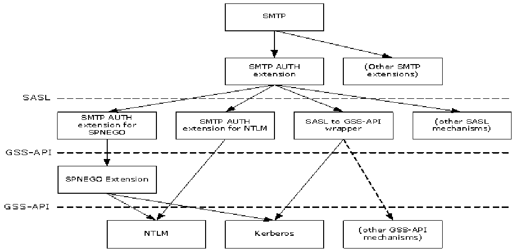
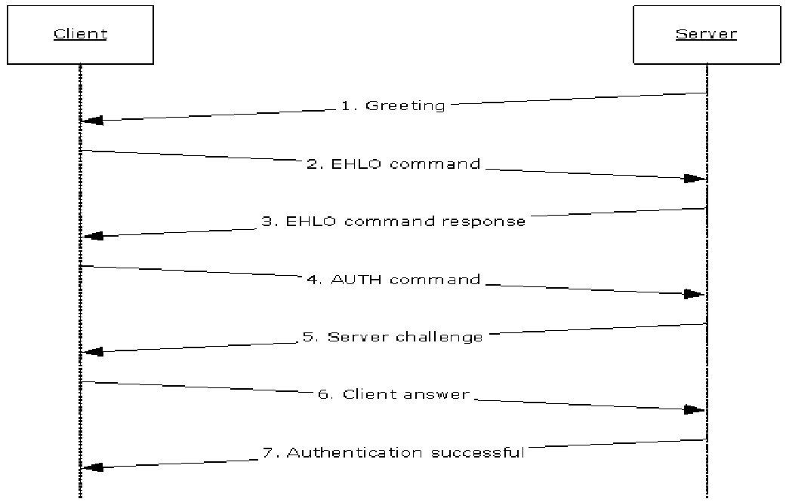

# [MS-SSEAN]: Simple Mail Transfer Protocol (SMTP) AUTH Extension for SPNEGO

Table of Contents

1 Introduction

- [1 Introduction](#Section_1)
  - [1.1 Glossary](#Section_1.1)
  - [1.2 References](#Section_1.2)
    - [1.2.1 Normative References](#Section_1.2.1)
    - [1.2.2 Informative References](#Section_1.2.2)
  - [1.3 Overview](#Section_1.3)
  - [1.4 Relationship to Other Protocols](#Section_1.4)
  - [1.5 Prerequisites/Preconditions](#Section_1.5)
  - [1.6 Applicability Statement](#Section_1.6)
  - [1.7 Versioning and Capability Negotiation](#Section_1.7)
  - [1.8 Vendor-Extensible Fields](#Section_1.8)
  - [1.9 Standards Assignments](#Section_1.9)

2 Messages

- [2 Messages](#Section_2)
  - [2.1 Transport](#Section_2.1)
  - [2.2 Message Syntax](#Section_2.2)
    - [2.2.1 SASL Mechanism Name](#Section_2.2.1)

3 Protocol Details

- [3 Protocol Details](#Section_3)
  - [3.1 Client Details](#Section_3.1)
    - [3.1.1 Abstract Data Model](#Section_3.1.1)
    - [3.1.2 Timers](#Section_3.1.2)
    - [3.1.3 Initialization](#Section_3.1.3)
    - [3.1.4 Higher-Layer Triggered Events](#Section_3.1.4)
    - [3.1.5 Message Processing Events and Sequencing Rules](#Section_3.1.5)
      - [3.1.5.1 Initiating the "GSSAPI" Mechanism](#Section_3.1.5.1)
    - [3.1.6 Timer Events](#Section_3.1.6)
    - [3.1.7 Other Local Events](#Section_3.1.7)
  - [3.2 Server Details](#Section_3.2)
    - [3.2.1 Abstract Data Model](#Section_3.2.1)
    - [3.2.2 Timers](#Section_3.2.2)
    - [3.2.3 Initialization](#Section_3.2.3)
    - [3.2.4 Higher-Layer Triggered Events](#Section_3.2.4)
    - [3.2.5 Message Processing Events and Sequencing Rules](#Section_3.2.5)
      - [3.2.5.1 Receiving an AUTH GSSAPI Command](#Section_3.2.5.1)
    - [3.2.6 Timer Events](#Section_3.2.6)
    - [3.2.7 Other Local Events](#Section_3.2.7)

4 Protocol Examples

- [4 Protocol Examples](#Section_4)
  - [4.1 Server Successfully Authenticating Client](#Section_4.1)

5 Security

- [5 Security](#Section_5)
  - [5.1 Security Considerations for Implementers](#Section_5.1)
  - [5.2 Index of Security Parameters](#Section_5.2)

6 Appendix A: Product Behavior

- [6 Appendix A: Product Behavior](#Section_6)

7 Change Tracking

- [7 Change Tracking](#Section_7)

For the legal notice and IP terms, see [LEGAL.md](../LEGAL.md).
Last updated: 5/30/2025.
See [Revision History](#revision-history) for full version history.

# 1 Introduction

The Simple Mail Transfer Protocol (SMTP) AUTH Extension for SPNEGO enables [**SMTP**](#gt_simple-mail-transfer-protocol-smtp) clients and servers to negotiate a mutually supported authentication mechanism by using the [**Simple and Protected GSS-API Negotiation Mechanism (SPNEGO)**](#gt_simple-and-protected-gss-api-negotiation-mechanism-spnego).

Sections 1.5, 1.8, 1.9, 2, and 3 of this specification are normative. All other sections and examples in this specification are informative.

## 1.1 Glossary

This document uses the following terms:

**base64 encoding**: A binary-to-text encoding scheme whereby an arbitrary sequence of bytes is converted to a sequence of printable ASCII characters, as described in [[RFC4648]](https://go.microsoft.com/fwlink/?LinkId=90487).

**Kerberos**: An authentication system that enables two parties to exchange private information across an otherwise open network by assigning a unique key (called a ticket) to each user that logs on to the network and then embedding these tickets into messages sent by the users. For more information, see [MS-KILE](../MS-KILE/MS-KILE.md).

**NT LAN Manager (NTLM) Authentication Protocol**: A protocol using a challenge-response mechanism for authentication in which clients are able to verify their identities without sending a password to the server. It consists of three messages, commonly referred to as Type 1 (negotiation), Type 2 (challenge) and Type 3 (authentication).

**SASL**: The Simple Authentication and Security Layer, as described in [[RFC2222]](https://go.microsoft.com/fwlink/?LinkId=90322). This is an authentication mechanism used by the Lightweight Directory Access Protocol (LDAP).

**Simple and Protected GSS-API Negotiation Mechanism (SPNEGO)**: An authentication mechanism that allows Generic Security Services (GSS) peers to determine whether their credentials support a common set of GSS-API security mechanisms, to negotiate different options within a given security mechanism or different options from several security mechanisms, to select a service, and to establish a security context among themselves using that service. [**SPNEGO**](#gt_simple-and-protected-gss-api-negotiation-mechanism-spnego) is specified in [[RFC4178]](https://go.microsoft.com/fwlink/?LinkId=90461).

**Simple Mail Transfer Protocol (SMTP)**: A member of the TCP/IP suite of protocols that is used to transport Internet messages, as described in [[RFC5321]](https://go.microsoft.com/fwlink/?LinkId=144740).

**MAY, SHOULD, MUST, SHOULD NOT, MUST NOT:** These terms (in all caps) are used as defined in [[RFC2119]](https://go.microsoft.com/fwlink/?LinkId=90317). All statements of optional behavior use either MAY, SHOULD, or SHOULD NOT.

## 1.2 References

Links to a document in the Microsoft Open Specifications library point to the correct section in the most recently published version of the referenced document. However, because individual documents in the library are not updated at the same time, the section numbers in the documents may not match. You can confirm the correct section numbering by checking the [Errata](https://go.microsoft.com/fwlink/?linkid=850906).

### 1.2.1 Normative References

We conduct frequent surveys of the normative references to assure their continued availability. If you have any issue with finding a normative reference, please contact [dochelp@microsoft.com](mailto:dochelp@microsoft.com). We will assist you in finding the relevant information.

[MS-SPNG] Microsoft Corporation, "[Simple and Protected GSS-API Negotiation Mechanism (SPNEGO) Extension](../MS-SPNG/MS-SPNG.md)".

[RFC2119] Bradner, S., "Key words for use in RFCs to Indicate Requirement Levels", BCP 14, RFC 2119, March 1997, [https://www.rfc-editor.org/info/rfc2119](https://go.microsoft.com/fwlink/?LinkId=90317)

[RFC2222] Myers, J., "Simple Authentication and Security Layer (SASL)", RFC 2222, October 1997, [https://www.rfc-editor.org/info/rfc2222](https://go.microsoft.com/fwlink/?LinkId=90322)

[RFC2554] Myers, J., "SMTP Service Extension for Authentication", RFC 2554, March, 1999, [https://www.rfc-editor.org/info/rfc2554](https://go.microsoft.com/fwlink/?LinkId=94468)

[RFC4752] Melnikov, A., Ed., "The Kerberos V5 ("GSSAPI") Simple Authentication and Security Layer (SASL) Mechanism", RFC 4752, November 2006, [https://www.rfc-editor.org/info/rfc4752](https://go.microsoft.com/fwlink/?LinkId=265460)

### 1.2.2 Informative References

[IANA-SASL] IANA, "Simple Authentication and Security Layer (SASL) Mechanisms", December 2006, [http://www.iana.org/assignments/sasl-mechanisms](https://go.microsoft.com/fwlink/?LinkId=151297)

[MS-NETOD] Microsoft Corporation, "[Microsoft .NET Framework Protocols Overview](#Section_1.3)".

[MS-NLMP] Microsoft Corporation, "[NT LAN Manager (NTLM) Authentication Protocol](../MS-NLMP/MS-NLMP.md)".

[RFC2743] Linn, J., "Generic Security Service Application Program Interface Version 2, Update 1", RFC 2743, January 2000, [https://www.rfc-editor.org/info/rfc2743](https://go.microsoft.com/fwlink/?LinkId=90378)

[RFC4121] Zhu, L., Jaganathan, K., and Hartman, S., "The Kerberos Version 5 Generic Security Service Application Program Interface (GSS-API) Mechanism: Version 2", RFC 4121, July 2005, [https://www.rfc-editor.org/info/rfc4121](https://go.microsoft.com/fwlink/?LinkId=90459)

[RFC4178] Zhu, L., Leach, P., Jaganathan, K., and Ingersoll, W., "The Simple and Protected Generic Security Service Application Program Interface (GSS-API) Negotiation Mechanism", RFC 4178, October 2005, [https://www.rfc-editor.org/info/rfc4178](https://go.microsoft.com/fwlink/?LinkId=90461)

[RFC5321] Klensin, J., "Simple Mail Transfer Protocol", RFC 5321, October 2008, [http://rfc-editor.org/rfc/rfc5321.txt](https://go.microsoft.com/fwlink/?LinkId=144740)

## 1.3 Overview

The [**Simple Mail Transfer Protocol (SMTP)**](#gt_simple-mail-transfer-protocol-smtp) [[RFC5321]](https://go.microsoft.com/fwlink/?LinkId=144740) is commonly used to transfer email between computers, and securing such transfers requires authentication. The ability for a client and server to negotiate authentication mechanisms for SMTP is specified in [[RFC2554]](https://go.microsoft.com/fwlink/?LinkId=94468), which allows the use of any mechanism that is defined as a [**Simple Authentication and Security Layer (SASL)**](#gt_sasl) mechanism [[RFC2222]](https://go.microsoft.com/fwlink/?LinkId=90322). A server advertises a list of supported SASL mechanism names, from which the client selects one.

Separately, the Generic Security Services API (GSS-API) [[RFC2743]](https://go.microsoft.com/fwlink/?LinkId=90378) defines a set of abstract functions that allow security mechanisms to be defined in a way that can be used by any protocol that is defined to use GSS-API. Examples of GSS-API security mechanisms include [**Kerberos**](#gt_kerberos) [[RFC4121]](https://go.microsoft.com/fwlink/?LinkId=90459) and the [**NT LAN Manager (NTLM) Authentication Protocol**](#gt_nt-lan-manager-ntlm-authentication-protocol) [MS-NLMP](../MS-NLMP/MS-NLMP.md).

SMTP requires authentication mechanisms to be defined as SASL mechanisms rather than GSS-API mechanisms. In an attempt to support the use of GSS-API mechanisms by protocols that are defined to use SASL mechanisms, [RFC2222] section 7.2 specified how to map all GSS-API mechanisms to SASL mechanisms. However, it specified a single SASL mechanism name ("GSSAPI") to be used for all GSS-API mechanisms, which made it impossible to determine which GSS-API mechanism to use when the "GSSAPI" SASL mechanism name is negotiated. As a result, protocols such as SMTP that negotiate SASL mechanism names were unable to agree on which GSS-API mechanism was referred to by "GSSAPI". [RFC2222] is rendered obsolete by [[RFC4752]](https://go.microsoft.com/fwlink/?LinkId=265460), which specifies "GSSAPI" as specifically referring to Kerberos.

The Simple and Protected Generic Security Service Application Program Interface (GSS-API) Negotiation Mechanism (SPNEGO) [[RFC4178]](https://go.microsoft.com/fwlink/?LinkId=90461) is defined for use by protocols that use GSS-API to negotiate security mechanisms. This allows such protocols to negotiate the use of GSS-API mechanisms such as Kerberos and NTLM. It does so by exposing itself as a single GSS-API mechanism that performs the negotiation and is layered atop other GSS-API mechanisms. It does not, however, define any SASL mechanism name for use by protocols defined to use SASL mechanisms rather than GSS-API mechanisms.

Using the SMTP **AUTH** Extension for SPNEGO, SMTP clients and servers map the SASL mechanism name "GSSAPI" to the SPNEGO Extension GSS-API mechanism specified in [MS-SPNG](../MS-SPNG/MS-SPNG.md), rather than to Kerberos. The SMTP **AUTH** Extension for SPNEGO conforms to the problematic [RFC2222] section 7.2, but it resolves the issue of the ambiguous SASL mechanism name "GSSAPI" differently from the later [RFC4752].

In summary, the SMTP client and server use the SMTP **AUTH** Extension for SPNEGO to negotiate the use of the SPNEGO Extension by using the "GSSAPI" SASL mechanism name and then use SPNEGO to further negotiate a specific GSS-API mechanism underneath, which does not need to have its own SASL mechanism name.

## 1.4 Relationship to Other Protocols

This extension uses the SPNEGO Extension specified in [MS-SPNG](../MS-SPNG/MS-SPNG.md), which differs slightly from SPNEGO [[RFC4178]](https://go.microsoft.com/fwlink/?LinkId=90461). The following diagram illustrates the relationships between its related protocols and mechanisms.

Figure 1: Relationship to other protocols

The SMTP **AUTH** Extension specified in [[RFC2554]](https://go.microsoft.com/fwlink/?LinkId=94468) is defined to use [**SASL**](#gt_sasl) mechanisms. The SMTP **AUTH** Extension for SPNEGO is one SASL mechanism. The SASL to GSS-API wrapper defined in [[RFC2222]](https://go.microsoft.com/fwlink/?LinkId=90322) section 7.2 is another SASL mechanism; however, it does not define a SASL mechanism name for any particular GSS-API mechanism (thus the diagram contains a dotted line from "SASL to GSS-API wrapper" to "(other GSS-API mechanisms)". To use a particular GSS-API mechanism in [**SMTP**](#gt_simple-mail-transfer-protocol-smtp) requires that the mechanism have a SASL mechanism name defined for it. [[RFC4752]](https://go.microsoft.com/fwlink/?LinkId=265460) specifies the SASL to GSS-API wrapper over [**Kerberos**](#gt_kerberos). The SMTP **AUTH** Extension for NTLM specified in [MS-SMTP] is another SASL mechanism.

The SPNEGO Extension specified in [MS-SPNG] is both a GSS-API mechanism (as used in this document) as well as a protocol that uses other GSS-API mechanisms, including NTLM and Kerberos.

Since both the SMTP **AUTH** Extension for SPNEGO and the SASL to GSS-API wrapper over Kerberos defined in [RFC4752] use the same SASL mechanism name, they cannot be used in the same environment. However, the SASL mechanism name for the SMTP **AUTH** Extension for NTLM, as well as other SASL mechanisms, are different and therefore can be used in the same environment.

## 1.5 Prerequisites/Preconditions

The SMTP **AUTH** Extension for SPNEGO is only invoked after an SMTP client with this extension has initiated an SMTP connection and is using the SMTP **AUTH** Extension [[RFC2554]](https://go.microsoft.com/fwlink/?LinkId=94468).

It is assumed that the client knows that the server supports the SMTP **AUTH** Extension for SPNEGO (as opposed to the [**SASL**](#gt_sasl) to GSS-API wrapper specified in [[RFC4752]](https://go.microsoft.com/fwlink/?LinkId=265460)) before the client determines to use this extension.

## 1.6 Applicability Statement

The SMTP **AUTH** Extension for SPNEGO is used when implementing an [**SMTP**](#gt_simple-mail-transfer-protocol-smtp) client and SMTP server that negotiate a mutually supported authentication mechanism using SPNEGO.

Since this extension and the [**SASL**](#gt_sasl) to GSS-API wrapper defined in [[RFC4752]](https://go.microsoft.com/fwlink/?LinkId=265460) use the same SASL mechanism name, this extension is not applicable to clients in environments with servers that implement the Kerberos V5 ("GSSAPI") SASL Mechanism specified in [RFC4752]. A client in such an environment will use the SPNEGO Extension specified in [MS-SPNG](../MS-SPNG/MS-SPNG.md) when the server advertises "GSSAPI", and authentication will fail.

However, the SMTP **AUTH** Extension for SPNEGO can be used by servers that support [**Kerberos**](#gt_kerberos) with clients that use either this extension or the Kerberos V5 ("GSSAPI") SASL Mechanism. When the server advertises "GSSAPI", the former will use the SPNEGO Extension and the latter will use Kerberos directly, and both can succeed.

## 1.7 Versioning and Capability Negotiation

The SMTP **AUTH** Extension for SPNEGO introduces no new versioning mechanisms.

Negotiation of [**SMTP**](#gt_simple-mail-transfer-protocol-smtp) options is specified in [[RFC5321]](https://go.microsoft.com/fwlink/?LinkId=144740) sections 2.2 and 3.2. Negotiation of authentication mechanisms using [**SASL**](#gt_sasl) mechanism names is specified by [[RFC2554]](https://go.microsoft.com/fwlink/?LinkId=94468). Negotiation of GSS-API mechanisms is specified by [MS-SPNG](../MS-SPNG/MS-SPNG.md).

## 1.8 Vendor-Extensible Fields

None.

## 1.9 Standards Assignments

This extension reuses the following assignment.

| Parameter | Value | Reference |
| --- | --- | --- |
| [**SASL**](#gt_sasl) mechanism name | GSSAPI | [[IANA-SASL]](https://go.microsoft.com/fwlink/?LinkId=151297) |

This use is consistent with the problematic specification in [[RFC2222]](https://go.microsoft.com/fwlink/?LinkId=90322) section 7.2.

# 2 Messages

## 2.1 Transport

The SMTP **AUTH** Extension for SPNEGO does not establish transport connections. Instead, its messages are encapsulated in [**SMTP**](#gt_simple-mail-transfer-protocol-smtp) **AUTH** commands and responses as specified in [[RFC2554]](https://go.microsoft.com/fwlink/?LinkId=94468).

## 2.2 Message Syntax

[[RFC2554]](https://go.microsoft.com/fwlink/?LinkId=94468) section 4 specifies messages that are usable by any [**SASL**](#gt_sasl) mechanism that defines a mechanism name, an optional initial response to be encoded by using [**base64**](#gt_179b9392-9019-45a3-880b-26f6890522b7), and a reply also to be encoded by using base64.

[[RFC2222]](https://go.microsoft.com/fwlink/?LinkId=90322) section 7.2 specifies the mapping of the initial response and the reply to specific GSS-API functions. In the SMTP **AUTH** Extension for SPNEGO, the GSS-API calls are directed to the SPNEGO Extension, so the calls use the syntax specified in [MS-SPNG](../MS-SPNG/MS-SPNG.md).

### 2.2.1 SASL Mechanism Name

The [**SASL**](#gt_sasl) mechanism name is defined as "GSSAPI".

# 3 Protocol Details

## 3.1 Client Details

### 3.1.1 Abstract Data Model

This section describes a conceptual model of possible data organization that an implementation maintains to participate in this protocol. The described organization is provided to facilitate the explanation of how the protocol behaves. This document does not mandate that implementations adhere to this model as long as their external behavior is consistent with that described in this document.

This extension specifies no additional state beyond what is already required by [[RFC2554]](https://go.microsoft.com/fwlink/?LinkId=94468) and [MS-SPNG](../MS-SPNG/MS-SPNG.md). The abstract state specified by [RFC2554] and used by this protocol is as follows.

For each SMTP connection:

**Authentication Mechanism:** The choice of authentication mechanism being used on that connection.

### 3.1.2 Timers

None.

### 3.1.3 Initialization

None.

### 3.1.4 Higher-Layer Triggered Events

None.

### 3.1.5 Message Processing Events and Sequencing Rules

#### 3.1.5.1 Initiating the "GSSAPI" Mechanism

When the SMTP **AUTH** Extension [[RFC2554]](https://go.microsoft.com/fwlink/?LinkId=94468) determines to use the "GSSAPI" [**SASL**](#gt_sasl) mechanism, the client MUST then associate the SPNEGO Extension [MS-SPNG](../MS-SPNG/MS-SPNG.md) GSS-API mechanism with the connection. The way the client determines which of the SASL mechanisms to use is implementation-specific, but the client SHOULD use the SPNEGO Extension only if "GSSAPI" is returned in the list of SASL mechanisms in the EHLO exchange specified in [RFC2554] and SHOULD prefer the SPNEGO Extension over any other such SASL mechanisms supported.

As a result of the client associating the SPNEGO Extension with the connection, the rest of the exchange will proceed as specified in [RFC2554] for **AUTH** command processing, in [[RFC2222]](https://go.microsoft.com/fwlink/?LinkId=90322) for mapping the SASL mechanism to specific GSS-API function calls, and in [MS-SPNG] for the behavior of those GSS-API function calls.

### 3.1.6 Timer Events

None.

### 3.1.7 Other Local Events

None.

## 3.2 Server Details

### 3.2.1 Abstract Data Model

This section describes a conceptual model of possible data organization that an implementation maintains to participate in this protocol. The described organization is provided to facilitate the explanation of how the protocol behaves. This document does not mandate that implementations adhere to this model as long as their external behavior is consistent with that described in this document.

This extension specifies no additional state beyond what is already required by [[RFC2554]](https://go.microsoft.com/fwlink/?LinkId=94468) and [MS-SPNG](../MS-SPNG/MS-SPNG.md). The abstract state specified by [RFC2554] and used by this protocol is as follows.

**List of SASL Mechanisms:** The list of [**SASL**](#gt_sasl) mechanism names to be returned in an EHLO response.

For each SMTP connection:

**Authentication Mechanism:** The choice of authentication mechanism being used on that connection.

### 3.2.2 Timers

None.

### 3.2.3 Initialization

When the server is initialized, it MUST place "GSSAPI" in its **List of SASL Mechanisms** abstract data model element.

### 3.2.4 Higher-Layer Triggered Events

None.

### 3.2.5 Message Processing Events and Sequencing Rules

#### 3.2.5.1 Receiving an AUTH GSSAPI Command

When the server receives an **AUTH GSSAPI** command from a client over a given [**SMTP**](#gt_simple-mail-transfer-protocol-smtp) connection, the server MUST set that connection's **Authentication Mechanism** to the SPNEGO Extension [MS-SPNG](../MS-SPNG/MS-SPNG.md) and thus route all subsequent GSS-API function calls for that connection to the SPNEGO Extension.

### 3.2.6 Timer Events

None.

### 3.2.7 Other Local Events

None.

# 4 Protocol Examples

## 4.1 Server Successfully Authenticating Client

In this example a server successfully authenticates a client by using the SMTP **AUTH** Extension for SPNEGO. The following sequence diagram shows the flow of command requests and responses in a successful authentication negotiation.

Figure 2: Server successfully authenticates client

- When the client connects to the [**SMTP**](#gt_simple-mail-transfer-protocol-smtp) port on the server, the server responds with a greeting.
220 server.contoso.com Authenticated Receive Connector

- The client sends an **EHLO** command as described in [[RFC5321]](https://go.microsoft.com/fwlink/?LinkId=144740).
EHLO client.contoso.com

- The server sends a response that includes an **AUTH** keyword containing a list of [**SASL**](#gt_sasl) mechanism names that it supports, including "GSSAPI".
250-server-contoso.com Hello [203.0.113.1]

250-AUTH GSSAPI NTLM

250 OK

- The client examines the SASL mechanism names after the **AUTH** keyword and selects one that it supports. In this example, the client selects "GSSAPI" and begins to use the SPNEGO Extension. The SMTP **AUTH** Extension for SPNEGO then uses GSS-API to ask the SPNEGO Extension for an initial response. As specified in [MS-SPNG](../MS-SPNG/MS-SPNG.md), this is a **NegTokenInit** message that contains the client's list of requested GSS-API mechanisms, which the SMTP **AUTH** Extension specified in [[RFC2554]](https://go.microsoft.com/fwlink/?LinkId=94468) then [**base64**](#gt_179b9392-9019-45a3-880b-26f6890522b7)-encodes.
AUTH GSSAPI <base64-encoded NegTokenInit>

- The server determines that the client is requesting "GSSAPI" and begins to use the SPNEGO Extension. The SMTP **AUTH** Extension for SPNEGO then base64-decodes the initial response and uses GSS-API to supply the **NegTokenInit** message and to request a reply from the SPNEGO Extension. As specified in [MS-SPNG], this will be a **NegTokenResp** message, which in this example includes a server challenge for the selected GSS-API mechanism. The SMTP **AUTH** Extension base64-encodes the message and returns it in a 334 reply.
334 <base64-encoded NegTokenResp>

- The client base64-decodes the reply and passes the result to the SPNEGO Extension. Depending on the GSS-API mechanism used by the SPNEGO Extension, there might or might not be another response to send to the server. In this example, the SPNEGO Extension returns another response to send, which the SMTP **AUTH** Extension again base64-encodes.
<base64-encoded client answer>

- The server base64-decodes the response and passes the result to the SPNEGO Extension. Depending on the GSS-API mechanism used by the SPNEGO Extension, there might or might not be another challenge reply to send to the client. In this example, the SPNEGO Extension determines that the authentication succeeded, so the SMTP **AUTH** Extension reports success back to the client.
235 2.7.0 Authentication successful

# 5 Security

## 5.1 Security Considerations for Implementers

As with all other [**SMTP**](#gt_simple-mail-transfer-protocol-smtp) authentication mechanisms, the security considerations described in [[RFC2554]](https://go.microsoft.com/fwlink/?LinkId=94468) section 9 and [[RFC2222]](https://go.microsoft.com/fwlink/?LinkId=90322) section 9 apply. Since this extension uses the SPNEGO Extension, the security considerations described in [MS-SPNG](../MS-SPNG/MS-SPNG.md) section 5.1 also apply.

## 5.2 Index of Security Parameters

None.

# 6 Appendix A: Product Behavior

The information in this specification is applicable to the following Microsoft products or supplemental software. References to product versions include updates to those products.

This document specifies version-specific details in the Microsoft .NET Framework. For information about which versions of .NET Framework are available in each released Windows product or as supplemental software, see [MS-NETOD](#Section_1.3) section 4.

- Microsoft .NET Framework 2.0
- Microsoft .NET Framework 3.5
- Microsoft .NET Framework 4.0
- Microsoft .NET Framework 4.5
- Microsoft .NET Framework 4.6
- Microsoft .NET Framework 4.7
- Microsoft .NET Framework 4.8
- Microsoft Exchange Server 2003
- Microsoft Exchange Server 2007
- Microsoft Exchange Server 2010
- Microsoft Exchange Server 2013
- Microsoft Exchange Server 2016
- Microsoft Exchange Server 2019
- Microsoft Exchange Server Subscription Edition
- Microsoft Office Outlook 2003
- Microsoft Office Outlook 2007
- Microsoft Outlook 2010
- Microsoft Outlook 2013
- Microsoft Outlook 2016
- Windows 2000 Professional operating system
- Windows 2000 Server operating system
- Windows XP operating system
- Windows Server 2003 operating system
- Windows Vista operating system
- Windows Server 2008 operating system
- Windows 7 operating system
- Windows Server 2008 R2 operating system
- Windows 8 operating system
- Windows Server 2012 operating system
- Windows 8.1 operating system
- Windows Server 2012 R2 operating system
- Windows 10 operating system
- Windows Server 2016 operating system
- Windows Server operating system
- Windows Server 2019 operating system
- Windows Server 2022 operating system
- Windows 11 operating system
Exceptions, if any, are noted in this section. If an update version, service pack or Knowledge Base (KB) number appears with a product name, the behavior changed in that update. The new behavior also applies to subsequent updates unless otherwise specified. If a product edition appears with the product version, behavior is different in that product edition.

Unless otherwise specified, any statement of optional behavior in this specification that is prescribed using the terms "SHOULD" or "SHOULD NOT" implies product behavior in accordance with the SHOULD or SHOULD NOT prescription. Unless otherwise specified, the term "MAY" implies that the product does not follow the prescription.

# 7 Change Tracking

No table of changes is available. The document is either new or has had no changes since its last release.

## Revision History

| Date | Version | Revision Class | Comments |
| --- | --- | --- | --- |
| 10/25/2012 | 1.0 | New | Release new document. |
| 1/31/2013 | 1.0 | None | No changes to the meaning, language, or formatting of the technical content. |
| 8/8/2013 | 2.0 | Major | Significantly changed the technical content. |
| 11/14/2013 | 2.0 | None | No changes to the meaning, language, or formatting of the technical content. |
| 2/13/2014 | 2.0 | None | No changes to the meaning, language, or formatting of the technical content. |
| 5/15/2014 | 2.0 | None | No changes to the meaning, language, or formatting of the technical content. |
| 6/30/2015 | 2.0 | None | No changes to the meaning, language, or formatting of the technical content. |
| 10/16/2015 | 2.0 | None | No changes to the meaning, language, or formatting of the technical content. |
| 7/14/2016 | 2.0 | None | No changes to the meaning, language, or formatting of the technical content. |
| 6/1/2017 | 3.0 | Major | Significantly changed the technical content. |
| 9/15/2017 | 4.0 | Major | Significantly changed the technical content. |
| 9/12/2018 | 5.0 | Major | Significantly changed the technical content. |
| 3/13/2019 | 6.0 | Major | Significantly changed the technical content. |
| 4/7/2021 | 7.0 | Major | Significantly changed the technical content. |
| 6/25/2021 | 8.0 | Major | Significantly changed the technical content. |
| 4/23/2024 | 9.0 | Major | Significantly changed the technical content. |
| 1/13/2025 | 10.0 | Major | Significantly changed the technical content. |
| 5/30/2025 | 10.0 | None | No changes to the meaning, language, or formatting of the technical content. |
