# [MS-SSTP]: Secure Socket Tunneling Protocol (SSTP)

Table of Contents

<details>
<summary>1 Introduction</summary>

- [1 Introduction](#Section_1)
  - [1.1 Glossary](#Section_1.1)
  - [1.2 References](#Section_1.2)
    - [1.2.1 Normative References](#Section_1.2.1)
    - [1.2.2 Informative References](#Section_1.2.2)
  - [1.3 Overview](#Section_1.3)
  - [1.4 Relationship to Other Protocols](#Section_1.4)
  - [1.5 Prerequisites/Preconditions](#Section_1.5)
  - [1.6 Applicability Statement](#Section_1.6)
  - [1.7 Versioning and Capability Negotiation](#Section_1.7)
  - [1.8 Vendor-Extensible Fields](#Section_1.8)
  - [1.9 Standards Assignments](#Section_1.9)
</details>

<details>
<summary>2 Messages</summary>

- [2 Messages](#Section_2)
  - [2.1 Transport](#Section_2.1)
  - [2.2 Message Syntax](#Section_2.2)
    - [2.2.1 SSTP Packet](#Section_2.2.1)
    - [2.2.2 SSTP Control Packet](#Section_2.2.2)
    - [2.2.3 SSTP Data Packet](#Section_2.2.3)
    - [2.2.4 SSTP Attributes](#Section_2.2.4)
    - [2.2.5 Encapsulated Protocol ID Attribute](#Section_2.2.5)
    - [2.2.6 Crypto Binding Request Attribute](#Section_2.2.6)
    - [2.2.7 Crypto Binding Attribute](#Section_2.2.7)
    - [2.2.8 Status Info Attribute](#Section_2.2.8)
    - [2.2.9 Call Connect Request Message (SSTP_MSG_CALL_CONNECT_REQUEST)](#Section_2.2.9)
    - [2.2.10 Call Connect Acknowledge Message (SSTP_MSG_CALL_CONNECT_ACK)](#Section_2.2.10)
    - [2.2.11 Call Connected Message (SSTP_MSG_CALL_CONNECTED)](#Section_2.2.11)
    - [2.2.12 Call Connect Negative Acknowledgment Message (SSTP_MSG_CALL_CONNECT_NAK)](#Section_2.2.12)
    - [2.2.13 Call Abort Message (SSTP_MSG_CALL_ABORT)](#Section_2.2.13)
    - [2.2.14 Call Disconnect Message (SSTP_MSG_CALL_DISCONNECT)](#Section_2.2.14)
    - [2.2.15 Call Disconnect Acknowledge (SSTP_MSG_CALL_DISCONNECT_ACK), Echo Request (SSTP_MSG_ECHO_REQUEST), and Echo Response (SSTP_MSG_ECHO_RESPONSE) Messages](#Section_2.2.15)
</details>

<details>
<summary>3 Protocol Details</summary>

- [3 Protocol Details](#Section_3)
  - [3.1 Common Details](#Section_3.1)
    - [3.1.1 Abstract Data Model](#Section_3.1.1)
      - [3.1.1.1 State Machine](#Section_3.1.1.1)
        - [3.1.1.1.1 State Machine Call Disconnect](#Section_3.1.1.1.1)
        - [3.1.1.1.2 State Machine Call Abort](#Section_3.1.1.1.2)
    - [3.1.2 Timers](#Section_3.1.2)
      - [3.1.2.1 Abort-Related Timers](#Section_3.1.2.1)
      - [3.1.2.2 Disconnect-Related Timers](#Section_3.1.2.2)
      - [3.1.2.3 Hello Timer](#Section_3.1.2.3)
    - [3.1.3 Initialization](#Section_3.1.3)
    - [3.1.4 Higher-Layer Triggered Events](#Section_3.1.4)
    - [3.1.5 Processing Events and Sequencing Rules](#Section_3.1.5)
      - [3.1.5.1 Status and Error Handling](#Section_3.1.5.1)
      - [3.1.5.2 SSTP Packet Processing](#Section_3.1.5.2)
    - [3.1.6 Timer Events](#Section_3.1.6)
      - [3.1.6.1 Abort Timer Processing](#Section_3.1.6.1)
      - [3.1.6.2 Disconnect Timer Processing](#Section_3.1.6.2)
      - [3.1.6.3 Hello Timer Processing](#Section_3.1.6.3)
    - [3.1.7 Other Local Events](#Section_3.1.7)
      - [3.1.7.1 Interface with PPP](#Section_3.1.7.1)
      - [3.1.7.2 Interface with HTTPS](#Section_3.1.7.2)
  - [3.2 Client Details](#Section_3.2)
    - [3.2.1 Abstract Data Model](#Section_3.2.1)
      - [3.2.1.1 State Machine](#Section_3.2.1.1)
        - [3.2.1.1.1 Call Establishment](#Section_3.2.1.1.1)
    - [3.2.2 Timers](#Section_3.2.2)
      - [3.2.2.1 Negotiation Timer](#Section_3.2.2.1)
    - [3.2.3 Initialization](#Section_3.2.3)
    - [3.2.4 Higher-Layer Triggered Events](#Section_3.2.4)
      - [3.2.4.1 Establish SSTP Tunnel Event](#Section_3.2.4.1)
      - [3.2.4.2 Disconnect SSTP Tunnel Event](#Section_3.2.4.2)
    - [3.2.5 Processing Events and Sequencing Rules](#Section_3.2.5)
      - [3.2.5.1 Status and Error Handling](#Section_3.2.5.1)
      - [3.2.5.2 Crypto Binding](#Section_3.2.5.2)
        - [3.2.5.2.1 Input Data Used in the Crypto Binding HMAC-SHA1-160 Operation](#Section_3.2.5.2.1)
        - [3.2.5.2.2 Key Used in the Crypto Binding HMAC-SHA1-160 Operation](#Section_3.2.5.2.2)
        - [3.2.5.2.3 Input Data Used in the Crypto Binding HMAC-SHA256-256 Operation](#Section_3.2.5.2.3)
        - [3.2.5.2.4 Key Used in the Crypto Binding HMAC-SHA256-256 Operation](#Section_3.2.5.2.4)
      - [3.2.5.3 Packet Processing](#Section_3.2.5.3)
        - [3.2.5.3.1 General Packet Validation](#Section_3.2.5.3.1)
        - [3.2.5.3.2 Receiving an SSTP_MSG_CALL_CONNECT_ACK Message](#Section_3.2.5.3.2)
        - [3.2.5.3.3 Receiving an SSTP_MSG_CALL_CONNECT_NAK Message](#Section_3.2.5.3.3)
        - [3.2.5.3.4 Receiving an SSTP_MSG_CALL_ABORT Message](#Section_3.2.5.3.4)
        - [3.2.5.3.5 Receiving an SSTP_MSG_CALL_DISCONNECT Message](#Section_3.2.5.3.5)
        - [3.2.5.3.6 Receiving an SSTP_MSG_CALL_DISCONNECT_ACK Message](#Section_3.2.5.3.6)
        - [3.2.5.3.7 Receiving an SSTP_MSG_ECHO_REQUEST Message](#Section_3.2.5.3.7)
        - [3.2.5.3.8 Receiving an SSTP_MSG_ECHO_RESPONSE Message](#Section_3.2.5.3.8)
    - [3.2.6 Timer Events](#Section_3.2.6)
      - [3.2.6.1 Negotiation Timer Processing](#Section_3.2.6.1)
    - [3.2.7 Other Local Events](#Section_3.2.7)
      - [3.2.7.1 Client-Side Interface with PPP](#Section_3.2.7.1)
      - [3.2.7.2 Client-Side Interface with HTTPS](#Section_3.2.7.2)
  - [3.3 Server Details](#Section_3.3)
    - [3.3.1 Abstract Data Model](#Section_3.3.1)
      - [3.3.1.1 State Machine](#Section_3.3.1.1)
        - [3.3.1.1.1 Call Establishment](#Section_3.3.1.1.1)
    - [3.3.2 Timers](#Section_3.3.2)
      - [3.3.2.1 Negotiation Timer](#Section_3.3.2.1)
    - [3.3.3 Initialization](#Section_3.3.3)
    - [3.3.4 Higher-Layer Triggered Events](#Section_3.3.4)
    - [3.3.5 Processing Events and Sequencing Rules](#Section_3.3.5)
      - [3.3.5.1 Status and Error Handling](#Section_3.3.5.1)
      - [3.3.5.2 Packet Processing](#Section_3.3.5.2)
        - [3.3.5.2.1 General Packet Validation](#Section_3.3.5.2.1)
        - [3.3.5.2.2 Receiving an SSTP_MSG_CALL_CONNECT_REQUEST Message](#Section_3.3.5.2.2)
        - [3.3.5.2.3 Receiving an SSTP_MSG_CALL_CONNECTED Message](#Section_3.3.5.2.3)
        - [3.3.5.2.4 Receiving an SSTP_MSG_CALL_ABORT Message](#Section_3.3.5.2.4)
        - [3.3.5.2.5 Receiving an SSTP_MSG_CALL_DISCONNECT Message](#Section_3.3.5.2.5)
        - [3.3.5.2.6 Receiving an SSTP_MSG_CALL_DISCONNECT_ACK Message](#Section_3.3.5.2.6)
        - [3.3.5.2.7 Receiving an SSTP_MSG_ECHO_REQUEST Message](#Section_3.3.5.2.7)
        - [3.3.5.2.8 Receiving an SSTP_MSG_ECHO_RESPONSE Message](#Section_3.3.5.2.8)
    - [3.3.6 Timer Events](#Section_3.3.6)
      - [3.3.6.1 Negotiation Timer Processing](#Section_3.3.6.1)
    - [3.3.7 Other Local Events](#Section_3.3.7)
      - [3.3.7.1 Server-Side Interface with PPP](#Section_3.3.7.1)
      - [3.3.7.2 Server-Side Interface with HTTPS](#Section_3.3.7.2)
      - [3.3.7.3 Server-Side Interface with Management Layer](#Section_3.3.7.3)
</details>

<details>
<summary>4 Protocol Examples</summary>

- [4 Protocol Examples](#Section_4)
  - [4.1 HTTPS Layer Establishment](#Section_4.1)
  - [4.2 HTTP Layer Teardown](#Section_4.2)
  - [4.3 SSTP Layer Establishment](#Section_4.3)
  - [4.4 SSTP Layer Teardown](#Section_4.4)
  - [4.5 Handling HTTP Proxies](#Section_4.5)
  - [4.6 Handling the HTTPS Termination Proxy](#Section_4.6)
  - [4.7 Crypto Binding](#Section_4.7)
</details>

<details>
<summary>5 Security</summary>

- [5 Security](#Section_5)
  - [5.1 Security Considerations for Implementers](#Section_5.1)
  - [5.2 Index of Security Parameters](#Section_5.2)
  - [5.3 Attack Scenarios](#Section_5.3)
    - [5.3.1 Unauthorized Client Connecting to an SSTP Server](#Section_5.3.1)
    - [5.3.2 Unauthorized SSTP Server Accepting Connections from a Genuine SSTP Client](#Section_5.3.2)
    - [5.3.3 Man in the Middle](#Section_5.3.3)
</details>

<details>
<summary>6 Appendix A: Product Behavior</summary>

- [6 Appendix A: Product Behavior](#Section_6)
</details>

<details>
<summary>7 Change Tracking</summary>

- [7 Change Tracking](#Section_7)
</details>

For the legal notice and IP terms, see [LEGAL.md](../LEGAL.md).
Last updated: 4/23/2024.
See [Revision History](#revision-history) for full version history.

<a id="Section_1"></a>
# 1 Introduction

This document describes the Microsoft Secure Socket Tunneling Protocol (SSTP), a mechanism to transport data-link layer (L2) frames on a Hypertext Transfer Protocol over Secure Sockets Layer (HTTPS) connection. The protocol currently supports only the Point-to-Point Protocol (PPP) link layer (for more information, see [[RFC1661]](https://go.microsoft.com/fwlink/?LinkId=90283)).

This protocol has two main deployment modes:

- The [**SSTP server**](#gt_sstp-server) directly accepts the HTTPS connection.
In this scenario, the SSTP server accepts the HTTPS connection, which is similar to a virtual private network (VPN) server positioned on the edge of a network. The Secure Sockets Layer/Transport Layer Security (SSL/TLS) certificate is deployed on the SSTP server.

- The SSTP server is positioned behind an SSL/TLS load balancer.
In this scenario, the SSTP server is positioned behind an SSL/TLS load balancer that terminates the SSL/TLS connections (and therefore, the SSL/TLS certificate is installed) and forwards the decrypted HTTP traffic to the SSTP server. There is an implicit relationship of trust between the load balancer (or trusted man-in-the-middle) and the SSTP server.

Sections 1.5, 1.8, 1.9, 2, and 3 of this specification are normative. All other sections and examples in this specification are informative.

<a id="Section_1.1"></a>
## 1.1 Glossary

This document uses the following terms:

<a id="gt_globally-unique-identifier-guid"></a>
**globally unique identifier (GUID)**: A term used interchangeably with universally unique identifier (UUID) in Microsoft protocol technical documents (TDs). Interchanging the usage of these terms does not imply or require a specific algorithm or mechanism to generate the value. Specifically, the use of this term does not imply or require that the algorithms described in [[RFC4122]](https://go.microsoft.com/fwlink/?LinkId=90460) or [[C706]](https://go.microsoft.com/fwlink/?LinkId=89824) must be used for generating the [**GUID**](#gt_globally-unique-identifier-guid). See also universally unique identifier (UUID).

<a id="gt_https-termination-proxy"></a>
**HTTPS termination proxy**: A proxy server that accepts incoming HTTPS connections, decrypts the SSL, and passes on the unencrypted HTTP payload to other servers.

<a id="gt_hypertext-transfer-protocol-secure-https"></a>
**Hypertext Transfer Protocol Secure (HTTPS)**: An extension of HTTP that securely encrypts and decrypts web page requests. In some older protocols, "Hypertext Transfer Protocol over Secure Sockets Layer" is still used (Secure Sockets Layer has been deprecated). For more information, see [[SSL3]](https://go.microsoft.com/fwlink/?LinkId=90534) and [[RFC5246]](https://go.microsoft.com/fwlink/?LinkId=129803).

<a id="gt_maximum-transmission-unit-mtu"></a>
**maximum transmission unit (MTU)**: The size, in bytes, of the largest packet that a given layer of a communications protocol can pass onward.

<a id="gt_secure-sockets-layer-ssl"></a>
**Secure Sockets Layer (SSL)**: A security protocol that supports confidentiality and integrity of messages in client and server applications that communicate over open networks. SSL supports server and, optionally, client authentication using X.509 certificates [[X509]](https://go.microsoft.com/fwlink/?LinkId=90590) and [[RFC5280]](https://go.microsoft.com/fwlink/?LinkId=131034). SSL is superseded by Transport Layer Security (TLS). TLS version 1.0 is based on SSL version 3.0 [SSL3].

<a id="gt_sha1-hash"></a>
**SHA1 hash**: A hashing algorithm defined in [[FIPS180]](https://go.microsoft.com/fwlink/?LinkId=89867) that was developed by the National Institute of Standards and Technology (NIST) and the National Security Agency (NSA).

<a id="gt_sha-1-hash"></a>
**SHA-1 hash**: A hashing algorithm as specified in [[FIPS180-2]](https://go.microsoft.com/fwlink/?LinkId=89868) that was developed by the National Institute of Standards and Technology (NIST) and the National Security Agency (NSA).

<a id="gt_ssltls-handshake"></a>
**SSL/TLS handshake**: The process of negotiating and establishing a connection protected by [**Secure Sockets Layer (SSL)**](#gt_secure-sockets-layer-ssl) or Transport Layer Security (TLS). For more information, see [SSL3] and [[RFC2246]](https://go.microsoft.com/fwlink/?LinkId=90324).

<a id="gt_sstp-client"></a>
**SSTP client**: A computer that implements the Secure Socket Tunneling Protocol (SSTP), and that initiates an SSTP connection to an [**SSTP server**](#gt_sstp-server) over TCP port 443.

<a id="gt_sstp-far-end"></a>
**SSTP far end**: An entity that has sent an SSTP message that is currently being processed by an [**SSTP peer**](#gt_sstp-peer) and to whom the response is sent by the [**SSTP peer**](#gt_sstp-peer).

<a id="gt_sstp-management-layer"></a>
**SSTP management layer**: An entity that manages the SSTP layer on the SSTP client as well as on the SSTP server.

<a id="gt_sstp-peer"></a>
**SSTP peer**: An entity that processes an SSTP message.

<a id="gt_sstp-server"></a>
**SSTP server**: An entity on a network that implements the SSTP and that listens for SSTP connections over TCP port 443.

<a id="gt_sstp-tunnel"></a>
**SSTP tunnel**: An encrypted tunnel using the SSTP on an [**HTTPS**](#gt_hypertext-transfer-protocol-secure-https) ([**SSL**](#gt_secure-sockets-layer-ssl)/TLS protocol) connection.

<a id="gt_state-machine"></a>
**state machine**: A model of computing behavior composed of a specified number of states, transitions between those states, and actions to be taken. A state stores information about past transactions as it reflects input changes from the startup of the system to the present moment. A transition (such as connecting a network share) indicates a state change and is described by a condition that would need to be fulfilled to enable the transition. An action is a description of an activity that is to be performed at a given moment. There are several action types: Entry action: Performed when entering the state. Exit action: Performed when exiting the state. Input action: Performed based on the present state and input conditions. Transition action: Performed when executing a certain state transition.

**MAY, SHOULD, MUST, SHOULD NOT, MUST NOT:** These terms (in all caps) are used as defined in [[RFC2119]](https://go.microsoft.com/fwlink/?LinkId=90317). All statements of optional behavior use either MAY, SHOULD, or SHOULD NOT.

<a id="Section_1.2"></a>
## 1.2 References

Links to a document in the Microsoft Open Specifications library point to the correct section in the most recently published version of the referenced document. However, because individual documents in the library are not updated at the same time, the section numbers in the documents may not match. You can confirm the correct section numbering by checking the [Errata](https://go.microsoft.com/fwlink/?linkid=850906).

<a id="Section_1.2.1"></a>
### 1.2.1 Normative References

We conduct frequent surveys of the normative references to assure their continued availability. If you have any issue with finding a normative reference, please contact [dochelp@microsoft.com](mailto:dochelp@microsoft.com). We will assist you in finding the relevant information.

[MS-DTYP] Microsoft Corporation, "[Windows Data Types](../MS-DTYP/MS-DTYP.md)".

[MS-PEAP] Microsoft Corporation, "[Protected Extensible Authentication Protocol (PEAP)](../MS-PEAP/MS-PEAP.md)".

[RFC1334] Lloyd, B., and Simpson, W., "PPP Authentication Protocols", RFC 1334, October 1992, [https://www.rfc-editor.org/info/rfc1334](https://go.microsoft.com/fwlink/?LinkId=148311)

[RFC1661] Simpson, W., Ed., "The Point-to-Point Protocol (PPP)", STD 51, RFC 1661, July 1994, [https://www.rfc-editor.org/info/rfc1661](https://go.microsoft.com/fwlink/?LinkId=90283)

[RFC1945] Berners-Lee, T., Fielding, R., and Frystyk, H., "Hypertext Transfer Protocol -- HTTP/1.0", RFC 1945, May 1996, [https://www.rfc-editor.org/info/rfc1945](https://go.microsoft.com/fwlink/?LinkId=90300)

[RFC1994] Simpson, W, "PPP Challenge Handshake Authentication Protocol (CHAP)", RFC 1994, August 1996, [https://www.rfc-editor.org/info/rfc1994](https://go.microsoft.com/fwlink/?LinkId=90305)

[RFC2104] Krawczyk, H., Bellare, M., and Canetti, R., "HMAC: Keyed-Hashing for Message Authentication", RFC 2104, February 1997, [https://www.rfc-editor.org/info/rfc2104](https://go.microsoft.com/fwlink/?LinkId=90314)

[RFC2119] Bradner, S., "Key words for use in RFCs to Indicate Requirement Levels", BCP 14, RFC 2119, March 1997, [https://www.rfc-editor.org/info/rfc2119](https://go.microsoft.com/fwlink/?LinkId=90317)

[RFC2246] Dierks, T., and Allen, C., "The TLS Protocol Version 1.0", RFC 2246, January 1999, [https://www.rfc-editor.org/info/rfc2246](https://go.microsoft.com/fwlink/?LinkId=90324)

[RFC2284] Blunk, L. and Vollbrecht, J., "PPP Extensible Authentication Protocol (EAP)", RFC 2284, March 1998, [https://www.rfc-editor.org/info/rfc2284](https://go.microsoft.com/fwlink/?LinkId=90332)

[RFC2616] Fielding, R., Gettys, J., Mogul, J., et al., "Hypertext Transfer Protocol -- HTTP/1.1", RFC 2616, June 1999, [https://www.rfc-editor.org/info/rfc2616](https://go.microsoft.com/fwlink/?LinkId=90372)

[RFC2759] Zorn, G., "Microsoft PPP CHAP Extensions, Version 2", RFC 2759, January 2000, [https://www.rfc-editor.org/info/rfc2759](https://go.microsoft.com/fwlink/?LinkId=90379)

[RFC2818] Rescorla, E., "HTTP Over TLS", RFC 2818, May 2000, [https://www.rfc-editor.org/info/rfc2818](https://go.microsoft.com/fwlink/?LinkId=90383)

[RFC2965] Kristol, D. and Montulli, L., "HTTP State Management Mechanism", RFC 2965, October 2000, [https://www.rfc-editor.org/info/rfc2965](https://go.microsoft.com/fwlink/?LinkId=90399)

[RFC3079] Zorn, G., "Deriving Keys for Use with Microsoft Point-to-Point Encryption (MPPE)", RFC 3079, March 2001, [https://www.rfc-editor.org/info/rfc3079](https://go.microsoft.com/fwlink/?LinkId=90405)

[RFC3174] Eastlake III, D., and Jones, P., "US Secure Hash Algorithm 1 (SHA1)", RFC 3174, September 2001, [https://www.rfc-editor.org/info/rfc3174](https://go.microsoft.com/fwlink/?LinkId=90408)

[RFC3748] Aboba, B., Blunk, L., Vollbrecht, J., Carlson, J., and Levkowetz, H., "Extensible Authentication Protocol (EAP)", RFC 3748, June 2004, [https://www.rfc-editor.org/info/rfc3748](https://go.microsoft.com/fwlink/?LinkId=90444)

[RFC5216] Simon, D., Aboda, B., and Hurst, R., "The EAP-TLS Authentication Protocol", RFC 5216, March 2008, [https://www.rfc-editor.org/info/rfc5216](https://go.microsoft.com/fwlink/?LinkId=155108)

[RFC5280] Cooper, D., Santesson, S., Farrell, S., et al., "Internet X.509 Public Key Infrastructure Certificate and Certificate Revocation List (CRL) Profile", RFC 5280, May 2008, [https://www.rfc-editor.org/info/rfc5280](https://go.microsoft.com/fwlink/?LinkId=131034)

[SHA256] National Institute of Standards and Technology, "FIPS 180-2, Secure Hash Standard (SHS)", August 2002, [http://csrc.nist.gov/publications/fips/fips180-2/fips180-2withchangenotice.pdf](https://go.microsoft.com/fwlink/?LinkId=90514)

[SSL3] Netscape, "SSL 3.0 Specification", November 1996, [https://tools.ietf.org/html/draft-ietf-tls-ssl-version3-00](https://go.microsoft.com/fwlink/?LinkId=90534)

[SSLPROXY] Luotonen, A., "Tunneling TCP based protocols through Web proxy servers", Version 01, August 1998, [https://datatracker.ietf.org/doc/html/draft-luotonen-web-proxy-tunneling-01](https://go.microsoft.com/fwlink/?LinkId=90535)

<a id="Section_1.2.2"></a>
### 1.2.2 Informative References

[RFC1750] Eastlake III, D., Crocker, S., and Schiller, J., "Randomness Recommendations for Security", RFC 1750, December 1994, [http://www.ietf.org/rfc/rfc1750.txt](https://go.microsoft.com/fwlink/?LinkId=90288)

[RFC2865] Rigney, C., Willens, S., Rubens, A., and Simpson, W., "Remote Authentication Dial In User Service (RADIUS)", RFC 2865, June 2000, [https://www.rfc-editor.org/info/rfc2865](https://go.microsoft.com/fwlink/?LinkId=90392)

[RFC4306] Kaufman, C., "Internet Key Exchange (IKEv2) Protocol", RFC 4306, December 2005, [https://www.rfc-editor.org/info/rfc4306](https://go.microsoft.com/fwlink/?LinkId=90469)

[RFC5247] Microsoft Corporation, "Extensible Authentication Protocol (EAP) Key Management Framework", RFC 5247, August 2008, [https://www.rfc-editor.org/info/rfc5247](https://go.microsoft.com/fwlink/?linkid=2162185)

<a id="Section_1.3"></a>
## 1.3 Overview

This document specifies the Secure Socket Tunneling Protocol (SSTP). SSTP is a mechanism to encapsulate Point-to-Point Protocol (PPP) traffic over an HTTPS protocol, as specified in [[RFC1945]](https://go.microsoft.com/fwlink/?LinkId=90300), [[RFC2616]](https://go.microsoft.com/fwlink/?LinkId=90372), and [[RFC2818]](https://go.microsoft.com/fwlink/?LinkId=90383). This protocol enables users to access a private network by using HTTPS. The use of HTTPS enables traversal of most firewalls and web proxies.

Many VPN services provide a way for mobile and home users to access the corporate network remotely by using the Point-to-Point Tunneling Protocol (PPTP) and the Layer Two Tunneling Protocol/Internet Protocol security (L2TP/IPsec). However, with the popularization of firewalls and web proxies, many service providers, such as hotels, do not allow the PPTP and L2TP/IPsec traffic. This results in users not receiving ubiquitous connectivity to their corporate networks. For example, generic routing encapsulation (GRE) port blocking by many Internet service providers (ISPs) is a common problem when using PPTP.

This protocol provides an encrypted tunnel (an [**SSTP tunnel**](#gt_sstp-tunnel)) by means of the SSL/TLS protocol. When a client establishes an SSTP-based VPN connection, it first establishes a TCP connection to the [**SSTP server**](#gt_sstp-server) over TCP port 443. [**SSL/TLS handshake**](#gt_ssltls-handshake) occurs over this TCP connection.

After the successful negotiation of SSL/TLS, the client sends an HTTP request with content length encoding and a large content length on the SSL protected connection (see section [3.2.4.1](#Section_3.2.4.1) for more details). The server sends back an HTTP response with status HTTP_STATUS_OK(200). The specific request and response details that are discussed earlier can be found in section [4.1](#Section_4.1). The HTTPS connection is now established, and the client can send and receive [SSTP Control Packets](#Section_2.2.2) and [SSTP Data Packets](#Section_2.2.3) on this connection. HTTPS connection establishment when a web proxy is present is specified in [[SSLPROXY]](https://go.microsoft.com/fwlink/?LinkId=90535).

SSTP performs the following features:

- Allowing delineation of PPP frames from the continuous stream of data that is sent by using HTTPS. For more information about PPP, see [[RFC1661]](https://go.microsoft.com/fwlink/?LinkId=90283).
- Negotiation of parameters between two entities. See section [1.7](#Section_1.7) for more details.
- Extensible message format to support new parameters in the future. For more information, see section [2.2](#Section_2.2).
- Security operations to prevent a man-in-the-middle attacker from relaying PPP frames inappropriately over SSTP. SSTP uses keying material generated during PPP authentication for crypto binding (sections [3.2.5.2](#Section_3.2.5.2) and [3.3.5.2.3](#Section_3.3.5.2.3)).
SSTP Control Packets contain messages to negotiate parameters and to ensure that there is no untrusted man-in-the-middle. SSTP Data Packets contain PPP frames as payload.

In an SSTP–based VPN, the protocol layer negotiation occurs in the following order:

- The TCP connection is established to an SSTP server over TCP port 443.
- SSL/TLS handshake is completed.
- HTTPS request-response is completed.
- SSTP negotiation begins.
- PPP negotiation is initiated, and PPP authentication is completed or bypassed.
- SSTP negotiation is completed.
- PPP negotiation is completed.
- The connection enters a ready state for transportation of any network layer (for example, IP packets).
The following encapsulation operations occur on the client:

- Application packets are encapsulated over any transport protocol (for example, TCP and UDP).
- Transport layer packets are encapsulated over a network protocol (for example, IP).
- Network layer packets are encapsulated over a PPP data-link layer.
- PPP packets are encapsulated over SSTP.
- [SSTP Packets](#Section_2.2.1) are encapsulated over SSL/TLS.
- SSL/TLS records are encapsulated over TCP.
- TCP packets are encapsulated over IP.
- IP packets are sent over any data-link layer (such as Ethernet or PPP). For more information about PPP, see [RFC1661].
On the server side, operations to remove the encapsulation occur in reverse order.

<a id="Section_1.4"></a>
## 1.4 Relationship to Other Protocols

The following network stack diagram shows the relationship of this protocol to other protocols.

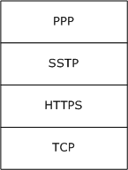

Figure 1: SSTP protocol stack

The Secure Socket Tunneling Protocol (SSTP) allows encapsulation of PPP traffic over HTTPS. As a result, SSTP uses both PPP and HTTPS for operation. For more information about HTTPS, see [[RFC1945]](https://go.microsoft.com/fwlink/?LinkId=90300), [[RFC2616]](https://go.microsoft.com/fwlink/?LinkId=90372), and [[RFC2818]](https://go.microsoft.com/fwlink/?LinkId=90383). For more information about PPP, see [[RFC1661]](https://go.microsoft.com/fwlink/?LinkId=90283).

<a id="Section_1.5"></a>
## 1.5 Prerequisites/Preconditions

None.

<a id="Section_1.6"></a>
## 1.6 Applicability Statement

The Secure Socket Tunneling Protocol (SSTP) is useful for establishing VPN connections over public networks. If this protocol is run in a high-loss environment, then TCP connections might encounter limited data transfer rates over this protocol.

<a id="Section_1.7"></a>
## 1.7 Versioning and Capability Negotiation

The Secure Socket Tunneling Protocol (SSTP) contains version fields in all the messages. This functionality allows a server implementation to support multiple versions of SSTP and to determine what version is implemented on the client. The server then uses that version of protocol behavior for SSTP negotiation.

SSTP also allows for negotiation of SHA1 and SHA256 for hashing. The negotiation is as specified in sections [2.2.7](#Section_2.2.7), [2.2.6](#Section_2.2.6), [2.2.10](#Section_2.2.10), [3.2.5.2](#Section_3.2.5.2), and [3.2.5.3.2](#Section_3.2.5.3.2).

The server presents the hashing functions that it supports, and the client selects the hashing function that it also supports from this list. If both the client and server support both SHA1 and SHA256, then the client prefers SHA256 over SHA1.

<a id="Section_1.8"></a>
## 1.8 Vendor-Extensible Fields

The Secure Socket Tunneling Protocol (SSTP) has no vendor-extensible fields.

<a id="Section_1.9"></a>
## 1.9 Standards Assignments

The Secure Socket Tunneling Protocol (SSTP) has not been assigned any standards from any accepted industry standards body.

<a id="Section_2"></a>
# 2 Messages

<a id="Section_2.1"></a>
## 2.1 Transport

Because SSTP runs by means of an HTTPS connection, SSTP relies entirely on HTTPS for the reliable delivery of its messages. The [**SSTP client**](#gt_sstp-client) MUST authenticate the [**SSTP server**](#gt_sstp-server) by using HTTPS authentication. The SSTP server MAY<1> authenticate the SSTP client by using HTTPS client authentication. The SSTP server SHOULD authenticate the SSTP client by using PPP authentication. Therefore, PPP authentication is required even when the SSTP server authenticates the SSTP client by using HTTPS authentication. For more information about PPP authentication, see [[RFC1661]](https://go.microsoft.com/fwlink/?LinkId=90283) section 3.5.

<a id="Section_2.2"></a>
## 2.2 Message Syntax

<a id="Section_2.2.1"></a>
### 2.2.1 SSTP Packet

The following diagram shows the format of this packet when is sent on the HTTPS connection.

The fields of the header MUST be transmitted in byte order from left to right.

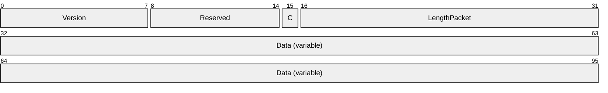

**Version (1 byte):** An 8-bit (1-byte) field that is used to communicate and negotiate the version of SSTP that is used. The upper 4 bits are the MAJOR version, which MUST be 0x1, and the lower 4 bits are the MINOR version, which MUST be set to 0x0. This means that the 8-bit value of the Version field MUST be 0x10 and corresponds to Version 1.0.

**Reserved (7 bits):** This 7-bit field is reserved for future use. MUST be set to zero when sent and MUST be ignored on receipt.

**C (1 bit):** A 1-bit field that is used to indicate whether the packet is an [SSTP control packet](#Section_2.2.2) or an [SSTP data packet](#Section_2.2.3) (the data packet is used for sending a higher-layer payload). The value is 1 if it is a control packet and zero if it is a data packet.

| Name | Value |
| --- | --- |
| Data packet | 0 |
| Control packet | 1 |

**LengthPacket (2 bytes):** A 16-bit unsigned integer in network byte order that packs data for two fields, configured in the following format.

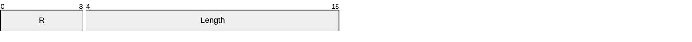

**R (4 bits):** This 4-bit field is reserved for future use. MUST be set to zero when sent and MUST be ignored on receipt.

**Length (12 bits):** A 12-bit unsigned integer in network byte order that MUST specify the length, in bytes, of this entire packet, including the 4-byte SSTP header (that is, Version, 7-bit Reserved field, 1-bit C field, 4-bit R field, and 12-bit Length field).

**Data (variable):** A variable-length field. The length of this field is equal to the value of the field **Length**, minus 4. This field contains either the SSTP control message when field **C** is equal to 1 (see section 2.2.2), or the payload from a higher-layer protocol when field **C** is equal to zero (see section 2.2.3). SSTP data packets carry PPP frames as payload (which includes PPP control frames as well as PPP data frames). For more information, see [[RFC1661]](https://go.microsoft.com/fwlink/?LinkId=90283).

<a id="Section_2.2.2"></a>
### 2.2.2 SSTP Control Packet

This packet is a type of [SSTP packet](#Section_2.2.1) that is used by both the client and the server to send control messages to each other. The following diagram specifies the format that MUST be used for the SSTP control messages. Because this message is a type of SSTP packet, it follows the format of an SSTP packet (section 2.2.1).

The fields of the structure MUST be transmitted in network byte order from left to right.

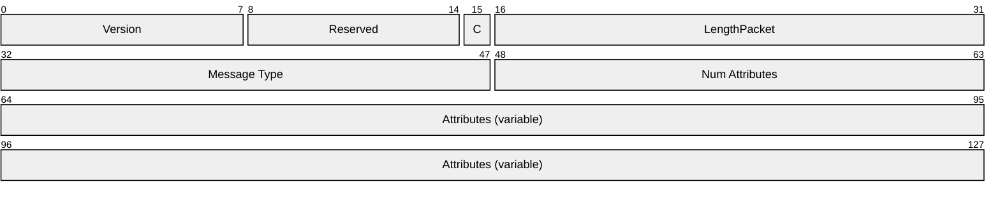

**Version (1 byte):** An 8-bit (1-byte) field that is used to communicate and negotiate the version of SSTP that is used. The upper 4 bits are the MAJOR version, which MUST be 0x1, and the lower 4 bits are the MINOR version, which MUST be set to 0x0. This means that the 8-bit value of the Version field MUST be 0x10 and corresponds to Version 1.0.

**Reserved (7 bits):** This 7-bit field is reserved for future use. MUST be set to zero when sent and MUST be ignored on receipt.

**C (1 bit):** A 1-bit field that is used to indicate whether the packet is an SSTP control packet or an [SSTP data packet](#Section_2.2.3). The value MUST be set to 1 for control packets.

**LengthPacket (2 bytes):** A 16-bit unsigned integer in network byte order that packs data for two fields, configured in the following format.


**R (4 bits):** This 4-bit field is reserved for future use. It MUST be set to zero and ignored on receipt.

**Length (12 bits):** A 12-bit unsigned integer in network byte order that MUST specify the length, in bytes, of the entire SSTP packet, including the 4-byte SSTP header (that is, Version, 7-bit Reserved field, 1-bit C field, 4-bit R field, and 12-bit Length field).

**Message Type (2 bytes):** A 16-bit field in network byte order that specifies the type of message. It MUST be one of the following values.

| Name | Value |
| --- | --- |
| SSTP_MSG_CALL_CONNECT_REQUEST | 0x0001 |
| SSTP_MSG_CALL_CONNECT_ACK | 0x0002 |
| SSTP_MSG_CALL_CONNECT_NAK | 0x0003 |
| SSTP_MSG_CALL_CONNECTED | 0x0004 |
| SSTP_MSG_CALL_ABORT | 0x0005 |
| SSTP_MSG_CALL_DISCONNECT | 0x0006 |
| SSTP_MSG_CALL_DISCONNECT_ACK | 0x0007 |
| SSTP_MSG_ECHO_REQUEST | 0x0008 |
| SSTP_MSG_ECHO_RESPONSE | 0x0009 |

**Num Attributes (2 bytes):** A 16-bit field in network byte order that specifies the number of attributes in the message.

**Attributes (variable):** An ordered list of variable-sized attributes that compose an SSTP control message. Each attribute MUST follow the format as specified in section [2.2.4](#Section_2.2.4).

<a id="Section_2.2.3"></a>
### 2.2.3 SSTP Data Packet

The SSTP data packet is a type of [SSTP packet](#Section_2.2.1) that is used by both the [**SSTP client**](#gt_sstp-client) and [**SSTP server**](#gt_sstp-server) to send a higher-layer payload (that is, a PPP frame) to each other. The following diagram specifies the format that MUST be used for the SSTP data packet. For more information, see [[RFC1661]](https://go.microsoft.com/fwlink/?LinkId=90283).

The fields of the structure MUST be transmitted as bytes from left to right.


**Version (1 byte):** An 8-bit (1-byte) field that is used to communicate and negotiate the version of SSTP being used. The upper 4 bits are the MAJOR version, which MUST be 0x1, and the lower 4 bits are the MINOR version, which MUST be set to 0x0. This means that the 8-bit value of the Version field MUST be 0x10 and corresponds to Version 1.0.

**Reserved (7 bits):** This 7-bit field is reserved for future use. MUST be set to zero when sent and MUST be ignored on receipt.

**C (1 bit):** A 1-bit field that is used to indicate whether the packet is an [SSTP control packet](#Section_2.2.2) or an SSTP data packet. The value MUST be set to zero to indicate a data packet that carries higher-layer payloads.

**LengthPacket (2 bytes):** A 16-bit unsigned integer in network byte order that packs data for two fields, configured in the following format.


**R (4 bits):** This 4-bit field is reserved for future use. MUST be set to zero when sent and MUST be ignored on receipt.

**Length (12 bits):** A 12-bit unsigned integer in network byte order that MUST specify the length, in bytes, of the entire SSTP packet, including the 4-byte SSTP header (that is, Version, 7-bit Reserved field, 1-bit C field, 4-bit R field, and 12-bit Length field).

**Data (variable):** A variable-length field that contains the higher-layer payload. SSTP data packets carry encapsulated protocol frames as payload. The protocol encapsulated in the **Data** field is determined from previously received [Encapsulated Protocol ID Attribute (section 2.2.5)](#Section_2.2.5). SSTP currently supports only PPP [RFC1661] as the encapsulated protocol (see section 2.2.5 for details). The length of this field is equal to the value of the field **Length**, minus 4.

<a id="Section_2.2.4"></a>
### 2.2.4 SSTP Attributes

The following diagram specifies the format that MUST be used for all SSTP attributes.

The fields of the structure MUST be transmitted as bytes from left to right.

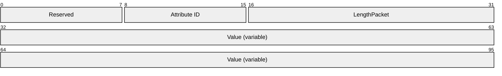

**Reserved (1 byte):** This 8-bit field is reserved for future use. MUST be set to zero when sent and MUST be ignored on receipt.

**Attribute ID (1 byte):** An 8-bit (1-byte) field that is used to specify the type of attribute; its value MUST be one of the following.

| Name | Value |
| --- | --- |
| SSTP_ATTRIB_ENCAPSULATED_PROTOCOL_ID | 0x01 |
| SSTP_ATTRIB_STATUS_INFO | 0x02 |
| SSTP_ATTRIB_CRYPTO_BINDING | 0x03 |
| SSTP_ATTRIB_CRYPTO_BINDING_REQ | 0x04 |

**LengthPacket (2 bytes):** A 16-bit unsigned integer in network byte order that packs data for two fields, configured in the following format.


**R (4 bits):** This 4-bit field is reserved for future use. MUST be set to zero when sent and MUST be ignored on receipt.

**Length (12 bits):** A 12-bit unsigned integer in network byte order that MUST specify the length, in bytes, of the entire SSTP attribute, including the 4-byte attribute header (that is, 1-byte Reserved field, 1-byte Attribute ID, 4-bit R field, and 12-bit Length field).

**Value (variable):** A variable-length field with length equal to field **Length** minus 4 that contains the attribute-specific data. The different attribute-specific data are described in sections [2.2.5](#Section_2.2.5) to [2.2.8](#Section_2.2.8). The fields "Reserved", "Attribute ID", and "LengthPacket" have been repeated in those sections for complete illustration.

<a id="Section_2.2.5"></a>
### 2.2.5 Encapsulated Protocol ID Attribute

The following diagram specifies the format that MUST be used for the Encapsulated Protocol ID attribute. This attribute is used to negotiate the higher-layer protocols that are supported by the client and server.

The client proposes the list of higher-layer protocols that it wants to send on the SSTP connection. If the server supports the protocols that are specified by the client, then a negative acknowledgment (NACK) response is not sent. Otherwise, the server sends a NACK response with the list of protocols that it does not support.

The fields of the structure MUST be transmitted as bytes from left to right.

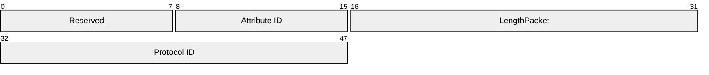

**Reserved (1 byte):** This 8-bit field is reserved for future use. MUST be set to zero when sent and MUST be ignored on receipt.

**Attribute ID (1 byte):** An 8-bit (1-byte) field that is used to specify the type of attribute; its value MUST be 0x01 for the Encapsulated Protocol ID attribute.

**LengthPacket (2 bytes):** A 16-bit unsigned integer in network byte order that packs data for two fields, configured in the following format.


**R (4 bits):** This 4-bit field is reserved for future use MUST be set to zero when sent and MUST be ignored on receipt.

**Length (12 bits):** A 12-bit unsigned integer in network byte order that MUST specify the length of the Encapsulated Protocol ID attribute. This field MUST be set to 0x006.

**Protocol ID (2 bytes):** A 2-byte field in network byte order that contains the following value. Note that SSTP Version 1 currently supports only PPP frames. For more information, see [[RFC1661]](https://go.microsoft.com/fwlink/?LinkId=90283).

| Name | Value |
| --- | --- |
| SSTP_ENCAPSULATED_PROTOCOL_PPP | 0x0001 |

<a id="Section_2.2.6"></a>
### 2.2.6 Crypto Binding Request Attribute

The following diagram specifies the format that MUST be used for the **Crypto Binding Request** attribute. This attribute is used by the [**SSTP server**](#gt_sstp-server) to communicate the supported hashing methods and nonce to the [**SSTP client**](#gt_sstp-client).

The fields of the structure MUST be transmitted as bytes from left to right.

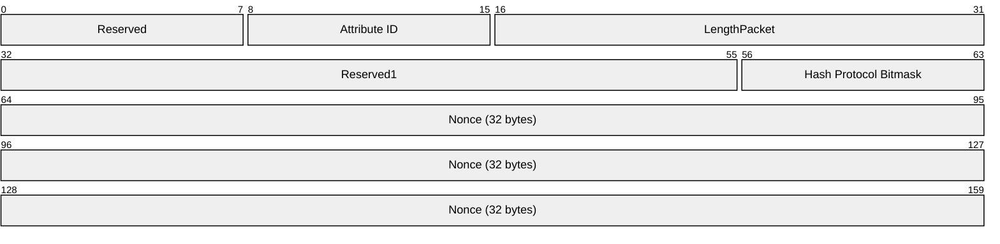

**Reserved (1 byte):** This field is reserved for future use. MUST be set to zero when sent and MUST be ignored on receipt.

**Attribute ID (1 byte):** An 8-bit (1-byte) field that is used to specify the type of attribute; its value MUST be 0x04 for the **Crypto Binding Request** attribute.

**LengthPacket (2 bytes):** A 16-bit unsigned integer in network byte order that packs data for two fields, configured in the following format.


**R (4 bits):** This 4-bit field is reserved for future use. MUST be set to zero when sent and MUST be ignored on receipt.

**Length (12 bits):** A 12-bit unsigned integer in network byte order that MUST specify the length of the **Crypto Binding Request** attribute. Its value MUST be 40 (that is, 0x028).

**Reserved1 (3 bytes):** This 24-bit field is reserved for future use. MUST be set to zero when sent and MUST be ignored on receipt.

**Hash Protocol Bitmask (1 byte):** This 1-byte bitmask field is used (with the **ServerHashProtocolSupported** state variable described in section [3.3.1](#Section_3.3.1)) to specify the hashing methods allowed by the server that the client uses to compute the Compound MAC in the [Crypto Binding attribute](#Section_2.2.7). For more information, see section [3.2.5.2](#Section_3.2.5.2). The following bits are defined.

A 1 MUST be placed in the appropriate bit position to select the supported hash protocol. The server MUST select at least one hash protocol. If the server selects both the SHA256 and the [**SHA1 hash**](#gt_sha1-hash) protocols and the client supports both hash protocols (as indicated by the value of the **ClientHashProtocolSupported** state variable described in section [3.2.1](#Section_3.2.1)), then the client MUST select the SHA256 protocol. For more information about how the client processes the **Hash Protocol Bitmask** when it receives a [Call Connect Acknowledge message](#Section_2.2.10), see section [3.2.5.3.2](#Section_3.2.5.3.2).

| 0 | 1 | 2 | 3 | 4 | 5 | 6 | 7 |
| --- | --- | --- | --- | --- | --- | --- | --- |
| 0 | 0 | 0 | 0 | 0 | 0 | B | A |

Where the bits are defined as:

| Value | Description |
| --- | --- |
| A | CERT_HASH_PROTOCOL_SHA1 is enabled when A=1 and is disabled when A=0. |
| B | CERT_HASH_PROTOCOL_SHA256 is enabled when B=1 and is disabled when B=0. |

**Nonce (32 bytes):** A 256-bit unsigned integer that contains a temporally unique (or random) value. For more information, see [[RFC1750]](https://go.microsoft.com/fwlink/?LinkId=90288).

<a id="Section_2.2.7"></a>
### 2.2.7 Crypto Binding Attribute

The following diagram specifies the format that MUST be used for the **Crypto Binding** attribute. This attribute is sent by the [**SSTP client**](#gt_sstp-client) to the [**SSTP server**](#gt_sstp-server) and is used to ensure that the SSTP client and SSTP server participated in [**SSL**](#gt_secure-sockets-layer-ssl) negotiation and higher-layer authentication (that is, PPP authentication). For more information, see [[RFC1661]](https://go.microsoft.com/fwlink/?LinkId=90283).

**Note** Without the **Crypto Binding** attribute, an untrusted man-in-the-middle can relay the PPP packets that are received by the client on another protocol (for example, over wireless) on the SSTP connection without the knowledge of the SSTP client and SSTP server.

The fields of the structure MUST be transmitted as bytes from left to right.

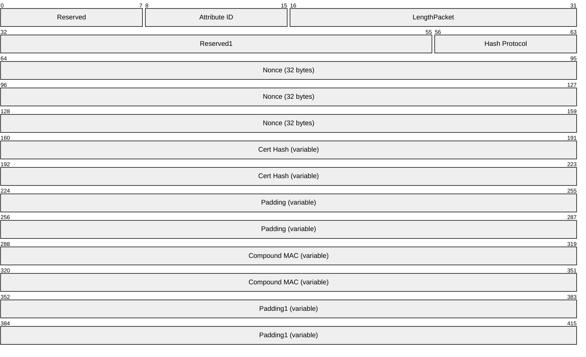

**Reserved (1 byte):** This 8-bit field is reserved for future use. MUST be set to zero when sent and MUST be ignored on receipt.

**Attribute ID (1 byte):** An 8-bit (1-byte) field that is used to specify the type of attribute; its value MUST be 0x03 for the **Crypto Binding** attribute.

**LengthPacket (2 bytes):** A 16-bit unsigned integer in network byte order that packs data for two fields, configured in the following format.


**R (4 bits):** This 4-bit field is reserved for future use. MUST be set to zero when sent and MUST be ignored on receipt.

**Length (12 bits):** A 12-bit unsigned integer in network byte order that MUST specify the length of the **Crypto Binding** attribute. Its value MUST be 104 (that is, 0x068).

**Reserved1 (3 bytes):** This 24-bit field is reserved for future use. MUST be set to zero when sent and MUST be ignored on receipt.

**Hash Protocol (1 byte):** A 1-byte field that specifies the Cert Hash type and hash algorithm that is used for Compound MAC calculation. Its value MUST be one of the following.

| Name | Value |
| --- | --- |
| CERT_HASH_PROTOCOL_SHA1 | 0x01 |
| CERT_HASH_PROTOCOL_SHA256 | 0x02 |

**Nonce (32 bytes):** A 256-bit unsigned integer that contains a temporally unique (or random) value. For more information, see [[RFC1750]](https://go.microsoft.com/fwlink/?LinkId=90288). This value MUST be the same as what is received from the SSTP server in the [Crypto Binding Request attribute](#Section_2.2.6).

**Cert Hash (variable):** A variable-length field in network byte order that contains either the [**SHA1 hash**](#gt_sha1-hash) [[RFC3174]](https://go.microsoft.com/fwlink/?LinkId=90408) or the SHA256 hash [[SHA256]](https://go.microsoft.com/fwlink/?LinkId=90514) of the server certificate. The hash algorithm to be used is specified by the **Hash Protocol** field in the message. The server certificate is an X.509 certificate as described in [[RFC5280]](https://go.microsoft.com/fwlink/?LinkId=131034); it is available as a part of the SSL/TLS handshake ([[SSL3]](https://go.microsoft.com/fwlink/?LinkId=90534) section 5.6.2 and [[RFC2246]](https://go.microsoft.com/fwlink/?LinkId=90324) section 7.4.2). The [**SSL/TLS handshake**](#gt_ssltls-handshake) happens during the HTTPS session setup. For more details on the SSL/TLS handshake, see [SSL3] section 5.6 and [RFC2246] section 7.4. The length of this field is either 20 bytes when SHA1 hash is used or 32 bytes when SHA256 hash is used.

**Padding (variable):** This field is reserved for future use. MUST be set to zero when sent and MUST be ignored on receipt. This field is either zero bytes long when the SHA256 Cert Hash is used, or 12 bytes long when the SHA1 Cert Hash is used.

**Compound MAC (variable):** A variable-length unsigned integer that contains the value that is used to cryptographically associate the higher-layer authentication (that is, PPP authentication) with the lower-layer HTTPS connection and therefore ensure that the SSTP client and the SSTP server participated in both of them. (For more information, see section [3.2.5.2](#Section_3.2.5.2) and also see [RFC1661].) This field is either 20 bytes long when the SHA1 Hash Protocol is used for Compound MAC computation, or 32 bytes long when the SHA256 Hash Protocol is used for Compound MAC computation.

**Padding1 (variable):** A variable-length field that is reserved for future use. MUST be set to zero when sent and MUST be ignored on receipt. This field is either zero bytes long when the SHA256 Cert Hash is used, or 12 bytes long when the SHA1 Cert Hash is used.

<a id="Section_2.2.8"></a>
### 2.2.8 Status Info Attribute

The following diagram specifies the format that MUST be used for the Status Info attribute. Both the client and server use this attribute to indicate to each other the reason for failure and the unsupported attributes. This attribute can be used to indicate the status of only one attribute at a time; that is, if the server wants to indicate the status of multiple attributes, then it is necessary to respond with multiple Status Info attributes.

The fields of the structure MUST be transmitted as bytes from left to right.

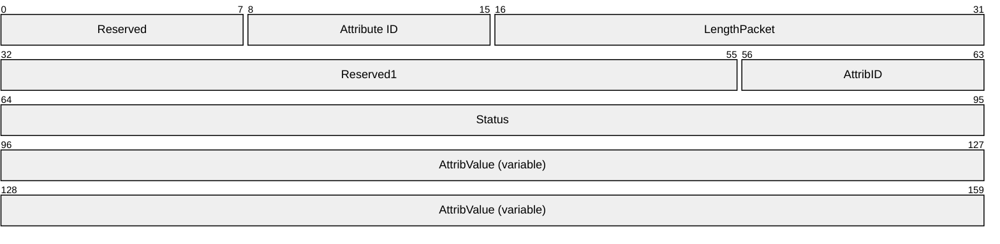

**Reserved (1 byte):** This 8-bit field is reserved for future use. MUST be set to zero when sent and MUST be ignored on receipt.

**Attribute ID (1 byte):** An 8-bit (1-byte) field that is used to specify the type of attribute; its value MUST be 0x02 for the Status Info attribute.

**LengthPacket (2 bytes):** A 16-bit unsigned integer in network byte order that packs data for two fields, configured in the following format.


**R (4 bits):** This 4-bit field is reserved for future use. MUST be set to zero when sent and MUST be ignored on receipt.

**Length (12 bits):** A 12-bit unsigned integer in network byte order that MUST specify the length of the Status Info attribute. Its value MUST be the length of the AttribValue field plus 12.

**Reserved1 (3 bytes):** This 24-bit field is reserved for future use. MUST be set to zero when sent and MUST be ignored on receipt.

**AttribID (1 byte):** A 1-byte field that specifies the attribute ID whose status is given by the Status Info attribute. Its value MUST be one of the following.

| Name | Value |
| --- | --- |
| SSTP_ATTRIB_NO_ERROR | 0x00 |
| SSTP_ATTRIB_ENCAPSULATED_PROTOCOL_ID | 0x01 |
| SSTP_ATTRIB_STATUS_INFO | 0x02 |
| SSTP_ATTRIB_CRYPTO_BINDING | 0x03 |
| SSTP_ATTRIB_CRYPTO_BINDING_REQ | 0x04 |

For example, if the Encapsulated Protocol ID that is suggested by the client is not acceptable to the server, then it replies with a Status Info attribute that contains AttribID = 0x01 (that is, SSTP_ATTRIB_ENCAPSULATED_PROTOCOL_ID), Status = 0x00000004 (that is, ATTRIB_STATUS_VALUE_NOT_SUPPORTED), and AttribValue = the value proposed by the client.

**Status (4 bytes):** A 4-byte field that specifies the reason for the failure. Its value MUST be one of the following.

| Value | Meaning |
| --- | --- |
| ATTRIB_STATUS_NO_ERROR 0x00000000 | This Status value SHOULD be used as part of the Status Info attribute to indicate the scenario in which there is no error event to report. For example, the higher-layer initiated disconnect is a normal scenario. In such a case, the [**SSTP peer**](#gt_sstp-peer) can send a Status Info attribute that has this status value. |
| ATTRIB_STATUS_DUPLICATE_ATTRIBUTE 0x00000001 | This status value MUST be used to indicate multiple occurrences of a specific attribute. The AttribID of the Status Info attribute denotes the attribute that is occurring more than one time in the message. |
| ATTRIB_STATUS_UNRECOGNIZED_ATTRIBUTE 0x00000002 | This status value MUST be used to indicate the presence of an unrecognized attribute that is received from the far end. The AttribID field of the Status Info attribute specifies the attribute that is received from the far end that is not recognized by the SSTP peer. |
| ATTRIB_STATUS_INVALID_ATTRIB_VALUE_LENGTH 0x00000003 | This status value MUST be used when the length of the attribute (specified by AttribID in the Status Info attribute) that is received from the [**SSTP far end**](#gt_sstp-far-end) differs from the expected length of the attribute defined in each attribute id section. |
| ATTRIB_STATUS_VALUE_NOT_SUPPORTED 0x00000004 | This status value MUST be used when the value of the attribute (specified by AttribID in the Status Info attribute) that is received from the SSTP far end is not supported by this SSTP peer. |
| ATTRIB_STATUS_UNACCEPTED_FRAME_RECEIVED 0x00000005 | This status value MUST be used when the message type that is received from the far end is not acceptable for the current state of the SSTP peer. |
| ATTRIB_STATUS_RETRY_COUNT_EXCEEDED 0x00000006 | This status value MUST be used when the connection is being aborted because the retry count is exceeded for an operation. For example, if the [**SSTP client**](#gt_sstp-client) failed to provide the acceptable values for the attributes in the connect request that are rejected by the server with a call connect NACK for a predefined number<2> of consecutive times, then the server aborts the connection and uses this status value. |
| ATTRIB_STATUS_INVALID_FRAME_RECEIVED 0x00000007 | This status MUST be used to stop connections when the message type or the frame format that is received from the SSTP far end is not recognized by the SSTP peer. |
| ATTRIB_STATUS_NEGOTIATION_TIMEOUT 0x00000008 | This status MUST be used to abort connections when the far end has not responded in a timely manner and a time-out results. See sections [3.2.2](#Section_3.2.2) and [3.1.2](#Section_3.1.2) for timeout value in various scenarios. |
| ATTRIB_STATUS_ATTRIB_NOT_SUPPORTED_IN_MSG 0x00000009 | This status MUST be used while sending a SSTP_MSG_CALL_ABORT when the attribute that is received from the far end is not supported in the specified message or the expected attribute is not received in the specified message. For example: The SSTP server receives an [SSTP_MSG_CALL_CONNECTED](#Section_2.2.11) message with one of the attributes with attribute Id equal to SSTP_ATTRIB_STATUS_INFO and status not equal to ATTRIB_STATUS_NO_ERROR. The SSTP server receives an SSTP_MSG_CALL_CONNECTED message not having Crypto Binding attribute. |
| ATTRIB_STATUS_REQUIRED_ATTRIBUTE_MISSING 0x0000000a | This status MUST be used in the NACK of a [Call Connect Request message](#Section_2.2.9) when a mandatory attribute for the message was not sent by the far end. The SSTP client MUST send SSTP_ATTRIB_ENCAPSULATED_PROTOCOL_ID as a part of SSTP_MSG_CALL_CONNECT_REQUEST. If this value is not present, then the [**SSTP server**](#gt_sstp-server) MUST send an SSTP_MSG_CALL_CONNECT_NAK that has a status of this value and an AttribID of SSTP_ATTRIB_ENCAPSULATED_PROTOCOL_ID. |
| ATTRIB_STATUS_STATUS_INFO_NOT_SUPPORTED_IN_MSG 0x0000000b | This status MUST be used while sending a NACK when the SSTP server receives an SSTP_MSG_CALL_CONNECT_REQUEST message, and one of the attributes with attribute ID equal to SSTP_ATTRIB_STATUS_INFO has status not equal to ATTRIB_STATUS_NO_ERROR. |

**AttribValue (variable):** A variable-length field in network byte order that specifies the original value of the attribute that is proposed by the client in the Call Connect Request message that is sent back by the server in the [Call Connect Negative Acknowledgment message](#Section_2.2.12). It is not present (that is, it is of zero length) in the Call Connect Negative Acknowledgment message if the mandatory attribute is not sent by the client in the Call Connect Request message; or if the attribute that is sent by the client in the Call Connect Request message is not understood by the server. The mandatory and optional attributes for a given message are covered in the respective message description. This field MUST NOT be present (that is, it is of zero length) in any other case where the Status Info attribute is present. The maximum length of this field MUST be 64 bytes. If the original attribute is greater than 64 bytes, only the first 64 bytes are sent back.

<a id="Section_2.2.9"></a>
### 2.2.9 Call Connect Request Message (SSTP_MSG_CALL_CONNECT_REQUEST)

The following diagram specifies the format that MUST be used for this message. This message MUST be the first message that is sent by the [**SSTP client**](#gt_sstp-client) after it establishes an HTTPS connection with the server. The client uses this message to request the establishment of an SSTP connection with the server. Note that this message follows the format of an [SSTP control packet](#Section_2.2.2).

The fields of the structure MUST be transmitted in network byte order from left to right.

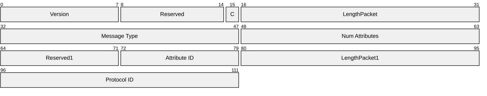

**Version (1 byte):** An 8-bit (1-byte) field that communicates and negotiates the version of SSTP. The upper 4 bits are the MAJOR version, which MUST be 0x1, and the lower 4 bits are the MINOR version, which MUST be set to 0x0. This means that the 8-bit value of the Version field MUST be 0x10 and corresponds to Version 1.0.

**Reserved (7 bits):** This 7-bit field is reserved for future use. MUST be set to zero when sent and MUST be ignored on receipt.

**C (1 bit):** A 1-bit field that is used to indicate whether the packet is an SSTP control packet or an [SSTP data packet](#Section_2.2.3). The value MUST be 1 for a message that is a control packet.

**LengthPacket (2 bytes):** A 16-bit unsigned integer in network byte order that packs data for two fields, configured in the following format.


**R (4 bits):** This 4-bit field is reserved for future use. MUST be set to zero when sent and MUST be ignored on receipt.

**Length (12 bits):** A 12-bit unsigned integer in network byte order that contains the value 0x00e for the length of the entire message.

**Message Type (2 bytes):** A 16-bit field in network byte order that specifies the type of message. It MUST be 0x0001 (SSTP_MSG_CALL_CONNECT_REQUEST).

**Num Attributes (2 bytes):** A 16-bit field in network byte order that specifies the number of attributes in the message. This value MUST be 0x0001 because SSTP Version 1 supports only the [Encapsulated Protocol ID attribute](#Section_2.2.5) by using a Protocol ID value of PPP. For more information, see [[RFC1661]](https://go.microsoft.com/fwlink/?LinkId=90283).

**Reserved1 (1 byte):** This 8-bit field is reserved for future use. MUST be set to zero when sent and MUST be ignored on receipt.

**Attribute ID (1 byte):** An 8-bit (1-byte) field that is used to specify the type of attribute; its value MUST be 0x01 for the Encapsulated Protocol ID attribute.

**LengthPacket1 (2 bytes):** A 16-bit unsigned integer in network byte order that packs data for two fields, configured in the following format.

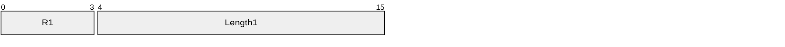

**R1 (4 bits):** This 4-bit field is reserved for future use. MUST be set to zero when sent and MUST be ignored on receipt.

**Length1 (12 bits):** A 12-bit unsigned integer in network byte order that contains the value 0x006 for the Encapsulated Protocol ID attribute length.

**Protocol ID (2 bytes):** A 2-byte field in network byte order that contains the value 0x0001 (that is, SSTP_ENCAPSULATED_PROTOCOL_PPP). Note that SSTP Version 1 supports only the transport of PPP frames. For more information, see [RFC1661].

<a id="Section_2.2.10"></a>
### 2.2.10 Call Connect Acknowledge Message (SSTP_MSG_CALL_CONNECT_ACK)

The following diagram specifies the format that MUST be used for this message. The server sends this message in response to an acceptable Call Connect Request message from a client. Note that this message follows the format of an [SSTP control packet (section 2.2.2)](#Section_2.2.2).

The fields of the structure MUST be transmitted in network byte order from left to right.

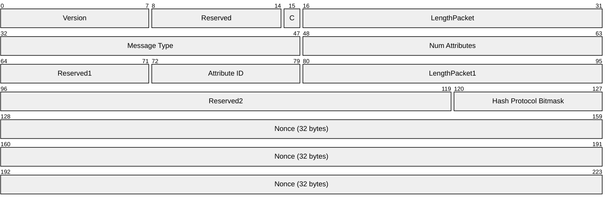

**Version (1 byte):** An 8-bit (1-byte) field that is used to communicate and negotiate the version of SSTP that is being used. The upper 4 bits are the MAJOR version, which MUST be 0x1, and the lower 4 bits are the MINOR version, which MUST be set to 0x0. This means that the 8-bit value of the Version field MUST be 0x10 and corresponds to Version 1.0.

**Reserved (7 bits):** This 7-bit field is reserved for future use. MUST be set to zero when sent and MUST be ignored on receipt.

**C (1 bit):** A 1-bit field that is used to indicate whether the packet is an SSTP control packet or an [SSTP data packet](#Section_2.2.3). The value MUST be 1 for a Call Connect Acknowledge message that is a control packet.

**LengthPacket (2 bytes):** A 16-bit unsigned integer in network byte order that packs data for two fields, configured in the following format.

```mermaid
packet-beta
  0-3: "R"
  4-15: "Length"
```

**R (4 bits):** This 4-bit field is reserved for future use. MUST be set to zero when sent and MUST be ignored on receipt.

**Length (12 bits):** A 12-bit unsigned integer in network byte order that MUST specify the length, in bytes, of the entire Call Connect Acknowledge message. This field MUST be set to a value of 48 (0x030).

**Message Type (2 bytes):** A 16-bit field in network byte order that specifies the type of message. It MUST be 0x0002 (that is, SSTP_MSG_CALL_CONNECT_ACK).

**Num Attributes (2 bytes):** A 16-bit field in network byte order that specifies the number of attributes in the message. This value MUST be 1 for these messages because they contain the [Crypto Binding Request attribute](#Section_2.2.6) only.

**Reserved1 (1 byte):** This 8-bit field is reserved for future use. MUST be set to zero when sent and MUST be ignored on receipt.

**Attribute ID (1 byte):** An 8-bit (1-byte) field that is used to specify the type of attribute; its value MUST be 0x04 for the Crypto Binding Request attribute.

**LengthPacket1 (2 bytes):** A 16-bit unsigned integer in network byte order that packs data for two fields, configured in the following format.

```mermaid
packet-beta
  0-3: "R1"
  4-15: "Length1"
```

**R1 (4 bits):** This 4-bit field is reserved for future use. MUST be set to zero when sent and MUST be ignored on receipt.

**Length1 (12 bits):** A 12-bit unsigned integer in network byte order that MUST specify the length of the Crypto Binding Request attribute. Its value MUST be 40 bytes, that is, 0x028.

**Reserved2 (3 bytes):** This 24-bit field is reserved for future use. MUST be set to zero when sent and MUST be ignored on receipt.

**Hash Protocol Bitmask (1 byte):** This 1-byte bitmask field is used (with the **ServerHashProtocolSupported** state variable described in section [3.3.1](#Section_3.3.1)) to specify the hashing methods allowed by the server that the client uses to compute the Compound MAC in the [Crypto Binding attribute](#Section_2.2.7). For more information, see section [3.2.5.2](#Section_3.2.5.2). The following bits are defined.

A 1 MUST be placed in the appropriate bit position to select the supported hash protocol. The server MUST select at least one hash protocol. If the server selects both the SHA256 and the [**SHA1 hash**](#gt_sha1-hash) protocols and the client supports both hash protocols (as indicated by the value of the **ClientHashProtocolSupported** state variable described in section [3.2.1](#Section_3.2.1)), then the client MUST select the SHA256 protocol. For more information about how the client processes the **Hash Protocol Bitmask** when it receives a Call Connect Acknowledge message, see section [3.2.5.3.2](#Section_3.2.5.3.2).

| 0 | 1 | 2 | 3 | 4 | 5 | 6 | 7 |
| --- | --- | --- | --- | --- | --- | --- | --- |
| 0 | 0 | 0 | 0 | 0 | 0 | B | A |

Where the bits are defined as:

| Value | Description |
| --- | --- |
| A | CERT_HASH_PROTOCOL_SHA1 is enabled when A=1 and is disabled when A=0. |
| B | CERT_HASH_PROTOCOL_SHA256 is enabled when B=1 and is disabled when B=0. |

**Nonce (32 bytes):** A 256-bit unsigned integer that contains a temporally unique (or random) value. For more information, see [[RFC1750]](https://go.microsoft.com/fwlink/?LinkId=90288).

<a id="Section_2.2.11"></a>
### 2.2.11 Call Connected Message (SSTP_MSG_CALL_CONNECTED)

The following diagram specifies the format that MUST be used for this message. The client sends this message to the server as a response to the Call Connect Acknowledge message after [**SSL/TLS handshake**](#gt_ssltls-handshake) and higher-layer authentication (that is, PPP authentication) are completed. This message marks the completion of SSTP negotiation. It cryptographically binds the SSL/TLS handshake and PPP authentication so that a man-in-the-middle attacker cannot relay PPP packets that are received on another medium. For example, wireless packets could be received that are not intended for SSTP communication during protocol operation and could represent an attack. For more information about the PPP authentication phase, see section 3.5 of [[RFC1661]](https://go.microsoft.com/fwlink/?LinkId=90283).

The fields of the structure MUST be transmitted in network byte order from left to right.

```mermaid
packet-beta
  0-7: "Version"
  8-14: "Reserved"
  15-15: "C"
  16-31: "LengthPacket"
  32-47: "Message Type"
  48-63: "Num Attributes"
  64-71: "Reserved1"
  72-79: "Attribute ID"
  80-95: "LengthPacket1"
  96-119: "Reserved2"
  120-127: "Hash Protocol Bitmask"
  128-223: "Nonce (32 bytes)"
  224-287: "Cert Hash (variable)"
  288-351: "Padding (variable)"
  352-415: "Compound MAC (variable)"
  416-479: "Padding1 (variable)"
```

**Version (1 byte):** An 8-bit (1-byte) field that communicates and negotiates the version of SSTP that is being used. The upper 4 bits are the major version, which MUST be 0x1, and the lower 4 bits are the minor version, which MUST be 0x0. This means that the 8-bit value of the **Version** field MUST be 0x10 and correspond to Version 1.0.

**Reserved (7 bits):** This 7-bit field is reserved for future use. MUST be set to zero when sent and MUST be ignored on receipt.

**C (1 bit):** A 1-bit field that specifies whether the packet is an [SSTP control packet](#Section_2.2.2) or an [SSTP data packet](#Section_2.2.3). The value MUST be 1 for a Call Connect Request message that is a control packet.

**LengthPacket (2 bytes):** A 16-bit, unsigned integer in network byte order that packs data for two fields, which are configured in the following format.

```mermaid
packet-beta
  0-3: "R"
  4-15: "Length"
```

**R (4 bits):** This 4-bit field is reserved for future use. MUST be set to zero when sent and MUST be ignored on receipt.

**Length (12 bits):** A 12-bit, unsigned integer in network byte order that specifies the length of a **Call Connected message**. Its value MUST be 112 (that is, 0x070).

**Message Type (2 bytes):** A 16-bit field in network byte order that specifies the type of this message. It MUST be 0x0004 (that is, SSTP_MSG_CALL_CONNECTED).

**Num Attributes (2 bytes):** A 16-bit field in network byte order that specifies the number of attributes in this message. This value MUST be 1 because SSTP supports only the [Crypto Binding attribute](#Section_2.2.7) in a **Call Connected message**.

**Reserved1 (1 byte):** This 8-bit field is reserved for future use. MUST be set to zero when sent and MUST be ignored on receipt.

**Attribute ID (1 byte):** An 8-bit (1-byte) field that is used to specify the type of the attribute. This value MUST be 0x03 for the Crypto Binding attribute.

**LengthPacket1 (2 bytes):** A 16-bit, unsigned integer in network byte order that packs data for two fields, which are configured in the following format.

```mermaid
packet-beta
  0-3: "R1"
  4-15: "Length1"
```

**R1 (4 bits):** This 4-bit field is reserved for future use. MUST be set to zero when sent and MUST be ignored on receipt.

**Length1 (12 bits):** A 12-bit, unsigned integer in network byte order that specifies the length of the Crypto Binding attribute. Its value MUST be 104 (that is, 0x068).

**Reserved2 (3 bytes):** This 24-bit field is reserved for future use. MUST be set to zero when sent and MUST be ignored on receipt.

**Hash Protocol Bitmask (1 byte):** A 1-byte field that specifies the Cert Hash Type and hash algorithm that are used for Compound MAC calculation. Its value MUST be one of the following.

| Name | Value |
| --- | --- |
| CERT_HASH_PROTOCOL_SHA1 | 0x01 |
| CERT_HASH_PROTOCOL_SHA256 | 0x02 |

**Nonce (32 bytes):** A 256-bit, unsigned integer that contains a temporally unique (or random) value. (For more information, see [[RFC1750]](https://go.microsoft.com/fwlink/?LinkId=90288).) This value MUST be the same as the value received from the [**SSTP server**](#gt_sstp-server) in the [Call Connect Acknowledge message](#Section_2.2.10) (and stored in the **ClientNonce** state variable described in section [3.2.1](#Section_3.2.1)). This behavior ensures that a man-in-the-middle attacker cannot cause a replay attack.

**Cert Hash (variable):** A variable-length field in network byte order that contains either the [**SHA1 hash**](#gt_sha1-hash) or the SHA256 hash (as specified by the **Hash Protocol Bitmask** field in this message) of the server certificate that is obtained during SSL/TLS handshake and stored in the **ClientCertificateHash** state variable (described in section 3.2.1). The length of the field is either 20 bytes long when the SHA1 hash is used or 32 bytes long when the SHA256 hash is used.

**Padding (variable):** A variable-length field that is reserved for future use. MUST be set to zero when sent and MUST be ignored on receipt. This field is either zero bytes long when the SHA256 Cert Hash is used or 12 bytes long when the [**SHA1**](#gt_168fbe0c-fc02-4722-979e-b0261766ac9c) Cert Hash is used.

**Compound MAC (variable):** A variable-length, unsigned integer containing the value that is used to cryptographically associate the higher-layer authentication (that is, PPP authentication) with a lower-layer [**HTTPS**](#gt_hypertext-transfer-protocol-secure-https) connection. This association ensures that the [**SSTP client**](#gt_sstp-client) and the SSTP server participated in both PPP authentication and HTTPS connection. (For more information, see section [3.2.5.2](#Section_3.2.5.2) and [RFC1661].) This field is either 20 bytes long when the SHA1 hash protocol is used for Compound MAC computation or 32 bytes long when the SHA256 hash protocol is used for Compound MAC computation.

**Padding1 (variable):** A variable-length field that is reserved for future use MUST be set to zero when sent and MUST be ignored on receipt. This field is either zero bytes in length when the SHA256 Hash Protocol is used for Compound MAC computation or 12 bytes in length when the SHA1 Hash Protocol is used.

<a id="Section_2.2.12"></a>
### 2.2.12 Call Connect Negative Acknowledgment Message (SSTP_MSG_CALL_CONNECT_NAK)

The following diagram specifies the format that MUST be used for this message. This message is sent by the [**SSTP server**](#gt_sstp-server) in response to an unacceptable [Call Connect Request message](#Section_2.2.9) that is sent by the [**SSTP client**](#gt_sstp-client). Note that this message follows the format of an [SSTP control packet](#Section_2.2.2), as specified in 2.2.2. This message MUST have one or more [Status Info attributes](#Section_2.2.8). This message MUST NOT have any other attribute.

The fields of the structure MUST be transmitted in network byte order from left to right.

```mermaid
packet-beta
  0-7: "Version"
  8-14: "Reserved"
  15-15: "C"
  16-31: "LengthPacket"
  32-47: "Message Type"
  48-63: "Num Attributes"
  64-71: "Reserved1"
  72-79: "AttributeID"
  80-95: "LengthPacket1"
  96-119: "Reserved2"
  120-127: "AttribID"
  128-159: "Status"
  160-223: "AttribValue (variable)"
```

**Version (1 byte):** An 8-bit (1-byte) field that is used to communicate and negotiate the version of SSTP that is being used. The upper 4 bits are MAJOR version, which MUST be 0x1, and the lower 4 bits are MINOR version, which MUST be set to 0x0. Therefore, the 8-bit value of the Version field MUST be 0x10 and corresponds to Version 1.0.

**Reserved (7 bits):** This 7-bit field is reserved for future use. MUST be set to zero when sent and MUST be ignored on receipt.

**C (1 bit):** A 1-bit field that is used to indicate whether the packet is an SSTP control packet or an [SSTP data packet](#Section_2.2.3). The value MUST be 1 for a message that is a control packet.

**LengthPacket (2 bytes):** A 16-bit unsigned integer in network byte order that packs data for two fields, configured in the following format.

```mermaid
packet-beta
  0-3: "R"
  4-15: "Length"
```

**R (4 bits):** This 4-bit field is reserved for future use. MUST be set to zero when sent and MUST be ignored on receipt.

**Length (12 bits):** A 12-bit unsigned integer in network byte order that MUST specify the length, in bytes, of this entire message.

**Message Type (2 bytes):** A 16-bit field in network byte order that specifies the type of message. It MUST be 0x0003 (that is, SSTP_MSG_CALL_CONNECT_NAK).

**Num Attributes (2 bytes):** A 16-bit field in network byte order that specifies the number of attributes in the message. This value MUST be greater than or equal to 1 because this message MUST have at least one Status Info attribute.

**Reserved1 (1 byte):** This 8-bit field is reserved for future use. MUST be set to zero when sent and MUST be ignored on receipt.

**AttributeID (1 byte):** An 8-bit (1-byte) field that is used to specify the type of attribute; its value MUST be 0x02 for the Status Info attribute.

**LengthPacket1 (2 bytes):** A 16-bit unsigned integer in network byte order that packs data for two fields, configured in the following format.

```mermaid
packet-beta
  0-3: "R1"
  4-15: "Length1"
```

**R1 (4 bits):** This 4-bit field is reserved for future use. MUST be set to zero when sent and MUST be ignored on receipt.

**Length1 (12 bits):** A 12-bit unsigned integer in network byte order that contains the value 12 plus the length of the AttribValue field.

**Reserved2 (3 bytes):** This 24-bit field is reserved for future use. MUST be set to zero when sent and MUST be ignored on receipt.

**AttribID (1 byte):** A 1-byte field that specifies the attribute ID whose status is given by the Status Info attribute. Its value MUST be one of the following.

| Name | Value |
| --- | --- |
| SSTP_ATTRIB_ENCAPSULATED_PROTOCOL_ID | 0x01 |
| SSTP_ATTRIB_STATUS_INFO | 0x02 |
| SSTP_ATTRIB_CRYPTO_BINDING | 0x03 |
| SSTP_ATTRIB_CRYPTO_BINDING_REQ | 0x04 |

For example, if the Encapsulated Protocol ID that is suggested by the client is not acceptable to the server, then it replies with a Status Info attribute that contains AttribID = 0x01 (that is, SSTP_ATTRIB_ENCAPSULATED_PROTOCOL_ID), Status = 0x00000004 (that is, ATTRIB_STATUS_VALUE_NOT_SUPPORTED), and AttribValue = value proposed by the client.

**Status (4 bytes):** A 4-byte field that specifies the reason for the failure. Its value MUST be one of the following values, the description of which is specified in the Status Info attribute (section 2.2.8).

| Name | Value |
| --- | --- |
| ATTRIB_STATUS_DUPLICATE_ATTRIBUTE | 0x00000001 |
| ATTRIB_STATUS_UNRECOGNIZED_ATTRIBUTE | 0x00000002 |
| ATTRIB_STATUS_INVALID_ATTRIB_VALUE_LENGTH | 0x00000003 |
| ATTRIB_STATUS_VALUE_NOT_SUPPORTED | 0x00000004 |
| ATTRIB_STATUS_REQUIRED_ATTRIBUTE_MISSING | 0x0000000a |
| ATTRIB_STATUS_STATUS_INFO_NOT_SUPPORTED_IN_MSG | 0x0000000b |

**AttribValue (variable):** A variable-length field, in network byte order, that specifies the original value of the attribute that is proposed by the client in the Call Connect Request message that is sent back by the server in this message. This field is not present (that is, it is of zero length) in this message if the mandatory attribute is not sent by the client in the Call Connect Request message; or if the attribute that is sent by the client in the Call Connect Request message is not understood by the server. This field MUST NOT be present (that is, it is of zero length) in any other case where the Status Info attribute is present. The maximum length of this field is 64 bytes. If the original attribute is greater than 64 bytes, then only the first 64 bytes are sent back.

<a id="Section_2.2.13"></a>
### 2.2.13 Call Abort Message (SSTP_MSG_CALL_ABORT)

This is sent by an [**SSTP peer**](#gt_sstp-peer) to the [**SSTP far end**](#gt_sstp-far-end) in order to initiate an abnormal disconnection of the SSTP connection. This behavior occurs when an invalid message is received as specified in the state transition diagrams in sections [3.1.1.1.1](#Section_3.1.1.1.1), [3.2.1.1.1](#Section_3.2.1.1.1), and [3.3.1.1.1](#Section_3.3.1.1.1). For example, if the server receives a [Call Connected](#Section_2.2.11) message with an invalid length specified for the attribute, the [**SSTP server**](#gt_sstp-server) sends a Call Abort message to the [**SSTP client**](#gt_sstp-client).

The following diagram specifies the format that MUST be used for the Call Abort message. This message follows the format of an SSTP control packet as specified in section [2.2.2](#Section_2.2.2). This message SHOULD have one Status Info attribute.<3> This message MUST NOT have any other attributes.

The fields of the structure MUST be transmitted in network byte order from left to right.

```mermaid
packet-beta
  0-7: "Version"
  8-14: "Reserved"
  15-15: "C"
  16-31: "LengthPacket"
  32-47: "Message Type"
  48-63: "Num Attributes"
  64-71: "Reserved1"
  72-79: "AttributeID"
  80-95: "LengthPacket1"
  96-119: "Reserved2"
  120-127: "AttribID"
  128-159: "Status"
```

**Version (1 byte):** An 8-bit (1-byte) field that is used to communicate and negotiate the version of SSTP that is being used. The upper 4 bits are MAJOR version, which MUST be 0x1, and the lower 4 bits are MINOR version, which MUST be set to 0x0. Therefore, the 8-bit value of the **Version** field MUST be 0x10 and corresponds to Version 1.0.

**Reserved (7 bits):** This 7-bit field is reserved for future use. MUST be set to zero when sent and MUST be ignored on receipt.

**C (1 bit):** A 1-bit field that is used to indicate whether the packet is an SSTP control packet or an [SSTP data packet](#Section_2.2.3). The value MUST be 1 for a Call Abort message that is a control packet.

**LengthPacket (2 bytes):** A 16-bit unsigned integer in network byte order that packs data for two fields, configured in the following format.

```mermaid
packet-beta
  0-3: "R"
  4-15: "Length"
```

**R (4 bits):** This 4-bit field is reserved for future use. MUST be set to zero when sent and MUST be ignored on receipt.

**Length (12 bits):** A 12-bit unsigned integer in network byte order that MUST specify the length, in bytes, of the entire Call Abort message.

**Message Type (2 bytes):** A 16-bit field in network byte order that specifies the type of message. It MUST be 0x0005 (that is, SSTP_MSG_CALL_ABORT).

**Num Attributes (2 bytes):** A 16-bit field in network byte order that specifies the number of attributes in the message. This value MUST be set to 1 if a [Status Info attribute](#Section_2.2.8) is being sent along with this message. If no Status Info attribute is present in this message, this value MUST be set to 0.

**Reserved1 (1 byte):** This 8-bit (1-byte) field is reserved for future use. MUST be set to zero when sent and MUST be ignored on receipt.

**AttributeID (1 byte):** An 8-bit (1-byte) field that is used to specify the type of attribute; its value MUST be 0x02 for the Status Info attribute.

**LengthPacket1 (2 bytes):** A 16-bit unsigned integer in network byte order that packs data for two fields, configured in the following format.

```mermaid
packet-beta
  0-3: "R1"
  4-15: "Length1"
```

**R1 (4 bits):** This 4-bit field is reserved for future use. MUST be set to zero when sent and MUST be ignored on receipt.

**Length1 (12 bits):** A 12-bit unsigned integer in network byte order that contains the value 12 plus the length of the AttribValue field.

**Reserved2 (3 bytes):** This 24-bit field is reserved for future use. MUST be set to zero when sent and MUST be ignored on receipt.

**AttribID (1 byte):** A 1-byte field that specifies the attribute ID whose status is given by the Status Info attribute. Its value MUST be one of the following.

| Name | Value |
| --- | --- |
| SSTP_ATTRIB_ENCAPSULATED_PROTOCOL_ID | 0x01 |
| SSTP_ATTRIB_STATUS_INFO | 0x02 |
| SSTP_ATTRIB_CRYPTO_BINDING | 0x03 |
| SSTP_ATTRIB_CRYPTO_BINDING_REQ | 0x04 |

**Status (4 bytes):** A 4-byte field that specifies the reason for the failure. Its value MUST be one of the following values, the description of which is specified in the Status Info attribute (section 2.2.8).

| Name | Value |
| --- | --- |
| ATTRIB_STATUS_VALUE_NOT_SUPPORTED | 0x00000004 |
| ATTRIB_STATUS_UNACCEPTED_FRAME_RECEIVED | 0x00000005 |
| ATTRIB_STATUS_RETRY_COUNT_EXCEEDED | 0x00000006 |
| ATTRIB_STATUS_INVALID_FRAME_RECEIVED | 0x00000007 |
| ATTRIB_STATUS_NEGOTIATION_TIMEOUT | 0x00000008 |
| ATTRIB_STATUS_ATTRIB_NOT_SUPPORTED_IN_MSG | 0x00000009 |

<a id="Section_2.2.14"></a>
### 2.2.14 Call Disconnect Message (SSTP_MSG_CALL_DISCONNECT)

This message is sent by an [**SSTP peer**](#gt_sstp-peer) to the [**SSTP far end**](#gt_sstp-far-end) in order to initiate the normal disconnection of the SSTP connection, such as when a user initiates a manual disconnect.

The following diagram specifies the format that MUST be used for this message. This message follows the format of an SSTP control packet as specified in section [2.2.2](#Section_2.2.2). This message SHOULD have one Status Info attribute.<4> This message MUST NOT have any other attributes.

The fields of the structure MUST be transmitted in network byte order from left to right.

```mermaid
packet-beta
  0-7: "Version"
  8-14: "Reserved"
  15-15: "C"
  16-31: "LengthPacket"
  32-47: "Message Type"
  48-63: "Num Attributes"
  64-71: "Reserved1"
  72-79: "AttributeID"
  80-95: "LengthPacket1"
  96-119: "Reserved2"
  120-127: "AttribID"
  128-159: "Status"
```

**Version (1 byte):** An 8-bit (1-byte) field that is used to communicate and negotiate the version of SSTP that is being used. The upper 4 bits are MAJOR version, which MUST be 0x1, and the lower 4 bits are MINOR version, which MUST be set to 0x0. Therefore, the 8-bit value of the **Version** field MUST be 0x10 and corresponds to Version 1.0.

**Reserved (7 bits):** This 7-bit field is reserved for future use. MUST be set to zero when sent and MUST be ignored on receipt.

**C (1 bit):** A 1-bit field that is used to indicate whether the packet is an SSTP control packet or an [SSTP data packet](#Section_2.2.3). The value MUST be 1 when this message is a control packet.

**LengthPacket (2 bytes):** A 16-bit unsigned integer in network byte order that packs data for two fields, configured in the following format.

```mermaid
packet-beta
  0-3: "R"
  4-15: "Length"
```

**R (4 bits):** This 4-bit field is reserved for future use. MUST be set to zero when sent and MUST be ignored on receipt.

**Length (12 bits):** A 12-bit unsigned integer in network byte order that MUST specify the length, in bytes, of this entire message.

**Message Type (2 bytes):** A 16-bit field in network byte order that specifies the type of message. It MUST be 0x0006 (that is, SSTP_MSG_CALL_DISCONNECT).

**Num Attributes (2 bytes):** A 16-bit field in network byte order that specifies the number of attributes in the message. This value MUST be set to 1 if a [Status Info attribute](#Section_2.2.8) is being sent along with this message. If no Status Info attribute is present in this message, this value MUST be set to 0.

**Reserved1 (1 byte):** This 8-bit (1-byte) field is reserved for future use. MUST be set to zero when sent and MUST be ignored on receipt.

**AttributeID (1 byte):** An 8-bit (1-byte) field that is used to specify the type of attribute; its value MUST be 0x02 for the Status Info attribute.

**LengthPacket1 (2 bytes):** A 16-bit unsigned integer in network byte order that packs data for two fields, configured in the following format.

```mermaid
packet-beta
  0-3: "R1"
  4-15: "Length1"
```

**R1 (4 bits):** This 4-bit field is reserved for future use. MUST be set to zero when sent and MUST be ignored on receipt.

**Length1 (12 bits):** A 12-bit unsigned integer in network byte order that contains the value 12 plus the length of the AttribValue field.

**Reserved2 (3 bytes):** This 24-bit field is reserved for future use. MUST be set to zero when sent and MUST be ignored on receipt.

**AttribID (1 byte):** A 1-byte field that specifies the attribute ID whose status is given by the Status Info attribute. Its value MUST be set to SSTP_ATTRIB_NO_ERROR (0x0).

**Status (4 bytes):** A 4-byte field that specifies the reason for the disconnect. Its value MUST be set to ATTRIB_STATUS_NO_ERROR (0x0).

<a id="Section_2.2.15"></a>
### 2.2.15 Call Disconnect Acknowledge (SSTP_MSG_CALL_DISCONNECT_ACK), Echo Request (SSTP_MSG_ECHO_REQUEST), and Echo Response (SSTP_MSG_ECHO_RESPONSE) Messages

These messages are identical in wire format except for the message type field.

A Call Disconnect Acknowledge message can be sent by both the [**SSTP client**](#gt_sstp-client) and the [**SSTP server**](#gt_sstp-server) to each other (that is, to the [**SSTP far end**](#gt_sstp-far-end)) in response to a Call Disconnect message that is received from the SSTP far end.

The Echo Request message is sent by both the SSTP client and the SSTP server when they do not receive an [SSTP packet](#Section_2.2.1) (either an [SSTP control packet](#Section_2.2.2) or [SSTP data packet](#Section_2.2.3)) in a specified amount of time. See [Hello Timer (section 3.1.2.3)](#Section_3.1.2.3) for details.

The Echo Response message is sent by both the SSTP client and the SSTP server to each other in response to an Echo Request packet that is received from one another.

The fields of the structure MUST be transmitted in network byte order from left to right.

```mermaid
packet-beta
  0-7: "Version"
  8-14: "Reserved"
  15-15: "C"
  16-31: "LengthPacket"
  32-47: "Message Type"
  48-63: "Num Attributes"
```

**Version (1 byte):** An 8-bit (1-byte) field that is used to communicate and negotiate the version of SSTP that is used. The upper 4 bits are the MAJOR version, which MUST be 0x1, and the lower 4 bits are the MINOR version, which MUST be set to 0x0. This means that the 8-bit value of the Version field MUST be 0x10.

**Reserved (7 bits):** This 7-bit field is reserved for future use. MUST be set to zero when sent and MUST be ignored on receipt.

**C (1 bit):** A 1-bit field that is used to indicate whether the packet is an SSTP control packet or SSTP data packet. The value MUST be set to 1.

**LengthPacket (2 bytes):** A 16-bit unsigned integer in network byte order that packs data for two fields, configured in the following format.

```mermaid
packet-beta
  0-3: "R"
  4-15: "Length"
```

**R (4 bits):** This 4-bit field is reserved for future use. MUST be set to zero when sent and MUST be ignored on receipt.

**Length (12 bits):** A 12-bit unsigned integer in network byte order that MUST specify the length of the Call Disconnect Acknowledge, Echo Request, or Echo Response message. This field MUST be set to 8 (0x008).

**Message Type (2 bytes):** A 16-bit field in network byte order that specifies the type of message. This field MUST be one of the following values.

| Name | Value |
| --- | --- |
| SSTP_MSG_CALL_DISCONNECT_ACK | 0x0007 |
| SSTP_MSG_ECHO_REQUEST | 0x0008 |
| SSTP_MSG_ECHO_RESPONSE | 0x0009 |

**Num Attributes (2 bytes):** A 16-bit field in network byte order that specifies the number of attributes in the message. This value MUST be zero for these messages because they do not support any attribute.

<a id="Section_3"></a>
# 3 Protocol Details

The following sections specify details of this protocol, including client, server, and common abstract data models, as well as message processing rules.

<a id="Section_3.1"></a>
## 3.1 Common Details

The following details are common between the [**SSTP client**](#gt_sstp-client) and the [**SSTP server**](#gt_sstp-server).

<a id="Section_3.1.1"></a>
### 3.1.1 Abstract Data Model

This section describes a model of possible data organization that an implementation maintains to participate in this protocol. The described organization is provided to facilitate the explanation of how the protocol behaves. This document does not mandate that implementations adhere to this model as long as their external behavior is consistent with what is described in this document.

Both the SSTP client and server maintain the current state for each SSTP connection. The state values related to Call Abort and Call Disconnect processing that are common to both the SSTP client and server are as follows:

- Call_Abort_In_Progress_1
- Call_Abort_In_Progress_2
- Call_Abort_Timeout_Pending
- Call_Abort_Pending
- Call_Disconnect_In_Progress_1
- Call_Disconnect_In_Progress_2
- Call_Disconnect_Timeout_Pending
- Call_Disconnect_Ack_Pending
<a id="Section_3.1.1.1"></a>
#### 3.1.1.1 State Machine

This section describes the [**state machine**](#gt_state-machine) that applies to both the client and server for the [Call Disconnect](#Section_3.1.1.1.1) and [Call Abort](#Section_3.1.1.1.2) phases. The state machine for call establishment is different for the client and server and is as specified in sections [3.2.1.1.1](#Section_3.2.1.1.1) and [3.3.1.1.1](#Section_3.3.1.1.1), respectively.

<a id="Section_3.1.1.1.1"></a>
##### 3.1.1.1.1 State Machine Call Disconnect

The following figure shows the [**state machine**](#gt_state-machine) when the SSTP connection has to be disconnected.

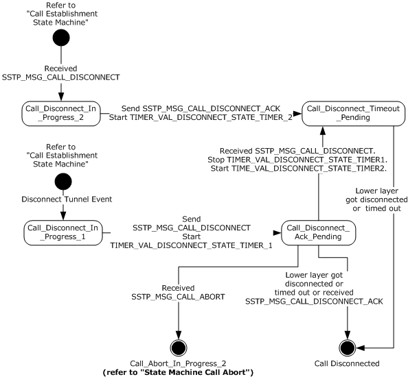

Figure 2: Common details for call disconnect

To disconnect an SSTP connection, the SSTP client and server state machines have the following states:

| State Name | Description |
| --- | --- |
| Call_Disconnect_In_Progress_1 | This is the state when a disconnect [**SSTP tunnel**](#gt_sstp-tunnel) event is received from the higher layer. In this state, the SSTP_MSG_CALL_DISCONNECT message is sent to the [**SSTP far end**](#gt_sstp-far-end), and **CurrentState** is changed to Call_Disconnect_Ack_Pending. |
| Call_Disconnect_In_Progress_2 | This is the state when the SSTP_MSG_CALL_DISCONNECT message is received from the SSTP far end. In this state, an SSTP_MSG_CALL_DISCONNECT_ACK is sent to the SSTP far end, and **CurrentState** is changed to Call_Disconnect_Timeout_Pending. |
| Call_Disconnect_Ack_Pending | In this state, the SSTP connection waits for the SSTP_MSG_DISCONNECT_ACK message from the SSTP far end. On receipt of this message, the Call Disconnect is completed. |
| Call_Disconnect_Timeout_Pending | In this state, the SSTP connection waits for the timer to expire or for the lower layer to be disconnected. When either of these conditions are met, the Call Disconnect is completed. |

The additional states for the Call Abort transitions are defined in section [3.1.1.1.2](#Section_3.1.1.1.2).

<a id="Section_3.1.1.1.2"></a>
##### 3.1.1.1.2 State Machine Call Abort

The following figure shows the [**state machine**](#gt_state-machine) when a call is aborted.

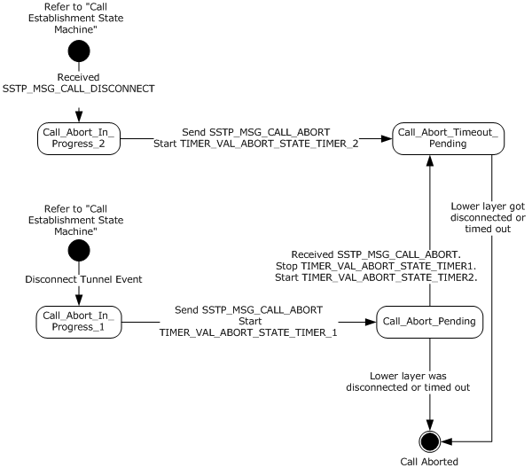

Figure 3: Common details for call abort

To abort an SSTP connection, the SSTP client and server state machines have the following states:

| State Name | Description |
| --- | --- |
| Call_Abort_In_Progress_1 | This is the initial state when the SSTP connection reaches abort-related conditions, such as the receipt of an invalid message, as described in the client and server state machines in sections [3.2.1](#Section_3.2.1) and [3.3.1](#Section_3.3.1). In this state, SSTP_MSG_CALL_ABORT is sent to the [**SSTP far end**](#gt_sstp-far-end), and **CurrentState** is changed to Call_Abort_Pending. |
| Call_Abort_In_Progress_2 | This is the initial state that the SSTP connection transitions to when the SSTP_MSG_CALL_ABORT message is received from the SSTP far end. In this state, SSTP_MSG_CALL_ABORT is sent to the SSTP far end, and **CurrentState** is changed to Call_Abort_Timeout_Pending. |
| Call_Abort_Pending | In this state, the SSTP connection waits for the SSTP_MSG_CALL_ABORT message from the SSTP far end. When an [SSTP_MSG_CALL_ABORT (section 2.2.13)](#Section_2.2.13) message is received, or when a lower layer disconnects or times out, the Call Abort is completed. Other than SSTP_MSG_CALL_ABORT, any SSTP control message received while in this state is silently discarded. |
| Call_Abort_Timeout_Pending | In this state, the SSTP connection waits for the timer to expire or for the lower layer to be disconnected. When either of these conditions is met, the Call Abort is completed. Any SSTP control message received while in this state is silently discarded. |

<a id="Section_3.1.2"></a>
### 3.1.2 Timers

<a id="Section_3.1.2.1"></a>
#### 3.1.2.1 Abort-Related Timers

There are two timers related to abort processing:

- TIMER_VAL_ABORT_STATE_TIMER_1
- TIMER_VAL_ABORT_STATE_TIMER_2
The first timer is started by an [**SSTP peer**](#gt_sstp-peer) when it has initiated an abort procedure by sending the [Call Abort message](#Section_3.1.1.1.2) to an [**SSTP far end**](#gt_sstp-far-end). In this state, all SSTP messages except Call Abort MUST be ignored. If the initiating SSTP peer receives a Call Abort message from the SSTP far end before the timer expires, then it MUST cancel the TIMER_VAL_ABORT_STATE_TIMER_1 timer and start the TIMER_VAL_ABORT_STATE_TIMER_2 timer.

When the SSTP far end receives a Call Abort message, it responds with a Call Abort message after starting the second timer (that is, TIMER_VAL_ABORT_STATE_TIMER_2). This timer ensures that the SSTP peer receives the Call Abort message that is sent by the SSTP far end. This is to address collision-type situations where the SSTP peer and the SSTP far end initiate the Call Abort message at the same time (and not in response to the Call Abort message initiated by the SSTP peer). This short delay ensures that both the SSTP peer and the SSTP far end receive the Call Abort message that is sent by one another.

In this state, while waiting for timer to expire, all SSTP messages are ignored. Once this timer expires, the SSTP far end MUST clear the connection state to clean up the connection.

The first timer SHOULD be set at 3 seconds. The second timer SHOULD be set to 1 second.

<a id="Section_3.1.2.2"></a>
#### 3.1.2.2 Disconnect-Related Timers

There are two timers related to disconnect processing:

- TIMER_VAL_DISCONNECT_STATE_TIMER_1
- TIMER_VAL_DISCONNECT_STATE_TIMER_2
The first timer is started by an [**SSTP peer**](#gt_sstp-peer) when it has initiated a disconnect by sending the [Call Disconnect message](#Section_3.1.1.1.1) to the [**SSTP far end**](#gt_sstp-far-end). If the SSTP peer receives a [Call Disconnect Acknowledge message](#Section_7c572ceb571946d0a5ddf68a44a90292) from the SSTP far end before the timer expires, then it MUST cancel the timer and immediately clear the connection state to clean up the connection.

When the SSTP far end receives a Call Disconnect message, it responds with a Call Disconnect Acknowledge message and then starts the second timer (that is, TIMER_VAL_DISCONNECT_STATE_TIMER_2). This timer ensures that the SSTP peer receives the Call Disconnect Acknowledge message that is sent by the SSTP far end.

The first timer SHOULD be set to 5 seconds. The second timer SHOULD be set to 1 second.

<a id="Section_3.1.2.3"></a>
#### 3.1.2.3 Hello Timer

To detect HTTPS connection failures in the absence of any active data transfers, [Echo Request and Echo Response messages](#Section_7c572ceb571946d0a5ddf68a44a90292) are periodically sent by the [**SSTP peer**](#gt_sstp-peer) and [**SSTP far end**](#gt_sstp-far-end), respectively. Both the [**SSTP client**](#gt_sstp-client) and [**SSTP server**](#gt_sstp-server) start a Hello timer after a successful SSTP connection setup. For example, after a successful [Call Connect Request](#Section_2.2.9), [Call Connect Acknowledge](#Section_2.2.10), and [Call Connected](#Section_2.2.11) message exchange, a Hello timer is initiated. The timer is restarted after receiving an [SSTP packet](#Section_2.2.1) (both the [SSTP control packet](#Section_2.2.2) and the [SSTP data packet](#Section_2.2.3)).

On expiry of the Hello timer, the SSTP peer MUST send an Echo Request packet. On receipt of Echo Request packet, the SSTP far end MUST respond with an Echo Response packet. If the SSTP far end does not respond with an Echo Response (or any SSTP packet) within the next timer interval, then it MUST abort the connection without sending a [Call Abort packet](#Section_3.1.1.1.2).

The Hello timer SHOULD be set to 60 seconds.

<a id="Section_3.1.3"></a>
### 3.1.3 Initialization

See sections [3.2.3](#Section_3.2.3) and [3.3.3](#Section_3.3.3).

<a id="Section_3.1.4"></a>
### 3.1.4 Higher-Layer Triggered Events

The SSTP layer interfaces with the PPP layer using the following events. These events are triggered by the PPP layer.

**Send PPP control frame:** This event is used by the PPP layer to send a PPP control payload to the SSTP layer. The SSTP layer then sends the PPP control payload to the [**HTTPS**](#gt_hypertext-transfer-protocol-secure-https) layer after performing the necessary encapsulation (see sections [3.2.7](#Section_3.2.7) and [3.3.7](#Section_3.3.7)).

**Send PPP data frame:** This event is used by the PPP layer to send a PPP data payload to the SSTP layer. The SSTP layer then sends the PPP data payload to the HTTPS layer after performing the necessary encapsulation (see sections 3.2.7 and 3.3.7).

**PPP authentication completed:** This event is used by the PPP layer to notify the SSTP layer that PPP authentication has been completed (see sections 3.2.7 and 3.3.7). The PPP layer uses this event to pass the higher layer authentication key (HLAK) to the SSTP layer. The SSTP layer on the client will use this attribute to generate and send the crypto binding attribute (section [3.2.5.2](#Section_3.2.5.2)) to the server. The SSTP layer on the server will use this attribute to validate the crypto binding attribute sent by the client (section [3.3.5.2.3](#Section_3.3.5.2.3)).

<a id="Section_3.1.5"></a>
### 3.1.5 Processing Events and Sequencing Rules

<a id="Section_3.1.5.1"></a>
#### 3.1.5.1 Status and Error Handling

This protocol MUST attempt to delineate the SSTP frames that are contained in the HTTPS stream. If the delineation fails because of an unsupported or unrecognized packet format, then the connection MUST be forcefully aborted without sending a message to the [**SSTP far end**](#gt_sstp-far-end). This is done to avoid the use of unreliable streams.

If an invalid SSTP message is received, the SSTP state machine aborts processing using the following procedure.

- Change **CurrentState** to Call_Abort_In_Progress_1.
- Send an [SSTP_MSG_CALL_ABORT (section 2.2.13)](#Section_2.2.13) message.
- Start the TIMER_VAL_ABORT_STATE_TIMER_1 timer (section [3.1.2.1](#Section_3.1.2.1)).
- Change **CurrentState** to Call_Abort_Pending.
For the attribute parameters that are received from the [Call Connect Request message](#Section_2.2.9), the server MAY respond with a negative acknowledgment. In the negative acknowledgment message, the server MUST include the list of attributes that are not acceptable and the reason that they were not accepted.

For a list of status acknowledgments, see section [2.2.8](#Section_2.2.8).

<a id="Section_3.1.5.2"></a>
#### 3.1.5.2 SSTP Packet Processing

Common packet processing functionality is as follows:

- The default [**maximum transmission unit (MTU)**](#gt_maximum-transmission-unit-mtu) is set to 1400 bytes.
- The maximum receive unit (MRU) exchanged for SSTP is 4091 bytes, which is 4095 – sizeof(SSTP_HEADER).
- The default MTU can be increased using the registry values, but it is still capped at the MRU of the tunnel type.
- The default MRU for the PPP adapter is set to 1614 bytes.
- The default MRU can be increased by setting the following registry value: HKEY_LOCAL_MACHINE\SYSTEM\CurrentControlSet\Services\NdisWan\Parameters\MRU
By default, packets of any size can be sent or received through the tunnel, as Windows stack will IP fragment the packets.

To enable large SSTP payloads, both MTU (on the sender) and MRU (on the receiver) need to be set to larger values.

SSTP packet processing for common messages is covered separately for the client state machine and server state machine, in sections [3.2.5.3](#Section_3.2.5.3) and [3.3.5.2](#Section_3.3.5.2).

<a id="Section_3.1.6"></a>
### 3.1.6 Timer Events

<a id="Section_3.1.6.1"></a>
#### 3.1.6.1 Abort Timer Processing

When the TIMER_VAL_ABORT_STATE_TIMER_1 expires, the [**SSTP peer**](#gt_sstp-peer) MUST immediately force the connection state to clear and therefore clean up the connection.

When the TIMER_VAL_ABORT_STATE_TIMER_2 expires, the SSTP peer MUST immediately clear the connection state to clean up the connection.

<a id="Section_3.1.6.2"></a>
#### 3.1.6.2 Disconnect Timer Processing

When the TIMER_VAL_DISCONNECT_STATE_TIMER_1 expires, the [**SSTP peer**](#gt_sstp-peer) MUST immediately perform forceful cleanup of the connection.

When the TIMER_VAL_DISCONNECT_STATE_TIMER_2 expires, the SSTP peer MUST immediately clean up the connection.

<a id="Section_3.1.6.3"></a>
#### 3.1.6.3 Hello Timer Processing

When the [Hello timer](#Section_3.1.2.3) expires, an [Echo Request packet](#Section_7c572ceb571946d0a5ddf68a44a90292) MUST be sent by the [**SSTP peer**](#gt_sstp-peer) to the [**SSTP far end**](#gt_sstp-far-end).

<a id="Section_3.1.7"></a>
### 3.1.7 Other Local Events

<a id="Section_3.1.7.1"></a>
#### 3.1.7.1 Interface with PPP

The SSTP layer interfaces with a local PPP layer on both clients and servers. This interface occurs using the following events triggered by the SSTP layer.

**Check PPP frame type:** This event is used by the SSTP layer to check whether a given PPP payload is a PPP control frame or a PPP data frame.

**Receive PPP control frame:** This event is used by the SSTP layer to indicate a PPP control frame to the PPP layer (see section [3.2.7](#Section_3.2.7) and [3.3.7](#Section_3.3.7)).

**Receive PPP data frame:** This event is used by the SSTP layer to indicate a PPP data frame to the PPP layer (see section 3.2.7 and 3.3.7).

**Lower Link Up:** This event is used by the SSTP layer to cause the PPP layer to start the PPP state machine (see section 4 of [[RFC1661]](https://go.microsoft.com/fwlink/?LinkId=90283)). This event is triggered on the client side when the SSTP layer receives an [SSTP_MSG_CALL_CONNECT_ACK (section 3.2.5.3.2)](#Section_3.2.5.3.2) message. This event is triggered on the server side when the SSTP layer receives an [SSTP_MSG_CALL_CONNECT_REQUEST (section 3.3.5.2.2)](#Section_3.3.5.2.2) message. In addition, if **ClientBypassHLAuth** is set to TRUE on the client side OR **ServerBypassHLAuth** is set to TRUE on the server side, the SSTP layer requests the PPP layer to bypass the authentication phase.

**Lower Link Down:** This event is used by the SSTP layer to notify the PPP layer about a lower layer (that is, [**HTTPS**](#gt_hypertext-transfer-protocol-secure-https)) going down. This event is triggered when the SSTP layer gets an HTTPS connection disconnected event from the HTTPS layer.

<a id="Section_3.1.7.2"></a>
#### 3.1.7.2 Interface with HTTPS

The SSTP layer on both client-side and server-side implementations interfaces with the local [**HTTPS**](#gt_hypertext-transfer-protocol-secure-https) layer using the following events.

**Open HTTPS connection:** This event is used by the SSTP client to initiate an HTTPS connection to the SSTP server. The SSTP layer specifies the hostname or IP address of the SSTP server when calling this event. If the HTTPS connection is established successfully, the HTTPS layer returns the server certificate hash (see section [3.2.4.1](#Section_3.2.4.1)).

**Accept HTTPS connection:** This event is used by the SSTP server to accept a new incoming HTTPS connection from the SSTP client (section [3.3.7](#Section_3.3.7)).

**Close HTTPS connection:** This event is used by an SSTP peer to close the HTTPS connection.

**Send HTTPS stream:** This event is used by the SSTP client and the SSTP server to send an SSTP control packet or an SSTP data packet to the local HTTPS layer. The HTTPS layer encrypts the SSTP packet as a byte stream and sends it to the SSTP peer.

**Receive HTTPS stream:** This event is used by the HTTPS layer to indicate a stream of bytes to the local SSTP layer as received from the SSTP far end. The SSTP layer delineates the stream of bytes into SSTP control packets and SSTP data packets. If delineation fails, the connection is immediately aborted (section [3.1.5.1](#Section_3.1.5.1)) and a lower link down event is sent to the PPP layer. If delineation succeeds, the SSTP control packets are passed to the SSTP state machine for further processing (sections [3.2.5.3](#Section_3.2.5.3) and [3.3.5.2](#Section_3.3.5.2)). The SSTP data packets, including all PPP control frames and all PPP data frames, are passed to the PPP layer after further processing as defined in sections [3.2.7](#Section_3.2.7) and 3.3.7.

**HTTPS connection disconnected:** This interface is used by the HTTPS layer to indicate a disconnection of the HTTPS connection. This disconnection can happen due to events such as network interface failure, network failure, TCP failure, SSL/TLS failure, lower layer HTTPS session disconnected, and similar scenarios. In all such scenarios, the SSTP layer MUST immediately clean up the call-related information without any over-the-wire interaction. The SSTP layer MUST send a lower-link-down event to the higher layer (PPP). For more information about PPP, see [[RFC1661]](https://go.microsoft.com/fwlink/?LinkId=90283).

<a id="Section_3.2"></a>
## 3.2 Client Details

The following section gives details of the [**SSTP client**](#gt_sstp-client).

<a id="Section_3.2.1"></a>
### 3.2.1 Abstract Data Model

This section describes a model of possible data organization that a client-side implementation can maintain to participate in this protocol. The described organization is provided to facilitate the explanation of how the protocol behaves. This specification does not mandate that an implementation adhere to this model as long as the external behavior of the implementation is consistent with what is described in this specification.

The [**SSTP client**](#gt_sstp-client) connection establishment phase goes through the state transitions illustrated in the state machine diagram in section [3.2.1.1.1](#Section_3.2.1.1.1).

**CurrentState**: An integer variable that the client uses to maintain the current state of the connection. The **CurrentState** variable is initialized when the client starts the SSTP connection and remains valid while the SSTP connection remains active. At any point in time, the **CurrentState** variable can have one of the following integer values. Each value represents the current state of the client state machine.

- Client_Call_Disconnected
- Client_Connect_Request_Sent
- Client_Connect_Ack_Received
- Client_Call_Connected
Additional state values common to both the client and server state machines are defined in section [3.1.1](#Section_3.1.1).

**ClientCertificateHash**: A multi-octet variable that the client uses to store the [**SHA1 hash**](#gt_sha1-hash) or the SHA256 hash of the server certificate that is obtained during [**HTTPS**](#gt_hypertext-transfer-protocol-secure-https) negotiation. The client initializes this variable to the value of the server certificate hash when the HTTPS session is established (section [3.2.4.1](#Section_3.2.4.1)). This variable stores a 20-byte SHA1 hash or a 32-byte SHA256 hash. This variable is used to generate the value of the [Crypto Binding attribute (section 2.2.7)](#Section_2.2.7) when the client sends an SSTP_MSG_CALL_CONNECTED message (sections [3.2.5.2](#Section_3.2.5.2) and [3.2.7](#Section_3.2.7)).

**ClientBypassHLAuth**: In this Boolean variable, the SSTP layer stores a flag that will be used to indicate higher layer to bypass authentication ([3.1.7.1](#Section_3.1.7.1)). This variable is initialized by the client management layer during the establish [**SSTP tunnel**](#gt_sstp-tunnel) event (3.2.4.1).

**ClientHTTPCookie**: In this string variable, the SSTP layer stores the HTTP cookie that will be passed to the HTTPS layer during HTTPS connection establishment (3.2.4.1) if the **ClientBypassHLAuth** variable is set to TRUE. This variable is initialized by the client management layer during the establish SSTP tunnel event (3.2.4.1). This variable stores name-value pairs (section 3.2.2 of [[RFC2965]](https://go.microsoft.com/fwlink/?LinkId=90399)). The SSTP layer does not interpret the name-value pairs associated with **ClientHTTPCookie**.<5>

**ClientHashProtocolSupported**: A 1-byte variable that the client administrator uses to configure a bitmask representing the list of hashing methods that can be used to compute the Compound MAC in the Crypto Binding attribute (section 2.2.7). The format and possible values of this bitmask are defined under Hash Protocol Bitmask in section [2.2.10](#Section_2.2.10).

**ClientHashProtocolChosen**: A 1-byte variable that the SSTP client machine uses to store the hash protocol that is used to compute the Compound MAC in the Crypto Binding attribute (section 2.2.7). The possible values of this variable are defined under Hash Protocol in section 2.2.7. This variable is initialized when an SSTP client receives a SSTP_MSG_CALL_CONNECT_ACK message (section 2.2.10).

**ClientNonce**: A 32-byte variable that the SSTP client uses to store the nonce that is received from the server in an SSTP_MSG_CALL_CONNECT_ACK message (section 2.2.10). This variable is to send the nonce value when an SSTP client generates an [SSTP_MSG_CALL_CONNECTED](#Section_2.2.11) message (section 2.2.11).

**ClientVersion**: A 1-byte variable that the SSTP client initializes with the supported version of this protocol. The format of this field is specified in the description of the **Version** field in section [2.2.1](#Section_2.2.1). The client sets this field to the value of the **Version** field in all SSTP messages that it sends, and the client validates the value of this field against the **Version** field in all SSTP messages that it receives.

<a id="Section_3.2.1.1"></a>
#### 3.2.1.1 State Machine

<a id="Section_3.2.1.1.1"></a>
##### 3.2.1.1.1 Call Establishment

The following figure shows the [**state machine**](#gt_state-machine) when a client establishes the outgoing [**SSTP tunnel**](#gt_sstp-tunnel).

**Note** The following figure refers to the Call Disconnect and Call Abort state machines described in section [3.1.1.1](#Section_3.1.1.1).

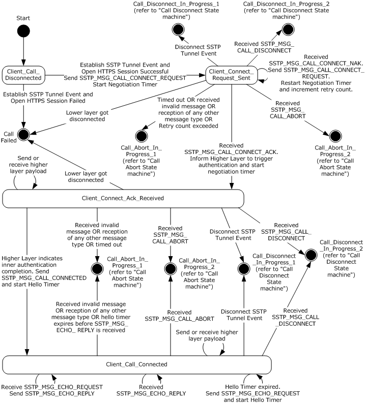

Figure 4: Client call establishment

The client state machine has the following states as represented in the **CurrentState** variable:

| State Name | Description |
| --- | --- |
| Client_Call_Disconnected | This is the initial state of the client state machine. In this state, the client waits for the establish SSTP tunnel event from the higher layer. On receiving this event, the client sends HTTPS connection to the SSTP server. On successful completion of the HTTPS connection, the client sends the SSTP_MSG_CALL_CONNECT_REQUEST message and the value of **CurrentState** is changed to Client_Connect_Request_Sent. |
| Client_Connect_Request_Sent | In this state, the client waits for the SSTP_MSG_CALL_CONNECT_ACK message from the SSTP server. On receipt of this message, the client informs its higher layer (that is, PPP) to start the authentication and the value of **CurrentState** is changed to Client_Connect_Ack_Received. |
| Client_Connect_Ack_Received | In this state, the client waits for an **Inner authentication completion event** (section [3.2.7.1](#Section_3.2.7.1)). On receipt of this event from the higher layer regarding authentication completion, it sends the SSTP_MSG_CALL_CONNECTED message and the value of **CurrentState** is changed to Client_Call_Connected. |
| Client_Call_Connected | This state refers to successful establishment of an SSTP client connection. In this state, the SSTP client continues to send and receive higher layer control and data payload, in addition to sending periodic SSTP_MSG_ECHO_REQUEST messages. |

The preceding description covers the state transitions for a successful SSTP connection. Failure transitions are covered in the state machine diagram earlier in this section and are also covered in sections [3.2.4](#Section_3.2.4) and [3.2.5](#Section_3.2.5). The additional states for the Call Abort and Call Disconnect transitions are defined in section 3.1.1.1. The higher level events and messages are explained in sections 3.2.4, 3.2.5, [3.1.4](#Section_3.1.4) and [3.1.5](#Section_3.1.5).

<a id="Section_3.2.2"></a>
### 3.2.2 Timers

For common timers, see section [3.1.2](#Section_3.1.2).

<a id="Section_3.2.2.1"></a>
#### 3.2.2.1 Negotiation Timer

When establishing an SSTP connection, the [**SSTP client**](#gt_sstp-client) starts the Negotiation timer after sending a [Call Connect Request message](#Section_2.2.9) and after receiving a [Call Connect Acknowledge message](#Section_2.2.10).

The client MAY<6> choose to implement different values of timer after sending the Call Connect Request message and after receiving the Call Connect Acknowledge message. The timer SHOULD be set to 60 seconds.

<a id="Section_3.2.3"></a>
### 3.2.3 Initialization

Client-side initialization is performed when the user tries to establish an [**SSTP tunnel**](#gt_sstp-tunnel) to an [**SSTP server**](#gt_sstp-server). This process is specified in section [3.2.4.1](#Section_3.2.4.1).

The client administrator uses the **ClientHashProtocolSupported** state variable (section [3.2.1](#Section_3.2.1)) to initialize the list of hash protocols that the [**SSTP client**](#gt_sstp-client) supports.

The SSTP client is initialized with the version of the protocol specified by the **ClientVersion** state variable (section 3.2.1).

<a id="Section_3.2.4"></a>
### 3.2.4 Higher-Layer Triggered Events

The primary trigger events for this protocol are to establish the [**SSTP tunnel**](#gt_sstp-tunnel), cancel an SSTP tunnel under progress, and disconnect an established SSTP tunnel.

<a id="Section_3.2.4.1"></a>
#### 3.2.4.1 Establish SSTP Tunnel Event

When the client establishes an [**SSTP tunnel**](#gt_sstp-tunnel) to the remote [**SSTP server**](#gt_sstp-server), the management layer on the client initiates the SSTP tunnel request to the SSTP layer. The management layer MAY direct the SSTP layer to bypass higher-layer authentication by initializing the **ClientBypassHLAuth** variable as TRUE and the **ClientHTTPCookie** variable with a name-value pair. In this scenario, the **ClientHTTPCookie** is trusted by the management layer on the SSTP server using an implementation-specific mechanism. See the Accept New Connection event (section [3.3.7.3](#Section_3.3.7.3)) for more details on validating the name-value pair. The SSTP layer MUST first establish a bidirectional HTTPS session (for example, see section [4.1](#Section_4.1)). The SSTP layer MUST first establish a bidirectional [**HTTPS**](#gt_hypertext-transfer-protocol-secure-https) session (for example, see section 4.1). The bidirectional HTTPS session MUST be established to a Universal Resource Identifier (URI) /sra_{BA195980-CD49-458b-9E23-C84EE0ADCD75}/ by using the SSTP_DUPLEX_POST method. The content-length header field (section 14.13 of [[RFC2616]](https://go.microsoft.com/fwlink/?LinkId=90372)) MUST be specified with the content length of **ULONGLONG_MAX** (18446744073709551615). The client SHOULD validate that the common name or the subject name in the server certificate (received as a part of the [**SSL/TLS handshake**](#gt_ssltls-handshake) of the HTTPS session) is the same as the hostname to which the connection is being established. The client MUST also validate that the server certificate contains either "id-kp-serverAuth" or "anyExtendedKeyUsage" extended key usage (EKU). See [[RFC5280]](https://go.microsoft.com/fwlink/?LinkId=131034) section 4.2.1.12 for details on "id-kp-serverAuth" or "anyExtendedKeyUsage".

Method: SSTP_DUPLEX_POST

Protocol Version: HTTP/1.1

SSTPCORRELATIONID: <GUID>

The client MAY also pass an optional query variable (as specified in section 3.2.2 of [RFC2616]) as part of the URI. The query variable, if set, MUST be named **tenantid** and SHOULD contain a string value that would be used by a [**HTTPS termination proxy**](#gt_https-termination-proxy) in an implementation-specific way to indicate the tenant and its target SSTP server. A server that does not understand the **tenantid** query variable SHOULD ignore it.<7>

If **ClientByPassHLAuth** is set to TRUE, the client adds an HTTP cookie header (section 3.3.4 of [[RFC2965]](https://go.microsoft.com/fwlink/?LinkId=90399)) with **ClientHTTPCookie** as the HTTP cookie.

The SSTP client SHOULD also send **SSTPCORRELATIONID** as an entity header field with a newly generated [**GUID**](#gt_globally-unique-identifier-guid) string (for each new SSTP client connection attempt) as its value. The SSTP server SHOULD use this GUID value to log troubleshooting information specific to the particular SSTP connection. See [MS-DTYP](../MS-DTYP/MS-DTYP.md) section 2.3.4.3 for the format of a GUID string.

If the HTTPS session failed to establish, the client MUST inform the higher layer about failure, and the SSTP [**state machine**](#gt_state-machine) MUST NOT be initiated.

If the HTTPS session established successfully, the SSTP state machine MUST be initiated. The client then reads the server certificate hash from the HTTPS layer (see section [3.2.7.2](#Section_3.2.7.2)) and stores the same in **ClientCertificateHash**. The client, which MUST be configured for PPP over SSTP, MUST send a [Call Connect Request message](#Section_2.2.9) with the Encapsulated Protocol ID that corresponds to PPP. For more information about PPP, see [[RFC1661]](https://go.microsoft.com/fwlink/?LinkId=90283). The client then updates **CurrentState** to Client_Connect_Request_Sent.

<a id="Section_3.2.4.2"></a>
#### 3.2.4.2 Disconnect SSTP Tunnel Event

To bring down the [**SSTP tunnel**](#gt_sstp-tunnel), the management layer on the client MUST send a disconnect SSTP tunnel request to the SSTP layer. This event can be used to bring down the established SSTP tunnel or a call setup that is in progress.

For an established SSTP tunnel, this request typically comes after the encapsulated protocol has completed its teardown (in this specific implementation, it is the PPP). After the PPP is torn down, SSTP is triggered to bring down the SSTP tunnel by sending this event. On receiving this event, the [**SSTP peer**](#gt_sstp-peer) initiates the disconnection by sending the [Call Disconnect message](#Section_3.1.1.1.1) to the [**SSTP far end**](#gt_sstp-far-end). Section [3.1.1.1.1](#Section_3.1.1.1.1) specifies the protocol state machine details for the disconnect event processing. For more information about PPP teardown, see [[RFC1661]](https://go.microsoft.com/fwlink/?LinkId=90283) section 3.7.

For a call setup in progress, it is possible for the disconnect event to occur due to cancellation of the establish SSTP tunnel request. In this case, irrespective of the current state, the SSTP peer changes **CurrentState** to Call_Disconnect_In_Progress_1. Upon entering this state, the SSTP peer sends an SSTP_MSG_CALL_DISCONNECT to the SSTP far end, starts the TIMER_VAL_DISCONNECT_STATE_TIMER_1 timer and then updates **CurrentState** to Call_Disconnect_Ack_Pending. The SSTP far end MUST acknowledge the disconnect request by sending SSTP_MSG_CALL_DISCONNECT_ACK regardless of the value of **CurrentState**.

After the SSTP message exchange is completed, the HTTPS layer MUST be notified about this event, and the HTTPS layer SHOULD eventually be brought down.

After the SSTP disconnect message exchange (sections 3.1.1.1.1 and [4.4](#Section_4.4)) is completed, the SSTP layer MUST notify the HTTPS layer to disconnect. The HTTPS layer SHOULD be brought down after this occurs.

<a id="Section_3.2.5"></a>
### 3.2.5 Processing Events and Sequencing Rules

<a id="Section_3.2.5.1"></a>
#### 3.2.5.1 Status and Error Handling

See section [3.1.5.1](#Section_3.1.5.1).

<a id="Section_3.2.5.2"></a>
#### 3.2.5.2 Crypto Binding

During the [**SSL/TLS handshake**](#gt_ssltls-handshake), as part of establishing an [**HTTPS**](#gt_hypertext-transfer-protocol-secure-https) connection, the [**SSTP client**](#gt_sstp-client) authenticates the [**SSTP server**](#gt_sstp-server). However, it is optional for the SSTP server to authenticate the client. The client is authenticated by the server during the higher-layer authentication (that is, PPP authentication). Therefore, it is possible for a man-in-the-middle to establish the HTTPS connection to the SSTP server and forward the PPP packets that it received from a client for a communication other than SSTP communications (for example, wireless communications). To prevent such attacks, it is important to cryptographically bind the two authentications.

This protocol implements cryptographic binding by requiring the client to send a value over the HTTPS connection as an SSTP message. This value is derived from the key data that is generated during PPP authentication. The SSTP protocol is agnostic of the mechanism used to generate key data, as long as SSTP server and client are using the same mechanism. The SSTP protocol neither carries any information pertaining to the key data generation mechanism nor does it enforce the mechanism to be the same on the client and server. The only requirement from the SSTP protocol is to have a higher layer authentication key (HLAK) of size 32 bytes which needs to be derived from the key data generated by the PPP authentication layer. By using this value, the SSTP client can prove that it is the entity that was authenticated with the SSTP server and that the PPP authentication was used for SSTP communications.

Because the client already authenticated the SSTP server during SSL/TLS handshake as part of establishing an HTTPS connection, the client can also confirm from the SSTP server that there is no man-in-the-middle or that the entity between the client and server is an entity that the SSTP server trusts (see section [5](#Section_5)). This process, which is termed crypto binding, is used to protect the SSTP negotiation against man-in-the-middle attacks.

The sequence of steps that occurs is as follows:

- The TCP connection is established by the SSTP client to the SSTP server over TCP port 443.
- SSL/TLS handshake is completed over this TCP connection. The SSTP server is authenticated by the SSTP client. However, the client authentication by the server is only optional.
- The HTTPS request-response is completed.
- SSTP negotiation begins. The SSTP client sends a [Call Connect Request message](#Section_2.2.9) to the SSTP server. The SSTP server validates the request and sends a [Call Connect Acknowledge message](#Section_2.2.10) that contains a nonce to be used by the SSTP client in the [Call Connected message](#Section_2.2.11).
- PPP negotiation is initiated, and PPP authentication is completed. For more information about PPP, see [[RFC1661]](https://go.microsoft.com/fwlink/?LinkId=90283).
- The SSTP client sends the Call Connected message (section 2.2.11), which contains the following items:
- The nonce that was sent by the SSTP server, that is, the **ClientNonce**.
- The certificate received during HTTPS negotiation, that is, the **ClientCertificateHash**.
- The Compound MAC, which is computed by using the key data that is generated during PPP authentication. If the PPP protocol supports Microsoft Point-to-Point Encryption (MPPE) key generation as defined in [[RFC3079]](https://go.microsoft.com/fwlink/?LinkId=90405), the key data is used to generate the Higher Layer Authentication Key (HLAK) as specified in section [3.2.5.2.2](#Section_3.2.5.2.2) and [3.2.5.2.4](#Section_3.2.5.2.4).
The SSTP server validates the Call Connected message, and SSTP negotiation is completed.

- PPP negotiation (that is, a network control protocol such as IP Control Protocol (IPCP) is negotiated) is completed.
Implementations MUST support the Crypto Binding feature of SSTP.

SSTP Version 1 allows either the [**SHA1 hash**](#gt_sha1-hash) or the SHA256 hash to be used for generating the Compound MAC field in the Call Connected message.

If the SHA1 hash is used (and specified in the **ClientHashProtocolChosen** state variable described in section [3.2.1](#Section_3.2.1)), then the Compound MAC field in the Crypto Binding packet (section 3.2.5.2) MUST contain the output of an HMAC-SHA1-160 operation (as specified in [[RFC2104]](https://go.microsoft.com/fwlink/?LinkId=90314) and [[RFC3174]](https://go.microsoft.com/fwlink/?LinkId=90408)), in which the key is derived from the higher-layer authentication method (that is, the PPP authentication method in SSTP Version 1). For information about how an implementation generates the data that is used in the HMAC-SHA1-160 operation for the Crypto Binding packet, see section [3.2.5.2.1](#Section_3.2.5.2.1). For information about how an implementation generates the key that is used in the HMAC-SHA1-160 operation for the Crypto Binding packet, see section 3.2.5.2.2.

If SHA256 is used (and specified in the **ClientHashProtocolChosen** state variable described in section 3.2.1), then the Compound MAC field in the Crypto Binding packet MUST contain the output of an HMAC-SHA256-256 operation (as specified in [[SHA256]](https://go.microsoft.com/fwlink/?LinkId=90514)), in which the key is derived from the higher-layer authentication method (that is, the PPP authentication method in SSTP Version 1). For information about how an implementation generates the data that is used in the HMAC-SHA256-256 operation for the Crypto Binding packet, see [3.2.5.2.3](#Section_3.2.5.2.3). For information about how an implementation generates the key that is used in the HMAC-SHA256-256 operation for the Crypto Binding packet, see section 3.2.5.2.4.

For information about how the semantics are used by the SSTP client and server when performing the Crypto Binding exchanges, see sections [3.2.5.3.2](#Section_3.2.5.3.2) and [3.3.5.2.3](#Section_3.3.5.2.3).

<a id="Section_3.2.5.2.1"></a>
##### 3.2.5.2.1 Input Data Used in the Crypto Binding HMAC-SHA1-160 Operation

The data that is used as the input to the HMAC-SHA1-160 operation and also used in the creation of the Compound MAC MUST be constructed from the entire 112 bytes of the [Call Connected message (section 2.2.11)](#Section_2.2.11). In this case, the Compound MAC field and Padding field MUST be zeroed out.

<a id="Section_3.2.5.2.2"></a>
##### 3.2.5.2.2 Key Used in the Crypto Binding HMAC-SHA1-160 Operation

The key that is used as the input to the HMAC-SHA1-160 operation and used in the creation of the Compound MAC MUST be constructed by following the steps that are specified in the following sections. These steps produce the following intermediate values, which are defined later in this section.

- **Higher-Layer Authentication Key (HLAK)**
First, a 32-byte long string is generated from keys that are provided by the higher-layer PPP authentication method. This key is sent to the SSTP layer as part of the Inner Authentication Completed Event. This is also the case for EAP TLS.

If the higher-layer PPP authentication method generates Microsoft Point-to-Point Encryption (MPPE) keys, as specified in [[RFC3079]](https://go.microsoft.com/fwlink/?LinkId=90405), then an implementation MUST obtain the HLAK by using the following method:

- For MS-CHAPv2, as specified in [[RFC2759]](https://go.microsoft.com/fwlink/?LinkId=90379):
[**SSTP Client**](#gt_sstp-client) HLAK = MasterSendKey | MasterReceiveKey, and:

[**SSTP Server**](#gt_sstp-server) HLAK = MasterReceiveKey | MasterSendKey,

where | indicates concatenation of strings, and MasterSendKey and MasterReceiveKey are as specified in [RFC3079] section 3.

- For EAP-TLS, as specified in [[RFC5216]](https://go.microsoft.com/fwlink/?LinkId=155108):<8>
SSTP Client HLAK = Client MasterSendKey, and:

SSTP Server HLAK = Client MasterReceiveKey,

where MasterSendKey and MasterReceiveKey are as specified in [RFC3079] section 4.

- For EAP (other than EAP-TLS), as specified in [[RFC2284]](https://go.microsoft.com/fwlink/?LinkId=90332):
SSTP Client HLAK = Client Master Session Key (MSK), as specified in [[RFC3748]](https://go.microsoft.com/fwlink/?LinkId=90444), and:

SSTP Server HLAK = Server Master Session Key (MSK), as specified in [RFC3748].

If the HLAK is more than 32 octets, then the first 32 octets form the HLAK. Note that this covers EAP-TLS as well because, the EAP TLS master session key is at least 64 bytes (see [[RFC5247]](https://go.microsoft.com/fwlink/?linkid=2162185) ). If the HLAK is less than 32 octets, then the string is padded with 0x00 at the end to obtain a total length of 32 octets.

If the higher-layer PPP authentication method did not generate any keys, or if PPP authentication is bypassed (i.e. **ClientBypassHLAuth** is set to TRUE), then the HLAK MUST be 32 octets of 0x00:

- **Compound MAC Key Seed**
Next, the seed value is generated. An implementation MUST create a byte array of size 29 bytes containing the ASCII values for the string "SSTP inner method derived CMK", which will be used as the Compound MAC Key Seed value.

- **Compound MAC Key (CMK)**
Finally, the PRF+ operation generates the key to be used to derive the Compound MAC by using the HMAC-SHA1-160 operation.

To generate the Compound MAC Key (CMK), implementations MUST use the HLAK, MUST use the PRF+ seed value as the input to a PRF+ operation, and MUST generate 20 bytes:

CMK = First 20 octets of PRF+ (HLAK, CMK Seed, 20);

The PRF algorithm is based on PRF+ from IKEv2 (for more information, see [[RFC4306]](https://go.microsoft.com/fwlink/?LinkId=90469) section 2.13) shown in the following ("|" denotes concatenation):

- K = Key, S = Seed, LEN = output length, represented as binary in a single unsigned 16-bit integer. This integer MUST be encoded in little-endian format.
- PRF (K, S, LEN) = T1 | T2 | T3 | T4 | ... where:
- T1 = HMAC-SHA1 (K, S | LEN | 0x01)
- T2 = HMAC-SHA1 (K, T1 | S | LEN | 0x02)
- T3 = HMAC-SHA1 (K, T2 | S | LEN | 0x03)
- T4 = HMAC-SHA1 (K, T3 | S | LEN | 0x04)
- ...
<a id="Section_3.2.5.2.3"></a>
##### 3.2.5.2.3 Input Data Used in the Crypto Binding HMAC-SHA256-256 Operation

The data that is used as the input to the HMAC-SHA256-256 operation and used in the creation of the Compound MAC MUST be constructed from the entire 112 bytes of the [Call Connected message (section 2.2.11)](#Section_2.2.11) with the Compound MAC field and Padding field zeroed out.

<a id="Section_3.2.5.2.4"></a>
##### 3.2.5.2.4 Key Used in the Crypto Binding HMAC-SHA256-256 Operation

The key that is used as the input to the HMAC-SHA256-256 operation and used in the creation of the Compound MAC MUST be constructed by following the steps that are specified in the following sections. These steps produce the following intermediate values that are defined later in this section.

- **Higher-Layer Authentication Key (HLAK)**
First, a 32-byte long string is generated from keys that are provided by the higher-layer PPP authentication method. This key is sent to the SSTP layer as part of the **Inner Authentication Completed Event**. This is also the case for EAP TLS.

If the higher-layer PPP authentication method generates Microsoft Point-to-Point Encryption (MPPE) keys, as specified in [[RFC3079]](https://go.microsoft.com/fwlink/?LinkId=90405), then an implementation MUST obtain the HLAK using the following method:

- For MS-CHAPv2, as specified in [[RFC2759]](https://go.microsoft.com/fwlink/?LinkId=90379):
[**SSTP Client**](#gt_sstp-client) HLAK = MasterSendKey | MasterReceiveKey and:

[**SSTP Server**](#gt_sstp-server) HLAK = MasterReceiveKey | MasterSendKey,

where | indicates concatenation of strings and MasterSendKey and MasterReceiveKey are as specified in [RFC3079] section 3.

- For EAP-TLS, as specified in [[RFC5216]](https://go.microsoft.com/fwlink/?LinkId=155108):<9>
SSTP Client HLAK = Client MasterSendKey, and:

SSTP Server HLAK = Client MasterReceiveKey,

where MasterSendKey and MasterReceiveKey are as specified in [RFC3079] section 4.

- For EAP, other than EAP-TLS, as specified in [[RFC2284]](https://go.microsoft.com/fwlink/?LinkId=90332):
SSTP Client HLAK = Client Master Session Key (MSK), as specified in [[RFC3748]](https://go.microsoft.com/fwlink/?LinkId=90444) and:

SSTP Server HLAK = Server Master Session Key (MSK), as specified in [RFC3748].

If the HLAK is more than 32 octets, then the first 32 octets form the HLAK. Note that this covers EAP-TLS as well because, the EAP TLS master session key is at least 64 bytes (see [[RFC5247]](https://go.microsoft.com/fwlink/?linkid=2162185)). If the HLAK is less than 32 octets, then the string is padded with 0x00 at the end to obtain a total length of 32 octets.

If the higher-layer PPP authentication method did not generate any keys, or if PPP authentication is bypassed (i.e. **ClientBypassHLAuth** is set to TRUE), then the HLAK MUST be 32 octets of 0x00.

- **Compound MAC Key Seed**
Next, the seed value is generated. An implementation MUST create a byte array of size 29 bytes containing the ASCII values for the string "SSTP inner method derived CMK", which will be used as the Compound MAC Key Seed value.

- **Compound MAC Key (CMK)**
Finally, the PRF+ operation generates the key to be used to derive the Compound MAC using the HMAC-SHA256-256 operation.

To generate the Compound MAC Key (CMK), implementations MUST use the HLAK, MUST use the PRF+ seed value as the input to a PRF+ operation, and MUST generate 32 bytes.

CMK = First 32 octets of PRF+ (HLAK, CMK Seed, 32);

The PRF algorithm is based on PRF+ from IKEv2 (for more information, see [[RFC4306]](https://go.microsoft.com/fwlink/?LinkId=90469) section 2.13) as follows ("|" denotes concatenation):

- K = Key, S = Seed, LEN = output length, represented as binary in a single unsigned 16-bit integer. This integer MUST be encoded in little-endian format.
- PRF (K, S, LEN) = T1 | T2 | T3 | T4 | ... where:
- T1 = HMAC-SHA256 (K, S | LEN | 0x01)
- T2 = HMAC-SHA256 (K, T1 | S | LEN | 0x02)
- T3 = HMAC-SHA256 (K, T2 | S | LEN | 0x03)
- T4 = HMAC-SHA256 (K, T3 | S | LEN | 0x04)
- ...
<a id="Section_3.2.5.3"></a>
#### 3.2.5.3 Packet Processing

<a id="Section_3.2.5.3.1"></a>
##### 3.2.5.3.1 General Packet Validation

When receiving a packet, the [**SSTP peer**](#gt_sstp-peer) MUST validate that the packet conforms to the syntax as specified in [Message Syntax](#Section_2.2) and its subsections. If an invalid packet is received, see section [3.1.5.1](#Section_3.1.5.1) for error handling.

<a id="Section_3.2.5.3.2"></a>
##### 3.2.5.3.2 Receiving an SSTP_MSG_CALL_CONNECT_ACK Message

If **CurrentState** is set to Client_Connect_Request_Sent:

- The client MUST verify the following:
- The [Crypto Binding Request Attribute (section 2.2.6)](#Section_2.2.6) is present.
- At least one hash protocol is selected by the server in the Hash Protocol Bitmask field.
- At least one of the hash protocols in the Hash Protocol Bitmask field is a hash protocol supported by the client (as specified in the **ClientHashProtocolSupported** state variable described in section [3.2.1](#Section_3.2.1)). If more than one hash protocol is supported, a stronger one is chosen (see section [2.2.10](#Section_2.2.10)). The hash protocol chosen for computing the [Crypto Binding attribute](#Section_2.2.7) value is stored in the **ClientHashProtocolChosen** state variable (described in section 3.2.1) and is referenced when the client generates the Crypto Binding attribute (section 2.2.7) while sending an [SSTP_MSG_CALL_CONNECTED](#Section_2.2.11) message.
- If any of the previous conditions are false:
- Change **CurrentState** to Call_Abort_In_Progress_1.
- Send an [SSTP_MSG_CALL_ABORT (section 2.2.13)](#Section_2.2.13) message.
- Start the [TIMER_VAL_ABORT_STATE_TIMER_1 (section 3.1.2.1)](#Section_3.1.2.1) timer).
- Change **CurrentState** to Call_Abort_Pending.
- If all of the conditions are true (the message is valid), the client MUST:
- Trigger PPP to start PPP state machine.
- Start relaying PPP control frames to and from the server.
- Store the nonce received from the SSTP_MSG_CALL_CONNECT_ACK message in the **ClientNonce** state variable (described in 3.2.1).
See section [3.1.5.1](#Section_3.1.5.1) for information about invalid message processing.

- Start the negotiation timer.
- Change **CurrentState** to Client_Connect_Ack_Received.
Else if **CurrentState** is Call_Abort_Timeout_Pending, Call_Abort_Pending, Call_Disconnect_Ack_Pending, or Call_Disconnect_Timeout_Pending:

- Ignore the message.
Else if **CurrentState** has any other value:

- Change **CurrentState** to Call_Abort_In_Progress_1.
- Send an SSTP_MSG_CALL_ABORT (section 2.2.13) message.
- Start the TIMER_VAL_ABORT_STATE_TIMER_1 (section 3.1.2.1) timer.
- Update **CurrentState** to Call_Abort_Pending.
<a id="Section_3.2.5.3.3"></a>
##### 3.2.5.3.3 Receiving an SSTP_MSG_CALL_CONNECT_NAK Message

If **CurrentState** is set to Client_Connect_Request_Sent:

- The first time this message is received by the client in response to a particular [SSTP_MSG_CALL_CONNECT_REQUEST (section 2.2.9)](#Section_2.2.9) packet, the client SHOULD retry an implementation-dependent number of times.<10>
- If the retry count is not exceeded, the SSTP client MUST:
- Resend the SSTP_MSG_CALL_CONNECT_REQUEST (section 2.2.9) message.
- Restart the Negotiation timer.
- If the retry count is exceeded, the SSTP client MUST:
- Change **CurrentState** to Call_Abort_In_Progress_1.
- Send an [SSTP_MSG_CALL_ABORT (section 2.2.13)](#Section_2.2.13) message.
- Start the TIMER_VAL_ABORT_STATE_TIMER_1 timer (section [3.1.2.1](#Section_3.1.2.1)).
- Change **CurrentState** to Call_Abort_Pending.
Else if **CurrentState** is set to Call_Abort_Timeout_Pending, Call_Abort_Pending, Call_Disconnect_Ack_Pending, or Call_Disconnect_Timeout_Pending:

- Ignore the message.
Else if **CurrentState** is set to any other value:

- Change **CurrentState** to Call_Abort_In_Progress_1.
- Send an SSTP_MSG_CALL_ABORT (section 2.2.13) message.
- Start the TIMER_VAL_ABORT_STATE_TIMER_1 timer (section 3.1.2.1).
- Change **CurrentState** to Call_Abort_Pending.
<a id="Section_3.2.5.3.4"></a>
##### 3.2.5.3.4 Receiving an SSTP_MSG_CALL_ABORT Message

If **CurrentState** is set to Call_Abort_Pending:

- Stop the TIMER_VAL_ABORT_STATE_TIMER_1 timer (section [3.1.2.1](#Section_3.1.2.1)).
- Start the TIMER_VAL_ABORT_STATE_TIMER_2 (section 3.1.2.1).
- Change **CurrentState** to Call_Abort_Timeout_Pending.
Else if **CurrentState** is set to Call_Abort_Timeout_Pending, Call_Disconnect_Timeout_Pending, or Call_Abort_In_Progress_2:

- Ignore the message.
Else:

- Change **CurrentState** to Call_Abort_In_Progress_2.
- Send an [SSTP_MSG_CALL_ABORT (section 2.2.13)](#Section_2.2.13) message.
- Start the TIMER_VAL_ABORT_STATE_TIMER_2 timer (section 3.1.2.1).
- Change **CurrentState** to Call_Abort_Timeout_Pending.
<a id="Section_3.2.5.3.5"></a>
##### 3.2.5.3.5 Receiving an SSTP_MSG_CALL_DISCONNECT Message

If **CurrentState** is set to Call_Abort_Timeout_Pending, Call_Abort_Pending, Call_Disconnect_Timeout_Pending, or Call_Disconnect_In_Progress_2:

- Ignore the message.
Else if **CurrentState** is set to Call_Disconnect_Ack_Pending:

- Stop the TIMER_VAL_DISCONNECT_STATE_TIMER_1 timer (section [3.1.2.2](#Section_3.1.2.2)).
- Change **CurrentState** to Call_Disconnect_In_Progress_2.
- Send an [SSTP_MSG_CALL_DISCONNECT_ACK (section 2.2.15)](#Section_2.2.15) message.
- Start the TIMER_VAL_DISCONNECT_STATE_TIMER_2 timer (section 3.1.2.2).
- Change **CurrentState** to Call_Disconnect_Timeout_Pending.
Else:

- Change **CurrentState** to Call_Disconnect_In_Progress_2.
- Send an SSTP_MSG_CALL_DISCONNECT_ACK message.
- Start the TIMER_VAL_DISCONNECT_STATE_TIMER_2 timer (section 3.1.2.2).
- Change **CurrentState** to Call_Disconnect_Timeout_Pending.
<a id="Section_3.2.5.3.6"></a>
##### 3.2.5.3.6 Receiving an SSTP_MSG_CALL_DISCONNECT_ACK Message

If **CurrentState** is set to Call_Disconnect_Ack_Pending, the client MUST:

- Immediately clear the connection state to clean up the connection.
- Change **CurrentState** to Client_Call_Disconnected.
Else if **CurrentState** is set to Call_Abort_Pending, Call_Abort_Timeout_Pending, or Call_Disconnect_Timeout_Pending:

- Ignore the message.
Else:

- Change **CurrentState** to Call_Abort_In_Progress_1.
- Send an [SSTP_MSG_CALL_ABORT (section 2.2.13)](#Section_2.2.13) message.
- Start the TIMER_VAL_ABORT_STATE_TIMER_1 timer (section [3.1.2.1](#Section_3.1.2.1)).
- Change **CurrentState** to Call_Abort_Pending.
<a id="Section_3.2.5.3.7"></a>
##### 3.2.5.3.7 Receiving an SSTP_MSG_ECHO_REQUEST Message

If **CurrentState** is set to Client_Call_Connected:

- Restart the Hello timer (section [3.1.2.3](#Section_3.1.2.3)).
- Send an [SSTP_MSG_ECHO_RESPONSE (section 2.2.15)](#Section_2.2.15) message.
Else if **CurrentState** is set to Call_Abort_Timeout_Pending, Call_Abort_Pending, Call_Disconnect_Ack_Pending, or Call_Disconnect_Timeout_Pending:

- Ignore the message.
Else if **CurrentState** has any other value:

- Change **CurrentState** to Call_Abort_In_Progress_1.
- Send an [SSTP_MSG_CALL_ABORT (section 2.2.13)](#Section_2.2.13) message.
- Start the TIMER_VAL_ABORT_STATE_TIMER_1 timer (section [3.1.2.1](#Section_3.1.2.1)).
- Change **CurrentState** to Call_Abort_Pending.
<a id="Section_3.2.5.3.8"></a>
##### 3.2.5.3.8 Receiving an SSTP_MSG_ECHO_RESPONSE Message

If **CurrentState** is set to Client_Call_Connected:

- Restart the Hello timer (section [3.1.2.3](#Section_3.1.2.3)).
Else if **CurrentState** is set to Call_Abort_Timeout_Pending, Call_Abort_Pending, Call_Disconnect_Ack_Pending, or Call_Disconnect_Timeout_Pending:

- Ignore the message.
Else if **CurrentState** is set to any other value:

- Change **CurrentState** to Call_Abort_In_Progress_1.
- Send an [SSTP_MSG_CALL_ABORT (section 2.2.13)](#Section_2.2.13) message.
- Start the TIMER_VAL_ABORT_STATE_TIMER_1 timer (section [3.1.2.1](#Section_3.1.2.1)).
- Change **CurrentState** to Call_Abort_Pending.
<a id="Section_3.2.6"></a>
### 3.2.6 Timer Events

<a id="Section_3.2.6.1"></a>
#### 3.2.6.1 Negotiation Timer Processing

Negotiation Timer Expired:

- Change **CurrentState** to Call_Abort_In_Progress_1.
- Send an [SSTP_MSG_CALL_ABORT (section 2.2.13)](#Section_2.2.13) message.
- Start the TIMER_VAL_ABORT_STATE_TIMER_1 timer (section [3.1.2.1](#Section_3.1.2.1)).
- Change **CurrentState** to Call_Abort_Pending.
<a id="Section_3.2.7"></a>
### 3.2.7 Other Local Events

For local events common to both client and server, see section [3.1.7](#Section_3.1.7).

<a id="Section_3.2.7.1"></a>
#### 3.2.7.1 Client-Side Interface with PPP

**Inner Authentication Completed Event:** This event will be sent by the higher layer when the authentication (that is, PPP authentication) has been completed successfully or bypassed (that is, **ClientBypassHLAuth** is set to TRUE). If the higher-layer authentication has failed, the higher layer sends the [Disconnect Tunnel Event (section 3.2.4.2)](#Section_3.2.4.2) to notify the client. When this event is sent the client MUST:

- Send an [SSTP_MSG_CALL_CONNECTED (section 3.3.5.2.3)](#Section_3.3.5.2.3) message that contains the same nonce value that the server sends in the [Call Connect Acknowledge (section 2.2.10)](#Section_2.2.10) message. This message MUST contain the [Crypto Binding attribute](#Section_2.2.7). For information about how to construct the Crypto Binding attribute, see section [3.2.5.2](#Section_3.2.5.2).
- Update **CurrentState** to Client_Call_Connected.
When the client receives a PPP control frame from the PPP layer, the client MUST:

- If **CurrentState** is set to Client_Connect_Ack_Received or Client_Call_Connected: Generate an [SSTP data packet (section 2.2.3)](#Section_2.2.3) with the PPP frame as the higher-layer payload and send the packet to the [**HTTPS**](#gt_hypertext-transfer-protocol-secure-https) layer.
- Else, drop the PPP frame.
When the client receives a PPP data frame from the PPP layer, the client MUST:

- If **CurrentState** is set to Client_Call_Connected: Generate an SSTP data packet (section 2.2.3) with the PPP frame as the higher-layer payload and send the packet to the HTTPS layer.
- Else, drop the PPP frame.
<a id="Section_3.2.7.2"></a>
#### 3.2.7.2 Client-Side Interface with HTTPS

When the [**HTTPS**](#gt_hypertext-transfer-protocol-secure-https) layer establishes a successful HTTPS connection, it sends this event to the SSTP layer along with the hash of the server's certificate. The [**SSTP client**](#gt_sstp-client) stores the hash in the **ClientCertificateHash** state variable (described in section [3.2.1](#Section_3.2.1)).

When the client receives an [SSTP data packet](#Section_2.2.3) from the HTTPS layer, the client MUST:

- Remove the SSTP data header (section 2.2.3) and extract the data. The extracted data is the higher-layer payload; that is, the PPP frame.
- Check the PPP frame type (section [3.1.7](#Section_3.1.7)) and perform the following steps.
- If the PPP frame is a control frame, the client checks if **CurrentState** is set to Client_Connect_Ack_Received or Client_Call_Connected. If the condition is true, the client sends the data to PPP layer. Else, the client drops the SSTP data packet.
- If the PPP frame is a data frame, the client checks if **CurrentState** is set to Client_Call_Connected. If the condition is true, the client sends the data to the PPP layer. Else, the client drops the SSTP data packet.
<a id="Section_3.3"></a>
## 3.3 Server Details

The following section provides details of the [**SSTP server**](#gt_sstp-server).

<a id="Section_3.3.1"></a>
### 3.3.1 Abstract Data Model

This section describes a model of possible data organization that a client-side implementation maintains to participate in this protocol. The described organization is provided to facilitate the explanation of how the protocol behaves. This specification does not mandate that an implementation adhere to this model as long as the external behavior of the implementation is consistent with what is described in this specification.

When an [**SSTP server**](#gt_sstp-server) accepts connections from an [**SSTP client**](#gt_sstp-client), the server goes through the state transitions that are described in the state machine diagram in section [3.2.1.1.1](#Section_3.2.1.1.1).

The server maintains a table of connections where each row in the table contains the following variables.

- **CurrentState**: This integer variable represents the current state for a specified connection. It is initialized when a new [**HTTPS**](#gt_hypertext-transfer-protocol-secure-https) connection arrives and remains valid while the SSTP connection remains active. At any point in time, the **CurrentState** variable can have one of the following integer values. Each value represents a state of the server state machine.
- Server_Call_Disconnected
- Server_Connect_Request_Pending
- Server_Call_Connected_Pending
- Server_Call_Connected
Additional state values common to both the client and server state machines are defined in section [3.1.1](#Section_3.1.1).

- **ServerBypassHLAuth**: In this Boolean variable, the SSTP layer stores a flag that will be used to request the higher layer to bypass authentication ([3.1.7.1](#Section_3.1.7.1)) for this connection. This variable is initialized by the management layer after the HTTPS connection is accepted ([3.3.7.3](#Section_3.3.7.3)).
- **ServerHTTPCookie**: In this string variable, the SSTP layer stores the HTTP cookie that will be passed to the management layer after the HTTPS connection is accepted (3.3.7.3). This variable is initialized by the SSTP layer while accepting an HTTPS connection ([3.3.7.2](#Section_3.3.7.2)). This variable stores name-value pairs (section 3.2.2 of [[RFC2965]](https://go.microsoft.com/fwlink/?LinkId=90399)) from the HTTP cookie sent by the client. The SSTP layer does not interpret the name-value pairs associated with **ServerHTTPCookie**. The SSTP layer will pass **ServerHTTPCookie** to the management layer using the abstract interface defined in section 3.3.7.3 during the Accept New Connection event.<11>
- **ServerHLAKKey**: In this multi-octet variable of 32 bytes, the server stores the higher-layer authentication key that will be used during crypto binding validation ([3.3.5.2.3](#Section_3.3.5.2.3)). This variable is initialized when higher-layer authentication is completed or bypassed ([3.3.7.1](#Section_3.3.7.1)).
Additionally, the following global variables are maintained by the SSTP server:

**ServerCertificateHash**: In this multi-octet variable, the server stores the [**SHA1 hash**](#gt_sha1-hash) or the SHA256 hash of the server certificate that is configured by the server administrator. The server administrator populates this variable with the server certificate hash (see section [3.3.3](#Section_3.3.3)). This variable stores a 20-byte SHA1 hash or a 32-byte SHA256 hash. The purpose of this variable is to validate the [Crypto Binding attribute](#Section_2.2.7) when the server receives an [SSTP_MSG_CALL_CONNECTED message](#Section_2.2.11) (see section 3.3.5.2.3).

**ServerHashProtocolSupported**: A 1-byte variable that the server administrator uses to configure a bitmask representing the list of hashing methods that can be used to validate the Compound MAC in the Crypto Binding attribute (section 2.2.7). The format of this bitmask is specified in the description of the **Hash Protocol Bitmask** field of the [Call Connect Acknowledge Message](#Section_2.2.10).

**ServerVersion**: A 1-byte variable that initializes the SSTP server with the version of the SSTP protocol that is supported. The format of this field is specified in the description of the **Version** field in the [SSTP packet (section 2.2.1)](#Section_2.2.1). The SSTP server inserts the value of the **ServerVersion** field into the **Version** field of all SSTP messages that it sends, and it uses the **ServerVersion** value to validate the value of the **Version** field in all SSTP messages that it receives.

**ServerBypassHLAuthConfigured**: This Boolean variable is a flag that enables the server administrator to indicate whether bypass of higher-layer authentication is enabled on this server machine. This variable will be used by the SSTP layer to pass the HTTP cookie that was read while accepting the HTTP connection to the management layer (see 3.3.7.3).

<a id="Section_3.3.1.1"></a>
#### 3.3.1.1 State Machine

<a id="Section_3.3.1.1.1"></a>
##### 3.3.1.1.1 Call Establishment

The following figure shows the [**state machine**](#gt_state-machine) when the client establishes the outgoing [**SSTP tunnel**](#gt_sstp-tunnel).

**Note** The following figure refers to the Call Disconnect and Call Abort state machines described in section [3.1.1.1](#Section_3.1.1.1).

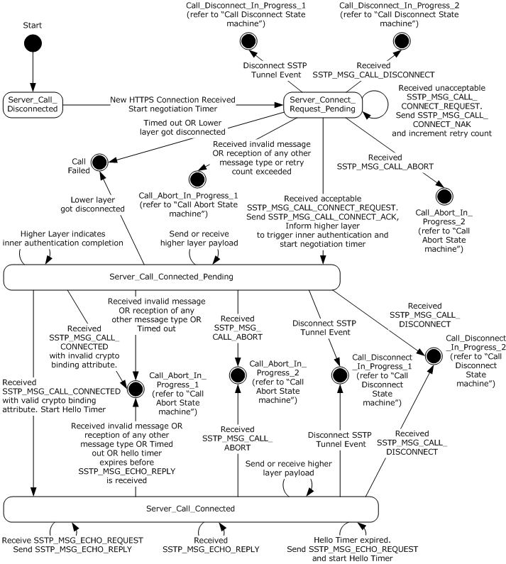

Figure 5: Server call establishment

The server state machine for each connection has the following states as represented in the **CurrentState** variable for the particular connection:

| State Name | Description |
| --- | --- |
| Server_Call_Disconnected | This is the initial state of the server state machine for any connection. In this state, the server waits for a new HTTPS connection event to come in from the lower HTTPS layer. On receipt of this event, the server changes **CurrentState** to Server_Connect_Request_Pending. |
| Server_Connect_Request_Pending | In this state, the server waits for the [SSTP_MSG_CALL_CONNECT_REQUEST](#Section_2.2.9) message from the SSTP client. On receipt of this message and when the message is found to be acceptable, the server sends an [SSTP_MSG_CALL_CONNECT_ACK](#Section_2.2.10) to the SSTP client, informs the higher layer (that is, PPP) to start the authentication phase, and then changes **CurrentState** to Server_Call_Connected_Pending. An SSTP_MSG_CALL_CONNECT_REQUEST message from the SSTP client is considered to be unacceptable if either the **Protocol ID** field is not SSTP_ENCAPSULATED_PROTOCOL_PPP or the message contains a [Status Info Attribute (section 2.2.8)](#Section_2.2.8) and the **status** field is set to a nonzero value. |
| Server_Call_Connected_Pending | In this state, the server waits for the SSTP_MSG_CALL_CONNECTED message from the SSTP client and continues to send and receive the higher layer payload (that is, PPP control frames). On receipt of the SSTP_MSG_CALL_CONNECTED message, the server validates the crypto binding attribute. If the attribute is valid, the server changes **CurrentState** to Server_Call_Connected. |
| Server_Call_Connected | This state refers to the successful establishment of an SSTP connection from a given SSTP client. In this state, the server continues to send and receive higher layer payload (that is, PPP control and data frames), in addition to sending periodic SSTP_MSG_ECHO_REQUEST messages for the particular SSTP connection. |

The preceding description covers the state transitions for a successful SSTP connection. Failure transitions are covered in the state machine diagram in this section and are also covered in sections [3.3.4](#Section_3.3.4) and [3.3.5](#Section_3.3.5). The additional states for the Call Abort and Call Disconnect transitions are defined in section 3.1.1.1. The higher level events and messages are explained in sections 3.3.4, 3.3.5, [3.1.4](#Section_3.1.4) and [3.1.5](#Section_3.1.5).

<a id="Section_3.3.2"></a>
### 3.3.2 Timers

Common timers are specified in section [3.1.2](#Section_3.1.2).

<a id="Section_3.3.2.1"></a>
#### 3.3.2.1 Negotiation Timer

When establishing the SSTP connection, the [**SSTP server**](#gt_sstp-server) starts the negotiation timer.

- When a **New HTTPS Connection Received** event is received, the server transitions to the **Server_Connect_Request_Pending** state where it waits to receive an acceptable [Call Connect Request message](#Section_2.2.9). If this is received before the Negotiation timer expires, the server then sends a [Call Connect Acknowledge message](#Section_2.2.10) and transitions to the **Server_Call_Connected_Pending** state. If the request is not received before the Negotiation timer expires, the server transitions to the **Call Failed** state as shown in the server call establishment diagram in section [3.3.1.1.1](#Section_3.3.1.1.1).
- After sending the Call Connect Acknowledge message, if the server does not receive a [Call Connected message](#Section_2.2.11) before the Negotiation timer expires then it MUST send a Call Abort message and start the process of bringing down (disconnecting) the connection. The server MAY implement different timer values for the Call Connected message and the Call Connect Request message.
This timer SHOULD be set to 60 seconds.<12>

<a id="Section_3.3.3"></a>
### 3.3.3 Initialization

As described in section [1](#Section_1), SSTP supports two deployment modes and requires a machine certificate in order to establish [**HTTPS**](#gt_hypertext-transfer-protocol-secure-https) negotiation in both modes. In the first deployment mode, where the [**SSTP server**](#gt_sstp-server) directly accepts HTTPS connections, the server administrator MUST install a server certificate in the machine certificate store on the SSTP server and MUST configure the HTTPS listener on the SSTP server with the same certificate. In the second deployment mode, where the SSTP server is located behind an [**SSL**](#gt_secure-sockets-layer-ssl) load balancer, the server administrator MUST install a server certificate on the SSL load balancer. In both deployment modes, the server administrator MUST populate the certificate hash of the machine certificate in the **ServerCertificateHash** state variable on the SSTP server.

The server administrator initializes the list of possible hash protocols that the SSTP server supports in the **ServerHashProtocolSupported** state variable (described in [3.3.1](#Section_3.3.1)).

The server administrator sets the **ServerBypassHLAuthConfigured** variable to TRUE if higher-layer authentication needs to be bypassed.

The server is initialized with the version of the SSTP protocol in the **ServerVersion** state variable specified in 3.3.1.

Server initialization MAY<13> be performed when the SSTP server software is started or when the administrator configures the SSTP server software. When the server is initialized, it MUST start a listener to listen for HTTPS requests on a predefined URI that will be used by the client,<14> and the server [**state machine**](#gt_state-machine) waits for an incoming HTTPS connection, as shown in the figure, "Server call establishment", in section [3.3.1.1.1](#Section_3.3.1.1.1).

<a id="Section_3.3.4"></a>
### 3.3.4 Higher-Layer Triggered Events

Events can be triggered from the higher layer on the server to disconnect the SSTP connection.

When the server receives a request to disconnect the SSTP connection from the management layer, the server MUST start disconnect processing. The management layer can issue disconnection requests based on an administrator command or any other local policies. <15> Server disconnect processing is the same as the client-side disconnect processing (section [3.2.4.2](#Section_3.2.4.2)).

<a id="Section_3.3.5"></a>
### 3.3.5 Processing Events and Sequencing Rules

<a id="Section_3.3.5.1"></a>
#### 3.3.5.1 Status and Error Handling

See section [3.1.5.1](#Section_3.1.5.1).

<a id="Section_3.3.5.2"></a>
#### 3.3.5.2 Packet Processing

<a id="Section_3.3.5.2.1"></a>
##### 3.3.5.2.1 General Packet Validation

When the [**SSTP peer**](#gt_sstp-peer) receives a packet, it MUST validate that the packet conforms to the syntax as specified in section [2.2](#Section_2.2) Message Syntax and its subsections. If an invalid packet is received, then error handling MUST occur. For more information about error handling see section [3.1.5.1](#Section_3.1.5.1).

<a id="Section_3.3.5.2.2"></a>
##### 3.3.5.2.2 Receiving an SSTP_MSG_CALL_CONNECT_REQUEST Message

If **CurrentState** is set to Call_Abort_Timeout_Pending, Call_Abort_Pending, Call_Disconnect_Ack_Pending, or Call_Disconnect_Timeout_Pending:

- Ignore the message.
If **CurrentState** is set to Server_Connect_Request_Pending:

- Process the message as indicated later in this section.
Else if **CurrentState** has any other value:

- Change **CurrentState** to Call_Abort_In_Progress_1.
- Send an [SSTP_MSG_CALL_ABORT (section 2.2.13)](#Section_2.2.13) message.
- Start the TIMER_VAL_ABORT_STATE_TIMER_1 timer (section [3.1.2.1](#Section_3.1.2.1)).
- Change **CurrentState** to Call_Abort_Pending.
If **CurrentState** is set to Server_Connect_Request_Pending, the following message processing takes place.

The [SSTP_MSG_CALL_CONNECT_REQUEST](#Section_2.2.11) message MUST be either the first message that is received by an [**SSTP server**](#gt_sstp-server), or it MUST be received in response to the [Call Connect Negative Acknowledgment message](#Section_2.2.12) that is sent by the server. The [Call Connect Request message](#Section_2.2.9) MUST contain an [Encapsulated Protocol ID attribute](#Section_2.2.5) with Protocol ID = PPP. For more information about PPP, see [[RFC1661]](https://go.microsoft.com/fwlink/?LinkId=90283).

If the preceding conditions are true, the server SHOULD:

- Receive the PPP control frames from the client.
- Request the PPP layer to start the FSM.
The server MUST:

- Start the negotiation timer.
- Respond with an [SSTP_MSG_CALL_CONNECT_ACK (section 2.2.10)](#Section_2.2.10) message.
- Change **CurrentState** to Server_Call_Connected_Pending.
If the message is invalid due to any of the following conditions, an SSTP_MSG_CALL_CONNECT_NAK (section 2.2.12) message MUST be sent. This message contains the [Status Info attributes (section 2.2.8)](#Section_2.2.8) for all attributes that are not acceptable to the server.

- If the message contains an attribute with **Attribute ID** equal to SSTP_ATTRIB_STATUS_INFO and **status** not equal to ATTRIB_STATUS_NO_ERROR, then **Attribute ID** is set to SSTP_ATTRIB_STATUS_INFO and the **status** field is set to ATTRIB_STATUS_STATUS_INFO_NOT_SUPPORTED_IN_MSG.
- If the length of an attribute is incorrect, then the **Attribute ID** with invalid length in the Call Connect Request message is used for the **Attribute ID** in this message, with the **status** field set to ATTRIB_STATUS_INVALID_ATTRIB_VALUE_LENGTH.
- If there is a duplicate attribute, then the **Attribute ID** of the duplicate attribute received in the Call Connect Request message is used for the **Attribute ID** in this message, with the **status** field set to ATTRIB_STATUS_DUPLICATE_ATTRIBUTE.
- If the attribute is not recognized on the server side, then the unrecognized **Attribute ID** received in the Call Connect Request message is used in the **Attribute ID** of this message, with the **status** field set to ATTRIB_STATUS_UNRECOGNIZED_ATTRIBUTE.
- If the encapsulated protocol is not supported, then **Attribute ID** is set to SSTP_ATTRIB_ENCAPSULATED_PROTOCOL_ID, and status is set to ATTRIB_STATUS_VALUE_NOT_SUPPORTED.
- If the encapsulated protocol **Attribute ID** is not received in the Call Connect Request message, then the **Attribute ID** is set to SSTP_ATTRIB_STATUS_INFO and **status** is set to ATTRIB_STATUS_REQUIRED_ATTRIBUTE_MISSING.
The server SHOULD maintain an implementation-dependent retry counter<16> that limits the number of times it sends a NAK to an unacceptable Call Connect Request message. If this count is exceeded, then the server MUST send a Call Abort message and start the process of bringing down (disconnecting) the connection. In this case, the Call Abort message MUST have the following field values:

- The **Attribute ID** is set to SSTP_ATTRIB_STATUS_INFO and the **status** field is set to ATTRIB_STATUS_RETRY_COUNT_EXCEEDED.
<a id="Section_3.3.5.2.3"></a>
##### 3.3.5.2.3 Receiving an SSTP_MSG_CALL_CONNECTED Message

If the **CurrentState** state variable (described in section [3.3.1](#Section_3.3.1)) is set to Call_Abort_Timeout_Pending, Call_Abort_Pending, Call_Disconnect_Ack_Pending, or Call_Disconnect_Timeout_Pending:

- Ignore the message.
If **CurrentState** is set to Server_Call_Connected_Pending:

- Process the message as indicated later in this section.
Else if **CurrentState** has any other value:

- Change **CurrentState** to Call_Abort_In_Progress_1.
- Send an [SSTP_MSG_CALL_ABORT (section 2.2.13)](#Section_2.2.13) message.
- Start the TIMER_VAL_ABORT_STATE_TIMER_1 timer (section [3.1.2.1](#Section_3.1.2.1))
- Change **CurrentState** to Call_Abort_Pending.
If **CurrentState** is Server_Call_Connected_Pending, the following message processing takes place.

The [SSTP_MSG_CALL_CONNECTED](#Section_2.2.11) message MUST be received by an [**SSTP server**](#gt_sstp-server) only in response to a [Call Connect Acknowledge message](#Section_2.2.10) that is sent by the SSTP server before the negotiation timer expires.

The server MUST verify the following:

- A [Crypto Binding attribute](#Section_2.2.7) is present.
- The [Crypto Binding attribute](#Section_3.2.5.2) contains the same nonce that it sent in the Call Connect Acknowledge message.
- The Crypto Binding attribute contains the hash of the certificate that the server used for establishing the [**HTTPS**](#gt_hypertext-transfer-protocol-secure-https) connection, **ServerCertificateHash**.
- The Crypto Binding attribute contains a hash protocol that is supported by the server and specified in the **ServerHashProtocolSupported** state variable described in section 3.3.1 (that is, it uses one of the hash protocols that it inserted into the Call Connect Acknowledge message).
- The server MUST verify that the binding attribute contains a valid Compound MAC. To accomplish this, the server computes a new compound MAC (3.2.5.2) using the stored **ServerHLAKKey** variable from the connection table and then compares the same against the compound MAC sent by the client inside SSTP_MSG_CALL_CONNECTED.
If all the preceding checks passed, then the server updates **CurrentState** to Server_Call_Connected. The server SHOULD<17> allow the PPP data frames to pass through only if the server has received a valid Call Connected message from the client in response to its Call Connect Acknowledge message. Until a valid Call Connected message is received, the server MUST allow only PPP control frames to flow through, and all PPP data frames will be ignored (or discarded). For more information about PPP, see [[RFC1661]](https://go.microsoft.com/fwlink/?LinkId=90283).

If any of the preceding checks fail, the server MUST start the abort processing procedure by sending a Call Abort message. The server starts the TIMER_VAL_ABORT_STATE_TIMER_1 timer (section 3.1.2.1) and changes **CurrentState** to Call_Abort_Pending.

The Call Abort message MUST have the *Attribute Id* field set to SSTP_ATTRIB_STATUS_INFO and the **status** field MUST be set to ATTRIB_STATUS_ATTRIB_NOT_SUPPORTED_IN_MSG under the following condition: The crypto binding attribute is not present OR an invalid length is given for the attribute OR the *Attribute Id* is set to SSTP_ATTRIB_STATUS_INFO and the **status** is not equal to ATTRIB_STATUS_NO_ERROR.

The Call Abort message MUST have the attribute id set to SSTP_ATTRIB_CRYPTO_BINDING and the **status** field MUST be set to ATTRIB_STATUS_VALUE_NOT_SUPPORTED under the following condition: The nonce is not matching OR the certificate does not match OR the hash algorithm does not match OR the Compound MAC is invalid.

If an unacceptable packet is received, error handling SHOULD occur. For error handling, see section [3.1.5.1](#Section_3.1.5.1). For security considerations, see section [5](#Section_5).

<a id="Section_3.3.5.2.4"></a>
##### 3.3.5.2.4 Receiving an SSTP_MSG_CALL_ABORT Message

If **CurrentState** is set to Call_Abort_Pending:

- Stop the TIMER_VAL_ABORT_STATE_TIMER_1 timer (section [3.1.2.1](#Section_3.1.2.1)).
- Start the TIMER_VAL_ABORT_STATE_TIMER_2 (section 3.1.2.1) timer.
- Change **CurrentState** to Call_Abort_Timeout_Pending.
Else if **CurrentState** is set to Call_Abort_Timeout_Pending or Call_Disconnect_Timeout_Pending:

- Ignore the message.
Else:

- Change **CurrentState** to Call_Abort_In_Progress_2.
- Send an [SSTP_MSG_CALL_ABORT (section 2.2.13)](#Section_2.2.13) message.
- Start the TIMER_VAL_ABORT_STATE_TIMER_2 timer (section 3.1.2.1).
- Change **CurrentState** to Call_Abort_Timeout_Pending.
The HTTPS listener MUST continue to function as it did before the cleanup process. The cleanup of the connection MUST NOT affect other existing HTTPS connections and MUST NOT affect the ability of the HTTPS listener to accept new connections.

<a id="Section_3.3.5.2.5"></a>
##### 3.3.5.2.5 Receiving an SSTP_MSG_CALL_DISCONNECT Message

If **CurrentState** is set to Call_Abort_Timeout_Pending, Call_Abort_Pending, or Call_Disconnect_Timeout_Pending:

- Ignore the message.
Else if **CurrentState** is set to Call_Disconnect_Ack_Pending:

- Stop the TIMER_VAL_DISCONNECT_STATE_TIMER_1 timer (section [3.1.2.2](#Section_3.1.2.2)).
- Change **CurrentState** to Call_Disconnect_In_Progress_2.
- Send SSTP_MSG_CALL_DISCONNECT_ACK message.
- Start the TIMER_VAL_DISCONNECT_STATE_TIMER_2 timer (section 3.1.2.2).
- Change **CurrentState** to Call_Disconnect_Timeout_Pending.
Else:

- Change **CurrentState** to Call_Disconnect_In_Progress_2.
- Send an SSTP_MSG_CALL_DISCONNECT_ACK message.
- Start the TIMER_VAL_DISCONNECT_STATE_TIMER_2 timer (section 3.1.2.2).
- Change **CurrentState** to Call_Disconnect_Timeout_Pending.
The HTTPS listener MUST continue to function as it did before the cleanup process. The cleanup of the connection MUST NOT affect other existing HTTPS connections and MUST NOT affect the ability of the HTTPS listener to accept new connections.

<a id="Section_3.3.5.2.6"></a>
##### 3.3.5.2.6 Receiving an SSTP_MSG_CALL_DISCONNECT_ACK Message

If **CurrentState** is set to Call_Disconnect_Ack_Pending, the server MUST:

- Immediately clear the connection state to clean up the connection.
- Change **CurrentState** to Server_Call_Disconnected.
Else if **CurrentState** is set to Call_Abort_Pending, Call_Abort_Timeout_Pending, or Call_Disconnect_Timeout_Pending:

- Ignore the message.
Else:

- Change **CurrentState** to Call_Abort_In_Progress_1.
- Send an [SSTP_MSG_CALL_ABORT (section 2.2.13)](#Section_2.2.13) message.
- Start the TIMER_VAL_ABORT_STATE_TIMER_1 timer (section [3.1.2.1](#Section_3.1.2.1)).
- Change **CurrentState** to Call_Abort_Pending.
The HTTPS listener MUST continue to function as it did before the cleanup process. The cleanup of the connection MUST NOT affect other existing HTTPS connections and MUST NOT affect the ability of the HTTPS listener to accept new connections.

<a id="Section_3.3.5.2.7"></a>
##### 3.3.5.2.7 Receiving an SSTP_MSG_ECHO_REQUEST Message

If **CurrentState** is set to Server_Call_Connected:

- Restart the Hello timer (section [3.1.2.3](#Section_3.1.2.3)).
- Send an [SSTP_MSG_ECHO_RESPONSE (section 2.2.15)](#Section_2.2.15) message.
Else if **CurrentState** is Call_Abort_Timeout_Pending, Call_Abort_Pending, Call_Disconnect_Ack_Pending, or Call_Disconnect_Timeout_Pending:

- Ignore the message.
Else if **CurrentState** is set to any other value:

- Change **CurrentState** to Call_Abort_In_Progress_1.
- Send an [SSTP_MSG_CALL_ABORT (section 2.2.13)](#Section_2.2.13) message.
- Start the TIMER_VAL_ABORT_STATE_TIMER_1 timer (section [3.1.2.1](#Section_3.1.2.1)).
- Change **CurrentState** to Call_Abort_Pending.
<a id="Section_3.3.5.2.8"></a>
##### 3.3.5.2.8 Receiving an SSTP_MSG_ECHO_RESPONSE Message

If **CurrentState** is set to Server_Call_Connected:

- Restart the Hello timer (section [3.1.2.3](#Section_3.1.2.3)).
Else if **CurrentState** is set to Call_Abort_Timeout_Pending, Call_Abort_Pending, Call_Disconnect_Ack_Pending, or Call_Disconnect_Timeout_Pending:

- Ignore the message.
Else if **CurrentState** is set to any other value:

- Change **CurrentState** to Call_Abort_In_Progress_1.
- Send an [SSTP_MSG_CALL_ABORT (section 2.2.13)](#Section_2.2.13) message.
- Start the TIMER_VAL_ABORT_STATE_TIMER_1 timer (section [3.1.2.1](#Section_3.1.2.1)).
- Change **CurrentState** to Call_Abort_Pending.
<a id="Section_3.3.6"></a>
### 3.3.6 Timer Events

<a id="Section_3.3.6.1"></a>
#### 3.3.6.1 Negotiation Timer Processing

Negotiation Timer Expired:

- Change **CurrentState** to Call_Abort_In_Progress_1.
- Send an [SSTP_MSG_CALL_ABORT (section 2.2.13)](#Section_2.2.13) message.
- Start the TIMER_VAL_ABORT_STATE_TIMER_1 timer (section [3.1.2.1](#Section_3.1.2.1)).
- Change **CurrentState** to Call_Abort_Pending.
<a id="Section_3.3.7"></a>
### 3.3.7 Other Local Events

For local events common to both client and server, see section [3.1.7](#Section_3.1.7).

<a id="Section_3.3.7.1"></a>
#### 3.3.7.1 Server-Side Interface with PPP

**Inner Authentication Completed Event:** This event will be sent by the higher layer when the authentication (that is, PPP authentication) has been completed successfully or bypassed. If the higher-layer authentication has failed, the higher layer sends the [Disconnect Tunnel Event (section 3.2.4.2)](#Section_3.2.4.2) to notify the [**SSTP server**](#gt_sstp-server). The SSTP server stores the higher-layer authentication key (HLAK) passed by the PPP layer inside the **ServerHLAKKey** variable for the connection entry. This variable will be used to verify the crypto binding attribute when the SSTP server receives the [SSTP_MSG_CALL_CONNECTED (section 3.3.5.2.3)](#Section_3.3.5.2.3) message. If PPP authentication is bypassed (i.e. **ServerBypassHLAuth** for this connection table entry is set to TRUE), **ServerHLAKKey** is set to zero.

When the server receives a PPP control frame from the PPP layer, the server MUST perform the following steps:

- If **CurrentState** is set to Server_Call_Connected_Pending or Server_Call_Connected: Generate an [SSTP data packet (section 2.2.3)](#Section_2.2.3) with the PPP frame as the higher-layer payload and send the packet to the [**HTTPS**](#gt_hypertext-transfer-protocol-secure-https) layer.
- Else, drop the PPP frame.
When the server receives a PPP data frame from the PPP layer, the server MUST perform the following steps:

- If **CurrentState** is set to Server_Call_Connected: Generate an SSTP data packet (section 2.2.3) with the PPP frame as the higher-layer payload and send the packet to the HTTPS layer.
- Else, drop the PPP frame.
<a id="Section_3.3.7.2"></a>
#### 3.3.7.2 Server-Side Interface with HTTPS

The [**SSTP server**](#gt_sstp-server) receives notification of a **New HTTPS Connection Received event** from the lower layer when a new, incoming [**HTTPS**](#gt_hypertext-transfer-protocol-secure-https) connection is established. The SSTP server then creates a new entry in a connection table and changes **CurrentState** from Server_Call_Disconnected to Server_Connect_Request_Pending. It also sets the **ServerBypassHLAuth** variable inside this entry to FALSE and **ServerHTTPCookie** as null. If **ServerBypassHLAuthConfigured** is set to TRUE, the SSTP server reads from the HTTPS layer, stores any HTTP cookie that was passed with the HTTPS connection inside the **ServerHTTPCookie** variable of this entry in the connection table, and indicates the same to the server management layer by calling the **Accept New Connection** interface ([3.3.7.3](#Section_3.3.7.3)).

When the server receives an [SSTP data packet (section 2.2.3)](#Section_2.2.3) from the HTTPS layer, the server MUST:

- Remove the SSTP data header (see section 2.2.3) and extract the data. The extracted data is the higher-layer payload; that is, the PPP frame.
- Check the PPP frame type (section [3.1.7](#Section_3.1.7)) and perform the following steps.
- If the PPP frame is a control frame, the server checks if **CurrentState** is set to Server_Call_Connected_Pending or Server_Call_Connected. If the condition is true, the server sends the data to the PPP layer. Else, the server drops the SSTP data packet.
- If the PPP frame is a data frame, the server checks if **CurrentState** is set to Server_Call_Connected. If the condition is true, the server sends the data to the PPP layer. Else, the server drops the SSTP data packet.
<a id="Section_3.3.7.3"></a>
#### 3.3.7.3 Server-Side Interface with Management Layer

The SSTP layer on the server-side implementation interfaces with the management layer using the following events:

- **Start SSTP Server**: This event is used by the management layer to initialize and start the [**SSTP server**](#gt_sstp-server) software (see section [3.3.3](#Section_3.3.3) for actions performed by the SSTP server during initialization).
- **Stop SSTP Server**: This event is used by the management layer to stop the SSTP server software. On receiving this event, the SSTP server will perform cleanup by disconnecting all existing SSTP connections (section [3.3.4](#Section_3.3.4)), and stop the HTTPS listener that is waiting for SSTP connections on an SSTP–specific URI.
- **Accept New Connection**: This event is used by the SSTP layer on the server side to inform its management layer about acceptance of a new HTTPS connection with a valid cookie.<18> This interface is called only if **ServerBypassHLAuthConfigured** global variable is set to TRUE AND **ServerHTTPCookie** for the connection entry is not null. Otherwise this interface is not invoked. When calling this interface, the SSTP layer passes **ServerHTTPCookie** variable for the connection to the management layer. The management layer MUST validate this cookie using its own implementation-specific mechanism. If the management layer finds the cookie as valid (i.e. it trusts the cookie to say it is coming from an authenticated client), the management layer MUST inform SSTP layer to accept the new connection bypassing the higher-layer authentication, and then SSTP layer will set **ServerBypassHLAuth** variable for this connection as TRUE. If the management layer finds the cookie as invalid, the management layer MUST inform SSTP layer to disconnect the new connection. The SSTP layer MUST close the HTTPS connection and initialize **CurrentState** variable for this connection entry to Server_Call_Disconnected.
<a id="Section_4"></a>
# 4 Protocol Examples

<a id="Section_4.1"></a>
## 4.1 HTTPS Layer Establishment

During initialization, the [**SSTP server**](#gt_sstp-server) configures both the server certificate to use and the URL in which it is interested. This URL will be a well-known URL between the client and the server. The server can also support HTTP to allow SSL/TLS terminating edge devices.<19> These devices terminate the SSL/TLS connection coming from the client, validate the URL, and establish the HTTP connection to the actual web server behind it.

The request sent to the SSTP server uses the HTTP verb SSTP_DUPLEX_POST with content length encoding.

The request sent is as follows:

- Method: SSTP_DUPLEX_POST
- URI: /sra_{BA195980-CD49-458b-9E23-C84EE0ADCD75}/
- Protocol Version: HTTP/1.1
- Content-Length: 18446744073709551615 (ULONGLONG_MAX)
- Host: <Server Name>
- SSTPCORRELATIONID: <GUID>
As a part of setting up a bidirectional session with HTTPS, when the HTTP request is being sent, no entity body message will be sent to the far end. Instead, the client initiates a timer (for 60 seconds) and sends out the request to the server. A response is expected within 60 seconds. The server will be listening for the URI /sra_{BA195980-CD49-458b-9E23-C84EE0ADCD75}/. The SSTP server, on receiving the request, validates the method to be SSTP_DUPLEX_POST and the HTTP version to be 1.1. If this succeeds, and there are sufficient ports on the server to accept the new connection, then the server sends back an HTTP_STATUS_OK message to the client. Otherwise, the server fails the request by sending an HTTP error code containing indication this is to be the last data being sent over the connection.

The response sent is as follows.

Protocol Version: HTTP/1.1

Status code: 200

Content-Length: 18446744073709551615

Server: Microsoft-HTTPAPI/2.0

Date: Thu, 09 Nov 2006 00:51:09 GMT

<a id="Section_4.2"></a>
## 4.2 HTTP Layer Teardown

After the SSTP finite [**state machine**](#gt_state-machine) (FSM) is completed, it performs its own teardown. When the teardown is completed, the SSTP FSM signals the HTTP layer to tear down itself.

The teardown of the HTTP connection layer is done by signaling the request/response completion. The client closes the request to indicate that no data transfer is expected on it. If the server is initiating the disconnect, then it indicates the end of the entity body to the HTTP layer. The HTTP layer closes the TCP connection appropriately.

<a id="Section_4.3"></a>
## 4.3 SSTP Layer Establishment

After the bidirectional HTTPS layer is up, the SSTP finite [**state machine**](#gt_state-machine) begins. The server initializes the FSM by waiting for the SSTP [Call Connect Request message](#Section_2.2.9) to arrive from the client. After the Call Connect Request message arrives, the server validates the [Encapsulated Protocol ID attribute](#Section_2.2.5) value for PPP. The [**SSTP server**](#gt_sstp-server) then responds to the client by using the [Call Connect Acknowledge message](#Section_2.2.10). The client sends the [Call Connected message](#Section_2.2.11) to the server to indicate that it is ready to send data traffic. When the server receives the Call Connected message, it allows bidirectional data transfer on the SSTP connection.

After the control channel is established, the echo timers continue to send [Echo Request messages](#Section_7c572ceb571946d0a5ddf68a44a90292) in order to keep the channel alive. Echo responses are sent and received to ensure that the connection is not broken.

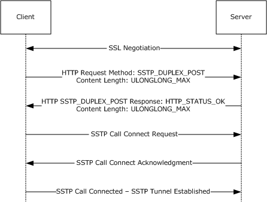

Figure 6: SSTP call setup for a non-proxy scenario

<a id="Section_4.4"></a>
## 4.4 SSTP Layer Teardown

This protocol uses forceful teardown through the [Call Abort message](#Section_3.1.1.1.2) in addition to graceful shutdown through the [Call Disconnect message](#Section_3.1.1.1.1).

The Call Abort message is used in situations in which the SSTP control channel negotiation has encountered a problem such as a time-out, an invalid message, or other similar problems. The Call Abort-based shutdown uses short timers for quick cleanup.

Graceful shutdown occurs when the Call Disconnect message is sent to the far end. The far end responds by sending a [Call Disconnect Acknowledge message](#Section_7c572ceb571946d0a5ddf68a44a90292) in order to signal the end of data transfer.

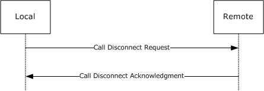

Figure 7: SSTP graceful shutdown

<a id="Section_4.5"></a>
## 4.5 Handling HTTP Proxies

In the case that an [**SSTP tunnel**](#gt_sstp-tunnel) is established through a proxy, the typical CONNECT request is as follows.

Method: CONNECT

Protocol Version: HTTP/1.1

URI: <Server Name>:443

Host: <Server Name>:443

SSTPVERSION: 1.0

The SSTPVERSION field can be used by network administrators through forward proxies to filter the SSTP-based connection to go out of the network.

The response from the proxy follows. After the response is received, the SSL/TLS traffic is sent in an encrypted manner to the proxy, and the proxy relays the encrypted traffic between the client and the server.

Protocol Version: HTTP/1.1

Status Code: 200 HTTP_STATUS_OK

Reason: Connection Established

Proxy-Connection: Keep-Alive

Connection: Keep-Alive

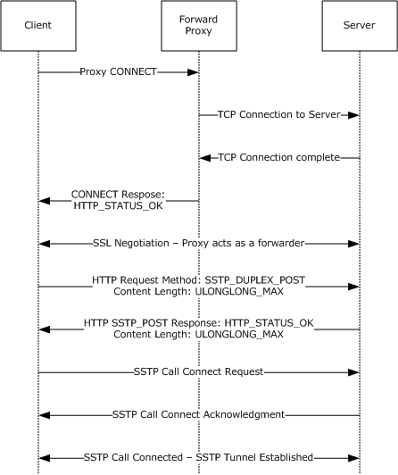

Figure 8: SSTP call setup for a proxy scenario

<a id="Section_4.6"></a>
## 4.6 Handling the HTTPS Termination Proxy

If an [**SSTP tunnel**](#gt_sstp-tunnel) is established through an [**HTTPS termination proxy**](#gt_https-termination-proxy), the [**HTTPS**](#gt_hypertext-transfer-protocol-secure-https) connection terminates at the proxy and a new HTTP bidirectional connection to the [**SSTP server**](#gt_sstp-server) is attempted. The query variable **tenantid** (section [3.2.4.1](#Section_3.2.4.1)) can be used to select the SSTP server behind the proxy. After the connection is established, the proxy forwards the data across the two connections.

<a id="Section_4.7"></a>
## 4.7 Crypto Binding

The client sends an SSTP_MSG_CALL_CONNECT_REQUEST that encapsulates the PPP protocol. The actual data bytes are as follows.

10 01 00 0E 00 01 00 01 00 01 00 06 00 01

The details for the packet are as follows.

- Version: 0x10 (Major Version: 0x1, Minor Version: 0x0)
- C: 1 (Control Packet)
- Length: 0x00E
- Message Type: 0x0001 (SSTP_MSG_CALL_CONNECT_REQUEST)
- Num Attributes: 0x0001
- Attribute 1:
- Attribute ID: 0x01 (SSTP_ATTRIB_ENCAPSULATED_PROTOCOL_ID)
- Length: 0x006
- Value: 0x0001 (SSTP_ENCAPSULATED_PROTOCOL_PPP)
The server responds to the client with SSTP_MSG_CALL_CONNECT_ACK. In this case, the server supports only the SHA256 hash algorithm for [crypto binding](#Section_3.2.5.2). The actual data bytes are as follows.

10 01 00 30 00 02 00 01 00 04 00 28 00 00 00 02

41 2B 48 9A EB D7 EC C7 D0 89 66 F2 6B E7 CD 72

B2 31 A0 E9 21 0D 7C 91 B3 08 86 2B 03 44 C4 35

The details are as follows.

- Version: 0x10 (Major Version: 0x1, Minor Version: 0x0)
- C: 1 (Control Packet)
- Length: 0x030
- Message Type: 0x0002 (SSTP_MSG_CALL_CONNECT_ACK)
- Num Attributes: 0x0001
- Attribute 1:
- ID: 0x04 (SSTP_ATTRIB_CRYPTO_BINDING_REQ)
- Length: 0x028
- Value:
- Protocol Bitmask: 0x02 (CERT_HASH_PROTOCOL_SHA256)
- Nonce:
41 2B 48 9A EB D7 EC C7 D0 89 66 F2 6B E7 CD 72

B2 31 A0 E9 21 0D 7C 91 B3 08 86 2B 03 44 C4 35

The client continues with the PPP negotiation after receiving the preceding message. When PPP authentication is finished, the client completes the crypto binding by sending an SSTP_MSG_CALL_CONNECTED message. The data bytes that are transmitted in this scenario are as follows.

10 01 00 70 00 04 00 01 00 03 00 68 00 00 00 02

41 2B 48 9A EB D7 EC C7 D0 89 66 F2 6B E7 CD 72

B2 31 A0 E9 21 0D 7C 91 B3 08 86 2B 03 44 C4 35

79 93 EF 31 4C 49 3D AC E9 F0 2D 60 E7 E6 1C 84

B6 69 0A AF E9 D7 AE EA 92 CB BE 8A D5 99 42 2D

52 A6 8E FD 8C FF BF 52 77 0B 8F 0F E8 EC 73 71

65 83 AF 6D 61 1E B6 D1 79 B3 B2 08 40 98 54 49

The computation of Compound MAC is done based on the following.

Higher-Layer Authentication Key (HLAK):

2A 1B B4 0D 55 AB 0F 5E F3 2F 06 F2 B3 CC 73 C4

8F D3 FA C4 1D 7A 13 15 A1 92 28 D9 02 4C A1 64

The hash of the certificate that is provided by the server is as follows.

79 93 EF 31 4C 49 3D AC E9 F0 2D 60 E7 E6 1C 84

B6 69 0A AF E9 D7 AE EA 92 CB BE 8A D5 99 42 2D

The details of the packet that is sent are as follows.

- Version: 0x10 (Major Version: 0x1, Minor Version: 0x0)
- C: 1 (Control Packet)
- Length: 0x070
- Message Type: 0x0004 (SSTP_MSG_CALL_CONNECTED)
- Num Attributes: 0x0001
- Attribute 1:
- Attribute ID: 0x03 (SSTP_ATTRIB_CRYPTO_BINDING)
- Length: 0x068
- Value:
- Hash Protocol Bitmask: 0x02 (CERT_HASH_PROTOCOL_SHA256)
- Nonce:
41 2B 48 9A EB D7 EC C7 D0 89 66 F2 6B E7 CD 72

B2 31 A0 E9 21 0D 7C 91 B3 08 86 2B 03 44 C4 35

- Certificate Hash:
79 93 EF 31 4C 49 3D AC E9 F0 2D 60 E7 E6 1C 84

B6 69 0A AF E9 D7 AE EA 92 CB BE 8A D5 99 42 2D

- Compound MAC:
52 A6 8E FD 8C FF BF 52 77 0B 8F 0F E8 EC 73 71

65 83 AF 6D 61 1E B6 D1 79 B3 B2 08 40 98 54 49

In this example, the server uses a SHA1 hash for crypto binding. The following is a sample SSTP_MSG_CALL_CONNECT_ACK in this scenario.

10 01 00 30 00 02 00 01 00 04 00 28 00 00 00 01

0F 1A 2D 58 D4 A3 E3 00 0F AD 3C E4 90 6E 07 B7

07 AA 9E 44 1C CE AC 5C BD 7B 2C C1 C9 D8 6C DF

The details of the packet are as follows.

- Version: 0x10 (Major Version: 0x1, Minor Version: 0x0)
- C: 1 (Control Packet)
- Length: 0x030
- Message Type: 0x0002 (SSTP_MSG_CALL_CONNECT_ACK)
- Num Attributes: 0x0001
- Attribute 1:
- Attribute ID: 0x04 (SSTP_ATTRIB_CRYPTO_BINDING_REQ)
- Length: 0x028
- Value:
- Hash Protocol Bitmask: 0x01 (CERT_HASH_PROTOCOL_SHA1)
- Nonce:
0F 1A 2D 58 D4 A3 E3 00 0F AD 3C E4 90 6E 07 B7

07 AA 9E 44 1C CE AC 5C BD 7B 2C C1 C9 D8 6C DF

For this SSTP_MSG_CALL_CONNECT_ACK, the following shows a valid crypto binding completion via the SSTP_MSG_CALL_CONNECTED message.

10 01 00 70 00 04 00 01 00 03 00 68 00 00 00 01

0F 1A 2D 58 D4 A3 E3 00 0F AD 3C E4 90 6E 07 B7

07 AA 9E 44 1C CE AC 5C BD 7B 2C C1 C9 D8 6C DF

58 26 B6 29 BD A5 9B 8E 6F D8 DC D2 62 2F D3 4C

53 48 05 A5 00 00 00 00 00 00 00 00 00 00 00 00

69 91 5D D5 83 D8 06 2F EF 16 F6 1D B2 F0 32 90

EC 27 CB 6C 00 00 00 00 00 00 00 00 00 00 00 00

The compound MAC is computed based on the following values for HLAK and certificate hash.

Higher-Layer Authentication Key (HLAK):

4B 31 28 F4 39 25 D9 00-6E EF B1 C4 E8 65 15 A1

D8 8E 56 BA B3 CA 2B DF-03 73 B7 F5 A8 A1 3B 19

The hash of the certificate that is provided by the server is as follows.

58 26 B6 29 BD A5 9B 8E 6F D8 DC D2 62 2F D3 4C

53 48 05 A5

The details of the packet are as follows.

- Version: 0x10 (Major Version: 0x1, Minor Version: 0x0)
- C: 1 (Control Packet)
- Length: 0x070
- Message Type: 0x0004 (SSTP_MSG_CALL_CONNECTED)
- Num Attributes: 0x0001
- Attribute 1:
- Attribute ID: 0x03 (SSTP_ATTRIB_CRYPTO_BINDING)
- Length: 0x068
- Value:
- Hash Protocol Bitmask: 0x01 (CERT_HASH_PROTOCOL_SHA1)
- Nonce:
0F 1A 2D 58 D4 A3 E3 00 0F AD 3C E4 90 6E 07 B7

07 AA 9E 44 1C CE AC 5C BD 7B 2C C1 C9 D8 6C DF

- Certificate Hash:
58 26 B6 29 BD A5 9B 8E 6F D8 DC D2 62 2F D3 4C

53 48 05 A5

- Compound MAC:
69 91 5D D5 83 D8 06 2F EF 16 F6 1D B2 F0 32 90

EC 27 CB 6C

<a id="Section_5"></a>
# 5 Security

<a id="Section_5.1"></a>
## 5.1 Security Considerations for Implementers

Because SSTP Version 1 supports only transport of PPP frames, there is no need for any negotiation of parameters in the SSTP [Call Connect Request message](#Section_2.2.9), [Call Connect Acknowledge message](#Section_2.2.10), and [Call Connected message](#Section_2.2.11) exchange. When the server receives a Call Connect Request message, it sends a Call Connect Acknowledge message and triggers the PPP [**state machine**](#gt_state-machine). When the [**SSTP client**](#gt_sstp-client) receives the Call Connect Acknowledge message, it triggers the PPP state machine.

The [**SSTP server**](#gt_sstp-server) begins forwarding the PPP data frames only after it validates the [Crypto Binding attribute](#Section_2.2.7) in the Call Connected message from the SSTP client. The server drops any PPP data frames that are received before the Call Connected message is received. For more information about PPP, see [[RFC1661]](https://go.microsoft.com/fwlink/?LinkId=90283).

<a id="Section_5.2"></a>
## 5.2 Index of Security Parameters

| Security parameter | Section |
| --- | --- |
| Authentication | [2.1](#Section_2.1) |
| Hashing algorithms | [3.2.5.2](#Section_3.2.5.2) |

<a id="Section_5.3"></a>
## 5.3 Attack Scenarios

<a id="Section_5.3.1"></a>
### 5.3.1 Unauthorized Client Connecting to an SSTP Server

In this scenario, an unauthorized attacker poses as a valid [**SSTP client**](#gt_sstp-client) and tries to connect to a valid [**SSTP server**](#gt_sstp-server). The HTTPS connection goes through because the server does not authenticate the client at the SSL/TLS layer. Make sure the SSTP server terminates the connection at the PPP layer after determining that the client has no proper user credentials. For more information, see [[RFC1661]](https://go.microsoft.com/fwlink/?LinkId=90283).

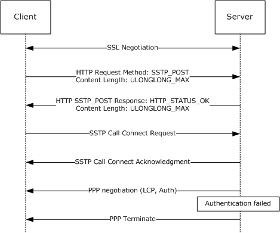

Figure 9: Unauthorized client connecting to an SSTP server

<a id="Section_5.3.2"></a>
### 5.3.2 Unauthorized SSTP Server Accepting Connections from a Genuine SSTP Client

In this scenario, a valid [**SSTP client**](#gt_sstp-client) is redirected by an attacker to an unauthorized [**SSTP server**](#gt_sstp-server) (for example, by DNS poisoning). In this scenario, the connection is terminated by the client at the SSL/TLS layer when the certificate validation check fails. It is recommended that the SSTP client validate that the common name and subject name in the server certificate match the host name to which the client established the connection. Also, it is recommended that the SSTP client validate that the server certificate contains either the "id-kp-serverAuth" or "anyExtendedKeyUsage" extended key usage (EKU). See [[RFC5280]](https://go.microsoft.com/fwlink/?LinkId=131034) section 4.2.1.12 for details on "id-kp-serverAuth" and "anyExtendedKeyUsage".

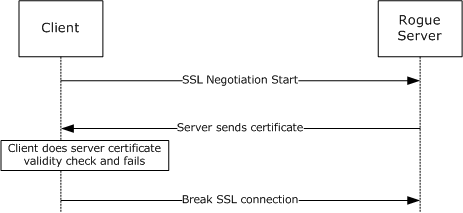

Figure 10: Client connecting to an unauthorized SSTP server

<a id="Section_5.3.3"></a>
### 5.3.3 Man in the Middle

In this scenario, an attacker poses as a man in the middle (MITM). For example, an MITM could be using a rogue wireless access point in a wireless-enabled enterprise environment.

The data flow in case of attack (without an SSTP [crypto binding](#Section_3.2.5.2) solution) looks like this:

- The MITM establishes an HTTPS connection with the [**SSTP server**](#gt_sstp-server).
- By using some technique (such as a rogue access point (AP) that has a similar name to the enterprise network), the MITM attacker gets a real client to initiate an EAP authentication (which can be any EAP method) with an authorized SSTP server. The client cannot determine that the HTTPS channel has been established to the man-in-the-middle machine; the client attempts to authenticate to a known authorized server by using EAP authentication, as usual.
- The MITM passes (or re-routes) the client's EAP-TLS authentication packets that are received over wireless to the PPP over SSTP (over SSL/TLS) tunnel it has established with the SSTP server. It does the same thing in reverse for responses to the client.
- The client and the server successfully complete the EAP authentication. The MITM machine simply relays the packets back and forth between both SSL/TLS tunnels.
- The MITM drops the client and continues to use the authenticated SSTP channel established with the server—without knowing the client's privileges and in an unauthorized manner.
**Note** The previous attack can happen for any PPP authentication protocol that can be relayed on another transport. For example, EAP can be relayed on SSTP as well as wireless.

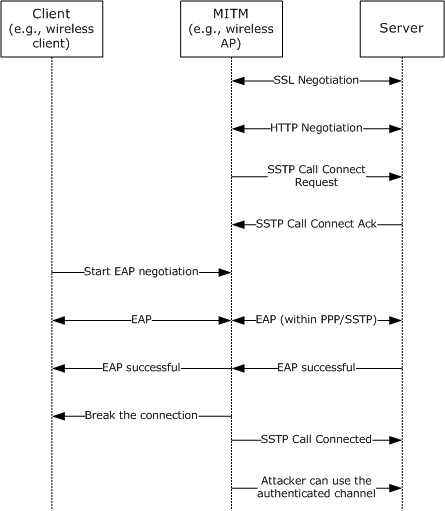

Figure 11: MITM scenario without the SSTP crypto binding solution

To mitigate this attack, the SSTP server expects a [Crypto Binding attribute](#Section_2.2.7) from the [**SSTP client**](#gt_sstp-client) to be present in the [Call Connected message](#Section_2.2.11). This attribute is generated by the client using the keys generated on the client. By using the inner (or PPP) authentication phase keys, and by tying the inner (or PPP) authentication to the outer (or SSL/TLS) authentication phase, this technique ensures that the SSTP client and the SSTP server participated in the inner authentication and terminate at the expected endpoints.

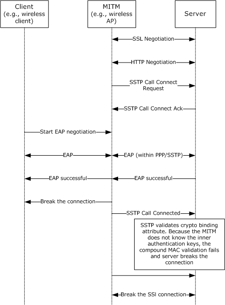

Figure 12: MITM scenario with SSTP crypto binding solution

**Note** Protected EAP (PEAP) (for more information, see [MS-PEAP](../MS-PEAP/MS-PEAP.md)) can also be used as the authentication protocol. In this case, the security attack vector and the solution remain the same as EAP. PEAP has an outer TLS channel between the PEAP client and authenticating server (like radius server) and does inner EAP authentication. If a PEAP crypto Type-Length-Value (TLV) check is not enabled on the client, then the PEAP client is susceptible to PEAP MITM attacks. This protocol does not offer a solution to this attack vector, which is already solved by the PEAP crypto TLV attribute.

<a id="Section_6"></a>
# 6 Appendix A: Product Behavior

The information in this specification is applicable to the following Microsoft products or supplemental software. References to product versions include updates to those products.

- Windows Vista operating system
- Windows Server 2008 operating system
- Windows 7 operating system
- Windows Server 2008 R2 operating system
- Windows 8 operating system
- Windows Server 2012 operating system
- Windows 8.1 operating system
- Windows Server 2012 R2 operating system
- Windows 10 operating system
- Windows Server 2016 operating system
- Windows Server operating system
- Windows Server 2019 operating system
- Windows Server 2022 operating system
- Windows 11 operating system
- Windows Server 2025 operating system
Exceptions, if any, are noted in this section. If an update version, service pack or Knowledge Base (KB) number appears with a product name, the behavior changed in that update. The new behavior also applies to subsequent updates unless otherwise specified. If a product edition appears with the product version, behavior is different in that product edition.

Unless otherwise specified, any statement of optional behavior in this specification that is prescribed using the terms "SHOULD" or "SHOULD NOT" implies product behavior in accordance with the SHOULD or SHOULD NOT prescription. Unless otherwise specified, the term "MAY" implies that the product does not follow the prescription.

<1> Section 2.1: Applicable Windows Server releases and Windows 10, except Windows Vista, do not support HTTPS client authentication, but support client authentication by using MS-CHAPv2 [[RFC2759]](https://go.microsoft.com/fwlink/?LinkId=90379), EAP-TLS [[RFC5216]](https://go.microsoft.com/fwlink/?LinkId=155108), PEAP-MSCHAPv2, and PEAP-TLS. See [MS-PEAP](../MS-PEAP/MS-PEAP.md) for details on how to use PEAP with inner methods such as MS-CHAPv2 and EAP-TLS.

Applicable Windows Server releases also support client authentication by using Password Authentication Protocol (PAP), as referenced in [[RFC1334]](https://go.microsoft.com/fwlink/?LinkId=148311), and CHAP [[RFC1994]](https://go.microsoft.com/fwlink/?LinkId=90305), but do not recommend their use for security reasons.

<2> Section 2.2.8: Applicable Windows Server releases allow a retry count of 3.

<3> Section 2.2.13: Windows always send a **Status Info** attribute in a **Call Abort** message.

<4> Section 2.2.14: Windows always send a **Status Info** attribute in a **Call Disconnect** message.

<5> Section 3.2.1: In applicable Windows releases, except Windows Vista and Windows Server 2008, support bypass of PPP authentication. On the client side, this protocol exposes APIs to the management layer to indicate **ClientBypassHLAuth** and **ClientHTTPCookie**. On the server side, this protocol exposes Routing and Remote Access Server APIs to indicate **Accept New Connection** along with the cookie to the management layer. However, this Windows protocol does not generate the cookie, nor does it validate one on the server side. It relies totally on the management layer to do the same in its own implementation-specific way.

<6> Section 3.2.2.1: Windows client starts a timer with a value of 60 seconds after sending a [Call Connected message](#Section_2.2.11) and starts a timer with a value of 60 seconds after receiving a Call Connected message.

<7> Section 3.2.4.1: Applicable Windows Server releases, except Windows Server 2008, do not support the HTTPS termination proxy.

<8> Section 3.2.5.2.2: The implementation uses AUTH_USE_EAP to cover the case of EAP TLS.

<9> Section 3.2.5.2.4: The implementation uses AUTH_USE_EAP to cover the case of EAP TLS.

<10> Section 3.2.5.3.3: In Windows, except Windows Vista without service packs, only the Encapsulation Protocol ID is sent by the SSTP client in the [SSTP_MSG_CALL_CONNECT_REQUEST (section 2.2.9)](#Section_2.2.9) message, and a negative [SSTP_MSG_CALL_CONNECT_NAK (section 2.2.12)](#Section_2.2.12) will be received by the client only if the SSTP server does not support transport of PPP frames over SSTP. The Windows client retries 3 times.

<11> Section 3.3.1: In applicable Windows releases, except Windows Vista and Windows Server 2008, support bypass of PPP authentication. On the client side, SSTP exposes APIs to the management layer to indicate **ClientBypassHLAuth** and **ClientHTTPCookie**. On the server side, SSTP exposes Routing and Remote Access Server APIs to indicate **Accept New Connection** along with the cookie to the management layer. However, this Windows protocol does not generate the cookie, nor does it validate one on the server side. It relies totally on the management layer to do the same in its own implementation-specific way.

<12> Section 3.3.2.1: Applicable Windows Server releases wait 60 seconds for the Call Connected message and 60 seconds for the Call Connect Request message.

<13> Section 3.3.3: In applicable Windows Server releases, the Routing and Remote Access Service is used as the [**SSTP management layer**](#gt_sstp-management-layer) on the server side. The SSTP server state is initialized when the Routing and Remote Access Service is started or when SSTP ports are configured within the service.

<14> Section 3.3.3: By default, Windows uses the URI: /sra_{BA195980-CD49-458b-9E23-C84EE0ADCD75}/.

<15> Section 3.3.4: Windows management layer supports administrator-determined disconnection of the SSTP connection. Windows also supports disconnections based on idle timeout and maximum connection lifetime. These values are retrieved by the management layer from Remote Authentication Dial-in User Service (RADIUS) attributes, if they are available:

- Maximum connection lifetime is retrieved from the Session-Timeout attribute ([[RFC2865]](https://go.microsoft.com/fwlink/?LinkId=90392) section 5.27).
- Idle timeout is retrieved from the Idle-Timeout attribute ([RFC2865] section 5.28).
Otherwise, disconnections based on the idle timeout or maximum connection lifetime are not applied by the management layer.

<16> Section 3.3.5.2.2: Applicable Windows Server releases allow a retry count of 3.

<17> Section 3.3.5.2.3: Applicable Windows Server releases start allowing PPP control frames from the client and request the PPP layer to start the FSM. However, neither operating system will allow any data frames until the PPP negotiation is completed.

<18> Section 3.3.7.3: Windows, except Windows Vista and Windows Server 2008, support bypass of PPP authentication. On the client side, this protocol exposes APIs to the management layer to indicate **ClientBypassHLAuth** and **ClientHTTPCookie**. On the server side, this protocol exposes Routing and Remote Access Server APIs to indicate **Accept New Connection** along with the cookie to the management layer. However, this Windows protocol does not generate the cookie, nor does it validate one on the server side. It relies totally on the management layer to do the same in its own implementation-specific way.

<19> Section 4.1: Windows by default supports only HTTPS traffic. HTTP can be enabled via a registry key.

<a id="Section_7"></a>
# 7 Change Tracking

This section identifies changes that were made to this document since the last release. Changes are classified as Major, Minor, or None.

The revision class **Major** means that the technical content in the document was significantly revised. Major changes affect protocol interoperability or implementation. Examples of major changes are:

- A document revision that incorporates changes to interoperability requirements.
- A document revision that captures changes to protocol functionality.
The revision class **Minor** means that the meaning of the technical content was clarified. Minor changes do not affect protocol interoperability or implementation. Examples of minor changes are updates to clarify ambiguity at the sentence, paragraph, or table level.

The revision class **None** means that no new technical changes were introduced. Minor editorial and formatting changes may have been made, but the relevant technical content is identical to the last released version.

The changes made to this document are listed in the following table. For more information, please contact [dochelp@microsoft.com](mailto:dochelp@microsoft.com).

| Section | Description | Revision class |
| --- | --- | --- |
| [3.1.5.2](#Section_3.1.5.2) SSTP Packet Processing | 11469 : Added MTU and MRU rules and settings that enable packets larger than 1614 bytes. | Major |

<a id="revision-history"></a>

## Revision History

| Date | Version | Revision Class | Comments |
| --- | --- | --- | --- |
| 2/22/2007 | 0.01 | New | Version 0.01 release |
| 4/3/2007 | 0.01 | None | Version 0.01 release |
| 6/1/2007 | 1.0 | Major | Updated and revised the technical content. |
| 7/3/2007 | 1.1 | Minor | Updated technical content. |
| 7/20/2007 | 1.1.1 | Editorial | Changed language and formatting in the technical content. |
| 8/10/2007 | 1.1.2 | Editorial | Changed language and formatting in the technical content. |
| 9/28/2007 | 1.1.3 | Editorial | Changed language and formatting in the technical content. |
| 10/23/2007 | 1.1.4 | Editorial | Changed language and formatting in the technical content. |
| 11/30/2007 | 1.1.5 | Editorial | Changed language and formatting in the technical content. |
| 1/25/2008 | 1.1.6 | Editorial | Changed language and formatting in the technical content. |
| 3/14/2008 | 2.0 | Major | Updated and revised the technical content. |
| 5/16/2008 | 2.0.1 | Editorial | Changed language and formatting in the technical content. |
| 6/20/2008 | 2.0.2 | Editorial | Changed language and formatting in the technical content. |
| 7/25/2008 | 2.0.3 | Editorial | Changed language and formatting in the technical content. |
| 8/29/2008 | 2.0.4 | Editorial | Changed language and formatting in the technical content. |
| 10/24/2008 | 2.0.5 | Editorial | Changed language and formatting in the technical content. |
| 12/5/2008 | 3.0 | Major | Updated and revised the technical content. |
| 1/16/2009 | 3.0.1 | Editorial | Changed language and formatting in the technical content. |
| 2/27/2009 | 3.0.2 | Editorial | Changed language and formatting in the technical content. |
| 4/10/2009 | 4.0 | Major | Updated and revised the technical content. |
| 5/22/2009 | 5.0 | Major | Updated and revised the technical content. |
| 7/2/2009 | 6.0 | Major | Updated and revised the technical content. |
| 8/14/2009 | 7.0 | Major | Updated and revised the technical content. |
| 9/25/2009 | 8.0 | Major | Updated and revised the technical content. |
| 11/6/2009 | 8.0.1 | Editorial | Changed language and formatting in the technical content. |
| 12/18/2009 | 8.0.2 | Editorial | Changed language and formatting in the technical content. |
| 1/29/2010 | 8.0.3 | Editorial | Changed language and formatting in the technical content. |
| 3/12/2010 | 8.0.4 | Editorial | Changed language and formatting in the technical content. |
| 4/23/2010 | 8.0.5 | Editorial | Changed language and formatting in the technical content. |
| 6/4/2010 | 9.0 | Major | Updated and revised the technical content. |
| 7/16/2010 | 9.1 | Minor | Clarified the meaning of the technical content. |
| 8/27/2010 | 10.0 | Major | Updated and revised the technical content. |
| 10/8/2010 | 11.0 | Major | Updated and revised the technical content. |
| 11/19/2010 | 11.1 | Minor | Clarified the meaning of the technical content. |
| 1/7/2011 | 11.1 | None | No changes to the meaning, language, or formatting of the technical content. |
| 2/11/2011 | 11.1 | None | No changes to the meaning, language, or formatting of the technical content. |
| 3/25/2011 | 11.1 | None | No changes to the meaning, language, or formatting of the technical content. |
| 5/6/2011 | 11.1 | None | No changes to the meaning, language, or formatting of the technical content. |
| 6/17/2011 | 11.2 | Minor | Clarified the meaning of the technical content. |
| 9/23/2011 | 12.0 | Major | Updated and revised the technical content. |
| 12/16/2011 | 13.0 | Major | Updated and revised the technical content. |
| 3/30/2012 | 13.0 | None | No changes to the meaning, language, or formatting of the technical content. |
| 7/12/2012 | 13.0 | None | No changes to the meaning, language, or formatting of the technical content. |
| 10/25/2012 | 13.0 | None | No changes to the meaning, language, or formatting of the technical content. |
| 1/31/2013 | 13.0 | None | No changes to the meaning, language, or formatting of the technical content. |
| 8/8/2013 | 14.0 | Major | Updated and revised the technical content. |
| 11/14/2013 | 14.0 | None | No changes to the meaning, language, or formatting of the technical content. |
| 2/13/2014 | 14.0 | None | No changes to the meaning, language, or formatting of the technical content. |
| 5/15/2014 | 14.0 | None | No changes to the meaning, language, or formatting of the technical content. |
| 6/30/2015 | 15.0 | Major | Significantly changed the technical content. |
| 10/16/2015 | 15.0 | None | No changes to the meaning, language, or formatting of the technical content. |
| 7/14/2016 | 16.0 | Major | Significantly changed the technical content. |
| 6/1/2017 | 16.0 | None | No changes to the meaning, language, or formatting of the technical content. |
| 9/15/2017 | 17.0 | Major | Significantly changed the technical content. |
| 12/1/2017 | 17.0 | None | No changes to the meaning, language, or formatting of the technical content. |
| 9/12/2018 | 18.0 | Major | Significantly changed the technical content. |
| 4/7/2021 | 19.0 | Major | Significantly changed the technical content. |
| 6/25/2021 | 20.0 | Major | Significantly changed the technical content. |
| 4/23/2024 | 21.0 | Major | Significantly changed the technical content. |
